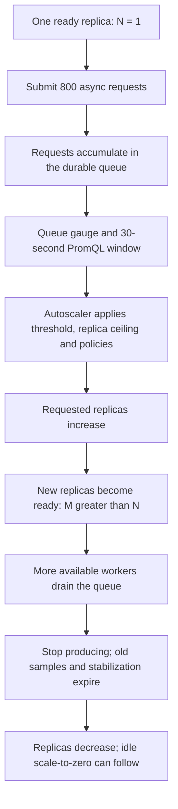

# Discover SlimFaas Step by Step

Keep the SlimFaas dashboard open while sending requests from a second terminal or Bruno. Follow a request from the caller to a function, through a queue, or into a job, then explore the data APIs.

In **Live Stream → Traffic**, blue circles represent requests, purple diamonds publications and amber squares queue messages. Power icons show sleeping, starting and ready functions. Selecting an actor highlights its traffic; enable **Isolate selection** to hide other connections. Use **Animation speed** to slow the visual trip for inspection; it does not change request processing speed.

## Prepare your workspace

Complete one of the [three installation guides](get-started.md) first. This tour uses the supplied Fibonacci demos, including the tutorial overlay for Compose. Run commands in Bash from the cloned repository root, or from the extracted precompiled local demo directory. Both contain the same `demo/` paths. Install `curl` and `jq`; Bruno is an alternative to the terminal examples.

On Windows, use **Git Bash** for the commands and scripts below; WSL is not required. Git Bash includes cURL, but `jq` is a separate prerequisite. Run `command -v curl jq` and `jq --version` before starting. If either tool is missing, install it and add its directory to this terminal's `PATH`. PowerShell can start the local bundle with `start.ps1`; its syntax is different from these Bash examples.

```bash
# Native local mode:
export BASE_URL=http://127.0.0.1:30020
# Kubernetes port-forward or Docker Compose: use this instead:
# export BASE_URL=http://127.0.0.1:30021

# Unique identifiers keep each run independent.
export TOUR_ID="tour-$(date +%s)-$$"
```

Open `$BASE_URL/` in your browser. **Overview** contains the Functions and Jobs tables; **Live Stream → Traffic** opens the live network map. Animations are live: open the page before running the requests. Replica state may take a few updates to appear.

### Use Bruno

[Download the Bruno collection](https://slimfaas.dev/downloads/slimfaas-demo.zip) and extract it, or open `demo/bruno-slimfaas-demo` from the checkout or local bundle as a collection. Select **Local**, **Kubernetes** or **Compose**. Run the **Tour** folder in sequence. Its requests capture generated IDs and contain assertions; do not run dependent requests in parallel.

With the [Bruno CLI](https://docs.usebruno.com/bru-cli/runCollection) installed:

```bash
cd demo/bruno-slimfaas-demo
bru run Tour -r --env Local
cd ../..
```

The **Manual** folder contains persistent connections, callback diagnostics and operations whose result depends on the environment. Run those individually, following their request documentation. The collection contains only portable sample content; it does not need files from the original author's machine.

For a repeatable terminal check after exploring the steps:

```bash
BASE_URL="$BASE_URL" bash demo/smoke-tour.sh
```

The script checks readiness, executes the core operations, waits for its Fibonacci
job to succeed, and cleans up only the IDs it creates. The smoke job requests
60 seconds of retention so its completion remains observable. Run the script
again to verify that the demonstration is repeatable. It reports skipped
environment-dependent checks explicitly.

The callback check waits for pending work to become visible in the queue, then
waits for completion. An initial SSE snapshot can still show the empty queue
from before submission, especially across Kubernetes nodes. These bounded
read-only checks never resubmit the callback request.

## 1. Read the cluster state

**Bruno:** `Tour / 01 Status`.

```bash
curl -i "$BASE_URL/health"
curl -i "$BASE_URL/ready"
curl -fsS "$BASE_URL/status-functions" | jq .
curl -fsS "$BASE_URL/status-function/fibonacci1" | jq .
```

`/health` returns `200 OK` when the application responds. `/ready` returns `200 READY` when the node has completed its Raft readiness checks, or `503 NOT_READY` during recovery/startup. Readiness is stronger than liveness.

**In the UI:** locate `fibonacci1`–`fibonacci4`, requested and ready replicas, concurrency settings and dependencies. Down functions can be healthy workloads scaled to zero. A three-node demo also shows SlimFaas nodes; the Compose tour uses one.

## 2. Wake functions and observe scale-to-zero

**Bruno:** `Tour / 02 Functions`.

```bash
curl -i -X POST "$BASE_URL/wake-function/fibonacci1"
curl -i -X POST "$BASE_URL/wake-functions"
```

Both return `204 No Content` for this configured demo. A wake-up requests activity; it does not wait for a ready application response. A nonexistent function returns `404` for the individual wake route.

**In the UI:** click **Wake up** on a down function or **Wake all functions**. Watch requested replicas rise, followed by ready replicas. Stop invoking `fibonacci1`; its inactivity timeout is 10 seconds, followed by the worker's reconciliation time. Dependencies or running work can keep it awake. Observing the dashboard itself is not a function invocation.

## 3. Call functions synchronously

**Bruno:** `Tour / 02 Functions`; private-access diagnostics are in `Manual`.

```bash
curl -fsS "$BASE_URL/function/fibonacci1/hello/tour"
curl -fsS -X POST "$BASE_URL/function/fibonacci1/fibonacci" \
  -H 'Content-Type: application/json' --data '{"input":10}'
curl -fsS "$BASE_URL/function/fibonacci2/download" -o "/tmp/$TOUR_ID-dog.png"
curl -fsS "$BASE_URL/function/fibonacci3/hello/tour"
curl -fsS -X POST "$BASE_URL/function/fibonacci3/fibonacci-recursive" \
  -H 'Content-Type: application/json' --data '{"input":5}'
```

Expect a greeting, a Fibonacci result (`55` for input `10`), a PNG download and a recursive calculation. Use small inputs: this intentionally simple demo computes Fibonacci recursively. Avoid the expensive `42` input from older examples for introductory requests.

**In the UI:** observe the caller → SlimFaas → function path. Recursive requests also create function-to-function traffic. In native local mode, processes share loopback addresses, so caller attribution cannot reproduce every distinction available between Kubernetes pods.

### Understand private access

```bash
curl -i "$BASE_URL/function/fibonacci4/hello/tour"
curl -i -X POST "$BASE_URL/function/fibonacci1/fibonacci4" \
  -H 'Content-Type: application/json' --data '{"input":10}'
```

`fibonacci4` is private. An external caller normally receives `404`; a trusted function can call it through the second route. In native local mode, local callers can share the same trusted loopback address as function processes and be classified as internal. Kubernetes port-forward can also change the source identity. Treat this as a demonstration of configuration, not a test of network isolation. Use Kubernetes with the intended ingress/source-IP configuration to validate access boundaries.

Delete the downloaded sample when finished:

```bash
rm -f "/tmp/$TOUR_ID-dog.png"
```

## 4. Queue work, retry and complete callbacks

**Bruno:** `Tour / 03 Async`; failure and callback diagnostics are in `Manual`.

```bash
curl -i -X POST "$BASE_URL/async-function/fibonacci1/fibonacci" \
  -H 'Content-Type: application/json' --data '{"input":10}'

# A small burst to make the queue visible.
for i in $(seq 1 30); do
  curl -fsS -X POST "$BASE_URL/async-function/fibonacci1/compute" \
    -H 'Content-Type: application/json' --data '{"input":10}' > /dev/null &
done
wait
```

The submission returns `202 Accepted` after durable enqueueing. It does not contain the function's computed result. Dispatch follows readiness and concurrency limits; configured retry policies govern failed attempts. Delivery can repeat, so design handlers to tolerate duplicate work.

**In the UI:** watch caller → queue → function traffic and queue counts. Small jobs can finish between dashboard snapshots; keep the page open and repeat the bounded burst if needed. See [Autoscaling](autoscaling.md) for how queue metrics can increase replicas beyond the initial count.

The sample callback handler returns `202` to the worker, then reports completion after approximately ten seconds:

```bash
curl -i -X POST "$BASE_URL/async-function/fibonacci1/computeWithCallback" \
  -H 'Content-Type: application/json' --data '{"input":10}'
```

The function receives `SlimFaas-Element-Id` and calls `/async-function-callback/fibonacci1/{elementId}/success`. Do not invent an element ID or copy an ID from a previous run. The sample's `/operations/.../status` Location is not a SlimFaas API endpoint. Use queue state, function logs and the [callback contract](functions.md) to inspect completion.

To deliberately exercise an error:

```bash
curl -i "$BASE_URL/function/fibonacci1/error"
```

Expect `500` from the demo handler. Async errors and an empty `{}` callback payload deliberately trigger failure/retry behavior; those requests are manual so a normal tour run does not leave retrying work behind.

### Scale from N to M with an async backlog

**Objective:** start with **N = 1 ready replica**, enqueue enough work to exceed its processing capacity, observe **M > N ready replicas**, and watch the queue drain before capacity shrinks again. This demonstrates metric-driven scale-out after wake-up.

**Prerequisites:** use the supplied `fibonacci1` demo and stop other producers. Finish the callback exercise first. Keep **Overview** and the network map open. The longer workload is optional and lives in **Bruno: `Manual / Autoscaling`**; it is excluded from the ordinary `Tour` run.

The existing `SlimFaas/Scale` trigger evaluates:

```promql
max_over_time(slimfaas_function_queue_ready_items{function="fibonacci1"}[30s])
```

Its `MetricType` is `Value`, its threshold is `10`, and the sample allows one in-flight async request per pod, with a function-wide concurrency limit of `10`. These are **configuration values**, not settings applied by the commands below.

Additional ready replicas can increase async processing capacity up to ten simultaneous requests across the function. Keep the per-pod limit appropriate for your application when changing `SlimFaas/NumberParallelRequest` for throughput experiments.

| Tutorial environment | Replica ceiling | Scale-up behavior | Scale-down stabilization |
|---|---|---|---|
| Kubernetes | 10 | At most one additional pod per 10 seconds | 20 seconds, then at most one pod removed per 10 seconds |
| Local, including the precompiled bundle | 10 | At most one additional process per 10 seconds | 20 seconds, then at most one process removed per 10 seconds |
| Docker Compose tutorial overlay | 4 | Default policies: up to 4 pods or 100% per 15 seconds | Default 300-second stabilization |

For this `Value` trigger, the initial recommendation is `ceil(current replicas × metric / 10)`, then bounded by the replica ceiling, policies and stabilization. For example, a metric of `80` with one current replica recommends `8` before those limits. This is not a promise that eight replicas immediately become ready.



#### Run the complete experiment

From the repository root or an updated local bundle:

```bash
BASE_URL="$BASE_URL" REQUESTS=800 CONCURRENCY=16 bash demo/async-scale-tour.sh
```

The script waits for readiness and an empty queue with exactly one ready/requested replica, then submits **800** requests to `/async-function/fibonacci1/compute` using **16** producers. The demo handler waits about **100 ms**; the input is intentionally small and does not create expensive Fibonacci computations. Every submission must return `202`; failed submissions are reported and are never retried automatically.

The script samples the same SSE state used by the dashboard and prints `Submitted`, `Requested`, `Ready` and `Queue`. It requires both requested and ready replica counts to rise above one, waits for the queue to drain, and then waits for capacity to return to one or zero. Allow a few minutes in Local/Kubernetes; Compose's default scale-down stabilization can add approximately five minutes. The script reads that configured window when choosing its waiting deadline.

Under load, a two-second SSE connection can close before its first complete state arrives. Both tour scripts request status-only snapshots with `?activity=false`, select the `state` event, retry these read-only observations for up to 15 seconds and report a missing snapshot explicitly. The browser's Traffic stream remains available independently. Accepted async submissions are never replayed by this observation retry.

**In the UI:** follow these changes in order:

1. `fibonacci1` has one requested and one ready replica before load.
2. Caller → queue traffic increases and the queue length grows.
3. Requested replicas increase first; new pods/processes appear and then become ready. Ready replicas above one are the evidence of `N → M`.
4. More queue → function activity appears and the backlog falls. Readiness can lag the requested count while images are pulled or processes start.
5. After submissions stop, the queue reaches zero. The `max_over_time(...[30s])` sample window can still report earlier pressure, so replicas can briefly continue to increase after the queue drains. That window and stabilization then delay scale-down. Dependencies or running jobs can keep a replica awake.

The **Queue** column counts available, running and retry-waiting items together. The trigger uses only **ready-to-dispatch** queue items, so the displayed queue length and PromQL value need not match. SSE snapshots and metric samples can also arrive at different times. The script checks observed state; it does not force replica counts or change annotations.

#### Inspect the trigger while requests are running

In a second terminal:

```bash
curl -fsS "$BASE_URL/status-function/fibonacci1" | jq '{Name, NumberRequested, NumberReady}'
curl -fsS -X POST "$BASE_URL/debug/promql/eval" \
  -H 'Content-Type: application/json' \
  --data '{"Query":"max_over_time(slimfaas_function_queue_ready_items{function=\"fibonacci1\"}[30s])","Deployment":"fibonacci1"}' | jq .
```

The function status route reports replica counts. The PromQL response's `value` is the sampled queue metric, not a replica count. Use the dashboard's function details or the SSE state to inspect `Scale` and concurrency configuration. See [Autoscaling](autoscaling.md) for the full policy calculation and metric debugging.

#### Run the burst yourself with cURL or Bruno

To submit the same workload manually, first wake `fibonacci1`, wait for one ready/requested replica and an empty queue in the UI, then run:

```bash
export BASE_URL
seq 1 800 | xargs -P 16 -I '{}' curl -sS --max-time 15 -o /dev/null \
  -w '%{http_code}\n' -X POST "$BASE_URL/async-function/fibonacci1/compute" \
  -H 'Content-Type: application/json' --data '{"input":10}'
```

Each printed line should be `202`. Unlike the complete script, this short command only submits work; observe replicas and queue completion in the UI. `CONCURRENCY` is the number of producers sending HTTP requests, not the number of replicas or function workers.

In Bruno, run **`Manual / Autoscaling`** in order. The baseline request keeps one replica awake while earlier metrics expire. The burst request submits the same 800 calls, the observation request polls until more than one replica is ready, and the final request waits for queue drain and scale-down. The burst's script contains additional HTTP calls; allow the collection's scripts to run. Do not run these requests concurrently with the cURL workload.

```bash
# From demo/bruno-slimfaas-demo, with the optional Bruno CLI installed:
bru run Manual/Autoscaling -r --env Local --bail
```

**Cleanup:** the successful handler creates no stored data or jobs. Let accepted work complete and leave SlimFaas running while the queue drains. Ctrl+C stops new submissions, but already accepted async work remains durable; restarting SlimFaas can resume it. There is no public queue-purge operation in this exercise. Do not reset shared state to cancel the test.

**If scale-out does not appear:** check that the queue trigger is configured, its threshold is positive, `ReplicaMax > 1`, and metrics are being collected. An extremely short burst may finish before a metric sample; the supplied script uses 800 requests for this reason. If requested replicas increase but ready replicas do not, inspect process logs or pod/container startup failures and available resources. The test deliberately fails when it cannot observe scale-out, queue drain or scale-down before its deadlines.

## 5. Publish an event

**Bruno:** `Tour / 04 Events`.

Wake subscribers first and wait until `fibonacci3` and `fibonacci4` are ready in the UI:

```bash
curl -i -X POST "$BASE_URL/wake-function/fibonacci3"
curl -i -X POST "$BASE_URL/wake-function/fibonacci4"
curl -fsS "$BASE_URL/function/fibonacci3/hello/subscriber"
curl -i -X POST "$BASE_URL/publish-event/fibo-public/fibonacci" \
  -H 'Content-Type: application/json' --data '{"input":10}'
```

The publication returns `204`. Both functions subscribe to `fibo-public`; `fibonacci4` explicitly makes this subscription public even though the function itself is private.

**In the UI:** observe fan-out to ready subscriber replicas. HTTP events do not durably queue for sleeping replicas and do not wake them. `204` is not a guarantee that every subscriber processed the event successfully. See [Events](events.md) for delivery and visibility details.

## 6. Run jobs and manage schedules

**Bruno:** `Tour / 05 Jobs`.

```bash
JOB_ID=$(curl -fsS -X POST "$BASE_URL/job/fibonacci" \
  -H 'Content-Type: application/json' --data '{"Args":["10"]}' | jq -r .Id)
curl -fsS "$BASE_URL/job/fibonacci" | jq .
curl -fsS "$BASE_URL/jobs/status" | jq .
curl -fsS "$BASE_URL/status-jobs" | jq .
```

Job creation returns `202` and `{"Id":"..."}`. The two status URLs are aliases. Listing `/job/fibonacci` shows executions; the dashboard status routes describe configurations and running work.

**In the UI:** find the configuration in **Overview → Jobs** and watch the running count. A small job can finish before the next snapshot, especially with the demo's short retention. Run it again while watching, or inspect execution logs. CLI Fibonacci jobs only calculate and print a result; they do not send HTTP traffic themselves.

Create and list a dynamic cron schedule:

```bash
SCHEDULE_ID=$(curl -fsS -X POST "$BASE_URL/job-schedules/fibonacci" \
  -H 'Content-Type: application/json' \
  --data '{"Schedule":"*/1 * * * *","Args":["10"]}' | jq -r .Id)
curl -fsS "$BASE_URL/job-schedules/fibonacci" | jq .
```

Creation returns `201`. Leave the UI open across a minute boundary to observe an execution. The list endpoint returns dynamic schedules; configured annotation schedules can also appear in dashboard configuration. See [Jobs](jobs.md) for cron interpretation and scheduling details.

Clean up using only the IDs captured above:

```bash
curl -i -X DELETE "$BASE_URL/job-schedules/fibonacci/$SCHEDULE_ID"
curl -i -X DELETE "$BASE_URL/job/fibonacci/$JOB_ID"
```

Schedule deletion returns `204`. Job deletion returns `200` when found, or `404` if the short-lived execution has already been removed. `PUT` and `PATCH` on either collection are explicitly rejected with `405`.

## 7. Store values, counters, hashsets and files

**Bruno:** `Tour / 06 Data` and `Tour / 08 Cleanup`.

These APIs use raw request bytes. Sets and hashsets have a 1 MiB payload limit; use files for larger artifacts. The tour makes sets/files public in all three demos. The current hashset endpoints do not apply the sets/files visibility filter; do not assume that setting protects hashsets.

### Reading after a write

The entrypoint can route consecutive requests to different nodes. On a newly started cluster, a follower can briefly return `404` for a just-created ID, or still show a just-deleted value. Retry the read with a deadline; do not blindly repeat writes, increments or job submissions. The terminal smoke test and Bruno read assertions allow up to ten seconds for visibility. Bruno keeps the original HTTP response visible while its assertion polls for the expected state. Persistent `404` responses still require checking the ID, TTL and access configuration.

### Values and expiration

```bash
curl -fsS -X POST "$BASE_URL/data/sets/$TOUR_ID-value?ttl=60000" \
  -H 'Content-Type: application/json' --data-binary '{"step":"discover"}'
curl -fsS "$BASE_URL/data/sets/$TOUR_ID-value"
curl -fsS "$BASE_URL/data/sets" | jq .

# Omitting an ID lets the server generate one (JSON string response).
SET_ID=$(curl -fsS -X POST "$BASE_URL/data/sets" --data-binary 'hello' | jq -r .)
curl -fsS -X DELETE "$BASE_URL/data/sets/$SET_ID"
```

TTL is in **milliseconds**. After the 60-second TTL, reading the first key returns `404`. The smoke script verifies expiration by polling with a deadline.

### Atomic counters

```bash
curl -fsS -X POST "$BASE_URL/data/sets/$TOUR_ID-count/incr"
curl -fsS -X POST "$BASE_URL/data/sets/$TOUR_ID-count/incrby?by=10"
curl -fsS -X POST "$BASE_URL/data/sets/$TOUR_ID-count/decr"
curl -fsS -X POST "$BASE_URL/data/sets/$TOUR_ID-count/decrby?by=2"
curl -fsS -X POST "$BASE_URL/data/sets/$TOUR_ID-decimal/incrbyfloat?by=1.25"
```

Expect `1`, `11`, `10`, `8`, and `1.25`. Missing keys start at zero; each mutation is applied atomically in SlimData. Invalid numeric contents return `409`; missing `by` or invalid numeric TTL returns `400`.

### Hashsets

```bash
HASH_ID=$(curl -fsS -X POST "$BASE_URL/data/hashsets?ttl=60000" \
  --data-binary 'hashset sample' | jq -r .)
curl -fsS "$BASE_URL/data/hashsets/$HASH_ID"
curl -fsS "$BASE_URL/data/hashsets" | jq .
```

This HTTP API stores a single raw `value` field under the hashset ID. It does not expose arbitrary Redis hash-field commands. Its create response is a JSON string; the read returns the original bytes.

### Files

```bash
FILE_ID=$(curl -fsS -X POST "$BASE_URL/data/files?ttl=60000" \
  -H 'Content-Type: text/plain' -H 'Content-Disposition: attachment; filename="hello.txt"' \
  --data-binary @demo/bruno-slimfaas-demo/fixtures/hello.txt)
curl -fsS "$BASE_URL/data/files/$FILE_ID" -o "/tmp/$TOUR_ID-file.txt"
cmp demo/bruno-slimfaas-demo/fixtures/hello.txt "/tmp/$TOUR_ID-file.txt"
curl -fsS "$BASE_URL/data/files" | jq .
```

Files return a **plain text ID**, not a JSON string. Downloads preserve the stored media type and filename. Metadata is replicated through SlimData; file contents are stored on disk and pulled from peers when needed.

**In the UI:** **Live Stream → Data** lists Sets and Files metadata, including keys, TTL and file sizes. Use the read, list and download responses to verify stored contents; use node status and metrics to investigate cluster behavior.

Cleanup:

```bash
curl -fsS -X DELETE "$BASE_URL/data/sets/$TOUR_ID-value"
curl -fsS -X DELETE "$BASE_URL/data/sets/$TOUR_ID-count"
curl -fsS -X DELETE "$BASE_URL/data/sets/$TOUR_ID-decimal"
curl -fsS -X DELETE "$BASE_URL/data/hashsets/$HASH_ID"
curl -fsS -X DELETE "$BASE_URL/data/files/$FILE_ID"
rm -f "/tmp/$TOUR_ID-file.txt"
```

Data deletions return `204`. TTL expiration can make a later read return `404` even before you run cleanup.

## 8. Inspect metrics and live updates

**Bruno:** `Tour / 07 Diagnostics`; the stream is in `Manual`.

```bash
curl -fsS "$BASE_URL/metrics"
curl -fsS "$BASE_URL/debug/store" | jq .
curl -i -X POST "$BASE_URL/debug/promql/eval" \
  -H 'Content-Type: application/json' --data '{"Query":"1 + 1"}'
```

The metrics endpoint returns Prometheus text. The debug store shows registered metrics and stored samples. The scalar query is a reproducible evaluator check; it returns a JSON result of `2`. For actual scaling data, try the queue query from [Autoscaling](autoscaling.md). The first query registers metrics for collection, so a time-series query can initially return `400` because no samples are available yet.

Inspect the same stream the dashboard consumes:

```bash
curl -N --max-time 5 "$BASE_URL/status-functions-stream"
```

Expect `text/event-stream` with `state` events and live `activity` or `activity_batch` events while requests run. The deliberate five-second cutoff makes cURL exit with code `28`; this is expected for this command, not a failed server response. The browser reconnects automatically.

## Continue with your application

Use the [API Reference](api-reference.md) to look up all routes, [How It Works](how-it-works.md) to understand their execution, and [UI reference](user-interface.md) for dashboard settings. Add [WebSocket clients](clients.md), [Kafka](kafka.md) or [Planet Saver](planet-saver.md) as needed. Stop the environment using the cleanup section of your installation guide.

## Follow the live dashboard

Open **Live Stream → Traffic** while running the job-to-function exercises. Search for a job execution and select it to focus its path through SlimFaas, queues and functions. Zoom out to see workload groups, or pause and inspect the event journal.

During the data exercises, switch to **Live Stream → Data** and search for your `TOUR_ID` prefix. The Sets and Files views show keys and TTL, with document sizes for Files. Watch the countdown, create another entry to see its highlight, and return to the first page if a new key sorts before the current cursor. Values and document contents remain accessible through the API exercises, not the dashboard.

## Explain replicas, the leader and background wake-ups

In **Live Stream → Traffic**, select `fibonacci1` and choose **Show replicas**. Send synchronous or asynchronous requests from the earlier exercises: arrival rings identify the replica selected by SlimFaas. Queued messages start from the queue when dispatched; the technical dequeue and outbound records share one animation. Publications still fan out to their individual recipients. These animations illustrate routing, not measured request latency.

The green **Leader** badge identifies the Raft leader; another node receives it after a leader change is observed. Select a replica, retained job execution or SlimFaas node to see its details and live logs together. Filter text with **Find in logs** to highlight matching text in yellow, or pause scrolling to inspect output. Log access is enabled explicitly in the demo configurations. Native nodes default to `cluster.nodeLogLevel: Error`, so an empty node log is expected when no errors occur; use `Information` in an overlay for a more verbose exercise.

`fibonacci2` can wake even when you call only `fibonacci1`: the default native source manifest schedules **`fibonacci5` every two minutes** (`*/2 * * * *`), and this job depends on **both `fibonacci1` and `fibonacci2`**. Pending/running jobs keep their dependencies awake. The React demo also wakes `fibonacci2` when its optional `?planetsaver=true` mode is enabled; **Wake all functions** wakes it too. The dependency from `fibonacci2` to `fibonacci1` does not imply the reverse direction. The precompiled bundle disables automatic sample schedules; the tour creates its own dynamic schedule.
