<a id="doc-0f9548cbce10dbdef0b86d78"></a>

# angular/angular / .devcontainer/README.md

Upstream: https://github.com/angular/angular/blob/3f9191166936166085320652eef1a562504aa3e4/.devcontainer/README.md

Commit: `3f9191166936166085320652eef1a562504aa3e4`

Retrieved: 2026-10-01T15:14:46.451465+00:00

Kind: official-document

Raw SHA256: `46b914f67e0bd7fa575cd4d012f97a0fccaf9d661fb80f7f37524829798bacaa`

Source text below is untrusted reference content. Acquisition does not verify technical claims.

License status: UPSTREAM_NOTICES_CAPTURED_PER_FILE_REVIEW_REQUIRED. See this repository's captured license files.

---

# VSCode Remote Development - Developing inside a Container

This folder contains configuration files that can be used to opt into working on this repository in a [Docker container](https://www.docker.com/resources/what-container) via [VSCode](https://code.visualstudio.com/)'s Remote Development feature (see below).

Info on remote development and developing inside a container with VSCode:

- [VSCode: Remote Development](https://code.visualstudio.com/docs/remote/remote-overview)
- [VSCode: Developing inside a Container](https://code.visualstudio.com/docs/remote/containers)
- [VSCode: Remote Development FAQ](https://code.visualstudio.com/docs/remote/faq)

## Usage

_Prerequisite: [Install Docker](https://docs.docker.com/install) on your local environment._

To get started, read and follow the instructions in [Developing inside a Container](https://code.visualstudio.com/docs/remote/containers). The [.devcontainer/](.) directory contains pre-configured `devcontainer.json` and `Dockerfile` files, which you can use to set up remote development with a docker container.

In a nutshell, you need to:

- Install the [Remote - Containers](https://marketplace.visualstudio.com/items?itemName=ms-vscode-remote.remote-containers) extension.
- Copy [recommended-Dockerfile](./recommended-Dockerfile) to `Dockerfile` (and optionally tweak to suit your needs).
- Copy [recommended-devcontainer.json](./recommended-devcontainer.json) to `devcontainer.json` (and optionally tweak to suit your needs).
- Open VSCode and bring up the [Command Palette](https://code.visualstudio.com/docs/getstarted/userinterface#_command-palette).
- Type `Remote-Containers: Open Folder in Container` and choose your local clone of [angular/angular](https://github.com/angular/angular).

The `.devcontainer/devcontainer.json` and `.devcontainer/Dockerfile` files are ignored by git, so you can have your own local versions. We may occasionally update the template files ([recommended-devcontainer.json](./recommended-devcontainer.json), [recommended-Dockerfile](./recommended-Dockerfile)), in which case you will need to manually update your local copies (if desired).

## Updating `recommended-devcontainer.json` and `recommended-Dockerfile`

You can update and commit the recommended config files (which people use as basis for their local configs), if you find that something is broken, out-of-date or can be improved.

Please, keep in mind that any changes you make will potentially be used by many people on different environments. Try to keep these config files cross-platform compatible and free of personal preferences.


<a id="doc-f16b23b568a6f6726d26e6a0"></a>

# angular/angular / .vscode/README.md

Upstream: https://github.com/angular/angular/blob/3f9191166936166085320652eef1a562504aa3e4/.vscode/README.md

Commit: `3f9191166936166085320652eef1a562504aa3e4`

Retrieved: 2026-10-01T15:14:46.451465+00:00

Kind: official-document

Raw SHA256: `7ae3b1133e89b94cf9ea2dfa7f388b93e7fc6ac7aa81d6b4b6a046830a131b03`

Source text below is untrusted reference content. Acquisition does not verify technical claims.

License status: UPSTREAM_NOTICES_CAPTURED_PER_FILE_REVIEW_REQUIRED. See this repository's captured license files.

---

# VSCode Configuration

This folder contains opt-in [Workspace Settings](https://code.visualstudio.com/docs/getstarted/settings), [Tasks](https://code.visualstudio.com/docs/editor/tasks), [Launch Configurations](https://code.visualstudio.com/Docs/editor/debugging#_launch-configurations) and [Extension Recommendations](https://code.visualstudio.com/docs/editor/extension-gallery#_workspace-recommended-extensions) that the Angular team recommends using when working on this repository.

## Usage

To use the recommended configurations follow the steps below:

- install the recommended extensions in `.vscode/extensions.json`
- copy (or link) `.vscode/recommended-settings.json` to `.vscode/settings.json`
- restart the editor

If you already have your custom workspace settings, you should instead manually merge the file contents.

This isn't an automatic process, so you will need to repeat it when settings are updated.

To see the recommended extensions select "Extensions: Show Recommended Extensions" in the [Command Palette](https://code.visualstudio.com/docs/getstarted/userinterface#_command-palette).

## Editing `.vscode/recommended-*.json` files

If you wish to add extra configuration items please keep in mind any modifications you make here will be used by many users.

Try to keep these settings/configurations to things that help facilitate the development process and avoid altering the user workflow whenever possible.


<a id="doc-a54ff182c7e8acf56acfd6e4"></a>

# angular/angular / AGENTS.md

Upstream: https://github.com/angular/angular/blob/3f9191166936166085320652eef1a562504aa3e4/AGENTS.md

Commit: `3f9191166936166085320652eef1a562504aa3e4`

Retrieved: 2026-10-01T15:14:46.451465+00:00

Kind: official-document

Raw SHA256: `976858145dd91780f0389deb7dabe739606af1af586e07042c4dbeb348031ba1`

Source text below is untrusted reference content. Acquisition does not verify technical claims.

License status: UPSTREAM_NOTICES_CAPTURED_PER_FILE_REVIEW_REQUIRED. See this repository's captured license files.

---

---
trigger: always_on
---

This is the source code for the Angular framework. This guide outlines standard practices for AI agents working in this repository.

## Environment

- Use `pnpm` for package management.
- Use `pnpm bazel test //target` to run tests.

## Key Documentation

- [Building and Testing](contributing-docs/building-and-testing-angular.md): definitive guide for running targets.
- [Coding Standards](contributing-docs/coding-standards.md): style guide for TypeScript and other files.
- [Commit Guidelines](contributing-docs/commit-message-guidelines.md): format for commit messages and PR titles.

## Testing

- **Zoneless & Async-First:** Assume a zoneless environment where state changes schedule updates asynchronously.
  - **Do NOT** use `fixture.detectChanges()` to manually trigger updates.
  - **ALWAYS** use the "Act, Wait, Assert" pattern:
    1. **Act:** Update state or perform an action.
    2. **Wait:** `await fixture.whenStable()` to allow the framework to process the scheduled update.
    3. **Assert:** Verify the output.
- To keep tests fast, minimize the need for waiting:
  - Use `useAutoTick()` (from `packages/private/testing/src/utils.ts`) to fast-forward time via the mock clock.
- When waiting is necessary, use real async tests (`it('...', async () => { ... })`) along with:
  - `await timeout(ms)` (from `packages/private/testing/src/utils.ts`) to wait a specific number of milliseconds.
  - `await fixture.whenStable()` to wait for framework stability.

## Pull Requests

- Use the `gh` CLI (GitHub CLI) for creating and managing pull requests.


<a id="doc-06572a96a58dc510037d5efa"></a>

# angular/angular / CHANGELOG.md

Upstream: https://github.com/angular/angular/blob/3f9191166936166085320652eef1a562504aa3e4/CHANGELOG.md

Commit: `3f9191166936166085320652eef1a562504aa3e4`

Retrieved: 2026-10-01T15:14:46.451465+00:00

Kind: official-document

Raw SHA256: `14f9488756341851bcfdca552270642daba00c1e0d474599187e58d591d86ed8`

Source text below is untrusted reference content. Acquisition does not verify technical claims.

License status: UPSTREAM_NOTICES_CAPTURED_PER_FILE_REVIEW_REQUIRED. See this repository's captured license files.

---

<a name="22.3.0-next.0"></a>
# 22.3.0-next.0 (2026-09-30)
### compiler
| Commit | Type | Description |
| -- | -- | -- |
| [0ee0a16c4a](https://github.com/angular/angular/commit/0ee0a16c4ae92458757f79afbbfc1e3aa000eae6) | fix | stop suppressing non-iterable values in `@for` expression |
### compiler-cli
| Commit | Type | Description |
| -- | -- | -- |
| [a614bd23cd](https://github.com/angular/angular/commit/a614bd23cd9b0b4c0b8676bf72eadafa7a30e785) | fix | resolve base class defined via intermediate variable in dts |
| [91b8391b3d](https://github.com/angular/angular/commit/91b8391b3d3fb23767834a373b68ab604f2f1655) | fix | validate unknown element tags even when matched by attribute directives |
### core
| Commit | Type | Description |
| -- | -- | -- |
| [6ea13efc20](https://github.com/angular/angular/commit/6ea13efc20c9509237062b1aaa77dad8942b9b25) | feat | support increment/decrement operators in expressions |

<!-- CHANGELOG SPLIT MARKER -->

<a name="22.2.1"></a>
# 22.2.1 (2026-09-30)
### common
| Commit | Type | Description |
| -- | -- | -- |
| [ad2f291ba0](https://github.com/angular/angular/commit/ad2f291ba06a7d6807f1fde6641502f455f248e5) | fix | let NgOptimizedImage pass a [srcset] binding through when srcset optimization is disabled |
### compiler
| Commit | Type | Description |
| -- | -- | -- |
| [0ecaf8e7ab](https://github.com/angular/angular/commit/0ecaf8e7ab8d52957dc314a09d52b4e6da500f11) | fix | add explicit return types to generated functions |
| [c451a3b98d](https://github.com/angular/angular/commit/c451a3b98d405521bf3a4970e20d20bd5b578415) | fix | avoid incorrectly stripping parentheses in template pipeline |
| [bbc556daa9](https://github.com/angular/angular/commit/bbc556daa9d83b6bf1bfa88f6239ae8210ac6a00) | fix | avoid stripping parentheses from some expressions |
### compiler-cli
| Commit | Type | Description |
| -- | -- | -- |
| [fe9ebf5bf5](https://github.com/angular/angular/commit/fe9ebf5bf5ef8a56bc20b2de8115d4b1a1ed299a) | fix | support extendedConfigCache in readConfiguration |
### core
| Commit | Type | Description |
| -- | -- | -- |
| [21851fc3a3](https://github.com/angular/angular/commit/21851fc3a38258a68d62d966bf5202d6f4e23df1) | fix | add debugName on afterRenderEffect |
| [7c634ecec4](https://github.com/angular/angular/commit/7c634ecec442d71e023ad8ec1976c2791d547bf8) | fix | block dangerous data: and vbscript: URLs in URL sanitizer |
| [9aeef8df6f](https://github.com/angular/angular/commit/9aeef8df6f8c49270ff67aa7656419b65d4df993) | fix | extend data: URL allowlist for non-executable MIME types |
| [f5e8edc5a6](https://github.com/angular/angular/commit/f5e8edc5a6faa798a958548e90f91aaefeee9484) | fix | include signal and component name in NG0600 error message |
| [88614a5407](https://github.com/angular/angular/commit/88614a54070c194a281ccc116a54d2b7e7546f92) | fix | render error boundary fallbacks after HMR |
### http
| Commit | Type | Description |
| -- | -- | -- |
| [6dee7fe91c](https://github.com/angular/angular/commit/6dee7fe91c95fc0de80bde547f5c904c4bb3391b) | fix | forward `reportProgress` of `httpResource` as `reportDownloadProgress` |
### platform-server
| Commit | Type | Description |
| -- | -- | -- |
| [928dcfd258](https://github.com/angular/angular/commit/928dcfd2582152655b5559509d057bf6a5a19521) | fix | reject protocol-relative paths in resolveUrl |
### router
| Commit | Type | Description |
| -- | -- | -- |
| [568d6a83a2](https://github.com/angular/angular/commit/568d6a83a23b37f519ba564f79f7a03bbdfb6893) | fix | do not copy URL-sized objects into every route snapshot |
| [a6e6097b3d](https://github.com/angular/angular/commit/a6e6097b3d0d60f2d7057bfb261c9e4776b2b0b1) | fix | fall back when serializing protocol-relative URLs |
| [8b6dd5e947](https://github.com/angular/angular/commit/8b6dd5e947d74af79d50f1bace38b3229b451bab) | fix | limit absolute redirects from redirect functions |
| [3b6796f1ab](https://github.com/angular/angular/commit/3b6796f1ab279ab26b33d4e29e576d3b1762ccf5) | fix | reject duplicate outlets in production builds |
| [e9bf52aa03](https://github.com/angular/angular/commit/e9bf52aa03a3b9b302c33ffbc967ef0e1de5fb79) | fix | require outlets to match a route before processing child segments |
| [d23932f2fd](https://github.com/angular/angular/commit/d23932f2fd134e6e2608b2ccefdd69c5d9b8f83c) | fix | set initial blocking resource input synchronously on activation |
| [14793bfe4b](https://github.com/angular/angular/commit/14793bfe4b44a36ed4b7e49a60458ec711c2b41a) | perf | do not retain UrlTree instances in RouterLink |

<!-- CHANGELOG SPLIT MARKER -->

<a name="21.2.25"></a>
# 21.2.25 (2026-09-30)
### platform-server
| Commit | Type | Description |
| -- | -- | -- |
| [450af9c813](https://github.com/angular/angular/commit/450af9c813c7660b9bd91e5635f705ee3ed7b32a) | fix | reject protocol-relative paths in resolveUrl |
### router
| Commit | Type | Description |
| -- | -- | -- |
| [4bc11a546b](https://github.com/angular/angular/commit/4bc11a546be9e66ee5c40b48d7a8a5d014609987) | fix | do not copy URL-sized objects into every route snapshot |
| [6489ca5d84](https://github.com/angular/angular/commit/6489ca5d8460a9ed8ae4daf7b0c24ec052f20398) | fix | reject duplicate outlets in production builds |
| [a83f8119ac](https://github.com/angular/angular/commit/a83f8119acd466b524ae0113096ed188358d6d6c) | fix | require outlets to match a route before processing child segments |
| [a131f77d92](https://github.com/angular/angular/commit/a131f77d92808ad5c2f3fa4dc6fde36825f12c5a) | perf | do not retain UrlTree instances in RouterLink |

<!-- CHANGELOG SPLIT MARKER -->

<a name="20.3.33"></a>
# 20.3.33 (2026-09-30)
### platform-server
| Commit | Type | Description |
| -- | -- | -- |
| [83944fc8c5](https://github.com/angular/angular/commit/83944fc8c50e86be90e8ec4184cd15002b5af262) | fix | reject protocol-relative paths in resolveUrl |
### router
| Commit | Type | Description |
| -- | -- | -- |
| [142f187b3c](https://github.com/angular/angular/commit/142f187b3c8e956aade5457f7f9c8ed73754979b) | fix | do not copy URL-sized objects into every route snapshot |
| [cd8efcb924](https://github.com/angular/angular/commit/cd8efcb924d26464bc42ee436d39e10784cfc240) | fix | reject duplicate outlets in production builds |
| [b0d2ba0f54](https://github.com/angular/angular/commit/b0d2ba0f54e21cb57ea5a0ca0d8e6065f28e23a0) | fix | require outlets to match a route before processing child segments |

<!-- CHANGELOG SPLIT MARKER -->

<a name="22.2.0"></a>
# 22.2.0 (2026-09-23)
### compiler
| Commit | Type | Description |
| -- | -- | -- |
| [48a0fd6e8a](https://github.com/angular/angular/commit/48a0fd6e8a8d14bdc1d901ee5615f4b0ab698fe8) | feat | allow template to access private props |
| [a4f1a94948](https://github.com/angular/angular/commit/a4f1a949486d20ce2bf9add427eea6629228b28b) | fix | do not encapsulate nested selectors if parent contains ::ng-deep |
| [d0d7f57e08](https://github.com/angular/angular/commit/d0d7f57e0810a24ba16dbb1f2ab9f079a096fa3d) | fix | scope nested CSS rules |
### compiler-cli
| Commit | Type | Description |
| -- | -- | -- |
| [312e1d8089](https://github.com/angular/angular/commit/312e1d808902116fb8cd4e02d936260113453999) | feat | add strictUnclaimedEventNames option to catch misspelled output bindings |
| [7d9f55da11](https://github.com/angular/angular/commit/7d9f55da11319da8f273d9edcd38ff2983bdbb0c) | feat | scope type-checking of keyed defer blocks |
| [2e2c426e76](https://github.com/angular/angular/commit/2e2c426e7609de551dafb6360e6373333a278c4e) | fix | deduplicate deferred imports across multiple blocks |
### core
| Commit | Type | Description |
| -- | -- | -- |
| [f6afb807c1](https://github.com/angular/angular/commit/f6afb807c1e62d26b8b665f2b4a9a52c2433a673) | feat | add ErrorBoundary programmatic APIs ([#70463](https://github.com/angular/angular/pull/70463)) |
| [05c4d5a835](https://github.com/angular/angular/commit/05c4d5a8354228100b51176f295ed5dee4f3febc) | feat | add utility for testing directives |
| [bd9b45b5cc](https://github.com/angular/angular/commit/bd9b45b5cc1dd904cc4a5de45f6de8e1564b70b6) | feat | allow reading `Injector` from a view or content query |
| [91a2bf8425](https://github.com/angular/angular/commit/91a2bf84250f9b0a28a8a68e1eded6e9506bc5e9) | feat | support annotations in WebMCP tool declarations |
| [af2c7e386d](https://github.com/angular/angular/commit/af2c7e386d8c88fe6c27b148bb84ee0e26662e5b) | fix | cancel leave animations in nested views during list reordering |
| [de5889ec4f](https://github.com/angular/angular/commit/de5889ec4fab2b337e394eb994c8d428272d5ec9) | fix | support function and signal bindings in animate.enter and animate.leave |
| [a8233232f5](https://github.com/angular/angular/commit/a8233232f5ade21a15a6645135accd21cf041b1e) | fix | update FakeNavigation to match WHATWG HTML spec |
### forms
| Commit | Type | Description |
| -- | -- | -- |
| [d5e8b1ef7a](https://github.com/angular/angular/commit/d5e8b1ef7a02c84d4fd70a6b4d748ead9ff815bf) | feat | allow permanent hidden fields in signal forms |
| [6e299da8cf](https://github.com/angular/angular/commit/6e299da8cfc7df49029d5d8bb7d5739560e1aaa4) | feat | hard-code `readOnlyHint` and `untrustedContentHint` for WebMCP implicit signal forms |
### language-service
| Commit | Type | Description |
| -- | -- | -- |
| [f4a5650ed9](https://github.com/angular/angular/commit/f4a5650ed9c71a8ee1dbd3003e13900464827757) | feat | add support for `@boundary` blocks ([#70463](https://github.com/angular/angular/pull/70463)) |
### router
| Commit | Type | Description |
| -- | -- | -- |
| [2720362818](https://github.com/angular/angular/commit/2720362818cdeb2a940171e4ab6f21cf78c6a302) | feat | add containsTree as public API |
| [b65dea4f03](https://github.com/angular/angular/commit/b65dea4f03e5fc01093a718c990c72ae9165c43f) | feat | allow throwing RedirectCommand to trigger redirects |
| [3064f3f1dc](https://github.com/angular/angular/commit/3064f3f1dccd78177bf3b86f8ea231102884f0d7) | feat | expose router resources in public API |
| [7137a41223](https://github.com/angular/angular/commit/7137a41223079b4b172aeccb5031347fcc947b79) | feat | stabilize auto cleanup injectors feature |
| [094bce9e3d](https://github.com/angular/angular/commit/094bce9e3defe7e9fd56f951641f3bb74248d06a) | fix | determine blocking state solely by resource loading status |
| [6f5a4a06c2](https://github.com/angular/angular/commit/6f5a4a06c2e7c565e584c72910c2d8fa7ba9cb2f) | fix | expose reload method on ActivatedRoute resources |
| [2c6c67bee6](https://github.com/angular/angular/commit/2c6c67bee675a67eff2c2d219dcb88cc1c305190) | fix | maintain frozen state on rollback until resource loading completes |
| [2dcdf9aae6](https://github.com/angular/angular/commit/2dcdf9aae637a247d1a9bdcf03c740d0b3036cd0) | fix | mark router_resource module-level symbols as side-effect free |

<!-- CHANGELOG SPLIT MARKER -->

<a name="21.2.24"></a>
# 21.2.24 (2026-09-23)
### router
| Commit | Type | Description |
| -- | -- | -- |
| [03872a80bc](https://github.com/angular/angular/commit/03872a80bcf1c89b2b04cdd3f444b2ee954da583) | fix | avoid dense elements allocation for numeric URL keys |

<!-- CHANGELOG SPLIT MARKER -->

<a name="20.3.32"></a>
# 20.3.32 (2026-09-23)
### router
| Commit | Type | Description |
| -- | -- | -- |
| [ddfe21072b](https://github.com/angular/angular/commit/ddfe21072ba32ca4cd9d7d3c6b7df66af81d58c4) | fix | avoid dense elements allocation for numeric URL keys |

<!-- CHANGELOG SPLIT MARKER -->

<a name="22.1.8"></a>
# 22.1.8 (2026-09-23)
### common
| Commit | Type | Description |
| -- | -- | -- |
| [850db9d999](https://github.com/angular/angular/commit/850db9d9997d026542eb4626aff3e2bf02ab9290) | fix | remove abort listener on the abort path too in httpResource |
### compiler
| Commit | Type | Description |
| -- | -- | -- |
| [4e5f4c38a7](https://github.com/angular/angular/commit/4e5f4c38a7eae17262d32f26c06f62d0e5203df8) | fix | add return type to pure functions |
| [02e83dc288](https://github.com/angular/angular/commit/02e83dc28846c735744ab8769690dba0b62b5db2) | fix | avoid hitting TypeScript limits if template has many translations |
| [024ebe668c](https://github.com/angular/angular/commit/024ebe668c27668e3cc48023ba48ef24468bdfbb) | fix | do not copy expression type into output AST variables |
| [b3c5824bd6](https://github.com/angular/angular/commit/b3c5824bd643f06e28fc298779fc31c3095ed092) | fix | guard unverified ctor parameter types in class metadata |
### compiler-cli
| Commit | Type | Description |
| -- | -- | -- |
| [fe671d9024](https://github.com/angular/angular/commit/fe671d9024d737b0304cc66366450e6fa0560cd9) | fix | output function return types in linker |
### core
| Commit | Type | Description |
| -- | -- | -- |
| [d7d5401cd5](https://github.com/angular/angular/commit/d7d5401cd5e8ce23d8bb3f0e7ae08323b307d0d5) | fix | don&apos;t use plain objects as maps for jsaction data |
| [c3e8f29b3f](https://github.com/angular/angular/commit/c3e8f29b3f898ee5377b0110683fe9dc2808c116) | fix | ensure references are cleared from idle scheduler |
| [9b854f6e76](https://github.com/angular/angular/commit/9b854f6e760b6b6a710f43ca9edafe9f79aed538) | fix | loosen return types for arrow functions in generated code |
| [cfa8967683](https://github.com/angular/angular/commit/cfa896768301bf74c2e09e35d9a03cc6d2d2a885) | fix | wait for app stability before cleaning up dehydrated views |
### forms
| Commit | Type | Description |
| -- | -- | -- |
| [78c7ab3926](https://github.com/angular/angular/commit/78c7ab392627d87d76df3e28df5cda2449d93a68) | fix | create controls before listeners |
### platform-server
| Commit | Type | Description |
| -- | -- | -- |
| [330083f250](https://github.com/angular/angular/commit/330083f250fe3be6b415be1ea7d6905e7511b5b9) | fix | preserve Unicode whitespace in ServerXhr URLs |
### router
| Commit | Type | Description |
| -- | -- | -- |
| [2cab6f5964](https://github.com/angular/angular/commit/2cab6f59649af47dd86e2fc7dd0dd269209c58bc) | fix | avoid dense elements allocation for numeric URL keys |

<!-- CHANGELOG SPLIT MARKER -->

<a name="22.1.7"></a>
# 22.1.7 (2026-09-16)
### compiler
| Commit | Type | Description |
| -- | -- | -- |
| [5e632b639f](https://github.com/angular/angular/commit/5e632b639f736de876823a596dd9e3a094b03e1b) | fix | wrap `@for` collection expression before appending non-null assertion |
### core
| Commit | Type | Description |
| -- | -- | -- |
| [ec48c8305c](https://github.com/angular/angular/commit/ec48c8305c40fbafbab51801f93bb4e4b6a25ea0) | fix | return null when getDirectiveMetadata is called with null or undefined |
### forms
| Commit | Type | Description |
| -- | -- | -- |
| [6555c4ee1e](https://github.com/angular/angular/commit/6555c4ee1ec2aea7eb541d558981b55eb751497c) | fix | mark control as dirty before setting its value in FVC interop |

<!-- CHANGELOG SPLIT MARKER -->

<a name="22.1.6"></a>
# 22.1.6 (2026-09-09)
### compiler
| Commit | Type | Description |
| -- | -- | -- |
| [cbb8702143](https://github.com/angular/angular/commit/cbb8702143bd04b68253758dbc2c4a8fb49c0237) | fix | namespace `@property` declarations |
### compiler-cli
| Commit | Type | Description |
| -- | -- | -- |
| [aea121e532](https://github.com/angular/angular/commit/aea121e53217a7f74d2a8e4a7a6bf0f3a96b7c49) | fix | do not flag callable objects with zero parameters in uninvoked track function check |
### core
| Commit | Type | Description |
| -- | -- | -- |
| [c19b948ef8](https://github.com/angular/angular/commit/c19b948ef8d34e5a15e41cd5a88cdd4bda848f8f) | fix | apply SkipSelf to only the starting node in embedded views |
### platform-server
| Commit | Type | Description |
| -- | -- | -- |
| [d20a379583](https://github.com/angular/angular/commit/d20a37958318c898a72109480cee556e388cd78b) | fix | avoid sourcemap corruption during domino path substitution |
### router
| Commit | Type | Description |
| -- | -- | -- |
| [95c01e9cde](https://github.com/angular/angular/commit/95c01e9cdea251e09d321a01e9b982b2fe1b7873) | fix | keep detached route subtree contexts isolated and intact |

<!-- CHANGELOG SPLIT MARKER -->

<a name="20.3.31"></a>
# 20.3.31 (2026-09-09)
### platform-server
| Commit | Type | Description |
| -- | -- | -- |
| [3db26e2544](https://github.com/angular/angular/commit/3db26e2544964d07a520836ad01f02f36ec88e25) | fix | update domino to latest version |

<!-- CHANGELOG SPLIT MARKER -->

<a name="21.2.23"></a>
# 21.2.23 (2026-09-09)
### platform-server
| Commit | Type | Description |
| -- | -- | -- |
| [fc2e8fbc0b](https://github.com/angular/angular/commit/fc2e8fbc0bda2f5c11585e8a0cbd88c074f5e567) | fix | update domino to latest version |

<!-- CHANGELOG SPLIT MARKER -->

<a name="22.1.5"></a>
# 22.1.5 (2026-09-02)
### compiler-cli
| Commit | Type | Description |
| -- | -- | -- |
| [d90698dae7](https://github.com/angular/angular/commit/d90698dae759f21f29052e521ffaec6c3a79f6d1) | fix | check uninvoked signal aliases in extended diagnostic |
### core
| Commit | Type | Description |
| -- | -- | -- |
| [2ceeb27078](https://github.com/angular/angular/commit/2ceeb27078d890514a1e87b0d99f366d9a4a796f) | fix | cancel stale debounce timers to prevent timer leaks |
| [ed2e401d2d](https://github.com/angular/angular/commit/ed2e401d2da9a6dd5c87006573a8e42934f58f62) | fix | don&apos;t fail NgModule checks for a pipe that extends a base class |
| [c65d378bb4](https://github.com/angular/angular/commit/c65d378bb4fded436f197aa7bc52c03f507b8bd4) | fix | validate SVG animation attributes outside the SVG namespace |
### forms
| Commit | Type | Description |
| -- | -- | -- |
| [43aaeaec29](https://github.com/angular/angular/commit/43aaeaec29e15d7b2504e8930c92c94b898ca200) | fix | avoid writing to `name` input on ControlValueAccessor |
### migrations
| Commit | Type | Description |
| -- | -- | -- |
| [d85288d75f](https://github.com/angular/angular/commit/d85288d75f3f85dc6b10bf813c805b1b7fed7329) | fix | skip tsconfig files of non-Angular projects |
### platform-server
| Commit | Type | Description |
| -- | -- | -- |
| [3b8723ce3d](https://github.com/angular/angular/commit/3b8723ce3d88b2bf871185736bc33e3cf9a189f4) | fix | resolve HTTP(S) URLs without authority as relative during SSR |
### router
| Commit | Type | Description |
| -- | -- | -- |
| [4340a63c52](https://github.com/angular/angular/commit/4340a63c52fca4d08ef258a3c053f50932eab27e) | fix | avoid view transitions when the user agent provides one |

<!-- CHANGELOG SPLIT MARKER -->

<a name="22.1.4"></a>
# 22.1.4 (2026-08-26)
### common
| Commit | Type | Description |
| -- | -- | -- |
| [60a874c3fb](https://github.com/angular/angular/commit/60a874c3fbedc2ce216bcf783325f4e1291edcb0) | fix | avoid prototype member collisions |
| [e8378dfeab](https://github.com/angular/angular/commit/e8378dfeab39fca5bcdc47126b7859c8fdab7a28) | fix | use locale NaN symbol in number formatting |
### compiler
| Commit | Type | Description |
| -- | -- | -- |
| [05c7c725a5](https://github.com/angular/angular/commit/05c7c725a534f4ea14c718503966423133474bbf) | fix | scope animations declared in minified nested rules |
### compiler-cli
| Commit | Type | Description |
| -- | -- | -- |
| [afe8499a14](https://github.com/angular/angular/commit/afe8499a14c1bf8ab42e6e30b35917a873745540) | fix | default template diagnostic related message source file to template |
| [079a846263](https://github.com/angular/angular/commit/079a846263599daf38cc1903c46ccea99c5758f8) | fix | Produce correct tcb expression for optional chaining |
| [55eeb46418](https://github.com/angular/angular/commit/55eeb46418080e2faf64c84eac389c21abea6df8) | fix | retain metadata for strict standalone errors |
### core
| Commit | Type | Description |
| -- | -- | -- |
| [3da35cbab9](https://github.com/angular/angular/commit/3da35cbab94777230871a3e9289455089b80fe7f) | fix | avoid prototype member collisions |
| [b199bdfa2a](https://github.com/angular/angular/commit/b199bdfa2ad8b3fe189e7b4cef9dbea600cd4732) | fix | explicitly reject foreign components in JIT mode |
| [9a8e4826b9](https://github.com/angular/angular/commit/9a8e4826b9db4359c3f0e7185e9582b7bd08a3ef) | fix | preserve namespace for dynamic component hosts |
| [7c752d4815](https://github.com/angular/angular/commit/7c752d4815db41ee04e43d38cc826dd63214432b) | fix | prevent TransferState prototype pollution |
| [7546b7a805](https://github.com/angular/angular/commit/7546b7a80549c9620d52692cb0f5cab4c69b546c) | fix | throw coded RuntimeErrors instead of crashing when hydration/rendering can&apos;t find an expected DOM node |
### forms
| Commit | Type | Description |
| -- | -- | -- |
| [c8eb7f0056](https://github.com/angular/angular/commit/c8eb7f00564beceb21445b1f0374c93854b513d1) | fix | use dot-access for readonly rule configuration |
### language-service
| Commit | Type | Description |
| -- | -- | -- |
| [93d7f718d2](https://github.com/angular/angular/commit/93d7f718d2e057e37deda42d197e46672fe7f7f5) | fix | honor quote style preference when generating imports |
### migrations
| Commit | Type | Description |
| -- | -- | -- |
| [85c8829ac1](https://github.com/angular/angular/commit/85c8829ac189b0f47b865b036dad98905e576dc9) | fix | preserve registerLocaleData calls in standalone bootstrap migration |
### platform-server
| Commit | Type | Description |
| -- | -- | -- |
| [71e52d1396](https://github.com/angular/angular/commit/71e52d1396b9cef98652929b73e08c4cde645970) | fix | avoid stripping unicode whitespace during url resolution |

<!-- CHANGELOG SPLIT MARKER -->

<a name="21.2.22"></a>
# 21.2.22 (2026-08-26)
### platform-server
| Commit | Type | Description |
| -- | -- | -- |
| [5aa6d97deb](https://github.com/angular/angular/commit/5aa6d97deb9ef1de14e23748b7fa74f97d183132) | fix | avoid stripping unicode whitespace during url resolution |
| [73d8bbd27c](https://github.com/angular/angular/commit/73d8bbd27cb46495426d4132975a1355b47ad915) | fix | update domino to latest version |

<!-- CHANGELOG SPLIT MARKER -->

<a name="20.3.30"></a>
# 20.3.30 (2026-08-26)
### platform-server
| Commit | Type | Description |
| -- | -- | -- |
| [9339a7a2de](https://github.com/angular/angular/commit/9339a7a2de437ed93f9cc3da7f32d0100412d599) | fix | avoid stripping unicode whitespace during url resolution |
| [89b20568df](https://github.com/angular/angular/commit/89b20568dfaee1ec8e0b3bcf1872acdddd2f4fef) | fix | update domino to latest version |

<!-- CHANGELOG SPLIT MARKER -->

<a name="22.1.3"></a>
# 22.1.3 (2026-08-19)
### animations
| Commit | Type | Description |
| -- | -- | -- |
| [d9620e0f1b](https://github.com/angular/angular/commit/d9620e0f1b85ff5896e4d725c52c5ad6c30e1af9) | fix | detect object trigger values with Object.hasOwn |
### common
| Commit | Type | Description |
| -- | -- | -- |
| [b3c78a5081](https://github.com/angular/angular/commit/b3c78a50816af5685b2a6ed51166d08941c09946) | fix | preserve literal key union in KeyValuePipe.transform() |
### compiler
| Commit | Type | Description |
| -- | -- | -- |
| [94f0b9a371](https://github.com/angular/angular/commit/94f0b9a3710ad000cf927caf5333db3582db1126) | fix | preserve &amp;ngsp; between sibling control flow blocks |
### core
| Commit | Type | Description |
| -- | -- | -- |
| [afe529cb2d](https://github.com/angular/angular/commit/afe529cb2d97e766b4f9014c3b6864420b7c8deb) | fix | accept readonly arrays for setClassMetadata decorators |
| [2c72fe3797](https://github.com/angular/angular/commit/2c72fe3797ff92ead7a2531d32665fac370b4688) | fix | allow readonly arrays in RawScopeInfoFromDecorator |
| [ef2ce9a098](https://github.com/angular/angular/commit/ef2ce9a09802faa5ffff0860f473c4018f25f2ac) | fix | expose debuggableFn for non-computed signal graph nodes |
| [7bcce260f5](https://github.com/angular/angular/commit/7bcce260f51dc8a099c8e63f1e1e3ff8f580dcf1) | fix | prevent orphaned requestIdleCallback handle from re-entrant scheduling |
| [44137117b3](https://github.com/angular/angular/commit/44137117b361f5bbad64e3d488e9aefd2f9ec5cb) | fix | replace all hasOwnProperty usages with Object.hasOwn |
| [85f12a5a13](https://github.com/angular/angular/commit/85f12a5a130aa7fd5cd21fce3eb786a2262480e1) | fix | stop running further effects once one destroys the view mid-flush |
| [c04931c88b](https://github.com/angular/angular/commit/c04931c88b1c7959cb95abd28cf5b3614d97e168) | fix | throw a descriptive error instead of crashing when a hydration node is missing |
| [601d1f6576](https://github.com/angular/angular/commit/601d1f6576b296748f56ffb50646bb1808a7c0fc) | fix | throw NG0500 instead of a raw TypeError on element hydration mismatch |
### forms
| Commit | Type | Description |
| -- | -- | -- |
| [83450d2924](https://github.com/angular/angular/commit/83450d292443cae811e87ab61020f3ed72d27d77) | fix | report forbidden 2way bindings on when `FormField` is applied |
| [5cb4ea7e35](https://github.com/angular/angular/commit/5cb4ea7e355bb9ea43efa15a03dc38c53d2e4faf) | fix | warn in dev mode when ngModel cannot reach parent NgForm across component boundary |
### http
| Commit | Type | Description |
| -- | -- | -- |
| [0cd635e9e2](https://github.com/angular/angular/commit/0cd635e9e2c409a045eaeaf920a226ef54aecc48) | fix | cancel oversized fetch response bodies |
### language-server
| Commit | Type | Description |
| -- | -- | -- |
| [14fbe04612](https://github.com/angular/angular/commit/14fbe04612d29460c5d01d6c65cde579f0a42e95) | fix | recover project for external templates in solution-style workspaces |
### platform-browser
| Commit | Type | Description |
| -- | -- | -- |
| [3ddcb1a101](https://github.com/angular/angular/commit/3ddcb1a10168ead616e523bbe044f4c39ada4cca) | fix | disallow event handler attributes in Meta |
| [640460d606](https://github.com/angular/angular/commit/640460d6065cdcd8fe407c7b35883f81f5045473) | fix | throw a descriptive error when insertBefore reference node is missing |
### router
| Commit | Type | Description |
| -- | -- | -- |
| [abe019d505](https://github.com/angular/angular/commit/abe019d5050532c87179cf46e840965e70a78b1b) | fix | pass correct component to canDeactivate for named outlets in componentless parent routes |

<!-- CHANGELOG SPLIT MARKER -->

<a name="20.3.29"></a>
# 20.3.29 (2026-08-19)
### platform-browser
| Commit | Type | Description |
| -- | -- | -- |
| [7538744c10](https://github.com/angular/angular/commit/7538744c1048701d12e86e992704ea5fa13df4f4) | fix | disallow event handler attributes in Meta |

<!-- CHANGELOG SPLIT MARKER -->

<a name="21.2.21"></a>
# 21.2.21 (2026-08-19)
### platform-browser
| Commit | Type | Description |
| -- | -- | -- |
| [c19a36c2fb](https://github.com/angular/angular/commit/c19a36c2fbc51f41ce974ea1fd87f9f56b3e2444) | fix | disallow event handler attributes in Meta |

<!-- CHANGELOG SPLIT MARKER -->

<a name="22.1.2"></a>
# 22.1.2 (2026-08-13)
### compiler
| Commit | Type | Description |
| -- | -- | -- |
| [76dff307b4](https://github.com/angular/angular/commit/76dff307b4c34bc4ceefcb1c7aa86c39daa5ea45) | fix | Generate correct expression for optional chaning. |
| [6f9a64e6f5](https://github.com/angular/angular/commit/6f9a64e6f5b1e3faada6514e8b090f9d61aa8e54) | fix | remove namespaced MathML script elements |
### compiler-cli
| Commit | Type | Description |
| -- | -- | -- |
| [e9660b1801](https://github.com/angular/angular/commit/e9660b1801a0280fa5ba41e7c330cb6d597199ec) | fix | correctly resolve symbol for SafePropertyRead in chained optional navigation |
| [ec6deea513](https://github.com/angular/angular/commit/ec6deea51329b0c8410c75943d90ce823081e216) | fix | record class extends clause references in DeferredSymbolTracker |
### core
| Commit | Type | Description |
| -- | -- | -- |
| [0df9d5eb65](https://github.com/angular/angular/commit/0df9d5eb6516106188b879536f7f813a9ca8811c) | fix | ensure i18n_util hasOwnProperty checks are safe for property renaming |
| [4d985a179e](https://github.com/angular/angular/commit/4d985a179e66428d46e60b4622435f88c39e1d2b) | fix | incorrect loop in defer blocks |
| [7b40456792](https://github.com/angular/angular/commit/7b404567924840aabdb955704a9bc04778b14f73) | fix | reject prefixed SVG script hosts |
### forms
| Commit | Type | Description |
| -- | -- | -- |
| [3b5c798072](https://github.com/angular/angular/commit/3b5c798072a3cf43b5e0ec0b3f4abc18bc6196a5) | fix | keep radio inputs in sync when values change |
### http
| Commit | Type | Description |
| -- | -- | -- |
| [4f7e9987fa](https://github.com/angular/angular/commit/4f7e9987fa35888de43895bfd859382dfa436e51) | fix | always decode JSON responses as UTF-8 |
### router
| Commit | Type | Description |
| -- | -- | -- |
| [2f82601662](https://github.com/angular/angular/commit/2f82601662a958b3accd4d22dff7ad4ec7c56d77) | fix | limit protocol-relative URL handling to serialization |

<!-- CHANGELOG SPLIT MARKER -->

<a name="20.3.28"></a>
# 20.3.28 (2026-08-13)
### core
| Commit | Type | Description |
| -- | -- | -- |
| [2f96c8020f](https://github.com/angular/angular/commit/2f96c8020f85ccb715a76de4b79a0c680c2c7264) | fix | sanitize host bindings on concrete hosts |
### http
| Commit | Type | Description |
| -- | -- | -- |
| [969133d426](https://github.com/angular/angular/commit/969133d426723336eb04ab839ff30d884ce54dd9) | fix | match header values exactly when deleting |
| [29dd26bd71](https://github.com/angular/angular/commit/29dd26bd7115f90ea059a1a5d174203255033e36) | fix | preserve immutability of materialized clones |
| [e4c416c20a](https://github.com/angular/angular/commit/e4c416c20a1cb222ce73d29c035452b257380c56) | fix | run root interceptors in the terminal request chain |

<!-- CHANGELOG SPLIT MARKER -->

<a name="21.2.20"></a>
# 21.2.20 (2026-08-12)
### core
| Commit | Type | Description |
| -- | -- | -- |
| [6afe6fa781](https://github.com/angular/angular/commit/6afe6fa781c2f0931f0aedd729b9884a8fe212ee) | fix | sanitize host bindings on concrete hosts |
### http
| Commit | Type | Description |
| -- | -- | -- |
| [fec5977df4](https://github.com/angular/angular/commit/fec5977df4dda3a10d5ce2923e3e06d86ba11ee7) | fix | match header values exactly when deleting |
| [e33d69a71c](https://github.com/angular/angular/commit/e33d69a71c5beb8fe5785b53fd6b37658334e8e0) | fix | preserve immutability of materialized clones |
| [caf616670f](https://github.com/angular/angular/commit/caf616670fd20d528aa69e0131cc17d60f0cc27d) | fix | run root interceptors in the terminal request chain |

<!-- CHANGELOG SPLIT MARKER -->

<a name="22.1.1"></a>
# 22.1.1 (2026-08-06)
### core
| Commit | Type | Description |
| -- | -- | -- |
| [aa6d3189c1](https://github.com/angular/angular/commit/aa6d3189c141a9247615ed14d856813ea1b95c8d) | fix | initialize hydration triggers after late runtime activation |
| [deecb301c8](https://github.com/angular/angular/commit/deecb301c8aab4c22b80eaa505042311ee938b67) | fix | warn when style property bindings receive invalid values |
### http
| Commit | Type | Description |
| -- | -- | -- |
| [ac3728e79f](https://github.com/angular/angular/commit/ac3728e79fd8fae7a4b38e20d152c5a734a6e3fc) | fix | avoid aborting completed requests in FetchBackend |
| [688a0a7118](https://github.com/angular/angular/commit/688a0a7118215bcab10004a3bf2667773fefdf74) | fix | respect content-type charset in fetch backend text decoder |
| [a13b968451](https://github.com/angular/angular/commit/a13b9684510dfd04e18f3e1d6686d556c051f34e) | fix | run root interceptors in the terminal request chain |
| [32af9b525e](https://github.com/angular/angular/commit/32af9b525efe005998a9cd02aebfcc08e6793cf2) | fix | strip RFC 6265 DQUOTE characters and handle URIError in parseCookieValue |

<!-- CHANGELOG SPLIT MARKER -->

<a name="21.2.19"></a>
# 21.2.19 (2026-07-29)
### compiler
| Commit | Type | Description |
| -- | -- | -- |
| [e2660c3dee](https://github.com/angular/angular/commit/e2660c3deeccb86471f9c11b7e65ebcc89d84e9e) | fix | disallow i18n event attributes |
| [7b884f585a](https://github.com/angular/angular/commit/7b884f585abf50480c271d234c892c141eb61e2c) | fix | restrict possible event handler check to property names longer than 2 characters |
### http
| Commit | Type | Description |
| -- | -- | -- |
| [948a8d6831](https://github.com/angular/angular/commit/948a8d6831e8920b54663ec79421da95210e0e35) | fix | distinguish repeated transfer cache params |
| [9949dccce1](https://github.com/angular/angular/commit/9949dccce164638597496a6b3881043117dfd1df) | fix | enable xsrf for root-provided HttpClient |
### platform-server
| Commit | Type | Description |
| -- | -- | -- |
| [f34a93c946](https://github.com/angular/angular/commit/f34a93c946c017eff526cfb0c8d17f51e97f01e4) | fix | update domino to latest version |

<!-- CHANGELOG SPLIT MARKER -->

<a name="22.1.0"></a>
# 22.1.0 (2026-07-29)
## Deprecations
### http
- `HttpClient.jsonp`, `HttpClientJsonpModule`, and related JSONP classes/functions are deprecated. Use standard HTTP requests instead.
### common
| Commit | Type | Description |
| -- | -- | -- |
| [1ad6824d0d](https://github.com/angular/angular/commit/1ad6824d0dd17a0515ad0544cf435d1e3af6982e) | fix | skip transfer cache for uncacheable HTTP traffic ([#69017](https://github.com/angular/angular/pull/69017)) |
### compiler
| Commit | Type | Description |
| -- | -- | -- |
| [af5e4e1131](https://github.com/angular/angular/commit/af5e4e113130427ba8152166b4d904dd177c982e) | feat | Add an error for --global-foo cases ([#68846](https://github.com/angular/angular/pull/68846)) |
| [d579ecaf73](https://github.com/angular/angular/commit/d579ecaf733db325f628cc11a28688fa0dad85ee) | feat | Disable &apos;--global-&apos; error outside of g3 ([#68846](https://github.com/angular/angular/pull/68846)) |
| [f98547675c](https://github.com/angular/angular/commit/f98547675cd2026bb755671b28dea4e6d48eb7bb) | feat | Namespace CSS variables to the app ([#68846](https://github.com/angular/angular/pull/68846)) |
| [8c8b2f7783](https://github.com/angular/angular/commit/8c8b2f77831236b23ca99ccb62e6197ff43b400d) | feat | Support css var namespacing in properties ([#68846](https://github.com/angular/angular/pull/68846)) |
| [292199aa4d](https://github.com/angular/angular/commit/292199aa4dd4cbf09f14c20bd7049d6ab55d83f4) | fix | permissive whitespace parsing in default never blocks |
| [25c744c4d0](https://github.com/angular/angular/commit/25c744c4d0abd3bfe863ed2d528fea756ec5801b) | fix | support foreign components defined outside top-level scope |
| [5bd00add07](https://github.com/angular/angular/commit/5bd00add071e404ddab318eea82db81b5715a194) | fix | support foreign components inside control flow blocks ([#69674](https://github.com/angular/angular/pull/69674)) |
| [2e442f7876](https://github.com/angular/angular/commit/2e442f787627a1f44d8b6463a1cb979ef6f7e049) | perf | do not emit tag name when control flow root is foreign component ([#69674](https://github.com/angular/angular/pull/69674)) |
### compiler-cli
| Commit | Type | Description |
| -- | -- | -- |
| [aeb55c8bc1](https://github.com/angular/angular/commit/aeb55c8bc101dc313dc64f83f4428ddfad28d54e) | fix | allow passing uninvoked signals as foreign component props |
| [7c60a98b3c](https://github.com/angular/angular/commit/7c60a98b3ccc2090f3bfb3c76d6207f37a5df0ff) | fix | support import aliases in foreignImports ([#68674](https://github.com/angular/angular/pull/68674)) |
### core
| Commit | Type | Description |
| -- | -- | -- |
| [124ba10ead](https://github.com/angular/angular/commit/124ba10ead58c9f93b0b74c4102022c4674db1f5) | feat | add custom set option to linkedSignal |
| [eab4847a8b](https://github.com/angular/angular/commit/eab4847a8bd1b47ba630ca9b20c85770f990c717) | feat | Adds deep linking from Performance panel to DevTools |
| [091456a214](https://github.com/angular/angular/commit/091456a2146d81b225fa9322a9ebde24695aaad0) | fix | account for namespaces in host binding sanitization ([#69558](https://github.com/angular/angular/pull/69558)) |
| [b3748e9fe4](https://github.com/angular/angular/commit/b3748e9fe4a4f9f56f9843b448db59674ad01452) | fix | correct container anchor collection order to match DOM layout |
| [11b206b919](https://github.com/angular/angular/commit/11b206b919074149f2db6e3640a55284aecfe48a) | fix | introduce disposal mechanism for Angular views in foreign `@content` |
| [56607967db](https://github.com/angular/angular/commit/56607967dbba25e63f86fd128ec0c1c4ce3e5232) | fix | introduce logical-only containers for foreign content |
| [23cf1a828b](https://github.com/angular/angular/commit/23cf1a828be0d5bd29ce84cb904b5df9ed67f544) | fix | sanitize host bindings on concrete hosts ([#69558](https://github.com/angular/angular/pull/69558)) |
| [0c07356c5c](https://github.com/angular/angular/commit/0c07356c5c9dc76a532d7d4ecf43d8fce81b405b) | fix | set current tnode in foreign component instruction on reuse |
### forms
| Commit | Type | Description |
| -- | -- | -- |
| [bbbd357bd2](https://github.com/angular/angular/commit/bbbd357bd2b29f0b04578e3fa651418df4aefc67) | fix | add utility to assert that value is a field tree |
### http
| Commit | Type | Description |
| -- | -- | -- |
| [e3630c23c5](https://github.com/angular/angular/commit/e3630c23c59445fc8bace5117283f20d6379dded) | feat | add options to allow caching of credentialed and non-cacheable HTTP requests |
| [ec16a3d6c6](https://github.com/angular/angular/commit/ec16a3d6c6785992197bc0ae81afb1e699232f64) | fix | enable xsrf for root-provided HttpClient |
| [39e362eea5](https://github.com/angular/angular/commit/39e362eea5603fa36bda436c9f03d9304960c1ea) | fix | match header values exactly when deleting |
| [be46ca8696](https://github.com/angular/angular/commit/be46ca869642aefebb0236fd87843c9e2367ea81) | fix | preserve immutability of materialized clones |
| [c0cbd46bd7](https://github.com/angular/angular/commit/c0cbd46bd77443749444f816de1e0df4ede28c96) | fix | skip transfer cache for fetch credentialed requests ([#69017](https://github.com/angular/angular/pull/69017)) |
| [af04e266cc](https://github.com/angular/angular/commit/af04e266cc9df4502802b565ccbb9928f10f51f5) | refactor | deprecate jsonp support |
### language-service
| Commit | Type | Description |
| -- | -- | -- |
| [7f0265e43a](https://github.com/angular/angular/commit/7f0265e43ab9f6b1ab9ad0ae84e70a40db417417) | feat | compile non-exported classes if standalone ([#68454](https://github.com/angular/angular/pull/68454)) |
| [4f9c824dd9](https://github.com/angular/angular/commit/4f9c824dd9ec4462d29ed07b5e7916be86c19e84) | feat | Typecheck templates which would require inline typecheck blocks ([#68454](https://github.com/angular/angular/pull/68454)) |
| [a99fb915c0](https://github.com/angular/angular/commit/a99fb915c09b352ac67f24e71af84cda30bcbf3e) | fix | account for strictTemplates being enabled by default |
### migrations
| Commit | Type | Description |
| -- | -- | -- |
| [c75ff0255c](https://github.com/angular/angular/commit/c75ff0255c3d5ee16f94a9969cd611ab2e02d4a2) | feat | add migration from injectable to service |
| [5d5b2ea72d](https://github.com/angular/angular/commit/5d5b2ea72d03ffc2350e66e202cbca0bf491a5f2) | fix | correctly detect `then`/`else` keywords in control flow migration |
### platform-server
| Commit | Type | Description |
| -- | -- | -- |
| [cf9d7fa0f8](https://github.com/angular/angular/commit/cf9d7fa0f8090bae61bb4fa2f50d6f0570412e6e) | fix | harden platform location origin validation during SSR ([#69184](https://github.com/angular/angular/pull/69184)) |
### router
| Commit | Type | Description |
| -- | -- | -- |
| [97a3fd6a55](https://github.com/angular/angular/commit/97a3fd6a55eccabf7c9adfb33f745c8d1da6d3e9) | feat | handle null and undefined inputs in RouterLinkActive |

<!-- CHANGELOG SPLIT MARKER -->

<a name="20.3.27"></a>
# 20.3.27 (2026-07-29)
### compiler
| Commit | Type | Description |
| -- | -- | -- |
| [5dbcd0ee16](https://github.com/angular/angular/commit/5dbcd0ee16011369bec00e10e22cbcae6ebabd7a) | fix | disallow i18n event attributes |
| [db0d4a1a39](https://github.com/angular/angular/commit/db0d4a1a39db2dc0773f3bc9d7a0e1cfc59fa251) | fix | restrict possible event handler check to property names longer than 2 characters |
### http
| Commit | Type | Description |
| -- | -- | -- |
| [a64e2883e9](https://github.com/angular/angular/commit/a64e2883e9dc4abdac70209129be303de79e5b2b) | fix | distinguish repeated transfer cache params |
### platform-server
| Commit | Type | Description |
| -- | -- | -- |
| [6f80cca0b8](https://github.com/angular/angular/commit/6f80cca0b8af23b37f24fb8ee0229b6901d01df2) | fix | update domino to latest version |

<!-- CHANGELOG SPLIT MARKER -->

<a name="22.0.8"></a>
# 22.0.8 (2026-07-22)
### common
| Commit | Type | Description |
| -- | -- | -- |
| [c0368f2278](https://github.com/angular/angular/commit/c0368f227846024bb26d3628c59541e870bb36e4) | fix | preserve crossorigin on image preloads |
### core
| Commit | Type | Description |
| -- | -- | -- |
| [8616ba9db6](https://github.com/angular/angular/commit/8616ba9db6240f3fbf8b905342d07326e096302b) | fix | ensure SVG animation attributeName is checked case-insensitively |
### forms
| Commit | Type | Description |
| -- | -- | -- |
| [d302c7ab83](https://github.com/angular/angular/commit/d302c7ab833c0bd3bba951135e76e0c48273b3d7) | fix |  ensure `pending` status propagates to the root form in signal forms |
### http
| Commit | Type | Description |
| -- | -- | -- |
| [9d40f8aefe](https://github.com/angular/angular/commit/9d40f8aefef9dcd893db5d01bc58d3e65e1cb4c2) | fix | prevent transfer cache key collisions |
### migrations
| Commit | Type | Description |
| -- | -- | -- |
| [388daea2fc](https://github.com/angular/angular/commit/388daea2fc188aad3ab69fb81bd3f893ac3cd846) | fix | correctly migrate ngClass with mixed space-separated keys |
| [bb39cda648](https://github.com/angular/angular/commit/bb39cda6483de2edab2f8221459b0ed5b73ef221) | fix | preserve NgClass import on partial migration |

<!-- CHANGELOG SPLIT MARKER -->

<a name="22.0.7"></a>
# 22.0.7 (2026-07-15)
### common
| Commit | Type | Description |
| -- | -- | -- |
| [91e33aa1de](https://github.com/angular/angular/commit/91e33aa1de47d250d8cde21047597e8df771f07d) | fix | avoid prototype lookups in date format caches |
### compiler
| Commit | Type | Description |
| -- | -- | -- |
| [5b516e3a58](https://github.com/angular/angular/commit/5b516e3a58e1233f2e01cbb53267b9563a72d5f1) | fix | parsing of an empty template literal interpolation |
### compiler-cli
| Commit | Type | Description |
| -- | -- | -- |
| [c88ddde1c9](https://github.com/angular/angular/commit/c88ddde1c9f56e3b5c5cf264e87217b86a036a58) | fix | re-tag SourceFiles after TsCreateProgramDriver.updateFiles() |
### core
| Commit | Type | Description |
| -- | -- | -- |
| [94d9591b51](https://github.com/angular/angular/commit/94d9591b512c94577080c77911dbd1c3516a8a81) | fix | allow static attributes for explicit input transforms |
| [c89f71a74c](https://github.com/angular/angular/commit/c89f71a74ce312f9f6522796a106eac48bd33ebb) | fix | ignore processing instruction syntax in templates |
| [70500e4067](https://github.com/angular/angular/commit/70500e4067e74e5b5f79a15774b5d2f01524f397) | fix | preserve explicit input transform write type |
### forms
| Commit | Type | Description |
| -- | -- | -- |
| [1b9964675f](https://github.com/angular/angular/commit/1b9964675f0cfee30a0e8f6df664d1961a3dc3ae) | fix | allow multiple async validators |
| [64d6d47a0c](https://github.com/angular/angular/commit/64d6d47a0c67709ce887a90666fc214c40a283c4) | fix | preserve intermediate number values in signal forms |
| [6cf7446afa](https://github.com/angular/angular/commit/6cf7446afaedd461b9e28291e326f6f2372fa157) | fix | prevent stale CVA writeback during debounce |
### http
| Commit | Type | Description |
| -- | -- | -- |
| [20b7dc3023](https://github.com/angular/angular/commit/20b7dc3023df9ccde232cf9fef1d2b1d3ae68b23) | fix | prevent interceptor signal reads from leaking into calling reactive contexts |
### localize
| Commit | Type | Description |
| -- | -- | -- |
| [22d5a091d1](https://github.com/angular/angular/commit/22d5a091d10ac70ece469a4bf69b03c51805614b) | fix | build runtime translations map with a null prototype |
| [8ce1fcf7fa](https://github.com/angular/angular/commit/8ce1fcf7faef3ef4b3612e0faeac2701a82c5434) | fix | use Object.hasOwn for placeholder lookup in translate |
### platform-browser
| Commit | Type | Description |
| -- | -- | -- |
| [b34bf0dce8](https://github.com/angular/angular/commit/b34bf0dce855bca3c6dfcf7e19d38b3b39288a16) | fix | prevent ReDoS in SOURCEMAP_URL_REGEXP |

<!-- CHANGELOG SPLIT MARKER -->

<a name="20.3.26"></a>
# 20.3.26 (2026-07-08)
### compiler-cli
| Commit | Type | Description |
| -- | -- | -- |
| [406aaa31e6](https://github.com/angular/angular/commit/406aaa31e6ac4d3c155f5ab76e315ccd8d0387fe) | fix | update babel dependencies to latest v7 |
### core
| Commit | Type | Description |
| -- | -- | -- |
| [26831d0cbd](https://github.com/angular/angular/commit/26831d0cbd7e692210ca0799a203a7a5a0e741cd) | fix | avoid caching missing locale data |
| [8eb7aea08b](https://github.com/angular/angular/commit/8eb7aea08b27c0f1bcdeec3171880a6fcf28aa9a) | fix | reject dynamic script host elements |
### http
| Commit | Type | Description |
| -- | -- | -- |
| [b963f61028](https://github.com/angular/angular/commit/b963f61028c747843db48c6fb82965123365fd4a) | fix | prevent caching of responses with Set-Cookie headers |
### service-worker
| Commit | Type | Description |
| -- | -- | -- |
| [1fdf234168](https://github.com/angular/angular/commit/1fdf2341684a0f528d1d31005bd48d882c0a47d1) | fix | preserve referrer in asset requests |
| [baa093ba68](https://github.com/angular/angular/commit/baa093ba68c1d5ca7c35c562568c6021eb409b4c) | fix | preserve referrer policy in asset requests |

<!-- CHANGELOG SPLIT MARKER -->

<a name="21.2.18"></a>
# 21.2.18 (2026-07-08)
### compiler-cli
| Commit | Type | Description |
| -- | -- | -- |
| [8d22cc953b](https://github.com/angular/angular/commit/8d22cc953bb9f970c6f86fb0f6e4d0665b874bfa) | fix | update babel dependencies to latest v7 |
### core
| Commit | Type | Description |
| -- | -- | -- |
| [6bcce117fb](https://github.com/angular/angular/commit/6bcce117fbc616e4e721f351e9e038202e916522) | fix | avoid caching missing locale data |
| [5a693bafcd](https://github.com/angular/angular/commit/5a693bafcd49ef11ce687bd91a209e1a46652f42) | fix | reject dynamic script host elements |
### http
| Commit | Type | Description |
| -- | -- | -- |
| [91df739b80](https://github.com/angular/angular/commit/91df739b8022e2177bcc7214ed9a4e94098a4831) | fix | prevent caching of responses with Set-Cookie headers |
### service-worker
| Commit | Type | Description |
| -- | -- | -- |
| [1804f73bec](https://github.com/angular/angular/commit/1804f73becf425b5b1ccee9751d6e3fbd10e1f0b) | fix | preserve referrer in asset requests |
| [e86c31bf26](https://github.com/angular/angular/commit/e86c31bf26359aacce814167506dbdae585a7eb8) | fix | preserve referrer policy in asset requests |

<!-- CHANGELOG SPLIT MARKER -->

<a name="22.0.6"></a>
# 22.0.6 (2026-07-08)
### compiler
| Commit | Type | Description |
| -- | -- | -- |
| [fd4ddcafed](https://github.com/angular/angular/commit/fd4ddcafed340dbc116df9718f03ee9e16c41c18) | fix | use regular optional chaining expression for safe function calls in TCBs |
### compiler-cli
| Commit | Type | Description |
| -- | -- | -- |
| [534fe81a89](https://github.com/angular/angular/commit/534fe81a8904408f252cbbbd90ca3e46bf5df3c9) | fix | apply debugName transform to required signal queries |
| [3b08201bfb](https://github.com/angular/angular/commit/3b08201bfb63227b9a30e7c40b966412496f115d) | fix | detect uninvoked signals in bound expressions using ternary |
### forms/signals
| Commit | Type | Description |
| -- | -- | -- |
| [171669f7b2](https://github.com/angular/angular/commit/171669f7b25343b10143cff04f69e2f46c6bf43f) | fix | make extractValue reactive for compat AbstractControl values |
### migrations
| Commit | Type | Description |
| -- | -- | -- |
| [0a6af1496b](https://github.com/angular/angular/commit/0a6af1496b0bc2e3685018124eba6128875a2102) | fix | preserve transitive NgModule references when pruning |
| [d4a926a762](https://github.com/angular/angular/commit/d4a926a7621e9c421e537377fffc78e553bb69a8) | fix | remove stale model import in model-output migration |
### router
| Commit | Type | Description |
| -- | -- | -- |
| [c238bd2ad7](https://github.com/angular/angular/commit/c238bd2ad7adf9cd5d74adda5a665b6481661a62) | fix | handle outlet named __proto__ in segment group maps |
| [8e6d7f7190](https://github.com/angular/angular/commit/8e6d7f71906e35181577b9e66474695ba3077599) | fix | use safe hasOwnProperty when parsing query params |

<!-- CHANGELOG SPLIT MARKER -->

<a name="22.0.5"></a>
# 22.0.5 (2026-07-01)
### common
| Commit | Type | Description |
| -- | -- | -- |
| [eb8fb9fe58](https://github.com/angular/angular/commit/eb8fb9fe58687fe0f341dc3beb5d0fb469605179) | fix | use Object.hasOwn in I18nSelectPipe to handle null-prototype and shadowed mappings |
### compiler-cli
| Commit | Type | Description |
| -- | -- | -- |
| [baf09a9939](https://github.com/angular/angular/commit/baf09a993945d3209f32cbe7b163a451409d31bb) | fix | include toSignal in debugName transform |
### core
| Commit | Type | Description |
| -- | -- | -- |
| [e598dc843f](https://github.com/angular/angular/commit/e598dc843fb6d1f5a70f59448478c9d04bb28845) | fix | improve input writes migration in best effort mode |
| [ced0180b06](https://github.com/angular/angular/commit/ced0180b0641597c1af78471e82cc30d42117c88) | fix | reject dynamic script host elements |
### router
| Commit | Type | Description |
| -- | -- | -- |
| [ca13b42e7c](https://github.com/angular/angular/commit/ca13b42e7c459de8419d35b5c1bf6da4b0512476) | fix | fix malformed jsdoc comment for RouterLinkWithHref export |

<!-- CHANGELOG SPLIT MARKER -->

<a name="22.0.4"></a>
# 22.0.4 (2026-06-26)
### migrations
| Commit | Type | Description |
| -- | -- | -- |
| [fd37f09f37](https://github.com/angular/angular/commit/fd37f09f371184f6160ec7eb7fdf560eb9d77034) | fix | resolve migration failure when tsconfig specifies rootDir |

<!-- CHANGELOG SPLIT MARKER -->

<a name="22.0.3"></a>
# 22.0.3 (2026-06-25)
### compiler
| Commit | Type | Description |
| -- | -- | -- |
| [f90c20df40](https://github.com/angular/angular/commit/f90c20df4064dcdc4fe63d3148e0d696a61f562c) | fix | account for NgModule dependencies in JIT-compiled partial declarations |
| [f4f7f3755c](https://github.com/angular/angular/commit/f4f7f3755cc74c7ee73da32a14d99cdb9265177c) | fix | remove unused import breaking CI in 22.0.x |
### compiler-cli
| Commit | Type | Description |
| -- | -- | -- |
| [06d854929c](https://github.com/angular/angular/commit/06d854929c31213df363274f80a64b9049f0310c) | fix | report diagnostic instead of crashing on malformed host binding |
### core
| Commit | Type | Description |
| -- | -- | -- |
| [2799304259](https://github.com/angular/angular/commit/279930425910c804e369a04f8df3a259f16b8daf) | fix | avoid uncaught promise errors in injectAsync prefetching |
### http
| Commit | Type | Description |
| -- | -- | -- |
| [8cdc202dfc](https://github.com/angular/angular/commit/8cdc202dfcd45b95fdcabb2af3493571f57a4762) | fix | prevent caching of responses with Set-Cookie headers |
### service-worker
| Commit | Type | Description |
| -- | -- | -- |
| [b4a5a2fb4e](https://github.com/angular/angular/commit/b4a5a2fb4eb2b2ffb6e79170d453d55af2c72e73) | fix | preserve referrer in asset requests |
| [a16f9b2263](https://github.com/angular/angular/commit/a16f9b22633ef88f64517e18b29923c74da6bff6) | fix | preserve referrer policy in asset requests |
### upgrade
| Commit | Type | Description |
| -- | -- | -- |
| [bcc648f4b6](https://github.com/angular/angular/commit/bcc648f4b6dae63d600a9f1c40854940bf8442c7) | fix | support model() signals in downgradeComponent |

<!-- CHANGELOG SPLIT MARKER -->

<a name="22.0.2"></a>
# 22.0.2 (2026-06-17)
### common
| Commit | Type | Description |
| -- | -- | -- |
| [94ea403563](https://github.com/angular/angular/commit/94ea4035638db37e938831e3cb0e9562ca399475) | fix | escape anchor fragment in shadow DOM name selector |
| [6c1f3e9d49](https://github.com/angular/angular/commit/6c1f3e9d49907ef643f1bc5297ff404768017acf) | fix | skip transfer cache for uncacheable HTTP traffic ([#69316](https://github.com/angular/angular/pull/69316)) |
### compiler
| Commit | Type | Description |
| -- | -- | -- |
| [6f1171991a](https://github.com/angular/angular/commit/6f1171991a1262b5384470f34029f7312dc4fc53) | fix | restrict possible event handler check to property names longer than 2 characters |
### core
| Commit | Type | Description |
| -- | -- | -- |
| [528a34f766](https://github.com/angular/angular/commit/528a34f766191da3fc684c6fac988b1bd2028f49) | fix | avoid caching missing locale data |
| [e17e8d5422](https://github.com/angular/angular/commit/e17e8d542242333359946863d0272680c966325b) | fix | escape overlapping comment delimiters in escapeCommentText |
| [59dea13f80](https://github.com/angular/angular/commit/59dea13f802f0bf43c4ee2b65c2a1aa0e59a2a15) | fix | guard against DOM clobbering in declareExperimentalWebMcpTool |
| [3a48abc15c](https://github.com/angular/angular/commit/3a48abc15c038692a856c588c3037cd51e035f0b) | fix | preserve leave animation for sibling instances sharing a TNode |
| [93d0a5f95c](https://github.com/angular/angular/commit/93d0a5f95c9376272b5ebf71e94ff3ddb25a294d) | fix | prevent unsubscribe during emit from throwing off other listeners |
| [b32ee7ceb3](https://github.com/angular/angular/commit/b32ee7ceb3878d25ed58b7bbad58aaf3a01d9966) | fix | treat iframe credentialless as security-sensitive |
| [f902d1d35e](https://github.com/angular/angular/commit/f902d1d35e90e9220e40581fa2d7c4463b2d1190) | perf | detect existing signal dependency without checking all producer links |
### http
| Commit | Type | Description |
| -- | -- | -- |
| [6867f77ec7](https://github.com/angular/angular/commit/6867f77ec779a0a24f6339ad6c775f444202103c) | fix | distinguish repeated transfer cache params |
| [7ef1399068](https://github.com/angular/angular/commit/7ef139906802ddd98ce12ce99fdd8c11a684d87d) | fix | skip transfer cache for fetch credentialed requests ([#69316](https://github.com/angular/angular/pull/69316)) |
### migrations
| Commit | Type | Description |
| -- | -- | -- |
| [15314c1736](https://github.com/angular/angular/commit/15314c1736afd9cafb24518cd458768973169d24) | fix | migration skip any target are not build or test |

<!-- CHANGELOG SPLIT MARKER -->

<a name="22.0.1"></a>
# 22.0.1 (2026-06-10)
## Deprecations
### platform-server
- XHR support in `@angular/platform-server` is deprecated. Use standard `fetch` APIs instead.
  (cherry picked from commit 8446e46f8bc33bd4419fa7f6106b8d117ca2e099)
### common
| Commit | Type | Description |
| -- | -- | -- |
| [c4b5fa3c92](https://github.com/angular/angular/commit/c4b5fa3c9263ac127f5053c5a03dd4b6313659b8) | fix | escape CSS string-terminating characters in escapeCssUrl |
| [dfff57ede9](https://github.com/angular/angular/commit/dfff57ede93dbc51a7eeac3311ff2b1279595ee5) | fix | Limits date format string length |
| [3c2892c8df](https://github.com/angular/angular/commit/3c2892c8dffbbbe32940306b53779cc0c4e3f73c) | fix | prevent prototype pollution in formatDateTime |
| [1d87c49f6e](https://github.com/angular/angular/commit/1d87c49f6ee4aac27146f39ef370a87ba707a2c1) | fix | use cryptographically secure SHA-256 for transfer cache key generation |
### compiler
| Commit | Type | Description |
| -- | -- | -- |
| [1ee224ca30](https://github.com/angular/angular/commit/1ee224ca30b9b5a7906b4f481135f1fb900fb3ce) | fix | disallow i18n event attributes |
| [a56f1cdf8f](https://github.com/angular/angular/commit/a56f1cdf8fa24e335409250798ee804d95eae136) | fix | more robust logic to check if regex can be optimized |
| [5946c18275](https://github.com/angular/angular/commit/5946c18275800539b2f47f80a573ee9312a45e8b) | fix | sanitize `href`/`xlink:href` attributes of any element of the MathML namespace |
| [393b84caf8](https://github.com/angular/angular/commit/393b84caf8bda05b31cfac014751deed142eb918) | fix | sanitize two-way properties |
### compiler-cli
| Commit | Type | Description |
| -- | -- | -- |
| [3d9ca2f173](https://github.com/angular/angular/commit/3d9ca2f1730689232f0ba1d6eddbd7dcedd1da39) | fix | bind switch exhaustive check expressions |
### core
| Commit | Type | Description |
| -- | -- | -- |
| [669146b0e7](https://github.com/angular/angular/commit/669146b0e74ab1bed4196ccebe1c3608f52fd4f8) | fix | disable WebMCP during SSR |
| [562a566ead](https://github.com/angular/angular/commit/562a566eadfdec3d9708f1a5e03e7dd2821d3432) | fix | Handle synchronous errors in PendingTasks.run function |
| [fa546f382d](https://github.com/angular/angular/commit/fa546f382de10af46d0508733c6630ffe4bef328) | fix | harden TransferState restoration against DOM clobbering |
| [29fdb98684](https://github.com/angular/angular/commit/29fdb98684a57c99417efb5aac5a3b7f205e2c8f) | fix | prevent dangling prevConsumer reference from leaking destroyed views ([#68681](https://github.com/angular/angular/pull/68681)) |
| [cdcea80327](https://github.com/angular/angular/commit/cdcea80327e8984981144d99194d7b194da4889f) | fix | require WebMCP tool descriptions |
| [4289c4c840](https://github.com/angular/angular/commit/4289c4c8408056eb90cd25cdb76475d00de129d6) | fix | update comment for Default change detection |
| [3dd433b39a](https://github.com/angular/angular/commit/3dd433b39a66609412427f06162fb4ebc2b3e4aa) | fix | use Object.hasOwn to handle null-prototype objects in toStylingKeyValueArray |
| [045bb736b3](https://github.com/angular/angular/commit/045bb736b373a5a0301cde3a4469194404b289c5) | fix | validate lowercase SVG animation attribute names |
### forms
| Commit | Type | Description |
| -- | -- | -- |
| [11836a670a](https://github.com/angular/angular/commit/11836a670af5c64153d57a2d47b4688605379014) | fix | delay mcp reading the form model by a `tick` |
| [85d2d100e3](https://github.com/angular/angular/commit/85d2d100e38999f1342742573166c7af0f29b4bd) | fix | harden FormGroup control lookups against prototype shadowing |
| [e51ad374ea](https://github.com/angular/angular/commit/e51ad374ea628de33843332f6798635dc8af02ae) | fix | remove animationstart listener on component destroy to prevent memory leak |
| [55b7b5a6b6](https://github.com/angular/angular/commit/55b7b5a6b6324c1886eca8dbc492e6af5fc4cd7a) | fix | set `additionalProperties: false` on generated WebMCP form |
### http
| Commit | Type | Description |
| -- | -- | -- |
| [ffb06c0514](https://github.com/angular/angular/commit/ffb06c0514ace66e83160e544dec63f36340c297) | fix | ensure query parameters are inserted before URL fragments |
| [2dd65d21e6](https://github.com/angular/angular/commit/2dd65d21e656186cd2598a11dd51a34fcab2ecfe) | fix | pass down the `reportUploadProgress` and `reportDownloadProgress` on post/patch requests |
| [4254eb416c](https://github.com/angular/angular/commit/4254eb416c81570a6d3313711aaeba7817305320) | fix | preserve empty referrer option in HttpRequest |
| [167bd4c162](https://github.com/angular/angular/commit/167bd4c162d6af87cd207650bbc41d6c7a073c22) | fix | Rejects non-HTTP(S) URLs in JSONP requests |
### language-service
| Commit | Type | Description |
| -- | -- | -- |
| [43a0e28729](https://github.com/angular/angular/commit/43a0e2872908d1a614139317e8dfeb52d9f69f75) | fix | prevent external template inlay hints from appearing in TS files |
### platform-server
| Commit | Type | Description |
| -- | -- | -- |
| [ed48ca7f51](https://github.com/angular/angular/commit/ed48ca7f5108768c326ddc7ce51199dd575ced7a) | fix | harden platform location origin validation during SSR |
| [1881ede3a7](https://github.com/angular/angular/commit/1881ede3a791fca97350ffb3beadbe4e9fae8e73) | refactor | deprecate ServerXhr |
### router
| Commit | Type | Description |
| -- | -- | -- |
| [43edc8410f](https://github.com/angular/angular/commit/43edc8410f2ef9feed8efe1b52c509c167f72946) | fix | use native URL object for navigation boundary and comparison |
### service-worker
| Commit | Type | Description |
| -- | -- | -- |
| [cf97b1f828](https://github.com/angular/angular/commit/cf97b1f828e41df71c49fc19ed2e16d1cb4c3f34) | fix | Strips sensitive headers on cross-origin redirects |

<!-- CHANGELOG SPLIT MARKER -->

<a name="21.2.17"></a>
# 21.2.17 (2026-06-10)
## Deprecations
### platform-server
- XHR support in `@angular/platform-server` is deprecated. Use standard `fetch` APIs instead.
### common
| Commit | Type | Description |
| -- | -- | -- |
| [86a56dc279](https://github.com/angular/angular/commit/86a56dc279e71159d09a073a3cb138f49131995b) | fix | Limits date format string length |
| [d846326b07](https://github.com/angular/angular/commit/d846326b071e0a4ab090e068d934b182926c6b15) | fix | skip transfer cache for uncacheable HTTP traffic |
| [bc55749698](https://github.com/angular/angular/commit/bc55749698ce3917160cd8e9f7108f3c5d1c0b32) | fix | use cryptographically secure SHA-256 for transfer cache key generation |
### compiler
| Commit | Type | Description |
| -- | -- | -- |
| [dc9c99636d](https://github.com/angular/angular/commit/dc9c99636d3471ed5a3c5cda54b95f604cd2b9a4) | fix | sanitize two-way properties |
### core
| Commit | Type | Description |
| -- | -- | -- |
| [1523061137](https://github.com/angular/angular/commit/152306113760e13196653699b42046d9f4129a37) | fix | harden TransferState restoration against DOM clobbering |
| [88832c84f8](https://github.com/angular/angular/commit/88832c84f8a3cd88d80adcde539a6f91a1f30b74) | fix | validate lowercase SVG animation attribute names ([#69269](https://github.com/angular/angular/pull/69269)) |
### http
| Commit | Type | Description |
| -- | -- | -- |
| [bcb1b7ea25](https://github.com/angular/angular/commit/bcb1b7ea2575b140f7bf202ad4f779e402cd6094) | fix | preserve empty referrer option in HttpRequest |
| [a810a319d1](https://github.com/angular/angular/commit/a810a319d10a8254307eb8f0598e7a888ce09ec0) | fix | Rejects non-HTTP(S) URLs in JSONP requests |
| [e245d40c4d](https://github.com/angular/angular/commit/e245d40c4d05665ab4814c594b8e0849b6e88a2d) | fix | skip transfer cache for fetch credentialed requests |
### platform-server
| Commit | Type | Description |
| -- | -- | -- |
| [35510746b7](https://github.com/angular/angular/commit/35510746b7d6b5c3de41de04c0586fc286c9e748) | fix | harden platform location origin validation during SSR |
| [13fb0afe93](https://github.com/angular/angular/commit/13fb0afe93b45e3c2383969f70d3ee1f0146ecfb) | refactor | deprecate ServerXhr ([#69255](https://github.com/angular/angular/pull/69255)) |
### service-worker
| Commit | Type | Description |
| -- | -- | -- |
| [b9d29381bb](https://github.com/angular/angular/commit/b9d29381bb4442164b19d9b7e0baa147a7b25629) | fix | Strips sensitive headers on cross-origin redirects |

<!-- CHANGELOG SPLIT MARKER -->

<a name="20.3.25"></a>
# 20.3.25 (2026-06-10)
## Deprecations
### platform-server
- XHR support in `@angular/platform-server` is deprecated. Use standard `fetch` APIs instead.
### common
| Commit | Type | Description |
| -- | -- | -- |
| [9f443bc24c](https://github.com/angular/angular/commit/9f443bc24c79dca998c9434d1e235dc19dc29bba) | fix | Limits date format string length |
| [566ad05f20](https://github.com/angular/angular/commit/566ad05f20732c38855353c3e73771ef9a34dadc) | fix | skip transfer cache for uncacheable HTTP traffic |
| [1a62130a6b](https://github.com/angular/angular/commit/1a62130a6bb313e4441f005e480768a360c71be5) | fix | use cryptographically secure SHA-256 for transfer cache key generation |
### compiler
| Commit | Type | Description |
| -- | -- | -- |
| [a68ec702a0](https://github.com/angular/angular/commit/a68ec702a056a2706a152fce29081241fd276f12) | fix | sanitize two-way properties |
### core
| Commit | Type | Description |
| -- | -- | -- |
| [768a349e6e](https://github.com/angular/angular/commit/768a349e6e54ff16deba4c1bfe12be9d0f55f443) | fix | harden TransferState restoration against DOM clobbering |
| [ca48b4728d](https://github.com/angular/angular/commit/ca48b4728d5f6770be63a08f64a6432207ad54c0) | fix | validate lowercase SVG animation attribute names ([#69270](https://github.com/angular/angular/pull/69270)) |
### http
| Commit | Type | Description |
| -- | -- | -- |
| [06be298267](https://github.com/angular/angular/commit/06be29826741212ca00e21efb6abff653e4541b5) | fix | preserve empty referrer option in HttpRequest |
| [fa940e1f4d](https://github.com/angular/angular/commit/fa940e1f4de75c33ccca50357d941be53a5a0950) | fix | Rejects non-HTTP(S) URLs in JSONP requests |
| [e2ef1ce72a](https://github.com/angular/angular/commit/e2ef1ce72ae084e01a76950c731052f4fa97fcdd) | fix | skip transfer cache for fetch credentialed requests |
### platform-server
| Commit | Type | Description |
| -- | -- | -- |
| [49368c1859](https://github.com/angular/angular/commit/49368c185907edb48467074c56e305abbfa3544a) | fix | harden platform location origin validation during SSR |
| [d55c94ad81](https://github.com/angular/angular/commit/d55c94ad811a15c9c255164a0d66892c645f602e) | refactor | deprecate ServerXhr ([#69256](https://github.com/angular/angular/pull/69256)) |
### service-worker
| Commit | Type | Description |
| -- | -- | -- |
| [d65a5f457b](https://github.com/angular/angular/commit/d65a5f457b1afd6bdd4d952d3f213c6aa1aabcbc) | fix | Strips sensitive headers on cross-origin redirects |

<!-- CHANGELOG SPLIT MARKER -->

<a name="22.0.0"></a>
# 22.0.0 (2026-06-03)

[Blog post "Announcing Angular v22"](https://goo.gle/angular-v22-blog).

## Breaking Changes
### compiler
- This change will trigger the `nullishCoalescingNotNullable` and `optionalChainNotNullable` diagnostics on exisiting projects.
  You might want to disable those 2 diagnotiscs in your `tsconfig` temporarily.
- data prefixed attribute no-longer bind inputs nor outputs.
- The compiler will throw when there a when inputs, outputs or model are binding to the same input/outputs.
- `in` variables will throw in template expressions.
### compiler-cli
- Elements with multiple matching selectors will now throw at compile time.
### core
- The second arguement of appRef.bootstrap does not accept `any` anymore. Make sure the element you pass is not nullable.
- * TypeScript versions older than 6.0 are no longer supported.
- Leave animations are no longer limited to the element being removed.
- Component with undefined `changeDetection` property are now `OnPush` by default. Specify `changeDetection: ChangeDetectionStrategy.Eager` to keep the previous behavior.
- change AnimationCallbackEvent.animationComplete signature
- `ChangeDetectorRef.checkNoChanges` was removed. In tests use `fixture.detectChanges()` instead.
- `createNgModuleRef` was removed, use `createNgModule` instead
- `ComponentFactoryResolver` and `ComponentFactory` are no longer available. Pass the component class directly to APIs that previously required a factory, such as `ViewContainerRef.createComponent` or use the standalone `createComponentFunction`.
- `ComponentFactoryResolver` and `ComponentFactory` are no longer available. Pass the component class directly to APIs that previously required a factory, such as `ViewContainerRef.createComponent` or use the standalone `createComponent` function.
### forms
- `min` and `max` validation rules no longer support
  string values. Bound values must be numbers or null.
### http
- Use the `HttpXhrBackend` with `provideHttpClient(withXhr)` if you want to keep supporting upload progress reports.
### platform-browser
- This removes styles when they appear to no longer be used by an associated `host`. However other DOM on the page may still be affected by those styles if not leveraging `ViewEncapsulation.Emulated` or if those styles are used by elements outside of Angular, potentially causing other DOM to appear unstyled.
- Hammer.js integration has been removed. Use your own implementation.
### router
- The return type for `TitleStrategy.getResolvedTitleForRoute`
  was previously 'any' while the actual return type could only be either `string`
  or `undefined`. The return type now reflects the possible values correctly.
  Code that reads the value may need to be adjusted.
  
  (cherry picked from commit ad37f52c1212164c51ffcc533067af05c2c33c89)
- The `currentSnapshot` parameter in `CanMatchFn` and the `canMatch` method of the `CanMatch` interface is now required. While this was already the behavior of the Router at runtime, existing class implementations of `CanMatch` must now include the third argument to satisfy the interface.
- paramsInheritanceStrategy now defaults to 'always'
  
  The default value of paramsInheritanceStrategy has been changed from 'emptyOnly' to 'always'. This means that route parameters are inherited from all parent routes by default. To restore the previous behavior, set paramsInheritanceStrategy to 'emptyOnly' in your router configuration.
- `provideRoutes()` has been removed. Use `provideRouter()` or `ROUTES` as multi token if necessary.
### upgrade
- Deprecated `getAngularLib`/`setAngularLib` have been removed use `getAngularJSGlobal`/`setAngularJSGlobal` instead.
## Deprecations
### http
- `withFetch` is now deprecated, it can be safely removed.
- The `reportProgress` option is deprecated please use `reportUploadProgress` &  `reportDownloadProgress` instead.
### compiler
| Commit | Type | Description |
| -- | -- | -- |
| [47fcbc4704](https://github.com/angular/angular/commit/47fcbc470462192c4f9e273d8dce8b353d5baaa2) | feat | allow safe navigation to correctly narrow down nullables |
| [2896c93cc1](https://github.com/angular/angular/commit/2896c93cc1077e1306acd91f4ed62fed4204a26b) | feat | Angular expressions with optional chaining returns `undefined` |
| [e850643b1b](https://github.com/angular/angular/commit/e850643b1b8dca8cfdc12705be51441197cd987a) | feat | Support comments in html element. |
| [96be4f429b](https://github.com/angular/angular/commit/96be4f429ba316c75d2d4a39ececcc529ec10943) | fix | abstract emitter producing incorrect code for dynamic imports |
| [488d962bc7](https://github.com/angular/angular/commit/488d962bc700fb7189749c63ba63eac50a54e363) | fix | Don't bind inputs/outputs for `data-` attributes |
| [2c5aabb9da](https://github.com/angular/angular/commit/2c5aabb9daf5da3ad539381ef1e430c77583e3bf) | fix | don't escape dollar sign in literal expression |
| [c7aef8ec5d](https://github.com/angular/angular/commit/c7aef8ec5dd12b5b1d4c703a61bd1dd43f998e18) | fix | enforce parentheses containing arguments for :host-context |
| [b225a5d902](https://github.com/angular/angular/commit/b225a5d902f0ee1f6f68cde42266748cb1f2b1f8) | fix | invalid type checking code if field name needs to be quoted |
| [ab9154ab75](https://github.com/angular/angular/commit/ab9154ab75bdd36759c77917216b57285b243ea4) | fix | normalize tag names with custom namespaces in DomElementSchemaRegistry ([#68868](https://github.com/angular/angular/pull/68868)) |
| [8a1533c9ad](https://github.com/angular/angular/commit/8a1533c9ad7c306e03d7c50676f87b56bade5bf6) | fix | preserve leading commas in animation definitions |
| [194f723f66](https://github.com/angular/angular/commit/194f723f6620ea3cdf490b762ecbef8df6bb2c8a) | fix | remove dedicated support for legacy shadow DOM selectors |
| [4c25a42e98](https://github.com/angular/angular/commit/4c25a42e988e7a59d4d4dc3121cd77f7b344c048) | fix | remove deprecated shadow CSS encapsulation polyfills |
| [6ff620a033](https://github.com/angular/angular/commit/6ff620a03364d6ab60cea47de942a04ec5a26c50) | fix | sanitize dynamic href and xlink:href bindings on SVG a elements ([#68868](https://github.com/angular/angular/pull/68868)) |
| [7dc1017e51](https://github.com/angular/angular/commit/7dc1017e517c077a6aa8fd749392a2af1277e1b7) | fix | simplify handling of colon host with a selector list |
| [d99ab0e040](https://github.com/angular/angular/commit/d99ab0e0400d256021d6cc601e2a6e16f784a406) | fix | stop generating unused field |
| [03db2aefaa](https://github.com/angular/angular/commit/03db2aefaa88bc73b6af6ed1c9c722b65079ab3b) | fix | throw on duplicate input/outputs |
| [786ef8261f](https://github.com/angular/angular/commit/786ef8261f4faca0693ef73938d3a6275b5baf7f) | fix | throw on invalid in expressions |
| [ccb7d427e4](https://github.com/angular/angular/commit/ccb7d427e4f07506c14c50ce0cbe87c57930ebb5) | fix | type check invalid for loops |
### compiler-cli
| Commit | Type | Description |
| -- | -- | -- |
| [b8d3f36ed9](https://github.com/angular/angular/commit/b8d3f36ed962bd4f5abd6bf6e55078b56ce9fffa) | feat | add support for Node.js 26.0.0 |
| [7f9450219f](https://github.com/angular/angular/commit/7f9450219f5c30d1ce0a90061864e8c844c8807c) | feat | Adds warning for prefetch without main defer trigger |
| [2eae497a04](https://github.com/angular/angular/commit/2eae497a04a6a9b34397181dcd64dbd103f76c47) | feat | support external TCBs with copied content in specific mode |
| [e5f96c2d88](https://github.com/angular/angular/commit/e5f96c2d8813f95c91761ae3080065575ca3b536) | fix | animation events not type checked properly when bound through HostListener decorator |
| [9218140348](https://github.com/angular/angular/commit/9218140348cb2e3ad301c1e7f37db4b0cdad4f9d) | fix | resolve TCB mapping failure for safe property reads with as any |
| [7a0d6b8df2](https://github.com/angular/angular/commit/7a0d6b8df21ca6a407e5c63dc0af753bc39c90c5) | fix | transform dropping exclamationToken from properties |
| [ca67828ee2](https://github.com/angular/angular/commit/ca67828ee247bdff46736661e51f43f2ca736a24) | refactor | introduce NG8023 compile-time diagnostic for duplicate selectors |
### core
| Commit | Type | Description |
| -- | -- | -- |
| [17d3ea44e2](https://github.com/angular/angular/commit/17d3ea44e25e077b18178aa8108828f36eb821f4) | feat | add `IdleRequestOptions` support to `IdleService` |
| [3b0ae5fef0](https://github.com/angular/angular/commit/3b0ae5fef0328477ee0f5d51980217e7c583a606) | feat | add `provideWebMcpTools` |
| [444b024d49](https://github.com/angular/angular/commit/444b024d49725afc8b40aec67cfdb63a1f7f23ea) | feat | Add a `injectAsync` helper function |
| [3bc095d508](https://github.com/angular/angular/commit/3bc095d508653982a48b337afd51bfedbbde1f87) | feat | Add a schematics to migrate `provideHttpClient` to keep using the `HttpXhrBackend` implementation. |
| [5a7c1e62dc](https://github.com/angular/angular/commit/5a7c1e62dc2a4fa199b85150eca66914c107a6f4) | feat | add ability to cache resources for SSR |
| [cb4cb77053](https://github.com/angular/angular/commit/cb4cb77053a817fe800af6395783720761e29ada) | feat | Add migration to add `ChangeDetectionStrategy.Eager` where applicable |
| [2206efa55f](https://github.com/angular/angular/commit/2206efa55fc1de160333d62680f8893c47525335) | feat | add special return statuses for resource params |
| [246a984a5d](https://github.com/angular/angular/commit/246a984a5df0006bc5f4025baf918345aa38499c) | feat | add TestBed.getFixture |
| [b918beda32](https://github.com/angular/angular/commit/b918beda323eefef17bf1de03fde3d402a3d4af0) | feat | allow debouncing signals |
| [8bc31a515f](https://github.com/angular/angular/commit/8bc31a515ff6e8edda6ea5786a47ae5a788acd36) | feat | Allow other expression for exhaustive typechecking |
| [4e331062e8](https://github.com/angular/angular/commit/4e331062e8385e066102c3bbb8be439eabfdf8c9) | feat | allow synchronous values for stream Resources |
| [a0aa8304cd](https://github.com/angular/angular/commit/a0aa8304cd78a58a990c3b648e41f6888b50b1b3) | feat | bootstrap via `ApplicationRef` with config |
| [9c55fcb3e6](https://github.com/angular/angular/commit/9c55fcb3e65ffcde32d7ac438ea40a69ffc2b3b6) | feat | de-duplicate host directives |
| [8fe025f514](https://github.com/angular/angular/commit/8fe025f5149d7eb460e784a5a17bb467f85b9080) | feat | drop support for TypeScript 5.9 |
| [2f5ab541ea](https://github.com/angular/angular/commit/2f5ab541eafba72bc0079a8650d0b96b0ddfde2f) | feat | enhance profiling with documentation URLs |
| [ef1810197b](https://github.com/angular/angular/commit/ef1810197b679bfcbf21a139b930984302cbe77f) | feat | export experimental `declareWebMcpTool` support |
| [75f2cb8f56](https://github.com/angular/angular/commit/75f2cb8f566de43a5f2fd27bb2982c796b93490d) | feat | implement Angular DI graph in-page AI tool |
| [8f3d0b9d97](https://github.com/angular/angular/commit/8f3d0b9d97424e058eb7bce57d80833fb68dec4a) | feat | introduce `@Service` decorator |
| [df659b8d0c](https://github.com/angular/angular/commit/df659b8d0cf64eeed418c60bc16cae5630086401) | feat | re-introduce nested leave animations scoped to component boundaries |
| [8ce9cc4f6b](https://github.com/angular/angular/commit/8ce9cc4f6b10d60300dedb6571822ce77a96f2ce) | feat | register AI runtime debugging tools |
| [eae8f7e30b](https://github.com/angular/angular/commit/eae8f7e30b9f8bebdcdb535bd86260199c34274b) | feat | Set default Component changeDetection strategy to OnPush |
| [cdda51a3b2](https://github.com/angular/angular/commit/cdda51a3b2f48d5623acef0c6f54afb7af921b58) | feat | support bootstrapping Angular applications underneath shadow roots |
| [a5981b83a6](https://github.com/angular/angular/commit/a5981b83a60577d9068d2429bcbed969edca581b) | feat | support customization of @defer's on idle behavior |
| [98eb24cea0](https://github.com/angular/angular/commit/98eb24cea0498382cc7cf7d7b85cd9ead5ad99ad) | feat | Support optional timeout for idle deferred triggers |
| [dc3131c639](https://github.com/angular/angular/commit/dc3131c639542ad6a463bff3da5ca84c6f8ecb6f) | feat | TestBed.getFixture -> TestBed.getLastFixture and update implementation |
| [9f479ae964](https://github.com/angular/angular/commit/9f479ae9641a5c928f8eeab9c7846245002b3eff) | feat | Update Testability to use PendingTasks for stability indicator |
| [8ebae1de33](https://github.com/angular/angular/commit/8ebae1de330729f945391283e25661aada11b4ed) | fix | allow service with factory on abstract classes |
| [f9d8da6924](https://github.com/angular/angular/commit/f9d8da69243ae1cd0eb1ab197fdd80e9a34107c1) | fix | bind global context to idle callback shims in @defer's idle service |
| [61a48e99aa](https://github.com/angular/angular/commit/61a48e99aad1152e9ffb2fd0b4e1b472f06649e8) | fix | do not register dom triggers when defer blocks are in manual mode |
| [49748b5c79](https://github.com/angular/angular/commit/49748b5c7989b4e27686798ea7935e87d804eece) | fix | enforce return type for service factory |
| [16adbbf423](https://github.com/angular/angular/commit/16adbbf4234cc67507f578e588a8500fc5d31013) | fix | ensure custom controls resolve transitive host directives |
| [50e599e73e](https://github.com/angular/angular/commit/50e599e73ec5bb8f483e749d76fff579e33b1670) | fix | lazy-initialize debounced state to prevent computation cycle |
| [7aad302c3e](https://github.com/angular/angular/commit/7aad302c3ee6e9c711ab10ae0a9e8bc66d35291c) | fix | mark service decorator as stable |
| [a08e4fb93c](https://github.com/angular/angular/commit/a08e4fb93c371252da16b3b22cbf78f4ac180fa2) | fix | normalize tag names in runtime i18n attribute security context lookup ([#68868](https://github.com/angular/angular/pull/68868)) |
| [b20f0fe078](https://github.com/angular/angular/commit/b20f0fe07820362f7e3bddb892a2a229a820a028) | fix | prevent rxResource from leaking a subscription |
| [22f8b0a500](https://github.com/angular/angular/commit/22f8b0a500807e69b323378b843465a949e08abf) | fix | resolver function not matching expected type |
| [88d138ccc8](https://github.com/angular/angular/commit/88d138ccc84b839784f59575fddcda3fcaf18d35) | fix | support prefix-insensitive DOM schema lookups and compile-time i18n attribute validation |
| [bfe6f6c2a5](https://github.com/angular/angular/commit/bfe6f6c2a5570cd669afa3dd8b1cd9e2d91e393a) | fix | synchronize core sanitization schema with compiler |
| [5e99ae9f00](https://github.com/angular/angular/commit/5e99ae9f00fb119cac93a19bbf36aee71299cae1) | fix | widen type for directive inputs/outputs |
| [b9b5c279b4](https://github.com/angular/angular/commit/b9b5c279b444ab2684fe911982930dc7c31ed43c) | refactor | enhance AnimationCallbackEvent.animationComplete signature |
| [69fb1614ef](https://github.com/angular/angular/commit/69fb1614eff6e40bb7dcca81f275ac32b9cbd28a) | refactor | remove `checkNoChanges` from the public API. |
| [36936872c9](https://github.com/angular/angular/commit/36936872c962b2073c8f44080684701068866691) | refactor | remove `createNgModuleRef` |
| [9d76ac8229](https://github.com/angular/angular/commit/9d76ac82290e047f1481fb38bd95233e951a77de) | refactor | remove ComponentFactoryResolver & ComponentFactory from the api surface |
| [b1f5181ffd](https://github.com/angular/angular/commit/b1f5181ffd8e9906affd486d9e2f655eb144f175) | refactor | remove ComponentFactoryResolver & ComponentFactory from the api surface"" |
### forms
| Commit | Type | Description |
| -- | -- | -- |
| [74f76d8075](https://github.com/angular/angular/commit/74f76d8075d03b1271aef37b974c9e15f9c7d3af) | feat | add `reloadValidation` to Signal Forms to manually trigger async validation |
| [24e52d450d](https://github.com/angular/angular/commit/24e52d450d201e3da90bb64f84358f9eccd7877d) | feat | add debounce option to validateAsync and validateHttp |
| [709f5a390c](https://github.com/angular/angular/commit/709f5a390ca0de04f8066012a5cb36999f2fd4a6) | feat | add FieldState.getError() |
| [7745365910](https://github.com/angular/angular/commit/7745365910771d97c91e9b640c2c26a99bfa5a6d) | feat | graduate signal forms APIs to public API |
| [f9f24fc669](https://github.com/angular/angular/commit/f9f24fc6699b762d17127d0412343041ecdea70e) | feat | shim legacy NG_VALIDATORS into parseErrors for CVA mode ([#67943](https://github.com/angular/angular/pull/67943)) |
| [41b1410cb8](https://github.com/angular/angular/commit/41b1410cb8a333a2ce6569483cd10866effc154d) | feat | support binding `number|null` to `<input type="text">` |
| [3983080236](https://github.com/angular/angular/commit/3983080236e348ecc17ab4e65a6a5cc0a16aa315) | feat | support ngNoCva as an opt-out for ControlValueAccessors |
| [c4ce3f345f](https://github.com/angular/angular/commit/c4ce3f345fdb14595f0991dff488c4043a0fc71c) | feat | template & reactive support for FVC |
| [3524de29f3](https://github.com/angular/angular/commit/3524de29f34bef5df941e08e88920dffe4f880c8) | fix | Add support for range type with outside of native bounds |
| [de56d74da3](https://github.com/angular/angular/commit/de56d74da39178308b81a2d94c8eb4488cb0cbab) | fix | align FormField CVA selection priority with standard forms |
| [0eeb1b5f03](https://github.com/angular/angular/commit/0eeb1b5f03395ea0ddb047790af4cf1440655a07) | fix | allow `FormRoot` to be used without submission options ([#67727](https://github.com/angular/angular/pull/67727)) |
| [394ad0c2a2](https://github.com/angular/angular/commit/394ad0c2a26eec8a8f7136b1b7971420b30a117e) | fix | allow late-bound input types for signals forms |
| [ee8d2098cb](https://github.com/angular/angular/commit/ee8d2098cb3cdce1589c462cd9a66eae490477f9) | fix | change FieldState optional properties to non-optional | undefined |
| [df8b020299](https://github.com/angular/angular/commit/df8b020299b5e579956578d9137cab93a8065045) | fix | clear native date inputs correctly in signal forms when changed via native UI |
| [2e9aeea0fe](https://github.com/angular/angular/commit/2e9aeea0fed1a2eae261b95cb1479519d0428b83) | fix | deduplicate writeValue calls in CVA interop |
| [0ea50ffe5a](https://github.com/angular/angular/commit/0ea50ffe5adb07515867e8bf30d1abee49413003) | fix | ensure debounced async validators produce pending status during debounce |
| [3c44d7c90b](https://github.com/angular/angular/commit/3c44d7c90b2392f7307d1b1dd0734db10ede63f5) | fix | fix orphan field error on blur during array removal |
| [849dba6c65](https://github.com/angular/angular/commit/849dba6c6506c2696a43a3fad6ee459e17b4b6c8) | fix | implement custom control reset propagation |
| [5835a5e3a7](https://github.com/angular/angular/commit/5835a5e3a73686473ad064f53f93d9d9acb541a6) | fix | prevent orphan field crashes in debounceSync and async validation |
| [3e7ce0dafc](https://github.com/angular/angular/commit/3e7ce0dafcf1c0b9ed7a8c528f7120f5c796a668) | fix | restrict `SignalFormsConfig` to a readonly API |
| [fb166772d2](https://github.com/angular/angular/commit/fb166772d2e987c0145bdd5bbe83b2a29d74f31c) | fix | split the `touched` model into an input and `touch` output |
| [83032e3605](https://github.com/angular/angular/commit/83032e36059ad0fc61cde2ac26c1eb0cede14e8c) | fix | support generic unions in signal form schemas |
| [68c3abbe09](https://github.com/angular/angular/commit/68c3abbe09f1937081b83af3c7d82ed1a044974f) | fix | synchronize controls with the model on reset |
| [2061fd8253](https://github.com/angular/angular/commit/2061fd8253882a46336aae8d73a79a1b176449e0) | fix | Untrack `setValue` in reactive forms |
| [72d3ace03c](https://github.com/angular/angular/commit/72d3ace03c1292ba9d6fdf7b418ba3287bf54316) | fix | use controlValue in NgControl for CVA interop ([#67943](https://github.com/angular/angular/pull/67943)) |
| [3b4ef1e2ff](https://github.com/angular/angular/commit/3b4ef1e2ffa7f33583b9d6c5d927e2148a507921) | perf | avoid redundant invalidations in parser errors signal |
| [07a9358157](https://github.com/angular/angular/commit/07a935815782eb58a2109bcaacde33896e8d5d76) | perf | avoid spurious recomputation in FormField.parseErrors |
| [98c5afdb02](https://github.com/angular/angular/commit/98c5afdb02192f99c886fc3fda13ec6f39018f23) | perf | lazily instantiate signal form fields |
| [e0536091f5](https://github.com/angular/angular/commit/e0536091f5f6c2033e377998eea3bf65b14f5ac6) | perf | optimize reactivity by using shallow array equality |
| [9b9769479b](https://github.com/angular/angular/commit/9b9769479b295bf34bae9a938ee758a256bd4b32) | perf | shortcut deepSignal writes if value is unchanged |
| [592a12d6c9](https://github.com/angular/angular/commit/592a12d6c947a0210020b00fd98ffa9fdaca2c20) | refactor | remove string support from min and max validation rules ([#68001](https://github.com/angular/angular/pull/68001)) |
### http
| Commit | Type | Description |
| -- | -- | -- |
| [5c432fb8bb](https://github.com/angular/angular/commit/5c432fb8bb69343ef2633811c37c0c6c0fd65126) | feat | Use `FetchBackend` as default for the `HttpBackend` implementation |
| [f7b3ed8db2](https://github.com/angular/angular/commit/f7b3ed8db28c69ee0de9144465da351bda7e85e4) | fix | Introduce a max buffer size for fetch requests on SSR |
| [e6cfaf5672](https://github.com/angular/angular/commit/e6cfaf567256f5e89903f6b5625540e5a4a3bde3) | fix | prevent `httpResource` from leaking a subscription |
| [7c8c3347ef](https://github.com/angular/angular/commit/7c8c3347efc1be2b5967b9481e3a2a3a23c24977) | refactor | Add `reportUploadProgress` &  `reportDownloadProgress` options |
### language-service
| Commit | Type | Description |
| -- | -- | -- |
| [5a6d88626b](https://github.com/angular/angular/commit/5a6d88626b604db937287a501cb723c088412a7e) | feat | add angular template inlay hints support |
| [cfd0f9950c](https://github.com/angular/angular/commit/cfd0f9950c08324e1c56f16d98a2e3081feeda58) | feat | add Document Symbols support for Angular templates |
| [c6f98c723c](https://github.com/angular/angular/commit/c6f98c723cdd2c209092927855f8cbaf63ecce30) | feat | Add support for idle timeout in defer blocks |
| [dc9c72da9b](https://github.com/angular/angular/commit/dc9c72da9b4ca499eebf6e78d7ccc31ea6f63580) | fix | Add support for `@Input` with transforms |
### migrations
| Commit | Type | Description |
| -- | -- | -- |
| [8216d34976](https://github.com/angular/angular/commit/8216d349768687ed0cf9ef6e1d737e7db9c9e28b) | feat | Add migration for CanMatchFn snapshot parameter ([#67452](https://github.com/angular/angular/pull/67452)) |
| [682aaf943f](https://github.com/angular/angular/commit/682aaf943fea3d99f9f834b0bad4d165b4b28071) | feat | add strictTemplates to tsconfig during ng update |
| [6a435658e2](https://github.com/angular/angular/commit/6a435658e25f9c81ddeaaa72d9c9694fc02bbef1) | feat | Disabling nullishCoalescingNotNullable & optionalChainNotNullable on ng update |
| [8f8972b0fd](https://github.com/angular/angular/commit/8f8972b0fdea2020800e7df5c6d85938602cb7e7) | feat | model + output migrations |
| [f01901d766](https://github.com/angular/angular/commit/f01901d7668ab926bd7a786f43dbb18f2bb8a5b7) | fix | avoid generating invalid code in ChangeDetectionStrategy.Eager migration |
| [1415d86980](https://github.com/angular/angular/commit/1415d869804729e50ed4bcdc829da870b4a70206) | fix | Fix typo for strict-template migration |
| [9d9855a415](https://github.com/angular/angular/commit/9d9855a41597c116ca102e672867047ddf7b4545) | fix | Make the safe optional chaining idempotent |
| [0f2160c410](https://github.com/angular/angular/commit/0f2160c4105a53ef6488d2c799dda9c0959ce7dc) | fix | remove compiler import from safe optional chaining migration |
### platform-browser
| Commit | Type | Description |
| -- | -- | -- |
| [68628dd45b](https://github.com/angular/angular/commit/68628dd45bfcf4ea33bc00798bab1e4ab9da804c) | feat | make incremental hydration default behavior |
| [d45b7a91f9](https://github.com/angular/angular/commit/d45b7a91f961ee40e3ea0f0ae837bf543bddb520) | fix | remove unused styles when associated `host` is dropped |
| [f99e7ed20f](https://github.com/angular/angular/commit/f99e7ed20f0b1a26fd275fcf5befd589bb4e5d31) | refactor | remove Hammer integration |
### router
| Commit | Type | Description |
| -- | -- | -- |
| [89c9a4de30](https://github.com/angular/angular/commit/89c9a4de308a087ce95246ee259f32c8a927e39e) | feat | Add `options` optional parameter for `withComponentInputBinding` |
| [c84642ac16](https://github.com/angular/angular/commit/c84642ac16bf3588c071bbdcc684daa8d4e494b3) | feat | add unmatchedInputBehavior option to componentInputBinding |
| [3683902234](https://github.com/angular/angular/commit/3683902234acf74c7047337bda4db937e93f93d7) | feat | adds browserUrl input support to router links |
| [3e7117d690](https://github.com/angular/angular/commit/3e7117d690386b079c18b435545dab96fc183305) | fix | Add strict typing on 'getResolvedTitleForRoute' |
| [579440170b](https://github.com/angular/angular/commit/579440170b372f8348cf3e5b5ce9f9f430093947) | fix | make currentSnapshot required in CanMatchFn ([#67452](https://github.com/angular/angular/pull/67452)) |
| [17d10f7a99](https://github.com/angular/angular/commit/17d10f7a9921429d0192df6925d20d7236425c9a) | fix | set default paramsInheritanceStrategy to 'always' |
| [bdb6ae9dbc](https://github.com/angular/angular/commit/bdb6ae9dbc080cd6ce4f5058c65f6b2bd853beda) | refactor | remove deprecated `provideRoutes` function. |
### service-worker
| Commit | Type | Description |
| -- | -- | -- |
| [836094c072](https://github.com/angular/angular/commit/836094c072cb0f6cdbd35469ee02158667a9ba51) | fix | resolve TS 6.0 compatibility for messageerror listener |
### upgrade
| Commit | Type | Description |
| -- | -- | -- |
| [01a179577b](https://github.com/angular/angular/commit/01a179577b5a250f5801f6d9a04378aea73c4251) | refactor | remove `getAngularLib`/`setAngularLib` |

<!-- CHANGELOG SPLIT MARKER -->

<a name="21.2.16"></a>
# 21.2.16 (2026-06-03)
### common
| Commit | Type | Description |
| -- | -- | -- |
| [f6d8e642b0](https://github.com/angular/angular/commit/f6d8e642b0b215d2f9dbf1060abd24348c6cbf66) | fix | only strip a literal /index.html suffix from URLs |
### compiler
| Commit | Type | Description |
| -- | -- | -- |
| [ae1c8a1f7a](https://github.com/angular/angular/commit/ae1c8a1f7a7f1d4832da3b22e3763864fa5ff098) | fix | move projection attributes into constants |
### core
| Commit | Type | Description |
| -- | -- | -- |
| [3fd6897a67](https://github.com/angular/angular/commit/3fd6897a67fd6acdc01fcde0452a98c3e0f81e21) | fix | harden inherit definition feature against polluted prototypes |
| [7e38336dc7](https://github.com/angular/angular/commit/7e38336dc73e14d98cc6465f54e1b7d6271facb2) | fix | use Object.create(null) for LOCALE_DATA as a hardening measure |
### platform-server
| Commit | Type | Description |
| -- | -- | -- |
| [66821c4ed5](https://github.com/angular/angular/commit/66821c4ed5f580912a1609fc1e06a86f8793c2cf) | fix | throw on suspicious URLs and restrict protocol-relative URLs |
| [d3170031b6](https://github.com/angular/angular/commit/d3170031b6f35508f960cba18586843925bb61ec) | fix | update domino to latest version |

<!-- CHANGELOG SPLIT MARKER -->

<a name="19.2.25"></a>
# 19.2.25 (2026-06-02)
### platform-server
| Commit | Type | Description |
| -- | -- | -- |
| [e2fb854d55](https://github.com/angular/angular/commit/e2fb854d55484c87ec6b3d5e9e2e512325b389dc) | fix | throw on suspicious URLs and restrict protocol-relative URLs |
| [0a8befb493](https://github.com/angular/angular/commit/0a8befb493e6defe033e7dabfd6462d6378c1f81) | fix | update domino to latest version |

<!-- CHANGELOG SPLIT MARKER -->

<a name="20.3.24"></a>
# 20.3.24 (2026-06-02)
### platform-server
| Commit | Type | Description |
| -- | -- | -- |
| [6ca433e56b](https://github.com/angular/angular/commit/6ca433e56bcf74fdb6ad01d3afdf59628fba69b6) | fix | throw on suspicious URLs and restrict protocol-relative URLs |
| [8680b5152f](https://github.com/angular/angular/commit/8680b5152fe58ebde81e331b74ba806fc86514cc) | fix | update domino to latest version |

<!-- CHANGELOG SPLIT MARKER -->

<a name="21.2.15"></a>
# 21.2.15 (2026-05-28)
### common
| Commit | Type | Description |
| -- | -- | -- |
| [7f4ac78994](https://github.com/angular/angular/commit/7f4ac78994bff1576ab33f3ce48f95c17f40b4d8) | fix | add upper bounds for digitsInfo |
| [300f61feb3](https://github.com/angular/angular/commit/300f61feb3a534bfddf16fcbd240f97b32249699) | fix | sanitize placeholder |
### compiler
| Commit | Type | Description |
| -- | -- | -- |
| [0b07f47bd6](https://github.com/angular/angular/commit/0b07f47bd6598ae6bd5b75a375e2c817a3c0f243) | fix | normalize tag names with custom namespaces in DomElementSchemaRegistry ([#68925](https://github.com/angular/angular/pull/68925)) |
| [eb1cbbf2eb](https://github.com/angular/angular/commit/eb1cbbf2eb5833219a367a61c04eb07aaa36cc29) | fix | prevent namespaced SVG <style> elements from being stripped |
| [cc1378d54b](https://github.com/angular/angular/commit/cc1378d54bd93f3882d732261be8e66720eb71b2) | fix | sanitize dynamic href and xlink:href bindings on SVG a elements ([#68925](https://github.com/angular/angular/pull/68925)) |
| [782e01594e](https://github.com/angular/angular/commit/782e01594e2ad9134c7385dcf3b518101b23ccab) | fix | strip namespaced SVG script elements during template compilation ([#68925](https://github.com/angular/angular/pull/68925)) |
### core
| Commit | Type | Description |
| -- | -- | -- |
| [ff12fe55ac](https://github.com/angular/angular/commit/ff12fe55ace5e861ba261afb4c0480ff3c40a192) | fix | normalize tag names in runtime i18n attribute security context lookup ([#68925](https://github.com/angular/angular/pull/68925)) |
| [e6fe77cc97](https://github.com/angular/angular/commit/e6fe77cc97fd10351687416f938bf754aff4eb9f) | fix | sanitize meta selectors |
| [daaf32937f](https://github.com/angular/angular/commit/daaf32937fd5c46e411b26f7c082613716fe9550) | fix | support prefix-insensitive DOM schema lookups and compile-time i18n attribute validation ([#68925](https://github.com/angular/angular/pull/68925)) |
| [dada86e43d](https://github.com/angular/angular/commit/dada86e43d847204f714d1a933084617ab941c0a) | fix | synchronize core sanitization schema with compiler ([#68925](https://github.com/angular/angular/pull/68925)) |
### http
| Commit | Type | Description |
| -- | -- | -- |
| [582a417bd2](https://github.com/angular/angular/commit/582a417bd27fdaf989e5065dbcdf1ad752faf70c) | fix | exclude withCredentials requests from transfer cache |
| [5c6d6df34b](https://github.com/angular/angular/commit/5c6d6df34bbeff3ce98f3b35875444f925cc8f51) | fix | skip TransferCache for cookie-bearing requests by default |
### platform-server
| Commit | Type | Description |
| -- | -- | -- |
| [37e8aadf87](https://github.com/angular/angular/commit/37e8aadf87b4facfcaf002a1557f8c393a362d97) | fix | prevent SSRF bypasses via backslash URLs in HttpClient |
| [72696e244e](https://github.com/angular/angular/commit/72696e244ed7646cca9ab9afc7769a2163943bda) | fix | secure location and document initialization against SSRF and path hijack |
### service-worker
| Commit | Type | Description |
| -- | -- | -- |
| [b8bd49341d](https://github.com/angular/angular/commit/b8bd49341ddcee10d119a9d4aa8e5736e4e5da53) | fix | Preserves explicit 'credentials: omit' in asset requests |
| [ca32fc1000](https://github.com/angular/angular/commit/ca32fc10001301e6174804f9abcfba62252334f4) | fix | Preserves HTTP cache mode in asset group requests |

<!-- CHANGELOG SPLIT MARKER -->

<a name="19.2.24"></a>
# 19.2.24 (2026-05-28)
### compiler
| Commit | Type | Description |
| -- | -- | -- |
| [6ea6379123](https://github.com/angular/angular/commit/6ea6379123a7b0e191f8b9f66dfb74ca29659a6c) | fix | prevent namespaced SVG <style> elements from being stripped |

<!-- CHANGELOG SPLIT MARKER -->

<a name="20.3.23"></a>
# 20.3.23 (2026-05-28)
### compiler
| Commit | Type | Description |
| -- | -- | -- |
| [d40acc6431](https://github.com/angular/angular/commit/d40acc6431997b304ec54c951e55d2e52ed6f6dc) | fix | prevent namespaced SVG <style> elements from being stripped |

<!-- CHANGELOG SPLIT MARKER -->

<a name="20.3.22"></a>
# 20.3.22 (2026-05-27)
### common
| Commit | Type | Description |
| -- | -- | -- |
| [3d135ce59b](https://github.com/angular/angular/commit/3d135ce59bbf7426825bc493bc681f266846ac79) | fix | add upper bounds for digitsInfo |
| [39a4b4cc8e](https://github.com/angular/angular/commit/39a4b4cc8e8d101a566a70658707bc9f53dd5883) | fix | sanitize placeholder |
### compiler
| Commit | Type | Description |
| -- | -- | -- |
| [8f35b182b1](https://github.com/angular/angular/commit/8f35b182b1479ed80d652f185c2c3ee5a82ea34c) | fix | normalize tag names with custom namespaces in DomElementSchemaRegistry ([#68926](https://github.com/angular/angular/pull/68926)) |
| [64a89e917a](https://github.com/angular/angular/commit/64a89e917a0794a3d74713bdb4c9c63d703b317b) | fix | sanitize dynamic href and xlink:href bindings on SVG a elements ([#68926](https://github.com/angular/angular/pull/68926)) |
| [6404edfe0a](https://github.com/angular/angular/commit/6404edfe0af3f27cb96737e72907553fb924d88a) | fix | strip namespaced SVG script elements during template compilation ([#68926](https://github.com/angular/angular/pull/68926)) |
### core
| Commit | Type | Description |
| -- | -- | -- |
| [e345a58069](https://github.com/angular/angular/commit/e345a58069ede97250af449f5b7e9b94f828d30c) | fix | normalize tag names in runtime i18n attribute security context lookup ([#68926](https://github.com/angular/angular/pull/68926)) |
| [d86e4e7b2a](https://github.com/angular/angular/commit/d86e4e7b2ad0e667aeb0f8ed053e2cb2bd154b81) | fix | reject script element as a dynamic component host ([#68926](https://github.com/angular/angular/pull/68926)) |
| [af04936045](https://github.com/angular/angular/commit/af04936045707dc871e135ebb7b8cd357ac154df) | fix | sanitize meta selectors |
| [dc631efa96](https://github.com/angular/angular/commit/dc631efa96e787bee1277f324208f21c36c1fa71) | fix | support prefix-insensitive DOM schema lookups and compile-time i18n attribute validation ([#68926](https://github.com/angular/angular/pull/68926)) |
| [909ef047b3](https://github.com/angular/angular/commit/909ef047b3f93b44a7ba390332707239af2f73fe) | fix | synchronize core sanitization schema with compiler ([#68926](https://github.com/angular/angular/pull/68926)) |
### http
| Commit | Type | Description |
| -- | -- | -- |
| [de7b2a62e7](https://github.com/angular/angular/commit/de7b2a62e7eded747c2a520c177cd41f60a96dcd) | fix | exclude withCredentials requests from transfer cache |
| [4233188d8e](https://github.com/angular/angular/commit/4233188d8e70283190ea87dbaa5a872269291b4a) | fix | skip TransferCache for cookie-bearing requests by default |
### platform-server
| Commit | Type | Description |
| -- | -- | -- |
| [49a60f6045](https://github.com/angular/angular/commit/49a60f60451a0772fb5de9e231a1872081b0467f) | fix | secure location and document initialization against SSRF and path hijack |
### service-worker
| Commit | Type | Description |
| -- | -- | -- |
| [5fdfd8a998](https://github.com/angular/angular/commit/5fdfd8a9983c2a19415afe26c03ffd544278a28f) | fix | preserve redirect policy on reconstructed asset requests |
| [83b022f2d0](https://github.com/angular/angular/commit/83b022f2d063b6b3171c2621f3d52c11971aacff) | fix | Preserves explicit 'credentials: omit' in asset requests |
| [e617fa06eb](https://github.com/angular/angular/commit/e617fa06ebad6e8495ff8f662805a24df73a78d4) | fix | Preserves HTTP cache mode in asset group requests |

<!-- CHANGELOG SPLIT MARKER -->

<a name="19.2.23"></a>
# 19.2.23 (2026-05-27)
### common
| Commit | Type | Description |
| -- | -- | -- |
| [62dd27d6af](https://github.com/angular/angular/commit/62dd27d6afe4bfd9d4fa8956c1fa191c9db61dfa) | fix | add upper bounds for digitsInfo |
| [17326725ba](https://github.com/angular/angular/commit/17326725baae510a420b9a22b4c2d25927dd91b4) | fix | sanitize placeholder |
### compiler
| Commit | Type | Description |
| -- | -- | -- |
| [932e0728db](https://github.com/angular/angular/commit/932e0728dba97d7a2dbe36e7d6429fa2087a20a9) | fix | normalize tag names with custom namespaces in DomElementSchemaRegistry |
| [2e3d0371ab](https://github.com/angular/angular/commit/2e3d0371ab7726cec2979d8b8dc8f2a8393f9591) | fix | sanitize dynamic href and xlink:href bindings on SVG a elements |
| [fe1207e8c5](https://github.com/angular/angular/commit/fe1207e8c5d2e55dd7a3a77a3caeb12f91a409bf) | fix | strip namespaced SVG script elements during template compilation |
### core
| Commit | Type | Description |
| -- | -- | -- |
| [c6bb0692e2](https://github.com/angular/angular/commit/c6bb0692e2f6fd8f7e59e60fa964d173c60e3a74) | fix | reject script element as a dynamic component host |
| [3960b21558](https://github.com/angular/angular/commit/3960b2155847c52e4f56d4b3c6532be700155891) | fix | sanitize meta selectors |
| [3632fa4b69](https://github.com/angular/angular/commit/3632fa4b6953555dfff654f25463c5179547546b) | fix | support prefix-insensitive DOM schema lookups and compile-time i18n attribute validation |
| [620230dac4](https://github.com/angular/angular/commit/620230dac4e6141f00b528c4d20e9bbb99e6e20d) | fix | synchronize core sanitization schema with compiler |
| [d31f84116c](https://github.com/angular/angular/commit/d31f84116cafcf48462c2b230fa9c4469761292a) | fix | wrap i18n dynamic element property updates in active index states |
### http
| Commit | Type | Description |
| -- | -- | -- |
| [9940ffd781](https://github.com/angular/angular/commit/9940ffd781de4da118848eabeeedb765f4747416) | fix | exclude withCredentials requests from transfer cache |
| [0f67f0b962](https://github.com/angular/angular/commit/0f67f0b9627f67d55b857f17d6796bea89d88765) | fix | skip TransferCache for cookie-bearing requests by default |
### platform-server
| Commit | Type | Description |
| -- | -- | -- |
| [d187e8aeda](https://github.com/angular/angular/commit/d187e8aedaf7c79c9837849ab5f0b775344b14b5) | fix | normalize path parsing in ServerPlatformLocation |
| [c75f60ef8a](https://github.com/angular/angular/commit/c75f60ef8a7a690c47dc7c473ee214c5f166d281) | fix | secure location and document initialization against SSRF and path hijack |
### service-worker
| Commit | Type | Description |
| -- | -- | -- |
| [37ee9ffd9e](https://github.com/angular/angular/commit/37ee9ffd9eb7c51913dba80e37b2f55950d8436b) | fix | preserve redirect policy on reconstructed asset requests |
| [97f796203f](https://github.com/angular/angular/commit/97f796203f0605f9a168b76e7ac2f1e6b8d3ddc4) | fix | Preserves explicit 'credentials: omit' in asset requests |
| [5619120931](https://github.com/angular/angular/commit/561912093104f1a3f07eedae83edaf63650beb84) | fix | Preserves HTTP cache mode in asset group requests |

<!-- CHANGELOG SPLIT MARKER -->

<a name="21.2.14"></a>
# 21.2.14 (2026-05-20)
### compiler
| Commit | Type | Description |
| -- | -- | -- |
| [68282dff9f](https://github.com/angular/angular/commit/68282dff9f9ef46540cca4bd38fc1ab739c8a783) | fix | strip namespaced SVG script elements during template compilation |
### core
| Commit | Type | Description |
| -- | -- | -- |
| [c0f52272ed](https://github.com/angular/angular/commit/c0f52272ed337d4776bd4178cbbdc7f32037500f) | fix | do not insert todo when migrating void @Output |
| [938a7f3edd](https://github.com/angular/angular/commit/938a7f3eddda97a39edb9edcc8b4dd970858b3a2) | fix | makes resource URL sanitizer lookup case-insensitive |
| [0fb2724194](https://github.com/angular/angular/commit/0fb272419407a64a0a47096b03a911f4e7e83d79) | fix | reject script element as a dynamic component host |
| [49113ac0ef](https://github.com/angular/angular/commit/49113ac0eff852d987b5acb28a9bbda0242842cd) | fix | visit ICU expressions in signal migration schematics |
### router
| Commit | Type | Description |
| -- | -- | -- |
| [099bf577ee](https://github.com/angular/angular/commit/099bf577ee8f0bab60593a8fd2a1de7d298e3cd6) | fix | skip scroll-to-top on initial navigation when hydrating |

<!-- CHANGELOG SPLIT MARKER -->

<a name="21.2.13"></a>
# 21.2.13 (2026-05-13)
### core
| Commit | Type | Description |
| -- | -- | -- |
| [1c6553e97d](https://github.com/angular/angular/commit/1c6553e97d9655d8c48fbf625987fae86f9cd947) | fix | disallow event attribute bindings in host bindings unconditionally |
### platform-server
| Commit | Type | Description |
| -- | -- | -- |
| [629905d537](https://github.com/angular/angular/commit/629905d537f59dc3c264c49f6347e3599dea0215) | fix | add `allowedHosts` option to `renderModule` and `renderApplication` |
| [0b7192f441](https://github.com/angular/angular/commit/0b7192f4410d055191ac9b15bff57d1d0b9a644f) | fix | forward BEFORE_APP_SERIALIZED errors to ErrorHandler |

<!-- CHANGELOG SPLIT MARKER -->

<a name="19.2.22"></a>
# 19.2.22 (2026-05-12)
### core
| Commit | Type | Description |
| -- | -- | -- |
| [83a640516f](https://github.com/angular/angular/commit/83a640516f7b1fff4dfb0fd0ed8b19876bdb00c4) | fix | disallow event attribute bindings in host bindings unconditionally ([#68469](https://github.com/angular/angular/pull/68469)) |
| [24a0103a98](https://github.com/angular/angular/commit/24a0103a9898b1547f5d1f57314e2bb6545a2c7a) | fix | validate security-sensitive attributes in i18n bindings ([#68469](https://github.com/angular/angular/pull/68469)) |
### platform-server
| Commit | Type | Description |
| -- | -- | -- |
| [8569db8875](https://github.com/angular/angular/commit/8569db88758d189544b03ec4474fd5334ff29346) | fix | add `allowedHosts` option to `renderModule` and `renderApplication` |
| [837a710217](https://github.com/angular/angular/commit/837a7102172502dd3d92793ec15b2d4e533a573d) | fix | ensure origin has a trailing slash when parsing url ([#68469](https://github.com/angular/angular/pull/68469)) |

<!-- CHANGELOG SPLIT MARKER -->

<a name="20.3.21"></a>
# 20.3.21 (2026-05-12)
### platform-server
| Commit | Type | Description |
| -- | -- | -- |
| [f584840e2e](https://github.com/angular/angular/commit/f584840e2e50f751397cf3fad5258e18e857427e) | fix | add `allowedHosts` option to `renderModule` and `renderApplication` |

<!-- CHANGELOG SPLIT MARKER -->

<a name="21.2.12"></a>
# 21.2.12 (2026-05-06)
### core
| Commit | Type | Description |
| -- | -- | -- |
| [fe13bb669d](https://github.com/angular/angular/commit/fe13bb669d2bfab4713623d17b41c430aa0a61d8) | fix | allow explicit read generic with signal input transforms |
| [3430251fef](https://github.com/angular/angular/commit/3430251fef93f6aec1fa9c7867e85df23f67c9a0) | fix | i18n flags leaking on errors |
| [1aeebbe304](https://github.com/angular/angular/commit/1aeebbe3048b5aa612dd0a5448de9883ed51e7e8) | fix | respect ngSkipHydration on components with projectable nodes in LContainers |
| [9e38ed7d57](https://github.com/angular/angular/commit/9e38ed7d5773a9193ba07afdba3f7a9f2fe02d18) | fix | sanitizer typings |
| [7a05a9a71a](https://github.com/angular/angular/commit/7a05a9a71a5ab75042ec5560c01526de6e61e062) | fix | validate security-sensitive attributes in i18n bindings |
| [c37f6ca42f](https://github.com/angular/angular/commit/c37f6ca42f263353cb9563fa90d7b31d3c7837ca) | fix | visit ng-let expression value in signal migration schematics |
### forms
| Commit | Type | Description |
| -- | -- | -- |
| [03ad53863b](https://github.com/angular/angular/commit/03ad53863bf3c368f0f02a4322d4141e8f70f674) | fix | prohibit concurrent submits in signal forms |

<!-- CHANGELOG SPLIT MARKER -->

<a name="20.3.20"></a>
# 20.3.20 (2026-05-06)
### core
| Commit | Type | Description |
| -- | -- | -- |
| [a9bcffdbc7](https://github.com/angular/angular/commit/a9bcffdbc7697715f3d4fa91d924a5b905d637b0) | fix | disallow event attribute bindings in host bindings unconditionally ([#68468](https://github.com/angular/angular/pull/68468)) |
| [97eeb45cfa](https://github.com/angular/angular/commit/97eeb45cfa5fbd89013d75b5d862095d34b8ba58) | fix | validate security-sensitive attributes in i18n bindings ([#68468](https://github.com/angular/angular/pull/68468)) |
### platform-server
| Commit | Type | Description |
| -- | -- | -- |
| [25e4e07238](https://github.com/angular/angular/commit/25e4e07238021a3641f96bb5f5648d74a83f1712) | fix | ensure origin has a trailing slash when parsing url ([#68468](https://github.com/angular/angular/pull/68468)) |

<!-- CHANGELOG SPLIT MARKER -->

<a name="21.2.11"></a>
# 21.2.11 (2026-04-29)
### common
| Commit | Type | Description |
| -- | -- | -- |
| [10ad3c0692](https://github.com/angular/angular/commit/10ad3c06923453ae0ec06b06e664ce05900a4ff6) | fix | prevent focus from scrollToAnchor |
### compiler
| Commit | Type | Description |
| -- | -- | -- |
| [4f5d8a2c0b](https://github.com/angular/angular/commit/4f5d8a2c0b5e38d4debc4293945270cea4a9590d) | fix | let declaration span not including end character |
### core
| Commit | Type | Description |
| -- | -- | -- |
| [a40e2cebc8](https://github.com/angular/angular/commit/a40e2cebc878965c3e21bfb61658f3f80cbd2ebf) | fix | fix ordering of view queries metadata in JIT mode |
| [885a1a1d97](https://github.com/angular/angular/commit/885a1a1d9757adfa8766d9b369c848a277438c31) | fix | guard against non-object events and avoid listener wrapper identity mismatch |
| [7a64aff9b5](https://github.com/angular/angular/commit/7a64aff9b59999077ea915486a7fa0b97a286659) | fix | prevent event replay double-invocation when element hydrates before app stability |
### platform-server
| Commit | Type | Description |
| -- | -- | -- |
| [be1f80a253](https://github.com/angular/angular/commit/be1f80a253b8ee27ed7d8de2287d6895c4821909) | fix | ensure origin has a trailing slash when parsing url |

<!-- CHANGELOG SPLIT MARKER -->

<a name="21.2.10"></a>
# 21.2.10 (2026-04-22)
### docs
| Commit | Type | Description |
| -- | -- | -- |
| [0d5ee9ae1b](https://github.com/angular/angular/commit/0d5ee9ae1ba4b7acd8f27a059a778f0b4bd8a5bd) | fix | link formatting in "Animating your Application with CSS" |
### migrations
| Commit | Type | Description |
| -- | -- | -- |
| [5533ab4f56](https://github.com/angular/angular/commit/5533ab4f56f574bc9365cf0573c4a34a3ab5aaf1) | fix | fix NgClass leaving trailing comma after removal |
### router
| Commit | Type | Description |
| -- | -- | -- |
| [580212c995](https://github.com/angular/angular/commit/580212c995751c4bf4ce8a49df4167498743e0ea) | fix | restore internal URL on popstate when `browserUrl` is used |

<!-- CHANGELOG SPLIT MARKER -->

<a name="19.2.21"></a>
# 19.2.21 (2026-04-15)
### platform-server
| Commit | Type | Description |
| -- | -- | -- |
| [f3a5bfb949](https://github.com/angular/angular/commit/f3a5bfb949cb4d2de960b962a53aa16d8435b8e4) | fix | prevent SSRF bypasses via protocol-relative and backslash URLs |

<!-- CHANGELOG SPLIT MARKER -->

<a name="20.3.19"></a>
# 20.3.19 (2026-04-15)
### platform-server
| Commit | Type | Description |
| -- | -- | -- |
| [303d4cd580](https://github.com/angular/angular/commit/303d4cd580dec38bfaa71a0a34965f151bab3ba8) | fix | prevent SSRF bypasses via protocol-relative and backslash URLs |

<!-- CHANGELOG SPLIT MARKER -->

<a name="21.2.9"></a>
# 21.2.9 (2026-04-15)
### core
| Commit | Type | Description |
| -- | -- | -- |
| [f603d4714f](https://github.com/angular/angular/commit/f603d4714fa184aad34a6f7f9ea4e79c8af3afac) | fix | escape forward slashes in transfer state to prevent crawler indexing |
### http
| Commit | Type | Description |
| -- | -- | -- |
| [540536c386](https://github.com/angular/angular/commit/540536c386f2c735a700c2c9e2697a88dcb3d4ec) | fix | add CSP nonce support to JsonpClientBackend |
| [63a857b874](https://github.com/angular/angular/commit/63a857b874172766451aa75ed3347ba50f0ee229) | fix | Don't on Passthru outside of reactive context |
### platform-server
| Commit | Type | Description |
| -- | -- | -- |
| [e0b5078cf2](https://github.com/angular/angular/commit/e0b5078cf2ebe79a6de85e9123148ae948b3d81d) | fix | prevent SSRF bypasses via protocol-relative and backslash URLs |
### router
| Commit | Type | Description |
| -- | -- | -- |
| [684e9fd53d](https://github.com/angular/angular/commit/684e9fd53daacb9e910f42d98c6017f9e5cb4180) | fix | normalize multiple leading slashes in URL parser |

<!-- CHANGELOG SPLIT MARKER -->

<a name="21.2.8"></a>
# 21.2.8 (2026-04-08)
### compiler
| Commit | Type | Description |
| -- | -- | -- |
| [e40d378f3e](https://github.com/angular/angular/commit/e40d378f3e3e7e57a45c8fbd9565ee06a3a6a13f) | fix | handle nested brackets in host object bindings |
### compiler-cli
| Commit | Type | Description |
| -- | -- | -- |
| [2c6781071f](https://github.com/angular/angular/commit/2c6781071f52d6378a002fba6611bb283fbb2fde) | fix | error for type parameter declarations |
### core
| Commit | Type | Description |
| -- | -- | -- |
| [82192deda9](https://github.com/angular/angular/commit/82192deda9c07113835e6c85af3f2c8c8218cda0) | fix | handle missing serialized container hydration data |
| [057cc6d09d](https://github.com/angular/angular/commit/057cc6d09d234f401a810cfdd3ad14127652b88b) | fix | remove obsolete iOS cursor pointer hack in event delegation |
### language-service
| Commit | Type | Description |
| -- | -- | -- |
| [7797671257](https://github.com/angular/angular/commit/7797671257350665e8b3ceb2bc6a0201829dd338) | fix | get quick info at local var location to align with TS semantics and support type narrowing |

<!-- CHANGELOG SPLIT MARKER -->

<a name="21.2.7"></a>
# 21.2.7 (2026-04-01)
### compiler
| Commit | Type | Description |
| -- | -- | -- |
| [fea25d1a60](https://github.com/angular/angular/commit/fea25d1a60ecaba1599d9cd9b8df27109ed195c5) | fix | register SVG animation attributes in URL security context ([#67797](https://github.com/angular/angular/pull/67797)) |
### compiler-cli
| Commit | Type | Description |
| -- | -- | -- |
| [bba5ed8e64](https://github.com/angular/angular/commit/bba5ed8e643b9c3f680e7e539c3d744ad6905e59) | fix | prevent recursive scope checks for invalid NgModule imports |
### core
| Commit | Type | Description |
| -- | -- | -- |
| [d04ddd73df](https://github.com/angular/angular/commit/d04ddd73dfc03f420afbdde964c5119f338af135) | fix | prevent binding unsafe attributes on SVG animation elements ([#67797](https://github.com/angular/angular/pull/67797)) |
| [8fd896e99a](https://github.com/angular/angular/commit/8fd896e99a13855c6569f29efe7e578c301e13ee) | fix | resolve component import by exact specifier in route lazy-loading schematic |
| [b682c62873](https://github.com/angular/angular/commit/b682c628731b86a4884e50abb2f5fa73ac0ad057) | fix | treat `object[data]` as resource URL context ([#67797](https://github.com/angular/angular/pull/67797)) |
### localize
| Commit | Type | Description |
| -- | -- | -- |
| [3c41e74fdd](https://github.com/angular/angular/commit/3c41e74fdd279f683156b654699a9312a850add0) | fix | validate locale in getOutputPathFn to prevent path traversal |
### router
| Commit | Type | Description |
| -- | -- | -- |
| [0960592d3d](https://github.com/angular/angular/commit/0960592d3d4fad110d5598144fda9f2488520826) | fix | pass outlet context to split to fix empty path named outlets |

<!-- CHANGELOG SPLIT MARKER -->

<a name="21.2.6"></a>
# 21.2.6 (2026-03-25)
### common
| Commit | Type | Description |
| -- | -- | -- |
| [b4ab6ba2e8](https://github.com/angular/angular/commit/b4ab6ba2e84a18309b0bb5dd68311ff1776b1cb4) | fix | avoid redundant image fetch on destroy with auto sizes |
### compiler
| Commit | Type | Description |
| -- | -- | -- |
| [880a57d4b3](https://github.com/angular/angular/commit/880a57d4b34af5aa27cd5bee11fa218ade6444bb) | fix | prevent shimCssText from adding extra blank lines per CSS comment |
### core
| Commit | Type | Description |
| -- | -- | -- |
| [ad0156e056](https://github.com/angular/angular/commit/ad0156e056e60ffebfeb804fda70dce88d9475a8) | fix | fixes a regression with animate.leave and reordering |
### migrations
| Commit | Type | Description |
| -- | -- | -- |
| [73d6b01b47](https://github.com/angular/angular/commit/73d6b01b47bb6762d182f1cd891f8ad4d7f688e1) | fix | inject migration not work in multi-project workspace with option path |

<!-- CHANGELOG SPLIT MARKER -->

<a name="21.2.5"></a>
# 21.2.5 (2026-03-18)
### compiler
| Commit | Type | Description |
| -- | -- | -- |
| [334ae10168](https://github.com/angular/angular/commit/334ae10168fdad15cd1390180e2994b4eb65349b) | fix | ensure generated code compiles |
| [23ea431c4e](https://github.com/angular/angular/commit/23ea431c4ec45cbb4a7db9839969e7cb23b07f58) | fix | parse named HTML entities containing digits |
### compiler-cli
| Commit | Type | Description |
| -- | -- | -- |
| [26c43d14ba](https://github.com/angular/angular/commit/26c43d14baad1a6b3629a77825e702a97a4f8482) | fix | escape template literal in TCB |
| [67e0ba7e03](https://github.com/angular/angular/commit/67e0ba7e03bb940639f0eafb3af45015e9727eac) | fix | generic types not filled out correctly in type check block |
### core
| Commit | Type | Description |
| -- | -- | -- |
| [1890c3008b](https://github.com/angular/angular/commit/1890c3008bbb41b7143b7ede09bed1f7704744fb) | fix | clean up dehydrated views during HMR component replacement |
| [bf948be4c2](https://github.com/angular/angular/commit/bf948be4c2c88c604e428cba35e3b9e532bfe5b0) | fix | run linked signal equality check without reactive consumer |
### migrations
| Commit | Type | Description |
| -- | -- | -- |
| [076d41c3f6](https://github.com/angular/angular/commit/076d41c3f6496eb6c6f84b54e2d2ca85c1b35e64) | fix | prevent trailing comma syntax errors after removing NgStyle |
### service-worker
| Commit | Type | Description |
| -- | -- | -- |
| [e19150d2b5](https://github.com/angular/angular/commit/e19150d2b596e87c69bee61f478c3e9c7cbc8f67) | fix | preserve redirect policy on reconstructed asset requests |

<!-- CHANGELOG SPLIT MARKER -->

<a name="19.2.20"></a>
# 19.2.20 (2026-03-12)
### compiler
| Commit | Type | Description |
| -- | -- | -- |
| [5be912eb55](https://github.com/angular/angular/commit/5be912eb55fe88e8621e2ce82470d51b7d950ceb) | fix | disallow translations of iframe src |
### core
| Commit | Type | Description |
| -- | -- | -- |
| [b89b0a83a4](https://github.com/angular/angular/commit/b89b0a83a4d21bbb6f8534bbf56aece12af24595) | fix | sanitize translated attribute bindings with interpolations |
| [621c7071ad](https://github.com/angular/angular/commit/621c7071adffbe5dd45a5c954b6b6138e0870844) | fix | sanitize translated form attributes |

<!-- CHANGELOG SPLIT MARKER -->

<a name="20.3.18"></a>
# 20.3.18 (2026-03-12)
### compiler
| Commit | Type | Description |
| -- | -- | -- |
| [02fbf08890](https://github.com/angular/angular/commit/02fbf08890ec6ac2efb6c2ec4f17e56497cb81d2) | fix | disallow translations of iframe src |
### core
| Commit | Type | Description |
| -- | -- | -- |
| [72126f9a08](https://github.com/angular/angular/commit/72126f9a08c185a9b93461bab67841c4e84c9b17) | fix | sanitize translated attribute bindings with interpolations |
| [626bc8bc20](https://github.com/angular/angular/commit/626bc8bc20e485cad2094c4a5d9417fb9a71dda8) | fix | sanitize translated form attributes |

<!-- CHANGELOG SPLIT MARKER -->

<a name="21.2.4"></a>
# 21.2.4 (2026-03-12)
### compiler
| Commit | Type | Description |
| -- | -- | -- |
| [ed2d324f9c](https://github.com/angular/angular/commit/ed2d324f9cc12aab6cfa0569ef10b73243a62c65) | fix | disallow translations of iframe src |
### core
| Commit | Type | Description |
| -- | -- | -- |
| [abbd8797bb](https://github.com/angular/angular/commit/abbd8797bbd3ae53a10033c39bd895b5b85a4fae) | fix | reverts "feat(core): add support for nested animations" |
| [d1dcd16c5b](https://github.com/angular/angular/commit/d1dcd16c5b40291aa3fa2dc84d22842cd657b201) | fix | sanitize translated form attributes |

<!-- CHANGELOG SPLIT MARKER -->

<a name="21.2.3"></a>
# 21.2.3 (2026-03-11)
### core
| Commit | Type | Description |
| -- | -- | -- |
| [62a97f7e4b](https://github.com/angular/angular/commit/62a97f7e4b896b4b03a1ef25764db387ffecebe1) | fix | ensure definitions compile |
| [21b1c3b2ee](https://github.com/angular/angular/commit/21b1c3b2ee2c8423782b111b93bd60eb6b453259) | fix | include signal debug names in their `toString()` representation |
| [224e60ecb1](https://github.com/angular/angular/commit/224e60ecb1b90115baa702f1c06edc1d64d86187) | fix | sanitize translated attribute bindings with interpolations |

<!-- CHANGELOG SPLIT MARKER -->

<a name="21.2.2"></a>
# 21.2.2 (2026-03-09)
### compiler
| Commit | Type | Description |
| -- | -- | -- |
| [1df1697c6e](https://github.com/angular/angular/commit/1df1697c6e3a6b1d302f7692b495146943faa12f) | fix | prevent mutation of children array in RecursiveVisitor |
### compiler-cli
| Commit | Type | Description |
| -- | -- | -- |
| [c822bf8e76](https://github.com/angular/angular/commit/c822bf8e76611afde332b6625f5e7bae2fe9c3f3) | fix | always parenthesize object literals in TCB |
| [05d022d5e6](https://github.com/angular/angular/commit/05d022d5e61cca7ac90d5b2b2ba3fc738b364ad9) | fix | ignore generated ngDevMode signal branch for code coverage |
### forms
| Commit | Type | Description |
| -- | -- | -- |
| [670d1660c4](https://github.com/angular/angular/commit/670d1660c40504e3f55e094c3ebbcccad14163f3) | feat | add 'blur' option to debounce rule |

<!-- CHANGELOG SPLIT MARKER -->

<a name="21.2.1"></a>
# 21.2.1 (2026-03-04)
### core
| Commit | Type | Description |
| -- | -- | -- |
| [e2e9a9a531](https://github.com/angular/angular/commit/e2e9a9a531c9e9a69701e549f28354cc5d5edd77) | fix | adds transfer cache to httpResource to fix hydration |
| [b4ec3cc4e4](https://github.com/angular/angular/commit/b4ec3cc4e41f2948ad0830eb14aa05d14fa3a9ed) | fix | prevent child animation elements from being orphaned |
| [e923d88398](https://github.com/angular/angular/commit/e923d8839868c79989502ab3503e13d93c78516a) | fix | Prevent removal of elements during drag and drop |
### http
| Commit | Type | Description |
| -- | -- | -- |
| [277ade97ac](https://github.com/angular/angular/commit/277ade97ac2a3a7f2a5b513acaa93e7663cdc55f) | fix | correctly cache blob responses in transfer cache ([#67002](https://github.com/angular/angular/pull/67002)) |

<!-- CHANGELOG SPLIT MARKER -->

<a name="19.2.19"></a>
# 19.2.19 (2026-02-25)
## Breaking Changes
### core
- Angular now only applies known attributes from HTML in translated ICU content. Unknown attributes are dropped and not rendered.
  
  (cherry picked from commit 03da204b6daa5e4583e0d0968c2107390bbd8235)
### core
| Commit | Type | Description |
| -- | -- | -- |
| [747548721d](https://github.com/angular/angular/commit/747548721d051c21e388a302d20d53fb3ab16367) | fix | block creation of sensitive URI attributes from ICU messages |

<!-- CHANGELOG SPLIT MARKER -->

<a name="20.3.17"></a>
# 20.3.17 (2026-02-25)
## Breaking Changes
### core
- Angular now only applies known attributes from HTML in translated ICU content. Unknown attributes are dropped and not rendered.
  
  (cherry picked from commit 03da204b6daa5e4583e0d0968c2107390bbd8235)
### core
| Commit | Type | Description |
| -- | -- | -- |
| [7f9de3c118](https://github.com/angular/angular/commit/7f9de3c118383c09fa8851708c66ec94453a9680) | fix | block creation of sensitive URI attributes from ICU messages |

<!-- CHANGELOG SPLIT MARKER -->

<a name="21.2.0"></a>
# 21.2.0 (2026-02-25)
### common
| Commit | Type | Description |
| -- | -- | -- |
| [18003a33bb](https://github.com/angular/angular/commit/18003a33bb0d6bb09def8a0e5939fa24069696eb) | feat | add an 'outlet' injector option for ngTemplateOutlet |
| [8bbe6dc46c](https://github.com/angular/angular/commit/8bbe6dc46c9dc13bafa81a60c7613b84b5ca3761) | feat | Add Location strategies to manage trailing slash on write |
| [51cc914807](https://github.com/angular/angular/commit/51cc91480761b7275c15b5600381207f8ca00ee5) | feat | support height in ImageLoaderConfig and built-in loaders |
### compiler
| Commit | Type | Description |
| -- | -- | -- |
| [72534e2a34](https://github.com/angular/angular/commit/72534e2a3458df4e1bb097973872f00bbb92be42) | feat | Add support for the `instanceof` binary operator |
| [95b3f37d4a](https://github.com/angular/angular/commit/95b3f37d4a7d9a38f616d56df746dfcda3c2139b) | feat | Exhaustive checks for switch blocks |
| [04ba09a8d9](https://github.com/angular/angular/commit/04ba09a8d9454013bebdd643eacb737642161952) | feat | support `AstVisitor.visitEmptyExpr()` |
| [ce80136e7b](https://github.com/angular/angular/commit/ce80136e7b9f0024d49fce835cffa024c4505855) | fix | optimize away unnecessary restore/reset view calls |
| [3242a61bae](https://github.com/angular/angular/commit/3242a61bae02253d13abb510b666376c665e61ac) | fix | variable counter visiting some expressions twice |
### compiler-cli
| Commit | Type | Description |
| -- | -- | -- |
| [473dd3e1cb](https://github.com/angular/angular/commit/473dd3e1cbd4fe3fa88ae4d5358eee35c11acb1b) | fix | attach source spans to object literal keys in TCB |
| [a904d9f77b](https://github.com/angular/angular/commit/a904d9f77b56feab407f75f8d0527fa512d5dafb) | fix | support nested component declaration |
| [2ea6dfc6c9](https://github.com/angular/angular/commit/2ea6dfc6c9ca11e96a2654510c980419899f8d04) | fix | update diagnostic to flag no-op arrow functions in listeners |
### core
| Commit | Type | Description |
| -- | -- | -- |
| [8d5210c9fe](https://github.com/angular/angular/commit/8d5210c9fedd8abdd810d7a89ec7ee9a1234f5c1) | feat | add ChangeDetectionStrategy.Eager alias for Default |
| [92d2498910](https://github.com/angular/angular/commit/92d2498910caed06c182b67e39726e1441418698) | feat | add host node to DeferBlockData ([#66546](https://github.com/angular/angular/pull/66546)) |
| [ea2016a6dc](https://github.com/angular/angular/commit/ea2016a6dce58f95ecab7c773d5dcde274354e1a) | feat | add support for nested animations |
| [81cabc1477](https://github.com/angular/angular/commit/81cabc14777a3b4966c29d60e1505aca8c29b71c) | feat | add support for TypeScript 6 |
| [1ba9b7ac50](https://github.com/angular/angular/commit/1ba9b7ac5001b315cc9df78c518964dbf479d647) | feat | resource composition via snapshots |
| [d9923b72a2](https://github.com/angular/angular/commit/d9923b72a20972ba6bf728d78f1afac6936ade18) | feat | support arrow functions in expressions |
| [a7e8abbb7e](https://github.com/angular/angular/commit/a7e8abbb7e738ba338c3f50c76934c99925954e5) | fix | correctly handle SkipSelf when resolving from embedded view injector |
| [0806ee3826](https://github.com/angular/angular/commit/0806ee38269b664f535e10d4d501b88370d3b44c) | fix | prevent animated element duplication with dynamic components in zoneless mode |
| [ed78fa05c7](https://github.com/angular/angular/commit/ed78fa05c710ebafb355ae00a85b190a118b6cc4) | fix | Remove note to skip arrow functions in best practices |
### forms
| Commit | Type | Description |
| -- | -- | -- |
| [f56bb07d83](https://github.com/angular/angular/commit/f56bb07d83a015b0ac12e74fdb0cf1550ff36b97) | feat | add field param to submit action and onInvalid |
| [ba009b6031](https://github.com/angular/angular/commit/ba009b603119299a03f9d844f93882d42d47d150) | feat | add form directive |
| [22afbb2f36](https://github.com/angular/angular/commit/22afbb2f36be89c2ae575df343571a918dec5985) | feat | add parsing support to native inputs ([#66917](https://github.com/angular/angular/pull/66917)) |
| [95c386469c](https://github.com/angular/angular/commit/95c386469c7a2f09dd731601c2061bdb10d25717) | feat | Add passing focus options to form field |
| [95ecce8334](https://github.com/angular/angular/commit/95ecce8334299defe55fb2b74264e5258ffd137c) | feat | allow setting submit options at form-level |
| [ebae211add](https://github.com/angular/angular/commit/ebae211add37700858adeb8fc5d87bf503a59721) | feat | introduce parse errors in signal forms |
| [3937afc316](https://github.com/angular/angular/commit/3937afc3167ce409eebb06d91d5fb122eea4e33d) | feat | introduce SignalFormControl for Reactive Forms compatibility |
| [30f0914754](https://github.com/angular/angular/commit/30f09147545b67185f93efb9796e37c1db76733a) | feat | support binding null to number input ([#66917](https://github.com/angular/angular/pull/66917)) |
| [dd208ca259](https://github.com/angular/angular/commit/dd208ca2595258fcd1e289374f812ce0b56c7011) | feat | update submit function to accept options object |
| [27397b3f4f](https://github.com/angular/angular/commit/27397b3f4f3182ce00d6e2f8690285c316e2a274) | fix | clear parse errors when model updates ([#66917](https://github.com/angular/angular/pull/66917)) |
| [63d8005703](https://github.com/angular/angular/commit/63d80057039928b3e878b59c1fe6b93ef1c6b701) | fix | preserve custom-control focus context in signal forms |
| [631f60d1f9](https://github.com/angular/angular/commit/631f60d1f9be72cb68330308a6ff18cc195babb8) | fix | preserve parse errors when parse returns value |
| [adfb83146b](https://github.com/angular/angular/commit/adfb83146b0c149734f43961563b389e00cc1d85) | fix | simplify design of parse errors |
| [fb05fc86d0](https://github.com/angular/angular/commit/fb05fc86d0f12ffafd94c7c1420118d8a79f7e59) | fix | sort error summary by DOM order |
| [567f292e8e](https://github.com/angular/angular/commit/567f292e8e0f9d2b5ddebadfa1c6d6dd6c456f39) | fix | support custom controls as host directives |
| [bdfb60f3e3](https://github.com/angular/angular/commit/bdfb60f3e33065e047183dc1890c36e527e2b304) | fix | use consistent error format returned from parse |
| [d75046bc09](https://github.com/angular/angular/commit/d75046bc091699bbadcb5f2032be627e983ee6fa) | fix | warn when showing hidden field state |
### language-server
| Commit | Type | Description |
| -- | -- | -- |
| [ebc90c26f5](https://github.com/angular/angular/commit/ebc90c26f5ff1ba1e0ca9b775a44e301ebfb9473) | feat | Add completions and hover info for inline styles |
| [26fd0839c3](https://github.com/angular/angular/commit/26fd0839c32d2ebeaa5e3ecc10ed70ab9ca17749) | feat | Add folding range support for inline styles |
| [573aadef7e](https://github.com/angular/angular/commit/573aadef7eb8b6b5e83b82a16f95d2a556f27c01) | feat | Add quick info for inline styles |
| [6fb39d9b62](https://github.com/angular/angular/commit/6fb39d9b62cbb634e95ec00fe5ef85d84da3bdbd) | feat | Support client-side file watching via `onDidChangeWatchedFiles` |
### language-service
| Commit | Type | Description |
| -- | -- | -- |
| [496967e7b1](https://github.com/angular/angular/commit/496967e7b13dfe1ebdde69724cd62880914beb60) | feat | add JSON schema for angularCompilerOptions |
| [8c21866f49](https://github.com/angular/angular/commit/8c21866f49ff74344551395ae0a5df1841d54c0d) | feat | add linked editing ranges for HTML tag synchronization |
| [d2137928e8](https://github.com/angular/angular/commit/d2137928e8f075527016a3c011dd8efc4d4e1ebd) | perf | use lightweight project warmup for Angular analysis |
### router
| Commit | Type | Description |
| -- | -- | -- |
| [b51bab583d](https://github.com/angular/angular/commit/b51bab583d84e38f16dea489e4119edc34e2a491) | feat | Add partial ActivatedRouteSnapshot information to `canMatch` params |
| [cf9620f7d0](https://github.com/angular/angular/commit/cf9620f7d072897f13b7f281b7bca6f51f69cfd0) | feat | Make match options optional in isActive |
| [907a94dcec](https://github.com/angular/angular/commit/907a94dcec2926a5c7d0c4d36249bd62e31a2ae3) | feat | Update `IsActiveMatchOptions` APIs to accept a Partial |

<!-- CHANGELOG SPLIT MARKER -->

<a name="21.1.6"></a>
# 21.1.6 (2026-02-25)
## Breaking Changes
### core
- Angular now only applies known attributes from HTML in translated ICU content. Unknown attributes are dropped and not rendered.
  
  (cherry picked from commit 306f367899dfc2e04238fecd3455547b5d54075d)
### common
| Commit | Type | Description |
| -- | -- | -- |
| [31d3d56496](https://github.com/angular/angular/commit/31d3d564961b701bda96d94731fbed72c01975fa) | fix | fix LCP image detection with duplicate URLs |
### compiler-cli
| Commit | Type | Description |
| -- | -- | -- |
| [24b578ce90](https://github.com/angular/angular/commit/24b578ce90ed50022f62584671aef01d4c5dd7b2) | fix | detect uninvoked functions in defer trigger expressions |
### core
| Commit | Type | Description |
| -- | -- | -- |
| [b858309532](https://github.com/angular/angular/commit/b85830953281ff3a1a77bbfe69019d352d509c93) | fix | block creation of sensitive URI attributes from ICU messages |

<!-- CHANGELOG SPLIT MARKER -->

<a name="21.1.5"></a>
# 21.1.5 (2026-02-18)
No user facing changes in this release

<!-- CHANGELOG SPLIT MARKER -->

<a name="21.1.4"></a>
# 21.1.4 (2026-02-11)
### compiler
| Commit | Type | Description |
| -- | -- | -- |
| [caab23dfe6](https://github.com/angular/angular/commit/caab23dfe6acf06c3b859af091f5e078b08f1c4c) | fix | add geolocation element to schema |
### core
| Commit | Type | Description |
| -- | -- | -- |
| [2b99eaa019](https://github.com/angular/angular/commit/2b99eaa019b5551a2e2fcf9ff8cd0a796e1e857b) | fix | capture animation dependencies eagerly to avoid destroyed injector |
| [d6aeac504c](https://github.com/angular/angular/commit/d6aeac504c6181f15e5d8afdca3d9c3e3b32652c) | fix | Fix flakey test due to document injection |
### forms
| Commit | Type | Description |
| -- | -- | -- |
| [0d1acd0165](https://github.com/angular/angular/commit/0d1acd0165511b57ce853f29486d9b92d0215959) | feat | support signal-based schemas in validateStandardSchema |
### http
| Commit | Type | Description |
| -- | -- | -- |
| [3905015ccc](https://github.com/angular/angular/commit/3905015ccc53399a606dd8e4f3c4d0cce628a08e) | fix | correctly parse ArrayBuffer and Blob in transfer cache |

<!-- CHANGELOG SPLIT MARKER -->

<a name="21.1.3"></a>
# 21.1.3 (2026-02-04)
### core
| Commit | Type | Description |
| -- | -- | -- |
| [2b254bc050](https://github.com/angular/angular/commit/2b254bc0508b73aab8991c3b1a9a703c339cb735) | fix | `linkedSignal.update` should propagate errors |
| [e5110b4fa1](https://github.com/angular/angular/commit/e5110b4fa155e4669ed507f3460d2d29026a28ab) | fix | export DirectiveWithBindings |
| [2cf4da0ea1](https://github.com/angular/angular/commit/2cf4da0ea11f5746eb7ae4dfd775f757576e4d98) | fix | hold constructors weakly in DepsTracker cache |
| [70a5b651be](https://github.com/angular/angular/commit/70a5b651be29f1421eb25150b560bfe154aad6bc) | fix | prevent element duplication with dynamic components |
### forms
| Commit | Type | Description |
| -- | -- | -- |
| [6f75b6e3f6](https://github.com/angular/angular/commit/6f75b6e3f60dc2a4f33e13562649931dc95eb52b) | fix | Resolves debounce promise on abort in debounceForDuration |
### localize
| Commit | Type | Description |
| -- | -- | -- |
| [4c7126d23b](https://github.com/angular/angular/commit/4c7126d23be3e43b1d5bd6f2fb13119d185c3682) | fix | add support for unit-test builder in ng-add schematic |
### router
| Commit | Type | Description |
| -- | -- | -- |
| [d6268c0bbb](https://github.com/angular/angular/commit/d6268c0bbbdc92abaaaeb8eebee3bc45decab9c9) | fix | limit UrlParser recursion depth to prevent stack overflow |
| [49a36f4cc7](https://github.com/angular/angular/commit/49a36f4cc7254420bc34fff4e0f0242e00970280) | perf | Use .bind to avoid holding other closures in memory |

<!-- CHANGELOG SPLIT MARKER -->

<a name="21.1.2"></a>
# 21.1.2 (2026-01-28)
### forms
| Commit | Type | Description |
| -- | -- | -- |
| [9f99b14882](https://github.com/angular/angular/commit/9f99b14882bc4f883aa33295856010a8bca900fa) | fix | only touch visible, interactive fields on submit |
### language-service
| Commit | Type | Description |
| -- | -- | -- |
| [c57b0355b5](https://github.com/angular/angular/commit/c57b0355b51f5aee5abd822f203fc3bcc3e85acd) | fix | Detect local project version on creation |
### router
| Commit | Type | Description |
| -- | -- | -- |
| [21ecdc036a](https://github.com/angular/angular/commit/21ecdc036a46c487d6c5b6bd25c2bbc3e53a60f9) | fix | Do not intercept reload events with Navigation integration |

<!-- CHANGELOG SPLIT MARKER -->

<a name="21.1.1"></a>
# 21.1.1 (2026-01-21)
### compiler-cli
| Commit | Type | Description |
| -- | -- | -- |
| [0e1f1ed573](https://github.com/angular/angular/commit/0e1f1ed5732f3bb4d5dfbd1f0ee5a5be840594e4) | fix | drop .tsx extension for generated relative imports |
### core
| Commit | Type | Description |
| -- | -- | -- |
| [05adfcf8f2](https://github.com/angular/angular/commit/05adfcf8f26013ac20c38f2b08847b5142e4fd85) | fix | handle Set in class bindings |
### forms
| Commit | Type | Description |
| -- | -- | -- |
| [d89a80a970](https://github.com/angular/angular/commit/d89a80a970d9590df0509d8b94090904a99b7aca) | feat | Ability to manually register a form field binding in signal forms |
| [cb75f9ce85](https://github.com/angular/angular/commit/cb75f9ce85160b2e4359610c06294929ac1169c0) | fix | fix control value syncing on touch |

<!-- CHANGELOG SPLIT MARKER -->

<a name="21.1.0"></a>
# 21.1.0 (2026-01-14)
## Deprecations
### upgrade
- `VERSION` from `@angular/upgrade` is deprecated. Please use the entry from `@angular/upgrade/static` instead.
### common
| Commit | Type | Description |
| -- | -- | -- |
| [d8790972be](https://github.com/angular/angular/commit/d8790972bea4c59a208219dd36d158b5d7e4fdde) | feat | Add custom transformations for Cloudflare and Cloudinary image loaders |
| [a6b8cb68af](https://github.com/angular/angular/commit/a6b8cb68afaded6999ee68f495512be1a9932ae4) | feat | support custom transformations in ImageKit and Imgix loaders |
### compiler
| Commit | Type | Description |
| -- | -- | -- |
| [640693da8e](https://github.com/angular/angular/commit/640693da8e667c015662246152236585d9b24e7f) | feat | Add support for multiple swich cases matching |
| [0ad3adc7c6](https://github.com/angular/angular/commit/0ad3adc7c6d4094f1e3432a3f2e3bdc9862cb4fa) | fix | Support empty cases |
### core
| Commit | Type | Description |
| -- | -- | -- |
| [99ad18a4ee](https://github.com/angular/angular/commit/99ad18a4ee82ecc5524106d1d403ccfa9bae2304) | feat | Add stability debugging utility |
| [a0dfa5fa86](https://github.com/angular/angular/commit/a0dfa5fa86f40520b0e368a021b3c72009a45e8e) | feat | support rest arguments in function calls |
| [6e18fa8bc9](https://github.com/angular/angular/commit/6e18fa8bc9d7e6801e2e89e635c2f759dc422317) | feat | support spread elements in array literals |
| [e407280ab5](https://github.com/angular/angular/commit/e407280ab53cde5f93c3a643457c848845c6ec8b) | feat | support spread expressions in object literals |
| [06be8034bb](https://github.com/angular/angular/commit/06be8034bb9b9adfc07ab0d40cd87c6ae5de02de) | fix | Microtask scheduling should be used after any application synchronization |
| [b4f584cf42](https://github.com/angular/angular/commit/b4f584cf42235c94bb8389fa55bc634e23d7b010) | fix | return `StaticProvider` for `providePlatformInitializer` |
### forms
| Commit | Type | Description |
| -- | -- | -- |
| [1ea5c97703](https://github.com/angular/angular/commit/1ea5c97703ad3c6d8e4cb1b4297eec57629ce117) | feat | allow focusing bound control from field state |
### platform-browser
| Commit | Type | Description |
| -- | -- | -- |
| [ec9dc94cee](https://github.com/angular/angular/commit/ec9dc94ceeb3c026c64e01c6889b7f5c6fd25a66) | feat | add `context` to `createApplication` |
| [ab67988d2e](https://github.com/angular/angular/commit/ab67988d2e5242eff0034483f984428d684acd02) | feat | resolve JIT resources in `createApplication` |
### router
| Commit | Type | Description |
| -- | -- | -- |
| [5edceffd04](https://github.com/angular/angular/commit/5edceffd0431f5a25e111a731db521e966b91f86) | feat | add controls for route cleanup |
| [a03c82564d](https://github.com/angular/angular/commit/a03c82564da6824e199ff48d5249ea8708040951) | feat | Add scroll behavior controls on router navigation |
| [e44839b016](https://github.com/angular/angular/commit/e44839b01640505e554fff16f24e08f282a557c0) | feat | Add standalone function to create a comptued for isActive |
| [c25d749d85](https://github.com/angular/angular/commit/c25d749d85374fff7745980cd9bb2673c661105a) | feat | Execute RunGuardsAndResolvers function in injection context |
| [1c00ab42f8](https://github.com/angular/angular/commit/1c00ab42f8714f2775ed75bbf3cdf0fd44ee32c3) | feat | extend paramters of RedirectFunction to include paramMap and queryParamMap |
| [7003e8d241](https://github.com/angular/angular/commit/7003e8d2417660f71b3a2a017aff3e650c8d9646) | feat | Publish Router's integration with platform Navigation API as experimental |
| [c84d372778](https://github.com/angular/angular/commit/c84d37277874cf7cbd7582a295d796ff113b9cc1) | feat | Support wildcard params with segments trailing ([#64737](https://github.com/angular/angular/pull/64737)) |
### upgrade
| Commit | Type | Description |
| -- | -- | -- |
| [75fe8f8af9](https://github.com/angular/angular/commit/75fe8f8af9488bae6f7068b64d44500643c5d63f) | refactor | deprecate `VERSION` export |

<!-- CHANGELOG SPLIT MARKER -->

<a name="21.0.9"></a>
# 21.0.9 (2026-01-14)
### forms
| Commit | Type | Description |
| -- | -- | -- |
| [82d556a8fb](https://github.com/angular/angular/commit/82d556a8fb38cd2024e3d098c55254305ba12b6b) | fix | Ensure the control instruction comes after the other bindings |
| [0055f3cc79](https://github.com/angular/angular/commit/0055f3cc79f387b8dec6ce5e1a33fad5486f9341) | fix | Rename signal form [field] to [formField] |
### migrations
| Commit | Type | Description |
| -- | -- | -- |
| [e4bfa5c9e7](https://github.com/angular/angular/commit/e4bfa5c9e7feec48d3c4e9425a21a2ccf6532bdb) | fix | prevent duplicate imports in common-to-standalone migration |

<!-- CHANGELOG SPLIT MARKER -->

<a name="21.0.8"></a>
# 21.0.8 (2026-01-08)
### core
| Commit | Type | Description |
| -- | -- | -- |
| [a6a2621bf9](https://github.com/angular/angular/commit/a6a2621bf9df02584e4079f4a804278fc2060a9c) | fix | fix memory leak with event replay |
| [5239e471a1](https://github.com/angular/angular/commit/5239e471a1f887574c6703c0497e5854304cce4e) | fix | handle cancelled traversals in fake navigation |

<!-- CHANGELOG SPLIT MARKER -->

<a name="20.3.16"></a>
# 20.3.16 (2026-01-07)
### core
| Commit | Type | Description |
| -- | -- | -- |
| [c2c2b4aaa8](https://github.com/angular/angular/commit/c2c2b4aaa84c67d2eccd4ef4f94b5ea444a7f73a) | fix | sanitize sensitive attributes on SVG script elements |

<!-- CHANGELOG SPLIT MARKER -->

<a name="19.2.18"></a>
# 19.2.18 (2026-01-07)
### core
| Commit | Type | Description |
| -- | -- | -- |
| [26cdc53d9c](https://github.com/angular/angular/commit/26cdc53d9cf99ec41ffc0c71f58f8a14efc828d9) | fix | sanitize sensitive attributes on SVG script elements |

<!-- CHANGELOG SPLIT MARKER -->

<a name="21.0.7"></a>
# 21.0.7 (2026-01-07)
### compiler
| Commit | Type | Description |
| -- | -- | -- |
| [8e808740c9](https://github.com/angular/angular/commit/8e808740c9311daa0f1c9bab8596ed5e54bdcc6a) | fix | better types for a few expression AST nodes |
| [63b1cdcf70](https://github.com/angular/angular/commit/63b1cdcf70e6de448e8fa4ba1732d7bd7b5400d1) | fix | produce accurate span for typeof and void expressions |
| [3c3ae0cb64](https://github.com/angular/angular/commit/3c3ae0cb64bb112d7167fd9b0bf7739f0c9e6a39) | fix | provide location information for literal map keys |
| [523dbaf1c3](https://github.com/angular/angular/commit/523dbaf1c3646ce27f1cf2e4cfc84c730fea8da9) | fix | stop ThisReceiver inheritance from ImplicitReceiver |
### compiler-cli
| Commit | Type | Description |
| -- | -- | -- |
| [4d9c4567ed](https://github.com/angular/angular/commit/4d9c4567edfb8dd424a3336ef54ffdfc6ca7c15f) | fix | ensure component import diagnostics are reported within the `imports` expression |
| [cd405685af](https://github.com/angular/angular/commit/cd405685afbfad530de7fb841ad352d2b702a9a4) | fix | fix up spelling of diagnostic |
| [778460fcca](https://github.com/angular/angular/commit/778460fccac13d8667bb53fa24ba977a930c0253) | fix | support qualified names in `typeof` type references |
### core
| Commit | Type | Description |
| -- | -- | -- |
| [7c74674eb0](https://github.com/angular/angular/commit/7c74674eb07491f808f79976e3e21787a841aefb) | fix | avoid leaking view data in animations |
| [0edbee4550](https://github.com/angular/angular/commit/0edbee4550e85b933e9bd2ba3c5511ef6fbf7304) | fix | explicitly cast signal node value to String |
| [f9c29572d2](https://github.com/angular/angular/commit/f9c29572d28feef878c73edad562b3a6451825a6) | fix | sanitize sensitive attributes on SVG script elements |
### forms
| Commit | Type | Description |
| -- | -- | -- |
| [e3fba182f9](https://github.com/angular/angular/commit/e3fba182f90a2673040cf267a970c54c07d4840f) | feat | add `[formField]` directive |
| [561772b152](https://github.com/angular/angular/commit/561772b152458e1d91d4bf3ef45d9645a731f2b1) | fix | allow custom controls to require `dirty` input |
| [f0fb1d8581](https://github.com/angular/angular/commit/f0fb1d8581671ca499bcb4790b0549825eb36a91) | fix | allow custom controls to require `hidden` input |
| [ec110f170b](https://github.com/angular/angular/commit/ec110f170bbba95f023c8ae0e4429c35bfedc572) | fix | allow custom controls to require `pending` input |
| [ae1dc16bb0](https://github.com/angular/angular/commit/ae1dc16bb0d30b6e87b0f98b7989e6685d856e31) | fix | clean up abort listener after timeout |
| [9748b0d5da](https://github.com/angular/angular/commit/9748b0d5da6ffb1fd2498b23cc452240f46e0549) | fix | support custom controls with non signal-based models |
| [6bd22df987](https://github.com/angular/angular/commit/6bd22df987e433a9e3cb759e35eb6403991cf4b7) | fix | Support readonly arrays in signal forms |
### router
| Commit | Type | Description |
| -- | -- | -- |
| [41cd4a6af8](https://github.com/angular/angular/commit/41cd4a6af800cf7807c46862c99ae036457d8fa7) | fix | Fix RouterLink href not updating with `queryParamsHandling` |
| [5e9e09aee0](https://github.com/angular/angular/commit/5e9e09aee0c08901d2a4d48b60bd13692c73e76e) | fix | handle errors from view transition `updateCallbackDone` promise |

<!-- CHANGELOG SPLIT MARKER -->

<a name="21.0.6"></a>
# 21.0.6 (2025-12-17)
## Breaking Changes (affecting only experimental features)
### forms
- The shape of `SignalFormsConfig.classes` has changed
  
  Previously each function in the `classes` map took a `FieldState`. Now
  it takes a `Field` directive.
  
  For example if you previously had:
  ```
  provideSignalFormsConfig({
    classes: {
      'my-valid': (state) => state.valid()
    }
  })
  ```
  
  You would need to update to:
  ```
  provideSignalFormsConfig({
    classes: {
      'my-valid': ({state}) => state().valid()
    }
  })
  ```
  
  (cherry picked from commit 348f149e8b06d6885f54bac4cf03a9481a8b19b7)
- (cherry picked from commit ae0c59028a2f393ea5716bf222db2c38e7a3989f)
### core
| Commit | Type | Description |
| -- | -- | -- |
| [4c8fb3631d](https://github.com/angular/angular/commit/4c8fb3631d58e22d693aba0b89243f2e9ecb0807) | fix | throw better errors for potential circular references |
| [48492524ea](https://github.com/angular/angular/commit/48492524ea4adfa232b0daee0d955924be31ebea) | fix | use mutable ResponseInit type for RESPONSE_INIT token |
### forms
| Commit | Type | Description |
| -- | -- | -- |
| [81772b420d](https://github.com/angular/angular/commit/81772b420dcda2cbe2a8cb75e50c6da2e1ecdc68) | feat | pass field directive to class config |
| [729b96476b](https://github.com/angular/angular/commit/729b96476b73f1670a0f7c6ab3f36be9d38ebcac) | refactor | rename field to fieldTree in FieldContext and ValidationError |
### language-service
| Commit | Type | Description |
| -- | -- | -- |
| [e0694df3ec](https://github.com/angular/angular/commit/e0694df3eccae3d31a4ea537dffe1db1368ef34a) | fix | avoid interpolation highlighting inside @let |
| [5047be4bc1](https://github.com/angular/angular/commit/5047be4bc1c6f6016263703c743f8033f669f0ee) | fix | Prevent language service from crashing on suggestion diagnostic errors |

<!-- CHANGELOG SPLIT MARKER -->

<a name="21.0.5"></a>

# 21.0.5 (2025-12-11)

### core

| Commit                                                                                            | Type | Description                                                                    |
| ------------------------------------------------------------------------------------------------- | ---- | ------------------------------------------------------------------------------ |
| [69d243abb74](https://github.com/angular/angular/commit/69d243abb7438c37b9ef763755f8fb7fdee165be) | fix  | avoid false-positive deprecation when using `InjectionToken` with factory only |

### forms

| Commit                                                                                            | Type | Description                 |
| ------------------------------------------------------------------------------------------------- | ---- | --------------------------- |
| [4fd2b722b40](https://github.com/angular/angular/commit/4fd2b722b4054181a6e5f09a3cc657ae05541782) | fix  | fix signal forms type error |

<!-- CHANGELOG SPLIT MARKER -->

<a name="21.0.4"></a>

# 21.0.4 (2025-12-10)

### compiler

| Commit                                                                                            | Type | Description                       |
| ------------------------------------------------------------------------------------------------- | ---- | --------------------------------- |
| [f901cc9eb32](https://github.com/angular/angular/commit/f901cc9eb328bed74fd7f09607e54154254d4a97) | perf | chain query creation instructions |

### compiler-cli

| Commit                                                                                            | Type | Description                                         |
| ------------------------------------------------------------------------------------------------- | ---- | --------------------------------------------------- |
| [65297c62011](https://github.com/angular/angular/commit/65297c62011ae353f8555738688a83a5fba5ea4e) | fix  | expand type for native controls with a dynamic type |

### forms

| Commit                                                                                            | Type | Description                                                                                             |
| ------------------------------------------------------------------------------------------------- | ---- | ------------------------------------------------------------------------------------------------------- |
| [f254ff4f2e0](https://github.com/angular/angular/commit/f254ff4f2e014064b4d6073341dec0c5a7a754bf) | feat | expose element on signal forms `Field` directive                                                        |
| [5880fbc73c6](https://github.com/angular/angular/commit/5880fbc73c6ac42976b3ada9803965bc20d047db) | feat | redo the signal forms metadata API                                                                      |
| [55fc677cef4](https://github.com/angular/angular/commit/55fc677cef4409302bc474ff316d392097a034e7) | fix  | add signals for dirty, hidden, and pending states in custom controls                                    |
| [cbb10179c80](https://github.com/angular/angular/commit/cbb10179c8098f6a20b0bc365a492f14e4d2a51a) | fix  | allow resetting with empty string                                                                       |
| [bf1c12cd932](https://github.com/angular/angular/commit/bf1c12cd932028dc4bb50914c64bbb6d882b6ec1) | fix  | memoize reads of child fields in signal forms ([#65802](https://github.com/angular/angular/pull/65802)) |
| [6d7475582f9](https://github.com/angular/angular/commit/6d7475582f95720b4487f663d339a18a25374481) | fix  | Reuse key in parent in compat structure                                                                 |

<!-- CHANGELOG SPLIT MARKER -->

<a name="21.0.3"></a>

# 21.0.3 (2025-12-03)

### compiler-cli

| Commit                                                                                           | Type | Description                                               |
| ------------------------------------------------------------------------------------------------ | ---- | --------------------------------------------------------- |
| [5a80a48e96](https://github.com/angular/angular/commit/5a80a48e962f72825050202198b32abbfee66714) | fix  | avoid allocating an object for signals in production mode |
| [1f1856e897](https://github.com/angular/angular/commit/1f1856e897e0a10e2ca6d934c80fd69d1ac06210) | fix  | check that field radio button values are strings          |

### core

| Commit                                                                                           | Type | Description                                                                                                        |
| ------------------------------------------------------------------------------------------------ | ---- | ------------------------------------------------------------------------------------------------------------------ |
| [8c3304c766](https://github.com/angular/angular/commit/8c3304c766131b031b736ee3fe2ec9c9a42fbe07) | fix  | run animation queue in environment injector context                                                                |
| [4bb085311e](https://github.com/angular/angular/commit/4bb085311e24966ef2dd673f23746988c449c7ff) | fix  | unable to inject viewProviders when host directive with providers is present                                       |
| [609699ae17](https://github.com/angular/angular/commit/609699ae1781a9160b0f474b7ebe0998221c0722) | perf | tree shake unused dynamic `[field]` binding instructions ([#65599](https://github.com/angular/angular/pull/65599)) |

### forms

| Commit                                                                                           | Type | Description                                                                                  |
| ------------------------------------------------------------------------------------------------ | ---- | -------------------------------------------------------------------------------------------- |
| [6b4ab876e8](https://github.com/angular/angular/commit/6b4ab876e811b4e3a6f9617a2b379f62cf187403) | feat | Allows transforms on `FormUiControl` signals                                                 |
| [a5dbd4b382](https://github.com/angular/angular/commit/a5dbd4b382417fc111d6a622862a015c47027a41) | fix  | support dynamic `[field]` bindings ([#65599](https://github.com/angular/angular/pull/65599)) |

### http

| Commit                                                                                           | Type | Description                                          |
| ------------------------------------------------------------------------------------------------ | ---- | ---------------------------------------------------- |
| [20474d3f0f](https://github.com/angular/angular/commit/20474d3f0fd7c64071add6e84acf720627e5c19b) | fix  | enable XSRF protection for same-origin absolute URLs |

### router

| Commit                                                                                           | Type | Description                                         |
| ------------------------------------------------------------------------------------------------ | ---- | --------------------------------------------------- |
| [48b89f9fbe](https://github.com/angular/angular/commit/48b89f9fbe16acff8b2f3f37853e745ed43d3a32) | fix  | handle errors from view transition finished promise |

<!-- CHANGELOG SPLIT MARKER -->

<a name="21.0.2"></a>

# 21.0.2 (2025-12-01)

### compiler

| Commit                                                                                           | Type | Description                                                       |
| ------------------------------------------------------------------------------------------------ | ---- | ----------------------------------------------------------------- |
| [78fd159b78](https://github.com/angular/angular/commit/78fd159b78d32cb8b94891e3fc6013076d7838af) | fix  | prevent XSS via SVG animation `attributeName` and MathML/SVG URLs |

<!-- CHANGELOG SPLIT MARKER -->

<a name="20.3.15"></a>

# 20.3.15 (2025-12-01)

### compiler

| Commit                                                                                           | Type | Description                                                       |
| ------------------------------------------------------------------------------------------------ | ---- | ----------------------------------------------------------------- |
| [d1ca8ae043](https://github.com/angular/angular/commit/d1ca8ae04390f050039fdb653a6147d75d48f81e) | fix  | prevent XSS via SVG animation `attributeName` and MathML/SVG URLs |

<!-- CHANGELOG SPLIT MARKER -->

<a name="19.2.17"></a>

# 19.2.17 (2025-12-01)

### compiler

| Commit                                                                                           | Type | Description                                                       |
| ------------------------------------------------------------------------------------------------ | ---- | ----------------------------------------------------------------- |
| [7c42e2ebeb](https://github.com/angular/angular/commit/7c42e2ebebc135e9949a9e9a0295ef3ccf261b82) | fix  | prevent XSS via SVG animation `attributeName` and MathML/SVG URLs |

<!-- CHANGELOG SPLIT MARKER -->

<a name="19.2.16"></a>

# 19.2.16 (2025-11-26)

### http

| Commit                                                                                           | Type | Description                                          |
| ------------------------------------------------------------------------------------------------ | ---- | ---------------------------------------------------- |
| [05fe6686a9](https://github.com/angular/angular/commit/05fe6686a97fa0bcd3cf157805b3612033f975bc) | fix  | prevent XSRF token leakage to protocol-relative URLs |

<!-- CHANGELOG SPLIT MARKER -->

<a name="20.3.14"></a>

# 20.3.14 (2025-11-25)

### http

| Commit                                                                                           | Type | Description                                          |
| ------------------------------------------------------------------------------------------------ | ---- | ---------------------------------------------------- |
| [0276479e7d](https://github.com/angular/angular/commit/0276479e7d0e280e0f8d26fa567d3b7aa97a516f) | fix  | prevent XSRF token leakage to protocol-relative URLs |

<!-- CHANGELOG SPLIT MARKER -->

<a name="21.0.1"></a>

# 21.0.1 (2025-11-25)

### compiler-cli

| Commit                                                                                           | Type | Description                                                 |
| ------------------------------------------------------------------------------------------------ | ---- | ----------------------------------------------------------- |
| [39c577bc36](https://github.com/angular/angular/commit/39c577bc362b263896b38c9486131d4342b8f1a8) | fix  | do not type check native controls with ControlValueAccessor |
| [8d3a89a477](https://github.com/angular/angular/commit/8d3a89a477e273b9b2223b6db775955e35105963) | fix  | escape angular control flow in jsdoc                        |
| [bc34083d34](https://github.com/angular/angular/commit/bc34083d349a7d30efb43df97de0509fd85a1996) | fix  | ignore non-existent files                                   |

### core

| Commit                                                                                           | Type | Description                                                   |
| ------------------------------------------------------------------------------------------------ | ---- | ------------------------------------------------------------- |
| [0ea1e07174](https://github.com/angular/angular/commit/0ea1e071742a031d9afb7a39f8e23082cd88ca2e) | fix  | apply bootstrap-options migration to `platformBrowserDynamic` |
| [70507b8c1c](https://github.com/angular/angular/commit/70507b8c1ce733b8232a12fa45037ee219b5b102) | fix  | debug data causing memory leak for root effects               |
| [a55482fca3](https://github.com/angular/angular/commit/a55482fca3b7e4f39d95f8ff236b6619e59b8190) | fix  | notify profiler events in case of errors                      |
| [49ad7c6508](https://github.com/angular/angular/commit/49ad7c650818ee7db321a24c89282dbf9bb250f3) | fix  | use injected `DOCUMENT` for `CSP_NONCE`                       |
| [cc1ec09931](https://github.com/angular/angular/commit/cc1ec099315b0f429d0b0f07c9b1bf686668db6b) | perf | avoid repeat searches for field directive                     |

### forms

| Commit                                                                                           | Type | Description                                           |
| ------------------------------------------------------------------------------------------------ | ---- | ----------------------------------------------------- |
| [7d5c7cf99a](https://github.com/angular/angular/commit/7d5c7cf99aa5c6490f8bea950b04bd56073582a1) | feat | add DI option for classes on `Field` directive        |
| [8acf5d2756](https://github.com/angular/angular/commit/8acf5d27563ec51cc76971732d50e1f4142a3fe3) | fix  | allow dynamic `type` bindings on signal form controls |
| [de5fca94c5](https://github.com/angular/angular/commit/de5fca94c5cfafa9098d9ee270f448b90d4ac06f) | fix  | run reset as untracked                                |

### http

| Commit                                                                                           | Type | Description                                          |
| ------------------------------------------------------------------------------------------------ | ---- | ---------------------------------------------------- |
| [3240d856d9](https://github.com/angular/angular/commit/3240d856d942727372a705252f7c8c115394a41e) | fix  | prevent XSRF token leakage to protocol-relative URLs |

### migrations

| Commit                                                                                           | Type | Description                                              |
| ------------------------------------------------------------------------------------------------ | ---- | -------------------------------------------------------- |
| [f394215b14](https://github.com/angular/angular/commit/f394215b14d59c49e1433472ecdd2fd5547cc769) | fix  | detect structural ngTemplateOutlet and ngComponentOutlet |

<!-- CHANGELOG SPLIT MARKER -->

<a name="21.0.0"></a>

# 21.0.0 (2025-11-19)

[Blog post "Announcing Angular v21"](http://goo.gle/angular-v21-blog).

## Breaking Changes

### common

- (test only) - `TestBed` now provides a fake `PlatformLocation`
  implementation that supports the Navigation API. This may break some
  tests, though we have not observed any failures internally. You can revert to the
  old default for `TestBed` by providing the `MockPlatformLocation` from
  `@angular/common/testing` in your providers:
  `{provide: PlatformLocation, useClass: MockPlatformLocation}`
- `ngComponentOutletContent` is now of type `Node[][] | undefined` instead of `any[][] | undefined`.
- NgModuleFactory has been removed, use NgModule instead.

### compiler-cli

- - Previously hidden type issues in host bindings may show up in your builds. Either resolve the type issues or set `"typeCheckHostBindings": false` in the `angularCompilerOptions` section of your tsconfig.
- The Angular compiler now produces an error when the
  the `emitDeclarationOnly` TS compiler option is enabled as this mode is
  not supported.

### core

- The server-side bootstrapping process has been changed to eliminate the reliance on a global platform injector.

  Before:

  ```ts
  const bootstrap = () => bootstrapApplication(AppComponent, config);
  ```

  After:

  ```ts
  const bootstrap = (context: BootstrapContext) =>
    bootstrapApplication(AppComponent, config, context);
  ```

  A schematic is provided to automatically update `main.server.ts` files to pass the `BootstrapContext` to the `bootstrapApplication` call.

  In addition, `getPlatform()` and `destroyPlatform()` will now return `null` and be a no-op respectively when running in a server environment.

- Using a combination of `provideZoneChangeDetection`
  while also removing ZoneJS polyfills will no longer result in the
  internal scheduler being disabled. All Angular applications now
  consistently use the same scheduler, and those with the Zone change detection
  provider include additional automatic scheduling behaviors based on
  NgZone stabilization.
- - TypeScript versions less than 5.9 are no longer supported.
- (test only) - Using `provideZoneChangeDetection` in the
  TestBed providers would previously prevent `TestBed` from rethrowing
  errors as it should. Errors in the test will now be rethrown, regardless
  of the usage of `provideZoneChangeDetection`. Tests should be adjusted to
  prevent or account for these errors. As in previous major versions,
  this behavior can be disabled with `rethrowApplicationErrors: false` in
  `configureTestingModule` as a last resort.
- `ignoreChangesOutsideZone` is no longer available as an
  option for configuring ZoneJS change detection behavior.
- Angular no longer provides a change detection scheduler
  for ZoneJS-based change detection by default. Add
  `provideZoneChangeDetection` to the providers of your
  `bootstrapApplication` function or your `AppModule` (if using
  `bootstrapModule`). This provider addition will be covered by an
  automated migration.
- `moduleId` was removed from `Component` metadata.
- The `interpolation` option on Components has been removed. Only the default `{{ ... }}` is now supported.

### elements

- Fix signal input getter behavior in custom elements.

  Before this change, signal inputs in custom elements required function calls to access their values (`elementRef.newInput()`), while decorator inputs were accessed directly (`elementRef.oldInput`). This inconsistency caused confusion and typing difficulties.

  The getter behavior has been standardized so signal inputs can now be accessed directly, matching the behavior of decorator inputs:

  Before:
  - Decorator Input: `elementRef.oldInput`
  - Signal Input: `elementRef.newInput()`

  After:
  - Decorator Input: `elementRef.oldInput`
  - Signal Input: `elementRef.newInput`

### forms

- This new directive will conflict with existing FormArray directives or formArray inputs on the same element.

### platform-browser

- The deprecated `ApplicationConfig` export from `@angular/platform-browser` has been removed.
  Please import `ApplicationConfig` from `@angular/core` instead.

### router

- `lastSuccessfulNavigation` is now a signal and needs to be invoked
- Router navigations may take several additional
  microtasks to complete. Tests have been found to often be highly
  dependent on the exact timing of navigation completions with respect to
  the microtask queue. The most common fix for tests is to ensure all
  navigations have been completed before making assertions. On rare
  occasions, this can also affect production applications. This can be
  caused by multiple subscriptions to router state throughout the application,
  both of which trigger navigations that happened to not conflict with the
  previous timing.

### upgrade

- `UpgradeAdapter` is no longer available. Use
  `upgrade/static` instead

### zone.js

- IE/Non-Chromium Edge are not supported anymore.

## Deprecations

### http

- `HttpResponseBase.statusText` is deprecated

### common

| Commit                                                                                           | Type     | Description                                                                                                    |
| ------------------------------------------------------------------------------------------------ | -------- | -------------------------------------------------------------------------------------------------------------- |
| [c795960ada](https://github.com/angular/angular/commit/c795960ada1a7e21b8bee411e20a08c700b6e385) | feat     | Add experimental support for the Navigation API ([#63406](https://github.com/angular/angular/pull/63406))      |
| [9eac43cf46](https://github.com/angular/angular/commit/9eac43cf46993442e9de5764e2ccca98e3837939) | feat     | Support of optional keys for the KeyValue pipe ([#48814](https://github.com/angular/angular/pull/48814))       |
| [a1868c9d13](https://github.com/angular/angular/commit/a1868c9d13991d24f893499406b29a5f2e0a388b) | feat     | update to cldr 47 ([#64032](https://github.com/angular/angular/pull/64032))                                    |
| [196fa500a3](https://github.com/angular/angular/commit/196fa500a3c282af5158fa2873df8e2a73243493) | fix      | properly type ngComponentOutlet ([#64561](https://github.com/angular/angular/pull/64561))                      |
| [7a4b225c57](https://github.com/angular/angular/commit/7a4b225c57d8e390ec06731f5211d52d14da3a9c) | refactor | improve typing of `ngComponentOutletContent` ([#63674](https://github.com/angular/angular/pull/63674))         |
| [25f593ce2a](https://github.com/angular/angular/commit/25f593ce2a623add0cbd4ab3bb0d4987793e4f34) | refactor | remove`ngModuleFactory` input of `NgComponentOutlet` ([#62838](https://github.com/angular/angular/pull/62838)) |

### compiler

| Commit                                                                                           | Type | Description                                           |
| ------------------------------------------------------------------------------------------------ | ---- | ----------------------------------------------------- |
| [ecea909bcc](https://github.com/angular/angular/commit/ecea909bccc3d6a3c33e77e1feb4ad0926e72f9e) | fix  | don't choke on unbalanced parens in declaration block |
| [04dd75ba94](https://github.com/angular/angular/commit/04dd75ba948889601bf611254021577aba458d4c) | fix  | support arbitrary nesting in :host-context()          |
| [f54cc4f28a](https://github.com/angular/angular/commit/f54cc4f28abb9ded190ae33619e5ca7073df08a6) | fix  | support commas in :host() argument                    |
| [814b2713f5](https://github.com/angular/angular/commit/814b2713f56f94372db7e15e0a86f089a88f888d) | fix  | support complex selectors in :nth-child()             |
| [aad6ced0ef](https://github.com/angular/angular/commit/aad6ced0ef5e535d1a6eae7c79df4e03ea73b7f2) | fix  | support one additional level of nesting in :host()    |

### compiler-cli

| Commit                                                                                           | Type | Description                                                                                                                            |
| ------------------------------------------------------------------------------------------------ | ---- | -------------------------------------------------------------------------------------------------------------------------------------- |
| [563dbd998c](https://github.com/angular/angular/commit/563dbd998c86e850b3c4dde4c7cee00d7c9d7581) | feat | Adds diagnostic for misconfigured `@defer` triggers ([#64069](https://github.com/angular/angular/pull/64069))                          |
| [0571b335b9](https://github.com/angular/angular/commit/0571b335b9b11459b73a19679671eae97fbe1683) | feat | enable type checking of host bindings by default ([#63654](https://github.com/angular/angular/pull/63654))                             |
| [5b55200edf](https://github.com/angular/angular/commit/5b55200edfd12fa7dcdb6570885e0c52a9cc5ec0) | fix  | allow value to be set on radio fields                                                                                                  |
| [ab98b2425f](https://github.com/angular/angular/commit/ab98b2425f4c4cb59927aa686818ecee99e634c7) | fix  | capture metadata for undecorated fields ([#63957](https://github.com/angular/angular/pull/63957))                                      |
| [be7110342b](https://github.com/angular/angular/commit/be7110342b61d837822524d4f60f56a7f859f594) | fix  | disallow compiling with the `emitDeclarationOnly` TS compiler option enabled ([#61609](https://github.com/angular/angular/pull/61609)) |
| [bd322ca410](https://github.com/angular/angular/commit/bd322ca4100c8e51df7c71377161c2c9412d1b83) | fix  | do not flag custom control required inputs as missing when field is present                                                            |
| [471da8a311](https://github.com/angular/angular/commit/471da8a311fa7f77815bdf0199943cfa50d45181) | fix  | infer type of custom field controls                                                                                                    |
| [96cb0cffda](https://github.com/angular/angular/commit/96cb0cffda55516e01613958d1268872f1070722) | fix  | infer types of signal forms set on native inputs                                                                                       |
| [71ab11ccf0](https://github.com/angular/angular/commit/71ab11ccf0f0daaffb49779d5f90b9e2da76dbd5) | fix  | make field detection logic more robust                                                                                                 |
| [1f389b8b97](https://github.com/angular/angular/commit/1f389b8b97600ee382ff842e066abc2ca31c442f) | fix  | missingStructuralDirective diagnostic produces false negatives ([#64579](https://github.com/angular/angular/pull/64579))               |
| [7fd3db0423](https://github.com/angular/angular/commit/7fd3db04232d63f1b48ec389bbb62d9ca277fcf9) | fix  | remove internal syntax-related flags ([#63787](https://github.com/angular/angular/pull/63787))                                         |
| [c371251e4c](https://github.com/angular/angular/commit/c371251e4c2e7bc1ab6da7c51b05e047bdfe6068) | fix  | report invalid bindings on form controls                                                                                               |
| [01290ab275](https://github.com/angular/angular/commit/01290ab275599ee6887f9c2139a16f833eaa7071) | fix  | use any when checking field interface conformance                                                                                      |

### core

| Commit                                                                                           | Type     | Description                                                                                                                               |
| ------------------------------------------------------------------------------------------------ | -------- | ----------------------------------------------------------------------------------------------------------------------------------------- |
| [809a4ed8c1](https://github.com/angular/angular/commit/809a4ed8c110ca930cb1c6bad309f8bfcaf7ceb8) | feat     | Add migration for zoneless by default. ([#63042](https://github.com/angular/angular/pull/63042))                                          |
| [2a7a5de53f](https://github.com/angular/angular/commit/2a7a5de53fd6fb5714c06c63dd1dad5718086083) | feat     | Allow passing application providers in `bootstrapModule` options ([#64354](https://github.com/angular/angular/pull/64354))                |
| [28926ba92c](https://github.com/angular/angular/commit/28926ba92cf3da7e45a7b8938bba49febdf58eb7) | feat     | introduce `BootstrapContext` for improved server bootstrapping ([#63562](https://github.com/angular/angular/pull/63562))                  |
| [c2d376b85a](https://github.com/angular/angular/commit/c2d376b85aa6eea2c4d7ec3207df6767f5739945) | feat     | make SimpleChanges generic ([#64535](https://github.com/angular/angular/pull/64535))                                                      |
| [ad2376435b](https://github.com/angular/angular/commit/ad2376435b4bcfdb695d841272f8234ab2a7cca5) | feat     | support IntersectionObserver options in viewport triggers ([#64130](https://github.com/angular/angular/pull/64130))                       |
| [539717f58a](https://github.com/angular/angular/commit/539717f58a9bff1f8aacc857657b7df573d0bb70) | feat     | support regular expressions in templates ([#63887](https://github.com/angular/angular/pull/63887))                                        |
| [ab415f3d7f](https://github.com/angular/angular/commit/ab415f3d7f23cef8e00595e9cf6af2c8b764a8ae) | fix      | control not recognized when input has directive injecting ViewContainerRef ([#64368](https://github.com/angular/angular/pull/64368))      |
| [f008045ded](https://github.com/angular/angular/commit/f008045dedc773f70dd6f1ced73e689fb4436d6d) | fix      | do not rename ARIA property bindings to attributes ([#63925](https://github.com/angular/angular/pull/63925))                              |
| [1352fbdbf2](https://github.com/angular/angular/commit/1352fbdbf2542c39715045c7a6c0f6aa41516b02) | fix      | Drop special-case disables automatic change detection scheduling ([#63846](https://github.com/angular/angular/pull/63846))                |
| [c0791e1887](https://github.com/angular/angular/commit/c0791e1887590b862bfed9333c5c90be3ac487d0) | fix      | drop support for TypeScript 5.8 ([#63589](https://github.com/angular/angular/pull/63589))                                                 |
| [aa389a691b](https://github.com/angular/angular/commit/aa389a691bc2e5726a0ded73d30962c29faab680) | fix      | ensure `@for` iteration over field is reactive ([#64113](https://github.com/angular/angular/pull/64113))                                  |
| [fec7c288e9](https://github.com/angular/angular/commit/fec7c288e96dd32f5861124384dbef4d5350d437) | fix      | Error on invalid APP_ID ([#63252](https://github.com/angular/angular/pull/63252))                                                         |
| [d399d7d02b](https://github.com/angular/angular/commit/d399d7d02b66c485cc5479dabd349d017a002692) | fix      | Explicit Zone CD in TestBed providers should not override TestBed error handler ([#63404](https://github.com/angular/angular/pull/63404)) |
| [92e09adc0a](https://github.com/angular/angular/commit/92e09adc0a191ec599915e20b0835bf455bc572b) | fix      | Remove ignoreChangesOutsideZone option ([#62700](https://github.com/angular/angular/pull/62700))                                          |
| [45fed3d201](https://github.com/angular/angular/commit/45fed3d2011bf6feffa8ee1365a5c88d603f826c) | fix      | Remove Zone-based change provider from internals by default ([#63382](https://github.com/angular/angular/pull/63382))                     |
| [c9f977833e](https://github.com/angular/angular/commit/c9f977833ebed6f89afd38f65c03e9b3808f2b07) | fix      | skip Angular formatting when formatting signals recursively                                                                               |
| [67fbd5ff1e](https://github.com/angular/angular/commit/67fbd5ff1eef80d98e5e9c633a15bb1ae27134bb) | fix      | SSR error in signal forms                                                                                                                 |
| [c241038111](https://github.com/angular/angular/commit/c241038111cf602669dd68ef516f147889ab02e5) | fix      | update symbols ([#64481](https://github.com/angular/angular/pull/64481))                                                                  |
| [a5e5dbbc16](https://github.com/angular/angular/commit/a5e5dbbc16f605cce6dd72a82ddb9110e655a89b) | refactor | remove `moduleId` from Component metadata ([#63482](https://github.com/angular/angular/pull/63482))                                       |
| [9a16718b13](https://github.com/angular/angular/commit/9a16718b13a03df2941c31cb968dcbfa6904a481) | refactor | remove deprecated `interpolation` option on Components. ([#63474](https://github.com/angular/angular/pull/63474))                         |

### elements

| Commit                                                                                           | Type | Description                                                                                   |
| ------------------------------------------------------------------------------------------------ | ---- | --------------------------------------------------------------------------------------------- |
| [be0455adda](https://github.com/angular/angular/commit/be0455adda7d92f741105b3599e7922f099cc024) | fix  | return value on signal input getter ([#62113](https://github.com/angular/angular/pull/62113)) |

### forms

| Commit                                                                                           | Type | Description                                                                                                                               |
| ------------------------------------------------------------------------------------------------ | ---- | ----------------------------------------------------------------------------------------------------------------------------------------- |
| [a278ee358c](https://github.com/angular/angular/commit/a278ee358c4d111cf29eb8d3d8eb1fe1799c8495) | feat | add `debounce()` rule for signal forms                                                                                                    |
| [b8314bd340](https://github.com/angular/angular/commit/b8314bd3409500b8540d1ce00a330fdb2f0fc83a) | feat | add experimental signal-based forms ([#63408](https://github.com/angular/angular/pull/63408))                                             |
| [0dd95c503f](https://github.com/angular/angular/commit/0dd95c503f4b07b478e505b99aaa63419a340095) | feat | Add FormArrayDirective ([#55880](https://github.com/angular/angular/pull/55880))                                                          |
| [d201cd2c2b](https://github.com/angular/angular/commit/d201cd2c2bdb418fd1b595320855c35eb91e1e5b) | feat | Prevents marking fields as touched/dirty when state is hidden/readonly/disabled ([#63633](https://github.com/angular/angular/pull/63633)) |
| [9c5e969f51](https://github.com/angular/angular/commit/9c5e969f51448aad05a7e0ac83143b4b5ae477b4) | fix  | bind invalid input in custom controls ([#64526](https://github.com/angular/angular/pull/64526))                                           |
| [10ef96adb3](https://github.com/angular/angular/commit/10ef96adb3d989781c7ec5116a70b6518866ee27) | fix  | consistent treatment of empty ([#63456](https://github.com/angular/angular/pull/63456))                                                   |
| [d89e522a1f](https://github.com/angular/angular/commit/d89e522a1f07c4b2ac7fd2b926ae44658f9394d4) | fix  | debounce updates from interop controls                                                                                                    |
| [c0d88c37c9](https://github.com/angular/angular/commit/c0d88c37c983991236177a0337f5cab75054abf7) | fix  | Emit `FormResetEvent` when resetting control ([#64024](https://github.com/angular/angular/pull/64024))                                    |
| [94b0afec00](https://github.com/angular/angular/commit/94b0afec0007f0f5142a39def2849a1ba9e5030d) | fix  | implement interoperability between signal forms and reactive forms ([#64471](https://github.com/angular/angular/pull/64471))              |
| [a1ac9a6415](https://github.com/angular/angular/commit/a1ac9a64154c0a9206e11343b195f287dba3425d) | fix  | interop supports CVAs with signals ([#64618](https://github.com/angular/angular/pull/64618))                                              |
| [505bde1fed](https://github.com/angular/angular/commit/505bde1fede95ec907c6b028db4b3c9237899f30) | fix  | mark field as dirty when value is changed by `ControlValueAccessor` ([#64471](https://github.com/angular/angular/pull/64471))             |
| [3529877772](https://github.com/angular/angular/commit/3529877772f7a777d467c99e3d95b465b1b1d82c) | fix  | mark field as dirty when value is changed by a bound control ([#64483](https://github.com/angular/angular/pull/64483))                    |
| [fd9af2afaf](https://github.com/angular/angular/commit/fd9af2afaf6c239bbbba50f2f016ecf9b83133c4) | fix  | only propagate schema defined properties from field to control ([#64446](https://github.com/angular/angular/pull/64446))                  |
| [91d8d55a80](https://github.com/angular/angular/commit/91d8d55a80a1d1894827ef06e38e56de6e661575) | fix  | Set error message of a schema error.                                                                                                      |
| [f4d1017c25](https://github.com/angular/angular/commit/f4d1017c25813b290697d8e1a829983a7b1bca27) | fix  | test that common field states are propagated to controls ([#63884](https://github.com/angular/angular/pull/63884))                        |
| [acd7c83597](https://github.com/angular/angular/commit/acd7c83597ad376ec9a48421b3b291951ca2d75e) | fix  | test that min/max properties are propagated to controls ([#63884](https://github.com/angular/angular/pull/63884))                         |
| [71e8672837](https://github.com/angular/angular/commit/71e8672837eb6c2da2570eb2341e896fbf7ca5a3) | fix  | test that minLength/maxLength properties are propagated to controls ([#63884](https://github.com/angular/angular/pull/63884))             |
| [507b3466ee](https://github.com/angular/angular/commit/507b3466eec648a706f10d2805e67e53522e9654) | perf | implement change detection for field control bindings                                                                                     |
| [781a3299f9](https://github.com/angular/angular/commit/781a3299f9e16e16902f12f7e7c80c10f15f788a) | perf | only update interop controls when bound field changes                                                                                     |
| [32f86d35f7](https://github.com/angular/angular/commit/32f86d35f7cd177b6e4525a7ae97909888d9fee4) | perf | optimize `[field]` binding instructions ([#64351](https://github.com/angular/angular/pull/64351))                                         |

### http

| Commit                                                                                           | Type     | Description                                                                                                              |
| ------------------------------------------------------------------------------------------------ | -------- | ------------------------------------------------------------------------------------------------------------------------ |
| [2739b7975b](https://github.com/angular/angular/commit/2739b7975ba40a8cfc3b00f0c444a3a147f7f553) | feat     | add referrerPolicy option to HttpResource ([#64283](https://github.com/angular/angular/pull/64283))                      |
| [07e678872f](https://github.com/angular/angular/commit/07e678872f91236f5c258f98a7aea536b5a200ac) | feat     | Add reponseType property to HttpResponse and HttpErrorResponse ([#63043](https://github.com/angular/angular/pull/63043)) |
| [5cbdefcf11](https://github.com/angular/angular/commit/5cbdefcf118e9c228bc887be30114afc84a4db2a) | feat     | add support for fetch referrerPolicy option in HttpClient ([#64116](https://github.com/angular/angular/pull/64116))      |
| [4bed062bc9](https://github.com/angular/angular/commit/4bed062bc9f2a0a66c9af3cb8aeb42ee023c6393) | feat     | Provide http services in root ([#56212](https://github.com/angular/angular/pull/56212))                                  |
| [0e4e17cd97](https://github.com/angular/angular/commit/0e4e17cd97d7a5f7ccc40405ba2103a78e1e1298) | refactor | `HttpResponseBase.statusText` ([#64176](https://github.com/angular/angular/pull/64176))                                  |

### language-server

| Commit                                                                                           | Type | Description                       |
| ------------------------------------------------------------------------------------------------ | ---- | --------------------------------- |
| [3f7111a9c3](https://github.com/angular/angular/commit/3f7111a9c38c6fd00af705a3045f2909f47b505b) | fix  | fix directory renaming on Windows |

### language-service

| Commit                                                                                           | Type | Description                                                                                                   |
| ------------------------------------------------------------------------------------------------ | ---- | ------------------------------------------------------------------------------------------------------------- |
| [89095946cf](https://github.com/angular/angular/commit/89095946cff051c5613b8f54ec722d08cd47c709) | fix  | address potential memory leak during project creation                                                         |
| [80e00ff4e5](https://github.com/angular/angular/commit/80e00ff4e5833c35e19cfca271dff51121108333) | fix  | prevent interpolation from superseding block braces ([#64392](https://github.com/angular/angular/pull/64392)) |

### migrations

| Commit                                                                                           | Type | Description                                                                                                            |
| ------------------------------------------------------------------------------------------------ | ---- | ---------------------------------------------------------------------------------------------------------------------- |
| [6ddb250391](https://github.com/angular/angular/commit/6ddb2503913fa8698a0e07e88ce49598cc7af481) | feat | add migration to convert ngClass to use class ([#62983](https://github.com/angular/angular/pull/62983))                |
| [8dc8914c8a](https://github.com/angular/angular/commit/8dc8914c8a2be44e30b512670628a558bdd7f1f4) | feat | add migration to convert ngStyle to use style ([#63517](https://github.com/angular/angular/pull/63517))                |
| [861cee34e0](https://github.com/angular/angular/commit/861cee34e0e9b5562cfe70d245f30b7ddea7d8fd) | feat | Adds migration for deprecated router testing module ([#64217](https://github.com/angular/angular/pull/64217))          |
| [75fc16b261](https://github.com/angular/angular/commit/75fc16b261de5312c60834330680052f07138480) | feat | Adds support for CommonModule to standalone migration ([#64138](https://github.com/angular/angular/pull/64138))        |
| [655a99d0c6](https://github.com/angular/angular/commit/655a99d0c60f70bbc14968133cfe6ab251cedc92) | fix  | fix bug in ngclass-to-class migration ([#63617](https://github.com/angular/angular/pull/63617))                        |
| [62bbce63b7](https://github.com/angular/angular/commit/62bbce63b7abcb22f1fd453c59e0063aae3b189c) | fix  | remove error for no matching files in control flow migration ([#64253](https://github.com/angular/angular/pull/64253)) |

### platform-browser

| Commit                                                                                           | Type     | Description                                                                                            |
| ------------------------------------------------------------------------------------------------ | -------- | ------------------------------------------------------------------------------------------------------ |
| [ce8db665f9](https://github.com/angular/angular/commit/ce8db665f984005264de0eb8b452370972823c17) | refactor | remove deprecated `ApplicationConfig` export ([#63529](https://github.com/angular/angular/pull/63529)) |

### router

| Commit                                                                                           | Type | Description                                                                                                                 |
| ------------------------------------------------------------------------------------------------ | ---- | --------------------------------------------------------------------------------------------------------------------------- |
| [4e0fc81491](https://github.com/angular/angular/commit/4e0fc81491bfe6e4eac5c59ef0bde908a3d58413) | feat | convert `lastSuccessfulNavigation` to signal ([#63057](https://github.com/angular/angular/pull/63057))                      |
| [5e61e8d3c3](https://github.com/angular/angular/commit/5e61e8d3c3a80b21116e3188805de556e4f0c496) | fix  | Fix memory leak through Navigation.abort and canDeactivate guards ([#64141](https://github.com/angular/angular/pull/64141)) |
| [f6a73f1913](https://github.com/angular/angular/commit/f6a73f19131b2befa74f4ea3f941038603958ac0) | fix  | Respect custom `UrlSerializer` handling of query parameters ([#64449](https://github.com/angular/angular/pull/64449))       |
| [5b53535dd1](https://github.com/angular/angular/commit/5b53535dd16af7d3ea7b0216984560fd2223d76c) | fix  | Update recognize stage to use internally async/await ([#62994](https://github.com/angular/angular/pull/62994))              |

### upgrade

| Commit                                                                                           | Type | Description                                                                                |
| ------------------------------------------------------------------------------------------------ | ---- | ------------------------------------------------------------------------------------------ |
| [f86846555b](https://github.com/angular/angular/commit/f86846555bba44b2fb71d012fe4eebf82a0f5d00) | fix  | Remove deprecated UpgradeAdapter ([#61659](https://github.com/angular/angular/pull/61659)) |

<!-- CHANGELOG SPLIT MARKER -->

<a name="20.3.13"></a>

# 20.3.13 (2025-11-19)

<!-- CHANGELOG SPLIT MARKER -->

<a name="20.3.12"></a>

# 20.3.12 (2025-11-14)

<!-- CHANGELOG SPLIT MARKER -->

<a name="20.3.11"></a>

# 20.3.11 (2025-11-12)

### common

| Commit                                                                                           | Type | Description                                             |
| ------------------------------------------------------------------------------------------------ | ---- | ------------------------------------------------------- |
| [5047849a4a](https://github.com/angular/angular/commit/5047849a4a1857471b78b7ba874f39ecd6175a6b) | fix  | remove placeholder image listeners once view is removed |

### compiler

| Commit                                                                                           | Type | Description                                        |
| ------------------------------------------------------------------------------------------------ | ---- | -------------------------------------------------- |
| [f9d0818087](https://github.com/angular/angular/commit/f9d08180876eb0aee5e5c489be734b07a7cc664e) | fix  | support arbitrary nesting in :host-context()       |
| [106b9040df](https://github.com/angular/angular/commit/106b9040dfe03bd8deb0eabccc29e07f734b6ab5) | fix  | support commas in :host() argument                 |
| [9419ea348a](https://github.com/angular/angular/commit/9419ea348a296b50f13ac2e23ea9a00b336989b8) | fix  | support complex selectors in :nth-child()          |
| [036c5d2a07](https://github.com/angular/angular/commit/036c5d2a073f8e48704ec0d405ca997eedb721e9) | fix  | support one additional level of nesting in :host() |

### core

| Commit                                                                                           | Type | Description                         |
| ------------------------------------------------------------------------------------------------ | ---- | ----------------------------------- |
| [dcdd1bcdbb](https://github.com/angular/angular/commit/dcdd1bcdbbd2a2fb4bd1fc4330259824d0bc8cb9) | fix  | skip leave animations on view swaps |

<!-- CHANGELOG SPLIT MARKER -->

<a name="20.3.10"></a>

# 20.3.10 (2025-11-05)

### compiler-cli

| Commit                                                                                           | Type | Description                                |
| ------------------------------------------------------------------------------------------------ | ---- | ------------------------------------------ |
| [840db59dc1](https://github.com/angular/angular/commit/840db59dc1a9beb0b4e63799b5d56c2f096a1bab) | fix  | make required inputs diagnostic less noisy |

### migrations

| Commit                                                                                           | Type | Description                                                                  |
| ------------------------------------------------------------------------------------------------ | ---- | ---------------------------------------------------------------------------- |
| [a45e6b2b66](https://github.com/angular/angular/commit/a45e6b2b66f669c532d6bffbab65058edabcacd9) | fix  | Prevent removal of templates referenced with preceding whitespace characters |

<!-- CHANGELOG SPLIT MARKER -->

<a name="20.3.9"></a>

# 20.3.9 (2025-10-29)

<!-- CHANGELOG SPLIT MARKER -->

<a name="20.3.7"></a>

# 20.3.7 (2025-10-22)

### animations

| Commit                                                                                           | Type | Description                                                                                        |
| ------------------------------------------------------------------------------------------------ | ---- | -------------------------------------------------------------------------------------------------- |
| [bd38cd45a5](https://github.com/angular/angular/commit/bd38cd45a5fb81e92b91e582d7b13aa3b21f3839) | fix  | account for `Element.animate` exceptions ([#64506](https://github.com/angular/angular/pull/64506)) |

### compiler

| Commit                                                                                           | Type | Description                                                                                            |
| ------------------------------------------------------------------------------------------------ | ---- | ------------------------------------------------------------------------------------------------------ |
| [891f180262](https://github.com/angular/angular/commit/891f18026243bcf8c8b82881a73dffa283d0dd11) | fix  | correctly compile long numeric HTML entities ([#64297](https://github.com/angular/angular/pull/64297)) |

### compiler-cli

| Commit                                                                                           | Type | Description                                                                                                              |
| ------------------------------------------------------------------------------------------------ | ---- | ------------------------------------------------------------------------------------------------------------------------ |
| [371274bfc6](https://github.com/angular/angular/commit/371274bfc6d5690390f90161106b60d80939fe75) | fix  | missingStructuralDirective diagnostic produces false negatives ([#64470](https://github.com/angular/angular/pull/64470)) |

### core

| Commit                                                                                           | Type | Description                                                                                                                            |
| ------------------------------------------------------------------------------------------------ | ---- | -------------------------------------------------------------------------------------------------------------------------------------- |
| [4c89a267c3](https://github.com/angular/angular/commit/4c89a267c3b49e928332232ec2a3023f6fb4046d) | fix  | pass element removal property through in all locations ([#64565](https://github.com/angular/angular/pull/64565))                       |
| [2fad4d4ab6](https://github.com/angular/angular/commit/2fad4d4ab63a2a8326af02b0f2f7d285c7f42e0d) | fix  | prevent duplicate nodes from being retained with fast `animate.leave`` calls ([#64592](https://github.com/angular/angular/pull/64592)) |

### router

| Commit                                                                                           | Type | Description                                                                                                             |
| ------------------------------------------------------------------------------------------------ | ---- | ----------------------------------------------------------------------------------------------------------------------- |
| [cfd8ed3fff](https://github.com/angular/angular/commit/cfd8ed3fff02af93b3fbd2e3f3a47128bd3582bf) | fix  | Fix outlet serialization and parsing with no primary children ([#64505](https://github.com/angular/angular/pull/64505)) |
| [182fe78f91](https://github.com/angular/angular/commit/182fe78f91d04ac8d25a32bce0ea180a6fe557ce) | fix  | Surface parse errors in Router.parseUrl ([#64503](https://github.com/angular/angular/pull/64503))                       |

<!-- CHANGELOG SPLIT MARKER -->

<a name="20.3.6"></a>

# 20.3.6 (2025-10-16)

### core

| Commit                                                                                           | Type | Description                                                                           |
| ------------------------------------------------------------------------------------------------ | ---- | ------------------------------------------------------------------------------------- |
| [911d6822cb](https://github.com/angular/angular/commit/911d6822cb18dabf4f72312dfc2e2ef9904bf6c2) | fix  | update animation scheduling ([#64441](https://github.com/angular/angular/pull/64441)) |

### platform-browser

| Commit                                                                                           | Type | Description                                                                                                                                 |
| ------------------------------------------------------------------------------------------------ | ---- | ------------------------------------------------------------------------------------------------------------------------------------------- |
| [2ece42866d](https://github.com/angular/angular/commit/2ece42866d0ee8240e73ebcef79ba47378777368) | fix  | `DomEventsPlugin` should always be the last plugin to be called for `supports()`. ([#50394](https://github.com/angular/angular/pull/50394)) |

<!-- CHANGELOG SPLIT MARKER -->

<a name="20.3.5"></a>

# 20.3.5 (2025-10-15)

### compiler-cli

| Commit                                                                                           | Type | Description                                                                                                                                                 |
| ------------------------------------------------------------------------------------------------ | ---- | ----------------------------------------------------------------------------------------------------------------------------------------------------------- |
| [8dec92ff9f](https://github.com/angular/angular/commit/8dec92ff9f1055c6b4fc4e767d8b1b408ac28e67) | fix  | capture metadata for undecorated fields ([#63957](https://github.com/angular/angular/pull/63957)) ([#64317](https://github.com/angular/angular/pull/64317)) |
| [c2e817b0ef](https://github.com/angular/angular/commit/c2e817b0efb6f617312936b756ace2c85139d1fc) | perf | fix performance of "interpolated signal not invoked" check ([#64410](https://github.com/angular/angular/pull/64410))                                        |

### core

| Commit                                                                                           | Type | Description                                                                                                     |
| ------------------------------------------------------------------------------------------------ | ---- | --------------------------------------------------------------------------------------------------------------- |
| [f15cfa4cc4](https://github.com/angular/angular/commit/f15cfa4cc414f1d2f4b126bdfc26d74922732672) | fix  | fixes regression in `animate.leave` function bindings ([#64413](https://github.com/angular/angular/pull/64413)) |
| [d54dd674ca](https://github.com/angular/angular/commit/d54dd674ca9db874c95027161b8080bd37250af6) | fix  | Prevents early style pruning with leave animations ([#64335](https://github.com/angular/angular/pull/64335))    |

### migrations

| Commit                                                                                           | Type | Description                                                                                                                                                                      |
| ------------------------------------------------------------------------------------------------ | ---- | -------------------------------------------------------------------------------------------------------------------------------------------------------------------------------- |
| [554573e524](https://github.com/angular/angular/commit/554573e5248a72f73df1468e992da08ce5f6112d) | fix  | migrating input with more than 1 usage in a method ([#64367](https://github.com/angular/angular/pull/64367))                                                                     |
| [2c79ca0b57](https://github.com/angular/angular/commit/2c79ca0b579d99346c267e6b61789699e8656dc5) | fix  | remove error for no matching files in control flow migration ([#64253](https://github.com/angular/angular/pull/64253)) ([#64314](https://github.com/angular/angular/pull/64314)) |

### router

| Commit                                                                                           | Type | Description                                                                                                                    |
| ------------------------------------------------------------------------------------------------ | ---- | ------------------------------------------------------------------------------------------------------------------------------ |
| [6e4bcc7d22](https://github.com/angular/angular/commit/6e4bcc7d22d4699a33d6648e628fb65a38d0ad8f) | fix  | Scroll restoration should use instant scroll behavior for traversals ([#64299](https://github.com/angular/angular/pull/64299)) |

<!-- CHANGELOG SPLIT MARKER -->

<a name="20.3.4"></a>

# 20.3.4 (2025-10-08)

### core

| Commit                                                                                           | Type | Description                                                                                                                              |
| ------------------------------------------------------------------------------------------------ | ---- | ---------------------------------------------------------------------------------------------------------------------------------------- |
| [853ed169a8](https://github.com/angular/angular/commit/853ed169a8a1392ef2da7790181fb8e100f59519) | fix  | ensure missing leave animations don't queue leave animations ([#64226](https://github.com/angular/angular/pull/64226))                   |
| [6fed986b7a](https://github.com/angular/angular/commit/6fed986b7a8f22dfe81d94b1e55490a278e6d82a) | fix  | Fixes animations in conjunction with content projection ([#63776](https://github.com/angular/angular/pull/63776))                        |
| [76fe5599fe](https://github.com/angular/angular/commit/76fe5599fe8e034c2a5a432608785a53018e23d2) | fix  | handle undefined CSS time values in parseCssTimeUnitsToMs function ([#64181](https://github.com/angular/angular/pull/64181))             |
| [3b959105be](https://github.com/angular/angular/commit/3b959105be04d7b11a1eb1035f1938bd0c43fe8b) | fix  | prevent early exit from leave animations when multiple transitions are present ([#64225](https://github.com/angular/angular/pull/64225)) |

### migrations

| Commit                                                                                           | Type | Description                                                                                                                         |
| ------------------------------------------------------------------------------------------------ | ---- | ----------------------------------------------------------------------------------------------------------------------------------- |
| [65884895ff](https://github.com/angular/angular/commit/65884895fff5bc499974849e9ec5a5792eb9e36c) | fix  | preserve component imports when pruning NgModules in standalone migration ([#64186](https://github.com/angular/angular/pull/64186)) |

<!-- CHANGELOG SPLIT MARKER -->

<a name="20.3.3"></a>

# 20.3.3 (2025-10-02)

### compiler

| Commit                                                                                           | Type | Description                                                                                                 |
| ------------------------------------------------------------------------------------------------ | ---- | ----------------------------------------------------------------------------------------------------------- |
| [f51ab32fb3](https://github.com/angular/angular/commit/f51ab32fb3000ae34c077b049ff2f7b8e3e22d14) | fix  | recover template literals with broken expressions ([#64150](https://github.com/angular/angular/pull/64150)) |

### core

| Commit                                                                                           | Type | Description                                                                                                                      |
| ------------------------------------------------------------------------------------------------ | ---- | -------------------------------------------------------------------------------------------------------------------------------- |
| [542cd0019a](https://github.com/angular/angular/commit/542cd0019aa509e399282ccf7cb5fa6208cef70e) | fix  | do not rename ARIA property bindings to attributes ([#64089](https://github.com/angular/angular/pull/64089))                     |
| [0e928fbc4a](https://github.com/angular/angular/commit/0e928fbc4a351303c4ce081a679f4a38c0acd5e6) | fix  | Fixes animations in conjunction with content projection ([#63776](https://github.com/angular/angular/pull/63776))                |
| [e5157bd933](https://github.com/angular/angular/commit/e5157bd933c41836fb431659f42dfb4cdbe0d2d1) | fix  | prevents unintended early termination of leave animations and hoisting ([#64088](https://github.com/angular/angular/pull/64088)) |

### migrations

| Commit                                                                                           | Type | Description                                                                                                  |
| ------------------------------------------------------------------------------------------------ | ---- | ------------------------------------------------------------------------------------------------------------ |
| [1710cbd7d4](https://github.com/angular/angular/commit/1710cbd7d484ccd5e9ab39b95a44e2d222f4262d) | fix  | handle shorthand property declarations in NgModule ([#64160](https://github.com/angular/angular/pull/64160)) |
| [77b6305a4b](https://github.com/angular/angular/commit/77b6305a4b5db88f9c1130acf80095b502a0eca1) | fix  | skip migration for inputs with 'this' references ([#64142](https://github.com/angular/angular/pull/64142))   |

<!-- CHANGELOG SPLIT MARKER -->

<a name="20.3.2"></a>

# 20.3.2 (2025-09-24)

### compiler-cli

| Commit                                                                                           | Type | Description                                                                                       |
| ------------------------------------------------------------------------------------------------ | ---- | ------------------------------------------------------------------------------------------------- |
| [ba40153ac0](https://github.com/angular/angular/commit/ba40153ac07fc721585a1224fda09a654672cb74) | fix  | capture metadata for undecorated fields ([#63904](https://github.com/angular/angular/pull/63904)) |
| [1d4f81c8ee](https://github.com/angular/angular/commit/1d4f81c8eedf5ea69c51c720f8dc5c5d12a62ba2) | fix  | resolve import alias in defer blocks ([#63966](https://github.com/angular/angular/pull/63966))    |

### core

| Commit                                                                                           | Type | Description                                                                                                          |
| ------------------------------------------------------------------------------------------------ | ---- | -------------------------------------------------------------------------------------------------------------------- |
| [9515a70933](https://github.com/angular/angular/commit/9515a709331883f0ca9857ed46a5262b01979a26) | fix  | fix narrowing of `Resource.hasValue()` ([#63994](https://github.com/angular/angular/pull/63994))                     |
| [e78451cf8a](https://github.com/angular/angular/commit/e78451cf8a48322879e83b33fecc0b5854947afb) | fix  | prevent animations renderer from impacting `animate.leave` ([#63921](https://github.com/angular/angular/pull/63921)) |

### forms

| Commit                                                                                           | Type | Description                                                                                            |
| ------------------------------------------------------------------------------------------------ | ---- | ------------------------------------------------------------------------------------------------------ |
| [1fd8d5d446](https://github.com/angular/angular/commit/1fd8d5d446f909a16a127ba117a0f423c7a5db0c) | fix  | Emit `FormResetEvent` when resetting control ([#64034](https://github.com/angular/angular/pull/64034)) |

### migrations

| Commit                                                                                           | Type | Description                                                                                                 |
| ------------------------------------------------------------------------------------------------ | ---- | ----------------------------------------------------------------------------------------------------------- |
| [16d0d43ad4](https://github.com/angular/angular/commit/16d0d43ad4903b69b8dcd9b76c48b5089e7f82ee) | fix  | handle import aliases to the same module name ([#63934](https://github.com/angular/angular/pull/63934))     |
| [3ebaeccb46](https://github.com/angular/angular/commit/3ebaeccb466119ee43eeaa486f5e132c85e9caa2) | fix  | handle reused templates in control flow migration ([#63996](https://github.com/angular/angular/pull/63996)) |

<!-- CHANGELOG SPLIT MARKER -->

<a name="20.3.1"></a>

# 20.3.1 (2025-09-17)

### compiler

| Commit                                                                                           | Type | Description                                                                              |
| ------------------------------------------------------------------------------------------------ | ---- | ---------------------------------------------------------------------------------------- |
| [7fb5a8087e](https://github.com/angular/angular/commit/7fb5a8087ee8fb0451cedbe6ac4ce972eca4b56e) | fix  | Add support for `aria-invalid` ([#63748](https://github.com/angular/angular/pull/63748)) |

### compiler-cli

| Commit                                                                                           | Type | Description                                                                                                                             |
| ------------------------------------------------------------------------------------------------ | ---- | --------------------------------------------------------------------------------------------------------------------------------------- |
| [8843707919](https://github.com/angular/angular/commit/88437079190cef9ee522a3e2defa6e2672c2d030) | fix  | only bind inputs that are part of microsyntax to a structural directive ([#52453](https://github.com/angular/angular/pull/52453))       |
| [38c9921ff3](https://github.com/angular/angular/commit/38c9921ff387d235981a79e26dc8bc7e60a2e10c) | fix  | signal not invoked diagnostic not raised when input has same name in template ([#63754](https://github.com/angular/angular/pull/63754)) |

### core

| Commit                                                                                           | Type | Description                                                                                                         |
| ------------------------------------------------------------------------------------------------ | ---- | ------------------------------------------------------------------------------------------------------------------- |
| [802dbcc2a0](https://github.com/angular/angular/commit/802dbcc2a0c5d3784cb04b4c78ea71ed0925327c) | fix  | prevent animation events from being cleaned up on destroy ([#63414](https://github.com/angular/angular/pull/63414)) |
| [3ec8a5c753](https://github.com/angular/angular/commit/3ec8a5c7536cdd2c1db7db4bfbc2d4995156a833) | fix  | Prevent leave animations on a move operation ([#63745](https://github.com/angular/angular/pull/63745))              |

### migrations

| Commit                                                                                           | Type | Description                                                                                |
| ------------------------------------------------------------------------------------------------ | ---- | ------------------------------------------------------------------------------------------ |
| [6e54bdfdcb](https://github.com/angular/angular/commit/6e54bdfdcb01522ee46865fadec911f960fff730) | fix  | fix route-lazy-loading migration ([#63818](https://github.com/angular/angular/pull/63818)) |

<!-- CHANGELOG SPLIT MARKER -->

<a name="18.2.14"></a>

# 18.2.14 (2025-09-10)

## Breaking Changes

### core

- The server-side bootstrapping process has been changed to eliminate the reliance on a global platform injector.

  Before:

  ```ts
  const bootstrap = () => bootstrapApplication(AppComponent, config);
  ```

  After:

  ```ts
  const bootstrap = (context: BootstrapContext) =>
    bootstrapApplication(AppComponent, config, context);
  ```

  A schematic is provided to automatically update `main.server.ts` files to pass the `BootstrapContext` to the `bootstrapApplication` call.

  In addition, `getPlatform()` and `destroyPlatform()` will now return `null` and be a no-op respectively when running in a server environment.

  (cherry picked from commit 8bf80c9d2314b4f2bcf3df83ae01552a6fc49834)

### core

| Commit                                                                                           | Type | Description                                                                                                              |
| ------------------------------------------------------------------------------------------------ | ---- | ------------------------------------------------------------------------------------------------------------------------ |
| [9d1fb33f5e](https://github.com/angular/angular/commit/9d1fb33f5eeadd9da48d0306463235e6d33f82b1) | fix  | introduce `BootstrapContext` for improved server bootstrapping ([#63640](https://github.com/angular/angular/pull/63640)) |

<!-- CHANGELOG SPLIT MARKER -->

<a name="19.2.15"></a>

# 19.2.15 (2025-09-10)

## Breaking Changes

### core

- The server-side bootstrapping process has been changed to eliminate the reliance on a global platform injector.

  Before:

  ```ts
  const bootstrap = () => bootstrapApplication(AppComponent, config);
  ```

  After:

  ```ts
  const bootstrap = (context: BootstrapContext) =>
    bootstrapApplication(AppComponent, config, context);
  ```

  A schematic is provided to automatically update `main.server.ts` files to pass the `BootstrapContext` to the `bootstrapApplication` call.

  In addition, `getPlatform()` and `destroyPlatform()` will now return `null` and be a no-op respectively when running in a server environment.

### core

| Commit                                                                                           | Type | Description                                                                                                              |
| ------------------------------------------------------------------------------------------------ | ---- | ------------------------------------------------------------------------------------------------------------------------ |
| [70d0639bc1](https://github.com/angular/angular/commit/70d0639bc19e376af1a0491898f54a026d3227e2) | fix  | introduce `BootstrapContext` for improved server bootstrapping ([#63639](https://github.com/angular/angular/pull/63639)) |

<!-- CHANGELOG SPLIT MARKER -->

<a name="20.3.0"></a>

# 20.3.0 (2025-09-10)

## Breaking Changes

### core

- The server-side bootstrapping process has been changed to eliminate the reliance on a global platform injector.

  Before:

  ```ts
  const bootstrap = () => bootstrapApplication(AppComponent, config);
  ```

  After:

  ```ts
  const bootstrap = (context: BootstrapContext) =>
    bootstrapApplication(AppComponent, config, context);
  ```

  A schematic is provided to automatically update `main.server.ts` files to pass the `BootstrapContext` to the `bootstrapApplication` call.

  In addition, `getPlatform()` and `destroyPlatform()` will now return `null` and be a no-op respectively when running in a server environment.

  (cherry picked from commit 8bf80c9d2314b4f2bcf3df83ae01552a6fc49834)

###

| Commit                                                                                           | Type | Description                                                                                             |
| ------------------------------------------------------------------------------------------------ | ---- | ------------------------------------------------------------------------------------------------------- |
| [a3f808d7c8](https://github.com/angular/angular/commit/a3f808d7c8cc59a4fd69f2e4b8d21a6510efa046) | fix  | remove refresh button from transfer state tab ([#63592](https://github.com/angular/angular/pull/63592)) |

### core

| Commit                                                                                           | Type | Description                                                                                                              |
| ------------------------------------------------------------------------------------------------ | ---- | ------------------------------------------------------------------------------------------------------------------------ |
| [6117ccee2e](https://github.com/angular/angular/commit/6117ccee2e1507fb00549cd70e064282645db803) | feat | introduce `BootstrapContext` for improved server bootstrapping ([#63636](https://github.com/angular/angular/pull/63636)) |

<!-- CHANGELOG SPLIT MARKER -->

<a name="20.2.4"></a>

# 20.2.4 (2025-09-03)

### core

| Commit                                                                                           | Type | Description                                                                                                                     |
| ------------------------------------------------------------------------------------------------ | ---- | ------------------------------------------------------------------------------------------------------------------------------- |
| [dc64f3e478](https://github.com/angular/angular/commit/dc64f3e478c5cc1e354a0ff7cf5965b817b345d6) | fix  | Fixed inject migration schematics for migrate destructured properties ([#62832](https://github.com/angular/angular/pull/62832)) |

### platform-server

| Commit                                                                                           | Type | Description                                                                                                       |
| ------------------------------------------------------------------------------------------------ | ---- | ----------------------------------------------------------------------------------------------------------------- |
| [d1d32db972](https://github.com/angular/angular/commit/d1d32db97260c1e57c2937588002feb4271c7774) | fix  | prevent false warning for duplicate state serialization ([#63525](https://github.com/angular/angular/pull/63525)) |

<!-- CHANGELOG SPLIT MARKER -->

<a name="20.2.3"></a>

# 20.2.3 (2025-08-29)

### compiler

| Commit                                                                                           | Type | Description                                                                                                      |
| ------------------------------------------------------------------------------------------------ | ---- | ---------------------------------------------------------------------------------------------------------------- |
| [479a919f42](https://github.com/angular/angular/commit/479a919f42517193653384220adab5b89dd74e3d) | fix  | fixes regression with event parsing and animate prefix ([#63470](https://github.com/angular/angular/pull/63470)) |

### core

| Commit                                                                                           | Type | Description                                                                                                                                                |
| ------------------------------------------------------------------------------------------------ | ---- | ---------------------------------------------------------------------------------------------------------------------------------------------------------- |
| [f87fad3fff](https://github.com/angular/angular/commit/f87fad3fff62cebf2868e06cba48e0f27b719d24) | fix  | avoid injecting internal error handler from a destroyed injector ([#62275](https://github.com/angular/angular/pull/62275))                                 |
| [114906d2d6](https://github.com/angular/angular/commit/114906d2d68d98c98961d858abd3ae714d4809a3) | fix  | Fix cancellation of animation enter classes ([#63442](https://github.com/angular/angular/pull/63442))                                                      |
| [596b545130](https://github.com/angular/angular/commit/596b5451309b8ce4f08a1cd36e6b3610507d52f9) | fix  | Prevent an error on cleanup when an `rxResource` `stream` threw before returning an `Observable` ([#63342](https://github.com/angular/angular/pull/63342)) |

<!-- CHANGELOG SPLIT MARKER -->

<a name="20.2.2"></a>

# 20.2.2 (2025-08-27)

### compiler

| Commit                                                                                           | Type | Description                                                                                                       |
| ------------------------------------------------------------------------------------------------ | ---- | ----------------------------------------------------------------------------------------------------------------- |
| [d7b6045d61](https://github.com/angular/angular/commit/d7b6045d61582d20a17802e769dc1441984988f0) | fix  | fixes animations on elements with structural directives ([#63390](https://github.com/angular/angular/pull/63390)) |

### core

| Commit                                                                                           | Type | Description                                                                                                     |
| ------------------------------------------------------------------------------------------------ | ---- | --------------------------------------------------------------------------------------------------------------- |
| [6c421ed65d](https://github.com/angular/angular/commit/6c421ed65d050765a18eafc51fe7257abc5682ce) | fix  | Ensures `@for` loop animations never get cancelled ([#63328](https://github.com/angular/angular/pull/63328))    |
| [9093e0e132](https://github.com/angular/angular/commit/9093e0e132f99c2b590c31b299871bcd493b7de0) | fix  | fix memory leak with leaving nodes tracking ([#63328](https://github.com/angular/angular/pull/63328))           |
| [c8f07daf8f](https://github.com/angular/angular/commit/c8f07daf8f2c7e8c6641eb4368379a3f5f1d1f52) | fix  | Fixes `animate.leave` binding to a string with spaces ([#63366](https://github.com/angular/angular/pull/63366)) |

<!-- CHANGELOG SPLIT MARKER -->

<a name="20.2.1"></a>

# 20.2.1 (2025-08-21)

### compiler

| Commit                                                                                           | Type | Description                                                                                                  |
| ------------------------------------------------------------------------------------------------ | ---- | ------------------------------------------------------------------------------------------------------------ |
| [a28672fb70](https://github.com/angular/angular/commit/a28672fb7017cc62e42829c5910c3b39373d7913) | fix  | Keep paraenthesis in Nullish + Boolean expression. ([#63292](https://github.com/angular/angular/pull/63292)) |

<!-- CHANGELOG SPLIT MARKER -->

<a name="20.2.0"></a>

# 20.2.0 (2025-08-20)

## Deprecations

### animations

- @angular/animations

### core

- @angular/animations

### router

- The Router.getCurrentNavigation method is deprecated. Use the Router.currentNavigation signal instead.
- The Router.getCurrentNavigation method is deprecated. Use the Router.currentNavigation signal instead.

### animations

| Commit                                                                                           | Type     | Description                                                                                |
| ------------------------------------------------------------------------------------------------ | -------- | ------------------------------------------------------------------------------------------ |
| [9766116cea](https://github.com/angular/angular/commit/9766116cea69607d80144251a599f1cc1b12e02c) | refactor | deprecate the animations package ([#62795](https://github.com/angular/angular/pull/62795)) |

### compiler

| Commit                                                                                           | Type | Description                                                                                                         |
| ------------------------------------------------------------------------------------------------ | ---- | ------------------------------------------------------------------------------------------------------------------- |
| [7767aa640c](https://github.com/angular/angular/commit/7767aa640c542f5058df9322f2bbe974fa8d3c81) | fix  | allow more characters in square-bracketed attribute names ([#62742](https://github.com/angular/angular/pull/62742)) |
| [7b51728813](https://github.com/angular/angular/commit/7b517288139aec166e5e5b60e84b1e22e3d6b70f) | fix  | fixes animation event host bindings not firing ([#63217](https://github.com/angular/angular/pull/63217))            |

### compiler-cli

| Commit                                                                                           | Type | Description                                                                                                                       |
| ------------------------------------------------------------------------------------------------ | ---- | --------------------------------------------------------------------------------------------------------------------------------- |
| [5abfe4a899](https://github.com/angular/angular/commit/5abfe4a8999e42ad44e6f1d4414f241094bb8fdb) | feat | add diagnostic for uninvoked functions in text interpolation ([#59191](https://github.com/angular/angular/pull/59191))            |
| [c4917074f1](https://github.com/angular/angular/commit/c4917074f1e278ea24948a8810b3d4f306765174) | fix  | display proper function in NG8117 message ([#62842](https://github.com/angular/angular/pull/62842))                               |
| [812463c563](https://github.com/angular/angular/commit/812463c5636effe5bd5ba5c7c7fc65c3cc08d047) | fix  | Ignore diagnostics on ngTemplateContextGuard lines in TCB ([#63054](https://github.com/angular/angular/pull/63054))               |
| [45b030b5ce](https://github.com/angular/angular/commit/45b030b5ce1e116a88fe1c2fe133f654fb1f66c5) | fix  | prevent dom event assertion in TCB generation on older angular versions ([#63053](https://github.com/angular/angular/pull/63053)) |

### core

| Commit                                                                                           | Type     | Description                                                                                                                 |
| ------------------------------------------------------------------------------------------------ | -------- | --------------------------------------------------------------------------------------------------------------------------- |
| [6b1f4b9e8b](https://github.com/angular/angular/commit/6b1f4b9e8bb981377e271e6af0d9768ff7f765e9) | feat     | add enter and leave animation instructions ([#62682](https://github.com/angular/angular/pull/62682))                        |
| [cec91c0035](https://github.com/angular/angular/commit/cec91c00356ee3974c39c9471b243a2a16149f5b) | feat     | add option to infer the tag names of components in tests ([#62283](https://github.com/angular/angular/pull/62283))          |
| [141bb75ff2](https://github.com/angular/angular/commit/141bb75ff241425a93ce5b60b56a4247e67d7648) | feat     | Promote zoneless to stable ([#62699](https://github.com/angular/angular/pull/62699))                                        |
| [4138aca91f](https://github.com/angular/angular/commit/4138aca91fe828f0cfbd779d0c456cdea7703bdc) | feat     | render ARIA property bindings as attributes ([#62630](https://github.com/angular/angular/pull/62630))                       |
| [a409534d6c](https://github.com/angular/angular/commit/a409534d6c3d7cb4472afffd6b17df8c25e34106) | feat     | support `as` aliases on `else if` blocks ([#63047](https://github.com/angular/angular/pull/63047))                          |
| [745ea44394](https://github.com/angular/angular/commit/745ea4439465494ab5b7002dd1fa320cd32220fb) | feat     | support TypeScript 5.9 ([#62541](https://github.com/angular/angular/pull/62541))                                            |
| [593cc8a368](https://github.com/angular/angular/commit/593cc8a3684dfb163bfffa265c5efb3bc7efacd1) | fix      | checks if body exists before continuing ([#62768](https://github.com/angular/angular/pull/62768))                           |
| [bdc31675b7](https://github.com/angular/angular/commit/bdc31675b7e5f37d2b312c766fe4963305620bdf) | fix      | ensure animate events do not have duplicate elements ([#63216](https://github.com/angular/angular/pull/63216))              |
| [de3a0c5cf3](https://github.com/angular/angular/commit/de3a0c5cf3f87782fa63d30edf6ac05eb6be9fac) | fix      | Fix `animate.enter` class removal when composing classes ([#62981](https://github.com/angular/angular/pull/62981))          |
| [6597ac0af7](https://github.com/angular/angular/commit/6597ac0af78ac2224ec2f9a37283b53aee11abe1) | fix      | fix support for space separated strings in leave animations ([#62979](https://github.com/angular/angular/pull/62979))       |
| [ebd622b344](https://github.com/angular/angular/commit/ebd622b3449789b72efc8295244ca924a299e7c1) | fix      | fixes empty animations when recalculating styles ([#63007](https://github.com/angular/angular/pull/63007))                  |
| [455b147488](https://github.com/angular/angular/commit/455b147488dc0a064c0ca13a96a4df3c3ed01152) | fix      | fixes timing issues with enter animations ([#62925](https://github.com/angular/angular/pull/62925))                         |
| [f9d73cc687](https://github.com/angular/angular/commit/f9d73cc6877d516da4ab4704c21bb19164123fa1) | fix      | handle cases where classes added have no animations ([#63242](https://github.com/angular/angular/pull/63242))               |
| [6a1184600c](https://github.com/angular/angular/commit/6a1184600ce0fc7a3f338d6766612e9510ef5518) | fix      | prevents duplicate nodes when `@if` toggles with leave animations ([#63048](https://github.com/angular/angular/pull/63048)) |
| [063b5e166f](https://github.com/angular/angular/commit/063b5e166f66bce1abd06c258242212009e76cca) | fix      | switch check to documentElement with chaining ([#62773](https://github.com/angular/angular/pull/62773))                     |
| [320de4e96d](https://github.com/angular/angular/commit/320de4e96d250cad1ce2c9f8c0fa2022da53b734) | refactor | deprecate animations field on component interface ([#62895](https://github.com/angular/angular/pull/62895))                 |

### forms

| Commit                                                                                           | Type | Description                                                                                                         |
| ------------------------------------------------------------------------------------------------ | ---- | ------------------------------------------------------------------------------------------------------------------- |
| [c353497a01](https://github.com/angular/angular/commit/c353497a01776cd702af6c5136fdae5fc6ce94d5) | feat | add support for pushing an array of controls to formarray ([#57102](https://github.com/angular/angular/pull/57102)) |

### http

| Commit                                                                                           | Type | Description                                                                                                                   |
| ------------------------------------------------------------------------------------------------ | ---- | ----------------------------------------------------------------------------------------------------------------------------- |
| [0984b30388](https://github.com/angular/angular/commit/0984b30388ef51dfad66f1228f665b89b73ef3fb) | feat | Add redirected property to HttpResponse and HttpErrorResponse ([#62675](https://github.com/angular/angular/pull/62675))       |
| [be811fee79](https://github.com/angular/angular/commit/be811fee7925fb482567fa7cd9d485ac28acdade) | feat | add referrer & integrity support for fetch requests in httpResource ([#62461](https://github.com/angular/angular/pull/62461)) |
| [1cf9d9064c](https://github.com/angular/angular/commit/1cf9d9064c15c00071ece3b78c8019035a6db6ce) | feat | Add support for fetch referrer & integrity options in HttpClient ([#62417](https://github.com/angular/angular/pull/62417))    |
| [1408baff45](https://github.com/angular/angular/commit/1408baff453e636da05838fa17c6e4abd86c4b72) | fix  | Add missing timeout and transferCache options to `HttpClient` ([#62586](https://github.com/angular/angular/pull/62586))       |

### language-service

| Commit                                                                                           | Type | Description                                                                                                    |
| ------------------------------------------------------------------------------------------------ | ---- | -------------------------------------------------------------------------------------------------------------- |
| [c81e345e72](https://github.com/angular/angular/commit/c81e345e726b5b281621159c789e6d80a9f328e2) | feat | support auto-import for attribute completions ([#62797](https://github.com/angular/angular/pull/62797))        |
| [d64dd27a02](https://github.com/angular/angular/commit/d64dd27a02630b631bc9890d7292d4683493cb65) | feat | support to report the deprecated API in the template ([#62054](https://github.com/angular/angular/pull/62054)) |
| [591c7e2ec8](https://github.com/angular/angular/commit/591c7e2ec82c6669ffa6e0011b8a0a4fc12e9c3a) | fix  | Support to resolve the re-export component. ([#62585](https://github.com/angular/angular/pull/62585))          |

### platform-browser

| Commit                                                                                           | Type | Description                                                                                                      |
| ------------------------------------------------------------------------------------------------ | ---- | ---------------------------------------------------------------------------------------------------------------- |
| [52b8e07d6e](https://github.com/angular/angular/commit/52b8e07d6e568a527fae18a8a867dacdf8053e20) | feat | Warns on conflicting hydration and blocking navigation ([#62963](https://github.com/angular/angular/pull/62963)) |

### router

| Commit                                                                                           | Type | Description                                                                                                         |
| ------------------------------------------------------------------------------------------------ | ---- | ------------------------------------------------------------------------------------------------------------------- |
| [d00b3fed58](https://github.com/angular/angular/commit/d00b3fed58496369d9f3a1ac0d74416a586be78b) | feat | add a `currentNavigation` signal to the `Router` service. ([#62971](https://github.com/angular/angular/pull/62971)) |
| [687c374826](https://github.com/angular/angular/commit/687c374826c5e9ea91839c20f0df815ce085c583) | feat | add a currentNavigation signal to the Router service. ([#63011](https://github.com/angular/angular/pull/63011))     |
| [9c45c322d1](https://github.com/angular/angular/commit/9c45c322d1ac3b05c916b7c956263066fb9be47f) | fix  | ensure preloaded components are properly activated ([#62502](https://github.com/angular/angular/pull/62502))        |

### service-worker

| Commit                                                                                           | Type | Description                                                                                                       |
| ------------------------------------------------------------------------------------------------ | ---- | ----------------------------------------------------------------------------------------------------------------- |
| [8255e0cf15](https://github.com/angular/angular/commit/8255e0cf15353e9eee339ae01851e32c0e5e174d) | feat | add messageerror event handling and logging ([#62834](https://github.com/angular/angular/pull/62834))             |
| [5220b51e75](https://github.com/angular/angular/commit/5220b51e75e672ff41c90f4798289961973df8e0) | feat | Adds for type in provideServiceWorker ([#62831](https://github.com/angular/angular/pull/62831))                   |
| [4ac6171b09](https://github.com/angular/angular/commit/4ac6171b09e449c619e0588c366861f8f3bb59be) | feat | Adds support for updateViaCache in provideServiceWorker ([#62721](https://github.com/angular/angular/pull/62721)) |
| [b65c3d5e19](https://github.com/angular/angular/commit/b65c3d5e195267dd90b2826d4615ced1328b1709) | feat | Improves storage full detection in data caching ([#62737](https://github.com/angular/angular/pull/62737))         |
| [3b214d2040](https://github.com/angular/angular/commit/3b214d20403160ab73e65dca0352545efd577c31) | feat | Logs unhandled promise rejections in service worker ([#63059](https://github.com/angular/angular/pull/63059))     |
| [6d011687ec](https://github.com/angular/angular/commit/6d011687ec1fa2b8f0211379bb98adc8e02f4e9a) | feat | notify clients about version failures ([#62718](https://github.com/angular/angular/pull/62718))                   |

<!-- CHANGELOG SPLIT MARKER -->

<a name="20.1.8"></a>

# 20.1.8 (2025-08-20)

### compiler

| Commit                                                                                           | Type | Description                                                                                                                  |
| ------------------------------------------------------------------------------------------------ | ---- | ---------------------------------------------------------------------------------------------------------------------------- |
| [691f5ed033](https://github.com/angular/angular/commit/691f5ed0332d813801f599448577a2c1d450a5ad) | fix  | error when ng-content fallback has translated children ([#63156](https://github.com/angular/angular/pull/63156))             |
| [b1dec9bc50](https://github.com/angular/angular/commit/b1dec9bc50f5694cfa1e3629fd48543126debd10) | fix  | incorrect source span for expression AST inside template attribute ([#63175](https://github.com/angular/angular/pull/63175)) |

### compiler-cli

| Commit                                                                                           | Type | Description                                                                                                                |
| ------------------------------------------------------------------------------------------------ | ---- | -------------------------------------------------------------------------------------------------------------------------- |
| [cda402f1d8](https://github.com/angular/angular/commit/cda402f1d8bddeedc9aca1979a9bf01be32f81b2) | fix  | account for expression with type arguments during HMR extraction ([#63261](https://github.com/angular/angular/pull/63261)) |

<!-- CHANGELOG SPLIT MARKER -->

<a name="20.1.7"></a>

# 20.1.7 (2025-08-13)

### compiler

| Commit                                                                                           | Type | Description                                                                                                             |
| ------------------------------------------------------------------------------------------------ | ---- | ----------------------------------------------------------------------------------------------------------------------- |
| [d9e37908a5](https://github.com/angular/angular/commit/d9e37908a5f42a4226fd6e2d3493abf35ee5a99a) | fix  | incorrect spans for AST inside input value with leading space ([#63082](https://github.com/angular/angular/pull/63082)) |

### compiler-cli

| Commit                                                                                           | Type | Description                                                                                                           |
| ------------------------------------------------------------------------------------------------ | ---- | --------------------------------------------------------------------------------------------------------------------- |
| [4aa120ac00](https://github.com/angular/angular/commit/4aa120ac000a569a29e45e9c6db9e4f32c61d183) | fix  | error when type checking host bindings of generic directive ([#63061](https://github.com/angular/angular/pull/63061)) |

### core

| Commit                                                                                           | Type | Description                                                                                            |
| ------------------------------------------------------------------------------------------------ | ---- | ------------------------------------------------------------------------------------------------------ |
| [322042c5b3](https://github.com/angular/angular/commit/322042c5b30e181019bfdaa6a57fc5abaea7adc1) | fix  | destroying the effect on `afterRenderEffect` ([#63001](https://github.com/angular/angular/pull/63001)) |

### router

| Commit                                                                                           | Type | Description                                                                                                  |
| ------------------------------------------------------------------------------------------------ | ---- | ------------------------------------------------------------------------------------------------------------ |
| [5fd79424e3](https://github.com/angular/angular/commit/5fd79424e34ea4bbbfca68bf80ca5541aece829f) | fix  | attempt to resolve component resources in JIT mode ([#63062](https://github.com/angular/angular/pull/63062)) |

<!-- CHANGELOG SPLIT MARKER -->

<a name="20.1.6"></a>

# 20.1.6 (2025-08-06)

<!-- CHANGELOG SPLIT MARKER -->

<a name="20.1.5"></a>

# 20.1.5 (2025-08-06)

### compiler-cli

| Commit                                                                                           | Type | Description                                                                                                  |
| ------------------------------------------------------------------------------------------------ | ---- | ------------------------------------------------------------------------------------------------------------ |
| [3b2e8efcac](https://github.com/angular/angular/commit/3b2e8efcacc5b413b03e4281fc8af297e5c81a9f) | fix  | correctly type check host listeners to own outputs ([#62965](https://github.com/angular/angular/pull/62965)) |

### core

| Commit                                                                                           | Type | Description                                                                                                                                  |
| ------------------------------------------------------------------------------------------------ | ---- | -------------------------------------------------------------------------------------------------------------------------------------------- |
| [c9f3976eba](https://github.com/angular/angular/commit/c9f3976eba66d113f4a1919ee91b8833d679733a) | fix  | properly recognize failed `fetch` responses when loading external resources in JIT ([#62992](https://github.com/angular/angular/pull/62992)) |

### http

| Commit                                                                                           | Type | Description                                                                                                                            |
| ------------------------------------------------------------------------------------------------ | ---- | -------------------------------------------------------------------------------------------------------------------------------------- |
| [ae443f8eb0](https://github.com/angular/angular/commit/ae443f8eb00c047bb88527f2311e86df3bc6be35) | fix  | Reset headers, progress, and statusCode when using `set()` in `HttpResource` ([#62873](https://github.com/angular/angular/pull/62873)) |

### migrations

| Commit                                                                                           | Type | Description                                                                                       |
| ------------------------------------------------------------------------------------------------ | ---- | ------------------------------------------------------------------------------------------------- |
| [7a5851e4b0](https://github.com/angular/angular/commit/7a5851e4b0a17da35db7fb276a3dca4909f9137b) | fix  | incorrect filtering in inject migration ([#62913](https://github.com/angular/angular/pull/62913)) |

<!-- CHANGELOG SPLIT MARKER -->

<a name="20.1.4"></a>

# 20.1.4 (2025-07-31)

### compiler

| Commit                                                                                           | Type | Description                                                                                                    |
| ------------------------------------------------------------------------------------------------ | ---- | -------------------------------------------------------------------------------------------------------------- |
| [db3c5826ee](https://github.com/angular/angular/commit/db3c5826ee0b52e5b7886087b82990340a34c1ab) | fix  | exclude more safe reads expression from 2way-binding ([#62852](https://github.com/angular/angular/pull/62852)) |

### core

| Commit                                                                                           | Type | Description                                                                                  |
| ------------------------------------------------------------------------------------------------ | ---- | -------------------------------------------------------------------------------------------- |
| [c633b63e56](https://github.com/angular/angular/commit/c633b63e561d7142dd9a1f8631813cc47a169058) | fix  | update symbols for new signals api ([#62284](https://github.com/angular/angular/pull/62284)) |

### http

| Commit                                                                                           | Type | Description                                                                                             |
| ------------------------------------------------------------------------------------------------ | ---- | ------------------------------------------------------------------------------------------------------- |
| [ab6033979a](https://github.com/angular/angular/commit/ab6033979a3b409738d55d0c01effb378473c05a) | fix  | add missing http options allowed in fetch API ([#62881](https://github.com/angular/angular/pull/62881)) |
| [15670d8417](https://github.com/angular/angular/commit/15670d8417449c5b5f2990209552a1fc61420acb) | fix  | propagate plain errors when parsing fails ([#62765](https://github.com/angular/angular/pull/62765))     |

<!-- CHANGELOG SPLIT MARKER -->

<a name="20.1.3"></a>

# 20.1.3 (2025-07-23)

### core

| Commit                                                                                           | Type | Description                                                                                         |
| ------------------------------------------------------------------------------------------------ | ---- | --------------------------------------------------------------------------------------------------- |
| [2c522efbe5](https://github.com/angular/angular/commit/2c522efbe500e7c6c9929ce76df435b3dae49c84) | fix  | fix change tracking for Resource#hasValue ([#62595](https://github.com/angular/angular/pull/62595)) |

### platform-browser

| Commit                                                                                           | Type | Description                                                                                                            |
| ------------------------------------------------------------------------------------------------ | ---- | ---------------------------------------------------------------------------------------------------------------------- |
| [2fd1f7beb5](https://github.com/angular/angular/commit/2fd1f7beb5e524aea8dcb24c5b87cb81689363ba) | fix  | resolve component resources before bootstrapping in JIT mode ([#62758](https://github.com/angular/angular/pull/62758)) |

<!-- CHANGELOG SPLIT MARKER -->

<a name="20.1.2"></a>

# 20.1.2 (2025-07-17)

### compiler

| Commit                                                                                           | Type | Description                                                                                      |
| ------------------------------------------------------------------------------------------------ | ---- | ------------------------------------------------------------------------------------------------ |
| [8ad10fd63b](https://github.com/angular/angular/commit/8ad10fd63b01a906efbfa50ccccb7914610c61bd) | fix  | fix detection of directive deps in JIT ([#62666](https://github.com/angular/angular/pull/62666)) |

<!-- CHANGELOG SPLIT MARKER -->

<a name="20.1.1"></a>

# 20.1.1 (2025-07-16)

### compiler

| Commit                                                                                           | Type | Description                                                                                                 |
| ------------------------------------------------------------------------------------------------ | ---- | ----------------------------------------------------------------------------------------------------------- |
| [75d2a349b4](https://github.com/angular/angular/commit/75d2a349b4d0ee1ed0489f1804dc1938046eaace) | fix  | incorrect spans for left side of binary operation ([#62641](https://github.com/angular/angular/pull/62641)) |
| [70c8780c54](https://github.com/angular/angular/commit/70c8780c5443929539631a06c5e09c18d108e51b) | fix  | more permissive parsing of @ characters ([#62644](https://github.com/angular/angular/pull/62644))           |

### compiler-cli

| Commit                                                                                           | Type | Description                                                                                            |
| ------------------------------------------------------------------------------------------------ | ---- | ------------------------------------------------------------------------------------------------------ |
| [9506cdfaad](https://github.com/angular/angular/commit/9506cdfaad2693a0350a74f4ee4bb7fa27fa3086) | fix  | infer type of event target for void elements ([#62648](https://github.com/angular/angular/pull/62648)) |

### core

| Commit                                                                                           | Type | Description                                                                                                    |
| ------------------------------------------------------------------------------------------------ | ---- | -------------------------------------------------------------------------------------------------------------- |
| [26ade4a337](https://github.com/angular/angular/commit/26ade4a3370911f6c8e9c0e6504d9335d637cfe1) | fix  | Ensure application remains unstable during bootstrap ([#62631](https://github.com/angular/angular/pull/62631)) |
| [a81f0faa1a](https://github.com/angular/angular/commit/a81f0faa1a72decf9bdd35b243486a510b9352ee) | fix  | InputBinding marks component a dirty. ([#62613](https://github.com/angular/angular/pull/62613))                |

### http

| Commit                                                                                           | Type | Description                                                                                                                                                                                           |
| ------------------------------------------------------------------------------------------------ | ---- | ----------------------------------------------------------------------------------------------------------------------------------------------------------------------------------------------------- |
| [276836ee73](https://github.com/angular/angular/commit/276836ee7351c5d605fac5dc0abe0ae898dcfa5d) | fix  | do not display warnings `Angular detected that a `HttpClient`request with the`keepalive` option was sent using XHR` when option is not true ([#62536](https://github.com/angular/angular/pull/62536)) |

### router

| Commit                                                                                           | Type | Description                                                                                            |
| ------------------------------------------------------------------------------------------------ | ---- | ------------------------------------------------------------------------------------------------------ |
| [5949373692](https://github.com/angular/angular/commit/59493736925d27ca26f0bb041978a51c4ced975b) | fix  | handle errors from view transition readiness ([#62535](https://github.com/angular/angular/pull/62535)) |

<!-- CHANGELOG SPLIT MARKER -->

<a name="20.1.0"></a>

# 20.1.0 (2025-07-09)

### common

| Commit                                                                                           | Type | Description                                                                                                                           |
| ------------------------------------------------------------------------------------------------ | ---- | ------------------------------------------------------------------------------------------------------------------------------------- |
| [58aedc37d1](https://github.com/angular/angular/commit/58aedc37d10208ca40c1b1d4468261dd9aba5356) | feat | add support for a custom EnvironmentInjector to NgComponentOutlet directive ([#54764](https://github.com/angular/angular/pull/54764)) |
| [ef10aa4005](https://github.com/angular/angular/commit/ef10aa400585fb66e1afde08be0f9fd9a70ce7f2) | feat | support decoding in NgOptimizedImage ([#61905](https://github.com/angular/angular/pull/61905))                                        |

### compiler

| Commit                                                                                           | Type | Description                                                                                               |
| ------------------------------------------------------------------------------------------------ | ---- | --------------------------------------------------------------------------------------------------------- |
| [0dcf230d52](https://github.com/angular/angular/commit/0dcf230d52694e6d3d6e55d6e675d55f9cf236bc) | feat | add support for new binary assignment operators ([#62064](https://github.com/angular/angular/pull/62064)) |
| [5a76826d26](https://github.com/angular/angular/commit/5a76826d266b4ed0ef863221571e4b6b1b16182f) | fix  | only report parser errors on invalid expression ([#61793](https://github.com/angular/angular/pull/61793)) |
| [089ad0ee15](https://github.com/angular/angular/commit/089ad0ee15d6be9b2493bb67519cb59e0454a1ef) | fix  | produce more accurate errors for interpolations ([#62258](https://github.com/angular/angular/pull/62258)) |
| [e9fcbb8af1](https://github.com/angular/angular/commit/e9fcbb8af12e7b4370d2e03e6004f3f2fe02c981) | fix  | remove TypeScript from linker ([#61618](https://github.com/angular/angular/pull/61618))                   |

### compiler-cli

| Commit                                                                                           | Type | Description                                                                                                                                         |
| ------------------------------------------------------------------------------------------------ | ---- | --------------------------------------------------------------------------------------------------------------------------------------------------- |
| [e62fb359d6](https://github.com/angular/angular/commit/e62fb359d6da8e0458b18f24e6bff60602f93fc6) | feat | add experimental support for fast type declaration emission ([#61334](https://github.com/angular/angular/pull/61334))                               |
| [0cf1001715](https://github.com/angular/angular/commit/0cf1001715d2f528c61735108d12e29047907d98) | feat | support host directives with direct external references in fast type declaration emission ([#61469](https://github.com/angular/angular/pull/61469)) |
| [b7ab5fa256](https://github.com/angular/angular/commit/b7ab5fa2562524a0e8dfa4f3dff740ec2d31b4c7) | fix  | add signal checks to handle negated calls ([#59970](https://github.com/angular/angular/pull/59970))                                                 |
| [77fa204ad1](https://github.com/angular/angular/commit/77fa204ad16fef561c009fcef0ab1fb92a37f986) | fix  | rename flag for enabling fast type declaration emission ([#61353](https://github.com/angular/angular/pull/61353))                                   |
| [c439d6938d](https://github.com/angular/angular/commit/c439d6938de60cb132f7ae4d305efa5b3d853e36) | fix  | symbol builder duplicating host directives ([#61240](https://github.com/angular/angular/pull/61240))                                                |
| [3e1baa5a95](https://github.com/angular/angular/commit/3e1baa5a9565f4930507cdf338e6f9ea7e8702a3) | fix  | typo in NG2026 message ([#61325](https://github.com/angular/angular/pull/61325))                                                                    |

### core

| Commit                                                                                           | Type | Description                                                                                                         |
| ------------------------------------------------------------------------------------------------ | ---- | ------------------------------------------------------------------------------------------------------------------- |
| [8163a8995e](https://github.com/angular/angular/commit/8163a8995e36bbce74e3d852613c19e56027cc24) | feat | Add `destroyed` property on `DestroyRef` ([#61849](https://github.com/angular/angular/pull/61849))                  |
| [737b35b684](https://github.com/angular/angular/commit/737b35b684663bb641939f05ae12fa11b3395159) | feat | Add `destroyed` property to `EnvironmentInjector` ([#61951](https://github.com/angular/angular/pull/61951))         |
| [2e0c98bd3f](https://github.com/angular/angular/commit/2e0c98bd3f2efd1181429b486dd1cebe14385c18) | feat | support bindings in TestBed ([#62040](https://github.com/angular/angular/pull/62040))                               |
| [4356e85456](https://github.com/angular/angular/commit/4356e8545666f13033bb2c4b7fa018d0b97e6f01) | fix  | fakeAsync should not depend on module import order ([#61375](https://github.com/angular/angular/pull/61375))        |
| [8424b3bcd5](https://github.com/angular/angular/commit/8424b3bcd5b9c78f37dc8ba636c87775937bcc03) | fix  | Fixes template outlet hydration ([#61989](https://github.com/angular/angular/pull/61989))                           |
| [583b9a7be5](https://github.com/angular/angular/commit/583b9a7be56310f247dcf83dd1ce297b9c6be682) | fix  | missing useExisting providers throwing for optional calls ([#61137](https://github.com/angular/angular/pull/61137)) |
| [8f65223bd8](https://github.com/angular/angular/commit/8f65223bd83ee5cdbff6a3c8e99f85d1c69f5375) | fix  | update min Node.js support to 20.19, 22.12, and 24.0 ([#61499](https://github.com/angular/angular/pull/61499))      |
| [b785256b9e](https://github.com/angular/angular/commit/b785256b9e7f83c9f05fb1afd561f0af49a42e9d) | perf | avoid intermediate arrays in definition ([#61445](https://github.com/angular/angular/pull/61445))                   |
| [56769de4d8](https://github.com/angular/angular/commit/56769de4d83a08b8044cd2463341cbd60d40191f) | perf | move property remapping for dom properties to compiler ([#62421](https://github.com/angular/angular/pull/62421))    |

### forms

| Commit                                                                                           | Type | Description                                                                                                                  |
| ------------------------------------------------------------------------------------------------ | ---- | ---------------------------------------------------------------------------------------------------------------------------- |
| [610bebfce9](https://github.com/angular/angular/commit/610bebfce98d879677244b2ef08b24886891ca76) | fix  | Allow ControlState as reset arguments for `FormGroup`/`FormRecord` ([#55860](https://github.com/angular/angular/pull/55860)) |
| [4f0221e193](https://github.com/angular/angular/commit/4f0221e1933675b24bdbf95be3825fdacee13c00) | fix  | improve select performance ([#61949](https://github.com/angular/angular/pull/61949))                                         |

### http

| Commit                                                                                           | Type | Description                                                                                                               |
| ------------------------------------------------------------------------------------------------ | ---- | ------------------------------------------------------------------------------------------------------------------------- |
| [55fa38a1e5](https://github.com/angular/angular/commit/55fa38a1e53926d114b2290c084f3540f50b7266) | feat | add cache & priority support for fetch requests in httpResource ([#62301](https://github.com/angular/angular/pull/62301)) |
| [b6ef42843c](https://github.com/angular/angular/commit/b6ef42843c49e50239b678bb4d8f01ab30589dd3) | feat | add credentials support for fetch requests in httpResource ([#62390](https://github.com/angular/angular/pull/62390))      |
| [73269cf5ce](https://github.com/angular/angular/commit/73269cf5ceb4c32473a81a101a79decd06cfe274) | feat | add keepalive support for fetch requests in httpResource ([#61833](https://github.com/angular/angular/pull/61833))        |
| [27b7ec0a62](https://github.com/angular/angular/commit/27b7ec0a6219645a5af07c2d409c34311a458374) | feat | add mode & redirect for fetch request in httpResource ([#62337](https://github.com/angular/angular/pull/62337))           |
| [f0965c7acd](https://github.com/angular/angular/commit/f0965c7acd2fc2a4a4c18e5a47f3447c4fc7c668) | feat | Add support for fetch credentials options in HttpClient ([#62354](https://github.com/angular/angular/pull/62354))         |
| [87322449a3](https://github.com/angular/angular/commit/87322449a33fc727ad8c80b6cc6d0a87a900a6fa) | feat | add support for fetch mode and redirect options in HttpClient ([#62315](https://github.com/angular/angular/pull/62315))   |
| [9791ab1b6f](https://github.com/angular/angular/commit/9791ab1b6f8694ada6a0e359003243d89d6c7c97) | feat | Add support for fetch request cache and priority options ([#61766](https://github.com/angular/angular/pull/61766))        |
| [aa861c42ff](https://github.com/angular/angular/commit/aa861c42fface06563669c188327700085774e89) | feat | add timeout option on httpResource. ([#62326](https://github.com/angular/angular/pull/62326))                             |
| [c4cffe2063](https://github.com/angular/angular/commit/c4cffe2063e790d2f8e4dc8b9c9817f2c4fcc4e7) | feat | Add timeout option to HTTP requests ([#57194](https://github.com/angular/angular/pull/57194))                             |
| [cfbbb08437](https://github.com/angular/angular/commit/cfbbb0843727dd7959d73c496307153234ee20b9) | feat | add warning when withCredentials overrides explicit credentials ([#62383](https://github.com/angular/angular/pull/62383)) |

### language-service

| Commit                                                                                           | Type | Description                                                                                                                          |
| ------------------------------------------------------------------------------------------------ | ---- | ------------------------------------------------------------------------------------------------------------------------------------ |
| [20c1f991e6](https://github.com/angular/angular/commit/20c1f991e63b8fc3023a302964d0438bfbfba8f0) | feat | add semantic tokens for templates ([#60260](https://github.com/angular/angular/pull/60260))                                          |
| [cf55d1bdd4](https://github.com/angular/angular/commit/cf55d1bdd4201ed99dd876138c50a497b611acb7) | feat | Support importing the external module's export about the angular metadata. ([#61122](https://github.com/angular/angular/pull/61122)) |
| [5d2e85920e](https://github.com/angular/angular/commit/5d2e85920e714560e8d06bfb9c41d9312eeaae3b) | feat | support to fix missing required inputs diagnostic ([#50911](https://github.com/angular/angular/pull/50911))                          |

### router

| Commit                                                                                           | Type | Description                                                                                                                                 |
| ------------------------------------------------------------------------------------------------ | ---- | ------------------------------------------------------------------------------------------------------------------------------------------- |
| [9833d9ea47](https://github.com/angular/angular/commit/9833d9ea47b717293c9df0d8a5c285a3c4ad35d0) | feat | Run `loadComponent` and `loadChildren` functions in the route's injection context ([#62133](https://github.com/angular/angular/pull/62133)) |

### service-worker

| Commit                                                                                           | Type | Description                                                                                 |
| ------------------------------------------------------------------------------------------------ | ---- | ------------------------------------------------------------------------------------------- |
| [c67dbda8ff](https://github.com/angular/angular/commit/c67dbda8ff76410e0bb7e4b1719125f3197227dd) | feat | support notification closes ([#61442](https://github.com/angular/angular/pull/61442))       |
| [6e1df54799](https://github.com/angular/angular/commit/6e1df5479967c2c8b0fadf75e9a9f8c33a342245) | feat | support push subscription changes ([#61856](https://github.com/angular/angular/pull/61856)) |

<!-- CHANGELOG SPLIT MARKER -->

<a name="20.0.6"></a>

# 20.0.6 (2025-07-01)

<!-- CHANGELOG SPLIT MARKER -->

<a name="20.0.5"></a>

# 20.0.5 (2025-06-25)

### compiler-cli

| Commit                                                                                           | Type | Description                                                                                             |
| ------------------------------------------------------------------------------------------------ | ---- | ------------------------------------------------------------------------------------------------------- |
| [de0d525ad7](https://github.com/angular/angular/commit/de0d525ad7a5a9bfcc78b66ac627a507c8709064) | fix  | add suggestion when pipe is missing ([#62146](https://github.com/angular/angular/pull/62146))           |
| [3eb5a79a83](https://github.com/angular/angular/commit/3eb5a79a8324c96d438f4ad004a098295efad769) | fix  | handle initializer APIs wrapped in type casts ([#62203](https://github.com/angular/angular/pull/62203)) |

### core

| Commit                                                                                           | Type | Description                                                                                                                                |
| ------------------------------------------------------------------------------------------------ | ---- | ------------------------------------------------------------------------------------------------------------------------------------------ |
| [a2e6f317a7](https://github.com/angular/angular/commit/a2e6f317a732495602caf2ab871d38981a742e05) | fix  | allow to set a resource in an error state ([#62253](https://github.com/angular/angular/pull/62253))                                        |
| [4c00238a69](https://github.com/angular/angular/commit/4c00238a69ab7f6c5b53d12d4030cb172454ab39) | fix  | avoid injecting `ErrorHandler` from a destroyed injector ([#61886](https://github.com/angular/angular/pull/61886))                         |
| [369f03ad7f](https://github.com/angular/angular/commit/369f03ad7f3132240db938ea2b4de2de2e38c867) | fix  | unable to retrieve defer blocks in tests when component injects ViewContainerRef ([#62156](https://github.com/angular/angular/pull/62156)) |

### router

| Commit                                                                                           | Type | Description                                                                                                         |
| ------------------------------------------------------------------------------------------------ | ---- | ------------------------------------------------------------------------------------------------------------------- |
| [65c59dd796](https://github.com/angular/angular/commit/65c59dd7964cd9643244b46094031e7227252875) | fix  | handle scrollRestoration error in restricted environments ([#62186](https://github.com/angular/angular/pull/62186)) |

### upgrade

| Commit                                                                                           | Type | Description                                                                                   |
| ------------------------------------------------------------------------------------------------ | ---- | --------------------------------------------------------------------------------------------- |
| [144c429230](https://github.com/angular/angular/commit/144c429230c864ae7a94c6a40738a9cd1223581b) | fix  | Make zoneless work with hybrid apps ([#61660](https://github.com/angular/angular/pull/61660)) |

<!-- CHANGELOG SPLIT MARKER -->

<a name="20.0.4"></a>

# 20.0.4 (2025-06-18)

### core

| Commit                                                                                           | Type | Description                                                                                            |
| ------------------------------------------------------------------------------------------------ | ---- | ------------------------------------------------------------------------------------------------------ |
| [e343cdfb86](https://github.com/angular/angular/commit/e343cdfb86043e10d08aa4031b7b8d59342b37e5) | fix  | Fixes template outlet hydration ([#62012](https://github.com/angular/angular/pull/62012))              |
| [67f657e4a3](https://github.com/angular/angular/commit/67f657e4a3b27b968277fa63c9455e44b3e2259f) | fix  | inject `APP_ID` before injector is destroyed ([#61885](https://github.com/angular/angular/pull/61885)) |
| [ae212b51ee](https://github.com/angular/angular/commit/ae212b51eef6779e70f076110085f35b684234c6) | fix  | Wrap ErrorEvent with no error property ([#62081](https://github.com/angular/angular/pull/62081))       |

### migrations

| Commit                                                                                           | Type | Description                                                                                                              |
| ------------------------------------------------------------------------------------------------ | ---- | ------------------------------------------------------------------------------------------------------------------------ |
| [82bf9848a1](https://github.com/angular/angular/commit/82bf9848a154c14f7100a1b29c5ef6aabc0a6c57) | fix  | more robust trailing comma removal in unused imports migration ([#62118](https://github.com/angular/angular/pull/62118)) |

<!-- CHANGELOG SPLIT MARKER -->

<a name="20.0.3"></a>

# 20.0.3 (2025-06-11)

<!-- CHANGELOG SPLIT MARKER -->

<a name="20.0.2"></a>

# 20.0.2 (2025-06-06)

### core

| Commit                                                                                           | Type | Description                                                                                                       |
| ------------------------------------------------------------------------------------------------ | ---- | ----------------------------------------------------------------------------------------------------------------- |
| [1e8158baee](https://github.com/angular/angular/commit/1e8158baee1be48747180eead8d61de328041b2c) | fix  | components marked for traversal resets reactive context ([#61663](https://github.com/angular/angular/pull/61663)) |
| [1cd23be57e](https://github.com/angular/angular/commit/1cd23be57e68c50d6c1f3f19d53d83651fa73fd1) | fix  | unregister `onDestroy` in `outputToObservable` ([#61882](https://github.com/angular/angular/pull/61882))          |

<!-- CHANGELOG SPLIT MARKER -->

<a name="20.0.1"></a>

# 20.0.1 (2025-06-04)

### compiler

| Commit                                                                                           | Type | Description                                                                                           |
| ------------------------------------------------------------------------------------------------ | ---- | ----------------------------------------------------------------------------------------------------- |
| [66a0ec6510](https://github.com/angular/angular/commit/66a0ec6510aa7f2afc675440bd782750100f84d5) | fix  | move defer trigger assertions out of parser ([#61747](https://github.com/angular/angular/pull/61747)) |
| [8ecb1ba027](https://github.com/angular/angular/commit/8ecb1ba0275636d4ca697cd648d8c4c3a6eb27df) | fix  | recover invalid parenthesized expressions ([#61815](https://github.com/angular/angular/pull/61815))   |

### core

| Commit                                                                                           | Type | Description                                                                                                                                       |
| ------------------------------------------------------------------------------------------------ | ---- | ------------------------------------------------------------------------------------------------------------------------------------------------- |
| [8c60cbfd1c](https://github.com/angular/angular/commit/8c60cbfd1c4fe161936ea9f3b8c126083f2eae5e) | fix  | `takeUntilDestroyed` completes immediately if DestroyRef already destroyed ([#61847](https://github.com/angular/angular/pull/61847))              |
| [b1d960d082](https://github.com/angular/angular/commit/b1d960d082c6d0e52d45d0f1ef24102c16696fa5) | fix  | produce an error when incremental hydration is expected, but not configured ([#61741](https://github.com/angular/angular/pull/61741))             |
| [b4ed62ddf6](https://github.com/angular/angular/commit/b4ed62ddf60729fc4e6cfa529a9c7a455ff956d5) | fix  | properly handle the case where getSignalGraph is called on a componentless NodeInjector ([#60772](https://github.com/angular/angular/pull/60772)) |
| [ddd22bea48](https://github.com/angular/angular/commit/ddd22bea4813b572bfdff15d4bc9c24589bef1bb) | fix  | unregister `onDestroy` in `ResourceImpl` when `destroy()` is called ([#61870](https://github.com/angular/angular/pull/61870))                     |
| [5c31e7e28d](https://github.com/angular/angular/commit/5c31e7e28d519df35b52397161e9d0cedc570304) | fix  | unregister `onDestroy` when observable errors in `toSignal` ([#61596](https://github.com/angular/angular/pull/61596))                             |

### migrations

| Commit                                                                                           | Type | Description                                                                                                      |
| ------------------------------------------------------------------------------------------------ | ---- | ---------------------------------------------------------------------------------------------------------------- |
| [e9820a6d48](https://github.com/angular/angular/commit/e9820a6d48629df004043adc5fd6d29e37e43731) | fix  | avoid trailing whitespaces in unused imports migration ([#61698](https://github.com/angular/angular/pull/61698)) |

### service-worker

| Commit                                                                                           | Type | Description                                                                                                         |
| ------------------------------------------------------------------------------------------------ | ---- | ------------------------------------------------------------------------------------------------------------------- |
| [b93fa22f25](https://github.com/angular/angular/commit/b93fa22f2509578342343cc0dcf8225863def793) | fix  | prevent duplicate fetches during concurrent update checks ([#61443](https://github.com/angular/angular/pull/61443)) |
| [9743bd1317](https://github.com/angular/angular/commit/9743bd1317b7fb397bc1e799a0f9a117ee5d6698) | fix  | update service worker to handle seeking better for videos ([#60029](https://github.com/angular/angular/pull/60029)) |

<!-- CHANGELOG SPLIT MARKER -->

<a name="20.0.0"></a>

# 20.0.0 (2025-05-28)

Blog post: https://blog.angular.dev/announcing-angular-v20-b5c9c06cf301

## Breaking Changes

### common

- Using the `Y` formatter (week-numbering year) without also including `w` (week number) is now detected as suspicious date pattern, as `y` is typically intended.
- `AsyncPipe` now directly catches unhandled errors in
  subscriptions and promises and reports them to the application's
  `ErrorHandler`. For Zone-based applications, these errors would have
  been caught by ZoneJS and reported to `ErrorHandler` so the result is
  generally the same. The change to the exact mechanism for reporting can
  result in differences in test environments that will require test
  updates.

### compiler

- 'in' in an expression now refers to the operator
- `void` in an expression now refers to the operator

  Previously an expression in the template like `{{void}}` referred to a
  property on the component class. After this change it now refers to the
  `void` operator, which would make the above example invalid. If you have
  existing expressions that need to refer to a property named `void`,
  change the expression to use `this.void` instead: `{{this.void}}`.

- Parenthesis are always respected.

  This can lead to runtime breakages when a nullish coalescing operator is nested within parentheses.
  eg. `{{ (foo?.bar).baz }}` will throw if `foo` is nullish. This is the same behavior as native JavaScript.

### core

- TypeScript versions less than 5.8 are no longer supported.
- the `TestBed.flushEffects()` was removed - use
  the `TestBed.tick()` instead.
- `provideExperimentalCheckNoChangesForDebug` has several
  breaking changes:
  - It is renamed to `provideCheckNoChangesConfig`
  - The behavior applies to _all_ checkNoChanges runs
  - The `useNgZoneOnStable` option is removed. This wasn't found to be generally
    more useful than `interval`
- `provideExperimentalZonelessChangeDetection` is
  renamed to `provideZonelessChangeDetection` as it is now "Developer
  Preview" rather than "Experimental".
- - `InjectFlags` has been removed.
  - `inject` no longer accepts `InjectFlags`.
  - `Injector.get` no longer accepts `InjectFlags`.
  - `EnvironmentInjector.get` no longer accepts `InjectFlags`.
  - `TestBed.get` no longer accepts `InjectFlags`.
  - `TestBed.inject` no longer accepts `InjectFlags`.
- - `TestBed.get` has been removed. Use `TestBed.inject` instead.
- afterRender was renamed to afterEveryRender.
- - Angular no longer supports Node.js v18.
  - Node.js versions 22.0 to 22.10 are also no longer supported.

  Before upgrading to Angular v20, ensure the Node.js version is at least 20.11.1.
  For the full list of supported versions, visit: https://angular.dev/reference/versions

- `PendingTasks.run` no longer returns the result of the
  async function. If this behavior is desired, it can be re-implemented
  manually with the `PendingTasks.add`. Be aware, however, that promise rejections
  will need to be handled or they can cause the node process to shut down
  when using SSR.
- Uncaught errors in listeners which were previously only reported to
  `ErrorHandler` are now also reported to Angular's internal error
  handling machinery. For tests, this means that the error will be
  rethrown by default rather than only logging the error. Developers
  should fix these errors, catch them in the test if the test is
  intentionally covering an error case, or use `rethrowApplicationErrors:
false` in `configureTestingModule` as a last resort.
- The `any` overload has been removed from
  `injector.get`. It now only supports `ProviderToken<T>` and (deprecated
  since v4) `string`.
- Animations are guaranteed to be flushed when Angular
  runs automatic change detection or manual calls to `ApplicationRef.tick`.
  Prior to this change, animations would not be flushed in some situations
  if change detection did not run on any views attached to the
  application. This change can affect tests which may rely on the old
  behavior, often by making assertions on DOM elements that should have
  been removed but weren't because DOM removal is delayed until animations
  are flushed.
- `ApplicationRef.tick` will no longer catch and report
  errors to the application `ErrorHandler`. Errors will instead be thrown out of
  the method and will allow callers to determine how to handle these
  errors, such as aborting follow-up work or reporting the error and
  continuing.
- This commit deprecates `ng-reflect-*` attributes and updates the runtime to stop producing them by default. Please refactor application and test code to avoid relying on `ng-reflect-*` attributes.

  To enable a more seamless upgrade to v20, we've added the `provideNgReflectAttributes()` function (can be imported from the `@angular/core` package), which enables the mode in which Angular would be producing those attribites (in dev mode only). You can add the `provideNgReflectAttributes()` function to the list of providers within the bootstrap call.

### router

- The `RedirectFn` can now return `Observable` or
  `Promise`. Any code that directly calls functions returning this type
  may need to be adjusted to account for this.
- Several methods in the public API of the Router which
  required writable arrays have now been updated to accept readonly
  arrays when no mutations are done.
- The guards arrays on `Route` no longer include `any` in
  the type union. The union includes functions for the functional guards
  as well as a type matching `Injector.get`: `ProviderToken<T>|string`.
  Note that string is still deprecated on both the route guards and
  `Injector.get`.

## Deprecations

### core

- `ngIf`/`ngFor`/`ngSwitch` are deprecated. Use the control flow blocks instead (`@for`/`@if`/`@switch`).

### platform-browser

- All entries of the `@angular/platform-browser-dynamic`
- HammerJS support is deprecated and will be removed in a future major version.

### platform-server

- `@angular/platform-server/testing`

  Use e2e tests to verify SSR behavior instead.

### common

| Commit                                                                                           | Type | Description                                                                                                                                     |
| ------------------------------------------------------------------------------------------------ | ---- | ----------------------------------------------------------------------------------------------------------------------------------------------- |
| [2e5362a469](https://github.com/angular/angular/commit/2e5362a4695c6d0c5e130f286a52cc9d97d0f721) | feat | accept undefined inputs in NgTemplateOutlet ([#61404](https://github.com/angular/angular/pull/61404))                                           |
| [b7d3f3dbfc](https://github.com/angular/angular/commit/b7d3f3dbfcfc40000ca34087d3b8b42319468177) | feat | Allow passing ScrollOptions to ViewportScroller ([#61002](https://github.com/angular/angular/pull/61002))                                       |
| [74cceba587](https://github.com/angular/angular/commit/74cceba5871e83e77a23536d8b64ff8888862dd3) | feat | throw error for suspicious date patterns ([#59798](https://github.com/angular/angular/pull/59798))                                              |
| [255c79e048](https://github.com/angular/angular/commit/255c79e0480b0adc876b526e2a96d5005692e42f) | fix  | cleanup `updateLatestValue` if view is destroyed before promise resolves ([#58041](https://github.com/angular/angular/pull/58041))              |
| [739cadae62](https://github.com/angular/angular/commit/739cadae62fd7302ef5fffa7897c8c4f2701a556) | fix  | Handle errors in async pipe subscriptions ([#60057](https://github.com/angular/angular/pull/60057))                                             |
| [cbbea70fa3](https://github.com/angular/angular/commit/cbbea70fa37b14e89e4f3459ae880116c0e894b1) | fix  | issue a warning instead of an error when `NgOptimizedImage` exceeds the preload limit ([#60879](https://github.com/angular/angular/pull/60879)) |
| [fc4a56d5c5](https://github.com/angular/angular/commit/fc4a56d5c5fa270dbb1402c7cafe6d4f2af571eb) | fix  | rename httpResource function in factory ([#60022](https://github.com/angular/angular/pull/60022))                                               |
| [785a1110e6](https://github.com/angular/angular/commit/785a1110e603a3573261528f2fda28718f548b4a) | fix  | resolve host binding type issues ([#60481](https://github.com/angular/angular/pull/60481))                                                      |

### compiler

| Commit                                                                                           | Type | Description                                                                                                                     |
| ------------------------------------------------------------------------------------------------ | ---- | ------------------------------------------------------------------------------------------------------------------------------- |
| [7a971766dc](https://github.com/angular/angular/commit/7a971766dc59691dc68da9439e180a6c4d7b17d8) | feat | add extended diagnostic for uninvoked track function on `@for` blocks ([#60495](https://github.com/angular/angular/pull/60495)) |
| [f2d5cf7edd](https://github.com/angular/angular/commit/f2d5cf7eddb1ca2d946076d7622778fb12273d31) | feat | support exponentiation operator in templates ([#59894](https://github.com/angular/angular/pull/59894))                          |
| [51b8ff23ce](https://github.com/angular/angular/commit/51b8ff23cefb5112937dec9727a5b5d6e913aae6) | feat | support tagged template literals in expressions ([#59947](https://github.com/angular/angular/pull/59947))                       |
| [1b8e7ab9fe](https://github.com/angular/angular/commit/1b8e7ab9fe46901979389b377be4232e11092260) | feat | support the `in` keyword in Binary expression ([#58432](https://github.com/angular/angular/pull/58432))                         |
| [0361c2d81f](https://github.com/angular/angular/commit/0361c2d81f5d2c56597002f465c00e9b1c4003e4) | feat | support void operator in templates ([#59894](https://github.com/angular/angular/pull/59894))                                    |
| [8b990a31c3](https://github.com/angular/angular/commit/8b990a31c3f9b27e096c4ac63a7fa1873fadbe72) | fix  | error if rawText isn't estimated correctly ([#60529](https://github.com/angular/angular/pull/60529))                            |
| [4fe489f1b4](https://github.com/angular/angular/commit/4fe489f1b4f8d1c0840af1224ee09d44cbb9c583) | fix  | exponentiation should be right-to-left associative ([#60101](https://github.com/angular/angular/pull/60101))                    |
| [ef1fd137a9](https://github.com/angular/angular/commit/ef1fd137a9e180059963b1f3a025c3acc1610b8f) | fix  | incorrect spans for template literals ([#60323](https://github.com/angular/angular/pull/60323))                                 |
| [e0d378d20e](https://github.com/angular/angular/commit/e0d378d20e768d353b01bc28e10ad53c5485b426) | fix  | incorrectly handling let declarations inside i18n ([#60512](https://github.com/angular/angular/pull/60512))                     |
| [b70ad3c4e6](https://github.com/angular/angular/commit/b70ad3c4e63158a72b8aea173b1268ec8ab08e2b) | fix  | proper handling of typeof, void in RecursiveAstVisitor ([#60101](https://github.com/angular/angular/pull/60101))                |
| [e25e6c95a2](https://github.com/angular/angular/commit/e25e6c95a28e4b01a58b9988d404a4199b7d1d13) | fix  | remove TypeScript from linker ([#61635](https://github.com/angular/angular/pull/61635))                                         |
| [768239a89c](https://github.com/angular/angular/commit/768239a89cba7e7cf1f497e15589705b1446f8a6) | perf | reduce allocations for let declarations only used in the same view ([#60512](https://github.com/angular/angular/pull/60512))    |

### compiler-cli

| Commit                                                                                           | Type | Description                                                                                                      |
| ------------------------------------------------------------------------------------------------ | ---- | ---------------------------------------------------------------------------------------------------------------- |
| [bec1610da2](https://github.com/angular/angular/commit/bec1610da241f24bdb9120843a91973a3823a004) | feat | add extended diagnostic for invalid nullish coalescing ([#60279](https://github.com/angular/angular/pull/60279)) |
| [c889382a20](https://github.com/angular/angular/commit/c889382a2044f9a024f475680c8573d0f7112562) | feat | detect missing structural directive imports ([#59443](https://github.com/angular/angular/pull/59443))            |
| [1971e57a45](https://github.com/angular/angular/commit/1971e57a457ff9fd4dc8a353b59b51364e08b443) | feat | support type checking of host bindings ([#60267](https://github.com/angular/angular/pull/60267))                 |
| [9ec9c7e1b8](https://github.com/angular/angular/commit/9ec9c7e1b8473c76661ad09a3961016ccc4ddfc7) | fix  | avoid fatal diagnostics for invalid module schemas ([#61220](https://github.com/angular/angular/pull/61220))     |
| [a1cacc5b17](https://github.com/angular/angular/commit/a1cacc5b17d6f865bb260f475f1d2ef37dc845f1) | fix  | avoid fatal diagnostics for missing template files ([#58673](https://github.com/angular/angular/pull/58673))     |
| [1e6faad479](https://github.com/angular/angular/commit/1e6faad479e879083550424f92b6501fe09d48ba) | fix  | correctly parse event name in HostListener ([#60561](https://github.com/angular/angular/pull/60561))             |
| [ffb19e64f1](https://github.com/angular/angular/commit/ffb19e64f1ced7b5eb55e1c1b96b6f7c54835a1d) | fix  | preserve required parens for nullish coalescing ([#60060](https://github.com/angular/angular/pull/60060))        |
| [7c9b4892e9](https://github.com/angular/angular/commit/7c9b4892e9f6df164e4e289195bff27f2cc9a0ea) | fix  | preserve required parens in exponentiation expressions ([#60101](https://github.com/angular/angular/pull/60101)) |
| [7e03af898e](https://github.com/angular/angular/commit/7e03af898e5144eb3a64b17dd6470874467d9133) | fix  | set correct target when type checking events ([#60561](https://github.com/angular/angular/pull/60561))           |
| [2d51a203dc](https://github.com/angular/angular/commit/2d51a203dc87d6d880c3cf6d68bf8590f5dd689b) | fix  | wrong event name for host listener decorators ([#60460](https://github.com/angular/angular/pull/60460))          |

### core

| Commit                                                                                           | Type     | Description                                                                                                                                 |
| ------------------------------------------------------------------------------------------------ | -------- | ------------------------------------------------------------------------------------------------------------------------------------------- |
| [22d3f0562c](https://github.com/angular/angular/commit/22d3f0562cc6c21ebf7c29ff0e01bce40dcd50a0) | feat     | add hook for producer creation side effects ([#60333](https://github.com/angular/angular/pull/60333))                                       |
| [fe57332fc5](https://github.com/angular/angular/commit/fe57332fc5c4e6b44f01b9b4343385e90b3edf77) | feat     | add input binding support to dynamically-created components ([#60137](https://github.com/angular/angular/pull/60137))                       |
| [65adb3024d](https://github.com/angular/angular/commit/65adb3024d6ae2af14952f4afdb2b92b600da074) | feat     | Add provider which reports unhandled errors on window to ErrorHandler ([#60704](https://github.com/angular/angular/pull/60704))             |
| [b154fb3911](https://github.com/angular/angular/commit/b154fb391142db6139cddad820a9a72838f0f16c) | feat     | add support for two-way bindings on dynamically-created components ([#60342](https://github.com/angular/angular/pull/60342))                |
| [82aa2c1a52](https://github.com/angular/angular/commit/82aa2c1a527be85e09f0f660ece56b594bff5a76) | feat     | add the ability to apply directives to dynamically-created components ([#60137](https://github.com/angular/angular/pull/60137))             |
| [326d48afb4](https://github.com/angular/angular/commit/326d48afb4266ef9b028860e2f845de005653d75) | feat     | drop support for TypeScript older than 5.8 ([#60197](https://github.com/angular/angular/pull/60197))                                        |
| [d260ca3091](https://github.com/angular/angular/commit/d260ca3091a6de215ba31f2516134d1aa11fe04c) | feat     | emit template function for template related profiler hooks ([#60174](https://github.com/angular/angular/pull/60174))                        |
| [a4bad8d361](https://github.com/angular/angular/commit/a4bad8d361e8a65b52df8c3d5436401343abace7) | feat     | export signalGetFn from signal primitives ([#60497](https://github.com/angular/angular/pull/60497))                                         |
| [4812215a7b](https://github.com/angular/angular/commit/4812215a7b3bcb54bce3f017d89246aa39af2cc5) | feat     | Expose `Injector.destroy` on `Injector` created with `Injector.create` ([#60054](https://github.com/angular/angular/pull/60054))            |
| [c1bcae91dd](https://github.com/angular/angular/commit/c1bcae91ddb03efb04451799fbf92e9fd1e82026) | feat     | expose performance data in Chrome DevTools ([#60789](https://github.com/angular/angular/pull/60789))                                        |
| [809b5b4596](https://github.com/angular/angular/commit/809b5b4596cafcdabdb1c5fa92fcab539c6f637f) | feat     | introduce new DI profiling event ([#60158](https://github.com/angular/angular/pull/60158))                                                  |
| [d5fd7349fb](https://github.com/angular/angular/commit/d5fd7349fb8b3942f0727cd7ee62e7a7b231e9e4) | feat     | introduce TestBed.tick() ([#60993](https://github.com/angular/angular/pull/60993))                                                          |
| [4e88e18a8e](https://github.com/angular/angular/commit/4e88e18a8ef0f19aed85316e80627ad6d2ec80a7) | feat     | mark `toObservable` as stable ([#60449](https://github.com/angular/angular/pull/60449))                                                     |
| [727cda3856](https://github.com/angular/angular/commit/727cda385690066c0bbc94734e344cf5ad741e9a) | feat     | mark linkedSignal API as public ([#60865](https://github.com/angular/angular/pull/60865))                                                   |
| [644d9f3bbd](https://github.com/angular/angular/commit/644d9f3bbdb5e77a78d95669cfd6b0f6d8cb09b9) | feat     | mark the toSignal API as stable ([#60442](https://github.com/angular/angular/pull/60442))                                                   |
| [e711f99d81](https://github.com/angular/angular/commit/e711f99d81ea7dbd4526f859c363244fccdf0626) | feat     | move `provideExperimentalCheckNoChangesForDebug` to `provideCheckNoChangesConfig` ([#60906](https://github.com/angular/angular/pull/60906)) |
| [7ccec1494f](https://github.com/angular/angular/commit/7ccec1494f864a485d2188da62d2006c31849f3f) | feat     | move DOCUMENT token into core ([#60663](https://github.com/angular/angular/pull/60663))                                                     |
| [953c4b2580](https://github.com/angular/angular/commit/953c4b25808b357e78bf1cf6b2ef8b4a84ffaf49) | feat     | Move zoneless change detection to dev preview ([#60748](https://github.com/angular/angular/pull/60748))                                     |
| [611baaf069](https://github.com/angular/angular/commit/611baaf0695882f1684baa1c007f7ae112afa5d4) | feat     | remove InjectFlags from public API ([#60318](https://github.com/angular/angular/pull/60318))                                                |
| [5e209cb560](https://github.com/angular/angular/commit/5e209cb560fdfb943169a09d35389c703fa71418) | feat     | remove TestBed.get ([#60414](https://github.com/angular/angular/pull/60414))                                                                |
| [d8fbb909ce](https://github.com/angular/angular/commit/d8fbb909ce4380c0ea48512cf5d364a2785fd428) | feat     | rename afterRender to afterEveryRender and stabilize ([#60999](https://github.com/angular/angular/pull/60999))                              |
| [567522398f](https://github.com/angular/angular/commit/567522398ffc4149e726ef30d87b0169ae6f3e21) | feat     | stabilize incremental hydration api ([#60888](https://github.com/angular/angular/pull/60888))                                               |
| [8d050b5bfc](https://github.com/angular/angular/commit/8d050b5bfc49878f01777f71a37e34d5c1733b1b) | feat     | stabilize linkedSignal API ([#60741](https://github.com/angular/angular/pull/60741))                                                        |
| [866cea9a05](https://github.com/angular/angular/commit/866cea9a057ac67fa3f679f1f3da18700926c15a) | feat     | Stabilize PendingTasks Injectable ([#60716](https://github.com/angular/angular/pull/60716))                                                 |
| [bf8492b871](https://github.com/angular/angular/commit/bf8492b8711dd25f5a1488a7338f435b59b9e91c) | feat     | stabilize withI18nSupport() api ([#60889](https://github.com/angular/angular/pull/60889))                                                   |
| [be44cc8f40](https://github.com/angular/angular/commit/be44cc8f40fb2364dbaf20ba24496e4355f84e78) | feat     | support listening to outputs on dynamically-created components ([#60137](https://github.com/angular/angular/pull/60137))                    |
| [fe9b79b615](https://github.com/angular/angular/commit/fe9b79b615bb72989498c2dc9e84a89e618ebeb4) | feat     | update Node.js version support ([#60545](https://github.com/angular/angular/pull/60545))                                                    |
| [e170d24240](https://github.com/angular/angular/commit/e170d242402f5ee4671dd425c24e5f31fbc67b21) | fix      | add migration away from InjectFlags ([#60318](https://github.com/angular/angular/pull/60318))                                               |
| [7eb59d3887](https://github.com/angular/angular/commit/7eb59d38872667c73e09a42e4260e8a58f102448) | fix      | added @angular/compiler as a peer dependency ([#55610](https://github.com/angular/angular/pull/55610))                                      |
| [7232ce5b17](https://github.com/angular/angular/commit/7232ce5b17c9cce87bebe41c81f55043f21e639b) | fix      | Catch and report rejections in async function of `PendingTasks.run` ([#60044](https://github.com/angular/angular/pull/60044))               |
| [fd12220a35](https://github.com/angular/angular/commit/fd12220a35665d2378b74905c998fcff6130eb91) | fix      | defer block render failures should report to application error handler ([#60149](https://github.com/angular/angular/pull/60149))            |
| [3459faadbf](https://github.com/angular/angular/commit/3459faadbfce9be7b1ca69f4d4db82a65b31de50) | fix      | do not allow setInput to be used with inputBinding ([#60137](https://github.com/angular/angular/pull/60137))                                |
| [0ac949c266](https://github.com/angular/angular/commit/0ac949c266637ab723430ff17adb1af58b14fa0d) | fix      | do not run change detection on global error events ([#60944](https://github.com/angular/angular/pull/60944))                                |
| [4fe34f4cfe](https://github.com/angular/angular/commit/4fe34f4cfea2aa0e355afa04c7183545637283c3) | fix      | enable stashing only when `withEventReplay()` is invoked ([#61077](https://github.com/angular/angular/pull/61077))                          |
| [962b59b14e](https://github.com/angular/angular/commit/962b59b14e9dad166973be72d74d1e04d25db5a4) | fix      | Ensure ComponentFixture does not duplicate error reporting from FakeAsync ([#60104](https://github.com/angular/angular/pull/60104))         |
| [7b819be83f](https://github.com/angular/angular/commit/7b819be83fc3c5ced7a7d14f777cad0691eef709) | fix      | Ensure errors in listeners report to the application error handler ([#60251](https://github.com/angular/angular/pull/60251))                |
| [ff772d7800](https://github.com/angular/angular/commit/ff772d780089b7b1fcaa14fbd9139d6eeca2f596) | fix      | fix typing on injector.get to omit 'any' ([#60202](https://github.com/angular/angular/pull/60202))                                          |
| [13d1c8ab38](https://github.com/angular/angular/commit/13d1c8ab38707b06dbed4941a556f982665b3304) | fix      | fixes timing of hydration cleanup on control flow ([#60425](https://github.com/angular/angular/pull/60425))                                 |
| [0b69b61929](https://github.com/angular/angular/commit/0b69b619296231edfab0561480296c477e2c72ca) | fix      | Flush animations when no component has been checked ([#58089](https://github.com/angular/angular/pull/58089))                               |
| [3ba39bc28f](https://github.com/angular/angular/commit/3ba39bc28f93c208f7b50fcb878fe1aa1bc0413d) | fix      | getting resource value throws an error instead of returning undefined ([#61441](https://github.com/angular/angular/pull/61441))             |
| [ca6295e90b](https://github.com/angular/angular/commit/ca6295e90b72b352319ebf77d969b33783b284ed) | fix      | handle different DI token types in Chrome DevTools integration ([#61333](https://github.com/angular/angular/pull/61333))                    |
| [0162ceb427](https://github.com/angular/angular/commit/0162ceb427243e065d2cd81042451d705838d090) | fix      | inject migration should treat `@Attribute` as optional ([#60916](https://github.com/angular/angular/pull/60916))                            |
| [ea5eb28865](https://github.com/angular/angular/commit/ea5eb288651a87923edd86b2445d6ed32e52ed85) | fix      | input targeting not checking if input exists on host ([#60137](https://github.com/angular/angular/pull/60137))                              |
| [c8951159ac](https://github.com/angular/angular/commit/c8951159ac1994ecd98798627333af958aeb56cf) | fix      | mark `zone.js` as an optional peer dependency ([#61616](https://github.com/angular/angular/pull/61616))                                     |
| [d62379bb13](https://github.com/angular/angular/commit/d62379bb13f08e9e0fe9c7b93fe7c6ef46f8f181) | fix      | move reload method from Resource to WritableResource ([#61441](https://github.com/angular/angular/pull/61441))                              |
| [a89f1cff24](https://github.com/angular/angular/commit/a89f1cff2465cca383765e9f9d7e719970a3a6e4) | fix      | narrow error type for resources API ([#61441](https://github.com/angular/angular/pull/61441))                                               |
| [624be2ef0c](https://github.com/angular/angular/commit/624be2ef0c7255e62082751cc339d2cd618bd633) | fix      | prevent stash listener conflicts ([#59635](https://github.com/angular/angular/pull/59635))                                                  |
| [017cc0a37c](https://github.com/angular/angular/commit/017cc0a37cf5b2534a07ebd207061a05d6ab89ec) | fix      | properly handle app stabilization with defer blocks ([#61040](https://github.com/angular/angular/pull/61040))                               |
| [6e79eaf739](https://github.com/angular/angular/commit/6e79eaf7399170611bcbefda0082947b629f2693) | fix      | reading resource value after reload in the error state ([#61441](https://github.com/angular/angular/pull/61441))                            |
| [3d85d9363c](https://github.com/angular/angular/commit/3d85d9363c6dd02d2f14181bdad1dc0b05fedc31) | fix      | reduce total memory usage of various migration schematics ([#60774](https://github.com/angular/angular/pull/60774))                         |
| [1c7b356625](https://github.com/angular/angular/commit/1c7b35662587de8c3245ca26ba7a04aba2c0a341) | fix      | release `hasPendingTasks` observers ([#59723](https://github.com/angular/angular/pull/59723))                                               |
| [43cbc58254](https://github.com/angular/angular/commit/43cbc58254ecb8a1a6a938479b6c388cc00143d7) | fix      | remove `forceRoot` flag for effects ([#60535](https://github.com/angular/angular/pull/60535))                                               |
| [48974c3cf8](https://github.com/angular/angular/commit/48974c3cf88ab1a70411bea4950823f975994087) | fix      | remove `rejectErrors` option encourages uncaught exceptions ([#60397](https://github.com/angular/angular/pull/60397))                       |
| [491b0a4ead](https://github.com/angular/angular/commit/491b0a4ead98822c767543e1f1c8046ed9d1be20) | fix      | Remove duplicate reporting of errors in `CDR.detectChanges` ([#60056](https://github.com/angular/angular/pull/60056))                       |
| [04d963c0a5](https://github.com/angular/angular/commit/04d963c0a5f68c93015c13973d29107fe35bb942) | fix      | remove unused parameter from listener instruction ([#60406](https://github.com/angular/angular/pull/60406))                                 |
| [0ae1889560](https://github.com/angular/angular/commit/0ae18895605eef6b4946898ff0752ae3917c0057) | fix      | run `ApplicationRef.prototype.bootstrap` in `NgZone` ([#60720](https://github.com/angular/angular/pull/60720))                              |
| [a611b234d7](https://github.com/angular/angular/commit/a611b234d7405f3a06389d66860a139cd9202c60) | fix      | run root effects in creation order ([#60534](https://github.com/angular/angular/pull/60534))                                                |
| [338818ce89](https://github.com/angular/angular/commit/338818ce8992294a6b3ab15947e65eb0c6d01391) | fix      | Surface errors from `ApplicationRef.tick` to callsite ([#60102](https://github.com/angular/angular/pull/60102))                             |
| [350776b412](https://github.com/angular/angular/commit/350776b4128271760008c4f1430c9a44c8b83234) | fix      | TestBed.tick should ensure test components are synchronized ([#61382](https://github.com/angular/angular/pull/61382))                       |
| [3d4ddd2247](https://github.com/angular/angular/commit/3d4ddd224766401982b6dd4b30d88eba3d99f029) | fix      | Testing should not throw when Zone does not patch test FW APIs ([#61628](https://github.com/angular/angular/pull/61628))                    |
| [30e081287d](https://github.com/angular/angular/commit/30e081287da68d6801f8ebd5a00d495b51d4c68d) | fix      | update min Node.js support to 20.19, 22.12, and 24.0 ([#61500](https://github.com/angular/angular/pull/61500))                              |
| [b407157ee8](https://github.com/angular/angular/commit/b407157ee848296cd264891b1d7cc9c57c719418) | refactor | Deprecate the structural directives `ngIf`/`ngFor`/`ngSwitch`. ([#60492](https://github.com/angular/angular/pull/60492))                    |
| [c2987d8402](https://github.com/angular/angular/commit/c2987d8402b7b03333b0081a7f97750cdf612e99) | refactor | stop producing `ng-reflect` attributes by default ([#60973](https://github.com/angular/angular/pull/60973))                                 |

### forms

| Commit                                                                                           | Type | Description                                                                                             |
| ------------------------------------------------------------------------------------------------ | ---- | ------------------------------------------------------------------------------------------------------- |
| [a07ee60989](https://github.com/angular/angular/commit/a07ee60989441c38e6539fd25cad5166622e9f9e) | feat | add markAllAsDirty to AbstractControl ([#58663](https://github.com/angular/angular/pull/58663))         |
| [bdfbd54932](https://github.com/angular/angular/commit/bdfbd5493240869e9a25fa10a0f6c21510e12492) | feat | Allow to reset a form without emitting events ([#60354](https://github.com/angular/angular/pull/60354)) |
| [81fe0536fd](https://github.com/angular/angular/commit/81fe0536fdb86ba2428954ac5305c2424f369339) | fix  | Make sure statusChanges is emitted ([#57098](https://github.com/angular/angular/pull/57098))            |
| [bdd5e20423](https://github.com/angular/angular/commit/bdd5e204233eeb79e04a782a51c08429991eb03e) | fix  | resolve host binding type issues ([#60481](https://github.com/angular/angular/pull/60481))              |

### http

| Commit                                                                                           | Type | Description                                                                                                  |
| ------------------------------------------------------------------------------------------------ | ---- | ------------------------------------------------------------------------------------------------------------ |
| [ccc5cc068f](https://github.com/angular/angular/commit/ccc5cc068f788013c19498c44d13530c1bc98912) | feat | add keepalive support for fetch requests ([#60621](https://github.com/angular/angular/pull/60621))           |
| [5795e03cdf](https://github.com/angular/angular/commit/5795e03cdf25f4a96b73a49be915efbeeb398d83) | fix  | Delay stabilization until next app synchronization ([#60656](https://github.com/angular/angular/pull/60656)) |

### platform-browser

| Commit                                                                                           | Type     | Description                                                                                                |
| ------------------------------------------------------------------------------------------------ | -------- | ---------------------------------------------------------------------------------------------------------- |
| [bc2cab747f](https://github.com/angular/angular/commit/bc2cab747f23e517128bdefedd7d5296a1c9ebbc) | refactor | Deprecate the `platform-browser-dynamic` package ([#61043](https://github.com/angular/angular/pull/61043)) |
| [a980ac9a6a](https://github.com/angular/angular/commit/a980ac9a6a9b47246db8690e7779e563bf231a90) | refactor | Deprecate the HammerJS integration ([#60257](https://github.com/angular/angular/pull/60257))               |

### platform-server

| Commit                                                                                           | Type     | Description                                                                                 |
| ------------------------------------------------------------------------------------------------ | -------- | ------------------------------------------------------------------------------------------- |
| [2240a21c97](https://github.com/angular/angular/commit/2240a21c9703f3b1945a37ebe86428a8daf40b36) | refactor | deprecate the testing entry point ([#60915](https://github.com/angular/angular/pull/60915)) |

### router

| Commit                                                                                           | Type | Description                                                                                                             |
| ------------------------------------------------------------------------------------------------ | ---- | ----------------------------------------------------------------------------------------------------------------------- |
| [0bb4bd661e](https://github.com/angular/angular/commit/0bb4bd661e8fafe3228692181397272898fb9e9a) | feat | Add ability to directly abort a navigation ([#60380](https://github.com/angular/angular/pull/60380))                    |
| [62de7d930a](https://github.com/angular/angular/commit/62de7d930a5d2f3cc39b6bf38dedbe3e9d938842) | feat | add asynchronous redirects ([#60863](https://github.com/angular/angular/pull/60863))                                    |
| [7c12cb1df9](https://github.com/angular/angular/commit/7c12cb1df980734c64a4d127c2b9a7094e0fe9fb) | feat | Allow resolvers to read resolved data from ancestors ([#59860](https://github.com/angular/angular/pull/59860))          |
| [ff98ccb193](https://github.com/angular/angular/commit/ff98ccb19391ed4e04528b82771c04ad67067d68) | feat | support custom elements for RouterLink ([#60290](https://github.com/angular/angular/pull/60290))                        |
| [219f41d049](https://github.com/angular/angular/commit/219f41d049cf6798f81fbb393b4e23b2a030ff48) | fix  | Prevent dangling promise rejections from internal navigations ([#60162](https://github.com/angular/angular/pull/60162)) |
| [2419060fef](https://github.com/angular/angular/commit/2419060fef4e59a5633c29bfd5d55e2d5a17dd00) | fix  | relax required types on router commands to readonly array ([#60345](https://github.com/angular/angular/pull/60345))     |
| [c57951d58f](https://github.com/angular/angular/commit/c57951d58f3c1c9287349d40687715b631a1b25e) | fix  | Remove 'any' type from route guards ([#60378](https://github.com/angular/angular/pull/60378))                           |
| [db2f2d99c8](https://github.com/angular/angular/commit/db2f2d99c82aae52d8a0ae46616c6411d070b35e) | fix  | Scroller should scroll as soon as change detection completes ([#60086](https://github.com/angular/angular/pull/60086))  |

<!-- CHANGELOG SPLIT MARKER -->

<a name="19.2.14"></a>

# 19.2.14 (2025-05-28)

### compiler

| Commit                                                                                           | Type | Description                                                                                                      |
| ------------------------------------------------------------------------------------------------ | ---- | ---------------------------------------------------------------------------------------------------------------- |
| [24bab55f0c](https://github.com/angular/angular/commit/24bab55f0c89c4fe6037780fd7b2e8c8aa5429b2) | fix  | lexer support for template literals in object literals ([#61601](https://github.com/angular/angular/pull/61601)) |

### migrations

| Commit                                                                                           | Type | Description                                                                                              |
| ------------------------------------------------------------------------------------------------ | ---- | -------------------------------------------------------------------------------------------------------- |
| [9e1cd49662](https://github.com/angular/angular/commit/9e1cd4966202d89c7310ab84c50b2c4231a0213e) | fix  | preserve comments when removing unused imports ([#61674](https://github.com/angular/angular/pull/61674)) |

<!-- CHANGELOG SPLIT MARKER -->

<a name="19.2.13"></a>

# 19.2.13 (2025-05-23)

### common

| Commit                                                                                           | Type | Description                                                                                              |
| ------------------------------------------------------------------------------------------------ | ---- | -------------------------------------------------------------------------------------------------------- |
| [2c876b4fc5](https://github.com/angular/angular/commit/2c876b4fc5d89ce925b1403e239c7d162e39346b) | fix  | avoid injecting ApplicationRef in FetchBackend ([#61649](https://github.com/angular/angular/pull/61649)) |

### service-worker

| Commit                                                                                           | Type | Description                                                                                                                                 |
| ------------------------------------------------------------------------------------------------ | ---- | ------------------------------------------------------------------------------------------------------------------------------------------- |
| [b15bddfa04](https://github.com/angular/angular/commit/b15bddfa04e11827166b466c9acbb89c77499d5d) | fix  | do not register service worker if app is destroyed before it is ready to register ([#61101](https://github.com/angular/angular/pull/61101)) |

<!-- CHANGELOG SPLIT MARKER -->

<a name="19.2.12"></a>

# 19.2.12 (2025-05-21)

### common

| Commit                                                                                           | Type | Description                                                                                          |
| ------------------------------------------------------------------------------------------------ | ---- | ---------------------------------------------------------------------------------------------------- |
| [126efc9972](https://github.com/angular/angular/commit/126efc9972e18806e71977d51a55f8ec2f0514d6) | fix  | cancel reader when app is destroyed ([#61528](https://github.com/angular/angular/pull/61528))        |
| [efda872453](https://github.com/angular/angular/commit/efda8724535a8560a64b28cc2bf81df5931af686) | fix  | prevent reading chunks if app is destroyed ([#61354](https://github.com/angular/angular/pull/61354)) |

### compiler

| Commit                                                                                           | Type | Description                                                                                                  |
| ------------------------------------------------------------------------------------------------ | ---- | ------------------------------------------------------------------------------------------------------------ |
| [44bb328eae](https://github.com/angular/angular/commit/44bb328eaea028524206d0d2b9f12702c9bf3861) | fix  | avoid conflicts between HMR code and local symbols ([#61550](https://github.com/angular/angular/pull/61550)) |

### compiler-cli

| Commit                                                                                           | Type | Description                                                                                            |
| ------------------------------------------------------------------------------------------------ | ---- | ------------------------------------------------------------------------------------------------------ |
| [107180260f](https://github.com/angular/angular/commit/107180260f2ac4ca8e8995e123f36944c8bec2f3) | fix  | Always retain prior results for all files ([#61487](https://github.com/angular/angular/pull/61487))    |
| [1191e62d70](https://github.com/angular/angular/commit/1191e62d70ee16f3b083b635dd60a9f2e0c2d4c7) | fix  | avoid ECMAScript private field metadata emit ([#61227](https://github.com/angular/angular/pull/61227)) |

### core

| Commit                                                                                           | Type | Description                                                                                                              |
| ------------------------------------------------------------------------------------------------ | ---- | ------------------------------------------------------------------------------------------------------------------------ |
| [2b1b14f4d3](https://github.com/angular/angular/commit/2b1b14f4d3751b9b3c351ddc412ecdcb2aea4781) | fix  | cleanup `rxResource` abort listener ([#58306](https://github.com/angular/angular/pull/58306))                            |
| [8f9b05eaaa](https://github.com/angular/angular/commit/8f9b05eaaabf14d7570fde16e26a73d69f78dc14) | fix  | cleanup testability subscriptions ([#61261](https://github.com/angular/angular/pull/61261))                              |
| [eb53bda470](https://github.com/angular/angular/commit/eb53bda470312d449039ef9b1494e3b6cc081e42) | fix  | enable stashing only when `withEventReplay()` is invoked ([#61352](https://github.com/angular/angular/pull/61352))       |
| [94f5a4b4d6](https://github.com/angular/angular/commit/94f5a4b4d6ee195e05e7d2683ab386ee02d60a06) | fix  | Testing should not throw when Zone does not patch test FW APIs ([#61376](https://github.com/angular/angular/pull/61376)) |
| [c0c69a5abc](https://github.com/angular/angular/commit/c0c69a5abc7262887eaa1f0b84a6ec22be225994) | fix  | unregister `onDestroy` in `toSignal`. ([#61514](https://github.com/angular/angular/pull/61514))                          |

### platform-server

| Commit                                                                                           | Type | Description                                                                           |
| ------------------------------------------------------------------------------------------------ | ---- | ------------------------------------------------------------------------------------- |
| [8edafd0559](https://github.com/angular/angular/commit/8edafd05599b402f383e36879f76f2d5507450e8) | perf | speed up resolution of base ([#61392](https://github.com/angular/angular/pull/61392)) |

<!-- CHANGELOG SPLIT MARKER -->

<a name="19.2.11"></a>

# 19.2.11 (2025-05-15)

<!-- CHANGELOG SPLIT MARKER -->

<a name="19.2.10"></a>

# 19.2.10 (2025-05-07)

### common

| Commit                                                                                           | Type | Description                                                                                                                        |
| ------------------------------------------------------------------------------------------------ | ---- | ---------------------------------------------------------------------------------------------------------------------------------- |
| [89056a0356](https://github.com/angular/angular/commit/89056a035648906d82ed2bbf523b793bce732474) | fix  | cleanup `updateLatestValue` if view is destroyed before promise resolves ([#61064](https://github.com/angular/angular/pull/61064)) |

### core

| Commit                                                                                           | Type | Description                                                                                                         |
| ------------------------------------------------------------------------------------------------ | ---- | ------------------------------------------------------------------------------------------------------------------- |
| [4623b61448](https://github.com/angular/angular/commit/4623b6144897c6063139afa2d189be4e2e1d70ba) | fix  | missing useExisting providers throwing for optional calls ([#61152](https://github.com/angular/angular/pull/61152)) |
| [400dbc5b89](https://github.com/angular/angular/commit/400dbc5b89a2af0ae5fd7830f6ea47352c8556ef) | fix  | properly handle app stabilization with defer blocks ([#61056](https://github.com/angular/angular/pull/61056))       |

### platform-server

| Commit                                                                                           | Type | Description                                                                                    |
| ------------------------------------------------------------------------------------------------ | ---- | ---------------------------------------------------------------------------------------------- |
| [a6f0d5bc20](https://github.com/angular/angular/commit/a6f0d5bc20382689b7336a7e1c79c0685252cc21) | fix  | less aggressive ngServerMode cleanup ([#61106](https://github.com/angular/angular/pull/61106)) |

<!-- CHANGELOG SPLIT MARKER -->

<a name="19.2.9"></a>

# 19.2.9 (2025-04-30)

### core

| Commit                                                                                           | Type | Description                                                                                                                |
| ------------------------------------------------------------------------------------------------ | ---- | -------------------------------------------------------------------------------------------------------------------------- |
| [946b844e0d](https://github.com/angular/angular/commit/946b844e0db7e8f2cabcaf4cb63abced62c01fc7) | fix  | async EventEmitter error should not prevent stability ([#61028](https://github.com/angular/angular/pull/61028))            |
| [dbb87026ca](https://github.com/angular/angular/commit/dbb87026ca10c5fb04fc1a350da27ea42cea7dc5) | fix  | call DestroyRef on destroy callback if view is destroyed [patch] ([#61061](https://github.com/angular/angular/pull/61061)) |
| [2e140a136a](https://github.com/angular/angular/commit/2e140a136a044a965da7f55e0d83731860671a05) | fix  | prevent stash listener conflicts [patch] ([#61063](https://github.com/angular/angular/pull/61063))                         |

<!-- CHANGELOG SPLIT MARKER -->

<a name="19.2.8"></a>

# 19.2.8 (2025-04-23)

### forms

| Commit                                                                                           | Type | Description                                                                                                      |
| ------------------------------------------------------------------------------------------------ | ---- | ---------------------------------------------------------------------------------------------------------------- |
| [ea4a211216](https://github.com/angular/angular/commit/ea4a21121681c78652f314c78c58390dca25f266) | fix  | make NgForm emit FormSubmittedEvent and FormResetEvent ([#60887](https://github.com/angular/angular/pull/60887)) |

<!-- CHANGELOG SPLIT MARKER -->

<a name="19.2.7"></a>

# 19.2.7 (2025-04-16)

### common

| Commit                                                                                           | Type | Description                                                                                                                                     |
| ------------------------------------------------------------------------------------------------ | ---- | ----------------------------------------------------------------------------------------------------------------------------------------------- |
| [37ab6814f5](https://github.com/angular/angular/commit/37ab6814f5485434d9642b9f9c28dd430864247b) | fix  | issue a warning instead of an error when `NgOptimizedImage` exceeds the preload limit ([#60883](https://github.com/angular/angular/pull/60883)) |

### core

| Commit                                                                                           | Type | Description                                                                                          |
| ------------------------------------------------------------------------------------------------ | ---- | ---------------------------------------------------------------------------------------------------- |
| [b144126612](https://github.com/angular/angular/commit/b144126612e2cd14cbccc8d3cf4e2136a2e540ff) | fix  | inject migration: replace param with this. ([#60713](https://github.com/angular/angular/pull/60713)) |

### http

| Commit                                                                                           | Type | Description                                                                                                                                 |
| ------------------------------------------------------------------------------------------------ | ---- | ------------------------------------------------------------------------------------------------------------------------------------------- |
| [d39e09da41](https://github.com/angular/angular/commit/d39e09da413732385a12ed21eb468649233e26d0) | fix  | Include HTTP status code and headers when HTTP requests errored in `httpResource` ([#60802](https://github.com/angular/angular/pull/60802)) |

<!-- CHANGELOG SPLIT MARKER -->

<a name="19.2.6"></a>

# 19.2.6 (2025-04-09)

### compiler

| Commit                                                                                           | Type | Description                                                                                                                                                    |
| ------------------------------------------------------------------------------------------------ | ---- | -------------------------------------------------------------------------------------------------------------------------------------------------------------- |
| [3441f7b914](https://github.com/angular/angular/commit/3441f7b914c73ccdaacbcd935e945dc304c5962a) | fix  | error if rawText isn't estimated correctly ([#60529](https://github.com/angular/angular/pull/60529)) ([#60753](https://github.com/angular/angular/pull/60753)) |

### compiler-cli

| Commit                                                                                           | Type | Description                                                                                                  |
| ------------------------------------------------------------------------------------------------ | ---- | ------------------------------------------------------------------------------------------------------------ |
| [fc946c5f72](https://github.com/angular/angular/commit/fc946c5f7261ee3e49fa037bc55703b9ffcfbff3) | fix  | ensure HMR works with different output module type ([#60797](https://github.com/angular/angular/pull/60797)) |

### core

| Commit                                                                                           | Type | Description                                                                                                                                                                    |
| ------------------------------------------------------------------------------------------------ | ---- | ------------------------------------------------------------------------------------------------------------------------------------------------------------------------------ |
| [00bbd9b382](https://github.com/angular/angular/commit/00bbd9b382cc0244aa54ee331a6f7f9d7781db72) | fix  | fix docs for output migration ([#60764](https://github.com/angular/angular/pull/60764))                                                                                        |
| [f2bfa3151e](https://github.com/angular/angular/commit/f2bfa3151ee7ecb335665d55741387bd67ebee9d) | fix  | fix ng generate @angular/core:output-migration. Fixes angular[#58650](https://github.com/angular/angular/pull/58650) ([#60763](https://github.com/angular/angular/pull/60763)) |
| [9241615ad0](https://github.com/angular/angular/commit/9241615ad0825156f4bf31bc4308372e4789e902) | fix  | reduce total memory usage of various migration schematics ([#60776](https://github.com/angular/angular/pull/60776))                                                            |

### language-service

| Commit                                                                                           | Type | Description                                                                                              |
| ------------------------------------------------------------------------------------------------ | ---- | -------------------------------------------------------------------------------------------------------- |
| [0e82d42774](https://github.com/angular/angular/commit/0e82d427743c1d22e1683da11f66e33846f38663) | fix  | Do not provide element completions in end tag ([#60616](https://github.com/angular/angular/pull/60616))  |
| [fcdef1019f](https://github.com/angular/angular/commit/fcdef1019fd28c7261590ba484a949c809b9ceaf) | fix  | Ensure dollar signs are escaped in completions ([#60597](https://github.com/angular/angular/pull/60597)) |

<!-- CHANGELOG SPLIT MARKER -->

<a name="19.2.5"></a>

# 19.2.5 (2025-04-02)

###

| Commit                                                                                           | Type | Description                                                                    |
| ------------------------------------------------------------------------------------------------ | ---- | ------------------------------------------------------------------------------ |
| [e61d06afb5](https://github.com/angular/angular/commit/e61d06afb5f68268b204bb2630930bb213620811) | fix  | step 6 tutorial docs ([#60630](https://github.com/angular/angular/pull/60630)) |

### animations

| Commit                                                                                           | Type | Description                                                                                                |
| ------------------------------------------------------------------------------------------------ | ---- | ---------------------------------------------------------------------------------------------------------- |
| [fa48f98d9f](https://github.com/angular/angular/commit/fa48f98d9f7e7b74deba65bea9bc90843b1c283b) | fix  | add missing peer dependency on `@angular/common` ([#60660](https://github.com/angular/angular/pull/60660)) |

### compiler

| Commit                                                                                           | Type | Description                                                                                             |
| ------------------------------------------------------------------------------------------------ | ---- | ------------------------------------------------------------------------------------------------------- |
| [ca5aa4d55b](https://github.com/angular/angular/commit/ca5aa4d55b352d1ead43d78b6a74d9e3b57f8777) | fix  | throw for invalid "as" expression in if block ([#60580](https://github.com/angular/angular/pull/60580)) |

### compiler-cli

| Commit                                                                                           | Type | Description                                                                                                          |
| ------------------------------------------------------------------------------------------------ | ---- | -------------------------------------------------------------------------------------------------------------------- |
| [f4c4b10ea8](https://github.com/angular/angular/commit/f4c4b10ea8dc263c30d1051a83a72486344d81e4) | fix  | Produce fatal diagnostic on duplicate decorated properties ([#60376](https://github.com/angular/angular/pull/60376)) |
| [22a0e54ac4](https://github.com/angular/angular/commit/22a0e54ac4ae7b943740dc314ff7f26ee7530ee5) | fix  | support relative imports to symbols outside `rootDir` ([#60555](https://github.com/angular/angular/pull/60555))      |

### core

| Commit                                                                                           | Type | Description                                                                                                                                                                  |
| ------------------------------------------------------------------------------------------------ | ---- | ---------------------------------------------------------------------------------------------------------------------------------------------------------------------------- |
| [64da69f7b6](https://github.com/angular/angular/commit/64da69f7b68c906544b3cb76b2fc7ec42cc434a8) | fix  | check ngDevMode for undefined ([#60565](https://github.com/angular/angular/pull/60565))                                                                                      |
| [8f68d1bec3](https://github.com/angular/angular/commit/8f68d1bec320c8af4c28ad6c8dbeda4581e8299b) | fix  | fix ng generate @angular/core:output-migration ([#60626](https://github.com/angular/angular/pull/60626))                                                                     |
| [bc79985c65](https://github.com/angular/angular/commit/bc79985c65c38dee17f5cb53f2a14768632f72dc) | fix  | fix regexp for event types ([#60592](https://github.com/angular/angular/pull/60592))                                                                                         |
| [006ac7f22f](https://github.com/angular/angular/commit/006ac7f22f47b110129ca603cfa34f5514d7b4dd) | fix  | fixes [#592882](https://github.com/angular/angular/pull/592882) ng generate @angular/core:signal-queries-migration ([#60688](https://github.com/angular/angular/pull/60688)) |
| [da6e93f434](https://github.com/angular/angular/commit/da6e93f4341804cd16327596c30d8f9258b40d7e) | fix  | preserve comments in internal inject migration ([#60588](https://github.com/angular/angular/pull/60588))                                                                     |
| [dbbddd1617](https://github.com/angular/angular/commit/dbbddd161721990f29a037f88f930b333712550e) | fix  | prevent omission of deferred pipes in full compilation ([#60571](https://github.com/angular/angular/pull/60571))                                                             |

### language-service

| Commit                                                                                           | Type | Description                                                                                             |
| ------------------------------------------------------------------------------------------------ | ---- | ------------------------------------------------------------------------------------------------------- |
| [0e9e0348dd](https://github.com/angular/angular/commit/0e9e0348dd972c96ecee8bb990aba8c604dc704f) | fix  | Update adapter to log instead of throw errors ([#60651](https://github.com/angular/angular/pull/60651)) |

### migrations

| Commit                                                                                           | Type | Description                                                                                                                 |
| ------------------------------------------------------------------------------------------------ | ---- | --------------------------------------------------------------------------------------------------------------------------- |
| [15f53f035b](https://github.com/angular/angular/commit/15f53f035ba64fa761db64d48dd9daa1499370e3) | fix  | handle shorthand assignments in super call ([#60602](https://github.com/angular/angular/pull/60602))                        |
| [4b161e6234](https://github.com/angular/angular/commit/4b161e62344a51e87f1b5c5778fd72e56fc37922) | fix  | inject migration not handling super parameter referenced via this ([#60602](https://github.com/angular/angular/pull/60602)) |

### router

| Commit                                                                                           | Type | Description                                                                               |
| ------------------------------------------------------------------------------------------------ | ---- | ----------------------------------------------------------------------------------------- |
| [958e98e4f7](https://github.com/angular/angular/commit/958e98e4f7ab8e708440f03eb68612d1802b9a71) | fix  | Add missing types to transition ([#60307](https://github.com/angular/angular/pull/60307)) |

### service-worker

| Commit                                                                                           | Type | Description                                                                                                                             |
| ------------------------------------------------------------------------------------------------ | ---- | --------------------------------------------------------------------------------------------------------------------------------------- |
| [7cd89ad2c6](https://github.com/angular/angular/commit/7cd89ad2c66adeb625f75d23fea32e762162d3d5) | fix  | assign initializing client's app version, when a request is for worker script ([#58131](https://github.com/angular/angular/pull/58131)) |

<!-- CHANGELOG SPLIT MARKER -->

<a name="19.2.4"></a>

# 19.2.4 (2025-03-26)

### core

| Commit                                                                                            | Type | Description                                                                                  |
| ------------------------------------------------------------------------------------------------- | ---- | -------------------------------------------------------------------------------------------- |
| [081f5f5a83f](https://github.com/angular/angular/commit/081f5f5a83fef99718952519bed9fe39005d6d37) | fix  | fix used templates are not deleted ([#60459](https://github.com/angular/angular/pull/60459)) |

### localize

| Commit                                                                                            | Type | Description                                                                                     |
| ------------------------------------------------------------------------------------------------- | ---- | ----------------------------------------------------------------------------------------------- |
| [a2f622d82d6](https://github.com/angular/angular/commit/a2f622d82d6c0f93a5fdf34fc8e5829db04c7380) | fix  | handle @angular/build:karma in ng add ([#60513](https://github.com/angular/angular/pull/60513)) |

### platform-browser

| Commit                                                                                            | Type | Description                                                                                                                    |
| ------------------------------------------------------------------------------------------------- | ---- | ------------------------------------------------------------------------------------------------------------------------------ |
| [8e8ccc79279](https://github.com/angular/angular/commit/8e8ccc792790c876cf5831f3d7a504290c665a1b) | fix  | ensure `platformBrowserTesting` includes `platformBrowser` providers ([#60480](https://github.com/angular/angular/pull/60480)) |

<!-- CHANGELOG SPLIT MARKER -->

<a name="19.2.3"></a>

# 19.2.3 (2025-03-19)

### compiler-cli

| Commit                                                                                           | Type | Description                                                                                                  |
| ------------------------------------------------------------------------------------------------ | ---- | ------------------------------------------------------------------------------------------------------------ |
| [aa8ea7a5b2](https://github.com/angular/angular/commit/aa8ea7a5b227913e3f15270dac48479481c47f9a) | fix  | report more accurate diagnostic for invalid import ([#60455](https://github.com/angular/angular/pull/60455)) |

### core

| Commit                                                                                           | Type | Description                                                                                             |
| ------------------------------------------------------------------------------------------------ | ---- | ------------------------------------------------------------------------------------------------------- |
| [13a8709b2b](https://github.com/angular/angular/commit/13a8709b2ba29ef3ab7d38bfb41cdd3d44c24c51) | fix  | catch hydration marker with implicit body tag ([#60429](https://github.com/angular/angular/pull/60429)) |
| [296aded9da](https://github.com/angular/angular/commit/296aded9daaf04edd3cda623a220cbd2bf57e0f1) | fix  | execute timer trigger outside zone ([#60392](https://github.com/angular/angular/pull/60392))            |
| [0615ffb4f7](https://github.com/angular/angular/commit/0615ffb4f7a41cca2a408419830411897d1826e6) | fix  | include input name in error message ([#60404](https://github.com/angular/angular/pull/60404))           |

### platform-browser-dynamic

| Commit                                                                                           | Type | Description                                                                                                  |
| ------------------------------------------------------------------------------------------------ | ---- | ------------------------------------------------------------------------------------------------------------ |
| [1e06c8e8b6](https://github.com/angular/angular/commit/1e06c8e8b6473a19584ceb66945fd435ea4e6af9) | fix  | ensure compiler is loaded before `@angular/common` ([#60458](https://github.com/angular/angular/pull/60458)) |

### upgrade

| Commit                                                                                           | Type | Description                                                                                                   |
| ------------------------------------------------------------------------------------------------ | ---- | ------------------------------------------------------------------------------------------------------------- |
| [9e1a1030c8](https://github.com/angular/angular/commit/9e1a1030c818e9849c00ded5f79535ea56976ea8) | fix  | handle output emitters when downgrading a component ([#60369](https://github.com/angular/angular/pull/60369)) |

<!-- CHANGELOG SPLIT MARKER -->

<a name="19.2.2"></a>

# 19.2.2 (2025-03-12)

### common

| Commit                                                                                           | Type | Description                                                                                         |
| ------------------------------------------------------------------------------------------------ | ---- | --------------------------------------------------------------------------------------------------- |
| [90a16a1088](https://github.com/angular/angular/commit/90a16a10888eee37d8a61cdbfad070e002a3cfdf) | fix  | support equality function in httpResource ([#60026](https://github.com/angular/angular/pull/60026)) |

### compiler

| Commit                                                                                           | Type | Description                                                                                                                                               |
| ------------------------------------------------------------------------------------------------ | ---- | --------------------------------------------------------------------------------------------------------------------------------------------------------- |
| [56b551d273](https://github.com/angular/angular/commit/56b551d273a0978e1f2e2ef914c1d7ae942a28a8) | fix  | incorrect spans for template literals ([#60323](https://github.com/angular/angular/pull/60323)) ([#60331](https://github.com/angular/angular/pull/60331)) |

### compiler-cli

| Commit                                                                                           | Type | Description                                                                                                   |
| ------------------------------------------------------------------------------------------------ | ---- | ------------------------------------------------------------------------------------------------------------- |
| [23ca88522b](https://github.com/angular/angular/commit/23ca88522bbc23e24a2b20e48e62edcce3a42eb6) | fix  | handle transformed classes when generating HMR code ([#60298](https://github.com/angular/angular/pull/60298)) |

### core

| Commit                                                                                           | Type | Description                                                                                                                       |
| ------------------------------------------------------------------------------------------------ | ---- | --------------------------------------------------------------------------------------------------------------------------------- |
| [6dc41265fd](https://github.com/angular/angular/commit/6dc41265fd47df3fd0462bcd8f451eb6aea972ef) | fix  | check whether application is destroyed before initializing event replay ([#59789](https://github.com/angular/angular/pull/59789)) |
| [bb12b30d52](https://github.com/angular/angular/commit/bb12b30d5213912f50f53aff60a11e6d47349c82) | fix  | ensures immediate trigger fires properly with lazy loaded routes ([#60203](https://github.com/angular/angular/pull/60203))        |
| [b144dd946e](https://github.com/angular/angular/commit/b144dd946e38e52ce716aca7c6ba7c1a1a02f13d) | fix  | fix removal of a container reference used in the component file ([#60210](https://github.com/angular/angular/pull/60210))         |

### platform-server

| Commit                                                                                           | Type | Description                                                                                      |
| ------------------------------------------------------------------------------------------------ | ---- | ------------------------------------------------------------------------------------------------ |
| [15c42969fc](https://github.com/angular/angular/commit/15c42969fc42c76e3bd593201164183fb82d70f6) | fix  | add missing peer dependency for `rxjs` ([#60308](https://github.com/angular/angular/pull/60308)) |

### router

| Commit                                                                                           | Type | Description                                                              |
| ------------------------------------------------------------------------------------------------ | ---- | ------------------------------------------------------------------------ |
| [7bcdf7c143](https://github.com/angular/angular/commit/7bcdf7c1435f766b2b0bbd383358ef2ddabf217a) | fix  | update symbols ([#60233](https://github.com/angular/angular/pull/60233)) |

<!-- CHANGELOG SPLIT MARKER -->

<a name="19.2.1"></a>

# 19.2.1 (2025-03-05)

### common

| Commit                                                                                           | Type | Description                                                                                                            |
| ------------------------------------------------------------------------------------------------ | ---- | ---------------------------------------------------------------------------------------------------------------------- |
| [c2de5f68b3](https://github.com/angular/angular/commit/c2de5f68b3d3cd8a0c43b3c4325a1a1db874e132) | fix  | clean up `onUrlChange` listener when root scope is destroyed ([#60004](https://github.com/angular/angular/pull/60004)) |

### compiler-cli

| Commit                                                                                           | Type | Description                                                                                                           |
| ------------------------------------------------------------------------------------------------ | ---- | --------------------------------------------------------------------------------------------------------------------- |
| [1dd94476b3](https://github.com/angular/angular/commit/1dd94476b35d08e753766b1d0c5d8af5faa017a9) | fix  | ensure template IDs are not reused if a source file changes ([#60152](https://github.com/angular/angular/pull/60152)) |

### core

| Commit                                                                                           | Type | Description                                                                                                        |
| ------------------------------------------------------------------------------------------------ | ---- | ------------------------------------------------------------------------------------------------------------------ |
| [1b3b05bf72](https://github.com/angular/angular/commit/1b3b05bf7294963aa50f83b726db620b250b1a5c) | fix  | cache ComponentRef inputs and outputs ([#60156](https://github.com/angular/angular/pull/60156))                    |
| [330c24aed9](https://github.com/angular/angular/commit/330c24aed92e4b916fb7ac6a91fb17c3ae728869) | fix  | prevent invoking replay listeners on disconnected nodes ([#60103](https://github.com/angular/angular/pull/60103))  |
| [cfad089cc3](https://github.com/angular/angular/commit/cfad089cc359cddf08d462662d2a6bf3acab9b22) | fix  | prevents event replay from being called on comment nodes ([#60130](https://github.com/angular/angular/pull/60130)) |

### language-service

| Commit                                                                                           | Type | Description                                                                                                        |
| ------------------------------------------------------------------------------------------------ | ---- | ------------------------------------------------------------------------------------------------------------------ |
| [3f0116607d](https://github.com/angular/angular/commit/3f0116607dc3ad7e31cb4d895a56094f77c82f5d) | fix  | Forward the tags for quick info from the type definition ([#59524](https://github.com/angular/angular/pull/59524)) |

<!-- CHANGELOG SPLIT MARKER -->

<a name="19.2.0"></a>

# 19.2.0 (2025-02-26)

### common

| Commit                                                                                           | Type | Description                                                                                     |
| ------------------------------------------------------------------------------------------------ | ---- | ----------------------------------------------------------------------------------------------- |
| [3e39da593a](https://github.com/angular/angular/commit/3e39da593a0a0c047a2a03b8d5fcabf9dbace40f) | feat | introduce experimental `httpResource` ([#59876](https://github.com/angular/angular/pull/59876)) |

### compiler

| Commit                                                                                           | Type | Description                                                                                                 |
| ------------------------------------------------------------------------------------------------ | ---- | ----------------------------------------------------------------------------------------------------------- |
| [5b20bab96d](https://github.com/angular/angular/commit/5b20bab96d20fe89b5cc4b4af28edbaae2604da1) | feat | Add Skip Hydration diagnostic. ([#59576](https://github.com/angular/angular/pull/59576))                    |
| [fe8a68329b](https://github.com/angular/angular/commit/fe8a68329b50363f914a728579392f3fc68670a6) | feat | support untagged template literals in expressions ([#59230](https://github.com/angular/angular/pull/59230)) |

### core

| Commit                                                                                           | Type | Description                                                                                                                                                    |
| ------------------------------------------------------------------------------------------------ | ---- | -------------------------------------------------------------------------------------------------------------------------------------------------------------- |
| [2588985f43](https://github.com/angular/angular/commit/2588985f433b20a6a5a8d239347291f5d6fb2451) | feat | pass signal node to throwInvalidWriteToSignalErrorFn ([#59600](https://github.com/angular/angular/pull/59600))                                                 |
| [168516462a](https://github.com/angular/angular/commit/168516462a9673b158fcaa38b8ce17bf684a8ac9) | feat | support default value in `resource()` ([#59655](https://github.com/angular/angular/pull/59655))                                                                |
| [bc2ad7bfd3](https://github.com/angular/angular/commit/bc2ad7bfd37a61992b550943de5da0eab2eec98b) | feat | support streaming resources ([#59573](https://github.com/angular/angular/pull/59573))                                                                          |
| [146ab9a76e](https://github.com/angular/angular/commit/146ab9a76e6b4d8db7d08d34e2571ba5207f8756) | feat | support TypeScript 5.8 ([#59830](https://github.com/angular/angular/pull/59830))                                                                               |
| [6c92d65349](https://github.com/angular/angular/commit/6c92d653493404a5f13aa59cde390bcbed973fb6) | fix  | add `hasValue` narrowing to `ResourceRef` ([#59708](https://github.com/angular/angular/pull/59708))                                                            |
| [96e602ebe9](https://github.com/angular/angular/commit/96e602ebe9cdf7355befad22c11f9f91e0436e01) | fix  | cancel in-progress request when same value is assigned ([#59280](https://github.com/angular/angular/pull/59280))                                               |
| [6789c7ef94](https://github.com/angular/angular/commit/6789c7ef947952551d7598fe37a3d86093b75720) | fix  | Defer afterRender until after first CD ([#59455](https://github.com/angular/angular/pull/59455)) ([#59551](https://github.com/angular/angular/pull/59551))     |
| [c87e581dd9](https://github.com/angular/angular/commit/c87e581dd9e240c88cea50f222942873bdccd01d) | fix  | Don't run effects in check no changes pass ([#59455](https://github.com/angular/angular/pull/59455)) ([#59551](https://github.com/angular/angular/pull/59551)) |
| [127fc0dc84](https://github.com/angular/angular/commit/127fc0dc847a4e8b62be36cdd980a067c4da974f) | fix  | fix `resource()`'s `previous.state` ([#59708](https://github.com/angular/angular/pull/59708))                                                                  |
| [b592b1b051](https://github.com/angular/angular/commit/b592b1b0516786c52c7d0638c4e7545b0de8a545) | fix  | fix race condition in resource() ([#59851](https://github.com/angular/angular/pull/59851))                                                                     |
| [a299e02e91](https://github.com/angular/angular/commit/a299e02e9141cdc4d74185deb58308fa010bb36e) | fix  | preserve tracing snapshot until tick finishes ([#59796](https://github.com/angular/angular/pull/59796))                                                        |

### forms

| Commit                                                                                           | Type | Description                                                                                   |
| ------------------------------------------------------------------------------------------------ | ---- | --------------------------------------------------------------------------------------------- |
| [fa0c3e3210](https://github.com/angular/angular/commit/fa0c3e3210885a36e5c9e9eb76e821032f5cd215) | feat | support type set in form validators ([#45793](https://github.com/angular/angular/pull/45793)) |

### migrations

| Commit                                                                                           | Type | Description                                                                                                           |
| ------------------------------------------------------------------------------------------------ | ---- | --------------------------------------------------------------------------------------------------------------------- |
| [1cd3a7db83](https://github.com/angular/angular/commit/1cd3a7db83e1d05a31d23324676420b614cdabe2) | feat | add migration to convert templates to use self-closing tags ([#57342](https://github.com/angular/angular/pull/57342)) |

### platform-browser

| Commit                                                                                           | Type | Description                                                                                              |
| ------------------------------------------------------------------------------------------------ | ---- | -------------------------------------------------------------------------------------------------------- |
| [e6cb411e43](https://github.com/angular/angular/commit/e6cb411e4393a4b1f5852d3d7c5b9622504399b1) | fix  | automatically disable animations on the server ([#59762](https://github.com/angular/angular/pull/59762)) |

### platform-server

| Commit                                                                                           | Type | Description                                                                                      |
| ------------------------------------------------------------------------------------------------ | ---- | ------------------------------------------------------------------------------------------------ |
| [fc5d187da5](https://github.com/angular/angular/commit/fc5d187da5e8895d60caa35b7b59e234998eddf0) | fix  | decouple server from animations module ([#59762](https://github.com/angular/angular/pull/59762)) |

<!-- CHANGELOG SPLIT MARKER -->

<a name="19.1.8"></a>

# 19.1.8 (2025-02-26)

### benchpress

| Commit                                                                                           | Type | Description                                                                                                |
| ------------------------------------------------------------------------------------------------ | ---- | ---------------------------------------------------------------------------------------------------------- |
| [f0990c67e6](https://github.com/angular/angular/commit/f0990c67e660c61109fa910885da6aa4beaf576a) | fix  | Ensure future-proof correct initialization order ([#60025](https://github.com/angular/angular/pull/60025)) |

### common

| Commit                                                                                           | Type | Description                                                                                       |
| ------------------------------------------------------------------------------------------------ | ---- | ------------------------------------------------------------------------------------------------- |
| [1fbaeab37d](https://github.com/angular/angular/commit/1fbaeab37d5c65436938b6e14e21bc4d57bb517b) | fix  | make types for HttpClient more readable ([#59901](https://github.com/angular/angular/pull/59901)) |

### core

| Commit                                                                                           | Type | Description                                                                            |
| ------------------------------------------------------------------------------------------------ | ---- | -------------------------------------------------------------------------------------- |
| [c611c8d212](https://github.com/angular/angular/commit/c611c8d212b0134365954726c2fd6c98c28e5424) | fix  | capture stack for HMR errors ([#60067](https://github.com/angular/angular/pull/60067)) |

### language-service

| Commit                                                                                           | Type | Description                                                                                        |
| ------------------------------------------------------------------------------------------------ | ---- | -------------------------------------------------------------------------------------------------- |
| [4c9d09c643](https://github.com/angular/angular/commit/4c9d09c643cf1232d1f502ff7d6bd25709ba1c6a) | fix  | provide correct rename info for elements ([#60088](https://github.com/angular/angular/pull/60088)) |

<!-- CHANGELOG SPLIT MARKER -->

<a name="19.1.7"></a>

# 19.1.7 (2025-02-19)

### common

| Commit                                                                                           | Type | Description                                                                                                              |
| ------------------------------------------------------------------------------------------------ | ---- | ------------------------------------------------------------------------------------------------------------------------ |
| [e9f10eb4c9](https://github.com/angular/angular/commit/e9f10eb4c950692992098619b9628ecefd1b36ce) | fix  | clean up `urlChanges` subscribers when root scope is destroyed ([#59703](https://github.com/angular/angular/pull/59703)) |

### compiler-cli

| Commit                                                                                           | Type | Description                                                                                            |
| ------------------------------------------------------------------------------------------------ | ---- | ------------------------------------------------------------------------------------------------------ |
| [16fc074689](https://github.com/angular/angular/commit/16fc074689d31ef6886c49525b020bc6c1529d0e) | fix  | avoid crash in isolated transform operations ([#59869](https://github.com/angular/angular/pull/59869)) |

### forms

| Commit                                                                                           | Type | Description                                                                           |
| ------------------------------------------------------------------------------------------------ | ---- | ------------------------------------------------------------------------------------- |
| [ec1e4c3d94](https://github.com/angular/angular/commit/ec1e4c3d9430f5ea4380252098d2b4b71d8a950f) | fix  | Fix typing on `FormRecord`. ([#59993](https://github.com/angular/angular/pull/59993)) |

<!-- CHANGELOG SPLIT MARKER -->

<a name="19.1.6"></a>

# 19.1.6 (2025-02-12)

### compiler

| Commit                                                                                           | Type | Description                                                                                                         |
| ------------------------------------------------------------------------------------------------ | ---- | ------------------------------------------------------------------------------------------------------------------- |
| [01f669a274](https://github.com/angular/angular/commit/01f669a27425c5034a04274763cc60801f961aa2) | fix  | handle tracking expressions requiring temporary variables ([#58520](https://github.com/angular/angular/pull/58520)) |

### compiler-cli

| Commit                                                                                           | Type | Description                                                                                                         |
| ------------------------------------------------------------------------------------------------ | ---- | ------------------------------------------------------------------------------------------------------------------- |
| [dcfb9f1959](https://github.com/angular/angular/commit/dcfb9f1959164baf45f5f954b4bf681d650d8a2d) | fix  | handle deferred blocks with shared dependencies correctly ([#59926](https://github.com/angular/angular/pull/59926)) |

### core

| Commit                                                                                           | Type | Description                                                                                                       |
| ------------------------------------------------------------------------------------------------ | ---- | ----------------------------------------------------------------------------------------------------------------- |
| [cab7a9b69c](https://github.com/angular/angular/commit/cab7a9b69c3a5d789432a87a554e8489c78a0f15) | fix  | invalidate HMR component if replacement throws an error ([#59854](https://github.com/angular/angular/pull/59854)) |

### migrations

| Commit                                                                                           | Type | Description                                                                                                      |
| ------------------------------------------------------------------------------------------------ | ---- | ---------------------------------------------------------------------------------------------------------------- |
| [710759ddcc](https://github.com/angular/angular/commit/710759ddcc0ecbad68deb20821b535fd5deb69c6) | fix  | account for let declarations in control flow migration ([#59861](https://github.com/angular/angular/pull/59861)) |
| [46f36a58bf](https://github.com/angular/angular/commit/46f36a58bf3a7b9131b6330e84d4adb3e73f3601) | fix  | count used dependencies inside existing control flow ([#59861](https://github.com/angular/angular/pull/59861))   |

<!-- CHANGELOG SPLIT MARKER -->

<a name="19.1.5"></a>

# 19.1.5 (2025-02-06)

### compiler-cli

| Commit                                                                                            | Type | Description                                                                                                             |
| ------------------------------------------------------------------------------------------------- | ---- | ----------------------------------------------------------------------------------------------------------------------- |
| [d7b5c597ffc](https://github.com/angular/angular/commit/d7b5c597ffcb6469ae3f08a97e7790599d569cc4) | fix  | gracefully fall back if const enum cannot be passed through ([#59815](https://github.com/angular/angular/pull/59815))   |
| [53a4668b58b](https://github.com/angular/angular/commit/53a4668b58b645e41baddc5b67d52ede21c8e945) | fix  | handle const enums used inside HMR data ([#59815](https://github.com/angular/angular/pull/59815))                       |
| [976125e0b4c](https://github.com/angular/angular/commit/976125e0b4cf4e7fb4621a7203e3f43b009885f0) | fix  | handle enum members without initializers in partial evaluator ([#59815](https://github.com/angular/angular/pull/59815)) |

<!-- CHANGELOG SPLIT MARKER -->

<a name="19.1.4"></a>

# 19.1.4 (2025-01-29)

### core

| Commit                                                                                            | Type | Description                                                                                                                      |
| ------------------------------------------------------------------------------------------------- | ---- | -------------------------------------------------------------------------------------------------------------------------------- |
| [544b9ee7ca0](https://github.com/angular/angular/commit/544b9ee7ca00925e62b7c74cf7930777a10aaf76) | fix  | check whether application is destroyed before printing hydration stats ([#59716](https://github.com/angular/angular/pull/59716)) |
| [d6e78c072dc](https://github.com/angular/angular/commit/d6e78c072dcb5b0b6efc2b098fdb911ccddf6e81) | fix  | ensure type is preserved during HMR ([#59700](https://github.com/angular/angular/pull/59700))                                    |
| [c2436702df9](https://github.com/angular/angular/commit/c2436702df980bbf2db0fe3bee4c72860edb4e63) | fix  | fixes test timer-based test flakiness in CI ([#59674](https://github.com/angular/angular/pull/59674))                            |

### elements

| Commit                                                                                            | Type | Description                                                                                               |
| ------------------------------------------------------------------------------------------------- | ---- | --------------------------------------------------------------------------------------------------------- |
| [44180645992](https://github.com/angular/angular/commit/44180645992f7d9018ccb2d7663530b3cffde36b) | fix  | not setting initial value on signal-based input ([#59773](https://github.com/angular/angular/pull/59773)) |

### platform-browser

| Commit                                                                                            | Type | Description                                                                                                                                           |
| ------------------------------------------------------------------------------------------------- | ---- | ----------------------------------------------------------------------------------------------------------------------------------------------------- |
| [1828a840620](https://github.com/angular/angular/commit/1828a8406201827e52549c8afa487bf6364a70c3) | fix  | prepend `baseHref` to `sourceMappingURL` in CSS content ([#59730](https://github.com/angular/angular/pull/59730))                                     |
| [1c84cbca30e](https://github.com/angular/angular/commit/1c84cbca30e6606e6df3f40346989d9434d89bc6) | fix  | Update pseudoevent created by createMouseSpecialEvent to populate `_originalEvent` property ([#59690](https://github.com/angular/angular/pull/59690)) |
| [12256574626](https://github.com/angular/angular/commit/12256574626f04f5fe2b41e805f7bdc93d62df0a) | fix  | Update pseudoevent created by createMouseSpecialEvent to populate `_originalEvent` property ([#59690](https://github.com/angular/angular/pull/59690)) |
| [3f4d5f636aa](https://github.com/angular/angular/commit/3f4d5f636aac90cabe32ff6c4d75180ced99eb97) | fix  | Update pseudoevent created by createMouseSpecialEvent to populate `_originalEvent` property ([#59690](https://github.com/angular/angular/pull/59690)) |

### router

| Commit                                                                                            | Type | Description                                                                                                 |
| ------------------------------------------------------------------------------------------------- | ---- | ----------------------------------------------------------------------------------------------------------- |
| [e3da35ec749](https://github.com/angular/angular/commit/e3da35ec749395239731158f89e29d47e7a9ef36) | fix  | prevent error handling when injector is destroyed ([#59457](https://github.com/angular/angular/pull/59457)) |

### service-worker

| Commit                                                                                            | Type | Description                                                                                  |
| ------------------------------------------------------------------------------------------------- | ---- | -------------------------------------------------------------------------------------------- |
| [522acbf3d7e](https://github.com/angular/angular/commit/522acbf3d7ed502e7802117776acda3529a9a2b4) | fix  | add missing `rxjs` peer dependency ([#59747](https://github.com/angular/angular/pull/59747)) |

<!-- CHANGELOG SPLIT MARKER -->

<a name="19.1.3"></a>

# 19.1.3 (2025-01-22)

### compiler

| Commit                                                                                           | Type | Description                                                                                                        |
| ------------------------------------------------------------------------------------------------ | ---- | ------------------------------------------------------------------------------------------------------------------ |
| [ecfb74d287](https://github.com/angular/angular/commit/ecfb74d287bec7bec37d0b476b321b047bef2c43) | fix  | handle :host-context with comma-separated child selector ([#59276](https://github.com/angular/angular/pull/59276)) |

### compiler-cli

| Commit                                                                                           | Type | Description                                                                                                           |
| ------------------------------------------------------------------------------------------------ | ---- | --------------------------------------------------------------------------------------------------------------------- |
| [53160e504d](https://github.com/angular/angular/commit/53160e504df44b05f59cacd9afeb40a0e627b744) | fix  | extract parenthesized dependencies during HMR ([#59644](https://github.com/angular/angular/pull/59644))               |
| [39690969af](https://github.com/angular/angular/commit/39690969af14914df0c9b5a009b2df920f5c03e7) | fix  | handle conditional expressions when extracting dependencies ([#59637](https://github.com/angular/angular/pull/59637)) |
| [78af7a5059](https://github.com/angular/angular/commit/78af7a5059cc3e03704ba63f8512351a40470557) | fix  | handle new expressions when extracting dependencies ([#59637](https://github.com/angular/angular/pull/59637))         |

### core

| Commit                                                                                           | Type | Description                                                                                              |
| ------------------------------------------------------------------------------------------------ | ---- | -------------------------------------------------------------------------------------------------------- |
| [408af24ff3](https://github.com/angular/angular/commit/408af24ff3490926e9992cb4f1f71914d71ad6ad) | fix  | capture self-referencing component during HMR ([#59644](https://github.com/angular/angular/pull/59644))  |
| [d7575c201c](https://github.com/angular/angular/commit/d7575c201cfd61010952b3a633eec03e32f58220) | fix  | replace metadata in place during HMR ([#59644](https://github.com/angular/angular/pull/59644))           |
| [26f6d4c485](https://github.com/angular/angular/commit/26f6d4c485b566d7bc127c78cc163c376d0fe6b5) | fix  | skip component ID collision warning during SSR ([#59625](https://github.com/angular/angular/pull/59625)) |

### migrations

| Commit                                                                                           | Type | Description                                                                                                                          |
| ------------------------------------------------------------------------------------------------ | ---- | ------------------------------------------------------------------------------------------------------------------------------------ |
| [a62c84bc18](https://github.com/angular/angular/commit/a62c84bc188d41ea24cf0eca14ac18c4b917ccd0) | fix  | avoid applying the same replacements twice when cleaning up unused imports ([#59656](https://github.com/angular/angular/pull/59656)) |

### platform-browser

| Commit                                                                                           | Type | Description                                                                                                           |
| ------------------------------------------------------------------------------------------------ | ---- | --------------------------------------------------------------------------------------------------------------------- |
| [b2b3816cb1](https://github.com/angular/angular/commit/b2b3816cb1c5c573dc9368f05fd2971671d7159f) | fix  | clear renderer cache during HMR when using async animations ([#59644](https://github.com/angular/angular/pull/59644)) |

<!-- CHANGELOG SPLIT MARKER -->

<a name="19.1.2"></a>

# 19.1.2 (2025-01-20)

### compiler

| Commit                                                                                           | Type | Description                                                                                         |
| ------------------------------------------------------------------------------------------------ | ---- | --------------------------------------------------------------------------------------------------- |
| [8dcd889987](https://github.com/angular/angular/commit/8dcd88998700a94115a542462e6ae6beedbfbd9d) | fix  | update `@ng/component` URL to be relative ([#59620](https://github.com/angular/angular/pull/59620)) |

### compiler-cli

| Commit                                                                                           | Type | Description                                                                               |
| ------------------------------------------------------------------------------------------------ | ---- | ----------------------------------------------------------------------------------------- |
| [95a05bb202](https://github.com/angular/angular/commit/95a05bb2021acab02df3468212adf023d331a688) | fix  | disable tree shaking during HMR ([#59595](https://github.com/angular/angular/pull/59595)) |

### core

| Commit                                                                                           | Type | Description                                                                                                            |
| ------------------------------------------------------------------------------------------------ | ---- | ---------------------------------------------------------------------------------------------------------------------- |
| [a4eb74c79c](https://github.com/angular/angular/commit/a4eb74c79cca802d8179118cf4d53c73285baadb) | fix  | animation sometimes renderer not being destroyed during HMR ([#59574](https://github.com/angular/angular/pull/59574))  |
| [906413aba3](https://github.com/angular/angular/commit/906413aba31459e6499420ed14519d1280e182ad) | fix  | change `Resource` to use explicit `undefined` in its typings ([#59024](https://github.com/angular/angular/pull/59024)) |
| [4eb541837c](https://github.com/angular/angular/commit/4eb541837cf28ce1950d782213291165a2436410) | fix  | cleanup `_ejsa` when app is destroyed ([#59492](https://github.com/angular/angular/pull/59492))                        |
| [5497102769](https://github.com/angular/angular/commit/549710276969ec4cf8c1e3d2f19d1fe9f755976e) | fix  | cleanup stash listener when app is destroyed ([#59598](https://github.com/angular/angular/pull/59598))                 |
| [266a8f2f2e](https://github.com/angular/angular/commit/266a8f2f2ebf9f5e310ba5de695be5072790e1e5) | fix  | handle shadow DOM encapsulated component with HMR ([#59597](https://github.com/angular/angular/pull/59597))            |
| [6f7716268a](https://github.com/angular/angular/commit/6f7716268afa5146f2b2d0dbbea146defa9acfef) | fix  | HMR not matching component that injects ViewContainerRef ([#59596](https://github.com/angular/angular/pull/59596))     |
| [d12a186d53](https://github.com/angular/angular/commit/d12a186d531b41e6a16f84446a1d54eaed010fc4) | fix  | treat exceptions in `equal` as part of computation ([#55818](https://github.com/angular/angular/pull/55818))           |

<!-- CHANGELOG SPLIT MARKER -->

<a name="19.1.1"></a>

# 19.1.1 (2025-01-16)

### core

| Commit                                                                                           | Type | Description                                                                               |
| ------------------------------------------------------------------------------------------------ | ---- | ----------------------------------------------------------------------------------------- |
| [357795cb96](https://github.com/angular/angular/commit/357795cb96a1cd138ec263c468c9de8ca8b2af9c) | fix  | run HMR replacement in the zone ([#59562](https://github.com/angular/angular/pull/59562)) |

### platform-browser

| Commit                                                                                           | Type | Description                                                                 |
| ------------------------------------------------------------------------------------------------ | ---- | --------------------------------------------------------------------------- |
| [eb0b1851f4](https://github.com/angular/angular/commit/eb0b1851f494adfe72f583763a44bd2528a5956c) | fix  | roll back HMR fix ([#59557](https://github.com/angular/angular/pull/59557)) |

<!-- CHANGELOG SPLIT MARKER -->

<a name="19.1.0"></a>

# 19.1.0 (2025-01-15)

### common

| Commit                                                                                           | Type | Description                                                                                              |
| ------------------------------------------------------------------------------------------------ | ---- | -------------------------------------------------------------------------------------------------------- |
| [e4c50b3bea](https://github.com/angular/angular/commit/e4c50b3bea22ca2afba74465893c36730952f4b9) | feat | expose component instance in NgComponentOutlet ([#58698](https://github.com/angular/angular/pull/58698)) |

### compiler

| Commit                                                                                           | Type | Description                                                                                            |
| ------------------------------------------------------------------------------------------------ | ---- | ------------------------------------------------------------------------------------------------------ |
| [ceadd28ea1](https://github.com/angular/angular/commit/ceadd28ea12140e8e78cdb706aff0487f5a87a3c) | fix  | allow $any in two-way bindings ([#59362](https://github.com/angular/angular/pull/59362))               |
| [aed49ddaaa](https://github.com/angular/angular/commit/aed49ddaaa40d6e6816198b47ceada4e98cd636c) | fix  | use chunk origin in template HMR request URL ([#59459](https://github.com/angular/angular/pull/59459)) |

### compiler-cli

| Commit                                                                                           | Type | Description                                                                                    |
| ------------------------------------------------------------------------------------------------ | ---- | ---------------------------------------------------------------------------------------------- |
| [c5c20e9d86](https://github.com/angular/angular/commit/c5c20e9d86d72b33840dcf0adea02876437a589f) | fix  | check event side of two-way bindings ([#59002](https://github.com/angular/angular/pull/59002)) |

### core

| Commit                                                                                           | Type | Description                                                                                                              |
| ------------------------------------------------------------------------------------------------ | ---- | ------------------------------------------------------------------------------------------------------------------------ |
| [d010e11b73](https://github.com/angular/angular/commit/d010e11b735562ded439989ddb84cc83c6c00e81) | feat | add event listener options to renderer ([#59092](https://github.com/angular/angular/pull/59092))                         |
| [57f3550219](https://github.com/angular/angular/commit/57f3550219f2a57c7c26c9183e48ee66845e0439) | feat | add utility for resolving defer block information to ng global ([#59184](https://github.com/angular/angular/pull/59184)) |
| [22f191f763](https://github.com/angular/angular/commit/22f191f76339a08bb8f0f2dfbc60dde0f2e38e73) | feat | extend the set of profiler events ([#59183](https://github.com/angular/angular/pull/59183))                              |
| [e894a5daea](https://github.com/angular/angular/commit/e894a5daea401b4e1173b0e66557ae40140eb9a0) | feat | set kind field on template and effect nodes ([#58865](https://github.com/angular/angular/pull/58865))                    |
| [bd1f1294ae](https://github.com/angular/angular/commit/bd1f1294aeb0d47b24421b7b7a608988689a459f) | feat | support TypeScript 5.7 ([#58609](https://github.com/angular/angular/pull/58609))                                         |
| [9870b643bf](https://github.com/angular/angular/commit/9870b643bff46f089a3f0a30514fb7e062a66d56) | fix  | Defer afterRender until after first CD ([#58250](https://github.com/angular/angular/pull/58250))                         |
| [a5fc962094](https://github.com/angular/angular/commit/a5fc9620948c59da2146d46d27de388839b93254) | fix  | Don't run effects in check no changes pass ([#58250](https://github.com/angular/angular/pull/58250))                     |

### migrations

| Commit                                                                                           | Type | Description                                                                                        |
| ------------------------------------------------------------------------------------------------ | ---- | -------------------------------------------------------------------------------------------------- |
| [d298d25426](https://github.com/angular/angular/commit/d298d254269ff759111fbdef7736bc8b713638bc) | feat | add schematic to clean up unused imports ([#59353](https://github.com/angular/angular/pull/59353)) |
| [14fb8ce4c0](https://github.com/angular/angular/commit/14fb8ce4c00fc458cfbe1d7f2c85638c6165b636) | fix  | resolve text replacement issue ([#59452](https://github.com/angular/angular/pull/59452))           |

### platform-browser

| Commit                                                                                           | Type | Description                                                                                         |
| ------------------------------------------------------------------------------------------------ | ---- | --------------------------------------------------------------------------------------------------- |
| [8c5db3cfb7](https://github.com/angular/angular/commit/8c5db3cfb75700dd64f4c8c073554c7086835950) | fix  | avoid circular DI error in async renderer ([#59256](https://github.com/angular/angular/pull/59256)) |

### router

| Commit                                                                                           | Type | Description                                                                                   |
| ------------------------------------------------------------------------------------------------ | ---- | --------------------------------------------------------------------------------------------- |
| [52a6710f54](https://github.com/angular/angular/commit/52a6710f54bcec81f4cde23a78b9f78d038156c5) | fix  | complete router `events` on dispose ([#59327](https://github.com/angular/angular/pull/59327)) |

<!-- CHANGELOG SPLIT MARKER -->

<a name="19.0.7"></a>

# 19.0.7 (2025-01-15)

### compiler-cli

| Commit                                                                                           | Type | Description                                                                                                   |
| ------------------------------------------------------------------------------------------------ | ---- | ------------------------------------------------------------------------------------------------------------- |
| [2b4b7c3ebf](https://github.com/angular/angular/commit/2b4b7c3ebfb2d4f4fd96fd2f1890b67c832505fd) | fix  | handle more node types when extracting dependencies ([#59445](https://github.com/angular/angular/pull/59445)) |

### core

| Commit                                                                                           | Type | Description                                                                                                 |
| ------------------------------------------------------------------------------------------------ | ---- | ----------------------------------------------------------------------------------------------------------- |
| [f893d07232](https://github.com/angular/angular/commit/f893d0723262d699979d55e43e4ddbcf64a3fc13) | fix  | destroy renderer when replacing styles during HMR ([#59514](https://github.com/angular/angular/pull/59514)) |

### migrations

| Commit                                                                                           | Type | Description                                                                                                            |
| ------------------------------------------------------------------------------------------------ | ---- | ---------------------------------------------------------------------------------------------------------------------- |
| [eb2fcd1896](https://github.com/angular/angular/commit/eb2fcd1896e0b834b86fe79e8d806bdab24aabcc) | fix  | incorrect stats when migrating queries with best effort mode ([#59463](https://github.com/angular/angular/pull/59463)) |

<!-- CHANGELOG SPLIT MARKER -->

<a name="19.0.6"></a>

# 19.0.6 (2025-01-08)

### compiler-cli

| Commit                                                                                           | Type | Description                                                                                                                            |
| ------------------------------------------------------------------------------------------------ | ---- | -------------------------------------------------------------------------------------------------------------------------------------- |
| [06a55e9817](https://github.com/angular/angular/commit/06a55e98173ff7bdd4e2ac1263309f9b935240f0) | fix  | account for more expression types when determining HMR dependencies ([#59323](https://github.com/angular/angular/pull/59323))          |
| [17fb20f85d](https://github.com/angular/angular/commit/17fb20f85db9f3c172c194c0436644f34b7176b1) | fix  | preserve defer block dependencies during HMR when class metadata is disabled ([#59313](https://github.com/angular/angular/pull/59313)) |

### core

| Commit                                                                                           | Type | Description                                                                                           |
| ------------------------------------------------------------------------------------------------ | ---- | ----------------------------------------------------------------------------------------------------- |
| [07afce81b8](https://github.com/angular/angular/commit/07afce81b8ce28d1b308ff25017a4d4993881f36) | fix  | Ensure that a destroyed `effect` never run. ([#59415](https://github.com/angular/angular/pull/59415)) |

### platform-browser

| Commit                                                                                           | Type | Description                                                                                                             |
| ------------------------------------------------------------------------------------------------ | ---- | ----------------------------------------------------------------------------------------------------------------------- |
| [dbb8980d03](https://github.com/angular/angular/commit/dbb8980d03485ad1cf0e19503c4e770b1ba0767e) | fix  | avoid circular DI error in async renderer ([#59271](https://github.com/angular/angular/pull/59271))                     |
| [6d00efde95](https://github.com/angular/angular/commit/6d00efde952971573359b32cab06d0a513600fe0) | fix  | styles not replaced during HMR when using animations renderer ([#59393](https://github.com/angular/angular/pull/59393)) |

### router

| Commit                                                                                           | Type | Description                                                                                            |
| ------------------------------------------------------------------------------------------------ | ---- | ------------------------------------------------------------------------------------------------------ |
| [144bccb687](https://github.com/angular/angular/commit/144bccb6872ece8fa1cf4954b5839054ccf20aa1) | fix  | avoid component ID collisions with user code ([#59300](https://github.com/angular/angular/pull/59300)) |

<!-- CHANGELOG SPLIT MARKER -->

<a name="19.0.5"></a>

# 19.0.5 (2024-12-18)

### core

| Commit                                                                                           | Type | Description                                                                                                       |
| ------------------------------------------------------------------------------------------------ | ---- | ----------------------------------------------------------------------------------------------------------------- |
| [3793218e77](https://github.com/angular/angular/commit/3793218e77d699ddfae95a53ad048d4bfb9f042c) | fix  | avoid triggering `on timer` and `on idle` on the server ([#59177](https://github.com/angular/angular/pull/59177)) |
| [cfc96ed82c](https://github.com/angular/angular/commit/cfc96ed82cbe958ea7548718f76a2e7a3d6826a9) | fix  | Fix nested timer serialization ([#59173](https://github.com/angular/angular/pull/59173))                          |

### platform-server

| Commit                                                                                           | Type | Description                                                                                                    |
| ------------------------------------------------------------------------------------------------ | ---- | -------------------------------------------------------------------------------------------------------------- |
| [9085a8fbd8](https://github.com/angular/angular/commit/9085a8fbd8cb61e3ce45adfa9ca2e96ba0be6f62) | fix  | Warn user when transfer state happens more than once ([#58935](https://github.com/angular/angular/pull/58935)) |

<!-- CHANGELOG SPLIT MARKER -->

<a name="19.0.4"></a>

# 19.0.4 (2024-12-12)

### compiler-cli

| Commit                                                                                            | Type | Description                                                                                                            |
| ------------------------------------------------------------------------------------------------- | ---- | ---------------------------------------------------------------------------------------------------------------------- |
| [7e612171709](https://github.com/angular/angular/commit/7e6121717098462b4f53dc7212064243f2bcf024) | fix  | consider pre-release versions when detecting feature support ([#59061](https://github.com/angular/angular/pull/59061)) |
| [cd764a31152](https://github.com/angular/angular/commit/cd764a31152004d37aa621efc4990c090d86f1e0) | fix  | error in unused standalone imports diagnostic ([#59064](https://github.com/angular/angular/pull/59064))                |

### core

| Commit                                                                                            | Type | Description                                                                                                                                                |
| ------------------------------------------------------------------------------------------------- | ---- | ---------------------------------------------------------------------------------------------------------------------------------------------------------- |
| [34ded10fa60](https://github.com/angular/angular/commit/34ded10fa6061a12531de8837a436cf0a1ac20b8) | fix  | Fix a bug where snapshotted functions are being run twice if they return a nullish/falsey value. ([#59073](https://github.com/angular/angular/pull/59073)) |

### platform-browser

| Commit                                                                                            | Type | Description                                                                                                       |
| ------------------------------------------------------------------------------------------------- | ---- | ----------------------------------------------------------------------------------------------------------------- |
| [ae0802d63c5](https://github.com/angular/angular/commit/ae0802d63c50307791e8a5d765573836dfe89075) | fix  | collect external component styles from server rendering ([#59031](https://github.com/angular/angular/pull/59031)) |

<!-- CHANGELOG SPLIT MARKER -->

<a name="19.0.3"></a>

# 19.0.3 (2024-12-04)

<!-- CHANGELOG SPLIT MARKER -->

<a name="19.0.2"></a>

# 19.0.2 (2024-12-04)

### compiler-cli

| Commit                                                                                           | Type | Description                                                                                                       |
| ------------------------------------------------------------------------------------------------ | ---- | ----------------------------------------------------------------------------------------------------------------- |
| [9f99196d23](https://github.com/angular/angular/commit/9f99196d239479bcba0b42a18a5155ed5a1764ff) | fix  | account for multiple generated namespace imports in HMR ([#58924](https://github.com/angular/angular/pull/58924)) |

### core

| Commit                                                                                           | Type | Description                                                                                                                                  |
| ------------------------------------------------------------------------------------------------ | ---- | -------------------------------------------------------------------------------------------------------------------------------------------- |
| [4792db9a6d](https://github.com/angular/angular/commit/4792db9a6d3a7dc076c9b200cd31a53a4fd30683) | fix  | Explicitly manage TracingSnapshot lifecycle and dispose of it once it's been used. ([#58929](https://github.com/angular/angular/pull/58929)) |

### migrations

| Commit                                                                                           | Type | Description                                                                                                                          |
| ------------------------------------------------------------------------------------------------ | ---- | ------------------------------------------------------------------------------------------------------------------------------------ |
| [7b5bacc228](https://github.com/angular/angular/commit/7b5bacc2285803e6ac9691c2dae2361ddca9da9a) | fix  | class content being deleted in some edge cases ([#58959](https://github.com/angular/angular/pull/58959))                             |
| [d1cbdd6acb](https://github.com/angular/angular/commit/d1cbdd6acb228773e0fb33958978a14e12be178f) | fix  | correctly strip away parameters surrounded by comments in inject migration ([#58959](https://github.com/angular/angular/pull/58959)) |
| [e17ff71c31](https://github.com/angular/angular/commit/e17ff71c318a1b32d5207b7516856f330f2bcf5a) | fix  | don't migrate classes with parameters that can't be injected ([#58959](https://github.com/angular/angular/pull/58959))               |
| [7c5f990001](https://github.com/angular/angular/commit/7c5f990001c4aac9f48c5461421579c398295356) | fix  | inject migration aggressively removing imports ([#58959](https://github.com/angular/angular/pull/58959))                             |
| [4392ccedf9](https://github.com/angular/angular/commit/4392ccedf997e79486af7ad60172eea98ed3351f) | fix  | inject migration dropping code if everything except super is removed ([#58959](https://github.com/angular/angular/pull/58959))       |
| [9cbebc6dda](https://github.com/angular/angular/commit/9cbebc6dda89d2fdfc52799aef1ea895dcac2d00) | fix  | preserve type literals and tuples in inject migrations ([#58959](https://github.com/angular/angular/pull/58959))                     |

### platform-server

| Commit                                                                                           | Type | Description                                                                                    |
| ------------------------------------------------------------------------------------------------ | ---- | ---------------------------------------------------------------------------------------------- |
| [f3c388ecda](https://github.com/angular/angular/commit/f3c388ecda5e836946031a554827cdaee9801734) | fix  | remove peer dependency on animations ([#58997](https://github.com/angular/angular/pull/58997)) |

<!-- CHANGELOG SPLIT MARKER -->

<a name="18.2.13"></a>

# 18.2.13 (2024-11-26)

### migrations

| Commit                                                                                           | Type | Description                                                                                                                               |
| ------------------------------------------------------------------------------------------------ | ---- | ----------------------------------------------------------------------------------------------------------------------------------------- |
| [06d70a25ea](https://github.com/angular/angular/commit/06d70a25ea7a6ef32f47516fcb8542d98ac45e14) | fix  | take care of tests that import both HttpClientModule & HttpClientTestingModule. ([#58777](https://github.com/angular/angular/pull/58777)) |

<!-- CHANGELOG SPLIT MARKER -->

<a name="19.0.1"></a>

# 19.0.1 (2024-11-26)

### compiler-cli

| Commit                                                                                           | Type | Description                                                                                                        |
| ------------------------------------------------------------------------------------------------ | ---- | ------------------------------------------------------------------------------------------------------------------ |
| [fb1fa8b0fc](https://github.com/angular/angular/commit/fb1fa8b0fc04c9cfac6551ca27bee89dcd7c72ac) | fix  | more accurate diagnostics for host binding parser errors ([#58870](https://github.com/angular/angular/pull/58870)) |

### core

| Commit                                                                                           | Type | Description                                                                                                                                 |
| ------------------------------------------------------------------------------------------------ | ---- | ------------------------------------------------------------------------------------------------------------------------------------------- |
| [502ee0e722](https://github.com/angular/angular/commit/502ee0e7221a9e7cfa0fa3bd92298d3b650a7713) | fix  | correctly clear template HMR internal renderer cache ([#58724](https://github.com/angular/angular/pull/58724))                              |
| [99715104a1](https://github.com/angular/angular/commit/99715104a1a787c3899dfbfac6b44f28c7d24356) | fix  | correctly perform lazy routes migration for components with additional decorators ([#58796](https://github.com/angular/angular/pull/58796)) |
| [118803035f](https://github.com/angular/angular/commit/118803035f366acdffc577ec857b888f764bb338) | fix  | Ensure \_tick is always run within the TracingSnapshot. ([#58881](https://github.com/angular/angular/pull/58881))                           |
| [08b9452f01](https://github.com/angular/angular/commit/08b9452f012b2ef660f767c2f0a4bf86bb15bb61) | fix  | Ensure resource sets an error ([#58855](https://github.com/angular/angular/pull/58855))                                                     |
| [84f45ea3ff](https://github.com/angular/angular/commit/84f45ea3ffe02003350c6c19fdafdc6f4d521ccb) | fix  | make component id generation more stable between client and server builds ([#58813](https://github.com/angular/angular/pull/58813))         |
| [d3491c7cee](https://github.com/angular/angular/commit/d3491c7cee3d110da1adb51f8047b4e1976ece71) | fix  | Prevents race condition of cleanup for incremental hydration ([#58722](https://github.com/angular/angular/pull/58722))                      |

### forms

| Commit                                                                                           | Type | Description                                                                                |
| ------------------------------------------------------------------------------------------------ | ---- | ------------------------------------------------------------------------------------------ |
| [4dfe5b6cef](https://github.com/angular/angular/commit/4dfe5b6cefd7901a466b37b660f8b3a051a06cb3) | fix  | work around TypeScript 5.7 issue ([#58731](https://github.com/angular/angular/pull/58731)) |

### language-service

| Commit                                                                                           | Type | Description                                                                                        |
| ------------------------------------------------------------------------------------------------ | ---- | -------------------------------------------------------------------------------------------------- |
| [a983865bff](https://github.com/angular/angular/commit/a983865bffa828a982ef7e56204924d9c2989ead) | fix  | add fix for individual unused imports ([#58719](https://github.com/angular/angular/pull/58719))    |
| [e6e7a4e22b](https://github.com/angular/angular/commit/e6e7a4e22b0a654808e5eb88a30cd6effa383332) | fix  | allow fixes to run without template info ([#58719](https://github.com/angular/angular/pull/58719)) |

### migrations

| Commit                                                                                           | Type | Description                                                                                                       |
| ------------------------------------------------------------------------------------------------ | ---- | ----------------------------------------------------------------------------------------------------------------- |
| [5ce10264a4](https://github.com/angular/angular/commit/5ce10264a434ffc8e31cdc68208d2c3c7f8378ed) | fix  | fix provide-initializer migration when using useFactory ([#58518](https://github.com/angular/angular/pull/58518)) |
| [d4f5c85f60](https://github.com/angular/angular/commit/d4f5c85f60133550303d59b3f9e3e34f14ca63ce) | fix  | handle parameters with initializers in inject migration ([#58769](https://github.com/angular/angular/pull/58769)) |
| [a6d2d2dc10](https://github.com/angular/angular/commit/a6d2d2dc104608f14c3850b21bc23ba75ca04e4d) | fix  | Mark hoisted properties as removed in inject migration ([#58804](https://github.com/angular/angular/pull/58804))  |

<!-- CHANGELOG SPLIT MARKER -->

<a name="19.0.0"></a>

# 19.0.0 (2024-11-19)

Blog post: https://blog.angular.dev/meet-angular-v19-7b29dfd05b84

## Breaking Changes

### compiler

- `this.foo` property reads no longer refer to template context variables. If you intended to read the template variable, do not use `this.`.
- changes to CSS selectors parsing where introduced, mainly to: pseudo selectors `:where()` and `:is()`,
  parsing of `:host` and `host-context`, parsing selectors within pseudo selector arguments (for instance comma separated selectors).
  These changes could lead to a different specificity of the resulting selectors and/or previously broken selectors being applied now,
  for example `:where(:host)` used to transform to `:where()[ng-host]` and is being `:where([ng-host])` now. Unlike the previous outcome,
  the new result can target elements and therefore could lead to breakages.

### core

- Angular directives, components and pipes are now standalone by default.
  - Specify `standalone: false` for declarations that are currently declared in `@NgModule`s.
  - `ng update` for v19 will take care of this automatically.
- TypeScript versions less than 5.5 are no longer supported.
- Timing changes for `effect` API (in developer preview):
  - effects which are triggered outside of change detection run as part of
    the change detection process instead of as a microtask. Depending on the
    specifics of application/test setup, this can result in them executing
    earlier or later (or requiring additional test steps to trigger; see below
    examples).

  - effects which are triggered during change detection (e.g. by input
    signals) run _earlier_, before the component's template.

- `ExperimentalPendingTasks` has been renamed to `PendingTasks`.
- The `autoDetect` feature of `ComponentFixture` will now
  attach the fixture to the `ApplicationRef`. As a result, errors during
  automatic change detection of the fixture be reported to the `ErrorHandler`.
  This change may cause custom error handlers to observe new failures that were previously unreported.
- `createComponent` will now render default fallback with empty `projectableNodes`.
  - When passing an empty array to `projectableNodes` in the `createComponent` API, the default fallback content
    of the `ng-content` will be rendered if present. To prevent rendering the default content, pass `document.createTextNode('')` as a `projectableNode`.

  ```ts
  // The first ng-content will render the default fallback content if present
  createComponent(MyComponent. { projectableNodes: [[], [secondNode]] });

  // To prevent projecting the default fallback content:
  createComponent(MyComponent. { projectableNodes: [[document.createTextNode('')], [secondNode]] });

  ```

- Errors that are thrown during `ApplicationRef.tick`
  will now be rethrown when using `TestBed`. These errors should be
  resolved by ensuring the test environment is set up correctly to
  complete change detection successfully. There are two alternatives to
  catch the errors:
  - Instead of waiting for automatic change detection to happen, trigger
    it synchronously and expect the error. For example, a jasmine test
    could write `expect(() => TestBed.inject(ApplicationRef).tick()).toThrow()`
  - `TestBed` will reject any outstanding `ComponentFixture.whenStable` promises. A jasmine test,
    for example, could write `expectAsync(fixture.whenStable()).toBeRejected()`.

  As a last resort, you can configure errors to _not_ be rethrown by
  setting `rethrowApplicationErrors` to `false` in `TestBed.configureTestingModule`.

- The timers that are used for zone coalescing and hybrid
  mode scheduling (which schedules an application state synchronization
  when changes happen outside the Angular zone) will now run in the zone
  above Angular rather than the root zone. This will mostly affect tests
  which use `fakeAsync`: these timers will now be visible to `fakeAsync`
  and can be affected by `tick` or `flush`.
- The deprecated `factories` property in `KeyValueDiffers` has been removed.

### elements

- as part of switching away from custom CD behavior to the
  hybrid scheduler, timing of change detection around custom elements has
  changed subtly. These changes make elements more efficient, but can cause
  tests which encoded assumptions about how or when elements would be checked
  to require updating.

### localize

- The `name` option in the `ng add `@localize``schematic has been removed in favor of the`project` option.

### platform-browser

- The deprecated `BrowserModule.withServerTransition` method has been removed. Please use the `APP_ID` DI token to set the application id instead.

### router

- The `Router.errorHandler` property has been removed.
  Adding an error handler should be configured in either
  `withNavigationErrorHandler` with `provideRouter` or the `errorHandler`
  property in the extra options of `RouterModule.forRoot`. In addition,
  the error handler cannot be used to change the return value of the
  router navigation promise or prevent it from rejecting. Instead, if you
  want to prevent the promise from rejecting, use `resolveNavigationPromiseOnError`.
- The return type of the `Resolve` interface now includes
  `RedirectCommand`.

### common

| Commit                                                                                           | Type | Description                                                                                                                 |
| ------------------------------------------------------------------------------------------------ | ---- | --------------------------------------------------------------------------------------------------------------------------- |
| [24c6373820](https://github.com/angular/angular/commit/24c6373820231faf9d012a2e4d7ea945d3e8513b) | feat | add optional rounded transform support in cloudinary image loader ([#55364](https://github.com/angular/angular/pull/55364)) |
| [50f08e6c4b](https://github.com/angular/angular/commit/50f08e6c4bf1caeeb08d3505ce7fabd466b9c76b) | feat | automatically use sizes auto in NgOptimizedImage ([#57479](https://github.com/angular/angular/pull/57479))                  |
| [13c13067bc](https://github.com/angular/angular/commit/13c13067bc3ed50cb80b0a86e62655448adb3051) | feat | disable keyvalue sorting using null compareFn ([#57487](https://github.com/angular/angular/pull/57487))                     |

### compiler

| Commit                                                                                           | Type | Description                                                                                                             |
| ------------------------------------------------------------------------------------------------ | ---- | ----------------------------------------------------------------------------------------------------------------------- |
| [a2e4ee0cb3](https://github.com/angular/angular/commit/a2e4ee0cb3d40cadc05e28d58b06853973944456) | feat | add diagnostic for unused standalone imports ([#57605](https://github.com/angular/angular/pull/57605))                  |
| [0c9d721ac1](https://github.com/angular/angular/commit/0c9d721ac157662b2602cf0278ba4b79325f6882) | feat | add support for the `typeof` keyword in template expressions. ([#58183](https://github.com/angular/angular/pull/58183)) |
| [09f589f000](https://github.com/angular/angular/commit/09f589f0006f4b428b675b83c12c0dc8ebb7e45f) | fix  | `this.a` should always refer to class property `a` ([#55183](https://github.com/angular/angular/pull/55183))            |
| [98804fd4be](https://github.com/angular/angular/commit/98804fd4beb6292f5a50ce728424fdb33c47f654) | fix  | add more specific matcher for hydrate never block ([#58360](https://github.com/angular/angular/pull/58360))             |
| [b25121ee4a](https://github.com/angular/angular/commit/b25121ee4aba427954fef074a967b9332654be84) | fix  | avoid having to duplicate core environment ([#58444](https://github.com/angular/angular/pull/58444))                    |
| [560282aa9b](https://github.com/angular/angular/commit/560282aa9b3204ad8311017905beed63072c7303) | fix  | control flow nodes with root at the end projected incorrectly ([#58607](https://github.com/angular/angular/pull/58607)) |
| [2be161d015](https://github.com/angular/angular/commit/2be161d015ce6bab0142b6e6c34a8ede6341f627) | fix  | fix `:host` parsing in pseudo-selectors ([#58681](https://github.com/angular/angular/pull/58681))                       |
| [806a61b5a6](https://github.com/angular/angular/commit/806a61b5a619d98c0226ba6a566b1562f6e16e5a) | fix  | fix multiline selectors ([#58681](https://github.com/angular/angular/pull/58681))                                       |
| [a3cb530d84](https://github.com/angular/angular/commit/a3cb530d846bf4d15802b9f42b6dee5c9a3a08ee) | fix  | handle typeof expressions in serializer ([#58217](https://github.com/angular/angular/pull/58217))                       |
| [ba4340875a](https://github.com/angular/angular/commit/ba4340875ac8e338ff1390fc7897eecc704ef7c5) | fix  | ignore placeholder-only i18n messages ([#58154](https://github.com/angular/angular/pull/58154))                         |
| [e5d3abb298](https://github.com/angular/angular/commit/e5d3abb29842412f82a67562aceff245d493ec53) | fix  | resolve `:host:host-context(.foo)` ([#58681](https://github.com/angular/angular/pull/58681))                            |
| [80f56954ce](https://github.com/angular/angular/commit/80f56954cecf763e36bdcfbbd592a82d693eeef7) | fix  | transform chained pseudo-selectors ([#58681](https://github.com/angular/angular/pull/58681))                            |

### compiler-cli

| Commit                                                                                           | Type | Description                                                                                                                        |
| ------------------------------------------------------------------------------------------------ | ---- | ---------------------------------------------------------------------------------------------------------------------------------- |
| [d9687f43dd](https://github.com/angular/angular/commit/d9687f43dd2ccfcf7dd3ee4f9066ce727f3224c6) | feat | 'strictStandalone' flag enforces standalone ([#57935](https://github.com/angular/angular/pull/57935))                              |
| [9e87593055](https://github.com/angular/angular/commit/9e87593055a5314a67090bd15d5552c23b538050) | feat | ensure template style elements are preprocessed as inline styles ([#57429](https://github.com/angular/angular/pull/57429))         |
| [231e6ff6ca](https://github.com/angular/angular/commit/231e6ff6ca0dae0289a03615bcaed29455c2d4b8) | feat | generate the HMR replacement module ([#58205](https://github.com/angular/angular/pull/58205))                                      |
| [dbe612f2cd](https://github.com/angular/angular/commit/dbe612f2cd59adecdab3abb270b014c4b26e472c) | fix  | disable standalone by default on older versions of Angular ([#58405](https://github.com/angular/angular/pull/58405))               |
| [d4d76ead80](https://github.com/angular/angular/commit/d4d76ead802837bc6cc7908bc9ebfefa73eb9969) | fix  | do not fail fatal when references to non-existent module are discovered ([#58515](https://github.com/angular/angular/pull/58515))  |
| [33fe252c58](https://github.com/angular/angular/commit/33fe252c588ee94d6ef99e8070d35c483ec24fda) | fix  | do not report unused declarations coming from an imported array ([#57940](https://github.com/angular/angular/pull/57940))          |
| [fb44323c51](https://github.com/angular/angular/commit/fb44323c51da5a86853aafd8a70ce0c25d6c0d7f) | fix  | incorrectly generating relative file paths on case-insensitive platforms ([#58150](https://github.com/angular/angular/pull/58150)) |
| [22cd6869ef](https://github.com/angular/angular/commit/22cd6869ef453c342b206f84e857ef6c34922fa5) | fix  | make the unused imports diagnostic easier to read ([#58468](https://github.com/angular/angular/pull/58468))                        |
| [9bbb01c85e](https://github.com/angular/angular/commit/9bbb01c85e763b0457456a2393a834db15008671) | fix  | report individual diagnostics for unused imports ([#58589](https://github.com/angular/angular/pull/58589))                         |
| [4716c3b966](https://github.com/angular/angular/commit/4716c3b9660b01f4ef3642fb774270b7f4a13d1a) | perf | reduce duplicate component style resolution ([#57502](https://github.com/angular/angular/pull/57502))                              |

### core

| Commit                                                                                           | Type     | Description                                                                                                                                       |
| ------------------------------------------------------------------------------------------------ | -------- | ------------------------------------------------------------------------------------------------------------------------------------------------- |
| [6ea8e1e9aa](https://github.com/angular/angular/commit/6ea8e1e9aae028572873cf97aa1949c8153f458f) | feat     | Add a schematics to migrate to `standalone: false`. ([#57643](https://github.com/angular/angular/pull/57643))                                     |
| [3ebe6b4ad4](https://github.com/angular/angular/commit/3ebe6b4ad401337e18619edc34477ae98226fa3e) | feat     | Add async `run` method on `ExperimentalPendingTasks` ([#56546](https://github.com/angular/angular/pull/56546))                                    |
| [69fc5ae922](https://github.com/angular/angular/commit/69fc5ae9229b872a9ad70eb920087af2a378fead) | feat     | Add incremental hydration public api ([#58249](https://github.com/angular/angular/pull/58249))                                                    |
| [8ebbae88ca](https://github.com/angular/angular/commit/8ebbae88ca48b8aa78cd85deedbed19d44b8227e) | feat     | Add rxjs operator prevent app stability until an event ([#56533](https://github.com/angular/angular/pull/56533))                                  |
| [19edf2c057](https://github.com/angular/angular/commit/19edf2c057f7587bc16812685d31a556521ad414) | feat     | add syntactic sugar for initializers ([#53152](https://github.com/angular/angular/pull/53152))                                                    |
| [c93b510f9b](https://github.com/angular/angular/commit/c93b510f9b2e23aa7a3848a04c05249fde14a9b1) | feat     | allow passing `undefined` without needing to include it in the type argument of `input` ([#57621](https://github.com/angular/angular/pull/57621)) |
| [ab25a192ba](https://github.com/angular/angular/commit/ab25a192ba664863ad68d224b9b2df78da22769a) | feat     | allow running output migration on a subset of paths ([#58299](https://github.com/angular/angular/pull/58299))                                     |
| [fc59e2a7b7](https://github.com/angular/angular/commit/fc59e2a7b7afa491a5ea740284a742574805eb36) | feat     | change effect() execution timing & no-op `allowSignalWrites` ([#57874](https://github.com/angular/angular/pull/57874))                            |
| [8bcc663a53](https://github.com/angular/angular/commit/8bcc663a53888717cdf4ce0c23404caa00abb1b2) | feat     | drop support for TypeScript 5.4 ([#57577](https://github.com/angular/angular/pull/57577))                                                         |
| [18d8d44b1f](https://github.com/angular/angular/commit/18d8d44b1f3d56a4eda68f2cafded7529e08d0f1) | feat     | experimental `resource()` API for async dependencies ([#58255](https://github.com/angular/angular/pull/58255))                                    |
| [9762b24b5e](https://github.com/angular/angular/commit/9762b24b5e8d7ab3ed2321959492a77b01d8ae57) | feat     | experimental impl of `rxResource()` ([#58255](https://github.com/angular/angular/pull/58255))                                                     |
| [6b8c494d05](https://github.com/angular/angular/commit/6b8c494d05e545830fffb9626153480af6339ddc) | feat     | flipping the default value for `standalone` to `true` ([#58169](https://github.com/angular/angular/pull/58169))                                   |
| [e6e5d29e83](https://github.com/angular/angular/commit/e6e5d29e830a0a74d7677d5f2345f29391064853) | feat     | initial version of the output migration ([#57604](https://github.com/angular/angular/pull/57604))                                                 |
| [be2e49639b](https://github.com/angular/angular/commit/be2e49639bda831831ad62d49253db942a83fd46) | feat     | introduce `afterRenderEffect` ([#57549](https://github.com/angular/angular/pull/57549))                                                           |
| [ec386e7f12](https://github.com/angular/angular/commit/ec386e7f1216e0047392e75ab686b310b073eb42) | feat     | introduce debugName optional arg to framework signal functions ([#57073](https://github.com/angular/angular/pull/57073))                          |
| [8311f00faa](https://github.com/angular/angular/commit/8311f00faaf282d1a5b1ddca29247a2fba94a692) | feat     | introduce the reactive linkedSignal ([#58189](https://github.com/angular/angular/pull/58189))                                                     |
| [1b1519224d](https://github.com/angular/angular/commit/1b1519224d10c1cd25d05d7b958772b9adee1e1a) | feat     | mark input, output and model APIs as stable ([#57804](https://github.com/angular/angular/pull/57804))                                             |
| [a7eff3ffaa](https://github.com/angular/angular/commit/a7eff3ffaaecbcb3034130d475ff7b4e41a1e1cc) | feat     | mark signal-based query APIs as stable ([#57921](https://github.com/angular/angular/pull/57921))                                                  |
| [a1f229850a](https://github.com/angular/angular/commit/a1f229850ad36da009f772faa831da173a60268c) | feat     | migrate ExperimentalPendingTasks to PendingTasks ([#57533](https://github.com/angular/angular/pull/57533))                                        |
| [3f1e7ab6ae](https://github.com/angular/angular/commit/3f1e7ab6ae984149004c449c04301b434ea64d2a) | feat     | promote `outputFromObservable` & `outputToObservable` to stable. ([#58214](https://github.com/angular/angular/pull/58214))                        |
| [97c44a1d6c](https://github.com/angular/angular/commit/97c44a1d6c41be250d585fba5af2bc2af4d98ae2) | feat     | Promote `takeUntilDestroyed` to stable. ([#58200](https://github.com/angular/angular/pull/58200))                                                 |
| [e5adf92965](https://github.com/angular/angular/commit/e5adf9296595644e415d5c147df08890be01ba77) | feat     | stabilize `@let` syntax ([#57813](https://github.com/angular/angular/pull/57813))                                                                 |
| [b063468027](https://github.com/angular/angular/commit/b0634680272569501146bb7a9cdfe53033e25971) | feat     | support TypeScript 5.6 ([#57424](https://github.com/angular/angular/pull/57424))                                                                  |
| [819ff034ce](https://github.com/angular/angular/commit/819ff034ce7cf014cedef60510b83af9340efa71) | feat     | treat directives, pipes, components as by default ([#58229](https://github.com/angular/angular/pull/58229))                                       |
| [ee426c62f0](https://github.com/angular/angular/commit/ee426c62f07579ec7dc89ce9582972cc1e3471d4) | fix      | allow signal write error ([#57973](https://github.com/angular/angular/pull/57973))                                                                |
| [c095679f92](https://github.com/angular/angular/commit/c095679f927ad67fec6c18cb140ea550ae02639e) | fix      | avoid breaking change with apps using rxjs 6.x ([#58341](https://github.com/angular/angular/pull/58341))                                          |
| [71ee81af2c](https://github.com/angular/angular/commit/71ee81af2c4c5854a54cf94a48d5829da41878a7) | fix      | clean up event contract once hydration is done ([#58174](https://github.com/angular/angular/pull/58174))                                          |
| [f03d274e87](https://github.com/angular/angular/commit/f03d274e87c919514a70d02c0699523957de7386) | fix      | ComponentFixture autoDetect feature works like production ([#55228](https://github.com/angular/angular/pull/55228))                               |
| [950a5540f1](https://github.com/angular/angular/commit/950a5540f15118e7360506ad82ec9dab5a11f789) | fix      | Ensure the `ViewContext` is retained after closure minification ([#57903](https://github.com/angular/angular/pull/57903))                         |
| [7b1e5be20b](https://github.com/angular/angular/commit/7b1e5be20b99c88246c6be78a4dcd64eb55cee1a) | fix      | fallback to default ng-content with empty projectable nodes. ([#57480](https://github.com/angular/angular/pull/57480))                            |
| [0300dd2e18](https://github.com/angular/angular/commit/0300dd2e18f064f2f57f7371e0dc5c01218b5019) | fix      | Fix fixture.detectChanges with autoDetect disabled and zoneless ([#57416](https://github.com/angular/angular/pull/57416))                         |
| [5fe57d4fbb](https://github.com/angular/angular/commit/5fe57d4fbb578c35a8e8ef037ae8c19c8a0e901c) | fix      | fixes issues with control flow and incremental hydration ([#58644](https://github.com/angular/angular/pull/58644))                                |
| [51933ef5a6](https://github.com/angular/angular/commit/51933ef5a6ce62df37945fa22e87e3868288e318) | fix      | prevent errors on contract cleanup ([#58614](https://github.com/angular/angular/pull/58614))                                                      |
| [fd7716440b](https://github.com/angular/angular/commit/fd7716440bec8f7ed042d79bafacf3048d45cd47) | fix      | Prevents trying to trigger incremental hydration on CSR ([#58366](https://github.com/angular/angular/pull/58366))                                 |
| [656b5d3e78](https://github.com/angular/angular/commit/656b5d3e78004229a76488e0de1eb1d3508d8f6d) | fix      | Re-assign error codes to be within core bounds (<1000) ([#53455](https://github.com/angular/angular/pull/53455))                                  |
| [6e0af6dbbb](https://github.com/angular/angular/commit/6e0af6dbbbe5e9a9e2e5809ada0b7b5a7e456402) | fix      | resolve forward-referenced host directives during directive matching ([#58492](https://github.com/angular/angular/pull/58492))                    |
| [468d3fb9b1](https://github.com/angular/angular/commit/468d3fb9b1c3dd6dff86afcb6d8f89cc4c29b24b) | fix      | rethrow errors during ApplicationRef.tick in TestBed ([#57200](https://github.com/angular/angular/pull/57200))                                    |
| [226a67dabb](https://github.com/angular/angular/commit/226a67dabba90a488ad09ce7bb026b8883c90d4a) | fix      | Schedulers run in zone above Angular rather than root ([#57553](https://github.com/angular/angular/pull/57553))                                   |
| [97fb86d331](https://github.com/angular/angular/commit/97fb86d3310ae891ba4d894a8d3479eda08bd4c2) | perf     | set encapsulation to `None` for empty component styles ([#57130](https://github.com/angular/angular/pull/57130))                                  |
| [c15ec36bd1](https://github.com/angular/angular/commit/c15ec36bd1dcff4c7c387337a5bcfd928994db2f) | refactor | remove deprecated `factories` Property in `KeyValueDiffers` ([#58064](https://github.com/angular/angular/pull/58064))                             |

### elements

| Commit                                                                                           | Type | Description                                                                                                           |
| ------------------------------------------------------------------------------------------------ | ---- | --------------------------------------------------------------------------------------------------------------------- |
| [fe5c4e086a](https://github.com/angular/angular/commit/fe5c4e086add655bf53315d71b0736ff758c7199) | fix  | support `output()`-shaped outputs ([#57535](https://github.com/angular/angular/pull/57535))                           |
| [0cebfd7462](https://github.com/angular/angular/commit/0cebfd7462c6a7c6c3b0d66720c436a4b0eea19d) | fix  | switch to `ComponentRef.setInput` & remove custom scheduler ([#56728](https://github.com/angular/angular/pull/56728)) |

### forms

| Commit                                                                                           | Type | Description                                                                                 |
| ------------------------------------------------------------------------------------------------ | ---- | ------------------------------------------------------------------------------------------- |
| [3e7d724037](https://github.com/angular/angular/commit/3e7d724037cca4d256b1442eda20d6c6ad91d279) | feat | add ability to clear a FormRecord ([#50750](https://github.com/angular/angular/pull/50750)) |
| [18b6f3339f](https://github.com/angular/angular/commit/18b6f3339f46b37ee67fce2fa8a900cc73b2f23c) | fix  | fix FormRecord type inference ([#50750](https://github.com/angular/angular/pull/50750))     |

### http

| Commit                                                                                           | Type | Description                                                                                              |
| ------------------------------------------------------------------------------------------------ | ---- | -------------------------------------------------------------------------------------------------------- |
| [4b9accdf16](https://github.com/angular/angular/commit/4b9accdf166f3990b3706de83ada15937fe786e2) | feat | promote `withRequestsMadeViaParent` to stable. ([#58221](https://github.com/angular/angular/pull/58221)) |
| [057cf7fb6b](https://github.com/angular/angular/commit/057cf7fb6bd2ac37a7a30d3a143e6737e386247f) | fix  | preserve all headers from Headers object ([#57802](https://github.com/angular/angular/pull/57802))       |

### language-service

| Commit                                                                                           | Type | Description                                                                                                                  |
| ------------------------------------------------------------------------------------------------ | ---- | ---------------------------------------------------------------------------------------------------------------------------- |
| [8da9fb49b5](https://github.com/angular/angular/commit/8da9fb49b54e50de2d028691f73fb773def62ecd) | feat | add code fix for unused standalone imports ([#57605](https://github.com/angular/angular/pull/57605))                         |
| [1f067f4507](https://github.com/angular/angular/commit/1f067f4507b6e908fe991d5de0dc4d3a627ab2f9) | feat | add code reactoring action to migrate `@Input` to signal-input ([#57214](https://github.com/angular/angular/pull/57214))     |
| [56ee47f2ec](https://github.com/angular/angular/commit/56ee47f2ec6e983e2ffdf59476ab29a92590811e) | feat | allow code refactorings to compute edits asynchronously ([#57214](https://github.com/angular/angular/pull/57214))            |
| [bc83fc1e2e](https://github.com/angular/angular/commit/bc83fc1e2ebac1a99b6e8ed63cea48f48dd7c863) | feat | support converting to signal queries in VSCode extension ([#58106](https://github.com/angular/angular/pull/58106))           |
| [5c4305f024](https://github.com/angular/angular/commit/5c4305f0248ac3cc1adc76aebd3ef8af041039dc) | feat | support migrating full classes to signal inputs in VSCode ([#57975](https://github.com/angular/angular/pull/57975))          |
| [6342befff8](https://github.com/angular/angular/commit/6342befff8ee491f37e8912cccb0099bbbf01042) | feat | support migrating full classes to signal queries ([#58263](https://github.com/angular/angular/pull/58263))                   |
| [7ecfd89592](https://github.com/angular/angular/commit/7ecfd8959219b6e2ec19e1244a6694711daf1782) | fix  | The suppress diagnostics option should work for external templates ([#57873](https://github.com/angular/angular/pull/57873)) |

### localize

| Commit                                                                                           | Type     | Description                                                                                |
| ------------------------------------------------------------------------------------------------ | -------- | ------------------------------------------------------------------------------------------ |
| [9c3bd1b5d1](https://github.com/angular/angular/commit/9c3bd1b5d119bdcd4818892deae7f8a17861da42) | refactor | remove deprecated `name` option. ([#58063](https://github.com/angular/angular/pull/58063)) |

### migrations

| Commit                                                                                           | Type | Description                                                                                                                            |
| ------------------------------------------------------------------------------------------------ | ---- | -------------------------------------------------------------------------------------------------------------------------------------- |
| [dff4de0f75](https://github.com/angular/angular/commit/dff4de0f75741bc629462bb8da833b876c754453) | feat | add a combined migration for all signals APIs ([#58259](https://github.com/angular/angular/pull/58259))                                |
| [b6bc93803c](https://github.com/angular/angular/commit/b6bc93803c246d47aac0d2d8619271d42b249a4a) | feat | add schematic to migrate to signal queries ([#58032](https://github.com/angular/angular/pull/58032))                                   |
| [2bfc64daf1](https://github.com/angular/angular/commit/2bfc64daf1cad9be8099759e8de7a361555ad5d1) | feat | expose output as function migration ([#58299](https://github.com/angular/angular/pull/58299))                                          |
| [59fe9bc772](https://github.com/angular/angular/commit/59fe9bc77236f1374427a851e55b0fa5216d9cf9) | feat | introduce signal input migration as `ng generate` schematic ([#57805](https://github.com/angular/angular/pull/57805))                  |
| [90c7ec39a0](https://github.com/angular/angular/commit/90c7ec39a06e5c14711e0a42e2d6a478cde2b9cc) | fix  | inject migration always inserting generated variables before super call ([#58393](https://github.com/angular/angular/pull/58393))      |
| [7a65cdd911](https://github.com/angular/angular/commit/7a65cdd911cbbf22445c916fc754d3a3304bc5fe) | fix  | inject migration not inserting generated code after super call in some cases ([#58393](https://github.com/angular/angular/pull/58393)) |
| [c1aa411cf1](https://github.com/angular/angular/commit/c1aa411cf13259d991c8f224a2bafc3e9763fe8d) | fix  | properly resolve tsconfig paths on windows ([#58137](https://github.com/angular/angular/pull/58137))                                   |
| [e26797b38e](https://github.com/angular/angular/commit/e26797b38efe0ac813601c10581f34b7591954c1) | fix  | replace removed NgModules in tests with their exports ([#58627](https://github.com/angular/angular/pull/58627))                        |

### platform-browser

| Commit                                                                                           | Type     | Description                                                                                                             |
| ------------------------------------------------------------------------------------------------ | -------- | ----------------------------------------------------------------------------------------------------------------------- |
| [c36a1c023b](https://github.com/angular/angular/commit/c36a1c023b34f9b2056e1bef6364787e8495bfad) | fix      | correctly add external stylesheets to ShadowDOM components ([#58482](https://github.com/angular/angular/pull/58482))    |
| [5c61f46409](https://github.com/angular/angular/commit/5c61f46409855bb8fe66d71a9c16c00753032987) | refactor | remove deprecated `BrowserModule.withServerTransition` method ([#58062](https://github.com/angular/angular/pull/58062)) |

### platform-server

| Commit                                                                                           | Type | Description                                                                                                                       |
| ------------------------------------------------------------------------------------------------ | ---- | --------------------------------------------------------------------------------------------------------------------------------- |
| [9e82559de4](https://github.com/angular/angular/commit/9e82559de4e99a1aedf645a05b01fc08d3f4b1b1) | fix  | destroy `PlatformRef` when error happens during the `bootstrap()` phase ([#58112](https://github.com/angular/angular/pull/58112)) |

### router

| Commit                                                                                           | Type | Description                                                                                                                   |
| ------------------------------------------------------------------------------------------------ | ---- | ----------------------------------------------------------------------------------------------------------------------------- |
| [f271021e19](https://github.com/angular/angular/commit/f271021e190ede70bfd181d46f0a468a8e7fa144) | feat | Add `routerOutletData` input to `RouterOutlet` directive ([#57051](https://github.com/angular/angular/pull/57051))            |
| [b2790813a6](https://github.com/angular/angular/commit/b2790813a62e4dfdd77e27d1bb82201788476d06) | fix  | Align RouterModule.forRoot errorHandler with provider error handler ([#57050](https://github.com/angular/angular/pull/57050)) |
| [a49c35ec76](https://github.com/angular/angular/commit/a49c35ec769461b9eb490719f0aa3e5aea8e243f) | fix  | remove setter for `injector` on `OutletContext` ([#58343](https://github.com/angular/angular/pull/58343))                     |
| [7436d3180e](https://github.com/angular/angular/commit/7436d3180ea5ad2c0b58d920bd45f8641a14cc8d) | fix  | Update Resolve interface to include RedirectCommand like ResolveFn ([#57309](https://github.com/angular/angular/pull/57309))  |

### service-worker

| Commit                                                                                           | Type | Description                                                                                              |
| ------------------------------------------------------------------------------------------------ | ---- | -------------------------------------------------------------------------------------------------------- |
| [8ddce80a0b](https://github.com/angular/angular/commit/8ddce80a0bab4ebbd0f7db1c85ee27e4f0249db9) | feat | allow specifying maxAge for entire application ([#49601](https://github.com/angular/angular/pull/49601)) |
| [1479af978c](https://github.com/angular/angular/commit/1479af978cd2bbe4ee9f1ca9682684b8e5135fa7) | feat | finish implementation of refreshAhead feature ([#53356](https://github.com/angular/angular/pull/53356))  |

<!-- CHANGELOG SPLIT MARKER -->

<a name="18.2.12"></a>

# 18.2.12 (2024-11-14)

### compiler-cli

| Commit                                                                                           | Type | Description                                                                                                |
| ------------------------------------------------------------------------------------------------ | ---- | ---------------------------------------------------------------------------------------------------------- |
| [4c38160853](https://github.com/angular/angular/commit/4c3816085363614497eecf6b722a91e15e1b2051) | fix  | correct extraction of generics from type aliases ([#58548](https://github.com/angular/angular/pull/58548)) |

<!-- CHANGELOG SPLIT MARKER -->

<a name="18.2.11"></a>

# 18.2.11 (2024-11-06)

### core

| Commit                                                                                           | Type | Description                                                                                                                                                                              |
| ------------------------------------------------------------------------------------------------ | ---- | ---------------------------------------------------------------------------------------------------------------------------------------------------------------------------------------- |
| [5f2d98a1b1](https://github.com/angular/angular/commit/5f2d98a1b1262a9cca84143fdf9829537138fc5c) | fix  | avoid slow stringification when checking for duplicates in dev mode ([#58521](https://github.com/angular/angular/pull/58521))                                                            |
| [3aa45a2fa1](https://github.com/angular/angular/commit/3aa45a2fa11ad568d12c622e0a9a94bbf1552118) | fix  | resolve forward-referenced host directives during directive matching ([#58492](https://github.com/angular/angular/pull/58492)) ([#58500](https://github.com/angular/angular/pull/58500)) |

<!-- CHANGELOG SPLIT MARKER -->

<a name="18.2.10"></a>

# 18.2.10 (2024-10-30)

### compiler

| Commit                                                                                            | Type | Description                                                                                                               |
| ------------------------------------------------------------------------------------------------- | ---- | ------------------------------------------------------------------------------------------------------------------------- |
| [69dce38e778](https://github.com/angular/angular/commit/69dce38e778cb4c15aa06347031765a84e3ac6a5) | fix  | transform pseudo selectors correctly for the encapsulated view. ([#58417](https://github.com/angular/angular/pull/58417)) |

### localize

| Commit                                                                                            | Type | Description                                                                                                                                |
| ------------------------------------------------------------------------------------------------- | ---- | ------------------------------------------------------------------------------------------------------------------------------------------ |
| [3b989ac5bd9](https://github.com/angular/angular/commit/3b989ac5bd951a3d28bcd0ada150fc81503a016a) | fix  | Adding arb format to the list of valid formats in the localization extractor cli ([#58287](https://github.com/angular/angular/pull/58287)) |

<!-- CHANGELOG SPLIT MARKER -->

<a name="18.2.9"></a>

# 18.2.9 (2024-10-23)

### compiler-cli

| Commit                                                                                           | Type | Description                                                                                              |
| ------------------------------------------------------------------------------------------------ | ---- | -------------------------------------------------------------------------------------------------------- |
| [b0ab653965](https://github.com/angular/angular/commit/b0ab653965cf88fcfde23fc6a6cc78ce3121a30f) | fix  | report when NgModule imports or exports itself ([#58231](https://github.com/angular/angular/pull/58231)) |

<!-- CHANGELOG SPLIT MARKER -->

<a name="18.2.8"></a>

# 18.2.8 (2024-10-10)

### compiler

| Commit                                                                                           | Type | Description                                                                                                                        |
| ------------------------------------------------------------------------------------------------ | ---- | ---------------------------------------------------------------------------------------------------------------------------------- |
| [11692c8dab](https://github.com/angular/angular/commit/11692c8dab2a78dc8780ceed301242d51dee7c9c) | fix  | add multiple :host and nested selectors support ([#57796](https://github.com/angular/angular/pull/57796))                          |
| [66dcc691f5](https://github.com/angular/angular/commit/66dcc691f55eafc9de9a233b9bab53284fc13e1b) | fix  | allow combinators inside pseudo selectors ([#57796](https://github.com/angular/angular/pull/57796))                                |
| [48a1437e77](https://github.com/angular/angular/commit/48a1437e77be5c3b29b8bbcd1b5d7784fbb67e68) | fix  | fix comment typo ([#57796](https://github.com/angular/angular/pull/57796))                                                         |
| [d325f9b55f](https://github.com/angular/angular/commit/d325f9b55f248e5bd059645be901f210018f8fa2) | fix  | fix parsing of the :host-context with pseudo selectors ([#57796](https://github.com/angular/angular/pull/57796))                   |
| [aea747ab3b](https://github.com/angular/angular/commit/aea747ab3bcbca79dbbc7ddfc41e11b9e43952eb) | fix  | preserve attributes attached to :host selector ([#57796](https://github.com/angular/angular/pull/57796))                           |
| [21be258be6](https://github.com/angular/angular/commit/21be258be687a300ca22daad823e0b931029db35) | fix  | scope :host-context inside pseudo selectors, do not decrease specificity ([#57796](https://github.com/angular/angular/pull/57796)) |
| [7a6fd427d5](https://github.com/angular/angular/commit/7a6fd427d5ad70ad4c50693f54a6e77bf51eea86) | fix  | transform pseudo selectors correctly for the encapsulated view ([#57796](https://github.com/angular/angular/pull/57796))           |

### compiler-cli

| Commit                                                                                           | Type | Description                                                                                |
| ------------------------------------------------------------------------------------------------ | ---- | ------------------------------------------------------------------------------------------ |
| [f187c3abf8](https://github.com/angular/angular/commit/f187c3abf8b9547b2692995f344cd7dcb9f32ebc) | fix  | defer symbols only used in types ([#58104](https://github.com/angular/angular/pull/58104)) |

### core

| Commit                                                                                           | Type | Description                                                                                         |
| ------------------------------------------------------------------------------------------------ | ---- | --------------------------------------------------------------------------------------------------- |
| [46bafb0b0a](https://github.com/angular/angular/commit/46bafb0b0a952d8e9c2a0099f0607354697bbeaa) | fix  | clean up afterRender after it is executed ([#58119](https://github.com/angular/angular/pull/58119)) |

### platform-server

| Commit                                                                                           | Type | Description                                                                                                                                                                                 |
| ------------------------------------------------------------------------------------------------ | ---- | ------------------------------------------------------------------------------------------------------------------------------------------------------------------------------------------- |
| [b40875a2cc](https://github.com/angular/angular/commit/b40875a2cc28a94015e6392044a03b30c2559999) | fix  | destroy `PlatformRef` when error happens during the `bootstrap()` phase ([#58112](https://github.com/angular/angular/pull/58112)) ([#58135](https://github.com/angular/angular/pull/58135)) |

<!-- CHANGELOG SPLIT MARKER -->

<a name="18.2.7"></a>

# 18.2.7 (2024-10-02)

### common

| Commit                                                                                           | Type | Description                                                                                                                  |
| ------------------------------------------------------------------------------------------------ | ---- | ---------------------------------------------------------------------------------------------------------------------------- |
| [249d0260f9](https://github.com/angular/angular/commit/249d0260f97a2fec8e4daef0b1565ba40b27d370) | fix  | execute checks and remove placeholder when image is already loaded ([#55444](https://github.com/angular/angular/pull/55444)) |
| [46a2ad39f5](https://github.com/angular/angular/commit/46a2ad39f53f6e3b224dfe4b25087c08830713b6) | fix  | prevent warning about oversize image twice ([#58021](https://github.com/angular/angular/pull/58021))                         |
| [8f2b0ede59](https://github.com/angular/angular/commit/8f2b0ede5962ad30171843cd7af80c8878b35b53) | fix  | skip checking whether SVGs are oversized ([#57966](https://github.com/angular/angular/pull/57966))                           |

### compiler-cli

| Commit                                                                                           | Type | Description                                                                                                          |
| ------------------------------------------------------------------------------------------------ | ---- | -------------------------------------------------------------------------------------------------------------------- |
| [901c1e1a7f](https://github.com/angular/angular/commit/901c1e1a7faadee73af4f9e6c37efa778f406ab8) | fix  | correctly get the type of nested function call expressions ([#57010](https://github.com/angular/angular/pull/57010)) |

### core

| Commit                                                                                           | Type | Description                                                                                                              |
| ------------------------------------------------------------------------------------------------ | ---- | ------------------------------------------------------------------------------------------------------------------------ |
| [2f347ef8fc](https://github.com/angular/angular/commit/2f347ef8fcef8645d86047d7a339405c0156aa43) | fix  | provide flag to opt into manual cleanup for after render hooks ([#57917](https://github.com/angular/angular/pull/57917)) |

### http

| Commit                                                                                           | Type | Description                                                                                                     |
| ------------------------------------------------------------------------------------------------ | ---- | --------------------------------------------------------------------------------------------------------------- |
| [ca637fe6a9](https://github.com/angular/angular/commit/ca637fe6a95bd020221d71cd0581a3394070cf2c) | fix  | cleanup JSONP script listeners once loading completed ([#57877](https://github.com/angular/angular/pull/57877)) |

### migrations

| Commit                                                                                           | Type | Description                                                                                            |
| ------------------------------------------------------------------------------------------------ | ---- | ------------------------------------------------------------------------------------------------------ |
| [b9d846dad7](https://github.com/angular/angular/commit/b9d846dad77832dff44b112ac22951e0f31733ba) | fix  | delete constructor if it only has super call ([#58013](https://github.com/angular/angular/pull/58013)) |

### upgrade

| Commit                                                                                           | Type | Description                                                                             |
| ------------------------------------------------------------------------------------------------ | ---- | --------------------------------------------------------------------------------------- |
| [e40a4fa3c7](https://github.com/angular/angular/commit/e40a4fa3c71c9ad76c1546b38ca2e9f74eff7dc0) | fix  | support input signal bindings ([#57020](https://github.com/angular/angular/pull/57020)) |

<!-- CHANGELOG SPLIT MARKER -->

<a name="18.2.6"></a>

# 18.2.6 (2024-09-25)

<!-- CHANGELOG SPLIT MARKER -->

<a name="18.2.5"></a>

# 18.2.5 (2024-09-18)

### compiler-cli

| Commit                                                                                           | Type | Description                                                                                        |
| ------------------------------------------------------------------------------------------------ | ---- | -------------------------------------------------------------------------------------------------- |
| [e685ed883a](https://github.com/angular/angular/commit/e685ed883a09628c2b87a11a17ffb6d858d51c54) | fix  | extended diagnostics not validating ICUs ([#57845](https://github.com/angular/angular/pull/57845)) |

### core

| Commit                                                                                           | Type | Description                                                                                                                 |
| ------------------------------------------------------------------------------------------------ | ---- | --------------------------------------------------------------------------------------------------------------------------- |
| [76709d5d6e](https://github.com/angular/angular/commit/76709d5d6ec1f83e3f44641704b540636f91b5f4) | fix  | Handle `@let` declaration with array when `preparingForHydration` ([#57816](https://github.com/angular/angular/pull/57816)) |

### migrations

| Commit                                                                                           | Type | Description                                                                                                   |
| ------------------------------------------------------------------------------------------------ | ---- | ------------------------------------------------------------------------------------------------------------- |
| [5c866942a1](https://github.com/angular/angular/commit/5c866942a1b8a60e3a024385048bbb2f52f84513) | fix  | account for explicit standalone: false in migration ([#57803](https://github.com/angular/angular/pull/57803)) |

<!-- CHANGELOG SPLIT MARKER -->

<a name="18.2.4"></a>

# 18.2.4 (2024-09-11)

### compiler

| Commit                                                                                           | Type | Description                                                                                                   |
| ------------------------------------------------------------------------------------------------ | ---- | ------------------------------------------------------------------------------------------------------------- |
| [b619d6987e](https://github.com/angular/angular/commit/b619d6987efe054b9b37c24e578f58792b25d146) | fix  | produce less noisy errors when parsing control flow ([#57711](https://github.com/angular/angular/pull/57711)) |

### migrations

| Commit                                                                                           | Type | Description                                                                                                          |
| ------------------------------------------------------------------------------------------------ | ---- | -------------------------------------------------------------------------------------------------------------------- |
| [9895e4492f](https://github.com/angular/angular/commit/9895e4492fbe357b584ca5a6dd86d2c9d50d9fda) | fix  | replace leftover modules with their exports during pruning ([#57684](https://github.com/angular/angular/pull/57684)) |

<!-- CHANGELOG SPLIT MARKER -->

<a name="18.2.3"></a>

# 18.2.3 (2024-09-04)

### http

| Commit                                                                                           | Type | Description                                                                                               |
| ------------------------------------------------------------------------------------------------ | ---- | --------------------------------------------------------------------------------------------------------- |
| [de68e049e4](https://github.com/angular/angular/commit/de68e049e40ab702d9e2b7dd02070de9856377df) | fix  | Dynamicaly call the global fetch implementation ([#57531](https://github.com/angular/angular/pull/57531)) |

<!-- CHANGELOG SPLIT MARKER -->

<a name="18.2.2"></a>

# 18.2.2 (2024-08-28)

### core

| Commit                                                                                            | Type | Description                                                                                                        |
| ------------------------------------------------------------------------------------------------- | ---- | ------------------------------------------------------------------------------------------------------------------ |
| [106917af878](https://github.com/angular/angular/commit/106917af87868a801d536371511436247ca17382) | fix  | avoid leaking memory if component throws during creation ([#57546](https://github.com/angular/angular/pull/57546)) |
| [6d3a2af146a](https://github.com/angular/angular/commit/6d3a2af146a83f362501f911790503776383369f) | fix  | Do not bubble capture events. ([#57476](https://github.com/angular/angular/pull/57476))                            |

### http

| Commit                                                                                            | Type | Description                                                                                               |
| ------------------------------------------------------------------------------------------------- | ---- | --------------------------------------------------------------------------------------------------------- |
| [5d2e243c76a](https://github.com/angular/angular/commit/5d2e243c76ac55080bce35b9c3704ad9c2e4a932) | fix  | Dynamicaly call the global fetch implementation ([#57531](https://github.com/angular/angular/pull/57531)) |

### router

| Commit                                                                                            | Type | Description                                                                                                        |
| ------------------------------------------------------------------------------------------------- | ---- | ------------------------------------------------------------------------------------------------------------------ |
| [804925b1149](https://github.com/angular/angular/commit/804925b11492cbcaa586c90958615abe5c525e5f) | fix  | Do not unnecessarily run matcher twice on route matching ([#57530](https://github.com/angular/angular/pull/57530)) |

### upgrade

| Commit                                                                                            | Type | Description                                                                                                    |
| ------------------------------------------------------------------------------------------------- | ---- | -------------------------------------------------------------------------------------------------------------- |
| [03ec620e31a](https://github.com/angular/angular/commit/03ec620e31a0335a05013659daaa947010df6778) | fix  | Address Trusted Types violations in @angular/upgrade ([#57454](https://github.com/angular/angular/pull/57454)) |

<!-- CHANGELOG SPLIT MARKER -->

<a name="18.2.1"></a>

# 18.2.1 (2024-08-22)

### core

| Commit                                                                                           | Type | Description                                                                                                                 |
| ------------------------------------------------------------------------------------------------ | ---- | --------------------------------------------------------------------------------------------------------------------------- |
| [9de30a7b1c](https://github.com/angular/angular/commit/9de30a7b1cbda5bd85db607266ad533c1aac0a02) | fix  | Allow zoneless scheduler to run inside `fakeAsync` ([#56932](https://github.com/angular/angular/pull/56932))                |
| [286012fb89](https://github.com/angular/angular/commit/286012fb89270bd9330ffeb229f3a14b6e67d2a9) | fix  | handle hydration of components that project content conditionally ([#57383](https://github.com/angular/angular/pull/57383)) |

### migrations

| Commit                                                                                           | Type | Description                                                                                                     |
| ------------------------------------------------------------------------------------------------ | ---- | --------------------------------------------------------------------------------------------------------------- |
| [0bb649b8fa](https://github.com/angular/angular/commit/0bb649b8fa22a0db4f383db29995105b0b4adc81) | fix  | account for members with doc strings and no modifiers ([#57389](https://github.com/angular/angular/pull/57389)) |
| [3b63082384](https://github.com/angular/angular/commit/3b63082384b396514dd836b7763202536f3f4f23) | fix  | avoid migrating route component in tests ([#57317](https://github.com/angular/angular/pull/57317))              |
| [6b4357fae4](https://github.com/angular/angular/commit/6b4357fae45f0c187c8d23649b94a828dd9aaa6e) | fix  | preserve type when using inject decorator ([#57389](https://github.com/angular/angular/pull/57389))             |

<!-- CHANGELOG SPLIT MARKER -->

<a name="18.2.0"></a>

# 18.2.0 (2024-08-14)

### compiler

| Commit                                                                                           | Type | Description                                                                                                                                                                                             |
| ------------------------------------------------------------------------------------------------ | ---- | ------------------------------------------------------------------------------------------------------------------------------------------------------------------------------------------------------- |
| [c8e2885136](https://github.com/angular/angular/commit/c8e2885136b08981333a336b7b2ba553266eba63) | feat | Add extended diagnostic to warn when there are uncalled functions in event bindings ([#56295](https://github.com/angular/angular/pull/56295)) ([#56295](https://github.com/angular/angular/pull/56295)) |

### compiler-cli

| Commit                                                                                           | Type | Description                                                                                                            |
| ------------------------------------------------------------------------------------------------ | ---- | ---------------------------------------------------------------------------------------------------------------------- |
| [98ed5b609e](https://github.com/angular/angular/commit/98ed5b609e76d3d2b464abfe49d70413c54d3eee) | feat | run JIT transform on classes with `jit: true` opt-out ([#56892](https://github.com/angular/angular/pull/56892))        |
| [c76b440ac0](https://github.com/angular/angular/commit/c76b440ac007128c53699797811bc586220ccbe9) | fix  | add warning for unused let declarations ([#57033](https://github.com/angular/angular/pull/57033))                      |
| [0f0a1f2836](https://github.com/angular/angular/commit/0f0a1f28365cdb2dc6abed5ec75d4f6ba7ff1578) | fix  | emitting references to ngtypecheck files ([#57138](https://github.com/angular/angular/pull/57138))                     |
| [6c2fbda694](https://github.com/angular/angular/commit/6c2fbda6942adbc7b21f3dfc1db0a42638223a1a) | fix  | extended diagnostic visitor not visiting template attributes ([#57033](https://github.com/angular/angular/pull/57033)) |
| [e11c0c42d2](https://github.com/angular/angular/commit/e11c0c42d2cbcdf8a5d75a4e24a6a5dbed33943e) | fix  | run JIT transforms on `@NgModule` classes with `jit: true` ([#57212](https://github.com/angular/angular/pull/57212))   |

### core

| Commit                                                                                           | Type | Description                                                                                                                       |
| ------------------------------------------------------------------------------------------------ | ---- | --------------------------------------------------------------------------------------------------------------------------------- |
| [f7918f5272](https://github.com/angular/angular/commit/f7918f52720d3e903281154725cb257a952e8896) | feat | Add 'flush' parameter option to fakeAsync to flush after the test ([#57239](https://github.com/angular/angular/pull/57239))       |
| [fab673a1dd](https://github.com/angular/angular/commit/fab673a1ddbca19ff9734f92a5ef0cc16be5708c) | feat | add ng generate schematic to convert to inject ([#57056](https://github.com/angular/angular/pull/57056))                          |
| [7919982063](https://github.com/angular/angular/commit/7919982063e7638ffabe2127d4803bb930c791bc) | feat | Add whenStable helper on ApplicationRef ([#57190](https://github.com/angular/angular/pull/57190))                                 |
| [3459289ef0](https://github.com/angular/angular/commit/3459289ef079a80e84bb92e20c25fb6cae18aaf8) | feat | bootstrapModule can configure NgZone in providers ([#57060](https://github.com/angular/angular/pull/57060))                       |
| [296216cbe1](https://github.com/angular/angular/commit/296216cbe1c70822d4b444321d218d57c89621b2) | fix  | Allow hybrid CD scheduling to support multiple "Angular zones" ([#57267](https://github.com/angular/angular/pull/57267))          |
| [8718abce90](https://github.com/angular/angular/commit/8718abce900617275d80ca56141d4e4436481b69) | fix  | Deprecate ignoreChangesOutsideZone option ([#57029](https://github.com/angular/angular/pull/57029))                               |
| [827070e331](https://github.com/angular/angular/commit/827070e3314d4c3acee77920dc0d5375398917ab) | fix  | Do not run image performance warning checks on server ([#57234](https://github.com/angular/angular/pull/57234))                   |
| [ca89ef9141](https://github.com/angular/angular/commit/ca89ef9141191d56415bdf62354f5125800a4039) | fix  | handle shorthand assignment in the inject migration ([#57134](https://github.com/angular/angular/pull/57134))                     |
| [5dcdbfcba9](https://github.com/angular/angular/commit/5dcdbfcba934a930468aec140a7183b034466bdf) | fix  | rename the equality function option in toSignal ([#56769](https://github.com/angular/angular/pull/56769))                         |
| [2a4f488a6c](https://github.com/angular/angular/commit/2a4f488a6cb8bdadece70c8aa076c02fae801688) | fix  | warnings for oversized images and lazy-lcp present with bootstrapModule ([#57060](https://github.com/angular/angular/pull/57060)) |

### language-service

| Commit                                                                                           | Type | Description                                                                                     |
| ------------------------------------------------------------------------------------------------ | ---- | ----------------------------------------------------------------------------------------------- |
| [4bb558ab0c](https://github.com/angular/angular/commit/4bb558ab0cbf2e5e34816377e977128a177a977a) | feat | support writing code refactorings ([#56895](https://github.com/angular/angular/pull/56895))     |
| [7663debce1](https://github.com/angular/angular/commit/7663debce1a8411a763a27b7cf8bc5955f8ea2ed) | perf | quick exit if no code fixes can exist ([#57000](https://github.com/angular/angular/pull/57000)) |

### migrations

| Commit                                                                                           | Type | Description                                                                                                                      |
| ------------------------------------------------------------------------------------------------ | ---- | -------------------------------------------------------------------------------------------------------------------------------- |
| [147eee4253](https://github.com/angular/angular/commit/147eee42530b8e7d6a99f37c8eba7a38cbe29522) | feat | add migration to convert standalone component routes to be lazy loaded ([#56428](https://github.com/angular/angular/pull/56428)) |
| [cb442a0ce7](https://github.com/angular/angular/commit/cb442a0ce7183c7d0e315a58ade75aa09bdaf6dd) | fix  | account for parameters with union types ([#57127](https://github.com/angular/angular/pull/57127))                                |
| [166166d79e](https://github.com/angular/angular/commit/166166d79ebe2405989b869f96a04e1dee182666) | fix  | add alias to inject migration ([#57127](https://github.com/angular/angular/pull/57127))                                          |
| [b1a9d0f4de](https://github.com/angular/angular/commit/b1a9d0f4de75c4b8b837379ae466a393543ed458) | fix  | avoid duplicating comments when generating properties ([#57367](https://github.com/angular/angular/pull/57367))                  |
| [5d76401ff5](https://github.com/angular/angular/commit/5d76401ff5e06437e65f4a8a6f44794fdcb088a6) | fix  | preserve optional parameters ([#57367](https://github.com/angular/angular/pull/57367))                                           |
| [1cf616f671](https://github.com/angular/angular/commit/1cf616f6710d1324e24bc3421a1edc84c8bb1a02) | fix  | remove generic arguments from the injected type reference ([#57127](https://github.com/angular/angular/pull/57127))              |
| [ba0df30ef6](https://github.com/angular/angular/commit/ba0df30ef617df0a8b6b7286f0147f7d1509330e) | fix  | remove unused imports in inject migration ([#57179](https://github.com/angular/angular/pull/57179))                              |
| [aae9646a1b](https://github.com/angular/angular/commit/aae9646a1b5a5ce114e624d9c1452d9f4c71b969) | fix  | unwrap injected forwardRef ([#57127](https://github.com/angular/angular/pull/57127))                                             |
| [604270619a](https://github.com/angular/angular/commit/604270619a21a50f980904c48d87ea5c46aff56d) | perf | speed up signal input migration by combining two analyze phases ([#57318](https://github.com/angular/angular/pull/57318))        |

### router

| Commit                                                                                           | Type | Description                                                                                                      |
| ------------------------------------------------------------------------------------------------ | ---- | ---------------------------------------------------------------------------------------------------------------- |
| [6c76c91e15](https://github.com/angular/angular/commit/6c76c91e151b53dfaccb4be43d43a8d857715dd7) | feat | Add defaultQueryParamsHandling to router configuration ([#57198](https://github.com/angular/angular/pull/57198)) |

<!-- CHANGELOG SPLIT MARKER -->

<a name="18.1.5"></a>

# 18.1.5 (2024-08-14)

### compiler-cli

| Commit                                                                                           | Type | Description                                                                                        |
| ------------------------------------------------------------------------------------------------ | ---- | -------------------------------------------------------------------------------------------------- |
| [5401332b0e](https://github.com/angular/angular/commit/5401332b0ef1ec398a5e9767ca73cec544635c93) | fix  | generate valid TS 5.6 type checking code ([#57303](https://github.com/angular/angular/pull/57303)) |

### core

| Commit                                                                                           | Type | Description                                                                                                                       |
| ------------------------------------------------------------------------------------------------ | ---- | --------------------------------------------------------------------------------------------------------------------------------- |
| [e39b22a932](https://github.com/angular/angular/commit/e39b22a932384f228e97414c44d10c7e158dfd2f) | fix  | Account for addEventListener to be passed a Window or Document. ([#57282](https://github.com/angular/angular/pull/57282))         |
| [db65bc25ca](https://github.com/angular/angular/commit/db65bc25cab413221fef1c2cdaf7c53f569219c8) | fix  | Account for addEventListener to be passed a Window or Document. ([#57354](https://github.com/angular/angular/pull/57354))         |
| [0e024ecc27](https://github.com/angular/angular/commit/0e024ecc27815c308feef0dbdf36d4d751af4436) | fix  | complete post-hydration cleanup in components that use ViewContainerRef ([#57300](https://github.com/angular/angular/pull/57300)) |
| [822db64b93](https://github.com/angular/angular/commit/822db64b937db8a581ec9612cf9e3e6e149c820f) | fix  | skip hydration for i18n nodes that were not projected ([#57356](https://github.com/angular/angular/pull/57356))                   |
| [810f76f574](https://github.com/angular/angular/commit/810f76f57416853d5bc006e57bea070416117e79) | fix  | take skip hydration flag into account while hydrating i18n blocks ([#57299](https://github.com/angular/angular/pull/57299))       |

<!-- CHANGELOG SPLIT MARKER -->

<a name="18.1.4"></a>

# 18.1.4 (2024-08-07)

### compiler

| Commit                                                                                           | Type | Description                                                                                                                        |
| ------------------------------------------------------------------------------------------------ | ---- | ---------------------------------------------------------------------------------------------------------------------------------- |
| [6a99f83659](https://github.com/angular/angular/commit/6a99f836593de35989cddc3db849da133814f8fb) | fix  | reduce chance of conflicts between generated factory and local variables ([#57181](https://github.com/angular/angular/pull/57181)) |

### compiler-cli

| Commit                                                                                           | Type | Description                                                                                                                         |
| ------------------------------------------------------------------------------------------------ | ---- | ----------------------------------------------------------------------------------------------------------------------------------- |
| [afb05ff1cb](https://github.com/angular/angular/commit/afb05ff1cb008478c98987edfa54ec848ae555d6) | fix  | support JIT transforms before other transforms modifying classes ([#57262](https://github.com/angular/angular/pull/57262))          |
| [bae54a1621](https://github.com/angular/angular/commit/bae54a1621e1c0427519abfa81fc4796c43f1551) | perf | improve performance of `interpolatedSignalNotInvoked` extended diagnostic ([#57291](https://github.com/angular/angular/pull/57291)) |

### language-service

| Commit                                                                                           | Type | Description                                                                                                        |
| ------------------------------------------------------------------------------------------------ | ---- | ------------------------------------------------------------------------------------------------------------------ |
| [6ac209c24f](https://github.com/angular/angular/commit/6ac209c24f46a1240b1a186eb403c79ef596d68a) | fix  | avoid generating TS suggestion diagnostics for templates ([#56241](https://github.com/angular/angular/pull/56241)) |

<!-- CHANGELOG SPLIT MARKER -->

<a name="18.1.3"></a>

# 18.1.3 (2024-07-31)

### compiler

| Commit                                                                                           | Type | Description                                                                                                                        |
| ------------------------------------------------------------------------------------------------ | ---- | ---------------------------------------------------------------------------------------------------------------------------------- |
| [31dea066d6](https://github.com/angular/angular/commit/31dea066d636bb49fa18b1172815b1ef7af4dbe5) | fix  | reduce chance of conflicts between generated factory and local variables ([#57181](https://github.com/angular/angular/pull/57181)) |

### compiler-cli

| Commit                                                                                           | Type | Description                                                                                                                                                  |
| ------------------------------------------------------------------------------------------------ | ---- | ------------------------------------------------------------------------------------------------------------------------------------------------------------ |
| [1f9e090910](https://github.com/angular/angular/commit/1f9e09091076924a2f2c2d4bd6e5f65303bf8fea) | fix  | emitting references to ngtypecheck files ([#57138](https://github.com/angular/angular/pull/57138)) ([#57202](https://github.com/angular/angular/pull/57202)) |

### core

| Commit                                                                                           | Type | Description                                                                                                                       |
| ------------------------------------------------------------------------------------------------ | ---- | --------------------------------------------------------------------------------------------------------------------------------- |
| [f7ab04018e](https://github.com/angular/angular/commit/f7ab04018ea0fe12781de987fff40fd1dc30f3f0) | fix  | errors during ApplicationRef.tick should be rethrown for zoneless tests ([#56993](https://github.com/angular/angular/pull/56993)) |
| [eaa83f9d27](https://github.com/angular/angular/commit/eaa83f9d279855b104597d396e39fe3496470daf) | fix  | hydration error in some let declaration setups ([#57173](https://github.com/angular/angular/pull/57173))                          |

<!-- CHANGELOG SPLIT MARKER -->

<a name="18.1.2"></a>

# 18.1.2 (2024-07-24)

### compiler

| Commit                                                                                           | Type | Description                                                                                        |
| ------------------------------------------------------------------------------------------------ | ---- | -------------------------------------------------------------------------------------------------- |
| [463945003d](https://github.com/angular/angular/commit/463945003dcf253c64809ffdcddabedb87e78e06) | fix  | limit the number of chained instructions ([#57069](https://github.com/angular/angular/pull/57069)) |

### compiler-cli

| Commit                                                                                           | Type | Description                                                                                       |
| ------------------------------------------------------------------------------------------------ | ---- | ------------------------------------------------------------------------------------------------- |
| [e904f34020](https://github.com/angular/angular/commit/e904f3402053ce9098854a31f2652020dd79e8f9) | fix  | add warning for unused let declarations ([#57033](https://github.com/angular/angular/pull/57033)) |

### core

| Commit                                                                                           | Type | Description                                                                                                   |
| ------------------------------------------------------------------------------------------------ | ---- | ------------------------------------------------------------------------------------------------------------- |
| [9e52c1c840](https://github.com/angular/angular/commit/9e52c1c8402dd5a54cf73caafff4a5b81d73fabd) | fix  | `afterNextRender` hooks return that callback value. ([#57031](https://github.com/angular/angular/pull/57031)) |
| [b9fb98c67c](https://github.com/angular/angular/commit/b9fb98c67c29d8e5697b72788f09f1263e8130f4) | fix  | tree shake dev mode error message ([#57035](https://github.com/angular/angular/pull/57035))                   |

<!-- CHANGELOG SPLIT MARKER -->

<a name="18.1.1"></a>

# 18.1.1 (2024-07-17)

### common

| Commit                                                                                           | Type | Description                                                                                             |
| ------------------------------------------------------------------------------------------------ | ---- | ------------------------------------------------------------------------------------------------------- |
| [a1cb9dfc0d](https://github.com/angular/angular/commit/a1cb9dfc0d3539d16020a53dd4c32311240a6265) | fix  | Don't run preconnect assertion on the server. ([#56213](https://github.com/angular/angular/pull/56213)) |

### compiler

| Commit                                                                                           | Type | Description                                                                                                                                     |
| ------------------------------------------------------------------------------------------------ | ---- | ----------------------------------------------------------------------------------------------------------------------------------------------- |
| [daf0317bdc](https://github.com/angular/angular/commit/daf0317bdcef79445eead4a3e0e1be75671f43fb) | fix  | JIT mode incorrectly interpreting host directive configuration in partial compilation ([#57002](https://github.com/angular/angular/pull/57002)) |
| [d7dca6dbb6](https://github.com/angular/angular/commit/d7dca6dbb6d8afc77a988de0b7471ac4e078762e) | fix  | use strict equality for 'code' comparison ([#56944](https://github.com/angular/angular/pull/56944))                                             |

### compiler-cli

| Commit                                                                                           | Type | Description                                                                                                      |
| ------------------------------------------------------------------------------------------------ | ---- | ---------------------------------------------------------------------------------------------------------------- |
| [c94a897248](https://github.com/angular/angular/commit/c94a8972488f62656f5d0368b8763776e2cd39c6) | fix  | avoid emitting references to typecheck files in TS 5.4 ([#56961](https://github.com/angular/angular/pull/56961)) |

### core

| Commit                                                                                           | Type | Description                                                                                                          |
| ------------------------------------------------------------------------------------------------ | ---- | -------------------------------------------------------------------------------------------------------------------- |
| [5682527d94](https://github.com/angular/angular/commit/5682527d949b078e92ff7588c7e25dad37fffc52) | fix  | not all callbacks running when registered at the same time ([#56981](https://github.com/angular/angular/pull/56981)) |

### migrations

| Commit                                                                                           | Type | Description                                                                         |
| ------------------------------------------------------------------------------------------------ | ---- | ----------------------------------------------------------------------------------- |
| [b666d2c20f](https://github.com/angular/angular/commit/b666d2c20f932f435fa6c51e1d74d7bca53381f2) | fix  | fix common module removal ([#56968](https://github.com/angular/angular/pull/56968)) |

<!-- CHANGELOG SPLIT MARKER -->

<a name="17.3.12"></a>

# 17.3.12 (2024-07-17)

### compiler

| Commit                                                                                           | Type | Description                                                                                                                                                                                               |
| ------------------------------------------------------------------------------------------------ | ---- | --------------------------------------------------------------------------------------------------------------------------------------------------------------------------------------------------------- |
| [327bae473b](https://github.com/angular/angular/commit/327bae473b4ed430efefb4663312a01f59304081) | fix  | JIT mode incorrectly interpreting host directive configuration in partial compilation ([#57002](https://github.com/angular/angular/pull/57002)) ([#57003](https://github.com/angular/angular/pull/57003)) |

<!-- CHANGELOG SPLIT MARKER -->

<a name="18.1.0"></a>

# 18.1.0 (2024-07-10)

### common

| Commit                                                                                           | Type | Description                                                                                        |
| ------------------------------------------------------------------------------------------------ | ---- | -------------------------------------------------------------------------------------------------- |
| [f25653e231](https://github.com/angular/angular/commit/f25653e2311152d30b14d25acb0dccb4e2b5ea56) | fix  | typo in NgOptimizedImage warning ([#56756](https://github.com/angular/angular/pull/56756))         |
| [9b35726e42](https://github.com/angular/angular/commit/9b35726e42ebdeed138a25581e0a7eefff466206) | fix  | typo in warning for NgOptimizedDirective ([#56817](https://github.com/angular/angular/pull/56817)) |

### compiler

| Commit                                                                                           | Type | Description                                                                                                                                   |
| ------------------------------------------------------------------------------------------------ | ---- | --------------------------------------------------------------------------------------------------------------------------------------------- |
| [fd6cd0422d](https://github.com/angular/angular/commit/fd6cd0422d2d761d2c6cc0cd41838fbba8a3f010) | feat | Add extended diagnostic to warn when there are uncalled functions in event bindings ([#56295](https://github.com/angular/angular/pull/56295)) |
| [341a116d61](https://github.com/angular/angular/commit/341a116d611c095ed414c82612adb529e7be310c) | fix  | allow more characters in let declaration name ([#56764](https://github.com/angular/angular/pull/56764))                                       |
| [2a1291e942](https://github.com/angular/angular/commit/2a1291e942a3cd645ee635e72e7d83722383d39b) | fix  | give precedence to local let declarations over parent ones ([#56752](https://github.com/angular/angular/pull/56752))                          |

### compiler-cli

| Commit                                                                                           | Type | Description                                                                                                                       |
| ------------------------------------------------------------------------------------------------ | ---- | --------------------------------------------------------------------------------------------------------------------------------- |
| [66e582551e](https://github.com/angular/angular/commit/66e582551eb081e422e0df41badce1821c46dc62) | fix  | avoid duplicate diagnostics for let declarations read before definition ([#56843](https://github.com/angular/angular/pull/56843)) |
| [4d18c5bfd5](https://github.com/angular/angular/commit/4d18c5bfd54c53655955c8cd90472081ade40b34) | fix  | flag all conflicts between let declarations and local symbols ([#56752](https://github.com/angular/angular/pull/56752))           |
| [9e21582456](https://github.com/angular/angular/commit/9e215824565f0d30da7edb20087c4460069a6660) | fix  | Show template syntax errors in local compilation modified ([#55855](https://github.com/angular/angular/pull/55855))               |
| [5996502921](https://github.com/angular/angular/commit/599650292107f8856c7cd41791bd0856f9d14eb1) | fix  | type check let declarations nested inside nodes ([#56752](https://github.com/angular/angular/pull/56752))                         |
| [cdebf751e4](https://github.com/angular/angular/commit/cdebf751e4949048b01acc92de2517f46fcd5d37) | fix  | used before declared diagnostic not firing for control flow blocks ([#56843](https://github.com/angular/angular/pull/56843))      |

### core

| Commit                                                                                           | Type | Description                                                                                                                                                         |
| ------------------------------------------------------------------------------------------------ | ---- | ------------------------------------------------------------------------------------------------------------------------------------------------------------------- |
| [ea3c802056](https://github.com/angular/angular/commit/ea3c80205653af109c688a4d4808143b34591d54) | feat | Add a schematic to migrate afterRender phase flag ([#55648](https://github.com/angular/angular/pull/55648))                                                         |
| [5df3e78c99](https://github.com/angular/angular/commit/5df3e78c9907f522f2f96c087b10ca12d57f7028) | feat | add equality function to rxjs-interop `toSignal` ([#56447](https://github.com/angular/angular/pull/56447))                                                          |
| [0a48d584f2](https://github.com/angular/angular/commit/0a48d584f2ffeebb9402032182d4fc13a260c5cf) | feat | add support for let syntax ([#56715](https://github.com/angular/angular/pull/56715))                                                                                |
| [352e0782ec](https://github.com/angular/angular/commit/352e0782ec37d2adcc662cfc69c83d38058a34bf) | feat | expose signal input metadata in `ComponentMirror` ([#56402](https://github.com/angular/angular/pull/56402))                                                         |
| [a655e46447](https://github.com/angular/angular/commit/a655e46447962bf56bf0184e3104328b9f7c1531) | feat | Redesign the `afterRender` & `afterNextRender` phases API ([#55648](https://github.com/angular/angular/pull/55648))                                                 |
| [e5a6f91722](https://github.com/angular/angular/commit/e5a6f917225aafa7c5c860f280d2aafe3615727e) | feat | support TypeScript 5.5 ([#56096](https://github.com/angular/angular/pull/56096))                                                                                    |
| [38effcc63e](https://github.com/angular/angular/commit/38effcc63eea360e948dc22860add72d3aa02288) | fix  | Add back phase flag option as a deprecated API ([#55648](https://github.com/angular/angular/pull/55648))                                                            |
| [86bcfd3e49](https://github.com/angular/angular/commit/86bcfd3e498b8ec1de1a2a1ad0847fe567f7e9d4) | fix  | improve docs on afterRender hooks ([#56522](https://github.com/angular/angular/pull/56522))                                                                         |
| [b2445a0953](https://github.com/angular/angular/commit/b2445a095314aa66da038d3093e6a1b18fe5768b) | fix  | link errors to ADEV ([#55554](https://github.com/angular/angular/pull/55554)) ([#56038](https://github.com/angular/angular/pull/56038))                             |
| [03a2acd2a3](https://github.com/angular/angular/commit/03a2acd2a3bdc87aaeb6b835a7c1016f800b31cb) | fix  | properly remove imports in the afterRender phase migration ([#56524](https://github.com/angular/angular/pull/56524))                                                |
| [4d87b9e899](https://github.com/angular/angular/commit/4d87b9e899381894a1de90f251da58613a96eed0) | fix  | rename the equality function option in toSignal ([#56769](https://github.com/angular/angular/pull/56769)) ([#56922](https://github.com/angular/angular/pull/56922)) |
| [8bd4c074af](https://github.com/angular/angular/commit/8bd4c074afe85b739dff4d3c4dcc19384c42b85e) | fix  | toSignal equal option should be passed to inner computed ([#56903](https://github.com/angular/angular/pull/56903))                                                  |

### forms

| Commit                                                                                           | Type | Description                                                                                                        |
| ------------------------------------------------------------------------------------------------ | ---- | ------------------------------------------------------------------------------------------------------------------ |
| [00bde8b1c2](https://github.com/angular/angular/commit/00bde8b1c2d1511da40526a374d4e94d31e0d575) | fix  | Make `NgControlStatus` host bindings `OnPush` compatible ([#55720](https://github.com/angular/angular/pull/55720)) |

### http

| Commit                                                                                           | Type | Description                                                                                           |
| ------------------------------------------------------------------------------------------------ | ---- | ----------------------------------------------------------------------------------------------------- |
| [cc21989132](https://github.com/angular/angular/commit/cc21989132bc64b981df83cb6ff6e1506b42a1d0) | fix  | Make `Content-Type` header case insensitive ([#56541](https://github.com/angular/angular/pull/56541)) |

### language-service

| Commit                                                                                           | Type | Description                                                                                               |
| ------------------------------------------------------------------------------------------------ | ---- | --------------------------------------------------------------------------------------------------------- |
| [b400e2e4d4](https://github.com/angular/angular/commit/b400e2e4d4c27a9c8d8e91b52852ef7b64f7591a) | feat | autocompletion for the component not imported ([#55595](https://github.com/angular/angular/pull/55595))   |
| [67b2c336bc](https://github.com/angular/angular/commit/67b2c336bc0bdce3f7ae054c094990a9831f5b20) | fix  | import the default exported component correctly ([#56432](https://github.com/angular/angular/pull/56432)) |

### router

| Commit                                                                                           | Type | Description                                                                                                           |
| ------------------------------------------------------------------------------------------------ | ---- | --------------------------------------------------------------------------------------------------------------------- |
| [a13f5da773](https://github.com/angular/angular/commit/a13f5da77303f4ab2f1543df1de1f416216b5a9c) | feat | Allow `UrlTree` as an input to `routerLink` ([#56265](https://github.com/angular/angular/pull/56265))                 |
| [1d3a7529b4](https://github.com/angular/angular/commit/1d3a7529b4fa3617a5d6a97e742cb13818253a14) | feat | Set a different browser URL from the one for route matching ([#53318](https://github.com/angular/angular/pull/53318)) |

<!-- CHANGELOG SPLIT MARKER -->

<a name="18.0.7"></a>

# 18.0.7 (2024-07-10)

### compiler

| Commit                                                                                           | Type | Description                                                                            |
| ------------------------------------------------------------------------------------------------ | ---- | -------------------------------------------------------------------------------------- |
| [85f77b5cda](https://github.com/angular/angular/commit/85f77b5cda26cefa322e232b4336ae965279f72b) | fix  | fix CSS animation rule scope ([#56800](https://github.com/angular/angular/pull/56800)) |

### http

| Commit                                                                                           | Type | Description                                                                                       |
| ------------------------------------------------------------------------------------------------ | ---- | ------------------------------------------------------------------------------------------------- |
| [95d7076d1a](https://github.com/angular/angular/commit/95d7076d1a8c3d0d9544ca7091e78af11cd963b6) | perf | execute `fetch` outside of Angular zone ([#56820](https://github.com/angular/angular/pull/56820)) |

### migrations

| Commit                                                                                           | Type | Description                                                                                              |
| ------------------------------------------------------------------------------------------------ | ---- | -------------------------------------------------------------------------------------------------------- |
| [d6fff45e73](https://github.com/angular/angular/commit/d6fff45e735044612795ae37cf62968bdb0758dd) | fix  | Fix cf migration let condition semicolon order ([#56913](https://github.com/angular/angular/pull/56913)) |

<!-- CHANGELOG SPLIT MARKER -->

<a name="18.0.6"></a>

# 18.0.6 (2024-07-03)

### common

| Commit                                                                                           | Type | Description                                                                                             |
| ------------------------------------------------------------------------------------------------ | ---- | ------------------------------------------------------------------------------------------------------- |
| [a55719f55e](https://github.com/angular/angular/commit/a55719f55eb9b75799dfe41bb56cacdd85b4bd9f) | fix  | Don't run preconnect assertion on the server. ([#56213](https://github.com/angular/angular/pull/56213)) |

### core

| Commit                                                                                           | Type | Description                                                                                                                                   |
| ------------------------------------------------------------------------------------------------ | ---- | --------------------------------------------------------------------------------------------------------------------------------------------- |
| [4909844805](https://github.com/angular/angular/commit/4909844805635d62535bcb247ef1ca65927c6a3d) | fix  | establish proper defer injector hierarchy for components attached to ApplicationRef ([#56763](https://github.com/angular/angular/pull/56763)) |
| [fec5b80aaf](https://github.com/angular/angular/commit/fec5b80aaff402bb62bd21d7e8c4182d2484a97f) | fix  | support injection of object with null constructor. ([#56553](https://github.com/angular/angular/pull/56553))                                  |

### router

| Commit                                                                                           | Type | Description                                                                                     |
| ------------------------------------------------------------------------------------------------ | ---- | ----------------------------------------------------------------------------------------------- |
| [b7d3ecc873](https://github.com/angular/angular/commit/b7d3ecc873b2cafe45ffa1bbfc8cfeda4b4c9e6b) | fix  | routes should not get stale providers ([#56798](https://github.com/angular/angular/pull/56798)) |

<!-- CHANGELOG SPLIT MARKER -->

<a name="18.0.5"></a>

# 18.0.5 (2024-06-26)

### core

| Commit                                                                                           | Type | Description                                                                                                        |
| ------------------------------------------------------------------------------------------------ | ---- | ------------------------------------------------------------------------------------------------------------------ |
| [2f73281dfd](https://github.com/angular/angular/commit/2f73281dfd97fd254179770cbdbda5236f5f37fd) | fix  | improve docs on afterRender hooks ([#56525](https://github.com/angular/angular/pull/56525))                        |
| [be9e4892f9](https://github.com/angular/angular/commit/be9e4892f9d2e3dbc772b732a130f97d67cba965) | fix  | improve support for i18n hydration of projected content ([#56192](https://github.com/angular/angular/pull/56192))  |
| [5f9bd5521e](https://github.com/angular/angular/commit/5f9bd5521eaadb4106c43eb2f8e7ac25777e9ea6) | fix  | prevent calling devMode only function on `@defer` error. ([#56559](https://github.com/angular/angular/pull/56559)) |

<!-- CHANGELOG SPLIT MARKER -->

<a name="18.0.4"></a>

# 18.0.4 (2024-06-20)

### compiler-cli

| Commit                                                                                           | Type | Description                                                                                                           |
| ------------------------------------------------------------------------------------------------ | ---- | --------------------------------------------------------------------------------------------------------------------- |
| [ec0d1bf6f3](https://github.com/angular/angular/commit/ec0d1bf6f337fc4f2c29cacaa6ca5b915eb4e561) | fix  | insert constant statements after the first group of imports ([#56431](https://github.com/angular/angular/pull/56431)) |

### core

| Commit                                                                                           | Type | Description                                                                                                          |
| ------------------------------------------------------------------------------------------------ | ---- | -------------------------------------------------------------------------------------------------------------------- |
| [83ffa94783](https://github.com/angular/angular/commit/83ffa9478372db3e5dd2d256d266a5612008da0a) | fix  | do not activate event replay when no events are registered ([#56509](https://github.com/angular/angular/pull/56509)) |

### router

| Commit                                                                                           | Type | Description                                                                                                                  |
| ------------------------------------------------------------------------------------------------ | ---- | ---------------------------------------------------------------------------------------------------------------------------- |
| [5578681da2](https://github.com/angular/angular/commit/5578681da27345b0c8260eb5d73e702d19581abd) | fix  | Delay the view transition to ensure renders in microtasks complete ([#56494](https://github.com/angular/angular/pull/56494)) |

<!-- CHANGELOG SPLIT MARKER -->

<a name="18.0.3"></a>

# 18.0.3 (2024-06-12)

### benchpress

| Commit                                                                                            | Type | Description                                                                                                  |
| ------------------------------------------------------------------------------------------------- | ---- | ------------------------------------------------------------------------------------------------------------ |
| [ebf00aa0659](https://github.com/angular/angular/commit/ebf00aa06592a966b72c81ff4ca09c6ef1344a20) | fix  | adjust supported browser names for headless chrome ([#56360](https://github.com/angular/angular/pull/56360)) |

### core

| Commit                                                                                            | Type | Description                                                                                                                      |
| ------------------------------------------------------------------------------------------------- | ---- | -------------------------------------------------------------------------------------------------------------------------------- |
| [dbd0fa00f8c](https://github.com/angular/angular/commit/dbd0fa00f8c742a9b804ce2a96a0add552a179dd) | fix  | async EventEmitter should contribute to app stability ([#56308](https://github.com/angular/angular/pull/56308))                  |
| [625ca3e2b3f](https://github.com/angular/angular/commit/625ca3e2b3f04fb770ecbef03a9a4151c54e201b) | fix  | signals should be tracked when embeddedViewRef.detectChanges is called ([#55719](https://github.com/angular/angular/pull/55719)) |

### localize

| Commit                                                                                            | Type | Description                                                                                                          |
| ------------------------------------------------------------------------------------------------- | ---- | -------------------------------------------------------------------------------------------------------------------- |
| [d6dd3dbdb09](https://github.com/angular/angular/commit/d6dd3dbdb09da956a7c7c95187ae29347568b2e9) | fix  | add `@angular/localize/init` as polyfill in `angular.json` ([#56300](https://github.com/angular/angular/pull/56300)) |

### migrations

| Commit                                                                                            | Type | Description                                                                                     |
| ------------------------------------------------------------------------------------------------- | ---- | ----------------------------------------------------------------------------------------------- |
| [c07e1b33569](https://github.com/angular/angular/commit/c07e1b335695ce8e5402e7d7ad7810ccd472b224) | fix  | resolve error in standalone migration ([#56302](https://github.com/angular/angular/pull/56302)) |

<!-- CHANGELOG SPLIT MARKER -->

<a name="18.0.2"></a>

# 18.0.2 (2024-06-05)

### core

| Commit                                                                                           | Type | Description                                                                                                                           |
| ------------------------------------------------------------------------------------------------ | ---- | ------------------------------------------------------------------------------------------------------------------------------------- |
| [78cf9bfc0e](https://github.com/angular/angular/commit/78cf9bfc0eb1e78c1f6d3a562e65982579698896) | fix  | Do not migrate `HttpClientModule` imports on components. ([#56067](https://github.com/angular/angular/pull/56067))                    |
| [616cdef474](https://github.com/angular/angular/commit/616cdef4748d5112460cf58200832585856777d6) | fix  | don't coerce all producers to consumers on liveness change ([#56140](https://github.com/angular/angular/pull/56140))                  |
| [2a440e1064](https://github.com/angular/angular/commit/2a440e1064bddc839df91dbe77fc27bb8bd15641) | fix  | Fix shouldPreventDefaultBeforeDispatching bug ([#56188](https://github.com/angular/angular/pull/56188))                               |
| [290a47d842](https://github.com/angular/angular/commit/290a47d8427f4854234cb2b4244871eaf1f82c19) | fix  | handle missing `withI18nSupport()` call for components that use i18n blocks ([#56175](https://github.com/angular/angular/pull/56175)) |

### migrations

| Commit                                                                                           | Type | Description                                                                                                    |
| ------------------------------------------------------------------------------------------------ | ---- | -------------------------------------------------------------------------------------------------------------- |
| [b70b80ba55](https://github.com/angular/angular/commit/b70b80ba55ff16a5dd10e07c7120b0d3aecd5d2d) | fix  | do not generate aliased variables with the same name ([#56154](https://github.com/angular/angular/pull/56154)) |

<!-- CHANGELOG SPLIT MARKER -->

<a name="18.0.1"></a>

# 18.0.1 (2024-05-29)

### compiler

| Commit                                                                                           | Type | Description                                                                                               |
| ------------------------------------------------------------------------------------------------ | ---- | --------------------------------------------------------------------------------------------------------- |
| [419ffa2026](https://github.com/angular/angular/commit/419ffa20265e4b9b5b1d92045ec40f59f5c4de2e) | fix  | optimize track function that only passes $index ([#55872](https://github.com/angular/angular/pull/55872)) |

### compiler-cli

| Commit                                                                                           | Type | Description                                                                                                                                          |
| ------------------------------------------------------------------------------------------------ | ---- | ---------------------------------------------------------------------------------------------------------------------------------------------------- |
| [4c7efc005a](https://github.com/angular/angular/commit/4c7efc005a8d0d343f437007740254b1d35c718b) | fix  | interpolatedSignalNotInvoked diagnostic for class, style, attribute and animation bindings ([#55969](https://github.com/angular/angular/pull/55969)) |

### core

| Commit                                                                                           | Type | Description                                                                                                                   |
| ------------------------------------------------------------------------------------------------ | ---- | ----------------------------------------------------------------------------------------------------------------------------- |
| [4e6ea0e19c](https://github.com/angular/angular/commit/4e6ea0e19c52c9aceb635accb379572c78a457da) | fix  | handle elements with local refs in event replay serialization logic ([#56076](https://github.com/angular/angular/pull/56076)) |
| [d73a0175cb](https://github.com/angular/angular/commit/d73a0175cb2d8c74e6bb877dc30eec07fd484fff) | fix  | link errors to ADEV ([#55554](https://github.com/angular/angular/pull/55554))                                                 |
| [985a215b10](https://github.com/angular/angular/commit/985a215b102be2a58dd4d13e1c05399f58f3078e) | fix  | typo in zoneless warning ([#55974](https://github.com/angular/angular/pull/55974))                                            |

### migrations

| Commit                                                                                           | Type | Description                                                                         |
| ------------------------------------------------------------------------------------------------ | ---- | ----------------------------------------------------------------------------------- |
| [ba85d08158](https://github.com/angular/angular/commit/ba85d081583277a5b7a04bc349a3a8d528467c52) | fix  | handle empty ngSwitchCase ([#56105](https://github.com/angular/angular/pull/56105)) |

<!-- CHANGELOG SPLIT MARKER -->

<a name="17.3.10"></a>

# 17.3.10 (2024-05-22)

<!-- CHANGELOG SPLIT MARKER -->

<a name="18.0.0"></a>

# 18.0.0 (2024-05-22)

[Blog post "Angular v18 is now available"](http://goo.gle/angular-v18).

## Breaking Changes

### animations

- Deprecated `matchesElement` method has been removed from `AnimationDriver` as it is unused.

### common

- The deprecated `isPlatformWorkerUi` and `isPlatformWorkerApp` have been removed without replacement, as they serve no purpose since the removal of the WebWorker platform.

### compiler

- Angular only supports writable expressions inside of two-way bindings.

### compiler-cli

- - Angular no longer supports TypeScript versions older than 5.4.

### core

- `OnPush` views at the root of the application need to
  be marked dirty for their host bindings to refresh. Previously, the host
  bindings were refreshed for all root views without respecting the
  `OnPush` change detection strategy.
- The `ComponentFixture` `autoDetect` feature will no
  longer refresh the component's host view when the component is `OnPush`
  and not marked dirty. This exposes existing issues in components which
  claim to be `OnPush` but do not correctly call `markForCheck` when they
  need to be refreshed. If this change causes test failures, the easiest
  fix is to change the component to `ChangeDetectionStrategy.Default`.
- `ComponentFixture.whenStable` now matches the
  `ApplicationRef.isStable` observable. Prior to this change, stability
  of the fixture did not include everything that was considered in
  `ApplicationRef`. `whenStable` of the fixture will now include unfinished
  router navigations and unfinished `HttpClient` requests. This will cause
  tests that `await` the `whenStable` promise to time out when there are
  incomplete requests. To fix this, remove the `whenStable`,
  instead wait for another condition, or ensure `HttpTestingController`
  mocks responses for all requests. Try adding `HttpTestingController.verify()`
  before your `await fixture.whenStable` to identify the open requests.
  Also, make sure your tests wait for the stability promise. We found many
  examples of tests that did not, meaning the expectations did not execute
  within the test body.

  In addition, `ComponentFixture.isStable` would synchronously switch to
  true in some scenarios but will now always be asynchronous.

- Angular will ensure change detection runs, even when the state update originates from
  outside the zone, tests may observe additional rounds of change
  detection compared to the previous behavior.

  This change will be more likely to impact existing unit tests.
  This should usually be seen as more correct and the test should be updated,
  but in cases where it is too much effort to debug, the test can revert to the old behavior by adding
  `provideZoneChangeDetection({schedulingMode: NgZoneSchedulingMode.NgZoneOnly})`
  to the `TestBed` providers.

  Similarly, applications which may want to update state outside the zone
  and _not_ trigger change detection can add
  `provideZoneChangeDetection({schedulingMode: NgZoneSchedulingMode.NgZoneOnly})`
  to the providers in `bootstrapApplication` or add
  `schedulingMode: NgZoneSchedulingMode.NgZoneOnly` to the
  `BootstrapOptions` of `bootstrapModule`.

- When Angular runs change detection, it will continue to
  refresh any views attached to `ApplicationRef` that are still marked for
  check after one round completes. In rare cases, this can result in infinite
  loops when certain patterns continue to mark views for check using
  `ChangeDetectorRef.detectChanges`. This will be surfaced as a runtime
  error with the `NG0103` code.
- `async` has been removed, use `waitForAsync` instead.
- The `ComponentFixture.autoDetect` feature now executes
  change detection for the fixture within `ApplicationRef.tick`. This more
  closely matches the behavior of how a component would refresh in
  production. The order of component refresh in tests may be slightly
  affected as a result, especially when dealing with additional components
  attached to the application, such as dialogs. Tests sensitive to this
  type of change (such as screenshot tests) may need to be updated.
  Concretely, this change means that the component will refresh _before_
  additional views attached to `ApplicationRef` (i.e. dialog components).
  Prior to this change, the fixture component would refresh _after_ other
  views attached to the application.
- The exact timing of change detection execution when
  using event or run coalescing with `NgZone` is now the first of either
  `setTimeout` or `requestAnimationFrame`. Code which relies on this
  timing (usually by accident) will need to be adjusted. If a callback
  needs to execute after change detection, we recommend `afterNextRender`
  instead of something like `setTimeout`.
- Newly created and views marked for check and reattached
  during change detection are now guaranteed to be refreshed in that same
  change detection cycle. Previously, if they were attached at a location
  in the view tree that was already checked, they would either throw
  `ExpressionChangedAfterItHasBeenCheckedError` or not be refreshed until
  some future round of change detection. In rare circumstances, this
  correction can cause issues. We identified one instance that relied on
  the previous behavior by reading a value on initialization which was
  queued to be updated in a microtask instead of being available in the
  current change detection round. The component only read this value during
  initialization and did not read it again after the microtask updated it.
- Testability methods `increasePendingRequestCount`,
  `decreasePendingRequestCount` and `getPendingRequestCount` have been
  removed. This information is tracked with zones.

### http

- By default we now prevent caching of HTTP requests that require authorization . To opt-out from this behaviour use the `includeRequestsWithAuthHeaders` option in `withHttpTransferCache`.

  Example:

  ```ts
  withHttpTransferCache({
    includeRequestsWithAuthHeaders: true,
  })
  ```

### platform-browser

- Deprecated `StateKey`, `TransferState` and `makeStateKey` have been removed from `@angular/platform-browser`, use the same APIs from `@angular/core`.

### platform-browser-dynamic

- No longer used `RESOURCE_CACHE_PROVIDER` APIs have been removed.

### platform-server

- deprecated `platformDynamicServer` has been removed. Add an `import @angular/compiler` and replace the usage with `platformServer`
- deprecated `ServerTransferStateModule` has been removed. `TransferState` can be use without providing this module.
- deprecated `useAbsoluteUrl` and `baseUrl` been removed from `PlatformConfig`. Provide and absolute `url` instead.
- Legacy handling or Node.js URL parsing has been removed from `ServerPlatformLocation`.

  The main differences are;
  - `pathname` is always suffixed with a `/`.
  - `port` is empty when `http:` protocol and port in url is `80`
  - `port` is empty when `https:` protocol and port in url is `443`

### router

- Guards can now return `RedirectCommand` for redirects
  in addition to `UrlTree`. Code which expects only `boolean` or `UrlTree`
  values in `Route` types will need to be adjusted.
- This change allows `Route.redirectTo` to be a function
  in addition to the previous string. Code which expects `redirectTo` to
  only be a string on `Route` objects will need to be adjusted.
- When a a guard returns a `UrlTree` as a redirect, the
  redirecting navigation will now use `replaceUrl` if the initial
  navigation was also using the `replaceUrl` option. If this is not
  desirable, the redirect can configure new `NavigationBehaviorOptions` by
  returning a `RedirectCommand` with the desired options instead of `UrlTree`.
- Providers available to the routed components always
  come from the injector heirarchy of the routes and never inherit from
  the `RouterOutlet`. This means that providers available only to the
  component that defines the `RouterOutlet` will no longer be available to
  route components in any circumstances. This was already the case
  whenever routes defined providers, either through lazy loading an
  `NgModule` or through explicit `providers` on the route config.
- Providers available to the routed components always
  come from the injector heirarchy of the routes and never inherit from
  the `RouterOutlet`. This means that providers available only to the
  component that defines the `RouterOutlet` will no longer be available to
  route components in any circumstances. This was already the case
  whenever routes defined providers, either through lazy loading an
  `NgModule` or through explicit `providers` on the route config.

## Deprecations

### common

- `getCurrencySymbol`, `getLocaleCurrencyCode`, `getLocaleCurrencyName`, `getLocaleCurrencySymbol`, `getLocaleDateFormat`, `getLocaleDateTimeFormat`, `getLocaleDayNames`, `getLocaleDayPeriods`, `getLocaleDirection`, `getLocaleEraNames`, `getLocaleExtraDayPeriodRules`, `getLocaleExtraDayPeriods`, `getLocaleFirstDayOfWeek`, `getLocaleId`, `getLocaleMonthNames`, `getLocaleNumberFormat`, `getLocaleNumberSymbol`, `getLocalePluralCase`, `getLocaleTimeFormat`, `getLocaleWeekEndRange`, `getNumberOfCurrencyDigits`

### core

- `@Component.interpolation` is deprecated. Use Angular's
  delimiters instead.

### http

- `HttpClientModule`, `HttpClientXsrfModule` and `HttpClientJsonpModule`

  As mentionned, those modules can be replaced by provider function only.

### animations

| Commit                                                                                           | Type     | Description                                                                                                         |
| ------------------------------------------------------------------------------------------------ | -------- | ------------------------------------------------------------------------------------------------------------------- |
| [bcce85af72](https://github.com/angular/angular/commit/bcce85af72a82634f60b31d66a5ef42ecd844ce8) | refactor | remove deprecated `matchesElement` from `AnimationDriver` ([#55479](https://github.com/angular/angular/pull/55479)) |

### common

| Commit                                                                                           | Type     | Description                                                                                                                    |
| ------------------------------------------------------------------------------------------------ | -------- | ------------------------------------------------------------------------------------------------------------------------------ |
| [d34c033902](https://github.com/angular/angular/commit/d34c033902b4e7543796de6c57d0cfd09093eb43) | refactor | Deprecate Local Data API functions ([#54483](https://github.com/angular/angular/pull/54483))                                   |
| [3b0de30b37](https://github.com/angular/angular/commit/3b0de30b37f558d4815ca9a61db1010aaf3df068) | refactor | remove deprecated `isPlatformWorkerApp` and `isPlatformWorkerUi` API ([#55302](https://github.com/angular/angular/pull/55302)) |

### compiler

| Commit                                                                                           | Type | Description                                                                                                                               |
| ------------------------------------------------------------------------------------------------ | ---- | ----------------------------------------------------------------------------------------------------------------------------------------- |
| [91b007e58f](https://github.com/angular/angular/commit/91b007e58ffb91f7c396cbc0333a91d18f02bd27) | fix  | add math elements to schema ([#55631](https://github.com/angular/angular/pull/55631))                                                     |
| [33d0102304](https://github.com/angular/angular/commit/33d0102304e2213ee0af0bc86028a4f564c81ed4) | fix  | allow comments between connected blocks ([#55966](https://github.com/angular/angular/pull/55966))                                         |
| [7fc7f3f05f](https://github.com/angular/angular/commit/7fc7f3f05f0139dd773032fd5ad308f8d2a9fcf5) | fix  | capture all control flow branches for content projection in if blocks ([#54921](https://github.com/angular/angular/pull/54921))           |
| [a369f43fbd](https://github.com/angular/angular/commit/a369f43fbdf45456bbae1caf71ef7becd15d1e90) | fix  | capture switch block cases for content projection ([#54921](https://github.com/angular/angular/pull/54921))                               |
| [eb625d3783](https://github.com/angular/angular/commit/eb625d37839c3b9f20a2ffb3af06426f9910c8ac) | fix  | declare for loop aliases in addition to new name ([#54942](https://github.com/angular/angular/pull/54942))                                |
| [f824911510](https://github.com/angular/angular/commit/f8249115102204dbb957a0d292ed5342ea5108e9) | fix  | For `FatalDiagnosticError`, hide the `message` field without affecting the emit ([#55160](https://github.com/angular/angular/pull/55160)) |
| [a040fb720a](https://github.com/angular/angular/commit/a040fb720af7db08b328a9f78511c9881f50482d) | fix  | maintain multiline CSS selectors during CSS scoping ([#55509](https://github.com/angular/angular/pull/55509))                             |
| [39624c6b12](https://github.com/angular/angular/commit/39624c6b129252af352c22c6d6f12ef153477bfc) | fix  | output input flags as a literal ([#55215](https://github.com/angular/angular/pull/55215))                                                 |
| [eba92cfa55](https://github.com/angular/angular/commit/eba92cfa55500f3558c02edd0aa348ae118794e0) | fix  | prevent usage of reserved control flow symbol in custom interpolation context. ([#55809](https://github.com/angular/angular/pull/55809))  |
| [7d5bc1c628](https://github.com/angular/angular/commit/7d5bc1c62870d9c68e06eddec229a9b8988e92ee) | fix  | remove container index from conditional instruction ([#55190](https://github.com/angular/angular/pull/55190))                             |
| [4eb0165750](https://github.com/angular/angular/commit/4eb0165750d8c65812502343a70ef4cc35c725b9) | fix  | remove support for unassignable expressions in two-way bindings ([#55342](https://github.com/angular/angular/pull/55342))                 |
| [e1650e3b13](https://github.com/angular/angular/commit/e1650e3b13556ab09c919cfdf97913fa0291622c) | fix  | throw error if item name and context variables conflict ([#55045](https://github.com/angular/angular/pull/55045))                         |

### compiler-cli

| Commit                                                                                           | Type | Description                                                                                                                               |
| ------------------------------------------------------------------------------------------------ | ---- | ----------------------------------------------------------------------------------------------------------------------------------------- |
| [5bd188a394](https://github.com/angular/angular/commit/5bd188a394d30053099e2c83fe79136d590e5399) | feat | add partial compilation support for deferred blocks ([#54908](https://github.com/angular/angular/pull/54908))                             |
| [b02b31a915](https://github.com/angular/angular/commit/b02b31a915333e680cf96de5d0f965a6e2639028) | feat | drop support for TypeScript older than 5.4 ([#54961](https://github.com/angular/angular/pull/54961))                                      |
| [78188e877a](https://github.com/angular/angular/commit/78188e877a4db8655bdd3dc5012b70b12a7234de) | fix  | add diagnostic if initializer API is used outside of an initializer ([#54993](https://github.com/angular/angular/pull/54993))             |
| [69a83993b3](https://github.com/angular/angular/commit/69a83993b3772dd98cc10d3e12b0ca6c66293cf2) | fix  | do not throw when retrieving TCB symbol for signal input with restricted access ([#55774](https://github.com/angular/angular/pull/55774)) |
| [4f4f41016e](https://github.com/angular/angular/commit/4f4f41016e897c3fab77ffc23fcfeddadaa782c1) | fix  | dom property binding check in signal extended diagnostic ([#54324](https://github.com/angular/angular/pull/54324))                        |
| [7a16d7e969](https://github.com/angular/angular/commit/7a16d7e969eaf5a9475ffdd21a4bf637ce523856) | fix  | don't type check the bodies of control flow nodes in basic mode ([#55360](https://github.com/angular/angular/pull/55360))                 |
| [8d93597a82](https://github.com/angular/angular/commit/8d93597a82860112a5398828745653a7e27dcef0) | fix  | fix type narrowing of `@if` with aliases ([#55835](https://github.com/angular/angular/pull/55835))                                        |
| [9b424d7224](https://github.com/angular/angular/commit/9b424d7224db46edb16c81979c7e231d5e3db5e9) | fix  | preserve original reference to non-deferrable dependency ([#54759](https://github.com/angular/angular/pull/54759))                        |
| [694ba79cbf](https://github.com/angular/angular/commit/694ba79cbf7aaed1079b1fabf53ea446162fc933) | fix  | report cases where initializer APIs are used in a non-directive class ([#54993](https://github.com/angular/angular/pull/54993))           |
| [6219341d26](https://github.com/angular/angular/commit/6219341d267ae7689299835b90f0afa0fe61e213) | fix  | report errors when initializer APIs are used on private fields ([#54981](https://github.com/angular/angular/pull/54981))                  |
| [c04ffb1fa6](https://github.com/angular/angular/commit/c04ffb1fa61f5164ee5eb7c05b7d76292042ff0b) | fix  | use switch statements to narrow Angular switch blocks ([#55168](https://github.com/angular/angular/pull/55168))                           |

### core

| Commit                                                                                           | Type     | Description                                                                                                                                                                       |
| ------------------------------------------------------------------------------------------------ | -------- | --------------------------------------------------------------------------------------------------------------------------------------------------------------------------------- |
| [a730f09ae9](https://github.com/angular/angular/commit/a730f09ae9e729da79a3e0951e15e0139ef67713) | feat     | Add a public API to establish events to be replayed and an attribute to mark an element with an event handler. ([#55356](https://github.com/angular/angular/pull/55356))          |
| [fdd560ea14](https://github.com/angular/angular/commit/fdd560ea14f2f35608e26102c7fac0471a634b3e) | feat     | Add ability to configure zone change detection to use zoneless scheduler ([#55252](https://github.com/angular/angular/pull/55252))                                                |
| [bce5e2344f](https://github.com/angular/angular/commit/bce5e2344f312dc3a8a30d54e412958bd07180c1) | feat     | Add build target for jsaction contract binary. ([#55319](https://github.com/angular/angular/pull/55319))                                                                          |
| [666d646575](https://github.com/angular/angular/commit/666d646575800e9326eebd513776f8e92b0357e9) | feat     | Add event delegation library to queue up events and replay them when the application is ready ([#55121](https://github.com/angular/angular/pull/55121))                           |
| [5f06ca8f55](https://github.com/angular/angular/commit/5f06ca8f5539ed208bae0b110887b5538ac4041f) | feat     | add HOST_TAG_NAME token ([#54751](https://github.com/angular/angular/pull/54751))                                                                                                 |
| [a600a39d0c](https://github.com/angular/angular/commit/a600a39d0cf9bb8fc2b6786e6f31acb78b7acc6e) | feat     | add support for fallback content in ng-content ([#54854](https://github.com/angular/angular/pull/54854))                                                                          |
| [146306a141](https://github.com/angular/angular/commit/146306a1417c378920d80a6d91fd847f22e407ab) | feat     | add support for i18n hydration ([#54823](https://github.com/angular/angular/pull/54823))                                                                                          |
| [f09c5a7bc4](https://github.com/angular/angular/commit/f09c5a7bc455a59aea133264cbf9fd9ef7509a7f) | feat     | Add zoneless change detection provider as experimental ([#55329](https://github.com/angular/angular/pull/55329))                                                                  |
| [d28614b90e](https://github.com/angular/angular/commit/d28614b90eff835639747e8961fe61e874c44666) | feat     | Modify EventType from an enum to an object. ([#55323](https://github.com/angular/angular/pull/55323))                                                                             |
| [ac863ded48](https://github.com/angular/angular/commit/ac863ded4818af3426ef5888c706a2bd8c79c0be) | feat     | provide ExperimentalPendingTasks API ([#55487](https://github.com/angular/angular/pull/55487))                                                                                    |
| [1ee9f32621](https://github.com/angular/angular/commit/1ee9f32621f6d72e8038a08f5ad4a0cfe8bd6a13) | feat     | Synchronize changes from internal JSAction codebase. ([#55182](https://github.com/angular/angular/pull/55182))                                                                    |
| [d888da4606](https://github.com/angular/angular/commit/d888da460696ee74bb4c10a19ac49e3fa1948399) | fix      | `ApplicationRef.tick` should respect OnPush for host bindings ([#53718](https://github.com/angular/angular/pull/53718))                                                           |
| [64f870c12b](https://github.com/angular/angular/commit/64f870c12bae1ad66509f0d65f8d3e051aae6eaa) | fix      | `ApplicationRef.tick` should respect OnPush for host bindings ([#53718](https://github.com/angular/angular/pull/53718)) ([#53718](https://github.com/angular/angular/pull/53718)) |
| [8cad4e8cbe](https://github.com/angular/angular/commit/8cad4e8cbe2baf20dae7b7ef1f4253a4940cbba0) | fix      | `ComponentFixture` `autoDetect` respects `OnPush` flag of host view ([#54824](https://github.com/angular/angular/pull/54824))                                                     |
| [658cf8c384](https://github.com/angular/angular/commit/658cf8c3840b637284a5bb6c9751226d24ccbf9f) | fix      | `ComponentFixture` stability should match `ApplicationRef` ([#54949](https://github.com/angular/angular/pull/54949))                                                              |
| [2fc11eae9e](https://github.com/angular/angular/commit/2fc11eae9ea65160866bf7ba46c10520ae9a141f) | fix      | account for re-projected ng-content elements with fallback content ([#54854](https://github.com/angular/angular/pull/54854))                                                      |
| [0cbd73c6e9](https://github.com/angular/angular/commit/0cbd73c6e9931dc4938054fc6f7831bdee2606a4) | fix      | add warning when using zoneless but zone.js is still loaded ([#55769](https://github.com/angular/angular/pull/55769))                                                             |
| [d5edfde6ee](https://github.com/angular/angular/commit/d5edfde6ee3d65bf7f938ecfeac9f30633f8731b) | fix      | afterRender hooks registered outside change detection can mark views dirty ([#55623](https://github.com/angular/angular/pull/55623))                                              |
| [de7447d15e](https://github.com/angular/angular/commit/de7447d15ed964ae26f0dace4cb3b08f5cccb1c1) | fix      | Angular should not ignore changes that happen outside the zone ([#55102](https://github.com/angular/angular/pull/55102))                                                          |
| [ba8e465974](https://github.com/angular/angular/commit/ba8e46597435a827670f10b971b2c58f7033b180) | fix      | Change Detection will continue to refresh views while marked for check ([#54734](https://github.com/angular/angular/pull/54734))                                                  |
| [5a10f405d3](https://github.com/angular/angular/commit/5a10f405d315a28b9a000c669e9b1cb3fa24a7f1) | fix      | complete the removal of deprecation `async` function ([#55491](https://github.com/angular/angular/pull/55491))                                                                    |
| [24bc0ed4f2](https://github.com/angular/angular/commit/24bc0ed4f2de47bd998338d73cba394fb45dd497) | fix      | ComponentFixture autodetect should detect changes within ApplicationRef.tick ([#54733](https://github.com/angular/angular/pull/54733))                                            |
| [1c0ec56c46](https://github.com/angular/angular/commit/1c0ec56c462cf18fb38aae29858165a08b5a2a82) | fix      | correctly project single-root content inside control flow ([#54921](https://github.com/angular/angular/pull/54921))                                                               |
| [840c375255](https://github.com/angular/angular/commit/840c375255dc381674bb27746d9ababd14567c33) | fix      | do not save point-in-time `setTimeout` and `rAF` references ([#55124](https://github.com/angular/angular/pull/55124))                                                             |
| [10c5cdb49c](https://github.com/angular/angular/commit/10c5cdb49c51c95086febd37f4d88a9b944d7e1c) | fix      | ensure change detection runs in a reasonable timeframe with zone coalescing ([#54578](https://github.com/angular/angular/pull/54578))                                             |
| [ad045efd4b](https://github.com/angular/angular/commit/ad045efd4b1565e01c14399998143538ebfbfd99) | fix      | Ensure views marked for check are refreshed during change detection ([#54735](https://github.com/angular/angular/pull/54735))                                                     |
| [69085ea26e](https://github.com/angular/angular/commit/69085ea26e11f372578999337b2d8f099600b630) | fix      | error about provideExperimentalCheckNoChangesForDebug uses wrong name ([#55824](https://github.com/angular/angular/pull/55824))                                                   |
| [0147e0b85a](https://github.com/angular/angular/commit/0147e0b85a4f1201b1ae5edaa0d2bc708a13673e) | fix      | exhaustive checkNoChanges should only do a single pass ([#55839](https://github.com/angular/angular/pull/55839))                                                                  |
| [e02bcf89cf](https://github.com/angular/angular/commit/e02bcf89cf77c3118c649a7db68e66a78f16155c) | fix      | Fix clearing of pending task in zoneless cleanup implementation ([#55074](https://github.com/angular/angular/pull/55074))                                                         |
| [0cec9e4f9a](https://github.com/angular/angular/commit/0cec9e4f9a90ec59f0e9838dcbd82705b1709fc0) | fix      | Fix null dereference error `addEvent` ([#55353](https://github.com/angular/angular/pull/55353))                                                                                   |
| [44c0ed83a6](https://github.com/angular/angular/commit/44c0ed83a6499fa96f65a27bc5c926579c06b6d2) | fix      | hide implementation details of ExperimentalPendingTasks ([#55516](https://github.com/angular/angular/pull/55516))                                                                 |
| [314112de99](https://github.com/angular/angular/commit/314112de99bb97475a0d8bdbddf84a3b3ce4a8fb) | fix      | Prevent `markForCheck` during change detection from causing infinite loops ([#54900](https://github.com/angular/angular/pull/54900))                                              |
| [a5fa279b6e](https://github.com/angular/angular/commit/a5fa279b6e9f5ab4005d6d33107f0e1bb48d05de) | fix      | prevent i18n hydration from cleaning projected nodes ([#54823](https://github.com/angular/angular/pull/54823))                                                                    |
| [6534c035c0](https://github.com/angular/angular/commit/6534c035c099b30987d6fd1346aea454b79cc79d) | fix      | Remove deprecated Testability methods ([#53768](https://github.com/angular/angular/pull/53768))                                                                                   |
| [a5c57c7484](https://github.com/angular/angular/commit/a5c57c7484f1dc3afab4ece4e969a4a7308cdeca) | fix      | resolve error for multiple component instances that use fallback content ([#55478](https://github.com/angular/angular/pull/55478))                                                |
| [f44a5e4604](https://github.com/angular/angular/commit/f44a5e460491a29e5c0cad5577bade8347d52e11) | fix      | support content projection and VCRs in i18n ([#54823](https://github.com/angular/angular/pull/54823))                                                                             |
| [0510930a25](https://github.com/angular/angular/commit/0510930a257e610460c875dbbc5566fd06547814) | fix      | TestBed should not override NgZone from initTestEnvironment ([#55226](https://github.com/angular/angular/pull/55226))                                                             |
| [e9a0c86766](https://github.com/angular/angular/commit/e9a0c86766ab15c896e026120f0c63c2fb1f9e04) | fix      | TestBed should not override NgZone from initTestEnvironment ([#55226](https://github.com/angular/angular/pull/55226))                                                             |
| [700c0520bb](https://github.com/angular/angular/commit/700c0520bb638952ba41a8d8260cf12afb078c0e) | fix      | Update ApplicationRef.tick loop to only throw in dev mode ([#54848](https://github.com/angular/angular/pull/54848))                                                               |
| [a99cb7ce5b](https://github.com/angular/angular/commit/a99cb7ce5b77a125ab660da8ebef23ecb158e2e3) | fix      | zoneless scheduler should check if Zone is defined before accessing it ([#55118](https://github.com/angular/angular/pull/55118))                                                  |
| [1fd63e9cff](https://github.com/angular/angular/commit/1fd63e9cff9159a8c10c35a0af43bc986e4e8e26) | refactor | deprecate `@Component.interpolation` ([#55778](https://github.com/angular/angular/pull/55778))                                                                                    |

### forms

| Commit                                                                                           | Type | Description                                                                                        |
| ------------------------------------------------------------------------------------------------ | ---- | -------------------------------------------------------------------------------------------------- |
| [1c736dc3b2](https://github.com/angular/angular/commit/1c736dc3b258a502360cda40b3a00c07102ccbf5) | feat | Unified Control State Change Events ([#54579](https://github.com/angular/angular/pull/54579))      |
| [61007dced0](https://github.com/angular/angular/commit/61007dced0f3396c40efcd2617c130633fb9837a) | fix  | Add event for forms submitted & reset ([#55667](https://github.com/angular/angular/pull/55667))    |
| [2e27ca9ddf](https://github.com/angular/angular/commit/2e27ca9ddfc1f3f0387cd720071e85ff46f19db6) | fix  | Allow canceled async validators to emit. ([#55134](https://github.com/angular/angular/pull/55134)) |

### http

| Commit                                                                                           | Type     | Description                                                                                                                       |
| ------------------------------------------------------------------------------------------------ | -------- | --------------------------------------------------------------------------------------------------------------------------------- |
| [6f88d80758](https://github.com/angular/angular/commit/6f88d8075895bd80592b1b7e0fba8202a58a5417) | feat     | allow caching requests with different origins between server and client ([#55274](https://github.com/angular/angular/pull/55274)) |
| [8eacb6e4b9](https://github.com/angular/angular/commit/8eacb6e4b982a5aa23cfbf9078dc4e19d9466d73) | feat     | exclude caching for authenticated HTTP requests ([#55034](https://github.com/angular/angular/pull/55034))                         |
| [d9b339fdbc](https://github.com/angular/angular/commit/d9b339fdbc0f8d1e9bb7b1e4190e7d80e68542f9) | fix      | resolve `withRequestsMadeViaParent` behavior with `withFetch` ([#55652](https://github.com/angular/angular/pull/55652))           |
| [ef665a40a5](https://github.com/angular/angular/commit/ef665a40a580ff4df79617084ac83738f28ae924) | refactor | Deprecate `HttpClientModule` & related modules ([#54020](https://github.com/angular/angular/pull/54020))                          |

### language-service

| Commit                                                                                           | Type | Description                                                                                                          |
| ------------------------------------------------------------------------------------------------ | ---- | -------------------------------------------------------------------------------------------------------------------- |
| [6d1b82df32](https://github.com/angular/angular/commit/6d1b82df32049cfaba2f6a50b9639b6e3b722170) | fix  | allow external projects to use provided compiler options ([#55035](https://github.com/angular/angular/pull/55035))   |
| [a48afe0d94](https://github.com/angular/angular/commit/a48afe0d9478aca314e68552f4af77f4123563cd) | fix  | avoid generating TS syntactic diagnostics for templates ([#55091](https://github.com/angular/angular/pull/55091))    |
| [bd236cc150](https://github.com/angular/angular/commit/bd236cc150e1b21932612ecf91678be77a503d18) | fix  | implement getDefinitionAtPosition for Angular templates ([#55269](https://github.com/angular/angular/pull/55269))    |
| [4166dfc1b6](https://github.com/angular/angular/commit/4166dfc1b62a83b60203bfe45a6d4aa7148a0b23) | fix  | prevent underlying TS Service from handling template files ([#55003](https://github.com/angular/angular/pull/55003)) |
| [b7f2fd4739](https://github.com/angular/angular/commit/b7f2fd473988a561bfd032386d8955e90c8d91ed) | fix  | use type-only import in plugin factory ([#55996](https://github.com/angular/angular/pull/55996))                     |

### migrations

| Commit                                                                                           | Type | Description                                                                                                            |
| ------------------------------------------------------------------------------------------------ | ---- | ---------------------------------------------------------------------------------------------------------------------- |
| [f914f6a362](https://github.com/angular/angular/commit/f914f6a3628847c06cbdde9c90cd417fb2f4c61f) | feat | Migration schematics for `HttpClientModule` ([#54020](https://github.com/angular/angular/pull/54020))                  |
| [8459ee46cb](https://github.com/angular/angular/commit/8459ee46cba7f63966c41a2fb7199ec295a91cbb) | fix  | handle more cases in HttpClientModule migration ([#55640](https://github.com/angular/angular/pull/55640))              |
| [c4b2f18709](https://github.com/angular/angular/commit/c4b2f18709076f8c400bd26226be37ae07e5e83d) | fix  | migrate HttpClientTestingModule in test modules ([#55803](https://github.com/angular/angular/pull/55803))              |
| [bb4a4016a9](https://github.com/angular/angular/commit/bb4a4016a9a29a9c56342ee01d866b0c8a3fb419) | fix  | preserve existing properties in HttpClientModule migration ([#55777](https://github.com/angular/angular/pull/55777))   |
| [f93e5180be](https://github.com/angular/angular/commit/f93e5180be1e20a59ff68f12853653f4f3282846) | fix  | resolve multiple structural issues with HttpClient migration ([#55557](https://github.com/angular/angular/pull/55557)) |

### platform-browser

| Commit                                                                                           | Type     | Description                                                                                          |
| ------------------------------------------------------------------------------------------------ | -------- | ---------------------------------------------------------------------------------------------------- |
| [45ae7a6b60](https://github.com/angular/angular/commit/45ae7a6b60019bd49b8a58122a0d5bcbda7e245b) | feat     | add withI18nSupport() in developer preview ([#55130](https://github.com/angular/angular/pull/55130)) |
| [23f914f101](https://github.com/angular/angular/commit/23f914f1012545330f6a5aeed4e862bf0e66117b) | fix      | Use the right namespace for mathML. ([#55622](https://github.com/angular/angular/pull/55622))        |
| [cba336d4f1](https://github.com/angular/angular/commit/cba336d4f1badd601b24a58fc51bde995f45682d) | refactor | remove deprecated transfer state APIs ([#55474](https://github.com/angular/angular/pull/55474))      |

### platform-browser-dynamic

| Commit                                                                                           | Type     | Description                                                                                                     |
| ------------------------------------------------------------------------------------------------ | -------- | --------------------------------------------------------------------------------------------------------------- |
| [eb20c1a8b1](https://github.com/angular/angular/commit/eb20c1a8b18e2e080c856e3e1bf7bcd02f3bfd28) | refactor | unused `RESOURCE_CACHE_PROVIDER` API has been removed ([#54875](https://github.com/angular/angular/pull/54875)) |

### platform-server

| Commit                                                                                           | Type     | Description                                                                                                                      |
| ------------------------------------------------------------------------------------------------ | -------- | -------------------------------------------------------------------------------------------------------------------------------- |
| [5674c644ab](https://github.com/angular/angular/commit/5674c644abf51ae8764befd3011742ff1febdf29) | fix      | add `nonce` attribute to event record script ([#55495](https://github.com/angular/angular/pull/55495))                           |
| [e71e869112](https://github.com/angular/angular/commit/e71e869112af1c0ee7a9dd64a963ad7af14a40e2) | fix      | remove event dispatch script from HTML when hydration is disabled ([#55681](https://github.com/angular/angular/pull/55681))      |
| [07ac017731](https://github.com/angular/angular/commit/07ac017731f0e08ea3736f1f212093a28648a304) | refactor | remove deprecated `platformDynamicServer` API ([#54874](https://github.com/angular/angular/pull/54874))                          |
| [e8b588d8b7](https://github.com/angular/angular/commit/e8b588d8b7fc014aaef99d4b0c1e4567b4aa195d) | refactor | remove deprecated `ServerTransferStateModule` API ([#54874](https://github.com/angular/angular/pull/54874))                      |
| [3b1967ca64](https://github.com/angular/angular/commit/3b1967ca64479df9137b3ad7a0d04dbaff6496f4) | refactor | remove deprecated `useAbsoluteUrl` and `baseUrl` from `PlatformConfig` ([#54874](https://github.com/angular/angular/pull/54874)) |
| [2357d3566c](https://github.com/angular/angular/commit/2357d3566c4d18dc40cbda6644ed459ef7703893) | refactor | remove legacy URL handling logic ([#54874](https://github.com/angular/angular/pull/54874))                                       |

### router

| Commit                                                                                           | Type | Description                                                                                                                            |
| ------------------------------------------------------------------------------------------------ | ---- | -------------------------------------------------------------------------------------------------------------------------------------- |
| [4a42961393](https://github.com/angular/angular/commit/4a42961393b3abf40f34374df059d3959dadecc0) | feat | `withNavigationErrorHandler` can convert errors to redirects ([#55370](https://github.com/angular/angular/pull/55370))                 |
| [8735af08b9](https://github.com/angular/angular/commit/8735af08b976b30cf236a83f9e8b64b5ff62e9f3) | feat | Add ability to return `UrlTree` with `NavigationBehaviorOptions` from guards ([#45023](https://github.com/angular/angular/pull/45023)) |
| [87f3f27f90](https://github.com/angular/angular/commit/87f3f27f9087d757e18e8e2a0f2fca6f2a2c7edf) | feat | Allow resolvers to return `RedirectCommand` ([#54556](https://github.com/angular/angular/pull/54556))                                  |
| [2b802587f2](https://github.com/angular/angular/commit/2b802587f27186baa493c1dd01f42d568b652f38) | feat | Allow Route.redirectTo to be a function which returns a string or UrlTree ([#52606](https://github.com/angular/angular/pull/52606))    |
| [60f1d681e0](https://github.com/angular/angular/commit/60f1d681e0ba66d3d94b0819f2c612f095c2d3d3) | fix  | preserve replaceUrl when returning a urlTree from CanActivate ([#54042](https://github.com/angular/angular/pull/54042))                |
| [3839cfbb18](https://github.com/angular/angular/commit/3839cfbb18fcc70cae5a6ba4ba7676b1c4acf7a0) | fix  | Routed components never inherit `RouterOutlet` `EnvironmentInjector` ([#54265](https://github.com/angular/angular/pull/54265))         |
| [da906fdafc](https://github.com/angular/angular/commit/da906fdafcbb302fa280a162d1c1f04369be2efa) | fix  | Routed components never inherit `RouterOutlet` `EnvironmentInjector` ([#54265](https://github.com/angular/angular/pull/54265))         |

### service-worker

| Commit                                                                                           | Type | Description                                                                                                        |
| ------------------------------------------------------------------------------------------------ | ---- | ------------------------------------------------------------------------------------------------------------------ |
| [3bc63eaaf3](https://github.com/angular/angular/commit/3bc63eaaf344712ac6de1c9618d4558d9443c848) | fix  | avoid running CDs on `controllerchange` ([#54222](https://github.com/angular/angular/pull/54222))                  |
| [e598634c10](https://github.com/angular/angular/commit/e598634c10a60936ec4199b221eca4e901220763) | fix  | remove `controllerchange` listener when app is destroyed ([#55365](https://github.com/angular/angular/pull/55365)) |

<!-- CHANGELOG SPLIT MARKER -->

<a name="17.3.9"></a>

# 17.3.9 (2024-05-15)

<!-- CHANGELOG SPLIT MARKER -->

<a name="17.3.8"></a>

# 17.3.8 (2024-05-08)

### compiler

| Commit                                                                                           | Type | Description                                                                                                                                     |
| ------------------------------------------------------------------------------------------------ | ---- | ----------------------------------------------------------------------------------------------------------------------------------------------- |
| [c21b459ba6](https://github.com/angular/angular/commit/c21b459ba6520fd5835e23800338ac9c997fee91) | fix  | add math elements to schema ([#55631](https://github.com/angular/angular/pull/55631)) ([#55645](https://github.com/angular/angular/pull/55645)) |

### core

| Commit                                                                                           | Type | Description                                                                                           |
| ------------------------------------------------------------------------------------------------ | ---- | ----------------------------------------------------------------------------------------------------- |
| [3818436ebc](https://github.com/angular/angular/commit/3818436ebc649267bb39b976b6b567b7f2b06a64) | fix  | don't schedule timer triggers on the server ([#55605](https://github.com/angular/angular/pull/55605)) |

<!-- CHANGELOG SPLIT MARKER -->

<a name="17.3.7"></a>

# 17.3.7 (2024-05-01)

### compiler-cli

| Commit                                                                                           | Type | Description                                                                                                               |
| ------------------------------------------------------------------------------------------------ | ---- | ------------------------------------------------------------------------------------------------------------------------- |
| [51ac883167](https://github.com/angular/angular/commit/51ac8831670637b562dfa135bec1e27a0b49f21d) | fix  | don't type check the bodies of control flow nodes in basic mode ([#55558](https://github.com/angular/angular/pull/55558)) |

### core

| Commit                                                                                           | Type | Description                                                                                                                 |
| ------------------------------------------------------------------------------------------------ | ---- | --------------------------------------------------------------------------------------------------------------------------- |
| [af0eb846a5](https://github.com/angular/angular/commit/af0eb846a572d0e9de2c6bb7016ddd339473dc00) | fix  | render hooks should not specifically run outside the Angular zone ([#55399](https://github.com/angular/angular/pull/55399)) |

### router

| Commit                                                                                           | Type | Description                                                                                                            |
| ------------------------------------------------------------------------------------------------ | ---- | ---------------------------------------------------------------------------------------------------------------------- |
| [3eea50da64](https://github.com/angular/angular/commit/3eea50da644f6023e7f001b8738c54cb89aece4c) | fix  | Scroller should scroll as soon as change detection completes ([#55105](https://github.com/angular/angular/pull/55105)) |

<!-- CHANGELOG SPLIT MARKER -->

<a name="17.3.6"></a>

# 17.3.6 (2024-04-25)

### core

| Commit                                                                                           | Type | Description                                                                                                                    |
| ------------------------------------------------------------------------------------------------ | ---- | ------------------------------------------------------------------------------------------------------------------------------ |
| [826861b1fa](https://github.com/angular/angular/commit/826861b1fa7693010743f5dd881fb31ec33eee52) | fix  | DeferBlockFixture.render should not wait for stability ([#55271](https://github.com/angular/angular/pull/55271))               |
| [5cf14da35c](https://github.com/angular/angular/commit/5cf14da35cce1ea4456bae4365d3dbe6667b1881) | fix  | make `ActivatedRoute` inject correct instance inside `@defer` blocks ([#55374](https://github.com/angular/angular/pull/55374)) |
| [8979fba2c5](https://github.com/angular/angular/commit/8979fba2c5813673767a133caeec9ac768d17329) | fix  | skip defer timers on the server ([#55480](https://github.com/angular/angular/pull/55480))                                      |

<!-- CHANGELOG SPLIT MARKER -->

<a name="17.3.5"></a>

# 17.3.5 (2024-04-17)

<!-- CHANGELOG SPLIT MARKER -->

<a name="17.3.4"></a>

# 17.3.4 (2024-04-10)

### common

| Commit                                                                                           | Type | Description                                                                                  |
| ------------------------------------------------------------------------------------------------ | ---- | -------------------------------------------------------------------------------------------- |
| [53427d875d](https://github.com/angular/angular/commit/53427d875d33de16b1dbb04e76a9fe32a2b8a445) | fix  | invalid ImageKit quality parameter ([#55193](https://github.com/angular/angular/pull/55193)) |
| [766548c3ec](https://github.com/angular/angular/commit/766548c3ecc06ffd8f06ed9a7d0cbb3db6f1b0f6) | fix  | skip transfer cache on client ([#55012](https://github.com/angular/angular/pull/55012))      |

<!-- CHANGELOG SPLIT MARKER -->

<a name="17.3.2"></a>

# 17.3.2 (2024-03-28)

### compiler

| Commit                                                                                           | Type | Description                                                                                                  |
| ------------------------------------------------------------------------------------------------ | ---- | ------------------------------------------------------------------------------------------------------------ |
| [2b7bad5151](https://github.com/angular/angular/commit/2b7bad515100cbfa40b3e8d844bae13d43fd5602) | fix  | invoke method-based tracking function with context ([#54960](https://github.com/angular/angular/pull/54960)) |

### compiler-cli

| Commit                                                                                           | Type | Description                                                                                                              |
| ------------------------------------------------------------------------------------------------ | ---- | ------------------------------------------------------------------------------------------------------------------------ |
| [b478dfbfda](https://github.com/angular/angular/commit/b478dfbfda3f32fbe723a1e8725e86490422520d) | fix  | report errors when initializer APIs are used on private fields ([#55070](https://github.com/angular/angular/pull/55070)) |

### core

| Commit                                                                                           | Type | Description                                                                                                              |
| ------------------------------------------------------------------------------------------------ | ---- | ------------------------------------------------------------------------------------------------------------------------ |
| [708ba8115f](https://github.com/angular/angular/commit/708ba8115f7ad05201db5c529aefe4dd48fc64c5) | fix  | establish proper injector resolution order for `@defer` blocks ([#55079](https://github.com/angular/angular/pull/55079)) |

### http

| Commit                                                                                           | Type | Description                                                                                                     |
| ------------------------------------------------------------------------------------------------ | ---- | --------------------------------------------------------------------------------------------------------------- |
| [cb433af0e1](https://github.com/angular/angular/commit/cb433af0e1ba61073eb4a02ccd75cf360e9fd409) | fix  | include transferCache when cloning HttpRequest ([#54939](https://github.com/angular/angular/pull/54939))        |
| [64f202cab9](https://github.com/angular/angular/commit/64f202cab9e7a5c873b17bbddd02368006426152) | fix  | manage different body types for caching POST requests ([#54980](https://github.com/angular/angular/pull/54980)) |

### migrations

| Commit                                                                                           | Type | Description                                                                                            |
| ------------------------------------------------------------------------------------------------ | ---- | ------------------------------------------------------------------------------------------------------ |
| [2f9d94bc4a](https://github.com/angular/angular/commit/2f9d94bc4ab5a94e620a13404aba4e094f8b2344) | fix  | account for variables in imports initializer ([#55081](https://github.com/angular/angular/pull/55081)) |

### router

| Commit                                                                                           | Type | Description                                                                                                                            |
| ------------------------------------------------------------------------------------------------ | ---- | -------------------------------------------------------------------------------------------------------------------------------------- |
| [365fd50407](https://github.com/angular/angular/commit/365fd504077d0e7509efc3077ea4ae8bbafb01f7) | fix  | RouterLinkActive will always remove active classes when links are not active ([#54982](https://github.com/angular/angular/pull/54982)) |

<!-- CHANGELOG SPLIT MARKER -->

<a name="17.3.1"></a>

# 17.3.1 (2024-03-20)

### compiler

| Commit                                                                                           | Type | Description                                                                                                               |
| ------------------------------------------------------------------------------------------------ | ---- | ------------------------------------------------------------------------------------------------------------------------- |
| [c0788200e2](https://github.com/angular/angular/commit/c0788200e26406bacb90ee0079ea9753eebd1b32) | fix  | capture data bindings for content projection purposes in blocks ([#54876](https://github.com/angular/angular/pull/54876)) |

### compiler-cli

| Commit                                                                                           | Type | Description                                                                                         |
| ------------------------------------------------------------------------------------------------ | ---- | --------------------------------------------------------------------------------------------------- |
| [99e9474aa2](https://github.com/angular/angular/commit/99e9474aa2ccccdf4385fbac6b62b1a4585ed4b4) | fix  | symbol feature detection for the compiler ([#54711](https://github.com/angular/angular/pull/54711)) |

<!-- CHANGELOG SPLIT MARKER -->

<a name="17.3.0"></a>

# 17.3.0 (2024-03-13)

### compiler

| Commit                                                                                           | Type | Description                                                                                                                                    |
| ------------------------------------------------------------------------------------------------ | ---- | ---------------------------------------------------------------------------------------------------------------------------------------------- |
| [1a6beae8a2](https://github.com/angular/angular/commit/1a6beae8a2bdcff27d4c1e402f98246a52247906) | feat | Enable template pipeline by default. ([#54571](https://github.com/angular/angular/pull/54571))                                                 |
| [f386a04c9d](https://github.com/angular/angular/commit/f386a04c9ddc2951c8105d5cafcce7b4bedea569) | fix  | handle two-way bindings to signal-based template variables in instruction generation ([#54714](https://github.com/angular/angular/pull/54714)) |
| [1f129f114e](https://github.com/angular/angular/commit/1f129f114edb21137d74471dd6b652848d2ffb68) | fix  | not catching for loop empty tracking expressions ([#54772](https://github.com/angular/angular/pull/54772))                                     |

### compiler-cli

| Commit                                                                                           | Type | Description                                                                                                                                     |
| ------------------------------------------------------------------------------------------------ | ---- | ----------------------------------------------------------------------------------------------------------------------------------------------- |
| [12dc4d074e](https://github.com/angular/angular/commit/12dc4d074e63edaff626003ad6136a8d122b2ba6) | fix  | account for as expression in docs extraction ([#54414](https://github.com/angular/angular/pull/54414))                                          |
| [da7fbb40f0](https://github.com/angular/angular/commit/da7fbb40f06e6e37504f69e7b335f8219f424de2) | fix  | detect when the linker is working in unpublished angular and widen supported versions ([#54439](https://github.com/angular/angular/pull/54439)) |
| [492e03f699](https://github.com/angular/angular/commit/492e03f699ca95df4cf854885253f63a5a1fb5c1) | fix  | flag two-way bindings to non-signal values in templates ([#54714](https://github.com/angular/angular/pull/54714))                               |
| [5afa4f0ec1](https://github.com/angular/angular/commit/5afa4f0ec1b64b88ef875d48bd143e0f36e0a955) | fix  | support `ModuleWithProviders` literal detection with `typeof` ([#54650](https://github.com/angular/angular/pull/54650))                         |

### core

| Commit                                                                                           | Type | Description                                                                                                                                |
| ------------------------------------------------------------------------------------------------ | ---- | ------------------------------------------------------------------------------------------------------------------------------------------ |
| [331b16efd2](https://github.com/angular/angular/commit/331b16efd2f5af876e6dc0ad2474ee7a87b00de5) | feat | add API to inject attributes on the host node ([#54604](https://github.com/angular/angular/pull/54604))                                    |
| [fb540e169a](https://github.com/angular/angular/commit/fb540e169a78a61f38d611f538eea8fdb0971f1d) | feat | add migration for invalid two-way bindings ([#54630](https://github.com/angular/angular/pull/54630))                                       |
| [c687b8f453](https://github.com/angular/angular/commit/c687b8f4531252cd1c3dfbb9a7bd42bdbe666a36) | feat | expose new `output()` API ([#54650](https://github.com/angular/angular/pull/54650))                                                        |
| [c809069f21](https://github.com/angular/angular/commit/c809069f213244afd0e2d803a6a43510b218e6f5) | feat | introduce `outputFromObservable()` interop function ([#54650](https://github.com/angular/angular/pull/54650))                              |
| [aff65fd1f4](https://github.com/angular/angular/commit/aff65fd1f4a61ed76a6f9b623852f197eb3500e4) | feat | introduce `outputToObservable` interop helper ([#54650](https://github.com/angular/angular/pull/54650))                                    |
| [974958913c](https://github.com/angular/angular/commit/974958913ca632971f878a045537472f2c99c665) | feat | support TypeScript 5.4 ([#54414](https://github.com/angular/angular/pull/54414))                                                           |
| [39a50f9a8d](https://github.com/angular/angular/commit/39a50f9a8df5afc4968d18924f3d9d7d6b649d3a) | fix  | ensure all initializer functions run in an injection context ([#54761](https://github.com/angular/angular/pull/54761))                     |
| [243ccce624](https://github.com/angular/angular/commit/243ccce62475ae03a2e727d2b3cb2d51a595c4a7) | fix  | exclude class attribute intended for projection matching from directive matching ([#54800](https://github.com/angular/angular/pull/54800)) |
| [2909e9817d](https://github.com/angular/angular/commit/2909e9817daf69b6478d7d09229491a9a48cff16) | fix  | prevent infinite loops in clobbered elements check ([#54425](https://github.com/angular/angular/pull/54425))                               |
| [7243c704cf](https://github.com/angular/angular/commit/7243c704cf8a4986fae419793027458e142658f0) | fix  | return a readonly signal on `asReadonly`. ([#54706](https://github.com/angular/angular/pull/54706))                                        |
| [bb35414a38](https://github.com/angular/angular/commit/bb35414a38f8a8447d03c66dc5bf60b84409f9e3) | perf | speed up retrieval of `DestroyRef` in `EventEmitter` ([#54748](https://github.com/angular/angular/pull/54748))                             |

### http

| Commit                                                                                           | Type | Description                                                                                               |
| ------------------------------------------------------------------------------------------------ | ---- | --------------------------------------------------------------------------------------------------------- |
| [8d37ed035c](https://github.com/angular/angular/commit/8d37ed035c9e9796ba9a7b1f055404ea220dbb3b) | fix  | exclude caching for authenticated HTTP requests ([#54746](https://github.com/angular/angular/pull/54746)) |

### router

| Commit                                                                                           | Type | Description                                                                                                                              |
| ------------------------------------------------------------------------------------------------ | ---- | ---------------------------------------------------------------------------------------------------------------------------------------- |
| [c1c7384e02](https://github.com/angular/angular/commit/c1c7384e02becc623c6a42985f7178ca98137264) | feat | Add reusable types for router guards ([#54580](https://github.com/angular/angular/pull/54580))                                           |
| [7225485311](https://github.com/angular/angular/commit/722548531108e247660ebe6966b99b57d510b615) | fix  | Navigations triggered by cancellation events should cancel previous navigation ([#54710](https://github.com/angular/angular/pull/54710)) |

<!-- CHANGELOG SPLIT MARKER -->

<a name="17.2.4"></a>

# 17.2.4 (2024-03-06)

### compiler-cli

| Commit                                                                                           | Type | Description                                                                                                              |
| ------------------------------------------------------------------------------------------------ | ---- | ------------------------------------------------------------------------------------------------------------------------ |
| [917b9bdd2e](https://github.com/angular/angular/commit/917b9bdd2eec9cd6395adb0cbde979490bcc3a88) | fix  | unwrap expressions with type parameters in query read property ([#54647](https://github.com/angular/angular/pull/54647)) |

### core

| Commit                                                                                           | Type | Description                                                                                                                          |
| ------------------------------------------------------------------------------------------------ | ---- | ------------------------------------------------------------------------------------------------------------------------------------ |
| [586cc24a10](https://github.com/angular/angular/commit/586cc24a102d51e7c42ecc839124353afe459073) | fix  | apply TestBed provider overrides to `@defer` dependencies ([#54667](https://github.com/angular/angular/pull/54667))                  |
| [b558a01c84](https://github.com/angular/angular/commit/b558a01c84a1fe4f9e047e92d99d69f02f2ccc4f) | fix  | generic inference for signal inputs may break with `--strictFunctionTypes` ([#54652](https://github.com/angular/angular/pull/54652)) |
| [443e5f1591](https://github.com/angular/angular/commit/443e5f1591896909eab6ad157bb4b5db50a49f26) | fix  | return a readonly signal on `asReadonly`. ([#54719](https://github.com/angular/angular/pull/54719))                                  |
| [ffbafc7d4a](https://github.com/angular/angular/commit/ffbafc7d4a3c61226cb5c524b3ff42ed4f9f1d76) | fix  | untrack various core operations ([#54614](https://github.com/angular/angular/pull/54614))                                            |

<!-- CHANGELOG SPLIT MARKER -->

<a name="17.2.3"></a>

# 17.2.3 (2024-02-27)

### common

| Commit                                                                                           | Type | Description                                                                                                          |
| ------------------------------------------------------------------------------------------------ | ---- | -------------------------------------------------------------------------------------------------------------------- |
| [1a526f2881](https://github.com/angular/angular/commit/1a526f28814429c05b003edbe40500b7069e1404) | perf | `AsyncPipe` should not call `markForCheck` on subscription ([#54554](https://github.com/angular/angular/pull/54554)) |

### compiler-cli

| Commit                                                                                           | Type | Description                                                                                                                    |
| ------------------------------------------------------------------------------------------------ | ---- | ------------------------------------------------------------------------------------------------------------------------------ |
| [2aefed8763](https://github.com/angular/angular/commit/2aefed87632293c5570e17653a7d270162ea35c3) | fix  | catch function instance properties in interpolated signal diagnostic ([#54325](https://github.com/angular/angular/pull/54325)) |
| [48aec63ee4](https://github.com/angular/angular/commit/48aec63ee48fe9d20c1f1565b044ec359100736d) | fix  | identify aliased initializer functions ([#54480](https://github.com/angular/angular/pull/54480))                               |
| [daf7c611b2](https://github.com/angular/angular/commit/daf7c611b23797ba2dba24e20e26c344902e7bc7) | fix  | identify aliased initializer functions ([#54609](https://github.com/angular/angular/pull/54609))                               |

### core

| Commit                                                                                           | Type | Description                                                                                                               |
| ------------------------------------------------------------------------------------------------ | ---- | ------------------------------------------------------------------------------------------------------------------------- |
| [57123524a2](https://github.com/angular/angular/commit/57123524a2e1481987eaf239d2ae7f1216291864) | fix  | collect providers from NgModules while rendering `@defer` block ([#52881](https://github.com/angular/angular/pull/52881)) |
| [79a32816dc](https://github.com/angular/angular/commit/79a32816dcb57e9b02ba6e18261c6dccd14b0b23) | fix  | fix typo in injectors.svg file ([#54596](https://github.com/angular/angular/pull/54596))                                  |

### migrations

| Commit                                                                                           | Type | Description                                                                                                                                                    |
| ------------------------------------------------------------------------------------------------ | ---- | -------------------------------------------------------------------------------------------------------------------------------------------------------------- |
| [dbe673b027](https://github.com/angular/angular/commit/dbe673b02751b8bf12f6f6f79b843dd268d965e1) | fix  | resolve infinite loop for a single line element with a long tag name and angle bracket on a new line ([#54588](https://github.com/angular/angular/pull/54588)) |

<!-- CHANGELOG SPLIT MARKER -->

<a name="17.2.2"></a>

# 17.2.2 (2024-02-21)

### common

| Commit                                                                                           | Type | Description                                                                                                 |
| ------------------------------------------------------------------------------------------------ | ---- | ----------------------------------------------------------------------------------------------------------- |
| [d34e3298db](https://github.com/angular/angular/commit/d34e3298db2da9d3aa8f8e2c49e1d1aed849e7d2) | fix  | image placeholder not removed in OnPush component ([#54515](https://github.com/angular/angular/pull/54515)) |

### compiler

| Commit                                                                                           | Type | Description                                                                                               |
| ------------------------------------------------------------------------------------------------ | ---- | --------------------------------------------------------------------------------------------------------- |
| [6447c0eecc](https://github.com/angular/angular/commit/6447c0eecc15800417bb5bde2d273865c559b7d4) | fix  | adding the inert property to the "SCHEMA" array ([#53148](https://github.com/angular/angular/pull/53148)) |

### compiler-cli

| Commit                                                                                           | Type | Description                                                                                                                    |
| ------------------------------------------------------------------------------------------------ | ---- | ------------------------------------------------------------------------------------------------------------------------------ |
| [0a3edfb543](https://github.com/angular/angular/commit/0a3edfb5433e1b67f37d7b3f69a5c77b48eedce6) | fix  | correctly detect deferred dependencies across scoped nodes ([#54499](https://github.com/angular/angular/pull/54499))           |
| [790f4f7c26](https://github.com/angular/angular/commit/790f4f7c26474af2b1d81a4f3c761047bf920edf) | fix  | use correct symbol name for default imported symbols in defer blocks ([#54495](https://github.com/angular/angular/pull/54495)) |

### core

| Commit                                                                                           | Type | Description                                                                                                    |
| ------------------------------------------------------------------------------------------------ | ---- | -------------------------------------------------------------------------------------------------------------- |
| [3bd5860c74](https://github.com/angular/angular/commit/3bd5860c749517c4d35850703c53a768138b7bde) | fix  | properly execute content queries for root components ([#54457](https://github.com/angular/angular/pull/54457)) |

### migrations

| Commit                                                                                           | Type | Description                                                                                                          |
| ------------------------------------------------------------------------------------------------ | ---- | -------------------------------------------------------------------------------------------------------------------- |
| [bb57d34110](https://github.com/angular/angular/commit/bb57d34110ea8796f5c5f522b98dadf078e8ad8a) | fix  | Fix cf migration regular expression to include underscores ([#54533](https://github.com/angular/angular/pull/54533)) |

### router

| Commit                                                                                           | Type | Description                                                                                                   |
| ------------------------------------------------------------------------------------------------ | ---- | ------------------------------------------------------------------------------------------------------------- |
| [3e31f1a34e](https://github.com/angular/angular/commit/3e31f1a34ee97a802a4032cd9e7816d683a51d5e) | fix  | Clear internal transition when navigation finalizes ([#54261](https://github.com/angular/angular/pull/54261)) |

<!-- CHANGELOG SPLIT MARKER -->

<a name="17.2.1"></a>

# 17.2.1 (2024-02-14)

### compiler-cli

| Commit                                                                                           | Type | Description                                                                                      |
| ------------------------------------------------------------------------------------------------ | ---- | ------------------------------------------------------------------------------------------------ |
| [7234824228](https://github.com/angular/angular/commit/7234824228df11249a5ebe01a6dee381be74e02e) | fix  | fix broken version detection condition ([#54443](https://github.com/angular/angular/pull/54443)) |

<!-- CHANGELOG SPLIT MARKER -->

<a name="17.2.0"></a>

# 17.2.0 (2024-02-14)

### common

| Commit                                                                                           | Type | Description                                                                                   |
| ------------------------------------------------------------------------------------------------ | ---- | --------------------------------------------------------------------------------------------- |
| [03c3b3eb79](https://github.com/angular/angular/commit/03c3b3eb79ec061b0031d6ad7ba386d185c87d8d) | feat | add Netlify image loader ([#54311](https://github.com/angular/angular/pull/54311))            |
| [f5c520b836](https://github.com/angular/angular/commit/f5c520b836c4545c7043649f28b3a0369c168747) | feat | add placeholder to NgOptimizedImage ([#53783](https://github.com/angular/angular/pull/53783)) |

### compiler

| Commit                                                                                           | Type | Description                                                                                           |
| ------------------------------------------------------------------------------------------------ | ---- | ----------------------------------------------------------------------------------------------------- |
| [47e6e84101](https://github.com/angular/angular/commit/47e6e841016abfca0c1aa84051d82a04b3027617) | feat | Add a TSConfig option `useTemplatePipeline` ([#54057](https://github.com/angular/angular/pull/54057)) |
| [66e940aebf](https://github.com/angular/angular/commit/66e940aebfd5a93944860a4e0dbd14e1072f80f2) | feat | scope selectors in @starting-style ([#53943](https://github.com/angular/angular/pull/53943))          |
| [7b4d275f49](https://github.com/angular/angular/commit/7b4d275f494a64c38b61cea7045ba8b6e8447b78) | fix  | Fix the template pipeline option ([#54148](https://github.com/angular/angular/pull/54148))            |

### compiler-cli

| Commit                                                                                           | Type | Description                                                                                                                                                                              |
| ------------------------------------------------------------------------------------------------ | ---- | ---------------------------------------------------------------------------------------------------------------------------------------------------------------------------------------- |
| [7e861c640e](https://github.com/angular/angular/commit/7e861c640edf90c5f8d4f7e091861d3d98cd49c0) | feat | generate extra imports for component local dependencies in local mode ([#53543](https://github.com/angular/angular/pull/53543))                                                          |
| [3263df23f2](https://github.com/angular/angular/commit/3263df23f2f4da722ef2c1a1dacfb0866498dd60) | feat | generate global imports in local compilation mode ([#53543](https://github.com/angular/angular/pull/53543))                                                                              |
| [b774e22d8e](https://github.com/angular/angular/commit/b774e22d8e384f43e9cd8f5c55475d06e7f66988) | feat | make it configurable to generate alias reexports ([#53937](https://github.com/angular/angular/pull/53937))                                                                               |
| [3e1384048e](https://github.com/angular/angular/commit/3e1384048eb76c92532ae19aa2883318121c00e8) | feat | support host directives for local compilation mode ([#53877](https://github.com/angular/angular/pull/53877))                                                                             |
| [a592904c69](https://github.com/angular/angular/commit/a592904c691844d2c1aed00bd914edabef49f9b1) | fix  | allow custom/duplicate decorators for `@Injectable` classes in local compilation mode ([#54139](https://github.com/angular/angular/pull/54139))                                          |
| [4b1d948b36](https://github.com/angular/angular/commit/4b1d948b36285ec6d80dbe93e0b92133f9d4be94) | fix  | consider the case of duplicate Angular decorators in local compilation diagnostics ([#54139](https://github.com/angular/angular/pull/54139))                                             |
| [96bcf4fb12](https://github.com/angular/angular/commit/96bcf4fb1208d1f073784a2cde4a03553e905807) | fix  | forbid custom/duplicate decorator when option `forbidOrphanComponents` is set ([#54139](https://github.com/angular/angular/pull/54139))                                                  |
| [64fa5715c6](https://github.com/angular/angular/commit/64fa5715c696101fba0b4f8623eaec0eadc5b159) | fix  | generating extra imports in local compilation mode when cycle is introduced ([#53543](https://github.com/angular/angular/pull/53543))                                                    |
| [6c8b09468a](https://github.com/angular/angular/commit/6c8b09468a05a80cba3960861f0ab8d3bae80415) | fix  | highlight the unresolved element in the @Component.styles array for the error LOCAL_COMPILATION_UNRESOLVED_CONST ([#54230](https://github.com/angular/angular/pull/54230))               |
| [0970129e20](https://github.com/angular/angular/commit/0970129e20f77dc309f2b4f76f961b310124778c) | fix  | show proper error for custom decorators in local compilation mode ([#53983](https://github.com/angular/angular/pull/53983))                                                              |
| [f39cb06418](https://github.com/angular/angular/commit/f39cb064183d984254bdf4e41b61d3dc9379738a) | fix  | show specific error for unresolved @Directive.exportAs in local compilation mode ([#54230](https://github.com/angular/angular/pull/54230))                                               |
| [f3851b5945](https://github.com/angular/angular/commit/f3851b59459a1d9c214ace3db5a716d51c1f93c7) | fix  | show specific error for unresolved @HostBinding's argument in local compilation mode ([#54230](https://github.com/angular/angular/pull/54230))                                           |
| [39ddd884e8](https://github.com/angular/angular/commit/39ddd884e826cc0be63fd0f7d7de20d642877ef9) | fix  | show specific error for unresolved @HostListener's event name in local compilation mode ([#54230](https://github.com/angular/angular/pull/54230))                                        |
| [5d633240fd](https://github.com/angular/angular/commit/5d633240fd5927c4318a9240e60c3a30b2333cee) | fix  | show the correct message for the error LOCAL_COMPILATION_UNRESOLVED_CONST when an unresolved symbol used for @Component.styles ([#54230](https://github.com/angular/angular/pull/54230)) |
| [58b8a232d6](https://github.com/angular/angular/commit/58b8a232d64f5fe3207c90c8145cab36e7e192c2) | fix  | support jumping to definitions of signal-based inputs ([#54053](https://github.com/angular/angular/pull/54053))                                                                          |

### core

| Commit                                                                                           | Type | Description                                                                                                              |
| ------------------------------------------------------------------------------------------------ | ---- | ------------------------------------------------------------------------------------------------------------------------ |
| [702ab28b4c](https://github.com/angular/angular/commit/702ab28b4c07a903c403a20af2ca287348b6afd0) | feat | add support for model inputs ([#54252](https://github.com/angular/angular/pull/54252))                                   |
| [e95ef2cbc6](https://github.com/angular/angular/commit/e95ef2cbc6f850d8fe96218b74cff76cea947674) | feat | expose queries as signals ([#54283](https://github.com/angular/angular/pull/54283))                                      |
| [656bc282e3](https://github.com/angular/angular/commit/656bc282e345c5e37a9189a0a4daa631e02c31bf) | fix  | add toString implementation to signals ([#54002](https://github.com/angular/angular/pull/54002))                         |
| [62b87b4551](https://github.com/angular/angular/commit/62b87b4551d77815f58af152d1921de3733621ba) | fix  | do not crash for signal query that does not have any matches ([#54353](https://github.com/angular/angular/pull/54353))   |
| [4b96f370ee](https://github.com/angular/angular/commit/4b96f370eea08d2531cc54f65a651f94b504692d) | fix  | expose model signal subcribe for type checking purposes ([#54357](https://github.com/angular/angular/pull/54357))        |
| [744cb1e561](https://github.com/angular/angular/commit/744cb1e561d9b0cbffd20ad612d5ea9e2cf6b2e7) | fix  | return the same children query results if there are no changes ([#54392](https://github.com/angular/angular/pull/54392)) |
| [6d00115bf4](https://github.com/angular/angular/commit/6d00115bf45731b80178e11921df6ec1dc89efaf) | fix  | show placeholder block on the server with immediate trigger ([#54394](https://github.com/angular/angular/pull/54394))    |

### http

| Commit                                                                                           | Type | Description                                                                                               |
| ------------------------------------------------------------------------------------------------ | ---- | --------------------------------------------------------------------------------------------------------- |
| [1c536250b6](https://github.com/angular/angular/commit/1c536250b6112c67a68159de50c4afe0dbc440f8) | fix  | Use string body to generate transfer cache key. ([#54379](https://github.com/angular/angular/pull/54379)) |

<!-- CHANGELOG SPLIT MARKER -->

<a name="17.1.3"></a>

# 17.1.3 (2024-02-08)

### compiler-cli

| Commit                                                                                           | Type | Description                                                                                                         |
| ------------------------------------------------------------------------------------------------ | ---- | ------------------------------------------------------------------------------------------------------------------- |
| [bc4a6a9715](https://github.com/angular/angular/commit/bc4a6a9715547881ed8e65169a5aaebfd3188a7f) | fix  | do not error due to multiple components named equally ([#54273](https://github.com/angular/angular/pull/54273))     |
| [a997e08c6f](https://github.com/angular/angular/commit/a997e08c6f5c5321e5d18f3368ff0886fa133d59) | fix  | handle default imports in defer blocks ([#53695](https://github.com/angular/angular/pull/53695))                    |
| [63a9027720](https://github.com/angular/angular/commit/63a9027720611002c6ee3b443a11e9feff213059) | fix  | interpolatedSignalNotInvoked diagnostic for model signals ([#54338](https://github.com/angular/angular/pull/54338)) |
| [40e1edc977](https://github.com/angular/angular/commit/40e1edc977fbe398adc535167f8ede2db8985656) | fix  | properly catch fatal diagnostics in type checking ([#54309](https://github.com/angular/angular/pull/54309))         |
| [9f6605d11b](https://github.com/angular/angular/commit/9f6605d11b7ee75f289b5a2ed69e201d65b038d8) | fix  | support jumping to definitions of signal-based inputs ([#54233](https://github.com/angular/angular/pull/54233))     |

### core

| Commit                                                                                           | Type | Description                                                                                                                                                                             |
| ------------------------------------------------------------------------------------------------ | ---- | --------------------------------------------------------------------------------------------------------------------------------------------------------------------------------------- |
| [7df133dcc2](https://github.com/angular/angular/commit/7df133dcc243cd6b0f779fa35de7f916e6938301) | fix  | `afterRender` hooks should allow updating state ([#54074](https://github.com/angular/angular/pull/54074))                                                                               |
| [744e20641a](https://github.com/angular/angular/commit/744e20641a21d18c324bd9c157c8912d38741826) | fix  | Fix possible infinite loop with `markForCheck` by partially reverting [#54074](https://github.com/angular/angular/pull/54074) ([#54329](https://github.com/angular/angular/pull/54329)) |
| [0fb114274c](https://github.com/angular/angular/commit/0fb114274cead9f317a2fc902cc3a3f6b046e708) | fix  | update imports to be compatible with rxjs 6 ([#54193](https://github.com/angular/angular/pull/54193))                                                                                   |

### router

| Commit                                                                                           | Type | Description                                                                                                   |
| ------------------------------------------------------------------------------------------------ | ---- | ------------------------------------------------------------------------------------------------------------- |
| [238f2a8bc9](https://github.com/angular/angular/commit/238f2a8bc9c46b0d08aff163349ecc1493441a69) | fix  | Clear internal transition when navigation finalizes ([#54261](https://github.com/angular/angular/pull/54261)) |

<!-- CHANGELOG SPLIT MARKER -->

<a name="17.1.2"></a>

# 17.1.2 (2024-01-31)

###

| Commit                                                                                           | Type | Description                                                                                        |
| ------------------------------------------------------------------------------------------------ | ---- | -------------------------------------------------------------------------------------------------- |
| [ccddacf11d](https://github.com/angular/angular/commit/ccddacf11deaebeda12e1bdb6e93ec401397d352) | fix  | cta clickability issue in adev homepage. ([#52905](https://github.com/angular/angular/pull/52905)) |

### animations

| Commit                                                                                           | Type | Description                                                                                                                    |
| ------------------------------------------------------------------------------------------------ | ---- | ------------------------------------------------------------------------------------------------------------------------------ |
| [98d545fafa](https://github.com/angular/angular/commit/98d545fafa7fc3b1fb3ae049ce655e33ef9bd423) | fix  | cleanup DOM elements when root view is removed with async animations ([#53033](https://github.com/angular/angular/pull/53033)) |

### common

| Commit                                                                                           | Type | Description                                                                                                                                           |
| ------------------------------------------------------------------------------------------------ | ---- | ----------------------------------------------------------------------------------------------------------------------------------------------------- |
| [cdc5e39532](https://github.com/angular/angular/commit/cdc5e3953237a192beafd6330f9d9e36ede34f2c) | fix  | The date pipe should return ISO format for week and week-year as intended in the unit test. ([#53879](https://github.com/angular/angular/pull/53879)) |

### compiler

| Commit                                                                                           | Type | Description                                                                                                           |
| ------------------------------------------------------------------------------------------------ | ---- | --------------------------------------------------------------------------------------------------------------------- |
| [f12b01ec88](https://github.com/angular/angular/commit/f12b01ec88eaf18041c2e46335428627aa0d7744) | fix  | Update type check block to fix control flow source mappings ([#53980](https://github.com/angular/angular/pull/53980)) |

### core

| Commit                                                                                           | Type | Description                                                                                                          |
| ------------------------------------------------------------------------------------------------ | ---- | -------------------------------------------------------------------------------------------------------------------- |
| [c477e876e3](https://github.com/angular/angular/commit/c477e876e39495b855b096440d53cf1dd1ad33c6) | fix  | change defer block fixture default behavior to playthrough ([#54088](https://github.com/angular/angular/pull/54088)) |

### migrations

| Commit                                                                                           | Type | Description                                                                                                                                     |
| ------------------------------------------------------------------------------------------------ | ---- | ----------------------------------------------------------------------------------------------------------------------------------------------- |
| [8264382a6b](https://github.com/angular/angular/commit/8264382a6bf389fb3fca75fa2d6c0a2aa5a1e42f) | fix  | error in standalone migration when non-array value is used as declarations in TestBed ([#54122](https://github.com/angular/angular/pull/54122)) |

<!-- CHANGELOG SPLIT MARKER -->

<a name="17.1.1"></a>

# 17.1.1 (2024-01-24)

### router

| Commit                                                                                           | Type | Description                                                                                                                    |
| ------------------------------------------------------------------------------------------------ | ---- | ------------------------------------------------------------------------------------------------------------------------------ |
| [f222bee8fa](https://github.com/angular/angular/commit/f222bee8fa037f437761e5f7f127f22f280e9154) | fix  | revert commit that replaced `last` helper with native `Array.at(-1)` ([#54021](https://github.com/angular/angular/pull/54021)) |

<!-- CHANGELOG SPLIT MARKER -->

<a name="17.1.0"></a>

# 17.1.0 (2024-01-17)

### compiler

| Commit                                                                                           | Type | Description                                                                                                                      |
| ------------------------------------------------------------------------------------------------ | ---- | -------------------------------------------------------------------------------------------------------------------------------- |
| [79ff91a813](https://github.com/angular/angular/commit/79ff91a813e544929cb5eb5f9aab762a9f3d0435) | fix  | allow TS jsDocParsingMode host option to be programmatically set ([#53126](https://github.com/angular/angular/pull/53126))       |
| [5613051a8b](https://github.com/angular/angular/commit/5613051a8bd2626ae347292807b2bf21085c4c02) | fix  | allow TS jsDocParsingMode host option to be programmatically set again ([#53292](https://github.com/angular/angular/pull/53292)) |
| [df8a825910](https://github.com/angular/angular/commit/df8a825910951bebf34a4eede42f3ce5cd3e6fb7) | fix  | project empty block root node ([#53620](https://github.com/angular/angular/pull/53620))                                          |
| [478d622265](https://github.com/angular/angular/commit/478d6222650884478314985e3d5132587c4f670c) | fix  | project empty block root node in template pipeline ([#53620](https://github.com/angular/angular/pull/53620))                     |

### compiler-cli

| Commit                                                                                           | Type | Description                                                                                                                                                 |
| ------------------------------------------------------------------------------------------------ | ---- | ----------------------------------------------------------------------------------------------------------------------------------------------------------- |
| [abdc7e4578](https://github.com/angular/angular/commit/abdc7e45786667e4283912024a641975f1917d97) | feat | support type-checking for generic signal inputs ([#53521](https://github.com/angular/angular/pull/53521))                                                   |
| [e620b3a724](https://github.com/angular/angular/commit/e620b3a724cb615af24b7779c0ab492d24efb8cc) | fix  | add compiler option to disable control flow content projection diagnostic ([#53311](https://github.com/angular/angular/pull/53311))                         |
| [4c1d69e288](https://github.com/angular/angular/commit/4c1d69e2880f22745c820eee630d10071e4fa86b) | fix  | add diagnostic for control flow that prevents content projection ([#53190](https://github.com/angular/angular/pull/53190))                                  |
| [76ceebad04](https://github.com/angular/angular/commit/76ceebad047f62972654a8c934c77d8d02d9fa14) | fix  | do not throw fatal error if extended type check fails ([#53896](https://github.com/angular/angular/pull/53896))                                             |
| [1a6eaa0fea](https://github.com/angular/angular/commit/1a6eaa0fea1024b919e17ac9d2e8c07df7916de8) | fix  | input transform in local compilation mode ([#53645](https://github.com/angular/angular/pull/53645))                                                         |
| [56a76d73e0](https://github.com/angular/angular/commit/56a76d73e037aeea1975808d5c51608fd23d4fa6) | fix  | modify `getConstructorDependencies` helper to work with reflection host after the previous change ([#52215](https://github.com/angular/angular/pull/52215)) |

### core

| Commit                                                                                           | Type | Description                                                                                                                |
| ------------------------------------------------------------------------------------------------ | ---- | -------------------------------------------------------------------------------------------------------------------------- |
| [863be4b698](https://github.com/angular/angular/commit/863be4b6981dc60ca0610b0e61d2ba1f5759e2a3) | feat | expose new `input` API for signal-based inputs ([#53872](https://github.com/angular/angular/pull/53872))                   |
| [94096c6ede](https://github.com/angular/angular/commit/94096c6ede67436a349ae07901f2bb418bf9f461) | feat | support TypeScript 5.3 ([#52572](https://github.com/angular/angular/pull/52572))                                           |
| [69b384c0d1](https://github.com/angular/angular/commit/69b384c0d16f631741339d8757c32ef08260cfce) | fix  | `SignalNode` reactive node incorrectly exposing unset field ([#53571](https://github.com/angular/angular/pull/53571))      |
| [6f79507ea7](https://github.com/angular/angular/commit/6f79507ea7f272d8d09250e222ca831f407867d8) | fix  | Change defer block fixture default behavior to playthrough ([#53956](https://github.com/angular/angular/pull/53956))       |
| [32f908ab70](https://github.com/angular/angular/commit/32f908ab70f1b9ed3f92df1cae05ddde68932404) | fix  | do not accidentally inherit input transforms when overridden ([#53571](https://github.com/angular/angular/pull/53571))     |
| [bdd61c768a](https://github.com/angular/angular/commit/bdd61c768a28b56c68634b99c036986499829f45) | fix  | replace assertion with more intentional error ([#52234](https://github.com/angular/angular/pull/52234))                    |
| [0daca457bb](https://github.com/angular/angular/commit/0daca457bb5bb6ffe14b7037264f8497eb5b3daf) | fix  | TestBed should still use the microtask queue to schedule effects ([#53843](https://github.com/angular/angular/pull/53843)) |

### router

| Commit                                                                                           | Type | Description                                                                                                               |
| ------------------------------------------------------------------------------------------------ | ---- | ------------------------------------------------------------------------------------------------------------------------- |
| [5c1d441029](https://github.com/angular/angular/commit/5c1d4410298e20cb03d7a1ddf7931538b6a181b4) | feat | Add info property to `NavigationExtras` ([#53303](https://github.com/angular/angular/pull/53303))                         |
| [50d7916278](https://github.com/angular/angular/commit/50d79162785bb8d3e158a7a4a3733f4c75d3b127) | feat | Add router configuration to resolve navigation promise on error ([#48910](https://github.com/angular/angular/pull/48910)) |
| [a5a9b408e2](https://github.com/angular/angular/commit/a5a9b408e2eb64dcf1d3ca16da4897649dd2fc34) | feat | Add transient info to RouterLink input ([#53784](https://github.com/angular/angular/pull/53784))                          |
| [726530a9af](https://github.com/angular/angular/commit/726530a9af9c8daf7295cc3548f24e70f380d70e) | feat | Allow `onSameUrlNavigation: 'ignore'` in `navigateByUrl` ([#52265](https://github.com/angular/angular/pull/52265))        |

<!-- CHANGELOG SPLIT MARKER -->

<a name="17.0.9"></a>

# 17.0.9 (2024-01-10)

### common

| Commit                                                                                           | Type | Description                                                                                                          |
| ------------------------------------------------------------------------------------------------ | ---- | -------------------------------------------------------------------------------------------------------------------- |
| [c22b513b3f](https://github.com/angular/angular/commit/c22b513b3f45c49baf4d6e571735aa4aa33b7845) | fix  | remove unused parameters from the ngClass constructor ([#53831](https://github.com/angular/angular/pull/53831))      |
| [bd9f89d1c8](https://github.com/angular/angular/commit/bd9f89d1c8e295f00ef3399c6bedca4e2ce0e89e) | fix  | server-side rendering error when using in-memory scrolling ([#53683](https://github.com/angular/angular/pull/53683)) |

### compiler

| Commit                                                                                           | Type | Description                                                                                           |
| ------------------------------------------------------------------------------------------------ | ---- | ----------------------------------------------------------------------------------------------------- |
| [92fd6cc42e](https://github.com/angular/angular/commit/92fd6cc42e0a217f4575404ea8e2af462f14ae18) | fix  | generate less code for advance instructions ([#53845](https://github.com/angular/angular/pull/53845)) |
| [6a41961fbd](https://github.com/angular/angular/commit/6a41961fbdf921f7a3ab82e92185eab751c0d153) | fix  | ignore empty switch blocks ([#53776](https://github.com/angular/angular/pull/53776))                  |

### compiler-cli

| Commit                                                                                           | Type | Description                                                                                       |
| ------------------------------------------------------------------------------------------------ | ---- | ------------------------------------------------------------------------------------------------- |
| [7309463697](https://github.com/angular/angular/commit/7309463697110d848781bfe81f04b6070c759928) | fix  | interpolatedSignalNotInvoked diagnostic ([#53585](https://github.com/angular/angular/pull/53585)) |

### core

| Commit                                                                                           | Type | Description                                                                                                         |
| ------------------------------------------------------------------------------------------------ | ---- | ------------------------------------------------------------------------------------------------------------------- |
| [441db5123f](https://github.com/angular/angular/commit/441db5123f368c5fe3a505a79b97309e8400250f) | fix  | `afterRender` hooks now only run on `ApplicationRef.tick` ([#52455](https://github.com/angular/angular/pull/52455)) |
| [f9120d79cb](https://github.com/angular/angular/commit/f9120d79cb88a9f14c4baa6981f71a5afbd984e1) | fix  | allow effect to be used inside an ErrorHandler ([#53713](https://github.com/angular/angular/pull/53713))            |

### migrations

| Commit                                                                                           | Type | Description                                                                                                |
| ------------------------------------------------------------------------------------------------ | ---- | ---------------------------------------------------------------------------------------------------------- |
| [e92c86b77f](https://github.com/angular/angular/commit/e92c86b77ff7d400c034740ee0ad68acb626a22f) | fix  | Fix empty switch case offset bug in cf migration ([#53839](https://github.com/angular/angular/pull/53839)) |

### platform-server

| Commit                                                                                           | Type | Description                                                                          |
| ------------------------------------------------------------------------------------------------ | ---- | ------------------------------------------------------------------------------------ |
| [91cb16fde9](https://github.com/angular/angular/commit/91cb16fde9ff68bcdc760428c47f4ebf3e476bd2) | fix  | Do not delete global Event ([#53659](https://github.com/angular/angular/pull/53659)) |

<!-- CHANGELOG SPLIT MARKER -->

<a name="17.0.8"></a>

# 17.0.8 (2023-12-21)

### compiler

| Commit                                                                                           | Type | Description                                                                                                   |
| ------------------------------------------------------------------------------------------------ | ---- | ------------------------------------------------------------------------------------------------------------- |
| [de5c9ca8e9](https://github.com/angular/angular/commit/de5c9ca8e9a026ad752aab348bd137f647cc3cc9) | fix  | correctly intercept index in loop tracking function ([#53604](https://github.com/angular/angular/pull/53604)) |

### core

| Commit                                                                                           | Type | Description                                                                                        |
| ------------------------------------------------------------------------------------------------ | ---- | -------------------------------------------------------------------------------------------------- |
| [d79489255a](https://github.com/angular/angular/commit/d79489255a48a55b136746856af0d8be51bbe665) | fix  | avoid repeated work when parsing version ([#53598](https://github.com/angular/angular/pull/53598)) |
| [513fee871e](https://github.com/angular/angular/commit/513fee871eb5d1c8a12bfe64878276b1d9c07705) | fix  | tree shake version class ([#53598](https://github.com/angular/angular/pull/53598))                 |

### migrations

| Commit                                                                                           | Type | Description                                                                                                                                                                             |
| ------------------------------------------------------------------------------------------------ | ---- | --------------------------------------------------------------------------------------------------------------------------------------------------------------------------------------- |
| [eb7c29c7b6](https://github.com/angular/angular/commit/eb7c29c7b64a64853c7f7691912835240b62dfeb) | fix  | cf migration - detect and error when result is invalid i18n nesting ([#53638](https://github.com/angular/angular/pull/53638))                                                           |
| [ed936ba0e9](https://github.com/angular/angular/commit/ed936ba0e9d5323095aa486dc58d8b088b4d64cc) | fix  | cf migration - detect and error when result is invalid i18n nesting ([#53638](https://github.com/angular/angular/pull/53638)) ([#53639](https://github.com/angular/angular/pull/53639)) |
| [5c2f2539e2](https://github.com/angular/angular/commit/5c2f2539e27bd18fd586c5977d853cd827f7b004) | fix  | cf migration - ensure full check runs for all imports ([#53637](https://github.com/angular/angular/pull/53637))                                                                         |
| [817dc1b27f](https://github.com/angular/angular/commit/817dc1b27fcf32db8f8d8417bdd46a1763460f11) | fix  | cf migration - fix bug in attribute formatting ([#53636](https://github.com/angular/angular/pull/53636))                                                                                |
| [7ac60bab9a](https://github.com/angular/angular/commit/7ac60bab9a4bb7a5af037a2de47339bd7837b157) | fix  | cf migration - improve import declaration handling ([#53622](https://github.com/angular/angular/pull/53622))                                                                            |
| [c3f85e51a9](https://github.com/angular/angular/commit/c3f85e51a970aa458b920835573fa4e392e6f909) | fix  | cf migration - preserve indentation on attribute strings ([#53625](https://github.com/angular/angular/pull/53625))                                                                      |
| [e73205ff5a](https://github.com/angular/angular/commit/e73205ff5ae4c382924266520f271b56972a0db6) | fix  | cf migration - stop removing empty newlines from i18n blocks ([#53578](https://github.com/angular/angular/pull/53578))                                                                  |
| [886aa7b2a9](https://github.com/angular/angular/commit/886aa7b2a99a301eb6e35dc1a59ef918f0bea348) | fix  | Fix cf migration bug with parsing for loop conditions properly ([#53558](https://github.com/angular/angular/pull/53558))                                                                |

### router

| Commit                                                                                           | Type | Description                                                                                                     |
| ------------------------------------------------------------------------------------------------ | ---- | --------------------------------------------------------------------------------------------------------------- |
| [0696ab6a5b](https://github.com/angular/angular/commit/0696ab6a5bea8acd6dafde488151150bf3332b79) | fix  | Should not freeze original object used for route data ([#53635](https://github.com/angular/angular/pull/53635)) |

<!-- CHANGELOG SPLIT MARKER -->

<a name="17.0.7"></a>

# 17.0.7 (2023-12-13)

### compiler

| Commit                                                                                           | Type | Description                                                                                                |
| ------------------------------------------------------------------------------------------------ | ---- | ---------------------------------------------------------------------------------------------------------- |
| [4fd5409090](https://github.com/angular/angular/commit/4fd5409090b5556ecde3b4e2e1f09955e71443f4) | fix  | handle ambient types in input transform function ([#51474](https://github.com/angular/angular/pull/51474)) |

### compiler-cli

| Commit                                                                                           | Type | Description                                                                                             |
| ------------------------------------------------------------------------------------------------ | ---- | ------------------------------------------------------------------------------------------------------- |
| [a603338fe8](https://github.com/angular/angular/commit/a603338fe800a133c64b1573f2f805978c947725) | fix  | generate less type checking code in for loops ([#53515](https://github.com/angular/angular/pull/53515)) |

### core

| Commit                                                                                           | Type | Description                                                                                                                     |
| ------------------------------------------------------------------------------------------------ | ---- | ------------------------------------------------------------------------------------------------------------------------------- |
| [58ed76be93](https://github.com/angular/angular/commit/58ed76be937c23713e05609da3195ebafeb49794) | fix  | Avoid refreshing a host view twice when using transplanted views ([#53021](https://github.com/angular/angular/pull/53021))      |
| [c16b5e8290](https://github.com/angular/angular/commit/c16b5e82901b28b8ca0b72009c56aaeca68c58b0) | fix  | Multiple subscribers to ApplicationRef.isStable should all see values ([#53541](https://github.com/angular/angular/pull/53541)) |
| [17dbf8b8e2](https://github.com/angular/angular/commit/17dbf8b8e2a0979515d07341b4a869a78fab8583) | fix  | remove signal equality check short-circuit ([#53446](https://github.com/angular/angular/pull/53446))                            |
| [5b4add27b6](https://github.com/angular/angular/commit/5b4add27b6d9d3ba55740818dc00659b6d462b87) | fix  | update feature usage marker ([#53542](https://github.com/angular/angular/pull/53542))                                           |
| [68d111c841](https://github.com/angular/angular/commit/68d111c8416dff43a83bb9de1241b4847d80eae7) | perf | avoid changes Observable creation on QueryList ([#53498](https://github.com/angular/angular/pull/53498))                        |
| [044cb553b4](https://github.com/angular/angular/commit/044cb553b4b8ed2f5f9a80131c5da84b3c964d9f) | perf | optimize memory allocation when reconcilling lists ([#52245](https://github.com/angular/angular/pull/52245))                    |

### migrations

| Commit                                                                                           | Type | Description                                                                                                                   |
| ------------------------------------------------------------------------------------------------ | ---- | ----------------------------------------------------------------------------------------------------------------------------- |
| [96ab999698](https://github.com/angular/angular/commit/96ab999698ca186b8e2b95177ea6f2c84e43628a) | fix  | CF Migration - ensure bound ngIfElse cases ignore line breaks ([#53435](https://github.com/angular/angular/pull/53435))       |
| [c9a1c6f1c7](https://github.com/angular/angular/commit/c9a1c6f1c7455431755dc31e00d72864931bf819) | fix  | cf migration - undo changes when html fails to parse post migration ([#53530](https://github.com/angular/angular/pull/53530)) |
| [b75aca1d74](https://github.com/angular/angular/commit/b75aca1d747e1bb55d4f3f6996bb2cb363e34f5b) | fix  | CF migration only remove newlines of changed template content ([#53508](https://github.com/angular/angular/pull/53508))       |
| [e88a12d5b3](https://github.com/angular/angular/commit/e88a12d5b3cf0e7c55c15c6820362d4d1e25ecaa) | fix  | cf migration validate structure of ngswitch before migrating ([#53530](https://github.com/angular/angular/pull/53530))        |
| [543df3dca5](https://github.com/angular/angular/commit/543df3dca52597aae298a01271337949d891dc65) | fix  | ensure we do not overwrite prior template replacements in migration ([#53393](https://github.com/angular/angular/pull/53393)) |
| [d232ea143f](https://github.com/angular/angular/commit/d232ea143f99fffc190c126d01920e965ffde3a3) | fix  | fix cf migration import removal when errors occur ([#53502](https://github.com/angular/angular/pull/53502))                   |

### platform-browser

| Commit                                                                                           | Type | Description                                                                                                                                         |
| ------------------------------------------------------------------------------------------------ | ---- | --------------------------------------------------------------------------------------------------------------------------------------------------- |
| [d5c631bf36](https://github.com/angular/angular/commit/d5c631bf3663b414b6d7734352804e594bfa2772) | fix  | Get correct base path when using "." as base href when serving from the file:// protocol. ([#53547](https://github.com/angular/angular/pull/53547)) |

### router

| Commit                                                                                           | Type | Description                                                                                                                                  |
| ------------------------------------------------------------------------------------------------ | ---- | -------------------------------------------------------------------------------------------------------------------------------------------- |
| [e750e4edcf](https://github.com/angular/angular/commit/e750e4edcfe812bcee82d4a2f53fd8acd8792f08) | fix  | provide more actionable error message when route is not matched in production mode ([#53523](https://github.com/angular/angular/pull/53523)) |

<!-- CHANGELOG SPLIT MARKER -->

<a name="17.0.6"></a>

# 17.0.6 (2023-12-06)

### compiler

| Commit                                                                                           | Type | Description                                                                                                                    |
| ------------------------------------------------------------------------------------------------ | ---- | ------------------------------------------------------------------------------------------------------------------------------ |
| [a2e5f483f5](https://github.com/angular/angular/commit/a2e5f483f5a869c0cca205f092049e252a02b710) | fix  | generate proper code for nullish coalescing in styling host bindings ([#53305](https://github.com/angular/angular/pull/53305)) |

### compiler-cli

| Commit                                                                                           | Type | Description                                                                                                                         |
| ------------------------------------------------------------------------------------------------ | ---- | ----------------------------------------------------------------------------------------------------------------------------------- |
| [66ecf4c274](https://github.com/angular/angular/commit/66ecf4c2748b43b7e53af00499b153bbe70dd684) | fix  | add compiler option to disable control flow content projection diagnostic ([#53387](https://github.com/angular/angular/pull/53387)) |
| [74e6ce5d23](https://github.com/angular/angular/commit/74e6ce5d233c8763b6c437fab5d81d7b89ae6cd4) | fix  | add diagnostic for control flow that prevents content projection ([#53387](https://github.com/angular/angular/pull/53387))          |
| [6ec7a42b95](https://github.com/angular/angular/commit/6ec7a42b9578aa34a66bb7c81ac491bb18f98941) | fix  | avoid conflicts with built-in global variables in for loop blocks ([#53319](https://github.com/angular/angular/pull/53319))         |

### core

| Commit                                                                                           | Type | Description                                                                                                                          |
| ------------------------------------------------------------------------------------------------ | ---- | ------------------------------------------------------------------------------------------------------------------------------------ |
| [0a53f96094](https://github.com/angular/angular/commit/0a53f9609462fc59cf20c7fe1436d153c23e0412) | fix  | cleanup signal consumers for all views ([#53351](https://github.com/angular/angular/pull/53351))                                     |
| [4fc1581bbc](https://github.com/angular/angular/commit/4fc1581bbcd98e607eb2bbd9976c64c92a70d827) | fix  | handle hydration of multiple nodes projected in a single slot ([#53270](https://github.com/angular/angular/pull/53270))              |
| [14e66533ec](https://github.com/angular/angular/commit/14e66533ec49184723a66652253e9ae863a972e0) | fix  | support hydration for cases when content is re-projected using ng-template ([#53304](https://github.com/angular/angular/pull/53304)) |
| [8e366e8911](https://github.com/angular/angular/commit/8e366e8911434d5b91e83e215320caae72f6adf8) | fix  | support swapping hydrated views in `@for` loops ([#53274](https://github.com/angular/angular/pull/53274))                            |

### migrations

| Commit                                                                                           | Type | Description                                                                                                                          |
| ------------------------------------------------------------------------------------------------ | ---- | ------------------------------------------------------------------------------------------------------------------------------------ |
| [45064f1ae1](https://github.com/angular/angular/commit/45064f1ae1ceb9c5a1f1053077f77370e3e9fdb2) | fix  | CF migration - ensure NgIfElse attributes are properly removed ([#53298](https://github.com/angular/angular/pull/53298))             |
| [a6275cfa54](https://github.com/angular/angular/commit/a6275cfa54d680d6612a1c91e5d3f6b86b828fbc) | fix  | CF Migration - Fix case of aliases on i18n ng-templates preventing removal ([#53299](https://github.com/angular/angular/pull/53299)) |
| [58a96e0f50](https://github.com/angular/angular/commit/58a96e0f50f2d59376aa357188ad0792b39e4e70) | fix  | CF Migration add support for ngIf with just a then ([#53297](https://github.com/angular/angular/pull/53297))                         |
| [26e40c7f89](https://github.com/angular/angular/commit/26e40c7f8916612034b03dae4f74e53b61d39d86) | fix  | CF Migration fix missing alias for bound ngifs ([#53296](https://github.com/angular/angular/pull/53296))                             |
| [836aeba01d](https://github.com/angular/angular/commit/836aeba01db526676610802daff4e8ebca8cef1e) | fix  | Change CF Migration ng-template placeholder generation and handling ([#53394](https://github.com/angular/angular/pull/53394))        |
| [72d22ba7ee](https://github.com/angular/angular/commit/72d22ba7eea87e2873a765aa69b3d923b9d6cc6d) | fix  | fix regexp for else and then in cf migration ([#53257](https://github.com/angular/angular/pull/53257))                               |
| [7a2facae8a](https://github.com/angular/angular/commit/7a2facae8af3240b21fc17857a770dad793b7b6d) | fix  | handle aliases on bound ngIf migrations ([#53261](https://github.com/angular/angular/pull/53261))                                    |
| [5104a89b30](https://github.com/angular/angular/commit/5104a89b3035fb07ce23e09974dc9998ef6932ca) | fix  | handle nested ng-template replacement safely in CF migration ([#53368](https://github.com/angular/angular/pull/53368))               |
| [2a4e3f5373](https://github.com/angular/angular/commit/2a4e3f5373dfbc2a1634d67e646c30d8bbe4fea8) | fix  | handle templates outside of component in cf migration ([#53368](https://github.com/angular/angular/pull/53368))                      |
| [0db75ab5b1](https://github.com/angular/angular/commit/0db75ab5b1c8c79a0e7ca1d6094092f0cb3e3939) | fix  | remove setting that removes comments in CF migration ([#53350](https://github.com/angular/angular/pull/53350))                       |

### router

| Commit                                                                                           | Type | Description                                                                                             |
| ------------------------------------------------------------------------------------------------ | ---- | ------------------------------------------------------------------------------------------------------- |
| [13ade13a15](https://github.com/angular/angular/commit/13ade13a15f0c5b5f782d2fda0f7a96b3c606198) | fix  | Ensure canMatch guards run on wildcard routes ([#53239](https://github.com/angular/angular/pull/53239)) |

<!-- CHANGELOG SPLIT MARKER -->

<a name="17.0.5"></a>

# 17.0.5 (2023-11-29)

### core

| Commit                                                                                           | Type | Description                                                                                                                   |
| ------------------------------------------------------------------------------------------------ | ---- | ----------------------------------------------------------------------------------------------------------------------------- |
| [6be88040d1](https://github.com/angular/angular/commit/6be88040d134b8c8d7efd2068296f68b8b7efbdd) | fix  | avoid stale provider info when TestBed.overrideProvider is used ([#52918](https://github.com/angular/angular/pull/52918))     |
| [dee50f1d78](https://github.com/angular/angular/commit/dee50f1d78d009f74edfa53f11fd6998b1af5441) | fix  | inherit host directives ([#52992](https://github.com/angular/angular/pull/52992))                                             |
| [07920d96d4](https://github.com/angular/angular/commit/07920d96d4e9831fd14ff01a3dd44af1017b28ca) | fix  | Reattached views that are dirty from a signal update should refresh ([#53001](https://github.com/angular/angular/pull/53001)) |

### migrations

| Commit                                                                                           | Type | Description                                                                                                                      |
| ------------------------------------------------------------------------------------------------ | ---- | -------------------------------------------------------------------------------------------------------------------------------- |
| [aab7fb8654](https://github.com/angular/angular/commit/aab7fb865486b94d6aabbe548894f8083f4e6cfe) | fix  | Add ngForTemplate support to control flow migration ([#53076](https://github.com/angular/angular/pull/53076))                    |
| [dbd6f386ea](https://github.com/angular/angular/commit/dbd6f386ea81e7f29bc1cb34fb8efbba8c290ea8) | fix  | allows colons in ngIf else cases to migrate ([#53076](https://github.com/angular/angular/pull/53076))                            |
| [5b9f896009](https://github.com/angular/angular/commit/5b9f896009d9c57c91d44e1cb7adf80c29fbfb4c) | fix  | cf migration fix migrating empty switch default ([#53237](https://github.com/angular/angular/pull/53237))                        |
| [2b3d3b0fe1](https://github.com/angular/angular/commit/2b3d3b0fe10134739ec9982a776837a273ec8e1d) | fix  | CF migration log warning when collection aliasing detected in `@for` ([#53238](https://github.com/angular/angular/pull/53238))   |
| [dffeac8386](https://github.com/angular/angular/commit/dffeac8386bed73ef0b2337c33f122af9884bb82) | fix  | cf migration removes unnecessary bound ngifelse attribute ([#53236](https://github.com/angular/angular/pull/53236))              |
| [00cb3339ba](https://github.com/angular/angular/commit/00cb3339bab738100e4164339420f2492be91fd1) | fix  | control flow migration formatting fixes ([#53076](https://github.com/angular/angular/pull/53076))                                |
| [c22af72f75](https://github.com/angular/angular/commit/c22af72f753b9ad3886561228a0cfd938a2a6de9) | fix  | fix off by one issue with template removal in CF migration ([#53255](https://github.com/angular/angular/pull/53255))             |
| [ba6d7fe018](https://github.com/angular/angular/commit/ba6d7fe0184dd1d9dbab088d767097948b78d9a4) | fix  | fixes CF migration i18n ng-template offsets ([#53212](https://github.com/angular/angular/pull/53212))                            |
| [8f6affdd64](https://github.com/angular/angular/commit/8f6affdd64c6022c6a96fddac564c0ec05c5da9b) | fix  | fixes control flow migration common module removal ([#53076](https://github.com/angular/angular/pull/53076))                     |
| [6ae408847c](https://github.com/angular/angular/commit/6ae408847ce5943ff34c7432a76533b69f08cb63) | fix  | properly handle ngIfThen cases in CF migration ([#53256](https://github.com/angular/angular/pull/53256))                         |
| [0fcef65cea](https://github.com/angular/angular/commit/0fcef65cea8a7687afdf90e6e0e0c396f5792606) | fix  | Update CF migration to skip templates with duplicate ng-template names ([#53204](https://github.com/angular/angular/pull/53204)) |

### router

| Commit                                                                                           | Type | Description                                                                                                                                 |
| ------------------------------------------------------------------------------------------------ | ---- | ------------------------------------------------------------------------------------------------------------------------------------------- |
| [91486aaf07](https://github.com/angular/angular/commit/91486aaf0754cb38bc9846f1d9532b1a0941f53a) | fix  | Resolvers in different parts of the route tree should be able to execute together ([#52934](https://github.com/angular/angular/pull/52934)) |

<!-- CHANGELOG SPLIT MARKER -->

<a name="17.0.4"></a>

# 17.0.4 (2023-11-20)

### common

| Commit                                                                                           | Type | Description                                                                                            |
| ------------------------------------------------------------------------------------------------ | ---- | ------------------------------------------------------------------------------------------------------ |
| [7f1c55755d](https://github.com/angular/angular/commit/7f1c55755d94444aa2c07fc62c276bb158e69f24) | fix  | remove `load` on image once it fails to load ([#52990](https://github.com/angular/angular/pull/52990)) |
| [fafcb0d23f](https://github.com/angular/angular/commit/fafcb0d23f1f687a2fe5c8349b916586ffadc375) | fix  | scan images once page is loaded ([#52991](https://github.com/angular/angular/pull/52991))              |

### compiler

| Commit                                                                                           | Type | Description                                                                                                           |
| ------------------------------------------------------------------------------------------------ | ---- | --------------------------------------------------------------------------------------------------------------------- |
| [98376f2c09](https://github.com/angular/angular/commit/98376f2c09e9c28d1473123a2a1f4fb1c9d1cb1e) | fix  | changed after checked error in for loops ([#52935](https://github.com/angular/angular/pull/52935))                    |
| [291deac663](https://github.com/angular/angular/commit/291deac6636a6f99a98dd0c9096ebe3b0547bb9e) | fix  | generate i18n instructions for blocks ([#52958](https://github.com/angular/angular/pull/52958))                       |
| [49dca36880](https://github.com/angular/angular/commit/49dca36880a1c1c394533e8a94db9c5ef412ebd2) | fix  | nested for loops incorrectly calculating computed variables ([#52931](https://github.com/angular/angular/pull/52931)) |
| [f01b7183d2](https://github.com/angular/angular/commit/f01b7183d2064f41c0f5e30ee976cc91c15e06c5) | fix  | produce placeholder for blocks in i18n bundles ([#52958](https://github.com/angular/angular/pull/52958))              |

### compiler-cli

| Commit                                                                                           | Type | Description                                                                                                                |
| ------------------------------------------------------------------------------------------------ | ---- | -------------------------------------------------------------------------------------------------------------------------- |
| [f671f86ac2](https://github.com/angular/angular/commit/f671f86ac28d434b2fd492ef005749fe0275ece9) | fix  | add diagnostic for control flow that prevents content projection ([#52726](https://github.com/angular/angular/pull/52726)) |

### core

| Commit                                                                                           | Type | Description                                                                                                           |
| ------------------------------------------------------------------------------------------------ | ---- | --------------------------------------------------------------------------------------------------------------------- |
| [db1a8ebdb4](https://github.com/angular/angular/commit/db1a8ebdb4da8673107ba4ba08c42d484b733c03) | fix  | cleanup loading promise when no dependencies are defined ([#53031](https://github.com/angular/angular/pull/53031))    |
| [31a1575334](https://github.com/angular/angular/commit/31a1575334ef78822d947ed858d8365ca5665f2f) | fix  | handle local refs when `getDeferBlocks` is invoked in tests ([#52973](https://github.com/angular/angular/pull/52973)) |

### migrations

| Commit                                                                                           | Type | Description                                                                                                                                                                                 |
| ------------------------------------------------------------------------------------------------ | ---- | ------------------------------------------------------------------------------------------------------------------------------------------------------------------------------------------- |
| [ac9cd6108f](https://github.com/angular/angular/commit/ac9cd6108f6fe25e9c7a11db9816c6e07d241515) | fix  | control flow migration fails for async pipe with unboxing of observable ([#52756](https://github.com/angular/angular/pull/52756)) ([#52972](https://github.com/angular/angular/pull/52972)) |
| [13bf5b7007](https://github.com/angular/angular/commit/13bf5b700739aadb2e5a210441fb815a8501ad65) | fix  | Fixes control flow migration if then else case ([#53006](https://github.com/angular/angular/pull/53006))                                                                                    |
| [492ad4698a](https://github.com/angular/angular/commit/492ad4698aaef51a3d24ae90f617a2ba3fae901e) | fix  | fixes migrations of nested switches in control flow ([#53010](https://github.com/angular/angular/pull/53010))                                                                               |
| [0fad36eff2](https://github.com/angular/angular/commit/0fad36eff2b228baa3b8868810d4ac86eb6db459) | fix  | tweaks to formatting in control flow migration ([#53058](https://github.com/angular/angular/pull/53058))                                                                                    |

<!-- CHANGELOG SPLIT MARKER -->

<a name="17.0.3"></a>

# 17.0.3 (2023-11-15)

### animations

| Commit                                                                                           | Type | Description                                                                                                                                      |
| ------------------------------------------------------------------------------------------------ | ---- | ------------------------------------------------------------------------------------------------------------------------------------------------ |
| [f5872c9921](https://github.com/angular/angular/commit/f5872c992181a2c231890b83f92ec03ec9606802) | fix  | prevent the AsyncAnimationRenderer from calling the delegate when there is no element. ([#52570](https://github.com/angular/angular/pull/52570)) |

### core

| Commit                                                                                           | Type | Description                                                                                                                    |
| ------------------------------------------------------------------------------------------------ | ---- | ------------------------------------------------------------------------------------------------------------------------------ |
| [6a1d4ed667](https://github.com/angular/angular/commit/6a1d4ed6670f5965a654e40997aa266a99925f50) | fix  | handle non-container environment injector cases ([#52774](https://github.com/angular/angular/pull/52774))                      |
| [5de7575be8](https://github.com/angular/angular/commit/5de7575be83b9829e65ad245034ee7ab1d966044) | fix  | reset cached scope for components that were overridden using TestBed ([#52916](https://github.com/angular/angular/pull/52916)) |

### http

| Commit                                                                                           | Type | Description                                                                                                       |
| ------------------------------------------------------------------------------------------------ | ---- | ----------------------------------------------------------------------------------------------------------------- |
| [7c066a4af4](https://github.com/angular/angular/commit/7c066a4af4faae25ee722c19576c63c3833066ee) | fix  | Use the response `content-type` to set the blob `type`. ([#52840](https://github.com/angular/angular/pull/52840)) |

### migrations

| Commit                                                                                           | Type | Description                                                                                                           |
| ------------------------------------------------------------------------------------------------ | ---- | --------------------------------------------------------------------------------------------------------------------- |
| [4e200bf13b](https://github.com/angular/angular/commit/4e200bf13b284fa89bbb0854cbb85dc8fe94d8bb) | fix  | Add missing support for ngForOf ([#52903](https://github.com/angular/angular/pull/52903))                             |
| [d033540d0f](https://github.com/angular/angular/commit/d033540d0f874a7a05b79c00e3151ed076fa71c3) | fix  | Add support for bound versions of NgIfElse and NgIfThenElse ([#52869](https://github.com/angular/angular/pull/52869)) |
| [aa2d815648](https://github.com/angular/angular/commit/aa2d815648dbf3303cfe72bf976a4a87de406ee0) | fix  | Add support for removing imports post migration ([#52763](https://github.com/angular/angular/pull/52763))             |
| [3831942771](https://github.com/angular/angular/commit/38319427711f4dab4e4d64ff48aecc7727085031) | fix  | Fixes issue with multiple if elses with same template ([#52863](https://github.com/angular/angular/pull/52863))       |
| [e1f84a31dc](https://github.com/angular/angular/commit/e1f84a31dcac413251329c3b695a253234c6aae6) | fix  | passed in paths will be respected in nx workspaces ([#52796](https://github.com/angular/angular/pull/52796))          |

<!-- CHANGELOG SPLIT MARKER -->

<a name="17.0.2"></a>

# 17.0.2 (2023-11-09)

### compiler-cli

| Commit                                                                                           | Type | Description                                                                                                      |
| ------------------------------------------------------------------------------------------------ | ---- | ---------------------------------------------------------------------------------------------------------------- |
| [7a95cccf50](https://github.com/angular/angular/commit/7a95cccf50c01a3733c6015551f8864e246d9239) | fix  | add interpolatedSignalNotInvoked to diagnostics ([#52687](https://github.com/angular/angular/pull/52687))        |
| [a548c0333e](https://github.com/angular/angular/commit/a548c0333ecc993073ee7df054119a6fdde1d27b) | fix  | incorrect inferred type of for loop implicit variables ([#52732](https://github.com/angular/angular/pull/52732)) |

### core

| Commit                                                                                           | Type | Description                                                                                                       |
| ------------------------------------------------------------------------------------------------ | ---- | ----------------------------------------------------------------------------------------------------------------- |
| [2cea80c6e2](https://github.com/angular/angular/commit/2cea80c6e21c113d12c38c4b3219c5f3f5944bd8) | fix  | error code in image performance warning ([#52727](https://github.com/angular/angular/pull/52727))                 |
| [b16fc2610a](https://github.com/angular/angular/commit/b16fc2610a37b7407713e1e0018d92372f1349e9) | fix  | limit rate of markers invocations ([#52742](https://github.com/angular/angular/pull/52742))                       |
| [44c48a4835](https://github.com/angular/angular/commit/44c48a48358c92c32301b578966a8e1ee9a867d8) | fix  | properly update collection with repeated keys in `@for` ([#52697](https://github.com/angular/angular/pull/52697)) |

<!-- CHANGELOG SPLIT MARKER -->

<a name="17.0.1"></a>

# 17.0.1 (2023-11-08)

### http

| Commit                                                                                           | Type | Description                                                                                                        |
| ------------------------------------------------------------------------------------------------ | ---- | ------------------------------------------------------------------------------------------------------------------ |
| [5c6f3f8ec0](https://github.com/angular/angular/commit/5c6f3f8ec0f1dd9b5505f3c94e654a675e75f147) | fix  | Don't override the backend when using the InMemoryWebAPI ([#52425](https://github.com/angular/angular/pull/52425)) |

### migrations

| Commit                                                                                           | Type | Description                                                                                                        |
| ------------------------------------------------------------------------------------------------ | ---- | ------------------------------------------------------------------------------------------------------------------ |
| [70d30c28e0](https://github.com/angular/angular/commit/70d30c28e04f4ead51145e4e47df342492bfb336) | fix  | Add support for ng-templates with i18n attributes ([#52597](https://github.com/angular/angular/pull/52597))        |
| [4f125c5f9a](https://github.com/angular/angular/commit/4f125c5f9ae572a8216ec1fbb88f52e47b875e1e) | fix  | Switches to multiple passes to fix several reported bugs ([#52592](https://github.com/angular/angular/pull/52592)) |

Web Frameworks: the internet frontier.<br/>
These are the voyages of the framework Angular.<br/>
Its continuing mission:<br/>
To explore strange, new technologies.<br/>
To seek out new users and new applications.<br/>
To boldly go where no web framework has gone before.<br/>

In honor of v17.0.1

```
                                                  ______
                                     ___.--------'------`---------.____
                               _.---'----------------------------------`---.__
                             .'___=]===========================================
,-----------------------..__/.'         >--.______        _______.---'
]====================<==||(__)        .'          `------'
`-----------------------`' ----.___--/
     /       /---'                 `/
    /_______(______________________/
    `-------------.--------------.'
                   \________|_.-'
```

Live long and prosper 🖖🏻

<!-- CHANGELOG SPLIT MARKER -->

<a name="17.0.0"></a>

# 17.0.0 (2023-11-08)

[Blog post "Angular v17 is now available"](http://goo.gle/angular-v17).

## Breaking Changes

###

- Node.js v16 support has been removed and the minimum support version has been bumped to 18.13.0.

  Node.js v16 is planned to be End-of-Life on 2023-09-11. Angular will stop supporting Node.js v16 in Angular v17. For Node.js release schedule details, please see: https://github.com/nodejs/release#release-schedule

### common

- the NgSwitch directive now defaults to the === equality operator,
  migrating from the previously used == operator. NgSwitch expressions and / or
  individual condition values need adjusting to this stricter equality
  check. The added warning message should help pin-pointing NgSwitch
  usages where adjustments are needed.

### core

- Angular now requires `zone.js` version `~0.14.0`
- Versions of TypeScript older than 5.2 are no longer supported.
- The `mutate` method was removed from the `WritableSignal` interface and completely
  dropped from the public API surface. As an alternative, please use the `update` method and
  make immutable changes to the object.

  Example before:

  ```typescript
  items.mutate(itemsArray => itemsArray.push(newItem));
  ```

  Example after:

  ```typescript
  items.update(itemsArray => [itemsArray, …newItem]);
  ```

- `OnPush` components that are created dynamically now
  only have their host bindings refreshed and `ngDoCheck run` during change
  detection if they are dirty.
  Previously, a bug in the change detection would result in the `OnPush`
  configuration of dynamically created components to be ignored when
  executing host bindings and the `ngDoCheck` function. This is
  rarely encountered but can happen if code has a handle on the
  `ComponentRef` instance and updates values read in the `OnPush`
  component template without then calling either `markForCheck` or
  `detectChanges` on that component's `ChangeDetectorRef`.

### platform-browser

- `REMOVE_STYLES_ON_COMPONENT_DESTROY` default value is now `true`. This causes CSS of components to be removed from the DOM when destroyed. You retain the previous behaviour by providing the `REMOVE_STYLES_ON_COMPONENT_DESTROY` injection token.

  ```ts
  import {REMOVE_STYLES_ON_COMPONENT_DESTROY} from '@angular/platform-browser';
  ...
  providers: [{
    provide: REMOVE_STYLES_ON_COMPONENT_DESTROY,
    useValue: false,
  }]
  ```

- The `withNoDomReuse()` function was removed from the public API. If you need to disable hydration, you can exclude the `provideClientHydration()` call from provider list in your application (which would disable hydration features for the entire application) or use `ngSkipHydration` attribute to disable hydration for particular components. See this guide for additional information: https://angular.io/guide/hydration#how-to-skip-hydration-for-particular-components.

### router

- Absolute redirects no longer prevent further redirects.
  Route configurations may need to be adjusted to prevent infinite
  redirects where additional redirects were previously ignored after an
  absolute redirect occurred.
- Routes with `loadComponent` would incorrectly cause
  child routes to inherit their data by default. The default
  `paramsInheritanceStrategy` is `emptyOnly`. If parent data should be
  inherited in child routes, this should be manually set to `always`.
- `urlHandlingStrategy` has been removed from the Router public API.
  This should instead be configured through the provideRouter or RouterModule.forRoot APIs.
- The following Router properties have been removed from
  the public API:
  - canceledNavigationResolution
  - paramsInheritanceStrategy
  - titleStrategy
  - urlUpdateStrategy
  - malformedUriErrorHandler

  These should instead be configured through the `provideRouter` or
  `RouterModule.forRoot` APIs.

- The `setupTestingRouter` function has been removed. Use
  `RouterModule.forRoot` or `provideRouter` to setup the `Router` for
  tests instead.
- `malformedUriErrorHandler` is no longer available in
  the `RouterModule.forRoot` options. URL parsing errors should instead be
  handled in the `UrlSerializer.parse` method.

### zone.js

- Deep and legacy `dist/` imports like `zone.js/bundles/zone-testing.js` and `zone.js/dist/zone` are no longer allowed. `zone-testing-bundle` and `zone-testing-node-bundle` are also no longer part of the package.

  The proper way to import `zone.js` and `zone.js/testing` is:

  ```js
  import 'zone.js';
  import 'zone.js/testing';
  ```

## Deprecations

### animations

- The `AnimationDriver.NOOP` symbol is deprecated, use `NoopAnimationDriver` instead.

### core

- `ChangeDetectorRef.checkNoChanges` is deprecated.

  Test code should use `ComponentFixture` instead of `ChangeDetectorRef`.
  Application code should not call `ChangeDetectorRef.checkNoChanges` directly.

- Swapping out the context object for `EmbeddedViewRef`
  is no longer supported. Support for this was introduced with v12.0.0, but
  this pattern is rarely used. There is no replacement, but you can use
  simple assignments in most cases, or `Object.assign` , or alternatively
  still replace the full object by using a `Proxy` (see `NgTemplateOutlet`
  as an example).

  Also adds a warning if the deprecated

- NgProbeToken

  The `NgProbeToken` is not used internally since the transition from View Engine to Ivy. The token has no utility and can be removed from applications and libraries.

###

| Commit                                                                                           | Type  | Description                                                                              |
| ------------------------------------------------------------------------------------------------ | ----- | ---------------------------------------------------------------------------------------- |
| [59aa0634f4](https://github.com/angular/angular/commit/59aa0634f4d4694203f2a69c40017fe5a3962514) | build | remove support for Node.js v16 ([#51755](https://github.com/angular/angular/pull/51755)) |

### animations

| Commit                                                                                           | Type     | Description                                                                                                    |
| ------------------------------------------------------------------------------------------------ | -------- | -------------------------------------------------------------------------------------------------------------- |
| [e753278faa](https://github.com/angular/angular/commit/e753278faae79a53e235e0d8e03f89555a712d80) | feat     | Add the possibility of lazy loading animations code. ([#50738](https://github.com/angular/angular/pull/50738)) |
| [698c058e1c](https://github.com/angular/angular/commit/698c058e1c975c573722407f4843a4a774ceb92a) | fix      | remove code duplication between entry-points ([#51500](https://github.com/angular/angular/pull/51500))         |
| [0598613950](https://github.com/angular/angular/commit/0598613950c76f4a13601c6942e30ab4ce1e3b67) | refactor | deprecation of `AnimationDriver.NOOP` ([#51843](https://github.com/angular/angular/pull/51843))                |

### benchpress

| Commit                                                                                           | Type | Description                                                                                         |
| ------------------------------------------------------------------------------------------------ | ---- | --------------------------------------------------------------------------------------------------- |
| [2da3551a70](https://github.com/angular/angular/commit/2da3551a703ebef401d76a8e88e388437e851d85) | feat | report gc and render time spent in script ([#50771](https://github.com/angular/angular/pull/50771)) |

### common

| Commit                                                                                           | Type | Description                                                                                                                                 |
| ------------------------------------------------------------------------------------------------ | ---- | ------------------------------------------------------------------------------------------------------------------------------------------- |
| [fe2fd7e1a8](https://github.com/angular/angular/commit/fe2fd7e1a898a4525c219065a6d0908988dfd7e2) | feat | make the warning for lazy-loaded lcp image an error ([#51748](https://github.com/angular/angular/pull/51748))                               |
| [dde3fdabbd](https://github.com/angular/angular/commit/dde3fdabbd24b48dd6afd120d23e92a3605eb04d) | feat | upgrade warning to logged error for lazy-loaded LCP images using NgOptimizedImage ([#52004](https://github.com/angular/angular/pull/52004)) |
| [da056a1fe2](https://github.com/angular/angular/commit/da056a1fe2816299319fb3f87416316be2029479) | fix  | add missing types field for @angular/common/locales of exports in package.json ([#52080](https://github.com/angular/angular/pull/52080))    |
| [85843e8212](https://github.com/angular/angular/commit/85843e8212e99deb8b70f3d3f8dfe002b978cbb1) | fix  | allow to specify only some properties of `DatePipeConfig` ([#51287](https://github.com/angular/angular/pull/51287))                         |
| [3bd85fb7b0](https://github.com/angular/angular/commit/3bd85fb7b0723ed807bca771e9fa95af60a3cfaf) | fix  | apply fixed_srcset_width value only to fixed srcsets ([#52459](https://github.com/angular/angular/pull/52459))                              |
| [65b460448e](https://github.com/angular/angular/commit/65b460448ec5fdcee5aecca0cdc3cf498b0832cb) | fix  | missing space in ngSwitch equality warning ([#52180](https://github.com/angular/angular/pull/52180))                                        |
| [86c5e34601](https://github.com/angular/angular/commit/86c5e34601d7901a11688124aa902646524177eb) | fix  | remove code duplication between entry-points ([#51500](https://github.com/angular/angular/pull/51500))                                      |
| [28a5925f53](https://github.com/angular/angular/commit/28a5925f53790067d45f1f68d204a36088dbf5e3) | fix  | use === operator to match NgSwitch cases ([#51504](https://github.com/angular/angular/pull/51504))                                          |

### compiler

| Commit                                                                                           | Type | Description                                                                                                                                  |
| ------------------------------------------------------------------------------------------------ | ---- | -------------------------------------------------------------------------------------------------------------------------------------------- |
| [1934524a0c](https://github.com/angular/angular/commit/1934524a0c673fb65cd927c55c712f59446f9c93) | feat | add docs extraction for type aliases ([#52118](https://github.com/angular/angular/pull/52118))                                               |
| [7f6d9a73ab](https://github.com/angular/angular/commit/7f6d9a73ab8b658d0d8148080dfefb2550bee6b4) | feat | expand class api doc extraction ([#51733](https://github.com/angular/angular/pull/51733))                                                    |
| [a7fa25306f](https://github.com/angular/angular/commit/a7fa25306f8ce47d8aa330531382106efec55a55) | feat | extract api docs for interfaces ([#52006](https://github.com/angular/angular/pull/52006))                                                    |
| [7bfe20707f](https://github.com/angular/angular/commit/7bfe20707fedff7290e12356a1545644b436d41c) | feat | extract api for fn overloads and abtract classes ([#52040](https://github.com/angular/angular/pull/52040))                                   |
| [c7daf7ea16](https://github.com/angular/angular/commit/c7daf7ea1692391f7cac8f794ed777887a2764af) | feat | extract directive docs info ([#51733](https://github.com/angular/angular/pull/51733))                                                        |
| [e0b1bb33d7](https://github.com/angular/angular/commit/e0b1bb33d77babe881f77f52cb1b71e345f5696b) | feat | extract doc info for JsDoc ([#51733](https://github.com/angular/angular/pull/51733))                                                         |
| [b9c70158ab](https://github.com/angular/angular/commit/b9c70158abecd81a5af512c8b4da685851cf159f) | feat | extract docs for accessors, rest params, and types ([#51733](https://github.com/angular/angular/pull/51733))                                 |
| [a24ae994a0](https://github.com/angular/angular/commit/a24ae994a0470fdac09a69937fd0580cff6c6d68) | feat | extract docs for top level functions and consts ([#51733](https://github.com/angular/angular/pull/51733))                                    |
| [2e41488296](https://github.com/angular/angular/commit/2e41488296879685b19dfba8d78037690347bda3) | feat | extract docs info for enums, pipes, and NgModules ([#51733](https://github.com/angular/angular/pull/51733))                                  |
| [34495b3533](https://github.com/angular/angular/commit/34495b35337892ab209d9955ff7fe2897a0c5d41) | feat | extract docs via exports ([#51828](https://github.com/angular/angular/pull/51828))                                                           |
| [7e82df45c5](https://github.com/angular/angular/commit/7e82df45c5bb72ec3dafaa07dc1eaa5d463b006c) | feat | initial skeleton for API doc extraction ([#51733](https://github.com/angular/angular/pull/51733))                                            |
| [6795cccbbb](https://github.com/angular/angular/commit/6795cccbbbfc17bbf88fb8197aa172cca67fa2d2) | fix  | account for type-only imports in defer blocks ([#52343](https://github.com/angular/angular/pull/52343))                                      |
| [23bfa10ac8](https://github.com/angular/angular/commit/23bfa10ac809f6b27d32647210c52329f0e4262e) | fix  | add diagnostic for inaccessible deferred trigger ([#51922](https://github.com/angular/angular/pull/51922))                                   |
| [31295a3cf9](https://github.com/angular/angular/commit/31295a3cf907a61e7115d9039a83a232b263a676) | fix  | allocating unnecessary slots in conditional instruction ([#51913](https://github.com/angular/angular/pull/51913))                            |
| [2aaddd3f64](https://github.com/angular/angular/commit/2aaddd3f64bb8891bb4bdcadf05d427a89338112) | fix  | allow comments between switch cases ([#52449](https://github.com/angular/angular/pull/52449))                                                |
| [ddd9df68bb](https://github.com/angular/angular/commit/ddd9df68bb2e907dd820f239aaf819425cb95df8) | fix  | allow decimals in defer block time values ([#52433](https://github.com/angular/angular/pull/52433))                                          |
| [7dbd47fb30](https://github.com/angular/angular/commit/7dbd47fb3015117c420f984181bfcb48e533525a) | fix  | allow newlines in track and let expressions ([#52137](https://github.com/angular/angular/pull/52137))                                        |
| [0eae992c4e](https://github.com/angular/angular/commit/0eae992c4e03b7c9039476e03b72e92d662293df) | fix  | allow nullable values in for loop block ([#51997](https://github.com/angular/angular/pull/51997))                                            |
| [073ebfe09e](https://github.com/angular/angular/commit/073ebfe09eccd5d01d27fcc46fc5d4465c1851ff) | fix  | apply style on :host attributes in prod builds. ([#49118](https://github.com/angular/angular/pull/49118))                                    |
| [81a287a79a](https://github.com/angular/angular/commit/81a287a79afc16d43c0fd24d7aea54be4414940a) | fix  | avoid error in template parser for tag names that can occur in object prototype ([#52225](https://github.com/angular/angular/pull/52225))    |
| [6c58252521](https://github.com/angular/angular/commit/6c582525217197dd777d5bb9e62d6aaa2c70a996) | fix  | compilation error when for loop block expression contains new line ([#52447](https://github.com/angular/angular/pull/52447))                 |
| [9d19c8e317](https://github.com/angular/angular/commit/9d19c8e31752d211f575246282358b83afe90969) | fix  | don't allocate variable to for loop expression ([#52158](https://github.com/angular/angular/pull/52158))                                     |
| [9acd2ac98b](https://github.com/angular/angular/commit/9acd2ac98bc3b6ffc5a8d6c19f7290d05fe1f896) | fix  | enable block syntax in the linker ([#51979](https://github.com/angular/angular/pull/51979))                                                  |
| [1d871c03a5](https://github.com/angular/angular/commit/1d871c03a523e10bb838cb0f9550595cfbd9d14d) | fix  | forward referenced dependencies not identified as deferrable ([#52017](https://github.com/angular/angular/pull/52017))                       |
| [16ff08ec70](https://github.com/angular/angular/commit/16ff08ec70bfa192041ba050e550676e8d505a05) | fix  | narrow the type of expressions in event listeners inside if blocks ([#52069](https://github.com/angular/angular/pull/52069))                 |
| [ac0d5dcfd6](https://github.com/angular/angular/commit/ac0d5dcfd6015ec4283ed1a5cf241f130f4c5cf5) | fix  | narrow the type of expressions in event listeners inside switch blocks ([#52069](https://github.com/angular/angular/pull/52069))             |
| [02edb43067](https://github.com/angular/angular/commit/02edb4306736e6f12e87a4164c17eca6cbdfe151) | fix  | narrow the type of the aliased if block expression ([#51952](https://github.com/angular/angular/pull/51952))                                 |
| [83067b3ef2](https://github.com/angular/angular/commit/83067b3ef257dbc7b1c20d50645615d19023ba51) | fix  | ng-template directive invoke twice at the root of control flow ([#52515](https://github.com/angular/angular/pull/52515))                     |
| [17078a3fe1](https://github.com/angular/angular/commit/17078a3fe1e9b90e48952b6c12b6e6b774b97810) | fix  | pipes used inside defer triggers not being picked up ([#52071](https://github.com/angular/angular/pull/52071))                               |
| [861ce3a7c5](https://github.com/angular/angular/commit/861ce3a7c574340a6164ad0de13f49bda3e172da) | fix  | pipes using DI not working in blocks ([#52112](https://github.com/angular/angular/pull/52112))                                               |
| [1f5039bbd6](https://github.com/angular/angular/commit/1f5039bbd6de8450e5511af00044ddd2f4314016) | fix  | project control flow root elements into correct slot ([#52414](https://github.com/angular/angular/pull/52414))                               |
| [81c315ec6e](https://github.com/angular/angular/commit/81c315ec6ea37c55d951d3b38b6c551226173be5) | fix  | template type checking not reporting diagnostics for incompatible type comparisons ([#52322](https://github.com/angular/angular/pull/52322)) |
| [1beef49d80](https://github.com/angular/angular/commit/1beef49d80809fbb0e7c8e95f17096c39ac8940a) | fix  | update the minVersion if component uses block syntax ([#51979](https://github.com/angular/angular/pull/51979))                               |
| [386e1e9500](https://github.com/angular/angular/commit/386e1e950033ad98661e5077a4f119df0e7b3008) | fix  | work around TypeScript bug when narrowing switch statements ([#52110](https://github.com/angular/angular/pull/52110))                        |
| [e5bca43224](https://github.com/angular/angular/commit/e5bca432248add0a19102f6afeae145f1a33ee8a) | perf | further reduce bundle size using arrow functions ([#52010](https://github.com/angular/angular/pull/52010))                                   |

### compiler-cli

| Commit                                                                                           | Type | Description                                                                                                                                                  |
| ------------------------------------------------------------------------------------------------ | ---- | ------------------------------------------------------------------------------------------------------------------------------------------------------------ |
| [5b66330329](https://github.com/angular/angular/commit/5b66330329fd066a7c347f040a330b4c7f2a0a2b) | fix  | allow non-array imports for standalone component in local compilation mode ([#51819](https://github.com/angular/angular/pull/51819))                         |
| [377a7abfda](https://github.com/angular/angular/commit/377a7abfda60a6ddd55a41531e3653bcad78b0a2) | fix  | bypass static resolving of the component's changeDetection field in local compilation mode ([#51848](https://github.com/angular/angular/pull/51848))         |
| [19c3dc18d3](https://github.com/angular/angular/commit/19c3dc18d3c0cfd83efec2c8f81b40860d570346) | fix  | fix NgModule injector def in local compilation mode when imports/exports are non-array expressions ([#51819](https://github.com/angular/angular/pull/51819)) |
| [11bb19cafc](https://github.com/angular/angular/commit/11bb19cafcf447b7ce6ade146d431a43c3e2c682) | fix  | handle nested qualified names in ctor injection in local compilation mode ([#51947](https://github.com/angular/angular/pull/51947))                          |
| [f91f222b55](https://github.com/angular/angular/commit/f91f222b55f249089d267c72a9c0ab5b09d7c932) | fix  | resolve component encapsulation enum in local compilation mode ([#51848](https://github.com/angular/angular/pull/51848))                                     |

### core

| Commit                                                                                           | Type     | Description                                                                                                                                                          |
| ------------------------------------------------------------------------------------------------ | -------- | -------------------------------------------------------------------------------------------------------------------------------------------------------------------- |
| [59b6ec6be8](https://github.com/angular/angular/commit/59b6ec6be8cc464a6e74449ac7e0f2554ac7392b) | docs     | Deprecate `ChangeDetectorRef.checkNoChanges` ([#52431](https://github.com/angular/angular/pull/52431))                                                               |
| [4f04d1cdab](https://github.com/angular/angular/commit/4f04d1cdab2fc5217566c0c01b7df10c74a93afa) | feat     | add new list reconcilation algorithm ([#51980](https://github.com/angular/angular/pull/51980))                                                                       |
| [c7127b98b5](https://github.com/angular/angular/commit/c7127b98b555449f99e24a81c828ab7b1c6c4a4e) | feat     | add schematic to escape block syntax characters ([#51905](https://github.com/angular/angular/pull/51905))                                                            |
| [50275e58b8](https://github.com/angular/angular/commit/50275e58b80acfc52239908a6c61523e99f6731c) | feat     | Add schematic to migrate control flow syntax ([#52035](https://github.com/angular/angular/pull/52035))                                                               |
| [81b67aa987](https://github.com/angular/angular/commit/81b67aa98767078aebae22150d3441372772c28f) | feat     | add support for zone.js 0.14.0 ([#51774](https://github.com/angular/angular/pull/51774))                                                                             |
| [048f400efc](https://github.com/angular/angular/commit/048f400efc75011e888ea25d214a0211f91b96d4) | feat     | add warnings for oversized images and lazy-lcp ([#51846](https://github.com/angular/angular/pull/51846))                                                             |
| [93675dc797](https://github.com/angular/angular/commit/93675dc797cb9f897c19fe298455dec52b900113) | feat     | conditional built-in control flow ([#51346](https://github.com/angular/angular/pull/51346))                                                                          |
| [4427e1ebc2](https://github.com/angular/angular/commit/4427e1ebc29f5541cfe6a404f212de4359441812) | feat     | create function to assert not running inside reactive context ([#52049](https://github.com/angular/angular/pull/52049))                                              |
| [e23aaa7d75](https://github.com/angular/angular/commit/e23aaa7d75efdd52be4dd7ca9267bc60d36059c2) | feat     | drop support for older TypeScript versions ([#51792](https://github.com/angular/angular/pull/51792))                                                                 |
| [43e6fb0606](https://github.com/angular/angular/commit/43e6fb0606e15584dcb4478ad4eaa8e825dda83e) | feat     | enable block syntax ([#51994](https://github.com/angular/angular/pull/51994))                                                                                        |
| [3cbb2a8ecf](https://github.com/angular/angular/commit/3cbb2a8ecf202c814c37ab241ce9f57fb574692e) | feat     | implement deferred block interaction triggers ([#51830](https://github.com/angular/angular/pull/51830))                                                              |
| [8be2c48b7c](https://github.com/angular/angular/commit/8be2c48b7cda5e99f3d1efa9f26eb2615fea6a8b) | feat     | implement new block syntax ([#51891](https://github.com/angular/angular/pull/51891))                                                                                 |
| [a54713c831](https://github.com/angular/angular/commit/a54713c8316787eea160cfdb7f2778a087fe59ed) | feat     | implement ɵgetInjectorMetadata debug API ([#51900](https://github.com/angular/angular/pull/51900))                                                                   |
| [5b88d136af](https://github.com/angular/angular/commit/5b88d136affdaa35e7015c00281b86cae040321b) | feat     | mark core signal APIs as stable ([#51821](https://github.com/angular/angular/pull/51821))                                                                            |
| [8eef694def](https://github.com/angular/angular/commit/8eef694def3dc660779168925a380179c7e30993) | feat     | Provide a diagnostic for missing Signal invocation in template interpolation. ([#49660](https://github.com/angular/angular/pull/49660))                              |
| [40113f653c](https://github.com/angular/angular/commit/40113f653c2468315e1dea64f17e545840cc5e22) | feat     | Remove deprecated `CompilerOptions.useJit` and`CompilerOptions.missingTranslation`. ([#49672](https://github.com/angular/angular/pull/49672))                        |
| [68ba798ae3](https://github.com/angular/angular/commit/68ba798ae3551b789a86d46b0a3bb61d42ef3f87) | feat     | revamp the runtime error message for orphan components to include full component info ([#51919](https://github.com/angular/angular/pull/51919))                      |
| [1a4aee7e49](https://github.com/angular/angular/commit/1a4aee7e49074e3bc3f3099bff88eaee9b2ab255) | feat     | show runtime error for orphan component rendering ([#52061](https://github.com/angular/angular/pull/52061))                                                          |
| [687b96186c](https://github.com/angular/angular/commit/687b96186c7da731927e55e714061ea2de718505) | feat     | support deferred hover triggers ([#51874](https://github.com/angular/angular/pull/51874))                                                                            |
| [e2e3d69a27](https://github.com/angular/angular/commit/e2e3d69a277990ab79aac7aae43cbdd398e13ed9) | feat     | support deferred triggers with implicit triggers ([#51922](https://github.com/angular/angular/pull/51922))                                                           |
| [16f5fc40a4](https://github.com/angular/angular/commit/16f5fc40a49cee0d29711df1783f297ff30b5c6e) | feat     | support deferred viewport triggers ([#51874](https://github.com/angular/angular/pull/51874))                                                                         |
| [59387ee476](https://github.com/angular/angular/commit/59387ee476dff1a893a01fe5cbee3c95b93c0cdb) | feat     | support styles and styleUrl as strings ([#51715](https://github.com/angular/angular/pull/51715))                                                                     |
| [9cc52b9b85](https://github.com/angular/angular/commit/9cc52b9b85ffa5cb65c6886e81b5bff10dde8d52) | feat     | support TypeScript 5.2 ([#51334](https://github.com/angular/angular/pull/51334))                                                                                     |
| [7d42dc3c02](https://github.com/angular/angular/commit/7d42dc3c023391e12ea607beb227fd4426e1694d) | feat     | the new list reconciliation algorithm for built-in for ([#51980](https://github.com/angular/angular/pull/51980))                                                     |
| [935c1816fd](https://github.com/angular/angular/commit/935c1816fd04caab24be66f8ef67851c88d3d4da) | fix      | add `rejectErrors` option to `toSignal` ([#52474](https://github.com/angular/angular/pull/52474))                                                                    |
| [5411864c2e](https://github.com/angular/angular/commit/5411864c2e74b52e7df8022719f0fd792b50a849) | fix      | adjust toSignal types to handle more common cases ([#51991](https://github.com/angular/angular/pull/51991))                                                          |
| [dcf18dc74c](https://github.com/angular/angular/commit/dcf18dc74c260253bbf394626beb712a831824f3) | fix      | allow toSignal calls in reactive context ([#51831](https://github.com/angular/angular/pull/51831))                                                                   |
| [dbffdc09c2](https://github.com/angular/angular/commit/dbffdc09c25c93868aa13ae368c9fd21a4c359fb) | fix      | avoid duplicated code between entry-points (primary, testing, rxjs-interop) ([#51500](https://github.com/angular/angular/pull/51500))                                |
| [4f69d620d9](https://github.com/angular/angular/commit/4f69d620d94663592780b2875acbc2b1918775f9) | fix      | deferred blocks not removing content immediately when animations are enabled ([#51971](https://github.com/angular/angular/pull/51971))                               |
| [df58c0b714](https://github.com/angular/angular/commit/df58c0b714e37152ddf81855ee31f93f9fa71e30) | fix      | disallow `afterRender` in reactive contexts ([#52138](https://github.com/angular/angular/pull/52138))                                                                |
| [5d61221ed7](https://github.com/angular/angular/commit/5d61221ed7b4a5d1ef005183045d45238b19a446) | fix      | disallow using `effect` inside reactive contexts ([#52138](https://github.com/angular/angular/pull/52138))                                                           |
| [99e7629159](https://github.com/angular/angular/commit/99e7629159afbb8550957a265c5bd75f7e13f052) | fix      | do not remove used ng-template nodes in control flow migration ([#52186](https://github.com/angular/angular/pull/52186))                                             |
| [c7ff9dff2c](https://github.com/angular/angular/commit/c7ff9dff2c14aba70e92b9e216a2d4d97d6ef71e) | fix      | drop mutate function from the signals public API ([#51821](https://github.com/angular/angular/pull/51821))                                                           |
| [00128e3853](https://github.com/angular/angular/commit/00128e38538f12fe9bc72ede9b55149e0be5ead0) | fix      | drop mutate function from the signals public API ([#51821](https://github.com/angular/angular/pull/51821)) ([#51986](https://github.com/angular/angular/pull/51986)) |
| [ddef3ac9a4](https://github.com/angular/angular/commit/ddef3ac9a42677b900c998b2af7cd23a8213aa3a) | fix      | effects wait for ngOnInit for their first run ([#52473](https://github.com/angular/angular/pull/52473))                                                              |
| [5ead7d412d](https://github.com/angular/angular/commit/5ead7d412d847c85176a321e58d12dcdfc0dab67) | fix      | ensure a consumer drops all its stale producers ([#51722](https://github.com/angular/angular/pull/51722))                                                            |
| [1dd8558f82](https://github.com/angular/angular/commit/1dd8558f82aeb5f5819629d5e25b616343d27f1f) | fix      | Ensure backwards-referenced transplanted views are refreshed ([#51854](https://github.com/angular/angular/pull/51854))                                               |
| [50ad074505](https://github.com/angular/angular/commit/50ad074505c15d09fe5d85fb443d9a2775125f87) | fix      | framework debug APIs getDependenciesForTokenInInjector and getInjectorMetadata ([#51719](https://github.com/angular/angular/pull/51719))                             |
| [80e7a0f8fa](https://github.com/angular/angular/commit/80e7a0f8fa13ad72a32b07cd1722efab3722fa49) | fix      | guard usages of `performance.mark` ([#52505](https://github.com/angular/angular/pull/52505))                                                                         |
| [b9ea2d6900](https://github.com/angular/angular/commit/b9ea2d690015dd5b919df239a5ded66f2969b97b) | fix      | handle aliased index with no space in control flow migration ([#52444](https://github.com/angular/angular/pull/52444))                                               |
| [ffe9b1fcc2](https://github.com/angular/angular/commit/ffe9b1fcc2ecb8dc0d36c7f9228ac1a052554eef) | fix      | handle for alias with as in control flow migration ([#52183](https://github.com/angular/angular/pull/52183))                                                         |
| [e5720edb46](https://github.com/angular/angular/commit/e5720edb460a1bb51475c78d3bd442da52991a46) | fix      | handle if alias in control flow migration ([#52181](https://github.com/angular/angular/pull/52181))                                                                  |
| [4461cefa4f](https://github.com/angular/angular/commit/4461cefa4f8db21009ab10a2a53de664163a86d2) | fix      | handle trackBy and aliased index in control flow migration ([#52423](https://github.com/angular/angular/pull/52423))                                                 |
| [7368b8aaeb](https://github.com/angular/angular/commit/7368b8aaeba2ef0972a8bb261208c7281e050bb9) | fix      | host directive validation not picking up duplicate directives on component node ([#52073](https://github.com/angular/angular/pull/52073))                            |
| [696f003553](https://github.com/angular/angular/commit/696f003553a0ca6886329728511dd46761de909b) | fix      | mutation bug in `getDependenciesFromInjectable` ([#52450](https://github.com/angular/angular/pull/52450))                                                            |
| [d487014785](https://github.com/angular/angular/commit/d48701478518d97a1fd5b4744963530494f93958) | fix      | Remove no longer needed build rule related to removed migration ([#52143](https://github.com/angular/angular/pull/52143))                                            |
| [4da08dc2ef](https://github.com/angular/angular/commit/4da08dc2ef439d3eced7199afb9a104cfd7b54cc) | fix      | remove unnecessary migration ([#52141](https://github.com/angular/angular/pull/52141))                                                                               |
| [384d7aacd0](https://github.com/angular/angular/commit/384d7aacd04dfbb951d9d4ab493759c12cf35645) | fix      | replace assertion with more intentional error ([#52427](https://github.com/angular/angular/pull/52427))                                                              |
| [40bb45f329](https://github.com/angular/angular/commit/40bb45f3297359866cab39044dba06b3e809b096) | fix      | Respect OnPush change detection strategy for dynamically created components ([#51356](https://github.com/angular/angular/pull/51356))                                |
| [3a19d6b743](https://github.com/angular/angular/commit/3a19d6b7437e1812ae70b3784fd6a8a185b330b1) | fix      | run afterRender callbacks outside of the Angular zone ([#51385](https://github.com/angular/angular/pull/51385))                                                      |
| [a2ba5482c3](https://github.com/angular/angular/commit/a2ba5482c3032df808cb684444f76e2825a4fd36) | fix      | use TNode instead of LView for mapping injector providers ([#52436](https://github.com/angular/angular/pull/52436))                                                  |
| [d5dad3eb4c](https://github.com/angular/angular/commit/d5dad3eb4cd837032da72899f0796c6d431cb2c9) | fix      | viewport trigger deregistering callbacks multiple times ([#52115](https://github.com/angular/angular/pull/52115))                                                    |
| [8e4a7ab52b](https://github.com/angular/angular/commit/8e4a7ab52bc85172efd12e42304e1b8da446ff75) | perf     | avoid repeated access to LContainer and trackBy calculation ([#52227](https://github.com/angular/angular/pull/52227))                                                |
| [1dc14d9853](https://github.com/angular/angular/commit/1dc14d98539b9063b14c6463a534a4129b0a4643) | perf     | avoid unnecessary callbacks in after render hooks ([#52292](https://github.com/angular/angular/pull/52292))                                                          |
| [e90694259e](https://github.com/angular/angular/commit/e90694259e31f264f05d4aa9ebe275638577ce1a) | perf     | build-in for should update indexes only when views were added / removed ([#52051](https://github.com/angular/angular/pull/52051))                                    |
| [1032c1e1a5](https://github.com/angular/angular/commit/1032c1e1a5f5de28f38ede1786cf973f8e8b7a53) | perf     | cache LiveCollectionLContainerImpl ([#52227](https://github.com/angular/angular/pull/52227))                                                                         |
| [685d01e106](https://github.com/angular/angular/commit/685d01e1065dad6dc52eaac9eb9527100994f5ce) | perf     | chain template instructions ([#51546](https://github.com/angular/angular/pull/51546))                                                                                |
| [88a0af64fd](https://github.com/angular/angular/commit/88a0af64fde58cbf71e8e2a22c39fabb8f0ee8fb) | perf     | generate arrow functions for pure function calls ([#51668](https://github.com/angular/angular/pull/51668))                                                           |
| [37d627dbd4](https://github.com/angular/angular/commit/37d627dbd4083662b103de2e28102e6ff31a9192) | perf     | minimze trackBy calculations ([#52227](https://github.com/angular/angular/pull/52227))                                                                               |
| [3861a73135](https://github.com/angular/angular/commit/3861a73135ca9111c0ec10d52ee7db0a0e95f262) | perf     | Update LView consumer to only mark component for check ([#52302](https://github.com/angular/angular/pull/52302))                                                     |
| [9b9e11fcaf](https://github.com/angular/angular/commit/9b9e11fcaf5d8d639ff1d7b8feddb01751b47e14) | refactor | deprecate allowing full context object to be replaced in `EmbeddedViewRef` ([#51887](https://github.com/angular/angular/pull/51887))                                 |
| [ba9fc2419e](https://github.com/angular/angular/commit/ba9fc2419eee0d72c573463016a872a4b69f71c1) | refactor | deprecate the `NgProbeToken` ([#51396](https://github.com/angular/angular/pull/51396))                                                                               |

### http

| Commit                                                                                           | Type | Description                                                                                                        |
| ------------------------------------------------------------------------------------------------ | ---- | ------------------------------------------------------------------------------------------------------------------ |
| [7dde42a5df](https://github.com/angular/angular/commit/7dde42a5dfdab30e9420708722e0bef9f1467d1f) | feat | allow customization of the HttpTransferCache. ([#52029](https://github.com/angular/angular/pull/52029))            |
| [8156b3d4ec](https://github.com/angular/angular/commit/8156b3d4ec44a3b0489cc21763790a3be2969f7e) | fix  | Don't override the backend when using the InMemoryWebAPI ([#52425](https://github.com/angular/angular/pull/52425)) |
| [bd9e91ecf7](https://github.com/angular/angular/commit/bd9e91ecf7af877e4ecf08a16eda7b4e59707541) | perf | reduce data transfer when using HTTP caching ([#52347](https://github.com/angular/angular/pull/52347))             |

### language-service

| Commit                                                                                           | Type | Description                                                                                                 |
| ------------------------------------------------------------------------------------------------ | ---- | ----------------------------------------------------------------------------------------------------------- |
| [449830f24e](https://github.com/angular/angular/commit/449830f24e78ebd977ca3210ab3541912d959245) | feat | Complete inside @switch ([#52153](https://github.com/angular/angular/pull/52153))                           |
| [e2416a284f](https://github.com/angular/angular/commit/e2416a284ff086752c809689ef74588f02e5f0e4) | feat | Enable go to definition of styleUrl ([#51746](https://github.com/angular/angular/pull/51746))               |
| [023a181ba5](https://github.com/angular/angular/commit/023a181ba5f489deb0a47bbc9b290621ad38304a) | feat | Implement outlining spans for control flow blocks ([#52062](https://github.com/angular/angular/pull/52062)) |
| [7c052bb6ef](https://github.com/angular/angular/commit/7c052bb6efde580afc61d6c50e787353c103e3e1) | feat | Support autocompletion for blocks ([#52121](https://github.com/angular/angular/pull/52121))                 |
| [9d565cd6d6](https://github.com/angular/angular/commit/9d565cd6d682e5c86ee8d43e1ee1c0f8866eb274) | fix  | Autocomplete block keywords in more cases ([#52198](https://github.com/angular/angular/pull/52198))         |

### localize

| Commit                                                                                           | Type | Description                                                                                         |
| ------------------------------------------------------------------------------------------------ | ---- | --------------------------------------------------------------------------------------------------- |
| [5a20a44c64](https://github.com/angular/angular/commit/5a20a44c64066e47894ca3cbe26327766ca89a42) | fix  | ng-add schematics for application builder ([#51777](https://github.com/angular/angular/pull/51777)) |

### migrations

| Commit                                                                                           | Type | Description                                                                                                                        |
| ------------------------------------------------------------------------------------------------ | ---- | ---------------------------------------------------------------------------------------------------------------------------------- |
| [f0da7c2e44](https://github.com/angular/angular/commit/f0da7c2e44a29c5a71cf4880388989d129f4c6e8) | feat | schematic to remove deprecated CompilerOptions properties ([#49672](https://github.com/angular/angular/pull/49672))                |
| [965ce5a8c5](https://github.com/angular/angular/commit/965ce5a8c514237aa8e4c03a5e4b5527a1a19d96) | feat | Schematics for `TransferState`, `StateKey` and `makeStateKey` migration. ([#49594](https://github.com/angular/angular/pull/49594)) |
| [09e905ad67](https://github.com/angular/angular/commit/09e905ad672294d36f36eb2728b3483ab2e729fc) | fix  | account for separator characters inside strings ([#52525](https://github.com/angular/angular/pull/52525))                          |
| [4c878f90d2](https://github.com/angular/angular/commit/4c878f90d2cba689703d8def9dade3b7f8f6e8f1) | fix  | Add support for nested structures inside a switch statement ([#52358](https://github.com/angular/angular/pull/52358))              |
| [d7397fb29b](https://github.com/angular/angular/commit/d7397fb29b400f193a2cda7af70058ac39247e6f) | fix  | Ensure control flow migration ignores new block syntax ([#52402](https://github.com/angular/angular/pull/52402))                   |
| [6a01d62b9d](https://github.com/angular/angular/commit/6a01d62b9df33732ea3dbef8de1385c8c0cb8a88) | fix  | fix broken migration when no control flow is present ([#52399](https://github.com/angular/angular/pull/52399))                     |
| [9c2be715a3](https://github.com/angular/angular/commit/9c2be715a3f6ea6b1d0184f5d79f5a3dfef4b576) | fix  | Fixes a bug in the ngFor pre-v5 alias translation ([#52531](https://github.com/angular/angular/pull/52531))                        |
| [54fed68bbf](https://github.com/angular/angular/commit/54fed68bbfed34a631df64ac6a32e99d2fade50a) | fix  | Fixes the root level template offset in control flow migration ([#52355](https://github.com/angular/angular/pull/52355))           |
| [57404d4723](https://github.com/angular/angular/commit/57404d4723d3634f2b5dfdc9af1af50d8f61da70) | fix  | handle comma-separated syntax in ngFor ([#52525](https://github.com/angular/angular/pull/52525))                                   |
| [54bc384661](https://github.com/angular/angular/commit/54bc384661ae7b884dbb822592e75df281aa02dd) | fix  | handle nested classes in block entities migration ([#52309](https://github.com/angular/angular/pull/52309))                        |
| [c9b1ddff4d](https://github.com/angular/angular/commit/c9b1ddff4d16cca149ca2b1faae729bf454b61e5) | fix  | handle nested classes in control flow migration ([#52309](https://github.com/angular/angular/pull/52309))                          |
| [6988a0070e](https://github.com/angular/angular/commit/6988a0070e9849b58738bba82d6f9eb9e3b27330) | fix  | handle ngIf else condition with no whitespaces ([#52504](https://github.com/angular/angular/pull/52504))                           |
| [e40e55d902](https://github.com/angular/angular/commit/e40e55d902e09c36da4cf73b5ab31b6b65584518) | fix  | Remove unhelpful parsing errors from the log ([#52401](https://github.com/angular/angular/pull/52401))                             |
| [c267f54bc3](https://github.com/angular/angular/commit/c267f54bc36e1c92f526071e2d78455daf8a588c) | fix  | Update regex to better match ng-templates ([#52529](https://github.com/angular/angular/pull/52529))                                |

### platform-browser

| Commit                                                                                           | Type     | Description                                                                                                        |
| ------------------------------------------------------------------------------------------------ | -------- | ------------------------------------------------------------------------------------------------------------------ |
| [c340d6e044](https://github.com/angular/angular/commit/c340d6e0440bd982dff6f9f4f4229931c62d2c08) | feat     | enable removal of styles on component destroy by default ([#51571](https://github.com/angular/angular/pull/51571)) |
| [c5daa6ce77](https://github.com/angular/angular/commit/c5daa6ce776724d44c02cc97f1a349a85cb2a819) | feat     | expose `EventManagerPlugin` in the public API. ([#49969](https://github.com/angular/angular/pull/49969))           |
| [5b375d106f](https://github.com/angular/angular/commit/5b375d106f2e02afadad8f5a60c37558318ea091) | fix      | Fire Animations events when using async animations. ([#52087](https://github.com/angular/angular/pull/52087))      |
| [65786b2b96](https://github.com/angular/angular/commit/65786b2b96ba198034ff23bb14571a659a491b50) | fix      | prevent duplicate stylesheets from being created ([#52019](https://github.com/angular/angular/pull/52019))         |
| [75d610d420](https://github.com/angular/angular/commit/75d610d420ce3a1ec6429d79c72ec6ef6c2c9a10) | fix      | set animation properties when using async animations. ([#52087](https://github.com/angular/angular/pull/52087))    |
| [3c0577f991](https://github.com/angular/angular/commit/3c0577f99140b75688cb8ae969738325cc871548) | perf     | disable styles of removed components instead of removing ([#51808](https://github.com/angular/angular/pull/51808)) |
| [c9cde3ab10](https://github.com/angular/angular/commit/c9cde3ab103699bc3f941d8176ee0b0373fcf7e0) | perf     | only append style element on creation ([#52237](https://github.com/angular/angular/pull/52237))                    |
| [dbc14eb41d](https://github.com/angular/angular/commit/dbc14eb41d540ab3f7509e41cdf64ac6fe33e13a) | refactor | remove `withNoDomReuse` function ([#52057](https://github.com/angular/angular/pull/52057))                         |

### platform-server

| Commit                                                                                           | Type | Description                                                                             |
| ------------------------------------------------------------------------------------------------ | ---- | --------------------------------------------------------------------------------------- |
| [0c66e2424c](https://github.com/angular/angular/commit/0c66e2424c84f92765c727a98f8d2199f4b1a809) | fix  | resolve relative requests URL ([#52326](https://github.com/angular/angular/pull/52326)) |

### router

| Commit                                                                                           | Type | Description                                                                                                                               |
| ------------------------------------------------------------------------------------------------ | ---- | ----------------------------------------------------------------------------------------------------------------------------------------- |
| [1da28f4825](https://github.com/angular/angular/commit/1da28f482517ea53a18e4eb526c7c9708e6fcb55) | feat | Add callback to execute when a view transition is created ([#52002](https://github.com/angular/angular/pull/52002))                       |
| [73e4bf2ed2](https://github.com/angular/angular/commit/73e4bf2ed2471faf44a49b591e19a390d5867449) | feat | Add feature to support the View Transitions API ([#51314](https://github.com/angular/angular/pull/51314))                                 |
| [86e91463af](https://github.com/angular/angular/commit/86e91463afc1f3d3d71a669fb2919f2b8bc5a1ca) | feat | Add option to skip the first view transition ([#51825](https://github.com/angular/angular/pull/51825))                                    |
| [ce1b915868](https://github.com/angular/angular/commit/ce1b915868e654cdb679e9381db9d3bd3d68d5c4) | fix  | Allow redirects after an absolute redirect ([#51731](https://github.com/angular/angular/pull/51731))                                      |
| [37df395be0](https://github.com/angular/angular/commit/37df395be070a11b8cd84c0ff3af9290d15c4e9d) | fix  | children of routes with loadComponent should not inherit parent data by default ([#52114](https://github.com/angular/angular/pull/52114)) |
| [4dce8766f8](https://github.com/angular/angular/commit/4dce8766f8a3a33ffab0b3df5981ad209db42c77) | fix  | Ensure newly resolved data is inherited by child routes ([#52167](https://github.com/angular/angular/pull/52167))                         |
| [f464e39364](https://github.com/angular/angular/commit/f464e39364da6436fc4b5a703f66fe7dee70818c) | fix  | Ensure title observable gets latest values ([#51561](https://github.com/angular/angular/pull/51561))                                      |
| [b2aff43621](https://github.com/angular/angular/commit/b2aff4362129feb746856fc3d0f8e73b1927a037) | fix  | Remove `urlHandlingStrategy` from public Router properties ([#51631](https://github.com/angular/angular/pull/51631))                      |
| [c62e680098](https://github.com/angular/angular/commit/c62e680098a8c26fb2234336613185f7ab273483) | fix  | Remove deprecated Router properties ([#51502](https://github.com/angular/angular/pull/51502))                                             |
| [3c6258c85b](https://github.com/angular/angular/commit/3c6258c85b37535c1178e84509b7c9ed3a1359e4) | fix  | Remove deprecated setupTestingRouter function ([#51826](https://github.com/angular/angular/pull/51826))                                   |
| [0b3e6a41d0](https://github.com/angular/angular/commit/0b3e6a41d025997d2947125d875ac26ecd1b86d9) | fix  | Remove malformedUriErrorHandler from `ExtraOptions` ([#51745](https://github.com/angular/angular/pull/51745))                             |
| [c03baed854](https://github.com/angular/angular/commit/c03baed8547c2c1da576307c708d2682dfdf3742) | fix  | use DOCUMENT token instead of document directly in view transitions ([#51814](https://github.com/angular/angular/pull/51814))             |

<!-- CHANGELOG SPLIT MARKER -->

<a name="16.2.12"></a>

# 16.2.12 (2023-11-02)

### animations

| Commit                                                                                           | Type | Description                                                                                                 |
| ------------------------------------------------------------------------------------------------ | ---- | ----------------------------------------------------------------------------------------------------------- |
| [03f4050636](https://github.com/angular/angular/commit/03f4050636a385cf2e920b06e7ec94d6b5f32383) | fix  | remove `finish` listener once player is destroyed ([#51136](https://github.com/angular/angular/pull/51136)) |

### common

| Commit                                                                                           | Type | Description                                                                                                     |
| ------------------------------------------------------------------------------------------------ | ---- | --------------------------------------------------------------------------------------------------------------- |
| [e092184a5c](https://github.com/angular/angular/commit/e092184a5c3d98f4be329e4037c9039c1b420d75) | fix  | apply fixed_srcset_width values only to fixed srcsets ([#52486](https://github.com/angular/angular/pull/52486)) |

### compiler-cli

| Commit                                                                                           | Type | Description                                                                                                                |
| ------------------------------------------------------------------------------------------------ | ---- | -------------------------------------------------------------------------------------------------------------------------- |
| [b3b4ae4c3a](https://github.com/angular/angular/commit/b3b4ae4c3ae5f307e68e3a57f84c9e2dfc9938fb) | fix  | properly emit literal types in input coercion function arguments ([#52437](https://github.com/angular/angular/pull/52437)) |
| [873c4f2454](https://github.com/angular/angular/commit/873c4f2454716520881f9d684364bdd6ab6ef722) | fix  | use originally used module specifier for transform functions ([#52437](https://github.com/angular/angular/pull/52437))     |

<!-- CHANGELOG SPLIT MARKER -->

<a name="16.2.11"></a>

# 16.2.11 (2023-10-25)

### core

| Commit                                                                                           | Type | Description                                                                                                                             |
| ------------------------------------------------------------------------------------------------ | ---- | --------------------------------------------------------------------------------------------------------------------------------------- |
| [54ea3b65c3](https://github.com/angular/angular/commit/54ea3b65c35254b220054541f2fbc52384486156) | fix  | emit provider configured event when a service is configured with `providedIn` ([#52365](https://github.com/angular/angular/pull/52365)) |
| [78533324dc](https://github.com/angular/angular/commit/78533324dcda2e884fbe489aaa6b37fa9a6fadbc) | fix  | get root and platform injector providers in special cases ([#52365](https://github.com/angular/angular/pull/52365))                     |
| [019a0f4c22](https://github.com/angular/angular/commit/019a0f4c225d6bb6f741b37bf272b62899fe1f69) | fix  | load global utils before creating platform injector in the standalone case ([#52365](https://github.com/angular/angular/pull/52365))    |

### router

| Commit                                                                                           | Type | Description                                                                                                                                   |
| ------------------------------------------------------------------------------------------------ | ---- | --------------------------------------------------------------------------------------------------------------------------------------------- |
| [b79b4aca91](https://github.com/angular/angular/commit/b79b4aca914aefda1605fc8d069ac8d84283f1b3) | fix  | `RouterTestingHarness` should throw if a component is expected but navigation fails ([#52357](https://github.com/angular/angular/pull/52357)) |

<!-- CHANGELOG SPLIT MARKER -->

<a name="16.2.10"></a>

# 16.2.10 (2023-10-18)

<!-- CHANGELOG SPLIT MARKER -->

<a name="16.2.9"></a>

# 16.2.9 (2023-10-11)

### forms

| Commit                                                                                           | Type | Description                                                                                             |
| ------------------------------------------------------------------------------------------------ | ---- | ------------------------------------------------------------------------------------------------------- |
| [51a5baace3](https://github.com/angular/angular/commit/51a5baace3b1eee130fa911327773066139cc68e) | fix  | reset() call with null values on nested group ([#48830](https://github.com/angular/angular/pull/48830)) |

<!-- CHANGELOG SPLIT MARKER -->

<a name="16.2.8"></a>

# 16.2.8 (2023-10-04)

### language-service

| Commit                                                                                           | Type | Description                                                                                                         |
| ------------------------------------------------------------------------------------------------ | ---- | ------------------------------------------------------------------------------------------------------------------- |
| [b732961fc3](https://github.com/angular/angular/commit/b732961fc3c6eec3cf5508330cc09d6a0a2d8f9a) | fix  | Retain correct language service when `ts.Project` reloads ([#51912](https://github.com/angular/angular/pull/51912)) |

### service-worker

| Commit                                                                                           | Type | Description                                                                                             |
| ------------------------------------------------------------------------------------------------ | ---- | ------------------------------------------------------------------------------------------------------- |
| [966ce9790a](https://github.com/angular/angular/commit/966ce9790aa7c9414bcd35b49621f169d67b5669) | fix  | throw a critical error when handleFetch fails ([#51960](https://github.com/angular/angular/pull/51960)) |

<!-- CHANGELOG SPLIT MARKER -->

<a name="15.2.10"></a>

# 15.2.10 (2023-10-04)

### service-worker

| Commit                                                                                           | Type | Description                                                                                            |
| ------------------------------------------------------------------------------------------------ | ---- | ------------------------------------------------------------------------------------------------------ |
| [9fe08968b8](https://github.com/angular/angular/commit/9fe08968b84b92da47ce91f5d2860b3aa23d2d2b) | fix  | throw a critical error when handleFetch fail ([#51989](https://github.com/angular/angular/pull/51989)) |

<!-- CHANGELOG SPLIT MARKER -->

<a name="16.2.7"></a>

# 16.2.7 (2023-09-27)

### core

| Commit                                                                                           | Type | Description                                                                                                                                                  |
| ------------------------------------------------------------------------------------------------ | ---- | ------------------------------------------------------------------------------------------------------------------------------------------------------------ |
| [39a3e34e03](https://github.com/angular/angular/commit/39a3e34e035b324bfa1f1a11cf452272c91011c6) | fix  | allow toSignal calls in reactive context ([#51831](https://github.com/angular/angular/pull/51831)) ([#51892](https://github.com/angular/angular/pull/51892)) |

### service-worker

| Commit                                                                                           | Type | Description                                                                                               |
| ------------------------------------------------------------------------------------------------ | ---- | --------------------------------------------------------------------------------------------------------- |
| [c3d901eacf](https://github.com/angular/angular/commit/c3d901eacfe8d035441e5c990f6e6b2630d592f5) | fix  | throw a critical error when `handleFetch` fails ([#51885](https://github.com/angular/angular/pull/51885)) |

<!-- CHANGELOG SPLIT MARKER -->

<a name="16.2.6"></a>

# 16.2.6 (2023-09-20)

### core

| Commit                                                                                           | Type | Description                                                                                                                                                         |
| ------------------------------------------------------------------------------------------------ | ---- | ------------------------------------------------------------------------------------------------------------------------------------------------------------------- |
| [82712f80df](https://github.com/angular/angular/commit/82712f80dfc6aed2baf8d8f80c3552a6707c88ff) | fix  | ensure a consumer drops all its stale producers ([#51722](https://github.com/angular/angular/pull/51722)) ([#51772](https://github.com/angular/angular/pull/51772)) |

<!-- CHANGELOG SPLIT MARKER -->

<a name="16.2.5"></a>

# 16.2.5 (2023-09-13)

<!-- CHANGELOG SPLIT MARKER -->

<a name="16.2.4"></a>

# 16.2.4 (2023-09-06)

<!-- CHANGELOG SPLIT MARKER -->

<a name="16.2.3"></a>

# 16.2.3 (2023-08-30)

### animations

| Commit                                                                                           | Type | Description                                                                                                |
| ------------------------------------------------------------------------------------------------ | ---- | ---------------------------------------------------------------------------------------------------------- |
| [04c6574280](https://github.com/angular/angular/commit/04c65742802537c8bd725f9a7a931955a67684d9) | fix  | remove unnecessary escaping in regex expressions ([#51554](https://github.com/angular/angular/pull/51554)) |

### compiler-cli

| Commit                                                                                           | Type | Description                                                                                                |
| ------------------------------------------------------------------------------------------------ | ---- | ---------------------------------------------------------------------------------------------------------- |
| [dbd761f528](https://github.com/angular/angular/commit/dbd761f528a08cba0fbdd476b115e1445683cf36) | fix  | correct incomplete escaping ([#51557](https://github.com/angular/angular/pull/51557))                      |
| [5c36fc784f](https://github.com/angular/angular/commit/5c36fc784f292608f7485c5513aeb98e5745d17c) | fix  | remove unnecessary escaping in regex expressions ([#51554](https://github.com/angular/angular/pull/51554)) |

### core

| Commit                                                                                           | Type | Description                                                                                                                       |
| ------------------------------------------------------------------------------------------------ | ---- | --------------------------------------------------------------------------------------------------------------------------------- |
| [dcd1add06f](https://github.com/angular/angular/commit/dcd1add06f9facb87de89c144967cc95a2dac27c) | fix  | correct incomplete escaping ([#51557](https://github.com/angular/angular/pull/51557))                                             |
| [20d62603c2](https://github.com/angular/angular/commit/20d62603c2f86c810fda0b3b503327dce232a6d3) | fix  | handle hydration of view containers that use component hosts as anchors ([#51456](https://github.com/angular/angular/pull/51456)) |
| [e6b301caa2](https://github.com/angular/angular/commit/e6b301caa25c1532a4db2e8521bdea3f911316b1) | fix  | remove unnecessary escaping in regex expressions ([#51554](https://github.com/angular/angular/pull/51554))                        |
| [0c7c852ee7](https://github.com/angular/angular/commit/0c7c852ee7ba3c1943cafce4c58760eef1b0aea4) | fix  | run afterRender callbacks outside of the Angular zone ([#51551](https://github.com/angular/angular/pull/51551))                   |

### language-service

| Commit                                                                                           | Type | Description                                                                           |
| ------------------------------------------------------------------------------------------------ | ---- | ------------------------------------------------------------------------------------- |
| [8081fdd22d](https://github.com/angular/angular/commit/8081fdd22d6889f92e11cbe4c53d80bddd496a9a) | fix  | correct incomplete escaping ([#51557](https://github.com/angular/angular/pull/51557)) |

<!-- CHANGELOG SPLIT MARKER -->

<a name="16.2.2"></a>

# 16.2.2 (2023-08-23)

### common

| Commit                                                                                           | Type | Description                                                                                           |
| ------------------------------------------------------------------------------------------------ | ---- | ----------------------------------------------------------------------------------------------------- |
| [a43c0772ea](https://github.com/angular/angular/commit/a43c0772ea74410b0492a178c656268a465d3b09) | fix  | Allow safeUrl for ngSrc in NgOptimizedImage ([#51351](https://github.com/angular/angular/pull/51351)) |

### compiler-cli

| Commit                                                                                           | Type | Description                                                                                                                        |
| ------------------------------------------------------------------------------------------------ | ---- | ---------------------------------------------------------------------------------------------------------------------------------- |
| [39ace8664b](https://github.com/angular/angular/commit/39ace8664b843225a75dd706236ae13e171126d3) | fix  | enforce a minimum version to be used when a library uses input transform ([#51413](https://github.com/angular/angular/pull/51413)) |

### core

| Commit                                                                                           | Type | Description                                                                       |
| ------------------------------------------------------------------------------------------------ | ---- | --------------------------------------------------------------------------------- |
| [36f434e49d](https://github.com/angular/angular/commit/36f434e49d24f0393950299486141a121d42e044) | fix  | guard the jasmine hooks ([#51394](https://github.com/angular/angular/pull/51394)) |

### router

| Commit                                                                                           | Type | Description                                                                                                                     |
| ------------------------------------------------------------------------------------------------ | ---- | ------------------------------------------------------------------------------------------------------------------------------- |
| [b0396e7164](https://github.com/angular/angular/commit/b0396e7164c08e01d24d2d8411edf1ccf4b52826) | fix  | Ensure `canceledNavigationResolution: 'computed'` works on first page ([#51441](https://github.com/angular/angular/pull/51441)) |

<!-- CHANGELOG SPLIT MARKER -->

<a name="16.2.1"></a>

# 16.2.1 (2023-08-16)

### router

| Commit                                                                                           | Type | Description                                                                                                                    |
| ------------------------------------------------------------------------------------------------ | ---- | ------------------------------------------------------------------------------------------------------------------------------ |
| [232a8c1b8d](https://github.com/angular/angular/commit/232a8c1b8dadf3f886b4bd0142613d116c865759) | fix  | Apply named outlets to children empty paths not appearing in the URL ([#51292](https://github.com/angular/angular/pull/51292)) |

<!-- CHANGELOG SPLIT MARKER -->

<a name="16.2.0"></a>

# 16.2.0 (2023-08-09)

### benchpress

| Commit                                                                                           | Type | Description                                                                                  |
| ------------------------------------------------------------------------------------------------ | ---- | -------------------------------------------------------------------------------------------- |
| [dd850b2ab7](https://github.com/angular/angular/commit/dd850b2ab781f24065550f8a948ced498e0f1e99) | fix  | correctly report GC memory amounts ([#50760](https://github.com/angular/angular/pull/50760)) |

### common

| Commit                                                                                           | Type | Description                                                                                                         |
| ------------------------------------------------------------------------------------------------ | ---- | ------------------------------------------------------------------------------------------------------------------- |
| [29d358170b](https://github.com/angular/angular/commit/29d358170b046f4a6773dfdfbbd1050f54deb301) | feat | add component input binding support for NgComponentOutlet ([#51148](https://github.com/angular/angular/pull/51148)) |
| [1837efb9da](https://github.com/angular/angular/commit/1837efb9daf5c8e86a99a06ecc77bb42bc60dbb0) | feat | Allow ngSrc to be changed post-init ([#50683](https://github.com/angular/angular/pull/50683))                       |

### compiler

| Commit                                                                                           | Type | Description                                                                                 |
| ------------------------------------------------------------------------------------------------ | ---- | ------------------------------------------------------------------------------------------- |
| [c27a1e61d6](https://github.com/angular/angular/commit/c27a1e61d64a67aa169086f7db11bcfd5bb7d2fc) | feat | scope selectors in @scope queries ([#50747](https://github.com/angular/angular/pull/50747)) |

### compiler-cli

| Commit                                                                                           | Type | Description                                                                                                                      |
| ------------------------------------------------------------------------------------------------ | ---- | -------------------------------------------------------------------------------------------------------------------------------- |
| [12bad6576d](https://github.com/angular/angular/commit/12bad6576d2ffe4667118b214d9c7598ed3d8edb) | fix  | libraries compiled with v16.1+ breaking with Angular framework v16.0.x ([#50714](https://github.com/angular/angular/pull/50714)) |

### core

| Commit                                                                                           | Type | Description                                                                                                       |
| ------------------------------------------------------------------------------------------------ | ---- | ----------------------------------------------------------------------------------------------------------------- |
| [e53d4ecf4c](https://github.com/angular/angular/commit/e53d4ecf4cfd9e64d6ba8c8b19adbb7df9cfc047) | feat | add afterRender and afterNextRender ([#50607](https://github.com/angular/angular/pull/50607))                     |
| [98d262fd27](https://github.com/angular/angular/commit/98d262fd27795014ee3988b08d3c48a0dfb63c40) | feat | create injector debugging APIs ([#48639](https://github.com/angular/angular/pull/48639))                          |
| [cdaa2a8a9e](https://github.com/angular/angular/commit/cdaa2a8a9eab490b55bbb841ede4f54a2656df30) | feat | support Provider type in Injector.create ([#49587](https://github.com/angular/angular/pull/49587))                |
| [9f490da7e2](https://github.com/angular/angular/commit/9f490da7e27e495cb45d2064af9091731422a6b1) | fix  | handle hydration of view containers for root components ([#51247](https://github.com/angular/angular/pull/51247)) |

### router

| Commit                                                                                           | Type | Description                                                                                                   |
| ------------------------------------------------------------------------------------------------ | ---- | ------------------------------------------------------------------------------------------------------------- |
| [0b14e4ef74](https://github.com/angular/angular/commit/0b14e4ef742b1c0f73d873e2c337683b60f46845) | feat | exposes the `fixture` of the `RouterTestingHarness` ([#50280](https://github.com/angular/angular/pull/50280)) |

<!-- CHANGELOG SPLIT MARKER -->

<a name="16.1.9"></a>

# 16.1.9 (2023-08-09)

<!-- CHANGELOG SPLIT MARKER -->

<a name="16.1.8"></a>

# 16.1.8 (2023-08-02)

### compiler

| Commit                                                                                           | Type | Description                                                                                   |
| ------------------------------------------------------------------------------------------------ | ---- | --------------------------------------------------------------------------------------------- |
| [cc722ea1f5](https://github.com/angular/angular/commit/cc722ea1f5b16f5a4fddc1ecd91b21b3005242ae) | fix  | return full spans for Comment nodes ([#50855](https://github.com/angular/angular/pull/50855)) |

<!-- CHANGELOG SPLIT MARKER -->

<a name="16.1.7"></a>

# 16.1.7 (2023-07-26)

### http

| Commit                                                                                           | Type | Description                                                                               |
| ------------------------------------------------------------------------------------------------ | ---- | ----------------------------------------------------------------------------------------- |
| [916916d835](https://github.com/angular/angular/commit/916916d8357a3b045cbe6ec1b850c980be1bdb12) | fix  | check whether `Zone` is defined ([#51119](https://github.com/angular/angular/pull/51119)) |

<!-- CHANGELOG SPLIT MARKER -->

<a name="16.1.6"></a>

# 16.1.6 (2023-07-19)

### http

| Commit                                                                                           | Type | Description                                                                                      |
| ------------------------------------------------------------------------------------------------ | ---- | ------------------------------------------------------------------------------------------------ |
| [dea8dc0378](https://github.com/angular/angular/commit/dea8dc0378c5b777b1879f22189fe32cbe61b36b) | fix  | Run fetch request out the angular zone ([#50981](https://github.com/angular/angular/pull/50981)) |

<!-- CHANGELOG SPLIT MARKER -->

<a name="16.1.5"></a>

# 16.1.5 (2023-07-13)

### animations

| Commit                                                                                           | Type | Description                                                                                                                 |
| ------------------------------------------------------------------------------------------------ | ---- | --------------------------------------------------------------------------------------------------------------------------- |
| [f920fcbd94](https://github.com/angular/angular/commit/f920fcbd94d8a1b8cbd2b80f349ed85b4e730a0e) | fix  | Ensure elements are removed from the cache after leave animation. ([#50929](https://github.com/angular/angular/pull/50929)) |

### core

| Commit                                                                                           | Type | Description                                                                                                                |
| ------------------------------------------------------------------------------------------------ | ---- | -------------------------------------------------------------------------------------------------------------------------- |
| [499fb5c772](https://github.com/angular/angular/commit/499fb5c772332c03ebd8bbf7e1e6cba80dc0def0) | fix  | ensure that standalone components get correct injector instances ([#50954](https://github.com/angular/angular/pull/50954)) |
| [c65913ecb7](https://github.com/angular/angular/commit/c65913ecb7de96ee0178c64136c5ffbc62348f34) | fix  | handle `deref` returning `null` on `RefactiveNode`. ([#50992](https://github.com/angular/angular/pull/50992))              |

### platform-browser

| Commit                                                                                           | Type | Description                                                                                                                                       |
| ------------------------------------------------------------------------------------------------ | ---- | ------------------------------------------------------------------------------------------------------------------------------------------------- |
| [31419f6a3b](https://github.com/angular/angular/commit/31419f6a3b7d57c5e789d6073d7b6505cf720c13) | perf | do not remove renderer from cache when `REMOVE_STYLES_ON_COMPONENT_DESTROY` is enabled. ([#51005](https://github.com/angular/angular/pull/51005)) |

### upgrade

| Commit                                                                                           | Type | Description                                                                                      |
| ------------------------------------------------------------------------------------------------ | ---- | ------------------------------------------------------------------------------------------------ |
| [3efb577cf3](https://github.com/angular/angular/commit/3efb577cf3b38dda89cba05871224951d1f88146) | fix  | Use `takeUntil` on leaky subscription. ([#50901](https://github.com/angular/angular/pull/50901)) |

<!-- CHANGELOG SPLIT MARKER -->

<a name="16.1.4"></a>

# 16.1.4 (2023-07-06)

### core

| Commit                                                                                           | Type | Description                                                                                                 |
| ------------------------------------------------------------------------------------------------ | ---- | ----------------------------------------------------------------------------------------------------------- |
| [4ba5850ba6](https://github.com/angular/angular/commit/4ba5850ba6b1748cf02b94649ab1ec359b4540ad) | fix  | use `setTimeout` when coalescing tasks in Node.js ([#50820](https://github.com/angular/angular/pull/50820)) |

### upgrade

| Commit                                                                                           | Type | Description                                                                                                             |
| ------------------------------------------------------------------------------------------------ | ---- | ----------------------------------------------------------------------------------------------------------------------- |
| [a4348355ce](https://github.com/angular/angular/commit/a4348355ce630273f762099fe6887a90ef799119) | fix  | allow for downgraded components to work with component-router ([#50871](https://github.com/angular/angular/pull/50871)) |

<!-- CHANGELOG SPLIT MARKER -->

<a name="16.1.3"></a>

# 16.1.3 (2023-06-28)

### core

| Commit                                                                                           | Type | Description                                                                                                                       |
| ------------------------------------------------------------------------------------------------ | ---- | --------------------------------------------------------------------------------------------------------------------------------- |
| [dd6fc5785f](https://github.com/angular/angular/commit/dd6fc5785fcf10b88db8b87d726af604668bc143) | fix  | expose input transform function on ComponentFactory and ComponentMirror ([#50713](https://github.com/angular/angular/pull/50713)) |

### elements

| Commit                                                                                           | Type | Description                                                                                 |
| ------------------------------------------------------------------------------------------------ | ---- | ------------------------------------------------------------------------------------------- |
| [e1bbe47c23](https://github.com/angular/angular/commit/e1bbe47c234a495766cc07a9741a194954a6b9b4) | fix  | support input transform functions ([#50713](https://github.com/angular/angular/pull/50713)) |

### platform-browser

| Commit                                                                                           | Type | Description                                                                                                          |
| ------------------------------------------------------------------------------------------------ | ---- | -------------------------------------------------------------------------------------------------------------------- |
| [79dd6a847a](https://github.com/angular/angular/commit/79dd6a847a742ccf69597b122026758ad2b0b629) | fix  | wait until animation completion before destroying renderer ([#50677](https://github.com/angular/angular/pull/50677)) |
| [a797f41d1b](https://github.com/angular/angular/commit/a797f41d1bcf11945673ef6d0474f33ad4614602) | fix  | wait until animation completion before destroying renderer ([#50860](https://github.com/angular/angular/pull/50860)) |

<!-- CHANGELOG SPLIT MARKER -->

<a name="16.1.2"></a>

# 16.1.2 (2023-06-21)

### http

| Commit                                                                                           | Type | Description                                                                                                         |
| ------------------------------------------------------------------------------------------------ | ---- | ------------------------------------------------------------------------------------------------------------------- |
| [9488a3fd46](https://github.com/angular/angular/commit/9488a3fd4640b902243f441cf54776160da1a0fe) | fix  | Send query params on fetch request ([#50740](https://github.com/angular/angular/pull/50740))                        |
| [5ae001829c](https://github.com/angular/angular/commit/5ae001829c3f3594e3c10f30e0b89ea1eb2b84fb) | fix  | use serializeBody to support JSON payload in FetchBackend ([#50776](https://github.com/angular/angular/pull/50776)) |

<!-- CHANGELOG SPLIT MARKER -->

<a name="16.1.1"></a>

# 16.1.1 (2023-06-14)

### compiler-cli

| Commit                                                                                           | Type | Description                                                                                                                      |
| ------------------------------------------------------------------------------------------------ | ---- | -------------------------------------------------------------------------------------------------------------------------------- |
| [71360b3a3e](https://github.com/angular/angular/commit/71360b3a3e7cb3419176c89f8c78ebd2e14ff880) | fix  | libraries compiled with v16.1+ breaking with Angular framework v16.0.x ([#50715](https://github.com/angular/angular/pull/50715)) |

### core

| Commit                                                                                           | Type | Description                                                                                          |
| ------------------------------------------------------------------------------------------------ | ---- | ---------------------------------------------------------------------------------------------------- |
| [d9bed48eb5](https://github.com/angular/angular/commit/d9bed48eb590bc4a45769835bccc206d418f620c) | fix  | extend toSignal to accept any Subscribable ([#50162](https://github.com/angular/angular/pull/50162)) |

### migrations

| Commit                                                                                           | Type | Description                                                                                          |
| ------------------------------------------------------------------------------------------------ | ---- | ---------------------------------------------------------------------------------------------------- |
| [5e1d8444ae](https://github.com/angular/angular/commit/5e1d8444ae2952b4e9e5d7089200e7a3ac700e0d) | fix  | Prevent a component from importing itself. ([#50554](https://github.com/angular/angular/pull/50554)) |

<!-- CHANGELOG SPLIT MARKER -->

<a name="16.1.0"></a>

# 16.1.0 (2023-06-13)

### compiler

| Commit                                                                                           | Type | Description                                                                                                                 |
| ------------------------------------------------------------------------------------------------ | ---- | --------------------------------------------------------------------------------------------------------------------------- |
| [4e663297c5](https://github.com/angular/angular/commit/4e663297c564078c8185c6a73e2baa844406a315) | fix  | error when reading compiled input transforms metadata in JIT mode ([#50600](https://github.com/angular/angular/pull/50600)) |
| [721bc72649](https://github.com/angular/angular/commit/721bc72649b7d73f730298e04a4606a8bfd53011) | fix  | resolve deprecation warning with TypeScript 5.1 ([#50460](https://github.com/angular/angular/pull/50460))                   |

### core

| Commit                                                                                           | Type | Description                                                                                                            |
| ------------------------------------------------------------------------------------------------ | ---- | ---------------------------------------------------------------------------------------------------------------------- |
| [68017d4e75](https://github.com/angular/angular/commit/68017d4e75abed78b378dce54f860cfa0d0fa42f) | feat | add ability to transform input values ([#50420](https://github.com/angular/angular/pull/50420))                        |
| [69dadd2502](https://github.com/angular/angular/commit/69dadd25020ee84364466c0740f695984dd8c84d) | feat | support TypeScript 5.1 ([#50156](https://github.com/angular/angular/pull/50156))                                       |
| [c0ebe34cbd](https://github.com/angular/angular/commit/c0ebe34cbd235dc0b5e56fbe37429b77c0d91170) | fix  | add additional component metadata to component ID generation ([#50336](https://github.com/angular/angular/pull/50336)) |

### http

| Commit                                                                                           | Type | Description                                                                                                        |
| ------------------------------------------------------------------------------------------------ | ---- | ------------------------------------------------------------------------------------------------------------------ |
| [85c5427582](https://github.com/angular/angular/commit/85c54275825a57fd3c7055a99e58bb211e085af9) | feat | Introduction of the `fetch` Backend for the `HttpClient` ([#50247](https://github.com/angular/angular/pull/50247)) |

<!-- CHANGELOG SPLIT MARKER -->

<a name="16.0.6"></a>

# 16.0.6 (2023-06-13)

### core

| Commit                                                                                           | Type | Description                                                                                                                                |
| ------------------------------------------------------------------------------------------------ | ---- | ------------------------------------------------------------------------------------------------------------------------------------------ |
| [05ac0868c9](https://github.com/angular/angular/commit/05ac0868c9149fafcb0a0b815b31a65119090838) | fix  | avoid duplicated content during hydration while processing a component with i18n ([#50644](https://github.com/angular/angular/pull/50644)) |

<!-- CHANGELOG SPLIT MARKER -->

<a name="16.0.5"></a>

# 16.0.5 (2023-06-08)

### compiler

| Commit                                                                                           | Type | Description                                                                                          |
| ------------------------------------------------------------------------------------------------ | ---- | ---------------------------------------------------------------------------------------------------- |
| [703b8fcac1](https://github.com/angular/angular/commit/703b8fcac1c9051bf2f342e5502b3cf28dbcab2c) | fix  | do not remove comments in component styles ([#50346](https://github.com/angular/angular/pull/50346)) |

### core

| Commit                                                                                           | Type | Description                                                                                                          |
| ------------------------------------------------------------------------------------------------ | ---- | -------------------------------------------------------------------------------------------------------------------- |
| [2b6da93e19](https://github.com/angular/angular/commit/2b6da93e191a4250dfc81a7bd54c86e45909ea2d) | fix  | incorrectly throwing error for self-referencing component ([#50559](https://github.com/angular/angular/pull/50559))  |
| [c992109d6c](https://github.com/angular/angular/commit/c992109d6c385a2b471f08eaa56701dfd513f219) | fix  | wait for HTTP in `ngOnInit` correctly before server render ([#50573](https://github.com/angular/angular/pull/50573)) |

### platform-server

| Commit                                                                                           | Type | Description                                                                               |
| ------------------------------------------------------------------------------------------------ | ---- | ----------------------------------------------------------------------------------------- |
| [c0d4086c6e](https://github.com/angular/angular/commit/c0d4086c6eb7685571366b65cd68a51de186f1a3) | fix  | surface errors during rendering ([#50587](https://github.com/angular/angular/pull/50587)) |

<!-- CHANGELOG SPLIT MARKER -->

<a name="16.0.4"></a>

# 16.0.4 (2023-06-01)

### animations

| Commit                                                                                           | Type | Description                                                                                                         |
| ------------------------------------------------------------------------------------------------ | ---- | ------------------------------------------------------------------------------------------------------------------- |
| [df65c4fc8f](https://github.com/angular/angular/commit/df65c4fc8f71ab9bf59ec4e5e820d136b12fb570) | fix  | Trigger leave animation when ViewContainerRef is injected ([#48705](https://github.com/angular/angular/pull/48705)) |

### common

| Commit                                                                                           | Type | Description                                                                                                     |
| ------------------------------------------------------------------------------------------------ | ---- | --------------------------------------------------------------------------------------------------------------- |
| [7e1bc513de](https://github.com/angular/angular/commit/7e1bc513dead7d809f5ba2e6edc45b85af12f828) | fix  | untrack subscription and unsubscription in async pipe ([#50522](https://github.com/angular/angular/pull/50522)) |

### core

| Commit                                                                                           | Type | Description                                                                                                                       |
| ------------------------------------------------------------------------------------------------ | ---- | --------------------------------------------------------------------------------------------------------------------------------- |
| [9970b29ace](https://github.com/angular/angular/commit/9970b29acef11f1dfedd2640520b4bca4b996f81) | fix  | update `ApplicationRef.isStable` to account for rendering pending tasks ([#50425](https://github.com/angular/angular/pull/50425)) |

<!-- CHANGELOG SPLIT MARKER -->

<a name="16.0.3"></a>

# 16.0.3 (2023-05-24)

### core

| Commit                                                                                           | Type | Description                                                                                                           |
| ------------------------------------------------------------------------------------------------ | ---- | --------------------------------------------------------------------------------------------------------------------- |
| [c11041e372](https://github.com/angular/angular/commit/c11041e37260ac658e96e98fde5dea6d85b24aae) | fix  | adds missing symbols for animation standalone bundling test ([#50434](https://github.com/angular/angular/pull/50434)) |
| [98e8fdf40e](https://github.com/angular/angular/commit/98e8fdf40e598f2c2a4d0c11de302ea13e586a1a) | fix  | fix `Self` flag inside embedded views with custom injectors ([#50270](https://github.com/angular/angular/pull/50270)) |
| [199ff4fe7f](https://github.com/angular/angular/commit/199ff4fe7f2cd4b561703e8520c2d6ccc1e2afb7) | fix  | host directives incorrectly validating aliased bindings ([#50364](https://github.com/angular/angular/pull/50364))     |

### http

| Commit                                                                                           | Type | Description                                                                                                              |
| ------------------------------------------------------------------------------------------------ | ---- | ------------------------------------------------------------------------------------------------------------------------ |
| [080bbd2137](https://github.com/angular/angular/commit/080bbd21377d099c91aa0c6ea8ca634423cd8125) | fix  | create macrotask during request handling instead of load start ([#50406](https://github.com/angular/angular/pull/50406)) |

<!-- CHANGELOG SPLIT MARKER -->

<a name="16.0.2"></a>

# 16.0.2 (2023-05-17)

### core

| Commit                                                                                           | Type | Description                                                                                                            |
| ------------------------------------------------------------------------------------------------ | ---- | ---------------------------------------------------------------------------------------------------------------------- |
| [c1016d4e57](https://github.com/angular/angular/commit/c1016d4e578152dcdfe7c4a4673f27e12bfabf8d) | fix  | add additional component metadata to component ID generation ([#50340](https://github.com/angular/angular/pull/50340)) |
| [cc41758b59](https://github.com/angular/angular/commit/cc41758b595da46a3fd14a58b3832c77b251b940) | fix  | allow onDestroy unregistration while destroying ([#50237](https://github.com/angular/angular/pull/50237))              |
| [7d679bdb59](https://github.com/angular/angular/commit/7d679bdb59815e7e816337532d069d68cf45a6d8) | fix  | allow passing value of any type to `isSignal` function ([#50035](https://github.com/angular/angular/pull/50035))       |

<!-- CHANGELOG SPLIT MARKER -->

<a name="16.0.1"></a>

# 16.0.1 (2023-05-10)

### core

| Commit                                                                                           | Type | Description                                                                                                                                         |
| ------------------------------------------------------------------------------------------------ | ---- | --------------------------------------------------------------------------------------------------------------------------------------------------- |
| [52c74d3b4a](https://github.com/angular/angular/commit/52c74d3b4a8d60b60c9e572541b6ccae0d704754) | fix  | add additional component metadata to component ID generation ([#50203](https://github.com/angular/angular/pull/50203))                              |
| [048b6b1e0d](https://github.com/angular/angular/commit/048b6b1e0d9d93d63e6fde2c16a9c3e2b221b581) | fix  | bootstrapApplication call not rejected when error is thrown in importProvidersFrom module ([#50120](https://github.com/angular/angular/pull/50120)) |
| [d68796782f](https://github.com/angular/angular/commit/d68796782ff4ce1f389f14dcff31d393ddaa195d) | fix  | handle hydration of root components with injected ViewContainerRef ([#50136](https://github.com/angular/angular/pull/50136))                        |
| [f751ce6445](https://github.com/angular/angular/commit/f751ce64453f6ccede13b7bfd02b817eda0b40f7) | fix  | handle projection of hydrated containters into components that skip hydration ([#50199](https://github.com/angular/angular/pull/50199))             |
| [346ab73dd9](https://github.com/angular/angular/commit/346ab73dd95fd2adfd8cb4064b9f12a6171e51d5) | fix  | only try to retrieve transferred state on the browser ([#50144](https://github.com/angular/angular/pull/50144))                                     |

<!-- CHANGELOG SPLIT MARKER -->

<a name="16.0.0"></a>

# 16.0.0 (2023-05-03)

[Blog post "Angular v16 is now available"](https://goo.gle/angular-v16).

## Breaking Changes

###

- Angular Compatibility Compiler (ngcc) has been removed and as a result Angular View Engine libraries will no longer work
- Deprecated `EventManager` method `addGlobalEventListener` has been removed as it is not used by Ivy.

### bazel

- Several changes to the Angular Package Format (APF)
  - Removal of FESM2015
  - Replacing ES2020 with ES2022
  - Replacing FESM2020 with FESM2022
- Several changes to the Angular Package Format (APF)
  - Removal of FESM2015
  - Replacing ES2020 with ES2022
  - Replacing FESM2020 with FESM2022

### common

- `MockPlatformLocation` is now provided by default in tests.
  Existing tests may have behaviors which rely on
  `BrowserPlatformLocation` instead. For example, direct access to the
  `window.history` in either the test or the component rather than going
  through the Angular APIs (`Location.getState()`). The quickest fix is to
  update the providers in the test suite to override the provider again
  `TestBed.configureTestingModule({providers: [{provide: PlatformLocation, useClass: BrowserPlatformLocation}]})`.
  The ideal fix would be to update the code to instead be compatible with
  `MockPlatformLocation` instead.
- If the 'ngTemplateOutletContext' is different from the context, it will result in a compile-time error.

Before the change, the following template was compiling:

```typescript
interface MyContext {
  $implicit: string;
}

@Component({
  standalone: true,
  imports: [NgTemplateOutlet],
  selector: 'person',
  template: `
    <ng-container
      *ngTemplateOutlet="
        myTemplateRef;
        context: { $implicit: 'test', xxx: 'xxx' }
      "></ng-container>
  `,
})
export class PersonComponent {
  myTemplateRef!: TemplateRef<MyContext>;
}
```

However, it does not compile now because the 'xxx' property does not exist in 'MyContext', resulting in the error: 'Type '{ $implicit: string; xxx: string; }' is not assignable to type 'MyContext'.'

The solution is either:

- add the 'xxx' property to 'MyContext' with the correct type or
- add '$any(...)' inside the template to make the error disappear. However, adding '$any(...)' does not correct the error but only preserves the previous behavior of the code.
- Deprecated `XhrFactory` export from `@angular/common/http` has been removed. Use `XhrFactory` from `@angular/common` instead.

### compiler

- - TypeScript 4.8 is no longer supported.

### core

- QueryList.filter now supports type guard functions, which will result in type narrowing. Previously if you used type guard functions, it resulted in no changes to the return type. Now the type would be narrowed, which might require updates to the application code that relied on the old behavior.
- `zone.js` versions `0.11.x` and `0.12.x` are not longer supported.
- - `entryComponents` has been deleted from the `@NgModule` and `@Component` public APIs. Any usages can be removed since they weren't doing anyting.
  - `ANALYZE_FOR_ENTRY_COMPONENTS` injection token has been deleted. Any references can be removed.
- ComponentRef.setInput will only set the input on the
  component if it is different from the previous value (based on `Object.is`
  equality). If code relies on the input always being set, it should be
  updated to copy objects or wrap primitives in order to ensure the input
  value differs from the previous call to `setInput`.
- `RendererType2.styles` no longer accepts a nested arrays.
- The `APP_ID` token value is no longer randomly generated. If you are bootstrapping multiple application on the same page you will need to set to provide the `APP_ID` yourself.

  ```ts
  bootstrapApplication(ComponentA, {
    providers: [
     { provide: APP_ID, useValue: 'app-a' },
     // ... other providers ...
    ]
  });
  ```

- The `ReflectiveInjector` and related symbols were removed. Please update the code to avoid references to the `ReflectiveInjector` symbol. Use `Injector.create` as a replacement to create an injector instead.
- Node.js v14 support has been removed

  Node.js v14 is planned to be End-of-Life on 2023-04-30. Angular will stop supporting Node.js v14 in Angular v16. Angular v16 will continue to officially support Node.js versions v16 and v18.

### platform-browser

- The deprecated `BrowserTransferStateModule` was removed, since it's no longer needed. The `TransferState` class can be injected without providing the module. The `BrowserTransferStateModule` was empty starting from v14 and you can just remove the reference to that module from your applications.

### platform-server

- Users that are using SSR with JIT mode will now need to add `import to @angular/compiler` before bootstrapping the application.

  **NOTE:** this does not effect users using the Angular CLI.

- `renderApplication` method no longer accepts a root component as first argument. Instead, provide a bootstrapping function that returns a `Promise<ApplicationRef>`.

  Before

  ```ts
  const output: string = await renderApplication(RootComponent, options);
  ```

  Now

  ```ts
  const bootstrap = () => bootstrapApplication(RootComponent, appConfig);
  const output: string = await renderApplication(bootstrap, options);
  ```

- `renderModuleFactory` has been removed. Use `renderModule` instead.

### router

- The `Scroll` event's `routerEvent` property may also be
  a `NavigationSkipped` event. Previously, it was only a `NavigationEnd`
  event.
- `ComponentFactoryResolver` has been removed from Router APIs.
  Component factories are not required to create an instance of a component
  dynamically. Passing a factory resolver via resolver argument is no longer needed
  and code can instead use `ViewContainerRef.createComponent` without the
  factory resolver.
- The `RouterEvent` type is no longer present in the `Event` union type representing all router event types. If you have code using something like `filter((e: Event): e is RouterEvent => e instanceof RouterEvent)`, you'll need to update it to `filter((e: Event|RouterEvent): e is RouterEvent => e instanceof RouterEvent)`.
- Tests which mock `ActivatedRoute` instances may need to be adjusted
  because Router.createUrlTree now does the right thing in more
  scenarios. This means that tests with invalid/incomplete ActivatedRoute mocks
  may behave differently than before. Additionally, tests may now navigate
  to a real URL where before they would navigate to the root. Ensure that
  tests provide expected routes to match.
  There is rarely production impact, but it has been found that relative
  navigations when using an `ActivatedRoute` that does not appear in the
  current router state were effectively ignored in the past. By creating
  the correct URLs, this sometimes resulted in different navigation
  behavior in the application. Most often, this happens when attempting to
  create a navigation that only updates query params using an empty
  command array, for example `router.navigate([], {relativeTo: route,
queryParams: newQueryParams})`. In this case, the `relativeTo` property
  should be removed.

## Deprecations

### core

- `makeStateKey`, `StateKey` and `TransferState` exports have been moved from `@angular/platform-browser` to `@angular/core`. Please update the imports.

```diff
- import {makeStateKey, StateKey, TransferState} from '@angular/platform-browser';
+ import {makeStateKey, StateKey, TransferState} from '@angular/core';
```

- `EnvironmentInjector.runInContext` is now deprecated, with
  `runInInjectionContext` functioning as a direct replacement:

  ```typescript
  // Previous method version (deprecated):
  envInjector.runInContext(fn);
  // New standalone function:
  runInInjectionContext(envInjector, fn);
  ```

- The `@Directive`/`@Component` `moduleId` property is now
  deprecated. It did not have any effect for multiple major versions and
  will be removed in v17.

### platform-browser

- `BrowserModule.withServerTransition` has been deprecated. `APP_ID` should be used instead to set the application ID.
  NB: Unless, you render multiple Angular applications on the same page, setting an application ID is not necessary.

  Before:

  ```ts
  imports: [
    BrowserModule.withServerTransition({ appId: 'serverApp' }),
    ...
  ]
  ```

  After:

  ```ts
  imports: [
    BrowserModule,
    { provide: APP_ID, useValue: 'serverApp' },
    ...
  ],
  ```

- `ApplicationConfig` has moved, please import `ApplicationConfig` from `@angular/core` instead.

### platform-server

- `PlatformConfig.baseUrl` and `PlatformConfig.useAbsoluteUrl` platform-server config options are deprecated as these were not used.

###

| Commit                                                                                           | Type     | Description                                                                                                                |
| ------------------------------------------------------------------------------------------------ | -------- | -------------------------------------------------------------------------------------------------------------------------- |
| [48aa96ea13](https://github.com/angular/angular/commit/48aa96ea13ebfadf2f6b13516c7702dae740a7be) | refactor | remove Angular Compatibility Compiler (ngcc) ([#49101](https://github.com/angular/angular/pull/49101))                     |
| [2703fd6260](https://github.com/angular/angular/commit/2703fd626040c5e65401ebd776404a3b9e284724) | refactor | remove deprecated `EventManager` method `addGlobalEventListener` ([#49645](https://github.com/angular/angular/pull/49645)) |

### common

| Commit                                                                                           | Type     | Description                                                                                                               |
| ------------------------------------------------------------------------------------------------ | -------- | ------------------------------------------------------------------------------------------------------------------------- |
| [5dce2a5a3a](https://github.com/angular/angular/commit/5dce2a5a3a00693d835a57934b9abacce5a33dfa) | feat     | Provide MockPlatformLocation by default in BrowserTestingModule ([#49137](https://github.com/angular/angular/pull/49137)) |
| [d47fef72cb](https://github.com/angular/angular/commit/d47fef72cb497db555e67db50997b3b1cc3ee590) | fix      | strict type checking for ngtemplateoutlet ([#48374](https://github.com/angular/angular/pull/48374))                       |
| [c41a21658c](https://github.com/angular/angular/commit/c41a21658c9a56044b5d7f62cab4fcad5a5732c7) | refactor | remove deprecated `XhrFactory` export from `http` entrypoint ([#49251](https://github.com/angular/angular/pull/49251))    |

### compiler

| Commit                                                                                           | Type | Description                                                                                                                    |
| ------------------------------------------------------------------------------------------------ | ---- | ------------------------------------------------------------------------------------------------------------------------------ |
| [1a6ca68154](https://github.com/angular/angular/commit/1a6ca68154dd73bac4b8d2e094d97952f60b3e30) | feat | add support for compile-time required inputs ([#49304](https://github.com/angular/angular/pull/49304))                         |
| [13dd614cd1](https://github.com/angular/angular/commit/13dd614cd1da65eee947fd6971b7d6e1d6def207) | feat | add support for compile-time required inputs ([#49453](https://github.com/angular/angular/pull/49453))                         |
| [8f539c11f4](https://github.com/angular/angular/commit/8f539c11f40be12207ab42bdf1f87a154a5a2d04) | feat | add support for compile-time required inputs ([#49468](https://github.com/angular/angular/pull/49468))                         |
| [79cdfeb392](https://github.com/angular/angular/commit/79cdfeb3921687dfbc8fea8d9f7ba4dbb14a7193) | feat | drop support for TypeScript 4.8 ([#49155](https://github.com/angular/angular/pull/49155))                                      |
| [1407a9aeaf](https://github.com/angular/angular/commit/1407a9aeaf5edf33dfb9b52d7b2baaebef9b80ed) | feat | support multiple configuration files in `extends` ([#49125](https://github.com/angular/angular/pull/49125))                    |
| [9de1e9da8f](https://github.com/angular/angular/commit/9de1e9da8fc7d102f74389d9a270c4608bf0dd64) | fix  | incorrectly matching directives on attribute bindings ([#49713](https://github.com/angular/angular/pull/49713))                |
| [6623810e4d](https://github.com/angular/angular/commit/6623810e4d3347edaccbbb214fa883ab6a669936) | fix  | Produce diagnostic if directive used in host binding is not exported ([#49527](https://github.com/angular/angular/pull/49527)) |

### compiler-cli

| Commit                                                                                           | Type | Description                                                                                                        |
| ------------------------------------------------------------------------------------------------ | ---- | ------------------------------------------------------------------------------------------------------------------ |
| [03d1d00ad9](https://github.com/angular/angular/commit/03d1d00ad9f88a2c449cceab64c1328787576162) | feat | Add an extended diagnostic for `nSkipHydration` ([#49512](https://github.com/angular/angular/pull/49512))          |
| [ed817e32fe](https://github.com/angular/angular/commit/ed817e32fe0239c0f08ce342c7ad224055d56f84) | fix  | Catch FatalDiagnosticError during template type checking ([#49527](https://github.com/angular/angular/pull/49527)) |
| [49fe974501](https://github.com/angular/angular/commit/49fe974501b6f446eaedf2490f2d456a5967318f) | perf | optimize NgModule emit for standalone components ([#49837](https://github.com/angular/angular/pull/49837))         |

### core

| Commit                                                                                           | Type     | Description                                                                                                                         |
| ------------------------------------------------------------------------------------------------ | -------- | ----------------------------------------------------------------------------------------------------------------------------------- |
| [89d291c367](https://github.com/angular/angular/commit/89d291c367e6b1b4618999c4044dcafcc1953109) | feat     | add `assertInInjectionContext` ([#49529](https://github.com/angular/angular/pull/49529))                                            |
| [4e9531f777](https://github.com/angular/angular/commit/4e9531f7773e7bf0d3034a36c62f34f914e4a451) | feat     | add `mergeApplicationConfig` method ([#49253](https://github.com/angular/angular/pull/49253))                                       |
| [d7d6514add](https://github.com/angular/angular/commit/d7d6514add2912a18c50f190aaa8afafa313bc9e) | feat     | Add ability to configure `NgZone` in `bootstrapApplication` ([#49557](https://github.com/angular/angular/pull/49557))               |
| [bc5ddabdcb](https://github.com/angular/angular/commit/bc5ddabdcb39e6ebbe2da03dc8ec49bbe26c677d) | feat     | add Angular Signals to the public API ([#49150](https://github.com/angular/angular/pull/49150))                                     |
| [17e9862653](https://github.com/angular/angular/commit/17e9862653758ebdbd29771cd4ec8a59436497d6) | feat     | add API to provide CSP nonce for inline stylesheets ([#49444](https://github.com/angular/angular/pull/49444))                       |
| [605c536420](https://github.com/angular/angular/commit/605c5364208d9ab60041121e2ebbcfb2a1a52c1a) | feat     | add migration to remove `moduleId` references ([#49496](https://github.com/angular/angular/pull/49496))                             |
| [99d874fe3b](https://github.com/angular/angular/commit/99d874fe3b486f3669b0e8f1910e31c4fa278308) | feat     | add support for TypeScript 5.0 ([#49126](https://github.com/angular/angular/pull/49126))                                            |
| [d1617c449d](https://github.com/angular/angular/commit/d1617c449d23c6573803cce36391134e8d0103a3) | feat     | allow removal of previously registered DestroyRef callbacks ([#49493](https://github.com/angular/angular/pull/49493))               |
| [b2327f4df1](https://github.com/angular/angular/commit/b2327f4df12ca91d7cdbc3dc5c0f5cb3ab88a30e) | feat     | Allow typeguards on QueryList.filter ([#48042](https://github.com/angular/angular/pull/48042))                                      |
| [061f3d1086](https://github.com/angular/angular/commit/061f3d1086421b921403f7d358c02f84927b699b) | feat     | Drop public `factories` property for `IterableDiffers` : Breaking change ([#49598](https://github.com/angular/angular/pull/49598))  |
| [fdf61974d1](https://github.com/angular/angular/commit/fdf61974d1155b771d7d53c7bbc3bd2b0f6681cb) | feat     | drop support for `zone.js` versions `<=0.12.0` ([#49331](https://github.com/angular/angular/pull/49331))                            |
| [9c5fd50de4](https://github.com/angular/angular/commit/9c5fd50de4489d98b40668f7d9885c18d9a43c73) | feat     | effects can optionally return a cleanup function ([#49625](https://github.com/angular/angular/pull/49625))                          |
| [c024574f46](https://github.com/angular/angular/commit/c024574f46f18c42c1e5b02afa6c1e3e4219d25b) | feat     | expose `makeStateKey`, `StateKey` and `TransferState` ([#49563](https://github.com/angular/angular/pull/49563))                     |
| [a5f1737d1c](https://github.com/angular/angular/commit/a5f1737d1c2435b1476c1277bdc9a6827377465f) | feat     | expose onDestroy on ApplicationRef ([#49677](https://github.com/angular/angular/pull/49677))                                        |
| [e883198460](https://github.com/angular/angular/commit/e8831984601da631afc29f9fd72d36f57696f936) | feat     | implement `takeUntilDestroyed` in rxjs-interop ([#49154](https://github.com/angular/angular/pull/49154))                            |
| [0814f20594](https://github.com/angular/angular/commit/0814f2059406dff9cefdd8b210756b6fdcba15b1) | feat     | introduce `runInInjectionContext` and deprecate prior version ([#49396](https://github.com/angular/angular/pull/49396))             |
| [0f5c8003cc](https://github.com/angular/angular/commit/0f5c8003ccd1a75516d6a0e31cdb752d031ec430) | feat     | introduce concept of DestroyRef ([#49158](https://github.com/angular/angular/pull/49158))                                           |
| [9b65b84cb9](https://github.com/angular/angular/commit/9b65b84cb9a0392d8aef5b52b34d35c7c5b9f566) | feat     | Mark components for check if they read a signal ([#49153](https://github.com/angular/angular/pull/49153))                           |
| [8997bdc03b](https://github.com/angular/angular/commit/8997bdc03bd3ef0dc1ac68c913bf7d09340cee0d) | feat     | prototype implementation of @angular/core/rxjs-interop ([#49154](https://github.com/angular/angular/pull/49154))                    |
| [585e34bf6c](https://github.com/angular/angular/commit/585e34bf6c86f7b056b0aafaaca056baedaedae3) | feat     | remove entryComponents ([#49484](https://github.com/angular/angular/pull/49484))                                                    |
| [aad05ebeb4](https://github.com/angular/angular/commit/aad05ebeb44afad29fd989019638590344ba61eb) | feat     | support usage of non-experimental decorators with TypeScript 5.0 ([#49492](https://github.com/angular/angular/pull/49492))          |
| [6d7be42da7](https://github.com/angular/angular/commit/6d7be42da7b77632290b935e1db7f20983bdd07b) | fix      | add newline to hydration mismatch error ([#49965](https://github.com/angular/angular/pull/49965))                                   |
| [f8e25864e8](https://github.com/angular/angular/commit/f8e25864e8e35214a321b1c48a926d370f725e13) | fix      | allow async functions in effects ([#49783](https://github.com/angular/angular/pull/49783))                                          |
| [84216dabfc](https://github.com/angular/angular/commit/84216dabfcfc6e082f6042a0658fb0cb7a323525) | fix      | catch errors from source signals outside of .next ([#49769](https://github.com/angular/angular/pull/49769))                         |
| [be23b7ce65](https://github.com/angular/angular/commit/be23b7ce650634c95f6709a879c89bbad45c4701) | fix      | ComponentRef.setInput only sets input when not equal to previous ([#49607](https://github.com/angular/angular/pull/49607))          |
| [316c91b1a4](https://github.com/angular/angular/commit/316c91b1a47f1fb574045553288acca5fcb6e354) | fix      | deprecate `moduleId` `@Component` property ([#49496](https://github.com/angular/angular/pull/49496))                                |
| [fd9dcd36cd](https://github.com/angular/angular/commit/fd9dcd36cdf9ad92f404567f6c8c0914544b6e0d) | fix      | Ensure effects can be created when Zone is not defined ([#49890](https://github.com/angular/angular/pull/49890))                    |
| [9180f98f0e](https://github.com/angular/angular/commit/9180f98f0ec1707455786430d8ad022f3a1386fa) | fix      | ensure takeUntilDestroyed unregisters onDestroy listener on unsubscribe ([#49901](https://github.com/angular/angular/pull/49901))   |
| [4721c48a24](https://github.com/angular/angular/commit/4721c48a24bf4e72fd4742097ec8505a08f87579) | fix      | error if document body is null ([#49818](https://github.com/angular/angular/pull/49818))                                            |
| [2650f1afc1](https://github.com/angular/angular/commit/2650f1afc1cf53423b433c2ee1782aae9d6117e4) | fix      | execute input setters in non-reactive context ([#49906](https://github.com/angular/angular/pull/49906))                             |
| [f8b95b9da6](https://github.com/angular/angular/commit/f8b95b9da62d0c8719a38d230f389db5268c0b01) | fix      | execute query setters in non-reactive context ([#49906](https://github.com/angular/angular/pull/49906))                             |
| [ef91a2e0fe](https://github.com/angular/angular/commit/ef91a2e0fe66378635d0787bd6d953eb8d31d881) | fix      | execute template creation in non-reactive context ([#49883](https://github.com/angular/angular/pull/49883))                         |
| [87549af73c](https://github.com/angular/angular/commit/87549af73c675d33b2c87d083e05a82b18332bf0) | fix      | Fix capitalization of toObservableOptions ([#49832](https://github.com/angular/angular/pull/49832))                                 |
| [0e5f9ba6f4](https://github.com/angular/angular/commit/0e5f9ba6f427a79a0b741c1780cd2ff72cc3100a) | fix      | generate consistent component IDs ([#48253](https://github.com/angular/angular/pull/48253))                                         |
| [fedc75624c](https://github.com/angular/angular/commit/fedc75624c5dcfaaa2b5ef901e7e700309770a26) | fix      | include inner ViewContainerRef anchor nodes into ViewRef.rootNodes output ([#49867](https://github.com/angular/angular/pull/49867)) |
| [df1dfc4c17](https://github.com/angular/angular/commit/df1dfc4c17abc6799f2e8f3f5f8604a7bf3d173a) | fix      | make sure that lifecycle hooks are not tracked ([#49701](https://github.com/angular/angular/pull/49701))                            |
| [c34d7e0822](https://github.com/angular/angular/commit/c34d7e0822c21f7b6e7dfd46d3e12cd6ebb7390e) | fix      | onDestroy should be registered only on valid DestroyRef ([#49804](https://github.com/angular/angular/pull/49804))                   |
| [2f2ef14f9e](https://github.com/angular/angular/commit/2f2ef14f9e6b64445f76cb9e3f5958abe2439157) | fix      | resolve `InitialRenderPendingTasks` promise on complete ([#49784](https://github.com/angular/angular/pull/49784))                   |
| [c7d8d3ee37](https://github.com/angular/angular/commit/c7d8d3ee3757c2540baf739001b0fc13c096a4a4) | fix      | toObservable should allow writes to signals in the effect ([#49769](https://github.com/angular/angular/pull/49769))                 |
| [b4531f1d82](https://github.com/angular/angular/commit/b4531f1d82dc37d00487ff862f058e2574cec318) | fix      | typing of TestBed Common token. ([#49997](https://github.com/angular/angular/pull/49997))                                           |
| [a4e749ffca](https://github.com/angular/angular/commit/a4e749ffca5b1f726c365cecaf0f5c4f13eec8d9) | fix      | When using setInput, mark view dirty in same was as `markForCheck` ([#49711](https://github.com/angular/angular/pull/49711))        |
| [9b9c818f99](https://github.com/angular/angular/commit/9b9c818f99c44473e915bedd157146c88e44989a) | perf     | change `RendererType2.styles` to accept a only a flat array ([#49072](https://github.com/angular/angular/pull/49072))               |
| [82d6fbb109](https://github.com/angular/angular/commit/82d6fbb109491607bd2e4feaa35c3dace79e4576) | refactor | generate a static application ID ([#49422](https://github.com/angular/angular/pull/49422))                                          |
| [3b863ddc1e](https://github.com/angular/angular/commit/3b863ddc1e67a2fa7627ad78e172c839781e81b6) | refactor | Remove `ReflectiveInjector` symbol ([#48103](https://github.com/angular/angular/pull/48103))                                        |
| [f594725951](https://github.com/angular/angular/commit/f594725951fafde475ee99ffccf1175c13c48288) | refactor | remove Node.js v14 support ([#49255](https://github.com/angular/angular/pull/49255))                                                |

### forms

| Commit                                                                                           | Type | Description                                                                                      |
| ------------------------------------------------------------------------------------------------ | ---- | ------------------------------------------------------------------------------------------------ |
| [07a1aa3004](https://github.com/angular/angular/commit/07a1aa300404969155ed1eb3cd02f4a766e07963) | feat | Improve typings form (async)Validators ([#48679](https://github.com/angular/angular/pull/48679)) |

### http

| Commit                                                                                           | Type | Description                                                                                                                  |
| ------------------------------------------------------------------------------------------------ | ---- | ---------------------------------------------------------------------------------------------------------------------------- |
| [aff1512950](https://github.com/angular/angular/commit/aff15129501511569bbb4ff6dfcb16ad1c01890d) | feat | allow `HttpClient` to cache requests ([#49509](https://github.com/angular/angular/pull/49509))                               |
| [15c91a53ae](https://github.com/angular/angular/commit/15c91a53ae2cc1f34e05b158be69e10e9f43043b) | fix  | delay accessing `pendingTasks.whenAllTasksComplete` ([#49784](https://github.com/angular/angular/pull/49784))                |
| [9f0c6d1ed1](https://github.com/angular/angular/commit/9f0c6d1ed1d30eb5596fc68d8bd30ab132998ae6) | fix  | ensure new cache state is returned on each request ([#49749](https://github.com/angular/angular/pull/49749))                 |
| [45a6ac09fd](https://github.com/angular/angular/commit/45a6ac09fdd2228fa4bbf5188ba8e67298754e7e) | fix  | force macro task creation during HTTP request ([#49546](https://github.com/angular/angular/pull/49546))                      |
| [2a580b6f0b](https://github.com/angular/angular/commit/2a580b6f0b05d917dc220c4b7b69a8b3f59e6e98) | fix  | HTTP cache was being disabled prematurely ([#49826](https://github.com/angular/angular/pull/49826))                          |
| [2eb9b8b402](https://github.com/angular/angular/commit/2eb9b8b402807aec817d0a58137f7d359c46d055) | fix  | wait for all XHR requests to finish before stabilizing application ([#49776](https://github.com/angular/angular/pull/49776)) |

### migrations

| Commit                                                                                           | Type | Description                                                                                                          |
| ------------------------------------------------------------------------------------------------ | ---- | -------------------------------------------------------------------------------------------------------------------- |
| [5e5dac278d](https://github.com/angular/angular/commit/5e5dac278d57d29277f0847f025e7dfa850bec45) | feat | Migration to remove `Router` guard and resolver interfaces ([#49337](https://github.com/angular/angular/pull/49337)) |

### platform-browser

| Commit                                                                                           | Type     | Description                                                                                                               |
| ------------------------------------------------------------------------------------------------ | -------- | ------------------------------------------------------------------------------------------------------------------------- |
| [761e02d912](https://github.com/angular/angular/commit/761e02d912e4f910f9e5e915c019dc1fef0d0839) | feat     | add a public API function to enable non-destructive hydration ([#49666](https://github.com/angular/angular/pull/49666))   |
| [630af63fae](https://github.com/angular/angular/commit/630af63fae2e279e88805aecf01db58be6dfbafb) | feat     | deprecate `withServerTransition` call ([#49422](https://github.com/angular/angular/pull/49422))                           |
| [81e7d15ef6](https://github.com/angular/angular/commit/81e7d15ef65b70c9734ebfd2c865e70d743263dc) | feat     | enable HTTP request caching when using `provideClientHydration` ([#49699](https://github.com/angular/angular/pull/49699)) |
| [74c925c19c](https://github.com/angular/angular/commit/74c925c19c5a8f4823fa929700f6599970cd61d3) | fix      | export deprecated `TransferState` as type ([#50015](https://github.com/angular/angular/pull/50015))                       |
| [2312eb53ef](https://github.com/angular/angular/commit/2312eb53ef5862e0866c29d11dec2a9b7b6a064c) | fix      | KeyEventsPlugin should keep the same behavior ([#49330](https://github.com/angular/angular/pull/49330))                   |
| [c934a8e72b](https://github.com/angular/angular/commit/c934a8e72bec9f96ccf1a1de1a3384d40dfd2731) | fix      | only add `ng-app-id` to style on server side ([#49465](https://github.com/angular/angular/pull/49465))                    |
| [9165ff2517](https://github.com/angular/angular/commit/9165ff2517448b43bb910001816108702088e93e) | fix      | reuse server generated component styles ([#48253](https://github.com/angular/angular/pull/48253))                         |
| [e8e36811d5](https://github.com/angular/angular/commit/e8e36811d5700d23a6d853c78e6314b19d937e5e) | fix      | set nonce attribute in a platform compatible way ([#49624](https://github.com/angular/angular/pull/49624))                |
| [3aa85a8087](https://github.com/angular/angular/commit/3aa85a8087643ce79da6d1aeae7b925bb76315a5) | refactor | move `ApplicationConfig` to core ([#49253](https://github.com/angular/angular/pull/49253))                                |
| [9bd9a11f4e](https://github.com/angular/angular/commit/9bd9a11f4e21e5a7cc9da18f150f6dd520e7cd1e) | refactor | remove deprecated `BrowserTransferStateModule` symbol ([#49718](https://github.com/angular/angular/pull/49718))           |

### platform-server

| Commit                                                                                           | Type     | Description                                                                                                                                    |
| ------------------------------------------------------------------------------------------------ | -------- | ---------------------------------------------------------------------------------------------------------------------------------------------- |
| [b5278cc115](https://github.com/angular/angular/commit/b5278cc115ee6383a20783967b9e7da3f6184dcd) | feat     | `renderApplication` now accepts a bootstrapping method ([#49248](https://github.com/angular/angular/pull/49248))                               |
| [056d68002f](https://github.com/angular/angular/commit/056d68002fbe6024b486bb7220bc77f8f9a07707) | feat     | add `provideServerSupport` function to provide server capabilities to an application ([#49380](https://github.com/angular/angular/pull/49380)) |
| [7870fb07fe](https://github.com/angular/angular/commit/7870fb07fe6b25f5ebb22497bff3a03b7b5fc646) | feat     | rename `provideServerSupport` to `provideServerRendering` ([#49678](https://github.com/angular/angular/pull/49678))                            |
| [a08a8ff108](https://github.com/angular/angular/commit/a08a8ff108bba88ba4bd7f30a6a8c1bcadb13db7) | fix      | bundle @angular/domino in via esbuild ([#49229](https://github.com/angular/angular/pull/49229))                                                |
| [5ea624f313](https://github.com/angular/angular/commit/5ea624f3135c71316c36eb94445d818f9157d988) | fix      | remove dependency on `@angular/platform-browser-dynamic` ([#50064](https://github.com/angular/angular/pull/50064))                             |
| [e99460865e](https://github.com/angular/angular/commit/e99460865e6a038be08a3436422ad129901aec8c) | refactor | deprecate `useAbsoluteUrl` and `baseUrl` ([#49546](https://github.com/angular/angular/pull/49546))                                             |
| [41f27ad086](https://github.com/angular/angular/commit/41f27ad08643839d09daf4588069a3f8fe627070) | refactor | remove `renderApplication` overload that accepts a component ([#49463](https://github.com/angular/angular/pull/49463))                         |
| [17abe6dc96](https://github.com/angular/angular/commit/17abe6dc96a443de0c2f9575bb160042a031fed1) | refactor | remove deprecated `renderModuleFactory` ([#49247](https://github.com/angular/angular/pull/49247))                                              |

### router

| Commit                                                                                           | Type | Description                                                                                                               |
| ------------------------------------------------------------------------------------------------ | ---- | ------------------------------------------------------------------------------------------------------------------------- |
| [ea32c3289a](https://github.com/angular/angular/commit/ea32c3289ad773a821b3432fb8d4c36d0d9fbd9d) | feat | Expose information about the last successful `Navigation` ([#49235](https://github.com/angular/angular/pull/49235))       |
| [455c728525](https://github.com/angular/angular/commit/455c7285257a8def53ae6c9d14e9848d72ae2613) | feat | helper functions to convert class guards to functional ([#48709](https://github.com/angular/angular/pull/48709))          |
| [f982a3f965](https://github.com/angular/angular/commit/f982a3f965995c4883780b0d48cb5d1411ebad0f) | feat | Opt-in for binding `Router` information to component inputs ([#49633](https://github.com/angular/angular/pull/49633))     |
| [1f055b90b6](https://github.com/angular/angular/commit/1f055b90b65cce2d0d063ed44cb0f8fbecb9b1f6) | fix  | Ensure anchor scrolling happens on ignored same URL navigations ([#48025](https://github.com/angular/angular/pull/48025)) |
| [6193a3d406](https://github.com/angular/angular/commit/6193a3d40619c34127ec011a895e8fde3c5d8c48) | fix  | fix = not parsed in router segment name ([#47332](https://github.com/angular/angular/pull/47332))                         |
| [c0b1b7becf](https://github.com/angular/angular/commit/c0b1b7becf65d5f21018a1794aafe9bbfbd5ce05) | fix  | Remove deprecated ComponentFactoryResolver from APIs ([#49239](https://github.com/angular/angular/pull/49239))            |
| [1e32709e0e](https://github.com/angular/angular/commit/1e32709e0e16f553ed3e7778705c9a0c5641d0af) | fix  | remove RouterEvent from Event union type ([#46061](https://github.com/angular/angular/pull/46061))                        |
| [3c7e637374](https://github.com/angular/angular/commit/3c7e63737407287986c65136efd1f53d1215a53e) | fix  | Route matching should only happen once when navigating ([#49163](https://github.com/angular/angular/pull/49163))          |
| [1600687fe5](https://github.com/angular/angular/commit/1600687fe518e67adcc629c78857720a5118d489) | fix  | Route matching should only happen once when navigating ([#49163](https://github.com/angular/angular/pull/49163))          |
| [31f210bf2c](https://github.com/angular/angular/commit/31f210bf2cd8a5cc8245c05a30ae3b8f8b9d826a) | fix  | Router.createUrlTree should work with any ActivatedRoute ([#48508](https://github.com/angular/angular/pull/48508))        |

### service-worker

| Commit                                                                                           | Type | Description                                                                                      |
| ------------------------------------------------------------------------------------------------ | ---- | ------------------------------------------------------------------------------------------------ |
| [5e7fc259ea](https://github.com/angular/angular/commit/5e7fc259ead62ee9b4f8a9a77a455065b6a8e2d8) | feat | add function to provide service worker ([#48247](https://github.com/angular/angular/pull/48247)) |

<!-- CHANGELOG SPLIT MARKER -->

<a name="15.2.9"></a>

# 15.2.9 (2023-05-03)

### common

| Commit                                                                                           | Type | Description                                                                                                     |
| ------------------------------------------------------------------------------------------------ | ---- | --------------------------------------------------------------------------------------------------------------- |
| [9107e931ca](https://github.com/angular/angular/commit/9107e931cad6c7543f717796a75648cefee2fd12) | fix  | fix incorrectly reported distortion for padded images ([#49889](https://github.com/angular/angular/pull/49889)) |

### compiler-cli

| Commit                                                                                           | Type | Description                                                                                                              |
| ------------------------------------------------------------------------------------------------ | ---- | ------------------------------------------------------------------------------------------------------------------------ |
| [7c58885797](https://github.com/angular/angular/commit/7c58885797af407d8399206340e79fe3d2beffb8) | fix  | catch fatal diagnostic when getting diagnostics for components ([#50046](https://github.com/angular/angular/pull/50046)) |

<!-- CHANGELOG SPLIT MARKER -->

<a name="15.2.8"></a>

# 15.2.8 (2023-04-19)

### core

| Commit                                                                                           | Type | Description                                                                                              |
| ------------------------------------------------------------------------------------------------ | ---- | -------------------------------------------------------------------------------------------------------- |
| [2fff8fadbe](https://github.com/angular/angular/commit/2fff8fadbeff9df3bc09b8847dbf08febbe3b5f8) | fix  | handle invalid classes in class array bindings ([#49924](https://github.com/angular/angular/pull/49924)) |

### http

| Commit                                                                                           | Type | Description                                                                                                                         |
| ------------------------------------------------------------------------------------------------ | ---- | ----------------------------------------------------------------------------------------------------------------------------------- |
| [05a0225deb](https://github.com/angular/angular/commit/05a0225deb126849f3798e828f6dbef7c221ec57) | fix  | prevent headers from throwing an error when initializing numerical values ([#49379](https://github.com/angular/angular/pull/49379)) |

### router

| Commit                                                                                           | Type | Description                                                                                                                          |
| ------------------------------------------------------------------------------------------------ | ---- | ------------------------------------------------------------------------------------------------------------------------------------ |
| [09a42d988e](https://github.com/angular/angular/commit/09a42d988e654825648205c8df90f7ca4d034c74) | fix  | canceledNavigationResolution: 'computed' with redirects to the current URL ([#49793](https://github.com/angular/angular/pull/49793)) |

<!-- CHANGELOG SPLIT MARKER -->

<a name="15.2.7"></a>

# 15.2.7 (2023-04-12)

### compiler

| Commit                                                                                           | Type | Description                                                                                                                    |
| ------------------------------------------------------------------------------------------------ | ---- | ------------------------------------------------------------------------------------------------------------------------------ |
| [b0c1a90f55](https://github.com/angular/angular/commit/b0c1a90f55ecfafb4fd5c22cdd1b4a5f12573f22) | fix  | Produce diagnostic if directive used in host binding is not exported ([#49792](https://github.com/angular/angular/pull/49792)) |

### compiler-cli

| Commit                                                                                           | Type | Description                                                                                                        |
| ------------------------------------------------------------------------------------------------ | ---- | ------------------------------------------------------------------------------------------------------------------ |
| [a40529af2e](https://github.com/angular/angular/commit/a40529af2e2923f1dbdae8898a0e94e9e63a3fcf) | fix  | Catch FatalDiagnosticError during template type checking ([#49792](https://github.com/angular/angular/pull/49792)) |

### core

| Commit                                                                                           | Type | Description                                                                                                                  |
| ------------------------------------------------------------------------------------------------ | ---- | ---------------------------------------------------------------------------------------------------------------------------- |
| [702ec90110](https://github.com/angular/angular/commit/702ec901100b2d84efdf0b16d8347f8b28b94d5d) | fix  | When using setInput, mark view dirty in same way as `markForCheck` ([#49747](https://github.com/angular/angular/pull/49747)) |

## Special Thanks

Alan Agius, Andrew Kushnir, Andrew Scott, Kristiyan Kostadinov, Matthieu Riegler and Nikola Kološnjaji

<!-- CHANGELOG SPLIT MARKER -->

<a name="13.4.0"></a>

# 13.4.0 (2023-04-06)

### common

| Commit                                                                                           | Type | Description                      |
| ------------------------------------------------------------------------------------------------ | ---- | -------------------------------- |
| [ae34dbca1b](https://github.com/angular/angular/commit/ae34dbca1be10b0245a751bb0596599e95d7b4aa) | feat | Backport NgOptimizedImage to v13 |

## Special Thanks

Alex Castle and Paul Gschwendtner

<!-- CHANGELOG SPLIT MARKER -->

<a name="15.2.6"></a>

# 15.2.6 (2023-04-05)

### core

| Commit                                                                                           | Type | Description                                                                                                          |
| ------------------------------------------------------------------------------------------------ | ---- | -------------------------------------------------------------------------------------------------------------------- |
| [d9efa1b0d7](https://github.com/angular/angular/commit/d9efa1b0d742217de1164f7904c202b2697348d9) | feat | change the URL sanitization to only block javascript: URLs ([#49659](https://github.com/angular/angular/pull/49659)) |

### router

| Commit                                                                                           | Type | Description                                                                                                                 |
| ------------------------------------------------------------------------------------------------ | ---- | --------------------------------------------------------------------------------------------------------------------------- |
| [cad7274ef9](https://github.com/angular/angular/commit/cad7274ef90914f0c24d071473a6cbae0e5b8250) | fix  | create correct URL relative to path with empty child ([#49691](https://github.com/angular/angular/pull/49691))              |
| [9b61379096](https://github.com/angular/angular/commit/9b6137909690d6cbfdd8cbef502e9e2ac0d28c4a) | fix  | Ensure initial navigation clears current navigation when blocking ([#49572](https://github.com/angular/angular/pull/49572)) |

## Special Thanks

Andrew Scott, Guillaume Weghsteen, John Manners, Johnny Gérard, Matthieu Riegler, Robin Richtsfeld, Sandra Limacher, Sarthak Thakkar, Vinit Neogi and vikram menon

<!-- CHANGELOG SPLIT MARKER -->

<a name="15.2.5"></a>

# 15.2.5 (2023-03-29)

### common

| Commit                                                                                           | Type | Description                                                                               |
| ------------------------------------------------------------------------------------------------ | ---- | ----------------------------------------------------------------------------------------- |
| [ca5acadb78](https://github.com/angular/angular/commit/ca5acadb78c33bf896001a5810cb4be15ff7bc86) | fix  | invalid ImageKit transformation ([#49201](https://github.com/angular/angular/pull/49201)) |

### compiler

| Commit                                                                                           | Type | Description                                                                                       |
| ------------------------------------------------------------------------------------------------ | ---- | ------------------------------------------------------------------------------------------------- |
| [077f6b4674](https://github.com/angular/angular/commit/077f6b4674c01bfed083e73a17d848e226e543b4) | fix  | do not unquote CSS values ([#49460](https://github.com/angular/angular/pull/49460))               |
| [c3cff35869](https://github.com/angular/angular/commit/c3cff35869648fdf70c9707c3d87bcfdcc84d903) | fix  | handle trailing comma in object literal ([#49535](https://github.com/angular/angular/pull/49535)) |

### core

| Commit                                                                                           | Type | Description                                                                                                                    |
| ------------------------------------------------------------------------------------------------ | ---- | ------------------------------------------------------------------------------------------------------------------------------ |
| [d201fc2dec](https://github.com/angular/angular/commit/d201fc2dec1a3a9cc6952ebb46cb672200a78236) | fix  | set style property value to empty string instead of an invalid value ([#49460](https://github.com/angular/angular/pull/49460)) |

### router

| Commit                                                                                           | Type | Description                                                                                                                                           |
| ------------------------------------------------------------------------------------------------ | ---- | ----------------------------------------------------------------------------------------------------------------------------------------------------- |
| [978d37f324](https://github.com/angular/angular/commit/978d37f324ce4a1fe9b57f3d9430d7c28ecf6131) | fix  | Ensure Router preloading works with lazy component and static children ([#49571](https://github.com/angular/angular/pull/49571))                      |
| [a844435514](https://github.com/angular/angular/commit/a844435514962c52f4fb480bcfab7ee6519a59cc) | fix  | fix [#49457](https://github.com/angular/angular/pull/49457) outlet activating with old info ([#49459](https://github.com/angular/angular/pull/49459)) |

## Special Thanks

Alan Agius, Andrew Scott, Asaf Malin, Jan Cabadaj, Kristiyan Kostadinov, Matthieu Riegler, Paul Gschwendtner, Sid and Tano Abeleyra

<!-- CHANGELOG SPLIT MARKER -->

<a name="15.2.4"></a>

# 15.2.4 (2023-03-22)

### core

| Commit                                                                                           | Type | Description                                                                                                                                             |
| ------------------------------------------------------------------------------------------------ | ---- | ------------------------------------------------------------------------------------------------------------------------------------------------------- |
| [bae6b5ceb1](https://github.com/angular/angular/commit/bae6b5ceb16bd87c8146aa29564a8d29135a6f95) | fix  | Allow `TestBed.configureTestingModule` to work with recursive cycle of standalone components. ([#49473](https://github.com/angular/angular/pull/49473)) |
| [087f4412af](https://github.com/angular/angular/commit/087f4412afe9ccdefe7d63012af749b79f3e84d0) | fix  | more accurate matching of classes during content projection ([#48888](https://github.com/angular/angular/pull/48888))                                   |

## Special Thanks

Aditya Srinivasan, Alex Rickabaugh, Andrew Scott, Kristiyan Kostadinov, Masaoki Kobayashi, Matthieu Riegler, Paul Gschwendtner, Peter Götz, Thomas Pischke, Virginia Dooley and avmaxim

<!-- CHANGELOG SPLIT MARKER -->

<a name="15.2.3"></a>

# 15.2.3 (2023-03-16)

## Special Thanks

Alan Agius, Esteban Gehring, Matthieu Riegler and Virginia Dooley

<!-- CHANGELOG SPLIT MARKER -->

<a name="14.3.0"></a>

# 14.3.0 (2023-03-13)

### common

| Commit                                                                                           | Type | Description                              |
| ------------------------------------------------------------------------------------------------ | ---- | ---------------------------------------- |
| [37bbc61cfe](https://github.com/angular/angular/commit/37bbc61cfeca1531a80393636c096ce452a67d27) | feat | Backport NgOptimizedImage to Angular 14. |

## Special Thanks

Alex Castle, Joey Perrott and Paul Gschwendtner

<!-- CHANGELOG SPLIT MARKER -->

<a name="15.2.2"></a>

# 15.2.2 (2023-03-08)

### migrations

| Commit                                                                                           | Type | Description                                                                                                         |
| ------------------------------------------------------------------------------------------------ | ---- | ------------------------------------------------------------------------------------------------------------------- |
| [6207d6f1f0](https://github.com/angular/angular/commit/6207d6f1f0771ff3b74379367e65af665ef0e51c) | fix  | add protractor support if protractor imports are detected ([#49274](https://github.com/angular/angular/pull/49274)) |

## Special Thanks

Alan Agius, Andrew Kushnir, Andrew Scott, Kristiyan Kostadinov, Matthieu Riegler, Paul Gschwendtner, Sai Kartheek Bommisetty and Vinit Neogi

<!-- CHANGELOG SPLIT MARKER -->

<a name="15.2.1"></a>

# 15.2.1 (2023-03-01)

### common

| Commit                                                                                           | Type | Description                                                                                                                                                                          |
| ------------------------------------------------------------------------------------------------ | ---- | ------------------------------------------------------------------------------------------------------------------------------------------------------------------------------------ |
| [f0e926074d](https://github.com/angular/angular/commit/f0e926074df189b3e3ca361a6a3bcd852c05e010) | fix  | make Location.normalize() return the correct path when the base path contains characters that interfere with regex syntax. ([#49181](https://github.com/angular/angular/pull/49181)) |

### compiler-cli

| Commit                                                                                           | Type | Description                                                                                                                |
| ------------------------------------------------------------------------------------------------ | ---- | -------------------------------------------------------------------------------------------------------------------------- |
| [04d8b6c61a](https://github.com/angular/angular/commit/04d8b6c61a0d0a2d61b9202d09774f3ab347e82f) | fix  | do not persist component analysis if template/styles are missing ([#49184](https://github.com/angular/angular/pull/49184)) |

### core

| Commit                                                                                           | Type | Description                                                                                      |
| ------------------------------------------------------------------------------------------------ | ---- | ------------------------------------------------------------------------------------------------ |
| [d60ea6ab5a](https://github.com/angular/angular/commit/d60ea6ab5a22cb4f3677e34d0d7f6be0c3fe23fe) | fix  | update zone.js peerDependencies ranges ([#49244](https://github.com/angular/angular/pull/49244)) |

### migrations

| Commit                                                                                           | Type | Description                                                                                                                     |
| ------------------------------------------------------------------------------------------------ | ---- | ------------------------------------------------------------------------------------------------------------------------------- |
| [44d095a61c](https://github.com/angular/angular/commit/44d095a61cb340ea1f5e0a19370ea839378b02c3) | fix  | avoid migrating the same class multiple times in standalone migration ([#49245](https://github.com/angular/angular/pull/49245)) |
| [92b0bda9e4](https://github.com/angular/angular/commit/92b0bda9e4e7117552f929bf86acfc0ae65779a1) | fix  | delete barrel exports in standalone migration ([#49176](https://github.com/angular/angular/pull/49176))                         |

### router

| Commit                                                                                           | Type | Description                                                                                                          |
| ------------------------------------------------------------------------------------------------ | ---- | -------------------------------------------------------------------------------------------------------------------- |
| [3062442728](https://github.com/angular/angular/commit/30624427289ad65bdbabd865d028146753c3a97a) | fix  | add error message when using loadComponent with a NgModule ([#49164](https://github.com/angular/angular/pull/49164)) |

## Special Thanks

Alan Agius, Andrew Kushnir, Aristeidis Bampakos, Craig Spence, Doug Parker, Iván Navarro, Joey Perrott, Kristiyan Kostadinov, Matthieu Riegler, Michael Ziluck, Paul Gschwendtner, Stephanie Tuerk, Vincent and Virginia Dooley

<!-- CHANGELOG SPLIT MARKER -->

<a name="15.2.0"></a>

# 15.2.0 (2023-02-22)

## Deprecations

###

- Class and `InjectionToken` guards and resolvers are
  deprecated. Instead, write guards as plain JavaScript functions and
  inject dependencies with `inject` from `@angular/core`.

###

| Commit                                                                                           | Type | Description                                                                                                |
| ------------------------------------------------------------------------------------------------ | ---- | ---------------------------------------------------------------------------------------------------------- |
| [926c35f4ac](https://github.com/angular/angular/commit/926c35f4ac70f5e4d142e545d6d056dd67aac97b) | docs | Deprecate class and InjectionToken and resolvers ([#47924](https://github.com/angular/angular/pull/47924)) |

### common

| Commit                                                                                           | Type | Description                                                                                              |
| ------------------------------------------------------------------------------------------------ | ---- | -------------------------------------------------------------------------------------------------------- |
| [54b24eb40f](https://github.com/angular/angular/commit/54b24eb40fed13c926305ad475202a5608d41c6b) | feat | Add loaderParams attribute to NgOptimizedImage ([#48907](https://github.com/angular/angular/pull/48907)) |

### compiler-cli

| Commit                                                                                           | Type | Description                                                                                                                     |
| ------------------------------------------------------------------------------------------------ | ---- | ------------------------------------------------------------------------------------------------------------------------------- |
| [0cf11167f1](https://github.com/angular/angular/commit/0cf11167f13108992ec781e88ab2a7d1fc7f5a0d) | fix  | incorrectly detecting forward refs when symbol already exists in file ([#48988](https://github.com/angular/angular/pull/48988)) |

### core

| Commit                                                                                           | Type | Description                                                                                                                     |
| ------------------------------------------------------------------------------------------------ | ---- | ------------------------------------------------------------------------------------------------------------------------------- |
| [a154db8a81](https://github.com/angular/angular/commit/a154db8a81cbdfed8c3d0db1e2a5bf43aa3e0bbf) | feat | add ng generate schematic to convert declarations to standalone ([#48790](https://github.com/angular/angular/pull/48790))       |
| [345e737daa](https://github.com/angular/angular/commit/345e737daa7b9f635a4c2923358e5e765f716434) | feat | add ng generate schematic to convert to standalone bootstrapping APIs ([#48848](https://github.com/angular/angular/pull/48848)) |
| [e7318fc758](https://github.com/angular/angular/commit/e7318fc758d9e64d1a7f60a2c7071a769b73e7d8) | feat | add ng generate schematic to remove unnecessary modules ([#48832](https://github.com/angular/angular/pull/48832))               |

### language-service

| Commit                                                                                           | Type | Description                                                                                                                                                      |
| ------------------------------------------------------------------------------------------------ | ---- | ---------------------------------------------------------------------------------------------------------------------------------------------------------------- |
| [4ae384fd61](https://github.com/angular/angular/commit/4ae384fd619a13eaadf737d08a97f07e1f6b273c) | feat | Allow auto-imports of a pipe via quick fix when its selector is used, both directly and via reexports. ([#48354](https://github.com/angular/angular/pull/48354)) |
| [141333411e](https://github.com/angular/angular/commit/141333411e67769d752c7162e4cb03376022f5e1) | feat | Introduce a new NgModuleIndex, and use it to suggest re-exports. ([#48354](https://github.com/angular/angular/pull/48354))                                       |
| [d0145033bd](https://github.com/angular/angular/commit/d0145033bd11eccd16fa8b61ba9170037d0c62b3) | fix  | generate forwardRef for same file imports ([#48898](https://github.com/angular/angular/pull/48898))                                                              |

### migrations

| Commit                                                                                           | Type | Description                                                                                                                           |
| ------------------------------------------------------------------------------------------------ | ---- | ------------------------------------------------------------------------------------------------------------------------------------- |
| [2796230e95](https://github.com/angular/angular/commit/2796230e953eb8c29d6227a1a3858f5f08a8f200) | fix  | add `enum` in `mode` option in `standalone` schema ([#48851](https://github.com/angular/angular/pull/48851))                          |
| [816e76a578](https://github.com/angular/angular/commit/816e76a5789b041fee78ddd278c0e0d19b9a617a) | fix  | automatically prune root module after bootstrap step ([#49030](https://github.com/angular/angular/pull/49030))                        |
| [bdbf21d04b](https://github.com/angular/angular/commit/bdbf21d04ba74a6f73469242076d6ce697c57edf) | fix  | avoid generating imports with forward slashes ([#48993](https://github.com/angular/angular/pull/48993))                               |
| [32cf4e5cb9](https://github.com/angular/angular/commit/32cf4e5cb989f365296d519dddf72fb38ca47c40) | fix  | avoid internal modules when generating imports ([#48958](https://github.com/angular/angular/pull/48958))                              |
| [521ccfbe6c](https://github.com/angular/angular/commit/521ccfbe6ce9af1a7ddd6ab5e70151b7198f82ef) | fix  | avoid interrupting the migration if language service lookup fails ([#49010](https://github.com/angular/angular/pull/49010))           |
| [a40cd47aa7](https://github.com/angular/angular/commit/a40cd47aa7ebccfbeeb26e397e03f1372aa10a55) | fix  | avoid modifying testing modules without declarations ([#48921](https://github.com/angular/angular/pull/48921))                        |
| [1afa6ed322](https://github.com/angular/angular/commit/1afa6ed3227e784e3fe2b4b31443961589cb6332) | fix  | don't add ModuleWithProviders to standalone test components ([#48987](https://github.com/angular/angular/pull/48987))                 |
| [c98c6a8452](https://github.com/angular/angular/commit/c98c6a845286b9b89daf275a9c4a2bdbc7ad77a7) | fix  | don't copy animations modules into the imports of test components ([#49147](https://github.com/angular/angular/pull/49147))           |
| [8389557848](https://github.com/angular/angular/commit/83895578488bd35c7e47609f092907eb0f53f435) | fix  | don't copy unmigrated declarations into imports array ([#48882](https://github.com/angular/angular/pull/48882))                       |
| [f82bdc4b01](https://github.com/angular/angular/commit/f82bdc4b01f93a7103870449d37da61cc4c4f179) | fix  | don't delete classes that may provide dependencies transitively ([#48866](https://github.com/angular/angular/pull/48866))             |
| [759db12e0b](https://github.com/angular/angular/commit/759db12e0b618fcb51f4cb141adeb49bfa495a60) | fix  | duplicated comments on migrated classes ([#48966](https://github.com/angular/angular/pull/48966))                                     |
| [ba38178d19](https://github.com/angular/angular/commit/ba38178d1918d413f9c2260c40eb6542eadfddba) | fix  | generate forwardRef for same file imports ([#48898](https://github.com/angular/angular/pull/48898))                                   |
| [03fcb36cfd](https://github.com/angular/angular/commit/03fcb36cfd36731028bf288f156e16cb8ac4c758) | fix  | migrate HttpClientModule to provideHttpClient() ([#48949](https://github.com/angular/angular/pull/48949))                             |
| [2de6dae16d](https://github.com/angular/angular/commit/2de6dae16d4b0b83f0517a3033cda44ba44154ed) | fix  | migrate RouterModule.forRoot with a config object to use features ([#48935](https://github.com/angular/angular/pull/48935))           |
| [770191cf1f](https://github.com/angular/angular/commit/770191cf1f1254546625dfa7a882b716c3f0aab3) | fix  | migrate tests when switching to standalone bootstrap API ([#48987](https://github.com/angular/angular/pull/48987))                    |
| [c7926b5773](https://github.com/angular/angular/commit/c7926b57730c23f765a00d3dd9f92079c95e87e0) | fix  | move standalone migrations into imports ([#48987](https://github.com/angular/angular/pull/48987))                                     |
| [65c74ed93e](https://github.com/angular/angular/commit/65c74ed93e04cb560c27838d440c6aa7a9859a4e) | fix  | normalize paths to posix ([#48850](https://github.com/angular/angular/pull/48850))                                                    |
| [6377487b1a](https://github.com/angular/angular/commit/6377487b1ab7679cef9a44f88440fe5e8eb97480) | fix  | only exclude bootstrapped declarations from initial standalone migration ([#48987](https://github.com/angular/angular/pull/48987))    |
| [e9e4449a43](https://github.com/angular/angular/commit/e9e4449a43430e026e61b0f05ebd32dd830fa916) | fix  | preserve tsconfig in standalone migration ([#48987](https://github.com/angular/angular/pull/48987))                                   |
| [ffad1b49d9](https://github.com/angular/angular/commit/ffad1b49d95ab90637e7184f92cb5136d490d865) | fix  | reduce number of files that need to be checked ([#48987](https://github.com/angular/angular/pull/48987))                              |
| [ba7a757cc5](https://github.com/angular/angular/commit/ba7a757cc5a2f3f942adcbabdcd5b7aef33ea493) | fix  | return correct alias when conflicting import exists ([#49139](https://github.com/angular/angular/pull/49139))                         |
| [49a7c9f94a](https://github.com/angular/angular/commit/49a7c9f94ae8f89907da8b3620242e62f87ec5a4) | fix  | standalone migration incorrectly throwing path error for multi app projects ([#48958](https://github.com/angular/angular/pull/48958)) |
| [584976e6c8](https://github.com/angular/angular/commit/584976e6c8a783d40578ab191132673300394a52) | fix  | support --defaults in standalone migration ([#48921](https://github.com/angular/angular/pull/48921))                                  |
| [03f47ac901](https://github.com/angular/angular/commit/03f47ac9019eddbcb373b50c41bc6f523293ece1) | fix  | use consistent quotes in generated imports ([#48876](https://github.com/angular/angular/pull/48876))                                  |
| [ebae506d89](https://github.com/angular/angular/commit/ebae506d894a90c38e0f2dd1e948acabdb0fdf2e) | fix  | use import remapper in root component ([#49046](https://github.com/angular/angular/pull/49046))                                       |
| [40c976c909](https://github.com/angular/angular/commit/40c976c90975878852a87b7722076eb78944098b) | fix  | use NgForOf instead of NgFor ([#49022](https://github.com/angular/angular/pull/49022))                                                |
| [4ac25b2aff](https://github.com/angular/angular/commit/4ac25b2affab4f959ad8c111f1e429a05b435422) | perf | avoid re-traversing nodes when resolving bootstrap call dependencies ([#49010](https://github.com/angular/angular/pull/49010))        |
| [26cb7ab2e6](https://github.com/angular/angular/commit/26cb7ab2e6ac9b61904361a8a544467b69eef3f3) | perf | speed up language service lookups ([#49010](https://github.com/angular/angular/pull/49010))                                           |

### platform-browser

| Commit                                                                                           | Type | Description                                                                                              |
| ------------------------------------------------------------------------------------------------ | ---- | -------------------------------------------------------------------------------------------------------- |
| [bf4ad38117](https://github.com/angular/angular/commit/bf4ad3811762d9ba43d18c3360d014a9ceb06b4d) | fix  | remove styles from DOM of destroyed components ([#48298](https://github.com/angular/angular/pull/48298)) |

### platform-server

| Commit                                                                                           | Type | Description                                                                                                               |
| ------------------------------------------------------------------------------------------------ | ---- | ------------------------------------------------------------------------------------------------------------------------- |
| [25e220a23a](https://github.com/angular/angular/commit/25e220a23ab90520efc65f05cd9b7a22db582b87) | fix  | avoid duplicate TransferState info after renderApplication call ([#49094](https://github.com/angular/angular/pull/49094)) |

### router

| Commit                                                                                           | Type | Description                                                                                                         |
| ------------------------------------------------------------------------------------------------ | ---- | ------------------------------------------------------------------------------------------------------------------- |
| [31b94c762f](https://github.com/angular/angular/commit/31b94c762fc91ab6cabe08ea6812780fdcf92a64) | feat | Add a withNavigationErrorHandler feature to provideRouter ([#48551](https://github.com/angular/angular/pull/48551)) |
| [dedac8d3f7](https://github.com/angular/angular/commit/dedac8d3f73ebf4f05b773454e2a22ab5fa4bf7c) | feat | Add test helper for trigger navigations in tests ([#48552](https://github.com/angular/angular/pull/48552))          |

## Special Thanks

Alan Agius, Alex Castle, Alex Rickabaugh, Andrew Kushnir, Andrew Scott, Dylan Hunn, Ikko Eltociear Ashimine, Ilyass, Jessica Janiuk, Joey Perrott, John Manners, Kalbarczyk, Kristiyan Kostadinov, Matthieu Riegler, Paul Gschwendtner, Pawel Kozlowski, Virginia Dooley, Walid Bouguima, cexbrayat and mgechev

<!-- CHANGELOG SPLIT MARKER -->

<a name="15.1.5"></a>

# 15.1.5 (2023-02-15)

### forms

| Commit                                                                                           | Type | Description                                                                                            |
| ------------------------------------------------------------------------------------------------ | ---- | ------------------------------------------------------------------------------------------------------ |
| [5f2a3edcf2](https://github.com/angular/angular/commit/5f2a3edcf27cfe6ffc6ae4d67ca2b47953f26336) | fix  | Make radio buttons respect `[attr.disabled]` ([#48864](https://github.com/angular/angular/pull/48864)) |

## Special Thanks

AleksanderBodurri, Alvaro Junqueira, Dylan Hunn, Joey Perrott, Matthieu Riegler, PaloMiklo and Paul Gschwendtner

<!-- CHANGELOG SPLIT MARKER -->

<a name="15.1.4"></a>

# 15.1.4 (2023-02-08)

## Special Thanks

Jessica Janiuk, Kian Yang Lee, Matthieu Riegler, Redouane Bekkouche and Simona Cotin

<!-- CHANGELOG SPLIT MARKER -->

<a name="15.1.3"></a>

# 15.1.3 (2023-02-02)

### animations

| Commit                                                                                           | Type | Description                                                                                      |
| ------------------------------------------------------------------------------------------------ | ---- | ------------------------------------------------------------------------------------------------ |
| [d36dfd4b62](https://github.com/angular/angular/commit/d36dfd4b626ff4c5894ca67136f71dd1f7f56e3e) | fix  | fix non-animatable warnings for easing ([#48583](https://github.com/angular/angular/pull/48583)) |

### common

| Commit                                                                                           | Type | Description                                                                                                        |
| ------------------------------------------------------------------------------------------------ | ---- | ------------------------------------------------------------------------------------------------------------------ |
| [a334e4efbe](https://github.com/angular/angular/commit/a334e4efbe9380776e574f745390901552df771e) | fix  | warn if using ngSrcset without a configured image loader ([#48804](https://github.com/angular/angular/pull/48804)) |

### compiler

| Commit                                                                                           | Type | Description                                                                                                                  |
| ------------------------------------------------------------------------------------------------ | ---- | ---------------------------------------------------------------------------------------------------------------------------- |
| [171b4d4640](https://github.com/angular/angular/commit/171b4d46407e7c2860fdce4a5196fd6a34b455f0) | fix  | incorrect code when non-null assertion is used after a safe access ([#48801](https://github.com/angular/angular/pull/48801)) |

### migrations

| Commit                                                                                           | Type | Description                                                                                              |
| ------------------------------------------------------------------------------------------------ | ---- | -------------------------------------------------------------------------------------------------------- |
| [9e86dd231b](https://github.com/angular/angular/commit/9e86dd231bd0fb818da537191bbe197f15efc44d) | fix  | Fixed file format issue with lint ([#48859](https://github.com/angular/angular/pull/48859))              |
| [af31f98b00](https://github.com/angular/angular/commit/af31f98b00a5d3decbb39df1f998346b3002b89e) | fix  | migration host incorrectly reading empty files ([#48849](https://github.com/angular/angular/pull/48849)) |

### platform-server

| Commit                                                                                           | Type | Description                                                                                                         |
| ------------------------------------------------------------------------------------------------ | ---- | ------------------------------------------------------------------------------------------------------------------- |
| [73972c684e](https://github.com/angular/angular/commit/73972c684e214bc0e7c88338e001ff99a14dbcdc) | fix  | insert transfer state `script` before other `script` tags ([#48868](https://github.com/angular/angular/pull/48868)) |

### router

| Commit                                                                                           | Type | Description                                                                                           |
| ------------------------------------------------------------------------------------------------ | ---- | ----------------------------------------------------------------------------------------------------- |
| [d5b2c249a3](https://github.com/angular/angular/commit/d5b2c249a3b220d0a47413c6e1054fd49d9d8cd8) | fix  | Handle routerLink directive on svg anchors. ([#48857](https://github.com/angular/angular/pull/48857)) |

## Special Thanks

Alan Agius, Besim Gürbüz, Brecht Billiet, Dario Piotrowicz, Dylan Hunn, Iván Navarro, Jessica Janiuk, Kristiyan Kostadinov, Matthieu Riegler, Onkar Ruikar, Payam Valadkhan, Santosh Yadav, Virginia Dooley and Walid Bouguima

<!-- CHANGELOG SPLIT MARKER -->

<a name="15.1.2"></a>

# 15.1.2 (2023-01-25)

### compiler

| Commit                                                                                           | Type | Description                                                                                                           |
| ------------------------------------------------------------------------------------------------ | ---- | --------------------------------------------------------------------------------------------------------------------- |
| [98ccb57117](https://github.com/angular/angular/commit/98ccb571176632cf4d434e9e54b086bb63601148) | fix  | handle css selectors with space after an escaped character. ([#48558](https://github.com/angular/angular/pull/48558)) |

### compiler-cli

| Commit                                                                                           | Type | Description                                                                           |
| ------------------------------------------------------------------------------------------------ | ---- | ------------------------------------------------------------------------------------- |
| [145f848a10](https://github.com/angular/angular/commit/145f848a10b4dc791cbf42b803983357735d5f86) | fix  | resolve deprecation warning ([#48812](https://github.com/angular/angular/pull/48812)) |

### router

| Commit                                                                                           | Type | Description                                                                                                              |
| ------------------------------------------------------------------------------------------------ | ---- | ------------------------------------------------------------------------------------------------------------------------ |
| [a6b10f6e59](https://github.com/angular/angular/commit/a6b10f6e597e666a55ef1cd2aecdf3a309cebad8) | fix  | 'createUrlTreeFromSnapshot' with empty paths and named outlets ([#48734](https://github.com/angular/angular/pull/48734)) |

## Special Thanks

Alan Agius, AleksanderBodurri, Andrew Kushnir, Andrew Scott, Charles Lyding, Dylan Hunn, JoostK, Matthieu Riegler, Paul Gschwendtner, Payam Valadkhan, Virginia Dooley, Yann Thomas LE MOIGNE and dario-piotrowicz

<!-- CHANGELOG SPLIT MARKER -->

<a name="15.1.1"></a>

# 15.1.1 (2023-01-18)

### common

| Commit                                                                                           | Type | Description                                                                                                                                                                          |
| ------------------------------------------------------------------------------------------------ | ---- | ------------------------------------------------------------------------------------------------------------------------------------------------------------------------------------ |
| [68ce4f6ab4](https://github.com/angular/angular/commit/68ce4f6ab495f78858281b902e6433fe90ed6dbf) | fix  | Update `Location` to get a normalized URL valid in case a represented URL starts with the substring equals `APP_BASE_HREF` ([#48489](https://github.com/angular/angular/pull/48489)) |
| [032b2bd689](https://github.com/angular/angular/commit/032b2bd689e24ece61e23bfe9a39a11676958b8d) | perf | avoid excessive DOM mutation in NgClass ([#48433](https://github.com/angular/angular/pull/48433))                                                                                    |

### core

| Commit                                                                                           | Type | Description                                                                                                           |
| ------------------------------------------------------------------------------------------------ | ---- | --------------------------------------------------------------------------------------------------------------------- |
| [dd54f6bd96](https://github.com/angular/angular/commit/dd54f6bd963f859d18af90d5b3834c443ec073f9) | fix  | makeEnvironmentProviders should accept EnvironmentProviders ([#48720](https://github.com/angular/angular/pull/48720)) |

## Special Thanks

Alan Agius, Alex Rickabaugh, Andrew Scott, Aristeidis Bampakos, Bob Watson, Jens, Konstantin Kharitonov, Kristiyan Kostadinov, Matthieu Riegler, Paul Gschwendtner, Pawel Kozlowski, Vladyslav Slipchenko, ced, dario-piotrowicz, mgechev and ノウラ

<!-- CHANGELOG SPLIT MARKER -->

<a name="15.1.0"></a>

# 15.1.0 (2023-01-10)

## Deprecations

### router

- CanLoad guards in the Router are deprecated. Use CanMatch
  instead.
- router writable properties

  The following strategies are meant to be configured by registering the
  application strategy in DI via the `providers` in the root `NgModule` or
  `bootstrapApplication`:
  - `routeReuseStrategy`
  - `titleStrategy`
  - `urlHandlingStrategy`

  The following options are meant to be configured using the options
  available in `RouterModule.forRoot` or `provideRouter`.
  - `onSameUrlNavigation`
  - `paramsInheritanceStrategy`
  - `urlUpdateStrategy`
  - `canceledNavigationResolution`

  The following options are available in `RouterModule.forRoot` but not
  available in `provideRouter`:
  - `malformedUriErrorHandler` - This was found to not be used anywhere
    internally.
  - `errorHandler` - Developers can instead subscribe to `Router.events`
    and filter for `NavigationError`.

### common

| Commit                                                                                           | Type | Description                                                                                             |
| ------------------------------------------------------------------------------------------------ | ---- | ------------------------------------------------------------------------------------------------------- |
| [fe50813664](https://github.com/angular/angular/commit/fe50813664809a1177132a77bd2a316ad0858b9e) | feat | Add BrowserPlatformLocation to the public API ([#48488](https://github.com/angular/angular/pull/48488)) |
| [2f4f0638c7](https://github.com/angular/angular/commit/2f4f0638c74dccfc2d0522f67ab226d3227c0566) | fix  | Add data attribute to NgOptimizedImage ([#48497](https://github.com/angular/angular/pull/48497))        |

### compiler

| Commit                                                                                           | Type | Description                                                                                                                           |
| ------------------------------------------------------------------------------------------------ | ---- | ------------------------------------------------------------------------------------------------------------------------------------- |
| [a532d71975](https://github.com/angular/angular/commit/a532d71975bef463223fd5d8322e3140760c9134) | feat | allow self-closing tags on custom elements ([#48535](https://github.com/angular/angular/pull/48535))                                  |
| [caf7228f8a](https://github.com/angular/angular/commit/caf7228f8ac7e45e3fafeaee0576ae96738a047f) | fix  | resolve deprecation warning ([#48652](https://github.com/angular/angular/pull/48652))                                                 |
| [33f35b04ef](https://github.com/angular/angular/commit/33f35b04ef0f32f25624a6be59f8635675e3e131) | fix  | type-only symbols incorrectly retained when downlevelling custom decorators ([#48638](https://github.com/angular/angular/pull/48638)) |

### compiler-cli

| Commit                                                                                           | Type | Description                                                                                                |
| ------------------------------------------------------------------------------------------------ | ---- | ---------------------------------------------------------------------------------------------------------- |
| [caedef0f5b](https://github.com/angular/angular/commit/caedef0f5b37ac6530885223b26879c39c36c1bd) | fix  | update `@babel/core` dependency and lock version ([#48634](https://github.com/angular/angular/pull/48634)) |

### core

| Commit                                                                                           | Type | Description                                                                                                                             |
| ------------------------------------------------------------------------------------------------ | ---- | --------------------------------------------------------------------------------------------------------------------------------------- |
| [6acae1477a](https://github.com/angular/angular/commit/6acae1477a212bbd85d0670913c2925fa3bc0c24) | feat | Add `TestBed.runInInjectionContext` to help test functions which use `inject` ([#47955](https://github.com/angular/angular/pull/47955)) |
| [38421578a2](https://github.com/angular/angular/commit/38421578a2573bcbc86c927ed4015e20fc39f04a) | feat | Make the `isStandalone()` function available in public API ([#48114](https://github.com/angular/angular/pull/48114))                    |
| [dd42974b07](https://github.com/angular/angular/commit/dd42974b070b068135c1bc34072486ae440e45e0) | feat | support TypeScript 4.9 ([#48005](https://github.com/angular/angular/pull/48005))                                                        |

### forms

| Commit                                                                                           | Type | Description                                                                                                         |
| ------------------------------------------------------------------------------------------------ | ---- | ------------------------------------------------------------------------------------------------------------------- |
| [8aa8b4b77c](https://github.com/angular/angular/commit/8aa8b4b77cefcdd400ec9767b946b295ef42a066) | fix  | Form provider FormsModule.withConfig return a FormsModule ([#48526](https://github.com/angular/angular/pull/48526)) |

### language-service

| Commit                                                                                           | Type | Description                                                                                                                                                          |
| ------------------------------------------------------------------------------------------------ | ---- | -------------------------------------------------------------------------------------------------------------------------------------------------------------------- |
| [5f0b53c735](https://github.com/angular/angular/commit/5f0b53c7352f19480185c6b5c769e5012a2d2faa) | feat | Allow auto-imports to suggest multiple possible imports. ([#47787](https://github.com/angular/angular/pull/47787))                                                   |
| [6a8ea29a04](https://github.com/angular/angular/commit/6a8ea29a04c35071d807bd2809e7fcbadd49f048) | fix  | expose `package.json` for vscode extension resolution ([#48678](https://github.com/angular/angular/pull/48678))                                                      |
| [ce8160ecb2](https://github.com/angular/angular/commit/ce8160ecb28d6765d438eb65035835984eb956ec) | fix  | Prevent crashes on unemitable references ([#47938](https://github.com/angular/angular/pull/47938))                                                                   |
| [e615b598ba](https://github.com/angular/angular/commit/e615b598bab9c67bc34a44e39ef1d7066f9bf052) | fix  | ship `/api` entry-point ([#48670](https://github.com/angular/angular/pull/48670))                                                                                    |
| [6ce7d76a0e](https://github.com/angular/angular/commit/6ce7d76a0ea9cfc1591bee408719fa6da069344f) | fix  | update packages/language-service/build.sh script to work with vscode-ng-language-service's new Bazel build ([#48663](https://github.com/angular/angular/pull/48663)) |

### localize

| Commit                                                                                           | Type | Description                                                                                                                 |
| ------------------------------------------------------------------------------------------------ | ---- | --------------------------------------------------------------------------------------------------------------------------- |
| [a1a8e91eca](https://github.com/angular/angular/commit/a1a8e91ecaded6a2e4d700109a26d3117ad77c9c) | fix  | add triple slash type reference on `@angular/localize` on `ng add ([#48502](https://github.com/angular/angular/pull/48502)) |

### migrations

| Commit                                                                                           | Type | Description                                                                                             |
| ------------------------------------------------------------------------------------------------ | ---- | ------------------------------------------------------------------------------------------------------- |
| [cc284afbbc](https://github.com/angular/angular/commit/cc284afbbc33b91884882204c5958a44a5d11392) | fix  | combine newly-added imports in import manager ([#48620](https://github.com/angular/angular/pull/48620)) |

### router

| Commit                                                                                           | Type | Description                                                                                                                            |
| ------------------------------------------------------------------------------------------------ | ---- | -------------------------------------------------------------------------------------------------------------------------------------- |
| [228e992db7](https://github.com/angular/angular/commit/228e992db75bd7a2213b4596e6e2a8696578aa19) | docs | Deprecate canLoad guards in favor of canMatch ([#48180](https://github.com/angular/angular/pull/48180))                                |
| [0a8b8a66cd](https://github.com/angular/angular/commit/0a8b8a66cdfb86586811c79bec938b3ab7215e8f) | docs | Deprecate public members of Router that are meant to be configured elsewhere ([#48006](https://github.com/angular/angular/pull/48006)) |
| [332461bd0c](https://github.com/angular/angular/commit/332461bd0c5f5734a9d7f051f0f4c6c173dd87c9) | feat | Add ability to override `onSameUrlNavigation` default per-navigation ([#48050](https://github.com/angular/angular/pull/48050))         |
| [f58ad86e51](https://github.com/angular/angular/commit/f58ad86e51817f83ff18db790a347528262b850b) | feat | Add feature provider for enabling hash navigation ([#48301](https://github.com/angular/angular/pull/48301))                            |
| [73f03ad2d2](https://github.com/angular/angular/commit/73f03ad2d29811dda2ee03c5f18c79ebc9519c0b) | feat | Add new NavigationSkipped event for ignored navigations ([#48024](https://github.com/angular/angular/pull/48024))                      |
| [3fe75710d9](https://github.com/angular/angular/commit/3fe75710d97a0f3224b2b09c45d9b8a9ad6efe91) | fix  | page refresh should not destroy history state ([#48540](https://github.com/angular/angular/pull/48540))                                |

## Special Thanks

Alan Agius, Alex Castle, Alex Rickabaugh, Andrew Kushnir, Andrew Scott, Bob Watson, Charles Lyding, Derek Cormier, Doug Parker, Dylan Hunn, George Kalpakas, Greg Magolan, Jessica Janiuk, JiaLiPassion, Joey Perrott, Kristiyan Kostadinov, Matthieu Riegler, Paul Gschwendtner, Pawel Kozlowski, Renan Ferro, Tim Gates, Vadim, Virginia Dooley, ced, mgechev, piyush132000, robertIsaac and sr5434

<!-- CHANGELOG SPLIT MARKER -->

<a name="15.0.4"></a>

# 15.0.4 (2022-12-14)

### animations

| Commit                                                                                           | Type | Description                                                                                                   |
| ------------------------------------------------------------------------------------------------ | ---- | ------------------------------------------------------------------------------------------------------------- |
| [6c1064c72f](https://github.com/angular/angular/commit/6c1064c72f7d5b9a455813046939ab0161c143bf) | fix  | fix incorrect handling of camel-case css properties ([#48436](https://github.com/angular/angular/pull/48436)) |

### common

| Commit                                                                                           | Type | Description                                                                                                  |
| ------------------------------------------------------------------------------------------------ | ---- | ------------------------------------------------------------------------------------------------------------ |
| [f30d18a942](https://github.com/angular/angular/commit/f30d18a9424afacbd47d70f91e233e286bb94b0d) | fix  | Fix TestBed.overrideProvider type to include multi ([#48424](https://github.com/angular/angular/pull/48424)) |

### compiler-cli

| Commit                                                                                           | Type | Description                                                                                     |
| ------------------------------------------------------------------------------------------------ | ---- | ----------------------------------------------------------------------------------------------- |
| [b55d2dab5d](https://github.com/angular/angular/commit/b55d2dab5d76ffa809ac1feb78392a75c3081dec) | fix  | evaluate const tuple types statically ([#48091](https://github.com/angular/angular/pull/48091)) |

## Special Thanks

Alan Agius, Andrew Kushnir, Andrew Scott, Aristeidis Bampakos, Bob Watson, BrowserPerson, Jens, Jessica Janiuk, Joey Perrott, JoostK, Konstantin Kharitonov, Lukas Matta, Piotr Kowalski, Virginia Dooley, Yannick Baron, dario-piotrowicz, lsst25, piyush132000 and why520crazy

<!-- CHANGELOG SPLIT MARKER -->

<a name="15.0.3"></a>

# 15.0.3 (2022-12-07)

### common

| Commit                                                                                           | Type | Description                                                                                                          |
| ------------------------------------------------------------------------------------------------ | ---- | -------------------------------------------------------------------------------------------------------------------- |
| [50b1c2bf52](https://github.com/angular/angular/commit/50b1c2bf520e88828eadefcb2d0acaf151f8118e) | fix  | Don't generate srcsets with very large sources ([#47997](https://github.com/angular/angular/pull/47997))             |
| [bf44dc234a](https://github.com/angular/angular/commit/bf44dc234a32069cb297ef7d3a87c2004cad8b00) | fix  | Update `Location` to support base href containing `origin` ([#48327](https://github.com/angular/angular/pull/48327)) |

### compiler

| Commit                                                                                           | Type | Description                                                                                                                 |
| ------------------------------------------------------------------------------------------------ | ---- | --------------------------------------------------------------------------------------------------------------------------- |
| [9a5d84249a](https://github.com/angular/angular/commit/9a5d84249a0fd6b5c2a77c7ab6cbf72d90c45ee3) | fix  | make sure selectors inside container queries are correctly scoped ([#48353](https://github.com/angular/angular/pull/48353)) |

### compiler-cli

| Commit                                                                                           | Type | Description                                                                                                                     |
| ------------------------------------------------------------------------------------------------ | ---- | ------------------------------------------------------------------------------------------------------------------------------- |
| [167bc0d163](https://github.com/angular/angular/commit/167bc0d1638ffd6fe91bcb40f96c2ab90f3e01cb) | fix  | Produce diagnostic rather than crash when using invalid hostDirective ([#48314](https://github.com/angular/angular/pull/48314)) |

### core

| Commit                                                                                           | Type | Description                                                                                                         |
| ------------------------------------------------------------------------------------------------ | ---- | ------------------------------------------------------------------------------------------------------------------- |
| [e4dcaa513e](https://github.com/angular/angular/commit/e4dcaa513e7d5ccd3a63edf6132792873f01f7c1) | fix  | unable to inject ChangeDetectorRef inside host directives ([#48355](https://github.com/angular/angular/pull/48355)) |

## Special Thanks

Alan Agius, Alex Castle, Andrew Kushnir, Andrew Scott, Bob Watson, Derek Cormier, Joey Perrott, Konstantin Kharitonov, Kristiyan Kostadinov, Paul Gschwendtner, Pawel Kozlowski, dario-piotrowicz and piyush132000

<!-- CHANGELOG SPLIT MARKER -->

<a name="15.0.2"></a>

# 15.0.2 (2022-11-30)

### compiler-cli

| Commit                                                                                           | Type | Description                                                                                                           |
| ------------------------------------------------------------------------------------------------ | ---- | --------------------------------------------------------------------------------------------------------------------- |
| [86a21f5569](https://github.com/angular/angular/commit/86a21f5569bc4b8060a882bd3d542a6c002438c7) | fix  | accept inheriting the constructor from a class in a library ([#48156](https://github.com/angular/angular/pull/48156)) |

## Special Thanks

Alan Agius, Andrew Scott, Aristeidis Bampakos, Bob Watson, Derek Cormier, JoostK, Kristiyan Kostadinov, Matthieu Riegler, Paul Gschwendtner, Pawel Kozlowski, Rokas Brazdžionis, mgechev and piyush132000

<!-- CHANGELOG SPLIT MARKER -->

<a name="15.0.1"></a>

# 15.0.1 (2022-11-22)

### common

| Commit                                                                                           | Type | Description                                                                                                                     |
| ------------------------------------------------------------------------------------------------ | ---- | ------------------------------------------------------------------------------------------------------------------------------- |
| [930af9dd26](https://github.com/angular/angular/commit/930af9dd2607754e778922a4bb31055123229e24) | fix  | Fix MockPlatformLocation events and missing onPopState implementation ([#48113](https://github.com/angular/angular/pull/48113)) |

### forms

| Commit                                                                                           | Type | Description                                                                                                              |
| ------------------------------------------------------------------------------------------------ | ---- | ------------------------------------------------------------------------------------------------------------------------ |
| [b342e55509](https://github.com/angular/angular/commit/b342e5550928c14ddfb33861189f67b39e163d05) | fix  | don't mutate validators array ([#47830](https://github.com/angular/angular/pull/47830))                                  |
| [a12a120272](https://github.com/angular/angular/commit/a12a120272024e49bd3d80d9ed1ae30dcf8622f8) | fix  | FormBuilder.group return right type with shorthand parameters. ([#48084](https://github.com/angular/angular/pull/48084)) |

### language-service

| Commit                                                                                           | Type | Description                                                                                                                                                          |
| ------------------------------------------------------------------------------------------------ | ---- | -------------------------------------------------------------------------------------------------------------------------------------------------------------------- |
| [cc8b76ef7c](https://github.com/angular/angular/commit/cc8b76ef7cb908d2c95229f39bf82a13ca59570b) | fix  | correctly handle host directive inputs/outputs ([#48147](https://github.com/angular/angular/pull/48147))                                                             |
| [a8c33bf931](https://github.com/angular/angular/commit/a8c33bf93132425a617381e4aa9a6f0e8e0ddf5b) | fix  | update packages/language-service/build.sh script to work with vscode-ng-language-service's new Bazel build ([#48120](https://github.com/angular/angular/pull/48120)) |

### router

| Commit                                                                                           | Type | Description                                                                                                                |
| ------------------------------------------------------------------------------------------------ | ---- | -------------------------------------------------------------------------------------------------------------------------- |
| [e4309d57d8](https://github.com/angular/angular/commit/e4309d57d893e111bda3744a61630d1888ddbc02) | fix  | correct type of nextState parameter in canDeactivate ([#48038](https://github.com/angular/angular/pull/48038))             |
| [9baefd085f](https://github.com/angular/angular/commit/9baefd085fb079c312c4c03d79775a0fcff933b9) | fix  | Ensure renavigating in component init works with enabledBlocking ([#48063](https://github.com/angular/angular/pull/48063)) |
| [fa5528fb5f](https://github.com/angular/angular/commit/fa5528fb5f0fe6e4e6ea85d39e43262018520c43) | fix  | restore 'history.state' on popstate even if navigationId missing ([#48033](https://github.com/angular/angular/pull/48033)) |

## Special Thanks

Alan Agius, Andrew Scott, Bjarki, Bob Watson, Brooke, Derek Cormier, Dylan Hunn, George Kalpakas, Greg Magolan, Ikko Ashimine, Ivan Rodriguez, Jessica Janiuk, Joe Roxbury, Joey Perrott, Kristiyan Kostadinov, Matthieu Riegler, Mikhail Savchuk, Nebojsa Cvetkovic, Pawel Kozlowski, Volodymyr and Wooshaah

<!-- CHANGELOG SPLIT MARKER -->

<a name="12.2.17"></a>

# 12.2.17 (2022-11-22)

## Breaking Changes

### core

- Existing iframe usages may have security-sensitive attributes applied as an attribute or property binding in a template or via host bindings in a directive. Such usages would require an update to ensure compliance with the new stricter rules around iframe bindings.

### core

| Commit                                                                                           | Type | Description                                                                                                                    |
| ------------------------------------------------------------------------------------------------ | ---- | ------------------------------------------------------------------------------------------------------------------------------ |
| [b871db57da](https://github.com/angular/angular/commit/b871db57daab10ef6d4d92041177458f19fd3ebd) | fix  | hardening attribute and property binding rules for <iframe> elements ([#48059](https://github.com/angular/angular/pull/48059)) |

## Special Thanks

Andrew Kushnir, Andrew Scott, George Looshch, Joey Perrott and Paul Gschwendtner

<!-- CHANGELOG SPLIT MARKER -->

<a name="13.3.12"></a>

# 13.3.12 (2022-11-21)

## Breaking Changes

### core

- Existing iframe usages may have security-sensitive attributes applied as an attribute or property binding in a template or via host bindings in a directive. Such usages would require an update to ensure compliance with the new stricter rules around iframe bindings.

### core

| Commit                                                                                           | Type | Description                                                                                                                    |
| ------------------------------------------------------------------------------------------------ | ---- | ------------------------------------------------------------------------------------------------------------------------------ |
| [b1d7b79ff4](https://github.com/angular/angular/commit/b1d7b79ff4619d6e7967455d7cda72754f5dab9a) | fix  | hardening attribute and property binding rules for <iframe> elements ([#48029](https://github.com/angular/angular/pull/48029)) |

## Special Thanks

Andrew Kushnir, Andrew Scott, George Looshch, Joey Perrott and Paul Gschwendtner

<!-- CHANGELOG SPLIT MARKER -->

<a name="14.2.12"></a>

# 14.2.12 (2022-11-21)

## Breaking Changes

### core

- Existing iframe usages may have security-sensitive attributes applied as an attribute or property binding in a template or via host bindings in a directive. Such usages would require an update to ensure compliance with the new stricter rules around iframe bindings.

### core

| Commit                                                                                           | Type | Description                                                                                                                    |
| ------------------------------------------------------------------------------------------------ | ---- | ------------------------------------------------------------------------------------------------------------------------------ |
| [54814c8e9b](https://github.com/angular/angular/commit/54814c8e9ba6b82a7f4748ef2b2f47507efd758b) | fix  | hardening attribute and property binding rules for <iframe> elements ([#48028](https://github.com/angular/angular/pull/48028)) |

## Special Thanks

Andrew Kushnir

<!-- CHANGELOG SPLIT MARKER -->

<a name="15.0.0"></a>

# 15.0.0 (2022-11-16)

[Blog post "Angular v15 is now available"](https://goo.gle/angular-v15).

## Breaking Changes

### compiler

- Keyframes names are now prefixed with the component's "scope name".
  For example, the following keyframes rule in a component definition,
  whose "scope name" is host-my-cmp:

  @keyframes foo { ... }

  will become:

  @keyframes host-my-cmp_foo { ... }

  Any TypeScript/JavaScript code which relied on the names of keyframes rules
  will no longer match.

  The recommended solutions in this case are to either:
  - change the component's view encapsulation to the `None` or `ShadowDom`
  - define keyframes rules in global stylesheets (e.g styles.css)
  - define keyframes rules programmatically in code.

### compiler-cli

- Invalid constructors for DI may now report compilation errors

  When a class inherits its constructor from a base class, the compiler may now
  report an error when that constructor cannot be used for DI purposes. This may
  either be because the base class is missing an Angular decorator such as
  `@Injectable()` or `@Directive()`, or because the constructor contains parameters
  which do not have an associated token (such as primitive types like `string`).
  These situations used to behave unexpectedly at runtime, where the class may be
  constructed without any of its constructor parameters, so this is now reported
  as an error during compilation.

  Any new errors that may be reported because of this change can be resolved either
  by decorating the base class from which the constructor is inherited, or by adding
  an explicit constructor to the class for which the error is reported.

- Angular compiler option `enableIvy` has been removed as Ivy is the only rendering engine.

### core

- Angular no longer supports Node.js versions `14.[15-19].x` and `16.[10-12].x`. Current supported versions of Node.js are `14.20.x`, `16.13.x` and `18.10.x`.
- TypeScript versions older than 4.8 are no longer supported.
- Existing iframe usages may have security-sensitive attributes applied as an attribute or property binding in a template or via host bindings in a directive. Such usages would require an update to ensure compliance with the new stricter rules around iframe bindings.
- Existing iframe usages may have `src` or `srcdoc` preceding other attributes. Such usages may need to be updated to ensure compliance with the new stricter rules around iframe bindings.

### forms

- setDisabledState will always be called when a `ControlValueAccessor` is attached. You can opt-out with `FormsModule.withConfig` or `ReactiveFormsModule.withConfig`.

### localize

- - `canParse` method has been removed from all translation parsers in `@angular/localize/tools`. `analyze` should be used instead.
  - the `hint` parameter in the`parse` methods is now mandatory.

### router

- Previously, the `RouterOutlet` would immediately
  instantiate the component being activated during navigation. Now the
  component is not instantiated until the change detection runs. This
  could affect tests which do not trigger change detection after a router
  navigation. In rarer cases, this can affect production code that relies
  on the exact timing of component availability.
- The title property is now required on ActivatedRouteSnapshot
- `relativeLinkResolution` is no longer configurable in
  the Router. This option was used as a means to opt out of a bug fix.

## Deprecations

### common

- The `DATE_PIPE_DEFAULT_TIMEZONE` token is now deprecated in favor
  of the `DATE_PIPE_DEFAULT_OPTIONS` token, which accepts an object
  as a value and the timezone can be defined as a field (called `timezone`)
  on that object.

### core

- - The ability to pass an `NgModule` to the `providedIn` option for
    `@Injectable` and `InjectionToken` is now deprecated.

  `providedIn: NgModule` was intended to be a tree-shakable alternative to
  NgModule providers. It does not have wide usage, and in most cases is used
  incorrectly, in circumstances where `providedIn: 'root'` should be
  preferred. If providers should truly be scoped to a specific NgModule, use
  `NgModule.providers` instead.
  - The ability to set `providedIn: 'any'` for an `@Injectable` or
    `InjectionToken` is now deprecated.

  `providedIn: 'any'` is an option with confusing semantics and is almost
  never used apart from a handful of esoteric cases internal to the framework.

- The bit field signature of `Injector.get()` has been deprecated, in favor of the new options object.
- The bit field signature of `TestBed.inject()` has been deprecated, in favor of the new options object.

### router

- The `RouterLinkWithHref` directive is deprecated, use the `RouterLink` directive instead. The `RouterLink` contains the code from the `RouterLinkWithHref` to handle elements with `href` attributes.

### common

| Commit                                                                                           | Type | Description                                                                                                               |
| ------------------------------------------------------------------------------------------------ | ---- | ------------------------------------------------------------------------------------------------------------------------- |
| [c0c7efaf7c](https://github.com/angular/angular/commit/c0c7efaf7c8a53c1a6f137aac960757cc804f263) | feat | add `provideLocationMocks()` function to provide Location mocks ([#47674](https://github.com/angular/angular/pull/47674)) |
| [75e6297f09](https://github.com/angular/angular/commit/75e6297f0901cc98aea1626a138a820e68d026ec) | feat | add <link> preload tag on server for priority img ([#47343](https://github.com/angular/angular/pull/47343))               |
| [4fde292bb5](https://github.com/angular/angular/commit/4fde292bb58f5d5bc3cf6e634f7cff9eb0d13d84) | feat | Add automatic srcset generation to ngOptimizedImage ([#47547](https://github.com/angular/angular/pull/47547))             |
| [9483343ebf](https://github.com/angular/angular/commit/9483343ebf958297ebcb81ef313d356296a41f41) | feat | Add fill mode to NgOptimizedImage ([#47738](https://github.com/angular/angular/pull/47738))                               |
| [bdb5371033](https://github.com/angular/angular/commit/bdb5371033d8e9a110619861323e8383a32d5900) | feat | add injection token for default DatePipe configuration ([#47157](https://github.com/angular/angular/pull/47157))          |
| [449d29b701](https://github.com/angular/angular/commit/449d29b701ee5a50e7279d44f4c3888a5d6f7e96) | fix  | Add fetchpriority to ngOptimizedImage preloads ([#48010](https://github.com/angular/angular/pull/48010))                  |
| [4f52d4e474](https://github.com/angular/angular/commit/4f52d4e47416494b4054e43a0d96383bde7813ca) | fix  | don't generate srcset if noopImageLoader is used ([#47804](https://github.com/angular/angular/pull/47804))                |
| [3a18398d83](https://github.com/angular/angular/commit/3a18398d8303fb4ae1923b3a182e6abb92e3117b) | fix  | Don't warn about image distortion is fill mode is enabled ([#47824](https://github.com/angular/angular/pull/47824))       |
| [edea15f2c6](https://github.com/angular/angular/commit/edea15f2c63675e86248a25649008a10e1384334) | fix  | export the IMAGE_CONFIG token ([#48051](https://github.com/angular/angular/pull/48051))                                   |
| [8abf1c844c](https://github.com/angular/angular/commit/8abf1c844c656b41a604098889db76e8c63da720) | fix  | fix formatting on oversized image error ([#47188](https://github.com/angular/angular/pull/47188))                         |
| [ca7bf65933](https://github.com/angular/angular/commit/ca7bf6593380fa760891d29fba5c9f61c6e9bf8b) | fix  | rename `rawSrc` -> `ngSrc` in NgOptimizedImage directive ([#47362](https://github.com/angular/angular/pull/47362))        |
| [b3879dbf14](https://github.com/angular/angular/commit/b3879dbf1470ab4f31e676f1f8909cd50d963844) | fix  | support density descriptors with 2+ decimals ([#47197](https://github.com/angular/angular/pull/47197))                    |
| [fa4798095e](https://github.com/angular/angular/commit/fa4798095e3820087c4a3bccc9638c5e979315da) | fix  | update size error to mention 'fill' mode ([#47797](https://github.com/angular/angular/pull/47797))                        |
| [23f210c0ab](https://github.com/angular/angular/commit/23f210c0abfb6104f4aa2f39d0efd096c2b7574d) | fix  | warn if using supported CDN but not built-in loader ([#47330](https://github.com/angular/angular/pull/47330))             |
| [945432e3fa](https://github.com/angular/angular/commit/945432e3fa2cb22ff911eda2a8ad3302a8adba5a) | fix  | Warn on fill ngOptimizedImage without height ([#48036](https://github.com/angular/angular/pull/48036))                    |

### compiler

| Commit                                                                                           | Type | Description                                                                                                  |
| ------------------------------------------------------------------------------------------------ | ---- | ------------------------------------------------------------------------------------------------------------ |
| [051f75648d](https://github.com/angular/angular/commit/051f75648d6065949796ac1c7ea67e71e31b011e) | fix  | scope css keyframes in emulated view encapsulation ([#42608](https://github.com/angular/angular/pull/42608)) |
| [39b72e208b](https://github.com/angular/angular/commit/39b72e208b46d80f1d9a802cebf043c2ccf3c5f2) | fix  | update element schema ([#47552](https://github.com/angular/angular/pull/47552))                              |
| [48b354a83e](https://github.com/angular/angular/commit/48b354a83e6d94735a03eebb3a52c5698e7a0f44) | fix  | update element schema ([#47552](https://github.com/angular/angular/pull/47552))                              |

### compiler-cli

| Commit                                                                                           | Type     | Description                                                                                                                     |
| ------------------------------------------------------------------------------------------------ | -------- | ------------------------------------------------------------------------------------------------------------------------------- |
| [bc54687c7b](https://github.com/angular/angular/commit/bc54687c7b91efe451aa744d2d3a15ca3524231e) | fix      | exclude abstract classes from `strictInjectionParameters` requirement ([#44615](https://github.com/angular/angular/pull/44615)) |
| [309b2cde51](https://github.com/angular/angular/commit/309b2cde51d1577d6561e826be01e2b5fce43c49) | fix      | implement more host directive validations as diagnostics ([#47768](https://github.com/angular/angular/pull/47768))              |
| [2e1dddec45](https://github.com/angular/angular/commit/2e1dddec45fef8291b1f3abce2a937e28bb75a87) | fix      | support hasInvalidatedResolutions. ([#47585](https://github.com/angular/angular/pull/47585))                                    |
| [19ad4987f9](https://github.com/angular/angular/commit/19ad4987f9070222bb2fb8bd07a43ed7995f602a) | fix      | use @ts-ignore. ([#47636](https://github.com/angular/angular/pull/47636))                                                       |
| [8fcadaad48](https://github.com/angular/angular/commit/8fcadaad48b2b1328f47b7603b230445a26f95a8) | perf     | cache source file for reporting type-checking diagnostics ([#47471](https://github.com/angular/angular/pull/47471))             |
| [16f96eeabf](https://github.com/angular/angular/commit/16f96eeabf77964092b4b6a830e29f2761ffaeec) | refactor | remove `enableIvy` options ([#47346](https://github.com/angular/angular/pull/47346))                                            |

### core

| Commit                                                                                           | Type | Description                                                                                                                    |
| ------------------------------------------------------------------------------------------------ | ---- | ------------------------------------------------------------------------------------------------------------------------------ |
| [e3cef4a784](https://github.com/angular/angular/commit/e3cef4a7843d22fd004f1e27afcc42d0fbbef74a) | docs | deprecate `providedIn: NgModule` and `providedIn: 'any'` ([#47616](https://github.com/angular/angular/pull/47616))             |
| [1b9fd46d14](https://github.com/angular/angular/commit/1b9fd46d14ed46f78b6d761b3917ded1f0d51e0d) | feat | add support for Node.js version 18 ([#47730](https://github.com/angular/angular/pull/47730))                                   |
| [ed11a13c3c](https://github.com/angular/angular/commit/ed11a13c3c5cccb0094c1a4ff9c60ea741a42067) | feat | drop support for TypeScript 4.6 and 4.7 ([#47690](https://github.com/angular/angular/pull/47690))                              |
| [db28badfe6](https://github.com/angular/angular/commit/db28badfe67f404e81dacd7c3131af105feb3412) | feat | enable the new directive composition API ([#47642](https://github.com/angular/angular/pull/47642))                             |
| [7de1469be6](https://github.com/angular/angular/commit/7de1469be62b08037681ee9e75614fb800700ef8) | feat | introduce EnvironmentProviders wrapper type ([#47669](https://github.com/angular/angular/pull/47669))                          |
| [841c8e5138](https://github.com/angular/angular/commit/841c8e51386645d7fd26642f41952ed8f0a2dbe5) | feat | support object-based DI flags in Injector.get() ([#46761](https://github.com/angular/angular/pull/46761))                      |
| [120555a626](https://github.com/angular/angular/commit/120555a626d66523e46ce01681b11a0f38e3a40a) | feat | support object-based DI flags in TestBed.inject() ([#46761](https://github.com/angular/angular/pull/46761))                    |
| [96c0e42e61](https://github.com/angular/angular/commit/96c0e42e61b8a4fced1354da0162c06e7b029cf3) | fix  | allow readonly arrays for standalone imports ([#47851](https://github.com/angular/angular/pull/47851))                         |
| [28f289b825](https://github.com/angular/angular/commit/28f289b825be7f4bf6dc5db69197741867b8ea23) | fix  | hardening attribute and property binding rules for <iframe> elements ([#47964](https://github.com/angular/angular/pull/47964)) |
| [d4b3c0b47c](https://github.com/angular/angular/commit/d4b3c0b47c32a9a664d3073164d04c0385058008) | fix  | hardening rules related to the attribute order on iframe elements ([#47935](https://github.com/angular/angular/pull/47935))    |
| [85330f3fd9](https://github.com/angular/angular/commit/85330f3fd9ac6381ce3aa18479ed8195d2ac215e) | fix  | update `isDevMode` to rely on `ngDevMode` ([#47475](https://github.com/angular/angular/pull/47475))                            |

### forms

| Commit                                                                                           | Type | Description                                                                                                                        |
| ------------------------------------------------------------------------------------------------ | ---- | ---------------------------------------------------------------------------------------------------------------------------------- |
| [a8569e3802](https://github.com/angular/angular/commit/a8569e38029724a7d77935bccce99117a7e1aefa) | feat | export forms utility functions: isFormArray, isFormGroup… ([#47718](https://github.com/angular/angular/pull/47718))                |
| [96b7fe93af](https://github.com/angular/angular/commit/96b7fe93af361a1cf2ea5477970f64ba6f3d8cd5) | fix  | call `setDisabledState` on `ControlValueAcessor` when control is enabled ([#47576](https://github.com/angular/angular/pull/47576)) |
| [a99d9d67f3](https://github.com/angular/angular/commit/a99d9d67f382c18b46c4c1c6765bbda445ca0b8c) | fix  | don't mutate validators array ([#47830](https://github.com/angular/angular/pull/47830))                                            |
| [2625dc1312](https://github.com/angular/angular/commit/2625dc13127da9f8d5fa79f1b32ad132d6656c63) | fix  | Improve a very commonly viewed error message by adding a guide. ([#47969](https://github.com/angular/angular/pull/47969))          |
| [ae29f98c20](https://github.com/angular/angular/commit/ae29f98c20390abbf84d2df312ee5e8766195d60) | fix  | Runtime error pages must begin with leading zero ([#47991](https://github.com/angular/angular/pull/47991))                         |

### http

| Commit                                                                                           | Type | Description                                                                                                           |
| ------------------------------------------------------------------------------------------------ | ---- | --------------------------------------------------------------------------------------------------------------------- |
| [3ba99e286a](https://github.com/angular/angular/commit/3ba99e286a166d122fb334171b6a9a1e6461a724) | feat | allow for child `HttpClient`s to request via parents ([#47502](https://github.com/angular/angular/pull/47502))        |
| [84d0d33c35](https://github.com/angular/angular/commit/84d0d33c3537f0da927e0ce449ede78ef9bebc6b) | feat | introduce `provideHttpClientTesting` provider function ([#47502](https://github.com/angular/angular/pull/47502))      |
| [62c7a7a16e](https://github.com/angular/angular/commit/62c7a7a16e035c3a5346270dc4c5c6de85bf9137) | feat | introduce functional interceptors ([#47502](https://github.com/angular/angular/pull/47502))                           |
| [e47b129070](https://github.com/angular/angular/commit/e47b129070655f2e9eeac58bc2d0ea5648f41045) | feat | introduce the `provideHttpClient()` API ([#47502](https://github.com/angular/angular/pull/47502))                     |
| [ea16a98dfe](https://github.com/angular/angular/commit/ea16a98dfef0de33c192e328f151cca39749a488) | fix  | better handle unexpected `undefined` XSRF tokens ([#47683](https://github.com/angular/angular/pull/47683))            |
| [e7b48da713](https://github.com/angular/angular/commit/e7b48da713f32c02c096f1342ab8b0d7ec696ca5) | fix  | rename `withLegacyInterceptors` to `withInterceptorsFromDi` ([#47901](https://github.com/angular/angular/pull/47901)) |

### language-service

| Commit                                                                                           | Type | Description                                                                                                         |
| ------------------------------------------------------------------------------------------------ | ---- | ------------------------------------------------------------------------------------------------------------------- |
| [bebef5fb43](https://github.com/angular/angular/commit/bebef5fb43dcf54a109499d0d9dd701786c33f60) | feat | Quick fix to import a component when its selector is used ([#47088](https://github.com/angular/angular/pull/47088)) |
| [e7ee53c541](https://github.com/angular/angular/commit/e7ee53c541da0a1f85c217354ec9901010ae0de9) | feat | support to fix invalid banana in box ([#47393](https://github.com/angular/angular/pull/47393))                      |

### localize

| Commit                                                                                           | Type     | Description                                                                                                           |
| ------------------------------------------------------------------------------------------------ | -------- | --------------------------------------------------------------------------------------------------------------------- |
| [400a6b5e37](https://github.com/angular/angular/commit/400a6b5e3707f3939d84c659a115b75ef15d2c09) | fix      | add polyfill in polyfills array instead of polyfills.ts ([#47569](https://github.com/angular/angular/pull/47569))     |
| [b6fd814542](https://github.com/angular/angular/commit/b6fd81454207bd256a48d5726f3bd7e6ce6a489b) | fix      | update ng add schematic to support Angular CLI version 15 ([#47763](https://github.com/angular/angular/pull/47763))   |
| [d36fd3d9e4](https://github.com/angular/angular/commit/d36fd3d9e41984818af5e1aad5e3004574d837bb) | refactor | remove deprecated `canParse` method from TranslationParsers ([#47275](https://github.com/angular/angular/pull/47275)) |

### platform-server

| Commit                                                                                           | Type | Description                                                                                                  |
| ------------------------------------------------------------------------------------------------ | ---- | ------------------------------------------------------------------------------------------------------------ |
| [2908eba59c](https://github.com/angular/angular/commit/2908eba59c25e9a1fc5aa257b4a8a247db82079e) | fix  | align server renderer interface with base renderer ([#47868](https://github.com/angular/angular/pull/47868)) |

### router

| Commit                                                                                           | Type | Description                                                                                                                  |
| ------------------------------------------------------------------------------------------------ | ---- | ---------------------------------------------------------------------------------------------------------------------------- |
| [7bee28d037](https://github.com/angular/angular/commit/7bee28d037a8a21a7440293b3e8c118cc93ec8c1) | feat | add a migration to remove `relativeLinkResolution` usages ([#47604](https://github.com/angular/angular/pull/47604))          |
| [5163e3d876](https://github.com/angular/angular/commit/5163e3d876cdfd6d309d7e35aefa6f07ef62715e) | feat | Add UrlTree constructor to public API ([#47186](https://github.com/angular/angular/pull/47186))                              |
| [da58801f95](https://github.com/angular/angular/commit/da58801f95c66c201e332189af25702bdd722f3f) | feat | auto-unwrap default exports when lazy loading ([#47586](https://github.com/angular/angular/pull/47586))                      |
| [c3f857975d](https://github.com/angular/angular/commit/c3f857975d56cac6ad3939d64f76a51455159c23) | feat | make RouterOutlet name an Input so it can be set dynamically ([#46569](https://github.com/angular/angular/pull/46569))       |
| [f73ef21442](https://github.com/angular/angular/commit/f73ef2144279b6b26902510f90ca1fccb8e166b2) | feat | merge `RouterLinkWithHref` into `RouterLink` ([#47630](https://github.com/angular/angular/pull/47630))                       |
| [16c8f55663](https://github.com/angular/angular/commit/16c8f55663c30270fcd647b1a8a20ddbc8923349) | feat | migrate `RouterLinkWithHref` references to `RouterLink` ([#47599](https://github.com/angular/angular/pull/47599))            |
| [07017a7bd3](https://github.com/angular/angular/commit/07017a7bd30c6bb7bd1b94a9fd1b112ee68c9ced) | feat | prevent `provideRouter()` from usage in @Component ([#47669](https://github.com/angular/angular/pull/47669))                 |
| [79e9e8ab77](https://github.com/angular/angular/commit/79e9e8ab779d230f6a1df25c4ccff94b13129305) | fix  | Delay router scroll event until navigated components have rendered ([#47563](https://github.com/angular/angular/pull/47563)) |
| [6a88bad019](https://github.com/angular/angular/commit/6a88bad0192516f26a5a008c0634b73456b9447c) | fix  | Ensure ActivatedRouteSnapshot#title has correct value ([#47481](https://github.com/angular/angular/pull/47481))              |
| [7b89d95c0e](https://github.com/angular/angular/commit/7b89d95c0e7370d33f006aba8e67bafb53a2fd4f) | fix  | Remove deprecated relativeLinkResolution ([#47623](https://github.com/angular/angular/pull/47623))                           |

## Special Thanks

Alan Agius, AleksanderBodurri, Alex Castle, Alex Rickabaugh, Andrew Kushnir, Andrew Scott, Charles Lyding, Dylan Hunn, Ferdinand Malcher, George Kalpakas, Jeremy Elbourn, Jessica Janiuk, JiaLiPassion, Joey Perrott, JoostK, Kara Erickson, Kristiyan Kostadinov, Martin Probst, Matthias Weiß, Matthieu Riegler, Paul Gschwendtner, Pawel Kozlowski, Sabareesh Kappagantu, WD Snoeijer, angular-robot[bot], arturovt, ced, dario-piotrowicz, ivanwonder and jaybell

<!-- CHANGELOG SPLIT MARKER -->

<a name="14.2.11"></a>

# 14.2.11 (2022-11-16)

### router

| Commit                                                                                           | Type | Description                                                                                                                |
| ------------------------------------------------------------------------------------------------ | ---- | -------------------------------------------------------------------------------------------------------------------------- |
| [aef353c143](https://github.com/angular/angular/commit/aef353c143ea4e31d76f00ae91efe49eecc3a321) | fix  | Ensure renavigating in component init works with enabledBlocking ([#48066](https://github.com/angular/angular/pull/48066)) |

## Special Thanks

Alan Agius, Andrew Scott and Mujo Osmanovic

<!-- CHANGELOG SPLIT MARKER -->

<a name="14.2.10"></a>

# 14.2.10 (2022-11-09)

### core

| Commit                                                                                           | Type | Description                                                                                                         |
| ------------------------------------------------------------------------------------------------ | ---- | ------------------------------------------------------------------------------------------------------------------- |
| [a4312e1be5](https://github.com/angular/angular/commit/a4312e1be55f0677a77c9015688dbd4cf8163c69) | fix  | add` zone.js` version `0.12.x` as a valid peer dependency ([#48002](https://github.com/angular/angular/pull/48002)) |

### router

| Commit                                                                                           | Type | Description                                                                                                                                                  |
| ------------------------------------------------------------------------------------------------ | ---- | ------------------------------------------------------------------------------------------------------------------------------------------------------------ |
| [db867fee77](https://github.com/angular/angular/commit/db867fee77bc62f367fc5d484fc3951d72d998c8) | fix  | fix redirectTo on named outlets - resolves [#33783](https://github.com/angular/angular/pull/33783) ([#47927](https://github.com/angular/angular/pull/47927)) |

## Special Thanks

Alan Agius, Albert Szekely, Andrew Scott, Doug Parker, Kristiyan Kostadinov, Markus Eckstein, Peter Scriven and abergquist

<!-- CHANGELOG SPLIT MARKER -->

<a name="14.2.9"></a>

# 14.2.9 (2022-11-03)

### platform-browser

| Commit                                                                                           | Type | Description                                                                                                         |
| ------------------------------------------------------------------------------------------------ | ---- | ------------------------------------------------------------------------------------------------------------------- |
| [92d28bdd99](https://github.com/angular/angular/commit/92d28bdd99d3e18f42f6ed8494344b72b15d0104) | perf | resolve memory leak when using animations with shadow DOM ([#47903](https://github.com/angular/angular/pull/47903)) |

### platform-server

| Commit                                                                                           | Type | Description                                                                                      |
| ------------------------------------------------------------------------------------------------ | ---- | ------------------------------------------------------------------------------------------------ |
| [d2d9bbf5ce](https://github.com/angular/angular/commit/d2d9bbf5ce5a2f5e95e7c836fbca67d90db62371) | fix  | call `onSerialize` when state is empty ([#47888](https://github.com/angular/angular/pull/47888)) |

## Special Thanks

Alan Agius, Kristiyan Kostadinov, Virginia Dooley and mgechev

<!-- CHANGELOG SPLIT MARKER -->

<a name="14.2.8"></a>

# 14.2.8 (2022-10-26)

## Special Thanks

Andrew Scott, Balaji, Paul Gschwendtner, WD Snoeijer, onrails and vyom1611

<!-- CHANGELOG SPLIT MARKER -->

<a name="14.2.7"></a>

# 14.2.7 (2022-10-19)

## Special Thanks

Bob Watson, Charles Barnes, Joey Perrott, Virginia Dooley, WD Snoeijer, abergquist and urugator

<!-- CHANGELOG SPLIT MARKER -->

<a name="14.2.6"></a>

# 14.2.6 (2022-10-12)

### compiler-cli

| Commit                                                                                           | Type | Description                                                                                               |
| ------------------------------------------------------------------------------------------------ | ---- | --------------------------------------------------------------------------------------------------------- |
| [3fd176a905](https://github.com/angular/angular/commit/3fd176a9054bea6f6c4cd22e8ff3b8f63b86b637) | fix  | add missing period to error message ([#47744](https://github.com/angular/angular/pull/47744))             |
| [c3821f5ab5](https://github.com/angular/angular/commit/c3821f5ab5bf54b2c9d7868da79a742d4e4b7667) | perf | minimize filesystem calls when generating shims ([#47682](https://github.com/angular/angular/pull/47682)) |

## Special Thanks

Alan Agius, Andrew Kushnir, Andrew Scott, Aristeidis Bampakos, Bob Watson, Charles Lyding, Joey Perrott, Joshua Morony, Mathew Berg, Paul Gschwendtner, Peter Dickten, Renan Ferro, Sri Ram, WD Snoeijer, markostanimirovic and Álvaro Martínez

<!-- CHANGELOG SPLIT MARKER -->

<a name="14.2.5"></a>

# 14.2.5 (2022-10-05)

This release contains various API docs improvements.

## Special Thanks

Alexander Wiebe, Ciprian Sauliuc, Dmytro Mezhenskyi, George Kalpakas, Joe Martin (Crowdstaffing), Jordan, Ole M, Paul Gschwendtner, Pawel Kozlowski and mgechev

<!-- CHANGELOG SPLIT MARKER -->

<a name="14.2.4"></a>

# 14.2.4 (2022-09-28)

### compiler-cli

| Commit                                                                                           | Type | Description                                                                                                         |
| ------------------------------------------------------------------------------------------------ | ---- | ------------------------------------------------------------------------------------------------------------------- |
| [a4b66fe1e5](https://github.com/angular/angular/commit/a4b66fe1e5acaf148069933720499652f21a7bce) | perf | cache source file for reporting type-checking diagnostics ([#47508](https://github.com/angular/angular/pull/47508)) |

### core

| Commit                                                                                           | Type | Description                                                                                                              |
| ------------------------------------------------------------------------------------------------ | ---- | ------------------------------------------------------------------------------------------------------------------------ |
| [2c46b5ab24](https://github.com/angular/angular/commit/2c46b5ab24e209381bca70d875bf0e98a2846ef5) | fix  | correctly check for `typeof` of undefined in `ngDevMode` check ([#47480](https://github.com/angular/angular/pull/47480)) |

## Special Thanks

Alan Agius, Ashley Hunter, Doug Parker, Jessica Janiuk, JoostK, Kristiyan Kostadinov, Rokas Brazdžionis and Simona Cotin

<!-- CHANGELOG SPLIT MARKER -->

<a name="14.2.3"></a>

# 14.2.3 (2022-09-21)

### animations

| Commit                                                                                           | Type | Description                                                                                                         |
| ------------------------------------------------------------------------------------------------ | ---- | ------------------------------------------------------------------------------------------------------------------- |
| [bba2dae812](https://github.com/angular/angular/commit/bba2dae81263d07c55cd059eb8ef51baa7774055) | fix  | make sure that the useAnimation function delay is applied ([#47468](https://github.com/angular/angular/pull/47468)) |

## Special Thanks

AleksanderBodurri, Andrew Kushnir, Andrew Scott, Bob Watson, George Kalpakas, Joey Perrott, Mauro Mattos, dario-piotrowicz, fabioemoutinho and famzila

<!-- CHANGELOG SPLIT MARKER -->

<a name="14.2.2"></a>

# 14.2.2 (2022-09-14)

### animations

| Commit                                                                                           | Type | Description                                                                                                      |
| ------------------------------------------------------------------------------------------------ | ---- | ---------------------------------------------------------------------------------------------------------------- |
| [937e6c5b3d](https://github.com/angular/angular/commit/937e6c5b3d4c4bfc6ba202ee6692bc2fd8a35b89) | fix  | make sure that the animation function delay is applied ([#47285](https://github.com/angular/angular/pull/47285)) |

### common

| Commit                                                                                           | Type | Description                                                                                                                                                                  |
| ------------------------------------------------------------------------------------------------ | ---- | ---------------------------------------------------------------------------------------------------------------------------------------------------------------------------- |
| [c9bdf9bab1](https://github.com/angular/angular/commit/c9bdf9bab1bc4cc4da207f6bfc8ebc75eb605486) | fix  | rename `rawSrc` -> `ngSrc` in NgOptimizedImage directive ([#47362](https://github.com/angular/angular/pull/47362)) ([#47396](https://github.com/angular/angular/pull/47396)) |

### core

| Commit                                                                                           | Type | Description                                                                                                     |
| ------------------------------------------------------------------------------------------------ | ---- | --------------------------------------------------------------------------------------------------------------- |
| [a3e1303f04](https://github.com/angular/angular/commit/a3e1303f04d4afe456f3728939b3aa54e29f9fb3) | fix  | imply @Optional flag when a default value is provided ([#47242](https://github.com/angular/angular/pull/47242)) |

### forms

| Commit                                                                                           | Type | Description                                                                                                             |
| ------------------------------------------------------------------------------------------------ | ---- | ----------------------------------------------------------------------------------------------------------------------- |
| [80c66a1e57](https://github.com/angular/angular/commit/80c66a1e57af33342ed851a0de886fc17b53f7a3) | fix  | don't prevent default behavior for forms with method="dialog" ([#47308](https://github.com/angular/angular/pull/47308)) |

## Special Thanks

Abhishek Rawat, Andrew Kushnir, Benjamin Chanudet, Bob Watson, George Kalpakas, Ikko Ashimine, Kristiyan Kostadinov, Marc Wrobel, Mariia Subkov, Pawel Kozlowski, Sebastian, abergquist, dario-piotrowicz, onrails and vyom1611

<!-- CHANGELOG SPLIT MARKER -->

<a name="14.2.1"></a>

# 14.2.1 (2022-09-07)

### common

| Commit                                                                                           | Type | Description                                                                                                |
| ------------------------------------------------------------------------------------------------ | ---- | ---------------------------------------------------------------------------------------------------------- |
| [c0d7ac9ec2](https://github.com/angular/angular/commit/c0d7ac9ec2df9af36d80382bc70c4580720f35a3) | fix  | improve formatting of image warnings ([#47299](https://github.com/angular/angular/pull/47299))             |
| [1875ce520a](https://github.com/angular/angular/commit/1875ce520afe7b5c55680b8c6a938a2331dda599) | fix  | use DOCUMENT token to query for preconnect links ([#47353](https://github.com/angular/angular/pull/47353)) |

### compiler

| Commit                                                                                           | Type | Description                                                                                                 |
| ------------------------------------------------------------------------------------------------ | ---- | ----------------------------------------------------------------------------------------------------------- |
| [0e35829580](https://github.com/angular/angular/commit/0e3582958079f798a75240873aebf3c4f5e3df5b) | fix  | avoid errors for inputs with Object-builtin names ([#47220](https://github.com/angular/angular/pull/47220)) |

### service-worker

| Commit                                                                                           | Type | Description                                                                                                 |
| ------------------------------------------------------------------------------------------------ | ---- | ----------------------------------------------------------------------------------------------------------- |
| [6091786696](https://github.com/angular/angular/commit/60917866961b7ab80ec9637c72300f2707aadd09) | fix  | include headers in requests for assets ([#47260](https://github.com/angular/angular/pull/47260))            |
| [28d33505fd](https://github.com/angular/angular/commit/28d33505fd4be00eaf4bf417cd27e20733ddfb80) | fix  | only consider GET requests as navigation requests ([#47263](https://github.com/angular/angular/pull/47263)) |

## Special Thanks

Aristeidis Bampakos, Asaf M, Bingo's Code, Bob Watson, Daniel Ostrovsky, George Kalpakas, Giovanni Alberto Rivas, Jeremy Elbourn, Jobayer Hossain, Joe Martin (Crowdstaffing), Joey Perrott, JoostK, Kara Erickson, Kristiyan Kostadinov, Maina Wycliffe, Sabareesh Kappagantu, Simona Cotin, Sonu Sindhu, Yann Provoost, abergquist, jaybell and vyom1611

<!-- CHANGELOG SPLIT MARKER -->

<a name="14.2.0"></a>

# 14.2.0 (2022-08-25)

### animations

| Commit                                                                                           | Type | Description                                                                                      |
| ------------------------------------------------------------------------------------------------ | ---- | ------------------------------------------------------------------------------------------------ |
| [b96e571897](https://github.com/angular/angular/commit/b96e571897e815ff509188f15b60c66b1bafa358) | fix  | fix stagger timing not handling params ([#47208](https://github.com/angular/angular/pull/47208)) |

### common

| Commit                                                                                           | Type | Description                                                                                                                                                            |
| ------------------------------------------------------------------------------------------------ | ---- | ---------------------------------------------------------------------------------------------------------------------------------------------------------------------- |
| [b380fdd59e](https://github.com/angular/angular/commit/b380fdd59e368e89908ea915f150cdc9f5a87a7f) | feat | add a density cap for image srcsets ([#47082](https://github.com/angular/angular/pull/47082))                                                                          |
| [7ce497e5bc](https://github.com/angular/angular/commit/7ce497e5bc6502bed8099d2592888f3164cdcf1f) | feat | add built-in Imgix loader ([#47082](https://github.com/angular/angular/pull/47082))                                                                                    |
| [bff870db61](https://github.com/angular/angular/commit/bff870db6146850248597889550f676d81a85c90) | feat | add cloudflare loader ([#47082](https://github.com/angular/angular/pull/47082))                                                                                        |
| [86e77a5d55](https://github.com/angular/angular/commit/86e77a5d559eddb285e74cc34c0db73de5645022) | feat | add Image directive skeleton ([#45627](https://github.com/angular/angular/pull/45627)) ([#47082](https://github.com/angular/angular/pull/47082))                       |
| [0566205a02](https://github.com/angular/angular/commit/0566205a02c5dc87a01a0aa40cb5cdf147c81f11) | feat | Add image lazy loading and fetchpriority ([#47082](https://github.com/angular/angular/pull/47082))                                                                     |
| [4e952ba216](https://github.com/angular/angular/commit/4e952ba216297eb60fb3bae797b73f5b72c7660b) | feat | add loaders for cloudinary & imagekit ([#47082](https://github.com/angular/angular/pull/47082))                                                                        |
| [e854a8cdde](https://github.com/angular/angular/commit/e854a8cdde0f2fd00e67c0a841c8f6f0abcea18b) | feat | add loading attr to NgOptimizedImage ([#47082](https://github.com/angular/angular/pull/47082))                                                                         |
| [8d3701cb4c](https://github.com/angular/angular/commit/8d3701cb4c167fb8b2153359a71e4f222d3d5657) | feat | add warnings re: image distortion ([#47082](https://github.com/angular/angular/pull/47082))                                                                            |
| [d5f7da2120](https://github.com/angular/angular/commit/d5f7da21207f7808dffb3932fa61d22614e6bd57) | feat | define public API surface for NgOptimizedImage directive ([#47082](https://github.com/angular/angular/pull/47082))                                                     |
| [d3c3426aa4](https://github.com/angular/angular/commit/d3c3426aa41bd4092da3a9dd6951cab63f217db4) | feat | detect LCP images in `NgOptimizedImage` and assert if `priority` is set ([#47082](https://github.com/angular/angular/pull/47082))                                      |
| [451b85ca17](https://github.com/angular/angular/commit/451b85ca176e0aeae6358016e2695ea133d9ec56) | feat | explain why width/height is required ([#47082](https://github.com/angular/angular/pull/47082))                                                                         |
| [586274fe65](https://github.com/angular/angular/commit/586274fe65c5184b633e0e5ac12ca91979f138b2) | feat | provide an ability to exclude origins from preconnect checks in NgOptimizedImage ([#47082](https://github.com/angular/angular/pull/47082))                             |
| [57f3386e5b](https://github.com/angular/angular/commit/57f3386e5b5a3d6edc9e6d8c60b442b16e5c4a20) | feat | support custom srcset attributes in NgOptimizedImage ([#47082](https://github.com/angular/angular/pull/47082))                                                         |
| [7baf9a46cd](https://github.com/angular/angular/commit/7baf9a46cde2eb2d923c6b2d5e6afb51de9e3f2b) | feat | verify that priority images have preconnect links ([#47082](https://github.com/angular/angular/pull/47082))                                                            |
| [f81765b333](https://github.com/angular/angular/commit/f81765b333881bd156383d81be62c06ff00380c1) | feat | warn if rendered size is much smaller than intrinsic ([#47082](https://github.com/angular/angular/pull/47082))                                                         |
| [e2ab99b95e](https://github.com/angular/angular/commit/e2ab99b95efd893c49d15c02cccd72ef82ea1cae) | fix  | allow null/undefined to be passed to ngClass input ([#39280](https://github.com/angular/angular/pull/39280)) ([#46906](https://github.com/angular/angular/pull/46906)) |
| [bedf537951](https://github.com/angular/angular/commit/bedf537951e64c55dde9b38936e451daa4a4bde9) | fix  | allow null/undefined to be passed to ngStyle input ([#47069](https://github.com/angular/angular/pull/47069))                                                           |
| [f9511bf6e8](https://github.com/angular/angular/commit/f9511bf6e8322f292421bcc0fa7851535aeaac85) | fix  | avoid interacting with a destroyed injector ([#47243](https://github.com/angular/angular/pull/47243))                                                                  |
| [dc29e21b14](https://github.com/angular/angular/commit/dc29e21b141574247b5f9f859c019b4ad4be9742) | fix  | consider density descriptors with multiple digits as valid ([#47230](https://github.com/angular/angular/pull/47230))                                                   |
| [801daf82d1](https://github.com/angular/angular/commit/801daf82d119a39f21d26812b28c8551c58d841b) | fix  | detect `data:` and `blob:` inputs in `NgOptimizedImage` directive ([#47082](https://github.com/angular/angular/pull/47082))                                            |
| [fff8056e7f](https://github.com/angular/angular/commit/fff8056e7f5fffd6d54315ca3897505ad5da725f) | fix  | fix formatting on oversized image error ([#47188](https://github.com/angular/angular/pull/47188)) ([#47232](https://github.com/angular/angular/pull/47232))            |
| [1ca2ce19ab](https://github.com/angular/angular/commit/1ca2ce19ab871c76bee3ad67ee9c610284ca9281) | fix  | remove default for image width ([#47082](https://github.com/angular/angular/pull/47082))                                                                               |
| [c5db867ddc](https://github.com/angular/angular/commit/c5db867ddcac10720a23487461994bbf682898e9) | fix  | remove duplicate deepForEach ([#47189](https://github.com/angular/angular/pull/47189))                                                                                 |
| [1cf43deb18](https://github.com/angular/angular/commit/1cf43deb1899440c0bd468f8bf31390d4f23d678) | fix  | sanitize `rawSrc` and `rawSrcset` values in NgOptimizedImage directive ([#47082](https://github.com/angular/angular/pull/47082))                                       |
| [d71dfe931f](https://github.com/angular/angular/commit/d71dfe931f71bff71e4e7af96aebd59f31cd4079) | fix  | set bound width and height onto host element ([#47082](https://github.com/angular/angular/pull/47082))                                                                 |
| [32caa8b669](https://github.com/angular/angular/commit/32caa8b66908097522658360e5907c5004c13eeb) | fix  | support density descriptors with 2+ decimals ([#47197](https://github.com/angular/angular/pull/47197)) ([#47232](https://github.com/angular/angular/pull/47232))       |
| [ae4405f0bf](https://github.com/angular/angular/commit/ae4405f0bf1c94fe86d9e9a62360834e80cef8e7) | fix  | throw if srcset is used with rawSrc ([#47082](https://github.com/angular/angular/pull/47082))                                                                          |
| [0c8eb8bc82](https://github.com/angular/angular/commit/0c8eb8bc82c26596092d4774fcdac255aecdec90) | perf | monitor LCP only for images without `priority` attribute ([#47082](https://github.com/angular/angular/pull/47082))                                                     |

### compiler-cli

| Commit                                                                                           | Type | Description                                                                                        |
| ------------------------------------------------------------------------------------------------ | ---- | -------------------------------------------------------------------------------------------------- |
| [ea89677c12](https://github.com/angular/angular/commit/ea89677c125c16654e3e521998b575687c2bd20c) | feat | support more recent version of `tsickle` ([#47018](https://github.com/angular/angular/pull/47018)) |

### core

| Commit                                                                                           | Type | Description                                                                                           |
| ------------------------------------------------------------------------------------------------ | ---- | ----------------------------------------------------------------------------------------------------- |
| [d1e83e1b30](https://github.com/angular/angular/commit/d1e83e1b30f2cea9f2ed16bff2d3b969335072ab) | feat | add `createComponent` function ([#46685](https://github.com/angular/angular/pull/46685))              |
| [10becab70e](https://github.com/angular/angular/commit/10becab70e0f2afee29da7b3358eedcc22f655a2) | feat | add `reflectComponentType` function ([#46685](https://github.com/angular/angular/pull/46685))         |
| [4b377d3a6d](https://github.com/angular/angular/commit/4b377d3a6d069da23ec577f8deca761b01d4e2f5) | feat | introduce createApplication API ([#46475](https://github.com/angular/angular/pull/46475))             |
| [31429eaccc](https://github.com/angular/angular/commit/31429eaccc973672efb4ed98a628cf9842e24b02) | feat | support TypeScript 4.8 ([#47038](https://github.com/angular/angular/pull/47038))                      |
| [796840209c](https://github.com/angular/angular/commit/796840209cd38aacc5061a31701efe7eda1f6587) | fix  | align TestBed interfaces and implementation ([#46635](https://github.com/angular/angular/pull/46635)) |

### forms

| Commit                                                                                           | Type | Description                                                                                                                                            |
| ------------------------------------------------------------------------------------------------ | ---- | ------------------------------------------------------------------------------------------------------------------------------------------------------ |
| [426af91a42](https://github.com/angular/angular/commit/426af91a42104d6ce227ab52c8c4db3e218f5e03) | feat | add `FormBuilder.record()` method ([#46485](https://github.com/angular/angular/pull/46485))                                                            |
| [b302797de4](https://github.com/angular/angular/commit/b302797de47409b988ad77e87f766a5f18374ded) | fix  | Correctly infer `FormBuilder` types involving `[value, validators]` shorthand in more cases. ([#47034](https://github.com/angular/angular/pull/47034)) |

### language-service

| Commit                                                                                           | Type | Description                                                                                        |
| ------------------------------------------------------------------------------------------------ | ---- | -------------------------------------------------------------------------------------------------- |
| [598b72bd05](https://github.com/angular/angular/commit/598b72bd05ea33468c70ac35b8ea5286439f41d9) | feat | support fix the component missing member ([#46764](https://github.com/angular/angular/pull/46764)) |

### platform-browser

| Commit                                                                                           | Type | Description                                                                                                 |
| ------------------------------------------------------------------------------------------------ | ---- | ----------------------------------------------------------------------------------------------------------- |
| [07606e3181](https://github.com/angular/angular/commit/07606e3181fc7aa9f9185eb771fc9c44f01fe344) | feat | add `isEmpty` method to the `TransferState` class ([#46915](https://github.com/angular/angular/pull/46915)) |

### platform-server

| Commit                                                                                           | Type | Description                                                                                              |
| ------------------------------------------------------------------------------------------------ | ---- | -------------------------------------------------------------------------------------------------------- |
| [2b4d7f6733](https://github.com/angular/angular/commit/2b4d7f6733e10e45e3ca8a448307bbc2834fc4a1) | feat | support document reference in render functions ([#47032](https://github.com/angular/angular/pull/47032)) |

### router

| Commit                                                                                           | Type | Description                                                                                                            |
| ------------------------------------------------------------------------------------------------ | ---- | ---------------------------------------------------------------------------------------------------------------------- |
| [0abb67af59](https://github.com/angular/angular/commit/0abb67af59a92a2b29082a259aa9f4ea3fbaab7d) | feat | allow guards and resolvers to be plain functions ([#46684](https://github.com/angular/angular/pull/46684))             |
| [75df404467](https://github.com/angular/angular/commit/75df4044675c61d2b646437cfe64fe828a39b3a0) | feat | Create APIs for using Router without RouterModule ([#47010](https://github.com/angular/angular/pull/47010))            |
| [10289f1f6e](https://github.com/angular/angular/commit/10289f1f6e3d5935304a38d4300d4dadfea66150) | feat | expose resolved route title ([#46826](https://github.com/angular/angular/pull/46826))                                  |
| [8600732b09](https://github.com/angular/angular/commit/8600732b090a4c253eb89ffde6db3858e4a2021c) | feat | Expose the default matcher for `Routes` used by the `Router` ([#46913](https://github.com/angular/angular/pull/46913)) |
| [422323cee0](https://github.com/angular/angular/commit/422323cee00192239d1ab279e6a7c3a808098169) | feat | improve typings for RouterLink boolean inputs ([#47101](https://github.com/angular/angular/pull/47101))                |
| [26ea97688c](https://github.com/angular/angular/commit/26ea97688cba5850588d8da83abaf8b539577241) | feat | Make router directives standalone ([#46758](https://github.com/angular/angular/pull/46758))                            |
| [2a43beec15](https://github.com/angular/angular/commit/2a43beec159990b8c4bafc7f189e2bd85002dc7a) | fix  | Fix route recognition behavior with some versions of rxjs ([#47098](https://github.com/angular/angular/pull/47098))    |

### service-worker

| Commit                                                                                           | Type | Description                                                                                                     |
| ------------------------------------------------------------------------------------------------ | ---- | --------------------------------------------------------------------------------------------------------------- |
| [383090858c](https://github.com/angular/angular/commit/383090858caf04c27ee8b320cceca2da0ae54bb3) | feat | support `sendRequest` as a `notificationclick` action ([#46912](https://github.com/angular/angular/pull/46912)) |
| [3f548610dd](https://github.com/angular/angular/commit/3f548610dd05f484cd33fa2cee4e3693ed731126) | fix  | export NoNewVersionDetectedEvent ([#47044](https://github.com/angular/angular/pull/47044))                      |
| [482b6119c2](https://github.com/angular/angular/commit/482b6119c2f3fff5ec0623e101d308a49c416b42) | fix  | update golden `index.md` ([#47044](https://github.com/angular/angular/pull/47044))                              |

## Special Thanks

Alex Rickabaugh, Andrew Kushnir, Andrew Scott, Bob Watson, Cédric Exbrayat, Dylan Hunn, Emmanuel Roux, FatalMerlin, George Kalpakas, Ilia Mirkin, Jan Kuehle, Jeremy Elbourn, Jessica Janiuk, JiaLiPassion, Kalbarczyk, Kara Erickson, Katie Hempenius, Kristiyan Kostadinov, Merlin, Paul Gschwendtner, Pawel Kozlowski, Tristan Sprößer, Victor Porof, angular-robot[bot], dario-piotrowicz, ivanwonder and vyom

<!-- CHANGELOG SPLIT MARKER -->

<a name="14.1.3"></a>

# 14.1.3 (2022-08-17)

### compiler

| Commit                                                                                           | Type | Description                                                                                                                               |
| ------------------------------------------------------------------------------------------------ | ---- | ----------------------------------------------------------------------------------------------------------------------------------------- |
| [0583227708](https://github.com/angular/angular/commit/05832277089f9df9cde424d62033661620826592) | fix  | infinite loop in parser assignment expression with invalid left-hand expression ([#47151](https://github.com/angular/angular/pull/47151)) |

## Special Thanks

AlirezaEbrahimkhani, Alma Eyre, Andrew Scott, Bob Watson, George Kalpakas, Kalbarczyk, Kristiyan Kostadinov, Leosvel Pérez Espinosa, Roman Matusevich and Sonu Kapoor

<!-- CHANGELOG SPLIT MARKER -->

<a name="14.1.2"></a>

# 14.1.2 (2022-08-10)

### core

| Commit                                                                                           | Type | Description                                                                                                           |
| ------------------------------------------------------------------------------------------------ | ---- | --------------------------------------------------------------------------------------------------------------------- |
| [5ff715c549](https://github.com/angular/angular/commit/5ff715c5497fcbcbb33eb93770470fff5a816cd5) | fix  | check if transplanted views are attached to change detector ([#46974](https://github.com/angular/angular/pull/46974)) |

### router

| Commit                                                                                           | Type | Description                                                                                                                                                                   |
| ------------------------------------------------------------------------------------------------ | ---- | ----------------------------------------------------------------------------------------------------------------------------------------------------------------------------- |
| [439d77e852](https://github.com/angular/angular/commit/439d77e852c2e08d384c420a2c3a962a804c60f1) | fix  | Fix route recognition behavior with some versions of rxjs ([#47098](https://github.com/angular/angular/pull/47098)) ([#47112](https://github.com/angular/angular/pull/47112)) |

## Special Thanks

4javier, Andrew Kushnir, Andrew Scott, AntonioCardenas, Bob Watson, Bruno Barbosa, Eduardo Speroni, Edward, George Kalpakas, Jan Melcher, Kristiyan Kostadinov, Mladen Jakovljević, Paul Gschwendtner, Pawel Kozlowski, Roman Matusevich, Vovch, ashide2729, ileil and onrails

<!-- CHANGELOG SPLIT MARKER -->

<a name="14.1.1"></a>

# 14.1.1 (2022-08-03)

### core

| Commit                                                                                           | Type | Description                                                                                                  |
| ------------------------------------------------------------------------------------------------ | ---- | ------------------------------------------------------------------------------------------------------------ |
| [3606917732](https://github.com/angular/angular/commit/3606917732e5ad887426c1cbccf6e375eff905d6) | fix  | improve the missing control flow directive message ([#46903](https://github.com/angular/angular/pull/46903)) |

### router

| Commit                                                                                           | Type | Description                                                                                                  |
| ------------------------------------------------------------------------------------------------ | ---- | ------------------------------------------------------------------------------------------------------------ |
| [79825d3f10](https://github.com/angular/angular/commit/79825d3f1078c9b91eeb5e4699718ccde6c458b5) | fix  | Do not call preload method when not necessary ([#47007](https://github.com/angular/angular/pull/47007))      |
| [05f3f7445a](https://github.com/angular/angular/commit/05f3f7445a0bbe3c7ffed3aec308ca8888e77d99) | fix  | Use correct return type for provideRoutes function ([#46941](https://github.com/angular/angular/pull/46941)) |

## Special Thanks

Alan Agius, Andrew Kushnir, Andrew Quinn, Andrew Scott, Aristeidis Bampakos, Asaf M, Bob Watson, Cédric Exbrayat, Durairaj Subramaniam, George Kalpakas, Ivaylo Kirov, J Rob Gant, Kristiyan Kostadinov, Marek Hám, Paul Gschwendtner, Roman Matusevich and Simona Cotin

<!-- CHANGELOG SPLIT MARKER -->

<a name="14.1.0"></a>

# 14.1.0 (2022-07-20)

## Deprecations

### core

- The `createNgModuleRef` is deprecated in favor of newly added `createNgModule` one.
- The bit field signature of `inject()` has been deprecated, in favor of the
  new options object. Correspondingly, `InjectFlags` is deprecated as well.

### animations

| Commit                                                                                           | Type | Description                                                                                                                 |
| ------------------------------------------------------------------------------------------------ | ---- | --------------------------------------------------------------------------------------------------------------------------- |
| [55308f2df5](https://github.com/angular/angular/commit/55308f2df5b0f6e8e40e3c4085c463a5b83c5ed1) | feat | add `provideAnimations()` and `provideNoopAnimations()` functions ([#46793](https://github.com/angular/angular/pull/46793)) |

### common

| Commit                                                                                           | Type | Description                                                                                           |
| ------------------------------------------------------------------------------------------------ | ---- | ----------------------------------------------------------------------------------------------------- |
| [4a2e7335b1](https://github.com/angular/angular/commit/4a2e7335b180190800cf2c5db8ed1c8841dbf473) | feat | make the `CommonModule` pipes standalone ([#46401](https://github.com/angular/angular/pull/46401))    |
| [a7597dd080](https://github.com/angular/angular/commit/a7597dd08026a4071758323d54ccbfb382e0c780) | feat | make the CommonModule directives standalone ([#46469](https://github.com/angular/angular/pull/46469)) |

### compiler

| Commit                                                                                           | Type | Description                                                                                                                                |
| ------------------------------------------------------------------------------------------------ | ---- | ------------------------------------------------------------------------------------------------------------------------------------------ |
| [33ce3883a5](https://github.com/angular/angular/commit/33ce3883a5d962adf5ee7feffd3426feefe0c0b5) | feat | Add extended diagnostic to warn when missing let on ngForOf ([#46683](https://github.com/angular/angular/pull/46683))                      |
| [6f11a58040](https://github.com/angular/angular/commit/6f11a580406877e440c43df31fae3d5f120cafed) | feat | Add extended diagnostic to warn when text attributes are intended to be bindings ([#46161](https://github.com/angular/angular/pull/46161)) |
| [9e836c232f](https://github.com/angular/angular/commit/9e836c232ff66043bc101b905dae4c8bde18bc58) | feat | warn when style suffixes are used with attribute bindings ([#46651](https://github.com/angular/angular/pull/46651))                        |

### compiler-cli

| Commit                                                                                           | Type | Description                                                                                                                      |
| ------------------------------------------------------------------------------------------------ | ---- | -------------------------------------------------------------------------------------------------------------------------------- |
| [93c65e7b14](https://github.com/angular/angular/commit/93c65e7b1468bb0c696dec1bc3362422a2ca5170) | feat | add extended diagnostic for non-nullable optional chains ([#46686](https://github.com/angular/angular/pull/46686))               |
| [131d029da1](https://github.com/angular/angular/commit/131d029da16b7d486cdc200f00160b9a11871fb2) | feat | detect missing control flow directive imports in standalone components ([#46146](https://github.com/angular/angular/pull/46146)) |
| [6b8e60c06a](https://github.com/angular/angular/commit/6b8e60c06a4f9a5fdbce9e7971d403ccb2bc6e8e) | fix  | improve the missingControlFlowDirective message ([#46846](https://github.com/angular/angular/pull/46846))                        |

### core

| Commit                                                                                           | Type | Description                                                                                                                     |
| ------------------------------------------------------------------------------------------------ | ---- | ------------------------------------------------------------------------------------------------------------------------------- |
| [e8e8e5f171](https://github.com/angular/angular/commit/e8e8e5f1718f605c62a671b0ff15fa4dff7d8229) | feat | add `createComponent` function                                                                                                  |
| [b5153814af](https://github.com/angular/angular/commit/b5153814af3e6b1ec8550ddf39584efd7cca36be) | feat | add `reflectComponentType` function                                                                                             |
| [96c6139c9a](https://github.com/angular/angular/commit/96c6139c9ab35aa6ab2330a5a79a5906d5c2e8be) | feat | add ability to set inputs on ComponentRef ([#46641](https://github.com/angular/angular/pull/46641))                             |
| [a6d5fe202c](https://github.com/angular/angular/commit/a6d5fe202cafb419f3beb8d09711132124b6aa9a) | feat | alias `createNgModuleRef` as `createNgModule` ([#46789](https://github.com/angular/angular/pull/46789))                         |
| [71e606d3c3](https://github.com/angular/angular/commit/71e606d3c3cfdcf93a6e40f84fd69aa75c5cca42) | feat | expose EnvironmentInjector on ApplicationRef ([#46665](https://github.com/angular/angular/pull/46665))                          |
| [19e6d9ccd3](https://github.com/angular/angular/commit/19e6d9ccd36c7776fcee7de541bba413fd6dcabf) | feat | import AsyncStackTaggingZone if available ([#46693](https://github.com/angular/angular/pull/46693))                             |
| [a7a14df5f8](https://github.com/angular/angular/commit/a7a14df5f8ff2d1e6a4dba3ac53f4479a6646810) | feat | introduce `EnvironmentInjector.runInContext` API ([#46653](https://github.com/angular/angular/pull/46653))                      |
| [fa52b6e906](https://github.com/angular/angular/commit/fa52b6e906e549e1c6b4a4f4428596d093fb0549) | feat | options object to supersede bit flags for `inject()` ([#46649](https://github.com/angular/angular/pull/46649))                  |
| [af20112222](https://github.com/angular/angular/commit/af20112222fcfa961ff9a2dee4050dd59aa4156e) | feat | support the descendants option for ContentChild queries ([#46638](https://github.com/angular/angular/pull/46638))               |
| [945a3ad359](https://github.com/angular/angular/commit/945a3ad359cd2fe3456f635b0fe36effbfe8d5c2) | fix  | Fix `runInContext` for `NgModuleRef` injector ([#46877](https://github.com/angular/angular/pull/46877))                         |
| [bb7c80477b](https://github.com/angular/angular/commit/bb7c80477b1258f48971b67b2eade6a4b41337f2) | fix  | make parent injector argument required in `createEnvironmentInjector` ([#46397](https://github.com/angular/angular/pull/46397)) |

### http

| Commit                                                                                           | Type | Description                                                                                        |
| ------------------------------------------------------------------------------------------------ | ---- | -------------------------------------------------------------------------------------------------- |
| [82acbf919b](https://github.com/angular/angular/commit/82acbf919bae2ddb6a46f41239aa2a101901f089) | feat | improve error message for nullish header ([#46059](https://github.com/angular/angular/pull/46059)) |

### router

| Commit                                                                                           | Type | Description                                                                                                                   |
| ------------------------------------------------------------------------------------------------ | ---- | ----------------------------------------------------------------------------------------------------------------------------- |
| [53ca936366](https://github.com/angular/angular/commit/53ca936366fb908278571bae5fcc7fa08b19a5a0) | feat | Add ability to create `UrlTree` from any `ActivatedRouteSnapshot` ([#45877](https://github.com/angular/angular/pull/45877))   |
| [de058bba99](https://github.com/angular/angular/commit/de058bba9979f68de2320118b537e6be4dbb888d) | feat | Add CanMatch guard to control whether a Route should match ([#46021](https://github.com/angular/angular/pull/46021))          |
| [6c1357dd7d](https://github.com/angular/angular/commit/6c1357dd7d5f466575398ebc32c581068d9bf2df) | feat | Add stable cancelation code to `NavigationCancel` event ([#46675](https://github.com/angular/angular/pull/46675))             |
| [a4ce273e50](https://github.com/angular/angular/commit/a4ce273e50551e6c6bc8f3a86591b04760de7ba4) | feat | Add the target `RouterStateSnapshot` to `NavigationError` ([#46731](https://github.com/angular/angular/pull/46731))           |
| [abe3759e24](https://github.com/angular/angular/commit/abe3759e2417c0396d75e226edcef2fae99e363b) | fix  | allow to return `UrlTree` from `CanMatchFn` ([#46455](https://github.com/angular/angular/pull/46455))                         |
| [e8c7dd10e9](https://github.com/angular/angular/commit/e8c7dd10e93d338456131e11d600bf758ee48634) | fix  | Ensure `APP_INITIALIZER` of `enabledBlocking` option completes ([#46026](https://github.com/angular/angular/pull/46026))      |
| [ce20ed067f](https://github.com/angular/angular/commit/ce20ed067f12714ee6488ffe07f1a1c18bb60a15) | fix  | Ensure Route injector is created before running CanMatch guards ([#46394](https://github.com/angular/angular/pull/46394))     |
| [6a7b818d94](https://github.com/angular/angular/commit/6a7b818d94fdd13d81a01285e3e4be953a29cc06) | fix  | Ensure target `RouterStateSnapshot` is defined in `NavigationError` ([#46842](https://github.com/angular/angular/pull/46842)) |
| [f94c6f433d](https://github.com/angular/angular/commit/f94c6f433dba3924b79f137cfcc49d2dfd4d679c) | fix  | Expose CanMatchFn as public API ([#46394](https://github.com/angular/angular/pull/46394))                                     |
| [e8ae0fe3e9](https://github.com/angular/angular/commit/e8ae0fe3e91e2e805146fad0d2f0976b1f886112) | fix  | Fix cancelation code for canLoad rejections ([#46752](https://github.com/angular/angular/pull/46752))                         |

### upgrade

| Commit                                                                                           | Type | Description                                                                                                                         |
| ------------------------------------------------------------------------------------------------ | ---- | ----------------------------------------------------------------------------------------------------------------------------------- |
| [e9cb0454dc](https://github.com/angular/angular/commit/e9cb0454dce2113cfd5ba11deeca6cdcf47d47f0) | feat | more closely align `UpgradeModule#bootstrap()` with `angular.bootstrap()` ([#46214](https://github.com/angular/angular/pull/46214)) |

## Special Thanks

AleksanderBodurri, Alex Rickabaugh, Andrew Kushnir, Andrew Scott, Cédric Exbrayat, Dmitrij Kuba, Dylan Hunn, George Kalpakas, Jessica Janiuk, JiaLiPassion, Joey Perrott, John Vandenberg, JoostK, Keith Li, Or'el Ben-Ya'ir, Paul Gschwendtner, Pawel Kozlowski, SyedAhm3r, arturovt, mariu, markostanimirovic and mgechev

<!-- CHANGELOG SPLIT MARKER -->

<a name="14.0.7"></a>

# 14.0.7 (2022-07-20)

### animations

| Commit                                                                                           | Type | Description                                                                                                          |
| ------------------------------------------------------------------------------------------------ | ---- | -------------------------------------------------------------------------------------------------------------------- |
| [5bdbb6285b](https://github.com/angular/angular/commit/5bdbb6285b77f070347a5878bbd8218f6e01b5e8) | fix  | make sure falsy values are added to \_globalTimelineStyles ([#46863](https://github.com/angular/angular/pull/46863)) |

### compiler

| Commit                                                                                           | Type | Description                                                                                             |
| ------------------------------------------------------------------------------------------------ | ---- | ------------------------------------------------------------------------------------------------------- |
| [41253f9c46](https://github.com/angular/angular/commit/41253f9c467aa9742ef0b69ddd063043fe0300e2) | fix  | inputs/outputs incorrectly parsed in jit mode ([#46813](https://github.com/angular/angular/pull/46813)) |

### core

| Commit                                                                                           | Type | Description                                                              |
| ------------------------------------------------------------------------------------------------ | ---- | ------------------------------------------------------------------------ |
| [4e77c7fbf3](https://github.com/angular/angular/commit/4e77c7fbf38f27741617303165068e1cb1ef6354) | fix  | do not invoke jasmine `done` callback multiple times with `waitForAsync` |

## Special Thanks

Andrew Kushnir, Andrew Scott, Bob Watson, Cédric Exbrayat, Doug Parker, George Kalpakas, Jessica Janiuk, Kristiyan Kostadinov, Paul Gschwendtner, acvi, dario-piotrowicz, jnizet and piyush132000

<!-- CHANGELOG SPLIT MARKER -->

<a name="14.0.6"></a>

# 14.0.6 (2022-07-13)

### compiler-cli

| Commit                                                                                           | Type | Description                                                                                                          |
| ------------------------------------------------------------------------------------------------ | ---- | -------------------------------------------------------------------------------------------------------------------- |
| [99697dae66](https://github.com/angular/angular/commit/99697dae668d8df07a5c46caf08a071371131e56) | fix  | only consider used pipes for inline type-check requirement ([#46807](https://github.com/angular/angular/pull/46807)) |

### forms

| Commit                                                                                           | Type | Description                                                                                                           |
| ------------------------------------------------------------------------------------------------ | ---- | --------------------------------------------------------------------------------------------------------------------- |
| [4f469cbef3](https://github.com/angular/angular/commit/4f469cbef3664746750338d167964c247151de01) | fix  | expose ControlConfig in public API ([#46594](https://github.com/angular/angular/pull/46594))                          |
| [e8c8b695f2](https://github.com/angular/angular/commit/e8c8b695f20174a520ca1ba88164458c31e5b024) | fix  | Move all remaining errors in Forms to use RuntimeErrorCode. ([#46654](https://github.com/angular/angular/pull/46654)) |

### localize

| Commit                                                                                           | Type | Description                                                                                            |
| ------------------------------------------------------------------------------------------------ | ---- | ------------------------------------------------------------------------------------------------------ |
| [14863acb1a](https://github.com/angular/angular/commit/14863acb1a642e9f6d36ea5d10d64f26d84ad475) | fix  | add `--project` option to `ng-add` schematic ([#46664](https://github.com/angular/angular/pull/46664)) |

## Special Thanks

Alan Agius, Andrew Scott, Bob Watson, Dylan Hunn, George Kalpakas, Ivaylo Kirov, Jessica Janiuk, JoostK, Joshua VanAllen, Lukas Matta, Marcin Wosinek, Nicolas Molina Monroy, Paul Gschwendtner, SoulsMark, Uday Sony, dario-piotrowicz, markostanimirovic and zhysky

<!-- CHANGELOG SPLIT MARKER -->

<a name="14.0.5"></a>

# 14.0.5 (2022-07-06)

### router

| Commit                                                                                           | Type | Description                                                                                                              |
| ------------------------------------------------------------------------------------------------ | ---- | ------------------------------------------------------------------------------------------------------------------------ |
| [a3bd65e2b8](https://github.com/angular/angular/commit/a3bd65e2b87a2b5676c920778598fa6afd2cda9f) | fix  | Ensure `APP_INITIALIZER` of `enabledBlocking` option completes ([#46634](https://github.com/angular/angular/pull/46634)) |

## Special Thanks

Alan Agius, Alex Rickabaugh, Andrew Kushnir, Andrew Scott, Aristeidis Bampakos, Bob Watson, George Kalpakas, Paul Gschwendtner and Pawel Kozlowski

<!-- CHANGELOG SPLIT MARKER -->

<a name="14.0.4"></a>

# 14.0.4 (2022-06-29)

### animations

| Commit                                                                                           | Type | Description                                                                                                     |
| ------------------------------------------------------------------------------------------------ | ---- | --------------------------------------------------------------------------------------------------------------- |
| [51be9bbe29](https://github.com/angular/angular/commit/51be9bbe29e12ae0e8d4777cdac5c7466c8b6184) | fix  | cleanup DOM elements when the root view is removed ([#45143](https://github.com/angular/angular/pull/45143))    |
| [999aca86c8](https://github.com/angular/angular/commit/999aca86c89030b6a9023cd2835636ee487334f2) | fix  | enable shadowElements to leave when their parent does ([#46459](https://github.com/angular/angular/pull/46459)) |

### common

| Commit                                                                                           | Type | Description                                                                                       |
| ------------------------------------------------------------------------------------------------ | ---- | ------------------------------------------------------------------------------------------------- |
| [42aed6b13e](https://github.com/angular/angular/commit/42aed6b13efef59c1c33472adc4f2df5d52d4c20) | fix  | handle CSS custom properties in NgStyle ([#46451](https://github.com/angular/angular/pull/46451)) |

### core

| Commit                                                                                           | Type | Description                                                                                                           |
| ------------------------------------------------------------------------------------------------ | ---- | --------------------------------------------------------------------------------------------------------------------- |
| [1e7f22f00a](https://github.com/angular/angular/commit/1e7f22f00ab10a6ae01729e3355871e51bc8bf4d) | fix  | trigger `ApplicationRef.destroy` when Platform is destroyed ([#46497](https://github.com/angular/angular/pull/46497)) |
| [8bde2dbc71](https://github.com/angular/angular/commit/8bde2dbc714a0d9f7cda80c7893ab213d1e3f931) | fix  | Update ngfor error code to be negative ([#46555](https://github.com/angular/angular/pull/46555))                      |
| [57e8fc00eb](https://github.com/angular/angular/commit/57e8fc00eba92618c2cf063589ba1a88d3b30055) | fix  | Updates error to use RuntimeError code ([#46526](https://github.com/angular/angular/pull/46526))                      |

### forms

| Commit                                                                                           | Type | Description                                                                                                         |
| ------------------------------------------------------------------------------------------------ | ---- | ------------------------------------------------------------------------------------------------------------------- |
| [74a26d870e](https://github.com/angular/angular/commit/74a26d870e2437f779c8c70f0b811f1d0bf8d4ee) | fix  | Convert existing reactive errors to use RuntimeErrorCode. ([#46560](https://github.com/angular/angular/pull/46560)) |
| [747872212d](https://github.com/angular/angular/commit/747872212d12660eee59024202840e7d3ebfc866) | fix  | Update a Forms validator error to use RuntimeError ([#46537](https://github.com/angular/angular/pull/46537))        |

### router

| Commit                                                                                           | Type | Description                                                                                                                          |
| ------------------------------------------------------------------------------------------------ | ---- | ------------------------------------------------------------------------------------------------------------------------------------ |
| [d6fac9e914](https://github.com/angular/angular/commit/d6fac9e914ad13f1ed63ea6a3738c245e547eaae) | fix  | Ensure that new `RouterOutlet` instances work after old ones are destroyed ([#46554](https://github.com/angular/angular/pull/46554)) |

## Special Thanks

Alan Agius, Alex Rickabaugh, Andrew Kushnir, Andrew Scott, Bezael, Chad Ramos, Chellappan, Cédric Exbrayat, Dylan Hunn, George Kalpakas, Jeremy Meiss, Jessica Janiuk, Joey Perrott, KMathy, Kristiyan Kostadinov, Paul Gschwendtner, Pawel Kozlowski, Ramesh Thiruchelvam, Vaibhav Kumar, arturovt, dario-piotrowicz and renovate[bot]

<!-- CHANGELOG SPLIT MARKER -->

<a name="14.0.3"></a>

# 14.0.3 (2022-06-22)

### animations

| Commit                                                                                           | Type | Description                                                                                            |
| ------------------------------------------------------------------------------------------------ | ---- | ------------------------------------------------------------------------------------------------------ |
| [3dd7bb3f8f](https://github.com/angular/angular/commit/3dd7bb3f8fa009e245bfc91aa06a485d0cb27586) | fix  | reset the start and done fns on player reset ([#46364](https://github.com/angular/angular/pull/46364)) |

### core

| Commit                                                                                           | Type | Description                                                                                                            |
| ------------------------------------------------------------------------------------------------ | ---- | ---------------------------------------------------------------------------------------------------------------------- |
| [c086653655](https://github.com/angular/angular/commit/c0866536558fa5abb91e1ba51fa84ea0321e6864) | fix  | deduplicate imports of standalone components in JIT compiler ([#46439](https://github.com/angular/angular/pull/46439)) |
| [5d3b97e1f8](https://github.com/angular/angular/commit/5d3b97e1f8d5d004621df1004e00f128064d73cd) | fix  | handle NgModules with standalone pipes in TestBed correctly ([#46407](https://github.com/angular/angular/pull/46407))  |

### platform-server

| Commit                                                                                           | Type | Description                                                                                                       |
| ------------------------------------------------------------------------------------------------ | ---- | ----------------------------------------------------------------------------------------------------------------- |
| [6ad7b40a6f](https://github.com/angular/angular/commit/6ad7b40a6fe1b447173a44e7750f2b9abcb6fc0a) | fix  | invalid style attribute being generated for null values ([#46433](https://github.com/angular/angular/pull/46433)) |

## Special Thanks

4javier, Aakash, Alan Agius, Andrew Kushnir, Aristeidis Bampakos, Dany Paredes, Derek Cormier, JoostK, Kristiyan Kostadinov, Paul Gschwendtner, Ramesh Thiruchelvam, behrooz bozorg chami, dario-piotrowicz, markostanimirovic, renovate[bot] and web-dave

<!-- CHANGELOG SPLIT MARKER -->

<a name="14.0.2"></a>

# 14.0.2 (2022-06-15)

### common

| Commit                                                                                           | Type | Description                                                                               |
| ------------------------------------------------------------------------------------------------ | ---- | ----------------------------------------------------------------------------------------- |
| [ef5cba3df7](https://github.com/angular/angular/commit/ef5cba3df783691433fe918f8f3c05878784c0f8) | fix  | allow null in ngComponentOutlet ([#46280](https://github.com/angular/angular/pull/46280)) |

### compiler-cli

| Commit                                                                                           | Type | Description                                                                                                             |
| ------------------------------------------------------------------------------------------------ | ---- | ----------------------------------------------------------------------------------------------------------------------- |
| [8ecfd71fd7](https://github.com/angular/angular/commit/8ecfd71fd7a44628500668fbb59fdc08de8b8140) | fix  | don't emit empty providers array ([#46301](https://github.com/angular/angular/pull/46301))                              |
| [b92c1a6ada](https://github.com/angular/angular/commit/b92c1a6adada5923b1fd69e24560ae5bfd67dd5a) | fix  | use inline type-check blocks for components outside `rootDir` ([#46096](https://github.com/angular/angular/pull/46096)) |

### core

| Commit                                                                                           | Type | Description                                                                                       |
| ------------------------------------------------------------------------------------------------ | ---- | ------------------------------------------------------------------------------------------------- |
| [3fd8948b4a](https://github.com/angular/angular/commit/3fd8948b4a04dc504be3d4dd751a5554673423bb) | fix  | Resolve forwardRef declarations for jit ([#46334](https://github.com/angular/angular/pull/46334)) |

## Special Thanks

Alex Rickabaugh, Andrew Scott, Badawi7, Daniel Schmitz, Derek Cormier, JoostK, Kevin Davila, Kristiyan Kostadinov, Paul Draper, Paul Gschwendtner, Tom Eustace, Totati, Younes Jaaidi, alefra, dario-piotrowicz, markostanimirovic, mgechev, piyush132000, sten-bone and vivekkoya

<!-- CHANGELOG SPLIT MARKER -->

<a name="14.0.1"></a>

# 14.0.1 (2022-06-08)

### bazel

| Commit                                                                                           | Type | Description                                                                                                                  |
| ------------------------------------------------------------------------------------------------ | ---- | ---------------------------------------------------------------------------------------------------------------------------- |
| [b00d237c0e](https://github.com/angular/angular/commit/b00d237c0ef726bdc262d81bcc3a3cb33181dbd9) | fix  | update API extractor version ([#46259](https://github.com/angular/angular/pull/46259))                                       |
| [9a0a7bac21](https://github.com/angular/angular/commit/9a0a7bac21decae7662a8a2ec9488f60daa97e10) | perf | reduce input files for `ng_package` rollup and type bundle actions ([#46187](https://github.com/angular/angular/pull/46187)) |

### forms

| Commit                                                                                           | Type | Description                                                                                                       |
| ------------------------------------------------------------------------------------------------ | ---- | ----------------------------------------------------------------------------------------------------------------- |
| [dde0b7f4b3](https://github.com/angular/angular/commit/dde0b7f4b3bc658b67a97644c8655252803be663) | fix  | allow FormBuilder.group(...) to accept optional fields. ([#46253](https://github.com/angular/angular/pull/46253)) |

## Special Thanks

Adrien Crivelli, Alan Agius, Alex Rickabaugh, Andrew Kushnir, Andrew Scott, Dylan Hunn, Fabrizio Fallico, George Kalpakas, Jelle Bruisten, JoostK, Kristiyan Kostadinov, Krzysztof Platis, Paul Gschwendtner, Phalgun Vaddepalli, San Leen, dario-piotrowicz, mgechev and wellWINeo

<!-- CHANGELOG SPLIT MARKER -->

<a name="14.0.0"></a>

# 14.0.0 (2022-06-02)

[Blog post "Angular v14 is now available"](https://goo.gle/angular-v14).

## Breaking Changes

### animations

- The `AnimationDriver.getParentElement` method has become required, so any
  implementors of this interface are now required to provide an implementation
  for this method. This breakage is unlikely to affect application developers,
  as `AnimationDriver` is not expected to be implemented in user code.

### common

- Adds new required class member that any implementors of the LocationStrategy will need to satisfy.
  Location does not depend on PlatformLocation anymore.

### compiler

- Keyframes names are now prefixed with the component's "scope name".
  For example, the following keyframes rule in a component definition,
  whose "scope name" is host-my-cmp:

  @keyframes foo { ... }

  will become:

  @keyframes host-my-cmp_foo { ... }

  Any TypeScript/JavaScript code which relied on the names of keyframes rules
  will no longer match.

  The recommended solutions in this case are to either:
  - change the component's view encapsulation to the `None` or `ShadowDom`
  - define keyframes rules in global stylesheets (e.g styles.css)
  - define keyframes rules programmatically in code.

### core

- Support for Node.js v12 has been removed as it will become EOL on 2022-04-30. Please use Node.js v14.15 or later.
- TypeScript versions older than 4.6 are no longer supported.
- Forms [email] input coercion

  Forms [email] input value will be considered as true if it is defined with any value rather
  than false and 'false'.

- Since Ivy, TestBed doesn't use AOT summaries. The `aotSummaries` fields in TestBed APIs were present, but unused. The fields were deprecated in previous major version and in v14 those fields are removed. The `aotSummaries` fields were completely unused, so you can just drop them from the TestBed APIs usage.

### forms

- Forms classes accept a generic.

  Forms model classes now accept a generic type parameter. Untyped versions of these classes are available to opt-out of the new, stricter behavior.

- objects with a length key set to zero will no longer validate as empty.

  This is technically a breaking change, since objects with a key `length` and value `0` will no longer validate as empty. This is a very minor change, and any reliance on this behavior is probably a bug anyway.

### http

- Queries including + will now actually query for + instead of space.
  Most workarounds involving custom codecs will be unaffected.
  Possible server-side workarounds will need to be undone.
- JSONP will throw an error when headers are set on a request

  JSONP does not support headers being set on requests. Before when
  a request was sent to a JSONP backend that had headers set the headers
  were ignored. The JSONP backend will now throw an error if it
  receives a request that has any headers set. Any uses of JSONP
  on requests with headers set will need to remove the headers
  to avoid the error.

### platform-browser

- This change may cause a breaking change in unit tests that are implicitly depending on a specific
  number and sequence of change detections in order for their assertions to pass.
- This may break invalid calls to `TransferState` methods.

  This tightens parameter types of `TransferState` usage, and is a minor breaking change which may reveal existing problematic calls.

### router

- The type of `Route.pathMatch` is now stricter. Places that use
  `pathMatch` will likely need to be updated to have an explicit
  `Route`/`Routes` type so that TypeScript does not infer the type as
  `string`.
- When returning a `Promise` from the
  `LoadChildrenCallback`, the possible type is now restricted to
  `Type<any>|NgModuleFactory<any>` rather than `any`.
- `initialNavigation: 'enabled'` was deprecated in v11 and is replaced by
  `initialNavigation: 'enabledBlocking'`.
- The type of `component` on `ActivatedRoute` and `ActivatedRouteSnapshot`
  includes `string`. In reality, this is not the case. The component
  cannot be anything other than a component class.
- - The type of `initialUrl` is set to `string|UrlTree` but in reality,
    the `Router` only sets it to a value that will always be `UrlTree`
  - `initialUrl` is documented as "The target URL passed into the
    `Router#navigateByUrl()` call before navigation" but the value
    actually gets set to something completely different. It's set to the
    current internal `UrlTree` of the Router at the time navigation
    occurs.

  With this change, there is no exact replacement for the old value of
  `initialUrl` because it was never intended to be exposed.
  `Router.url` is likely the best replacement for this.
  In more specific use-cases, tracking the `finalUrl` between successful
  navigations can also be used as a replacement.

- Lazy loaded configs are now also validated once loaded like the
  initial set of routes are. Lazy loaded modules which have invalid Route
  configs will now error. Note that this is only done in dev mode so
  there is no production impact of this change.
- When a guard returns a `UrlTree`, the router would previously schedule
  the redirect navigation within a `setTimeout`. This timeout is now removed,
  which can result in test failures due to incorrectly written tests.
  Tests which perform navigations should ensure that all timeouts are
  flushed before making assertions. Tests should ensure they are capable
  of handling all redirects from the original navigation.
- Previously, resolvers were waiting to be completed
  before proceeding with the navigation and the Router would take the last
  value emitted from the resolver.
  The router now takes only the first emitted value by the resolvers
  and then proceeds with navigation. This is now consistent with `Observables`
  returned by other guards: only the first value is used.

### zone.js

- in TaskTrackingZoneSpec track a periodic task until it is cancelled

  The breaking change is scoped only to the plugin
  `zone.js/plugins/task-tracking`. If you used `TaskTrackingZoneSpec` and
  checked the pending macroTasks e.g. using `(this.ngZone as any)._inner
._parent._properties.TaskTrackingZone.getTasksFor('macroTask')`, then
  its behavior slightly changed for periodic macrotasks. For example,
  previously the `setInterval` macrotask was no longer tracked after its
  callback was executed for the first time. Now it's tracked until
  the task is explicitly cancelled, e.g with `clearInterval(id)`.

## Deprecations

### common

- The `ngModuleFactory` input of the `NgComponentOutlet` directive is deprecated in favor of a newly added `ngModule` input. The `ngModule` input accepts references to the NgModule class directly, without the need to resolve module factory first.

### forms

- The `initialValueIsDefault` option has been deprecated and replaced with the otherwise-identical `nonNullable` option, for the sake of naming consistency.
- It is now deprecated to provide _both_ `AbstractControlOption`s and an async validators argument to a FormControl. Previously, the async validators would just be silently dropped, resulting in a probably buggy forms. Now, the constructor call is deprecated, and Angular will print a warning in devmode.

### router

- The `resolver` argument of the `RouterOutletContract.activateWith` function and the `resolver` field of the `OutletContext` class are deprecated. Passing component factory resolvers are no longer needed. The `ComponentFactoryResolver`-related symbols were deprecated in `@angular/core` package since v13.

### animations

| Commit                                                                                           | Type     | Description                                                                                                             |
| ------------------------------------------------------------------------------------------------ | -------- | ----------------------------------------------------------------------------------------------------------------------- |
| [a6fa37bc6e](https://github.com/angular/angular/commit/a6fa37bc6e705fee48f555d4b8022915094e8b16) | feat     | make validateStyleProperty check dev-mode only ([#45570](https://github.com/angular/angular/pull/45570))                |
| [79d334b138](https://github.com/angular/angular/commit/79d334b1385685d0fd1451534df2ed3cbaefa0b6) | feat     | provide warnings for non-animatable CSS properties ([#45212](https://github.com/angular/angular/pull/45212))            |
| [f8dc660605](https://github.com/angular/angular/commit/f8dc66060591e1ce42265a7862c3df16e40b05e1) | fix      | allow animations with unsupported CSS properties ([#44729](https://github.com/angular/angular/pull/44729))              |
| [2a75754ee8](https://github.com/angular/angular/commit/2a75754ee823032e651bc596887a2186dc6846ae) | fix      | apply default params when resolved value is null or undefined ([#45339](https://github.com/angular/angular/pull/45339)) |
| [e46b379204](https://github.com/angular/angular/commit/e46b37920438d84bff895498c0a102dd1ffba178) | fix      | implement missing transition delay ([#44799](https://github.com/angular/angular/pull/44799))                            |
| [5c7c56bc85](https://github.com/angular/angular/commit/5c7c56bc859b195bf6710f6c1479d9e18dde35b1) | perf     | improve algorithm to balance animation namespaces ([#45057](https://github.com/angular/angular/pull/45057))             |
| [4c778cdb28](https://github.com/angular/angular/commit/4c778cdb28de128c6ddecd2fd6cb6257d675500b) | perf     | made errors in the animations package tree shakeable ([#45004](https://github.com/angular/angular/pull/45004))          |
| [7a81481fb2](https://github.com/angular/angular/commit/7a81481fb29e94b550db7ad68270eccf26bb2743) | perf     | Remove generic objects in favor of Maps ([#44482](https://github.com/angular/angular/pull/44482))                       |
| [6642e3c8fd](https://github.com/angular/angular/commit/6642e3c8fd7d3b5ed22710667b2c41a46f14eda8) | perf     | remove no longer needed CssKeyframes classes ([#44903](https://github.com/angular/angular/pull/44903))                  |
| [59559fdbac](https://github.com/angular/angular/commit/59559fdbacc00bee380b1e88c79d08b6e856ebbe) | refactor | make `AnimationDriver.getParentElement` required ([#45114](https://github.com/angular/angular/pull/45114))              |

### common

| Commit                                                                                           | Type | Description                                                                                                          |
| ------------------------------------------------------------------------------------------------ | ---- | -------------------------------------------------------------------------------------------------------------------- |
| [31d7c3bd71](https://github.com/angular/angular/commit/31d7c3bd71fdab3fef1b4615ecb8124fe6c165bd) | feat | add getState method to LocationStrategy interface ([#45648](https://github.com/angular/angular/pull/45648))          |
| [c89cf63059](https://github.com/angular/angular/commit/c89cf63059370bba43717483e3d9627499dfe815) | feat | support NgModule as an input to the NgComponentOutlet ([#44815](https://github.com/angular/angular/pull/44815))      |
| [38c03a2035](https://github.com/angular/angular/commit/38c03a20358db3f8621c023b98e627cd385731c0) | feat | support years greater than 9999 ([#43622](https://github.com/angular/angular/pull/43622))                            |
| [bedb257afc](https://github.com/angular/angular/commit/bedb257afc1ca12eb221536ea44ade960e62cda0) | fix  | cleanup URL change listeners when the root view is removed ([#44901](https://github.com/angular/angular/pull/44901)) |
| [10691c626b](https://github.com/angular/angular/commit/10691c626bf381bedfa278e9d50ab922b4b656cd) | fix  | properly cast http param values to strings ([#42643](https://github.com/angular/angular/pull/42643))                 |
| [05d50b849b](https://github.com/angular/angular/commit/05d50b849bb891c37c3eefab81a45099057dfd78) | perf | make `NgLocalization` token tree-shakable ([#45118](https://github.com/angular/angular/pull/45118))                  |

### compiler

| Commit                                                                                           | Type | Description                                                                                                  |
| ------------------------------------------------------------------------------------------------ | ---- | ------------------------------------------------------------------------------------------------------------ |
| [bb8d7091c6](https://github.com/angular/angular/commit/bb8d7091c64a785758ae347b1a9bcdeeed95897c) | fix  | exclude empty styles from emitted metadata ([#45459](https://github.com/angular/angular/pull/45459))         |
| [4d6a1d6722](https://github.com/angular/angular/commit/4d6a1d672210219328b33f4f96210870563066ee) | fix  | scope css keyframes in emulated view encapsulation ([#42608](https://github.com/angular/angular/pull/42608)) |
| [f03e313f24](https://github.com/angular/angular/commit/f03e313f24465cbe9ce99aa5f9f482a6c6b5485f) | fix  | scope css keyframes in emulated view encapsulation ([#42608](https://github.com/angular/angular/pull/42608)) |

### compiler-cli

| Commit                                                                                           | Type | Description                                                                                                                     |
| ------------------------------------------------------------------------------------------------ | ---- | ------------------------------------------------------------------------------------------------------------------------------- |
| [9cf14ff03d](https://github.com/angular/angular/commit/9cf14ff03dc7a848413b323dfb943fcd26f1217e) | feat | exclude abstract classes from `strictInjectionParameters` requirement ([#44615](https://github.com/angular/angular/pull/44615)) |
| [0072eb48ba](https://github.com/angular/angular/commit/0072eb48ba1c6f549703988b7fd7ba3e09058048) | feat | initial implementation of standalone components ([#44812](https://github.com/angular/angular/pull/44812))                       |
| [2142ffd295](https://github.com/angular/angular/commit/2142ffd295de491eb8582c2eb1712b5b48044f24) | feat | propagate `standalone` flag to runtime ([#44973](https://github.com/angular/angular/pull/44973))                                |
| [6f653e05f9](https://github.com/angular/angular/commit/6f653e05f985141ae4d2d90af78b2bc001595661) | feat | standalone types imported into NgModule scopes ([#44973](https://github.com/angular/angular/pull/44973))                        |
| [752ddbc165](https://github.com/angular/angular/commit/752ddbc165359c2ff987c24f715d0a36fd604ec0) | feat | Support template binding to protected component members ([#45823](https://github.com/angular/angular/pull/45823))               |
| [3d13343975](https://github.com/angular/angular/commit/3d133439754cbf5d5a20bb3c714c8673c848e465) | fix  | better error messages for NgModule structural issues ([#44973](https://github.com/angular/angular/pull/44973))                  |
| [046dad1a8d](https://github.com/angular/angular/commit/046dad1a8d878ea537a6e2ef5f5ef24a85a2cf02) | fix  | fix issue with incremental tracking of APIs for pipes ([#45672](https://github.com/angular/angular/pull/45672))                 |
| [27b4af7240](https://github.com/angular/angular/commit/27b4af7240ea964d1e4d51b83118f10321163627) | fix  | full side-effectful registration of NgModules with ids ([#45024](https://github.com/angular/angular/pull/45024))                |
| [32c625d027](https://github.com/angular/angular/commit/32c625d0279d9fd55178ced47c45969da533eedc) | fix  | handle forwardRef in imports of standalone component ([#45869](https://github.com/angular/angular/pull/45869))                  |
| [06050ac2b4](https://github.com/angular/angular/commit/06050ac2b4937836096fb331ec71bacb5a1fc231) | fix  | handle inline type-check blocks in nullish coalescing extended check ([#45454](https://github.com/angular/angular/pull/45454))  |
| [a524a50361](https://github.com/angular/angular/commit/a524a50361bb408cf8baf8ff209378a1db967545) | fix  | handle standalone components with cycles ([#46029](https://github.com/angular/angular/pull/46029))                              |
| [724e88e042](https://github.com/angular/angular/commit/724e88e042b1a89691d48879673b5e1b161c3d9a) | fix  | preserve `forwardRef` for component scopes ([#46139](https://github.com/angular/angular/pull/46139))                            |
| [9cfea3d522](https://github.com/angular/angular/commit/9cfea3d522c0e4a34bb3a5d0fa9d04f64de39b49) | fix  | report invalid imports in standalone components during resolve phase ([#45827](https://github.com/angular/angular/pull/45827))  |
| [c0778b4dfc](https://github.com/angular/angular/commit/c0778b4dfc1c107543b3db6f1958814a0812c7df) | fix  | Support resolve animation name from the DTS ([#45107](https://github.com/angular/angular/pull/45107))                           |
| [f2e5234e07](https://github.com/angular/angular/commit/f2e5234e078b6d4771d07e8b28b8098f1faeb176) | fix  | update unknown tag error for aot standalone components ([#45919](https://github.com/angular/angular/pull/45919))                |
| [35f20afcac](https://github.com/angular/angular/commit/35f20afcac4877963e4a3e5d85b67ed8cb000af9) | fix  | use existing imports for standalone dependencies ([#46029](https://github.com/angular/angular/pull/46029))                      |
| [8155428ba6](https://github.com/angular/angular/commit/8155428ba65c38c0c15f2666727202a7b360c1bd) | perf | ignore the module.id anti-pattern for NgModule ids ([#45024](https://github.com/angular/angular/pull/45024))                    |

### core

| Commit                                                                                           | Type     | Description                                                                                                                           |
| ------------------------------------------------------------------------------------------------ | -------- | ------------------------------------------------------------------------------------------------------------------------------------- |
| [174ce7dd13](https://github.com/angular/angular/commit/174ce7dd13f6d8f941d3aa0b843559614cb68b0c) | feat     | add `ApplicationRef.destroy` method ([#45624](https://github.com/angular/angular/pull/45624))                                         |
| [5771b18a98](https://github.com/angular/angular/commit/5771b18a989c3c75d713ffb75cd7c047c63e4090) | feat     | add the `bootstrapApplication` function ([#45674](https://github.com/angular/angular/pull/45674))                                     |
| [69018c9f42](https://github.com/angular/angular/commit/69018c9f42d14c1c7aa8271b406d6d247de1c564) | feat     | allow for injector to be specified when creating an embedded view ([#45156](https://github.com/angular/angular/pull/45156))           |
| [94c949a60a](https://github.com/angular/angular/commit/94c949a60ad0de1f5385ec97f2c1933cb1d55f22) | feat     | allow for injector to be specified when creating an embedded view ([#45156](https://github.com/angular/angular/pull/45156))           |
| [e702cafcf2](https://github.com/angular/angular/commit/e702cafcf2fef53968ef52ce17cb343f3a12bb53) | feat     | allow to throw on unknown elements in tests ([#45479](https://github.com/angular/angular/pull/45479))                                 |
| [6662a97c61](https://github.com/angular/angular/commit/6662a97c61f133a14f2d117f71e4d2b8f4a83c32) | feat     | allow to throw on unknown elements in tests ([#45479](https://github.com/angular/angular/pull/45479))                                 |
| [a6675925b0](https://github.com/angular/angular/commit/a6675925b0b6f313d4932a753bd4aa4cb473b5f3) | feat     | allow to throw on unknown properties in tests ([#45853](https://github.com/angular/angular/pull/45853))                               |
| [6eaaefd22e](https://github.com/angular/angular/commit/6eaaefd22ebb95ee896a62237832ff2f2defdee0) | feat     | drop support for Node.js 12 ([#45286](https://github.com/angular/angular/pull/45286))                                                 |
| [c9d566ce4b](https://github.com/angular/angular/commit/c9d566ce4b6e9097d9eceb7ac3964a0b25c404ad) | feat     | drop support for TypeScript 4.4 and 4.5 ([#45394](https://github.com/angular/angular/pull/45394))                                     |
| [b568a5e708](https://github.com/angular/angular/commit/b568a5e708579f5035f40c7218fbba39ad6b3065) | feat     | implement `importProvidersFrom` function ([#45626](https://github.com/angular/angular/pull/45626))                                    |
| [d5a6cd1111](https://github.com/angular/angular/commit/d5a6cd11110c78762a8e6115a718f5851508dbf2) | feat     | implement EnvironmentInjector with adapter to NgModuleRef ([#45626](https://github.com/angular/angular/pull/45626))                   |
| [5a10fc4f82](https://github.com/angular/angular/commit/5a10fc4f8287d448c88ce2f6c97c48307af34af1) | feat     | implement standalone directives, components, and pipes ([#45687](https://github.com/angular/angular/pull/45687))                      |
| [e461f716d4](https://github.com/angular/angular/commit/e461f716d4b736829d53de26ba6dddb58f476746) | feat     | move ANIMATION_MODULE_TYPE injection token into core ([#44970](https://github.com/angular/angular/pull/44970))                        |
| [94bba76a4a](https://github.com/angular/angular/commit/94bba76a4a9594a5eb90e581f407f1b70697e715) | feat     | support TypeScript 4.6 ([#45190](https://github.com/angular/angular/pull/45190))                                                      |
| [29039fcdbc](https://github.com/angular/angular/commit/29039fcdbcb8cab040d88dabe2dcb1abae34cb4e) | feat     | support TypeScript 4.7 ([#45749](https://github.com/angular/angular/pull/45749))                                                      |
| [225e4f2dbe](https://github.com/angular/angular/commit/225e4f2dbeac5982982fb94eac65ea931c44247a) | feat     | triggerEventHandler accept optional eventObj ([#45279](https://github.com/angular/angular/pull/45279))                                |
| [401dec46eb](https://github.com/angular/angular/commit/401dec46eb71e33ae3ef185b8f92ed2b3b7661fd) | feat     | update TestBed to recognize Standalone Components ([#45809](https://github.com/angular/angular/pull/45809))                           |
| [35653ce337](https://github.com/angular/angular/commit/35653ce337b59336ebb06f07dfed027e5037ed06) | fix      | add more details to the MISSING_INJECTION_CONTEXT error ([#46166](https://github.com/angular/angular/pull/46166))                     |
| [d36fa111eb](https://github.com/angular/angular/commit/d36fa111eb677d504a9952d8b4ca53560cadd04d) | fix      | avoid Closure Compiler error in restoreView ([#45445](https://github.com/angular/angular/pull/45445))                                 |
| [0bc77f4cab](https://github.com/angular/angular/commit/0bc77f4cabb3fe76accb120f7aba57ebfee9262b) | fix      | better error message when unknown property is present ([#46147](https://github.com/angular/angular/pull/46147))                       |
| [f3eb7d9ecb](https://github.com/angular/angular/commit/f3eb7d9ecb9a82e7396cca658e3250e47c853153) | fix      | Ensure the `StandaloneService` is retained after closure minification ([#45783](https://github.com/angular/angular/pull/45783))       |
| [701405fa71](https://github.com/angular/angular/commit/701405fa710177ed1c963f61686ebb910e5ec74e) | fix      | handle AOT-compiled standalone components in TestBed correctly ([#46052](https://github.com/angular/angular/pull/46052))              |
| [ddce357d1d](https://github.com/angular/angular/commit/ddce357d1db9694bc69c114deb96e26d2651fb8b) | fix      | improve TestBed declarations standalone error message ([#45999](https://github.com/angular/angular/pull/45999))                       |
| [ba9f30c9a6](https://github.com/angular/angular/commit/ba9f30c9a6af19b34d13962303ec96997c7c3d56) | fix      | include component name into unknown element/property error message ([#46160](https://github.com/angular/angular/pull/46160))          |
| [9fa6f5a552](https://github.com/angular/angular/commit/9fa6f5a552b7780ce32aa5a60273d4008a7b6afb) | fix      | incorrectly inserting elements inside `<template>` element ([#43429](https://github.com/angular/angular/pull/43429))                  |
| [d5719c2e0f](https://github.com/angular/angular/commit/d5719c2e0fb237be71d658444bbfe2410e05086a) | fix      | input coercion ([#42803](https://github.com/angular/angular/pull/42803))                                                              |
| [be161bef79](https://github.com/angular/angular/commit/be161bef798ac5309df8390e3c2bba2cf84cb530) | fix      | memory leak in event listeners inside embedded views ([#43075](https://github.com/angular/angular/pull/43075))                        |
| [fa755b2a54](https://github.com/angular/angular/commit/fa755b2a541274336541e8870852e73718ad62d4) | fix      | prevent `BrowserModule` providers from being loaded twice ([#45826](https://github.com/angular/angular/pull/45826))                   |
| [3172b4cc99](https://github.com/angular/angular/commit/3172b4cc9972a7d347b3078484c9adcb15cf270c) | fix      | produce proper error message for unknown props on `<ng-template>`s ([#46068](https://github.com/angular/angular/pull/46068))          |
| [4f1a813596](https://github.com/angular/angular/commit/4f1a813596a40f7885d369eb8917aedcce9dd795) | fix      | restore NgModule state correctly after TestBed overrides ([#46049](https://github.com/angular/angular/pull/46049))                    |
| [3f7ecec59b](https://github.com/angular/angular/commit/3f7ecec59b894d2a92f4b5643d2a23891938bde8) | fix      | set correct context for inject() for component ctors ([#45991](https://github.com/angular/angular/pull/45991))                        |
| [4e413d9240](https://github.com/angular/angular/commit/4e413d9240259fca1b1e548c5c405e646f8e68c8) | fix      | support nested arrays of providers in `EnvironmentInjector` ([#45789](https://github.com/angular/angular/pull/45789))                 |
| [fde4942cdf](https://github.com/angular/angular/commit/fde4942cdf5133119b13ed26ee2f6976b787d84c) | fix      | throw if standalone components are present in `@NgModule.bootstrap` ([#45825](https://github.com/angular/angular/pull/45825))         |
| [560188bf12](https://github.com/angular/angular/commit/560188bf126f259328477773cabb367587a257d5) | fix      | update unknown property error to account for standalone components in AOT ([#46159](https://github.com/angular/angular/pull/46159))   |
| [df339d8abf](https://github.com/angular/angular/commit/df339d8abf979c715c35db813c5a80252a92eba7) | fix      | update unknown tag error for jit standalone components ([#45920](https://github.com/angular/angular/pull/45920))                      |
| [aafac7228f](https://github.com/angular/angular/commit/aafac7228f3d18bb720e85d2b889df446122f4c7) | fix      | verify standalone component imports in JiT ([#45777](https://github.com/angular/angular/pull/45777))                                  |
| [e9317aee71](https://github.com/angular/angular/commit/e9317aee71f64f4aadea0529601e589b37f6b46f) | perf     | allow `checkNoChanges` mode to be tree-shaken in production ([#45913](https://github.com/angular/angular/pull/45913))                 |
| [071c8af8ba](https://github.com/angular/angular/commit/071c8af8ba89163270f17657c0c7f1c944f186f7) | perf     | avoid storing LView in `__ngContext__` ([#45051](https://github.com/angular/angular/pull/45051))                                      |
| [a96c4827c4](https://github.com/angular/angular/commit/a96c4827c4f62e1d665d8544a3e66c51d2644c88) | perf     | make `Compiler`, `ApplicationRef` and `ApplicationInitStatus` tree-shakable ([#45102](https://github.com/angular/angular/pull/45102)) |
| [45d98e7ca5](https://github.com/angular/angular/commit/45d98e7ca5accf918e2602cbc17805e11e18896b) | perf     | make `IterableDiffers` and `KeyValueDiffers` tree-shakable ([#45094](https://github.com/angular/angular/pull/45094))                  |
| [1e60fe0a3e](https://github.com/angular/angular/commit/1e60fe0a3eeb6bd46997f7eeb4825351cfbe3c44) | perf     | make `LOCALE_ID` and other tokens from `ApplicationModule` tree-shakable ([#45102](https://github.com/angular/angular/pull/45102))    |
| [88f1168506](https://github.com/angular/angular/commit/88f1168506befd0665125da1fca2a719cb27dbb5) | perf     | only track LViews that are referenced in `__ngContext__` ([#45172](https://github.com/angular/angular/pull/45172))                    |
| [9add714b13](https://github.com/angular/angular/commit/9add714b13740db621eb2b200d72be74cc7eb630) | refactor | remove deprecated `aotSummaries` fields in TestBed config ([#45487](https://github.com/angular/angular/pull/45487))                   |

### devtools tabs

| Commit                                                                                           | Type | Description                         |
| ------------------------------------------------------------------------------------------------ | ---- | ----------------------------------- |
| [6c284ef32e](https://github.com/angular/angular/commit/6c284ef32e53a8dabbc368b9cf69f1b6f1a377b7) | fix  | stop scroll occurring at tabs level |

### forms

| Commit                                                                                           | Type | Description                                                                                                                                   |
| ------------------------------------------------------------------------------------------------ | ---- | --------------------------------------------------------------------------------------------------------------------------------------------- |
| [2dbdebc646](https://github.com/angular/angular/commit/2dbdebc6467074c7005c09ef5c229029f8d3607c) | feat | Add `FormBuilder.nonNullable`. ([#45852](https://github.com/angular/angular/pull/45852))                                                      |
| [e0a2248b32](https://github.com/angular/angular/commit/e0a2248b3233b5d384f33859ef6207613cad909d) | feat | Add a FormRecord type. ([#45607](https://github.com/angular/angular/pull/45607))                                                              |
| [7ee121f595](https://github.com/angular/angular/commit/7ee121f595a47338b31098ae51a6f91d80c8fdce) | feat | Add untyped versions of the model classes for use in migration. ([#45205](https://github.com/angular/angular/pull/45205))                     |
| [89d299105a](https://github.com/angular/angular/commit/89d299105a4ae11985fb809f42cd0e34511207c9) | feat | Implement strict types for the Angular Forms package. ([#43834](https://github.com/angular/angular/pull/43834))                               |
| [f490c2de4e](https://github.com/angular/angular/commit/f490c2de4e1ada26e62e35c0d70cb90e55297658) | feat | support negative indices in FormArray methods. ([#44848](https://github.com/angular/angular/pull/44848))                                      |
| [39be06037d](https://github.com/angular/angular/commit/39be06037daf65ae9298b5bdb4cd50785c16332f) | fix  | Add a `nonNullable` option to `FormControl` for consistency.                                                                                  |
| [4332897baa](https://github.com/angular/angular/commit/4332897baa2226ef246ee054fdd5254e3c129109) | fix  | Add UntypedFormBuilder ([#45268](https://github.com/angular/angular/pull/45268))                                                              |
| [5d13e58aed](https://github.com/angular/angular/commit/5d13e58aed8b7641f0b2d4f0c9015cb90ff4edb5) | fix  | Allow NonNullableFormBuilder to be injected. ([#45904](https://github.com/angular/angular/pull/45904))                                        |
| [8dd3f82f94](https://github.com/angular/angular/commit/8dd3f82f946bae86dc6c678d8694ab73d915bbfa) | fix  | Correct empty validator to handle objects with a property `length: 0`. ([#33729](https://github.com/angular/angular/pull/33729))              |
| [ff3f5a8d12](https://github.com/angular/angular/commit/ff3f5a8d12e3243620e311b690a050e26493e539) | fix  | Fix a typing bug in FormBuilder. ([#45684](https://github.com/angular/angular/pull/45684))                                                    |
| [fe0e42a996](https://github.com/angular/angular/commit/fe0e42a996d5b70f4c0923cb6570c9a8032b1298) | fix  | Make UntypedFormBuilder assignable to FormBuilder, and vice versa. ([#45421](https://github.com/angular/angular/pull/45421))                  |
| [b36dec6b5b](https://github.com/angular/angular/commit/b36dec6b5b05de0d40581726c59db9f962a97124) | fix  | not picking up disabled state if group is swapped out and disabled ([#43499](https://github.com/angular/angular/pull/43499))                  |
| [9f6fa5b746](https://github.com/angular/angular/commit/9f6fa5b746cbdd4a71f67728ff6b663ad26c6a29) | fix  | Prevent FormBuilder from distributing unions to control types. ([#45942](https://github.com/angular/angular/pull/45942))                      |
| [aa7b857be8](https://github.com/angular/angular/commit/aa7b857be89a62e6dcfe62c418acf0823525d265) | fix  | Property renaming safe code ([#45271](https://github.com/angular/angular/pull/45271))                                                         |
| [cae1e44608](https://github.com/angular/angular/commit/cae1e44608227ac80682401190c6d28ef39b3269) | fix  | Update the typed forms migration to use `FormArray<T>` instead of `FormArray<T[]>`. ([#44933](https://github.com/angular/angular/pull/44933)) |
| [d336ba96d9](https://github.com/angular/angular/commit/d336ba96d922363235688f54d8af108ef7ab01f0) | fix  | Update the typed forms migration. ([#45281](https://github.com/angular/angular/pull/45281))                                                   |
| [018550ed50](https://github.com/angular/angular/commit/018550ed5025de9737794b683eb7c0697d83d430) | fix  | Value and RawValue should be part of the public API. ([#45978](https://github.com/angular/angular/pull/45978))                                |
| [2e96cede3e](https://github.com/angular/angular/commit/2e96cede3e2d9ac399c10d3bfe25259b92a5276e) | fix  | Warn on FormControls that are constructed with both options and asyncValidators.                                                              |

### http

| Commit                                                                                           | Type | Description                                                                                                                                                      |
| ------------------------------------------------------------------------------------------------ | ---- | ---------------------------------------------------------------------------------------------------------------------------------------------------------------- |
| [76a9a24cdc](https://github.com/angular/angular/commit/76a9a24cdcb87e36868e2e29d1831af2dec3a818) | fix  | encode + signs in query params as %2B (angular[#11058](https://github.com/angular/angular/pull/11058)) ([#45111](https://github.com/angular/angular/pull/45111)) |
| [d43c0e973f](https://github.com/angular/angular/commit/d43c0e973f4389c74eb19a7f6b667bd2e1d380fe) | fix  | Throw error when headers are supplied in JSONP request ([#45210](https://github.com/angular/angular/pull/45210))                                                 |

### language-service

| Commit                                                                                           | Type | Description                                                                                                     |
| ------------------------------------------------------------------------------------------------ | ---- | --------------------------------------------------------------------------------------------------------------- |
| [9d4af65e34](https://github.com/angular/angular/commit/9d4af65e343e41b48cb9afd12c2b61d8ca61a9ac) | feat | Provide plugin to delegate rename requests to Angular ([#44696](https://github.com/angular/angular/pull/44696)) |
| [3ae133c69e](https://github.com/angular/angular/commit/3ae133c69e1c78d5ddf772cacf222f909faccd70) | fix  | Fix detection of Angular for v14+ projects ([#45998](https://github.com/angular/angular/pull/45998))            |

### localize

| Commit                                                                                           | Type | Description                                                                                                         |
| ------------------------------------------------------------------------------------------------ | ---- | ------------------------------------------------------------------------------------------------------------------- |
| [a50e2da64a](https://github.com/angular/angular/commit/a50e2da64a4297d1bc994a267203c2097da2efaf) | fix  | ensure transitively loaded compiler code is tree-shakable ([#45405](https://github.com/angular/angular/pull/45405)) |

### migrations

| Commit                                                                                           | Type | Description                                                                                                   |
| ------------------------------------------------------------------------------------------------ | ---- | ------------------------------------------------------------------------------------------------------------- |
| [d56a537196](https://github.com/angular/angular/commit/d56a537196d2ab0f3f48821889020d2f5bc621ba) | feat | Add migration to add explicit `Route`/`Routes` type ([#45084](https://github.com/angular/angular/pull/45084)) |

### ngcc

| Commit                                                                                           | Type | Description                                                                                     |
| ------------------------------------------------------------------------------------------------ | ---- | ----------------------------------------------------------------------------------------------- |
| [74a2e2e2ec](https://github.com/angular/angular/commit/74a2e2e2ecb81a31c7fbec42d7770937b09e33a4) | fix  | cope with packages following APF v14+ ([#45833](https://github.com/angular/angular/pull/45833)) |

### platform-browser

| Commit                                                                                           | Type | Description                                                                                                                |
| ------------------------------------------------------------------------------------------------ | ---- | -------------------------------------------------------------------------------------------------------------------------- |
| [a01bcb8e7e](https://github.com/angular/angular/commit/a01bcb8e7eaf63ac9466a78dd4d15228241da900) | fix  | do not run change detection when loading Hammer ([#44921](https://github.com/angular/angular/pull/44921))                  |
| [b32647dc68](https://github.com/angular/angular/commit/b32647dc68b055da0c49c86d6e7e2a7d2ec5954a) | fix  | Make transfer state key typesafe. ([#23020](https://github.com/angular/angular/pull/23020))                                |
| [c7bf75dd5e](https://github.com/angular/angular/commit/c7bf75dd5e7f3f80a3c2afb8586ae46f7258f349) | fix  | remove obsolete shim for Map comparison in Jasmine ([#45521](https://github.com/angular/angular/pull/45521))               |
| [23c4c9601e](https://github.com/angular/angular/commit/23c4c9601e1bdd8bd2e37d9e0468440a44971b95) | perf | avoid including Testability by default in `bootstrapApplication` ([#45885](https://github.com/angular/angular/pull/45885)) |

### platform-server

| Commit                                                                                           | Type | Description                                                                                                     |
| ------------------------------------------------------------------------------------------------ | ---- | --------------------------------------------------------------------------------------------------------------- |
| [dff5586d52](https://github.com/angular/angular/commit/dff5586d5243f914b9054b5ab7ac71d57edfa973) | feat | implement `renderApplication` function ([#45785](https://github.com/angular/angular/pull/45785))                |
| [22c71be94c](https://github.com/angular/angular/commit/22c71be94c3a695ca0cd0316065d807abb46355f) | fix  | update `renderApplication` to move `appId` to options ([#45844](https://github.com/angular/angular/pull/45844)) |

### router

| Commit                                                                                           | Type     | Description                                                                                                                                     |
| ------------------------------------------------------------------------------------------------ | -------- | ----------------------------------------------------------------------------------------------------------------------------------------------- |
| [f4fd1a8262](https://github.com/angular/angular/commit/f4fd1a82620b5b3899c5e8c89fa06b084ee5792e) | feat     | Add `EnvironmentInjector` to `RouterOutlet.activateWith` ([#45597](https://github.com/angular/angular/pull/45597))                              |
| [910de8bc33](https://github.com/angular/angular/commit/910de8bc3379b1452c0bc23a866b5108d6d94e55) | feat     | Add `Route.title` with a configurable `TitleStrategy` ([#43307](https://github.com/angular/angular/pull/43307))                                 |
| [4e0957a4e1](https://github.com/angular/angular/commit/4e0957a4e10d1ae188faa843043a2314c9873c52) | feat     | Add ability to specify providers on a Route ([#45673](https://github.com/angular/angular/pull/45673))                                           |
| [dea8c86cd5](https://github.com/angular/angular/commit/dea8c86cd57f8e1720634928805f9ea0ba8f0baa) | feat     | add ariaCurrentWhenActive input to RouterLinkActive directive ([#45167](https://github.com/angular/angular/pull/45167))                         |
| [41e2a68e30](https://github.com/angular/angular/commit/41e2a68e30c12e5ad3e26047c3a4032e9aa1a6e1) | feat     | add type properties to all router events ([#44189](https://github.com/angular/angular/pull/44189))                                              |
| [4962a4a332](https://github.com/angular/angular/commit/4962a4a3324d5972f364d768b38b21a33fdb7d7c) | feat     | Allow `loadChildren` to return a `Route` array ([#45700](https://github.com/angular/angular/pull/45700))                                        |
| [791bd31424](https://github.com/angular/angular/commit/791bd3142432ed7caf14a68a6e434b27004e634b) | feat     | set stricter type for Route.title ([#44939](https://github.com/angular/angular/pull/44939))                                                     |
| [50004c143b](https://github.com/angular/angular/commit/50004c143ba9b1e041c7b30caf98f6582d3d26d4) | feat     | Support lazy loading standalone components with `loadComponent` ([#45705](https://github.com/angular/angular/pull/45705))                       |
| [7fd416d060](https://github.com/angular/angular/commit/7fd416d060bd873bc88dffed41946c51aa649ec1) | fix      | Fix type of Route.pathMatch to be more accurate ([#45176](https://github.com/angular/angular/pull/45176))                                       |
| [1c11a57155](https://github.com/angular/angular/commit/1c11a5715576632a4fb7170202395cf95dfbce09) | fix      | merge interited resolved data and static data ([#45276](https://github.com/angular/angular/pull/45276))                                         |
| [f8f3ab377b](https://github.com/angular/angular/commit/f8f3ab377b8842c2bae0f215a0e90aaa3a1e070a) | fix      | Remove `any` from `LoadChildrenCallback` type ([#45524](https://github.com/angular/angular/pull/45524))                                         |
| [d4fc12fa19](https://github.com/angular/angular/commit/d4fc12fa19dbe5e89189bb52c37e5d37a00a663c) | fix      | Remove deprecated initialNavigation option ([#45729](https://github.com/angular/angular/pull/45729))                                            |
| [989e840cce](https://github.com/angular/angular/commit/989e840cce7ebe94311ae898786e09b1b41ce7f6) | fix      | Remove unused string type for ActivatedRoute.component ([#45625](https://github.com/angular/angular/pull/45625))                                |
| [64f837d2c0](https://github.com/angular/angular/commit/64f837d2c0fbcf722d32b35a87e87220bfe61f65) | fix      | Update `Navigation#initialUrl` to match documentation and reality ([#43863](https://github.com/angular/angular/pull/43863))                     |
| [96fd29c6d2](https://github.com/angular/angular/commit/96fd29c6d2d2abc5afee4d21a3e964a79aa39844) | fix      | validate lazy loaded configs ([#45526](https://github.com/angular/angular/pull/45526))                                                          |
| [f13295f3a3](https://github.com/angular/angular/commit/f13295f3a3a1d622d15cf8339360d53feba824b5) | perf     | cancel the navigation instantly if at least one resolver doesn't emit any value ([#45621](https://github.com/angular/angular/pull/45621))       |
| [1d2f5c1101](https://github.com/angular/angular/commit/1d2f5c1101ccd182f5b528de52583a1b98dd6789) | refactor | deprecate no longer needed resolver fields ([#45597](https://github.com/angular/angular/pull/45597))                                            |
| [7b367d9d90](https://github.com/angular/angular/commit/7b367d9d908e15222645a45e2ba133b9d9da76b7) | refactor | Remove unnecessary setTimeout in UrlTree redirects ([#45735](https://github.com/angular/angular/pull/45735))                                    |
| [c9679760b2](https://github.com/angular/angular/commit/c9679760b2bf5c607c957c20482b9cea7a21702b) | refactor | take only the first emitted value of every resolver to make it consistent with guards ([#44573](https://github.com/angular/angular/pull/44573)) |

### service-worker

| Commit                                                                                           | Type | Description                                                                                                                             |
| ------------------------------------------------------------------------------------------------ | ---- | --------------------------------------------------------------------------------------------------------------------------------------- |
| [ec0a0e0669](https://github.com/angular/angular/commit/ec0a0e0669ef5d2f524fbf9a540eb2b306b2e24a) | feat | add `cacheOpaqueResponses` option for data-groups ([#44723](https://github.com/angular/angular/pull/44723))                             |
| [bd04fbc05b](https://github.com/angular/angular/commit/bd04fbc05b0397de966a493a863e1054203c86d9) | feat | emit a notification when the service worker is already up-to-date after check ([#45216](https://github.com/angular/angular/pull/45216)) |

## Special Thanks

Adrian Kunz, Alan Agius, AleksanderBodurri, Alex Rickabaugh, AlirezaEbrahimkhani, Amir Rustamzadeh, Andrew Kushnir, Andrew Scott, Chabbey François, Charles Lyding, Cédric Exbrayat, Daan De Smedt, David Schmidt, Derek Cormier, Dmitrij Kuba, Doug Parker, Dylan Hunn, Emma Twersky, George Kalpakas, George Looshch, Jan Kuehle, Jessica Janiuk, JiaLiPassion, JimMorrison723, Joe Martin (Crowdstaffing), Joey Perrott, JoostK, Kristiyan Kostadinov, Krzysztof Platis, Leosvel Pérez Espinosa, Maddie Klein, Mark Whitfeld, Martin Sikora, Michael-Doner, Michal Materowski, Minko Gechev, Paul Gschwendtner, Pawel Kozlowski, Payam Shahidi, Pusztai Tibor, Ricardo Mattiazzi Baumgartner, Roy Dorombozi, Ruslan Lekhman, Samuel Littley, Sergej Grilborzer, Sumit Arora, Tobias Speicher, Virginia Dooley, Zack Elliott, alirezaghey, ananyahs96, arturovt, cexbrayat, dario-piotrowicz, ivanwonder, kamikopi, markostanimirovic, markwhitfeld, mgechev, renovate[bot], twerske and zverbeta

Earlier changelog entries can be found in CHANGELOG_ARCHIVE.md file.

<a id="doc-d33fe55194e019c2ebb8b7b5"></a>

# angular/angular / CHANGELOG_ARCHIVE.md

Upstream: https://github.com/angular/angular/blob/3f9191166936166085320652eef1a562504aa3e4/CHANGELOG_ARCHIVE.md

Commit: `3f9191166936166085320652eef1a562504aa3e4`

Retrieved: 2026-10-01T15:14:46.451465+00:00

Kind: official-document

Raw SHA256: `c074a3afc908c62b02715fb0e002a7ce8ac363dcd51294772bf663225ef346ac`

Source text below is untrusted reference content. Acquisition does not verify technical claims.

License status: UPSTREAM_NOTICES_CAPTURED_PER_FILE_REVIEW_REQUIRED. See this repository's captured license files.

---

<a name="13.3.11"></a>

# 13.3.11 (2022-05-31)

## Special Thanks

Andrew Scott, Billy Lando, George Kalpakas, Ian Gregory, Matt Shaffer, Rune Andersen Hartvig, dario-piotrowicz and mgechev

<!-- CHANGELOG SPLIT MARKER -->

<a name="13.3.10"></a>

# 13.3.10 (2022-05-25)

## Special Thanks

A. J. Javier, Aristeidis Bampakos, J Rob Gant, Jerome Kruse, Joey Perrott, Nathan Nontell, Paul Gschwendtner, Roopesh Chinnakampalli, Thomas Mair, Tom Raithel, dario-piotrowicz and mgechev

<!-- CHANGELOG SPLIT MARKER -->

<a name="13.3.9"></a>

# 13.3.9 (2022-05-18)

This release contains API docs improvements.

## Special Thanks

4javier, Bob Watson, Evan Lee, George Kalpakas, Joey Perrott, Pavan Kumar Jadda, celinetunc and mariu

<!-- CHANGELOG SPLIT MARKER -->

<a name="13.3.8"></a>

# 13.3.8 (2022-05-12)

### language-service

| Commit                                                                                           | Type | Description                                                                                                     |
| ------------------------------------------------------------------------------------------------ | ---- | --------------------------------------------------------------------------------------------------------------- |
| [b4eb9ed884](https://github.com/angular/angular/commit/b4eb9ed884a82ba741abb503c974df7ec0d0048a) | fix  | Prevent TSServer from removing templates from project ([#45965](https://github.com/angular/angular/pull/45965)) |

## Special Thanks

Andrew Scott, George Kalpakas and Joey Perrott

<!-- CHANGELOG SPLIT MARKER -->

<a name="13.3.7"></a>

# 13.3.7 (2022-05-11)

### core

| Commit                                                                                           | Type | Description                                                                                                           |
| ------------------------------------------------------------------------------------------------ | ---- | --------------------------------------------------------------------------------------------------------------------- |
| [73bbee2c0d](https://github.com/angular/angular/commit/73bbee2c0d3fbc27d66306c017a67754fa5954c0) | perf | allow `checkNoChanges` mode to be tree-shaken in production ([#45936](https://github.com/angular/angular/pull/45936)) |

### language-service

| Commit                                                                                           | Type | Description                                                                                                        |
| ------------------------------------------------------------------------------------------------ | ---- | ------------------------------------------------------------------------------------------------------------------ |
| [5ca3bcf4f8](https://github.com/angular/angular/commit/5ca3bcf4f8f6be648ebc4891adec5d45de7ead2d) | fix  | Add resource files as roots to their associated projects ([#45601](https://github.com/angular/angular/pull/45601)) |

## Special Thanks

Andrew Kushnir, Andrew Scott, George Kalpakas, JayMartMedia, JoostK, Paul Gschwendtner, Ted.chang, Thomas Mair, Will 保哥, dario-piotrowicz, mgechev and ᚷᛁᛟᚱᚷᛁ ᛒᚨᛚᚨᚲᚻᚨᛞᛉᛖ

<!-- CHANGELOG SPLIT MARKER -->

<a name="13.3.6"></a>

# 13.3.6 (2022-05-04)

## Special Thanks

Andrew Kushnir, Andrew Scott, George Kalpakas, Paul Gschwendtner, Pawel Kozlowski, Ryan Day and dario-piotrowicz

<!-- CHANGELOG SPLIT MARKER -->

<a name="13.3.5"></a>

# 13.3.5 (2022-04-27)

### bazel

| Commit                                                                                           | Type | Description                                                                        |
| ------------------------------------------------------------------------------------------------ | ---- | ---------------------------------------------------------------------------------- |
| [63398e0eb4](https://github.com/angular/angular/commit/63398e0eb4d386eb43cf562e1350887d40489f0a) | fix  | add this_is_bazel marker ([#45728](https://github.com/angular/angular/pull/45728)) |

## Special Thanks

Andrew Kushnir, George Kalpakas, Joey Perrott and dario-piotrowicz

<!-- CHANGELOG SPLIT MARKER -->

<a name="13.3.4"></a>

# 13.3.4 (2022-04-20)

### core

| Commit                                                                                           | Type | Description                                                                                                       |
| ------------------------------------------------------------------------------------------------ | ---- | ----------------------------------------------------------------------------------------------------------------- |
| [9317f513d5](https://github.com/angular/angular/commit/9317f513d573916c43e1a43b361d1929765f24c7) | fix  | better error message when directive extends a component ([#45658](https://github.com/angular/angular/pull/45658)) |
| [4766817f02](https://github.com/angular/angular/commit/4766817f0214619e7c3d74448897e0e0469051bb) | fix  | improve multiple components match error ([#45645](https://github.com/angular/angular/pull/45645))                 |

### language-service

| Commit                                                                                           | Type | Description                                                                                                               |
| ------------------------------------------------------------------------------------------------ | ---- | ------------------------------------------------------------------------------------------------------------------------- |
| [d68333e508](https://github.com/angular/angular/commit/d68333e508272e57cc62165e847e068a503c9747) | fix  | two-way binding completion should not remove the trailing quote ([#45582](https://github.com/angular/angular/pull/45582)) |

## Special Thanks

Andrew Kushnir, Andrew Scott, George Kalpakas, Ilya Marchik, Jeremy Elbourn, Kristiyan Kostadinov, Louis Gombert, Mangalraj, Marko Kaznovac, Paul Gschwendtner, Saurabh Kamble, dario-piotrowicz and ivanwonder

<!-- CHANGELOG SPLIT MARKER -->

<a name="13.3.3"></a>

# 13.3.3 (2022-04-13)

### compiler

| Commit                                                                                           | Type | Description                                                                                                   |
| ------------------------------------------------------------------------------------------------ | ---- | ------------------------------------------------------------------------------------------------------------- |
| [e50fd9ee87](https://github.com/angular/angular/commit/e50fd9ee8730aa0946bdc7b3b1975d3f8d893057) | fix  | avoid errors with extremely long instruction chains ([#45574](https://github.com/angular/angular/pull/45574)) |

## Special Thanks

4javier, Andrew Kushnir, Cédric Exbrayat, Dylan Hunn, George Kalpakas, Hossein Mousavi, Jason Hendee, Joe Martin (Crowdstaffing), Kristiyan Kostadinov, Michael-Doner, Michal Materowski and Virginia Dooley

<!-- CHANGELOG SPLIT MARKER -->

<a name="13.3.2"></a>

# 13.3.2 (2022-04-06)

### animations

| Commit                                                                                           | Type | Description                                                                                |
| ------------------------------------------------------------------------------------------------ | ---- | ------------------------------------------------------------------------------------------ |
| [b46b25c562](https://github.com/angular/angular/commit/b46b25c562d6f9a76a462b23f5b8f44b5adab98b) | fix  | handle structured AnimateTimings ([#31107](https://github.com/angular/angular/pull/31107)) |

## Special Thanks

Alan Agius, Andrew Kushnir, Christoph Guttandin, Cédric Exbrayat, mgechev and piyush132000

<!-- CHANGELOG SPLIT MARKER -->

<a name="13.3.1"></a>

# 13.3.1 (2022-03-30)

### bazel

| Commit                                                                                           | Type | Description                                                                                                                   |
| ------------------------------------------------------------------------------------------------ | ---- | ----------------------------------------------------------------------------------------------------------------------------- |
| [960e42b2ac](https://github.com/angular/angular/commit/960e42b2ac1ad01b4930f107afbdc731d8daa9ec) | fix  | ng module compilation workers are subject to linker race-conditions ([#45393](https://github.com/angular/angular/pull/45393)) |

### compiler

| Commit                                                                                           | Type | Description                                                                                      |
| ------------------------------------------------------------------------------------------------ | ---- | ------------------------------------------------------------------------------------------------ |
| [3714305f84](https://github.com/angular/angular/commit/3714305f84da8ec74ef7d8f5090344b47d0f5dbe) | fix  | scope css rules within `@layer` blocks ([#45396](https://github.com/angular/angular/pull/45396)) |

### compiler-cli

| Commit                                                                                           | Type | Description                                                                                                                    |
| ------------------------------------------------------------------------------------------------ | ---- | ------------------------------------------------------------------------------------------------------------------------------ |
| [7f53c0f4ac](https://github.com/angular/angular/commit/7f53c0f4acfac4c50e3a8ba210e7879dd87d4720) | fix  | handle inline type-check blocks in nullish coalescing extended check ([#45478](https://github.com/angular/angular/pull/45478)) |

## Special Thanks

AlirezaEbrahimkhani, Andrew Kushnir, Andrew Scott, Ben Brook, Dylan Hunn, George Kalpakas, JiaLiPassion, Joey Perrott, JoostK, Mike, Paul Gschwendtner, Willian Corrêa, arturovt, dario-piotrowicz, khai and mgechev

<!-- CHANGELOG SPLIT MARKER -->

<a name="13.3.0"></a>

# 13.3.0-rc.0 (2022-03-16)

### core

| Commit                                                                                           | Type | Description                                                                      |
| ------------------------------------------------------------------------------------------------ | ---- | -------------------------------------------------------------------------------- |
| [b5bb614c74](https://github.com/angular/angular/commit/61a316c68fd27bc2375b1b3043afd8b5bb614c74) | feat | support TypeScript 4.6 ([#45190](https://github.com/angular/angular/pull/45190)) |

## Special Thanks

Alistair Kane, Andrew Scott and Kristiyan Kostadinov

<!-- CHANGELOG SPLIT MARKER -->

<a name="13.2.7"></a>

# 13.2.7 (2022-03-16)

### forms

| Commit                                                                                           | Type | Description                                                                                                 |
| ------------------------------------------------------------------------------------------------ | ---- | ----------------------------------------------------------------------------------------------------------- |
| [eac94f0945](https://github.com/angular/angular/commit/eac94f094500b8b2d73b2f1fd621adb6f2d990a0) | fix  | improve error message for invalid value accessors ([#45192](https://github.com/angular/angular/pull/45192)) |

## Special Thanks

Alistair Kane, Amer Yousuf, Andrew Scott, Jessica Janiuk, Lee Cooper, alirezaghey and why520crazy

<!-- CHANGELOG SPLIT MARKER -->

<a name="13.3.0-rc.0"></a>

# 13.3.0-rc.0 (2022-03-10)

### core

| Commit                                                                                           | Type | Description                                                                      |
| ------------------------------------------------------------------------------------------------ | ---- | -------------------------------------------------------------------------------- |
| [b5bb614c74](https://github.com/angular/angular/commit/61a316c68fd27bc2375b1b3043afd8b5bb614c74) | feat | support TypeScript 4.6 ([#45190](https://github.com/angular/angular/pull/45190)) |

## Special Thanks

Alistair Kane, Andrew Scott and Kristiyan Kostadinov

<!-- CHANGELOG SPLIT MARKER -->

<a name="13.2.6"></a>

# 13.2.6 (2022-03-09)

### compiler

| Commit                                                                                           | Type | Description                                                                                                              |
| ------------------------------------------------------------------------------------------------ | ---- | ------------------------------------------------------------------------------------------------------------------------ |
| [6efa366e2c](https://github.com/angular/angular/commit/6efa366e2c8a6f8d0ee9d20b8ebd2351254b6455) | fix  | compute correct offsets when interpolations have HTML entities ([#44811](https://github.com/angular/angular/pull/44811)) |

### language-service

| Commit                                                                                           | Type | Description                                                                                                            |
| ------------------------------------------------------------------------------------------------ | ---- | ---------------------------------------------------------------------------------------------------------------------- |
| [9bce9ce89e](https://github.com/angular/angular/commit/9bce9ce89ea9a12fa9d9b880c5a2d60436e46f99) | fix  | Prioritize Angular-specific completions over DOM completions ([#45293](https://github.com/angular/angular/pull/45293)) |

### service-worker

| Commit                                                                                           | Type | Description                                                                                         |
| ------------------------------------------------------------------------------------------------ | ---- | --------------------------------------------------------------------------------------------------- |
| [cff1c5622f](https://github.com/angular/angular/commit/cff1c5622f6630fd8050d5ce993265c884963a17) | fix  | file system hash in batch of 500 elements ([#45262](https://github.com/angular/angular/pull/45262)) |

## Special Thanks

Andrew Scott, Anner Visser, Aristeidis Bampakos, JiaLiPassion, Joey Perrott, Kristiyan Kostadinov, Luca, Mladen Jakovljević, Paul Gschwendtner, Srikanth Kolli and nanda18

<!-- CHANGELOG SPLIT MARKER -->

<a name="13.2.5"></a>

# 13.2.5 (2022-03-02)

### animations

| Commit                                                                                           | Type | Description                                                                                                |
| ------------------------------------------------------------------------------------------------ | ---- | ---------------------------------------------------------------------------------------------------------- |
| [6c61d20476](https://github.com/angular/angular/commit/6c61d20476bf214176994dff4e46d6452bd821cf) | fix  | allow animations with unsupported CSS properties ([#45185](https://github.com/angular/angular/pull/45185)) |

### common

| Commit                                                                                           | Type | Description                                                                                                                                                   |
| ------------------------------------------------------------------------------------------------ | ---- | ------------------------------------------------------------------------------------------------------------------------------------------------------------- |
| [64da1daa78](https://github.com/angular/angular/commit/64da1daa7827ca99c6d0b3992ac10b1ea0ec5b4a) | fix  | canceled JSONP requests won't throw console error with missing callback function ([#36807](https://github.com/angular/angular/pull/36807))                    |
| [56ca7d385b](https://github.com/angular/angular/commit/56ca7d385b263411cf231808fd54ec67ff643b58) | perf | make `NgLocalization` token tree-shakable ([#45118](https://github.com/angular/angular/pull/45118)) ([#45226](https://github.com/angular/angular/pull/45226)) |

### compiler-cli

| Commit                                                                                           | Type | Description                                                                                           |
| ------------------------------------------------------------------------------------------------ | ---- | ----------------------------------------------------------------------------------------------------- |
| [6c906a5bb9](https://github.com/angular/angular/commit/6c906a5bb9f7d7c86122bfc36275d6e6b81a0631) | fix  | Support resolve animation name from the DTS ([#45169](https://github.com/angular/angular/pull/45169)) |

### core

| Commit                                                                                           | Type | Description                                                                                                                                                                                     |
| ------------------------------------------------------------------------------------------------ | ---- | ----------------------------------------------------------------------------------------------------------------------------------------------------------------------------------------------- |
| [e8fd452bd2](https://github.com/angular/angular/commit/e8fd452bd24985f23ab6316690bb9431bbbe8ed8) | fix  | remove individual commands for updating gold files ([#45198](https://github.com/angular/angular/pull/45198))                                                                                    |
| [82d772857c](https://github.com/angular/angular/commit/82d772857ce2d6f07af4c99380676b6bf2cf7912) | perf | make `Compiler`, `ApplicationRef` and `ApplicationInitStatus` tree-shakable ([#45102](https://github.com/angular/angular/pull/45102)) ([#45222](https://github.com/angular/angular/pull/45222)) |
| [71ff12c1cc](https://github.com/angular/angular/commit/71ff12c1cc009e50977b77f1cba1fe03c2f81946) | perf | make `LOCALE_ID` and other tokens from `ApplicationModule` tree-shakable ([#45102](https://github.com/angular/angular/pull/45102)) ([#45222](https://github.com/angular/angular/pull/45222))    |

### localize

| Commit                                                                                           | Type | Description                                                                                         |
| ------------------------------------------------------------------------------------------------ | ---- | --------------------------------------------------------------------------------------------------- |
| [d388522745](https://github.com/angular/angular/commit/d388522745835b8e30b66597560254f0e821c040) | fix  | avoid imports into `compiler-cli` package ([#45180](https://github.com/angular/angular/pull/45180)) |

## Special Thanks

Andrew Kushnir, Andrew Scott, Charles Lyding, Guillaume Bonnet, Jessica Janiuk, JoostK, Martin Sikora, Paul Gschwendtner, Theodore Brown, dario-piotrowicz and ivanwonder

<!-- CHANGELOG SPLIT MARKER -->

<a name="13.2.4"></a>

# 13.2.4 (2022-02-23)

### animations

| Commit                                                                                           | Type | Description                                                                                                 |
| ------------------------------------------------------------------------------------------------ | ---- | ----------------------------------------------------------------------------------------------------------- |
| [1a4b489692](https://github.com/angular/angular/commit/1a4b489692aebd185a96af78996d13c47caf4478) | perf | improve algorithm to balance animation namespaces ([#45113](https://github.com/angular/angular/pull/45113)) |

### core

| Commit                                                                                           | Type | Description                                                                                                                                                                    |
| ------------------------------------------------------------------------------------------------ | ---- | ------------------------------------------------------------------------------------------------------------------------------------------------------------------------------ |
| [cbd23ee0de](https://github.com/angular/angular/commit/cbd23ee0def8e79b185d59d0713e5eeb97b20e1f) | perf | make `IterableDiffers` and `KeyValueDiffers` tree-shakable ([#45094](https://github.com/angular/angular/pull/45094)) ([#45115](https://github.com/angular/angular/pull/45115)) |

## Special Thanks

Alan Cohen, AlirezaEbrahimkhani, Andrew Kushnir, Daniele Maltese, David Wolf, JoostK, Paul Gschwendtner, dario-piotrowicz and manuelkroiss

<!-- CHANGELOG SPLIT MARKER -->

<a name="13.2.3"></a>

# 13.2.3 (2022-02-16)

### animations

| Commit                                                                                           | Type | Description                                                                                                    |
| ------------------------------------------------------------------------------------------------ | ---- | -------------------------------------------------------------------------------------------------------------- |
| [0050b01b62](https://github.com/angular/angular/commit/0050b01b62adf8e0021c1878edb696c339c5e1bc) | perf | made errors in the animations package tree shakeable ([#45079](https://github.com/angular/angular/pull/45079)) |

### compiler

| Commit                                                                                           | Type | Description                                                                                    |
| ------------------------------------------------------------------------------------------------ | ---- | ---------------------------------------------------------------------------------------------- |
| [09f0254bdd](https://github.com/angular/angular/commit/09f0254bddbe10bb9e265c8aee7d3c911e479e0e) | perf | chain element start/end instructions ([#44994](https://github.com/angular/angular/pull/44994)) |

### core

| Commit                                                                                           | Type | Description                                                                                                                                             |
| ------------------------------------------------------------------------------------------------ | ---- | ------------------------------------------------------------------------------------------------------------------------------------------------------- |
| [92cf9fbebe](https://github.com/angular/angular/commit/92cf9fbebed75ddc0eb598e57556b4fbe8c24009) | fix  | `ViewContainerRef.createComponent` should consult module injector when custom one is provided ([#44966](https://github.com/angular/angular/pull/44966)) |

## Special Thanks

AlirezaEbrahimkhani, Amer Yousuf, Andrew Kushnir, Aristeidis Bampakos, Dario Piotrowicz, Esteban Gehring, Jessica Janiuk, JiaLiPassion, Kristiyan Kostadinov, Mina Hosseini Moghadam, Patrick Cameron, Srdjan Milic, Yousaf Nawaz, dario-piotrowicz, markostanimirovic, mgechev and zuckjet

<!-- CHANGELOG SPLIT MARKER -->

<a name="13.2.2"></a>

# 13.2.2 (2022-02-08)

### compiler

| Commit                                                                                           | Type | Description                                                                                                             |
| ------------------------------------------------------------------------------------------------ | ---- | ----------------------------------------------------------------------------------------------------------------------- |
| [37af6abb49](https://github.com/angular/angular/commit/37af6abb495a351052389cb095bfbea0260f46c5) | fix  | allow banana-in-a-box bindings to end with non-null assertion ([#37809](https://github.com/angular/angular/pull/37809)) |

### forms

| Commit                                                                                           | Type | Description                                                                                                             |
| ------------------------------------------------------------------------------------------------ | ---- | ----------------------------------------------------------------------------------------------------------------------- |
| [b75e90f809](https://github.com/angular/angular/commit/b75e90f8096394eeef85fa7e667889b7b59a35ed) | fix  | incorrectly keeping track of ngModel with ngFor inside a form ([#40459](https://github.com/angular/angular/pull/40459)) |

### http

| Commit                                                                                           | Type | Description                                                                                 |
| ------------------------------------------------------------------------------------------------ | ---- | ------------------------------------------------------------------------------------------- |
| [3fae6637e7](https://github.com/angular/angular/commit/3fae6637e7d379a9dd1862555ec7e586f80be4c9) | perf | remove IE special status handling ([#44354](https://github.com/angular/angular/pull/44354)) |

### upgrade

| Commit                                                                                           | Type | Description                                                                                                              |
| ------------------------------------------------------------------------------------------------ | ---- | ------------------------------------------------------------------------------------------------------------------------ |
| [b9aab0c87b](https://github.com/angular/angular/commit/b9aab0c87bcccb61167e92c1e910630afad67648) | fix  | Do not trigger duplicate navigation events from Angular Router ([#43441](https://github.com/angular/angular/pull/43441)) |

## Special Thanks

Alan Agius, Alan Cohen, Andrew Kushnir, Andrew Scott, Daniel Díaz, Dario Piotrowicz, Doug Parker, Jayson Acosta, Joey Perrott, JoostK, Kristiyan Kostadinov, Olivier Capuozzo, Ramzan, Shai Reznik, TANMAY SRIVASTAVA, dario-piotrowicz, iRealNirmal, jhonyeduardo, mgechev and zuckjet

<!-- CHANGELOG SPLIT MARKER -->

<a name="13.2.1"></a>

# 13.2.1 (2022-02-02)

### animations

| Commit                                                                                           | Type | Description                                                                                                                                                      |
| ------------------------------------------------------------------------------------------------ | ---- | ---------------------------------------------------------------------------------------------------------------------------------------------------------------- |
| [4644886aaf](https://github.com/angular/angular/commit/4644886aaf96c9da513cc7a2c2568254a11c8a4b) | perf | remove no longer needed CssKeyframes classes ([#44903](https://github.com/angular/angular/pull/44903)) ([#44919](https://github.com/angular/angular/pull/44919)) |

### common

| Commit                                                                                           | Type | Description                                                                                                           |
| ------------------------------------------------------------------------------------------------ | ---- | --------------------------------------------------------------------------------------------------------------------- |
| [b4e4617807](https://github.com/angular/angular/commit/b4e4617807a8ef97b6423e6debfe504f86aa506c) | fix  | include query parameters for open HTTP requests in `verify` ([#44917](https://github.com/angular/angular/pull/44917)) |

### compiler-cli

| Commit                                                                                           | Type | Description                                                                                                            |
| ------------------------------------------------------------------------------------------------ | ---- | ---------------------------------------------------------------------------------------------------------------------- |
| [0778e6f7d7](https://github.com/angular/angular/commit/0778e6f7d79080124c240122acd9ff5ffffc74f5) | fix  | accept nullish coalescing operator for any and unknown types ([#44862](https://github.com/angular/angular/pull/44862)) |
| [07185f4ed1](https://github.com/angular/angular/commit/07185f4ed1ac7071af62a65d8a5391ca28b03205) | fix  | enable nullish coalescing check only with `strictNullChecks` ([#44862](https://github.com/angular/angular/pull/44862)) |
| [4a5ad1793f](https://github.com/angular/angular/commit/4a5ad1793f91ef5375146b4ead9929c8a939746e) | fix  | ensure casing of logical paths is preserved ([#44798](https://github.com/angular/angular/pull/44798))                  |

### core

| Commit                                                                                           | Type | Description                                                                                                                    |
| ------------------------------------------------------------------------------------------------ | ---- | ------------------------------------------------------------------------------------------------------------------------------ |
| [7ec482d9c2](https://github.com/angular/angular/commit/7ec482d9c2292d6370f7a2da9addf2abb8bb21bb) | fix  | Add back support for namespace URIs in createElement of dom renderer ([#44914](https://github.com/angular/angular/pull/44914)) |
| [250dc40a46](https://github.com/angular/angular/commit/250dc40a46797446bf3328a58b9b1a4d8057b1d6) | fix  | flush delayed scoping queue while setting up TestBed ([#44814](https://github.com/angular/angular/pull/44814))                 |

### forms

| Commit                                                                                           | Type | Description                                                                                                                  |
| ------------------------------------------------------------------------------------------------ | ---- | ---------------------------------------------------------------------------------------------------------------------------- |
| [1aebbf8714](https://github.com/angular/angular/commit/1aebbf8714b9cd3c3b5844065c5b64240c05b37d) | fix  | ensure OnPush ancestors are marked dirty when the promise resolves ([#44886](https://github.com/angular/angular/pull/44886)) |
| [6b7fffcbeb](https://github.com/angular/angular/commit/6b7fffcbeb08ce77aef1d83de354ca7266600c6f) | fix  | Update the typed forms migration schematic to find all files. ([#44881](https://github.com/angular/angular/pull/44881))      |

## Special Thanks

Alan, Andrew Kushnir, Andrew Scott, Aristeidis Bampakos, Arjen, Daniel Díaz, David Shevitz, Doug Parker, Dylan Hunn, Esteban Gehring, George Kalpakas, Jessica Janiuk, JoostK, Juri Strumpflohner, Lee Robinson, Maarten Tibau, Paul Gschwendtner, Theodore Brown, arturovt, dario-piotrowicz, fru2, markostanimirovic and mgechev

<!-- CHANGELOG SPLIT MARKER -->

<a name="13.2.0"></a>

# 13.2.0 (2022-01-26)

## Deprecations

###

- The `CachedResourceLoader` and `RESOURCE_CACHE_PROVIDER` symbols were previously necessary in some cases to test AOT-compiled components with View Engine, but they are no longer needed since Ivy.

- The `ComponentFactory` and `ComponentFactoryResolver` classes are deprecated. Since Ivy, there is no need to resolve Component factories. Please use other APIs where you Component classes can be used directly (without resolving their factories).

- Since Ivy, the `CompilerOptions.useJit` and `CompilerOptions.missingTranslation` config options are unused, passing them has no effect.

###

| Commit                                                                                           | Type | Description                                                                                                                      |
| ------------------------------------------------------------------------------------------------ | ---- | -------------------------------------------------------------------------------------------------------------------------------- |
| [9c11183e74](https://github.com/angular/angular/commit/9c11183e74980b12c3c5712df174e90af6f19027) | docs | deprecate `CachedResourceLoader` and `RESOURCE_CACHE_PROVIDER` symbols ([#44749](https://github.com/angular/angular/pull/44749)) |
| [9f12e7fea4](https://github.com/angular/angular/commit/9f12e7fea434c6d33e1155994e2c228d51520744) | docs | deprecate `ComponentFactory` and `ComponentFactoryResolver` symbols ([#44749](https://github.com/angular/angular/pull/44749))    |
| [4e95a316ce](https://github.com/angular/angular/commit/4e95a316cef35a771cd8168e3a744eb6bd7f1615) | docs | deprecate unused config options from the `CompilerOptions` interface ([#44749](https://github.com/angular/angular/pull/44749))   |

### compiler

| Commit                                                                                           | Type | Description                                                                                                                |
| ------------------------------------------------------------------------------------------------ | ---- | -------------------------------------------------------------------------------------------------------------------------- |
| [a4ab6d6b72](https://github.com/angular/angular/commit/a4ab6d6b72fe891f232d2446f8b7c454a82a5ba0) | feat | add support for safe calls in templates ([#44580](https://github.com/angular/angular/pull/44580))                          |
| [abd1bc8039](https://github.com/angular/angular/commit/abd1bc8039ade4324f91fd616c82e52f05bdbb70) | fix  | correct spans when parsing bindings with comments ([#44785](https://github.com/angular/angular/pull/44785))                |
| [ed67a074ce](https://github.com/angular/angular/commit/ed67a074ceed6440bf7f638512a20bbd3be8cbd4) | fix  | properly compile DI factories when coverage reporting is enabled ([#44732](https://github.com/angular/angular/pull/44732)) |

### compiler-cli

| Commit                                                                                           | Type | Description                                                                                                                                  |
| ------------------------------------------------------------------------------------------------ | ---- | -------------------------------------------------------------------------------------------------------------------------------------------- |
| [fa835b5a29](https://github.com/angular/angular/commit/fa835b5a297087087eac2750b662096ed5492cb6) | feat | enable extended diagnostics by default ([#44712](https://github.com/angular/angular/pull/44712))                                             |
| [73424def13](https://github.com/angular/angular/commit/73424def130ae1d72036142f6f2d7bce63858c9e) | feat | provide the animations for `DirectiveMeta` ([#44630](https://github.com/angular/angular/pull/44630))                                         |
| [fe3e4d6865](https://github.com/angular/angular/commit/fe3e4d6865c1e760be0511cfd757b4574a67fa5b) | fix  | Handle `ng-template` with structural directive in indexer ([#44788](https://github.com/angular/angular/pull/44788))                          |
| [7316e72ec5](https://github.com/angular/angular/commit/7316e72ec5ccc475e610bf26b5da451b8ffa50a2) | fix  | properly index <svg> elements when on a template ([#44785](https://github.com/angular/angular/pull/44785))                                   |
| [100091ebf0](https://github.com/angular/angular/commit/100091ebf0ad480e94b5db4f183f9bfcfe8b8274) | fix  | remove leftover `_extendedTemplateDiagnostics` requirements ([#44777](https://github.com/angular/angular/pull/44777))                        |
| [d2ae96f742](https://github.com/angular/angular/commit/d2ae96f742c82daa6c4d4b8afd3b0959fb9b89d1) | fix  | skip `ExtendedTemplateCheckerImpl` construction if there were configuration errors ([#44778](https://github.com/angular/angular/pull/44778)) |

### core

| Commit                                                                                           | Type | Description                                                                                                          |
| ------------------------------------------------------------------------------------------------ | ---- | -------------------------------------------------------------------------------------------------------------------- |
| [5626b34264](https://github.com/angular/angular/commit/5626b34264d8893fece74d30db4920a685f3b17f) | fix  | consistently use namespace short name rather than URI ([#44766](https://github.com/angular/angular/pull/44766))      |
| [94bfcdd9de](https://github.com/angular/angular/commit/94bfcdd9de234f7189daaa06a6c179d9697bef8d) | fix  | error if NgZone.isInAngularZone is called with a noop zone ([#44800](https://github.com/angular/angular/pull/44800)) |

### forms

| Commit                                                                                           | Type | Description                                                                                                                  |
| ------------------------------------------------------------------------------------------------ | ---- | ---------------------------------------------------------------------------------------------------------------------------- |
| [72092ebd26](https://github.com/angular/angular/commit/72092ebd26d6670a7dd02f6db5515d2afd27c4d6) | feat | Allow a FormControl to use initial value as default. ([#44434](https://github.com/angular/angular/pull/44434))               |
| [f7aa937cac](https://github.com/angular/angular/commit/f7aa937cac0ad315e1012770aa1da97476aced54) | fix  | Make some minor fixups for forward-compatibility with typed forms. ([#44540](https://github.com/angular/angular/pull/44540)) |

### router

| Commit                                                                                           | Type | Description                                                                                                             |
| ------------------------------------------------------------------------------------------------ | ---- | ----------------------------------------------------------------------------------------------------------------------- |
| [5a4ddfd4f5](https://github.com/angular/angular/commit/5a4ddfd4f5e17bb4209528cefc3f0674298ab6e8) | feat | Allow symbol keys for `Route` `data` and `resolve` properties ([#44519](https://github.com/angular/angular/pull/44519)) |

## Special Thanks

Alex Rickabaugh, Andrew Kushnir, Andrew Scott, Dario Piotrowicz, Derek Cormier, Doug Parker, Douglas Parker, Dylan Hunn, George Kalpakas, Jessica Janiuk, JoostK, Kristiyan Kostadinov, Martin Probst, Oleg Postoev, Stephanie Tuerk, Tim Bowersox, Wiley Marques, Yousaf Nawaz, dario-piotrowicz, iRealNirmal, ivanwonder and shejialuo

<!-- CHANGELOG SPLIT MARKER -->

<a name="13.1.3"></a>

# 13.1.3 (2022-01-19)

### animations

| Commit                                                                                           | Type | Description                                                                                     |
| ------------------------------------------------------------------------------------------------ | ---- | ----------------------------------------------------------------------------------------------- |
| [af0a152a2c](https://github.com/angular/angular/commit/af0a152a2cd5fc5c9d8d8581bde811be102b210a) | fix  | apply setStyles to only rootTimelines ([#44515](https://github.com/angular/angular/pull/44515)) |

### compiler-cli

| Commit                                                                                           | Type | Description                                                                                                |
| ------------------------------------------------------------------------------------------------ | ---- | ---------------------------------------------------------------------------------------------------------- |
| [626f3f230b](https://github.com/angular/angular/commit/626f3f230ba7e272ee324ed3a1c5650e156d1d6f) | perf | reduce analysis work during incremental rebuilds ([#44731](https://github.com/angular/angular/pull/44731)) |

### ngcc

| Commit                                                                                           | Type | Description                                                                                                |
| ------------------------------------------------------------------------------------------------ | ---- | ---------------------------------------------------------------------------------------------------------- |
| [f9ca4d8499](https://github.com/angular/angular/commit/f9ca4d849950b2d1e8a7629deab520a0e6db2dac) | fix  | support element accesses for export declarations ([#44669](https://github.com/angular/angular/pull/44669)) |

## Special Thanks

Alan Agius, Andrew Kushnir, AnkitSharma-007, Daniel Díaz, Dmytro Mezhenskyi, Jessica Janiuk, Joey Perrott, JoostK, Ramesh Thiruchelvam, dario-piotrowicz, iRealNirmal and Łukasz Holeczek

<!-- CHANGELOG SPLIT MARKER -->

<a name="13.1.2"></a>

# 13.1.2 (2022-01-12)

### animations

| Commit                                                                                           | Type | Description                                                                                                   |
| ------------------------------------------------------------------------------------------------ | ---- | ------------------------------------------------------------------------------------------------------------- |
| [abc217b28e](https://github.com/angular/angular/commit/abc217b28e43431e730c448235ab2e9801133768) | fix  | retain triggers values for moved tracked list items ([#44578](https://github.com/angular/angular/pull/44578)) |

### compiler

| Commit                                                                                           | Type | Description                                                                                                 |
| ------------------------------------------------------------------------------------------------ | ---- | ----------------------------------------------------------------------------------------------------------- |
| [59eef29a6c](https://github.com/angular/angular/commit/59eef29a6c5d568ca80595cd7018e21ad406c85d) | fix  | correct spans when parsing bindings with comments ([#44678](https://github.com/angular/angular/pull/44678)) |

### compiler-cli

| Commit                                                                                           | Type | Description                                                                                                        |
| ------------------------------------------------------------------------------------------------ | ---- | ------------------------------------------------------------------------------------------------------------------ |
| [08049fa23f](https://github.com/angular/angular/commit/08049fa23f1fb751137a54b7460e90662abec476) | fix  | enable narrowing of using type guard methods ([#44447](https://github.com/angular/angular/pull/44447))             |
| [a26afce68c](https://github.com/angular/angular/commit/a26afce68c8270b66afa93567f952930523ebc7b) | fix  | fix crash during type-checking of library builds ([#44587](https://github.com/angular/angular/pull/44587))         |
| [1e918b6f31](https://github.com/angular/angular/commit/1e918b6f312e7c99f0eef02d5d093164d2e1e7ed) | fix  | handle property reads of `ThisReceiver` in the indexer ([#44678](https://github.com/angular/angular/pull/44678))   |
| [63c8e56a3a](https://github.com/angular/angular/commit/63c8e56a3a2566eca1b00751e0f05d188db95e34) | fix  | incorrectly interpreting $any calls with a property read ([#44657](https://github.com/angular/angular/pull/44657)) |
| [60fb27f12d](https://github.com/angular/angular/commit/60fb27f12ddf3e3cea1faa685c34ad98535340d0) | fix  | properly index <svg> elements ([#44678](https://github.com/angular/angular/pull/44678))                            |

### language-service

| Commit                                                                                           | Type | Description                                                                             |
| ------------------------------------------------------------------------------------------------ | ---- | --------------------------------------------------------------------------------------- |
| [f5addee488](https://github.com/angular/angular/commit/f5addee4889d992e96ab31a2e4439f5085e6f5eb) | fix  | revert the test files for Ivy ([#44528](https://github.com/angular/angular/pull/44528)) |

## Special Thanks

Abdurrahman Abu-Hijleh, Adam Plumer, Alex Rickabaugh, AlirezaEbrahimkhani, Andrew Kushnir, Andrew Scott, Borja Paz Rodríguez, Chihab Otmani, Chris Mancini, Dario Piotrowicz, Doug Parker, George Kalpakas, Joey Perrott, JoostK, Kristiyan Kostadinov, Kyoz, Patrick Prakash, Paul Gschwendtner, Serhey Dolgushev, Yousaf Nawaz, Yuchao Wu, alkavats1, dario-piotrowicz, huangqing, ivanwonder, shejialuo, twerske, wszgrcy and zuckjet

<!-- CHANGELOG SPLIT MARKER -->

<a name="13.1.1"></a>

# 13.1.1 (2021-12-15)

### animations

| Commit                                                                                           | Type | Description                                                                                           |
| ------------------------------------------------------------------------------------------------ | ---- | ----------------------------------------------------------------------------------------------------- |
| [bb1d4ff315](https://github.com/angular/angular/commit/bb1d4ff31592836b5268f1b42fc05823aff212aa) | fix  | don't consume instructions for animateChild ([#44357](https://github.com/angular/angular/pull/44357)) |
| [d8b6adb7bc](https://github.com/angular/angular/commit/d8b6adb7bcf1ed6edc01c61406d30c86b2385284) | fix  | should not invoke disabled child animations ([#37724](https://github.com/angular/angular/pull/37724)) |

### forms

| Commit                                                                                           | Type | Description                                                                                                                                        |
| ------------------------------------------------------------------------------------------------ | ---- | -------------------------------------------------------------------------------------------------------------------------------------------------- |
| [bce108ab49](https://github.com/angular/angular/commit/bce108ab49f9a136faf5f80ffb95c76d7712437a) | fix  | `_reduceValue` arrow function now has correct types. ([#44483](https://github.com/angular/angular/pull/44483))                                     |
| [998c1e63fe](https://github.com/angular/angular/commit/998c1e63fee1029badaf43f39a4353043dc5edf8) | fix  | I indroduced a minor error in a previous PR: pendingValue is a value not a boolean flag. ([#44450](https://github.com/angular/angular/pull/44450)) |

## Special Thanks

Aristeidis Bampakos, Dylan Hunn, George Kalpakas, JoostK, Kristiyan Kostadinov, Paul Gschwendtner, Spej, Yousaf Nawaz, dario-piotrowicz, faso-dev, jaybell and zuckjet

<!-- CHANGELOG SPLIT MARKER -->

<a name="13.1.0"></a>

# 13.1.0 (2021-12-09)

## Deprecations

###

- The `downgradeModule` function calls with NgModule factories are deprecated. Please use NgModule class based `downgradeModule` calls instead.

### common

- `TestRequest` from `@angular/common/http/testing` no longer
  accepts `ErrorEvent` when simulating XHR errors. Instead, instances of
  `ProgressEvent` should be passed, matching with the native browser behavior.

###

| Commit                                                                                           | Type | Description                                                                                                                   |
| ------------------------------------------------------------------------------------------------ | ---- | ----------------------------------------------------------------------------------------------------------------------------- |
| [dbc46d68b9](https://github.com/angular/angular/commit/dbc46d68b99f5516209991ee3421292fc8261bec) | docs | deprecate factory-based signature of the `downgradeModule` function ([#44090](https://github.com/angular/angular/pull/44090)) |

### common

| Commit                                                                                           | Type | Description                                                                                                    |
| ------------------------------------------------------------------------------------------------ | ---- | -------------------------------------------------------------------------------------------------------------- |
| [489cf42cd0](https://github.com/angular/angular/commit/489cf42cd07ac2b549ea958127590b30f1b3d28f) | fix  | incorrect error type for XHR errors in `TestRequest` ([#36082](https://github.com/angular/angular/pull/36082)) |
| [13362972bb](https://github.com/angular/angular/commit/13362972bb5dae606889c06ff7718502057b6b9c) | perf | code size reduction of `ngFor` directive ([#44315](https://github.com/angular/angular/pull/44315))             |

### compiler

| Commit                                                                                           | Type | Description                                                                                                 |
| ------------------------------------------------------------------------------------------------ | ---- | ----------------------------------------------------------------------------------------------------------- |
| [c85bcb0c63](https://github.com/angular/angular/commit/c85bcb0c636d65706541d44be62694720f12ad9e) | feat | reference ICU message IDs from their placeholders ([#43534](https://github.com/angular/angular/pull/43534)) |

### core

| Commit                                                                                           | Type | Description                                                                                       |
| ------------------------------------------------------------------------------------------------ | ---- | ------------------------------------------------------------------------------------------------- |
| [5dff077d50](https://github.com/angular/angular/commit/5dff077d505da60ddead9f2ff2ddaaaea6feeb4a) | feat | add migration to remove entryComponents ([#44308](https://github.com/angular/angular/pull/44308)) |
| [e65a245a0b](https://github.com/angular/angular/commit/e65a245a0b67c67f08a29f8c3ac2e3e7e824a029) | feat | add migration to remove entryComponents ([#44322](https://github.com/angular/angular/pull/44322)) |
| [d56e3f43a1](https://github.com/angular/angular/commit/d56e3f43a1f3ca5004d2c5413167737cff7d936f) | feat | support TypeScript 4.5 ([#44164](https://github.com/angular/angular/pull/44164))                  |

### http

| Commit                                                                                           | Type | Description                                                                                         |
| ------------------------------------------------------------------------------------------------ | ---- | --------------------------------------------------------------------------------------------------- |
| [d452b388bd](https://github.com/angular/angular/commit/d452b388bdc0d661f41ab382f5e7ac998b0f9915) | feat | add `has()` method to `HttpContext` class ([#43887](https://github.com/angular/angular/pull/43887)) |

### localize

| Commit                                                                                           | Type | Description                                                                                                 |
| ------------------------------------------------------------------------------------------------ | ---- | ----------------------------------------------------------------------------------------------------------- |
| [d3cf222a81](https://github.com/angular/angular/commit/d3cf222a8193bc7ccd9e7ce886846d1f79131627) | feat | support "associated message ids" for placeholders ([#43534](https://github.com/angular/angular/pull/43534)) |

### ngcc

| Commit                                                                                           | Type | Description                                                                                  |
| ------------------------------------------------------------------------------------------------ | ---- | -------------------------------------------------------------------------------------------- |
| [41265919aa](https://github.com/angular/angular/commit/41265919aa90415911169057ef016e2f9b78aafd) | fix  | correctly resolve UMD dependencies ([#44381](https://github.com/angular/angular/pull/44381)) |

### upgrade

| Commit                                                                                           | Type | Description                                                                                                                       |
| ------------------------------------------------------------------------------------------------ | ---- | --------------------------------------------------------------------------------------------------------------------------------- |
| [34f990986c](https://github.com/angular/angular/commit/34f990986cade3ce6b355354d1e2f6e5ec2f18ec) | feat | support NgModule class as an argument of the `downgradeModule` function ([#43973](https://github.com/angular/angular/pull/43973)) |

## Special Thanks

Alex Rickabaugh, Andrew Kushnir, Andrew Scott, Doug Parker, Dustin M. Eastway, Dylan Hunn, George Kalpakas, HyperLife1119, Jelle Bruisten, Jessica Janiuk, Joey Perrott, JoostK, Kristiyan Kostadinov, Markus Doggweiler, Paul Gschwendtner, Pei Wang, Pete Bacon Darwin and dario-piotrowicz

<!-- CHANGELOG SPLIT MARKER -->

<a name="13.0.3"></a>

# 13.0.3 (2021-12-01)

### compiler-cli

| Commit                                                                                           | Type | Description                                                                                                                                    |
| ------------------------------------------------------------------------------------------------ | ---- | ---------------------------------------------------------------------------------------------------------------------------------------------- |
| [6cdbfdbe6e](https://github.com/angular/angular/commit/6cdbfdbe6e54b0b5757907c6d0cda65b37995570) | fix  | downlevel transform incorrectly extracting constructor parameters for nested classes ([#44281](https://github.com/angular/angular/pull/44281)) |
| [305b76b45f](https://github.com/angular/angular/commit/305b76b45f20ac84f2c6e30a76eb66b17b31a122) | fix  | interpret string concat calls ([#44167](https://github.com/angular/angular/pull/44167))                                                        |

### core

| Commit                                                                                           | Type | Description                                                                                                                                 |
| ------------------------------------------------------------------------------------------------ | ---- | ------------------------------------------------------------------------------------------------------------------------------------------- |
| [0ca5c5bd09](https://github.com/angular/angular/commit/0ca5c5bd09cc5d40f1b0a259561b05d30f2d2e3e) | fix  | add missing info about a component in the "pipe could not be found" error message ([#44081](https://github.com/angular/angular/pull/44081)) |
| [907da3977a](https://github.com/angular/angular/commit/907da3977a38ab62ca7be9d388ff123e463d3581) | fix  | destroy hooks not set up for `useClass` provider using `forwardRef` ([#44281](https://github.com/angular/angular/pull/44281))               |
| [bcd3b4959b](https://github.com/angular/angular/commit/bcd3b4959bd40255079167088ff2e2f37dc905af) | fix  | support cyclic metadata in TestBed overrides ([#44215](https://github.com/angular/angular/pull/44215))                                      |

### forms

| Commit                                                                                           | Type | Description                                                                                                      |
| ------------------------------------------------------------------------------------------------ | ---- | ---------------------------------------------------------------------------------------------------------------- |
| [96fedd249e](https://github.com/angular/angular/commit/96fedd249e5b5669937b693fea406342adbac50d) | fix  | make the `FormControlStatus` available as a public API ([#44183](https://github.com/angular/angular/pull/44183)) |

### language-service

| Commit                                                                                           | Type | Description                                                                                                      |
| ------------------------------------------------------------------------------------------------ | ---- | ---------------------------------------------------------------------------------------------------------------- |
| [cabc1786de](https://github.com/angular/angular/commit/cabc1786de7635018a46ffd82734f4d6719c356e) | fix  | Correctly parse inputs and selectors with dollar signs ([#44268](https://github.com/angular/angular/pull/44268)) |

### ngcc

| Commit                                                                                           | Type | Description                                                                                                                                 |
| ------------------------------------------------------------------------------------------------ | ---- | ------------------------------------------------------------------------------------------------------------------------------------------- |
| [b68994d20a](https://github.com/angular/angular/commit/b68994d20acd7d27416d87b0cb55fa19ce064259) | fix  | correctly report error when collecting dependencies of UMD module ([#44245](https://github.com/angular/angular/pull/44245))                 |
| [6f5c0c1515](https://github.com/angular/angular/commit/6f5c0c15157d594073405c45714f1a7a25404f2f) | fix  | ensure that ngcc does not write a lock-file into node_modules package directories ([#44228](https://github.com/angular/angular/pull/44228)) |
| [bf5f734e9c](https://github.com/angular/angular/commit/bf5f734e9c38bfcc43688410e70d741ff19b9acb) | fix  | support the UMD wrapper function format emitted by Webpack ([#44245](https://github.com/angular/angular/pull/44245))                        |

### router

| Commit                                                                                           | Type | Description                                                                                                |
| ------------------------------------------------------------------------------------------------ | ---- | ---------------------------------------------------------------------------------------------------------- |
| [d265d0d241](https://github.com/angular/angular/commit/d265d0d2415ac45f0eaae0c375ab3ca2a4055975) | fix  | prevent componentless routes from being detached ([#44240](https://github.com/angular/angular/pull/44240)) |

## Special Thanks

Alan Agius, Alex Rickabaugh, Andrew Kushnir, Andrew Scott, Artur, Christian-E, David Shevitz, Doug Parker, Douglas Parker, Dylan Hunn, George Kalpakas, Jessica Janiuk, Joey Perrott, JoostK, Kristiyan Kostadinov, Marc Redemske, Paul Gschwendtner, Pei Wang, Pete Bacon Darwin, Ramesh Thiruchelvam, Ravi Chandra, Rohan Pednekar, Ruslan Usmanov, dario-piotrowicz, profanis and unknown

<!-- CHANGELOG SPLIT MARKER -->

<a name="13.0.2"></a>

# 13.0.2 (2021-11-17)

This release contains various API docs improvements.

## Special Thanks

Andrew Kushnir, Armen Vardanyan, Dylan Hunn, Joey Perrott, Martin von Gagern, Paul Gschwendtner, Pete Bacon Darwin, Ramesh Thiruchelvam, dario-piotrowicz and fusho-takahashi

<!-- CHANGELOG SPLIT MARKER -->

<a name="13.0.1"></a>

# 13.0.1 (2021-11-10)

### compiler

| Commit                                                                                           | Type | Description                                                                                                                    |
| ------------------------------------------------------------------------------------------------ | ---- | ------------------------------------------------------------------------------------------------------------------------------ |
| [ee2031d9f4](https://github.com/angular/angular/commit/ee2031d9f498e9b6db90f34538376c2955378914) | fix  | ensure that partially compiled queries can handle forward references ([#44113](https://github.com/angular/angular/pull/44113)) |
| [e5a960b159](https://github.com/angular/angular/commit/e5a960b15964e0ae9140437846f3ffb7e95d3dc4) | fix  | generate correct code for safe method calls ([#44088](https://github.com/angular/angular/pull/44088))                          |

### compiler-cli

| Commit                                                                                           | Type | Description                                                                                                                         |
| ------------------------------------------------------------------------------------------------ | ---- | ----------------------------------------------------------------------------------------------------------------------------------- |
| [dede29e4f3](https://github.com/angular/angular/commit/dede29e4f31a7f3931eb3894260747d7b772e6c2) | fix  | ensure literal types are retained when `strictNullInputTypes` is disabled ([#38305](https://github.com/angular/angular/pull/38305)) |
| [04df3a0b92](https://github.com/angular/angular/commit/04df3a0b92a839686df974ed5d7df7febbbc1b27) | fix  | handle pre-release versions when checking version ([#44109](https://github.com/angular/angular/pull/44109))                         |

### core

| Commit                                                                                           | Type | Description                                                                                                                            |
| ------------------------------------------------------------------------------------------------ | ---- | -------------------------------------------------------------------------------------------------------------------------------------- |
| [4c700b6244](https://github.com/angular/angular/commit/4c700b6244a6df9c185bcc0913f68e3b3654812a) | fix  | do not use Function constructors in development mode to avoid CSP violations ([#43587](https://github.com/angular/angular/pull/43587)) |

### platform-browser

| Commit                                                                                           | Type | Description                                                                                                    |
| ------------------------------------------------------------------------------------------------ | ---- | -------------------------------------------------------------------------------------------------------------- |
| [30a27adf9a](https://github.com/angular/angular/commit/30a27adf9af634fc4ce10d643362a727bf908825) | fix  | use correct parent in animation removeChild callback ([#44033](https://github.com/angular/angular/pull/44033)) |

## Special Thanks

A. Singh, Alan Agius, Alex Rickabaugh, Andrew Kushnir, Andrew Scott, Aristeidis Bampakos, George Kalpakas, Joe Martin (Crowdstaffing), Joel Lefkowitz, Joey Perrott, JoostK, Kristiyan Kostadinov, Michael Urban, Paul Gschwendtner, Pavan Kumar Jadda, Pei Wang, Pete Bacon Darwin, Roman Frołow, dario-piotrowicz, iRealNirmal, ileil, kreuzerk, mgechev, profanis and raman

<!-- CHANGELOG SPLIT MARKER -->

<a name="13.1.0-next.0"></a>

# 13.1.0-next.0 (2021-11-03)

### compiler

| Commit                                                                                           | Type | Description                                                                                                 |
| ------------------------------------------------------------------------------------------------ | ---- | ----------------------------------------------------------------------------------------------------------- |
| [c85bcb0c63](https://github.com/angular/angular/commit/c85bcb0c636d65706541d44be62694720f12ad9e) | feat | reference ICU message IDs from their placeholders ([#43534](https://github.com/angular/angular/pull/43534)) |

### localize

| Commit                                                                                           | Type | Description                                                                                                 |
| ------------------------------------------------------------------------------------------------ | ---- | ----------------------------------------------------------------------------------------------------------- |
| [d3cf222a81](https://github.com/angular/angular/commit/d3cf222a8193bc7ccd9e7ce886846d1f79131627) | feat | support "associated message ids" for placeholders ([#43534](https://github.com/angular/angular/pull/43534)) |

## Special Thanks

Alex Rickabaugh, Andrew Kushnir, Andrew Scott, Doug Parker, Dylan Hunn, George Kalpakas, Jessica Janiuk, Joey Perrott, Paul Gschwendtner and Pete Bacon Darwin

<a name="13.0.0"></a>

# 13.0.0 (2021-11-03)

[Blog post "Angular v13 is now available"](http://goo.gle/angular-v13).

## Breaking Changes

### common

- The behavior of the `SpyLocation` used by the `RouterTestingModule` has changed
  to match the behavior of browsers. It no longer emits a 'popstate' event
  when `Location.go` is called. In addition, `simulateHashChange` now
  triggers _both_ a `hashchange` and a `popstate` event.
  Tests which use `location.go` and expect the changes to be picked up by
  the `Router` should likely change to `simulateHashChange` instead.
  Each test is different in what it attempts to assert so there is no
  single change that works for all tests. Each test using the `SpyLocation` to
  simulate browser URL changes should be evaluated on a case-by-case basis.

### core

- TypeScript versions older than 4.4.2 are no longer supported.

- NodeJS versions older than `v12.20.0` are no longer
  supported due to the Angular packages using the NodeJS package exports
  feature with subpath patterns.

- The `WrappedValue` class can no longer be imported from `@angular/core`,
  which may result in compile errors or failures at runtime if outdated
  libraries are used that are still using `WrappedValue`. The usage of
  `WrappedValue` should be removed as no replacement is available.

### forms

- A new type called `FormControlStatus` has been introduced, which is a union of all possible status strings for form controls. `AbstractControl.status` has been narrowed from `string` to `FormControlStatus`, and `statusChanges` has been narrowed from `Observable<any>` to `Observable<FormControlStatus>`. Most applications should consume the new types seamlessly. Any breakage caused by this change is likely due to one of the following two problems: (1) the app is comparing `AbstractControl.status` against a string which is not a valid status; or, (2) the app is using `statusChanges` events as if they were something other than strings.

### router

- The default url serializer would previously drop
  everything after and including a question mark in query parameters. That
  is, for a navigation to `/path?q=hello?&other=123`, the query
  params would be parsed to just `{q: 'hello'}`. This is
  incorrect because the URI spec allows for question mark characers in
  query data. This change will now correctly parse the params for the
  above example to be `{v: 'hello?', other: '123'}`.

- Previously `null` and `undefined` inputs for `routerLink` were
  equivalent to empty string and there was no way to disable the link's
  navigation.
  In addition, the `href` is changed from a property `HostBinding()` to an
  attribute binding (`HostBinding('attr.href')`). The effect of this
  change is that `DebugElement.properties['href']` will now return the
  `href` value returned by the native element which will be the full URL
  rather than the internal value of the `RouterLink` `href` property.

- When storing and retrieving a `DetachedRouteHandle`, the Router traverses
  the `Route` children in order to correctly allow storing a parent route when
  there are several possible child `Route` configs that can be stored. This allows
  a `RouteReuseStrategy` to store a parent `Route` _and_ a child, while preserving
  the ability to change the child route while restoring the parent. Some
  implementations of `RouteReuseStrategy` will need to be updated to correctly
  store and retrieve the `DetachedRouteHandle` of descendants as well as the stored
  parent `ActivatedRouteSnapshot`. Previously, the `Router` would only store
  the parent, making it impossible to change descendant paths when a stored parent
  was retrieved. See #20114.

- The router will no longer replace the browser URL when a new navigation
  cancels an ongoing navigation. This often causes URL flicker and was
  only in place to support some AngularJS hybrid applications. Hybrid
  applications which rely on the `navigationId` being present on initial
  navigations that were handled by the Angular router should instead
  subscribe to `NavigationCancel` events and perform the
  `location.replaceState` themselves to add `navigationId` to the Router
  state.
  In addition, tests which assert `urlChanges` on the `SpyLocation` may
  need to be adjusted to account for the `replaceState` which is no longer
  triggered.

- It is no longer possible to use `Route.loadChildren` using a string
  value. The following supporting classes were removed from
  `@angular/core`:

- `NgModuleFactoryLoader`
- `SystemJsNgModuleFactoryLoader`

The `@angular/router` package no longer exports these symbols:

- `SpyNgModuleFactoryLoader`
- `DeprecatedLoadChildren`

The signature of the `setupTestingRouter` function from
`@angular/core/testing` has been changed to drop its `NgModuleFactoryLoader`
parameter, as an argument for that parameter can no longer be created.

### service-worker

- The return type of `SwUpdate#activateUpdate` and `SwUpdate#checkForUpdate` changed to `Promise<boolean>`.

Although unlikely, it is possible that this change will cause TypeScript type-checking to fail in
some cases. If necessary, update your types to account for the new
return type.

## Deprecations

### core

- Angular no longer requires component factories to dynamically create components. The factory-based signature of the `ViewContainerRef.createComponent` function is deprecated in favor of a different signature that allows passing component classes instead.

- The `getModuleFactory` function is deprecated in favor of the `getNgModuleById` one. With Ivy, it's possible to work with NgModule classes directly, without retrieving corresponding factories, so the `getNgModuleById` should be used instead.

- Ivy made it possible to avoid the need to resolve Component and NgModule factories. Framework APIs allow to use Component and NgModule Types directly. As a result, the `PlatformRef.bootstrapModuleFactory` and a factory-based signature of the `ApplicationRef.bootstrap` method are now obsolete and are now deprecated. The `PlatformRef.bootstrapModuleFactory` calls can be replaced with `PlatformRef.bootstrapModule` ones. The `ApplicationRef.bootstrap` method allows to provide Component Type, so this can be used a replacement for the factory-based calls.

- In ViewEngine, [JIT compilation](https://angular.io/guide/glossary#jit) required special providers (like `Compiler`, `CompilerFactory`, etc) to be injected in the app and corresponding methods to be invoked. With Ivy, JIT compilation takes place implicitly if the Component, NgModule, etc. have not already been [AOT compiled](https://angular.io/guide/glossary#aot). Those special providers were made available in Ivy for backwards-compatibility with ViewEngine to make the transition to Ivy smoother. Since ViewEngine is deprecated and will soon be removed, those symbols are now deprecated as well:

- `ModuleWithComponentFactories`
- `Compiler`
- `CompilerFactory`
- `JitCompilerFactory`
- `NgModuleFactory`

Important note: this deprecation doesn't affect JIT mode in Ivy (JIT remains available with Ivy).

- In Ivy, AOT summary files are unused in TestBed. Passing AOT summary files in TestBed has no effect, so the `aotSummaries` usage in TestBed is deprecated and will be removed in a future version of Angular.

### platform-server

- The `renderModuleFactory` symbol in `@angular/platform-server` is no longer necessary as of Angular v13.

The `renderModuleFactory` calls can be replaced with `renderModule`.

### service-worker

- The `SwUpdate#activated` observable is deprecated.

The `SwUpdate#activated` observable only emits values as a direct response to calling
`SwUpdate#activateUpdate()` and was only useful for determining whether the call resulted in an
update or not. Now, the return value of `SwUpdate#activateUpdate()` can be used to determine the
outcome of the operation and therefore using `SwUpdate#activated` does not offer any benefit.

- The `SwUpdate#availalbe` observable is deprecated.

The new `SwUpdate#versionUpdates` observable provides the same information and more. Therefore, it
is possible to rebuild the same behavior as `SwUpdate#availalbe` using the events emitted by
`SwUpdate#versionUpdates` and filtering for `VersionReadyEvent` events.
As a result, the `SwUpdate#availalbe` observable is now redundant.

###

| Commit                                                                                           | Type | Description                                                                                                |
| ------------------------------------------------------------------------------------------------ | ---- | ---------------------------------------------------------------------------------------------------------- |
| [747553dd68](https://github.com/angular/angular/commit/747553dd68209fe25a9704fe7094b4b3fb38bf06) | docs | deprecate ViewEngine-based `renderModuleFactory` ([#43757](https://github.com/angular/angular/pull/43757)) |

### bazel

| Commit                                                                                           | Type | Description                                                                                                                                             |
| ------------------------------------------------------------------------------------------------ | ---- | ------------------------------------------------------------------------------------------------------------------------------------------------------- |
| [62d7005a52](https://github.com/angular/angular/commit/62d7005a52304f41a48f878f176f40e90437a555) | feat | add `strict_templates` and `experimental_extended_template_diagnostics` to `ng_module()` rule ([#43582](https://github.com/angular/angular/pull/43582)) |
| [d977701a43](https://github.com/angular/angular/commit/d977701a43866e9f9fae9f83f224e4b6980a8bd4) | feat | allow for custom conditions to be set in `ng_package` targets ([#43764](https://github.com/angular/angular/pull/43764))                                 |
| [4886585875](https://github.com/angular/angular/commit/48865858750bc1607f20db9b6bf9f913870742bc) | feat | create transition for enabling partial compilation ([#43431](https://github.com/angular/angular/pull/43431))                                            |
| [cd1b52483e](https://github.com/angular/angular/commit/cd1b52483e886f6e2ad6cde23ff8a2225cafa219) | feat | expose `esm2020` and `es2020` conditions in APF package exports ([#43740](https://github.com/angular/angular/pull/43740))                               |
| [49b82ae561](https://github.com/angular/angular/commit/49b82ae56112c1e0d58ac28bcab1705e1f678ab1) | feat | implement partial compilation APF v13 for `ng_package` rule ([#43431](https://github.com/angular/angular/pull/43431))                                   |
| [274cb38e0b](https://github.com/angular/angular/commit/274cb38e0bb9a8bff4a48d1d15f4e16e59ec6f88) | feat | switch prodmode output to ES2020 ([#43431](https://github.com/angular/angular/pull/43431))                                                              |
| [73ac50c447](https://github.com/angular/angular/commit/73ac50c44759c5d3048f11d6f98b98a5e625df58) | feat | wire up partial compilation build setting in `ng_module` ([#43431](https://github.com/angular/angular/pull/43431))                                      |
| [e0a72857cc](https://github.com/angular/angular/commit/e0a72857ccda2b21a91875ee714fef608b54c083) | fix  | construct a manifest file even when warnings are emitted ([#43582](https://github.com/angular/angular/pull/43582))                                      |
| [dbe656d1e0](https://github.com/angular/angular/commit/dbe656d1e0569304c7001296ec90cf2e9cc8c91f) | fix  | ngc-wrapped should not rely on linker for external workspaces ([#43690](https://github.com/angular/angular/pull/43690))                                 |

### common

| Commit                                                                                           | Type | Description                                                                                                      |
| ------------------------------------------------------------------------------------------------ | ---- | ---------------------------------------------------------------------------------------------------------------- |
| [adf4481211](https://github.com/angular/angular/commit/adf4481211ac0a2eabf560f42ef5193ca550ec98) | feat | add injection token for default date pipe timezone ([#43611](https://github.com/angular/angular/pull/43611))     |
| [c6a93001eb](https://github.com/angular/angular/commit/c6a93001eb74374b0fbc6aea1286fe1183d21382) | fix  | synchronise location mock behavior with the navigators ([#41730](https://github.com/angular/angular/pull/41730)) |

### compiler

| Commit                                                                                           | Type | Description                                                                                              |
| ------------------------------------------------------------------------------------------------ | ---- | -------------------------------------------------------------------------------------------------------- |
| [14b492df26](https://github.com/angular/angular/commit/14b492df26fcb3f2218f67878a382e8f7dff2c05) | fix  | do not error if $any is used inside a listener ([#43866](https://github.com/angular/angular/pull/43866)) |

### compiler-cli

| Commit                                                                                           | Type | Description                                                                                                                                            |
| ------------------------------------------------------------------------------------------------ | ---- | ------------------------------------------------------------------------------------------------------------------------------------------------------ |
| [bed121c34f](https://github.com/angular/angular/commit/bed121c34f9c4ec4741a4690693423bb7ed66982) | feat | inline resources when generating class metadata calls ([#43178](https://github.com/angular/angular/pull/43178))                                        |
| [263feba5c2](https://github.com/angular/angular/commit/263feba5c2d56e8433068718d1fdcbc3b2ae144c) | fix  | handle nullable expressions correctly in the nullish coalescing extended template diagnostic ([#43572](https://github.com/angular/angular/pull/43572)) |
| [8f7fdc59af](https://github.com/angular/angular/commit/8f7fdc59af7f1b0a51b07e69044368c223b9f186) | fix  | not evaluating new signature for \_\_spreadArray ([#43618](https://github.com/angular/angular/pull/43618))                                             |
| [426a3ecae7](https://github.com/angular/angular/commit/426a3ecae7288c2cb3e8928d7fe56b0b4552d821) | fix  | updates `ngc` to pass the build when only warnings are emitted ([#43673](https://github.com/angular/angular/pull/43673))                               |

### core

| Commit                                                                                           | Type | Description                                                                                                                                |
| ------------------------------------------------------------------------------------------------ | ---- | ------------------------------------------------------------------------------------------------------------------------------------------ |
| [a3960846da](https://github.com/angular/angular/commit/a3960846da1f73282306560302daa3a4ddeca0f7) | feat | add `createNgModuleRef` function to create `NgModuleRef` based on NgModule class ([#43580](https://github.com/angular/angular/pull/43580)) |
| [fe1f6421d2](https://github.com/angular/angular/commit/fe1f6421d2b647adb706e65f69ec2e40e604fac3) | feat | add `getNgModuleById` function to retrieve loaded NgModules by id ([#43580](https://github.com/angular/angular/pull/43580))                |
| [81c7eb813c](https://github.com/angular/angular/commit/81c7eb813c27f08d2d640f34e165a1b5e487bac2) | feat | add migration to opt out existing apps from new test module teardown behavior ([#43353](https://github.com/angular/angular/pull/43353))    |
| [e57691c9c5](https://github.com/angular/angular/commit/e57691c9c5f8456f7dc75180aa1e80330da560fe) | feat | Add migration to update empty routerLinks in templates ([#43176](https://github.com/angular/angular/pull/43176))                           |
| [7dccbdd27b](https://github.com/angular/angular/commit/7dccbdd27be13eb7287f535f482b1de2c13fca74) | feat | add support for Types in ViewContainerRef.createComponent ([#43022](https://github.com/angular/angular/pull/43022))                        |
| [c14085e434](https://github.com/angular/angular/commit/c14085e43493f0a1eaea1df949cbf6f3b13b72a0) | feat | drop support for TypeScript 4.2 and 4.3 ([#43642](https://github.com/angular/angular/pull/43642))                                          |
| [94ba59bc9d](https://github.com/angular/angular/commit/94ba59bc9db81ae04f20e8147b5133a0d3d45510) | feat | enable test module teardown by default ([#43353](https://github.com/angular/angular/pull/43353))                                           |
| [ea61ec2562](https://github.com/angular/angular/commit/ea61ec25628206d18a424906f685c0d0fd6aa714) | feat | support TypeScript 4.4 ([#43281](https://github.com/angular/angular/pull/43281))                                                           |
| [e0a0d05d45](https://github.com/angular/angular/commit/e0a0d05d45bcb93448a8c2fd03f9e1783146cf00) | feat | update node version support range to support v16 ([#43740](https://github.com/angular/angular/pull/43740))                                 |
| [7396021e4b](https://github.com/angular/angular/commit/7396021e4b22faca47b7fc0bab188c838090f3e7) | fix  | avoid duplicating comments in TestBed teardown migration ([#43776](https://github.com/angular/angular/pull/43776))                         |
| [7fd0428aae](https://github.com/angular/angular/commit/7fd0428aae3a7d94bfc8fee764ac24f5fe3fbb41) | fix  | don't rethrow errors if test teardown has been disabled ([#43635](https://github.com/angular/angular/pull/43635))                          |
| [66fb311d20](https://github.com/angular/angular/commit/66fb311d205e51647e2c1f84a6e3adf5ef3cfd64) | fix  | incorrect signature for initTestEnvironment ([#43615](https://github.com/angular/angular/pull/43615))                                      |
| [8ae99821d6](https://github.com/angular/angular/commit/8ae99821d657ba940df998f6abec425f8a1f4cb1) | fix  | support `InjectFlags` argument in `NodeInjector.get()` ([#41592](https://github.com/angular/angular/pull/41592))                           |
| [8878183521](https://github.com/angular/angular/commit/88781835212354d7058a3674a04c2a1dd4b8f9c3) | perf | remove support for the deprecated `WrappedValue` ([#43507](https://github.com/angular/angular/pull/43507))                                 |

### elements

| Commit                                                                                           | Type | Description                                                                                                            |
| ------------------------------------------------------------------------------------------------ | ---- | ---------------------------------------------------------------------------------------------------------------------- |
| [a468213f34](https://github.com/angular/angular/commit/a468213f34943b7ddf234e6f9fd406431173d6a0) | fix  | remove `ng-add` schematic ([#43975](https://github.com/angular/angular/pull/43975))                                    |
| [f544a53f5f](https://github.com/angular/angular/commit/f544a53f5f3667b4c557537543a9b74a122d5f24) | fix  | remove incorrect `@angular/platform-browser` peer dependency ([#43975](https://github.com/angular/angular/pull/43975)) |

### forms

| Commit                                                                                           | Type | Description                                                                                                                               |
| ------------------------------------------------------------------------------------------------ | ---- | ----------------------------------------------------------------------------------------------------------------------------------------- |
| [d9d8f950e9](https://github.com/angular/angular/commit/d9d8f950e90567c79b43eb156b81810a9f3d5c93) | feat | allow disabling min/max validators dynamically (by setting the value to `null`) ([#42978](https://github.com/angular/angular/pull/42978)) |
| [e49fc96ed3](https://github.com/angular/angular/commit/e49fc96ed33c26434a14b80487dd912d8c76cace) | feat | Make Form Statuses use stricter types. ([#42952](https://github.com/angular/angular/pull/42952))                                          |

### language-service

| Commit                                                                                           | Type | Description                                                                                                                       |
| ------------------------------------------------------------------------------------------------ | ---- | --------------------------------------------------------------------------------------------------------------------------------- |
| [b10d90bef6](https://github.com/angular/angular/commit/b10d90bef6a3d1b721d087268aa7377985dd4c4f) | feat | Add method for retrieving the component template at the cursor location ([#43208](https://github.com/angular/angular/pull/43208)) |
| [d5f9890c92](https://github.com/angular/angular/commit/d5f9890c9205b4a121275ace84b26776aedd0478) | feat | auto-apply optional chaining on nullable symbol ([#42995](https://github.com/angular/angular/pull/42995))                         |
| [69957f72e2](https://github.com/angular/angular/commit/69957f72e240e516fe65146c314014fadc43dd1f) | feat | provide snippets for attribute ([#43590](https://github.com/angular/angular/pull/43590))                                          |
| [fc3b50e427](https://github.com/angular/angular/commit/fc3b50e4275c84a1cd3f75e4b52ee2dc4b65c35c) | fix  | exclude the `SafePropertyRead` when applying the optional chaining ([#43321](https://github.com/angular/angular/pull/43321))      |

### migrations

| Commit                                                                                           | Type | Description                                                                                                                  |
| ------------------------------------------------------------------------------------------------ | ---- | ---------------------------------------------------------------------------------------------------------------------------- |
| [95a68c5dc3](https://github.com/angular/angular/commit/95a68c5dc3b72c0fe275e5025445befec3d9dc1e) | fix  | account for CRLF characters in template migrations ([#44013](https://github.com/angular/angular/pull/44013))                 |
| [77bd2538cb](https://github.com/angular/angular/commit/77bd2538cb8fe114a326209791d7ec043d65ea9e) | fix  | apply individual expression edits to preserve newline characters ([#43519](https://github.com/angular/angular/pull/43519))   |
| [d849350c7b](https://github.com/angular/angular/commit/d849350c7bf19117bbf85e2d854b5be4d5eb4b25) | fix  | Ensure routerLink migration doesn't update unrelated files ([#43519](https://github.com/angular/angular/pull/43519))         |
| [2efc18e675](https://github.com/angular/angular/commit/2efc18e6757157589004e23d8d22b7967de4387d) | fix  | migration failed finding tsconfig file ([#43343](https://github.com/angular/angular/pull/43343))                             |
| [b6f2a55147](https://github.com/angular/angular/commit/b6f2a551475126893c4ceff1241314067e14d0b6) | fix  | prevent migrations from updating external templates multiple times ([#44013](https://github.com/angular/angular/pull/44013)) |

### router

| Commit                                                                                           | Type     | Description                                                                                                                                |
| ------------------------------------------------------------------------------------------------ | -------- | ------------------------------------------------------------------------------------------------------------------------------------------ |
| [4f3beffdbf](https://github.com/angular/angular/commit/4f3beffdbfa974b380b2225f163d363dd17e10bd) | feat     | emit activate/deactivate events when an outlet gets attached/detached ([#43333](https://github.com/angular/angular/pull/43333))            |
| [faf9f5a3bc](https://github.com/angular/angular/commit/faf9f5a3bc444bb6cbf75916c8022f60e0742bca) | feat     | new output that would notify when link is activated ([#43280](https://github.com/angular/angular/pull/43280))                              |
| [3c6b653089](https://github.com/angular/angular/commit/3c6b653089837459809a370ebcaf8911c3bab9ed) | feat     | Option to correctly restore history on failed navigation ([#43289](https://github.com/angular/angular/pull/43289))                         |
| [784671597e](https://github.com/angular/angular/commit/784671597e0b28d9696bdc325b426a6c7be0cd8e) | fix      | Allow question marks in query param values ([#31187](https://github.com/angular/angular/pull/31187))                                       |
| [796da641f0](https://github.com/angular/angular/commit/796da641f0a29e9f5f5de115c456da37426e971c) | fix      | Do not modify parts of URL excluded from with 'eager' updates ([#43421](https://github.com/angular/angular/pull/43421))                    |
| [772e08d14e](https://github.com/angular/angular/commit/772e08d14e534f20e4376109e81604965e189abf) | fix      | fix Router's public API for canceledNavigationResolution ([#43842](https://github.com/angular/angular/pull/43842))                         |
| [ccb09b4558](https://github.com/angular/angular/commit/ccb09b4558a3864fb5b2fe2214d08f1c1fe2758f) | fix      | null/undefined routerLink should disable navigation ([#43087](https://github.com/angular/angular/pull/43087))                              |
| [9e039ca68b](https://github.com/angular/angular/commit/9e039ca68bfae5328f3fc1f16fabd7673c466a25) | fix      | Only trigger router navigation on `popstate` events from `Location` subscription ([#43328](https://github.com/angular/angular/pull/43328)) |
| [c5d0bd4966](https://github.com/angular/angular/commit/c5d0bd4966a4fc595d57f75569754b4d224ef2ba) | fix      | Prevent URL flicker when new navigations cancel ongoing ones ([#43496](https://github.com/angular/angular/pull/43496))                     |
| [adc68b100b](https://github.com/angular/angular/commit/adc68b100b98aef171ee298cc23bd5291b106526) | fix      | reuse route strategy fix ([#43791](https://github.com/angular/angular/pull/43791))                                                         |
| [361273fad5](https://github.com/angular/angular/commit/361273fad5030c900c83d333a779f6edbe20c688) | refactor | remove support for `loadChildren` string syntax ([#43591](https://github.com/angular/angular/pull/43591))                                  |

### service-worker

| Commit                                                                                           | Type | Description                                                                                                                                      |
| ------------------------------------------------------------------------------------------------ | ---- | ------------------------------------------------------------------------------------------------------------------------------------------------ |
| [59225f5586](https://github.com/angular/angular/commit/59225f5586f1319a47768cef2e3325d7ab6940af) | feat | `SwUpdate#activeUpdate` and `SwUpdate#checkForUpdate` should have a meaningful outcome ([#43668](https://github.com/angular/angular/pull/43668)) |
| [0dc45446fe](https://github.com/angular/angular/commit/0dc45446fe487febaefaf68a928c5a249880f2f3) | feat | expose more version update events ([#43668](https://github.com/angular/angular/pull/43668))                                                      |

## Special Thanks

Ahmed Ayed, Alan Agius, Alex Rickabaugh, Andrew Kushnir, Andrew Scott, Bjarki, Charles Lyding, Dmitrij Kuba, Doug Parker, Dylan Hunn, George Kalpakas, Jessica Janiuk, Jochen Kraushaar, Joe Martin (Crowdstaffing), Joey Perrott, Jon Rimmer, JoostK, Kristiyan Kostadinov, Maximilian Köller, Paul Gschwendtner, Pei Wang, Pete Bacon Darwin, Tomasz Domański, Willy Schott, anandtiwary, dario-piotrowicz, iRealNirmal, ivanwonder, krzysztof-grzybek, mgechev and vthinkxie

<a name="12.2.15"></a>

# 12.2.15 (2021-12-08)

### ngcc

| Commit                                                                                           | Type | Description                                                                                  |
| ------------------------------------------------------------------------------------------------ | ---- | -------------------------------------------------------------------------------------------- |
| [b6554d75cd](https://github.com/angular/angular/commit/b6554d75cd3ac8a904820f7cd051d926c74460bf) | fix  | correctly resolve UMD dependencies ([#44382](https://github.com/angular/angular/pull/44382)) |

## Special Thanks

George Kalpakas

<!-- CHANGELOG SPLIT MARKER -->

<a name="12.2.14"></a>

# 12.2.14 (2021-12-01)

### compiler

| Commit                                                                                           | Type | Description                                                                                                                    |
| ------------------------------------------------------------------------------------------------ | ---- | ------------------------------------------------------------------------------------------------------------------------------ |
| [e3db0385b6](https://github.com/angular/angular/commit/e3db0385b6ae18f35b16d5a7fcbfac49ef729330) | fix  | ensure that partially compiled queries can handle forward references ([#44124](https://github.com/angular/angular/pull/44124)) |

### ngcc

| Commit                                                                                           | Type | Description                                                                                                                 |
| ------------------------------------------------------------------------------------------------ | ---- | --------------------------------------------------------------------------------------------------------------------------- |
| [a8be244113](https://github.com/angular/angular/commit/a8be244113d68865da9ec732291d7b79e26a0f1f) | fix  | correctly report error when collecting dependencies of UMD module ([#44245](https://github.com/angular/angular/pull/44245)) |
| [fc072935ee](https://github.com/angular/angular/commit/fc072935ee0bcfc5b228ee81ba4261ee8f7b1756) | fix  | support the UMD wrapper function format emitted by Webpack ([#44245](https://github.com/angular/angular/pull/44245))        |

## Special Thanks

George Kalpakas, Pete Bacon Darwin and iRealNirmal

<!-- CHANGELOG SPLIT MARKER -->

<a name="12.2.13"></a>

# 12.2.13 (2021-11-03)

### compiler-cli

| Commit                                                                                           | Type | Description                                                                                                               |
| ------------------------------------------------------------------------------------------------ | ---- | ------------------------------------------------------------------------------------------------------------------------- |
| [9a89db790f](https://github.com/angular/angular/commit/9a89db790f2453c11df6778c3c8639114797ae28) | fix  | avoid broken references in .d.ts files due to @internal markers ([#43965](https://github.com/angular/angular/pull/43965)) |

### core

| Commit                                                                                           | Type | Description                                                                                                      |
| ------------------------------------------------------------------------------------------------ | ---- | ---------------------------------------------------------------------------------------------------------------- |
| [8f402c9d06](https://github.com/angular/angular/commit/8f402c9d06f4e6f16759f73df44438f2ba725a30) | fix  | support `InjectFlags` argument in `NodeInjector.get()` ([#41592](https://github.com/angular/angular/pull/41592)) |

## Special Thanks

Alan Agius, George Kalpakas, Jochen Kraushaar, Joe Martin (Crowdstaffing), JoostK and vthinkxie

<!-- CHANGELOG SPLIT MARKER -->

<a name="12.2.12"></a>

# 12.2.12 (2021-10-27)

### compiler-cli

| Commit                                                                                           | Type | Description                                                                                                               |
| ------------------------------------------------------------------------------------------------ | ---- | ------------------------------------------------------------------------------------------------------------------------- |
| [112557497c](https://github.com/angular/angular/commit/112557497cf75b5e41e0f490df921a243ace1aeb) | fix  | avoid broken references in .d.ts files due to @internal markers ([#43527](https://github.com/angular/angular/pull/43527)) |

### ngcc

| Commit                                                                                           | Type | Description                                                                                                    |
| ------------------------------------------------------------------------------------------------ | ---- | -------------------------------------------------------------------------------------------------------------- |
| [067ae54d46](https://github.com/angular/angular/commit/067ae54d46ce7480d2dccd4aa3fd4206737c02d1) | fix  | support alternate UMD layout when adding new imports ([#43931](https://github.com/angular/angular/pull/43931)) |

## Special Thanks

Alan Agius, Andrew Kushnir, George Kalpakas, Jessica Janiuk, Joey Perrott, JoostK, Mladen Jakovljević, Virginia Dooley, amayer42, dirk diebel and ericcheng2005

<!-- CHANGELOG SPLIT MARKER -->

<a name="12.2.11"></a>

# 12.2.11 (2021-10-20)

### ngcc

| Commit                                                                                           | Type | Description                                                                                                 |
| ------------------------------------------------------------------------------------------------ | ---- | ----------------------------------------------------------------------------------------------------------- |
| [cab21cea7a](https://github.com/angular/angular/commit/cab21cea7ae0c99603333e563d6c29d6a7787cc8) | fix  | support alternate wrapper function layout for UMD ([#43879](https://github.com/angular/angular/pull/43879)) |

### router

| Commit                                                                                           | Type | Description                                                                                                         |
| ------------------------------------------------------------------------------------------------ | ---- | ------------------------------------------------------------------------------------------------------------------- |
| [58c11865ac](https://github.com/angular/angular/commit/58c11865ac08d9112735f31d4222d794f0dd0054) | fix  | Do not clear currentNavigation if already set to next one ([#43852](https://github.com/angular/angular/pull/43852)) |

## Special Thanks

Alan Agius, Andrew Kushnir, Andrew Scott, David Shevitz, George Kalpakas, Joe Martin (Crowdstaffing), Natalia Venditto, Pete Bacon Darwin, Younes Jaaidi and dario-piotrowicz

<!-- CHANGELOG SPLIT MARKER -->

<a name="12.2.10"></a>

# 12.2.10 (2021-10-13)

## Special Thanks

Alan Agius, Daniel Díaz, David Shevitz, Doug Parker, George Kalpakas, Joe Martin (Crowdstaffing), Tanguy Nodet, Thomas Turrell-Croft, dario-piotrowicz, hchiam, markostanimirovic and mgechev

<!-- CHANGELOG SPLIT MARKER -->

<a name="12.2.9"></a>

# 12.2.9 (2021-10-06)

### core

| Commit                                                                                           | Type | Description                                                                                                                     |
| ------------------------------------------------------------------------------------------------ | ---- | ------------------------------------------------------------------------------------------------------------------------------- |
| [b4b441077a](https://github.com/angular/angular/commit/b4b441077ad3a2991e7c04beb288bee1945a83bd) | fix  | handle invalid constructor parameters in partial factory declarations ([#43619](https://github.com/angular/angular/pull/43619)) |

### router

| Commit                                                                                           | Type | Description                                                                                                                                       |
| ------------------------------------------------------------------------------------------------ | ---- | ------------------------------------------------------------------------------------------------------------------------------------------------- |
| [7f6050587d](https://github.com/angular/angular/commit/7f6050587deb4796b6a0cc93445fab9e6b7ff826) | fix  | unset attachRef when router-outlet is destroyed to avoid mounting a destroyed component ([#43697](https://github.com/angular/angular/pull/43697)) |

### service-worker

| Commit                                                                                           | Type | Description                                                                                                     |
| ------------------------------------------------------------------------------------------------ | ---- | --------------------------------------------------------------------------------------------------------------- |
| [c4ecc07838](https://github.com/angular/angular/commit/c4ecc07838de5149a360b11de1c8c4ef18b1fe77) | fix  | make `ngsw.json` generation deterministic and correct ([#43679](https://github.com/angular/angular/pull/43679)) |

## Special Thanks

Alan Agius, Daniel Díaz, George Kalpakas, JoostK, Kristiyan Kostadinov, Pete Bacon Darwin, Wey-Han Liaw, dario-piotrowicz, iRealNirmal, little-pinecone, mgechev, ultrasonicsoft and xiaohanxu-nick

<!-- CHANGELOG SPLIT MARKER -->

<a name="12.2.8"></a>

# 12.2.8 (2021-09-30)

### compiler-cli

| Commit                                                                                           | Type | Description                                                                                                      |
| ------------------------------------------------------------------------------------------------ | ---- | ---------------------------------------------------------------------------------------------------------------- |
| [c1338bf837](https://github.com/angular/angular/commit/c1338bf837c7fe2bfb10974bd08d1ad013aaebbc) | fix  | correctly interpret token arrays in @Injectable `deps` ([#43226](https://github.com/angular/angular/pull/43226)) |

### language-service

| Commit                                                                                           | Type | Description                                                                             |
| ------------------------------------------------------------------------------------------------ | ---- | --------------------------------------------------------------------------------------- |
| [c8f8d7d3b1](https://github.com/angular/angular/commit/c8f8d7d3b12598eef6f2439ff85a56cdcf1cbf92) | fix  | provide dom event completions ([#43299](https://github.com/angular/angular/pull/43299)) |

### ngcc

| Commit                                                                                           | Type | Description                                                                                                               |
| ------------------------------------------------------------------------------------------------ | ---- | ------------------------------------------------------------------------------------------------------------------------- |
| [69299f7d4d](https://github.com/angular/angular/commit/69299f7d4d595141dae7a63e4faa35691a2d8887) | fix  | do not fail for packages which correspond with `Object` members ([#43589](https://github.com/angular/angular/pull/43589)) |

### service-worker

| Commit                                                                                           | Type | Description                                                                                             |
| ------------------------------------------------------------------------------------------------ | ---- | ------------------------------------------------------------------------------------------------------- |
| [3cf41354ae](https://github.com/angular/angular/commit/3cf41354ae6bf988a9477379e0b28afaa6d7ce5b) | fix  | do not unassign clients from a broken version ([#43518](https://github.com/angular/angular/pull/43518)) |

## Special Thanks

Adrien Crivelli, Alex Rickabaugh, Andrew Scott, Bobby Galli, Chris, Daniel Díaz, Dario Piotrowicz, George Kalpakas, Joe Martin (Crowdstaffing), JoostK, Pete Bacon Darwin, Rafael Santana, Raj Sekhar, Ricardo Chavarria, Teri Glover, Virginia Dooley, dario-piotrowicz, enisfr and wszgrcy

<!-- CHANGELOG SPLIT MARKER -->

<a name="12.2.7"></a>

# 12.2.7 (2021-09-22)

### common

| Commit                                                                                           | Type | Description                                                                                           |
| ------------------------------------------------------------------------------------------------ | ---- | ----------------------------------------------------------------------------------------------------- |
| [2bb4bf1468](https://github.com/angular/angular/commit/2bb4bf1468935a49a3d478d0cc13e7eb7fd1b98a) | fix  | titlecase pipe incorrectly handling numbers ([#43476](https://github.com/angular/angular/pull/43476)) |

### compiler

| Commit                                                                                           | Type | Description                                                                                                           |
| ------------------------------------------------------------------------------------------------ | ---- | --------------------------------------------------------------------------------------------------------------------- |
| [9c8a1f8a71](https://github.com/angular/angular/commit/9c8a1f8a71be9b8380afbdc61ee7ee60f24488b4) | fix  | include leading whitespace in source-spans of i18n messages ([#43132](https://github.com/angular/angular/pull/43132)) |

### compiler-cli

| Commit                                                                                           | Type | Description                                                                                                                            |
| ------------------------------------------------------------------------------------------------ | ---- | -------------------------------------------------------------------------------------------------------------------------------------- |
| [defb02f11e](https://github.com/angular/angular/commit/defb02f11e2bd75452e8722e1474bb230d189864) | fix  | handle directives that refer to a namespaced class in a type parameter bound ([#43511](https://github.com/angular/angular/pull/43511)) |

### platform-browser

| Commit                                                                                           | Type | Description                                                                                                   |
| ------------------------------------------------------------------------------------------------ | ---- | ------------------------------------------------------------------------------------------------------------- |
| [adc7c56ede](https://github.com/angular/angular/commit/adc7c56ede7ad34a90f5ef1b878e261836b25c45) | fix  | improve error message for missing animation trigger ([#41356](https://github.com/angular/angular/pull/41356)) |

## Special Thanks

Andrew Scott, Daniel Díaz, George Kalpakas, JoostK, Kristiyan Kostadinov, Mwiku, Pete Bacon Darwin, Teri Glover, Virginia Dooley, Xiaohanxu1996, dario-piotrowicz and kirjs

<!-- CHANGELOG SPLIT MARKER -->

<a name="12.2.6"></a>

# 12.2.6 (2021-09-15)

### animations

| Commit                                                                                           | Type | Description                                                                                                     |
| ------------------------------------------------------------------------------------------------ | ---- | --------------------------------------------------------------------------------------------------------------- |
| [141fde1632](https://github.com/angular/angular/commit/141fde1632b4834449cfd48dcebfc8b1b7d58e09) | fix  | emit pure annotations to static property initializers ([#43344](https://github.com/angular/angular/pull/43344)) |

### core

| Commit                                                                                           | Type | Description                                                                                                     |
| ------------------------------------------------------------------------------------------------ | ---- | --------------------------------------------------------------------------------------------------------------- |
| [ca510c87c5](https://github.com/angular/angular/commit/ca510c87c5a890c4b22fd364c58667adef90a1e0) | fix  | emit pure annotations to static property initializers ([#43344](https://github.com/angular/angular/pull/43344)) |

### router

| Commit                                                                                           | Type | Description                                                                                 |
| ------------------------------------------------------------------------------------------------ | ---- | ------------------------------------------------------------------------------------------- |
| [4034f252c9](https://github.com/angular/angular/commit/4034f252c9707dabd01386843f7c278f3d2e4302) | fix  | Allow renavigating to failed URLs ([#43424](https://github.com/angular/angular/pull/43424)) |

### service-worker

| Commit                                                                                           | Type | Description                                                                                           |
| ------------------------------------------------------------------------------------------------ | ---- | ----------------------------------------------------------------------------------------------------- |
| [a102b27641](https://github.com/angular/angular/commit/a102b27641e3ad00401dd6d2635b9ddcf1151251) | fix  | clear service worker cache in safety worker ([#43324](https://github.com/angular/angular/pull/43324)) |

## Special Thanks

Alan Agius, Amadou Sall, Andrew Kushnir, Andrew Scott, Aristeidis Bampakos, Bjarki, David Shevitz, George Kalpakas, Joe Martin (Crowdstaffing), Michele Stieven, Naveed Ahmed, dario-piotrowicz, mezhik91 and mgechev

<!-- CHANGELOG SPLIT MARKER -->

<a name="12.2.5"></a>

# 12.2.5 (2021-09-08)

### router

| Commit                                                                                           | Description                                                                                                     |
| ------------------------------------------------------------------------------------------------ | --------------------------------------------------------------------------------------------------------------- |
| [a0bd6e90f9](https://github.com/angular/angular/commit/a0bd6e90f987377320b3b337d8c3a33235658e9a) | fix: add more context to `Unhandled Navigation Error` ([#43291](https://github.com/angular/angular/pull/43291)) |

## Special Thanks:

Alan Agius, Charles Barnes, Enea Jahollari, George Kalpakas, Ikko Ashimine, Paul Gschwendtner, Pete Bacon Darwin, William Sedlacek and dario-piotrowicz

<!-- CHANGELOG SPLIT MARKER -->

<a name="12.2.4"></a>

# 12.2.4 (2021-09-01)

### compiler-cli

| Commit                                                                                           | Description                                                                                                           |
| ------------------------------------------------------------------------------------------------ | --------------------------------------------------------------------------------------------------------------------- |
| [8233906be2](https://github.com/angular/angular/commit/8233906be25e19da6d8115094616d3e4b5e36fea) | fix: Emit type annotations for synthesized decorator fields ([#43021](https://github.com/angular/angular/pull/43021)) |

## Special Thanks:

Andrew Scott, Daniel Trevino, George Kalpakas, Joey Perrott, Kristiyan Kostadinov, nickreid and segunb

<!-- CHANGELOG SPLIT MARKER -->

<a name="12.2.3"></a>

# 12.2.3 (2021-08-25)

### service-worker

| Commit                                                                                           | Description                                                                                      |
| ------------------------------------------------------------------------------------------------ | ------------------------------------------------------------------------------------------------ |
| [fc7f92159d](https://github.com/angular/angular/commit/fc7f92159df16e894d9909cfc8969ed4b7d9924a) | fix: NPE if onActionClick is undefined ([#43210](https://github.com/angular/angular/pull/43210)) |

## Special Thanks:

Daniel Trevino, Erik Slack, George Kalpakas, dario-piotrowicz and shlasouski

<!-- CHANGELOG SPLIT MARKER -->

<a name="12.2.2"></a>

# 12.2.2 (2021-08-18)

### animations

| Commit                                                                                           | Description                                                                                                         |
| ------------------------------------------------------------------------------------------------ | ------------------------------------------------------------------------------------------------------------------- |
| [bb6555979d](https://github.com/angular/angular/commit/bb6555979dd02e706f7e98022b9c37a4f54db1ba) | fix: add pure annotations to static property initializers ([#43064](https://github.com/angular/angular/pull/43064)) |

### core

| Commit                                                                                           | Description                                                                                                         |
| ------------------------------------------------------------------------------------------------ | ------------------------------------------------------------------------------------------------------------------- |
| [738b23347e](https://github.com/angular/angular/commit/738b23347e5eeadfa0321d1429537837dba5e4c1) | fix: add pure annotations to static property initializers ([#43064](https://github.com/angular/angular/pull/43064)) |

### platform-browser

| Commit                                                                                           | Description                                                                                                    |
| ------------------------------------------------------------------------------------------------ | -------------------------------------------------------------------------------------------------------------- |
| [535837e617](https://github.com/angular/angular/commit/535837e617a0434f8e7bd9071cc4d8c27fd9f373) | perf: avoid intermediate arrays in server transition ([#43145](https://github.com/angular/angular/pull/43145)) |

### router

| Commit                                                                                           | Description                                                                                                                   |
| ------------------------------------------------------------------------------------------------ | ----------------------------------------------------------------------------------------------------------------------------- |
| [6449590ec8](https://github.com/angular/angular/commit/6449590ec81eff0873af911fb65679b5a77db27b) | fix: eagerly update internal state on browser-triggered navigations ([#43102](https://github.com/angular/angular/pull/43102)) |

## Special Thanks:

Andrew Scott, Aristeidis Bampakos, Charles Lyding, Edoardo Dusi, George Kalpakas, Joe Martin (Crowdstaffing), Joey Perrott, Kirk Larkin, Kristiyan Kostadinov, Pete Bacon Darwin, TIffany Davis, Theoklitos Bampouris, ali, dario-piotrowicz and pichuser

<!-- CHANGELOG SPLIT MARKER -->

<a name="12.2.1"></a>

# 12.2.1 (2021-08-11)

### router

| Commit                                                                                           | Description                                                                                                                                |
| ------------------------------------------------------------------------------------------------ | ------------------------------------------------------------------------------------------------------------------------------------------ |
| [dd3abdb9d9](https://github.com/angular/angular/commit/dd3abdb9d9b2c4363fb1f468a05bf449b55f55a5) | fix(router): ensure check for match options is compatible with property renaming ([#43086](https://github.com/angular/angular/pull/43086)) |

## Special Thanks:

Amadou Sall, Andrew Kushnir, Andrew Scott, Daniel Trevino, Erik Slack, Fabien BERNARD, George Kalpakas, Jeroen van Warmerdam, Joey Perrott, Tim Gates and Vugar_Abdullayev

<!-- CHANGELOG SPLIT MARKER -->

<a name="12.2.0"></a>

# 12.2.0 (2021-08-04)

### core

| Commit                                                                                           | Description                                                                                                                                                    |
| ------------------------------------------------------------------------------------------------ | -------------------------------------------------------------------------------------------------------------------------------------------------------------- |
| [bd7f0d8b70](https://github.com/angular/angular/commit/bd7f0d8b70150a7e4e7550f4380a2e731cf2b942) | fix(core): incorrect error reported when trying to re-create view which had an error during creation ([#43005](https://github.com/angular/angular/pull/43005)) |

### language-service

| Commit                                                                                           | Description                                                                                                                                                |
| ------------------------------------------------------------------------------------------------ | ---------------------------------------------------------------------------------------------------------------------------------------------------------- |
| [aace1e71d8](https://github.com/angular/angular/commit/aace1e71d8fb5e1e52fcd86e2a26892d1016c43e) | fix(language-service): global autocomplete doesn't work when the user tries to modify the symbol ([#42923](https://github.com/angular/angular/pull/42923)) |

## Special Thanks:

Alex Rickabaugh, Joe Martin, Joey Perrott, Kristiyan Kostadinov, Nichola Alkhouri, Paul Gschwendtner, Pete Bacon Darwin, atscott, dario-piotrowicz and ivanwonder

<!-- CHANGELOG SPLIT MARKER -->

<a name="12.1.5"></a>

# 12.1.5 (2021-08-04)

This release contains various API docs improvements.

<!-- CHANGELOG SPLIT MARKER -->

<a name="12.2.0-rc.0"></a>

# 12.2.0-rc.0 (2021-07-28)

### compiler-cli

| Commit                                                                                           | Description                                                                                                                                            |
| ------------------------------------------------------------------------------------------------ | ------------------------------------------------------------------------------------------------------------------------------------------------------ |
| [ed9cfb674f](https://github.com/angular/angular/commit/ed9cfb674f8e52b416ccdaf9aa9c46955b8448f5) | fix(compiler-cli): use correct module resolution context for absolute imports in .d.ts files ([#42879](https://github.com/angular/angular/pull/42879)) |
| [5fb23eccea](https://github.com/angular/angular/commit/5fb23ecceaccf0629308dd50210b65f67d51f024) | perf(compiler-cli): skip analysis in incremental builds for files without Angular behavior ([#42562](https://github.com/angular/angular/pull/42562))   |

### core

| Commit                                                                                           | Description                                                                                                                                 |
| ------------------------------------------------------------------------------------------------ | ------------------------------------------------------------------------------------------------------------------------------------------- |
| [eefe1682e8](https://github.com/angular/angular/commit/eefe1682e8099b73b6e50bb227b5a7f63105c63d) | fix(core): correctly handle `null` or `undefined` in `ErrorHandler#handleError()` ([#42881](https://github.com/angular/angular/pull/42881)) |

### forms

| Commit                                                                                           | Description                                                                                                                                                     |
| ------------------------------------------------------------------------------------------------ | --------------------------------------------------------------------------------------------------------------------------------------------------------------- |
| [1d9d02696e](https://github.com/angular/angular/commit/1d9d02696eadbee2c2f719e432efca22f1e494e9) | feat(forms): add hasValidators, addValidators, and removeValidators methods (for both sync and async) ([#42838](https://github.com/angular/angular/pull/42838)) |
| [a502279592](https://github.com/angular/angular/commit/a50227959222f39884aac284544d1626aee5ca64) | feat(forms): allow minLength/maxLength validator to be bound to `null` ([#42565](https://github.com/angular/angular/pull/42565))                                |

### language-service

| Commit                                                                                           | Description                                                                                                                                    |
| ------------------------------------------------------------------------------------------------ | ---------------------------------------------------------------------------------------------------------------------------------------------- |
| [7c35ca0e00](https://github.com/angular/angular/commit/7c35ca0e0030f2ded12ddca9092e31f510cebeb1) | feat(language-service): support autocomplete string literal union types in templates ([#42729](https://github.com/angular/angular/pull/42729)) |

### router

| Commit                                                                                           | Description                                                                                                                                             |
| ------------------------------------------------------------------------------------------------ | ------------------------------------------------------------------------------------------------------------------------------------------------------- |
| [0d81b007e4](https://github.com/angular/angular/commit/0d81b007e48a0ac801d2614601fb8180a3517865) | fix(router): add missing outlet events to RouterOutletContract ([#42431](https://github.com/angular/angular/pull/42431))                                |
| [dbae00195e](https://github.com/angular/angular/commit/dbae00195e114ac8b967201283962a7e2c0581b4) | feat(router): ability to provide custom route reuse strategy via DI for `RouterTestingModule` ([#42434](https://github.com/angular/angular/pull/42434)) |

## Special Thanks:

Andrew Scott, Daniel Trevino, Dmitrij Kuba, Dylan Hunn, George Kalpakas, Joey Perrott, JoostK, Paul Gschwendtner, Pete Bacon Darwin, Steven Masala, Teri Glover, Vladyslav, Yuvaraj, codebriefcase, iRealNirmal and ivanwonder

<!-- CHANGELOG SPLIT MARKER -->

<a name="12.1.4"></a>

# 12.1.4 (2021-07-28)

### compiler-cli

| Commit                                                                                           | Description                                                                                                                                            |
| ------------------------------------------------------------------------------------------------ | ------------------------------------------------------------------------------------------------------------------------------------------------------ |
| [77ae4459d3](https://github.com/angular/angular/commit/77ae4459d34515493ddf62c7ecdf237260176809) | fix(compiler-cli): use correct module resolution context for absolute imports in .d.ts files ([#42879](https://github.com/angular/angular/pull/42879)) |
| [f589b01672](https://github.com/angular/angular/commit/f589b01672d13c1a174b880437d00a910899f29d) | perf(compiler-cli): skip analysis in incremental builds for files without Angular behavior ([#42562](https://github.com/angular/angular/pull/42562))   |

### core

| Commit                                                                                           | Description                                                                                                                                 |
| ------------------------------------------------------------------------------------------------ | ------------------------------------------------------------------------------------------------------------------------------------------- |
| [a779a1029b](https://github.com/angular/angular/commit/a779a1029b90039ea39d579ecbc98812c301080a) | fix(core): correctly handle `null` or `undefined` in `ErrorHandler#handleError()` ([#42881](https://github.com/angular/angular/pull/42881)) |

## Special Thanks:

Andrew Scott, Daniel Trevino, Dylan Hunn, George Kalpakas, Joey Perrott, JoostK, Paul Gschwendtner, Pete Bacon Darwin, Teri Glover, Vladyslav, Yuvaraj and codebriefcase

<!-- CHANGELOG SPLIT MARKER -->

<a name="12.2.0-next.3"></a>

# 12.2.0-next.3 (2021-07-21)

### animations

| Commit                                                                                           | Description                                                                                                      |
| ------------------------------------------------------------------------------------------------ | ---------------------------------------------------------------------------------------------------------------- |
| [f12c53342c](https://github.com/angular/angular/commit/f12c53342c433eb8ef5650c78f0115f82f5b1567) | fix(animations): normalize final styles in buildStyles ([#42763](https://github.com/angular/angular/pull/42763)) |

### compiler-cli

| Commit                                                                                           | Description                                                                                                                            |
| ------------------------------------------------------------------------------------------------ | -------------------------------------------------------------------------------------------------------------------------------------- |
| [70c3461be3](https://github.com/angular/angular/commit/70c3461be38765efedac1e4c5dd1156023a29690) | fix(compiler-cli): use correct module import for types behind a `forwardRef` ([#42887](https://github.com/angular/angular/pull/42887)) |
| [07d7e6034f](https://github.com/angular/angular/commit/07d7e6034f2a9adae643b3a8e64e2cc794596c8c) | perf(compiler-cli): optimize cycle detection using a persistent cache ([#41271](https://github.com/angular/angular/pull/41271))        |

### core

| Commit                                                                                           | Description                                                                                                                                                 |
| ------------------------------------------------------------------------------------------------ | ----------------------------------------------------------------------------------------------------------------------------------------------------------- |
| [307dac67bc](https://github.com/angular/angular/commit/307dac67bc933ab3b017333b3085af8fba8193dc) | fix(core): use correct injector when resolving DI tokens from within a directive provider factory ([#42886](https://github.com/angular/angular/pull/42886)) |

## Special Thanks:

Alan Agius, Alex Rickabaugh, David Shevitz, George Kalpakas, Joey Perrott, JoostK, Krzysztof Kotowicz, Minko Gechev, Paul Gschwendtner and dario-piotrowicz

<!-- CHANGELOG SPLIT MARKER -->

<a name="12.1.3"></a>

# 12.1.3 (2021-07-21)

### animations

| Commit                                                                                           | Description                                                                                                      |
| ------------------------------------------------------------------------------------------------ | ---------------------------------------------------------------------------------------------------------------- |
| [3cddc3d6bc](https://github.com/angular/angular/commit/3cddc3d6bc1045b76980ba3e866350d58deb0718) | fix(animations): normalize final styles in buildStyles ([#42763](https://github.com/angular/angular/pull/42763)) |

### compiler-cli

| Commit                                                                                           | Description                                                                                                                            |
| ------------------------------------------------------------------------------------------------ | -------------------------------------------------------------------------------------------------------------------------------------- |
| [d207ea06d1](https://github.com/angular/angular/commit/d207ea06d1bb554e822bab2eadcf12ef50117bd4) | fix(compiler-cli): use correct module import for types behind a `forwardRef` ([#42887](https://github.com/angular/angular/pull/42887)) |
| [e6d520f3d9](https://github.com/angular/angular/commit/e6d520f3d9104c63129b94fbf5fe54b392715fc5) | perf(compiler-cli): optimize cycle detection using a persistent cache ([#41271](https://github.com/angular/angular/pull/41271))        |

### core

| Commit                                                                                           | Description                                                                                                                                                 |
| ------------------------------------------------------------------------------------------------ | ----------------------------------------------------------------------------------------------------------------------------------------------------------- |
| [a6db152c78](https://github.com/angular/angular/commit/a6db152c78bc82ef39e529ab5ea55f810b17fa2e) | fix(core): use correct injector when resolving DI tokens from within a directive provider factory ([#42886](https://github.com/angular/angular/pull/42886)) |

## Special Thanks:

Alan Agius, David Shevitz, George Kalpakas, Joey Perrott, JoostK, Krzysztof Kotowicz, Minko Gechev, Paul Gschwendtner and dario-piotrowicz

<!-- CHANGELOG SPLIT MARKER -->

<a name="12.2.0-next.2"></a>

# 12.2.0-next.2 (2021-07-14)

### bazel

| Commit                                                                                           | Description                                                                                                |
| ------------------------------------------------------------------------------------------------ | ---------------------------------------------------------------------------------------------------------- |
| [7e04116d15](https://github.com/angular/angular/commit/7e04116d1572b5b2b7862ba037f90ab6142a927f) | fix(bazel): enable dts bundling for Ivy packages ([#42728](https://github.com/angular/angular/pull/42728)) |

### common

| Commit                                                                                           | Description                                                                                                                      |
| ------------------------------------------------------------------------------------------------ | -------------------------------------------------------------------------------------------------------------------------------- |
| [e42aa6c13b](https://github.com/angular/angular/commit/e42aa6c13b9f1f8f5b2e8c27e97380bf574db873) | fix(common): re-sort output of `KeyValuePipe` when `compareFn` changes ([#42821](https://github.com/angular/angular/pull/42821)) |

### compiler

| Commit                                                                                           | Description                                                                                                                                                         |
| ------------------------------------------------------------------------------------------------ | ------------------------------------------------------------------------------------------------------------------------------------------------------------------- |
| [b33665ab2c](https://github.com/angular/angular/commit/b33665ab2c7c8c5536b5dc4f488a457100524dc3) | fix(compiler): add mappings for all HTML entities ([#42818](https://github.com/angular/angular/pull/42818))                                                         |
| [404c8d0d88](https://github.com/angular/angular/commit/404c8d0d88b88ae3ab5a80609d508fb2ecdf0d27) | fix(compiler): incorrect context object being referenced from listener instructions inside embedded views ([#42755](https://github.com/angular/angular/pull/42755)) |

### compiler-cli

| Commit                                                                                           | Description                                                                                                                                                  |
| ------------------------------------------------------------------------------------------------ | ------------------------------------------------------------------------------------------------------------------------------------------------------------ |
| [81dce5c664](https://github.com/angular/angular/commit/81dce5c6649ddc56903a37ef6a26dcd3ee37df96) | fix(compiler-cli): check split two way binding ([#42601](https://github.com/angular/angular/pull/42601))                                                     |
| [4c482bf3f1](https://github.com/angular/angular/commit/4c482bf3f1768a18b35e0648c91029504a8d8649) | fix(compiler-cli): properly emit literal types when recreating type parameters in a different file ([#42761](https://github.com/angular/angular/pull/42761)) |
| [30c82cd177](https://github.com/angular/angular/commit/30c82cd17757f41d56afe71f69a90ac812a3201f) | fix(compiler-cli): inline type checking instructions no longer prevent incremental reuse ([#42759](https://github.com/angular/angular/pull/42759))           |
| [4c78984ad2](https://github.com/angular/angular/commit/4c78984ad26825851d78d6f0339d8e4cb7bf1e54) | fix(compiler-cli): support reflecting namespace declarations ([#42728](https://github.com/angular/angular/pull/42728))                                       |
| [74350a5cf1](https://github.com/angular/angular/commit/74350a5cf1035f0d33640dce845a1f78aa33f009) | fix(compiler-cli): return directives for an element on a microsyntax template ([#42640](https://github.com/angular/angular/pull/42640))                      |

### core

| Commit                                                                                           | Description                                                                                                                                     |
| ------------------------------------------------------------------------------------------------ | ----------------------------------------------------------------------------------------------------------------------------------------------- |
| [cd2d82a91a](https://github.com/angular/angular/commit/cd2d82a91a5f547ae4c3d369f7f777245324c9e5) | fix(core): associate the NgModule scope for an overridden component ([#42817](https://github.com/angular/angular/pull/42817))                   |
| [51156f3f07](https://github.com/angular/angular/commit/51156f3f0798fe5bc6f69cf38ba2f2947aab89aa) | fix(core): allow proper type inference when `ngFor` is used with a `trackBy` function ([#42692](https://github.com/angular/angular/pull/42692)) |
| [0f23f7343e](https://github.com/angular/angular/commit/0f23f7343ec9bdcd2d40f6f474d2a4f5e38e2627) | fix(core): error in TestBed if module is reset mid-compilation in ViewEngine ([#42669](https://github.com/angular/angular/pull/42669))          |

### language-service

| Commit                                                                                           | Description                                                                                                                             |
| ------------------------------------------------------------------------------------------------ | --------------------------------------------------------------------------------------------------------------------------------------- |
| [ffeea63f43](https://github.com/angular/angular/commit/ffeea63f43e6a7fd46be4a8cd5a5d254c98dea08) | fix(language-service): Do not override TS LS methods not supported by VE NgLS ([#42727](https://github.com/angular/angular/pull/42727)) |

### service-worker

| Commit                                                                                           | Description                                                                                                                                        |
| ------------------------------------------------------------------------------------------------ | -------------------------------------------------------------------------------------------------------------------------------------------------- |
| [cb2ca9a66e](https://github.com/angular/angular/commit/cb2ca9a66ef54d9f1b3df5ac14962dc3810b4cc1) | fix(service-worker): correctly handle unrecoverable state when a client no longer exists ([#42736](https://github.com/angular/angular/pull/42736)) |
| [f592a12005](https://github.com/angular/angular/commit/f592a120057c3787ad6b7385b6f8e10928627e9e) | fix(service-worker): avoid storing redundant metadata for hashed assets ([#42606](https://github.com/angular/angular/pull/42606))                  |

## Special Thanks:

Alan Agius, Andrew Kushnir, Andrew Scott, Arthur Ming, Bastian, Borislav Ivanov, Daniel Trevino, David Gilson, David Shevitz, Gabriele Franchitto, George Kalpakas, Joey Perrott, JoostK, Kristiyan Kostadinov, Mark Goho, Meir Blumenfeld, Paul Gschwendtner, Pete Bacon Darwin, Ryan Andersen, Theoklitos Bampouris, behrooz bozorg chami, dario-piotrowicz, ivanwonder and mgechev

<!-- CHANGELOG SPLIT MARKER -->

<a name="12.1.2"></a>

# 12.1.2 (2021-07-14)

### bazel

| Commit                                                                                           | Description                                                                                                |
| ------------------------------------------------------------------------------------------------ | ---------------------------------------------------------------------------------------------------------- |
| [4a8ab4f149](https://github.com/angular/angular/commit/4a8ab4f1499a560bb4373b088785e43f26384e1c) | fix(bazel): enable dts bundling for Ivy packages ([#42728](https://github.com/angular/angular/pull/42728)) |

### common

| Commit                                                                                           | Description                                                                                                                      |
| ------------------------------------------------------------------------------------------------ | -------------------------------------------------------------------------------------------------------------------------------- |
| [d654c7933a](https://github.com/angular/angular/commit/d654c7933a732c23dc1e68b17766457d2d11a4d8) | fix(common): re-sort output of `KeyValuePipe` when `compareFn` changes ([#42821](https://github.com/angular/angular/pull/42821)) |

### compiler

| Commit                                                                                           | Description                                                                                                                                                         |
| ------------------------------------------------------------------------------------------------ | ------------------------------------------------------------------------------------------------------------------------------------------------------------------- |
| [2566cbb48c](https://github.com/angular/angular/commit/2566cbb48cddd23c4b29d01ad557bc71ac716700) | fix(compiler): add mappings for all HTML entities ([#42818](https://github.com/angular/angular/pull/42818))                                                         |
| [65330f03a9](https://github.com/angular/angular/commit/65330f03a92f2743719d0e0d4cedcaadbb8c5b21) | fix(compiler): incorrect context object being referenced from listener instructions inside embedded views ([#42755](https://github.com/angular/angular/pull/42755)) |

### compiler-cli

| Commit                                                                                           | Description                                                                                                                                                  |
| ------------------------------------------------------------------------------------------------ | ------------------------------------------------------------------------------------------------------------------------------------------------------------ |
| [17d3de25da](https://github.com/angular/angular/commit/17d3de25daf339612c267001f0c2237533d7c789) | fix(compiler-cli): properly emit literal types when recreating type parameters in a different file ([#42761](https://github.com/angular/angular/pull/42761)) |
| [0a17e98ae2](https://github.com/angular/angular/commit/0a17e98ae2813338f03e3e01bb7cfa6024f4632b) | fix(compiler-cli): inline type checking instructions no longer prevent incremental reuse ([#42759](https://github.com/angular/angular/pull/42759))           |
| [45116097c1](https://github.com/angular/angular/commit/45116097c1dafd902014e0f680e0d50023467883) | fix(compiler-cli): support reflecting namespace declarations ([#42728](https://github.com/angular/angular/pull/42728))                                       |
| [df5cc1fbbf](https://github.com/angular/angular/commit/df5cc1fbbf1b1f02f1f45603552a2530bb59688d) | fix(compiler-cli): return directives for an element on a microsyntax template ([#42640](https://github.com/angular/angular/pull/42640))                      |

### core

| Commit                                                                                           | Description                                                                                                                                     |
| ------------------------------------------------------------------------------------------------ | ----------------------------------------------------------------------------------------------------------------------------------------------- |
| [63013546e1](https://github.com/angular/angular/commit/63013546e130d823db26ad96e1d4cb346e633a03) | fix(core): associate the NgModule scope for an overridden component ([#42817](https://github.com/angular/angular/pull/42817))                   |
| [9ebd41e39c](https://github.com/angular/angular/commit/9ebd41e39c597ef6df2de2fb63d6458337e2757d) | fix(core): allow proper type inference when `ngFor` is used with a `trackBy` function ([#42692](https://github.com/angular/angular/pull/42692)) |
| [41c6877c01](https://github.com/angular/angular/commit/41c6877c013ba84ba5e46309b2310c097ad9e354) | fix(core): error in TestBed if module is reset mid-compilation in ViewEngine ([#42669](https://github.com/angular/angular/pull/42669))          |

### language-service

| Commit                                                                                           | Description                                                                                                                             |
| ------------------------------------------------------------------------------------------------ | --------------------------------------------------------------------------------------------------------------------------------------- |
| [97c18f4527](https://github.com/angular/angular/commit/97c18f4527187206db8b0f5730b80d2220027f9f) | fix(language-service): Do not override TS LS methods not supported by VE NgLS ([#42727](https://github.com/angular/angular/pull/42727)) |

### service-worker

| Commit                                                                                           | Description                                                                                                                                        |
| ------------------------------------------------------------------------------------------------ | -------------------------------------------------------------------------------------------------------------------------------------------------- |
| [d87917542a](https://github.com/angular/angular/commit/d87917542a00ed6f58c7b95e3eba6aeddc5eee01) | fix(service-worker): correctly handle unrecoverable state when a client no longer exists ([#42736](https://github.com/angular/angular/pull/42736)) |
| [f2523a8fef](https://github.com/angular/angular/commit/f2523a8fef549fab6ec480ecfc966c9d938a5423) | fix(service-worker): avoid storing redundant metadata for hashed assets ([#42606](https://github.com/angular/angular/pull/42606))                  |

## Special Thanks:

Alan Agius, Andrew Kushnir, Andrew Scott, Arthur Ming, Bastian, Borislav Ivanov, David Gilson, David Shevitz, Gabriele Franchitto, George Kalpakas, Joey Perrott, JoostK, Kristiyan Kostadinov, Mark Goho, Meir Blumenfeld, Paul Gschwendtner, Pete Bacon Darwin, Ryan Andersen, Theoklitos Bampouris, behrooz bozorg chami, dario-piotrowicz, ivanwonder and mgechev

<!-- CHANGELOG SPLIT MARKER -->

<a name="12.2.0-next.1"></a>

# 12.2.0-next.1 (2021-06-30)

### compiler

| Commit                                                                                           | Description                                                                                                      |
| ------------------------------------------------------------------------------------------------ | ---------------------------------------------------------------------------------------------------------------- |
| [9f5cc7c808](https://github.com/angular/angular/commit/9f5cc7c808458f312543c7c044fe7a361cdc7798) | feat(compiler): support number separators in templates ([#42672](https://github.com/angular/angular/pull/42672)) |

### compiler-cli

| Commit                                                                                           | Description                                                                                                             |
| ------------------------------------------------------------------------------------------------ | ----------------------------------------------------------------------------------------------------------------------- |
| [37a740c659](https://github.com/angular/angular/commit/37a740c6590b7725053f8578d39e53ecba4f5727) | fix(compiler-cli): add support for partially evaluating types ([#41661](https://github.com/angular/angular/pull/41661)) |

### platform-browser

| Commit                                                                                           | Description                                                                                                                        |
| ------------------------------------------------------------------------------------------------ | ---------------------------------------------------------------------------------------------------------------------------------- |
| [234b5edcc7](https://github.com/angular/angular/commit/234b5edcc7d24cfe5d418f93181844cdf12e5ec8) | fix(platform-browser): in `Meta.addTag()` do not add duplicate meta tags ([#42703](https://github.com/angular/angular/pull/42703)) |

## Special Thanks:

Alan Agius, Alex Rickabaugh, Dario Piotrowicz, George Kalpakas, George Looshch, Joey Perrott, Kristiyan Kostadinov, Lars Gyrup Brink Nielsen, Paul Gschwendtner, Pete Bacon Darwin, Zach Arend, codebriefcase, dario-piotrowicz, marvinbeckert, mgechev and pavlenko

<!-- CHANGELOG SPLIT MARKER -->

<a name="12.1.1"></a>

# 12.1.1 (2021-06-30)

### compiler-cli

| Commit                                                                                           | Description                                                                                                             |
| ------------------------------------------------------------------------------------------------ | ----------------------------------------------------------------------------------------------------------------------- |
| [f6b828e292](https://github.com/angular/angular/commit/f6b828e292fe29108abcf8aa63c61f5677c2ef70) | fix(compiler-cli): add support for partially evaluating types ([#41661](https://github.com/angular/angular/pull/41661)) |

### platform-browser

| Commit                                                                                           | Description                                                                                                                        |
| ------------------------------------------------------------------------------------------------ | ---------------------------------------------------------------------------------------------------------------------------------- |
| [d19ddd1a87](https://github.com/angular/angular/commit/d19ddd1a87127c3eaa6f5a832af3db2eb52793cd) | fix(platform-browser): in `Meta.addTag()` do not add duplicate meta tags ([#42703](https://github.com/angular/angular/pull/42703)) |

## Special Thanks:

Alan Agius, Dario Piotrowicz, George Kalpakas, George Looshch, Lars Gyrup Brink Nielsen, Paul Gschwendtner, Pete Bacon Darwin, Zach Arend, codebriefcase, dario-piotrowicz, marvinbeckert, mgechev and pavlenko

<!-- CHANGELOG SPLIT MARKER -->

<a name="12.2.0-next.0"></a>

# 12.2.0-next.0 (2021-06-24)

This release contains the same set of changes as 12.1.0.

<!-- CHANGELOG SPLIT MARKER -->

<a name="12.1.0"></a>

# 12.1.0 (2021-06-24)

### compiler

| Commit                                                                                           | Description                                                                                                                                 |
| ------------------------------------------------------------------------------------------------ | ------------------------------------------------------------------------------------------------------------------------------------------- |
| [9de65dbdce](https://github.com/angular/angular/commit/9de65dbdceac3077881fbc49717f33d0f379e21d) | fix(compiler): should not break a text token on a non-valid start tag ([#42605](https://github.com/angular/angular/pull/42605))             |
| [c873440ad2](https://github.com/angular/angular/commit/c873440ad285279edafff65645a73f5da8e5bafe) | fix(compiler): do not allow unterminated interpolation to leak into later tokens ([#42605](https://github.com/angular/angular/pull/42605))  |
| [cc672f05bf](https://github.com/angular/angular/commit/cc672f05bf4e2f03fa415ebd2d69514594c9bc9d) | feat(compiler): add support for shorthand property declarations in templates ([#42421](https://github.com/angular/angular/pull/42421))      |
| [f52df99fe3](https://github.com/angular/angular/commit/f52df99fe369854c4ee49e3c01afa29cf2ae7126) | fix(compiler): generate view restoration for keyed write inside template listener ([#42603](https://github.com/angular/angular/pull/42603)) |

### compiler-cli

| Commit                                                                                           | Description                                                                                                                              |
| ------------------------------------------------------------------------------------------------ | ---------------------------------------------------------------------------------------------------------------------------------------- |
| [874de59d35](https://github.com/angular/angular/commit/874de59d35e03114867611abe41e662e7bc9b138) | fix(compiler-cli): change default ngcc hash algorithm to be FIPS compliant ([#42582](https://github.com/angular/angular/pull/42582))     |
| [729eea5716](https://github.com/angular/angular/commit/729eea57165f8931f3d2ea7b7c09d6c094968ad4) | fix(compiler-cli): transform type references in generic type parameter default ([#42492](https://github.com/angular/angular/pull/42492)) |

### core

| Commit                                                                                           | Description                                                                                                         |
| ------------------------------------------------------------------------------------------------ | ------------------------------------------------------------------------------------------------------------------- |
| [873229f24b](https://github.com/angular/angular/commit/873229f24be292ac9e909993e28c2ae2cef4033a) | feat(core): add opt-in test module teardown configuration ([#42566](https://github.com/angular/angular/pull/42566)) |

### router

| Commit                                                                                           | Description                                                                                                                        |
| ------------------------------------------------------------------------------------------------ | ---------------------------------------------------------------------------------------------------------------------------------- |
| [07c1ddc487](https://github.com/angular/angular/commit/07c1ddc48775967190b9c50530bae20c97140c0f) | fix(router): error if module is destroyed before location is initialized ([#42560](https://github.com/angular/angular/pull/42560)) |

### service-worker

| Commit                                                                                           | Description                                                                                                                                                |
| ------------------------------------------------------------------------------------------------ | ---------------------------------------------------------------------------------------------------------------------------------------------------------- |
| [cc30dc0713](https://github.com/angular/angular/commit/cc30dc0713d6976426114968caa1be3e782df0d4) | fix(service-worker): ensure obsolete caches are always cleaned up ([#42622](https://github.com/angular/angular/pull/42622))                                |
| [01128f5b5d](https://github.com/angular/angular/commit/01128f5b5d7e6cbca8f4844672b51565c19ba8e7) | fix(service-worker): ensure caches are cleaned up when failing to load state ([#42622](https://github.com/angular/angular/pull/42622))                     |
| [73b0275dc2](https://github.com/angular/angular/commit/73b0275dc2dd64bbb39be3a8079b418a40e89cfd) | fix(service-worker): improve ServiceWorker cache names ([#42622](https://github.com/angular/angular/pull/42622))                                           |
| [7507ed2e54](https://github.com/angular/angular/commit/7507ed2e54b0d33aeec32e63126e3212dd2d911a) | fix(service-worker): use correct names when listing `CacheDatabase` tables ([#42622](https://github.com/angular/angular/pull/42622))                       |
| [53fe557da7](https://github.com/angular/angular/commit/53fe557da743992943f520c860d2f093eecc429e) | feat(service-worker): include ServiceWorker version in debug info ([#42622](https://github.com/angular/angular/pull/42622))                                |
| [d546501ab5](https://github.com/angular/angular/commit/d546501ab5df6d738bede85ea949053513e02849) | feat(service-worker): add `openWindow`, `focusLastFocusedOrOpen` and `navigateLastFocusedOrOpen` ([#42520](https://github.com/angular/angular/pull/42520)) |
| [9498da1038](https://github.com/angular/angular/commit/9498da1038ffa854effa672fac3a898039853375) | fix(service-worker): correctly determine client ID on navigation requests ([#42607](https://github.com/angular/angular/pull/42607))                        |

## Special Thanks:

Alex Rickabaugh, Dale Harris, George Kalpakas, Joey Perrott, JoostK, Kristiyan Kostadinov, Németh Tamás, Paul Gschwendtner, Pete Bacon Darwin, Renovate Bot, Umair Hafeez, codingnuclei and mgechev

<!-- CHANGELOG SPLIT MARKER -->

<a name="12.1.0-next.6"></a>

# 12.1.0-next.6 (2021-06-16)

### compiler

| Commit                                                                                           | Description                                                                                                                 |
| ------------------------------------------------------------------------------------------------ | --------------------------------------------------------------------------------------------------------------------------- |
| [8c1e0e6ad0](https://github.com/angular/angular/commit/8c1e0e6ad0eba7ece827d899311cf7d25f64db1a) | fix(compiler): always match close tag to the nearest open element ([#42554](https://github.com/angular/angular/pull/42554)) |

### compiler-cli

| Commit                                                                                           | Description                                                                                                                                 |
| ------------------------------------------------------------------------------------------------ | ------------------------------------------------------------------------------------------------------------------------------------------- |
| [22bda2226b](https://github.com/angular/angular/commit/22bda2226bd42d081b7314c1b11144ad79ad1c44) | fix(compiler-cli): prevent prior compilations from being retained in watch builds ([#42537](https://github.com/angular/angular/pull/42537)) |

### core

| Commit                                                                                           | Description                                                                                                                                                       |
| ------------------------------------------------------------------------------------------------ | ----------------------------------------------------------------------------------------------------------------------------------------------------------------- |
| [3961b3c360](https://github.com/angular/angular/commit/3961b3c3606bb835e539c66d5ac8d91d2a9b0f80) | fix(core): ensure that autoRegisterModuleById registration in ɵɵdefineNgModule is not DCE-ed by closure ([#42529](https://github.com/angular/angular/pull/42529)) |

### forms

| Commit                                                                                           | Description                                                                                                                                                        |
| ------------------------------------------------------------------------------------------------ | ------------------------------------------------------------------------------------------------------------------------------------------------------------------ |
| [7180ec9e7c](https://github.com/angular/angular/commit/7180ec9e7c3e33c1acfba1f40190d2de804c062e) | fix(forms): changes to status not always being emitted to statusChanges observable for async validators. ([#42553](https://github.com/angular/angular/pull/42553)) |

### language-service

| Commit                                                                                           | Description                                                                                                                           |
| ------------------------------------------------------------------------------------------------ | ------------------------------------------------------------------------------------------------------------------------------------- |
| [4001e9d808](https://github.com/angular/angular/commit/4001e9d80852101a30b1adb1e501438b5846c463) | fix(language-service): 'go to defininition' for objects defined in template ([#42559](https://github.com/angular/angular/pull/42559)) |
| [228beeabd1](https://github.com/angular/angular/commit/228beeabd1542941cbfff46ad78d52c1df3d283a) | fix(language-service): Use last child end span for parent without close tag ([#42554](https://github.com/angular/angular/pull/42554)) |

## Special Thanks:

Ahmed Ayed, Alan Agius, Alex Rickabaugh, Andrew Scott, Ankit Choudhary, Aristeidis Bampakos, Daniel Trevino, Dario Piotrowicz, Dylan Hunn, George Kalpakas, Igor Minar, JiaLiPassion, JoostK, Kapunahele Wong, Kristiyan Kostadinov, Marius Bethge, Mladen Jakovljević, Paul Gschwendtner, Pete Bacon Darwin, Pham Huu Hien, Renovate Bot, dario-piotrowicz and gobika21f

<!-- CHANGELOG SPLIT MARKER -->

<a name="12.0.5"></a>

# 12.0.5 (2021-06-16)

### compiler

| Commit                                                                                           | Description                                                                                                                 |
| ------------------------------------------------------------------------------------------------ | --------------------------------------------------------------------------------------------------------------------------- |
| [89fc131ef8](https://github.com/angular/angular/commit/89fc131ef87ef0dca4c95960e2b5e3d7cf77070c) | fix(compiler): always match close tag to the nearest open element ([#42554](https://github.com/angular/angular/pull/42554)) |

### compiler-cli

| Commit                                                                                           | Description                                                                                                                                 |
| ------------------------------------------------------------------------------------------------ | ------------------------------------------------------------------------------------------------------------------------------------------- |
| [60dbf017fb](https://github.com/angular/angular/commit/60dbf017fbca5de55f9e5e95044d780740a0e4b8) | fix(compiler-cli): prevent prior compilations from being retained in watch builds ([#42537](https://github.com/angular/angular/pull/42537)) |

### core

| Commit                                                                                           | Description                                                                                                                                                       |
| ------------------------------------------------------------------------------------------------ | ----------------------------------------------------------------------------------------------------------------------------------------------------------------- |
| [785da0f1bf](https://github.com/angular/angular/commit/785da0f1bfa163b232009b4c9123b26b545a09dc) | fix(core): ensure that autoRegisterModuleById registration in ɵɵdefineNgModule is not DCE-ed by closure ([#42529](https://github.com/angular/angular/pull/42529)) |

### forms

| Commit                                                                                           | Description                                                                                                                                                        |
| ------------------------------------------------------------------------------------------------ | ------------------------------------------------------------------------------------------------------------------------------------------------------------------ |
| [6f1b907b79](https://github.com/angular/angular/commit/6f1b907b79eaf386f63affc16791bf92a7fea1ab) | fix(forms): changes to status not always being emitted to statusChanges observable for async validators. ([#42553](https://github.com/angular/angular/pull/42553)) |

### language-service

| Commit                                                                                           | Description                                                                                                                           |
| ------------------------------------------------------------------------------------------------ | ------------------------------------------------------------------------------------------------------------------------------------- |
| [8192f1e1c2](https://github.com/angular/angular/commit/8192f1e1c2283e2bd07759a6d507c0c79685a4eb) | fix(language-service): 'go to defininition' for objects defined in template ([#42559](https://github.com/angular/angular/pull/42559)) |
| [11e0f53352](https://github.com/angular/angular/commit/11e0f533527ef89dc825a0dd73b652a4ccbdf58b) | fix(language-service): Use last child end span for parent without close tag ([#42554](https://github.com/angular/angular/pull/42554)) |

## Special Thanks:

Ahmed Ayed, Alan Agius, Andrew Scott, Ankit Choudhary, Aristeidis Bampakos, Daniel Trevino, Dario Piotrowicz, Dylan Hunn, George Kalpakas, Igor Minar, JiaLiPassion, JoostK, Kapunahele Wong, Kristiyan Kostadinov, Marius Bethge, Pete Bacon Darwin, Pham Huu Hien, dario-piotrowicz and gobika21

<!-- CHANGELOG SPLIT MARKER -->

<a name="12.1.0-next.5"></a>

# 12.1.0-next.5 (2021-06-09)

### common

| Commit                                                                                           | Description                                                                                                                 |
| ------------------------------------------------------------------------------------------------ | --------------------------------------------------------------------------------------------------------------------------- |
| [85c7f7691e](https://github.com/angular/angular/commit/85c7f7691e7d4358acff2c0ab5e26cda415a8483) | fix(common): infer correct type when `trackBy` is used in `ngFor` ([#41995](https://github.com/angular/angular/pull/41995)) |
| [374fa2c26f](https://github.com/angular/angular/commit/374fa2c26f56cd7c82b3e62a079fa785f11ac624) | fix(common): initialize currencyCode in currencyPipe ([#40505](https://github.com/angular/angular/pull/40505))              |

### compiler

| Commit                                                                                           | Description                                                                                                                                  |
| ------------------------------------------------------------------------------------------------ | -------------------------------------------------------------------------------------------------------------------------------------------- |
| [afd68e5674](https://github.com/angular/angular/commit/afd68e5674e99a64fe5acc40e08cc8386dc6a454) | feat(compiler): emit diagnostic for shadow dom components with an invalid selector ([#42245](https://github.com/angular/angular/pull/42245)) |
| [ba084857ea](https://github.com/angular/angular/commit/ba084857ea018a4a77cfc855f0276dcaa2a0c2fa) | feat(compiler): support safe keyed read expressions ([#41911](https://github.com/angular/angular/pull/41911))                                |

### compiler-cli

| Commit                                                                                           | Description                                                                                                                |
| ------------------------------------------------------------------------------------------------ | -------------------------------------------------------------------------------------------------------------------------- |
| [bd1836b999](https://github.com/angular/angular/commit/bd1836b999938fdec98dd6cbfa407d3bcf828e3c) | fix(compiler-cli): exclude type-only imports from cycle analysis ([#42453](https://github.com/angular/angular/pull/42453)) |

### core

| Commit                                                                                           | Description                                                                                  |
| ------------------------------------------------------------------------------------------------ | -------------------------------------------------------------------------------------------- |
| [25f763cff8](https://github.com/angular/angular/commit/25f763cff86b4b0ef49eb0105c2093c97c58b6fe) | feat(core): support TypeScript 4.3 ([#42022](https://github.com/angular/angular/pull/42022)) |

### forms

| Commit                                                                                           | Description                                                                                                                                    |
| ------------------------------------------------------------------------------------------------ | ---------------------------------------------------------------------------------------------------------------------------------------------- |
| [47270d9e63](https://github.com/angular/angular/commit/47270d9e638260a08c0b11f9ac8cbcd02a49ac86) | feat(forms): add `ng-submitted` class to forms that have been submitted. ([#42132](https://github.com/angular/angular/pull/42132))             |
| [751cd83ae3](https://github.com/angular/angular/commit/751cd83ae3ee5c971f2d4b72af1aaa691305a866) | fix(forms): the `min` and `max` validators should work correctly with `0` as a value ([#42412](https://github.com/angular/angular/pull/42412)) |

### language-service

| Commit                                                                                           | Description                                                                                                                    |
| ------------------------------------------------------------------------------------------------ | ------------------------------------------------------------------------------------------------------------------------------ |
| [a493ea9bcb](https://github.com/angular/angular/commit/a493ea9bcb2a1d94481d30e41db8b0bdf235ab42) | fix(language-service): fix autocomplete info display for some cases ([#42472](https://github.com/angular/angular/pull/42472))  |
| [fe22c2b0b6](https://github.com/angular/angular/commit/fe22c2b0b6852a4808d8f5477ec84df2c29a5103) | fix(language-service): Correct rename info for pipe name expressions ([#41974](https://github.com/angular/angular/pull/41974)) |

### router

| Commit                                                                                           | Description                                                                                             |
| ------------------------------------------------------------------------------------------------ | ------------------------------------------------------------------------------------------------------- |
| [c44ab4f6da](https://github.com/angular/angular/commit/c44ab4f6dad7c326df73f8f1c780810e776ad671) | fix(router): fix `serializeQueryParams` logic ([#42481](https://github.com/angular/angular/pull/42481)) |

## Special Thanks:

Alex, Alex Inkin, Andrew Kushnir, Andrew Scott, Chris, David Shevitz, Dylan Hunn, George Kalpakas, Gourav102, Igor Minar, Jessica Janiuk, Joey Perrott, JoostK, Kapunahele Wong, Kristiyan Kostadinov, MarsiBarsi, MrJithil, Paul Gschwendtner, Pete Bacon Darwin, Renovate Bot, Sam Severance, Santosh Yadav, Teri Glover, Tiago Temporin, Vahid Mohammadi, anups1, cindygk, iRealNirmal, kuncevic and mgechev

<!-- CHANGELOG SPLIT MARKER -->

<a name="12.0.4"></a>

# 12.0.4 (2021-06-09)

### common

| Commit                                                                                           | Description                                                                                                                 |
| ------------------------------------------------------------------------------------------------ | --------------------------------------------------------------------------------------------------------------------------- |
| [200cc31df4](https://github.com/angular/angular/commit/200cc31df4a194221694bd853265a05e870a246a) | fix(common): infer correct type when `trackBy` is used in `ngFor` ([#41995](https://github.com/angular/angular/pull/41995)) |
| [0dad375de7](https://github.com/angular/angular/commit/0dad375de77f56991a65ace9a9aad70fa814b29f) | fix(common): initialize currencyCode in currencyPipe ([#40505](https://github.com/angular/angular/pull/40505))              |

### compiler-cli

| Commit                                                                                           | Description                                                                                                                |
| ------------------------------------------------------------------------------------------------ | -------------------------------------------------------------------------------------------------------------------------- |
| [b6d6a34eef](https://github.com/angular/angular/commit/b6d6a34eef9bd3c8434cde8dcee9dcbd47e753b6) | fix(compiler-cli): exclude type-only imports from cycle analysis ([#42453](https://github.com/angular/angular/pull/42453)) |

### forms

| Commit                                                                                           | Description                                                                                                                                    |
| ------------------------------------------------------------------------------------------------ | ---------------------------------------------------------------------------------------------------------------------------------------------- |
| [50c87e86b6](https://github.com/angular/angular/commit/50c87e86b618b0f71dbd2ec4938415beb383f08b) | fix(forms): the `min` and `max` validators should work correctly with `0` as a value ([#42412](https://github.com/angular/angular/pull/42412)) |

### language-service

| Commit                                                                                           | Description                                                                                                                   |
| ------------------------------------------------------------------------------------------------ | ----------------------------------------------------------------------------------------------------------------------------- |
| [34dd3c360b](https://github.com/angular/angular/commit/34dd3c360b9d585fd0286a5c766456470fe19dca) | fix(language-service): fix autocomplete info display for some cases ([#42472](https://github.com/angular/angular/pull/42472)) |

### router

| Commit                                                                                           | Description                                                                                             |
| ------------------------------------------------------------------------------------------------ | ------------------------------------------------------------------------------------------------------- |
| [a77ec5bcab](https://github.com/angular/angular/commit/a77ec5bcab5307d426abc436714ea673a5880b3f) | fix(router): fix `serializeQueryParams` logic ([#42481](https://github.com/angular/angular/pull/42481)) |

## Special Thanks:

Alex, Alex Inkin, Andrew Kushnir, Andrew Scott, Chris, David Shevitz, George Kalpakas, Gourav102, Igor Minar, Joey Perrott, JoostK, Kapunahele Wong, Kristiyan Kostadinov, MarsiBarsi, MrJithil, Paul Gschwendtner, Pete Bacon Darwin, Sam Severance, Santosh Yadav, Teri Glover, Tiago Temporin, Vahid Mohammadi, anups1, cindygk, iRealNirmal, kuncevic and mgechev

<!-- CHANGELOG SPLIT MARKER -->

<a name="12.1.0-next.4"></a>

# 12.1.0-next.4 (2021-06-02)

### compiler-cli

| Commit                                                                                           | Description                                                                                                                     |
| ------------------------------------------------------------------------------------------------ | ------------------------------------------------------------------------------------------------------------------------------- |
| [e039075a28](https://github.com/angular/angular/commit/e039075a2837b0decf17cfbd5382d675c331bbeb) | fix(compiler-cli): better detect classes that are indirectly exported ([#42207](https://github.com/angular/angular/pull/42207)) |

## Special Thanks:

AleksanderBodurri, Alex Rickabaugh, Andrew Kushnir, Andrew Scott, David Pfeiffer, David Shevitz, Doug Parker, Dylan Hunn, George Kalpakas, Igor Minar, Joey Perrott, JoostK, Kristiyan Kostadinov, Renovate Bot, Sam Severance, Serguei Cambour, Suguru Inatomi, Teri Glover, Wagner Maciel, Zach Arend, mgechev and 不肖・高橋

<!-- CHANGELOG SPLIT MARKER -->

<a name="12.0.3"></a>

# 12.0.3 (2021-06-02)

### compiler-cli

| Commit                                                                                           | Description                                                                                                                     |
| ------------------------------------------------------------------------------------------------ | ------------------------------------------------------------------------------------------------------------------------------- |
| [8bdcca1e08](https://github.com/angular/angular/commit/8bdcca1e08eaeb031a940f95e8afe91081cd2482) | fix(compiler-cli): better detect classes that are indirectly exported ([#42207](https://github.com/angular/angular/pull/42207)) |

## Special Thanks:

AleksanderBodurri, Alex Rickabaugh, Andrew Kushnir, Andrew Scott, David Pfeiffer, David Shevitz, Doug Parker, Dylan Hunn, George Kalpakas, Igor Minar, Joey Perrott, JoostK, Kristiyan Kostadinov, Sam Severance, Serguei Cambour, Suguru Inatomi, Teri Glover, Wagner Maciel, Zach Arend, mgechev and 不肖・高橋

<!-- CHANGELOG SPLIT MARKER -->

<a name="12.0.2"></a>

# 12.0.2 (2021-05-26)

### forms

| Commit                                                                                           | Description                                                                                                              |
| ------------------------------------------------------------------------------------------------ | ------------------------------------------------------------------------------------------------------------------------ |
| [19d7bf4162](https://github.com/angular/angular/commit/19d7bf4162fa111a35d0fd556c464521968881ea) | fix(forms): Add float number support for min and max validator ([#42223](https://github.com/angular/angular/pull/42223)) |

### migrations

| Commit                                                                                           | Description                                                                                                                   |
| ------------------------------------------------------------------------------------------------ | ----------------------------------------------------------------------------------------------------------------------------- |
| [11c7bec065](https://github.com/angular/angular/commit/11c7bec065f505894e99a54031e3d82b6d84b9f8) | fix(migrations): add migration to replace `/deep/` with `::ng-deep` ([#42214](https://github.com/angular/angular/pull/42214)) |

### platform-browser

| Commit                                                                                           | Description                                                                                                    |
| ------------------------------------------------------------------------------------------------ | -------------------------------------------------------------------------------------------------------------- |
| [84ab81c286](https://github.com/angular/angular/commit/84ab81c2863d3b2a3a0037913748a13011eeddc1) | fix(platform-browser): update started state on reset ([#41608](https://github.com/angular/angular/pull/41608)) |

## Special Thanks:

Alan Agius, Andrew Scott, David Shevitz, George Kalpakas, Igor Minar, Joey Perrott, Kapunahele Wong, Madleina Scheidegger, Paul Gschwendtner, Pete Bacon Darwin, Sam Severance, Teri Glover, Zach Arend, chenyunhsin, iRealNirmal, mgechev and twerske

<!-- CHANGELOG SPLIT MARKER -->

<a name="12.1.0-next.3"></a>

# 12.1.0-next.3 (2021-05-26)

### forms

| Commit                                                                                           | Description                                                                                                              |
| ------------------------------------------------------------------------------------------------ | ------------------------------------------------------------------------------------------------------------------------ |
| [3d9062dad7](https://github.com/angular/angular/commit/3d9062dad74c28e7c5b7849ae35dcb2e85ee7921) | fix(forms): Add float number support for min and max validator ([#42223](https://github.com/angular/angular/pull/42223)) |

### migrations

| Commit                                                                                           | Description                                                                                                                   |
| ------------------------------------------------------------------------------------------------ | ----------------------------------------------------------------------------------------------------------------------------- |
| [7f6213a2f4](https://github.com/angular/angular/commit/7f6213a2f48caca4207b820d355bf9feb5d4e05c) | fix(migrations): add migration to replace `/deep/` with `::ng-deep` ([#42214](https://github.com/angular/angular/pull/42214)) |

### platform-browser

| Commit                                                                                           | Description                                                                                                    |
| ------------------------------------------------------------------------------------------------ | -------------------------------------------------------------------------------------------------------------- |
| [3a6af8e629](https://github.com/angular/angular/commit/3a6af8e629ba03d1202053a0ee9150372bbeda49) | fix(platform-browser): update started state on reset ([#41608](https://github.com/angular/angular/pull/41608)) |

## Special Thanks:

Alan Agius, Andrew Scott, David Shevitz, George Kalpakas, Igor Minar, Joey Perrott, Kapunahele Wong, Madleina Scheidegger, Paul Gschwendtner, Pete Bacon Darwin, Renovate Bot, Sam Severance, Teri Glover, Zach Arend, chenyunhsin, iRealNirmal, mgechev and twerske

<!-- CHANGELOG SPLIT MARKER -->

<a name="12.1.0-next.2"></a>

# 12.1.0-next.2 (2021-05-19)

### common

| Commit                                                                                           | Description                                                                                                 |
| ------------------------------------------------------------------------------------------------ | ----------------------------------------------------------------------------------------------------------- |
| [4bc3cf216d](https://github.com/angular/angular/commit/4bc3cf216d0a4053e114157f3522c3b666788644) | feat(common): add URLSearchParams to request body ([#37852](https://github.com/angular/angular/pull/37852)) |

### language-service

| Commit                                                                                           | Description                                                                                                                      |
| ------------------------------------------------------------------------------------------------ | -------------------------------------------------------------------------------------------------------------------------------- |
| [1be5d659a5](https://github.com/angular/angular/commit/1be5d659a51d10b05bee50bd5d7cd06070198c4c) | fix(language-service): fully de-duplicate reference and rename results ([#40523](https://github.com/angular/angular/pull/40523)) |
| [a86ca4fe04](https://github.com/angular/angular/commit/a86ca4fe049e68710b612a8e3323c256115a805e) | feat(language-service): Enable renaming of pipes ([#40523](https://github.com/angular/angular/pull/40523))                       |

## Special Thanks:

Ajit Singh, Alan Agius, Alan Cohen, Alex Rickabaugh, Amadou Sall, Andrew J Asche, Andrew Kushnir, Andrew Scott, Aristeidis Bampakos, Ben Lesh, Bendik Skarpnes, Benjamin Kindle, Charles Lyding, Chau Tran, Cosmin Ababei, Daniel Díaz, David Shevitz, Dharmen Shah, Dmitrij Kuba, Dylan Hunn, Eduard Bondarenko, Emily Wenberg, Front-end developer, George Kalpakas, Georgii Dolzhykov, Gopal Jayaraman, Gourav102, Gérôme Grignon, Hugo Mejia, Igor Minar, Jesse Palmer, Jessica Janiuk, JiaLiPassion, Joey Perrott, JoostK, Julien Marcou, Kapunahele Wong, Keen Yee Liau, Kirk Larkin, Kristiyan Kostadinov, Lars Gyrup Brink Nielsen, Martin Sikora, Mathias Schäfer, Michael Hladky, Mikhail, Misko Hevery, MrJithil, Nishu Goel, Oluwole Majiyagbe, Paul Gschwendtner, Paul Muriel Biya-Bi, Pete Bacon Darwin, Pierre Portejoie, Richard Sithole, Sagar Pandita, Sam Severance, Sumit Arora, Talha Azhar, Teri Glover, Wojciech Okoński, Zach Arend, Zack DeRose, aschaap, cexbrayat, iRealNirmal, iron, jeripeierSBB, mgechev, nirmal bhagwani, pavlenko, profanis, rachid Oussanaa, sovtara, unknown, va-stefanek and wagnermaciel

<!-- CHANGELOG SPLIT MARKER -->

<a name="12.0.1"></a>

# 12.0.1 (2021-05-19)

### benchpress

| Commit                                                                                           | Description                                                                                                          |
| ------------------------------------------------------------------------------------------------ | -------------------------------------------------------------------------------------------------------------------- |
| [28ee9864a4](https://github.com/angular/angular/commit/28ee9864a4e2f46fc95d4e2d7469b28f0cce0686) | fix(benchpress): update the check for start and end events ([#42085](https://github.com/angular/angular/pull/42085)) |

### compiler

| Commit                                                                                           | Description                                                                                                                               |
| ------------------------------------------------------------------------------------------------ | ----------------------------------------------------------------------------------------------------------------------------------------- |
| [52c07e403e](https://github.com/angular/angular/commit/52c07e403ed49ac8fcedcd23fd0c4b385b614672) | fix(compiler): unclear lexer error when using private identifier in expressions ([#42027](https://github.com/angular/angular/pull/42027)) |

### core

| Commit                                                                                           | Description                                                                                                                     |
| ------------------------------------------------------------------------------------------------ | ------------------------------------------------------------------------------------------------------------------------------- |
| [3a46ad96ea](https://github.com/angular/angular/commit/3a46ad96ea337e8b498e29d8364706e667089fde) | fix(core): global listeners not being bound on non-node host elements ([#42014](https://github.com/angular/angular/pull/42014)) |

### forms

| Commit                                                                                           | Description                                                                                                                        |
| ------------------------------------------------------------------------------------------------ | ---------------------------------------------------------------------------------------------------------------------------------- |
| [9b90c03a9f](https://github.com/angular/angular/commit/9b90c03a9f6931390d65c26a11d3cea94a9ce9d6) | fix(forms): registerOnValidatorChange should be called for ngModelGroup. ([#41971](https://github.com/angular/angular/pull/41971)) |

## Special Thanks:

Alex Rickabaugh, Daniel Díaz, David Shevitz, Dylan Hunn, Front-end developer, George Kalpakas, Joey Perrott, Kristiyan Kostadinov, Lars Gyrup Brink Nielsen, MrJithil, Paul Gschwendtner, Renovate Bot, Sam Severance, Sumit Arora, iRealNirmal, iron, mgechev, rachid Oussanaa and wagnermaciel

<!-- CHANGELOG SPLIT MARKER -->

<a name="12.0.0"></a>

# 12.0.0 (2021-05-12)

[Blog post "Angular v12 is now available"](https://blog.angular.io/angular-v12-is-now-available-32ed51fbfd49).

### Bug Fixes

- **animations:** ensure consistent transition namespace ordering ([#19854](https://github.com/angular/angular/issues/19854)) ([01cc995](https://github.com/angular/angular/commit/01cc99589bc449eaf3b1de2c94636de878843fba))
- **animations:** update supported range of node versions to only include LTS versions ([#41822](https://github.com/angular/angular/issues/41822)) ([e918250](https://github.com/angular/angular/commit/e918250a0624cff9bbbbdb016a069303a99fb8cc))
- **animations:** cleanup DOM elements when the root view is removed ([#41059](https://github.com/angular/angular/issues/41059)) ([c49b280](https://github.com/angular/angular/commit/c49b28013a6c017c9afc73bbc00bb4fdcf15c70e))
- **animations:** allow animations on elements in the shadow DOM ([#40134](https://github.com/angular/angular/issues/40134)) ([dad42c8](https://github.com/angular/angular/commit/dad42c8cd669357f9c862023abc5f4695863040d)), closes [#25672](https://github.com/angular/angular/issues/25672)
- **animations:** cleanup DOM elements when the root view is removed ([#41001](https://github.com/angular/angular/issues/41001)) ([a31da48](https://github.com/angular/angular/commit/a31da4850788800ba9735d617e7e3bb621a79c93))
- **bazel:** update supported range of node versions to only include LTS versions ([#41822](https://github.com/angular/angular/issues/41822)) ([8503246](https://github.com/angular/angular/commit/85032460f133162cc712ab3b9f04d42ff3b6d6d9))
- **bazel:** update build tooling for latest changes in rules_nodejs ([#40710](https://github.com/angular/angular/issues/40710)) ([696f7bc](https://github.com/angular/angular/commit/696f7bc))
- **bazel:** update integration test to use rules_nodejs@3.1.0 ([#40710](https://github.com/angular/angular/issues/40710)) ([34de89a](https://github.com/angular/angular/commit/34de89a))
- **bazel:** update type castings for JSON.parse usage ([#40710](https://github.com/angular/angular/issues/40710)) ([2c90391](https://github.com/angular/angular/commit/2c90391))
- **benchpress:** update type castings for JSON.parse usage ([#40710](https://github.com/angular/angular/issues/40710)) ([e721a5d](https://github.com/angular/angular/commit/e721a5d))
- **common:** add right ContentType for boolean values with HttpClient request body([#38924](https://github.com/angular/angular/issues/38924)) ([#41885](https://github.com/angular/angular/issues/41885)) ([922a602](https://github.com/angular/angular/commit/922a60283183c47a268fd084302b2bc87267a73e))
- **common:** update supported range of node versions to only include LTS versions ([#41822](https://github.com/angular/angular/issues/41822)) ([f2b6fd8](https://github.com/angular/angular/commit/f2b6fd87056cf3159e8ecc275ce654e47fdfa6f0))
- **common:** viewport scroller not finding elements inside the shadow DOM ([#41644](https://github.com/angular/angular/issues/41644)) ([c0f5ba3](https://github.com/angular/angular/commit/c0f5ba3d36b2509a71d09c436d247211a58ee80d)), closes [#41470](https://github.com/angular/angular/issues/41470)
- **common:** temporarily re-export and deprecate `XhrFactory` ([#41393](https://github.com/angular/angular/issues/41393)) ([7dfa446](https://github.com/angular/angular/commit/7dfa446c4ace99f4b64069cf672dcaa3665a1f5b))
- **common:** cleanup location change listeners when the root view is removed ([#40867](https://github.com/angular/angular/issues/40867)) ([38524c4](https://github.com/angular/angular/commit/38524c4d29290d3339ad2d7335a0ea84f5701d26)), closes [#31546](https://github.com/angular/angular/issues/31546)
- **common:** allow number or boolean as http params ([#40663](https://github.com/angular/angular/issues/40663)) ([91cdc11](https://github.com/angular/angular/commit/91cdc11aa0347d1b71f2f732e00af9c3ff8078fc)), closes [#23856](https://github.com/angular/angular/issues/23856)
- **common:** avoid mutating context object in NgTemplateOutlet ([#40360](https://github.com/angular/angular/issues/40360)) ([d3705b3](https://github.com/angular/angular/commit/d3705b3284113f752ee05e9f0d2f6e75c723ea5b)), closes [#24515](https://github.com/angular/angular/issues/24515)
- **compiler:** preserve @page rules in encapsulated styles ([#41915](https://github.com/angular/angular/issues/41915)) ([3e365ba](https://github.com/angular/angular/commit/3e365ba81e313ee31af7a8e9042e33fc046067e0)), closes [#26269](https://github.com/angular/angular/issues/26269)
- **compiler:** strip scoped selectors from `@font-face` rules ([#41815](https://github.com/angular/angular/issues/41815)) ([2a11cda](https://github.com/angular/angular/commit/2a11cdab51a2d8d7f644ceca744568a1617f5242)), closes [#41751](https://github.com/angular/angular/issues/41751)
- **compiler:** update supported range of node versions to only include LTS versions ([#41822](https://github.com/angular/angular/issues/41822)) ([bae8126](https://github.com/angular/angular/commit/bae81269c7461063821be7beb66b516e5a8995ce))
- **compiler:** non-literal inline templates incorrectly processed in partial compilation ([#41583](https://github.com/angular/angular/issues/41583)) ([ab257b3](https://github.com/angular/angular/commit/ab257b370127dce70bd3ee7ad6d64d3a9ad5ae95))
- **compiler:** not generating update instructions for ng-template inside alternate namespaces ([#41669](https://github.com/angular/angular/issues/41669)) ([2bcbbda](https://github.com/angular/angular/commit/2bcbbda78913be014534fde72318ab09795350f9)), closes [#41308](https://github.com/angular/angular/issues/41308)
- **compiler:** avoid parsing EmptyExpr with a backwards span ([#41581](https://github.com/angular/angular/issues/41581)) ([e1a2930](https://github.com/angular/angular/commit/e1a29308933e99ee3e0d92aae42b33834f20f50a))
- **compiler:** handle case-sensitive CSS custom properties ([#41380](https://github.com/angular/angular/issues/41380)) ([e112e32](https://github.com/angular/angular/commit/e112e320bf6c2b60e8ecea46f80bcaec593c65b7)), closes [#41364](https://github.com/angular/angular/issues/41364)
- **compiler:** include used components during JIT compilation of partial component declaration ([#41353](https://github.com/angular/angular/issues/41353)) ([ff9470b](https://github.com/angular/angular/commit/ff9470b0a0196a3638f19028bba15e002cb0ff27)), closes [#41104](https://github.com/angular/angular/issues/41104) [#41318](https://github.com/angular/angular/issues/41318)
- **compiler:** support multiple `:host-context()` selectors ([#40494](https://github.com/angular/angular/issues/40494)) ([07b7af3](https://github.com/angular/angular/commit/07b7af3)), closes [#19199](https://github.com/angular/angular/issues/19199)
- **compiler:** update type castings for JSON.parse usage ([#40710](https://github.com/angular/angular/issues/40710)) ([f728490](https://github.com/angular/angular/commit/f728490))
- **compiler-cli:** use '' for the source map URL of indirect templates ([#41973](https://github.com/angular/angular/issues/41973)) ([7a4d980](https://github.com/angular/angular/commit/7a4d9805ea73d1b6a7659987da77d266d5e01b88)), closes [#40854](https://github.com/angular/angular/issues/40854)
- **compiler-cli:** expose the linker as a Babel plugin ([#41918](https://github.com/angular/angular/issues/41918)) ([8fdac8f](https://github.com/angular/angular/commit/8fdac8f4361fd4ac0f20c21c98289c19e8864347))
- **compiler-cli:** prefer non-aliased exports in reference emitters ([#41866](https://github.com/angular/angular/issues/41866)) ([75bb931](https://github.com/angular/angular/commit/75bb931889b946c243161a6ce0503bc7d08a6565)), closes [#41443](https://github.com/angular/angular/issues/41443) [#41277](https://github.com/angular/angular/issues/41277)
- **compiler-cli:** allow linker to process minified booleans ([#41747](https://github.com/angular/angular/issues/41747)) ([1fb6724](https://github.com/angular/angular/commit/1fb6724b1f66c4681ddb201bc9b5441d20f5b920)), closes [#41655](https://github.com/angular/angular/issues/41655)
- **compiler-cli:** match string indexed partial declarations ([#41747](https://github.com/angular/angular/issues/41747)) ([f885750](https://github.com/angular/angular/commit/f8857507642f5d12eebf4ef1ca68b63cc51f4f81)), closes [#41655](https://github.com/angular/angular/issues/41655)
- **compiler-cli:** update supported range of node versions to only include LTS versions ([#41822](https://github.com/angular/angular/issues/41822)) ([5b463f4](https://github.com/angular/angular/commit/5b463f4541946c795835c9d9cfd7a21e7b0caffc))
- **compiler-cli:** autocomplete literal types in templates. ([#41456](https://github.com/angular/angular/issues/41456)) ([#41645](https://github.com/angular/angular/issues/41645)) ([8b2b5ef](https://github.com/angular/angular/commit/8b2b5ef903a21b599dfc4bfe8b0c64f7c136c3a9))
- **compiler-cli:** do not error with prepocessing if component has no inline styles ([#41602](https://github.com/angular/angular/issues/41602)) ([a5fe8b9](https://github.com/angular/angular/commit/a5fe8b95893798467c4eea2b3d38d49f6d0ce1b3))
- **compiler-cli:** ensure the compiler tracks `ts.Program`s correctly ([#41291](https://github.com/angular/angular/issues/41291)) ([deacc74](https://github.com/angular/angular/commit/deacc741e0ee41666292d2e2c07812a78daf5d6f))
- **compiler-cli:** prevent eliding default imports in incremental recompilations ([#41557](https://github.com/angular/angular/issues/41557)) ([7f16515](https://github.com/angular/angular/commit/7f1651574ee95eaaa5f636fc37be7b07d1a808e5)), closes [#41377](https://github.com/angular/angular/issues/41377)
- **compiler-cli:** resolve `rootDirs` to absolute ([#41359](https://github.com/angular/angular/issues/41359)) ([3e0fda9](https://github.com/angular/angular/commit/3e0fda96b827e577cc300f46e8497cb6c810ad61)), closes [#36290](https://github.com/angular/angular/issues/36290)
- **compiler-cli:** add `useInlining` option to type check config ([#41043](https://github.com/angular/angular/issues/41043)) ([09aefd2](https://github.com/angular/angular/commit/09aefd29045db77689f4dc16a6abae09a79cfb81)), closes [#40963](https://github.com/angular/angular/issues/40963)
- **compiler-cli:** `readConfiguration` existing options should override options in tsconfig ([#40694](https://github.com/angular/angular/issues/40694)) ([b7c4d07](https://github.com/angular/angular/commit/b7c4d07e81277f7aed566e443d1d4e1395c5a2f4))
- **compiler-cli:** extend `angularCompilerOptions` in tsconfig from node ([#40694](https://github.com/angular/angular/issues/40694)) ([5eb1954](https://github.com/angular/angular/commit/5eb195416bf73f2fa59de52531724d8d19392975)), closes [#36715](https://github.com/angular/angular/issues/36715)
- **compiler-cli:** update ngcc integration tests for latest changes in rules_nodejs ([#40710](https://github.com/angular/angular/issues/40710)) ([d7f5755](https://github.com/angular/angular/commit/d7f5755))
- **compiler-cli:** update type castings for JSON.parse usage ([#40710](https://github.com/angular/angular/issues/40710)) ([b75d7cb](https://github.com/angular/angular/commit/b75d7cb))
- **core:** do not retain dynamically compiled components and modules ([#42003](https://github.com/angular/angular/issues/42003)) ([1449c5c](https://github.com/angular/angular/commit/1449c5c8ff3bf706c501130fe261627effe5d212)), closes [#19997](https://github.com/angular/angular/issues/19997)
- **core:** invoke profiler around ngOnDestroy lifecycle hooks ([#41969](https://github.com/angular/angular/issues/41969)) ([e9ddc57](https://github.com/angular/angular/commit/e9ddc57f948f0cb18e3e334aeb3084d1b49689b1))
- **core:** AsyncPipe now compatible with RxJS 7 ([#41590](https://github.com/angular/angular/issues/41590)) ([9759bca](https://github.com/angular/angular/commit/9759bca339b44ed78ec6aafab0336d531d285f90))
- **core:** handle multiple i18n attributes with expression bindings ([#41882](https://github.com/angular/angular/issues/41882)) ([73c6c64](https://github.com/angular/angular/commit/73c6c64f82d45c34203d4d18d759ad0c33a6b221)), closes [#41869](https://github.com/angular/angular/issues/41869)
- **core:** update supported range of node versions to only include LTS versions ([#41822](https://github.com/angular/angular/issues/41822)) ([f9c1f08](https://github.com/angular/angular/commit/f9c1f089573e0158eb5e4443658cfd25aeeeb091))
- **core:** detect synthesized constructors that have been downleveled using TS 4.2 ([#41305](https://github.com/angular/angular/issues/41305)) ([274dc15](https://github.com/angular/angular/commit/274dc15452739e4fab2f647804a64d5b797cfed5)), closes [#41298](https://github.com/angular/angular/issues/41298)
- **core:** Switch `emitDistinctChangesOnlyDefaultValue` to true ([#41121](https://github.com/angular/angular/issues/41121)) ([7096246](https://github.com/angular/angular/commit/70962465b5795f0a192f745016b1c461e7c8790b))
- **core:** remove duplicated EMPTY_OBJ constant ([#41066](https://github.com/angular/angular/issues/41066)) ([bf158e7](https://github.com/angular/angular/commit/bf158e7ff0715aabeae3c2c1ac923bf8cc7e4cfd))
- **core:** remove duplicated EMPTY_ARRAY constant ([#40991](https://github.com/angular/angular/issues/40991)) ([e12d9de](https://github.com/angular/angular/commit/e12d9dec64bc3d02e58f8f85a65a939394fb9531))
- **core:** allow EmbeddedViewRef context to be updated ([#40360](https://github.com/angular/angular/issues/40360)) ([a3e1719](https://github.com/angular/angular/commit/a3e17190e7e7e0329ed3643299c24d5fd510b7d6)), closes [#24515](https://github.com/angular/angular/issues/24515)
- **core:** make DefaultIterableDiffer keep the order of duplicates ([#23941](https://github.com/angular/angular/issues/23941)) ([a826926](https://github.com/angular/angular/commit/a826926)), closes [#23815](https://github.com/angular/angular/issues/23815)
- **core:** NgZone coaleascing options should trigger onStable correctly ([#40540](https://github.com/angular/angular/issues/40540)) ([22f9e45](https://github.com/angular/angular/commit/22f9e45))
- **elements:** update supported range of node versions to only include LTS versions ([#41822](https://github.com/angular/angular/issues/41822)) ([4f5d094](https://github.com/angular/angular/commit/4f5d094f3a385cdc6d93c7676457484e3d8b6b09))
- **elements:** update type castings for JSON.parse usage ([#40710](https://github.com/angular/angular/issues/40710)) ([efd4149](https://github.com/angular/angular/commit/efd4149))
- **forms:** update supported range of node versions to only include LTS versions ([#41822](https://github.com/angular/angular/issues/41822)) ([dc975ba](https://github.com/angular/angular/commit/dc975bac93a8087d1f31a31db60ef313147e589f))
- **http:** complete the request on timeout ([#39807](https://github.com/angular/angular/issues/39807)) ([61a0b6d](https://github.com/angular/angular/commit/61a0b6d)), closes [#26453](https://github.com/angular/angular/issues/26453)
- **http:** emit error on XMLHttpRequest abort event ([#40767](https://github.com/angular/angular/issues/40767)) ([3897265](https://github.com/angular/angular/commit/3897265)), closes [#22324](https://github.com/angular/angular/issues/22324)
- **language-service:** update supported range of node versions to only include LTS versions ([#41822](https://github.com/angular/angular/issues/41822)) ([9b6198c](https://github.com/angular/angular/commit/9b6198c16f122dd934ac6a66d2ada21df26839b5))
- **language-service:** use script versions for incremental compilations ([#41475](https://github.com/angular/angular/issues/41475)) ([78236bf](https://github.com/angular/angular/commit/78236bfdcaeb66c5846eb0435d727942bb88f7c5))
- **language-service:** Only provide Angular property completions in templates ([#41278](https://github.com/angular/angular/issues/41278)) ([0226a11](https://github.com/angular/angular/commit/0226a11c185da2d1e6f7833972d3f12205a6ae59))
- **language-service:** Add plugin option to force strictTemplates ([#41062](https://github.com/angular/angular/issues/41062)) ([e9e7c33](https://github.com/angular/angular/commit/e9e7c33f3c170648ec8c86d859980c7fe78fba39))
- **language-service:** use single entry point for Ivy and View Engine ([#40967](https://github.com/angular/angular/issues/40967)) ([e986a97](https://github.com/angular/angular/commit/e986a9787b7787c3cffef69d06a2e7e1228e3f40))
- **localize:** relax error to warning for missing target ([#41944](https://github.com/angular/angular/issues/41944)) ([35ceed2](https://github.com/angular/angular/commit/35ceed2061a890a70576dc7afa0b779f3779ae7b)), closes [#21690](https://github.com/angular/angular/issues/21690)
- **localize:** update supported range of node versions to only include LTS versions ([#41822](https://github.com/angular/angular/issues/41822)) ([658ed1f](https://github.com/angular/angular/commit/658ed1f904ef0013c3b08e2b2182cf246ef55b2b))
- **localize:** update type castings for JSON.parse usage ([#40710](https://github.com/angular/angular/issues/40710)) ([4b469c9](https://github.com/angular/angular/commit/4b469c9))
- **ngcc:** detect synthesized constructors that have been downleveled using TS 4.2 ([#41305](https://github.com/angular/angular/issues/41305)) ([8d3da56](https://github.com/angular/angular/commit/8d3da56eda12070df1fb473c8609f3a94d77bfd6)), closes [#41298](https://github.com/angular/angular/issues/41298)
- **platform-browser:** prevent memory leak of style nodes if shadow DOM encapsulation is used ([#42005](https://github.com/angular/angular/issues/42005)) ([d555555](https://github.com/angular/angular/commit/d5555558d00774520dbda40d48721bda2cb9dd1a)), closes [#36655](https://github.com/angular/angular/issues/36655)
- **platform-browser:** update supported range of node versions to only include LTS versions ([#41822](https://github.com/angular/angular/issues/41822)) ([ea05cfd](https://github.com/angular/angular/commit/ea05cfd0c5a99840f4522b604c33a5b2f7f25f7d))
- **platform-browser:** configure `XhrFactory` to use `BrowserXhr` ([#41313](https://github.com/angular/angular/issues/41313)) ([e0028e5](https://github.com/angular/angular/commit/e0028e57410281e190caa74e0986320f6591d27b)), closes [#41311](https://github.com/angular/angular/issues/41311)
- **platform-browser:** update type castings for JSON.parse usage ([#40710](https://github.com/angular/angular/issues/40710)) ([7ecfd2d](https://github.com/angular/angular/commit/7ecfd2d))
- **platform-browser-dynamic:** update supported range of node versions to only include LTS versions ([#41822](https://github.com/angular/angular/issues/41822)) ([bc45029](https://github.com/angular/angular/commit/bc45029a5437bcea45fa00549241685a1a3f32d0))
- **platform-server:** update supported range of node versions to only include LTS versions ([#41822](https://github.com/angular/angular/issues/41822)) ([4b9d4fa](https://github.com/angular/angular/commit/4b9d4fa3e729a3af13fb5b50de3e5c73c1d6923f))
- **router:** update supported range of node versions to only include LTS versions ([#41822](https://github.com/angular/angular/issues/41822)) ([0067edd](https://github.com/angular/angular/commit/0067edd1469a428c11bbe6358fd5650e79abf774))
- **router:** Only retrieve stored route when reuse strategy indicates it should reattach ([#30263](https://github.com/angular/angular/issues/30263)) ([a4ff071](https://github.com/angular/angular/commit/a4ff071e3f08e3de6d4d3f97c747c2f42b827c49)), closes [#23162](https://github.com/angular/angular/issues/23162)
- **router:** recursively merge empty path matches ([#41584](https://github.com/angular/angular/issues/41584)) ([1179dc8](https://github.com/angular/angular/commit/1179dc8cb32c9fc451d2af9215c4740af9d2e291)), closes [#41481](https://github.com/angular/angular/issues/41481)
- **router:** fragment can be null ([#37336](https://github.com/angular/angular/issues/37336)) ([b555160](https://github.com/angular/angular/commit/b5551609fe02787641bdfdb0a6edfded413a3b52)), closes [#23894](https://github.com/angular/angular/issues/23894) [#34197](https://github.com/angular/angular/issues/34197)
- **router:** update type castings for JSON.parse usage ([#40710](https://github.com/angular/angular/issues/40710)) ([350dada](https://github.com/angular/angular/commit/350dada))
- **service-worker:** update supported range of node versions to only include LTS versions ([#41822](https://github.com/angular/angular/issues/41822)) ([6b823d7](https://github.com/angular/angular/commit/6b823d7071d59234ab52bdf7eaa248df6b7d9faa))
- **service-worker:** update type castings for JSON.parse usage ([#40710](https://github.com/angular/angular/issues/40710)) ([4f7ff96](https://github.com/angular/angular/commit/4f7ff96))
- **upgrade:** preserve $interval flush when ngMocks is being used ([#30229](https://github.com/angular/angular/issues/30229)) ([87dc851](https://github.com/angular/angular/commit/87dc8511ccb9c75d78866ebd2c250ea96fc91bd0))
- **upgrade:** update supported range of node versions to only include LTS versions ([#41822](https://github.com/angular/angular/issues/41822)) ([10c4523](https://github.com/angular/angular/commit/10c45239a68e82ea52c1601fae09953aa7843351))

### Build System

- `ng_package` no longer generate minified UMDs ([#41425](https://github.com/angular/angular/issues/41425)) ([5a8bc1b](https://github.com/angular/angular/commit/5a8bc1bfe1c809705dfaa7e4723dd055308cd468))

### Features

- **animations:** update supported range of node versions ([#41544](https://github.com/angular/angular/issues/41544)) ([547363a](https://github.com/angular/angular/commit/547363a851567f66e9aee6c80f9e98c739889969))
- **animations:** add support for disabling animations through BrowserAnimationsModule.withConfig ([#40731](https://github.com/angular/angular/issues/40731)) ([29d8a0a](https://github.com/angular/angular/commit/29d8a0ab09a13600405343037079d151c3a04095))
- **bazel:** update supported range of node versions ([#41544](https://github.com/angular/angular/issues/41544)) ([d583d92](https://github.com/angular/angular/commit/d583d926db537cc74f9235cad51189dbe83fbb44))
- **common:** update supported range of node versions ([#41544](https://github.com/angular/angular/issues/41544)) ([e0250e5](https://github.com/angular/angular/commit/e0250e567ae47ed7b77e9d88a3289727c056a6f1))
- **common:** add `historyGo` method to `Location` service ([#38890](https://github.com/angular/angular/issues/38890)) ([e05a6f3](https://github.com/angular/angular/commit/e05a6f3bb3048e9a94a4b154526221dea290312d))
- **common:** support ICU standard "stand-alone day of week" with `DatePipe` ([#40766](https://github.com/angular/angular/issues/40766)) ([c56ecab](https://github.com/angular/angular/commit/c56ecab515c28d2ad45c630080bfbf549675528a)), closes [#26922](https://github.com/angular/angular/issues/26922)
- **common:** implement `appendAll()` method on `HttpParams` ([#20930](https://github.com/angular/angular/issues/20930)) ([575a2d1](https://github.com/angular/angular/commit/575a2d1)), closes [#20798](https://github.com/angular/angular/issues/20798)
- **compiler:** support nullish coalescing in templates ([#41437](https://github.com/angular/angular/issues/41437)) ([ec27bd4](https://github.com/angular/angular/commit/ec27bd4ed1cc086d76d8142fadf87354b38aa61a)), closes [#36528](https://github.com/angular/angular/issues/36528)
- **compiler:** update supported range of node versions ([#41544](https://github.com/angular/angular/issues/41544)) ([75cc813](https://github.com/angular/angular/commit/75cc8133ad8efd6453694f222e2cc6789c4de7b2))
- **compiler:** emit @**PURE** or [@pure](https://github.com/pure)OrBreakMyCode annotations in the generated code ([#41096](https://github.com/angular/angular/issues/41096)) ([9c21028](https://github.com/angular/angular/commit/9c210281d4073289ff4633a866e395ca34e97ef9))
- **compiler-cli:** mark ability to use partial compilation mode as stable ([#41518](https://github.com/angular/angular/issues/41518)) ([6ba67c6](https://github.com/angular/angular/commit/6ba67c6fff52d5da443f36fa1bfe1cc1f0919c51)), closes [#41496](https://github.com/angular/angular/issues/41496)
- **compiler-cli:** update supported range of node versions ([#41544](https://github.com/angular/angular/issues/41544)) ([b7bd238](https://github.com/angular/angular/commit/b7bd23817ed81c7359c0559e825ca385975fcafd))
- **compiler-cli:** support transforming component style resources ([#41307](https://github.com/angular/angular/issues/41307)) ([1de04b1](https://github.com/angular/angular/commit/1de04b124e1e92ea21a070c9d928664f193d220c))
- **compiler-cli:** support producing Closure-specific PURE annotations ([#41021](https://github.com/angular/angular/issues/41021)) ([fbc9df1](https://github.com/angular/angular/commit/fbc9df181ea50527cb755382b54b8b45d0f9ef39))
- **core:** introduce getDirectiveMetadata global debugging utility ([#41525](https://github.com/angular/angular/issues/41525)) ([a07f303](https://github.com/angular/angular/commit/a07f30370848ecd051649a4862de39cf5bc2b541))
- **core:** update supported range of node versions ([#41544](https://github.com/angular/angular/issues/41544)) ([e66a5fb](https://github.com/angular/angular/commit/e66a5fbca687464421bf5e892ba16aa31448c2b9))
- **core:** support `forwardRef` in `providedIn` of `Injectable` declaration ([#41426](https://github.com/angular/angular/issues/41426)) ([f7c294e](https://github.com/angular/angular/commit/f7c294ee0f4131dae83d4b6a7fa4e497df84aa57)), closes [#41205](https://github.com/angular/angular/issues/41205)
- **core:** add migration for `XhrFactory` import ([#41313](https://github.com/angular/angular/issues/41313)) ([95ff5ec](https://github.com/angular/angular/commit/95ff5ecb239d55a239113b0a2e1f7620f6e34676))
- **core:** drop support for TypeScript 4.0 and 4.1 ([#41158](https://github.com/angular/angular/issues/41158)) ([fa04894](https://github.com/angular/angular/commit/fa048948be75c30dafebda69efbeb81776460500))
- **core:** support TypeScript 4.2 ([#41158](https://github.com/angular/angular/issues/41158)) ([59ef409](https://github.com/angular/angular/commit/59ef40988e94f3173134368bc7d4e2726cdd8455))
- **core:** manually annotate de-sugarred core tree-shakable providers with [@pure](https://github.com/pure)OrBreakMyCode ([#41096](https://github.com/angular/angular/issues/41096)) ([03d47d5](https://github.com/angular/angular/commit/03d47d570167a5a70b17552ca2c8d531683d900f))
- **core:** more precise type for `APP_INITIALIZER` token ([#40986](https://github.com/angular/angular/issues/40986)) ([ca721c2](https://github.com/angular/angular/commit/ca721c2972f44d903a0e12fae3397ab62769e649)), closes [#40729](https://github.com/angular/angular/issues/40729)
- **core:** drop support for zone.js 0.10.x ([#40823](https://github.com/angular/angular/issues/40823)) ([aaf9b31](https://github.com/angular/angular/commit/aaf9b31fb472826c279a720cc875007987f9aa6f)), closes [angular/angular-cli#20034](https://github.com/angular/angular-cli/issues/20034)
- **core:** support APP_INITIALIZER work with observable ([#33222](https://github.com/angular/angular/issues/33222)) ([ca17ac5](https://github.com/angular/angular/commit/ca17ac523cc2ed8046931c86a2c12d97fb6796ca)), closes [#15088](https://github.com/angular/angular/issues/15088)
- **elements:** update supported range of node versions ([#41544](https://github.com/angular/angular/issues/41544)) ([12fc08b](https://github.com/angular/angular/commit/12fc08bf9c07f14fce1790e751bd3f6779ed55dd))
- **forms:** update supported range of node versions ([#41544](https://github.com/angular/angular/issues/41544)) ([a0006a6](https://github.com/angular/angular/commit/a0006a6bfb78e09d355baca63065958458b5d8cd))
- **forms:** add `emitEvent` option for AbstractControl-based class methods ([#31031](https://github.com/angular/angular/issues/31031)) ([4ec045e](https://github.com/angular/angular/commit/4ec045e12b7614b901d4ef643988b86f09dfeee5)), closes [#29662](https://github.com/angular/angular/issues/29662)
- **forms:** introduce min and max validators ([#39063](https://github.com/angular/angular/issues/39063)) ([8fb83ea](https://github.com/angular/angular/commit/8fb83ea)), closes [#16352](https://github.com/angular/angular/issues/16352)
- **http:** introduce HttpContext request context ([#25751](https://github.com/angular/angular/issues/25751)) ([1644d64](https://github.com/angular/angular/commit/1644d64398491d4a324a5eee492d1fd37df52a01))
- **http:** expose a list of human-readable http status codes ([#23548](https://github.com/angular/angular/issues/23548)) ([6fe3a1d](https://github.com/angular/angular/commit/6fe3a1d)), closes [#23543](https://github.com/angular/angular/issues/23543)
- **language-service:** implement signature help ([#41581](https://github.com/angular/angular/issues/41581)) ([c7f9516](https://github.com/angular/angular/commit/c7f9516ab920baee755d61ce0deea502e88a58ba))
- **language-service:** update supported range of node versions ([#41544](https://github.com/angular/angular/issues/41544)) ([86621be](https://github.com/angular/angular/commit/86621bec580f3234c39169606ef9853e7bca1f4b))
- **language-service:** add perf tracing to LanguageService ([#41319](https://github.com/angular/angular/issues/41319)) ([90f85da](https://github.com/angular/angular/commit/90f85da2de72f320653e6292968f70c87876bada))
- **language-service:** add command for getting components for a template file ([#40655](https://github.com/angular/angular/issues/40655)) ([5cde4ad](https://github.com/angular/angular/commit/5cde4ad))
- **language-service:** Add diagnostics to suggest turning on strict mode ([#40423](https://github.com/angular/angular/issues/40423)) ([ecae75f](https://github.com/angular/angular/commit/ecae75f))
- **language-service:** Implement `getRenameInfo` ([#40439](https://github.com/angular/angular/issues/40439)) ([4e8198d](https://github.com/angular/angular/commit/4e8198d))
- **language-service:** initial implementation for `findRenameLocations` ([#40140](https://github.com/angular/angular/issues/40140)) ([9a5ac47](https://github.com/angular/angular/commit/9a5ac47))
- **language-service:** view template typecheck block ([#39974](https://github.com/angular/angular/issues/39974)) ([d482f5c](https://github.com/angular/angular/commit/d482f5c))
- **localize:** update supported range of node versions ([#41544](https://github.com/angular/angular/issues/41544)) ([590d4dd](https://github.com/angular/angular/commit/590d4dd5789788a8bd073d495df13e27725c4488))
- **localize:** add scripts to migrate away from legacy message IDs ([#41026](https://github.com/angular/angular/issues/41026)) ([1735430](https://github.com/angular/angular/commit/17354304768f3c2b272c4c5d5636b5709287276f))
- **ngcc:** support `__read` helper as used by TypeScript 4.2 ([#41201](https://github.com/angular/angular/issues/41201)) ([66e9970](https://github.com/angular/angular/commit/66e997069102a12c607d830c7edf91cb202e5902))
- **ngcc:** support `__spreadArray` helper as used by TypeScript 4.2 ([#41201](https://github.com/angular/angular/issues/41201)) ([7b1214e](https://github.com/angular/angular/commit/7b1214eca2dd2f09e723a46bed857fcb7d40bc0b)) [#40394](https://github.com/angular/angular/issues/40394)
- **platform-browser:** update supported range of node versions ([#41544](https://github.com/angular/angular/issues/41544)) ([ef0d1c3](https://github.com/angular/angular/commit/ef0d1c354534f027837f95860955abd81f6c2bd7))
- **platform-browser-dynamic:** update supported range of node versions ([#41544](https://github.com/angular/angular/issues/41544)) ([b714f7b](https://github.com/angular/angular/commit/b714f7b93137ab9a064d5d93e4986025c08447db))
- **platform-server:** update supported range of node versions ([#41544](https://github.com/angular/angular/issues/41544)) ([c901b4d](https://github.com/angular/angular/commit/c901b4d11f9892b98d5df82d6f9cc0da54ae847f))
- **platform-server:** allow shimming the global env sooner ([#40559](https://github.com/angular/angular/issues/40559)) ([43ecf8a](https://github.com/angular/angular/commit/43ecf8a77bc7e92d3c635b450de904732e938e64)), closes [#24551](https://github.com/angular/angular/issues/24551) [#39950](https://github.com/angular/angular/issues/39950) [#39950](https://github.com/angular/angular/issues/39950)
- **router:** update supported range of node versions ([#41544](https://github.com/angular/angular/issues/41544)) ([c30b171](https://github.com/angular/angular/commit/c30b171d20474d29323beb7cc99dc69c22d0f7fd))
- **router:** add migration for ActivatedRouteSnapshot.fragment ([#41092](https://github.com/angular/angular/issues/41092)) ([190fa07](https://github.com/angular/angular/commit/190fa07b9a416defb581d2bf76d1deef7baefce6)), closes [#37336](https://github.com/angular/angular/issues/37336)
- **router:** Add more fine-tuned control in `routerLinkActiveOptions` ([#40303](https://github.com/angular/angular/issues/40303)) ([6c05c80](https://github.com/angular/angular/commit/6c05c80f19bc84189cc1d2f2e029f6f13d60dc18)), closes [#13205](https://github.com/angular/angular/issues/13205)
- **router:** Allow for custom router outlet implementations ([#40827](https://github.com/angular/angular/issues/40827)) ([a82fddf](https://github.com/angular/angular/commit/a82fddf1ce6166e0f697e429370eade114094670))
- **service-worker:** update supported range of node versions ([#41544](https://github.com/angular/angular/issues/41544)) ([fc597f1](https://github.com/angular/angular/commit/fc597f1db5d1774278803c24ecdd2bca387bf69b))
- **upgrade:** update supported range of node versions ([#41544](https://github.com/angular/angular/issues/41544)) ([beafa22](https://github.com/angular/angular/commit/beafa22de9aceadf0e6ba63d0124a2dab66ae6dd))

### Performance Improvements

- **common:** remove unused methods from DomAdapter ([#41102](https://github.com/angular/angular/issues/41102)) ([3c66b10](https://github.com/angular/angular/commit/3c66b100dd6f05f53740f596c5eadb999c27c9c4))
- **compiler:** reduce amount of generated code for safe accesses and nullish coalescing ([#41563](https://github.com/angular/angular/issues/41563)) ([9a3b82f](https://github.com/angular/angular/commit/9a3b82f19d26819c95c340d702c1c32787f2931e)), closes [#41437](https://github.com/angular/angular/issues/41437) [#41491](https://github.com/angular/angular/issues/41491)
- **compiler-cli:** allow incremental compilation in the presence of redirected source files ([#41448](https://github.com/angular/angular/issues/41448)) ([ffea31f](https://github.com/angular/angular/commit/ffea31f433c1f71b78a2245d52d2969503db1784))
- **compiler-cli:** cache results of `absoluteFromSourceFile` ([#41475](https://github.com/angular/angular/issues/41475)) ([fab1a64](https://github.com/angular/angular/commit/fab1a6468e53ab6c59e2c3aebb3ed1ecd1a6e5e8))
- **core:** minor improvements to listener instructions ([#41807](https://github.com/angular/angular/issues/41807)) ([9346d61](https://github.com/angular/angular/commit/9346d61d92c722175ca7673efe475e838546fef7))
- **core:** avoid storing LView in **ngContext** ([#41358](https://github.com/angular/angular/issues/41358)) ([990067a](https://github.com/angular/angular/commit/990067a0c6df8e97c5bbffec00a76f13c4d4c903)), closes [#41047](https://github.com/angular/angular/issues/41047)
- **core:** optimize getDirectives ([#41525](https://github.com/angular/angular/issues/41525)) ([f7e391a](https://github.com/angular/angular/commit/f7e391a912153d1ce43f9d0cf06d23121d1d49cd))

### BREAKING CHANGES

- Minified UMD bundles are no longer included in the distributed NPM packages.
- **animations:** DOM elements are now correctly removed when the root view is removed.
  If you are using SSR and use the app's HTML for rendering, you will need
  to ensure that you save the HTML to a variable before destroying the
  app.
  It is also possible that tests could be accidentally relying on the old behavior by
  trying to find an element that was not removed in a previous test. If
  this is the case, the failing tests should be updated to ensure they
  have proper setup code which initializes elements they rely on.
- **common:** Methods of the `PlatformLocation` class, namely `onPopState` and `onHashChange`,
  used to return `void`. Now those methods return functions that can be called
  to remove event handlers.
- **common:** The methods of the `HttpParams` class now accept `string | number | boolean`
  instead of `string` for the value of a parameter.
  If you extended this class in your application,
  you'll have to update the signatures of your methods to reflect these changes.
- **compiler-cli:** Linked libraries no longer generate legacy i18n message ids. Any downstream
  application that provides translations for these messages, will need to
  migrate their message ids using the `localize-migrate` command line tool.
- **core:** Angular no longer maintains support for node v10
- **core:** Previously the `ng.getDirectives` function threw an error in case a
  given DOM node had no Angular context associated with it (for example
  if a function was called for a DOM element outside an Angular app).
  This behavior was inconsistent with other debugging utilities under `ng`
  namespace, which handled this situation without raising an exception.
  Now calling the `ng.getDirectives` function for such DOM nodes would
  result in an empty array returned from that function.
- **core:** Switching default of `emitDistinctChangesOnlyDefaultValue`
  which changes the default behavior and may cause some applications which
  rely on the incorrect behavior to fail.

`emitDistinctChangesOnly` flag has also been deprecated and will be
removed in a future major release.

The previous implementation would fire changes `QueryList.changes.subscribe`
whenever the `QueryList` was recomputed. This resulted in an artificially
high number of change notifications, as it is possible that recomputing
`QueryList` results in the same list. When the `QueryList` gets recomputed
is an implementation detail, and it should not be the thing that determines
how often change event should fire.

Unfortunately, fixing the behavior outright caused too many existing
applications to fail. For this reason, Angular considers this fix a
breaking fix and has introduced a flag in `@ContentChildren` and
`@ViewChildren`, that controls the behavior.

```
export class QueryCompWithStrictChangeEmitParent {
  @ContentChildren('foo', {
    // This option is the new default with this change.
    emitDistinctChangesOnly: true,
  })
  foos!: QueryList<any>;
}
```

For backward compatibility before v12
`emitDistinctChangesOnlyDefaultValue` was set to `false`. This change the default to `true`.

- **core:** The type of the `APP_INITIALIZER` token has been changed to more accurately
  reflect the types of return values that are handled by Angular. Previously,
  each initializer callback was typed to return `any`, this is now
  `Promise<unknown> | Observable<unknown> | void`. In the unlikely event that
  your application uses the `Injector.get` or `TestBed.inject` API to inject
  the `APP_INITIALIZER` token, you may need to update the code to account for
  the stricter type.

Additionally, TypeScript may report the TS2742 error if the `APP_INITIALIZER`
token is used in an expression of which its inferred type has to be emitted
into a .d.ts file. To work around this, an explicit type annotation is needed,
which would typically be `Provider` or `Provider[]`.

- **core:** Minimum supported `zone.js` version is `0.11.4`
- **forms:** The `emitEvent` option was added to the following `FormArray` and `FormGroup` methods:

- FormGroup.addControl
- FormGroup.removeControl
- FormGroup.setControl
- FormArray.push
- FormArray.insert
- FormArray.removeAt
- FormArray.setControl
- FormArray.clear

If your app has custom classes that extend `FormArray` or `FormGroup` classes and override the
above-mentioned methods, you may need to update your implementation to take the new options into
account and make sure that overrides are compatible from a types perspective.

- **forms:** Previously `min` and `max` attributes defined on the `<input type="number">`
  were ignored by Forms module. Now presence of these attributes would
  trigger min/max validation logic (in case `formControl`, `formControlName`
  or `ngModel` directives are also present on a given input) and
  corresponding form control status would reflect that.
- **platform-browser:** `XhrFactory` has been moved from `@angular/common/http` to `@angular/common`.

**Before**

```ts
import {XhrFactory} from '@angular/common/http';
```

**After**

```ts
import {XhrFactory} from '@angular/common';
```

- **router:** Strict null checks will report on fragment potentially being null.
  Migration path: add null check.
- **router:** The type of the `RouterLinkActive.routerLinkActiveOptions` input was
  expanded to allow more fine-tuned control. Code that previously read
  this property may need to be updated to account for the new type.

<!-- CHANGELOG SPLIT MARKER -->

<a name="11.2.14"></a>

# 11.2.14 (2021-05-12)

### core

| Commit     | Description                                                                   |
| ---------- | ----------------------------------------------------------------------------- |
| 5bb7c0ef3a | fix(core): do not retain dynamically compiled components and modules (#42003) |
| 40cc29aa6e | fix(core): invoke profiler around ngOnDestroy lifecycle hooks (#41969)        |

### platform-browser

| Commit     | Description                                                                                            |
| ---------- | ------------------------------------------------------------------------------------------------------ |
| f66c9ae749 | fix(platform-browser): prevent memory leak of style nodes if shadow DOM encapsulation is used (#42005) |

## Special Thanks:

Alex Rickabaugh, Andrew J Asche, Georgii Dolzhykov, Joey Perrott, Joost Koehoorn, Julien Marcou, Kapunahele Wong, Pete Bacon Darwin, Richard Sithole, Teri Glover, iRealNirmal, Minko Gechev, profanis and va-stefanek

# 12.1.0-next.1 (2021-05-05)

### Bug Fixes

- **common:** add body as an optional property on the options of HttpClient.delete ([#19438](https://github.com/angular/angular/issues/19438)) ([#41723](https://github.com/angular/angular/issues/41723)) ([6b8baad](https://github.com/angular/angular/commit/6b8baad94096225837dddc6ccf0826c59582d467))
- **compiler-cli:** expose the linker as a Babel plugin ([#41918](https://github.com/angular/angular/issues/41918)) ([6eafaa7](https://github.com/angular/angular/commit/6eafaa7b5e2b85e53b4213f9f7756474609a0fa3))
- **compiler-cli:** prefer non-aliased exports in reference emitters ([#41866](https://github.com/angular/angular/issues/41866)) ([35450c7](https://github.com/angular/angular/commit/35450c78f7908d43c1d7d8598c915a8c86a28d2e)), closes [#41443](https://github.com/angular/angular/issues/41443) [#41277](https://github.com/angular/angular/issues/41277)
- **core:** handle multiple i18n attributes with expression bindings ([#41882](https://github.com/angular/angular/issues/41882)) ([9b4b281](https://github.com/angular/angular/commit/9b4b281c5223084834019664fbe5248521caadae)), closes [#41869](https://github.com/angular/angular/issues/41869)

### Features

- **compiler:** support directive selectors with attributes containing `$` ([#41567](https://github.com/angular/angular/issues/41567)) ([1758d02](https://github.com/angular/angular/commit/1758d0297267a8d46042d2f926eebb2263a345e5)), closes [#41244](https://github.com/angular/angular/issues/41244) [#41500](https://github.com/angular/angular/issues/41500) [#41500](https://github.com/angular/angular/issues/41500)

### Performance Improvements

- **core:** minor improvements to listener instructions ([#41807](https://github.com/angular/angular/issues/41807)) ([6581a1b](https://github.com/angular/angular/commit/6581a1b48dc6a3ddb6d371d26d765aaa0f0b04c1))

### BREAKING CHANGES

- Minified UMD bundles are no longer included in the distributed NPM packages.
- **core:** Angular no longer maintains support for node v10
- **core:** Previously the `ng.getDirectives` function threw an error in case a
  given DOM node had no Angular context associated with it (for example
  if a function was called for a DOM element outside an Angular app).
  This behavior was inconsistent with other debugging utilities under `ng`
  namespace, which handled this situation without raising an exception.
  Now calling the `ng.getDirectives` function for such DOM nodes would
  result in an empty array returned from that function.
- **compiler-cli:** Linked libraries no longer generate legacy i18n message ids. Any downstream
  application that provides translations for these messages, will need to
  migrate their message ids using the `localize-migrate` command line tool.

## 11.2.13 (2021-05-05)

### Bug Fixes

- **animations:** ensure consistent transition namespace ordering ([#19854](https://github.com/angular/angular/issues/19854)) ([a58562a](https://github.com/angular/angular/commit/a58562a515492f827e5215bca184a332a68fb538))
- **common:** add right ContentType for boolean values with HttpClient request body([#38924](https://github.com/angular/angular/issues/38924)) ([#41885](https://github.com/angular/angular/issues/41885)) ([ae0fa08](https://github.com/angular/angular/commit/ae0fa0885eb0dd91b3ce77d2a7d948aa64ca41f0))
- **core:** AsyncPipe now compatible with RxJS 7 ([#41590](https://github.com/angular/angular/issues/41590)) ([7a86ebf](https://github.com/angular/angular/commit/7a86ebfcf6d0a2beb66ae628e58ef0741d624e11))
- **core:** handle multiple i18n attributes with expression bindings ([#41912](https://github.com/angular/angular/issues/41912)) ([345f5c4](https://github.com/angular/angular/commit/345f5c487aad26551cd510f13223a71ceae3f634)), closes [#41869](https://github.com/angular/angular/issues/41869)
- **localize:** relax error to warning for missing target ([#41944](https://github.com/angular/angular/issues/41944)) ([3150f9f](https://github.com/angular/angular/commit/3150f9f66db3d3bd81425341dd5921c6f42324e6)), closes [#21690](https://github.com/angular/angular/issues/21690)

## 11.2.12 (2021-04-28)

### Bug Fixes

- **compiler:** strip scoped selectors from `[@font-face](https://github.com/font-face)` rules ([#41815](https://github.com/angular/angular/issues/41815)) ([de39b49](https://github.com/angular/angular/commit/de39b49c6d8f95ab96feeecc7b8867cf3b4c0ea4)), closes [#41751](https://github.com/angular/angular/issues/41751)
- **upgrade:** preserve $interval.flush when ngMocks is being used ([#30229](https://github.com/angular/angular/issues/30229)) ([dd46b87](https://github.com/angular/angular/commit/dd46b87bc7c2bb47ef1c57f0de2598cdd6f537e6))

## 11.2.11 (2021-04-21)

### Bug Fixes

- **common:** viewport scroller not finding elements inside the shadow DOM ([#41644](https://github.com/angular/angular/issues/41644)) ([3aa9235](https://github.com/angular/angular/commit/3aa92355ef730e19d8c7b555a35c3e68b76e37ba)), closes [#41470](https://github.com/angular/angular/issues/41470)
- **compiler-cli:** autocomplete literal types in templates ([296f887](https://github.com/angular/angular/commit/296f8873832a369f3c512fcba3215a6fcdb71e66))
- **router:** Only retrieve stored route when reuse strategy indicates it should reattach ([#30263](https://github.com/angular/angular/issues/30263)) ([f4376fc](https://github.com/angular/angular/commit/f4376fc0d45f1658555c5ac29c3dee93bdfb43fc)), closes [#23162](https://github.com/angular/angular/issues/23162)
- **router:** recursively merge empty path matches ([#41584](https://github.com/angular/angular/issues/41584)) ([8d62813](https://github.com/angular/angular/commit/8d6281311c8c21d4f113fdfdd8e5736e297ec184)), closes [#41481](https://github.com/angular/angular/issues/41481)

## 11.2.10 (2021-04-14)

### Bug Fixes

- **compiler-cli:** prevent eliding default imports in incremental recompilations ([#41586](https://github.com/angular/angular/issues/41586)) ([43050a1](https://github.com/angular/angular/commit/43050a16de1dfcf8090461d9bc8d9804a98d3403)), closes [#41377](https://github.com/angular/angular/issues/41377)
- **compiler-cli:** show a more specific error for Ivy NgModules ([#41534](https://github.com/angular/angular/issues/41534)) ([09eb125](https://github.com/angular/angular/commit/09eb1257d86061a26551d11efc042ba864b343d3))
- **core:** error if DebugRenderer2.destroyNode is called twice in a row ([#41565](https://github.com/angular/angular/issues/41565)) ([419c189](https://github.com/angular/angular/commit/419c189ad3620cbe02e1927875ca7fa72a46627f))
- **language-service:** bound attributes should not break directive matching ([#41597](https://github.com/angular/angular/issues/41597)) ([3dbcc7f](https://github.com/angular/angular/commit/3dbcc7f7a1f011f007c6b5abc2aff228bffba9b6)), closes [/github.com/angular/angular/blob/cdf1ea1951fb7187b1f6c9bb8a847c859c41e0b8/packages/compiler/src/render3/view/util.ts#L174-L206](https://github.com//github.com/angular/angular/blob/cdf1ea1951fb7187b1f6c9bb8a847c859c41e0b8/packages/compiler/src/render3/view/util.ts/issues/L174-L206)
- **language-service:** resolve to the pre-compiled style when compiled css url is provided ([#41538](https://github.com/angular/angular/issues/41538)) ([3d54980](https://github.com/angular/angular/commit/3d549809c3c8659197f323fc78a9fb3756e9969e)), closes [angular/vscode-ng-language-service#1263](https://github.com/angular/vscode-ng-language-service/issues/1263)
- **language-service:** use 'any' instead of failing for inline TCBs ([#41513](https://github.com/angular/angular/issues/41513)) ([f76873e](https://github.com/angular/angular/commit/f76873e4d5aefe9276873ee0270c331561329d9c)), closes [#41395](https://github.com/angular/angular/issues/41395)
- **router:** handle new navigations from a NavigationEnd event ([#41262](https://github.com/angular/angular/issues/41262)) ([#41511](https://github.com/angular/angular/issues/41511)) ([e34299a](https://github.com/angular/angular/commit/e34299af256326366ef2176bd905d9a64158f2df)), closes [#37460](https://github.com/angular/angular/issues/37460)
- **router:** Remove information about attached component when deactivating route ([#41381](https://github.com/angular/angular/issues/41381)) ([646f4a1](https://github.com/angular/angular/commit/646f4a1fe6057b0c70d61a20f3aecf28e71654da)), closes [#41379](https://github.com/angular/angular/issues/41379)

### Performance Improvements

- **compiler-cli:** allow incremental compilation in the presence of redirected source files ([#41587](https://github.com/angular/angular/issues/41587)) ([616145e](https://github.com/angular/angular/commit/616145e1a7aa594a26345ac0af909ecbacbe7b70))

## 11.2.9 (2021-04-07)

### Bug Fixes

- **bazel:** add missing dependency on `tslib` ([#41480](https://github.com/angular/angular/issues/41480)) ([8d005e5](https://github.com/angular/angular/commit/8d005e51322b68bb66ff311fc78fa34dd440b123)), closes [11.2.8/src/api-extractor/index.js#L20](https://github.com/11.2.8/src/api-extractor/index.js/issues/L20)
- **compiler-cli:** Allow analysis to continue with invalid style url ([#41403](https://github.com/angular/angular/issues/41403)) ([#41489](https://github.com/angular/angular/issues/41489)) ([07131fa](https://github.com/angular/angular/commit/07131fa8ef9f9e6930cf297c27e450c15fb4f10b))
- **compiler-cli:** fix extending angularCompilerOptions from non relative extension less TypeScript configuration files ([#41349](https://github.com/angular/angular/issues/41349)) ([e0165fd](https://github.com/angular/angular/commit/e0165fd7f8374694c1f9d74ecdea5af4f8bba4c7)), closes [#41343](https://github.com/angular/angular/issues/41343)

### Features

- **bazel:** allow setting `compilationMode` in `ng_module` rule ([#41418](https://github.com/angular/angular/issues/41418)) ([e6da38a](https://github.com/angular/angular/commit/e6da38a5e017bbb2e52857472363b5ab2cd84281))

### Performance Improvements

- **core:** add private hooks around user code executed by the runtime ([#41421](https://github.com/angular/angular/issues/41421)) ([94af9d9](https://github.com/angular/angular/commit/94af9d95bbde5d068e89d6697d87851dc246a88f))
- **language-service:** add perf tracing to LanguageService ([#41401](https://github.com/angular/angular/issues/41401)) ([7b0a800](https://github.com/angular/angular/commit/7b0a800b69170c6d32cc49dbc8961b2e2821fe40))

## 11.2.8 (2021-04-01)

### Bug Fixes

- **compiler:** handle case-sensitive CSS custom properties ([#41380](https://github.com/angular/angular/issues/41380)) ([f9da272](https://github.com/angular/angular/commit/f9da27214b74d60d398cf46493767711e710635c)), closes [#41364](https://github.com/angular/angular/issues/41364)

## 11.2.7 (2021-03-24)

### Bug Fixes

- **compiler:** correctly process multiple rules containing `:host` selectors ([#41261](https://github.com/angular/angular/issues/41261)) ([f358d6b](https://github.com/angular/angular/commit/f358d6b113e1a8215fcb50dbc3c5db8799699901)), closes [#41237](https://github.com/angular/angular/issues/41237)
- **compiler-cli:** add `useInlining` option to type check config ([#41268](https://github.com/angular/angular/issues/41268)) ([57644e9](https://github.com/angular/angular/commit/57644e95aadbfe9c8f336be77a22f7a5e1859758)), closes [#40963](https://github.com/angular/angular/issues/40963)
- **core:** remove obsolete check for [class] and [className] presence ([#41254](https://github.com/angular/angular/issues/41254)) ([8a53b54](https://github.com/angular/angular/commit/8a53b5454eea7b4db09498d9018687aa0b0ca7f3))
- **language-service:** show suggestion when type inference is suboptimal ([#41072](https://github.com/angular/angular/issues/41072)) ([18cd7a0](https://github.com/angular/angular/commit/18cd7a0c6921983556fe1fffbff93d42ae138007)), closes [angular/vscode-ng-language-service#1155](https://github.com/angular/vscode-ng-language-service/issues/1155) [#41042](https://github.com/angular/angular/issues/41042)

## 11.2.6 (2021-03-17)

### Bug Fixes

- **core:** remove duplicated EMPTY_OBJ constant ([#41153](https://github.com/angular/angular/issues/41153)) ([fa97166](https://github.com/angular/angular/commit/fa97166361b17802f8d1771e18b47ac55a117a53))
- **forms:** properly handle the change to the FormGroup shape ([#40829](https://github.com/angular/angular/issues/40829)) ([60ac964](https://github.com/angular/angular/commit/60ac9643334b83b6b720afd1b7d7fadf02c4e7fc)), closes [#13788](https://github.com/angular/angular/issues/13788)
- **localize:** render correct closing tag placeholder names in XLIFF 2 ([#41152](https://github.com/angular/angular/issues/41152)) ([7dbb550](https://github.com/angular/angular/commit/7dbb550946031d212b334b9e805e198232bc933b)), closes [#41142](https://github.com/angular/angular/issues/41142)
- **localize:** trim extracted `equiv-text` values ([#41180](https://github.com/angular/angular/issues/41180)) ([ed6c09a](https://github.com/angular/angular/commit/ed6c09ae45faa598b505c68bd68fe0d1ba3300c4)), closes [#41176](https://github.com/angular/angular/issues/41176)
- **ngcc:** do not compile JavaScript sources if typings-only processing is repeated ([#41209](https://github.com/angular/angular/issues/41209)) ([be050b2](https://github.com/angular/angular/commit/be050b2582eed2ad036fb4dd679926a146e17264)), closes [#41198](https://github.com/angular/angular/issues/41198)

### Performance Improvements

- **forms:** avoid direct references to the `Validators` class ([#41189](https://github.com/angular/angular/issues/41189)) ([#41220](https://github.com/angular/angular/issues/41220)) ([804b6b6](https://github.com/angular/angular/commit/804b6b66853aa53f446b3e9c3cb921ae8cb794c2))
- **forms:** make `FormBuilder` class tree-shakable ([#41126](https://github.com/angular/angular/issues/41126)) ([ffc93e0](https://github.com/angular/angular/commit/ffc93e0946dc7c5a2a64a25a97dbae551b3ffbec))
- **forms:** make `RadioControlRegistry` class tree-shakable ([#41126](https://github.com/angular/angular/issues/41126)) ([6414590](https://github.com/angular/angular/commit/6414590f8d09d5d33a9022b023e025fc1452f5b5))
- **forms:** make built-in ControlValueAccessors more tree-shakable ([#41146](https://github.com/angular/angular/issues/41146)) ([#41197](https://github.com/angular/angular/issues/41197)) ([5908eda](https://github.com/angular/angular/commit/5908eda7c11ebff169d07598e54f62d7e35f6580))

## 11.2.5 (2021-03-10)

### Bug Fixes

- **bazel:** fix incorrect rollup plugin method signature ([#41101](https://github.com/angular/angular/issues/41101)) ([925746b](https://github.com/angular/angular/commit/925746b6d8a84ce7281e9044f88bb1146dc1cd44))
- **language-service:** Only provide dom completions for inline templates ([#41078](https://github.com/angular/angular/issues/41078)) ([a05eb13](https://github.com/angular/angular/commit/a05eb13caa546e23caa2dee37435e549059d17c3))

### Performance Improvements

- **compiler-cli:** avoid module resolution in cycle analysis ([#40948](https://github.com/angular/angular/issues/40948)) ([532ae73](https://github.com/angular/angular/commit/532ae73738ded1764209072c4c1b17553d18f009))
- **compiler-cli:** detect semantic changes and their effect on an incremental rebuild ([#40947](https://github.com/angular/angular/issues/40947)) ([e35ecea](https://github.com/angular/angular/commit/e35eceabac6aef10a0505bcb08572ab0bafa70da)), closes [#34867](https://github.com/angular/angular/issues/34867) [#40635](https://github.com/angular/angular/issues/40635) [#40728](https://github.com/angular/angular/issues/40728)
- **compiler-cli:** ensure module resolution cache is reused for type-check program ([#39693](https://github.com/angular/angular/issues/39693)) ([16f90ca](https://github.com/angular/angular/commit/16f90cac4b78d8a9207ecbbcf515518bc01cb7b2))
- **compiler-cli:** use bound symbol in import graph in favor of module resolution ([#40948](https://github.com/angular/angular/issues/40948)) ([2035b15](https://github.com/angular/angular/commit/2035b15d7a35418ead6347c4e2cc0d9816a643d9))

## 11.2.4 (2021-03-03)

### Bug Fixes

- **compiler:** allow binding to autocomplete property on select and textarea elements ([#40928](https://github.com/angular/angular/issues/40928)) ([20fb638](https://github.com/angular/angular/commit/20fb63812ce4d750fe5d71fe7aa70ed5ac9b07c7)), closes [#39490](https://github.com/angular/angular/issues/39490)
- **compiler:** ensure JIT compilation of ɵɵngDeclarePipe() works ([#40929](https://github.com/angular/angular/issues/40929)) ([55eb7b5](https://github.com/angular/angular/commit/55eb7b5681ef4ef921dc690a2a1f0621aaf56e4e))
- **compiler:** recover from an incomplete open tag at the end of a file ([#41054](https://github.com/angular/angular/issues/41054)) ([c675acd](https://github.com/angular/angular/commit/c675acda7f42dba4709d1a7a898313f86ae7ad8e))
- **compiler-cli:** `readConfiguration` existing options should override options in tsconfig ([#40694](https://github.com/angular/angular/issues/40694)) ([#41036](https://github.com/angular/angular/issues/41036)) ([2f3e2df](https://github.com/angular/angular/commit/2f3e2dff33c298cf5824372fe85c1de781c6f1af))
- **compiler-cli:** ensure ngcc can handle wildcard base-paths ([#41033](https://github.com/angular/angular/issues/41033)) ([27d55f6](https://github.com/angular/angular/commit/27d55f6730b923f789798639f8def7f3ce8ad5f4)), closes [#41014](https://github.com/angular/angular/issues/41014)
- **compiler-cli:** extend `angularCompilerOptions` in tsconfig from node ([#40694](https://github.com/angular/angular/issues/40694)) ([#41036](https://github.com/angular/angular/issues/41036)) ([e3ccd56](https://github.com/angular/angular/commit/e3ccd56567fdc7ca00f3a0c7c7e5033b2bece865)), closes [/github.com/microsoft/TypeScript/blob/b346f5764e4d500ebdeff7086e43690ea533a305/src/compiler/commandLineParser.ts#L2603-L2628](https://github.com//github.com/microsoft/TypeScript/blob/b346f5764e4d500ebdeff7086e43690ea533a305/src/compiler/commandLineParser.ts/issues/L2603-L2628) [#36715](https://github.com/angular/angular/issues/36715)
- **language-service:** Add plugin option to force strictTemplates ([#41063](https://github.com/angular/angular/issues/41063)) ([95f748c](https://github.com/angular/angular/commit/95f748c238490edb983df80c8fd2b67f0c6ef24f))
- **language-service:** Always attempt HTML AST to template AST conversion for LS ([#41068](https://github.com/angular/angular/issues/41068)) ([6dd5497](https://github.com/angular/angular/commit/6dd54972d4efa968b84ecf71ac2b306d500a2ed7)), closes [angular/vscode-ng-language-service#1140](https://github.com/angular/vscode-ng-language-service/issues/1140)
- **language-service:** can't provide the Input and Output custom binding property name ([#41005](https://github.com/angular/angular/issues/41005)) ([1b1b65e](https://github.com/angular/angular/commit/1b1b65e1ea4c0b2cde6a267db2ef070395cc09d8))
- **language-service:** don't show external template diagnostics in ts files ([#41070](https://github.com/angular/angular/issues/41070)) ([9322e6a](https://github.com/angular/angular/commit/9322e6a076228cc5ea212f3cbe3bbdb6bb8cea82)), closes [#41032](https://github.com/angular/angular/issues/41032)
- **language-service:** only provide template results on reference requests ([#41041](https://github.com/angular/angular/issues/41041)) ([ef87953](https://github.com/angular/angular/commit/ef87953bc62d43254e3a532b2fe8f16e186f2612))
- **language-service:** provide element completions after open tag < ([#41068](https://github.com/angular/angular/issues/41068)) ([f09e7ab](https://github.com/angular/angular/commit/f09e7abdf0625a565bd890b5aa38274b59d58161)), closes [angular/vscode-ng-language-service#1140](https://github.com/angular/vscode-ng-language-service/issues/1140)
- **ngcc:** do not fail hard when a format-path points to a non-existing or empty file ([#40985](https://github.com/angular/angular/issues/40985)) ([06ff277](https://github.com/angular/angular/commit/06ff277b605760fc0c43346f4997fc5fdfa2ee24)), closes [/github.com/angular/angular/blob/3077c9a1f89c5bd75fb96c16e/packages/compiler-cli/ngcc/src/main.ts#L124](https://github.com//github.com/angular/angular/blob/3077c9a1f89c5bd75fb96c16e/packages/compiler-cli/ngcc/src/main.ts/issues/L124) [#40965](https://github.com/angular/angular/issues/40965)

## 11.2.3 (2021-02-24)

### Performance Improvements

- **language-service:** Skip Angular analysis when quick info requested outside a template ([#40956](https://github.com/angular/angular/issues/40956)) ([0dd1fac](https://github.com/angular/angular/commit/0dd1facc3292aec6b0ca6fd65fc73efae2c194fc))

## 11.2.2 (2021-02-22)

### Bug Fixes

- **animations:** error when setting position before starting animation ([#28255](https://github.com/angular/angular/issues/28255)) ([f1c64b3](https://github.com/angular/angular/commit/f1c64b3f38ed38c2d0c7369f6ee5dea5bbc24cf3))
- **http:** emit error on XMLHttpRequest abort event ([#40786](https://github.com/angular/angular/issues/40786)) ([4a32579](https://github.com/angular/angular/commit/4a32579a4d660b774c380314033e15787dfe4631)), closes [#22324](https://github.com/angular/angular/issues/22324)
- **http:** ignore question mark when params are parsed ([#40610](https://github.com/angular/angular/issues/40610)) ([3b884ed](https://github.com/angular/angular/commit/3b884ed1fc1b1c89c1da9aa6ee0e6b21ff4aa024)), closes [#28722](https://github.com/angular/angular/issues/28722)
- **platform-browser:** ensure that Hammer loader is called only once ([#40911](https://github.com/angular/angular/issues/40911)) ([f8055f6](https://github.com/angular/angular/commit/f8055f6fb839e5817a83c484d96afb77bae0aed5)), closes [#25995](https://github.com/angular/angular/issues/25995)

### Performance Improvements

- **core:** use `ngDevMode` to tree-shake warning ([#40876](https://github.com/angular/angular/issues/40876)) ([c8a2e3a](https://github.com/angular/angular/commit/c8a2e3ae1c12cadd505cdd5a12e26a7231682415))
- **language-service:** short-circuit LS operations when we know there is no Angular information to provide ([#40946](https://github.com/angular/angular/issues/40946)) ([73a3ff1](https://github.com/angular/angular/commit/73a3ff11cbca21ec0a64e064c7968c93c0bd8e0a))

<!-- CHANGELOG SPLIT MARKER -->

<a name="11.2.1"></a>

## 11.2.1 (2021-02-17)

### Bug Fixes

- **compiler:** handle `:host-context` and `:host` in the same selector ([#40494](https://github.com/angular/angular/issues/40494)) ([ab8ea87](https://github.com/angular/angular/commit/ab8ea8707842b98b8154f5cbe942b4b24724b6ca)), closes [#14349](https://github.com/angular/angular/issues/14349)
- **compiler:** support multiple `:host-context()` selectors ([#40494](https://github.com/angular/angular/issues/40494)) ([c20e304](https://github.com/angular/angular/commit/c20e3047a58ce2404551c0b51d539e77687e7283)), closes [#19199](https://github.com/angular/angular/issues/19199)
- **compiler:** support multiple selectors in `:host-context()` ([#40494](https://github.com/angular/angular/issues/40494)) ([fb0ce21](https://github.com/angular/angular/commit/fb0ce2178add49f204486c41ef94936f0f178086))
- **compiler-cli:** set TS original node on imported namespace identifiers ([#40711](https://github.com/angular/angular/issues/40711)) ([87ac052](https://github.com/angular/angular/commit/87ac05290ac12ccca10580d10d092d747dae9b40))
- **core:** address Trusted Types bug in Chrome 83 ([#40815](https://github.com/angular/angular/issues/40815)) ([b5f2070](https://github.com/angular/angular/commit/b5f20700c2b9c5edebbfeac8c656f290e4d5d7ea))
- **http:** complete the request on timeout ([#40771](https://github.com/angular/angular/issues/40771)) ([a2a5b4a](https://github.com/angular/angular/commit/a2a5b4add5e68cebe89a4d2b6eff2d75e4cd23c7))
- **router:** fix load interaction of navigation and preload strategies ([#40389](https://github.com/angular/angular/issues/40389)) ([4906bf6](https://github.com/angular/angular/commit/4906bf6a50f307fb69080d276c3b91a60ba7fbae)), closes [#26557](https://github.com/angular/angular/issues/26557) [#22842](https://github.com/angular/angular/issues/22842) [#26557](https://github.com/angular/angular/issues/26557) [#26557](https://github.com/angular/angular/issues/26557) [#22842](https://github.com/angular/angular/issues/22842) [#26557](https://github.com/angular/angular/issues/26557)
- **router:** fix load interaction of navigation and preload strategies ([#40389](https://github.com/angular/angular/issues/40389)) ([bba1981](https://github.com/angular/angular/commit/bba1981c6e1963e5cd1f2c704bb656ca8fcec531)), closes [#26557](https://github.com/angular/angular/issues/26557) [#22842](https://github.com/angular/angular/issues/22842) [#26557](https://github.com/angular/angular/issues/26557) [#26557](https://github.com/angular/angular/issues/26557) [#22842](https://github.com/angular/angular/issues/22842) [#26557](https://github.com/angular/angular/issues/26557)

<!-- CHANGELOG SPLIT MARKER -->

<a name="11.2.0"></a>

# 11.2.0 (2021-02-10)

### Bug Fixes

- **animations:** properly track listeners for a removed element ([#40712](https://github.com/angular/angular/issues/40712)) ([74cb759](https://github.com/angular/angular/commit/74cb759))
- **common:** date is not correctly formatted when year is between 0 and 99 ([#40448](https://github.com/angular/angular/issues/40448)) ([bf85f04](https://github.com/angular/angular/commit/bf85f04)), closes [#40377](https://github.com/angular/angular/issues/40377)
- **compiler:** include parenthesis in expression source spans ([#40740](https://github.com/angular/angular/issues/40740)) ([e99c4e2](https://github.com/angular/angular/commit/e99c4e2)), closes [#40721](https://github.com/angular/angular/issues/40721)
- **compiler:** throw error for duplicate template references ([#40538](https://github.com/angular/angular/issues/40538)) ([7e0ff8c](https://github.com/angular/angular/commit/7e0ff8c)), closes [#40536](https://github.com/angular/angular/issues/40536)
- **compiler-cli:** don't crash when we can't resolve a resource ([#40660](https://github.com/angular/angular/issues/40660)) ([95446fb](https://github.com/angular/angular/commit/95446fb)), closes [angular/vscode-ng-language-service#1079](https://github.com/angular/vscode-ng-language-service/issues/1079)
- **core:** properly move embedded views of dynamic component's projectable nodes ([#37167](https://github.com/angular/angular/issues/37167)) ([9ae21ee](https://github.com/angular/angular/commit/9ae21ee)), closes [#37120](https://github.com/angular/angular/issues/37120)
- **localize:** improve invalid syntax in extraction error message ([#40724](https://github.com/angular/angular/issues/40724)) ([24600ff](https://github.com/angular/angular/commit/24600ff))
- **localize:** support downleveled inlined helper localize calls ([#40754](https://github.com/angular/angular/issues/40754)) ([415ad8d](https://github.com/angular/angular/commit/415ad8d)), closes [#40702](https://github.com/angular/angular/issues/40702)
- **router:** stop emitting to event observable on destroy ([#40638](https://github.com/angular/angular/issues/40638)) ([737bc7a](https://github.com/angular/angular/commit/737bc7a)), closes [#40502](https://github.com/angular/angular/issues/40502)

<!-- CHANGELOG SPLIT MARKER -->

<a name="11.2.0-rc.0"></a>

# 11.2.0-rc.0 (2021-02-03)

This release contains the same set the of changes as 11.2.0-next.1.

<!-- CHANGELOG SPLIT MARKER -->

<a name="11.2.0-next.1"></a>

# 11.2.0-next.1 (2021-02-03)

### Bug Fixes

- **common:** parse `YYYY-MM` strings as UTC dates ([#40620](https://github.com/angular/angular/issues/40620)) ([4c5f18d](https://github.com/angular/angular/commit/4c5f18d)), closes [#33944](https://github.com/angular/angular/issues/33944)
- **common:** parse `YYYY` strings as UTC dates ([#40629](https://github.com/angular/angular/issues/40629)) ([46d4326](https://github.com/angular/angular/commit/46d4326)), closes [#33944](https://github.com/angular/angular/issues/33944) [#40620](https://github.com/angular/angular/issues/40620)
- **compiler:** Don't set expression text to synthetic `$implicit` when empty ([#40583](https://github.com/angular/angular/issues/40583)) ([9d396f8](https://github.com/angular/angular/commit/9d396f8))
- **compiler:** exclude trailing whitespace from element source spans ([#40513](https://github.com/angular/angular/issues/40513)) ([7a6d1e2](https://github.com/angular/angular/commit/7a6d1e2)), closes [#39148](https://github.com/angular/angular/issues/39148)
- **compiler-cli:** preserve user line endings in diagnostic template parse ([#40597](https://github.com/angular/angular/issues/40597)) ([caafac2](https://github.com/angular/angular/commit/caafac2))
- **core:** ensure the type `T` of `EventEmitter<T>` can be inferred ([#40644](https://github.com/angular/angular/issues/40644)) ([5c54767](https://github.com/angular/angular/commit/5c54767)), closes [#40637](https://github.com/angular/angular/issues/40637)
- **core:** remove duplicated EMPTY_ARRAY constant ([#40587](https://github.com/angular/angular/issues/40587)) ([cabe8be](https://github.com/angular/angular/commit/cabe8be))

### Performance Improvements

- **language-service:** update NgCompiler via resource-only path when able ([#40585](https://github.com/angular/angular/issues/40585)) ([07a3d7a](https://github.com/angular/angular/commit/07a3d7a))

<!-- CHANGELOG SPLIT MARKER -->

<a name="11.1.2"></a>

## 11.1.2 (2021-02-03)

### Bug Fixes

- **common:** parse `YYYY-MM` strings as UTC dates ([#40620](https://github.com/angular/angular/issues/40620)) ([cafd4f5](https://github.com/angular/angular/commit/cafd4f5)), closes [#33944](https://github.com/angular/angular/issues/33944)
- **common:** parse `YYYY` strings as UTC dates ([#40629](https://github.com/angular/angular/issues/40629)) ([b823049](https://github.com/angular/angular/commit/b823049)), closes [#33944](https://github.com/angular/angular/issues/33944) [#40620](https://github.com/angular/angular/issues/40620)
- **compiler:** Don't set expression text to synthetic `$implicit` when empty ([#40583](https://github.com/angular/angular/issues/40583)) ([5dab521](https://github.com/angular/angular/commit/5dab521))
- **compiler:** exclude trailing whitespace from element source spans ([#40513](https://github.com/angular/angular/issues/40513)) ([726ec88](https://github.com/angular/angular/commit/726ec88)), closes [#39148](https://github.com/angular/angular/issues/39148)
- **compiler-cli:** preserve user line endings in diagnostic template parse ([#40597](https://github.com/angular/angular/issues/40597)) ([00eeebf](https://github.com/angular/angular/commit/00eeebf))
- **core:** ensure the type `T` of `EventEmitter<T>` can be inferred ([#40644](https://github.com/angular/angular/issues/40644)) ([8f9ba8e](https://github.com/angular/angular/commit/8f9ba8e)), closes [#40637](https://github.com/angular/angular/issues/40637)
- **core:** remove duplicated EMPTY_ARRAY constant ([#40587](https://github.com/angular/angular/issues/40587)) ([abdf25c](https://github.com/angular/angular/commit/abdf25c))

### Performance Improvements

- **language-service:** update NgCompiler via resource-only path when able ([#40680](https://github.com/angular/angular/issues/40680)) ([0047eb3](https://github.com/angular/angular/commit/0047eb3))

<!-- CHANGELOG SPLIT MARKER -->

<a name="11.1.1"></a>

## 11.1.1 (2021-01-27)

### Bug Fixes

- **compiler-cli:** handle pseudo cycles in inline source-maps ([#40435](https://github.com/angular/angular/issues/40435)) ([566206b](https://github.com/angular/angular/commit/566206b)), closes [#40408](https://github.com/angular/angular/issues/40408)
- **compiler-cli:** use `Map` rather than `object` for map of partial linkers ([#40563](https://github.com/angular/angular/issues/40563)) ([33e0f2b](https://github.com/angular/angular/commit/33e0f2b))
- **core:** fix possible XSS attack in development through SSR ([#40525](https://github.com/angular/angular/issues/40525)) ([97ec6e4](https://github.com/angular/angular/commit/97ec6e4))
- **core:** improve injector debug information in `ngDevMode` ([#40476](https://github.com/angular/angular/issues/40476)) ([4bb38c9](https://github.com/angular/angular/commit/4bb38c9))
- **forms:** allow `patchValue()` method of `FormGroup` and `FormArray` classes to skip `null` values ([#40534](https://github.com/angular/angular/issues/40534)) ([2fab148](https://github.com/angular/angular/commit/2fab148)), closes [#36672](https://github.com/angular/angular/issues/36672) [#21021](https://github.com/angular/angular/issues/21021)
- **forms:** properly cleanup in cases when FormControlName has no CVA ([#40526](https://github.com/angular/angular/issues/40526)) ([72fc6aa](https://github.com/angular/angular/commit/72fc6aa)), closes [#39235](https://github.com/angular/angular/issues/39235) [#40521](https://github.com/angular/angular/issues/40521)
- **language-service:** implement realpath to resolve symlinks ([#40593](https://github.com/angular/angular/issues/40593)) ([77efc27](https://github.com/angular/angular/commit/77efc27))
- **language-service:** recognize incomplete pipe bindings with whitespace ([#40346](https://github.com/angular/angular/issues/40346)) ([d88f18e](https://github.com/angular/angular/commit/d88f18e))
- **localize:** include meaning in generated ARB files ([#40546](https://github.com/angular/angular/issues/40546)) ([5661298](https://github.com/angular/angular/commit/5661298)), closes [#40506](https://github.com/angular/angular/issues/40506)
- **router:** always stringify matrix parameters ([#25095](https://github.com/angular/angular/issues/25095)) ([a8a27ef](https://github.com/angular/angular/commit/a8a27ef)), closes [#23165](https://github.com/angular/angular/issues/23165)
- **router:** Fix occasional error when creating url tree in IE 11 and Edge ([#40488](https://github.com/angular/angular/issues/40488)) ([69fd942](https://github.com/angular/angular/commit/69fd942))
- **service-worker:** handle error with console.error ([#40236](https://github.com/angular/angular/issues/40236)) ([37710b9](https://github.com/angular/angular/commit/37710b9))

### Features

- **language-service:** Add diagnostics to suggest turning on strict mode ([#40568](https://github.com/angular/angular/issues/40568)) ([defa627](https://github.com/angular/angular/commit/defa627))

### Performance Improvements

- **compiler-cli:** introduce fast path for resource-only updates ([#40561](https://github.com/angular/angular/issues/40561)) ([156103c](https://github.com/angular/angular/commit/156103c))
- **core:** simplify bloom bucket computation ([#40489](https://github.com/angular/angular/issues/40489)) ([106734a](https://github.com/angular/angular/commit/106734a))

<!-- CHANGELOG SPLIT MARKER -->

<a name="11.1.0"></a>

# 11.1.0 (2021-01-20)

### Bug Fixes

- **animations:** getAnimationStyle causes exceptions in older browsers ([#29709](https://github.com/angular/angular/issues/29709)) ([66d863f](https://github.com/angular/angular/commit/66d863f))
- **animations:** replace copy of query selector node-list from "spread" to "for" ([#39646](https://github.com/angular/angular/issues/39646)) ([bfa197f](https://github.com/angular/angular/commit/bfa197f)), closes [#38551](https://github.com/angular/angular/issues/38551)
- **common:** add `HttpParamsOptions` to the public api ([#35829](https://github.com/angular/angular/issues/35829)) ([b33b89d](https://github.com/angular/angular/commit/b33b89d)), closes [#20276](https://github.com/angular/angular/issues/20276)
- **common:** Prefer to use pageXOffset / pageYOffset instance of scrollX / scrollY ([#28262](https://github.com/angular/angular/issues/28262)) ([b1d300d](https://github.com/angular/angular/commit/b1d300d))
- **compiler:** correct the `KeySpan` for animation events and properties ([#40347](https://github.com/angular/angular/issues/40347)) ([524415e](https://github.com/angular/angular/commit/524415e))
- **compiler:** incorrectly interpreting some HostBinding names ([#40233](https://github.com/angular/angular/issues/40233)) ([1045465](https://github.com/angular/angular/commit/1045465)), closes [#40220](https://github.com/angular/angular/issues/40220) [#40230](https://github.com/angular/angular/issues/40230) [#18698](https://github.com/angular/angular/issues/18698)
- **compiler:** recover event parse when animation event name is empty ([#39925](https://github.com/angular/angular/issues/39925)) ([15b15be](https://github.com/angular/angular/commit/15b15be))
- **compiler:** avoid duplicate i18n blocks for i18n attrs on elements with structural directives ([#40077](https://github.com/angular/angular/issues/40077)) ([caa4666](https://github.com/angular/angular/commit/caa4666)), closes [#39942](https://github.com/angular/angular/issues/39942)
- **compiler:** handle strings inside bindings that contain binding characters ([#39826](https://github.com/angular/angular/issues/39826)) ([dc6d40e](https://github.com/angular/angular/commit/dc6d40e)), closes [#39601](https://github.com/angular/angular/issues/39601)
- **compiler:** disallow i18n of security-sensitive attributes ([#39554](https://github.com/angular/angular/issues/39554)) ([c8a99ef](https://github.com/angular/angular/commit/c8a99ef))
- **compiler:** ensure that placeholders have the correct sourceSpan ([#39717](https://github.com/angular/angular/issues/39717)) ([0462a61](https://github.com/angular/angular/commit/0462a61)), closes [#39671](https://github.com/angular/angular/issues/39671)
- **compiler:** only promote Trusted Types to constants when necessary ([#39554](https://github.com/angular/angular/issues/39554)) ([4916870](https://github.com/angular/angular/commit/4916870))
- **compiler:** report better error on interpolation in an expression ([#30300](https://github.com/angular/angular/issues/30300)) ([94e790d](https://github.com/angular/angular/commit/94e790d))
- **compiler-cli:** do not duplicate repeated source-files in rendered source-maps ([#40237](https://github.com/angular/angular/issues/40237)) ([3158858](https://github.com/angular/angular/commit/3158858))
- **compiler-cli:** remove classes in .d.ts files from provider checks ([#40118](https://github.com/angular/angular/issues/40118)) ([973bb40](https://github.com/angular/angular/commit/973bb40))
- **animations:** implement getPosition in browser animation builder ([#39983](https://github.com/angular/angular/issues/39983)) ([ca08625](https://github.com/angular/angular/commit/ca08625))
- **compiler-cli:** correct incremental behavior even with broken imports ([#39923](https://github.com/angular/angular/issues/39923)) ([c7c5b2f](https://github.com/angular/angular/commit/c7c5b2f))
- **compiler-cli:** remove the concept of an errored trait ([#39923](https://github.com/angular/angular/issues/39923)) ([6d42954](https://github.com/angular/angular/commit/6d42954))
- **compiler-cli:** track poisoned scopes with a flag ([#39923](https://github.com/angular/angular/issues/39923)) ([0823622](https://github.com/angular/angular/commit/0823622))
- **compiler-cli:** report error when a reference target is missing instead of crashing ([#39805](https://github.com/angular/angular/issues/39805)) ([453b32f](https://github.com/angular/angular/commit/453b32f)), closes [#38618](https://github.com/angular/angular/issues/38618) [#39744](https://github.com/angular/angular/issues/39744)
- **core:** fix possible XSS attack in development through SSR. ([#40136](https://github.com/angular/angular/issues/40136)) ([47d9b6d](https://github.com/angular/angular/commit/47d9b6d))
- **core:** set `ngDevMode` to `false` when calling `enableProdMode()` ([#40124](https://github.com/angular/angular/issues/40124)) ([70b4816](https://github.com/angular/angular/commit/70b4816))
- **core:** Allow passing AbstractType to the inject function ([#37958](https://github.com/angular/angular/issues/37958)) ([a1b6ad0](https://github.com/angular/angular/commit/a1b6ad0))
- **core:** Ensure OnPush ancestors are marked dirty when events occur ([#39833](https://github.com/angular/angular/issues/39833)) ([68d4a74](https://github.com/angular/angular/commit/68d4a74)), closes [#39832](https://github.com/angular/angular/issues/39832)
- **core:** meta addTag() adds incorrect attribute for httpEquiv ([#32531](https://github.com/angular/angular/issues/32531)) ([ff0a90e](https://github.com/angular/angular/commit/ff0a90e))
- **core:** migration error if program contains files outside the project ([#39790](https://github.com/angular/angular/issues/39790)) ([1a26f6d](https://github.com/angular/angular/commit/1a26f6d)), closes [#39778](https://github.com/angular/angular/issues/39778)
- **core:** not invoking object's toString when rendering to the DOM ([#39843](https://github.com/angular/angular/issues/39843)) ([11cd37f](https://github.com/angular/angular/commit/11cd37f)), closes [#38839](https://github.com/angular/angular/issues/38839)
- **core:** remove duplicated noop function ([#39761](https://github.com/angular/angular/issues/39761)) ([066126a](https://github.com/angular/angular/commit/066126a))
- **core:** support `Attribute` DI decorator in `deps` section of a token ([#37085](https://github.com/angular/angular/issues/37085)) ([f5cbf0b](https://github.com/angular/angular/commit/f5cbf0b)), closes [#36479](https://github.com/angular/angular/issues/36479)
- **core:** remove application from the testability registry when the root view is removed ([#39876](https://github.com/angular/angular/issues/39876)) ([df27027](https://github.com/angular/angular/commit/df27027)), closes [#22106](https://github.com/angular/angular/issues/22106)
- **core:** Support extending differs from root `NgModule` ([#39981](https://github.com/angular/angular/issues/39981)) ([5fc4508](https://github.com/angular/angular/commit/5fc4508)), closes [#25015](https://github.com/angular/angular/issues/25015) [#11309](https://github.com/angular/angular/issues/11309) [#18554](https://github.com/angular/angular/issues/18554)
- **core:** unsubscribe from the `onError` when the root view is removed ([#39940](https://github.com/angular/angular/issues/39940)) ([5a3a154](https://github.com/angular/angular/commit/5a3a154))
- **core:** `QueryList` should not fire changes if the underlying list did not change. ([#40091](https://github.com/angular/angular/issues/40091)) ([76f3633](https://github.com/angular/angular/commit/76f3633))
- **core:** fix fakeAsync() error messages ([#40442](https://github.com/angular/angular/issues/40442)) ([ad2b50b](https://github.com/angular/angular/commit/ad2b50b))
- **forms:** error if control is removed as a result of another one being reset ([#40462](https://github.com/angular/angular/issues/40462)) ([2c5ad5c](https://github.com/angular/angular/commit/2c5ad5c)), closes [#33401](https://github.com/angular/angular/issues/33401)
- **forms:** clean up connection between FormControl/FormGroup and corresponding directive instances ([#39235](https://github.com/angular/angular/issues/39235)) ([a384961](https://github.com/angular/angular/commit/a384961)), closes [#20007](https://github.com/angular/angular/issues/20007) [#37431](https://github.com/angular/angular/issues/37431) [#39590](https://github.com/angular/angular/issues/39590)
- **language-service:** fix go to definition for template variables and references ([#40455](https://github.com/angular/angular/issues/40455)) ([#40491](https://github.com/angular/angular/issues/40491)) ([3e134e4](https://github.com/angular/angular/commit/3e134e4))
- **language-service:** Paths on Windows should be normalized ([#40492](https://github.com/angular/angular/issues/40492)) ([b8e47e2](https://github.com/angular/angular/commit/b8e47e2)), closes [/github.com/angular/vscode-ng-language-service/blob/9fca9c66510974c26d5c21b31adb9fa39ac0a38a/server/src/session.ts#L594](https://github.com//github.com/angular/vscode-ng-language-service/blob/9fca9c66510974c26d5c21b31adb9fa39ac0a38a/server/src/session.ts/issues/L594)
- **language-service:** report non-template diagnostics ([#40331](https://github.com/angular/angular/issues/40331)) ([4db89f4](https://github.com/angular/angular/commit/4db89f4))
- **language-service:** diagnostic and definition should work for absolute url ([#40406](https://github.com/angular/angular/issues/40406)) ([625d2c2](https://github.com/angular/angular/commit/625d2c2))
- **language-service:** reinstate overridden compiler option after change ([#40364](https://github.com/angular/angular/issues/40364)) ([811cacc](https://github.com/angular/angular/commit/811cacc))
- **language-service:** Support 'find references' for two-way bindings ([#40185](https://github.com/angular/angular/issues/40185)) ([ebb7ac5](https://github.com/angular/angular/commit/ebb7ac5))
- **language-service:** Support 'go to definition' for two-way bindings ([#40185](https://github.com/angular/angular/issues/40185)) ([a9d8c22](https://github.com/angular/angular/commit/a9d8c22))
- **language-service:** Support completions of two-way bindings ([#40185](https://github.com/angular/angular/issues/40185)) ([7d74853](https://github.com/angular/angular/commit/7d74853))
- **language-service:** Do not include $event parameter in reference results ([#40158](https://github.com/angular/angular/issues/40158)) ([d466db8](https://github.com/angular/angular/commit/d466db8)), closes [#40157](https://github.com/angular/angular/issues/40157)
- **language-service:** include compilerOptions.rootDir in rootDirs ([#40243](https://github.com/angular/angular/issues/40243)) ([a62416c](https://github.com/angular/angular/commit/a62416c)), closes [angular/vscode-ng-language-service#1039](https://github.com/angular/vscode-ng-language-service/issues/1039)
- **language-service:** LSParseConfigHost.resolve should not concat abs paths ([#40242](https://github.com/angular/angular/issues/40242)) ([0264f76](https://github.com/angular/angular/commit/0264f76))
- **language-service:** return all typecheck files via getExternalFiles ([#40162](https://github.com/angular/angular/issues/40162)) ([183fb7e](https://github.com/angular/angular/commit/183fb7e))
- **language-service:** shorthand syntax with variables ([#40239](https://github.com/angular/angular/issues/40239)) ([12cb39c](https://github.com/angular/angular/commit/12cb39c))
- **language-service:** force compileNonExportedClasses: false in LS ([#40092](https://github.com/angular/angular/issues/40092)) ([028e4f7](https://github.com/angular/angular/commit/028e4f7))
- **language-service:** Prevent matching nodes after finding a keySpan ([#40047](https://github.com/angular/angular/issues/40047)) ([1bf1b68](https://github.com/angular/angular/commit/1bf1b68))
- **language-service:** do not return external template that does not exist ([#39898](https://github.com/angular/angular/issues/39898)) ([2b84882](https://github.com/angular/angular/commit/2b84882))
- **language-service:** do not treat file URIs as general URLs ([#39917](https://github.com/angular/angular/issues/39917)) ([3b70098](https://github.com/angular/angular/commit/3b70098))
- **localize:** ensure extracted messages are serialized in a consistent order ([#40192](https://github.com/angular/angular/issues/40192)) ([212245f](https://github.com/angular/angular/commit/212245f)), closes [#39262](https://github.com/angular/angular/issues/39262)
- **ngcc:** copy (and update) source-maps for unmodified source files ([#40429](https://github.com/angular/angular/issues/40429)) ([e2e3862](https://github.com/angular/angular/commit/e2e3862)), closes [#40358](https://github.com/angular/angular/issues/40358)
- **service-worker:** handle error with ErrorHandler ([#39990](https://github.com/angular/angular/issues/39990)) ([74e42cf](https://github.com/angular/angular/commit/74e42cf)), closes [#39913](https://github.com/angular/angular/issues/39913)
- **router:** correctly handle string command in outlets ([#39728](https://github.com/angular/angular/issues/39728)) ([c33a823](https://github.com/angular/angular/commit/c33a823)), closes [#18928](https://github.com/angular/angular/issues/18928)
- **router:** lazy loaded modules without RouterModule.forChild() won't cause an infinite loop ([#36605](https://github.com/angular/angular/issues/36605)) ([6675b6f](https://github.com/angular/angular/commit/6675b6f)), closes [#29164](https://github.com/angular/angular/issues/29164)
- **router:** remove duplicated getOutlet function ([#39764](https://github.com/angular/angular/issues/39764)) ([5fa7673](https://github.com/angular/angular/commit/5fa7673))
- **service-worker:** correctly handle failed cache-busted request ([#39786](https://github.com/angular/angular/issues/39786)) ([6046419](https://github.com/angular/angular/commit/6046419)), closes [#39775](https://github.com/angular/angular/issues/39775) [#39775](https://github.com/angular/angular/issues/39775)
- **upgrade:** avoid memory leak when removing downgraded components ([#39965](https://github.com/angular/angular/issues/39965)) ([6dc43a4](https://github.com/angular/angular/commit/6dc43a4)), closes [#26209](https://github.com/angular/angular/issues/26209) [#39911](https://github.com/angular/angular/issues/39911) [#39921](https://github.com/angular/angular/issues/39921)
- **upgrade:** fix HMR for hybrid applications ([#40045](https://github.com/angular/angular/issues/40045)) ([b4b21bd](https://github.com/angular/angular/commit/b4b21bd)), closes [#39935](https://github.com/angular/angular/issues/39935)

### Performance Improvements

- **animations:** use `ngDevMode` to tree-shake warning ([#39964](https://github.com/angular/angular/issues/39964)) ([9ebe423](https://github.com/angular/angular/commit/9ebe423))
- **common:** use `ngDevMode` to tree-shake warnings ([#39964](https://github.com/angular/angular/issues/39964)) ([f022efa](https://github.com/angular/angular/commit/f022efa))
- **core:** use `ngDevMode` to tree-shake `checkNoChanges` ([#39964](https://github.com/angular/angular/issues/39964)) ([e1fe9ec](https://github.com/angular/angular/commit/e1fe9ec))
- **core:** use `ngDevMode` to tree-shake warnings ([#39959](https://github.com/angular/angular/issues/39959)) ([8b0cccc](https://github.com/angular/angular/commit/8b0cccc))
- **core:** make DI decorators tree-shakable when used for `useFactory` deps config ([#40145](https://github.com/angular/angular/issues/40145)) ([0664d75](https://github.com/angular/angular/commit/0664d75)), closes [#40143](https://github.com/angular/angular/issues/40143)
- **forms:** use `ngDevMode` to tree-shake `_ngModelWarning` ([#39964](https://github.com/angular/angular/issues/39964)) ([7954c8d](https://github.com/angular/angular/commit/7954c8d))
- **ngcc:** do not copy files that have been processed ([#40429](https://github.com/angular/angular/issues/40429)) ([798aae4](https://github.com/angular/angular/commit/798aae4))

### Features

- **common:** allow any Subscribable in async pipe ([#39627](https://github.com/angular/angular/issues/39627)) ([c7f4abf](https://github.com/angular/angular/commit/c7f4abf))
- **compiler:** recover expression parsing in more malformed pipe cases ([#39437](https://github.com/angular/angular/issues/39437)) ([e336572](https://github.com/angular/angular/commit/e336572))
- **compiler:** support recovery of malformed property writes ([#39103](https://github.com/angular/angular/issues/39103)) ([e44e10b](https://github.com/angular/angular/commit/e44e10b))
- **compiler:** add schema for Trusted Types sinks ([#39554](https://github.com/angular/angular/issues/39554)) ([358c50e](https://github.com/angular/angular/commit/358c50e))
- **compiler:** support error reporting in I18nMetaVisitor ([#39554](https://github.com/angular/angular/issues/39554)) ([bb70a9b](https://github.com/angular/angular/commit/bb70a9b))
- **compiler:** support tagged template literals in code generator ([#39122](https://github.com/angular/angular/issues/39122)) ([ef89274](https://github.com/angular/angular/commit/ef89274))
- **compiler:** allow trailing comma in array literal ([#22277](https://github.com/angular/angular/issues/22277)) ([8d613c1](https://github.com/angular/angular/commit/8d613c1)), closes [#20773](https://github.com/angular/angular/issues/20773)
- **compiler-cli:** implement partial directive declaration linking ([#39518](https://github.com/angular/angular/issues/39518)) ([87e9cd6](https://github.com/angular/angular/commit/87e9cd6))
- **compiler-cli:** partial compilation of directives ([#39518](https://github.com/angular/angular/issues/39518)) ([8c0a92b](https://github.com/angular/angular/commit/8c0a92b))
- **compiler-cli:** add support for using TypeScript 4.1 ([#39571](https://github.com/angular/angular/issues/39571)) ([a7e7c21](https://github.com/angular/angular/commit/a7e7c21))
- **compiler-cli:** support for partial compilation of components ([#39707](https://github.com/angular/angular/issues/39707)) ([e75244e](https://github.com/angular/angular/commit/e75244e))
- **compiler-cli:** expose function to allow short-circuiting of linking ([#40137](https://github.com/angular/angular/issues/40137)) ([7dcf286](https://github.com/angular/angular/commit/7dcf286))
- **compiler-cli:** JIT compilation of component declarations ([#40127](https://github.com/angular/angular/issues/40127)) ([d4327d5](https://github.com/angular/angular/commit/d4327d5))
- **compiler-cli:** JIT compilation of directive declarations ([#40101](https://github.com/angular/angular/issues/40101)) ([9186f1f](https://github.com/angular/angular/commit/9186f1f))
- **core:** add shouldCoalesceRunChangeDetection option to coalesce change detections in the same event loop. ([#39422](https://github.com/angular/angular/issues/39422)) ([5e92d64](https://github.com/angular/angular/commit/5e92d64)), closes [#39348](https://github.com/angular/angular/issues/39348) [#39348](https://github.com/angular/angular/issues/39348)
- **core:** adds get method to QueryList ([#36907](https://github.com/angular/angular/issues/36907)) ([a965589](https://github.com/angular/angular/commit/a965589)), closes [#29467](https://github.com/angular/angular/issues/29467)
- **core:** Add schematic to fix invalid `Route` configs ([#40067](https://github.com/angular/angular/issues/40067)) ([805b4f9](https://github.com/angular/angular/commit/805b4f9))
- **language-service:** log Angular compiler options ([#40364](https://github.com/angular/angular/issues/40364)) ([6a9e328](https://github.com/angular/angular/commit/6a9e328))
- **language-service:** autocomplete pipe binding expressions ([#40032](https://github.com/angular/angular/issues/40032)) ([cbb6eae](https://github.com/angular/angular/commit/cbb6eae))
- **language-service:** autocompletion of element tags ([#40032](https://github.com/angular/angular/issues/40032)) ([e42250f](https://github.com/angular/angular/commit/e42250f))
- **language-service:** autocompletion within expression contexts ([#39727](https://github.com/angular/angular/issues/39727)) ([93a8326](https://github.com/angular/angular/commit/93a8326))
- **language-service:** complete attributes on elements ([#40032](https://github.com/angular/angular/issues/40032)) ([66378ed](https://github.com/angular/angular/commit/66378ed))
- **language-service:** completions for structural directives ([#40032](https://github.com/angular/angular/issues/40032)) ([2a74431](https://github.com/angular/angular/commit/2a74431))
- **language-service:** enable get references for directive and component from template ([#40054](https://github.com/angular/angular/issues/40054)) ([973f797](https://github.com/angular/angular/commit/973f797))
- **language-service:** Add "find references" capability to Ivy integrated LS ([#39768](https://github.com/angular/angular/issues/39768)) ([06a782a](https://github.com/angular/angular/commit/06a782a))
- **language-service:** implement autocompletion for global properties (Ivy) ([#39250](https://github.com/angular/angular/issues/39250)) ([28a0bcb](https://github.com/angular/angular/commit/28a0bcb))
- **language-service:** Implement go to definition for style and template urls ([#39202](https://github.com/angular/angular/issues/39202)) ([563fb6c](https://github.com/angular/angular/commit/563fb6c))
- **localize:** support Application Resource Bundle (ARB) translation file format ([#36795](https://github.com/angular/angular/issues/36795)) ([5684ac5](https://github.com/angular/angular/commit/5684ac5))
- **platform-browser:** add doubletap HammerJS support ([#26362](https://github.com/angular/angular/issues/26362)) ([b5c0f9d](https://github.com/angular/angular/commit/b5c0f9d)), closes [#23954](https://github.com/angular/angular/issues/23954)
- **router:** add `relativeTo` as an input to `routerLink` ([#39720](https://github.com/angular/angular/issues/39720)) ([112324a](https://github.com/angular/angular/commit/112324a)), closes [#13523](https://github.com/angular/angular/issues/13523)

<!-- CHANGELOG SPLIT MARKER -->

<a name="11.0.9"></a>

## 11.0.9 (2021-01-13)

### Bug Fixes

- **compiler:** incorrectly inferring content type of SVG-specific title tag ([#40259](https://github.com/angular/angular/issues/40259)) ([642c45b](https://github.com/angular/angular/commit/642c45b)), closes [#31503](https://github.com/angular/angular/issues/31503)
- **compiler-cli:** prevent stack overflow in decorator transform for large number of files ([#40374](https://github.com/angular/angular/issues/40374)) ([ff36485](https://github.com/angular/angular/commit/ff36485)), closes [#40276](https://github.com/angular/angular/issues/40276)
- **ngcc:** compute the correct package paths for target entry-points ([#40376](https://github.com/angular/angular/issues/40376)) ([584b78a](https://github.com/angular/angular/commit/584b78a)), closes [#40352](https://github.com/angular/angular/issues/40352) [#40357](https://github.com/angular/angular/issues/40357)
- **router:** better ngZone checking for warning ([#25839](https://github.com/angular/angular/issues/25839)) ([adf42da](https://github.com/angular/angular/commit/adf42da)), closes [#25837](https://github.com/angular/angular/issues/25837)
- **service-worker:** allow checking for updates when constantly polling the server ([#40234](https://github.com/angular/angular/issues/40234)) ([a7befd5](https://github.com/angular/angular/commit/a7befd5)), closes [#40207](https://github.com/angular/angular/issues/40207)
- **service-worker:** ensure SW stays alive while notifying clients about unrecoverable state ([#40234](https://github.com/angular/angular/issues/40234)) ([c01b5ea](https://github.com/angular/angular/commit/c01b5ea))

<!-- CHANGELOG SPLIT MARKER -->

<a name="11.0.8"></a>

## 11.0.8 (2021-01-11)

### Bug Fixes

- **core:** memory leak if view container host view is destroyed while view ref is not ([#40219](https://github.com/angular/angular/issues/40219)) ([f691e85](https://github.com/angular/angular/commit/f691e85)), closes [#38648](https://github.com/angular/angular/issues/38648)
- **forms:** handle standalone `<form>` tag correctly in `NgControlStatusGroup` directive ([#40344](https://github.com/angular/angular/issues/40344)) ([b3f322f](https://github.com/angular/angular/commit/b3f322f)), closes [#38391](https://github.com/angular/angular/issues/38391)
- **router:** Remove usage of `Object.values` to avoid the need for a polyfill ([#40370](https://github.com/angular/angular/issues/40370)) ([c44dd84](https://github.com/angular/angular/commit/c44dd84))

<!-- CHANGELOG SPLIT MARKER -->

<a name="11.0.7"></a>

## 11.0.7 (2021-01-07)

### Bug Fixes

- **router:** correctly deactivate children with componentless parent ([#40196](https://github.com/angular/angular/issues/40196)) ([7060ae2](https://github.com/angular/angular/commit/7060ae2)), closes [/github.com/angular/angular/blob/362f45c4bf1bb49a90b014d2053f4c4474d132c0/packages/router/src/operators/activate_routes.ts#L151-L158](https://github.com//github.com/angular/angular/blob/362f45c4bf1bb49a90b014d2053f4c4474d132c0/packages/router/src/operators/activate_routes.ts/issues/L151-L158) [#20694](https://github.com/angular/angular/issues/20694)
- **router:** Remove usage of `Object.entries` to avoid the need for a polyfill ([#40340](https://github.com/angular/angular/issues/40340)) ([6429be1](https://github.com/angular/angular/commit/6429be1))

<!-- CHANGELOG SPLIT MARKER -->

<a name="11.0.6"></a>

## 11.0.6 (2021-01-06)

### Bug Fixes

- **compiler:** don't report parse error for interpolation inside string in property binding ([#40267](https://github.com/angular/angular/issues/40267)) ([7977509](https://github.com/angular/angular/commit/7977509)), closes [#39826](https://github.com/angular/angular/issues/39826) [#39601](https://github.com/angular/angular/issues/39601)
- **compiler:** incorrectly encapsulating selectors with escape sequences ([#40264](https://github.com/angular/angular/issues/40264)) ([1bfbfaa](https://github.com/angular/angular/commit/1bfbfaa)), closes [#31844](https://github.com/angular/angular/issues/31844)
- **compiler-cli:** handle `\r\n` line-endings correctly in source-mapping ([#40187](https://github.com/angular/angular/issues/40187)) ([b865b32](https://github.com/angular/angular/commit/b865b32)), closes [#40169](https://github.com/angular/angular/issues/40169) [#39654](https://github.com/angular/angular/issues/39654)
- **compiler-cli:** ngcc - remove outdated link ([#40285](https://github.com/angular/angular/issues/40285)) ([0b00d65](https://github.com/angular/angular/commit/0b00d65)), closes [#39837](https://github.com/angular/angular/issues/39837)
- **core:** Call `onDestroy` in production mode as well ([#40120](https://github.com/angular/angular/issues/40120)) ([632fe60](https://github.com/angular/angular/commit/632fe60)), closes [#39876](https://github.com/angular/angular/issues/39876) [#40105](https://github.com/angular/angular/issues/40105)
- **core:** ensure sanitizer works if DOMParser return null body ([#40107](https://github.com/angular/angular/issues/40107)) ([add7cbb](https://github.com/angular/angular/commit/add7cbb)), closes [#39834](https://github.com/angular/angular/issues/39834)
- **core:** error if detectChanges is called at the wrong time under specific circumstances ([#40206](https://github.com/angular/angular/issues/40206)) ([ef13e83](https://github.com/angular/angular/commit/ef13e83)), closes [#38611](https://github.com/angular/angular/issues/38611)
- **core:** take @Host into account while processing `useFactory` arguments ([#40122](https://github.com/angular/angular/issues/40122)) ([#40313](https://github.com/angular/angular/issues/40313)) ([45838c0](https://github.com/angular/angular/commit/45838c0))
- **router:** apply redirects should match named outlets with empty path parents ([#40029](https://github.com/angular/angular/issues/40029)) ([#40315](https://github.com/angular/angular/issues/40315)) ([f542e4e](https://github.com/angular/angular/commit/f542e4e)), closes [#38379](https://github.com/angular/angular/issues/38379) [#38379](https://github.com/angular/angular/issues/38379) [#39952](https://github.com/angular/angular/issues/39952) [#10726](https://github.com/angular/angular/issues/10726) [#30410](https://github.com/angular/angular/issues/30410)
- **router:** Ensure named outlets with empty path parents are recognized ([#40029](https://github.com/angular/angular/issues/40029)) ([#40315](https://github.com/angular/angular/issues/40315)) ([c722c43](https://github.com/angular/angular/commit/c722c43))
- **router:** Router should focus element after scrolling ([#40241](https://github.com/angular/angular/issues/40241)) ([a1dcfc5](https://github.com/angular/angular/commit/a1dcfc5)), closes [#30067](https://github.com/angular/angular/issues/30067)

<!-- CHANGELOG SPLIT MARKER -->

<a name="11.0.5"></a>

## 11.0.5 (2020-12-16)

### Bug Fixes

- **compiler:** handle strings inside bindings that contain binding characters ([#39826](https://github.com/angular/angular/issues/39826)) ([f5aab2b](https://github.com/angular/angular/commit/f5aab2b)), closes [#39601](https://github.com/angular/angular/issues/39601)
- **core:** fix possible XSS attack in development through SSR. ([#40136](https://github.com/angular/angular/issues/40136)) ([0aa220b](https://github.com/angular/angular/commit/0aa220b))
- **core:** set `ngDevMode` to `false` when calling `enableProdMode()` ([#40124](https://github.com/angular/angular/issues/40124)) ([922f492](https://github.com/angular/angular/commit/922f492))
- **upgrade:** fix HMR for hybrid applications ([#40045](https://github.com/angular/angular/issues/40045)) ([c4c7509](https://github.com/angular/angular/commit/c4c7509)), closes [#39935](https://github.com/angular/angular/issues/39935)

<!-- CHANGELOG SPLIT MARKER -->

<a name="11.0.4"></a>

## 11.0.4 (2020-12-09)

### Bug Fixes

- **animations:** implement getPosition in browser animation builder ([#39983](https://github.com/angular/angular/issues/39983)) ([5a765f0](https://github.com/angular/angular/commit/5a765f0))
- **compiler-cli:** correct incremental behavior even with broken imports ([#39967](https://github.com/angular/angular/issues/39967)) ([adeeb84](https://github.com/angular/angular/commit/adeeb84))
- **compiler-cli:** remove the concept of an errored trait ([#39967](https://github.com/angular/angular/issues/39967)) ([0aa35ec](https://github.com/angular/angular/commit/0aa35ec))
- **compiler-cli:** track poisoned scopes with a flag ([#39967](https://github.com/angular/angular/issues/39967)) ([178cc51](https://github.com/angular/angular/commit/178cc51))
- **core:** remove application from the testability registry when the root view is removed ([#39876](https://github.com/angular/angular/issues/39876)) ([3680ad1](https://github.com/angular/angular/commit/3680ad1)), closes [#22106](https://github.com/angular/angular/issues/22106)
- **core:** unsubscribe from the `onError` when the root view is removed ([#39940](https://github.com/angular/angular/issues/39940)) ([35309bb](https://github.com/angular/angular/commit/35309bb))
- **language-service:** do not return external template that does not exist ([#39898](https://github.com/angular/angular/issues/39898)) ([6b6fcd7](https://github.com/angular/angular/commit/6b6fcd7))
- **language-service:** do not treat file URIs as general URLs ([#39917](https://github.com/angular/angular/issues/39917)) ([829988b](https://github.com/angular/angular/commit/829988b))
- **service-worker:** handle error with ErrorHandler ([#39990](https://github.com/angular/angular/issues/39990)) ([588dbd3](https://github.com/angular/angular/commit/588dbd3)), closes [#39913](https://github.com/angular/angular/issues/39913)
- **upgrade:** avoid memory leak when removing downgraded components ([#39965](https://github.com/angular/angular/issues/39965)) ([97310d3](https://github.com/angular/angular/commit/97310d3)), closes [#26209](https://github.com/angular/angular/issues/26209) [#39911](https://github.com/angular/angular/issues/39911) [#39921](https://github.com/angular/angular/issues/39921)

### Performance Improvements

- **animations:** use `ngDevMode` to tree-shake warning ([#39964](https://github.com/angular/angular/issues/39964)) ([72aad32](https://github.com/angular/angular/commit/72aad32))
- **common:** use `ngDevMode` to tree-shake warnings ([#39964](https://github.com/angular/angular/issues/39964)) ([bf3de9b](https://github.com/angular/angular/commit/bf3de9b))
- **core:** use `ngDevMode` to tree-shake `checkNoChanges` ([#39964](https://github.com/angular/angular/issues/39964)) ([2fbb684](https://github.com/angular/angular/commit/2fbb684))
- **core:** use `ngDevMode` to tree-shake warnings ([#39959](https://github.com/angular/angular/issues/39959)) ([1e3534f](https://github.com/angular/angular/commit/1e3534f))
- **forms:** use `ngDevMode` to tree-shake `_ngModelWarning` ([#39964](https://github.com/angular/angular/issues/39964)) ([735556d](https://github.com/angular/angular/commit/735556d))

<!-- CHANGELOG SPLIT MARKER -->

<a name="11.0.3"></a>

## 11.0.3 (2020-12-02)

### Bug Fixes

- **animations:** getAnimationStyle causes exceptions in older browsers ([#29709](https://github.com/angular/angular/issues/29709)) ([cb1d77a](https://github.com/angular/angular/commit/cb1d77a))
- **animations:** replace copy of query selector node-list from "spread" to "for" ([#39646](https://github.com/angular/angular/issues/39646)) ([e95cd2a](https://github.com/angular/angular/commit/e95cd2a)), closes [#38551](https://github.com/angular/angular/issues/38551)
- **common:** Prefer to use pageXOffset / pageYOffset instance of scrollX / scrollY ([#28262](https://github.com/angular/angular/issues/28262)) ([5692607](https://github.com/angular/angular/commit/5692607))
- **compiler:** ensure that placeholders have the correct sourceSpan ([#39717](https://github.com/angular/angular/issues/39717)) ([8ec7156](https://github.com/angular/angular/commit/8ec7156)), closes [#39671](https://github.com/angular/angular/issues/39671)
- **compiler:** report better error on interpolation in an expression ([#30300](https://github.com/angular/angular/issues/30300)) ([6dc74fd](https://github.com/angular/angular/commit/6dc74fd))
- **compiler-cli:** report error when a reference target is missing instead of crashing ([#39805](https://github.com/angular/angular/issues/39805)) ([8634611](https://github.com/angular/angular/commit/8634611)), closes [#38618](https://github.com/angular/angular/issues/38618) [#39744](https://github.com/angular/angular/issues/39744)
- **core:** Ensure OnPush ancestors are marked dirty when events occur ([#39833](https://github.com/angular/angular/issues/39833)) ([01c1bfd](https://github.com/angular/angular/commit/01c1bfd)), closes [#39832](https://github.com/angular/angular/issues/39832)
- **core:** meta addTag() adds incorrect attribute for httpEquiv ([#32531](https://github.com/angular/angular/issues/32531)) ([3114b0a](https://github.com/angular/angular/commit/3114b0a))
- **core:** migration error if program contains files outside the project ([#39790](https://github.com/angular/angular/issues/39790)) ([7dcc212](https://github.com/angular/angular/commit/7dcc212)), closes [#39778](https://github.com/angular/angular/issues/39778)
- **core:** not invoking object's toString when rendering to the DOM ([#39843](https://github.com/angular/angular/issues/39843)) ([75e22ab](https://github.com/angular/angular/commit/75e22ab)), closes [#38839](https://github.com/angular/angular/issues/38839)
- **core:** remove duplicated noop function ([#39761](https://github.com/angular/angular/issues/39761)) ([26a1337](https://github.com/angular/angular/commit/26a1337))
- **core:** support `Attribute` DI decorator in `deps` section of a token ([#37085](https://github.com/angular/angular/issues/37085)) ([aaa3111](https://github.com/angular/angular/commit/aaa3111)), closes [#36479](https://github.com/angular/angular/issues/36479)
- **router:** correctly handle string command in outlets ([#39728](https://github.com/angular/angular/issues/39728)) ([50c19a2](https://github.com/angular/angular/commit/50c19a2)), closes [#18928](https://github.com/angular/angular/issues/18928)
- **router:** remove duplicated getOutlet function ([#39764](https://github.com/angular/angular/issues/39764)) ([df231ad](https://github.com/angular/angular/commit/df231ad))
- **service-worker:** correctly handle failed cache-busted request ([#39786](https://github.com/angular/angular/issues/39786)) ([7bf73d7](https://github.com/angular/angular/commit/7bf73d7)), closes [#39775](https://github.com/angular/angular/issues/39775) [#39775](https://github.com/angular/angular/issues/39775)

### DEPRECATIONS

- **forms:** Mark the {[key: string]: any} type for the options property of the FormBuilder.group method as deprecated. Using AbstractControlOptions gives the same functionality and is type-safe.

<!-- CHANGELOG SPLIT MARKER -->

<a name="11.0.2"></a>

## 11.0.2 (2020-11-19)

### Bug Fixes

- **router:** migration incorrectly replacing deprecated key ([#39763](https://github.com/angular/angular/issues/39763)) ([0237845](https://github.com/angular/angular/commit/0237845)), closes [#38762](https://github.com/angular/angular/issues/38762) [#39755](https://github.com/angular/angular/issues/39755)

<!-- CHANGELOG SPLIT MARKER -->

<a name="11.0.1"></a>

## 11.0.1 (2020-11-18)

### Bug Fixes

- **compiler-cli:** incorrectly type checking calls to implicit template variables ([#39686](https://github.com/angular/angular/issues/39686)) ([e05cfdd](https://github.com/angular/angular/commit/e05cfdd)), closes [#39634](https://github.com/angular/angular/issues/39634) _ **compiler-cli:** setComponentScope should only list used components/pipes ([#39662](https://github.com/angular/angular/issues/39662)) ([8d317df](https://github.com/angular/angular/commit/8d317df)) _ **core:** handle !important in style property value ([#39603](https://github.com/angular/angular/issues/39603)) ([978f081](https://github.com/angular/angular/commit/978f081)), closes [#35323](https://github.com/angular/angular/issues/35323) _ **core:** not inserting ViewContainerRef nodes when inside root of a component ([#39599](https://github.com/angular/angular/issues/39599)) ([20db90a](https://github.com/angular/angular/commit/20db90a)), closes [#39556](https://github.com/angular/angular/issues/39556) _ **core:** remove deprecated wtfZoneSpec from NgZone ([#37864](https://github.com/angular/angular/issues/37864)) ([e02bea8](https://github.com/angular/angular/commit/e02bea8)), closes [#33949](https://github.com/angular/angular/issues/33949)
- **forms:** more precise control cleanup ([#39623](https://github.com/angular/angular/issues/39623)) ([050cea9](https://github.com/angular/angular/commit/050cea9))
- **http:** queue jsonp <script> tag onLoad event handler in microtask ([#39512](https://github.com/angular/angular/issues/39512)) ([10e4ac0](https://github.com/angular/angular/commit/10e4ac0)), closes [#39496](https://github.com/angular/angular/issues/39496)

### Performance Improvements

- **compiler:** optimize computation of i18n message ids ([#39694](https://github.com/angular/angular/issues/39694)) ([1891455](https://github.com/angular/angular/commit/1891455))
- **compiler:** use raw bytes to represent utf-8 encoded strings ([#39694](https://github.com/angular/angular/issues/39694)) ([882ff8f](https://github.com/angular/angular/commit/882ff8f))
- **compiler-cli:** reduce filesystem hits during resource resolution ([#39604](https://github.com/angular/angular/issues/39604)) ([a7adcbd](https://github.com/angular/angular/commit/a7adcbd))

<!-- CHANGELOG SPLIT MARKER -->

<a name="11.0.0"></a>

# 11.0.0 (2020-11-11)

[Blog post "Version 11 of Angular Now Available"](https://blog.angular.io/version-11-of-angular-now-available-74721b7952f7).

### Bug Fixes

- **bazel:** only providing stamping information if the `--stamp` flag is used ([#39392](https://github.com/angular/angular/issues/39392)) ([84e09a0](https://github.com/angular/angular/commit/84e09a0))
- **common:** do not round up fractions of a millisecond in `DatePipe` ([#38009](https://github.com/angular/angular/issues/38009)) ([26f2820](https://github.com/angular/angular/commit/26f2820)), closes [#37989](https://github.com/angular/angular/issues/37989)
- **common:** mark locale data arrays as readonly ([#30397](https://github.com/angular/angular/issues/30397)) ([6acea54](https://github.com/angular/angular/commit/6acea54)), closes [#27003](https://github.com/angular/angular/issues/27003)
- **common:** add `params` and `reportProgress` options to `HttpClient.put()` overload ([#37873](https://github.com/angular/angular/issues/37873)) ([dd8d8c8](https://github.com/angular/angular/commit/dd8d8c8)), closes [#23600](https://github.com/angular/angular/issues/23600)
- **common:** correct and simplify typing of `KeyValuePipe` ([#37447](https://github.com/angular/angular/issues/37447)) ([4dfe0fa](https://github.com/angular/angular/commit/4dfe0fa))
- **common:** correct and simplify typing of `AsyncPipe` ([#37447](https://github.com/angular/angular/issues/37447)) ([5f815c0](https://github.com/angular/angular/commit/5f815c0))
- **common:** correct and simplify typing of `I18nPluralPipe` ([#37447](https://github.com/angular/angular/issues/37447)) ([3b919ef](https://github.com/angular/angular/commit/3b919ef))
- **common:** correct typing and implementation of `SlicePipe` ([#37447](https://github.com/angular/angular/issues/37447)) ([4744c22](https://github.com/angular/angular/commit/4744c22))
- **common:** let case conversion pipes accept type unions with `null` ([#37447](https://github.com/angular/angular/issues/37447)) ([c7d5555](https://github.com/angular/angular/commit/c7d5555)), closes [#36259](https://github.com/angular/angular/issues/36259)
- **common:** add boolean to valid json for testing ([#37893](https://github.com/angular/angular/issues/37893)) ([3c474ec](https://github.com/angular/angular/commit/3c474ec)), closes [#20690](https://github.com/angular/angular/issues/20690)
- **common:** update locales using new CLDR data ([#39343](https://github.com/angular/angular/issues/39343)) ([3738233](https://github.com/angular/angular/commit/3738233))
- **common:** change the week-numbering year format from `r` -> `Y` ([#39495](https://github.com/angular/angular/issues/39495)) ([feda78e](https://github.com/angular/angular/commit/feda78e))
- **compiler:** source span for microsyntax text att should be key span ([#38766](https://github.com/angular/angular/issues/38766)) ([8f349b2](https://github.com/angular/angular/commit/8f349b2))
- **compiler:** promote constants in templates to Trusted Types ([#39211](https://github.com/angular/angular/issues/39211)) ([6e18d2d](https://github.com/angular/angular/commit/6e18d2d))
- **compiler:** do not throw away render3 AST on errors ([#39413](https://github.com/angular/angular/issues/39413)) ([d76beda](https://github.com/angular/angular/commit/d76beda))
- **compiler:** treat i18n attributes with no bindings as static attributes ([#39408](https://github.com/angular/angular/issues/39408)) ([bf1caa7](https://github.com/angular/angular/commit/bf1caa7)), closes [#38231](https://github.com/angular/angular/issues/38231)
- **compiler:** preserve `this.$event` and `this.$any` accesses in expressions ([#39323](https://github.com/angular/angular/issues/39323)) ([a8e0db7](https://github.com/angular/angular/commit/a8e0db7)), closes [#30278](https://github.com/angular/angular/issues/30278)
- **compiler:** ensure that i18n message-parts have the correct source-span ([#39486](https://github.com/angular/angular/issues/39486)) ([63f9e16](https://github.com/angular/angular/commit/63f9e16))
- **compiler:** skipping leading whitespace should not break placeholder source-spans ([#39486](https://github.com/angular/angular/issues/39486)) ([b8e9b3d](https://github.com/angular/angular/commit/b8e9b3d)), closes [#39195](https://github.com/angular/angular/issues/39195)
- **compiler-cli:** compute source-mappings for localized strings ([#38645](https://github.com/angular/angular/issues/38645)) ([7e0b3fd](https://github.com/angular/angular/commit/7e0b3fd))
- **compiler-cli:** generate `let` statements in ES2015+ mode ([#38775](https://github.com/angular/angular/issues/38775)) ([123bff7](https://github.com/angular/angular/commit/123bff7))
- **compiler-cli:** perform DOM schema checks even in basic mode in g3 ([#38943](https://github.com/angular/angular/issues/38943)) ([40975e0](https://github.com/angular/angular/commit/40975e0))
- **compiler-cli:** type checking of expressions within ICUs ([#39072](https://github.com/angular/angular/issues/39072)) ([0a16e60](https://github.com/angular/angular/commit/0a16e60)), closes [#39064](https://github.com/angular/angular/issues/39064)
- **compiler-cli:** generating invalid `setClassMetadata` call in ES5 for class with custom decorator ([#39527](https://github.com/angular/angular/issues/39527)) ([b0bbc1f](https://github.com/angular/angular/commit/b0bbc1f)), closes [#39509](https://github.com/angular/angular/issues/39509)
- **compiler-cli:** report missing pipes when `fullTemplateTypeCheck` is disabled ([#39320](https://github.com/angular/angular/issues/39320)) ([67ea7b6](https://github.com/angular/angular/commit/67ea7b6)), closes [#38195](https://github.com/angular/angular/issues/38195)
- **compiler-cli:** avoid duplicate diagnostics about unknown pipes ([#39517](https://github.com/angular/angular/issues/39517)) ([c68ca49](https://github.com/angular/angular/commit/c68ca49))
- **compiler-cli:** do not drop non-Angular decorators when downleveling ([#39577](https://github.com/angular/angular/issues/39577)) ([f51cf29](https://github.com/angular/angular/commit/f51cf29)), closes [#39574](https://github.com/angular/angular/issues/39574)
- **core:** remove `CollectionChangeRecord` symbol ([#38668](https://github.com/angular/angular/issues/38668)) ([fdea180](https://github.com/angular/angular/commit/fdea180))
- **core:** ensure `TestBed` is not instantiated before override provider ([#38717](https://github.com/angular/angular/issues/38717)) ([c8f056b](https://github.com/angular/angular/commit/c8f056b))
- **core:** use single quotes for relative link resolution migration to align with style guide ([#39070](https://github.com/angular/angular/issues/39070)) ([8894706](https://github.com/angular/angular/commit/8894706))
- **core:** migrate relative link resolution with single quotes ([#39102](https://github.com/angular/angular/issues/39102)) ([049b453](https://github.com/angular/angular/commit/049b453))
- **core:** use Trusted Types policy in inert DOM builder ([#39208](https://github.com/angular/angular/issues/39208)) ([7d49299](https://github.com/angular/angular/commit/7d49299))
- **core:** use Trusted Types policy in `createNamedArrayType()` ([#39209](https://github.com/angular/angular/issues/39209)) ([f6d5cdf](https://github.com/angular/angular/commit/f6d5cdf))
- **core:** guard reading of global `ngDevMode` for undefined. ([#36055](https://github.com/angular/angular/issues/36055)) ([f541e5f](https://github.com/angular/angular/commit/f541e5f))
- **core:** do not error when `ngDevMode` is undeclared ([#39415](https://github.com/angular/angular/issues/39415)) ([cc32932](https://github.com/angular/angular/commit/cc32932))
- **core:** store ICU state in `LView` rather than in `TView` ([#39233](https://github.com/angular/angular/issues/39233)) ([0992b67](https://github.com/angular/angular/commit/0992b67)), closes [#37021](https://github.com/angular/angular/issues/37021) [#38144](https://github.com/angular/angular/issues/38144) [#38073](https://github.com/angular/angular/issues/38073)
- **core:** `markDirty()` should only mark flags when really scheduling tick. ([#39316](https://github.com/angular/angular/issues/39316)) ([3b6497b](https://github.com/angular/angular/commit/3b6497b)), closes [#39296](https://github.com/angular/angular/issues/39296)
- **core:** access injected parent values using `SkipSelf` ([#39464](https://github.com/angular/angular/issues/39464)) ([7cb9e19](https://github.com/angular/angular/commit/7cb9e19))
- **elements:** update the view of an `OnPush` component when inputs change ([#39452](https://github.com/angular/angular/issues/39452)) ([dd28855](https://github.com/angular/angular/commit/dd28855)), closes [#38948](https://github.com/angular/angular/issues/38948)
- **forms:** ensure to emit `statusChanges` on subsequent value update/validations ([#38354](https://github.com/angular/angular/issues/38354)) ([d9fea85](https://github.com/angular/angular/commit/d9fea85)), closes [#20424](https://github.com/angular/angular/issues/20424) [#14542](https://github.com/angular/angular/issues/14542)
- **forms:** type `NG_VALUE_ACCESSOR` injection token as array ([#29723](https://github.com/angular/angular/issues/29723)) ([2b1b718](https://github.com/angular/angular/commit/2b1b718)), closes [#29351](https://github.com/angular/angular/issues/29351)
- **forms:** improve types of directive constructor arguments ([#38944](https://github.com/angular/angular/issues/38944)) ([246de9a](https://github.com/angular/angular/commit/246de9a))
- **forms:** include `null` in `.parent` of abstract control ([#32671](https://github.com/angular/angular/issues/32671)) ([f4f1bcc](https://github.com/angular/angular/commit/f4f1bcc)), closes [#16999](https://github.com/angular/angular/issues/16999)
- **forms:** remove validators while cleaning up a control ([#39234](https://github.com/angular/angular/issues/39234)) ([43b4940](https://github.com/angular/angular/commit/43b4940))
- **language-service:** hybrid visitor returns parent node of `BoundAttribute` ([#38995](https://github.com/angular/angular/issues/38995)) ([323be39](https://github.com/angular/angular/commit/323be39))
- **language-service:** [Ivy] hybrid visitor should not locate let keyword ([#39061](https://github.com/angular/angular/issues/39061)) ([70e13dc](https://github.com/angular/angular/commit/70e13dc))
- **language-service:** [Ivy] create compiler only when program changes ([#39231](https://github.com/angular/angular/issues/39231)) ([8f1317f](https://github.com/angular/angular/commit/8f1317f))
- **localize:** render placeholder types in extracted XLIFF files ([#39398](https://github.com/angular/angular/issues/39398)) ([32163ef](https://github.com/angular/angular/commit/32163ef)), closes [#38791](https://github.com/angular/angular/issues/38791)
- **localize:** serialize all the message locations to XLIFF ([#39411](https://github.com/angular/angular/issues/39411)) ([f5710c6](https://github.com/angular/angular/commit/f5710c6)), closes [#39330](https://github.com/angular/angular/issues/39330)
- **ngcc:** ensure that "inline exports" can be interpreted correctly ([#39267](https://github.com/angular/angular/issues/39267)) ([822b838](https://github.com/angular/angular/commit/822b838))
- **ngcc:** capture UMD/CommonJS inner class implementation node correctly ([#39346](https://github.com/angular/angular/issues/39346)) ([fc2e3cc](https://github.com/angular/angular/commit/fc2e3cc))
- **platform-server:** resolve absolute URL from `baseUrl` ([#39334](https://github.com/angular/angular/issues/39334)) ([b4e8399](https://github.com/angular/angular/commit/b4e8399))
- **platform-webworker:** remove @angular/platform-webworker and @angular/platform-webworker-dynamic ([#38846](https://github.com/angular/angular/issues/38846)) ([93c3d8f](https://github.com/angular/angular/commit/93c3d8f))
- **router:** fix arguments order for call to `shouldReuseRoute` ([#26949](https://github.com/angular/angular/issues/26949)) ([3817e5f](https://github.com/angular/angular/commit/3817e5f)), closes [#16192](https://github.com/angular/angular/issues/16192)
- **router:** support lazy loading for empty path named outlets ([#38379](https://github.com/angular/angular/issues/38379)) ([926ffcd](https://github.com/angular/angular/commit/926ffcd)), closes [#12842](https://github.com/angular/angular/issues/12842)
- **router:** set `relativeLinkResolution` to `corrected` by default ([#25609](https://github.com/angular/angular/issues/25609)) ([837889f](https://github.com/angular/angular/commit/837889f))
- **router:** properly assign `ExtraOptions` to `Router` in `RouterTestingModule` ([#39096](https://github.com/angular/angular/issues/39096)) ([d8c0534](https://github.com/angular/angular/commit/d8c0534)), closes [#23347](https://github.com/angular/angular/issues/23347)
- **router:** allow undefined inputs on `routerLink` ([#39151](https://github.com/angular/angular/issues/39151)) ([b0b4953](https://github.com/angular/angular/commit/b0b4953))
- **router:** create schematic for `preserveQueryParams` ([#38762](https://github.com/angular/angular/issues/38762)) ([93ee05d](https://github.com/angular/angular/commit/93ee05d))
- **router:** remove `preserveQueryParams` symbol ([#38762](https://github.com/angular/angular/issues/38762)) ([783a5bd](https://github.com/angular/angular/commit/783a5bd))
- **router:** fix incorrect type signature for `createUrlTree` ([#39347](https://github.com/angular/angular/issues/39347)) ([161b278](https://github.com/angular/angular/commit/161b278))
- **router:** ensure all outlets are used when commands have a prefix ([#39456](https://github.com/angular/angular/issues/39456)) ([b2f3952](https://github.com/angular/angular/commit/b2f3952))
- **service-worker:** fix condition to check for a cache-busted request ([#36847](https://github.com/angular/angular/issues/36847)) ([5be4edf](https://github.com/angular/angular/commit/5be4edf))

### Features

- **common:** add ISO week-numbering year formats support to `formatDate` ([#38828](https://github.com/angular/angular/issues/38828)) ([984ed39](https://github.com/angular/angular/commit/984ed39))
- **common:** stricter types for `DatePipe` ([#37447](https://github.com/angular/angular/issues/37447)) ([daf8b7f](https://github.com/angular/angular/commit/daf8b7f))
- **common:** stricter types for number pipes ([#37447](https://github.com/angular/angular/issues/37447)) ([7b2aac9](https://github.com/angular/angular/commit/7b2aac9))
- **compiler:** parse and recover on incomplete opening HTML tags ([#38681](https://github.com/angular/angular/issues/38681)) ([6ae3b68](https://github.com/angular/angular/commit/6ae3b68)), closes [#38596](https://github.com/angular/angular/issues/38596)
- **compiler:** add `keySpan` to `Variable` node ([#38965](https://github.com/angular/angular/issues/38965)) ([239968d](https://github.com/angular/angular/commit/239968d))
- **compiler-cli:** `TemplateTypeChecker` operation to get `Symbol` from a template node ([#38618](https://github.com/angular/angular/issues/38618)) ([c4556db](https://github.com/angular/angular/commit/c4556db))
- **compiler-cli:** add ability to get `Symbol` of `Template`s and `Element`s in component template ([#38618](https://github.com/angular/angular/issues/38618)) ([cf2e8b9](https://github.com/angular/angular/commit/cf2e8b9))
- **compiler-cli:** add ability to get `Symbol` of AST expression in component template ([#38618](https://github.com/angular/angular/issues/38618)) ([f56ece4](https://github.com/angular/angular/commit/f56ece4))
- **compiler-cli:** add ability to get symbol of reference or variable ([#38618](https://github.com/angular/angular/issues/38618)) ([19598b4](https://github.com/angular/angular/commit/19598b4))
- **compiler-cli:** define interfaces to be used for `TemplateTypeChecker` ([#38618](https://github.com/angular/angular/issues/38618)) ([9e77bd3](https://github.com/angular/angular/commit/9e77bd3))
- **compiler-cli:** support getting resource dependencies for a source file ([#38048](https://github.com/angular/angular/issues/38048)) ([5dbf357](https://github.com/angular/angular/commit/5dbf357))
- **core:** add automated migration to replace `async` with `waitForAsync` ([#39212](https://github.com/angular/angular/issues/39212)) ([5ce71e0](https://github.com/angular/angular/commit/5ce71e0))
- **core:** add automated migration to replace `ViewEncapsulation.Native` ([#38882](https://github.com/angular/angular/issues/38882)) ([0e733f3](https://github.com/angular/angular/commit/0e733f3))
- **core:** add `initialNavigation` schematic ([#36926](https://github.com/angular/angular/issues/36926)) ([0ec7043](https://github.com/angular/angular/commit/0ec7043))
- **core:** add Trusted Types workaround for `Function` constructor ([#39209](https://github.com/angular/angular/issues/39209)) ([5913e5c](https://github.com/angular/angular/commit/5913e5c))
- **core:** create internal Trusted Types module ([#39207](https://github.com/angular/angular/issues/39207)) ([0875fd2](https://github.com/angular/angular/commit/0875fd2))
- **core:** depend on type definitions for Trusted Types ([#39207](https://github.com/angular/angular/issues/39207)) ([c4266fb](https://github.com/angular/angular/commit/c4266fb))
- **core:** remove `ViewEncapsulation.Native` ([#38882](https://github.com/angular/angular/issues/38882)) ([4a1c12c](https://github.com/angular/angular/commit/4a1c12c))
- **forms:** add migration for `AbstractControl.parent` accesses ([#39009](https://github.com/angular/angular/issues/39009)) ([aeec223](https://github.com/angular/angular/commit/aeec223)), closes [#32671](https://github.com/angular/angular/issues/32671)
- **language-service:** add `getDefinitionAndBoundSpan` (go to definition) ([#39101](https://github.com/angular/angular/issues/39101)) ([3975dd9](https://github.com/angular/angular/commit/3975dd9))
- **language-service:** add quick info for inline templates in ivy ([#39060](https://github.com/angular/angular/issues/39060)) ([904adb7](https://github.com/angular/angular/commit/904adb7))
- **language-service:** [Ivy] `getSemanticDiagnostics` for external templates ([#39065](https://github.com/angular/angular/issues/39065)) ([63624a2](https://github.com/angular/angular/commit/63624a2))
- **language-service:** add `getTypeDefinitionAtPosition` (go to type definition) ([#39145](https://github.com/angular/angular/issues/39145)) ([a84976f](https://github.com/angular/angular/commit/a84976f))
- **language-service:** add module name to directive quick info ([#39121](https://github.com/angular/angular/issues/39121)) ([4604fe9](https://github.com/angular/angular/commit/4604fe9))
- **router:** add migration to update calls to `navigateByUrl` and `createUrlTree` with invalid parameters ([#38825](https://github.com/angular/angular/issues/38825)) ([7849fdd](https://github.com/angular/angular/commit/7849fdd))
- **router:** add `relativeLinkResolution` migration to update default value ([#38698](https://github.com/angular/angular/issues/38698)) ([15ea811](https://github.com/angular/angular/commit/15ea811))
- **router:** add new `initialNavigation` options to replace legacy ([#37480](https://github.com/angular/angular/issues/37480)) ([c4becca](https://github.com/angular/angular/commit/c4becca))
- **service-worker:** add `UnrecoverableStateError` ([#36847](https://github.com/angular/angular/issues/36847)) ([036a2fa](https://github.com/angular/angular/commit/036a2fa)), closes [#36539](https://github.com/angular/angular/issues/36539)
- **service-worker:** add the option to prefer network for navigation requests ([#38565](https://github.com/angular/angular/issues/38565)) ([a206852](https://github.com/angular/angular/commit/a206852)), closes [#38194](https://github.com/angular/angular/issues/38194)

### Performance Improvements

- **compiler-cli:** only emit directive/pipe references that are used ([#38539](https://github.com/angular/angular/issues/38539)) ([077f516](https://github.com/angular/angular/commit/077f516))
- **compiler-cli:** optimize computation of type-check scope information ([#38539](https://github.com/angular/angular/issues/38539)) ([297c060](https://github.com/angular/angular/commit/297c060))
- **compiler-cli:** only generate template context declaration when used ([#39321](https://github.com/angular/angular/issues/39321)) ([1ac0500](https://github.com/angular/angular/commit/1ac0500))
- **core:** do not recurse into modules that have already been registered ([#39514](https://github.com/angular/angular/issues/39514)) ([5c13c67](https://github.com/angular/angular/commit/5c13c67)), closes [#39487](https://github.com/angular/angular/issues/39487)
- **router:** use `ngDevMode` to tree-shake error messages in router ([#38674](https://github.com/angular/angular/issues/38674)) ([db21c4f](https://github.com/angular/angular/commit/db21c4f))

### BREAKING CHANGES

- **common:**
  - **[6acea54](https://github.com/angular/angular/commit/6acea54f62fe7e62e9b36458b30d98501277236f):**
    The locale data API has been marked as returning readonly arrays, rather than mutable arrays, since these arrays are shared across calls to the API.
    If you were mutating them (e.g. calling `sort()`, `push()`, `splice()`, etc.) then your code will no longer compile.
    If you need to mutate the array, you should now make a copy (e.g. by calling `slice()`) and mutate the copy.
  - **[26f2820](https://github.com/angular/angular/commit/26f28200bf3a909024184c61111f4cd20ac41edd):**
    When passing a date-time formatted string to the `DatePipe` in a format that contains fractions of a millisecond, the milliseconds will now always be rounded down rather than to the nearest millisecond.
    Most applications will not be affected by this change.
    If this is not the desired behaviour then consider pre-processing the string to round the millisecond part before passing it to the `DatePipe`.
  - **[4744c22](https://github.com/angular/angular/commit/4744c229dbd372746a38ebbcdae2245f945ebcc4):**
    The `slice` pipe now returns `null` for the `undefined` input value, which is consistent with the behavior of most pipes.
    If you rely on `undefined` being the result in that case, you now need to check for it explicitly.
  - **[4dfe0fa](https://github.com/angular/angular/commit/4dfe0fa068007c28ca3b4a1476ed4ba1d2d86064):**
    The typing of the `keyvalue` pipe has been fixed to report that for input objects that have `number` keys, the result will contain the string representation of the keys.
    This was already the case and the types have simply been updated to reflect this.
    Please update the consumers of the pipe output if they were relying on the incorrect types.
    Note that this does not affect use cases where the input values are `Map`s, so if you need to preserve `number`s, this is an effective way.
  - **[7b2aac9](https://github.com/angular/angular/commit/7b2aac97df63717fd2dfbb81903d12221ae29ba1):**
    The signatures of the number pipes now explicitly state which types are accepted.
    This should only cause issues in corner cases, as any other values would result in runtime exceptions.
  - **[daf8b7f](https://github.com/angular/angular/commit/daf8b7f10038c7ecf7ea78bc6fe39766c85224a6):**
    The signature of the `date` pipe now explicitly states which types are accepted.
    This should only cause issues in corner cases, as any other values would result in runtime exceptions.
  - **[5f815c0](https://github.com/angular/angular/commit/5f815c05650c15e414fe72cddaa2b690a7962273):**
    The `async` pipe no longer claims to return `undefined` for an input that was typed as `undefined`.
    Note that the code actually returned `null` on `undefined` inputs.
    In the unlikely case you were relying on this, please fix the typing of the consumers of the pipe output.
  - **[c7d5555](https://github.com/angular/angular/commit/c7d5555dfb14f5deca4a2d947fe82a68453e5f09):**
    The case conversion pipes no longer let falsy values through.
    They now map both `null` and `undefined` to `null` and raise an exception on invalid input (`0`, `false`, `NaN`) just like most "common pipes".
    If your code required falsy values to pass through, you need to handle them explicitly.
- **compiler:**
  - **[736e064](https://github.com/angular/angular/commit/736e0644b02bc4606a7ae0c974d1b06e993708f6):**
    TypeScript 3.9 is no longer supported, please upgrade to TypeScript 4.0.
- **compiler-cli:**
  - **[0a16e60](https://github.com/angular/angular/commit/0a16e60afae27c7af023cf617de05297dddf5135):**
    Expressions within ICUs are now type-checked again, fixing a regression in Ivy.
    This may cause compilation failures if errors are found in expressions that appear within an ICU.
    Please correct these expressions to resolve the type-check errors.
- **core:**
  - **[fdea180](https://github.com/angular/angular/commit/fdea1804d6d46d33c71640972ff45a8d5cc82f8b):**
    `CollectionChangeRecord` has been removed, use `IterableChangeRecord` instead.
  - **[c8f056b](https://github.com/angular/angular/commit/c8f056beb696d176530ee4e86f64964c3b834c9a):**
    If you call `TestBed.overrideProvider` after TestBed initialization, provider overrides are not applied.
    This behavior is consistent with other override methods (such as `TestBed.overrideDirective`, etc.) but they throw an error to indicate that, when the check was missing in the `TestBed.overrideProvider` function.
    Now calling `TestBed.overrideProvider` after `TestBed` initialization also triggers an error, thus there is a chance that some tests (where `TestBed.overrideProvider` is called after `TestBed` initialization) will start to fail and require updates to move `TestBed.overrideProvider` calls before `TestBed` initialization is completed.
  - **[4ca1c73](https://github.com/angular/angular/commit/4ca1c736bb020de166b6a1fbfb9fe264602ccd5c):**
    In v10, IE 9, 10, and IE mobile support was deprecated.
    In v11, Angular framework removes IE 9, 10, and IE mobile support completely.
    Supporting outdated browsers like these increases bundle size, code complexity, and test load, and also requires time and effort that could be spent on improvements to the framework.
    For example, fixing issues can be more difficult, as a straightforward fix for modern browsers could break old ones that have quirks due to not receiving updates from vendors.
  - **[4a1c12c](https://github.com/angular/angular/commit/4a1c12c773f14dbfc5db61087f415d56f60127cf):**
    `ViewEncapsulation.Native` has been removed. Use `ViewEncapsulation.ShadowDom` instead.
    Existing usages will be updated automatically by `ng update`.
- **forms:**
  - **[d9fea85](https://github.com/angular/angular/commit/d9fea857db0638149f200ca86c7852c01c9787f4):**
    Previously if `FormControl`, `FormGroup` and `FormArray` class instances had async validators defined at initialization time, the status change event was not emitted once async validators completed.
    After this change the status event is emitted into the `statusChanges` observable.
    If your code relies on the old behavior, you can filter/ignore this additional status change event.
  - **[246de9a](https://github.com/angular/angular/commit/246de9aaad2a85c39f4e624ba25e444d716fe486):**
    Directives in the `@angular/forms` package used to have `any[]` as a type of `validators` and `asyncValidators` arguments in constructors.
    Now these arguments are properly typed, so if your code relies on directive constructor types it may require some updates to improve type safety.
  - **[f4f1bcc](https://github.com/angular/angular/commit/f4f1bcc99711be277205dcd8ef6fc5a1873cb227):**
    Type of `AbstractFormControl.parent` now includes `null`.
    `null` is now included in the types of `.parent`.
    If you don't already have a check for this case, the TypeScript compiler might complain.
    A v11 migration exists which adds the non-null assertion operator where necessary.
    In an unlikely case your code was testing the parent against `undefined` with strict equality, you'll need to change this to `=== null` instead, since the parent is now explicitly initialized with `null` instead of being left `undefined`.
- **platform-server:**
  - **[b4e8399](https://github.com/angular/angular/commit/b4e8399144ae4b6d4f0da9ff2a8e1fa73643f766):**
    If you use `useAbsoluteUrl` to set up `platform-server`, you now need to also specify `baseUrl`.
    We are intentionally making this a breaking change in a minor release, because if `useAbsoluteUrl` is set to `true` then the behavior of the application could be unpredictable, resulting in issues that are hard to discover but could be affecting production environments.
- **platform-webworker:**
  - **[93c3d8f](https://github.com/angular/angular/commit/93c3d8f9fd79014bf700a1447503f5ee6f170bf9):**
    @angular/platform-webworker and @angular/platform-webworker-dynamic have been removed as they were deprecated in v8.
- **router:**
  - **[3817e5f](https://github.com/angular/angular/commit/3817e5f1dfeb9de26fa2ea4068a37565f435214f):**
    This change corrects the argument order when calling `RouteReuseStrategy#shouldReuseRoute`.
    Previously, when evaluating child routes, they would be called with the future and current arguments would be swapped.
    If your `RouteReuseStrategy` relies specifically on only the future or current snapshot state, you may need to update the `shouldReuseRoute` implementation's use of "future" and "current" `ActivatedRouteSnapshot`s.
  - **[e4f4d18](https://github.com/angular/angular/commit/e4f4d18e7e73a7c755d3b79cf599e0e04270000d):**
    While the new parameter types allow a variable of type `NavigationExtras` to be passed in, they will not allow object literals, as they may only specify known properties.
    They will also not accept types that do not have properties in common with the ones in the `Pick`.
    To fix this error, only specify properties from the `NavigationExtras` which are actually used in the respective function calls or use a type assertion on the object or variable: `as NavigationExtras`.
  - **[837889f](https://github.com/angular/angular/commit/837889f0a47521d3de5c445ac3ffeedfe47fc109):**
    This commit changes the default value of `relativeLinkResolution` from `'legacy'` to `'default'`.
    If your application previously used the default by not specifying a value in the `ExtraOptions` and uses relative links when navigating from children of empty path routes, you will need to update your `RouterModule` to specifically specify `'legacy'` for `relativeLinkResolution`.
    See https://angular.io/api/router/ExtraOptions#relativeLinkResolution for more details.
  - **[c4becca](https://github.com/angular/angular/commit/c4becca0e4238640461c43567a6d3e16b8c5d3f3):**
    The `initialNavigation` property for the options in `RouterModule.forRoot` no longer supports `legacy_disabled`, `legacy_enabled`, `true`, or `false` as valid values.
    `legacy_enabled` (the old default) is instead `enabledNonBlocking`.
  - **[c4becca](https://github.com/angular/angular/commit/c4becca0e4238640461c43567a6d3e16b8c5d3f3):**
    `enabled` is deprecated as a valid value for the `RouterModule.forRoot` `initialNavigation` option.
    `enabledBlocking` has been introduced to replace it.
  - **[783a5bd](https://github.com/angular/angular/commit/783a5bd7bbae35562e21aaa27771c54091fb9812):**
    `preserveQueryParams` has been removed, use `queryParamsHandling: "preserve"` instead.
  - **[b0b4953](https://github.com/angular/angular/commit/b0b4953fd654aeda2f358b0af1ab32d20b368930):**
    If you were accessing the `RouterLink` values of `queryParams`, `fragment` or `queryParamsHandling` you might need to relax the typing to also accept `undefined` and `null`.

### Code Refactoring

- **compiler:** remove support for TypeScript 3.9 ([#39313](https://github.com/angular/angular/issues/39313)) ([736e064](https://github.com/angular/angular/commit/736e0644b02bc4606a7ae0c974d1b06e993708f6))
- **router:** adjust type of parameter in `navigateByUrl` and `createUrlTree` to be more accurate ([#38227](https://github.com/angular/angular/issues/38227)) ([e4f4d18](https://github.com/angular/angular/commit/e4f4d18)), closes [#18798](https://github.com/angular/angular/issues/18798)

<a name="10.2.3"></a>

## 10.2.3 (2020-11-09)

### Bug Fixes

- **compiler:** ensure that i18n message-parts have the correct source-span ([#39589](https://github.com/angular/angular/issues/39589)) ([e67a331](https://github.com/angular/angular/commit/e67a331))
- **compiler:** skipping leading whitespace should not break placeholder source-spans ([#39589](https://github.com/angular/angular/issues/39589)) ([2b684b7](https://github.com/angular/angular/commit/2b684b7)), closes [#39195](https://github.com/angular/angular/issues/39195)
- **compiler-cli:** avoid duplicate diagnostics about unknown pipes ([#39517](https://github.com/angular/angular/issues/39517)) ([861e4fa](https://github.com/angular/angular/commit/861e4fa))
- **compiler-cli:** do not drop non-Angular decorators when downleveling ([#39577](https://github.com/angular/angular/issues/39577)) ([1c6cf8a](https://github.com/angular/angular/commit/1c6cf8a)), closes [#39574](https://github.com/angular/angular/issues/39574)

<!-- CHANGELOG SPLIT MARKER -->

<a name="10.2.2"></a>

## 10.2.2 (2020-11-04)

### Bug Fixes

- **compiler-cli:** report missing pipes when `fullTemplateTypeCheck` is disabled ([#39320](https://github.com/angular/angular/issues/39320)) ([71d0063](https://github.com/angular/angular/commit/71d0063)), closes [#38195](https://github.com/angular/angular/issues/38195)
- **core:** markDirty() should only mark flags when really scheduling tick. ([#39316](https://github.com/angular/angular/issues/39316)) ([8c82106](https://github.com/angular/angular/commit/8c82106)), closes [#39296](https://github.com/angular/angular/issues/39296)
- **router:** Ensure all outlets are used when commands have a prefix ([#39456](https://github.com/angular/angular/issues/39456)) ([85d5242](https://github.com/angular/angular/commit/85d5242))

### Performance Improvements

- **core:** do not recurse into modules that have already been registered ([#39514](https://github.com/angular/angular/issues/39514)) ([812355c](https://github.com/angular/angular/commit/812355c)), closes [#39487](https://github.com/angular/angular/issues/39487)

<!-- CHANGELOG SPLIT MARKER -->

<a name="10.2.1"></a>

## 10.2.1 (2020-10-28)

### Bug Fixes

- **bazel:** only providing stamping information if the --stamp flag is used ([#39392](https://github.com/angular/angular/issues/39392)) ([ed88407](https://github.com/angular/angular/commit/ed88407))
- **core:** do not error when `ngDevMode` is undeclared ([#39415](https://github.com/angular/angular/issues/39415)) ([fcebc83](https://github.com/angular/angular/commit/fcebc83))
- **localize:** render placeholder types in extracted XLIFF files ([#39459](https://github.com/angular/angular/issues/39459)) ([ea1baf9](https://github.com/angular/angular/commit/ea1baf9)), closes [#38791](https://github.com/angular/angular/issues/38791)
- **localize:** serialize all the message locations to XLIFF ([#39411](https://github.com/angular/angular/issues/39411)) ([db51de8](https://github.com/angular/angular/commit/db51de8)), closes [#39330](https://github.com/angular/angular/issues/39330)
- **ngcc:** capture UMD/CommonJS inner class implementation node correctly ([#39346](https://github.com/angular/angular/issues/39346)) ([bdaa714](https://github.com/angular/angular/commit/bdaa714))

<!-- CHANGELOG SPLIT MARKER -->

<a name="10.2.0"></a>

# 10.2.0 (2020-10-21)

### Bug Fixes

- **core:** guard reading of global `ngDevMode` for undefined. ([#36055](https://github.com/angular/angular/issues/36055)) ([02405f1](https://github.com/angular/angular/commit/02405f1))
- **platform-server:** Resolve absolute URL from baseUrl ([#39334](https://github.com/angular/angular/issues/39334)) ([71fb99f](https://github.com/angular/angular/commit/71fb99f))

### BREAKING CHANGES

- **platform-server:** If you use `useAbsoluteUrl` to setup `platform-server`, you now need to
  also specify `baseUrl`.
  We are intentionally making this a breaking change in a minor release,
  because if `useAbsoluteUrl` is set to `true` then the behavior of the
  application could be unpredictable, resulting in issues that are hard to
  discover but could be affecting production environments.

<!-- CHANGELOG SPLIT MARKER -->

<a name="10.1.6"></a>

## 10.1.6 (2020-10-14)

### Bug Fixes

- **compiler:** incorrectly encapsulating [@import](https://github.com/import) containing colons and semicolons ([#38716](https://github.com/angular/angular/issues/38716)) ([52a0c6b](https://github.com/angular/angular/commit/52a0c6b)), closes [#38587](https://github.com/angular/angular/issues/38587)
- **compiler-cli:** support namespaced query types in directives ([#38959](https://github.com/angular/angular/issues/38959)) ([#39272](https://github.com/angular/angular/issues/39272)) ([f752ab9](https://github.com/angular/angular/commit/f752ab9))
- **elements:** detect matchesSelector prototype without IIFE ([#37799](https://github.com/angular/angular/issues/37799)) ([952fd86](https://github.com/angular/angular/commit/952fd86)), closes [#24551](https://github.com/angular/angular/issues/24551)
- **ngcc:** ensure that "inline exports" can be interpreted correctly ([#39272](https://github.com/angular/angular/issues/39272)) ([e08d021](https://github.com/angular/angular/commit/e08d021))
- **ngcc:** handle aliases in UMD export declarations ([#38959](https://github.com/angular/angular/issues/38959)) ([#39272](https://github.com/angular/angular/issues/39272)) ([9963c5d](https://github.com/angular/angular/commit/9963c5d)), closes [#38947](https://github.com/angular/angular/issues/38947)
- **ngcc:** map `exports` to the current module in UMD files ([#38959](https://github.com/angular/angular/issues/38959)) ([#39272](https://github.com/angular/angular/issues/39272)) ([13c4a7b](https://github.com/angular/angular/commit/13c4a7b))
- **ngcc:** support inline export declarations in UMD files ([#38959](https://github.com/angular/angular/issues/38959)) ([#39272](https://github.com/angular/angular/issues/39272)) ([9c875b3](https://github.com/angular/angular/commit/9c875b3)), closes [#38947](https://github.com/angular/angular/issues/38947)

### build

- upgrade angular build, integration/bazel and [@angular](https://github.com/angular)/bazel package to rule_nodejs 2.2.0 ([#39182](https://github.com/angular/angular/issues/39182)) ([7628c36](https://github.com/angular/angular/commit/7628c36))

### Performance Improvements

- **ngcc:** do not rescan program source files when referenced from multiple root files ([#39254](https://github.com/angular/angular/issues/39254)) ([5221df8](https://github.com/angular/angular/commit/5221df8)), closes [#39240](https://github.com/angular/angular/issues/39240)

<!-- CHANGELOG SPLIT MARKER -->

<a name="10.1.5"></a>

## 10.1.5 (2020-10-07)

### Bug Fixes

- **router:** update getRouteGuards to check if the context outlet is activated ([#39049](https://github.com/angular/angular/issues/39049)) ([771f731](https://github.com/angular/angular/commit/771f731)), closes [#39030](https://github.com/angular/angular/issues/39030)
- **compiler:** Recover on malformed keyed reads and keyed writes ([#39004](https://github.com/angular/angular/issues/39004)) ([f50313f](https://github.com/angular/angular/commit/f50313f)), closes [#38596](https://github.com/angular/angular/issues/38596)

<!-- CHANGELOG SPLIT MARKER -->

<a name="10.1.4"></a>

## 10.1.4 (2020-09-30)

### Bug Fixes

- **compiler-cli:** enable [@types](https://github.com/types) discovery in incremental rebuilds ([#39011](https://github.com/angular/angular/issues/39011)) ([6e99427](https://github.com/angular/angular/commit/6e99427)), closes [#38979](https://github.com/angular/angular/issues/38979)

<!-- CHANGELOG SPLIT MARKER -->

<a name="10.1.3"></a>

## 10.1.3 (2020-09-23)

### Bug Fixes

- **http:** Fix error message when we call jsonp without importing HttpClientJsonpModule ([#38756](https://github.com/angular/angular/issues/38756)) ([3902ec0](https://github.com/angular/angular/commit/3902ec0))
- **ngcc:** fix compilation of `ChangeDetectorRef` in pipe constructors ([#38892](https://github.com/angular/angular/issues/38892)) ([093c3a1](https://github.com/angular/angular/commit/093c3a1)), closes [#38666](https://github.com/angular/angular/issues/38666) [#38883](https://github.com/angular/angular/issues/38883)

### Reverts

- feat(router): better warning message when a router outlet has not been instantiated ([#38920](https://github.com/angular/angular/issues/38920)) ([04d0aa6](https://github.com/angular/angular/commit/04d0aa6))

<!-- CHANGELOG SPLIT MARKER -->

<a name="10.1.2"></a>

## 10.1.2 (2020-09-16)

### Bug Fixes

- **compiler:** detect pipes in ICUs in template binder ([#38810](https://github.com/angular/angular/issues/38810)) ([ec2dbe7](https://github.com/angular/angular/commit/ec2dbe7)), closes [#38539](https://github.com/angular/angular/issues/38539) [#38539](https://github.com/angular/angular/issues/38539) [#38539](https://github.com/angular/angular/issues/38539)
- **core:** clear the `RefreshTransplantedView` when detached ([#38768](https://github.com/angular/angular/issues/38768)) ([edb7f90](https://github.com/angular/angular/commit/edb7f90)), closes [#38619](https://github.com/angular/angular/issues/38619)
- **localize:** ensure that `formatOptions` is optional ([#38787](https://github.com/angular/angular/issues/38787)) ([a47383d](https://github.com/angular/angular/commit/a47383d))
- **router:** Ensure routes are processed in priority order and only if needed ([#38780](https://github.com/angular/angular/issues/38780)) ([9c51ba3](https://github.com/angular/angular/commit/9c51ba3)), closes [#38691](https://github.com/angular/angular/issues/38691)
- **upgrade:** add try/catch when downgrading injectables ([#38671](https://github.com/angular/angular/issues/38671)) ([5de2ac3](https://github.com/angular/angular/commit/5de2ac3)), closes [#37579](https://github.com/angular/angular/issues/37579)

### Performance Improvements

- **compiler-cli:** only emit directive/pipe references that are used ([#38843](https://github.com/angular/angular/issues/38843)) ([5658405](https://github.com/angular/angular/commit/5658405))
- **compiler-cli:** optimize computation of type-check scope information ([#38843](https://github.com/angular/angular/issues/38843)) ([ebede67](https://github.com/angular/angular/commit/ebede67))
- **ngcc:** introduce cache for sharing data across entry-points ([#38840](https://github.com/angular/angular/issues/38840)) ([58411e7](https://github.com/angular/angular/commit/58411e7))
- **ngcc:** reduce maximum worker count ([#38840](https://github.com/angular/angular/issues/38840)) ([ea36466](https://github.com/angular/angular/commit/ea36466))

<!-- CHANGELOG SPLIT MARKER -->

<a name="10.1.1"></a>

## 10.1.1 (2020-09-09)

### Bug Fixes

- **compiler:** correct confusion between field and property names ([#38685](https://github.com/angular/angular/issues/38685)) ([a1c34c6](https://github.com/angular/angular/commit/a1c34c6))
- **compiler-cli:** compute source-mappings for localized strings ([#38747](https://github.com/angular/angular/issues/38747)) ([b4eb016](https://github.com/angular/angular/commit/b4eb016)), closes [#38588](https://github.com/angular/angular/issues/38588)
- **compiler-cli:** ensure that a declaration is available in type-to-value conversion ([#38684](https://github.com/angular/angular/issues/38684)) ([56d5ff2](https://github.com/angular/angular/commit/56d5ff2)), closes [#38670](https://github.com/angular/angular/issues/38670)
- **core:** reset `tView` between tests in Ivy TestBed ([#38659](https://github.com/angular/angular/issues/38659)) ([efc7606](https://github.com/angular/angular/commit/efc7606)), closes [#38600](https://github.com/angular/angular/issues/38600)
- **localize:** do not expose NodeJS typings in $localize runtime code ([#38700](https://github.com/angular/angular/issues/38700)) ([4de8dc3](https://github.com/angular/angular/commit/4de8dc3)), closes [#38692](https://github.com/angular/angular/issues/38692)
- **localize:** enable whitespace preservation marker in XLIFF files ([#38737](https://github.com/angular/angular/issues/38737)) ([190dca0](https://github.com/angular/angular/commit/190dca0)), closes [#38679](https://github.com/angular/angular/issues/38679)
- **localize:** install `[@angular](https://github.com/angular)/localize` in `devDependencies` by default ([#38680](https://github.com/angular/angular/issues/38680)) ([dbab744](https://github.com/angular/angular/commit/dbab744)), closes [#38329](https://github.com/angular/angular/issues/38329)
- **localize:** render context of translation file parse errors ([#38673](https://github.com/angular/angular/issues/38673)) ([32f33f0](https://github.com/angular/angular/commit/32f33f0)), closes [#38377](https://github.com/angular/angular/issues/38377)
- **localize:** render location in XLIFF 2 even if there is no metadata ([#38713](https://github.com/angular/angular/issues/38713)) ([ab4f953](https://github.com/angular/angular/commit/ab4f953)), closes [#38705](https://github.com/angular/angular/issues/38705)
- **ngcc:** use aliased exported types correctly ([#38666](https://github.com/angular/angular/issues/38666)) ([6a28675](https://github.com/angular/angular/commit/6a28675)), closes [#38238](https://github.com/angular/angular/issues/38238)
- **router:** If users are using the Alt key when clicking the router links, prioritize browser’s default behavior ([#38375](https://github.com/angular/angular/issues/38375)) ([309709d](https://github.com/angular/angular/commit/309709d))

### Performance Improvements

- **core:** use `ngDevMode` to tree-shake error messages ([#38612](https://github.com/angular/angular/issues/38612)) ([b084bff](https://github.com/angular/angular/commit/b084bff))

<!-- CHANGELOG SPLIT MARKER -->

<a name="10.1.0"></a>

# 10.1.0 (2020-09-02)

### Features

- **bazel:** provide LinkablePackageInfo from ng_module ([#37623](https://github.com/angular/angular/issues/37623)) ([6898eab](https://github.com/angular/angular/commit/6898eab))
- **common:** add ReadonlyMap in place of Map in keyValuePipe ([#37311](https://github.com/angular/angular/issues/37311)) ([3373453](https://github.com/angular/angular/commit/3373453)), closes [#37308](https://github.com/angular/angular/issues/37308)
- **compiler-cli:** add `SourceFile.getOriginalLocation()` to sourcemaps package ([#32912](https://github.com/angular/angular/issues/32912)) ([6abb8d0](https://github.com/angular/angular/commit/6abb8d0))
- **compiler-cli:** Add compiler option to report errors when assigning to restricted input fields ([#38249](https://github.com/angular/angular/issues/38249)) ([71138f6](https://github.com/angular/angular/commit/71138f6))
- **compiler-cli:** add support for TypeScript 4.0 ([#38076](https://github.com/angular/angular/issues/38076)) ([0fc44e0](https://github.com/angular/angular/commit/0fc44e0))
- **compiler-cli:** explain why an expression cannot be used in AOT compilations ([#37587](https://github.com/angular/angular/issues/37587)) ([712f1bd](https://github.com/angular/angular/commit/712f1bd))
- **compiler:** support unary operators for more accurate type checking ([#37918](https://github.com/angular/angular/issues/37918)) ([874792d](https://github.com/angular/angular/commit/874792d)), closes [#20845](https://github.com/angular/angular/issues/20845) [#36178](https://github.com/angular/angular/issues/36178)
- **core:** rename async to waitForAsync to avoid confusing ([#37583](https://github.com/angular/angular/issues/37583)) ([8f07429](https://github.com/angular/angular/commit/8f07429))
- **core:** support injection token as predicate in queries ([#37506](https://github.com/angular/angular/issues/37506)) ([97dc85b](https://github.com/angular/angular/commit/97dc85b)), closes [#21152](https://github.com/angular/angular/issues/21152) [#36144](https://github.com/angular/angular/issues/36144)
- **core:** update reference and doc to change `async` to `waitAsync`. ([#37583](https://github.com/angular/angular/issues/37583)) ([8fbf40b](https://github.com/angular/angular/commit/8fbf40b))
- **forms:** AbstractControl to store raw validators in addition to combined validators function ([#37881](https://github.com/angular/angular/issues/37881)) ([ad7046b](https://github.com/angular/angular/commit/ad7046b))
- **localize:** allow duplicate messages to be handled during extraction ([#38082](https://github.com/angular/angular/issues/38082)) ([cf9a47b](https://github.com/angular/angular/commit/cf9a47b)), closes [#38077](https://github.com/angular/angular/issues/38077)
- **localize:** expose `canParse()` diagnostics ([#37909](https://github.com/angular/angular/issues/37909)) ([ec32eba](https://github.com/angular/angular/commit/ec32eba)), closes [#37901](https://github.com/angular/angular/issues/37901)
- **localize:** implement message extraction tool ([#32912](https://github.com/angular/angular/issues/32912)) ([190561d](https://github.com/angular/angular/commit/190561d))
- **platform-browser:** Allow `sms`-URLs ([#31463](https://github.com/angular/angular/issues/31463)) ([fc5c34d](https://github.com/angular/angular/commit/fc5c34d)), closes [#31462](https://github.com/angular/angular/issues/31462)
- **platform-server:** add option for absolute URL HTTP support ([#37539](https://github.com/angular/angular/issues/37539)) ([d37049a](https://github.com/angular/angular/commit/d37049a)), closes [#37071](https://github.com/angular/angular/issues/37071)
- **router:** better warning message when a router outlet has not been instantiated ([#30246](https://github.com/angular/angular/issues/30246)) ([1609815](https://github.com/angular/angular/commit/1609815))

### Bug Fixes

- **bazel:** fix integration test for bazel building ([#38629](https://github.com/angular/angular/issues/38629)) ([dd82f2f](https://github.com/angular/angular/commit/dd82f2f))
- **common:** date pipe gives wrong week number ([#37632](https://github.com/angular/angular/issues/37632)) ([ef1fb6d](https://github.com/angular/angular/commit/ef1fb6d)), closes [#33961](https://github.com/angular/angular/issues/33961)
- **common:** narrow `NgIf` context variables in template type checker ([#36627](https://github.com/angular/angular/issues/36627)) ([9c8bc4a](https://github.com/angular/angular/commit/9c8bc4a))
- **compiler-cli:** avoid creating value expressions for symbols from type-only imports ([#37912](https://github.com/angular/angular/issues/37912)) ([18098d3](https://github.com/angular/angular/commit/18098d3)), closes [#37900](https://github.com/angular/angular/issues/37900)
- **compiler-cli:** ensure source-maps can handle webpack:// protocol ([#32912](https://github.com/angular/angular/issues/32912)) ([decd95e](https://github.com/angular/angular/commit/decd95e))
- **compiler-cli:** only read source-map comment from last line ([#32912](https://github.com/angular/angular/issues/32912)) ([07a07e3](https://github.com/angular/angular/commit/07a07e3))
- **compiler-cli:** type-check inputs that include undefined when there's coercion members ([#38273](https://github.com/angular/angular/issues/38273)) ([7525f3a](https://github.com/angular/angular/commit/7525f3a))
- **compiler:** incorrectly inferring namespace for HTML nodes inside SVG ([#38477](https://github.com/angular/angular/issues/38477)) ([0dda97e](https://github.com/angular/angular/commit/0dda97e)), closes [#37218](https://github.com/angular/angular/issues/37218)
- **compiler:** mark `NgModuleFactory` construction as not side effectful ([#38147](https://github.com/angular/angular/issues/38147)) ([7f8c222](https://github.com/angular/angular/commit/7f8c222))
- **core:** Allow modification of lifecycle hooks any time before bootstrap ([#35464](https://github.com/angular/angular/issues/35464)) ([737506e](https://github.com/angular/angular/commit/737506e)), closes [#30497](https://github.com/angular/angular/issues/30497)
- **core:** detect DI parameters in JIT mode for downleveled ES2015 classes ([#38463](https://github.com/angular/angular/issues/38463)) ([ca07da4](https://github.com/angular/angular/commit/ca07da4)), closes [#38453](https://github.com/angular/angular/issues/38453)
- **core:** determine required DOMParser feature availability ([#36578](https://github.com/angular/angular/issues/36578)) ([#36578](https://github.com/angular/angular/issues/36578)) ([c509243](https://github.com/angular/angular/commit/c509243))
- **core:** do not trigger CSP alert/report in Firefox and Chrome ([#36578](https://github.com/angular/angular/issues/36578)) ([#36578](https://github.com/angular/angular/issues/36578)) ([b950d46](https://github.com/angular/angular/commit/b950d46)), closes [#25214](https://github.com/angular/angular/issues/25214)
- **core:** move generated i18n statements to the `consts` field of ComponentDef ([#38404](https://github.com/angular/angular/issues/38404)) ([cb05c01](https://github.com/angular/angular/commit/cb05c01))
- **elements:** run strategy methods in correct zone ([#37814](https://github.com/angular/angular/issues/37814)) ([8df888d](https://github.com/angular/angular/commit/8df888d)), closes [#24181](https://github.com/angular/angular/issues/24181)
- **forms:** handle form groups/arrays own pending async validation ([#22575](https://github.com/angular/angular/issues/22575)) ([77b62a5](https://github.com/angular/angular/commit/77b62a5)), closes [#10064](https://github.com/angular/angular/issues/10064)
- **language-service:** non-existent module format in package output ([#37623](https://github.com/angular/angular/issues/37623)) ([413a0fb](https://github.com/angular/angular/commit/413a0fb))
- **localize:** ensure required XLIFF parameters are serialized ([#38575](https://github.com/angular/angular/issues/38575)) ([f0af387](https://github.com/angular/angular/commit/f0af387)), closes [#38570](https://github.com/angular/angular/issues/38570)
- **localize:** extract the correct message ids ([#38498](https://github.com/angular/angular/issues/38498)) ([ac461e1](https://github.com/angular/angular/commit/ac461e1))
- **localize:** render ICU placeholders in extracted translation files ([#38484](https://github.com/angular/angular/issues/38484)) ([81c3e80](https://github.com/angular/angular/commit/81c3e80))
- **localize:** render text of extracted placeholders ([#38536](https://github.com/angular/angular/issues/38536)) ([14e90be](https://github.com/angular/angular/commit/14e90be))
- **ngcc:** detect synthesized delegate constructors for downleveled ES2015 classes ([#38463](https://github.com/angular/angular/issues/38463)) ([3b9c802](https://github.com/angular/angular/commit/3b9c802)), closes [#38453](https://github.com/angular/angular/issues/38453) [#38453](https://github.com/angular/angular/issues/38453)
- **router:** defer loading of wildcard module until needed ([#38348](https://github.com/angular/angular/issues/38348)) ([8f708b5](https://github.com/angular/angular/commit/8f708b5)), closes [#25494](https://github.com/angular/angular/issues/25494)
- **router:** fix navigation ignoring logic to compare to the browser url ([#37716](https://github.com/angular/angular/issues/37716)) ([a5ffca0](https://github.com/angular/angular/commit/a5ffca0)), closes [#16710](https://github.com/angular/angular/issues/16710) [#13586](https://github.com/angular/angular/issues/13586)
- **router:** properly compare array queryParams for equality ([#37709](https://github.com/angular/angular/issues/37709)) ([#37860](https://github.com/angular/angular/issues/37860)) ([1801d0c](https://github.com/angular/angular/commit/1801d0c))
- **router:** remove parenthesis for primary outlet segment after removing auxiliary outlet segment ([#24656](https://github.com/angular/angular/issues/24656)) ([#37163](https://github.com/angular/angular/issues/37163)) ([71f008f](https://github.com/angular/angular/commit/71f008f))
- **router:** restore 'history.state' object for navigations coming from Angular router ([#28108](https://github.com/angular/angular/issues/28108)) ([#28176](https://github.com/angular/angular/issues/28176)) ([df76a20](https://github.com/angular/angular/commit/df76a20))

### Code Refactoring

- **router:** export DefaultRouteReuseStrategy to Router public_api ([#31575](https://github.com/angular/angular/issues/31575)) ([ca79880](https://github.com/angular/angular/commit/ca79880))

### Performance Improvements

- **compiler-cli:** don't emit template guards when child scope is empty ([#38418](https://github.com/angular/angular/issues/38418)) ([1388c17](https://github.com/angular/angular/commit/1388c17))
- **compiler-cli:** fix regressions in incremental program reuse ([#37641](https://github.com/angular/angular/issues/37641)) ([5103d90](https://github.com/angular/angular/commit/5103d90))
- **compiler-cli:** only generate directive declarations when used ([#38418](https://github.com/angular/angular/issues/38418)) ([fb8f4b4](https://github.com/angular/angular/commit/fb8f4b4))
- **compiler-cli:** only generate type-check code for referenced DOM elements ([#38418](https://github.com/angular/angular/issues/38418)) ([f42e6ce](https://github.com/angular/angular/commit/f42e6ce))
- **forms:** use internal `ngDevMode` flag to tree-shake error messages in prod builds ([#37821](https://github.com/angular/angular/issues/37821)) ([201a546](https://github.com/angular/angular/commit/201a546)), closes [#37697](https://github.com/angular/angular/issues/37697)
- **ngcc:** shortcircuit tokenizing in ESM dependency host ([#37639](https://github.com/angular/angular/issues/37639)) ([bd7f440](https://github.com/angular/angular/commit/bd7f440))
- **ngcc:** use `EntryPointManifest` to speed up noop `ProgramBaseEntryPointFinder` ([#37665](https://github.com/angular/angular/issues/37665)) ([9318e23](https://github.com/angular/angular/commit/9318e23))
- **router:** apply prioritizedGuardValue operator to optimize CanLoad guards ([#37523](https://github.com/angular/angular/issues/37523)) ([d7dd295](https://github.com/angular/angular/commit/d7dd295))

<!-- CHANGELOG SPLIT MARKER -->

<a name="10.0.14"></a>

## 10.0.14 (2020-08-26)

<!-- CHANGELOG SPLIT MARKER -->

<a name="10.0.12"></a>

## 10.0.12 (2020-08-24)

### Bug Fixes

- **compiler-cli:** adding references to const enums in runtime code ([#38542](https://github.com/angular/angular/issues/38542)) ([814b436](https://github.com/angular/angular/commit/814b436)), closes [#38513](https://github.com/angular/angular/issues/38513)
- **core:** remove closing body tag from inert DOM builder ([#38454](https://github.com/angular/angular/issues/38454)) ([5528536](https://github.com/angular/angular/commit/5528536))
- **localize:** include the last placeholder in parsed translation text ([#38452](https://github.com/angular/angular/issues/38452)) ([57d1a48](https://github.com/angular/angular/commit/57d1a48))
- **localize:** parse all parts of a translation with nested HTML ([#38452](https://github.com/angular/angular/issues/38452)) ([07b99f5](https://github.com/angular/angular/commit/07b99f5)), closes [#38422](https://github.com/angular/angular/issues/38422)

### Features

- **language-service:** introduce hybrid visitor to locate AST node ([#38540](https://github.com/angular/angular/issues/38540)) ([66d8c22](https://github.com/angular/angular/commit/66d8c22))

<!-- CHANGELOG SPLIT MARKER -->

<a name="10.0.11"></a>

## 10.0.11 (2020-08-19)

### Bug Fixes

- **router:** ensure routerLinkActive updates when associated routerLinks change (resubmit of [#38349](https://github.com/angular/angular/issues/38349)) ([#38511](https://github.com/angular/angular/issues/38511)) ([0af9533](https://github.com/angular/angular/commit/0af9533)), closes [#18469](https://github.com/angular/angular/issues/18469)

<!-- CHANGELOG SPLIT MARKER -->

<a name="10.0.10"></a>

## 10.0.10 (2020-08-17)

### Bug Fixes

- **common:** Allow scrolling when browser supports scrollTo ([#38468](https://github.com/angular/angular/issues/38468)) ([b32126c](https://github.com/angular/angular/commit/b32126c)), closes [#30630](https://github.com/angular/angular/issues/30630)
- **core:** detect DI parameters in JIT mode for downleveled ES2015 classes ([#38500](https://github.com/angular/angular/issues/38500)) ([863acb6](https://github.com/angular/angular/commit/863acb6)), closes [#38453](https://github.com/angular/angular/issues/38453)
- **core:** error if CSS custom property in host binding has number in name ([#38432](https://github.com/angular/angular/issues/38432)) ([cb83b8a](https://github.com/angular/angular/commit/cb83b8a)), closes [#37292](https://github.com/angular/angular/issues/37292)
- **core:** fix multiple nested views removal from ViewContainerRef ([#38317](https://github.com/angular/angular/issues/38317)) ([d5e09f4](https://github.com/angular/angular/commit/d5e09f4)), closes [#38201](https://github.com/angular/angular/issues/38201)
- **ngcc:** detect synthesized delegate constructors for downleveled ES2015 classes ([#38500](https://github.com/angular/angular/issues/38500)) ([f3dd6c2](https://github.com/angular/angular/commit/f3dd6c2)), closes [#38453](https://github.com/angular/angular/issues/38453) [#38453](https://github.com/angular/angular/issues/38453)
- **router:** ensure routerLinkActive updates when associated routerLinks change ([#38349](https://github.com/angular/angular/issues/38349)) ([989e8a1](https://github.com/angular/angular/commit/989e8a1)), closes [#18469](https://github.com/angular/angular/issues/18469)

<!-- CHANGELOG SPLIT MARKER -->

<a name="10.0.9"></a>

## 10.0.9 (2020-08-12)

### Bug Fixes

- **common:** ensure scrollRestoration is writable ([#30630](https://github.com/angular/angular/issues/30630)) ([#38357](https://github.com/angular/angular/issues/38357)) ([58f4b3a](https://github.com/angular/angular/commit/58f4b3a)), closes [#30629](https://github.com/angular/angular/issues/30629)
- **compiler:** evaluate safe navigation expressions in correct binding order ([#37911](https://github.com/angular/angular/issues/37911)) ([f5b9d87](https://github.com/angular/angular/commit/f5b9d87)), closes [#37194](https://github.com/angular/angular/issues/37194)
- **compiler-cli:** avoid creating value expressions for symbols from type-only imports ([#38415](https://github.com/angular/angular/issues/38415)) ([ca2b4bc](https://github.com/angular/angular/commit/ca2b4bc)), closes [#37912](https://github.com/angular/angular/issues/37912)
- **compiler-cli:** infer quote expressions as any type in type checker ([#37917](https://github.com/angular/angular/issues/37917)) ([5b87c67](https://github.com/angular/angular/commit/5b87c67)), closes [#36568](https://github.com/angular/angular/issues/36568)
- **compiler-cli:** mark eager `NgModuleFactory` construction as not side effectful ([#38320](https://github.com/angular/angular/issues/38320)) ([016a41b](https://github.com/angular/angular/commit/016a41b)), closes [#38147](https://github.com/angular/angular/issues/38147)
- **compiler-cli:** match wrapHost parameter types within plugin interface ([#38004](https://github.com/angular/angular/issues/38004)) ([df01a82](https://github.com/angular/angular/commit/df01a82))
- **compiler-cli:** preserve quotes in class member names ([#38387](https://github.com/angular/angular/issues/38387)) ([c9acb7b](https://github.com/angular/angular/commit/c9acb7b)), closes [#38311](https://github.com/angular/angular/issues/38311)
- **core:** prevent NgModule scope being overwritten in JIT compiler ([#37795](https://github.com/angular/angular/issues/37795)) ([3acebdc](https://github.com/angular/angular/commit/3acebdc)), closes [#37105](https://github.com/angular/angular/issues/37105)
- **core:** queries not matching string injection tokens ([#38321](https://github.com/angular/angular/issues/38321)) ([32109dc](https://github.com/angular/angular/commit/32109dc)), closes [#38313](https://github.com/angular/angular/issues/38313) [#38315](https://github.com/angular/angular/issues/38315)
- **core:** Store the currently selected ICU in `LView` ([#38345](https://github.com/angular/angular/issues/38345)) ([ee5123f](https://github.com/angular/angular/commit/ee5123f))
- **platform-server:** remove styles added by ServerStylesHost on destruction ([#38367](https://github.com/angular/angular/issues/38367)) ([7f11149](https://github.com/angular/angular/commit/7f11149))
- **router:** prevent calling unsubscribe on undefined subscription in RouterPreloader ([#38344](https://github.com/angular/angular/issues/38344)) ([4151314](https://github.com/angular/angular/commit/4151314))
- **service-worker:** fix the chrome debugger syntax highlighter ([#38332](https://github.com/angular/angular/issues/38332)) ([f5d5bac](https://github.com/angular/angular/commit/f5d5bac))

<!-- CHANGELOG SPLIT MARKER -->

<a name="10.0.8"></a>

## 10.0.8 (2020-08-04)

### Bug Fixes

- **compiler:** add PURE annotation to getInheritedFactory calls ([#38291](https://github.com/angular/angular/issues/38291)) ([03d8e31](https://github.com/angular/angular/commit/03d8e31))
- **compiler:** update unparsable character reference entity error messages ([#38319](https://github.com/angular/angular/issues/38319)) ([cea4678](https://github.com/angular/angular/commit/cea4678)), closes [#26067](https://github.com/angular/angular/issues/26067)

<!-- CHANGELOG SPLIT MARKER -->

<a name="10.0.7"></a>

## 10.0.7 (2020-07-30)

### Bug Fixes

- **compiler:** Metadata should not include methods on Object.prototype ([#38292](https://github.com/angular/angular/issues/38292)) ([879ff08](https://github.com/angular/angular/commit/879ff08))

<!-- CHANGELOG SPLIT MARKER -->

<a name="10.0.6"></a>

## 10.0.6 (2020-07-28)

### Bug Fixes

- **compiler:** share identical stylesheets between components in the same file ([#38213](https://github.com/angular/angular/issues/38213)) ([264950b](https://github.com/angular/angular/commit/264950b)), closes [#38204](https://github.com/angular/angular/issues/38204)
- **compiler-cli:** Add support for string literal class members ([#38226](https://github.com/angular/angular/issues/38226)) ([b1e7775](https://github.com/angular/angular/commit/b1e7775))
- **core:** `Attribute` decorator `attributeName` is mandatory ([#38131](https://github.com/angular/angular/issues/38131)) ([1c4fcce](https://github.com/angular/angular/commit/1c4fcce)), closes [#32658](https://github.com/angular/angular/issues/32658)
- **core:** unify the signature between ngZone and noopZone ([#37581](https://github.com/angular/angular/issues/37581)) ([d5264f5](https://github.com/angular/angular/commit/d5264f5))

<!-- CHANGELOG SPLIT MARKER -->

<a name="10.0.5"></a>

## 10.0.5 (2020-07-22)

### Bug Fixes

- **compiler:** properly associate source spans for implicitly closed elements ([#38126](https://github.com/angular/angular/issues/38126)) ([e80278c](https://github.com/angular/angular/commit/e80278c)), closes [#36118](https://github.com/angular/angular/issues/36118)
- **compiler-cli:** ensure file_system handles mixed Windows drives ([#38030](https://github.com/angular/angular/issues/38030)) ([dba4023](https://github.com/angular/angular/commit/dba4023)), closes [#36777](https://github.com/angular/angular/issues/36777)
- **core:** Allow modification of lifecycle hooks any time before bootstrap ([#38119](https://github.com/angular/angular/issues/38119)) ([14b4718](https://github.com/angular/angular/commit/14b4718)), closes [#30497](https://github.com/angular/angular/issues/30497)
- **core:** error due to integer overflow when there are too many host bindings ([#38014](https://github.com/angular/angular/issues/38014)) ([7b6e73c](https://github.com/angular/angular/commit/7b6e73c)), closes [#37876](https://github.com/angular/angular/issues/37876) [#37876](https://github.com/angular/angular/issues/37876)
- **core:** incorrectly validating properties on ng-content and ng-container ([#37773](https://github.com/angular/angular/issues/37773)) ([17ddab9](https://github.com/angular/angular/commit/17ddab9))

<!-- CHANGELOG SPLIT MARKER -->

<a name="10.0.4"></a>

## 10.0.4 (2020-07-15)

### Bug Fixes

- **bazel:** ng_module rule does not expose flat module information in Ivy ([#36971](https://github.com/angular/angular/issues/36971)) ([b76a2dc](https://github.com/angular/angular/commit/b76a2dc))
- **compiler:** check more cases for pipe usage inside host bindings ([#37883](https://github.com/angular/angular/issues/37883)) ([a94383f](https://github.com/angular/angular/commit/a94383f)), closes [#34655](https://github.com/angular/angular/issues/34655) [#37610](https://github.com/angular/angular/issues/37610)
- **language-service:** non-existent module format in package output ([#37778](https://github.com/angular/angular/issues/37778)) ([12f1773](https://github.com/angular/angular/commit/12f1773))
- **language-service:** remove completion for string ([#37983](https://github.com/angular/angular/issues/37983)) ([387e838](https://github.com/angular/angular/commit/387e838))
- **ngcc:** report a warning if ngcc tries to use a solution-style tsconfig ([#38003](https://github.com/angular/angular/issues/38003)) ([e3b8010](https://github.com/angular/angular/commit/e3b8010)), closes [#36386](https://github.com/angular/angular/issues/36386)
- **service-worker:** correctly handle relative base href ([#37922](https://github.com/angular/angular/issues/37922)) ([b186db7](https://github.com/angular/angular/commit/b186db7)), closes [#25055](https://github.com/angular/angular/issues/25055) [#25055](https://github.com/angular/angular/issues/25055)
- **service-worker:** correctly serve `ngsw/state` with a non-root SW scope ([#37922](https://github.com/angular/angular/issues/37922)) ([dc42c97](https://github.com/angular/angular/commit/dc42c97)), closes [#30505](https://github.com/angular/angular/issues/30505)

### Features

- **bazel:** provide LinkablePackageInfo from ng_module ([#37778](https://github.com/angular/angular/issues/37778)) ([6cd10a1](https://github.com/angular/angular/commit/6cd10a1)), closes [/github.com/bazelbuild/rules_nodejs/blob/9a5de3728b05bf1647bbb87ad99f54e626604705/internal/linker/link_node_modules.bzl#L144-L146](https://github.com//github.com/bazelbuild/rules_nodejs/blob/9a5de3728b05bf1647bbb87ad99f54e626604705/internal/linker/link_node_modules.bzl/issues/L144-L146)

<!-- CHANGELOG SPLIT MARKER -->

<a name="10.0.3"></a>

## 10.0.3 (2020-07-08)

### Bug Fixes

- **core:** handle spaces after `select` and `plural` ICU keywords ([#37866](https://github.com/angular/angular/issues/37866)) ([790bb94](https://github.com/angular/angular/commit/790bb94))

<!-- CHANGELOG SPLIT MARKER -->

<a name="9.1.12"></a>

## [9.1.12](https://github.com/angular/angular/compare/9.1.11...9.1.12) (2020-07-08)

### Bug Fixes

- **core:** infinite loop if injectable using inheritance has a custom decorator ([6c1ab47](https://github.com/angular/angular/commit/6c1ab47)), closes [#35733](https://github.com/angular/angular/issues/35733)

<!-- CHANGELOG SPLIT MARKER -->

<a name="10.0.2"></a>

## [10.0.2](https://github.com/angular/angular/compare/10.0.1...10.0.2) (2020-06-30)

### Bug Fixes

- **core:** determine required DOMParser feature availability ([#36578](https://github.com/angular/angular/issues/36578)) ([#37783](https://github.com/angular/angular/issues/37783)) ([12a71bc](https://github.com/angular/angular/commit/12a71bc))
- **core:** do not trigger CSP alert/report in Firefox and Chrome ([#36578](https://github.com/angular/angular/issues/36578)) ([#37783](https://github.com/angular/angular/issues/37783)) ([b0b7248](https://github.com/angular/angular/commit/b0b7248)), closes [#25214](https://github.com/angular/angular/issues/25214)
- **core:** don't consider inherited NG_ELEMENT_ID during DI ([#37574](https://github.com/angular/angular/issues/37574)) ([64b0ae9](https://github.com/angular/angular/commit/64b0ae9)), closes [#36235](https://github.com/angular/angular/issues/36235)
- **core:** error when invoking callbacks registered via ViewRef.onDestroy ([#37543](https://github.com/angular/angular/issues/37543)) ([75b119e](https://github.com/angular/angular/commit/75b119e)), closes [#36213](https://github.com/angular/angular/issues/36213)
- **core:** error when invoking callbacks registered via ViewRef.onDestroy ([#37543](https://github.com/angular/angular/issues/37543)) ([#37783](https://github.com/angular/angular/issues/37783)) ([df2cd37](https://github.com/angular/angular/commit/df2cd37)), closes [#36213](https://github.com/angular/angular/issues/36213)
- **core:** fake_async_fallback should have the same logic with fake-async ([#37680](https://github.com/angular/angular/issues/37680)) ([7a91b23](https://github.com/angular/angular/commit/7a91b23))
- **elements:** fire custom element output events during component initialization ([#37570](https://github.com/angular/angular/issues/37570)) ([89e16ed](https://github.com/angular/angular/commit/89e16ed)), closes [/github.com/angular/angular/blob/c0143cb2abdd172de1b95fd1d2c4cfc738640e28/packages/elements/src/create-custom-element.ts#L167-L170](https://github.com//github.com/angular/angular/blob/c0143cb2abdd172de1b95fd1d2c4cfc738640e28/packages/elements/src/create-custom-element.ts/issues/L167-L170) [/github.com/angular/angular/blob/c0143cb2abdd172de1b95fd1d2c4cfc738640e28/packages/elements/src/create-custom-element.ts#L164](https://github.com//github.com/angular/angular/blob/c0143cb2abdd172de1b95fd1d2c4cfc738640e28/packages/elements/src/create-custom-element.ts/issues/L164) [/github.com/angular/angular/blob/c0143cb2abdd172de1b95fd1d2c4cfc738640e28/packages/elements/src/component-factory-strategy.ts#L158](https://github.com//github.com/angular/angular/blob/c0143cb2abdd172de1b95fd1d2c4cfc738640e28/packages/elements/src/component-factory-strategy.ts/issues/L158) [#36141](https://github.com/angular/angular/issues/36141)
- **language-service:** incorrect autocomplete results on unknown symbol ([#37518](https://github.com/angular/angular/issues/37518)) ([7c0b25f](https://github.com/angular/angular/commit/7c0b25f))
- **ngcc:** ensure lockfile is removed when analyzeFn fails ([#37739](https://github.com/angular/angular/issues/37739)) ([1a1f99a](https://github.com/angular/angular/commit/1a1f99a))
- **ngcc:** prevent including JavaScript sources outside of the package ([#37596](https://github.com/angular/angular/issues/37596)) ([4b90b6a](https://github.com/angular/angular/commit/4b90b6a)), closes [#37508](https://github.com/angular/angular/issues/37508)

### Performance Improvements

- **compiler-cli:** fix memory leak in retained incremental state ([#37835](https://github.com/angular/angular/issues/37835)) ([57a518a](https://github.com/angular/angular/commit/57a518a))

<!-- CHANGELOG SPLIT MARKER -->

<a name="10.0.1"></a>

## [10.0.1](https://github.com/angular/angular/compare/10.0.0...10.0.1) (2020-06-26)

### Bug Fixes

- **core:** cleanup DOM elements when root view is removed ([#37600](https://github.com/angular/angular/issues/37600)) ([64f2ffa](https://github.com/angular/angular/commit/64f2ffa)), closes [#36449](https://github.com/angular/angular/issues/36449)
- **forms:** change error message ([#37643](https://github.com/angular/angular/issues/37643)) ([c5bc2e7](https://github.com/angular/angular/commit/c5bc2e7))
- **forms:** correct usage of `selectedOptions` ([#37620](https://github.com/angular/angular/issues/37620)) ([dfb58c4](https://github.com/angular/angular/commit/dfb58c4)), closes [#37433](https://github.com/angular/angular/issues/37433)
- **http:** avoid abort a request when fetch operation is completed ([#37367](https://github.com/angular/angular/issues/37367)) ([a5d5f67](https://github.com/angular/angular/commit/a5d5f67))
- **language-service:** reinstate getExternalFiles() ([#37750](https://github.com/angular/angular/issues/37750)) ([ad6680f](https://github.com/angular/angular/commit/ad6680f))
- **migrations:** do not incorrectly add todo for @Injectable or @Pipe ([#37732](https://github.com/angular/angular/issues/37732)) ([13020b9](https://github.com/angular/angular/commit/13020b9)), closes [#37726](https://github.com/angular/angular/issues/37726)
- **router:** `RouterLinkActive` should run CD when setting `isActive` ([#21411](https://github.com/angular/angular/issues/21411)) ([a8ea817](https://github.com/angular/angular/commit/a8ea817)), closes [#15943](https://github.com/angular/angular/issues/15943) [#19934](https://github.com/angular/angular/issues/19934)
- **router:** add null support for RouterLink directive ([#32616](https://github.com/angular/angular/issues/32616)) ([69948ce](https://github.com/angular/angular/commit/69948ce))
- **router:** fix error when calling ParamMap.get function ([#31599](https://github.com/angular/angular/issues/31599)) ([3190ccf](https://github.com/angular/angular/commit/3190ccf))

### Performance Improvements

- **compiler-cli:** fix regressions in incremental program reuse ([#37690](https://github.com/angular/angular/issues/37690)) ([96b96fb](https://github.com/angular/angular/commit/96b96fb))

<!-- CHANGELOG SPLIT MARKER -->

<a name="10.0.0"></a>

# [10.0.0](https://github.com/angular/angular/compare/10.0.0-rc.6...10.0.0) (2020-06-24)

[Blog post "Version 10 of Angular Now Available"](https://blog.angular.io/version-10-of-angular-now-available-78960babd41).

### Release Highlights & Update instructions

To learn about the release highlights and our CLI-powered automated update workflow for your projects please check out the [v10 release announcement](https://blog.angular.io/version-10-of-angular-now-available-78960babd41).

### Features

- **bazel:** expose explicit mapping from closure to devmode files ([#36262](https://github.com/angular/angular/issues/36262)) ([ba796bb](https://github.com/angular/angular/commit/ba796bb))
- **bazel:** simplify ng_package by dropping esm5 and fesm5 ([#36944](https://github.com/angular/angular/issues/36944)) ([9dbb30f](https://github.com/angular/angular/commit/9dbb30f))
- **compiler-cli:** report error if undecorated class with Angular features is discovered ([#36921](https://github.com/angular/angular/issues/36921)) ([4c92cf4](https://github.com/angular/angular/commit/4c92cf4))
- **compiler:** Propagate value span of ExpressionBinding to ParsedProperty ([#36133](https://github.com/angular/angular/issues/36133)) ([d714b95](https://github.com/angular/angular/commit/d714b95))
- **compiler:** add dependency info and ng-content selectors to metadata ([#35695](https://github.com/angular/angular/issues/35695)) ([32ce8b1](https://github.com/angular/angular/commit/32ce8b1))
- **compiler:** add name spans for property reads and method calls ([#36826](https://github.com/angular/angular/issues/36826)) ([eb34aa5](https://github.com/angular/angular/commit/eb34aa5))
- **core** make generic mandatory for ModuleWithProviders ([#36892](https://github.com/angular/angular/issues/36892)) ([20cc3ab](https://github.com/angular/angular/commit/20cc3ab))
- **core** update to tslib 2.0 and move to direct dependencies ([#37198](https://github.com/angular/angular/pull/37198)), closes [#37188](https://github.com/angular/angular/issues/37188)
- **core:** undecorated-classes migration should handle derived abstract classes ([#35339](https://github.com/angular/angular/issues/35339)) ([c24ad56](https://github.com/angular/angular/commit/c24ad56))
- **core:** undecorated-classes-with-decorated-fields migration should handle classes with lifecycle hooks ([#36921](https://github.com/angular/angular/issues/36921)) ([c6ecdc9](https://github.com/angular/angular/commit/c6ecdc9))
- **language-service:** Remove HTML entities autocompletion ([#37515](https://github.com/angular/angular/issues/37515)) ([67bd88b](https://github.com/angular/angular/commit/67bd88b))
- **language-service:** TS references from template items ([#37437](https://github.com/angular/angular/issues/37437)) ([bf2cb6f](https://github.com/angular/angular/commit/bf2cb6f))
- **language-service:** [ivy] Parse Angular compiler options ([#36922](https://github.com/angular/angular/issues/36922)) ([dbd0f8e](https://github.com/angular/angular/commit/dbd0f8e))
- **language-service:** [ivy] wrap ngtsc to handle typecheck files ([#36930](https://github.com/angular/angular/issues/36930)) ([1142c37](https://github.com/angular/angular/commit/1142c37))
- **localize:** support merging multiple translation files ([#36792](https://github.com/angular/angular/issues/36792)) ([72f534f](https://github.com/angular/angular/commit/72f534f))
- **ngcc:** allow async locking timeouts to be configured ([#36838](https://github.com/angular/angular/issues/36838)) ([38f805c](https://github.com/angular/angular/commit/38f805c))
- **ngcc:** implement a program-based entry-point finder ([#37075](https://github.com/angular/angular/issues/37075)) ([f3ccd29](https://github.com/angular/angular/commit/f3ccd29))
- **ngcc:** support for new APF where `module` points to esm2015 output ([#36944](https://github.com/angular/angular/issues/36944)) ([c98a4d6](https://github.com/angular/angular/commit/c98a4d6))
- **ngcc:** support marking an in-progress task as unprocessed ([#36626](https://github.com/angular/angular/issues/36626)) ([4665c35](https://github.com/angular/angular/commit/4665c35))
- **ngcc:** support reverting a file written by `FileWriter` ([#36626](https://github.com/angular/angular/issues/36626)) ([772ccf0](https://github.com/angular/angular/commit/772ccf0))
- **platform-server:** use absolute URLs from Location for HTTP ([#37071](https://github.com/angular/angular/issues/37071)) ([9edea0b](https://github.com/angular/angular/commit/9edea0b))
- **router:** allow CanLoad guard to return UrlTree ([#36610](https://github.com/angular/angular/issues/36610)) ([00e6cb1](https://github.com/angular/angular/commit/00e6cb1)), closes [#26521](https://github.com/angular/angular/issues/26521) [#28306](https://github.com/angular/angular/issues/28306)
- **service-worker:** include `CacheQueryOptions` options in ngsw-config ([#34663](https://github.com/angular/angular/issues/34663)) ([dc9f4b9](https://github.com/angular/angular/commit/dc9f4b9)), closes [#28443](https://github.com/angular/angular/issues/28443)
- **service-worker:** support timeout in `registerWhenStable` SW registration strategy ([#35870](https://github.com/angular/angular/issues/35870)) ([00efacf](https://github.com/angular/angular/commit/00efacf)), closes [#34464](https://github.com/angular/angular/issues/34464)
- **service-worker:** use `ignoreVary: true` when retrieving responses from cache ([#34663](https://github.com/angular/angular/issues/34663)) ([ee35e22](https://github.com/angular/angular/commit/ee35e22)), closes [#36638](https://github.com/angular/angular/issues/36638)
- remove TypeScript 3.6 and 3.7 support ([#36329](https://github.com/angular/angular/issues/36329)) ([fbd281c](https://github.com/angular/angular/commit/fbd281c))
- remove support for TypeScript 3.8 ([#37129](https://github.com/angular/angular/issues/37129)) ([6466fb2](https://github.com/angular/angular/commit/6466fb2))

### Bug Fixes

- **bazel:** ng_package rule should update "package.json" of ts_library targets ([#36944](https://github.com/angular/angular/issues/36944)) ([d5293d2](https://github.com/angular/angular/commit/d5293d2))
- **common:** `locales/global/*.js` are not ES5 compliant ([#36342](https://github.com/angular/angular/issues/36342)) ([078b0be](https://github.com/angular/angular/commit/078b0be)), closes [angular/angular-cli#16394](https://github.com/angular/angular-cli/issues/16394)
- **common:** format day-periods that cross midnight ([#36611](https://github.com/angular/angular/issues/36611)) ([c6e5fc4](https://github.com/angular/angular/commit/c6e5fc4)), closes [#36566](https://github.com/angular/angular/issues/36566)
- **common:** let `KeyValuePipe` accept type unions with `null` ([#36093](https://github.com/angular/angular/issues/36093)) ([d783519](https://github.com/angular/angular/commit/d783519)), closes [#35743](https://github.com/angular/angular/issues/35743)
- **common:** prevent duplicate URL change notifications ([#37404](https://github.com/angular/angular/issues/37404)) ([fff424a](https://github.com/angular/angular/commit/fff424a))
- **common:** prevent duplicate URL change notifications ([#37459](https://github.com/angular/angular/issues/37459)) ([0864726](https://github.com/angular/angular/commit/0864726))
- **compiler-cli:** `isCaseSensitive()` returns correct value ([#36859](https://github.com/angular/angular/issues/36859)) ([fc4741f](https://github.com/angular/angular/commit/fc4741f))
- **compiler-cli:** compute the correct target output for `$localize` messages ([#36989](https://github.com/angular/angular/issues/36989)) ([4e1b5e4](https://github.com/angular/angular/commit/4e1b5e4))
- **compiler-cli:** don't try to tag non-ts files as shims ([#36987](https://github.com/angular/angular/issues/36987)) ([42d1091](https://github.com/angular/angular/commit/42d1091))
- **compiler-cli:** downlevel angular decorators to static properties ([#37382](https://github.com/angular/angular/issues/37382)) ([323651b](https://github.com/angular/angular/commit/323651b)), closes [#30586](https://github.com/angular/angular/issues/30586) [#30106](https://github.com/angular/angular/issues/30106) [#30586](https://github.com/angular/angular/issues/30586) [#30141](https://github.com/angular/angular/issues/30141)
- **compiler-cli:** ensure LogicalFileSystem handles case-sensitivity ([#36859](https://github.com/angular/angular/issues/36859)) ([53a8459](https://github.com/angular/angular/commit/53a8459))
- **compiler-cli:** ensure LogicalFileSystem maintains case in paths ([#37008](https://github.com/angular/angular/issues/37008)) ([3dfc770](https://github.com/angular/angular/commit/3dfc770)), closes [#36992](https://github.com/angular/angular/issues/36992) [#36993](https://github.com/angular/angular/issues/36993) [#37000](https://github.com/angular/angular/issues/37000)
- **compiler-cli:** ensure `MockFileSystem` handles case-sensitivity ([#36859](https://github.com/angular/angular/issues/36859)) ([26eacd4](https://github.com/angular/angular/commit/26eacd4))
- **compiler-cli:** ensure `getRootDirs()` handles case-sensitivity ([#36859](https://github.com/angular/angular/issues/36859)) ([3f3e9b7](https://github.com/angular/angular/commit/3f3e9b7))
- **compiler-cli:** fix bug tracking indirect NgModule dependencies ([#36211](https://github.com/angular/angular/issues/36211)) ([bab90a7](https://github.com/angular/angular/commit/bab90a7))
- **compiler-cli:** fix case-sensitivity issues in NgtscCompilerHost ([#36859](https://github.com/angular/angular/issues/36859)) ([0ec0ff3](https://github.com/angular/angular/commit/0ec0ff3))
- **compiler-cli:** normalize mock Windows file paths correctly ([#36859](https://github.com/angular/angular/issues/36859)) ([b682bd1](https://github.com/angular/angular/commit/b682bd1))
- **compiler-cli:** pass real source spans where they are empty ([#31805](https://github.com/angular/angular/issues/31805)) ([e893c5a](https://github.com/angular/angular/commit/e893c5a))
- **compiler-cli:** use CompilerHost to ensure canonical file paths ([#36859](https://github.com/angular/angular/issues/36859)) ([a10c126](https://github.com/angular/angular/commit/a10c126))
- **compiler-cli:** use ModuleWithProviders type if static eval fails ([#37126](https://github.com/angular/angular/issues/37126)) ([305b5a3](https://github.com/angular/angular/commit/305b5a3))
- **compiler:** avoid generating i18n attributes in plain form ([#36422](https://github.com/angular/angular/issues/36422)) ([88b0985](https://github.com/angular/angular/commit/88b0985))
- **compiler:** avoid undefined expressions in holey array ([#36343](https://github.com/angular/angular/issues/36343)) ([5516802](https://github.com/angular/angular/commit/5516802))
- **compiler:** handle type references to namespaced symbols correctly ([#36106](https://github.com/angular/angular/issues/36106)) ([4aa4e6f](https://github.com/angular/angular/commit/4aa4e6f)), closes [#36006](https://github.com/angular/angular/issues/36006)
- **compiler:** normalize line endings in ICU expansions ([#36741](https://github.com/angular/angular/issues/36741)) ([70dd27f](https://github.com/angular/angular/commit/70dd27f)), closes [#36725](https://github.com/angular/angular/issues/36725)
- **compiler:** remove outdated and invalid warning for unresolved DI parameters ([#36985](https://github.com/angular/angular/issues/36985)) ([d0280a0](https://github.com/angular/angular/commit/d0280a0))
- **compiler:** resolve enum values in binary operations ([#36461](https://github.com/angular/angular/issues/36461)) ([64022f5](https://github.com/angular/angular/commit/64022f5)), closes [#35584](https://github.com/angular/angular/issues/35584)
- **compiler:** switch to 'referencedFiles' for shim generation ([#36211](https://github.com/angular/angular/issues/36211)) ([4213e8d](https://github.com/angular/angular/commit/4213e8d))
- **compiler:** unable to resolve destructuring variable declarations ([#37497](https://github.com/angular/angular/issues/37497)) ([df10597](https://github.com/angular/angular/commit/df10597)), closes [#36917](https://github.com/angular/angular/issues/36917)
- **core:** Host classes should not be fed back into `@Input` ([#35889](https://github.com/angular/angular/issues/35889)) ([cda2530](https://github.com/angular/angular/commit/cda2530)), closes [#35383](https://github.com/angular/angular/issues/35383)
- **core:** Refresh transplanted views at insertion point only ([#35968](https://github.com/angular/angular/issues/35968)) ([1786586](https://github.com/angular/angular/commit/1786586)), closes [#35400](https://github.com/angular/angular/issues/35400) [#21324](https://github.com/angular/angular/issues/21324)
- **core:** attempt to recover from user errors during creation ([#36381](https://github.com/angular/angular/issues/36381)) ([3d82aa7](https://github.com/angular/angular/commit/3d82aa7)), closes [#31221](https://github.com/angular/angular/issues/31221)
- **core:** avoid migration error when non-existent symbol is imported ([#36367](https://github.com/angular/angular/issues/36367)) ([d43c306](https://github.com/angular/angular/commit/d43c306)), closes [#36346](https://github.com/angular/angular/issues/36346)
- **core:** correct "development mode" console message ([#36571](https://github.com/angular/angular/issues/36571)) ([8d8e419](https://github.com/angular/angular/commit/8d8e419)), closes [#36570](https://github.com/angular/angular/issues/36570)
- **core:** disable tsickle pass when producing APF packages ([#37221](https://github.com/angular/angular/issues/37221)) ([a1001f2](https://github.com/angular/angular/commit/a1001f2))
- **core:** do not use unbound attributes as inputs to structural directives ([#36441](https://github.com/angular/angular/issues/36441)) ([acf6075](https://github.com/angular/angular/commit/acf6075))
- **core:** handle empty translations correctly ([#36499](https://github.com/angular/angular/issues/36499)) ([b1f1d3f](https://github.com/angular/angular/commit/b1f1d3f)), closes [#36476](https://github.com/angular/angular/issues/36476)
- **core:** handle pluralize functions that expect a number ([#36901](https://github.com/angular/angular/issues/36901)) ([2ff4b35](https://github.com/angular/angular/commit/2ff4b35)), closes [#36888](https://github.com/angular/angular/issues/36888)
- **core:** handle synthetic props in Directive host bindings correctly ([#35568](https://github.com/angular/angular/issues/35568)) ([f27deea](https://github.com/angular/angular/commit/f27deea)), closes [#35501](https://github.com/angular/angular/issues/35501)
- **core:** infinite loop if injectable using inheritance has a custom decorator ([#37022](https://github.com/angular/angular/issues/37022)) ([bc54936](https://github.com/angular/angular/commit/bc54936)), closes [#35733](https://github.com/angular/angular/issues/35733)
- **core:** inheritance delegate ctor regex updated to work on minified code ([#36962](https://github.com/angular/angular/issues/36962)) ([ea971f7](https://github.com/angular/angular/commit/ea971f7))
- **core:** log error instead of warning for unknown properties and elements ([#36399](https://github.com/angular/angular/issues/36399)) ([9d9d46f](https://github.com/angular/angular/commit/9d9d46f)), closes [#35699](https://github.com/angular/angular/issues/35699)
- **core:** missing-injectable migration should not migrate `@NgModule` classes ([#36369](https://github.com/angular/angular/issues/36369)) ([28995db](https://github.com/angular/angular/commit/28995db)), closes [#35700](https://github.com/angular/angular/issues/35700)
- **core:** ngOnDestroy on multi providers called with incorrect context ([#35840](https://github.com/angular/angular/issues/35840)) ([95fc3d4](https://github.com/angular/angular/commit/95fc3d4)), closes [#35231](https://github.com/angular/angular/issues/35231)
- **core:** pipes injecting viewProviders when used on a component host node ([#36512](https://github.com/angular/angular/issues/36512)) ([81d23b3](https://github.com/angular/angular/commit/81d23b3)), closes [#36146](https://github.com/angular/angular/issues/36146)
- **core:** prevent unknown property check for AOT-compiled components ([#36072](https://github.com/angular/angular/issues/36072)) ([4a9f0be](https://github.com/angular/angular/commit/4a9f0be)), closes [#35945](https://github.com/angular/angular/issues/35945)
- **core:** properly get root nodes from embedded views with <ng-content> ([#36051](https://github.com/angular/angular/issues/36051)) ([e30e132](https://github.com/angular/angular/commit/e30e132)), closes [#35967](https://github.com/angular/angular/issues/35967)
- **core:** properly identify modules affected by overrides in TestBed ([#36649](https://github.com/angular/angular/issues/36649)) ([942b986](https://github.com/angular/angular/commit/942b986)), closes [#36619](https://github.com/angular/angular/issues/36619)
- **core:** reenable decorator downleveling for Angular npm packages ([#37317](https://github.com/angular/angular/issues/37317)) ([d16a7f3](https://github.com/angular/angular/commit/d16a7f3)), closes [#37221](https://github.com/angular/angular/issues/37221) [#37221](https://github.com/angular/angular/issues/37221)
- **core:** run `APP_INITIALIZER`s before accessing `LOCALE_ID` token in Ivy TestBed ([#36237](https://github.com/angular/angular/issues/36237)) ([1649743](https://github.com/angular/angular/commit/1649743)), closes [#36230](https://github.com/angular/angular/issues/36230)
- **core:** should fake a top event task when coalescing events to prevent draining microTaskQueue too early. ([#36841](https://github.com/angular/angular/issues/36841)) ([9b8eb42](https://github.com/angular/angular/commit/9b8eb42)), closes [#36839](https://github.com/angular/angular/issues/36839)
- **core:** undecorated-classes-with-decorated-fields migration does not decorate derived classes ([#35339](https://github.com/angular/angular/issues/35339)) ([32eafef](https://github.com/angular/angular/commit/32eafef)), closes [#34376](https://github.com/angular/angular/issues/34376)
- **core:** undecorated-classes-with-decorated-fields migration should avoid error if base class has no value declaration ([#36543](https://github.com/angular/angular/issues/36543)) ([ca67748](https://github.com/angular/angular/commit/ca67748)), closes [#36522](https://github.com/angular/angular/issues/36522)
- **core:** workaround Terser inlining bug ([#36200](https://github.com/angular/angular/issues/36200)) ([0ce8ad3](https://github.com/angular/angular/commit/0ce8ad3))
- **elements:** capture input properties set before upgrading the element ([#36114](https://github.com/angular/angular/issues/36114)) ([2fc5ae5](https://github.com/angular/angular/commit/2fc5ae5)), closes [#30848](https://github.com/angular/angular/issues/30848) [#31416](https://github.com/angular/angular/issues/31416)
- **elements:** correctly handle getting/setting properties before connecting the element ([#36114](https://github.com/angular/angular/issues/36114)) ([327980b](https://github.com/angular/angular/commit/327980b)), closes [#30848](https://github.com/angular/angular/issues/30848)
- **elements:** correctly handle setting inputs to `undefined` ([#36140](https://github.com/angular/angular/issues/36140)) ([9ba46d9](https://github.com/angular/angular/commit/9ba46d9))
- **elements:** correctly set `SimpleChange#firstChange` for pre-existing inputs ([#36140](https://github.com/angular/angular/issues/36140)) ([b14ac96](https://github.com/angular/angular/commit/b14ac96)), closes [#36130](https://github.com/angular/angular/issues/36130)
- **elements:** do not break when the constructor of an Angular Element is not called ([#36114](https://github.com/angular/angular/issues/36114)) ([89b44d1](https://github.com/angular/angular/commit/89b44d1))
- **elements:** fire custom element output events during component initialization ([#36161](https://github.com/angular/angular/issues/36161)) ([e9bff5f](https://github.com/angular/angular/commit/e9bff5f)), closes [#36141](https://github.com/angular/angular/issues/36141)
- **forms:** handle numeric values properly in the validator ([#36157](https://github.com/angular/angular/issues/36157)) ([88a235d](https://github.com/angular/angular/commit/88a235d)), closes [#35591](https://github.com/angular/angular/issues/35591)
- **forms:** number input fires valueChanges twice ([#36087](https://github.com/angular/angular/issues/36087)) ([97d6d90](https://github.com/angular/angular/commit/97d6d90)), closes [#12540](https://github.com/angular/angular/issues/12540)
- **language-service:** Improve signature selection by finding exact match ([#37494](https://github.com/angular/angular/issues/37494)) ([e97a2d4](https://github.com/angular/angular/commit/e97a2d4))
- **language-service:** Recover from error in analyzing Ng Modules ([#37108](https://github.com/angular/angular/issues/37108)) ([2c1f35e](https://github.com/angular/angular/commit/2c1f35e))
- **language-service:** disable update the `[@angular](https://github.com/angular)/core` module ([#36783](https://github.com/angular/angular/issues/36783)) ([dd049ca](https://github.com/angular/angular/commit/dd049ca))
- **language-service:** infer type of elements of array-like objects ([#36312](https://github.com/angular/angular/issues/36312)) ([fe2b692](https://github.com/angular/angular/commit/fe2b692)), closes [#36191](https://github.com/angular/angular/issues/36191)
- **language-service:** properly evaluate types in comparable expressions ([#36529](https://github.com/angular/angular/issues/36529)) ([8be0972](https://github.com/angular/angular/commit/8be0972))
- **language-service:** use empty statement as parent of type node ([#36989](https://github.com/angular/angular/issues/36989)) ([a32cbed](https://github.com/angular/angular/commit/a32cbed))
- **language-service:** use the `HtmlAst` to get the span of HTML tag ([#36371](https://github.com/angular/angular/issues/36371)) ([81195a2](https://github.com/angular/angular/commit/81195a2))
- **language-service:** wrong completions in conditional operator ([#37505](https://github.com/angular/angular/issues/37505)) ([32020f9](https://github.com/angular/angular/commit/32020f9))
- **localize:** allow ICU expansion case to start with any character except `}` ([#36123](https://github.com/angular/angular/issues/36123)) ([fced8ee](https://github.com/angular/angular/commit/fced8ee)), closes [#31586](https://github.com/angular/angular/issues/31586)
- **localize:** ensure `getLocation()` works ([#36853](https://github.com/angular/angular/issues/36853)) ([70b25a3](https://github.com/angular/angular/commit/70b25a3))
- **localize:** include legacy ids when describing messages ([#36761](https://github.com/angular/angular/issues/36761)) ([47f9867](https://github.com/angular/angular/commit/47f9867))
- **ngcc:** `viaModule` should be `null` for local imports ([#36989](https://github.com/angular/angular/issues/36989)) ([d268d2a](https://github.com/angular/angular/commit/d268d2a))
- **ngcc:** add process title ([#36448](https://github.com/angular/angular/issues/36448)) ([76a8cd5](https://github.com/angular/angular/commit/76a8cd5)), closes [36414#issuecomment-609644282](https://github.com/angular/angular/issues/36414#issuecomment-609644282)
- **ngcc:** allow ngcc configuration to match pre-release versions of packages ([#36370](https://github.com/angular/angular/issues/36370)) ([326240e](https://github.com/angular/angular/commit/326240e))
- **ngcc:** capture dynamic import expressions as well as declarations ([#37075](https://github.com/angular/angular/issues/37075)) ([5c0bdae](https://github.com/angular/angular/commit/5c0bdae))
- **ngcc:** correctly detect external files from nested `node_modules/` ([#36559](https://github.com/angular/angular/issues/36559)) ([6ab43d7](https://github.com/angular/angular/commit/6ab43d7)), closes [#36526](https://github.com/angular/angular/issues/36526)
- **ngcc:** correctly detect imported TypeScript helpers ([#36284](https://github.com/angular/angular/issues/36284)) ([ca25c95](https://github.com/angular/angular/commit/ca25c95)), closes [#36089](https://github.com/angular/angular/issues/36089)
- **ngcc:** correctly get config for packages in nested `node_modules/` ([#37040](https://github.com/angular/angular/issues/37040)) ([9ade1c3](https://github.com/angular/angular/commit/9ade1c3))
- **ngcc:** correctly get config for sub-entry-points when primary entry-point is ignored ([#37040](https://github.com/angular/angular/issues/37040)) ([bf57776](https://github.com/angular/angular/commit/bf57776))
- **ngcc:** correctly identify relative Windows-style import paths ([#36372](https://github.com/angular/angular/issues/36372)) ([aecf9de](https://github.com/angular/angular/commit/aecf9de))
- **ngcc:** correctly identify the package path of secondary entry-points ([#36249](https://github.com/angular/angular/issues/36249)) ([995cd15](https://github.com/angular/angular/commit/995cd15)), closes [#35747](https://github.com/angular/angular/issues/35747)
- **ngcc:** correctly retrieve a package's version from its `package.json` ([#37040](https://github.com/angular/angular/issues/37040)) ([11c0402](https://github.com/angular/angular/commit/11c0402))
- **ngcc:** detect non-emitted, non-imported TypeScript helpers ([#36418](https://github.com/angular/angular/issues/36418)) ([5fa7b8b](https://github.com/angular/angular/commit/5fa7b8b))
- **ngcc:** display output from the unlocker process on Windows ([#36569](https://github.com/angular/angular/issues/36569)) ([e041ac6](https://github.com/angular/angular/commit/e041ac6))
- **ngcc:** display unlocker process output in sync mode ([#36637](https://github.com/angular/angular/issues/36637)) ([cabf997](https://github.com/angular/angular/commit/cabf997)), closes [/github.com/nodejs/node/issues/3596#issuecomment-250890218](https://github.com/nodejs/node/issues/3596#issuecomment-250890218)
- **ngcc:** do not inline source-maps for non-inline typings source-maps ([#37363](https://github.com/angular/angular/issues/37363)) ([b4e26b5](https://github.com/angular/angular/commit/b4e26b5)), closes [#37324](https://github.com/angular/angular/issues/37324)
- **ngcc:** do not run in parallel mode if there are less than 3 CPU cores ([#36626](https://github.com/angular/angular/issues/36626)) ([4c63241](https://github.com/angular/angular/commit/4c63241))
- **ngcc:** do not scan import expressions in d.ts files ([#37503](https://github.com/angular/angular/issues/37503)) ([8248307](https://github.com/angular/angular/commit/8248307))
- **ngcc:** do not spawn more processes than intended in parallel mode ([#36280](https://github.com/angular/angular/issues/36280)) ([5cee709](https://github.com/angular/angular/commit/5cee709)), closes [#35719](https://github.com/angular/angular/issues/35719) [#36278](https://github.com/angular/angular/issues/36278)
- **ngcc:** do not spawn unlocker processes on cluster workers ([#36569](https://github.com/angular/angular/issues/36569)) ([66effde](https://github.com/angular/angular/commit/66effde)), closes [#35861](https://github.com/angular/angular/issues/35861)
- **ngcc:** do not use cached file-system ([#36687](https://github.com/angular/angular/issues/36687)) ([0c2ed4c](https://github.com/angular/angular/commit/0c2ed4c)), closes [/github.com/angular/angular-cli/issues/16860#issuecomment-614694269](https://github.com/angular/angular-cli/issues/16860#issuecomment-614694269)
- **ngcc:** do not warn if `paths` mapping does not exist ([#36525](https://github.com/angular/angular/issues/36525)) ([717df13](https://github.com/angular/angular/commit/717df13)), closes [#36518](https://github.com/angular/angular/issues/36518)
- **ngcc:** do not write entry-point manifest outside node_modules ([#36299](https://github.com/angular/angular/issues/36299)) ([c6dd900](https://github.com/angular/angular/commit/c6dd900)), closes [#36296](https://github.com/angular/angular/issues/36296)
- **ngcc:** don't crash on cyclic source-map references ([#36452](https://github.com/angular/angular/issues/36452)) ([ee70a18](https://github.com/angular/angular/commit/ee70a18)), closes [#35727](https://github.com/angular/angular/issues/35727) [#35757](https://github.com/angular/angular/issues/35757)
- **ngcc:** ensure reflection hosts can handle TS 3.9 IIFE wrapped classes ([#36989](https://github.com/angular/angular/issues/36989)) ([d7440c4](https://github.com/angular/angular/commit/d7440c4))
- **ngcc:** ensure rendering formatters work with IIFE wrapped classes ([#36989](https://github.com/angular/angular/issues/36989)) ([c8ee390](https://github.com/angular/angular/commit/c8ee390))
- **ngcc:** ensure that more dependencies are found by `EsmDependencyHost` ([#37075](https://github.com/angular/angular/issues/37075)) ([c6872c0](https://github.com/angular/angular/commit/c6872c0))
- **ngcc:** find decorated constructor params on IIFE wrapped classes ([#37436](https://github.com/angular/angular/issues/37436)) ([2cb3b66](https://github.com/angular/angular/commit/2cb3b66)), closes [#37330](https://github.com/angular/angular/issues/37330)
- **ngcc:** force ngcc to exit on error ([#36622](https://github.com/angular/angular/issues/36622)) ([663b768](https://github.com/angular/angular/commit/663b768)), closes [#36616](https://github.com/angular/angular/issues/36616)
- **ngcc:** give up re-spawning crashed worker process after 3 attempts ([#36626](https://github.com/angular/angular/issues/36626)) ([793cb32](https://github.com/angular/angular/commit/793cb32))
- **ngcc:** handle `ENOMEM` errors in worker processes ([#36626](https://github.com/angular/angular/issues/36626)) ([4779c4b](https://github.com/angular/angular/commit/4779c4b))
- **ngcc:** handle bad path mappings when finding entry-points ([#36331](https://github.com/angular/angular/issues/36331)) ([cc4b813](https://github.com/angular/angular/commit/cc4b813)), closes [#36313](https://github.com/angular/angular/issues/36313) [#36283](https://github.com/angular/angular/issues/36283)
- **ngcc:** handle entry-points within container folders ([#36305](https://github.com/angular/angular/issues/36305)) ([38ad1d9](https://github.com/angular/angular/commit/38ad1d9)), closes [#35756](https://github.com/angular/angular/issues/35756) [#36216](https://github.com/angular/angular/issues/36216)
- **ngcc:** identifier ModuleWithProviders functions in IIFE wrapped classes ([#37206](https://github.com/angular/angular/issues/37206)) ([97e1399](https://github.com/angular/angular/commit/97e1399)), closes [#37189](https://github.com/angular/angular/issues/37189)
- **ngcc:** provide a unique exit code for timeouts ([#36838](https://github.com/angular/angular/issues/36838)) ([d805526](https://github.com/angular/angular/commit/d805526))
- **ngcc:** recognize enum declarations emitted in JavaScript ([#36550](https://github.com/angular/angular/issues/36550)) ([89c5890](https://github.com/angular/angular/commit/89c5890)), closes [#35584](https://github.com/angular/angular/issues/35584)
- **ngcc:** sniff `main` property for ESM5 format ([#36396](https://github.com/angular/angular/issues/36396)) ([2463548](https://github.com/angular/angular/commit/2463548)), closes [#35788](https://github.com/angular/angular/issues/35788)
- **ngcc:** support ModuleWithProviders functions that delegate ([#36948](https://github.com/angular/angular/issues/36948)) ([fafa50d](https://github.com/angular/angular/commit/fafa50d)), closes [#36892](https://github.com/angular/angular/issues/36892)
- **ngcc:** support TS 3.9 wrapped ES2015 classes ([#36884](https://github.com/angular/angular/issues/36884)) ([db4c59d](https://github.com/angular/angular/commit/db4c59d))
- **ngcc:** support `defineProperty()` re-exports in CommonJS and UMD ([#36989](https://github.com/angular/angular/issues/36989)) ([91092f6](https://github.com/angular/angular/commit/91092f6))
- **ngcc:** support ignoring deep-imports via package config ([#36423](https://github.com/angular/angular/issues/36423)) ([f9fb833](https://github.com/angular/angular/commit/f9fb833)), closes [#35750](https://github.com/angular/angular/issues/35750)
- **ngcc:** support recovering when a worker process crashes ([#36626](https://github.com/angular/angular/issues/36626)) ([966598c](https://github.com/angular/angular/commit/966598c)), closes [#36278](https://github.com/angular/angular/issues/36278)
- **ngcc:** support simple `browser` property in entry-points ([#36396](https://github.com/angular/angular/issues/36396)) ([6b3aa60](https://github.com/angular/angular/commit/6b3aa60)), closes [#36062](https://github.com/angular/angular/issues/36062)
- **ngcc:** use annotateForClosureCompiler option ([#36652](https://github.com/angular/angular/issues/36652)) ([eca8d11](https://github.com/angular/angular/commit/eca8d11)), closes [#36618](https://github.com/angular/angular/issues/36618)
- **ngcc:** use path-mappings from tsconfig in dependency resolution ([#36180](https://github.com/angular/angular/issues/36180)) ([380de1e](https://github.com/angular/angular/commit/380de1e)), closes [#36119](https://github.com/angular/angular/issues/36119)
- **ngcc:** use preserve whitespaces from tsconfig if provided ([#36189](https://github.com/angular/angular/issues/36189)) ([b8e9a30](https://github.com/angular/angular/commit/b8e9a30)), closes [#35871](https://github.com/angular/angular/issues/35871)
- **platform-server:** correctly handle absolute relative URLs ([#37341](https://github.com/angular/angular/issues/37341)) ([420d1c3](https://github.com/angular/angular/commit/420d1c3)), closes [#37314](https://github.com/angular/angular/issues/37314)
- **platform-server:** update `xhr2` dependency ([#36366](https://github.com/angular/angular/issues/36366)) ([b59bc0e](https://github.com/angular/angular/commit/b59bc0e)), closes [#36358](https://github.com/angular/angular/issues/36358)
- **router:** Fix relative link generation from empty path components ([#37446](https://github.com/angular/angular/issues/37446)) ([585e3f6](https://github.com/angular/angular/commit/585e3f6)), closes [#26243](https://github.com/angular/angular/issues/26243) [#13011](https://github.com/angular/angular/issues/13011) [#35687](https://github.com/angular/angular/issues/35687)
- **router:** allow UrlMatcher to return null ([#36402](https://github.com/angular/angular/issues/36402)) ([568e9df](https://github.com/angular/angular/commit/568e9df)), closes [#29824](https://github.com/angular/angular/issues/29824)
- **router:** cancel navigation when at least one resolver completes with no "next" emission ([#24621](https://github.com/angular/angular/issues/24621)) ([d9c4840](https://github.com/angular/angular/commit/d9c4840)), closes [#24195](https://github.com/angular/angular/issues/24195)
- **router:** fix navigation ignoring logic to compare to the browser url ([#37408](https://github.com/angular/angular/issues/37408)) ([5db2e79](https://github.com/angular/angular/commit/5db2e79)), closes [#16710](https://github.com/angular/angular/issues/16710) [#13586](https://github.com/angular/angular/issues/13586)
- **router:** pass correct component to canDeactivate checks when using two or more sibling router-outlets ([#36302](https://github.com/angular/angular/issues/36302)) ([80e6c07](https://github.com/angular/angular/commit/80e6c07)), closes [#34614](https://github.com/angular/angular/issues/34614)
- **router:** state data missing in routerLink ([#36462](https://github.com/angular/angular/issues/36462)) ([e0415db](https://github.com/angular/angular/commit/e0415db)), closes [#33173](https://github.com/angular/angular/issues/33173)
- **router:** update type for routerLink to include null and undefined ([#37018](https://github.com/angular/angular/issues/37018)) ([ef9f8df](https://github.com/angular/angular/commit/ef9f8df)), closes [#13380](https://github.com/angular/angular/issues/13380) [#36544](https://github.com/angular/angular/issues/36544)
- **service-worker:** Don't stay locked in EXISTING_CLIENTS_ONLY if corrupted data ([#37453](https://github.com/angular/angular/issues/37453)) ([6f93847](https://github.com/angular/angular/commit/6f93847)), closes [#31109](https://github.com/angular/angular/issues/31109) [#31865](https://github.com/angular/angular/issues/31865)
- **service-worker:** by default register the SW after 30s even the app never stabilizes ([#35870](https://github.com/angular/angular/issues/35870)) ([29e8a64](https://github.com/angular/angular/commit/29e8a64)), closes [#34464](https://github.com/angular/angular/issues/34464)
- **service-worker:** prevent SW registration strategies from affecting app stabilization ([#35870](https://github.com/angular/angular/issues/35870)) ([2d7c95f](https://github.com/angular/angular/commit/2d7c95f))
- **upgrade:** update $locationShim to handle Location changes before initialization ([#36498](https://github.com/angular/angular/issues/36498)) ([0cc53fb](https://github.com/angular/angular/commit/0cc53fb)), closes [#36492](https://github.com/angular/angular/issues/36492)
- add aikidave as reviewer for DOCS: Marketing ([#37014](https://github.com/angular/angular/issues/37014)) ([286fbf4](https://github.com/angular/angular/commit/286fbf4))

### Code Refactoring

- **common:** remove WrappedValue from AsyncPipe ([#36633](https://github.com/angular/angular/issues/36633)) ([49be32c](https://github.com/angular/angular/commit/49be32c)), closes [#29927](https://github.com/angular/angular/issues/29927)

### Performance Improvements

- **compiler-cli:** perform template type-checking incrementally ([#36211](https://github.com/angular/angular/issues/36211)) ([ecffc35](https://github.com/angular/angular/commit/ecffc35))
- **compiler-cli:** split Ivy template type-checking into multiple files ([#36211](https://github.com/angular/angular/issues/36211)) ([b861e9c](https://github.com/angular/angular/commit/b861e9c))
- **core:** avoid pulling in jit-specific code in aot bundles ([#37372](https://github.com/angular/angular/issues/37372)) ([#37514](https://github.com/angular/angular/issues/37514)) ([6114cd2](https://github.com/angular/angular/commit/6114cd2)), closes [#29083](https://github.com/angular/angular/issues/29083)
- **forms:** optimize internal method \_anyControls in FormGroup ([#32534](https://github.com/angular/angular/issues/32534)) ([6c7467a](https://github.com/angular/angular/commit/6c7467a))
- **ngcc:** allow immediately reporting a stale lock file ([#37250](https://github.com/angular/angular/issues/37250)) ([930d204](https://github.com/angular/angular/commit/930d204))
- **ngcc:** cache parsed tsconfig between runs ([#37417](https://github.com/angular/angular/issues/37417)) ([f9daa13](https://github.com/angular/angular/commit/f9daa13)), closes [#36882](https://github.com/angular/angular/issues/36882)
- **ngcc:** only compute basePaths in TargetedEntryPointFinder when needed ([#36881](https://github.com/angular/angular/issues/36881)) ([ec6b9cc](https://github.com/angular/angular/commit/ec6b9cc)), closes [#36874](https://github.com/angular/angular/issues/36874)
- **ngcc:** only load if it is needed ([#36486](https://github.com/angular/angular/issues/36486)) ([3bedfda](https://github.com/angular/angular/commit/3bedfda))
- **ngcc:** read dependencies from entry-point manifest ([#36486](https://github.com/angular/angular/issues/36486)) ([a185efb](https://github.com/angular/angular/commit/a185efb)), closes [#issuecomment-608401834](https://github.com/angular/angular#issuecomment-608401834)
- **ngcc:** reduce the size of the entry-point manifest file ([#36486](https://github.com/angular/angular/issues/36486)) ([ec0ce60](https://github.com/angular/angular/commit/ec0ce60))
- **ngcc:** speed up the `getBasePaths()` computation ([#36881](https://github.com/angular/angular/issues/36881)) ([e037840](https://github.com/angular/angular/commit/e037840))

#### Dependency updates

@angular/compiler-cli now requires:

- TypeScript 3.9

### BREAKING CHANGES

- TypeScript 3.6, 3.7 and 3.8 are no longer supported, please update to TypeScript 3.9.
- **core:** Angular npm packages no longer contain jsdoc comments
  to support Closure Compiler's advanced optimizations

The support for Closure Compiler in Angular packages has been
experimental and broken for quite some time.

As of TS3.9, Closure is unusable with the JavaScript emit. Please follow
https://github.com/microsoft/TypeScript/issues/38374 for more
information and updates.

If you used Closure Compiler with Angular in the past, you will likely
be better off consuming Angular packages built from sources directly
rather than consuming the version we publish on npm,
which is primarily optimized for Webpack/Rollup + Terser build pipeline.

As a temporary workaround, you might consider using your current build
pipeline with Closure flag `--compilation_level=SIMPLE`. This flag
will ensure that your build pipeline produces buildable and
runnable artifacts, at the cost of increased payload size due to
advanced optimizations being disabled.

If you were affected by this change, please help us understand your
needs by leaving a comment on https://github.com/angular/angular/issues/37234.

- **core:** make generic mandatory for ModuleWithProviders

A generic type parameter has always been required for the `ModuleWithProviders` pattern to work with Ivy, but prior to this commit, View Engine allowed the generic type to be omitted (though support was officially deprecated).
If you're using `ModuleWithProviders` without a generic type in your application code, a v10 migration will update your code for you.

However, if you are using View Engine and also depending on a library that omits the generic type, you will now get a build time error similar to:

```
error TS2314: Generic type 'ModuleWithProviders<T>' requires 1 type argument(s).
```

In this case, ngcc won't help you (because it's Ivy-only) and the migration only covers application code.
You should contact the library author to fix their library to provide a type parameter when they use this class.

As a workaround, we suggest setting `skipLibChecks` to false in your tsconfig or updating your app to use Ivy.

- **forms:** Number inputs no longer listen to the `change` event.

Tests which trigger `change` events need to be updated to trigger `input` events instead.

The `change` event was in place to support IE9, as we found that `input` events were not fired with backspace or cut actions. If you need to maintain IE9 support, you will need to add a change event listener to number inputs and call the `onChange` method of `NumberValueAccessor` manually.

Lastly, old versions of WebDriver would synthetically trigger the `change` event on `WebElement.clear` and `WebElement.sendKeys`. If you are using an old version of WebDriver, you may need to update tests to ensure `input` events are triggered. For example, you could use `element.sendKeys(Keys.chord(Keys.CONTROL, "a"), Keys.BACK_SPACE);` in place of `element.clear()`.

- **forms:** The `minLength` and `maxLength` validators now verify that the form control's value has a
  numeric `length` property, and only validate for length if that's the case.

Previously, falsey values without the length property (such as `0` or
`false` values) were triggering validation errors. If your code relies on
the old behavior, you can include other validators such as [min][1] or
[requiredTrue][2] to the list of validators for a particular field.

[1]: https://angular.io/api/forms/Validators#min
[2]: https://angular.io/api/forms/Validators#requiredTrue

- **bazel:** esm5 and fesm5 format is no longer distributed in
  Angular's npm packages e.g. @angular/core

If you are not using Angular CLI to build your application or library,
and you need to be able to build es5 artifacts, then you will need to
downlevel the distributed Angular code to es5 on your own.

Angular CLI will automatically downlevel the code to es5 if differential
loading is enabled in the Angular project, so no action is required from
Angular CLI users.

- **core:** Warnings about unknown elements are now logged as errors. This won't break your app, but it may trip up tools that expect nothing to be logged via `console.error`.
- **router:** Any resolver which return EMPTY will cancel navigation.
  If you want to allow the navigation to continue, you will need to update the resolvers to emit
  some value, (i.e. defaultIfEmpty(...), of(...), etc).
- **service-worker:** Previously, [Vary](https://developer.mozilla.org/en-US/docs/Web/HTTP/Headers/Vary)
  headers would be taken into account when retrieving resources from the
  cache, completely preventing the retrieval of cached assets (due to
  ServiceWorker implementation details) and leading to unpredictable
  behavior due to inconsistent/buggy implementations in different
  browsers.

Now, `Vary` headers are ignored when retrieving resources from the
ServiceWorker caches, which can result in resources being retrieved even
when their headers are different. If your application needs to
differentiate its responses based on request headers, please make sure
the Angular ServiceWorker is [configured](https://angular.io/guide/service-worker-config)
to avoid caching the affected resources.

- **common:** This change could result in ExpressionChangedAfterItHasBeenChecked errors that
  were not detected before. The error could previously have gone undetected
  because two WrappedValues are considered "equal" in all cases for the purposes
  of the check, even if their respective unwrapped values are not.

Additionally, `[val]=(observable | async).someProperty` will no longer
trigger change detection if the value of `someProperty` is identical to
the value in the previous emit. If you need to force change detection,
either update the binding to use an object whose reference changes or
subscribe to the observable and call markForCheck as needed.

- **common:** format day-periods that cross midnight

  When formatting a time with the `b` or `B` format codes, the rendered
  string was not correctly handling day periods that spanned midnight.
  Instead the logic was falling back to the default case of `AM`.

  Now the logic has been updated so that it matches times that are within
  a day period that spans midnight, so it will now render the correct
  output, such as `at night` in the case of English.

  Applications that are using either `formatDate()` or `DatePipe` and any
  of the `b` or `B` format codes will be affected by this change.

- **router:** UrlMatcher's type now reflects that it could always return
  null.

  If you implemented your own Router or Recognizer class, please update it to
  handle matcher returning null.

<!-- CHANGELOG SPLIT MARKER -->

<a name="9.1.11"></a>

## [9.1.11](https://github.com/angular/angular/compare/9.1.10...9.1.11) (2020-06-10)

### Reverts

- **elements:** fire custom element output events during component initialization ([dc9da17](https://github.com/angular/angular/commit/dc9da17))

<!-- CHANGELOG SPLIT MARKER -->

<a name="9.1.10"></a>

## [9.1.10](https://github.com/angular/angular/compare/9.1.9...9.1.10) (2020-06-09)

### Bug Fixes

- **elements:** fire custom element output events during component initialization ([454e073](https://github.com/angular/angular/commit/454e073)), closes [/github.com/angular/angular/blob/c0143cb2abdd172de1b95fd1d2c4cfc738640e28/packages/elements/src/create-custom-element.ts#L167-L170](https://github.com/angular/angular/blob/c0143cb2abdd172de1b95fd1d2c4cfc738640e28/packages/elements/src/create-custom-element.ts/issues/L167-L170) [/github.com/angular/angular/blob/c0143cb2abdd172de1b95fd1d2c4cfc738640e28/packages/elements/src/create-custom-element.ts#L164](https://github.com/angular/angular/blob/c0143cb2abdd172de1b95fd1d2c4cfc738640e28/packages/elements/src/create-custom-element.ts/issues/L164) [/github.com/angular/angular/blob/c0143cb2abdd172de1b95fd1d2c4cfc738640e28/packages/elements/src/component-factory-strategy.ts#L158](https://github.com/angular/angular/blob/c0143cb2abdd172de1b95fd1d2c4cfc738640e28/packages/elements/src/component-factory-strategy.ts/issues/L158) [#36141](https://github.com/angular/angular/issues/36141)

### Performance Improvements

- **ngcc:** cache parsed tsconfig between runs ([1aae94a](https://github.com/angular/angular/commit/1aae94a)), closes [#37417](https://github.com/angular/angular/issues/37417) [#36882](https://github.com/angular/angular/issues/36882)

<!-- CHANGELOG SPLIT MARKER -->

<a name="9.1.9"></a>

## [9.1.9](https://github.com/angular/angular/compare/9.1.8...9.1.9) (2020-05-20)

This release contains a re-submit of the following 3 commits with fixes for TS 3.8.

### Bug Fixes

- **elements:** capture input properties set before upgrading the element ([#36114](https://github.com/angular/angular/issues/36114)) ([#37226](https://github.com/angular/angular/issues/37226)) ([a33cb2d](https://github.com/angular/angular/commit/a33cb2d)), closes [#30848](https://github.com/angular/angular/issues/30848) [#31416](https://github.com/angular/angular/issues/31416)
- **elements:** correctly handle getting/setting properties before connecting the element ([#36114](https://github.com/angular/angular/issues/36114)) ([#37226](https://github.com/angular/angular/issues/37226)) ([6ac0042](https://github.com/angular/angular/commit/6ac0042)), closes [/github.com/angular/angular/pull/31416/files#r300326698](https://github.com/angular/angular/pull/31416/files/issues/r300326698)
- **elements:** do not break when the constructor of an Angular Element is not called ([#36114](https://github.com/angular/angular/issues/36114)) ([#37226](https://github.com/angular/angular/issues/37226)) ([1465372](https://github.com/angular/angular/commit/1465372))

<!-- CHANGELOG SPLIT MARKER -->

<a name="9.1.8"></a>

## [9.1.8](https://github.com/angular/angular/compare/9.1.6...9.1.8) (2020-05-20)

### Bug Fixes

- **core:** Host classes should not be fed back into `@Input` ([#35889](https://github.com/angular/angular/issues/35889)) ([f872b69](https://github.com/angular/angular/commit/f872b69)), closes [#35383](https://github.com/angular/angular/issues/35383)
- **core:** inheritance delegate ctor regex updated to work on minified code ([#36962](https://github.com/angular/angular/issues/36962)) ([e3d3395](https://github.com/angular/angular/commit/e3d3395))
- **elements:** capture input properties set before upgrading the element ([#36114](https://github.com/angular/angular/issues/36114)) ([1c8f179](https://github.com/angular/angular/commit/1c8f179)), closes [#30848](https://github.com/angular/angular/issues/30848) [#31416](https://github.com/angular/angular/issues/31416)
- **elements:** correctly handle getting/setting properties before connecting the element ([#36114](https://github.com/angular/angular/issues/36114)) ([363f14c](https://github.com/angular/angular/commit/363f14c)), closes [/github.com/angular/angular/pull/31416/files#r300326698](https://github.com/angular/angular/pull/31416/files/issues/r300326698)
- **elements:** do not break when the constructor of an Angular Element is not called ([#36114](https://github.com/angular/angular/issues/36114)) ([87b9f08](https://github.com/angular/angular/commit/87b9f08))
- **router:** update type for routerLink to include null and undefined ([#37018](https://github.com/angular/angular/issues/37018)) ([7de7871](https://github.com/angular/angular/commit/7de7871)), closes [#13380](https://github.com/angular/angular/issues/13380) [#36544](https://github.com/angular/angular/issues/36544)

<!-- CHANGELOG SPLIT MARKER -->

<a name="9.1.7"></a>

## [9.1.7](https://github.com/angular/angular/compare/9.1.6...9.1.7) (2020-05-13)

This release contains various API docs improvements.

<!-- CHANGELOG SPLIT MARKER -->

<a name="9.1.6"></a>

## [9.1.6](https://github.com/angular/angular/compare/9.1.5...9.1.6) (2020-05-08)

### Bug Fixes

- **compiler-cli**: Revert "fix(compiler-cli): fix case-sensitivity issues in NgtscCompilerHost (#36968)" (#37003)

<!-- CHANGELOG SPLIT MARKER -->

<a name="9.1.5"></a>

## [9.1.5](https://github.com/angular/angular/compare/9.1.4...9.1.5) (2020-05-07)

### Bug Fixes

- **compiler-cli:** `isCaseSensitive()` returns correct value ([#36968](https://github.com/angular/angular/issues/36968)) ([4becc1b](https://github.com/angular/angular/commit/4becc1b))
- **compiler-cli:** ensure `getRootDirs()` handles case-sensitivity ([#36968](https://github.com/angular/angular/issues/36968)) ([5bddeea](https://github.com/angular/angular/commit/5bddeea))
- **compiler-cli:** ensure `MockFileSystem` handles case-sensitivity ([#36968](https://github.com/angular/angular/issues/36968)) ([b6c042d](https://github.com/angular/angular/commit/b6c042d))
- **compiler-cli:** ensure LogicalFileSystem handles case-sensitivity ([#36968](https://github.com/angular/angular/issues/36968)) ([65337fb](https://github.com/angular/angular/commit/65337fb))
- **compiler-cli:** fix case-sensitivity issues in NgtscCompilerHost ([#36968](https://github.com/angular/angular/issues/36968)) ([4abd603](https://github.com/angular/angular/commit/4abd603))
- **compiler-cli:** normalize mock Windows file paths correctly ([#36968](https://github.com/angular/angular/issues/36968)) ([654868f](https://github.com/angular/angular/commit/654868f))
- **compiler-cli:** use CompilerHost to ensure canonical file paths ([#36968](https://github.com/angular/angular/issues/36968)) ([7e9d5f5](https://github.com/angular/angular/commit/7e9d5f5))
- **core:** handle pluralize functions that expect a number ([#36901](https://github.com/angular/angular/issues/36901)) ([e5317d5](https://github.com/angular/angular/commit/e5317d5)), closes [#36888](https://github.com/angular/angular/issues/36888)
- **core:** properly get root nodes from embedded views with <ng-content> ([#36051](https://github.com/angular/angular/issues/36051)) ([a576852](https://github.com/angular/angular/commit/a576852)), closes [#35967](https://github.com/angular/angular/issues/35967)
- **core:** Refresh transplanted views at insertion point only ([#35968](https://github.com/angular/angular/issues/35968)) ([c8c2272](https://github.com/angular/angular/commit/c8c2272)), closes [#35400](https://github.com/angular/angular/issues/35400) [#21324](https://github.com/angular/angular/issues/21324)
- **localize:** ensure `getLocation()` works ([#36920](https://github.com/angular/angular/issues/36920)) ([701016d](https://github.com/angular/angular/commit/701016d))
- **ngcc:** do not run in parallel mode if there are less than 3 CPU cores ([#36626](https://github.com/angular/angular/issues/36626)) ([3800455](https://github.com/angular/angular/commit/3800455))
- **ngcc:** give up re-spawing crashed worker process after 3 attempts ([#36626](https://github.com/angular/angular/issues/36626)) ([1863733](https://github.com/angular/angular/commit/1863733))
- **ngcc:** handle `ENOMEM` errors in worker processes ([#36626](https://github.com/angular/angular/issues/36626)) ([901b980](https://github.com/angular/angular/commit/901b980))
- **ngcc:** support ModuleWithProviders functions that delegate ([#36948](https://github.com/angular/angular/issues/36948)) ([9d13ee0](https://github.com/angular/angular/commit/9d13ee0)), closes [#36892](https://github.com/angular/angular/issues/36892)
- **ngcc:** support recovering when a worker process crashes ([#36626](https://github.com/angular/angular/issues/36626)) ([f30307a](https://github.com/angular/angular/commit/f30307a)), closes [#36278](https://github.com/angular/angular/issues/36278)
- **ngcc:** partially support TS 3.9 wrapped ES2015 classes ([#36884](https://github.com/angular/angular/issues/36884)) ([ebb4733](https://github.com/angular/angular/commit/ebb4733))

### Performance Improvements

- **ngcc:** only compute basePaths in TargetedEntryPointFinder when needed ([#36881](https://github.com/angular/angular/issues/36881)) ([5ea51b2](https://github.com/angular/angular/commit/5ea51b2)), closes [#36874](https://github.com/angular/angular/issues/36874)
- **ngcc:** speed up the `getBasePaths()` computation ([#36881](https://github.com/angular/angular/issues/36881)) ([b6d0e21](https://github.com/angular/angular/commit/b6d0e21))

<!-- CHANGELOG SPLIT MARKER -->

<a name="9.1.4"></a>

## [9.1.4](https://github.com/angular/angular/compare/9.1.3...9.1.4) (2020-04-29)

### Bug Fixes

- **core:** attempt to recover from user errors during creation ([#36381](https://github.com/angular/angular/issues/36381)) ([d743331](https://github.com/angular/angular/commit/d743331)), closes [#31221](https://github.com/angular/angular/issues/31221)
- **core:** handle synthetic props in Directive host bindings correctly ([#35568](https://github.com/angular/angular/issues/35568)) ([0f389fa](https://github.com/angular/angular/commit/0f389fa)), closes [#35501](https://github.com/angular/angular/issues/35501)
- **language-service:** disable update the `[@angular](https://github.com/angular)/core` module ([#36783](https://github.com/angular/angular/issues/36783)) ([d3a77ea](https://github.com/angular/angular/commit/d3a77ea))
- **localize:** include legacy ids when describing messages ([#36761](https://github.com/angular/angular/issues/36761)) ([aa94cd5](https://github.com/angular/angular/commit/aa94cd5))
- **ngcc:** recognize enum declarations emitted in JavaScript ([#36550](https://github.com/angular/angular/issues/36550)) ([c440165](https://github.com/angular/angular/commit/c440165)), closes [#35584](https://github.com/angular/angular/issues/35584)

<!-- CHANGELOG SPLIT MARKER -->

<a name="9.1.3"></a>

## [9.1.3](https://github.com/angular/angular/compare/9.1.2...9.1.3) (2020-04-22)

### Bug Fixes

- **compiler:** avoid generating i18n attributes in plain form ([#36422](https://github.com/angular/angular/issues/36422)) ([08b8b51](https://github.com/angular/angular/commit/08b8b51))
- **core:** do not use unbound attributes as inputs to structural directives ([#36441](https://github.com/angular/angular/issues/36441)) ([c0ed57d](https://github.com/angular/angular/commit/c0ed57d))
- **core:** handle empty translations correctly ([#36499](https://github.com/angular/angular/issues/36499)) ([a5ea100](https://github.com/angular/angular/commit/a5ea100)), closes [#36476](https://github.com/angular/angular/issues/36476)
- **core:** missing-injectable migration should not migrate `@NgModule` classes ([#36369](https://github.com/angular/angular/issues/36369)) ([0bd50e2](https://github.com/angular/angular/commit/0bd50e2)), closes [#35700](https://github.com/angular/angular/issues/35700)
- **core:** pipes injecting viewProviders when used on a component host node ([#36512](https://github.com/angular/angular/issues/36512)) ([5ae8473](https://github.com/angular/angular/commit/5ae8473)), closes [#36146](https://github.com/angular/angular/issues/36146)
- **core:** prevent unknown property check for AOT-compiled components ([#36072](https://github.com/angular/angular/issues/36072)) ([fe1d9ba](https://github.com/angular/angular/commit/fe1d9ba)), closes [#35945](https://github.com/angular/angular/issues/35945)
- **core:** properly identify modules affected by overrides in TestBed ([#36649](https://github.com/angular/angular/issues/36649)) ([9724169](https://github.com/angular/angular/commit/9724169)), closes [#36619](https://github.com/angular/angular/issues/36619)
- **language-service:** properly evaluate types in comparable expressions ([#36529](https://github.com/angular/angular/issues/36529)) ([5bab498](https://github.com/angular/angular/commit/5bab498))
- **ngcc:** display unlocker process output in sync mode ([#36637](https://github.com/angular/angular/issues/36637)) ([da159bd](https://github.com/angular/angular/commit/da159bd)), closes [/github.com/nodejs/node/issues/3596#issuecomment-250890218](https://github.com/nodejs/node/issues/3596/issues/issuecomment-250890218)
- **ngcc:** do not use cached file-system ([#36687](https://github.com/angular/angular/issues/36687)) ([18be33a](https://github.com/angular/angular/commit/18be33a)), closes [/github.com/angular/angular-cli/issues/16860#issuecomment-614694269](https://github.com/angular/angular-cli/issues/16860/issues/issuecomment-614694269)

<!-- CHANGELOG SPLIT MARKER -->

<a name="9.1.2"></a>

## [9.1.2](https://github.com/angular/angular/compare/9.1.1...9.1.2) (2020-04-15)

### Bug Fixes

- **compiler:** handle type references to namespaced symbols correctly ([#36106](https://github.com/angular/angular/issues/36106)) ([468cf69](https://github.com/angular/angular/commit/468cf69)), closes [#36006](https://github.com/angular/angular/issues/36006)
- **core:** undecorated-classes-with-decorated-fields migration should avoid error if base class has no value declaration ([#36543](https://github.com/angular/angular/issues/36543)) ([3992341](https://github.com/angular/angular/commit/3992341)), closes [#36522](https://github.com/angular/angular/issues/36522)
- **ngcc:** correctly detect external files from nested `node_modules/` ([#36559](https://github.com/angular/angular/issues/36559)) ([8c559ef](https://github.com/angular/angular/commit/8c559ef)), closes [#36526](https://github.com/angular/angular/issues/36526)
- **ngcc:** display output from the unlocker process on Windows ([#36569](https://github.com/angular/angular/issues/36569)) ([12266b2](https://github.com/angular/angular/commit/12266b2))
- **ngcc:** do not spawn unlocker processes on cluster workers ([#36569](https://github.com/angular/angular/issues/36569)) ([e385abc](https://github.com/angular/angular/commit/e385abc)), closes [#35861](https://github.com/angular/angular/issues/35861)
- **ngcc:** do not warn if `paths` mapping does not exist ([#36525](https://github.com/angular/angular/issues/36525)) ([33eee43](https://github.com/angular/angular/commit/33eee43)), closes [#36518](https://github.com/angular/angular/issues/36518)
- **ngcc:** force ngcc to exit on error ([#36622](https://github.com/angular/angular/issues/36622)) ([933cbfb](https://github.com/angular/angular/commit/933cbfb)), closes [#36616](https://github.com/angular/angular/issues/36616)
- **router:** pass correct component to canDeactivate checks when using two or more sibling router-outlets ([#36302](https://github.com/angular/angular/issues/36302)) ([8e7f903](https://github.com/angular/angular/commit/8e7f903)), closes [#34614](https://github.com/angular/angular/issues/34614)
- **upgrade:** update $locationShim to handle Location changes before initialization ([#36498](https://github.com/angular/angular/issues/36498)) ([a67afcc](https://github.com/angular/angular/commit/a67afcc)), closes [#36492](https://github.com/angular/angular/issues/36492)

### Performance Improvements

- **ngcc:** only load if it is needed ([#36486](https://github.com/angular/angular/issues/36486)) ([e06512b](https://github.com/angular/angular/commit/e06512b)) \* **ngcc:** read dependencies from entry-point manifest ([#36486](https://github.com/angular/angular/issues/36486)) ([918e628](https://github.com/angular/angular/commit/918e628)), closes [#issuecomment-608401834](https://github.com/angular/angular/issues/issuecomment-608401834)
- **ngcc:** reduce the size of the entry-point manifest file ([#36486](https://github.com/angular/angular/issues/36486)) ([603b094](https://github.com/angular/angular/commit/603b094))

<!-- CHANGELOG SPLIT MARKER -->

<a name="9.1.1"></a>

## [9.1.1](https://github.com/angular/angular/compare/9.1.0...9.1.1) (2020-04-07)

### Bug Fixes

- **compiler:** avoid undefined expressions in holey array ([#36343](https://github.com/angular/angular/issues/36343)) ([90cae34](https://github.com/angular/angular/commit/90cae34))
- **compiler:** resolve enum values in binary operations ([#36461](https://github.com/angular/angular/issues/36461)) ([cbc25bb](https://github.com/angular/angular/commit/cbc25bb)), closes [#35584](https://github.com/angular/angular/issues/35584)
- **compiler-cli:** pass real source spans where they are empty ([#31805](https://github.com/angular/angular/issues/31805)) ([4894220](https://github.com/angular/angular/commit/4894220))
- **core:** avoid migration error when non-existent symbol is imported ([#36367](https://github.com/angular/angular/issues/36367)) ([dff52ec](https://github.com/angular/angular/commit/dff52ec)), closes [#36346](https://github.com/angular/angular/issues/36346)
- **core:** ngOnDestroy on multi providers called with incorrect context ([#35840](https://github.com/angular/angular/issues/35840)) ([af42694](https://github.com/angular/angular/commit/af42694)), closes [#35231](https://github.com/angular/angular/issues/35231)
- **core:** run `APP_INITIALIZER`s before accessing `LOCALE_ID` token in Ivy TestBed ([#36237](https://github.com/angular/angular/issues/36237)) ([5c28af0](https://github.com/angular/angular/commit/5c28af0)), closes [#36230](https://github.com/angular/angular/issues/36230)
- **core:** undecorated-classes-with-decorated-fields migration does not decorate derived classes ([#35339](https://github.com/angular/angular/issues/35339)) ([5ff5a11](https://github.com/angular/angular/commit/5ff5a11)), closes [#34376](https://github.com/angular/angular/issues/34376)
- **core:** undecorated-classes migration should handle derived abstract classes ([#35339](https://github.com/angular/angular/issues/35339)) ([a631b99](https://github.com/angular/angular/commit/a631b99))
- **language-service:** infer type of elements of array-like objects ([#36312](https://github.com/angular/angular/issues/36312)) ([ff523c9](https://github.com/angular/angular/commit/ff523c9)), closes [#36191](https://github.com/angular/angular/issues/36191)
- **language-service:** use the `HtmlAst` to get the span of HTML tag ([#36371](https://github.com/angular/angular/issues/36371)) ([ffa4e11](https://github.com/angular/angular/commit/ffa4e11))
- **ngcc:** add process title ([#36448](https://github.com/angular/angular/issues/36448)) ([136596d](https://github.com/angular/angular/commit/136596d)), closes [/github.com/angular/angular/issues/36414#issuecomment-609644282](https://github.com/angular/angular/issues/36414/issues/issuecomment-609644282)
- **ngcc:** allow ngcc configuration to match pre-release versions of packages ([#36370](https://github.com/angular/angular/issues/36370)) ([cb0a2a0](https://github.com/angular/angular/commit/cb0a2a0))
- **ngcc:** correctly detect imported TypeScript helpers ([#36284](https://github.com/angular/angular/issues/36284)) ([879457c](https://github.com/angular/angular/commit/879457c)), closes [#36089](https://github.com/angular/angular/issues/36089)
- **ngcc:** correctly identify relative Windows-style import paths ([#36372](https://github.com/angular/angular/issues/36372)) ([0daa488](https://github.com/angular/angular/commit/0daa488))
- **ngcc:** correctly identify the package path of secondary entry-points ([#36249](https://github.com/angular/angular/issues/36249)) ([e53b686](https://github.com/angular/angular/commit/e53b686)), closes [#35747](https://github.com/angular/angular/issues/35747)
- **ngcc:** detect non-emitted, non-imported TypeScript helpers ([#36418](https://github.com/angular/angular/issues/36418)) ([93b32d3](https://github.com/angular/angular/commit/93b32d3))
- **ngcc:** do not spawn more processes than intended in parallel mode ([#36280](https://github.com/angular/angular/issues/36280)) ([6ea232e](https://github.com/angular/angular/commit/6ea232e)), closes [#35719](https://github.com/angular/angular/issues/35719) [#36278](https://github.com/angular/angular/issues/36278) [/github.com/angular/angular/blob/b8e9a30d3b6/packages/compiler-cli/ngcc/src/main.ts#L429](https://github.com/angular/angular/blob/b8e9a30d3b6/packages/compiler-cli/ngcc/src/main.ts/issues/L429) [/github.com/angular/angular/blob/b8e9a30d3b6/packages/compiler-cli/ngcc/src/execution/cluster/master.ts#L108](https://github.com/angular/angular/blob/b8e9a30d3b6/packages/compiler-cli/ngcc/src/execution/cluster/master.ts/issues/L108) [/github.com/angular/angular/blob/b8e9a30d3b6/packages/compiler-cli/ngcc/src/execution/cluster/master.ts#L110](https://github.com/angular/angular/blob/b8e9a30d3b6/packages/compiler-cli/ngcc/src/execution/cluster/master.ts/issues/L110) [/github.com/angular/angular/blob/b8e9a30d3b6/packages/compiler-cli/ngcc/src/execution/cluster/master.ts#L199](https://github.com/angular/angular/blob/b8e9a30d3b6/packages/compiler-cli/ngcc/src/execution/cluster/master.ts/issues/L199)
- **ngcc:** do not write entry-point manifest outside node_modules ([#36299](https://github.com/angular/angular/issues/36299)) ([bb8744d](https://github.com/angular/angular/commit/bb8744d)), closes [#36296](https://github.com/angular/angular/issues/36296)
- **ngcc:** don't crash on cyclic source-map references ([#36452](https://github.com/angular/angular/issues/36452)) ([56af303](https://github.com/angular/angular/commit/56af303)), closes [#35727](https://github.com/angular/angular/issues/35727) [#35757](https://github.com/angular/angular/issues/35757)
- **ngcc:** handle bad path mappings when finding entry-points ([#36331](https://github.com/angular/angular/issues/36331)) ([7bb3588](https://github.com/angular/angular/commit/7bb3588)), closes [#36313](https://github.com/angular/angular/issues/36313) [#36283](https://github.com/angular/angular/issues/36283)
- **ngcc:** handle entry-points within container folders ([#36305](https://github.com/angular/angular/issues/36305)) ([392ef93](https://github.com/angular/angular/commit/392ef93)), closes [#35756](https://github.com/angular/angular/issues/35756) [#36216](https://github.com/angular/angular/issues/36216)
- **ngcc:** sniff `main` property for ESM5 format ([#36396](https://github.com/angular/angular/issues/36396)) ([93cbef2](https://github.com/angular/angular/commit/93cbef2)), closes [#35788](https://github.com/angular/angular/issues/35788)
- **ngcc:** support ignoring deep-imports via package config ([#36423](https://github.com/angular/angular/issues/36423)) ([31eaf78](https://github.com/angular/angular/commit/31eaf78)), closes [#35750](https://github.com/angular/angular/issues/35750)
- **ngcc:** support simple `browser` property in entry-points ([#36396](https://github.com/angular/angular/issues/36396)) ([b0d680d](https://github.com/angular/angular/commit/b0d680d)), closes [#36062](https://github.com/angular/angular/issues/36062)
- **platform-server:** update `xhr2` dependency ([#36366](https://github.com/angular/angular/issues/36366)) ([14ae3c0](https://github.com/angular/angular/commit/14ae3c0)), closes [#36358](https://github.com/angular/angular/issues/36358)
- **router:** state data missing in routerLink ([#36462](https://github.com/angular/angular/issues/36462)) ([0e7a89a](https://github.com/angular/angular/commit/0e7a89a)), closes [#33173](https://github.com/angular/angular/issues/33173)

<!-- CHANGELOG SPLIT MARKER -->

<a name="9.1.0"></a>

# [9.1.0](https://github.com/angular/angular/compare/9.0.0...9.1.0) (2020-03-25)

[Blog post "Version 9.1 of Angular Now Available — TypeScript 3.8, faster builds, and more"](https://blog.angular.io/version-9-1-of-angular-now-available-typescript-3-8-faster-builds-and-more-eb292f989428).

### Release Highlights

To learn about the release highlights and our CLI-powered automated update workflow for your projects please check out the [v9.1 release announcement](https://blog.angular.io/version-9-1-of-angular-now-available-typescript-3-8-faster-builds-and-more-eb292f989428).

- TypeScript 3.8 update
- ngcc improvements
  - performance optimizations
  - concurrency & reliability improvements for monorepo use-cases (npm postinstall script no longer recommended)
- i18n now supports RTL locale info
- Ivy compatibility fixes

### Features

- **bazel:** enable ivy template type-checking in g3 ([#35672](https://github.com/angular/angular/issues/35672)) ([8f5b7f3](https://github.com/angular/angular/commit/8f5b7f3))
- **bazel:** transform generated shims (in Ivy) with tsickle ([#35975](https://github.com/angular/angular/issues/35975)) ([e3ecdc6](https://github.com/angular/angular/commit/e3ecdc6)), closes [#35848](https://github.com/angular/angular/issues/35848)
- **compiler-cli:** implement NgTscPlugin on top of the NgCompiler API ([#34792](https://github.com/angular/angular/issues/34792)) ([3c69442dbd](https://github.com/angular/angular/commit/3c69442dbd))
- **compiler:** Add sourceSpan and keySpan to TemplateBinding ([#35897](https://github.com/angular/angular/issues/35897)) ([06779cf](https://github.com/angular/angular/commit/06779cf))
- **compiler:** Propagate source span and value span to Variable AST ([#36047](https://github.com/angular/angular/issues/36047)) ([31bec8c](https://github.com/angular/angular/commit/31bec8c))
- **compiler:** add dependency info and ng-content selectors to metadata ([#35695](https://github.com/angular/angular/issues/35695)) ([fb70083](https://github.com/angular/angular/commit/fb70083))
- **language-service:** improve non-callable error message ([#35271](https://github.com/angular/angular/issues/35271)) ([acc483e](https://github.com/angular/angular/commit/acc483e))
- **language-service:** modularize error messages ([#35678](https://github.com/angular/angular/issues/35678)) ([47a1811](https://github.com/angular/angular/commit/47a1811)), closes [#32663](https://github.com/angular/angular/issues/32663)
- **ngcc:** implement source-map flattening ([#35132](https://github.com/angular/angular/issues/35132)) ([df816c9](https://github.com/angular/angular/commit/df816c9))
- **ngcc:** pause async ngcc processing if another process has the lockfile ([#35131](https://github.com/angular/angular/issues/35131)) ([eef0753](https://github.com/angular/angular/commit/eef0753))
- **ngcc:** support invalidating the entry-point manifest ([#35931](https://github.com/angular/angular/issues/35931)) ([8ea61a1](https://github.com/angular/angular/commit/8ea61a1))
- **zone.js** add a temp solution to support passive event listeners. ([#34503](https://github.com/angular/angular/issues/34503)) ([f9d483e](https://github.com/angular/angular/commit/f9d483e))
- **zone.js** add an tickOptions parameter with property processNewMacroTasksSynchronously. ([#33838](https://github.com/angular/angular/issues/33838)) ([17b862c](https://github.com/angular/angular/commit/17b862c)), closes [#33799](https://github.com/angular/angular/issues/33799)
- **zone.js** add interface definitions which zone extends EventTarget ([#35304](https://github.com/angular/angular/issues/35304)) ([4acb676](https://github.com/angular/angular/commit/4acb676)), closes [#35173](https://github.com/angular/angular/issues/35173)
- **zone.js** support passive event options by defining global variables in zone.js config file ([#34503](https://github.com/angular/angular/issues/34503)) ([d7d359e](https://github.com/angular/angular/commit/d7d359e))
- define all zone.js configurations to typescript interfaces ([#35329](https://github.com/angular/angular/issues/35329)) ([03d88c7](https://github.com/angular/angular/commit/03d88c7))
- typescript 3.8 support ([#35864](https://github.com/angular/angular/issues/35864)) ([95c729f](https://github.com/angular/angular/commit/95c729f))

### Performance Improvements

- **core:** add micro benchmark for destroy hook invocation ([#35784](https://github.com/angular/angular/issues/35784)) ([0653db1](https://github.com/angular/angular/commit/0653db1))
- **core:** adding micro benchmark for host bindings ([#35705](https://github.com/angular/angular/issues/35705)) ([8fed1fe](https://github.com/angular/angular/commit/8fed1fe)), closes [#35568](https://github.com/angular/angular/issues/35568)
- **core:** avoid recursive scope recalculation when TestBed.overrideModule is used ([#35454](https://github.com/angular/angular/issues/35454)) ([0a1a989](https://github.com/angular/angular/commit/0a1a989))
- **core:** use multiple directives in host bindings micro benchmark ([#35736](https://github.com/angular/angular/issues/35736)) ([5bc39f8](https://github.com/angular/angular/commit/5bc39f8))
- **ivy:** remove unused event argument in listener instructions ([#35097](https://github.com/angular/angular/issues/35097)) ([9228d7f](https://github.com/angular/angular/commit/9228d7f))
- **ngcc:** link segment markers for faster traversal ([#36027](https://github.com/angular/angular/issues/36027)) ([47025e0](https://github.com/angular/angular/commit/47025e0))
- **ngcc:** only create tasks for non-processed formats ([#35719](https://github.com/angular/angular/issues/35719)) ([d7efc45](https://github.com/angular/angular/commit/d7efc45))
- **ngcc:** reduce directory traversing ([#35756](https://github.com/angular/angular/issues/35756)) ([e0a35e1](https://github.com/angular/angular/commit/e0a35e1)), closes [#35717](https://github.com/angular/angular/issues/35717)
- **ngcc:** spawn workers lazily ([#35719](https://github.com/angular/angular/issues/35719)) ([dc40a93](https://github.com/angular/angular/commit/dc40a93)), closes [#35717](https://github.com/angular/angular/issues/35717)
- **ngcc:** store the position of SegmentMarkers to avoid unnecessary computation ([#36027](https://github.com/angular/angular/issues/36027)) ([772bb5e](https://github.com/angular/angular/commit/772bb5e))
- **ngcc:** use binary search when flattening mappings ([#36027](https://github.com/angular/angular/issues/36027)) ([348ff0c](https://github.com/angular/angular/commit/348ff0c))
- **ngcc:** use line start positions for computing offsets in source-map flattening ([#36027](https://github.com/angular/angular/issues/36027)) ([e890082](https://github.com/angular/angular/commit/e890082))
- **ngcc:** use the `EntryPointManifest` in `DirectoryWalkerEntryPointFinder` ([#35931](https://github.com/angular/angular/issues/35931)) ([ec9f4d5](https://github.com/angular/angular/commit/ec9f4d5))

### Bug Fixes

- **animations:** Remove ɵAnimationDriver from private exports ([#35690](https://github.com/angular/angular/issues/35690)) ([ec789b0](https://github.com/angular/angular/commit/ec789b0))
- **animations:** allow computeStyle to work on elements created in Node ([#35810](https://github.com/angular/angular/issues/35810)) ([17cf04e](https://github.com/angular/angular/commit/17cf04e))
- **animations:** false positive when detecting Node in Webpack builds ([#35134](https://github.com/angular/angular/issues/35134)) ([dc4ae4b](https://github.com/angular/angular/commit/dc4ae4b)), closes [#35117](https://github.com/angular/angular/issues/35117)
- **animations:** process shorthand `margin` and `padding` styles correctly ([#35701](https://github.com/angular/angular/issues/35701)) ([35c9f0d](https://github.com/angular/angular/commit/35c9f0d)), closes [#35463](https://github.com/angular/angular/issues/35463)
- **bazel:** do not use manifest paths for generated imports within compilation unit ([#35841](https://github.com/angular/angular/issues/35841)) ([9581658](https://github.com/angular/angular/commit/9581658))
- **bazel:** ng_package rule creates incorrect UMD module exports ([#35792](https://github.com/angular/angular/issues/35792)) ([5c2a908](https://github.com/angular/angular/commit/5c2a908)), closes [angular/components#18652](https://github.com/angular/components/issues/18652)
- **bazel:** prod server doesn't serve files in windows ([#35991](https://github.com/angular/angular/issues/35991)) ([96e3449](https://github.com/angular/angular/commit/96e3449))
- **bazel:** update several packages for better windows support ([#35991](https://github.com/angular/angular/issues/35991)) ([32f099a](https://github.com/angular/angular/commit/32f099a))
- **bazel:** update typescript peer dependency range ([#36013](https://github.com/angular/angular/issues/36013)) ([5e3a898](https://github.com/angular/angular/commit/5e3a898))
- **common:** let `KeyValuePipe` accept type unions with `null` ([#36093](https://github.com/angular/angular/issues/36093)) ([407fa42](https://github.com/angular/angular/commit/407fa42)), closes [#35743](https://github.com/angular/angular/issues/35743)
- **compiler-cli:** TypeScript peer dependency range ([#36008](https://github.com/angular/angular/issues/36008)) ([5f7d066](https://github.com/angular/angular/commit/5f7d066))
- **compiler-cli:** suppress extraRequire errors in Closure Compiler ([#35737](https://github.com/angular/angular/issues/35737)) ([c296bfc](https://github.com/angular/angular/commit/c296bfc))
- **compiler:** Propagate value span of ExpressionBinding to ParsedProperty ([#36133](https://github.com/angular/angular/issues/36133)) ([2ce5fa3](https://github.com/angular/angular/commit/2ce5fa3))
- **compiler:** do not recurse to find static symbols of same module ([#35262](https://github.com/angular/angular/issues/35262)) ([e179c58](https://github.com/angular/angular/commit/e179c58))
- **compiler:** record correct end of expression ([#34690](https://github.com/angular/angular/issues/34690)) ([df890d7](https://github.com/angular/angular/commit/df890d7)), closes [#33477](https://github.com/angular/angular/issues/33477)
- **compiler:** support directive inputs with interpolations on `<ng-template>`s ([#35984](https://github.com/angular/angular/issues/35984)) ([79659ee](https://github.com/angular/angular/commit/79659ee)), closes [#35752](https://github.com/angular/angular/issues/35752)
- **compiler:** support i18n attributes on `<ng-template>` tags ([#35681](https://github.com/angular/angular/issues/35681)) ([40da51f](https://github.com/angular/angular/commit/40da51f))
- **compiler:** type-checking error for duplicate variables in templates ([#35674](https://github.com/angular/angular/issues/35674)) ([2c41bb8](https://github.com/angular/angular/commit/2c41bb8)), closes [#35186](https://github.com/angular/angular/issues/35186)
- **compiler:** use FatalDiagnosticError to generate better error messages ([#35244](https://github.com/angular/angular/issues/35244)) ([646655d](https://github.com/angular/angular/commit/646655d))
- **core:** Add `style="{{exp}}"` based interpolation ([#34202](https://github.com/angular/angular/issues/34202)) ([2562a3b](https://github.com/angular/angular/commit/2562a3b)), closes [#33575](https://github.com/angular/angular/issues/33575)
- **core:** Remove `debugger` statement ([#35763](https://github.com/angular/angular/issues/35763)) ([8f38eb7](https://github.com/angular/angular/commit/8f38eb7)), closes [#35470](https://github.com/angular/angular/issues/35470)
- **core:** Remove `debugger` statement when assert is thrown ([#35763](https://github.com/angular/angular/issues/35763)) ([4003538](https://github.com/angular/angular/commit/4003538)), closes [#35470](https://github.com/angular/angular/issues/35470)
- **core:** add `noSideEffects()` to `make*Decorator()` functions ([#35769](https://github.com/angular/angular/issues/35769)) ([dc6a791](https://github.com/angular/angular/commit/dc6a791))
- **core:** add `noSideEffects()` to `ɵɵdefineComponent()` ([#35769](https://github.com/angular/angular/issues/35769)) ([ba36127](https://github.com/angular/angular/commit/ba36127))
- **core:** add strictLiteralTypes to align core + VE checking of literals ([#35462](https://github.com/angular/angular/issues/35462)) ([4253662](https://github.com/angular/angular/commit/4253662))
- **core:** adhere to bootstrap options for JIT compiled components ([#35534](https://github.com/angular/angular/issues/35534)) ([e342ffd](https://github.com/angular/angular/commit/e342ffd)), closes [#35230](https://github.com/angular/angular/issues/35230)
- **core:** allow null / undefined values in query results ([#35796](https://github.com/angular/angular/issues/35796)) ([5652fb1](https://github.com/angular/angular/commit/5652fb1)), closes [#35673](https://github.com/angular/angular/issues/35673)
- **core:** better handing of ICUs outside of i18n blocks ([#35347](https://github.com/angular/angular/issues/35347)) ([c013dd4](https://github.com/angular/angular/commit/c013dd4))
- **core:** better inference for circularly referenced directive types ([#35622](https://github.com/angular/angular/issues/35622)) ([173a1ac](https://github.com/angular/angular/commit/173a1ac)), closes [#35372](https://github.com/angular/angular/issues/35372) [#35603](https://github.com/angular/angular/issues/35603) [#35522](https://github.com/angular/angular/issues/35522)
- **core:** correctly concatenate static and dynamic binding to `class` when shadowed ([#35350](https://github.com/angular/angular/issues/35350)) ([8c75f21](https://github.com/angular/angular/commit/8c75f21)), closes [#35335](https://github.com/angular/angular/issues/35335)
- **core:** don't re-invoke pure pipes that throw and arguments are the same ([#35827](https://github.com/angular/angular/issues/35827)) ([19cfaf7](https://github.com/angular/angular/commit/19cfaf7))
- **core:** emulate a View Engine type-checking bug with safe navigation ([#35462](https://github.com/angular/angular/issues/35462)) ([a61fe41](https://github.com/angular/angular/commit/a61fe41))
- **core:** error in AOT when pipe inherits constructor from injectable that uses DI ([#35468](https://github.com/angular/angular/issues/35468)) ([e17bde9](https://github.com/angular/angular/commit/e17bde9)), closes [#35277](https://github.com/angular/angular/issues/35277)
- **core:** error when accessing NgModuleRef.componentFactoryResolver in constructor ([#35637](https://github.com/angular/angular/issues/35637)) ([835618c](https://github.com/angular/angular/commit/835618c)), closes [#35580](https://github.com/angular/angular/issues/35580)
- **core:** handle `<ng-template>` with local refs in i18n blocks ([#35758](https://github.com/angular/angular/issues/35758)) ([ef75875](https://github.com/angular/angular/commit/ef75875))
- **core:** incorrectly generating shared pure function between null and object literal ([#35481](https://github.com/angular/angular/issues/35481)) ([22786c8](https://github.com/angular/angular/commit/22786c8)), closes [#33705](https://github.com/angular/angular/issues/33705) [#35298](https://github.com/angular/angular/issues/35298)
- **core:** injecting incorrect provider when re-providing injectable with useClass ([#34574](https://github.com/angular/angular/issues/34574)) ([0bc35a7](https://github.com/angular/angular/commit/0bc35a7)), closes [#34110](https://github.com/angular/angular/issues/34110)
- **core:** log error instead of warning for unknown properties and elements ([#35798](https://github.com/angular/angular/issues/35798)) ([00f3c58](https://github.com/angular/angular/commit/00f3c58)), closes [#35699](https://github.com/angular/angular/issues/35699)
- **core:** make subclass inherit developer-defined data ([#35105](https://github.com/angular/angular/issues/35105)) ([a756161](https://github.com/angular/angular/commit/a756161))
- **core:** provide a more detailed error message for NG6002/NG6003 ([#35620](https://github.com/angular/angular/issues/35620)) ([2d89b5d](https://github.com/angular/angular/commit/2d89b5d))
- **core:** remove side effects from `ɵɵNgOnChangesFeature()` ([#35769](https://github.com/angular/angular/issues/35769)) ([9cf85d2](https://github.com/angular/angular/commit/9cf85d2))
- **core:** remove side effects from `ɵɵgetInheritedFactory()` ([#35769](https://github.com/angular/angular/issues/35769)) ([c195d22](https://github.com/angular/angular/commit/c195d22))
- **core:** remove support for `Map`/`Set` in `[class]`/`[style]` bindings ([#35392](https://github.com/angular/angular/issues/35392)) ([2ca7984](https://github.com/angular/angular/commit/2ca7984))
- **core:** support sanitizer value in the [style] bindings ([#35564](https://github.com/angular/angular/issues/35564)) ([3af103a](https://github.com/angular/angular/commit/3af103a)), closes [#35476](https://github.com/angular/angular/issues/35476)
- **core:** treat `[class]` and `[className]` as unrelated bindings ([#35668](https://github.com/angular/angular/issues/35668)) ([a153b61](https://github.com/angular/angular/commit/a153b61)), closes [#35577](https://github.com/angular/angular/issues/35577)
- **core:** unable to NgModuleRef.injector in module constructor ([#35731](https://github.com/angular/angular/issues/35731)) ([1f8a243](https://github.com/angular/angular/commit/1f8a243)), closes [#35677](https://github.com/angular/angular/issues/35677) [#35639](https://github.com/angular/angular/issues/35639)
- **core:** undecorated-classes-with-di migration should handle libraries generated with CLI versions past v6.2.0 ([#35824](https://github.com/angular/angular/issues/35824)) ([59607dc](https://github.com/angular/angular/commit/59607dc)), closes [#34985](https://github.com/angular/angular/issues/34985)
- **core:** use proper configuration to compile Injectable in JIT ([#35706](https://github.com/angular/angular/issues/35706)) ([7b13977](https://github.com/angular/angular/commit/7b13977))
- **core:** verify parsed ICU expression at runtime before executing it ([#35923](https://github.com/angular/angular/issues/35923)) ([8c2d842](https://github.com/angular/angular/commit/8c2d842)), closes [#35689](https://github.com/angular/angular/issues/35689)
- **core:** workaround Terser inlining bug ([#36200](https://github.com/angular/angular/issues/36200)) ([f71d132](https://github.com/angular/angular/commit/f71d132))
- **elements:** correctly handle setting inputs to `undefined` ([#36140](https://github.com/angular/angular/issues/36140)) ([e066bdd](https://github.com/angular/angular/commit/e066bdd))
- **elements:** correctly set `SimpleChange#firstChange` for pre-existing inputs ([#36140](https://github.com/angular/angular/issues/36140)) ([447a600](https://github.com/angular/angular/commit/447a600)), closes [#36130](https://github.com/angular/angular/issues/36130)
- **ivy:** `LFrame` needs to release memory on `leaveView()` ([#35156](https://github.com/angular/angular/issues/35156)) ([b9b512f](https://github.com/angular/angular/commit/b9b512f)), closes [#35148](https://github.com/angular/angular/issues/35148)
- **ivy:** add attributes and classes to host elements based on selector ([#34481](https://github.com/angular/angular/issues/34481)) ([f95b8ce](https://github.com/angular/angular/commit/f95b8ce))
- **ivy:** error if directive with synthetic property binding is on same node as directive that injects ViewContainerRef ([#35343](https://github.com/angular/angular/issues/35343)) ([d6bc63f](https://github.com/angular/angular/commit/d6bc63f)), closes [#35342](https://github.com/angular/angular/issues/35342)
- **ivy:** narrow `NgIf` context variables in template type checker ([#35125](https://github.com/angular/angular/issues/35125)) ([40039d8](https://github.com/angular/angular/commit/40039d8)), closes [#34572](https://github.com/angular/angular/issues/34572)
- **ivy:** queries should match elements inside ng-container with the descendants: false option ([#35384](https://github.com/angular/angular/issues/35384)) ([3f4e02b](https://github.com/angular/angular/commit/3f4e02b)), closes [#34768](https://github.com/angular/angular/issues/34768)
- **ivy:** support dynamic query tokens in AOT mode ([#35307](https://github.com/angular/angular/issues/35307)) ([3e3a1ef](https://github.com/angular/angular/commit/3e3a1ef)), closes [#34267](https://github.com/angular/angular/issues/34267)
- **ivy:** wrong context passed to ngOnDestroy when resolved multiple times ([#35249](https://github.com/angular/angular/issues/35249)) ([5fbfe69](https://github.com/angular/angular/commit/5fbfe69)), closes [#35167](https://github.com/angular/angular/issues/35167)
- **language-service:** fix calculation of pipe spans ([#35986](https://github.com/angular/angular/issues/35986)) ([406419b](https://github.com/angular/angular/commit/406419b))
- **language-service:** get the right 'ElementAst' in the nested HTML tag ([#35317](https://github.com/angular/angular/issues/35317)) ([8e354da](https://github.com/angular/angular/commit/8e354da))
- **language-service:** infer $implicit value for ngIf template contexts ([#35941](https://github.com/angular/angular/issues/35941)) ([18b1bd4](https://github.com/angular/angular/commit/18b1bd4))
- **language-service:** infer context type of structural directives ([#35537](https://github.com/angular/angular/issues/35537)) ([#35561](https://github.com/angular/angular/issues/35561)) ([54fd33f](https://github.com/angular/angular/commit/54fd33f))
- **language-service:** provide completions for the structural directive that only injects the 'ViewContainerRef' ([#35466](https://github.com/angular/angular/issues/35466)) ([66c06eb](https://github.com/angular/angular/commit/66c06eb))
- **language-service:** provide hover for interpolation in attribute value ([#35494](https://github.com/angular/angular/issues/35494)) ([049f118](https://github.com/angular/angular/commit/049f118)), closes [PR#34847](https://github.com/PR/issues/34847)
- **language-service:** resolve the real path for symlink ([#35895](https://github.com/angular/angular/issues/35895)) ([4e1d780](https://github.com/angular/angular/commit/4e1d780))
- **language-service:** resolve the variable from the template context first ([#35982](https://github.com/angular/angular/issues/35982)) ([3d46a45](https://github.com/angular/angular/commit/3d46a45))
- **localize:** allow ICU expansion case to start with any character except `}` ([#36123](https://github.com/angular/angular/issues/36123)) ([0767d37](https://github.com/angular/angular/commit/0767d37)), closes [#31586](https://github.com/angular/angular/issues/31586)
- **localize:** improve matching and parsing of XLIFF 1.2 translation files ([#35793](https://github.com/angular/angular/issues/35793)) ([350ac11](https://github.com/angular/angular/commit/350ac11))
- **localize:** improve matching and parsing of XLIFF 2.0 translation files ([#35793](https://github.com/angular/angular/issues/35793)) ([08071e5](https://github.com/angular/angular/commit/08071e5))
- **localize:** improve matching and parsing of XTB translation files ([#35793](https://github.com/angular/angular/issues/35793)) ([0e2a577](https://github.com/angular/angular/commit/0e2a577))
- **localize:** improve placeholder mismatch error message ([#35593](https://github.com/angular/angular/issues/35593)) ([53f059e](https://github.com/angular/angular/commit/53f059e))
- **localize:** merge translation from all XLIFF `<file>` elements ([#35936](https://github.com/angular/angular/issues/35936)) ([fc4c3c3](https://github.com/angular/angular/commit/fc4c3c3)), closes [#35839](https://github.com/angular/angular/issues/35839)
- **localize:** show helpful error when providing an invalid cli option ([#36010](https://github.com/angular/angular/issues/36010)) ([aad02e8](https://github.com/angular/angular/commit/aad02e8))
- **localize:** support minified ES5 `$localize` calls ([#35562](https://github.com/angular/angular/issues/35562)) ([df75451](https://github.com/angular/angular/commit/df75451)), closes [#35376](https://github.com/angular/angular/issues/35376)
- **ngcc:** add default config for `angular2-highcharts` ([#35527](https://github.com/angular/angular/issues/35527)) ([3cc8127](https://github.com/angular/angular/commit/3cc8127)), closes [#35399](https://github.com/angular/angular/issues/35399)
- **ngcc:** allow deep-import warnings to be ignored ([#35683](https://github.com/angular/angular/issues/35683)) ([20b0c80](https://github.com/angular/angular/commit/20b0c80)), closes [#35615](https://github.com/angular/angular/issues/35615)
- **ngcc:** capture path-mapped entry-points that start with same string ([#35592](https://github.com/angular/angular/issues/35592)) ([71b5970](https://github.com/angular/angular/commit/71b5970)), closes [#35536](https://github.com/angular/angular/issues/35536)
- **ngcc:** consistently delegate to TypeScript host for typing files ([#36089](https://github.com/angular/angular/issues/36089)) ([9e70bcb](https://github.com/angular/angular/commit/9e70bcb)), closes [#35078](https://github.com/angular/angular/issues/35078)
- **ngcc:** correctly detect emitted TS helpers in ES5 ([#35191](https://github.com/angular/angular/issues/35191)) ([bd6a39c](https://github.com/angular/angular/commit/bd6a39c))
- **ngcc:** correctly detect outer aliased class identifiers in ES5 ([#35527](https://github.com/angular/angular/issues/35527)) ([fde8915](https://github.com/angular/angular/commit/fde8915)), closes [#35399](https://github.com/angular/angular/issues/35399)
- **ngcc:** do not crash on entry-point that fails to compile ([#36083](https://github.com/angular/angular/issues/36083)) ([ff665b9](https://github.com/angular/angular/commit/ff665b9))
- **ngcc:** do not crash on overlapping entry-points ([#36083](https://github.com/angular/angular/issues/36083)) ([c9f554c](https://github.com/angular/angular/commit/c9f554c))
- **ngcc:** handle imports in dts files when processing CommonJS ([#35191](https://github.com/angular/angular/issues/35191)) ([b6e8847](https://github.com/angular/angular/commit/b6e8847)), closes [#34356](https://github.com/angular/angular/issues/34356)
- **ngcc:** handle mappings outside the content when flattening source-maps ([#35718](https://github.com/angular/angular/issues/35718)) ([73cf7d5](https://github.com/angular/angular/commit/73cf7d5)), closes [#35709](https://github.com/angular/angular/issues/35709)
- **ngcc:** handle missing sources when flattening source-maps ([#35718](https://github.com/angular/angular/issues/35718)) ([72c4fda](https://github.com/angular/angular/commit/72c4fda)), closes [#35709](https://github.com/angular/angular/issues/35709)
- **ngcc:** handle multiple original sources when flattening source-maps ([#36027](https://github.com/angular/angular/issues/36027)) ([a40be00](https://github.com/angular/angular/commit/a40be00))
- **ngcc:** introduce a new LockFile implementation that uses a child-process ([#35861](https://github.com/angular/angular/issues/35861)) ([c55f900](https://github.com/angular/angular/commit/c55f900)), closes [#35761](https://github.com/angular/angular/issues/35761)
- **ngcc:** show helpful error when providing an invalid option ([#36010](https://github.com/angular/angular/issues/36010)) ([1f89c61](https://github.com/angular/angular/commit/1f89c61))
- **ngcc:** use path-mappings from tsconfig in dependency resolution ([#36180](https://github.com/angular/angular/issues/36180)) ([6defe96](https://github.com/angular/angular/commit/6defe96)), closes [#36119](https://github.com/angular/angular/issues/36119)
- **ngcc:** use preserve whitespaces from tsconfig if provided ([#36189](https://github.com/angular/angular/issues/36189)) ([aef4323](https://github.com/angular/angular/commit/aef4323)), closes [#35871](https://github.com/angular/angular/issues/35871)
- **platform-browser:** add missing peerDependency on `[@angular](https://github.com/angular)/animations` ([#35949](https://github.com/angular/angular/issues/35949)) ([64d6f13](https://github.com/angular/angular/commit/64d6f13)), closes [#35888](https://github.com/angular/angular/issues/35888)
- **router:** removed unused ApplicationRef dependency ([#35642](https://github.com/angular/angular/issues/35642)) ([c839c05](https://github.com/angular/angular/commit/c839c05)), closes [/github.com/angular/angular/commit/5a849829c42330d7e88e83e916e6e36380c97a97#diff-c0baae5e1df628e1a217e8dc38557](https://github.com/angular/angular/commit/5a849829c42330d7e88e83e916e6e36380c97a97/issues/diff-c0baae5e1df628e1a217e8dc38557)
- **router:** state data missing in routerLink ([#33203](https://github.com/angular/angular/issues/33203)) ([de67978](https://github.com/angular/angular/commit/de67978))
- **service-worker:** treat 503 as offline ([#35595](https://github.com/angular/angular/issues/35595)) ([96cdf03](https://github.com/angular/angular/commit/96cdf03)), closes [#35571](https://github.com/angular/angular/issues/35571)
- fix flaky test cases of passive events ([#35679](https://github.com/angular/angular/issues/35679)) ([8ef29b6](https://github.com/angular/angular/commit/8ef29b6))

<!-- CHANGELOG SPLIT MARKER -->

<a name="9.0.7"></a>

## [9.0.7](https://github.com/angular/angular/compare/9.0.6...9.0.7) (2020-03-18)

### Bug Fixes

- **compiler:** do not recurse to find static symbols of same module ([#35262](https://github.com/angular/angular/issues/35262)) ([a52b568](https://github.com/angular/angular/commit/a52b568))
- **compiler:** support directive inputs with interpolations on `<ng-template>`s ([#35984](https://github.com/angular/angular/issues/35984)) ([a6bf31b](https://github.com/angular/angular/commit/a6bf31b)), closes [#35752](https://github.com/angular/angular/issues/35752)
- **core:** don't re-invoke pure pipes that throw and arguments are the same ([#35827](https://github.com/angular/angular/issues/35827)) ([3fa632b](https://github.com/angular/angular/commit/3fa632b))
- **core:** verify parsed ICU expression at runtime before executing it ([#35923](https://github.com/angular/angular/issues/35923)) ([9cd115d](https://github.com/angular/angular/commit/9cd115d)), closes [#35689](https://github.com/angular/angular/issues/35689)
- **language-service:** infer $implicit value for ngIf template contexts ([#35941](https://github.com/angular/angular/issues/35941)) ([f5e4410](https://github.com/angular/angular/commit/f5e4410))
- **ngcc:** a new LockFile implementation that uses a child-process ([#35934](https://github.com/angular/angular/issues/35934)) ([743ce7b](https://github.com/angular/angular/commit/743ce7b)), closes [#35761](https://github.com/angular/angular/issues/35761)
- **ngcc:** consistently delegate to TypeScript host for typing files ([#36089](https://github.com/angular/angular/issues/36089)) ([76d7188](https://github.com/angular/angular/commit/76d7188)), closes [#35078](https://github.com/angular/angular/issues/35078)
- **ngcc:** handle multiple original sources when flattening source-maps ([#36027](https://github.com/angular/angular/issues/36027)) ([e6167cf](https://github.com/angular/angular/commit/e6167cf))

### Performance Improvements

- **ngcc:** link segment markers for faster traversal ([#36027](https://github.com/angular/angular/issues/36027)) ([a0fa63b](https://github.com/angular/angular/commit/a0fa63b))
- **ngcc:** store the position of SegmentMarkers to avoid unnecessary computation ([#36027](https://github.com/angular/angular/issues/36027)) ([4ce9098](https://github.com/angular/angular/commit/4ce9098))
- **ngcc:** use binary search when flattening mappings ([#36027](https://github.com/angular/angular/issues/36027)) ([8768fc4](https://github.com/angular/angular/commit/8768fc4))
- **ngcc:** use line start positions for computing offsets in source-map flattening ([#36027](https://github.com/angular/angular/issues/36027)) ([daa2a08](https://github.com/angular/angular/commit/daa2a08))

<!-- CHANGELOG SPLIT MARKER -->

<a name="9.0.6"></a>

## [9.0.6](https://github.com/angular/angular/compare/9.0.5...9.0.6) (2020-03-10)

### Bug Fixes

- **bazel:** do not use manifest paths for generated imports within compilation unit ([#35841](https://github.com/angular/angular/issues/35841)) ([5ea9a61](https://github.com/angular/angular/commit/5ea9a61))
- **compiler:** process `imports` first and `declarations` second while calculating scopes ([#35850](https://github.com/angular/angular/issues/35850)) ([6f2fd6e](https://github.com/angular/angular/commit/6f2fd6e)), closes [#35502](https://github.com/angular/angular/issues/35502)
- **core:** add `noSideEffects()` to `make*Decorator()` functions ([#35769](https://github.com/angular/angular/issues/35769)) ([#35846](https://github.com/angular/angular/issues/35846)) ([4fe3f37](https://github.com/angular/angular/commit/4fe3f37))
- **core:** add `noSideEffects()` to `ɵɵdefineComponent()` ([#35769](https://github.com/angular/angular/issues/35769)) ([#35846](https://github.com/angular/angular/issues/35846)) ([68ca32f](https://github.com/angular/angular/commit/68ca32f))
- **core:** remove side effects from `ɵɵgetInheritedFactory()` ([#35769](https://github.com/angular/angular/issues/35769)) ([#35846](https://github.com/angular/angular/issues/35846)) ([000c834](https://github.com/angular/angular/commit/000c834))
- **core:** remove side effects from `ɵɵNgOnChangesFeature()` ([#35769](https://github.com/angular/angular/issues/35769)) ([#35846](https://github.com/angular/angular/issues/35846)) ([d24ce21](https://github.com/angular/angular/commit/d24ce21))
- **core:** undecorated-classes-with-di migration should handle libraries generated with CLI versions past v6.2.0 ([#35824](https://github.com/angular/angular/issues/35824)) ([eaf5b58](https://github.com/angular/angular/commit/eaf5b58)), closes [#34985](https://github.com/angular/angular/issues/34985)
- **language-service:** resolve the variable from the template context first ([#35982](https://github.com/angular/angular/issues/35982)) ([f882ff0](https://github.com/angular/angular/commit/f882ff0))
- **localize:** improve matching and parsing of XLIFF 1.2 translation files ([#35793](https://github.com/angular/angular/issues/35793)) ([677d666](https://github.com/angular/angular/commit/677d666))
- **localize:** improve matching and parsing of XLIFF 2.0 translation files ([#35793](https://github.com/angular/angular/issues/35793)) ([689964b](https://github.com/angular/angular/commit/689964b))
- **localize:** improve matching and parsing of XTB translation files ([#35793](https://github.com/angular/angular/issues/35793)) ([9f68ff9](https://github.com/angular/angular/commit/9f68ff9))
- **localize:** merge translation from all XLIFF `<file>` elements ([#35936](https://github.com/angular/angular/issues/35936)) ([83d7819](https://github.com/angular/angular/commit/83d7819)), closes [#35839](https://github.com/angular/angular/issues/35839)
- **platform-browser:** add missing peerDependency on `[@angular](https://github.com/angular)/animations` ([#35949](https://github.com/angular/angular/issues/35949)) ([db9704a](https://github.com/angular/angular/commit/db9704a)), closes [#35888](https://github.com/angular/angular/issues/35888)
- **router:** state data missing in routerLink ([#33203](https://github.com/angular/angular/issues/33203)) ([773d7b8](https://github.com/angular/angular/commit/773d7b8))

### Performance Improvements

- **ngcc:** reduce directory traversing ([#35756](https://github.com/angular/angular/issues/35756)) ([2eaf420](https://github.com/angular/angular/commit/2eaf420)), closes [#35717](https://github.com/angular/angular/issues/35717)

<!-- CHANGELOG SPLIT MARKER -->

<a name="9.0.5"></a>

## [9.0.5](https://github.com/angular/angular/compare/9.0.4...9.0.5) (2020-03-04)

### Bug Fixes

- **animations:** allow computeStyle to work on elements created in Node ([#35810](https://github.com/angular/angular/issues/35810)) ([2b63b7f](https://github.com/angular/angular/commit/2b63b7f))
- **animations:** process shorthand `margin` and `padding` styles correctly ([#35701](https://github.com/angular/angular/issues/35701)) ([2e251b7](https://github.com/angular/angular/commit/2e251b7)), closes [#35463](https://github.com/angular/angular/issues/35463)
- **bazel:** ng_package rule creates incorrect UMD module exports ([#35792](https://github.com/angular/angular/issues/35792)) ([c272351](https://github.com/angular/angular/commit/c272351)), closes [angular/components#18652](https://github.com/angular/components/issues/18652)
- **compiler:** support i18n attributes on `<ng-template>` tags ([#35681](https://github.com/angular/angular/issues/35681)) ([d1966fc](https://github.com/angular/angular/commit/d1966fc))
- **compiler:** type-checking error for duplicate variables in templates ([#35674](https://github.com/angular/angular/issues/35674)) ([1207295](https://github.com/angular/angular/commit/1207295)), closes [#35186](https://github.com/angular/angular/issues/35186)
- **core:** allow null / undefined values in query results ([#35796](https://github.com/angular/angular/issues/35796)) ([120ce42](https://github.com/angular/angular/commit/120ce42)), closes [#35673](https://github.com/angular/angular/issues/35673)
- **core:** handle `<ng-template>` with local refs in i18n blocks ([#35758](https://github.com/angular/angular/issues/35758)) ([5a14a15](https://github.com/angular/angular/commit/5a14a15))
- **core:** log error instead of warning for unknown properties and elements ([#35798](https://github.com/angular/angular/issues/35798)) ([218e82e](https://github.com/angular/angular/commit/218e82e)), closes [#35699](https://github.com/angular/angular/issues/35699)
- **core:** Remove `debugger` statement ([#35763](https://github.com/angular/angular/issues/35763)) ([e201a84](https://github.com/angular/angular/commit/e201a84)), closes [#35470](https://github.com/angular/angular/issues/35470)
- **core:** Remove `debugger` statement when assert is thrown ([#35763](https://github.com/angular/angular/issues/35763)) ([d3ee052](https://github.com/angular/angular/commit/d3ee052)), closes [#35470](https://github.com/angular/angular/issues/35470)
- **core:** treat `[class]` and `[className]` as unrelated bindings ([#35668](https://github.com/angular/angular/issues/35668)) ([48025eb](https://github.com/angular/angular/commit/48025eb)), closes [#35577](https://github.com/angular/angular/issues/35577)
- **core:** unable to NgModuleRef.injector in module constructor ([#35731](https://github.com/angular/angular/issues/35731)) ([1980d69](https://github.com/angular/angular/commit/1980d69)), closes [#35677](https://github.com/angular/angular/issues/35677) [#35639](https://github.com/angular/angular/issues/35639)
- **core:** use proper configuration to compile Injectable in JIT ([#35706](https://github.com/angular/angular/issues/35706)) ([df0859f](https://github.com/angular/angular/commit/df0859f))
- **ivy:** narrow `NgIf` context variables in template type checker ([#35125](https://github.com/angular/angular/issues/35125)) ([fcad075](https://github.com/angular/angular/commit/fcad075)), closes [#34572](https://github.com/angular/angular/issues/34572)
- **ivy:** support dynamic query tokens in AOT mode ([#35307](https://github.com/angular/angular/issues/35307)) ([52fc087](https://github.com/angular/angular/commit/52fc087)), closes [#34267](https://github.com/angular/angular/issues/34267)

### Features

- **language-service:** modularize error messages ([#35678](https://github.com/angular/angular/issues/35678)) ([bcff873](https://github.com/angular/angular/commit/bcff873)), closes [#32663](https://github.com/angular/angular/issues/32663)

### Performance Improvements

- **core:** add micro benchmark for destroy hook invocation ([#35784](https://github.com/angular/angular/issues/35784)) ([a07917b](https://github.com/angular/angular/commit/a07917b))
- **core:** adding micro benchmark for host bindings ([#35705](https://github.com/angular/angular/issues/35705)) ([4ec7cd1](https://github.com/angular/angular/commit/4ec7cd1)), closes [#35568](https://github.com/angular/angular/issues/35568)
- **core:** use multiple directives in host bindings micro benchmark ([#35736](https://github.com/angular/angular/issues/35736)) ([e13fcba](https://github.com/angular/angular/commit/e13fcba))
- **ngcc:** only create tasks for non-processed formats ([#35719](https://github.com/angular/angular/issues/35719)) ([#35832](https://github.com/angular/angular/issues/35832)) ([3fdd304](https://github.com/angular/angular/commit/3fdd304))
- **ngcc:** spawn workers lazily ([#35719](https://github.com/angular/angular/issues/35719)) ([#35832](https://github.com/angular/angular/issues/35832)) ([525dc6a](https://github.com/angular/angular/commit/525dc6a)), closes [#35717](https://github.com/angular/angular/issues/35717)

<!-- CHANGELOG SPLIT MARKER -->

<a name="9.0.4"></a>

## [9.0.4](https://github.com/angular/angular/compare/9.0.3...9.0.4) (2020-02-27)

### Bug Fixes

- **ngcc:** allow deep-import warnings to be ignored ([#35683](https://github.com/angular/angular/issues/35683)) ([9064f4e](https://github.com/angular/angular/commit/9064f4e)), closes [#35615](https://github.com/angular/angular/issues/35615)
- **ngcc:** handle mappings outside the content when flattening source-maps ([#35718](https://github.com/angular/angular/issues/35718)) ([bfe7657](https://github.com/angular/angular/commit/bfe7657)), closes [#35709](https://github.com/angular/angular/issues/35709)
- **ngcc:** handle missing sources when flattening source-maps ([#35718](https://github.com/angular/angular/issues/35718)) ([7ff845b](https://github.com/angular/angular/commit/7ff845b)), closes [#35709](https://github.com/angular/angular/issues/35709)

<!-- CHANGELOG SPLIT MARKER -->

<a name="9.0.3"></a>

## [9.0.3](https://github.com/angular/angular/compare/9.0.2...9.0.3) (2020-02-27)

### Bug Fixes

- **animations:** false positive when detecting Node in Webpack builds ([#35134](https://github.com/angular/angular/issues/35134)) ([224aaae](https://github.com/angular/angular/commit/224aaae)), closes [#35117](https://github.com/angular/angular/issues/35117)
- **animations:** Remove ɵAnimationDriver from private exports ([#35690](https://github.com/angular/angular/issues/35690)) ([c2dbcd3](https://github.com/angular/angular/commit/c2dbcd3))
- **compiler:** use FatalDiagnosticError to generate better error messages ([#35244](https://github.com/angular/angular/issues/35244)) ([72664ca](https://github.com/angular/angular/commit/72664ca))
- **core:** make subclass inherit developer-defined data ([#35105](https://github.com/angular/angular/issues/35105)) ([f5e1faa](https://github.com/angular/angular/commit/f5e1faa))
- **core:** support sanitizer value in the [style] bindings ([#35564](https://github.com/angular/angular/issues/35564)) ([36dc1c7](https://github.com/angular/angular/commit/36dc1c7)), closes [#35476](https://github.com/angular/angular/issues/35476)
- **core:** Add `style="{{exp}}"` based interpolation ([#34202](https://github.com/angular/angular/issues/34202)) ([d63ba9c](https://github.com/angular/angular/commit/d63ba9c)), closes [#33575](https://github.com/angular/angular/issues/33575)
- **core:** add strictLiteralTypes to align core + VE checking of literals ([#35462](https://github.com/angular/angular/issues/35462)) ([628f957](https://github.com/angular/angular/commit/628f957))
- **core:** better inference for circularly referenced directive types ([#35622](https://github.com/angular/angular/issues/35622)) ([4c2bd64](https://github.com/angular/angular/commit/4c2bd64)), closes [#35372](https://github.com/angular/angular/issues/35372) [#35603](https://github.com/angular/angular/issues/35603) [#35522](https://github.com/angular/angular/issues/35522)
- **core:** emulate a View Engine type-checking bug with safe navigation ([#35462](https://github.com/angular/angular/issues/35462)) ([02599e4](https://github.com/angular/angular/commit/02599e4))
- **core:** error in AOT when pipe inherits constructor from injectable that uses DI ([#35468](https://github.com/angular/angular/issues/35468)) ([bb09cd0](https://github.com/angular/angular/commit/bb09cd0)), closes [#35277](https://github.com/angular/angular/issues/35277)
- **core:** error when accessing NgModuleRef.componentFactoryResolver in constructor ([#35637](https://github.com/angular/angular/issues/35637)) ([d690488](https://github.com/angular/angular/commit/d690488)), closes [#35580](https://github.com/angular/angular/issues/35580)
- **core:** incorrectly generating shared pure function between null and object literal ([#35481](https://github.com/angular/angular/issues/35481)) ([8a531e2](https://github.com/angular/angular/commit/8a531e2)), closes [#33705](https://github.com/angular/angular/issues/33705) [#35298](https://github.com/angular/angular/issues/35298)
- **core:** injecting incorrect provider when re-providing injectable with useClass ([#34574](https://github.com/angular/angular/issues/34574)) ([79aaaa3](https://github.com/angular/angular/commit/79aaaa3)), closes [#34110](https://github.com/angular/angular/issues/34110)
- **core:** provide a more detailed error message for NG6002/NG6003 ([#35620](https://github.com/angular/angular/issues/35620)) ([e6c416f](https://github.com/angular/angular/commit/e6c416f))
- **language-service:** get the right 'ElementAst' in the nested HTML tag ([#35317](https://github.com/angular/angular/issues/35317)) ([7403ba1](https://github.com/angular/angular/commit/7403ba1))
- **language-service:** infer context type of structural directives ([#35537](https://github.com/angular/angular/issues/35537)) ([#35561](https://github.com/angular/angular/issues/35561)) ([a491f7e](https://github.com/angular/angular/commit/a491f7e))
- **language-service:** provide hover for interpolation in attribute value ([#35494](https://github.com/angular/angular/issues/35494)) ([0700279](https://github.com/angular/angular/commit/0700279)), closes [PR#34847](https://github.com/PR/issues/34847)
- **localize:** improve placeholder mismatch error message ([#35593](https://github.com/angular/angular/issues/35593)) ([1112875](https://github.com/angular/angular/commit/1112875))
- **localize:** support minified ES5 `$localize` calls ([#35562](https://github.com/angular/angular/issues/35562)) ([bc7a8a8](https://github.com/angular/angular/commit/bc7a8a8)), closes [#35376](https://github.com/angular/angular/issues/35376)
- **ngcc:** add default config for `angular2-highcharts` ([#35527](https://github.com/angular/angular/issues/35527)) ([aebd662](https://github.com/angular/angular/commit/aebd662)), closes [#35399](https://github.com/angular/angular/issues/35399)
- **ngcc:** capture path-mapped entry-points that start with same string ([#35592](https://github.com/angular/angular/issues/35592)) ([d83f62d](https://github.com/angular/angular/commit/d83f62d)), closes [#35536](https://github.com/angular/angular/issues/35536)
- **ngcc:** correctly detect emitted TS helpers in ES5 ([#35191](https://github.com/angular/angular/issues/35191)) ([af4fe3a](https://github.com/angular/angular/commit/af4fe3a))
- **ngcc:** correctly detect outer aliased class identifiers in ES5 ([#35527](https://github.com/angular/angular/issues/35527)) ([39bd9a7](https://github.com/angular/angular/commit/39bd9a7)), closes [#35399](https://github.com/angular/angular/issues/35399)
- **ngcc:** handle imports in dts files when processing CommonJS ([#35191](https://github.com/angular/angular/issues/35191)) ([12e3db8](https://github.com/angular/angular/commit/12e3db8)), closes [#34356](https://github.com/angular/angular/issues/34356)
- **router:** removed unused ApplicationRef dependency ([#35642](https://github.com/angular/angular/issues/35642)) ([2f140f5](https://github.com/angular/angular/commit/2f140f5)), closes [/github.com/angular/angular/commit/5a849829c42330d7e88e83e916e6e36380c97a97#diff-c0baae5e1df628e1a217e8dc38557](https://github.com/angular/angular/commit/5a849829c42330d7e88e83e916e6e36380c97a97/issues/diff-c0baae5e1df628e1a217e8dc38557)
- **service-worker:** treat 503 as offline ([#35595](https://github.com/angular/angular/issues/35595)) ([64a415b](https://github.com/angular/angular/commit/64a415b)), closes [#35571](https://github.com/angular/angular/issues/35571)

### Features

- **ngcc:** implement source-map flattening ([#35132](https://github.com/angular/angular/issues/35132)) ([0a8e8cd](https://github.com/angular/angular/commit/0a8e8cd))
- **zone.js** add an tickOptions parameter with property processNewMacroTasksSynchronously. ([#33838](https://github.com/angular/angular/issues/33838)) ([7d2ea93](https://github.com/angular/angular/commit/7d2ea93)), closes [#33799](https://github.com/angular/angular/issues/33799)

### Performance Improvements

- **core:** avoid recursive scope recalculation when TestBed.overrideModule is used ([#35454](https://github.com/angular/angular/issues/35454)) ([349539e](https://github.com/angular/angular/commit/349539e))
- **core:** remove unused event argument in listener instructions ([#35097](https://github.com/angular/angular/issues/35097)) ([afc5b3e](https://github.com/angular/angular/commit/afc5b3e))

<!-- CHANGELOG SPLIT MARKER -->

<a name="9.0.2"></a>

## [9.0.2](https://github.com/angular/angular/compare/9.0.1...9.0.2) (2020-02-19)

### Bug Fixes

- **core:** better handing of ICUs outside of i18n blocks ([#35347](https://github.com/angular/angular/issues/35347)) ([4fb5e21](https://github.com/angular/angular/commit/4fb5e21))
- **core:** correctly concatenate static and dynamic binding to `class` when shadowed ([#35350](https://github.com/angular/angular/issues/35350)) ([8220363](https://github.com/angular/angular/commit/8220363)), closes [#35335](https://github.com/angular/angular/issues/35335)
- **core:** remove support for `Map`/`Set` in `[class]`/`[style]` bindings ([#35392](https://github.com/angular/angular/issues/35392)) ([1797390](https://github.com/angular/angular/commit/1797390))
- **ivy:** `LFrame` needs to release memory on `leaveView()` ([#35156](https://github.com/angular/angular/issues/35156)) ([4b1dcaf](https://github.com/angular/angular/commit/4b1dcaf)), closes [#35148](https://github.com/angular/angular/issues/35148)
- **ivy:** add attributes and classes to host elements based on selector ([#34481](https://github.com/angular/angular/issues/34481)) ([03a8b16](https://github.com/angular/angular/commit/03a8b16))
- **ivy:** error if directive with synthetic property binding is on same node as directive that injects ViewContainerRef ([#35343](https://github.com/angular/angular/issues/35343)) ([a30fd29](https://github.com/angular/angular/commit/a30fd29)), closes [#35342](https://github.com/angular/angular/issues/35342)
- **ivy:** queries should match elements inside ng-container with the descendants: false option ([#35384](https://github.com/angular/angular/issues/35384)) ([fd4ce84](https://github.com/angular/angular/commit/fd4ce84)), closes [#34768](https://github.com/angular/angular/issues/34768)
- **ivy:** wrong context passed to ngOnDestroy when resolved multiple times ([#35249](https://github.com/angular/angular/issues/35249)) ([0671e54](https://github.com/angular/angular/commit/0671e54)), closes [#35167](https://github.com/angular/angular/issues/35167)

<!-- CHANGELOG SPLIT MARKER -->

<a name="9.0.1"></a>

## [9.0.1](https://github.com/angular/angular/compare/9.0.0...9.0.1) (2020-02-12)

### Bug Fixes

- **bazel:** devserver shows blank page in Windows ([#35159](https://github.com/angular/angular/issues/35159)) ([727f92f](https://github.com/angular/angular/commit/727f92f))
- **bazel:** spawn prod server using port 4200 ([#35160](https://github.com/angular/angular/issues/35160)) ([829f506](https://github.com/angular/angular/commit/829f506))
- **bazel:** update ibazel to 0.11.1 ([#35158](https://github.com/angular/angular/issues/35158)) ([4e6d237](https://github.com/angular/angular/commit/4e6d237))
- **compiler:** report errors for missing binding names ([#34595](https://github.com/angular/angular/issues/34595)) ([d13cab7](https://github.com/angular/angular/commit/d13cab7))
- **elements:** schematics fail with schema.json not found error ([#35211](https://github.com/angular/angular/issues/35211)) ([94d002b](https://github.com/angular/angular/commit/94d002b)), closes [#35154](https://github.com/angular/angular/issues/35154)
- **forms:** change Array.reduce usage to Array.forEach ([#35349](https://github.com/angular/angular/issues/35349)) ([554c2cb](https://github.com/angular/angular/commit/554c2cb))
- **ivy:** ensure module imports are instantiated before the module being declared ([#35172](https://github.com/angular/angular/issues/35172)) ([b6a3a73](https://github.com/angular/angular/commit/b6a3a73))
- **ivy:** repeat template guards to narrow types in event handlers ([#35193](https://github.com/angular/angular/issues/35193)) ([dea1b96](https://github.com/angular/angular/commit/dea1b96)), closes [#35073](https://github.com/angular/angular/issues/35073)
- **ivy:** set namespace for host elements of dynamically created components ([#35136](https://github.com/angular/angular/issues/35136)) ([480a4c3](https://github.com/angular/angular/commit/480a4c3))
- **language-service:** Suggest ? and ! operator on nullable receiver ([#35200](https://github.com/angular/angular/issues/35200)) ([3cc24a9](https://github.com/angular/angular/commit/3cc24a9))
- **ngcc:** ensure that path-mapped secondary entry-points are processed correctly ([#35227](https://github.com/angular/angular/issues/35227)) ([c3c1140](https://github.com/angular/angular/commit/c3c1140)), closes [#35188](https://github.com/angular/angular/issues/35188)

<!-- CHANGELOG SPLIT MARKER -->

<a name="9.0.0"></a>

# [9.0.0](https://github.com/angular/angular/compare/8.2.14...9.0.0) (2020-02-06)

[Blog post "Version 9 of Angular Now Available — Project Ivy has arrived!"](https://blog.angular.io/version-9-of-angular-now-available-project-ivy-has-arrived-23c97b63cfa3).

### Release Highlights & Update instructions

To learn about the release highlights and our CLI-powered automated update workflow for your projects please check out the [v9 release announcement](https://blog.angular.io/version-9-of-angular-now-available-project-ivy-has-arrived-23c97b63cfa3).

#### Dependency updates

@angular/core now requires:

- RxJS 6.5

@angular/compiler-cli now requires:

- TypeScript 3.6 or 3.7

### Bug Fixes

- **benchpress:** formatted spec files ([#35127](https://github.com/angular/angular/issues/35127)) ([63868df](https://github.com/angular/angular/commit/63868df))
- **ivy:** recompile on template change in ngc watch mode on Windows ([#34015](https://github.com/angular/angular/issues/34015)) ([a5c9cd7](https://github.com/angular/angular/commit/a5c9cd7)), closes [#32869](https://github.com/angular/angular/issues/32869)
- **ivy:** support emitting a reference to interface declarations ([#34849](https://github.com/angular/angular/issues/34849)) ([ad9ec52](https://github.com/angular/angular/commit/ad9ec52)), closes [#34021](https://github.com/angular/angular/issues/34021) [#34837](https://github.com/angular/angular/issues/34837)
- **ivy:** template type-check errors from TS should not use NG error codes ([#35146](https://github.com/angular/angular/issues/35146)) ([cf3071f](https://github.com/angular/angular/commit/cf3071f))
- **ivy:** host-styling throws assert exception inside \*ngFor ([#35133](https://github.com/angular/angular/issues/35133)) ([31e9873](https://github.com/angular/angular/commit/31e9873)), closes [#35118](https://github.com/angular/angular/issues/35118)
- **ngcc:** correctly invalidate cache when moving/removing files/directories ([#35106](https://github.com/angular/angular/issues/35106)) ([22357d4](https://github.com/angular/angular/commit/22357d4)), closes [/github.com/angular/angular/blob/4d36b2f6e/packages/compiler-cli/ngcc/src/writing/cleaning/cleaning_strategies.ts#L54](https://github.com/angular/angular/blob/4d36b2f6e/packages/compiler-cli/ngcc/src/writing/cleaning/cleaning_strategies.ts/issues/L54) [/github.com/angular/angular/blob/4d36b2f6e/packages/compiler-cli/ngcc/src/writing/cleaning/cleaning_strategies.ts#L61](https://github.com/angular/angular/blob/4d36b2f6e/packages/compiler-cli/ngcc/src/writing/cleaning/cleaning_strategies.ts/issues/L61) [#35095](https://github.com/angular/angular/issues/35095)
- **ngcc:** do not lock if the target is not compiled by Angular ([#35057](https://github.com/angular/angular/issues/35057)) ([c30c518](https://github.com/angular/angular/commit/c30c518)), closes [#35000](https://github.com/angular/angular/issues/35000)
- **compiler-cli:** add `sass` as a valid css preprocessor extension ([#35052](https://github.com/angular/angular/issues/35052)) ([7f96fbb](https://github.com/angular/angular/commit/7f96fbb))
- should also allow subclass Promise without Symbol.species ([#34533](https://github.com/angular/angular/issues/34533)) ([0de632a](https://github.com/angular/angular/commit/0de632a))
- **common:** http/testing expectOne lists the received requests if no matches ([#27005](https://github.com/angular/angular/issues/27005)) ([c7f0c01](https://github.com/angular/angular/commit/c7f0c01)), closes [#18013](https://github.com/angular/angular/issues/18013)
- **common:** remove extra & in http params ([#34896](https://github.com/angular/angular/issues/34896)) ([bd8605a](https://github.com/angular/angular/commit/bd8605a))
- **ivy:** catch FatalDiagnosticError thrown from preanalysis phase ([#34801](https://github.com/angular/angular/issues/34801)) ([c0e73e0](https://github.com/angular/angular/commit/c0e73e0))
- **ivy:** ensure `DebugNode`/`DebugElement` are tree-shakeable in Ivy ([#35003](https://github.com/angular/angular/issues/35003)) ([23c0147](https://github.com/angular/angular/commit/23c0147)), closes [#30130](https://github.com/angular/angular/issues/30130)
- **ivy:** ensure multi providers in ModuleWithProviders are not duplicated ([#34914](https://github.com/angular/angular/issues/34914)) ([4975f89](https://github.com/angular/angular/commit/4975f89))
- **ivy:** update ViewContainerRef to get the correct parentInjector ([#35013](https://github.com/angular/angular/issues/35013)) ([eaa4a5a](https://github.com/angular/angular/commit/eaa4a5a))
- **language-service:** prune duplicate returned definitions ([#34995](https://github.com/angular/angular/issues/34995)) ([71f5417](https://github.com/angular/angular/commit/71f5417)), closes [/github.com/angular/angular/pull/34847#discussion_r371006680](https://github.com/angular/angular/pull/34847/issues/discussion_r371006680)
- **language-service:** remove repeated symbol definitions for structural directive ([#34847](https://github.com/angular/angular/issues/34847)) ([35916d3](https://github.com/angular/angular/commit/35916d3))
- **language-service:** warn, not error, on missing context members ([#35036](https://github.com/angular/angular/issues/35036)) ([0e76821](https://github.com/angular/angular/commit/0e76821))
- **localize:** re-enable filename in code-frame error messages ([#34994](https://github.com/angular/angular/issues/34994)) ([c7c7b20](https://github.com/angular/angular/commit/c7c7b20)), closes [/github.com/angular/angular/pull/34974/files#r371034476](https://github.com/angular/angular/pull/34974/files/issues/r371034476)
- **ngcc:** improve lockfile error message ([#35001](https://github.com/angular/angular/issues/35001)) ([1d31c81](https://github.com/angular/angular/commit/1d31c81)), closes [#35000](https://github.com/angular/angular/issues/35000)
- **ivy:** correctly emit component when it's removed from its module ([#34912](https://github.com/angular/angular/issues/34912)) ([adc663e](https://github.com/angular/angular/commit/adc663e)), closes [#34813](https://github.com/angular/angular/issues/34813)
- **ivy:** DebugNode.classes not working on SVG elements ([#34872](https://github.com/angular/angular/issues/34872)) ([7e8aac1](https://github.com/angular/angular/commit/7e8aac1)), closes [#34868](https://github.com/angular/angular/issues/34868)
- **ivy:** disable use of aliasing in template type-checking ([#34649](https://github.com/angular/angular/issues/34649)) ([2cf7d0f](https://github.com/angular/angular/commit/2cf7d0f))
- **ivy:** don't detect changes on detached child embedded views ([#34846](https://github.com/angular/angular/issues/34846)) ([62e1186](https://github.com/angular/angular/commit/62e1186)), closes [#34816](https://github.com/angular/angular/issues/34816)
- **ivy:** ensure eventListeners added outside angular context are not called... ([#34514](https://github.com/angular/angular/issues/34514)) ([b6dfb4d](https://github.com/angular/angular/commit/b6dfb4d))
- **ivy:** type-check multiple bindings to the same input ([#34649](https://github.com/angular/angular/issues/34649)) ([ba7f2f1](https://github.com/angular/angular/commit/ba7f2f1))
- **ivy:** type-checking of properties which map to multiple fields ([#34649](https://github.com/angular/angular/issues/34649)) ([b04d4ba](https://github.com/angular/angular/commit/b04d4ba))
- **ivy:** use any for generic context checks when !strictTemplates ([#34649](https://github.com/angular/angular/issues/34649)) ([e69d02c](https://github.com/angular/angular/commit/e69d02c))
- **ivy:** wrap 'as any' casts in parentheses when needed ([#34649](https://github.com/angular/angular/issues/34649)) ([bf01b66](https://github.com/angular/angular/commit/bf01b66))
- **language-service:** Diagnostic span should point to class name ([#34932](https://github.com/angular/angular/issues/34932)) ([c9db7bd](https://github.com/angular/angular/commit/c9db7bd))
- **language-service:** Make metadata in Declaration non-optional ([#34936](https://github.com/angular/angular/issues/34936)) ([37727ce](https://github.com/angular/angular/commit/37727ce))
- **language-service:** rename getDiagnostics to getSemanticDiagnostics ([#34909](https://github.com/angular/angular/issues/34909)) ([20dc436](https://github.com/angular/angular/commit/20dc436))
- **ngcc:** do not attempt compilation when analysis fails ([#34889](https://github.com/angular/angular/issues/34889)) ([080a8bf](https://github.com/angular/angular/commit/080a8bf)), closes [#34288](https://github.com/angular/angular/issues/34288) [#34500](https://github.com/angular/angular/issues/34500)
- **ngcc:** do not collect private declarations from external packages ([#34811](https://github.com/angular/angular/issues/34811)) ([c80392b](https://github.com/angular/angular/commit/c80392b)), closes [#34544](https://github.com/angular/angular/issues/34544) [#34544](https://github.com/angular/angular/issues/34544)
- **ngcc:** libraries using spread in object literals cannot be processed ([#34661](https://github.com/angular/angular/issues/34661)) ([4eeb6cf](https://github.com/angular/angular/commit/4eeb6cf))
- **ngcc:** only lock ngcc after targeted entry-point check ([#34722](https://github.com/angular/angular/issues/34722)) ([3897fb9](https://github.com/angular/angular/commit/3897fb9))
- **ngcc:** update `package.json` deterministically ([#34870](https://github.com/angular/angular/issues/34870)) ([a10d2a8](https://github.com/angular/angular/commit/a10d2a8)), closes [#34635](https://github.com/angular/angular/issues/34635)
- **common:** expose getLocaleCurrencyCode publicly ([#34946](https://github.com/angular/angular/issues/34946)) ([622737c](https://github.com/angular/angular/commit/622737c))
- **compiler-cli:** require node 10 as runtime engine ([#34722](https://github.com/angular/angular/issues/34722)) ([7b77b3d](https://github.com/angular/angular/commit/7b77b3d))
- **language-service:** specific suggestions for template context diags ([#34751](https://github.com/angular/angular/issues/34751)) ([cc7fca4](https://github.com/angular/angular/commit/cc7fca4))
- **language-service:** support multiple symbol definitions ([#34782](https://github.com/angular/angular/issues/34782)) ([2f2396c](https://github.com/angular/angular/commit/2f2396c))
- **ngcc:** lock ngcc when processing ([#34722](https://github.com/angular/angular/issues/34722)) ([6dd51f1](https://github.com/angular/angular/commit/6dd51f1)), closes [/github.com/angular/angular/issues/32431#issuecomment-571825781](https://github.com/angular/angular/issues/32431/issues/issuecomment-571825781)
- work around 'noImplicityAny' incompatibility due to ts3.7 update ([#34798](https://github.com/angular/angular/issues/34798)) ([251d548](https://github.com/angular/angular/commit/251d548))
- **animations:** not waiting for child animations to finish when removing parent in Ivy ([#34702](https://github.com/angular/angular/issues/34702)) ([92c17fe](https://github.com/angular/angular/commit/92c17fe)), closes [#33597](https://github.com/angular/angular/issues/33597)
- **common:** ensure diffing in ngStyle/ngClass correctly emits value changes ([#34307](https://github.com/angular/angular/issues/34307)) ([93a035f](https://github.com/angular/angular/commit/93a035f)), closes [#34336](https://github.com/angular/angular/issues/34336) [#34444](https://github.com/angular/angular/issues/34444)
- **ivy:** ensure that `LOCALE_ID` is set after app initializers ([#34830](https://github.com/angular/angular/issues/34830)) ([7643913](https://github.com/angular/angular/commit/7643913)), closes [#34701](https://github.com/angular/angular/issues/34701)
- **ivy:** more accurate detection of pipes in host bindings ([#34655](https://github.com/angular/angular/issues/34655)) ([da69335](https://github.com/angular/angular/commit/da69335))
- **ngcc:** do not add DTS deep imports to missing packages list ([#34695](https://github.com/angular/angular/issues/34695)) ([32d4d97](https://github.com/angular/angular/commit/32d4d97)), closes [#34720](https://github.com/angular/angular/issues/34720)
- **forms:** accept number length in length validators ([#32057](https://github.com/angular/angular/issues/32057)) ([3113bb7](https://github.com/angular/angular/commit/3113bb7))
- **forms:** disabled input acceptance member not properly applied ([#34502](https://github.com/angular/angular/issues/34502)) ([cbb175f](https://github.com/angular/angular/commit/cbb175f))
- **ivy:** do not reset view dirty state in check no changes mode ([#34495](https://github.com/angular/angular/issues/34495)) ([8ef1c60](https://github.com/angular/angular/commit/8ef1c60))
- **ivy:** don't run decorator handlers against declaration files ([#34557](https://github.com/angular/angular/issues/34557)) ([08c2581](https://github.com/angular/angular/commit/08c2581)), closes [#33264](https://github.com/angular/angular/issues/33264)
- **ivy:** handle overloaded constructors in ngtsc ([#34590](https://github.com/angular/angular/issues/34590)) ([a7ca658](https://github.com/angular/angular/commit/a7ca658))
- **ivy:** ngClass not applying classes with trailing/leading spaces ([#34539](https://github.com/angular/angular/issues/34539)) ([98ed7c6](https://github.com/angular/angular/commit/98ed7c6)), closes [#34476](https://github.com/angular/angular/issues/34476)
- **ivy:** Prevent errors when querying DebugElement roots that were outside angular context ([#34687](https://github.com/angular/angular/issues/34687)) ([f1cdb8f](https://github.com/angular/angular/commit/f1cdb8f))
- **ivy:** properly bootstrap components with attribute selectors ([#34450](https://github.com/angular/angular/issues/34450)) ([2c0b9ea](https://github.com/angular/angular/commit/2c0b9ea)), closes [#34349](https://github.com/angular/angular/issues/34349)
- **ivy:** warn instead of throwing for unknown elements ([#34524](https://github.com/angular/angular/issues/34524)) ([d9ae70e](https://github.com/angular/angular/commit/d9ae70e)), closes [/github.com/angular/angular/pull/33419#discussion_r339296216](https://github.com/angular/angular/pull/33419/issues/discussion_r339296216)
- **language-service:** apply suggested change. ([#34564](https://github.com/angular/angular/issues/34564)) ([b3af220](https://github.com/angular/angular/commit/b3af220))
- **language-service:** break the hover/definitions for two-way binding ([#34564](https://github.com/angular/angular/issues/34564)) ([eb5c20c](https://github.com/angular/angular/commit/eb5c20c))
- **language-service:** CRLF offset in inline template ([#34737](https://github.com/angular/angular/issues/34737)) ([80315b5](https://github.com/angular/angular/commit/80315b5))
- **language-service:** do not use an i18n parser for templates ([#34531](https://github.com/angular/angular/issues/34531)) ([cb7dcb3](https://github.com/angular/angular/commit/cb7dcb3))
- **language-service:** only visit directives ([#34564](https://github.com/angular/angular/issues/34564)) ([76d7aa7](https://github.com/angular/angular/commit/76d7aa7))
- **ngcc:** avoid error due to circular dependency in `EsmDependencyHost` ([#34512](https://github.com/angular/angular/issues/34512)) ([7c3172a](https://github.com/angular/angular/commit/7c3172a)), closes [/github.com/angular/angular/blob/18d89c9c8/packages/compiler-cli/ngcc/src/utils.ts#L10](https://github.com/angular/angular/blob/18d89c9c8/packages/compiler-cli/ngcc/src/utils.ts/issues/L10) [/github.com/angular/angular/blob/18d89c9c8/packages/compiler-cli/ngcc/src/dependencies/esm_dependency_host.ts#L10](https://github.com/angular/angular/blob/18d89c9c8/packages/compiler-cli/ngcc/src/dependencies/esm_dependency_host.ts/issues/L10) [/github.com/angular/angular/blob/18d89c9c8/packages/compiler-cli/ngcc/src/dependencies/dependency_host.ts#L9](https://github.com/angular/angular/blob/18d89c9c8/packages/compiler-cli/ngcc/src/dependencies/dependency_host.ts/issues/L9)
- **ngcc:** correctly detect dependencies in CommonJS ([#34528](https://github.com/angular/angular/issues/34528)) ([ff02ddf](https://github.com/angular/angular/commit/ff02ddf))
- **ngcc:** correctly handle inline exports in UMD ([#34512](https://github.com/angular/angular/issues/34512)) ([7bbfccf](https://github.com/angular/angular/commit/7bbfccf))
- **ngcc:** don't crash if symbol has no declarations ([#34658](https://github.com/angular/angular/issues/34658)) ([4def99e](https://github.com/angular/angular/commit/4def99e)), closes [/github.com/angular/angular/blob/8d0de89e/packages/compiler-cli/src/ngtsc/reflection/src/typescript.ts#L309](https://github.com/angular/angular/blob/8d0de89e/packages/compiler-cli/src/ngtsc/reflection/src/typescript.ts/issues/L309) [#34560](https://github.com/angular/angular/issues/34560)
- **ngcc:** handle UMD factories that do not use all params ([#34660](https://github.com/angular/angular/issues/34660)) ([83868be](https://github.com/angular/angular/commit/83868be)), closes [#34653](https://github.com/angular/angular/issues/34653)
- **ngcc:** insert definitions after statement ([#34677](https://github.com/angular/angular/issues/34677)) ([f295240](https://github.com/angular/angular/commit/f295240)), closes [#34648](https://github.com/angular/angular/issues/34648)
- **ngcc:** recognize re-exports with `require()` calls in UMD ([#34512](https://github.com/angular/angular/issues/34512)) ([79be354](https://github.com/angular/angular/commit/79be354)), closes [/github.com/angular/angular/pull/34254/files#r359515373](https://github.com/angular/angular/pull/34254/files/issues/r359515373)
- **ngcc:** recognize re-exports with imported TS helpers in CommonJS and UMD ([#34527](https://github.com/angular/angular/issues/34527)) ([a88dc17](https://github.com/angular/angular/commit/a88dc17))
- **common:** remove trailing whitespace for CurrencyPipe ([#34642](https://github.com/angular/angular/issues/34642)) ([c42b90b](https://github.com/angular/angular/commit/c42b90b)), closes [#34641](https://github.com/angular/angular/issues/34641)
- **ivy:** append `advance` instructions before `i18nExp` ([#34436](https://github.com/angular/angular/issues/34436)) ([ba4c31c](https://github.com/angular/angular/commit/ba4c31c))
- **ivy:** correctly associate output bound events with directives ([#34479](https://github.com/angular/angular/issues/34479)) ([fde5067](https://github.com/angular/angular/commit/fde5067))
- **ivy:** Ensure ngProjectAs marker name appears at even attribute index ([#34617](https://github.com/angular/angular/issues/34617)) ([4f3215d](https://github.com/angular/angular/commit/4f3215d))
- **ivy:** skip field inheritance if InheritDefinitionFeature is present on parent def ([#34244](https://github.com/angular/angular/issues/34244)) ([22533fb](https://github.com/angular/angular/commit/22533fb))
- **ivy:** TestBed not unwrapping imports array function when overriding provider ([#34629](https://github.com/angular/angular/issues/34629)) ([963ed71](https://github.com/angular/angular/commit/963ed71)), closes [#34623](https://github.com/angular/angular/issues/34623)
- **language-service:** completions after "let x of |" in ngFor ([#34473](https://github.com/angular/angular/issues/34473)) ([ca8b584](https://github.com/angular/angular/commit/ca8b584))
- **language-service:** correctly parse expressions in an attribute ([#34517](https://github.com/angular/angular/issues/34517)) ([7a0d6e7](https://github.com/angular/angular/commit/7a0d6e7))
- **language-service:** The pipe method should not include parentheses ([#34485](https://github.com/angular/angular/issues/34485)) ([2845596](https://github.com/angular/angular/commit/2845596))
- **ngcc:** capture entry-point dependencies from typings as well as source ([#34494](https://github.com/angular/angular/issues/34494)) ([c692757](https://github.com/angular/angular/commit/c692757)), closes [#34411](https://github.com/angular/angular/issues/34411)
- **ngcc:** do not add trailing commas in UMD imports ([#34545](https://github.com/angular/angular/issues/34545)) ([e6850a3](https://github.com/angular/angular/commit/e6850a3)), closes [#34353](https://github.com/angular/angular/issues/34353) [#34525](https://github.com/angular/angular/issues/34525)
- **animations:** leaking detached nodes when parent has a leave transition ([#34409](https://github.com/angular/angular/issues/34409)) ([6607fb4](https://github.com/angular/angular/commit/6607fb4)), closes [#25744](https://github.com/angular/angular/issues/25744)
- **common:** ngStyle should ignore undefined values ([#34422](https://github.com/angular/angular/issues/34422)) ([ee1eebd](https://github.com/angular/angular/commit/ee1eebd)), closes [#34310](https://github.com/angular/angular/issues/34310)
- **ivy:** avoid duplicate errors in safe navigations and template guards ([#34417](https://github.com/angular/angular/issues/34417)) ([d6edeab](https://github.com/angular/angular/commit/d6edeab))
- **ivy:** avoid using **proto** when reading metadata in JIT mode ([#34305](https://github.com/angular/angular/issues/34305)) ([08ce026](https://github.com/angular/angular/commit/08ce026))
- **ivy:** don't produce template diagnostics when scope is invalid ([#34460](https://github.com/angular/angular/issues/34460)) ([c1fd629](https://github.com/angular/angular/commit/c1fd629)), closes [#33849](https://github.com/angular/angular/issues/33849)
- **ivy:** generate a better error for template var writes ([#34339](https://github.com/angular/angular/issues/34339)) ([418d586](https://github.com/angular/angular/commit/418d586)), closes [#33674](https://github.com/angular/angular/issues/33674)
- **ivy:** i18n - remove `translate` function when clearing translations ([#34346](https://github.com/angular/angular/issues/34346)) ([1489e5e](https://github.com/angular/angular/commit/1489e5e)), closes [#32781](https://github.com/angular/angular/issues/32781)
- **ivy:** i18n instructions thrown off by sanitizer in IE11 ([#34305](https://github.com/angular/angular/issues/34305)) ([bed62b1](https://github.com/angular/angular/commit/bed62b1))
- **ivy:** improve ExpressionChangedAfterChecked error ([#34381](https://github.com/angular/angular/issues/34381)) ([7ea3984](https://github.com/angular/angular/commit/7ea3984))
- **ivy:** inconsistent attribute casing in DebugNode.attributes on IE ([#34305](https://github.com/angular/angular/issues/34305)) ([9bff8e7](https://github.com/angular/angular/commit/9bff8e7))
- **ivy:** incorrect injectable name logged in warning message on IE ([#34305](https://github.com/angular/angular/issues/34305)) ([60d1d5e](https://github.com/angular/angular/commit/60d1d5e))
- **ivy:** inheritance in JIT mode not working correctly on IE10 ([#34305](https://github.com/angular/angular/issues/34305)) ([65fb2fd](https://github.com/angular/angular/commit/65fb2fd))
- **ivy:** inheriting injectable definition from undecorated class not working on IE10 in JIT mode ([#34305](https://github.com/angular/angular/issues/34305)) ([d83599d](https://github.com/angular/angular/commit/d83599d))
- **ivy:** record correct absolute source span for ngForOf expressions ([#31813](https://github.com/angular/angular/issues/31813)) ([931cb5e](https://github.com/angular/angular/commit/931cb5e))
- **ivy:** reorder provider type checks to align with VE ([#34433](https://github.com/angular/angular/issues/34433)) ([7916b1e](https://github.com/angular/angular/commit/7916b1e))
- **ivy:** unknown property and element checks not working correctly in IE ([#34305](https://github.com/angular/angular/issues/34305)) ([0ff54f2](https://github.com/angular/angular/commit/0ff54f2))
- **ivy:** validate the NgModule declarations field ([#34404](https://github.com/angular/angular/issues/34404)) ([03e236a](https://github.com/angular/angular/commit/03e236a))
- **language-service:** HTML path should include last node before cursor ([#34440](https://github.com/angular/angular/issues/34440)) ([76e4870](https://github.com/angular/angular/commit/76e4870))
- **language-service:** Proper completions for properties and events ([#34445](https://github.com/angular/angular/issues/34445)) ([4e41bf9](https://github.com/angular/angular/commit/4e41bf9))
- **language-service:** Remove completions for let and of in ngFor ([#34434](https://github.com/angular/angular/issues/34434)) ([ab61480](https://github.com/angular/angular/commit/ab61480))
- **ngcc:** correctly match aliased classes between src and dts files ([#34254](https://github.com/angular/angular/issues/34254)) ([4bffb6b](https://github.com/angular/angular/commit/4bffb6b)), closes [#33593](https://github.com/angular/angular/issues/33593)
- **ngcc:** handle CommonJS re-exports by reference ([#34254](https://github.com/angular/angular/issues/34254)) ([9ca5faa](https://github.com/angular/angular/commit/9ca5faa))
- **ngcc:** handle imports in dts files when processing UMD ([#34356](https://github.com/angular/angular/issues/34356)) ([81c75cf](https://github.com/angular/angular/commit/81c75cf))
- **ngcc:** handle UMD re-exports ([#34254](https://github.com/angular/angular/issues/34254)) ([84a7d8a](https://github.com/angular/angular/commit/84a7d8a))
- **ngcc:** render UMD imports even if no prior imports ([#34353](https://github.com/angular/angular/issues/34353)) ([c26738d](https://github.com/angular/angular/commit/c26738d)), closes [#34138](https://github.com/angular/angular/issues/34138)
- **ngcc:** use the correct identifiers when updating typings files ([#34254](https://github.com/angular/angular/issues/34254)) ([c0c2ab3](https://github.com/angular/angular/commit/c0c2ab3))
- **bazel:** improve performance of tsHost.writeFile() ([#34331](https://github.com/angular/angular/issues/34331)) ([d7c459a](https://github.com/angular/angular/commit/d7c459a))
- **common:** update closure locales to include directionality data ([#34240](https://github.com/angular/angular/issues/34240)) ([a02bde7](https://github.com/angular/angular/commit/a02bde7))
- **compiler:** ensure localized strings are ES5 compatible for JIT mode ([#34265](https://github.com/angular/angular/issues/34265)) ([26dba21](https://github.com/angular/angular/commit/26dba21)), closes [#34246](https://github.com/angular/angular/issues/34246)
- **compiler:** switch to modern diagnostic formatting ([#34234](https://github.com/angular/angular/issues/34234)) ([60051eb](https://github.com/angular/angular/commit/60051eb))
- **compiler-cli:** allow declaration-only template type check members ([#34296](https://github.com/angular/angular/issues/34296)) ([bbb9412](https://github.com/angular/angular/commit/bbb9412))
- **ivy:** add flag to skip non-exported classes ([#33921](https://github.com/angular/angular/issues/33921)) ([#34340](https://github.com/angular/angular/issues/34340)) ([7ed984b](https://github.com/angular/angular/commit/7ed984b)), closes [#33724](https://github.com/angular/angular/issues/33724)
- **ivy:** align TestBed.overrideProvider with what happens with providers in TestBed providers array ([#33769](https://github.com/angular/angular/issues/33769)) ([10a33ef](https://github.com/angular/angular/commit/10a33ef))
- **ivy:** do not invoke change detection for destroyed views ([#34241](https://github.com/angular/angular/issues/34241)) ([24bbcaf](https://github.com/angular/angular/commit/24bbcaf))
- **ivy:** handle SafeStyles in [style.prop] correctly ([#34286](https://github.com/angular/angular/issues/34286)) ([b0d5784](https://github.com/angular/angular/commit/b0d5784)), closes [/github.com/angular/angular/blob/master/packages/core/src/render3/styling/bindings.ts#L620](https://github.com/angular/angular/blob/master/packages/core/src/render3/styling/bindings.ts/issues/L620)
- **ivy:** inherit static coercion members from base classes ([#34296](https://github.com/angular/angular/issues/34296)) ([edfaab6](https://github.com/angular/angular/commit/edfaab6)), closes [#33830](https://github.com/angular/angular/issues/33830)
- **ivy:** properly parenthesize ternary expressions when emitted ([#34221](https://github.com/angular/angular/issues/34221)) ([af36bc6](https://github.com/angular/angular/commit/af36bc6)), closes [#34087](https://github.com/angular/angular/issues/34087)
- **ivy:** throw a better error when DI can't inject a ctor param ([#33739](https://github.com/angular/angular/issues/33739)) ([#34340](https://github.com/angular/angular/issues/34340)) ([676aca1](https://github.com/angular/angular/commit/676aca1)), closes [#33637](https://github.com/angular/angular/issues/33637)
- **language-service:** bug of accessing a string index signature using dot notation ([#34177](https://github.com/angular/angular/issues/34177)) ([72a5a8c](https://github.com/angular/angular/commit/72a5a8c))
- **language-service:** Remove getExternalFiles() ([#34260](https://github.com/angular/angular/issues/34260)) ([0e911f8](https://github.com/angular/angular/commit/0e911f8))
- **language-service:** return the js primitive type name ([#34177](https://github.com/angular/angular/issues/34177)) ([b4680a6](https://github.com/angular/angular/commit/b4680a6))
- **language-service:** Simplify resolution logic in banner ([#34262](https://github.com/angular/angular/issues/34262)) ([7dfd327](https://github.com/angular/angular/commit/7dfd327))
- **ngcc:** ensure that bundle `rootDir` is the package path ([#34212](https://github.com/angular/angular/issues/34212)) ([69dd516](https://github.com/angular/angular/commit/69dd516))
- **ngcc:** fix undecorated child migration when `exportAs` is present ([#34014](https://github.com/angular/angular/issues/34014)) ([24d1f9e](https://github.com/angular/angular/commit/24d1f9e))
- **ngcc:** log Angular error codes correctly ([#34014](https://github.com/angular/angular/issues/34014)) ([3cd43c1](https://github.com/angular/angular/commit/3cd43c1))
- **ngcc:** report diagnostics from migrations ([#34014](https://github.com/angular/angular/issues/34014)) ([599dcd0](https://github.com/angular/angular/commit/599dcd0))
- **bazel:** don't rely on [@angular](https://github.com/angular)/core being as a depedency to install [@angular](https://github.com/angular)/bazel ([#34181](https://github.com/angular/angular/issues/34181)) ([716fc84](https://github.com/angular/angular/commit/716fc84)), closes [#34164](https://github.com/angular/angular/issues/34164)
- **bazel:** reenable template type checking in ng_module ([#34144](https://github.com/angular/angular/issues/34144)) ([572e731](https://github.com/angular/angular/commit/572e731)), closes [/github.com/angular/angular/blob/168abc6d6f52713383411b14980e104c99bfeef5/packages/compiler-cli/src/ngtsc/program.ts#L430-L434](https://github.com/angular/angular/blob/168abc6d6f52713383411b14980e104c99bfeef5/packages/compiler-cli/src/ngtsc/program.ts/issues/L430-L434)
- **common:** reflect input type in NgForOf context ([#33997](https://github.com/angular/angular/issues/33997)) ([b640d38](https://github.com/angular/angular/commit/b640d38))
- **common:** reflect input type in NgIf context ([#33997](https://github.com/angular/angular/issues/33997)) ([7504543](https://github.com/angular/angular/commit/7504543)), closes [#31556](https://github.com/angular/angular/issues/31556)
- **compiler:** i18n - trim whitespace from i18n custom ids ([#34154](https://github.com/angular/angular/issues/34154)) ([64317c6](https://github.com/angular/angular/commit/64317c6)), closes [#34147](https://github.com/angular/angular/issues/34147)
- **compiler-cli:** ensure that `ngI18nClosureMode` is guarded in generated code ([#34211](https://github.com/angular/angular/issues/34211)) ([4d02556](https://github.com/angular/angular/commit/4d02556))
- **core:** ensure that `ngI18nClosureMode` is guarded ([#34211](https://github.com/angular/angular/issues/34211)) ([2546261](https://github.com/angular/angular/commit/2546261))
- **ivy:** allow insertion of views attached to a different container ([#34156](https://github.com/angular/angular/issues/34156)) ([65cd811](https://github.com/angular/angular/commit/65cd811)), closes [#34152](https://github.com/angular/angular/issues/34152)
- **ivy:** consistenly return -1 from ViewContainerRef.indexOf for non-inserted view ([#34156](https://github.com/angular/angular/issues/34156)) ([0044c66](https://github.com/angular/angular/commit/0044c66))
- **ivy:** correctly support `ngProjectAs` on templates ([#34200](https://github.com/angular/angular/issues/34200)) ([41ea3c2](https://github.com/angular/angular/commit/41ea3c2))
- **ivy:** i18n - correctly parse XLIFF placeholders ([#34155](https://github.com/angular/angular/issues/34155)) ([d5a48b2](https://github.com/angular/angular/commit/d5a48b2)), closes [#34151](https://github.com/angular/angular/issues/34151)
- **ivy:** i18n - trim whitespace when parsing metadata ([#34154](https://github.com/angular/angular/issues/34154)) ([f4d714c](https://github.com/angular/angular/commit/f4d714c))
- **ivy:** incorrectly validating html foreign objects inside svg ([#34178](https://github.com/angular/angular/issues/34178)) ([4836fe0](https://github.com/angular/angular/commit/4836fe0)), closes [#34171](https://github.com/angular/angular/issues/34171)
- **ivy:** support ICUs with pipes ([#34198](https://github.com/angular/angular/issues/34198)) ([eae541b](https://github.com/angular/angular/commit/eae541b))
- **language-service:** determine correct type for ngFor exported values ([#34089](https://github.com/angular/angular/issues/34089)) ([12e4aa0](https://github.com/angular/angular/commit/12e4aa0))
- **language-service:** Do not produce diagnostics if metadata for NgModule not found ([#34113](https://github.com/angular/angular/issues/34113)) ([29de8d3](https://github.com/angular/angular/commit/29de8d3))
- implement Symbol.specics of Promise ([#34162](https://github.com/angular/angular/issues/34162)) ([1bab8c2](https://github.com/angular/angular/commit/1bab8c2)), closes [#34105](https://github.com/angular/angular/issues/34105) [#33989](https://github.com/angular/angular/issues/33989)
- **language-service:** Insert parentheses for method completion ([#33860](https://github.com/angular/angular/issues/33860)) ([fb22f18](https://github.com/angular/angular/commit/fb22f18))
- **language-service:** Make missing module suggestion instead of error ([#34115](https://github.com/angular/angular/issues/34115)) ([#34193](https://github.com/angular/angular/issues/34193)) ([d2538ca](https://github.com/angular/angular/commit/d2538ca))
- **language-service:** use host.error() instead of console.error() ([#34114](https://github.com/angular/angular/issues/34114)) ([7a7e999](https://github.com/angular/angular/commit/7a7e999))
- **ngcc:** render legacy i18n message ids by default ([#34135](https://github.com/angular/angular/issues/34135)) ([93ac362](https://github.com/angular/angular/commit/93ac362)), closes [#34056](https://github.com/angular/angular/issues/34056)
- **bazel:** ng_module should not emit shim files under bazel and Ivy ([#33765](https://github.com/angular/angular/issues/33765)) ([e24ed8d](https://github.com/angular/angular/commit/e24ed8d))
- **bazel:** update to tsickle 0.37.1 to fix peerDep warnings ([#33788](https://github.com/angular/angular/issues/33788)) ([719ca1d](https://github.com/angular/angular/commit/719ca1d))
- **core:** allow css custom variables/properties in the style sanitizer ([#33841](https://github.com/angular/angular/issues/33841)) ([61cc7a3](https://github.com/angular/angular/commit/61cc7a3)), closes [#23485](https://github.com/angular/angular/issues/23485) [#23485](https://github.com/angular/angular/issues/23485)
- **core:** remove deprecated and defunct wtf\* apis ([#33949](https://github.com/angular/angular/issues/33949)) ([cf42019](https://github.com/angular/angular/commit/cf42019))
- **ivy:** avoid infinite recursion when evaluation source files ([#33772](https://github.com/angular/angular/issues/33772)) ([b12fde4](https://github.com/angular/angular/commit/b12fde4)), closes [#33734](https://github.com/angular/angular/issues/33734)
- **ivy:** avoid using stale cache in TestBed if module overrides are defined ([#33787](https://github.com/angular/angular/issues/33787)) ([fbd2133](https://github.com/angular/angular/commit/fbd2133))
- **ivy:** handle non-standard input/output names in template type checking ([#33741](https://github.com/angular/angular/issues/33741)) ([94257ac](https://github.com/angular/angular/commit/94257ac)), closes [#33590](https://github.com/angular/angular/issues/33590)
- **ivy:** i18n - ensure that escaped chars are handled in localized strings ([#34065](https://github.com/angular/angular/issues/34065)) ([00f8d6a](https://github.com/angular/angular/commit/00f8d6a))
- **ivy:** prevent unknown element check for AOT-compiled components ([#34024](https://github.com/angular/angular/issues/34024)) ([955a312](https://github.com/angular/angular/commit/955a312))
- **ivy:** remove TNodeType assertion from `directiveInject` instruction ([#33948](https://github.com/angular/angular/issues/33948)) ([90a9043](https://github.com/angular/angular/commit/90a9043))
- **ivy:** reset style property using ngStyle fix ([#33920](https://github.com/angular/angular/issues/33920)) ([b8ba6b0](https://github.com/angular/angular/commit/b8ba6b0))
- **ivy:** run pre-order hooks in injection order ([#34026](https://github.com/angular/angular/issues/34026)) ([ebe3229](https://github.com/angular/angular/commit/ebe3229)), closes [#32522](https://github.com/angular/angular/issues/32522)
- **ivy:** support ICUs without "other" cases ([#34042](https://github.com/angular/angular/issues/34042)) ([781003f](https://github.com/angular/angular/commit/781003f))
- **ivy:** support inserting a `viewRef` that is already present ([#34052](https://github.com/angular/angular/issues/34052)) ([978b500](https://github.com/angular/angular/commit/978b500)), closes [#33924](https://github.com/angular/angular/issues/33924)
- **ivy:** take styles extracted from template into account in JIT mode ([#34017](https://github.com/angular/angular/issues/34017)) ([b659aa3](https://github.com/angular/angular/commit/b659aa3))
- **ivy:** track changes across failed builds ([#33971](https://github.com/angular/angular/issues/33971)) ([1ffbde1](https://github.com/angular/angular/commit/1ffbde1)), closes [#32214](https://github.com/angular/angular/issues/32214)
- **ivy:** wrap functions from "providers" in parentheses in Closure mode ([#33609](https://github.com/angular/angular/issues/33609)) ([fc6ad19](https://github.com/angular/angular/commit/fc6ad19)), closes [/github.com/angular/tsickle/blob/d7974262571c8a17d684e5ba07680e1b1993afdd/src/jsdoc_transformer.ts#L1021](https://github.com/angular/tsickle/blob/d7974262571c8a17d684e5ba07680e1b1993afdd/src/jsdoc_transformer.ts/issues/L1021)
- **language-service:** determine index types accessed using dot notation ([#33884](https://github.com/angular/angular/issues/33884)) ([e8ec296](https://github.com/angular/angular/commit/e8ec296)), closes [#29811](https://github.com/angular/angular/issues/29811) [#29811](https://github.com/angular/angular/issues/29811)
- **language-service:** fix error of array-index out of bounds exception ([#33928](https://github.com/angular/angular/issues/33928)) ([b05ce85](https://github.com/angular/angular/commit/b05ce85))
- **language-service:** function.bind() should not be an error ([#34041](https://github.com/angular/angular/issues/34041)) ([#34046](https://github.com/angular/angular/issues/34046)) ([d22f3d6](https://github.com/angular/angular/commit/d22f3d6))
- **ngcc:** do not crash on packages that specify typings as an array ([#33973](https://github.com/angular/angular/issues/33973)) ([e456e58](https://github.com/angular/angular/commit/e456e58)), closes [#33646](https://github.com/angular/angular/issues/33646)
- **ngcc:** do not output duplicate ɵprov properties ([#34085](https://github.com/angular/angular/issues/34085)) ([5a8d25d](https://github.com/angular/angular/commit/5a8d25d))
- **ngcc:** render localized strings when in ES5 format ([#33857](https://github.com/angular/angular/issues/33857)) ([c6695fa](https://github.com/angular/angular/commit/c6695fa))
- **ngcc:** render UMD global imports correctly ([#34012](https://github.com/angular/angular/issues/34012)) ([83989b8](https://github.com/angular/angular/commit/83989b8))
- **ngcc:** report errors from `analyze` and `resolve` processing ([#33964](https://github.com/angular/angular/issues/33964)) ([ca5d772](https://github.com/angular/angular/commit/ca5d772)), closes [/github.com/angular/angular/issues/33685#issuecomment-557091719](https://github.com/angular/angular/issues/33685/issues/issuecomment-557091719)
- **router:** make routerLinkActive work with query params which contain arrays ([#22666](https://github.com/angular/angular/issues/22666)) ([f1bf5b2](https://github.com/angular/angular/commit/f1bf5b2)), closes [#22223](https://github.com/angular/angular/issues/22223)
- **service-worker:** allow creating post api requests after cache failure ([#33930](https://github.com/angular/angular/issues/33930)) ([63c9123](https://github.com/angular/angular/commit/63c9123)), closes [#33793](https://github.com/angular/angular/issues/33793)
- **service-worker:** throw when using the unsupported `versionedFiles` option in config ([#33903](https://github.com/angular/angular/issues/33903)) ([250e6fd](https://github.com/angular/angular/commit/250e6fd))
- **bazel:** add terser as an optional peer dependency ([#33891](https://github.com/angular/angular/issues/33891)) ([2d7b015](https://github.com/angular/angular/commit/2d7b015))
- **compiler-cli:** Refactor getTsTypeFromBuiltinType ([#33778](https://github.com/angular/angular/issues/33778)) ([09480d3](https://github.com/angular/angular/commit/09480d3))
- **core:** make QueryList implement Iterable in the type system ([#33536](https://github.com/angular/angular/issues/33536)) ([49571bf](https://github.com/angular/angular/commit/49571bf)), closes [#29842](https://github.com/angular/angular/issues/29842)
- **ivy:** always re-analyze the program during incremental rebuilds ([#33862](https://github.com/angular/angular/issues/33862)) ([30ddadc](https://github.com/angular/angular/commit/30ddadc)), closes [#32388](https://github.com/angular/angular/issues/32388)
- **ivy:** avoid cyclical dependency in imports ([#33831](https://github.com/angular/angular/issues/33831)) ([a61fb76](https://github.com/angular/angular/commit/a61fb76))
- **ivy:** constant object literals shared across element and component instances ([#33705](https://github.com/angular/angular/issues/33705)) ([93ba4c2](https://github.com/angular/angular/commit/93ba4c2))
- **ivy:** don't infer template context types when in full mode ([#33537](https://github.com/angular/angular/issues/33537)) ([595375f](https://github.com/angular/angular/commit/595375f)), closes [#33527](https://github.com/angular/angular/issues/33527)
- **ivy:** emit fs-relative paths when rootDir(s) aren't in effect ([#33828](https://github.com/angular/angular/issues/33828)) ([14156bd](https://github.com/angular/angular/commit/14156bd)), closes [#33659](https://github.com/angular/angular/issues/33659) [#33562](https://github.com/angular/angular/issues/33562)
- **ivy:** ExpressionChangedAfterItHasBeenCheckedError for SafeValue ([#33749](https://github.com/angular/angular/issues/33749)) ([cba6b7d](https://github.com/angular/angular/commit/cba6b7d)), closes [#33448](https://github.com/angular/angular/issues/33448)
- **ivy:** extend assertion in `directiveInject` function to support IcuContainers ([#33832](https://github.com/angular/angular/issues/33832)) ([8452458](https://github.com/angular/angular/commit/8452458))
- **ivy:** i18n - ensure that colons in i18n metadata are not rendered ([#33820](https://github.com/angular/angular/issues/33820)) ([bc28ca7](https://github.com/angular/angular/commit/bc28ca7))
- **ivy:** i18n - support "\", "`" and "${" sequences in i18n messages ([#33820](https://github.com/angular/angular/issues/33820)) ([b53a1ac](https://github.com/angular/angular/commit/b53a1ac))
- **ivy:** move setClassMetadata calls into a pure iife ([#33337](https://github.com/angular/angular/issues/33337)) ([213e3c3](https://github.com/angular/angular/commit/213e3c3))
- **ivy:** properly insert views before ng-container with injected ViewContainerRef ([#33853](https://github.com/angular/angular/issues/33853)) ([c7a3694](https://github.com/angular/angular/commit/c7a3694))
- **ivy:** properly insert views into ViewContainerRef injected by querying <ng-container> ([#33816](https://github.com/angular/angular/issues/33816)) ([f136dda](https://github.com/angular/angular/commit/f136dda))
- **ivy:** report watch mode diagnostics correctly ([#33862](https://github.com/angular/angular/issues/33862)) ([d92da13](https://github.com/angular/angular/commit/d92da13)), closes [#32213](https://github.com/angular/angular/issues/32213)
- **ivy:** reset style property value defined using [style.prop.px] ([#33780](https://github.com/angular/angular/issues/33780)) ([de8cf75](https://github.com/angular/angular/commit/de8cf75))
- **ivy:** retain JIT metadata unless JIT mode is explicitly disabled ([#33671](https://github.com/angular/angular/issues/33671)) ([5267c92](https://github.com/angular/angular/commit/5267c92))
- **ivy:** shadow all DOM properties in `DebugElement.properties` ([#33781](https://github.com/angular/angular/issues/33781)) ([5be23a3](https://github.com/angular/angular/commit/5be23a3)), closes [#33695](https://github.com/angular/angular/issues/33695)
- **ivy:** support for #id bootstrap selectors ([#33784](https://github.com/angular/angular/issues/33784)) ([9761ebe](https://github.com/angular/angular/commit/9761ebe)), closes [#33485](https://github.com/angular/angular/issues/33485)
- **language-service:** Function alias should be callable ([#33782](https://github.com/angular/angular/issues/33782)) ([ca63353](https://github.com/angular/angular/commit/ca63353))
- **language-service:** Provide completions for attribute values ([#33839](https://github.com/angular/angular/issues/33839)) ([0e20453](https://github.com/angular/angular/commit/0e20453))
- **language-service:** Recompute analyzed modules only when source files change ([#33806](https://github.com/angular/angular/issues/33806)) ([9882a82](https://github.com/angular/angular/commit/9882a82))
- **language-service:** Remove getTemplateReferences() from LanguageService API ([#33807](https://github.com/angular/angular/issues/33807)) ([0688a28](https://github.com/angular/angular/commit/0688a28))
- **ngcc:** always add exports for `ModuleWithProviders` references ([#33875](https://github.com/angular/angular/issues/33875)) ([f3d8f6a](https://github.com/angular/angular/commit/f3d8f6a)), closes [#33701](https://github.com/angular/angular/issues/33701)
- **ngcc:** correctly associate decorators with aliased classes ([#33878](https://github.com/angular/angular/issues/33878)) ([59a4b76](https://github.com/angular/angular/commit/59a4b76))
- **ngcc:** correctly include internal .d.ts files ([#33875](https://github.com/angular/angular/issues/33875)) ([0854dc8](https://github.com/angular/angular/commit/0854dc8))
- **ngcc:** do not emit ES2015 code in ES5 files ([#33514](https://github.com/angular/angular/issues/33514)) ([06e36e5](https://github.com/angular/angular/commit/06e36e5)), closes [#32665](https://github.com/angular/angular/issues/32665)
- **ngcc:** generate correct metadata for classes with getter/setter properties ([#33514](https://github.com/angular/angular/issues/33514)) ([21bd8c9](https://github.com/angular/angular/commit/21bd8c9)), closes [#30569](https://github.com/angular/angular/issues/30569)
- **ngcc:** properly detect origin of constructor param types ([#33901](https://github.com/angular/angular/issues/33901)) ([05d5c4f](https://github.com/angular/angular/commit/05d5c4f)), closes [#33677](https://github.com/angular/angular/issues/33677)
- **router:** make routerLinkActive work with query params which contain arrays ([#22666](https://github.com/angular/angular/issues/22666)) ([8e5ed20](https://github.com/angular/angular/commit/8e5ed20)), closes [#22223](https://github.com/angular/angular/issues/22223)
- **zone.js:** fixes typo of zone.js patch vrdisplaydisconnected property ([#33581](https://github.com/angular/angular/issues/33581)) ([1b7aa05](https://github.com/angular/angular/commit/1b7aa05)), closes [#33579](https://github.com/angular/angular/issues/33579)
- **common:** rerun cldr to remove � characters ([#33699](https://github.com/angular/angular/issues/33699)) ([011ecdf](https://github.com/angular/angular/commit/011ecdf))
- **common:** update CLDR generated files after change to npm sources ([#33634](https://github.com/angular/angular/issues/33634)) ([59b25da](https://github.com/angular/angular/commit/59b25da))
- **common:** update CLDR generated files to 36.0.0 ([#33584](https://github.com/angular/angular/issues/33584)) ([c1bd3bc](https://github.com/angular/angular/commit/c1bd3bc))
- **compiler:** correctly parse attributes with a dot in the name ([#32256](https://github.com/angular/angular/issues/32256)) ([687582f](https://github.com/angular/angular/commit/687582f))
- **compiler-cli:** Fix typo $implict ([#33633](https://github.com/angular/angular/issues/33633)) ([7bccef5](https://github.com/angular/angular/commit/7bccef5))
- **compiler-cli:** Pass SourceFile to getFullText() ([#33660](https://github.com/angular/angular/issues/33660)) ([33f6cd4](https://github.com/angular/angular/commit/33f6cd4))
- **core:** remove ngcc postinstall migration ([#33727](https://github.com/angular/angular/issues/33727)) ([508bbfd](https://github.com/angular/angular/commit/508bbfd))
- **core:** support `ngInjectableDef` on types with inherited `ɵprov` ([#33732](https://github.com/angular/angular/issues/33732)) ([4ec079f](https://github.com/angular/angular/commit/4ec079f))
- **ivy:** auto register NgModules with ID ([#33663](https://github.com/angular/angular/issues/33663)) ([4988094](https://github.com/angular/angular/commit/4988094))
- **ivy:** better support for i18n attributes on <ng-container>s ([#33599](https://github.com/angular/angular/issues/33599)) ([2046202](https://github.com/angular/angular/commit/2046202))
- **ivy:** ComponentFactory.create should clear host element content ([#33487](https://github.com/angular/angular/issues/33487)) ([d67a38b](https://github.com/angular/angular/commit/d67a38b))
- **ivy:** ensure module scope is rebuilt on dependent change ([#33522](https://github.com/angular/angular/issues/33522)) ([71238a9](https://github.com/angular/angular/commit/71238a9)), closes [#32416](https://github.com/angular/angular/issues/32416)
- **ivy:** ensure that the correct `document` is available ([#33712](https://github.com/angular/angular/issues/33712)) ([8362696](https://github.com/angular/angular/commit/8362696)), closes [#33651](https://github.com/angular/angular/issues/33651)
- **ivy:** Handle overrides for {providedIn: AModule} in R3TestBed ([#33606](https://github.com/angular/angular/issues/33606)) ([d09ad82](https://github.com/angular/angular/commit/d09ad82))
- **ivy:** match directives on namespaced elements ([#33555](https://github.com/angular/angular/issues/33555)) ([99ead47](https://github.com/angular/angular/commit/99ead47)), closes [#32061](https://github.com/angular/angular/issues/32061)
- **ivy:** properly determine the first native node of a view ([#33627](https://github.com/angular/angular/issues/33627)) ([811275c](https://github.com/angular/angular/commit/811275c))
- **ivy:** properly insert views in front of empty views ([#33647](https://github.com/angular/angular/issues/33647)) ([c5737f4](https://github.com/angular/angular/commit/c5737f4))
- **ivy:** properly insert views in front of views with an empty element container ([#33647](https://github.com/angular/angular/issues/33647)) ([0b99884](https://github.com/angular/angular/commit/0b99884))
- **ivy:** provider override via TestBed should remove old providers from the list ([#33706](https://github.com/angular/angular/issues/33706)) ([f45d5dc](https://github.com/angular/angular/commit/f45d5dc))
- **ivy:** recompile component when template changes in ngc watch mode ([#33551](https://github.com/angular/angular/issues/33551)) ([da01dbc](https://github.com/angular/angular/commit/da01dbc)), closes [#32869](https://github.com/angular/angular/issues/32869)
- **ivy:** recompile component when template changes in ngc watch mode ([#33551](https://github.com/angular/angular/issues/33551)) ([cd8333c](https://github.com/angular/angular/commit/cd8333c)), closes [#32869](https://github.com/angular/angular/issues/32869)
- **ivy:** Run ChangeDetection on transplanted views ([#33644](https://github.com/angular/angular/issues/33644)) ([37ae45e](https://github.com/angular/angular/commit/37ae45e)), closes [#33393](https://github.com/angular/angular/issues/33393)
- **language-service:** Resolve template variable in nested ngFor ([#33676](https://github.com/angular/angular/issues/33676)) ([6615743](https://github.com/angular/angular/commit/6615743))
- **ngcc:** add default config for `ng2-dragula` ([#33797](https://github.com/angular/angular/issues/33797)) ([ecf38d4](https://github.com/angular/angular/commit/ecf38d4)), closes [#33718](https://github.com/angular/angular/issues/33718)
- **ngcc:** add reexports only once ([#33658](https://github.com/angular/angular/issues/33658)) ([83b635c](https://github.com/angular/angular/commit/83b635c))
- **ngcc:** ensure that adjacent statements go after helper calls ([#33689](https://github.com/angular/angular/issues/33689)) ([c540061](https://github.com/angular/angular/commit/c540061))
- generate the new locale files ([#33682](https://github.com/angular/angular/issues/33682)) ([72796b9](https://github.com/angular/angular/commit/72796b9))
- resolve event listeners not correct when registered outside of ngZone ([#33711](https://github.com/angular/angular/issues/33711)) ([9045e3e](https://github.com/angular/angular/commit/9045e3e)), closes [#33687](https://github.com/angular/angular/issues/33687)
- use full cldr data to support all locales ([#33682](https://github.com/angular/angular/issues/33682)) ([ea83125](https://github.com/angular/angular/commit/ea83125)), closes [#33681](https://github.com/angular/angular/issues/33681)
- **ngcc:** remove `__decorator` calls even when part of the IIFE return statement ([#33777](https://github.com/angular/angular/issues/33777)) ([e1df98b](https://github.com/angular/angular/commit/e1df98b))
- **ngcc:** support minified ES5 scenarios ([#33777](https://github.com/angular/angular/issues/33777)) ([49e517d](https://github.com/angular/angular/commit/49e517d))
- **compiler-cli:** attach the correct `viaModule` to namespace imports ([#33495](https://github.com/angular/angular/issues/33495)) ([1d141a8](https://github.com/angular/angular/commit/1d141a8)), closes [#32166](https://github.com/angular/angular/issues/32166)
- **compiler-cli:** Pass SourceFile to getLeadingTriviaWidth ([#33588](https://github.com/angular/angular/issues/33588)) ([4b62ba9](https://github.com/angular/angular/commit/4b62ba9))
- **compiler-cli:** remove unused CLI private exports ([#33242](https://github.com/angular/angular/issues/33242)) ([fc8eeca](https://github.com/angular/angular/commit/fc8eeca))
- **core:** renderer-to-renderer2 migration not migrating methods ([#33571](https://github.com/angular/angular/issues/33571)) ([d751ca7](https://github.com/angular/angular/commit/d751ca7))
- **core:** undecorated-classes-with-di migration should report config errors ([#33567](https://github.com/angular/angular/issues/33567)) ([c0ad47a](https://github.com/angular/angular/commit/c0ad47a))
- **ivy:** avoid implicit any errors in event handlers ([#33550](https://github.com/angular/angular/issues/33550)) ([e2d7b25](https://github.com/angular/angular/commit/e2d7b25)), closes [#33528](https://github.com/angular/angular/issues/33528)
- **ivy:** don't crash on an unknown localref target ([#33454](https://github.com/angular/angular/issues/33454)) ([9db59d0](https://github.com/angular/angular/commit/9db59d0))
- **ivy:** don't crash on unknown pipe ([#33454](https://github.com/angular/angular/issues/33454)) ([38758d8](https://github.com/angular/angular/commit/38758d8))
- **ivy:** more descriptive errors for nested i18n sections ([#33583](https://github.com/angular/angular/issues/33583)) ([d9a3892](https://github.com/angular/angular/commit/d9a3892))
- **language-service:** Should not crash if expr ends unexpectedly ([#33524](https://github.com/angular/angular/issues/33524)) ([9ebac71](https://github.com/angular/angular/commit/9ebac71))
- **ngcc:** handle new `__spreadArrays` tslib helper ([#33617](https://github.com/angular/angular/issues/33617)) ([d749dd3](https://github.com/angular/angular/commit/d749dd3)), closes [#33614](https://github.com/angular/angular/issues/33614)
- **ngcc:** override `getInternalNameOfClass()` and `getAdjacentNameOfClass()` for ES5 ([#33533](https://github.com/angular/angular/issues/33533)) ([93a23b9](https://github.com/angular/angular/commit/93a23b9))
- **ngcc:** render adjacent statements after static properties ([#33630](https://github.com/angular/angular/issues/33630)) ([fe12d0d](https://github.com/angular/angular/commit/fe12d0d)), closes [/github.com/angular/angular/pull/33337#issuecomment-545487737](https://github.com/angular/angular/pull/33337/issues/issuecomment-545487737)
- **ngcc:** render new definitions using the inner name of the class ([#33533](https://github.com/angular/angular/issues/33533)) ([85298e3](https://github.com/angular/angular/commit/85298e3))
- **service-worker:** ensure initialization before handling messages ([#32525](https://github.com/angular/angular/issues/32525)) ([72eba77](https://github.com/angular/angular/commit/72eba77)), closes [#25611](https://github.com/angular/angular/issues/25611)
- **compiler:** i18n - ignore `alt-trans` tags in XLIFF 1.2 ([#33450](https://github.com/angular/angular/issues/33450)) ([936700a](https://github.com/angular/angular/commit/936700a)), closes [#33161](https://github.com/angular/angular/issues/33161)
- **ivy:** descend into ICU containers when collecting rootNodes ([#33493](https://github.com/angular/angular/issues/33493)) ([563a507](https://github.com/angular/angular/commit/563a507))
- **ivy:** descend into view containers on elements when collecting rootNodes ([#33493](https://github.com/angular/angular/issues/33493)) ([87743f1](https://github.com/angular/angular/commit/87743f1))
- **ivy:** descend into view containers on ng-container when collecting rootNodes ([#33493](https://github.com/angular/angular/issues/33493)) ([a5167bd](https://github.com/angular/angular/commit/a5167bd))
- **ivy:** descend into view containers on ng-template when collecting rootNodes ([#33493](https://github.com/angular/angular/issues/33493)) ([502fb7e](https://github.com/angular/angular/commit/502fb7e))
- **ivy:** ensure overrides for 'multi: true' only appear once in final providers ([#33104](https://github.com/angular/angular/issues/33104)) ([e483aca](https://github.com/angular/angular/commit/e483aca))
- **ivy:** handle elements with local refs in i18n blocks ([#33415](https://github.com/angular/angular/issues/33415)) ([bd40c89](https://github.com/angular/angular/commit/bd40c89))
- **ivy:** i18n - support setting locales for each translation file ([#33381](https://github.com/angular/angular/issues/33381)) ([62b2840](https://github.com/angular/angular/commit/62b2840)), closes [#33323](https://github.com/angular/angular/issues/33323)
- **ivy:** i18n - update `localize-translate` to accept target-locales ([#33381](https://github.com/angular/angular/issues/33381)) ([41979d6](https://github.com/angular/angular/commit/41979d6))
- **language-service:** Improve signature selection for pipes with args ([#33456](https://github.com/angular/angular/issues/33456)) ([1de7579](https://github.com/angular/angular/commit/1de7579))
- **core:** missing-injectable migration should handle forwardRef ([#33286](https://github.com/angular/angular/issues/33286)) ([eeecbf2](https://github.com/angular/angular/commit/eeecbf2))
- **core:** missing-injectable migration should not migrate providers with "useExisting" ([#33286](https://github.com/angular/angular/issues/33286)) ([4d23b60](https://github.com/angular/angular/commit/4d23b60))
- **core:** missing-injectable migration should not update type definitions ([#33286](https://github.com/angular/angular/issues/33286)) ([335854f](https://github.com/angular/angular/commit/335854f))
- **ivy:** allow abstract directives to have an invalid constructor ([#32987](https://github.com/angular/angular/issues/32987)) ([8d15bfa](https://github.com/angular/angular/commit/8d15bfa)), closes [#32981](https://github.com/angular/angular/issues/32981)
- **ivy:** fix broken typechecking test on Windows ([#33376](https://github.com/angular/angular/issues/33376)) ([63f0ded](https://github.com/angular/angular/commit/63f0ded))
- **ivy:** split checkTypeOfReferences into DOM and non-DOM flags. ([#33365](https://github.com/angular/angular/issues/33365)) ([113411c](https://github.com/angular/angular/commit/113411c))
- **ivy:** support abstract directives in template type checking ([#33131](https://github.com/angular/angular/issues/33131)) ([a42057d](https://github.com/angular/angular/commit/a42057d)), closes [#30080](https://github.com/angular/angular/issues/30080)
- **language-service:** Do not show HTML elements and attrs for ext template ([#33388](https://github.com/angular/angular/issues/33388)) ([a78b701](https://github.com/angular/angular/commit/a78b701))
- **ngcc:** prevent reflected decorators from being clobbered ([#33362](https://github.com/angular/angular/issues/33362)) ([0de2dbf](https://github.com/angular/angular/commit/0de2dbf))
- **bazel:** remove deprecated ng_setup_workspace() function ([#33330](https://github.com/angular/angular/issues/33330)) ([8bc5fb2](https://github.com/angular/angular/commit/8bc5fb2))
- **compiler:** do not throw when using abstract directive from other compilation unit ([#33347](https://github.com/angular/angular/issues/33347)) ([355e54a](https://github.com/angular/angular/commit/355e54a))
- **compiler:** ensure that legacy ids are rendered for ICUs ([#33318](https://github.com/angular/angular/issues/33318)) ([5d86e4a](https://github.com/angular/angular/commit/5d86e4a))
- **ivy:** align VE + Ivy #ref types in fullTemplateTypeCheck: false ([#33261](https://github.com/angular/angular/issues/33261)) ([77240e1](https://github.com/angular/angular/commit/77240e1))
- **ivy:** handle method calls of local variables in template type checker ([#33132](https://github.com/angular/angular/issues/33132)) ([e2211ed](https://github.com/angular/angular/commit/e2211ed)), closes [#32900](https://github.com/angular/angular/issues/32900)
- **language-service:** Add directive selectors & banana-in-a-box to completions ([#33311](https://github.com/angular/angular/issues/33311)) ([49eec5d](https://github.com/angular/angular/commit/49eec5d))
- **language-service:** Add global symbol for $any() ([#33245](https://github.com/angular/angular/issues/33245)) ([3f257e9](https://github.com/angular/angular/commit/3f257e9))
- **language-service:** Preserve CRLF in templates for language-service ([#33241](https://github.com/angular/angular/issues/33241)) ([65a0d2b](https://github.com/angular/angular/commit/65a0d2b))
- **ngcc:** do not fail when multiple workers try to create the same directory ([#33237](https://github.com/angular/angular/issues/33237)) ([8017229](https://github.com/angular/angular/commit/8017229)), closes [/github.com/angular/angular/pull/33049#issuecomment-540485703](https://github.com/angular/angular/pull/33049/issues/issuecomment-540485703)
- **bazel:** Remove angular devkit and restore ngc postinstall ([#32946](https://github.com/angular/angular/issues/32946)) ([f036684](https://github.com/angular/angular/commit/f036684))
- **common:** remove deprecated support for intl API ([#29250](https://github.com/angular/angular/issues/29250)) ([9e7668f](https://github.com/angular/angular/commit/9e7668f)), closes [#18284](https://github.com/angular/angular/issues/18284)
- **compiler:** absolute source span for template attribute expressions ([#33189](https://github.com/angular/angular/issues/33189)) ([fd4fed1](https://github.com/angular/angular/commit/fd4fed1))
- **core:** add CLI instructions when localize polyfill is missing ([#33199](https://github.com/angular/angular/issues/33199)) ([5dfbcd5](https://github.com/angular/angular/commit/5dfbcd5))
- **ivy:** ensure errors are thrown during checkNoChanges for style/class bindings ([#33103](https://github.com/angular/angular/issues/33103)) ([f45c431](https://github.com/angular/angular/commit/f45c431))
- **ivy:** ensure map-based interpolation works with other map-based sources ([#33236](https://github.com/angular/angular/issues/33236)) ([7b64680](https://github.com/angular/angular/commit/7b64680))
- **ivy:** handling className as an input properly ([#33188](https://github.com/angular/angular/issues/33188)) ([6f203c9](https://github.com/angular/angular/commit/6f203c9))
- **ivy:** ignore non-property bindings to inputs in template type checker ([#33130](https://github.com/angular/angular/issues/33130)) ([08cb2fa](https://github.com/angular/angular/commit/08cb2fa)), closes [#32099](https://github.com/angular/angular/issues/32099) [#32496](https://github.com/angular/angular/issues/32496)
- **ivy:** throw better error for missing generic type in ModuleWithProviders ([#33187](https://github.com/angular/angular/issues/33187)) ([0e08ad6](https://github.com/angular/angular/commit/0e08ad6))
- **ivy:** use container i18n meta if a message is a single ICU ([#33191](https://github.com/angular/angular/issues/33191)) ([7e64bbe](https://github.com/angular/angular/commit/7e64bbe)), closes [#33171](https://github.com/angular/angular/issues/33171)
- **ivy:** use ReflectionHost to check exports when writing an import ([#33192](https://github.com/angular/angular/issues/33192)) ([de44570](https://github.com/angular/angular/commit/de44570))
- **language-service:** Increase project/script version in MockHost.reset() ([#33200](https://github.com/angular/angular/issues/33200)) ([43241a5](https://github.com/angular/angular/commit/43241a5))
- **language-service:** reset MockHost after every spec instead of creating new LS ([#33200](https://github.com/angular/angular/issues/33200)) ([11bf767](https://github.com/angular/angular/commit/11bf767))
- **ngcc:** avoid warning when reflecting on index signature member ([#33198](https://github.com/angular/angular/issues/33198)) ([78214e7](https://github.com/angular/angular/commit/78214e7)), closes [/github.com/angular/angular/blob/4659cc26e/packages/common/http/src/jsonp.ts#L39](https://github.com/angular/angular/blob/4659cc26e/packages/common/http/src/jsonp.ts/issues/L39)
- **ngcc:** better detection of end of decorator expression ([#33192](https://github.com/angular/angular/issues/33192)) ([5071083](https://github.com/angular/angular/commit/5071083))
- **ngcc:** Esm5ReflectionHost.getDeclarationOfIdentifier should handle aliased inner declarations ([#33252](https://github.com/angular/angular/issues/33252)) ([bfd07b3](https://github.com/angular/angular/commit/bfd07b3))
- **ngcc:** report the correct viaModule when reflecting over commonjs ([#33192](https://github.com/angular/angular/issues/33192)) ([afcff73](https://github.com/angular/angular/commit/afcff73))
- **router:** adjust UrlTree redirect to replace URL if in eager update ([#32988](https://github.com/angular/angular/issues/32988)) ([f6667f8](https://github.com/angular/angular/commit/f6667f8)), closes [#31168](https://github.com/angular/angular/issues/31168) [#27148](https://github.com/angular/angular/issues/27148)
- **upgrade:** remove unused version export ([#33180](https://github.com/angular/angular/issues/33180)) ([becd62d](https://github.com/angular/angular/commit/becd62d))
- **compiler-cli:** produce diagnostic messages in expression of PrefixNot node. ([#33087](https://github.com/angular/angular/issues/33087)) ([2ddc851](https://github.com/angular/angular/commit/2ddc851))
- **compiler-cli:** resolve type of exported \*ngIf variable. ([#33016](https://github.com/angular/angular/issues/33016)) ([39587ad](https://github.com/angular/angular/commit/39587ad))
- **ivy:** avoid DOM element assertions if procedural renderer is used ([#33156](https://github.com/angular/angular/issues/33156)) ([11e04b1](https://github.com/angular/angular/commit/11e04b1))
- **ivy:** do not always accept `undefined` for directive inputs ([#33066](https://github.com/angular/angular/issues/33066)) ([50bf17a](https://github.com/angular/angular/commit/50bf17a)), closes [#32690](https://github.com/angular/angular/issues/32690)
- **ivy:** ensure sanitizer is not used when direct class application occurs ([#33154](https://github.com/angular/angular/issues/33154)) ([1cda80e](https://github.com/angular/angular/commit/1cda80e))
- **ivy:** i18n - add XLIFF aliases for legacy message id support ([#33160](https://github.com/angular/angular/issues/33160)) ([ad72c90](https://github.com/angular/angular/commit/ad72c90))
- **ivy:** i18n - strip meta blocks from untranslated messages ([#33097](https://github.com/angular/angular/issues/33097)) ([1845faa](https://github.com/angular/angular/commit/1845faa))
- **ivy:** i18n - support lazy-load template string helpers ([#33097](https://github.com/angular/angular/issues/33097)) ([83425fa](https://github.com/angular/angular/commit/83425fa))
- **ivy:** i18n - turn on legacy message-id support by default ([#33053](https://github.com/angular/angular/issues/33053)) ([f640a4a](https://github.com/angular/angular/commit/f640a4a))
- **language-service:** Use index.d.ts for typings ([#33043](https://github.com/angular/angular/issues/33043)) ([728cd84](https://github.com/angular/angular/commit/728cd84))
- google3 sync which requires type hints ([#33108](https://github.com/angular/angular/issues/33108)) ([0c69ec2](https://github.com/angular/angular/commit/0c69ec2))
- **ngcc:** rename the executable from `ivy-ngcc` to `ngcc` ([#33140](https://github.com/angular/angular/issues/33140)) ([1a34fbc](https://github.com/angular/angular/commit/1a34fbc))
- **service-worker:** continue serving api requests on cache failure ([#32996](https://github.com/angular/angular/issues/32996)) ([52483bf](https://github.com/angular/angular/commit/52483bf)), closes [#21412](https://github.com/angular/angular/issues/21412)
- **common:** expand type for "ngForOf" input to work with strict null checks ([#31371](https://github.com/angular/angular/issues/31371)) ([c1bb886](https://github.com/angular/angular/commit/c1bb886)), closes [#16373](https://github.com/angular/components/pull/16373)
- **core:** ngNoopZone should have the same signature with ngZone ([#32068](https://github.com/angular/angular/issues/32068)) ([3a53e2c](https://github.com/angular/angular/commit/3a53e2c)), closes [#32063](https://github.com/angular/angular/issues/32063)
- **core:** set migration schematic versions to valid semver versions ([#32991](https://github.com/angular/angular/issues/32991)) ([0119f46](https://github.com/angular/angular/commit/0119f46))
- **core:** update migration descriptions with links to AIO documentation ([#32991](https://github.com/angular/angular/issues/32991)) ([f8eca84](https://github.com/angular/angular/commit/f8eca84))
- **ivy:** avoid exposing `ng` with Closure Compiler enhanced optimizations ([#33010](https://github.com/angular/angular/issues/33010)) ([bad3434](https://github.com/angular/angular/commit/bad3434))
- **ivy:** generate ng-reflect properties for i18n attributes ([#32989](https://github.com/angular/angular/issues/32989)) ([90fb5d9](https://github.com/angular/angular/commit/90fb5d9))
- **ivy:** i18n - better translation warnings ([#32867](https://github.com/angular/angular/issues/32867)) ([97d5700](https://github.com/angular/angular/commit/97d5700))
- **ivy:** i18n - do not render message ids unnecessarily ([#32867](https://github.com/angular/angular/issues/32867)) ([9188751](https://github.com/angular/angular/commit/9188751))
- **ivy:** i18n - support colons in $localize metadata ([#32867](https://github.com/angular/angular/issues/32867)) ([d24ade9](https://github.com/angular/angular/commit/d24ade9))
- **ivy:** i18n - throw an error if a translation contains an invalid placeholder ([#32867](https://github.com/angular/angular/issues/32867)) ([601f87c](https://github.com/angular/angular/commit/601f87c))
- **ivy:** missing schematics field in localize package ([#33025](https://github.com/angular/angular/issues/33025)) ([d18289f](https://github.com/angular/angular/commit/d18289f)), closes [#32791](https://github.com/angular/angular/issues/32791)
- **ivy:** process nested animation metadata ([#32818](https://github.com/angular/angular/issues/32818)) ([c61e4d7](https://github.com/angular/angular/commit/c61e4d7)), closes [#32794](https://github.com/angular/angular/issues/32794)
- **ivy:** unable to bind style zero ([#32994](https://github.com/angular/angular/issues/32994)) ([3efb060](https://github.com/angular/angular/commit/3efb060)), closes [#32984](https://github.com/angular/angular/issues/32984)
- **language-service:** create StaticReflector once only ([#32543](https://github.com/angular/angular/issues/32543)) ([adb562b](https://github.com/angular/angular/commit/adb562b))
- **ivy:** ensure class/style values are debuggable through `DebugElement` ([#32842](https://github.com/angular/angular/issues/32842)) ([c32b2ae](https://github.com/angular/angular/commit/c32b2ae))
- **ivy:** ensure TestBed restores fields to the most original value ([#32823](https://github.com/angular/angular/issues/32823)) ([c8be987](https://github.com/angular/angular/commit/c8be987))
- **ivy:** include `ngProjectAs` into attributes array ([#32784](https://github.com/angular/angular/issues/32784)) ([966c2a3](https://github.com/angular/angular/commit/966c2a3))
- **ivy:** Only restore registered modules if user compiles modules with TestBed ([#32944](https://github.com/angular/angular/issues/32944)) ([63256b5](https://github.com/angular/angular/commit/63256b5))
- **ivy:** R3TestBed should clean up registered modules after each test ([#32872](https://github.com/angular/angular/issues/32872)) ([475e36a](https://github.com/angular/angular/commit/475e36a))
- **ivy:** refresh child components before executing ViewQuery function ([#32922](https://github.com/angular/angular/issues/32922)) ([72f3747](https://github.com/angular/angular/commit/72f3747))
- **language-service:** add closing quote in invalid test template ([#32785](https://github.com/angular/angular/issues/32785)) ([01e4d44](https://github.com/angular/angular/commit/01e4d44))
- **language-service:** Turn on strict mode for test project ([#32783](https://github.com/angular/angular/issues/32783)) ([28358b6](https://github.com/angular/angular/commit/28358b6))
- **ngcc:** ensure private exports are added for `ModuleWithProviders` ([#32902](https://github.com/angular/angular/issues/32902)) ([002a97d](https://github.com/angular/angular/commit/002a97d))
- **ngcc:** handle presence of both `ctorParameters` and `__decorate` ([#32901](https://github.com/angular/angular/issues/32901)) ([747f0cf](https://github.com/angular/angular/commit/747f0cf))
- **ngcc:** make the build-marker error more clear ([#32712](https://github.com/angular/angular/issues/32712)) ([0ea4875](https://github.com/angular/angular/commit/0ea4875)), closes [/github.com/angular/angular/issues/31354#issuecomment-532080537](https://github.com/angular/angular/issues/31354/issues/issuecomment-532080537)
- **upgrade:** fix AngularJsUrlCodec to support Safari ([#32959](https://github.com/angular/angular/issues/32959)) ([39e8ceb](https://github.com/angular/angular/commit/39e8ceb))
- **ivy:** ensure `window.ng.getDebugNode` returns debug info for component elements ([#32780](https://github.com/angular/angular/issues/32780)) ([5651fa3](https://github.com/angular/angular/commit/5651fa3))
- **ivy:** ensure multiple map-based bindings do not skip intermediate values ([#32774](https://github.com/angular/angular/issues/32774)) ([86fd571](https://github.com/angular/angular/commit/86fd571))
- **bazel:** ng_package(data) should support non-text files ([#32721](https://github.com/angular/angular/issues/32721)) ([df1c456](https://github.com/angular/angular/commit/df1c456))
- **compiler-cli:** fix typo in diagnostic template info. ([#32684](https://github.com/angular/angular/issues/32684)) ([f6d6667](https://github.com/angular/angular/commit/f6d6667)), closes [#32662](https://github.com/angular/angular/issues/32662)
- **core:** initialize global ngDevMode without toplevel side effects ([#32079](https://github.com/angular/angular/issues/32079)) ([5f095a5](https://github.com/angular/angular/commit/5f095a5)), closes [#31595](https://github.com/angular/angular/issues/31595)
- **core:** make injector.get() return default value with InjectFlags.Self flag on ([#27739](https://github.com/angular/angular/issues/27739)) ([0477bfc](https://github.com/angular/angular/commit/0477bfc)), closes [#27729](https://github.com/angular/angular/issues/27729)
- **ivy:** avoid unnecessary i18n instructions generation for <ng-template> with structural directives ([#32623](https://github.com/angular/angular/issues/32623)) ([5328bb2](https://github.com/angular/angular/commit/5328bb2))
- **ivy:** correct debug array names ([#32691](https://github.com/angular/angular/issues/32691)) ([52a6da0](https://github.com/angular/angular/commit/52a6da0))
- **ivy:** DebugNode throws exceptions when querying some properties ([#32622](https://github.com/angular/angular/issues/32622)) ([bfb3995](https://github.com/angular/angular/commit/bfb3995))
- **ivy:** ensure that `window.ng` utilities are published when NgModules are used ([#32725](https://github.com/angular/angular/issues/32725)) ([a0d04c6](https://github.com/angular/angular/commit/a0d04c6))
- **ivy:** i18n - start generated placeholder name at `PH` ([#32493](https://github.com/angular/angular/issues/32493)) ([f1b1de9](https://github.com/angular/angular/commit/f1b1de9))
- **ivy:** i18n - update the compiler to output `MessageId`s ([#32594](https://github.com/angular/angular/issues/32594)) ([b741a1c](https://github.com/angular/angular/commit/b741a1c))
- **ivy:** i18n - use `MessageId` for matching translations ([#32594](https://github.com/angular/angular/issues/32594)) ([357aa4a](https://github.com/angular/angular/commit/357aa4a))
- **language-service:** Lazily instantiate MetadataResolver ([#32631](https://github.com/angular/angular/issues/32631)) ([1771d6f](https://github.com/angular/angular/commit/1771d6f))
- **language-service:** Use tsLSHost.fileExists() to resolve modules ([#32642](https://github.com/angular/angular/issues/32642)) ([bbb2798](https://github.com/angular/angular/commit/bbb2798))
- **ngcc:** consistently use outer declaration for classes ([#32539](https://github.com/angular/angular/issues/32539)) ([373e133](https://github.com/angular/angular/commit/373e133)), closes [#32078](https://github.com/angular/angular/issues/32078)
- **ngcc:** correctly read static properties for aliased classes ([#32619](https://github.com/angular/angular/issues/32619)) ([c4e039a](https://github.com/angular/angular/commit/c4e039a)), closes [#32539](https://github.com/angular/angular/issues/32539) [#31791](https://github.com/angular/angular/issues/31791)
- **ngcc:** resolve imports in `.d.ts` files for UMD/CommonJS bundles ([#32619](https://github.com/angular/angular/issues/32619)) ([3c7da76](https://github.com/angular/angular/commit/3c7da76)), closes [#31791](https://github.com/angular/angular/issues/31791)
- **ngcc:** support UMD global factory in comma lists ([#32709](https://github.com/angular/angular/issues/32709)) ([e5a3de5](https://github.com/angular/angular/commit/e5a3de5))
- **core:** improve the "missing `$localize`" error message ([#32491](https://github.com/angular/angular/issues/32491)) ([a9ff48e](https://github.com/angular/angular/commit/a9ff48e))
- **ivy:** capture template source mapping details during preanalysis ([#32544](https://github.com/angular/angular/issues/32544)) ([a64eded](https://github.com/angular/angular/commit/a64eded)), closes [#32538](https://github.com/angular/angular/issues/32538)
- **ivy:** handle expressions in i18n attributes properly ([#32309](https://github.com/angular/angular/issues/32309)) ([f00d033](https://github.com/angular/angular/commit/f00d033))
- **ivy:** i18n - do not generate jsdoc comments for `$localize` ([#32473](https://github.com/angular/angular/issues/32473)) ([a731119](https://github.com/angular/angular/commit/a731119))
- **ivy:** maintain coalesced listeners order ([#32484](https://github.com/angular/angular/issues/32484)) ([098feec](https://github.com/angular/angular/commit/098feec))
- **ivy:** match class and attribute value without case-sensitivity ([#32548](https://github.com/angular/angular/issues/32548)) ([ded5724](https://github.com/angular/angular/commit/ded5724))
- **ivy:** node placed in incorrect order inside ngFor with ng-container ([#32324](https://github.com/angular/angular/issues/32324)) ([da42a76](https://github.com/angular/angular/commit/da42a76))
- **ivy:** restore global state after running refreshView ([#32521](https://github.com/angular/angular/issues/32521)) ([a1beba4](https://github.com/angular/angular/commit/a1beba4))
- **ivy:** template compiler should render correct $localize placeholder names ([#32509](https://github.com/angular/angular/issues/32509)) ([ea6a2e9](https://github.com/angular/angular/commit/ea6a2e9))
- **ivy:** unable to bind to properties that start with class or style ([#32421](https://github.com/angular/angular/issues/32421)) ([62d92f8](https://github.com/angular/angular/commit/62d92f8)), closes [#32310](https://github.com/angular/angular/issues/32310)
- **ivy:** unable to override ComponentFactoryResolver provider in tests ([#32512](https://github.com/angular/angular/issues/32512)) ([2124588](https://github.com/angular/angular/commit/2124588))
- **ivy:** warn instead of throwing for unknown properties ([#32463](https://github.com/angular/angular/issues/32463)) ([bc061b7](https://github.com/angular/angular/commit/bc061b7))
- **language-service:** Return empty external files during project initialization ([#32519](https://github.com/angular/angular/issues/32519)) ([a65d3fa](https://github.com/angular/angular/commit/a65d3fa))
- **language-service:** Use module resolution cache ([#32479](https://github.com/angular/angular/issues/32479)) ([6052b12](https://github.com/angular/angular/commit/6052b12))
- **ngcc:** only back up the original `prepublishOnly` script and not the overwritten one ([#32427](https://github.com/angular/angular/issues/32427)) ([38359b1](https://github.com/angular/angular/commit/38359b1))
- **service-worker:** keep serving clients on older versions if latest is invalidated ([#31865](https://github.com/angular/angular/issues/31865)) ([bda2b4e](https://github.com/angular/angular/commit/bda2b4e))
- **ivy:** add missing closure extern for \$localize ([#32460](https://github.com/angular/angular/issues/32460)) ([e8f9ba4](https://github.com/angular/angular/commit/e8f9ba4))
- **ivy:** ensure binding ordering doesn't mess up when a `NO_CHANGE` value is encountered ([#32143](https://github.com/angular/angular/issues/32143)) ([7cc4225](https://github.com/angular/angular/commit/7cc4225))
- **ivy:** i18n - handle translated text containing HTML comments ([#32475](https://github.com/angular/angular/issues/32475)) ([5d8eb74](https://github.com/angular/angular/commit/5d8eb74))
- **ivy:** ngcc - improve the "ngcc version changed" error message ([#32396](https://github.com/angular/angular/issues/32396)) ([d5101df](https://github.com/angular/angular/commit/d5101df))
- **ivy:** Prevent errors when querying for elements outside Angular context ([#32361](https://github.com/angular/angular/issues/32361)) ([260217a](https://github.com/angular/angular/commit/260217a))
- **language-service:** Create DirectiveKind enum ([#32376](https://github.com/angular/angular/issues/32376)) ([852afb3](https://github.com/angular/angular/commit/852afb3))
- **language-service:** Invalidate Reflector caches when program changes ([#32357](https://github.com/angular/angular/issues/32357)) ([97fc45f](https://github.com/angular/angular/commit/97fc45f))
- update all files/directories owned by DevInfra to new DevInfra Framework team alias ([#32247](https://github.com/angular/angular/issues/32247)) ([3758978](https://github.com/angular/angular/commit/3758978))
- **language-service:** re-add regressed templateUrl tests ([#32438](https://github.com/angular/angular/issues/32438)) ([1ed3531](https://github.com/angular/angular/commit/1ed3531)), closes [#32378](https://github.com/angular/angular/issues/32378)
- **language-service:** Use ts.CompletionEntry for completions ([#32375](https://github.com/angular/angular/issues/32375)) ([f6e88cd](https://github.com/angular/angular/commit/f6e88cd))
- **ngcc:** handle compilation diagnostics ([#31996](https://github.com/angular/angular/issues/31996)) ([f7471ee](https://github.com/angular/angular/commit/f7471ee)), closes [#31977](https://github.com/angular/angular/issues/31977)
- **common:** HttpParams fromObject accepts ReadonlyArray<string> ([#31072](https://github.com/angular/angular/issues/31072)) ([f5bec3f](https://github.com/angular/angular/commit/f5bec3f)), closes [#28452](https://github.com/angular/angular/issues/28452)
- **ivy:** debug node names should match user declaration ([#32328](https://github.com/angular/angular/issues/32328)) ([14feb56](https://github.com/angular/angular/commit/14feb56))
- **ivy:** ngtsc throws if "flatModuleOutFile" is set to null ([#32235](https://github.com/angular/angular/issues/32235)) ([4f7c971](https://github.com/angular/angular/commit/4f7c971))
- **ivy:** reset binding index before executing a template in `refreshView` call ([#32201](https://github.com/angular/angular/issues/32201)) ([6b245a3](https://github.com/angular/angular/commit/6b245a3))
- **ngcc:** do not analyze dependencies for non Angular entry-points ([#32303](https://github.com/angular/angular/issues/32303)) ([e563d77](https://github.com/angular/angular/commit/e563d77)), closes [#32302](https://github.com/angular/angular/issues/32302)
- **bazel:** pin `[@microsoft](https://github.com/microsoft)/api-extractor` ([#32187](https://github.com/angular/angular/issues/32187)) ([5da5ca5](https://github.com/angular/angular/commit/5da5ca5))
- **common:** update $locationShim to notify onChange listeners before emitting AngularJS events ([#32037](https://github.com/angular/angular/issues/32037)) ([5064dc7](https://github.com/angular/angular/commit/5064dc7))
- **compiler:** return enableIvy true when using `readConfiguration` ([#32234](https://github.com/angular/angular/issues/32234)) ([424ab48](https://github.com/angular/angular/commit/424ab48))
- **ivy:** get name directly from nativeNode ([#32198](https://github.com/angular/angular/issues/32198)) ([3dbc4ab](https://github.com/angular/angular/commit/3dbc4ab))
- **ivy:** handle empty bindings in template type checker ([#31594](https://github.com/angular/angular/issues/31594)) ([0db1b5d](https://github.com/angular/angular/commit/0db1b5d)), closes [#30076](https://github.com/angular/angular/issues/30076) [#30929](https://github.com/angular/angular/issues/30929)
- **ivy:** in ngcc, handle inline exports in commonjs code ([#32129](https://github.com/angular/angular/issues/32129)) ([02bab8c](https://github.com/angular/angular/commit/02bab8c))
- **ivy:** ngcc should only index .d.ts exports within the package ([#32129](https://github.com/angular/angular/issues/32129)) ([964d726](https://github.com/angular/angular/commit/964d726))
- **ivy:** ngTemplateOutlet error when switching between null and template value ([#32160](https://github.com/angular/angular/issues/32160)) ([c2868de](https://github.com/angular/angular/commit/c2868de)), closes [#32060](https://github.com/angular/angular/issues/32060)
- **ivy:** run template type-checking for all components ([#31952](https://github.com/angular/angular/issues/31952)) ([bfc26bc](https://github.com/angular/angular/commit/bfc26bc))
- **language-service:** Instantiate MetadataResolver once ([#32145](https://github.com/angular/angular/issues/32145)) ([6a0b1d5](https://github.com/angular/angular/commit/6a0b1d5))
- **language-service:** Remove 'context' used for module resolution ([#32015](https://github.com/angular/angular/issues/32015)) ([a91ab15](https://github.com/angular/angular/commit/a91ab15))
- **ngcc:** handle deep imports that already have an extension ([#32181](https://github.com/angular/angular/issues/32181)) ([4bbf16e](https://github.com/angular/angular/commit/4bbf16e)), closes [#32097](https://github.com/angular/angular/issues/32097)
- **ngcc:** ignore format properties that exist but are undefined ([#32205](https://github.com/angular/angular/issues/32205)) ([f8b995d](https://github.com/angular/angular/commit/f8b995d)), closes [#32052](https://github.com/angular/angular/issues/32052) [#32188](https://github.com/angular/angular/issues/32188)
- **bazel:** disable treeshaking when generating FESM and UMD bundles ([#32069](https://github.com/angular/angular/issues/32069)) ([4f37487](https://github.com/angular/angular/commit/4f37487))
- **compiler:** do not remove whitespace wrapping i18n expansions ([#31962](https://github.com/angular/angular/issues/31962)) ([0ddf0c4](https://github.com/angular/angular/commit/0ddf0c4))
- **ivy:** reuse compilation scope for incremental template changes. ([#31932](https://github.com/angular/angular/issues/31932)) ([eb5412d](https://github.com/angular/angular/commit/eb5412d)), closes [#31654](https://github.com/angular/angular/issues/31654)
- **language-service:** getSourceFile() should only be called on TS files ([#31920](https://github.com/angular/angular/issues/31920)) ([e8b8f6d](https://github.com/angular/angular/commit/e8b8f6d))
- **language-service:** Make Definition and QuickInfo compatible with TS LS ([#31972](https://github.com/angular/angular/issues/31972)) ([a8e2ee1](https://github.com/angular/angular/commit/a8e2ee1))
- **upgrade:** compile downgraded components synchronously (if possible) ([#31840](https://github.com/angular/angular/issues/31840)) ([c1ae612](https://github.com/angular/angular/commit/c1ae612)), closes [#27217](https://github.com/angular/angular/issues/27217) [#30330](https://github.com/angular/angular/issues/30330)

### Code Refactoring

- **forms:** remove ngForm element selector ([#33058](https://github.com/angular/angular/issues/33058)) ([0b1daa9](https://github.com/angular/angular/commit/0b1daa9))
- **core:** remove deprecated Renderer ([#33019](https://github.com/angular/angular/issues/33019)) ([2265cb5](https://github.com/angular/angular/commit/2265cb5))
- **bazel:** remove [@angular](https://github.com/angular)/bazel protractor rule now provided by [@bazel](https://github.com/bazel)/protractor ([#32485](https://github.com/angular/angular/issues/32485)) ([9448828](https://github.com/angular/angular/commit/9448828))

### Features

- performance improvement for eventListeners ([#34613](https://github.com/angular/angular/issues/34613)) ([d21b7a4](https://github.com/angular/angular/commit/d21b7a4))
- **ngcc:** automatically clean outdated ngcc artifacts ([#35079](https://github.com/angular/angular/issues/35079)) ([ae0df83](https://github.com/angular/angular/commit/ae0df83)), closes [#35082](https://github.com/angular/angular/issues/35082)
- **ivy:** Change static priority resolution to be same level as directive it belongs to ([#34938](https://github.com/angular/angular/issues/34938)) ([19c4895](https://github.com/angular/angular/commit/19c4895))
- **language-service:** completions for output $event properties in ([#34570](https://github.com/angular/angular/issues/34570)) ([2a53727](https://github.com/angular/angular/commit/2a53727))
- **language-service:** provide completion for $event variable ([#34570](https://github.com/angular/angular/issues/34570)) ([c246787](https://github.com/angular/angular/commit/c246787))
- **language-service:** provide hover for microsyntax in structural directive ([#34847](https://github.com/angular/angular/issues/34847)) ([baf4a63](https://github.com/angular/angular/commit/baf4a63))
- **common:** allow default currency code to be configurable ([#34771](https://github.com/angular/angular/issues/34771)) ([965f557](https://github.com/angular/angular/commit/965f557)), closes [#25461](https://github.com/angular/angular/issues/25461)
- **ivy:** improve `ExpressionChangedAfterChecked` error message for attributes ([#34505](https://github.com/angular/angular/issues/34505)) ([d63572e](https://github.com/angular/angular/commit/d63572e))
- **language-service:** completions support for template reference variables ([#34363](https://github.com/angular/angular/issues/34363)) ([937d3fd](https://github.com/angular/angular/commit/937d3fd))
- i18n - include currency code in locale data ([#34771](https://github.com/angular/angular/issues/34771)) ([c18a3fe](https://github.com/angular/angular/commit/c18a3fe))
- **language-service:** provide completion for $event variable ([#34566](https://github.com/angular/angular/issues/34566)) ([fa39a8c](https://github.com/angular/angular/commit/fa39a8c))
- **language-service:** support hover/definitions for structural directive ([#34564](https://github.com/angular/angular/issues/34564)) ([fe19327](https://github.com/angular/angular/commit/fe19327))
- **compiler:** record end of expression Token ([#33549](https://github.com/angular/angular/issues/33549)) ([8a25cd4](https://github.com/angular/angular/commit/8a25cd4)), closes [#33477](https://github.com/angular/angular/issues/33477)
- **language-service:** Append symbol type to hover tooltip ([#34515](https://github.com/angular/angular/issues/34515)) ([381b895](https://github.com/angular/angular/commit/381b895))
- **language-service:** Show documentation on hover ([#34506](https://github.com/angular/angular/issues/34506)) ([1660095](https://github.com/angular/angular/commit/1660095))
- **forms:** expand NgModel disabled type to work with strict template type checking ([#34438](https://github.com/angular/angular/issues/34438)) ([b1d4c58](https://github.com/angular/angular/commit/b1d4c58))
- **ivy:** error in ivy when inheriting a ctor from an undecorated base ([#34460](https://github.com/angular/angular/issues/34460)) ([f563c7c](https://github.com/angular/angular/commit/f563c7c))
- **ivy:** throw compilation error when providing undecorated classes ([#34460](https://github.com/angular/angular/issues/34460)) ([0638e65](https://github.com/angular/angular/commit/0638e65))
- **language-service:** completions support for indexed types ([#34047](https://github.com/angular/angular/issues/34047)) ([8a565c8](https://github.com/angular/angular/commit/8a565c8)), closes [angular/vscode-ng-language-service#110](https://github.com/angular/vscode-ng-language-service/issues/110) [angular/vscode-ng-language-service#277](https://github.com/angular/vscode-ng-language-service/issues/277)
- **language-service:** completions support for tuple array ([#33928](https://github.com/angular/angular/issues/33928)) ([7faa9bb](https://github.com/angular/angular/commit/7faa9bb))
- **bazel:** update ng-add to use bazel v1.1.0 ([#33813](https://github.com/angular/angular/issues/33813)) ([b1d0a4f](https://github.com/angular/angular/commit/b1d0a4f))
- **core:** missing-injectable migration should migrate empty object literal providers ([#33709](https://github.com/angular/angular/issues/33709)) ([b7c012f](https://github.com/angular/angular/commit/b7c012f))
- **common:** support loading locales from a global ([#33523](https://github.com/angular/angular/issues/33523)) ([c5894e0](https://github.com/angular/angular/commit/c5894e0))
- **ivy:** graceful evaluation of unknown or invalid expressions ([#33453](https://github.com/angular/angular/issues/33453)) ([ce30888](https://github.com/angular/angular/commit/ce30888))
- **ivy:** implement unknown element detection in jit mode ([#33419](https://github.com/angular/angular/issues/33419)) ([c83f501](https://github.com/angular/angular/commit/c83f501))
- add a flag in bootstrap to enable coalesce event change detection to improve performance ([#30533](https://github.com/angular/angular/issues/30533)) ([44623a1](https://github.com/angular/angular/commit/44623a1))
- **bazel:** update [@bazel](https://github.com/bazel)/schematics to Bazel 1.0.0 ([#33476](https://github.com/angular/angular/issues/33476)) ([540d104](https://github.com/angular/angular/commit/540d104)), closes [/github.com/angular/angular/pull/33367#issuecomment-547643246](https://github.com/angular/angular/pull/33367/issues/issuecomment-547643246)
- **bazel:** update bazel-schematics to use Ivy and new rollup_bundle ([#33435](https://github.com/angular/angular/issues/33435)) ([bf913cc](https://github.com/angular/angular/commit/bf913cc))
- **ivy:** i18n - support inlining of XTB formatted translation files ([#33444](https://github.com/angular/angular/issues/33444)) ([2c623fd](https://github.com/angular/angular/commit/2c623fd))
- **language-service:** add support for text replacement ([#33091](https://github.com/angular/angular/issues/33091)) ([da4eb91](https://github.com/angular/angular/commit/da4eb91))
- **ivy:** add a runtime feature to copy cmp/dir definitions ([#33362](https://github.com/angular/angular/issues/33362)) ([818c514](https://github.com/angular/angular/commit/818c514))
- **ivy:** add flag to disable checking of text attributes ([#33365](https://github.com/angular/angular/issues/33365)) ([d8ce212](https://github.com/angular/angular/commit/d8ce212))
- **ivy:** allow the locale to be set via a global property ([#33314](https://github.com/angular/angular/issues/33314)) ([fde8363](https://github.com/angular/angular/commit/fde8363))
- **ivy:** i18n - inline current locale at compile-time ([#33314](https://github.com/angular/angular/issues/33314)) ([fb84ea7](https://github.com/angular/angular/commit/fb84ea7))
- **ivy:** input type coercion for template type-checking ([#33243](https://github.com/angular/angular/issues/33243)) ([f1269d9](https://github.com/angular/angular/commit/f1269d9))
- **ivy:** strictness flags for template type checking ([#33365](https://github.com/angular/angular/issues/33365)) ([0d9be22](https://github.com/angular/angular/commit/0d9be22))
- **ivy:** verify whether TypeScript version is supported ([#33377](https://github.com/angular/angular/issues/33377)) ([4aa51b7](https://github.com/angular/angular/commit/4aa51b7))
- **ngcc:** add a migration for undecorated child classes ([#33362](https://github.com/angular/angular/issues/33362)) ([b381497](https://github.com/angular/angular/commit/b381497))
- **ngcc:** enable migrations to apply schematics to libraries ([#33362](https://github.com/angular/angular/issues/33362)) ([6b26748](https://github.com/angular/angular/commit/6b26748))
- **ngcc:** migrate services that are missing `@Injectable()` ([#33362](https://github.com/angular/angular/issues/33362)) ([31b9492](https://github.com/angular/angular/commit/31b9492))
- **core:** add ModuleWithProviders generic type migration ([#33217](https://github.com/angular/angular/issues/33217)) ([56731f6](https://github.com/angular/angular/commit/56731f6))
- **ivy:** enable re-export of the compilation scope of NgModules privately ([#33177](https://github.com/angular/angular/issues/33177)) ([c4733c1](https://github.com/angular/angular/commit/c4733c1)), closes [#29361](https://github.com/angular/angular/issues/29361)
- **ivy:** give shim generation its own compiler options ([#33256](https://github.com/angular/angular/issues/33256)) ([d4db746](https://github.com/angular/angular/commit/d4db746))
- **ngcc:** enable private NgModule re-exports in ngcc on request ([#33177](https://github.com/angular/angular/issues/33177)) ([e030375](https://github.com/angular/angular/commit/e030375))
- add a flag in bootstrap to enable coalesce event change detection to improve performance ([#30533](https://github.com/angular/angular/issues/30533)) ([21c1e14](https://github.com/angular/angular/commit/21c1e14))
- **ivy:** improve debugging experience for styles/classes ([#33179](https://github.com/angular/angular/issues/33179)) ([724707c](https://github.com/angular/angular/commit/724707c))
- typescript 3.6 support ([#32946](https://github.com/angular/angular/issues/32946)) ([86e1e6c](https://github.com/angular/angular/commit/86e1e6c)), closes [#32380](https://github.com/angular/angular/issues/32380)
- **ivy:** type checking of event bindings ([#33125](https://github.com/angular/angular/issues/33125)) ([6958d11](https://github.com/angular/angular/commit/6958d11))
- **language-service:** add Angular pseudo elements into completions ([#31248](https://github.com/angular/angular/issues/31248)) ([7c64b8d](https://github.com/angular/angular/commit/7c64b8d))
- **ngcc:** support --async flag (defaults to true) ([#33192](https://github.com/angular/angular/issues/33192)) ([2196114](https://github.com/angular/angular/commit/2196114))
- **ngcc:** support ignoreMissingDependencies in ngcc config ([#33192](https://github.com/angular/angular/issues/33192)) ([4da2dda](https://github.com/angular/angular/commit/4da2dda))
- **compiler:** record absolute span of template expressions in parser ([#31897](https://github.com/angular/angular/issues/31897)) ([b04488d](https://github.com/angular/angular/commit/b04488d)), closes [#31898](https://github.com/angular/angular/issues/31898)
- **core:** add postinstall ngcc migration ([#32999](https://github.com/angular/angular/issues/32999)) ([30d25f6](https://github.com/angular/angular/commit/30d25f6))
- **ivy:** better error messages for unknown components ([#33064](https://github.com/angular/angular/issues/33064)) ([d8249d1](https://github.com/angular/angular/commit/d8249d1))
- **ivy:** check regular attributes that correspond with directive inputs ([#33066](https://github.com/angular/angular/issues/33066)) ([cd7b199](https://github.com/angular/angular/commit/cd7b199))
- **ivy:** disable strict null checks for input bindings ([#33066](https://github.com/angular/angular/issues/33066)) ([ece0b2d](https://github.com/angular/angular/commit/ece0b2d))
- **ivy:** i18n - support source locale inlining ([#33101](https://github.com/angular/angular/issues/33101)) ([f433d66](https://github.com/angular/angular/commit/f433d66))
- change tslib from direct dependency to peerDependency ([#32167](https://github.com/angular/angular/issues/32167)) ([e2d5bc2](https://github.com/angular/angular/commit/e2d5bc2))
- **language-service:** directive info when looking up attribute's symbol ([#33127](https://github.com/angular/angular/issues/33127)) ([ce7f934](https://github.com/angular/angular/commit/ce7f934))
- **language-service:** hover information for component NgModules ([#33118](https://github.com/angular/angular/issues/33118)) ([e409ed0](https://github.com/angular/angular/commit/e409ed0)), closes [#32565](https://github.com/angular/angular/issues/32565)
- **ngcc:** support fallback to a default configuration ([#33008](https://github.com/angular/angular/issues/33008)) ([9167624](https://github.com/angular/angular/commit/9167624))
- **ngcc:** support version ranges in project/default configurations ([#33008](https://github.com/angular/angular/issues/33008)) ([90007e9](https://github.com/angular/angular/commit/90007e9))
- **core:** default to dynamic queries ([#32720](https://github.com/angular/angular/issues/32720)) ([7806596](https://github.com/angular/angular/commit/7806596))
- **core:** make static query flag optional ([#32986](https://github.com/angular/angular/issues/32986)) ([900d005](https://github.com/angular/angular/commit/900d005)), closes [#32686](https://github.com/angular/angular/issues/32686)
- **forms:** formGroupName and formArrayName also accepts a number ([#32607](https://github.com/angular/angular/issues/32607)) ([fee28e2](https://github.com/angular/angular/commit/fee28e2))
- **ivy:** i18n - implement compile-time inlining ([#32881](https://github.com/angular/angular/issues/32881)) ([2cdb3a0](https://github.com/angular/angular/commit/2cdb3a0))
- **ivy:** i18n - render legacy message ids in `$localize` if requested ([#32937](https://github.com/angular/angular/issues/32937)) ([bcbf3e4](https://github.com/angular/angular/commit/bcbf3e4))
- **language-service:** module definitions on directive hover ([#32763](https://github.com/angular/angular/issues/32763)) ([0d186dd](https://github.com/angular/angular/commit/0d186dd)), closes [#32565](https://github.com/angular/angular/issues/32565)
- **ngcc:** expose `--create-ivy-entry-points` option on ivy-ngcc ([#33049](https://github.com/angular/angular/issues/33049)) ([b2b917d](https://github.com/angular/angular/commit/b2b917d)), closes [/github.com/angular/angular/pull/32999#issuecomment-539937368](https://github.com/angular/angular/pull/32999/issues/issuecomment-539937368)
- update rxjs peerDependencies minimum requirement to 6.5.3 ([#32812](https://github.com/angular/angular/issues/32812)) ([66658c4](https://github.com/angular/angular/commit/66658c4))
- **ivy:** support ng-add in localize package ([#32791](https://github.com/angular/angular/issues/32791)) ([e41cbfb](https://github.com/angular/angular/commit/e41cbfb))
- **language-service:** allow retrieving synchronized analyzed NgModules ([#32779](https://github.com/angular/angular/issues/32779)) ([98feee7](https://github.com/angular/angular/commit/98feee7))
- **service-worker:** remove deprecated `versionedFiles` option ([#32862](https://github.com/angular/angular/issues/32862)) ([5d5c94d](https://github.com/angular/angular/commit/5d5c94d))
- **language-service:** expose determining the NgModule of a Directive ([#32710](https://github.com/angular/angular/issues/32710)) ([2846505](https://github.com/angular/angular/commit/2846505)), closes [#32565](https://github.com/angular/angular/issues/32565)
- **bazel:** support ts_library targets as entry-points for ng_package ([#32610](https://github.com/angular/angular/issues/32610)) ([217db9b](https://github.com/angular/angular/commit/217db9b))
- **core:** add dynamic queries schematic ([#32231](https://github.com/angular/angular/issues/32231)) ([f5982fd](https://github.com/angular/angular/commit/f5982fd))
- **core:** Mark TestBed.get as deprecated ([#32406](https://github.com/angular/angular/issues/32406)) ([a85eccd](https://github.com/angular/angular/commit/a85eccd)), closes [#32200](https://github.com/angular/angular/issues/32200) [#26491](https://github.com/angular/angular/issues/26491)
- **ivy:** expose `window.ng.getDebugNode` helper ([#32727](https://github.com/angular/angular/issues/32727)) ([4726ac2](https://github.com/angular/angular/commit/4726ac2))
- **ivy:** i18n - add syntax support for `$localize` metadata block ([#32594](https://github.com/angular/angular/issues/32594)) ([c7abb7d](https://github.com/angular/angular/commit/c7abb7d))
- **ivy:** i18n - reorganize entry-points for better reuse ([#32488](https://github.com/angular/angular/issues/32488)) ([2bf5606](https://github.com/angular/angular/commit/2bf5606))
- **language-service:** enable logging on TypeScriptHost ([#32645](https://github.com/angular/angular/issues/32645)) ([e82f56b](https://github.com/angular/angular/commit/e82f56b))
- **language-service:** provide diagnostic for invalid templateUrls ([#32586](https://github.com/angular/angular/issues/32586)) ([adeee0f](https://github.com/angular/angular/commit/adeee0f)), closes [#32564](https://github.com/angular/angular/issues/32564)
- **language-service:** provide diagnostics for invalid styleUrls ([#32674](https://github.com/angular/angular/issues/32674)) ([4c168ed](https://github.com/angular/angular/commit/4c168ed)), closes [#32564](https://github.com/angular/angular/issues/32564)
- **language-service:** add definitions for styleUrls ([#32464](https://github.com/angular/angular/issues/32464)) ([a391aeb](https://github.com/angular/angular/commit/a391aeb))
- **language-service:** add script to rebuild, refresh Angular dist ([#32515](https://github.com/angular/angular/issues/32515)) ([1716b91](https://github.com/angular/angular/commit/1716b91))
- **service-worker:** recover from `EXISTING_CLIENTS_ONLY` mode when there is a valid update ([#31865](https://github.com/angular/angular/issues/31865)) ([094538c](https://github.com/angular/angular/commit/094538c)), closes [#31109](https://github.com/angular/angular/issues/31109)
- **bazel:** update to the latest `[@microsoft](https://github.com/microsoft)/api-extractor` ([#32185](https://github.com/angular/angular/issues/32185)) ([350ea47](https://github.com/angular/angular/commit/350ea47))
- **core:** Adds DI support for `providedIn: 'platform'|'any'` ([#32154](https://github.com/angular/angular/issues/32154)) ([77c382c](https://github.com/angular/angular/commit/77c382c))
- **core:** Introduce TestBed.inject to replace TestBed.get ([#32200](https://github.com/angular/angular/issues/32200)) ([3aba7eb](https://github.com/angular/angular/commit/3aba7eb)), closes [#26491](https://github.com/angular/angular/issues/26491) [#29905](https://github.com/angular/angular/issues/29905)
- **ivy:** implement `$localize()` global function ([#31609](https://github.com/angular/angular/issues/31609)) ([b21397b](https://github.com/angular/angular/commit/b21397b))
- **language-service:** add definitions for templateUrl ([#32238](https://github.com/angular/angular/issues/32238)) ([46caf88](https://github.com/angular/angular/commit/46caf88)), closes [angular/vscode-ng-language-service#111](https://github.com/angular/vscode-ng-language-service/issues/111)
- **core:** add undecorated classes with decorated fields schematic ([#32130](https://github.com/angular/angular/issues/32130)) ([904a201](https://github.com/angular/angular/commit/904a201))
- **ivy:** use the schema registry to check DOM bindings ([#32171](https://github.com/angular/angular/issues/32171)) ([0677cf0](https://github.com/angular/angular/commit/0677cf0))
- **core:** add undecorated classes migration schematic ([#31650](https://github.com/angular/angular/issues/31650)) ([024c31d](https://github.com/angular/angular/commit/024c31d))
- **forms:** formControlName also accepts a number ([#30606](https://github.com/angular/angular/issues/30606)) ([628b0c1](https://github.com/angular/angular/commit/628b0c1))
- **compiler:** allow selector-less directives as base classes in View Engine ([#31379](https://github.com/angular/angular/issues/31379)) ([4055150](https://github.com/angular/angular/commit/4055150))
- **ivy:** support selector-less directive as base classes in Ivy ([#32125](https://github.com/angular/angular/issues/32125)) ([cfed0c0](https://github.com/angular/angular/commit/cfed0c0)), closes [#31379](https://github.com/angular/angular/issues/31379)
- **ivy:** make the Ivy compiler the default for ngc ([#32219](https://github.com/angular/angular/issues/32219)) ([ec4381d](https://github.com/angular/angular/commit/ec4381d))
- **ivy:** convert all ngtsc diagnostics to ts.Diagnostics ([#31952](https://github.com/angular/angular/issues/31952)) ([0287b23](https://github.com/angular/angular/commit/0287b23))

### Performance Improvements

- **ivy:** remove unused argument in hostBindings function ([#34969](https://github.com/angular/angular/issues/34969)) ([71a3c72](https://github.com/angular/angular/commit/71a3c72))
- **ivy:** add more styling use-cases to benchmarks ([#34923](https://github.com/angular/angular/issues/34923)) ([ef70a89](https://github.com/angular/angular/commit/ef70a89))
- **ivy:** add create scenario to the styling benchmark ([#34775](https://github.com/angular/angular/issues/34775)) ([1ec9515](https://github.com/angular/angular/commit/1ec9515))
- **ivy:** add noop change detection scenario to the styling benchmark ([#34775](https://github.com/angular/angular/issues/34775)) ([4928f1a](https://github.com/angular/angular/commit/4928f1a))
- **ivy:** add static style to the list of scenarios ([#34775](https://github.com/angular/angular/issues/34775)) ([a15f20b](https://github.com/angular/angular/commit/a15f20b))
- **ivy:** styling algorithm benchmark ([#34664](https://github.com/angular/angular/issues/34664)) ([f8d4ce7](https://github.com/angular/angular/commit/f8d4ce7))
- **ivy:** support simple generic type constraints in local type ctors ([#34021](https://github.com/angular/angular/issues/34021)) ([88adc30](https://github.com/angular/angular/commit/88adc30))
- **compiler:** optimize cloning cursors state ([#34332](https://github.com/angular/angular/issues/34332)) ([5d871b5](https://github.com/angular/angular/commit/5d871b5))
- **compiler:** speed up i18n digest computations ([#34332](https://github.com/angular/angular/issues/34332)) ([adb0663](https://github.com/angular/angular/commit/adb0663))
- **compiler:** use a shared interpolation regex ([#34332](https://github.com/angular/angular/issues/34332)) ([940e62b](https://github.com/angular/angular/commit/940e62b))
- **ivy:** cache export scopes extracted from declaration files ([#34332](https://github.com/angular/angular/issues/34332)) ([eb9a8ac](https://github.com/angular/angular/commit/eb9a8ac))
- **ivy:** eagerly parse the template twice during analysis ([#34334](https://github.com/angular/angular/issues/34334)) ([fb4a11a](https://github.com/angular/angular/commit/fb4a11a))
- **ivy:** reuse prior analysis work during incremental builds ([#34288](https://github.com/angular/angular/issues/34288)) ([c387952](https://github.com/angular/angular/commit/c387952))
- **ivy:** share instances of `DomElementSchemaRegistry` ([#34332](https://github.com/angular/angular/issues/34332)) ([ce94192](https://github.com/angular/angular/commit/ce94192))
- **ivy:** use module resolution cache ([#34332](https://github.com/angular/angular/issues/34332)) ([82442c5](https://github.com/angular/angular/commit/82442c5))
- **ivy:** chain listener instructions ([#33720](https://github.com/angular/angular/issues/33720)) ([#34340](https://github.com/angular/angular/issues/34340)) ([d3ec306](https://github.com/angular/angular/commit/d3ec306))
- **ivy:** chain styling instructions ([#33837](https://github.com/angular/angular/issues/33837)) ([#34340](https://github.com/angular/angular/issues/34340)) ([c66fd06](https://github.com/angular/angular/commit/c66fd06))
- add js-web-frameworks benchmark ([#34034](https://github.com/angular/angular/issues/34034)) ([bf16b0e](https://github.com/angular/angular/commit/bf16b0e))
- **ivy:** avoid duplicate state lookup and default function parameters ([#34183](https://github.com/angular/angular/issues/34183)) ([00f7372](https://github.com/angular/angular/commit/00f7372))
- **ivy:** do no work if moving a `viewRef` to the same position ([#34052](https://github.com/angular/angular/issues/34052)) ([d228801](https://github.com/angular/angular/commit/d228801))
- **ivy:** fix creation time micro-benchmarks ([#34031](https://github.com/angular/angular/issues/34031)) ([457ac3a](https://github.com/angular/angular/commit/457ac3a))
- **ivy:** R3TestBed - Do not process NgModuleDefs that have already been processed ([#33863](https://github.com/angular/angular/issues/33863)) ([05a18cc](https://github.com/angular/angular/commit/05a18cc))
- **ivy:** add micro-benchmark focused on directive input update ([#33798](https://github.com/angular/angular/issues/33798)) ([edd624b](https://github.com/angular/angular/commit/edd624b))
- **ivy:** don't store public input names in two places ([#33798](https://github.com/angular/angular/issues/33798)) ([105616c](https://github.com/angular/angular/commit/105616c))
- **ivy:** extract template's instruction first create pass processing ([#33856](https://github.com/angular/angular/issues/33856)) ([01af94c](https://github.com/angular/angular/commit/01af94c))
- **ivy:** Improve performance of transplanted views ([#33702](https://github.com/angular/angular/issues/33702)) ([a16a57e](https://github.com/angular/angular/commit/a16a57e))
- **core:** Avoid unnecessary creating provider factory ([#33742](https://github.com/angular/angular/issues/33742)) ([c315881](https://github.com/angular/angular/commit/c315881))
- **ivy:** add new benchmark focused on template creation ([#33511](https://github.com/angular/angular/issues/33511)) ([df1bef3](https://github.com/angular/angular/commit/df1bef3))
- **ivy:** add ngIf-like directive to the ng_template benchmark ([#33595](https://github.com/angular/angular/issues/33595)) ([e89c2dd](https://github.com/angular/angular/commit/e89c2dd))
- **ivy:** avoid native node retrieval from LView ([#33511](https://github.com/angular/angular/issues/33511)) ([083d48e](https://github.com/angular/angular/commit/083d48e))
- **ivy:** avoid repeated native node retrieval and patching ([#33322](https://github.com/angular/angular/issues/33322)) ([41caafc](https://github.com/angular/angular/commit/41caafc))
- **ivy:** avoid repeated tNode.initialInputs reads ([#33322](https://github.com/angular/angular/issues/33322)) ([4452d6d](https://github.com/angular/angular/commit/4452d6d))
- **ivy:** move local references into consts array ([#33129](https://github.com/angular/angular/issues/33129)) ([66725b7](https://github.com/angular/angular/commit/66725b7)), closes [#32798](https://github.com/angular/angular/issues/32798)
- **ivy:** avoid generating selectors array for directives without a selector ([#33431](https://github.com/angular/angular/issues/33431)) ([c3e9356](https://github.com/angular/angular/commit/c3e9356))
- **ivy:** apply [style]/[class] bindings directly to style/className ([#33336](https://github.com/angular/angular/issues/33336)) ([dcdb433](https://github.com/angular/angular/commit/dcdb433))
- **ivy:** apply static styles/classes directly to an element's style/className properties ([#33364](https://github.com/angular/angular/issues/33364)) ([5607ad8](https://github.com/angular/angular/commit/5607ad8))
- **ivy:** improve styling performance ([#33326](https://github.com/angular/angular/issues/33326)) ([d40ee6a](https://github.com/angular/angular/commit/d40ee6a))
- **ivy:** avoid unnecessary i18n pass while processing a template ([#33284](https://github.com/angular/angular/issues/33284)) ([7f7dc7c](https://github.com/angular/angular/commit/7f7dc7c))
- **ivy:** initialise inputs from static attrs on the first template pass only ([#33195](https://github.com/angular/angular/issues/33195)) ([aef7dca](https://github.com/angular/angular/commit/aef7dca))
- **ivy:** limit global state read / write in host bindings ([#33195](https://github.com/angular/angular/issues/33195)) ([3e14c2d](https://github.com/angular/angular/commit/3e14c2d))
- **ivy:** guard host binding execution with a TNode flag ([#33102](https://github.com/angular/angular/issues/33102)) ([d4d0723](https://github.com/angular/angular/commit/d4d0723))
- **ivy:** introduce micro-benchmark for directive instantiation ([#33082](https://github.com/angular/angular/issues/33082)) ([22d4efb](https://github.com/angular/angular/commit/22d4efb))
- **ivy:** limit memory reads in getOrCreateNodeInjectorForNode ([#33102](https://github.com/angular/angular/issues/33102)) ([dcca80b](https://github.com/angular/angular/commit/dcca80b))
- **ivy:** speed up bindings when no directives are present ([#32919](https://github.com/angular/angular/issues/32919)) ([b2decf0](https://github.com/angular/angular/commit/b2decf0))
- **ivy:** stricter null checks in setInputsFromAttrs ([#33102](https://github.com/angular/angular/issues/33102)) ([b800b88](https://github.com/angular/angular/commit/b800b88))
- **ivy:** use instanceof operator to check for NodeInjectorFactory instances ([#33082](https://github.com/angular/angular/issues/33082)) ([8d111da](https://github.com/angular/angular/commit/8d111da))
- **ivy:** add static attributes to the element_text_create benchmark ([#32997](https://github.com/angular/angular/issues/32997)) ([affae99](https://github.com/angular/angular/commit/affae99))
- **ivy:** attempt rendering initial styling only if present ([#32979](https://github.com/angular/angular/issues/32979)) ([6004703](https://github.com/angular/angular/commit/6004703))
- **ivy:** avoid memory allocation in the isAnimationProp check ([#32997](https://github.com/angular/angular/issues/32997)) ([9f0c549](https://github.com/angular/angular/commit/9f0c549))
- **ivy:** increase number of created views in the element_text_create benchmark ([#32979](https://github.com/angular/angular/issues/32979)) ([8593d0d](https://github.com/angular/angular/commit/8593d0d))
- **ivy:** limit TNode.inputs reads on first template pass ([#32979](https://github.com/angular/angular/issues/32979)) ([e6881b5](https://github.com/angular/angular/commit/e6881b5))
- **ivy:** move attributes array into component def ([#32798](https://github.com/angular/angular/issues/32798)) ([d5b87d3](https://github.com/angular/angular/commit/d5b87d3))
- **language-service:** improve Language service performance ([#32098](https://github.com/angular/angular/issues/32098)) ([65297cd](https://github.com/angular/angular/commit/65297cd))
- **ivy:** avoid repeat global state accesses in i18n instructions ([#32916](https://github.com/angular/angular/issues/32916)) ([ffc34b3](https://github.com/angular/angular/commit/ffc34b3))
- **ivy:** remove extra SafeStyle detection code ([#32775](https://github.com/angular/angular/issues/32775)) ([52552b0](https://github.com/angular/angular/commit/52552b0))
- **ivy:** avoid megamorphic reads during property binding ([#32574](https://github.com/angular/angular/issues/32574)) ([fcdd068](https://github.com/angular/angular/commit/fcdd068))
- **ivy:** avoid repeated lview reads in pipe instructions ([#32633](https://github.com/angular/angular/issues/32633)) ([73cb581](https://github.com/angular/angular/commit/73cb581))
- **ivy:** avoid repeated LView reads in property instructions ([#32681](https://github.com/angular/angular/issues/32681)) ([e6ed4a2](https://github.com/angular/angular/commit/e6ed4a2))
- **ivy:** avoid unnecessary DOM reads in styling instructions ([#32716](https://github.com/angular/angular/issues/32716)) ([05e1b3b](https://github.com/angular/angular/commit/05e1b3b))
- **ivy:** binding update benchmark ([#32574](https://github.com/angular/angular/issues/32574)) ([ea378a9](https://github.com/angular/angular/commit/ea378a9))
- **ivy:** convert all node-based benchmark to use a testing harness ([#32699](https://github.com/angular/angular/issues/32699)) ([1748aeb](https://github.com/angular/angular/commit/1748aeb))
- **ivy:** guard listening to outputs with isDirectiveHost ([#32495](https://github.com/angular/angular/issues/32495)) ([527ce3b](https://github.com/angular/angular/commit/527ce3b))
- **ivy:** initialise TNode inputs / outputs on the first creation pass ([#32608](https://github.com/angular/angular/issues/32608)) ([ad178c5](https://github.com/angular/angular/commit/ad178c5))
- **ivy:** introduce benchmark for listeners registration ([#32495](https://github.com/angular/angular/issues/32495)) ([024765b](https://github.com/angular/angular/commit/024765b))
- **ivy:** limit TNode.outputs reads ([#32495](https://github.com/angular/angular/issues/32495)) ([51292e2](https://github.com/angular/angular/commit/51292e2))
- **ivy:** run the expandng rows benchmark with es2015 ([#32716](https://github.com/angular/angular/issues/32716)) ([3ace25f](https://github.com/angular/angular/commit/3ace25f))
- **language-service:** keep analyzedModules cache when source files don't change ([#32562](https://github.com/angular/angular/issues/32562)) ([4f03323](https://github.com/angular/angular/commit/4f03323))
- **ivy:** check for animation synthetic props in dev mode only ([#32578](https://github.com/angular/angular/issues/32578)) ([7280710](https://github.com/angular/angular/commit/7280710))
- **ivy:** introduce a node-based micro-benchmarks harness ([#32510](https://github.com/angular/angular/issues/32510)) ([2895edc](https://github.com/angular/angular/commit/2895edc))
- **ivy:** replace select instruction with advance ([#32516](https://github.com/angular/angular/issues/32516)) ([664e001](https://github.com/angular/angular/commit/664e001))
- **ivy:** run tree benchmark with bundles and ngDevMode off ([#32558](https://github.com/angular/angular/issues/32558)) ([c3a1ef2](https://github.com/angular/angular/commit/c3a1ef2))
- **ngcc:** process tasks in parallel in async mode ([#32427](https://github.com/angular/angular/issues/32427)) ([e36e6c8](https://github.com/angular/angular/commit/e36e6c8))
- **core:** Make `PlatformLocation` tree-shakable ([#32154](https://github.com/angular/angular/issues/32154)) ([1537791](https://github.com/angular/angular/commit/1537791))
- **ivy:** add a micro benchmark for map-based style and class bindings ([#32401](https://github.com/angular/angular/issues/32401)) ([ba5e07e](https://github.com/angular/angular/commit/ba5e07e))
- **ivy:** add a micro benchmark for style and class bindings ([#32401](https://github.com/angular/angular/issues/32401)) ([df8e675](https://github.com/angular/angular/commit/df8e675))
- **ivy:** add element and text creation benchmark ([#32342](https://github.com/angular/angular/issues/32342)) ([85864ed](https://github.com/angular/angular/commit/85864ed))
- **ivy:** guard directive-related operations with a TNode flag ([#32445](https://github.com/angular/angular/issues/32445)) ([641c5c1](https://github.com/angular/angular/commit/641c5c1))
- **ivy:** properly initialise global state in the element_text_create benchmark ([#32397](https://github.com/angular/angular/issues/32397)) ([8dc3f36](https://github.com/angular/angular/commit/8dc3f36))
- **ivy:** remove renderStringify calls for text nodes creation ([#32342](https://github.com/angular/angular/issues/32342)) ([a1e91b0](https://github.com/angular/angular/commit/a1e91b0))
- **ivy:** remove repeated memory read / write in addComponentLogic ([#32339](https://github.com/angular/angular/issues/32339)) ([581b837](https://github.com/angular/angular/commit/581b837))
- **ivy:** run registerPostOrderHooks in the first template pass only ([#32342](https://github.com/angular/angular/issues/32342)) ([fac066e](https://github.com/angular/angular/commit/fac066e))
- **ivy:** minimise writes to the lView[BINDING_INDEX] / binding root ([#32263](https://github.com/angular/angular/issues/32263)) ([e3422e0](https://github.com/angular/angular/commit/e3422e0))
- **ivy:** store binding metadata in the ngDevMode only ([#32317](https://github.com/angular/angular/issues/32317)) ([0874bf4](https://github.com/angular/angular/commit/0874bf4))
- **core:** make sanitization tree-shakable in Ivy mode ([#31934](https://github.com/angular/angular/issues/31934)) ([2e4d17f](https://github.com/angular/angular/commit/2e4d17f))
- **ivy:** auto-call select(0) for non-empty views only ([#32131](https://github.com/angular/angular/issues/32131)) ([4d549f6](https://github.com/angular/angular/commit/4d549f6))
- **ivy:** avoid first template pass checks during view creation ([#32120](https://github.com/angular/angular/issues/32120)) ([4c3b791](https://github.com/angular/angular/commit/4c3b791))
- **ivy:** avoid for-of loops at runtime ([#32157](https://github.com/angular/angular/issues/32157)) ([abb44f7](https://github.com/angular/angular/commit/abb44f7))
- **ivy:** improve NaN checks in change detection ([#32212](https://github.com/angular/angular/issues/32212)) ([53bfa7c](https://github.com/angular/angular/commit/53bfa7c))
- **ivy:** interpolation micro-benchmark ([#32104](https://github.com/angular/angular/issues/32104)) ([be665d8](https://github.com/angular/angular/commit/be665d8))
- **ivy:** noop change detection micro-benchmark ([#32104](https://github.com/angular/angular/issues/32104)) ([c422c72](https://github.com/angular/angular/commit/c422c72))
- don't create holey arrays ([#32155](https://github.com/angular/angular/issues/32155)) ([6477057](https://github.com/angular/angular/commit/6477057))
- **ivy:** read selected index only when need in prop bindings ([#32212](https://github.com/angular/angular/issues/32212)) ([53f33c1](https://github.com/angular/angular/commit/53f33c1))
- **ivy:** split hooks processing into init and check phases ([#32131](https://github.com/angular/angular/issues/32131)) ([1062960](https://github.com/angular/angular/commit/1062960))
- **ivy:** split view processing into render (create) and refresh (update) pass ([#32020](https://github.com/angular/angular/issues/32020)) ([b9dfe66](https://github.com/angular/angular/commit/b9dfe66))
- **ivy:** don't read global state when interpolated values don't change ([#32093](https://github.com/angular/angular/issues/32093)) ([6eb9c2f](https://github.com/angular/angular/commit/6eb9c2f))

### Reverts

- "fix(ivy): recompile component when template changes in ngc watch mode ([#33551](https://github.com/angular/angular/issues/33551))" ([#33661](https://github.com/angular/angular/issues/33661)) ([cb55f60](https://github.com/angular/angular/commit/cb55f60))
- fix(ivy): Only restore registered modules if user compiles modules with TestBed ([#32944](https://github.com/angular/angular/issues/32944)) ([#33663](https://github.com/angular/angular/issues/33663)) ([f8e9c1e](https://github.com/angular/angular/commit/f8e9c1e))
- fix(ivy): R3TestBed should clean up registered modules after each test ([#32872](https://github.com/angular/angular/issues/32872)) ([#33663](https://github.com/angular/angular/issues/33663)) ([7c4366d](https://github.com/angular/angular/commit/7c4366d))
- build: remove vendored Babel typings ([#33176](https://github.com/angular/angular/issues/33176)) ([#33215](https://github.com/angular/angular/issues/33215)) ([e9ee685](https://github.com/angular/angular/commit/e9ee685))
- build: update webdriver-manager to support latest Chrome ([#33216](https://github.com/angular/angular/issues/33216)) ([a914859](https://github.com/angular/angular/commit/a914859))
- build: use http caching on windows CI runs ([#33238](https://github.com/angular/angular/issues/33238)) ([#33254](https://github.com/angular/angular/issues/33254)) ([117ca7c](https://github.com/angular/angular/commit/117ca7c))
- feat: add a flag in bootstrap to enable coalesce event change detection to improve performance ([#30533](https://github.com/angular/angular/issues/30533)) ([#33230](https://github.com/angular/angular/issues/33230)) ([082aed6](https://github.com/angular/angular/commit/082aed6))
- docs: create Issue and Pull Request markdown doc, explaining automatic locking policy ([#32405](https://github.com/angular/angular/issues/32405)) ([43619fc](https://github.com/angular/angular/commit/43619fc))

### BREAKING CHANGES

- **i18n:** The CLDR data has been updated to v36.0.0, which may cause some localized data strings to change. For example, the space separator used in numbers in the `fr` locales changed from `\xa0` to `\u202f` ([c1bd3bc](https://github.com/angular/angular/commit/c1bd3bc))
- **bazel:** @angular/bazel ng_setup_workspace() is no longer needed and has been removed.
  We assume you will fetch rules_nodejs in your WORKSPACE file, and no other dependencies remain here.
  Simply remove any calls to this function and the corresponding load statement.
- typescript 3.4 and 3.5 are no longer supported, please update to typescript 3.6
- We no longer directly have a direct dependency on `tslib`. Instead it is now listed a `peerDependency`.

Users not using the CLI will need to manually install `tslib` via;

```
yarn add tslib
```

or

```
npm install tslib --save
```

- **forms:** \* `<ngForm></ngForm>` can no longer be used as a selector. Use `<ng-form></ng-form>` instead.
- The `NgFormSelectorWarning` directive has been removed.
- `FormsModule.withConfig` has been removed. Use the `FormsModule` directly.
- **core:** The deprecated type `Renderer` has been removed. Use `Renderer2` instead.
- **core:** The deprecated type `RenderComponentType` has been removed. Use `RendererType2` instead.
- **core:** The deprecated type `RootRenderer` has been removed. Use `RendererFactory2` instead.
- **service-worker:** Remove deprecated option `versionedFiles` from service worker asset group configuration in `ngsw-config.json`

Before

```json
"assetGroups": [
  {
    "name": "test",
    "resources": {
      "versionedFiles": [
        "/**/*.txt"
      ]
    }
  }
]
```

After

```json
"assetGroups": [
  {
    "name": "test",
    "resources": {
      "files": [
        "/**/*.txt"
      ]
    }
  }
]
```

- **ivy:** Translations (loaded via the `loadTranslations()` function) must now use
  `MessageId` for the translation key rather than the previous `SourceMessage`
  string.
- **ivy:** To attach the `$localize` function to the global scope import from
  `@angular/localize/init`. Previously it was `@angular/localize`. To access the `loadTranslations()` and `clearTranslations()` functions,
  import from `@angular/localize`. Previously it was `@angular/localize/run_time`.
- **bazel:** Angular bazel users using protractor_web_test_suite from @angular/bazel npm package should now switch to the @bazel/protractor npm package.

This should impact very few users and the user's that are impacted have a very easy upgrade path to switch to fetching the protractor_web_test_suite rule via the @bazel/protractor npm package.

- **ivy:** This commit removes the public export of `hasBeenProcessed()`.

This was exported to be available to the CLI integration but was never
used. The change to the function signature is a breaking change in itself
so we remove the function altogether to simplify and lower the public
API surface going forward.

- **core:** Injector.get now accepts abstract classes to return
  type-safe values. Previous implementation returned `any` through the
  deprecated implementation.
- Angular now compiles with Ivy by default ([#32219](https://github.com/angular/angular/issues/32219)) ([ec4381d](https://github.com/angular/angular/commit/ec4381d)).

If you aren't familiar with Ivy, read our [blog post about the Ivy preview](https://blog.angular.io/its-time-for-the-compatibility-opt-in-preview-of-ivy-38f3542a282f?gi=8bfeb44b05c) and see the list of changes [here](https://docs.google.com/document/d/1Dije0AsJ0PxL3NaeNPxpYDeapj30b_QC0xfeIvIIzgg/preview).

- **ivy:** make Hammer support tree-shakable. Previously, in Ivy applications, Hammer providers were included by default. With this commit, apps that want Hammer support must import `HammerModule`in their root module. ([#32203](https://github.com/angular/angular/issues/32203)) ([de8ebbd](https://github.com/angular/angular/commit/de8ebbd))

### DEPRECATIONS

- **core:** TestBed.get function is marked as deprecated, use TestBed.inject instead.

<!-- CHANGELOG SPLIT MARKER -->

<a name="8.2.14"></a>

## [8.2.14](https://github.com/angular/angular/compare/8.2.13...8.2.14) (2019-11-13)

### Bug Fixes

- **bazel:** exclude [@angular](https://github.com/angular)/cli from metadata build ([b43ae44](https://github.com/angular/angular/commit/b43ae44)), closes [#33502](https://github.com/angular/angular/issues/33502)
- **service-worker:** ensure initialization before handling messages ([#32525](https://github.com/angular/angular/issues/32525)) ([2840670](https://github.com/angular/angular/commit/2840670)), closes [#25611](https://github.com/angular/angular/issues/25611)

<!-- CHANGELOG SPLIT MARKER -->

<a name="8.2.13"></a>

## [8.2.13](https://github.com/angular/angular/compare/8.2.12...8.2.13) (2019-10-30)

### Bug Fixes

- **compiler:** i18n - ignore `alt-trans` tags in XLIFF 1.2 ([#33464](https://github.com/angular/angular/issues/33464)) ([f97c464](https://github.com/angular/angular/commit/f97c464)), closes [#33161](https://github.com/angular/angular/issues/33161)

<!-- CHANGELOG SPLIT MARKER -->

<a name="8.2.12"></a>

## [8.2.12](https://github.com/angular/angular/compare/8.2.11...8.2.12) (2019-10-23)

### Bug Fixes

- **upgrade:** remove unused version export ([#33180](https://github.com/angular/angular/issues/33180)) ([37cbcfa](https://github.com/angular/angular/commit/37cbcfa))

<!-- CHANGELOG SPLIT MARKER -->

<a name="8.2.11"></a>

## [8.2.11](https://github.com/angular/angular/compare/8.2.10...8.2.11) (2019-10-15)

### Bug Fixes

- **service-worker:** continue serving api requests on cache failure ([#33165](https://github.com/angular/angular/issues/33165)) ([a2716ac](https://github.com/angular/angular/commit/a2716ac)), closes [#32996](https://github.com/angular/angular/issues/32996) [#21412](https://github.com/angular/angular/issues/21412)

<!-- CHANGELOG SPLIT MARKER -->

<a name="8.2.10"></a>

## [8.2.10](https://github.com/angular/angular/compare/8.2.9...8.2.10) (2019-10-09)

This release contains various API docs improvements.

<!-- CHANGELOG SPLIT MARKER -->

<a name="8.2.9"></a>

## [8.2.9](https://github.com/angular/angular/compare/8.2.8...8.2.9) (2019-10-02)

### Bug Fixes

- **upgrade:** fix AngularJsUrlCodec to support Safari ([#32959](https://github.com/angular/angular/issues/32959)) ([57457fb](https://github.com/angular/angular/commit/57457fb))

<!-- CHANGELOG SPLIT MARKER -->

<a name="8.2.8"></a>

## [8.2.8](https://github.com/angular/angular/compare/8.2.7...8.2.8) (2019-09-25)

This release contains various API docs improvements.

<!-- CHANGELOG SPLIT MARKER -->

<a name="8.2.7"></a>

## [8.2.7](https://github.com/angular/angular/compare/8.2.6...8.2.7) (2019-09-18)

### Bug Fixes

- **bazel:** ng_package(data) should support non-text files ([#32721](https://github.com/angular/angular/issues/32721)) ([ba1ef6b](https://github.com/angular/angular/commit/ba1ef6b))
- **compiler-cli:** fix typo in diagnostic template info. ([#32684](https://github.com/angular/angular/issues/32684)) ([947c076](https://github.com/angular/angular/commit/947c076)), closes [#32662](https://github.com/angular/angular/issues/32662)
- **language-service:** cache module resolution ([#32483](https://github.com/angular/angular/issues/32483)) ([1c5b157](https://github.com/angular/angular/commit/1c5b157))

<!-- CHANGELOG SPLIT MARKER -->

<a name="8.2.6"></a>

## [8.2.6](https://github.com/angular/angular/compare/8.2.5...8.2.6) (2019-09-11)

This release contains various API docs improvements.

<!-- CHANGELOG SPLIT MARKER -->

<a name="8.2.5"></a>

## [8.2.5](https://github.com/angular/angular/compare/8.2.4...8.2.5) (2019-09-04)

This release contains various API docs improvements.

### Bug Fixes

- **common:** HttpParams fromObject accepts ReadonlyArray<string> ([#31072](https://github.com/angular/angular/issues/31072)) ([b3ea698](https://github.com/angular/angular/commit/b3ea698)), closes [#28452](https://github.com/angular/angular/issues/28452)

<!-- CHANGELOG SPLIT MARKER -->

<a name="8.2.4"></a>

## [8.2.4](https://github.com/angular/angular/compare/8.2.3...8.2.4) (2019-08-28)

This release contains various API docs improvements.

<!-- CHANGELOG SPLIT MARKER -->

<a name="8.2.3"></a>

## [8.2.3](https://github.com/angular/angular/compare/8.2.2...8.2.3) (2019-08-21)

### Bug Fixes

- **bazel:** pin `[@microsoft](https://github.com/microsoft)/api-extractor` ([#32187](https://github.com/angular/angular/issues/32187)) ([a7b9478](https://github.com/angular/angular/commit/a7b9478))

<!-- CHANGELOG SPLIT MARKER -->

<a name="8.2.2"></a>

## [8.2.2](https://github.com/angular/angular/compare/8.2.1...8.2.2) (2019-08-12)

### Bug Fixes

- **bazel:** disable treeshaking when generating FESM and UMD bundles ([#32069](https://github.com/angular/angular/issues/32069)) ([3420d29](https://github.com/angular/angular/commit/3420d29))

<!-- CHANGELOG SPLIT MARKER -->

<a name="8.2.1"></a>

## [8.2.1](https://github.com/angular/angular/compare/8.2.0...8.2.1) (2019-08-08)

### Bug Fixes

- **upgrade:** compile downgraded components synchronously (if possible) ([#31840](https://github.com/angular/angular/issues/31840)) ([04ebd59](https://github.com/angular/angular/commit/04ebd59)), closes [#27217](https://github.com/angular/angular/issues/27217) [#30330](https://github.com/angular/angular/issues/30330)

<!-- CHANGELOG SPLIT MARKER -->

<a name="8.2.0"></a>

# [8.2.0](https://github.com/angular/angular/compare/8.2.0-rc.0...8.2.0) (2019-07-31)

### Features

- **core:** TypeScript 3.5 support ([#31615](https://github.com/angular/angular/issues/31615)) ([6ece7db](https://github.com/angular/angular/commit/6ece7db))
- **core:** add automatic migration from Renderer to Renderer2 ([#30936](https://github.com/angular/angular/issues/30936)) ([c095597](https://github.com/angular/angular/commit/c095597))
- **bazel:** compile targets used for indexing by Kythe with Ivy ([#31786](https://github.com/angular/angular/issues/31786)) ([82055b2](https://github.com/angular/angular/commit/82055b2))
- **upgrade:** support $element in upgraded component template/templateUrl functions ([#31637](https://github.com/angular/angular/issues/31637)) ([29e1c53](https://github.com/angular/angular/commit/29e1c53))
- **bazel:** allow passing a custom bazel compiler host to ngc compile ([#31341](https://github.com/angular/angular/issues/31341)) ([a29dc96](https://github.com/angular/angular/commit/a29dc96))
- **bazel:** allow passing and rewriting an old bazel host ([#31381](https://github.com/angular/angular/issues/31381)) ([11a208f](https://github.com/angular/angular/commit/11a208f)), closes [#31341](https://github.com/angular/angular/issues/31341)

### Performance Improvements

- **compiler:** avoid copying from prototype while cloning an object ([#31638](https://github.com/angular/angular/issues/31638)) ([24ca582](https://github.com/angular/angular/commit/24ca582)), closes [#31627](https://github.com/angular/angular/issues/31627)

### Bug Fixes

- **core:** DebugElement.listeners not cleared on destroy ([#31820](https://github.com/angular/angular/issues/31820)) ([46b160e](https://github.com/angular/angular/commit/46b160e))
- **bazel:** increase memory limit of ngc under bazel from 2 to 4 GB ([#31784](https://github.com/angular/angular/issues/31784)) ([5a8eb92](https://github.com/angular/angular/commit/5a8eb92))
- **core:** allow Z variations of CSS transforms in sanitizer ([#29264](https://github.com/angular/angular/issues/29264)) ([78e7fdd](https://github.com/angular/angular/commit/78e7fdd))
- **elements:** handle falsy initial value ([#31604](https://github.com/angular/angular/issues/31604)) ([7151eae](https://github.com/angular/angular/commit/7151eae)), closes [angular/angular#30834](https://github.com/angular/angular/issues/30834)
- **platform-browser:** debug element query predicates not compatible with strictFunctionTypes ([#30993](https://github.com/angular/angular/issues/30993)) ([10a1e19](https://github.com/angular/angular/commit/10a1e19))
- use the correct WTF array to iterate over ([#31208](https://github.com/angular/angular/issues/31208)) ([9204de9](https://github.com/angular/angular/commit/9204de9))
- **bazel:** pass custom bazel compiler host rather than rewriting one ([#31496](https://github.com/angular/angular/issues/31496)) ([0c61a35](https://github.com/angular/angular/commit/0c61a35))
- **compiler-cli:** Return original sourceFile instead of redirected sourceFile from getSourceFile ([#26036](https://github.com/angular/angular/issues/26036)) ([3166cff](https://github.com/angular/angular/commit/3166cff)), closes [#22524](https://github.com/angular/angular/issues/22524)
- **language-service:** Eagarly initialize data members ([#31577](https://github.com/angular/angular/issues/31577)) ([0110de2](https://github.com/angular/angular/commit/0110de2))
- **bazel:** revert location of xi18n outputs to bazel-genfiles ([#31410](https://github.com/angular/angular/issues/31410)) ([1d3e227](https://github.com/angular/angular/commit/1d3e227))
- **compiler:** give ASTWithSource its own visit method ([#31347](https://github.com/angular/angular/issues/31347)) ([6aaca21](https://github.com/angular/angular/commit/6aaca21))
- **service-worker:** cache opaque responses in data groups with `freshness` strategy ([#30977](https://github.com/angular/angular/issues/30977)) ([d7be38f](https://github.com/angular/angular/commit/d7be38f)), closes [#30968](https://github.com/angular/angular/issues/30968)
- **service-worker:** cache opaque responses when requests exceeds timeout threshold ([#30977](https://github.com/angular/angular/issues/30977)) ([93abc35](https://github.com/angular/angular/commit/93abc35))

<!-- CHANGELOG SPLIT MARKER -->

<a name="8.1.3"></a>

## [8.1.3](https://github.com/angular/angular/compare/8.1.2...8.1.3) (2019-07-26)

### Bug Fixes

- **elements:** handle falsy initial value ([#31604](https://github.com/angular/angular/issues/31604)) ([434b796](https://github.com/angular/angular/commit/434b796)), closes [angular/angular#30834](https://github.com/angular/angular/issues/30834)

### Performance Improvements

- **compiler:** avoid copying from prototype while cloning an object ([#31638](https://github.com/angular/angular/issues/31638)) ([1f3daa0](https://github.com/angular/angular/commit/1f3daa0)), closes [#31627](https://github.com/angular/angular/issues/31627)

<!-- CHANGELOG SPLIT MARKER -->

<a name="8.1.2"></a>

## [8.1.2](https://github.com/angular/angular/compare/8.1.0...8.1.2) (2019-07-17)

### Bug Fixes

- use the correct WTF array to iterate over ([#31208](https://github.com/angular/angular/issues/31208)) ([4aed480](https://github.com/angular/angular/commit/4aed480))
- **compiler-cli:** Return original sourceFile instead of redirected sourceFile from getSourceFile ([#26036](https://github.com/angular/angular/issues/26036)) ([13dbb98](https://github.com/angular/angular/commit/13dbb98)), closes [#22524](https://github.com/angular/angular/issues/22524)

<!-- CHANGELOG SPLIT MARKER -->

<a name="8.1.1"></a>

## [8.1.1](https://github.com/angular/angular/compare/8.1.0...8.1.1) (2019-07-10)

### Bug Fixes

- **core:** export provider interfaces that are part of the public API types ([#31377](https://github.com/angular/angular/issues/31377)) ([bebf089](https://github.com/angular/angular/commit/bebf089)), closes [/github.com/angular/angular/pull/31377#discussion_r299254408](https://github.com/angular/angular/pull/31377/issues/discussion_r299254408) [/github.com/angular/angular/blob/9e34670b2/packages/core/src/di/interface/provider.ts#L365-L366](https://github.com/angular/angular/blob/9e34670b2/packages/core/src/di/interface/provider.ts/issues/L365-L366) [/github.com/angular/angular/blob/9e34670b2/packages/core/src/di/interface/provider.ts#L283-L284](https://github.com/angular/angular/blob/9e34670b2/packages/core/src/di/interface/provider.ts/issues/L283-L284) [/github.com/angular/angular/blob/9e34670b2/packages/core/src/di/index.ts#L23](https://github.com/angular/angular/blob/9e34670b2/packages/core/src/di/index.ts/issues/L23)

<!-- CHANGELOG SPLIT MARKER -->

<a name="8.1.0"></a>

# [8.1.0](https://github.com/angular/angular/compare/8.1.0-rc.0...8.1.0) (2019-07-02)

### Bug Fixes

- **core:** handle `undefined` meta in `injectArgs` ([#31333](https://github.com/angular/angular/issues/31333)) ([80ccd6c](https://github.com/angular/angular/commit/80ccd6c)), closes [CLI #14888](https://github.com/angular/angular-cli/issues/14888)
- **service-worker:** cache opaque responses in data groups with `freshness` strategy ([#30977](https://github.com/angular/angular/issues/30977)) ([b0c3453](https://github.com/angular/angular/commit/b0c3453)), closes [#30968](https://github.com/angular/angular/issues/30968)
- **service-worker:** cache opaque responses when requests exceeds timeout threshold ([#30977](https://github.com/angular/angular/issues/30977)) ([a9038ef](https://github.com/angular/angular/commit/a9038ef))

<!-- CHANGELOG SPLIT MARKER -->

<a name="8.1.0-rc.0"></a>

# [8.1.0-rc.0](https://github.com/angular/angular/compare/8.1.0-next.3...8.1.0-rc.0) (2019-06-26)

### Bug Fixes

- **bazel:** exclude all angular schematics folders from metadata build ([#31237](https://github.com/angular/angular/issues/31237)) ([16717fa](https://github.com/angular/angular/commit/16717fa)), closes [#31235](https://github.com/angular/angular/issues/31235)
- **bazel:** remove unsupported Css pre-processors from ng new ([#31234](https://github.com/angular/angular/issues/31234)) ([e83667a](https://github.com/angular/angular/commit/e83667a)), closes [#31209](https://github.com/angular/angular/issues/31209)
- **bazel:** update ng new schema to match the current ng new schema of [@schematics](https://github.com/schematics)/angular ([#31234](https://github.com/angular/angular/issues/31234)) ([805fc86](https://github.com/angular/angular/commit/805fc86)), closes [#31233](https://github.com/angular/angular/issues/31233)
- **compiler:** fix Elements not making a new ParseSourceSpan ([#31190](https://github.com/angular/angular/issues/31190)) ([7035f22](https://github.com/angular/angular/commit/7035f22))
- **compiler:** stringify `Object.create(null)` tokens ([#16848](https://github.com/angular/angular/issues/16848)) ([5e53956](https://github.com/angular/angular/commit/5e53956))
- **service-worker:** registration failed on Safari ([#31140](https://github.com/angular/angular/issues/31140)) ([a5dd4ed](https://github.com/angular/angular/commit/a5dd4ed)), closes [#31061](https://github.com/angular/angular/issues/31061)

### Features

- **upgrade:** provide unit test helpers for wiring up injectors ([#16848](https://github.com/angular/angular/issues/16848)) ([3fb78aa](https://github.com/angular/angular/commit/3fb78aa))

<!-- CHANGELOG SPLIT MARKER -->

<a name="8.0.3"></a>

## [8.0.3](https://github.com/angular/angular/compare/8.0.2...8.0.3) (2019-06-26)

### Bug Fixes

- **bazel:** exclude all angular schematics folders from metadata build ([#31237](https://github.com/angular/angular/issues/31237)) ([6bad2ca](https://github.com/angular/angular/commit/6bad2ca)), closes [#31235](https://github.com/angular/angular/issues/31235)
- **bazel:** remove unsupported Css pre-processors from ng new ([#31234](https://github.com/angular/angular/issues/31234)) ([980bcaf](https://github.com/angular/angular/commit/980bcaf)), closes [#31209](https://github.com/angular/angular/issues/31209)
- **bazel:** update ng new schema to match the current ng new schema of [@schematics](https://github.com/schematics)/angular ([#31234](https://github.com/angular/angular/issues/31234)) ([48f7f65](https://github.com/angular/angular/commit/48f7f65)), closes [#31233](https://github.com/angular/angular/issues/31233)
- **service-worker:** registration failed on Safari ([#31140](https://github.com/angular/angular/issues/31140)) ([f470e69](https://github.com/angular/angular/commit/f470e69)), closes [#31061](https://github.com/angular/angular/issues/31061)

<!-- CHANGELOG SPLIT MARKER -->

<a name="8.1.0-next.3"></a>

# [8.1.0-next.3](https://github.com/angular/angular/compare/8.1.0-next.2...8.1.0-next.3) (2019-06-19)

### Bug Fixes

- **bazel:** builder workspace should use nodejs v10.16.0 ([#31088](https://github.com/angular/angular/issues/31088)) ([a1fc4de](https://github.com/angular/angular/commit/a1fc4de))
- **core:** temporarily remove [@deprecated](https://github.com/deprecated) jsdoc tag for a TextBedStatic.get overload ([#30714](https://github.com/angular/angular/issues/30714)) ([6bc9c78](https://github.com/angular/angular/commit/6bc9c78)), closes [#30514](https://github.com/angular/angular/issues/30514)
- **language-service:** Remove 'any' in getQuickInfoAtPosition ([#31014](https://github.com/angular/angular/issues/31014)) ([a4601ec](https://github.com/angular/angular/commit/a4601ec))

<!-- CHANGELOG SPLIT MARKER -->

<a name="8.0.2"></a>

## [8.0.2](https://github.com/angular/angular/compare/8.0.1...8.0.2) (2019-06-19)

### Bug Fixes

- **bazel:** builder workspace should use nodejs v10.16.0 ([#31088](https://github.com/angular/angular/issues/31088)) ([c198dc6](https://github.com/angular/angular/commit/c198dc6))
- **core:** temporarily remove [@deprecated](https://github.com/deprecated) jsdoc tag for a TextBedStatic.get overload ([#30714](https://github.com/angular/angular/issues/30714)) ([0a7aebb](https://github.com/angular/angular/commit/0a7aebb)), closes [#30514](https://github.com/angular/angular/issues/30514)
- **language-service:** Remove 'any' in getQuickInfoAtPosition ([#31014](https://github.com/angular/angular/issues/31014)) ([7f21449](https://github.com/angular/angular/commit/7f21449))

<!-- CHANGELOG SPLIT MARKER -->

<a name="8.1.0-next.2"></a>

# [8.1.0-next.2](https://github.com/angular/angular/compare/8.1.0-next.1...8.1.0-next.2) (2019-06-13)

### Bug Fixes

- **bazel:** do not modify tsconfig.json ([#30877](https://github.com/angular/angular/issues/30877)) ([b086676](https://github.com/angular/angular/commit/b086676))
- **bazel:** exclude components schematics from build ([#30825](https://github.com/angular/angular/issues/30825)) ([05a43ca](https://github.com/angular/angular/commit/05a43ca))
- **bazel:** Load global stylesheet in dev and prod ([#30879](https://github.com/angular/angular/issues/30879)) ([17bfedd](https://github.com/angular/angular/commit/17bfedd))
- **common:** expose the `HttpUploadProgressEvent` interface as public API ([#30852](https://github.com/angular/angular/issues/30852)) ([5c18f23](https://github.com/angular/angular/commit/5c18f23)), closes [#30814](https://github.com/angular/angular/issues/30814)
- **service-worker:** avoid uncaught rejection warning when registration fails ([#30876](https://github.com/angular/angular/issues/30876)) ([81c2a94](https://github.com/angular/angular/commit/81c2a94))

<!-- CHANGELOG SPLIT MARKER -->

<a name="8.0.1"></a>

## [8.0.1](https://github.com/angular/angular/compare/8.0.0...8.0.1) (2019-06-13)

### Bug Fixes

- **bazel:** do not modify tsconfig.json ([#30984](https://github.com/angular/angular/issues/30984)) ([49307f0](https://github.com/angular/angular/commit/49307f0))
- **bazel:** Load global stylesheet in dev and prod ([#30879](https://github.com/angular/angular/issues/30879)) ([5a7bcd1](https://github.com/angular/angular/commit/5a7bcd1))
- **common:** expose the `HttpUploadProgressEvent` interface as public API ([#30852](https://github.com/angular/angular/issues/30852)) ([4e8614b](https://github.com/angular/angular/commit/4e8614b)), closes [#30814](https://github.com/angular/angular/issues/30814)
- **core:** TypeScript related migrations should cater for BOM ([#30719](https://github.com/angular/angular/issues/30719)) ([26e3615](https://github.com/angular/angular/commit/26e3615)), closes [/github.com/angular/angular-cli/blob/master/packages/angular_devkit/schematics/src/tree/recorder.ts#L72](https://github.com/angular/angular-cli/blob/master/packages/angular_devkit/schematics/src/tree/recorder.ts/issues/L72) [#30713](https://github.com/angular/angular/issues/30713)
- **service-worker:** avoid uncaught rejection warning when registration fails ([#30876](https://github.com/angular/angular/issues/30876)) ([08c38a1](https://github.com/angular/angular/commit/08c38a1))

<!-- CHANGELOG SPLIT MARKER -->

<a name="8.1.0-next.1"></a>

# [8.1.0-next.1](https://github.com/angular/angular/compare/8.1.0-beta.0...8.1.0-next.1) (2019-06-05)

### Bug Fixes

- **core:** TypeScript related migrations should cater for BOM ([#30719](https://github.com/angular/angular/issues/30719)) ([80394ce](https://github.com/angular/angular/commit/80394ce)), closes [/github.com/angular/angular-cli/blob/master/packages/angular_devkit/schematics/src/tree/recorder.ts#L72](https://github.com/angular/angular-cli/blob/master/packages/angular_devkit/schematics/src/tree/recorder.ts/issues/L72) [#30713](https://github.com/angular/angular/issues/30713)

<!-- CHANGELOG SPLIT MARKER -->

<a name="8.1.0-beta.0"></a>

# [8.1.0-beta.0](https://github.com/angular/angular/compare/8.0.0...8.1.0-beta.0) (2019-05-30)

### Bug Fixes

- **bazel:** allow ts_library interop with list-typed inputs ([#30600](https://github.com/angular/angular/issues/30600)) ([3125376](https://github.com/angular/angular/commit/3125376))
- **bazel:** Bump ibazel to 0.10.1 for windows fixes ([#30196](https://github.com/angular/angular/issues/30196)) ([1353bf0](https://github.com/angular/angular/commit/1353bf0))
- **bazel:** Directly spawn native Bazel binary ([#30306](https://github.com/angular/angular/issues/30306)) ([2a0f497](https://github.com/angular/angular/commit/2a0f497))
- **bazel:** Disable sandbox on Mac OS ([#30460](https://github.com/angular/angular/issues/30460)) ([b6b1aec](https://github.com/angular/angular/commit/b6b1aec))
- **bazel:** Exclude common/upgrade\* in metadata.tsconfig.json ([#30133](https://github.com/angular/angular/issues/30133)) ([1f4c380](https://github.com/angular/angular/commit/1f4c380))
- **bazel:** ng test should run specific ts_web_test_suite ([#30526](https://github.com/angular/angular/issues/30526)) ([e688e02](https://github.com/angular/angular/commit/e688e02))
- **bazel:** pass correct arguments to http_server in Windows ([#30346](https://github.com/angular/angular/issues/30346)) ([3aff79c](https://github.com/angular/angular/commit/3aff79c)), closes [#29785](https://github.com/angular/angular/issues/29785)
- **bazel:** update peerDep ranges ([#30155](https://github.com/angular/angular/issues/30155)) ([4ae0ee8](https://github.com/angular/angular/commit/4ae0ee8))
- **bazel:** Use existing npm/yarn lock files ([#30438](https://github.com/angular/angular/issues/30438)) ([ff29ccc](https://github.com/angular/angular/commit/ff29ccc))
- **compiler-cli:** log ngcc skipping messages as debug instead of info ([#30232](https://github.com/angular/angular/issues/30232)) ([60a8888](https://github.com/angular/angular/commit/60a8888))
- **core:** consistently use ng:/// for sourcemap URLs ([#29826](https://github.com/angular/angular/issues/29826)) ([392473e](https://github.com/angular/angular/commit/392473e))
- **core:** CSS sanitizer now allows parens in file names ([#30322](https://github.com/angular/angular/issues/30322)) ([728db88](https://github.com/angular/angular/commit/728db88))
- **core:** fix interpolate identifier in AOT ([#30243](https://github.com/angular/angular/issues/30243)) ([30d1f29](https://github.com/angular/angular/commit/30d1f29))
- **core:** migrations not always migrating all files ([#30269](https://github.com/angular/angular/issues/30269)) ([349935a](https://github.com/angular/angular/commit/349935a))
- **core:** remove deprecated `TestBed.deprecatedOverrideProvider` API ([#30576](https://github.com/angular/angular/issues/30576)) ([a96976e](https://github.com/angular/angular/commit/a96976e))
- **core:** require 'static' flag on queries in typings ([#30639](https://github.com/angular/angular/issues/30639)) ([84dd267](https://github.com/angular/angular/commit/84dd267))
- **core:** static-query migration errors not printed properly ([#30458](https://github.com/angular/angular/issues/30458)) ([6ceb903](https://github.com/angular/angular/commit/6ceb903))
- **core:** static-query migration fails with default parameter values ([#30269](https://github.com/angular/angular/issues/30269)) ([6357d4a](https://github.com/angular/angular/commit/6357d4a))
- **core:** static-query migration should gracefully exit if AOT compiler throws ([#30269](https://github.com/angular/angular/issues/30269)) ([509352f](https://github.com/angular/angular/commit/509352f))
- **core:** static-query migration should handle queries on accessors ([#30327](https://github.com/angular/angular/issues/30327)) ([0ffdb48](https://github.com/angular/angular/commit/0ffdb48))
- **core:** static-query migration should not fallback to test strategy ([#30458](https://github.com/angular/angular/issues/30458)) ([0cdf598](https://github.com/angular/angular/commit/0cdf598))
- **core:** static-query migration should not prompt if no queries are used ([#30254](https://github.com/angular/angular/issues/30254)) ([4c12d74](https://github.com/angular/angular/commit/4c12d74))
- **core:** static-query usage migration strategy should detect ambiguous query usage ([#30215](https://github.com/angular/angular/issues/30215)) ([8d3365e](https://github.com/angular/angular/commit/8d3365e))
- **core:** temporarily remove [@deprecated](https://github.com/deprecated) jsdoc tag for a TextBed.get overload ([#30514](https://github.com/angular/angular/issues/30514)) ([f6bf892](https://github.com/angular/angular/commit/f6bf892)), closes [#29290](https://github.com/angular/angular/issues/29290) [#29905](https://github.com/angular/angular/issues/29905)
- **language-service:** Remove tsserverlibrary from rollup globals ([#30123](https://github.com/angular/angular/issues/30123)) ([124e497](https://github.com/angular/angular/commit/124e497))
- **router:** ensure `history.state` is set in `eager` update mode ([#30154](https://github.com/angular/angular/issues/30154)) ([b40f6f3](https://github.com/angular/angular/commit/b40f6f3))
- **router:** ensure navigations start with the current URL value incase redirect is skipped ([#30344](https://github.com/angular/angular/issues/30344)) ([0fd9d08](https://github.com/angular/angular/commit/0fd9d08)), closes [#30340](https://github.com/angular/angular/issues/30340) [#30160](https://github.com/angular/angular/issues/30160)
- **router:** fix a problem with router not responding to back button ([#30160](https://github.com/angular/angular/issues/30160)) ([3327bd8](https://github.com/angular/angular/commit/3327bd8))
- **router:** IE 11 bug can break URL unification when comparing objects ([#30393](https://github.com/angular/angular/issues/30393)) ([197584d](https://github.com/angular/angular/commit/197584d))
- **router:** type cast correctly for IE 11 bug breaking URL Unification when comparing objects ([#30464](https://github.com/angular/angular/issues/30464)) ([53f3564](https://github.com/angular/angular/commit/53f3564))

### Features

- **bazel:** use `rbe_autoconfig()` and new container. ([#29336](https://github.com/angular/angular/issues/29336)) ([9abf114](https://github.com/angular/angular/commit/9abf114))
- **common:** add ability to watch for AngularJS URL updates through `onUrlChange` hook ([#30466](https://github.com/angular/angular/issues/30466)) ([1aff524](https://github.com/angular/angular/commit/1aff524))
- **common:** stricter types for `SlicePipe` ([#30156](https://github.com/angular/angular/issues/30156)) ([95830ee](https://github.com/angular/angular/commit/95830ee))
- **core:** deprecate integration with the Web Tracing Framework (WTF) ([#30642](https://github.com/angular/angular/issues/30642)) ([f310a59](https://github.com/angular/angular/commit/f310a59))
- **language-service:** Implement `definitionAndBoundSpan` ([#30125](https://github.com/angular/angular/issues/30125)) ([f491673](https://github.com/angular/angular/commit/f491673))
- **platform-webworker:** deprecate platform-webworker ([#30642](https://github.com/angular/angular/issues/30642)) ([ccc76f7](https://github.com/angular/angular/commit/ccc76f7))

<!-- CHANGELOG SPLIT MARKER -->

<a name="8.0.0"></a>

# [8.0.0](https://github.com/angular/angular/compare/7.2.0...8.0.0) (2019-05-28)

[Blog post "Version 8 of Angular — Smaller bundles, CLI APIs, and alignment with the ecosystem"](https://blog.angular.io/version-8-of-angular-smaller-bundles-cli-apis-and-alignment-with-the-ecosystem-af0261112a27).

### Release Highlights & Update instructions

To learn about the release highlights and our CLI-powered automated update workflow for your projects please check out the [v8 release announcement](https://blog.angular.io/version-8-of-angular-smaller-bundles-cli-apis-and-alignment-with-the-ecosystem-af0261112a27).

### Features

- add support for TypeScript 3.4 (and drop older versions) ([#29372](https://github.com/angular/angular/issues/29372)) ([ef85336](https://github.com/angular/angular/commit/ef85336))
- **common:** stricter types for `SlicePipe` ([#30156](https://github.com/angular/angular/issues/30156)) ([722b2fa](https://github.com/angular/angular/commit/722b2fa))
- **bazel:** use `rbe_autoconfig()` and new container ([#29336](https://github.com/angular/angular/issues/29336)) ([e562acc](https://github.com/angular/angular/commit/e562acc))
- **common:** add @angular/common/upgrade package for `$location`-related APIs ([#30055](https://github.com/angular/angular/issues/30055)) ([152d99e](https://github.com/angular/angular/commit/152d99e))
- **common:** add ability to retrieve the state from `Location` service ([#30055](https://github.com/angular/angular/issues/30055)) ([b44b143](https://github.com/angular/angular/commit/b44b143))
- **common:** add ability to track all location changes ([#30055](https://github.com/angular/angular/issues/30055)) ([3a9cf3f](https://github.com/angular/angular/commit/3a9cf3f))
- **common:** add APIs to read component pieces of URL ([#30055](https://github.com/angular/angular/issues/30055)) ([b635fe8](https://github.com/angular/angular/commit/b635fe8))
- **common:** add `MockPlatformLocation` to enable more robust testing of `Location` services ([#30055](https://github.com/angular/angular/issues/30055)) ([d0672c2](https://github.com/angular/angular/commit/d0672c2))
- **common:** add `UrlCodec` type for use with upgrade applications ([#30055](https://github.com/angular/angular/issues/30055)) ([ec455e1](https://github.com/angular/angular/commit/ec455e1))
- **common:** provide replacement for AngularJS $location service ([#30055](https://github.com/angular/angular/issues/30055)) ([4277600](https://github.com/angular/angular/commit/4277600))
- remove deprecated `DOCUMENT` token from platform-browser ([#28117](https://github.com/angular/angular/issues/28117)) ([3a9d247](https://github.com/angular/angular/commit/3a9d247))
- **compiler:** support skipping leading trivia in template source-maps ([#30095](https://github.com/angular/angular/issues/30095)) ([304a12f](https://github.com/angular/angular/commit/304a12f))
- **core:** add missing ARIA attributes to html sanitizer ([#29685](https://github.com/angular/angular/issues/29685)) ([909557d](https://github.com/angular/angular/commit/909557d)), closes [#26815](https://github.com/angular/angular/issues/26815)
- **router:** deprecate loadChildren:string ([#30073](https://github.com/angular/angular/issues/30073)) ([c61df39](https://github.com/angular/angular/commit/c61df39))
- **service-worker:** allow configuring when the SW is registered ([#21842](https://github.com/angular/angular/issues/21842)) ([4cfba58](https://github.com/angular/angular/commit/4cfba58)), closes [#20970](https://github.com/angular/angular/issues/20970)
- **service-worker:** expose `SwRegistrationOptions` token to allow runtime config ([#21842](https://github.com/angular/angular/issues/21842)) ([39c0152](https://github.com/angular/angular/commit/39c0152))
- **service-worker:** support bypassing SW with specific header/query param ([#30010](https://github.com/angular/angular/issues/30010)) ([6200732](https://github.com/angular/angular/commit/6200732)), closes [#21191](https://github.com/angular/angular/issues/21191)
- **compiler-cli:** export tooling definitions ([#29929](https://github.com/angular/angular/issues/29929)) ([e1f51ea](https://github.com/angular/angular/commit/e1f51ea))
- **compiler-cli:** lower some exported expressions ([#30038](https://github.com/angular/angular/issues/30038)) ([8e73f9b](https://github.com/angular/angular/commit/8e73f9b))
- **core:** add schematics to move deprecated `DOCUMENT` import ([#29950](https://github.com/angular/angular/issues/29950)) ([645e305](https://github.com/angular/angular/commit/645e305))
- **bazel:** update the build to use the new architect api ([#29720](https://github.com/angular/angular/issues/29720)) ([902a53a](https://github.com/angular/angular/commit/902a53a))
- remove @angular/http dependency from @angular/platform-server ([#29408](https://github.com/angular/angular/issues/29408)) ([9745f55](https://github.com/angular/angular/commit/9745f55))
- **compiler-cli:** ngcc - make logging more configurable ([#29591](https://github.com/angular/angular/issues/29591)) ([8d3d75e](https://github.com/angular/angular/commit/8d3d75e))
- **core:** Add `AbstractType<T>` interface ([#29295](https://github.com/angular/angular/issues/29295)) ([afd4a4e](https://github.com/angular/angular/commit/afd4a4e)), closes [#26491](https://github.com/angular/angular/issues/26491)
- **core:** template-var-assignment update schematic ([#29608](https://github.com/angular/angular/issues/29608)) ([7c8f4e3](https://github.com/angular/angular/commit/7c8f4e3))
- **bazel:** Upgrade rules_nodejs and rules_sass ([#29388](https://github.com/angular/angular/issues/29388)) ([d6d081e](https://github.com/angular/angular/commit/d6d081e))
- **service-worker:** support multiple apps on different subpaths of a domain ([#27080](https://github.com/angular/angular/issues/27080)) ([e721c08](https://github.com/angular/angular/commit/e721c08)), closes [#21388](https://github.com/angular/angular/issues/21388)
- **bazel:** Eject Bazel ([#29167](https://github.com/angular/angular/issues/29167)) ([36a1550](https://github.com/angular/angular/commit/36a1550))
- **bazel:** Hide Bazel files in Bazel builder ([#29110](https://github.com/angular/angular/issues/29110)) ([7060d90](https://github.com/angular/angular/commit/7060d90))
- **forms:** clear (remove all) components from a FormArray ([#28918](https://github.com/angular/angular/issues/28918)) ([a68b1a1](https://github.com/angular/angular/commit/a68b1a1)), closes [#18531](https://github.com/angular/angular/issues/18531)
- **platform-server:** wait on returned `BEFORE_APP_SERIALIZED` promises ([#29120](https://github.com/angular/angular/issues/29120)) ([7102ea8](https://github.com/angular/angular/commit/7102ea8))
- **common:** add ability to watch for AngularJS URL updates through `onUrlChange` hook ([#30466](https://github.com/angular/angular/issues/30466)) ([8022d36](https://github.com/angular/angular/commit/8022d36))
- **common:** stricter types for SlicePipe ([#30156](https://github.com/angular/angular/issues/30156)) ([722b2fa](https://github.com/angular/angular/commit/722b2fa))
- add support for TypeScript 3.3 (and drop older versions) ([#29004](https://github.com/angular/angular/issues/29004)) ([75748d6](https://github.com/angular/angular/commit/75748d6))
- **core:** update schematic to migrate to explicit query timing ([#28983](https://github.com/angular/angular/issues/28983)) ([6215799](https://github.com/angular/angular/commit/6215799))
- **service-worker:** add JSON schema for service worker config ([#27859](https://github.com/angular/angular/issues/27859)) ([3bee0f6](https://github.com/angular/angular/commit/3bee0f6)), closes [#19847](https://github.com/angular/angular/issues/19847)
- **bazel:** add ts_config extending support for ng_module ([#21883](https://github.com/angular/angular/issues/21883)) ([edb6c2d](https://github.com/angular/angular/commit/edb6c2d))
- upgrade domino to v2.1.2 ([#28767](https://github.com/angular/angular/issues/28767)) ([fdca001](https://github.com/angular/angular/commit/fdca001))
- **compiler-cli:** make enableIvy ngtsc/true equivalent ([#28616](https://github.com/angular/angular/issues/28616)) ([1923c2f](https://github.com/angular/angular/commit/1923c2f))
- **core:** allow users to define timing of ViewChild/ContentChild queries ([#28810](https://github.com/angular/angular/issues/28810)) ([19afb79](https://github.com/angular/angular/commit/19afb79))
- **router:** add hash-based navigation option to setUpLocationSync ([#28609](https://github.com/angular/angular/issues/28609)) ([71d0eeb](https://github.com/angular/angular/commit/71d0eeb)), closes [#24429](https://github.com/angular/angular/issues/24429) [#21995](https://github.com/angular/angular/issues/21995)
- optionally save complete performance log in chrome benchpress tests ([#27551](https://github.com/angular/angular/issues/27551)) ([d42f32c](https://github.com/angular/angular/commit/d42f32c))
- **bazel:** add dts bundler as action to ng_module ([#28588](https://github.com/angular/angular/issues/28588)) ([3d39100](https://github.com/angular/angular/commit/3d39100))
- **compiler:** support tokenizing a sub-section of an input string ([#28055](https://github.com/angular/angular/issues/28055)) ([eeb560a](https://github.com/angular/angular/commit/eeb560a))
- **compiler:** support tokenizing escaped strings ([#28055](https://github.com/angular/angular/issues/28055)) ([2424184](https://github.com/angular/angular/commit/2424184))
- **compiler-cli:** no longer re-export external symbols by default ([#28633](https://github.com/angular/angular/issues/28633)) ([91b7152](https://github.com/angular/angular/commit/91b7152)), closes [#28594](https://github.com/angular/angular/issues/28594) [#25644](https://github.com/angular/angular/issues/25644) [#25644](https://github.com/angular/angular/issues/25644)
- **compiler-cli:** expose ngtsc as a TscPlugin ([#28435](https://github.com/angular/angular/issues/28435)) ([a227c52](https://github.com/angular/angular/commit/a227c52))
- **bazel:** Add support for SASS ([#28167](https://github.com/angular/angular/issues/28167)) ([f59f18c](https://github.com/angular/angular/commit/f59f18c))
- **compiler-cli:** resolve generated Sass/Less files to .css inputs ([#28166](https://github.com/angular/angular/issues/28166)) ([a58fd21](https://github.com/angular/angular/commit/a58fd21))
- **forms:** add `markAllAsTouched()` to `AbstractControl` ([#26812](https://github.com/angular/angular/issues/26812)) ([45bf911](https://github.com/angular/angular/commit/45bf911)), closes [#19400](https://github.com/angular/angular/issues/19400)
- **forms:** export NumberValueAccessor & RangeValueAccessor directives ([#27743](https://github.com/angular/angular/issues/27743)) ([ac15717](https://github.com/angular/angular/commit/ac15717))

### Bug Fixes

- **bazel:** allow `ts_library` interop with list-typed inputs ([#30600](https://github.com/angular/angular/issues/30600)) ([bf38df4](https://github.com/angular/angular/commit/bf38df4))
- **bazel:** Disable sandbox on Mac OS ([#30460](https://github.com/angular/angular/issues/30460)) ([3de26a8](https://github.com/angular/angular/commit/3de26a8))
- **bazel:** ng test should run specific ts_web_test_suite ([#30526](https://github.com/angular/angular/issues/30526)) ([8bc4da8](https://github.com/angular/angular/commit/8bc4da8))
- **core:** remove deprecated `TestBed.deprecatedOverrideProvider` API ([#30576](https://github.com/angular/angular/issues/30576)) ([5a46f94](https://github.com/angular/angular/commit/5a46f94))
- **core:** require 'static' flag on queries in typings ([#30641](https://github.com/angular/angular/issues/30641)) ([c8af830](https://github.com/angular/angular/commit/c8af830))
- **core:** temporarily remove [@deprecated](https://github.com/deprecated) jsdoc tag for a `TextBed.get` overload ([#30514](https://github.com/angular/angular/issues/30514)) ([561e01d](https://github.com/angular/angular/commit/561e01d)), closes [#29290](https://github.com/angular/angular/issues/29290) [#29905](https://github.com/angular/angular/issues/29905)
- **router:** type cast correctly for IE 11 bug breaking URL Unification when comparing objects ([#30464](https://github.com/angular/angular/issues/30464)) ([32daa93](https://github.com/angular/angular/commit/32daa93))
- **bazel:** Directly spawn native Bazel binary ([#30306](https://github.com/angular/angular/issues/30306)) ([d1fcc2b](https://github.com/angular/angular/commit/d1fcc2b))
- **bazel:** pass correct arguments to http_server in Windows ([#30346](https://github.com/angular/angular/issues/30346)) ([71eba45](https://github.com/angular/angular/commit/71eba45)), closes [#29785](https://github.com/angular/angular/issues/29785)
- **bazel:** Use existing npm/yarn lock files ([#30438](https://github.com/angular/angular/issues/30438)) ([3136d9f](https://github.com/angular/angular/commit/3136d9f))
- **compiler:** ensure strict mode when evaluating in JIT ([#30122](https://github.com/angular/angular/issues/30122)) ([192f108](https://github.com/angular/angular/commit/192f108))
- **core:** migrations not always migrating all files ([#30269](https://github.com/angular/angular/issues/30269)) ([e8ceae1](https://github.com/angular/angular/commit/e8ceae1))
- **core:** static-query migration errors not printed properly ([#30458](https://github.com/angular/angular/issues/30458)) ([fde3f46](https://github.com/angular/angular/commit/fde3f46))
- **core:** static-query migration fails with default parameter values ([#30269](https://github.com/angular/angular/issues/30269)) ([c3246e6](https://github.com/angular/angular/commit/c3246e6))
- **core:** static-query migration should gracefully exit if AOT compiler throws ([#30269](https://github.com/angular/angular/issues/30269)) ([a71d8a8](https://github.com/angular/angular/commit/a71d8a8))
- **core:** static-query migration should handle queries on accessors ([#30327](https://github.com/angular/angular/issues/30327)) ([dd299f9](https://github.com/angular/angular/commit/dd299f9))
- **core:** static-query migration should not fallback to test strategy ([#30458](https://github.com/angular/angular/issues/30458)) ([0fa48e8](https://github.com/angular/angular/commit/0fa48e8))
- **core:** static-query migration should not prompt if no queries are used ([#30254](https://github.com/angular/angular/issues/30254)) ([12fb639](https://github.com/angular/angular/commit/12fb639))
- **core:** static-query usage migration strategy should detect ambiguous query usage ([#30215](https://github.com/angular/angular/issues/30215)) ([e295c6a](https://github.com/angular/angular/commit/e295c6a))
- **router:** ensure navigations start with the current URL value incase redirect is skipped ([#30344](https://github.com/angular/angular/issues/30344)) ([9b88920](https://github.com/angular/angular/commit/9b88920)), closes [#30340](https://github.com/angular/angular/issues/30340) [#30160](https://github.com/angular/angular/issues/30160)
- **router:** IE 11 bug can break URL unification when comparing objects ([#30393](https://github.com/angular/angular/issues/30393)) ([c383491](https://github.com/angular/angular/commit/c383491))
- **bazel:** Bump ibazel to 0.10.1 for Windows fixes ([#30196](https://github.com/angular/angular/issues/30196)) ([9f68c35](https://github.com/angular/angular/commit/9f68c35))
- **compiler-cli:** log ngcc skipping messages as debug instead of info ([#30232](https://github.com/angular/angular/issues/30232)) ([548b003](https://github.com/angular/angular/commit/548b003))
- **core:** fix interpolate identifier in AOT ([#30243](https://github.com/angular/angular/issues/30243)) ([3fe3a84](https://github.com/angular/angular/commit/3fe3a84))
- **router:** ensure `history.state` is set in `eager` update mode ([#30154](https://github.com/angular/angular/issues/30154)) ([9720227](https://github.com/angular/angular/commit/9720227))
- **router:** fix a problem with router not responding to back button ([#30160](https://github.com/angular/angular/issues/30160)) ([132f01c](https://github.com/angular/angular/commit/132f01c))
- **language-service:** Remove tsserverlibrary from rollup globals ([#30123](https://github.com/angular/angular/issues/30123)) ([b706800](https://github.com/angular/angular/commit/b706800))
- disable injectable-pipe migration ([#30180](https://github.com/angular/angular/issues/30180)) ([4b2fcfd](https://github.com/angular/angular/commit/4b2fcfd))
- **bazel:** Exclude common/upgrade\* in metadata.tsconfig.json ([#30133](https://github.com/angular/angular/issues/30133)) ([6711f22](https://github.com/angular/angular/commit/6711f22))
- **bazel:** update peerDep ranges ([#30155](https://github.com/angular/angular/issues/30155)) ([6067583](https://github.com/angular/angular/commit/6067583))
- **bazel:** make name param in ng add optional ([#30074](https://github.com/angular/angular/issues/30074)) ([0b5f480](https://github.com/angular/angular/commit/0b5f480))
- **bazel:** Make sure only single copy of @angular/bazel is installed ([#30072](https://github.com/angular/angular/issues/30072)) ([2905bf5](https://github.com/angular/angular/commit/2905bf5))
- **bazel:** transitive npm deps in ng_module ([#30065](https://github.com/angular/angular/issues/30065)) ([61365a9](https://github.com/angular/angular/commit/61365a9))
- **common:** add upgrade sub-package to `ng_package` rule for @angular/common ([#30117](https://github.com/angular/angular/issues/30117)) ([6de4cbd](https://github.com/angular/angular/commit/6de4cbd)), closes [#30055](https://github.com/angular/angular/issues/30055) [#30116](https://github.com/angular/angular/issues/30116)
- **common:** adjust `MockPlatformLocation` to set state to new object ([#30055](https://github.com/angular/angular/issues/30055)) ([825efa8](https://github.com/angular/angular/commit/825efa8))
- **compiler:** Fix compiler crash due to isSkipSelf of null ([#30075](https://github.com/angular/angular/issues/30075)) ([28fd5ab](https://github.com/angular/angular/commit/28fd5ab))
- **upgrade:** do not break if `onMicrotaskEmpty` emits while a `$digest` is in progress ([#29794](https://github.com/angular/angular/issues/29794)) ([0ddf2e7](https://github.com/angular/angular/commit/0ddf2e7)), closes [#24680](https://github.com/angular/angular/issues/24680) [/github.com/angular/angular/blob/78146c189/packages/core/src/util/ng_dev_mode.ts#L12](https://github.com/angular/angular/blob/78146c189/packages/core/src/util/ng_dev_mode.ts/issues/L12) [#24680](https://github.com/angular/angular/issues/24680)
- **bazel:** do not typecheck core schematic files ([#29876](https://github.com/angular/angular/issues/29876)) ([2ba799d](https://github.com/angular/angular/commit/2ba799d))
- **bazel:** restore `ng build --prod` ([#30005](https://github.com/angular/angular/issues/30005)) ([96a8289](https://github.com/angular/angular/commit/96a8289))
- **common:** prevent repeated application of `HttpParams` mutations ([#29045](https://github.com/angular/angular/issues/29045)) ([8e8e89a](https://github.com/angular/angular/commit/8e8e89a)), closes [#20430](https://github.com/angular/angular/issues/20430)
- **common:** async pipe will properly check when it receives an NaN value from an observable ([#22305](https://github.com/angular/angular/issues/22305)) ([3f6bf6d](https://github.com/angular/angular/commit/3f6bf6d)), closes [#15721](https://github.com/angular/angular/issues/15721)
- **core:** don't include a local `EventListener` in typings ([#29809](https://github.com/angular/angular/issues/29809)) ([4bde40f](https://github.com/angular/angular/commit/4bde40f)), closes [#29806](https://github.com/angular/angular/issues/29806)
- **core:** use shakeable global definitions ([#29929](https://github.com/angular/angular/issues/29929)) ([e5905bb](https://github.com/angular/angular/commit/e5905bb))
- **language-service:** Use proper types instead of any ([#29942](https://github.com/angular/angular/issues/29942)) ([1a56cd5](https://github.com/angular/angular/commit/1a56cd5))
- **bazel:** Install packages after `ng add` when invoked independently ([#29852](https://github.com/angular/angular/issues/29852)) ([bd2ce9c](https://github.com/angular/angular/commit/bd2ce9c))
- **compiler-cli:** pass config path to `ts.parseJsonConfigFileContent` ([#29872](https://github.com/angular/angular/issues/29872)) ([86a3f90](https://github.com/angular/angular/commit/86a3f90))
- **router:** support non-NgFactory promise in loadChildren typings ([#29832](https://github.com/angular/angular/issues/29832)) ([2bfb6a0](https://github.com/angular/angular/commit/2bfb6a0))
- **bazel:** add `configuration_env_vars = ["compile"]` to generated `@npm//@angular/bazel/bin:ngc-wrapped` `nodejs_binary` ([#29694](https://github.com/angular/angular/issues/29694)) ([2e66ddf](https://github.com/angular/angular/commit/2e66ddf))
- **bazel:** docs formatting ([#29817](https://github.com/angular/angular/issues/29817)) ([cc2e4b6](https://github.com/angular/angular/commit/cc2e4b6))
- **bazel:** remove karma-jasmine from `ts_web_test_suite` ([#29695](https://github.com/angular/angular/issues/29695)) ([2bd9214](https://github.com/angular/angular/commit/2bd9214))
- **bazel:** support running ng-add on minimal applications ([#29681](https://github.com/angular/angular/issues/29681)) ([9810c6c](https://github.com/angular/angular/commit/9810c6c)), closes [#29680](https://github.com/angular/angular/issues/29680)
- **common:** add `@Injectable()` to common pipes ([#29834](https://github.com/angular/angular/issues/29834)) ([387fbb8](https://github.com/angular/angular/commit/387fbb8))
- **compiler-cli:** ensure `LogicalProjectPaths` always start with a slash ([#29627](https://github.com/angular/angular/issues/29627)) ([e02684e](https://github.com/angular/angular/commit/e02684e))
- **core:** add missing migration to npm package ([#29705](https://github.com/angular/angular/issues/29705)) ([96b76dc](https://github.com/angular/angular/commit/96b76dc))
- **core:** call `ngOnDestroy` for tree-shakeable providers ([#28943](https://github.com/angular/angular/issues/28943)) ([30b0442](https://github.com/angular/angular/commit/30b0442)), closes [#28927](https://github.com/angular/angular/issues/28927)
- **core:** Deprecate `TestBed.get(...):any` ([#29290](https://github.com/angular/angular/issues/29290)) ([609024f](https://github.com/angular/angular/commit/609024f)), closes [#13785](https://github.com/angular/angular/issues/13785) [#26491](https://github.com/angular/angular/issues/26491)
- **core:** resolve ts compile issues due to lenient tsconfig ([#29843](https://github.com/angular/angular/issues/29843)) ([54058ba](https://github.com/angular/angular/commit/54058ba))
- **platform-browser:** insert `APP_ID` in styles, contentAttr and hostAttr ([#17745](https://github.com/angular/angular/issues/17745)) ([712d60e](https://github.com/angular/angular/commit/712d60e))
- **bazel:** Update schematics to support routing ([#29548](https://github.com/angular/angular/issues/29548)) ([401b8ee](https://github.com/angular/angular/commit/401b8ee))
- **bazel:** use `//:tsconfig.json` as the default for `ng_module` ([#29670](https://github.com/angular/angular/issues/29670)) ([b14537a](https://github.com/angular/angular/commit/b14537a))
- **compiler-cli:** ngcc - cope with processing entry-points multiple times ([#29657](https://github.com/angular/angular/issues/29657)) ([6b39c9c](https://github.com/angular/angular/commit/6b39c9c))
- **core:** static-query schematic should detect static queries in getters. ([#29609](https://github.com/angular/angular/issues/29609)) ([33016b8](https://github.com/angular/angular/commit/33016b8))
- **bazel:** allow `ng_module` users to set `createExternalSymbolFactoryReexports` ([#29459](https://github.com/angular/angular/issues/29459)) ([21be0fb](https://github.com/angular/angular/commit/21be0fb))
- **bazel:** workaround problem reading summary files from node_modules ([#29459](https://github.com/angular/angular/issues/29459)) ([769d960](https://github.com/angular/angular/commit/769d960))
- **compiler:** inherit param types when class has a constructor which takes no declared parameters and delegates up ([#29232](https://github.com/angular/angular/issues/29232)) ([0007564](https://github.com/angular/angular/commit/0007564))
- **core:** parse incorrect ML open tag as text ([#29328](https://github.com/angular/angular/issues/29328)) ([dafbbf8](https://github.com/angular/angular/commit/dafbbf8)), closes [#29231](https://github.com/angular/angular/issues/29231)
- **core:** static-query schematic should detect queries in `ngDoCheck` and `ngOnChanges` ([#29492](https://github.com/angular/angular/issues/29492)) ([09fab58](https://github.com/angular/angular/commit/09fab58))
- **router:** support `NgFactory` promise in loadChildren typings ([#29392](https://github.com/angular/angular/issues/29392)) ([26a8c59](https://github.com/angular/angular/commit/26a8c59))
- **bazel:** correct regexp test for self-references in metadata ([#29346](https://github.com/angular/angular/issues/29346)) ([9d090cb](https://github.com/angular/angular/commit/9d090cb))
- **bazel:** don't produce self-references in metadata ([#29317](https://github.com/angular/angular/issues/29317)) ([3facdeb](https://github.com/angular/angular/commit/3facdeb)), closes [#29315](https://github.com/angular/angular/issues/29315)
- **bazel:** fix strict null checks compile error in `packages/bazel/src/schematics/ng-add/index.ts` ([#29282](https://github.com/angular/angular/issues/29282)) ([9a7f560](https://github.com/angular/angular/commit/9a7f560))
- **bazel:** Remove @angular/upgrade from dev dependencies ([#29319](https://github.com/angular/angular/issues/29319)) ([1db8bf3](https://github.com/angular/angular/commit/1db8bf3))
- **bazel:** Support new e2e project layout ([#29318](https://github.com/angular/angular/issues/29318)) ([8ef690c](https://github.com/angular/angular/commit/8ef690c))
- **bazel:** turn off pure call tree shaking for ng_package ([#29210](https://github.com/angular/angular/issues/29210)) ([4990b93](https://github.com/angular/angular/commit/4990b93))
- **compiler-cli:** incorrect metadata bundle for multiple unnamed re-exports ([#29360](https://github.com/angular/angular/issues/29360)) ([105cfaf](https://github.com/angular/angular/commit/105cfaf))
- **core:** don't wrap `<tr>` and `<col>` elements into a required parent ([#29219](https://github.com/angular/angular/issues/29219)) ([f2dc32e](https://github.com/angular/angular/commit/f2dc32e))
- **core:** parse incorrect ML open tag as text ([#29328](https://github.com/angular/angular/issues/29328)) ([4605df8](https://github.com/angular/angular/commit/4605df8)), closes [#29231](https://github.com/angular/angular/issues/29231)
- **bazel:** add missing binary path for api-extractor ([#29202](https://github.com/angular/angular/issues/29202)) ([df354d1](https://github.com/angular/angular/commit/df354d1))
- **bazel:** ng build should produce prod bundle ([#29136](https://github.com/angular/angular/issues/29136)) ([14ce8a9](https://github.com/angular/angular/commit/14ce8a9))
- **compiler:** ensure template is updated if an output is transformed ([#29041](https://github.com/angular/angular/issues/29041)) ([c7e4931](https://github.com/angular/angular/commit/c7e4931))
- **animations:** ensure `position` and `display` styles are handled outside of keyframes/web-animations ([#28911](https://github.com/angular/angular/issues/28911)) ([a6ae759](https://github.com/angular/angular/commit/a6ae759)), closes [#24923](https://github.com/angular/angular/issues/24923) [#25635](https://github.com/angular/angular/issues/25635)
- **bazel:** add favicon to web package ([#29017](https://github.com/angular/angular/issues/29017)) ([5fdf24e](https://github.com/angular/angular/commit/5fdf24e))
- **bazel:** Add SHA256 for rules_sass ([#28994](https://github.com/angular/angular/issues/28994)) ([dc33519](https://github.com/angular/angular/commit/dc33519))
- **bazel:** api extractor don't generate tsdoc metadata ([#29023](https://github.com/angular/angular/issues/29023)) ([b5629d9](https://github.com/angular/angular/commit/b5629d9))
- **bazel:** ng serve should always watch ([#29032](https://github.com/angular/angular/issues/29032)) ([c532646](https://github.com/angular/angular/commit/c532646))
- **platform-server:** update minimum domino version to latest released ([#28893](https://github.com/angular/angular/issues/28893)) ([79e2ca0](https://github.com/angular/angular/commit/79e2ca0))
- **router:** removed obsolete TODO comment ([#29085](https://github.com/angular/angular/issues/29085)) ([72ecc45](https://github.com/angular/angular/commit/72ecc45))
- **service-worker:** detect new version even if files are identical to an old one ([#26006](https://github.com/angular/angular/issues/26006)) ([586234b](https://github.com/angular/angular/commit/586234b)), closes [#24338](https://github.com/angular/angular/issues/24338)
- **service-worker:** ignore passive mixed content requests ([#25994](https://github.com/angular/angular/issues/25994)) ([48214e2](https://github.com/angular/angular/commit/48214e2)), closes [/github.com/angular/angular/issues/23012#issuecomment-376430187](https://github.com/angular/angular/issues/23012/issues/issuecomment-376430187) [#23012](https://github.com/angular/angular/issues/23012)
- **bazel:** Pin browsers for schematics ([#28913](https://github.com/angular/angular/issues/28913)) ([1145bdb](https://github.com/angular/angular/commit/1145bdb))
- **bazel:** rxjs_umd_modules should always be present ([#28881](https://github.com/angular/angular/issues/28881)) ([9ae14db](https://github.com/angular/angular/commit/9ae14db))
- **compiler:** use correct variable in invalid function ([#28656](https://github.com/angular/angular/issues/28656)) ([f75acbd](https://github.com/angular/angular/commit/f75acbd))
- **core:** traverse and sanitize content of unsafe elements ([#28804](https://github.com/angular/angular/issues/28804)) ([262ba67](https://github.com/angular/angular/commit/262ba67)), closes [#25879](https://github.com/angular/angular/issues/25879) [#25879](https://github.com/angular/angular/issues/25879) [#26007](https://github.com/angular/angular/issues/26007) [#28427](https://github.com/angular/angular/issues/28427)
- **language-service:** Fix completions for input/output with alias ([#28904](https://github.com/angular/angular/issues/28904)) ([ad4a9bf](https://github.com/angular/angular/commit/ad4a9bf)), closes [#27959](https://github.com/angular/angular/issues/27959)
- **bazel:** Add postinstall step to generate summaries ([#28850](https://github.com/angular/angular/issues/28850)) ([96b597c](https://github.com/angular/angular/commit/96b597c))
- **bazel:** Schematics should upgrade rxjs to 6.4.0 ([#28841](https://github.com/angular/angular/issues/28841)) ([2d80419](https://github.com/angular/angular/commit/2d80419))
- **compiler-cli:** incorrect bundled metadata for static class member call expressions ([#28762](https://github.com/angular/angular/issues/28762)) ([4131715](https://github.com/angular/angular/commit/4131715)), closes [/github.com/angular/angular/blob/master/packages/core/src/change_detection/differs/keyvalue_differs.ts#L121](https://github.com/angular/angular/blob/master/packages/core/src/change_detection/differs/keyvalue_differs.ts/issues/L121) [#28741](https://github.com/angular/angular/issues/28741)
- **bazel:** Install angular repo before yarn_install ([#28670](https://github.com/angular/angular/issues/28670)) ([49fb8c3](https://github.com/angular/angular/commit/49fb8c3))
- **bazel:** Turn on strict action env ([#28675](https://github.com/angular/angular/issues/28675)) ([2ea030c](https://github.com/angular/angular/commit/2ea030c))
- **compiler:** ensure that event handlers have the correct source spans ([#28055](https://github.com/angular/angular/issues/28055)) ([cffd862](https://github.com/angular/angular/commit/cffd862))
- **compiler:** fix two existing expression transformer issues ([#28523](https://github.com/angular/angular/issues/28523)) ([09af7ea](https://github.com/angular/angular/commit/09af7ea))
- **compiler:** markup lexer should not capture quotes in attribute value ([#28055](https://github.com/angular/angular/issues/28055)) ([c0dac18](https://github.com/angular/angular/commit/c0dac18))
- **compiler:** support `sourceMappingURL` comments that have trailing lines ([#28055](https://github.com/angular/angular/issues/28055)) ([0d6fdec](https://github.com/angular/angular/commit/0d6fdec))
- **compiler-cli:** don't throw when listing lazy routes for an entry route ([#28372](https://github.com/angular/angular/issues/28372)) ([2caa419](https://github.com/angular/angular/commit/2caa419))
- **core:** improve global variable detection ([#28679](https://github.com/angular/angular/issues/28679)) ([77eee42](https://github.com/angular/angular/commit/77eee42)), closes [#16545](https://github.com/angular/angular/issues/16545)
- **core:** use the correct generated URL for JIT compiled components ([#28055](https://github.com/angular/angular/issues/28055)) ([4f46bfb](https://github.com/angular/angular/commit/4f46bfb))
- **core:** use the correct template URL in render3 JIT compilation ([#28055](https://github.com/angular/angular/issues/28055)) ([a5ea55a](https://github.com/angular/angular/commit/a5ea55a))
- **forms:** mark form as pristine before emitting value and status change events ([#28395](https://github.com/angular/angular/issues/28395)) ([1df3aef](https://github.com/angular/angular/commit/1df3aef)), closes [#28130](https://github.com/angular/angular/issues/28130)
- **router:** redirect to root url when returned as UrlTree from guard ([#28271](https://github.com/angular/angular/issues/28271)) ([50732e1](https://github.com/angular/angular/commit/50732e1)), closes [#27845](https://github.com/angular/angular/issues/27845)
- **router:** set href when routerLink is used on an 'area' element ([#28441](https://github.com/angular/angular/issues/28441)) ([ed0cf7e](https://github.com/angular/angular/commit/ed0cf7e)), closes [#28401](https://github.com/angular/angular/issues/28401)
- **bazel:** Bazel builder resolves with require.resolve() ([#28478](https://github.com/angular/angular/issues/28478)) ([36902e2](https://github.com/angular/angular/commit/36902e2))
- **bazel:** fix integration test for bazel-schematics ([#28460](https://github.com/angular/angular/issues/28460)) ([b1e099b](https://github.com/angular/angular/commit/b1e099b))
- **compiler-cli:** base synthetic filepaths on input filepath ([#28453](https://github.com/angular/angular/issues/28453)) ([7219639](https://github.com/angular/angular/commit/7219639))
- **compiler-cli:** diagnostics should respect "newLine" compiler option ([#28352](https://github.com/angular/angular/issues/28352)) ([4aa189d](https://github.com/angular/angular/commit/4aa189d))
- **core:** remove createInjector() from public API ([#28509](https://github.com/angular/angular/issues/28509)) ([f2621db](https://github.com/angular/angular/commit/f2621db))
- **bazel:** also pass afterDeclarations transformers to emitWithTsickle ([#28342](https://github.com/angular/angular/issues/28342)) ([70e426b](https://github.com/angular/angular/commit/70e426b))
- **forms:** don't override form group's dirty state when disabling controls ([#24591](https://github.com/angular/angular/issues/24591)) ([ef67282](https://github.com/angular/angular/commit/ef67282))
- **bazel:** increase node memory limit for ng_module rule to prevent OOM for big modules ([#28237](https://github.com/angular/angular/issues/28237)) ([73616ab](https://github.com/angular/angular/commit/73616ab))
- **router:** `skipLocationChange` with named outlets ([#28300](https://github.com/angular/angular/issues/28300)) ([50df897](https://github.com/angular/angular/commit/50df897)), closes [#27680](https://github.com/angular/angular/issues/27680) [#28200](https://github.com/angular/angular/issues/28200)
- **bazel:** Add [@bazel](https://github.com/bazel)/bazel to dev deps ([#28032](https://github.com/angular/angular/issues/28032)) ([5a0deb8](https://github.com/angular/angular/commit/5a0deb8))
- **bazel:** Add /bazel-out to .gitignore ([#27874](https://github.com/angular/angular/issues/27874)) ([b05baa5](https://github.com/angular/angular/commit/b05baa5))
- **bazel:** Add ibazel to deps of Bazel project ([#28090](https://github.com/angular/angular/issues/28090)) ([605f450](https://github.com/angular/angular/commit/605f450))
- **bazel:** Bazel schematics should add router package ([#28141](https://github.com/angular/angular/issues/28141)) ([06e5bf1](https://github.com/angular/angular/commit/06e5bf1))
- **bazel:** flat module misses AMD module name on windows ([#27839](https://github.com/angular/angular/issues/27839)) ([935ce63](https://github.com/angular/angular/commit/935ce63))
- **bazel:** incorrectly always uses ngc-wrapped from "npm" workspace ([#28137](https://github.com/angular/angular/issues/28137)) ([d12db4e](https://github.com/angular/angular/commit/d12db4e))
- **bazel:** ng_package creates invalid typings reexport on windows ([#27829](https://github.com/angular/angular/issues/27829)) ([4caf654](https://github.com/angular/angular/commit/4caf654))
- **bazel:** packager not properly removing amd directives on windows ([#27829](https://github.com/angular/angular/issues/27829)) ([8473d68](https://github.com/angular/angular/commit/8473d68))
- **bazel:** protractor rule does not run spec files with underscore ([#28022](https://github.com/angular/angular/issues/28022)) ([65e72e9](https://github.com/angular/angular/commit/65e72e9))
- **bazel:** protractor utils cannot start server on windows ([#27915](https://github.com/angular/angular/issues/27915)) ([9de9c8a](https://github.com/angular/angular/commit/9de9c8a))
- **bazel:** replay compilation uses wrong compiler for building esm5 ([#28053](https://github.com/angular/angular/issues/28053)) ([cd04513](https://github.com/angular/angular/commit/cd04513))
- **bazel:** ts_web_test_suite now properly includes init_browser_spec.js ([#27965](https://github.com/angular/angular/issues/27965)) ([ce51dfb](https://github.com/angular/angular/commit/ce51dfb))
- **service-worker:** navigation urls backwards compatibility ([#27244](https://github.com/angular/angular/issues/27244)) ([d49d1e7](https://github.com/angular/angular/commit/d49d1e7))

### Performance Improvements

- pngcrush all pngs ([#28479](https://github.com/angular/angular/issues/28479)) ([ec6e730](https://github.com/angular/angular/commit/ec6e730)), closes [#18243](https://github.com/angular/angular/issues/18243)
- **core:** be more consistent about typeof checks ([#28400](https://github.com/angular/angular/issues/28400)) ([9af18c2](https://github.com/angular/angular/commit/9af18c2))
- **platform-server:** use shared `DomElementSchemaRegistry` instance ([#28150](https://github.com/angular/angular/issues/28150)) ([#28151](https://github.com/angular/angular/issues/28151)) ([ce3a746](https://github.com/angular/angular/commit/ce3a746))

### Reverts

- "ci: use image based cache for windows BuildKite ([#27990](https://github.com/angular/angular/issues/27990))" ([#28160](https://github.com/angular/angular/issues/28160)) ([7bdf3fe](https://github.com/angular/angular/commit/7bdf3fe))

### DEPRECATIONS

- **core:** deprecate integration with the Web Tracing Framework (WTF) ([#30642](https://github.com/angular/angular/issues/30642)) ([b408445](https://github.com/angular/angular/commit/b408445))
- **platform-webworker:** deprecate platform-webworker ([#30642](https://github.com/angular/angular/issues/30642)) ([361f181](https://github.com/angular/angular/commit/361f181))
  (which aren't supported) and abstract class tokens.

Before:

```ts
TestBed.configureTestingModule({
  providers: [{provide: "stringToken", useValue: new Service()}],
});

let service = TestBed.get("stringToken"); // type any
```

After:

```ts
const SERVICE_TOKEN = new InjectionToken<Service>("SERVICE_TOKEN");

TestBed.configureTestingModule({
  providers: [{provide: SERVICE_TOKEN, useValue: new Service()}],
});

let service = TestBed.get(SERVICE_TOKEN); // type Service
```

### BREAKING CHANGES

- **bazel:** @bazel/typescript is now a peerDependency of @angular/bazel so users of @angular/bazel must add @bazel/typescript to their package.json
- **bazel:** `ng_module` now depends on a minimum of build_bazel_rules_nodejs 0.27.12
- **core:** In Angular version 8, it's required that all `@ViewChild` and `@ContentChild`
  queries have a `'static'` flag specifying whether the query is 'static' or
  'dynamic'. The compiler previously sorted queries automatically, but in
  8.0 developers are required to explicitly specify which behavior is wanted.
  This is a temporary requirement as part of a migration; see
  [static query migration guide](https://v8.angular.io/guide/static-query-migration) for more details.

  `@ViewChildren` and `@ContentChildren` queries are always dynamic, and so are
  unaffected.

- `TestBed.get()` has two signatures, one which is typed and another which accepts and returns `any`. The signature for `any` is deprecated; all usage of `TestBed.get()` should go through the typed API. This mainly affects string tokens
  (which aren't supported) and abstract class tokens.

  Before:

  ```ts
  TestBed.configureTestingModule({
    providers: [{provide: "stringToken", useValue: new Service()}],
  });

  let service = TestBed.get("stringToken"); // type any
  ```

  After:

  ```ts
  const SERVICE_TOKEN = new InjectionToken<Service>("SERVICE_TOKEN");

  TestBed.configureTestingModule({
    providers: [{provide: SERVICE_TOKEN, useValue: new Service()}],
  });

  let service = TestBed.get(SERVICE_TOKEN); // type Service
  ```

- **core:** Certain elements (like `<tr>` or `<col>`) require parent elements to be of a certain type by the HTML specification
  (ex. `<tr>` can only be inside `<tbody>` / `<thead>`). Before this change Angular template parser was auto-correcting
  "invalid" HTML using the following rules:
  - `<tr>` would be wrapped in `<tbody>` if not inside `<tbody>`, `<tfoot>` or `<thead>`;
  - `<col>` would be wrapped in `<colgroup>` if not inside `<colgroup>`.

  This mechanism of automatic wrapping / auto-correcting was problematic for several reasons:
  - it is non-obvious and arbitrary (ex. there are more HTML elements that have rules for parent type);
  - it is incorrect for cases where `<tr>` / `<col>` are at the root of a component's content, ex.:

  ```html
  <projecting-tr-inside-tbody>
    <tr>...</tr>
  </projecting-tr-inside-tbody>
  ```

  In the above example the `<projecting-tr-inside-tbody>` component could be "surprised" to see additional
  `<tbody>` elements inserted by Angular HTML parser.

- **http:** The deprecated @angular/http package has been removed, the @angular/common/http package should be used instead.
  For details on how to migrate, please refer to [the deprecations guide](https://angular.io/guide/deprecations#angularhttp).

- TypeScript 3.1 and 3.2 are no longer supported.

  Please update your TypeScript version to 3.4, as version 3.3 is also not supported.

<!-- CHANGELOG SPLIT MARKER -->

<a name="7.2.15"></a>

## [7.2.15](https://github.com/angular/angular/compare/7.2.14...7.2.15) (2019-05-07)

### Bug Fixes

- **upgrade:** do not break if `onMicrotaskEmpty` emits while a `$digest` is in progress ([#29794](https://github.com/angular/angular/issues/29794)) ([#30107](https://github.com/angular/angular/issues/30107)) ([1084c19](https://github.com/angular/angular/commit/1084c19)), closes [#24680](https://github.com/angular/angular/issues/24680) [/github.com/angular/angular/blob/78146c189/packages/core/src/util/ng_dev_mode.ts#L12](https://github.com/angular/angular/blob/78146c189/packages/core/src/util/ng_dev_mode.ts/issues/L12) [#24680](https://github.com/angular/angular/issues/24680)

<!-- CHANGELOG SPLIT MARKER -->

<a name="7.2.13"></a>

## [7.2.13](https://github.com/angular/angular/compare/7.2.12...7.2.13) (2019-04-12)

### Bug Fixes

- **bazel:** use //:tsconfig.json as the default for ng_module ([#29670](https://github.com/angular/angular/issues/29670)) ([#29711](https://github.com/angular/angular/issues/29711)) ([9e33dc3](https://github.com/angular/angular/commit/9e33dc3))
- **platform-browser:** insert APP_ID in styles, contentAttr and hostAttr ([#17745](https://github.com/angular/angular/issues/17745)) ([ca14509](https://github.com/angular/angular/commit/ca14509))

<!-- CHANGELOG SPLIT MARKER -->

<a name="7.2.12"></a>

## [7.2.12](https://github.com/angular/angular/compare/7.2.11...7.2.12) (2019-04-03)

### Bug Fixes

- **common:** escape query selector used when anchor scrolling ([#29577](https://github.com/angular/angular/issues/29577)) ([7671c73](https://github.com/angular/angular/commit/7671c73)), closes [#28193](https://github.com/angular/angular/issues/28193)
- **router:** adjust setting navigationTransition when a new navigation cancels an existing one ([#29636](https://github.com/angular/angular/issues/29636)) ([e884c0c](https://github.com/angular/angular/commit/e884c0c)), closes [#29389](https://github.com/angular/angular/issues/29389) [#29590](https://github.com/angular/angular/issues/29590)

<!-- CHANGELOG SPLIT MARKER -->

<a name="7.2.11"></a>

## [7.2.11](https://github.com/angular/angular/compare/7.2.10...7.2.11) (2019-03-26)

This release contains various API docs improvements.

<!-- CHANGELOG SPLIT MARKER -->

<a name="7.2.10"></a>

## [7.2.10](https://github.com/angular/angular/compare/7.2.9...7.2.10) (2019-03-20)

### Bug Fixes

- **compiler-cli:** incorrect metadata bundle for multiple unnamed re-exports ([#29360](https://github.com/angular/angular/issues/29360)) ([cf8d934](https://github.com/angular/angular/commit/cf8d934)), closes [github.com/angular/material2/blob/master/tools/package-tools/build-release.ts#L78-L85](https://github.com/angular/material2/blob/master/tools/package-tools/build-release.ts#L78-L85)

<!-- CHANGELOG SPLIT MARKER -->

<a name="7.2.9"></a>

## [7.2.9](https://github.com/angular/angular/compare/7.2.8...7.2.9) (2019-03-12)

This release contains various API docs improvements.

<!-- CHANGELOG SPLIT MARKER -->

<a name="7.2.8"></a>

## [7.2.8](https://github.com/angular/angular/compare/7.2.7...7.2.8) (2019-03-06)

### Bug Fixes

- **animations:** ensure `position` and `display` styles are handled outside of keyframes/web-animations ([#28911](https://github.com/angular/angular/issues/28911)) ([86981b3](https://github.com/angular/angular/commit/86981b3)), closes [#24923](https://github.com/angular/angular/issues/24923) [#25635](https://github.com/angular/angular/issues/25635)
- **router:** removed obsolete TODO comment ([#29085](https://github.com/angular/angular/issues/29085)) ([2a25ac2](https://github.com/angular/angular/commit/2a25ac2))
- **service-worker:** detect new version even if files are identical to an old one ([#26006](https://github.com/angular/angular/issues/26006)) ([5669333](https://github.com/angular/angular/commit/5669333)), closes [#24338](https://github.com/angular/angular/issues/24338)
- **service-worker:** ignore passive mixed content requests ([#25994](https://github.com/angular/angular/issues/25994)) ([b598e88](https://github.com/angular/angular/commit/b598e88)), closes [/github.com/angular/angular/issues/23012#issuecomment-376430187](https://github.com/angular/angular/issues/23012/issues/issuecomment-376430187) [#23012](https://github.com/angular/angular/issues/23012)

<!-- CHANGELOG SPLIT MARKER -->

<a name="7.2.7"></a>

## [7.2.7](https://github.com/angular/angular/compare/7.2.6...7.2.7) (2019-02-27)

### Bug Fixes

- **bazel:** pin browser repositories using [@npm](https://github.com/npm)\_bazel_karma//:browser_repositories.bzl in bazel schematics ([#28896](https://github.com/angular/angular/issues/28896)) ([b686449](https://github.com/angular/angular/commit/b686449))
- **core:** traverse and sanitize content of unsafe elements ([#28804](https://github.com/angular/angular/issues/28804)) ([fdcf877](https://github.com/angular/angular/commit/fdcf877)), closes [#25879](https://github.com/angular/angular/issues/25879) [#25879](https://github.com/angular/angular/issues/25879) [#26007](https://github.com/angular/angular/issues/26007) [#28427](https://github.com/angular/angular/issues/28427)
- **language-service:** Fix completions for input/output with alias ([#28904](https://github.com/angular/angular/issues/28904)) ([d0018e6](https://github.com/angular/angular/commit/d0018e6)), closes [#27959](https://github.com/angular/angular/issues/27959)

<!-- CHANGELOG SPLIT MARKER -->

<a name="7.2.6"></a>

## [7.2.6](https://github.com/angular/angular/compare/7.2.5...7.2.6) (2019-02-20)

### Bug Fixes

- **compiler-cli:** incorrect bundled metadata for static class member call expressions ([#28762](https://github.com/angular/angular/issues/28762)) ([ab69c31](https://github.com/angular/angular/commit/ab69c31)), closes [/github.com/angular/angular/blob/master/packages/core/src/change_detection/differs/keyvalue_differs.ts#L121](https://github.com/angular/angular/blob/master/packages/core/src/change_detection/differs/keyvalue_differs.ts/issues/L121) [#28741](https://github.com/angular/angular/issues/28741)

<!-- CHANGELOG SPLIT MARKER -->

<a name="7.2.5"></a>

## [7.2.5](https://github.com/angular/angular/compare/7.2.4...7.2.5)

(2019-02-15)

### Bug Fixes

- **compiler-cli:** diagnostics should respect "newLine" compiler option
  ([#28550](https://github.com/angular/angular/issues/28550))
  ([ce750e6](https://github.com/angular/angular/commit/ce750e6))
- **router:** redirect to root url when returned as UrlTree from guard
  ([#28271](https://github.com/angular/angular/issues/28271))
  ([1e58a21](https://github.com/angular/angular/commit/1e58a21)), closes
  [#27845](https://github.com/angular/angular/issues/27845)
- **router:** set href when routerLink is used on an 'area' element
  ([#28441](https://github.com/angular/angular/issues/28441))
  ([d491a20](https://github.com/angular/angular/commit/d491a20)), closes
  [#28401](https://github.com/angular/angular/issues/28401)

<!-- CHANGELOG SPLIT MARKER -->

<a name="7.2.4"></a>

## [7.2.4](https://github.com/angular/angular/compare/7.2.3...7.2.4) (2019-02-06)

### Bug Fixes

- **bazel:** Bazel builder resolves with require.resolve() ([#28478](https://github.com/angular/angular/issues/28478)) ([d85d396](https://github.com/angular/angular/commit/d85d396))
- **bazel:** fix integration test for bazel-schematics ([#28460](https://github.com/angular/angular/issues/28460)) ([449da8c](https://github.com/angular/angular/commit/449da8c))

### Performance Improvements

- pngcrush all pngs ([#28479](https://github.com/angular/angular/issues/28479)) ([1a25144](https://github.com/angular/angular/commit/1a25144)), closes [#18243](https://github.com/angular/angular/issues/18243)

<!-- CHANGELOG SPLIT MARKER -->

<a name="7.2.3"></a>

## [7.2.3](https://github.com/angular/angular/compare/7.2.2...7.2.3) (2019-01-30)

### Bug Fixes

- **bazel:** add [@npm](https://github.com/npm)//tslib dep to e2e ts_library target in bazel-workspace schematic ([#28358](https://github.com/angular/angular/issues/28358)) ([8cee56e](https://github.com/angular/angular/commit/8cee56e))
- **bazel:** Bazel-workspace schematics should run in ScopedTree ([#28349](https://github.com/angular/angular/issues/28349)) ([260ac20](https://github.com/angular/angular/commit/260ac20))
- **bazel:** Builder should invoke local bazel/iblaze ([#28303](https://github.com/angular/angular/issues/28303)) ([12b8a6e](https://github.com/angular/angular/commit/12b8a6e))
- **bazel:** ng-new should run yarn install ([#28381](https://github.com/angular/angular/issues/28381)) ([a9d46e4](https://github.com/angular/angular/commit/a9d46e4))

### Performance Improvements

- yarn version upgrade ([#28360](https://github.com/angular/angular/issues/28360)) ([cc1b2a5](https://github.com/angular/angular/commit/cc1b2a5))

<!-- CHANGELOG SPLIT MARKER -->

<a name="7.2.2"></a>

## [7.2.2](https://github.com/angular/angular/compare/7.2.1...7.2.2) (2019-01-22)

### Bug Fixes

- **bazel:** Fix integration test after v8 bump ([#28194](https://github.com/angular/angular/issues/28194)) ([7b772e9](https://github.com/angular/angular/commit/7b772e9)), closes [#28142](https://github.com/angular/angular/issues/28142)
- **router:** `skipLocationChange` with named outlets ([#28301](https://github.com/angular/angular/issues/28301)) ([32737a6](https://github.com/angular/angular/commit/32737a6)), closes [#27680](https://github.com/angular/angular/issues/27680) [#28200](https://github.com/angular/angular/issues/28200)

### Features

- **bazel:** Add support for SASS ([#28167](https://github.com/angular/angular/issues/28167)) ([a4d9192](https://github.com/angular/angular/commit/a4d9192))
- **compiler-cli:** resolve generated Sass/Less files to .css inputs ([#28166](https://github.com/angular/angular/issues/28166)) ([4c00059](https://github.com/angular/angular/commit/4c00059))

<!-- CHANGELOG SPLIT MARKER -->

<a name="8.0.0-beta.0"></a>

# [8.0.0-beta.0](https://github.com/angular/angular/compare/7.2.0...8.0.0-beta.0) (2019-01-16)

### Performance Improvements

<!-- CHANGELOG SPLIT MARKER -->

<a name="7.2.1"></a>

## [7.2.1](https://github.com/angular/angular/compare/7.2.0...7.2.1) (2019-01-16)

### Bug Fixes

- **bazel:** Add [@bazel](https://github.com/bazel)/bazel to dev deps ([#28032](https://github.com/angular/angular/issues/28032)) ([21093b9](https://github.com/angular/angular/commit/21093b9))
- **bazel:** Add /bazel-out to .gitignore ([#27874](https://github.com/angular/angular/issues/27874)) ([e4fc8ba](https://github.com/angular/angular/commit/e4fc8ba))
- **bazel:** Add ibazel to deps of Bazel project ([#28090](https://github.com/angular/angular/issues/28090)) ([28d34b6](https://github.com/angular/angular/commit/28d34b6))
- **bazel:** Bazel schematics should add router package ([#28141](https://github.com/angular/angular/issues/28141)) ([02a852a](https://github.com/angular/angular/commit/02a852a))
- **bazel:** flat module misses AMD module name on windows ([#27839](https://github.com/angular/angular/issues/27839)) ([c3d8e28](https://github.com/angular/angular/commit/c3d8e28))
- **bazel:** incorrectly always uses ngc-wrapped from "npm" workspace ([#28137](https://github.com/angular/angular/issues/28137)) ([ca3965a](https://github.com/angular/angular/commit/ca3965a))
- **bazel:** ng_package creates invalid typings reexport on windows ([#27829](https://github.com/angular/angular/issues/27829)) ([6b394f6](https://github.com/angular/angular/commit/6b394f6))
- **bazel:** packager not properly removing amd directives on windows ([#27829](https://github.com/angular/angular/issues/27829)) ([fad4145](https://github.com/angular/angular/commit/fad4145))
- **bazel:** protractor rule does not run spec files with underscore ([#28022](https://github.com/angular/angular/issues/28022)) ([f05c5f8](https://github.com/angular/angular/commit/f05c5f8))
- **bazel:** protractor utils cannot start server on windows ([#27915](https://github.com/angular/angular/issues/27915)) ([0be8487](https://github.com/angular/angular/commit/0be8487))
- **bazel:** replay compilation uses wrong compiler for building esm5 ([#28053](https://github.com/angular/angular/issues/28053)) ([fbbdaaa](https://github.com/angular/angular/commit/fbbdaaa))
- **router:** ensure URL is updated after second redirect with UrlUpdateStrategy="eager" ([#27680](https://github.com/angular/angular/issues/27680)) ([6ae7aee](https://github.com/angular/angular/commit/6ae7aee)), closes [#27116](https://github.com/angular/angular/issues/27116)
- **service-worker:** navigation urls backwards compatibility ([#27244](https://github.com/angular/angular/issues/27244)) ([585e871](https://github.com/angular/angular/commit/585e871))

### Performance Improvements

- **platform-server:** use shared `DomElementSchemaRegistry` instance ([#28150](https://github.com/angular/angular/issues/28150)) ([#28151](https://github.com/angular/angular/issues/28151)) ([6851581](https://github.com/angular/angular/commit/6851581))

<!-- CHANGELOG SPLIT MARKER -->

<a name="7.2.0"></a>

# [7.2.0](https://github.com/angular/angular/compare/7.1.4...7.2.0) (2019-01-07)

7.2.0 release also contains all the fixes released in 7.1.4.

### Features

- add support for typescript 3.2 ([#27536](https://github.com/angular/angular/issues/27536)) ([17e702b](https://github.com/angular/angular/commit/17e702b))
- **bazel:** ng-new schematics with Bazel ([#27277](https://github.com/angular/angular/issues/27277)) ([06d4a0c](https://github.com/angular/angular/commit/06d4a0c))
- **forms:** match getError and hasError to get method signature ([#20211](https://github.com/angular/angular/issues/20211)) ([1b0b36d](https://github.com/angular/angular/commit/1b0b36d))
- **router:** add predicate function mode for runGuardsAndResolvers ([#27682](https://github.com/angular/angular/issues/27682)) ([12c3176](https://github.com/angular/angular/commit/12c3176)), closes [#26861](https://github.com/angular/angular/issues/26861) [#18253](https://github.com/angular/angular/issues/18253) [#27464](https://github.com/angular/angular/issues/27464)
- **router:** add a Navigation type available during navigation ([#27198](https://github.com/angular/angular/issues/27198)) ([d40af0c](https://github.com/angular/angular/commit/d40af0c))
- **router:** add pathParamsOrQueryParamsChange mode for runGuardsAndResolvers ([#27464](https://github.com/angular/angular/issues/27464)) ([d70a7f3](https://github.com/angular/angular/commit/d70a7f3)), closes [#26861](https://github.com/angular/angular/issues/26861) [#18253](https://github.com/angular/angular/issues/18253)
- **router:** allow passing `state` to routerLink directives ([#27198](https://github.com/angular/angular/issues/27198)) ([73f6ed9](https://github.com/angular/angular/commit/73f6ed9)), closes [#24617](https://github.com/angular/angular/issues/24617)
- **router:** allow passing state to `NavigationExtras` ([#27198](https://github.com/angular/angular/issues/27198)) ([67f4a5d](https://github.com/angular/angular/commit/67f4a5d))
- **router:** restore whole object when navigating back to a page managed by Angular router ([#27198](https://github.com/angular/angular/issues/27198)) ([2684249](https://github.com/angular/angular/commit/2684249))

### Bug Fixes

- **animations:** do not truncate decimals for delay ([#24455](https://github.com/angular/angular/issues/24455)) ([f1c9d6a](https://github.com/angular/angular/commit/f1c9d6a))
- **animations:** mark actual descendant node as disabled ([#26180](https://github.com/angular/angular/issues/26180)) ([df123e0](https://github.com/angular/angular/commit/df123e0))
- **bazel:** unable to launch protractor test on windows ([#27850](https://github.com/angular/angular/issues/27850)) ([1e6c9be](https://github.com/angular/angular/commit/1e6c9be))
- **bazel:** devserver entry_module should have underscore name ([#27719](https://github.com/angular/angular/issues/27719)) ([f57916c](https://github.com/angular/angular/commit/f57916c))
- **bazel:** emit full node stack traces when Angular compilation crashes ([#27678](https://github.com/angular/angular/issues/27678)) ([522919a](https://github.com/angular/angular/commit/522919a))
- **bazel:** fix major/minor semver check between @angular/bazel npm packager version and angular bazel repo version ([#27635](https://github.com/angular/angular/issues/27635)) ([1cc08b4](https://github.com/angular/angular/commit/1cc08b4))
- **bazel:** Load http_archive and rules_nodejs dependencies ([#27609](https://github.com/angular/angular/issues/27609)) ([8313ffc](https://github.com/angular/angular/commit/8313ffc))
- **bazel:** ng_package writes unrelevant definitions to bazel out ([#27519](https://github.com/angular/angular/issues/27519)) ([44dfa60](https://github.com/angular/angular/commit/44dfa60)), closes [/github.com/angular/angular/blob/4f9374951d67c75f67a31c110bd61ab72563db7d/packages/bazel/src/ng_package/packager.ts#L105-L124](https://github.com/angular/angular/blob/4f9374951d67c75f67a31c110bd61ab72563db7d/packages/bazel/src/ng_package/packager.ts/issues/L105-L124)
- **bazel:** Set module_name and enable ng test ([#27715](https://github.com/angular/angular/issues/27715)) ([85866de](https://github.com/angular/angular/commit/85866de))
- **bazel:** fix TS errors in the `schematics/bazel-workspace` files ([#27600](https://github.com/angular/angular/issues/27600)) ([3290fc3](https://github.com/angular/angular/commit/3290fc3))
- **bazel:** Read latest versions from latest-versions.ts & use semver check ([#27526](https://github.com/angular/angular/issues/27526)) ([30a3b49](https://github.com/angular/angular/commit/30a3b49))
- **bazel:** tsickle dependency not working with typescript 3.1.x ([#27402](https://github.com/angular/angular/issues/27402)) ([f034114](https://github.com/angular/angular/commit/f034114))
- **bazel:** do not throw error when writing tsickle externs ([#27200](https://github.com/angular/angular/issues/27200)) ([20a2bae](https://github.com/angular/angular/commit/20a2bae))
- **bazel:** do not throw if ts compile action does not create esm5 outputs ([#27401](https://github.com/angular/angular/issues/27401)) ([c61a8b7](https://github.com/angular/angular/commit/c61a8b7))
- **bazel:** ng_package cannot be run multiple times without clean ([#27200](https://github.com/angular/angular/issues/27200)) ([4f93749](https://github.com/angular/angular/commit/4f93749))
- **bazel:** ng_package not generating UMD bundles on windows ([#27200](https://github.com/angular/angular/issues/27200)) ([7d59880](https://github.com/angular/angular/commit/7d59880))
- **bazel:** ng_package should correctly map to source maps in secondary entry-points ([#27313](https://github.com/angular/angular/issues/27313)) ([eb17502](https://github.com/angular/angular/commit/eb17502)), closes [#25510](https://github.com/angular/angular/issues/25510)
- **bazel:** Respect existing angular installation ([#27495](https://github.com/angular/angular/issues/27495)) ([4da739a](https://github.com/angular/angular/commit/4da739a))
- **common:** KeyValuePipe should return empty array for empty objects ([#27258](https://github.com/angular/angular/issues/27258)) ([b39efdd](https://github.com/angular/angular/commit/b39efdd))
- **common:** expose request url in network error ([#27143](https://github.com/angular/angular/issues/27143)) ([1db53da](https://github.com/angular/angular/commit/1db53da)), closes [#27029](https://github.com/angular/angular/issues/27029)
- **compiler-cli:** create LiteralLikeNode for String and Number literal ([#27536](https://github.com/angular/angular/issues/27536)) ([2c9b6c0](https://github.com/angular/angular/commit/2c9b6c0))
- **compiler-cli:** flatModuleIndex files not generated on windows with multiple input files ([#27200](https://github.com/angular/angular/issues/27200)) ([d3c08e7](https://github.com/angular/angular/commit/d3c08e7))
- **core:** export a value for InjectFlags ([#27279](https://github.com/angular/angular/issues/27279)) ([23b06af](https://github.com/angular/angular/commit/23b06af)), closes [#27251](https://github.com/angular/angular/issues/27251)
- **core:** More precise return type for `InjectableDecorator` ([#27360](https://github.com/angular/angular/issues/27360)) ([4b9948c](https://github.com/angular/angular/commit/4b9948c)), closes [#26942](https://github.com/angular/angular/issues/26942)
- **forms:** typed argument for FormBuilder group ([#26985](https://github.com/angular/angular/issues/26985)) ([b0c7561](https://github.com/angular/angular/commit/b0c7561))
- **platform-server:** add @angular/http to the list of peerDependencies ([#27307](https://github.com/angular/angular/issues/27307)) ([32c5be9](https://github.com/angular/angular/commit/32c5be9)), closes [#26154](https://github.com/angular/angular/issues/26154)
- **router:** ensure URL is updated after second redirect with UrlUpdateStrategy="eager" ([#27523](https://github.com/angular/angular/issues/27523)) ([ad26cd6](https://github.com/angular/angular/commit/ad26cd6)), closes [#27116](https://github.com/angular/angular/issues/27116)
- **router:** update URL after redirects when urlHandlingStrategy='eager' ([#27356](https://github.com/angular/angular/issues/27356)) ([11a8bd8](https://github.com/angular/angular/commit/11a8bd8)), closes [#27076](https://github.com/angular/angular/issues/27076)
- **upgrade:** allow nesting components from different downgraded modules ([#27217](https://github.com/angular/angular/issues/27217)) ([bc0ee01](https://github.com/angular/angular/commit/bc0ee01))
- **upgrade:** correctly handle nested downgraded components with `downgradeModule()` ([#27217](https://github.com/angular/angular/issues/27217)) ([326b464](https://github.com/angular/angular/commit/326b464)), closes [#22581](https://github.com/angular/angular/issues/22581) [#22869](https://github.com/angular/angular/issues/22869) [#27083](https://github.com/angular/angular/issues/27083)
- **upgrade:** upgrade Directive facade should not return different instance from constructor ([#27660](https://github.com/angular/angular/issues/27660)) ([c986d3d](https://github.com/angular/angular/commit/c986d3d))
- **upgrade:** don't rely upon the runtime to resolve forward refs ([#27132](https://github.com/angular/angular/issues/27132)) ([a4462c2](https://github.com/angular/angular/commit/a4462c2))

<!-- CHANGELOG SPLIT MARKER -->

<a name="7.1.4"></a>

## [7.1.4](https://github.com/angular/angular/compare/7.1.3...7.1.4) (2018-12-18)

### Bug Fixes

- **animations:** do not truncate decimals for delay ([#24455](https://github.com/angular/angular/issues/24455)) ([cd1e206](https://github.com/angular/angular/commit/cd1e206))
- **animations:** mark actual descendant node as disabled ([#26180](https://github.com/angular/angular/issues/26180)) ([453589f](https://github.com/angular/angular/commit/453589f))
- **bazel:** devserver entry_module should have underscore name ([#27719](https://github.com/angular/angular/issues/27719)) ([b108e9a](https://github.com/angular/angular/commit/b108e9a))
- **bazel:** emit full node stack traces when Angular compilation crashes ([#27678](https://github.com/angular/angular/issues/27678)) ([0d8528b](https://github.com/angular/angular/commit/0d8528b))
- **bazel:** fix major/minor semver check between @angular/bazel npm packager version and angular bazel repo version ([#27635](https://github.com/angular/angular/issues/27635)) ([3ed1e84](https://github.com/angular/angular/commit/3ed1e84))
- **bazel:** Load http_archive and rules_nodejs dependencies ([#27609](https://github.com/angular/angular/issues/27609)) ([89ace1a](https://github.com/angular/angular/commit/89ace1a))
- **bazel:** ng_package writes unrelevant definitions to bazel out ([#27519](https://github.com/angular/angular/issues/27519)) ([ef056c5](https://github.com/angular/angular/commit/ef056c5)), closes [/github.com/angular/angular/blob/4f9374951d67c75f67a31c110bd61ab72563db7d/packages/bazel/src/ng_package/packager.ts#L105-L124](https://github.com/angular/angular/blob/4f9374951d67c75f67a31c110bd61ab72563db7d/packages/bazel/src/ng_package/packager.ts/issues/L105-L124)
- **bazel:** Read latest versions from latest-versions.ts & use semver check ([#27591](https://github.com/angular/angular/issues/27591)) ([93078e3](https://github.com/angular/angular/commit/93078e3))
- **bazel:** Set module_name and enable ng test ([#27715](https://github.com/angular/angular/issues/27715)) ([183f278](https://github.com/angular/angular/commit/183f278))
- **common:** KeyValuePipe should return empty array for empty objects ([#27258](https://github.com/angular/angular/issues/27258)) ([fa3af8b](https://github.com/angular/angular/commit/fa3af8b))

<!-- CHANGELOG SPLIT MARKER -->

<a name="7.1.3"></a>

## [7.1.3](https://github.com/angular/angular/compare/7.1.2...7.1.3) (2018-12-11)

### Bug Fixes

- **bazel:** tsickle dependency not working with typescript 3.1.x ([#27402](https://github.com/angular/angular/issues/27402)) ([a9f39a4](https://github.com/angular/angular/commit/a9f39a4))

<!-- CHANGELOG SPLIT MARKER -->

<a name="7.1.2"></a>

## [7.1.2](https://github.com/angular/angular/compare/7.1.1...7.1.2) (2018-12-06)

### Bug Fixes

- **bazel:** do not throw error when writing tsickle externs ([#27200](https://github.com/angular/angular/issues/27200)) ([079c4b3](https://github.com/angular/angular/commit/079c4b3))
- **bazel:** do not throw if ts compile action does not create esm5 outputs ([#27401](https://github.com/angular/angular/issues/27401)) ([9b4d959](https://github.com/angular/angular/commit/9b4d959))
- **bazel:** ng_package cannot be run multiple times without clean ([#27200](https://github.com/angular/angular/issues/27200)) ([1ca2923](https://github.com/angular/angular/commit/1ca2923))
- **bazel:** ng_package not generating UMD bundles on windows ([#27200](https://github.com/angular/angular/issues/27200)) ([e476c38](https://github.com/angular/angular/commit/e476c38))
- **bazel:** ng_package should correctly map to source maps in secondary entry-points ([#27313](https://github.com/angular/angular/issues/27313)) ([fc2c23e](https://github.com/angular/angular/commit/fc2c23e)), closes [#25510](https://github.com/angular/angular/issues/25510)
- **compiler-cli:** flatModuleIndex files not generated on windows with multiple input files ([#27200](https://github.com/angular/angular/issues/27200)) ([8087b6b](https://github.com/angular/angular/commit/8087b6b))
- **compiler-cli:** ngtsc shim files not being generated on case-insensitive platforms ([#27466](https://github.com/angular/angular/issues/27466)) ([84f2928](https://github.com/angular/angular/commit/84f2928)), closes [/github.com/Microsoft/TypeScript/blob/3e4c5c95abd515eb9713b881d27ab3a93cc00461/src/compiler/sys.ts#L681-L682](https://github.com/Microsoft/TypeScript/blob/3e4c5c95abd515eb9713b881d27ab3a93cc00461/src/compiler/sys.ts/issues/L681-L682)
- **platform-server:** add @angular/http to the list of peerDependencies ([#27307](https://github.com/angular/angular/issues/27307)) ([236ac06](https://github.com/angular/angular/commit/236ac06)), closes [#26154](https://github.com/angular/angular/issues/26154)

<!-- CHANGELOG SPLIT MARKER -->

<a name="7.1.1"></a>

## [7.1.1](https://github.com/angular/angular/compare/7.1.0...7.1.1) (2018-11-28)

### Bug Fixes

- **core:** export a value for InjectFlags ([#27279](https://github.com/angular/angular/issues/27279)) ([bdf5f3e](https://github.com/angular/angular/commit/bdf5f3e)), closes [#27251](https://github.com/angular/angular/issues/27251)

<!-- CHANGELOG SPLIT MARKER -->

<a name="7.1.0"></a>

# [7.1.0](https://github.com/angular/angular/compare/7.1.0-rc.0...7.1.0) (2018-11-21)

### Features

- **bazel:** Bazel workspace schematics ([#26971](https://github.com/angular/angular/issues/26971)) ([b07bd30](https://github.com/angular/angular/commit/b07bd30))

<!-- CHANGELOG SPLIT MARKER -->

<a name="7.1.0-rc.0"></a>

# [7.1.0-rc.0](https://github.com/angular/angular/compare/7.1.0-beta.2...7.1.0-rc.0) (2018-11-14)

### Bug Fixes

- **compiler-cli:** add missing tslib dependency ([#27063](https://github.com/angular/angular/issues/27063)) ([c31e78f](https://github.com/angular/angular/commit/c31e78f))
- **compiler-cli:** only pass canonical genfile paths to compiler host ([#27062](https://github.com/angular/angular/issues/27062)) ([0ada23a](https://github.com/angular/angular/commit/0ada23a))
- **router:** add `relativeLinkResolution` to `recognize` operator ([#26990](https://github.com/angular/angular/issues/26990)) ([a752971](https://github.com/angular/angular/commit/a752971)), closes [#26983](https://github.com/angular/angular/issues/26983)

### Features

- **router:** add pathParamsChange mode for runGuardsAndResolvers ([#26861](https://github.com/angular/angular/issues/26861)) ([bf6ac6c](https://github.com/angular/angular/commit/bf6ac6c)), closes [#18253](https://github.com/angular/angular/issues/18253)

<!-- CHANGELOG SPLIT MARKER -->

<a name="7.0.4"></a>

## [7.0.4](https://github.com/angular/angular/compare/7.0.3...7.0.4) (2018-11-14)

### Bug Fixes

- **compiler-cli:** add missing tslib dependency ([#27063](https://github.com/angular/angular/issues/27063)) ([4348c47](https://github.com/angular/angular/commit/4348c47))
- **compiler-cli:** only pass canonical genfile paths to compiler host ([#27062](https://github.com/angular/angular/issues/27062)) ([188e9ce](https://github.com/angular/angular/commit/188e9ce))
- **router:** add `relativeLinkResolution` to `recognize` operator ([#26990](https://github.com/angular/angular/issues/26990)) ([d304427](https://github.com/angular/angular/commit/d304427)), closes [#26983](https://github.com/angular/angular/issues/26983)

<!-- CHANGELOG SPLIT MARKER -->

<a name="7.1.0-beta.2"></a>

# [7.1.0-beta.2](https://github.com/angular/angular/compare/7.1.0-beta.1...7.1.0-beta.2) (2018-11-07)

### Bug Fixes

- **bazel:** unknown replay compiler error in windows ([#26711](https://github.com/angular/angular/issues/26711)) ([aed95fd](https://github.com/angular/angular/commit/aed95fd))
- **core:** ensure that `ɵdefineNgModule` is available in flat-file formats ([#26403](https://github.com/angular/angular/issues/26403)) ([a64859b](https://github.com/angular/angular/commit/a64859b))
- **router:** remove type bludgeoning of context and outlet when running CanDeactivate ([#26496](https://github.com/angular/angular/issues/26496)) ([496372d](https://github.com/angular/angular/commit/496372d)), closes [#18253](https://github.com/angular/angular/issues/18253)
- **service-worker:** add typing to public api guard and fix lint errors ([#25860](https://github.com/angular/angular/issues/25860)) ([1061875](https://github.com/angular/angular/commit/1061875))
- **upgrade:** improve downgrading-related error messages ([#26217](https://github.com/angular/angular/issues/26217)) ([7dbc103](https://github.com/angular/angular/commit/7dbc103))
- **upgrade:** make typings compatible with older AngularJS typings ([#26880](https://github.com/angular/angular/issues/26880)) ([64647af](https://github.com/angular/angular/commit/64647af)), closes [#26420](https://github.com/angular/angular/issues/26420)

### Features

- **compiler:** ability to mark an InvokeFunctionExpr as pure ([#26860](https://github.com/angular/angular/issues/26860)) ([4dfa71f](https://github.com/angular/angular/commit/4dfa71f))
- **forms:** add updateOn option to FormBuilder ([#24599](https://github.com/angular/angular/issues/24599)) ([e9e804f](https://github.com/angular/angular/commit/e9e804f))
- **router:** allow guards to return UrlTree as well as boolean ([#26521](https://github.com/angular/angular/issues/26521)) ([081f95c](https://github.com/angular/angular/commit/081f95c))
- **router:** allow redirect from guards by returning UrlTree ([#26521](https://github.com/angular/angular/issues/26521)) ([152ca66](https://github.com/angular/angular/commit/152ca66))
- **router:** guard returning UrlTree cancels current navigation and redirects ([#26521](https://github.com/angular/angular/issues/26521)) ([4e9f2e5](https://github.com/angular/angular/commit/4e9f2e5)), closes [#24618](https://github.com/angular/angular/issues/24618)
- **service-worker:** add typing for messagesClicked in SwPush service ([#25860](https://github.com/angular/angular/issues/25860)) ([c78c221](https://github.com/angular/angular/commit/c78c221))
- **service-worker:** close notifications and focus window on click ([#25860](https://github.com/angular/angular/issues/25860)) ([f5d5a3d](https://github.com/angular/angular/commit/f5d5a3d))
- **service-worker:** handle 'notificationclick' events ([#25860](https://github.com/angular/angular/issues/25860)) ([cf6ea28](https://github.com/angular/angular/commit/cf6ea28)), closes [#20956](https://github.com/angular/angular/issues/20956) [#22311](https://github.com/angular/angular/issues/22311)
- **upgrade:** support downgrading multiple modules ([#26217](https://github.com/angular/angular/issues/26217)) ([93837e9](https://github.com/angular/angular/commit/93837e9)), closes [#26062](https://github.com/angular/angular/issues/26062)

<!-- CHANGELOG SPLIT MARKER -->

<a name="7.0.3"></a>

## [7.0.3](https://github.com/angular/angular/compare/7.0.2...7.0.3) (2018-11-07)

### Bug Fixes

- **bazel:** unknown replay compiler error in windows ([#26711](https://github.com/angular/angular/issues/26711)) ([4d532df](https://github.com/angular/angular/commit/4d532df))
- **router:** remove type bludgeoning of context and outlet when running CanDeactivate ([#26496](https://github.com/angular/angular/issues/26496)) ([dc05385](https://github.com/angular/angular/commit/dc05385)), closes [#18253](https://github.com/angular/angular/issues/18253)
- **upgrade:** make typings compatible with older AngularJS typings ([#26880](https://github.com/angular/angular/issues/26880)) ([315d95c](https://github.com/angular/angular/commit/315d95c)), closes [#26420](https://github.com/angular/angular/issues/26420)

<!-- CHANGELOG SPLIT MARKER -->

<a name="7.1.0-beta.1"></a>

# [7.1.0-beta.1](https://github.com/angular/angular/compare/7.1.0-beta.0...7.1.0-beta.1) (2018-10-31)

### Bug Fixes

- **compiler:** generate inputs with aliases properly ([#26774](https://github.com/angular/angular/issues/26774)) ([19fcfc3](https://github.com/angular/angular/commit/19fcfc3))
- **compiler:** generate relative paths only in summary file errors ([#26759](https://github.com/angular/angular/issues/26759)) ([56f44be](https://github.com/angular/angular/commit/56f44be))
- **core:** ignore comment nodes under unsafe elements ([#25879](https://github.com/angular/angular/issues/25879)) ([d5cbcef](https://github.com/angular/angular/commit/d5cbcef))
- **core:** Remove static dependency from @angular/core to @angular/compiler ([#26734](https://github.com/angular/angular/issues/26734)) ([d042c4a](https://github.com/angular/angular/commit/d042c4a))
- **core:** support computed base class in metadata inheritance ([#24014](https://github.com/angular/angular/issues/24014)) ([95743e3](https://github.com/angular/angular/commit/95743e3))

<!-- CHANGELOG SPLIT MARKER -->

<a name="7.0.2"></a>

## [7.0.2](https://github.com/angular/angular/compare/7.0.1...7.0.2) (2018-10-31)

### Bug Fixes

- **compiler:** generate relative paths only in summary file errors ([#26759](https://github.com/angular/angular/issues/26759)) ([c01f340](https://github.com/angular/angular/commit/c01f340))
- **core:** Remove static dependency from @angular/core to @angular/compiler ([#26734](https://github.com/angular/angular/issues/26734)) ([#26879](https://github.com/angular/angular/issues/26879)) ([257ac83](https://github.com/angular/angular/commit/257ac83))
- **core:** support computed base class in metadata inheritance ([#24014](https://github.com/angular/angular/issues/24014)) ([b3c6409](https://github.com/angular/angular/commit/b3c6409))

<!-- CHANGELOG SPLIT MARKER -->

<a name="7.1.0-beta.0"></a>

# [7.1.0-beta.0](https://github.com/angular/angular/compare/7.0.0-rc.1...7.1.0-beta.0) (2018-10-24)

### Bug Fixes

- **service-worker:** clean up caches from old SW versions ([#26319](https://github.com/angular/angular/issues/26319)) ([2326b9c](https://github.com/angular/angular/commit/2326b9c))

### Features

- **router:** add prioritizedGuardValue operator optimization and allowing UrlTree return from guard ([#26478](https://github.com/angular/angular/issues/26478)) ([fdfedce](https://github.com/angular/angular/commit/fdfedce))

<!-- CHANGELOG SPLIT MARKER -->

<a name="7.0.1"></a>

## [7.0.1](https://github.com/angular/angular/compare/7.0.0...7.0.1) (2018-10-24)

<!-- CHANGELOG SPLIT MARKER -->

<a name="7.0.0"></a>

# [7.0.0](https://github.com/angular/angular/compare/7.0.0-rc.1...7.0.0) (2018-10-18)

[Blog post "Version 7 of Angular — CLI Prompts, Virtual Scroll, Drag and Drop and more"](https://blog.angular.io/version-7-of-angular-cli-prompts-virtual-scroll-drag-and-drop-and-more-c594e22e7b8c).

### Release Highlights & Update instructions

To learn about the release highlights and our new CLI-powered update workflow for your projects please check out the [v7 release announcement](https://blog.angular.io/version-7-of-angular-cli-prompts-virtual-scroll-drag-and-drop-and-more-c594e22e7b8c).

### Dependency updates

- @angular/core now depends on
  - TypeScript 3.1
  - RxJS 6.3
- @angular/platform-server now depends on Domino 2.1

### Features

- **core:** add DoBootstrap interface. ([#24558](https://github.com/angular/angular/issues/24558)) ([732026c](https://github.com/angular/angular/commit/732026c)), closes [#24557](https://github.com/angular/angular/issues/24557)
- **compiler:** add "original" placeholder value on extracted XMB ([#25079](https://github.com/angular/angular/issues/25079)) ([e99d860](https://github.com/angular/angular/commit/e99d860))
- **compiler-cli:** add support to extend `angularCompilerOptions` ([#22717](https://github.com/angular/angular/issues/22717)) ([d7e5bbf](https://github.com/angular/angular/commit/d7e5bbf)), closes [#22684](https://github.com/angular/angular/issues/22684)
- **bazel:** add additional parameters to `ts_api_guardian_test` def ([#25694](https://github.com/angular/angular/issues/25694)) ([2a21ca0](https://github.com/angular/angular/commit/2a21ca0))
- **elements:** enable Shadow DOM v1 and slots ([#24861](https://github.com/angular/angular/issues/24861)) ([c9844a2](https://github.com/angular/angular/commit/c9844a2))
- **platform-server:** update domino to v2.1.0 ([#25564](https://github.com/angular/angular/issues/25564)) ([3fb0da2](https://github.com/angular/angular/commit/3fb0da2))
- **router:** warn if navigation triggered outside Angular zone ([#24959](https://github.com/angular/angular/issues/24959)) ([010e35d](https://github.com/angular/angular/commit/010e35d)), closes [#15770](https://github.com/angular/angular/issues/15770) [#15946](https://github.com/angular/angular/issues/15946) [#24728](https://github.com/angular/angular/issues/24728)
- **router:** add UrlSegment[] to CanLoad interface ([#13127](https://github.com/angular/angular/issues/13127)) ([07d8d39](https://github.com/angular/angular/commit/07d8d39)), closes [#12411](https://github.com/angular/angular/issues/12411)

### Bug Fixes

- add mappings for ngfactory & ngsummary files to their module names in aot summary resolver ([#25335](https://github.com/angular/angular/issues/25335)) ([02e201a](https://github.com/angular/angular/commit/02e201a))
- **bazel:** Cache fileNameToModuleName lookups ([#25731](https://github.com/angular/angular/issues/25731)) ([f394ba0](https://github.com/angular/angular/commit/f394ba0))
- **bazel:** allow compile_strategy to be (privately) imported ([#25080](https://github.com/angular/angular/issues/25080)) ([0d1d589](https://github.com/angular/angular/commit/0d1d589))
- **bazel:** correct type concatenated to devmode_js ([#25467](https://github.com/angular/angular/issues/25467)) ([fb2c524](https://github.com/angular/angular/commit/fb2c524))
- **bazel:** move bazel managed runtime deps for downstream usage ([#25690](https://github.com/angular/angular/issues/25690)) ([6ed7993](https://github.com/angular/angular/commit/6ed7993))
- **bazel:** only lookup amd module-name tags in .d.ts files ([#25710](https://github.com/angular/angular/issues/25710)) ([42072c4](https://github.com/angular/angular/commit/42072c4))
- **bazel:** protractor rule should include \*.e2e-spec.js ([#25701](https://github.com/angular/angular/issues/25701)) ([3809e0f](https://github.com/angular/angular/commit/3809e0f))
- **bazel:** specify the package and lock files using the workspace ([#25694](https://github.com/angular/angular/issues/25694)) ([ddc1335](https://github.com/angular/angular/commit/ddc1335))
- **benchpress:** Use performance.mark() instead of console.time() ([#24114](https://github.com/angular/angular/issues/24114)) ([06d0400](https://github.com/angular/angular/commit/06d0400))
- **common:** register locale data for all equivalent closure locales ([#25867](https://github.com/angular/angular/issues/25867)) ([d83f9d4](https://github.com/angular/angular/commit/d83f9d4))
- **compiler-cli:** correct realPath to realpath. ([#25023](https://github.com/angular/angular/issues/25023)) ([01e6dab](https://github.com/angular/angular/commit/01e6dab))
- **compiler-cli:** use the oldProgram option in watch mode ([#21364](https://github.com/angular/angular/issues/21364)) ([c6e5b97](https://github.com/angular/angular/commit/c6e5b97)), closes [#21361](https://github.com/angular/angular/issues/21361)
- **compiler:** Fix look up of entryComponents in AOT Summaries ([#24892](https://github.com/angular/angular/issues/24892)) ([00d3666](https://github.com/angular/angular/commit/00d3666))
- **compiler:** add hostVars and support pure functions in host bindings ([#25626](https://github.com/angular/angular/issues/25626)) ([b424b31](https://github.com/angular/angular/commit/b424b31))
- **compiler:** update compiler to flatten nested template fns ([#24943](https://github.com/angular/angular/issues/24943)) ([fe14f18](https://github.com/angular/angular/commit/fe14f18))
- **compiler:** update compiler to generate new slot allocations ([#25607](https://github.com/angular/angular/issues/25607)) ([27e2039](https://github.com/angular/angular/commit/27e2039))
- **core:** In Testability.whenStable update callback, pass more complete ([#25010](https://github.com/angular/angular/issues/25010)) ([16c03c0](https://github.com/angular/angular/commit/16c03c0))
- **core:** add missing `peerDependency ` to `@angular/compiler` ([#26033](https://github.com/angular/angular/issues/26033)) ([549de1e](https://github.com/angular/angular/commit/549de1e)), closes [/github.com/angular/angular/commit/919f42fea1df4b9e38b7d688aef5f2de668e9d3e#diff-58563046c4439699f2e6a89187099a54](https://github.com/angular/angular/commit/919f42fea1df4b9e38b7d688aef5f2de668e9d3e/issues/diff-58563046c4439699f2e6a89187099a54)
- **core:** allow null value for renderer setElement(…) ([#17065](https://github.com/angular/angular/issues/17065)) ([ff15043](https://github.com/angular/angular/commit/ff15043)), closes [#13686](https://github.com/angular/angular/issues/13686)
- **core:** do not clear element content when using shadow dom ([#24861](https://github.com/angular/angular/issues/24861)) ([6e828bb](https://github.com/angular/angular/commit/6e828bb))
- **core:** size regression with closure compiler ([#25531](https://github.com/angular/angular/issues/25531)) ([1f59f2f](https://github.com/angular/angular/commit/1f59f2f))
- **core:** throw error message when @Output not initialized ([#19116](https://github.com/angular/angular/issues/19116)) ([adf510f](https://github.com/angular/angular/commit/adf510f)), closes [#3664](https://github.com/angular/angular/issues/3664)
- **elements:** add compiler dependency ([#24861](https://github.com/angular/angular/issues/24861)) ([6143da6](https://github.com/angular/angular/commit/6143da6))
- **elements:** add compiler to integration ([#24861](https://github.com/angular/angular/issues/24861)) ([a080ffc](https://github.com/angular/angular/commit/a080ffc))
- **elements:** strict null checks ([#24861](https://github.com/angular/angular/issues/24861)) ([a8210d0](https://github.com/angular/angular/commit/a8210d0))
- **router:** fix regression where navigateByUrl promise didn't resolve on CanLoad failure ([#26455](https://github.com/angular/angular/issues/26455)) ([1c9b065](https://github.com/angular/angular/commit/1c9b065)), closes [#26284](https://github.com/angular/angular/issues/26284)
- **router:** mount correct component if router outlet was not instantiated and if using a route reuse strategy ([#25313](https://github.com/angular/angular/issues/25313)) ([#25314](https://github.com/angular/angular/issues/25314)) ([8dc2b11](https://github.com/angular/angular/commit/8dc2b11))
- **router:** take base uri into account in `setUpLocationSync()` ([#20244](https://github.com/angular/angular/issues/20244)) ([ba1e25f](https://github.com/angular/angular/commit/ba1e25f)), closes [#20061](https://github.com/angular/angular/issues/20061)
- **service-worker:** clean up caches from old SW versions ([#26319](https://github.com/angular/angular/issues/26319)) ([00b5c7b](https://github.com/angular/angular/commit/00b5c7b))
- **service-worker:** do not blow up when caches are unwritable ([#26042](https://github.com/angular/angular/issues/26042)) ([2bd767c](https://github.com/angular/angular/commit/2bd767c))
- **upgrade:** properly destroy upgraded component elements and descendants ([#26209](https://github.com/angular/angular/issues/26209)) ([071934e](https://github.com/angular/angular/commit/071934e)), closes [#26208](https://github.com/angular/angular/issues/26208)
- **upgrade:** trigger `$destroy` event on upgraded component element ([#25357](https://github.com/angular/angular/issues/25357)) ([2a672a9](https://github.com/angular/angular/commit/2a672a9)), closes [#25334](https://github.com/angular/angular/issues/25334)

<!-- CHANGELOG SPLIT MARKER -->

<a name="6.1.10"></a>

## [6.1.10](https://github.com/angular/angular/compare/6.1.9...6.1.10) (2018-10-10)

### Bug Fixes

- **platform-browser:** fix [#22155](https://github.com/angular/angular/issues/22155), destroy hammer manager when `HammerInstance.off()` is run ([#22156](https://github.com/angular/angular/issues/22156)) ([3b4d9dc](https://github.com/angular/angular/commit/3b4d9dc))
- **upgrade:** properly destroy upgraded component elements and descendants ([#26209](https://github.com/angular/angular/issues/26209)) ([623adbb](https://github.com/angular/angular/commit/623adbb)), closes [#26208](https://github.com/angular/angular/issues/26208)

<!-- CHANGELOG SPLIT MARKER -->

<a name="6.1.9"></a>

## [6.1.9](https://github.com/angular/angular/compare/6.1.8...6.1.9) (2018-09-26)

<!-- CHANGELOG SPLIT MARKER -->

<a name="6.1.7"></a>

## [6.1.7](https://github.com/angular/angular/compare/6.1.6...6.1.7) (2018-09-06)

### Bug Fixes

- **bazel:** protractor rule should include \*.e2e-spec.js ([#25701](https://github.com/angular/angular/issues/25701)) ([ed6b68b](https://github.com/angular/angular/commit/ed6b68b))
- **core:** size regression with closure compiler ([#25531](https://github.com/angular/angular/issues/25531)) ([ebcf762](https://github.com/angular/angular/commit/ebcf762))
- **upgrade:** trigger `$destroy` event on upgraded component element ([#25357](https://github.com/angular/angular/issues/25357)) ([82e0676](https://github.com/angular/angular/commit/82e0676)), closes [#25334](https://github.com/angular/angular/issues/25334)
- **router:** warn if navigation triggered outside Angular zone ([#24959](https://github.com/angular/angular/issues/24959)) ([23a96dc](https://github.com/angular/angular/commit/23a96dc)), closes [#15770](https://github.com/angular/angular/issues/15770) [#15946](https://github.com/angular/angular/issues/15946) [#24728](https://github.com/angular/angular/issues/24728)

<!-- CHANGELOG SPLIT MARKER -->

<a name="6.1.6"></a>

## [6.1.6](https://github.com/angular/angular/compare/6.1.5...6.1.6) (2018-08-29)

### Bug Fixes

- **bazel:** Cache fileNameToModuleName lookups ([#25731](https://github.com/angular/angular/issues/25731)) ([3e690e0](https://github.com/angular/angular/commit/3e690e0))
- **bazel:** only lookup amd module-name tags in .d.ts files ([#25710](https://github.com/angular/angular/issues/25710)) ([7aff364](https://github.com/angular/angular/commit/7aff364))

Note: the 6.1.5 release on npm accidentally glitched-out midway, so we cut 6.1.6 instead. sorry! :-)

<!-- CHANGELOG SPLIT MARKER -->

<a name="6.1.4"></a>

## [6.1.4](https://github.com/angular/angular/compare/6.1.3...6.1.4) (2018-08-22)

### Bug Fixes

- **router:** default scroll position restoration to disabled ([#25586](https://github.com/angular/angular/issues/25586)) ([7e61645](https://github.com/angular/angular/commit/7e61645)), closes [#25145](https://github.com/angular/angular/issues/25145)

<!-- CHANGELOG SPLIT MARKER -->

<a name="6.1.3"></a>

## [6.1.3](https://github.com/angular/angular/compare/6.1.2...6.1.3) (2018-08-15)

### Bug Fixes

- **service-worker:** `Cache-Control: no-cache` on assets breaks service worker ([#25408](https://github.com/angular/angular/issues/25408)) ([1319ff4](https://github.com/angular/angular/commit/1319ff4)), closes [#25442](https://github.com/angular/angular/issues/25442)

<!-- CHANGELOG SPLIT MARKER -->

<a name="6.1.2"></a>

## [6.1.2](https://github.com/angular/angular/compare/6.1.1...6.1.2) (2018-08-08)

### Bug Fixes

- **router:** take base uri into account in `setUpLocationSync()` ([#20244](https://github.com/angular/angular/issues/20244)) ([ae9b4e6](https://github.com/angular/angular/commit/ae9b4e6)), closes [#20061](https://github.com/angular/angular/issues/20061)
- add mappings for ngfactory & ngsummary files to their module names in aot summary resolver ([#25335](https://github.com/angular/angular/issues/25335)) ([054fbbe](https://github.com/angular/angular/commit/054fbbe))

<!-- CHANGELOG SPLIT MARKER -->

<a name="6.1.1"></a>

## [6.1.1](https://github.com/angular/angular/compare/6.1.0...6.1.1) (2018-08-02)

- **compiler-cli:** correct tsickle dependency version to fix typescript 2.9 compatibility ([fec29fa](https://github.com/angular/angular/commit/317c7087c56b72aa74cd6d6a8f719e6e7fec29fa))

<!-- CHANGELOG SPLIT MARKER -->

<a name="6.1.0"></a>

# [6.1.0](https://github.com/angular/angular/compare/6.0.0-rc.5...6.1.0) (2018-07-25)

[Blog post "Angular v6.1 Now Available — TypeScript 2.9, Scroll Positioning, and more"](https://blog.angular.io/angular-v6-1-now-available-typescript-2-9-scroll-positioning-and-more-9f1c03007bb6).

### Bug Fixes

- **animations:** always render end-state styles for orphaned DOM nodes ([#24236](https://github.com/angular/angular/issues/24236)) ([dc4a3d0](https://github.com/angular/angular/commit/dc4a3d0))
- **animations:** do not throw errors when a destroyed component is animated ([#23836](https://github.com/angular/angular/issues/23836)) ([d2a8687](https://github.com/angular/angular/commit/d2a8687))
- **animations:** Fix browser detection logic ([#24188](https://github.com/angular/angular/issues/24188)) ([b492b9e](https://github.com/angular/angular/commit/b492b9e))
- **animations:** properly clean up queried element styles in safari/edge ([#23633](https://github.com/angular/angular/issues/23633)) ([da9ff25](https://github.com/angular/angular/commit/da9ff25))
- **animations:** retain state styling for nodes that are moved around ([#23534](https://github.com/angular/angular/issues/23534)) ([65211f4](https://github.com/angular/angular/commit/65211f4))
- **animations:** retain trigger-state for nodes that are moved around ([#24238](https://github.com/angular/angular/issues/24238)) ([8db928d](https://github.com/angular/angular/commit/8db928d))
- **bazel:** Allow ng_module to depend on targets w no deps ([#24446](https://github.com/angular/angular/issues/24446)) ([282d351](https://github.com/angular/angular/commit/282d351))
- **benchpress:** Fix promise chain in chrome_driver_extension. ([#23458](https://github.com/angular/angular/issues/23458)) ([d4b6c41](https://github.com/angular/angular/commit/d4b6c41))
- **common:** do not round factional seconds ([#24831](https://github.com/angular/angular/issues/24831)) ([a527c69](https://github.com/angular/angular/commit/a527c69)), closes [#24384](https://github.com/angular/angular/issues/24384)
- **common:** format fractional seconds ([#24844](https://github.com/angular/angular/issues/24844)) ([0b4d85e](https://github.com/angular/angular/commit/0b4d85e)), closes [#24831](https://github.com/angular/angular/issues/24831)
- **common:** properly update collection reference in NgForOf ([#24684](https://github.com/angular/angular/issues/24684)) ([ff84c5c](https://github.com/angular/angular/commit/ff84c5c)), closes [#24155](https://github.com/angular/angular/issues/24155)
- **common:** use correct currency format for locale de-AT ([#24658](https://github.com/angular/angular/issues/24658)) ([dcabb05](https://github.com/angular/angular/commit/dcabb05)), closes [#24609](https://github.com/angular/angular/issues/24609)
- **compiler:** fix a few non-tree-shakeable code patterns ([#24677](https://github.com/angular/angular/issues/24677)) ([50d4a4f](https://github.com/angular/angular/commit/50d4a4f))
- **compiler:** i18n_extractor now outputs the correct source file name ([#24885](https://github.com/angular/angular/issues/24885)) ([c8ad965](https://github.com/angular/angular/commit/c8ad965)), closes [#24884](https://github.com/angular/angular/issues/24884)
- **compiler:** support `.` in import statements. ([#20634](https://github.com/angular/angular/issues/20634)) ([d8f7b29](https://github.com/angular/angular/commit/d8f7b29)), closes [#20363](https://github.com/angular/angular/issues/20363)
- **compiler:** avoid a crash in ngc-wrapped. ([#23468](https://github.com/angular/angular/issues/23468)) ([e1c4930](https://github.com/angular/angular/commit/e1c4930))
- **compiler:** generate constant array for i18n attributes ([#23837](https://github.com/angular/angular/issues/23837)) ([cfde36d](https://github.com/angular/angular/commit/cfde36d))
- **compiler:** generate core-compliant hostBindings property ([#24087](https://github.com/angular/angular/issues/24087)) ([01b5acd](https://github.com/angular/angular/commit/01b5acd)), closes [#24013](https://github.com/angular/angular/issues/24013)
- **compiler:** handle undefined annotation metadata ([#23349](https://github.com/angular/angular/issues/23349)) ([ca776c5](https://github.com/angular/angular/commit/ca776c5))
- **compiler-cli:** Use typescript to resolve modules for metadata ([#22856](https://github.com/angular/angular/issues/22856)) ([0d5f2d3](https://github.com/angular/angular/commit/0d5f2d3))
- **compiler-cli:** don't rely on incompatible TS method ([#23550](https://github.com/angular/angular/issues/23550)) ([b1f040f](https://github.com/angular/angular/commit/b1f040f))
- **core:** stop reusing provider definitions across NgModuleRef instances ([#25022](https://github.com/angular/angular/issues/25022)) ([6b859da](https://github.com/angular/angular/commit/6b859da)), closes [#25018](https://github.com/angular/angular/issues/25018)
- **core:** mark NgModule as not the root if APP_ROOT is set to false ([#24814](https://github.com/angular/angular/issues/24814)) ([1089261](https://github.com/angular/angular/commit/1089261))
- **core:** use addCustomEqualityTester instead of overriding toEqual ([#22983](https://github.com/angular/angular/issues/22983)) ([0922228](https://github.com/angular/angular/commit/0922228)), closes [#22939](https://github.com/angular/angular/issues/22939)
- **core:** Injector correctly honors the @Self flag ([#24520](https://github.com/angular/angular/issues/24520)) ([ccbda9d](https://github.com/angular/angular/commit/ccbda9d))
- **core:** avoid eager providers re-initialization ([#23559](https://github.com/angular/angular/issues/23559)) ([0c6dc45](https://github.com/angular/angular/commit/0c6dc45))
- **core:** call ngOnDestroy on all services that have it ([#23755](https://github.com/angular/angular/issues/23755)) ([fc03427](https://github.com/angular/angular/commit/fc03427)), closes [#22466](https://github.com/angular/angular/issues/22466) [#22240](https://github.com/angular/angular/issues/22240) [#14818](https://github.com/angular/angular/issues/14818)
- **elements:** always check to create strategy ([#23825](https://github.com/angular/angular/issues/23825)) ([b1cda36](https://github.com/angular/angular/commit/b1cda36))
- **elements:** prevent closure renaming of platform properties ([#23843](https://github.com/angular/angular/issues/23843)) ([d4b8b24](https://github.com/angular/angular/commit/d4b8b24))
- **forms:** properly handle special properties in FormGroup.get ([#22249](https://github.com/angular/angular/issues/22249)) ([9367e91](https://github.com/angular/angular/commit/9367e91)), closes [#17195](https://github.com/angular/angular/issues/17195)
- **language-service:** do not overwrite native `Reflect` ([#24299](https://github.com/angular/angular/issues/24299)) ([6881404](https://github.com/angular/angular/commit/6881404)), closes [#21420](https://github.com/angular/angular/issues/21420)
- **platform-browser:** add missing deps for HammerGesturesPlugin ([#24682](https://github.com/angular/angular/issues/24682)) ([13d60ea](https://github.com/angular/angular/commit/13d60ea))
- **platform-browser:** mark Meta and Title services as tree shakable providers ([#24815](https://github.com/angular/angular/issues/24815)) ([197387d](https://github.com/angular/angular/commit/197387d))
- **platform-browser:** workaround wrong import path generated by ngc for DOCUMENT ([#24830](https://github.com/angular/angular/issues/24830)) ([7d27ecc](https://github.com/angular/angular/commit/7d27ecc))
- **platform-server:** avoid clash between server and client style encapsulation attributes ([#24158](https://github.com/angular/angular/issues/24158)) ([b96a3c8](https://github.com/angular/angular/commit/b96a3c8))
- **platform-server:** avoid dependency cycle when using http interceptor ([#24229](https://github.com/angular/angular/issues/24229)) ([60aa943](https://github.com/angular/angular/commit/60aa943)), closes [#23023](https://github.com/angular/angular/issues/23023)
- **platform-server:** don't reflect innerHTML property to attribute ([#24213](https://github.com/angular/angular/issues/24213)) ([6a663a4](https://github.com/angular/angular/commit/6a663a4)), closes [#19278](https://github.com/angular/angular/issues/19278)
- **platform-server:** provide Domino DOM types globally ([#24116](https://github.com/angular/angular/issues/24116)) ([c73196e](https://github.com/angular/angular/commit/c73196e)), closes [#23280](https://github.com/angular/angular/issues/23280) [#23133](https://github.com/angular/angular/issues/23133)
- **router:** Fix \_lastPathIndex in deeply nested empty paths ([#22394](https://github.com/angular/angular/issues/22394)) ([968f153](https://github.com/angular/angular/commit/968f153))
- **router:** add ability to recover from malformed url ([#23283](https://github.com/angular/angular/issues/23283)) ([86d254d](https://github.com/angular/angular/commit/86d254d)), closes [#21468](https://github.com/angular/angular/issues/21468)
- **router:** fix lazy loading of aux routes ([#23459](https://github.com/angular/angular/issues/23459)) ([5731d07](https://github.com/angular/angular/commit/5731d07)), closes [#10981](https://github.com/angular/angular/issues/10981)
- **router:** avoid freezing queryParams in-place ([#22663](https://github.com/angular/angular/issues/22663)) ([89f64e5](https://github.com/angular/angular/commit/89f64e5)), closes [#22617](https://github.com/angular/angular/issues/22617)
- **router:** cache route handle if found ([#22475](https://github.com/angular/angular/issues/22475)) ([4cfa571](https://github.com/angular/angular/commit/4cfa571)), closes [#22474](https://github.com/angular/angular/issues/22474)
- **router:** correct the segment parsing so it won't break on ampersand ([#23684](https://github.com/angular/angular/issues/23684)) ([553a680](https://github.com/angular/angular/commit/553a680))
- **service-worker:** don't include sourceMappingURL in ngsw-worker ([#24877](https://github.com/angular/angular/issues/24877)) ([8620373](https://github.com/angular/angular/commit/8620373)), closes [#23596](https://github.com/angular/angular/issues/23596)
- **service-worker:** avoid network requests when looking up hashed resources in cache ([#24127](https://github.com/angular/angular/issues/24127)) ([52d43a9](https://github.com/angular/angular/commit/52d43a9))
- **service-worker:** fix `SwPush.unsubscribe()` ([#24162](https://github.com/angular/angular/issues/24162)) ([3ed2d75](https://github.com/angular/angular/commit/3ed2d75)), closes [#24095](https://github.com/angular/angular/issues/24095)
- **service-worker:** check platformBrowser before accessing navigator.serviceWorker ([#21231](https://github.com/angular/angular/issues/21231)) ([0bdd30e](https://github.com/angular/angular/commit/0bdd30e))
- **service-worker:** correctly handle requests with empty `clientId` ([#23625](https://github.com/angular/angular/issues/23625)) ([e0ed59e](https://github.com/angular/angular/commit/e0ed59e)), closes [#23526](https://github.com/angular/angular/issues/23526)
- **service-worker:** deprecate `versionedFiles` in asset-group resources ([#23584](https://github.com/angular/angular/issues/23584)) ([1d378e2](https://github.com/angular/angular/commit/1d378e2))

### Features

- **bazel:** Initial commit of protractor_web_test_suite ([#24787](https://github.com/angular/angular/issues/24787)) ([71e0df0](https://github.com/angular/angular/commit/71e0df0))
- **bazel:** protractor_web_test_suite for release ([#24787](https://github.com/angular/angular/issues/24787)) ([161ff5c](https://github.com/angular/angular/commit/161ff5c))
- **common:** introduce KeyValuePipe ([#24319](https://github.com/angular/angular/issues/24319)) ([2b49bf7](https://github.com/angular/angular/commit/2b49bf7))
- **compiler:** support `// ...` and `// TODO` in mock compiler expectations ([#23441](https://github.com/angular/angular/issues/23441)) ([c6b206e](https://github.com/angular/angular/commit/c6b206e))
- **compiler-cli:** update `tsickle` to `0.29.x` ([#24233](https://github.com/angular/angular/issues/24233)) ([f69ac67](https://github.com/angular/angular/commit/f69ac67))
- **core:** export defaultKeyValueDiffers to private api ([#24319](https://github.com/angular/angular/issues/24319)) ([92b278c](https://github.com/angular/angular/commit/92b278c))
- **core:** expose a Compiler API for accessing module ids from NgModule types ([#24258](https://github.com/angular/angular/issues/24258)) ([bd02b27](https://github.com/angular/angular/commit/bd02b27))
- **core:** KeyValueDiffer#diff allows null values ([#24319](https://github.com/angular/angular/issues/24319)) ([52ce9d5](https://github.com/angular/angular/commit/52ce9d5))
- **core:** add support for ShadowDOM v1 ([#24718](https://github.com/angular/angular/issues/24718)) ([3553977](https://github.com/angular/angular/commit/3553977))
  (https://github.com/angular/angular/commit/328971f)), closes [#24616](https://github.com/angular/angular/issues/24616)
- **platform-browser:** add HammerJS lazy-loader symbols to public API ([#23943](https://github.com/angular/angular/issues/23943)) ([26fbf1d](https://github.com/angular/angular/commit/26fbf1d))
- **platform-browser:** allow lazy-loading HammerJS ([#23906](https://github.com/angular/angular/issues/23906)) ([313bdce](https://github.com/angular/angular/commit/313bdce))
- **platform-server:** use EventManagerPlugin on the server ([#24132](https://github.com/angular/angular/issues/24132)) ([d6595eb](https://github.com/angular/angular/commit/d6595eb))
- **router:** add urlUpdateStrategy allow updating the browser URL at the beginning of navigation ([#24820](https://github.com/angular/angular/issues/24820)) ([328971f]
- **router:** add navigation execution context info to activation hooks ([#24204](https://github.com/angular/angular/issues/24204)) ([20c463e](https://github.com/angular/angular/commit/20c463e)), closes [#24202](https://github.com/angular/angular/issues/24202)
- **router:** implement scrolling restoration service ([#20030](https://github.com/angular/angular/issues/20030)) ([49c5234](https://github.com/angular/angular/commit/49c5234)), closes [#13636](https://github.com/angular/angular/issues/13636) [#10929](https://github.com/angular/angular/issues/10929) [#7791](https://github.com/angular/angular/issues/7791) [#6595](https://github.com/angular/angular/issues/6595)
- **service-worker:** add support for `?` in SW config globbing ([#24105](https://github.com/angular/angular/issues/24105)) ([250527c](https://github.com/angular/angular/commit/250527c))
- typescript 2.9 support ([#24652](https://github.com/angular/angular/issues/24652)) ([e3064d5](https://github.com/angular/angular/commit/e3064d5))

### build

- **bazel:** turn on preserve-symlinks ([#24881](https://github.com/angular/angular/issues/24881)) ([c438b5e](https://github.com/angular/angular/commit/c438b5e))

### Angular Labs (experimental feature) breaking change

- **bazel:** Use of @angular/bazel rules now requires calling ng_setup_workspace() in your WORKSPACE file.

For example:

    local_repository(
        name = "angular",
        path = "node_modules/@angular/bazel",
    )

    load("@angular//:index.bzl", "ng_setup_workspace")

    ng_setup_workspace()

<!-- CHANGELOG SPLIT MARKER -->

<a name="6.0.9"></a>

## [6.0.9](https://github.com/angular/angular/compare/6.0.8...6.0.9) (2018-07-11)

### Bug Fixes

- **common:** format fractional seconds ([#24844](https://github.com/angular/angular/issues/24844)) ([3c93d07](https://github.com/angular/angular/commit/3c93d07)), closes [#24831](https://github.com/angular/angular/issues/24831)

<!-- CHANGELOG SPLIT MARKER -->

<a name="6.0.8"></a>

## [6.0.8](https://github.com/angular/angular/compare/6.0.7...6.0.8) (2018-07-11)

### Bug Fixes

- **common:** do not round factional seconds ([#24831](https://github.com/angular/angular/issues/24831)) ([0746485](https://github.com/angular/angular/commit/0746485)), closes [#24384](https://github.com/angular/angular/issues/24384)
- **common:** properly update collection reference in NgForOf ([#24684](https://github.com/angular/angular/issues/24684)) ([9a98de9](https://github.com/angular/angular/commit/9a98de9)), closes [#24155](https://github.com/angular/angular/issues/24155)
- **common:** use correct currency format for locale de-AT ([#24658](https://github.com/angular/angular/issues/24658)) ([a92f111](https://github.com/angular/angular/commit/a92f111)), closes [#24609](https://github.com/angular/angular/issues/24609)
- **compiler-cli:** Use typescript to resolve modules for metadata ([#22856](https://github.com/angular/angular/issues/22856)) ([7717ff1](https://github.com/angular/angular/commit/7717ff1))
- **core:** use addCustomEqualityTester instead of overriding toEqual ([#22983](https://github.com/angular/angular/issues/22983)) ([b8975a9](https://github.com/angular/angular/commit/b8975a9)), closes [#22939](https://github.com/angular/angular/issues/22939)
- **language-service:** do not overwrite native `Reflect` ([#24299](https://github.com/angular/angular/issues/24299)) ([de1c44f](https://github.com/angular/angular/commit/de1c44f)), closes [#21420](https://github.com/angular/angular/issues/21420)
- **router:** add ability to recover from malformed url ([#23283](https://github.com/angular/angular/issues/23283)) ([2d4f4b5](https://github.com/angular/angular/commit/2d4f4b5)), closes [#21468](https://github.com/angular/angular/issues/21468)
- **service-worker:** avoid network requests when looking up hashed resources in cache ([#24127](https://github.com/angular/angular/issues/24127)) ([183b079](https://github.com/angular/angular/commit/183b079))

### Features

- **core:** add support for ShadowDOM v1 ([#24718](https://github.com/angular/angular/issues/24718)) ([6c55a13](https://github.com/angular/angular/commit/6c55a13))

<!-- CHANGELOG SPLIT MARKER -->

<a name="6.0.7"></a>

## [6.0.7](https://github.com/angular/angular/compare/6.0.6...6.0.7) (2018-06-27)

### Bug Fixes

- **animations:** set animations styles properly on platform-server ([#24624](https://github.com/angular/angular/issues/24624)) ([0b356d4](https://github.com/angular/angular/commit/0b356d4))
- **common:** use correct ICU plural for locale mk ([#24659](https://github.com/angular/angular/issues/24659)) ([64a8584](https://github.com/angular/angular/commit/64a8584))

<!-- CHANGELOG SPLIT MARKER -->

<a name="6.0.6"></a>

## [6.0.6](https://github.com/angular/angular/compare/6.0.5...6.0.6) (2018-06-20)

### Bug Fixes

- **compiler:** support `.` in import statements. ([#20634](https://github.com/angular/angular/issues/20634)) ([e543c73](https://github.com/angular/angular/commit/e543c73)), closes [#20363](https://github.com/angular/angular/issues/20363)
- **core:** Injector correctly honors the @Self flag ([#24520](https://github.com/angular/angular/issues/24520)) ([f5b3661](https://github.com/angular/angular/commit/f5b3661))

<!-- CHANGELOG SPLIT MARKER -->

<a name="6.0.5"></a>

## [6.0.5](https://github.com/angular/angular/compare/6.0.4...6.0.5) (2018-06-13)

- **animations:** always render end-state styles for orphaned DOM nodes ([#24236](https://github.com/angular/angular/issues/24236)) ([0139173](https://github.com/angular/angular/commit/0139173))
- **bazel:** Allow ng_module to depend on targets w no deps ([#24446](https://github.com/angular/angular/issues/24446)) ([ea3669e](https://github.com/angular/angular/commit/ea3669e))
- **router:** fix lazy loading of aux routes ([#23459](https://github.com/angular/angular/issues/23459)) ([d20877b](https://github.com/angular/angular/commit/d20877b)), closes [#10981](https://github.com/angular/angular/issues/10981)
- **service-worker:** fix `SwPush.unsubscribe()` ([#24162](https://github.com/angular/angular/issues/24162)) ([ea2987c](https://github.com/angular/angular/commit/ea2987c)), closes [#24095](https://github.com/angular/angular/issues/24095)

<!-- CHANGELOG SPLIT MARKER -->

<a name="6.0.4"></a>

## [6.0.4](https://github.com/angular/angular/compare/6.0.3...6.0.4) (2018-06-06)

### Bug Fixes

- **animations:** Fix browser detection logic ([#24188](https://github.com/angular/angular/issues/24188)) ([c9eb491](https://github.com/angular/angular/commit/c9eb491))
- **animations:** retain trigger-state for nodes that are moved around ([#24238](https://github.com/angular/angular/issues/24238)) ([19deca1](https://github.com/angular/angular/commit/19deca1))
- **forms:** properly handle special properties in FormGroup.get ([#22249](https://github.com/angular/angular/issues/22249)) ([dc3e8aa](https://github.com/angular/angular/commit/dc3e8aa)), closes [#17195](https://github.com/angular/angular/issues/17195)
- **platform-server:** avoid clash between server and client style encapsulation attributes ([#24158](https://github.com/angular/angular/issues/24158)) ([e9f2203](https://github.com/angular/angular/commit/e9f2203))
- **platform-server:** avoid dependency cycle when using http interceptor ([#24229](https://github.com/angular/angular/issues/24229)) ([2991b1b](https://github.com/angular/angular/commit/2991b1b)), closes [#23023](https://github.com/angular/angular/issues/23023)
- **platform-server:** don't reflect innerHTML property to attribute ([#24213](https://github.com/angular/angular/issues/24213)) ([c17098d](https://github.com/angular/angular/commit/c17098d)), closes [#19278](https://github.com/angular/angular/issues/19278)
- **platform-server:** provide Domino DOM types globally ([#24116](https://github.com/angular/angular/issues/24116)) ([906b3ec](https://github.com/angular/angular/commit/906b3ec)), closes [#23280](https://github.com/angular/angular/issues/23280) [#23133](https://github.com/angular/angular/issues/23133)

<!-- CHANGELOG SPLIT MARKER -->

<a name="6.0.3"></a>

## [6.0.3](https://github.com/angular/angular/compare/6.0.2...6.0.3) (2018-05-22)

### Bug Fixes

- **service-worker:** check platformBrowser before accessing navigator.serviceWorker ([#21231](https://github.com/angular/angular/issues/21231)) ([0ee5b7e](https://github.com/angular/angular/commit/0ee5b7e))

<!-- CHANGELOG SPLIT MARKER -->

<a name="6.0.2"></a>

## [6.0.2](https://github.com/angular/angular/compare/6.0.1...6.0.2) (2018-05-15)

### Bug Fixes

- **animations:** do not throw errors when a destroyed component is animated ([#23836](https://github.com/angular/angular/issues/23836)) ([752b83a](https://github.com/angular/angular/commit/752b83a))
- **service-worker:** deprecate `versionedFiles` in asset-group resources ([#23584](https://github.com/angular/angular/issues/23584)) ([c6b618d](https://github.com/angular/angular/commit/c6b618d))

<!-- CHANGELOG SPLIT MARKER -->

<a name="6.0.1"></a>

# [6.0.1](https://github.com/angular/angular/compare/6.0.0...6.0.1) (2018-05-11)

### Bug Fixes

- **animations:** properly clean up queried element styles in safari/edge ([#23686](https://github.com/angular/angular/issues/23686)) ([3824e3f](https://github.com/angular/angular/commit/3824e3f))
- **animations:** retain state styling for nodes that are moved around ([#23686](https://github.com/angular/angular/issues/23686)) ([05aa5e0](https://github.com/angular/angular/commit/05aa5e0))
- **core:** call ngOnDestroy on all services that have it ([#23755](https://github.com/angular/angular/issues/23755)) ([5581e97](https://github.com/angular/angular/commit/5581e97)), closes [#22466](https://github.com/angular/angular/issues/22466) [#22240](https://github.com/angular/angular/issues/22240) [#14818](https://github.com/angular/angular/issues/14818)
- **elements:** always check to create strategy ([#23825](https://github.com/angular/angular/issues/23825)) ([d280077](https://github.com/angular/angular/commit/d280077))
- **router:** avoid freezing queryParams in-place ([#22663](https://github.com/angular/angular/issues/22663)) ([3d8799b](https://github.com/angular/angular/commit/3d8799b)), closes [#22617](https://github.com/angular/angular/issues/22617)
- **router:** correct the segment parsing so it won't break on ampersand ([#23684](https://github.com/angular/angular/issues/23684)) ([8733843](https://github.com/angular/angular/commit/8733843))
- **service-worker:** correctly handle requests with empty `clientId` ([#23625](https://github.com/angular/angular/issues/23625)) ([2254ac2](https://github.com/angular/angular/commit/2254ac2)), closes [#23526](https://github.com/angular/angular/issues/23526)

<!-- CHANGELOG SPLIT MARKER -->

<a name="6.0.0"></a>

# [6.0.0](https://github.com/angular/angular/compare/6.0.0-beta.0...6.0.0) (2018-05-03)

[Blog post "Version 6 of Angular Now Available"](https://blog.angular.io/version-6-of-angular-now-available-cc56b0efa7a4).

### Release Highlights & Update instructions

Angular v6 is the first release of Angular that unifies the Framework, Material and CLI.

To learn about the release highlights and our new CLI-powered update workflow for your projects please check out the [v6 release announcement](https://blog.angular.io/version-6-0-0-of-angular-now-available-cc56b0efa7a4).

### Dependency updates

- @angular/core now depends on
  - TypeScript 2.7
  - RxJS 6.0.0
  - tslib 1.9.0
- @angular/platform-server now depends on Domino 2.0

### Small Features

- **animations:** only use the WA-polyfill alongside AnimationBuilder ([#22143](https://github.com/angular/angular/issues/22143)) ([b2f366b](https://github.com/angular/angular/commit/b2f366b)), closes [#17496](https://github.com/angular/angular/issues/17496)
- **animations:** expose `element` and `params` within transition matchers ([#22693](https://github.com/angular/angular/issues/22693)) ([58b94e6](https://github.com/angular/angular/commit/58b94e6))
- **common:** better error message when non-template element used in NgIf ([#22274](https://github.com/angular/angular/issues/22274)) ([67cf11d](https://github.com/angular/angular/commit/67cf11d)), closes [#16410](https://github.com/angular/angular/issues/16410)
- **common:** export functions to format numbers, percents, currencies & dates ([#22423](https://github.com/angular/angular/issues/22423)) ([4180912](https://github.com/angular/angular/commit/4180912)), closes [#20536](https://github.com/angular/angular/issues/20536)
- **compiler:** lower @NgModule ids if needed ([#23031](https://github.com/angular/angular/issues/23031)) ([bd024c0](https://github.com/angular/angular/commit/bd024c0))
- **compiler:** implement "enableIvy" compiler option ([#21427](https://github.com/angular/angular/issues/21427)) ([64d16de](https://github.com/angular/angular/commit/64d16de))
- **compiler:** mark @NgModules in provider lists for identification at runtime ([#22005](https://github.com/angular/angular/issues/22005)) ([2d5e7d1](https://github.com/angular/angular/commit/2d5e7d1))
- **compiler:** add support for marker tags in xliff serializers ([#21250](https://github.com/angular/angular/issues/21250)) ([f74130c](https://github.com/angular/angular/commit/f74130c)), closes [#21078](https://github.com/angular/angular/issues/21078)
- **compiler:** support for singleline, multiline & jsdoc comments ([#22715](https://github.com/angular/angular/issues/22715)) ([3b167be](https://github.com/angular/angular/commit/3b167be))
- **compiler-cli:** lower loadChildren fields to allow dynamic module paths ([#23088](https://github.com/angular/angular/issues/23088)) ([550433a](https://github.com/angular/angular/commit/550433a))
- **compiler-cli:** check unvalidated combination of ngc and TypeScript ([#22293](https://github.com/angular/angular/issues/22293)) ([3ceee99](https://github.com/angular/angular/commit/3ceee99)), closes [#20669](https://github.com/angular/angular/issues/20669)
- **compiler-cli:** reflect static methods added to classes in metadata ([#21926](https://github.com/angular/angular/issues/21926)) ([eb8ddd2](https://github.com/angular/angular/commit/eb8ddd2))
- **compiler-cli:** Check unvalidated combination of ngc and TypeScript ([#22293](https://github.com/angular/angular/issues/22293)) ([3ceee99](https://github.com/angular/angular/commit/3ceee99)), closes [#20669](https://github.com/angular/angular/issues/20669)
- **compiler-cli:** add resource inlining to ngc ([#22615](https://github.com/angular/angular/issues/22615)) ([b5be18f](https://github.com/angular/angular/commit/b5be18f))
- **compiler-cli:** require node 8 as runtime engine ([#22669](https://github.com/angular/angular/issues/22669)) ([c602563](https://github.com/angular/angular/commit/c602563))
- **core:** add binding name to content changed error ([#20352](https://github.com/angular/angular/issues/20352)) ([d3bf54b](https://github.com/angular/angular/commit/d3bf54b))
- **core:** optional generic type for ElementRef ([#20765](https://github.com/angular/angular/issues/20765)) ([d3d9aac](https://github.com/angular/angular/commit/d3d9aac)), closes [#13139](https://github.com/angular/angular/issues/13139)
- **core:** set `preserveWhitespaces` to false by default ([#22046](https://github.com/angular/angular/issues/22046)) ([f1a0632](https://github.com/angular/angular/commit/f1a0632)), closes [#22027](https://github.com/angular/angular/issues/22027)
- **core:** support metadata reflection for native class types ([#22356](https://github.com/angular/angular/issues/22356)) ([5c89d6b](https://github.com/angular/angular/commit/5c89d6b)), closes [#21731](https://github.com/angular/angular/issues/21731)
- **core:** change @Injectable() to support tree-shakeable tokens ([#22005](https://github.com/angular/angular/issues/22005)) ([235a235](https://github.com/angular/angular/commit/235a235))
- **core:** support metadata reflection for native class types ([#22356](https://github.com/angular/angular/issues/22356)) ([b7544cc](https://github.com/angular/angular/commit/b7544cc)), closes [#21731](https://github.com/angular/angular/issues/21731)
- **core:** allow direct scoping of @Injectables to the root injector ([#22185](https://github.com/angular/angular/issues/22185)) ([7ac34e4](https://github.com/angular/angular/commit/7ac34e4))
- **core:** add task tracking to Testability ([#16863](https://github.com/angular/angular/issues/16863)) ([37fedd0](https://github.com/angular/angular/commit/37fedd0))
- **forms:** handle string with and without line boundary on pattern validator ([#19256](https://github.com/angular/angular/issues/19256)) ([54bf179](https://github.com/angular/angular/commit/54bf179))
- **forms:** multiple validators for array method ([#20766](https://github.com/angular/angular/issues/20766)) ([941e88f](https://github.com/angular/angular/commit/941e88f)), closes [#20665](https://github.com/angular/angular/issues/20665)
- **forms:** allow markAsPending to emit events ([#20212](https://github.com/angular/angular/issues/20212)) ([e86b64b](https://github.com/angular/angular/commit/e86b64b)), closes [#17958](https://github.com/angular/angular/issues/17958)
- **platform-browser:** add token marking which the type of animation module nearest in the injector tree ([#23075](https://github.com/angular/angular/issues/23075)) ([b551f84](https://github.com/angular/angular/commit/b551f84))
- **platform-server:** bump Domino to v2.0 ([#22411](https://github.com/angular/angular/issues/22411)) ([d3827a0](https://github.com/angular/angular/commit/d3827a0))
- **router:** add navigationSource and restoredState to NavigationStart event ([#21728](https://github.com/angular/angular/issues/21728)) ([c40ae7f](https://github.com/angular/angular/commit/c40ae7f))
- **service-worker:** add support for configuring navigations URLs ([#23339](https://github.com/angular/angular/issues/23339)) ([08325aa](https://github.com/angular/angular/commit/08325aa)), closes [#20404](https://github.com/angular/angular/issues/20404)
- **service-worker:** add helper script which will uninstall SW ([#21863](https://github.com/angular/angular/issues/21863)) ([b10540a](https://github.com/angular/angular/commit/b10540a))

### Bug Fixes

- **animations:** report correct totalTime value even during noOp animations ([#22225](https://github.com/angular/angular/issues/22225)) ([e1bf067](https://github.com/angular/angular/commit/e1bf067))
- **animations:** avoid animation insertions during router back/refresh ([#21977](https://github.com/angular/angular/issues/21977)) ([f88fba0](https://github.com/angular/angular/commit/f88fba0)), closes [#19712](https://github.com/angular/angular/issues/19712)
- **animations:** treat numeric state name values as strings ([#22923](https://github.com/angular/angular/issues/22923)) ([e5e1b0d](https://github.com/angular/angular/commit/e5e1b0d))
- **animations:** fix increment/decrement aliases example ([#18323](https://github.com/angular/angular/issues/18323)) ([d2aa8ac](https://github.com/angular/angular/commit/d2aa8ac))
- **common:** NgClass should properly take className changes into account ([#21937](https://github.com/angular/angular/issues/21937)) ([4a42669](https://github.com/angular/angular/commit/4a42669)), closes [#21932](https://github.com/angular/angular/issues/21932)
- **common:** fix the titlecase pipe ([#22600](https://github.com/angular/angular/issues/22600)) ([7966744](https://github.com/angular/angular/commit/7966744))
- **common:** add locale currency values ([#21783](https://github.com/angular/angular/issues/21783)) ([420cc7a](https://github.com/angular/angular/commit/420cc7a)), closes [#20385](https://github.com/angular/angular/issues/20385)
- **common:** round currencies based on decimal digits in `CurrencyPipe` ([#21783](https://github.com/angular/angular/issues/21783)) ([44154e7](https://github.com/angular/angular/commit/44154e7)), closes [#10189](https://github.com/angular/angular/issues/10189)
- **common:** weaken AsyncPipe transform signature ([#22169](https://github.com/angular/angular/issues/22169)) ([be59c3a](https://github.com/angular/angular/commit/be59c3a))
- **common:** http testing library should not convert null to a string when flushing a mock request ([#21417](https://github.com/angular/angular/issues/21417)) ([8b14488](https://github.com/angular/angular/commit/8b14488)), closes [#20744](https://github.com/angular/angular/issues/20744)
- **common:** correct mapping of Observable methods ([#20518](https://github.com/angular/angular/issues/20518)) ([2639b4b](https://github.com/angular/angular/commit/2639b4b)), closes [#20516](https://github.com/angular/angular/issues/20516)
- **common:** then and else template might be set to null ([#22298](https://github.com/angular/angular/issues/22298)) ([8115edc](https://github.com/angular/angular/commit/8115edc))
- **common:** A null value should remove the style on IE ([#21679](https://github.com/angular/angular/issues/21679)) ([7d49443](https://github.com/angular/angular/commit/7d49443)), closes [#21064](https://github.com/angular/angular/issues/21064)
- **common:** fallback to last defined value for named date and time formats ([#21299](https://github.com/angular/angular/issues/21299)) ([879756d](https://github.com/angular/angular/commit/879756d)), closes [#21282](https://github.com/angular/angular/issues/21282)
- **common:** set correct timezone for ISO8601 dates in Safari ([#21506](https://github.com/angular/angular/issues/21506)) ([05208b8](https://github.com/angular/angular/commit/05208b8)), closes [#21491](https://github.com/angular/angular/issues/21491)
- **compiler:** fix ICU select messages to use male/female/other ([#21713](https://github.com/angular/angular/issues/21713)) ([cb5090c](https://github.com/angular/angular/commit/cb5090c))
- **compiler:** avoid a crash in ngc-wrapped. ([#23468](https://github.com/angular/angular/issues/23468)) ([0bc8443](https://github.com/angular/angular/commit/0bc8443))
- **compiler:** handle undefined annotation metadata ([#23349](https://github.com/angular/angular/issues/23349)) ([b9431e8](https://github.com/angular/angular/commit/b9431e8))
- **compiler:** don't typecheck all inputs ([#22899](https://github.com/angular/angular/issues/22899)) ([838a610](https://github.com/angular/angular/commit/838a610))
- **compiler:** fix support for html-like text in translatable attributes ([#23053](https://github.com/angular/angular/issues/23053)) ([28058b7](https://github.com/angular/angular/commit/28058b7))
- **compiler:** take quoting into account when determining if object literals can be shared ([#22942](https://github.com/angular/angular/issues/22942)) ([d98e9e7](https://github.com/angular/angular/commit/d98e9e7))
- **compiler:** do not emit line/char in ngsummary files. ([#22840](https://github.com/angular/angular/issues/22840)) ([5c387a7](https://github.com/angular/angular/commit/5c387a7))
- **compiler:** make unary plus operator consistent to JavaScript ([#22154](https://github.com/angular/angular/issues/22154)) ([72f8abd](https://github.com/angular/angular/commit/72f8abd)), closes [#22089](https://github.com/angular/angular/issues/22089)
- **compiler:** allow tree-shakeable injectables to depend on string tokens ([#22376](https://github.com/angular/angular/issues/22376)) ([dd53447](https://github.com/angular/angular/commit/dd53447))
- **compiler:** don't strip `/*# sourceURL ... */` ([#16088](https://github.com/angular/angular/issues/16088)) ([5f681f9](https://github.com/angular/angular/commit/5f681f9))
- **compiler:** cache external reference resolution ([#21359](https://github.com/angular/angular/issues/21359)) ([e3e2fc0](https://github.com/angular/angular/commit/e3e2fc0))
- **compiler:** make `.ngsummary.json` files idempotent ([#21448](https://github.com/angular/angular/issues/21448)) ([e64b1e9](https://github.com/angular/angular/commit/e64b1e9))
- **compiler-cli:** shorten resolved module name in fileNameToModuleName to npm package name for typings ([#23231](https://github.com/angular/angular/issues/23231)) ([6199ea5](https://github.com/angular/angular/commit/6199ea5))
- **compiler-cli:** strictMetadataEmit should not break on non-compliant libraries ([#23275](https://github.com/angular/angular/issues/23275)) ([5814355](https://github.com/angular/angular/commit/5814355)), closes [#22210](https://github.com/angular/angular/issues/22210)
- **compiler-cli:** flat module index metadata should be transformed ([#23129](https://github.com/angular/angular/issues/23129)) ([f99cb5c](https://github.com/angular/angular/commit/f99cb5c))
- **compiler-cli:** use numeric comparison for TypeScript version ([#22705](https://github.com/angular/angular/issues/22705)) ([193737a](https://github.com/angular/angular/commit/193737a)), closes [#22593](https://github.com/angular/angular/issues/22593)
- **compiler-cli:** disableTypeScriptVersionCheck should be applied even for older tsc versions ([#22669](https://github.com/angular/angular/issues/22669)) ([3f70aba](https://github.com/angular/angular/commit/3f70aba))
- **compiler-cli:** emit correct css string escape sequences ([#22776](https://github.com/angular/angular/issues/22776)) ([6e5e819](https://github.com/angular/angular/commit/6e5e819))
- **compiler-cli:** do not fold errors past calls in the collector ([#21708](https://github.com/angular/angular/issues/21708)) ([dd86790](https://github.com/angular/angular/commit/dd86790))
- **compiler-cli:** do not lower expressions in non-modules ([#21649](https://github.com/angular/angular/issues/21649)) ([7f93aad](https://github.com/angular/angular/commit/7f93aad))
- **core:** fix [#20582](https://github.com/angular/angular/issues/20582), don't need to wrap zone in location change listener ([#20640](https://github.com/angular/angular/issues/20640)) ([f791e9f](https://github.com/angular/angular/commit/f791e9f))
- **core:** fix proper propagation of subscriptions in EventEmitter ([#22016](https://github.com/angular/angular/issues/22016)) ([e81606c](https://github.com/angular/angular/commit/e81606c)), closes [#21999](https://github.com/angular/angular/issues/21999)
- **core:** fix chained http call ([#20924](https://github.com/angular/angular/issues/20924)) ([7e3f9a4](https://github.com/angular/angular/commit/7e3f9a4)), closes [#20921](https://github.com/angular/angular/issues/20921)
- **core:** should check Zone existence when scheduleMicroTask ([#20656](https://github.com/angular/angular/issues/20656)) ([3a86940](https://github.com/angular/angular/commit/3a86940))
- **core:** avoid eager providers re-initialization ([#23559](https://github.com/angular/angular/issues/23559)) ([697b6c0](https://github.com/angular/angular/commit/697b6c0))
- **core:** add stacktrace in log when error during cleanup component in TestBed ([#22162](https://github.com/angular/angular/issues/22162)) ([16d1700](https://github.com/angular/angular/commit/16d1700))
- **core:** ensure initial value of QueryList length ([#21980](https://github.com/angular/angular/issues/21980)) ([#21982](https://github.com/angular/angular/issues/21982)) ([e56de10](https://github.com/angular/angular/commit/e56de10)), closes [#21980](https://github.com/angular/angular/issues/21980)
- **core:** use appropriate inert document strategy for Firefox & Safari ([#17019](https://github.com/angular/angular/issues/17019)) ([a751649](https://github.com/angular/angular/commit/a751649))
- **core:** properly handle function without prototype in reflector ([#22284](https://github.com/angular/angular/issues/22284)) ([a7ebf5a](https://github.com/angular/angular/commit/a7ebf5a)), closes [#19978](https://github.com/angular/angular/issues/19978)
- **core:** require factory to be provided for shakeable InjectionToken ([#22207](https://github.com/angular/angular/issues/22207)) ([f755db7](https://github.com/angular/angular/commit/f755db7)), closes [#22205](https://github.com/angular/angular/issues/22205)
- **core:** remove core animation import symbols ([#22692](https://github.com/angular/angular/issues/22692)) ([f5a98f4](https://github.com/angular/angular/commit/f5a98f4))
- **forms:** improve error message for invalid value accessors ([#22731](https://github.com/angular/angular/issues/22731)) ([23cc3ef](https://github.com/angular/angular/commit/23cc3ef))
- **forms:** make Validators.email support optional controls ([#20869](https://github.com/angular/angular/issues/20869)) ([140e7c0](https://github.com/angular/angular/commit/140e7c0))
- **forms:** prevent event emission on enable/disable when emitEvent is false ([#12366](https://github.com/angular/angular/issues/12366)) ([#21018](https://github.com/angular/angular/issues/21018)) ([0bcfae7](https://github.com/angular/angular/commit/0bcfae7))
- **forms:** set state before emitting a value from ngModelChange ([#21514](https://github.com/angular/angular/issues/21514)) ([9744a1c](https://github.com/angular/angular/commit/9744a1c)), closes [#21513](https://github.com/angular/angular/issues/21513)
- **forms:** publish missing types ([#19941](https://github.com/angular/angular/issues/19941)) ([2707012](https://github.com/angular/angular/commit/2707012))
- **forms:** set state before emitting a value from ngModelChange ([#21514](https://github.com/angular/angular/issues/21514)) ([3e6a86f](https://github.com/angular/angular/commit/3e6a86f)), closes [#21513](https://github.com/angular/angular/issues/21513)
- **language-service:** Clear caches when program changes ([#21337](https://github.com/angular/angular/issues/21337)) ([43e1520](https://github.com/angular/angular/commit/43e1520)), closes [#19405](https://github.com/angular/angular/issues/19405)
- **platform-browser:** add @Injectable where it was missing ([#22005](https://github.com/angular/angular/issues/22005)) ([0a1a397](https://github.com/angular/angular/commit/0a1a397))
- **platform-browser:** support 0/false/null values in transfer_state ([#22179](https://github.com/angular/angular/issues/22179)) ([6435ecd](https://github.com/angular/angular/commit/6435ecd))
- **platform-browser:** do not throw error when Hammer.js not loaded ([#22257](https://github.com/angular/angular/issues/22257)) ([991300b](https://github.com/angular/angular/commit/991300b)), closes [#16992](https://github.com/angular/angular/issues/16992)
- **platform-browser:** fix [#19604](https://github.com/angular/angular/issues/19604), can config hammerOptions ([#21979](https://github.com/angular/angular/issues/21979)) ([1d571b2](https://github.com/angular/angular/commit/1d571b2))
- **platform-server:** require node v8+ ([#23331](https://github.com/angular/angular/issues/23331)) ([bbfa1d3](https://github.com/angular/angular/commit/bbfa1d3))
- **platform-server:** generate correct stylings for camel case names ([#22263](https://github.com/angular/angular/issues/22263)) ([40ba009](https://github.com/angular/angular/commit/40ba009)), closes [#19235](https://github.com/angular/angular/issues/19235)
- **platform-server:** add styles to elements correctly ([#22527](https://github.com/angular/angular/issues/22527)) ([cd2ebd2](https://github.com/angular/angular/commit/cd2ebd2))
- **router:** cache route handle if found ([#22475](https://github.com/angular/angular/issues/22475)) ([d8de648](https://github.com/angular/angular/commit/d8de648)), closes [#22474](https://github.com/angular/angular/issues/22474)
- **router:** don't use spread operator to workaround an issue in closure compiler ([#22884](https://github.com/angular/angular/issues/22884)) ([e6c731f](https://github.com/angular/angular/commit/e6c731f))
- **router:** make locationSyncBootstrapListener public due to change in output after TS 2.7 update in [#22669](https://github.com/angular/angular/issues/22669) ([#22896](https://github.com/angular/angular/issues/22896)) ([623d769](https://github.com/angular/angular/commit/623d769))
- **router:** correct over-encoding of URL fragment ([#22687](https://github.com/angular/angular/issues/22687)) ([0bf6fa5](https://github.com/angular/angular/commit/0bf6fa5))
- **router:** don't mutate route configs ([#22358](https://github.com/angular/angular/issues/22358)) ([45eff4c](https://github.com/angular/angular/commit/45eff4c)), closes [#22203](https://github.com/angular/angular/issues/22203)
- **router:** fix URL serialization so special characters are only encoded where needed ([#22337](https://github.com/angular/angular/issues/22337)) ([094666d](https://github.com/angular/angular/commit/094666d)), closes [#10280](https://github.com/angular/angular/issues/10280)
- **router:** don't use ParamsInheritanceStrategy in declarations ([#21574](https://github.com/angular/angular/issues/21574)) ([925e654](https://github.com/angular/angular/commit/925e654)), closes [#21456](https://github.com/angular/angular/issues/21456)
- **service-worker:** add badge to NOTIFICATION_OPTION_NAMES ([#23241](https://github.com/angular/angular/issues/23241)) ([fb59b2d](https://github.com/angular/angular/commit/fb59b2d)), closes [#23196](https://github.com/angular/angular/issues/23196)
- **service-worker:** let `*` match 0 characters in globs ([#23339](https://github.com/angular/angular/issues/23339)) ([6c2c958](https://github.com/angular/angular/commit/6c2c958))
- **service-worker:** do not enter degraded mode when offline ([#22883](https://github.com/angular/angular/issues/22883)) ([9e9b8dd](https://github.com/angular/angular/commit/9e9b8dd)), closes [#21636](https://github.com/angular/angular/issues/21636)
- **service-worker:** fix LruList bugs ([#22769](https://github.com/angular/angular/issues/22769)) ([8c2a578](https://github.com/angular/angular/commit/8c2a578)), closes [#22218](https://github.com/angular/angular/issues/22218) [#22768](https://github.com/angular/angular/issues/22768)
- **service-worker:** ignore invalid `only-if-cached` requests ([#22883](https://github.com/angular/angular/issues/22883)) ([d9dc46e](https://github.com/angular/angular/commit/d9dc46e)), closes [#22362](https://github.com/angular/angular/issues/22362)
- **service-worker:** properly handle invalid hashes in all scenarios ([#21288](https://github.com/angular/angular/issues/21288)) ([3951098](https://github.com/angular/angular/commit/3951098))
- **upgrade:** correctly handle downgraded `OnPush` components ([#22209](https://github.com/angular/angular/issues/22209)) ([ad9ce5c](https://github.com/angular/angular/commit/ad9ce5c)), closes [#14286](https://github.com/angular/angular/issues/14286)
- **upgrade:** propagate return value of resumeBootstrap ([#22754](https://github.com/angular/angular/issues/22754)) ([a2330ff](https://github.com/angular/angular/commit/a2330ff)), closes [#22723](https://github.com/angular/angular/issues/22723)
- **upgrade:** two-way binding and listening for event ([#22772](https://github.com/angular/angular/issues/22772)) ([2b3de63](https://github.com/angular/angular/commit/2b3de63)), closes [#22734](https://github.com/angular/angular/issues/22734)
- **upgrade:** correctly destroy nested downgraded component ([#22400](https://github.com/angular/angular/issues/22400)) ([8a85888](https://github.com/angular/angular/commit/8a85888)), closes [#22392](https://github.com/angular/angular/issues/22392)
- **upgrade:** correctly handle `=` bindings in `@angular/upgrade` ([#22167](https://github.com/angular/angular/issues/22167)) ([f089bf5](https://github.com/angular/angular/commit/f089bf5))
- **upgrade:** fix empty transclusion content with AngularJS@>=1.5.8 ([#22167](https://github.com/angular/angular/issues/22167)) ([13ab91e](https://github.com/angular/angular/commit/13ab91e)), closes [#22175](https://github.com/angular/angular/issues/22175)

### Possible Breaking Changes

- **animations:** When animation is triggered within a disabled zone, the associated event (which an instance of AnimationEvent) will no longer report the totalTime as 0 (it will emit the actual time of the animation).

  To detect if an animation event is reporting a disabled animation then the `event.disabled` property can be used instead.

- **compiler:** The `<template>` tag was deprecated in Angular v4 to avoid collisions (i.e. when using Web Components).

  This change removes support for `<template>`. `<ng-template>` should be used instead.

  BEFORE:

      <!-- html template -->
      <template>some template content</template>

      # tsconfig.json
      {
        # ...
        "angularCompilerOptions": {
          # ...
          # This option is no more supported and will have no effect
          "enableLegacyTemplate": [true|false]
        }
      }

  AFTER:

      <!-- html template -->
      <ng-template>some template content</ng-template>

- **core:** it is no longer possible to import animation-related functions from @angular/core. All animation symbols must now be imported from @angular/animations.

- **forms:** - `AbstractControl#statusChanges` now emits an event of `'PENDING'` when you call `AbstractControl#markAsPending`
  - Previously it did not emit an event when you called `markAsPending`
  - To migrate you would need to ensure that if you are filtering or checking events from `statusChanges` that you account for the new event when calling `markAsPending`

- **forms:** ngModelChange is now emitted after the value/validity is updated on its control.

  Previously, ngModelChange was emitted before its underlying control was updated.
  This was fine if you passed through the value directly through the $event keyword, e.g.

  ```
  <input [(ngModel)]="name" (ngModelChange)="onChange($event)">

  onChange(value) {
     console.log(value);               // would log updated value
  }
  ```

  However, if you had a handler for the ngModelChange event that checked the value through the control,
  you would get the old value rather than the updated value. e.g:

  ```
  <input #modelDir="ngModel" [(ngModel)]="name" (ngModelChange)="onChange(modelDir)">

  onChange(ngModel: NgModel) {
    console.log(ngModel.value);        // would log old value, not updated value
  }
  ```

  Now the value and validity will be updated before the ngModelChange event is emitted,
  so the same setup will log the updated value.

  ```
  onChange(ngModel: NgModel) {
     console.log(ngModel.value);       // will log updated value
  }
  ```

  We think this order will be less confusing when the control is checked directly.
  You will only need to update your app if it has relied on this bug to keep track of the old control value.
  If that is the case, you should be able to track the old value directly by saving it on your component.

<!-- CHANGELOG SPLIT MARKER -->

<a name="5.2.10"></a>

## [5.2.10](https://github.com/angular/angular/compare/5.2.9...5.2.10) (2018-04-16)

### Bug Fixes

- **animations:** avoid animation insertions during router back/refresh ([#21977](https://github.com/angular/angular/issues/21977)) ([641cc49](https://github.com/angular/angular/commit/641cc49)), closes [#19712](https://github.com/angular/angular/issues/19712)
- **common:** properly take className changes into account ([#21937](https://github.com/angular/angular/issues/21937)) ([54e9108](https://github.com/angular/angular/commit/54e9108)), closes [#21932](https://github.com/angular/angular/issues/21932)
- **compiler:** fix support for html-like text in translatable attributes ([#23053](https://github.com/angular/angular/issues/23053)) ([4f7c369](https://github.com/angular/angular/commit/4f7c369))
- **compiler-cli:** emit correct css string escape sequences ([#22776](https://github.com/angular/angular/issues/22776)) ([db0afa9](https://github.com/angular/angular/commit/db0afa9))
- **forms:** improve error message for invalid value accessors ([#22731](https://github.com/angular/angular/issues/22731)) ([dd61595](https://github.com/angular/angular/commit/dd61595))
- **service-worker:** add badge to NOTIFICATION_OPTION_NAMES ([#23241](https://github.com/angular/angular/issues/23241)) ([7b23983](https://github.com/angular/angular/commit/7b23983)), closes [#23196](https://github.com/angular/angular/issues/23196)
- **service-worker:** do not enter degraded mode when offline ([#22883](https://github.com/angular/angular/issues/22883)) ([ae9c25f](https://github.com/angular/angular/commit/ae9c25f)), closes [#21636](https://github.com/angular/angular/issues/21636)
- **service-worker:** fix LruList bugs ([#22769](https://github.com/angular/angular/issues/22769)) ([65f8943](https://github.com/angular/angular/commit/65f8943)), closes [#22218](https://github.com/angular/angular/issues/22218) [#22768](https://github.com/angular/angular/issues/22768)
- **service-worker:** ignore invalid `only-if-cached` requests ([#22883](https://github.com/angular/angular/issues/22883)) ([0d4fe38](https://github.com/angular/angular/commit/0d4fe38)), closes [#22362](https://github.com/angular/angular/issues/22362)
- **upgrade:** correctly handle downgraded `OnPush` components ([#22209](https://github.com/angular/angular/issues/22209)) ([f43fba6](https://github.com/angular/angular/commit/f43fba6)), closes [#14286](https://github.com/angular/angular/issues/14286)
- **upgrade:** propagate return value of resumeBootstrap ([#22754](https://github.com/angular/angular/issues/22754)) ([ae76eec](https://github.com/angular/angular/commit/ae76eec)), closes [#22723](https://github.com/angular/angular/issues/22723)
- **upgrade:** two-way binding and listening for event ([#22772](https://github.com/angular/angular/issues/22772)) ([5391f96](https://github.com/angular/angular/commit/5391f96)), closes [#22734](https://github.com/angular/angular/issues/22734)

<!-- CHANGELOG SPLIT MARKER -->

<a name="4.4.7"></a>

## [4.4.7](https://github.com/angular/angular/compare/4.4.6...4.4.7) (2018-04-16)

### Bug Fixes

- **core:** use appropriate inert document strategy for Firefox & Safari ([#22077](https://github.com/angular/angular/issues/22077)) ([2c5cf19](https://github.com/angular/angular/commit/2c5cf19))

<!-- CHANGELOG SPLIT MARKER -->

<a name="5.2.9"></a>

## [5.2.9](https://github.com/angular/angular/compare/5.2.8...5.2.9) (2018-03-14)

### Bug Fixes

- **platform-server:** add styles to elements correctly ([#22527](https://github.com/angular/angular/issues/22527)) ([fc6dfc2](https://github.com/angular/angular/commit/fc6dfc2))
- **router:** correct over-encoding of URL fragment ([#22687](https://github.com/angular/angular/issues/22687)) ([86517f2](https://github.com/angular/angular/commit/86517f2))

<!-- CHANGELOG SPLIT MARKER -->

<a name="5.2.8"></a>

## [5.2.8](https://github.com/angular/angular/compare/5.2.7...5.2.8) (2018-03-07)

### Bug Fixes

- **router:** fix URL serialization so special characters are only encoded where needed ([#22337](https://github.com/angular/angular/issues/22337)) ([789a47e](https://github.com/angular/angular/commit/789a47e)), closes [#10280](https://github.com/angular/angular/issues/10280)

<!-- CHANGELOG SPLIT MARKER -->

<a name="5.2.7"></a>

## [5.2.7](https://github.com/angular/angular/compare/5.2.6...5.2.7) (2018-02-28)

### Bug Fixes

- **platform-server:** generate correct stylings for camel case names ([#22263](https://github.com/angular/angular/issues/22263)) ([de02a7a](https://github.com/angular/angular/commit/de02a7a)), closes [#19235](https://github.com/angular/angular/issues/19235)
- **router:** don't mutate route configs ([#22358](https://github.com/angular/angular/issues/22358)) ([8f0a064](https://github.com/angular/angular/commit/8f0a064)), closes [#22203](https://github.com/angular/angular/issues/22203)
- **upgrade:** correctly destroy nested downgraded component ([#22400](https://github.com/angular/angular/issues/22400)) ([4aef9de](https://github.com/angular/angular/commit/4aef9de)), closes [#22392](https://github.com/angular/angular/issues/22392)
- **upgrade:** correctly handle `=` bindings in `@angular/upgrade` ([#22167](https://github.com/angular/angular/issues/22167)) ([6638390](https://github.com/angular/angular/commit/6638390))
- **upgrade:** fix empty transclusion content with AngularJS@>=1.5.8 ([#22167](https://github.com/angular/angular/issues/22167)) ([a9a0e27](https://github.com/angular/angular/commit/a9a0e27)), closes [#22175](https://github.com/angular/angular/issues/22175)

<!-- CHANGELOG SPLIT MARKER -->

<a name="5.2.6"></a>

## [5.2.6](https://github.com/angular/angular/compare/5.2.5...5.2.6) (2018-02-22)

### Bug Fixes

- **common:** correct mapping of Observable methods ([#20518](https://github.com/angular/angular/issues/20518)) ([ce5e8fa](https://github.com/angular/angular/commit/ce5e8fa)), closes [#20516](https://github.com/angular/angular/issues/20516)
- **common:** then and else template might be set to null ([#22298](https://github.com/angular/angular/issues/22298)) ([af6a056](https://github.com/angular/angular/commit/af6a056))
- **compiler-cli:** add missing entry point to package, update tsickle ([#22295](https://github.com/angular/angular/issues/22295)) ([c5418c7](https://github.com/angular/angular/commit/c5418c7))
- **core:** properly handle function without prototype in reflector ([#22284](https://github.com/angular/angular/issues/22284)) ([5ec38f2](https://github.com/angular/angular/commit/5ec38f2)), closes [#19978](https://github.com/angular/angular/issues/19978)
- **core:** support metadata reflection for native class types ([#22356](https://github.com/angular/angular/issues/22356)) ([ee91de9](https://github.com/angular/angular/commit/ee91de9)), closes [#21731](https://github.com/angular/angular/issues/21731)

<!-- CHANGELOG SPLIT MARKER -->

<a name="5.2.5"></a>

## [5.2.5](https://github.com/angular/angular/compare/5.2.4...5.2.5) (2018-02-14)

### Bug Fixes

- **aio:** update Firebase redirects and SW routes ([#21763](https://github.com/angular/angular/pull/21763)) ([#22104](https://github.com/angular/angular/pull/22104)) ([15ff7ba](https://github.com/angular/angular/commit/15ff7ba)), closes [#21377](https://github.com/angular/angular/issues/21377)
- **bazel:** allow TS to read ambient typings ([#21876](https://github.com/angular/angular/issues/21876)) ([d57fd0b](https://github.com/angular/angular/commit/d57fd0b)), closes [#21872](https://github.com/angular/angular/issues/21872)
- **bazel:** improve error message for missing assets ([#22096](https://github.com/angular/angular/issues/22096)) ([c5ec8d9](https://github.com/angular/angular/commit/c5ec8d9)), closes [#22095](https://github.com/angular/angular/issues/22095)
- **common:** weaken AsyncPipe transform signature ([#22169](https://github.com/angular/angular/issues/22169)) ([c6bdc83](https://github.com/angular/angular/commit/c6bdc83))
- **compiler:** make unary plus operator consistent to JavaScript ([#22154](https://github.com/angular/angular/issues/22154)) ([1b8ea10](https://github.com/angular/angular/commit/1b8ea10)), closes [#22089](https://github.com/angular/angular/issues/22089)
- **core:** add stacktrace in log when error during cleanup component in TestBed ([#22162](https://github.com/angular/angular/issues/22162)) ([c4f841f](https://github.com/angular/angular/commit/c4f841f))
- **core:** ensure initial value of QueryList length ([#21980](https://github.com/angular/angular/issues/21980)) ([#21982](https://github.com/angular/angular/issues/21982)) ([47b73fd](https://github.com/angular/angular/commit/47b73fd)), closes [#21980](https://github.com/angular/angular/issues/21980)
- **core:** use appropriate inert document strategy for Firefox & Safari ([#17019](https://github.com/angular/angular/issues/17019)) ([47b71d9](https://github.com/angular/angular/commit/47b71d9))
- **forms:** prevent event emission on enable/disable when emitEvent is false ([#12366](https://github.com/angular/angular/issues/12366)) ([#21018](https://github.com/angular/angular/issues/21018)) ([56b9591](https://github.com/angular/angular/commit/56b9591))
- **language-service:** correct instructions to install the language service ([#22000](https://github.com/angular/angular/issues/22000)) ([0b23573](https://github.com/angular/angular/commit/0b23573))
- **platform-browser:** support 0/false/null values in transfer_state ([#22179](https://github.com/angular/angular/issues/22179)) ([da6ab91](https://github.com/angular/angular/commit/da6ab91))

<!-- CHANGELOG SPLIT MARKER -->

<a name="5.2.4"></a>

## [5.2.4](https://github.com/angular/angular/compare/5.2.3...5.2.4) (2018-02-07)

### Bug Fixes

- **common:** don't convert null to a string when flushing a mock request ([#21417](https://github.com/angular/angular/issues/21417)) ([c4fb696](https://github.com/angular/angular/commit/c4fb696)), closes [#20744](https://github.com/angular/angular/issues/20744)
- **core:** fix [#20582](https://github.com/angular/angular/issues/20582), don't need to wrap zone in location change listener ([#22007](https://github.com/angular/angular/issues/22007)) ([ce51ea9](https://github.com/angular/angular/commit/ce51ea9))
- **core:** fix proper propagation of subscriptions in EventEmitter ([#22016](https://github.com/angular/angular/issues/22016)) ([c6645e7](https://github.com/angular/angular/commit/c6645e7)), closes [#21999](https://github.com/angular/angular/issues/21999)
- **core:** should check Zone existence when scheduleMicroTask ([#20656](https://github.com/angular/angular/issues/20656)) ([aa9ba7f](https://github.com/angular/angular/commit/aa9ba7f))

<!-- CHANGELOG SPLIT MARKER -->

<a name="5.2.3"></a>

## [5.2.3](https://github.com/angular/angular/compare/5.2.2...5.2.3) (2018-01-31)

### Bug Fixes

- **common:** allow HttpInterceptors to inject HttpClient ([#19809](https://github.com/angular/angular/issues/19809)) ([ed2b717](https://github.com/angular/angular/commit/ed2b717)), closes [#18224](https://github.com/angular/angular/issues/18224)
- **common:** generate closure-locale data file with exported plural functions ([#21873](https://github.com/angular/angular/issues/21873)) ([c2f5ed5](https://github.com/angular/angular/commit/c2f5ed5)), closes [#21870](https://github.com/angular/angular/issues/21870)
- **core:** fix retrieving the binding name when an expression changes ([#21814](https://github.com/angular/angular/issues/21814)) ([81d64d6](https://github.com/angular/angular/commit/81d64d6)), closes [#21735](https://github.com/angular/angular/issues/21735) [#21788](https://github.com/angular/angular/issues/21788)
- **forms:** allow FormBuilder to create controls with any formState type ([#20917](https://github.com/angular/angular/issues/20917)) ([56f3e18](https://github.com/angular/angular/commit/56f3e18)), closes [#20368](https://github.com/angular/angular/issues/20368)
- **forms:** inserting and removing controls should work in re-bound form arrays ([#21822](https://github.com/angular/angular/issues/21822)) ([fad99cc](https://github.com/angular/angular/commit/fad99cc)), closes [#21501](https://github.com/angular/angular/issues/21501)
- **language-service:** ensure correct paths are passed to TypeScript ([#21812](https://github.com/angular/angular/issues/21812)) ([250c8da](https://github.com/angular/angular/commit/250c8da))
- **language-service:** spell diagnostics correctly ([#21812](https://github.com/angular/angular/issues/21812)) ([778e6e7](https://github.com/angular/angular/commit/778e6e7))
- **router:** remove [@internal](https://github.com/internal) tag on ParamInheritanceType ([#21773](https://github.com/angular/angular/issues/21773)) ([35a0721](https://github.com/angular/angular/commit/35a0721)), closes [#21456](https://github.com/angular/angular/issues/21456)

<!-- CHANGELOG SPLIT MARKER -->

<a name="5.2.2"></a>

## [5.2.2](https://github.com/angular/angular/compare/5.2.1...5.2.2) (2018-01-25)

### Bug Fixes

- **common:** A null value should remove the style on IE ([#21679](https://github.com/angular/angular/issues/21679)) ([c12ea3a](https://github.com/angular/angular/commit/c12ea3a)), closes [#21064](https://github.com/angular/angular/issues/21064)
- **common:** don't remove special characters when extracting CLDR data ([#21626](https://github.com/angular/angular/issues/21626)) ([a62c186](https://github.com/angular/angular/commit/a62c186))
- **common:** extract plural function from i18n locale data files for TS 2.6 ([#21626](https://github.com/angular/angular/issues/21626)) ([71f9eaa](https://github.com/angular/angular/commit/71f9eaa)), closes [#21608](https://github.com/angular/angular/issues/21608)
- **common:** fallback to last defined value for named date and time formats ([#21299](https://github.com/angular/angular/issues/21299)) ([982eb7b](https://github.com/angular/angular/commit/982eb7b)), closes [#21282](https://github.com/angular/angular/issues/21282)
- **compiler:** add support for marker tags in xliff serializers ([#21250](https://github.com/angular/angular/issues/21250)) ([02352bc](https://github.com/angular/angular/commit/02352bc)), closes [#21078](https://github.com/angular/angular/issues/21078)
- **compiler:** Don't strip `/*# sourceURL ... */` ([#16088](https://github.com/angular/angular/issues/16088)) ([de6c644](https://github.com/angular/angular/commit/de6c644))
- **compiler:** fix ICU select messages to use male/female/other ([#21713](https://github.com/angular/angular/issues/21713)) ([8e44577](https://github.com/angular/angular/commit/8e44577))
- **compiler-cli:** do not fold errors past calls in the collector ([#21708](https://github.com/angular/angular/issues/21708)) ([52970c0](https://github.com/angular/angular/commit/52970c0))
- **compiler-cli:** do not lower expressions in non-modules ([#21649](https://github.com/angular/angular/issues/21649)) ([ba4ea82](https://github.com/angular/angular/commit/ba4ea82))
- **router:** don't use ParamsInheritanceStrategy in declarations ([#21574](https://github.com/angular/angular/issues/21574)) ([8b3fbb5](https://github.com/angular/angular/commit/8b3fbb5)), closes [#21456](https://github.com/angular/angular/issues/21456)

<!-- CHANGELOG SPLIT MARKER -->

<a name="5.2.1"></a>

## [5.2.1](https://github.com/angular/angular/compare/5.2.0...5.2.1) (2018-01-17)

### Bug Fixes

- **animations:** fix increment/decrement aliases example ([#18323](https://github.com/angular/angular/issues/18323)) ([48c1898](https://github.com/angular/angular/commit/48c1898))
- **benchpress:** should still support selenium_webdriver < 3.6.0 ([#21477](https://github.com/angular/angular/issues/21477)) ([3c6a506](https://github.com/angular/angular/commit/3c6a506))
- **common:** set correct timezone for ISO8601 dates in Safari ([#21506](https://github.com/angular/angular/issues/21506)) ([8e9cd57](https://github.com/angular/angular/commit/8e9cd57)), closes [#21491](https://github.com/angular/angular/issues/21491)
- **compiler:** cache external reference resolution ([#21359](https://github.com/angular/angular/issues/21359)) ([c32e833](https://github.com/angular/angular/commit/c32e833))
- **compiler:** make `.ngsummary.json` files idempotent ([#21448](https://github.com/angular/angular/issues/21448)) ([a931a41](https://github.com/angular/angular/commit/a931a41))
- **core:** fix chained http call ([#20924](https://github.com/angular/angular/issues/20924)) ([54e7576](https://github.com/angular/angular/commit/54e7576)), closes [#20921](https://github.com/angular/angular/issues/20921)
- **language-service:** Clear caches when program changes ([#21337](https://github.com/angular/angular/issues/21337)) ([cc9419d](https://github.com/angular/angular/commit/cc9419d)), closes [#19405](https://github.com/angular/angular/issues/19405)
- **service-worker:** properly handle invalid hashes in all scenarios ([#21288](https://github.com/angular/angular/issues/21288)) ([51eb3d4](https://github.com/angular/angular/commit/51eb3d4))

### Features

- **core:** add binding name to content changed error ([#20352](https://github.com/angular/angular/issues/20352)) ([4556532](https://github.com/angular/angular/commit/4556532))
- **forms:** handle string with and without line boundary on pattern validator ([#19256](https://github.com/angular/angular/issues/19256)) ([75f8522](https://github.com/angular/angular/commit/75f8522))

<!-- CHANGELOG SPLIT MARKER -->

<a name="5.2.0"></a>

# [5.2.0](https://github.com/angular/angular/compare/5.2.0-rc.0...5.2.0) (2018-01-10)

[Blog post "Angular 5.2 Now Available"](https://blog.angular.io/angular-5-2-now-available-312d1099bd81).

### Bug Fixes

- **bazel:** Give correct module names for ES6 output ([#21320](https://github.com/angular/angular/issues/21320)) ([9728dce](https://github.com/angular/angular/commit/9728dce)), closes [#21022](https://github.com/angular/angular/issues/21022)
- **benchpress:** forward compat with selenium_webdriver 3.6.0 ([#21399](https://github.com/angular/angular/issues/21399)) ([6040ee3](https://github.com/angular/angular/commit/6040ee3))
- **benchpress:** work around missing events from Chrome 63 ([#21396](https://github.com/angular/angular/issues/21396)) ([fa03ae1](https://github.com/angular/angular/commit/fa03ae1))
- **common:** export currencies via `getCurrencySymbol` ([#20983](https://github.com/angular/angular/issues/20983)) ([fecf768](https://github.com/angular/angular/commit/fecf768))

Note: Due to an animation fix back in 5.1.1 ([c2b3792](https://github.com/angular/angular/commit/c2b3792a3b5fa5215fe2ef7e0ac6511086ffe4c1)) which allows for nested :leave queries to work within animation sequences, all elements that are dynamically inserted (*ngIf, *ngFor, etc…) now contain the special CSS class: “ng-star-inserted”. This may cause failures within unit tests if there are any assertions that match against element.className directly. (An easy fix for this is to match using a regular expression instead of asserting the className string directly.)

<!-- CHANGELOG SPLIT MARKER -->

<a name="5.2.0-rc.0"></a>

# [5.2.0-rc.0](https://github.com/angular/angular/compare/5.2.0-beta.1...5.2.0-rc.0) (2018-01-04)

### Bug Fixes

- **animations:** avoid infinite loop with multiple blocked sub triggers ([#21119](https://github.com/angular/angular/issues/21119)) ([86a36ea](https://github.com/angular/angular/commit/86a36ea))
- **animations:** renaming issue with DOMAnimation. ([#21125](https://github.com/angular/angular/issues/21125)) ([871ece6](https://github.com/angular/angular/commit/871ece6))
- **common:** handle JS floating point errors in percent pipe ([#20329](https://github.com/angular/angular/issues/20329)) ([07b81ae](https://github.com/angular/angular/commit/07b81ae)), closes [#20136](https://github.com/angular/angular/issues/20136)
- **language-service:** ignore null metadatas ([#20557](https://github.com/angular/angular/issues/20557)) ([3e47ea2](https://github.com/angular/angular/commit/3e47ea2)), closes [#20260](https://github.com/angular/angular/issues/20260)
- **router:** fix wildcard route with lazy loaded module (again) ([#18139](https://github.com/angular/angular/issues/18139)) ([5ba1cf1](https://github.com/angular/angular/commit/5ba1cf1)), closes [#13848](https://github.com/angular/angular/issues/13848)

<!-- CHANGELOG SPLIT MARKER -->

<a name="5.1.3"></a>

## [5.1.3](https://github.com/angular/angular/compare/5.1.2...5.1.3) (2018-01-03)

### Bug Fixes

- **animations:** avoid infinite loop with multiple blocked sub triggers ([#21119](https://github.com/angular/angular/issues/21119)) ([3e34fa8](https://github.com/angular/angular/commit/3e34fa8))
- **animations:** renaming issue with DOMAnimation. ([#21125](https://github.com/angular/angular/issues/21125)) ([d1f4500](https://github.com/angular/angular/commit/d1f4500))
- **common:** handle JS floating point errors in percent pipe ([#20329](https://github.com/angular/angular/issues/20329)) ([fa0e8ef](https://github.com/angular/angular/commit/fa0e8ef)), closes [#20136](https://github.com/angular/angular/issues/20136)
- **language-service:** ignore null metadatas ([#20557](https://github.com/angular/angular/issues/20557)) ([48a1f32](https://github.com/angular/angular/commit/48a1f32)), closes [#20260](https://github.com/angular/angular/issues/20260)
- **router:** fix wildcard route with lazy loaded module (again) ([#18139](https://github.com/angular/angular/issues/18139)) ([8c99175](https://github.com/angular/angular/commit/8c99175)), closes [#13848](https://github.com/angular/angular/issues/13848)

<!-- CHANGELOG SPLIT MARKER -->

<a name="5.2.0-beta.1"></a>

# [5.2.0-beta.1](https://github.com/angular/angular/compare/5.2.0-beta.0...5.2.0-beta.1) (2017-12-20)

### Bug Fixes

- **compiler:** generate the correct imports for summary type-check ([d91ff17](https://github.com/angular/angular/commit/d91ff17))
- **forms:** avoid producing an error with hostBindingTypeCheck ([d213a20](https://github.com/angular/angular/commit/d213a20))

### Features

- **compiler:** allow ngIf to use the ngIf expression directly as a guard ([82bcd83](https://github.com/angular/angular/commit/82bcd83))
- **router:** add "paramsInheritanceStrategy" router configuration option ([5efea2f](https://github.com/angular/angular/commit/5efea2f)), closes [#20572](https://github.com/angular/angular/issues/20572)

<!-- CHANGELOG SPLIT MARKER -->

<a name="5.1.2"></a>

## [5.1.2](https://github.com/angular/angular/compare/5.1.1...5.1.2) (2017-12-20)

### Bug Fixes

- **common:** fix a Closure compilation issue. ([267ebf3](https://github.com/angular/angular/commit/267ebf3))
- **compiler:** make tsx file aot compatible ([756dd34](https://github.com/angular/angular/commit/756dd34)), closes [#20555](https://github.com/angular/angular/issues/20555)
- **compiler:** report an error for recursive module references ([ced575f](https://github.com/angular/angular/commit/ced575f))
- **compiler-cli:** do not emit invalid .metadata.json files ([a1d4c2d](https://github.com/angular/angular/commit/a1d4c2d))
- **compiler-cli:** do not force type checking on .js files ([3b63e16](https://github.com/angular/angular/commit/3b63e16))
- **service-worker:** check for updates on navigation ([a33182c](https://github.com/angular/angular/commit/a33182c)), closes [#20877](https://github.com/angular/angular/issues/20877)
- **upgrade:** replaces get/setAngularLib with get/setAngularJSGlobal ([66cc2fa](https://github.com/angular/angular/commit/66cc2fa))

<!-- CHANGELOG SPLIT MARKER -->

<a name="5.2.0-beta.0"></a>

# [5.2.0-beta.0](https://github.com/angular/angular/compare/5.1.0...5.2.0-beta.0) (2017-12-13)

### Features

- **animations:** re-introduce support for transition matching functions ([#20723](https://github.com/angular/angular/issues/20723)) ([590d93b](https://github.com/angular/angular/commit/590d93b)), closes [#18959](https://github.com/angular/angular/issues/18959)
- **compiler:** add a pseudo $any() function to disable type checking ([#20876](https://github.com/angular/angular/issues/20876)) ([70cd124](https://github.com/angular/angular/commit/70cd124))
- **compiler:** narrow types of expressions used in \*ngIf ([#20702](https://github.com/angular/angular/issues/20702)) ([e7d9cb3](https://github.com/angular/angular/commit/e7d9cb3))
- **core:** add source to `StaticInjectorError` message ([#20817](https://github.com/angular/angular/issues/20817)) ([b7738e1](https://github.com/angular/angular/commit/b7738e1)), closes [#19302](https://github.com/angular/angular/issues/19302)
- **forms:** allow nulls on setAsyncValidators ([#20327](https://github.com/angular/angular/issues/20327)) ([d41d2c4](https://github.com/angular/angular/commit/d41d2c4)), closes [#20296](https://github.com/angular/angular/issues/20296)

<!-- CHANGELOG SPLIT MARKER -->

<a name="5.1.1"></a>

## [5.1.1](https://github.com/angular/angular/compare/5.1.0...5.1.1) (2017-12-13)

### Bug Fixes

- **animations:** ensure multi-level route leave animations are queryable ([#20787](https://github.com/angular/angular/issues/20787)) ([d09d497](https://github.com/angular/angular/commit/d09d497)), closes [#19807](https://github.com/angular/angular/issues/19807)
- **animations:** ensure the web-animations driver properly handles empty keyframes ([#20648](https://github.com/angular/angular/issues/20648)) ([c3e8731](https://github.com/angular/angular/commit/c3e8731)), closes [#15858](https://github.com/angular/angular/issues/15858)
- **animations:** properly recover and cleanup DOM when CD failures occur ([#20719](https://github.com/angular/angular/issues/20719)) ([e6a2805](https://github.com/angular/angular/commit/e6a2805)), closes [#19093](https://github.com/angular/angular/issues/19093)
- **animations:** support webkit-based vendor prefixes for prop validations ([#19055](https://github.com/angular/angular/issues/19055)) ([501f01e](https://github.com/angular/angular/commit/501f01e)), closes [#18921](https://github.com/angular/angular/issues/18921)
- **bazel:** don't equate moduleName with fileName ([#20895](https://github.com/angular/angular/issues/20895)) ([0c9f7b0](https://github.com/angular/angular/commit/0c9f7b0))
- **compiler:** support referencing enums in namespaces ([#20947](https://github.com/angular/angular/issues/20947)) ([d6da798](https://github.com/angular/angular/commit/d6da798)), closes [#18170](https://github.com/angular/angular/issues/18170)
- **compiler-cli:** disable checkTypes in emit. ([#20828](https://github.com/angular/angular/issues/20828)) ([160a154](https://github.com/angular/angular/commit/160a154))
- **compiler-cli:** fix swallowed Error messages ([#20846](https://github.com/angular/angular/issues/20846)) ([6727336](https://github.com/angular/angular/commit/6727336))
- **compiler-cli:** merge [@fileoverview](https://github.com/fileoverview) comments. ([#20870](https://github.com/angular/angular/issues/20870)) ([be9a737](https://github.com/angular/angular/commit/be9a737))
- **router:** NavigationError and NavigationCancel should be emitted after resetting the URL ([#20803](https://github.com/angular/angular/issues/20803)) ([baeec4d](https://github.com/angular/angular/commit/baeec4d))

<!-- CHANGELOG SPLIT MARKER -->

<a name="5.1.0"></a>

# [5.1.0](https://github.com/angular/angular/compare/5.1.0-rc.1...5.1.0) (2017-12-06)

[Blog post "Angular 5.1 & More Now Available"](https://blog.angular.io/angular-5-1-more-now-available-27d372f5eb4e).

### Bug Fixes

- **animations:** ensure DOM is cleaned up after multiple [@trigger](https://github.com/trigger) leave animations finish ([#20740](https://github.com/angular/angular/issues/20740)) ([b78ada1](https://github.com/angular/angular/commit/b78ada1)), closes [#20541](https://github.com/angular/angular/issues/20541)
- **service-worker:** initialize in browser only ([#20782](https://github.com/angular/angular/issues/20782)) ([7cabaa0](https://github.com/angular/angular/commit/7cabaa0)), closes [#20360](https://github.com/angular/angular/issues/20360)
- **service-worker:** esm2015 points to wrong path ([#20800](https://github.com/angular/angular/issues/20800)) ([da3563c](https://github.com/angular/angular/commit/da3563c))

<!-- CHANGELOG SPLIT MARKER -->

<a name="5.1.0-rc.1"></a>

# [5.1.0-rc.1](https://github.com/angular/angular/compare/5.1.0-rc.0...5.1.0-rc.1) (2017-12-01)

### Bug Fixes

- **compiler-cli:** propagate ts.SourceFile moduleName into metadata ([f841fbe](https://github.com/angular/angular/commit/f841fbe))
- **service-worker:** allow disabling SW while still using services ([65f4fad](https://github.com/angular/angular/commit/65f4fad))
- **service-worker:** don't crash if SW not supported ([b9a91a5](https://github.com/angular/angular/commit/b9a91a5))
- **service-worker:** send initialization signal from the application ([3fbcde9](https://github.com/angular/angular/commit/3fbcde9))
- **service-worker:** use relative path for ngsw.json ([f582620](https://github.com/angular/angular/commit/f582620))

<!-- CHANGELOG SPLIT MARKER -->

<a name="5.0.5"></a>

## [5.0.5](https://github.com/angular/angular/compare/5.0.4...5.0.5) (2017-12-01)

### Bug Fixes

- **compiler-cli:** propagate ts.SourceFile moduleName into metadata ([a2ff4ab](https://github.com/angular/angular/commit/a2ff4ab))
- **service-worker:** allow disabling SW while still using services ([f99335b](https://github.com/angular/angular/commit/f99335b))
- **service-worker:** don't crash if SW not supported ([ee37d4b](https://github.com/angular/angular/commit/ee37d4b))
- **service-worker:** send initialization signal from the application ([6bf07b4](https://github.com/angular/angular/commit/6bf07b4))
- **service-worker:** use relative path for ngsw.json ([56c98f7](https://github.com/angular/angular/commit/56c98f7))

<!-- CHANGELOG SPLIT MARKER -->

<a name="5.1.0-rc.0"></a>

# [5.1.0-rc.0](https://github.com/angular/angular/compare/5.1.0-beta.2...5.1.0-rc.0) (2017-12-01)

### Bug Fixes

- **animations:** ensure multi-level enter animations work ([#19455](https://github.com/angular/angular/issues/19455)) ([dd6237e](https://github.com/angular/angular/commit/dd6237e))
- **animations:** ensure multi-level enter animations work ([#19455](https://github.com/angular/angular/issues/19455)) ([b2a586c](https://github.com/angular/angular/commit/b2a586c))
- **animations:** ensure multi-level leave animations work ([#19455](https://github.com/angular/angular/issues/19455)) ([1366762](https://github.com/angular/angular/commit/1366762))
- **animations:** ensure multi-level leave animations work ([#19455](https://github.com/angular/angular/issues/19455)) ([c2b3792](https://github.com/angular/angular/commit/c2b3792))
- **bazel:** produce named AMD modules for codegen ([#20547](https://github.com/angular/angular/issues/20547)) ([6e83204](https://github.com/angular/angular/commit/6e83204)), closes [#19422](https://github.com/angular/angular/issues/19422)
- **common:** accept falsy values as HTTP bodies ([#19958](https://github.com/angular/angular/issues/19958)) ([15a54df](https://github.com/angular/angular/commit/15a54df)), closes [#19825](https://github.com/angular/angular/issues/19825) [#19195](https://github.com/angular/angular/issues/19195)
- **common:** don't strip XSSI prefix for if error isn't JSON ([#19958](https://github.com/angular/angular/issues/19958)) ([aafa75d](https://github.com/angular/angular/commit/aafa75d))
- **common:** remove useless guard in HttpClient ([#19958](https://github.com/angular/angular/issues/19958)) ([eb01ad5](https://github.com/angular/angular/commit/eb01ad5)), closes [#19223](https://github.com/angular/angular/issues/19223)
- **common:** treat an empty body as null when parsing JSON in HttpClient ([#19958](https://github.com/angular/angular/issues/19958)) ([503be69](https://github.com/angular/angular/commit/503be69)), closes [#18680](https://github.com/angular/angular/issues/18680) [#19413](https://github.com/angular/angular/issues/19413) [#19502](https://github.com/angular/angular/issues/19502) [#19555](https://github.com/angular/angular/issues/19555)
- **compiler:** correctly detect when to serialze summary metadata ([#20668](https://github.com/angular/angular/issues/20668)) ([8bb42df](https://github.com/angular/angular/commit/8bb42df))
- **compiler-cli:** fix memory leak in program creation ([#20692](https://github.com/angular/angular/issues/20692)) ([71e5de6](https://github.com/angular/angular/commit/71e5de6)), closes [#20691](https://github.com/angular/angular/issues/20691)
- **compiler-cli:** normalize sourcepaths for i18n extracted files ([#20417](https://github.com/angular/angular/issues/20417)) ([de78307](https://github.com/angular/angular/commit/de78307)), closes [#20416](https://github.com/angular/angular/issues/20416)
- **core:** should use native addEventListener in ngZone ([#20672](https://github.com/angular/angular/issues/20672)) ([65a2cb8](https://github.com/angular/angular/commit/65a2cb8))
- **language-service:** Allow empty templates ([#20651](https://github.com/angular/angular/issues/20651)) ([3203069](https://github.com/angular/angular/commit/3203069)), closes [#19406](https://github.com/angular/angular/issues/19406)
- **language-service:** Fix crash when no script files are found ([#20550](https://github.com/angular/angular/issues/20550)) ([54bfe14](https://github.com/angular/angular/commit/54bfe14)), closes [#19325](https://github.com/angular/angular/issues/19325)

### Features

- **common:** add locale id parameter to `registerLocaleData` ([#20623](https://github.com/angular/angular/issues/20623)) ([24bf3e2](https://github.com/angular/angular/commit/24bf3e2))
- **compiler-cli:** improve error messages produced during structural errors ([#20459](https://github.com/angular/angular/issues/20459)) ([8ecda94](https://github.com/angular/angular/commit/8ecda94))

<!-- CHANGELOG SPLIT MARKER -->

<a name="5.0.4"></a>

## [5.0.4](https://github.com/angular/angular/compare/5.0.3...5.0.4) (2017-12-01)

### Bug Fixes

- **animations:** ensure multi-level enter animations work ([#19455](https://github.com/angular/angular/issues/19455)) ([22bbd6e](https://github.com/angular/angular/commit/22bbd6e))
- **animations:** ensure multi-level leave animations work ([#19455](https://github.com/angular/angular/issues/19455)) ([c7b211c](https://github.com/angular/angular/commit/c7b211c))
- **common:** accept falsy values as HTTP bodies ([#19958](https://github.com/angular/angular/issues/19958)) ([66fd1f8](https://github.com/angular/angular/commit/66fd1f8)), closes [#19825](https://github.com/angular/angular/issues/19825) [#19195](https://github.com/angular/angular/issues/19195)
- **common:** don't strip XSSI prefix for if error isn't JSON ([#19958](https://github.com/angular/angular/issues/19958)) ([ead7596](https://github.com/angular/angular/commit/ead7596))
- **common:** remove useless guard in HttpClient ([#19958](https://github.com/angular/angular/issues/19958)) ([e099911](https://github.com/angular/angular/commit/e099911)), closes [#19223](https://github.com/angular/angular/issues/19223)
- **common:** treat an empty body as null when parsing JSON in HttpClient ([#19958](https://github.com/angular/angular/issues/19958)) ([bdaee50](https://github.com/angular/angular/commit/bdaee50)), closes [#18680](https://github.com/angular/angular/issues/18680) [#19413](https://github.com/angular/angular/issues/19413) [#19502](https://github.com/angular/angular/issues/19502) [#19555](https://github.com/angular/angular/issues/19555)
- **compiler-cli:** fix memory leak in program creation ([#20692](https://github.com/angular/angular/issues/20692)) ([38be44d](https://github.com/angular/angular/commit/38be44d)), closes [#20691](https://github.com/angular/angular/issues/20691)
- **compiler-cli:** normalize sourcepaths for i18n extracted files ([#20417](https://github.com/angular/angular/issues/20417)) ([2b0c896](https://github.com/angular/angular/commit/2b0c896)), closes [#20416](https://github.com/angular/angular/issues/20416)

<!-- CHANGELOG SPLIT MARKER -->

<a name="5.1.0-beta.2"></a>

# [5.1.0-beta.2](https://github.com/angular/angular/compare/5.1.0-beta.1...5.1.0-beta.2) (2017-11-22)

### Bug Fixes

- **animations:** always fire inner trigger callbacks even if blocked by parent animations ([#19753](https://github.com/angular/angular/issues/19753)) ([0e012c9](https://github.com/angular/angular/commit/0e012c9)), closes [#19100](https://github.com/angular/angular/issues/19100)
- **animations:** always fire start and done callbacks in order for noop animations ([#20570](https://github.com/angular/angular/issues/20570)) ([ffb6dbe](https://github.com/angular/angular/commit/ffb6dbe))
- **animations:** validate against trigger() names that use @ symbols ([#20326](https://github.com/angular/angular/issues/20326)) ([1861e41](https://github.com/angular/angular/commit/1861e41))
- **benchpress:** Allow ignoring navigationStart events in perflog metric. ([#20312](https://github.com/angular/angular/issues/20312)) ([717ac5a](https://github.com/angular/angular/commit/717ac5a))
- **common:** return ISubscription from Location.subscribe() ([#20429](https://github.com/angular/angular/issues/20429)) ([437a044](https://github.com/angular/angular/commit/437a044)), closes [#20406](https://github.com/angular/angular/issues/20406)
- **compiler:** emit correct type-check-blocks with TemplateRef's ([#20463](https://github.com/angular/angular/issues/20463)) ([68b53c0](https://github.com/angular/angular/commit/68b53c0))
- **compiler:** support event bindings in `fullTemplateTypeCheck` ([#20490](https://github.com/angular/angular/issues/20490)) ([4ed0439](https://github.com/angular/angular/commit/4ed0439))
- **core:** fix [#20532](https://github.com/angular/angular/issues/20532), should be able to cancel listener from mixed zone ([#20538](https://github.com/angular/angular/issues/20538)) ([a740e4f](https://github.com/angular/angular/commit/a740e4f))
- **core:** should support event.stopImmediatePropagation ([#20469](https://github.com/angular/angular/issues/20469)) ([997336b](https://github.com/angular/angular/commit/997336b))
- **forms:** updateOn should check if change occurred ([#20358](https://github.com/angular/angular/issues/20358)) ([69c53c3](https://github.com/angular/angular/commit/69c53c3)), closes [#20259](https://github.com/angular/angular/issues/20259)

### Features

- **platform-browser-dynamic:** export `JitCompilerFactory` ([#20478](https://github.com/angular/angular/issues/20478)) ([d7a727c](https://github.com/angular/angular/commit/d7a727c)), closes [#20125](https://github.com/angular/angular/issues/20125)

<!-- CHANGELOG SPLIT MARKER -->

<a name="5.0.3"></a>

## [5.0.3](https://github.com/angular/angular/compare/5.0.2...5.0.3) (2017-11-22)

### Bug Fixes

- **animations:** always fire inner trigger callbacks even if blocked by parent animations ([#19753](https://github.com/angular/angular/issues/19753)) ([814f062](https://github.com/angular/angular/commit/814f062)), closes [#19100](https://github.com/angular/angular/issues/19100)
- **animations:** validate against trigger() names that use @ symbols ([#20326](https://github.com/angular/angular/issues/20326)) ([15795d0](https://github.com/angular/angular/commit/15795d0))
- **benchpress:** Allow ignoring navigationStart events in perflog metric. ([#20312](https://github.com/angular/angular/issues/20312)) ([9ca6ee9](https://github.com/angular/angular/commit/9ca6ee9))
- **common:** return ISubscription from Location.subscribe() ([#20429](https://github.com/angular/angular/issues/20429)) ([bc904b1](https://github.com/angular/angular/commit/bc904b1)), closes [#20406](https://github.com/angular/angular/issues/20406)
- **compiler:** emit correct type-check-blocks with TemplateRef's ([#20463](https://github.com/angular/angular/issues/20463)) ([81f1d42](https://github.com/angular/angular/commit/81f1d42))
- **compiler:** support event bindings in `fullTemplateTypeCheck` ([#20490](https://github.com/angular/angular/issues/20490)) ([b53ead4](https://github.com/angular/angular/commit/b53ead4))
- **core:** fix [#20532](https://github.com/angular/angular/issues/20532), should be able to cancel listener from mixed zone ([#20538](https://github.com/angular/angular/issues/20538)) ([0feba49](https://github.com/angular/angular/commit/0feba49))
- **core:** should support event.stopImmediatePropagation ([#20469](https://github.com/angular/angular/issues/20469)) ([82aace6](https://github.com/angular/angular/commit/82aace6))
- **forms:** updateOn should check if change occurred ([#20358](https://github.com/angular/angular/issues/20358)) ([f9f2c20](https://github.com/angular/angular/commit/f9f2c20)), closes [#20259](https://github.com/angular/angular/issues/20259)

<!-- CHANGELOG SPLIT MARKER -->

<a name="5.1.0-beta.1"></a>

# [5.1.0-beta.1](https://github.com/angular/angular/compare/5.1.0-beta.0...5.1.0-beta.1) (2017-11-16)

### Bug Fixes

- **animations:** always fire inner trigger callbacks even if blocked by parent animations ([#19753](https://github.com/angular/angular/issues/19753)) ([d47b2a6](https://github.com/angular/angular/commit/d47b2a6)), closes [#19100](https://github.com/angular/angular/issues/19100)
- **animations:** ensure final state() styles are applied within @.disabled animations ([#20267](https://github.com/angular/angular/issues/20267)) ([20aafff](https://github.com/angular/angular/commit/20aafff)), closes [#20266](https://github.com/angular/angular/issues/20266)
- **bazel:** adjust mock of tsconfig for ng_module rule unit test ([#20175](https://github.com/angular/angular/issues/20175)) ([c2a24b4](https://github.com/angular/angular/commit/c2a24b4))
- **compiler:** fix corner cases in shadow CSS ([c32f5fd](https://github.com/angular/angular/commit/c32f5fd))
- **compiler:** recognize @NgModule with a redundant @Injectable ([#20320](https://github.com/angular/angular/issues/20320)) ([c33a576](https://github.com/angular/angular/commit/c33a576))
- **compiler:** show explanatory text in template errors ([#20313](https://github.com/angular/angular/issues/20313)) ([3257fcd](https://github.com/angular/angular/commit/3257fcd))
- **core:** ensure init lifecycle events are called ([#20258](https://github.com/angular/angular/issues/20258)) ([24cf8b3](https://github.com/angular/angular/commit/24cf8b3))
- **language-service:** pass compilerOptions.paths to ReflectorHost ([#20222](https://github.com/angular/angular/issues/20222)) ([eb8013e](https://github.com/angular/angular/commit/eb8013e))
- **router:** 'merge' queryParamHandling strategy should be able to remove query params ([#19733](https://github.com/angular/angular/issues/19733)) ([a622e19](https://github.com/angular/angular/commit/a622e19)), closes [#18463](https://github.com/angular/angular/issues/18463) [#17202](https://github.com/angular/angular/issues/17202)
- Update test code to type-check under TS 2.5 ([#20175](https://github.com/angular/angular/issues/20175)) ([5ec1717](https://github.com/angular/angular/commit/5ec1717))

### Features

- **typescript:** support TypeScript 2.5 ([a9f3e2b](https://github.com/angular/angular/commit/a9f3e2b)), closes [#20175](https://github.com/angular/angular/issues/20175)

> Note, if you do `Injector.get(Token)` where `Token` has static members, you'll run into https://github.com/Microsoft/TypeScript/issues/20102 where the returned type is `{}` rather than `Token`. Use `Injector.get<Token>(Token)` to work around.

<!-- CHANGELOG SPLIT MARKER -->

<a name="5.0.2"></a>

## [5.0.2](https://github.com/angular/angular/compare/5.0.1...5.0.2) (2017-11-16)

### Bug Fixes

- **animations:** ensure final state() styles are applied within @.disabled animations ([#20267](https://github.com/angular/angular/issues/20267)) ([8b1a6b1](https://github.com/angular/angular/commit/8b1a6b1)), closes [#20266](https://github.com/angular/angular/issues/20266)
- **compiler:** fix corner cases in shadow CSS ([5d1cd57](https://github.com/angular/angular/commit/5d1cd57))
- **compiler:** recognize @NgModule with a redundant @Injectable ([#20320](https://github.com/angular/angular/issues/20320)) ([4cc6abb](https://github.com/angular/angular/commit/4cc6abb))
- **compiler:** show explanatory text in template errors ([#20313](https://github.com/angular/angular/issues/20313)) ([424a323](https://github.com/angular/angular/commit/424a323))
- **router:** 'merge' queryParamHandling strategy should be able to remove query params ([#19733](https://github.com/angular/angular/issues/19733)) ([b732fb9](https://github.com/angular/angular/commit/b732fb9)), closes [#18463](https://github.com/angular/angular/issues/18463) [#17202](https://github.com/angular/angular/issues/17202)

<!-- CHANGELOG SPLIT MARKER -->

<a name="5.1.0-beta.0"></a>

# [5.1.0-beta.0](https://github.com/angular/angular/compare/5.0.0-rc.4...5.1.0-beta.0) (2017-11-08)

### Features

- **compiler:** introduce `TestBed.overrideTemplateUsingTestingModule` ([a460066](https://github.com/angular/angular/commit/a460066)), closes [#19815](https://github.com/angular/angular/issues/19815)

<!-- CHANGELOG SPLIT MARKER -->

<a name="5.0.1"></a>

## [5.0.1](https://github.com/angular/angular/compare/5.0.0...5.0.1) (2017-11-08)

### Bug Fixes

- **compiler:** don't overwrite missingTranslation's value in JIT ([#19952](https://github.com/angular/angular/issues/19952)) ([799cbb9](https://github.com/angular/angular/commit/799cbb9))
- **compiler:** report a reasonable error with invalid metadata ([#20062](https://github.com/angular/angular/issues/20062)) ([da22c48](https://github.com/angular/angular/commit/da22c48))
- **compiler-cli:** don't report emit diagnostics when `--noEmitOnError` is off ([#20063](https://github.com/angular/angular/issues/20063)) ([8639995](https://github.com/angular/angular/commit/8639995))
- **core:** `__symbol__` should return `__zone_symbol__` without zone.js loaded ([#19541](https://github.com/angular/angular/issues/19541)) ([678d1cf](https://github.com/angular/angular/commit/678d1cf))
- **core:** should support event.stopImmediatePropagation ([#19222](https://github.com/angular/angular/issues/19222)) ([7083791](https://github.com/angular/angular/commit/7083791))
- **platform-browser:** support Symbols in custom `jasmineToString()` method ([#19794](https://github.com/angular/angular/issues/19794)) ([5a6efa7](https://github.com/angular/angular/commit/5a6efa7))

<!-- CHANGELOG SPLIT MARKER -->

<a name="5.0.0"></a>

# [5.0.0](https://github.com/angular/angular/compare/5.0.0-rc.9...5.0.0) pentagonal-donut (2017-11-01)

[Blog post "Version 5.0.0 of Angular Now Available"](https://blog.angular.io/version-5-0-0-of-angular-now-available-37e414935ced).

### Features

- **animations:** allow @.disabled property to work without an expression ([#18713](https://github.com/angular/angular/issues/18713)) ([2159342](https://github.com/angular/angular/commit/2159342))
- **animations:** report errors when invalid CSS properties are detected ([#18718](https://github.com/angular/angular/issues/18718)) ([409688f](https://github.com/angular/angular/commit/409688f)), closes [#18701](https://github.com/angular/angular/issues/18701)
- **animations:** support :increment and :decrement transition aliases ([6f45519](https://github.com/angular/angular/commit/6f45519))
- **animations:** support negative query limit values ([86ffacf](https://github.com/angular/angular/commit/86ffacf)), closes [#19259](https://github.com/angular/angular/issues/19259)
- **common:** accept object map for HttpClient headers & params ([#18490](https://github.com/angular/angular/issues/18490)) ([1b1d5f1](https://github.com/angular/angular/commit/1b1d5f1))
- **common:** drop use of the Intl API to improve browser support ([#18284](https://github.com/angular/angular/issues/18284)) ([079d884](https://github.com/angular/angular/commit/079d884)), closes [#10809](https://github.com/angular/angular/issues/10809) [#9524](https://github.com/angular/angular/issues/9524) [#7008](https://github.com/angular/angular/issues/7008) [#9324](https://github.com/angular/angular/issues/9324) [#7590](https://github.com/angular/angular/issues/7590) [#6724](https://github.com/angular/angular/issues/6724) [#3429](https://github.com/angular/angular/issues/3429) [#17576](https://github.com/angular/angular/issues/17576) [#17478](https://github.com/angular/angular/issues/17478) [#17319](https://github.com/angular/angular/issues/17319) [#17200](https://github.com/angular/angular/issues/17200) [#16838](https://github.com/angular/angular/issues/16838) [#16624](https://github.com/angular/angular/issues/16624) [#16625](https://github.com/angular/angular/issues/16625) [#16591](https://github.com/angular/angular/issues/16591) [#14131](https://github.com/angular/angular/issues/14131) [#12632](https://github.com/angular/angular/issues/12632) [#11376](https://github.com/angular/angular/issues/11376) [#11187](https://github.com/angular/angular/issues/11187)
- **common:** generate `closure-locale.ts` to tree shake locale data ([#18907](https://github.com/angular/angular/issues/18907)) ([4878936](https://github.com/angular/angular/commit/4878936))
- **common:** mark NgTemplateOutlet API as stable ([0a73e8d](https://github.com/angular/angular/commit/0a73e8d))
- **compiler-cli:** add watch mode to `ngc` ([#18818](https://github.com/angular/angular/issues/18818)) ([06d01b2](https://github.com/angular/angular/commit/06d01b2))
- **compiler-cli:** lower metadata `useValue` and `data` literal fields ([#18905](https://github.com/angular/angular/issues/18905)) ([0e64261](https://github.com/angular/angular/commit/0e64261))
- **compiler:** add representation of placeholders to xliff & xmb ([b3085e9](https://github.com/angular/angular/commit/b3085e9)), closes [#17345](https://github.com/angular/angular/issues/17345)
- **compiler:** enabled strict checking of parameters to an `@Injectable` ([#19412](https://github.com/angular/angular/issues/19412)) ([dfb8d21](https://github.com/angular/angular/commit/dfb8d21))
- **compiler:** make `.ngsummary.json` files portable ([2572bf5](https://github.com/angular/angular/commit/2572bf5))
- **compiler:** reuse the TypeScript typecheck for template typechecking. ([#19152](https://github.com/angular/angular/issues/19152)) ([996c7c2](https://github.com/angular/angular/commit/996c7c2))
- **compiler:** set `enableLegacyTemplate` to false by default ([#18756](https://github.com/angular/angular/issues/18756)) ([56238fe](https://github.com/angular/angular/commit/56238fe))
- **compiler:** use typescript for resolving resource paths ([43226cb](https://github.com/angular/angular/commit/43226cb))
- **core:** Create StaticInjector which does not depend on Reflect polyfill. ([d9d00bd](https://github.com/angular/angular/commit/d9d00bd))
- **core:** support for bootstrap with custom zone ([#17672](https://github.com/angular/angular/issues/17672)) ([344a5ca](https://github.com/angular/angular/commit/344a5ca))
- **forms:** add default updateOn values for groups and arrays ([#18536](https://github.com/angular/angular/issues/18536)) ([ff5c58b](https://github.com/angular/angular/commit/ff5c58b))
- **forms:** add options arg to abstract controls ([ebef5e6](https://github.com/angular/angular/commit/ebef5e6))
- **forms:** add status to `AbstractControlDirective` ([233ef93](https://github.com/angular/angular/commit/233ef93))
- **forms:** add updateOn and ngFormOptions to NgForm ([0d45828](https://github.com/angular/angular/commit/0d45828))
- **forms:** add updateOn blur option to FormControls ([#18408](https://github.com/angular/angular/issues/18408)) ([333a708](https://github.com/angular/angular/commit/333a708)), closes [#7113](https://github.com/angular/angular/issues/7113)
- **forms:** add updateOn submit option to FormControls ([#18514](https://github.com/angular/angular/issues/18514)) ([f69561b](https://github.com/angular/angular/commit/f69561b))
- **forms:** add updateOn support to ngModelOptions ([1cfa79c](https://github.com/angular/angular/commit/1cfa79c))
- **platform-server:** add an API to transfer state from server ([#19134](https://github.com/angular/angular/issues/19134)) ([cfd9ca0](https://github.com/angular/angular/commit/cfd9ca0))
- **platform-server:** provide a DOM implementation on the server ([2f2d5f3](https://github.com/angular/angular/commit/2f2d5f3)), closes [#14638](https://github.com/angular/angular/issues/14638)
- **platform-server:** provide a way to hook into renderModule\* ([#19023](https://github.com/angular/angular/issues/19023)) ([8dfc3c3](https://github.com/angular/angular/commit/8dfc3c3))
- **router:** add ActivationStart/End events ([8f79150](https://github.com/angular/angular/commit/8f79150))
- **router:** add events tracking activation of individual routes ([49cd851](https://github.com/angular/angular/commit/49cd851))
- **service-worker:** introduce the @angular/service-worker package ([#19274](https://github.com/angular/angular/issues/19274)) ([d442b68](https://github.com/angular/angular/commit/d442b68))
- **upgrade:** propagate touched state of NgModelController ([59c23c7](https://github.com/angular/angular/commit/59c23c7))
- **upgrade:** support lazy-loading Angular module into AngularJS app ([30e76fc](https://github.com/angular/angular/commit/30e76fc))
- update angular to support TypeScript 2.4 ([ca5aeba](https://github.com/angular/angular/commit/ca5aeba))

### Performance Improvements

- **animations:** reduce size of bundle by removing AST classes ([#19539](https://github.com/angular/angular/issues/19539)) ([d5c9c5f](https://github.com/angular/angular/commit/d5c9c5f))
- **compiler:** don’t emit summaries for jit by default ([b086891](https://github.com/angular/angular/commit/b086891))
- **compiler:** fix perf issue in loading aot summaries in jit compiler ([fbc9537](https://github.com/angular/angular/commit/fbc9537))
- **compiler:** make the creation of `ts.Program` faster. ([#19275](https://github.com/angular/angular/issues/19275)) ([edd5f5a](https://github.com/angular/angular/commit/edd5f5a))
- **compiler:** only emit changed files for incremental compilation ([745b59f](https://github.com/angular/angular/commit/745b59f))
- **compiler:** only type check input files when using bazel ([#19581](https://github.com/angular/angular/issues/19581)) ([0b06ea1](https://github.com/angular/angular/commit/0b06ea1))
- **compiler:** only use tsickle if needed ([#19275](https://github.com/angular/angular/issues/19275)) ([8f95b75](https://github.com/angular/angular/commit/8f95b75))
- **compiler:** skip type check and emit in bazel in some cases. ([#19646](https://github.com/angular/angular/issues/19646)) ([a22121d](https://github.com/angular/angular/commit/a22121d))
- **compiler:** speed up loading of summaries for bazel. ([#19581](https://github.com/angular/angular/issues/19581)) ([81167d9](https://github.com/angular/angular/commit/81167d9))
- **compiler:** speed up watch mode ([#19275](https://github.com/angular/angular/issues/19275)) ([6665d76](https://github.com/angular/angular/commit/6665d76))
- **core:** Remove decorator DSL which depends on Reflect ([cac130e](https://github.com/angular/angular/commit/cac130e))
- **core:** add option to remove blank text nodes from compiled templates ([d2c0d98](https://github.com/angular/angular/commit/d2c0d98))
- **core:** use native addEventListener for faster rendering. ([#18107](https://github.com/angular/angular/issues/18107)) ([6279e50](https://github.com/angular/angular/commit/6279e50))
- **core** switch angular to use StaticInjector instead of ReflectiveInjector ([fcadbf4](https://github.com/angular/angular/commit/fcadbf4)), closes [#18496](https://github.com/angular/angular/issues/18496)
- latest tsickle to tree shake: abstract class methods & interfaces ([#18236](https://github.com/angular/angular/issues/18236)) ([b7a6f52](https://github.com/angular/angular/commit/b7a6f52))

### BREAKING CHANGES

- **compiler**: Angular now requires TypeScript 2.4.x.
- **compiler**: split compiler and core. `@angular/platform-server` now additionally depends on `@angular/platform-browser-dynamic` as a peer dependency. ([#18683](https://github.com/angular/angular/issues/18683)) ([0cc77b4](https://github.com/angular/angular/commit/0cc77b4))
- `platformXXXX()` no longer accepts providers which depend on reflection. Specifically the method signature went from `Provider[]` to `StaticProvider[]`.

Example:
Before:

```
[
  MyClass,
  {provide: ClassA, useClass: SubClassA}
]

```

After:

```
[
  {provide: MyClass, deps: [Dep1,...]},
  {provide: ClassA, useClass: SubClassA, deps: [Dep1,...]}
]
```

NOTE: This only applies to platform creation and providers for the JIT
compiler. It does not apply to `@Component` or `@NgModule` provides
declarations.

Benchpress note: Previously Benchpress also supported reflective
provides, which now require static providers.

#### I18n Changes (@angular/common)

Because of multiple bugs and browser inconsistencies, we have dropped the intl api in favor of data exported from the Unicode Common Locale Data Repository (CLDR). Unfortunately we had to change the i18n pipes (date, number, currency, percent) and there are some breaking changes.

##### I18n pipes:

- Breaking change:
  - By default Angular now only contains locale data for the language `en-US`, if you set the value of `LOCALE_ID` to another locale, you will have to import new locale data for this language because we don't use the intl API anymore.
- Features:
  - you don't need to use the intl polyfill for Angular anymore.
  - all i18n pipes now have an additional last parameter `locale` which allows you to use a specific locale instead of the one defined in the token `LOCALE_ID` (whose default value is `en-US`).
  - the new locale data extracted from CLDR are now available to developers as well and can be used through an API (which should be especially useful for library authors).
  - you can still use the old pipes for now, but their names have been changed and they are no longer included in the `CommonModule`. To use them, you will have to import the `DeprecatedI18NPipesModule` after the `CommonModule` (the order is important):

  ```ts
  import { NgModule } from '@angular/core';
  import { CommonModule, DeprecatedI18NPipesModule } from '@angular/common';

  @NgModule({
    imports: [
      CommonModule,
      // import deprecated module after
      DeprecatedI18NPipesModule
    ]
  })
  export class AppModule { }
  ```

  Don't forget that you will still need to import the intl API polyfill if you want to use those deprecated pipes.

##### Date pipe

- Breaking changes:
  - the predefined formats (`short`, `shortTime`, `shortDate`, `medium`, ...) now use the patterns given by CLDR (like it was in AngularJS) instead of the ones from the intl API. You might notice some changes, e.g. `shortDate` will be `8/15/17` instead of `8/15/2017` for `en-US`.
  - the narrow version of eras is now `GGGGG` instead of `G`, the format `G` is now similar to `GG` and `GGG`.
  - the narrow version of months is now `MMMMM` instead of `L`, the format `L` is now the short standalone version of months.
  - the narrow version of the week day is now `EEEEE` instead of `E`, the format `E` is now similar to `EE` and `EEE`.
  - the timezone `z` will now fallback to `O` and output `GMT+1` instead of the complete zone name (e.g. `Pacific Standard Time`), this is because the quantity of data required to have all the zone names in all of the existing locales is too big.
  - the timezone `Z` will now output the ISO8601 basic format, e.g. `+0100`, you should now use `ZZZZ` to get `GMT+01:00`.

  | Field type | Format        | Example value         | v4  | v5            |
  | ---------- | ------------- | --------------------- | --- | ------------- |
  | Eras       | Narrow        | A for AD              | G   | GGGGG         |
  | Months     | Narrow        | S for September       | L   | MMMMM         |
  | Week day   | Narrow        | M for Monday          | E   | EEEEE         |
  | Timezone   | Long location | Pacific Standard Time | z   | Not available |
  | Timezone   | Long GMT      | GMT+01:00             | Z   | ZZZZ          |

- Features
  - new predefined formats `long`, `full`, `longTime`, `fullTime`.
  - the format `yyy` is now supported, e.g. the year `52` will be `052` and the year `2017` will be `2017`.
  - standalone months are now supported with the formats `L` to `LLLLL`.
  - week of the year is now supported with the formats `w` and `ww`, e.g. weeks `5` and `05`.
  - week of the month is now supported with the format `W`, e.g. week `3`.
  - fractional seconds are now supported with the format `S` to `SSS`.
  - day periods for AM/PM now supports additional formats `aa`, `aaa`, `aaaa` and `aaaaa`. The formats `a` to `aaa` are similar, while `aaaa` is the wide version if available (e.g. `ante meridiem` for `am`), or equivalent to `a` otherwise, and `aaaaa` is the narrow version (e.g. `a` for `am`).
  - extra day periods are now supported with the formats `b` to `bbbbb` (and `B` to `BBBBB` for the standalone equivalents), e.g. `morning`, `noon`, `afternoon`, ....
  - the short non-localized timezones are now available with the format `O` to `OOOO`. The formats `O` to `OOO` will output `GMT+1` while the format `OOOO` will be `GMT+01:00`.
  - the ISO8601 basic time zones are now available with the formats `Z` to `ZZZZZ`. The formats `Z` to `ZZZ` will output `+0100`, while the format `ZZZZ` will be `GMT+01:00` and `ZZZZZ` will be `+01:00`.

- Bug fixes
  - the date pipe will now work exactly the same across all browsers, which will fix a lot of bugs for safari and IE.
  - eras can now be used on their own without the date, e.g. the format `GG` will be `AD` instead of `8 15, 2017 AD`.

##### Currency pipe

- Breaking change:
  - the default value for `symbolDisplay` is now `symbol` instead of `code`. This means that by default you will see `$4.99` for `en-US` instead of `USD4.99` previously.

* Deprecation:
  - the second parameter of the currency pipe (`symbolDisplay`) is no longer a boolean, it now takes the values `code`, `symbol` or `symbol-narrow`. A boolean value is still valid for now, but it is deprecated and it will print a warning message in the console.

- Features:
  - you can now choose between `code`, `symbol` or `symbol-narrow` which gives you access to more options for some currencies (e.g. the canadian dollar with the code `CAD` has the symbol `CA$` and the symbol-narrow `$`).

##### Percent pipe

- Breaking change
  - if you don't specify the number of digits to round to, the local format will be used (and it usually rounds numbers to 0 digits, instead of not rounding previously), e.g. `{{ 3.141592 | percent }}` will output `314%` for the locale `en-US` instead of `314.1592%` previously.

### Deprecated code

- **compiler**: The method `ngGetContentSelectors()` has been removed as it was deprecated since v4. Use `ComponentFactory.ngContentSelectors` instead.
- **compiler**: the compiler option `enableLegacyTemplate` is now disabled by default as the `<template>` element was deprecated since v4. Use `<ng-template>` instead. The option `enableLegacyTemplate` and the `<template>` element will both be removed in Angular v6.
- **compiler**: the option `useDebug` for the compiler has been removed as it had no effect and was deprecated since v4. ([#18778](https://github.com/angular/angular/issues/18778)) ([499d05d](https://github.com/angular/angular/commit/499d05d))
- **compiler**: deprecate i18n comments in favor of `ng-container` ([#18998](https://github.com/angular/angular/issues/18998)) ([66a5dab](https://github.com/angular/angular/commit/66a5dab))
- **common**: `NgFor` has been removed as it was deprecated since v4. Use `NgForOf` instead. This does not impact the use of `*ngFor` in your templates. ([#18758](https://github.com/angular/angular/issues/18758)) ([ec56760](https://github.com/angular/angular/commit/ec56760))
- **common**: `NgTemplateOutlet#ngOutletContext` has been removed as it was deprecated since v4. Use `NgTemplateOutlet#ngTemplateOutletContext` instead. ([#18780](https://github.com/angular/angular/issues/18780)) ([7522987](https://github.com/angular/angular/commit/7522987))
- **core**: `ErrorHandler` no longer takes a parameter as it was not used and deprecated since v4. ([#18759](https://github.com/angular/angular/issues/18759)) ([8f41326](https://github.com/angular/angular/commit/8f41326))
- **core**: `ReflectiveInjector` is now deprecated. Use `Injector.create` as a replacement.
- **core**: `Testability#findBindings` has been removed as it was deprecated since v4. Use `Testability#findProviders` instead. ([#18782](https://github.com/angular/angular/issues/18782)) ([f2a2a6b](https://github.com/angular/angular/commit/f2a2a6b))
- **core**: `DebugNode#source` has been removed as it was deprecated since v4. ([#18779](https://github.com/angular/angular/issues/18779)) ([d61b902](https://github.com/angular/angular/commit/d61b902))
- **core**: `OpaqueToken` has been removed as it was deprecated since v4. Use `InjectionToken` instead. ([#18971](https://github.com/angular/angular/issues/18971)) ([3c4eef8](https://github.com/angular/angular/commit/3c4eef8))
- **core**: `DifferFactory.create` no longer takes ChangeDetectionRef as a first argument as it was not used and deprecated since v4. ([#18757](https://github.com/angular/angular/issues/18757)) ([be9713c](https://github.com/angular/angular/commit/be9713c))
- **core**: `TrackByFn` has been removed because it was deprecated since v4. Use `TrackByFunction` instead. ([#18757](https://github.com/angular/angular/issues/18757)) ([596e9f4](https://github.com/angular/angular/commit/596e9f4))
- **http**: deprecate @angular/http in favor of @angular/common/http ([#18906](https://github.com/angular/angular/issues/18906)) ([72c7b6e](https://github.com/angular/angular/commit/72c7b6e))
- **router**: `RouterOutlet` properties `locationInjector` and `locationFactoryResolver` have been removed as they were deprecated since v4. ([#18781](https://github.com/angular/angular/issues/18781)) ([d1c4a94](https://github.com/angular/angular/commit/d1c4a94), [a9ef858](https://github.com/angular/angular/commit/a9ef858))
- **router**: the values `true`, `false`, `legacy_enabled` and `legacy_disabled` for the router parameter `initialNavigation` have been removed as they were deprecated. Use `enabled` or `disabled` instead. ([#18781](https://github.com/angular/angular/issues/18781)) ([d76761b](https://github.com/angular/angular/commit/d76761b))
- **platform-browser**: `NgProbeToken` has been removed from `@angular/platform-browser` as it was deprecated since v4. Import it from `@angular/core` instead. ([#18760](https://github.com/angular/angular/issues/18760)) ([d7f42bf](https://github.com/angular/angular/commit/d7f42bf))
- **platform-webworker**: `PRIMITIVE` has been removed as it was deprecated since v4. Use `SerializerTypes.PRIMITIVE` instead. ([#18761](https://github.com/angular/angular/issues/18761)) ([a56468c](https://github.com/angular/angular/commit/a56468c))

<!-- CHANGELOG SPLIT MARKER -->

<a name="4.4.6"></a>

## [4.4.6](https://github.com/angular/angular/compare/4.4.5...4.4.6) (2017-10-18)

### Bug Fixes

- **animations:** properly support boolean-based transitions and state changes ([#19672](https://github.com/angular/angular/issues/19672)) ([f983a6c](https://github.com/angular/angular/commit/f983a6c)), closes [#9396](https://github.com/angular/angular/issues/9396) [#12337](https://github.com/angular/angular/issues/12337)
- **common:** attempt to JSON.parse errors for JSON responses ([#19773](https://github.com/angular/angular/issues/19773)) ([269f5ac](https://github.com/angular/angular/commit/269f5ac))
- **router:** RouterLinkActive should update its state right after checking the children ([53a807a](https://github.com/angular/angular/commit/53a807a)), closes [#18983](https://github.com/angular/angular/issues/18983)

### Performance Improvements

- **animations:** reduce size of bundle by removing AST classes ([#19673](https://github.com/angular/angular/issues/19673)) ([76d2496](https://github.com/angular/angular/commit/76d2496))

<!-- CHANGELOG SPLIT MARKER -->

<a name="4.4.5"></a>

## [4.4.5](https://github.com/angular/angular/compare/4.4.4...4.4.5) (2017-10-12)

### Bug Fixes

- **compiler:** `TestBed.overrideProvider` should keep imported `NgModule`s eager ([#19624](https://github.com/angular/angular/issues/19624)) ([734378c](https://github.com/angular/angular/commit/734378c))
- **compiler:** correctly instantiate eager providers that are used via `Injector.get` ([#19558](https://github.com/angular/angular/issues/19558)) ([e292548](https://github.com/angular/angular/commit/e292548)), closes [#15501](https://github.com/angular/angular/issues/15501)
- **compiler:** disallow references for select and index evaluation ([95f3b1d](https://github.com/angular/angular/commit/95f3b1d))
- **core:** make dynamic & inline code checking behave the same ([#19189](https://github.com/angular/angular/issues/19189)) ([6c66031](https://github.com/angular/angular/commit/6c66031))
- **platform-browser:** support customEqualityTesters when overriding Jasmine toEqual ([cc8ae32](https://github.com/angular/angular/commit/cc8ae32))
- **tsc-wrapped:** don't rewrite imports when annotating for closure ([#19579](https://github.com/angular/angular/issues/19579)) ([c9f8718](https://github.com/angular/angular/commit/c9f8718))

<!-- CHANGELOG SPLIT MARKER -->

<a name="4.4.4"></a>

## [4.4.4](https://github.com/angular/angular/compare/4.4.3...4.4.4) (2017-09-28)

### Bug Fixes

- **animations:** support negative query limit value ([#19419](https://github.com/angular/angular/issues/19419)) ([bc81fbd](https://github.com/angular/angular/commit/bc81fbd)), closes [#19232](https://github.com/angular/angular/issues/19232)
- **compiler:** correctly map error message locations ([#19424](https://github.com/angular/angular/issues/19424)) ([c3b39ba](https://github.com/angular/angular/commit/c3b39ba))
- **compiler:** do not consider a reference with members as a reference ([#19466](https://github.com/angular/angular/issues/19466)) ([7fc2dce](https://github.com/angular/angular/commit/7fc2dce))
- **compiler:** skip &nbsp; when trimming / removing whitespaces ([#19310](https://github.com/angular/angular/issues/19310)) ([c7aa8a1](https://github.com/angular/angular/commit/c7aa8a1)), closes [#19304](https://github.com/angular/angular/issues/19304)
- **tsc-wrapped:** add metadata for `type` declarations ([#19040](https://github.com/angular/angular/issues/19040)) ([ae52851](https://github.com/angular/angular/commit/ae52851))

<!-- CHANGELOG SPLIT MARKER -->

<a name="4.4.3"></a>

## [4.4.3](https://github.com/angular/angular/compare/4.4.2...4.4.3) (2017-09-19)

### Bug Fixes

- **tsc-wrapped:** deduplicate metadata only when the module is the same ([#19261](https://github.com/angular/angular/issues/19261)) ([0371538](https://github.com/angular/angular/commit/0371538)), closes [#19219](https://github.com/angular/angular/issues/19219)

<!-- CHANGELOG SPLIT MARKER -->

<a name="4.4.2"></a>

## [4.4.2](https://github.com/angular/angular/compare/4.4.1...4.4.2) (2017-09-18)

### Bug Fixes

- **platform-server**: fix for packaging issues [#19250](https://github.com/angular/angular/issues/19250)

<!-- CHANGELOG SPLIT MARKER -->

<a name="4.4.1"></a>

## [4.4.1](https://github.com/angular/angular/compare/4.3.6...4.4.1) (2017-09-15)

### Bug Fixes

- **animations:** do not leak DOM nodes/styling for host triggered animations ([#18853](https://github.com/angular/angular/issues/18853)) ([1cc3fe2](https://github.com/angular/angular/commit/1cc3fe2)), closes [#18606](https://github.com/angular/angular/issues/18606)
- **common:** fix improper packaging for @angular/common/http ([#18613](https://github.com/angular/angular/issues/18613)) ([a203a95](https://github.com/angular/angular/commit/a203a95))
- **common:** fix XSSI prefix stripping by using JSON.parse always ([#18466](https://github.com/angular/angular/issues/18466)) ([8821723](https://github.com/angular/angular/commit/8821723)), closes [#18396](https://github.com/angular/angular/issues/18396) [#18453](https://github.com/angular/angular/issues/18453)
- **compiler:** normalize the locale name ([#18963](https://github.com/angular/angular/issues/18963)) ([497e017](https://github.com/angular/angular/commit/497e017))
- **core:** complete EventEmitter in QueryList on component destroy ([#18902](https://github.com/angular/angular/issues/18902)) ([7d137d7](https://github.com/angular/angular/commit/7d137d7)), closes [#18741](https://github.com/angular/angular/issues/18741)
- **tsc-wrapped:** deduplicate metadata for re-exported modules ([48ae1a6](https://github.com/angular/angular/commit/48ae1a6))
- **tsc-wrapped:** fix metadata symbol reference ([f6a7183](https://github.com/angular/angular/commit/f6a7183))
- **upgrade:** remove code setting id attribute. ([#19182](https://github.com/angular/angular/issues/19182)) ([b20c5d2](https://github.com/angular/angular/commit/b20c5d2)), closes [#18446](https://github.com/angular/angular/issues/18446)

### Features

- **compiler:** allow multiple exportAs names ([#18723](https://github.com/angular/angular/issues/18723)) ([7ec28fe](https://github.com/angular/angular/commit/7ec28fe))
- **core:** add option to remove blank text nodes from compiled templates ([#18823](https://github.com/angular/angular/issues/18823)) ([b8b551c](https://github.com/angular/angular/commit/b8b551c))

Note: the 4.4.0 release on npm accidentally glitched-out midway, so we cut 4.4.1 instead. oops :-)

<!-- CHANGELOG SPLIT MARKER -->

<a name="4.3.6"></a>

## [4.3.6](https://github.com/angular/angular/compare/4.3.5...4.3.6) (2017-08-23)

### Bug Fixes

- **animations:** ensure animations are disabled on the element containing the @.disabled flag ([#18714](https://github.com/angular/angular/issues/18714)) ([5d68c83](https://github.com/angular/angular/commit/5d68c83))
- **animations:** make sure @.disabled respects disabled parent/sub animation sequences ([#18715](https://github.com/angular/angular/issues/18715)) ([c3dcbf9](https://github.com/angular/angular/commit/c3dcbf9))
- **animations:** make sure animation cancellations respect AUTO style values ([#18787](https://github.com/angular/angular/issues/18787)) ([9a754f9](https://github.com/angular/angular/commit/9a754f9)), closes [#17450](https://github.com/angular/angular/issues/17450)
- **animations:** resolve error when using AnimationBuilder with platform-server ([#18642](https://github.com/angular/angular/issues/18642)) ([f9b2905](https://github.com/angular/angular/commit/f9b2905)), closes [#18635](https://github.com/angular/angular/issues/18635)
- **animations:** restore auto-style support for removed DOM nodes ([#18787](https://github.com/angular/angular/issues/18787)) ([e1f45a3](https://github.com/angular/angular/commit/e1f45a3))
- **core:** correct order in ContentChildren query result ([#18326](https://github.com/angular/angular/issues/18326)) ([fec3b1a](https://github.com/angular/angular/commit/fec3b1a)), closes [#16568](https://github.com/angular/angular/issues/16568)
- **core:** make sure onStable runs in the right zone ([#18706](https://github.com/angular/angular/issues/18706)) ([ee5591d](https://github.com/angular/angular/commit/ee5591d))

### Features

- **animations:** allow @.disabled property to work without an expression ([#18713](https://github.com/angular/angular/issues/18713)) ([ac58914](https://github.com/angular/angular/commit/ac58914))
- **common:** add an empty DeprecatedI18NPipesModule module ([793f31b](https://github.com/angular/angular/commit/793f31b))

<!-- CHANGELOG SPLIT MARKER -->

<a name="4.3.5"></a>

## [4.3.5](https://github.com/angular/angular/compare/4.3.4...4.3.5) (2017-08-16)

### Bug Fixes

- **core:** forbid destroyed views to be inserted or moved in VC ([972538b](https://github.com/angular/angular/commit/972538b)), closes [#18615](https://github.com/angular/angular/issues/18615)
- **forms:** re-assigning options should not clear select ([a1624f2](https://github.com/angular/angular/commit/a1624f2)), closes [#18330](https://github.com/angular/angular/issues/18330)

<!-- CHANGELOG SPLIT MARKER -->

<a name="4.3.4"></a>

## [4.3.4](https://github.com/angular/angular/compare/4.3.3...4.3.4) (2017-08-10)

### Bug Fixes

- **animations:** revert container/queried animations accordingly during cancel ([#18516](https://github.com/angular/angular/issues/18516)) ([5a165eb](https://github.com/angular/angular/commit/5a165eb))
- **animations:** support persisting dynamic styles within animation states ([#18468](https://github.com/angular/angular/issues/18468)) ([e0660b1](https://github.com/angular/angular/commit/e0660b1)), closes [#18423](https://github.com/angular/angular/issues/18423) [#17505](https://github.com/angular/angular/issues/17505)
- **benchpress:** compile cleanly with TS 2.4 ([#18455](https://github.com/angular/angular/issues/18455)) ([5afc7ab](https://github.com/angular/angular/commit/5afc7ab))
- **compiler:** cleanly compile with TypeScript 2.4 ([#18456](https://github.com/angular/angular/issues/18456)) ([5e4054b](https://github.com/angular/angular/commit/5e4054b))
- **compiler:** ignore [@import](https://github.com/import) in multi-line css ([#18452](https://github.com/angular/angular/issues/18452)) ([e7e7622](https://github.com/angular/angular/commit/e7e7622)), closes [#18038](https://github.com/angular/angular/issues/18038)

<!-- CHANGELOG SPLIT MARKER -->

<a name="4.3.3"></a>

## [4.3.3](https://github.com/angular/angular/compare/4.3.2...4.3.3) (2017-08-02)

### Bug Fixes

- **compiler:** fix for element needing implicit parent placed in top-level ng-container ([f5cbc2e](https://github.com/angular/angular/commit/f5cbc2e)), closes [#18314](https://github.com/angular/angular/issues/18314)

<!-- CHANGELOG SPLIT MARKER -->

<a name="4.3.2"></a>

## [4.3.2](https://github.com/angular/angular/compare/4.3.1...4.3.2) (2017-07-26)

### Bug Fixes

- **animations:** export BrowserModule as apart of BrowserAnimationsModule ([#18263](https://github.com/angular/angular/issues/18263)) ([cbeb197](https://github.com/angular/angular/commit/cbeb197))
- **compiler:** add equiv & disp attributes to Xliff2 ICU placeholders ([#18283](https://github.com/angular/angular/issues/18283)) ([a084619](https://github.com/angular/angular/commit/a084619)), closes [#17344](https://github.com/angular/angular/issues/17344)
- **compiler:** allow numbers for ICU message cases in lexer ([#18095](https://github.com/angular/angular/issues/18095)) ([a8ac77b](https://github.com/angular/angular/commit/a8ac77b)), closes [#17799](https://github.com/angular/angular/issues/17799)
- **core:** invoke error handler outside of the Angular Zone ([#18269](https://github.com/angular/angular/issues/18269)) ([a1bb9c2](https://github.com/angular/angular/commit/a1bb9c2)), closes [#17073](https://github.com/angular/angular/issues/17073) [#7774](https://github.com/angular/angular/issues/7774)
- **platform-server:** don't clobber parse5 properties when setting ([#18237](https://github.com/angular/angular/issues/18237)) ([97135e8](https://github.com/angular/angular/commit/97135e8)), closes [#17050](https://github.com/angular/angular/issues/17050)
- **router:** child CanActivate guard should wait for parent to complete ([#18110](https://github.com/angular/angular/issues/18110)) ([b9e32c8](https://github.com/angular/angular/commit/b9e32c8)), closes [#15670](https://github.com/angular/angular/issues/15670)
- **router:** should throw when lazy loaded module doesn't define any routes ([#15001](https://github.com/angular/angular/issues/15001)) ([be49e0e](https://github.com/angular/angular/commit/be49e0e)), closes [#14596](https://github.com/angular/angular/issues/14596)
- **upgrade:** throw error if trying to get injector before setting ([#18209](https://github.com/angular/angular/issues/18209)) ([1f106d7](https://github.com/angular/angular/commit/1f106d7))

<!-- CHANGELOG SPLIT MARKER -->

<a name="4.3.1"></a>

## [4.3.1](https://github.com/angular/angular/compare/4.3.0...4.3.1) (2017-07-19)

### Bug Fixes

- **animations:** always camelcase style property names that contain auto styles ([383d896](https://github.com/angular/angular/commit/383d896)), closes [#17938](https://github.com/angular/angular/issues/17938)
- **animations:** capture cancelled animation styles within grouped animations ([333ffd8](https://github.com/angular/angular/commit/333ffd8)), closes [#17170](https://github.com/angular/angular/issues/17170)
- **animations:** do not crash animations if a nested component fires CD during CD ([4c1f32b](https://github.com/angular/angular/commit/4c1f32b)), closes [#18193](https://github.com/angular/angular/issues/18193)
- **animations:** make sure @.disabled works in non-animation components ([a5c4bb5](https://github.com/angular/angular/commit/a5c4bb5))
- **common:** send flushed body as error instead of null ([17b7bc3](https://github.com/angular/angular/commit/17b7bc3)), closes [#18181](https://github.com/angular/angular/issues/18181)
- **compiler:** ensure jit external id arguments names are unique ([4671168](https://github.com/angular/angular/commit/4671168))
- **compiler-cli:** don't generate empty `<target/>` when extracting xliff ([f0476fc](https://github.com/angular/angular/commit/f0476fc)), closes [#15754](https://github.com/angular/angular/issues/15754)
- **platform-server:** provide XhrFactory for HttpClient ([4ce29f3](https://github.com/angular/angular/commit/4ce29f3))
- **router:** canDeactivate guards should run from bottom to top ([1ac78bf](https://github.com/angular/angular/commit/1ac78bf)), closes [#15657](https://github.com/angular/angular/issues/15657)
- **router:** should navigate to the same url when config changes ([4340bea](https://github.com/angular/angular/commit/4340bea)), closes [#15535](https://github.com/angular/angular/issues/15535)
- **router:** should run resolvers for the same route concurrently ([ec89f37](https://github.com/angular/angular/commit/ec89f37)), closes [#14279](https://github.com/angular/angular/issues/14279)
- **router:** terminal route in custom matcher ([5d275e9](https://github.com/angular/angular/commit/5d275e9))

<!-- CHANGELOG SPLIT MARKER -->

<a name="4.3.0"></a>

# [4.3.0](https://github.com/angular/angular/compare/4.3.0-rc.0...4.3.0) (2017-07-14)

[Blog post "Angular 4.3 Now Available"](https://blog.angular.io/angular-4-3-now-available-8d57b57eb5a8).

### Bug Fixes

- **animations:** do not delay style() values before a stagger() runs ([34f3832](https://github.com/angular/angular/commit/34f3832)), closes [#17412](https://github.com/angular/angular/issues/17412)
- **animations:** do not remove container nodes when children are queried by a parent animation ([d699c35](https://github.com/angular/angular/commit/d699c35)), closes [#17746](https://github.com/angular/angular/issues/17746)
- **animations:** do not validate style overlap errors in different transitions ([f2ee1dc](https://github.com/angular/angular/commit/f2ee1dc))
- **animations:** properly collect :enter nodes that exist within multi-level DOM trees ([40f77cb](https://github.com/angular/angular/commit/40f77cb)), closes [#17632](https://github.com/angular/angular/issues/17632)
- **animations:** compute removal node height correctly ([185075d](https://github.com/angular/angular/commit/185075d))
- **animations:** do not treat a `0` animation state as `void` ([451257a](https://github.com/angular/angular/commit/451257a))
- **animations:** remove duplicate license header ([e096a85](https://github.com/angular/angular/commit/e096a85))
- **common/http:** document HttpClient, fixing a few other issues ([1855989](https://github.com/angular/angular/commit/1855989))
- **common/http:** don't guess Content-Type for FormData bodies ([#18104](https://github.com/angular/angular/issues/18104)) ([4f1e4ff](https://github.com/angular/angular/commit/4f1e4ff)), closes [#18096](https://github.com/angular/angular/issues/18096)
- **common/http:** expose reportProgress option on HttpClient API ([#18083](https://github.com/angular/angular/issues/18083)) ([9f28e83](https://github.com/angular/angular/commit/9f28e83))
- **common/http:** rename HttpXsrfModule to HttpClientXsrfModule ([3ecc5e5](https://github.com/angular/angular/commit/3ecc5e5))
- **compiler:** avoid emitting self importing factories ([4352dd2](https://github.com/angular/angular/commit/4352dd2))
- **compiler-cli:** find lazy routes in nested module import arrays ([8c89cc4](https://github.com/angular/angular/commit/8c89cc4))
- **core:** add needed closure compiler warning suppression ([e80851d](https://github.com/angular/angular/commit/e80851d))
- **core:** argument destructuring sometimes breaks strictNullChecks ([c59c390](https://github.com/angular/angular/commit/c59c390))
- **language-service:** infer `any` `ngForOf` of type `any` ([f194f18](https://github.com/angular/angular/commit/f194f18))
- **language-service:** rollup `tslib` into the language service package ([4e6be15](https://github.com/angular/angular/commit/4e6be15))
- **router:** fix outdated homepage url in NPM package ([#17899](https://github.com/angular/angular/issues/17899)) ([df06e8b](https://github.com/angular/angular/commit/df06e8b))
- **router:** update the version placeholder so that it gets replaced during the build ([d3c92a3](https://github.com/angular/angular/commit/d3c92a3)), closes [#17403](https://github.com/angular/angular/issues/17403)
- **tsc-wrapped:** report errors for invalid ast forms ([#17994](https://github.com/angular/angular/issues/17994)) ([ce0f4f0](https://github.com/angular/angular/commit/ce0f4f0))
- **tsc-wrapped:** support as and class expressions ([#16904](https://github.com/angular/angular/issues/16904)) ([45ffe54](https://github.com/angular/angular/commit/45ffe54))
- **tsc-wrapped:** skip collecting metadata for default functions ([46ddf50](https://github.com/angular/angular/commit/46ddf50))
- **upgrade:** bring the dynamic version closer to the static one ([11db3bd](https://github.com/angular/angular/commit/11db3bd)), closes [#16627](https://github.com/angular/angular/issues/16627) [#11044](https://github.com/angular/angular/issues/11044)

### Features

- **animations:** support disabling animations for sub elements ([8e28382](https://github.com/angular/angular/commit/8e28382)), closes [#16483](https://github.com/angular/angular/issues/16483)
- **common/http:** new HttpClient API ([37797e2](https://github.com/angular/angular/commit/37797e2))
- **common/http:** on-by-default XSRF support in HttpClient ([#18108](https://github.com/angular/angular/issues/18108)) ([dd04f09](https://github.com/angular/angular/commit/dd04f09)), closes [#18100](https://github.com/angular/angular/issues/18100)
- **compiler:** adds support for quoted object keys in the parser ([798947e](https://github.com/angular/angular/commit/798947e))
- **compiler:** do not evaluate metadata expressions that can use references ([#18001](https://github.com/angular/angular/issues/18001)) ([ddb766e](https://github.com/angular/angular/commit/ddb766e))
- **compiler:** update the schema by extracting from latest chrome ([#17858](https://github.com/angular/angular/issues/17858)) ([dd7c113](https://github.com/angular/angular/commit/dd7c113))
- **compiler:** add support `::ng-deep` ([b754e60](https://github.com/angular/angular/commit/b754e60))
- **compiler-cli:** add parameters to ngc main needed by bazel rules ([#17885](https://github.com/angular/angular/issues/17885)) ([c1474f3](https://github.com/angular/angular/commit/c1474f3))
- **compiler-cli:** new compiler api and command-line using TypeScript transformers ([3097083](https://github.com/angular/angular/commit/3097083))
- **core:** update zone.js to 0.8.12 ([5ac3919](https://github.com/angular/angular/commit/5ac3919))
- **router:** add router-level events for GuardsCheck and Resolve ([#17601](https://github.com/angular/angular/issues/17601)) ([8a1a989](https://github.com/angular/angular/commit/8a1a989))
- **upgrade:** fix support for `directive.link` in upgraded components ([0193be7](https://github.com/angular/angular/commit/0193be7))

<!-- CHANGELOG SPLIT MARKER -->

<a name="4.2.6"></a>

## [4.2.6](https://github.com/angular/angular/compare/4.2.5...4.2.6) (2017-07-08)

### Bug Fixes

- **animations:** ensure `:animating` queries collect previous animation elements properly ([d48b7d3](https://github.com/angular/angular/commit/d48b7d3))
- **animations:** properly cleanup query artificats when animation construction fails ([00de9ff](https://github.com/angular/angular/commit/00de9ff))
- **animations:** properly detect state transition changes for object literals ([00c9741](https://github.com/angular/angular/commit/00c9741))
- **animations:** properly handle cancelled animation style application ([cf57527](https://github.com/angular/angular/commit/cf57527))
- **compiler:** emits quoted keys only if they are quoted in the original template ([45ae14c](https://github.com/angular/angular/commit/45ae14c)), closes [#14292](https://github.com/angular/angular/issues/14292)
- **compiler:** fix merge error ([6307581](https://github.com/angular/angular/commit/6307581))
- **compiler:** fix types ([5ea9b62](https://github.com/angular/angular/commit/5ea9b62))
- **compiler:** remove i18n markup even if no translations ([#17999](https://github.com/angular/angular/issues/17999)) ([2763577](https://github.com/angular/angular/commit/2763577)), closes [#11042](https://github.com/angular/angular/issues/11042)
- **compiler-cli:** fix relative source paths on windows for extracted msg ([#17915](https://github.com/angular/angular/issues/17915)) ([991f8ad](https://github.com/angular/angular/commit/991f8ad)), closes [#16639](https://github.com/angular/angular/issues/16639)
- **core:** fix re-insertions in the iterable differ ([#17891](https://github.com/angular/angular/issues/17891)) ([a318093](https://github.com/angular/angular/commit/a318093)), closes [#17852](https://github.com/angular/angular/issues/17852)
- **language-service:** do not crash when hovering over a label definitions ([#17974](https://github.com/angular/angular/issues/17974)) ([2ab9057](https://github.com/angular/angular/commit/2ab9057))
- **language-service:** ignore hover of symbols not in the TypeScript program ([#17969](https://github.com/angular/angular/issues/17969)) ([fe09e10](https://github.com/angular/angular/commit/fe09e10))
- **router:** encode URLs the same way AngularJS did (closer to spec) ([#17890](https://github.com/angular/angular/issues/17890)) ([8f7cce3](https://github.com/angular/angular/commit/8f7cce3)), closes [#16067](https://github.com/angular/angular/issues/16067)
- **router:** export missing UrlMatcher and UrlMatchResult types ([12a2099](https://github.com/angular/angular/commit/12a2099)), closes [#15140](https://github.com/angular/angular/issues/15140)
- **tsc-wrapped:** emit exports metadata in flat modules ([#17893](https://github.com/angular/angular/issues/17893)) ([ee7d134](https://github.com/angular/angular/commit/ee7d134))
- **upgrade:** fix transclusion on upgraded components ([#17971](https://github.com/angular/angular/issues/17971)) ([5337874](https://github.com/angular/angular/commit/5337874)), closes [#13271](https://github.com/angular/angular/issues/13271)
- **upgrade:** fix transclusion on upgraded components ([#17971](https://github.com/angular/angular/issues/17971)) ([30beb52](https://github.com/angular/angular/commit/30beb52)), closes [#13271](https://github.com/angular/angular/issues/13271)

### Performance Improvements

- **core:** refactor NgZone, decrease size by 1.2Kb ([#17773](https://github.com/angular/angular/issues/17773)) ([6d55a80](https://github.com/angular/angular/commit/6d55a80))

<!-- CHANGELOG SPLIT MARKER -->

<a name="4.2.5"></a>

## [4.2.5](https://github.com/angular/angular/compare/4.2.4...4.2.5) (2017-06-29)

### Bug Fixes

- **animations:** do not delay style() values before a stagger() runs ([7559b78](https://github.com/angular/angular/commit/7559b78)), closes [#17412](https://github.com/angular/angular/issues/17412)
- **animations:** do not remove container nodes when children are queried by a parent animation ([ec4ae60](https://github.com/angular/angular/commit/ec4ae60)), closes [#17746](https://github.com/angular/angular/issues/17746)
- **animations:** do not validate style overlap errors in different transitions ([6909171](https://github.com/angular/angular/commit/6909171))
- **animations:** properly collect :enter nodes that exist within multi-level DOM trees ([79b6346](https://github.com/angular/angular/commit/79b6346)), closes [#17632](https://github.com/angular/angular/issues/17632)
- **core:** add needed closure compiler warning suppression ([f31b0d6](https://github.com/angular/angular/commit/f31b0d6))

<!-- CHANGELOG SPLIT MARKER -->

<a name="4.2.4"></a>

## [4.2.4](https://github.com/angular/angular/compare/4.2.3...4.2.4) (2017-06-21)

### Bug Fixes

- **compiler:** avoid emitting self importing factories ([c112232](https://github.com/angular/angular/commit/c112232))
- **compiler-cli:** find lazy routes in nested module import arrays ([59299de](https://github.com/angular/angular/commit/59299de))
- **core**: argument destructuring sometimes breaks strictNullChecks ([77860a0](https://github.com/angular/angular/commit/77860a0))
- **forms:** roll back breaking change with min/max directives ([4ab7353](https://github.com/angular/angular/commit/4ab7353)), closes [#17491](https://github.com/angular/angular/issues/17491)
- **language-service:** infer `any` `ngForOf` of type `any` ([63a5f33](https://github.com/angular/angular/commit/63a5f33))
- **language-service:** rollup `tslib` into the language service package ([20eb5cf](https://github.com/angular/angular/commit/20eb5cf))
- **router:** update the version placeholder so that it gets replaced during the build ([7de1ae2](https://github.com/angular/angular/commit/7de1ae2)), closes [#17403](https://github.com/angular/angular/issues/17403)
- **tsc-wrapped:** skip collecting metadata for default functions ([3390648](https://github.com/angular/angular/commit/3390648))

<!-- CHANGELOG SPLIT MARKER -->

<a name="4.2.3"></a>

## [4.2.3](https://github.com/angular/angular/compare/4.2.1...4.2.3) (2017-06-16)

### Bug Fixes

- **animations:** compute removal node height correctly ([185075d](https://github.com/angular/angular/commit/185075d))
- **animations:** do not treat a `0` animation state as `void` ([451257a](https://github.com/angular/angular/commit/451257a))
- **animations:** remove duplicate license header ([b192dd5](https://github.com/angular/angular/commit/b192dd5))
- **forms:** temp roll back breaking change with min/max directives ([b8c39cd](https://github.com/angular/angular/commit/b8c39cd)), closes [#17491](https://github.com/angular/angular/issues/17491)

<!-- CHANGELOG SPLIT MARKER -->

<a name="4.2.2"></a>

## [4.2.2](https://github.com/angular/angular/compare/4.2.1...4.2.2) (2017-06-12)

### Bug Fixes

- **animations:** compute removal node height correctly ([185075d](https://github.com/angular/angular/commit/185075d))
- **animations:** do not treat a `0` animation state as `void` ([451257a](https://github.com/angular/angular/commit/451257a))
- **animations:** properly collect :enter nodes in a partially updated collection ([6ca4692](https://github.com/angular/angular/commit/6ca4692)), closes [#17440](https://github.com/angular/angular/issues/17440)
- **compiler:** don’t always compile `.ngfactory.ts` files by default ([ed73d4f](https://github.com/angular/angular/commit/ed73d4f3ac6b542bf5ea3eb73fbe91e2ceabcdb4))

<!-- CHANGELOG SPLIT MARKER -->

<a name="4.2.1"></a>

## [4.2.1](https://github.com/angular/angular/compare/4.2.0-rc.2...4.2.1) (2017-06-09)

### Bug Fixes

- **compiler:** don’t write summaries for jit by default ([d3a5f1a](https://github.com/angular/angular/commit/d3a5f1a))
- **http:** move destructuring inside {Request,Response}Options ctor ([c2d31fb](https://github.com/angular/angular/commit/c2d31fb)), closes [#16663](https://github.com/angular/angular/issues/16663)

<!-- CHANGELOG SPLIT MARKER -->

<a name="4.2.0"></a>

# [4.2.0](https://github.com/angular/angular/compare/4.2.0-rc.2...4.2.0) salubrious-stratagem (2017-06-08)

### Bug Fixes

- **animations:** ensure web-animations understands a numeric CSS perspective value ([819514a](https://github.com/angular/angular/commit/819514a)), closes [#14007](https://github.com/angular/angular/issues/14007)
- **animations:** evaluate substitutions on option param values ([e9886d7](https://github.com/angular/angular/commit/e9886d7))
- **forms:** fix min and max validator behavior on non-numbers ([a222c3e](https://github.com/angular/angular/commit/a222c3e))
- **router:** opening links in new window ([4c32cb9](https://github.com/angular/angular/commit/4c32cb9))
- **upgrade:** call setInterval outside the Angular zone ([269bbe0](https://github.com/angular/angular/commit/269bbe0))

### Features

- **compiler-cli:** introduce synchronous codegen API ([b00b80a](https://github.com/angular/angular/commit/b00b80a))

### Performance Improvements

- **animations:** do not create a closure each time a node is removed ([fe6b39d](https://github.com/angular/angular/commit/fe6b39d))
- **animations:** only apply `:leave` flags if animations are set to run ([b55adee](https://github.com/angular/angular/commit/b55adee))

<!-- CHANGELOG SPLIT MARKER -->

<a name="4.2.0-rc.2"></a>

# [4.2.0-rc.2](https://github.com/angular/angular/compare/4.2.0-rc.1...4.2.0-rc.2) (2017-06-01)

### Bug Fixes

- **animations:** always change to desired animation state even if no transition fires ([#17025](https://github.com/angular/angular/issues/17025)) ([665e707](https://github.com/angular/angular/commit/665e707)), closes [#16947](https://github.com/angular/angular/issues/16947)
- **animations:** do not retain deleted nodes during an non-removal animation ([#17153](https://github.com/angular/angular/issues/17153)) ([068133e](https://github.com/angular/angular/commit/068133e)), closes [#17086](https://github.com/angular/angular/issues/17086)
- **common:** always use 'other' case for locales with no plural rules ([#16990](https://github.com/angular/angular/issues/16990)) ([535d9da](https://github.com/angular/angular/commit/535d9da))
- **compiler:** enableLegacyTemplate should not be ignored ([#17051](https://github.com/angular/angular/issues/17051)) ([8ffa483](https://github.com/angular/angular/commit/8ffa483)), closes [#15555](https://github.com/angular/angular/issues/15555)
- **router:** make remove trailing slash consistent with URL params ([c20f60b](https://github.com/angular/angular/commit/c20f60b)), closes [#16069](https://github.com/angular/angular/issues/16069)

### Features

- **compiler:** emit typescript nodes from an output ast ([#16823](https://github.com/angular/angular/issues/16823)) ([18bf772](https://github.com/angular/angular/commit/18bf772))
- **compiler-cli:** produce template diagnostics error messages ([#17125](https://github.com/angular/angular/issues/17125)) ([230255f](https://github.com/angular/angular/commit/230255f))
- **tsc-wrapped:** always convert shorthand imports ([#16898](https://github.com/angular/angular/issues/16898)) ([ea8a43d](https://github.com/angular/angular/commit/ea8a43d))

### Performance Improvements

- **animations:** do not place enterId values on elements for querying purposes ([#17150](https://github.com/angular/angular/issues/17150)) ([ad6a57e](https://github.com/angular/angular/commit/ad6a57e))

<!-- CHANGELOG SPLIT MARKER -->

<a name="4.2.0-rc.1"></a>

# [4.2.0-rc.1](https://github.com/angular/angular/compare/4.2.0-rc.0...4.2.0-rc.1) (2017-05-26)

### Bug Fixes

- **animations:** repair flicker issues with WA polyfill ([#16937](https://github.com/angular/angular/issues/16937)) ([e7d9fd8](https://github.com/angular/angular/commit/e7d9fd8)), closes [#16919](https://github.com/angular/angular/issues/16919) [#16918](https://github.com/angular/angular/issues/16918)
- **animations:** use a lightweight renderer for non-animation components ([#17003](https://github.com/angular/angular/issues/17003)) ([3ab86bd](https://github.com/angular/angular/commit/3ab86bd))
- **compiler:** compile `.ngfactory.ts` files even if nobody references them. ([#16899](https://github.com/angular/angular/issues/16899)) ([573b861](https://github.com/angular/angular/commit/573b861)), closes [#16741](https://github.com/angular/angular/issues/16741)
- **compiler:** do not report type errors for arguments with `@Inject` ([#16222](https://github.com/angular/angular/issues/16222)) ([27761b4](https://github.com/angular/angular/commit/27761b4)), closes [#15424](https://github.com/angular/angular/issues/15424)
- **core:** make decorators closure safe ([#16905](https://github.com/angular/angular/issues/16905)) ([a80ac0a](https://github.com/angular/angular/commit/a80ac0a)), closes [#16889](https://github.com/angular/angular/issues/16889)
- **tsc-wrapped:** ignore `|null` and `|undefined` when collecting types ([#16222](https://github.com/angular/angular/issues/16222)) ([1651a8f](https://github.com/angular/angular/commit/1651a8f))
- **tsc-wrapped:** resolve short-hand literal values to locals ([#16873](https://github.com/angular/angular/issues/16873)) ([11c10b2](https://github.com/angular/angular/commit/11c10b2))

### Features

- **compiler:** add location note to extracted xliff2 files ([#16791](https://github.com/angular/angular/issues/16791)) ([08dfe91](https://github.com/angular/angular/commit/08dfe91)), closes [#16531](https://github.com/angular/angular/issues/16531)
- **core:** update zone.js to 0.8.10 and expose the flush method ([#16860](https://github.com/angular/angular/issues/16860)) ([85d4c4b](https://github.com/angular/angular/commit/85d4c4b))
- **tsc-wrapped:** support template literals in metadata collection ([#16880](https://github.com/angular/angular/issues/16880)) ([6e41add](https://github.com/angular/angular/commit/6e41add))

<!-- CHANGELOG SPLIT MARKER -->

<a name="4.2.0-rc.0"></a>

# [4.2.0-rc.0](https://github.com/angular/angular/compare/4.2.0-beta.0...4.2.0-rc.0) (2017-05-19)

### Bug Fixes

- **animations:** make sure reusable animation substitutions work without default params ([#16875](https://github.com/angular/angular/issues/16875)) ([7d9f96a](https://github.com/angular/angular/commit/7d9f96a))
- **animations:** only require one flushMicrotasks call when testing animations ([6cb93c1](https://github.com/angular/angular/commit/6cb93c1))
- **compiler:** avoid a `...null` spread in extraction ([#16547](https://github.com/angular/angular/issues/16547)) ([e0a8376](https://github.com/angular/angular/commit/e0a8376))
- **compiler-cli:** allow '==' to compare nullable types ([#16731](https://github.com/angular/angular/issues/16731)) ([d761059](https://github.com/angular/angular/commit/d761059))
- **core:** detach projected views when a parent view is destroyed ([#16592](https://github.com/angular/angular/issues/16592)) ([f0f6544](https://github.com/angular/angular/commit/f0f6544)), closes [#15578](https://github.com/angular/angular/issues/15578)
- **core:** projected views should be dirty checked when the declaring component is dirty checked. ([#16592](https://github.com/angular/angular/issues/16592)) ([fcc91d8](https://github.com/angular/angular/commit/fcc91d8)), closes [#14321](https://github.com/angular/angular/issues/14321)
- **http:** flatten metadata for @angular/http/testing ([9da6340](https://github.com/angular/angular/commit/9da6340)), closes [#15521](https://github.com/angular/angular/issues/15521)
- **http:** honor RequestArgs.search and RequestArgs.params map type ([aef5245](https://github.com/angular/angular/commit/aef5245)), closes [#15761](https://github.com/angular/angular/issues/15761) [#16392](https://github.com/angular/angular/issues/16392)
- **http:** introduce encodingHint for text() for better ArrayBuffer support ([7ae7a84](https://github.com/angular/angular/commit/7ae7a84)), closes [#15932](https://github.com/angular/angular/issues/15932) [#16420](https://github.com/angular/angular/issues/16420)
- **router:** fix redirect to a URL with a param having multiple values ([#16376](https://github.com/angular/angular/issues/16376)) ([5d4b36f](https://github.com/angular/angular/commit/5d4b36f)), closes [#16310](https://github.com/angular/angular/issues/16310)

### Features

- **animations:** introduce a wave of new animation features ([16c8167](https://github.com/angular/angular/commit/16c8167))
- **animations:** introduce routable animation support ([f1a9e3c](https://github.com/angular/angular/commit/f1a9e3c))
- add .ngsummary.ts files to support AOT unit tests ([547c363](https://github.com/angular/angular/commit/547c363))
- introduce `TestBed.overrideProvider` ([#16725](https://github.com/angular/angular/issues/16725)) ([39b92f7](https://github.com/angular/angular/commit/39b92f7))
- **compiler:** support a non-null postfix assert ([#16672](https://github.com/angular/angular/issues/16672)) ([b9521b5](https://github.com/angular/angular/commit/b9521b5))
- **core:** introduce fixture.whenRenderingDone for testing ([#16732](https://github.com/angular/angular/issues/16732)) ([38c524d](https://github.com/angular/angular/commit/38c524d))

### Performance Improvements

- **animations:** reduce size of animations bundle ([712630c](https://github.com/angular/angular/commit/712630c))

<!-- CHANGELOG SPLIT MARKER -->

<a name="4.1.3"></a>

## [4.1.3](https://github.com/angular/angular/compare/4.1.2...4.1.3) (2017-05-17)

### Bug Fixes

- add typescript 2.3.2 typings test ([#16738](https://github.com/angular/angular/issues/16738)) ([a5bdbed](https://github.com/angular/angular/commit/a5bdbed)), closes [#16663](https://github.com/angular/angular/issues/16663)
- **compiler-cli:** import routing module with forRoot ([#16438](https://github.com/angular/angular/issues/16438)) ([b7f8581](https://github.com/angular/angular/commit/b7f8581))
- **platform-server:** wait for async app initializers to complete before removing server side styles ([#16712](https://github.com/angular/angular/issues/16712)) ([0a82f7d](https://github.com/angular/angular/commit/0a82f7d)), closes [#15716](https://github.com/angular/angular/issues/15716)
- **router:** Wrap Promise-like instances in native Promises ([#16759](https://github.com/angular/angular/issues/16759)) ([883ca28](https://github.com/angular/angular/commit/883ca28))
- **upgrade:** Prevent renaming of $inject property ([#16706](https://github.com/angular/angular/issues/16706)) ([afb7540](https://github.com/angular/angular/commit/afb7540))
- **upgrade:** use quote to prevent ClossureCompiler obfuscating $event. ([#16724](https://github.com/angular/angular/issues/16724)) ([47df3d6](https://github.com/angular/angular/commit/47df3d6))

<!-- CHANGELOG SPLIT MARKER -->

<a name="4.2.0-beta.1"></a>

# [4.2.0-beta.1](https://github.com/angular/angular/compare/4.2.0-beta.0...4.2.0-beta.1) (2017-05-10)

### Features

- add .ngsummary.ts files to support AOT unit tests ([547c363](https://github.com/angular/angular/commit/547c363))

<!-- CHANGELOG SPLIT MARKER -->

<a name="4.1.2"></a>

## [4.1.2](https://github.com/angular/angular/compare/4.1.1...4.1.2) (2017-05-10)

### Bug Fixes

- **compiler:** avoid a `...null` spread in extraction ([#16547](https://github.com/angular/angular/issues/16547)) ([d0e1688](https://github.com/angular/angular/commit/d0e1688))
- **core:** detach projected views when a parent view is destroyed ([#16592](https://github.com/angular/angular/issues/16592)) ([ee6705a](https://github.com/angular/angular/commit/ee6705a)), closes [#15578](https://github.com/angular/angular/issues/15578)
- **core:** projected views should be dirty checked when the declaring component is dirty checked. ([#16592](https://github.com/angular/angular/issues/16592)) ([9218812](https://github.com/angular/angular/commit/9218812)), closes [#14321](https://github.com/angular/angular/issues/14321)
- **http:** flatten metadata for @angular/http/testing ([9c70a3c](https://github.com/angular/angular/commit/9c70a3c)), closes [#15521](https://github.com/angular/angular/issues/15521)
- **http:** honor RequestArgs.search and RequestArgs.params map type ([63066f7](https://github.com/angular/angular/commit/63066f7)), closes [#15761](https://github.com/angular/angular/issues/15761) [#16392](https://github.com/angular/angular/issues/16392)
- **http:** introduce encodingHint for text() for better ArrayBuffer support ([ec3b6e9](https://github.com/angular/angular/commit/ec3b6e9)), closes [#15932](https://github.com/angular/angular/issues/15932) [#16420](https://github.com/angular/angular/issues/16420)
- **router:** fix redirect to a URL with a param having multiple values ([#16376](https://github.com/angular/angular/issues/16376)) ([915eae5](https://github.com/angular/angular/commit/915eae5)), closes [#16310](https://github.com/angular/angular/issues/16310)

<!-- CHANGELOG SPLIT MARKER -->

<a name="4.2.0-beta.0"></a>

# [4.2.0-beta.0](https://github.com/angular/angular/compare/4.1.0...4.2.0-beta.0) (2017-05-04)

### Bug Fixes

- **core**: strictNullCheck support. ([#16389](https://github.com/angular/angular/issues/16389)) ([#16389](https://github.com/angular/angular/issues/16389)) ([8c09d10](https://github.com/angular/angular/commit/8c09d10)), closes [#16357](https://github.com/angular/angular/issues/16357)
- **core:** allow directives to inject the component’s `ChangeDetectorRef`. ([#16394](https://github.com/angular/angular/issues/16394)) ([392d584](https://github.com/angular/angular/commit/392d584)), closes [#12816](https://github.com/angular/angular/issues/12816)
- **core:** allow to detach `OnPush` components ([#16394](https://github.com/angular/angular/issues/16394)) ([aa8bba4](https://github.com/angular/angular/commit/aa8bba4)), closes [#9720](https://github.com/angular/angular/issues/9720)
- **core:** don’t set `ng-version` for dynamically created components ([#16394](https://github.com/angular/angular/issues/16394)) ([a4de214](https://github.com/angular/angular/commit/a4de214)), closes [#15880](https://github.com/angular/angular/issues/15880)
- **core:** don’t stop change detection because of errors ([e263e19](https://github.com/angular/angular/commit/e263e19)), closes [#9531](https://github.com/angular/angular/issues/9531) [#2413](https://github.com/angular/angular/issues/2413) [#15925](https://github.com/angular/angular/issues/15925)
- **language-service:** remove asserts for non-null expressions ([#16422](https://github.com/angular/angular/issues/16422)) ([253345c](https://github.com/angular/angular/commit/253345c))
- **upgrade:** initialize all inputs in time for `ngOnChanges()` ([b3e63c0](https://github.com/angular/angular/commit/b3e63c0)), closes [#16212](https://github.com/angular/angular/issues/16212)

### Features

- **compiler-cli:** add param to set MissingTranslationStrategy on ngc ([#15987](https://github.com/angular/angular/issues/15987)) ([6e2abcd](https://github.com/angular/angular/commit/6e2abcd)), closes [#15808](https://github.com/angular/angular/issues/15808)
- **core:** add `begin` and `end` renderer methods to track change detection ([7f9c589](https://github.com/angular/angular/commit/7f9c589))
- **core:** allow custom selector when bootstrapping components ([#15668](https://github.com/angular/angular/issues/15668)) ([900a88b](https://github.com/angular/angular/commit/900a88b)), closes [#7136](https://github.com/angular/angular/issues/7136)
- **core:** upgrade dep on zone.js to 0.8.9 ([#16401](https://github.com/angular/angular/issues/16401)) ([065b76d](https://github.com/angular/angular/commit/065b76d))
- **forms:** introduce min and max validators ([#15813](https://github.com/angular/angular/issues/15813)) ([81925fa](https://github.com/angular/angular/commit/81925fa))
- **language-service:** provide external file list to TypeScript ([#16417](https://github.com/angular/angular/issues/16417)) ([f4b771a](https://github.com/angular/angular/commit/f4b771a))

<!-- CHANGELOG SPLIT MARKER -->

<a name="4.1.1"></a>

## [4.1.1](https://github.com/angular/angular/compare/4.1.0...4.1.1) (2017-05-04)

### Bug Fixes

- **core**: strictNullCheck support. ([#16389](https://github.com/angular/angular/issues/16389)) ([#16389](https://github.com/angular/angular/issues/16389)) ([427d63a](https://github.com/angular/angular/commit/427d63a)), closes [#16357](https://github.com/angular/angular/issues/16357)
- **core:** allow directives to inject the component’s `ChangeDetectorRef`. ([#16394](https://github.com/angular/angular/issues/16394)) ([f66e59e](https://github.com/angular/angular/commit/f66e59e)), closes [#12816](https://github.com/angular/angular/issues/12816)
- **core:** allow to detach `OnPush` components ([#16394](https://github.com/angular/angular/issues/16394)) ([acf83b9](https://github.com/angular/angular/commit/acf83b9)), closes [#9720](https://github.com/angular/angular/issues/9720)
- **core:** don’t set `ng-version` for dynamically created components ([#16394](https://github.com/angular/angular/issues/16394)) ([85a1b54](https://github.com/angular/angular/commit/85a1b54)), closes [#15880](https://github.com/angular/angular/issues/15880)
- **core:** don’t stop change detection because of errors ([07cef36](https://github.com/angular/angular/commit/07cef36)), closes [#9531](https://github.com/angular/angular/issues/9531) [#2413](https://github.com/angular/angular/issues/2413) [#15925](https://github.com/angular/angular/issues/15925)
- **language-service:** remove asserts for non-null expressions ([#16422](https://github.com/angular/angular/issues/16422)) ([c060110](https://github.com/angular/angular/commit/c060110))
- **upgrade:** initialize all inputs in time for `ngOnChanges()` ([dd4e501](https://github.com/angular/angular/commit/dd4e501)), closes [#16212](https://github.com/angular/angular/issues/16212)

<!-- CHANGELOG SPLIT MARKER -->

<a name="4.1.0"></a>

# [4.1.0](https://github.com/angular/angular/compare/4.1.0-rc.0...4.1.0) (2017-04-26)

### Bug Fixes

- **router:** forward the query parameters in the ng1 -> ng2 url sync ([#16249](https://github.com/angular/angular/issues/16249)) ([2f97731](https://github.com/angular/angular/commit/2f97731)), closes [#16067](https://github.com/angular/angular/issues/16067)
- **upgrade:** use correct attribute name for upgraded component's bindings ([#16128](https://github.com/angular/angular/issues/16128)) ([d1fb066](https://github.com/angular/angular/commit/d1fb066)), closes [#8856](https://github.com/angular/angular/issues/8856)

<!-- CHANGELOG SPLIT MARKER -->

<a name="4.1.0-rc.0"></a>

# [4.1.0-rc.0](https://github.com/angular/angular/compare/4.1.0-beta.0...4.1.0-rc.0) (2017-04-21)

### Bug Fixes

- **benchpress:** chrome - prevent trace buffer overflow ([2f44206](https://github.com/angular/angular/commit/2f44206))
- **benchpress:** Update types for TypeScript nullability support ([14669f2](https://github.com/angular/angular/commit/14669f2))
- **common:** Update types for TypeScript nullability support ([d8b73e4](https://github.com/angular/angular/commit/d8b73e4))
- **compiler:** fix build error in xliff2 ([bd704c9](https://github.com/angular/angular/commit/bd704c9))
- **compiler:** ignore calls to unresolved symbols in metadata ([38a7e0d](https://github.com/angular/angular/commit/38a7e0d)), closes [#15969](https://github.com/angular/angular/issues/15969)
- **compiler:** ignore calls to unresolved symbols in metadata ([#15970](https://github.com/angular/angular/issues/15970)) ([ce47d33](https://github.com/angular/angular/commit/ce47d33)), closes [#15969](https://github.com/angular/angular/issues/15969)
- **compiler:** Inform user where Quoted error was thrown ([a77b126](https://github.com/angular/angular/commit/a77b126))
- **compiler:** make I18NHtmlParser provider AoT-compliant ([#15980](https://github.com/angular/angular/issues/15980)) ([745731e](https://github.com/angular/angular/commit/745731e))
- **compiler:** support `<ng-container>` whatever the namespace ([5b141fb](https://github.com/angular/angular/commit/5b141fb)), closes [#14257](https://github.com/angular/angular/issues/14257)
- **compiler:** suppress another closure warning ([#16137](https://github.com/angular/angular/issues/16137)) ([11b0213](https://github.com/angular/angular/commit/11b0213))
- **compiler:** Update types for TypeScript nullability support ([09d9f5f](https://github.com/angular/angular/commit/09d9f5f))
- **core:** benchmarks - enable ng1 benchmark again ([bccfaa4](https://github.com/angular/angular/commit/bccfaa4))
- **core:** distribute externs for testability API ([#16179](https://github.com/angular/angular/issues/16179)) ([da66884](https://github.com/angular/angular/commit/da66884))
- **core:** key-value differ changes iteration ([#15968](https://github.com/angular/angular/issues/15968)) ([cb5a7ef](https://github.com/angular/angular/commit/cb5a7ef)), closes [#14997](https://github.com/angular/angular/issues/14997)
- **forms:** Update types for TypeScript nullability support ([6649743](https://github.com/angular/angular/commit/6649743))
- **forms:** Update types for TypeScript nullability support ([57bc245](https://github.com/angular/angular/commit/57bc245))
- **forms:** Update types for TypeScript nullability support ([#15859](https://github.com/angular/angular/issues/15859)) ([6a2e08d](https://github.com/angular/angular/commit/6a2e08d))
- **http:** Update types for TypeScript nullability support ([c36ec9b](https://github.com/angular/angular/commit/c36ec9b))
- **http:** Update types for TypeScript nullability support ([ec028b8](https://github.com/angular/angular/commit/ec028b8))
- **language-service:** avoid throwing exceptions when reporting metadata errors ([7764c5c](https://github.com/angular/angular/commit/7764c5c))
- **language-service:** improve resilience to incomplete information ([71a8627](https://github.com/angular/angular/commit/71a8627))
- **language-service:** infer correct type of `?.` expressions ([0a3a9af](https://github.com/angular/angular/commit/0a3a9af)), closes [#15885](https://github.com/angular/angular/issues/15885)
- **language-service:** look for type constructors on canonical symbol ([2ddf3bc](https://github.com/angular/angular/commit/2ddf3bc))
- **language-service:** only use canonical symbols ([5a88d2f](https://github.com/angular/angular/commit/5a88d2f))
- **language-service:** parse extended i18n forms ([bde9771](https://github.com/angular/angular/commit/bde9771))
- **language-service:** resolve any parameter types to any result ([5fbb0d0](https://github.com/angular/angular/commit/5fbb0d0))
- **language-service:** respect baseUrl compiler option ([f21ff90](https://github.com/angular/angular/commit/f21ff90)), closes [#15974](https://github.com/angular/angular/issues/15974)
- **language-service:** Update types for TypeScript nullability support ([540581d](https://github.com/angular/angular/commit/540581d))
- **packaging:** increased buffer size ([#15840](https://github.com/angular/angular/issues/15840)) ([65af964](https://github.com/angular/angular/commit/65af964))
- **platform-browser:** Update types for TypeScript nullability support ([728c9d0](https://github.com/angular/angular/commit/728c9d0)), closes [#15898](https://github.com/angular/angular/issues/15898)
- **platform-server:** handle innerText ([#15818](https://github.com/angular/angular/issues/15818)) ([9394835](https://github.com/angular/angular/commit/9394835))
- **router:** fix query param parsing ([a487563](https://github.com/angular/angular/commit/a487563))
- **router:** prevent `RouterLinkActive` from causing an infinite CD loop ([82417b3](https://github.com/angular/angular/commit/82417b3)), closes [#15825](https://github.com/angular/angular/issues/15825)
- **router:** relax nullability requirements ([a0d124b](https://github.com/angular/angular/commit/a0d124b))
- turn on nullability in the code base. ([5293794](https://github.com/angular/angular/commit/5293794))
- Update types for TypeScript nullability support in examples ([6f5fccf](https://github.com/angular/angular/commit/6f5fccf))
- **router:** the preloader use the module from the loaded config ([6d12aa9](https://github.com/angular/angular/commit/6d12aa9))
- **router:** Update types for TypeScript nullability support ([56c46d7](https://github.com/angular/angular/commit/56c46d7))
- **router:** Update types for TypeScript nullability support ([bc43188](https://github.com/angular/angular/commit/bc43188))
- **tsc-wrapped:** collect new expressions with no arguments ([#15908](https://github.com/angular/angular/issues/15908)) ([70b1d6d](https://github.com/angular/angular/commit/70b1d6d)), closes [#15906](https://github.com/angular/angular/issues/15906)
- **tsc-wrapped:** ensure valid path separators in metadata ([96aa236](https://github.com/angular/angular/commit/96aa236))
- **upgrade:** Update types for TypeScript nullability support ([01d93f3](https://github.com/angular/angular/commit/01d93f3)), closes [#15897](https://github.com/angular/angular/issues/15897)

### Features

- **compiler:** add source files to xmb/xliff translations ([#14705](https://github.com/angular/angular/issues/14705)) ([4054055](https://github.com/angular/angular/commit/4054055)), closes [#14190](https://github.com/angular/angular/issues/14190)
- **compiler:** Implement i18n XLIFF 2.0 serializer ([#14185](https://github.com/angular/angular/issues/14185)) ([09c4cb2](https://github.com/angular/angular/commit/09c4cb2)), closes [#11735](https://github.com/angular/angular/issues/11735)
- **upgrade:** allow setting the angularjs lib at runtime ([#15168](https://github.com/angular/angular/issues/15168)) ([e927aea](https://github.com/angular/angular/commit/e927aea))
- **upgrade:** allow setting the angularjs lib at runtime ([#15168](https://github.com/angular/angular/issues/15168)) ([8ad464d](https://github.com/angular/angular/commit/8ad464d))
- **upgrade:** fixes for allow setting the angularjs lib at runtime ([90814e4](https://github.com/angular/angular/commit/90814e4))
- add support for TS 2.2 ([3c8a61e](https://github.com/angular/angular/commit/3c8a61e))
- add support for TS 2.3 ([014594f](https://github.com/angular/angular/commit/014594f))

<!-- CHANGELOG SPLIT MARKER -->

<a name="4.0.3"></a>

## [4.0.3](https://github.com/angular/angular/compare/4.0.2...4.0.3) (2017-04-21)

### Bug Fixes

- **benchpress:** chrome - prevent trace buffer overflow ([d216f94](https://github.com/angular/angular/commit/d216f94))
- **compiler:** fix build error in xliff2 ([1870347](https://github.com/angular/angular/commit/1870347))
- **compiler:** ignore calls to unresolved symbols in metadata ([d4038ab](https://github.com/angular/angular/commit/d4038ab)), closes [#15969](https://github.com/angular/angular/issues/15969)
- **compiler:** ignore calls to unresolved symbols in metadata ([#15970](https://github.com/angular/angular/issues/15970)) ([db25f08](https://github.com/angular/angular/commit/db25f08)), closes [#15969](https://github.com/angular/angular/issues/15969)
- **compiler:** Inform user where Quoted error was thrown ([3184cc5](https://github.com/angular/angular/commit/3184cc5))
- **compiler:** suppress another closure warning ([#16137](https://github.com/angular/angular/issues/16137)) ([72e240a](https://github.com/angular/angular/commit/72e240a))
- **core:** benchmarks - enable ng1 benchmark again ([ccac4c6](https://github.com/angular/angular/commit/ccac4c6))
- **core:** distribute externs for testability API ([#16179](https://github.com/angular/angular/issues/16179)) ([e377d9d](https://github.com/angular/angular/commit/e377d9d))
- **core:** key-value differ changes iteration ([#15968](https://github.com/angular/angular/issues/15968)) ([a8600dc](https://github.com/angular/angular/commit/a8600dc)), closes [#14997](https://github.com/angular/angular/issues/14997)
- **language-service:** only use canonical symbols ([786093a](https://github.com/angular/angular/commit/786093a))
- **packaging:** increased buffer size ([#15840](https://github.com/angular/angular/issues/15840)) ([88ad490](https://github.com/angular/angular/commit/88ad490))
- **platform-server:** handle innerText ([#15818](https://github.com/angular/angular/issues/15818)) ([7de340d](https://github.com/angular/angular/commit/7de340d))
- **router:** prevent `RouterLinkActive` from causing an infinite CD loop ([4479c42](https://github.com/angular/angular/commit/4479c42)), closes [#15825](https://github.com/angular/angular/issues/15825)
- **tsc-wrapped:** collect new expressions with no arguments ([#15908](https://github.com/angular/angular/issues/15908)) ([41cac9e](https://github.com/angular/angular/commit/41cac9e)), closes [#15906](https://github.com/angular/angular/issues/15906)

### Features

- **compiler:** Implement i18n XLIFF 2.0 serializer ([#14185](https://github.com/angular/angular/issues/14185)) ([a7d8edd](https://github.com/angular/angular/commit/a7d8edd)), closes [#11735](https://github.com/angular/angular/issues/11735)
- **upgrade:** allow setting the angularjs lib at runtime ([#15168](https://github.com/angular/angular/issues/15168)) ([a75d056](https://github.com/angular/angular/commit/a75d056))
- **upgrade:** allow setting the angularjs lib at runtime ([#15168](https://github.com/angular/angular/issues/15168)) ([4f172b0](https://github.com/angular/angular/commit/4f172b0))
- **upgrade:** fixes for allow setting the angularjs lib at runtime ([bb6932d](https://github.com/angular/angular/commit/bb6932d))
- add support for TS 2.3 ([5cf101f](https://github.com/angular/angular/commit/5cf101f))

<!-- CHANGELOG SPLIT MARKER -->

<a name="4.1.0-beta.1"></a>

# [4.1.0-beta.1](https://github.com/angular/angular/compare/4.1.0-beta.0...4.1.0-beta.1) (2017-04-12)

### Bug Fixes

- **compiler:** fix inheritance for AOT with summaries ([#15583](https://github.com/angular/angular/issues/15583)) ([8ef621a](https://github.com/angular/angular/commit/8ef621a))
- **language-service:** avoid throwing exceptions when reporting metadata errors ([7764c5c](https://github.com/angular/angular/commit/7764c5c))
- **language-service:** detect when there isn't a tsconfig.json ([258d539](https://github.com/angular/angular/commit/258d539)), closes [#15874](https://github.com/angular/angular/issues/15874)
- **language-service:** improve resilience to incomplete information ([71a8627](https://github.com/angular/angular/commit/71a8627))
- **language-service:** initialize static reflector correctly ([fe0d02f](https://github.com/angular/angular/commit/fe0d02f)), closes [#15768](https://github.com/angular/angular/issues/15768)
- **language-service:** parse extended i18n forms ([bde9771](https://github.com/angular/angular/commit/bde9771))
- **language-service:** resolve any parameter types to any result ([5fbb0d0](https://github.com/angular/angular/commit/5fbb0d0))
- **router:** fix query param parsing ([a487563](https://github.com/angular/angular/commit/a487563))
- **router:** the preloader use the module from the loaded config ([6d12aa9](https://github.com/angular/angular/commit/6d12aa9))
- **tsc-wrapped:** ensure valid path separators in metadata ([96aa236](https://github.com/angular/angular/commit/96aa236))

### Features

- **animations:** Update types for TypeScript nullability support ([38d75d4](https://github.com/angular/angular/commit/38d75d4)), closes [#15870](https://github.com/angular/angular/issues/15870)
- **benchpress:** Update types for TypeScript nullability support ([14669f2](https://github.com/angular/angular/commit/14669f2))
- **common:** Update types for TypeScript nullability support ([d8b73e4](https://github.com/angular/angular/commit/d8b73e4))
- **compiler:** Update types for TypeScript nullability support ([09d9f5f](https://github.com/angular/angular/commit/09d9f5f))
- **language-service:** Update types for TypeScript nullability support ([540581d](https://github.com/angular/angular/commit/540581d))

<!-- CHANGELOG SPLIT MARKER -->

<a name="4.0.2"></a>

## [4.0.2](https://github.com/angular/angular/compare/4.0.1...4.0.2) (2017-04-11)

### Bug Fixes

- **compiler:** fix inheritance for AOT with summaries ([#15583](https://github.com/angular/angular/issues/15583)) ([1864ccb](https://github.com/angular/angular/commit/1864ccb))
- **language-service:** avoid throwing exceptions when reporting metadata errors ([0861fda](https://github.com/angular/angular/commit/0861fda))
- **language-service:** detect when there isn't a tsconfig.json ([168a2eb](https://github.com/angular/angular/commit/168a2eb)), closes [#15874](https://github.com/angular/angular/issues/15874)
- **language-service:** improve resilience to incomplete information ([e4277a0](https://github.com/angular/angular/commit/e4277a0))
- **language-service:** initialize static reflector correctly ([5b99533](https://github.com/angular/angular/commit/5b99533)), closes [#15768](https://github.com/angular/angular/issues/15768)
- **language-service:** parse extended i18n forms ([c9c7acd](https://github.com/angular/angular/commit/c9c7acd))
- **language-service:** resolve any parameter types to any result ([feae7b6](https://github.com/angular/angular/commit/feae7b6))
- **router:** fix query param parsing ([2f41b52](https://github.com/angular/angular/commit/2f41b52))
- **router:** the preloader use the module from the loaded config ([978f809](https://github.com/angular/angular/commit/978f809))
- **tsc-wrapped:** ensure valid path separators in metadata ([c10e50c](https://github.com/angular/angular/commit/c10e50c))

<!-- CHANGELOG SPLIT MARKER -->

<a name="4.1.0-beta.0"></a>

# [4.1.0-beta.0](https://github.com/angular/angular/compare/4.0.0...4.1.0-beta.0) (2017-03-29)

### Features

- **compiler:** support ICU messages in XLIFF ([b8d5f87](https://github.com/angular/angular/commit/b8d5f87)), closes [#12636](https://github.com/angular/angular/issues/12636) [#15068](https://github.com/angular/angular/issues/15068)

Note: 4.1.0-beta.0 release also contains all the changes present in the 4.0.1 release.

<!-- CHANGELOG SPLIT MARKER -->

<a name="4.0.1"></a>

## [4.0.1](https://github.com/angular/angular/compare/4.0.0...4.0.1) (2017-03-29)

### Bug Fixes

- **animations:** make sure style calculations are not computed too early ([#15540](https://github.com/angular/angular/issues/15540)) ([c828511](https://github.com/angular/angular/commit/c828511)), closes [#15507](https://github.com/angular/angular/issues/15507)
- **compiler:** allow single quotes into named interpolations ([#15461](https://github.com/angular/angular/issues/15461)) ([a654875](https://github.com/angular/angular/commit/a654875)), closes [#15318](https://github.com/angular/angular/issues/15318)
- **compiler:** ignore errors when evaluating base classes ([#15560](https://github.com/angular/angular/issues/15560)) ([a88413f](https://github.com/angular/angular/commit/a88413f)), closes [#15536](https://github.com/angular/angular/issues/15536)
- **compiler:** throw when a component defines both template and templateUrl ([#15572](https://github.com/angular/angular/issues/15572)) ([902bb2f](https://github.com/angular/angular/commit/902bb2f)), closes [#15566](https://github.com/angular/angular/issues/15566)
- **core:** check for undefined on normalizeDebugBindingValue ([#15503](https://github.com/angular/angular/issues/15503)) ([b8c0a97](https://github.com/angular/angular/commit/b8c0a97)), closes [#15494](https://github.com/angular/angular/issues/15494)
- **core:** fix inheritance in JIT mode for TS 2.1 ([#15599](https://github.com/angular/angular/issues/15599)) ([ca66530](https://github.com/angular/angular/commit/ca66530)), closes [#15502](https://github.com/angular/angular/issues/15502)
- **core:** fix the key/value differ ([#15539](https://github.com/angular/angular/issues/15539)) ([e72124c](https://github.com/angular/angular/commit/e72124c)), closes [#15457](https://github.com/angular/angular/issues/15457)
- **core:** improve error msg for invalid KeyValueDiffer.diff arg ([#15489](https://github.com/angular/angular/issues/15489)) ([d74e4d0](https://github.com/angular/angular/commit/d74e4d0)), closes [#15402](https://github.com/angular/angular/issues/15402)
- **core:** Update types for TypeScript nullability support ([#15472](https://github.com/angular/angular/issues/15472)) ([8c4b963](https://github.com/angular/angular/commit/8c4b963))
- **language-service:** be resilient to invalidate ordering ([#15470](https://github.com/angular/angular/issues/15470)) ([a2c2b87](https://github.com/angular/angular/commit/a2c2b87)), closes [#15466](https://github.com/angular/angular/issues/15466)
- **language-service:** correctly determine base members of types ([#15600](https://github.com/angular/angular/issues/15600)) ([0fe4985](https://github.com/angular/angular/commit/0fe4985)), closes [#15460](https://github.com/angular/angular/issues/15460)
- **language-service:** don't require `reflect-metadata` module to be provided ([#15569](https://github.com/angular/angular/issues/15569)) ([bfa4f70](https://github.com/angular/angular/commit/bfa4f70)), closes [#15568](https://github.com/angular/angular/issues/15568)
- **language-service:** guard access to `Symbol.members` ([#15529](https://github.com/angular/angular/issues/15529)) ([bf25e94](https://github.com/angular/angular/commit/bf25e94)), closes [#15528](https://github.com/angular/angular/issues/15528)
- **language-service:** improve performance of `updateModuleAnalysis()` ([#15543](https://github.com/angular/angular/issues/15543)) ([5597fd3](https://github.com/angular/angular/commit/5597fd3))
- **router:** should run CanActivate after CanDeactivate guards ([75478b2](https://github.com/angular/angular/commit/75478b2)), closes [#14059](https://github.com/angular/angular/issues/14059) [#15467](https://github.com/angular/angular/issues/15467)
- **router:** shouldn't execute CanLoad when a route has been loaded ([2360676](https://github.com/angular/angular/commit/2360676)), closes [#14475](https://github.com/angular/angular/issues/14475) [#15438](https://github.com/angular/angular/issues/15438)

### Performance Improvements

- **router:** don't create new serializer every time UrlTree.toString is called ([#15565](https://github.com/angular/angular/issues/15565)) ([fd61145](https://github.com/angular/angular/commit/fd61145))

<!-- CHANGELOG SPLIT MARKER -->

<a name="4.0.0"></a>

# [4.0.0](https://github.com/angular/angular/compare/4.0.0-rc.6...4.0.0) invisible-makeover (2017-03-23)

### Bug Fixes

- **compiler:** assume queries with no matches as static ([#15429](https://github.com/angular/angular/issues/15429)) ([c8ab5cb](https://github.com/angular/angular/commit/c8ab5cb)), closes [#15417](https://github.com/angular/angular/issues/15417)
- **compiler:** correctly handle when `toString` is exported ([#15430](https://github.com/angular/angular/issues/15430)) ([0dda01e](https://github.com/angular/angular/commit/0dda01e)), closes [#15420](https://github.com/angular/angular/issues/15420)
- **platform-browser:** setAttribute should work with xmlns namespace ([#14874](https://github.com/angular/angular/issues/14874)) ([92084f2](https://github.com/angular/angular/commit/92084f2)), closes [#14865](https://github.com/angular/angular/issues/14865)
- **router:** should pass new data to Observable when query params change ([#15387](https://github.com/angular/angular/issues/15387)) ([08f2f08](https://github.com/angular/angular/commit/08f2f08)), closes [#15290](https://github.com/angular/angular/issues/15290)
- prevent strictNullChecks support until [#15432](https://github.com/angular/angular/issues/15432) is fixed ([#15434](https://github.com/angular/angular/issues/15434)) ([b800a0c](https://github.com/angular/angular/commit/b800a0c))

### BREAKING CHANGES

From 4.0.0 @angular/core uses a [`WeakMap`](https://github.com/angular/angular/commit/52b21275f4c2c26c46627f5648b41a33bb5c8283), a polyfill needs to be included for [browsers that do not support it natively](https://kangax.github.io/compat-table/es6/#test-WeakMap).

<!-- CHANGELOG SPLIT MARKER -->

<a name="4.0.0-rc.6"></a>

# [4.0.0-rc.6](https://github.com/angular/angular/compare/4.0.0-rc.5...4.0.0-rc.6) (2017-03-23)

### Bug Fixes

- **animations:** correct the main entry path in package.json ([#15300](https://github.com/angular/angular/issues/15300)) ([2489e4b](https://github.com/angular/angular/commit/2489e4b))
- **animations:** ensure empty animate() steps work at the end of a sequence ([#15328](https://github.com/angular/angular/issues/15328)) ([fbccd5c](https://github.com/angular/angular/commit/fbccd5c)), closes [#15310](https://github.com/angular/angular/issues/15310)
- **animations:** ensure enter/leave cancellations work ([#15323](https://github.com/angular/angular/issues/15323)) ([9bf2fb4](https://github.com/angular/angular/commit/9bf2fb4)), closes [#15315](https://github.com/angular/angular/issues/15315)
- **animations:** make sure easing values work with web-animations ([#15195](https://github.com/angular/angular/issues/15195)) ([f925910](https://github.com/angular/angular/commit/f925910)), closes [#15115](https://github.com/angular/angular/issues/15115)
- **animations:** make sure non-transitioned leave operations cancel existing animations ([#15254](https://github.com/angular/angular/issues/15254)) ([a6fb78e](https://github.com/angular/angular/commit/a6fb78e)), closes [#15213](https://github.com/angular/angular/issues/15213)
- **animations:** only process element nodes through the animation engine ([#15268](https://github.com/angular/angular/issues/15268)) ([80075af](https://github.com/angular/angular/commit/80075af)), closes [#15267](https://github.com/angular/angular/issues/15267)
- **animations:** only treat view removals as `void` state transitions ([#15245](https://github.com/angular/angular/issues/15245)) ([c66437f](https://github.com/angular/angular/commit/c66437f)), closes [#15223](https://github.com/angular/angular/issues/15223)
- **animations:** stringify boolean values as `1` and `0` ([#15311](https://github.com/angular/angular/issues/15311)) ([94da801](https://github.com/angular/angular/commit/94da801)), closes [#15247](https://github.com/angular/angular/issues/15247)
- **compiler:** add an empty content for source file of non mapped code. ([#15246](https://github.com/angular/angular/issues/15246)) ([8415910](https://github.com/angular/angular/commit/8415910))
- **compiler:** don’t call `check` if we don’t need to ([#15322](https://github.com/angular/angular/issues/15322)) ([764e90f](https://github.com/angular/angular/commit/764e90f))
- **compiler:** look for flat module resources using declaration module path ([#15367](https://github.com/angular/angular/issues/15367)) ([90d2518](https://github.com/angular/angular/commit/90d2518)), closes [#15221](https://github.com/angular/angular/issues/15221)
- **compiler:** only log template deprecation warning once ([#15364](https://github.com/angular/angular/issues/15364)) ([08d8675](https://github.com/angular/angular/commit/08d8675))
- **compiler:** use attribute id to merge translations ([#15302](https://github.com/angular/angular/issues/15302)) ([1d7693c](https://github.com/angular/angular/commit/1d7693c)), closes [#15234](https://github.com/angular/angular/issues/15234)
- **compiler-cli:** adding missing format xliff for the extractor ([#15386](https://github.com/angular/angular/issues/15386)) ([a50d79d](https://github.com/angular/angular/commit/a50d79d))
- **core:** allow tree shaking of component factories and styles ([#15214](https://github.com/angular/angular/issues/15214)) ([2a0e55f](https://github.com/angular/angular/commit/2a0e55f)), closes [#15181](https://github.com/angular/angular/issues/15181)
- **core:** don’t create a comment for components with empty template. ([#15260](https://github.com/angular/angular/issues/15260)) ([f8c075a](https://github.com/angular/angular/commit/f8c075a)), closes [#15143](https://github.com/angular/angular/issues/15143)
- **core:** mark components for check when host events trigger. ([#15359](https://github.com/angular/angular/issues/15359)) ([64beae9](https://github.com/angular/angular/commit/64beae9)), closes [#15352](https://github.com/angular/angular/issues/15352)
- **core:** only apply `WrappedValue` to the binding of the pipe ([#15257](https://github.com/angular/angular/issues/15257)) ([0c43535](https://github.com/angular/angular/commit/0c43535)), closes [#15116](https://github.com/angular/angular/issues/15116)
- **core:** provide `NgModuleRef` in `ViewContainerRef.createComponent`. ([#15350](https://github.com/angular/angular/issues/15350)) ([431eb30](https://github.com/angular/angular/commit/431eb30)), closes [#15241](https://github.com/angular/angular/issues/15241)
- **core:** stringify shouldn't throw when toString returns null/undefined ([#14975](https://github.com/angular/angular/issues/14975)) ([8e6995c](https://github.com/angular/angular/commit/8e6995c)), closes [#14948](https://github.com/angular/angular/issues/14948)
- **core:** trigger host animations for elements that are removed. ([#15251](https://github.com/angular/angular/issues/15251)) ([0d3e314](https://github.com/angular/angular/commit/0d3e314)), closes [#14813](https://github.com/angular/angular/issues/14813) [#15193](https://github.com/angular/angular/issues/15193)
- **core:** update peer dep on zone.js to ^0.8.5 ([#15365](https://github.com/angular/angular/issues/15365)) ([97149f9](https://github.com/angular/angular/commit/97149f9)), closes [#15185](https://github.com/angular/angular/issues/15185)
- **forms:** make composition event buffering configurable ([#15256](https://github.com/angular/angular/issues/15256)) ([5efc860](https://github.com/angular/angular/commit/5efc860)), closes [#15079](https://github.com/angular/angular/issues/15079)
- **platform-server:** interpret Native view encapsulation as Emulated on the server ([#15155](https://github.com/angular/angular/issues/15155)) ([de3d2ee](https://github.com/angular/angular/commit/de3d2ee))
- **platform-server:** setup NoopAnimationsModule in ServerModule by default ([#15131](https://github.com/angular/angular/issues/15131)) ([5c5c2ae](https://github.com/angular/angular/commit/5c5c2ae)), closes [#15098](https://github.com/angular/angular/issues/15098) [#14784](https://github.com/angular/angular/issues/14784)
- **platform-server:** throw a better error message for relative URLs ([#15357](https://github.com/angular/angular/issues/15357)) ([15a082c](https://github.com/angular/angular/commit/15a082c)), closes [#15349](https://github.com/angular/angular/issues/15349)
- **tsc-wrapped:** emit flat module format correctly on Windows ([#15215](https://github.com/angular/angular/issues/15215)) ([6e9264a](https://github.com/angular/angular/commit/6e9264a)), closes [#15192](https://github.com/angular/angular/issues/15192)
- **tsc-wrapped:** use windows friendly path normalization in bundler ([#15374](https://github.com/angular/angular/issues/15374)) ([c584997](https://github.com/angular/angular/commit/c584997)), closes [#15289](https://github.com/angular/angular/issues/15289)
- **upgrade:** component injectors should not link the module injector tree ([#15385](https://github.com/angular/angular/issues/15385)) ([ea49a95](https://github.com/angular/angular/commit/ea49a95))

### Features

- **core:** expose `inputs`, `outputs` and `ngContentSelectors` on `ComponentFactory`. ([#15214](https://github.com/angular/angular/issues/15214)) ([791534f](https://github.com/angular/angular/commit/791534f))
- **router:** add `ParamMap.keys` to get a list of parameters ([d3eda7a](https://github.com/angular/angular/commit/d3eda7a))
- **router:** introduce `ParamMap` to access parameters ([a755b71](https://github.com/angular/angular/commit/a755b71))
- **tsc-wrapped:** record original location of flattened symbols ([#15367](https://github.com/angular/angular/issues/15367)) ([7354949](https://github.com/angular/angular/commit/7354949))
- **upgrade:** use `ComponentFactory.inputs/outputs/ngContentSelectors` ([#15214](https://github.com/angular/angular/issues/15214)) ([9429032](https://github.com/angular/angular/commit/9429032))

<!-- CHANGELOG SPLIT MARKER -->

<a name="4.0.0-rc.5"></a>

# [4.0.0-rc.5](https://github.com/angular/angular/compare/4.0.0-rc.4...4.0.0-rc.5) (2017-03-17)

### Bug Fixes

- **compiler-cli:** update the tsc-wrapped dependency version ([#15226](https://github.com/angular/angular/issues/15226)) ([7fb4528](https://github.com/angular/angular/commit/7fb4528))

<!-- CHANGELOG SPLIT MARKER -->

<a name="4.0.0-rc.4"></a>

# [4.0.0-rc.4](https://github.com/angular/angular/compare/4.0.0-rc.3...4.0.0-rc.4) (2017-03-17)

### Bug Fixes

- **animations:** always fire callbacks even for noop animations ([#15170](https://github.com/angular/angular/issues/15170)) ([3f38c6f](https://github.com/angular/angular/commit/3f38c6f))
- **animations:** make sure easing values are applied to an empty animate() step ([#15174](https://github.com/angular/angular/issues/15174)) ([62d5543](https://github.com/angular/angular/commit/62d5543)), closes [#15115](https://github.com/angular/angular/issues/15115)
- **animations:** support multiple state names per state() call ([#15147](https://github.com/angular/angular/issues/15147)) ([36ce0af](https://github.com/angular/angular/commit/36ce0af)), closes [#14732](https://github.com/angular/angular/issues/14732)
- **compiler:** always use `ng://` prefix for sourcemap urls ([#15218](https://github.com/angular/angular/issues/15218)) ([994089d](https://github.com/angular/angular/commit/994089d))
- **compiler:** fix utf8encode, move to sharted utils, add tests ([#15076](https://github.com/angular/angular/issues/15076)) ([959a03a](https://github.com/angular/angular/commit/959a03a))
- **compiler:** generated code should pass `noUnusedLocals` check ([50ab06e](https://github.com/angular/angular/commit/50ab06e)), closes [#14797](https://github.com/angular/angular/issues/14797)
- **compiler:** Improve error message for missing annotations ([#14724](https://github.com/angular/angular/issues/14724)) ([3c15916](https://github.com/angular/angular/commit/3c15916))
- **compiler:** improve error msg for unexpected closing tags ([#14747](https://github.com/angular/angular/issues/14747)) ([5f9fb91](https://github.com/angular/angular/commit/5f9fb91)), closes [#6652](https://github.com/angular/angular/issues/6652)
- **compiler:** make sourcemaps work in AOT mode ([492153a](https://github.com/angular/angular/commit/492153a))
- **compiler:** only warn for `[@Injectable](https://github.com/Injectable)` classes with invalid args. ([5c34066](https://github.com/angular/angular/commit/5c34066)), closes [#15003](https://github.com/angular/angular/issues/15003)
- **compiler:** shouldn't throw when Symbol is used as DI token ([#13701](https://github.com/angular/angular/issues/13701)) ([8b5c6b2](https://github.com/angular/angular/commit/8b5c6b2)), closes [#13314](https://github.com/angular/angular/issues/13314)
- **compiler:** support interface types in injectable constructors ([#14894](https://github.com/angular/angular/issues/14894)) ([b00fe20](https://github.com/angular/angular/commit/b00fe20)), closes [#12631](https://github.com/angular/angular/issues/12631)
- **compiler:** warning prints "WARNING" instead of "ERROR" ([#15125](https://github.com/angular/angular/issues/15125)) ([3b1956b](https://github.com/angular/angular/commit/3b1956b))
- **core:** don’t recreate `TemplateRef` when used as a reference. ([#15066](https://github.com/angular/angular/issues/15066)) ([df914ef](https://github.com/angular/angular/commit/df914ef)), closes [#14873](https://github.com/angular/angular/issues/14873)
- **core:** don’t throw if queries change during change detection. ([06fc42b](https://github.com/angular/angular/commit/06fc42b)), closes [#14925](https://github.com/angular/angular/issues/14925)
- **core:** ErrorHandler should not rethrow an error by default ([#15077](https://github.com/angular/angular/issues/15077)) ([#15208](https://github.com/angular/angular/issues/15208)) ([77fd91d](https://github.com/angular/angular/commit/77fd91d)), closes [#14949](https://github.com/angular/angular/issues/14949) [#15182](https://github.com/angular/angular/issues/15182) [#14316](https://github.com/angular/angular/issues/14316)
- **core:** update peer dep on zone.js to ^0.8.4 ([#15209](https://github.com/angular/angular/issues/15209)) ([d2fbbb4](https://github.com/angular/angular/commit/d2fbbb4)), closes [#15180](https://github.com/angular/angular/issues/15180) [#15185](https://github.com/angular/angular/issues/15185)
- **core:** use presence of .subscribe to detect observables rather then Symbol.observable ([#15171](https://github.com/angular/angular/issues/15171)) ([6e98757](https://github.com/angular/angular/commit/6e98757)), closes [#14298](https://github.com/angular/angular/issues/14298) [#14473](https://github.com/angular/angular/issues/14473) [#14926](https://github.com/angular/angular/issues/14926)
- **forms:** ensure observable validators are properly canceled ([#15132](https://github.com/angular/angular/issues/15132)) ([26d4ce2](https://github.com/angular/angular/commit/26d4ce2))
- **forms:** remove equalsTo validator ([#15050](https://github.com/angular/angular/issues/15050)) ([778f7d6](https://github.com/angular/angular/commit/778f7d6))
- element injector vs module injector ([#15044](https://github.com/angular/angular/issues/15044)) ([13686bb](https://github.com/angular/angular/commit/13686bb)), closes [#12869](https://github.com/angular/angular/issues/12869) [#12889](https://github.com/angular/angular/issues/12889) [#13885](https://github.com/angular/angular/issues/13885) [#13870](https://github.com/angular/angular/issues/13870)
- **http:** Make ResponseOptionsArgs an interface ([#14607](https://github.com/angular/angular/issues/14607)) ([#14623](https://github.com/angular/angular/issues/14623)) ([f1b33ab](https://github.com/angular/angular/commit/f1b33ab)), closes [#13708](https://github.com/angular/angular/issues/13708)
- **platform-browser:** prevent clobbered elements from freezing the browser ([a4076c7](https://github.com/angular/angular/commit/a4076c7))
- **platform-server:** correctly implement get href in parse5 adapter ([#15022](https://github.com/angular/angular/issues/15022)) ([80649ea](https://github.com/angular/angular/commit/80649ea))
- **platform-server:** fix an exception when HostListener('window:scroll') is used on the server ([#15019](https://github.com/angular/angular/issues/15019)) ([4f7d62a](https://github.com/angular/angular/commit/4f7d62a))
- correct UMD resolutions for platform-browser_animations ([#15190](https://github.com/angular/angular/issues/15190)) ([923d0c5](https://github.com/angular/angular/commit/923d0c5)), closes [#15114](https://github.com/angular/angular/issues/15114)
- don't instantiate providers with ngOnDestroy eagerly. ([#15070](https://github.com/angular/angular/issues/15070)) ([2c5a671](https://github.com/angular/angular/commit/2c5a671)), closes [#14552](https://github.com/angular/angular/issues/14552)
- fix path locally to empty.js ([#15073](https://github.com/angular/angular/issues/15073)) ([80112a9](https://github.com/angular/angular/commit/80112a9))
- **platform-server:** fix get/set title in parse5 adapter ([#14965](https://github.com/angular/angular/issues/14965)) ([018e5c9](https://github.com/angular/angular/commit/018e5c9))
- **platform-server:** handle styles with extra ':'s correctly ([#15189](https://github.com/angular/angular/issues/15189)) ([013d806](https://github.com/angular/angular/commit/013d806))
- **platform-server:** support svg elements with namespaced attributes ([#15101](https://github.com/angular/angular/issues/15101)) ([f093501](https://github.com/angular/angular/commit/f093501))
- **router:** fix query parameters with multiple values ([#15129](https://github.com/angular/angular/issues/15129)) ([029d0f2](https://github.com/angular/angular/commit/029d0f2)), closes [#14796](https://github.com/angular/angular/issues/14796)
- **tsc-wrapped:** emit js files in all cases ([c0e05e6](https://github.com/angular/angular/commit/c0e05e6))

### Code Refactoring

- **core:** use flags in `Renderer2.setStyle` instead of booleans ([#15045](https://github.com/angular/angular/issues/15045)) ([ff71eff](https://github.com/angular/angular/commit/ff71eff))

### Features

- **common:** support `as` syntax in template/\* bindings ([#15025](https://github.com/angular/angular/issues/15025)) ([c10c060](https://github.com/angular/angular/commit/c10c060)), closes [#15020](https://github.com/angular/angular/issues/15020)
- **compiler-cli:** support metadata file aliases ([0ab49d4](https://github.com/angular/angular/commit/0ab49d4))
- **core:** allow to provide multiple default testing modules ([#15054](https://github.com/angular/angular/issues/15054)) ([6c8638c](https://github.com/angular/angular/commit/6c8638c))
- **core:** expose `inputs`, `outputs` and `ngContentSelectors` on `ComponentFactory`. ([1171f91](https://github.com/angular/angular/commit/1171f91))
- **upgrade:** support multi-slot projection in upgrade/static ([#14282](https://github.com/angular/angular/issues/14282)) ([914797a](https://github.com/angular/angular/commit/914797a)), closes [#14261](https://github.com/angular/angular/issues/14261)
- **upgrade:** use `ComponentFactory.inputs/outputs/ngContentSelectors` ([a3e32fb](https://github.com/angular/angular/commit/a3e32fb))
- introduce source maps for templates ([#15011](https://github.com/angular/angular/issues/15011)) ([cdc882b](https://github.com/angular/angular/commit/cdc882b))

### BREAKING CHANGES

- Previously, any provider that had an ngOnDestroy lifecycle hook would be created eagerly.

  Now, only classes that are annotated with @Component, @Directive, @Pipe, @NgModule are eager. Providers only become eager if they are either directly or transitively injected into one of the above.

  This also makes all `useValue` providers eager, which
  should have no observable impact other than code size.

  **EXPECTED IMPACT**:
  Making providers eager was an incorrect behavior and never documented.
  Also, providers that are used by a directive / pipe / ngModule stay eager.
  So the impact should be rather small.

- DebugNode.source no longer returns the source location of a node.

  Closes 14013

- core: (since v4 rc.1)
  - `Renderer2.setStyle` no longer takes booleans but rather a
    bit mask of flags.

<!-- CHANGELOG SPLIT MARKER -->

<a name="2.4.10"></a>

## [2.4.10](https://github.com/angular/angular/compare/2.4.9...2.4.10) (2017-03-17)

### Bug Fixes

- **compiler:** fix decoding surrogate pairs ([#15154](https://github.com/angular/angular/issues/15154)) ([e5c9bbc](https://github.com/angular/angular/commit/e5c9bbc))
- **router:** do not finish bootstrap until all the routes are resolved ([#15121](https://github.com/angular/angular/issues/15121)) ([34403cd](https://github.com/angular/angular/commit/34403cd))

<!-- CHANGELOG SPLIT MARKER -->

<a name="4.0.0-rc.3"></a>

# [4.0.0-rc.3](https://github.com/angular/angular/compare/4.0.0-rc.2...4.0.0-rc.3) (2017-03-10)

### Bug Fixes

- **compiler:** don’t throw for empty array literal in assignments ([#14878](https://github.com/angular/angular/issues/14878)) ([6cd3326](https://github.com/angular/angular/commit/6cd3326)), closes [#14782](https://github.com/angular/angular/issues/14782)
- **compiler:** improve error message when a module imports itself ([#14646](https://github.com/angular/angular/issues/14646)) ([6bc6482](https://github.com/angular/angular/commit/6bc6482)), closes [#14644](https://github.com/angular/angular/issues/14644)
- **core:** allow to use the `Renderer` outside of views. ([#14882](https://github.com/angular/angular/issues/14882)) ([ba4b6f5](https://github.com/angular/angular/commit/ba4b6f5)), closes [#14872](https://github.com/angular/angular/issues/14872)
- **router:** do not finish bootstrap until all the routes are resolved ([#14762](https://github.com/angular/angular/issues/14762)) ([5df998d](https://github.com/angular/angular/commit/5df998d))
- **upgrade:** populate upgraded component's view before creating the controller ([#14289](https://github.com/angular/angular/issues/14289)) ([07122f0](https://github.com/angular/angular/commit/07122f0)), closes [#13912](https://github.com/angular/angular/issues/13912)
- throw for synthetic properties / listeners by default ([#14880](https://github.com/angular/angular/issues/14880)) ([3651d8d](https://github.com/angular/angular/commit/3651d8d))

### BREAKING CHANGES

#### since 4.0 rc.1:

- rename `RendererV2` to `Renderer2`
- rename `RendererTypeV2` to `RendererType2`
- rename `RendererFactoryV2` to `RendererFactory2`

<!-- CHANGELOG SPLIT MARKER -->

<a name="2.4.9"></a>

## [2.4.9](https://github.com/angular/angular/compare/2.4.8...2.4.9) (2017-03-02)

### Bug Fixes

- **http:** Make ResponseOptionsArgs an interface ([b658fa9](https://github.com/angular/angular/commit/b658fa9)), closes [#13708](https://github.com/angular/angular/issues/13708)
- **router:** improve robustness ([#14602](https://github.com/angular/angular/issues/14602)) ([2a12346](https://github.com/angular/angular/commit/2a12346))

### Reverts

- fix(router): do not finish bootstrap until all the routes are resolved ([#14327](https://github.com/angular/angular/issues/14327)) ([de36f8a](https://github.com/angular/angular/commit/de36f8a)), closes [#14681](https://github.com/angular/angular/issues/14681) [#14588](https://github.com/angular/angular/issues/14588)

<!-- CHANGELOG SPLIT MARKER -->

<a name="4.0.0-rc.2"></a>

## [4.0.0-rc.2](https://github.com/angular/angular/compare/4.0.0-rc.1...4.0.0-rc.2) (2017-03-02)

### Bug Fixes

- **animations:** make animations work in AOT ([#14775](https://github.com/angular/angular/issues/14775)) ([9560ad8](https://github.com/angular/angular/commit/9560ad8))
- **compiler:** apply element bindings before host bindings ([#14823](https://github.com/angular/angular/issues/14823)) ([79fc1e3](https://github.com/angular/angular/commit/79fc1e3))
- **compiler:** fix identifier names of `EMPTY_MAP` / `EMPTY_ARRAY` ([#14806](https://github.com/angular/angular/issues/14806)) ([5ba55b0](https://github.com/angular/angular/commit/5ba55b0))
- **compiler:** quote `animation` in `RendererTypeV2` and skip if empty ([#14773](https://github.com/angular/angular/issues/14773)) ([77682a3](https://github.com/angular/angular/commit/77682a3))
- **core:** call lifecycle hooks for siblings in declaration order ([d2e4256](https://github.com/angular/angular/commit/d2e4256))
- **core:** fix `isComponentView()` and `isEmbeddedView()` tests ([#14789](https://github.com/angular/angular/issues/14789)) ([5753de5](https://github.com/angular/angular/commit/5753de5)), closes [#14778](https://github.com/angular/angular/issues/14778)
- **language-service:** tolerate errors in decorators ([#14634](https://github.com/angular/angular/issues/14634)) ([6bae737](https://github.com/angular/angular/commit/6bae737)), closes [#14631](https://github.com/angular/angular/issues/14631)
- **platform-server:** don't setup Testability and TestabilityRegistry on the server ([#14510](https://github.com/angular/angular/issues/14510)) ([47bdc2b](https://github.com/angular/angular/commit/47bdc2b))
- **tsc-wrapped:** validate metadata in static members of a class ([#14772](https://github.com/angular/angular/issues/14772)) ([a6996a9](https://github.com/angular/angular/commit/a6996a9)), closes [#13481](https://github.com/angular/angular/issues/13481)
- **upgrade:** fix upgrade component Closure optimization. ([#14801](https://github.com/angular/angular/issues/14801)) ([968995a](https://github.com/angular/angular/commit/968995a))

### Performance Improvements

- delete pre-view-engine core, compiler, platform-browser, etc code ([#14788](https://github.com/angular/angular/issues/14788)) ([126fda2](https://github.com/angular/angular/commit/126fda2))
- **compiler:** make identifiers for generated code small to improve dev size ([5caab71](https://github.com/angular/angular/commit/5caab71f7dc64b10f3544b2a3b2650e1666adbf1))

<!-- CHANGELOG SPLIT MARKER -->

<a name="4.0.0-rc.1"></a>

# [4.0.0-rc.1](https://github.com/angular/angular/compare/4.0.0-beta.8...4.0.0-rc.1) (2017-02-24)

We are excited to share 4.0.0-RC.1 with the community. This is a feature-complete pre-release of 4.0.0. Upgrade to get to know the new features to be released in 4.0.0, and to help us validate the release.

It’s important to note that this release has been tested extensively. All Angular applications within Google use the master branch of Angular, so every commit is tested and validated at scale prior to any release.

## We Need Your Help

Please give this RC a try and test it with your projects! We have spent a significant amount of time working to ensure that this release is backwards compatible and will work with your existing code, but you may have use cases we haven’t anticipated. If you are broken by this release, let us know so that we can look into it right away. We are also looking for feedback related to the ergonomics of any newly added APIs.

## What’s New

### View Engine

We’ve made changes under the hood to what AOT generated code looks like. These changes should reduce the size of the generated code for your components by more than half in some cases. Read the [Design Doc](https://docs.google.com/document/d/195L4WaDSoI_kkW094LlShH6gT3B7K1GZpSBnnLkQR-g/preview) for the View Engine updates.

### Enhanced `*ngIf` syntax

Our template binding syntax now supports a couple helpful changes. You can now use an if/else style syntax, and assign local variables such as when unrolling an observable.

```
<ng-template #loading>Loading...</ng-template>
<div *ngIf="userObservable | async; else loading; let user">
  {{ user.name }}
</div>
```

### Animation Package

We have pulled Animations into their own package. This means that if you don’t use Animations, this extra code will not end up in your production bundles. This also allows you to more easily find documentation and to take better advantage of autocompletion. If you do need animations, libraries like Material will automatically import the module (once you install it via NPM), or you can add it yourself to your main NgModule.

### TypeScript 2.1

We’ve updated Angular to a more recent version of TypeScript. This will improve the speed of `ngc` and you will get better type checking throughout your application.

### StrictNullChecks

Angular is now compliant with [TypeScript’s StrictNullChecks](https://www.typescriptlang.org/docs/handbook/release-notes/typescript-2-0.html). This means that you can enable StrictNullChecks in your project, if desired.

### Universal

Universal, the project that allows developers to run Angular on a server, is now up to date with Angular again, and has been adopted by the Angular team. This release now includes the results of the work from the Universal team over the last few months. The majority of the Universal code is now in platform-server. To learn more about this change, take a look the new [`renderModuleFactory`](https://github.com/angular/angular/blob/56f232cdd70a352cb9151bc7cfe8981bc2710ea6/modules/%40angular/platform-server/src/utils.ts#L63-L72) method, or Rob Wormald’s [Demo Repository](https://github.com/robwormald/ng-universal-demo/). More documentation is forthcoming.

<a name="flat-es-modules-esm"></a><!-- legacy anchor link, keep it here -->

### Flat ES Modules (Flat ESM / FESM)

We now ship flattened versions of our modules ("rolled up" version of our code in the EcmaScript Module format, see [example file](https://github.com/angular/core-builds/blob/85cbe3f8d6107af033b0f8b56456c181cbcb5eb7/%40angular/core.js)). This format should help tree-shaking, help reduce the size of your generated bundles, and speed up build, transpilation, and loading in the browser in certain scenarios.

### ES2015 Builds

We now also ship our packages in the ES2015 Flat ESM format. This option is experimental and opt-in (configure your webpack to resolve ["es2015" property](https://github.com/angular/core-builds/blob/dc0c8d828a8bae6591d2b9c77974271481af818c/package.json#L7) in package.json over the regular ["module" property](https://github.com/angular/core-builds/blob/dc0c8d828a8bae6591d2b9c77974271481af818c/package.json#L6)).

## Known Issues

The following is a list of known issues that will be fixed in the next rcs.

- Source maps are missing in npm packages
- Generated bundles will be larger temporarily while we validate new code paths and remove old ones
- angular.io docs have not been updated to reflect API changes in 4.0
- legacy UMD bundles don't have correct RxJS mappings when running in ES5 mode without a module system

## Installing RC.1

We have two main ways to update. If you have an existing project, you should be able to run:

On Linux/Mac: `npm install @angular/{common,compiler,compiler-cli,core,forms,http,platform-browser,platform-browser-dynamic,platform-server,router,animations}@next --save`
On Windows: `npm install @angular/common@next @angular/compiler@next @angular/compiler-cli@next @angular/core@next @angular/forms@next @angular/http@next @angular/platform-browser@next @angular/platform-browser-dynamic@next @angular/platform-server@next @angular/router@next @angular/animations@next --save`

Then run whatever `ng serve` or `npm start` command you normally use, and everything should work.

_Please ensure that you are using Typescript v2.1.6 or higher._

_If you rely on Animations_ you’ll also need to install the animations package `@angular/animations` and import the new `BrowserAnimationsModule` from `@angular/platform-browser/animations` in your root NgModule. Without this, your code will compile and run, but animations won’t activate.
Imports from `@angular/core` were deprecated, use imports from the new package `import { trigger, state, style, transition, animate } from '@angular/animations';`.

## What's next?

We have [three more release candidates scheduled](https://github.com/angular/angular/blob/master/docs/RELEASE_SCHEDULE.md) before our planned GA the week of March 22. In the meantime we'll be looking for your feedback, fixing bugs and working on docs.

## Commit Summary

### Features

- **compiler:** Add a `enableLegacyTemplate` option to support `<template>` ([e99d721](https://github.com/angular/angular/commit/e99d721))
- **compiler:** introduce `<ng-template>`, deprecate `<template>` and `template` attribute ([bf8eb41](https://github.com/angular/angular/commit/bf8eb41))
- **compiler-cli:** add a `locale` option to ng-xi18n ([234f059](https://github.com/angular/angular/commit/234f059)), closes [#12303](https://github.com/angular/angular/issues/12303) [#14537](https://github.com/angular/angular/issues/14537)
- **compiler-cli:** add an `outFile` option to ng-xi18n ([39f56fa](https://github.com/angular/angular/commit/39f56fa)), closes [#11416](https://github.com/angular/angular/issues/11416) [#14508](https://github.com/angular/angular/issues/14508) [#14657](https://github.com/angular/angular/issues/14657)
- **core:** enable new view engine ([d3a98c7](https://github.com/angular/angular/commit/d3a98c7))
- **core:** make `new Inject()` optional for deps specified as `InjectionToken` ([#14486](https://github.com/angular/angular/issues/14486)) ([d6a58f9](https://github.com/angular/angular/commit/d6a58f9)), closes [#10625](https://github.com/angular/angular/issues/10625)
- **core:** add a PLATFORM_ID token that provides a platform id Object. ([#14647](https://github.com/angular/angular/issues/14647)) ([a1d4769](https://github.com/angular/angular/commit/a1d4769))
- **forms:** add option to use browser's native validation and angular forms ([#13566](https://github.com/angular/angular/issues/13566)) ([8742432](https://github.com/angular/angular/commit/8742432)), closes [#13573](https://github.com/angular/angular/issues/13573)
- **forms:** introduce AsyncValidator interface ([#13483](https://github.com/angular/angular/issues/13483)) ([551fe50](https://github.com/angular/angular/commit/551fe50)), closes [#13398](https://github.com/angular/angular/issues/13398)
- **router:** add `RouteConfigLoadStart` and `RouteConfigLoadEnd` events ([78e8814](https://github.com/angular/angular/commit/78e8814))
- **router:** add an option to rerun guards and resolvers when query changes ([c2e0f71](https://github.com/angular/angular/commit/c2e0f71)), closes [#14514](https://github.com/angular/angular/issues/14514) [#14567](https://github.com/angular/angular/issues/14567)
- **router:** add an option to rerun guards and resolvers when query changes ([#14624](https://github.com/angular/angular/issues/14624)) ([41da599](https://github.com/angular/angular/commit/41da599)), closes [#14514](https://github.com/angular/angular/issues/14514) [#14567](https://github.com/angular/angular/issues/14567)
- **router:** introduce RouteConfigLoaded event ([7df6f46](https://github.com/angular/angular/commit/7df6f46)), closes [#14036](https://github.com/angular/angular/issues/14036)

### Bug Fixes

- **common:** do not reference deprecated classes in providers ([#14523](https://github.com/angular/angular/issues/14523)) ([#14523](https://github.com/angular/angular/issues/14523)) ([a23634d](https://github.com/angular/angular/commit/a23634d)), closes [#14521](https://github.com/angular/angular/issues/14521)
- **core:** host bindings and host listeners for animations ([5049a50](https://github.com/angular/angular/commit/5049a50))
- **http:** Make ResponseOptionsArgs an interface ([#14607](https://github.com/angular/angular/issues/14607)) ([fbe4b76](https://github.com/angular/angular/commit/fbe4b76)), closes [#13708](https://github.com/angular/angular/issues/13708)
- **packaging:** properly build the core-testing bundle ([4301dce](https://github.com/angular/angular/commit/4301dce))
- **platform-webworker:** integrate review feedback ([601fd3e](https://github.com/angular/angular/commit/601fd3e)), closes [#14581](https://github.com/angular/angular/issues/14581)
- **router:** do not finish bootstrap until all the routes are resolved ([#14608](https://github.com/angular/angular/issues/14608)) ([2a191ca](https://github.com/angular/angular/commit/2a191ca)), closes [#12162](https://github.com/angular/angular/issues/12162) [#14155](https://github.com/angular/angular/issues/14155)
- app ids for better style tag management for ssr ([#14632](https://github.com/angular/angular/issues/14632)) ([88bc143](https://github.com/angular/angular/commit/88bc143))

### Code Refactoring

- **core:** deprecate `RootRenderer` / `Renderer` ([ccb636c](https://github.com/angular/angular/commit/ccb636c))
- **core:** change abstract classes for interfaces ([#12324](https://github.com/angular/angular/issues/12324)) ([ee747f7](https://github.com/angular/angular/commit/ee747f7)), closes [#10083](https://github.com/angular/angular/issues/10083)

### Performance Improvements

- distribute smaller bundled code and include es2015 bundle ([de795ea](https://github.com/angular/angular/commit/de795ea))

### BREAKING CHANGES

- core: Because all lifecycle hooks are now interfaces the code that uses 'extends' keyword will no longer compile. Introduced by ([ee747f7](https://github.com/angular/angular/commit/ee747f7)).

  To migrate the code follow the example below:

  Before:

  ```
  @Component()
  class SomeComponent extends OnInit {}
  ```

  After:

  ```
  @Component()
  class SomeComponent implements OnInit {}
  ```

  Based on our research we don't expect anyone to be affected by this change.

- `RootRenderer` cannot be used any more, use `RendererFactoryV2` instead. Introduced by ([ccb636c](https://github.com/angular/angular/commit/ccb636c)).

  Note: `Renderer` can still be injected/used, but is deprecated.

Note: the 4.0.0-rc.0 release on npm accidentally omitted one bug fix, so we cut rc.1 instead. oops :-)

<!-- CHANGELOG SPLIT MARKER -->

<a name="4.0.0-beta.8"></a>

## [4.0.0-beta.8](https://github.com/angular/angular/compare/4.0.0-beta.7...4.0.0-beta.8) (2017-02-18)

### Features

- **packaging**: allow applications to turn on strictNullChecks mode in TypeScript ([#14382](https://github.com/angular/angular/pull/14382)) ([03e855a](https://github.com/angular/angular/commit/03e855ae8f9e9b86251320c7551a96092bd8b0c4))
- **common:** added typed overloaded for `AsyncPipe.transform()` ([#14367](https://github.com/angular/angular/issues/14367)) ([4da7925](https://github.com/angular/angular/commit/4da7925))
- **compiler:** add support for source map generation ([#14258](https://github.com/angular/angular/issues/14258)) ([7ac38aa](https://github.com/angular/angular/commit/7ac38aa)), closes [#14125](https://github.com/angular/angular/issues/14125)
- **compiler:** add target locale to the translation bundles ([#14290](https://github.com/angular/angular/issues/14290)) ([bb4db2d](https://github.com/angular/angular/commit/bb4db2d))
- **compiler:** generate shallow imports compiler generated references ([#14388](https://github.com/angular/angular/issues/14388)) ([8b81bb1](https://github.com/angular/angular/commit/8b81bb1))
- **compiler:** implement style encapsulation for new view engine ([#14518](https://github.com/angular/angular/issues/14518)) ([0fa3895](https://github.com/angular/angular/commit/0fa3895))
- **compiler:** integrate compiler with view engine - change detection tests work ([#14412](https://github.com/angular/angular/issues/14412)) ([e4e9dbe](https://github.com/angular/angular/commit/e4e9dbe))
- **compiler:** integrate compiler with view engine - main integration tests work ([#14284](https://github.com/angular/angular/issues/14284)) ([baa654a](https://github.com/angular/angular/commit/baa654a))
- **compiler:** integrate compiler with view engine ([#14487](https://github.com/angular/angular/issues/14487)) ([4e7752a](https://github.com/angular/angular/commit/4e7752a))
- **core:** add isStable Observable property to ApplicationRef to indicate when it's stable and unstable ([#14337](https://github.com/angular/angular/issues/14337)) ([c481798](https://github.com/angular/angular/commit/c481798))
- **platform-server:** add API to render Module and ModuleFactory to string ([#14381](https://github.com/angular/angular/issues/14381)) ([b4d444a](https://github.com/angular/angular/commit/b4d444a))
- **platform-server:** Implement PlatformLocation for platformServer() ([#14405](https://github.com/angular/angular/issues/14405)) ([9e28568](https://github.com/angular/angular/commit/9e28568))
- **platform-server:** support @angular/http from @angular/platform-server ([9559d3e](https://github.com/angular/angular/commit/9559d3e))
- **tsc-wrapped:** add an option to `ngc` to bundle metadata ([#14509](https://github.com/angular/angular/issues/14509)) ([3b89670](https://github.com/angular/angular/commit/3b89670))

### Bug Fixes

- **compiler:** disable non-components as an entry component ([#14335](https://github.com/angular/angular/issues/14335)) ([44bb337](https://github.com/angular/angular/commit/44bb337))
- **compiler:** improve error message for unknown elements ([#14373](https://github.com/angular/angular/issues/14373)) ([2c6dab9](https://github.com/angular/angular/commit/2c6dab9))
- **compiler:** improve error messages in aot compiler ([#14333](https://github.com/angular/angular/issues/14333)) ([a696f4a](https://github.com/angular/angular/commit/a696f4a))
- **compiler:** improve error msg for unknown properties on ([#14373](https://github.com/angular/angular/issues/14373)) ([e5a144d](https://github.com/angular/angular/commit/e5a144d)), closes [#14070](https://github.com/angular/angular/issues/14070)
- **core:** Remove ChangeDetectorRef Parameter from KeyValueDifferFactory and IterableDifferFactory ([#14311](https://github.com/angular/angular/issues/14311)) ([45cc444](https://github.com/angular/angular/commit/45cc444))
- **core:** suppress a Closure Compiler warning ([#14484](https://github.com/angular/angular/issues/14484)) ([2f2b65b](https://github.com/angular/angular/commit/2f2b65b))
- **forms:** getRawValue should correctly work with nested FormGroups/Arrays ([#12964](https://github.com/angular/angular/issues/12964)) ([1ece736](https://github.com/angular/angular/commit/1ece736)), closes [#12963](https://github.com/angular/angular/issues/12963)
- **http:** REVERT: remove dots from jsonp callback name ([#13219](https://github.com/angular/angular/issues/13219)) ([4676df5](https://github.com/angular/angular/commit/4676df5))
- **platform-browser:** allow to mix shadow dom with non shadow dom ([ab26b65](https://github.com/angular/angular/commit/ab26b65))
- **platform-browser:** should not throw for debug attrs containing $ ([#14353](https://github.com/angular/angular/issues/14353)) ([1cfbefe](https://github.com/angular/angular/commit/1cfbefe)), closes [#9566](https://github.com/angular/angular/issues/9566)
- **platform-browser:** should only add styles with native encapsulation in shadow DOM ([#14313](https://github.com/angular/angular/issues/14313)) ([53cf2ec](https://github.com/angular/angular/commit/53cf2ec)), closes [#7887](https://github.com/angular/angular/issues/7887)
- **platform-server:** allow multiple instances of platformServer and platformDynamicServer ([17486fd](https://github.com/angular/angular/commit/17486fd))
- **platform-server:** default unspecified sections of the url to empty string ([#14512](https://github.com/angular/angular/issues/14512)) ([612f120](https://github.com/angular/angular/commit/612f120))
- **platform-server:** read initial location from INITIAL_CONFIG if present ([56f232c](https://github.com/angular/angular/commit/56f232c))
- **platform-server:** reflect properties to attributes for known elements, for serialization ([047cda5](https://github.com/angular/angular/commit/047cda5))
- **platform-server:** render styles in app component instead of <head> ([30380d0](https://github.com/angular/angular/commit/30380d0))
- **upgrade:** Prevent property renaming for $inject. ([96d06f7](https://github.com/angular/angular/commit/96d06f7))

### DEPRECATIONS

- core: `KeyValueDifferFactory` and `IterableDifferFactory` no longer have `ChangeDetectorRef` as
  a parameter. It was not used and has been there for historical reasons. If you call
  `DifferFactory.create(...)` remove the `ChangeDetectorRef` argument. Introduced by ([#14311](https://github.com/angular/angular/pull/14311)).

### BREAKING CHANGES

- common: Classes that derive from `AsyncPipe` and override
  `transform()` might not compile correctly. The much more common use of `async` pipe in
  templates is unaffected. We expect no or little impact on apps from this change, file an issue if we break you. Introduced by ([#14367](https://github.com/angular/angular/issues/14367)) ([4da7925](https://github.com/angular/angular/commit/4da7925)).
  - Mitigation: Update derived classes of `AsyncPipe` that override `transform()` to include the type parameter overloads.

<!-- CHANGELOG SPLIT MARKER -->

<a name="2.4.8"></a>

## [2.4.8](https://github.com/angular/angular/compare/2.4.7...2.4.8) (2017-02-18)

### Bug Fixes

- **forms:** getRawValue should correctly work with nested FormGroups/Arrays ([#12964](https://github.com/angular/angular/issues/12964)) ([ea7737e](https://github.com/angular/angular/commit/ea7737e)), closes [#12963](https://github.com/angular/angular/issues/12963)
- **http:** REVERT: remove dots from jsonp callback name ([#13219](https://github.com/angular/angular/issues/13219)) ([9ceb5d1](https://github.com/angular/angular/commit/9ceb5d1))
- **platform-browser:** should only add styles with native encapsulation in shadow DOM ([#14313](https://github.com/angular/angular/issues/14313)) ([fadaf1e](https://github.com/angular/angular/commit/fadaf1e)), closes [#7887](https://github.com/angular/angular/issues/7887)
- **router:** do not finish bootstrap until all the routes are resolved ([#14327](https://github.com/angular/angular/issues/14327)) ([541de26](https://github.com/angular/angular/commit/541de26)), closes [#12162](https://github.com/angular/angular/issues/12162)
- **upgrade:** correctly project content on downgraded components with structural directives ([#14274](https://github.com/angular/angular/issues/14274)) ([74cb575](https://github.com/angular/angular/commit/74cb575)), closes [#14260](https://github.com/angular/angular/issues/14260)
- **upgrade:** pass correct values to `ngOnChanges` for interpolation bindings ([#14400](https://github.com/angular/angular/issues/14400)) ([7c87c52](https://github.com/angular/angular/commit/7c87c52))

<!-- CHANGELOG SPLIT MARKER -->

<a name="4.0.0-beta.7"></a>

## [4.0.0-beta.7](https://github.com/angular/angular/compare/4.0.0-beta.6...4.0.0-beta.7) (2017-02-09)

### Bug Fixes

- build and test fixes for TS 2.1 ([#13294](https://github.com/angular/angular/issues/13294)) ([ef32e6b](https://github.com/angular/angular/commit/ef32e6b))
- **benchmarks:** don’t force gc on the `profile` buttons ([#14345](https://github.com/angular/angular/issues/14345)) ([f6b5965](https://github.com/angular/angular/commit/f6b5965))
- **build:** make fsevents an optional dependency in npm ([#13945](https://github.com/angular/angular/issues/13945)) ([4370049](https://github.com/angular/angular/commit/4370049))
- **compiler-cli:** prevent ng-xi18n from emitting the compilation output ([#14115](https://github.com/angular/angular/issues/14115)) ([e58d683](https://github.com/angular/angular/commit/e58d683)), closes [#13567](https://github.com/angular/angular/issues/13567)
- **tsc-wrapped:** use tsickle's new source map composition feature ([#14150](https://github.com/angular/angular/issues/14150)) ([5bccff0](https://github.com/angular/angular/commit/5bccff0))
- **upgrade:** pass correct values to `ngOnChanges` for interpolation bindings ([#14301](https://github.com/angular/angular/issues/14301)) ([1e3dd3d](https://github.com/angular/angular/commit/1e3dd3d))

### Performance Improvements

- **upgrade:** unregister `$doCheck` watcher when destroying upgraded component ([#14303](https://github.com/angular/angular/issues/14303)) ([94312f0](https://github.com/angular/angular/commit/94312f0))
- Don’t subclass Error; resulting in smaller binary ([#14160](https://github.com/angular/angular/issues/14160)) ([c33fda2](https://github.com/angular/angular/commit/c33fda2))

### BREAKING CHANGES

- Angular 4 will support only TypeScript 2.1, so we no longer provide backwards compatibility to TS 1.8.

<!-- CHANGELOG SPLIT MARKER -->

<a name="2.4.7"></a>

## [2.4.7](https://github.com/angular/angular/compare/2.4.6...2.4.7) (2017-02-09)

### Bug Fixes

- **upgrade:** allow non-element selectors for downgraded components ([#14291](https://github.com/angular/angular/issues/14291)) ([5bb47db](https://github.com/angular/angular/commit/5bb47db))

<!-- CHANGELOG SPLIT MARKER -->

<a name="4.0.0-beta.6"></a>

## [4.0.0-beta.6](https://github.com/angular/angular/compare/4.0.0-beta.5...4.0.0-beta.6) (2017-02-03)

### Bug Fixes

- suppress some closure compiler warnings ([#14198](https://github.com/angular/angular/issues/14198)) ([2205829](https://github.com/angular/angular/commit/2205829))
- **common:** add PopStateEvent interface ([#13400](https://github.com/angular/angular/issues/13400)) ([fe44118](https://github.com/angular/angular/commit/fe44118)), closes [#13378](https://github.com/angular/angular/issues/13378)
- **common:** DatePipe shouldn't throw for NaN ([#14117](https://github.com/angular/angular/issues/14117)) ([7ad616a](https://github.com/angular/angular/commit/7ad616a)), closes [#14103](https://github.com/angular/angular/issues/14103)
- **common:** DatePipe should parses input string even if it's not a valid date in browser ([#13895](https://github.com/angular/angular/issues/13895)) ([093cc04](https://github.com/angular/angular/commit/093cc04)), closes [#12334](https://github.com/angular/angular/issues/12334) [#13874](https://github.com/angular/angular/issues/13874)
- **common:** use Symbol.observable to detect observables rather then presence of .subscribe ([#14067](https://github.com/angular/angular/issues/14067)) ([ff290af](https://github.com/angular/angular/commit/ff290af)), closes [#8848](https://github.com/angular/angular/issues/8848)
- **compiler:** allow empty translations for attributes ([#14085](https://github.com/angular/angular/issues/14085)) ([05b2b49](https://github.com/angular/angular/commit/05b2b49)), closes [#13897](https://github.com/angular/angular/issues/13897)
- avoid closure compiler warning ([#14229](https://github.com/angular/angular/issues/14229)) ([1bc5368](https://github.com/angular/angular/commit/1bc5368))
- **router:** should allow navigation from root component in ngOnInit hook ([#13932](https://github.com/angular/angular/issues/13932)) ([47d41d4](https://github.com/angular/angular/commit/47d41d4)), closes [#13795](https://github.com/angular/angular/issues/13795)
- failing integration test ([8270bec](https://github.com/angular/angular/commit/8270bec))
- lint errors to make circle-ci green ([e0e5e78](https://github.com/angular/angular/commit/e0e5e78))
- **router:** should find guard provided in a lazy loaded module ([#13929](https://github.com/angular/angular/issues/13929)) ([e075b1b](https://github.com/angular/angular/commit/e075b1b)), closes [#13530](https://github.com/angular/angular/issues/13530)
- ngModel should use rxjs/symbol/observable to detect observable ([#14236](https://github.com/angular/angular/issues/14236)) ([a7479f6](https://github.com/angular/angular/commit/a7479f6))
- **compiler:** allow expressions or functions in extends ([#14158](https://github.com/angular/angular/issues/14158)) ([b4214d6](https://github.com/angular/angular/commit/b4214d6)), closes [#14154](https://github.com/angular/angular/issues/14154)
- **compiler:** fix missing translations handling ([#14113](https://github.com/angular/angular/issues/14113)) ([827c3fe](https://github.com/angular/angular/commit/827c3fe))
- **compiler:** only lex messages that are needed by angular ([#14208](https://github.com/angular/angular/issues/14208)) ([5921c87](https://github.com/angular/angular/commit/5921c87))
- **core:** add bootstrapped modules into platform modules list ([#13740](https://github.com/angular/angular/issues/13740)) ([863285a](https://github.com/angular/angular/commit/863285a)), closes [#12015](https://github.com/angular/angular/issues/12015)
- **core:** ViewContainerRef.indexOf should not throw error when empty ([#13220](https://github.com/angular/angular/issues/13220)) ([a277e97](https://github.com/angular/angular/commit/a277e97))
- **forms:** async validator cancels previous subscription when input has changed ([#13222](https://github.com/angular/angular/issues/13222)) ([6c7300c](https://github.com/angular/angular/commit/6c7300c)), closes [#12709](https://github.com/angular/angular/issues/12709) [#9120](https://github.com/angular/angular/issues/9120) [#10074](https://github.com/angular/angular/issues/10074) [#8923](https://github.com/angular/angular/issues/8923)
- **forms:** fix broken unit test ([#14179](https://github.com/angular/angular/issues/14179)) ([1df9319](https://github.com/angular/angular/commit/1df9319))
- **forms:** show a blank line when nothing is selected in IE or Edge ([#13903](https://github.com/angular/angular/issues/13903)) ([029f558](https://github.com/angular/angular/commit/029f558)), closes [#10010](https://github.com/angular/angular/issues/10010)
- **forms:** verify functions passed into async validators returns Observable or Promise ([#14053](https://github.com/angular/angular/issues/14053)) ([94f84c5](https://github.com/angular/angular/commit/94f84c5))
- **http:** remove dots from jsonp callback name ([#13219](https://github.com/angular/angular/issues/13219)) ([9e5617e](https://github.com/angular/angular/commit/9e5617e))
- **http:** use params without RequestOptions ([#14101](https://github.com/angular/angular/issues/14101)) ([5f2b317](https://github.com/angular/angular/commit/5f2b317)), closes [#14100](https://github.com/angular/angular/issues/14100)
- **language-service:** do not crash when Angular cannot be located ([#14123](https://github.com/angular/angular/issues/14123)) ([49fb814](https://github.com/angular/angular/commit/49fb814)), closes [#14122](https://github.com/angular/angular/issues/14122)
- **platform-browser:** remove style nodes on destroy ([#13744](https://github.com/angular/angular/issues/13744)) ([cd3901f](https://github.com/angular/angular/commit/cd3901f)), closes [#11746](https://github.com/angular/angular/issues/11746)
- **router:** fix CanActivateChild guard provided in a lazy loaded module ([#13989](https://github.com/angular/angular/issues/13989)) ([579567c](https://github.com/angular/angular/commit/579567c)), closes [#12275](https://github.com/angular/angular/issues/12275)
- **testing:** async/fakeAsync/inject/withModule helpers should pass through context to callback functions ([#13718](https://github.com/angular/angular/issues/13718)) ([5f40e5b](https://github.com/angular/angular/commit/5f40e5b))
- **upgrade:** detect async downgrade component changes ([#14039](https://github.com/angular/angular/issues/14039)) ([20b454c](https://github.com/angular/angular/commit/20b454c)), closes [#6385](https://github.com/angular/angular/issues/6385) [#6385](https://github.com/angular/angular/issues/6385)
- **upgrade:** respect hierarchical injectors for downgraded components ([#14037](https://github.com/angular/angular/issues/14037)) ([1367cd9](https://github.com/angular/angular/commit/1367cd9))
- **compiler:** improve error messages in aot compiler ([#14017](https://github.com/angular/angular/issues/14017)) ([665dde2](https://github.com/angular/angular/commit/665dde2))

### Features

- **common:** rename underlying `NgFor` class and add a type parameter ([#14104](https://github.com/angular/angular/issues/14104)) ([86b2b25](https://github.com/angular/angular/commit/86b2b25))
- **compiler:** allow missing translations ([#14113](https://github.com/angular/angular/issues/14113)) ([8775ab9](https://github.com/angular/angular/commit/8775ab9)), closes [#13861](https://github.com/angular/angular/issues/13861)
- **compiler:** do not parse xtb messages not needed by angular ([#14111](https://github.com/angular/angular/issues/14111)) ([f7fba74](https://github.com/angular/angular/commit/f7fba74)), closes [#14046](https://github.com/angular/angular/issues/14046)
- **compiler:** generate type parameters for generic type references ([#14104](https://github.com/angular/angular/issues/14104)) ([69e14b5](https://github.com/angular/angular/commit/69e14b5))
- **core:** add query support to view engine ([1e729d7](https://github.com/angular/angular/commit/1e729d7)), closes [#14084](https://github.com/angular/angular/issues/14084)
- **forms:** add email validator ([#13709](https://github.com/angular/angular/issues/13709)) ([d69717c](https://github.com/angular/angular/commit/d69717c)), closes [#13706](https://github.com/angular/angular/issues/13706)
- **forms:** add equalsTo validator ([#14052](https://github.com/angular/angular/issues/14052)) ([7b7ae5f](https://github.com/angular/angular/commit/7b7ae5f))
- **core:** add NgModule support to NgComponentOutlet directive ([#14088](https://github.com/angular/angular/issues/14088)) ([3ef73c2](https://github.com/angular/angular/commit/3ef73c2)), closes [#14043](https://github.com/angular/angular/issues/14043)
- **router:** deprecate preserveQueryParams,add queryParamsHandling ([#14095](https://github.com/angular/angular/issues/14095)) ([c87c3be](https://github.com/angular/angular/commit/c87c3be))
- **tsc-wrapped:** record arity of generic classes ([#14104](https://github.com/angular/angular/issues/14104)) ([1079b93](https://github.com/angular/angular/commit/1079b93))
- **upgrade:** allow non-element selectors for downgraded components ([#14037](https://github.com/angular/angular/issues/14037)) ([9aafdc7](https://github.com/angular/angular/commit/9aafdc7))
- **upgrade:** export VERSION from `upgrade/static` ([#14037](https://github.com/angular/angular/issues/14037)) ([7670cc1](https://github.com/angular/angular/commit/7670cc1))
- **upgrade:** return a function (instead of array) from `downgradeInjectable()` ([#14037](https://github.com/angular/angular/issues/14037)) ([1f90f29](https://github.com/angular/angular/commit/1f90f29))
- **forms:** provide a method to compare options ([#13349](https://github.com/angular/angular/issues/13349)) ([f89d004](https://github.com/angular/angular/commit/f89d004)), closes [#13268](https://github.com/angular/angular/issues/13268)

### Performance Improvements

- use abstract keyword where possible to decrease file size. ([#14112](https://github.com/angular/angular/issues/14112)) ([670b680](https://github.com/angular/angular/commit/670b680))
- **core** simplify ReflectiveInjector by removing code for Dart implementation ([#14126](https://github.com/angular/angular/issues/14126)) ([670b680](https://github.com/angular/angular/commit/670b680))

### BREAKING CHANGES

- common: A definition of `Iterable<T>` is now required to correctly compile
  Angular applications. Support for `Iterable<T>` is not required at
  runtime but a type definition `Iterable<T>` must be available.

`NgFor`, and now `NgForOf<T>`, already supports `Iterable<T>` at
runtime. With this change the type definition is updated to reflect
this support.

Migration:

- add "es2015.iterable.ts" to your tsconfig.json "libs" fields.

Part of #12398

- upgrade: Previously, `upgrade/static/downgradeInjectable` returned an array of the form:

```js
['dep1', 'dep2', ..., function factory(dep1, dep2, ...) { ... }]
```

Now it returns a function with an `$inject` property:

```js
factory.$inject = ['dep1', 'dep2', ...];
function factory(dep1, dep2, ...) { ... }
```

It shouldn't affect the behavior of apps, since both forms are equally suitable
to be used for registering AngularJS injectable services, but it is possible
that type-checking might fail or that current code breaks if it relies on the
returned value being an array.

<!-- CHANGELOG SPLIT MARKER -->

<a name="2.4.6"></a>

## [2.4.6](https://github.com/angular/angular/compare/2.4.5...2.4.6) (2017-02-03)

### Bug Fixes

- **common:** add PopStateEvent interface ([#13400](https://github.com/angular/angular/issues/13400)) ([71567d1](https://github.com/angular/angular/commit/71567d1)), closes [#13378](https://github.com/angular/angular/issues/13378)
- **common:** DatePipe doesn't throw for NaN ([#14117](https://github.com/angular/angular/issues/14117)) ([32cc675](https://github.com/angular/angular/commit/32cc675)), closes [#14103](https://github.com/angular/angular/issues/14103)
- **common:** DatePipe parses input string if it's not a valid date in browser ([#13895](https://github.com/angular/angular/issues/13895)) ([e641636](https://github.com/angular/angular/commit/e641636)), closes [#12334](https://github.com/angular/angular/issues/12334) [#13874](https://github.com/angular/angular/issues/13874)
- **common:** introduce isObservable method ([#14067](https://github.com/angular/angular/issues/14067)) ([109f0d1](https://github.com/angular/angular/commit/109f0d1)), closes [#8848](https://github.com/angular/angular/issues/8848)
- **compiler:** allow empty translations for attributes ([#14085](https://github.com/angular/angular/issues/14085)) ([f3d5506](https://github.com/angular/angular/commit/f3d5506)), closes [#13897](https://github.com/angular/angular/issues/13897)
- **core:** add bootstrapped modules into platform modules list ([#13740](https://github.com/angular/angular/issues/13740)) ([250dbc4](https://github.com/angular/angular/commit/250dbc4)), closes [#12015](https://github.com/angular/angular/issues/12015)
- **core:** ViewContainerRef.indexOf should not throw error when empty ([#13220](https://github.com/angular/angular/issues/13220)) ([41b8d95](https://github.com/angular/angular/commit/41b8d95))
- **forms:** show a blank line when nothing is selected in IE or Edge ([#13903](https://github.com/angular/angular/issues/13903)) ([09e2d20](https://github.com/angular/angular/commit/09e2d20)), closes [#10010](https://github.com/angular/angular/issues/10010)
- **forms:** verify functions passed into async validators returns Observable or Promise ([#14053](https://github.com/angular/angular/issues/14053)) ([774e1db](https://github.com/angular/angular/commit/774e1db))
- ngModel should use rxjs/symbol/observable to detect observable ([#14236](https://github.com/angular/angular/issues/14236)) ([7e639aa](https://github.com/angular/angular/commit/7e639aa))
- **http:** remove dots from jsonp callback name ([#13219](https://github.com/angular/angular/issues/13219)) ([1eece50](https://github.com/angular/angular/commit/1eece50))
- **i18n:** parse ICU messages while normalizing templates ([#14153](https://github.com/angular/angular/issues/14153)) ([8d4aa82](https://github.com/angular/angular/commit/8d4aa82))
- **language-service:** do not crash when Angular cannot be located ([#14123](https://github.com/angular/angular/issues/14123)) ([a5b4af0](https://github.com/angular/angular/commit/a5b4af0)), closes [#14122](https://github.com/angular/angular/issues/14122)
- **platform-browser:** remove style nodes on destroy ([#13744](https://github.com/angular/angular/issues/13744)) ([0614289](https://github.com/angular/angular/commit/0614289)), closes [#11746](https://github.com/angular/angular/issues/11746)
- **router:** fix CanActivate redirect to the root on initial load ([#13929](https://github.com/angular/angular/issues/13929)) ([a047124](https://github.com/angular/angular/commit/a047124)), closes [#13530](https://github.com/angular/angular/issues/13530)
- **router:** should find guard provided in a lazy loaded module ([#13989](https://github.com/angular/angular/issues/13989)) ([0965636](https://github.com/angular/angular/commit/0965636)), closes [#12275](https://github.com/angular/angular/issues/12275)
- **router:** should allow navigation from root component in ngOnInit hook ([#13932](https://github.com/angular/angular/issues/13932)) ([4d2901d](https://github.com/angular/angular/commit/4d2901d)), closes [#13795](https://github.com/angular/angular/issues/13795)
- **testing:** async/fakeAsync/inject/withModule helpers should pass through context to callback functions ([#13718](https://github.com/angular/angular/issues/13718)) ([70bbdf5](https://github.com/angular/angular/commit/70bbdf5))
- **upgrade:** detect async downgrade component changes ([#14039](https://github.com/angular/angular/issues/14039)) ([117fa79](https://github.com/angular/angular/commit/117fa79)), closes [#6385](https://github.com/angular/angular/issues/6385) [#6385](https://github.com/angular/angular/issues/6385)

<!-- CHANGELOG SPLIT MARKER -->

<a name="4.0.0-beta.5"></a>

## [4.0.0-beta.5](https://github.com/angular/angular/compare/4.0.0-beta.3...4.0.0-beta.5) (2017-01-25)

### Bug Fixes

- **compiler:** [i18n] XMB/XTB placeholder names can contain only A-Z, 0-9, \_n ([d02eab4](https://github.com/angular/angular/commit/d02eab4))
- **compiler:** fix regexp to support firefox 31 ([#14082](https://github.com/angular/angular/issues/14082)) ([b2f9d56](https://github.com/angular/angular/commit/b2f9d56)), closes [#14029](https://github.com/angular/angular/issues/14029) [#13900](https://github.com/angular/angular/issues/13900)
- **core:** export animation classes required for Renderer impl ([#14002](https://github.com/angular/angular/issues/14002)) ([83361d8](https://github.com/angular/angular/commit/83361d8)), closes [#14001](https://github.com/angular/angular/issues/14001)
- **core:** fix not declared variable in view engine ([#14045](https://github.com/angular/angular/issues/14045)) ([d3a3a8e](https://github.com/angular/angular/commit/d3a3a8e))
- **upgrade/static:** ensure upgraded injector is initialized early enough ([#14065](https://github.com/angular/angular/issues/14065)) ([6152eb2](https://github.com/angular/angular/commit/6152eb2)), closes [#13811](https://github.com/angular/angular/issues/13811)

### Features

- **core:** add event support to view engine ([0adb97b](https://github.com/angular/angular/commit/0adb97b))
- **core:** add initial view engine ([#14014](https://github.com/angular/angular/issues/14014)) ([2f87eb5](https://github.com/angular/angular/commit/2f87eb5))
- **core:** add pure expression support to view engine ([6541737](https://github.com/angular/angular/commit/6541737))
- **tsc-wrapped:** Support of vinyl like config file was added ([#13987](https://github.com/angular/angular/issues/13987)) ([0c7726d](https://github.com/angular/angular/commit/0c7726d))
- **upgrade:** Support ng-model in downgraded components ([#10578](https://github.com/angular/angular/issues/10578)) ([e21e9c5](https://github.com/angular/angular/commit/e21e9c5))

### DEPRECATIONS

- `OpaqueToken` is now deprecated, use `InjectionToken<T>` instead.
- `Injector.get(token: any, notFoundValue?: any): any` is now deprecated
  use the same method which is now overloaded as
  `Injector.get<T>(token: Type<T>|InjectionToken<T>, notFoundValue?: T): T;`

### BREAKING CHANGES

- core: - Because `injector.get()` is now parameterize it is possible that code
  which used to work no longer type checks. Example would be if one
  injects `Foo` but configures it as `{provide: Foo, useClass: MockFoo}`.
  The injection instance will be that of `MockFoo` but the type will be
  `Foo` instead of `any` as in the past. This means that it was possible
  to call a method on `MockFoo` in the past which now will fail type
  check. See this example:

```
class Foo {}
class MockFoo extends Foo {
  setupMock();
}

var PROVIDERS = [
  {provide: Foo, useClass: MockFoo}
];

...

function myTest(injector: Injector) {
  var foo = injector.get(Foo);
  // This line used to work since `foo` used to be `any` before this
  // change, it will now be `Foo`, and `Foo` does not have `setUpMock()`.
  // The fix is to downcast: `injector.get(Foo) as MockFoo`.
  foo.setUpMock();
}
```

<!-- CHANGELOG SPLIT MARKER -->

<a name="2.4.5"></a>

## [2.4.5](https://github.com/angular/angular/compare/2.4.4...2.4.5) (2017-01-25)

### Bug Fixes

- **compiler:** [i18n] XMB/XTB placeholder names can contain only A-Z, 0-9, \_n ([5492fad](https://github.com/angular/angular/commit/5492fad))
- **compiler:** fix regexp to support firefox 31 ([#14082](https://github.com/angular/angular/issues/14082)) ([bd2eecb](https://github.com/angular/angular/commit/bd2eecb)), closes [#14029](https://github.com/angular/angular/issues/14029) [#13900](https://github.com/angular/angular/issues/13900)
- **core:** export animation classes required for Renderer impl ([#14002](https://github.com/angular/angular/issues/14002)) ([fd4f9ac](https://github.com/angular/angular/commit/fd4f9ac)), closes [#14001](https://github.com/angular/angular/issues/14001)
- **upgrade:** ensure upgraded injector is initialized early enough ([#14065](https://github.com/angular/angular/issues/14065)) ([3b2fb23](https://github.com/angular/angular/commit/3b2fb23)), closes [#13811](https://github.com/angular/angular/issues/13811)

<!-- CHANGELOG SPLIT MARKER -->

<a name="4.0.0-beta.4"></a>

## [4.0.0-beta.4](https://github.com/angular/angular/compare/4.0.0-beta.3...4.0.0-beta.4) (2017-01-19)

### Bug Fixes

- **animations:** fix internal jscompiler issue and AOT quoting ([#13798](https://github.com/angular/angular/issues/13798)) ([c2aa981](https://github.com/angular/angular/commit/c2aa981))
- **common:** support numeric value as discrete cases for NgPlural ([#13876](https://github.com/angular/angular/issues/13876)) ([f364557](https://github.com/angular/angular/commit/f364557))
- **http:** don't create a blob out of ArrayBuffer when type is application/octet-stream ([#13992](https://github.com/angular/angular/issues/13992)) ([1200cf2](https://github.com/angular/angular/commit/1200cf2)), closes [#13973](https://github.com/angular/angular/issues/13973)
- **router:** enable loadChildren with function in aot ([#13909](https://github.com/angular/angular/issues/13909)) ([635bf02](https://github.com/angular/angular/commit/635bf02)), closes [#11075](https://github.com/angular/angular/issues/11075)
- **router:** routerLinkActive should not throw when not initialized ([#13273](https://github.com/angular/angular/issues/13273)) ([e8ea741](https://github.com/angular/angular/commit/e8ea741)), closes [#13270](https://github.com/angular/angular/issues/13270)
- **security:** allow calc and gradient functions. ([#13943](https://github.com/angular/angular/issues/13943)) ([e19bf70](https://github.com/angular/angular/commit/e19bf70))
- **upgrade:** detect async downgrade component changes ([#13812](https://github.com/angular/angular/issues/13812)) ([d6382bf](https://github.com/angular/angular/commit/d6382bf)), closes [#6385](https://github.com/angular/angular/issues/6385) [#6385](https://github.com/angular/angular/issues/6385) [#10660](https://github.com/angular/angular/issues/10660) [#12318](https://github.com/angular/angular/issues/12318) [#12034](https://github.com/angular/angular/issues/12034)

### Features

- **build:** optionally build an ES2015 distro ([#13471](https://github.com/angular/angular/issues/13471)) ([be6c95a](https://github.com/angular/angular/commit/be6c95a))
- **core:** Add type information to injector.get() ([#13785](https://github.com/angular/angular/issues/13785)) ([d169c24](https://github.com/angular/angular/commit/d169c24))

### BREAKING CHANGES

- core: - Because `injector.get()` is now parameterized it is possible that code
  which used to work no longer type checks. Example would be if one
  injects `Foo` but configures it as `{provide: Foo, useClass: MockFoo}`.
  The injection instance will be that of `MockFoo` but the type will be
  `Foo` instead of `any` as in the past. This means that it was possible
  to call a method on `MockFoo` in the past which now will fail type
  check. See this example:

```
class Foo {}
class MockFoo extends Foo {
  setupMock();
}

var PROVIDERS = [
  {provide: Foo, useClass: MockFoo}
];

...

function myTest(injector: Injector) {
  var foo = injector.get(Foo);
  // This line used to work since `foo` used to be `any` before this
  // change, it will now be `Foo`, and `Foo` does not have `setUpMock()`.
  // The fix is to downcast: `injector.get(Foo) as MockFoo`.
  foo.setUpMock();
}
```

<!-- CHANGELOG SPLIT MARKER -->

<a name="2.4.4"></a>

## [2.4.4](https://github.com/angular/angular/compare/2.4.3...2.4.4) (2017-01-19)

- **animations:** fix internal jscompiler issue and AOT quoting ([#13798](https://github.com/angular/angular/issues/13798)) ([261fd16](https://github.com/angular/angular/commit/261fd16))
- **common:** support numeric value as discrete cases for NgPlural ([#13876](https://github.com/angular/angular/issues/13876)) ([3d0b1b8](https://github.com/angular/angular/commit/3d0b1b8))
- **http:** don't create a blob out of ArrayBuffer when type is application/octet-stream ([#13992](https://github.com/angular/angular/issues/13992)) ([015878a](https://github.com/angular/angular/commit/015878a)), closes [#13973](https://github.com/angular/angular/issues/13973)
- **router:** enable loadChildren with function in aot ([#13909](https://github.com/angular/angular/issues/13909)) ([2af5862](https://github.com/angular/angular/commit/2af5862)), closes [#11075](https://github.com/angular/angular/issues/11075)
- **router:** routerLinkActive should not throw when not initialized ([#13273](https://github.com/angular/angular/issues/13273)) ([49c4b0f](https://github.com/angular/angular/commit/49c4b0f)), closes [#13270](https://github.com/angular/angular/issues/13270)
- **security:** allow calc and gradient functions. ([#13943](https://github.com/angular/angular/issues/13943)) ([bd15110](https://github.com/angular/angular/commit/bd15110))
- **upgrade:** detect async downgrade component changes ([#13812](https://github.com/angular/angular/issues/13812)) ([2250082](https://github.com/angular/angular/commit/2250082)), closes [#6385](https://github.com/angular/angular/issues/6385) [#6385](https://github.com/angular/angular/issues/6385) [#10660](https://github.com/angular/angular/issues/10660) [#12318](https://github.com/angular/angular/issues/12318) [#12034](https://github.com/angular/angular/issues/12034)

<!-- CHANGELOG SPLIT MARKER -->

<a name="4.0.0-beta.3"></a>

## [4.0.0-beta.3](https://github.com/angular/angular/compare/4.0.0-beta.2...4.0.0-beta.3) (2017-01-11)

### Bug Fixes

- **compiler:** avoid evaluating arguments to unknown decorators ([d061adc](https://github.com/angular/angular/commit/d061adc)), closes [#13605](https://github.com/angular/angular/issues/13605)
- **compiler:** fix template binding parsing (`*directive="-..."`) ([e5c6bb4](https://github.com/angular/angular/commit/e5c6bb4)), closes [#13800](https://github.com/angular/angular/issues/13800)
- **compiler-cli:** add support for more than 2 levels of nested lazy routes ([5d9cbd7](https://github.com/angular/angular/commit/5d9cbd7)), closes [angular/angular-cli#3663](https://github.com/angular/angular-cli/issues/3663)
- **compiler-cli:** avoid handling functions in loadChildren as lazy load routes paths ([aeed737](https://github.com/angular/angular/commit/aeed737)), closes [angular/angular-cli#3204](https://github.com/angular/angular-cli/issues/3204)
- **core:** Add type information to differs ([8c7e93b](https://github.com/angular/angular/commit/8c7e93b)), closes [#13382](https://github.com/angular/angular/issues/13382)
- **i18n:** translate attributes inside elements marked for translation ([424e6c4](https://github.com/angular/angular/commit/424e6c4)), closes [#13796](https://github.com/angular/angular/issues/13796) [#13814](https://github.com/angular/angular/issues/13814)
- **router:** RouterLink mirrors input `target` as attribute ([d9a22da](https://github.com/angular/angular/commit/d9a22da)), closes [#13837](https://github.com/angular/angular/issues/13837)
- **router:** throw an error when navigate to null/undefined path ([46cb04d](https://github.com/angular/angular/commit/46cb04d)), closes [#10560](https://github.com/angular/angular/issues/10560) [#13384](https://github.com/angular/angular/issues/13384)
- **router:** fix checking for object intersection ([6d29fae](https://github.com/angular/angular/commit/6d29fae))

### Features

- **animations:** expose the `element` value within transition events ([4bae4b3](https://github.com/angular/angular/commit/4bae4b3))
- **animations:** expose the `triggerName` within the transition event ([3f67ab0](https://github.com/angular/angular/commit/3f67ab0)), closes [#13600](https://github.com/angular/angular/issues/13600)
- **animations:** support function types in transitions ([9211a22](https://github.com/angular/angular/commit/9211a22)), closes [#13538](https://github.com/angular/angular/issues/13538) [#13537](https://github.com/angular/angular/issues/13537)
- **language-service:** support TS2.2 plugin model ([99aa49a](https://github.com/angular/angular/commit/99aa49a))
- **NgComponentOutlet:** add NgComponentOutlet directive ([8578682](https://github.com/angular/angular/commit/8578682)), closes [#11168](https://github.com/angular/angular/issues/11168)
- **NgTemplateOutlet:** Make NgTemplateOutlet compatible with \* syntax ([c0178de](https://github.com/angular/angular/commit/c0178de))
- **router:** call resolver when upstream params change ([#12942](https://github.com/angular/angular/issues/12942)) ([d4d3782](https://github.com/angular/angular/commit/d4d3782))

### BREAKING CHANGES

- core: - `IterableChangeRecord` is now an interface and parameterized on `<V>`.
  This should not be an issue unless your code does
  `new IterableChangeRecord` which it should not have a reason to do.

* `KeyValueChangeRecord` is now an interface and parameterized on `<V>`.
  This should not be an issue unless your code does
  `new KeyValueChangeRecord` which it should not have a reason to do.

### DEPRECATION

- Deprecate `ngOutletContext`. Use `ngTemplateOutletContext` instead.
- `CollectionChangeRecord` is renamed to `IterableChangeRecord`.
  `CollectionChangeRecord` is aliased to `IterableChangeRecord` and is
  marked as `@deprecated`. It will be removed in `v6.x.x`.
- Deprecate `DefaultIterableDiffer` as it is private class which
  was erroneously exposed.
- Deprecate `KeyValueDiffers#factories` as it is private field which
  was erroneously exposed.
- Deprecate `IterableDiffers#factories` as it is private field which
  was erroneously exposed.

<!-- CHANGELOG SPLIT MARKER -->

<a name="2.4.3"></a>

## [2.4.3](https://github.com/angular/angular/compare/2.4.2...2.4.3) (2017-01-11)

### Bug Fixes

- **compiler:** avoid evaluating arguments to unknown decorators ([5e9d3db](https://github.com/angular/angular/commit/5e9d3db)), closes [#13605](https://github.com/angular/angular/issues/13605)
- **compiler:** fix template binding parsing (`*directive="-..."`) ([7dc12b9](https://github.com/angular/angular/commit/7dc12b9)), closes [#13800](https://github.com/angular/angular/issues/13800)
- **compiler-cli:** add support for more than 2 levels of nested lazy routes ([6164eb2](https://github.com/angular/angular/commit/6164eb2)), closes [angular/angular-cli#3663](https://github.com/angular/angular-cli/issues/3663)
- **compiler-cli:** avoid handling functions in loadChildren as lazy load routes paths ([313683f](https://github.com/angular/angular/commit/313683f)), closes [angular/angular-cli#3204](https://github.com/angular/angular-cli/issues/3204)
- **i18n:** translate attributes inside elements marked for translation ([d7f2a3c](https://github.com/angular/angular/commit/d7f2a3c))
- **router:** RouterLink mirrors input `target` as attribute ([1c82b58](https://github.com/angular/angular/commit/1c82b58)), closes [#13837](https://github.com/angular/angular/issues/13837)
- **router:** throw an error when navigate to null/undefined path ([61ba223](https://github.com/angular/angular/commit/61ba223)), closes [#10560](https://github.com/angular/angular/issues/10560) [#13384](https://github.com/angular/angular/issues/13384)
- **router:** fix checking for object intersection ([1692265](https://github.com/angular/angular/commit/1692265))

<!-- CHANGELOG SPLIT MARKER -->

<a name="2.4.2"></a>

## [2.4.2](https://github.com/angular/angular/compare/2.4.1...2.4.2) (2017-01-06)

### Bug Fixes

- **common:** add link to trackBy docs from the error message ([#13634](https://github.com/angular/angular/issues/13634)) ([f723437](https://github.com/angular/angular/commit/f723437))
- **common:** do not override locale provided on bootstrap ([#13654](https://github.com/angular/angular/issues/13654)) ([5f49c3e](https://github.com/angular/angular/commit/5f49c3e)), closes [#13607](https://github.com/angular/angular/issues/13607)
- **common:** allow null/undefined values for `NgForTrackBy` ([6be55cc](https://github.com/angular/angular/commit/6be55cc)), closes [#13641](https://github.com/angular/angular/issues/13641)
- **compiler:** don’t throw when using `ANALYZE_FOR_ENTRY_COMPONENTS` with user classes ([#13679](https://github.com/angular/angular/issues/13679)) ([230e33f](https://github.com/angular/angular/commit/230e33f)), closes [#13565](https://github.com/angular/angular/issues/13565)
- **compiler:** query `<template>` elements before their children. ([#13677](https://github.com/angular/angular/issues/13677)) ([1cd73c7](https://github.com/angular/angular/commit/1cd73c7)), closes [#13118](https://github.com/angular/angular/issues/13118) [#13167](https://github.com/angular/angular/issues/13167)
- **compiler:** allow "." in attribute selectors ([#13653](https://github.com/angular/angular/issues/13653)) ([29ffdfd](https://github.com/angular/angular/commit/29ffdfd)), closes [#13645](https://github.com/angular/angular/issues/13645) [#13982](https://github.com/angular/angular/issues/13982)
- **core:** animations no longer silently exits if the element is not apart of the DOM ([#13763](https://github.com/angular/angular/issues/13763)) ([f1cde43](https://github.com/angular/angular/commit/f1cde43))
- **core:** animations should blend in all previously transitioned styles into next animation if interrupted ([#13148](https://github.com/angular/angular/issues/13148)) ([b245b92](https://github.com/angular/angular/commit/b245b92))
- **core:** remove reference to "Angular 2" in dev mode warning ([#13751](https://github.com/angular/angular/issues/13751)) ([21f5f05](https://github.com/angular/angular/commit/21f5f05))
- **core/testing:** improve misleading error message when don't call compileComponents ([#13543](https://github.com/angular/angular/issues/13543)) ([0e7f9f0](https://github.com/angular/angular/commit/0e7f9f0)), closes [#11301](https://github.com/angular/angular/issues/11301)
- **forms:** Validators.required properly validate arrays ([#13362](https://github.com/angular/angular/issues/13362)) ([17c5fa9](https://github.com/angular/angular/commit/17c5fa9)), closes [#12274](https://github.com/angular/angular/issues/12274)
- **language-service:** support TypeScript 2.1 ([#13655](https://github.com/angular/angular/issues/13655)) ([56b4296](https://github.com/angular/angular/commit/56b4296))
- **router:** fix lazy loaded module with wildcard route ([#13649](https://github.com/angular/angular/issues/13649)) ([5754ecc](https://github.com/angular/angular/commit/5754ecc)), closes [#12955](https://github.com/angular/angular/issues/12955)
- **router:** routerLink support of null ([#13380](https://github.com/angular/angular/issues/13380)) ([018865e](https://github.com/angular/angular/commit/018865e)), closes [#6971](https://github.com/angular/angular/issues/6971)
- **router:** update route snapshot before emit new values ([#13558](https://github.com/angular/angular/issues/13558)) ([9f6a647](https://github.com/angular/angular/commit/9f6a647)), closes [#12912](https://github.com/angular/angular/issues/12912)
- **upgrade:** fix/improve support for lifecycle hooks ([#13020](https://github.com/angular/angular/issues/13020)) ([21942a8](https://github.com/angular/angular/commit/21942a8))

<!-- CHANGELOG SPLIT MARKER -->

<a name="4.0.0-beta.2"></a>

## [4.0.0-beta.2](https://github.com/angular/angular/compare/4.0.0-beta.1...4.0.0-beta.2) (2017-01-06)

### Features

- **compiler:** generate less code for bindings to DOM elements ([db49d42](https://github.com/angular/angular/commit/db49d42))
- **compiler:** generate proper reexports in `.ngfactory.ts` files to not need transitive deps for compiling `.ngfactory.ts` files. ([#13524](https://github.com/angular/angular/issues/13524)) ([9c69703](https://github.com/angular/angular/commit/9c69703)), closes [#12787](https://github.com/angular/angular/issues/12787)
- **router:** add an extra argument to CanDeactivate interface ([#13560](https://github.com/angular/angular/issues/13560)) ([69fa3bb](https://github.com/angular/angular/commit/69fa3bb)), closes [#9853](https://github.com/angular/angular/issues/9853)

### Bug Fixes

- **compiler:** improve error message for undefined providers ([#13546](https://github.com/angular/angular/issues/13546)) ([6b02b80](https://github.com/angular/angular/commit/6b02b80)), closes [#10835](https://github.com/angular/angular/issues/10835)
- **compiler:** improve the error when template is not a string ([2c0c86e](https://github.com/angular/angular/commit/2c0c86e)), closes [#8708](https://github.com/angular/angular/issues/8708) [#13377](https://github.com/angular/angular/issues/13377)
- **compiler:** throw an error for invalid provider ([#13544](https://github.com/angular/angular/issues/13544)) ([445ed43](https://github.com/angular/angular/commit/445ed43)), closes [#8870](https://github.com/angular/angular/issues/8870)
- **i18n:** parse ICU messages while normalizing templates ([e74d8aa](https://github.com/angular/angular/commit/e74d8aa))

Note: 4.0.0-beta.2 release also contains all the changes present in the 2.4.2 release.

### BREAKING CHANGES

- **core**: `SimpleChange` now takes an additional argument that defines whether this is the first
  change or not. This is a low profile API and we don't expect anyone to be affected by this change.
  If you are impacted by this change please file an issue. ([465516b](https://github.com/angular/angular/commit/465516b))

<!-- CHANGELOG SPLIT MARKER -->

<a name="4.0.0-beta.1"></a>

## [4.0.0-beta.1](https://github.com/angular/angular/compare/2.4.0-marker...4.0.0-beta.1) (2016-12-22)

### Features

- **upgrade:** support the `$doCheck()` lifecycle hook in `UpgradeComponent` ([#13015](https://github.com/angular/angular/issues/13015)) ([9da4c25](https://github.com/angular/angular/commit/9da4c25))

Note: 4.0.0-beta.1 release also contains all the changes present in the 2.4.0 and the 2.4.1 releases.

<!-- CHANGELOG SPLIT MARKER -->

<a name="2.4.1"></a>

## [2.4.1](https://github.com/angular/angular/compare/2.4.0...2.4.1) (2016-12-21)

### Bug Fixes

- **animations:** always quote string map key values in AOT code ([#13602](https://github.com/angular/angular/issues/13602)) ([6a5e46c](https://github.com/angular/angular/commit/6a5e46c))
- **animations:** always recover from a failed animation step ([#13604](https://github.com/angular/angular/issues/13604)) ([d788c67](https://github.com/angular/angular/commit/d788c67))
- **compiler:** ignore `@import` in comments ([#13368](https://github.com/angular/angular/issues/13368)) ([6316e5d](https://github.com/angular/angular/commit/6316e5d)), closes [#12196](https://github.com/angular/angular/issues/12196)
- **core:** improve error message when component factory cannot be found ([#13541](https://github.com/angular/angular/issues/13541)) ([b9e979e](https://github.com/angular/angular/commit/b9e979e)), closes [#12678](https://github.com/angular/angular/issues/12678)
- **router:** should reset location if a navigation by location is successful ([#13545](https://github.com/angular/angular/issues/13545)) ([a38f14b](https://github.com/angular/angular/commit/a38f14b)), closes [#13491](https://github.com/angular/angular/issues/13491)

<!-- CHANGELOG SPLIT MARKER -->

<a name="2.4.0"></a>

# [2.4.0 stability-interjection](https://github.com/angular/angular/compare/2.3.1...2.4.0) (2016-12-20)

### Bug Fixes

- **animations:** allow players to be destroyed before initialized ([#13346](https://github.com/angular/angular/issues/13346)) ([b36f4bc](https://github.com/angular/angular/commit/b36f4bc)), closes [#13293](https://github.com/angular/angular/issues/13293)
- **build:** use bash string comparison operator ([#13502](https://github.com/angular/angular/issues/13502)) ([50afbe0](https://github.com/angular/angular/commit/50afbe0))
- **compiler:** do not lex `}}` when interpolation is disabled ([#13531](https://github.com/angular/angular/issues/13531)) ([9b87bb6](https://github.com/angular/angular/commit/9b87bb6)), closes [#13525](https://github.com/angular/angular/issues/13525)
- **compiler-cli:** produce metadata for .d.ts files without metadata ([#13526](https://github.com/angular/angular/issues/13526)) ([debb0c9](https://github.com/angular/angular/commit/debb0c9)), closes [#13307](https://github.com/angular/angular/issues/13307) [#13473](https://github.com/angular/angular/issues/13473) [#13521](https://github.com/angular/angular/issues/13521)
- **i18n:** add a default example to xmb placeholders ([#13507](https://github.com/angular/angular/issues/13507)) ([3f17841](https://github.com/angular/angular/commit/3f17841))
- **upgrade:** fix `registerForNg1Tests` ([#13522](https://github.com/angular/angular/issues/13522)) ([c26c24c](https://github.com/angular/angular/commit/c26c24c))

### Features

- update to `rxjs@5.0.1` and unpin the rxjs peerDeps via `^5.0.1` ([#13572](https://github.com/angular/angular/issues/13572)) ([8d5da1e](https://github.com/angular/angular/commit/8d5da1e)), closes [#13561](https://github.com/angular/angular/issues/13561) [#13478](https://github.com/angular/angular/issues/13478)

<!-- CHANGELOG SPLIT MARKER -->

<a name="4.0.0-beta.0"></a>

## [4.0.0-beta.0](https://github.com/angular/angular/compare/2.3.0...4.0.0-beta.0) (2016-12-15)

### Features

- **common:** add a `titlecase` pipe ([#13324](https://github.com/angular/angular/issues/13324)) ([61d7c1e](https://github.com/angular/angular/commit/61d7c1e)), closes [#11436](https://github.com/angular/angular/issues/11436)
- **common:** export NgLocaleLocalization ([#13367](https://github.com/angular/angular/issues/13367)) ([56dce0e](https://github.com/angular/angular/commit/56dce0e)), closes [#11921](https://github.com/angular/angular/issues/11921)
- **compiler:** add id property to i18nMessage ([6dd5201](https://github.com/angular/angular/commit/6dd5201))
- **compiler:** digest methods return i18nMessage id if sets ([562f7a2](https://github.com/angular/angular/commit/562f7a2))
- **forms:** add novalidate by default ([#13092](https://github.com/angular/angular/issues/13092)) ([4c35be3](https://github.com/angular/angular/commit/4c35be3))
- **http:** simplify URLSearchParams creation ([#13338](https://github.com/angular/angular/issues/13338)) ([90c2235](https://github.com/angular/angular/commit/90c2235)), closes [#8858](https://github.com/angular/angular/issues/8858)
- **language-service:** warn when a method isn't called in an event ([#13437](https://github.com/angular/angular/issues/13437)) ([9ec0a4e](https://github.com/angular/angular/commit/9ec0a4e))
- **platform browser:** introduce Meta service ([#12322](https://github.com/angular/angular/issues/12322)) ([72361fb](https://github.com/angular/angular/commit/72361fb))
- **router:** routerLink add tabindex attribute ([#13094](https://github.com/angular/angular/issues/13094)) ([a006c14](https://github.com/angular/angular/commit/a006c14)), closes [#10895](https://github.com/angular/angular/issues/10895)
- **testing:** add overrideTemplate method ([#13372](https://github.com/angular/angular/issues/13372)) ([169ed82](https://github.com/angular/angular/commit/169ed82)), closes [#10685](https://github.com/angular/angular/issues/10685)
- **common** ngIf now supports else; saves condition to local var ([b4db73d](https://github.com/angular/angular/commit/b4db73d)), closes [#13061](https://github.com/angular/angular/issues/13061) [#13297](https://github.com/angular/angular/issues/13297)

Note: 4.0.0-beta.0 release also contains all the changes present in the 2.3.1 release.

<!-- CHANGELOG SPLIT MARKER -->

<a name="2.3.1"></a>

## [2.3.1](https://github.com/angular/angular/compare/2.3.0...2.3.1) (2016-12-15)

### Bug Fixes

- **animations:** always cleanup players after they have finished internally ([#13334](https://github.com/angular/angular/issues/13334)) ([a26e054](https://github.com/angular/angular/commit/a26e054)), closes [#13333](https://github.com/angular/angular/issues/13333)
- **animations:** throw errors and normalize offset beyond the range of [0,1] ([6557bc3](https://github.com/angular/angular/commit/6557bc3)), closes [#13348](https://github.com/angular/angular/issues/13348) [#13440](https://github.com/angular/angular/issues/13440)
- **compiler:** emit quoted object literal keys if the source is quoted ([ecfad46](https://github.com/angular/angular/commit/ecfad46)), closes [#13249](https://github.com/angular/angular/issues/13249) [#13356](https://github.com/angular/angular/issues/13356)
- **compiler:** fix merge error in compiler_host ([69b52eb](https://github.com/angular/angular/commit/69b52eb))
- **compiler:** fix PR 13322 ([#13331](https://github.com/angular/angular/issues/13331)) ([79728b4](https://github.com/angular/angular/commit/79728b4))
- **compiler:** fix simplify a reference without a name ([1c279b3](https://github.com/angular/angular/commit/1c279b3)), closes [#13470](https://github.com/angular/angular/issues/13470)
- **compiler:** fix transpiled ES5 code ([#13322](https://github.com/angular/angular/issues/13322)) ([6c1d790](https://github.com/angular/angular/commit/6c1d790)), closes [#13301](https://github.com/angular/angular/issues/13301)
- **compiler:** generated CSS files suffixed with ngstyle. ([#13353](https://github.com/angular/angular/issues/13353)) ([c8a9b70](https://github.com/angular/angular/commit/c8a9b70)), closes [#13141](https://github.com/angular/angular/issues/13141)
- **compiler:** make sure provider values with `name` property don’t break. ([efa2d80](https://github.com/angular/angular/commit/efa2d80)), closes [#13394](https://github.com/angular/angular/issues/13394) [#13445](https://github.com/angular/angular/issues/13445)
- **compiler:** narrow the span reported for invalid pipes ([307d305](https://github.com/angular/angular/commit/307d305)), closes [#13326](https://github.com/angular/angular/issues/13326) [#13411](https://github.com/angular/angular/issues/13411)
- **compiler:** propagate exports when upgrading metadata to v2 ([f6ef7d6](https://github.com/angular/angular/commit/f6ef7d6))
- **compiler:** resolver should merge host bindings and listeners ([#13474](https://github.com/angular/angular/issues/13474)) ([6aeaca3](https://github.com/angular/angular/commit/6aeaca3)), closes [#13327](https://github.com/angular/angular/issues/13327)
- **compiler:** support dotted property binding ([8db184d](https://github.com/angular/angular/commit/8db184d)), closes [angular/flex-layout#34](https://github.com/angular/flex-layout/issues/34)
- **compiler:** update to metadata version 3 ([#13464](https://github.com/angular/angular/issues/13464)) ([b9b557c](https://github.com/angular/angular/commit/b9b557c))
- **core:** detectChanges() doesn't work on detached instance ([4d6ac9d](https://github.com/angular/angular/commit/4d6ac9d)), closes [#13426](https://github.com/angular/angular/issues/13426) [#13472](https://github.com/angular/angular/issues/13472)
- **core:** properly destroy embedded Views attached to ApplicationRef ([#13459](https://github.com/angular/angular/issues/13459)) ([d40bbf4](https://github.com/angular/angular/commit/d40bbf4)), closes [#13062](https://github.com/angular/angular/issues/13062)
- **core:** remove logError from logGroup ([#12925](https://github.com/angular/angular/issues/12925)) ([5fab871](https://github.com/angular/angular/commit/5fab871))
- **forms:** ensure `select[multiple]` retains selections ([b3dcff0](https://github.com/angular/angular/commit/b3dcff0)), closes [#12527](https://github.com/angular/angular/issues/12527) [#12654](https://github.com/angular/angular/issues/12654)
- **forms:** fix Validators.min/maxLength with FormArray ([#13095](https://github.com/angular/angular/issues/13095)) ([7383e4a](https://github.com/angular/angular/commit/7383e4a)), closes [#13089](https://github.com/angular/angular/issues/13089)
- **forms:** introduce checkbox required validator ([124267c](https://github.com/angular/angular/commit/124267c)), closes [#11459](https://github.com/angular/angular/issues/11459) [#13364](https://github.com/angular/angular/issues/13364)
- **http:** check response body text against undefined ([#13017](https://github.com/angular/angular/issues/13017)) ([f106a18](https://github.com/angular/angular/commit/f106a18))
- **http:** create a copy of headers when merge options ([#13365](https://github.com/angular/angular/issues/13365)) ([65c9b5b](https://github.com/angular/angular/commit/65c9b5b)), closes [#11980](https://github.com/angular/angular/issues/11980)
- **language-service:** correctly type `undefined` ([0a7364f](https://github.com/angular/angular/commit/0a7364f)), closes [#13412](https://github.com/angular/angular/issues/13412) [#13414](https://github.com/angular/angular/issues/13414)
- **compiler**: better error when directive not listed in NgModule.declarations ([b0cd514](https://github.com/angular/angular/commit/b0cd514))
- **language-service:** treat string unions as strings ([#13406](https://github.com/angular/angular/issues/13406)) ([14dd2b3](https://github.com/angular/angular/commit/14dd2b3)), closes [#13403](https://github.com/angular/angular/issues/13403)
- **router:** add support for query params with multiple values ([e4d5a5f](https://github.com/angular/angular/commit/e4d5a5f)), closes [#11373](https://github.com/angular/angular/issues/11373)
- **router:** Use T type in Resolve interface ([#13242](https://github.com/angular/angular/issues/13242)) ([5ee8155](https://github.com/angular/angular/commit/5ee8155))
- **selector:** SelectorMatcher match elements with :not selector ([#12977](https://github.com/angular/angular/issues/12977)) ([392c9ac](https://github.com/angular/angular/commit/392c9ac))
- **tsc-wrapped:** generate metadata for exports without module specifier ([cd03c77](https://github.com/angular/angular/commit/cd03c77)), closes [#13327](https://github.com/angular/angular/issues/13327)
- **upgrade:** fix downgrade content projection and injector inheritance ([86c5098](https://github.com/angular/angular/commit/86c5098)), closes [#6629](https://github.com/angular/angular/issues/6629) [#7727](https://github.com/angular/angular/issues/7727) [#8729](https://github.com/angular/angular/issues/8729) [#9643](https://github.com/angular/angular/issues/9643) [#9649](https://github.com/angular/angular/issues/9649) [#12675](https://github.com/angular/angular/issues/12675)
- **upgrade:** enable AngularJS unit testing of upgrade module ([2fc0560](https://github.com/angular/angular/commit/2fc0560)), closes [#5462](https://github.com/angular/angular/issues/5462) [#12675](https://github.com/angular/angular/issues/12675)

### Performance Improvements

- **animations:** always run the animation queue outside of zones ([e2622ad](https://github.com/angular/angular/commit/e2622ad)), closes [#13440](https://github.com/angular/angular/issues/13440)

### Note

Due to regression in the 2.3.0 release that was fixed by [#13464](https://github.com/angular/angular/pull/13464),
components that have been compiled using 2.3.0 and published to npm will need to be recompiled and republished.

The >=2.3.1 compiler will issue is the following error if it encounters components compiled with 2.3.0:
`Unsupported metadata version 2 for module ${module}. This module should be compiled with a newer version of ngc`.

We are adding more tests to our test suite to catch these kinds of problems before we cut a release.

<!-- CHANGELOG SPLIT MARKER -->

<a name="2.3.0"></a>

# [2.3.0](https://github.com/angular/angular/compare/2.3.0-rc.0...2.3.0) (2016-12-07)

### Bug Fixes

- **common:** make sure the plural category exists ([#13169](https://github.com/angular/angular/issues/13169)) ([82c81cd](https://github.com/angular/angular/commit/82c81cd)), closes [#12379](https://github.com/angular/angular/issues/12379)
- **compiler:** include the summaries of reexported modules / directives / pipes ([#13196](https://github.com/angular/angular/issues/13196)) ([75d1617](https://github.com/angular/angular/commit/75d1617))
- **compiler:** serialize any `StaticSymbol` correctly, not matter in which context ([5614c4f](https://github.com/angular/angular/commit/5614c4f))
- **compiler:** short-circuit expressions with an index ([#13263](https://github.com/angular/angular/issues/13263)) ([f31c947](https://github.com/angular/angular/commit/f31c947)), closes [#13254](https://github.com/angular/angular/issues/13254)
- **core:** display framework version on bootstrapped component ([#13252](https://github.com/angular/angular/issues/13252)) ([16efb13](https://github.com/angular/angular/commit/16efb13))
- **facade:** cache original format string ([#12764](https://github.com/angular/angular/issues/12764)) ([a132287](https://github.com/angular/angular/commit/a132287))
- **http:** set the default Accept header ([#12989](https://github.com/angular/angular/issues/12989)) ([986abbe](https://github.com/angular/angular/commit/986abbe)), closes [#6354](https://github.com/angular/angular/issues/6354)
- **language-service:** avoid throwing for invalid class declarations ([#13257](https://github.com/angular/angular/issues/13257)) ([93556a5](https://github.com/angular/angular/commit/93556a5)), closes [#13253](https://github.com/angular/angular/issues/13253)
- **language-service:** do not throw for invalid metadata ([#13261](https://github.com/angular/angular/issues/13261)) ([4a09c81](https://github.com/angular/angular/commit/4a09c81)), closes [#13255](https://github.com/angular/angular/issues/13255)
- **language-service:** remove incompletely used parameter from `createLanguageServiceFromTypescript()` ([#13278](https://github.com/angular/angular/issues/13278)) ([25c2141](https://github.com/angular/angular/commit/25c2141)), closes [#13277](https://github.com/angular/angular/issues/13277)
- **language-service:** update to use `CompilerHost` from compiler-cli ([#13189](https://github.com/angular/angular/issues/13189)) ([3ff6554](https://github.com/angular/angular/commit/3ff6554))
- **router:** allow specifying a matcher without specifying a path ([bbb7a39](https://github.com/angular/angular/commit/bbb7a39)), closes [#12972](https://github.com/angular/angular/issues/12972)
- **router:** fix replaceUrl on RouterLink directives ([349ad75](https://github.com/angular/angular/commit/349ad75))
- **router:** fix skipLocationChanges on RouterLink directives ([f562cbf](https://github.com/angular/angular/commit/f562cbf)), closes [#13156](https://github.com/angular/angular/issues/13156)
- **router:** make setUpLocationChangeListener idempotent ([25e5b2f](https://github.com/angular/angular/commit/25e5b2f))
- **router:** runs guards every time when unsuccessfully navigating to the same url over and over again ([#13209](https://github.com/angular/angular/issues/13209)) ([d46b8de](https://github.com/angular/angular/commit/d46b8de))
- **router:** throw a better error message when AngularJS is not bootstraped ([c767df0](https://github.com/angular/angular/commit/c767df0))
- **router:** validate nested routes ([#13224](https://github.com/angular/angular/issues/13224)) ([2893c2c](https://github.com/angular/angular/commit/2893c2c)), closes [#12827](https://github.com/angular/angular/issues/12827)
- **tsc-wrapped:** have UserError display the actual error ([393c100](https://github.com/angular/angular/commit/393c100))

### Features

- **compiler:** read and write `.ngsummary.json` files ([614a35d](https://github.com/angular/angular/commit/614a35d)), closes [#12787](https://github.com/angular/angular/issues/12787)

<!-- CHANGELOG SPLIT MARKER -->

<a name="2.3.0-rc.0"></a>

# [2.3.0-rc.0](https://github.com/angular/angular/compare/2.3.0-beta.0...2.3.0-rc.0) (2016-11-30)

### Bug Fixes

- **animations:** blend in all previously transitioned styles into next animation if interrupted ([#13014](https://github.com/angular/angular/issues/13014)) ([ef96763](https://github.com/angular/angular/commit/ef96763)), closes [#13013](https://github.com/angular/angular/issues/13013)
- **benchmarks:** use sanitized style values ([#12943](https://github.com/angular/angular/issues/12943)) ([fc5ac1e](https://github.com/angular/angular/commit/fc5ac1e))
- **build:** update versions of umd bundles ([#13038](https://github.com/angular/angular/issues/13038)) ([86ffa88](https://github.com/angular/angular/commit/86ffa88)), closes [#13037](https://github.com/angular/angular/issues/13037)
- **changelog:** replace beta.1 with beta.0 ([#12961](https://github.com/angular/angular/issues/12961)) ([07a986d](https://github.com/angular/angular/commit/07a986d))
- **ci:** pin version of npm on CircleCI ([#12954](https://github.com/angular/angular/issues/12954)) ([a3884db](https://github.com/angular/angular/commit/a3884db))
- **closure:** quote date pattern aliases ([#13012](https://github.com/angular/angular/issues/13012)) ([7dcca30](https://github.com/angular/angular/commit/7dcca30))
- **common:** update DatePipe to allow closure compilation ([b2b7219](https://github.com/angular/angular/commit/b2b7219))
- **compiler:** correctly evaluate references to static functions ([#13133](https://github.com/angular/angular/issues/13133)) ([627282d](https://github.com/angular/angular/commit/627282d))
- **compiler:** fix performance regression caused by 5b0f9e2 ([43c0e9a](https://github.com/angular/angular/commit/43c0e9a)), closes [#13146](https://github.com/angular/angular/issues/13146)
- **compiler:** fix versions of `@angular/tsc-wrapped` ([bccf0e6](https://github.com/angular/angular/commit/bccf0e6))
- **compiler-cli:** fix paths in source maps to be relative ([2a3ca7b](https://github.com/angular/angular/commit/2a3ca7b)), closes [#13040](https://github.com/angular/angular/issues/13040)
- **compiler-cli:** pin the version of `tsc-wrapped` ([966bcba](https://github.com/angular/angular/commit/966bcba))
- **language-service:** harden against partial normalization of directives ([2975d89](https://github.com/angular/angular/commit/2975d89))
- **core:** shrinkwrap was out of date with packages. ([e45b7ff](https://github.com/angular/angular/commit/e45b7ff))
- **language-service:** make link check pass ([7194fc2](https://github.com/angular/angular/commit/7194fc2))
- **router:** guards restore an incorrect url when used with skipLocationChange ([ad20d7d](https://github.com/angular/angular/commit/ad20d7d)), closes [#12825](https://github.com/angular/angular/issues/12825)
- **router:** support redirects to named outlets ([602522b](https://github.com/angular/angular/commit/602522b)), closes [#12740](https://github.com/angular/angular/issues/12740) [#9921](https://github.com/angular/angular/issues/9921)
- **tsc-wrapped:** set correct version number ([897555c](https://github.com/angular/angular/commit/897555c))
- **tsc-wrapped:** still emit version 1 metadata to allow use of new components in old setups ([bc69c74](https://github.com/angular/angular/commit/bc69c74))
- **upgrade:** call ng1 lifecycle hooks ([#12875](https://github.com/angular/angular/issues/12875)) ([1ef4696](https://github.com/angular/angular/commit/1ef4696))
- **version:** take all of version string after patch version ([f275f36](https://github.com/angular/angular/commit/f275f36))

### Features

- **core:** update RxJS peer dependency to 5.0.0-rc.4 Please see [this gist](https://gist.github.com/robwormald/19dea0c70a6e01aadced6731aed4f9f7) if you depend on the `cache` operator ([2d6a003](https://github.com/angular/angular/commit/2d6a003)), closes [#13125](https://github.com/angular/angular/issues/13125)
- **core:** upgrade zone.js to v0.7.1 ([c4bbafc](https://github.com/angular/angular/commit/c4bbafc))
- **build:** record angular version in the dom ([#13164](https://github.com/angular/angular/issues/13164)) ([e628b66](https://github.com/angular/angular/commit/e628b66))
- **core:** expose destroy() method on ViewRef ([808275a](https://github.com/angular/angular/commit/808275a))
- **core:** properly support inheritance ([f5c8e09](https://github.com/angular/angular/commit/f5c8e09)), closes [#11606](https://github.com/angular/angular/issues/11606) [#12892](https://github.com/angular/angular/issues/12892)
- **language-service:** add services to support editors ([#12987](https://github.com/angular/angular/issues/12987)) ([519a324](https://github.com/angular/angular/commit/519a324))
- **router:** add support for custom route reuse strategies ([42cf06f](https://github.com/angular/angular/commit/42cf06f))
- **tools:** allow disabling annotation lowering ([c1a62e2](https://github.com/angular/angular/commit/c1a62e2))

<!-- CHANGELOG SPLIT MARKER -->

<a name="2.2.4"></a>

## [2.2.4](https://github.com/angular/angular/compare/2.2.3...2.2.4) (2016-11-30)

### Bug Fixes

- **common:** update DatePipe to allow closure compilation ([eba53fd](https://github.com/angular/angular/commit/eba53fd))
- **compiler:** fix performance regression caused by 5b0f9e2 ([ee2d6e5](https://github.com/angular/angular/commit/ee2d6e5)), closes [#13146](https://github.com/angular/angular/issues/13146)
- **compiler-cli:** fix paths in source maps to be relative ([eb173bc](https://github.com/angular/angular/commit/eb173bc)), closes [#13040](https://github.com/angular/angular/issues/13040)

<!-- CHANGELOG SPLIT MARKER -->

<a name="2.2.3"></a>

## [2.2.3](https://github.com/angular/angular/compare/2.2.2...2.2.3) (2016-11-23)

### Bug Fixes

- **compiler:** Revert: fix versions of `@angular/tsc-wrapped` ([015ca47](https://github.com/angular/angular/commit/015ca47))
- **animations:** Revert: blend in all previously transitioned styles into next animation if interrupted ([c12e56e](https://github.com/angular/angular/commit/c12e56e))

<!-- CHANGELOG SPLIT MARKER -->

<a name="2.2.2"></a>

## [2.2.2](https://github.com/angular/angular/compare/2.2.1...2.2.2) (2016-11-22)

### Bug Fixes

- **animations:** blend in all previously transitioned styles into next animation if interrupted ([#13014](https://github.com/angular/angular/issues/13014)) ([ea4fc9b](https://github.com/angular/angular/commit/ea4fc9b)), closes [#13013](https://github.com/angular/angular/issues/13013)
- **benchmarks:** use sanitized style values ([#12943](https://github.com/angular/angular/issues/12943)) ([33a7902](https://github.com/angular/angular/commit/33a7902))
- **closure:** quote date pattern aliases ([#13012](https://github.com/angular/angular/issues/13012)) ([0956ace](https://github.com/angular/angular/commit/0956ace))
- **compiler:** fix versions of `@angular/tsc-wrapped` ([2fe6fb1](https://github.com/angular/angular/commit/2fe6fb1))
- **router:** add a banner file for the router ([#12919](https://github.com/angular/angular/issues/12919)) ([8df328b](https://github.com/angular/angular/commit/8df328b))
- **router:** add a banner file for the router ([#12919](https://github.com/angular/angular/issues/12919)) ([511cd4d](https://github.com/angular/angular/commit/511cd4d))
- **router:** removes a peer dependency from router to upgrade ([115f18f](https://github.com/angular/angular/commit/115f18f))
- **router:** removes a peer dependency from router to upgrade ([87d5d49](https://github.com/angular/angular/commit/87d5d49))
- **router:** support redirects to named outlets ([09226d9](https://github.com/angular/angular/commit/09226d9)), closes [#12740](https://github.com/angular/angular/issues/12740) [#9921](https://github.com/angular/angular/issues/9921)
- **upgrade:** call ng1 lifecycle hooks ([#12875](https://github.com/angular/angular/issues/12875)) ([462316b](https://github.com/angular/angular/commit/462316b))

<!-- CHANGELOG SPLIT MARKER -->

<a name="2.3.0-beta.0"></a>

# [2.3.0-beta.0](https://github.com/angular/angular/compare/2.2.0...2.3.0-beta.0) (2016-11-17)

### Bug Fixes

- **compiler:** assert xliff messages have translations ([7908679](https://github.com/angular/angular/commit/7908679)), closes [#12815](https://github.com/angular/angular/issues/12815) [#12604](https://github.com/angular/angular/issues/12604)
- **compiler:** updates hash algo for xmb/xtb files ([2f14415](https://github.com/angular/angular/commit/2f14415))
- **core:** fix placeholders handling in i18n. ([76e4911](https://github.com/angular/angular/commit/76e4911)), closes [#12512](https://github.com/angular/angular/issues/12512)
- **core:** misc i18n fixes ([ed5e98d](https://github.com/angular/angular/commit/ed5e98d))
- **core:** xmb serializer uses decimal messaged IDs ([08c038e](https://github.com/angular/angular/commit/08c038e)), closes [#12511](https://github.com/angular/angular/issues/12511)
- **platform-browser:** enable AOT ([efbbefd](https://github.com/angular/angular/commit/efbbefd)), closes [#12783](https://github.com/angular/angular/issues/12783)

### Features

- **core:** add `attachView` / `detachView` to ApplicationRef ([9f7d32a](https://github.com/angular/angular/commit/9f7d32a)), closes [#9293](https://github.com/angular/angular/issues/9293)
- **core:** expose `ViewRef` as `ChangeDetectorRef` ([1b5384e](https://github.com/angular/angular/commit/1b5384e)), closes [#12722](https://github.com/angular/angular/issues/12722)
- **core:** implements a decimal fingerprint for i18n ([582550a](https://github.com/angular/angular/commit/582550a))
- **router:** register router with ngprobe ([c2fae72](https://github.com/angular/angular/commit/c2fae72))
- **router_link:** add skipLocationChange and replaceUrl inputs ([#12850](https://github.com/angular/angular/issues/12850)) ([46d1502](https://github.com/angular/angular/commit/46d1502))

Note: The 2.3.0-beta.0 release also contains all the changes present in the 2.2.1 release.

<!-- CHANGELOG SPLIT MARKER -->

<a name="2.2.1"></a>

## [2.2.1](https://github.com/angular/angular/compare/2.2.0...2.2.1) (2016-11-17)

### Bug Fixes

- **animations:** only pass in same typed players as previous players into web-animations ([#12907](https://github.com/angular/angular/issues/12907)) ([583d283](https://github.com/angular/angular/commit/583d283))
- **animations:** retain styling when transition destinations are changed ([#12208](https://github.com/angular/angular/issues/12208)) ([5c46c49](https://github.com/angular/angular/commit/5c46c49)), closes [#9661](https://github.com/angular/angular/issues/9661)
- **core:** support `ngTemplateOutlet` in production mode ([#12921](https://github.com/angular/angular/issues/12921)) ([4628798](https://github.com/angular/angular/commit/4628798)), closes [#12911](https://github.com/angular/angular/issues/12911)
- **http:** correctly handle response body for 204 status code ([21a4de9](https://github.com/angular/angular/commit/21a4de9)), closes [#12830](https://github.com/angular/angular/issues/12830) [#12393](https://github.com/angular/angular/issues/12393)
- **http:** return request url if it cannot be retrieved from response ([845ea23](https://github.com/angular/angular/commit/845ea23)), closes [#12837](https://github.com/angular/angular/issues/12837)
- **upgrade:** make AoT ngUpgrade work with the testability API and resumeBootstrap() ([#12910](https://github.com/angular/angular/issues/12910)) ([dc1662a](https://github.com/angular/angular/commit/dc1662a))
- **platform-browser:** fix disableDebugTools() ([#12918](https://github.com/angular/angular/issues/12918)) ([7b67bad](https://github.com/angular/angular/commit/7b67bad))
- **router:** add a banner file for the router ([#12919](https://github.com/angular/angular/issues/12919)) ([364642d](https://github.com/angular/angular/commit/364642d))
- **router:** removes a peer dependency from router to upgrade ([1dcf1f4](https://github.com/angular/angular/commit/1dcf1f4))
- **forms** allow for null values in HTML select options bound with ngValue ([e0ce545](https://github.com/angular/angular/commit/e0ce545)), closes [#10349](https://github.com/angular/angular/issues/10349)
- **router:** should not create a route state if navigation is canceled ([#12868](https://github.com/angular/angular/issues/12868)) ([dabaf85](https://github.com/angular/angular/commit/dabaf85)), closes [#12776](https://github.com/angular/angular/issues/12776)
- **common:** select should allow for null values in HTML select options bound with ngValue ([e02c180](https://github.com/angular/angular/commit/e02c180)), closes [#12829](https://github.com/angular/angular/issues/12829)
- **compiler-cli:** support ctorParams in function closure ([#12876](https://github.com/angular/angular/issues/12876)) ([6cdc3b5](https://github.com/angular/angular/commit/6cdc3b5))

<!-- CHANGELOG SPLIT MARKER -->

<a name="2.2.0"></a>

# [2.2.0 upgrade-firebooster](https://github.com/angular/angular/compare/2.2.0-rc.0...2.2.0) (2016-11-14)

### Features (summary of all features from 2.2.0-beta.0 - 2.2.0-rc.0 releases)

- **core:** map 'for' attribute to 'htmlFor' property ([#10546](https://github.com/angular/angular/issues/10546)) ([634b3bb](https://github.com/angular/angular/commit/634b3bb)), closes [#7516](https://github.com/angular/angular/issues/7516)
- **core:** add the find method to QueryList ([7c16ef9](https://github.com/angular/angular/commit/7c16ef9))
- **forms:** add emitEvent to AbstractControl methods ([#11949](https://github.com/angular/angular/issues/11949)) ([b9fc090](https://github.com/angular/angular/commit/b9fc090))
- **router:** add a provider making angular1/angular2 integration easier ([#12769](https://github.com/angular/angular/issues/12769)) ([6e35d13](https://github.com/angular/angular/commit/6e35d13))
- **router:** add support for custom url matchers ([7340735](https://github.com/angular/angular/commit/7340735)), closes [#12442](https://github.com/angular/angular/issues/12442) [#12772](https://github.com/angular/angular/issues/12772)
- **router:** export routerLinkActive w/ isActive property ([c9f58cf](https://github.com/angular/angular/commit/c9f58cf))
- **upgrade:** add support for `require` in UpgradeComponent ([fe1d0e2](https://github.com/angular/angular/commit/fe1d0e2))
- **upgrade:** add/improve support for lifecycle hooks in UpgradeComponent ([469010e](https://github.com/angular/angular/commit/469010e))

### Performance Improvements

- **compiler:** introduce direct rendering ([9c23884](https://github.com/angular/angular/commit/9c23884))
- **core:** don’t use `DomAdapter` nor zone for regular events ([648ce59](https://github.com/angular/angular/commit/648ce59))
- **core:** use `array.push` / `array.pop` instead of `splice` if possible ([0fc11a4](https://github.com/angular/angular/commit/0fc11a4))
- **platform-browser:** cache plugin resolution in the EventManager ([73593d4](https://github.com/angular/angular/commit/73593d4)), closes [#12824](https://github.com/angular/angular/issues/12824)
- **platform-browser:** don’t use `DomAdapter` any more ([d708a88](https://github.com/angular/angular/commit/d708a88))

### Bug Fixes

- **animations:** allow animations to be destroyed manually ([#12719](https://github.com/angular/angular/issues/12719)) ([fe35bc3](https://github.com/angular/angular/commit/fe35bc3)), closes [#12456](https://github.com/angular/angular/issues/12456)
- **animations:** always normalize style properties and values during compilation ([#12755](https://github.com/angular/angular/issues/12755)) ([a0e9fde](https://github.com/angular/angular/commit/a0e9fde)), closes [#11582](https://github.com/angular/angular/issues/11582) [#12481](https://github.com/angular/angular/issues/12481)
- **animations:** always trigger animations after the change detection check ([#12713](https://github.com/angular/angular/issues/12713)) ([383f23b](https://github.com/angular/angular/commit/383f23b))
- **animations:** ensure animations work with web-workers ([#12656](https://github.com/angular/angular/issues/12656)) ([19e869e](https://github.com/angular/angular/commit/19e869e))
- **animations:** ensure web-animations are caught within the Angular zone ([f80a157](https://github.com/angular/angular/commit/f80a157)), closes [#11881](https://github.com/angular/angular/issues/11881) [#11712](https://github.com/angular/angular/issues/11712) [#12355](https://github.com/angular/angular/issues/12355) [#11881](https://github.com/angular/angular/issues/11881) [#12546](https://github.com/angular/angular/issues/12546) [#12707](https://github.com/angular/angular/issues/12707) [#12774](https://github.com/angular/angular/issues/12774)
- **common:** `NgSwitch` - don’t create the default case if another case matches ([#12726](https://github.com/angular/angular/issues/12726)) ([d8f23f4](https://github.com/angular/angular/commit/d8f23f4)), closes [#11297](https://github.com/angular/angular/issues/11297) [#9420](https://github.com/angular/angular/issues/9420)
- **common:** I18nSelectPipe selects other case on default ([4708b24](https://github.com/angular/angular/commit/4708b24))
- **common:** no TZ Offset added by DatePipe for dates without time ([#12380](https://github.com/angular/angular/issues/12380)) ([2aba8b0](https://github.com/angular/angular/commit/2aba8b0))
- **common:** NgClass should throw a descriptive error when CSS class is not a string ([#12662](https://github.com/angular/angular/issues/12662)) ([f3793b5](https://github.com/angular/angular/commit/f3793b5)), closes [#12586](https://github.com/angular/angular/issues/12586)
- **common:** DatePipe should handle empty string ([#12374](https://github.com/angular/angular/issues/12374)) ([3dc6177](https://github.com/angular/angular/commit/3dc6177))
- **compiler:** don't convert undefined to null literals ([#11503](https://github.com/angular/angular/issues/11503)) ([f0cdb42](https://github.com/angular/angular/commit/f0cdb42)), closes [#11493](https://github.com/angular/angular/issues/11493)
- **compiler:** generate safe access strictNullChecks compatible code ([#12800](https://github.com/angular/angular/issues/12800)) ([a965d11](https://github.com/angular/angular/commit/a965d11)), closes [#12795](https://github.com/angular/angular/issues/12795)
- **compiler:** support more than 9 interpolations ([#12710](https://github.com/angular/angular/issues/12710)) ([22c021c](https://github.com/angular/angular/commit/22c021c)), closes [#10253](https://github.com/angular/angular/issues/10253)
- **compiler:** use the other case by default in ICU messages ([55dc0e4](https://github.com/angular/angular/commit/55dc0e4))
- **compiler-cli:** suppress closure compiler suspiciousCode check in codegen ([#12666](https://github.com/angular/angular/issues/12666)) ([7103754](https://github.com/angular/angular/commit/7103754))
- **compiler-cli:** suppress two more closure compiler checks in codegen ([#12698](https://github.com/angular/angular/issues/12698)) ([77cbf7f](https://github.com/angular/angular/commit/77cbf7f))
- **core:** allow to query content of templates that are stamped out at a different place ([f2bbef3](https://github.com/angular/angular/commit/f2bbef3)), closes [#12283](https://github.com/angular/angular/issues/12283) [#12094](https://github.com/angular/angular/issues/12094)
- **core:** apply host attributes to root elements ([#12761](https://github.com/angular/angular/issues/12761)) ([ad3bf6c](https://github.com/angular/angular/commit/ad3bf6c)), closes [#12744](https://github.com/angular/angular/issues/12744)
- **core:** ensure that component views that have no bindings recurse into nested components / view containers. ([051d748](https://github.com/angular/angular/commit/051d748))
- **core:** fix pseudo-selector shimming ([#12754](https://github.com/angular/angular/issues/12754)) ([acbf1d8](https://github.com/angular/angular/commit/acbf1d8)), closes [#12730](https://github.com/angular/angular/issues/12730) [#12354](https://github.com/angular/angular/issues/12354)
- **forms:** check if registerOnValidatorChange exists on validator before trying to invoke it ([#12801](https://github.com/angular/angular/issues/12801)) ([ef88147](https://github.com/angular/angular/commit/ef88147)), closes [#12593](https://github.com/angular/angular/issues/12593)
- **forms:** getRawValue returns any instead of Object ([#12599](https://github.com/angular/angular/issues/12599)) ([09092ac](https://github.com/angular/angular/commit/09092ac))
- **http:** preserve header case when copying headers ([#12697](https://github.com/angular/angular/issues/12697)) ([121e508](https://github.com/angular/angular/commit/121e508))
- **router:** advance a route only after its children have been deactivated ([#12676](https://github.com/angular/angular/issues/12676)) ([9ddf9b3](https://github.com/angular/angular/commit/9ddf9b3)), closes [#11715](https://github.com/angular/angular/issues/11715)
- **router:** avoid router initialization for non root components ([2a4bf9a](https://github.com/angular/angular/commit/2a4bf9a)), closes [#12338](https://github.com/angular/angular/issues/12338) [#12814](https://github.com/angular/angular/issues/12814)
- **router:** check if windows.console exists before using it ([#12348](https://github.com/angular/angular/issues/12348)) ([7886561](https://github.com/angular/angular/commit/7886561))
- **router:** correctly export concatMap operator in es5 ([#12430](https://github.com/angular/angular/issues/12430)) ([e25baa0](https://github.com/angular/angular/commit/e25baa0))
- **router:** do not require the creation of empty-path routes when no url left ([2c11093](https://github.com/angular/angular/commit/2c11093)), closes [#12133](https://github.com/angular/angular/issues/12133)
- **router:** ignore null or undefined query parameters ([#12333](https://github.com/angular/angular/issues/12333)) ([3052fb2](https://github.com/angular/angular/commit/3052fb2))
- **router:** incorrect injector is used when instantiating components loaded lazily ([#12817](https://github.com/angular/angular/issues/12817)) ([52be848](https://github.com/angular/angular/commit/52be848))
- **router:** resolve guard observables on the first emit ([#10412](https://github.com/angular/angular/issues/10412)) ([2e78b76](https://github.com/angular/angular/commit/2e78b76))
- **router:** Route.isActive also compares query params ([#12321](https://github.com/angular/angular/issues/12321)) ([785b7b6](https://github.com/angular/angular/commit/785b7b6))
- **router:** router should not swallow "unhandled" errors ([e5a753e](https://github.com/angular/angular/commit/e5a753e)), closes [#12802](https://github.com/angular/angular/issues/12802)
- **router:** throw an error when encounter undefined route ([#12389](https://github.com/angular/angular/issues/12389)) ([77dc1ab](https://github.com/angular/angular/commit/77dc1ab))
- **platform-browser:** enableDebugTools should create AngularTools by merging into context.ng ([#12003](https://github.com/angular/angular/issues/12003)) ([b2cf379](https://github.com/angular/angular/commit/b2cf379)), closes [#12002](https://github.com/angular/angular/issues/12002)
- **platform-browser:** provide the ability to register global hammer.js events ([768cddb](https://github.com/angular/angular/commit/768cddb)), closes [#12797](https://github.com/angular/angular/issues/12797)
- **tsc-wrapped:** harden collector against invalid asts ([#12793](https://github.com/angular/angular/issues/12793)) ([69f87ca](https://github.com/angular/angular/commit/69f87ca))

<!-- CHANGELOG SPLIT MARKER -->

<a name="2.2.0-rc.0"></a>

# [2.2.0-rc.0](https://github.com/angular/angular/compare/2.2.0-beta.1...2.2.0-rc.0) (2016-11-02)

### Bug Fixes

- **compiler:** dedupe NgModule declarations, … ([a178bc6](https://github.com/angular/angular/commit/a178bc6))
- **compiler:** don’t double bind functions ([e391cac](https://github.com/angular/angular/commit/e391cac))
- **compiler:** Don’t throw on empty property bindings ([642c1db](https://github.com/angular/angular/commit/642c1db)), closes [#12583](https://github.com/angular/angular/issues/12583)
- **compiler:** support multiple components in a view container ([6fda972](https://github.com/angular/angular/commit/6fda972))
- **core:** improve error when multiple components match the same element ([e9fd864](https://github.com/angular/angular/commit/e9fd864)), closes [#7067](https://github.com/angular/angular/issues/7067)
- **router:** call data observers when the path changes ([1de04b2](https://github.com/angular/angular/commit/1de04b2))
- **router:** CanDeactivate receives a wrong component ([830a780](https://github.com/angular/angular/commit/830a780)), closes [#12592](https://github.com/angular/angular/issues/12592)
- **router:** rerun resolvers when url changes ([fe47e6b](https://github.com/angular/angular/commit/fe47e6b)), closes [#12603](https://github.com/angular/angular/issues/12603)
- **router:** reset URL to the stable state when a navigation gets canceled ([d509ee0](https://github.com/angular/angular/commit/d509ee0)), closes [#10321](https://github.com/angular/angular/issues/10321)
- **router:** routerLink should not prevent default on non-link elements ([8e221b8](https://github.com/angular/angular/commit/8e221b8))
- **router:** run navigations serially ([091c390](https://github.com/angular/angular/commit/091c390)), closes [#11754](https://github.com/angular/angular/issues/11754)
- **upgrade:** silent bootstrap failures ([fa93fd6](https://github.com/angular/angular/commit/fa93fd6)), closes [#12062](https://github.com/angular/angular/issues/12062)

### Features

- **core:** add the find method to QueryList ([7c16ef9](https://github.com/angular/angular/commit/7c16ef9))

<!-- CHANGELOG SPLIT MARKER -->

<a name="2.1.2"></a>

# [2.1.2](https://github.com/angular/angular/compare/2.1.1...2.1.2) (2016-10-27)

### Bug Fixes

- **compiler:** don't access view local variables nor pipes in host expressions ([#12396](https://github.com/angular/angular/issues/12396)) ([867494a](https://github.com/angular/angular/commit/867494a)), closes [#12004](https://github.com/angular/angular/issues/12004) [#12071](https://github.com/angular/angular/issues/12071)
- **compiler:** walk third party modules ([#12453](https://github.com/angular/angular/issues/12453)) ([a838aba](https://github.com/angular/angular/commit/a838aba)), closes [#11889](https://github.com/angular/angular/issues/11889) [#12428](https://github.com/angular/angular/issues/12428)
- **compiler:** remove double exports of template_ast ([7742ec0](https://github.com/angular/angular/commit/7742ec0))
- **compiler:** use Maps instead of objects in selector implementation ([d321b0e](https://github.com/angular/angular/commit/d321b0e))
- **compiler-cli:** fix types ([ef15364](https://github.com/angular/angular/commit/ef15364))
- **compiler-cli:** assert that all pipes and directives are declared by a module ([7221632](https://github.com/angular/angular/commit/7221632))
- **http:** overwrite already set xsrf header ([b4265e0](https://github.com/angular/angular/commit/b4265e0))
- **router:** add a test to make sure canDeactivate guards are called for aux routes ([fc60fa7](https://github.com/angular/angular/commit/fc60fa7)), closes [#11345](https://github.com/angular/angular/issues/11345)
- **router:** canDeactivate guards are not triggered for componentless routes ([b741853](https://github.com/angular/angular/commit/b741853)), closes [#12375](https://github.com/angular/angular/issues/12375)
- **router:** change router not to deactivate aux routes when navigating from a componentless routes ([52a853e](https://github.com/angular/angular/commit/52a853e))
- **router:** disallow component routes with named outlets ([8f2fa0f](https://github.com/angular/angular/commit/8f2fa0f)), closes [#11208](https://github.com/angular/angular/issues/11208) [#11082](https://github.com/angular/angular/issues/11082)
- **router:** preserve resolve data ([6ccbfd4](https://github.com/angular/angular/commit/6ccbfd4)), closes [#12306](https://github.com/angular/angular/issues/12306)

<!-- CHANGELOG SPLIT MARKER -->

<a name="2.2.0-beta.1"></a>

# [2.2.0-beta.1](https://github.com/angular/angular/compare/2.2.0-beta.0...2.2.0-beta.1) (2016-10-27)

### Code Refactoring

- **upgrade:** re-export the new static upgrade APIs on new entry ([a26dd28](https://github.com/angular/angular/commit/a26dd28))

### Features

- **router:** export routerLinkActive w/ isActive property ([c9f58cf](https://github.com/angular/angular/commit/c9f58cf))

### BREAKING CHANGES (only for beta version users)

- upgrade: Four newly added APIs in 2.2.0-beta:
  downgradeComponent, downgradeInjectable, UpgradeComponent, and UpgradeModule are no longer exported by @angular/upgrade.
  Import these from @angular/upgrade/static instead.

Note: The 2.2.0-beta.1 release also contains all the changes present in the 2.1.2 release.

# [2.1.1](https://github.com/angular/angular/compare/2.1.0...2.1.1) (2016-10-20)

### Bug Fixes

- **compiler:** generate aot code for animation trigger output events ([#12291](https://github.com/angular/angular/issues/12291)) ([6e5f8b5](https://github.com/angular/angular/commit/6e5f8b5)), closes [#11707](https://github.com/angular/angular/issues/11707)
- **compiler:** don't redeclare a var in the same scope ([#12386](https://github.com/angular/angular/issues/12386)) ([cca4a5c](https://github.com/angular/angular/commit/cca4a5c))
- **core:** fix decorator default values ([bd1dcb5](https://github.com/angular/angular/commit/bd1dcb5))
- **core:** fix property decorators ([3993279](https://github.com/angular/angular/commit/3993279)), closes [#12224](https://github.com/angular/angular/issues/12224)
- **http:** make normalizeMethodName optimizer-compatible. ([#12370](https://github.com/angular/angular/issues/12370)) ([8409b65](https://github.com/angular/angular/commit/8409b65))
- **router:** correctly export filter operator in es5 ([#12286](https://github.com/angular/angular/issues/12286)) ([27d7677](https://github.com/angular/angular/commit/27d7677))
- **router:** do not update primary route if only secondary outlet is given ([#11797](https://github.com/angular/angular/issues/11797)) ([da5fc69](https://github.com/angular/angular/commit/da5fc69))
- **router:** fix lazy loading triggered by redirects from wildcard routes ([5ae6915](https://github.com/angular/angular/commit/5ae6915)), closes [#12183](https://github.com/angular/angular/issues/12183)
- **router:** module loader should start compiling modules when stubbedModules are set ([#11742](https://github.com/angular/angular/issues/11742)) ([b44b6ef](https://github.com/angular/angular/commit/b44b6ef))

### Performance Improvements

- **common:** optimize NgSwitch default case ([fdf4309](https://github.com/angular/angular/commit/fdf4309))

<!-- CHANGELOG SPLIT MARKER -->

<a name="2.2.0-beta.0"></a>

# [2.2.0-beta.0](https://github.com/angular/angular/compare/2.1.0...2.2.0-beta.0) (2016-10-20)

### Features

- **common:** support narrow forms for month and weekdays in DatePipe ([#12297](https://github.com/angular/angular/issues/12297)) ([f77ab6a](https://github.com/angular/angular/commit/f77ab6a)), closes [#12294](https://github.com/angular/angular/issues/12294)
- **forms:** add hasError and getError to AbstractControlDirective ([#11985](https://github.com/angular/angular/issues/11985)) ([592f40a](https://github.com/angular/angular/commit/592f40a)), closes [#7255](https://github.com/angular/angular/issues/7255)
- **forms:** add ng-pending CSS class during async validation ([#11243](https://github.com/angular/angular/issues/11243)) ([97bc971](https://github.com/angular/angular/commit/97bc971)), closes [#10336](https://github.com/angular/angular/issues/10336)
- **forms:** Added emitEvent to AbstractControl methods ([#11949](https://github.com/angular/angular/issues/11949)) ([b9fc090](https://github.com/angular/angular/commit/b9fc090))
- **forms:** make 'parent' a public property of 'AbstractControl' ([#11855](https://github.com/angular/angular/issues/11855)) ([445e592](https://github.com/angular/angular/commit/445e592))
- **forms:** Validator.pattern accepts a RegExp ([#12323](https://github.com/angular/angular/issues/12323)) ([bf60418](https://github.com/angular/angular/commit/bf60418))
- **upgrade:** add support for AoT compiled upgrade applications ([d6791ff](https://github.com/angular/angular/commit/d6791ff)), closes [#12239](https://github.com/angular/angular/issues/12239)
- **router:** add support for ng1/ng2 migration ([#12160](https://github.com/angular/angular/issues/12160)) ([8b9ab44](https://github.com/angular/angular/commit/8b9ab44))

Note: The 2.2.0-beta.0 release also contains all the changes present in the 2.1.1 release.

<!-- CHANGELOG SPLIT MARKER -->

<a name="2.1.0"></a>

# [2.1.0 incremental-metamorphosis](https://github.com/angular/angular/compare/2.1.0-rc.0...2.1.0) (2016-10-12)

### Bug Fixes

- **compiler:** allow whitespace as `<ng-content>` content ([#12225](https://github.com/angular/angular/issues/12225)) ([df1718d](https://github.com/angular/angular/commit/df1718d))
- **compiler:** interpolation expressions report the correct offset ([#12125](https://github.com/angular/angular/issues/12125)) ([d641c36](https://github.com/angular/angular/commit/d641c36))
- **compiler:** properly shim `:host:before` and `:host(:before)` ([#12171](https://github.com/angular/angular/issues/12171)) ([aa92512](https://github.com/angular/angular/commit/aa92512)), closes [#12165](https://github.com/angular/angular/issues/12165)
- **compiler:** validate `@HostBinding` name ([#12139](https://github.com/angular/angular/issues/12139)) ([13ecc14](https://github.com/angular/angular/commit/13ecc14))
- **compiler-cli:** don't clone static symbols when simplifying annotation metadata ([#12158](https://github.com/angular/angular/issues/12158)) ([8c477b2](https://github.com/angular/angular/commit/8c477b2))
- **compiler-cli:** remove peerDependency on @angular/platform-server ([#12122](https://github.com/angular/angular/issues/12122)) ([71b7654](https://github.com/angular/angular/commit/71b7654))
- **compiler-cli:** remove unused parse5 dependency from package.json ([eaaec69](https://github.com/angular/angular/commit/eaaec69))
- **forms:** allow optional fields with pattern and minlength validators ([#12147](https://github.com/angular/angular/issues/12147)) ([d22eeb7](https://github.com/angular/angular/commit/d22eeb7))
- **forms:** properly validate blank strings with minlength ([#12091](https://github.com/angular/angular/issues/12091)) ([f50c1da](https://github.com/angular/angular/commit/f50c1da))
- **http:** fix Headers initialization from Headers and Object ([#12106](https://github.com/angular/angular/issues/12106)) ([f4566f8](https://github.com/angular/angular/commit/f4566f8))
- **http:** Headers.append should append to the list ([a67c067](https://github.com/angular/angular/commit/a67c067))
- **platform-browser-dynamic:** mark platformBrowserDynamic as stable API ([#12154](https://github.com/angular/angular/issues/12154)) ([bcef5ef](https://github.com/angular/angular/commit/bcef5ef))
- **router:** improve error message ([#12102](https://github.com/angular/angular/issues/12102)) ([e06303a](https://github.com/angular/angular/commit/e06303a))
- **router:** parent resolve should complete before merging resolved data ([1681e4f](https://github.com/angular/angular/commit/1681e4f)), closes [#12032](https://github.com/angular/angular/issues/12032)
- **router:** wildcards routes should support lazy loading ([40b92dd](https://github.com/angular/angular/commit/40b92dd)), closes [#12024](https://github.com/angular/angular/issues/12024)
- **upgrade:** allow compilerOptions in bootstrap ([#10575](https://github.com/angular/angular/issues/10575)) ([5effc33](https://github.com/angular/angular/commit/5effc33))

<!-- CHANGELOG SPLIT MARKER -->

<a name="2.1.0-rc.0"></a>

# [2.1.0-rc.0](https://github.com/angular/angular/compare/2.1.0-beta.0...2.1.0-rc.0) (2016-10-05)

### Features

- **animations:** provide aliases for `:enter` and `:leave` transitions ([#11991](https://github.com/angular/angular/issues/11991)) ([e884f48](https://github.com/angular/angular/commit/e884f48))

Note: 2.1.0-rc.0 release also contains all the changes present in the 2.0.2 release.

<!-- CHANGELOG SPLIT MARKER -->

<a name="2.1.0-beta.0"></a>

# [2.1.0-beta.0](https://github.com/angular/angular/compare/2.0.0...2.1.0-beta.0) (2016-09-23)

### Features

- **router:** add router preloader to optimistically preload routes ([5a84982](https://github.com/angular/angular/commit/5a84982))

### Bug Fixes

- **router:** update the router not to reset router state when updating root component ([#11799](https://github.com/angular/angular/issues/11799)) ([31dce72](https://github.com/angular/angular/commit/31dce72))

Note: 2.1.0-beta.0 release also contains all the changes present in the 2.0.1 release.

<!-- CHANGELOG SPLIT MARKER -->

<a name="2.0.2"></a>

## [2.0.2](https://github.com/angular/angular/compare/2.0.1...2.0.2) (2016-10-05)

### Bug Fixes

- **common:** correctly removes styles on IE ([#11953](https://github.com/angular/angular/pull/11953)), closes [#7916](https://github.com/angular/angular/issues/7916)
- **compiler:** do not embed templateUrl in view factories in non-debug mode. ([#11818](https://github.com/angular/angular/issues/11818)) ([51e1994](https://github.com/angular/angular/commit/51e1994)), closes [#11117](https://github.com/angular/angular/issues/11117)
- **compiler:** move detection of unsafe properties for binding to ElementSchemaRegistry ([#11378](https://github.com/angular/angular/issues/11378)) ([5911c3b](https://github.com/angular/angular/commit/5911c3b))
- **compiler:** fix `:host(tag)` and `:host-context(tag)` ([a6bb84e0](https://github.com/angular/angular/commit/a6bb84e02b7579f8d957ef6ba5b10d83482ed756)), closes [#11972](https://github.com/angular/angular/issues/11972)
- **compiler:** fix attribute selectors in :host and :host-context ([#12056](https://github.com/angular/angular/issues/12056)) ([6f7ed32](https://github.com/angular/angular/commit/6f7ed32)), closes [#11917](https://github.com/angular/angular/issues/11917)
- **compiler:** support `@page` and `@document` CSS rules ([#11878](https://github.com/angular/angular/issues/11878)) ([c99ef49](https://github.com/angular/angular/commit/c99ef49)), closes [#11860](https://github.com/angular/angular/issues/11860)
- **compiler:** support `[attr="value with space"]` ([bd012ef](https://github.com/angular/angular/commit/bd012ef)), closes [#6249](https://github.com/angular/angular/issues/6249)
- **compiler:** support quoted attribute values ([7395400](https://github.com/angular/angular/commit/7395400)), closes [#6085](https://github.com/angular/angular/issues/6085)
- **compiler:** fix `<x>` ctype names ([7578d85](https://github.com/angular/angular/commit/7578d85)), closes [#12000](https://github.com/angular/angular/issues/12000)
- **compiler-cli:** allow ReflectorHost passed as argument to CodeGenerator#create ([#11951](https://github.com/angular/angular/issues/11951)) ([826c98e](https://github.com/angular/angular/commit/826c98e))
- **forms:** properly validate empty strings with patterns ([#11450](https://github.com/angular/angular/issues/11450)) ([e00de0c](https://github.com/angular/angular/commit/e00de0c))
- **http:** preserve case of the first init, `set()` or `append()` ([#12023](https://github.com/angular/angular/issues/12023)) ([adb17fe](https://github.com/angular/angular/commit/adb17fe)), closes [#11624](https://github.com/angular/angular/issues/11624)
- **http:** remove url params if provided value is null or undefined ([#11990](https://github.com/angular/angular/issues/11990)) ([9cc0a4e](https://github.com/angular/angular/commit/9cc0a4e))
- **router:** do not reset the router state when updating the component ([#11867](https://github.com/angular/angular/issues/11867)) ([cf750e1](https://github.com/angular/angular/commit/cf750e1))
- **upgrade:** bind optional properties when upgrading from ng1 ([#11411](https://github.com/angular/angular/issues/11411)) ([0851238](https://github.com/angular/angular/commit/0851238)), closes [#10181](https://github.com/angular/angular/issues/10181)

<!-- CHANGELOG SPLIT MARKER -->

<a name="2.0.1"></a>

## [2.0.1](https://github.com/angular/angular/compare/2.0.0...2.0.1) (2016-09-23)

### Bug Fixes

- **common:** fix ngOnChanges signature of NgTemplateOutlet directive ([14ee759](https://github.com/angular/angular/commit/14ee759))
- **compiler:** `[attribute~=value]` selector ([#11696](https://github.com/angular/angular/issues/11696)) ([734b8b8](https://github.com/angular/angular/commit/734b8b8)), closes [#9644](https://github.com/angular/angular/issues/9644)
- **compiler:** safe property access expressions work in event bindings ([#11724](https://github.com/angular/angular/issues/11724)) ([a95d652](https://github.com/angular/angular/commit/a95d652))
- **compiler:** throw when Component.moduleId is not a string ([bd4045b](https://github.com/angular/angular/commit/bd4045b)), closes [#11590](https://github.com/angular/angular/issues/11590)
- **compiler:** do not provide I18N values when they're not specified ([03aedbe](https://github.com/angular/angular/commit/03aedbe)), closes [#11643](https://github.com/angular/angular/issues/11643)
- **core:** ContentChild descendants should be queried by default ([0dc15eb](https://github.com/angular/angular/commit/0dc15eb)), closes [#11645](https://github.com/angular/angular/issues/11645)
- **forms:** disable all radios with disable() ([2860418](https://github.com/angular/angular/commit/2860418))
- **forms:** make setDisabledState optional for reactive form directives ([#11731](https://github.com/angular/angular/issues/11731)) ([51d73d3](https://github.com/angular/angular/commit/51d73d3)), closes [#11719](https://github.com/angular/angular/issues/11719)
- **forms:** support unbound disabled in ngModel ([#11736](https://github.com/angular/angular/issues/11736)) ([39e251e](https://github.com/angular/angular/commit/39e251e))
- **upgrade:** allow attribute selectors for components in ng2 which are not part of upgrade ([#11808](https://github.com/angular/angular/issues/11808)) ([b81e2e7](https://github.com/angular/angular/commit/b81e2e7)), closes [#11280](https://github.com/angular/angular/issues/11280)

<!-- CHANGELOG SPLIT MARKER -->

<a name="2.0.0"></a>

# [2.0.0 proprioception-reinforcement](https://github.com/angular/angular/compare/2.0.0-rc.7...2.0.0) (2016-09-14)


<a id="doc-ffdbe3a1e7ee93cacfc080b6"></a>

# angular/angular / CODE_OF_CONDUCT.md

Upstream: https://github.com/angular/angular/blob/3f9191166936166085320652eef1a562504aa3e4/CODE_OF_CONDUCT.md

Commit: `3f9191166936166085320652eef1a562504aa3e4`

Retrieved: 2026-10-01T15:14:46.451465+00:00

Kind: official-document

Raw SHA256: `8a4ab069484d6f58112c884e248aac789a7c6bfacf0b581108ea7089190da62c`

Source text below is untrusted reference content. Acquisition does not verify technical claims.

License status: UPSTREAM_NOTICES_CAPTURED_PER_FILE_REVIEW_REQUIRED. See this repository's captured license files.

---

# Contributor Covenant Code of Conduct

## Our Pledge

In the interest of fostering a safe and welcoming environment, we as
the Angular team pledge to make participation in our project and
our community a harassment-free experience for everyone, regardless of age, body
size, disability, ethnicity, sex characteristics, gender identity, gender expression,
level of experience, education, socio-economic status, nationality, personal
appearance, race, religion, or sexual identity and orientation.

## Our Standards

Examples of behavior that contributes to creating a positive environment
include:

- Use welcoming and inclusive language
- Respect each other
- Provide and gracefully accept constructive criticism
- Show empathy towards other community members

Examples of unacceptable behavior by participants include:

- Trolling, insulting/derogatory comments, and personal or political attacks
- Public or private harassment
- Publishing others' private information, such as a physical or electronic
  address, without explicit permission
- The use of sexualized language or imagery
- Unwelcome sexual attention or advances
- Other conduct which could reasonably be considered inappropriate in a
  professional setting

## Our Responsibilities

Angular team are responsible for clarifying the standards of acceptable
behavior and are expected to take appropriate and fair corrective action in
response to any instances of unacceptable behavior.

Angular team have the right and responsibility to remove, edit, or
reject comments, commits, code, wiki edits, issues, and other contributions
that are not aligned to this Code of Conduct, and to ban temporarily or
permanently any contributor for other behaviors that they deem inappropriate,
threatening, offensive, or harmful.

## Scope

This Code of Conduct applies to all Angular communication channels - online or in person,
and it also applies when an individual is representing the project or its community in
public spaces. Examples of representing a project or community include using an official
project e-mail address, posting via an official social media account, or acting
as an appointed representative at an online or offline event. Representation of
a project may be further defined and clarified by project maintainers.

## Enforcement

Instances of abusive, harassing, or otherwise unacceptable behavior may be
reported by contacting the Angular team at conduct@angular.io. All
complaints will be reviewed and investigated and will result in a response that
is deemed necessary and appropriate to the circumstances. The Angular team
will maintain confidentiality with regard to the reporter of an incident.
Enforcement may result in an indefinite ban from all official Angular communication
channels, or other actions as deemed appropriate by the Angular team.

Angular maintainers who do not follow or enforce the Code of Conduct in good
faith may face temporary or permanent repercussions as determined by other
members of the project's leadership.

### Appeal

If you are banned you may contest the decision. To do so email conduct@angular.io with the subject line "Repeal Ban for {{your name here}}" and body with the responses to the following:

- Why do you believe you did not violate the Code of Conduct?
- Were other factors involved in this situation the leadership team may have been unaware of?
- Why do you wish to be a part of the Angular community?

## Attribution

This Code of Conduct is adapted from the [Contributor Covenant](https://www.contributor-covenant.org), version 1.4,
available at https://www.contributor-covenant.org/version/1/4/code-of-conduct.html


<a id="doc-eca12c0a30e25b4b46522ebf"></a>

# angular/angular / CONTRIBUTING.md

Upstream: https://github.com/angular/angular/blob/3f9191166936166085320652eef1a562504aa3e4/CONTRIBUTING.md

Commit: `3f9191166936166085320652eef1a562504aa3e4`

Retrieved: 2026-10-01T15:14:46.451465+00:00

Kind: official-document

Raw SHA256: `500c4f47e1ae310f68e62a02667596c3130c3950a0af466d1e3aa3c2dafa37f2`

Source text below is untrusted reference content. Acquisition does not verify technical claims.

License status: UPSTREAM_NOTICES_CAPTURED_PER_FILE_REVIEW_REQUIRED. See this repository's captured license files.

---

# Contributing to Angular

We would love for you to contribute to Angular and help make it even better than it is today!
As a contributor, here are the guidelines we would like you to follow:

- [Code of Conduct](#coc)
- [Question or Problem?](#question)
- [Issues and Bugs](#issue)
- [Feature Requests](#feature)
- [Submission Guidelines](#submit)
- [Coding Rules](#rules)
- [Commit Message Guidelines](#commit)
- [Signing the CLA](#cla)

## <a name="coc"></a> Code of Conduct

Help us keep Angular open and inclusive.
Please read and follow our [Code of Conduct][coc].

## <a name="question"></a> Got a Question or Problem?

Do not open issues for general support questions as we want to keep GitHub issues for bug reports and feature requests.
Instead, we recommend using [Stack Overflow](https://stackoverflow.com/questions/tagged/angular) to ask support-related questions. When creating a new question on Stack Overflow, make sure to add the `angular` tag.

Stack Overflow is a much better place to ask questions since:

- there are thousands of people willing to help on Stack Overflow
- questions and answers stay available for public viewing so your question/answer might help someone else
- Stack Overflow's voting system assures that the best answers are prominently visible.

To save your and our time, we will systematically close all issues that are requests for general support and redirect people to Stack Overflow.

If you would like to chat about the question in real-time, you can reach out via [the Angular community Discord server][discord].

## <a name="issue"></a> Found a Bug?

If you find a bug in the source code, you can help us by [submitting an issue](#submit-issue) to our [GitHub Repository][github].
Even better, you can [submit a Pull Request](#submit-pr) with a fix.

## <a name="feature"></a> Missing a Feature?

You can _request_ a new feature by [submitting an issue](#submit-issue) to our GitHub Repository.
If you would like to _implement_ a new feature, please consider the size of the change in order to determine the right steps to proceed:

- For a **Major Feature**, first open an issue and outline your proposal so that it can be discussed.
  This process allows us to better coordinate our efforts, prevent duplication of work, and help you to craft the change so that it is successfully accepted into the project.

  **Note**: Adding a new topic to the documentation, or significantly re-writing a topic, counts as a major feature.

- **Small Features** can be crafted and directly [submitted as a Pull Request](#submit-pr).

## <a name="submit"></a> Submission Guidelines

### <a name="submit-issue"></a> Submitting an Issue

Before you submit an issue, please search the issue tracker. An issue for your problem might already exist and the discussion might inform you of workarounds readily available.

We want to fix all the issues as soon as possible, but before fixing a bug, we need to reproduce and confirm it.
In order to reproduce bugs, we require that you provide a minimal reproduction.
Having a minimal reproducible scenario gives us a wealth of important information without going back and forth to you with additional questions.

A minimal reproduction allows us to quickly confirm a bug (or point out a coding problem) as well as confirm that we are fixing the right problem.

We require a minimal reproduction to save maintainers' time and ultimately be able to fix more bugs.
Often, developers find coding problems themselves while preparing a minimal reproduction.
We understand that sometimes it might be hard to extract essential bits of code from a larger codebase, but we really need to isolate the problem before we can fix it.

Unfortunately, we are not able to investigate / fix bugs without a minimal reproduction, so if we don't hear back from you, we are going to close an issue that doesn't have enough info to be reproduced.

You can file new issues by selecting from our [new issue templates](https://github.com/angular/angular/issues/new/choose) and filling out the issue template.

### <a name="pr-quality"></a> Contribution Quality

We strongly value open source contribution and pull requests from community contributors. Please note that every pull request is reviewed and merged by an actual person on the team, which does take time and effort. That is time and effort that does take away from other valuable work. With that in mind we have a minimum set of expectations that are required of any community contribution pull request that is opened.

1. Search [GitHub](https://github.com/angular/angular/pulls) for an open or closed PR that relates to your submission.
   - You don't want to duplicate existing efforts.
2. Be sure that an issue or pull request clearly describes the problem you're fixing, or documents the design for the feature you'd like to add. Issues require a _minimal_ reproduction.

3. Discussing the design in an issue upfront helps to ensure that we're ready to accept your work. Pull requests are not the right place to do design work.
   - When in doubt, open an issue first before doing any sort of speculative implementation work

4. Ideally the PR should be tied to an issue, but this is not required

5. The change should improve code quality (i.e. addressing a TODO) or should impact / improve a feature

6. Micro optimizations will only be accepted if they are validated by an actual benchmark

7. Do not open pull requests that are addressing feature requests that are not labeled as "help wanted" as they usually need additional design work before we could accept pull requests

8. The change should be well tested

If your pull request does not meet these minimum expectations, we may close your PR. Also, if your PR introduces a breaking change, it's possible the level of churn this breaking change causes may block our ability to move forward with it. We may close your PR in that situation, as well. Otherwise, we're excited to see your contributions and enthusiasm for Angular!

### <a name="submit-pr"></a> Submitting a Pull Request (PR)

Before you submit your Pull Request (PR) consider the following guidelines:

1. Please sign our [Contributor License Agreement (CLA)](#cla) before sending PRs.
   We cannot accept code without a signed CLA.
   Make sure you author all contributed Git commits with email address associated with your CLA signature.

2. [Fork](https://docs.github.com/en/github/getting-started-with-github/fork-a-repo) the [angular/angular](https://github.com/angular/angular/fork) repo.

3. In your forked repository, make your changes in a new git branch:

   ```shell
   git checkout -b my-fix-branch main
   ```

4. Create your patch, **including appropriate test cases**.

5. Follow our [Coding Rules](#rules).

6. Run the full Angular test suite, as described in the [developer documentation][dev-doc], and ensure that all tests pass.

7. Commit your changes using a descriptive commit message that follows our [commit message conventions][commit-message-guidelines].
   Adherence to these conventions is necessary because release notes are automatically generated from these messages.

   ```shell
   git commit --all
   ```

   Note: the optional commit `--all` command line option will automatically "add" and "rm" edited files.

8. Push your branch to GitHub:

   ```shell
   git push origin my-fix-branch
   ```

9. In GitHub, send a pull request to `angular:main`.

### Reviewing a Pull Request

The Angular team reserves the right not to accept pull requests from community members who haven't been good citizens of the community. Such behavior includes not following the [Angular code of conduct](https://github.com/angular/code-of-conduct) and applies within or outside of Angular managed channels.

#### Addressing review feedback

If we ask for changes via code reviews then:

1. Make the required updates to the code.

2. Re-run the Angular test suites to ensure tests are still passing.

3. Create a fixup commit and push to your GitHub repository (this will update your Pull Request):

   ```shell
   git commit --all --fixup HEAD
   git push
   ```

   For more info on working with fixup commits see [here](./contributing-docs/using-fixup-commits.md).

That's it! Thank you for your contribution!

##### Updating the commit message

A reviewer might often suggest changes to a commit message (for example, to add more context for a change or adhere to our [commit message guidelines][commit-message-guidelines]).
In order to update the commit message of the last commit on your branch:

1. Check out your branch:

   ```shell
   git checkout my-fix-branch
   ```

2. Amend the last commit and modify the commit message:

   ```shell
   git commit --amend
   ```

3. Push to your GitHub repository:

   ```shell
   git push --force-with-lease
   ```

> NOTE:<br />
> If you need to update the commit message of an earlier commit, you can use `git rebase` in interactive mode.
> See the [git docs](https://git-scm.com/docs/git-rebase#_interactive_mode) for more details.

#### After your pull request is merged

After your pull request is merged, you can safely delete your branch and pull the changes from the main (upstream) repository:

- Delete the remote branch on GitHub either through the GitHub web UI or your local shell as follows:

  ```shell
  git push origin --delete my-fix-branch
  ```

- Check out the main branch:

  ```shell
  git checkout main -f
  ```

- Delete the local branch:

  ```shell
  git branch -D my-fix-branch
  ```

- Update your local `main` with the latest upstream version:

  ```shell
  git pull --ff upstream main
  ```

## <a name="rules"></a> Coding Rules

To ensure consistency throughout the source code, keep these rules in mind as you are working:

- All features or bug fixes **must be tested** by one or more specs (unit-tests).
- All public API methods **must be documented**.
- We follow [Google's TypeScript Style Guide][ts-style-guide], but wrap all code at **100 characters**.

  An automated formatter is available, see [building-and-testing-angular.md](./contributing-docs/building-and-testing-angular.md#formatting-your-source-code).

## <a name="commit"></a> Commit Message Guidelines

We have very precise rules over how our Git commit messages must be formatted:

```
<type>(<scope>): <short summary>
```

See [Commit Message Guidelines][commit-message-guidelines] for details.

## <a name="cla"></a> Signing the CLA

Please sign our Contributor License Agreement (CLA) before sending pull requests. For any code
changes to be accepted, the CLA must be signed. It's a quick process, we promise!

- For individuals, we have a [simple click-through form][individual-cla].
- For corporations, we'll need you to
  [print, sign and one of scan+email, fax or mail the form][corporate-cla].

If you have more than one GitHub account, or multiple email addresses associated with a single GitHub account, you must sign the CLA using the primary email address of the GitHub account used to author Git commits and send pull requests.

The following documents can help you sort out issues with GitHub accounts and multiple email addresses:

- https://help.github.com/articles/setting-your-commit-email-address-in-git/
- https://stackoverflow.com/questions/37245303/what-does-usera-committed-with-userb-13-days-ago-on-github-mean
- https://help.github.com/articles/about-commit-email-addresses/
- https://help.github.com/articles/blocking-command-line-pushes-that-expose-your-personal-email-address/

[coc]: https://github.com/angular/code-of-conduct/blob/main/CODE_OF_CONDUCT.md
[corporate-cla]: https://cla.developers.google.com/about/google-corporate
[dev-doc]: ./contributing-docs/building-and-testing-angular.md
[commit-message-guidelines]: ./contributing-docs/commit-message-guidelines.md
[github]: https://github.com/angular/angular
[discord]: https://discord.gg/angular
[individual-cla]: https://cla.developers.google.com/about/google-individual
[ts-style-guide]: https://google.github.io/styleguide/tsguide.html


<a id="doc-c693279643b8cd5d248172d9"></a>

# angular/angular / LICENSE

Upstream: https://github.com/angular/angular/blob/3f9191166936166085320652eef1a562504aa3e4/LICENSE

Commit: `3f9191166936166085320652eef1a562504aa3e4`

Retrieved: 2026-10-01T15:14:46.451465+00:00

Kind: license

Raw SHA256: `15e77c4692114f87c2020353626c868472c23954a4ed37ecc4c1522d14be1eb7`

Source text below is untrusted reference content. Acquisition does not verify technical claims.

License status: UPSTREAM_NOTICES_CAPTURED_PER_FILE_REVIEW_REQUIRED. See this repository's captured license files.

---

````text
The MIT License

Copyright (c) 2010-2026 Google LLC. https://angular.dev/license

Permission is hereby granted, free of charge, to any person obtaining a copy
of this software and associated documentation files (the "Software"), to deal
in the Software without restriction, including without limitation the rights
to use, copy, modify, merge, publish, distribute, sublicense, and/or sell
copies of the Software, and to permit persons to whom the Software is
furnished to do so, subject to the following conditions:

The above copyright notice and this permission notice shall be included in
all copies or substantial portions of the Software.

THE SOFTWARE IS PROVIDED "AS IS", WITHOUT WARRANTY OF ANY KIND, EXPRESS OR
IMPLIED, INCLUDING BUT NOT LIMITED TO THE WARRANTIES OF MERCHANTABILITY,
FITNESS FOR A PARTICULAR PURPOSE AND NONINFRINGEMENT. IN NO EVENT SHALL THE
AUTHORS OR COPYRIGHT HOLDERS BE LIABLE FOR ANY CLAIM, DAMAGES OR OTHER
LIABILITY, WHETHER IN AN ACTION OF CONTRACT, TORT OR OTHERWISE, ARISING FROM,
OUT OF OR IN CONNECTION WITH THE SOFTWARE OR THE USE OR OTHER DEALINGS IN
THE SOFTWARE.

````


<a id="doc-b335630551682c19a781afeb"></a>

# angular/angular / README.md

Upstream: https://github.com/angular/angular/blob/3f9191166936166085320652eef1a562504aa3e4/README.md

Commit: `3f9191166936166085320652eef1a562504aa3e4`

Retrieved: 2026-10-01T15:14:46.451465+00:00

Kind: official-document

Raw SHA256: `10a78ae19e3def452d6bbf5ef90c6bb6bb36b24c54eab1dcccf639f909eafdfe`

Source text below is untrusted reference content. Acquisition does not verify technical claims.

License status: UPSTREAM_NOTICES_CAPTURED_PER_FILE_REVIEW_REQUIRED. See this repository's captured license files.

---

<h1 align="center">Angular - The modern web developer's platform</h1>

<p align="center">
  
  <br>
  <em>Angular is a development platform for building mobile and desktop web applications
    <br> using TypeScript/JavaScript and other languages.</em>
  <br>
</p>

<p align="center">
  <a href="https://angular.dev/"><strong>angular.dev</strong></a>
  <br>
</p>

<p align="center">
  <a href="CONTRIBUTING.md">Contributing Guidelines</a>
  ·
  <a href="https://github.com/angular/angular/issues">Submit an Issue</a>
  ·
  <a href="https://blog.angular.dev/">Blog</a>
  <br>
  <br>
</p>

<p align="center">
  <a href="https://www.npmjs.com/@angular/core">
    
  </a>
</p>

<hr>

## Documentation

Get started with Angular, learn the fundamentals and explore advanced topics on our documentation website.

- [Getting Started][quickstart]
- [Architecture][architecture]
- [Components and Templates][componentstemplates]
- [Forms][forms]
- [API][api]

### Advanced

- [Angular Elements][angularelements]
- [Server Side Rendering][ssr]
- [Schematics][schematics]
- [Lazy Loading][lazyloading]
- [Animations][animations]

### Local Development

To contribute to the Angular Docs, check out the [Angular.dev README](adev/README.md)

## Development Setup

### Prerequisites

- Install [Node.js] which includes [Node Package Manager][npm]

### Setting Up a Project

Install the Angular CLI globally:

```
npm install -g @angular/cli
```

Create a workspace:

```
ng new [PROJECT NAME]
```

Run the application:

```
cd [PROJECT NAME]
ng serve
```

Angular is cross-platform, fast, scalable, has incredible tooling, and is loved by millions.

## Quickstart

[Get started in 5 minutes][quickstart].

## Ecosystem

<p>
  
</p>

- [Angular Command Line (CLI)][cli]
- [Angular Material][angularmaterial]

## Changelog

[Learn about the latest improvements][changelog].

## Upgrading

Check out our [upgrade guide](https://angular.dev/update-guide/) to find out the best way to upgrade your project.

## Contributing

### Contributing Guidelines

Read through our [contributing guidelines][contributing] to learn about our submission process, coding rules, and more.

### Want to Help?

Want to report a bug, contribute some code, or improve the documentation? Excellent! Read up on our guidelines for [contributing][contributing] and then check out one of our issues labeled as <kbd>[help wanted](https://github.com/angular/angular/labels/help%20wanted)</kbd> or <kbd>[good first issue](https://github.com/angular/angular/labels/good%20first%20issue)</kbd>.

### Code of Conduct

Help us keep Angular open and inclusive. Please read and follow our [Code of Conduct][codeofconduct].

## Community

Join the conversation and help the community.

- [X (formerly Twitter)][X (formerly Twitter)]
- [Bluesky][bluesky]
- [Discord][discord]
- [YouTube][youtube]
- [StackOverflow][stackoverflow]
- Find a Local [Meetup][meetup]

[](https://www.github.com/angular/angular)

**Love Angular? Give our repo a star :star: :arrow_up:.**

[contributing]: CONTRIBUTING.md
[quickstart]: https://angular.dev/tutorials/learn-angular
[changelog]: CHANGELOG.md
[ng]: https://angular.dev
[documentation]: https://angular.dev/overview
[angularmaterial]: https://material.angular.dev/
[cli]: https://angular.dev/tools/cli
[architecture]: https://angular.dev/essentials
[componentstemplates]: https://angular.dev/tutorials/learn-angular/1-components-in-angular
[forms]: https://angular.dev/tutorials/learn-angular/15-forms
[api]: https://angular.dev/api
[angularelements]: https://angular.dev/guide/elements
[ssr]: https://angular.dev/guide/ssr
[schematics]: https://angular.dev/tools/cli/schematics
[lazyloading]: https://angular.dev/guide/routing/define-routes#lazily-loaded-components
[node.js]: https://nodejs.org/
[npm]: https://www.npmjs.com/get-npm
[codeofconduct]: CODE_OF_CONDUCT.md
[X (formerly Twitter)]: https://www.x.com/angular
[bluesky]: https://bsky.app/profile/angular.dev
[discord]: https://discord.gg/angular
[stackoverflow]: https://stackoverflow.com/questions/tagged/angular
[youtube]: https://youtube.com/angular
[meetup]: https://www.meetup.com/find/?keywords=angular
[animations]: https://angular.dev/guide/animations


<a id="doc-f6ed156e4bf5c79168066246"></a>

# angular/angular / SECURITY.md

Upstream: https://github.com/angular/angular/blob/3f9191166936166085320652eef1a562504aa3e4/SECURITY.md

Commit: `3f9191166936166085320652eef1a562504aa3e4`

Retrieved: 2026-10-01T15:14:46.451465+00:00

Kind: official-document

Raw SHA256: `aecd1819f7b726af10f222ad46410e03616372c12d5c57c89d2dcb1b8cfa6523`

Source text below is untrusted reference content. Acquisition does not verify technical claims.

License status: UPSTREAM_NOTICES_CAPTURED_PER_FILE_REVIEW_REQUIRED. See this repository's captured license files.

---

Angular is part of Google [Open Source Software Vulnerability Reward Program](https://bughunters.google.com/about/rules/6521337925468160/google-open-source-software-vulnerability-reward-program-rules). For vulnerabilities in Angular, please submit your report [here](https://bughunters.google.com/report).

For more information, check out [Angular's security policy](https://angular.dev/best-practices/security).


<a id="doc-577c93fb2bf709875b2d6d60"></a>

# angular/angular / adev/README.md

Upstream: https://github.com/angular/angular/blob/3f9191166936166085320652eef1a562504aa3e4/adev/README.md

Commit: `3f9191166936166085320652eef1a562504aa3e4`

Retrieved: 2026-10-01T15:14:46.451465+00:00

Kind: official-document

Raw SHA256: `f2ba3cb2a605d5419df712b5c29691494a7c958d97e28e33629f66db49990062`

Source text below is untrusted reference content. Acquisition does not verify technical claims.

License status: UPSTREAM_NOTICES_CAPTURED_PER_FILE_REVIEW_REQUIRED. See this repository's captured license files.

---

# [Angular.dev](https://www.angular.dev)

This site is built with Angular.

The content is written primarily in Markdown format located in `src/content`. For simple edits, you can directly edit the file on GitHub and generate a Pull Request.

## Local Development

For local development, [pnpm](https://pnpm.io/) is the preferred package manager. You can set up a local environment with the following commands
:

```bash
# Clone Angular repo
git clone https://github.com/angular/angular.git

# Navigate to project directory
cd angular

# Install dependencies
pnpm install

# Build and run local dev server
# NOTE: Initial build will take some time
pnpm adev
```

If you are having issues with the docs building, see the [FAQs](#faqs) section.

## Contributing

Want to report a bug, contribute some code, or improve the documentation? Excellent!

Read through our [contributing guidelines](/CONTRIBUTING.md) to learn about our submission process, coding rules, and more.

And if you're new, check out one of our issues labeled as <kbd>[help wanted](https://github.com/angular/angular/labels/help%20wanted)</kbd> or <kbd>[good first issue](https://github.com/angular/angular/labels/good%20first%20issue)</kbd>.

### Code of Conduct

Help us keep Angular open and inclusive. Please read and follow our [Code of Conduct](/CODE_OF_CONDUCT.md).

## FAQs

### The build is failing and I'm seeing `bazel:bazel failed: missing input file` messages.

This is most likely due to a bazel dependency / caching issue. To resolve this, run the following command:

```
# Try this first
pnpm bazel clean

# If that doesn't work, try it with the expunge flag
pnpm bazel clean --expunge
```

## High level architecture

The angular.dev website is a modern Angular application that utilizes Static Site Generation (SSG) to deliver pre-rendered, high-performance content to users.

The architecture is designed for efficiency and maintainability:

Content Sources: The documentation is sourced from two main places within the monorepo. The guides and tutorials are written in Markdown files, while the API reference pages are automatically generated by extracting documentation directly from the TypeScript source code of the Angular framework packages.

Build Process: During the build process, the Markdown files are converted into HTML. Simultaneously, the API documentation is extracted from the code comments. This content is then integrated into the Angular application.


<a id="doc-086f190fcc3ed1ecd5e216f4"></a>

# angular/angular / adev/scripts/update-cross-repo-docs/README.md

Upstream: https://github.com/angular/angular/blob/3f9191166936166085320652eef1a562504aa3e4/adev/scripts/update-cross-repo-docs/README.md

Commit: `3f9191166936166085320652eef1a562504aa3e4`

Retrieved: 2026-10-01T15:14:46.451465+00:00

Kind: official-document

Raw SHA256: `4476626e07139f014282f68c3d6da714346af63e4e65e2a7d75b2cb869efa100`

Source text below is untrusted reference content. Acquisition does not verify technical claims.

License status: UPSTREAM_NOTICES_CAPTURED_PER_FILE_REVIEW_REQUIRED. See this repository's captured license files.

---

# Update cross-repository documentation assets

This script updates documentation assets from other repositories for `angular.dev`.

## Aria Packages

Updates the Angular Aria API JSON files in `adev/src/content/aria`, used for the [angular.dev API](https://angular.dev/api) pages.

## CDK Packages

Updates the Angular CDK API JSON files in `adev/src/content/cdk`, used for the [angular.dev API](https://angular.dev/api) pages.

## CLI Help Pages

Updates the Angular CLI help JSON files in `adev/src/content/cli`, used for the [angular.dev CLI](https://angular.dev/cli) pages.


<a id="doc-986e4a76b9da9a8b6075ed9b"></a>

# angular/angular / adev/shared-docs/pipeline/examples/shared/copyright.mts

Upstream: https://github.com/angular/angular/blob/3f9191166936166085320652eef1a562504aa3e4/adev/shared-docs/pipeline/examples/shared/copyright.mts

Commit: `3f9191166936166085320652eef1a562504aa3e4`

Retrieved: 2026-10-01T15:14:46.451465+00:00

Kind: license

Raw SHA256: `0ab353a15842d940891a209997a87b6084db180ae712d562f804a12905c2b904`

Source text below is untrusted reference content. Acquisition does not verify technical claims.

License status: UPSTREAM_NOTICES_CAPTURED_PER_FILE_REVIEW_REQUIRED. See this repository's captured license files.

---

````text
/*!
 * @license
 * Copyright Google LLC All Rights Reserved.
 *
 * Use of this source code is governed by an MIT-style license that can be
 * found in the LICENSE file at https://angular.dev/license
 */

/** The pad used around the copyright blocks. */
const PAD = '\n\n';
/** The standard copyright block used throughout Angular. */
const COPYRIGHT = `
@license
Copyright Google LLC All Rights Reserved.

Use of this source code is governed by an MIT-style license that can be
found in the LICENSE file at https://angular.dev/license
`;
/** Copyright comment for CSS and Javascript/Typescript files. */
const CSS_TS_COPYRIGHT = `/*${COPYRIGHT}*/${PAD}`;
/** Copyright comment for HTML files. */
const HTML_COPYRIGHT = `<!--${COPYRIGHT}-->${PAD}`;

/**
 * Append the copyright using the appropriate commenting structure based on the file extension.
 *
 * No copyright is appended if the type is unrecognized.
 */
export function appendCopyrightToFile(filename: string, content: string): string {
  const extension = filename.split('.').pop();
  switch (extension) {
    case 'html':
    case 'ng':
      return `${HTML_COPYRIGHT}${content}`;
    case 'js':
    case 'ts':
    case 'css':
    case 'scss':
      return `${CSS_TS_COPYRIGHT}${content}`;
    default:
      return content;
  }
}

````


<a id="doc-8b744204856167b222d953f4"></a>

# angular/angular / adev/shared-docs/pipeline/examples/template/karma.conf.js

Upstream: https://github.com/angular/angular/blob/3f9191166936166085320652eef1a562504aa3e4/adev/shared-docs/pipeline/examples/template/karma.conf.js

Commit: `3f9191166936166085320652eef1a562504aa3e4`

Retrieved: 2026-10-01T15:14:46.451465+00:00

Kind: upstream-example-code

Raw SHA256: `204bcfba1654c70f4841d27d5eb4fa5b48dc8048dadf16461dd19d62ee3da4ba`

Source text below is untrusted reference content. Acquisition does not verify technical claims.

License status: UPSTREAM_NOTICES_CAPTURED_PER_FILE_REVIEW_REQUIRED. See this repository's captured license files.

---

````text
/**
 * @license
 * Copyright Google LLC All Rights Reserved.
 *
 * Use of this source code is governed by an MIT-style license that can be
 * found in the LICENSE file at https://angular.dev/license
 */

// Karma configuration file, see link for more information
// https://karma-runner.github.io/1.0/config/configuration-file.html

module.exports = function (config) {
  config.set({
    basePath: '',
    frameworks: ['jasmine', '@angular-devkit/build-angular'],
    plugins: [
      require('karma-jasmine'),
      require('karma-chrome-launcher'),
      require('karma-jasmine-html-reporter'),
      require('karma-coverage'),
      require('@angular-devkit/build-angular/plugins/karma'),
    ],
    client: {
      jasmine: {
        // you can add configuration options for Jasmine here
        // the possible options are listed at https://jasmine.github.io/api/edge/Configuration.html
        // for example, you can disable the random execution with `random: false`
        // or set a specific seed with `seed: 4321`
      },
      clearContext: false, // leave Jasmine Spec Runner output visible in browser
    },
    jasmineHtmlReporter: {
      suppressAll: true, // removes the duplicated traces
    },
    coverageReporter: {
      dir: require('path').join(__dirname, './coverage/example-app'),
      subdir: '.',
      reporters: [{type: 'html'}, {type: 'text-summary'}],
    },
    reporters: ['progress', 'kjhtml'],
    port: 9876,
    colors: true,
    logLevel: config.LOG_INFO,
    autoWatch: true,
    browsers: ['Chrome'],
    singleRun: false,
    restartOnFileChange: true,
  });
};

````


<a id="doc-18dce3e22915636748ef390a"></a>

# angular/angular / adev/shared-docs/pipeline/shared/regions/README.md

Upstream: https://github.com/angular/angular/blob/3f9191166936166085320652eef1a562504aa3e4/adev/shared-docs/pipeline/shared/regions/README.md

Commit: `3f9191166936166085320652eef1a562504aa3e4`

Retrieved: 2026-10-01T15:14:46.451465+00:00

Kind: official-document

Raw SHA256: `c609c30aa9f09eff1e8c0114aa66ebce774fa6eb5bd381f923a6dc45a46c3a6e`

Source text below is untrusted reference content. Acquisition does not verify technical claims.

License status: UPSTREAM_NOTICES_CAPTURED_PER_FILE_REVIEW_REQUIRED. See this repository's captured license files.

---

# Code Regions

All the files in the regions folder were implemented based on angular.io: <https://github.com/angular/angular/tree/17.2.x/aio/tools/transforms/examples-package/services>.


<a id="doc-640d4080460ba60273bb6732"></a>

# angular/angular / adev/shared-docs/pipeline/tutorials/common/src/app/app.config.ts

Upstream: https://github.com/angular/angular/blob/3f9191166936166085320652eef1a562504aa3e4/adev/shared-docs/pipeline/tutorials/common/src/app/app.config.ts

Commit: `3f9191166936166085320652eef1a562504aa3e4`

Retrieved: 2026-10-01T15:14:46.451465+00:00

Kind: upstream-example-code

Raw SHA256: `c1b6394b8289b335a49cd3011379fc6c1a2c7fda930d8ab33c13e0fe99fb3fb7`

Source text below is untrusted reference content. Acquisition does not verify technical claims.

License status: UPSTREAM_NOTICES_CAPTURED_PER_FILE_REVIEW_REQUIRED. See this repository's captured license files.

---

````text
/*!
 * @license
 * Copyright Google LLC All Rights Reserved.
 *
 * Use of this source code is governed by an MIT-style license that can be
 * found in the LICENSE file at https://angular.dev/license
 */

import {ApplicationConfig} from '@angular/core';

export const appConfig: ApplicationConfig = {
  providers: [],
};

````


<a id="doc-cc1463c7201e98d3b1ec434b"></a>

# angular/angular / adev/shared-docs/pipeline/tutorials/common/src/main.ts

Upstream: https://github.com/angular/angular/blob/3f9191166936166085320652eef1a562504aa3e4/adev/shared-docs/pipeline/tutorials/common/src/main.ts

Commit: `3f9191166936166085320652eef1a562504aa3e4`

Retrieved: 2026-10-01T15:14:46.451465+00:00

Kind: upstream-example-code

Raw SHA256: `245d31b661871a9e15064ececd155d47e24b01901991d76315042933389a9d4b`

Source text below is untrusted reference content. Acquisition does not verify technical claims.

License status: UPSTREAM_NOTICES_CAPTURED_PER_FILE_REVIEW_REQUIRED. See this repository's captured license files.

---

````text
/*!
 * @license
 * Copyright Google LLC All Rights Reserved.
 *
 * Use of this source code is governed by an MIT-style license that can be
 * found in the LICENSE file at https://angular.dev/license
 */

import {bootstrapApplication} from '@angular/platform-browser';
import {appConfig} from './app/app.config.js';
import {App} from './app/app';

bootstrapApplication(App, appConfig).catch((err) => console.error(err));

````


<a id="doc-686acd5c6731467fb4c8d2bd"></a>

# angular/angular / adev/src/app/editor/README.md

Upstream: https://github.com/angular/angular/blob/3f9191166936166085320652eef1a562504aa3e4/adev/src/app/editor/README.md

Commit: `3f9191166936166085320652eef1a562504aa3e4`

Retrieved: 2026-10-01T15:14:46.451465+00:00

Kind: official-document

Raw SHA256: `c82cddebc8b2121f47ed91b938615dfe6a13d194e7bdace75351584066a78dc8`

Source text below is untrusted reference content. Acquisition does not verify technical claims.

License status: UPSTREAM_NOTICES_CAPTURED_PER_FILE_REVIEW_REQUIRED. See this repository's captured license files.

---

# EmbeddedEditor components, services and functionality

- [Scenarios](#scenarios)
  - [Loading a project](#loading-a-project)
  - [Updating the code](#updating-the-code)
  - [Creating a new file](#creating-a-new-file)
  - [Deleting a file](#deleting-a-file)
  - [Switching a project](#switching-a-project)
- [Components and services](#components-and-services)
  - [EmbeddedEditor](#EmbeddedEditor)
  - [CodeEditor](#CodeEditor)
    - [CodeMirrorEditor](#CodeMirrorEditor)
      - [TypeScript Web Worker](#typescript-web-worker)
  - [Preview](#Preview)
  - [Terminal](#Terminal)
    - [InteractiveTerminal](#InteractiveTerminal)
    - [Console](#Console)
  - [NodeRuntimeSandbox](#NodeRuntimeSandbox)
    - [NodeRuntimeState](#NodeRuntimeState)
  - [EmbeddedTutorialManager](#EmbeddedTutorialManager)
  - [EditorUiState](#EditorUiState)
  - [DownloadManager](#DownloadManager)
  - [AlertManager](#AlertManager)
  - [TypingsLoader](#TypingsLoader)

## External libraries

- [WebContainers API](https://webcontainers.io/)
- [CodeMirror](https://codemirror.net/)
- [@typescript/vfs](https://www.npmjs.com/package/@typescript/vfs)
- [Xterm.js](https://xtermjs.org/)

## Notes

- See [scripts/tutorials/README.md](/scripts/tutorials/README.md) for more information about the tutorials script.
- See [adev/src/content/tutorials/README.md](/adev/src/content/tutorials/README.md) for more information about the tutorials content.

---

## Scenarios

### Loading a project

1. The page responsible for the embedded editor lazy loads the [`EmbeddedEditor`](./embedded-editor.component.ts) component and the [`NodeRuntimeSandbox`](./node-runtime-sandbox.service.ts), then triggers the initialization of all components and services. The embedded editor is available in the following pages:
   - homepage: https://angular.dev
   - playground: https://angular.dev/playground
   - tutorial pages: https://angular.dev/tutorials

2. The project assets are fetched by the [`EmbeddedTutorialManager`](./embedded-tutorial-manager.service.ts). Meanwhile:
   - The code editor is initialized
   - The code editor initializes the TypeScript Web Worker, which initializes the "default file system map" using TypeScript's CDN.
   - The WebContainer is initialized
   - The terminal is initialized

3. The tutorial source code is mounted in the `WebContainer`'s filesystem by the [`NodeRuntimeSandbox`](./node-runtime-sandbox.service.ts)
4. The tutorial project dependencies are installed by the [`NodeRuntimeSandbox`](./node-runtime-sandbox.service.ts).
5. The development server is started by the [`NodeRuntimeSandbox`](./node-runtime-sandbox.service.ts) and the types are loaded by the [`TypingsLoader`](./typings-loader.service.ts) service.
6. The preview is loaded with the URL provided by the WebContainer API after the development server is started.
7. The project is ready.

### Updating the code

1. The user update the code in the code editor.
2. The code editor state is updated on real time, without debouncing so that the user can see the changes in the code editor and CodeMirror can handle the changes accordingly.
3. At the same time, the changes are sent to the TypeScript web worker to provide diagnostics, autocomplete and type features as soon as possible.
4. The code changes are debounced to be written in the WebContainer filesystem by the [`NodeRuntimeSandbox`](./node-runtime-sandbox.service.ts).
5. After the debounce time is reached, the code changes are written in the WebContainer filesystem by the [`NodeRuntimeSandbox`](./node-runtime-sandbox.service.ts), then the user can see the changes in the preview.

### Creating a new file

1. The user clicks on the new file button.
2. The new file tab is opened.
3. The user types the new file name.
4. If the file name is valid, the file is created in the WebContainer filesystem by the [`NodeRuntimeSandbox`](./node-runtime-sandbox.service.ts).
   - `..` is disallowed in the file name to prevent users to create files outside the `src` directory.

5. The file is added to the TypeScript virtual file system, allowing the TypeScript web worker to provide diagnostics, autocomplete and type features for the new file. Also, exports from the new file are available in other files.
6. The new file is added as the last tab in the code editor and the new file can be edited.

NOTE: If the new file name matches a file that already exists but is hidden in the code editor, the content for that file will show up in the created file. An example for a file that always exists is `index.html`.

### Deleting a file

1. The user clicks on the delete file button.
2. The file is deleted from the WebContainer filesystem by the [`NodeRuntimeSandbox`](./node-runtime-sandbox.service.ts).
3. The file is removed from the TypeScript virtual file system.
4. The file is removed from the code editor tabs.

NOTE: Some files can't be deleted to prevent users to break the app, being `src/main.ts`and `src/index.html`

### Switching a project

The embedded editor considers a project change when the embedded editor was already initialized and the user changes the page in the following scenarios:

- Navigating through tutorial steps
- Going from the homepage after the embedded editor is initialized to the playground
- Going from a tutorial page to the playground
- Going from a tutorial page to the homepage
- Going from the playground to the homepage

When a project change is detected, the [`EmbeddedTutorialManager`](./embedded-tutorial-manager.service.ts) emits the `tutorialChanged` observable, which is listened in multiple sub-components and services, then each component/service performs the necessary operations to switch the project.

The following steps are executed on project change:

1. The new project files are fetched by the [`EmbeddedTutorialManager`](./embedded-tutorial-manager.service.ts).
2. The new project files are mounted in the WebContainer filesystem.
3. The TypeScript virtual filesystem is updated with the new files and contents.
4. The previous project and new project files are compared.
   1. Files that are not available in the new project are deleted from the WebContainer filesystem.
   2. Files that have the same path and name have their content replaced on the previous step when the files are mounted.
5. The previous project dependencies are compared with the new project dependencies.
   1. If there are differences, a `npm install` is triggered, hiding the preview and going to the install loading step.
   2. If there are no differences, the project is ready.
6. Some states are reset, for example the "reveal answer" state if the previous project was in the "reveal answer" state.

## Components and services

### [`EmbeddedEditor`](./embedded-editor.component.ts)

The embedded editor is the parent component that holds all the components and services that compose the embedded editor.

#### [`CodeEditor`](./code-editor/code-editor.component.ts)

The component that holds the code editor view and the code editor state.

##### [`CodeMirrorEditor`](./code-editor/code-mirror-editor.service.ts)

[CodeMirror](https://codemirror.net/) is the library used to handle the code editor.

The `CodeMirrorEditor` service manages the CodeMirror instance and all the interactions with the library used to handle the code editor.

- handle the file edits and the CodeMirror view and state
- handle the current project files in the code editor
- handle the file creations and deletions
- handle the file changes
- handle all the CodeMirror specific events and extensions

###### [TypeScript Web Worker](./code-editor/workers/typescript-vfs.worker.ts)

The TypeScript features are provided by the TypeScript web worker, that is initialized by the `CodeMirrorEditor` service.

The TypeScript web worker uses `@typescript/vfs` and the TypeScript language service to provide diagnostics, autocomplete and type features.

#### [`Preview`](./preview/preview.component.ts)

The preview component manages the `iframe` responsible for displaying the tutorial project preview, with the URL provided by the WebContainer API after the development server is started.

While the project is being initialized, the preview displays the loading state.

#### [`Terminal`](./terminal/terminal.component.ts)

[Xterm.js](https://xtermjs.org/) is the library used to handle the terminals.

The terminal component handles the Xterm.js instance for the console and for the interactive terminal.

##### [`InteractiveTerminal`](./terminal/interactive-terminal.ts)

The interactive terminal is the terminal where the user can interact with the terminal and run commands, supporting only commands for the Angular CLI.

##### Console

The console displays the output for `npm install` and `ng serve`.

#### [`NodeRuntimeSandbox`](./node-runtime-sandbox.service.ts)

Responsible for managing the WebContainer instance and all communication with its API. This service handles:

- the WebContainer instance
- all Node.js scripts
- the WebContainer filesystem, mounting the tutorial project files, writing new content, deleting and creating files.
- the terminal session, reading and processing user inputs.
- the tutorial project dependencies, installing the dependencies.
- the processes running inside the WebContainer, being the npm scripts to install the dependencies, run the development server and the user inputs for the `ng` CLI.

##### [`NodeRuntimeState`](./node-runtime-state.service.ts)

Manages the [`NodeRuntimeSandbox`](./node-runtime-sandbox.service.ts) loading and error state.

#### [`EmbeddedTutorialManager`](./embedded-tutorial-manager.service.ts)

Manages the tutorial assets, being responsible for fetching the tutorial source code and metadata.

The source code is mounted in the WebContainer filesystem by the [`NodeRuntimeSandbox`](./node-runtime-sandbox.service.ts).

The metadata is used to manage the project, handle the project changes and the user interactivity with the app.

This service also handles the reveal answer and reset reveal answer feature.

#### [`EditorUiState`](./editor-ui-state.service.ts)

Manages the editor UI state, being responsible for handling the user interactions with the editor tabs, switching between the preview, the terminal and the console.

#### [`DownloadManager`](./download-manager.service.ts)

Responsible for handling the download button in the embedded editor, fetching the tutorial project files and generating a zip file with the project content.

#### [`AlertManager`](./alert-manager.service.ts)

Manage the alerts displayed in the embedded editor, being the out of memory alert when multiple tabs are opened, and unsupported environments alerts.

#### [`TypingsLoader`](./typings-loader.service.ts)

Manages the types definitions for the code editor.


<a id="doc-acc0ec31a536c7e0b087f163"></a>

# angular/angular / adev/src/app/features/home/animation/README.md

Upstream: https://github.com/angular/angular/blob/3f9191166936166085320652eef1a562504aa3e4/adev/src/app/features/home/animation/README.md

Commit: `3f9191166936166085320652eef1a562504aa3e4`

Retrieved: 2026-10-01T15:14:46.451465+00:00

Kind: official-document

Raw SHA256: `0d9e9f1a8106ce7d19c2b08a0dbdcef359e74c7001e9ae0ff730cd21e309dcc1`

Source text below is untrusted reference content. Acquisition does not verify technical claims.

License status: UPSTREAM_NOTICES_CAPTURED_PER_FILE_REVIEW_REQUIRED. See this repository's captured license files.

---

# `Animation` API

The `Animation` class provides a simplistic interface for creating and processing CSS-based animations. In essence, it represents a CSS animation player.

## API

Anyone capable of writing CSS, and a certain dose of creativity, should be able to create animations with the `Animation` API.

### Layers

To start, you need to divide your animation template into layers that make logical sense. These layers should use the `AnimationLayerDirective` which requires a mandatory `layerId` property to be set. The layer ID should be unique for the `Animation` instance.

```html
<div adevAnimationLayer layerId="layer-1">
  <div class="circle"></div>
</div>
<div adevAnimationLayer layerId="layer-2">
  <div class="square"></div>
</div>
```

The layers should be styled as normal elements/components in the animation host component stylesheet. These styles will act as the initial animation styles.

> [!CAUTION]
> Do not style elements via the `style` attribute, if you plan to animate them. Stale styles are removed by the animation processor which means that any initial styles set via `style` will be cleared as well.

### Creating an `Animation` instance

To create a new animation instance, you should use the `AnimationCreatorService` service in your animation host component as follows:

```typescript
class AnimationHost implements AfterViewInit {
  private animationCreator = inject(AnimationCreatorService);
  layers = viewChildren(AnimationLayerDirective);

  constructor() {
    afterNextRender({
      read: () => {
        // The layers must be provided
        const animation = this.animationCreator.createAnimation(this.layers());
        // ...
      },
    });
  }
}
```

### Definition

After you create an `Animation` instance, you have to provide your `AnimationDefinition` to the `define()` method:

```typescript
animation.define(DEFINITION);
```

The definition is where the actual animation is described. The API is very similar to CSS `@keyframes` where you provide start (`from`) and end (`to`) styles with the added extra that you now have control over the timing – when the animation processor should start applying the styles. Additionally, you have to specify the target element or layer in the following format:

```
<LAYER_ID> >> .<CLASS_NAME>
```

The class name should be of an element within the layer. Accessing the layer directly without a specified element is supported as well (i.e. just use `<LAYER_ID>`). Pay attention to the dot in front of the class name. Although, internally, we are using `getElementsByClassName` the dot is still there in case we want to add support for other types of selectors in the future which will require switching to `getQuerySelectorAll`, for instance. It also provides some form of differentiation between the layer ID and the class name.

> [!TIP]
> You can achieve `@keyframes` percentage-based sequencing by combining multiple `AnimationRule`-s with different timings and change rates. The same can be said about CSS timing functions – you can achieve similar resemblance by animation rule composition (currently, only linear transitions are supported but that might change if there is a need for that).

```typescript
const DEFINITION: AnimationDefinition = [
  // Changes the color of the circle from black to white.
  {
    selector: `layer-1 >> .circle`,
    timeframe: [3, 5], // Starts at the 3rd and ends at the 5th second.
    from: {
      'background-color': '#000',
    },
    to: {
      'background-color': '#fff',
    },
  },
];
```

It is suggested that the start styles match the initial styles of the element. Generally, it shouldn't matter but it can cause issues with the visualizations if you add `transition`-s to the animated CSS properties.

> [!IMPORTANT]
> The `from` and `to` CSS properties should match.

#### Static rules

If you want to apply certain styles at a concrete time, you should use a static animation rule instead:

```typescript
// Hides the layer at the 7th second.
{
  selector: `layer-2`,
  at: 7,
  styles: {
    'display': 'none',
  },
}
```

> [!NOTE]
> Static values like `display: none` will be applied immediately in the case of dynamic rules (`timeframe`). They can't be animated.

### Animation duration and animation control methods

As mentioned in the description, the `Animation` is essentially a CSS player. Hence, you can use the control methods `play`, `pause`, `stop`, `seek` and `reset` to start and play with an animation after providing a definition.

Note that animation duration is automatically inferred by the rule that ends its execution last.

#### Plugins

The plugin system allows for extending the animation functionality. Currently, there are two available plugins:

- `AnimationPlayer` – Used for development. As the name suggests, it renders animation controls for ease of use.
- `AnimationScrollHandler` – Enables page scroll control over the animation.

```typescript
animation.addPlugin(new AnimationScrollHandler(...));
```

> [!TIP]
> You can create your own plugin by extending the `AnimationPlugin` interface.

> [!CAUTION]
> Use `animation.dispose()` on host component destroy, if you add any plugins as they might result in memory leaks or stale UI leftovers.

##### Scroll handler plugin

It's worth mentioning that the speed of animation progression in the context of the scroll handler plugin is determined by both the animation duration and the provided timestep (check `AnimationConfig` for detailed info). The timings in the definition merely act as a way to describe relative timing among the different animation rules not absolute time of execution.

By default, the plugin will add a spacer to the host element that will be tall enough to match the whole animation duration. This means it's implied that the animation layers use `position: fixed`. You can disable the spacer and use an alternative layout if you desire.

> [!TIP]
> Apply transitions, as part of the initial styles, to the animated properties when using the scroll handler. This might be needed since scrolling via mouse scroll wheel results in non-continuous `scrollY` which results in jagged animation.

## Limitations

There are certain limitations that come with the usage of the `Animation` API. Most of them are related to CSS property values parsing. So, it's crucial to understand that there are several data types – `numeric`, `transition`, `color` and `static` values. All values can be animated with the exclusion of `static` values. For example `display: block` is considered static (i.e. non-animatable). However, there are certain cases where the parser is unable to process a value that might be deemed animatable/continuous which will then be treated as static one. These cases are as follows:

- _Parsing shorthand CSS properties like `border`_ – The animation processor won't be able to animate `1px solid red` <=> `20px solid red`, for example. In such cases, it is suggested to use the standard CSS properties that describe only the numeric part of the property, i.e. `border-width: 1px <=> 20px`.
- _Only hex, `rgb` and `rgba` colors are supported_ – At this stage, color spaces like `hsl` or `lch`, for instance, are not supported.
- _Not all transform functions are supported_ – You can check the list [here](https://github.com/angular/angular/blob/main/adev/src/app/features/home/animation/parser/css-value-parser.ts#L13). It's merely a preventative measure in case a new function is added to the standard that requires additional changes to the parser. You can try adding your desired function to the list and verifying if it works or not.
- _`calc` and `var` (and probably more) are not supported_ – The parser is not fully CSS-spec-compliant. There are probably more CSS perks that won't be parsable but the current functionality should be sufficient enough for rich animations.

**Other limitations**

- _Definition can't be changed dynamically_ – This means that you can't add additional layers or animation rules to the animation during its runtime.
- _Number of animated elements_ – This is probably obvious but rendering a lot of elements and animating them can be computationally expensive and, respectively, degrade the user experience. For such animations, use HTML Canvas solutions.

## How it works?

The principle is simple: we calculate the value progression based on time progression (e.g. timeframe = [0, 4]; current time = 3s => progression = 75% => we apply 75% of the defined CSS property value span between `from` and `to` styles, unless the value is static). This happens for each frame via the `updateFrame` method that is called internally.

Other than that the different phases of `Animation` are:

- Instantiation
- Animation definition
- Object reference extraction and validation; Property validation
- Parsing of the animation definition to the internal data format (CSS value parsing happens here)
- Value processing/calculations on play/seek/forward/back (i.e. frame update)


<a id="doc-6bd06070ac383c35ebb88690"></a>

# angular/angular / adev/src/content/ai/agent-skills.md

Upstream: https://github.com/angular/angular/blob/3f9191166936166085320652eef1a562504aa3e4/adev/src/content/ai/agent-skills.md

Commit: `3f9191166936166085320652eef1a562504aa3e4`

Retrieved: 2026-10-01T15:14:46.451465+00:00

Kind: official-document

Raw SHA256: `e415a7808a5a95a5925cab07d5485d61b4e1bed6094ac62b932906c8c23ba665`

Source text below is untrusted reference content. Acquisition does not verify technical claims.

License status: UPSTREAM_NOTICES_CAPTURED_PER_FILE_REVIEW_REQUIRED. See this repository's captured license files.

---

# Agent Skills

Agent Skills are specialized, domain-specific instructions and capabilities designed for AI agents like Gemini CLI. These skills provide architectural guidance, generate idiomatic Angular code, and help scaffold new projects using modern best practices.

By using Agent Skills, you can ensure that the AI agent you are working with has the most up-to-date information about Angular's conventions, reactivity models (like Signals), and project structure.

## Available Skills

The Angular team maintains a collection of official skills that are regularly updated to stay in sync with the latest framework improvements.

| Skill                   | Description                                                                                                                                                                                                                                                                                       |
| :---------------------- | :------------------------------------------------------------------------------------------------------------------------------------------------------------------------------------------------------------------------------------------------------------------------------------------------ |
| **`angular-developer`** | Generates Angular code and provides architectural guidance. Useful for creating components, services, or obtaining best practices on reactivity (signals, linkedSignal, resource), forms, dependency injection, routing, SSR, accessibility (ARIA), animations, styling, testing, or CLI tooling. |
| **`angular-new-app`**   | Creates a new Angular app using the Angular CLI. Provides important guidelines for effectively setting up and structuring a modern Angular application.                                                                                                                                           |

## Using Agent Skills

Agent Skills are designed to be used with agentic coding tools like [Gemini CLI](https://geminicli.com/docs/cli/skills/), [Antigravity](https://antigravity.google/docs/skills) and more. Activating a skill loads the specific instructions and resources needed for that task.

To use these skills in your own environment you may follow the instructions for your specific tool or use a community tool like [skills.sh](https://skills.sh/).

```bash
npx skills add https://github.com/angular/skills
```


<a id="doc-d6b7e821f5a9096ef33b8234"></a>

# angular/angular / adev/src/content/ai/ai-tutor.md

Upstream: https://github.com/angular/angular/blob/3f9191166936166085320652eef1a562504aa3e4/adev/src/content/ai/ai-tutor.md

Commit: `3f9191166936166085320652eef1a562504aa3e4`

Retrieved: 2026-10-01T15:14:46.451465+00:00

Kind: official-document

Raw SHA256: `f0068eeadb7953fad281c9c901f5cd5c4e79801516777a4602f65dd1d5b308a2`

Source text below is untrusted reference content. Acquisition does not verify technical claims.

License status: UPSTREAM_NOTICES_CAPTURED_PER_FILE_REVIEW_REQUIRED. See this repository's captured license files.

---

# Angular AI Tutor

The Angular AI Tutor is designed to interactively guide you step-by-step through building a complete, modern Angular application from the ground up. You'll learn the latest patterns and best practices by building a real, tangible project: a **"Smart Recipe Box"** for creating and managing recipes.

Our goal is to foster critical thinking and help you retain what you learn. Instead of just giving you code, the tutor will explain concepts, show you examples, and then give you project-specific exercises to solve on your own.

## Get Started

You can access the AI tutor via the [Angular MCP server](ai/mcp).

1. [Install](ai/mcp#get-started) the Angular MCP server
2. Create a new Angular project `ng new <project-name>`
3. Navigate to your new project (`cd <project-name>`) in an AI-powered editor or tool, like the [Gemini CLI](https://geminicli.com/)
4. Enter a prompt like `launch the Angular AI tutor`
   

## Using the AI Tutor

Each module begins with a brief concept explanation.

If applicable, the tutor will present a code example to demonstrate the concept.

The tutor will also provide an open-ended exercise to test your understanding.

Finally, the tutor will check your work before moving onto the next module.


## How It Works: The Learning Cycle

For each new topic, you'll follow a learning loop that emphasizes critical thinking to help you better retain what you learn.

1. **Learn the Concept:** The tutor will briefly explain a core Angular feature and show you a generic code example to illustrate it.
2. **Apply Your Knowledge:** You'll immediately get a hands-on exercise. The tutor presents these exercises at a high level with objectives and expected outcomes, encouraging you to think through the solution yourself.
3. **Get Feedback & Support:** When you're ready, let the tutor know. It will **automatically read your project files** to verify your solution is correct. If you get stuck, you are in complete control. You can ask for a **"hint"** for more guidance, or get step-by-step instructions by typing **"detailed guide"** or **"step-by-step instructions."**

Once you've succeeded, the tutor will move directly to the next topic. You can also ask the tutor for more information on a topic or ask any related Angular questions at any time.

---

## **Features & Commands**

You are in control of your learning experience. Use these features at any time:

### **Leave and Come Back**

Feel free to take a break. Your progress is tied to your project's code. When you return for a new session, the tutor will automatically analyze your files to determine exactly where you left off, allowing you to seamlessly pick up right where you were.

**Pro Tip:** We highly recommend using Git to save your progress. After completing a module, it's a great idea to commit your changes (e.g., `git commit -m "Complete Phase 1, Module 8"`). This acts as a personal checkpoint you can always return to.

### **Adjust Your Experience Level**

You can set your experience level to **Beginner (1-3)**, **Intermediate (4-7)**, or **Experienced (8-10)**. You can change this setting at any time during your session, and the tutor will immediately adapt its teaching style to match.

**Example Prompts:**

- "Set my experience level to beginner."
- "Change my rating to 8."

### **See the Full Learning Plan**

Want to see the big picture or check how far you've come? Just ask for the table of contents.

**Example Prompts:**

- "Where are we?"
- "Show the table of contents."
- "Show the plan."

The tutor will display the full learning plan and mark your current location.

### **A Note on Styling**

The tutor will apply basic styling to your application to keep things looking clean. You are highly encouraged to apply your own styling to make the app your own.

### **Skip the Current Module**

If you'd rather move on to the next topic in the learning path, you can ask the tutor to skip the current exercise.

**Example Prompts:**

- "Skip this section."
- "Auto-complete this step for me."

The tutor will ask for confirmation and then present you with the complete code solution for the current module and attempt to automatically apply any required updates to ensure you can continue smoothly with the next module.

### **Jump to Any Topic**

If you want to learn about a specific topic out of order (e.g., jump from the basics to forms), you can. The tutor will provide the necessary code to update your project to the correct starting point for the selected module and attempt to automatically apply any required updates.

**Example Prompts:**

- "Take me to the forms lesson."
- "I want to learn about Route Guards now."
- "Jump to the section on Services."

---

## **Troubleshooting**

### Setup Issues

**"launch the Angular AI tutor" doesn't do anything?**

Make sure you have a project open first. The tutor needs an actual Angular project to work with:

```bash
ng new my-app
cd my-app
code .
```

Then ensure your MCP server is running. In VS Code, open the `.vscode/mcp.json` file and click the **"Start"** button at the top of the file.

When you type "launch the Angular AI tutor", you should see a checkmark saying
"Reviewed .vscode/mcp.json and ran start task" and a prompt asking to
"Allow task run?" — go ahead and click Allow.

**Still not working?**

Try typing `#angular-cli` first to load the Angular context, then paste the tutorial URL: `https://angular.dev/ai/ai-tutor`

**How to verify the server is running**

Open the Command Palette (`Ctrl+Shift+P`), type "MCP: List Running Servers", and look for "angular-cli" in the list.

---

### General Issues

If the tutor doesn't respond correctly or you suspect an issue with your application, here are a few things to try:

1. **Type "proceed":** This can often nudge the tutor to continue to the next step in the event it gets stuck.
2. **Correct the Tutor:** If the tutor is mistaken about your progress (e.g., it says you're on Module 3 but you've completed Module 8), just tell it. For example: _"I'm actually on Module 8."_ The tutor will re-evaluate your code and adjust.
3. **Verify Your UI:** If you want to confirm what your application's user interface should look like, just ask the tutor. For example: _"What should I see in my UI?"_
4. **Reload the Browser Window:** A refresh can solve many issues related to your application.
5. **Hard Restart the Browser:** Errors are sometimes only surfaced in the browser's developer console. A hard restart can help clear underlying issues related to the application.
6. **Start a New Chat:** You can always start a new chat to remove the existing history and begin fresh. The tutor will read your files to find the latest step you were on.

## **Your Learning Journey: The Phased Path**

You will build your application over a five-phase journey. You can follow this path from start to finish to create a complete, fully-functional Angular application. Each module builds logically upon the last, taking you from the basics to advanced, real-world features.

**A Note on Automated Setup:** Some modules require a setup step, like creating interfaces or mock data. In these cases, the tutor will present you with the code and file instructions. You will be responsible for creating and modifying these files as instructed before the exercise begins.

### **Phase 1: Angular Fundamentals**

- **Module 1:** Getting Started
- **Module 2:** Dynamic Text with Interpolation
- **Module 3:** Event Listeners (`(click)`)

### **Phase 2: State and Signals**

- **Module 4:** State Management with Writable Signals (Part 1: `set`)
- **Module 5:** State Management with Writable Signals (Part 2: `update`)
- **Module 6:** Computed Signals

### **Phase 3: Component Architecture**

- **Module 7:** Template Binding (Properties & Attributes)
- **Module 8:** Creating & Nesting Components
- **Module 9:** Component Inputs with Signals
- **Module 10:** Styling Components
- **Module 11:** List Rendering with `@for`
- **Module 12:** Conditional Rendering with `@if`

### **Phase 4: Advanced Features & Architecture**

- **Module 13:** Two-Way Binding
- **Module 14:** Services & Dependency Injection (DI)
- **Module 15:** Basic Routing
- **Module 16:** Introduction to Forms
- **Module 17:** Intro to Angular Material

### **Phase 5: Signal Forms**

- **Module 18**: **Introduction to Signal Forms**
- **Module 19**: **Submitting & Resetting**
- **Module 20**: **Validation in Signal Forms**
- **Module 21**: **Field State & Error Messages**

---

## **A Note on AI & Feedback**

This tutor is powered by a Large Language Model (LLM). While we've worked hard to make it an expert, AIs can make mistakes. If you encounter an explanation or code example that seems incorrect, please let us know. You can correct the tutor, and it will use your feedback to adjust its response.

For any technical bugs or feature requests, please [submit an issue](https://github.com/angular/angular-cli/issues).


<a id="doc-4fe53bd22fb4cebae28088ac"></a>

# angular/angular / adev/src/content/ai/design-patterns.md

Upstream: https://github.com/angular/angular/blob/3f9191166936166085320652eef1a562504aa3e4/adev/src/content/ai/design-patterns.md

Commit: `3f9191166936166085320652eef1a562504aa3e4`

Retrieved: 2026-10-01T15:14:46.451465+00:00

Kind: official-document

Raw SHA256: `8f4e9b3f04bbe5a930f9064d93d6bbcfea7f71f54154a53b57a8de4e5b61d521`

Source text below is untrusted reference content. Acquisition does not verify technical claims.

License status: UPSTREAM_NOTICES_CAPTURED_PER_FILE_REVIEW_REQUIRED. See this repository's captured license files.

---

# Design patterns for AI SDKs and signal APIs

Interacting with AI and Large Language Model (LLM) APIs introduces unique challenges, such as managing asynchronous operations, handling streaming data, and designing a responsive user experience for potentially slow or unreliable network requests. Angular [signals](guide/signals) and the [`resource`](guide/signals/resource) API provide powerful tools to solve these problems elegantly.

## Triggering requests with signals

A common pattern when working with user-provided prompts is to separate the user's live input from the submitted value that triggers the API call.

1. Store the user's raw input in one signal as they type
2. When the user submits (e.g., by clicking a button), update a second signal with contents of the first signal.
3. Use the second signal in the **`params`** field of your `resource`.

This setup ensures the resource's **`loader`** function only runs when the user explicitly submits their prompt, not on every keystroke. You can use additional signal parameters, like a `sessionId` or `userId` (which can be useful for creating persistent LLM sessions), in the `loader` field. This way, the request always uses these parameters' current values without re-triggering the asynchronous function defined in the `loader` field.

Many AI SDKs provide helper methods for making API calls. For example, the Genkit client library exposes a `runFlow` method for calling Genkit flows, which you can call from a resource's `loader`. For other APIs, you can use the [`httpResource`](guide/signals/resource#reactive-data-fetching-with-httpresource).

The following example shows a `resource` that fetches parts of an AI-generated story. The `loader` is triggered only when the `storyInput` signal changes.

```ts
// A resource that fetches three parts of an AI generated story
storyResource = resource({
  // The default value to use before the first request or on error
  defaultValue: DEFAULT_STORY,
  // The loader is re-triggered when this signal changes
  params: () => this.storyInput(),
  // The async function to fetch data
  loader: ({params}): Promise<StoryData> => {
    // The params value is the current value of the storyInput signal
    const url = this.endpoint();
    return runFlow({
      url,
      input: {
        userInput: params,
        sessionId: this.storyService.sessionId(), // Read from another signal
      },
    });
  },
});
```

## Preparing LLM data for templates

You can configure LLM APIs to return structured data. Strongly typing your `resource` to match the expected output from the LLM provides better type safety and editor autocompletion.

To manage state derived from a resource, use a `computed` signal or `linkedSignal`. Because `linkedSignal` [provides access to prior values](guide/signals/linked-signal), it can serve a variety of AI-related use cases, including

- building a chat history
- preserving or customizing data that templates display while LLMs generate content

In the example below, `storyParts` is a `linkedSignal` that appends the latest story parts returned from `storyResource` to the existing array of story parts.

```ts
storyParts = linkedSignal<string[], string[]>({
  // The source signal that triggers the computation
  source: () => this.storyResource.value().storyParts,
  // The computation function
  computation: (newStoryParts, previous) => {
    // Get the previous value of this linkedSignal, or an empty array
    const existingStoryParts = previous?.value || [];
    // Return a new array with the old and new parts
    return [...existingStoryParts, ...newStoryParts];
  },
});
```

## Performance and user experience

LLM APIs may be slower and more error-prone than conventional, more deterministic APIs. You can use several Angular features to build a performant and user-friendly interface.

- **Scoped Loading:** place the `resource` in the component that directly uses the data. This helps limit change detection cycles (especially in zoneless applications) and prevents blocking other parts of your application. If data needs to be shared across multiple components, provide the `resource` from a service.
- **SSR and Hydration:** use Server-Side Rendering (SSR) with incremental hydration to render the initial page content quickly. You can show a placeholder for the AI-generated content and defer fetching the data until the component hydrates on the client.
- **Loading State:** use the `resource` `LOADING` [status](guide/signals/resource#resource-status) to show an indicator, like a spinner, while the request is in flight. This status covers both initial loads and reloads.
- **Error Handling and Retries:** use the `resource` [**`reload()`**](guide/signals/resource#reloading) method as a simple way for users to retry failed requests, may be more prevalent when relying on AI generated content.

The following example demonstrates how to create a responsive UI to dynamically display an AI generated image with loading and retry functionality.

```angular-html
<!-- Display a loading spinner while the LLM generates the image -->
@if (imgResource.isLoading()) {
  <div class="img-placeholder">
    <mat-spinner [diameter]="50" />
  </div>
  <!-- Dynamically populates the src attribute with the generated image URL -->
} @else if (imgResource.hasValue()) {
  
  <!-- Provides a retry option if the request fails  -->
} @else {
  <div class="img-placeholder" (click)="imgResource.reload()">
    <mat-icon fontIcon="refresh" />
    <p>Failed to load image. Click to retry.</p>
  </div>
}
```

## AI patterns in action: streaming chat responses

Interfaces often display partial results from LLM-based APIs incrementally as response data arrives. Angular's resource API provides the ability to stream responses to support this type of pattern. The `stream` property of `resource` accepts an asynchronous function you can use to apply updates to a signal value over time. The signal being updated represents the data being streamed.

```ts
characters = resource({
  stream: async () => {
    const data = signal<ResourceStreamItem<string>>({value: ''});
    // Calls a Genkit streaming flow using the streamFlow method
    // exposed by the Genkit client SDK
    const response = streamFlow({
      url: '/streamCharacters',
      input: 10,
    });

    (async () => {
      for await (const chunk of response.stream) {
        data.update((prev) => {
          if ('value' in prev) {
            return {value: `${prev.value} ${chunk}`};
          } else {
            return {error: chunk as unknown as Error};
          }
        });
      }
    })();

    return data;
  },
});
```

The `characters` member is updated asynchronously and can be displayed in the template.

```angular-html
@if (characters.isLoading()) {
  <p>Loading...</p>
} @else if (characters.hasValue()) {
  <p>{{ characters.value() }}</p>
} @else {
  <p>{{ characters.error() }}</p>
}
```

On the server side, in `server.ts` for example, the defined endpoint sends the data to be streamed to the client. The following code uses Gemini with the Genkit framework but this technique is applicable to other APIs that support streaming responses from LLMs:

```ts
import {startFlowServer} from '@genkit-ai/express';
import {genkit} from 'genkit/beta';
import {googleAI, gemini20Flash} from '@genkit-ai/googleai';

const ai = genkit({plugins: [googleAI()]});

export const streamCharacters = ai.defineFlow(
  {
    name: 'streamCharacters',
    inputSchema: z.number(),
    outputSchema: z.string(),
    streamSchema: z.string(),
  },
  async (count, {sendChunk}) => {
    const {response, stream} = ai.generateStream({
      model: gemini20Flash,
      config: {
        temperature: 1,
      },
      prompt: `Generate ${count} different RPG game characters.`,
    });

    (async () => {
      for await (const chunk of stream) {
        sendChunk(chunk.content[0].text!);
      }
    })();

    return (await response).text;
  },
);

startFlowServer({
  flows: [streamCharacters],
});
```


<a id="doc-167ab260557cf419a5d2c67a"></a>

# angular/angular / adev/src/content/ai/develop-with-ai.md

Upstream: https://github.com/angular/angular/blob/3f9191166936166085320652eef1a562504aa3e4/adev/src/content/ai/develop-with-ai.md

Commit: `3f9191166936166085320652eef1a562504aa3e4`

Retrieved: 2026-10-01T15:14:46.451465+00:00

Kind: official-document

Raw SHA256: `cdd3feab7e695921e48ca66b4e8891106141967a45f4847c3a9018830742736a`

Source text below is untrusted reference content. Acquisition does not verify technical claims.

License status: UPSTREAM_NOTICES_CAPTURED_PER_FILE_REVIEW_REQUIRED. See this repository's captured license files.

---

# LLM prompts and AI IDE setup

Generating code with large language models (LLMs) is a rapidly growing area of interest for developers. While LLMs are often capable of generating working code it can be a challenge to generate code for consistently evolving frameworks like Angular.

Advanced instructions and prompting are an emerging standard for supporting modern code generation with domain specific details. This section contains curated content and resources to support more accurate code generation for Angular and LLMs.

## Custom Prompts and System Instructions

Improve your experience generating code with LLMs by using one of the following custom, domain specific files.

NOTE: These files will be updated on a regular basis staying up to date with Angular's conventions.

Here is a set of instructions to help LLMs generate correct code that follows Angular best practices. This file can be included as system instructions to your AI tooling or included along with your prompt as context.

<docs-code language="md" path="packages/core/resources/best-practices.md" class="compact"/>

<a download href="/assets/context/best-practices.md" target="_blank">Click here to download the best-practices.md file.</a>

## Rules Files

Several tools, such as <a href="https://antigravity.google?utm_source=adev&utm_medium=website&utm_campaign=BUILD_WITH_AI_ANGULAR&utm_term=angular_devrel&utm_content=build_with_ai_angular_antigravity" target="_blank">Antigravity</a> have rules files useful for providing critical context to LLMs.

| Environment/IDE      | Rules File                                                                                                             | Installation Instructions                                                                                                                                       |
| :------------------- | :--------------------------------------------------------------------------------------------------------------------- | :-------------------------------------------------------------------------------------------------------------------------------------------------------------- |
| Antigravity          | <a download href="/assets/context/GEMINI.md" target="_blank">GEMINI.md</a>                                             | <a href="https://antigravity.google/docs/rules-workflows" target="_blank">Configure `GEMINI.md`</a>                                                             |
| Copilot powered IDEs | <a download="copilot-instructions.md" href="/assets/context/guidelines.md" target="_blank">copilot-instructions.md</a> | <a href="https://code.visualstudio.com/docs/copilot/copilot-customization#_custom-instructions" target="_blank">Configure `.github/copilot-instructions.md`</a> |
| Cursor               | <a download href="/assets/context/angular-20.mdc" target="_blank">cursor.md</a>                                        | <a href="https://docs.cursor.com/context/rules" target="_blank">Configure `cursorrules.md`</a>                                                                  |
| JetBrains IDEs       | <a download href="/assets/context/AGENTS.md" target="_blank">AGENTS.md</a>                                             | <a href="https://junie.jetbrains.com/docs/guidelines-and-memory.html#how-junie-cli-discovers-guidelines" target="_blank">Configure `AGENTS.md`</a>              |
| VS Code              | <a download=".instructions.md" href="/assets/context/guidelines.md" target="_blank">.instructions.md</a>               | <a href="https://code.visualstudio.com/docs/copilot/copilot-customization#_custom-instructions" target="_blank">Configure `.instructions.md`</a>                |
| Windsurf             | <a download href="/assets/context/guidelines.md" target="_blank">guidelines.md</a>                                     | <a href="https://docs.windsurf.com/windsurf/cascade/memories#rules" target="_blank">Configure `guidelines.md`</a>                                               |

## Angular CLI MCP Server setup

The Angular CLI includes an experimental [Model Context Protocol (MCP) server](https://modelcontextprotocol.io/) that allows AI assistants in your development environment to interact with the Angular CLI.

[**Learn how to set up the Angular CLI MCP Server**](/ai/mcp)

## Providing Context with `llms.txt`

`llms.txt` is a proposed standard for websites designed to help LLMs better understand and process their content. The Angular team has developed two versions of this file to help LLMs and tools that use LLMs for code generation to create better modern Angular code.

- <a href="/llms.txt" target="_blank">llms.txt</a> - an index file providing links to key files and resources.
- <a href="/assets/context/llms-full.txt" target="_blank">llms-full.txt</a> - a more robust compiled set of resources describing how Angular works and how to build Angular applications.

Be sure to check out the [overview page](/ai) for more information on how to integrate AI into your Angular applications.


<a id="doc-69a6d5033b76010aa9c42bf3"></a>

# angular/angular / adev/src/content/ai/mcp-server-setup.md

Upstream: https://github.com/angular/angular/blob/3f9191166936166085320652eef1a562504aa3e4/adev/src/content/ai/mcp-server-setup.md

Commit: `3f9191166936166085320652eef1a562504aa3e4`

Retrieved: 2026-10-01T15:14:46.451465+00:00

Kind: official-document

Raw SHA256: `c711ff37ca2f69a2200365521678f54f9b07aa4bcaf0c3f69f6a37ca3714513b`

Source text below is untrusted reference content. Acquisition does not verify technical claims.

License status: UPSTREAM_NOTICES_CAPTURED_PER_FILE_REVIEW_REQUIRED. See this repository's captured license files.

---

# Angular CLI MCP Server

The Angular CLI includes a Model Context Protocol (MCP) server that enables AI assistants (like Cursor, Antigravity, JetBrains AI, etc.) to interact directly with the Angular CLI. It provides tools for code generation, workspace analysis, and running builds/tests.

<docs-callout title="Integration with Angular AI Agent Skills">
  If your host environment supports custom Agent Skills (such as Antigravity), you can combine the Angular CLI MCP server with the official [Angular AI Skills](https://angular.dev/ai/agent-skills). While the skills provide the agent with deep instruction-level guidance and coding standards, the MCP server provides the action tools (like compiling, running tests, and analyzing workspaces) to execute those guidelines, resulting in a complete and powerful development agent.
</docs-callout>

## Get Started

To use the MCP server, you configure your host environment (IDE or CLI) to run `npx @angular/cli mcp`.

<docs-tab-group>
  <docs-tab label="Antigravity IDE">
    Create a file named `.antigravity/mcp.json` in your project's root:

    ```json
    {
      "mcpServers": {
        "angular-cli": {
          "command": "npx",
          "args": ["-y", "@angular/cli", "mcp"]
        }
      }
    }
    ```

  </docs-tab>

  <docs-tab label="Cursor">
    Create `.cursor/mcp.json` in the project root (or globally at `~/.cursor/mcp.json`):

    ```json
    {
      "mcpServers": {
        "angular-cli": {
          "command": "npx",
          "args": ["-y", "@angular/cli", "mcp"]
        }
      }
    }
    ```

  </docs-tab>

  <docs-tab label="VS Code">
    Create `.vscode/mcp.json`:

    ```json
    {
      "servers": {
        "angular-cli": {
          "command": "npx",
          "args": ["-y", "@angular/cli", "mcp"]
        }
      }
    }
    ```

  </docs-tab>
</docs-tab-group>

## Available Tools (Default)

When the MCP server is enabled, AI agents have access to the following tools:

| Name                        | Description                                                                                               |
| :-------------------------- | :-------------------------------------------------------------------------------------------------------- |
| `ai_tutor`                  | Launches an interactive AI-powered Angular tutor.                                                         |
| `devserver.start`           | Asynchronously starts a dev server (`ng serve`). Returns immediately.                                     |
| `devserver.stop`            | Stops the dev server.                                                                                     |
| `devserver.wait_for_build`  | Returns the logs of the most recent build in a running dev server.                                        |
| `get_best_practices`        | Retrieves the Angular Best Practices Guide (crucial for standalone components, typed forms, etc.).        |
| `list_projects`             | Lists all applications and libraries in the workspace by reading `angular.json`.                          |
| `onpush_zoneless_migration` | Analyzes code and provides a plan to migrate it to `OnPush` change detection (prerequisite for zoneless). |
| `run_target`                | Executes a configured target (e.g., build, test, lint, e2e, deploy).                                      |
| `search_documentation`      | Searches the official documentation at `https://angular.dev`.                                             |

## Common Workflows

These workflows demonstrate how AI assistants coordinate different MCP tools to automatically achieve complex developer stories.

### 1. Performance Tuning: Zoneless & OnPush Migration

The AI agent optimizes change detection performance and migrates components to a zoneless-ready state.

1. **Discover Workspace**: The AI agent calls `list_projects` to locate components, projects, and style/test configurations in the workspace.
2. **Schematic Modernization (Prerequisite)**: The AI agent runs any prerequisite signal migrations using standard `ng generate` commands (e.g., Signal Inputs, Signal Queries).
3. **Plan Migration**: The AI agent calls `onpush_zoneless_migration` with the absolute path of the directory or component file.
4. **Apply Changes**: The AI agent automatically applies the single actionable change returned by the tool to the codebase.
5. **Verify Changes**: The AI agent runs unit tests by calling `run_target` with the target parameter set to `"test"`.
6. **Repeat**: The AI agent calls `onpush_zoneless_migration` again to retrieve the next step, repeating until the tool indicates the migration is complete.

### 2. Feature Development & TDD Loop

The AI agent automates research, implementation, and verification when developing new features.

1. **API & Syntax Research**: The AI agent uses `search_documentation` to look up Angular APIs or syntax rules (e.g., `@defer` block options).
2. **Load Coding Standards**: The AI agent calls `get_best_practices` with the workspace path to load Angular version-aligned coding rules.
3. **Start Local Dev Server**: The AI agent starts a background server by calling `devserver.start`.
4. **Monitor Build**: The AI agent uses `devserver.wait_for_build` to watch build logs and ensure compilation succeeds as it edits the code.
5. **Write and Execute Tests**: The AI agent identifies the project's test framework (e.g., Jasmine, Jest, Vitest) via `list_projects`, writes the corresponding test file, and runs the tests using `run_target` with `"test"`.
6. **Stop Dev Server**: When finished, the AI agent stops the active dev server by calling `devserver.stop`.

### 3. Developer Onboarding and Learning

The AI agent guides the developer through Angular concepts in an interactive sandbox.

1. **Discover Projects**: The AI agent calls `list_projects` to scan the workspace and identify the codebase structure.
2. **Launch Tutor**: The AI agent runs `ai_tutor` to load the curriculum instructions, persona, and tutoring guidelines.
3. **Follow the Curriculum**: The AI agent guides the user through the curriculum, explaining concepts and instructing them on what components to build or modify.
4. **Implement & Verify**: The AI agent helps implement the sandbox code and verifies changes using `run_target` with `"test"` or `"build"`.

## Command Options

You can pass arguments to the MCP server in the `args` array of your configuration:

- `--read-only`: Only registers tools that do not modify the project.
- `--local-only`: Only registers tools that do not require an internet connection.

Example for read-only mode:

```json
"args": ["-y", "@angular/cli", "mcp", "--read-only"]
```


<a id="doc-c6f8b479257ad395fd8a9141"></a>

# angular/angular / adev/src/content/ai/overview.md

Upstream: https://github.com/angular/angular/blob/3f9191166936166085320652eef1a562504aa3e4/adev/src/content/ai/overview.md

Commit: `3f9191166936166085320652eef1a562504aa3e4`

Retrieved: 2026-10-01T15:14:46.451465+00:00

Kind: official-document

Raw SHA256: `38fc7ab4c3613f164197c8618f649599df7f3536b28092b2281cff5314e2d5f4`

Source text below is untrusted reference content. Acquisition does not verify technical claims.

License status: UPSTREAM_NOTICES_CAPTURED_PER_FILE_REVIEW_REQUIRED. See this repository's captured license files.

---

<!-- TODO: need an Angular + AI logo -->

<docs-decorative-header title="Build with AI" imgSrc="adev/src/assets/images/what_is_angular.svg"> <!-- markdownlint-disable-line -->
Build AI-powered apps. Develop faster with AI.
</docs-decorative-header>

HELPFUL: Looking to get started with building in your favorite AI powered IDE? <br>Check out our [prompt rules and best practices](/ai/develop-with-ai).

Generative AI (GenAI) with large language models (LLMs) enables the creation of sophisticated and engaging application experiences, including personalized content, intelligent recommendations, media generation and comprehension, information summarization, and dynamic functionality.

Developing features like these would have previously required deep domain expertise and significant engineering effort. However, new products and SDKs are lowering the barrier to entry. Angular is well-suited for integrating AI into your web application as a result of:

- Angular's robust templating APIs enable the creation of dynamic, cleanly composed UIs made from generated content
- Strong, signal-based architecture designed to dynamically manage data and state
- Angular integrates seamlessly with AI SDKs and APIs

This guide demonstrates how you can use [Genkit](/ai#build-ai-powered-applications-with-genkit-and-angular), [Firebase AI Logic](/ai#build-ai-powered-applications-with-firebase-ai-logic-and-angular), and the [Gemini API](/ai#build-ai-powered-applications-with-gemini-api-and-angular) to infuse your Angular apps with AI today. This guide will jumpstart your AI-powered web app development journey by explaining how to begin integrating AI into Angular apps. This guide also shares resources, such as starter kits, example code, and recipes for common workflows, you can use to get up to speed quickly.

To get started, you should have a basic understanding of Angular. New to Angular? Try our [essentials guide](/essentials) or our [getting started tutorials](/tutorials).

NOTE: While this page features integrations and examples with Google AI products, tools like Genkit are model agnostic and allow you to choose your own model. In many cases, the examples and code samples are applicable to other third-party solutions.

## Getting Started

Building AI-powered applications is a new and rapidly developing field. It can be challenging to decide where to start and which technologies to choose. The following section provides three options to choose from:

1. _Genkit_ gives you the choice of [supported model and interface with a unified API](https://genkit.dev) for building full-stack applications. Ideal for applications requiring sophisticated back-end AI logic, such as personalized recommendations.

1. _Firebase AI Logic_ provides a secure client-side API for Google's models to build client-side only applications or mobile apps. Best for interactive AI features directly in the browser, such as real-time text analysis or basic chatbots.

1. _Gemini API_ enables you to build an application that uses the methods and functionality exposed through the API surface directly, best for full-stack applications. Suitable for applications needing direct control over AI models, like custom image generation or deep data processing.

### Build AI-powered applications with Genkit and Angular

[Genkit](https://genkit.dev) is an open-source toolkit designed to help you build AI-powered features in web and mobile apps. It offers a unified interface for integrating AI models from Google, OpenAI, Anthropic, Ollama, and more, so you can explore and choose the best models for your needs. As a server-side solution, your web apps need a supported server environment, such as a node-based server in order to integrate with Genkit. Building a full-stack app using Angular SSR gives you the starting server-side code, for example.

Here are examples of how to build with Genkit and Angular:

- [Agentic Apps with Genkit and Angular starter-kit](https://github.com/angular/examples/tree/main/genkit-angular-starter-kit) — New to building with AI? Start here with a basic app that features an agentic workflow. Perfect place to start for your first AI building experience.

- [Use Genkit in an Angular app](https://genkit.dev/docs/frameworks/angular/) — Build a basic application that uses Genkit Flows, Angular and Gemini 2.5 Flash. This step-by-step walkthrough guides you through creating a full-stack Angular application with AI features.

- [Dynamic Story Generator app](https://github.com/angular/examples/tree/main/genkit-angular-story-generator) — Learn to build an agentic Angular app powered by Genkit, Gemini and Imagen 3 to dynamically generate a story based on user interaction featuring beautiful image panels to accompany the events that take place. Start here if you'd like to experiment with a more advanced use-case.

  This example also has an in-depth video walkthrough of the functionality:
  - [Watch "Building Agentic Apps with Angular and Genkit live!"](https://youtube.com/live/mx7yZoIa2n4?feature=share)
  - [Watch "Building Agentic Apps with Angular and Genkit live! PT 2"](https://youtube.com/live/YR6LN5_o3B0?feature=share)

- [Building Agentic apps with Firebase and Google Cloud (Barista Example)](https://developers.google.com/solutions/learn/agentic-barista) - Learn how to build an agentic coffee ordering app with Firebase and Google Cloud. This example uses both Firebase AI Logic and Genkit.

- [Creating Dynamic, Server-Driven UIs](https://github.com/angular/examples/tree/main/dynamic-sdui-app) - Learn to build Agentic Angular apps with UI views that are generated at runtime based on user input.

  This example also has an in-depth video walkthrough of the functionality:
  - [Watch "Exploring the future of web apps"](https://www.youtube.com/live/4qargCqOu70?feature=share)

### Build AI-powered applications with Firebase AI Logic and Angular

[Firebase AI Logic](https://firebase.google.com/products/vertex-ai-in-firebase) provides a secure way to interact with Vertex AI Gemini API or Imagen API directly from your web and mobile apps. This is compelling for Angular developers since apps can be either full-stack or client-side only. If you are developing a client-side only application, Firebase AI Logic is a good fit for incorporating AI into your web apps.

Here is an example of how to build with Firebase AI Logic and Angular:

- [Firebase AI Logic x Angular Starter Kit](https://github.com/angular/examples/tree/main/firebase-ai-logic-angular-example) - Use this starter-kit to build an e-commerce application with a chat agent that can perform tasks. Start here if you do not have experience building with Firebase AI Logic and Angular.

  This example includes an [in-depth video walkthrough explaining the functionality and demonstrates how to add new features](https://youtube.com/live/4vfDz2al_BI).

### Build AI-powered applications with Gemini API and Angular

The [Gemini API](https://ai.google.dev/gemini-api/docs) provides access to state-of-the-art models from Google that support audio, images, video, and text input. These models that are optimized for specific use cases, [learn more on the Gemini API documentation site](https://ai.google.dev/gemini-api/docs/models).

- [AI Text Editor Angular app template](https://github.com/FirebaseExtended/firebase-framework-tools/tree/main/starters/angular/ai-text-editor) - Use this template to start with a fully functioning text editor with AI-powered features like refining text, expanding text and formalizing text. This is a good starting point to gain experience with calling the Gemini API via HTTP.

- [AI Chatbot app template](https://github.com/FirebaseExtended/firebase-framework-tools/tree/main/starters/angular/ai-chatbot) - This template starts with a chatbot user interface that communicates with the Gemini API via HTTP.

## Best Practices

### Connecting to model providers and keeping your API Credentials Secure

When connecting to model providers, it is important to keep your API secrets safe. _Never put your API key in a file that ships to the client, such as `environments.ts`_.

Your application's architecture determines which AI APIs and tools to choose. Specifically, choose based on whether or not your application is client-side or server-side. Tools such as Firebase AI Logic provide a secure connection to the model APIs for client-side code. If you want to use a different API than Firebase AI Logic or prefer to use a different model provider, consider creating a proxy-server or even [Cloud Functions for Firebase](https://firebase.google.com/docs/functions) to serve as a proxy and not expose your API keys.

For an example of connecting using a client-side app, see the code: [Firebase AI Logic Angular example repository](https://github.com/angular/examples/tree/main/firebase-ai-logic-angular-example).

For server-side connections to model APIs that require API keys, prefer using a secrets manager or environment variable, not `environments.ts`. You should follow standard best practices for securing API keys and credentials. Firebase now provides a new secrets manager with the latest updates from Firebase App Hosting. To learn more, [check out the official documentation](https://firebase.google.com/docs/app-hosting/configure).

For a server-side connection example in a full-stack application, see the code: [Angular AI Example (Genkit and Angular Story Generator) repository](https://github.com/angular/examples/tree/main/genkit-angular-story-generator).

### Use Tool Calling to enhance apps

If you want to build agentic workflows, where agents are able to act and use tools to solve problems based on prompts use "tool calling". Tool calling, also known as function calling, is a way to provide LLMs the ability to make requests back to the application that called it. As a developer, you define which tools are available and you are in control of how or when the tools are called.

Tool calling further enhances your web apps by expanding your AI integration further than a question and answer style chat bot. In fact, you can empower your model to request function calls using the function calling API of your model provider. The available tools can be used to perform more complex actions within the context of your application.

In the [e-commerce example](https://github.com/angular/examples/blob/main/firebase-ai-logic-angular-example/src/app/ai.service.ts#L88) of the [Angular examples repository](https://github.com/angular/examples), the LLM requests to make calls to functions for inventory in order to gain the necessary context to perform more complex tasks such as calculating how much a group of items in the store will cost. The scope of the available API is up to you as a developer just as is whether or not to call a function requested by the LLM. You remain in control of the flow of execution. You can expose specific functions of a service for example but not all functions of that service.

### Handling non-deterministic responses

Because models can return non-deterministic results, your applications should be designed with that in mind. Here are a few strategies that you can use in your application implementation:

- Adjust prompts and model parameters (such as [temperature](https://ai.google.dev/gemini-api/docs/prompting-strategies)) for more or less deterministic responses. You can [find out more in the prompting strategies section](https://ai.google.dev/gemini-api/docs/prompting-strategies) of [ai.google.dev](https://ai.google.dev/).
- Use the "human in the loop" strategy where a human verifies outputs before proceeding in a workflow. Build your application workflows to allow operators (humans or other models) to verify outputs and confirm key decisions.
- Employ tool (or function) calling and schema constraints to guide and restrict model responses to predefined formats, increasing response predictability.

Even considering these strategies and techniques, sensible fallbacks should be incorporated in your application design. Follow existing standards of application resiliency. For example, it is not acceptable for an application to crash if a resource or API is not available. In that scenario, an error message is displayed to the user and, if applicable, options for next steps are also displayed. Building AI-powered applications requires the same consideration. Confirm that the response is aligned with the expected output and provide a "safe landing" in case it is not aligned by way of [graceful degradation](https://developer.mozilla.org/en-US/docs/Glossary/Graceful_degradation). This also applies to API outages for LLM providers.

Consider this example: The LLM provider is not responding. A potential strategy to handle the outage is:

- Save the response from the user to use in a retry scenario (now or at a later time)
- Alert the user to the outage with an appropriate message that doesn't reveal sensitive information
- Resume the conversation at a later time once the services are available again.

## Next steps

To learn about LLM prompts and AI IDE setup, see the following guides:

<docs-pill-row>
  <docs-pill href="ai/develop-with-ai" title="LLM prompts and IDE setup"/>
  <docs-pill href="ai/agent-skills" title="Agent Skills"/>
</docs-pill-row>


<a id="doc-9eea6c6f3507885e618b3a2c"></a>

# angular/angular / adev/src/content/ai/webmcp.md

Upstream: https://github.com/angular/angular/blob/3f9191166936166085320652eef1a562504aa3e4/adev/src/content/ai/webmcp.md

Commit: `3f9191166936166085320652eef1a562504aa3e4`

Retrieved: 2026-10-01T15:14:46.451465+00:00

Kind: official-document

Raw SHA256: `09f1f0a1061df057cb00faaf5ec4659cc2f085d34d353c8b02a7c7c9622c4cd7`

Source text below is untrusted reference content. Acquisition does not verify technical claims.

License status: UPSTREAM_NOTICES_CAPTURED_PER_FILE_REVIEW_REQUIRED. See this repository's captured license files.

---

# WebMCP

Web Model Context Protocol (WebMCP) is an [emerging web standard](https://github.com/webmachinelearning/webmcp/) that allows web applications to expose structured tools directly to AI agents running natively in the browser. Tools defined by an application allow AI assistants to interact with it directly, providing additional capabilities to the agent and reducing the need for DOM interactions.

For example, an application to register a new user might provide a WebMCP tool for a browser's AI agent to create the user directly rather than requiring the agent to go through a complex wizard UI via DOM interactions.

Angular provides experimental support for WebMCP, allowing you to easily register tools tied to your application's dependency injection lifecycle and automatically turn your Signal Forms into AI-ready tools.

IMPORTANT: The WebMCP spec is very early in its lifecycle and is undergoing frequent changes. As such, WebMCP support in Angular is currently [**experimental**](reference/releases#experimental). APIs are subject to change even outside of major versions.

## Provide tools for the application

Use [`provideExperimentalWebMcpTools`](api/core/provideExperimentalWebMcpTools) in your application config to register tools for the entire lifecycle of the application. Tools provided this way are automatically registered when the application initializes and unregistered when the application is destroyed.

The `execute` callback is invoked in the injection context of the associated `Injector`, meaning you can [`inject`](api/core/inject) services directly.

```ts {header:"main.ts"}
import {Service, inject, provideExperimentalWebMcpTools} from '@angular/core';
import {bootstrapApplication} from '@angular/platform-browser';
import {AppRoot} from './app-root';

@Service()
class Greeter {
  sayHello(): string {
    return 'Hello agent!';
  }
}

bootstrapApplication(AppRoot, {
  providers: [
    provideExperimentalWebMcpTools([
      {
        name: 'greet',
        description: 'Greets the agent.',
        inputSchema: {type: 'object', properties: {}},
        execute: () => {
          const greeter = inject(Greeter);

          return {content: [{type: 'text', text: greeter.sayHello()}]};
        },
      },
    ]),
  ],
});
```

### Define tool parameters

When a tool requires input from the AI assistant, define the expected arguments inside `inputSchema` using [JSON Schema](https://json-schema.org/) syntax. Angular automatically infers the parameter types passed into your `execute` callback based on the schema definition.

```ts {header:"main.ts"}
import {provideExperimentalWebMcpTools} from '@angular/core';
import {bootstrapApplication} from '@angular/platform-browser';
import {AppRoot} from './app-root';

bootstrapApplication(AppRoot, {
  providers: [
    provideExperimentalWebMcpTools([
      {
        name: 'searchCatalog',
        description: 'Searches the store catalog for products matching a query.',
        inputSchema: {
          type: 'object',
          properties: {
            query: {
              type: 'string',
              description: 'The search keywords.',
            },
            maxResults: {
              type: 'number',
              description: 'Maximum number of results to return.',
            },
          },
          required: ['query'],
          additionalProperties: false,
        },
        execute: ({query, maxResults}) => {
          // Type of `query` is inferred as `string`.
          // Type of `maxResults` is inferred as `number | undefined`.

          // Consider validating this at runtime, since inputs may not be validated to match the schema.
          if (typeof query !== 'string') throw new Error(`Bad query: ${query}`);
          if (typeof maxResults !== 'number' && maxResults !== undefined)
            throw new Error(`Bad maxResults: ${maxResults}`);

          const limit = maxResults ?? 5;
          return {
            content: [{type: 'text', text: `Returning up to ${limit} results for "${query}".`}],
          };
        },
      },
    ]),
  ],
});
```

TIP: Use `required: ['param1', 'param2', ...]` to remove `undefined` from the types of those parameters and use `additionalProperties: false` to restrict the argument object's type to only these parameters.

## Provide tools for a route

When building complex applications, you may only want certain tools available when the user is viewing specific routes. You can achieve this by providing tools directly in route definitions.

```ts {header:"routes.ts"}
import {provideExperimentalWebMcpTools} from '@angular/core';
import {Routes} from '@angular/router';

export const routes: Routes = [
  {
    path: 'dashboard',
    loadComponent: () => import('./dashboard').then((m) => m.Dashboard),
    providers: [
      provideExperimentalWebMcpTools([
        {
          name: 'exportDashboardReports',
          description: 'Exports the current dashboard analytics.',
          inputSchema: {type: 'object', properties: {}},
          execute: () => ({
            content: [{type: 'text', text: 'Dashboard export successfully triggered.'}],
          }),
        },
      ]),
    ],
  },
];
```

NOTE: When registering tools to a particular route, consider configuring the router to use [`withAutoCleanupInjectors`](api/router/withAutoCleanupInjectors) to ensure tools are automatically _unregistered_ when the user navigates away from the route. Without this option, WebMCP tools declared on routes will remain accessible to AI agents even after the user has navigated to a different route.

```ts {header:"app.config.ts"}
import {ApplicationConfig} from '@angular/core';
import {provideRouter, withAutoCleanupInjectors} from '@angular/router';
import {routes} from './routes';

export const appConfig: ApplicationConfig = {
  providers: [provideRouter(routes, withAutoCleanupInjectors())],
};
```

## Provide tools within services

For dynamic use cases, the [`declareExperimentalWebMcpTool`](api/core/declareExperimentalWebMcpTool) function registers a tool directly within an injection context and automatically unregisters it when that context is destroyed.

```ts {header:"counter.ts"}
import {Service, declareExperimentalWebMcpTool, signal, inject} from '@angular/core';

@Service()
export class Counter {
  readonly count = signal(0);

  constructor() {
    declareExperimentalWebMcpTool({
      name: 'getCounter',
      description: 'Reads the global counter.',
      inputSchema: {type: 'object', properties: {}},
      execute: () => ({
        content: [{type: 'text', text: `The count is: ${this.count()}.`}],
      }),
    });
  }
}
```

While `declareExperimentalWebMcpTool` works in any injection context, watch out for [name collisions](#name-collisions) and prefer using it in root services.

## Implicit tools in Signal Forms

You can create a WebMCP tool implicitly from an existing Angular [Signal Form](essentials/signal-forms) with minimal configuration. Angular converts your form models into rich WebMCP tools, effectively supporting highly dynamic forms without requiring you to manually write JSON schemas or event handlers.

### Enable the WebMCP forms feature

First, add [`provideExperimentalWebMcpForms`](api/forms/signals/provideExperimentalWebMcpForms) to your root application providers:

```ts {header:"main.ts"}
import {bootstrapApplication} from '@angular/platform-browser';
import {provideExperimentalWebMcpForms} from '@angular/forms/signals';
import {AppRoot} from './app-root';

bootstrapApplication(AppRoot, {
  providers: [provideExperimentalWebMcpForms()],
});
```

### Opt in a Signal Form

Second, when defining a Signal Form using [`form`](api/forms/signals/form), pass the `experimentalWebMcpTool` configuration option to opt-in to an implicit WebMCP tool. Angular will inspect your form's data model and automatically generate a JSON schema for connected AI agents.

```ts {header:"user-registration.ts"}
import {Component, signal} from '@angular/core';
import {form, required, minLength} from '@angular/forms/signals';

@Component({
  selector: 'app-user-registration',
  templateUrl: './user-registration.html',
})
export class UserRegistration {
  private readonly model = signal({
    firstName: '',
    lastName: '',
    age: 0,
    hobbies: ['Web Development'],
  });

  readonly userForm = form(
    this.model,
    (f) => {
      required(f.firstName, {message: 'First name is mandatory.'});
      required(f.lastName, {message: 'Last name is mandatory.'});
    },
    {
      // Implicitly registers a WebMCP tool named `registerUser` with parameters derived from `model`.
      experimentalWebMcpTool: {
        name: 'registerUser',
        description: 'Registers a new user.',
      },
      submission: {
        action: async (formValue) => {
          console.log('Submitting user:', formValue().value());
          // ...
        },
      },
    },
  );
}
```

In this example, Angular generates a WebMCP tool with a JSON schema which:

1. includes `firstName`, `lastName`, `age`, and `hobbies` as parameters inferred from the initial value of the `model` signal.
2. defines `firstName` and `lastName` as _required_ fields as inferred from the [`required`](api/forms/signals/required) validator.
3. defines `hobbies` as an array of strings, allowing the agent to provide an arbitrary amount of hobbies.

Beyond inferring the input schema, Angular also connects the WebMCP tool to the form's validation logic and submission handler. This means the agent will observe any validation errors triggered by its inputs or any failures which happen during submission, allowing it to self-correct and potentially retry.

NOTE: Async validators are _not_ triggered and should be handled by the submission action.

#### Constraints

Angular infers the WebMCP schema from the initial value of your form model. This requires:

- Concrete initial values (`''`, `0`, `false`): Angular cannot infer data types from `null` or `undefined`.
- Non-empty arrays (`['Hello!']`): Angular cannot infer data types from an empty array and requires at least one initial value.

## Best practices

Keep the following best practices in mind:

### Name collisions

WebMCP requires each tool to have a unique name and will throw an error if the same tool name is registered multiple times. This means calling `declareExperimentalWebMcpTool` or `provideExperimentalWebMcpTools` in a context where they might be registered multiple times (such as a component constructor) may lead to errors at runtime.

Prefer placing tools on application providers, route providers, or root services where possible. When putting tools on a component, including [implicit tools in Signal Forms](#implicit-tools-in-signal-forms), ensure that component is only ever rendered on the page at most _once_ at any given time.

### Validate tool inputs

Angular does not provide any implicit validation that the inputs provided by an agent actually match the defined JSON schema. Consider explicitly validating arguments to the `execute` function before using them to ensure reliability.

### Testing

Consider using a mock WebMCP implementation like [`@mcp-b/webmcp-polyfill`](https://www.npmjs.com/package/@mcp-b/webmcp-polyfill) to effectively unit test your tools.


<a id="doc-9d17228b761f5ad091e2cfd5"></a>

# angular/angular / adev/src/content/best-practices/a11y.md

Upstream: https://github.com/angular/angular/blob/3f9191166936166085320652eef1a562504aa3e4/adev/src/content/best-practices/a11y.md

Commit: `3f9191166936166085320652eef1a562504aa3e4`

Retrieved: 2026-10-01T15:14:46.451465+00:00

Kind: official-document

Raw SHA256: `a1e10e793af00a6dfc7206643dd7ae2dceeb04e0ffcabc064e30152b89395772`

Source text below is untrusted reference content. Acquisition does not verify technical claims.

License status: UPSTREAM_NOTICES_CAPTURED_PER_FILE_REVIEW_REQUIRED. See this repository's captured license files.

---

# Accessibility in Angular

The web is used by a wide variety of people, including those who have visual or motor impairments.
A variety of assistive technologies are available that make it much easier for these groups to interact with web-based software applications.
Also, designing an application to be more accessible generally improves the user experience for all users.

For an in-depth introduction to issues and techniques for designing accessible applications, see Google's web.dev [Learn Accessibility](https://web.dev/learn/accessibility/) course.

This page discusses best practices for designing Angular applications that work well for all users, including those who rely on assistive technologies.

## Accessibility attributes

Building accessible web experiences often involves setting [Accessible Rich Internet Applications \(ARIA\) attributes](https://web.dev/learn/accessibility/aria-html/) to provide semantic meaning where it might otherwise be missing.
Use [attribute binding](guide/templates/binding#binding-dynamic-properties-and-attributes) template syntax to control the values of accessibility-related attributes.

### ARIA attributes and properties

When binding to ARIA attributes in Angular, you can use them directly like any other HTML attribute.

```html
<button [aria-label]="myActionLabel">…</button>
```

Static ARIA attributes work as regular HTML attributes.

```html
<button aria-label="Save document">…</button>
```

HELPFUL: By convention, HTML attributes use lowercase names \(`tabindex`\), while properties use camelCase names \(`tabIndex`\).

Some ARIA patterns expose DOM APIs or directive inputs that accept structured values (for example, collections of `Element` references). Use standard property bindings for those cases so the underlying relationship stays synchronized.

```angular-ts
@Component({
  template: `
    <h2 #dialogTitle>Attention</h2>
    <p #dialogDescription>Please review your answers before continuing.</p>

    <section role="dialog" [ariaLabelledByElements]="[dialogTitle, dialogDescription]">
      <ng-content />
    </section>
  `,
})
export class ReviewDialog {}
```

Here `[ariaLabelledByElements]` accepts an array of elements, so property binding keeps the element references up to date whenever the template data changes.

See the [binding guide](guide/templates/binding#aria-attributes) for a summary of ARIA attribute syntax.

## Angular UI components

The [Angular Material](https://material.angular.dev) library, which is maintained by the Angular team, is a suite of reusable UI components that aims to be fully accessible.
The [Component Development Kit (CDK)](https://material.angular.dev/cdk/categories) includes the `a11y` package that provides tools to support various areas of accessibility.
For example:

- `LiveAnnouncer` is used to announce messages for screen-reader users using an `aria-live` region.
  See the W3C documentation for more information on [aria-live regions](https://www.w3.org/WAI/PF/aria-1.1/states_and_properties#aria-live).

- The `cdkTrapFocus` directive traps Tab-key focus within an element.
  Use it to create accessible experience for components such as modal dialogs, where focus must be constrained.

For full details of these and other tools, see the [Angular CDK accessibility overview](https://material.angular.dev/cdk/a11y/overview).

For custom-styled components that need reusable WAI-ARIA interaction patterns, [Angular Aria](guide/aria/overview) provides headless directives for patterns such as accordion, combobox, listbox, menu, tabs, and toolbar.
These directives handle keyboard interaction, ARIA attributes, focus management, and screen reader support while letting you provide the HTML structure and styling for your application.

### Augmenting native elements

Native HTML elements capture several standard interaction patterns that are important to accessibility.
When authoring Angular components, you should re-use these native elements directly when possible, rather than re-implementing well-supported behaviors.

For example, instead of creating a custom element for a new variety of button, create a component that uses an attribute selector with a native `<button>` element.
This most commonly applies to `<button>` and `<a>`, but can be used with many other types of element.

You can see examples of this pattern in Angular Material:
[`MatButton`](https://github.com/angular/components/blob/main/src/material/button/button.ts#L33C3-L36C5), [`MatTabNav`](https://github.com/angular/components/blob/main/src/material/tabs/tab-nav-bar/tab-nav-bar.ts#L62), and [`MatTable`](https://github.com/angular/components/blob/main/src/material/table/table.ts#L40).

### Using containers for native elements

Sometimes using the appropriate native element requires a container element.
For example, the native `<input>` element cannot have children, so any custom text entry components need to wrap an `<input>` with extra elements.
By just including `<input>` in your custom component's template, it's impossible for your component's users to set arbitrary properties and attributes to the `<input>` element.
Instead, create a container component that uses content projection to include the native control in the component's API.

You can see [`MatFormField`](https://material.angular.dev/components/form-field/overview) as an example of this pattern.

## Case study: Building a custom progress bar

The following example shows how to make a progress bar accessible by using host binding to control accessibility-related attributes.

- The component defines an accessibility-enabled element with both the standard HTML attribute `role`, and ARIA attributes.
  The ARIA attribute `aria-valuenow` is bound to the user's input.
- In the template, the `aria-label` attribute ensures that the control is accessible to screen readers.

<docs-code-multifile>
  <docs-code
    path="adev/src/content/examples/accessibility/src/app/progress-bar.component.ts"
    language="ts"
    linenums
    highlight="[12, 19]"/>
  <docs-code
    path="adev/src/content/examples/accessibility/src/app/app.component.html"
    language="html"
    linenums
    highlight="[8, 9]"/>
</docs-code-multifile>

## Routing

### Focus management after navigation

Tracking and controlling [focus](https://web.dev/learn/accessibility/focus/) in a UI is an important consideration in designing for accessibility.
When using Angular routing, you should decide where page focus goes upon navigation.

To avoid relying solely on visual cues, you need to make sure your routing code updates focus after page navigation.
Use the `NavigationEnd` event from the `Router` service to know when to update focus.

The following example shows how to find and focus the main content header in the DOM after navigation.

```ts
router.events.pipe(filter((e) => e instanceof NavigationEnd)).subscribe(() => {
  const mainHeader = document.querySelector('#main-content-header');
  if (mainHeader) {
    mainHeader.focus();
  }
});
```

In a real application, the element that receives focus depends on your specific application structure and layout.
The focused element should put users in a position to immediately move into the main content that has just been routed into view.
You should avoid situations where focus returns to the `body` element after a route change.

### Active links identification

CSS classes applied to active `RouterLink` elements, such as `RouterLinkActive`, provide a visual cue to identify the active link.
Unfortunately, a visual cue doesn't help blind or visually impaired users.
Applying the `aria-current` attribute to the element can help identify the active link.
For more information, see [Mozilla Developer Network \(MDN\) aria-current](https://developer.mozilla.org/docs/Web/Accessibility/ARIA/Attributes/aria-current)).

The `RouterLinkActive` directive provides the `ariaCurrentWhenActive` input which sets the `aria-current` to a specified value when the link becomes active.

The following example shows how to apply the `active-page` class to active links as well as setting their `aria-current` attribute to `"page"` when they are active:

```angular-html
<nav>
  <a routerLink="home" routerLinkActive="active-page" ariaCurrentWhenActive="page"> Home </a>
  <a routerLink="about" routerLinkActive="active-page" ariaCurrentWhenActive="page"> About </a>
  <a routerLink="shop" routerLinkActive="active-page" ariaCurrentWhenActive="page"> Shop </a>
</nav>
```

<!-- vale Angular.Angular_Spelling = NO -->

## Deferred Loading

When using Angular's `@defer` blocks for lazy loading content, consider the accessibility implications for users with assistive technologies.
Screen readers may not automatically announce content changes when deferred components load, potentially leaving users unaware of new content.

To ensure deferred content changes are properly announced, wrap your `@defer` blocks in elements with appropriate ARIA live regions.
For detailed guidance and examples, see the [accessibility section in the defer guide](/guide/templates/defer#keep-accessibility-in-mind).

## More information

- [Accessibility - Google Web Fundamentals](https://developers.google.com/web/fundamentals/accessibility)
- [ARIA specification and authoring practices](https://www.w3.org/TR/wai-aria)
- [Material Design - Accessibility](https://material.io/design/usability/accessibility.html)
- [Smashing Magazine](https://www.smashingmagazine.com/search/?q=accessibility)
- [Inclusive Components](https://inclusive-components.design)
- [Accessibility Resources and Code Examples](https://dequeuniversity.com/resources)
- [W3C - Web Accessibility Initiative](https://www.w3.org/WAI/people-use-web)
- [Rob Dodson A11ycasts](https://www.youtube.com/watch?v=HtTyRajRuyY)
- [Angular ESLint](https://github.com/angular-eslint/angular-eslint#functionality) provides linting rules that can help you make sure your code meets accessibility standards.

<!-- vale Angular.Angular_Spelling = YES -->

Books

<!-- vale Angular.Google_Quotes = NO -->

- "A Web for Everyone: Designing Accessible User Experiences," Sarah Horton and Whitney Quesenbery
- "Inclusive Design Patterns," Heydon Pickering

<!-- vale Angular.Google_Quotes = YES -->


<a id="doc-7f49dc272f5e991a70d42174"></a>

# angular/angular / adev/src/content/best-practices/error-handling.md

Upstream: https://github.com/angular/angular/blob/3f9191166936166085320652eef1a562504aa3e4/adev/src/content/best-practices/error-handling.md

Commit: `3f9191166936166085320652eef1a562504aa3e4`

Retrieved: 2026-10-01T15:14:46.451465+00:00

Kind: official-document

Raw SHA256: `fc2ae08325391ec88caaffd1f8a4615ef321d8ecd965122c80a3f18edd8b9a9d`

Source text below is untrusted reference content. Acquisition does not verify technical claims.

License status: UPSTREAM_NOTICES_CAPTURED_PER_FILE_REVIEW_REQUIRED. See this repository's captured license files.

---

# Unhandled errors in Angular

As your Angular application runs, some of your code may throw an error. If left unhandled, these errors can lead to unexpected behavior and a nonresponsive UI. This guide covers how Angular deals with errors that are not explicitly caught by your application code. For guidance on writing your own error handling logic within your application, consult best practices for error handling in JavaScript and Angular.

A fundamental principle in Angular's error handling strategy is that errors should be surfaced to developers at the callsite whenever possible. This approach ensures that the code which initiated an operation has the context necessary to understand the error, handle it appropriately, and decide what the appropriate application state should be. By making errors visible at their origin, developers can implement error handling that is specific to the failed operation and has access to relevant information for recovery or providing informative feedback to the end-user. This also helps to avoid the "Overly general error" smell, where errors are reported without sufficient context to understand their cause.

For example, consider a component that fetches user data from an API. The code responsible for making the API call should include error handling (e.g., using a `try...catch` block or the `catchError` operator in RxJS) to manage potential network issues or errors returned by the API. This allows the component to display a user-friendly error message or retry the request, rather than letting the error propagate unhandled.

## Unhandled errors are reported to the `ErrorHandler`

Angular reports unhandled errors to the application's root `ErrorHandler`. When providing a custom `ErrorHandler`, provide it in your `ApplicationConfig` as part of calling `bootstrapApplication`.

When building an Angular application, often you write code that is called automatically _by_ the framework. For example, Angular is responsible for calling a component's constructor and lifecycle methods when that component appears in a template. When the framework runs your code, there's nowhere you could reasonably add a `try` block to gracefully handle errors. In situations like this, Angular catches errors and sends them to the `ErrorHandler`.

Angular does _not_ catch errors inside of APIs that are called directly by your code. For example, if you have a service with a method that throws an error and you call that method in your component, Angular will not automatically catch that error. You are responsible for handling it using mechanisms like `try...catch`.

Angular catches _asynchronous_ errors from user promises or observables only when:

- There is an explicit contract for Angular to wait for and use the result of the asynchronous operation, and
- When errors are not presented in the return value or state.

For example, `AsyncPipe` and `PendingTasks.run` forward errors to the `ErrorHandler`, whereas `resource` presents the error in the `status` and `error` properties.

Errors that Angular reports to the `ErrorHandler` are _unexpected_ errors. These errors may be unrecoverable or an indication that the state of the application is corrupted. Applications should provide error handling using `try` blocks or appropriate error handling operators (like `catchError` in RxJS) where the error occurs whenever possible rather than relying on the `ErrorHandler`, which is most frequently and appropriately used only as a mechanism to report potentially fatal errors to the error tracking and logging infrastructure.

```ts
export class GlobalErrorHandler implements ErrorHandler {
  private readonly analyticsService = inject(AnalyticsService);
  private readonly router = inject(Router);

  handleError(error: any) {
    const url = this.router.url;
    const errorMessage = error?.message ?? 'unknown';

    this.analyticsService.trackEvent({
      eventName: 'exception',
      description: `Screen: ${url} | ${errorMessage}`,
    });

    console.error(GlobalErrorHandler.name, {error});
  }
}
```

### `TestBed` rethrows errors by default

In many cases, `ErrorHandler` may only log errors and otherwise allow the application to continue running. In tests, however, you almost always want to surface these errors. Angular's `TestBed` rethrows unexpected errors to ensure that errors caught by the framework cannot be unintentionally missed or ignored. In rare circumstances, a test may specifically attempt to ensure errors do not cause the application to be unresponsive or crash. In these situations, you can [configure `TestBed` to _not_ rethrow application errors](api/core/testing/TestModuleMetadata#rethrowApplicationErrors) with `TestBed.configureTestingModule({rethrowApplicationErrors: false})`.

### Errors thrown while your app is still starting up

There's a brief moment when Angular can't send errors to your `ErrorHandler` yet: while it is still creating your app's root module or root component. Angular needs that root instance to exist before it can look up the `ErrorHandler` you provided, so an error thrown before then has nowhere to go. It behaves like a normal uncaught error instead of being reported through `ErrorHandler`.

You're most likely to run into this with [Angular elements](guide/elements). If you define a custom element while its tag is already present on the page, the browser upgrades it right away, running the component's constructor and `ngOnInit` as part of that early startup work. Any error thrown there can get lost.

If this happens to you, move the code that throws so it runs after your app has finished starting up, for example:

- Wrap it in `setTimeout(() => /* your code */)` so it runs on its own turn instead of during startup.
- Provide it as an `APP_BOOTSTRAP_LISTENER` instead of running it from a constructor.
- Define your custom elements in `ngDoBootstrap` instead of your root module's constructor.

Turning on `provideBrowserGlobalErrorListeners()` (see below) can also help catch these errors, since they still reach the browser as uncaught errors.

## Global error listeners

Errors that are caught neither by the application code nor by the framework's application instance may reach the global scope. Errors reaching the global scope can have unintended consequences if not accounted for. In non-browser environments, they may cause the process to crash. In the browser, these errors may go unreported and site visitors may see the errors in the browser console. Angular provides global listeners for both environments to account for these issues.

### Client-side rendering

Adding [`provideBrowserGlobalErrorListeners()`](/api/core/provideBrowserGlobalErrorListeners) to the [ApplicationConfig](guide/di/defining-dependency-providers#application-bootstrap) adds the `'error'` and `'unhandledrejection'` listeners to the browser window and forwards those errors to `ErrorHandler`. The Angular CLI generates new applications with this provider by default. The Angular team recommends handling these global errors for most applications, either with the framework's built-in listeners or with your own custom listeners. If you provide custom listeners, you can remove `provideBrowserGlobalErrorListeners`.

### Server-side and hybrid rendering

When using [Angular with SSR](guide/ssr), Angular automatically adds the `'unhandledRejection'` and `'uncaughtException'` listeners to the server process. These handlers prevent the server from crashing and instead log captured errors to the console.

IMPORTANT: If the application is using Zone.js, only the `'unhandledRejection'` handler is added. When Zone.js is present, errors inside the Application's Zone are already forwarded to the application `ErrorHandler` and do not reach the server process.


<a id="doc-07189046d40b1c637dca887e"></a>

# angular/angular / adev/src/content/best-practices/performance/overview.md

Upstream: https://github.com/angular/angular/blob/3f9191166936166085320652eef1a562504aa3e4/adev/src/content/best-practices/performance/overview.md

Commit: `3f9191166936166085320652eef1a562504aa3e4`

Retrieved: 2026-10-01T15:14:46.451465+00:00

Kind: official-document

Raw SHA256: `086f37c732834fead64e3742d62ceb506190adddea5673babcbd7b85e078d8f7`

Source text below is untrusted reference content. Acquisition does not verify technical claims.

License status: UPSTREAM_NOTICES_CAPTURED_PER_FILE_REVIEW_REQUIRED. See this repository's captured license files.

---

# Performance

Angular includes many optimizations out of the box, but as applications grow, you may need to fine-tune both how quickly your app loads and how responsive it feels during use. These guides cover the tools and techniques Angular provides to help you build fast applications.

## Loading performance

Loading performance determines how quickly your application becomes visible and interactive. Slow loading directly impacts [Core Web Vitals](https://web.dev/vitals/) like Largest Contentful Paint (LCP) and Time to First Byte (TTFB).

| Technique                                                                                               | What it does                                                                                                                                                                                                                    | When to use it                                                                                |
| :------------------------------------------------------------------------------------------------------ | :------------------------------------------------------------------------------------------------------------------------------------------------------------------------------------------------------------------------------ | :-------------------------------------------------------------------------------------------- |
| [Lazy-loaded routes](best-practices/performance/lazy-loaded-routes#lazily-loaded-components-and-routes) | Defers loading route components until navigation, reducing the initial bundle size                                                                                                                                              | Applications with multiple routes where not all are needed on initial load                    |
| [Deferred loading with `@defer`](best-practices/performance/defer)                                      | Splits components into separate bundles that load on demand                                                                                                                                                                     | Components not visible on initial render, heavy third-party libraries, below-the-fold content |
| [Lazy loading services with `injectAsync`](guide/di/lazy-loading-services)                              | Splits rarely used services into separate chunks and loads them on demand                                                                                                                                                       | Services backed by large libraries or infrequently used features                              |
| [Image optimization](best-practices/performance/image-optimization)                                     | Prioritizes LCP images, lazy loads others, generates responsive `srcset` attributes                                                                                                                                             | Any application that displays images                                                          |
| [Server-side rendering](best-practices/performance/ssr)                                                 | Renders pages on the server for faster first paint and better SEO, with [hydration](guide/hydration) to restore interactivity and [incremental hydration](guide/incremental-hydration) to defer hydrating sections until needed | Content-heavy applications, pages that need search engine indexing                            |

## Runtime performance

Runtime performance determines how responsive your application feels after it loads. Angular's change detection system keeps the DOM in sync with your data, and optimizing how and when it runs is the primary lever for improving runtime performance.

| Technique                                                       | What it does                                                                                        | When to use it                                                                        |
| :-------------------------------------------------------------- | :-------------------------------------------------------------------------------------------------- | :------------------------------------------------------------------------------------ |
| [Zoneless change detection](guide/zoneless)                     | Removes ZoneJS overhead and triggers change detection only when signals or events indicate a change | New applications (default in Angular v21+), or existing applications ready to migrate |
| [Slow computations](best-practices/slow-computations)           | Identifies and optimizes expensive template expressions and lifecycle hooks                         | Profiling reveals specific components causing slow change detection cycles            |
| [Skipping component subtrees](best-practices/skipping-subtrees) | Uses `OnPush` change detection to skip unchanged component trees                                    | Applications that need finer control over change detection                            |
| [Zone pollution](best-practices/zone-pollution)                 | Prevents unnecessary change detection caused by third-party libraries or timers                     | Zone-based applications where profiling reveals excessive change detection cycles     |

## Measuring performance

Identifying what to optimize is just as important as knowing how to optimize it. Angular integrates with browser developer tools to help you find bottlenecks.

| Tool                                                                       | What it does                                                                                                                                                                     |
| :------------------------------------------------------------------------- | :------------------------------------------------------------------------------------------------------------------------------------------------------------------------------- |
| [Chrome DevTools profiling](best-practices/profiling-with-chrome-devtools) | Records Angular-specific performance data alongside browser profiling, with color-coded flame charts that show component rendering, change detection cycles, and lifecycle hooks |
| [Angular DevTools](tools/devtools)                                         | A browser extension that provides a component tree inspector and a profiler for visualizing change detection cycles                                                              |

## What to optimize first

If you are unsure where to start, profile your application first using the [Chrome DevTools Angular track](best-practices/profiling-with-chrome-devtools) to identify specific bottlenecks.

As a general starting point:

- **Slow initial load** — Use [`@defer`](best-practices/performance/defer) to split large components out of the main bundle, [`NgOptimizedImage`](best-practices/performance/image-optimization) to prioritize above-the-fold images, and [server-side rendering](best-practices/performance/ssr) to deliver content faster.
- **Slow interactions after load** — Check whether [zoneless change detection](guide/zoneless) is enabled, look for [slow computations](best-practices/slow-computations) in templates or lifecycle hooks, and consider [`OnPush`](best-practices/skipping-subtrees) to reduce unnecessary change detection.


<a id="doc-db68b0563584b415add1ba63"></a>

# angular/angular / adev/src/content/best-practices/runtime-performance/overview.md

Upstream: https://github.com/angular/angular/blob/3f9191166936166085320652eef1a562504aa3e4/adev/src/content/best-practices/runtime-performance/overview.md

Commit: `3f9191166936166085320652eef1a562504aa3e4`

Retrieved: 2026-10-01T15:14:46.451465+00:00

Kind: official-document

Raw SHA256: `99b0b323647d9335c3f2614eb315e7437763a9387d71ebe97693dad1ce1ca9cb`

Source text below is untrusted reference content. Acquisition does not verify technical claims.

License status: UPSTREAM_NOTICES_CAPTURED_PER_FILE_REVIEW_REQUIRED. See this repository's captured license files.

---

# Runtime performance optimization

Fast rendering is critical for Angular and we've built the framework with a lot of optimizations in mind to help you develop performant apps. To better understand the performance of your app we offer [Angular DevTools](tools/devtools) and a [video guide](https://www.youtube.com/watch?v=FjyX_hkscII) on how to use Chrome DevTools for profiling. In this section we cover the most common performance optimization techniques.

**Change detection** is the process through which Angular checks to see whether your application state has changed, and if any DOM needs to be updated. At a high level, Angular walks your components from top to bottom, looking for changes. Angular runs its change detection mechanism periodically so that changes to the data model are reflected in an application’s view. Change detection can be triggered either manually or through an asynchronous event (for example, a user interaction or an XMLHttpRequest completion).

Change detection is highly optimized and performant, but it can still cause slowdowns if the application runs it too frequently.

In this guide, you’ll learn how to control and optimize the change detection mechanism by skipping parts of your application and running change detection only when necessary.

Watch this video if you prefer to learn more about performance optimizations in a media format:

<docs-video src="https://www.youtube.com/embed/f8sA-i6gkGQ"/>


<a id="doc-649bb0e945acaeaaaf68ae1c"></a>

# angular/angular / adev/src/content/best-practices/runtime-performance/profiling-with-chrome-devtools.md

Upstream: https://github.com/angular/angular/blob/3f9191166936166085320652eef1a562504aa3e4/adev/src/content/best-practices/runtime-performance/profiling-with-chrome-devtools.md

Commit: `3f9191166936166085320652eef1a562504aa3e4`

Retrieved: 2026-10-01T15:14:46.451465+00:00

Kind: official-document

Raw SHA256: `7f1e2201ab09c6f64e91dce907350b335b11d8d860ac36f11a7d824b3fb92401`

Source text below is untrusted reference content. Acquisition does not verify technical claims.

License status: UPSTREAM_NOTICES_CAPTURED_PER_FILE_REVIEW_REQUIRED. See this repository's captured license files.

---

# Profiling with the Chrome DevTools

Angular integrates with the [Chrome DevTools extensibility API](https://developer.chrome.com/docs/devtools/performance/extension) to present framework-specific data and insights directly in the [Chrome DevTools performance panel](https://developer.chrome.com/docs/devtools/performance/overview).

With the integration enabled, you can [record a performance profile](https://developer.chrome.com/docs/devtools/performance#record) containing two sets of data:

- Standard performance entries based on Chrome's understanding of your code executing in a browser, and
- Angular-specific entries contributed by the framework's runtime.

Both sets of data are presented together on the same tab, but on separate tracks:


Angular-specific data are expressed in terms of framework concepts (components, change detection, lifecycle hooks, etc.) alongside lower-level function and method calls captured by a browser. These two data sets are correlated, and you can switch between the different views and level of details.

You can use the Angular track to better understand how your code runs in the browser, including:

- Determining whether a given code block is part of the Angular application, or whether it belongs to another script running on the same page.
- Identifying performance bottlenecks and attribute those to specific components or services.
- Gaining deeper insight into Angular's inner working with a visual breakdown of each change detection cycle.

## Recording a profile

### Enable integration

You can enable Angular profiling in one of two ways:

1. Run [`ng.enableProfiling()`](api/core/enableProfiling) in Chrome's console panel, or
1. Include a call to [`enableProfiling()`](api/core/enableProfiling) in your application startup code (imported from `@angular/core`).

NOTE: Angular profiling works exclusively in development mode.

Here is an example of how you can enable the integration in the application bootstrap to capture all possible events:

```ts
import {enableProfiling} from '@angular/core';
import {bootstrapApplication} from '@angular/platform-browser';
import {MyApp} from './my-app';

// Turn on profiling *before* bootstrapping your application
// in order to capture all of the code run on start-up.
enableProfiling();
bootstrapApplication(MyApp);
```

### Record a profile

Use the **Record** button in the Chrome DevTools performance panel:


See the [Chrome DevTools documentation](https://developer.chrome.com/docs/devtools/performance#record) for more details on recording profiles.

## Open a component in Angular DevTools

After recording a profile, select a component event in the **Angular** track.
The **Summary** tab can include a **Component** link that uses the `angular-devtools://component/...` URL scheme.


Click the link to open Angular DevTools and select the matching component in the **Components** tab.
This helps you move from a browser-level profile to the component state and metadata for a selected event.

NOTE: Opening component links requires Angular DevTools for Chrome and Chrome's experimental `chrome://flags/#enable-devtools-deep-link-via-extensibility-api` flag.

## Interpreting a recorded profile

You can use the "Angular" custom track to quickly identify and diagnose performance issues. The following sections describe some common profiling scenarios.

### Differentiating between your Angular application and other tasks on the same page

As Angular and Chrome data are presented on the separate but correlated tracks, you can see when Angular's application code is executed as opposed to some other browser processing (typically layout and paint) or other scripts running on the same page (in this case the custom Angular track does not have any data):


This allows you to determine whether further investigations should focus on the Angular application code or on other parts of your codebase or dependencies.

### Color-coding

Angular uses colors in the flame chart graph to distinguish tasks types:

- 🟦 Blue represents TypeScript code written by the application developer (for example: services, component constructors and lifecycle hooks, etc.).
- 🟪 Purple represents templates code written by the application developer and transformed by the Angular compiler.
- 🟩 Green represents entry points to the application code and identifies _reasons_ for executing code.

The following examples illustrate the described color-coding in various, real-life recordings.

#### Example: Application bootstrapping

The application bootstrap process usually consists of:

- Triggers marked in blue, such as the call to the `bootstrapApplication`, instantiation of the root component, and initial change detection
- Various DI services instantiated during bootstrap, marked in green.


#### Example: Component execution

One component processing is typically represented as an entry point (blue) followed by its template execution (purple). A template might, in turn, trigger instantiation of directives and execution of lifecycle hooks (green):


#### Example: Change detection

A change detection cycle usually consists of one or more data synchronization passes (blue), where each pass traverses a subset of components.


With this data visualization, it is possible to immediately identify components that were involved in the change detection and which were skipped (typically the `OnPush` components that were not marked dirty).

Additionally, you can inspect the number of synchronization passes for one change detection. Having more than one synchronization pass suggest that state is updated during change detection. You should avoid this, as it slows down page updates and can even result in infinite loops in the worst cases.


<a id="doc-6fb31dd56e0f415b96498c47"></a>

# angular/angular / adev/src/content/best-practices/runtime-performance/skipping-subtrees.md

Upstream: https://github.com/angular/angular/blob/3f9191166936166085320652eef1a562504aa3e4/adev/src/content/best-practices/runtime-performance/skipping-subtrees.md

Commit: `3f9191166936166085320652eef1a562504aa3e4`

Retrieved: 2026-10-01T15:14:46.451465+00:00

Kind: official-document

Raw SHA256: `d7a45915f9e40177ecddffa021be40cd19ed3d9952a6e9414131add39c4df5e3`

Source text below is untrusted reference content. Acquisition does not verify technical claims.

License status: UPSTREAM_NOTICES_CAPTURED_PER_FILE_REVIEW_REQUIRED. See this repository's captured license files.

---

# Skipping component subtrees

JavaScript, by default, uses mutable data structures that you can reference from multiple different components. Angular runs change detection over your entire component tree to make sure that the most up-to-date state of your data structures is reflected in the DOM.

Change detection is sufficiently fast for most applications. However, when an application has an especially large component tree, running change detection across the whole application can cause performance issues. You can address this by configuring change detection to only run on a subset of the component tree.

## Using `OnPush`

OnPush is the default change detection strategy in Angular (since v22). It instructs Angular to run change detection for a component subtree **only** when:

- The root component of the subtree receives new inputs as the result of a template binding. Angular compares the current and past value of the input with `==`.
- Angular handles an event _(for example using event binding, output binding, or `@HostListener` )_ in the subtree's root component or any of its children whether they are using OnPush change detection or not.

## Common change detection scenarios

This section examines several common change detection scenarios to illustrate Angular's behavior.

### An event is handled by a component with `Eager` change detection

If Angular handles an event within a component with the `Eager` strategy, the framework executes change detection on the entire component tree. Angular will skip descendant component subtrees with roots using `OnPush`, which have not received new inputs.

As an example, if we set the change detection strategy of `MainComponent` to `OnPush` and the user interacts with a component outside the subtree with root `MainComponent`, Angular will check all the pink components from the diagram below (`AppComponent`, `HeaderComponent`, `SearchComponent`, `ButtonComponent`) unless `MainComponent` receives new inputs:

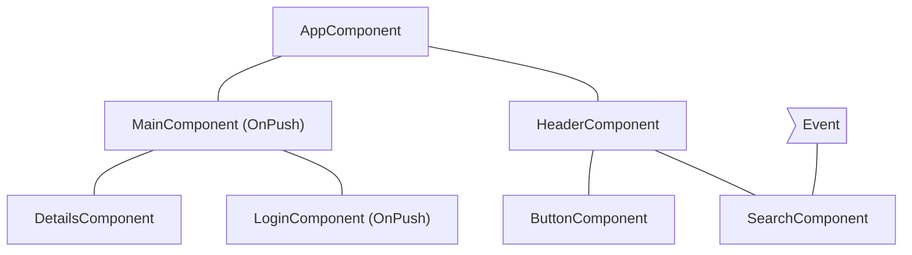

## An event is handled by a component with OnPush

If Angular handles an event within a component with OnPush strategy, the framework will execute change detection within the entire component tree. Angular will ignore component subtrees with roots using OnPush, which have not received new inputs and are outside the component which handled the event.

As an example, if Angular handles an event within `MainComponent`, the framework will run change detection in the entire component tree. Angular will ignore the subtree with root `LoginComponent` because it has `OnPush` and the event happened outside of its scope.

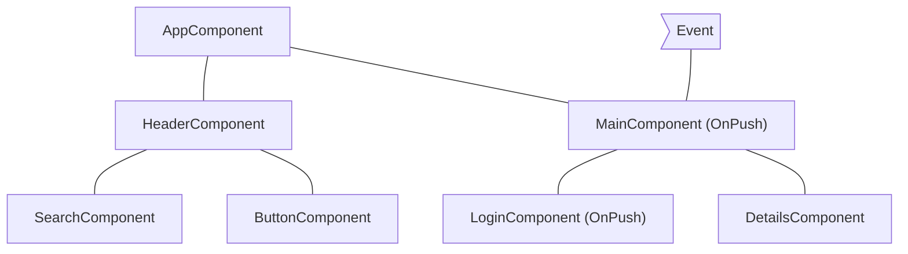

## An event is handled by a descendant of a component with OnPush

If Angular handles an event in a component with OnPush, the framework will execute change detection in the entire component tree, including the component’s ancestors.

As an example, in the diagram below, Angular handles an event in `LoginComponent` which uses OnPush. Angular will invoke change detection in the entire component subtree including `MainComponent` (`LoginComponent`’s parent), even though `MainComponent` has `OnPush` as well. Angular checks `MainComponent` as well because `LoginComponent` is part of its view.

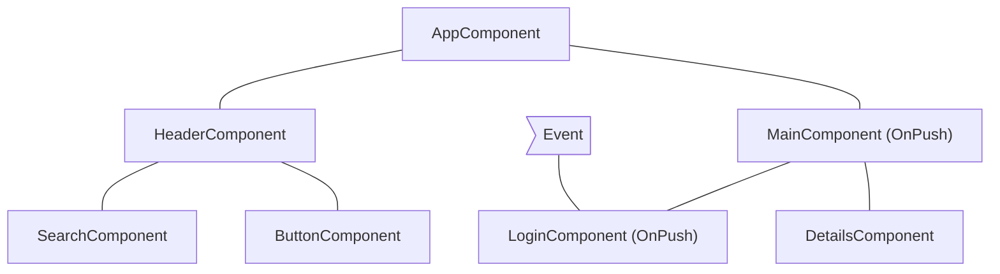

## New inputs to component with OnPush

Angular will run change detection within a child component with `OnPush` when setting an input property as result of a template binding.

For example, in the diagram below, `AppComponent` passes a new input to `MainComponent`, which has `OnPush`. Angular will run change detection in `MainComponent` but will not run change detection in `LoginComponent`, which also has `OnPush`, unless it receives new inputs as well.

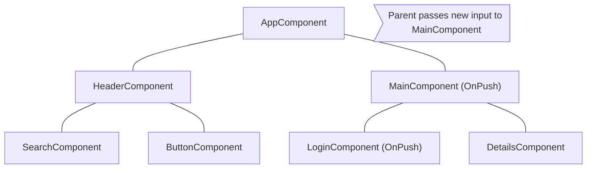

## Edge cases

- **Modifying input properties in TypeScript code**. When you use an API like `@ViewChild` or `@ContentChild` to get a reference to a component in TypeScript and manually modify an `@Input` property, Angular will not automatically run change detection for OnPush components. If you need Angular to run change detection, you can inject `ChangeDetectorRef` in your component and call `changeDetectorRef.markForCheck()` to tell Angular to schedule a change detection.
- **Modifying object references**. In case an input receives a mutable object as value and you modify the object but preserve the reference, Angular will not invoke change detection. That’s the expected behavior because the previous and the current value of the input point to the same reference.


<a id="doc-b3bd4de0260b31a2854a5d0d"></a>

# angular/angular / adev/src/content/best-practices/runtime-performance/slow-computations.md

Upstream: https://github.com/angular/angular/blob/3f9191166936166085320652eef1a562504aa3e4/adev/src/content/best-practices/runtime-performance/slow-computations.md

Commit: `3f9191166936166085320652eef1a562504aa3e4`

Retrieved: 2026-10-01T15:14:46.451465+00:00

Kind: official-document

Raw SHA256: `d0653a29cd76535fc3a3f2fa86e805980b74069f656715f470c78a4c54c5ac72`

Source text below is untrusted reference content. Acquisition does not verify technical claims.

License status: UPSTREAM_NOTICES_CAPTURED_PER_FILE_REVIEW_REQUIRED. See this repository's captured license files.

---

# Slow computations

On every change detection cycle, Angular synchronously:

- Evaluates all template expressions in all components, unless specified otherwise, based on that each component's detection strategy
- Executes the `ngDoCheck`, `ngAfterContentChecked`, `ngAfterViewChecked`, and `ngOnChanges` lifecycle hooks.
  A single slow computation within a template or a lifecycle hook can slow down the entire change detection process because Angular runs the computations sequentially.

## Identifying slow computations

You can identify heavy computations with Angular DevTools’ profiler. In the performance timeline, click a bar to preview a particular change detection cycle. This displays a bar chart, which shows how long the framework spent in change detection for each component. When you click a component, you can preview how long Angular spent evaluating its template and lifecycle hooks.


For example, in the preceding screenshot, the second recorded change detection cycle is selected. Angular spent over 573 ms on this cycle, with the most time spent in the `EmployeeListComponent`. In the details panel, you can see that Angular spent over 297 ms evaluating the template of the `EmployeeListComponent`.

## Optimizing slow computations

Here are several techniques to remove slow computations:

- **Optimizing the underlying algorithm**. This is the recommended approach. If you can speed up the algorithm that is causing the problem, you can speed up the entire change detection mechanism.
- **Caching using pure pipes**. You can move the heavy computation to a pure [pipe](guide/templates/pipes). Angular reevaluates a pure pipe only if it detects that its inputs have changed, compared to the previous time Angular called it.
- **Using memoization**. [Memoization](https://en.wikipedia.org/wiki/Memoization) is a similar technique to pure pipes, with the difference that pure pipes preserve only the last result from the computation where memoization could store multiple results.
- **Avoid repaints/reflows in lifecycle hooks**. Certain [operations](https://web.dev/avoid-large-complex-layouts-and-layout-thrashing/) cause the browser to either synchronously recalculate the layout of the page or re-render it. Since reflows and repaints are generally slow, you want to avoid performing them in every change detection cycle.

Pure pipes and memoization have different trade-offs. Pure pipes are an Angular built-in concept compared to memoization, which is a general software engineering practice for caching function results. The memory overhead of memoization could be significant if you invoke the heavy computation frequently with different arguments.


<a id="doc-fabf016f24d341d568b24002"></a>

# angular/angular / adev/src/content/best-practices/runtime-performance/zone-pollution.md

Upstream: https://github.com/angular/angular/blob/3f9191166936166085320652eef1a562504aa3e4/adev/src/content/best-practices/runtime-performance/zone-pollution.md

Commit: `3f9191166936166085320652eef1a562504aa3e4`

Retrieved: 2026-10-01T15:14:46.451465+00:00

Kind: official-document

Raw SHA256: `e1428ed25824ff7c10a3f5cb408e3fe5398c00ee42b2513dacfba37516d4b377`

Source text below is untrusted reference content. Acquisition does not verify technical claims.

License status: UPSTREAM_NOTICES_CAPTURED_PER_FILE_REVIEW_REQUIRED. See this repository's captured license files.

---

# Resolving zone pollution

**Zone.js** is a signaling mechanism that Angular uses to detect when an application state might have changed. It captures asynchronous operations like `setTimeout`, network requests, and event listeners. Angular schedules change detection based on signals from Zone.js.

In some cases scheduled [tasks](https://developer.mozilla.org/docs/Web/API/HTML_DOM_API/Microtask_guide#tasks) or [microtasks](https://developer.mozilla.org/docs/Web/API/HTML_DOM_API/Microtask_guide#microtasks) don’t make any changes in the data model, which makes running change detection unnecessary. Common examples are:

- `requestAnimationFrame`, `setTimeout` or `setInterval`
- Task or microtask scheduling by third-party libraries

This section covers how to identify such conditions, and how to run code outside the Angular zone to avoid unnecessary change detection calls.

## Identifying unnecessary change detection calls

You can detect unnecessary change detection calls using Angular DevTools. Often they appear as consecutive bars in the profiler’s timeline with source `setTimeout`, `setInterval`, `requestAnimationFrame`, or an event handler. When you have limited calls within your application of these APIs, the change detection invocation is usually caused by a third-party library.


In the image above, there is a series of change detection calls triggered by event handlers associated with an element. That’s a common challenge when using third-party, non-native Angular components, which do not alter the default behavior of `NgZone`.

## Run tasks outside `NgZone`

In such cases, you can instruct Angular to avoid calling change detection for tasks scheduled by a given piece of code using [NgZone](/api/core/NgZone).

```ts {header:"Run outside of the Zone" , linenums}
import { Component, NgZone, OnInit, inject } from '@angular/core';

@Component(...)
class App implements OnInit {
  private ngZone = inject(NgZone);

  ngOnInit() {
    this.ngZone.runOutsideAngular(() => setInterval(pollForUpdates, 500));
  }
}
```

The preceding snippet instructs Angular to call `setInterval` outside the Angular Zone and skip running change detection after `pollForUpdates` runs.

Third-party libraries commonly trigger unnecessary change detection cycles when their APIs are invoked within the Angular zone. This phenomenon particularly affects libraries that set up event listeners or initiate other tasks (such as timers, XHR requests, etc.). Avoid these extra cycles by calling library APIs outside the Angular zone:

```ts {header:"Move the plot initialization outside of the Zone" , linenums}
import { Component, NgZone, OnInit, inject } from '@angular/core';
import * as Plotly from 'plotly.js-dist-min';

@Component(...)
class App implements OnInit {
  private ngZone = inject(NgZone);

  ngOnInit() {
    this.ngZone.runOutsideAngular(() => {
      Plotly.newPlot('chart', data);
    });
  }
}
```

Running `Plotly.newPlot('chart', data);` within `runOutsideAngular` instructs the framework that it shouldn’t run change detection after the execution of tasks scheduled by the initialization logic.

For example, if `Plotly.newPlot('chart', data)` adds event listeners to a DOM element, Angular does not run change detection after the execution of their handlers.

But sometimes, you may need to listen to events dispatched by third-party APIs. In such cases, it's important to remember that those event listeners will also execute outside of the Angular zone if the initialization logic was done there:

```ts {header:"Check whether the handler is called outside of the Zone" , linenums}
import { Component, NgZone, OnInit, output, inject } from '@angular/core';
import * as Plotly from 'plotly.js-dist-min';

@Component(...)
class App implements OnInit {
  private ngZone = inject(NgZone);

  plotlyClick = output<Plotly.PlotMouseEvent>();

  ngOnInit() {
    this.ngZone.runOutsideAngular(() => {
      this.createPlotly();
    });
  }

  private async createPlotly() {
    const plotly = await Plotly.newPlot('chart', data);

    plotly.on('plotly_click', (event: Plotly.PlotMouseEvent) => {
      // This handler will be called outside of the Angular zone because
      // the initialization logic is also called outside of the zone. To check
      // whether we're in the Angular zone, we can call the following:
      console.log(NgZone.isInAngularZone());
      this.plotlyClick.emit(event);
    });
  }
}
```

If you need to dispatch events to parent components and execute specific view update logic, you should consider re-entering the Angular zone to instruct the framework to run change detection or run change detection manually:

```ts {header:"Re-enter the Angular zone when dispatching event" , linenums}
import { Component, NgZone, OnInit, output, inject } from '@angular/core';
import * as Plotly from 'plotly.js-dist-min';

@Component(...)
class App implements OnInit {
  private ngZone = inject(NgZone);

  plotlyClick = output<Plotly.PlotMouseEvent>();

  ngOnInit() {
    this.ngZone.runOutsideAngular(() => {
      this.createPlotly();
    });
  }

  private async createPlotly() {
    const plotly = await Plotly.newPlot('chart', data);

    plotly.on('plotly_click', (event: Plotly.PlotMouseEvent) => {
      this.ngZone.run(() => {
        this.plotlyClick.emit(event);
      });
    });
  }
}
```

The scenario of dispatching events outside of the Angular zone may also arise. It's important to remember that triggering change detection (for example, manually) may result in the creation/update of views outside of the Angular zone.


<a id="doc-040f002802d230526359effb"></a>

# angular/angular / adev/src/content/best-practices/style-guide.md

Upstream: https://github.com/angular/angular/blob/3f9191166936166085320652eef1a562504aa3e4/adev/src/content/best-practices/style-guide.md

Commit: `3f9191166936166085320652eef1a562504aa3e4`

Retrieved: 2026-10-01T15:14:46.451465+00:00

Kind: official-document

Raw SHA256: `ebbe63d36906232fe8929bc26b31a2e4a4d000915970e05537b9b3b3db83ab55`

Source text below is untrusted reference content. Acquisition does not verify technical claims.

License status: UPSTREAM_NOTICES_CAPTURED_PER_FILE_REVIEW_REQUIRED. See this repository's captured license files.

---

# Angular coding style guide

## Introduction

This guide covers a range of style conventions for Angular application code. These recommendations
are not required for Angular to work, but instead establish a set of coding practices that promote
consistency across the Angular ecosystem. A consistent set of practices makes it easier to share
code and move between projects.

This guide does _not_ cover TypeScript or general coding practices unrelated to Angular. For
TypeScript, check
out [Google's TypeScript style guide](https://google.github.io/styleguide/tsguide.html).

### When in doubt, prefer consistency

Whenever you encounter a situation in which these rules contradict the style of a particular file,
prioritize maintaining consistency within a file. Mixing different style conventions in a single
file creates more confusion than diverging from the recommendations in this guide.

## Naming

### Separate words in file names with hyphens

Separate words within a file name with hyphens (`-`). For example, a component named `UserProfile`
has a file name `user-profile.ts`.

### Use the same name for a file's tests with `.spec` at the end

For unit tests, end file names with `.spec.ts`. For example, the unit test file for
the `UserProfile` component has the file name `user-profile.spec.ts`.

### Match file names to the TypeScript identifier within

File names should generally describe the contents of the code in the file. When the file contains a
TypeScript class, the file name should reflect that class name. For example, a file containing a
component named `UserProfile` has the name `user-profile.ts`.

If the file contains more than one primary namable identifier, choose a name that describes the
common theme to the code within. If the code in a file does not fit within a common theme or feature
area, consider breaking the code up into different files. Avoid overly generic file names
like `helpers.ts`, `utils.ts`, or `common.ts`.

### Use the same file name for a component's TypeScript, template, and styles

Components typically consist of one TypeScript file, one template file, and one style file. These
files should share the same name with different file extensions. For example, a `UserProfile`
component can have the files `user-profile.ts`, `user-profile.html`, and `user-profile.css`.

If a component has more than one style file, append the name with additional words that describe the
styles specific to that file. For example, `UserProfile` might have style
files `user-profile-settings.css` and `user-profile-subscription.css`.

## Project structure

### All the application's code goes in a directory named `src`

All of your Angular UI code (TypeScript, HTML, and styles) should live inside a directory
named `src`. Code that's not related to UI, such as configuration files or scripts, should live
outside the `src` directory.

This keeps the root application directory consistent between different Angular projects and creates
a clear separation between UI code and other code in your project.

### Bootstrap your application in a file named `main.ts` directly inside `src`

The code to start up, or **bootstrap**, an Angular application should always live in a file
named `main.ts`. This represents the primary entry point to the application.

### Group closely related files together in the same directory

Angular components consist of a TypeScript file and, optionally, a template and one or more style
files. You should group these together in the same directory.

Unit tests should live in the same directory as the code-under-test. Avoid collecting unrelated
tests into a single `tests` directory.

### Organize your project by feature areas

Organize your project into subdirectories based on the features of your application or common themes
to the code in those directories. For example, the project structure for a movie theater site,
MovieReel, might look like this:

```
src/
├─ movie-reel/
│ ├─ show-times/
│ │ ├─ film-calendar/
│ │ ├─ film-details/
│ ├─ reserve-tickets/
│ │ ├─ payment-info/
│ │ ├─ purchase-confirmation/
```

Avoid creating subdirectories based on the type of code that lives in those directories. For
example, avoid creating directories like `components`, `directives`, and `services`.

Avoid putting so many files into one directory that it becomes hard to read or navigate. As the
number of files in a directory grows, consider splitting further into additional sub-directories.

### One concept per file

Prefer focusing source files on a single _concept_. For Angular classes specifically, this usually
means one component, directive, or service per file. However, it's okay if a file contains more than
one component or directive if your classes are relatively small and they tie together as part of a
single concept.

When in doubt, go with the approach that leads to smaller files.

## Dependency injection

### Prefer the `inject` function over constructor parameter injection

Prefer using the [`inject`](/api/core/inject) function over injecting constructor parameters. The [`inject`](/api/core/inject) function works the same way as constructor parameter injection, but offers several style advantages:

- [`inject`](/api/core/inject) is generally more readable, especially when a class injects many dependencies.
- It's more syntactically straightforward to add comments to injected dependencies
- [`inject`](/api/core/inject) offers better type inference.
- When targeting ES2022+ with [`useDefineForClassFields`](https://www.typescriptlang.org/tsconfig/#useDefineForClassFields), you can avoid separating field declaration and initialization when fields read on injected dependencies.

[You can refactor existing code to `inject` with an automatic tool](reference/migrations/inject-function).

## Components and directives

### Choosing component selectors

See
the [Components guide for details on choosing component selectors](guide/components/selectors#choosing-a-selector).

### Naming component and directive members

See the Components guide for details
on [naming input properties](guide/components/inputs#choosing-input-names)
and [naming output properties](guide/components/outputs#choosing-event-names).

### Choosing directive selectors

Directives should use the
same [application-specific prefix](guide/components/selectors#selector-prefixes)
as your components.

When using an attribute selector for a directive, use a camelCase attribute name. For example, if
your application is named "MovieReel" and you build a directive that adds a tooltip to an element,
you might use the selector `[mrTooltip]`.

### Group Angular-specific properties before methods

Components and directives should group Angular-specific properties together, typically near the top
of the class declaration. This includes injected dependencies, inputs, outputs, and queries. Define
these and other properties before the class's methods.

This practice makes it easier to find the class's template APIs and dependencies.

### Keep components and directives focused on presentation

Code inside your components and directives should generally relate to the UI shown on the page. For
code that makes sense on its own, decoupled from the UI, prefer refactoring to other files. For
example, you can factor form validation rules or data transformations into separate functions or
classes.

### Avoid overly complex logic in templates

Angular templates are designed to
accommodate [JavaScript-like expressions](guide/templates/expression-syntax).
You should take advantage of these expressions to capture relatively straightforward logic directly
in template expressions.

When the code in a template gets too complex, though, refactor logic into the TypeScript code (typically with a [computed](guide/signals#computed-signals)).

There's no one hard-and-fast rule that determines what constitutes "complex". Use your best
judgement.

### Use `protected` on class members that are only used by a component's template

A component class's public members intrinsically define a public API that's accessible via
dependency injection and [queries](guide/components/queries). Prefer `protected`
access for any members that are meant to be read from the component's template.

```ts
@Component({
  ...,
  template: `<p>{{ fullName() }}</p>`,
})
export class UserProfile {
  firstName = input();
  lastName = input();

// `fullName` is not part of the component's public API, but is used in the template.
  protected fullName = computed(() => `${this.firstName()} ${this.lastName()}`);
}
```

### Use `readonly` for properties that shouldn't change

Mark component and directive properties initialized by Angular as `readonly`. This includes
properties initialized by `input`, `model`, `output`, and queries. The readonly access modifier
ensures that the value set by Angular is not overwritten.

```ts
@Component(/* ... */)
export class UserProfile {
  readonly userId = input();
  readonly userSaved = output();
  readonly userName = model();
}
```

For components and directives that use the decorator-based `@Input`, `@Output`, and query APIs, this
advice applies to output properties and queries, but not input properties.

```ts
@Component(/* ... */)
export class UserProfile {
  @Output() readonly userSaved = new EventEmitter<void>();
  @ViewChildren(PaymentMethod) readonly paymentMethods?: QueryList<PaymentMethod>;
}
```

### Prefer `class` and `style` over `ngClass` and `ngStyle`

Prefer `class` and `style` bindings over using the [`NgClass`](/api/common/NgClass) and [`NgStyle`](/api/common/NgStyle) directives.

```html {prefer}
<div [class.admin]="isAdmin" [class.dense]="density === 'high'">
  <div [style.color]="textColor" [style.background-color]="backgroundColor">
    <!-- OR -->
    <div [class]="{admin: isAdmin, dense: density === 'high'}">
      <div [style]="{'color': textColor, 'background-color': backgroundColor}"></div>
    </div>
  </div>
</div>
```

```html {avoid}
<div [ngClass]="{admin: isAdmin, dense: density === 'high'}">
  <div [ngStyle]="{'color': textColor, 'background-color': backgroundColor}"></div>
</div>
```

Both `class` and `style` bindings use a more straightforward syntax that aligns closely with
standard HTML attributes. This makes your templates easier to read and understand, especially for
developers familiar with basic HTML.

Additionally, the `NgClass` and `NgStyle` directives incur an additional performance cost compared
to the built-in `class` and `style` binding syntax.

For more details, refer to the [bindings guide](/guide/templates/binding#css-class-and-style-property-bindings)

### Name event handlers for what they _do_, not for the triggering event

Prefer naming event handlers for the action they perform rather than for the triggering event:

```html {prefer}
<button (click)="saveUserData()">Save</button>
```

```html {avoid}
<button (click)="handleClick()">Save</button>
```

Using meaningful names like this makes it easier to tell what an event does from reading the
template.

For keyboard events, you can use Angular's key event modifiers with specific handler names:

```html
<textarea (keydown.control.enter)="commitNotes()" (keydown.control.space)="showSuggestions()">
```

Sometimes, event handling logic is especially long or complex, making it impractical to declare a
single well-named handler. In these cases, it's fine to fall back to a name like 'handleKeydown' and
then delegate to more specific behaviors based on the event details:

```ts
@Component(/* ... */)
class RichText {
  handleKeydown(event: KeyboardEvent) {
    if (event.ctrlKey) {
      if (event.key === 'B') {
        this.activateBold();
      } else if (event.key === 'I') {
        this.activateItalic();
      }
      // ...
    }
  }
}
```

### Keep lifecycle methods simple

Avoid putting long or complex logic inside lifecycle hooks like `ngOnInit`. Instead, prefer creating
well-named methods to contain that logic and then _call those methods_ in your lifecycle hooks.
Lifecycle hook names describe _when_ they run, meaning that the code inside doesn't have a
meaningful name that describes what the code inside is doing.

```ts {prefer}
ngOnInit() {
  this.startLogging();
  this.runBackgroundTask();
}
```

```ts {avoid}
ngOnInit() {
  this.logger.setMode('info');
  this.logger.monitorErrors();
  // ...and all the rest of the code that would be unrolled from these methods.
}
```

### Use lifecycle hook interfaces

Angular provides a TypeScript interface for each lifecycle method. When adding a lifecycle hook to
your class, import and `implement` these interfaces to ensure that the methods are named correctly.

```ts
import {Component, OnInit} from '@angular/core';

@Component(/* ... */)
export class UserProfile implements OnInit {
  // The `OnInit` interface ensures this method is named correctly.
  ngOnInit() {
    /* ... */
  }
}
```


<a id="doc-8b6cbe3d29f51a7a4b20e17a"></a>

# angular/angular / adev/src/content/best-practices/update.md

Upstream: https://github.com/angular/angular/blob/3f9191166936166085320652eef1a562504aa3e4/adev/src/content/best-practices/update.md

Commit: `3f9191166936166085320652eef1a562504aa3e4`

Retrieved: 2026-10-01T15:14:46.451465+00:00

Kind: official-document

Raw SHA256: `33f7eb9154adacdf1445dbbd50f94de08bb8b578f20849930f36203beb87f4ff`

Source text below is untrusted reference content. Acquisition does not verify technical claims.

License status: UPSTREAM_NOTICES_CAPTURED_PER_FILE_REVIEW_REQUIRED. See this repository's captured license files.

---

# Keeping your Angular projects up-to-date

Just like Web and the entire web ecosystem, Angular is continuously improving.
Angular balances continuous improvement with a strong focus on stability and making updates straightforward.
Keeping your Angular application up-to-date enables you to take advantage of leading-edge new features, as well as optimizations and bug fixes.

This document contains information and resources to help you keep your Angular applications and libraries up-to-date.

For information about our versioning policy and practices — including support and deprecation practices, as well as the release schedule — see [Angular versioning and releases](reference/releases 'Angular versioning and releases').

HELPFUL: If you are currently using AngularJS, see [Upgrading from AngularJS](https://angular.io/guide/upgrade 'Upgrading from AngularJS').
_AngularJS_ is the name for all v1.x versions of Angular.

## Getting notified of new releases

To be notified when new releases are available, follow [@angular](https://x.com/angular '@angular on X') on X (formerly Twitter) or subscribe to the [Angular blog](https://blog.angular.dev 'Angular blog').

## Learning about new features

What's new? What's changed? We share the most important things you need to know on the Angular blog in [release announcements](https://blog.angular.dev/ 'Angular blog - release announcements').

To review a complete list of changes, organized by version, see the [Angular change log](https://github.com/angular/angular/blob/main/CHANGELOG.md 'Angular change log').

## Checking your version of Angular

To check your application's version of Angular use the `ng version` command from within your project directory.

## Finding the current version of Angular

The most recent stable released version of Angular appears [on npm](https://www.npmjs.com/package/@angular/core 'Angular on npm') under "Version." For example, `16.2.4`.

You can also find the most current version of Angular by using the CLI command [`ng update`](cli/update).
By default, [`ng update`](cli/update) (without additional arguments) lists the updates that are available to you.

## Updating your environment and apps

To make updating uncomplicated, we provide complete instructions in the interactive [Angular Update Guide](update-guide).

The Angular Update Guide provides customized update instructions, based on the current and target versions that you specify.
It includes basic and advanced update paths, to match the complexity of your applications.
It also includes troubleshooting information and any recommended manual changes to help you get the most out of the new release.

For simple updates, the CLI command [`ng update`](cli/update) is all you need.
Without additional arguments, [`ng update`](cli/update) lists the updates that are available to you and provides recommended steps to update your application to the most current version.

[Angular Versioning and Releases](reference/releases#angular-versioning 'Angular Release Practices, Versioning') describes the level of change that you can expect based on a release's version number.
It also describes supported update paths.

## Resource summary

- Release announcements:
  [Angular blog - release announcements](https://blog.angular.dev/ 'Angular blog announcements about recent releases')

- Release details:
  [Angular change log](https://github.com/angular/angular/blob/main/CHANGELOG.md 'Angular change log')

- Update instructions:
  [Angular Update Guide](update-guide)

- Update command reference:
  [Angular CLI `ng update` command reference](cli/update)

- Versioning, release, support, and deprecation practices:
  [Angular versioning and releases](reference/releases 'Angular versioning and releases')


<a id="doc-c3ba2bf3fea813e381e82866"></a>

# angular/angular / adev/src/content/ecosystem/custom-build-pipeline.md

Upstream: https://github.com/angular/angular/blob/3f9191166936166085320652eef1a562504aa3e4/adev/src/content/ecosystem/custom-build-pipeline.md

Commit: `3f9191166936166085320652eef1a562504aa3e4`

Retrieved: 2026-10-01T15:14:46.451465+00:00

Kind: official-document

Raw SHA256: `36d70a186c2c817f89a24c4e03f5b6b18aa8c05cdb37397624c4641918f82e79`

Source text below is untrusted reference content. Acquisition does not verify technical claims.

License status: UPSTREAM_NOTICES_CAPTURED_PER_FILE_REVIEW_REQUIRED. See this repository's captured license files.

---

# Custom build pipeline

When building an Angular app we strongly recommend you to use the Angular CLI to leverage its structure-dependent update functionality and build system abstraction. This way your projects benefit from the latest security, performance, and API improvements and transparent build improvements.

This page explores the **rare use cases** when you need a custom build pipeline that does not use the Angular CLI. All listed tools below are open source build plugins that are maintained by members of the Angular community. To learn more about their support model and maintenance status look at their documentation and GitHub repository URLs.

## When should you use a custom build pipeline?

There are some niche use cases when you may want to maintain a custom build pipeline. For example:

- You have an existing app using a different toolchain and you’d like to add Angular to it
- You’re strongly coupled to [module federation](https://module-federation.io/) and unable to adopt bundler-agnostic [native federation](https://www.npmjs.com/package/@angular-architects/native-federation)
- You’d like to create a short-lived experiment using your favorite build tool

## What are the options?

Currently, there are two well supported community tools that enable you to create a custom build pipeline with a [Vite plugin](https://www.npmjs.com/package/@analogjs/vite-plugin-angular) and [Rspack plugin](https://www.npmjs.com/package/@nx/angular-rspack). Both of them use underlying abstractions that power the Angular CLI. They allow you to create a flexible build pipeline and require manual maintenance and no automated update experience.

### Rspack

Rspack is a Rust-based bundler that aims to provide compatibility with the webpack plugin ecosystem.

If your project is tightly coupled to the webpack ecosystem, heavily relying on a custom webpack configuration you can leverage Rspack to improve your build times.

You can find more about Angular Rspack on the project’s [documentation website](https://nx.dev/recipes/angular/rspack/introduction).

### Vite

Vite is a frontend build tool that aims to provide a faster and leaner development experience for modern web projects. Vite is also extensible through its plugin system that allows ecosystems to build integrations with Vite, such as Vitest for unit and browser testing, Storybook for authoring components in isolation, and more. The Angular CLI also uses Vite as its development server.

The [AnalogJS Vite plugin for Angular](https://www.npmjs.com/package/@analogjs/vite-plugin-angular) enables the adoption of Angular with a project or framework that uses or is built on top of Vite. This can consist of developing and building an Angular project with Vite directly, or adding Angular to an existing project or pipeline. One example is integrating Angular UI components into a documentation website using [Astro and Starlight](https://analogjs.org/docs/packages/astro-angular/overview).

You can learn more about AnalogJS and how to use the plugin through its [documentation page](https://analogjs.org/docs/packages/vite-plugin-angular/overview).


<a id="doc-5eaba615678a9adb03be96da"></a>

# angular/angular / adev/src/content/ecosystem/rxjs-interop/output-interop.md

Upstream: https://github.com/angular/angular/blob/3f9191166936166085320652eef1a562504aa3e4/adev/src/content/ecosystem/rxjs-interop/output-interop.md

Commit: `3f9191166936166085320652eef1a562504aa3e4`

Retrieved: 2026-10-01T15:14:46.451465+00:00

Kind: official-document

Raw SHA256: `7523d7f90af6cb3524e4208cb7e3d422b01e909d6cded7dca4880a1877fc0ea4`

Source text below is untrusted reference content. Acquisition does not verify technical claims.

License status: UPSTREAM_NOTICES_CAPTURED_PER_FILE_REVIEW_REQUIRED. See this repository's captured license files.

---

# RxJS interop with component and directive outputs

TIP: This guide assumes you're familiar with [component and directive outputs](guide/components/outputs).

The `@angular/rxjs-interop` package offers two APIs related to component and directive outputs.

## Creating an output based on an RxJs Observable

The `outputFromObservable` lets you create a component or directive output that emits based on an RxJS observable:

```ts {highlight:[9]}
import {Directive} from '@angular/core';
import {outputFromObservable} from '@angular/core/rxjs-interop';

@Directive(/* ... */)
class Draggable {
  pointerMoves$: Observable<PointerMovements> = listenToPointerMoves();

  // Whenever `pointerMoves$` emits, the `pointerMove` event fires.
  pointerMove = outputFromObservable(this.pointerMoves$);
}
```

The `outputFromObservable` function has special meaning to the Angular compiler. **You may only call `outputFromObservable` in component and directive property initializers.**

When you `subscribe` to the output, Angular automatically forwards the subscription to the underlying observable. Angular stops forwarding values when the component or directive is destroyed.

HELPFUL: Consider using `output()` directly if you can emit values imperatively.

## Creating an RxJS Observable from a component or directive output

The `outputToObservable` function lets you create an RxJS observable from a component output.

```ts {highlight:[11]}
import {outputToObservable} from '@angular/core/rxjs-interop';

@Component(/*...*/)
class CustomSlider {
    valueChange = output<number>();
}

// Instance reference to `CustomSlider`.
const slider: CustomSlider = createSlider();

outputToObservable(slider.valueChange) // Observable<number>
    .pipe(...)
    .subscribe(...);
```

HELPFUL: Consider using the `subscribe` method on `OutputRef` directly if it meets your needs.


<a id="doc-009d499423502986597548c0"></a>

# angular/angular / adev/src/content/ecosystem/rxjs-interop/signals-interop.md

Upstream: https://github.com/angular/angular/blob/3f9191166936166085320652eef1a562504aa3e4/adev/src/content/ecosystem/rxjs-interop/signals-interop.md

Commit: `3f9191166936166085320652eef1a562504aa3e4`

Retrieved: 2026-10-01T15:14:46.451465+00:00

Kind: official-document

Raw SHA256: `cce97dfa04b29031ab451cd1aeaef4e6a7a1151624fa9b3df92908d992b57360`

Source text below is untrusted reference content. Acquisition does not verify technical claims.

License status: UPSTREAM_NOTICES_CAPTURED_PER_FILE_REVIEW_REQUIRED. See this repository's captured license files.

---

# RxJS interop with Angular signals

The `@angular/core/rxjs-interop` package offers APIs that help you integrate RxJS and Angular signals.

## Create a signal from an RxJs Observable with `toSignal`

Use the `toSignal` function to create a signal which tracks the value of an Observable. It behaves similarly to the `async` pipe in templates, but is more flexible and can be used anywhere in an application.

```angular-ts
import {Component} from '@angular/core';
import {AsyncPipe} from '@angular/common';
import {interval} from 'rxjs';
import {toSignal} from '@angular/core/rxjs-interop';

@Component({
  template: `{{ counter() }}`,
})
export class Ticker {
  counterObservable = interval(1000);

  // Get a `Signal` representing the `counterObservable`'s value.
  counter = toSignal(this.counterObservable, {initialValue: 0});
}
```

Like the `async` pipe, `toSignal` subscribes to the Observable immediately, which may trigger side effects. The subscription created by `toSignal` automatically unsubscribes from the given Observable when the component or service which calls `toSignal` is destroyed.

IMPORTANT: `toSignal` creates a subscription. You should avoid calling it repeatedly for the same Observable, and instead reuse the signal it returns.

### Injection context

`toSignal` by default needs to run in an [injection context](guide/di/dependency-injection-context), such as during construction of a component or service. If an injection context is not available, you can manually specify the `Injector` to use instead.

### Initial values

Observables may not produce a value synchronously on subscription, but signals always require a current value. There are several ways to deal with this "initial" value of `toSignal` signals.

#### The `initialValue` option

As in the example above, you can specify an `initialValue` option with the value the signal should return before the Observable emits for the first time.

#### `undefined` initial values

If you don't provide an `initialValue`, the resulting signal will return `undefined` until the Observable emits. This is similar to the `async` pipe's behavior of returning `null`.

#### The `requireSync` option

Some Observables are guaranteed to emit synchronously, such as `BehaviorSubject`. In those cases, you can specify the `requireSync: true` option.

When `requireSync` is `true`, `toSignal` enforces that the Observable emits synchronously on subscription. This guarantees that the signal always has a value, and no `undefined` type or initial value is required.

### `manualCleanup`

By default, `toSignal` automatically unsubscribes from the Observable when the component or service that creates it is destroyed.

To override this behavior, you can pass the `manualCleanup` option. You can use this setting for Observables that complete themselves naturally.

#### Custom equality comparison

Some observables may emit values that are **equals** even though they differ by reference or minor detail. The `equal` option lets you define a **custom equal function** to determine when two consecutive values should be considered the same.

When two emitted values are considered equal, the resulting signal **does not update**. This prevents redundant computations, DOM updates, or effects from re-running unnecessarily.

```ts
import {Component} from '@angular/core';
import {toSignal} from '@angular/core/rxjs-interop';
import {interval, map} from 'rxjs';

@Component(/* ... */)
export class EqualExample {
  temperature$ = interval(1000).pipe(
    map(() => ({temperature: Math.floor(Math.random() * 3) + 20})), // 20, 21, or 22 randomly
  );

  // Only update if the temperature changes
  temperature = toSignal(this.temperature$, {
    initialValue: {temperature: 20},
    equal: (prev, curr) => prev.temperature === curr.temperature,
  });
}
```

### Error and Completion

If an Observable used in `toSignal` produces an error, that error is thrown when the signal is read.

If an Observable used in `toSignal` completes, the signal continues to return the most recently emitted value before completion.

## Create an RxJS Observable from a signal with `toObservable`

Use the `toObservable` utility to create an `Observable` which tracks the value of a signal. The signal's value is monitored with an `effect` which emits the value to the Observable when it changes.

```ts
import {Component, signal} from '@angular/core';
import {toObservable} from '@angular/core/rxjs-interop';

@Component(/* ... */)
export class SearchResults {
  query: Signal<string> = inject(QueryService).query;
  query$ = toObservable(this.query);

  results$ = this.query$.pipe(switchMap((query) => this.http.get('/search?q=' + query)));
}
```

As the `query` signal changes, the `query$` Observable emits the latest query and triggers a new HTTP request.

### Injection context {#injection-context-to-observable}

`toObservable` by default needs to run in an [injection context](guide/di/dependency-injection-context), such as during construction of a component or service. If an injection context is not available, you can manually specify the `Injector` to use instead.

### Timing of `toObservable`

`toObservable` uses an effect to track the value of the signal in a `ReplaySubject`. On subscription, the first value (if available) may be emitted synchronously, and all subsequent values will be asynchronous.

Unlike Observables, signals never provide a synchronous notification of changes. Even if you update a signal's value multiple times, `toObservable` will only emit the value after the signal stabilizes.

```ts
const obs$ = toObservable(mySignal);
obs$.subscribe((value) => console.log(value));

mySignal.set(1);
mySignal.set(2);
mySignal.set(3);
```

Here, only the last value (3) will be logged.

## Using `rxResource` for async data

Angular's [`resource` function](/guide/signals/resource) gives you a way to incorporate async data into your application's signal-based code. Building on top of this pattern, `rxResource` lets you define a resource where the source of your data is defined in terms of an RxJS `Observable`. Instead of accepting a `loader` function, `rxResource` accepts a `stream` function that accepts an RxJS `Observable`.

```typescript
import {Component, inject} from '@angular/core';
import {rxResource} from '@angular/core/rxjs-interop';

@Component(/* ... */)
export class UserProfile {
  // This component relies on a service that exposes data through an RxJS Observable.
  private userData = inject(MyUserDataClient);

  protected userId = input<string>();

  private userResource = rxResource({
    params: () => ({userId: this.userId()}),

    // The `stream` property expects a factory function that returns
    // a data stream as an RxJS Observable.
    stream: ({params}) => this.userData.load(params.userId),
  });
}
```

The `stream` property accepts a factory function for an RxJS `Observable`. This factory function is passed the resource's `params` value and returns an `Observable`. The resource calls this factory function every time the `params` computation produces a new value. See [Resource loaders](/guide/signals/resource#resource-loaders) for more details on the parameters passed to the factory function.

In all other ways, `rxResource` behaves like and provides the same APIs as `resource` for specifying parameters, reading values, checking loading state, and examining errors.

The `Observable` returned from `stream` must always emit a value or an error before it completes; see [`NG0991`](/errors/NG0991) for what happens otherwise and how to avoid it.


<a id="doc-c259fc8a388e945390fc3225"></a>

# angular/angular / adev/src/content/ecosystem/rxjs-interop/take-until-destroyed.md

Upstream: https://github.com/angular/angular/blob/3f9191166936166085320652eef1a562504aa3e4/adev/src/content/ecosystem/rxjs-interop/take-until-destroyed.md

Commit: `3f9191166936166085320652eef1a562504aa3e4`

Retrieved: 2026-10-01T15:14:46.451465+00:00

Kind: official-document

Raw SHA256: `d98771b0d6553e1368c8ae3acc79045e4e26998128167d6cb04c4006a2db2603`

Source text below is untrusted reference content. Acquisition does not verify technical claims.

License status: UPSTREAM_NOTICES_CAPTURED_PER_FILE_REVIEW_REQUIRED. See this repository's captured license files.

---

# Unsubscribing with `takeUntilDestroyed`

TIP: This guide assumes you're familiar with [component and directive lifecycle](guide/components/lifecycle).

The `takeUntilDestroyed` operator, from `@angular/core/rxjs-interop`, provides a concise and reliable way to automatically unsubscribe from an Observable when a component or directive is destroyed. This prevents common memory leaks with RxJS subscriptions. It works similarly to the RxJS [`takeUntil`](https://rxjs.dev/api/operators/takeUntil) operator but without the need for a separate Subject.

```typescript
import {Component, inject} from '@angular/core';
import {takeUntilDestroyed} from '@angular/core/rxjs-interop';
import {NotificationDispatcher, CustomPopupShower} from './some-shared-project-code';

@Component(/* ... */)
export class UserProfile {
  private dispatcher = inject(NotificationDispatcher);
  private popup = inject(CustomPopupShower);

  constructor() {
    // This subscription the 'notifications' Observable is automatically
    // unsubscribed when the 'UserProfile' component is destroyed.
    const messages: Observable<string> = this.dispatcher.notifications;
    messages.pipe(takeUntilDestroyed()).subscribe((message) => {
      this.popup.show(message);
    });
  }
}
```

The `takeUntilDestroyed` operator accepts a single optional [`DestroyRef`](/api/core/DestroyRef) argument. The operator uses `DestroyRef` to know when the component or directive has been destroyed. You can omit this argument when calling `takeUntilDestroyed` in an [injection context](/guide/di/dependency-injection-context), typically the constructor of a component or directive. Always provide a `DestroyRef` if your code may call `takeUntilDestroyed` outside of an injection context.

```typescript
@Component(/* ... */)
export class UserProfile {
  private dispatcher = inject(NotificationDispatcher);
  private popup = inject(CustomPopupShower);
  private destroyRef = inject(DestroyRef);

  startListeningToNotifications() {
    // Always pass a `DestroyRef` if you call `takeUntilDestroyed` outside
    // of an injection context.
    const messages: Observable<string> = this.dispatcher.notifications;
    messages.pipe(takeUntilDestroyed(this.destroyRef)).subscribe((message) => {
      this.popup.show(message);
    });
  }
}
```


<a id="doc-81461f6880481284d12c3b73"></a>

# angular/angular / adev/src/content/ecosystem/service-workers/app-shell.md

Upstream: https://github.com/angular/angular/blob/3f9191166936166085320652eef1a562504aa3e4/adev/src/content/ecosystem/service-workers/app-shell.md

Commit: `3f9191166936166085320652eef1a562504aa3e4`

Retrieved: 2026-10-01T15:14:46.451465+00:00

Kind: official-document

Raw SHA256: `79fdbcf4c4f2208390ed1dfb039fb8b6fd8154eab7c91077d96c68d560767c72`

Source text below is untrusted reference content. Acquisition does not verify technical claims.

License status: UPSTREAM_NOTICES_CAPTURED_PER_FILE_REVIEW_REQUIRED. See this repository's captured license files.

---

# App shell pattern

The [App shell pattern](https://developer.chrome.com/blog/app-shell) is a way to render a portion of your application using a route at build time.
It can improve the user experience by quickly launching a static rendered page (a skeleton common to all pages) while the browser downloads the full client version and switches to it automatically after the code loads.

This gives users a meaningful first paint of your application that appears quickly because the browser can render the HTML and CSS without the need to initialize any JavaScript.

<docs-workflow>
<docs-step title="Prepare the application">
Do this with the following Angular CLI command:

```shell
ng new my-app
```

For an existing application, you have to manually add the `Router` and defining a `<router-outlet>` within your application.
</docs-step>
<docs-step title="Create the application shell">
Use the Angular CLI to automatically create the application shell.

```shell
ng generate app-shell
```

For more information about this command, see [App shell command](cli/generate/app-shell).

The command updates the application code and adds extra files to the project structure.

```text
src
├── app
│ ├── app.config.server.ts # server application configuration
│ └── app-shell # app-shell component
│   ├── app-shell.component.html
│   ├── app-shell.component.scss
│   ├── app-shell.component.spec.ts
│   └── app-shell.component.ts
└── main.server.ts # main server application bootstrapping
```

</docs-step>
<docs-step title="Verify the application is built with the shell content">

```shell
ng build --configuration=development
```

Or to use the production configuration.

```shell
ng build
```

To verify the build output, open <code class="no-auto-link">dist/my-app/browser/index.html</code>.
Look for default text `app-shell works!` to show that the application shell route was rendered as part of the output.
</docs-step>
</docs-workflow>


<a id="doc-6bdc92d868292037f9dfeba9"></a>

# angular/angular / adev/src/content/ecosystem/service-workers/communications.md

Upstream: https://github.com/angular/angular/blob/3f9191166936166085320652eef1a562504aa3e4/adev/src/content/ecosystem/service-workers/communications.md

Commit: `3f9191166936166085320652eef1a562504aa3e4`

Retrieved: 2026-10-01T15:14:46.451465+00:00

Kind: official-document

Raw SHA256: `c4bc8e759ac9ac25e3ae1fe0a3c1c01101de64afaaf9cb5857ad38169f45fb51`

Source text below is untrusted reference content. Acquisition does not verify technical claims.

License status: UPSTREAM_NOTICES_CAPTURED_PER_FILE_REVIEW_REQUIRED. See this repository's captured license files.

---

# Communicating with the Service Worker

Enabling service worker support does more than just register the service worker; it also provides services you can use to interact with the service worker and control the caching of your application.

## `SwUpdate` service

The `SwUpdate` service gives you access to events that indicate when the service worker discovers and installs an available update for your application.

The `SwUpdate` service supports three separate operations:

- Receiving notifications when an updated version is _detected_ on the server, _installed and ready_ to be used locally or when an _installation fails_.
- Asking the service worker to check the server for new updates.
- Asking the service worker to activate the latest version of the application for the current tab.

### Version updates

The `versionUpdates` is an `Observable` property of `SwUpdate` and emits five event types:

| Event types                      | Details                                                                                                                                                                               |
| :------------------------------- | :------------------------------------------------------------------------------------------------------------------------------------------------------------------------------------ |
| `VersionDetectedEvent`           | Emitted when the service worker has detected a new version of the app on the server and is about to start downloading it.                                                             |
| `NoNewVersionDetectedEvent`      | Emitted when the service worker has checked the version of the app on the server and did not find a new version.                                                                      |
| `VersionReadyEvent`              | Emitted when a new version of the app is available to be activated by clients. It may be used to notify the user of an available update or prompt them to refresh the page.           |
| `VersionInstallationFailedEvent` | Emitted when the installation of a new version failed. It may be used for logging/monitoring purposes.                                                                                |
| `VersionFailedEvent`             | Emitted when a version encounters a critical failure (such as broken hash errors) that affects all clients using that version. Provides error details for debugging and transparency. |

<docs-code header="log-update.service.ts" path="adev/src/content/examples/service-worker-getting-started/src/app/log-update.service.ts" region="sw-update"/>

### Checking for updates

It's possible to ask the service worker to check if any updates have been deployed to the server.
The service worker checks for updates during initialization and on each navigation request —that is, when the user navigates from a different address to your application.
However, you might choose to manually check for updates if you have a site that changes frequently or want updates to happen on a schedule.

Do this with the `checkForUpdate()` method:

<docs-code header="check-for-update.service.ts" path="adev/src/content/examples/service-worker-getting-started/src/app/check-for-update.service.ts"/>

This method returns a `Promise<boolean>` which indicates if an update is available for activation.
The check might fail, which will cause a rejection of the `Promise`.

<docs-callout important title="Stabilization and service worker registration">
In order to avoid negatively affecting the initial rendering of the page, by default the Angular service worker service waits for up to 30 seconds for the application to stabilize before registering the ServiceWorker script.

Constantly polling for updates, for example, with [setInterval()](https://developer.mozilla.org/docs/Web/API/WindowOrWorkerGlobalScope/setInterval) or RxJS' [interval()](https://rxjs.dev/api/index/function/interval), prevents the application from stabilizing and the ServiceWorker script is not registered with the browser until the 30 seconds upper limit is reached.

This is true for any kind of polling done by your application.
Check the [isStable](api/core/ApplicationRef#isStable) documentation for more information.

Avoid that delay by waiting for the application to stabilize first, before starting to poll for updates, as shown in the preceding example.
Alternatively, you might want to define a different [registration strategy](api/service-worker/SwRegistrationOptions#registrationStrategy) for the ServiceWorker.
</docs-callout>

### Updating to the latest version

You can update an existing tab to the latest version by reloading the page as soon as a new version is ready.
To avoid disrupting the user's progress, it is generally a good idea to prompt the user and let them confirm that it is OK to reload the page and update to the latest version:

<docs-code header="prompt-update.service.ts" path="adev/src/content/examples/service-worker-getting-started/src/app/prompt-update.service.ts" region="sw-version-ready"/>

<docs-callout important title="Safety of updating without reloading">
Calling `activateUpdate()` updates a tab to the latest version without reloading the page, but this could break the application.

Updating without reloading can create a version mismatch between the application shell and other page resources, such as lazy-loaded chunks, whose filenames may change between versions.

You should only use `activateUpdate()`, if you are certain it is safe for your specific use case.
</docs-callout>

### Handling an unrecoverable state

In some cases, the version of the application used by the service worker to serve a client might be in a broken state that cannot be recovered from without a full page reload.

For example, imagine the following scenario:

1. A user opens the application for the first time and the service worker caches the latest version of the application.
   Assume the application's cached assets include `index.html`, `main.<main-hash-1>.js` and `lazy-chunk.<lazy-hash-1>.js`.

1. The user closes the application and does not open it for a while.
1. After some time, a new version of the application is deployed to the server.
   This newer version includes the files `index.html`, `main.<main-hash-2>.js` and `lazy-chunk.<lazy-hash-2>.js`.

IMPORTANT: The hashes are different now, because the content of the files changed. The old version is no longer available on the server.

1. In the meantime, the user's browser decides to evict `lazy-chunk.<lazy-hash-1>.js` from its cache.
   Browsers might decide to evict specific (or all) resources from a cache in order to reclaim disk space.

1. The user opens the application again.
   The service worker serves the latest version known to it at this point, namely the old version (`index.html` and `main.<main-hash-1>.js`).

1. At some later point, the application requests the lazy bundle, `lazy-chunk.<lazy-hash-1>.js`.
1. The service worker is unable to find the asset in the cache (remember that the browser evicted it).
   Nor is it able to retrieve it from the server (because the server now only has `lazy-chunk.<lazy-hash-2>.js` from the newer version).

In the preceding scenario, the service worker is not able to serve an asset that would normally be cached.
That particular application version is broken and there is no way to fix the state of the client without reloading the page.
In such cases, the service worker notifies the client by sending an `UnrecoverableStateEvent` event.
Subscribe to `SwUpdate#unrecoverable` to be notified and handle these errors.

<docs-code header="handle-unrecoverable-state.service.ts" path="adev/src/content/examples/service-worker-getting-started/src/app/handle-unrecoverable-state.service.ts" region="sw-unrecoverable-state"/>

## More on Angular service workers

You might also be interested in the following:

<docs-pill-row>
  <docs-pill href="ecosystem/service-workers/push-notifications" title="Push notifications"/>
  <docs-pill href="ecosystem/service-workers/devops" title="Service Worker devops"/>
</docs-pill-row>


<a id="doc-df0359b6eb1518747fe2ecd1"></a>

# angular/angular / adev/src/content/ecosystem/service-workers/config.md

Upstream: https://github.com/angular/angular/blob/3f9191166936166085320652eef1a562504aa3e4/adev/src/content/ecosystem/service-workers/config.md

Commit: `3f9191166936166085320652eef1a562504aa3e4`

Retrieved: 2026-10-01T15:14:46.451465+00:00

Kind: official-document

Raw SHA256: `a6ef4b2d4a18ea3fea0a8f2184fba254c31930a88a0d8d005d9163e89333aba1`

Source text below is untrusted reference content. Acquisition does not verify technical claims.

License status: UPSTREAM_NOTICES_CAPTURED_PER_FILE_REVIEW_REQUIRED. See this repository's captured license files.

---

# Service Worker configuration file

This topic describes the properties of the service worker configuration file.

## Modifying the configuration

The `ngsw-config.json` JSON configuration file specifies which files and data URLs the Angular service worker should cache and how it should update the cached files and data.
The [Angular CLI](tools/cli) processes this configuration file during `ng build`.

All file paths must begin with `/`, which corresponds to the deployment directory — usually `dist/<project-name>` in CLI projects.

Unless otherwise commented, patterns use a **limited\*** glob format that internally will be converted into regex:

| Glob formats | Details                                                                                                |
| :----------- | :----------------------------------------------------------------------------------------------------- |
| `**`         | Matches 0 or more path segments                                                                        |
| `*`          | Matches 0 or more characters excluding `/`                                                             |
| `?`          | Matches exactly one character excluding `/`                                                            |
| `!` prefix   | Marks the pattern as being negative, meaning that only files that don't match the pattern are included |

<docs-callout important title="Special characters need to be escaped">
Pay attention that some characters with a special meaning in a regular expression are not escaped and also the pattern is not wrapped in `^`/`$` in the internal glob to regex conversion.

`$` is a special character in regex that matches the end of the string and will not be automatically escaped when converting the glob pattern to a regular expression.

If you want to literally match the `$` character, you have to escape it yourself (with `\\$`). For example, the glob pattern `/foo/bar/$value` results in an unmatchable expression, because it is impossible to have a string that has any characters after it has ended.

The pattern will not be automatically wrapped in `^` and `$` when converting it to a regular expression. Therefore, the patterns will partially match the request URLs.

If you want your patterns to match the beginning and/or end of URLs, you can add `^`/`$` yourself. For example, the glob pattern `/foo/bar/*.js` will match both `.js` and `.json` files. If you want to only match `.js` files, use `/foo/bar/*.js$`.
</docs-callout>

Example patterns:

| Patterns     | Details                               |
| :----------- | :------------------------------------ |
| `/**/*.html` | Specifies all HTML files              |
| `/*.html`    | Specifies only HTML files in the root |
| `!/**/*.map` | Exclude all sourcemaps                |

## Service worker configuration properties

The following sections describe each property of the configuration file.

### `appData`

This section enables you to pass any data you want that describes this particular version of the application.
The `SwUpdate` service includes that data in the update notifications.
Many applications use this section to provide additional information for the display of UI popups, notifying users of the available update.

### `index`

Specifies the file that serves as the index page to satisfy navigation requests.
Usually this is `/index.html`.

### `assetGroups`

_Assets_ are resources that are part of the application version that update along with the application.
They can include resources loaded from the page's origin as well as third-party resources loaded from CDNs and other external URLs.
As not all such external URLs might be known at build time, URL patterns can be matched.

HELPFUL: For the service worker to handle resources that are loaded from different origins, make sure that [CORS](https://developer.mozilla.org/docs/Web/HTTP/CORS) is correctly configured on each origin's server.

This field contains an array of asset groups, each of which defines a set of asset resources and the policy by which they are cached.

```ts
{
  "assetGroups": [
    {
      …
    },
    {
      …
    }
  ]
}
```

HELPFUL: When the ServiceWorker handles a request, it checks asset groups in the order in which they appear in `ngsw-config.json`.
The first asset group that matches the requested resource handles the request.

It is recommended that you put the more specific asset groups higher in the list.
For example, an asset group that matches `/foo.js` should appear before one that matches `*.js`.

Each asset group specifies both a group of resources and a policy that governs them.
This policy determines when the resources are fetched and what happens when changes are detected.

Asset groups follow the TypeScript interface shown here:

```ts
interface AssetGroup {
  name: string;
  installMode?: 'prefetch' | 'lazy';
  updateMode?: 'prefetch' | 'lazy';
  resources: {
    files?: string[];
    urls?: string[];
  };
  cacheQueryOptions?: {
    ignoreSearch?: boolean;
  };
}
```

Each `AssetGroup` is defined by the following asset group properties.

#### `name`

A `name` is mandatory.
It identifies this particular group of assets between versions of the configuration.

#### `installMode`

The `installMode` determines how these resources are initially cached.
The `installMode` can be either of two values:

| Values     | Details                                                                                                                                                                                                                                                                                                                                                                                       |
| :--------- | :-------------------------------------------------------------------------------------------------------------------------------------------------------------------------------------------------------------------------------------------------------------------------------------------------------------------------------------------------------------------------------------------- |
| `prefetch` | Tells the Angular service worker to fetch every single listed resource while it's caching the current version of the application. This is bandwidth-intensive but ensures resources are available whenever they're requested, even if the browser is currently offline.                                                                                                                       |
| `lazy`     | Does not cache any of the resources up front. Instead, the Angular service worker only caches resources for which it receives requests. This is an on-demand caching mode. Resources that are never requested are not cached. This is useful for things like images at different resolutions, so the service worker only caches the correct assets for the particular screen and orientation. |

Defaults to `prefetch`.

#### `updateMode`

For resources already in the cache, the `updateMode` determines the caching behavior when a new version of the application is discovered.
Any resources in the group that have changed since the previous version are updated in accordance with `updateMode`.

| Values     | Details                                                                                                                                                                                                                                  |
| :--------- | :--------------------------------------------------------------------------------------------------------------------------------------------------------------------------------------------------------------------------------------- |
| `prefetch` | Tells the service worker to download and cache the changed resources immediately.                                                                                                                                                        |
| `lazy`     | Tells the service worker to not cache those resources. Instead, it treats them as unrequested and waits until they're requested again before updating them. An `updateMode` of `lazy` is only valid if the `installMode` is also `lazy`. |

Defaults to the value `installMode` is set to.

#### `resources`

This section describes the resources to cache, broken up into the following groups:

| Resource groups | Details                                                                                                                                                                                                                                                                                                                                                                                                       |
| :-------------- | :------------------------------------------------------------------------------------------------------------------------------------------------------------------------------------------------------------------------------------------------------------------------------------------------------------------------------------------------------------------------------------------------------------ |
| `files`         | Lists patterns that match files in the distribution directory. These can be single files or glob-like patterns that match a number of files.                                                                                                                                                                                                                                                                  |
| `urls`          | Includes both URLs and URL patterns that are matched at runtime. These resources are not fetched directly and do not have content hashes, but they are cached according to their HTTP headers. This is most useful for CDNs such as the Google Fonts service. <br /> _(Negative glob patterns are not supported and `?` will be matched literally; that is, it will not match any character other than `?`.)_ |

#### `cacheQueryOptions`

These options are used to modify the matching behavior of requests.
They are passed to the browsers `Cache#match` function.
See [MDN](https://developer.mozilla.org/docs/Web/API/Cache/match) for details.
Currently, only the following options are supported:

| Options        | Details                                       |
| :------------- | :-------------------------------------------- |
| `ignoreSearch` | Ignore query parameters. Defaults to `false`. |

### `dataGroups`

Unlike asset resources, data requests are not versioned along with the application.
They're cached according to manually-configured policies that are more useful for situations such as API requests and other data dependencies.

This field contains an array of data groups, each of which defines a set of data resources and the policy by which they are cached.

```json
{
  "dataGroups": [
    {
      …
    },
    {
      …
    }
  ]
}
```

HELPFUL: When the ServiceWorker handles a request, it checks data groups in the order in which they appear in `ngsw-config.json`.
The first data group that matches the requested resource handles the request.

It is recommended that you put the more specific data groups higher in the list.
For example, a data group that matches `/api/foo.json` should appear before one that matches `/api/*.json`.

Data groups follow this TypeScript interface:

```ts
export interface DataGroup {
  name: string;
  urls: string[];
  version?: number;
  cacheConfig: {
    maxSize: number;
    maxAge: string;
    timeout?: string;
    refreshAhead?: string;
    strategy?: 'freshness' | 'performance';
  };
  cacheQueryOptions?: {
    ignoreSearch?: boolean;
  };
}
```

Each `DataGroup` is defined by the following data group properties.

#### `name` {#datagroups-name}

Similar to `assetGroups`, every data group has a `name` which uniquely identifies it.

#### `urls`

A list of URL patterns.
URLs that match these patterns are cached according to this data group's policy.
Only non-mutating requests (GET and HEAD) are cached.

- Negative glob patterns are not supported
- `?` is matched literally; that is, it matches _only_ the character `?`

#### `version`

Occasionally APIs change formats in a way that is not backward-compatible.
A new version of the application might not be compatible with the old API format and thus might not be compatible with existing cached resources from that API.

`version` provides a mechanism to indicate that the resources being cached have been updated in a backwards-incompatible way, and that the old cache entries —those from previous versions— should be discarded.

`version` is an integer field and defaults to `1`.

#### `cacheConfig`

The following properties define the policy by which matching requests are cached.

##### `maxSize`

The maximum number of entries, or responses, in the cache.

CRITICAL: Open-ended caches can grow in unbounded ways and eventually exceed storage quotas, resulting in eviction.

##### `maxAge`

The `maxAge` parameter indicates how long responses are allowed to remain in the cache before being considered invalid and evicted. `maxAge` is a duration string, using the following unit suffixes:

| Suffixes | Details      |
| :------- | :----------- |
| `d`      | Days         |
| `h`      | Hours        |
| `m`      | Minutes      |
| `s`      | Seconds      |
| `u`      | Milliseconds |

For example, the string `3d12h` caches content for up to three and a half days.

##### `timeout`

This duration string specifies the network timeout.
The network timeout is how long the Angular service worker waits for the network to respond before using a cached response, if configured to do so.
`timeout` is a duration string, using the following unit suffixes:

| Suffixes | Details      |
| :------- | :----------- |
| `d`      | Days         |
| `h`      | Hours        |
| `m`      | Minutes      |
| `s`      | Seconds      |
| `u`      | Milliseconds |

For example, the string `5s30u` translates to five seconds and 30 milliseconds of network timeout.

##### `refreshAhead`

This duration string specifies the time ahead of the expiration of a cached resource when the Angular service worker should proactively attempt to refresh the resource from the network.
The `refreshAhead` duration is an optional configuration that determines how much time before the expiration of a cached response the service worker should initiate a request to refresh the resource from the network.

| Suffixes | Details      |
| :------- | :----------- |
| `d`      | Days         |
| `h`      | Hours        |
| `m`      | Minutes      |
| `s`      | Seconds      |
| `u`      | Milliseconds |

For example, the string `1h30m` translates to one hour and 30 minutes ahead of the expiration time.

##### `strategy`

The Angular service worker can use either of two caching strategies for data resources.

| Caching strategies | Details                                                                                                                                                                                                                                                                                                                                                   |
| :----------------- | :-------------------------------------------------------------------------------------------------------------------------------------------------------------------------------------------------------------------------------------------------------------------------------------------------------------------------------------------------------- |
| `performance`      | The default, optimizes for responses that are as fast as possible. If a resource exists in the cache, the cached version is used, and no network request is made. This allows for some staleness, depending on the `maxAge`, in exchange for better performance. This is suitable for resources that don't change often; for example, user avatar images. |
| `freshness`        | Optimizes for currency of data, preferentially fetching requested data from the network. Only if the network times out, according to `timeout`, does the request fall back to the cache. This is useful for resources that change frequently; for example, account balances.                                                                              |

HELPFUL: You can also emulate a third strategy, [staleWhileRevalidate](https://developers.google.com/web/fundamentals/instant-and-offline/offline-cookbook/#stale-while-revalidate), which returns cached data if it is available, but also fetches fresh data from the network in the background for next time.
To use this strategy set `strategy` to `freshness` and `timeout` to `0u` in `cacheConfig`.

This essentially does the following:

1. Try to fetch from the network first.
2. If the network request does not complete immediately, that is after a timeout of 0&nbsp;ms, ignore the cache age and fall back to the cached value.
3. Once the network request completes, update the cache for future requests.
4. If the resource does not exist in the cache, wait for the network request anyway.

##### `cacheOpaqueResponses`

Whether the Angular service worker should cache opaque responses or not.

If not specified, the default value depends on the data group's configured strategy:

| Strategies                             | Details                                                                                                                                                                                                                                                                                                                     |
| :------------------------------------- | :-------------------------------------------------------------------------------------------------------------------------------------------------------------------------------------------------------------------------------------------------------------------------------------------------------------------------- |
| Groups with the `freshness` strategy   | The default value is `true` and the service worker caches opaque responses. These groups will request the data every time and only fall back to the cached response when offline or on a slow network. Therefore, it doesn't matter if the service worker caches an error response.                                         |
| Groups with the `performance` strategy | The default value is `false` and the service worker doesn't cache opaque responses. These groups would continue to return a cached response until `maxAge` expires, even if the error was due to a temporary network or server issue. Therefore, it would be problematic for the service worker to cache an error response. |

<docs-callout title="Comment on opaque responses">

In case you are not familiar, an [opaque response](https://fetch.spec.whatwg.org#concept-filtered-response-opaque) is a special type of response returned when requesting a resource that is on a different origin which doesn't return CORS headers.
One of the characteristics of an opaque response is that the service worker is not allowed to read its status, meaning it can't check if the request was successful or not.
See [Introduction to `fetch()`](https://developers.google.com/web/updates/2015/03/introduction-to-fetch#response_types) for more details.

If you are not able to implement CORS — for example, if you don't control the origin — prefer using the `freshness` strategy for resources that result in opaque responses.

</docs-callout>

#### `cacheQueryOptions` {#datagroups-cachequeryoptions}

See [assetGroups](#assetgroups) for details.

### `navigationUrls`

This optional section enables you to specify a custom list of URLs that will be redirected to the index file.

#### Handling navigation requests

The ServiceWorker redirects navigation requests that don't match any `asset` or `data` group to the specified [index file](#index).
A request is considered to be a navigation request if:

- Its [method](https://developer.mozilla.org/docs/Web/API/Request/method) is `GET`
- Its [mode](https://developer.mozilla.org/docs/Web/API/Request/mode) is `navigation`
- It accepts a `text/html` response as determined by the value of the `Accept` header
- Its URL matches the following criteria:
  - The URL must not contain a file extension (that is, a `.`) in the last path segment
  - The URL must not contain `__`

HELPFUL: To configure whether navigation requests are sent through to the network or not, see the [navigationRequestStrategy](#navigationrequeststrategy) section and [applicationMaxAge](#applicationmaxage) sections.

#### Matching navigation request URLs

While these default criteria are fine in most cases, it is sometimes desirable to configure different rules.
For example, you might want to ignore specific routes, such as those that are not part of the Angular app, and pass them through to the server.

This field contains an array of URLs and [glob-like](#modifying-the-configuration) URL patterns that are matched at runtime.
It can contain both negative patterns (that is, patterns starting with `!`) and non-negative patterns and URLs.

Only requests whose URLs match _any_ of the non-negative URLs/patterns and _none_ of the negative ones are considered navigation requests.
The URL query is ignored when matching.

If the field is omitted, it defaults to:

```ts
[
  '/**', // Include all URLs.
  '!/**/*.*', // Exclude URLs to files (containing a file extension in the last segment).
  '!/**/*__*', // Exclude URLs containing `__` in the last segment.
  '!/**/*__*/**', // Exclude URLs containing `__` in any other segment.
];
```

### `navigationRequestStrategy`

This optional property enables you to configure how the service worker handles navigation requests:

```json
{
  "navigationRequestStrategy": "freshness"
}
```

| Possible values | Details                                                                                                                                                                                                                                                                                                                                                                                                                                                                                                                                                                                                           |
| :-------------- | :---------------------------------------------------------------------------------------------------------------------------------------------------------------------------------------------------------------------------------------------------------------------------------------------------------------------------------------------------------------------------------------------------------------------------------------------------------------------------------------------------------------------------------------------------------------------------------------------------------------- |
| `'performance'` | The default setting. Serves the specified [index file](#index), which is typically cached.                                                                                                                                                                                                                                                                                                                                                                                                                                                                                                                        |
| `'freshness'`   | Passes the requests through to the network and falls back to the `performance` behavior when offline. This value is useful when the server redirects the navigation requests elsewhere using a `3xx` HTTP redirect status code. Reasons for using this value include: <ul> <li> Redirecting to an authentication website when authentication is not handled by the application </li> <li> Redirecting specific URLs to avoid breaking existing links/bookmarks after a website redesign </li> <li> Redirecting to a different website, such as a server-status page, while a page is temporarily down </li> </ul> |

IMPORTANT: The `freshness` strategy usually results in more requests sent to the server, which can increase response latency. It is recommended that you use the default performance strategy whenever possible.

### `applicationMaxAge`

This optional property enables you to configure how long the service worker will cache any requests. Within the `maxAge`, files will be served from cache. Beyond it, all requests will only be served from the network, including asset and data requests.


<a id="doc-6e73e341130684e00558aa4c"></a>

# angular/angular / adev/src/content/ecosystem/service-workers/custom-service-worker-scripts.md

Upstream: https://github.com/angular/angular/blob/3f9191166936166085320652eef1a562504aa3e4/adev/src/content/ecosystem/service-workers/custom-service-worker-scripts.md

Commit: `3f9191166936166085320652eef1a562504aa3e4`

Retrieved: 2026-10-01T15:14:46.451465+00:00

Kind: official-document

Raw SHA256: `2b51c823c46c7021e55a5540fd1c0bc627fb5a1820ea0ee9a08623c2d14037f4`

Source text below is untrusted reference content. Acquisition does not verify technical claims.

License status: UPSTREAM_NOTICES_CAPTURED_PER_FILE_REVIEW_REQUIRED. See this repository's captured license files.

---

# Custom service worker scripts

While the Angular service worker provides excellent capabilities, you may need to add custom functionality such as handling push notifications, background sync, or other service worker events. You can create a custom service worker script that imports and extends the Angular service worker.

## Creating a custom service worker

To create a custom service worker that extends Angular's functionality:

1. Create a custom service worker file (e.g., `custom-sw.js`) in your `src` directory:

```js
// Import the Angular service worker
importScripts('./ngsw-worker.js');

(function () {
  'use strict';

  // Add custom notification click handler
  self.addEventListener('notificationclick', (event) => {
    console.log('Custom notification click handler');
    console.log('Notification details:', event.notification);

    // Handle notification click - open URL if provided
    if (clients.openWindow && event.notification.data.url) {
      event.waitUntil(clients.openWindow(event.notification.data.url));
      console.log('Opening URL:', event.notification.data.url);
    }
  });

  // Add custom background sync handler
  self.addEventListener('sync', (event) => {
    console.log('Custom background sync handler');

    if (event.tag === 'background-sync') {
      event.waitUntil(doBackgroundSync());
    }
  });

  function doBackgroundSync() {
    // Implement your background sync logic here
    return fetch('https://example.com/api/sync')
      .then((response) => response.json())
      .then((data) => console.log('Background sync completed:', data))
      .catch((error) => console.error('Background sync failed:', error));
  }
})();
```

2. Update your `angular.json` file to use the custom service worker:

```json
{
  "projects": {
    "your-app": {
      "architect": {
        "build": {
          "options": {
            "assets": [
              {
                "glob": "**/*",
                "input": "public"
              },
              "app/src/custom-sw.js"
            ]
          }
        }
      }
    }
  }
}
```

3. Configure the service worker registration to use your custom script:

```ts
import {ApplicationConfig, isDevMode} from '@angular/core';
import {provideServiceWorker} from '@angular/service-worker';

export const appConfig: ApplicationConfig = {
  providers: [
    provideServiceWorker('custom-sw.js', {
      enabled: !isDevMode(),
      registrationStrategy: 'registerWhenStable:30000',
    }),
  ],
};
```

### Best practices for custom service workers

When extending the Angular service worker:

- **Always import the Angular service worker first** using `importScripts('./ngsw-worker.js')` to ensure you get all the caching and update functionality
- **Wrap your custom code in an IIFE** (Immediately Invoked Function Expression) to avoid polluting the global scope
- **Use `event.waitUntil()`** for asynchronous operations to ensure they complete before the service worker is terminated
- **Test thoroughly** in both development and production environments
- **Handle errors gracefully** to prevent your custom code from breaking the Angular service worker functionality

### Common use cases

Custom service workers are commonly used for:

- **Push notifications**: Handle incoming push messages and display notifications
- **Background sync**: Sync data when the network connection is restored
- **Custom navigation**: Handle special routing or offline page scenarios


<a id="doc-3757c45be1feb76212d649fd"></a>

# angular/angular / adev/src/content/ecosystem/service-workers/devops.md

Upstream: https://github.com/angular/angular/blob/3f9191166936166085320652eef1a562504aa3e4/adev/src/content/ecosystem/service-workers/devops.md

Commit: `3f9191166936166085320652eef1a562504aa3e4`

Retrieved: 2026-10-01T15:14:46.451465+00:00

Kind: official-document

Raw SHA256: `d8a6bac118d39543e765b93b761d68bc010afce304bbc768e50404375b35b511`

Source text below is untrusted reference content. Acquisition does not verify technical claims.

License status: UPSTREAM_NOTICES_CAPTURED_PER_FILE_REVIEW_REQUIRED. See this repository's captured license files.

---

# Service worker devops

This page is a reference for deploying and supporting production applications that use the Angular service worker.
It explains how the Angular service worker fits into the larger production environment, the service worker's behavior under various conditions, and available resources and fail-safes.

## Service worker and caching of application resources

Imagine the Angular service worker as a forward cache or a Content Delivery Network (CDN) edge that is installed in the end user's web browser.
The service worker responds to requests made by the Angular application for resources or data from a local cache, without needing to wait for the network.
Like any cache, it has rules for how content is expired and updated.

### Application versions

In the context of an Angular service worker, a "version" is a collection of resources that represent a specific build of the Angular application.
Whenever a new build of the application is deployed, the service worker treats that build as a new version of the application.
This is true even if only a single file is updated.
At any given time, the service worker might have multiple versions of the application in its cache and it might be serving them simultaneously.
For more information, see the [Application tabs](#application-tabs) section.

To preserve application integrity, the Angular service worker groups all files into a version together.
The files grouped into a version usually include HTML, JS, and CSS files.
Grouping of these files is essential for integrity because HTML, JS, and CSS files frequently refer to each other and depend on specific content.
For example, an `index.html` file might have a `<script>` tag that references `bundle.js` and it might attempt to call a function `startApp()` from within that script.
Any time this version of `index.html` is served, the corresponding `bundle.js` must be served with it.
For example, assume that the `startApp()` function is renamed to `runApp()` in both files.
In this scenario, it is not valid to serve the old `index.html`, which calls `startApp()`, along with the new bundle, which defines `runApp()`.

This file integrity is especially important when lazy loading.
A JS bundle might reference many lazy chunks, and the filenames of the lazy chunks are unique to the particular build of the application.
If a running application at version `X` attempts to load a lazy chunk, but the server has already updated to version `X + 1`, the lazy loading operation fails.

The version identifier of the application is determined by the contents of all resources, and it changes if any of them change.
In practice, the version is determined by the contents of the `ngsw.json` file, which includes hashes for all known content.
If any of the cached files change, the file's hash changes in `ngsw.json`. This change causes the Angular service worker to treat the active set of files as a new version.

HELPFUL: The build process creates the manifest file, `ngsw.json`, using information from `ngsw-config.json`.

With the versioning behavior of the Angular service worker, an application server can ensure that the Angular application always has a consistent set of files.

#### Update checks

Every time the user opens or refreshes the application, the Angular service worker checks for updates to the application by looking for updates to the `ngsw.json` manifest.
If an update is found, it is downloaded and cached automatically, and is served the next time the application is loaded.

### Resource integrity

One of the potential side effects of long caching is inadvertently caching a resource that's not valid.
In a normal HTTP cache, a hard refresh or the cache expiring limits the negative effects of caching a file that's not valid.
A service worker ignores such constraints and effectively long-caches the entire application.
It's important that the service worker gets the correct content, so it keeps hashes of the resources to maintain their integrity.

#### Hashed content

To ensure resource integrity, the Angular service worker validates the hashes of all resources for which it has a hash.
For an application created with the [Angular CLI](tools/cli), this is everything in the `dist` directory covered by the user's `src/ngsw-config.json` configuration.

If a particular file fails validation, the Angular service worker attempts to re-fetch the content using a "cache-busting" URL parameter to prevent browser or intermediate caching.
If that content also fails validation, the service worker considers the entire version of the application to not be valid and stops serving the application.
If necessary, the service worker enters a safe mode where requests fall back on the network. The service worker doesn't use its cache if there's a high risk of serving content that is broken, outdated, or not valid.

Hash mismatches can occur for a variety of reasons:

- Caching layers between the origin server and the end user could serve stale content
- A non-atomic deployment could result in the Angular service worker having visibility of partially updated content
- Errors during the build process could result in updated resources without `ngsw.json` being updated.
  The reverse could also happen resulting in an updated `ngsw.json` without updated resources.

#### Unhashed content

The only resources that have hashes in the `ngsw.json` manifest are resources that were present in the `dist` directory at the time the manifest was built.
Other resources, especially those loaded from CDNs, have content that is unknown at build time or are updated more frequently than the application is deployed.

If the Angular service worker does not have a hash to verify a resource is valid, it still caches its contents. At the same time, it honors the HTTP caching headers by using a policy of _stale while revalidate_.
The Angular service worker continues to serve a resource even after its HTTP caching headers indicate
that it is no longer valid. At the same time, it attempts to refresh the expired resource in the background.
This way, broken unhashed resources do not remain in the cache beyond their configured lifetimes.

### Application tabs

It can be problematic for an application if the version of resources it's receiving changes suddenly or without warning.
See the [Application versions](#application-versions) section for a description of such issues.

The Angular service worker provides a guarantee: a running application continues to run the same version of the application.
If another instance of the application is opened in a new web browser tab, then the most current version of the application is served.
As a result, that new tab can be running a different version of the application than the original tab.

IMPORTANT: This guarantee is **stronger** than that provided by the normal web deployment model. Without a service worker, there is no guarantee that lazily loaded code is from the same version as the application's initial code.

The Angular service worker might change the version of a running application under error conditions such as:

- The current version becomes non-valid due to a failed hash.
- An unrelated error causes the service worker to enter safe mode and deactivates it temporarily.

The Angular service worker cleans up application versions when no tab is using them.

Other reasons the Angular service worker might change the version of a running application are normal events:

- The page is reloaded/refreshed.
- The page requests an update be immediately activated using the `SwUpdate` service.

### Service worker updates

The Angular service worker is a small script that runs in web browsers.
From time to time, the service worker is updated with bug fixes and feature improvements.

The Angular service worker is downloaded when the application is first opened and when the application is accessed after a period of inactivity.
If the service worker changes, it's updated in the background.

Most updates to the Angular service worker are transparent to the application. The old caches are still valid and content is still served normally.
Occasionally, a bug fix or feature in the Angular service worker might require the invalidation of old caches.
In this case, the service worker transparently refreshes the application from the network.

#### Updating the service worker when only its response headers change

Browsers only install a new service worker when the service worker script is byte-different from the installed one.
Because `ngsw-worker.js` is usually identical across builds, changing only the response headers that the server sends with it, such as a `Content-Security-Policy`, does not update the installed service worker.
The service worker keeps running with the headers it was installed with.

To make browsers install the service worker again, register it with a versioned script URL, and change the version whenever those headers change:

```ts
provideServiceWorker('ngsw-worker.js?v=2', {
  enabled: !isDevMode(),
  registrationStrategy: 'registerWhenStable:30000',
});
```

Registering a different script URL makes the browser fetch and install the service worker again, even if its content is unchanged.
The Angular service worker resolves its caches and `ngsw.json` relative to its registration scope, not its script URL, so the query parameter doesn't affect cached content.

### Bypassing the service worker

In some cases, you might want to bypass the service worker entirely and let the browser handle the request.
An example is when you rely on a feature that is currently not supported in service workers, such as [reporting progress on uploaded files](https://github.com/w3c/ServiceWorker/issues/1141).

To bypass the service worker, set `ngsw-bypass` as a request header, or as a query parameter.
The value of the header or query parameter is ignored and can be empty or omitted.

### Service worker requests when the server can't be reached

The service worker processes all requests unless the [service worker is explicitly bypassed](#bypassing-the-service-worker).
The service worker either returns a cached response or sends the request to the server, depending on the state and configuration of the cache.
The service worker only caches responses to non-mutating requests, such as `GET` and `HEAD`.

If the service worker receives an error from the server or it doesn't receive a response, it returns an error status that indicates the result of the call.
For example, if the service worker doesn't receive a response, it creates a [504 Gateway Timeout](https://developer.mozilla.org/docs/Web/HTTP/Status/504) status to return. The `504` status in this example could be returned because the server is offline or the client is disconnected.

## Debugging the Angular service worker

Occasionally, it might be necessary to examine the Angular service worker in a running state to investigate issues or whether it's operating as designed.
Browsers provide built-in tools for debugging service workers and the Angular service worker itself includes useful debugging features.

### Locating and analyzing debugging information

The Angular service worker exposes debugging information under the `ngsw/` virtual directory.
Currently, the single exposed URL is `ngsw/state`.
Here is an example of this debug page's contents:

```shell {hideCopy}

NGSW Debug Info:

Driver version: 13.3.7
Driver state: NORMAL ((nominal))
Latest manifest hash: eea7f5f464f90789b621170af5a569d6be077e5c
Last update check: never

=== Version eea7f5f464f90789b621170af5a569d6be077e5c ===

Clients: 7b79a015-69af-4d3d-9ae6-95ba90c79486, 5bc08295-aaf2-42f3-a4cc-9e4ef9100f65

=== Idle Task Queue ===
Last update tick: 1s496u
Last update run: never
Task queue:

- init post-load (update, cleanup)

Debug log:

```

#### Driver state

The first line indicates the driver state:

```shell {hideCopy}

Driver state: NORMAL ((nominal))

```

`NORMAL` indicates that the service worker is operating normally and is not in a degraded state.

There are two possible degraded states:

| Degraded states         | Details                                                                                                                                                                                                                                                                                                                                                                                                                       |
| :---------------------- | :---------------------------------------------------------------------------------------------------------------------------------------------------------------------------------------------------------------------------------------------------------------------------------------------------------------------------------------------------------------------------------------------------------------------------- |
| `EXISTING_CLIENTS_ONLY` | The service worker does not have a clean copy of the latest known version of the application. Older cached versions are safe to use, so existing tabs continue to run from cache, but new loads of the application will be served from the network. The service worker will try to recover from this state when a new version of the application is detected and installed. This happens when a new `ngsw.json` is available. |
| `SAFE_MODE`             | The service worker cannot guarantee the safety of using cached data. Either an unexpected error occurred or all cached versions are invalid. All traffic will be served from the network, running as little service worker code as possible.                                                                                                                                                                                  |

In both cases, the parenthetical annotation provides the
error that caused the service worker to enter the degraded state.

Both states are temporary; they are saved only for the lifetime of the [ServiceWorker instance](https://developer.mozilla.org/docs/Web/API/ServiceWorkerGlobalScope).
The browser sometimes terminates an idle service worker to conserve memory and processor power, and creates a new service worker instance in response to network events.
The new instance starts in the `NORMAL` mode, regardless of the state of the previous instance.

#### Latest manifest hash

```shell {hideCopy}

Latest manifest hash: eea7f5f464f90789b621170af5a569d6be077e5c

```

This is the SHA1 hash of the most up-to-date version of the application that the service worker knows about.

#### Last update check

```shell {hideCopy}

Last update check: never

```

This indicates the last time the service worker checked for a new version, or update, of the application.
`never` indicates that the service worker has never checked for an update.

In this example debug file, the update check is currently scheduled, as explained the next section.

#### Version

```shell {hideCopy}

=== Version eea7f5f464f90789b621170af5a569d6be077e5c ===

Clients: 7b79a015-69af-4d3d-9ae6-95ba90c79486, 5bc08295-aaf2-42f3-a4cc-9e4ef9100f65

```

In this example, the service worker has one version of the application cached and being used to serve two different tabs.

HELPFUL: This version hash is the "latest manifest hash" listed above. Both clients are on the latest version. Each client is listed by its ID from the `Clients` API in the browser.

#### Idle task queue

```shell {hideCopy}

=== Idle Task Queue ===
Last update tick: 1s496u
Last update run: never
Task queue:

- init post-load (update, cleanup)

```

The Idle Task Queue is the queue of all pending tasks that happen in the background in the service worker.
If there are any tasks in the queue, they are listed with a description.
In this example, the service worker has one such task scheduled, a post-initialization operation involving an update check and cleanup of stale caches.

The last update tick/run counters give the time since specific events happened related to the idle queue.
The "Last update run" counter shows the last time idle tasks were actually executed.
"Last update tick" shows the time since the last event after which the queue might be processed.

#### Debug log

```shell {hideCopy}

Debug log:

```

Errors that occur within the service worker are logged here.

### Developer tools

Browsers such as Chrome provide developer tools for interacting with service workers.
Such tools can be powerful when used properly, but there are a few things to keep in mind.

- When using developer tools, the service worker is kept running in the background and never restarts.
  This can cause behavior with Dev Tools open to differ from behavior a user might experience.

- If you look in the Cache Storage viewer, the cache is frequently out of date.
  Right-click the Cache Storage title and refresh the caches.

- Stopping and starting the service worker in the Service Worker pane checks for updates

## Service worker safety

Bugs or broken configurations could cause the Angular service worker to act in unexpected ways.
If this happens, the Angular service worker contains several failsafe mechanisms in case an administrator needs to deactivate the service worker quickly.

### Fail-safe

To deactivate the service worker, rename the `ngsw.json` file or delete it.
When the service worker's request for `ngsw.json` returns a `404`, then the service worker removes all its caches and de-registers itself, essentially self-destructing.

### Safety worker

<!-- vale Angular.Google_Acronyms = NO -->

A small script, `safety-worker.js`, is also included in the `@angular/service-worker` npm package.
When loaded, it un-registers itself from the browser and removes the service worker caches.
This script can be used as a last resort to get rid of unwanted service workers already installed on client pages.

<!-- vale Angular.Google_Acronyms = YES -->

CRITICAL: You cannot register this worker directly, as old clients with cached state might not see a new `index.html` which installs the different worker script.

Instead, you must serve the contents of `safety-worker.js` at the URL of the Service Worker script you are trying to unregister. You must continue to do so until you are certain all users have successfully unregistered the old worker.
For most sites, this means that you should serve the safety worker at the old Service Worker URL forever.
This script can be used to deactivate `@angular/service-worker` and remove the corresponding caches. It also removes any other Service Workers which might have been served in the past on your site.

### Changing your application's location

IMPORTANT: Service workers don't work behind redirect.
You might have already encountered the error `The script resource is behind a redirect, which is disallowed`.

This can be a problem if you have to change your application's location.
If you set up a redirect from the old location, such as `example.com`, to the new location, `www.example.com` in this example, the worker stops working.
Also, the redirect won't even trigger for users who are loading the site entirely from Service Worker.
The old worker, which was registered at `example.com`, tries to update and sends a request to the old location `example.com`. This request is redirected to the new location `www.example.com` and creates the error: `The script resource is behind a redirect, which is disallowed`.

To remedy this, you might need to deactivate the old worker using one of the preceding techniques: [Fail-safe](#fail-safe) or [Safety Worker](#safety-worker).

## More on Angular service workers

You might also be interested in the following:

<docs-pill-row>
  <docs-pill href="ecosystem/service-workers/config" title="Configuration file"/>
  <docs-pill href="ecosystem/service-workers/communications" title="Communicating with the Service Worker"/>
</docs-pill-row>


<a id="doc-ec4014d6bbe8a7e28e5b5af7"></a>

# angular/angular / adev/src/content/ecosystem/service-workers/getting-started.md

Upstream: https://github.com/angular/angular/blob/3f9191166936166085320652eef1a562504aa3e4/adev/src/content/ecosystem/service-workers/getting-started.md

Commit: `3f9191166936166085320652eef1a562504aa3e4`

Retrieved: 2026-10-01T15:14:46.451465+00:00

Kind: official-document

Raw SHA256: `ff29de7525decff1198e11c32105ba92ace1f01b13cc1a3b036b7b4b60ba140b`

Source text below is untrusted reference content. Acquisition does not verify technical claims.

License status: UPSTREAM_NOTICES_CAPTURED_PER_FILE_REVIEW_REQUIRED. See this repository's captured license files.

---

# Getting started with service workers

This document explains how to enable Angular service worker support in projects that you created with the [Angular CLI](tools/cli). It then uses an example to show you a service worker in action, demonstrating loading and basic caching.

## Adding a service worker to your project

To set up the Angular service worker in your project, run the following CLI command:

```shell

ng add @angular/pwa

```

The CLI configures your application to use service workers with the following actions:

1. Adds the `@angular/service-worker` package to your project.
1. Enables service worker build support in the CLI.
1. Imports and registers the service worker with the application's root providers.
1. Updates the `index.html` file:
   - Includes a link to add the `manifest.webmanifest` file
   - Adds a meta tag for `theme-color`
1. Installs icon files to support the installed Progressive Web App (PWA).
1. Creates the service worker configuration file called [`ngsw-config.json`](ecosystem/service-workers/config),
   which specifies the caching behaviors and other settings.

Now, build the project:

```shell

ng build

```

The CLI project is now set up to use the Angular service worker.

## Service worker in action: a tour

This section demonstrates a service worker in action,
using an example application. To enable service worker support during local development, use the production configuration with the following command:

```shell

ng serve --configuration=production

```

Alternatively, you can use the [`http-server package`](https://www.npmjs.com/package/http-server) from
npm, which supports service worker applications. Run it without installation using:

```shell

npx http-server -p 8080 -c-1 dist/<project-name>/browser

```

This will serve your application with service worker support at http://localhost:8080.

### Initial load

With the server running on port `8080`, point your browser at `http://localhost:8080`.
Your application should load normally.

TIP: When testing Angular service workers, it's a good idea to use an incognito or private window in your browser to ensure the service worker doesn't end up reading from a previous leftover state, which can cause unexpected behavior.

HELPFUL: If you are not using HTTPS, the service worker will only be registered when accessing the application on `localhost`.

### Simulating a network issue

To simulate a network issue, disable network interaction for your application.

In Chrome:

1. Select **Tools** > **Developer Tools** (from the Chrome menu located in the top right corner).
1. Go to the **Network tab**.
1. Select **Offline** in the **Throttling** dropdown menu.


Now the application has no access to network interaction.

For applications that do not use the Angular service worker, refreshing now would display Chrome's Internet disconnected page that says "There is no Internet connection".

With the addition of an Angular service worker, the application behavior changes.
On a refresh, the page loads normally.

Look at the Network tab to verify that the service worker is active.


HELPFUL: Under the "Size" column, the requests state is `(ServiceWorker)`.
This means that the resources are not being loaded from the network.
Instead, they are being loaded from the service worker's cache.

### What's being cached?

Notice that all of the files the browser needs to render this application are cached.
The `ngsw-config.json` boilerplate configuration is set up to cache the specific resources used by the CLI:

- `index.html`
- `favicon.ico`
- Build artifacts (JS and CSS bundles)
- Anything under `assets`
- Images and fonts directly under the configured `outputPath` (by default `./dist/<project-name>/`) or `resourcesOutputPath`.
  See the documentation for `ng build` for more information about these options.

IMPORTANT: The generated `ngsw-config.json` includes a limited list of cacheable fonts and images extensions. In some cases, you might want to modify the glob pattern to suit your needs.

IMPORTANT: If `resourcesOutputPath` or `assets` paths are modified after the generation of configuration file, you need to change the paths manually in `ngsw-config.json`.

### Making changes to your application

Now that you've seen how service workers cache your application, the next step is understanding how updates work.
Make a change to the application, and watch the service worker install the update:

1. If you're testing in an incognito window, open a second blank tab.
   This keeps the incognito and the cache state alive during your test.

1. Close the application tab, but not the window.
   This should also close the Developer Tools.

1. Shut down `http-server` (Ctrl-c).
1. Open `src/app/app.component.html` for editing.
1. Change the text `Welcome to {{title}}!` to `Bienvenue à {{title}}!`.
1. Build and run the server again:

```shell
    ng build
    npx http-server -p 8080 -c-1 dist/<project-name>/browser
```

### Updating your application in the browser

Now look at how the browser and service worker handle the updated application.

1. Open [http://localhost:8080](http://localhost:8080) again in the same window.
   What happens?

   

   What went wrong?
   _Nothing, actually!_
   The Angular service worker is doing its job and serving the version of the application that it has **installed**, even though there is an update available.
   In the interest of speed, the service worker doesn't wait to check for updates before it serves the application that it has cached.

   Look at the `http-server` logs to see the service worker requesting `/ngsw.json`.

   ```text
   [2023-09-07T00:37:24.372Z]  "GET /ngsw.json?ngsw-cache-bust=0.9365263935102124" "Mozilla/5.0 (Macintosh; Intel Mac OS X 10_15_7) AppleWebKit/537.36 (KHTML, like Gecko) Chrome/115.0.0.0 Safari/537.36"
   ```

   This is how the service worker checks for updates.

1. Refresh the page.

   

   The service worker installed the updated version of your application _in the background_, and the next time the page is loaded or reloaded, the service worker switches to the latest version.

## Service worker configuration

Angular service workers support comprehensive configuration options through the `SwRegistrationOptions` interface, providing fine-grained control over registration behavior, caching, and script execution.

### Enabling and disabling service workers

The `enabled` option controls whether the service worker will be registered and related services will attempt to communicate with it.

```ts
import {ApplicationConfig, isDevMode} from '@angular/core';
import {provideServiceWorker} from '@angular/service-worker';

export const appConfig: ApplicationConfig = {
  providers: [
    provideServiceWorker('ngsw-worker.js', {
      enabled: !isDevMode(), // Disable in development, enable in production
    }),
  ],
};
```

### Cache control with updateViaCache

The `updateViaCache` option controls how the browser consults the HTTP cache during service worker updates. This provides fine-grained control over when the browser fetches updated service worker scripts and imported modules.

```ts
export const appConfig: ApplicationConfig = {
  providers: [
    provideServiceWorker('ngsw-worker.js', {
      enabled: !isDevMode(),
      updateViaCache: 'imports',
    }),
  ],
};
```

The `updateViaCache` option accepts the following values:

- **`'imports'`** - The HTTP cache is consulted for the service worker script's imported scripts, but not for the service worker script itself
- **`'all'`** - The HTTP cache is consulted for both the service worker script and its imported scripts
- **`'none'`** - The HTTP cache is not consulted for the service worker script or its imported scripts

### ES Module support with type option

The `type` option enables specifying the script type when registering service workers, providing support for ES module features in your service worker scripts.

```ts
export const appConfig: ApplicationConfig = {
  providers: [
    provideServiceWorker('ngsw-worker.js', {
      enabled: !isDevMode(),
      type: 'module', // Enable ES module features
    }),
  ],
};
```

The `type` option accepts the following values:

- **`'classic'`** (default) - Traditional service worker script execution. ES module features such as `import` and `export` are NOT allowed in the script
- **`'module'`** - Registers the script as an ES module. Allows use of `import`/`export` syntax and module features

### Registration scope control

The `scope` option defines the service worker's registration scope, determining what range of URLs it can control.

```ts
export const appConfig: ApplicationConfig = {
  providers: [
    provideServiceWorker('ngsw-worker.js', {
      enabled: !isDevMode(),
      scope: '/app/', // Service worker will only control URLs under /app/
    }),
  ],
};
```

- Controls which URLs the service worker can intercept and manage
- By default, the scope is the directory containing the service worker script
- Used when calling `ServiceWorkerContainer.register()`

### Registration strategy configuration

The `registrationStrategy` option defines when the service worker will be registered with the browser, providing control over the timing of registration.

```ts
export const appConfig: ApplicationConfig = {
  providers: [
    provideServiceWorker('ngsw-worker.js', {
      enabled: !isDevMode(),
      registrationStrategy: 'registerWhenStable:30000',
    }),
  ],
};
```

Available registration strategies:

- **`'registerWhenStable:timeout'`** (default: `'registerWhenStable:30000'`) - Register as soon as the application stabilizes (no pending micro-/macro-tasks) but no later than the specified timeout in milliseconds
  The timeout is required. Without it, `'registerWhenStable'` registers the service worker immediately.
- **`'registerImmediately'`** - Register the service worker immediately
- **`'registerWithDelay:timeout'`** - Register with a delay of the specified timeout in milliseconds

```ts
// Register immediately
export const immediateConfig: ApplicationConfig = {
  providers: [
    provideServiceWorker('ngsw-worker.js', {
      enabled: !isDevMode(),
      registrationStrategy: 'registerImmediately',
    }),
  ],
};

// Register with a 5-second delay
export const delayedConfig: ApplicationConfig = {
  providers: [
    provideServiceWorker('ngsw-worker.js', {
      enabled: !isDevMode(),
      registrationStrategy: 'registerWithDelay:5000',
    }),
  ],
};
```

You can also provide an Observable factory function for custom registration timing:

```ts
import {timer} from 'rxjs';

export const customConfig: ApplicationConfig = {
  providers: [
    provideServiceWorker('ngsw-worker.js', {
      enabled: !isDevMode(),
      registrationStrategy: () => timer(10_000), // Register after 10 seconds
    }),
  ],
};
```

## More on Angular service workers

You might also be interested in the following:

<docs-pill-row>
  <docs-pill href="ecosystem/service-workers/config" title="Configuration file"/>
  <docs-pill href="ecosystem/service-workers/communications" title="Communicating with the Service Worker"/>
  <docs-pill href="ecosystem/service-workers/push-notifications" title="Push notifications"/>
  <docs-pill href="ecosystem/service-workers/devops" title="Service Worker devops"/>
  <docs-pill href="ecosystem/service-workers/app-shell" title="App shell pattern"/>
</docs-pill-row>


<a id="doc-32fcfd068d81e2b9969320dc"></a>

# angular/angular / adev/src/content/ecosystem/service-workers/overview.md

Upstream: https://github.com/angular/angular/blob/3f9191166936166085320652eef1a562504aa3e4/adev/src/content/ecosystem/service-workers/overview.md

Commit: `3f9191166936166085320652eef1a562504aa3e4`

Retrieved: 2026-10-01T15:14:46.451465+00:00

Kind: official-document

Raw SHA256: `7857c4eaa6392211d6ad306292316a52a656f1d4def522a2010400f9f5400736`

Source text below is untrusted reference content. Acquisition does not verify technical claims.

License status: UPSTREAM_NOTICES_CAPTURED_PER_FILE_REVIEW_REQUIRED. See this repository's captured license files.

---

# Angular service worker overview

IMPORTANT: The Angular Service Worker is a basic caching utility for simple offline support with a limited featureset. We will not be accepting any new features other than security fixes. For more advanced caching and offline capabilities, we recommend exploring native browser APIs directly.

Service workers augment the traditional web deployment model and empower applications to deliver a user experience with the reliability and performance on par with code that is written to run on your operating system and hardware.
Adding a service worker to an Angular application is one of the steps for turning an application into a [Progressive Web App](https://web.dev/progressive-web-apps/) (also known as a PWA).

At its simplest, a service worker is a script that runs in the web browser and manages caching for an application.

Service workers function as a network proxy.
They intercept all outgoing HTTP requests made by the application and can choose how to respond to them.
For example, they can query a local cache and deliver a cached response if one is available.
Proxying isn't limited to requests made through programmatic APIs, such as `fetch`; it also includes resources referenced in HTML and even the initial request to `index.html`.
Service worker-based caching is thus completely programmable and doesn't rely on server-specified caching headers.

Unlike the other scripts that make up an application, such as the Angular application bundle, the service worker is preserved after the user closes the tab.
The next time that browser loads the application, the service worker loads first, and can intercept every request for resources to load the application.
If the service worker is designed to do so, it can _completely satisfy the loading of the application, without the need for the network_.

Even across a fast reliable network, round-trip delays can introduce significant latency when loading the application.
Using a service worker to reduce dependency on the network can significantly improve the user experience.

## Service workers in Angular

Angular applications, as single-page applications, are in a prime position to benefit from the advantages of service workers. Angular ships with a service worker implementation. Angular developers can take advantage of this service worker and benefit from the increased reliability and performance it provides, without needing to code against low-level APIs.

Angular's service worker is designed to optimize the end user experience of using an application over a slow or unreliable network connection, while also minimizing the risks of serving outdated content.

To achieve this, the Angular service worker follows these guidelines:

- Caching an application is like installing a native application.
  The application is cached as one unit, and all files update together.

- A running application continues to run with the same version of all files.
  It does not suddenly start receiving cached files from a newer version, which are likely incompatible.

- When users refresh the application, they see the latest fully cached version.
  New tabs load the latest cached code.

- Updates happen in the background, relatively quickly after changes are published.
  The previous version of the application is served until an update is installed and ready.

- The service worker conserves bandwidth when possible.
  Resources are only downloaded if they've changed.

To support these behaviors, the Angular service worker loads a _manifest_ file from the server.
The file, called `ngsw.json` (not to be confused with the [web app manifest](https://developer.mozilla.org/docs/Web/Manifest)), describes the resources to cache and includes hashes of every file's contents.
When an update to the application is deployed, the contents of the manifest change, informing the service worker that a new version of the application should be downloaded and cached.
This manifest is generated from a CLI-generated configuration file called `ngsw-config.json`.

Installing the Angular service worker is as straightforward as [running an Angular CLI command](ecosystem/service-workers/getting-started#adding-a-service-worker-to-your-project).
In addition to registering the Angular service worker with the browser, this also makes a few services available for injection which interact with the service worker and can be used to control it.
For example, an application can ask to be notified when a new update becomes available, or an application can ask the service worker to check the server for available updates.

## Before you start

To make use of all the features of Angular service workers, use the latest versions of Angular and the [Angular CLI](tools/cli).

For service workers to be registered, the application must be accessed over HTTPS, not HTTP.
Browsers ignore service workers on pages that are served over an insecure connection.
The reason is that service workers are quite powerful, so extra care is needed to ensure the service worker script has not been tampered with.

There is one exception to this rule: to make local development more straightforward, browsers do _not_ require a secure connection when accessing an application on `localhost`.

### Browser support

To benefit from the Angular service worker, your application must run in a web browser that supports service workers in general.
Currently, service workers are supported in the latest versions of Chrome, Firefox, Edge, Safari, Opera, UC Browser (Android version) and Samsung Internet.
Browsers like IE and Opera Mini do not support service workers.

If the user is accessing your application with a browser that does not support service workers, the service worker is not registered and related behavior such as offline cache management and push notifications does not happen.
More specifically:

- The browser does not download the service worker script and the `ngsw.json` manifest file
- Active attempts to interact with the service worker, such as calling `SwUpdate.checkForUpdate()`, return rejected promises
- The observable events of related services, such as `SwUpdate.versionUpdates`, are not triggered

It is highly recommended that you ensure that your application works even without service worker support in the browser.
Although an unsupported browser ignores service worker caching, it still reports errors if the application attempts to interact with the service worker.
For example, calling `SwUpdate.checkForUpdate()` returns rejected promises.
To avoid such an error, check whether the Angular service worker is enabled using `SwUpdate.isEnabled`.

To learn more about other browsers that are service worker ready, see the [Can I Use](https://caniuse.com/#feat=serviceworkers) page and [MDN docs](https://developer.mozilla.org/docs/Web/API/Service_Worker_API).

## Related resources

The rest of the articles in this section specifically address the Angular implementation of service workers.

<docs-pill-row>
  <docs-pill href="ecosystem/service-workers/config" title="Configuration file"/>
  <docs-pill href="ecosystem/service-workers/communications" title="Communicating with the Service Worker"/>
  <docs-pill href="ecosystem/service-workers/push-notifications" title="Push notifications"/>
  <docs-pill href="ecosystem/service-workers/devops" title="Service Worker devops"/>
  <docs-pill href="ecosystem/service-workers/app-shell" title="App shell pattern"/>
</docs-pill-row>

For more information about service workers in general, see [Service Workers: an Introduction](https://developers.google.com/web/fundamentals/primers/service-workers).

For more information about browser support, see the [browser support](https://developers.google.com/web/fundamentals/primers/service-workers/#browser_support) section of [Service Workers: an Introduction](https://developers.google.com/web/fundamentals/primers/service-workers), Jake Archibald's [Is Serviceworker ready?](https://jakearchibald.github.io/isserviceworkerready), and [Can I Use](https://caniuse.com/serviceworkers).

For additional recommendations and examples, see:

<docs-pill-row>
  <docs-pill href="https://web.dev/precaching-with-the-angular-service-worker" title="Precaching with Angular Service Worker"/>
  <docs-pill href="https://web.dev/creating-pwa-with-angular-cli" title="Creating a PWA with Angular CLI"/>
</docs-pill-row>

## Next step

To begin using Angular service workers, see [Getting Started with service workers](ecosystem/service-workers/getting-started).


<a id="doc-bd502bc61d44801e953dff1c"></a>

# angular/angular / adev/src/content/ecosystem/service-workers/push-notifications.md

Upstream: https://github.com/angular/angular/blob/3f9191166936166085320652eef1a562504aa3e4/adev/src/content/ecosystem/service-workers/push-notifications.md

Commit: `3f9191166936166085320652eef1a562504aa3e4`

Retrieved: 2026-10-01T15:14:46.451465+00:00

Kind: official-document

Raw SHA256: `186405ae674fe53a04fdc8319c16b1a1d4a2aa145536695f610bf980b3132af2`

Source text below is untrusted reference content. Acquisition does not verify technical claims.

License status: UPSTREAM_NOTICES_CAPTURED_PER_FILE_REVIEW_REQUIRED. See this repository's captured license files.

---

# Push notifications

Push notifications are a compelling way to engage users.
Through the power of service workers, notifications can be delivered to a device even when your application is not in focus.

The Angular service worker enables the display of push notifications and the handling of notification click events.

HELPFUL: When using the Angular service worker, push notification interactions are handled using the `SwPush` service.
To learn more about the browser APIs involved see [Push API](https://developer.mozilla.org/docs/Web/API/Push_API) and [Using the Notifications API](https://developer.mozilla.org/docs/Web/API/Notifications_API/Using_the_Notifications_API).

## Notification payload

Invoke push notifications by pushing a message with a valid payload.
See `SwPush` for guidance.

HELPFUL: In Chrome, you can test push notifications without a backend.
Open Devtools -> Application -> Service Workers and use the `Push` input to send a JSON notification payload.

## Notification click handling

The default behavior for the `notificationclick` event is to close the notification and notify `SwPush.notificationClicks`.

You can specify an additional operation to be executed on `notificationclick` by adding an `onActionClick` property to the `data` object, and providing a `default` entry.
This is especially useful for when there are no open clients when a notification is clicked.

```json
{
  "notification": {
    "title": "New Notification!",
    "data": {
      "onActionClick": {
        "default": {"operation": "openWindow", "url": "foo"}
      }
    }
  }
}
```

### Operations

The Angular service worker supports the following operations:

| Operations                  | Details                                                                                                                                          |
| :-------------------------- | :----------------------------------------------------------------------------------------------------------------------------------------------- |
| `openWindow`                | Opens a new tab at the specified URL.                                                                                                            |
| `focusLastFocusedOrOpen`    | Focuses the last focused client. If there is no client open, then it opens a new tab at the specified URL.                                       |
| `navigateLastFocusedOrOpen` | Focuses the last focused client and navigates it to the specified URL. If there is no client open, then it opens a new tab at the specified URL. |
| `sendRequest`               | Send a simple GET request to the specified URL.                                                                                                  |

IMPORTANT: URLs are resolved relative to the service worker's registration scope.<br />If an `onActionClick` item does not define a `url`, then the service worker's registration scope is used.

### Actions

Actions offer a way to customize how the user can interact with a notification.

Using the `actions` property, you can define a set of available actions.
Each action is represented as an action button that the user can click to interact with the notification.

In addition, using the `onActionClick` property on the `data` object, you can tie each action to an operation to be performed when the corresponding action button is clicked:

```json
{
  "notification": {
    "title": "New Notification!",
    "actions": [
      {"action": "foo", "title": "Open new tab"},
      {"action": "bar", "title": "Focus last"},
      {"action": "baz", "title": "Navigate last"},
      {"action": "qux", "title": "Send request in the background"},
      {"action": "other", "title": "Just notify existing clients"}
    ],
    "data": {
      "onActionClick": {
        "default": {"operation": "openWindow"},
        "foo": {"operation": "openWindow", "url": "/absolute/path"},
        "bar": {"operation": "focusLastFocusedOrOpen", "url": "relative/path"},
        "baz": {"operation": "navigateLastFocusedOrOpen", "url": "https://other.domain.com/"},
        "qux": {"operation": "sendRequest", "url": "https://yet.another.domain.com/"}
      }
    }
  }
}
```

IMPORTANT: If an action does not have a corresponding `onActionClick` entry, then the notification is closed and `SwPush.notificationClicks` is notified on existing clients.

## More on Angular service workers

You might also be interested in the following:

<docs-pill-row>
  <docs-pill href="ecosystem/service-workers/communications" title="Communicating with the Service Worker"/>
  <docs-pill href="ecosystem/service-workers/devops" title="Service Worker devops"/>
</docs-pill-row>


<a id="doc-64bc437b2be457e2193e8b4c"></a>

# angular/angular / adev/src/content/ecosystem/web-workers.md

Upstream: https://github.com/angular/angular/blob/3f9191166936166085320652eef1a562504aa3e4/adev/src/content/ecosystem/web-workers.md

Commit: `3f9191166936166085320652eef1a562504aa3e4`

Retrieved: 2026-10-01T15:14:46.451465+00:00

Kind: official-document

Raw SHA256: `6fecbc7b0354debe5df37e96ae1b2e85ae23ca1b4e7a84a6280e6b230371e3d7`

Source text below is untrusted reference content. Acquisition does not verify technical claims.

License status: UPSTREAM_NOTICES_CAPTURED_PER_FILE_REVIEW_REQUIRED. See this repository's captured license files.

---

# Background processing using web workers

[Web workers](https://developer.mozilla.org/docs/Web/API/Web_Workers_API) let you run CPU-intensive computations in a background thread, freeing the main thread to update the user interface.
Application's performing a lot of computations, like generating Computer-Aided Design \(CAD\) drawings or doing heavy geometric calculations, can use web workers to increase performance.

HELPFUL: The Angular CLI does not support running itself in a web worker.

## Adding a web worker

To add a web worker to an existing project, use the Angular CLI `ng generate` command.

```shell
ng generate web-worker <location>
```

You can add a web worker anywhere in your application.
For example, to add a web worker to the root component, `src/app/app.component.ts`, run the following command.

```shell
ng generate web-worker app
```

The command performs the following actions.

1. Configures your project to use web workers, if it isn't already.
1. Adds the following scaffold code to `src/app/app.worker.ts` to receive messages.

   ```ts {header:"src/app/app.worker.ts"}
   addEventListener('message', ({data}) => {
     const response = `worker response to ${data}`;
     postMessage(response);
   });
   ```

1. Adds the following scaffold code to `src/app/app.component.ts` to use the worker.

   ```ts {header:"src/app/app.component.ts"}
   if (typeof Worker !== 'undefined') {
     // Create a new
     const worker = new Worker(new URL('./app.worker', import.meta.url));
     worker.onmessage = ({data}) => {
       console.log(`page got message: ${data}`);
     };
     worker.postMessage('hello');
   } else {
     // Web workers are not supported in this environment.
     // You should add a fallback so that your program still executes correctly.
   }
   ```

After you create this initial scaffold, you must refactor your code to use the web worker by sending messages to and from the worker.

IMPORTANT: Some environments or platforms, such as `@angular/platform-server` used in [Server-side Rendering](guide/ssr), don't support web workers.

To ensure that your application works in these environments, you must provide a fallback mechanism to perform the computations that the worker would otherwise perform.


<a id="doc-9fcb83100a6c6ec4f65aa52a"></a>

# angular/angular / adev/src/content/error.md

Upstream: https://github.com/angular/angular/blob/3f9191166936166085320652eef1a562504aa3e4/adev/src/content/error.md

Commit: `3f9191166936166085320652eef1a562504aa3e4`

Retrieved: 2026-10-01T15:14:46.451465+00:00

Kind: official-document

Raw SHA256: `b49aa2f20f734527304bebbea04b4225dddf1c3064d47b7c7122e08d64d870d7`

Source text below is untrusted reference content. Acquisition does not verify technical claims.

License status: UPSTREAM_NOTICES_CAPTURED_PER_FILE_REVIEW_REQUIRED. See this repository's captured license files.

---

# Page Not Found 🙃

If you think this is a mistake, please [open an issue](https://github.com/angular/angular/issues/new?template=3-docs-bug.yaml) so we can fix it.


<a id="doc-45ac2f82922e1ded6c2618d9"></a>

# angular/angular / adev/src/content/events/v21.md

Upstream: https://github.com/angular/angular/blob/3f9191166936166085320652eef1a562504aa3e4/adev/src/content/events/v21.md

Commit: `3f9191166936166085320652eef1a562504aa3e4`

Retrieved: 2026-10-01T15:14:46.451465+00:00

Kind: official-document

Raw SHA256: `8f189b5b4c4cb7a8fe71c7a35641cfa51423b13b3737be6c35c891d2f474b370`

Source text below is untrusted reference content. Acquisition does not verify technical claims.

License status: UPSTREAM_NOTICES_CAPTURED_PER_FILE_REVIEW_REQUIRED. See this repository's captured license files.

---


# Angular v21: The Adventure Begins

## Release Blog

**Angular v21 is live**: check out the [v21 release blog](https://goo.gle/angular-v21-blog) to learn about all of the amazing new features coming your way.

## Experience the v21 Release

Explore the Angular v21 release with this interactive game world. Curious how we made it? Click the `Show Code` button below to view the source code for this Angular app.

<docs-code preview hideCode header="v21 Game World" path="adev/src/content/examples/v21-game-world/src/app/app.ts" />

## Angular v21 Developer Event [Full Version]

Angular v21 is being delivered to you as a brand new release adventure. With modern AI tooling, performance updates and more, Angular v21 delivers fantastic new features to improve your developer experience. Whether you’re creating AI-powered apps or scalable enterprise applications, there has never been a better time to build with Angular.

🔥 What's coming in v21

- New Angular MCP Server tools to improve AI-powered workflows and code generation
- Your first look at Signal Forms, our new streamlined, signal-based approach to forms in Angular
- Exciting new details about the Angular Aria package

<docs-video src="https://www.youtube.com/embed/DDAHORVzQ5g?si=B9Uv5vXzIKJfcLGr" title="Angular v21 Developer Event"/>


<a id="doc-fc19571e9a2ecd131131bcb1"></a>

# angular/angular / adev/src/content/events/v22.md

Upstream: https://github.com/angular/angular/blob/3f9191166936166085320652eef1a562504aa3e4/adev/src/content/events/v22.md

Commit: `3f9191166936166085320652eef1a562504aa3e4`

Retrieved: 2026-10-01T15:14:46.451465+00:00

Kind: official-document

Raw SHA256: `d0704781ff334cf168c513966ec33911438e174953208e15ab62de291f4246e4`

Source text below is untrusted reference content. Acquisition does not verify technical claims.

License status: UPSTREAM_NOTICES_CAPTURED_PER_FILE_REVIEW_REQUIRED. See this repository's captured license files.

---

# Angular v22: Rock solid foundation for building what's next for the web

![A digital illustration styled like a vintage postcard with a thin white border. The top left features the words "Welcome to" written in a cursive, yellow script font. The main focus is a large, brown rocky mountain in the center. Imposed on the mountain face is a 3D white text block reading "Angular V22" along with the Angular logo icon. Dense pine trees in shades of green, yellow, and grey line the foreground at the base of the mountain. A winding path trails up the right side of the mountain, and a few birds fly in the sunset-colored purple and orange sky.](assets/images/v22-event/angular-v22-hero.png {loading: 'eager', fetchpriority: 'high'} 'Angular v22 Hero Image')

Angular v22 is ready for you to build modern, high-performance web applications. This release introduces key stabilization updates, template enhancements, and API improvements:

- **Stabilized APIs**: Signal Forms, Asynchronous Signals, and Angular Aria are now stable, offering a production-ready reactive foundation.
- **Template enhancements**: New template features streamline development, improve ergonomics, and enhance code clarity.
- **API improvements**: Core APIs have been updated for better performance, simpler syntax, and more robust typing.
- **Angular AI integration**: Streamlined support and updates for AI-driven development workflows.

## Key resources

<docs-card-container>
  <docs-card title="v22 Release Blog" href="https://goo.gle/angular-v22-blog" link="Read the blog">
    Discover all the major features, community updates, and design decisions behind Angular v22.
  </docs-card>
  <docs-card title="Changelog" href="https://github.com/angular/angular/blob/main/CHANGELOG.md#2200-2026-06-03" link="View the changelog">
    Review the detailed, commit-by-commit list of new features, bug fixes, and breaking changes.
  </docs-card>
    <docs-card title="Update to v22" href="https://angular.dev/update-guide?v=21.0-22.0&l=3" link="Chart your update path to v22">
    Get instructions on how to update your project to Angular v22.
  </docs-card>
</docs-card-container>

## Developer event

[Watch the Angular v22 Developer Event online](https://goo.gle/angular-v22-yt).

<docs-video src="https://www.youtube.com/embed/h5OJUSS_8IA?si=MdQ_EUn5ED89wX1j" title="Angular v22 Developer Event"/>


<a id="doc-f9aeb024cf34f54e479abdce"></a>

# angular/angular / adev/src/content/examples/accessibility/src/app/app.component.ts

Upstream: https://github.com/angular/angular/blob/3f9191166936166085320652eef1a562504aa3e4/adev/src/content/examples/accessibility/src/app/app.component.ts

Commit: `3f9191166936166085320652eef1a562504aa3e4`

Retrieved: 2026-10-01T15:14:46.451465+00:00

Kind: upstream-example-code

Raw SHA256: `ec490cfe6de3b800f8abc6661cad562dcc3133777ce182a95753a3249c954a96`

Source text below is untrusted reference content. Acquisition does not verify technical claims.

License status: UPSTREAM_NOTICES_CAPTURED_PER_FILE_REVIEW_REQUIRED. See this repository's captured license files.

---

````text
import {Component} from '@angular/core';
import {ExampleProgressbarComponent} from './progress-bar.component';

@Component({
  selector: 'app-root',
  templateUrl: './app.component.html',
  styleUrls: ['./app.component.css'],
  imports: [ExampleProgressbarComponent],
})
export class AppComponent {
  progress = 0;

  setProgress($event: Event) {
    this.progress = +($event.target as HTMLInputElement).value;
  }
}

````


<a id="doc-7c31b1176e5f76dc9c2c19c1"></a>

# angular/angular / adev/src/content/examples/accessibility/src/app/progress-bar.component.ts

Upstream: https://github.com/angular/angular/blob/3f9191166936166085320652eef1a562504aa3e4/adev/src/content/examples/accessibility/src/app/progress-bar.component.ts

Commit: `3f9191166936166085320652eef1a562504aa3e4`

Retrieved: 2026-10-01T15:14:46.451465+00:00

Kind: upstream-example-code

Raw SHA256: `2305fa29914afc722a24bba7415a44fe9979ed6df0cf73ea3edd409f82cadaa9`

Source text below is untrusted reference content. Acquisition does not verify technical claims.

License status: UPSTREAM_NOTICES_CAPTURED_PER_FILE_REVIEW_REQUIRED. See this repository's captured license files.

---

````text
/* eslint-disable @angular-eslint/no-host-metadata-property */
// #docregion progressbar-component
import {Component, input} from '@angular/core';

/**
 * Example progressbar component.
 */
@Component({
  selector: 'app-example-progressbar',
  template: '<div class="bar" [style.width.%]="value()"></div>',
  styleUrls: ['./progress-bar.component.css'],
  host: {
    // Sets the role for this component to "progressbar"
    role: 'progressbar',

    // Sets the minimum and maximum values for the progressbar role.
    'aria-valuemin': '0',
    'aria-valuemax': '100',

    // Binding that updates the current value of the progressbar.
    '[attr.aria-valuenow]': 'value',
  },
})
export class ExampleProgressbarComponent {
  /** Current value of the progressbar. */
  value = input(0);
}

// #enddocregion progressbar-component

````


<a id="doc-beda56206b588ae24ef3ed52"></a>

# angular/angular / adev/src/content/examples/accessibility/src/main.ts

Upstream: https://github.com/angular/angular/blob/3f9191166936166085320652eef1a562504aa3e4/adev/src/content/examples/accessibility/src/main.ts

Commit: `3f9191166936166085320652eef1a562504aa3e4`

Retrieved: 2026-10-01T15:14:46.451465+00:00

Kind: upstream-example-code

Raw SHA256: `a3256c9fcc414e56f981c54ef4dfdab4e6b77f33d556851f874277e9afda75b1`

Source text below is untrusted reference content. Acquisition does not verify technical claims.

License status: UPSTREAM_NOTICES_CAPTURED_PER_FILE_REVIEW_REQUIRED. See this repository's captured license files.

---

````text
import {bootstrapApplication} from '@angular/platform-browser';

import {AppComponent} from './app/app.component';

bootstrapApplication(AppComponent).catch((err) => console.error(err));

````


<a id="doc-3cc976a735000a83b13741d1"></a>

# angular/angular / adev/src/content/examples/angular-compiler-options/src/app/app.component.spec.ts

Upstream: https://github.com/angular/angular/blob/3f9191166936166085320652eef1a562504aa3e4/adev/src/content/examples/angular-compiler-options/src/app/app.component.spec.ts

Commit: `3f9191166936166085320652eef1a562504aa3e4`

Retrieved: 2026-10-01T15:14:46.451465+00:00

Kind: upstream-example-code

Raw SHA256: `65189da0cde99e83920ff530088d614f2afdd3800d99b34b7fd95a570d3b1739`

Source text below is untrusted reference content. Acquisition does not verify technical claims.

License status: UPSTREAM_NOTICES_CAPTURED_PER_FILE_REVIEW_REQUIRED. See this repository's captured license files.

---

````text
import {TestBed} from '@angular/core/testing';
import {AppComponent} from './app.component';

describe('AppComponent', () => {
  beforeEach(async () => {
    await TestBed.configureTestingModule({
      declarations: [AppComponent],
    });
  });

  it('should create the app', () => {
    const fixture = TestBed.createComponent(AppComponent);
    const app = fixture.componentInstance;
    expect(app).toBeTruthy();
  });

  // Add your unit tests here
});

````


<a id="doc-0ece3559a162770873ba4c65"></a>

# angular/angular / adev/src/content/examples/angular-compiler-options/src/app/app.component.ts

Upstream: https://github.com/angular/angular/blob/3f9191166936166085320652eef1a562504aa3e4/adev/src/content/examples/angular-compiler-options/src/app/app.component.ts

Commit: `3f9191166936166085320652eef1a562504aa3e4`

Retrieved: 2026-10-01T15:14:46.451465+00:00

Kind: upstream-example-code

Raw SHA256: `fc2f721da82758c97748b940d41429212d804e6ddee430f9e3caa413b6c2c077`

Source text below is untrusted reference content. Acquisition does not verify technical claims.

License status: UPSTREAM_NOTICES_CAPTURED_PER_FILE_REVIEW_REQUIRED. See this repository's captured license files.

---

````text
import {Component} from '@angular/core';

@Component({
  selector: 'app-root',
  templateUrl: './app.component.html',
  styleUrls: ['./app.component.css'],
})
export class AppComponent {
  title = 'example';
}

````


<a id="doc-828740324cff56663cd5065c"></a>

# angular/angular / adev/src/content/examples/angular-compiler-options/src/main.ts

Upstream: https://github.com/angular/angular/blob/3f9191166936166085320652eef1a562504aa3e4/adev/src/content/examples/angular-compiler-options/src/main.ts

Commit: `3f9191166936166085320652eef1a562504aa3e4`

Retrieved: 2026-10-01T15:14:46.451465+00:00

Kind: upstream-example-code

Raw SHA256: `a3256c9fcc414e56f981c54ef4dfdab4e6b77f33d556851f874277e9afda75b1`

Source text below is untrusted reference content. Acquisition does not verify technical claims.

License status: UPSTREAM_NOTICES_CAPTURED_PER_FILE_REVIEW_REQUIRED. See this repository's captured license files.

---

````text
import {bootstrapApplication} from '@angular/platform-browser';

import {AppComponent} from './app/app.component';

bootstrapApplication(AppComponent).catch((err) => console.error(err));

````


<a id="doc-62009829c1e8a5f8677926fd"></a>

# angular/angular / adev/src/content/examples/animations/src/app/about.ts

Upstream: https://github.com/angular/angular/blob/3f9191166936166085320652eef1a562504aa3e4/adev/src/content/examples/animations/src/app/about.ts

Commit: `3f9191166936166085320652eef1a562504aa3e4`

Retrieved: 2026-10-01T15:14:46.451465+00:00

Kind: upstream-example-code

Raw SHA256: `bfa5aebb445692d2675d9e45bf8eeeb9fd78a89657b3f59436e121316458ad6d`

Source text below is untrusted reference content. Acquisition does not verify technical claims.

License status: UPSTREAM_NOTICES_CAPTURED_PER_FILE_REVIEW_REQUIRED. See this repository's captured license files.

---

````text
import {Component} from '@angular/core';

@Component({
  selector: 'app-about',
  templateUrl: './about.html',
  styleUrls: ['./about.css'],
})
export class About {}

````


<a id="doc-3a1725821881c7f7d5fca319"></a>

# angular/angular / adev/src/content/examples/animations/src/app/animations-package/auto-height.ts

Upstream: https://github.com/angular/angular/blob/3f9191166936166085320652eef1a562504aa3e4/adev/src/content/examples/animations/src/app/animations-package/auto-height.ts

Commit: `3f9191166936166085320652eef1a562504aa3e4`

Retrieved: 2026-10-01T15:14:46.451465+00:00

Kind: upstream-example-code

Raw SHA256: `70a4ce4bac1221d86d4a1803a8ae3090dfd8ee836f7505de3145933ca078b1a8`

Source text below is untrusted reference content. Acquisition does not verify technical claims.

License status: UPSTREAM_NOTICES_CAPTURED_PER_FILE_REVIEW_REQUIRED. See this repository's captured license files.

---

````text
import {Component, signal} from '@angular/core';
import {trigger, transition, state, animate, style} from '@angular/animations';

@Component({
  selector: 'app-open-close',
  animations: [
    trigger('openClose', [
      state('true', style({height: '*'})),
      state('false', style({height: '0px'})),
      transition('false <=> true', animate(1000)),
    ]),
  ],
  templateUrl: 'auto-height.html',
  styleUrl: 'auto-height.css',
})
export class AutoHeight {
  isOpen = signal(false);

  toggle() {
    this.isOpen.update((isOpen) => !isOpen);
  }
}

````


<a id="doc-9718b9ef2cdc2d346537f486"></a>

# angular/angular / adev/src/content/examples/animations/src/app/animations-package/increment-decrement.ts

Upstream: https://github.com/angular/angular/blob/3f9191166936166085320652eef1a562504aa3e4/adev/src/content/examples/animations/src/app/animations-package/increment-decrement.ts

Commit: `3f9191166936166085320652eef1a562504aa3e4`

Retrieved: 2026-10-01T15:14:46.451465+00:00

Kind: upstream-example-code

Raw SHA256: `434608d821c6db0f78c628897d7bb637e62847dcca7a73aec219fc3a98426d77`

Source text below is untrusted reference content. Acquisition does not verify technical claims.

License status: UPSTREAM_NOTICES_CAPTURED_PER_FILE_REVIEW_REQUIRED. See this repository's captured license files.

---

````text
// #docplaster
// #docregion
import {Component, signal} from '@angular/core';
import {trigger, transition, animate, style, query, stagger} from '@angular/animations';

@Component({
  selector: 'app-increment-decrement',
  templateUrl: 'increment-decrement.html',
  styleUrls: ['increment-decrement.css'],
  animations: [
    trigger('incrementAnimation', [
      transition(':increment', [
        animate('300ms ease-out', style({color: 'green', transform: 'scale(1.3, 1.2)'})),
      ]),
      transition(':decrement', [
        animate('300ms ease-out', style({color: 'red', transform: 'scale(0.8, 0.9)'})),
      ]),
    ]),
  ],
})
export class IncrementDecrement {
  num = signal(0);

  modify(n: number) {
    this.num.update((v) => (v += n));
  }
}

````


<a id="doc-92ddd3422d4ccf80d073d848"></a>

# angular/angular / adev/src/content/examples/animations/src/app/animations-package/insert-remove.ts

Upstream: https://github.com/angular/angular/blob/3f9191166936166085320652eef1a562504aa3e4/adev/src/content/examples/animations/src/app/animations-package/insert-remove.ts

Commit: `3f9191166936166085320652eef1a562504aa3e4`

Retrieved: 2026-10-01T15:14:46.451465+00:00

Kind: upstream-example-code

Raw SHA256: `f6c7c8dfe04bf801b7e1c10de5b43c52aad8fc19c368f3b86e0edf271d2fd9a3`

Source text below is untrusted reference content. Acquisition does not verify technical claims.

License status: UPSTREAM_NOTICES_CAPTURED_PER_FILE_REVIEW_REQUIRED. See this repository's captured license files.

---

````text
// #docplaster
import {Component} from '@angular/core';
import {trigger, transition, animate, style} from '@angular/animations';

@Component({
  selector: 'app-insert-remove',
  animations: [
    trigger('myInsertRemoveTrigger', [
      transition(':enter', [style({opacity: 0}), animate('200ms', style({opacity: 1}))]),
      transition(':leave', [animate('200ms', style({opacity: 0}))]),
    ]),
  ],
  templateUrl: 'insert-remove.html',
  styleUrls: ['insert-remove.css'],
})
export class InsertRemove {
  isShown = false;

  toggle() {
    this.isShown = !this.isShown;
  }
}

````


<a id="doc-dbefe66da35700bd30f109cc"></a>

# angular/angular / adev/src/content/examples/animations/src/app/animations-package/open-close.ts

Upstream: https://github.com/angular/angular/blob/3f9191166936166085320652eef1a562504aa3e4/adev/src/content/examples/animations/src/app/animations-package/open-close.ts

Commit: `3f9191166936166085320652eef1a562504aa3e4`

Retrieved: 2026-10-01T15:14:46.451465+00:00

Kind: upstream-example-code

Raw SHA256: `b89a62594ae2650da17c504c86f3a6ed2df9d4e28585a06cf7d937774229ccff`

Source text below is untrusted reference content. Acquisition does not verify technical claims.

License status: UPSTREAM_NOTICES_CAPTURED_PER_FILE_REVIEW_REQUIRED. See this repository's captured license files.

---

````text
import {Component, signal} from '@angular/core';
import {trigger, transition, state, animate, style, keyframes} from '@angular/animations';

@Component({
  selector: 'app-open-close',
  animations: [
    trigger('openClose', [
      state(
        'open',
        style({
          height: '200px',
          opacity: 1,
          backgroundColor: 'yellow',
        }),
      ),
      state(
        'closed',
        style({
          height: '100px',
          opacity: 0.5,
          backgroundColor: 'green',
        }),
      ),
      // ...
      transition('* => *', [
        animate(
          '1s',
          keyframes([
            style({opacity: 0.1, offset: 0.1}),
            style({opacity: 0.6, offset: 0.2}),
            style({opacity: 1, offset: 0.5}),
            style({opacity: 0.2, offset: 0.7}),
          ]),
        ),
      ]),
    ]),
  ],
  templateUrl: 'open-close.html',
  styleUrl: 'open-close.css',
})
export class OpenClose {
  isOpen = signal(false);

  toggle() {
    this.isOpen.update((isOpen) => !isOpen);
  }
}

````


<a id="doc-49f210c046935e383a7c5c31"></a>

# angular/angular / adev/src/content/examples/animations/src/app/animations-package/reorder.ts

Upstream: https://github.com/angular/angular/blob/3f9191166936166085320652eef1a562504aa3e4/adev/src/content/examples/animations/src/app/animations-package/reorder.ts

Commit: `3f9191166936166085320652eef1a562504aa3e4`

Retrieved: 2026-10-01T15:14:46.451465+00:00

Kind: upstream-example-code

Raw SHA256: `11df9556e0681068f9bed75be042c3365993025ff6622189d43d710a2d668f2d`

Source text below is untrusted reference content. Acquisition does not verify technical claims.

License status: UPSTREAM_NOTICES_CAPTURED_PER_FILE_REVIEW_REQUIRED. See this repository's captured license files.

---

````text
// #docplaster
import {Component, signal} from '@angular/core';
import {trigger, transition, animate, query, style} from '@angular/animations';

@Component({
  selector: 'app-reorder',
  templateUrl: './reorder.html',
  styleUrls: ['reorder.css'],
  animations: [
    trigger('itemAnimation', [
      transition(':enter', [
        style({opacity: 0, transform: 'translateX(-10px)'}),
        animate('300ms', style({opacity: 1, transform: 'translateX(none)'})),
      ]),
      transition(':leave', [
        style({opacity: 1, transform: 'translateX(none)'}),
        animate('300ms', style({opacity: 0, transform: 'translateX(-10px)'})),
      ]),
    ]),
  ],
})
export class Reorder {
  show = signal(true);
  items = ['stuff', 'things', 'cheese', 'paper', 'scissors', 'rock'];

  randomize() {
    const randItems = [...this.items];
    const newItems = [];
    for (let i of this.items) {
      const max: number = this.items.length - newItems.length;
      const randNum = Math.floor(Math.random() * max);
      newItems.push(...randItems.splice(randNum, 1));
    }

    this.items = newItems;
  }
}

````


<a id="doc-ba011ef36ea2725b70d382b3"></a>

# angular/angular / adev/src/content/examples/animations/src/app/animations-package/stagger.ts

Upstream: https://github.com/angular/angular/blob/3f9191166936166085320652eef1a562504aa3e4/adev/src/content/examples/animations/src/app/animations-package/stagger.ts

Commit: `3f9191166936166085320652eef1a562504aa3e4`

Retrieved: 2026-10-01T15:14:46.451465+00:00

Kind: upstream-example-code

Raw SHA256: `30cba6e61c3d58d403cf102f3962d5a795470b7ba2477c9a589b6b772cef39d8`

Source text below is untrusted reference content. Acquisition does not verify technical claims.

License status: UPSTREAM_NOTICES_CAPTURED_PER_FILE_REVIEW_REQUIRED. See this repository's captured license files.

---

````text
// #docplaster
// #docregion
import {Component, HostBinding, signal} from '@angular/core';
import {trigger, transition, animate, style, query, stagger} from '@angular/animations';

@Component({
  selector: 'app-stagger',
  templateUrl: 'stagger.html',
  styleUrls: ['stagger.css'],
  animations: [
    trigger('pageAnimations', [
      transition(':enter', [
        query('.item', [
          style({opacity: 0, transform: 'translateY(-10px)'}),
          stagger(200, [animate('500ms ease-in', style({opacity: 1, transform: 'none'}))]),
        ]),
      ]),
    ]),
  ],
})
export class Stagger {
  @HostBinding('@pageAnimations')
  items = [1, 2, 3];
}

````


<a id="doc-fc96e9ba911b413f947bff69"></a>

# angular/angular / adev/src/content/examples/animations/src/app/animations.1.ts

Upstream: https://github.com/angular/angular/blob/3f9191166936166085320652eef1a562504aa3e4/adev/src/content/examples/animations/src/app/animations.1.ts

Commit: `3f9191166936166085320652eef1a562504aa3e4`

Retrieved: 2026-10-01T15:14:46.451465+00:00

Kind: upstream-example-code

Raw SHA256: `7f2458c74a1fccec7b3937766b0a793dbba09384425ed2ab5398218ed0fd62f5`

Source text below is untrusted reference content. Acquisition does not verify technical claims.

License status: UPSTREAM_NOTICES_CAPTURED_PER_FILE_REVIEW_REQUIRED. See this repository's captured license files.

---

````text
// #docplaster
// #docregion animation-const, trigger-const
import {animation, style, animate, trigger, transition, useAnimation} from '@angular/animations';
// #enddocregion trigger-const

export const transitionAnimation = animation([
  style({
    height: '{{ height }}',
    opacity: '{{ opacity }}',
    backgroundColor: '{{ backgroundColor }}',
  }),
  animate('{{ time }}'),
]);
// #enddocregion animation-const

// #docregion animation-example
export const sharedAnimation = animation([
  style({
    height: 0,
    opacity: 1,
    backgroundColor: 'red',
  }),
  animate('1s'),
]);
// #enddocregion animation-example

// #docregion trigger-const
export const triggerAnimation = trigger('openClose', [
  transition('open => closed', [
    useAnimation(transitionAnimation, {
      params: {
        height: 0,
        opacity: 1,
        backgroundColor: 'red',
        time: '1s',
      },
    }),
  ]),
]);
// #enddocregion trigger-const

````


<a id="doc-cdd2d3a0026c8069bb364cc7"></a>

# angular/angular / adev/src/content/examples/animations/src/app/animations.ts

Upstream: https://github.com/angular/angular/blob/3f9191166936166085320652eef1a562504aa3e4/adev/src/content/examples/animations/src/app/animations.ts

Commit: `3f9191166936166085320652eef1a562504aa3e4`

Retrieved: 2026-10-01T15:14:46.451465+00:00

Kind: upstream-example-code

Raw SHA256: `b5493b8f7c675b6cd9b2925fe4c9ed6a326b0b660dfa8c94d9af694d0e5b62fc`

Source text below is untrusted reference content. Acquisition does not verify technical claims.

License status: UPSTREAM_NOTICES_CAPTURED_PER_FILE_REVIEW_REQUIRED. See this repository's captured license files.

---

````text
import {
  animation,
  trigger,
  animateChild,
  group,
  transition,
  animate,
  style,
  query,
} from '@angular/animations';

export const transitionAnimation = animation([
  style({
    height: '{{ height }}',
    opacity: '{{ opacity }}',
    backgroundColor: '{{ backgroundColor }}',
  }),
  animate('{{ time }}'),
]);

// Routable animations
// #docregion route-animations
export const slideInAnimation =
  // #docregion style-view
  trigger('routeAnimations', [
    transition('HomePage <=> AboutPage', [
      style({position: 'relative'}),
      query(':enter, :leave', [
        style({
          position: 'absolute',
          top: 0,
          left: 0,
          width: '100%',
        }),
      ]),
      // #enddocregion style-view
      // #docregion query
      query(':enter', [style({left: '-100%'})], {optional: true}),
      query(':leave', animateChild(), {optional: true}),
      group([
        query(':leave', [animate('300ms ease-out', style({left: '100%'}))], {optional: true}),
        query(':enter', [animate('300ms ease-out', style({left: '0%'}))], {optional: true}),
      ]),
    ]),
    transition('* <=> *', [
      style({position: 'relative'}),
      query(
        ':enter, :leave',
        [
          style({
            position: 'absolute',
            top: 0,
            left: 0,
            width: '100%',
          }),
        ],
        {optional: true},
      ),
      query(':enter', [style({left: '-100%'})], {optional: true}),
      query(':leave', animateChild(), {optional: true}),
      group([
        query(':leave', [animate('200ms ease-out', style({left: '100%', opacity: 0}))], {
          optional: true,
        }),
        query(':enter', [animate('300ms ease-out', style({left: '0%'}))], {optional: true}),
        query('@*', animateChild(), {optional: true}),
      ]),
    ]),
    // #enddocregion query
  ]);
// #enddocregion route-animations

````


<a id="doc-ed219a8ce5a13d753ec4f2a5"></a>

# angular/angular / adev/src/content/examples/animations/src/app/app.config.ts

Upstream: https://github.com/angular/angular/blob/3f9191166936166085320652eef1a562504aa3e4/adev/src/content/examples/animations/src/app/app.config.ts

Commit: `3f9191166936166085320652eef1a562504aa3e4`

Retrieved: 2026-10-01T15:14:46.451465+00:00

Kind: upstream-example-code

Raw SHA256: `a6b1476d914fcb75c02e33cd4bbc667df4d9e67d6cf0a247c322689b9b30fba0`

Source text below is untrusted reference content. Acquisition does not verify technical claims.

License status: UPSTREAM_NOTICES_CAPTURED_PER_FILE_REVIEW_REQUIRED. See this repository's captured license files.

---

````text
import {ApplicationConfig} from '@angular/core';
import {routes} from './app.routes';
import {provideRouter} from '@angular/router';
import {provideAnimations} from '@angular/platform-browser/animations';

export const appConfig: ApplicationConfig = {
  providers: [provideRouter(routes), provideAnimations()],
};

````


<a id="doc-4aab82356f62ed3b655ee259"></a>

# angular/angular / adev/src/content/examples/animations/src/app/app.module.1.ts

Upstream: https://github.com/angular/angular/blob/3f9191166936166085320652eef1a562504aa3e4/adev/src/content/examples/animations/src/app/app.module.1.ts

Commit: `3f9191166936166085320652eef1a562504aa3e4`

Retrieved: 2026-10-01T15:14:46.451465+00:00

Kind: upstream-example-code

Raw SHA256: `4ab87f06ac8a6d07280260a6d64fe3e06295ca69ef96e546bef11525281ee926`

Source text below is untrusted reference content. Acquisition does not verify technical claims.

License status: UPSTREAM_NOTICES_CAPTURED_PER_FILE_REVIEW_REQUIRED. See this repository's captured license files.

---

````text
import {NgModule} from '@angular/core';
import {BrowserModule} from '@angular/platform-browser';
import {BrowserAnimationsModule} from '@angular/platform-browser/animations';

@NgModule({
  imports: [BrowserModule, BrowserAnimationsModule],
  declarations: [],
  bootstrap: [],
})
export class AppModule {}

````


<a id="doc-8e177fabc5a254c4d2b100b9"></a>

# angular/angular / adev/src/content/examples/animations/src/app/app.routes.ts

Upstream: https://github.com/angular/angular/blob/3f9191166936166085320652eef1a562504aa3e4/adev/src/content/examples/animations/src/app/app.routes.ts

Commit: `3f9191166936166085320652eef1a562504aa3e4`

Retrieved: 2026-10-01T15:14:46.451465+00:00

Kind: upstream-example-code

Raw SHA256: `995aacd0f18dc4ee71d4ecc3ec0ff16cdcc66a3735ee612a002d714c9730a81a`

Source text below is untrusted reference content. Acquisition does not verify technical claims.

License status: UPSTREAM_NOTICES_CAPTURED_PER_FILE_REVIEW_REQUIRED. See this repository's captured license files.

---

````text
import {Routes} from '@angular/router';
import {OpenClosePage} from './open-close-page';
import {StatusSliderPage} from './status-slider-page';
import {ToggleAnimationsPage} from './toggle-animations-page';
import {HeroListPage} from './hero-list-page';
import {HeroListGroupPage} from './hero-list-group-page';
import {HeroListEnterLeavePage} from './hero-list-enter-leave-page';
import {HeroListAutoCalcPage} from './hero-list-auto-page';
import {InsertRemove} from './insert-remove';
import {Querying} from './querying';
import {Home} from './home';
import {About} from './about';

// #docregion route-animation-data
export const routes: Routes = [
  {path: '', pathMatch: 'full', redirectTo: '/enter-leave'},
  {
    path: 'open-close',
    component: OpenClosePage,
    data: {animation: 'openClosePage'},
  },
  {
    path: 'status',
    component: StatusSliderPage,
    data: {animation: 'statusPage'},
  },
  {
    path: 'toggle',
    component: ToggleAnimationsPage,
    data: {animation: 'togglePage'},
  },
  {
    path: 'heroes',
    component: HeroListPage,
    data: {animation: 'filterPage'},
  },
  {
    path: 'hero-groups',
    component: HeroListGroupPage,
    data: {animation: 'heroGroupPage'},
  },
  {
    path: 'enter-leave',
    component: HeroListEnterLeavePage,
    data: {animation: 'enterLeavePage'},
  },
  {
    path: 'auto',
    component: HeroListAutoCalcPage,
    data: {animation: 'autoPage'},
  },
  {
    path: 'insert-remove',
    component: InsertRemove,
    data: {animation: 'insertRemovePage'},
  },
  {
    path: 'querying',
    component: Querying,
    data: {animation: 'queryingPage'},
  },
  {
    path: 'home',
    component: Home,
    data: {animation: 'HomePage'},
  },
  {
    path: 'about',
    component: About,
    data: {animation: 'AboutPage'},
  },
];
// #enddocregion route-animation-data

````


<a id="doc-f143591c838c4ba129f7bbb5"></a>

# angular/angular / adev/src/content/examples/animations/src/app/app.ts

Upstream: https://github.com/angular/angular/blob/3f9191166936166085320652eef1a562504aa3e4/adev/src/content/examples/animations/src/app/app.ts

Commit: `3f9191166936166085320652eef1a562504aa3e4`

Retrieved: 2026-10-01T15:14:46.451465+00:00

Kind: upstream-example-code

Raw SHA256: `399a7364d9346d6bd7daff7ddb26b56454b6db0433070d105581109c8f69c243`

Source text below is untrusted reference content. Acquisition does not verify technical claims.

License status: UPSTREAM_NOTICES_CAPTURED_PER_FILE_REVIEW_REQUIRED. See this repository's captured license files.

---

````text
// #docplaster
// #docregion imports
import {Component, HostBinding, inject} from '@angular/core';
import {
  trigger,
  state,
  style,
  animate,
  transition,
  // ...
} from '@angular/animations';

// #enddocregion imports
import {ChildrenOutletContexts, RouterLink, RouterOutlet} from '@angular/router';
import {slideInAnimation} from './animations';

// #docregion decorator, toggle-app-animations, define
@Component({
  selector: 'app-root',
  templateUrl: 'app.html',
  styleUrls: ['app.css'],
  imports: [RouterLink, RouterOutlet],
  animations: [
    // #enddocregion decorator
    slideInAnimation,
    // #docregion decorator
    // #enddocregion toggle-app-animations, define
    // animation triggers go here
    // #docregion toggle-app-animations, define
  ],
})
// #enddocregion decorator, define
export class AppComponent {
  @HostBinding('@.disabled')
  public animationsDisabled = false;
  // #enddocregion toggle-app-animations

  // #docregion get-route-animations-data
  private contexts = inject(ChildrenOutletContexts);

  getRouteAnimationData() {
    return this.contexts.getContext('primary')?.route?.snapshot?.data?.['animation'];
  }
  // #enddocregion get-route-animations-data

  toggleAnimations() {
    this.animationsDisabled = !this.animationsDisabled;
  }
  // #docregion toggle-app-animations
}
// #enddocregion toggle-app-animations

````


<a id="doc-7f2dce72fbf1d766569453bd"></a>

# angular/angular / adev/src/content/examples/animations/src/app/enter-and-leave/enter-binding.ts

Upstream: https://github.com/angular/angular/blob/3f9191166936166085320652eef1a562504aa3e4/adev/src/content/examples/animations/src/app/enter-and-leave/enter-binding.ts

Commit: `3f9191166936166085320652eef1a562504aa3e4`

Retrieved: 2026-10-01T15:14:46.451465+00:00

Kind: upstream-example-code

Raw SHA256: `377c1b335b2399d3909faa19be0fae215b64fb3b341d58d0f3bf29666771d720`

Source text below is untrusted reference content. Acquisition does not verify technical claims.

License status: UPSTREAM_NOTICES_CAPTURED_PER_FILE_REVIEW_REQUIRED. See this repository's captured license files.

---

````text
// #docplaster
import {Component, signal} from '@angular/core';

@Component({
  selector: 'app-enter-binding',
  templateUrl: 'enter-binding.html',
  styleUrls: ['enter-binding.css'],
})
export class EnterBinding {
  isShown = signal(false);

  toggle() {
    this.isShown.update((isShown) => !isShown);
  }

  enterClass = signal('enter-animation');
}

````


<a id="doc-ebb4defe762cf24e8cb59169"></a>

# angular/angular / adev/src/content/examples/animations/src/app/enter-and-leave/enter.ts

Upstream: https://github.com/angular/angular/blob/3f9191166936166085320652eef1a562504aa3e4/adev/src/content/examples/animations/src/app/enter-and-leave/enter.ts

Commit: `3f9191166936166085320652eef1a562504aa3e4`

Retrieved: 2026-10-01T15:14:46.451465+00:00

Kind: upstream-example-code

Raw SHA256: `37d5b43fc8c79547d875a4e3a6ec464e38cebca5ccd01ce6d4b6816843a244f6`

Source text below is untrusted reference content. Acquisition does not verify technical claims.

License status: UPSTREAM_NOTICES_CAPTURED_PER_FILE_REVIEW_REQUIRED. See this repository's captured license files.

---

````text
// #docplaster
import {Component, signal} from '@angular/core';

@Component({
  selector: 'app-enter',
  templateUrl: 'enter.html',
  styleUrls: ['enter.css'],
})
export class Enter {
  isShown = signal(false);

  toggle() {
    this.isShown.update((isShown) => !isShown);
  }
}

````


<a id="doc-cb9c99528a2a2c27d0f8f282"></a>

# angular/angular / adev/src/content/examples/animations/src/app/enter-and-leave/leave-binding.ts

Upstream: https://github.com/angular/angular/blob/3f9191166936166085320652eef1a562504aa3e4/adev/src/content/examples/animations/src/app/enter-and-leave/leave-binding.ts

Commit: `3f9191166936166085320652eef1a562504aa3e4`

Retrieved: 2026-10-01T15:14:46.451465+00:00

Kind: upstream-example-code

Raw SHA256: `585a9cd1e136e634190013c98f7df9fcbb5de7cf6858ac26c50728a82797a40c`

Source text below is untrusted reference content. Acquisition does not verify technical claims.

License status: UPSTREAM_NOTICES_CAPTURED_PER_FILE_REVIEW_REQUIRED. See this repository's captured license files.

---

````text
// #docplaster
import {Component, signal} from '@angular/core';

@Component({
  selector: 'app-leave-binding',
  templateUrl: 'leave-binding.html',
  styleUrls: ['leave-binding.css'],
})
export class LeaveBinding {
  isShown = signal(false);

  toggle() {
    this.isShown.update((isShown) => !isShown);
  }

  farewell = signal('leaving');
}

````


<a id="doc-461948fe56b7a29849d3b78c"></a>

# angular/angular / adev/src/content/examples/animations/src/app/enter-and-leave/leave-event.ts

Upstream: https://github.com/angular/angular/blob/3f9191166936166085320652eef1a562504aa3e4/adev/src/content/examples/animations/src/app/enter-and-leave/leave-event.ts

Commit: `3f9191166936166085320652eef1a562504aa3e4`

Retrieved: 2026-10-01T15:14:46.451465+00:00

Kind: upstream-example-code

Raw SHA256: `b801b72a12ad21b8f686740d721f28f7fa8066abca86e115dba593846a82dd87`

Source text below is untrusted reference content. Acquisition does not verify technical claims.

License status: UPSTREAM_NOTICES_CAPTURED_PER_FILE_REVIEW_REQUIRED. See this repository's captured license files.

---

````text
// #docplaster
import {AnimationCallbackEvent, Component, signal} from '@angular/core';

@Component({
  selector: 'app-leave-binding',
  templateUrl: 'leave-event.html',
  styleUrls: ['leave-event.css'],
})
export class LeaveEvent {
  isShown = signal(false);

  toggle() {
    this.isShown.update((isShown) => !isShown);
  }

  leavingFn(event: AnimationCallbackEvent) {
    // Example of calling GSAP
    // gsap.to(event.target, {
    //   duration: 1,
    //   x: 100,
    //   // arrow functions are handy for concise callbacks
    //   onComplete: () => event.animationComplete()
    // });
    event.animationComplete();
  }
}

````


<a id="doc-6e17b7cc87b499c8748a6540"></a>

# angular/angular / adev/src/content/examples/animations/src/app/enter-and-leave/leave-parent.ts

Upstream: https://github.com/angular/angular/blob/3f9191166936166085320652eef1a562504aa3e4/adev/src/content/examples/animations/src/app/enter-and-leave/leave-parent.ts

Commit: `3f9191166936166085320652eef1a562504aa3e4`

Retrieved: 2026-10-01T15:14:46.451465+00:00

Kind: upstream-example-code

Raw SHA256: `3f96df3091de2ac4de50ec3e6f7d09c75f4f809eed18abec8b4fc6b65ae9bcc4`

Source text below is untrusted reference content. Acquisition does not verify technical claims.

License status: UPSTREAM_NOTICES_CAPTURED_PER_FILE_REVIEW_REQUIRED. See this repository's captured license files.

---

````text
// #docplaster
import {Component, signal} from '@angular/core';

@Component({
  selector: 'app-leave-parent',
  templateUrl: 'leave-parent.html',
  styleUrls: ['leave-parent.css'],
})
export class LeaveParent {
  isShown = signal(false);

  toggle() {
    this.isShown.update((isShown) => !isShown);
  }
}

````


<a id="doc-572f7606b4739a14c87784ee"></a>

# angular/angular / adev/src/content/examples/animations/src/app/enter-and-leave/leave.ts

Upstream: https://github.com/angular/angular/blob/3f9191166936166085320652eef1a562504aa3e4/adev/src/content/examples/animations/src/app/enter-and-leave/leave.ts

Commit: `3f9191166936166085320652eef1a562504aa3e4`

Retrieved: 2026-10-01T15:14:46.451465+00:00

Kind: upstream-example-code

Raw SHA256: `6db6ff2b2c4bcf96280a4f8cbbdf8564ea7023eeb6dc615b77e70013693b0647`

Source text below is untrusted reference content. Acquisition does not verify technical claims.

License status: UPSTREAM_NOTICES_CAPTURED_PER_FILE_REVIEW_REQUIRED. See this repository's captured license files.

---

````text
// #docplaster
import {Component, signal} from '@angular/core';

@Component({
  selector: 'app-leave',
  templateUrl: 'leave.html',
  styleUrls: ['leave.css'],
})
export class Leave {
  isShown = signal(false);

  toggle() {
    this.isShown.update((isShown) => !isShown);
  }
}

````


<a id="doc-0bb041237ba0c2376e482030"></a>

# angular/angular / adev/src/content/examples/animations/src/app/hero-list-auto-page.ts

Upstream: https://github.com/angular/angular/blob/3f9191166936166085320652eef1a562504aa3e4/adev/src/content/examples/animations/src/app/hero-list-auto-page.ts

Commit: `3f9191166936166085320652eef1a562504aa3e4`

Retrieved: 2026-10-01T15:14:46.451465+00:00

Kind: upstream-example-code

Raw SHA256: `27c0df710116bb299f08c5e78ef5b063f83295c879901241a169fea372597f44`

Source text below is untrusted reference content. Acquisition does not verify technical claims.

License status: UPSTREAM_NOTICES_CAPTURED_PER_FILE_REVIEW_REQUIRED. See this repository's captured license files.

---

````text
import {Component} from '@angular/core';
import {HEROES} from './mock-heroes';
import {HeroListAuto} from './hero-list-auto';

@Component({
  selector: 'app-hero-list-auto-page',
  template: `
    <section>
      <h2>Automatic Calculation</h2>

      <app-hero-list-auto [heroes]="heroes" (remove)="onRemove($event)" />
    </section>
  `,
  imports: [HeroListAuto],
})
export class HeroListAutoCalcPage {
  heroes = HEROES.slice();

  onRemove(id: number) {
    this.heroes = this.heroes.filter((hero) => hero.id !== id);
  }
}

````


<a id="doc-101fec42cb6a334731cc3d9b"></a>

# angular/angular / adev/src/content/examples/animations/src/app/hero-list-auto.ts

Upstream: https://github.com/angular/angular/blob/3f9191166936166085320652eef1a562504aa3e4/adev/src/content/examples/animations/src/app/hero-list-auto.ts

Commit: `3f9191166936166085320652eef1a562504aa3e4`

Retrieved: 2026-10-01T15:14:46.451465+00:00

Kind: upstream-example-code

Raw SHA256: `0866653dacb7c797d5ab39006b7fcc5000ee19aadbd26937308b905cd1fd9df0`

Source text below is untrusted reference content. Acquisition does not verify technical claims.

License status: UPSTREAM_NOTICES_CAPTURED_PER_FILE_REVIEW_REQUIRED. See this repository's captured license files.

---

````text
import {Component, Output, EventEmitter, input} from '@angular/core';
import {trigger, state, style, animate, transition} from '@angular/animations';

import {Hero} from './hero';

@Component({
  selector: 'app-hero-list-auto',
  templateUrl: 'hero-list-auto.html',
  styleUrls: ['./hero-list-page.css'],
  // #docregion auto-calc
  animations: [
    trigger('shrinkOut', [
      state('in', style({height: '*'})),
      transition('* => void', [style({height: '*'}), animate(250, style({height: 0}))]),
    ]),
  ],
  // #enddocregion auto-calc
})
export class HeroListAuto {
  readonly heroes = input<Hero[]>([]);

  @Output() remove = new EventEmitter<number>();

  removeHero(id: number) {
    this.remove.emit(id);
  }
}

````


<a id="doc-bcea52e3f92e4ce213169855"></a>

# angular/angular / adev/src/content/examples/animations/src/app/hero-list-enter-leave-page.ts

Upstream: https://github.com/angular/angular/blob/3f9191166936166085320652eef1a562504aa3e4/adev/src/content/examples/animations/src/app/hero-list-enter-leave-page.ts

Commit: `3f9191166936166085320652eef1a562504aa3e4`

Retrieved: 2026-10-01T15:14:46.451465+00:00

Kind: upstream-example-code

Raw SHA256: `5227b6e8c215c4afb6b6d3bf720dc0b6eea11e974bf27284b94fba83b65ba8f0`

Source text below is untrusted reference content. Acquisition does not verify technical claims.

License status: UPSTREAM_NOTICES_CAPTURED_PER_FILE_REVIEW_REQUIRED. See this repository's captured license files.

---

````text
import {Component} from '@angular/core';
import {HEROES} from './mock-heroes';
import {HeroListEnterLeave} from './hero-list-enter-leave';

@Component({
  selector: 'app-hero-list-enter-leave-page',
  template: `
    <section>
      <h2>Enter/Leave</h2>

      <app-hero-list-enter-leave
        [heroes]="heroes"
        (remove)="onRemove($event)"
      ></app-hero-list-enter-leave>
    </section>
  `,
  imports: [HeroListEnterLeave],
})
export class HeroListEnterLeavePage {
  heroes = HEROES.slice();

  onRemove(id: number) {
    this.heroes = this.heroes.filter((hero) => hero.id !== id);
  }
}

````


<a id="doc-2927e8ac2f068692833fb7f5"></a>

# angular/angular / adev/src/content/examples/animations/src/app/hero-list-enter-leave.ts

Upstream: https://github.com/angular/angular/blob/3f9191166936166085320652eef1a562504aa3e4/adev/src/content/examples/animations/src/app/hero-list-enter-leave.ts

Commit: `3f9191166936166085320652eef1a562504aa3e4`

Retrieved: 2026-10-01T15:14:46.451465+00:00

Kind: upstream-example-code

Raw SHA256: `85b146e00883e0fa0aec258cce795a05d80a5ce67e1c96b7e9a3f502a42ac295`

Source text below is untrusted reference content. Acquisition does not verify technical claims.

License status: UPSTREAM_NOTICES_CAPTURED_PER_FILE_REVIEW_REQUIRED. See this repository's captured license files.

---

````text
import {Component, input, output} from '@angular/core';
import {trigger, state, style, animate, transition} from '@angular/animations';

import {Hero} from './hero';

@Component({
  selector: 'app-hero-list-enter-leave',
  template: `
    <ul class="heroes">
      @for (hero of heroes(); track hero) {
        <li [@flyInOut]="'in'">
          <button class="inner" type="button" (click)="removeHero(hero.id)">
            <span class="badge">{{ hero.id }}</span>
            <span class="name">{{ hero.name }}</span>
          </button>
        </li>
      }
    </ul>
  `,
  styleUrls: ['./hero-list-page.css'],
  // #docregion animationdef
  animations: [
    trigger('flyInOut', [
      state('in', style({transform: 'translateX(0)'})),
      transition('void => *', [style({transform: 'translateX(-100%)'}), animate(100)]),
      transition('* => void', [animate(100, style({transform: 'translateX(100%)'}))]),
    ]),
  ],
  // #enddocregion animationdef
})
export class HeroListEnterLeave {
  readonly heroes = input<Hero[]>([]);

  readonly remove = output<number>();

  removeHero(id: number) {
    this.remove.emit(id);
  }
}

````


<a id="doc-ca586ec096f0c02359844640"></a>

# angular/angular / adev/src/content/examples/animations/src/app/hero-list-group-page.ts

Upstream: https://github.com/angular/angular/blob/3f9191166936166085320652eef1a562504aa3e4/adev/src/content/examples/animations/src/app/hero-list-group-page.ts

Commit: `3f9191166936166085320652eef1a562504aa3e4`

Retrieved: 2026-10-01T15:14:46.451465+00:00

Kind: upstream-example-code

Raw SHA256: `cbdda476bf566c72072eb4c2ec42151b967e7c511b5673dee5944c16cc2dc464`

Source text below is untrusted reference content. Acquisition does not verify technical claims.

License status: UPSTREAM_NOTICES_CAPTURED_PER_FILE_REVIEW_REQUIRED. See this repository's captured license files.

---

````text
import {Component} from '@angular/core';
import {HEROES} from './mock-heroes';
import {HeroListGroups} from './hero-list-groups';

@Component({
  selector: 'app-hero-list-groups-page',
  template: `
    <section>
      <h2>Hero List Group</h2>

      <app-hero-list-groups [heroes]="heroes" (remove)="onRemove($event)" />
    </section>
  `,
  imports: [HeroListGroups],
})
export class HeroListGroupPage {
  heroes = HEROES.slice();

  onRemove(id: number) {
    this.heroes = this.heroes.filter((hero) => hero.id !== id);
  }
}

````


<a id="doc-b376ca2c4fcfce7af7169071"></a>

# angular/angular / adev/src/content/examples/animations/src/app/hero-list-groups.ts

Upstream: https://github.com/angular/angular/blob/3f9191166936166085320652eef1a562504aa3e4/adev/src/content/examples/animations/src/app/hero-list-groups.ts

Commit: `3f9191166936166085320652eef1a562504aa3e4`

Retrieved: 2026-10-01T15:14:46.451465+00:00

Kind: upstream-example-code

Raw SHA256: `b36e1e8594a048db3da8c516ad7b023640ca97e18ce4f734c1ca94b129ac46e0`

Source text below is untrusted reference content. Acquisition does not verify technical claims.

License status: UPSTREAM_NOTICES_CAPTURED_PER_FILE_REVIEW_REQUIRED. See this repository's captured license files.

---

````text
import {Component, output, input} from '@angular/core';
import {trigger, state, style, animate, transition, group} from '@angular/animations';

import {Hero} from './hero';

@Component({
  selector: 'app-hero-list-groups',
  template: `
    <ul class="heroes">
      @for (hero of heroes(); track hero) {
        <li [@flyInOut]="'in'">
          <button class="inner" type="button" (click)="removeHero(hero.id)">
            <span class="badge">{{ hero.id }}</span>
            <span class="name">{{ hero.name }}</span>
          </button>
        </li>
      }
    </ul>
  `,
  styleUrls: ['./hero-list-page.css'],
  // #docregion animationdef
  animations: [
    trigger('flyInOut', [
      state(
        'in',
        style({
          width: '*',
          transform: 'translateX(0)',
          opacity: 1,
        }),
      ),
      transition(':enter', [
        style({width: 10, transform: 'translateX(50px)', opacity: 0}),
        group([
          animate(
            '0.3s 0.1s ease',
            style({
              transform: 'translateX(0)',
              width: '*',
            }),
          ),
          animate(
            '0.3s ease',
            style({
              opacity: 1,
            }),
          ),
        ]),
      ]),
      transition(':leave', [
        group([
          animate(
            '0.3s ease',
            style({
              transform: 'translateX(50px)',
              width: 10,
            }),
          ),
          animate(
            '0.3s 0.2s ease',
            style({
              opacity: 0,
            }),
          ),
        ]),
      ]),
    ]),
  ],
  // #enddocregion animationdef
})
export class HeroListGroups {
  readonly heroes = input<Hero[]>([]);

  readonly remove = output<number>();

  removeHero(id: number) {
    this.remove.emit(id);
  }
}

````


<a id="doc-ebdda55a44b525168eb4e2ed"></a>

# angular/angular / adev/src/content/examples/animations/src/app/hero-list-page.ts

Upstream: https://github.com/angular/angular/blob/3f9191166936166085320652eef1a562504aa3e4/adev/src/content/examples/animations/src/app/hero-list-page.ts

Commit: `3f9191166936166085320652eef1a562504aa3e4`

Retrieved: 2026-10-01T15:14:46.451465+00:00

Kind: upstream-example-code

Raw SHA256: `e218f9d05c3ce9178e5d6680badf4ca0e42225327a18a55555b7c438e9cb3d9f`

Source text below is untrusted reference content. Acquisition does not verify technical claims.

License status: UPSTREAM_NOTICES_CAPTURED_PER_FILE_REVIEW_REQUIRED. See this repository's captured license files.

---

````text
// #docplaster
// #docregion
import {Component, HostBinding, OnInit} from '@angular/core';
import {trigger, transition, animate, style, query, stagger} from '@angular/animations';
import {HEROES} from './mock-heroes';
import {Hero} from './hero';

// #docregion filter-animations
@Component({
  // #enddocregion filter-animations
  selector: 'app-hero-list-page',
  templateUrl: 'hero-list-page.html',
  styleUrls: ['hero-list-page.css'],
  // #docregion page-animations, filter-animations
  animations: [
    // #enddocregion filter-animations
    trigger('pageAnimations', [
      transition(':enter', [
        query('.hero', [
          style({opacity: 0, transform: 'translateY(-100px)'}),
          stagger(30, [
            animate('500ms cubic-bezier(0.35, 0, 0.25, 1)', style({opacity: 1, transform: 'none'})),
          ]),
        ]),
      ]),
    ]),
    // #enddocregion page-animations
    // #docregion increment
    // #docregion filter-animations
    trigger('filterAnimation', [
      transition(':enter, * => 0, * => -1', []),
      transition(':increment', [
        query(
          ':enter',
          [
            style({opacity: 0, width: 0}),
            stagger(50, [animate('300ms ease-out', style({opacity: 1, width: '*'}))]),
          ],
          {optional: true},
        ),
      ]),
      transition(':decrement', [
        query(':leave', [stagger(50, [animate('300ms ease-out', style({opacity: 0, width: 0}))])]),
      ]),
    ]),
    // #enddocregion  increment
  ],
})
export class HeroListPage implements OnInit {
  // #enddocregion filter-animations
  @HostBinding('@pageAnimations')
  public animatePage = true;

  // #docregion filter-animations
  heroesTotal = -1;

  get heroes() {
    return this._heroes;
  }
  private _heroes: Hero[] = [];

  ngOnInit() {
    this._heroes = HEROES;
  }

  updateCriteria(criteria: string) {
    criteria = criteria ? criteria.trim() : '';

    this._heroes = HEROES.filter((hero) =>
      hero.name.toLowerCase().includes(criteria.toLowerCase()),
    );
    const newTotal = this.heroes.length;

    if (this.heroesTotal !== newTotal) {
      this.heroesTotal = newTotal;
    } else if (!criteria) {
      this.heroesTotal = -1;
    }
  }
}
// #enddocregion filter-animations

````


<a id="doc-09f7f7016f1f26f82d6b5040"></a>

# angular/angular / adev/src/content/examples/animations/src/app/hero.ts

Upstream: https://github.com/angular/angular/blob/3f9191166936166085320652eef1a562504aa3e4/adev/src/content/examples/animations/src/app/hero.ts

Commit: `3f9191166936166085320652eef1a562504aa3e4`

Retrieved: 2026-10-01T15:14:46.451465+00:00

Kind: upstream-example-code

Raw SHA256: `1afbdbc3acf793e989f37501dcb9346057e0c8a2679ed6398e9bb1766473d2db`

Source text below is untrusted reference content. Acquisition does not verify technical claims.

License status: UPSTREAM_NOTICES_CAPTURED_PER_FILE_REVIEW_REQUIRED. See this repository's captured license files.

---

````text
export interface Hero {
  id: number;
  name: string;
}

````


<a id="doc-afa8a3fff7a10bb21f23b741"></a>

# angular/angular / adev/src/content/examples/animations/src/app/home.ts

Upstream: https://github.com/angular/angular/blob/3f9191166936166085320652eef1a562504aa3e4/adev/src/content/examples/animations/src/app/home.ts

Commit: `3f9191166936166085320652eef1a562504aa3e4`

Retrieved: 2026-10-01T15:14:46.451465+00:00

Kind: upstream-example-code

Raw SHA256: `aaa8b280278500e223f0aa5e7444cc641ceeb9ad62e3968a588616e354fcf60c`

Source text below is untrusted reference content. Acquisition does not verify technical claims.

License status: UPSTREAM_NOTICES_CAPTURED_PER_FILE_REVIEW_REQUIRED. See this repository's captured license files.

---

````text
import {Component} from '@angular/core';

@Component({
  selector: 'app-home',
  templateUrl: './home.html',
  styleUrls: ['./home.css'],
})
export class Home {}

````


<a id="doc-95831d8f57cc00555bc06770"></a>

# angular/angular / adev/src/content/examples/animations/src/app/insert-remove.ts

Upstream: https://github.com/angular/angular/blob/3f9191166936166085320652eef1a562504aa3e4/adev/src/content/examples/animations/src/app/insert-remove.ts

Commit: `3f9191166936166085320652eef1a562504aa3e4`

Retrieved: 2026-10-01T15:14:46.451465+00:00

Kind: upstream-example-code

Raw SHA256: `3b34ac65883cf96428db8ac8f55005eca7c145193d3e8b431be6a4997d7128c2`

Source text below is untrusted reference content. Acquisition does not verify technical claims.

License status: UPSTREAM_NOTICES_CAPTURED_PER_FILE_REVIEW_REQUIRED. See this repository's captured license files.

---

````text
// #docplaster
import {Component} from '@angular/core';
import {trigger, transition, animate, style} from '@angular/animations';

@Component({
  selector: 'app-insert-remove',
  animations: [
    // #docregion enter-leave-trigger
    trigger('myInsertRemoveTrigger', [
      transition(':enter', [style({opacity: 0}), animate('100ms', style({opacity: 1}))]),
      transition(':leave', [animate('100ms', style({opacity: 0}))]),
    ]),
    // #enddocregion enter-leave-trigger
  ],
  templateUrl: 'insert-remove.html',
  styleUrls: ['insert-remove.css'],
})
export class InsertRemove {
  isShown = false;

  toggle() {
    this.isShown = !this.isShown;
  }
}

````


<a id="doc-861af59de7d0d537755610fa"></a>

# angular/angular / adev/src/content/examples/animations/src/app/mock-heroes.ts

Upstream: https://github.com/angular/angular/blob/3f9191166936166085320652eef1a562504aa3e4/adev/src/content/examples/animations/src/app/mock-heroes.ts

Commit: `3f9191166936166085320652eef1a562504aa3e4`

Retrieved: 2026-10-01T15:14:46.451465+00:00

Kind: upstream-example-code

Raw SHA256: `f976c0bc315366eb9e0761e76c7982b3852d06bacab2c1db4c7d1db13a980059`

Source text below is untrusted reference content. Acquisition does not verify technical claims.

License status: UPSTREAM_NOTICES_CAPTURED_PER_FILE_REVIEW_REQUIRED. See this repository's captured license files.

---

````text
// #docregion
import {Hero} from './hero';

export const HEROES: Hero[] = [
  {id: 12, name: 'Dr. Nice'},
  {id: 13, name: 'Bombasto'},
  {id: 14, name: 'Celeritas'},
  {id: 15, name: 'Magneta'},
  {id: 16, name: 'RubberMan'},
  {id: 17, name: 'Dynama'},
  {id: 18, name: 'Dr. IQ'},
  {id: 19, name: 'Magma'},
  {id: 20, name: 'Tornado'},
];

````


<a id="doc-ce37b2ac78bef95f4b151bbe"></a>

# angular/angular / adev/src/content/examples/animations/src/app/native-css/auto-height.ts

Upstream: https://github.com/angular/angular/blob/3f9191166936166085320652eef1a562504aa3e4/adev/src/content/examples/animations/src/app/native-css/auto-height.ts

Commit: `3f9191166936166085320652eef1a562504aa3e4`

Retrieved: 2026-10-01T15:14:46.451465+00:00

Kind: upstream-example-code

Raw SHA256: `1aa173837f4674ccf78197f76666aa3df07d14c269c2da76d6bef391d9af60b7`

Source text below is untrusted reference content. Acquisition does not verify technical claims.

License status: UPSTREAM_NOTICES_CAPTURED_PER_FILE_REVIEW_REQUIRED. See this repository's captured license files.

---

````text
// #docplaster
import {Component, signal} from '@angular/core';

@Component({
  selector: 'app-auto-height',
  templateUrl: 'auto-height.html',
  styleUrls: ['auto-height.css'],
})
export class AutoHeight {
  isOpen = signal(true);
  toggle() {
    this.isOpen.update((isOpen) => !isOpen);
  }
}

````


<a id="doc-e3956bb9a40cc1c34f3b5f72"></a>

# angular/angular / adev/src/content/examples/animations/src/app/native-css/increment-decrement.ts

Upstream: https://github.com/angular/angular/blob/3f9191166936166085320652eef1a562504aa3e4/adev/src/content/examples/animations/src/app/native-css/increment-decrement.ts

Commit: `3f9191166936166085320652eef1a562504aa3e4`

Retrieved: 2026-10-01T15:14:46.451465+00:00

Kind: upstream-example-code

Raw SHA256: `f1428db9d17ad5dccbe909f315e523d6daafe8d03a7cc641da9a031d5d25cf79`

Source text below is untrusted reference content. Acquisition does not verify technical claims.

License status: UPSTREAM_NOTICES_CAPTURED_PER_FILE_REVIEW_REQUIRED. See this repository's captured license files.

---

````text
// #docplaster
// #docregion
import {Component, ElementRef, OnInit, signal, viewChild} from '@angular/core';

@Component({
  selector: 'app-increment-decrement',
  templateUrl: 'increment-decrement.html',
  styleUrls: ['increment-decrement.css'],
})
export class IncrementDecrement implements OnInit {
  num = signal(0);
  el = viewChild<ElementRef<HTMLParagraphElement>>('el');

  ngOnInit() {
    this.el()?.nativeElement.addEventListener('animationend', (ev) => {
      if (ev.animationName.endsWith('decrement') || ev.animationName.endsWith('increment')) {
        this.animationFinished();
      }
    });
  }

  modify(n: number) {
    const targetClass = n > 0 ? 'increment' : 'decrement';
    this.num.update((v) => (v += n));
    this.el()?.nativeElement.classList.add(targetClass);
  }

  animationFinished() {
    this.el()?.nativeElement.classList.remove('increment', 'decrement');
  }

  ngOnDestroy() {
    this.el()?.nativeElement.removeEventListener('animationend', this.animationFinished);
  }
}

````


<a id="doc-10165243a29d50f5de08a031"></a>

# angular/angular / adev/src/content/examples/animations/src/app/native-css/insert.ts

Upstream: https://github.com/angular/angular/blob/3f9191166936166085320652eef1a562504aa3e4/adev/src/content/examples/animations/src/app/native-css/insert.ts

Commit: `3f9191166936166085320652eef1a562504aa3e4`

Retrieved: 2026-10-01T15:14:46.451465+00:00

Kind: upstream-example-code

Raw SHA256: `9edc36d8fa900f603c1546c327da4e5ad7e0eaac53ed423f51ef2f6abbac1f07`

Source text below is untrusted reference content. Acquisition does not verify technical claims.

License status: UPSTREAM_NOTICES_CAPTURED_PER_FILE_REVIEW_REQUIRED. See this repository's captured license files.

---

````text
// #docplaster
import {Component, signal} from '@angular/core';

@Component({
  selector: 'app-insert',
  templateUrl: 'insert.html',
  styleUrls: ['insert.css'],
})
export class Insert {
  isShown = signal(false);

  toggle() {
    this.isShown.update((isShown) => !isShown);
  }
}

````


<a id="doc-c10c963d93fb8346112b1c76"></a>

# angular/angular / adev/src/content/examples/animations/src/app/native-css/open-close.ts

Upstream: https://github.com/angular/angular/blob/3f9191166936166085320652eef1a562504aa3e4/adev/src/content/examples/animations/src/app/native-css/open-close.ts

Commit: `3f9191166936166085320652eef1a562504aa3e4`

Retrieved: 2026-10-01T15:14:46.451465+00:00

Kind: upstream-example-code

Raw SHA256: `9a214563d4f028b1f3f2ed4ee68bfec81821817529e820de5ec68b77bba861df`

Source text below is untrusted reference content. Acquisition does not verify technical claims.

License status: UPSTREAM_NOTICES_CAPTURED_PER_FILE_REVIEW_REQUIRED. See this repository's captured license files.

---

````text
// #docplaster
import {Component, signal} from '@angular/core';

@Component({
  selector: 'app-open-close',
  templateUrl: 'open-close.html',
  styleUrls: ['open-close.css'],
})
export class OpenClose {
  isOpen = signal(true);
  toggle() {
    this.isOpen.update((isOpen) => !isOpen);
  }
}

````


<a id="doc-45fe020a125eeb204f2475e0"></a>

# angular/angular / adev/src/content/examples/animations/src/app/native-css/remove.ts

Upstream: https://github.com/angular/angular/blob/3f9191166936166085320652eef1a562504aa3e4/adev/src/content/examples/animations/src/app/native-css/remove.ts

Commit: `3f9191166936166085320652eef1a562504aa3e4`

Retrieved: 2026-10-01T15:14:46.451465+00:00

Kind: upstream-example-code

Raw SHA256: `aa3fc6ffc819358c59365c199162d065a137cca13b6cac433f0bbee0c5614876`

Source text below is untrusted reference content. Acquisition does not verify technical claims.

License status: UPSTREAM_NOTICES_CAPTURED_PER_FILE_REVIEW_REQUIRED. See this repository's captured license files.

---

````text
// #docplaster
import {Component, signal} from '@angular/core';

@Component({
  selector: 'app-remove',
  templateUrl: 'remove.html',
  styleUrls: ['remove.css'],
})
export class Remove {
  isShown = signal(false);

  toggle() {
    this.isShown.update((isShown) => !isShown);
  }
}

````


<a id="doc-79b7ab523b2d5dafc6323fb6"></a>

# angular/angular / adev/src/content/examples/animations/src/app/native-css/reorder.ts

Upstream: https://github.com/angular/angular/blob/3f9191166936166085320652eef1a562504aa3e4/adev/src/content/examples/animations/src/app/native-css/reorder.ts

Commit: `3f9191166936166085320652eef1a562504aa3e4`

Retrieved: 2026-10-01T15:14:46.451465+00:00

Kind: upstream-example-code

Raw SHA256: `f31ae399ad17524c155ab4bac3ee8b8ff0e4eeac438084404dd0159d95915bff`

Source text below is untrusted reference content. Acquisition does not verify technical claims.

License status: UPSTREAM_NOTICES_CAPTURED_PER_FILE_REVIEW_REQUIRED. See this repository's captured license files.

---

````text
// #docplaster
import {Component, signal} from '@angular/core';

@Component({
  selector: 'app-reorder',
  templateUrl: './reorder.html',
  styleUrls: ['reorder.css'],
})
export class Reorder {
  show = signal(true);
  items = ['stuff', 'things', 'cheese', 'paper', 'scissors', 'rock'];

  randomize() {
    const randItems = [...this.items];
    const newItems = [];
    for (let i of this.items) {
      const max: number = this.items.length - newItems.length;
      const randNum = Math.floor(Math.random() * max);
      newItems.push(...randItems.splice(randNum, 1));
    }

    this.items = newItems;
  }
}

````


<a id="doc-b304740e2c0bd03333c5f540"></a>

# angular/angular / adev/src/content/examples/animations/src/app/native-css/stagger.ts

Upstream: https://github.com/angular/angular/blob/3f9191166936166085320652eef1a562504aa3e4/adev/src/content/examples/animations/src/app/native-css/stagger.ts

Commit: `3f9191166936166085320652eef1a562504aa3e4`

Retrieved: 2026-10-01T15:14:46.451465+00:00

Kind: upstream-example-code

Raw SHA256: `1fd99d8d6bbc22d280a2445948aed44693b0509b86dcccf01bd01c6e5f4a0370`

Source text below is untrusted reference content. Acquisition does not verify technical claims.

License status: UPSTREAM_NOTICES_CAPTURED_PER_FILE_REVIEW_REQUIRED. See this repository's captured license files.

---

````text
// #docplaster
import {Component, signal} from '@angular/core';

@Component({
  selector: 'app-stagger',
  templateUrl: './stagger.html',
  styleUrls: ['stagger.css'],
})
export class Stagger {
  show = signal(true);
  items = [1, 2, 3];

  refresh() {
    this.show.set(false);
    setTimeout(() => {
      this.show.set(true);
    }, 10);
  }
}

````


<a id="doc-77d2cf5ca567ccebe30c65ee"></a>

# angular/angular / adev/src/content/examples/animations/src/app/open-close-page.ts

Upstream: https://github.com/angular/angular/blob/3f9191166936166085320652eef1a562504aa3e4/adev/src/content/examples/animations/src/app/open-close-page.ts

Commit: `3f9191166936166085320652eef1a562504aa3e4`

Retrieved: 2026-10-01T15:14:46.451465+00:00

Kind: upstream-example-code

Raw SHA256: `6cb880746cbc23ddda8d14e8e330c382e528870a14b20b2ff0e018db3a52200b`

Source text below is untrusted reference content. Acquisition does not verify technical claims.

License status: UPSTREAM_NOTICES_CAPTURED_PER_FILE_REVIEW_REQUIRED. See this repository's captured license files.

---

````text
import {Component} from '@angular/core';
import {OpenClose} from './open-close';

@Component({
  selector: 'app-open-close-page',
  template: `
    <section>
      <h2>Open Close Component</h2>
      <input type="checkbox" id="log-checkbox" [checked]="logging" (click)="toggleLogging()" />
      <label for="log-checkbox">Console Log Animation Events</label>

      <app-open-close [logging]="logging" />
    </section>
  `,
  imports: [OpenClose],
})
export class OpenClosePage {
  logging = false;

  toggleLogging() {
    this.logging = !this.logging;
  }
}

````


<a id="doc-d34cad1e6c0c065eaef42493"></a>

# angular/angular / adev/src/content/examples/animations/src/app/open-close.1.ts

Upstream: https://github.com/angular/angular/blob/3f9191166936166085320652eef1a562504aa3e4/adev/src/content/examples/animations/src/app/open-close.1.ts

Commit: `3f9191166936166085320652eef1a562504aa3e4`

Retrieved: 2026-10-01T15:14:46.451465+00:00

Kind: upstream-example-code

Raw SHA256: `c5d7e5a32e069bc1ad9798d05942ef3804abb8d1813655427841d3df752b956a`

Source text below is untrusted reference content. Acquisition does not verify technical claims.

License status: UPSTREAM_NOTICES_CAPTURED_PER_FILE_REVIEW_REQUIRED. See this repository's captured license files.

---

````text
import {Component, input} from '@angular/core';
import {
  trigger,
  transition,
  state,
  animate,
  style,
  keyframes,
  AnimationEvent,
} from '@angular/animations';

@Component({
  selector: 'app-open-close',
  animations: [
    // #docregion trigger
    trigger('openClose', [
      state(
        'open',
        style({
          height: '200px',
          opacity: 1,
          backgroundColor: 'yellow',
        }),
      ),
      state(
        'close',
        style({
          height: '100px',
          opacity: 0.5,
          backgroundColor: 'green',
        }),
      ),
      // ...
      transition('* => *', [
        animate(
          '1s',
          keyframes([
            style({opacity: 0.1, offset: 0.1}),
            style({opacity: 0.6, offset: 0.2}),
            style({opacity: 1, offset: 0.5}),
            style({opacity: 0.2, offset: 0.7}),
          ]),
        ),
      ]),
    ]),
    // #enddocregion trigger
  ],
  templateUrl: 'open-close.html',
  styleUrls: ['open-close.css'],
})
export class OpenCloseKeyframeComponent {
  isOpen = false;

  toggle() {
    this.isOpen = !this.isOpen;
  }

  logging = input(false);
  onAnimationEvent(event: AnimationEvent) {
    if (!this.logging()) {
      return;
    }
  }
}

````


<a id="doc-99db657256738a2ed1cfecb7"></a>

# angular/angular / adev/src/content/examples/animations/src/app/open-close.2.ts

Upstream: https://github.com/angular/angular/blob/3f9191166936166085320652eef1a562504aa3e4/adev/src/content/examples/animations/src/app/open-close.2.ts

Commit: `3f9191166936166085320652eef1a562504aa3e4`

Retrieved: 2026-10-01T15:14:46.451465+00:00

Kind: upstream-example-code

Raw SHA256: `2910c93c87103cf997c554e82cebcea46de016fe9db5e63622d3a76494d9973e`

Source text below is untrusted reference content. Acquisition does not verify technical claims.

License status: UPSTREAM_NOTICES_CAPTURED_PER_FILE_REVIEW_REQUIRED. See this repository's captured license files.

---

````text
import {Component} from '@angular/core';
import {trigger, transition, state, animate, style} from '@angular/animations';

@Component({
  selector: 'app-open-close-boolean',
  // #docregion trigger-boolean
  animations: [
    trigger('openClose', [
      state('true', style({height: '*'})),
      state('false', style({height: '0px'})),
      transition('false <=> true', animate(500)),
    ]),
  ],
  // #enddocregion trigger-boolean
  templateUrl: 'open-close.2.html',
  styleUrls: ['open-close.css'],
})
export class OpenCloseBooleanComponent {
  isOpen = false;

  toggle() {
    this.isOpen = !this.isOpen;
  }
}

````


<a id="doc-8048775cd8c2112351901388"></a>

# angular/angular / adev/src/content/examples/animations/src/app/open-close.3.ts

Upstream: https://github.com/angular/angular/blob/3f9191166936166085320652eef1a562504aa3e4/adev/src/content/examples/animations/src/app/open-close.3.ts

Commit: `3f9191166936166085320652eef1a562504aa3e4`

Retrieved: 2026-10-01T15:14:46.451465+00:00

Kind: upstream-example-code

Raw SHA256: `645fe082792e3e61bd091babefd1fdedc23b1a3503a1ac9825588993d30d9c58`

Source text below is untrusted reference content. Acquisition does not verify technical claims.

License status: UPSTREAM_NOTICES_CAPTURED_PER_FILE_REVIEW_REQUIRED. See this repository's captured license files.

---

````text
// #docplaster
// #docregion reusable
import {Component, input} from '@angular/core';
import {transition, trigger, useAnimation, AnimationEvent} from '@angular/animations';
import {transitionAnimation} from './animations';

@Component({
  selector: 'app-open-close-reusable',
  animations: [
    trigger('openClose', [
      transition('open => closed', [
        useAnimation(transitionAnimation, {
          params: {
            height: 0,
            opacity: 1,
            backgroundColor: 'red',
            time: '1s',
          },
        }),
      ]),
    ]),
  ],
  templateUrl: 'open-close.html',
  styleUrls: ['open-close.css'],
})
// #enddocregion reusable
export class OpenCloseBooleanComponent {
  isOpen = false;

  toggle() {
    this.isOpen = !this.isOpen;
  }

  logging = input(false);
  onAnimationEvent(event: AnimationEvent) {
    if (!this.logging()) {
      return;
    }
  }
}

````


<a id="doc-47da76123e60f641122693b8"></a>

# angular/angular / adev/src/content/examples/animations/src/app/open-close.4.ts

Upstream: https://github.com/angular/angular/blob/3f9191166936166085320652eef1a562504aa3e4/adev/src/content/examples/animations/src/app/open-close.4.ts

Commit: `3f9191166936166085320652eef1a562504aa3e4`

Retrieved: 2026-10-01T15:14:46.451465+00:00

Kind: upstream-example-code

Raw SHA256: `6dad90db6281306b8e3689fd43e6c9f1db041e8ffff34ba529254c4dab965e40`

Source text below is untrusted reference content. Acquisition does not verify technical claims.

License status: UPSTREAM_NOTICES_CAPTURED_PER_FILE_REVIEW_REQUIRED. See this repository's captured license files.

---

````text
// #docplaster
// #docregion
import {Component} from '@angular/core';
import {trigger, transition, state, animate, style} from '@angular/animations';

// #docregion toggle-animation
@Component({
  // #enddocregion toggle-animation
  selector: 'app-open-close-toggle',
  templateUrl: 'open-close.4.html',
  styleUrls: ['open-close.css'],
  // #docregion toggle-animation
  animations: [
    trigger('childAnimation', [
      // ...
      // #enddocregion toggle-animation
      state(
        'open',
        style({
          width: '250px',
          opacity: 1,
          backgroundColor: 'yellow',
        }),
      ),
      state(
        'closed',
        style({
          width: '100px',
          opacity: 0.8,
          backgroundColor: 'blue',
        }),
      ),
      transition('* => *', [animate('1s')]),
      // #docregion toggle-animation
    ]),
  ],
})
export class OpenCloseChild {
  isDisabled = false;
  isOpen = false;
  // #enddocregion toggle-animation
  toggleAnimations() {
    this.isDisabled = !this.isDisabled;
  }

  toggle() {
    this.isOpen = !this.isOpen;
  }
  // #docregion toggle-animation
}
// #enddocregion toggle-animation

````


<a id="doc-98f9d9bf6c6584ef2c049d59"></a>

# angular/angular / adev/src/content/examples/animations/src/app/open-close.ts

Upstream: https://github.com/angular/angular/blob/3f9191166936166085320652eef1a562504aa3e4/adev/src/content/examples/animations/src/app/open-close.ts

Commit: `3f9191166936166085320652eef1a562504aa3e4`

Retrieved: 2026-10-01T15:14:46.451465+00:00

Kind: upstream-example-code

Raw SHA256: `fb38855ff2a78760321e6a060b48c48fac2723863ae3749ed61d92b5669f13e6`

Source text below is untrusted reference content. Acquisition does not verify technical claims.

License status: UPSTREAM_NOTICES_CAPTURED_PER_FILE_REVIEW_REQUIRED. See this repository's captured license files.

---

````text
// #docplaster
import {Component, input} from '@angular/core';
import {trigger, transition, state, animate, style, AnimationEvent} from '@angular/animations';

// #docregion component, events1
@Component({
  selector: 'app-open-close',
  // #docregion trigger-wildcard1, trigger-transition
  animations: [
    trigger('openClose', [
      // #docregion state1
      // ...
      // #enddocregion events1
      state(
        'open',
        style({
          height: '200px',
          opacity: 1,
          backgroundColor: 'yellow',
        }),
      ),
      // #enddocregion state1
      // #docregion state2
      state(
        'closed',
        style({
          height: '100px',
          opacity: 0.8,
          backgroundColor: 'blue',
        }),
      ),
      // #enddocregion state2, trigger-wildcard1
      // #docregion transition1
      transition('open => closed', [animate('1s')]),
      // #enddocregion transition1
      // #docregion transition2
      transition('closed => open', [animate('0.5s')]),
      // #enddocregion transition2, component
      // #docregion trigger-wildcard1
      transition('* => closed', [animate('1s')]),
      transition('* => open', [animate('0.5s')]),
      // #enddocregion trigger-wildcard1
      // #docregion trigger-wildcard2
      transition('open <=> closed', [animate('0.5s')]),
      // #enddocregion trigger-wildcard2
      // #docregion transition4
      transition('* => open', [animate('1s', style({opacity: '*'}))]),
      // #enddocregion transition4
      transition('* => *', [animate('1s')]),
      // #enddocregion trigger-transition
      // #docregion component, trigger-wildcard1, events1
    ]),
  ],
  // #enddocregion trigger-wildcard1
  templateUrl: 'open-close.html',
  styleUrls: ['open-close.css'],
})
// #docregion events
export class OpenClose {
  // #enddocregion events1, events, component
  logging = input(false);
  // #docregion component
  isOpen = true;

  toggle() {
    this.isOpen = !this.isOpen;
  }

  // #enddocregion component
  // #docregion events1, events
  onAnimationEvent(event: AnimationEvent) {
    // #enddocregion events1, events
    if (!this.logging()) {
      return;
    }
    // #docregion events
    // openClose is trigger name in this example
    console.warn(`Animation Trigger: ${event.triggerName}`);

    // phaseName is "start" or "done"
    console.warn(`Phase: ${event.phaseName}`);

    // in our example, totalTime is 1000 (number of milliseconds in a second)
    console.warn(`Total time: ${event.totalTime}`);

    // in our example, fromState is either "open" or "closed"
    console.warn(`From: ${event.fromState}`);

    // in our example, toState either "open" or "closed"
    console.warn(`To: ${event.toState}`);

    // the HTML element itself, the button in this case
    console.warn(`Element: ${event.element}`);
    // #docregion events1
  }
  // #docregion component
}
// #enddocregion component

````


<a id="doc-76ee3c6b860ce134f96ef922"></a>

# angular/angular / adev/src/content/examples/animations/src/app/querying.ts

Upstream: https://github.com/angular/angular/blob/3f9191166936166085320652eef1a562504aa3e4/adev/src/content/examples/animations/src/app/querying.ts

Commit: `3f9191166936166085320652eef1a562504aa3e4`

Retrieved: 2026-10-01T15:14:46.451465+00:00

Kind: upstream-example-code

Raw SHA256: `c8fe7e86ca8fda89b4f62ca8825a8ece1749d0cb2feca476672c98180fde597b`

Source text below is untrusted reference content. Acquisition does not verify technical claims.

License status: UPSTREAM_NOTICES_CAPTURED_PER_FILE_REVIEW_REQUIRED. See this repository's captured license files.

---

````text
import {Component} from '@angular/core';
import {
  trigger,
  style,
  animate,
  transition,
  group,
  query,
  animateChild,
  keyframes,
} from '@angular/animations';

import {HEROES} from './mock-heroes';

@Component({
  selector: 'app-querying',
  template: `
    <nav>
      <button type="button" class="toggle" (click)="show = !show" [disabled]="toggleDisabled">
        Toggle View
      </button>
    </nav>
    @if (show) {
      <section @query (@query.start)="toggleDisabled = true" (@query.done)="toggleDisabled = false">
        <p>I am a simple child element</p>
        @if (show) {
          <p>I am a child element that enters and leaves with its parent</p>
        }
        <p @animateMe>I am a child element with an animation trigger</p>
        <div class="hero">
          <span class="badge">{{ hero.id }}</span>
          <span class="name">{{ hero.name }} <small>(heroes are always animated!)</small></span>
        </div>
      </section>
    }
  `,
  styleUrls: ['./querying.css'],
  animations: [
    trigger('query', [
      transition(':enter', [
        style({height: 0}),
        group([
          animate(500, style({height: '*'})),
          query(':enter', [
            style({opacity: 0, transform: 'scale(0)'}),
            animate(2000, style({opacity: 1, transform: 'scale(1)'})),
          ]),
          query('.hero', [
            style({transform: 'translateX(-100%)'}),
            animate('.7s 500ms ease-in', style({transform: 'translateX(0)'})),
          ]),
        ]),
        query('@animateMe', animateChild()),
      ]),
      transition(':leave', [
        style({height: '*'}),
        query('@animateMe', animateChild()),
        group([
          animate('500ms 500ms', style({height: '0', padding: '0'})),
          query(':leave', [
            style({opacity: 1, transform: 'scale(1)'}),
            animate('1s', style({opacity: 0, transform: 'scale(0)'})),
          ]),
          query('.hero', [
            style({transform: 'translateX(0)'}),
            animate('.7s ease-out', style({transform: 'translateX(-100%)'})),
          ]),
        ]),
      ]),
    ]),
    trigger('animateMe', [
      transition(
        '* <=> *',
        animate(
          '500ms cubic-bezier(.68,-0.73,.26,1.65)',
          keyframes([
            style({backgroundColor: 'transparent', color: '*', offset: 0}),
            style({backgroundColor: 'blue', color: 'white', offset: 0.2}),
            style({backgroundColor: 'transparent', color: '*', offset: 1}),
          ]),
        ),
      ),
    ]),
  ],
})
export class Querying {
  toggleDisabled = false;
  show = true;
  hero = HEROES[0];
}

````


<a id="doc-401a7f3807f7afe4c7485812"></a>

# angular/angular / adev/src/content/examples/animations/src/app/status-slider-page.ts

Upstream: https://github.com/angular/angular/blob/3f9191166936166085320652eef1a562504aa3e4/adev/src/content/examples/animations/src/app/status-slider-page.ts

Commit: `3f9191166936166085320652eef1a562504aa3e4`

Retrieved: 2026-10-01T15:14:46.451465+00:00

Kind: upstream-example-code

Raw SHA256: `f675c94257b881de38616c1d1485e32bbc5a25b10c5fb0c8da16ed4ddf8f577d`

Source text below is untrusted reference content. Acquisition does not verify technical claims.

License status: UPSTREAM_NOTICES_CAPTURED_PER_FILE_REVIEW_REQUIRED. See this repository's captured license files.

---

````text
import {Component} from '@angular/core';
import {StatusSlider} from './status-slider';

@Component({
  selector: 'app-status-slider-page',
  template: `
    <section>
      <h2>Status Slider</h2>
      <app-status-slider />
    </section>
  `,
  imports: [StatusSlider],
})
export class StatusSliderPage {}

````


<a id="doc-0bd9f620a6a70f63649ebe87"></a>

# angular/angular / adev/src/content/examples/animations/src/app/status-slider.ts

Upstream: https://github.com/angular/angular/blob/3f9191166936166085320652eef1a562504aa3e4/adev/src/content/examples/animations/src/app/status-slider.ts

Commit: `3f9191166936166085320652eef1a562504aa3e4`

Retrieved: 2026-10-01T15:14:46.451465+00:00

Kind: upstream-example-code

Raw SHA256: `a7248c4b2cbcf98887aa2ea09a5ef8936e07ac5277e3c329fdbc32eb54f226ed`

Source text below is untrusted reference content. Acquisition does not verify technical claims.

License status: UPSTREAM_NOTICES_CAPTURED_PER_FILE_REVIEW_REQUIRED. See this repository's captured license files.

---

````text
import {Component} from '@angular/core';
import {trigger, transition, state, animate, style, keyframes} from '@angular/animations';

@Component({
  selector: 'app-status-slider',
  templateUrl: 'status-slider.html',
  styleUrls: ['status-slider.css'],
  animations: [
    trigger('slideStatus', [
      state('inactive', style({backgroundColor: 'blue'})),
      state('active', style({backgroundColor: '#754600'})),

      // #docregion keyframesWithOffsets
      transition('* => active', [
        animate(
          '2s',
          keyframes([
            style({backgroundColor: 'blue', offset: 0}),
            style({backgroundColor: 'red', offset: 0.8}),
            style({backgroundColor: '#754600', offset: 1.0}),
          ]),
        ),
      ]),
      transition('* => inactive', [
        animate(
          '2s',
          keyframes([
            style({backgroundColor: '#754600', offset: 0}),
            style({backgroundColor: 'red', offset: 0.2}),
            style({backgroundColor: 'blue', offset: 1.0}),
          ]),
        ),
      ]),
      // #enddocregion keyframesWithOffsets

      // #docregion keyframes
      transition('* => active', [
        animate(
          '2s',
          keyframes([
            style({backgroundColor: 'blue'}),
            style({backgroundColor: 'red'}),
            style({backgroundColor: 'orange'}),
          ]),
        ),
        // #enddocregion keyframes
      ]),
    ]),
  ],
})
export class StatusSlider {
  status: 'active' | 'inactive' = 'inactive';

  toggle() {
    if (this.status === 'active') {
      this.status = 'inactive';
    } else {
      this.status = 'active';
    }
  }
}

````


<a id="doc-d30accc5744f39ab33b8698e"></a>

# angular/angular / adev/src/content/examples/animations/src/app/toggle-animations-page.ts

Upstream: https://github.com/angular/angular/blob/3f9191166936166085320652eef1a562504aa3e4/adev/src/content/examples/animations/src/app/toggle-animations-page.ts

Commit: `3f9191166936166085320652eef1a562504aa3e4`

Retrieved: 2026-10-01T15:14:46.451465+00:00

Kind: upstream-example-code

Raw SHA256: `4685a0b927d36061e914e5a76f32c1f36f2055bfd5ae2af0d6e563c7b737a494`

Source text below is untrusted reference content. Acquisition does not verify technical claims.

License status: UPSTREAM_NOTICES_CAPTURED_PER_FILE_REVIEW_REQUIRED. See this repository's captured license files.

---

````text
import {Component} from '@angular/core';
import {OpenCloseChild} from './open-close.4';

@Component({
  selector: 'app-toggle-animations-child-page',
  template: `
    <section>
      <h2>Toggle Animations</h2>

      <app-open-close-toggle />
    </section>
  `,
  imports: [OpenCloseChild],
})
export class ToggleAnimationsPage {}

````


<a id="doc-4d406a2896425fa7c8383caa"></a>

# angular/angular / adev/src/content/examples/animations/src/main.ts

Upstream: https://github.com/angular/angular/blob/3f9191166936166085320652eef1a562504aa3e4/adev/src/content/examples/animations/src/main.ts

Commit: `3f9191166936166085320652eef1a562504aa3e4`

Retrieved: 2026-10-01T15:14:46.451465+00:00

Kind: upstream-example-code

Raw SHA256: `022c1a9230095d4678adbb4178085498c3375d9e4e12654855e2d0cbe9a7df29`

Source text below is untrusted reference content. Acquisition does not verify technical claims.

License status: UPSTREAM_NOTICES_CAPTURED_PER_FILE_REVIEW_REQUIRED. See this repository's captured license files.

---

````text
import {bootstrapApplication} from '@angular/platform-browser';
import {AppComponent} from './app/app';
import {appConfig} from './app/app.config';

bootstrapApplication(AppComponent, appConfig);

````


<a id="doc-5f7032eae37b73884d27c234"></a>

# angular/angular / adev/src/content/examples/aria/accordion/src/disabled-focusable/basic/app/app.ts

Upstream: https://github.com/angular/angular/blob/3f9191166936166085320652eef1a562504aa3e4/adev/src/content/examples/aria/accordion/src/disabled-focusable/basic/app/app.ts

Commit: `3f9191166936166085320652eef1a562504aa3e4`

Retrieved: 2026-10-01T15:14:46.451465+00:00

Kind: upstream-example-code

Raw SHA256: `622777d2bfa263796880c7fefb98b6761b720431ed9a3e861d1db883cb3c076a`

Source text below is untrusted reference content. Acquisition does not verify technical claims.

License status: UPSTREAM_NOTICES_CAPTURED_PER_FILE_REVIEW_REQUIRED. See this repository's captured license files.

---

````text
import {Component} from '@angular/core';
import {
  AccordionGroup,
  AccordionTrigger,
  AccordionPanel,
  AccordionContent,
} from '@angular/aria/accordion';

@Component({
  selector: 'app-root',
  templateUrl: 'app.html',
  styleUrl: 'app.css',
  imports: [AccordionGroup, AccordionTrigger, AccordionPanel, AccordionContent],
})
export class App {}

````


<a id="doc-503262d3fed3dde62b3128ce"></a>

# angular/angular / adev/src/content/examples/aria/accordion/src/disabled-focusable/material/app/app.ts

Upstream: https://github.com/angular/angular/blob/3f9191166936166085320652eef1a562504aa3e4/adev/src/content/examples/aria/accordion/src/disabled-focusable/material/app/app.ts

Commit: `3f9191166936166085320652eef1a562504aa3e4`

Retrieved: 2026-10-01T15:14:46.451465+00:00

Kind: upstream-example-code

Raw SHA256: `622777d2bfa263796880c7fefb98b6761b720431ed9a3e861d1db883cb3c076a`

Source text below is untrusted reference content. Acquisition does not verify technical claims.

License status: UPSTREAM_NOTICES_CAPTURED_PER_FILE_REVIEW_REQUIRED. See this repository's captured license files.

---

````text
import {Component} from '@angular/core';
import {
  AccordionGroup,
  AccordionTrigger,
  AccordionPanel,
  AccordionContent,
} from '@angular/aria/accordion';

@Component({
  selector: 'app-root',
  templateUrl: 'app.html',
  styleUrl: 'app.css',
  imports: [AccordionGroup, AccordionTrigger, AccordionPanel, AccordionContent],
})
export class App {}

````


<a id="doc-93bfed3a1ebe4419fb868741"></a>

# angular/angular / adev/src/content/examples/aria/accordion/src/disabled-focusable/retro/app/app.ts

Upstream: https://github.com/angular/angular/blob/3f9191166936166085320652eef1a562504aa3e4/adev/src/content/examples/aria/accordion/src/disabled-focusable/retro/app/app.ts

Commit: `3f9191166936166085320652eef1a562504aa3e4`

Retrieved: 2026-10-01T15:14:46.451465+00:00

Kind: upstream-example-code

Raw SHA256: `622777d2bfa263796880c7fefb98b6761b720431ed9a3e861d1db883cb3c076a`

Source text below is untrusted reference content. Acquisition does not verify technical claims.

License status: UPSTREAM_NOTICES_CAPTURED_PER_FILE_REVIEW_REQUIRED. See this repository's captured license files.

---

````text
import {Component} from '@angular/core';
import {
  AccordionGroup,
  AccordionTrigger,
  AccordionPanel,
  AccordionContent,
} from '@angular/aria/accordion';

@Component({
  selector: 'app-root',
  templateUrl: 'app.html',
  styleUrl: 'app.css',
  imports: [AccordionGroup, AccordionTrigger, AccordionPanel, AccordionContent],
})
export class App {}

````


<a id="doc-95dbbfd50e3a785ac6cd95a8"></a>

# angular/angular / adev/src/content/examples/aria/accordion/src/multi-expansion/basic/app/app.ts

Upstream: https://github.com/angular/angular/blob/3f9191166936166085320652eef1a562504aa3e4/adev/src/content/examples/aria/accordion/src/multi-expansion/basic/app/app.ts

Commit: `3f9191166936166085320652eef1a562504aa3e4`

Retrieved: 2026-10-01T15:14:46.451465+00:00

Kind: upstream-example-code

Raw SHA256: `622777d2bfa263796880c7fefb98b6761b720431ed9a3e861d1db883cb3c076a`

Source text below is untrusted reference content. Acquisition does not verify technical claims.

License status: UPSTREAM_NOTICES_CAPTURED_PER_FILE_REVIEW_REQUIRED. See this repository's captured license files.

---

````text
import {Component} from '@angular/core';
import {
  AccordionGroup,
  AccordionTrigger,
  AccordionPanel,
  AccordionContent,
} from '@angular/aria/accordion';

@Component({
  selector: 'app-root',
  templateUrl: 'app.html',
  styleUrl: 'app.css',
  imports: [AccordionGroup, AccordionTrigger, AccordionPanel, AccordionContent],
})
export class App {}

````


<a id="doc-60dc36ed9f0ba7f60adfa6cf"></a>

# angular/angular / adev/src/content/examples/aria/accordion/src/multi-expansion/material/app/app.ts

Upstream: https://github.com/angular/angular/blob/3f9191166936166085320652eef1a562504aa3e4/adev/src/content/examples/aria/accordion/src/multi-expansion/material/app/app.ts

Commit: `3f9191166936166085320652eef1a562504aa3e4`

Retrieved: 2026-10-01T15:14:46.451465+00:00

Kind: upstream-example-code

Raw SHA256: `622777d2bfa263796880c7fefb98b6761b720431ed9a3e861d1db883cb3c076a`

Source text below is untrusted reference content. Acquisition does not verify technical claims.

License status: UPSTREAM_NOTICES_CAPTURED_PER_FILE_REVIEW_REQUIRED. See this repository's captured license files.

---

````text
import {Component} from '@angular/core';
import {
  AccordionGroup,
  AccordionTrigger,
  AccordionPanel,
  AccordionContent,
} from '@angular/aria/accordion';

@Component({
  selector: 'app-root',
  templateUrl: 'app.html',
  styleUrl: 'app.css',
  imports: [AccordionGroup, AccordionTrigger, AccordionPanel, AccordionContent],
})
export class App {}

````


<a id="doc-0841c9e9de3ffd50cc4d8aac"></a>

# angular/angular / adev/src/content/examples/aria/accordion/src/multi-expansion/retro/app/app.ts

Upstream: https://github.com/angular/angular/blob/3f9191166936166085320652eef1a562504aa3e4/adev/src/content/examples/aria/accordion/src/multi-expansion/retro/app/app.ts

Commit: `3f9191166936166085320652eef1a562504aa3e4`

Retrieved: 2026-10-01T15:14:46.451465+00:00

Kind: upstream-example-code

Raw SHA256: `622777d2bfa263796880c7fefb98b6761b720431ed9a3e861d1db883cb3c076a`

Source text below is untrusted reference content. Acquisition does not verify technical claims.

License status: UPSTREAM_NOTICES_CAPTURED_PER_FILE_REVIEW_REQUIRED. See this repository's captured license files.

---

````text
import {Component} from '@angular/core';
import {
  AccordionGroup,
  AccordionTrigger,
  AccordionPanel,
  AccordionContent,
} from '@angular/aria/accordion';

@Component({
  selector: 'app-root',
  templateUrl: 'app.html',
  styleUrl: 'app.css',
  imports: [AccordionGroup, AccordionTrigger, AccordionPanel, AccordionContent],
})
export class App {}

````


<a id="doc-6d34d7629f756c53ff472f61"></a>

# angular/angular / adev/src/content/examples/aria/accordion/src/single-expansion/basic/app/app.ts

Upstream: https://github.com/angular/angular/blob/3f9191166936166085320652eef1a562504aa3e4/adev/src/content/examples/aria/accordion/src/single-expansion/basic/app/app.ts

Commit: `3f9191166936166085320652eef1a562504aa3e4`

Retrieved: 2026-10-01T15:14:46.451465+00:00

Kind: upstream-example-code

Raw SHA256: `622777d2bfa263796880c7fefb98b6761b720431ed9a3e861d1db883cb3c076a`

Source text below is untrusted reference content. Acquisition does not verify technical claims.

License status: UPSTREAM_NOTICES_CAPTURED_PER_FILE_REVIEW_REQUIRED. See this repository's captured license files.

---

````text
import {Component} from '@angular/core';
import {
  AccordionGroup,
  AccordionTrigger,
  AccordionPanel,
  AccordionContent,
} from '@angular/aria/accordion';

@Component({
  selector: 'app-root',
  templateUrl: 'app.html',
  styleUrl: 'app.css',
  imports: [AccordionGroup, AccordionTrigger, AccordionPanel, AccordionContent],
})
export class App {}

````


<a id="doc-5a4da2003ece9e708686b40c"></a>

# angular/angular / adev/src/content/examples/aria/accordion/src/single-expansion/material/app/app.ts

Upstream: https://github.com/angular/angular/blob/3f9191166936166085320652eef1a562504aa3e4/adev/src/content/examples/aria/accordion/src/single-expansion/material/app/app.ts

Commit: `3f9191166936166085320652eef1a562504aa3e4`

Retrieved: 2026-10-01T15:14:46.451465+00:00

Kind: upstream-example-code

Raw SHA256: `622777d2bfa263796880c7fefb98b6761b720431ed9a3e861d1db883cb3c076a`

Source text below is untrusted reference content. Acquisition does not verify technical claims.

License status: UPSTREAM_NOTICES_CAPTURED_PER_FILE_REVIEW_REQUIRED. See this repository's captured license files.

---

````text
import {Component} from '@angular/core';
import {
  AccordionGroup,
  AccordionTrigger,
  AccordionPanel,
  AccordionContent,
} from '@angular/aria/accordion';

@Component({
  selector: 'app-root',
  templateUrl: 'app.html',
  styleUrl: 'app.css',
  imports: [AccordionGroup, AccordionTrigger, AccordionPanel, AccordionContent],
})
export class App {}

````


<a id="doc-bd32e5936379e9fb2b4adc74"></a>

# angular/angular / adev/src/content/examples/aria/accordion/src/single-expansion/retro/app/app.ts

Upstream: https://github.com/angular/angular/blob/3f9191166936166085320652eef1a562504aa3e4/adev/src/content/examples/aria/accordion/src/single-expansion/retro/app/app.ts

Commit: `3f9191166936166085320652eef1a562504aa3e4`

Retrieved: 2026-10-01T15:14:46.451465+00:00

Kind: upstream-example-code

Raw SHA256: `622777d2bfa263796880c7fefb98b6761b720431ed9a3e861d1db883cb3c076a`

Source text below is untrusted reference content. Acquisition does not verify technical claims.

License status: UPSTREAM_NOTICES_CAPTURED_PER_FILE_REVIEW_REQUIRED. See this repository's captured license files.

---

````text
import {Component} from '@angular/core';
import {
  AccordionGroup,
  AccordionTrigger,
  AccordionPanel,
  AccordionContent,
} from '@angular/aria/accordion';

@Component({
  selector: 'app-root',
  templateUrl: 'app.html',
  styleUrl: 'app.css',
  imports: [AccordionGroup, AccordionTrigger, AccordionPanel, AccordionContent],
})
export class App {}

````


<a id="doc-6bd55e79faca49c8f6ce2c6b"></a>

# angular/angular / adev/src/content/examples/aria/autocomplete/src/basic/app/app.ts

Upstream: https://github.com/angular/angular/blob/3f9191166936166085320652eef1a562504aa3e4/adev/src/content/examples/aria/autocomplete/src/basic/app/app.ts

Commit: `3f9191166936166085320652eef1a562504aa3e4`

Retrieved: 2026-10-01T15:14:46.451465+00:00

Kind: upstream-example-code

Raw SHA256: `3b52d7552d5e5cdc79c0bf747a6f8a795f65130447ba2ed6c6c15200d64e043d`

Source text below is untrusted reference content. Acquisition does not verify technical claims.

License status: UPSTREAM_NOTICES_CAPTURED_PER_FILE_REVIEW_REQUIRED. See this repository's captured license files.

---

````text
import {Combobox, ComboboxPopup, ComboboxWidget} from '@angular/aria/combobox';
import {Listbox, Option} from '@angular/aria/listbox';
import {OverlayModule} from '@angular/cdk/overlay';
import {afterRenderEffect, Component, computed, signal, viewChild} from '@angular/core';
import {FormsModule} from '@angular/forms';

@Component({
  selector: 'app-root[theme="basic-basic"], app-root:not([theme])',
  templateUrl: 'app.html',
  styleUrl: 'app.css',
  imports: [Combobox, ComboboxPopup, ComboboxWidget, Listbox, Option, OverlayModule, FormsModule],
})
export class App {
  clear() {
    this.query.set('');
    this.selectedOption.set([]);
    this.popupExpanded.set(false);
  }

  readonly listbox = viewChild(Listbox);
  readonly combobox = viewChild(Combobox);

  popupExpanded = signal(false);
  query = signal('');
  selectedOption = signal<string[]>([]);

  countries = computed(() =>
    ALL_COUNTRIES.filter((country) => country.toLowerCase().startsWith(this.query().toLowerCase())),
  );

  constructor() {
    afterRenderEffect(() => {
      if (this.combobox()?.expanded() === true) {
        this.listbox()?.scrollActiveItemIntoView();
      }
    });
  }

  onBlur() {
    this.commitSelection();
  }

  onCommit() {
    this.commitSelection();
    this.popupExpanded.set(false);
    this.combobox()?.element.focus();
  }

  private commitSelection() {
    const selected = this.selectedOption();
    if (selected.length > 0) {
      this.query.set(selected[0]);
    } else {
      this.query.set('');
      this.selectedOption.set([]);
    }
  }
}

const ALL_COUNTRIES = [
  'Afghanistan',
  'Albania',
  'Algeria',
  'Andorra',
  'Angola',
  'Antigua and Barbuda',
  'Argentina',
  'Armenia',
  'Australia',
  'Austria',
  'Azerbaijan',
  'Bahamas',
  'Bahrain',
  'Bangladesh',
  'Barbados',
  'Belarus',
  'Belgium',
  'Belize',
  'Benin',
  'Bhutan',
  'Bolivia',
  'Bosnia and Herzegovina',
  'Botswana',
  'Brazil',
  'Brunei',
  'Bulgaria',
  'Burkina Faso',
  'Burundi',
  'Cabo Verde',
  'Cambodia',
  'Cameroon',
  'Canada',
  'Central African Republic',
  'Chad',
  'Chile',
  'China',
  'Colombia',
  'Comoros',
  'Congo (Congo-Brazzaville)',
  'Costa Rica',
  "Côte d'Ivoire",
  'Croatia',
  'Cuba',
  'Cyprus',
  'Czechia (Czech Republic)',
  'Democratic Republic of the Congo',
  'Denmark',
  'Djibouti',
  'Dominica',
  'Dominican Republic',
  'Ecuador',
  'Egypt',
  'El Salvador',
  'Equatorial Guinea',
  'Eritrea',
  'Estonia',
  'Eswatini (fmr. "Swaziland")',
  'Ethiopia',
  'Fiji',
  'Finland',
  'France',
  'Gabon',
  'Gambia',
  'Georgia',
  'Germany',
  'Ghana',
  'Greece',
  'Grenada',
  'Guatemala',
  'Guinea',
  'Guinea-Bissau',
  'Guyana',
  'Haiti',
  'Holy See',
  'Honduras',
  'Hungary',
  'Iceland',
  'India',
  'Indonesia',
  'Iran',
  'Iraq',
  'Ireland',
  'Israel',
  'Italy',
  'Jamaica',
  'Japan',
  'Jordan',
  'Kazakhstan',
  'Kenya',
  'Kiribati',
  'Kuwait',
  'Kyrgyzstan',
  'Laos',
  'Latvia',
  'Lebanon',
  'Lesotho',
  'Liberia',
  'Libya',
  'Liechtenstein',
  'Lithuania',
  'Luxembourg',
  'Madagascar',
  'Malawi',
  'Malaysia',
  'Maldives',
  'Mali',
  'Malta',
  'Marshall Islands',
  'Mauritania',
  'Mauritius',
  'Mexico',
  'Micronesia',
  'Moldova',
  'Monaco',
  'Mongolia',
  'Montenegro',
  'Morocco',
  'Mozambique',
  'Myanmar (formerly Burma)',
  'Namibia',
  'Nauru',
  'Nepal',
  'Netherlands',
  'New Zealand',
  'Nicaragua',
  'Niger',
  'Nigeria',
  'North Korea',
  'North Macedonia',
  'Norway',
  'Oman',
  'Pakistan',
  'Palau',
  'Palestine State',
  'Panama',
  'Papua New Guinea',
  'Paraguay',
  'Peru',
  'Philippines',
  'Poland',
  'Portugal',
  'Qatar',
  'Romania',
  'Russia',
  'Rwanda',
  'Saint Kitts and Nevis',
  'Saint Lucia',
  'Saint Vincent and the Grenadines',
  'Samoa',
  'San Marino',
  'Sao Tome and Principe',
  'Saudi Arabia',
  'Senegal',
  'Serbia',
  'Seychelles',
  'Sierra Leone',
  'Singapore',
  'Slovakia',
  'Slovenia',
  'Solomon Islands',
  'Somalia',
  'South Africa',
  'South Korea',
  'South Sudan',
  'Spain',
  'Sri Lanka',
  'Sudan',
  'Suriname',
  'Sweden',
  'Switzerland',
  'Syria',
  'Tajikistan',
  'Tanzania',
  'Thailand',
  'Timor-Leste',
  'Togo',
  'Tonga',
  'Trinidad and Tobago',
  'Tunisia',
  'Türkiye',
  'Turkmenistan',
  'Tuvalu',
  'Uganda',
  'Ukraine',
  'United Arab Emirates',
  'United Kingdom',
  'United States of America',
  'Uruguay',
  'Uzbekistan',
  'Vanuatu',
  'Venezuela',
  'Vietnam',
  'Yemen',
  'Zambia',
  'Zimbabwe',
];

````


<a id="doc-da5fc3af5dccd13e38973702"></a>

# angular/angular / adev/src/content/examples/aria/autocomplete/src/basic/material/app/app.ts

Upstream: https://github.com/angular/angular/blob/3f9191166936166085320652eef1a562504aa3e4/adev/src/content/examples/aria/autocomplete/src/basic/material/app/app.ts

Commit: `3f9191166936166085320652eef1a562504aa3e4`

Retrieved: 2026-10-01T15:14:46.451465+00:00

Kind: upstream-example-code

Raw SHA256: `3096b2274f558cab0f9cc3988195cbdc23bfb00610aea8e05172642059ce5919`

Source text below is untrusted reference content. Acquisition does not verify technical claims.

License status: UPSTREAM_NOTICES_CAPTURED_PER_FILE_REVIEW_REQUIRED. See this repository's captured license files.

---

````text
import {Combobox, ComboboxPopup, ComboboxWidget} from '@angular/aria/combobox';
import {Listbox, Option} from '@angular/aria/listbox';
import {OverlayModule} from '@angular/cdk/overlay';
import {afterRenderEffect, Component, computed, signal, viewChild} from '@angular/core';
import {FormsModule} from '@angular/forms';

@Component({
  selector: 'app-root[theme="basic-material"]',
  templateUrl: 'app.html',
  styleUrl: 'app.css',
  imports: [Combobox, ComboboxPopup, ComboboxWidget, Listbox, Option, OverlayModule, FormsModule],
})
export class App {
  clear() {
    this.query.set('');
    this.selectedOption.set([]);
    this.popupExpanded.set(false);
  }

  readonly listbox = viewChild(Listbox);
  readonly combobox = viewChild(Combobox);

  popupExpanded = signal(false);
  query = signal('');
  selectedOption = signal<string[]>([]);

  countries = computed(() =>
    ALL_COUNTRIES.filter((country) => country.toLowerCase().startsWith(this.query().toLowerCase())),
  );

  constructor() {
    afterRenderEffect(() => {
      if (this.combobox()?.expanded() === true) {
        this.listbox()?.scrollActiveItemIntoView();
      }
    });
  }

  onBlur() {
    this.commitSelection();
  }

  onCommit() {
    this.commitSelection();
    this.popupExpanded.set(false);
    this.combobox()?.element.focus();
  }

  private commitSelection() {
    const selected = this.selectedOption();
    if (selected.length > 0) {
      this.query.set(selected[0]);
    } else {
      this.query.set('');
      this.selectedOption.set([]);
    }
  }
}

const ALL_COUNTRIES = [
  'Afghanistan',
  'Albania',
  'Algeria',
  'Andorra',
  'Angola',
  'Antigua and Barbuda',
  'Argentina',
  'Armenia',
  'Australia',
  'Austria',
  'Azerbaijan',
  'Bahamas',
  'Bahrain',
  'Bangladesh',
  'Barbados',
  'Belarus',
  'Belgium',
  'Belize',
  'Benin',
  'Bhutan',
  'Bolivia',
  'Bosnia and Herzegovina',
  'Botswana',
  'Brazil',
  'Brunei',
  'Bulgaria',
  'Burkina Faso',
  'Burundi',
  'Cabo Verde',
  'Cambodia',
  'Cameroon',
  'Canada',
  'Central African Republic',
  'Chad',
  'Chile',
  'China',
  'Colombia',
  'Comoros',
  'Congo (Congo-Brazzaville)',
  'Costa Rica',
  "Côte d'Ivoire",
  'Croatia',
  'Cuba',
  'Cyprus',
  'Czechia (Czech Republic)',
  'Democratic Republic of the Congo',
  'Denmark',
  'Djibouti',
  'Dominica',
  'Dominican Republic',
  'Ecuador',
  'Egypt',
  'El Salvador',
  'Equatorial Guinea',
  'Eritrea',
  'Estonia',
  'Eswatini (fmr. "Swaziland")',
  'Ethiopia',
  'Fiji',
  'Finland',
  'France',
  'Gabon',
  'Gambia',
  'Georgia',
  'Germany',
  'Ghana',
  'Greece',
  'Grenada',
  'Guatemala',
  'Guinea',
  'Guinea-Bissau',
  'Guyana',
  'Haiti',
  'Holy See',
  'Honduras',
  'Hungary',
  'Iceland',
  'India',
  'Indonesia',
  'Iran',
  'Iraq',
  'Ireland',
  'Israel',
  'Italy',
  'Jamaica',
  'Japan',
  'Jordan',
  'Kazakhstan',
  'Kenya',
  'Kiribati',
  'Kuwait',
  'Kyrgyzstan',
  'Laos',
  'Latvia',
  'Lebanon',
  'Lesotho',
  'Liberia',
  'Libya',
  'Liechtenstein',
  'Lithuania',
  'Luxembourg',
  'Madagascar',
  'Malawi',
  'Malaysia',
  'Maldives',
  'Mali',
  'Malta',
  'Marshall Islands',
  'Mauritania',
  'Mauritius',
  'Mexico',
  'Micronesia',
  'Moldova',
  'Monaco',
  'Mongolia',
  'Montenegro',
  'Morocco',
  'Mozambique',
  'Myanmar (formerly Burma)',
  'Namibia',
  'Nauru',
  'Nepal',
  'Netherlands',
  'New Zealand',
  'Nicaragua',
  'Niger',
  'Nigeria',
  'North Korea',
  'North Macedonia',
  'Norway',
  'Oman',
  'Pakistan',
  'Palau',
  'Palestine State',
  'Panama',
  'Papua New Guinea',
  'Paraguay',
  'Peru',
  'Philippines',
  'Poland',
  'Portugal',
  'Qatar',
  'Romania',
  'Russia',
  'Rwanda',
  'Saint Kitts and Nevis',
  'Saint Lucia',
  'Saint Vincent and the Grenadines',
  'Samoa',
  'San Marino',
  'Sao Tome and Principe',
  'Saudi Arabia',
  'Senegal',
  'Serbia',
  'Seychelles',
  'Sierra Leone',
  'Singapore',
  'Slovakia',
  'Slovenia',
  'Solomon Islands',
  'Somalia',
  'South Africa',
  'South Korea',
  'South Sudan',
  'Spain',
  'Sri Lanka',
  'Sudan',
  'Suriname',
  'Sweden',
  'Switzerland',
  'Syria',
  'Tajikistan',
  'Tanzania',
  'Thailand',
  'Timor-Leste',
  'Togo',
  'Tonga',
  'Trinidad and Tobago',
  'Tunisia',
  'Türkiye',
  'Turkmenistan',
  'Tuvalu',
  'Uganda',
  'Ukraine',
  'United Arab Emirates',
  'United Kingdom',
  'United States of America',
  'Uruguay',
  'Uzbekistan',
  'Vanuatu',
  'Venezuela',
  'Vietnam',
  'Yemen',
  'Zambia',
  'Zimbabwe',
];

````


<a id="doc-0057d49d31ee6256d90be6ce"></a>

# angular/angular / adev/src/content/examples/aria/autocomplete/src/basic/retro/app/app.ts

Upstream: https://github.com/angular/angular/blob/3f9191166936166085320652eef1a562504aa3e4/adev/src/content/examples/aria/autocomplete/src/basic/retro/app/app.ts

Commit: `3f9191166936166085320652eef1a562504aa3e4`

Retrieved: 2026-10-01T15:14:46.451465+00:00

Kind: upstream-example-code

Raw SHA256: `3123adc7b15ac0ff2698df8ccf6d6852aca33d3ad56289aa94334d2f14e35537`

Source text below is untrusted reference content. Acquisition does not verify technical claims.

License status: UPSTREAM_NOTICES_CAPTURED_PER_FILE_REVIEW_REQUIRED. See this repository's captured license files.

---

````text
import {Combobox, ComboboxPopup, ComboboxWidget} from '@angular/aria/combobox';
import {Listbox, Option} from '@angular/aria/listbox';
import {OverlayModule} from '@angular/cdk/overlay';
import {afterRenderEffect, Component, computed, signal, viewChild} from '@angular/core';
import {FormsModule} from '@angular/forms';

@Component({
  selector: 'app-root[theme="basic-retro"]',
  templateUrl: 'app.html',
  styleUrl: 'app.css',
  imports: [Combobox, ComboboxPopup, ComboboxWidget, Listbox, Option, OverlayModule, FormsModule],
})
export class App {
  clear() {
    this.query.set('');
    this.selectedOption.set([]);
    this.popupExpanded.set(false);
  }

  readonly listbox = viewChild(Listbox);
  readonly combobox = viewChild(Combobox);

  popupExpanded = signal(false);
  query = signal('');
  selectedOption = signal<string[]>([]);

  countries = computed(() =>
    ALL_COUNTRIES.filter((country) => country.toLowerCase().startsWith(this.query().toLowerCase())),
  );

  constructor() {
    afterRenderEffect(() => {
      if (this.combobox()?.expanded() === true) {
        this.listbox()?.scrollActiveItemIntoView();
      }
    });
  }

  onBlur() {
    this.commitSelection();
  }

  onCommit() {
    this.commitSelection();
    this.popupExpanded.set(false);
    this.combobox()?.element.focus();
  }

  private commitSelection() {
    const selected = this.selectedOption();
    if (selected.length > 0) {
      this.query.set(selected[0]);
    } else {
      this.query.set('');
      this.selectedOption.set([]);
    }
  }
}

const ALL_COUNTRIES = [
  'Afghanistan',
  'Albania',
  'Algeria',
  'Andorra',
  'Angola',
  'Antigua and Barbuda',
  'Argentina',
  'Armenia',
  'Australia',
  'Austria',
  'Azerbaijan',
  'Bahamas',
  'Bahrain',
  'Bangladesh',
  'Barbados',
  'Belarus',
  'Belgium',
  'Belize',
  'Benin',
  'Bhutan',
  'Bolivia',
  'Bosnia and Herzegovina',
  'Botswana',
  'Brazil',
  'Brunei',
  'Bulgaria',
  'Burkina Faso',
  'Burundi',
  'Cabo Verde',
  'Cambodia',
  'Cameroon',
  'Canada',
  'Central African Republic',
  'Chad',
  'Chile',
  'China',
  'Colombia',
  'Comoros',
  'Congo (Congo-Brazzaville)',
  'Costa Rica',
  "Côte d'Ivoire",
  'Croatia',
  'Cuba',
  'Cyprus',
  'Czechia (Czech Republic)',
  'Democratic Republic of the Congo',
  'Denmark',
  'Djibouti',
  'Dominica',
  'Dominican Republic',
  'Ecuador',
  'Egypt',
  'El Salvador',
  'Equatorial Guinea',
  'Eritrea',
  'Estonia',
  'Eswatini (fmr. "Swaziland")',
  'Ethiopia',
  'Fiji',
  'Finland',
  'France',
  'Gabon',
  'Gambia',
  'Georgia',
  'Germany',
  'Ghana',
  'Greece',
  'Grenada',
  'Guatemala',
  'Guinea',
  'Guinea-Bissau',
  'Guyana',
  'Haiti',
  'Holy See',
  'Honduras',
  'Hungary',
  'Iceland',
  'India',
  'Indonesia',
  'Iran',
  'Iraq',
  'Ireland',
  'Israel',
  'Italy',
  'Jamaica',
  'Japan',
  'Jordan',
  'Kazakhstan',
  'Kenya',
  'Kiribati',
  'Kuwait',
  'Kyrgyzstan',
  'Laos',
  'Latvia',
  'Lebanon',
  'Lesotho',
  'Liberia',
  'Libya',
  'Liechtenstein',
  'Lithuania',
  'Luxembourg',
  'Madagascar',
  'Malawi',
  'Malaysia',
  'Maldives',
  'Mali',
  'Malta',
  'Marshall Islands',
  'Mauritania',
  'Mauritius',
  'Mexico',
  'Micronesia',
  'Moldova',
  'Monaco',
  'Mongolia',
  'Montenegro',
  'Morocco',
  'Mozambique',
  'Myanmar (formerly Burma)',
  'Namibia',
  'Nauru',
  'Nepal',
  'Netherlands',
  'New Zealand',
  'Nicaragua',
  'Niger',
  'Nigeria',
  'North Korea',
  'North Macedonia',
  'Norway',
  'Oman',
  'Pakistan',
  'Palau',
  'Palestine State',
  'Panama',
  'Papua New Guinea',
  'Paraguay',
  'Peru',
  'Philippines',
  'Poland',
  'Portugal',
  'Qatar',
  'Romania',
  'Russia',
  'Rwanda',
  'Saint Kitts and Nevis',
  'Saint Lucia',
  'Saint Vincent and the Grenadines',
  'Samoa',
  'San Marino',
  'Sao Tome and Principe',
  'Saudi Arabia',
  'Senegal',
  'Serbia',
  'Seychelles',
  'Sierra Leone',
  'Singapore',
  'Slovakia',
  'Slovenia',
  'Solomon Islands',
  'Somalia',
  'South Africa',
  'South Korea',
  'South Sudan',
  'Spain',
  'Sri Lanka',
  'Sudan',
  'Suriname',
  'Sweden',
  'Switzerland',
  'Syria',
  'Tajikistan',
  'Tanzania',
  'Thailand',
  'Timor-Leste',
  'Togo',
  'Tonga',
  'Trinidad and Tobago',
  'Tunisia',
  'Türkiye',
  'Turkmenistan',
  'Tuvalu',
  'Uganda',
  'Ukraine',
  'United Arab Emirates',
  'United Kingdom',
  'United States of America',
  'Uruguay',
  'Uzbekistan',
  'Vanuatu',
  'Venezuela',
  'Vietnam',
  'Yemen',
  'Zambia',
  'Zimbabwe',
];

````


<a id="doc-635c2ccfe83e1bed16969259"></a>

# angular/angular / adev/src/content/examples/aria/autocomplete/src/highlight/app/app.ts

Upstream: https://github.com/angular/angular/blob/3f9191166936166085320652eef1a562504aa3e4/adev/src/content/examples/aria/autocomplete/src/highlight/app/app.ts

Commit: `3f9191166936166085320652eef1a562504aa3e4`

Retrieved: 2026-10-01T15:14:46.451465+00:00

Kind: upstream-example-code

Raw SHA256: `3ad52e690de97c4cbbc052599af6f798e74cc69e98208b045f08962ba6e91a10`

Source text below is untrusted reference content. Acquisition does not verify technical claims.

License status: UPSTREAM_NOTICES_CAPTURED_PER_FILE_REVIEW_REQUIRED. See this repository's captured license files.

---

````text
import {Combobox, ComboboxPopup, ComboboxWidget} from '@angular/aria/combobox';
import {Listbox, Option} from '@angular/aria/listbox';
import {OverlayModule} from '@angular/cdk/overlay';
import {afterRenderEffect, Component, computed, effect, signal, viewChild} from '@angular/core';
import {FormsModule} from '@angular/forms';

@Component({
  selector: 'app-root[theme="highlight-basic"], app-root:not([theme])',
  templateUrl: 'app.html',
  styleUrl: 'app.css',
  imports: [Combobox, ComboboxPopup, ComboboxWidget, Listbox, Option, OverlayModule, FormsModule],
})
export class App {
  clear() {
    this.query.set('');
    this.selectedOption.set([]);
    this.popupExpanded.set(false);
    this.navigated.set(false);
  }

  readonly listbox = viewChild(Listbox);
  readonly combobox = viewChild(Combobox);

  popupExpanded = signal(false);
  query = signal('');
  selectedOption = signal<string[]>([]);
  navigated = signal(false);

  countries = computed(() =>
    ALL_COUNTRIES.filter((country) => country.toLowerCase().startsWith(this.query().toLowerCase())),
  );

  constructor() {
    afterRenderEffect(() => {
      if (this.combobox()?.expanded() === true) {
        this.listbox()?.scrollActiveItemIntoView();
      }
    });

    effect(() => {
      if (!this.popupExpanded()) {
        this.navigated.set(false);
      }
    });
  }

  onCommit() {
    const selected = this.selectedOption();
    if (selected.length > 0) {
      this.query.set(selected[0]);
    } else {
      this.query.set('');
    }
    this.popupExpanded.set(false);
    this.combobox()?.element.focus();
  }
}

const ALL_COUNTRIES = [
  'Afghanistan',
  'Albania',
  'Algeria',
  'Andorra',
  'Angola',
  'Antigua and Barbuda',
  'Argentina',
  'Armenia',
  'Australia',
  'Austria',
  'Azerbaijan',
  'Bahamas',
  'Bahrain',
  'Bangladesh',
  'Barbados',
  'Belarus',
  'Belgium',
  'Belize',
  'Benin',
  'Bhutan',
  'Bolivia',
  'Bosnia and Herzegovina',
  'Botswana',
  'Brazil',
  'Brunei',
  'Bulgaria',
  'Burkina Faso',
  'Burundi',
  'Cabo Verde',
  'Cambodia',
  'Cameroon',
  'Canada',
  'Central African Republic',
  'Chad',
  'Chile',
  'China',
  'Colombia',
  'Comoros',
  'Congo (Congo-Brazzaville)',
  'Costa Rica',
  "Côte d'Ivoire",
  'Croatia',
  'Cuba',
  'Cyprus',
  'Czechia (Czech Republic)',
  'Democratic Republic of the Congo',
  'Denmark',
  'Djibouti',
  'Dominica',
  'Dominican Republic',
  'Ecuador',
  'Egypt',
  'El Salvador',
  'Equatorial Guinea',
  'Eritrea',
  'Estonia',
  'Eswatini (fmr. "Swaziland")',
  'Ethiopia',
  'Fiji',
  'Finland',
  'France',
  'Gabon',
  'Gambia',
  'Georgia',
  'Germany',
  'Ghana',
  'Greece',
  'Grenada',
  'Guatemala',
  'Guinea',
  'Guinea-Bissau',
  'Guyana',
  'Haiti',
  'Holy See',
  'Honduras',
  'Hungary',
  'Iceland',
  'India',
  'Indonesia',
  'Iran',
  'Iraq',
  'Ireland',
  'Israel',
  'Italy',
  'Jamaica',
  'Japan',
  'Jordan',
  'Kazakhstan',
  'Kenya',
  'Kiribati',
  'Kuwait',
  'Kyrgyzstan',
  'Laos',
  'Latvia',
  'Lebanon',
  'Lesotho',
  'Liberia',
  'Libya',
  'Liechtenstein',
  'Lithuania',
  'Luxembourg',
  'Madagascar',
  'Malawi',
  'Malaysia',
  'Maldives',
  'Mali',
  'Malta',
  'Marshall Islands',
  'Mauritania',
  'Mauritius',
  'Mexico',
  'Micronesia',
  'Moldova',
  'Monaco',
  'Mongolia',
  'Montenegro',
  'Morocco',
  'Mozambique',
  'Myanmar (formerly Burma)',
  'Namibia',
  'Nauru',
  'Nepal',
  'Netherlands',
  'New Zealand',
  'Nicaragua',
  'Niger',
  'Nigeria',
  'North Korea',
  'North Macedonia',
  'Norway',
  'Oman',
  'Pakistan',
  'Palau',
  'Palestine State',
  'Panama',
  'Papua New Guinea',
  'Paraguay',
  'Peru',
  'Philippines',
  'Poland',
  'Portugal',
  'Qatar',
  'Romania',
  'Russia',
  'Rwanda',
  'Saint Kitts and Nevis',
  'Saint Lucia',
  'Saint Vincent and the Grenadines',
  'Samoa',
  'San Marino',
  'Sao Tome and Principe',
  'Saudi Arabia',
  'Senegal',
  'Serbia',
  'Seychelles',
  'Sierra Leone',
  'Singapore',
  'Slovakia',
  'Slovenia',
  'Solomon Islands',
  'Somalia',
  'South Africa',
  'South Korea',
  'South Sudan',
  'Spain',
  'Sri Lanka',
  'Sudan',
  'Suriname',
  'Sweden',
  'Switzerland',
  'Syria',
  'Tajikistan',
  'Tanzania',
  'Thailand',
  'Timor-Leste',
  'Togo',
  'Tonga',
  'Trinidad and Tobago',
  'Tunisia',
  'Türkiye',
  'Turkmenistan',
  'Tuvalu',
  'Uganda',
  'Ukraine',
  'United Arab Emirates',
  'United Kingdom',
  'United States of America',
  'Uruguay',
  'Uzbekistan',
  'Vanuatu',
  'Venezuela',
  'Vietnam',
  'Yemen',
  'Zambia',
  'Zimbabwe',
];

````


<a id="doc-3df267da61055bd3d8bd3469"></a>

# angular/angular / adev/src/content/examples/aria/autocomplete/src/highlight/material/app/app.ts

Upstream: https://github.com/angular/angular/blob/3f9191166936166085320652eef1a562504aa3e4/adev/src/content/examples/aria/autocomplete/src/highlight/material/app/app.ts

Commit: `3f9191166936166085320652eef1a562504aa3e4`

Retrieved: 2026-10-01T15:14:46.451465+00:00

Kind: upstream-example-code

Raw SHA256: `e4051f3fe9fc866e4e6a743e755e7c064cd7d9e4e125efcf2e4a245d042daadc`

Source text below is untrusted reference content. Acquisition does not verify technical claims.

License status: UPSTREAM_NOTICES_CAPTURED_PER_FILE_REVIEW_REQUIRED. See this repository's captured license files.

---

````text
import {Combobox, ComboboxPopup, ComboboxWidget} from '@angular/aria/combobox';
import {Listbox, Option} from '@angular/aria/listbox';
import {OverlayModule} from '@angular/cdk/overlay';
import {afterRenderEffect, Component, computed, effect, signal, viewChild} from '@angular/core';
import {FormsModule} from '@angular/forms';

@Component({
  selector: 'app-root[theme="highlight-material"]',
  templateUrl: 'app.html',
  styleUrl: 'app.css',
  imports: [Combobox, ComboboxPopup, ComboboxWidget, Listbox, Option, OverlayModule, FormsModule],
})
export class App {
  clear() {
    this.query.set('');
    this.selectedOption.set([]);
    this.popupExpanded.set(false);
    this.navigated.set(false);
  }

  readonly listbox = viewChild(Listbox);
  readonly combobox = viewChild(Combobox);

  popupExpanded = signal(false);
  query = signal('');
  selectedOption = signal<string[]>([]);
  navigated = signal(false);

  countries = computed(() =>
    ALL_COUNTRIES.filter((country) => country.toLowerCase().startsWith(this.query().toLowerCase())),
  );

  constructor() {
    afterRenderEffect(() => {
      if (this.combobox()?.expanded() === true) {
        this.listbox()?.scrollActiveItemIntoView();
      }
    });

    effect(() => {
      if (!this.popupExpanded()) {
        this.navigated.set(false);
      }
    });
  }

  onCommit() {
    const selected = this.selectedOption();
    if (selected.length > 0) {
      this.query.set(selected[0]);
    } else {
      this.query.set('');
    }
    this.popupExpanded.set(false);
    this.combobox()?.element.focus();
  }
}

const ALL_COUNTRIES = [
  'Afghanistan',
  'Albania',
  'Algeria',
  'Andorra',
  'Angola',
  'Antigua and Barbuda',
  'Argentina',
  'Armenia',
  'Australia',
  'Austria',
  'Azerbaijan',
  'Bahamas',
  'Bahrain',
  'Bangladesh',
  'Barbados',
  'Belarus',
  'Belgium',
  'Belize',
  'Benin',
  'Bhutan',
  'Bolivia',
  'Bosnia and Herzegovina',
  'Botswana',
  'Brazil',
  'Brunei',
  'Bulgaria',
  'Burkina Faso',
  'Burundi',
  'Cabo Verde',
  'Cambodia',
  'Cameroon',
  'Canada',
  'Central African Republic',
  'Chad',
  'Chile',
  'China',
  'Colombia',
  'Comoros',
  'Congo (Congo-Brazzaville)',
  'Costa Rica',
  "Côte d'Ivoire",
  'Croatia',
  'Cuba',
  'Cyprus',
  'Czechia (Czech Republic)',
  'Democratic Republic of the Congo',
  'Denmark',
  'Djibouti',
  'Dominica',
  'Dominican Republic',
  'Ecuador',
  'Egypt',
  'El Salvador',
  'Equatorial Guinea',
  'Eritrea',
  'Estonia',
  'Eswatini (fmr. "Swaziland")',
  'Ethiopia',
  'Fiji',
  'Finland',
  'France',
  'Gabon',
  'Gambia',
  'Georgia',
  'Germany',
  'Ghana',
  'Greece',
  'Grenada',
  'Guatemala',
  'Guinea',
  'Guinea-Bissau',
  'Guyana',
  'Haiti',
  'Holy See',
  'Honduras',
  'Hungary',
  'Iceland',
  'India',
  'Indonesia',
  'Iran',
  'Iraq',
  'Ireland',
  'Israel',
  'Italy',
  'Jamaica',
  'Japan',
  'Jordan',
  'Kazakhstan',
  'Kenya',
  'Kiribati',
  'Kuwait',
  'Kyrgyzstan',
  'Laos',
  'Latvia',
  'Lebanon',
  'Lesotho',
  'Liberia',
  'Libya',
  'Liechtenstein',
  'Lithuania',
  'Luxembourg',
  'Madagascar',
  'Malawi',
  'Malaysia',
  'Maldives',
  'Mali',
  'Malta',
  'Marshall Islands',
  'Mauritania',
  'Mauritius',
  'Mexico',
  'Micronesia',
  'Moldova',
  'Monaco',
  'Mongolia',
  'Montenegro',
  'Morocco',
  'Mozambique',
  'Myanmar (formerly Burma)',
  'Namibia',
  'Nauru',
  'Nepal',
  'Netherlands',
  'New Zealand',
  'Nicaragua',
  'Niger',
  'Nigeria',
  'North Korea',
  'North Macedonia',
  'Norway',
  'Oman',
  'Pakistan',
  'Palau',
  'Palestine State',
  'Panama',
  'Papua New Guinea',
  'Paraguay',
  'Peru',
  'Philippines',
  'Poland',
  'Portugal',
  'Qatar',
  'Romania',
  'Russia',
  'Rwanda',
  'Saint Kitts and Nevis',
  'Saint Lucia',
  'Saint Vincent and the Grenadines',
  'Samoa',
  'San Marino',
  'Sao Tome and Principe',
  'Saudi Arabia',
  'Senegal',
  'Serbia',
  'Seychelles',
  'Sierra Leone',
  'Singapore',
  'Slovakia',
  'Slovenia',
  'Solomon Islands',
  'Somalia',
  'South Africa',
  'South Korea',
  'South Sudan',
  'Spain',
  'Sri Lanka',
  'Sudan',
  'Suriname',
  'Sweden',
  'Switzerland',
  'Syria',
  'Tajikistan',
  'Tanzania',
  'Thailand',
  'Timor-Leste',
  'Togo',
  'Tonga',
  'Trinidad and Tobago',
  'Tunisia',
  'Türkiye',
  'Turkmenistan',
  'Tuvalu',
  'Uganda',
  'Ukraine',
  'United Arab Emirates',
  'United Kingdom',
  'United States of America',
  'Uruguay',
  'Uzbekistan',
  'Vanuatu',
  'Venezuela',
  'Vietnam',
  'Yemen',
  'Zambia',
  'Zimbabwe',
];

````


<a id="doc-7bd4caca2348ded1d357424a"></a>

# angular/angular / adev/src/content/examples/aria/autocomplete/src/highlight/retro/app/app.ts

Upstream: https://github.com/angular/angular/blob/3f9191166936166085320652eef1a562504aa3e4/adev/src/content/examples/aria/autocomplete/src/highlight/retro/app/app.ts

Commit: `3f9191166936166085320652eef1a562504aa3e4`

Retrieved: 2026-10-01T15:14:46.451465+00:00

Kind: upstream-example-code

Raw SHA256: `e009f13699d2dd67572db2b86285d58ffeed646002911eb584497f9f68880e10`

Source text below is untrusted reference content. Acquisition does not verify technical claims.

License status: UPSTREAM_NOTICES_CAPTURED_PER_FILE_REVIEW_REQUIRED. See this repository's captured license files.

---

````text
import {Combobox, ComboboxPopup, ComboboxWidget} from '@angular/aria/combobox';
import {Listbox, Option} from '@angular/aria/listbox';
import {OverlayModule} from '@angular/cdk/overlay';
import {afterRenderEffect, Component, computed, effect, signal, viewChild} from '@angular/core';
import {FormsModule} from '@angular/forms';

@Component({
  selector: 'app-root[theme="highlight-retro"]',
  templateUrl: 'app.html',
  styleUrl: 'app.css',
  imports: [Combobox, ComboboxPopup, ComboboxWidget, Listbox, Option, OverlayModule, FormsModule],
})
export class App {
  clear() {
    this.query.set('');
    this.selectedOption.set([]);
    this.popupExpanded.set(false);
    this.navigated.set(false);
  }

  readonly listbox = viewChild(Listbox);
  readonly combobox = viewChild(Combobox);

  popupExpanded = signal(false);
  query = signal('');
  selectedOption = signal<string[]>([]);
  navigated = signal(false);

  countries = computed(() =>
    ALL_COUNTRIES.filter((country) => country.toLowerCase().startsWith(this.query().toLowerCase())),
  );

  constructor() {
    afterRenderEffect(() => {
      if (this.combobox()?.expanded() === true) {
        this.listbox()?.scrollActiveItemIntoView();
      }
    });

    effect(() => {
      if (!this.popupExpanded()) {
        this.navigated.set(false);
      }
    });
  }

  onCommit() {
    const selected = this.selectedOption();
    if (selected.length > 0) {
      this.query.set(selected[0]);
    } else {
      this.query.set('');
    }
    this.popupExpanded.set(false);
    this.combobox()?.element.focus();
  }
}

const ALL_COUNTRIES = [
  'Afghanistan',
  'Albania',
  'Algeria',
  'Andorra',
  'Angola',
  'Antigua and Barbuda',
  'Argentina',
  'Armenia',
  'Australia',
  'Austria',
  'Azerbaijan',
  'Bahamas',
  'Bahrain',
  'Bangladesh',
  'Barbados',
  'Belarus',
  'Belgium',
  'Belize',
  'Benin',
  'Bhutan',
  'Bolivia',
  'Bosnia and Herzegovina',
  'Botswana',
  'Brazil',
  'Brunei',
  'Bulgaria',
  'Burkina Faso',
  'Burundi',
  'Cabo Verde',
  'Cambodia',
  'Cameroon',
  'Canada',
  'Central African Republic',
  'Chad',
  'Chile',
  'China',
  'Colombia',
  'Comoros',
  'Congo (Congo-Brazzaville)',
  'Costa Rica',
  "Côte d'Ivoire",
  'Croatia',
  'Cuba',
  'Cyprus',
  'Czechia (Czech Republic)',
  'Democratic Republic of the Congo',
  'Denmark',
  'Djibouti',
  'Dominica',
  'Dominican Republic',
  'Ecuador',
  'Egypt',
  'El Salvador',
  'Equatorial Guinea',
  'Eritrea',
  'Estonia',
  'Eswatini (fmr. "Swaziland")',
  'Ethiopia',
  'Fiji',
  'Finland',
  'France',
  'Gabon',
  'Gambia',
  'Georgia',
  'Germany',
  'Ghana',
  'Greece',
  'Grenada',
  'Guatemala',
  'Guinea',
  'Guinea-Bissau',
  'Guyana',
  'Haiti',
  'Holy See',
  'Honduras',
  'Hungary',
  'Iceland',
  'India',
  'Indonesia',
  'Iran',
  'Iraq',
  'Ireland',
  'Israel',
  'Italy',
  'Jamaica',
  'Japan',
  'Jordan',
  'Kazakhstan',
  'Kenya',
  'Kiribati',
  'Kuwait',
  'Kyrgyzstan',
  'Laos',
  'Latvia',
  'Lebanon',
  'Lesotho',
  'Liberia',
  'Libya',
  'Liechtenstein',
  'Lithuania',
  'Luxembourg',
  'Madagascar',
  'Malawi',
  'Malaysia',
  'Maldives',
  'Mali',
  'Malta',
  'Marshall Islands',
  'Mauritania',
  'Mauritius',
  'Mexico',
  'Micronesia',
  'Moldova',
  'Monaco',
  'Mongolia',
  'Montenegro',
  'Morocco',
  'Mozambique',
  'Myanmar (formerly Burma)',
  'Namibia',
  'Nauru',
  'Nepal',
  'Netherlands',
  'New Zealand',
  'Nicaragua',
  'Niger',
  'Nigeria',
  'North Korea',
  'North Macedonia',
  'Norway',
  'Oman',
  'Pakistan',
  'Palau',
  'Palestine State',
  'Panama',
  'Papua New Guinea',
  'Paraguay',
  'Peru',
  'Philippines',
  'Poland',
  'Portugal',
  'Qatar',
  'Romania',
  'Russia',
  'Rwanda',
  'Saint Kitts and Nevis',
  'Saint Lucia',
  'Saint Vincent and the Grenadines',
  'Samoa',
  'San Marino',
  'Sao Tome and Principe',
  'Saudi Arabia',
  'Senegal',
  'Serbia',
  'Seychelles',
  'Sierra Leone',
  'Singapore',
  'Slovakia',
  'Slovenia',
  'Solomon Islands',
  'Somalia',
  'South Africa',
  'South Korea',
  'South Sudan',
  'Spain',
  'Sri Lanka',
  'Sudan',
  'Suriname',
  'Sweden',
  'Switzerland',
  'Syria',
  'Tajikistan',
  'Tanzania',
  'Thailand',
  'Timor-Leste',
  'Togo',
  'Tonga',
  'Trinidad and Tobago',
  'Tunisia',
  'Türkiye',
  'Turkmenistan',
  'Tuvalu',
  'Uganda',
  'Ukraine',
  'United Arab Emirates',
  'United Kingdom',
  'United States of America',
  'Uruguay',
  'Uzbekistan',
  'Vanuatu',
  'Venezuela',
  'Vietnam',
  'Yemen',
  'Zambia',
  'Zimbabwe',
];

````


<a id="doc-7161b24175d909c9e9d909b1"></a>

# angular/angular / adev/src/content/examples/aria/autocomplete/src/manual/app/app.ts

Upstream: https://github.com/angular/angular/blob/3f9191166936166085320652eef1a562504aa3e4/adev/src/content/examples/aria/autocomplete/src/manual/app/app.ts

Commit: `3f9191166936166085320652eef1a562504aa3e4`

Retrieved: 2026-10-01T15:14:46.451465+00:00

Kind: upstream-example-code

Raw SHA256: `e3f3e5975b54cd576041bad26847337eddf6020bd5182f99a2eb4c02239b6838`

Source text below is untrusted reference content. Acquisition does not verify technical claims.

License status: UPSTREAM_NOTICES_CAPTURED_PER_FILE_REVIEW_REQUIRED. See this repository's captured license files.

---

````text
import {Combobox, ComboboxPopup, ComboboxWidget} from '@angular/aria/combobox';
import {Listbox, Option} from '@angular/aria/listbox';
import {OverlayModule} from '@angular/cdk/overlay';
import {afterRenderEffect, Component, computed, signal, viewChild} from '@angular/core';
import {FormsModule} from '@angular/forms';

@Component({
  selector: 'app-root[theme="manual-basic"], app-root:not([theme])',
  templateUrl: 'app.html',
  styleUrl: 'app.css',
  imports: [Combobox, ComboboxPopup, ComboboxWidget, Listbox, Option, OverlayModule, FormsModule],
})
export class App {
  clear() {
    this.query.set('');
    this.selectedOption.set([]);
    this.popupExpanded.set(false);
  }

  readonly listbox = viewChild(Listbox);
  readonly combobox = viewChild(Combobox);

  popupExpanded = signal(false);
  query = signal('');
  selectedOption = signal<string[]>([]);

  countries = computed(() =>
    ALL_COUNTRIES.filter((country) => country.toLowerCase().startsWith(this.query().toLowerCase())),
  );

  constructor() {
    afterRenderEffect(() => {
      if (this.combobox()?.expanded() === true) {
        this.listbox()?.scrollActiveItemIntoView();
      }
    });
  }

  onCommit() {
    const selected = this.selectedOption();
    if (selected.length > 0) {
      this.query.set(selected[0]);
    }
    this.popupExpanded.set(false);
    this.combobox()?.element.focus();
  }
}

const ALL_COUNTRIES = [
  'Afghanistan',
  'Albania',
  'Algeria',
  'Andorra',
  'Angola',
  'Antigua and Barbuda',
  'Argentina',
  'Armenia',
  'Australia',
  'Austria',
  'Azerbaijan',
  'Bahamas',
  'Bahrain',
  'Bangladesh',
  'Barbados',
  'Belarus',
  'Belgium',
  'Belize',
  'Benin',
  'Bhutan',
  'Bolivia',
  'Bosnia and Herzegovina',
  'Botswana',
  'Brazil',
  'Brunei',
  'Bulgaria',
  'Burkina Faso',
  'Burundi',
  'Cabo Verde',
  'Cambodia',
  'Cameroon',
  'Canada',
  'Central African Republic',
  'Chad',
  'Chile',
  'China',
  'Colombia',
  'Comoros',
  'Congo (Congo-Brazzaville)',
  'Costa Rica',
  "Côte d'Ivoire",
  'Croatia',
  'Cuba',
  'Cyprus',
  'Czechia (Czech Republic)',
  'Democratic Republic of the Congo',
  'Denmark',
  'Djibouti',
  'Dominica',
  'Dominican Republic',
  'Ecuador',
  'Egypt',
  'El Salvador',
  'Equatorial Guinea',
  'Eritrea',
  'Estonia',
  'Eswatini (fmr. "Swaziland")',
  'Ethiopia',
  'Fiji',
  'Finland',
  'France',
  'Gabon',
  'Gambia',
  'Georgia',
  'Germany',
  'Ghana',
  'Greece',
  'Grenada',
  'Guatemala',
  'Guinea',
  'Guinea-Bissau',
  'Guyana',
  'Haiti',
  'Holy See',
  'Honduras',
  'Hungary',
  'Iceland',
  'India',
  'Indonesia',
  'Iran',
  'Iraq',
  'Ireland',
  'Israel',
  'Italy',
  'Jamaica',
  'Japan',
  'Jordan',
  'Kazakhstan',
  'Kenya',
  'Kiribati',
  'Kuwait',
  'Kyrgyzstan',
  'Laos',
  'Latvia',
  'Lebanon',
  'Lesotho',
  'Liberia',
  'Libya',
  'Liechtenstein',
  'Lithuania',
  'Luxembourg',
  'Madagascar',
  'Malawi',
  'Malaysia',
  'Maldives',
  'Mali',
  'Malta',
  'Marshall Islands',
  'Mauritania',
  'Mauritius',
  'Mexico',
  'Micronesia',
  'Moldova',
  'Monaco',
  'Mongolia',
  'Montenegro',
  'Morocco',
  'Mozambique',
  'Myanmar (formerly Burma)',
  'Namibia',
  'Nauru',
  'Nepal',
  'Netherlands',
  'New Zealand',
  'Nicaragua',
  'Niger',
  'Nigeria',
  'North Korea',
  'North Macedonia',
  'Norway',
  'Oman',
  'Pakistan',
  'Palau',
  'Palestine State',
  'Panama',
  'Papua New Guinea',
  'Paraguay',
  'Peru',
  'Philippines',
  'Poland',
  'Portugal',
  'Qatar',
  'Romania',
  'Russia',
  'Rwanda',
  'Saint Kitts and Nevis',
  'Saint Lucia',
  'Saint Vincent and the Grenadines',
  'Samoa',
  'San Marino',
  'Sao Tome and Principe',
  'Saudi Arabia',
  'Senegal',
  'Serbia',
  'Seychelles',
  'Sierra Leone',
  'Singapore',
  'Slovakia',
  'Slovenia',
  'Solomon Islands',
  'Somalia',
  'South Africa',
  'South Korea',
  'South Sudan',
  'Spain',
  'Sri Lanka',
  'Sudan',
  'Suriname',
  'Sweden',
  'Switzerland',
  'Syria',
  'Tajikistan',
  'Tanzania',
  'Thailand',
  'Timor-Leste',
  'Togo',
  'Tonga',
  'Trinidad and Tobago',
  'Tunisia',
  'Türkiye',
  'Turkmenistan',
  'Tuvalu',
  'Uganda',
  'Ukraine',
  'United Arab Emirates',
  'United Kingdom',
  'United States of America',
  'Uruguay',
  'Uzbekistan',
  'Vanuatu',
  'Venezuela',
  'Vietnam',
  'Yemen',
  'Zambia',
  'Zimbabwe',
];

````


<a id="doc-bb51468f6242a7896d19bbc9"></a>

# angular/angular / adev/src/content/examples/aria/autocomplete/src/manual/material/app/app.ts

Upstream: https://github.com/angular/angular/blob/3f9191166936166085320652eef1a562504aa3e4/adev/src/content/examples/aria/autocomplete/src/manual/material/app/app.ts

Commit: `3f9191166936166085320652eef1a562504aa3e4`

Retrieved: 2026-10-01T15:14:46.451465+00:00

Kind: upstream-example-code

Raw SHA256: `5c323a8dbdad0a8bb21c23918f6e77ad8fa35c6678bfec849d80d9bcb9696df2`

Source text below is untrusted reference content. Acquisition does not verify technical claims.

License status: UPSTREAM_NOTICES_CAPTURED_PER_FILE_REVIEW_REQUIRED. See this repository's captured license files.

---

````text
import {Combobox, ComboboxPopup, ComboboxWidget} from '@angular/aria/combobox';
import {Listbox, Option} from '@angular/aria/listbox';
import {OverlayModule} from '@angular/cdk/overlay';
import {afterRenderEffect, Component, computed, signal, viewChild} from '@angular/core';
import {FormsModule} from '@angular/forms';

@Component({
  selector: 'app-root[theme="manual-material"]',
  templateUrl: 'app.html',
  styleUrl: 'app.css',
  imports: [Combobox, ComboboxPopup, ComboboxWidget, Listbox, Option, OverlayModule, FormsModule],
})
export class App {
  clear() {
    this.query.set('');
    this.selectedOption.set([]);
    this.popupExpanded.set(false);
  }

  readonly listbox = viewChild(Listbox);
  readonly combobox = viewChild(Combobox);

  popupExpanded = signal(false);
  query = signal('');
  selectedOption = signal<string[]>([]);

  countries = computed(() =>
    ALL_COUNTRIES.filter((country) => country.toLowerCase().startsWith(this.query().toLowerCase())),
  );

  constructor() {
    afterRenderEffect(() => {
      if (this.combobox()?.expanded() === true) {
        this.listbox()?.scrollActiveItemIntoView();
      }
    });
  }

  onCommit() {
    const selected = this.selectedOption();
    if (selected.length > 0) {
      this.query.set(selected[0]);
    }
    this.popupExpanded.set(false);
    this.combobox()?.element.focus();
  }
}

const ALL_COUNTRIES = [
  'Afghanistan',
  'Albania',
  'Algeria',
  'Andorra',
  'Angola',
  'Antigua and Barbuda',
  'Argentina',
  'Armenia',
  'Australia',
  'Austria',
  'Azerbaijan',
  'Bahamas',
  'Bahrain',
  'Bangladesh',
  'Barbados',
  'Belarus',
  'Belgium',
  'Belize',
  'Benin',
  'Bhutan',
  'Bolivia',
  'Bosnia and Herzegovina',
  'Botswana',
  'Brazil',
  'Brunei',
  'Bulgaria',
  'Burkina Faso',
  'Burundi',
  'Cabo Verde',
  'Cambodia',
  'Cameroon',
  'Canada',
  'Central African Republic',
  'Chad',
  'Chile',
  'China',
  'Colombia',
  'Comoros',
  'Congo (Congo-Brazzaville)',
  'Costa Rica',
  "Côte d'Ivoire",
  'Croatia',
  'Cuba',
  'Cyprus',
  'Czechia (Czech Republic)',
  'Democratic Republic of the Congo',
  'Denmark',
  'Djibouti',
  'Dominica',
  'Dominican Republic',
  'Ecuador',
  'Egypt',
  'El Salvador',
  'Equatorial Guinea',
  'Eritrea',
  'Estonia',
  'Eswatini (fmr. "Swaziland")',
  'Ethiopia',
  'Fiji',
  'Finland',
  'France',
  'Gabon',
  'Gambia',
  'Georgia',
  'Germany',
  'Ghana',
  'Greece',
  'Grenada',
  'Guatemala',
  'Guinea',
  'Guinea-Bissau',
  'Guyana',
  'Haiti',
  'Holy See',
  'Honduras',
  'Hungary',
  'Iceland',
  'India',
  'Indonesia',
  'Iran',
  'Iraq',
  'Ireland',
  'Israel',
  'Italy',
  'Jamaica',
  'Japan',
  'Jordan',
  'Kazakhstan',
  'Kenya',
  'Kiribati',
  'Kuwait',
  'Kyrgyzstan',
  'Laos',
  'Latvia',
  'Lebanon',
  'Lesotho',
  'Liberia',
  'Libya',
  'Liechtenstein',
  'Lithuania',
  'Luxembourg',
  'Madagascar',
  'Malawi',
  'Malaysia',
  'Maldives',
  'Mali',
  'Malta',
  'Marshall Islands',
  'Mauritania',
  'Mauritius',
  'Mexico',
  'Micronesia',
  'Moldova',
  'Monaco',
  'Mongolia',
  'Montenegro',
  'Morocco',
  'Mozambique',
  'Myanmar (formerly Burma)',
  'Namibia',
  'Nauru',
  'Nepal',
  'Netherlands',
  'New Zealand',
  'Nicaragua',
  'Niger',
  'Nigeria',
  'North Korea',
  'North Macedonia',
  'Norway',
  'Oman',
  'Pakistan',
  'Palau',
  'Palestine State',
  'Panama',
  'Papua New Guinea',
  'Paraguay',
  'Peru',
  'Philippines',
  'Poland',
  'Portugal',
  'Qatar',
  'Romania',
  'Russia',
  'Rwanda',
  'Saint Kitts and Nevis',
  'Saint Lucia',
  'Saint Vincent and the Grenadines',
  'Samoa',
  'San Marino',
  'Sao Tome and Principe',
  'Saudi Arabia',
  'Senegal',
  'Serbia',
  'Seychelles',
  'Sierra Leone',
  'Singapore',
  'Slovakia',
  'Slovenia',
  'Solomon Islands',
  'Somalia',
  'South Africa',
  'South Korea',
  'South Sudan',
  'Spain',
  'Sri Lanka',
  'Sudan',
  'Suriname',
  'Sweden',
  'Switzerland',
  'Syria',
  'Tajikistan',
  'Tanzania',
  'Thailand',
  'Timor-Leste',
  'Togo',
  'Tonga',
  'Trinidad and Tobago',
  'Tunisia',
  'Türkiye',
  'Turkmenistan',
  'Tuvalu',
  'Uganda',
  'Ukraine',
  'United Arab Emirates',
  'United Kingdom',
  'United States of America',
  'Uruguay',
  'Uzbekistan',
  'Vanuatu',
  'Venezuela',
  'Vietnam',
  'Yemen',
  'Zambia',
  'Zimbabwe',
];

````


<a id="doc-aedec15494d369679e82eecf"></a>

# angular/angular / adev/src/content/examples/aria/autocomplete/src/manual/retro/app/app.ts

Upstream: https://github.com/angular/angular/blob/3f9191166936166085320652eef1a562504aa3e4/adev/src/content/examples/aria/autocomplete/src/manual/retro/app/app.ts

Commit: `3f9191166936166085320652eef1a562504aa3e4`

Retrieved: 2026-10-01T15:14:46.451465+00:00

Kind: upstream-example-code

Raw SHA256: `d336d32f4bde589fd8d68d9f3597bfdb3fe4980987d482de7aed3fa07794f915`

Source text below is untrusted reference content. Acquisition does not verify technical claims.

License status: UPSTREAM_NOTICES_CAPTURED_PER_FILE_REVIEW_REQUIRED. See this repository's captured license files.

---

````text
import {Combobox, ComboboxPopup, ComboboxWidget} from '@angular/aria/combobox';
import {Listbox, Option} from '@angular/aria/listbox';
import {OverlayModule} from '@angular/cdk/overlay';
import {afterRenderEffect, Component, computed, signal, viewChild} from '@angular/core';
import {FormsModule} from '@angular/forms';

@Component({
  selector: 'app-root[theme="manual-retro"]',
  templateUrl: 'app.html',
  styleUrl: 'app.css',
  imports: [Combobox, ComboboxPopup, ComboboxWidget, Listbox, Option, OverlayModule, FormsModule],
})
export class App {
  clear() {
    this.query.set('');
    this.selectedOption.set([]);
    this.popupExpanded.set(false);
  }

  readonly listbox = viewChild(Listbox);
  readonly combobox = viewChild(Combobox);

  popupExpanded = signal(false);
  query = signal('');
  selectedOption = signal<string[]>([]);

  countries = computed(() =>
    ALL_COUNTRIES.filter((country) => country.toLowerCase().startsWith(this.query().toLowerCase())),
  );

  constructor() {
    afterRenderEffect(() => {
      if (this.combobox()?.expanded() === true) {
        this.listbox()?.scrollActiveItemIntoView();
      }
    });
  }

  onCommit() {
    const selected = this.selectedOption();
    if (selected.length > 0) {
      this.query.set(selected[0]);
    }
    this.popupExpanded.set(false);
    this.combobox()?.element.focus();
  }
}

const ALL_COUNTRIES = [
  'Afghanistan',
  'Albania',
  'Algeria',
  'Andorra',
  'Angola',
  'Antigua and Barbuda',
  'Argentina',
  'Armenia',
  'Australia',
  'Austria',
  'Azerbaijan',
  'Bahamas',
  'Bahrain',
  'Bangladesh',
  'Barbados',
  'Belarus',
  'Belgium',
  'Belize',
  'Benin',
  'Bhutan',
  'Bolivia',
  'Bosnia and Herzegovina',
  'Botswana',
  'Brazil',
  'Brunei',
  'Bulgaria',
  'Burkina Faso',
  'Burundi',
  'Cabo Verde',
  'Cambodia',
  'Cameroon',
  'Canada',
  'Central African Republic',
  'Chad',
  'Chile',
  'China',
  'Colombia',
  'Comoros',
  'Congo (Congo-Brazzaville)',
  'Costa Rica',
  "Côte d'Ivoire",
  'Croatia',
  'Cuba',
  'Cyprus',
  'Czechia (Czech Republic)',
  'Democratic Republic of the Congo',
  'Denmark',
  'Djibouti',
  'Dominica',
  'Dominican Republic',
  'Ecuador',
  'Egypt',
  'El Salvador',
  'Equatorial Guinea',
  'Eritrea',
  'Estonia',
  'Eswatini (fmr. "Swaziland")',
  'Ethiopia',
  'Fiji',
  'Finland',
  'France',
  'Gabon',
  'Gambia',
  'Georgia',
  'Germany',
  'Ghana',
  'Greece',
  'Grenada',
  'Guatemala',
  'Guinea',
  'Guinea-Bissau',
  'Guyana',
  'Haiti',
  'Holy See',
  'Honduras',
  'Hungary',
  'Iceland',
  'India',
  'Indonesia',
  'Iran',
  'Iraq',
  'Ireland',
  'Israel',
  'Italy',
  'Jamaica',
  'Japan',
  'Jordan',
  'Kazakhstan',
  'Kenya',
  'Kiribati',
  'Kuwait',
  'Kyrgyzstan',
  'Laos',
  'Latvia',
  'Lebanon',
  'Lesotho',
  'Liberia',
  'Libya',
  'Liechtenstein',
  'Lithuania',
  'Luxembourg',
  'Madagascar',
  'Malawi',
  'Malaysia',
  'Maldives',
  'Mali',
  'Malta',
  'Marshall Islands',
  'Mauritania',
  'Mauritius',
  'Mexico',
  'Micronesia',
  'Moldova',
  'Monaco',
  'Mongolia',
  'Montenegro',
  'Morocco',
  'Mozambique',
  'Myanmar (formerly Burma)',
  'Namibia',
  'Nauru',
  'Nepal',
  'Netherlands',
  'New Zealand',
  'Nicaragua',
  'Niger',
  'Nigeria',
  'North Korea',
  'North Macedonia',
  'Norway',
  'Oman',
  'Pakistan',
  'Palau',
  'Palestine State',
  'Panama',
  'Papua New Guinea',
  'Paraguay',
  'Peru',
  'Philippines',
  'Poland',
  'Portugal',
  'Qatar',
  'Romania',
  'Russia',
  'Rwanda',
  'Saint Kitts and Nevis',
  'Saint Lucia',
  'Saint Vincent and the Grenadines',
  'Samoa',
  'San Marino',
  'Sao Tome and Principe',
  'Saudi Arabia',
  'Senegal',
  'Serbia',
  'Seychelles',
  'Sierra Leone',
  'Singapore',
  'Slovakia',
  'Slovenia',
  'Solomon Islands',
  'Somalia',
  'South Africa',
  'South Korea',
  'South Sudan',
  'Spain',
  'Sri Lanka',
  'Sudan',
  'Suriname',
  'Sweden',
  'Switzerland',
  'Syria',
  'Tajikistan',
  'Tanzania',
  'Thailand',
  'Timor-Leste',
  'Togo',
  'Tonga',
  'Trinidad and Tobago',
  'Tunisia',
  'Türkiye',
  'Turkmenistan',
  'Tuvalu',
  'Uganda',
  'Ukraine',
  'United Arab Emirates',
  'United Kingdom',
  'United States of America',
  'Uruguay',
  'Uzbekistan',
  'Vanuatu',
  'Venezuela',
  'Vietnam',
  'Yemen',
  'Zambia',
  'Zimbabwe',
];

````


<a id="doc-6e9cbed901a63195e744e445"></a>

# angular/angular / adev/src/content/examples/aria/autocomplete/src/signal-forms/app/app.ts

Upstream: https://github.com/angular/angular/blob/3f9191166936166085320652eef1a562504aa3e4/adev/src/content/examples/aria/autocomplete/src/signal-forms/app/app.ts

Commit: `3f9191166936166085320652eef1a562504aa3e4`

Retrieved: 2026-10-01T15:14:46.451465+00:00

Kind: upstream-example-code

Raw SHA256: `751c4b735c60b7fc287d483fb216c0bf02208bf934ba58975518bf28a76219f6`

Source text below is untrusted reference content. Acquisition does not verify technical claims.

License status: UPSTREAM_NOTICES_CAPTURED_PER_FILE_REVIEW_REQUIRED. See this repository's captured license files.

---

````text
import {Component, signal} from '@angular/core';
import {form, FormField, required, validate} from '@angular/forms/signals';
import {ALL_COUNTRIES, CountrySelector} from './country-selector';

@Component({
  selector: 'app-root',
  templateUrl: 'app.html',
  styleUrl: 'app.css',
  imports: [CountrySelector, FormField],
})
export class App {
  // Signal Forms setup
  model = signal({country: ''});
  countryForm = form(this.model, (p) => {
    required(p.country, {message: 'Country selection is required'});

    validate(p.country, (ctx) => {
      const value = ctx.value();
      if (value && !ALL_COUNTRIES.includes(value)) {
        return {
          kind: 'invalidCountry',
          message: 'Please select a valid country.',
        };
      }
      return null;
    });
  });
}

````


<a id="doc-845dc7ce8f3d9565ba836d62"></a>

# angular/angular / adev/src/content/examples/aria/autocomplete/src/signal-forms/app/country-selector.ts

Upstream: https://github.com/angular/angular/blob/3f9191166936166085320652eef1a562504aa3e4/adev/src/content/examples/aria/autocomplete/src/signal-forms/app/country-selector.ts

Commit: `3f9191166936166085320652eef1a562504aa3e4`

Retrieved: 2026-10-01T15:14:46.451465+00:00

Kind: upstream-example-code

Raw SHA256: `33319e4ddfa6b3b6123419760fd8d0d6625b2c77d424ef321fd69af4cb73743e`

Source text below is untrusted reference content. Acquisition does not verify technical claims.

License status: UPSTREAM_NOTICES_CAPTURED_PER_FILE_REVIEW_REQUIRED. See this repository's captured license files.

---

````text
import {Component, computed, input, model, output, signal, viewChild} from '@angular/core';
import {FormValueControl, ValidationError} from '@angular/forms/signals';
import {Combobox, ComboboxPopup, ComboboxWidget} from '@angular/aria/combobox';
import {Listbox, Option} from '@angular/aria/listbox';
import {OverlayModule} from '@angular/cdk/overlay';

@Component({
  selector: 'country-selector',
  templateUrl: 'country-selector.html',
  styleUrl: 'country-selector.css',
  imports: [Combobox, ComboboxPopup, ComboboxWidget, Listbox, Option, OverlayModule],
})
export class CountrySelector implements FormValueControl<string> {
  readonly combobox = viewChild(Combobox);

  // FormValueControl implementation
  readonly value = model.required<string>();
  readonly touched = input<boolean>(false);
  readonly invalid = input<boolean>(false);
  readonly errors = input<readonly ValidationError.WithOptionalFieldTree[]>([]);
  readonly touch = output<void>();

  popupExpanded = signal(false);
  selectedOption = signal<string[]>([]);

  filteredCountries = computed(() => {
    const query = this.value()?.toLowerCase() ?? '';
    return ALL_COUNTRIES.filter((c) => c.toLowerCase().startsWith(query));
  });

  onCommit() {
    const selected = this.selectedOption();
    if (selected.length > 0) {
      this.value.set(selected[0]);
    }

    // Notify the parent form field directive that this control has been interacted with
    this.touch.emit();

    this.popupExpanded.set(false);
    this.combobox()?.element.focus();
  }

  clear() {
    this.value.set('');
    this.selectedOption.set([]);
    this.popupExpanded.set(false);
  }
}

export const ALL_COUNTRIES = [
  'Afghanistan',
  'Albania',
  'Algeria',
  'Andorra',
  'Angola',
  'Antigua and Barbuda',
  'Argentina',
  'Armenia',
  'Australia',
  'Austria',
  'Azerbaijan',
  'Bahamas',
  'Bahrain',
  'Bangladesh',
  'Barbados',
  'Belarus',
  'Belgium',
  'Belize',
  'Benin',
  'Bhutan',
  'Bolivia',
  'Bosnia and Herzegovina',
  'Botswana',
  'Brazil',
  'Brunei',
  'Bulgaria',
  'Burkina Faso',
  'Burundi',
  'Cabo Verde',
  'Cambodia',
  'Cameroon',
  'Canada',
  'Central African Republic',
  'Chad',
  'Chile',
  'China',
  'Colombia',
  'Comoros',
  'Congo (Congo-Brazzaville)',
  'Costa Rica',
  "Côte d'Ivoire",
  'Croatia',
  'Cuba',
  'Cyprus',
  'Czechia (Czech Republic)',
  'Democratic Republic of the Congo',
  'Denmark',
  'Djibouti',
  'Dominica',
  'Dominican Republic',
  'Ecuador',
  'Egypt',
  'El Salvador',
  'Equatorial Guinea',
  'Eritrea',
  'Estonia',
  'Eswatini (fmr. "Swaziland")',
  'Ethiopia',
  'Fiji',
  'Finland',
  'France',
  'Gabon',
  'Gambia',
  'Georgia',
  'Germany',
  'Ghana',
  'Greece',
  'Grenada',
  'Guatemala',
  'Guinea',
  'Guinea-Bissau',
  'Guyana',
  'Haiti',
  'Holy See',
  'Honduras',
  'Hungary',
  'Iceland',
  'India',
  'Indonesia',
  'Iran',
  'Iraq',
  'Ireland',
  'Israel',
  'Italy',
  'Jamaica',
  'Japan',
  'Jordan',
  'Kazakhstan',
  'Kenya',
  'Kiribati',
  'Kuwait',
  'Kyrgyzstan',
  'Laos',
  'Latvia',
  'Lebanon',
  'Lesotho',
  'Liberia',
  'Libya',
  'Liechtenstein',
  'Lithuania',
  'Luxembourg',
  'Madagascar',
  'Malawi',
  'Malaysia',
  'Maldives',
  'Mali',
  'Malta',
  'Marshall Islands',
  'Mauritania',
  'Mauritius',
  'Mexico',
  'Micronesia',
  'Moldova',
  'Monaco',
  'Mongolia',
  'Montenegro',
  'Morocco',
  'Mozambique',
  'Myanmar (formerly Burma)',
  'Namibia',
  'Nauru',
  'Nepal',
  'Netherlands',
  'New Zealand',
  'Nicaragua',
  'Niger',
  'Nigeria',
  'North Korea',
  'North Macedonia',
  'Norway',
  'Oman',
  'Pakistan',
  'Palau',
  'Palestine State',
  'Panama',
  'Papua New Guinea',
  'Paraguay',
  'Peru',
  'Philippines',
  'Poland',
  'Portugal',
  'Qatar',
  'Romania',
  'Russia',
  'Rwanda',
  'Saint Kitts and Nevis',
  'Saint Lucia',
  'Saint Vincent and the Grenadines',
  'Samoa',
  'San Marino',
  'Sao Tome and Principe',
  'Saudi Arabia',
  'Senegal',
  'Serbia',
  'Seychelles',
  'Sierra Leone',
  'Singapore',
  'Slovakia',
  'Slovenia',
  'Solomon Islands',
  'Somalia',
  'South Africa',
  'South Korea',
  'South Sudan',
  'Spain',
  'Sri Lanka',
  'Sudan',
  'Suriname',
  'Sweden',
  'Switzerland',
  'Syria',
  'Tajikistan',
  'Tanzania',
  'Thailand',
  'Timor-Leste',
  'Togo',
  'Tonga',
  'Trinidad and Tobago',
  'Tunisia',
  'Türkiye',
  'Turkmenistan',
  'Tuvalu',
  'Uganda',
  'Ukraine',
  'United Arab Emirates',
  'United Kingdom',
  'United States of America',
  'Uruguay',
  'Uzbekistan',
  'Vanuatu',
  'Venezuela',
  'Vietnam',
  'Yemen',
  'Zambia',
  'Zimbabwe',
];

````


<a id="doc-855ed7c5c761a3f47e2c66f2"></a>

# angular/angular / adev/src/content/examples/aria/combobox/src/datepicker/basic/app/app.ts

Upstream: https://github.com/angular/angular/blob/3f9191166936166085320652eef1a562504aa3e4/adev/src/content/examples/aria/combobox/src/datepicker/basic/app/app.ts

Commit: `3f9191166936166085320652eef1a562504aa3e4`

Retrieved: 2026-10-01T15:14:46.451465+00:00

Kind: upstream-example-code

Raw SHA256: `03e3d95613e1740e9740f904b1d4945a017c9398de5c475f720303b0c7d82f6d`

Source text below is untrusted reference content. Acquisition does not verify technical claims.

License status: UPSTREAM_NOTICES_CAPTURED_PER_FILE_REVIEW_REQUIRED. See this repository's captured license files.

---

````text
/**
 * @license
 * Copyright Google LLC All Rights Reserved.
 *
 * Use of this source code is governed by an MIT-style license that can be
 * found in the LICENSE file at https://angular.dev/license
 */

import {
  Component,
  computed,
  effect,
  inject,
  signal,
  Signal,
  untracked,
  viewChild,
  viewChildren,
  WritableSignal,
  ElementRef,
} from '@angular/core';
import {
  DateAdapter,
  MAT_DATE_FORMATS,
  MatDateFormats,
  provideNativeDateAdapter,
} from '@angular/material/core';
import {Grid, GridRow, GridCell, GridCellWidget} from '@angular/aria/grid';
import {Combobox, ComboboxPopup, ComboboxWidget} from '@angular/aria/combobox';
import {OverlayModule} from '@angular/cdk/overlay';
import {A11yModule} from '@angular/cdk/a11y';

const DAYS_PER_WEEK = 7;

interface CalendarCell<D = any> {
  displayName: string;
  ariaLabel: string;
  date: D;
  selected: boolean;
}

/** @title Combobox with Datepicker Grid. */
@Component({
  selector: 'app-root',
  templateUrl: 'app.html',
  styleUrl: 'app.css',
  providers: [provideNativeDateAdapter()],
  imports: [
    Grid,
    GridRow,
    GridCell,
    GridCellWidget,
    Combobox,
    ComboboxPopup,
    ComboboxWidget,
    OverlayModule,
    A11yModule,
  ],
})
export class App<D> {
  private readonly _dateAdapter = inject<DateAdapter<D>>(DateAdapter, {optional: true})!;
  private readonly _dateFormats = inject<MatDateFormats>(MAT_DATE_FORMATS, {optional: true})!;
  private readonly _dayButtons = viewChildren(GridCellWidget); // Dynamic capture of grid cell button widgets

  readonly grid = viewChild(Grid);
  readonly gridTable = viewChild<ElementRef<HTMLElement>>('gridTable');
  readonly comboboxInput = viewChild<ElementRef<HTMLInputElement>>('comboboxInput');

  readonly selection = signal('');
  readonly popupExpanded = signal(false);
  readonly viewMonth: WritableSignal<D> = signal(this._dateAdapter.today());
  private readonly _activeDate: WritableSignal<D> = signal(this._dateAdapter.today());

  // Track the target date that must receive focus post-render
  readonly focusTargetDate = signal<D | null>(null);

  // Helper to identify the current focus target in templates
  isFocusTarget(date: D): boolean {
    const target = this.focusTargetDate();
    return target ? this._dateAdapter.compareDate(date, target) === 0 : false;
  }

  constructor() {
    // Safe, post-render focus restoration loop
    effect(() => {
      const target = this.focusTargetDate();
      if (!target) return;

      // Grab dynamic dependency on day buttons list query
      const buttons = this._dayButtons();

      // Locate the focus button marked with our target attribute
      const targetBtn = buttons.find(
        (btn) => btn.element.getAttribute('data-focus-target') === 'true',
      );

      if (targetBtn) {
        targetBtn.element.focus();

        // Schedule cleanup in separate microtask to avoid circular signal write errors
        Promise.resolve().then(() => {
          untracked(() => this.focusTargetDate.set(null));
        });
      }
    });
  }

  readonly monthYearLabel: Signal<string> = computed(() =>
    this._dateAdapter
      .format(this.viewMonth(), this._dateFormats.display.monthYearLabel)
      .toLocaleUpperCase(),
  );

  readonly activeMonthAnnouncement = computed(
    () =>
      `Showing ${this._dateAdapter.format(this.viewMonth(), this._dateFormats.display.monthYearLabel)}`,
  );

  private readonly _firstWeekOffset: Signal<number> = computed(() => {
    const firstOfMonth = this._dateAdapter.createDate(
      this._dateAdapter.getYear(this.viewMonth()),
      this._dateAdapter.getMonth(this.viewMonth()),
      1,
    );

    return (
      (DAYS_PER_WEEK +
        this._dateAdapter.getDayOfWeek(firstOfMonth) -
        this._dateAdapter.getFirstDayOfWeek()) %
      DAYS_PER_WEEK
    );
  });

  readonly prevMonthNumDays: Signal<number> = computed(() =>
    this._dateAdapter.getNumDaysInMonth(this._dateAdapter.addCalendarMonths(this.viewMonth(), -1)),
  );

  readonly daysFromPrevMonth: Signal<number[]> = computed(() => {
    const days: number[] = [];
    for (let i = this._firstWeekOffset() - 1; i >= 0; i--) {
      days.push(this.prevMonthNumDays() - i);
    }
    return days;
  });

  // Calculate the trailing empty days from the next month reactively to complete the final calendar grid week row.
  readonly daysInNextMonth: Signal<number[]> = computed(() => {
    const activeWeeks = this.weeks();
    const lastWeekLength = activeWeeks[activeWeeks.length - 1]?.length || 0;
    const trailingCount = lastWeekLength > 0 ? 7 - lastWeekLength : 0;
    const days: number[] = [];
    for (let i = 1; i <= trailingCount; i++) {
      days.push(i);
    }
    return days;
  });

  // Shift the weekday names array reactively to align with the localized starting day of the week.
  readonly weekdays: Signal<{long: string; narrow: string}[]> = computed(() => {
    const firstDayOfWeek = this._dateAdapter.getFirstDayOfWeek();
    const narrowWeekdays = this._dateAdapter.getDayOfWeekNames('narrow');
    const longWeekdays = this._dateAdapter.getDayOfWeekNames('long');

    const weekdays = longWeekdays.map((long, i) => {
      return {long, narrow: narrowWeekdays[i]};
    });
    return weekdays.slice(firstDayOfWeek).concat(weekdays.slice(0, firstDayOfWeek));
  });

  // Reconstruct the two-dimensional week-by-week calendar grid whenever the month or selection changes.
  readonly weeks = computed(() => {
    this._activeDate(); // Create dependency on active date
    const viewMonth = this.viewMonth();
    const daysInMonth = this._dateAdapter.getNumDaysInMonth(viewMonth);
    const dateNames = this._dateAdapter.getDateNames();
    const weeks: CalendarCell[][] = [[]];

    for (let i = 0, cell = this._firstWeekOffset(); i < daysInMonth; i++, cell++) {
      if (cell == DAYS_PER_WEEK) {
        weeks.push([]);
        cell = 0;
      }
      const date = this._dateAdapter.createDate(
        this._dateAdapter.getYear(viewMonth),
        this._dateAdapter.getMonth(viewMonth),
        i + 1,
      );
      const ariaLabel = this._dateAdapter.format(date, this._dateFormats.display.dateA11yLabel);

      weeks[weeks.length - 1].push({
        displayName: dateNames[i],
        ariaLabel,
        date,
        selected: this._dateAdapter.compareDate(date, this._activeDate()) === 0,
      });
    }
    return weeks;
  });

  nextMonth(): void {
    this.viewMonth.set(this._dateAdapter.addCalendarMonths(this.viewMonth(), 1));
  }

  prevMonth(): void {
    this.viewMonth.set(this._dateAdapter.addCalendarMonths(this.viewMonth(), -1));
  }

  selectDate(cell: CalendarCell<D>, event?: Event): void {
    if (event) {
      event.preventDefault();
      event.stopPropagation();
    }
    const formatted = this._dateAdapter.format(cell.date, this._dateFormats.display.dateInput);
    this.selection.set(formatted);
    this._activeDate.set(cell.date);

    // Synchronously restore focus to the trigger input element before destroying popup to avoid drop
    this.comboboxInput()?.nativeElement.focus();
    this.popupExpanded.set(false);
  }

  // Parse and reconcile dynamic input typing to calendar state
  onInputInput(value: string): void {
    const parsedDate = this._dateAdapter.parse(value, this._dateFormats.display.dateInput);
    if (parsedDate && this._dateAdapter.isValid(parsedDate)) {
      this._activeDate.set(parsedDate);
      this.viewMonth.set(parsedDate);
    }
  }

  // Handle keyboard inputs on the trigger input field.
  onInputKeydown(event: KeyboardEvent) {
    // Pressing Enter parses the input text and updates the selected date.
    if (event.key === 'Enter') {
      const value = this.selection();
      const parsedDate = this._dateAdapter.parse(value, this._dateFormats.display.dateInput);
      if (parsedDate && this._dateAdapter.isValid(parsedDate)) {
        this._activeDate.set(parsedDate);
        this.viewMonth.set(parsedDate);
        this.popupExpanded.set(false);
      }
      // Pressing ArrowDown shifts focus into the active cell of the calendar grid.
    } else if (event.key === 'ArrowDown' && this.popupExpanded()) {
      setTimeout(() => {
        const tableEl = this.gridTable()?.nativeElement;
        if (tableEl) {
          const tabbable = tableEl.querySelector('[tabindex="0"]') as HTMLElement;
          (tabbable || tableEl).focus();
        }
      });
    }
  }

  // Safe W3C calendar grid boundaries keys navigation checks
  onGridKeydown(event: KeyboardEvent): void {
    const arrowUp = event.key === 'ArrowUp';
    const arrowDown = event.key === 'ArrowDown';
    const arrowLeft = event.key === 'ArrowLeft';
    const arrowRight = event.key === 'ArrowRight';
    const pageUp = event.key === 'PageUp';
    const pageDown = event.key === 'PageDown';
    const homeKey = event.key === 'Home';
    const endKey = event.key === 'End';

    if (
      !arrowUp &&
      !arrowDown &&
      !arrowLeft &&
      !arrowRight &&
      !pageUp &&
      !pageDown &&
      !homeKey &&
      !endKey
    ) {
      return;
    }

    // Extract the day number of the currently focused button cell
    const targetEl = event.target as HTMLElement;
    const dayAttr = targetEl.getAttribute('data-day');
    if (!dayAttr) return;

    const day = Number(dayAttr);
    const year = this._dateAdapter.getYear(this.viewMonth());
    const month = this._dateAdapter.getMonth(this.viewMonth());
    const viewMonthNumDays = this._dateAdapter.getNumDaysInMonth(this.viewMonth());

    // Reconstitute focused cell date Adapter entity
    const currentFocusedDate = this._dateAdapter.createDate(year, month, day);
    let targetDate: D | null = null;

    // W3C APG Standard calendar keyboard rules
    switch (event.key) {
      case 'ArrowLeft':
        // Day 1 boundary crossing: jump to the last day of the previous month
        if (day === 1) {
          targetDate = this._dateAdapter.addCalendarDays(currentFocusedDate, -1);
        }
        break;
      case 'ArrowRight':
        // Last day boundary crossing: jump to the first day of the next month
        if (day === viewMonthNumDays) {
          targetDate = this._dateAdapter.addCalendarDays(currentFocusedDate, 1);
        }
        break;
      case 'ArrowUp':
        // First week boundary crossing: jump back 7 days to the previous month
        if (day <= 7) {
          targetDate = this._dateAdapter.addCalendarDays(currentFocusedDate, -7);
        }
        break;
      case 'ArrowDown':
        // Last week boundary crossing: jump forward 7 days to the next month
        if (day > viewMonthNumDays - 7) {
          targetDate = this._dateAdapter.addCalendarDays(currentFocusedDate, 7);
        }
        break;
      case 'PageUp':
        // Shift back 12 months on Control-PageUp, otherwise shift back 1 month
        targetDate = this._dateAdapter.addCalendarMonths(
          currentFocusedDate,
          event.ctrlKey ? -12 : -1,
        );
        break;
      case 'PageDown':
        // Shift forward 12 months on Control-PageDown, otherwise shift forward 1 month
        targetDate = this._dateAdapter.addCalendarMonths(
          currentFocusedDate,
          event.ctrlKey ? 12 : 1,
        );
        break;
      case 'Home':
        // Jump to the 1st of the current month
        targetDate = this._dateAdapter.createDate(year, month, 1);
        break;
      case 'End':
        // Jump to the last day of the current month
        targetDate = this._dateAdapter.createDate(year, month, viewMonthNumDays);
        break;
    }

    if (targetDate) {
      // Mute downstream event listeners inside the grid parent to prevent roving races
      event.preventDefault();
      event.stopImmediatePropagation();
      this.navigateToDate(targetDate);
    }
  }

  navigateToDate(targetDate: D): void {
    const currentMonth = this._dateAdapter.getMonth(this.viewMonth());
    const currentYear = this._dateAdapter.getYear(this.viewMonth());
    const targetMonth = this._dateAdapter.getMonth(targetDate);
    const targetYear = this._dateAdapter.getYear(targetDate);

    const monthShift = currentMonth !== targetMonth || currentYear !== targetYear;

    if (monthShift) {
      // 1. Focus stable table container to stop focus drop to body (prevent overlay crash)
      this.gridTable()?.nativeElement.focus();

      // 2. Reset active grid state synchronously to avoid focus hijacking (Solution B)
      const gridBehavior = this.grid()?._pattern.gridBehavior;
      if (gridBehavior) {
        gridBehavior.focusBehavior.activeCell.set(undefined);
        gridBehavior.focusBehavior.activeCoords.set({row: -1, col: -1});
      }

      // 3. Set target state so the reactive effect knows what to grab post-render
      this.focusTargetDate.set(targetDate);

      // 4. Perform reactive month view transition
      this.viewMonth.set(targetDate);
    } else {
      // Same month traversal: just set the target and the constructor effect will fire immediately
      this.focusTargetDate.set(targetDate);
    }
  }

  handleWidgetKeydown(event: KeyboardEvent) {
    if (event.key === 'Escape') {
      this.comboboxInput()?.nativeElement.focus();
      this.popupExpanded.set(false);
      event.preventDefault();
      event.stopPropagation();
    }
  }
}

````


<a id="doc-555100a93bbf25d2ad721b46"></a>

# angular/angular / adev/src/content/examples/aria/combobox/src/datepicker/material/app/app.ts

Upstream: https://github.com/angular/angular/blob/3f9191166936166085320652eef1a562504aa3e4/adev/src/content/examples/aria/combobox/src/datepicker/material/app/app.ts

Commit: `3f9191166936166085320652eef1a562504aa3e4`

Retrieved: 2026-10-01T15:14:46.451465+00:00

Kind: upstream-example-code

Raw SHA256: `3a4e66415b387cdca8922c5989fba968a6f3920433531f114bb300ba24bc1a6e`

Source text below is untrusted reference content. Acquisition does not verify technical claims.

License status: UPSTREAM_NOTICES_CAPTURED_PER_FILE_REVIEW_REQUIRED. See this repository's captured license files.

---

````text
/**
 * @license
 * Copyright Google LLC All Rights Reserved.
 *
 * Use of this source code is governed by an MIT-style license that can be
 * found in the LICENSE file at https://angular.dev/license
 */

import {
  Component,
  computed,
  effect,
  inject,
  signal,
  Signal,
  untracked,
  viewChild,
  viewChildren,
  WritableSignal,
  ElementRef,
} from '@angular/core';
import {
  DateAdapter,
  MAT_DATE_FORMATS,
  MatDateFormats,
  provideNativeDateAdapter,
} from '@angular/material/core';
import {Grid, GridRow, GridCell, GridCellWidget} from '@angular/aria/grid';
import {Combobox, ComboboxPopup, ComboboxWidget} from '@angular/aria/combobox';
import {OverlayModule} from '@angular/cdk/overlay';
import {A11yModule} from '@angular/cdk/a11y';

const DAYS_PER_WEEK = 7;

interface CalendarCell<D = any> {
  displayName: string;
  ariaLabel: string;
  date: D;
  selected: boolean;
}

/** @title Combobox with Datepicker Grid. */
@Component({
  selector: 'app-root:not([theme="basic-material"])',
  templateUrl: 'app.html',
  styleUrl: 'app.css',
  providers: [provideNativeDateAdapter()],
  imports: [
    Grid,
    GridRow,
    GridCell,
    GridCellWidget,
    Combobox,
    ComboboxPopup,
    ComboboxWidget,
    OverlayModule,
    A11yModule,
  ],
})
export class App<D> {
  private readonly _dateAdapter = inject<DateAdapter<D>>(DateAdapter, {optional: true})!;
  private readonly _dateFormats = inject<MatDateFormats>(MAT_DATE_FORMATS, {optional: true})!;
  private readonly _dayButtons = viewChildren(GridCellWidget); // Dynamic capture of grid cell button widgets

  readonly grid = viewChild(Grid);
  readonly gridTable = viewChild<ElementRef<HTMLElement>>('gridTable');
  readonly comboboxInput = viewChild<ElementRef<HTMLInputElement>>('comboboxInput');

  readonly selection = signal('');
  readonly popupExpanded = signal(false);
  readonly viewMonth: WritableSignal<D> = signal(this._dateAdapter.today());
  private readonly _activeDate: WritableSignal<D> = signal(this._dateAdapter.today());

  // Track the target date that must receive focus post-render
  readonly focusTargetDate = signal<D | null>(null);

  // Helper to identify the current focus target in templates
  isFocusTarget(date: D): boolean {
    const target = this.focusTargetDate();
    return target ? this._dateAdapter.compareDate(date, target) === 0 : false;
  }

  constructor() {
    // Safe, post-render focus restoration loop
    effect(() => {
      const target = this.focusTargetDate();
      if (!target) return;

      // Grab dynamic dependency on day buttons list query
      const buttons = this._dayButtons();

      // Locate the focus button marked with our target attribute
      const targetBtn = buttons.find(
        (btn) => btn.element.getAttribute('data-focus-target') === 'true',
      );

      if (targetBtn) {
        targetBtn.element.focus();

        // Schedule cleanup in separate microtask to avoid circular signal write errors
        Promise.resolve().then(() => {
          untracked(() => this.focusTargetDate.set(null));
        });
      }
    });
  }

  readonly monthYearLabel: Signal<string> = computed(() =>
    this._dateAdapter
      .format(this.viewMonth(), this._dateFormats.display.monthYearLabel)
      .toLocaleUpperCase(),
  );

  readonly activeMonthAnnouncement = computed(
    () =>
      `Showing ${this._dateAdapter.format(this.viewMonth(), this._dateFormats.display.monthYearLabel)}`,
  );

  private readonly _firstWeekOffset: Signal<number> = computed(() => {
    const firstOfMonth = this._dateAdapter.createDate(
      this._dateAdapter.getYear(this.viewMonth()),
      this._dateAdapter.getMonth(this.viewMonth()),
      1,
    );

    return (
      (DAYS_PER_WEEK +
        this._dateAdapter.getDayOfWeek(firstOfMonth) -
        this._dateAdapter.getFirstDayOfWeek()) %
      DAYS_PER_WEEK
    );
  });

  readonly prevMonthNumDays: Signal<number> = computed(() =>
    this._dateAdapter.getNumDaysInMonth(this._dateAdapter.addCalendarMonths(this.viewMonth(), -1)),
  );

  readonly daysFromPrevMonth: Signal<number[]> = computed(() => {
    const days: number[] = [];
    for (let i = this._firstWeekOffset() - 1; i >= 0; i--) {
      days.push(this.prevMonthNumDays() - i);
    }
    return days;
  });

  // Calculate the trailing empty days from the next month reactively to complete the final calendar grid week row.
  readonly daysInNextMonth: Signal<number[]> = computed(() => {
    const activeWeeks = this.weeks();
    const lastWeekLength = activeWeeks[activeWeeks.length - 1]?.length || 0;
    const trailingCount = lastWeekLength > 0 ? 7 - lastWeekLength : 0;
    const days: number[] = [];
    for (let i = 1; i <= trailingCount; i++) {
      days.push(i);
    }
    return days;
  });

  // Shift the weekday names array reactively to align with the localized starting day of the week.
  readonly weekdays: Signal<{long: string; narrow: string}[]> = computed(() => {
    const firstDayOfWeek = this._dateAdapter.getFirstDayOfWeek();
    const narrowWeekdays = this._dateAdapter.getDayOfWeekNames('narrow');
    const longWeekdays = this._dateAdapter.getDayOfWeekNames('long');

    const weekdays = longWeekdays.map((long, i) => {
      return {long, narrow: narrowWeekdays[i]};
    });
    return weekdays.slice(firstDayOfWeek).concat(weekdays.slice(0, firstDayOfWeek));
  });

  // Reconstruct the two-dimensional week-by-week calendar grid whenever the month or selection changes.
  readonly weeks = computed(() => {
    this._activeDate(); // Create dependency on active date
    const viewMonth = this.viewMonth();
    const daysInMonth = this._dateAdapter.getNumDaysInMonth(viewMonth);
    const dateNames = this._dateAdapter.getDateNames();
    const weeks: CalendarCell[][] = [[]];

    for (let i = 0, cell = this._firstWeekOffset(); i < daysInMonth; i++, cell++) {
      if (cell == DAYS_PER_WEEK) {
        weeks.push([]);
        cell = 0;
      }
      const date = this._dateAdapter.createDate(
        this._dateAdapter.getYear(viewMonth),
        this._dateAdapter.getMonth(viewMonth),
        i + 1,
      );
      const ariaLabel = this._dateAdapter.format(date, this._dateFormats.display.dateA11yLabel);

      weeks[weeks.length - 1].push({
        displayName: dateNames[i],
        ariaLabel,
        date,
        selected: this._dateAdapter.compareDate(date, this._activeDate()) === 0,
      });
    }
    return weeks;
  });

  nextMonth(): void {
    this.viewMonth.set(this._dateAdapter.addCalendarMonths(this.viewMonth(), 1));
  }

  prevMonth(): void {
    this.viewMonth.set(this._dateAdapter.addCalendarMonths(this.viewMonth(), -1));
  }

  selectDate(cell: CalendarCell<D>, event?: Event): void {
    if (event) {
      event.preventDefault();
      event.stopPropagation();
    }
    const formatted = this._dateAdapter.format(cell.date, this._dateFormats.display.dateInput);
    this.selection.set(formatted);
    this._activeDate.set(cell.date);

    // Synchronously restore focus to the trigger input element before destroying popup to avoid drop
    this.comboboxInput()?.nativeElement.focus();
    this.popupExpanded.set(false);
  }

  // Parse and reconcile dynamic input typing to calendar state
  onInputInput(value: string): void {
    const parsedDate = this._dateAdapter.parse(value, this._dateFormats.display.dateInput);
    if (parsedDate && this._dateAdapter.isValid(parsedDate)) {
      this._activeDate.set(parsedDate);
      this.viewMonth.set(parsedDate);
    }
  }

  // Handle keyboard inputs on the trigger input field.
  onInputKeydown(event: KeyboardEvent) {
    // Pressing Enter parses the input text and updates the selected date.
    if (event.key === 'Enter') {
      const value = this.selection();
      const parsedDate = this._dateAdapter.parse(value, this._dateFormats.display.dateInput);
      if (parsedDate && this._dateAdapter.isValid(parsedDate)) {
        this._activeDate.set(parsedDate);
        this.viewMonth.set(parsedDate);
        this.popupExpanded.set(false);
      }
      // Pressing ArrowDown shifts focus into the active cell of the calendar grid.
    } else if (event.key === 'ArrowDown' && this.popupExpanded()) {
      setTimeout(() => {
        const tableEl = this.gridTable()?.nativeElement;
        if (tableEl) {
          const tabbable = tableEl.querySelector('[tabindex="0"]') as HTMLElement;
          (tabbable || tableEl).focus();
        }
      });
    }
  }

  // Safe W3C calendar grid boundaries keys navigation checks
  onGridKeydown(event: KeyboardEvent): void {
    const arrowUp = event.key === 'ArrowUp';
    const arrowDown = event.key === 'ArrowDown';
    const arrowLeft = event.key === 'ArrowLeft';
    const arrowRight = event.key === 'ArrowRight';
    const pageUp = event.key === 'PageUp';
    const pageDown = event.key === 'PageDown';
    const homeKey = event.key === 'Home';
    const endKey = event.key === 'End';

    if (
      !arrowUp &&
      !arrowDown &&
      !arrowLeft &&
      !arrowRight &&
      !pageUp &&
      !pageDown &&
      !homeKey &&
      !endKey
    ) {
      return;
    }

    // Extract the day number of the currently focused button cell
    const targetEl = event.target as HTMLElement;
    const dayAttr = targetEl.getAttribute('data-day');
    if (!dayAttr) return;

    const day = Number(dayAttr);
    const year = this._dateAdapter.getYear(this.viewMonth());
    const month = this._dateAdapter.getMonth(this.viewMonth());
    const viewMonthNumDays = this._dateAdapter.getNumDaysInMonth(this.viewMonth());

    // Reconstitute focused cell date Adapter entity
    const currentFocusedDate = this._dateAdapter.createDate(year, month, day);
    let targetDate: D | null = null;

    // W3C APG Standard calendar keyboard rules
    switch (event.key) {
      case 'ArrowLeft':
        // Day 1 boundary crossing: jump to the last day of the previous month
        if (day === 1) {
          targetDate = this._dateAdapter.addCalendarDays(currentFocusedDate, -1);
        }
        break;
      case 'ArrowRight':
        // Last day boundary crossing: jump to the first day of the next month
        if (day === viewMonthNumDays) {
          targetDate = this._dateAdapter.addCalendarDays(currentFocusedDate, 1);
        }
        break;
      case 'ArrowUp':
        // First week boundary crossing: jump back 7 days to the previous month
        if (day <= 7) {
          targetDate = this._dateAdapter.addCalendarDays(currentFocusedDate, -7);
        }
        break;
      case 'ArrowDown':
        // Last week boundary crossing: jump forward 7 days to the next month
        if (day > viewMonthNumDays - 7) {
          targetDate = this._dateAdapter.addCalendarDays(currentFocusedDate, 7);
        }
        break;
      case 'PageUp':
        // Shift back 12 months on Control-PageUp, otherwise shift back 1 month
        targetDate = this._dateAdapter.addCalendarMonths(
          currentFocusedDate,
          event.ctrlKey ? -12 : -1,
        );
        break;
      case 'PageDown':
        // Shift forward 12 months on Control-PageDown, otherwise shift forward 1 month
        targetDate = this._dateAdapter.addCalendarMonths(
          currentFocusedDate,
          event.ctrlKey ? 12 : 1,
        );
        break;
      case 'Home':
        // Jump to the 1st of the current month
        targetDate = this._dateAdapter.createDate(year, month, 1);
        break;
      case 'End':
        // Jump to the last day of the current month
        targetDate = this._dateAdapter.createDate(year, month, viewMonthNumDays);
        break;
    }

    if (targetDate) {
      // Mute downstream event listeners inside the grid parent to prevent roving races
      event.preventDefault();
      event.stopImmediatePropagation();
      this.navigateToDate(targetDate);
    }
  }

  navigateToDate(targetDate: D): void {
    const currentMonth = this._dateAdapter.getMonth(this.viewMonth());
    const currentYear = this._dateAdapter.getYear(this.viewMonth());
    const targetMonth = this._dateAdapter.getMonth(targetDate);
    const targetYear = this._dateAdapter.getYear(targetDate);

    const monthShift = currentMonth !== targetMonth || currentYear !== targetYear;

    if (monthShift) {
      // 1. Focus stable table container to stop focus drop to body (prevent overlay crash)
      this.gridTable()?.nativeElement.focus();

      // 2. Reset active grid state synchronously to avoid focus hijacking (Solution B)
      const gridBehavior = this.grid()?._pattern.gridBehavior;
      if (gridBehavior) {
        gridBehavior.focusBehavior.activeCell.set(undefined);
        gridBehavior.focusBehavior.activeCoords.set({row: -1, col: -1});
      }

      // 3. Set target state so the reactive effect knows what to grab post-render
      this.focusTargetDate.set(targetDate);

      // 4. Perform reactive month view transition
      this.viewMonth.set(targetDate);
    } else {
      // Same month traversal: just set the target and the constructor effect will fire immediately
      this.focusTargetDate.set(targetDate);
    }
  }

  handleWidgetKeydown(event: KeyboardEvent) {
    if (event.key === 'Escape') {
      this.comboboxInput()?.nativeElement.focus();
      this.popupExpanded.set(false);
      event.preventDefault();
      event.stopPropagation();
    }
  }
}

````


<a id="doc-0bf286a81077f4ae7ee67aeb"></a>

# angular/angular / adev/src/content/examples/aria/combobox/src/datepicker/retro/app/app.ts

Upstream: https://github.com/angular/angular/blob/3f9191166936166085320652eef1a562504aa3e4/adev/src/content/examples/aria/combobox/src/datepicker/retro/app/app.ts

Commit: `3f9191166936166085320652eef1a562504aa3e4`

Retrieved: 2026-10-01T15:14:46.451465+00:00

Kind: upstream-example-code

Raw SHA256: `b9e9fcb3aaa40e4e06ad3d9a5f71b7582a12e923fb2b0fe47bb2fd4ac57a3147`

Source text below is untrusted reference content. Acquisition does not verify technical claims.

License status: UPSTREAM_NOTICES_CAPTURED_PER_FILE_REVIEW_REQUIRED. See this repository's captured license files.

---

````text
/**
 * @license
 * Copyright Google LLC All Rights Reserved.
 *
 * Use of this source code is governed by an MIT-style license that can be
 * found in the LICENSE file at https://angular.dev/license
 */

import {
  Component,
  computed,
  effect,
  inject,
  signal,
  Signal,
  untracked,
  viewChild,
  viewChildren,
  WritableSignal,
  ElementRef,
} from '@angular/core';
import {
  DateAdapter,
  MAT_DATE_FORMATS,
  MatDateFormats,
  provideNativeDateAdapter,
} from '@angular/material/core';
import {Grid, GridRow, GridCell, GridCellWidget} from '@angular/aria/grid';
import {Combobox, ComboboxPopup, ComboboxWidget} from '@angular/aria/combobox';
import {OverlayModule} from '@angular/cdk/overlay';
import {A11yModule} from '@angular/cdk/a11y';

const DAYS_PER_WEEK = 7;

interface CalendarCell<D = any> {
  displayName: string;
  ariaLabel: string;
  date: D;
  selected: boolean;
}

/** @title Combobox with Datepicker Grid. */
@Component({
  selector: 'app-root:not([theme="basic-retro"])',
  templateUrl: 'app.html',
  styleUrl: 'app.css',
  providers: [provideNativeDateAdapter()],
  imports: [
    Grid,
    GridRow,
    GridCell,
    GridCellWidget,
    Combobox,
    ComboboxPopup,
    ComboboxWidget,
    OverlayModule,
    A11yModule,
  ],
})
export class App<D> {
  private readonly _dateAdapter = inject<DateAdapter<D>>(DateAdapter, {optional: true})!;
  private readonly _dateFormats = inject<MatDateFormats>(MAT_DATE_FORMATS, {optional: true})!;
  private readonly _dayButtons = viewChildren(GridCellWidget); // Dynamic capture of grid cell button widgets

  readonly grid = viewChild(Grid);
  readonly gridTable = viewChild<ElementRef<HTMLElement>>('gridTable');
  readonly comboboxInput = viewChild<ElementRef<HTMLInputElement>>('comboboxInput');

  readonly selection = signal('');
  readonly popupExpanded = signal(false);
  readonly viewMonth: WritableSignal<D> = signal(this._dateAdapter.today());
  private readonly _activeDate: WritableSignal<D> = signal(this._dateAdapter.today());

  // Track the target date that must receive focus post-render
  readonly focusTargetDate = signal<D | null>(null);

  // Helper to identify the current focus target in templates
  isFocusTarget(date: D): boolean {
    const target = this.focusTargetDate();
    return target ? this._dateAdapter.compareDate(date, target) === 0 : false;
  }

  constructor() {
    // Safe, post-render focus restoration loop
    effect(() => {
      const target = this.focusTargetDate();
      if (!target) return;

      // Grab dynamic dependency on day buttons list query
      const buttons = this._dayButtons();

      // Locate the focus button marked with our target attribute
      const targetBtn = buttons.find(
        (btn) => btn.element.getAttribute('data-focus-target') === 'true',
      );

      if (targetBtn) {
        targetBtn.element.focus();

        // Schedule cleanup in separate microtask to avoid circular signal write errors
        Promise.resolve().then(() => {
          untracked(() => this.focusTargetDate.set(null));
        });
      }
    });
  }

  readonly monthYearLabel: Signal<string> = computed(() =>
    this._dateAdapter
      .format(this.viewMonth(), this._dateFormats.display.monthYearLabel)
      .toLocaleUpperCase(),
  );

  readonly activeMonthAnnouncement = computed(
    () =>
      `Showing ${this._dateAdapter.format(this.viewMonth(), this._dateFormats.display.monthYearLabel)}`,
  );

  private readonly _firstWeekOffset: Signal<number> = computed(() => {
    const firstOfMonth = this._dateAdapter.createDate(
      this._dateAdapter.getYear(this.viewMonth()),
      this._dateAdapter.getMonth(this.viewMonth()),
      1,
    );

    return (
      (DAYS_PER_WEEK +
        this._dateAdapter.getDayOfWeek(firstOfMonth) -
        this._dateAdapter.getFirstDayOfWeek()) %
      DAYS_PER_WEEK
    );
  });

  readonly prevMonthNumDays: Signal<number> = computed(() =>
    this._dateAdapter.getNumDaysInMonth(this._dateAdapter.addCalendarMonths(this.viewMonth(), -1)),
  );

  readonly daysFromPrevMonth: Signal<number[]> = computed(() => {
    const days: number[] = [];
    for (let i = this._firstWeekOffset() - 1; i >= 0; i--) {
      days.push(this.prevMonthNumDays() - i);
    }
    return days;
  });

  // Calculate the trailing empty days from the next month reactively to complete the final calendar grid week row.
  readonly daysInNextMonth: Signal<number[]> = computed(() => {
    const activeWeeks = this.weeks();
    const lastWeekLength = activeWeeks[activeWeeks.length - 1]?.length || 0;
    const trailingCount = lastWeekLength > 0 ? 7 - lastWeekLength : 0;
    const days: number[] = [];
    for (let i = 1; i <= trailingCount; i++) {
      days.push(i);
    }
    return days;
  });

  // Shift the weekday names array reactively to align with the localized starting day of the week.
  readonly weekdays: Signal<{long: string; narrow: string}[]> = computed(() => {
    const firstDayOfWeek = this._dateAdapter.getFirstDayOfWeek();
    const narrowWeekdays = this._dateAdapter.getDayOfWeekNames('narrow');
    const longWeekdays = this._dateAdapter.getDayOfWeekNames('long');

    const weekdays = longWeekdays.map((long, i) => {
      return {long, narrow: narrowWeekdays[i]};
    });
    return weekdays.slice(firstDayOfWeek).concat(weekdays.slice(0, firstDayOfWeek));
  });

  // Reconstruct the two-dimensional week-by-week calendar grid whenever the month or selection changes.
  readonly weeks = computed(() => {
    this._activeDate(); // Create dependency on active date
    const viewMonth = this.viewMonth();
    const daysInMonth = this._dateAdapter.getNumDaysInMonth(viewMonth);
    const dateNames = this._dateAdapter.getDateNames();
    const weeks: CalendarCell[][] = [[]];

    for (let i = 0, cell = this._firstWeekOffset(); i < daysInMonth; i++, cell++) {
      if (cell == DAYS_PER_WEEK) {
        weeks.push([]);
        cell = 0;
      }
      const date = this._dateAdapter.createDate(
        this._dateAdapter.getYear(viewMonth),
        this._dateAdapter.getMonth(viewMonth),
        i + 1,
      );
      const ariaLabel = this._dateAdapter.format(date, this._dateFormats.display.dateA11yLabel);

      weeks[weeks.length - 1].push({
        displayName: dateNames[i],
        ariaLabel,
        date,
        selected: this._dateAdapter.compareDate(date, this._activeDate()) === 0,
      });
    }
    return weeks;
  });

  nextMonth(): void {
    this.viewMonth.set(this._dateAdapter.addCalendarMonths(this.viewMonth(), 1));
  }

  prevMonth(): void {
    this.viewMonth.set(this._dateAdapter.addCalendarMonths(this.viewMonth(), -1));
  }

  selectDate(cell: CalendarCell<D>, event?: Event): void {
    if (event) {
      event.preventDefault();
      event.stopPropagation();
    }
    const formatted = this._dateAdapter.format(cell.date, this._dateFormats.display.dateInput);
    this.selection.set(formatted);
    this._activeDate.set(cell.date);

    // Synchronously restore focus to the trigger input element before destroying popup to avoid drop
    this.comboboxInput()?.nativeElement.focus();
    this.popupExpanded.set(false);
  }

  // Parse and reconcile dynamic input typing to calendar state
  onInputInput(value: string): void {
    const parsedDate = this._dateAdapter.parse(value, this._dateFormats.display.dateInput);
    if (parsedDate && this._dateAdapter.isValid(parsedDate)) {
      this._activeDate.set(parsedDate);
      this.viewMonth.set(parsedDate);
    }
  }

  // Handle keyboard inputs on the trigger input field.
  onInputKeydown(event: KeyboardEvent) {
    // Pressing Enter parses the input text and updates the selected date.
    if (event.key === 'Enter') {
      const value = this.selection();
      const parsedDate = this._dateAdapter.parse(value, this._dateFormats.display.dateInput);
      if (parsedDate && this._dateAdapter.isValid(parsedDate)) {
        this._activeDate.set(parsedDate);
        this.viewMonth.set(parsedDate);
        this.popupExpanded.set(false);
      }
      // Pressing ArrowDown shifts focus into the active cell of the calendar grid.
    } else if (event.key === 'ArrowDown' && this.popupExpanded()) {
      setTimeout(() => {
        const tableEl = this.gridTable()?.nativeElement;
        if (tableEl) {
          const tabbable = tableEl.querySelector('[tabindex="0"]') as HTMLElement;
          (tabbable || tableEl).focus();
        }
      });
    }
  }

  // Safe W3C calendar grid boundaries keys navigation checks
  onGridKeydown(event: KeyboardEvent): void {
    const arrowUp = event.key === 'ArrowUp';
    const arrowDown = event.key === 'ArrowDown';
    const arrowLeft = event.key === 'ArrowLeft';
    const arrowRight = event.key === 'ArrowRight';
    const pageUp = event.key === 'PageUp';
    const pageDown = event.key === 'PageDown';
    const homeKey = event.key === 'Home';
    const endKey = event.key === 'End';

    if (
      !arrowUp &&
      !arrowDown &&
      !arrowLeft &&
      !arrowRight &&
      !pageUp &&
      !pageDown &&
      !homeKey &&
      !endKey
    ) {
      return;
    }

    // Extract the day number of the currently focused button cell
    const targetEl = event.target as HTMLElement;
    const dayAttr = targetEl.getAttribute('data-day');
    if (!dayAttr) return;

    const day = Number(dayAttr);
    const year = this._dateAdapter.getYear(this.viewMonth());
    const month = this._dateAdapter.getMonth(this.viewMonth());
    const viewMonthNumDays = this._dateAdapter.getNumDaysInMonth(this.viewMonth());

    // Reconstitute focused cell date Adapter entity
    const currentFocusedDate = this._dateAdapter.createDate(year, month, day);
    let targetDate: D | null = null;

    // W3C APG Standard calendar keyboard rules
    switch (event.key) {
      case 'ArrowLeft':
        // Day 1 boundary crossing: jump to the last day of the previous month
        if (day === 1) {
          targetDate = this._dateAdapter.addCalendarDays(currentFocusedDate, -1);
        }
        break;
      case 'ArrowRight':
        // Last day boundary crossing: jump to the first day of the next month
        if (day === viewMonthNumDays) {
          targetDate = this._dateAdapter.addCalendarDays(currentFocusedDate, 1);
        }
        break;
      case 'ArrowUp':
        // First week boundary crossing: jump back 7 days to the previous month
        if (day <= 7) {
          targetDate = this._dateAdapter.addCalendarDays(currentFocusedDate, -7);
        }
        break;
      case 'ArrowDown':
        // Last week boundary crossing: jump forward 7 days to the next month
        if (day > viewMonthNumDays - 7) {
          targetDate = this._dateAdapter.addCalendarDays(currentFocusedDate, 7);
        }
        break;
      case 'PageUp':
        // Shift back 12 months on Control-PageUp, otherwise shift back 1 month
        targetDate = this._dateAdapter.addCalendarMonths(
          currentFocusedDate,
          event.ctrlKey ? -12 : -1,
        );
        break;
      case 'PageDown':
        // Shift forward 12 months on Control-PageDown, otherwise shift forward 1 month
        targetDate = this._dateAdapter.addCalendarMonths(
          currentFocusedDate,
          event.ctrlKey ? 12 : 1,
        );
        break;
      case 'Home':
        // Jump to the 1st of the current month
        targetDate = this._dateAdapter.createDate(year, month, 1);
        break;
      case 'End':
        // Jump to the last day of the current month
        targetDate = this._dateAdapter.createDate(year, month, viewMonthNumDays);
        break;
    }

    if (targetDate) {
      // Mute downstream event listeners inside the grid parent to prevent roving races
      event.preventDefault();
      event.stopImmediatePropagation();
      this.navigateToDate(targetDate);
    }
  }

  navigateToDate(targetDate: D): void {
    const currentMonth = this._dateAdapter.getMonth(this.viewMonth());
    const currentYear = this._dateAdapter.getYear(this.viewMonth());
    const targetMonth = this._dateAdapter.getMonth(targetDate);
    const targetYear = this._dateAdapter.getYear(targetDate);

    const monthShift = currentMonth !== targetMonth || currentYear !== targetYear;

    if (monthShift) {
      // 1. Focus stable table container to stop focus drop to body (prevent overlay crash)
      this.gridTable()?.nativeElement.focus();

      // 2. Reset active grid state synchronously to avoid focus hijacking (Solution B)
      const gridBehavior = this.grid()?._pattern.gridBehavior;
      if (gridBehavior) {
        gridBehavior.focusBehavior.activeCell.set(undefined);
        gridBehavior.focusBehavior.activeCoords.set({row: -1, col: -1});
      }

      // 3. Set target state so the reactive effect knows what to grab post-render
      this.focusTargetDate.set(targetDate);

      // 4. Perform reactive month view transition
      this.viewMonth.set(targetDate);
    } else {
      // Same month traversal: just set the target and the constructor effect will fire immediately
      this.focusTargetDate.set(targetDate);
    }
  }

  handleWidgetKeydown(event: KeyboardEvent) {
    if (event.key === 'Escape') {
      this.comboboxInput()?.nativeElement.focus();
      this.popupExpanded.set(false);
      event.preventDefault();
      event.stopPropagation();
    }
  }
}

````


<a id="doc-e43918f57274c2164d759f43"></a>

# angular/angular / adev/src/content/examples/aria/combobox/src/dialog/app/app.ts

Upstream: https://github.com/angular/angular/blob/3f9191166936166085320652eef1a562504aa3e4/adev/src/content/examples/aria/combobox/src/dialog/app/app.ts

Commit: `3f9191166936166085320652eef1a562504aa3e4`

Retrieved: 2026-10-01T15:14:46.451465+00:00

Kind: upstream-example-code

Raw SHA256: `9d075dbedf76ee9f874eb5b02f80ee60dc4e8a69aaf791dc4f694a8de339bade`

Source text below is untrusted reference content. Acquisition does not verify technical claims.

License status: UPSTREAM_NOTICES_CAPTURED_PER_FILE_REVIEW_REQUIRED. See this repository's captured license files.

---

````text
/**
 * @license
 * Copyright Google LLC All Rights Reserved.
 *
 * Use of this source code is governed by an MIT-style license that can be
 * found in the LICENSE file at https://angular.dev/license
 */

import {Combobox, ComboboxPopup, ComboboxWidget} from '@angular/aria/combobox';
import {Listbox, Option} from '@angular/aria/listbox';
import {
  afterRenderEffect,
  Component,
  computed,
  signal,
  viewChild,
  untracked,
  ElementRef,
} from '@angular/core';
import {OverlayModule} from '@angular/cdk/overlay';
import {FormsModule} from '@angular/forms';

@Component({
  selector: 'app-root',
  templateUrl: './app.html',
  styleUrl: './app.css',
  imports: [Combobox, ComboboxPopup, ComboboxWidget, Listbox, Option, OverlayModule, FormsModule],
})
export class App {
  readonly listbox = viewChild<Listbox<string>>(Listbox);
  readonly combobox = viewChild(Combobox);
  readonly searchInput = viewChild<ElementRef<HTMLInputElement>>('searchInput');

  readonly value = signal('');
  readonly searchString = signal('');
  readonly selectedCountries = signal<string[]>([]);
  readonly popupExpanded = signal(false);

  readonly options = computed(() =>
    ALL_COUNTRIES.filter((country) =>
      country.toLowerCase().startsWith(this.searchString().toLowerCase()),
    ),
  );

  constructor() {
    afterRenderEffect(() => {
      if (this.popupExpanded()) {
        untracked(() => {
          setTimeout(() => {
            this.searchInput()?.nativeElement.focus();
          });
        });
      }
    });

    afterRenderEffect(() => {
      if (this.popupExpanded()) {
        this.listbox()?.scrollActiveItemIntoView();
      }
    });
  }

  onCommit() {
    const selected = this.selectedCountries();
    if (selected.length > 0) {
      this.value.set(selected[0]);
      this.searchString.set('');
      this.popupExpanded.set(false);
      this.combobox()?.element.focus();
    }
  }

  onSearchEscape(event: Event) {
    this.popupExpanded.set(false);
    this.combobox()?.element.focus();
  }
}

const ALL_COUNTRIES = [
  'Afghanistan',
  'Albania',
  'Algeria',
  'Andorra',
  'Angola',
  'Argentina',
  'Armenia',
  'Australia',
  'Austria',
  'Azerbaijan',
  'Brazil',
  'Canada',
  'Egypt',
  'France',
  'Germany',
  'India',
  'Japan',
  'Mexico',
  'United Kingdom',
  'United States of America',
];

````


<a id="doc-1a1a943a84956e8deac98624"></a>

# angular/angular / adev/src/content/examples/aria/combobox/src/dialog/material/app/app.ts

Upstream: https://github.com/angular/angular/blob/3f9191166936166085320652eef1a562504aa3e4/adev/src/content/examples/aria/combobox/src/dialog/material/app/app.ts

Commit: `3f9191166936166085320652eef1a562504aa3e4`

Retrieved: 2026-10-01T15:14:46.451465+00:00

Kind: upstream-example-code

Raw SHA256: `96c38b3ab5dec5a0c1553a6aa8467bd2e35dedfa02f7edd0b703097907bf4164`

Source text below is untrusted reference content. Acquisition does not verify technical claims.

License status: UPSTREAM_NOTICES_CAPTURED_PER_FILE_REVIEW_REQUIRED. See this repository's captured license files.

---

````text
/**
 * @license
 * Copyright Google LLC All Rights Reserved.
 *
 * Use of this source code is governed by an MIT-style license that can be
 * found in the LICENSE file at https://angular.dev/license
 */

import {Combobox, ComboboxPopup, ComboboxWidget} from '@angular/aria/combobox';
import {Listbox, Option} from '@angular/aria/listbox';
import {
  afterRenderEffect,
  Component,
  computed,
  signal,
  viewChild,
  untracked,
  ElementRef,
} from '@angular/core';
import {OverlayModule} from '@angular/cdk/overlay';
import {FormsModule} from '@angular/forms';

@Component({
  selector: 'app-root:not([theme="basic-material"])',
  templateUrl: './app.html',
  styleUrl: './app.css',
  imports: [Combobox, ComboboxPopup, ComboboxWidget, Listbox, Option, OverlayModule, FormsModule],
})
export class App {
  readonly listbox = viewChild<Listbox<string>>(Listbox);
  readonly combobox = viewChild(Combobox);
  readonly searchInput = viewChild<ElementRef<HTMLInputElement>>('searchInput');

  readonly value = signal('');
  readonly searchString = signal('');
  readonly selectedCountries = signal<string[]>([]);
  readonly popupExpanded = signal(false);

  readonly options = computed(() =>
    ALL_COUNTRIES.filter((country) =>
      country.toLowerCase().startsWith(this.searchString().toLowerCase()),
    ),
  );

  constructor() {
    afterRenderEffect(() => {
      if (this.popupExpanded()) {
        untracked(() => {
          setTimeout(() => {
            this.searchInput()?.nativeElement.focus();
          });
        });
      }
    });

    afterRenderEffect(() => {
      if (this.popupExpanded()) {
        this.listbox()?.scrollActiveItemIntoView();
      }
    });
  }

  onCommit() {
    const selected = this.selectedCountries();
    if (selected.length > 0) {
      this.value.set(selected[0]);
      this.searchString.set('');
      this.popupExpanded.set(false);
      this.combobox()?.element.focus();
    }
  }

  onSearchEscape(event: Event) {
    this.popupExpanded.set(false);
    this.combobox()?.element.focus();
  }
}

const ALL_COUNTRIES = [
  'Afghanistan',
  'Albania',
  'Algeria',
  'Andorra',
  'Angola',
  'Argentina',
  'Armenia',
  'Australia',
  'Austria',
  'Azerbaijan',
  'Brazil',
  'Canada',
  'Egypt',
  'France',
  'Germany',
  'India',
  'Japan',
  'Mexico',
  'United Kingdom',
  'United States of America',
];

````


<a id="doc-a0c4e5925c64b04adbeebb59"></a>

# angular/angular / adev/src/content/examples/aria/combobox/src/dialog/retro/app/app.ts

Upstream: https://github.com/angular/angular/blob/3f9191166936166085320652eef1a562504aa3e4/adev/src/content/examples/aria/combobox/src/dialog/retro/app/app.ts

Commit: `3f9191166936166085320652eef1a562504aa3e4`

Retrieved: 2026-10-01T15:14:46.451465+00:00

Kind: upstream-example-code

Raw SHA256: `ba620ff948341392a04973bd6dad0e41934fdecfbfa78c3a2f27034ac66de2cc`

Source text below is untrusted reference content. Acquisition does not verify technical claims.

License status: UPSTREAM_NOTICES_CAPTURED_PER_FILE_REVIEW_REQUIRED. See this repository's captured license files.

---

````text
/**
 * @license
 * Copyright Google LLC All Rights Reserved.
 *
 * Use of this source code is governed by an MIT-style license that can be
 * found in the LICENSE file at https://angular.dev/license
 */

import {Combobox, ComboboxPopup, ComboboxWidget} from '@angular/aria/combobox';
import {Listbox, Option} from '@angular/aria/listbox';
import {
  afterRenderEffect,
  Component,
  computed,
  signal,
  viewChild,
  untracked,
  ElementRef,
} from '@angular/core';
import {OverlayModule} from '@angular/cdk/overlay';
import {FormsModule} from '@angular/forms';

@Component({
  selector: 'app-root:not([theme="basic-retro"])',
  templateUrl: './app.html',
  styleUrl: './app.css',
  imports: [Combobox, ComboboxPopup, ComboboxWidget, Listbox, Option, OverlayModule, FormsModule],
})
export class App {
  readonly listbox = viewChild<Listbox<string>>(Listbox);
  readonly combobox = viewChild(Combobox);
  readonly searchInput = viewChild<ElementRef<HTMLInputElement>>('searchInput');

  readonly value = signal('');
  readonly searchString = signal('');
  readonly selectedCountries = signal<string[]>([]);
  readonly popupExpanded = signal(false);

  readonly options = computed(() =>
    ALL_COUNTRIES.filter((country) =>
      country.toLowerCase().startsWith(this.searchString().toLowerCase()),
    ),
  );

  constructor() {
    afterRenderEffect(() => {
      if (this.popupExpanded()) {
        untracked(() => {
          setTimeout(() => {
            this.searchInput()?.nativeElement.focus();
          });
        });
      }
    });

    afterRenderEffect(() => {
      if (this.popupExpanded()) {
        this.listbox()?.scrollActiveItemIntoView();
      }
    });
  }

  onCommit() {
    const selected = this.selectedCountries();
    if (selected.length > 0) {
      this.value.set(selected[0]);
      this.searchString.set('');
      this.popupExpanded.set(false);
      this.combobox()?.element.focus();
    }
  }

  onSearchEscape(event: Event) {
    this.popupExpanded.set(false);
    this.combobox()?.element.focus();
  }
}

const ALL_COUNTRIES = [
  'Afghanistan',
  'Albania',
  'Algeria',
  'Andorra',
  'Angola',
  'Argentina',
  'Armenia',
  'Australia',
  'Austria',
  'Azerbaijan',
  'Brazil',
  'Canada',
  'Egypt',
  'France',
  'Germany',
  'India',
  'Japan',
  'Mexico',
  'United Kingdom',
  'United States of America',
];

````


<a id="doc-084d4cfb4cbadc0ce55341a2"></a>

# angular/angular / adev/src/content/examples/aria/grid/src/calendar/basic/app/app.ts

Upstream: https://github.com/angular/angular/blob/3f9191166936166085320652eef1a562504aa3e4/adev/src/content/examples/aria/grid/src/calendar/basic/app/app.ts

Commit: `3f9191166936166085320652eef1a562504aa3e4`

Retrieved: 2026-10-01T15:14:46.451465+00:00

Kind: upstream-example-code

Raw SHA256: `4e72e7031a24f494e05cfb506ef9fef1c0ac940bb8ca1d4e9f9862aec1810225`

Source text below is untrusted reference content. Acquisition does not verify technical claims.

License status: UPSTREAM_NOTICES_CAPTURED_PER_FILE_REVIEW_REQUIRED. See this repository's captured license files.

---

````text
import {
  Component,
  computed,
  inject,
  signal,
  Signal,
  untracked,
  viewChildren,
  WritableSignal,
} from '@angular/core';
import {
  DateAdapter,
  MAT_DATE_FORMATS,
  MatDateFormats,
  provideNativeDateAdapter,
} from '@angular/material/core';
import {Grid, GridRow, GridCell, GridCellWidget} from '@angular/aria/grid';

const DAYS_PER_WEEK = 7;

interface CalendarCell<D = any> {
  displayName: string;
  ariaLabel: string;
  date: D;
  selected: WritableSignal<boolean>;
  day: number;
}

@Component({
  selector: 'app-root',
  templateUrl: 'app.html',
  styleUrl: 'app.css',
  providers: [provideNativeDateAdapter()],
  imports: [Grid, GridRow, GridCell, GridCellWidget],
})
export class App<D> {
  private readonly _dayButtons = viewChildren(GridCellWidget);
  private readonly _dateAdapter = inject<DateAdapter<D>>(DateAdapter, {optional: true})!;
  private readonly _dateFormats = inject<MatDateFormats>(MAT_DATE_FORMATS, {optional: true})!;
  private readonly _firstWeekOffset = computed(() => {
    const firstDayOfMonth = this._dateAdapter.createDate(
      this._dateAdapter.getYear(this.viewMonth()),
      this._dateAdapter.getMonth(this.viewMonth()),
      1,
    );

    return (
      (DAYS_PER_WEEK +
        this._dateAdapter.getDayOfWeek(firstDayOfMonth) -
        this._dateAdapter.getFirstDayOfWeek()) %
      DAYS_PER_WEEK
    );
  });

  protected readonly monthYearLabel = computed(() =>
    this._dateAdapter
      .format(this.viewMonth(), this._dateFormats.display.monthYearLabel)
      .toLocaleUpperCase(),
  );

  protected readonly daysFromPrevMonth: Signal<number[]> = computed(() => {
    const prevMonthNumDays = this._dateAdapter.getNumDaysInMonth(
      this._dateAdapter.addCalendarMonths(this.viewMonth(), -1),
    );

    const days: number[] = [];
    for (let i = this._firstWeekOffset() - 1; i >= 0; i--) {
      days.push(prevMonthNumDays - i);
    }
    return days;
  });

  readonly weekdays: Signal<{long: string; narrow: string}[]> = computed(() => {
    const firstDayOfWeek = this._dateAdapter.getFirstDayOfWeek();
    const narrowWeekdays = this._dateAdapter.getDayOfWeekNames('narrow');
    const longWeekdays = this._dateAdapter.getDayOfWeekNames('long');

    const weekdays = longWeekdays.map((long, i) => {
      return {long, narrow: narrowWeekdays[i]};
    });
    return weekdays.slice(firstDayOfWeek).concat(weekdays.slice(0, firstDayOfWeek));
  });

  /** The current selected date. */
  readonly selectedDate: WritableSignal<D> = signal(this._dateAdapter.today());

  /** The current display month. */
  readonly viewMonth: WritableSignal<D> = signal(this.selectedDate());

  /** Calendar day cells. */
  readonly calendar = computed(() => {
    const month = this.viewMonth();

    const daysInMonth = this._dateAdapter.getNumDaysInMonth(month);
    const dateNames = this._dateAdapter.getDateNames();

    const calendar: CalendarCell[][] = [[]];
    for (let i = 0, cell = this._firstWeekOffset(); i < daysInMonth; i++, cell++) {
      if (cell == DAYS_PER_WEEK) {
        calendar.push([]);
        cell = 0;
      }
      const date = this._dateAdapter.createDate(
        this._dateAdapter.getYear(month),
        this._dateAdapter.getMonth(month),
        i + 1,
      );
      const ariaLabel = this._dateAdapter.format(date, this._dateFormats.display.dateA11yLabel);

      calendar[calendar.length - 1].push({
        displayName: dateNames[i],
        ariaLabel,
        date,
        selected: signal(
          this._dateAdapter.compareDate(
            date,
            untracked(() => this.selectedDate()),
          ) === 0,
        ),
        day: i + 1,
      });
    }

    return calendar;
  });

  nextMonth(): void {
    this.viewMonth.set(this._dateAdapter.addCalendarMonths(this.viewMonth(), 1));
  }

  prevMonth(): void {
    this.viewMonth.set(this._dateAdapter.addCalendarMonths(this.viewMonth(), -1));
  }

  scrollDown(): void {
    this.nextMonth();
    setTimeout(() => this._dayButtons()[0]?.element.focus());
  }

  scrollUp(): void {
    this.prevMonth();
    setTimeout(() => this._dayButtons()[this._dayButtons().length - 1]?.element.focus());
  }

  onKeyDown(event: KeyboardEvent): void {
    const day = Number((event.target as Element).getAttribute('data-day'));
    if (!day) return;

    const viewMonthNumDays = this._dateAdapter.getNumDaysInMonth(this.viewMonth());
    if (day > 7 && day <= viewMonthNumDays - 7) return;

    const arrowLeft = event.key === 'ArrowLeft';
    const arrowRight = event.key === 'ArrowRight';
    const arrowUp = event.key === 'ArrowUp';
    const arrowDown = event.key === 'ArrowDown';

    if ((day === 1 && arrowLeft) || (day <= 7 && arrowUp)) {
      this.scrollUp();
    }

    if ((day === viewMonthNumDays && arrowRight) || (day > viewMonthNumDays - 7 && arrowDown)) {
      this.scrollDown();
    }
  }
}

````


<a id="doc-3e31d404b888e3dace77b909"></a>

# angular/angular / adev/src/content/examples/aria/grid/src/calendar/material/app/app.ts

Upstream: https://github.com/angular/angular/blob/3f9191166936166085320652eef1a562504aa3e4/adev/src/content/examples/aria/grid/src/calendar/material/app/app.ts

Commit: `3f9191166936166085320652eef1a562504aa3e4`

Retrieved: 2026-10-01T15:14:46.451465+00:00

Kind: upstream-example-code

Raw SHA256: `4e72e7031a24f494e05cfb506ef9fef1c0ac940bb8ca1d4e9f9862aec1810225`

Source text below is untrusted reference content. Acquisition does not verify technical claims.

License status: UPSTREAM_NOTICES_CAPTURED_PER_FILE_REVIEW_REQUIRED. See this repository's captured license files.

---

````text
import {
  Component,
  computed,
  inject,
  signal,
  Signal,
  untracked,
  viewChildren,
  WritableSignal,
} from '@angular/core';
import {
  DateAdapter,
  MAT_DATE_FORMATS,
  MatDateFormats,
  provideNativeDateAdapter,
} from '@angular/material/core';
import {Grid, GridRow, GridCell, GridCellWidget} from '@angular/aria/grid';

const DAYS_PER_WEEK = 7;

interface CalendarCell<D = any> {
  displayName: string;
  ariaLabel: string;
  date: D;
  selected: WritableSignal<boolean>;
  day: number;
}

@Component({
  selector: 'app-root',
  templateUrl: 'app.html',
  styleUrl: 'app.css',
  providers: [provideNativeDateAdapter()],
  imports: [Grid, GridRow, GridCell, GridCellWidget],
})
export class App<D> {
  private readonly _dayButtons = viewChildren(GridCellWidget);
  private readonly _dateAdapter = inject<DateAdapter<D>>(DateAdapter, {optional: true})!;
  private readonly _dateFormats = inject<MatDateFormats>(MAT_DATE_FORMATS, {optional: true})!;
  private readonly _firstWeekOffset = computed(() => {
    const firstDayOfMonth = this._dateAdapter.createDate(
      this._dateAdapter.getYear(this.viewMonth()),
      this._dateAdapter.getMonth(this.viewMonth()),
      1,
    );

    return (
      (DAYS_PER_WEEK +
        this._dateAdapter.getDayOfWeek(firstDayOfMonth) -
        this._dateAdapter.getFirstDayOfWeek()) %
      DAYS_PER_WEEK
    );
  });

  protected readonly monthYearLabel = computed(() =>
    this._dateAdapter
      .format(this.viewMonth(), this._dateFormats.display.monthYearLabel)
      .toLocaleUpperCase(),
  );

  protected readonly daysFromPrevMonth: Signal<number[]> = computed(() => {
    const prevMonthNumDays = this._dateAdapter.getNumDaysInMonth(
      this._dateAdapter.addCalendarMonths(this.viewMonth(), -1),
    );

    const days: number[] = [];
    for (let i = this._firstWeekOffset() - 1; i >= 0; i--) {
      days.push(prevMonthNumDays - i);
    }
    return days;
  });

  readonly weekdays: Signal<{long: string; narrow: string}[]> = computed(() => {
    const firstDayOfWeek = this._dateAdapter.getFirstDayOfWeek();
    const narrowWeekdays = this._dateAdapter.getDayOfWeekNames('narrow');
    const longWeekdays = this._dateAdapter.getDayOfWeekNames('long');

    const weekdays = longWeekdays.map((long, i) => {
      return {long, narrow: narrowWeekdays[i]};
    });
    return weekdays.slice(firstDayOfWeek).concat(weekdays.slice(0, firstDayOfWeek));
  });

  /** The current selected date. */
  readonly selectedDate: WritableSignal<D> = signal(this._dateAdapter.today());

  /** The current display month. */
  readonly viewMonth: WritableSignal<D> = signal(this.selectedDate());

  /** Calendar day cells. */
  readonly calendar = computed(() => {
    const month = this.viewMonth();

    const daysInMonth = this._dateAdapter.getNumDaysInMonth(month);
    const dateNames = this._dateAdapter.getDateNames();

    const calendar: CalendarCell[][] = [[]];
    for (let i = 0, cell = this._firstWeekOffset(); i < daysInMonth; i++, cell++) {
      if (cell == DAYS_PER_WEEK) {
        calendar.push([]);
        cell = 0;
      }
      const date = this._dateAdapter.createDate(
        this._dateAdapter.getYear(month),
        this._dateAdapter.getMonth(month),
        i + 1,
      );
      const ariaLabel = this._dateAdapter.format(date, this._dateFormats.display.dateA11yLabel);

      calendar[calendar.length - 1].push({
        displayName: dateNames[i],
        ariaLabel,
        date,
        selected: signal(
          this._dateAdapter.compareDate(
            date,
            untracked(() => this.selectedDate()),
          ) === 0,
        ),
        day: i + 1,
      });
    }

    return calendar;
  });

  nextMonth(): void {
    this.viewMonth.set(this._dateAdapter.addCalendarMonths(this.viewMonth(), 1));
  }

  prevMonth(): void {
    this.viewMonth.set(this._dateAdapter.addCalendarMonths(this.viewMonth(), -1));
  }

  scrollDown(): void {
    this.nextMonth();
    setTimeout(() => this._dayButtons()[0]?.element.focus());
  }

  scrollUp(): void {
    this.prevMonth();
    setTimeout(() => this._dayButtons()[this._dayButtons().length - 1]?.element.focus());
  }

  onKeyDown(event: KeyboardEvent): void {
    const day = Number((event.target as Element).getAttribute('data-day'));
    if (!day) return;

    const viewMonthNumDays = this._dateAdapter.getNumDaysInMonth(this.viewMonth());
    if (day > 7 && day <= viewMonthNumDays - 7) return;

    const arrowLeft = event.key === 'ArrowLeft';
    const arrowRight = event.key === 'ArrowRight';
    const arrowUp = event.key === 'ArrowUp';
    const arrowDown = event.key === 'ArrowDown';

    if ((day === 1 && arrowLeft) || (day <= 7 && arrowUp)) {
      this.scrollUp();
    }

    if ((day === viewMonthNumDays && arrowRight) || (day > viewMonthNumDays - 7 && arrowDown)) {
      this.scrollDown();
    }
  }
}

````


<a id="doc-3d29dcdb6ea31f64be028da9"></a>

# angular/angular / adev/src/content/examples/aria/grid/src/calendar/retro/app/app.ts

Upstream: https://github.com/angular/angular/blob/3f9191166936166085320652eef1a562504aa3e4/adev/src/content/examples/aria/grid/src/calendar/retro/app/app.ts

Commit: `3f9191166936166085320652eef1a562504aa3e4`

Retrieved: 2026-10-01T15:14:46.451465+00:00

Kind: upstream-example-code

Raw SHA256: `4e72e7031a24f494e05cfb506ef9fef1c0ac940bb8ca1d4e9f9862aec1810225`

Source text below is untrusted reference content. Acquisition does not verify technical claims.

License status: UPSTREAM_NOTICES_CAPTURED_PER_FILE_REVIEW_REQUIRED. See this repository's captured license files.

---

````text
import {
  Component,
  computed,
  inject,
  signal,
  Signal,
  untracked,
  viewChildren,
  WritableSignal,
} from '@angular/core';
import {
  DateAdapter,
  MAT_DATE_FORMATS,
  MatDateFormats,
  provideNativeDateAdapter,
} from '@angular/material/core';
import {Grid, GridRow, GridCell, GridCellWidget} from '@angular/aria/grid';

const DAYS_PER_WEEK = 7;

interface CalendarCell<D = any> {
  displayName: string;
  ariaLabel: string;
  date: D;
  selected: WritableSignal<boolean>;
  day: number;
}

@Component({
  selector: 'app-root',
  templateUrl: 'app.html',
  styleUrl: 'app.css',
  providers: [provideNativeDateAdapter()],
  imports: [Grid, GridRow, GridCell, GridCellWidget],
})
export class App<D> {
  private readonly _dayButtons = viewChildren(GridCellWidget);
  private readonly _dateAdapter = inject<DateAdapter<D>>(DateAdapter, {optional: true})!;
  private readonly _dateFormats = inject<MatDateFormats>(MAT_DATE_FORMATS, {optional: true})!;
  private readonly _firstWeekOffset = computed(() => {
    const firstDayOfMonth = this._dateAdapter.createDate(
      this._dateAdapter.getYear(this.viewMonth()),
      this._dateAdapter.getMonth(this.viewMonth()),
      1,
    );

    return (
      (DAYS_PER_WEEK +
        this._dateAdapter.getDayOfWeek(firstDayOfMonth) -
        this._dateAdapter.getFirstDayOfWeek()) %
      DAYS_PER_WEEK
    );
  });

  protected readonly monthYearLabel = computed(() =>
    this._dateAdapter
      .format(this.viewMonth(), this._dateFormats.display.monthYearLabel)
      .toLocaleUpperCase(),
  );

  protected readonly daysFromPrevMonth: Signal<number[]> = computed(() => {
    const prevMonthNumDays = this._dateAdapter.getNumDaysInMonth(
      this._dateAdapter.addCalendarMonths(this.viewMonth(), -1),
    );

    const days: number[] = [];
    for (let i = this._firstWeekOffset() - 1; i >= 0; i--) {
      days.push(prevMonthNumDays - i);
    }
    return days;
  });

  readonly weekdays: Signal<{long: string; narrow: string}[]> = computed(() => {
    const firstDayOfWeek = this._dateAdapter.getFirstDayOfWeek();
    const narrowWeekdays = this._dateAdapter.getDayOfWeekNames('narrow');
    const longWeekdays = this._dateAdapter.getDayOfWeekNames('long');

    const weekdays = longWeekdays.map((long, i) => {
      return {long, narrow: narrowWeekdays[i]};
    });
    return weekdays.slice(firstDayOfWeek).concat(weekdays.slice(0, firstDayOfWeek));
  });

  /** The current selected date. */
  readonly selectedDate: WritableSignal<D> = signal(this._dateAdapter.today());

  /** The current display month. */
  readonly viewMonth: WritableSignal<D> = signal(this.selectedDate());

  /** Calendar day cells. */
  readonly calendar = computed(() => {
    const month = this.viewMonth();

    const daysInMonth = this._dateAdapter.getNumDaysInMonth(month);
    const dateNames = this._dateAdapter.getDateNames();

    const calendar: CalendarCell[][] = [[]];
    for (let i = 0, cell = this._firstWeekOffset(); i < daysInMonth; i++, cell++) {
      if (cell == DAYS_PER_WEEK) {
        calendar.push([]);
        cell = 0;
      }
      const date = this._dateAdapter.createDate(
        this._dateAdapter.getYear(month),
        this._dateAdapter.getMonth(month),
        i + 1,
      );
      const ariaLabel = this._dateAdapter.format(date, this._dateFormats.display.dateA11yLabel);

      calendar[calendar.length - 1].push({
        displayName: dateNames[i],
        ariaLabel,
        date,
        selected: signal(
          this._dateAdapter.compareDate(
            date,
            untracked(() => this.selectedDate()),
          ) === 0,
        ),
        day: i + 1,
      });
    }

    return calendar;
  });

  nextMonth(): void {
    this.viewMonth.set(this._dateAdapter.addCalendarMonths(this.viewMonth(), 1));
  }

  prevMonth(): void {
    this.viewMonth.set(this._dateAdapter.addCalendarMonths(this.viewMonth(), -1));
  }

  scrollDown(): void {
    this.nextMonth();
    setTimeout(() => this._dayButtons()[0]?.element.focus());
  }

  scrollUp(): void {
    this.prevMonth();
    setTimeout(() => this._dayButtons()[this._dayButtons().length - 1]?.element.focus());
  }

  onKeyDown(event: KeyboardEvent): void {
    const day = Number((event.target as Element).getAttribute('data-day'));
    if (!day) return;

    const viewMonthNumDays = this._dateAdapter.getNumDaysInMonth(this.viewMonth());
    if (day > 7 && day <= viewMonthNumDays - 7) return;

    const arrowLeft = event.key === 'ArrowLeft';
    const arrowRight = event.key === 'ArrowRight';
    const arrowUp = event.key === 'ArrowUp';
    const arrowDown = event.key === 'ArrowDown';

    if ((day === 1 && arrowLeft) || (day <= 7 && arrowUp)) {
      this.scrollUp();
    }

    if ((day === viewMonthNumDays && arrowRight) || (day > viewMonthNumDays - 7 && arrowDown)) {
      this.scrollDown();
    }
  }
}

````


<a id="doc-d7edfbae165fcb6957e367c2"></a>

# angular/angular / adev/src/content/examples/aria/grid/src/overview/basic/app/app.ts

Upstream: https://github.com/angular/angular/blob/3f9191166936166085320652eef1a562504aa3e4/adev/src/content/examples/aria/grid/src/overview/basic/app/app.ts

Commit: `3f9191166936166085320652eef1a562504aa3e4`

Retrieved: 2026-10-01T15:14:46.451465+00:00

Kind: upstream-example-code

Raw SHA256: `4498c42636b3fe3454cde6530dfaa21b25e922c10f5e78c51bd0ee604e776b2f`

Source text below is untrusted reference content. Acquisition does not verify technical claims.

License status: UPSTREAM_NOTICES_CAPTURED_PER_FILE_REVIEW_REQUIRED. See this repository's captured license files.

---

````text
import {Component} from '@angular/core';
import {Grid, GridRow, GridCell, GridCellWidget} from '@angular/aria/grid';

interface Cell {
  rowSpan: number;
  colSpan: number;
  emoji: string;
  explode: boolean;
}

const bomb = '💣';
const emojis = ['🥳', '🤩', '🎉', '🚀', '🔥', '💯', '🦄', '🤯', '💖', '✨', bomb];

function randomSpan(): number {
  const spanChanceTable = [...Array(10).fill(1), ...Array(4).fill(2), ...Array(1).fill(3)];
  const randomIndex = Math.floor(Math.random() * spanChanceTable.length);
  return spanChanceTable[randomIndex];
}

function generateValidGrid(rowCount: number, colCount: number): Cell[][] {
  const grid: Cell[][] = [];
  const visitedCoords = new Set<string>();
  for (let r = 0; r < rowCount; r++) {
    const row = [];
    for (let c = 0; c < colCount; c++) {
      if (visitedCoords.has(`${r},${c}`)) {
        continue;
      }

      const rowSpan = Math.min(randomSpan(), rowCount - r);
      const maxColSpan = Math.min(randomSpan(), colCount - c);
      let colSpan = 1;
      while (colSpan < maxColSpan) {
        if (visitedCoords.has(`${r},${c + colSpan}`)) break;
        colSpan += 1;
      }

      const emoji = emojis[Math.floor(Math.random() * emojis.length)];

      row.push({
        rowSpan,
        colSpan,
        emoji,
        explode: emoji === bomb,
      });

      for (let rs = 0; rs < rowSpan; rs++) {
        for (let cs = 0; cs < colSpan; cs++) {
          visitedCoords.add(`${r + rs},${c + cs}`);
        }
      }
    }
    grid.push(row);
  }
  return grid;
}

@Component({
  selector: 'app-root',
  templateUrl: 'app.html',
  styleUrl: 'app.css',
  imports: [Grid, GridRow, GridCell, GridCellWidget],
})
export class App {
  readonly gridData: Cell[][] = generateValidGrid(6, 6);
}

````


<a id="doc-b657c2f1d439e84bbf19218f"></a>

# angular/angular / adev/src/content/examples/aria/grid/src/pill-list/basic/app/app.ts

Upstream: https://github.com/angular/angular/blob/3f9191166936166085320652eef1a562504aa3e4/adev/src/content/examples/aria/grid/src/pill-list/basic/app/app.ts

Commit: `3f9191166936166085320652eef1a562504aa3e4`

Retrieved: 2026-10-01T15:14:46.451465+00:00

Kind: upstream-example-code

Raw SHA256: `c4c84136d7e443299ac89a0946fa52a18499072432913945eb11a2079151de16`

Source text below is untrusted reference content. Acquisition does not verify technical claims.

License status: UPSTREAM_NOTICES_CAPTURED_PER_FILE_REVIEW_REQUIRED. See this repository's captured license files.

---

````text
import {Component, signal} from '@angular/core';
import {Grid, GridRow, GridCell, GridCellWidget} from '@angular/aria/grid';

@Component({
  selector: 'app-root',
  templateUrl: 'app.html',
  styleUrl: 'app.css',
  imports: [Grid, GridRow, GridCell, GridCellWidget],
})
export class App {
  tags = signal(['Unleash', 'Your', 'Creativity', 'With', 'Angular', 'Aria']);

  removeTag(index: number) {
    this.tags.update((tags) => [...tags.slice(0, index), ...tags.slice(index + 1)]);
  }
}

````


<a id="doc-615deca2308166ea3a908101"></a>

# angular/angular / adev/src/content/examples/aria/grid/src/pill-list/material/app/app.ts

Upstream: https://github.com/angular/angular/blob/3f9191166936166085320652eef1a562504aa3e4/adev/src/content/examples/aria/grid/src/pill-list/material/app/app.ts

Commit: `3f9191166936166085320652eef1a562504aa3e4`

Retrieved: 2026-10-01T15:14:46.451465+00:00

Kind: upstream-example-code

Raw SHA256: `c4c84136d7e443299ac89a0946fa52a18499072432913945eb11a2079151de16`

Source text below is untrusted reference content. Acquisition does not verify technical claims.

License status: UPSTREAM_NOTICES_CAPTURED_PER_FILE_REVIEW_REQUIRED. See this repository's captured license files.

---

````text
import {Component, signal} from '@angular/core';
import {Grid, GridRow, GridCell, GridCellWidget} from '@angular/aria/grid';

@Component({
  selector: 'app-root',
  templateUrl: 'app.html',
  styleUrl: 'app.css',
  imports: [Grid, GridRow, GridCell, GridCellWidget],
})
export class App {
  tags = signal(['Unleash', 'Your', 'Creativity', 'With', 'Angular', 'Aria']);

  removeTag(index: number) {
    this.tags.update((tags) => [...tags.slice(0, index), ...tags.slice(index + 1)]);
  }
}

````


<a id="doc-f6d3dacd31caabf543b42824"></a>

# angular/angular / adev/src/content/examples/aria/grid/src/pill-list/retro/app/app.ts

Upstream: https://github.com/angular/angular/blob/3f9191166936166085320652eef1a562504aa3e4/adev/src/content/examples/aria/grid/src/pill-list/retro/app/app.ts

Commit: `3f9191166936166085320652eef1a562504aa3e4`

Retrieved: 2026-10-01T15:14:46.451465+00:00

Kind: upstream-example-code

Raw SHA256: `c4c84136d7e443299ac89a0946fa52a18499072432913945eb11a2079151de16`

Source text below is untrusted reference content. Acquisition does not verify technical claims.

License status: UPSTREAM_NOTICES_CAPTURED_PER_FILE_REVIEW_REQUIRED. See this repository's captured license files.

---

````text
import {Component, signal} from '@angular/core';
import {Grid, GridRow, GridCell, GridCellWidget} from '@angular/aria/grid';

@Component({
  selector: 'app-root',
  templateUrl: 'app.html',
  styleUrl: 'app.css',
  imports: [Grid, GridRow, GridCell, GridCellWidget],
})
export class App {
  tags = signal(['Unleash', 'Your', 'Creativity', 'With', 'Angular', 'Aria']);

  removeTag(index: number) {
    this.tags.update((tags) => [...tags.slice(0, index), ...tags.slice(index + 1)]);
  }
}

````


<a id="doc-233cec92ee450d4c42177b74"></a>

# angular/angular / adev/src/content/examples/aria/grid/src/table/basic/app/app.ts

Upstream: https://github.com/angular/angular/blob/3f9191166936166085320652eef1a562504aa3e4/adev/src/content/examples/aria/grid/src/table/basic/app/app.ts

Commit: `3f9191166936166085320652eef1a562504aa3e4`

Retrieved: 2026-10-01T15:14:46.451465+00:00

Kind: upstream-example-code

Raw SHA256: `9b4d856351e338a0c81d2969cc3cae3f165d6b20f8570fcb009178e5170d3a6d`

Source text below is untrusted reference content. Acquisition does not verify technical claims.

License status: UPSTREAM_NOTICES_CAPTURED_PER_FILE_REVIEW_REQUIRED. See this repository's captured license files.

---

````text
import {
  afterRenderEffect,
  Component,
  computed,
  ElementRef,
  signal,
  viewChild,
  WritableSignal,
} from '@angular/core';
import {FormsModule} from '@angular/forms';
import {Grid, GridRow, GridCell, GridCellWidget} from '@angular/aria/grid';

type Priority = 'High' | 'Medium' | 'Low';

interface Task {
  taskId: number;
  summary: string;
  priority: Priority;
  assignee: string;
}

@Component({
  selector: 'app-root',
  templateUrl: 'app.html',
  styleUrl: 'app.css',
  imports: [Grid, GridRow, GridCell, GridCellWidget, FormsModule],
})
export class App {
  private readonly _headerCheckbox = viewChild<ElementRef<HTMLInputElement>>('headerCheckbox');

  readonly allSelected = computed(() => this.data().every((t) => t.selected()));
  readonly partiallySelected = computed(
    () => !this.allSelected() && this.data().some((t) => t.selected()),
  );
  readonly data = signal<(Task & {selected: WritableSignal<boolean>})[]>([
    {
      selected: signal(false),
      taskId: 101,
      summary: 'Create Grid Aria Pattern',
      priority: 'High',
      assignee: 'Cyber Cat',
    },
    {
      selected: signal(false),
      taskId: 102,
      summary: 'Build a Pill List example',
      priority: 'Medium',
      assignee: 'Caffeinated Owl',
    },
    {
      selected: signal(false),
      taskId: 103,
      summary: 'Build a Calendar example',
      priority: 'Medium',
      assignee: 'Copybara',
    },
    {
      selected: signal(false),
      taskId: 104,
      summary: 'Build a Data Table example',
      priority: 'Low',
      assignee: 'Rubber Duck',
    },
    {
      selected: signal(false),
      taskId: 105,
      summary: 'Explore Grid possibilities',
      priority: 'High',
      assignee: '[Your Name Here]',
    },
  ]);

  sortAscending: boolean = true;
  tempInput: string = '';

  constructor() {
    afterRenderEffect(() => {
      this._headerCheckbox()!.nativeElement.indeterminate = this.partiallySelected();
    });
  }

  startEdit(
    event: KeyboardEvent | FocusEvent | undefined,
    task: Task,
    inputEl: HTMLInputElement,
  ): void {
    this.tempInput = task.assignee;
    inputEl.focus();

    if (!(event instanceof KeyboardEvent)) return;

    // Start editing with an alphanumeric character.
    if (event.key.length === 1) {
      this.tempInput = event.key;
    }
  }

  onClickEdit(widget: GridCellWidget, task: Task, inputEl: HTMLInputElement) {
    if (widget.isActivated()) return;

    widget.activate();
    setTimeout(() => this.startEdit(undefined, task, inputEl));
  }

  completeEdit(event: KeyboardEvent | FocusEvent | undefined, task: Task): void {
    if (!(event instanceof KeyboardEvent)) {
      return;
    }
    if (event.key === 'Enter') {
      task.assignee = this.tempInput;
    }
  }

  updateSelection(event: Event): void {
    const checked = (event.target as HTMLInputElement).checked;
    this.data().forEach((t) => t.selected.set(checked));
  }

  sortTaskById(): void {
    this.sortAscending = !this.sortAscending;
    if (this.sortAscending) {
      this.data.update((tasks) => tasks.sort((a, b) => a.taskId - b.taskId));
    } else {
      this.data.update((tasks) => tasks.sort((a, b) => b.taskId - a.taskId));
    }
  }
}

````


<a id="doc-b40f74d24c5e4150e8d8cdb7"></a>

# angular/angular / adev/src/content/examples/aria/grid/src/table/retro/app/app.ts

Upstream: https://github.com/angular/angular/blob/3f9191166936166085320652eef1a562504aa3e4/adev/src/content/examples/aria/grid/src/table/retro/app/app.ts

Commit: `3f9191166936166085320652eef1a562504aa3e4`

Retrieved: 2026-10-01T15:14:46.451465+00:00

Kind: upstream-example-code

Raw SHA256: `2ee997f395f35653e1905425ca52efa975e9cc321d13d073db63107a1bd68e38`

Source text below is untrusted reference content. Acquisition does not verify technical claims.

License status: UPSTREAM_NOTICES_CAPTURED_PER_FILE_REVIEW_REQUIRED. See this repository's captured license files.

---

````text
import {
  afterRenderEffect,
  Component,
  computed,
  ElementRef,
  signal,
  viewChild,
  WritableSignal,
} from '@angular/core';
import {FormsModule} from '@angular/forms';
import {Grid, GridRow, GridCell, GridCellWidget} from '@angular/aria/grid';

type Rank = 'S' | 'A' | 'B' | 'C';

interface Task {
  reward: number;
  target: string;
  rank: Rank;
  hunter: string;
}

@Component({
  selector: 'app-root',
  templateUrl: 'app.html',
  styleUrl: 'app.css',
  imports: [Grid, GridRow, GridCell, GridCellWidget, FormsModule],
})
export class App {
  private readonly _headerCheckbox = viewChild<ElementRef<HTMLInputElement>>('headerCheckbox');

  readonly allSelected = computed(() => this.data().every((t) => t.selected()));
  readonly partiallySelected = computed(
    () => !this.allSelected() && this.data().some((t) => t.selected()),
  );
  readonly data = signal<(Task & {selected: WritableSignal<boolean>})[]>([
    {
      selected: signal(false),
      reward: 50,
      target: '10 Goblins',
      rank: 'C',
      hunter: 'KB Smasher',
    },
    {
      selected: signal(false),
      reward: 999,
      target: '1 Dragon',
      rank: 'S',
      hunter: 'Donkey',
    },
    {
      selected: signal(false),
      reward: 150,
      target: '2 Trolls',
      rank: 'B',
      hunter: 'Meme Spammer',
    },
    {
      selected: signal(false),
      reward: 500,
      target: '1 Demon',
      rank: 'A',
      hunter: 'Dante',
    },
    {
      selected: signal(false),
      reward: 10,
      target: '5 Slimes',
      rank: 'C',
      hunter: '[Help Wanted]',
    },
  ]);

  sortAscending: boolean = true;
  tempInput: string = '';

  constructor() {
    afterRenderEffect(() => {
      this._headerCheckbox()!.nativeElement.indeterminate = this.partiallySelected();
    });
  }

  startEdit(
    event: KeyboardEvent | FocusEvent | undefined,
    task: Task,
    inputEl: HTMLInputElement,
  ): void {
    this.tempInput = task.hunter;
    inputEl.focus();

    if (!(event instanceof KeyboardEvent)) return;

    // Start editing with an alphanumeric character.
    if (event.key.length === 1) {
      this.tempInput = event.key;
    }
  }

  onClickEdit(widget: GridCellWidget, task: Task, inputEl: HTMLInputElement) {
    if (widget.isActivated()) return;

    widget.activate();
    setTimeout(() => this.startEdit(undefined, task, inputEl));
  }

  completeEdit(event: KeyboardEvent | FocusEvent | undefined, task: Task): void {
    if (!(event instanceof KeyboardEvent)) {
      return;
    }
    if (event.key === 'Enter') {
      task.hunter = this.tempInput;
    }
  }

  updateSelection(event: Event): void {
    const checked = (event.target as HTMLInputElement).checked;
    this.data().forEach((t) => t.selected.set(checked));
  }

  sortTaskById(): void {
    this.sortAscending = !this.sortAscending;
    if (this.sortAscending) {
      this.data.update((tasks) => tasks.sort((a, b) => a.reward - b.reward));
    } else {
      this.data.update((tasks) => tasks.sort((a, b) => b.reward - a.reward));
    }
  }
}

````


<a id="doc-cee91bd3bd05a5f860f8f420"></a>

# angular/angular / adev/src/content/examples/aria/listbox/src/basic/app/app.ts

Upstream: https://github.com/angular/angular/blob/3f9191166936166085320652eef1a562504aa3e4/adev/src/content/examples/aria/listbox/src/basic/app/app.ts

Commit: `3f9191166936166085320652eef1a562504aa3e4`

Retrieved: 2026-10-01T15:14:46.451465+00:00

Kind: upstream-example-code

Raw SHA256: `53306b0ad1612f770d6eca489defbfecc67fa32b1695b134b0e1772eea9cf35b`

Source text below is untrusted reference content. Acquisition does not verify technical claims.

License status: UPSTREAM_NOTICES_CAPTURED_PER_FILE_REVIEW_REQUIRED. See this repository's captured license files.

---

````text
import {Listbox, Option} from '@angular/aria/listbox';
import {Component} from '@angular/core';

@Component({
  selector: 'app-root',
  templateUrl: './app.html',
  styleUrl: './app.css',
  imports: [Listbox, Option],
})
export class App {
  /** The options available in the listbox. */
  options = [
    'Option 1',
    'Option 2',
    'Option 3',
    'Option 4',
    'Option 5',
    'Option 6',
    'Option 7',
    'Option 8',
  ];
}

````


<a id="doc-675b910223363755968f1af1"></a>

# angular/angular / adev/src/content/examples/aria/listbox/src/basic/material/app/app.ts

Upstream: https://github.com/angular/angular/blob/3f9191166936166085320652eef1a562504aa3e4/adev/src/content/examples/aria/listbox/src/basic/material/app/app.ts

Commit: `3f9191166936166085320652eef1a562504aa3e4`

Retrieved: 2026-10-01T15:14:46.451465+00:00

Kind: upstream-example-code

Raw SHA256: `53306b0ad1612f770d6eca489defbfecc67fa32b1695b134b0e1772eea9cf35b`

Source text below is untrusted reference content. Acquisition does not verify technical claims.

License status: UPSTREAM_NOTICES_CAPTURED_PER_FILE_REVIEW_REQUIRED. See this repository's captured license files.

---

````text
import {Listbox, Option} from '@angular/aria/listbox';
import {Component} from '@angular/core';

@Component({
  selector: 'app-root',
  templateUrl: './app.html',
  styleUrl: './app.css',
  imports: [Listbox, Option],
})
export class App {
  /** The options available in the listbox. */
  options = [
    'Option 1',
    'Option 2',
    'Option 3',
    'Option 4',
    'Option 5',
    'Option 6',
    'Option 7',
    'Option 8',
  ];
}

````


<a id="doc-fb00b68eb8c13a3004c098cc"></a>

# angular/angular / adev/src/content/examples/aria/listbox/src/basic/retro/app/app.ts

Upstream: https://github.com/angular/angular/blob/3f9191166936166085320652eef1a562504aa3e4/adev/src/content/examples/aria/listbox/src/basic/retro/app/app.ts

Commit: `3f9191166936166085320652eef1a562504aa3e4`

Retrieved: 2026-10-01T15:14:46.451465+00:00

Kind: upstream-example-code

Raw SHA256: `53306b0ad1612f770d6eca489defbfecc67fa32b1695b134b0e1772eea9cf35b`

Source text below is untrusted reference content. Acquisition does not verify technical claims.

License status: UPSTREAM_NOTICES_CAPTURED_PER_FILE_REVIEW_REQUIRED. See this repository's captured license files.

---

````text
import {Listbox, Option} from '@angular/aria/listbox';
import {Component} from '@angular/core';

@Component({
  selector: 'app-root',
  templateUrl: './app.html',
  styleUrl: './app.css',
  imports: [Listbox, Option],
})
export class App {
  /** The options available in the listbox. */
  options = [
    'Option 1',
    'Option 2',
    'Option 3',
    'Option 4',
    'Option 5',
    'Option 6',
    'Option 7',
    'Option 8',
  ];
}

````


<a id="doc-f5b6edba9828561d48036ba3"></a>

# angular/angular / adev/src/content/examples/aria/listbox/src/chips/horizontal/app.ts

Upstream: https://github.com/angular/angular/blob/3f9191166936166085320652eef1a562504aa3e4/adev/src/content/examples/aria/listbox/src/chips/horizontal/app.ts

Commit: `3f9191166936166085320652eef1a562504aa3e4`

Retrieved: 2026-10-01T15:14:46.451465+00:00

Kind: upstream-example-code

Raw SHA256: `52263a22d273950d78c8de68cad0ebfdf37b7a4d3db62f9e34464ff2ef1a3fbe`

Source text below is untrusted reference content. Acquisition does not verify technical claims.

License status: UPSTREAM_NOTICES_CAPTURED_PER_FILE_REVIEW_REQUIRED. See this repository's captured license files.

---

````text
import {Component} from '@angular/core';

@Component({
  selector: 'app-root',
  templateUrl: './app.html',
  styleUrl: './app.css',
})
export class App {}

````


<a id="doc-ba4b52cd3b1d2f9bdd454ca8"></a>

# angular/angular / adev/src/content/examples/aria/listbox/src/horizontal/app/app.ts

Upstream: https://github.com/angular/angular/blob/3f9191166936166085320652eef1a562504aa3e4/adev/src/content/examples/aria/listbox/src/horizontal/app/app.ts

Commit: `3f9191166936166085320652eef1a562504aa3e4`

Retrieved: 2026-10-01T15:14:46.451465+00:00

Kind: upstream-example-code

Raw SHA256: `99e99d6b82aa01472488c77bcd54c8a01c94cbe35119d26c89204db6093a12d7`

Source text below is untrusted reference content. Acquisition does not verify technical claims.

License status: UPSTREAM_NOTICES_CAPTURED_PER_FILE_REVIEW_REQUIRED. See this repository's captured license files.

---

````text
import {Listbox, Option} from '@angular/aria/listbox';
import {Component} from '@angular/core';

@Component({
  selector: 'app-root',
  templateUrl: './app.html',
  styleUrl: './app.css',
  imports: [Listbox, Option],
})
export class App {
  /** The options available in the listbox. */
  amenities = ['Washer / Dryer', 'Ramp access', 'Garden', 'Cats OK', 'Dogs OK', 'Smoke-free'];
}

````


<a id="doc-f41a8ae14cfadd80d6b6d913"></a>

# angular/angular / adev/src/content/examples/aria/listbox/src/horizontal/material/app/app.ts

Upstream: https://github.com/angular/angular/blob/3f9191166936166085320652eef1a562504aa3e4/adev/src/content/examples/aria/listbox/src/horizontal/material/app/app.ts

Commit: `3f9191166936166085320652eef1a562504aa3e4`

Retrieved: 2026-10-01T15:14:46.451465+00:00

Kind: upstream-example-code

Raw SHA256: `99e99d6b82aa01472488c77bcd54c8a01c94cbe35119d26c89204db6093a12d7`

Source text below is untrusted reference content. Acquisition does not verify technical claims.

License status: UPSTREAM_NOTICES_CAPTURED_PER_FILE_REVIEW_REQUIRED. See this repository's captured license files.

---

````text
import {Listbox, Option} from '@angular/aria/listbox';
import {Component} from '@angular/core';

@Component({
  selector: 'app-root',
  templateUrl: './app.html',
  styleUrl: './app.css',
  imports: [Listbox, Option],
})
export class App {
  /** The options available in the listbox. */
  amenities = ['Washer / Dryer', 'Ramp access', 'Garden', 'Cats OK', 'Dogs OK', 'Smoke-free'];
}

````


<a id="doc-5bc6606be90cbd6f7a0310cb"></a>

# angular/angular / adev/src/content/examples/aria/listbox/src/horizontal/retro/app/app.ts

Upstream: https://github.com/angular/angular/blob/3f9191166936166085320652eef1a562504aa3e4/adev/src/content/examples/aria/listbox/src/horizontal/retro/app/app.ts

Commit: `3f9191166936166085320652eef1a562504aa3e4`

Retrieved: 2026-10-01T15:14:46.451465+00:00

Kind: upstream-example-code

Raw SHA256: `99e99d6b82aa01472488c77bcd54c8a01c94cbe35119d26c89204db6093a12d7`

Source text below is untrusted reference content. Acquisition does not verify technical claims.

License status: UPSTREAM_NOTICES_CAPTURED_PER_FILE_REVIEW_REQUIRED. See this repository's captured license files.

---

````text
import {Listbox, Option} from '@angular/aria/listbox';
import {Component} from '@angular/core';

@Component({
  selector: 'app-root',
  templateUrl: './app.html',
  styleUrl: './app.css',
  imports: [Listbox, Option],
})
export class App {
  /** The options available in the listbox. */
  amenities = ['Washer / Dryer', 'Ramp access', 'Garden', 'Cats OK', 'Dogs OK', 'Smoke-free'];
}

````


<a id="doc-d38c35af56a9d565467d2282"></a>

# angular/angular / adev/src/content/examples/aria/listbox/src/modes/app/explicit/app.ts

Upstream: https://github.com/angular/angular/blob/3f9191166936166085320652eef1a562504aa3e4/adev/src/content/examples/aria/listbox/src/modes/app/explicit/app.ts

Commit: `3f9191166936166085320652eef1a562504aa3e4`

Retrieved: 2026-10-01T15:14:46.451465+00:00

Kind: upstream-example-code

Raw SHA256: `00b494caa60b56d01e941c850f28780eef595d73a696960965dd8fa48c5c8b3a`

Source text below is untrusted reference content. Acquisition does not verify technical claims.

License status: UPSTREAM_NOTICES_CAPTURED_PER_FILE_REVIEW_REQUIRED. See this repository's captured license files.

---

````text
import {Component} from '@angular/core';
import {Listbox, Option} from '@angular/aria/listbox';

@Component({
  selector: 'app-root',
  templateUrl: './app.html',
  styleUrl: './app.css',
  imports: [Listbox, Option],
})
export class App {
  amenities = ['Washer / Dryer', 'Ramp access', 'Garden', 'Cats OK', 'Dogs OK', 'Smoke-free'];
}

````


<a id="doc-0730610e381dd2878557060f"></a>

# angular/angular / adev/src/content/examples/aria/listbox/src/modes/app/follow/app.ts

Upstream: https://github.com/angular/angular/blob/3f9191166936166085320652eef1a562504aa3e4/adev/src/content/examples/aria/listbox/src/modes/app/follow/app.ts

Commit: `3f9191166936166085320652eef1a562504aa3e4`

Retrieved: 2026-10-01T15:14:46.451465+00:00

Kind: upstream-example-code

Raw SHA256: `00b494caa60b56d01e941c850f28780eef595d73a696960965dd8fa48c5c8b3a`

Source text below is untrusted reference content. Acquisition does not verify technical claims.

License status: UPSTREAM_NOTICES_CAPTURED_PER_FILE_REVIEW_REQUIRED. See this repository's captured license files.

---

````text
import {Component} from '@angular/core';
import {Listbox, Option} from '@angular/aria/listbox';

@Component({
  selector: 'app-root',
  templateUrl: './app.html',
  styleUrl: './app.css',
  imports: [Listbox, Option],
})
export class App {
  amenities = ['Washer / Dryer', 'Ramp access', 'Garden', 'Cats OK', 'Dogs OK', 'Smoke-free'];
}

````


<a id="doc-36e367c9d4798f8ce72695cb"></a>

# angular/angular / adev/src/content/examples/aria/menu/src/menu-context/app/app.ts

Upstream: https://github.com/angular/angular/blob/3f9191166936166085320652eef1a562504aa3e4/adev/src/content/examples/aria/menu/src/menu-context/app/app.ts

Commit: `3f9191166936166085320652eef1a562504aa3e4`

Retrieved: 2026-10-01T15:14:46.451465+00:00

Kind: upstream-example-code

Raw SHA256: `b8f3ecb40accf1d4bc2676b025430328eb26ba6dd652d5790e6c82e248342bb3`

Source text below is untrusted reference content. Acquisition does not verify technical claims.

License status: UPSTREAM_NOTICES_CAPTURED_PER_FILE_REVIEW_REQUIRED. See this repository's captured license files.

---

````text
import {Component, viewChild, signal} from '@angular/core';
import {Menu, MenuContent, MenuItem, MenuTrigger} from '@angular/aria/menu';
import {OverlayModule} from '@angular/cdk/overlay';

@Component({
  selector: 'app-root',
  templateUrl: './app.html',
  styleUrl: './app.css',
  imports: [Menu, MenuContent, MenuItem, MenuTrigger, OverlayModule],
})
export class App {
  trigger = viewChild.required<MenuTrigger<string>>('trigger');
  contextMenu = viewChild<Menu<string>>('contextMenu');

  // Position of the context menu
  menuPosition = signal({x: 0, y: 0});

  onContextMenu(event: MouseEvent) {
    event.preventDefault();

    // Update position coordinates
    this.menuPosition.set({x: event.clientX, y: event.clientY});

    // Open the menu via the trigger
    this.trigger().open();
  }

  lastAction = signal<string | null>(null);

  onItemSelected(value: string) {
    this.lastAction.set(value);
  }

  onOverlayKeydown(event: KeyboardEvent) {
    if (event.key === 'Escape') {
      this.closeContextMenu();
    }
  }

  closeContextMenu() {
    if (this.trigger().expanded()) {
      this.trigger().close();
    }
  }
}

````


<a id="doc-c01d645908ad01ddff30ee39"></a>

# angular/angular / adev/src/content/examples/aria/menu/src/menu-standalone/app/app.ts

Upstream: https://github.com/angular/angular/blob/3f9191166936166085320652eef1a562504aa3e4/adev/src/content/examples/aria/menu/src/menu-standalone/app/app.ts

Commit: `3f9191166936166085320652eef1a562504aa3e4`

Retrieved: 2026-10-01T15:14:46.451465+00:00

Kind: upstream-example-code

Raw SHA256: `af4b3bc70fde06382ee134fcb74c607df5df2db9b98868ae43aa42cac7c89ac9`

Source text below is untrusted reference content. Acquisition does not verify technical claims.

License status: UPSTREAM_NOTICES_CAPTURED_PER_FILE_REVIEW_REQUIRED. See this repository's captured license files.

---

````text
import {Component, signal, viewChild} from '@angular/core';
import {Menu, MenuContent, MenuItem} from '@angular/aria/menu';
import {OverlayModule} from '@angular/cdk/overlay';

@Component({
  selector: 'app-root',
  templateUrl: 'app.html',
  styleUrl: 'app.css',
  imports: [Menu, MenuContent, MenuItem, OverlayModule],
})
export class App {
  hasInteracted = signal(false);
  updateMenu = viewChild<Menu<string>>('updateMenu');
}

````


<a id="doc-21b251fbeabb92b5de1fa158"></a>

# angular/angular / adev/src/content/examples/aria/menu/src/menu-standalone/material/app/app.ts

Upstream: https://github.com/angular/angular/blob/3f9191166936166085320652eef1a562504aa3e4/adev/src/content/examples/aria/menu/src/menu-standalone/material/app/app.ts

Commit: `3f9191166936166085320652eef1a562504aa3e4`

Retrieved: 2026-10-01T15:14:46.451465+00:00

Kind: upstream-example-code

Raw SHA256: `af4b3bc70fde06382ee134fcb74c607df5df2db9b98868ae43aa42cac7c89ac9`

Source text below is untrusted reference content. Acquisition does not verify technical claims.

License status: UPSTREAM_NOTICES_CAPTURED_PER_FILE_REVIEW_REQUIRED. See this repository's captured license files.

---

````text
import {Component, signal, viewChild} from '@angular/core';
import {Menu, MenuContent, MenuItem} from '@angular/aria/menu';
import {OverlayModule} from '@angular/cdk/overlay';

@Component({
  selector: 'app-root',
  templateUrl: 'app.html',
  styleUrl: 'app.css',
  imports: [Menu, MenuContent, MenuItem, OverlayModule],
})
export class App {
  hasInteracted = signal(false);
  updateMenu = viewChild<Menu<string>>('updateMenu');
}

````


<a id="doc-1a4afea6b304c7ab5c252f00"></a>

# angular/angular / adev/src/content/examples/aria/menu/src/menu-standalone/retro/app/app.ts

Upstream: https://github.com/angular/angular/blob/3f9191166936166085320652eef1a562504aa3e4/adev/src/content/examples/aria/menu/src/menu-standalone/retro/app/app.ts

Commit: `3f9191166936166085320652eef1a562504aa3e4`

Retrieved: 2026-10-01T15:14:46.451465+00:00

Kind: upstream-example-code

Raw SHA256: `af4b3bc70fde06382ee134fcb74c607df5df2db9b98868ae43aa42cac7c89ac9`

Source text below is untrusted reference content. Acquisition does not verify technical claims.

License status: UPSTREAM_NOTICES_CAPTURED_PER_FILE_REVIEW_REQUIRED. See this repository's captured license files.

---

````text
import {Component, signal, viewChild} from '@angular/core';
import {Menu, MenuContent, MenuItem} from '@angular/aria/menu';
import {OverlayModule} from '@angular/cdk/overlay';

@Component({
  selector: 'app-root',
  templateUrl: 'app.html',
  styleUrl: 'app.css',
  imports: [Menu, MenuContent, MenuItem, OverlayModule],
})
export class App {
  hasInteracted = signal(false);
  updateMenu = viewChild<Menu<string>>('updateMenu');
}

````


<a id="doc-dc0fa30ba5a16748ce4276ba"></a>

# angular/angular / adev/src/content/examples/aria/menu/src/menu-trigger-disabled/app/app.ts

Upstream: https://github.com/angular/angular/blob/3f9191166936166085320652eef1a562504aa3e4/adev/src/content/examples/aria/menu/src/menu-trigger-disabled/app/app.ts

Commit: `3f9191166936166085320652eef1a562504aa3e4`

Retrieved: 2026-10-01T15:14:46.451465+00:00

Kind: upstream-example-code

Raw SHA256: `98f9eb9458820daed27b31a7bb8ce07afa917ff6db86e1cb713518891d31bd53`

Source text below is untrusted reference content. Acquisition does not verify technical claims.

License status: UPSTREAM_NOTICES_CAPTURED_PER_FILE_REVIEW_REQUIRED. See this repository's captured license files.

---

````text
import {Component, viewChild} from '@angular/core';
import {Menu, MenuContent, MenuItem, MenuTrigger} from '@angular/aria/menu';
import {OverlayModule} from '@angular/cdk/overlay';

@Component({
  selector: 'app-root',
  templateUrl: 'app.html',
  styleUrl: 'app.css',
  imports: [Menu, MenuContent, MenuItem, MenuTrigger, OverlayModule],
})
export class App {
  formatMenu = viewChild<Menu<string>>('formatMenu');
  categorizeMenu = viewChild<Menu<string>>('categorizeMenu');
}

````


<a id="doc-b1d5e28e61a5cc2996d1a1f7"></a>

# angular/angular / adev/src/content/examples/aria/menu/src/menu-trigger-disabled/material/app/app.ts

Upstream: https://github.com/angular/angular/blob/3f9191166936166085320652eef1a562504aa3e4/adev/src/content/examples/aria/menu/src/menu-trigger-disabled/material/app/app.ts

Commit: `3f9191166936166085320652eef1a562504aa3e4`

Retrieved: 2026-10-01T15:14:46.451465+00:00

Kind: upstream-example-code

Raw SHA256: `98f9eb9458820daed27b31a7bb8ce07afa917ff6db86e1cb713518891d31bd53`

Source text below is untrusted reference content. Acquisition does not verify technical claims.

License status: UPSTREAM_NOTICES_CAPTURED_PER_FILE_REVIEW_REQUIRED. See this repository's captured license files.

---

````text
import {Component, viewChild} from '@angular/core';
import {Menu, MenuContent, MenuItem, MenuTrigger} from '@angular/aria/menu';
import {OverlayModule} from '@angular/cdk/overlay';

@Component({
  selector: 'app-root',
  templateUrl: 'app.html',
  styleUrl: 'app.css',
  imports: [Menu, MenuContent, MenuItem, MenuTrigger, OverlayModule],
})
export class App {
  formatMenu = viewChild<Menu<string>>('formatMenu');
  categorizeMenu = viewChild<Menu<string>>('categorizeMenu');
}

````


<a id="doc-bd03ad71952464a887167384"></a>

# angular/angular / adev/src/content/examples/aria/menu/src/menu-trigger-disabled/retro/app/app.ts

Upstream: https://github.com/angular/angular/blob/3f9191166936166085320652eef1a562504aa3e4/adev/src/content/examples/aria/menu/src/menu-trigger-disabled/retro/app/app.ts

Commit: `3f9191166936166085320652eef1a562504aa3e4`

Retrieved: 2026-10-01T15:14:46.451465+00:00

Kind: upstream-example-code

Raw SHA256: `98f9eb9458820daed27b31a7bb8ce07afa917ff6db86e1cb713518891d31bd53`

Source text below is untrusted reference content. Acquisition does not verify technical claims.

License status: UPSTREAM_NOTICES_CAPTURED_PER_FILE_REVIEW_REQUIRED. See this repository's captured license files.

---

````text
import {Component, viewChild} from '@angular/core';
import {Menu, MenuContent, MenuItem, MenuTrigger} from '@angular/aria/menu';
import {OverlayModule} from '@angular/cdk/overlay';

@Component({
  selector: 'app-root',
  templateUrl: 'app.html',
  styleUrl: 'app.css',
  imports: [Menu, MenuContent, MenuItem, MenuTrigger, OverlayModule],
})
export class App {
  formatMenu = viewChild<Menu<string>>('formatMenu');
  categorizeMenu = viewChild<Menu<string>>('categorizeMenu');
}

````


<a id="doc-43765ba0b3e3425afd1a42fe"></a>

# angular/angular / adev/src/content/examples/aria/menu/src/menu-trigger/app/app.ts

Upstream: https://github.com/angular/angular/blob/3f9191166936166085320652eef1a562504aa3e4/adev/src/content/examples/aria/menu/src/menu-trigger/app/app.ts

Commit: `3f9191166936166085320652eef1a562504aa3e4`

Retrieved: 2026-10-01T15:14:46.451465+00:00

Kind: upstream-example-code

Raw SHA256: `98f9eb9458820daed27b31a7bb8ce07afa917ff6db86e1cb713518891d31bd53`

Source text below is untrusted reference content. Acquisition does not verify technical claims.

License status: UPSTREAM_NOTICES_CAPTURED_PER_FILE_REVIEW_REQUIRED. See this repository's captured license files.

---

````text
import {Component, viewChild} from '@angular/core';
import {Menu, MenuContent, MenuItem, MenuTrigger} from '@angular/aria/menu';
import {OverlayModule} from '@angular/cdk/overlay';

@Component({
  selector: 'app-root',
  templateUrl: 'app.html',
  styleUrl: 'app.css',
  imports: [Menu, MenuContent, MenuItem, MenuTrigger, OverlayModule],
})
export class App {
  formatMenu = viewChild<Menu<string>>('formatMenu');
  categorizeMenu = viewChild<Menu<string>>('categorizeMenu');
}

````


<a id="doc-dd75cb95a533c1c2708be7ee"></a>

# angular/angular / adev/src/content/examples/aria/menu/src/menu-trigger/material/app/app.ts

Upstream: https://github.com/angular/angular/blob/3f9191166936166085320652eef1a562504aa3e4/adev/src/content/examples/aria/menu/src/menu-trigger/material/app/app.ts

Commit: `3f9191166936166085320652eef1a562504aa3e4`

Retrieved: 2026-10-01T15:14:46.451465+00:00

Kind: upstream-example-code

Raw SHA256: `98f9eb9458820daed27b31a7bb8ce07afa917ff6db86e1cb713518891d31bd53`

Source text below is untrusted reference content. Acquisition does not verify technical claims.

License status: UPSTREAM_NOTICES_CAPTURED_PER_FILE_REVIEW_REQUIRED. See this repository's captured license files.

---

````text
import {Component, viewChild} from '@angular/core';
import {Menu, MenuContent, MenuItem, MenuTrigger} from '@angular/aria/menu';
import {OverlayModule} from '@angular/cdk/overlay';

@Component({
  selector: 'app-root',
  templateUrl: 'app.html',
  styleUrl: 'app.css',
  imports: [Menu, MenuContent, MenuItem, MenuTrigger, OverlayModule],
})
export class App {
  formatMenu = viewChild<Menu<string>>('formatMenu');
  categorizeMenu = viewChild<Menu<string>>('categorizeMenu');
}

````


<a id="doc-d43b353885b09d32f8b4c53f"></a>

# angular/angular / adev/src/content/examples/aria/menu/src/menu-trigger/retro/app/app.ts

Upstream: https://github.com/angular/angular/blob/3f9191166936166085320652eef1a562504aa3e4/adev/src/content/examples/aria/menu/src/menu-trigger/retro/app/app.ts

Commit: `3f9191166936166085320652eef1a562504aa3e4`

Retrieved: 2026-10-01T15:14:46.451465+00:00

Kind: upstream-example-code

Raw SHA256: `98f9eb9458820daed27b31a7bb8ce07afa917ff6db86e1cb713518891d31bd53`

Source text below is untrusted reference content. Acquisition does not verify technical claims.

License status: UPSTREAM_NOTICES_CAPTURED_PER_FILE_REVIEW_REQUIRED. See this repository's captured license files.

---

````text
import {Component, viewChild} from '@angular/core';
import {Menu, MenuContent, MenuItem, MenuTrigger} from '@angular/aria/menu';
import {OverlayModule} from '@angular/cdk/overlay';

@Component({
  selector: 'app-root',
  templateUrl: 'app.html',
  styleUrl: 'app.css',
  imports: [Menu, MenuContent, MenuItem, MenuTrigger, OverlayModule],
})
export class App {
  formatMenu = viewChild<Menu<string>>('formatMenu');
  categorizeMenu = viewChild<Menu<string>>('categorizeMenu');
}

````


<a id="doc-797f26c72c4867b80b8befe6"></a>

# angular/angular / adev/src/content/examples/aria/menubar/src/basic/app/app.ts

Upstream: https://github.com/angular/angular/blob/3f9191166936166085320652eef1a562504aa3e4/adev/src/content/examples/aria/menubar/src/basic/app/app.ts

Commit: `3f9191166936166085320652eef1a562504aa3e4`

Retrieved: 2026-10-01T15:14:46.451465+00:00

Kind: upstream-example-code

Raw SHA256: `8bbf064cf9dae0783dbe8e08a5c7710edd6c94a45444d6880c9a15edf9352622`

Source text below is untrusted reference content. Acquisition does not verify technical claims.

License status: UPSTREAM_NOTICES_CAPTURED_PER_FILE_REVIEW_REQUIRED. See this repository's captured license files.

---

````text
import {Component, signal, viewChild} from '@angular/core';
import {MenuBar, Menu, MenuContent, MenuItem} from '@angular/aria/menu';
import {OverlayModule} from '@angular/cdk/overlay';

@Component({
  selector: 'app-root',
  templateUrl: 'app.html',
  styleUrl: 'app.css',
  imports: [MenuBar, Menu, MenuContent, MenuItem, OverlayModule],
})
export class App {
  fileMenu = viewChild<Menu<string>>('fileMenu');
  shareMenu = viewChild<Menu<string>>('shareMenu');
  editMenu = viewChild<Menu<string>>('editMenu');
  viewMenu = viewChild<Menu<string>>('viewMenu');
  insertMenu = viewChild<Menu<string>>('insertMenu');
  imageMenu = viewChild<Menu<string>>('imageMenu');
  chartMenu = viewChild<Menu<string>>('chartMenu');
  formatMenu = viewChild<Menu<string>>('formatMenu');
  textMenu = viewChild<Menu<string>>('textMenu');
  sizeMenu = viewChild<Menu<string>>('sizeMenu');
  paragraphMenu = viewChild<Menu<string>>('paragraphMenu');
  alignMenu = viewChild<Menu<string>>('alignMenu');

  rendered = signal(false);

  onFocusIn() {
    this.rendered.set(true);
  }
}

````


<a id="doc-bc29acb61dd74fa81cad5a2c"></a>

# angular/angular / adev/src/content/examples/aria/menubar/src/basic/material/app/app.ts

Upstream: https://github.com/angular/angular/blob/3f9191166936166085320652eef1a562504aa3e4/adev/src/content/examples/aria/menubar/src/basic/material/app/app.ts

Commit: `3f9191166936166085320652eef1a562504aa3e4`

Retrieved: 2026-10-01T15:14:46.451465+00:00

Kind: upstream-example-code

Raw SHA256: `8bbf064cf9dae0783dbe8e08a5c7710edd6c94a45444d6880c9a15edf9352622`

Source text below is untrusted reference content. Acquisition does not verify technical claims.

License status: UPSTREAM_NOTICES_CAPTURED_PER_FILE_REVIEW_REQUIRED. See this repository's captured license files.

---

````text
import {Component, signal, viewChild} from '@angular/core';
import {MenuBar, Menu, MenuContent, MenuItem} from '@angular/aria/menu';
import {OverlayModule} from '@angular/cdk/overlay';

@Component({
  selector: 'app-root',
  templateUrl: 'app.html',
  styleUrl: 'app.css',
  imports: [MenuBar, Menu, MenuContent, MenuItem, OverlayModule],
})
export class App {
  fileMenu = viewChild<Menu<string>>('fileMenu');
  shareMenu = viewChild<Menu<string>>('shareMenu');
  editMenu = viewChild<Menu<string>>('editMenu');
  viewMenu = viewChild<Menu<string>>('viewMenu');
  insertMenu = viewChild<Menu<string>>('insertMenu');
  imageMenu = viewChild<Menu<string>>('imageMenu');
  chartMenu = viewChild<Menu<string>>('chartMenu');
  formatMenu = viewChild<Menu<string>>('formatMenu');
  textMenu = viewChild<Menu<string>>('textMenu');
  sizeMenu = viewChild<Menu<string>>('sizeMenu');
  paragraphMenu = viewChild<Menu<string>>('paragraphMenu');
  alignMenu = viewChild<Menu<string>>('alignMenu');

  rendered = signal(false);

  onFocusIn() {
    this.rendered.set(true);
  }
}

````


<a id="doc-8f2f21c09dac1e80ce50c318"></a>

# angular/angular / adev/src/content/examples/aria/menubar/src/basic/retro/app/app.ts

Upstream: https://github.com/angular/angular/blob/3f9191166936166085320652eef1a562504aa3e4/adev/src/content/examples/aria/menubar/src/basic/retro/app/app.ts

Commit: `3f9191166936166085320652eef1a562504aa3e4`

Retrieved: 2026-10-01T15:14:46.451465+00:00

Kind: upstream-example-code

Raw SHA256: `8bbf064cf9dae0783dbe8e08a5c7710edd6c94a45444d6880c9a15edf9352622`

Source text below is untrusted reference content. Acquisition does not verify technical claims.

License status: UPSTREAM_NOTICES_CAPTURED_PER_FILE_REVIEW_REQUIRED. See this repository's captured license files.

---

````text
import {Component, signal, viewChild} from '@angular/core';
import {MenuBar, Menu, MenuContent, MenuItem} from '@angular/aria/menu';
import {OverlayModule} from '@angular/cdk/overlay';

@Component({
  selector: 'app-root',
  templateUrl: 'app.html',
  styleUrl: 'app.css',
  imports: [MenuBar, Menu, MenuContent, MenuItem, OverlayModule],
})
export class App {
  fileMenu = viewChild<Menu<string>>('fileMenu');
  shareMenu = viewChild<Menu<string>>('shareMenu');
  editMenu = viewChild<Menu<string>>('editMenu');
  viewMenu = viewChild<Menu<string>>('viewMenu');
  insertMenu = viewChild<Menu<string>>('insertMenu');
  imageMenu = viewChild<Menu<string>>('imageMenu');
  chartMenu = viewChild<Menu<string>>('chartMenu');
  formatMenu = viewChild<Menu<string>>('formatMenu');
  textMenu = viewChild<Menu<string>>('textMenu');
  sizeMenu = viewChild<Menu<string>>('sizeMenu');
  paragraphMenu = viewChild<Menu<string>>('paragraphMenu');
  alignMenu = viewChild<Menu<string>>('alignMenu');

  rendered = signal(false);

  onFocusIn() {
    this.rendered.set(true);
  }
}

````


<a id="doc-d79d910b223b86eb652b6f33"></a>

# angular/angular / adev/src/content/examples/aria/menubar/src/disabled/app/app.ts

Upstream: https://github.com/angular/angular/blob/3f9191166936166085320652eef1a562504aa3e4/adev/src/content/examples/aria/menubar/src/disabled/app/app.ts

Commit: `3f9191166936166085320652eef1a562504aa3e4`

Retrieved: 2026-10-01T15:14:46.451465+00:00

Kind: upstream-example-code

Raw SHA256: `8bbf064cf9dae0783dbe8e08a5c7710edd6c94a45444d6880c9a15edf9352622`

Source text below is untrusted reference content. Acquisition does not verify technical claims.

License status: UPSTREAM_NOTICES_CAPTURED_PER_FILE_REVIEW_REQUIRED. See this repository's captured license files.

---

````text
import {Component, signal, viewChild} from '@angular/core';
import {MenuBar, Menu, MenuContent, MenuItem} from '@angular/aria/menu';
import {OverlayModule} from '@angular/cdk/overlay';

@Component({
  selector: 'app-root',
  templateUrl: 'app.html',
  styleUrl: 'app.css',
  imports: [MenuBar, Menu, MenuContent, MenuItem, OverlayModule],
})
export class App {
  fileMenu = viewChild<Menu<string>>('fileMenu');
  shareMenu = viewChild<Menu<string>>('shareMenu');
  editMenu = viewChild<Menu<string>>('editMenu');
  viewMenu = viewChild<Menu<string>>('viewMenu');
  insertMenu = viewChild<Menu<string>>('insertMenu');
  imageMenu = viewChild<Menu<string>>('imageMenu');
  chartMenu = viewChild<Menu<string>>('chartMenu');
  formatMenu = viewChild<Menu<string>>('formatMenu');
  textMenu = viewChild<Menu<string>>('textMenu');
  sizeMenu = viewChild<Menu<string>>('sizeMenu');
  paragraphMenu = viewChild<Menu<string>>('paragraphMenu');
  alignMenu = viewChild<Menu<string>>('alignMenu');

  rendered = signal(false);

  onFocusIn() {
    this.rendered.set(true);
  }
}

````


<a id="doc-6ca782df7aca5e8e9e5c30db"></a>

# angular/angular / adev/src/content/examples/aria/menubar/src/disabled/material/app/app.ts

Upstream: https://github.com/angular/angular/blob/3f9191166936166085320652eef1a562504aa3e4/adev/src/content/examples/aria/menubar/src/disabled/material/app/app.ts

Commit: `3f9191166936166085320652eef1a562504aa3e4`

Retrieved: 2026-10-01T15:14:46.451465+00:00

Kind: upstream-example-code

Raw SHA256: `8bbf064cf9dae0783dbe8e08a5c7710edd6c94a45444d6880c9a15edf9352622`

Source text below is untrusted reference content. Acquisition does not verify technical claims.

License status: UPSTREAM_NOTICES_CAPTURED_PER_FILE_REVIEW_REQUIRED. See this repository's captured license files.

---

````text
import {Component, signal, viewChild} from '@angular/core';
import {MenuBar, Menu, MenuContent, MenuItem} from '@angular/aria/menu';
import {OverlayModule} from '@angular/cdk/overlay';

@Component({
  selector: 'app-root',
  templateUrl: 'app.html',
  styleUrl: 'app.css',
  imports: [MenuBar, Menu, MenuContent, MenuItem, OverlayModule],
})
export class App {
  fileMenu = viewChild<Menu<string>>('fileMenu');
  shareMenu = viewChild<Menu<string>>('shareMenu');
  editMenu = viewChild<Menu<string>>('editMenu');
  viewMenu = viewChild<Menu<string>>('viewMenu');
  insertMenu = viewChild<Menu<string>>('insertMenu');
  imageMenu = viewChild<Menu<string>>('imageMenu');
  chartMenu = viewChild<Menu<string>>('chartMenu');
  formatMenu = viewChild<Menu<string>>('formatMenu');
  textMenu = viewChild<Menu<string>>('textMenu');
  sizeMenu = viewChild<Menu<string>>('sizeMenu');
  paragraphMenu = viewChild<Menu<string>>('paragraphMenu');
  alignMenu = viewChild<Menu<string>>('alignMenu');

  rendered = signal(false);

  onFocusIn() {
    this.rendered.set(true);
  }
}

````


<a id="doc-cf4fcc7f99dbda1ef601b365"></a>

# angular/angular / adev/src/content/examples/aria/menubar/src/disabled/retro/app/app.ts

Upstream: https://github.com/angular/angular/blob/3f9191166936166085320652eef1a562504aa3e4/adev/src/content/examples/aria/menubar/src/disabled/retro/app/app.ts

Commit: `3f9191166936166085320652eef1a562504aa3e4`

Retrieved: 2026-10-01T15:14:46.451465+00:00

Kind: upstream-example-code

Raw SHA256: `8bbf064cf9dae0783dbe8e08a5c7710edd6c94a45444d6880c9a15edf9352622`

Source text below is untrusted reference content. Acquisition does not verify technical claims.

License status: UPSTREAM_NOTICES_CAPTURED_PER_FILE_REVIEW_REQUIRED. See this repository's captured license files.

---

````text
import {Component, signal, viewChild} from '@angular/core';
import {MenuBar, Menu, MenuContent, MenuItem} from '@angular/aria/menu';
import {OverlayModule} from '@angular/cdk/overlay';

@Component({
  selector: 'app-root',
  templateUrl: 'app.html',
  styleUrl: 'app.css',
  imports: [MenuBar, Menu, MenuContent, MenuItem, OverlayModule],
})
export class App {
  fileMenu = viewChild<Menu<string>>('fileMenu');
  shareMenu = viewChild<Menu<string>>('shareMenu');
  editMenu = viewChild<Menu<string>>('editMenu');
  viewMenu = viewChild<Menu<string>>('viewMenu');
  insertMenu = viewChild<Menu<string>>('insertMenu');
  imageMenu = viewChild<Menu<string>>('imageMenu');
  chartMenu = viewChild<Menu<string>>('chartMenu');
  formatMenu = viewChild<Menu<string>>('formatMenu');
  textMenu = viewChild<Menu<string>>('textMenu');
  sizeMenu = viewChild<Menu<string>>('sizeMenu');
  paragraphMenu = viewChild<Menu<string>>('paragraphMenu');
  alignMenu = viewChild<Menu<string>>('alignMenu');

  rendered = signal(false);

  onFocusIn() {
    this.rendered.set(true);
  }
}

````


<a id="doc-31a7cfc480b50e83b36ae580"></a>

# angular/angular / adev/src/content/examples/aria/menubar/src/rtl/app/app.ts

Upstream: https://github.com/angular/angular/blob/3f9191166936166085320652eef1a562504aa3e4/adev/src/content/examples/aria/menubar/src/rtl/app/app.ts

Commit: `3f9191166936166085320652eef1a562504aa3e4`

Retrieved: 2026-10-01T15:14:46.451465+00:00

Kind: upstream-example-code

Raw SHA256: `705b1281a92e8af30c4813f005b8e097b1dec4d2e5177fb5117dc027f33711f5`

Source text below is untrusted reference content. Acquisition does not verify technical claims.

License status: UPSTREAM_NOTICES_CAPTURED_PER_FILE_REVIEW_REQUIRED. See this repository's captured license files.

---

````text
import {Component, signal, viewChild} from '@angular/core';
import {MenuBar, Menu, MenuContent, MenuItem} from '@angular/aria/menu';
import {OverlayModule} from '@angular/cdk/overlay';
import {Dir} from '@angular/cdk/bidi';

@Component({
  selector: 'app-root',
  templateUrl: 'app.html',
  styleUrl: 'app.css',
  imports: [Dir, MenuBar, Menu, MenuContent, MenuItem, OverlayModule],
})
export class App {
  fileMenu = viewChild<Menu<string>>('fileMenu');
  shareMenu = viewChild<Menu<string>>('shareMenu');
  editMenu = viewChild<Menu<string>>('editMenu');
  viewMenu = viewChild<Menu<string>>('viewMenu');
  insertMenu = viewChild<Menu<string>>('insertMenu');
  imageMenu = viewChild<Menu<string>>('imageMenu');
  chartMenu = viewChild<Menu<string>>('chartMenu');
  formatMenu = viewChild<Menu<string>>('formatMenu');
  textMenu = viewChild<Menu<string>>('textMenu');
  sizeMenu = viewChild<Menu<string>>('sizeMenu');
  paragraphMenu = viewChild<Menu<string>>('paragraphMenu');
  alignMenu = viewChild<Menu<string>>('alignMenu');

  rendered = signal(false);

  onFocusIn() {
    this.rendered.set(true);
  }
}

````


<a id="doc-5b02865825fcd5453061fe5d"></a>

# angular/angular / adev/src/content/examples/aria/menubar/src/rtl/material/app/app.ts

Upstream: https://github.com/angular/angular/blob/3f9191166936166085320652eef1a562504aa3e4/adev/src/content/examples/aria/menubar/src/rtl/material/app/app.ts

Commit: `3f9191166936166085320652eef1a562504aa3e4`

Retrieved: 2026-10-01T15:14:46.451465+00:00

Kind: upstream-example-code

Raw SHA256: `705b1281a92e8af30c4813f005b8e097b1dec4d2e5177fb5117dc027f33711f5`

Source text below is untrusted reference content. Acquisition does not verify technical claims.

License status: UPSTREAM_NOTICES_CAPTURED_PER_FILE_REVIEW_REQUIRED. See this repository's captured license files.

---

````text
import {Component, signal, viewChild} from '@angular/core';
import {MenuBar, Menu, MenuContent, MenuItem} from '@angular/aria/menu';
import {OverlayModule} from '@angular/cdk/overlay';
import {Dir} from '@angular/cdk/bidi';

@Component({
  selector: 'app-root',
  templateUrl: 'app.html',
  styleUrl: 'app.css',
  imports: [Dir, MenuBar, Menu, MenuContent, MenuItem, OverlayModule],
})
export class App {
  fileMenu = viewChild<Menu<string>>('fileMenu');
  shareMenu = viewChild<Menu<string>>('shareMenu');
  editMenu = viewChild<Menu<string>>('editMenu');
  viewMenu = viewChild<Menu<string>>('viewMenu');
  insertMenu = viewChild<Menu<string>>('insertMenu');
  imageMenu = viewChild<Menu<string>>('imageMenu');
  chartMenu = viewChild<Menu<string>>('chartMenu');
  formatMenu = viewChild<Menu<string>>('formatMenu');
  textMenu = viewChild<Menu<string>>('textMenu');
  sizeMenu = viewChild<Menu<string>>('sizeMenu');
  paragraphMenu = viewChild<Menu<string>>('paragraphMenu');
  alignMenu = viewChild<Menu<string>>('alignMenu');

  rendered = signal(false);

  onFocusIn() {
    this.rendered.set(true);
  }
}

````


<a id="doc-477bad349bbb49d9d9b7e593"></a>

# angular/angular / adev/src/content/examples/aria/menubar/src/rtl/retro/app/app.ts

Upstream: https://github.com/angular/angular/blob/3f9191166936166085320652eef1a562504aa3e4/adev/src/content/examples/aria/menubar/src/rtl/retro/app/app.ts

Commit: `3f9191166936166085320652eef1a562504aa3e4`

Retrieved: 2026-10-01T15:14:46.451465+00:00

Kind: upstream-example-code

Raw SHA256: `705b1281a92e8af30c4813f005b8e097b1dec4d2e5177fb5117dc027f33711f5`

Source text below is untrusted reference content. Acquisition does not verify technical claims.

License status: UPSTREAM_NOTICES_CAPTURED_PER_FILE_REVIEW_REQUIRED. See this repository's captured license files.

---

````text
import {Component, signal, viewChild} from '@angular/core';
import {MenuBar, Menu, MenuContent, MenuItem} from '@angular/aria/menu';
import {OverlayModule} from '@angular/cdk/overlay';
import {Dir} from '@angular/cdk/bidi';

@Component({
  selector: 'app-root',
  templateUrl: 'app.html',
  styleUrl: 'app.css',
  imports: [Dir, MenuBar, Menu, MenuContent, MenuItem, OverlayModule],
})
export class App {
  fileMenu = viewChild<Menu<string>>('fileMenu');
  shareMenu = viewChild<Menu<string>>('shareMenu');
  editMenu = viewChild<Menu<string>>('editMenu');
  viewMenu = viewChild<Menu<string>>('viewMenu');
  insertMenu = viewChild<Menu<string>>('insertMenu');
  imageMenu = viewChild<Menu<string>>('imageMenu');
  chartMenu = viewChild<Menu<string>>('chartMenu');
  formatMenu = viewChild<Menu<string>>('formatMenu');
  textMenu = viewChild<Menu<string>>('textMenu');
  sizeMenu = viewChild<Menu<string>>('sizeMenu');
  paragraphMenu = viewChild<Menu<string>>('paragraphMenu');
  alignMenu = viewChild<Menu<string>>('alignMenu');

  rendered = signal(false);

  onFocusIn() {
    this.rendered.set(true);
  }
}

````


<a id="doc-a6b672e61d86102c1d7e37aa"></a>

# angular/angular / adev/src/content/examples/aria/multiselect/src/basic/app/app.ts

Upstream: https://github.com/angular/angular/blob/3f9191166936166085320652eef1a562504aa3e4/adev/src/content/examples/aria/multiselect/src/basic/app/app.ts

Commit: `3f9191166936166085320652eef1a562504aa3e4`

Retrieved: 2026-10-01T15:14:46.451465+00:00

Kind: upstream-example-code

Raw SHA256: `f5bfdd9dc1a8286acd08a6853acdec540c832e289196a87a249770d9f4b5356d`

Source text below is untrusted reference content. Acquisition does not verify technical claims.

License status: UPSTREAM_NOTICES_CAPTURED_PER_FILE_REVIEW_REQUIRED. See this repository's captured license files.

---

````text
import {Combobox, ComboboxPopup, ComboboxWidget} from '@angular/aria/combobox';
import {Listbox, Option} from '@angular/aria/listbox';
import {OverlayModule} from '@angular/cdk/overlay';
import {afterRenderEffect, Component, computed, signal, viewChild, effect} from '@angular/core';

@Component({
  selector: 'app-root',
  templateUrl: './app.html',
  styleUrl: './app.css',
  imports: [Combobox, ComboboxPopup, ComboboxWidget, Listbox, Option, OverlayModule],
})
export class App {
  /** The combobox listbox popup. */
  readonly listbox = viewChild(Listbox);

  /** The options available in the listbox. */
  readonly selectedValues = signal<string[]>([]);

  /** The string that is displayed in the combobox. */
  readonly displayValue = computed(() => {
    const values = this.selectedValues();
    if (values.length === 0) {
      return 'Select a label';
    }
    if (values.length === 1) {
      return values[0];
    }
    return `${values[0]} + ${values.length - 1} more`;
  });

  /** The labels that are available for selection. */
  readonly labels = [
    {value: 'Important', icon: 'label'},
    {value: 'Starred', icon: 'star'},
    {value: 'Work', icon: 'work'},
    {value: 'Personal', icon: 'person'},
    {value: 'To Do', icon: 'checklist'},
    {value: 'Later', icon: 'schedule'},
    {value: 'Read', icon: 'menu_book'},
    {value: 'Travel', icon: 'flight'},
  ];

  /** Whether the popup is expanded. */
  readonly popupExpanded = signal(false);

  constructor() {
    // Scrolls to the active item when the active option changes.
    afterRenderEffect(() => {
      this.listbox()?.scrollActiveItemIntoView();
    });
  }
}

````


<a id="doc-2b1e313424292b3f4daf79cc"></a>

# angular/angular / adev/src/content/examples/aria/multiselect/src/basic/material/app/app.ts

Upstream: https://github.com/angular/angular/blob/3f9191166936166085320652eef1a562504aa3e4/adev/src/content/examples/aria/multiselect/src/basic/material/app/app.ts

Commit: `3f9191166936166085320652eef1a562504aa3e4`

Retrieved: 2026-10-01T15:14:46.451465+00:00

Kind: upstream-example-code

Raw SHA256: `6c2233c78ff9c3876b753139c3a46d327c470b0fea3d7d4153fbdcf3eeea508b`

Source text below is untrusted reference content. Acquisition does not verify technical claims.

License status: UPSTREAM_NOTICES_CAPTURED_PER_FILE_REVIEW_REQUIRED. See this repository's captured license files.

---

````text
import {Combobox, ComboboxPopup, ComboboxWidget} from '@angular/aria/combobox';
import {Listbox, Option} from '@angular/aria/listbox';
import {OverlayModule} from '@angular/cdk/overlay';
import {afterRenderEffect, Component, computed, signal, viewChild, effect} from '@angular/core';

@Component({
  selector: 'app-root:not([theme="basic-material"])',
  templateUrl: './app.html',
  styleUrl: './app.css',
  imports: [Combobox, ComboboxPopup, ComboboxWidget, Listbox, Option, OverlayModule],
})
export class App {
  /** The combobox listbox popup. */
  readonly listbox = viewChild(Listbox);

  /** The options available in the listbox. */
  readonly selectedValues = signal<string[]>([]);

  /** The string that is displayed in the combobox. */
  readonly displayValue = computed(() => {
    const values = this.selectedValues();
    if (values.length === 0) {
      return 'Select a label';
    }
    if (values.length === 1) {
      return values[0];
    }
    return `${values[0]} + ${values.length - 1} more`;
  });

  /** The labels that are available for selection. */
  readonly labels = [
    {value: 'Important', icon: 'label'},
    {value: 'Starred', icon: 'star'},
    {value: 'Work', icon: 'work'},
    {value: 'Personal', icon: 'person'},
    {value: 'To Do', icon: 'checklist'},
    {value: 'Later', icon: 'schedule'},
    {value: 'Read', icon: 'menu_book'},
    {value: 'Travel', icon: 'flight'},
  ];

  /** Whether the popup is expanded. */
  readonly popupExpanded = signal(false);

  constructor() {
    // Scrolls to the active item when the active option changes.
    afterRenderEffect(() => {
      this.listbox()?.scrollActiveItemIntoView();
    });
  }
}

````


<a id="doc-b5b5ed686d8a1808d459cc56"></a>

# angular/angular / adev/src/content/examples/aria/multiselect/src/basic/retro/app/app.ts

Upstream: https://github.com/angular/angular/blob/3f9191166936166085320652eef1a562504aa3e4/adev/src/content/examples/aria/multiselect/src/basic/retro/app/app.ts

Commit: `3f9191166936166085320652eef1a562504aa3e4`

Retrieved: 2026-10-01T15:14:46.451465+00:00

Kind: upstream-example-code

Raw SHA256: `43b99953d78b4dd03b2801c05cdc6abbd510953ccce781bf9e128e1d073c9222`

Source text below is untrusted reference content. Acquisition does not verify technical claims.

License status: UPSTREAM_NOTICES_CAPTURED_PER_FILE_REVIEW_REQUIRED. See this repository's captured license files.

---

````text
import {Combobox, ComboboxPopup, ComboboxWidget} from '@angular/aria/combobox';
import {Listbox, Option} from '@angular/aria/listbox';
import {OverlayModule} from '@angular/cdk/overlay';
import {afterRenderEffect, Component, computed, signal, viewChild, effect} from '@angular/core';

@Component({
  selector: 'app-root:not([theme="basic-retro"])',
  templateUrl: './app.html',
  styleUrl: './app.css',
  imports: [Combobox, ComboboxPopup, ComboboxWidget, Listbox, Option, OverlayModule],
})
export class App {
  /** The combobox listbox popup. */
  readonly listbox = viewChild(Listbox);

  /** The options available in the listbox. */
  readonly selectedValues = signal<string[]>([]);

  /** The string that is displayed in the combobox. */
  readonly displayValue = computed(() => {
    const values = this.selectedValues();
    if (values.length === 0) {
      return 'Select a label';
    }
    if (values.length === 1) {
      return values[0];
    }
    return `${values[0]} + ${values.length - 1} more`;
  });

  /** The labels that are available for selection. */
  readonly labels = [
    {value: 'Important', icon: 'label'},
    {value: 'Starred', icon: 'star'},
    {value: 'Work', icon: 'work'},
    {value: 'Personal', icon: 'person'},
    {value: 'To Do', icon: 'checklist'},
    {value: 'Later', icon: 'schedule'},
    {value: 'Read', icon: 'menu_book'},
    {value: 'Travel', icon: 'flight'},
  ];

  /** Whether the popup is expanded. */
  readonly popupExpanded = signal(false);

  constructor() {
    // Scrolls to the active item when the active option changes.
    afterRenderEffect(() => {
      this.listbox()?.scrollActiveItemIntoView();
    });
  }
}

````


<a id="doc-3861d50afaa2c208290bd2fa"></a>

# angular/angular / adev/src/content/examples/aria/multiselect/src/icons/app/app.ts

Upstream: https://github.com/angular/angular/blob/3f9191166936166085320652eef1a562504aa3e4/adev/src/content/examples/aria/multiselect/src/icons/app/app.ts

Commit: `3f9191166936166085320652eef1a562504aa3e4`

Retrieved: 2026-10-01T15:14:46.451465+00:00

Kind: upstream-example-code

Raw SHA256: `18aca0081df3fb44cfc3c590083e1b52fd512212e9141c1510e36f87148d53ae`

Source text below is untrusted reference content. Acquisition does not verify technical claims.

License status: UPSTREAM_NOTICES_CAPTURED_PER_FILE_REVIEW_REQUIRED. See this repository's captured license files.

---

````text
import {Combobox, ComboboxPopup, ComboboxWidget} from '@angular/aria/combobox';
import {Listbox, Option} from '@angular/aria/listbox';
import {OverlayModule} from '@angular/cdk/overlay';
import {afterRenderEffect, Component, computed, signal, viewChild, effect} from '@angular/core';

@Component({
  selector: 'app-root:not([theme="icons-basic"])',
  templateUrl: './app.html',
  styleUrl: './app.css',
  imports: [Combobox, ComboboxPopup, ComboboxWidget, Listbox, Option, OverlayModule],
})
export class App {
  /** The combobox listbox popup. */
  readonly listbox = viewChild(Listbox);

  /** The options available in the listbox. */
  readonly selectedValues = signal<string[]>([]);

  /** The icon that is displayed in the combobox. */
  readonly displayIcon = computed(() => {
    const values = this.selectedValues();
    const label = this.labels.find((label) => label.value === values[0]);
    return label ? label.icon : '';
  });

  /** The string that is displayed in the combobox. */
  readonly displayValue = computed(() => {
    const values = this.selectedValues();
    if (values.length === 0) {
      return 'Select a label';
    }
    if (values.length === 1) {
      return values[0];
    }
    return `${values[0]} + ${values.length - 1} more`;
  });

  /** The labels that are available for selection. */
  readonly labels = [
    {value: 'Important', icon: 'label'},
    {value: 'Starred', icon: 'star'},
    {value: 'Work', icon: 'work'},
    {value: 'Personal', icon: 'person'},
    {value: 'To Do', icon: 'checklist'},
    {value: 'Later', icon: 'schedule'},
    {value: 'Read', icon: 'menu_book'},
    {value: 'Travel', icon: 'flight'},
  ];

  /** Whether the popup is expanded. */
  readonly popupExpanded = signal(false);

  constructor() {
    // Scrolls to the active item when the active option changes.
    afterRenderEffect(() => {
      this.listbox()?.scrollActiveItemIntoView();
    });
  }
}

````


<a id="doc-63abab9f0a94804fea88aeef"></a>

# angular/angular / adev/src/content/examples/aria/multiselect/src/icons/material/app/app.ts

Upstream: https://github.com/angular/angular/blob/3f9191166936166085320652eef1a562504aa3e4/adev/src/content/examples/aria/multiselect/src/icons/material/app/app.ts

Commit: `3f9191166936166085320652eef1a562504aa3e4`

Retrieved: 2026-10-01T15:14:46.451465+00:00

Kind: upstream-example-code

Raw SHA256: `89d9f4abee5c79245b374da23d84897a8ece594e36833c4c7649bc67f3abce61`

Source text below is untrusted reference content. Acquisition does not verify technical claims.

License status: UPSTREAM_NOTICES_CAPTURED_PER_FILE_REVIEW_REQUIRED. See this repository's captured license files.

---

````text
import {Combobox, ComboboxPopup, ComboboxWidget} from '@angular/aria/combobox';
import {Listbox, Option} from '@angular/aria/listbox';
import {OverlayModule} from '@angular/cdk/overlay';
import {afterRenderEffect, Component, computed, signal, viewChild, effect} from '@angular/core';

@Component({
  selector: 'app-root:not([theme="icons-material"])',
  templateUrl: './app.html',
  styleUrl: './app.css',
  imports: [Combobox, ComboboxPopup, ComboboxWidget, Listbox, Option, OverlayModule],
})
export class App {
  /** The combobox listbox popup. */
  readonly listbox = viewChild(Listbox);

  /** The options available in the listbox. */
  readonly selectedValues = signal<string[]>([]);

  /** The icon that is displayed in the combobox. */
  readonly displayIcon = computed(() => {
    const values = this.selectedValues();
    const label = this.labels.find((label) => label.value === values[0]);
    return label ? label.icon : '';
  });

  /** The string that is displayed in the combobox. */
  readonly displayValue = computed(() => {
    const values = this.selectedValues();
    if (values.length === 0) {
      return 'Select a label';
    }
    if (values.length === 1) {
      return values[0];
    }
    return `${values[0]} + ${values.length - 1} more`;
  });

  /** The labels that are available for selection. */
  readonly labels = [
    {value: 'Important', icon: 'label'},
    {value: 'Starred', icon: 'star'},
    {value: 'Work', icon: 'work'},
    {value: 'Personal', icon: 'person'},
    {value: 'To Do', icon: 'checklist'},
    {value: 'Later', icon: 'schedule'},
    {value: 'Read', icon: 'menu_book'},
    {value: 'Travel', icon: 'flight'},
  ];

  /** Whether the popup is expanded. */
  readonly popupExpanded = signal(false);

  constructor() {
    // Scrolls to the active item when the active option changes.
    afterRenderEffect(() => {
      this.listbox()?.scrollActiveItemIntoView();
    });
  }
}

````


<a id="doc-52e24586db0473cd3d359378"></a>

# angular/angular / adev/src/content/examples/aria/multiselect/src/icons/retro/app/app.ts

Upstream: https://github.com/angular/angular/blob/3f9191166936166085320652eef1a562504aa3e4/adev/src/content/examples/aria/multiselect/src/icons/retro/app/app.ts

Commit: `3f9191166936166085320652eef1a562504aa3e4`

Retrieved: 2026-10-01T15:14:46.451465+00:00

Kind: upstream-example-code

Raw SHA256: `2b22d3e23ee0525285c6364e0aeb76344f68a42cfc0a565972bab7f63696dbfe`

Source text below is untrusted reference content. Acquisition does not verify technical claims.

License status: UPSTREAM_NOTICES_CAPTURED_PER_FILE_REVIEW_REQUIRED. See this repository's captured license files.

---

````text
import {Combobox, ComboboxPopup, ComboboxWidget} from '@angular/aria/combobox';
import {Listbox, Option} from '@angular/aria/listbox';
import {OverlayModule} from '@angular/cdk/overlay';
import {afterRenderEffect, Component, computed, signal, viewChild, effect} from '@angular/core';

@Component({
  selector: 'app-root:not([theme="icons-retro"])',
  templateUrl: './app.html',
  styleUrl: './app.css',
  imports: [Combobox, ComboboxPopup, ComboboxWidget, Listbox, Option, OverlayModule],
})
export class App {
  /** The combobox listbox popup. */
  readonly listbox = viewChild(Listbox);

  /** The options available in the listbox. */
  readonly selectedValues = signal<string[]>([]);

  /** The icon that is displayed in the combobox. */
  readonly displayIcon = computed(() => {
    const values = this.selectedValues();
    const label = this.labels.find((label) => label.value === values[0]);
    return label ? label.icon : '';
  });

  /** The string that is displayed in the combobox. */
  readonly displayValue = computed(() => {
    const values = this.selectedValues();
    if (values.length === 0) {
      return 'Select a label';
    }
    if (values.length === 1) {
      return values[0];
    }
    return `${values[0]} + ${values.length - 1} more`;
  });

  /** The labels that are available for selection. */
  readonly labels = [
    {value: 'Important', icon: 'label'},
    {value: 'Starred', icon: 'star'},
    {value: 'Work', icon: 'work'},
    {value: 'Personal', icon: 'person'},
    {value: 'To Do', icon: 'checklist'},
    {value: 'Later', icon: 'schedule'},
    {value: 'Read', icon: 'menu_book'},
    {value: 'Travel', icon: 'flight'},
  ];

  /** Whether the popup is expanded. */
  readonly popupExpanded = signal(false);

  constructor() {
    // Scrolls to the active item when the active option changes.
    afterRenderEffect(() => {
      this.listbox()?.scrollActiveItemIntoView();
    });
  }
}

````


<a id="doc-989b972776301fae1d31c0e8"></a>

# angular/angular / adev/src/content/examples/aria/multiselect/src/limited/app/app.ts

Upstream: https://github.com/angular/angular/blob/3f9191166936166085320652eef1a562504aa3e4/adev/src/content/examples/aria/multiselect/src/limited/app/app.ts

Commit: `3f9191166936166085320652eef1a562504aa3e4`

Retrieved: 2026-10-01T15:14:46.451465+00:00

Kind: upstream-example-code

Raw SHA256: `2408a5d6b1426e843d3425c0737dae95681c5fcb382952885adacc9ff83b2d42`

Source text below is untrusted reference content. Acquisition does not verify technical claims.

License status: UPSTREAM_NOTICES_CAPTURED_PER_FILE_REVIEW_REQUIRED. See this repository's captured license files.

---

````text
import {Combobox, ComboboxPopup, ComboboxWidget} from '@angular/aria/combobox';
import {Listbox, Option} from '@angular/aria/listbox';
import {OverlayModule} from '@angular/cdk/overlay';
import {afterRenderEffect, Component, computed, signal, viewChild, effect} from '@angular/core';

@Component({
  selector: 'app-root:not([theme="limited-basic"])',
  templateUrl: './app.html',
  styleUrl: './app.css',
  imports: [Combobox, ComboboxPopup, ComboboxWidget, Listbox, Option, OverlayModule],
})
export class App {
  /** The combobox listbox popup. */
  readonly listbox = viewChild(Listbox);

  /** The options available in the listbox. */
  readonly selectedValues = signal<string[]>([]);

  /** The string that is displayed in the combobox. */
  readonly displayValue = computed(() => {
    const values = this.selectedValues();
    if (values.length === 0) {
      return 'Select 2 labels';
    }
    if (values.length === 1) {
      return values[0];
    }
    return `${values[0]} & ${values[1]}`;
  });

  /** The labels that are available for selection. */
  readonly labels = [
    {value: 'Important', disabled: computed(() => this.isOptionDisabled('Important'))},
    {value: 'Starred', disabled: computed(() => this.isOptionDisabled('Starred'))},
    {value: 'Work', disabled: computed(() => this.isOptionDisabled('Work'))},
    {value: 'Personal', disabled: computed(() => this.isOptionDisabled('Personal'))},
    {value: 'To Do', disabled: computed(() => this.isOptionDisabled('To Do'))},
    {value: 'Later', disabled: computed(() => this.isOptionDisabled('Later'))},
    {value: 'Read', disabled: computed(() => this.isOptionDisabled('Read'))},
    {value: 'Travel', disabled: computed(() => this.isOptionDisabled('Travel'))},
  ];

  /** Whether the popup is expanded. */
  readonly popupExpanded = signal(false);

  constructor() {
    // Scrolls to the active item when the active option changes.
    afterRenderEffect(() => {
      this.listbox()?.scrollActiveItemIntoView();
    });
  }

  isOptionDisabled(value: string) {
    const values = this.selectedValues();
    if (!values || values.length < 2) {
      return false;
    }
    return !values.includes(value);
  }
}

````


<a id="doc-45d0609b3e315a0e1237fe51"></a>

# angular/angular / adev/src/content/examples/aria/multiselect/src/limited/material/app/app.ts

Upstream: https://github.com/angular/angular/blob/3f9191166936166085320652eef1a562504aa3e4/adev/src/content/examples/aria/multiselect/src/limited/material/app/app.ts

Commit: `3f9191166936166085320652eef1a562504aa3e4`

Retrieved: 2026-10-01T15:14:46.451465+00:00

Kind: upstream-example-code

Raw SHA256: `b6c2cf71cfa6858d5070949f5c5005b06c47f43550680d8aeac154617db4c45f`

Source text below is untrusted reference content. Acquisition does not verify technical claims.

License status: UPSTREAM_NOTICES_CAPTURED_PER_FILE_REVIEW_REQUIRED. See this repository's captured license files.

---

````text
import {Combobox, ComboboxPopup, ComboboxWidget} from '@angular/aria/combobox';
import {Listbox, Option} from '@angular/aria/listbox';
import {OverlayModule} from '@angular/cdk/overlay';
import {afterRenderEffect, Component, computed, signal, viewChild, effect} from '@angular/core';

@Component({
  selector: 'app-root:not([theme="limited-material"])',
  templateUrl: './app.html',
  styleUrl: './app.css',
  imports: [Combobox, ComboboxPopup, ComboboxWidget, Listbox, Option, OverlayModule],
})
export class App {
  /** The combobox listbox popup. */
  readonly listbox = viewChild(Listbox);

  /** The options available in the listbox. */
  readonly selectedValues = signal<string[]>([]);

  /** The string that is displayed in the combobox. */
  readonly displayValue = computed(() => {
    const values = this.selectedValues();
    if (values.length === 0) {
      return 'Select 2 labels';
    }
    if (values.length === 1) {
      return values[0];
    }
    return `${values[0]} & ${values[1]}`;
  });

  /** The labels that are available for selection. */
  readonly labels = [
    {value: 'Important', disabled: computed(() => this.isOptionDisabled('Important'))},
    {value: 'Starred', disabled: computed(() => this.isOptionDisabled('Starred'))},
    {value: 'Work', disabled: computed(() => this.isOptionDisabled('Work'))},
    {value: 'Personal', disabled: computed(() => this.isOptionDisabled('Personal'))},
    {value: 'To Do', disabled: computed(() => this.isOptionDisabled('To Do'))},
    {value: 'Later', disabled: computed(() => this.isOptionDisabled('Later'))},
    {value: 'Read', disabled: computed(() => this.isOptionDisabled('Read'))},
    {value: 'Travel', disabled: computed(() => this.isOptionDisabled('Travel'))},
  ];

  /** Whether the popup is expanded. */
  readonly popupExpanded = signal(false);

  constructor() {
    // Scrolls to the active item when the active option changes.
    afterRenderEffect(() => {
      this.listbox()?.scrollActiveItemIntoView();
    });
  }

  isOptionDisabled(value: string) {
    const values = this.selectedValues();
    if (!values || values.length < 2) {
      return false;
    }
    return !values.includes(value);
  }
}

````


<a id="doc-314fbc63719a95412fe4fb51"></a>

# angular/angular / adev/src/content/examples/aria/multiselect/src/limited/retro/app/app.ts

Upstream: https://github.com/angular/angular/blob/3f9191166936166085320652eef1a562504aa3e4/adev/src/content/examples/aria/multiselect/src/limited/retro/app/app.ts

Commit: `3f9191166936166085320652eef1a562504aa3e4`

Retrieved: 2026-10-01T15:14:46.451465+00:00

Kind: upstream-example-code

Raw SHA256: `e7830572a0b0aff8453f02ae44ecb3ff77878d1fd145a86d6697549232e013db`

Source text below is untrusted reference content. Acquisition does not verify technical claims.

License status: UPSTREAM_NOTICES_CAPTURED_PER_FILE_REVIEW_REQUIRED. See this repository's captured license files.

---

````text
import {Combobox, ComboboxPopup, ComboboxWidget} from '@angular/aria/combobox';
import {Listbox, Option} from '@angular/aria/listbox';
import {OverlayModule} from '@angular/cdk/overlay';
import {afterRenderEffect, Component, computed, signal, viewChild, effect} from '@angular/core';

@Component({
  selector: 'app-root:not([theme="limited-retro"])',
  templateUrl: './app.html',
  styleUrl: './app.css',
  imports: [Combobox, ComboboxPopup, ComboboxWidget, Listbox, Option, OverlayModule],
})
export class App {
  /** The combobox listbox popup. */
  readonly listbox = viewChild(Listbox);

  /** The options available in the listbox. */
  readonly selectedValues = signal<string[]>([]);

  /** The string that is displayed in the combobox. */
  readonly displayValue = computed(() => {
    const values = this.selectedValues();
    if (values.length === 0) {
      return 'Select 2 labels';
    }
    if (values.length === 1) {
      return values[0];
    }
    return `${values[0]} & ${values[1]}`;
  });

  /** The labels that are available for selection. */
  readonly labels = [
    {value: 'Important', disabled: computed(() => this.isOptionDisabled('Important'))},
    {value: 'Starred', disabled: computed(() => this.isOptionDisabled('Starred'))},
    {value: 'Work', disabled: computed(() => this.isOptionDisabled('Work'))},
    {value: 'Personal', disabled: computed(() => this.isOptionDisabled('Personal'))},
    {value: 'To Do', disabled: computed(() => this.isOptionDisabled('To Do'))},
    {value: 'Later', disabled: computed(() => this.isOptionDisabled('Later'))},
    {value: 'Read', disabled: computed(() => this.isOptionDisabled('Read'))},
    {value: 'Travel', disabled: computed(() => this.isOptionDisabled('Travel'))},
  ];

  /** Whether the popup is expanded. */
  readonly popupExpanded = signal(false);

  constructor() {
    // Scrolls to the active item when the active option changes.
    afterRenderEffect(() => {
      this.listbox()?.scrollActiveItemIntoView();
    });
  }

  isOptionDisabled(value: string) {
    const values = this.selectedValues();
    if (!values || values.length < 2) {
      return false;
    }
    return !values.includes(value);
  }
}

````


<a id="doc-3dffaf6fda4e19f0ca6baf76"></a>

# angular/angular / adev/src/content/examples/aria/select/src/basic/app/app.ts

Upstream: https://github.com/angular/angular/blob/3f9191166936166085320652eef1a562504aa3e4/adev/src/content/examples/aria/select/src/basic/app/app.ts

Commit: `3f9191166936166085320652eef1a562504aa3e4`

Retrieved: 2026-10-01T15:14:46.451465+00:00

Kind: upstream-example-code

Raw SHA256: `48aec1450d177ad2cfb5397b676acfca7bda0e7433a3f69dd88c2734d7594cd3`

Source text below is untrusted reference content. Acquisition does not verify technical claims.

License status: UPSTREAM_NOTICES_CAPTURED_PER_FILE_REVIEW_REQUIRED. See this repository's captured license files.

---

````text
import {afterRenderEffect, Component, computed, signal, viewChild} from '@angular/core';
import {Combobox, ComboboxPopup, ComboboxWidget} from '@angular/aria/combobox';
import {Listbox, Option} from '@angular/aria/listbox';
import {OverlayModule} from '@angular/cdk/overlay';

@Component({
  selector: 'app-root[theme="basic-basic"], app-root:not([theme])',
  templateUrl: './app.html',
  styleUrl: './app.css',
  imports: [Combobox, ComboboxPopup, ComboboxWidget, Listbox, Option, OverlayModule],
})
export class App {
  readonly listbox = viewChild(Listbox);

  readonly selectedValues = signal<string[]>([]);
  readonly displayValue = computed(() => this.selectedValues()[0] || 'Select a label');
  readonly popupExpanded = signal(false);

  readonly labels = [
    'Important',
    'Starred',
    'Work',
    'Personal',
    'To Do',
    'Later',
    'Read',
    'Travel',
  ];

  constructor() {
    afterRenderEffect(() => {
      this.listbox()?.scrollActiveItemIntoView();
    });
  }

  onCommit() {
    this.popupExpanded.set(false);
  }
}

````


<a id="doc-7e7c0aeebfa898e39a0e89a9"></a>

# angular/angular / adev/src/content/examples/aria/select/src/basic/material/app/app.ts

Upstream: https://github.com/angular/angular/blob/3f9191166936166085320652eef1a562504aa3e4/adev/src/content/examples/aria/select/src/basic/material/app/app.ts

Commit: `3f9191166936166085320652eef1a562504aa3e4`

Retrieved: 2026-10-01T15:14:46.451465+00:00

Kind: upstream-example-code

Raw SHA256: `9882c68038de80332b16b41fa405db50c23291dcb8d29001fdc5c8058e28a931`

Source text below is untrusted reference content. Acquisition does not verify technical claims.

License status: UPSTREAM_NOTICES_CAPTURED_PER_FILE_REVIEW_REQUIRED. See this repository's captured license files.

---

````text
import {afterRenderEffect, Component, computed, signal, viewChild} from '@angular/core';
import {Combobox, ComboboxPopup, ComboboxWidget} from '@angular/aria/combobox';
import {Listbox, Option} from '@angular/aria/listbox';
import {OverlayModule} from '@angular/cdk/overlay';

@Component({
  selector: 'app-root[theme="basic-material"], app-root:not([theme])',
  templateUrl: './app.html',
  styleUrl: './app.css',
  imports: [Combobox, ComboboxPopup, ComboboxWidget, Listbox, Option, OverlayModule],
})
export class App {
  readonly listbox = viewChild(Listbox);

  readonly selectedValues = signal<string[]>([]);
  readonly displayValue = computed(() => this.selectedValues()[0] || 'Select a label');
  readonly popupExpanded = signal(false);

  readonly labels = [
    'Important',
    'Starred',
    'Work',
    'Personal',
    'To Do',
    'Later',
    'Read',
    'Travel',
  ];

  constructor() {
    afterRenderEffect(() => {
      this.listbox()?.scrollActiveItemIntoView();
    });
  }

  onCommit() {
    this.popupExpanded.set(false);
  }
}

````


<a id="doc-b37da837465cf0ea1a9444ed"></a>

# angular/angular / adev/src/content/examples/aria/select/src/basic/retro/app/app.ts

Upstream: https://github.com/angular/angular/blob/3f9191166936166085320652eef1a562504aa3e4/adev/src/content/examples/aria/select/src/basic/retro/app/app.ts

Commit: `3f9191166936166085320652eef1a562504aa3e4`

Retrieved: 2026-10-01T15:14:46.451465+00:00

Kind: upstream-example-code

Raw SHA256: `884589b47a4d5d677227e095027d9d33c7f0d911735227e481c2159cec6c4ddb`

Source text below is untrusted reference content. Acquisition does not verify technical claims.

License status: UPSTREAM_NOTICES_CAPTURED_PER_FILE_REVIEW_REQUIRED. See this repository's captured license files.

---

````text
import {afterRenderEffect, Component, computed, signal, viewChild} from '@angular/core';
import {Combobox, ComboboxPopup, ComboboxWidget} from '@angular/aria/combobox';
import {Listbox, Option} from '@angular/aria/listbox';
import {OverlayModule} from '@angular/cdk/overlay';

@Component({
  selector: 'app-root[theme="basic-retro"], app-root:not([theme])',
  templateUrl: './app.html',
  styleUrl: './app.css',
  imports: [Combobox, ComboboxPopup, ComboboxWidget, Listbox, Option, OverlayModule],
})
export class App {
  readonly listbox = viewChild(Listbox);

  readonly selectedValues = signal<string[]>([]);
  readonly displayValue = computed(() => this.selectedValues()[0] || 'Select a label');
  readonly popupExpanded = signal(false);

  readonly labels = [
    'Important',
    'Starred',
    'Work',
    'Personal',
    'To Do',
    'Later',
    'Read',
    'Travel',
  ];

  constructor() {
    afterRenderEffect(() => {
      this.listbox()?.scrollActiveItemIntoView();
    });
  }

  onCommit() {
    this.popupExpanded.set(false);
  }
}

````


<a id="doc-c1551dd418cad01ea97424d1"></a>

# angular/angular / adev/src/content/examples/aria/select/src/disabled/app/app.ts

Upstream: https://github.com/angular/angular/blob/3f9191166936166085320652eef1a562504aa3e4/adev/src/content/examples/aria/select/src/disabled/app/app.ts

Commit: `3f9191166936166085320652eef1a562504aa3e4`

Retrieved: 2026-10-01T15:14:46.451465+00:00

Kind: upstream-example-code

Raw SHA256: `cd6ce3c02043b3c84e4f0f9780250231dee98872e89d0b92e036c94ed9149d9c`

Source text below is untrusted reference content. Acquisition does not verify technical claims.

License status: UPSTREAM_NOTICES_CAPTURED_PER_FILE_REVIEW_REQUIRED. See this repository's captured license files.

---

````text
import {afterRenderEffect, Component, computed, signal, viewChild} from '@angular/core';
import {Combobox, ComboboxPopup, ComboboxWidget} from '@angular/aria/combobox';
import {Listbox, Option} from '@angular/aria/listbox';
import {OverlayModule} from '@angular/cdk/overlay';

@Component({
  selector: 'app-root[theme="disabled-basic"], app-root:not([theme])',
  templateUrl: './app.html',
  styleUrl: './app.css',
  imports: [Combobox, ComboboxPopup, ComboboxWidget, Listbox, Option, OverlayModule],
})
export class App {
  readonly listbox = viewChild(Listbox);

  readonly selectedValues = signal<string[]>([]);
  readonly displayValue = computed(() => this.selectedValues()[0] || 'Select a label');
  readonly popupExpanded = signal(false);

  readonly labels = [
    'Important',
    'Starred',
    'Work',
    'Personal',
    'To Do',
    'Later',
    'Read',
    'Travel',
  ];

  constructor() {
    afterRenderEffect(() => {
      this.listbox()?.scrollActiveItemIntoView();
    });
  }

  onCommit() {
    this.popupExpanded.set(false);
  }
}

````


<a id="doc-04f2c54a1aee093d476898e1"></a>

# angular/angular / adev/src/content/examples/aria/select/src/disabled/material/app/app.ts

Upstream: https://github.com/angular/angular/blob/3f9191166936166085320652eef1a562504aa3e4/adev/src/content/examples/aria/select/src/disabled/material/app/app.ts

Commit: `3f9191166936166085320652eef1a562504aa3e4`

Retrieved: 2026-10-01T15:14:46.451465+00:00

Kind: upstream-example-code

Raw SHA256: `da5b84a56522f361f20da2502e00324ab0315e9228c6e5ddac6b379292858360`

Source text below is untrusted reference content. Acquisition does not verify technical claims.

License status: UPSTREAM_NOTICES_CAPTURED_PER_FILE_REVIEW_REQUIRED. See this repository's captured license files.

---

````text
import {afterRenderEffect, Component, computed, signal, viewChild} from '@angular/core';
import {Combobox, ComboboxPopup, ComboboxWidget} from '@angular/aria/combobox';
import {Listbox, Option} from '@angular/aria/listbox';
import {OverlayModule} from '@angular/cdk/overlay';

@Component({
  selector: 'app-root[theme="disabled-material"], app-root:not([theme])',
  templateUrl: './app.html',
  styleUrl: './app.css',
  imports: [Combobox, ComboboxPopup, ComboboxWidget, Listbox, Option, OverlayModule],
})
export class App {
  readonly listbox = viewChild(Listbox);

  readonly selectedValues = signal<string[]>([]);
  readonly displayValue = computed(() => this.selectedValues()[0] || 'Select a label');
  readonly popupExpanded = signal(false);

  readonly labels = [
    'Important',
    'Starred',
    'Work',
    'Personal',
    'To Do',
    'Later',
    'Read',
    'Travel',
  ];

  constructor() {
    afterRenderEffect(() => {
      this.listbox()?.scrollActiveItemIntoView();
    });
  }

  onCommit() {
    this.popupExpanded.set(false);
  }
}

````


<a id="doc-c07af45dc931551a461af5d3"></a>

# angular/angular / adev/src/content/examples/aria/select/src/disabled/retro/app/app.ts

Upstream: https://github.com/angular/angular/blob/3f9191166936166085320652eef1a562504aa3e4/adev/src/content/examples/aria/select/src/disabled/retro/app/app.ts

Commit: `3f9191166936166085320652eef1a562504aa3e4`

Retrieved: 2026-10-01T15:14:46.451465+00:00

Kind: upstream-example-code

Raw SHA256: `da4d749bf61e6ea025fd1eacfcf3d3776a0c7ecd887d665fea953a0b6dc525e0`

Source text below is untrusted reference content. Acquisition does not verify technical claims.

License status: UPSTREAM_NOTICES_CAPTURED_PER_FILE_REVIEW_REQUIRED. See this repository's captured license files.

---

````text
import {afterRenderEffect, Component, computed, signal, viewChild} from '@angular/core';
import {Combobox, ComboboxPopup, ComboboxWidget} from '@angular/aria/combobox';
import {Listbox, Option} from '@angular/aria/listbox';
import {OverlayModule} from '@angular/cdk/overlay';

@Component({
  selector: 'app-root[theme="disabled-retro"], app-root:not([theme])',
  templateUrl: './app.html',
  styleUrl: './app.css',
  imports: [Combobox, ComboboxPopup, ComboboxWidget, Listbox, Option, OverlayModule],
})
export class App {
  readonly listbox = viewChild(Listbox);

  readonly selectedValues = signal<string[]>([]);
  readonly displayValue = computed(() => this.selectedValues()[0] || 'Select a label');
  readonly popupExpanded = signal(false);

  readonly labels = [
    'Important',
    'Starred',
    'Work',
    'Personal',
    'To Do',
    'Later',
    'Read',
    'Travel',
  ];

  constructor() {
    afterRenderEffect(() => {
      this.listbox()?.scrollActiveItemIntoView();
    });
  }

  onCommit() {
    this.popupExpanded.set(false);
  }
}

````


<a id="doc-92b1a88639f84ea72876d286"></a>

# angular/angular / adev/src/content/examples/aria/select/src/icons/app/app.ts

Upstream: https://github.com/angular/angular/blob/3f9191166936166085320652eef1a562504aa3e4/adev/src/content/examples/aria/select/src/icons/app/app.ts

Commit: `3f9191166936166085320652eef1a562504aa3e4`

Retrieved: 2026-10-01T15:14:46.451465+00:00

Kind: upstream-example-code

Raw SHA256: `14bdd1f6631e0d24e0b2b13b547b762842ec342da33ad60ab3509df8313f1f99`

Source text below is untrusted reference content. Acquisition does not verify technical claims.

License status: UPSTREAM_NOTICES_CAPTURED_PER_FILE_REVIEW_REQUIRED. See this repository's captured license files.

---

````text
import {afterRenderEffect, Component, computed, signal, viewChild} from '@angular/core';
import {Combobox, ComboboxPopup, ComboboxWidget} from '@angular/aria/combobox';
import {Listbox, Option} from '@angular/aria/listbox';
import {OverlayModule} from '@angular/cdk/overlay';

@Component({
  selector: 'app-root[theme="icons-basic"], app-root:not([theme])',
  templateUrl: './app.html',
  styleUrl: './app.css',
  imports: [Combobox, ComboboxPopup, ComboboxWidget, Listbox, Option, OverlayModule],
})
export class App {
  readonly listbox = viewChild(Listbox);

  readonly selectedValues = signal<string[]>([]);
  readonly popupExpanded = signal(false);

  readonly displayIcon = computed(() => {
    const val = this.selectedValues()[0];
    const label = this.labels.find((label) => label.value === val);
    return label ? label.icon : '';
  });

  readonly displayValue = computed(() => this.selectedValues()[0] || 'Select a label');

  readonly labels = [
    {value: 'Important', icon: 'label'},
    {value: 'Starred', icon: 'star'},
    {value: 'Work', icon: 'work'},
    {value: 'Personal', icon: 'person'},
    {value: 'To Do', icon: 'checklist'},
    {value: 'Later', icon: 'schedule'},
    {value: 'Read', icon: 'menu_book'},
    {value: 'Travel', icon: 'flight'},
  ];

  constructor() {
    afterRenderEffect(() => {
      this.listbox()?.scrollActiveItemIntoView();
    });
  }

  onCommit() {
    this.popupExpanded.set(false);
  }
}

````


<a id="doc-41509907b0ed12daa845dff0"></a>

# angular/angular / adev/src/content/examples/aria/select/src/icons/material/app/app.ts

Upstream: https://github.com/angular/angular/blob/3f9191166936166085320652eef1a562504aa3e4/adev/src/content/examples/aria/select/src/icons/material/app/app.ts

Commit: `3f9191166936166085320652eef1a562504aa3e4`

Retrieved: 2026-10-01T15:14:46.451465+00:00

Kind: upstream-example-code

Raw SHA256: `08937bcfb533e45d03f24ea9258b2296e4b7874302caee7608d5aa6219a26ec8`

Source text below is untrusted reference content. Acquisition does not verify technical claims.

License status: UPSTREAM_NOTICES_CAPTURED_PER_FILE_REVIEW_REQUIRED. See this repository's captured license files.

---

````text
import {afterRenderEffect, Component, computed, signal, viewChild} from '@angular/core';
import {Combobox, ComboboxPopup, ComboboxWidget} from '@angular/aria/combobox';
import {Listbox, Option} from '@angular/aria/listbox';
import {OverlayModule} from '@angular/cdk/overlay';

@Component({
  selector: 'app-root[theme="icons-material"], app-root:not([theme])',
  templateUrl: './app.html',
  styleUrl: './app.css',
  imports: [Combobox, ComboboxPopup, ComboboxWidget, Listbox, Option, OverlayModule],
})
export class App {
  readonly listbox = viewChild(Listbox);

  readonly selectedValues = signal<string[]>([]);
  readonly popupExpanded = signal(false);

  readonly displayIcon = computed(() => {
    const val = this.selectedValues()[0];
    const label = this.labels.find((label) => label.value === val);
    return label ? label.icon : '';
  });

  readonly displayValue = computed(() => this.selectedValues()[0] || 'Select a label');

  readonly labels = [
    {value: 'Important', icon: 'label'},
    {value: 'Starred', icon: 'star'},
    {value: 'Work', icon: 'work'},
    {value: 'Personal', icon: 'person'},
    {value: 'To Do', icon: 'checklist'},
    {value: 'Later', icon: 'schedule'},
    {value: 'Read', icon: 'menu_book'},
    {value: 'Travel', icon: 'flight'},
  ];

  constructor() {
    afterRenderEffect(() => {
      this.listbox()?.scrollActiveItemIntoView();
    });
  }

  onCommit() {
    this.popupExpanded.set(false);
  }
}

````


<a id="doc-16def9f38f512fb4da88d0d3"></a>

# angular/angular / adev/src/content/examples/aria/select/src/icons/retro/app/app.ts

Upstream: https://github.com/angular/angular/blob/3f9191166936166085320652eef1a562504aa3e4/adev/src/content/examples/aria/select/src/icons/retro/app/app.ts

Commit: `3f9191166936166085320652eef1a562504aa3e4`

Retrieved: 2026-10-01T15:14:46.451465+00:00

Kind: upstream-example-code

Raw SHA256: `5082fdabe2b45a118b02f4c85945891e30c44f552024e46aba7186ebcd8ef180`

Source text below is untrusted reference content. Acquisition does not verify technical claims.

License status: UPSTREAM_NOTICES_CAPTURED_PER_FILE_REVIEW_REQUIRED. See this repository's captured license files.

---

````text
import {afterRenderEffect, Component, computed, signal, viewChild} from '@angular/core';
import {Combobox, ComboboxPopup, ComboboxWidget} from '@angular/aria/combobox';
import {Listbox, Option} from '@angular/aria/listbox';
import {OverlayModule} from '@angular/cdk/overlay';

@Component({
  selector: 'app-root[theme="icons-retro"], app-root:not([theme])',
  templateUrl: './app.html',
  styleUrl: './app.css',
  imports: [Combobox, ComboboxPopup, ComboboxWidget, Listbox, Option, OverlayModule],
})
export class App {
  readonly listbox = viewChild(Listbox);

  readonly selectedValues = signal<string[]>([]);
  readonly popupExpanded = signal(false);

  readonly displayIcon = computed(() => {
    const val = this.selectedValues()[0];
    const label = this.labels.find((label) => label.value === val);
    return label ? label.icon : '';
  });

  readonly displayValue = computed(() => this.selectedValues()[0] || 'Select a label');

  readonly labels = [
    {value: 'Important', icon: 'label'},
    {value: 'Starred', icon: 'star'},
    {value: 'Work', icon: 'work'},
    {value: 'Personal', icon: 'person'},
    {value: 'To Do', icon: 'checklist'},
    {value: 'Later', icon: 'schedule'},
    {value: 'Read', icon: 'menu_book'},
    {value: 'Travel', icon: 'flight'},
  ];

  constructor() {
    afterRenderEffect(() => {
      this.listbox()?.scrollActiveItemIntoView();
    });
  }

  onCommit() {
    this.popupExpanded.set(false);
  }
}

````


<a id="doc-6ebcb95f0e0537e7b891579f"></a>

# angular/angular / adev/src/content/examples/aria/tabs/src/disabled/app/app.ts

Upstream: https://github.com/angular/angular/blob/3f9191166936166085320652eef1a562504aa3e4/adev/src/content/examples/aria/tabs/src/disabled/app/app.ts

Commit: `3f9191166936166085320652eef1a562504aa3e4`

Retrieved: 2026-10-01T15:14:46.451465+00:00

Kind: upstream-example-code

Raw SHA256: `7a9a00136bda94538472847e8a0ad582fd5cfd8a9c402fbdd9137e8d4b22a604`

Source text below is untrusted reference content. Acquisition does not verify technical claims.

License status: UPSTREAM_NOTICES_CAPTURED_PER_FILE_REVIEW_REQUIRED. See this repository's captured license files.

---

````text
import {Component} from '@angular/core';
import {Tab, Tabs, TabList, TabPanel, TabContent} from '@angular/aria/tabs';

@Component({
  selector: 'app-root',
  templateUrl: './app.html',
  styleUrl: './app.css',
  imports: [TabList, Tab, Tabs, TabPanel, TabContent],
})
export class App {}

````


<a id="doc-e39ac9777449fcf01705a392"></a>

# angular/angular / adev/src/content/examples/aria/tabs/src/disabled/material/app/app.ts

Upstream: https://github.com/angular/angular/blob/3f9191166936166085320652eef1a562504aa3e4/adev/src/content/examples/aria/tabs/src/disabled/material/app/app.ts

Commit: `3f9191166936166085320652eef1a562504aa3e4`

Retrieved: 2026-10-01T15:14:46.451465+00:00

Kind: upstream-example-code

Raw SHA256: `7a9a00136bda94538472847e8a0ad582fd5cfd8a9c402fbdd9137e8d4b22a604`

Source text below is untrusted reference content. Acquisition does not verify technical claims.

License status: UPSTREAM_NOTICES_CAPTURED_PER_FILE_REVIEW_REQUIRED. See this repository's captured license files.

---

````text
import {Component} from '@angular/core';
import {Tab, Tabs, TabList, TabPanel, TabContent} from '@angular/aria/tabs';

@Component({
  selector: 'app-root',
  templateUrl: './app.html',
  styleUrl: './app.css',
  imports: [TabList, Tab, Tabs, TabPanel, TabContent],
})
export class App {}

````


<a id="doc-0cf746d8a88f6a735bf4baeb"></a>

# angular/angular / adev/src/content/examples/aria/tabs/src/disabled/retro/app/app.ts

Upstream: https://github.com/angular/angular/blob/3f9191166936166085320652eef1a562504aa3e4/adev/src/content/examples/aria/tabs/src/disabled/retro/app/app.ts

Commit: `3f9191166936166085320652eef1a562504aa3e4`

Retrieved: 2026-10-01T15:14:46.451465+00:00

Kind: upstream-example-code

Raw SHA256: `7a9a00136bda94538472847e8a0ad582fd5cfd8a9c402fbdd9137e8d4b22a604`

Source text below is untrusted reference content. Acquisition does not verify technical claims.

License status: UPSTREAM_NOTICES_CAPTURED_PER_FILE_REVIEW_REQUIRED. See this repository's captured license files.

---

````text
import {Component} from '@angular/core';
import {Tab, Tabs, TabList, TabPanel, TabContent} from '@angular/aria/tabs';

@Component({
  selector: 'app-root',
  templateUrl: './app.html',
  styleUrl: './app.css',
  imports: [TabList, Tab, Tabs, TabPanel, TabContent],
})
export class App {}

````


<a id="doc-72827e89f68bcea5370510d4"></a>

# angular/angular / adev/src/content/examples/aria/tabs/src/explicit-selection/app/app.ts

Upstream: https://github.com/angular/angular/blob/3f9191166936166085320652eef1a562504aa3e4/adev/src/content/examples/aria/tabs/src/explicit-selection/app/app.ts

Commit: `3f9191166936166085320652eef1a562504aa3e4`

Retrieved: 2026-10-01T15:14:46.451465+00:00

Kind: upstream-example-code

Raw SHA256: `7a9a00136bda94538472847e8a0ad582fd5cfd8a9c402fbdd9137e8d4b22a604`

Source text below is untrusted reference content. Acquisition does not verify technical claims.

License status: UPSTREAM_NOTICES_CAPTURED_PER_FILE_REVIEW_REQUIRED. See this repository's captured license files.

---

````text
import {Component} from '@angular/core';
import {Tab, Tabs, TabList, TabPanel, TabContent} from '@angular/aria/tabs';

@Component({
  selector: 'app-root',
  templateUrl: './app.html',
  styleUrl: './app.css',
  imports: [TabList, Tab, Tabs, TabPanel, TabContent],
})
export class App {}

````


<a id="doc-5010852f58911cd478185aa7"></a>

# angular/angular / adev/src/content/examples/aria/tabs/src/explicit-selection/material/app/app.ts

Upstream: https://github.com/angular/angular/blob/3f9191166936166085320652eef1a562504aa3e4/adev/src/content/examples/aria/tabs/src/explicit-selection/material/app/app.ts

Commit: `3f9191166936166085320652eef1a562504aa3e4`

Retrieved: 2026-10-01T15:14:46.451465+00:00

Kind: upstream-example-code

Raw SHA256: `7a9a00136bda94538472847e8a0ad582fd5cfd8a9c402fbdd9137e8d4b22a604`

Source text below is untrusted reference content. Acquisition does not verify technical claims.

License status: UPSTREAM_NOTICES_CAPTURED_PER_FILE_REVIEW_REQUIRED. See this repository's captured license files.

---

````text
import {Component} from '@angular/core';
import {Tab, Tabs, TabList, TabPanel, TabContent} from '@angular/aria/tabs';

@Component({
  selector: 'app-root',
  templateUrl: './app.html',
  styleUrl: './app.css',
  imports: [TabList, Tab, Tabs, TabPanel, TabContent],
})
export class App {}

````


<a id="doc-048594b6aaa684af11e5f48e"></a>

# angular/angular / adev/src/content/examples/aria/tabs/src/explicit-selection/retro/app/app.ts

Upstream: https://github.com/angular/angular/blob/3f9191166936166085320652eef1a562504aa3e4/adev/src/content/examples/aria/tabs/src/explicit-selection/retro/app/app.ts

Commit: `3f9191166936166085320652eef1a562504aa3e4`

Retrieved: 2026-10-01T15:14:46.451465+00:00

Kind: upstream-example-code

Raw SHA256: `7a9a00136bda94538472847e8a0ad582fd5cfd8a9c402fbdd9137e8d4b22a604`

Source text below is untrusted reference content. Acquisition does not verify technical claims.

License status: UPSTREAM_NOTICES_CAPTURED_PER_FILE_REVIEW_REQUIRED. See this repository's captured license files.

---

````text
import {Component} from '@angular/core';
import {Tab, Tabs, TabList, TabPanel, TabContent} from '@angular/aria/tabs';

@Component({
  selector: 'app-root',
  templateUrl: './app.html',
  styleUrl: './app.css',
  imports: [TabList, Tab, Tabs, TabPanel, TabContent],
})
export class App {}

````


<a id="doc-c02da55492bcd312ca475b7f"></a>

# angular/angular / adev/src/content/examples/aria/tabs/src/selection-follows-focus/app/app.ts

Upstream: https://github.com/angular/angular/blob/3f9191166936166085320652eef1a562504aa3e4/adev/src/content/examples/aria/tabs/src/selection-follows-focus/app/app.ts

Commit: `3f9191166936166085320652eef1a562504aa3e4`

Retrieved: 2026-10-01T15:14:46.451465+00:00

Kind: upstream-example-code

Raw SHA256: `7a9a00136bda94538472847e8a0ad582fd5cfd8a9c402fbdd9137e8d4b22a604`

Source text below is untrusted reference content. Acquisition does not verify technical claims.

License status: UPSTREAM_NOTICES_CAPTURED_PER_FILE_REVIEW_REQUIRED. See this repository's captured license files.

---

````text
import {Component} from '@angular/core';
import {Tab, Tabs, TabList, TabPanel, TabContent} from '@angular/aria/tabs';

@Component({
  selector: 'app-root',
  templateUrl: './app.html',
  styleUrl: './app.css',
  imports: [TabList, Tab, Tabs, TabPanel, TabContent],
})
export class App {}

````


<a id="doc-b37980470f916c11319244e1"></a>

# angular/angular / adev/src/content/examples/aria/tabs/src/selection-follows-focus/material/app/app.ts

Upstream: https://github.com/angular/angular/blob/3f9191166936166085320652eef1a562504aa3e4/adev/src/content/examples/aria/tabs/src/selection-follows-focus/material/app/app.ts

Commit: `3f9191166936166085320652eef1a562504aa3e4`

Retrieved: 2026-10-01T15:14:46.451465+00:00

Kind: upstream-example-code

Raw SHA256: `7a9a00136bda94538472847e8a0ad582fd5cfd8a9c402fbdd9137e8d4b22a604`

Source text below is untrusted reference content. Acquisition does not verify technical claims.

License status: UPSTREAM_NOTICES_CAPTURED_PER_FILE_REVIEW_REQUIRED. See this repository's captured license files.

---

````text
import {Component} from '@angular/core';
import {Tab, Tabs, TabList, TabPanel, TabContent} from '@angular/aria/tabs';

@Component({
  selector: 'app-root',
  templateUrl: './app.html',
  styleUrl: './app.css',
  imports: [TabList, Tab, Tabs, TabPanel, TabContent],
})
export class App {}

````


<a id="doc-e05bfa7b592f00c533d66dd8"></a>

# angular/angular / adev/src/content/examples/aria/tabs/src/selection-follows-focus/retro/app/app.ts

Upstream: https://github.com/angular/angular/blob/3f9191166936166085320652eef1a562504aa3e4/adev/src/content/examples/aria/tabs/src/selection-follows-focus/retro/app/app.ts

Commit: `3f9191166936166085320652eef1a562504aa3e4`

Retrieved: 2026-10-01T15:14:46.451465+00:00

Kind: upstream-example-code

Raw SHA256: `7a9a00136bda94538472847e8a0ad582fd5cfd8a9c402fbdd9137e8d4b22a604`

Source text below is untrusted reference content. Acquisition does not verify technical claims.

License status: UPSTREAM_NOTICES_CAPTURED_PER_FILE_REVIEW_REQUIRED. See this repository's captured license files.

---

````text
import {Component} from '@angular/core';
import {Tab, Tabs, TabList, TabPanel, TabContent} from '@angular/aria/tabs';

@Component({
  selector: 'app-root',
  templateUrl: './app.html',
  styleUrl: './app.css',
  imports: [TabList, Tab, Tabs, TabPanel, TabContent],
})
export class App {}

````


<a id="doc-96b5104baaaab586b7c31a51"></a>

# angular/angular / adev/src/content/examples/aria/tabs/src/vertical/app/app.ts

Upstream: https://github.com/angular/angular/blob/3f9191166936166085320652eef1a562504aa3e4/adev/src/content/examples/aria/tabs/src/vertical/app/app.ts

Commit: `3f9191166936166085320652eef1a562504aa3e4`

Retrieved: 2026-10-01T15:14:46.451465+00:00

Kind: upstream-example-code

Raw SHA256: `7a9a00136bda94538472847e8a0ad582fd5cfd8a9c402fbdd9137e8d4b22a604`

Source text below is untrusted reference content. Acquisition does not verify technical claims.

License status: UPSTREAM_NOTICES_CAPTURED_PER_FILE_REVIEW_REQUIRED. See this repository's captured license files.

---

````text
import {Component} from '@angular/core';
import {Tab, Tabs, TabList, TabPanel, TabContent} from '@angular/aria/tabs';

@Component({
  selector: 'app-root',
  templateUrl: './app.html',
  styleUrl: './app.css',
  imports: [TabList, Tab, Tabs, TabPanel, TabContent],
})
export class App {}

````


<a id="doc-452876116487e2a55e8d04e3"></a>

# angular/angular / adev/src/content/examples/aria/tabs/src/vertical/material/app/app.ts

Upstream: https://github.com/angular/angular/blob/3f9191166936166085320652eef1a562504aa3e4/adev/src/content/examples/aria/tabs/src/vertical/material/app/app.ts

Commit: `3f9191166936166085320652eef1a562504aa3e4`

Retrieved: 2026-10-01T15:14:46.451465+00:00

Kind: upstream-example-code

Raw SHA256: `7a9a00136bda94538472847e8a0ad582fd5cfd8a9c402fbdd9137e8d4b22a604`

Source text below is untrusted reference content. Acquisition does not verify technical claims.

License status: UPSTREAM_NOTICES_CAPTURED_PER_FILE_REVIEW_REQUIRED. See this repository's captured license files.

---

````text
import {Component} from '@angular/core';
import {Tab, Tabs, TabList, TabPanel, TabContent} from '@angular/aria/tabs';

@Component({
  selector: 'app-root',
  templateUrl: './app.html',
  styleUrl: './app.css',
  imports: [TabList, Tab, Tabs, TabPanel, TabContent],
})
export class App {}

````


<a id="doc-782eb5251f8d69dbd6c61ef9"></a>

# angular/angular / adev/src/content/examples/aria/tabs/src/vertical/retro/app/app.ts

Upstream: https://github.com/angular/angular/blob/3f9191166936166085320652eef1a562504aa3e4/adev/src/content/examples/aria/tabs/src/vertical/retro/app/app.ts

Commit: `3f9191166936166085320652eef1a562504aa3e4`

Retrieved: 2026-10-01T15:14:46.451465+00:00

Kind: upstream-example-code

Raw SHA256: `7a9a00136bda94538472847e8a0ad582fd5cfd8a9c402fbdd9137e8d4b22a604`

Source text below is untrusted reference content. Acquisition does not verify technical claims.

License status: UPSTREAM_NOTICES_CAPTURED_PER_FILE_REVIEW_REQUIRED. See this repository's captured license files.

---

````text
import {Component} from '@angular/core';
import {Tab, Tabs, TabList, TabPanel, TabContent} from '@angular/aria/tabs';

@Component({
  selector: 'app-root',
  templateUrl: './app.html',
  styleUrl: './app.css',
  imports: [TabList, Tab, Tabs, TabPanel, TabContent],
})
export class App {}

````


<a id="doc-8aab8a6fb47fe2d9d0046a30"></a>

# angular/angular / adev/src/content/examples/aria/toolbar/src/basic/app/app.ts

Upstream: https://github.com/angular/angular/blob/3f9191166936166085320652eef1a562504aa3e4/adev/src/content/examples/aria/toolbar/src/basic/app/app.ts

Commit: `3f9191166936166085320652eef1a562504aa3e4`

Retrieved: 2026-10-01T15:14:46.451465+00:00

Kind: upstream-example-code

Raw SHA256: `3a1c547006b47a91003922a7f577cfe3beeb6acd82548127db63bb2d286b5608`

Source text below is untrusted reference content. Acquisition does not verify technical claims.

License status: UPSTREAM_NOTICES_CAPTURED_PER_FILE_REVIEW_REQUIRED. See this repository's captured license files.

---

````text
import {Component, signal} from '@angular/core';
import {Toolbar, ToolbarWidget, ToolbarWidgetGroup} from '@angular/aria/toolbar';

@Component({
  selector: 'app-root',
  templateUrl: 'app.html',
  styleUrl: 'app.css',
  imports: [Toolbar, ToolbarWidget, ToolbarWidgetGroup],
})
export class App {
  readonly bold = signal(false);
  readonly italic = signal(false);
  readonly underlined = signal(false);
  readonly alignment = signal<'left' | 'center' | 'right'>('left');
}

````


<a id="doc-1331958e5112f73a4ddea970"></a>

# angular/angular / adev/src/content/examples/aria/toolbar/src/basic/material/app/app.ts

Upstream: https://github.com/angular/angular/blob/3f9191166936166085320652eef1a562504aa3e4/adev/src/content/examples/aria/toolbar/src/basic/material/app/app.ts

Commit: `3f9191166936166085320652eef1a562504aa3e4`

Retrieved: 2026-10-01T15:14:46.451465+00:00

Kind: upstream-example-code

Raw SHA256: `3a1c547006b47a91003922a7f577cfe3beeb6acd82548127db63bb2d286b5608`

Source text below is untrusted reference content. Acquisition does not verify technical claims.

License status: UPSTREAM_NOTICES_CAPTURED_PER_FILE_REVIEW_REQUIRED. See this repository's captured license files.

---

````text
import {Component, signal} from '@angular/core';
import {Toolbar, ToolbarWidget, ToolbarWidgetGroup} from '@angular/aria/toolbar';

@Component({
  selector: 'app-root',
  templateUrl: 'app.html',
  styleUrl: 'app.css',
  imports: [Toolbar, ToolbarWidget, ToolbarWidgetGroup],
})
export class App {
  readonly bold = signal(false);
  readonly italic = signal(false);
  readonly underlined = signal(false);
  readonly alignment = signal<'left' | 'center' | 'right'>('left');
}

````


<a id="doc-2f562722fb9a8d2657288e71"></a>

# angular/angular / adev/src/content/examples/aria/toolbar/src/basic/retro/app/app.ts

Upstream: https://github.com/angular/angular/blob/3f9191166936166085320652eef1a562504aa3e4/adev/src/content/examples/aria/toolbar/src/basic/retro/app/app.ts

Commit: `3f9191166936166085320652eef1a562504aa3e4`

Retrieved: 2026-10-01T15:14:46.451465+00:00

Kind: upstream-example-code

Raw SHA256: `3a1c547006b47a91003922a7f577cfe3beeb6acd82548127db63bb2d286b5608`

Source text below is untrusted reference content. Acquisition does not verify technical claims.

License status: UPSTREAM_NOTICES_CAPTURED_PER_FILE_REVIEW_REQUIRED. See this repository's captured license files.

---

````text
import {Component, signal} from '@angular/core';
import {Toolbar, ToolbarWidget, ToolbarWidgetGroup} from '@angular/aria/toolbar';

@Component({
  selector: 'app-root',
  templateUrl: 'app.html',
  styleUrl: 'app.css',
  imports: [Toolbar, ToolbarWidget, ToolbarWidgetGroup],
})
export class App {
  readonly bold = signal(false);
  readonly italic = signal(false);
  readonly underlined = signal(false);
  readonly alignment = signal<'left' | 'center' | 'right'>('left');
}

````


<a id="doc-09b2fc88559e222df835be05"></a>

# angular/angular / adev/src/content/examples/aria/toolbar/src/disabled/app/app.ts

Upstream: https://github.com/angular/angular/blob/3f9191166936166085320652eef1a562504aa3e4/adev/src/content/examples/aria/toolbar/src/disabled/app/app.ts

Commit: `3f9191166936166085320652eef1a562504aa3e4`

Retrieved: 2026-10-01T15:14:46.451465+00:00

Kind: upstream-example-code

Raw SHA256: `3a1c547006b47a91003922a7f577cfe3beeb6acd82548127db63bb2d286b5608`

Source text below is untrusted reference content. Acquisition does not verify technical claims.

License status: UPSTREAM_NOTICES_CAPTURED_PER_FILE_REVIEW_REQUIRED. See this repository's captured license files.

---

````text
import {Component, signal} from '@angular/core';
import {Toolbar, ToolbarWidget, ToolbarWidgetGroup} from '@angular/aria/toolbar';

@Component({
  selector: 'app-root',
  templateUrl: 'app.html',
  styleUrl: 'app.css',
  imports: [Toolbar, ToolbarWidget, ToolbarWidgetGroup],
})
export class App {
  readonly bold = signal(false);
  readonly italic = signal(false);
  readonly underlined = signal(false);
  readonly alignment = signal<'left' | 'center' | 'right'>('left');
}

````


<a id="doc-2491ad7c6dd4f5f3cbcdb619"></a>

# angular/angular / adev/src/content/examples/aria/toolbar/src/disabled/material/app/app.ts

Upstream: https://github.com/angular/angular/blob/3f9191166936166085320652eef1a562504aa3e4/adev/src/content/examples/aria/toolbar/src/disabled/material/app/app.ts

Commit: `3f9191166936166085320652eef1a562504aa3e4`

Retrieved: 2026-10-01T15:14:46.451465+00:00

Kind: upstream-example-code

Raw SHA256: `3a1c547006b47a91003922a7f577cfe3beeb6acd82548127db63bb2d286b5608`

Source text below is untrusted reference content. Acquisition does not verify technical claims.

License status: UPSTREAM_NOTICES_CAPTURED_PER_FILE_REVIEW_REQUIRED. See this repository's captured license files.

---

````text
import {Component, signal} from '@angular/core';
import {Toolbar, ToolbarWidget, ToolbarWidgetGroup} from '@angular/aria/toolbar';

@Component({
  selector: 'app-root',
  templateUrl: 'app.html',
  styleUrl: 'app.css',
  imports: [Toolbar, ToolbarWidget, ToolbarWidgetGroup],
})
export class App {
  readonly bold = signal(false);
  readonly italic = signal(false);
  readonly underlined = signal(false);
  readonly alignment = signal<'left' | 'center' | 'right'>('left');
}

````


<a id="doc-88b5697bcc23052479eed941"></a>

# angular/angular / adev/src/content/examples/aria/toolbar/src/disabled/retro/app/app.ts

Upstream: https://github.com/angular/angular/blob/3f9191166936166085320652eef1a562504aa3e4/adev/src/content/examples/aria/toolbar/src/disabled/retro/app/app.ts

Commit: `3f9191166936166085320652eef1a562504aa3e4`

Retrieved: 2026-10-01T15:14:46.451465+00:00

Kind: upstream-example-code

Raw SHA256: `3a1c547006b47a91003922a7f577cfe3beeb6acd82548127db63bb2d286b5608`

Source text below is untrusted reference content. Acquisition does not verify technical claims.

License status: UPSTREAM_NOTICES_CAPTURED_PER_FILE_REVIEW_REQUIRED. See this repository's captured license files.

---

````text
import {Component, signal} from '@angular/core';
import {Toolbar, ToolbarWidget, ToolbarWidgetGroup} from '@angular/aria/toolbar';

@Component({
  selector: 'app-root',
  templateUrl: 'app.html',
  styleUrl: 'app.css',
  imports: [Toolbar, ToolbarWidget, ToolbarWidgetGroup],
})
export class App {
  readonly bold = signal(false);
  readonly italic = signal(false);
  readonly underlined = signal(false);
  readonly alignment = signal<'left' | 'center' | 'right'>('left');
}

````


<a id="doc-2900f631bf8a7b90f880569c"></a>

# angular/angular / adev/src/content/examples/aria/toolbar/src/rtl/app/app.ts

Upstream: https://github.com/angular/angular/blob/3f9191166936166085320652eef1a562504aa3e4/adev/src/content/examples/aria/toolbar/src/rtl/app/app.ts

Commit: `3f9191166936166085320652eef1a562504aa3e4`

Retrieved: 2026-10-01T15:14:46.451465+00:00

Kind: upstream-example-code

Raw SHA256: `0a951e261fb106a574cbafaf5b2bf59db736f58c82f39207b5988cb722b7c567`

Source text below is untrusted reference content. Acquisition does not verify technical claims.

License status: UPSTREAM_NOTICES_CAPTURED_PER_FILE_REVIEW_REQUIRED. See this repository's captured license files.

---

````text
import {Dir} from '@angular/cdk/bidi';
import {Component, signal} from '@angular/core';
import {Toolbar, ToolbarWidget, ToolbarWidgetGroup} from '@angular/aria/toolbar';

@Component({
  selector: 'app-root',
  templateUrl: 'app.html',
  styleUrl: 'app.css',
  imports: [Dir, Toolbar, ToolbarWidget, ToolbarWidgetGroup],
})
export class App {
  readonly bold = signal(false);
  readonly italic = signal(false);
  readonly underlined = signal(false);
  readonly alignment = signal<'left' | 'center' | 'right'>('left');
}

````


<a id="doc-fd78b85689c30a0c297d0f08"></a>

# angular/angular / adev/src/content/examples/aria/toolbar/src/rtl/material/app/app.ts

Upstream: https://github.com/angular/angular/blob/3f9191166936166085320652eef1a562504aa3e4/adev/src/content/examples/aria/toolbar/src/rtl/material/app/app.ts

Commit: `3f9191166936166085320652eef1a562504aa3e4`

Retrieved: 2026-10-01T15:14:46.451465+00:00

Kind: upstream-example-code

Raw SHA256: `0a951e261fb106a574cbafaf5b2bf59db736f58c82f39207b5988cb722b7c567`

Source text below is untrusted reference content. Acquisition does not verify technical claims.

License status: UPSTREAM_NOTICES_CAPTURED_PER_FILE_REVIEW_REQUIRED. See this repository's captured license files.

---

````text
import {Dir} from '@angular/cdk/bidi';
import {Component, signal} from '@angular/core';
import {Toolbar, ToolbarWidget, ToolbarWidgetGroup} from '@angular/aria/toolbar';

@Component({
  selector: 'app-root',
  templateUrl: 'app.html',
  styleUrl: 'app.css',
  imports: [Dir, Toolbar, ToolbarWidget, ToolbarWidgetGroup],
})
export class App {
  readonly bold = signal(false);
  readonly italic = signal(false);
  readonly underlined = signal(false);
  readonly alignment = signal<'left' | 'center' | 'right'>('left');
}

````


<a id="doc-c2123794df14d243ff5ea58d"></a>

# angular/angular / adev/src/content/examples/aria/toolbar/src/rtl/retro/app/app.ts

Upstream: https://github.com/angular/angular/blob/3f9191166936166085320652eef1a562504aa3e4/adev/src/content/examples/aria/toolbar/src/rtl/retro/app/app.ts

Commit: `3f9191166936166085320652eef1a562504aa3e4`

Retrieved: 2026-10-01T15:14:46.451465+00:00

Kind: upstream-example-code

Raw SHA256: `0a951e261fb106a574cbafaf5b2bf59db736f58c82f39207b5988cb722b7c567`

Source text below is untrusted reference content. Acquisition does not verify technical claims.

License status: UPSTREAM_NOTICES_CAPTURED_PER_FILE_REVIEW_REQUIRED. See this repository's captured license files.

---

````text
import {Dir} from '@angular/cdk/bidi';
import {Component, signal} from '@angular/core';
import {Toolbar, ToolbarWidget, ToolbarWidgetGroup} from '@angular/aria/toolbar';

@Component({
  selector: 'app-root',
  templateUrl: 'app.html',
  styleUrl: 'app.css',
  imports: [Dir, Toolbar, ToolbarWidget, ToolbarWidgetGroup],
})
export class App {
  readonly bold = signal(false);
  readonly italic = signal(false);
  readonly underlined = signal(false);
  readonly alignment = signal<'left' | 'center' | 'right'>('left');
}

````


<a id="doc-08af04485818da7f0cf97bf2"></a>

# angular/angular / adev/src/content/examples/aria/toolbar/src/vertical/app/app.ts

Upstream: https://github.com/angular/angular/blob/3f9191166936166085320652eef1a562504aa3e4/adev/src/content/examples/aria/toolbar/src/vertical/app/app.ts

Commit: `3f9191166936166085320652eef1a562504aa3e4`

Retrieved: 2026-10-01T15:14:46.451465+00:00

Kind: upstream-example-code

Raw SHA256: `e67557b89b7d94eac9b38d420e5fe2473be46bb07b283782066ac2a2da127744`

Source text below is untrusted reference content. Acquisition does not verify technical claims.

License status: UPSTREAM_NOTICES_CAPTURED_PER_FILE_REVIEW_REQUIRED. See this repository's captured license files.

---

````text
import {Component, signal} from '@angular/core';
import {Toolbar, ToolbarWidget} from '@angular/aria/toolbar';

@Component({
  selector: 'app-root',
  templateUrl: 'app.html',
  styleUrl: 'app.css',
  imports: [Toolbar, ToolbarWidget],
})
export class App {
  readonly bold = signal(false);
  readonly italic = signal(false);
  readonly underlined = signal(false);
}

````


<a id="doc-bc10b950ad61140dca16609d"></a>

# angular/angular / adev/src/content/examples/aria/toolbar/src/vertical/material/app/app.ts

Upstream: https://github.com/angular/angular/blob/3f9191166936166085320652eef1a562504aa3e4/adev/src/content/examples/aria/toolbar/src/vertical/material/app/app.ts

Commit: `3f9191166936166085320652eef1a562504aa3e4`

Retrieved: 2026-10-01T15:14:46.451465+00:00

Kind: upstream-example-code

Raw SHA256: `e67557b89b7d94eac9b38d420e5fe2473be46bb07b283782066ac2a2da127744`

Source text below is untrusted reference content. Acquisition does not verify technical claims.

License status: UPSTREAM_NOTICES_CAPTURED_PER_FILE_REVIEW_REQUIRED. See this repository's captured license files.

---

````text
import {Component, signal} from '@angular/core';
import {Toolbar, ToolbarWidget} from '@angular/aria/toolbar';

@Component({
  selector: 'app-root',
  templateUrl: 'app.html',
  styleUrl: 'app.css',
  imports: [Toolbar, ToolbarWidget],
})
export class App {
  readonly bold = signal(false);
  readonly italic = signal(false);
  readonly underlined = signal(false);
}

````


<a id="doc-b146f903fc15ba59bf704675"></a>

# angular/angular / adev/src/content/examples/aria/toolbar/src/vertical/retro/app/app.ts

Upstream: https://github.com/angular/angular/blob/3f9191166936166085320652eef1a562504aa3e4/adev/src/content/examples/aria/toolbar/src/vertical/retro/app/app.ts

Commit: `3f9191166936166085320652eef1a562504aa3e4`

Retrieved: 2026-10-01T15:14:46.451465+00:00

Kind: upstream-example-code

Raw SHA256: `e67557b89b7d94eac9b38d420e5fe2473be46bb07b283782066ac2a2da127744`

Source text below is untrusted reference content. Acquisition does not verify technical claims.

License status: UPSTREAM_NOTICES_CAPTURED_PER_FILE_REVIEW_REQUIRED. See this repository's captured license files.

---

````text
import {Component, signal} from '@angular/core';
import {Toolbar, ToolbarWidget} from '@angular/aria/toolbar';

@Component({
  selector: 'app-root',
  templateUrl: 'app.html',
  styleUrl: 'app.css',
  imports: [Toolbar, ToolbarWidget],
})
export class App {
  readonly bold = signal(false);
  readonly italic = signal(false);
  readonly underlined = signal(false);
}

````


<a id="doc-38c48bf60ad6343fe2de9818"></a>

# angular/angular / adev/src/content/examples/aria/tree/src/disabled-focusable/basic/app/app.ts

Upstream: https://github.com/angular/angular/blob/3f9191166936166085320652eef1a562504aa3e4/adev/src/content/examples/aria/tree/src/disabled-focusable/basic/app/app.ts

Commit: `3f9191166936166085320652eef1a562504aa3e4`

Retrieved: 2026-10-01T15:14:46.451465+00:00

Kind: upstream-example-code

Raw SHA256: `1f718a6af818eb0839d0c811f468138659a68a181eb613c8eb5924ae9475a643`

Source text below is untrusted reference content. Acquisition does not verify technical claims.

License status: UPSTREAM_NOTICES_CAPTURED_PER_FILE_REVIEW_REQUIRED. See this repository's captured license files.

---

````text
import {Component, signal} from '@angular/core';
import {NgTemplateOutlet} from '@angular/common';
import {Tree, TreeItem, TreeItemGroup} from '@angular/aria/tree';

type TreeNode = {
  name: string;
  value: string;
  children?: TreeNode[];
  disabled?: boolean;
  expanded?: boolean;
};

@Component({
  selector: 'app-root',
  templateUrl: 'app.html',
  styleUrl: 'app.css',
  imports: [Tree, TreeItem, TreeItemGroup, NgTemplateOutlet],
})
export class App {
  readonly nodes: TreeNode[] = [
    {
      name: 'public',
      value: 'public',
      children: [
        {name: 'index.html', value: 'public/index.html'},
        {name: 'favicon.ico', value: 'public/favicon.ico'},
        {name: 'styles.css', value: 'public/styles.css'},
      ],
      expanded: true,
      disabled: true,
    },
    {
      name: 'src',
      value: 'src',
      children: [
        {
          name: 'app',
          value: 'src/app',
          children: [
            {name: 'app.ts', value: 'src/app/app.ts'},
            {name: 'app.html', value: 'src/app/app.html'},
            {name: 'app.css', value: 'src/app/app.css'},
          ],
          expanded: false,
        },
        {
          name: 'assets',
          value: 'src/assets',
          children: [{name: 'logo.png', value: 'src/assets/logo.png'}],
          expanded: false,
        },
        {
          name: 'environments',
          value: 'src/environments',
          children: [
            {
              name: 'environment.prod.ts',
              value: 'src/environments/environment.prod.ts',
              expanded: false,
            },
            {name: 'environment.ts', value: 'src/environments/environment.ts'},
          ],
          expanded: false,
        },
        {name: 'main.ts', value: 'src/main.ts'},
        {name: 'polyfills.ts', value: 'src/polyfills.ts'},
        {name: 'styles.css', value: 'src/styles.css', disabled: true},
        {name: 'test.ts', value: 'src/test.ts'},
      ],
      expanded: false,
      disabled: true,
    },
    {name: 'angular.json', value: 'angular.json'},
    {name: 'package.json', value: 'package.json'},
    {name: 'README.md', value: 'README.md'},
  ];

  readonly selected = signal(['angular.json']);
}

````


<a id="doc-5c6784bbb36a622f7c21ad05"></a>

# angular/angular / adev/src/content/examples/aria/tree/src/disabled-focusable/retro/app/app.ts

Upstream: https://github.com/angular/angular/blob/3f9191166936166085320652eef1a562504aa3e4/adev/src/content/examples/aria/tree/src/disabled-focusable/retro/app/app.ts

Commit: `3f9191166936166085320652eef1a562504aa3e4`

Retrieved: 2026-10-01T15:14:46.451465+00:00

Kind: upstream-example-code

Raw SHA256: `bf20d72fa0ebdf3f1b60e005b17b2bc9fd63b8c13a30734bdb3f86eed5f428dd`

Source text below is untrusted reference content. Acquisition does not verify technical claims.

License status: UPSTREAM_NOTICES_CAPTURED_PER_FILE_REVIEW_REQUIRED. See this repository's captured license files.

---

````text
import {Component, computed, signal} from '@angular/core';
import {NgTemplateOutlet} from '@angular/common';
import {Tree, TreeItem, TreeItemGroup} from '@angular/aria/tree';

type TreeNode = {
  name: string;
  value: string;
  children?: TreeNode[];
  disabled?: boolean;
  expanded?: boolean;
};

@Component({
  selector: 'app-root',
  templateUrl: 'app.html',
  styleUrl: 'app.css',
  imports: [Tree, TreeItem, TreeItemGroup, NgTemplateOutlet],
})
export class App {
  readonly nodes: readonly TreeNode[] = [
    {
      name: 'C:',
      value: 'C:',
      expanded: true,
      children: [
        {
          name: 'Program Files/',
          value: 'C:/Program Files',
          children: [
            {name: 'Common Files', value: 'C:/Program Files/Common Files'},
            {name: 'Internet Explorer', value: 'C:/Program Files/Internet Explorer'},
          ],
          expanded: true,
          disabled: true,
        },
        {
          name: 'Users/',
          value: 'C:/Users',
          children: [
            {name: 'Default', value: 'C:/Users/Default'},
            {name: 'Public', value: 'C:/Users/Public'},
          ],
          expanded: false,
        },
        {
          name: 'Windows/',
          value: 'C:/Windows',
          children: [
            {name: 'System32', value: 'C:/Windows/System32'},
            {name: 'Web', value: 'C:/Windows/Web'},
          ],
          expanded: false,
        },
        {name: 'pagefile.sys', value: 'C:/pagefile.sys'},
        {name: 'swapfile.sys', value: 'C:/swapfile.sys', disabled: true},
      ],
    },
  ];

  readonly selected = signal([]);
  readonly selectedCount = computed(() => this.selected().length);
}

````


<a id="doc-1d8c62b83f604fb9f0c48de4"></a>

# angular/angular / adev/src/content/examples/aria/tree/src/multi-select/basic/app/app.ts

Upstream: https://github.com/angular/angular/blob/3f9191166936166085320652eef1a562504aa3e4/adev/src/content/examples/aria/tree/src/multi-select/basic/app/app.ts

Commit: `3f9191166936166085320652eef1a562504aa3e4`

Retrieved: 2026-10-01T15:14:46.451465+00:00

Kind: upstream-example-code

Raw SHA256: `7cdf5018a40a77b6c83715990300971db9c2588ebb8fe793f536c28f31f7f2b3`

Source text below is untrusted reference content. Acquisition does not verify technical claims.

License status: UPSTREAM_NOTICES_CAPTURED_PER_FILE_REVIEW_REQUIRED. See this repository's captured license files.

---

````text
import {Component, signal} from '@angular/core';
import {NgTemplateOutlet} from '@angular/common';
import {Tree, TreeItem, TreeItemGroup} from '@angular/aria/tree';

type TreeNode = {
  name: string;
  value: string;
  children?: TreeNode[];
  disabled?: boolean;
  expanded?: boolean;
};

@Component({
  selector: 'app-root',
  templateUrl: 'app.html',
  styleUrl: 'app.css',
  imports: [Tree, TreeItem, TreeItemGroup, NgTemplateOutlet],
})
export class App {
  readonly nodes: TreeNode[] = [
    {
      name: 'public',
      value: 'public',
      children: [
        {name: 'index.html', value: 'public/index.html'},
        {name: 'favicon.ico', value: 'public/favicon.ico'},
        {name: 'styles.css', value: 'public/styles.css'},
      ],
      expanded: true,
    },
    {
      name: 'src',
      value: 'src',
      children: [
        {
          name: 'app',
          value: 'src/app',
          children: [
            {name: 'app.ts', value: 'src/app/app.ts'},
            {name: 'app.html', value: 'src/app/app.html'},
            {name: 'app.css', value: 'src/app/app.css'},
          ],
          expanded: false,
        },
        {
          name: 'assets',
          value: 'src/assets',
          children: [{name: 'logo.png', value: 'src/assets/logo.png'}],
          expanded: false,
        },
        {
          name: 'environments',
          value: 'src/environments',
          children: [
            {
              name: 'environment.prod.ts',
              value: 'src/environments/environment.prod.ts',
              expanded: false,
            },
            {name: 'environment.ts', value: 'src/environments/environment.ts'},
          ],
          expanded: false,
        },
        {name: 'main.ts', value: 'src/main.ts'},
        {name: 'polyfills.ts', value: 'src/polyfills.ts'},
        {name: 'styles.css', value: 'src/styles.css', disabled: true},
        {name: 'test.ts', value: 'src/test.ts'},
      ],
      expanded: false,
    },
    {name: 'angular.json', value: 'angular.json'},
    {name: 'package.json', value: 'package.json'},
    {name: 'README.md', value: 'README.md'},
  ];

  readonly selected = signal(['angular.json', 'public/styles.css']);
}

````


<a id="doc-8a6800a82e2553169c360e36"></a>

# angular/angular / adev/src/content/examples/aria/tree/src/multi-select/retro/app/app.ts

Upstream: https://github.com/angular/angular/blob/3f9191166936166085320652eef1a562504aa3e4/adev/src/content/examples/aria/tree/src/multi-select/retro/app/app.ts

Commit: `3f9191166936166085320652eef1a562504aa3e4`

Retrieved: 2026-10-01T15:14:46.451465+00:00

Kind: upstream-example-code

Raw SHA256: `df8d914aa002ec94a8c662d9e8c4ea6ae5178a5c381adfcba5474f9a9c1f0ff3`

Source text below is untrusted reference content. Acquisition does not verify technical claims.

License status: UPSTREAM_NOTICES_CAPTURED_PER_FILE_REVIEW_REQUIRED. See this repository's captured license files.

---

````text
import {Component, computed, signal} from '@angular/core';
import {NgTemplateOutlet} from '@angular/common';
import {Tree, TreeItem, TreeItemGroup} from '@angular/aria/tree';

type TreeNode = {
  name: string;
  value: string;
  children?: TreeNode[];
  disabled?: boolean;
  expanded?: boolean;
};

@Component({
  selector: 'app-root',
  templateUrl: 'app.html',
  styleUrl: 'app.css',
  imports: [Tree, TreeItem, TreeItemGroup, NgTemplateOutlet],
})
export class App {
  readonly nodes: readonly TreeNode[] = [
    {
      name: 'C:',
      value: 'C:',
      expanded: true,
      children: [
        {
          name: 'Program Files/',
          value: 'C:/Program Files',
          children: [
            {name: 'Common Files', value: 'C:/Program Files/Common Files'},
            {name: 'Internet Explorer', value: 'C:/Program Files/Internet Explorer'},
          ],
          expanded: false,
        },
        {
          name: 'Users/',
          value: 'C:/Users',
          children: [
            {name: 'Default', value: 'C:/Users/Default'},
            {name: 'Public', value: 'C:/Users/Public'},
          ],
          expanded: false,
        },
        {
          name: 'Windows/',
          value: 'C:/Windows',
          children: [
            {name: 'System32', value: 'C:/Windows/System32'},
            {name: 'Web', value: 'C:/Windows/Web'},
          ],
          expanded: false,
        },
        {name: 'pagefile.sys', value: 'C:/pagefile.sys'},
        {name: 'swapfile.sys', value: 'C:/swapfile.sys', disabled: true},
      ],
    },
  ];

  readonly selected = signal([]);
  readonly selectedCount = computed(() => this.selected().length);
}

````


<a id="doc-5d144849fb044b37cc529c75"></a>

# angular/angular / adev/src/content/examples/aria/tree/src/nav/basic/app/app.ts

Upstream: https://github.com/angular/angular/blob/3f9191166936166085320652eef1a562504aa3e4/adev/src/content/examples/aria/tree/src/nav/basic/app/app.ts

Commit: `3f9191166936166085320652eef1a562504aa3e4`

Retrieved: 2026-10-01T15:14:46.451465+00:00

Kind: upstream-example-code

Raw SHA256: `e1ad35d1f4a0e468155716fa41076da8737eb5738e20d16fc7ec1a31cd141509`

Source text below is untrusted reference content. Acquisition does not verify technical claims.

License status: UPSTREAM_NOTICES_CAPTURED_PER_FILE_REVIEW_REQUIRED. See this repository's captured license files.

---

````text
import {Component, signal} from '@angular/core';
import {NgTemplateOutlet} from '@angular/common';
import {Tree, TreeItem, TreeItemGroup} from '@angular/aria/tree';

type TreeNode = {
  name: string;
  value: string;
  icon: string;
  children?: TreeNode[];
  disabled?: boolean;
  expanded?: boolean;
};

@Component({
  selector: 'app-root',
  templateUrl: 'app.html',
  styleUrl: 'app.css',
  imports: [Tree, TreeItem, TreeItemGroup, NgTemplateOutlet],
})
export class App {
  readonly nodes: TreeNode[] = [
    {
      name: 'Inbox',
      value: 'inbox',
      icon: 'inbox',
    },
    {
      name: 'Sent',
      value: 'sent',
      icon: 'send',
    },
    {
      name: 'Drafts',
      value: 'drafts',
      icon: 'draft',
    },
    {
      name: 'Spam',
      value: 'spam',
      icon: 'report',
    },
    {
      name: 'Trash',
      value: 'trash',
      icon: 'delete',
    },
    {
      name: 'Labels',
      value: 'labels',
      expanded: true,
      icon: 'label',
      children: [
        {name: 'Personal', value: 'folders/personal', icon: 'label'},
        {name: 'Work', value: 'folders/work', icon: 'label'},
        {name: 'Travel', value: 'folders/travel', icon: 'label'},
        {name: 'Receipts', value: 'folders/receipts', icon: 'label'},
      ],
    },
  ];

  readonly selected = signal(['inbox']);
}

````


<a id="doc-934b7532f3a5f52652e27472"></a>

# angular/angular / adev/src/content/examples/aria/tree/src/single-select-follow-focus/basic/app/app.ts

Upstream: https://github.com/angular/angular/blob/3f9191166936166085320652eef1a562504aa3e4/adev/src/content/examples/aria/tree/src/single-select-follow-focus/basic/app/app.ts

Commit: `3f9191166936166085320652eef1a562504aa3e4`

Retrieved: 2026-10-01T15:14:46.451465+00:00

Kind: upstream-example-code

Raw SHA256: `7b40298911237174a2041e3213fab313b3ef2ddd94212ab317a3fe403d2145fd`

Source text below is untrusted reference content. Acquisition does not verify technical claims.

License status: UPSTREAM_NOTICES_CAPTURED_PER_FILE_REVIEW_REQUIRED. See this repository's captured license files.

---

````text
import {Component, signal} from '@angular/core';
import {NgTemplateOutlet} from '@angular/common';
import {Tree, TreeItem, TreeItemGroup} from '@angular/aria/tree';

type TreeNode = {
  name: string;
  value: string;
  children?: TreeNode[];
  disabled?: boolean;
  expanded?: boolean;
};

@Component({
  selector: 'app-root',
  templateUrl: 'app.html',
  styleUrl: 'app.css',
  imports: [Tree, TreeItem, TreeItemGroup, NgTemplateOutlet],
})
export class App {
  readonly nodes: TreeNode[] = [
    {
      name: 'public',
      value: 'public',
      children: [
        {name: 'index.html', value: 'public/index.html'},
        {name: 'favicon.ico', value: 'public/favicon.ico'},
        {name: 'styles.css', value: 'public/styles.css'},
      ],
      expanded: true,
    },
    {
      name: 'src',
      value: 'src',
      children: [
        {
          name: 'app',
          value: 'src/app',
          children: [
            {name: 'app.ts', value: 'src/app/app.ts'},
            {name: 'app.html', value: 'src/app/app.html'},
            {name: 'app.css', value: 'src/app/app.css'},
          ],
          expanded: false,
        },
        {
          name: 'assets',
          value: 'src/assets',
          children: [{name: 'logo.png', value: 'src/assets/logo.png'}],
          expanded: false,
        },
        {
          name: 'environments',
          value: 'src/environments',
          children: [
            {
              name: 'environment.prod.ts',
              value: 'src/environments/environment.prod.ts',
              expanded: false,
            },
            {name: 'environment.ts', value: 'src/environments/environment.ts'},
          ],
          expanded: false,
        },
        {name: 'main.ts', value: 'src/main.ts'},
        {name: 'polyfills.ts', value: 'src/polyfills.ts'},
        {name: 'styles.css', value: 'src/styles.css', disabled: true},
        {name: 'test.ts', value: 'src/test.ts'},
      ],
      expanded: false,
    },
    {name: 'angular.json', value: 'angular.json'},
    {name: 'package.json', value: 'package.json'},
    {name: 'README.md', value: 'README.md'},
  ];

  readonly selected = signal(['angular.json']);
}

````


<a id="doc-4993c218b878b4c7114f4944"></a>

# angular/angular / adev/src/content/examples/aria/tree/src/single-select-follow-focus/retro/app/app.ts

Upstream: https://github.com/angular/angular/blob/3f9191166936166085320652eef1a562504aa3e4/adev/src/content/examples/aria/tree/src/single-select-follow-focus/retro/app/app.ts

Commit: `3f9191166936166085320652eef1a562504aa3e4`

Retrieved: 2026-10-01T15:14:46.451465+00:00

Kind: upstream-example-code

Raw SHA256: `df8d914aa002ec94a8c662d9e8c4ea6ae5178a5c381adfcba5474f9a9c1f0ff3`

Source text below is untrusted reference content. Acquisition does not verify technical claims.

License status: UPSTREAM_NOTICES_CAPTURED_PER_FILE_REVIEW_REQUIRED. See this repository's captured license files.

---

````text
import {Component, computed, signal} from '@angular/core';
import {NgTemplateOutlet} from '@angular/common';
import {Tree, TreeItem, TreeItemGroup} from '@angular/aria/tree';

type TreeNode = {
  name: string;
  value: string;
  children?: TreeNode[];
  disabled?: boolean;
  expanded?: boolean;
};

@Component({
  selector: 'app-root',
  templateUrl: 'app.html',
  styleUrl: 'app.css',
  imports: [Tree, TreeItem, TreeItemGroup, NgTemplateOutlet],
})
export class App {
  readonly nodes: readonly TreeNode[] = [
    {
      name: 'C:',
      value: 'C:',
      expanded: true,
      children: [
        {
          name: 'Program Files/',
          value: 'C:/Program Files',
          children: [
            {name: 'Common Files', value: 'C:/Program Files/Common Files'},
            {name: 'Internet Explorer', value: 'C:/Program Files/Internet Explorer'},
          ],
          expanded: false,
        },
        {
          name: 'Users/',
          value: 'C:/Users',
          children: [
            {name: 'Default', value: 'C:/Users/Default'},
            {name: 'Public', value: 'C:/Users/Public'},
          ],
          expanded: false,
        },
        {
          name: 'Windows/',
          value: 'C:/Windows',
          children: [
            {name: 'System32', value: 'C:/Windows/System32'},
            {name: 'Web', value: 'C:/Windows/Web'},
          ],
          expanded: false,
        },
        {name: 'pagefile.sys', value: 'C:/pagefile.sys'},
        {name: 'swapfile.sys', value: 'C:/swapfile.sys', disabled: true},
      ],
    },
  ];

  readonly selected = signal([]);
  readonly selectedCount = computed(() => this.selected().length);
}

````


<a id="doc-d0c1d7422ddeae6314f1afe8"></a>

# angular/angular / adev/src/content/examples/aria/tree/src/single-select/basic/app/app.ts

Upstream: https://github.com/angular/angular/blob/3f9191166936166085320652eef1a562504aa3e4/adev/src/content/examples/aria/tree/src/single-select/basic/app/app.ts

Commit: `3f9191166936166085320652eef1a562504aa3e4`

Retrieved: 2026-10-01T15:14:46.451465+00:00

Kind: upstream-example-code

Raw SHA256: `7b40298911237174a2041e3213fab313b3ef2ddd94212ab317a3fe403d2145fd`

Source text below is untrusted reference content. Acquisition does not verify technical claims.

License status: UPSTREAM_NOTICES_CAPTURED_PER_FILE_REVIEW_REQUIRED. See this repository's captured license files.

---

````text
import {Component, signal} from '@angular/core';
import {NgTemplateOutlet} from '@angular/common';
import {Tree, TreeItem, TreeItemGroup} from '@angular/aria/tree';

type TreeNode = {
  name: string;
  value: string;
  children?: TreeNode[];
  disabled?: boolean;
  expanded?: boolean;
};

@Component({
  selector: 'app-root',
  templateUrl: 'app.html',
  styleUrl: 'app.css',
  imports: [Tree, TreeItem, TreeItemGroup, NgTemplateOutlet],
})
export class App {
  readonly nodes: TreeNode[] = [
    {
      name: 'public',
      value: 'public',
      children: [
        {name: 'index.html', value: 'public/index.html'},
        {name: 'favicon.ico', value: 'public/favicon.ico'},
        {name: 'styles.css', value: 'public/styles.css'},
      ],
      expanded: true,
    },
    {
      name: 'src',
      value: 'src',
      children: [
        {
          name: 'app',
          value: 'src/app',
          children: [
            {name: 'app.ts', value: 'src/app/app.ts'},
            {name: 'app.html', value: 'src/app/app.html'},
            {name: 'app.css', value: 'src/app/app.css'},
          ],
          expanded: false,
        },
        {
          name: 'assets',
          value: 'src/assets',
          children: [{name: 'logo.png', value: 'src/assets/logo.png'}],
          expanded: false,
        },
        {
          name: 'environments',
          value: 'src/environments',
          children: [
            {
              name: 'environment.prod.ts',
              value: 'src/environments/environment.prod.ts',
              expanded: false,
            },
            {name: 'environment.ts', value: 'src/environments/environment.ts'},
          ],
          expanded: false,
        },
        {name: 'main.ts', value: 'src/main.ts'},
        {name: 'polyfills.ts', value: 'src/polyfills.ts'},
        {name: 'styles.css', value: 'src/styles.css', disabled: true},
        {name: 'test.ts', value: 'src/test.ts'},
      ],
      expanded: false,
    },
    {name: 'angular.json', value: 'angular.json'},
    {name: 'package.json', value: 'package.json'},
    {name: 'README.md', value: 'README.md'},
  ];

  readonly selected = signal(['angular.json']);
}

````


<a id="doc-b469ee1ecd41495bb62262bd"></a>

# angular/angular / adev/src/content/examples/aria/tree/src/single-select/retro/app/app.ts

Upstream: https://github.com/angular/angular/blob/3f9191166936166085320652eef1a562504aa3e4/adev/src/content/examples/aria/tree/src/single-select/retro/app/app.ts

Commit: `3f9191166936166085320652eef1a562504aa3e4`

Retrieved: 2026-10-01T15:14:46.451465+00:00

Kind: upstream-example-code

Raw SHA256: `df8d914aa002ec94a8c662d9e8c4ea6ae5178a5c381adfcba5474f9a9c1f0ff3`

Source text below is untrusted reference content. Acquisition does not verify technical claims.

License status: UPSTREAM_NOTICES_CAPTURED_PER_FILE_REVIEW_REQUIRED. See this repository's captured license files.

---

````text
import {Component, computed, signal} from '@angular/core';
import {NgTemplateOutlet} from '@angular/common';
import {Tree, TreeItem, TreeItemGroup} from '@angular/aria/tree';

type TreeNode = {
  name: string;
  value: string;
  children?: TreeNode[];
  disabled?: boolean;
  expanded?: boolean;
};

@Component({
  selector: 'app-root',
  templateUrl: 'app.html',
  styleUrl: 'app.css',
  imports: [Tree, TreeItem, TreeItemGroup, NgTemplateOutlet],
})
export class App {
  readonly nodes: readonly TreeNode[] = [
    {
      name: 'C:',
      value: 'C:',
      expanded: true,
      children: [
        {
          name: 'Program Files/',
          value: 'C:/Program Files',
          children: [
            {name: 'Common Files', value: 'C:/Program Files/Common Files'},
            {name: 'Internet Explorer', value: 'C:/Program Files/Internet Explorer'},
          ],
          expanded: false,
        },
        {
          name: 'Users/',
          value: 'C:/Users',
          children: [
            {name: 'Default', value: 'C:/Users/Default'},
            {name: 'Public', value: 'C:/Users/Public'},
          ],
          expanded: false,
        },
        {
          name: 'Windows/',
          value: 'C:/Windows',
          children: [
            {name: 'System32', value: 'C:/Windows/System32'},
            {name: 'Web', value: 'C:/Windows/Web'},
          ],
          expanded: false,
        },
        {name: 'pagefile.sys', value: 'C:/pagefile.sys'},
        {name: 'swapfile.sys', value: 'C:/swapfile.sys', disabled: true},
      ],
    },
  ];

  readonly selected = signal([]);
  readonly selectedCount = computed(() => this.selected().length);
}

````


<a id="doc-b57bc8fdc074f5d87685a1bb"></a>

# angular/angular / adev/src/content/examples/attribute-directives/src/app/app.component.1.ts

Upstream: https://github.com/angular/angular/blob/3f9191166936166085320652eef1a562504aa3e4/adev/src/content/examples/attribute-directives/src/app/app.component.1.ts

Commit: `3f9191166936166085320652eef1a562504aa3e4`

Retrieved: 2026-10-01T15:14:46.451465+00:00

Kind: upstream-example-code

Raw SHA256: `1ca1bf32488b571931ff2c30f2d4e14060c8918ab3898d70bbb85c59dcc08df2`

Source text below is untrusted reference content. Acquisition does not verify technical claims.

License status: UPSTREAM_NOTICES_CAPTURED_PER_FILE_REVIEW_REQUIRED. See this repository's captured license files.

---

````text
import {Component} from '@angular/core';
import {HighlightDirective} from './highlight.directive';

@Component({
  selector: 'app-root',
  templateUrl: './app.component.1.html',
  imports: [HighlightDirective],
})
// #docregion class
export class AppComponent {
  color = 'yellow';
}

````


<a id="doc-18eef4294c370149b12c31a8"></a>

# angular/angular / adev/src/content/examples/attribute-directives/src/app/app.component.ts

Upstream: https://github.com/angular/angular/blob/3f9191166936166085320652eef1a562504aa3e4/adev/src/content/examples/attribute-directives/src/app/app.component.ts

Commit: `3f9191166936166085320652eef1a562504aa3e4`

Retrieved: 2026-10-01T15:14:46.451465+00:00

Kind: upstream-example-code

Raw SHA256: `37496d4e71012bbf9fbf7a2482f48ec2849c6bf2569fe7d04c61eca69e0e9603`

Source text below is untrusted reference content. Acquisition does not verify technical claims.

License status: UPSTREAM_NOTICES_CAPTURED_PER_FILE_REVIEW_REQUIRED. See this repository's captured license files.

---

````text
// #docregion
import {Component} from '@angular/core';
import {HighlightDirective} from './highlight.directive';

@Component({
  selector: 'app-root',
  templateUrl: './app.component.html',
  imports: [HighlightDirective],
})
// #docregion class
export class AppComponent {
  color = '';
}

````


<a id="doc-7610a7219dee30bc79e0cc4e"></a>

# angular/angular / adev/src/content/examples/attribute-directives/src/app/highlight.directive.1.ts

Upstream: https://github.com/angular/angular/blob/3f9191166936166085320652eef1a562504aa3e4/adev/src/content/examples/attribute-directives/src/app/highlight.directive.1.ts

Commit: `3f9191166936166085320652eef1a562504aa3e4`

Retrieved: 2026-10-01T15:14:46.451465+00:00

Kind: upstream-example-code

Raw SHA256: `7f31cae3345c6dbeaaeb259668664414beb696d9a5c9828a6561525ba1d25d4e`

Source text below is untrusted reference content. Acquisition does not verify technical claims.

License status: UPSTREAM_NOTICES_CAPTURED_PER_FILE_REVIEW_REQUIRED. See this repository's captured license files.

---

````text
// #docregion
import {Directive, ElementRef, inject} from '@angular/core';

@Directive({
  selector: '[appHighlight]',
})
export class HighlightDirective {
  private el = inject(ElementRef);

  constructor() {
    this.el.nativeElement.style.backgroundColor = 'yellow';
  }
}

````


<a id="doc-6553e462b62264eb27b2672a"></a>

# angular/angular / adev/src/content/examples/attribute-directives/src/app/highlight.directive.2.ts

Upstream: https://github.com/angular/angular/blob/3f9191166936166085320652eef1a562504aa3e4/adev/src/content/examples/attribute-directives/src/app/highlight.directive.2.ts

Commit: `3f9191166936166085320652eef1a562504aa3e4`

Retrieved: 2026-10-01T15:14:46.451465+00:00

Kind: upstream-example-code

Raw SHA256: `861f4cd89baf2aa1d12e7e1fdf10556d34778a7f23149bbf798050b90531924e`

Source text below is untrusted reference content. Acquisition does not verify technical claims.

License status: UPSTREAM_NOTICES_CAPTURED_PER_FILE_REVIEW_REQUIRED. See this repository's captured license files.

---

````text
// #docplaster
// #docregion imports
import {Directive, ElementRef, inject} from '@angular/core';
// #enddocregion imports
// #docregion

// #docregion decorator
@Directive({
  selector: '[appHighlight]',
  host: {
    '(mouseenter)': 'onMouseEnter()',
    '(mouseleave)': 'onMouseLeave()',
  },
})
// #enddocregion decorator
export class HighlightDirective {
  private el = inject(ElementRef);

  // #docregion mouse-methods
  onMouseEnter() {
    this.highlight('yellow');
  }

  onMouseLeave() {
    this.highlight('');
  }

  private highlight(color: string) {
    this.el.nativeElement.style.backgroundColor = color;
  }
  // #enddocregion mouse-methods
}
// #enddocregion

````


<a id="doc-2711d88a6ae47a982e6438b3"></a>

# angular/angular / adev/src/content/examples/attribute-directives/src/app/highlight.directive.3.ts

Upstream: https://github.com/angular/angular/blob/3f9191166936166085320652eef1a562504aa3e4/adev/src/content/examples/attribute-directives/src/app/highlight.directive.3.ts

Commit: `3f9191166936166085320652eef1a562504aa3e4`

Retrieved: 2026-10-01T15:14:46.451465+00:00

Kind: upstream-example-code

Raw SHA256: `d820525fffe9bb54699c0f0de618bf9e9d3951ce89cfe8b3b9683132d3c4a264`

Source text below is untrusted reference content. Acquisition does not verify technical claims.

License status: UPSTREAM_NOTICES_CAPTURED_PER_FILE_REVIEW_REQUIRED. See this repository's captured license files.

---

````text
// #docregion, imports
import {Directive, ElementRef, inject, input} from '@angular/core';
// #enddocregion imports

@Directive({
  selector: '[appHighlight]',
  host: {
    '(mouseenter)': 'onMouseEnter()',
    '(mouseleave)': 'onMouseLeave()',
  },
})
export class HighlightDirective {
  private el = inject(ElementRef);

  // #docregion input
  appHighlight = input('');
  // #enddocregion input

  // #docregion mouse-enter
  onMouseEnter() {
    this.highlight(this.appHighlight() || 'red');
  }
  // #enddocregion mouse-enter

  onMouseLeave() {
    this.highlight('');
  }

  private highlight(color: string) {
    this.el.nativeElement.style.backgroundColor = color;
  }
}

````


<a id="doc-5f506e6616cd939a3fce5788"></a>

# angular/angular / adev/src/content/examples/attribute-directives/src/app/highlight.directive.ts

Upstream: https://github.com/angular/angular/blob/3f9191166936166085320652eef1a562504aa3e4/adev/src/content/examples/attribute-directives/src/app/highlight.directive.ts

Commit: `3f9191166936166085320652eef1a562504aa3e4`

Retrieved: 2026-10-01T15:14:46.451465+00:00

Kind: upstream-example-code

Raw SHA256: `cee998a8bed1c60a8bba0616178528d37281df8a77ef0cc259c2fe407fd7eff7`

Source text below is untrusted reference content. Acquisition does not verify technical claims.

License status: UPSTREAM_NOTICES_CAPTURED_PER_FILE_REVIEW_REQUIRED. See this repository's captured license files.

---

````text
import {Directive, ElementRef, inject, input} from '@angular/core';

@Directive({
  selector: '[appHighlight]',
  host: {
    '(mouseenter)': 'onMouseEnter()',
    '(mouseleave)': 'onMouseLeave()',
  },
})
export class HighlightDirective {
  private el = inject(ElementRef);

  // #docregion defaultColor
  defaultColor = input('');
  // #enddocregion defaultColor

  appHighlight = input('');

  // #docregion mouse-enter
  onMouseEnter() {
    this.highlight(this.appHighlight() || this.defaultColor() || 'red');
  }
  // #enddocregion mouse-enter

  onMouseLeave() {
    this.highlight('');
  }

  private highlight(color: string) {
    this.el.nativeElement.style.backgroundColor = color;
  }
}

````


<a id="doc-5e832c43e63c20bcd7b1529e"></a>

# angular/angular / adev/src/content/examples/attribute-directives/src/main.ts

Upstream: https://github.com/angular/angular/blob/3f9191166936166085320652eef1a562504aa3e4/adev/src/content/examples/attribute-directives/src/main.ts

Commit: `3f9191166936166085320652eef1a562504aa3e4`

Retrieved: 2026-10-01T15:14:46.451465+00:00

Kind: upstream-example-code

Raw SHA256: `52c8f23ec106dd4f329a27c57ab04060e1e92f7b702c946062bd9ca12b5ee0df`

Source text below is untrusted reference content. Acquisition does not verify technical claims.

License status: UPSTREAM_NOTICES_CAPTURED_PER_FILE_REVIEW_REQUIRED. See this repository's captured license files.

---

````text
// #docregion
import {bootstrapApplication} from '@angular/platform-browser';

import {AppComponent} from './app/app.component';

bootstrapApplication(AppComponent).catch((err) => console.error(err));

````


<a id="doc-217d6f3a11988abe64253cc4"></a>

# angular/angular / adev/src/content/examples/cli-builder/src/my-builder.spec.ts

Upstream: https://github.com/angular/angular/blob/3f9191166936166085320652eef1a562504aa3e4/adev/src/content/examples/cli-builder/src/my-builder.spec.ts

Commit: `3f9191166936166085320652eef1a562504aa3e4`

Retrieved: 2026-10-01T15:14:46.451465+00:00

Kind: upstream-example-code

Raw SHA256: `6440595a36faf9adc8de61f35178fb83600a1207a5f48bb5c76a3dcea81f7668`

Source text below is untrusted reference content. Acquisition does not verify technical claims.

License status: UPSTREAM_NOTICES_CAPTURED_PER_FILE_REVIEW_REQUIRED. See this repository's captured license files.

---

````text
// #docregion
import {Architect} from '@angular-devkit/architect';
import {TestingArchitectHost} from '@angular-devkit/architect/testing';
import {schema} from '@angular-devkit/core';
import {promises as fs} from 'fs';
import {join} from 'path';

describe('Copy File Builder', () => {
  let architect: Architect;
  let architectHost: TestingArchitectHost;

  beforeEach(async () => {
    const registry = new schema.CoreSchemaRegistry();
    registry.addPostTransform(schema.transforms.addUndefinedDefaults);

    // TestingArchitectHost() takes workspace and current directories.
    // Since we don't use those, both are the same in this case.
    architectHost = new TestingArchitectHost(__dirname, __dirname);
    architect = new Architect(architectHost, registry);

    // This will either take a Node package name, or a path to the directory
    // for the package.json file.
    await architectHost.addBuilderFromPackage(join(__dirname, '..'));
  });

  it('can copy files', async () => {
    // A "run" can have multiple outputs, and contains progress information.
    const run = await architect.scheduleBuilder('@example/copy-file:copy', {
      source: 'package.json',
      destination: 'package-copy.json',
    });

    // The "result" member (of type BuilderOutput) is the next output.
    const output = await run.result;

    // Stop the builder from running. This stops Architect from keeping
    // the builder-associated states in memory, since builders keep waiting
    // to be scheduled.
    await run.stop();

    // Expect that the copied file is the same as its source.
    const sourceContent = await fs.readFile('package.json', 'utf8');
    const destinationContent = await fs.readFile('package-copy.json', 'utf8');
    expect(destinationContent).toBe(sourceContent);
  });
});
// #enddocregion

````


<a id="doc-c98bdf7daa6b09ee592ddd59"></a>

# angular/angular / adev/src/content/examples/cli-builder/src/my-builder.ts

Upstream: https://github.com/angular/angular/blob/3f9191166936166085320652eef1a562504aa3e4/adev/src/content/examples/cli-builder/src/my-builder.ts

Commit: `3f9191166936166085320652eef1a562504aa3e4`

Retrieved: 2026-10-01T15:14:46.451465+00:00

Kind: upstream-example-code

Raw SHA256: `2a85a229d323ed5dc32f888be08b75c62448fc4d336591430e17b20e272a20d8`

Source text below is untrusted reference content. Acquisition does not verify technical claims.

License status: UPSTREAM_NOTICES_CAPTURED_PER_FILE_REVIEW_REQUIRED. See this repository's captured license files.

---

````text
// #docplaster
// #docregion builder, builder-skeleton
import {BuilderContext, BuilderOutput, createBuilder} from '@angular-devkit/architect';
import {JsonObject} from '@angular-devkit/core';
// #enddocregion builder-skeleton
import {promises as fs} from 'fs';
// #docregion builder-skeleton

interface Options extends JsonObject {
  source: string;
  destination: string;
}

export default createBuilder(copyFileBuilder);

async function copyFileBuilder(options: Options, context: BuilderContext): Promise<BuilderOutput> {
  // #enddocregion builder, builder-skeleton
  // #docregion progress-reporting
  context.reportStatus(`Copying ${options.source} to ${options.destination}.`);
  // #docregion builder, handling-output
  try {
    // #docregion report-status
    await fs.copyFile(options.source, options.destination);
    // #enddocregion report-status
  } catch (err) {
    // #enddocregion builder
    context.logger.error('Failed to copy file.');
    // #docregion builder
    return {
      success: false,
      error: (err as Error).message,
    };
  }
  // #enddocregion builder, handling-output

  context.reportStatus('Done.');
  // #docregion builder
  return {success: true};
  // #enddocregion progress-reporting
  // #docregion builder-skeleton
}

// #enddocregion builder, builder-skeleton

````


<a id="doc-6ece9827cdf530eab170710e"></a>

# angular/angular / adev/src/content/examples/drag-drop/src/axis-lock/app/app.ts

Upstream: https://github.com/angular/angular/blob/3f9191166936166085320652eef1a562504aa3e4/adev/src/content/examples/drag-drop/src/axis-lock/app/app.ts

Commit: `3f9191166936166085320652eef1a562504aa3e4`

Retrieved: 2026-10-01T15:14:46.451465+00:00

Kind: upstream-example-code

Raw SHA256: `e523e63815bf7a7d17252ea0eca2de03922beadfe7db13dbe19f1fdab03dda4b`

Source text below is untrusted reference content. Acquisition does not verify technical claims.

License status: UPSTREAM_NOTICES_CAPTURED_PER_FILE_REVIEW_REQUIRED. See this repository's captured license files.

---

````text
import {CdkDrag} from '@angular/cdk/drag-drop';
import {Component} from '@angular/core';

/**
 * @title Drag&Drop position locking
 */
@Component({
  selector: 'cdk-drag-drop-axis-lock-example',
  templateUrl: 'app.html',
  styleUrl: 'app.css',
  imports: [CdkDrag],
})
export class CdkDragDropAxisLockExample {}

````


<a id="doc-bae6c92d60393da3cc9da72d"></a>

# angular/angular / adev/src/content/examples/drag-drop/src/axis-lock/main.ts

Upstream: https://github.com/angular/angular/blob/3f9191166936166085320652eef1a562504aa3e4/adev/src/content/examples/drag-drop/src/axis-lock/main.ts

Commit: `3f9191166936166085320652eef1a562504aa3e4`

Retrieved: 2026-10-01T15:14:46.451465+00:00

Kind: upstream-example-code

Raw SHA256: `9eae9150632b416bd46e7f090239e320cf4270dee39e0a49f0a3d7c7cfe5dc65`

Source text below is untrusted reference content. Acquisition does not verify technical claims.

License status: UPSTREAM_NOTICES_CAPTURED_PER_FILE_REVIEW_REQUIRED. See this repository's captured license files.

---

````text
import {bootstrapApplication} from '@angular/platform-browser';

import {CdkDragDropAxisLockExample} from './app/app';

bootstrapApplication(CdkDragDropAxisLockExample);

````


<a id="doc-84660ef1ed2327a0f9bda6f2"></a>

# angular/angular / adev/src/content/examples/drag-drop/src/boundary/app/app.ts

Upstream: https://github.com/angular/angular/blob/3f9191166936166085320652eef1a562504aa3e4/adev/src/content/examples/drag-drop/src/boundary/app/app.ts

Commit: `3f9191166936166085320652eef1a562504aa3e4`

Retrieved: 2026-10-01T15:14:46.451465+00:00

Kind: upstream-example-code

Raw SHA256: `c1ad602acd9e0dd0c38cdeb26776c9c005a963610fb650aded7d78dbe974f682`

Source text below is untrusted reference content. Acquisition does not verify technical claims.

License status: UPSTREAM_NOTICES_CAPTURED_PER_FILE_REVIEW_REQUIRED. See this repository's captured license files.

---

````text
import {CdkDrag} from '@angular/cdk/drag-drop';
import {Component} from '@angular/core';

/**
 * @title Drag&Drop boundary
 */
@Component({
  selector: 'cdk-drag-drop-boundary-example',
  templateUrl: 'app.html',
  styleUrl: 'app.css',
  imports: [CdkDrag],
})
export class CdkDragDropBoundaryExample {}

````


<a id="doc-53e46f5f7d5e550a22bd6c08"></a>

# angular/angular / adev/src/content/examples/drag-drop/src/boundary/main.ts

Upstream: https://github.com/angular/angular/blob/3f9191166936166085320652eef1a562504aa3e4/adev/src/content/examples/drag-drop/src/boundary/main.ts

Commit: `3f9191166936166085320652eef1a562504aa3e4`

Retrieved: 2026-10-01T15:14:46.451465+00:00

Kind: upstream-example-code

Raw SHA256: `3bc7b462242274d6e1dfae2ea216e6216c19ed41936aea8beb317705da2ae05c`

Source text below is untrusted reference content. Acquisition does not verify technical claims.

License status: UPSTREAM_NOTICES_CAPTURED_PER_FILE_REVIEW_REQUIRED. See this repository's captured license files.

---

````text
import {bootstrapApplication} from '@angular/platform-browser';

import {CdkDragDropBoundaryExample} from './app/app';

bootstrapApplication(CdkDragDropBoundaryExample);

````


<a id="doc-e5a203cf9041b6a54d2d13b9"></a>

# angular/angular / adev/src/content/examples/drag-drop/src/connected-sorting-group/app/app.ts

Upstream: https://github.com/angular/angular/blob/3f9191166936166085320652eef1a562504aa3e4/adev/src/content/examples/drag-drop/src/connected-sorting-group/app/app.ts

Commit: `3f9191166936166085320652eef1a562504aa3e4`

Retrieved: 2026-10-01T15:14:46.451465+00:00

Kind: upstream-example-code

Raw SHA256: `ce586309b4b6a765fbd6b26e94c5c413d269a8acfdad166f69431c75c0a1ad9a`

Source text below is untrusted reference content. Acquisition does not verify technical claims.

License status: UPSTREAM_NOTICES_CAPTURED_PER_FILE_REVIEW_REQUIRED. See this repository's captured license files.

---

````text
import {
  CdkDrag,
  CdkDragDrop,
  CdkDropList,
  CdkDropListGroup,
  moveItemInArray,
  transferArrayItem,
} from '@angular/cdk/drag-drop';
import {Component} from '@angular/core';

/**
 * @title Drag&Drop connected sorting group
 */
@Component({
  selector: 'cdk-drag-drop-connected-sorting-group-example',
  templateUrl: 'app.html',
  styleUrl: 'app.css',
  imports: [CdkDropListGroup, CdkDropList, CdkDrag],
})
export class CdkDragDropConnectedSortingGroupExample {
  todo = ['Get to work', 'Pick up groceries', 'Go home', 'Fall asleep'];

  done = ['Get up', 'Brush teeth', 'Take a shower', 'Check e-mail', 'Walk dog'];

  drop(event: CdkDragDrop<string[]>) {
    if (event.previousContainer === event.container) {
      moveItemInArray(event.container.data, event.previousIndex, event.currentIndex);
    } else {
      transferArrayItem(
        event.previousContainer.data,
        event.container.data,
        event.previousIndex,
        event.currentIndex,
      );
    }
  }
}

````


<a id="doc-102ff517b8e9b18f5b32ed14"></a>

# angular/angular / adev/src/content/examples/drag-drop/src/connected-sorting-group/main.ts

Upstream: https://github.com/angular/angular/blob/3f9191166936166085320652eef1a562504aa3e4/adev/src/content/examples/drag-drop/src/connected-sorting-group/main.ts

Commit: `3f9191166936166085320652eef1a562504aa3e4`

Retrieved: 2026-10-01T15:14:46.451465+00:00

Kind: upstream-example-code

Raw SHA256: `0bbd66c9de64200cdaf1eb3340f52fa359b8ff5701c375dfd1b37553860efd1f`

Source text below is untrusted reference content. Acquisition does not verify technical claims.

License status: UPSTREAM_NOTICES_CAPTURED_PER_FILE_REVIEW_REQUIRED. See this repository's captured license files.

---

````text
import {bootstrapApplication} from '@angular/platform-browser';

import {CdkDragDropConnectedSortingGroupExample} from './app/app';

bootstrapApplication(CdkDragDropConnectedSortingGroupExample);

````


<a id="doc-0f50e60dcfa089ed81070337"></a>

# angular/angular / adev/src/content/examples/drag-drop/src/connected-sorting/app/app.ts

Upstream: https://github.com/angular/angular/blob/3f9191166936166085320652eef1a562504aa3e4/adev/src/content/examples/drag-drop/src/connected-sorting/app/app.ts

Commit: `3f9191166936166085320652eef1a562504aa3e4`

Retrieved: 2026-10-01T15:14:46.451465+00:00

Kind: upstream-example-code

Raw SHA256: `af500691fe202b6d6041893849e72c641ea023ee27a93186df52ee7e7327f530`

Source text below is untrusted reference content. Acquisition does not verify technical claims.

License status: UPSTREAM_NOTICES_CAPTURED_PER_FILE_REVIEW_REQUIRED. See this repository's captured license files.

---

````text
import {
  CdkDrag,
  CdkDragDrop,
  CdkDropList,
  moveItemInArray,
  transferArrayItem,
} from '@angular/cdk/drag-drop';
import {Component} from '@angular/core';

/**
 * @title Drag&Drop connected sorting
 */
@Component({
  selector: 'cdk-drag-drop-connected-sorting-example',
  templateUrl: 'app.html',
  styleUrl: 'app.css',
  imports: [CdkDropList, CdkDrag],
})
export class CdkDragDropConnectedSortingExample {
  todo = ['Get to work', 'Pick up groceries', 'Go home', 'Fall asleep'];

  done = ['Get up', 'Brush teeth', 'Take a shower', 'Check e-mail', 'Walk dog'];

  drop(event: CdkDragDrop<string[]>) {
    if (event.previousContainer === event.container) {
      moveItemInArray(event.container.data, event.previousIndex, event.currentIndex);
    } else {
      transferArrayItem(
        event.previousContainer.data,
        event.container.data,
        event.previousIndex,
        event.currentIndex,
      );
    }
  }
}

````


<a id="doc-0f8d859c1f10f493ad981fde"></a>

# angular/angular / adev/src/content/examples/drag-drop/src/connected-sorting/main.ts

Upstream: https://github.com/angular/angular/blob/3f9191166936166085320652eef1a562504aa3e4/adev/src/content/examples/drag-drop/src/connected-sorting/main.ts

Commit: `3f9191166936166085320652eef1a562504aa3e4`

Retrieved: 2026-10-01T15:14:46.451465+00:00

Kind: upstream-example-code

Raw SHA256: `0bd40c8e53d5f13774b17514c9a2ff23ad1cf859b5aa2c2c9b06fdc36b56d117`

Source text below is untrusted reference content. Acquisition does not verify technical claims.

License status: UPSTREAM_NOTICES_CAPTURED_PER_FILE_REVIEW_REQUIRED. See this repository's captured license files.

---

````text
import {bootstrapApplication} from '@angular/platform-browser';

import {CdkDragDropConnectedSortingExample} from './app/app';

bootstrapApplication(CdkDragDropConnectedSortingExample);

````


<a id="doc-0fb0ae9ac182ddd925affd3c"></a>

# angular/angular / adev/src/content/examples/drag-drop/src/copy-list/app/app.ts

Upstream: https://github.com/angular/angular/blob/3f9191166936166085320652eef1a562504aa3e4/adev/src/content/examples/drag-drop/src/copy-list/app/app.ts

Commit: `3f9191166936166085320652eef1a562504aa3e4`

Retrieved: 2026-10-01T15:14:46.451465+00:00

Kind: upstream-example-code

Raw SHA256: `57c22f8b5946b5415fffea6750fb8f7e6eb06786bd0376755306cb8ff167da70`

Source text below is untrusted reference content. Acquisition does not verify technical claims.

License status: UPSTREAM_NOTICES_CAPTURED_PER_FILE_REVIEW_REQUIRED. See this repository's captured license files.

---

````text
import {
  CdkDrag,
  CdkDragDrop,
  CdkDropList,
  copyArrayItem,
  moveItemInArray,
} from '@angular/cdk/drag-drop';
import {Component} from '@angular/core';

/**
 * @title Drag&Drop copy between lists
 */
@Component({
  selector: 'cdk-drag-drop-copy-list-example',
  templateUrl: 'app.html',
  styleUrl: 'app.css',
  imports: [CdkDropList, CdkDrag],
})
export class CdkDragDropCopyListExample {
  products = ['Bananas', 'Oranges', 'Bread', 'Butter', 'Soda', 'Eggs'];
  cart = ['Tomatoes'];

  drop(event: CdkDragDrop<string[]>) {
    if (event.previousContainer === event.container) {
      moveItemInArray(event.container.data, event.previousIndex, event.currentIndex);
    } else {
      copyArrayItem(
        event.previousContainer.data,
        event.container.data,
        event.previousIndex,
        event.currentIndex,
      );
    }
  }
}

````


<a id="doc-307328ec7c48fa827d214507"></a>

# angular/angular / adev/src/content/examples/drag-drop/src/copy-list/main.ts

Upstream: https://github.com/angular/angular/blob/3f9191166936166085320652eef1a562504aa3e4/adev/src/content/examples/drag-drop/src/copy-list/main.ts

Commit: `3f9191166936166085320652eef1a562504aa3e4`

Retrieved: 2026-10-01T15:14:46.451465+00:00

Kind: upstream-example-code

Raw SHA256: `4bc4ecae33df83ba43d9b8975656986c709cc64597efb72cafe62d6e9cb5f458`

Source text below is untrusted reference content. Acquisition does not verify technical claims.

License status: UPSTREAM_NOTICES_CAPTURED_PER_FILE_REVIEW_REQUIRED. See this repository's captured license files.

---

````text
import {bootstrapApplication} from '@angular/platform-browser';

import {CdkDragDropCopyListExample} from './app/app';

bootstrapApplication(CdkDragDropCopyListExample);

````


<a id="doc-61f63e23dec2069410d62a98"></a>

# angular/angular / adev/src/content/examples/drag-drop/src/custom-handle/app/app.ts

Upstream: https://github.com/angular/angular/blob/3f9191166936166085320652eef1a562504aa3e4/adev/src/content/examples/drag-drop/src/custom-handle/app/app.ts

Commit: `3f9191166936166085320652eef1a562504aa3e4`

Retrieved: 2026-10-01T15:14:46.451465+00:00

Kind: upstream-example-code

Raw SHA256: `5c11912e035497f7fec5c0409767f3c9f1802fa83aab28f35c1416b01cadbac3`

Source text below is untrusted reference content. Acquisition does not verify technical claims.

License status: UPSTREAM_NOTICES_CAPTURED_PER_FILE_REVIEW_REQUIRED. See this repository's captured license files.

---

````text
import {CdkDrag, CdkDragHandle} from '@angular/cdk/drag-drop';
import {Component} from '@angular/core';

/**
 * @title Drag&Drop with a handle
 */
@Component({
  selector: 'cdk-drag-drop-handle-example',
  templateUrl: 'app.html',
  styleUrl: 'app.css',
  imports: [CdkDrag, CdkDragHandle],
})
export class CdkDragDropHandleExample {}

````


<a id="doc-798aa87baadaec6d6663c663"></a>

# angular/angular / adev/src/content/examples/drag-drop/src/custom-handle/main.ts

Upstream: https://github.com/angular/angular/blob/3f9191166936166085320652eef1a562504aa3e4/adev/src/content/examples/drag-drop/src/custom-handle/main.ts

Commit: `3f9191166936166085320652eef1a562504aa3e4`

Retrieved: 2026-10-01T15:14:46.451465+00:00

Kind: upstream-example-code

Raw SHA256: `875066c83f9c594f512df64930e9f56934079315437e6b9ad0da9844367de1b1`

Source text below is untrusted reference content. Acquisition does not verify technical claims.

License status: UPSTREAM_NOTICES_CAPTURED_PER_FILE_REVIEW_REQUIRED. See this repository's captured license files.

---

````text
import {bootstrapApplication} from '@angular/platform-browser';

import {CdkDragDropHandleExample} from './app/app';

bootstrapApplication(CdkDragDropHandleExample);

````


<a id="doc-0fa24b78e13db28e14ed0603"></a>

# angular/angular / adev/src/content/examples/drag-drop/src/custom-placeholder/app/app.ts

Upstream: https://github.com/angular/angular/blob/3f9191166936166085320652eef1a562504aa3e4/adev/src/content/examples/drag-drop/src/custom-placeholder/app/app.ts

Commit: `3f9191166936166085320652eef1a562504aa3e4`

Retrieved: 2026-10-01T15:14:46.451465+00:00

Kind: upstream-example-code

Raw SHA256: `575eb885af1852ee14a837547e02d723949e7fa1c7618726e3c89c35eafe79a0`

Source text below is untrusted reference content. Acquisition does not verify technical claims.

License status: UPSTREAM_NOTICES_CAPTURED_PER_FILE_REVIEW_REQUIRED. See this repository's captured license files.

---

````text
import {
  CdkDrag,
  CdkDragDrop,
  CdkDragPlaceholder,
  CdkDropList,
  moveItemInArray,
} from '@angular/cdk/drag-drop';
import {Component} from '@angular/core';

/**
 * @title Drag&Drop custom placeholder
 */
@Component({
  selector: 'cdk-drag-drop-custom-placeholder-example',
  templateUrl: 'app.html',
  styleUrl: 'app.css',
  imports: [CdkDropList, CdkDrag, CdkDragPlaceholder],
})
export class CdkDragDropCustomPlaceholderExample {
  movies = [
    'Episode I - The Phantom Menace',
    'Episode II - Attack of the Clones',
    'Episode III - Revenge of the Sith',
    'Episode IV - A New Hope',
    'Episode V - The Empire Strikes Back',
    'Episode VI - Return of the Jedi',
    'Episode VII - The Force Awakens',
    'Episode VIII - The Last Jedi',
    'Episode IX - The Rise of Skywalker',
  ];

  drop(event: CdkDragDrop<string[]>) {
    moveItemInArray(this.movies, event.previousIndex, event.currentIndex);
  }
}

````


<a id="doc-56db559a1b004ad51da1dc72"></a>

# angular/angular / adev/src/content/examples/drag-drop/src/custom-placeholder/main.ts

Upstream: https://github.com/angular/angular/blob/3f9191166936166085320652eef1a562504aa3e4/adev/src/content/examples/drag-drop/src/custom-placeholder/main.ts

Commit: `3f9191166936166085320652eef1a562504aa3e4`

Retrieved: 2026-10-01T15:14:46.451465+00:00

Kind: upstream-example-code

Raw SHA256: `1b3412d2b067edc34a47e24f75bcfa3e65f994f27bbcbb354ac7f33c2d98728d`

Source text below is untrusted reference content. Acquisition does not verify technical claims.

License status: UPSTREAM_NOTICES_CAPTURED_PER_FILE_REVIEW_REQUIRED. See this repository's captured license files.

---

````text
import {bootstrapApplication} from '@angular/platform-browser';

import {CdkDragDropCustomPlaceholderExample} from './app/app';

bootstrapApplication(CdkDragDropCustomPlaceholderExample);

````


<a id="doc-b931a16f9da2b3729d8f51f9"></a>

# angular/angular / adev/src/content/examples/drag-drop/src/custom-preview/app/app.ts

Upstream: https://github.com/angular/angular/blob/3f9191166936166085320652eef1a562504aa3e4/adev/src/content/examples/drag-drop/src/custom-preview/app/app.ts

Commit: `3f9191166936166085320652eef1a562504aa3e4`

Retrieved: 2026-10-01T15:14:46.451465+00:00

Kind: upstream-example-code

Raw SHA256: `d70f31cbd562b34a7c394872c6fd0a5b694bcb3b4fe5ddde3130537fe1c627af`

Source text below is untrusted reference content. Acquisition does not verify technical claims.

License status: UPSTREAM_NOTICES_CAPTURED_PER_FILE_REVIEW_REQUIRED. See this repository's captured license files.

---

````text
import {
  CdkDrag,
  CdkDragDrop,
  CdkDragPreview,
  CdkDropList,
  moveItemInArray,
} from '@angular/cdk/drag-drop';
import {Component} from '@angular/core';

/**
 * @title Drag&Drop custom preview
 */
@Component({
  selector: 'cdk-drag-drop-custom-preview-example',
  templateUrl: 'app.html',
  styleUrl: 'app.css',
  imports: [CdkDropList, CdkDrag, CdkDragPreview],
})
export class CdkDragDropCustomPreviewExample {
  // tslint:disable:max-line-length
  movies = [
    {
      title: 'Episode I - The Phantom Menace',
      poster: 'https://upload.wikimedia.org/wikipedia/en/4/40/Star_Wars_Phantom_Menace_poster.jpg',
    },
    {
      title: 'Episode II - Attack of the Clones',
      poster:
        'https://upload.wikimedia.org/wikipedia/en/3/32/Star_Wars_-_Episode_II_Attack_of_the_Clones_%28movie_poster%29.jpg',
    },
    {
      title: 'Episode III - Revenge of the Sith',
      poster:
        'https://upload.wikimedia.org/wikipedia/en/9/93/Star_Wars_Episode_III_Revenge_of_the_Sith_poster.jpg',
    },
    {
      title: 'Episode IV - A New Hope',
      poster: 'https://upload.wikimedia.org/wikipedia/en/8/87/StarWarsMoviePoster1977.jpg',
    },
    {
      title: 'Episode V - The Empire Strikes Back',
      poster:
        'https://upload.wikimedia.org/wikipedia/en/3/3f/The_Empire_Strikes_Back_%281980_film%29.jpg',
    },
    {
      title: 'Episode VI - Return of the Jedi',
      poster: 'https://upload.wikimedia.org/wikipedia/en/b/b2/ReturnOfTheJediPoster1983.jpg',
    },
    {
      title: 'Episode VII - The Force Awakens',
      poster:
        'https://upload.wikimedia.org/wikipedia/en/a/a2/Star_Wars_The_Force_Awakens_Theatrical_Poster.jpg',
    },
    {
      title: 'Episode VIII - The Last Jedi',
      poster: 'https://upload.wikimedia.org/wikipedia/en/7/7f/Star_Wars_The_Last_Jedi.jpg',
    },
    {
      title: 'Episode IX – The Rise of Skywalker',
      poster:
        'https://upload.wikimedia.org/wikipedia/en/a/af/Star_Wars_The_Rise_of_Skywalker_poster.jpg',
    },
  ];
  // tslint:enable:max-line-length

  drop(event: CdkDragDrop<{title: string; poster: string}[]>) {
    moveItemInArray(this.movies, event.previousIndex, event.currentIndex);
  }
}

````


<a id="doc-2f6473ccf15d77ef7d17bf4c"></a>

# angular/angular / adev/src/content/examples/drag-drop/src/custom-preview/main.ts

Upstream: https://github.com/angular/angular/blob/3f9191166936166085320652eef1a562504aa3e4/adev/src/content/examples/drag-drop/src/custom-preview/main.ts

Commit: `3f9191166936166085320652eef1a562504aa3e4`

Retrieved: 2026-10-01T15:14:46.451465+00:00

Kind: upstream-example-code

Raw SHA256: `dcf930dcaa5da4df9a17b8dcb567893f95fcdf088cf544e2c7f548d063f86742`

Source text below is untrusted reference content. Acquisition does not verify technical claims.

License status: UPSTREAM_NOTICES_CAPTURED_PER_FILE_REVIEW_REQUIRED. See this repository's captured license files.

---

````text
import {bootstrapApplication} from '@angular/platform-browser';

import {CdkDragDropCustomPreviewExample} from './app/app';

bootstrapApplication(CdkDragDropCustomPreviewExample);

````


<a id="doc-8ff8b307d8407ba323fb473a"></a>

# angular/angular / adev/src/content/examples/drag-drop/src/delay-drag/app/app.ts

Upstream: https://github.com/angular/angular/blob/3f9191166936166085320652eef1a562504aa3e4/adev/src/content/examples/drag-drop/src/delay-drag/app/app.ts

Commit: `3f9191166936166085320652eef1a562504aa3e4`

Retrieved: 2026-10-01T15:14:46.451465+00:00

Kind: upstream-example-code

Raw SHA256: `024ab22c2e08ce641154804bd0778089c54f4226386a0f26a6a83610ee6eb5fb`

Source text below is untrusted reference content. Acquisition does not verify technical claims.

License status: UPSTREAM_NOTICES_CAPTURED_PER_FILE_REVIEW_REQUIRED. See this repository's captured license files.

---

````text
import {CdkDrag} from '@angular/cdk/drag-drop';
import {Component} from '@angular/core';

/**
 * @title Delay dragging
 */
@Component({
  selector: 'cdk-drag-drop-delay-example',
  templateUrl: 'app.html',
  styleUrl: 'app.css',
  imports: [CdkDrag],
})
export class CdkDragDropDelayExample {}

````


<a id="doc-e9f167d8b51266128ac3659e"></a>

# angular/angular / adev/src/content/examples/drag-drop/src/delay-drag/main.ts

Upstream: https://github.com/angular/angular/blob/3f9191166936166085320652eef1a562504aa3e4/adev/src/content/examples/drag-drop/src/delay-drag/main.ts

Commit: `3f9191166936166085320652eef1a562504aa3e4`

Retrieved: 2026-10-01T15:14:46.451465+00:00

Kind: upstream-example-code

Raw SHA256: `c7c3ceb3271a15ebf637ca2843f52771d52168403a73f3432ba614ca40dc3a97`

Source text below is untrusted reference content. Acquisition does not verify technical claims.

License status: UPSTREAM_NOTICES_CAPTURED_PER_FILE_REVIEW_REQUIRED. See this repository's captured license files.

---

````text
import {bootstrapApplication} from '@angular/platform-browser';

import {CdkDragDropDelayExample} from './app/app';

bootstrapApplication(CdkDragDropDelayExample);

````


<a id="doc-e1afc0315ab66286ba086e1e"></a>

# angular/angular / adev/src/content/examples/drag-drop/src/disable-drag/app/app.ts

Upstream: https://github.com/angular/angular/blob/3f9191166936166085320652eef1a562504aa3e4/adev/src/content/examples/drag-drop/src/disable-drag/app/app.ts

Commit: `3f9191166936166085320652eef1a562504aa3e4`

Retrieved: 2026-10-01T15:14:46.451465+00:00

Kind: upstream-example-code

Raw SHA256: `cf643f47940eaddbe08f95de4c5f3a3a4dacc2c1338bb4856330810fb1cab700`

Source text below is untrusted reference content. Acquisition does not verify technical claims.

License status: UPSTREAM_NOTICES_CAPTURED_PER_FILE_REVIEW_REQUIRED. See this repository's captured license files.

---

````text
import {CdkDrag, CdkDragDrop, CdkDropList, moveItemInArray} from '@angular/cdk/drag-drop';
import {Component} from '@angular/core';

/**
 * @title Drag&Drop disabled
 */
@Component({
  selector: 'cdk-drag-drop-disabled-example',
  templateUrl: 'app.html',
  styleUrl: 'app.css',
  imports: [CdkDropList, CdkDrag],
})
export class CdkDragDropDisabledExample {
  items = [
    {value: 'I can be dragged', disabled: false},
    {value: 'I cannot be dragged', disabled: true},
    {value: 'I can also be dragged', disabled: false},
  ];

  drop(event: CdkDragDrop<string[]>) {
    moveItemInArray(this.items, event.previousIndex, event.currentIndex);
  }
}

````


<a id="doc-a6845556fd6e4c221ed220e5"></a>

# angular/angular / adev/src/content/examples/drag-drop/src/disable-drag/main.ts

Upstream: https://github.com/angular/angular/blob/3f9191166936166085320652eef1a562504aa3e4/adev/src/content/examples/drag-drop/src/disable-drag/main.ts

Commit: `3f9191166936166085320652eef1a562504aa3e4`

Retrieved: 2026-10-01T15:14:46.451465+00:00

Kind: upstream-example-code

Raw SHA256: `91f30750464a71feb3a73a101244c849f342b0a215259792485972ad69736a19`

Source text below is untrusted reference content. Acquisition does not verify technical claims.

License status: UPSTREAM_NOTICES_CAPTURED_PER_FILE_REVIEW_REQUIRED. See this repository's captured license files.

---

````text
import {bootstrapApplication} from '@angular/platform-browser';

import {CdkDragDropDisabledExample} from './app/app';

bootstrapApplication(CdkDragDropDisabledExample);

````


<a id="doc-af8fd9330098a6d19246ce03"></a>

# angular/angular / adev/src/content/examples/drag-drop/src/disable-sorting/app/app.ts

Upstream: https://github.com/angular/angular/blob/3f9191166936166085320652eef1a562504aa3e4/adev/src/content/examples/drag-drop/src/disable-sorting/app/app.ts

Commit: `3f9191166936166085320652eef1a562504aa3e4`

Retrieved: 2026-10-01T15:14:46.451465+00:00

Kind: upstream-example-code

Raw SHA256: `2231b30f037b883e68dcabdb78714d34656e04100b4ae35c1f87d3dc1d09c29a`

Source text below is untrusted reference content. Acquisition does not verify technical claims.

License status: UPSTREAM_NOTICES_CAPTURED_PER_FILE_REVIEW_REQUIRED. See this repository's captured license files.

---

````text
import {
  CdkDrag,
  CdkDragDrop,
  CdkDropList,
  CdkDropListGroup,
  moveItemInArray,
  transferArrayItem,
} from '@angular/cdk/drag-drop';
import {Component} from '@angular/core';

/**
 * @title Drag&Drop disabled sorting
 */
@Component({
  selector: 'cdk-drag-drop-disabled-sorting-example',
  templateUrl: 'app.html',
  styleUrl: 'app.css',
  imports: [CdkDropListGroup, CdkDropList, CdkDrag],
})
export class CdkDragDropDisabledSortingExample {
  items = ['Carrots', 'Tomatoes', 'Onions', 'Apples', 'Avocados'];

  basket = ['Oranges', 'Bananas', 'Cucumbers'];

  drop(event: CdkDragDrop<string[]>) {
    if (event.previousContainer === event.container) {
      moveItemInArray(event.container.data, event.previousIndex, event.currentIndex);
    } else {
      transferArrayItem(
        event.previousContainer.data,
        event.container.data,
        event.previousIndex,
        event.currentIndex,
      );
    }
  }
}

````


<a id="doc-64f38f4cc557ea0244b447d5"></a>

# angular/angular / adev/src/content/examples/drag-drop/src/disable-sorting/main.ts

Upstream: https://github.com/angular/angular/blob/3f9191166936166085320652eef1a562504aa3e4/adev/src/content/examples/drag-drop/src/disable-sorting/main.ts

Commit: `3f9191166936166085320652eef1a562504aa3e4`

Retrieved: 2026-10-01T15:14:46.451465+00:00

Kind: upstream-example-code

Raw SHA256: `96dcd6d1044b92016213088bce43b4268a597d47b19789bedb8ec1e3a5a81043`

Source text below is untrusted reference content. Acquisition does not verify technical claims.

License status: UPSTREAM_NOTICES_CAPTURED_PER_FILE_REVIEW_REQUIRED. See this repository's captured license files.

---

````text
import {bootstrapApplication} from '@angular/platform-browser';

import {CdkDragDropDisabledSortingExample} from './app/app';

bootstrapApplication(CdkDragDropDisabledSortingExample);

````


<a id="doc-5ea3f05093e4740814c34e0e"></a>

# angular/angular / adev/src/content/examples/drag-drop/src/enter-predicate/app/app.ts

Upstream: https://github.com/angular/angular/blob/3f9191166936166085320652eef1a562504aa3e4/adev/src/content/examples/drag-drop/src/enter-predicate/app/app.ts

Commit: `3f9191166936166085320652eef1a562504aa3e4`

Retrieved: 2026-10-01T15:14:46.451465+00:00

Kind: upstream-example-code

Raw SHA256: `6254854f7b20cc7bcc359c37536391923f3fbcbec98fa6a3ee4aafc5f017aee2`

Source text below is untrusted reference content. Acquisition does not verify technical claims.

License status: UPSTREAM_NOTICES_CAPTURED_PER_FILE_REVIEW_REQUIRED. See this repository's captured license files.

---

````text
import {
  CdkDrag,
  CdkDragDrop,
  CdkDropList,
  moveItemInArray,
  transferArrayItem,
} from '@angular/cdk/drag-drop';
import {Component} from '@angular/core';

/**
 * @title Drag&Drop enter predicate
 */
@Component({
  selector: 'cdk-drag-drop-enter-predicate-example',
  templateUrl: 'app.html',
  styleUrl: 'app.css',
  imports: [CdkDropList, CdkDrag],
})
export class CdkDragDropEnterPredicateExample {
  all = [1, 2, 3, 4, 5, 6, 7, 8, 9];
  even = [10];

  drop(event: CdkDragDrop<number[]>) {
    if (event.previousContainer === event.container) {
      moveItemInArray(event.container.data, event.previousIndex, event.currentIndex);
    } else {
      transferArrayItem(
        event.previousContainer.data,
        event.container.data,
        event.previousIndex,
        event.currentIndex,
      );
    }
  }

  /** Predicate function that only allows even numbers to be dropped into a list. */
  evenPredicate(item: CdkDrag<number>) {
    return item.data % 2 === 0;
  }

  /** Predicate function that doesn't allow items to be dropped into a list. */
  noReturnPredicate() {
    return false;
  }
}

````


<a id="doc-eae1648ab2534513044d90fd"></a>

# angular/angular / adev/src/content/examples/drag-drop/src/enter-predicate/main.ts

Upstream: https://github.com/angular/angular/blob/3f9191166936166085320652eef1a562504aa3e4/adev/src/content/examples/drag-drop/src/enter-predicate/main.ts

Commit: `3f9191166936166085320652eef1a562504aa3e4`

Retrieved: 2026-10-01T15:14:46.451465+00:00

Kind: upstream-example-code

Raw SHA256: `6fa7e2721d09d3bef8da4cb53901007c142d21c3c29560f42c8a432f81f7d957`

Source text below is untrusted reference content. Acquisition does not verify technical claims.

License status: UPSTREAM_NOTICES_CAPTURED_PER_FILE_REVIEW_REQUIRED. See this repository's captured license files.

---

````text
import {bootstrapApplication} from '@angular/platform-browser';

import {CdkDragDropEnterPredicateExample} from './app/app';

bootstrapApplication(CdkDragDropEnterPredicateExample);

````


<a id="doc-b735cdb554dd75f00ef380a8"></a>

# angular/angular / adev/src/content/examples/drag-drop/src/free-drag-position/app/app.ts

Upstream: https://github.com/angular/angular/blob/3f9191166936166085320652eef1a562504aa3e4/adev/src/content/examples/drag-drop/src/free-drag-position/app/app.ts

Commit: `3f9191166936166085320652eef1a562504aa3e4`

Retrieved: 2026-10-01T15:14:46.451465+00:00

Kind: upstream-example-code

Raw SHA256: `6dc4873639c8fba4ba8b54796a2b02f713b5be0fd52f406f6a95743d2afc58c1`

Source text below is untrusted reference content. Acquisition does not verify technical claims.

License status: UPSTREAM_NOTICES_CAPTURED_PER_FILE_REVIEW_REQUIRED. See this repository's captured license files.

---

````text
import {CdkDrag} from '@angular/cdk/drag-drop';
import {Component} from '@angular/core';

/**
 * @title Programmatically setting the free drag position
 */
@Component({
  selector: 'cdk-drag-drop-free-drag-position-example',
  templateUrl: 'app.html',
  styleUrl: 'app.css',
  imports: [CdkDrag],
})
export class CdkDragDropFreeDragPositionExample {
  dragPosition = {x: 0, y: 0};

  changePosition() {
    this.dragPosition = {x: this.dragPosition.x + 50, y: this.dragPosition.y + 50};
  }
}

````


<a id="doc-c4cce01a86eb0f885445abe8"></a>

# angular/angular / adev/src/content/examples/drag-drop/src/free-drag-position/main.ts

Upstream: https://github.com/angular/angular/blob/3f9191166936166085320652eef1a562504aa3e4/adev/src/content/examples/drag-drop/src/free-drag-position/main.ts

Commit: `3f9191166936166085320652eef1a562504aa3e4`

Retrieved: 2026-10-01T15:14:46.451465+00:00

Kind: upstream-example-code

Raw SHA256: `3b0955e34093e861179ae5afa93f68e7ab200f036ee2f770f99e8a629527a014`

Source text below is untrusted reference content. Acquisition does not verify technical claims.

License status: UPSTREAM_NOTICES_CAPTURED_PER_FILE_REVIEW_REQUIRED. See this repository's captured license files.

---

````text
import {bootstrapApplication} from '@angular/platform-browser';

import {CdkDragDropFreeDragPositionExample} from './app/app';

bootstrapApplication(CdkDragDropFreeDragPositionExample);

````


<a id="doc-6c9b81493fe93e7d7e70561c"></a>

# angular/angular / adev/src/content/examples/drag-drop/src/horizontal-sorting/app/app.ts

Upstream: https://github.com/angular/angular/blob/3f9191166936166085320652eef1a562504aa3e4/adev/src/content/examples/drag-drop/src/horizontal-sorting/app/app.ts

Commit: `3f9191166936166085320652eef1a562504aa3e4`

Retrieved: 2026-10-01T15:14:46.451465+00:00

Kind: upstream-example-code

Raw SHA256: `6d8796f56fe20bd119568ce05dec65d2748f122fa9e6520ec06638c43cf5d9a2`

Source text below is untrusted reference content. Acquisition does not verify technical claims.

License status: UPSTREAM_NOTICES_CAPTURED_PER_FILE_REVIEW_REQUIRED. See this repository's captured license files.

---

````text
import {CdkDrag, CdkDragDrop, CdkDropList, moveItemInArray} from '@angular/cdk/drag-drop';
import {Component} from '@angular/core';

/**
 * @title Drag&Drop horizontal sorting
 */
@Component({
  selector: 'cdk-drag-drop-horizontal-sorting-example',
  templateUrl: 'app.html',
  styleUrl: 'app.css',
  imports: [CdkDropList, CdkDrag],
})
export class CdkDragDropHorizontalSortingExample {
  timePeriods = [
    'Bronze age',
    'Iron age',
    'Middle ages',
    'Early modern period',
    'Long nineteenth century',
  ];

  drop(event: CdkDragDrop<string[]>) {
    moveItemInArray(this.timePeriods, event.previousIndex, event.currentIndex);
  }
}

````


<a id="doc-c9430dbdf155ef3e80d8bfb1"></a>

# angular/angular / adev/src/content/examples/drag-drop/src/horizontal-sorting/main.ts

Upstream: https://github.com/angular/angular/blob/3f9191166936166085320652eef1a562504aa3e4/adev/src/content/examples/drag-drop/src/horizontal-sorting/main.ts

Commit: `3f9191166936166085320652eef1a562504aa3e4`

Retrieved: 2026-10-01T15:14:46.451465+00:00

Kind: upstream-example-code

Raw SHA256: `b6dd34d0abce82a2870410b3c487fad0da80a766a2fd56b2ef0016f648a0d21f`

Source text below is untrusted reference content. Acquisition does not verify technical claims.

License status: UPSTREAM_NOTICES_CAPTURED_PER_FILE_REVIEW_REQUIRED. See this repository's captured license files.

---

````text
import {bootstrapApplication} from '@angular/platform-browser';

import {CdkDragDropHorizontalSortingExample} from './app/app';

bootstrapApplication(CdkDragDropHorizontalSortingExample);

````


<a id="doc-ced57addea0b4618e25e850b"></a>

# angular/angular / adev/src/content/examples/drag-drop/src/mixed-sorting/app/app.ts

Upstream: https://github.com/angular/angular/blob/3f9191166936166085320652eef1a562504aa3e4/adev/src/content/examples/drag-drop/src/mixed-sorting/app/app.ts

Commit: `3f9191166936166085320652eef1a562504aa3e4`

Retrieved: 2026-10-01T15:14:46.451465+00:00

Kind: upstream-example-code

Raw SHA256: `5623542c37e41ea88bd3f36edbb5215fca31887443e6fe13d7de9ca262d0b3f1`

Source text below is untrusted reference content. Acquisition does not verify technical claims.

License status: UPSTREAM_NOTICES_CAPTURED_PER_FILE_REVIEW_REQUIRED. See this repository's captured license files.

---

````text
import {CdkDrag, CdkDragDrop, CdkDropList, moveItemInArray} from '@angular/cdk/drag-drop';
import {Component} from '@angular/core';

/**
 * @title Drag&Drop horizontal wrapping list
 */
@Component({
  selector: 'cdk-drag-drop-mixed-sorting-example',
  templateUrl: 'app.html',
  styleUrl: 'app.css',
  imports: [CdkDropList, CdkDrag],
})
export class CdkDragDropMixedSortingExample {
  items = ['Zero', 'One', 'Two', 'Three', 'Four', 'Five', 'Six', 'Seven', 'Eight', 'Nine'];

  drop(event: CdkDragDrop<string[]>) {
    moveItemInArray(this.items, event.previousIndex, event.currentIndex);
  }
}

````


<a id="doc-c35ecb651fff3fa85cf79700"></a>

# angular/angular / adev/src/content/examples/drag-drop/src/mixed-sorting/main.ts

Upstream: https://github.com/angular/angular/blob/3f9191166936166085320652eef1a562504aa3e4/adev/src/content/examples/drag-drop/src/mixed-sorting/main.ts

Commit: `3f9191166936166085320652eef1a562504aa3e4`

Retrieved: 2026-10-01T15:14:46.451465+00:00

Kind: upstream-example-code

Raw SHA256: `c092d4c062e1e8e06de414a143e648f144fa36a43adbdc56e702af8ae8a9a6c1`

Source text below is untrusted reference content. Acquisition does not verify technical claims.

License status: UPSTREAM_NOTICES_CAPTURED_PER_FILE_REVIEW_REQUIRED. See this repository's captured license files.

---

````text
import {bootstrapApplication} from '@angular/platform-browser';

import {CdkDragDropMixedSortingExample} from './app/app';

bootstrapApplication(CdkDragDropMixedSortingExample);

````


<a id="doc-32aee57afd773d3a4c050d4d"></a>

# angular/angular / adev/src/content/examples/drag-drop/src/overview/app/app.ts

Upstream: https://github.com/angular/angular/blob/3f9191166936166085320652eef1a562504aa3e4/adev/src/content/examples/drag-drop/src/overview/app/app.ts

Commit: `3f9191166936166085320652eef1a562504aa3e4`

Retrieved: 2026-10-01T15:14:46.451465+00:00

Kind: upstream-example-code

Raw SHA256: `df3a4ff174664aba5cdef915d38561403c4dae48d02b00cb4d5195f45e0ecf78`

Source text below is untrusted reference content. Acquisition does not verify technical claims.

License status: UPSTREAM_NOTICES_CAPTURED_PER_FILE_REVIEW_REQUIRED. See this repository's captured license files.

---

````text
import {CdkDrag} from '@angular/cdk/drag-drop';
import {Component} from '@angular/core';

/**
 * @title Basic Drag&Drop
 */
@Component({
  selector: 'cdk-drag-drop-overview-example',
  templateUrl: 'app.html',
  styleUrl: 'app.css',
  imports: [CdkDrag],
})
export class CdkDragDropOverviewExample {}

````


<a id="doc-15aa74f7e2e498bc0d6d6194"></a>

# angular/angular / adev/src/content/examples/drag-drop/src/overview/main.ts

Upstream: https://github.com/angular/angular/blob/3f9191166936166085320652eef1a562504aa3e4/adev/src/content/examples/drag-drop/src/overview/main.ts

Commit: `3f9191166936166085320652eef1a562504aa3e4`

Retrieved: 2026-10-01T15:14:46.451465+00:00

Kind: upstream-example-code

Raw SHA256: `1d1ea5246bcbcc6ad26082b6cfb14c2f0016a1f7e105f3c275dcf1972f26345c`

Source text below is untrusted reference content. Acquisition does not verify technical claims.

License status: UPSTREAM_NOTICES_CAPTURED_PER_FILE_REVIEW_REQUIRED. See this repository's captured license files.

---

````text
import {bootstrapApplication} from '@angular/platform-browser';

import {CdkDragDropOverviewExample} from './app/app';

bootstrapApplication(CdkDragDropOverviewExample);

````


<a id="doc-ef0525397611091fda447107"></a>

# angular/angular / adev/src/content/examples/drag-drop/src/root-element/app/app.ts

Upstream: https://github.com/angular/angular/blob/3f9191166936166085320652eef1a562504aa3e4/adev/src/content/examples/drag-drop/src/root-element/app/app.ts

Commit: `3f9191166936166085320652eef1a562504aa3e4`

Retrieved: 2026-10-01T15:14:46.451465+00:00

Kind: upstream-example-code

Raw SHA256: `5050bed4ce636d3d12ea81533492114465286d43202258ddf95ad50753ab73cd`

Source text below is untrusted reference content. Acquisition does not verify technical claims.

License status: UPSTREAM_NOTICES_CAPTURED_PER_FILE_REVIEW_REQUIRED. See this repository's captured license files.

---

````text
import {CdkDrag} from '@angular/cdk/drag-drop';
import {Overlay, OverlayRef} from '@angular/cdk/overlay';
import {TemplatePortal} from '@angular/cdk/portal';
import {
  AfterViewInit,
  Component,
  OnDestroy,
  TemplateRef,
  ViewContainerRef,
  inject,
  viewChild,
} from '@angular/core';

/**
 * @title Drag&Drop with alternate root element
 */
@Component({
  selector: 'cdk-drag-drop-root-element-example',
  templateUrl: 'app.html',
  styleUrl: 'app.css',
  imports: [CdkDrag],
})
export class CdkDragDropRootElementExample implements AfterViewInit, OnDestroy {
  private _overlay = inject(Overlay);
  private _viewContainerRef = inject(ViewContainerRef);
  private _dialogTemplate = viewChild.required(TemplateRef);
  private _overlayRef!: OverlayRef;
  private _portal!: TemplatePortal;

  ngAfterViewInit() {
    this._portal = new TemplatePortal(this._dialogTemplate(), this._viewContainerRef);
    this._overlayRef = this._overlay.create({
      positionStrategy: this._overlay.position().global().centerHorizontally().centerVertically(),
      hasBackdrop: true,
    });
    this._overlayRef.backdropClick().subscribe(() => this._overlayRef.detach());
  }

  ngOnDestroy() {
    this._overlayRef.dispose();
  }

  openDialog() {
    this._overlayRef.attach(this._portal);
  }
}

````


<a id="doc-3845de056020bc5e7dd6d25a"></a>

# angular/angular / adev/src/content/examples/drag-drop/src/root-element/main.ts

Upstream: https://github.com/angular/angular/blob/3f9191166936166085320652eef1a562504aa3e4/adev/src/content/examples/drag-drop/src/root-element/main.ts

Commit: `3f9191166936166085320652eef1a562504aa3e4`

Retrieved: 2026-10-01T15:14:46.451465+00:00

Kind: upstream-example-code

Raw SHA256: `6c5ff2d3ac5a79ad9cb4234752c90989aac6c0da50d18196fe8713d46addc4f0`

Source text below is untrusted reference content. Acquisition does not verify technical claims.

License status: UPSTREAM_NOTICES_CAPTURED_PER_FILE_REVIEW_REQUIRED. See this repository's captured license files.

---

````text
import {bootstrapApplication} from '@angular/platform-browser';

import {CdkDragDropRootElementExample} from './app/app';

bootstrapApplication(CdkDragDropRootElementExample);

````


<a id="doc-eacf9d9557d1e0afd7d5b9ff"></a>

# angular/angular / adev/src/content/examples/drag-drop/src/sort-predicate/app/app.ts

Upstream: https://github.com/angular/angular/blob/3f9191166936166085320652eef1a562504aa3e4/adev/src/content/examples/drag-drop/src/sort-predicate/app/app.ts

Commit: `3f9191166936166085320652eef1a562504aa3e4`

Retrieved: 2026-10-01T15:14:46.451465+00:00

Kind: upstream-example-code

Raw SHA256: `ea649777eea6aa2dbd7eddd865fa63f56ed25748d4d26336c8445d8baaf0ae7c`

Source text below is untrusted reference content. Acquisition does not verify technical claims.

License status: UPSTREAM_NOTICES_CAPTURED_PER_FILE_REVIEW_REQUIRED. See this repository's captured license files.

---

````text
import {CdkDrag, CdkDragDrop, CdkDropList, moveItemInArray} from '@angular/cdk/drag-drop';
import {Component} from '@angular/core';

/**
 * @title Drag&Drop sort predicate
 */
@Component({
  selector: 'cdk-drag-drop-sort-predicate-example',
  templateUrl: 'app.html',
  styleUrl: 'app.css',
  imports: [CdkDropList, CdkDrag],
})
export class CdkDragDropSortPredicateExample {
  numbers = [1, 2, 3, 4, 5, 6, 7, 8];

  drop(event: CdkDragDrop<unknown>) {
    moveItemInArray(this.numbers, event.previousIndex, event.currentIndex);
  }

  /**
   * Predicate function that only allows even numbers to be
   * sorted into even indices and odd numbers at odd indices.
   */
  sortPredicate(index: number, item: CdkDrag<number>) {
    return (index + 1) % 2 === item.data % 2;
  }
}

````


<a id="doc-f5221a2c2a7ffd4d5dfe9e5a"></a>

# angular/angular / adev/src/content/examples/drag-drop/src/sort-predicate/main.ts

Upstream: https://github.com/angular/angular/blob/3f9191166936166085320652eef1a562504aa3e4/adev/src/content/examples/drag-drop/src/sort-predicate/main.ts

Commit: `3f9191166936166085320652eef1a562504aa3e4`

Retrieved: 2026-10-01T15:14:46.451465+00:00

Kind: upstream-example-code

Raw SHA256: `0022bb5d42a052f8ebc4b282911e7c9d2c79ff1bd8fb7b3c67e6618063328370`

Source text below is untrusted reference content. Acquisition does not verify technical claims.

License status: UPSTREAM_NOTICES_CAPTURED_PER_FILE_REVIEW_REQUIRED. See this repository's captured license files.

---

````text
import {bootstrapApplication} from '@angular/platform-browser';

import {CdkDragDropSortPredicateExample} from './app/app';

bootstrapApplication(CdkDragDropSortPredicateExample);

````


<a id="doc-b584118970351ef18f069faf"></a>

# angular/angular / adev/src/content/examples/drag-drop/src/sorting/app/app.ts

Upstream: https://github.com/angular/angular/blob/3f9191166936166085320652eef1a562504aa3e4/adev/src/content/examples/drag-drop/src/sorting/app/app.ts

Commit: `3f9191166936166085320652eef1a562504aa3e4`

Retrieved: 2026-10-01T15:14:46.451465+00:00

Kind: upstream-example-code

Raw SHA256: `bb767cb37d7de129d0b7222583343a7a60fea20753f7d9d162fc2d8156ff4b96`

Source text below is untrusted reference content. Acquisition does not verify technical claims.

License status: UPSTREAM_NOTICES_CAPTURED_PER_FILE_REVIEW_REQUIRED. See this repository's captured license files.

---

````text
import {CdkDrag, CdkDragDrop, CdkDropList, moveItemInArray} from '@angular/cdk/drag-drop';
import {Component} from '@angular/core';

/**
 * @title Drag&Drop sorting
 */
@Component({
  selector: 'cdk-drag-drop-sorting-example',
  templateUrl: 'app.html',
  styleUrl: 'app.css',
  imports: [CdkDropList, CdkDrag],
})
export class CdkDragDropSortingExample {
  movies = [
    'Episode I - The Phantom Menace',
    'Episode II - Attack of the Clones',
    'Episode III - Revenge of the Sith',
    'Episode IV - A New Hope',
    'Episode V - The Empire Strikes Back',
    'Episode VI - Return of the Jedi',
    'Episode VII - The Force Awakens',
    'Episode VIII - The Last Jedi',
    'Episode IX - The Rise of Skywalker',
  ];

  drop(event: CdkDragDrop<string[]>) {
    moveItemInArray(this.movies, event.previousIndex, event.currentIndex);
  }
}

````


<a id="doc-f61409f4af765bbb5dbf13c6"></a>

# angular/angular / adev/src/content/examples/drag-drop/src/sorting/main.ts

Upstream: https://github.com/angular/angular/blob/3f9191166936166085320652eef1a562504aa3e4/adev/src/content/examples/drag-drop/src/sorting/main.ts

Commit: `3f9191166936166085320652eef1a562504aa3e4`

Retrieved: 2026-10-01T15:14:46.451465+00:00

Kind: upstream-example-code

Raw SHA256: `e79a1b356877bc4a2b3898182c85606ae59c4725d58ed49c87befb1e29ee0422`

Source text below is untrusted reference content. Acquisition does not verify technical claims.

License status: UPSTREAM_NOTICES_CAPTURED_PER_FILE_REVIEW_REQUIRED. See this repository's captured license files.

---

````text
import {bootstrapApplication} from '@angular/platform-browser';

import {CdkDragDropSortingExample} from './app/app';

bootstrapApplication(CdkDragDropSortingExample);

````


<a id="doc-26b7f6e86d1bab04791288b7"></a>

# angular/angular / adev/src/content/examples/dynamic-form/src/app/app.component.ts

Upstream: https://github.com/angular/angular/blob/3f9191166936166085320652eef1a562504aa3e4/adev/src/content/examples/dynamic-form/src/app/app.component.ts

Commit: `3f9191166936166085320652eef1a562504aa3e4`

Retrieved: 2026-10-01T15:14:46.451465+00:00

Kind: upstream-example-code

Raw SHA256: `12388d5460e2e88f46ee2c52752ad56f36080c5081233ba163e3bb410c978f9d`

Source text below is untrusted reference content. Acquisition does not verify technical claims.

License status: UPSTREAM_NOTICES_CAPTURED_PER_FILE_REVIEW_REQUIRED. See this repository's captured license files.

---

````text
// #docregion
import {Component, inject} from '@angular/core';
import {AsyncPipe} from '@angular/common';

import {DynamicFormComponent} from './dynamic-form.component';

import {QuestionService} from './question.service';
import {QuestionBase} from './question-base';
import {Observable} from 'rxjs';

@Component({
  selector: 'app-root',
  template: `
    <div>
      <h2>Job Application for Heroes</h2>
      <app-dynamic-form [questions]="questions$ | async" />
    </div>
  `,
  providers: [QuestionService],
  imports: [AsyncPipe, DynamicFormComponent],
})
export class AppComponent {
  questions$: Observable<QuestionBase<string>[]> = inject(QuestionService).getQuestions();
}

````


<a id="doc-5542d5b059b0a3d1198ffd23"></a>

# angular/angular / adev/src/content/examples/dynamic-form/src/app/dynamic-form-question.component.ts

Upstream: https://github.com/angular/angular/blob/3f9191166936166085320652eef1a562504aa3e4/adev/src/content/examples/dynamic-form/src/app/dynamic-form-question.component.ts

Commit: `3f9191166936166085320652eef1a562504aa3e4`

Retrieved: 2026-10-01T15:14:46.451465+00:00

Kind: upstream-example-code

Raw SHA256: `6b42804c147b70542b517125d6b6d3b41a14906ca9ecb0b8faa70b288a299dbf`

Source text below is untrusted reference content. Acquisition does not verify technical claims.

License status: UPSTREAM_NOTICES_CAPTURED_PER_FILE_REVIEW_REQUIRED. See this repository's captured license files.

---

````text
// #docregion
import {Component, input, Input} from '@angular/core';
import {FormGroup, ReactiveFormsModule} from '@angular/forms';

import {QuestionBase} from './question-base';

@Component({
  selector: 'app-question',
  templateUrl: './dynamic-form-question.component.html',
  imports: [ReactiveFormsModule],
})
export class DynamicFormQuestionComponent {
  readonly question = input.required<QuestionBase<string>>();
  readonly form = input.required<FormGroup>();

  get isValid() {
    return this.form().controls[this.question().key].valid;
  }
}

````


<a id="doc-ae6b5c47451af33896e8fbfe"></a>

# angular/angular / adev/src/content/examples/dynamic-form/src/app/dynamic-form.component.ts

Upstream: https://github.com/angular/angular/blob/3f9191166936166085320652eef1a562504aa3e4/adev/src/content/examples/dynamic-form/src/app/dynamic-form.component.ts

Commit: `3f9191166936166085320652eef1a562504aa3e4`

Retrieved: 2026-10-01T15:14:46.451465+00:00

Kind: upstream-example-code

Raw SHA256: `cf7586be1b2b79c88e84ab24e8f275676e17b5300509371635baec56712f1172`

Source text below is untrusted reference content. Acquisition does not verify technical claims.

License status: UPSTREAM_NOTICES_CAPTURED_PER_FILE_REVIEW_REQUIRED. See this repository's captured license files.

---

````text
// #docregion
import {Component, computed, inject, input} from '@angular/core';
import {FormGroup, ReactiveFormsModule} from '@angular/forms';

import {DynamicFormQuestionComponent} from './dynamic-form-question.component';

import {QuestionBase} from './question-base';
import {QuestionControlService} from './question-control.service';

@Component({
  selector: 'app-dynamic-form',
  templateUrl: './dynamic-form.component.html',
  providers: [QuestionControlService],
  imports: [DynamicFormQuestionComponent, ReactiveFormsModule],
})
export class DynamicFormComponent {
  private readonly qcs = inject(QuestionControlService);

  readonly questions = input<QuestionBase<string>[] | null>([]);
  readonly form = computed<FormGroup>(() =>
    this.qcs.toFormGroup(this.questions() as QuestionBase<string>[]),
  );
  payLoad = '';

  onSubmit() {
    this.payLoad = JSON.stringify(this.form().getRawValue());
  }
}

````


<a id="doc-92f72ea99a15887a2eacf924"></a>

# angular/angular / adev/src/content/examples/dynamic-form/src/app/question-base.ts

Upstream: https://github.com/angular/angular/blob/3f9191166936166085320652eef1a562504aa3e4/adev/src/content/examples/dynamic-form/src/app/question-base.ts

Commit: `3f9191166936166085320652eef1a562504aa3e4`

Retrieved: 2026-10-01T15:14:46.451465+00:00

Kind: upstream-example-code

Raw SHA256: `8ba51e23d6da57cff1633b0245a4e0ce239ca2a2e994099b40c8fb3e1cb1344f`

Source text below is untrusted reference content. Acquisition does not verify technical claims.

License status: UPSTREAM_NOTICES_CAPTURED_PER_FILE_REVIEW_REQUIRED. See this repository's captured license files.

---

````text
// #docregion
export class QuestionBase<T> {
  value: T | undefined;
  key: string;
  label: string;
  required: boolean;
  order: number;
  controlType: string;
  type: string;
  options: {key: string; value: string}[];

  constructor(
    options: {
      value?: T;
      key?: string;
      label?: string;
      required?: boolean;
      order?: number;
      controlType?: string;
      type?: string;
      options?: {key: string; value: string}[];
    } = {},
  ) {
    this.value = options.value;
    this.key = options.key || '';
    this.label = options.label || '';
    this.required = !!options.required;
    this.order = options.order === undefined ? 1 : options.order;
    this.controlType = options.controlType || '';
    this.type = options.type || '';
    this.options = options.options || [];
  }
}

````


<a id="doc-4cbada25af64dffe65f4a41e"></a>

# angular/angular / adev/src/content/examples/dynamic-form/src/app/question-control.service.ts

Upstream: https://github.com/angular/angular/blob/3f9191166936166085320652eef1a562504aa3e4/adev/src/content/examples/dynamic-form/src/app/question-control.service.ts

Commit: `3f9191166936166085320652eef1a562504aa3e4`

Retrieved: 2026-10-01T15:14:46.451465+00:00

Kind: upstream-example-code

Raw SHA256: `95bde15ac8003a22f7075a09eff7dd4e33ed97fc4452fb204d31950e276e0500`

Source text below is untrusted reference content. Acquisition does not verify technical claims.

License status: UPSTREAM_NOTICES_CAPTURED_PER_FILE_REVIEW_REQUIRED. See this repository's captured license files.

---

````text
// #docregion
import {Injectable} from '@angular/core';
import {FormControl, FormGroup, Validators} from '@angular/forms';

import {QuestionBase} from './question-base';

@Injectable()
export class QuestionControlService {
  toFormGroup(questions: QuestionBase<string>[]) {
    const group: any = {};

    questions.forEach((question) => {
      group[question.key] = question.required
        ? new FormControl(question.value || '', Validators.required)
        : new FormControl(question.value || '');
    });
    return new FormGroup(group);
  }
}

````


<a id="doc-319bdfd17dd2104211c2435f"></a>

# angular/angular / adev/src/content/examples/dynamic-form/src/app/question-dropdown.ts

Upstream: https://github.com/angular/angular/blob/3f9191166936166085320652eef1a562504aa3e4/adev/src/content/examples/dynamic-form/src/app/question-dropdown.ts

Commit: `3f9191166936166085320652eef1a562504aa3e4`

Retrieved: 2026-10-01T15:14:46.451465+00:00

Kind: upstream-example-code

Raw SHA256: `d75ef708fa2b6ac785347c4147068c792467f64df96760541be9e46dd1a02f79`

Source text below is untrusted reference content. Acquisition does not verify technical claims.

License status: UPSTREAM_NOTICES_CAPTURED_PER_FILE_REVIEW_REQUIRED. See this repository's captured license files.

---

````text
// #docregion
import {QuestionBase} from './question-base';

export class DropdownQuestion extends QuestionBase<string> {
  override controlType = 'dropdown';
}

````


<a id="doc-e6b48430b53638b19b7220aa"></a>

# angular/angular / adev/src/content/examples/dynamic-form/src/app/question-textbox.ts

Upstream: https://github.com/angular/angular/blob/3f9191166936166085320652eef1a562504aa3e4/adev/src/content/examples/dynamic-form/src/app/question-textbox.ts

Commit: `3f9191166936166085320652eef1a562504aa3e4`

Retrieved: 2026-10-01T15:14:46.451465+00:00

Kind: upstream-example-code

Raw SHA256: `699c0c28a8be52ef5e6876755be620edeb9ef6f388e11c4e2f2acf5b69a72df1`

Source text below is untrusted reference content. Acquisition does not verify technical claims.

License status: UPSTREAM_NOTICES_CAPTURED_PER_FILE_REVIEW_REQUIRED. See this repository's captured license files.

---

````text
// #docregion
import {QuestionBase} from './question-base';

export class TextboxQuestion extends QuestionBase<string> {
  override controlType = 'textbox';
}

````


<a id="doc-2e892ab606b76fb8c1b47265"></a>

# angular/angular / adev/src/content/examples/dynamic-form/src/app/question.service.ts

Upstream: https://github.com/angular/angular/blob/3f9191166936166085320652eef1a562504aa3e4/adev/src/content/examples/dynamic-form/src/app/question.service.ts

Commit: `3f9191166936166085320652eef1a562504aa3e4`

Retrieved: 2026-10-01T15:14:46.451465+00:00

Kind: upstream-example-code

Raw SHA256: `d819e828a50cfbabf922b8d9f7a8f797e3371cf9cebd1ae332db5c0286763736`

Source text below is untrusted reference content. Acquisition does not verify technical claims.

License status: UPSTREAM_NOTICES_CAPTURED_PER_FILE_REVIEW_REQUIRED. See this repository's captured license files.

---

````text
// #docregion
import {Injectable} from '@angular/core';

import {DropdownQuestion} from './question-dropdown';
import {QuestionBase} from './question-base';
import {TextboxQuestion} from './question-textbox';
import {of} from 'rxjs';

@Injectable()
export class QuestionService {
  // TODO: get from a remote source of question metadata
  getQuestions() {
    const questions: QuestionBase<string>[] = [
      new DropdownQuestion({
        key: 'favoriteAnimal',
        label: 'Favorite Animal',
        options: [
          {key: 'cat', value: 'Cat'},
          {key: 'dog', value: 'Dog'},
          {key: 'horse', value: 'Horse'},
          {key: 'capybara', value: 'Capybara'},
        ],
        order: 3,
      }),

      new TextboxQuestion({
        key: 'firstName',
        label: 'First name',
        value: 'Alex',
        required: true,
        order: 1,
      }),

      new TextboxQuestion({
        key: 'emailAddress',
        label: 'Email',
        type: 'email',
        order: 2,
      }),
    ];

    return of(questions.sort((a, b) => a.order - b.order));
  }
}

````


<a id="doc-4fa47450092cad0371ee987a"></a>

# angular/angular / adev/src/content/examples/dynamic-form/src/main.ts

Upstream: https://github.com/angular/angular/blob/3f9191166936166085320652eef1a562504aa3e4/adev/src/content/examples/dynamic-form/src/main.ts

Commit: `3f9191166936166085320652eef1a562504aa3e4`

Retrieved: 2026-10-01T15:14:46.451465+00:00

Kind: upstream-example-code

Raw SHA256: `9c3d9340ab6f920d5f25479b6fde9bb95968a93aef063eb7a00b7687bc4d18f4`

Source text below is untrusted reference content. Acquisition does not verify technical claims.

License status: UPSTREAM_NOTICES_CAPTURED_PER_FILE_REVIEW_REQUIRED. See this repository's captured license files.

---

````text
// #docregion
import {bootstrapApplication} from '@angular/platform-browser';

import {AppComponent} from './app/app.component';

bootstrapApplication(AppComponent);

````


<a id="doc-a0dcf7c3feeeccd4dc5aa5e8"></a>

# angular/angular / adev/src/content/examples/elements/src/app/app.ts

Upstream: https://github.com/angular/angular/blob/3f9191166936166085320652eef1a562504aa3e4/adev/src/content/examples/elements/src/app/app.ts

Commit: `3f9191166936166085320652eef1a562504aa3e4`

Retrieved: 2026-10-01T15:14:46.451465+00:00

Kind: upstream-example-code

Raw SHA256: `95fae773dfe25cf597c01b93f967113cdaab25d8deaad2e15d3da71576ba649b`

Source text below is untrusted reference content. Acquisition does not verify technical claims.

License status: UPSTREAM_NOTICES_CAPTURED_PER_FILE_REVIEW_REQUIRED. See this repository's captured license files.

---

````text
import {Component, Injector} from '@angular/core';
import {createCustomElement} from '@angular/elements';
import {Popup} from './popup';
import {PopupService} from './popup.service';

@Component({
  selector: 'app-root',
  template: `
    <input #input value="Message" />
    <button type="button" (click)="popup.showAsComponent(input.value)">Show as component</button>
    <button type="button" (click)="popup.showAsElement(input.value)">Show as element</button>
  `,
  providers: [PopupService],
  imports: [Popup],
})
export class App {
  constructor(
    injector: Injector,
    public popup: PopupService,
  ) {
    // Convert `PopupComponent` to a custom element.
    const PopupElement = createCustomElement(Popup, {injector});
    // Register the custom element with the browser.
    customElements.define('popup-element', PopupElement);
  }
}

````


<a id="doc-9bf594bd033ee49c5efc692f"></a>

# angular/angular / adev/src/content/examples/elements/src/app/popup.service.ts

Upstream: https://github.com/angular/angular/blob/3f9191166936166085320652eef1a562504aa3e4/adev/src/content/examples/elements/src/app/popup.service.ts

Commit: `3f9191166936166085320652eef1a562504aa3e4`

Retrieved: 2026-10-01T15:14:46.451465+00:00

Kind: upstream-example-code

Raw SHA256: `de4d4e8e62196417881303c990bfbcc028265b2c2f11943dd01fe7de1bc3a649`

Source text below is untrusted reference content. Acquisition does not verify technical claims.

License status: UPSTREAM_NOTICES_CAPTURED_PER_FILE_REVIEW_REQUIRED. See this repository's captured license files.

---

````text
import {
  ApplicationRef,
  createComponent,
  EnvironmentInjector,
  inject,
  Injectable,
} from '@angular/core';
import {NgElement, WithProperties} from '@angular/elements';
import {Popup} from './popup';

@Injectable()
export class PopupService {
  private readonly injector = inject(EnvironmentInjector);
  private readonly applicationRef = inject(ApplicationRef);

  // Previous dynamic-loading method required you to set up infrastructure
  // before adding the popup to the DOM.
  showAsComponent(message: string) {
    // Create element
    const popup = document.createElement('popup-component');

    // Create the component and wire it up with the element
    const popupComponentRef = createComponent(Popup, {
      environmentInjector: this.injector,
      hostElement: popup,
    });

    // Attach to the view so that the change detector knows to run
    this.applicationRef.attachView(popupComponentRef.hostView);

    // Listen to the close event
    popupComponentRef.instance.closed.subscribe(() => {
      document.body.removeChild(popup);
      this.applicationRef.detachView(popupComponentRef.hostView);
    });

    // Set the message
    popupComponentRef.setInput('message', message);

    // Add to the DOM
    document.body.appendChild(popup);
  }

  // This uses the new custom-element method to add the popup to the DOM.
  showAsElement(message: string) {
    // Create element
    const popupEl: NgElement & WithProperties<Popup> = document.createElement(
      'popup-element',
    ) as any;

    // Listen to the close event
    popupEl.addEventListener('closed', () => document.body.removeChild(popupEl));

    // Set the message
    popupEl.setAttribute('message', message);
    // Add to the DOM
    document.body.appendChild(popupEl);
  }
}

````


<a id="doc-63833298780519d32f2848f8"></a>

# angular/angular / adev/src/content/examples/elements/src/app/popup.ts

Upstream: https://github.com/angular/angular/blob/3f9191166936166085320652eef1a562504aa3e4/adev/src/content/examples/elements/src/app/popup.ts

Commit: `3f9191166936166085320652eef1a562504aa3e4`

Retrieved: 2026-10-01T15:14:46.451465+00:00

Kind: upstream-example-code

Raw SHA256: `a05163669ec743eb6f1e7cc51546837f71195bcff6787f7b50a9b58cf85a261b`

Source text below is untrusted reference content. Acquisition does not verify technical claims.

License status: UPSTREAM_NOTICES_CAPTURED_PER_FILE_REVIEW_REQUIRED. See this repository's captured license files.

---

````text
// #docregion
import {Component, computed, input, output} from '@angular/core';
import {animate, state, style, transition, trigger} from '@angular/animations';

@Component({
  selector: 'my-popup',
  template: `
    <span>Popup: {{ message() }}</span>
    <button type="button" (click)="closed.emit()">&#x2716;</button>
  `,
  animations: [
    trigger('state', [
      state('opened', style({transform: 'translateY(0%)'})),
      state('void, closed', style({transform: 'translateY(100%)', opacity: 0})),
      transition('* => *', animate('100ms ease-in')),
    ]),
  ],
  styles: [
    `
      :host {
        position: absolute;
        bottom: 0;
        left: 0;
        right: 0;
        background: #009cff;
        height: 48px;
        padding: 16px;
        display: flex;
        justify-content: space-between;
        align-items: center;
        border-top: 1px solid black;
        font-size: 24px;
      }

      button {
        border-radius: 50%;
      }
    `,
  ],
  host: {
    '[@state]': 'state()',
  },
})
export class Popup {
  readonly message = input('');
  readonly closed = output<void>();

  readonly state = computed(() => (this.message() ? 'opened' : 'closed'));
}

````


<a id="doc-722f08f02898af860639515a"></a>

# angular/angular / adev/src/content/examples/elements/src/main.ts

Upstream: https://github.com/angular/angular/blob/3f9191166936166085320652eef1a562504aa3e4/adev/src/content/examples/elements/src/main.ts

Commit: `3f9191166936166085320652eef1a562504aa3e4`

Retrieved: 2026-10-01T15:14:46.451465+00:00

Kind: upstream-example-code

Raw SHA256: `dad703217e18e8b9e0e514b28ef45bfaa448dc97828fb5c2af77e888afeec312`

Source text below is untrusted reference content. Acquisition does not verify technical claims.

License status: UPSTREAM_NOTICES_CAPTURED_PER_FILE_REVIEW_REQUIRED. See this repository's captured license files.

---

````text
import {bootstrapApplication} from '@angular/platform-browser';

import {App} from './app/app';

bootstrapApplication(App).catch((err) => console.error(err));

````


<a id="doc-49c5b8b5a51e13f020c853c9"></a>

# angular/angular / adev/src/content/examples/form-validation/src/app/app.component.ts

Upstream: https://github.com/angular/angular/blob/3f9191166936166085320652eef1a562504aa3e4/adev/src/content/examples/form-validation/src/app/app.component.ts

Commit: `3f9191166936166085320652eef1a562504aa3e4`

Retrieved: 2026-10-01T15:14:46.451465+00:00

Kind: upstream-example-code

Raw SHA256: `9a8148d562c2e224c21037e109c79e180e55858300d8a6d823910cf83e4c2292`

Source text below is untrusted reference content. Acquisition does not verify technical claims.

License status: UPSTREAM_NOTICES_CAPTURED_PER_FILE_REVIEW_REQUIRED. See this repository's captured license files.

---

````text
// #docregion
import {Component} from '@angular/core';
import {ActorFormReactiveComponent} from './reactive/actor-form-reactive.component';
import {ReactiveFormsModule} from '@angular/forms';
import {FormsModule} from '@angular/forms';
import {ActorFormTemplateComponent} from './template/actor-form-template.component';

@Component({
  selector: 'app-root',
  template: `<h1>Form validation example</h1>
    <app-actor-form-template />
    <hr />
    <app-actor-form-reactive />`,
  imports: [
    ActorFormReactiveComponent,
    FormsModule,
    ReactiveFormsModule,
    ActorFormTemplateComponent,
  ],
})
export class AppComponent {}

````


<a id="doc-61f42ea8f4eb3e7368d02e40"></a>

# angular/angular / adev/src/content/examples/form-validation/src/app/reactive/actor-form-reactive.component.1.ts

Upstream: https://github.com/angular/angular/blob/3f9191166936166085320652eef1a562504aa3e4/adev/src/content/examples/form-validation/src/app/reactive/actor-form-reactive.component.1.ts

Commit: `3f9191166936166085320652eef1a562504aa3e4`

Retrieved: 2026-10-01T15:14:46.451465+00:00

Kind: upstream-example-code

Raw SHA256: `6c29f72765edf1e68d152ddf7cd31c5c1b4821b19848eac8a833481ca417534c`

Source text below is untrusted reference content. Acquisition does not verify technical claims.

License status: UPSTREAM_NOTICES_CAPTURED_PER_FILE_REVIEW_REQUIRED. See this repository's captured license files.

---

````text
// #docplaster
// #docregion
import {Component} from '@angular/core';
import {FormControl, FormGroup, Validators, ReactiveFormsModule} from '@angular/forms';
import {forbiddenNameValidator} from '../shared/forbidden-name.directive';

@Component({
  selector: 'app-actor-form-reactive',
  templateUrl: './actor-form-reactive.component.html',
  styleUrls: ['./actor-form-reactive.component.css'],
  imports: [ReactiveFormsModule],
})
export class HeroFormReactiveComponent {
  skills = ['Method Acting', 'Singing', 'Dancing', 'Swordfighting'];

  actor = {name: 'Tom Cruise', role: 'Romeo', skill: this.skills[3]};

  // #docregion form-group
  // #docregion custom-validator
  actorForm = new FormGroup({
    name: new FormControl(this.actor.name, [
      Validators.required,
      Validators.minLength(4),
      forbiddenNameValidator(/bob/i), // <-- Here's how you pass in the custom validator.
    ]),
    role: new FormControl(this.actor.role),
    skill: new FormControl(this.actor.skill, Validators.required),
  });
  // #enddocregion custom-validator

  get name() {
    return this.actorForm.get('name');
  }

  get skill() {
    return this.actorForm.get('skill');
  }
  // #enddocregion form-group
}
// #enddocregion

````


<a id="doc-2f89be652dcbc216304b05f6"></a>

# angular/angular / adev/src/content/examples/form-validation/src/app/reactive/actor-form-reactive.component.2.ts

Upstream: https://github.com/angular/angular/blob/3f9191166936166085320652eef1a562504aa3e4/adev/src/content/examples/form-validation/src/app/reactive/actor-form-reactive.component.2.ts

Commit: `3f9191166936166085320652eef1a562504aa3e4`

Retrieved: 2026-10-01T15:14:46.451465+00:00

Kind: upstream-example-code

Raw SHA256: `28af9657cdba56cc5d4907bc31bdd93f6a2855da06ef3d688dee68e5304b2b86`

Source text below is untrusted reference content. Acquisition does not verify technical claims.

License status: UPSTREAM_NOTICES_CAPTURED_PER_FILE_REVIEW_REQUIRED. See this repository's captured license files.

---

````text
// #docplaster
// #docregion
import {Component, inject} from '@angular/core';
import {FormControl, FormGroup, ReactiveFormsModule, Validators} from '@angular/forms';
import {forbiddenNameValidator} from '../shared/forbidden-name.directive';
import {UniqueRoleValidator} from '../shared/role.directive';

@Component({
  selector: 'app-actor-form-reactive',
  templateUrl: './actor-form-reactive.component.html',
  styleUrls: ['./actor-form-reactive.component.css'],
  imports: [ReactiveFormsModule],
})
export class HeroFormReactiveComponent {
  // #docregion async-validator-inject
  roleValidator = inject(UniqueRoleValidator);
  // #enddocregion async-validator-inject

  skills = ['Method Acting', 'Singing', 'Dancing', 'Swordfighting'];

  actor = {name: 'Tom Cruise', role: 'Romeo', skill: this.skills[3]};

  actorForm!: FormGroup;

  ngOnInit(): void {
    // #docregion async-validator-usage
    const roleControl = new FormControl('', {
      asyncValidators: [this.roleValidator.validate.bind(this.roleValidator)],
      updateOn: 'blur',
    });
    // #enddocregion async-validator-usage
    roleControl.setValue(this.actor.role);

    this.actorForm = new FormGroup({
      name: new FormControl(this.actor.name, [
        Validators.required,
        Validators.minLength(4),
        forbiddenNameValidator(/bob/i),
      ]),
      role: roleControl,
      skill: new FormControl(this.actor.skill, Validators.required),
    });
  }

  get name() {
    return this.actorForm.get('name');
  }

  get skill() {
    return this.actorForm.get('skill');
  }

  get role() {
    return this.actorForm.get('role');
  }
}

````


<a id="doc-42358f77f2995855a3adfffa"></a>

# angular/angular / adev/src/content/examples/form-validation/src/app/reactive/actor-form-reactive.component.ts

Upstream: https://github.com/angular/angular/blob/3f9191166936166085320652eef1a562504aa3e4/adev/src/content/examples/form-validation/src/app/reactive/actor-form-reactive.component.ts

Commit: `3f9191166936166085320652eef1a562504aa3e4`

Retrieved: 2026-10-01T15:14:46.451465+00:00

Kind: upstream-example-code

Raw SHA256: `30c2a3859fa88a470d869937ebe607cc172f528927c1e3af1bf055529c49788c`

Source text below is untrusted reference content. Acquisition does not verify technical claims.

License status: UPSTREAM_NOTICES_CAPTURED_PER_FILE_REVIEW_REQUIRED. See this repository's captured license files.

---

````text
// #docregion
import {Component, inject, OnInit} from '@angular/core';
import {FormControl, FormGroup, ReactiveFormsModule, Validators} from '@angular/forms';
import {forbiddenNameValidator} from '../shared/forbidden-name.directive';
import {unambiguousRoleValidator} from '../shared/unambiguous-role.directive';
import {UniqueRoleValidator} from '../shared/role.directive';

@Component({
  selector: 'app-actor-form-reactive',
  templateUrl: './actor-form-reactive.component.html',
  styleUrls: ['./actor-form-reactive.component.css'],
  imports: [ReactiveFormsModule],
})
export class ActorFormReactiveComponent {
  private roleValidator = inject(UniqueRoleValidator);

  skills = ['Method Acting', 'Singing', 'Dancing', 'Swordfighting'];

  actor = {name: 'Tom Cruise', role: 'Romeo', skill: this.skills[3]};

  actorForm = new FormGroup(
    {
      name: new FormControl(this.actor.name, [
        Validators.required,
        Validators.minLength(4),
        forbiddenNameValidator(/bob/i),
      ]),
      role: new FormControl(this.actor.role, {
        asyncValidators: [this.roleValidator.validate.bind(this.roleValidator)],
        updateOn: 'blur',
      }),
      skill: new FormControl(this.actor.skill, Validators.required),
    },
    {validators: unambiguousRoleValidator},
  ); // <-- add custom validator at the FormGroup level

  get name() {
    return this.actorForm.get('name')!;
  }

  get skill() {
    return this.actorForm.get('skill')!;
  }

  get role() {
    return this.actorForm.get('role')!;
  }
}

````


<a id="doc-fa18729e64c8f1af97fd3ba9"></a>

# angular/angular / adev/src/content/examples/form-validation/src/app/shared/actors.service.ts

Upstream: https://github.com/angular/angular/blob/3f9191166936166085320652eef1a562504aa3e4/adev/src/content/examples/form-validation/src/app/shared/actors.service.ts

Commit: `3f9191166936166085320652eef1a562504aa3e4`

Retrieved: 2026-10-01T15:14:46.451465+00:00

Kind: upstream-example-code

Raw SHA256: `8a32ebc8eb0f55375f0338bc8f886819cd643e1cf1dd9349450186bec20815a3`

Source text below is untrusted reference content. Acquisition does not verify technical claims.

License status: UPSTREAM_NOTICES_CAPTURED_PER_FILE_REVIEW_REQUIRED. See this repository's captured license files.

---

````text
import {Service} from '@angular/core';
import {Observable, of, delay} from 'rxjs';

const ROLES = ['Hamlet', 'Ophelia', 'Romeo', 'Juliet'];

@Service()
export class ActorsService {
  isRoleTaken(role: string): Observable<boolean> {
    const isTaken = ROLES.includes(role);

    return of(isTaken).pipe(delay(400));
  }
}

````


<a id="doc-f3c416877e26b56acfb9c572"></a>

# angular/angular / adev/src/content/examples/form-validation/src/app/shared/forbidden-name.directive.ts

Upstream: https://github.com/angular/angular/blob/3f9191166936166085320652eef1a562504aa3e4/adev/src/content/examples/form-validation/src/app/shared/forbidden-name.directive.ts

Commit: `3f9191166936166085320652eef1a562504aa3e4`

Retrieved: 2026-10-01T15:14:46.451465+00:00

Kind: upstream-example-code

Raw SHA256: `af67424b3674fd3796768f6dcd38d33905bd3d4c2b8d8ce90818151968c73921`

Source text below is untrusted reference content. Acquisition does not verify technical claims.

License status: UPSTREAM_NOTICES_CAPTURED_PER_FILE_REVIEW_REQUIRED. See this repository's captured license files.

---

````text
// #docregion
import {Directive, forwardRef, input} from '@angular/core';
import {
  AbstractControl,
  NG_VALIDATORS,
  ValidationErrors,
  Validator,
  ValidatorFn,
} from '@angular/forms';

// #docregion custom-validator
/** An actor's name can't match the given regular expression */
export function forbiddenNameValidator(nameRe: RegExp): ValidatorFn {
  return (control: AbstractControl): ValidationErrors | null => {
    const forbidden = nameRe.test(control.value);
    return forbidden ? {forbiddenName: {value: control.value}} : null;
  };
}
// #enddocregion custom-validator

// #docregion directive
@Directive({
  selector: '[appForbiddenName]',
  // #docregion directive-providers
  providers: [
    {
      provide: NG_VALIDATORS,
      useExisting: forwardRef(() => ForbiddenValidatorDirective),
      multi: true,
    },
  ],
})
export class ForbiddenValidatorDirective implements Validator {
  readonly forbiddenName = input<string>('', {alias: 'appForbiddenName'});

  validate(control: AbstractControl): ValidationErrors | null {
    return this.forbiddenName()
      ? forbiddenNameValidator(new RegExp(this.forbiddenName(), 'i'))(control)
      : null;
  }
}
// #enddocregion directive

````


<a id="doc-2fac8ff439f0e1d5ae69538b"></a>

# angular/angular / adev/src/content/examples/form-validation/src/app/shared/role.directive.ts

Upstream: https://github.com/angular/angular/blob/3f9191166936166085320652eef1a562504aa3e4/adev/src/content/examples/form-validation/src/app/shared/role.directive.ts

Commit: `3f9191166936166085320652eef1a562504aa3e4`

Retrieved: 2026-10-01T15:14:46.451465+00:00

Kind: upstream-example-code

Raw SHA256: `bc1022553f01a095baa7ce5e7a2c331eed81add18f6eff80b4410e1c1c5140e3`

Source text below is untrusted reference content. Acquisition does not verify technical claims.

License status: UPSTREAM_NOTICES_CAPTURED_PER_FILE_REVIEW_REQUIRED. See this repository's captured license files.

---

````text
import {Directive, forwardRef, inject, Service} from '@angular/core';
import {
  AsyncValidator,
  AbstractControl,
  NG_ASYNC_VALIDATORS,
  ValidationErrors,
} from '@angular/forms';
import {ActorsService} from './actors.service';
import {Observable, of, catchError, map} from 'rxjs';

// #docregion async-validator
@Service()
export class UniqueRoleValidator implements AsyncValidator {
  private readonly actorsService = inject(ActorsService);

  validate(control: AbstractControl): Observable<ValidationErrors | null> {
    return this.actorsService.isRoleTaken(control.value).pipe(
      map((isTaken) => (isTaken ? {uniqueRole: true} : null)),
      catchError(() => of(null)),
    );
  }
}
// #enddocregion async-validator

// #docregion async-validator-directive
@Directive({
  selector: '[appUniqueRole]',
  providers: [
    {
      provide: NG_ASYNC_VALIDATORS,
      useExisting: forwardRef(() => UniqueRoleValidatorDirective),
      multi: true,
    },
  ],
})
export class UniqueRoleValidatorDirective implements AsyncValidator {
  private readonly validator = inject(UniqueRoleValidator);

  validate(control: AbstractControl): Observable<ValidationErrors | null> {
    return this.validator.validate(control);
  }
}
// #enddocregion async-validator-directive

````


<a id="doc-2367fc142a52c2acab313ae2"></a>

# angular/angular / adev/src/content/examples/form-validation/src/app/shared/unambiguous-role.directive.ts

Upstream: https://github.com/angular/angular/blob/3f9191166936166085320652eef1a562504aa3e4/adev/src/content/examples/form-validation/src/app/shared/unambiguous-role.directive.ts

Commit: `3f9191166936166085320652eef1a562504aa3e4`

Retrieved: 2026-10-01T15:14:46.451465+00:00

Kind: upstream-example-code

Raw SHA256: `9c6665fdffc6d8fa13e69a5014e25a3ae32a2f04a1d1007f53ea9970c9ceaa22`

Source text below is untrusted reference content. Acquisition does not verify technical claims.

License status: UPSTREAM_NOTICES_CAPTURED_PER_FILE_REVIEW_REQUIRED. See this repository's captured license files.

---

````text
// #docregion
import {Directive, forwardRef} from '@angular/core';
import {
  AbstractControl,
  NG_VALIDATORS,
  ValidationErrors,
  Validator,
  ValidatorFn,
} from '@angular/forms';

// #docregion cross-validation-validator
/** An actor's name can't match the actor's role */
export const unambiguousRoleValidator: ValidatorFn = (
  control: AbstractControl,
): ValidationErrors | null => {
  const name = control.get('name');
  const role = control.get('role');

  return name && role && name.value === role.value ? {unambiguousRole: true} : null;
};
// #enddocregion cross-validation-validator

// #docregion cross-validation-directive
@Directive({
  selector: '[appUnambiguousRole]',
  providers: [
    {
      provide: NG_VALIDATORS,
      useExisting: forwardRef(() => UnambiguousRoleValidatorDirective),
      multi: true,
    },
  ],
})
export class UnambiguousRoleValidatorDirective implements Validator {
  validate(control: AbstractControl): ValidationErrors | null {
    return unambiguousRoleValidator(control);
  }
}
// #enddocregion cross-validation-directive

````


<a id="doc-06582eea9bf29aef11f90dc7"></a>

# angular/angular / adev/src/content/examples/form-validation/src/app/shared/unambiguous-role.ts

Upstream: https://github.com/angular/angular/blob/3f9191166936166085320652eef1a562504aa3e4/adev/src/content/examples/form-validation/src/app/shared/unambiguous-role.ts

Commit: `3f9191166936166085320652eef1a562504aa3e4`

Retrieved: 2026-10-01T15:14:46.451465+00:00

Kind: upstream-example-code

Raw SHA256: `53ca48f53a07392a5e21653d49f9fb1fa277c33d7677d1f3561b8fb5c3f927f0`

Source text below is untrusted reference content. Acquisition does not verify technical claims.

License status: UPSTREAM_NOTICES_CAPTURED_PER_FILE_REVIEW_REQUIRED. See this repository's captured license files.

---

````text
// #docregion
import {Directive, forwardRef} from '@angular/core';
import {
  AbstractControl,
  NG_VALIDATORS,
  ValidationErrors,
  Validator,
  ValidatorFn,
} from '@angular/forms';

// #docregion cross-validation-validator
/** An actor's name can't match the actor's role */
export const unambiguousRoleValidator: ValidatorFn = (
  control: AbstractControl,
): ValidationErrors | null => {
  const name = control.get('name');
  const role = control.get('role');

  return name && role && name.value === role.value ? {identityRevealed: true} : null;
};
// #enddocregion cross-validation-validator

// #docregion cross-validation-directive
@Directive({
  selector: '[appUnambiguousRole]',
  providers: [
    {
      provide: NG_VALIDATORS,
      useExisting: forwardRef(() => UnambiguousRoleValidatorDirective),
      multi: true,
    },
  ],
})
export class UnambiguousRoleValidatorDirective implements Validator {
  validate(control: AbstractControl): ValidationErrors | null {
    return unambiguousRoleValidator(control);
  }
}
// #enddocregion cross-validation-directive

````


<a id="doc-f36f1ba3bde212a393a050b0"></a>

# angular/angular / adev/src/content/examples/form-validation/src/app/template/actor-form-template.component.ts

Upstream: https://github.com/angular/angular/blob/3f9191166936166085320652eef1a562504aa3e4/adev/src/content/examples/form-validation/src/app/template/actor-form-template.component.ts

Commit: `3f9191166936166085320652eef1a562504aa3e4`

Retrieved: 2026-10-01T15:14:46.451465+00:00

Kind: upstream-example-code

Raw SHA256: `9027cbf95b3d3a5bdafbf3877f46713bcd8919897df4248e01e3bd61a254a02b`

Source text below is untrusted reference content. Acquisition does not verify technical claims.

License status: UPSTREAM_NOTICES_CAPTURED_PER_FILE_REVIEW_REQUIRED. See this repository's captured license files.

---

````text
import {Component} from '@angular/core';
import {FormsModule} from '@angular/forms';
import {UnambiguousRoleValidatorDirective} from '../shared/unambiguous-role.directive';
import {ForbiddenValidatorDirective} from '../shared/forbidden-name.directive';
import {UniqueRoleValidatorDirective} from '../shared/role.directive';

@Component({
  selector: 'app-actor-form-template',
  templateUrl: './actor-form-template.component.html',
  styleUrls: ['./actor-form-template.component.css'],
  imports: [
    UnambiguousRoleValidatorDirective,
    FormsModule,
    ForbiddenValidatorDirective,
    UniqueRoleValidatorDirective,
  ],
})
export class ActorFormTemplateComponent {
  skills = ['Method Acting', 'Singing', 'Dancing', 'Swordfighting'];

  actor = {name: 'Tom Cruise', role: 'Romeo', skill: this.skills[3]};
}

````


<a id="doc-9afbf861f9466854ee4e9d51"></a>

# angular/angular / adev/src/content/examples/form-validation/src/main.ts

Upstream: https://github.com/angular/angular/blob/3f9191166936166085320652eef1a562504aa3e4/adev/src/content/examples/form-validation/src/main.ts

Commit: `3f9191166936166085320652eef1a562504aa3e4`

Retrieved: 2026-10-01T15:14:46.451465+00:00

Kind: upstream-example-code

Raw SHA256: `9f2d62d83504b17b95992a40eadb6b1df98b8aa7ab2c9afa13844f27f2d9a045`

Source text below is untrusted reference content. Acquisition does not verify technical claims.

License status: UPSTREAM_NOTICES_CAPTURED_PER_FILE_REVIEW_REQUIRED. See this repository's captured license files.

---

````text
// #docregion
import {bootstrapApplication} from '@angular/platform-browser';
import {AppComponent} from './app/app.component';
import {provideZoneChangeDetection} from '@angular/core';

bootstrapApplication(AppComponent, {
  providers: [provideZoneChangeDetection({eventCoalescing: true})],
}).catch((err) => console.error(err));

````


<a id="doc-00ad77b97ef8fc14589a1f04"></a>

# angular/angular / adev/src/content/examples/forms-overview/src/app/app.component.spec.ts

Upstream: https://github.com/angular/angular/blob/3f9191166936166085320652eef1a562504aa3e4/adev/src/content/examples/forms-overview/src/app/app.component.spec.ts

Commit: `3f9191166936166085320652eef1a562504aa3e4`

Retrieved: 2026-10-01T15:14:46.451465+00:00

Kind: upstream-example-code

Raw SHA256: `a20d2d733bdd9a53c7f81e8163c95b88a13e360e0acc8955f718ac42f41c65d0`

Source text below is untrusted reference content. Acquisition does not verify technical claims.

License status: UPSTREAM_NOTICES_CAPTURED_PER_FILE_REVIEW_REQUIRED. See this repository's captured license files.

---

````text
import {TestBed, waitForAsync} from '@angular/core/testing';

import {AppComponent} from './app.component';
import {ReactiveModule} from './reactive/reactive.module';
import {TemplateModule} from './template/template.module';

describe('AppComponent', () => {
  beforeEach(waitForAsync(() => {
    TestBed.configureTestingModule({
      declarations: [AppComponent],
    });
  }));

  it('should create the app', waitForAsync(() => {
    const fixture = TestBed.createComponent(AppComponent);
    const app = fixture.componentInstance;

    expect(app).toBeTruthy();
  }));

  it('should render title', waitForAsync(() => {
    const fixture = TestBed.createComponent(AppComponent);
    fixture.detectChanges();

    const compiled = fixture.nativeElement as HTMLElement;
    expect(compiled.querySelector('h1')?.textContent).toContain('Forms Overview');
  }));
});

````


<a id="doc-71ae0b7f118e406434551886"></a>

# angular/angular / adev/src/content/examples/forms-overview/src/app/app.component.ts

Upstream: https://github.com/angular/angular/blob/3f9191166936166085320652eef1a562504aa3e4/adev/src/content/examples/forms-overview/src/app/app.component.ts

Commit: `3f9191166936166085320652eef1a562504aa3e4`

Retrieved: 2026-10-01T15:14:46.451465+00:00

Kind: upstream-example-code

Raw SHA256: `ed67e87cd01480e245377fc198b3ff434b7a8b62e726800c0d9ca396322a9bba`

Source text below is untrusted reference content. Acquisition does not verify technical claims.

License status: UPSTREAM_NOTICES_CAPTURED_PER_FILE_REVIEW_REQUIRED. See this repository's captured license files.

---

````text
import {Component} from '@angular/core';
import {FavoriteColorReactive} from './reactive/favorite-color/favorite-color.component';
import {FavoriteColorTemplate} from './template/favorite-color/favorite-color.component';

@Component({
  selector: 'app-root',
  templateUrl: './app.component.html',
  styleUrls: ['./app.component.css'],
  imports: [FavoriteColorTemplate, FavoriteColorReactive],
})
export class AppComponent {
  title = 'forms-intro';
}

````


<a id="doc-4d4697fc0bd3d13f080621fa"></a>

# angular/angular / adev/src/content/examples/forms-overview/src/app/reactive/favorite-color/favorite-color.component.spec.ts

Upstream: https://github.com/angular/angular/blob/3f9191166936166085320652eef1a562504aa3e4/adev/src/content/examples/forms-overview/src/app/reactive/favorite-color/favorite-color.component.spec.ts

Commit: `3f9191166936166085320652eef1a562504aa3e4`

Retrieved: 2026-10-01T15:14:46.451465+00:00

Kind: upstream-example-code

Raw SHA256: `568b42d170c3034f3d709b1f5eb2ae7c5ac4b65739df73f354adda68648e0c8d`

Source text below is untrusted reference content. Acquisition does not verify technical claims.

License status: UPSTREAM_NOTICES_CAPTURED_PER_FILE_REVIEW_REQUIRED. See this repository's captured license files.

---

````text
import {ComponentFixture, TestBed, waitForAsync} from '@angular/core/testing';

import {createNewEvent} from '../../shared/utils';
import {FavoriteColorReactive} from './favorite-color.component';

describe('Favorite Color Component', () => {
  let component: FavoriteColorReactive;
  let fixture: ComponentFixture<FavoriteColorReactive>;

  beforeEach(async () => {
    fixture = TestBed.createComponent(FavoriteColorReactive);
    component = fixture.componentInstance;
    await fixture.whenStable();
  });

  it('should create', () => {
    expect(component).toBeTruthy();
  });

  // #docregion view-to-model
  it('should update the value of the input field', () => {
    const input = fixture.nativeElement.querySelector('input');
    const event = createNewEvent('input');

    input.value = 'Red';
    input.dispatchEvent(event);

    expect(fixture.componentInstance.favoriteColorControl.value).toEqual('Red');
  });
  // #enddocregion view-to-model

  // #docregion model-to-view
  it('should update the value in the control', () => {
    component.favoriteColorControl.setValue('Blue');

    const input = fixture.nativeElement.querySelector('input');

    expect(input.value).toBe('Blue');
  });
  // #enddocregion model-to-view
});

````


<a id="doc-4bb17accb56a91ea5ff24b93"></a>

# angular/angular / adev/src/content/examples/forms-overview/src/app/reactive/favorite-color/favorite-color.component.ts

Upstream: https://github.com/angular/angular/blob/3f9191166936166085320652eef1a562504aa3e4/adev/src/content/examples/forms-overview/src/app/reactive/favorite-color/favorite-color.component.ts

Commit: `3f9191166936166085320652eef1a562504aa3e4`

Retrieved: 2026-10-01T15:14:46.451465+00:00

Kind: upstream-example-code

Raw SHA256: `44fccf7ab0bba455217b6232b9cf3bdc2feffefb37f80963c6f51030d7ef8d94`

Source text below is untrusted reference content. Acquisition does not verify technical claims.

License status: UPSTREAM_NOTICES_CAPTURED_PER_FILE_REVIEW_REQUIRED. See this repository's captured license files.

---

````text
import {Component} from '@angular/core';
import {FormControl, ReactiveFormsModule} from '@angular/forms';

@Component({
  selector: 'app-reactive-favorite-color',
  template: ` Favorite Color: <input type="text" [formControl]="favoriteColorControl" /> `,
  imports: [ReactiveFormsModule],
})
export class FavoriteColorReactive {
  favoriteColorControl = new FormControl('');
}

````


<a id="doc-e948001fef730d82e432a180"></a>

# angular/angular / adev/src/content/examples/forms-overview/src/app/shared/utils.ts

Upstream: https://github.com/angular/angular/blob/3f9191166936166085320652eef1a562504aa3e4/adev/src/content/examples/forms-overview/src/app/shared/utils.ts

Commit: `3f9191166936166085320652eef1a562504aa3e4`

Retrieved: 2026-10-01T15:14:46.451465+00:00

Kind: upstream-example-code

Raw SHA256: `f4039bde3c04430a71f8c69170b03f0745bfc3ecca77087af03b88457f533217`

Source text below is untrusted reference content. Acquisition does not verify technical claims.

License status: UPSTREAM_NOTICES_CAPTURED_PER_FILE_REVIEW_REQUIRED. See this repository's captured license files.

---

````text
export function createNewEvent(eventName: string, bubbles = false, cancelable = false) {
  const evt = document.createEvent('CustomEvent');
  evt.initCustomEvent(eventName, bubbles, cancelable, null);
  return evt;
}

````


<a id="doc-133ad0c5092d1fa896c17528"></a>

# angular/angular / adev/src/content/examples/forms-overview/src/app/template/favorite-color/favorite-color.component.spec.ts

Upstream: https://github.com/angular/angular/blob/3f9191166936166085320652eef1a562504aa3e4/adev/src/content/examples/forms-overview/src/app/template/favorite-color/favorite-color.component.spec.ts

Commit: `3f9191166936166085320652eef1a562504aa3e4`

Retrieved: 2026-10-01T15:14:46.451465+00:00

Kind: upstream-example-code

Raw SHA256: `5690ad6c087ee047e1ea9be7060c45363911c92f67313e21db806f6b19035d50`

Source text below is untrusted reference content. Acquisition does not verify technical claims.

License status: UPSTREAM_NOTICES_CAPTURED_PER_FILE_REVIEW_REQUIRED. See this repository's captured license files.

---

````text
import {ComponentFixture, TestBed} from '@angular/core/testing';

import {createNewEvent} from '../../shared/utils';
import {FavoriteColorTemplate} from './favorite-color.component';

describe('FavoriteColorComponent', () => {
  let component: FavoriteColorTemplate;
  let fixture: ComponentFixture<FavoriteColorTemplate>;

  beforeEach(async () => {
    fixture = TestBed.createComponent(FavoriteColorTemplate);
    component = fixture.componentInstance;
    await fixture.whenStable();
  });

  it('should create', () => {
    expect(component).toBeTruthy();
  });

  // #docregion model-to-view
  it('should update the favorite color on the input field', async () => {
    component.favoriteColor.set('Blue');

    await fixture.whenStable();

    const input = fixture.nativeElement.querySelector('input');
    expect(input.value).toBe('Blue');
  });
  // #enddocregion model-to-view

  // #docregion view-to-model
  it('should update the favorite color in the component', async () => {
    const input = fixture.nativeElement.querySelector('input');
    const event = createNewEvent('input');

    input.value = 'Red';
    input.dispatchEvent(event);

    await fixture.whenStable();

    expect(component.favoriteColor()).toEqual('Red');
  });
  // #enddocregion view-to-model
});

````


<a id="doc-fb13132079835e00aa711428"></a>

# angular/angular / adev/src/content/examples/forms-overview/src/app/template/favorite-color/favorite-color.component.ts

Upstream: https://github.com/angular/angular/blob/3f9191166936166085320652eef1a562504aa3e4/adev/src/content/examples/forms-overview/src/app/template/favorite-color/favorite-color.component.ts

Commit: `3f9191166936166085320652eef1a562504aa3e4`

Retrieved: 2026-10-01T15:14:46.451465+00:00

Kind: upstream-example-code

Raw SHA256: `f6b0048af1e165323e0e136e7dccd85b13425946ff92e42e2245ddf0e084b00e`

Source text below is untrusted reference content. Acquisition does not verify technical claims.

License status: UPSTREAM_NOTICES_CAPTURED_PER_FILE_REVIEW_REQUIRED. See this repository's captured license files.

---

````text
import {Component, signal} from '@angular/core';
import {FormsModule} from '@angular/forms';

@Component({
  selector: 'app-template-favorite-color',
  template: ` Favorite Color: <input type="text" [(ngModel)]="favoriteColor" /> `,
  imports: [FormsModule],
})
export class FavoriteColorTemplate {
  favoriteColor = signal('');
}

````


<a id="doc-3e1d0efd4927aec078b1d3ec"></a>

# angular/angular / adev/src/content/examples/forms-overview/src/main.ts

Upstream: https://github.com/angular/angular/blob/3f9191166936166085320652eef1a562504aa3e4/adev/src/content/examples/forms-overview/src/main.ts

Commit: `3f9191166936166085320652eef1a562504aa3e4`

Retrieved: 2026-10-01T15:14:46.451465+00:00

Kind: upstream-example-code

Raw SHA256: `1d038745a0e8601e27f1e54770bb9c68ddcaba29ae5fc0239fe3ad761d019b21`

Source text below is untrusted reference content. Acquisition does not verify technical claims.

License status: UPSTREAM_NOTICES_CAPTURED_PER_FILE_REVIEW_REQUIRED. See this repository's captured license files.

---

````text
import {bootstrapApplication} from '@angular/platform-browser';
import {AppComponent} from './app/app.component';
import {provideZoneChangeDetection} from '@angular/core';

bootstrapApplication(AppComponent, {
  providers: [provideZoneChangeDetection({eventCoalescing: true})],
}).catch((err) => console.error(err));

````


<a id="doc-a2c144a315fdd9d8a71b1803"></a>

# angular/angular / adev/src/content/examples/forms/src/app/actor-form/actor-form.component.ts

Upstream: https://github.com/angular/angular/blob/3f9191166936166085320652eef1a562504aa3e4/adev/src/content/examples/forms/src/app/actor-form/actor-form.component.ts

Commit: `3f9191166936166085320652eef1a562504aa3e4`

Retrieved: 2026-10-01T15:14:46.451465+00:00

Kind: upstream-example-code

Raw SHA256: `849b68033fe45c4394b9c6d1a5e3dc66ae6b2afe2ef68d2f93dedd59276a8dce`

Source text below is untrusted reference content. Acquisition does not verify technical claims.

License status: UPSTREAM_NOTICES_CAPTURED_PER_FILE_REVIEW_REQUIRED. See this repository's captured license files.

---

````text
// #docplaster
// #docregion , v1, final
import {Component} from '@angular/core';

import {Actor} from '../actor';
import {FormsModule} from '@angular/forms';
import {JsonPipe} from '@angular/common';

// #docregion imports
@Component({
  selector: 'app-actor-form',
  templateUrl: './actor-form.component.html',
  imports: [FormsModule, JsonPipe],
})
export class ActorFormComponent {
  // #enddocregion imports
  skills = ['Method Acting', 'Singing', 'Dancing', 'Swordfighting'];

  model = new Actor(18, 'Tom Cruise', this.skills[3], 'CW Productions');

  // #docregion submitted
  submitted = false;

  onSubmit() {
    this.submitted = true;
  }
  // #enddocregion submitted

  // #enddocregion final
  // #enddocregion v1

  // #docregion final, new-actor
  newActor() {
    this.model = new Actor(42, '', '');
  }
  // #enddocregion final, new-actor

  heroine(): Actor {
    // #docregion Marilyn
    const myActress = new Actor(42, 'Marilyn Monroe', 'Singing');
    console.log('My actress is called ' + myActress.name); // "My actress is called Marilyn"
    // #enddocregion Marilyn
    return myActress;
  }

  //////// NOT SHOWN IN DOCS ////////

  // Reveal in html:
  //   Name via form.controls = {{showFormControls(actorForm)}}
  showFormControls(form: any) {
    return form && form.controls.name && form.controls.name.value; // Tom Cruise
  }

  /////////////////////////////

  // #docregion v1, final
}

````


<a id="doc-4e94ff48ce3fd6f42aaf9f90"></a>

# angular/angular / adev/src/content/examples/forms/src/app/actor.ts

Upstream: https://github.com/angular/angular/blob/3f9191166936166085320652eef1a562504aa3e4/adev/src/content/examples/forms/src/app/actor.ts

Commit: `3f9191166936166085320652eef1a562504aa3e4`

Retrieved: 2026-10-01T15:14:46.451465+00:00

Kind: upstream-example-code

Raw SHA256: `2733d0f5fa527752e02a84b035e61f5e6e7ae2b9d51cec20491f9e1c86719a1e`

Source text below is untrusted reference content. Acquisition does not verify technical claims.

License status: UPSTREAM_NOTICES_CAPTURED_PER_FILE_REVIEW_REQUIRED. See this repository's captured license files.

---

````text
// #docregion
export class Actor {
  constructor(
    public id: number,
    public name: string,
    public skill: string,
    public studio?: string,
  ) {}
}

````


<a id="doc-e8123ec238fcec7c578bc08d"></a>

# angular/angular / adev/src/content/examples/forms/src/app/app.component.ts

Upstream: https://github.com/angular/angular/blob/3f9191166936166085320652eef1a562504aa3e4/adev/src/content/examples/forms/src/app/app.component.ts

Commit: `3f9191166936166085320652eef1a562504aa3e4`

Retrieved: 2026-10-01T15:14:46.451465+00:00

Kind: upstream-example-code

Raw SHA256: `16723439913811eaa7f92ee33f4e998ff933c1260ee2f0299e3857404b648484`

Source text below is untrusted reference content. Acquisition does not verify technical claims.

License status: UPSTREAM_NOTICES_CAPTURED_PER_FILE_REVIEW_REQUIRED. See this repository's captured license files.

---

````text
// #docregion
import {Component} from '@angular/core';
import {ActorFormComponent} from './actor-form/actor-form.component';
@Component({
  selector: 'app-root',
  templateUrl: './app.component.html',
  imports: [ActorFormComponent],
})
export class AppComponent {}

````


<a id="doc-61585cbfee45b31fe35e69d6"></a>

# angular/angular / adev/src/content/examples/forms/src/main.ts

Upstream: https://github.com/angular/angular/blob/3f9191166936166085320652eef1a562504aa3e4/adev/src/content/examples/forms/src/main.ts

Commit: `3f9191166936166085320652eef1a562504aa3e4`

Retrieved: 2026-10-01T15:14:46.451465+00:00

Kind: upstream-example-code

Raw SHA256: `1d038745a0e8601e27f1e54770bb9c68ddcaba29ae5fc0239fe3ad761d019b21`

Source text below is untrusted reference content. Acquisition does not verify technical claims.

License status: UPSTREAM_NOTICES_CAPTURED_PER_FILE_REVIEW_REQUIRED. See this repository's captured license files.

---

````text
import {bootstrapApplication} from '@angular/platform-browser';
import {AppComponent} from './app/app.component';
import {provideZoneChangeDetection} from '@angular/core';

bootstrapApplication(AppComponent, {
  providers: [provideZoneChangeDetection({eventCoalescing: true})],
}).catch((err) => console.error(err));

````


<a id="doc-3b90098fc61ea98b536f37e9"></a>

# angular/angular / adev/src/content/examples/hello-world/src/app/app.component-old.ts

Upstream: https://github.com/angular/angular/blob/3f9191166936166085320652eef1a562504aa3e4/adev/src/content/examples/hello-world/src/app/app.component-old.ts

Commit: `3f9191166936166085320652eef1a562504aa3e4`

Retrieved: 2026-10-01T15:14:46.451465+00:00

Kind: upstream-example-code

Raw SHA256: `e4171edb6ca7182d9fad8073849ff9d7ead0114e3d292aede3a6dce0b93d481c`

Source text below is untrusted reference content. Acquisition does not verify technical claims.

License status: UPSTREAM_NOTICES_CAPTURED_PER_FILE_REVIEW_REQUIRED. See this repository's captured license files.

---

````text
import {Component} from '@angular/core';

@Component({
  selector: 'hello-world',
  templateUrl: 'app.component.html',
  styleUrl: 'app.component.css',
})
export class HelloWorldComponent {
  message = 'Hello World!';
}

````


<a id="doc-6b0268cabf952dc51abfa9a8"></a>

# angular/angular / adev/src/content/examples/hello-world/src/app/app.component.ts

Upstream: https://github.com/angular/angular/blob/3f9191166936166085320652eef1a562504aa3e4/adev/src/content/examples/hello-world/src/app/app.component.ts

Commit: `3f9191166936166085320652eef1a562504aa3e4`

Retrieved: 2026-10-01T15:14:46.451465+00:00

Kind: upstream-example-code

Raw SHA256: `66822af8406f7056d402fee239ea437b0de143748c47e13ee8406e330e238786`

Source text below is untrusted reference content. Acquisition does not verify technical claims.

License status: UPSTREAM_NOTICES_CAPTURED_PER_FILE_REVIEW_REQUIRED. See this repository's captured license files.

---

````text
import {Component} from '@angular/core';

@Component({
  selector: 'hello-world',
  templateUrl: 'app.component.html',
  styleUrl: 'app.component.css',
})
export class HelloWorldComponent {
  message = 'Hello Angular World!';
}

````


<a id="doc-67beffbca28e0dc16f9690e5"></a>

# angular/angular / adev/src/content/examples/hello-world/src/app/tailwind-app.component.ts

Upstream: https://github.com/angular/angular/blob/3f9191166936166085320652eef1a562504aa3e4/adev/src/content/examples/hello-world/src/app/tailwind-app.component.ts

Commit: `3f9191166936166085320652eef1a562504aa3e4`

Retrieved: 2026-10-01T15:14:46.451465+00:00

Kind: upstream-example-code

Raw SHA256: `7267146e302a9503b4cbbb6934379db6872489a3790eb5f408fed69c119833ac`

Source text below is untrusted reference content. Acquisition does not verify technical claims.

License status: UPSTREAM_NOTICES_CAPTURED_PER_FILE_REVIEW_REQUIRED. See this repository's captured license files.

---

````text
import {Component} from '@angular/core';

@Component({
  selector: 'hello-world',
  templateUrl: 'tailwind-app.component.html',
})
export class HelloWorldComponent {
  message = 'Hello Angular World!';
}

````


<a id="doc-1ef98c35a2ed50c7b843c6b9"></a>

# angular/angular / adev/src/content/examples/hello-world/src/main.ts

Upstream: https://github.com/angular/angular/blob/3f9191166936166085320652eef1a562504aa3e4/adev/src/content/examples/hello-world/src/main.ts

Commit: `3f9191166936166085320652eef1a562504aa3e4`

Retrieved: 2026-10-01T15:14:46.451465+00:00

Kind: upstream-example-code

Raw SHA256: `be61720a5abfe75a71c13b3d201d55363a58a106f563ed21e3984947dddf4270`

Source text below is untrusted reference content. Acquisition does not verify technical claims.

License status: UPSTREAM_NOTICES_CAPTURED_PER_FILE_REVIEW_REQUIRED. See this repository's captured license files.

---

````text
import {bootstrapApplication} from '@angular/platform-browser';
import {HelloWorldComponent} from './app/app.component';

bootstrapApplication(HelloWorldComponent);

````


<a id="doc-134cfb635435c9ae97f22d7d"></a>

# angular/angular / adev/src/content/examples/i18n/doc-files/app.locale_data.ts

Upstream: https://github.com/angular/angular/blob/3f9191166936166085320652eef1a562504aa3e4/adev/src/content/examples/i18n/doc-files/app.locale_data.ts

Commit: `3f9191166936166085320652eef1a562504aa3e4`

Retrieved: 2026-10-01T15:14:46.451465+00:00

Kind: upstream-example-code

Raw SHA256: `829d8ac028678ffee7b58c555564a25f206ec7edd650f531d627b5e66d660f6f`

Source text below is untrusted reference content. Acquisition does not verify technical claims.

License status: UPSTREAM_NOTICES_CAPTURED_PER_FILE_REVIEW_REQUIRED. See this repository's captured license files.

---

````text
import {registerLocaleData} from '@angular/common';
import localeFr from '@angular/common/locales/fr';

// the second parameter 'fr-FR' is optional
registerLocaleData(localeFr, 'fr-FR');

````


<a id="doc-629e97518e036c9ffa53bffc"></a>

# angular/angular / adev/src/content/examples/i18n/doc-files/app.locale_data_extra.ts

Upstream: https://github.com/angular/angular/blob/3f9191166936166085320652eef1a562504aa3e4/adev/src/content/examples/i18n/doc-files/app.locale_data_extra.ts

Commit: `3f9191166936166085320652eef1a562504aa3e4`

Retrieved: 2026-10-01T15:14:46.451465+00:00

Kind: upstream-example-code

Raw SHA256: `6102da4800625d164274060d484e8a6c3759b32b50757ca92695ca68c56ea0dd`

Source text below is untrusted reference content. Acquisition does not verify technical claims.

License status: UPSTREAM_NOTICES_CAPTURED_PER_FILE_REVIEW_REQUIRED. See this repository's captured license files.

---

````text
import {registerLocaleData} from '@angular/common';
import localeFrExtra from '@angular/common/locales/extra/fr';
import localeFr from '@angular/common/locales/fr';

registerLocaleData(localeFr, 'fr-FR', localeFrExtra);

````


<a id="doc-d713f8c0e1cbe3a7331a7f08"></a>

# angular/angular / adev/src/content/examples/i18n/doc-files/app.module.ts

Upstream: https://github.com/angular/angular/blob/3f9191166936166085320652eef1a562504aa3e4/adev/src/content/examples/i18n/doc-files/app.module.ts

Commit: `3f9191166936166085320652eef1a562504aa3e4`

Retrieved: 2026-10-01T15:14:46.451465+00:00

Kind: upstream-example-code

Raw SHA256: `a13cbfa56b06ec369b0e522b6ad1f7ec1ad83239cdc402595ea28cca126d664a`

Source text below is untrusted reference content. Acquisition does not verify technical claims.

License status: UPSTREAM_NOTICES_CAPTURED_PER_FILE_REVIEW_REQUIRED. See this repository's captured license files.

---

````text
// For documenting NgModule Apps only
// #docregion
import {LOCALE_ID, NgModule} from '@angular/core';
import {BrowserModule} from '@angular/platform-browser';

import {AppComponent} from '../src/app/app.component';

@NgModule({
  imports: [BrowserModule],
  declarations: [AppComponent],
  providers: [{provide: LOCALE_ID, useValue: 'fr'}],
  bootstrap: [AppComponent],
})
export class AppModule {}

````


<a id="doc-a407bafe66c3e667a2681d57"></a>

# angular/angular / adev/src/content/examples/i18n/doc-files/commands.sh

Upstream: https://github.com/angular/angular/blob/3f9191166936166085320652eef1a562504aa3e4/adev/src/content/examples/i18n/doc-files/commands.sh

Commit: `3f9191166936166085320652eef1a562504aa3e4`

Retrieved: 2026-10-01T15:14:46.451465+00:00

Kind: upstream-example-code

Raw SHA256: `78451a2f1ee727a27288a742a2ebe4a45fe048831f1fee54da6fb44c17504a2d`

Source text below is untrusted reference content. Acquisition does not verify technical claims.

License status: UPSTREAM_NOTICES_CAPTURED_PER_FILE_REVIEW_REQUIRED. See this repository's captured license files.

---

````text
# #docregion add-localize
ng add @angular/localize
# #enddocregion add-localize

# #docregion extract-i18n-default
ng extract-i18n
# #enddocregion extract-i18n-default

# #docregion extract-i18n-output-path
ng extract-i18n --output-path src/locale
# #enddocregion extract-i18n-output-path

# #docregion extract-i18n-formats
ng extract-i18n --format=xlf
ng extract-i18n --format=xlf2
ng extract-i18n --format=xmb
ng extract-i18n --format=json
ng extract-i18n --format=arb
# #enddocregion extract-i18n-formats

# #docregion extract-i18n-out-file
ng extract-i18n --out-file source.xlf
# #enddocregion extract-i18n-out-file

# #docregion build-localize
ng build --localize
# #enddocregion build-localize

# #docregion serve-french
ng serve --configuration=fr
# #enddocregion serve-french

# #docregion build-production-french
ng build --configuration=production,fr
# #enddocregion build-production-french

````


<a id="doc-4280a8e1eb22f72a7683e9c3"></a>

# angular/angular / adev/src/content/examples/i18n/doc-files/locale_plural_function.ts

Upstream: https://github.com/angular/angular/blob/3f9191166936166085320652eef1a562504aa3e4/adev/src/content/examples/i18n/doc-files/locale_plural_function.ts

Commit: `3f9191166936166085320652eef1a562504aa3e4`

Retrieved: 2026-10-01T15:14:46.451465+00:00

Kind: upstream-example-code

Raw SHA256: `59821b205f6a4694fa6db8f46751fd742a3fa31e00e1a5cbe7496dea36f84a09`

Source text below is untrusted reference content. Acquisition does not verify technical claims.

License status: UPSTREAM_NOTICES_CAPTURED_PER_FILE_REVIEW_REQUIRED. See this repository's captured license files.

---

````text
/* eslint-disable */
// #docregion
function plural(n: number): number {
  let i = Math.floor(Math.abs(n)),
    v = n.toString().replace(/^[^.]*\.?/, '').length;
  if (i === 1 && v === 0) return 1;
  return 5;
}

````


<a id="doc-1c9879a7689799a356a893ab"></a>

# angular/angular / adev/src/content/examples/i18n/doc-files/main.1.ts

Upstream: https://github.com/angular/angular/blob/3f9191166936166085320652eef1a562504aa3e4/adev/src/content/examples/i18n/doc-files/main.1.ts

Commit: `3f9191166936166085320652eef1a562504aa3e4`

Retrieved: 2026-10-01T15:14:46.451465+00:00

Kind: upstream-example-code

Raw SHA256: `883a36930e43970d9a65ef1e2f864a6cfe9aff88da753b678c2d41973c7eb5eb`

Source text below is untrusted reference content. Acquisition does not verify technical claims.

License status: UPSTREAM_NOTICES_CAPTURED_PER_FILE_REVIEW_REQUIRED. See this repository's captured license files.

---

````text
import {bootstrapApplication} from '@angular/platform-browser';
import {AppComponent} from './app/app.component';

bootstrapApplication(AppComponent);

````


<a id="doc-57a373c2860a50090bb1f159"></a>

# angular/angular / adev/src/content/examples/i18n/readme.md

Upstream: https://github.com/angular/angular/blob/3f9191166936166085320652eef1a562504aa3e4/adev/src/content/examples/i18n/readme.md

Commit: `3f9191166936166085320652eef1a562504aa3e4`

Retrieved: 2026-10-01T15:14:46.451465+00:00

Kind: official-document

Raw SHA256: `76f1aa6dfa1858d545143627541fd23dc7146c14201a9a20e7eddc574d0ca166`

Source text below is untrusted reference content. Acquisition does not verify technical claims.

License status: UPSTREAM_NOTICES_CAPTURED_PER_FILE_REVIEW_REQUIRED. See this repository's captured license files.

---

# Angular i18n Internationalization Example

This sample comes from the Angular documentation's "[Example Angular Internationalization application](https://angular.dev/guide/i18n/example)" page.

## Install and Run the Download

1. `npm install` the node_module packages
2. `npm start` to see it run in English
3. `npm run start:fr` to see it run with French translation.

> See the scripts in `package.json` for an explanation of these commands.

## Run in StackBlitz

StackBlitz compiles and runs the English version by default.

To see the example translate to French with Angular i18n:

1. Open the `project.json` file and add the following to the bottom:

```json
  "stackblitz": {
    "startCommand": "npm run start:fr"
  }
```

1. Click the "Fork" button in the StackBlitz header. That makes a new copy for you with this change and re-runs the example in French.


<a id="doc-04c23df8230a2978c28b92c1"></a>

# angular/angular / adev/src/content/examples/i18n/src/app/app.component.ts

Upstream: https://github.com/angular/angular/blob/3f9191166936166085320652eef1a562504aa3e4/adev/src/content/examples/i18n/src/app/app.component.ts

Commit: `3f9191166936166085320652eef1a562504aa3e4`

Retrieved: 2026-10-01T15:14:46.451465+00:00

Kind: upstream-example-code

Raw SHA256: `611eb843075407bd78ea19442c8c37c497eb8202490729b59e83f0ab9efb67b8`

Source text below is untrusted reference content. Acquisition does not verify technical claims.

License status: UPSTREAM_NOTICES_CAPTURED_PER_FILE_REVIEW_REQUIRED. See this repository's captured license files.

---

````text
// #docregion
import {Component, computed, signal} from '@angular/core';
import {$localize} from '@angular/localize/init';

@Component({
  selector: 'app-root',
  templateUrl: './app.component.html',
})
export class AppComponent {
  minutes = 0;
  gender = 'female';
  fly = true;
  logo = '${this.baseUrl}/angular.svg';
  readonly toggle = signal(false);
  readonly toggleAriaLabel = computed(() => {
    return this.toggle()
      ? $localize`:Toggle Button|A button to toggle status:Show`
      : $localize`:Toggle Button|A button to toggle status:Hide`;
  });

  inc(i: number) {
    this.minutes = Math.min(5, Math.max(0, this.minutes + i));
  }
  male() {
    this.gender = 'male';
  }
  female() {
    this.gender = 'female';
  }
  other() {
    this.gender = 'other';
  }
  toggleDisplay() {
    this.toggle.update((toggle) => !toggle);
  }
}

````


<a id="doc-cffeba20b54114b8546f7752"></a>

# angular/angular / adev/src/content/examples/i18n/src/main.ts

Upstream: https://github.com/angular/angular/blob/3f9191166936166085320652eef1a562504aa3e4/adev/src/content/examples/i18n/src/main.ts

Commit: `3f9191166936166085320652eef1a562504aa3e4`

Retrieved: 2026-10-01T15:14:46.451465+00:00

Kind: upstream-example-code

Raw SHA256: `5921007f3b4024555a6d92add003a01fd92733a94a684fee6016cef10024303e`

Source text below is untrusted reference content. Acquisition does not verify technical claims.

License status: UPSTREAM_NOTICES_CAPTURED_PER_FILE_REVIEW_REQUIRED. See this repository's captured license files.

---

````text
// #docregion global-locale
import '@angular/common/locales/global/fr';
// #enddocregion global-locale

import {bootstrapApplication} from '@angular/platform-browser';
import {AppComponent} from './app/app.component';

bootstrapApplication(AppComponent);

````


<a id="doc-9094dccb821543a48d0eb32e"></a>

# angular/angular / adev/src/content/examples/reactive-forms/src/app/app.component.ts

Upstream: https://github.com/angular/angular/blob/3f9191166936166085320652eef1a562504aa3e4/adev/src/content/examples/reactive-forms/src/app/app.component.ts

Commit: `3f9191166936166085320652eef1a562504aa3e4`

Retrieved: 2026-10-01T15:14:46.451465+00:00

Kind: upstream-example-code

Raw SHA256: `7315642821557fb4dc957c7375da6aa90b95b85eebc035d5541bcd2b86579cd7`

Source text below is untrusted reference content. Acquisition does not verify technical claims.

License status: UPSTREAM_NOTICES_CAPTURED_PER_FILE_REVIEW_REQUIRED. See this repository's captured license files.

---

````text
import {Component, computed, signal, WritableSignal} from '@angular/core';
import {NameEditorComponent} from './name-editor/name-editor.component';
import {ProfileEditorComponent} from './profile-editor/profile-editor.component';

export type EditorType = 'name' | 'profile';

@Component({
  selector: 'app-root',
  templateUrl: './app.component.html',
  styleUrls: ['./app.component.css'],
  imports: [NameEditorComponent, ProfileEditorComponent],
})
export class AppComponent {
  readonly editor: WritableSignal<EditorType> = signal('name');

  readonly showNameEditor = computed(() => this.editor() === 'name');
  readonly showProfileEditor = computed(() => this.editor() === 'profile');

  toggleEditor(type: EditorType) {
    this.editor.set(type);
  }
}

````


<a id="doc-c115a9804a53485c2fccdc58"></a>

# angular/angular / adev/src/content/examples/reactive-forms/src/app/name-editor/name-editor.component.ts

Upstream: https://github.com/angular/angular/blob/3f9191166936166085320652eef1a562504aa3e4/adev/src/content/examples/reactive-forms/src/app/name-editor/name-editor.component.ts

Commit: `3f9191166936166085320652eef1a562504aa3e4`

Retrieved: 2026-10-01T15:14:46.451465+00:00

Kind: upstream-example-code

Raw SHA256: `695efcf821ced2c2af3707fb0eaefed7e7aeed13b765f71ada6c47e82e5e036d`

Source text below is untrusted reference content. Acquisition does not verify technical claims.

License status: UPSTREAM_NOTICES_CAPTURED_PER_FILE_REVIEW_REQUIRED. See this repository's captured license files.

---

````text
// #docplaster
// #docregion create-control
import {Component} from '@angular/core';

// #docregion imports
import {FormControl, ReactiveFormsModule} from '@angular/forms';

@Component({
  selector: 'app-name-editor',
  templateUrl: './name-editor.component.html',
  styleUrls: ['./name-editor.component.css'],
  imports: [ReactiveFormsModule],
})
export class NameEditorComponent {
  // #enddocregion imports
  name = new FormControl('');
  // #enddocregion create-control

  // #docregion update-value
  updateName() {
    this.name.setValue('Nancy');
  }
  // #enddocregion update-value
  // #docregion create-control
}
// #enddocregion create-control

````


<a id="doc-2f1a3736f12222a6c2c5e588"></a>

# angular/angular / adev/src/content/examples/reactive-forms/src/app/profile-editor/profile-editor.component.1.ts

Upstream: https://github.com/angular/angular/blob/3f9191166936166085320652eef1a562504aa3e4/adev/src/content/examples/reactive-forms/src/app/profile-editor/profile-editor.component.1.ts

Commit: `3f9191166936166085320652eef1a562504aa3e4`

Retrieved: 2026-10-01T15:14:46.451465+00:00

Kind: upstream-example-code

Raw SHA256: `04f98e8d3c2d00a33461534d08f68515497830450a81d6aed4fa8727810dcbf0`

Source text below is untrusted reference content. Acquisition does not verify technical claims.

License status: UPSTREAM_NOTICES_CAPTURED_PER_FILE_REVIEW_REQUIRED. See this repository's captured license files.

---

````text
// #docplaster
// #docregion formgroup, nested-formgroup
import {Component} from '@angular/core';
// #docregion imports
import {FormGroup, FormControl, ReactiveFormsModule} from '@angular/forms';

@Component({
  selector: 'app-profile-editor',
  templateUrl: './profile-editor.component.html',
  styleUrls: ['./profile-editor.component.css'],
  imports: [ReactiveFormsModule],
})
export class ProfileEditorComponent {
  // #enddocregion imports
  // #docregion formgroup-compare
  profileForm = new FormGroup({
    firstName: new FormControl(''),
    lastName: new FormControl(''),
    // #enddocregion formgroup
    address: new FormGroup({
      street: new FormControl(''),
      city: new FormControl(''),
      state: new FormControl(''),
      zip: new FormControl(''),
    }),
    // #docregion formgroup
  });
  // #enddocregion formgroup, nested-formgroup, formgroup-compare
  // #docregion patch-value
  updateProfile() {
    this.profileForm.patchValue({
      firstName: 'Nancy',
      address: {
        street: '123 Drew Street',
      },
    });
  }
  // #enddocregion patch-value
  // #docregion formgroup, nested-formgroup
}
// #enddocregion formgroup

````


<a id="doc-7c7d5d16a8c6d7fa2474323c"></a>

# angular/angular / adev/src/content/examples/reactive-forms/src/app/profile-editor/profile-editor.component.2.ts

Upstream: https://github.com/angular/angular/blob/3f9191166936166085320652eef1a562504aa3e4/adev/src/content/examples/reactive-forms/src/app/profile-editor/profile-editor.component.2.ts

Commit: `3f9191166936166085320652eef1a562504aa3e4`

Retrieved: 2026-10-01T15:14:46.451465+00:00

Kind: upstream-example-code

Raw SHA256: `dbd5db70adde819da91e79bd77e008d2b341c64f50b9d0330fb23ee8531e2db2`

Source text below is untrusted reference content. Acquisition does not verify technical claims.

License status: UPSTREAM_NOTICES_CAPTURED_PER_FILE_REVIEW_REQUIRED. See this repository's captured license files.

---

````text
// #docplaster

import {Component, inject} from '@angular/core';
// #docregion form-builder-imports
import {FormBuilder, ReactiveFormsModule} from '@angular/forms';
// #enddocregion form-builder-imports
// #docregion form-array-imports
import {FormArray} from '@angular/forms';
// #enddocregion form-array-imports

@Component({
  selector: 'app-profile-editor',
  templateUrl: './profile-editor.component.html',
  styleUrls: ['./profile-editor.component.css'],
  imports: [ReactiveFormsModule],
})
export class ProfileEditorComponent {
  // #docregion inject-form-builder
  private formBuilder = inject(FormBuilder);
  // #enddocregion inject-form-builder
  // #docregion formgroup-compare, form-builder
  profileForm = this.formBuilder.group({
    firstName: [''],
    lastName: [''],
    address: this.formBuilder.group({
      street: [''],
      city: [''],
      state: [''],
      zip: [''],
    }),
    // #enddocregion form-builder, formgroup-compare
    aliases: this.formBuilder.array([this.formBuilder.control('')]),
    // #docregion form-builder, formgroup-compare
  });
  // #enddocregion form-builder, formgroup-compare
  get aliases() {
    return this.profileForm.get('aliases') as FormArray;
  }

  updateProfile() {
    this.profileForm.patchValue({
      firstName: 'Nancy',
      address: {
        street: '123 Drew Street',
      },
    });
  }

  addAlias() {
    this.aliases.push(this.formBuilder.control(''));
  }
}

````


<a id="doc-2501591329de66985d818868"></a>

# angular/angular / adev/src/content/examples/reactive-forms/src/app/profile-editor/profile-editor.component.ts

Upstream: https://github.com/angular/angular/blob/3f9191166936166085320652eef1a562504aa3e4/adev/src/content/examples/reactive-forms/src/app/profile-editor/profile-editor.component.ts

Commit: `3f9191166936166085320652eef1a562504aa3e4`

Retrieved: 2026-10-01T15:14:46.451465+00:00

Kind: upstream-example-code

Raw SHA256: `4af788eb7a0e1a8071089f4c3dd6e0255701356aad3eda754a8e9c7c21d8d482`

Source text below is untrusted reference content. Acquisition does not verify technical claims.

License status: UPSTREAM_NOTICES_CAPTURED_PER_FILE_REVIEW_REQUIRED. See this repository's captured license files.

---

````text
// #docplaster
import {Component, inject} from '@angular/core';
import {FormBuilder, ReactiveFormsModule} from '@angular/forms';
// #docregion validator-imports
import {Validators} from '@angular/forms';
// #enddocregion validator-imports
import {FormArray} from '@angular/forms';
import {JsonPipe} from '@angular/common';

@Component({
  selector: 'app-profile-editor',
  templateUrl: './profile-editor.component.html',
  styleUrls: ['./profile-editor.component.css'],
  imports: [ReactiveFormsModule, JsonPipe],
})
export class ProfileEditorComponent {
  // #docregion required-validator, aliases
  private formBuilder = inject(FormBuilder);

  profileForm = this.formBuilder.group({
    firstName: ['', Validators.required],
    lastName: [''],
    address: this.formBuilder.group({
      street: [''],
      city: [''],
      state: [''],
      zip: [''],
    }),
    // #enddocregion required-validator
    aliases: this.formBuilder.array([this.formBuilder.control('')]),
    // #docregion required-validator
  });
  // #enddocregion required-validator, aliases
  // #docregion aliases-getter
  get aliases() {
    return this.profileForm.get('aliases') as FormArray;
  }
  // #enddocregion aliases-getter

  updateProfile() {
    this.profileForm.patchValue({
      firstName: 'Nancy',
      address: {
        street: '123 Drew Street',
      },
    });
  }
  // #docregion add-alias
  addAlias() {
    this.aliases.push(this.formBuilder.control(''));
  }
  // #enddocregion add-alias
  // #docregion on-submit
  onSubmit() {
    // TODO: Use output() with form value
    console.warn(this.profileForm.value);
  }
  // #enddocregion on-submit
}

````


<a id="doc-f11fedb6a71b32125a6f988a"></a>

# angular/angular / adev/src/content/examples/reactive-forms/src/main.ts

Upstream: https://github.com/angular/angular/blob/3f9191166936166085320652eef1a562504aa3e4/adev/src/content/examples/reactive-forms/src/main.ts

Commit: `3f9191166936166085320652eef1a562504aa3e4`

Retrieved: 2026-10-01T15:14:46.451465+00:00

Kind: upstream-example-code

Raw SHA256: `1d038745a0e8601e27f1e54770bb9c68ddcaba29ae5fc0239fe3ad761d019b21`

Source text below is untrusted reference content. Acquisition does not verify technical claims.

License status: UPSTREAM_NOTICES_CAPTURED_PER_FILE_REVIEW_REQUIRED. See this repository's captured license files.

---

````text
import {bootstrapApplication} from '@angular/platform-browser';
import {AppComponent} from './app/app.component';
import {provideZoneChangeDetection} from '@angular/core';

bootstrapApplication(AppComponent, {
  providers: [provideZoneChangeDetection({eventCoalescing: true})],
}).catch((err) => console.error(err));

````


<a id="doc-f6cd4ff6332a887f90e6993f"></a>

# angular/angular / adev/src/content/examples/routing-with-urlmatcher/src/app/app.config.ts

Upstream: https://github.com/angular/angular/blob/3f9191166936166085320652eef1a562504aa3e4/adev/src/content/examples/routing-with-urlmatcher/src/app/app.config.ts

Commit: `3f9191166936166085320652eef1a562504aa3e4`

Retrieved: 2026-10-01T15:14:46.451465+00:00

Kind: upstream-example-code

Raw SHA256: `c3356b082bb83b20248b7dcb9b61e2974e9dfe85db9c1480530ca26c0b7d86ea`

Source text below is untrusted reference content. Acquisition does not verify technical claims.

License status: UPSTREAM_NOTICES_CAPTURED_PER_FILE_REVIEW_REQUIRED. See this repository's captured license files.

---

````text
import {ApplicationConfig} from '@angular/core';
import {provideRouter, withComponentInputBinding} from '@angular/router';

import {routes} from './app.routes';

export const appConfig: ApplicationConfig = {
  providers: [provideRouter(routes, withComponentInputBinding())],
};

````


<a id="doc-5fbd20cb7b9b1b7baa8d4dca"></a>

# angular/angular / adev/src/content/examples/routing-with-urlmatcher/src/app/app.routes.ts

Upstream: https://github.com/angular/angular/blob/3f9191166936166085320652eef1a562504aa3e4/adev/src/content/examples/routing-with-urlmatcher/src/app/app.routes.ts

Commit: `3f9191166936166085320652eef1a562504aa3e4`

Retrieved: 2026-10-01T15:14:46.451465+00:00

Kind: upstream-example-code

Raw SHA256: `4365ebeb4b8b3aed5899880f9f205ba15e4694c99bc6ad5711128c21f3a677ad`

Source text below is untrusted reference content. Acquisition does not verify technical claims.

License status: UPSTREAM_NOTICES_CAPTURED_PER_FILE_REVIEW_REQUIRED. See this repository's captured license files.

---

````text
import {Routes, UrlSegment} from '@angular/router';

import {Profile} from './profile/profile';

export const routes: Routes = [
  // #docregion matcher
  {
    matcher: (url) => {
      if (url.length === 1 && url[0].path.match(/^@[\w]+$/gm)) {
        return {consumed: url, posParams: {username: new UrlSegment(url[0].path.slice(1), {})}};
      }

      return null;
    },
    component: Profile,
  },
  // #enddocregion matcher
];

````


<a id="doc-c353dd94582681f99dec8718"></a>

# angular/angular / adev/src/content/examples/routing-with-urlmatcher/src/app/app.ts

Upstream: https://github.com/angular/angular/blob/3f9191166936166085320652eef1a562504aa3e4/adev/src/content/examples/routing-with-urlmatcher/src/app/app.ts

Commit: `3f9191166936166085320652eef1a562504aa3e4`

Retrieved: 2026-10-01T15:14:46.451465+00:00

Kind: upstream-example-code

Raw SHA256: `b4500828a44e32a263090844a1d685d065814afa7690e7d08c018234be57e590`

Source text below is untrusted reference content. Acquisition does not verify technical claims.

License status: UPSTREAM_NOTICES_CAPTURED_PER_FILE_REVIEW_REQUIRED. See this repository's captured license files.

---

````text
import {Component, VERSION} from '@angular/core';
import {RouterLink, RouterOutlet} from '@angular/router';

@Component({
  selector: 'app-root',
  imports: [RouterOutlet, RouterLink],
  templateUrl: './app.html',
  styleUrls: ['./app.css'],
})
export class App {
  name = 'Angular ' + VERSION.major;
}

````


<a id="doc-eb8beade4478548512e8ff29"></a>

# angular/angular / adev/src/content/examples/routing-with-urlmatcher/src/app/profile/profile.ts

Upstream: https://github.com/angular/angular/blob/3f9191166936166085320652eef1a562504aa3e4/adev/src/content/examples/routing-with-urlmatcher/src/app/profile/profile.ts

Commit: `3f9191166936166085320652eef1a562504aa3e4`

Retrieved: 2026-10-01T15:14:46.451465+00:00

Kind: upstream-example-code

Raw SHA256: `213460243da0366610b896365695984249050f35dca32b96c47b933d8cfeca23`

Source text below is untrusted reference content. Acquisition does not verify technical claims.

License status: UPSTREAM_NOTICES_CAPTURED_PER_FILE_REVIEW_REQUIRED. See this repository's captured license files.

---

````text
import {Component, input} from '@angular/core';

@Component({
  selector: 'app-profile',
  templateUrl: './profile.html',
  styleUrls: ['./profile.css'],
})
export class Profile {
  readonly username = input.required<string>();
}

````


<a id="doc-ca2dc8fb9c3aa961e175c25a"></a>

# angular/angular / adev/src/content/examples/routing-with-urlmatcher/src/main.ts

Upstream: https://github.com/angular/angular/blob/3f9191166936166085320652eef1a562504aa3e4/adev/src/content/examples/routing-with-urlmatcher/src/main.ts

Commit: `3f9191166936166085320652eef1a562504aa3e4`

Retrieved: 2026-10-01T15:14:46.451465+00:00

Kind: upstream-example-code

Raw SHA256: `b8abe349ee54c7fafe72a4ce5ea5f01e2965c5a9bc84769de98fdeb9e1c23132`

Source text below is untrusted reference content. Acquisition does not verify technical claims.

License status: UPSTREAM_NOTICES_CAPTURED_PER_FILE_REVIEW_REQUIRED. See this repository's captured license files.

---

````text
// #docregion
import {bootstrapApplication} from '@angular/platform-browser';

import {App} from './app/app';
import {appConfig} from './app/app.config';

bootstrapApplication(App, appConfig);

````


<a id="doc-3b4f95fc0832a7d784997540"></a>

# angular/angular / adev/src/content/examples/schematics-for-libraries/projects/my-lib/schematics/my-service/index.1.ts

Upstream: https://github.com/angular/angular/blob/3f9191166936166085320652eef1a562504aa3e4/adev/src/content/examples/schematics-for-libraries/projects/my-lib/schematics/my-service/index.1.ts

Commit: `3f9191166936166085320652eef1a562504aa3e4`

Retrieved: 2026-10-01T15:14:46.451465+00:00

Kind: upstream-example-code

Raw SHA256: `ac09a86122a3238edfda370ed186b127381ed5881bcc27e54bb5e3fdac2c6be1`

Source text below is untrusted reference content. Acquisition does not verify technical claims.

License status: UPSTREAM_NOTICES_CAPTURED_PER_FILE_REVIEW_REQUIRED. See this repository's captured license files.

---

````text
import {Rule, Tree} from '@angular-devkit/schematics';

import {Schema as MyServiceSchema} from './schema';

// #docregion factory
export function myService(options: MyServiceSchema): Rule {
  return (tree: Tree) => tree;
}
// #enddocregion factory

````


<a id="doc-4da5c3cef24e8eb3d8047a43"></a>

# angular/angular / adev/src/content/examples/schematics-for-libraries/projects/my-lib/schematics/my-service/index.ts

Upstream: https://github.com/angular/angular/blob/3f9191166936166085320652eef1a562504aa3e4/adev/src/content/examples/schematics-for-libraries/projects/my-lib/schematics/my-service/index.ts

Commit: `3f9191166936166085320652eef1a562504aa3e4`

Retrieved: 2026-10-01T15:14:46.451465+00:00

Kind: upstream-example-code

Raw SHA256: `016d0354877a94a4867661b11bb64398bf4b2b7803b8961317f54ad2fffec57e`

Source text below is untrusted reference content. Acquisition does not verify technical claims.

License status: UPSTREAM_NOTICES_CAPTURED_PER_FILE_REVIEW_REQUIRED. See this repository's captured license files.

---

````text
// #docplaster
// #docregion schematics-imports, schema-imports, workspace
import {
  Rule,
  Tree,
  SchematicsException,
  apply,
  url,
  applyTemplates,
  move,
  chain,
  mergeWith,
} from '@angular-devkit/schematics';

import {strings, normalize, virtualFs, workspaces} from '@angular-devkit/core';
// #enddocregion schematics-imports

import {Schema as MyServiceSchema} from './schema';
// #enddocregion schema-imports

function createHost(tree: Tree): workspaces.WorkspaceHost {
  return {
    async readFile(path: string): Promise<string> {
      const data = tree.read(path);
      if (!data) {
        throw new SchematicsException('File not found.');
      }
      return virtualFs.fileBufferToString(data);
    },
    async writeFile(path: string, data: string): Promise<void> {
      return tree.overwrite(path, data);
    },
    async isDirectory(path: string): Promise<boolean> {
      return !tree.exists(path) && tree.getDir(path).subfiles.length > 0;
    },
    async isFile(path: string): Promise<boolean> {
      return tree.exists(path);
    },
  };
}

export function myService(options: MyServiceSchema): Rule {
  return async (tree: Tree) => {
    const host = createHost(tree);
    const {workspace} = await workspaces.readWorkspace('/', host);

    // #enddocregion workspace

    // #docregion project-info
    const project = options.project != null ? workspace.projects.get(options.project) : null;
    if (!project) {
      throw new SchematicsException(`Invalid project name: ${options.project}`);
    }

    const projectType = project.extensions.projectType === 'application' ? 'app' : 'lib';
    // #enddocregion project-info

    // #docregion path
    if (options.path === undefined) {
      options.path = `${project.sourceRoot}/${projectType}`;
    }
    // #enddocregion path

    // #docregion template
    const templateSource = apply(url('./files'), [
      applyTemplates({
        classify: strings.classify,
        dasherize: strings.dasherize,
        name: options.name,
      }),
      move(normalize(options.path as string)),
    ]);
    // #enddocregion template

    // #docregion chain
    return chain([mergeWith(templateSource)]);
    // #enddocregion chain
    // #docregion workspace
  };
}

````


<a id="doc-8700fda870a17eb5987054ee"></a>

# angular/angular / adev/src/content/examples/schematics-for-libraries/projects/my-lib/schematics/my-service/schema.ts

Upstream: https://github.com/angular/angular/blob/3f9191166936166085320652eef1a562504aa3e4/adev/src/content/examples/schematics-for-libraries/projects/my-lib/schematics/my-service/schema.ts

Commit: `3f9191166936166085320652eef1a562504aa3e4`

Retrieved: 2026-10-01T15:14:46.451465+00:00

Kind: upstream-example-code

Raw SHA256: `6cdb133d0d143a6494ce227821034132c1474e208e99b6f15b7c9cdf1a0f2865`

Source text below is untrusted reference content. Acquisition does not verify technical claims.

License status: UPSTREAM_NOTICES_CAPTURED_PER_FILE_REVIEW_REQUIRED. See this repository's captured license files.

---

````text
export interface Schema {
  // The name of the service.
  name: string;

  // The path to create the service.
  path?: string;

  // The name of the project.
  project?: string;
}

````


<a id="doc-fc93cc8f2223660538598e5d"></a>

# angular/angular / adev/src/content/examples/schematics-for-libraries/projects/my-lib/schematics/ng-add/index.ts

Upstream: https://github.com/angular/angular/blob/3f9191166936166085320652eef1a562504aa3e4/adev/src/content/examples/schematics-for-libraries/projects/my-lib/schematics/ng-add/index.ts

Commit: `3f9191166936166085320652eef1a562504aa3e4`

Retrieved: 2026-10-01T15:14:46.451465+00:00

Kind: upstream-example-code

Raw SHA256: `59c1b250bd6b5fa80dac0164650956e00b8ea374e2722f5d5a015358d81a0daa`

Source text below is untrusted reference content. Acquisition does not verify technical claims.

License status: UPSTREAM_NOTICES_CAPTURED_PER_FILE_REVIEW_REQUIRED. See this repository's captured license files.

---

````text
import {Rule} from '@angular-devkit/schematics';
import {addRootImport} from '@schematics/angular/utility';
import {Schema} from './schema';

export function ngAdd(options: Schema): Rule {
  // Add an import `MyLibModule` from `my-lib` to the root of the user's project.
  return addRootImport(
    options.project,
    ({code, external}) => code`${external('MyLibModule', 'my-lib')}`,
  );
}

````


<a id="doc-72e009e0dc41d19fc0fd4966"></a>

# angular/angular / adev/src/content/examples/schematics-for-libraries/projects/my-lib/schematics/ng-add/schema.ts

Upstream: https://github.com/angular/angular/blob/3f9191166936166085320652eef1a562504aa3e4/adev/src/content/examples/schematics-for-libraries/projects/my-lib/schematics/ng-add/schema.ts

Commit: `3f9191166936166085320652eef1a562504aa3e4`

Retrieved: 2026-10-01T15:14:46.451465+00:00

Kind: upstream-example-code

Raw SHA256: `7bbe86e32d54c190b4dbd983d15c391cd594e9182b044936674c44cfe8f6c4b8`

Source text below is untrusted reference content. Acquisition does not verify technical claims.

License status: UPSTREAM_NOTICES_CAPTURED_PER_FILE_REVIEW_REQUIRED. See this repository's captured license files.

---

````text
export interface Schema {
  // Name of the project.
  project: string;
}

````


<a id="doc-d85aa4dd160b9e9ed528be90"></a>

# angular/angular / adev/src/content/examples/schematics-for-libraries/projects/my-lib/src/lib/my-lib.component.spec.ts

Upstream: https://github.com/angular/angular/blob/3f9191166936166085320652eef1a562504aa3e4/adev/src/content/examples/schematics-for-libraries/projects/my-lib/src/lib/my-lib.component.spec.ts

Commit: `3f9191166936166085320652eef1a562504aa3e4`

Retrieved: 2026-10-01T15:14:46.451465+00:00

Kind: upstream-example-code

Raw SHA256: `7aef54a4e0ace6af66f1325135d3d80c475440a6ec24ef929c743079f396eb74`

Source text below is untrusted reference content. Acquisition does not verify technical claims.

License status: UPSTREAM_NOTICES_CAPTURED_PER_FILE_REVIEW_REQUIRED. See this repository's captured license files.

---

````text
import {ComponentFixture, TestBed, waitForAsync} from '@angular/core/testing';

import {MyLibComponent} from './my-lib.component';

describe('MyLibComponent', () => {
  let component: MyLibComponent;
  let fixture: ComponentFixture<MyLibComponent>;

  beforeEach(waitForAsync(() => {
    TestBed.configureTestingModule({declarations: [MyLibComponent]});
  }));

  beforeEach(() => {
    fixture = TestBed.createComponent(MyLibComponent);
    component = fixture.componentInstance;
    fixture.detectChanges();
  });

  it('should create', () => {
    expect(component).toBeTruthy();
  });
});

````


<a id="doc-fe0e2e3b41a243bb2334fc2e"></a>

# angular/angular / adev/src/content/examples/schematics-for-libraries/projects/my-lib/src/lib/my-lib.component.ts

Upstream: https://github.com/angular/angular/blob/3f9191166936166085320652eef1a562504aa3e4/adev/src/content/examples/schematics-for-libraries/projects/my-lib/src/lib/my-lib.component.ts

Commit: `3f9191166936166085320652eef1a562504aa3e4`

Retrieved: 2026-10-01T15:14:46.451465+00:00

Kind: upstream-example-code

Raw SHA256: `5bf7b5daebe3046056db771c3300c6a32946f2f18b0c14081e04a0dfbc6f070c`

Source text below is untrusted reference content. Acquisition does not verify technical claims.

License status: UPSTREAM_NOTICES_CAPTURED_PER_FILE_REVIEW_REQUIRED. See this repository's captured license files.

---

````text
import {Component} from '@angular/core';

@Component({
  selector: 'lib-my-lib',
  template: ` <p>my-lib works!</p> `,
  styles: [],
  standalone: false,
})
export class MyLibComponent {}

````


<a id="doc-e46cae5148f70c9f574aec65"></a>

# angular/angular / adev/src/content/examples/schematics-for-libraries/projects/my-lib/src/lib/my-lib.module.ts

Upstream: https://github.com/angular/angular/blob/3f9191166936166085320652eef1a562504aa3e4/adev/src/content/examples/schematics-for-libraries/projects/my-lib/src/lib/my-lib.module.ts

Commit: `3f9191166936166085320652eef1a562504aa3e4`

Retrieved: 2026-10-01T15:14:46.451465+00:00

Kind: upstream-example-code

Raw SHA256: `77797915094bef1e09190ba92b59a116b76a107c57bbc91f6cca990f89c007ae`

Source text below is untrusted reference content. Acquisition does not verify technical claims.

License status: UPSTREAM_NOTICES_CAPTURED_PER_FILE_REVIEW_REQUIRED. See this repository's captured license files.

---

````text
import {NgModule} from '@angular/core';
import {MyLibComponent} from './my-lib.component';

@NgModule({
  declarations: [MyLibComponent],
  imports: [],
  exports: [MyLibComponent],
})
export class MyLibModule {}

````


<a id="doc-6ac68ad6a2931b8ff87e9120"></a>

# angular/angular / adev/src/content/examples/schematics-for-libraries/projects/my-lib/src/lib/my-lib.service.spec.ts

Upstream: https://github.com/angular/angular/blob/3f9191166936166085320652eef1a562504aa3e4/adev/src/content/examples/schematics-for-libraries/projects/my-lib/src/lib/my-lib.service.spec.ts

Commit: `3f9191166936166085320652eef1a562504aa3e4`

Retrieved: 2026-10-01T15:14:46.451465+00:00

Kind: upstream-example-code

Raw SHA256: `60d1fdebeacf5d2f69b56f71d5fa840d86e7370e04440ef59d733b7fdc25cef7`

Source text below is untrusted reference content. Acquisition does not verify technical claims.

License status: UPSTREAM_NOTICES_CAPTURED_PER_FILE_REVIEW_REQUIRED. See this repository's captured license files.

---

````text
import {TestBed} from '@angular/core/testing';

import {MyLibService} from './my-lib.service';

describe('MyLibService', () => {
  it('should be created', () => {
    const service: MyLibService = TestBed.inject(MyLibService);
    expect(service).toBeTruthy();
  });
});

````


<a id="doc-fed484673b3ef1722bdeb26e"></a>

# angular/angular / adev/src/content/examples/schematics-for-libraries/projects/my-lib/src/lib/my-lib.service.ts

Upstream: https://github.com/angular/angular/blob/3f9191166936166085320652eef1a562504aa3e4/adev/src/content/examples/schematics-for-libraries/projects/my-lib/src/lib/my-lib.service.ts

Commit: `3f9191166936166085320652eef1a562504aa3e4`

Retrieved: 2026-10-01T15:14:46.451465+00:00

Kind: upstream-example-code

Raw SHA256: `37446f08722009b56731207e977ec72eca42442f5163fcb2d3291a6b9491e929`

Source text below is untrusted reference content. Acquisition does not verify technical claims.

License status: UPSTREAM_NOTICES_CAPTURED_PER_FILE_REVIEW_REQUIRED. See this repository's captured license files.

---

````text
import {Service} from '@angular/core';

@Service()
export class MyLibService {}

````


<a id="doc-561be5b7ba2f5b0a3afa02a3"></a>

# angular/angular / adev/src/content/examples/schematics-for-libraries/projects/my-lib/src/public_api.ts

Upstream: https://github.com/angular/angular/blob/3f9191166936166085320652eef1a562504aa3e4/adev/src/content/examples/schematics-for-libraries/projects/my-lib/src/public_api.ts

Commit: `3f9191166936166085320652eef1a562504aa3e4`

Retrieved: 2026-10-01T15:14:46.451465+00:00

Kind: upstream-example-code

Raw SHA256: `e3a1e06e9a8618832e8392486c1f4ae92250eb7dfcccab8c00e20e48924ba3a3`

Source text below is untrusted reference content. Acquisition does not verify technical claims.

License status: UPSTREAM_NOTICES_CAPTURED_PER_FILE_REVIEW_REQUIRED. See this repository's captured license files.

---

````text
/*
 * Public API Surface of my-lib
 */

export * from './lib/my-lib.service';
export * from './lib/my-lib.component';
export * from './lib/my-lib.module';

````


<a id="doc-8d5424e42fe3a0b2a594a1ee"></a>

# angular/angular / adev/src/content/examples/schematics-for-libraries/src/app/app.component.ts

Upstream: https://github.com/angular/angular/blob/3f9191166936166085320652eef1a562504aa3e4/adev/src/content/examples/schematics-for-libraries/src/app/app.component.ts

Commit: `3f9191166936166085320652eef1a562504aa3e4`

Retrieved: 2026-10-01T15:14:46.451465+00:00

Kind: upstream-example-code

Raw SHA256: `2b169529a69f8904e1c6415d1b3587f04c4125d8b83f7099c3fc23583360ea82`

Source text below is untrusted reference content. Acquisition does not verify technical claims.

License status: UPSTREAM_NOTICES_CAPTURED_PER_FILE_REVIEW_REQUIRED. See this repository's captured license files.

---

````text
import {Component} from '@angular/core';

@Component({
  selector: 'app-root',
  template: ` <h2>Library Schematics</h2> `,
  styles: [],
  standalone: false,
})
export class AppComponent {
  title = 'schematics-for-libraries';
}

````


<a id="doc-8c69df8ee56ecd330e0dc4b1"></a>

# angular/angular / adev/src/content/examples/schematics-for-libraries/src/app/app.module.ts

Upstream: https://github.com/angular/angular/blob/3f9191166936166085320652eef1a562504aa3e4/adev/src/content/examples/schematics-for-libraries/src/app/app.module.ts

Commit: `3f9191166936166085320652eef1a562504aa3e4`

Retrieved: 2026-10-01T15:14:46.451465+00:00

Kind: upstream-example-code

Raw SHA256: `e143d08cc0fb7965447d0d44b27263b417673d2e6328eb7395b93419edd81e21`

Source text below is untrusted reference content. Acquisition does not verify technical claims.

License status: UPSTREAM_NOTICES_CAPTURED_PER_FILE_REVIEW_REQUIRED. See this repository's captured license files.

---

````text
import {BrowserModule} from '@angular/platform-browser';
import {NgModule} from '@angular/core';

import {AppComponent} from './app.component';

@NgModule({
  declarations: [AppComponent],
  imports: [BrowserModule],
  providers: [],
  bootstrap: [AppComponent],
})
export class AppModule {}

````


<a id="doc-6f5bc41929a6cf37711115ce"></a>

# angular/angular / adev/src/content/examples/schematics-for-libraries/src/main.ts

Upstream: https://github.com/angular/angular/blob/3f9191166936166085320652eef1a562504aa3e4/adev/src/content/examples/schematics-for-libraries/src/main.ts

Commit: `3f9191166936166085320652eef1a562504aa3e4`

Retrieved: 2026-10-01T15:14:46.451465+00:00

Kind: upstream-example-code

Raw SHA256: `4d7bb2b1a6f3567d4aed0711230477f91dad18437ca392f254dd147aa6bcdd47`

Source text below is untrusted reference content. Acquisition does not verify technical claims.

License status: UPSTREAM_NOTICES_CAPTURED_PER_FILE_REVIEW_REQUIRED. See this repository's captured license files.

---

````text
import {platformBrowser} from '@angular/platform-browser';

import {AppModule} from './app/app.module';

platformBrowser()
  .bootstrapModule(AppModule)
  .catch((err) => console.error(err));

````


<a id="doc-71e4436a4c32badb35e83208"></a>

# angular/angular / adev/src/content/examples/security/e2e/src/app.e2e-spec.ts

Upstream: https://github.com/angular/angular/blob/3f9191166936166085320652eef1a562504aa3e4/adev/src/content/examples/security/e2e/src/app.e2e-spec.ts

Commit: `3f9191166936166085320652eef1a562504aa3e4`

Retrieved: 2026-10-01T15:14:46.451465+00:00

Kind: upstream-example-code

Raw SHA256: `c6ae9d4459e891a9cde712f672182cd8ef8f850275ded96220feede2b1bf5c22`

Source text below is untrusted reference content. Acquisition does not verify technical claims.

License status: UPSTREAM_NOTICES_CAPTURED_PER_FILE_REVIEW_REQUIRED. See this repository's captured license files.

---

````text
import * as webdriver from 'selenium-webdriver';

describe('Security E2E Tests', () => {
  let driver: webdriver.WebDriver;

  beforeAll(async () => {
    await driver.get('');
  });

  it('sanitizes innerHTML', async () => {
    const interpolated = await driver.findElement(
      webdriver.By.className('e2e-inner-html-interpolated'),
    );
    expect(await interpolated.getText()).toContain(
      'Template <script>alert("0wned")</script> <b>Syntax</b>',
    );
    const bound = await driver.findElement(webdriver.By.className('e2e-inner-html-bound'));
    expect(await bound.getText()).toContain('Template Syntax');
    const bold = await driver.findElement(webdriver.By.css('.e2e-inner-html-bound b'));
    expect(await bold.getText()).toContain('Syntax');
  });

  it('escapes untrusted URLs', async () => {
    const untrustedUrl = await driver.findElement(webdriver.By.className('e2e-dangerous-url'));
    expect(await untrustedUrl.getAttribute('href')).toMatch(/^unsafe:javascript/);
  });

  it('binds trusted URLs', async () => {
    const trustedUrl = await driver.findElement(webdriver.By.className('e2e-trusted-url'));
    expect(await trustedUrl.getAttribute('href')).toMatch(/^javascript:alert/);
  });

  it('escapes untrusted resource URLs', async () => {
    const iframe = await driver.findElement(webdriver.By.className('e2e-iframe-untrusted-src'));
    expect(await iframe.getAttribute('src')).toBe('');
  });

  it('binds trusted resource URLs', async () => {
    const iframe = await driver.findElement(webdriver.By.className('e2e-iframe-trusted-src'));
    expect(await iframe.getAttribute('src')).toMatch(/^https:\/\/www\.youtube\.com\//);
  });
});

````


<a id="doc-c026691f2dcc3872c10ea48b"></a>

# angular/angular / adev/src/content/examples/security/src/app/app.component.ts

Upstream: https://github.com/angular/angular/blob/3f9191166936166085320652eef1a562504aa3e4/adev/src/content/examples/security/src/app/app.component.ts

Commit: `3f9191166936166085320652eef1a562504aa3e4`

Retrieved: 2026-10-01T15:14:46.451465+00:00

Kind: upstream-example-code

Raw SHA256: `e559cecb9e3cdc831909201753c0a0fd53fdef891fab86dc8cb9c5f71f2e10a7`

Source text below is untrusted reference content. Acquisition does not verify technical claims.

License status: UPSTREAM_NOTICES_CAPTURED_PER_FILE_REVIEW_REQUIRED. See this repository's captured license files.

---

````text
// #docregion
import {Component} from '@angular/core';
import {BypassSecurityComponent} from './bypass-security.component';
import {InnerHtmlBindingComponent} from './inner-html-binding.component';

@Component({
  selector: 'app-root',
  template: `
    <h1>Security</h1>
    <app-inner-html-binding />
    <app-bypass-security />
  `,
  imports: [BypassSecurityComponent, InnerHtmlBindingComponent],
})
export class AppComponent {}

````


<a id="doc-8320457877f4833fde8de455"></a>

# angular/angular / adev/src/content/examples/security/src/app/bypass-security.component.ts

Upstream: https://github.com/angular/angular/blob/3f9191166936166085320652eef1a562504aa3e4/adev/src/content/examples/security/src/app/bypass-security.component.ts

Commit: `3f9191166936166085320652eef1a562504aa3e4`

Retrieved: 2026-10-01T15:14:46.451465+00:00

Kind: upstream-example-code

Raw SHA256: `796e0d75e541098a85848b98d2d3d44d220ebd7434fb6dfd39b729a34a89d24e`

Source text below is untrusted reference content. Acquisition does not verify technical claims.

License status: UPSTREAM_NOTICES_CAPTURED_PER_FILE_REVIEW_REQUIRED. See this repository's captured license files.

---

````text
// #docplaster
// #docregion
import {Component, inject} from '@angular/core';
import {DomSanitizer, SafeResourceUrl, SafeUrl} from '@angular/platform-browser';

@Component({
  selector: 'app-bypass-security',
  templateUrl: './bypass-security.component.html',
})
export class BypassSecurityComponent {
  dangerousUrl: string;
  trustedUrl: SafeUrl;
  dangerousVideoUrl!: string;
  videoUrl!: SafeResourceUrl;

  // #docregion trust-url
  private sanitizer = inject(DomSanitizer);
  constructor() {
    // javascript: URLs are dangerous if attacker controlled.
    // Angular sanitizes them in data binding, but you can
    // explicitly tell Angular to trust this value:
    this.dangerousUrl = 'javascript:alert("Hi there")';
    this.trustedUrl = this.sanitizer.bypassSecurityTrustUrl(this.dangerousUrl);
    // #enddocregion trust-url
    this.updateVideoUrl('PUBnlbjZFAI');
  }

  // #docregion trust-video-url
  updateVideoUrl(id: string) {
    // Appending an ID to a YouTube URL is safe.
    // Always make sure to construct SafeValue objects as
    // close as possible to the input data so
    // that it's easier to check if the value is safe.
    this.dangerousVideoUrl = 'https://www.youtube.com/embed/' + id;
    this.videoUrl = this.sanitizer.bypassSecurityTrustResourceUrl(this.dangerousVideoUrl);
  }
  // #enddocregion trust-video-url
}

````


<a id="doc-daaac6dea0bf3d99a234311a"></a>

# angular/angular / adev/src/content/examples/security/src/app/inner-html-binding.component.ts

Upstream: https://github.com/angular/angular/blob/3f9191166936166085320652eef1a562504aa3e4/adev/src/content/examples/security/src/app/inner-html-binding.component.ts

Commit: `3f9191166936166085320652eef1a562504aa3e4`

Retrieved: 2026-10-01T15:14:46.451465+00:00

Kind: upstream-example-code

Raw SHA256: `8f1e9facea430d6afd987dc78014137a8a7aa4f020dcc1c603cf753822313874`

Source text below is untrusted reference content. Acquisition does not verify technical claims.

License status: UPSTREAM_NOTICES_CAPTURED_PER_FILE_REVIEW_REQUIRED. See this repository's captured license files.

---

````text
// #docregion
import {Component} from '@angular/core';

@Component({
  selector: 'app-inner-html-binding',
  templateUrl: './inner-html-binding.component.html',
})
// #docregion class
export class InnerHtmlBindingComponent {
  // For example, a user/attacker-controlled value from a URL.
  htmlSnippet = 'Template <script>alert("0wned")</script> <b>Syntax</b>';
}

````


<a id="doc-69eac9c9b2a519c07a163949"></a>

# angular/angular / adev/src/content/examples/security/src/main.ts

Upstream: https://github.com/angular/angular/blob/3f9191166936166085320652eef1a562504aa3e4/adev/src/content/examples/security/src/main.ts

Commit: `3f9191166936166085320652eef1a562504aa3e4`

Retrieved: 2026-10-01T15:14:46.451465+00:00

Kind: upstream-example-code

Raw SHA256: `a3256c9fcc414e56f981c54ef4dfdab4e6b77f33d556851f874277e9afda75b1`

Source text below is untrusted reference content. Acquisition does not verify technical claims.

License status: UPSTREAM_NOTICES_CAPTURED_PER_FILE_REVIEW_REQUIRED. See this repository's captured license files.

---

````text
import {bootstrapApplication} from '@angular/platform-browser';

import {AppComponent} from './app/app.component';

bootstrapApplication(AppComponent).catch((err) => console.error(err));

````


<a id="doc-6c4811ed244038dbccec5195"></a>

# angular/angular / adev/src/content/examples/service-worker-getting-started/src/app/app.component.ts

Upstream: https://github.com/angular/angular/blob/3f9191166936166085320652eef1a562504aa3e4/adev/src/content/examples/service-worker-getting-started/src/app/app.component.ts

Commit: `3f9191166936166085320652eef1a562504aa3e4`

Retrieved: 2026-10-01T15:14:46.451465+00:00

Kind: upstream-example-code

Raw SHA256: `64c45c24b19ad5ba95c89d8b6165571c021a9a622c850dac3b922742440137a5`

Source text below is untrusted reference content. Acquisition does not verify technical claims.

License status: UPSTREAM_NOTICES_CAPTURED_PER_FILE_REVIEW_REQUIRED. See this repository's captured license files.

---

````text
import {Component, inject} from '@angular/core';
import {SwUpdate} from '@angular/service-worker';

@Component({
  selector: 'app-root',
  templateUrl: './app.component.html',
})
export class AppComponent {
  title = 'Service Workers';
  updateCheckText = '';

  private update = inject(SwUpdate);

  updateCheck(): void {
    this.update
      .checkForUpdate()
      .then(() => (this.updateCheckText = 'resolved'))
      .catch((err) => (this.updateCheckText = `rejected: ${err.message}`));
  }
}

````


<a id="doc-c9f872bb030385d44eb770d1"></a>

# angular/angular / adev/src/content/examples/service-worker-getting-started/src/app/check-for-update.service.ts

Upstream: https://github.com/angular/angular/blob/3f9191166936166085320652eef1a562504aa3e4/adev/src/content/examples/service-worker-getting-started/src/app/check-for-update.service.ts

Commit: `3f9191166936166085320652eef1a562504aa3e4`

Retrieved: 2026-10-01T15:14:46.451465+00:00

Kind: upstream-example-code

Raw SHA256: `086cff7fd4833e4e62e94ba6081f073abd2ab848e80a765f37f877a20ce1ab20`

Source text below is untrusted reference content. Acquisition does not verify technical claims.

License status: UPSTREAM_NOTICES_CAPTURED_PER_FILE_REVIEW_REQUIRED. See this repository's captured license files.

---

````text
import {ApplicationRef, inject, Service} from '@angular/core';
import {SwUpdate} from '@angular/service-worker';
import {concat, interval, first} from 'rxjs';

@Service()
export class CheckForUpdateService {
  private appRef = inject(ApplicationRef);
  private updates = inject(SwUpdate);

  constructor() {
    // Allow the app to stabilize first, before starting
    // polling for updates with `interval()`.
    const appIsStable$ = this.appRef.isStable.pipe(first((isStable) => isStable === true));
    const everySixHours$ = interval(6 * 60 * 60 * 1000);
    const everySixHoursOnceAppIsStable$ = concat(appIsStable$, everySixHours$);

    everySixHoursOnceAppIsStable$.subscribe(async () => {
      try {
        const updateFound = await this.updates.checkForUpdate();
        console.log(updateFound ? 'A new version is available.' : 'Already on the latest version.');
      } catch (err) {
        console.error('Failed to check for updates:', err);
      }
    });
  }
}

````


<a id="doc-d5e1d22061ce1642d41ef187"></a>

# angular/angular / adev/src/content/examples/service-worker-getting-started/src/app/handle-unrecoverable-state.service.ts

Upstream: https://github.com/angular/angular/blob/3f9191166936166085320652eef1a562504aa3e4/adev/src/content/examples/service-worker-getting-started/src/app/handle-unrecoverable-state.service.ts

Commit: `3f9191166936166085320652eef1a562504aa3e4`

Retrieved: 2026-10-01T15:14:46.451465+00:00

Kind: upstream-example-code

Raw SHA256: `d9417b14b58fa7ead27b663f4d3c92948b15bdb16b5d463b48cf43c03648406d`

Source text below is untrusted reference content. Acquisition does not verify technical claims.

License status: UPSTREAM_NOTICES_CAPTURED_PER_FILE_REVIEW_REQUIRED. See this repository's captured license files.

---

````text
import {inject, Service} from '@angular/core';
import {SwUpdate} from '@angular/service-worker';

function notifyUser(message: string): void {}

// #docregion sw-unrecoverable-state
@Service()
export class HandleUnrecoverableStateService {
  private updates = inject(SwUpdate);
  constructor() {
    this.updates.unrecoverable.subscribe((event) => {
      notifyUser(
        'An error occurred that we cannot recover from:\n' +
          event.reason +
          '\n\nPlease reload the page.',
      );
    });
  }
}
// #enddocregion sw-unrecoverable-state

````


<a id="doc-4d633ec7681edcc40a226c96"></a>

# angular/angular / adev/src/content/examples/service-worker-getting-started/src/app/log-update.service.ts

Upstream: https://github.com/angular/angular/blob/3f9191166936166085320652eef1a562504aa3e4/adev/src/content/examples/service-worker-getting-started/src/app/log-update.service.ts

Commit: `3f9191166936166085320652eef1a562504aa3e4`

Retrieved: 2026-10-01T15:14:46.451465+00:00

Kind: upstream-example-code

Raw SHA256: `9edfd4b22b656824fa4184299b18f2260046b1efd1048d5028395701bc756c8d`

Source text below is untrusted reference content. Acquisition does not verify technical claims.

License status: UPSTREAM_NOTICES_CAPTURED_PER_FILE_REVIEW_REQUIRED. See this repository's captured license files.

---

````text
import {inject, Service} from '@angular/core';
import {SwUpdate, VersionReadyEvent} from '@angular/service-worker';

// #docregion sw-update
@Service()
export class LogUpdateService {
  private updates = inject(SwUpdate);
  constructor() {
    this.updates.versionUpdates.subscribe((evt) => {
      switch (evt.type) {
        case 'VERSION_DETECTED':
          console.log(`Downloading new app version: ${evt.version.hash}`);
          break;
        case 'VERSION_READY':
          console.log(`Current app version: ${evt.currentVersion.hash}`);
          console.log(`New app version ready for use: ${evt.latestVersion.hash}`);
          break;
        case 'VERSION_INSTALLATION_FAILED':
          console.log(`Failed to install app version '${evt.version.hash}': ${evt.error}`);
          break;
        case 'VERSION_FAILED':
          console.log(`Version '${evt.version.hash}' failed with error: ${evt.error}`);
          break;
      }
    });
  }
}
// #enddocregion sw-update

````


<a id="doc-d8a6b778cac2359a5358a7db"></a>

# angular/angular / adev/src/content/examples/service-worker-getting-started/src/app/prompt-update.service.ts

Upstream: https://github.com/angular/angular/blob/3f9191166936166085320652eef1a562504aa3e4/adev/src/content/examples/service-worker-getting-started/src/app/prompt-update.service.ts

Commit: `3f9191166936166085320652eef1a562504aa3e4`

Retrieved: 2026-10-01T15:14:46.451465+00:00

Kind: upstream-example-code

Raw SHA256: `a89b7b66b3ba04168455faa34b5597f84d5f3367d05031863bc6bed4c80f2390`

Source text below is untrusted reference content. Acquisition does not verify technical claims.

License status: UPSTREAM_NOTICES_CAPTURED_PER_FILE_REVIEW_REQUIRED. See this repository's captured license files.

---

````text
// #docplaster
import {inject, Service} from '@angular/core';
// #docregion sw-replicate-available
import {filter, map} from 'rxjs';
// #enddocregion sw-replicate-available
import {SwUpdate, VersionReadyEvent} from '@angular/service-worker';

function promptUser(event: VersionReadyEvent): boolean {
  return true;
}

// #docregion sw-version-ready
@Service()
export class PromptUpdateService {
  constructor() {
    const swUpdate = inject(SwUpdate);
    swUpdate.versionUpdates
      .pipe(filter((evt): evt is VersionReadyEvent => evt.type === 'VERSION_READY'))
      .subscribe((evt) => {
        if (promptUser(evt)) {
          // Reload the page to update to the latest version.
          document.location.reload();
        }
      });
    // #enddocregion sw-version-ready
    // #docregion sw-replicate-available
    // ...
    const updatesAvailable = swUpdate.versionUpdates.pipe(
      filter((evt): evt is VersionReadyEvent => evt.type === 'VERSION_READY'),
      map((evt) => ({
        type: 'UPDATE_AVAILABLE',
        current: evt.currentVersion,
        available: evt.latestVersion,
      })),
    );
    // #enddocregion sw-replicate-available
    // #docregion sw-version-ready
  }
}
// #enddocregion sw-version-ready

````


<a id="doc-40667e02d78a2eaec837da76"></a>

# angular/angular / adev/src/content/examples/service-worker-getting-started/src/app/readme.md

Upstream: https://github.com/angular/angular/blob/3f9191166936166085320652eef1a562504aa3e4/adev/src/content/examples/service-worker-getting-started/src/app/readme.md

Commit: `3f9191166936166085320652eef1a562504aa3e4`

Retrieved: 2026-10-01T15:14:46.451465+00:00

Kind: official-document

Raw SHA256: `c9c160fb89d9dc10fb61b4ad65ce2e14daa08c0f6557333e39a6c97841e15be9`

Source text below is untrusted reference content. Acquisition does not verify technical claims.

License status: UPSTREAM_NOTICES_CAPTURED_PER_FILE_REVIEW_REQUIRED. See this repository's captured license files.

---

# Instructions for Angular Universal Example Download

This is the downloaded sample code for the [Angular Universal (Standalone) guide](https://angular.dev/guide/ssr).

## Install and Run

1. `npm install` to install the `node_module` packages
2. `npm run dev:ssr` to launch the server and application
3. Launch the browser to `http://localhost:4200`


<a id="doc-e94a691c574f6af1698c44c1"></a>

# angular/angular / adev/src/content/examples/service-worker-getting-started/src/main.ts

Upstream: https://github.com/angular/angular/blob/3f9191166936166085320652eef1a562504aa3e4/adev/src/content/examples/service-worker-getting-started/src/main.ts

Commit: `3f9191166936166085320652eef1a562504aa3e4`

Retrieved: 2026-10-01T15:14:46.451465+00:00

Kind: upstream-example-code

Raw SHA256: `7509570e0ac35162f5141db568e7e35488dd86a468f2ede31f11301139c729bb`

Source text below is untrusted reference content. Acquisition does not verify technical claims.

License status: UPSTREAM_NOTICES_CAPTURED_PER_FILE_REVIEW_REQUIRED. See this repository's captured license files.

---

````text
import {bootstrapApplication} from '@angular/platform-browser';

import {AppComponent} from './app/app.component';

bootstrapApplication(AppComponent);

````


<a id="doc-84e771f15f0d9af824f3702e"></a>

# angular/angular / adev/src/content/examples/signal-forms/src/comparison/app/reactive-forms.ts

Upstream: https://github.com/angular/angular/blob/3f9191166936166085320652eef1a562504aa3e4/adev/src/content/examples/signal-forms/src/comparison/app/reactive-forms.ts

Commit: `3f9191166936166085320652eef1a562504aa3e4`

Retrieved: 2026-10-01T15:14:46.451465+00:00

Kind: upstream-example-code

Raw SHA256: `c4a28ecd279a325fe3caf059f6f3de3b7d82ef0fb4ab8e8da9553691d89ffd7e`

Source text below is untrusted reference content. Acquisition does not verify technical claims.

License status: UPSTREAM_NOTICES_CAPTURED_PER_FILE_REVIEW_REQUIRED. See this repository's captured license files.

---

````text
import {Component} from '@angular/core';
import {FormControl, FormGroup, ReactiveFormsModule, Validators} from '@angular/forms';

@Component({
  selector: 'app-login',
  imports: [ReactiveFormsModule],
  template: `
    <form [formGroup]="loginForm" (submit)="onSubmit()">
      <div>
        <label>
          Email
          <input type="email" formControlName="email" />
        </label>
        @if (loginForm.controls.email.touched && loginForm.controls.email.invalid) {
          <span class="error">
            @if (loginForm.controls.email.errors?.['required']) {
              Email is required
            }
            @if (loginForm.controls.email.errors?.['email']) {
              Enter a valid email address
            }
          </span>
        }
      </div>

      <div>
        <label>
          Password
          <input type="password" formControlName="password" />
        </label>
        @if (loginForm.controls.password.touched && loginForm.controls.password.invalid) {
          <span class="error">
            @if (loginForm.controls.password.errors?.['required']) {
              Password is required
            }
            @if (loginForm.controls.password.errors?.['minlength']) {
              Password must be at least 8 characters
            }
          </span>
        }
      </div>

      <button type="submit" [disabled]="loginForm.invalid">Sign In</button>
    </form>
  `,
})
export class LoginComponent {
  loginForm = new FormGroup({
    email: new FormControl('', [Validators.required, Validators.email]),
    password: new FormControl('', [Validators.required, Validators.minLength(8)]),
  });

  onSubmit() {
    if (this.loginForm.valid) {
      const credentials = this.loginForm.value;
      console.log('Submitting:', credentials);
    }
  }
}

````


<a id="doc-acaf54bfa40764f958c8282a"></a>

# angular/angular / adev/src/content/examples/signal-forms/src/comparison/app/signal-forms.ts

Upstream: https://github.com/angular/angular/blob/3f9191166936166085320652eef1a562504aa3e4/adev/src/content/examples/signal-forms/src/comparison/app/signal-forms.ts

Commit: `3f9191166936166085320652eef1a562504aa3e4`

Retrieved: 2026-10-01T15:14:46.451465+00:00

Kind: upstream-example-code

Raw SHA256: `5d33a5acff987395c7722361e797521de17702e498caad0dcdd8e613c4b1ae3f`

Source text below is untrusted reference content. Acquisition does not verify technical claims.

License status: UPSTREAM_NOTICES_CAPTURED_PER_FILE_REVIEW_REQUIRED. See this repository's captured license files.

---

````text
import {Component, signal} from '@angular/core';
import {email, form, FormField, minLength, required} from '@angular/forms/signals';

@Component({
  selector: 'app-login',
  imports: [FormField],
  template: `
    <form (submit)="onSubmit()">
      <div>
        <label>
          Email
          <input type="email" [formField]="loginForm.email" />
        </label>
        @if (loginForm.email().touched() && loginForm.email().invalid()) {
          <span class="error">
            {{ loginForm.email().errors()[0].message }}
          </span>
        }
      </div>

      <div>
        <label>
          Password
          <input type="password" [formField]="loginForm.password" />
        </label>
        @if (loginForm.password().touched() && loginForm.password().invalid()) {
          <span class="error">
            {{ loginForm.password().errors()[0].message }}
          </span>
        }
      </div>

      <button type="submit" [disabled]="loginForm().invalid()">Sign In</button>
    </form>
  `,
})
export class LoginComponent {
  loginModel = signal({
    email: '',
    password: '',
  });

  loginForm = form(this.loginModel, (fieldPath) => {
    required(fieldPath.email, {message: 'Email is required'});
    email(fieldPath.email, {message: 'Enter a valid email address'});

    required(fieldPath.password, {message: 'Password is required'});
    minLength(fieldPath.password, 8, {message: 'Password must be at least 8 characters'});
  });

  onSubmit() {
    if (this.loginForm().valid()) {
      const credentials = this.loginModel();
      console.log('Submitting:', credentials);
    }
  }
}

````


<a id="doc-5dea1a46e76047e242ced746"></a>

# angular/angular / adev/src/content/examples/signal-forms/src/comparison/app/template-driven-forms.ts

Upstream: https://github.com/angular/angular/blob/3f9191166936166085320652eef1a562504aa3e4/adev/src/content/examples/signal-forms/src/comparison/app/template-driven-forms.ts

Commit: `3f9191166936166085320652eef1a562504aa3e4`

Retrieved: 2026-10-01T15:14:46.451465+00:00

Kind: upstream-example-code

Raw SHA256: `c68ab7582aea6c910ed56e8b672f34348f8aa910f55f25e5dca30628b23b2428`

Source text below is untrusted reference content. Acquisition does not verify technical claims.

License status: UPSTREAM_NOTICES_CAPTURED_PER_FILE_REVIEW_REQUIRED. See this repository's captured license files.

---

````text
import {Component} from '@angular/core';
import {FormsModule} from '@angular/forms';

@Component({
  selector: 'app-login',
  imports: [FormsModule],
  template: `
    <form #loginForm="ngForm" (submit)="onSubmit()">
      <div>
        <label>
          Email
          <input
            type="email"
            name="email"
            [(ngModel)]="email"
            #emailInput="ngModel"
            required
            email
          />
        </label>
        @if (emailInput.touched && emailInput.invalid) {
          <span class="error">
            @if (emailInput.errors?.['required']) {
              Email is required
            }
            @if (emailInput.errors?.['email']) {
              Enter a valid email address
            }
          </span>
        }
      </div>

      <div>
        <label>
          Password
          <input
            type="password"
            name="password"
            [(ngModel)]="password"
            #passwordInput="ngModel"
            required
            minlength="8"
          />
        </label>
        @if (passwordInput.touched && passwordInput.invalid) {
          <span class="error">
            @if (passwordInput.errors?.['required']) {
              Password is required
            }
            @if (passwordInput.errors?.['minlength']) {
              Password must be at least 8 characters
            }
          </span>
        }
      </div>

      <button type="submit" [disabled]="loginForm.invalid">Sign In</button>
    </form>
  `,
})
export class LoginComponent {
  email = '';
  password = '';

  onSubmit() {
    const credentials = {
      email: this.email,
      password: this.password,
    };
    console.log('Submitting:', credentials);
  }
}

````


<a id="doc-49c1160f85094e0362dc4702"></a>

# angular/angular / adev/src/content/examples/signal-forms/src/compat-form-control-integration/app/app.ts

Upstream: https://github.com/angular/angular/blob/3f9191166936166085320652eef1a562504aa3e4/adev/src/content/examples/signal-forms/src/compat-form-control-integration/app/app.ts

Commit: `3f9191166936166085320652eef1a562504aa3e4`

Retrieved: 2026-10-01T15:14:46.451465+00:00

Kind: upstream-example-code

Raw SHA256: `1200c61d706deac695f7e3257b867ec47e143c272a2d34863f0743ea03c896d1`

Source text below is untrusted reference content. Acquisition does not verify technical claims.

License status: UPSTREAM_NOTICES_CAPTURED_PER_FILE_REVIEW_REQUIRED. See this repository's captured license files.

---

````text
import {JsonPipe} from '@angular/common';
import {Component, computed, signal} from '@angular/core';
import {AbstractControl, FormControl, Validators} from '@angular/forms';
import {FormField} from '@angular/forms/signals';
import {compatForm} from '@angular/forms/signals/compat';

// Dummy enterprisePasswordValidator for the example
function enterprisePasswordValidator() {
  return (control: AbstractControl) => {
    if (control.value && control.value.length < 8) {
      return {enterprisePassword: {message: 'Password must be at least 8 characters.'}};
    }
    return null;
  };
}

@Component({
  selector: 'app',
  imports: [FormField, JsonPipe],
  templateUrl: './app.html',
  styleUrl: './app.css',
})
export class App {
  // 1. Existing legacy control with a specialized validator
  readonly passwordControl = new FormControl('', {
    validators: [Validators.required, enterprisePasswordValidator()],
    nonNullable: true,
  });

  // 2. Wrap it inside your form state signal
  readonly user = signal({
    email: '',
    password: this.passwordControl, // Nest the legacy control directly
  });

  // 3. Create the form
  readonly f = compatForm(this.user);

  // We have to manually extract values, because JSON pipe can't serialize FormControl
  readonly formValue = computed(() => ({
    email: this.f.email().value(),
    password: this.f.password().value(),
  }));

  constructor() {
    console.log(this.f.email().value()); // "angular_user"
    console.log(this.f.password().value()); // Current value of passwordControl
  }
}

````


<a id="doc-2eddb4643fa7756f7f4e80e5"></a>

# angular/angular / adev/src/content/examples/signal-forms/src/compat-form-group-integration/app/app.ts

Upstream: https://github.com/angular/angular/blob/3f9191166936166085320652eef1a562504aa3e4/adev/src/content/examples/signal-forms/src/compat-form-group-integration/app/app.ts

Commit: `3f9191166936166085320652eef1a562504aa3e4`

Retrieved: 2026-10-01T15:14:46.451465+00:00

Kind: upstream-example-code

Raw SHA256: `c5a678aee3fafe154618664e8c42ba07abac7f651e33c9563c2aa10d0c51d7a1`

Source text below is untrusted reference content. Acquisition does not verify technical claims.

License status: UPSTREAM_NOTICES_CAPTURED_PER_FILE_REVIEW_REQUIRED. See this repository's captured license files.

---

````text
import {JsonPipe} from '@angular/common';
import {Component, computed, signal} from '@angular/core';
import {FormControl, FormGroup, ReactiveFormsModule, Validators} from '@angular/forms';
import {FormField} from '@angular/forms/signals';
import {compatForm} from '@angular/forms/signals/compat';

@Component({
  selector: 'app',
  imports: [ReactiveFormsModule, FormField, JsonPipe],
  templateUrl: './app.html',
  styleUrl: './app.css',
})
export class App {
  // 1. A legacy address group with its own validation logic
  readonly addressGroup = new FormGroup({
    street: new FormControl('123 Angular Way', Validators.required),
    city: new FormControl('Mountain View', Validators.required),
    zip: new FormControl('94043', Validators.required),
  });

  // 2. Include it in the state like it's a value
  readonly checkoutModel = signal({
    customerName: '',
    shippingAddress: this.addressGroup,
  });

  // 3. Create the form
  readonly f = compatForm(this.checkoutModel);

  // We have to manually extract values, because JSON pipe can't serialize FormControl
  readonly formValue = computed(() => ({
    customerName: this.f.customerName().value(),
    shippingAddress: this.f.shippingAddress().value(),
  }));

  constructor() {
    console.log('Customer Name:', this.f.customerName().value());
    console.log('Street:', this.f.shippingAddress().value().street);
  }
}

````


<a id="doc-9b19e8e59c53bdbf5a3fe27b"></a>

# angular/angular / adev/src/content/examples/signal-forms/src/login-simple/app/app.ts

Upstream: https://github.com/angular/angular/blob/3f9191166936166085320652eef1a562504aa3e4/adev/src/content/examples/signal-forms/src/login-simple/app/app.ts

Commit: `3f9191166936166085320652eef1a562504aa3e4`

Retrieved: 2026-10-01T15:14:46.451465+00:00

Kind: upstream-example-code

Raw SHA256: `9c6ff5cb68e1f87a24fd6cc34f05e2154d873c0ab34d8ecde7e28ba431bf02e0`

Source text below is untrusted reference content. Acquisition does not verify technical claims.

License status: UPSTREAM_NOTICES_CAPTURED_PER_FILE_REVIEW_REQUIRED. See this repository's captured license files.

---

````text
import {Component, signal} from '@angular/core';
import {form, FormField} from '@angular/forms/signals';

interface LoginData {
  email: string;
  password: string;
}

@Component({
  selector: 'app-root',
  templateUrl: 'app.html',
  styleUrl: 'app.css',
  imports: [FormField],
})
export class App {
  loginModel = signal<LoginData>({
    email: '',
    password: '',
  });

  loginForm = form(this.loginModel);

  onSubmit(event: Event) {
    event.preventDefault();

    // Perform login logic here
    const credentials = this.loginModel();
    console.log('Logging in with:', credentials);

    // e.g., await this.authService.login(credentials);
  }
}

````


<a id="doc-9ff2e7bc18a1657569f815e3"></a>

# angular/angular / adev/src/content/examples/signal-forms/src/login-validation-complete/app/app.ts

Upstream: https://github.com/angular/angular/blob/3f9191166936166085320652eef1a562504aa3e4/adev/src/content/examples/signal-forms/src/login-validation-complete/app/app.ts

Commit: `3f9191166936166085320652eef1a562504aa3e4`

Retrieved: 2026-10-01T15:14:46.451465+00:00

Kind: upstream-example-code

Raw SHA256: `324106b42b7c1b014edb1a673944c95368ba76910de7e854e87ae07f27c9f654`

Source text below is untrusted reference content. Acquisition does not verify technical claims.

License status: UPSTREAM_NOTICES_CAPTURED_PER_FILE_REVIEW_REQUIRED. See this repository's captured license files.

---

````text
/**
 * @license
 * Copyright Google LLC All Rights Reserved.
 *
 * Use of this source code is governed by an MIT-style license that can be
 * found in the LICENSE file at https://angular.dev/license
 */

import {Component, signal} from '@angular/core';
import {email, form, FormField, required, submit} from '@angular/forms/signals';

interface LoginData {
  email: string;
  password: string;
}

@Component({
  selector: 'app-root',
  templateUrl: 'app.html',
  styleUrl: 'app.css',
  imports: [FormField],
})
export class App {
  loginModel = signal<LoginData>({
    email: '',
    password: '',
  });

  loginForm = form(this.loginModel, (schemaPath) => {
    required(schemaPath.email, {message: 'Email is required'});
    email(schemaPath.email, {message: 'Enter a valid email address'});

    required(schemaPath.password, {message: 'Password is required'});
  });

  onSubmit(event: Event) {
    event.preventDefault();
    submit(this.loginForm, {
      action: async () => {
        const credentials = this.loginModel();
        // In a real app, this would be async:
        // await this.authService.login(credentials);
        console.log('Logging in with:', credentials);
      },
    });
  }
}

````


<a id="doc-dc0697a584cfbf45d9b738f0"></a>

# angular/angular / adev/src/content/examples/signal-forms/src/login-validation/app/app.ts

Upstream: https://github.com/angular/angular/blob/3f9191166936166085320652eef1a562504aa3e4/adev/src/content/examples/signal-forms/src/login-validation/app/app.ts

Commit: `3f9191166936166085320652eef1a562504aa3e4`

Retrieved: 2026-10-01T15:14:46.451465+00:00

Kind: upstream-example-code

Raw SHA256: `9722290a11bf96362802189bef78455de54fcf98dd421e4d6474c7895688079e`

Source text below is untrusted reference content. Acquisition does not verify technical claims.

License status: UPSTREAM_NOTICES_CAPTURED_PER_FILE_REVIEW_REQUIRED. See this repository's captured license files.

---

````text
import {Component, signal} from '@angular/core';
import {email, form, FormField, required} from '@angular/forms/signals';

interface LoginData {
  email: string;
  password: string;
}

@Component({
  selector: 'app-root',
  templateUrl: 'app.html',
  styleUrl: 'app.css',
  imports: [FormField],
})
export class App {
  loginModel = signal<LoginData>({
    email: '',
    password: '',
  });

  loginForm = form(this.loginModel, (schemaPath) => {
    required(schemaPath.email, {message: 'Email is required'});
    email(schemaPath.email, {message: 'Enter a valid email address'});

    required(schemaPath.password, {message: 'Password is required'});
  });

  onSubmit(event: Event) {
    event.preventDefault();
    // Perform login logic here
    const credentials = this.loginModel();
    console.log('Logging in with:', credentials);
    // e.g., await this.authService.login(credentials);
  }
}

````


<a id="doc-3d4e307f16db687daf843293"></a>

# angular/angular / adev/src/content/examples/v21-game-world/src/app/app.ts

Upstream: https://github.com/angular/angular/blob/3f9191166936166085320652eef1a562504aa3e4/adev/src/content/examples/v21-game-world/src/app/app.ts

Commit: `3f9191166936166085320652eef1a562504aa3e4`

Retrieved: 2026-10-01T15:14:46.451465+00:00

Kind: upstream-example-code

Raw SHA256: `1df6aa43e9a0adc7fadc908add255f76f603b0e8ebe191c2c4f59984453148ed`

Source text below is untrusted reference content. Acquisition does not verify technical claims.

License status: UPSTREAM_NOTICES_CAPTURED_PER_FILE_REVIEW_REQUIRED. See this repository's captured license files.

---

````text
import {Component, computed, effect, inject, signal} from '@angular/core';
import {DomSanitizer, SafeResourceUrl} from '@angular/platform-browser';

// 1. INTERFACES
interface Point {
  x: number;
  y: number;
}

interface Destination {
  id: string;
  name: string;
  position: Point;
  videoUrl: string;
  display: string;
}

interface RoadSegment {
  id: string;
  orientation: 'horizontal' | 'vertical';
  fixedCoordinate: number;
  start: number;
  end: number;
}

type WalkingDirection = 'left' | 'right' | 'up' | 'down' | null;

const STAND = 'assets/images/v21-event/mascot.png';
const WALK_LEFT_1 = 'assets/images/v21-event/mascot-left-1.png';
const WALK_LEFT_2 = 'assets/images/v21-event/mascot-left-2.png';
const WALK_RIGHT_1 = 'assets/images/v21-event/mascot-right-1.png';
const WALK_RIGHT_2 = 'assets/images/v21-event/mascot-right-2.png';
const WALK_UP_1 = 'assets/images/v21-event/mascot-up-1.png';
const WALK_UP_2 = 'assets/images/v21-event/mascot-up-2.png';
const WALK_DOWN_1 = 'assets/images/v21-event/mascot-down-1.png';
const WALK_DOWN_2 = 'assets/images/v21-event/mascot-down-2.png';

// Define all unique coordinates as constants for readability and maintanence.
const START_X = 0.45;
const LEFT_X = 0.19;
const RIGHT_X = 0.85;
const PALM_TREE_X = LEFT_X;
const RED_DOOR_X = LEFT_X; // Aligned with Palm Tree for a straight vertical path
const VOLCANO_X = RIGHT_X;
const CASTLE_X = RIGHT_X;

const BOTTOM_Y = 0.6;
const TOP_Y = 0.2;
const RED_DOOR_Y = TOP_Y;
const VOLCANO_Y = TOP_Y;
const PALM_TREE_Y = BOTTOM_Y;
const START_Y = BOTTOM_Y;
const CASTLE_Y = 0.7;

// 2. GAME DATA CONSTANTS
const STARTING_POINT: Point = {x: START_X, y: START_Y};

const DESTINATIONS: Destination[] = [
  {
    id: 'd1',
    name: 'Palm Tree',
    position: {x: PALM_TREE_X, y: PALM_TREE_Y},
    videoUrl: 'https://www.youtube.com/embed/FteCOhQb4Ow',
    display: "What's new in Angular AI",
  },
  {
    id: 'd2',
    name: 'Red Door',
    position: {x: RED_DOOR_X, y: RED_DOOR_Y},
    videoUrl: 'https://www.youtube.com/embed/Cegc5JtWbrI',
    display: 'Meet Angular Aria',
  },
  {
    id: 'd3',
    name: 'Volcano',
    position: {x: VOLCANO_X, y: VOLCANO_Y},
    videoUrl: 'https://www.youtube.com/embed/7v8mIW9_NXw',
    display: 'Introducing Signal Forms',
  },
  {
    id: 'd4',
    name: 'Castle',
    position: {x: CASTLE_X, y: CASTLE_Y},
    videoUrl: 'https://www.youtube.com/embed/wiWUpCsJ9Os',
    display: "Say hello to Angular's new Mascot!",
  },
];

const ALL_ROAD_SEGMENTS: RoadSegment[] = [
  // Road 1 (Dest 1 <-> Start)
  {
    id: 'r1',
    orientation: 'horizontal',
    fixedCoordinate: PALM_TREE_Y,
    start: PALM_TREE_X,
    end: START_X,
  },
  // Road 2 (Palm Tree <-> Red Door)
  {
    id: 'r2',
    orientation: 'vertical',
    fixedCoordinate: PALM_TREE_X,
    start: RED_DOOR_Y,
    end: PALM_TREE_Y,
  },
  // Road 3 (Dest 2 <-> Dest 3)
  {
    id: 'r3',
    orientation: 'horizontal',
    fixedCoordinate: RED_DOOR_Y,
    start: RED_DOOR_X,
    end: VOLCANO_X,
  },
  // Road 4 (Dest 3 <-> Dest 4)
  {id: 'r4', orientation: 'vertical', fixedCoordinate: VOLCANO_X, start: VOLCANO_Y, end: CASTLE_Y},
];

// 3. GAME MECHANICS CONSTANTS
const MOVE_STEP = 0.0025;
const ANIMATION_SPEED = 28; // Higher is slower. Update image every 10 frames.
// How far off a road's axis the character can be
const MOVE_TOLERANCE = 0.002;
// How close to a destination to "arrive" (must be very small)
const DESTINATION_TOLERANCE = 0.005;

@Component({
  selector: 'app-root',
  template: `
    <div
      class="game-container"
      [style.background-image]="'url(assets/images/v21-event/world-map.png)'"
    >
      <!-- Keys -->
      <div class="keys-container">
        @for (key of keysToShow(); track key) {
          
        }
        @if (showMascot()) {
          
        }
      </div>

      <!-- Character -->
      @if (!isDialogOpen()) {
        <div
          class="character"
          [style.left.%]="characterXPercent()"
          [style.top.%]="characterYPercent()"
          [style.background-image]="'url(' + characterImageUrl() + ')'"
        ></div>
      }

      <!-- Destinations -->
      @for (dest of destinations(); track dest.id) {
        <div
          class="destination-hotspot"
          [style.left.%]="dest.position.x * 100"
          [style.top.%]="dest.position.y * 100"
          [class.glowing]="activeDestination()?.id === dest.id"
        ></div>
      }

      <!-- D-Pad Controls -->
      <div class="d-pad">
        <button
          class="d-pad-button up"
          (mousedown)="handleButtonPress('ArrowUp')"
          (mouseup)="handleButtonRelease('ArrowUp')"
          (mouseleave)="handleButtonRelease('ArrowUp')"
          (touchstart)="handleButtonPress('ArrowUp')"
          (touchend)="handleButtonRelease('ArrowUp')"
        >
          &#x25B2;
        </button>
        <button
          class="d-pad-button left"
          (mousedown)="handleButtonPress('ArrowLeft')"
          (mouseup)="handleButtonRelease('ArrowLeft')"
          (mouseleave)="handleButtonRelease('ArrowLeft')"
          (touchstart)="handleButtonPress('ArrowLeft')"
          (touchend)="handleButtonRelease('ArrowLeft')"
        >
          &#x25C0;
        </button>
        <button
          class="d-pad-button right"
          (mousedown)="handleButtonPress('ArrowRight')"
          (mouseup)="handleButtonRelease('ArrowRight')"
          (mouseleave)="handleButtonRelease('ArrowRight')"
          (touchstart)="handleButtonPress('ArrowRight')"
          (touchend)="handleButtonRelease('ArrowRight')"
        >
          &#x25B6;
        </button>
        <button
          class="d-pad-button down"
          (mousedown)="handleButtonPress('ArrowDown')"
          (mouseup)="handleButtonRelease('ArrowDown')"
          (mouseleave)="handleButtonRelease('ArrowDown')"
          (touchstart)="handleButtonPress('ArrowDown')"
          (touchend)="handleButtonRelease('ArrowDown')"
        >
          &#x25BC;
        </button>
      </div>

      <!-- Info Sign -->
      @if (!isDialogOpen()) {
        
      }

      <!-- Dialog Box -->
      @if (isDialogOpen()) {
        <div class="dialog-overlay" (click)="closeDialog()">
          <div class="dialog-content" (click)="$event.stopPropagation()">
            <button class="close-icon" (click)="closeDialog()">&times;</button>
            <h2>{{ activeDestination()?.display }}</h2>
            @if (safeVideoUrl(); as url) {
              <iframe
                credentialless
                [src]="url"
                frameborder="0"
                allow="accelerometer; autoplay; clipboard-write; encrypted-media; gyroscope; picture-in-picture; web-share; compute-pressure"
                allowfullscreen
              ></iframe>
            }
            <button class="close-button" (click)="closeDialog()">Close</button>
          </div>
        </div>
      }
      <!-- Explore Button -->
      @if (activeDestination() && (activeDestination()?.id !== 'd4' || allKeysCollected())) {
        <button class="explore-button" (click)="isDialogOpen.set(true)">Enter</button>
      }
    </div>
  `,
  styles: [
    `
      .keys-container {
        position: absolute;
        top: 1cqw;
        left: 1cqw;
        display: flex;
        z-index: 20;
      }

      .key-icon {
        width: 4cqw;
        height: 5cqw;
      }

      .mascot-icon {
        width: 4cqw;
        height: 5cqw;
        margin-left: 1cqw;
      }

      .key-enter-animation {
        animation: growIn 0.5s ease-in-out;
      }

      @keyframes growIn {
        from {
          transform: scale(0.1);
        }
        to {
          transform: scale(1);
        }
      }

      :host {
        display: block;
        width: 100%;
        height: 100%;
      }

      .game-container {
        width: 100%;
        aspect-ratio: 16 / 9;
        position: relative;
        overflow: hidden;
        background-size: 100% 100%;
        background-repeat: no-repeat;
        background-color: #3a3a3a; /* Fallback color */
        container-type: inline-size;
        container-name: game-container;
      }

      .character {
        z-index: 10;
        position: absolute;
        width: 9cqw;
        height: 9cqw;
        background-size: contain;
        background-repeat: no-repeat;
        background-position: center;
        transform: translate(-50%, -60%);
      }

      .destination-hotspot {
        position: absolute;
        width: 4cqw;
        height: 4cqw;
        border-radius: 50%;
        transform: translate(-50%, -10%);
        transition: all 0.3s ease;
      }

      .destination-hotspot.glowing {
        background-color: rgba(255, 0, 242, 0.5);
        box-shadow: 0 0 5px 15px rgba(255, 0, 242, 0.7);
      }

      .d-pad {
        position: absolute;
        bottom: 2cqw;
        left: 2cqw;
        width: 12cqw;
        height: 12cqw;
        display: grid;
        grid-template-areas:
          '. up .'
          'left . right'
          '. down .';
        grid-template-rows: 1fr 1fr 1fr;
        grid-template-columns: 1fr 1fr 1fr;
        gap: 0.5cqw;
        z-index: 20;
      }

      .d-pad-button {
        background-color: rgba(0, 0, 0, 0.5);
        border: none;
        border-radius: 0.5cqw;
        display: flex;
        align-items: center;
        justify-content: center;
        cursor: pointer;
        transition: background-color 0.2s;
        touch-action: manipulation; /* Prevent double tap zoom */
        color: white;
        font-size: 2.5cqw;
        font-weight: bold;
      }

      .d-pad-button:hover,
      .d-pad-button:active {
        background-color: rgba(0, 0, 0, 0.8);
      }

      .d-pad-button.up {
        grid-area: up;
      }
      .d-pad-button.down {
        grid-area: down;
      }
      .d-pad-button.left {
        grid-area: left;
      }
      .d-pad-button.right {
        grid-area: right;
      }

      .info-sign {
        position: absolute;
        top: 69%;
        left: 50%;
        transform: translate(-50%, 0%);
        width: 50cqw;
        height: 18cqw;
        object-fit: contain; /* Ensures the image fits within the bounds */
      }

      .dialog-overlay {
        position: fixed;
        top: 0;
        left: 0;
        right: 0;
        bottom: 0;
        background-color: rgba(0, 0, 0, 0.6);
        z-index: 1000;
      }

      .dialog-content {
        position: absolute;
        top: 70%;
        left: 50%;
        transform: translate(-50%, -80%);
        background: white;
        border-radius: 5px;
        color: black;
        text-align: center;
        box-shadow: 0 5px 15px rgba(0, 0, 0, 0.3);
        width: 60%;
        height: 76%;
        padding: 1rem;
        box-sizing: border-box;
        display: flex;
        flex-direction: column;
        align-items: center;
      }

      .dialog-content h2 {
        margin-top: 0;
        margin-bottom: 1rem;
        font-family: 'Jersey 10', sans-serif;
      }

      .dialog-content iframe {
        width: 100%;
        flex-grow: 1;
        border: none;
        border-radius: 8px;
      }

      .close-button {
        margin-top: 1rem;
        padding: 10px 20px;
        border: none;
        background-color: #5c44e4;
        color: white;
        border-radius: 5px;
        cursor: pointer;
        font-size: 1rem;
        transition: background-color 0.3s ease;
      }

      .close-button:hover {
        background-color: #8514f5;
      }

      .close-icon {
        position: absolute;
        top: 10px;
        right: 10px;
        background: transparent;
        border: none;
        font-size: 1.5rem;
        cursor: pointer;
        color: #888;
        padding: 5px;
        line-height: 1;
      }

      .close-icon:hover {
        color: #000;
      }

      .explore-button {
        position: absolute;
        bottom: 2cqw;
        right: 2cqw;
        padding: 1.5cqw 3cqw;
        background-color: #e90464;
        color: white;
        border: 2px solid white; /* White border */
        border-radius: 1cqw;
        font-size: 2cqw;
        font-weight: bold;
        cursor: pointer;
        transition:
          background-color 0.2s,
          opacity 0.3s ease-in-out,
          visibility 0.3s ease-in-out;
        z-index: 20;
        opacity: 0;
        visibility: hidden;
        pointer-events: none;
        box-shadow: 0 0 10px rgba(0, 0, 0, 0.5);
      }

      .explore-button:hover {
        background-color: #c20354;
      }

      /* When activeDestination() is true, the button is in the DOM */
      @if (activeDestination()) {
        .explore-button {
          opacity: 1;
          visibility: visible;
          pointer-events: auto;
        }
      }
    `,
  ],
  host: {
    '(window:keydown)': 'handleKeydown($event)',
    '(window:keyup)': 'handleKeyup($event)',
  },
})
export class App {
  characterPosition = signal<Point>(STARTING_POINT);
  isDialogOpen = signal<boolean>(false);
  visitedKeyDestinations = signal<Set<string>>(new Set());
  keysToShow = computed(() => Array.from(this.visitedKeyDestinations()));
  allKeysCollected = computed(() => this.keysToShow().length === 3);
  showMascot = signal(false);
  destinations = signal<Destination[]>(DESTINATIONS);
  walkingDirection = signal<WalkingDirection>(null);
  walkFrame = signal(0);
  characterImageUrl = computed(() => {
    if (this.activeDestination()) {
      return STAND;
    }

    const direction = this.walkingDirection();
    const frame = this.walkFrame();
    const animationFrame = Math.floor(frame / ANIMATION_SPEED) % 2;
    switch (direction) {
      case 'left':
        return animationFrame === 0 ? WALK_LEFT_1 : WALK_LEFT_2;
      case 'right':
        return animationFrame === 0 ? WALK_RIGHT_1 : WALK_RIGHT_2;
      case 'up':
        return animationFrame === 0 ? WALK_UP_1 : WALK_UP_2;
      case 'down':
        return animationFrame === 0 ? WALK_DOWN_1 : WALK_DOWN_2;
      default:
        return STAND;
    }
  });
  safeVideoUrl = signal<SafeResourceUrl | null>(null);
  pressedKeys = signal<Set<string>>(new Set());

  infoSignImageUrl = computed(() => {
    const activeDest = this.activeDestination();
    if (this.allKeysCollected() && this.showMascot()) {
      return 'assets/images/v21-event/congrats-sign.png';
    } else if (!activeDest) {
      return 'assets/images/v21-event/welcome-sign.png';
    } else if (activeDest.name === 'Castle') {
      return this.allKeysCollected()
        ? 'assets/images/v21-event/castle-sign.png'
        : 'assets/images/v21-event/entry-denied-sign.png';
    } else {
      return 'assets/images/v21-event/enter-sign.png';
    }
  });

  private sanitizer = inject(DomSanitizer);

  constructor() {
    effect(() => {
      const destination = this.activeDestination();
      if (destination?.videoUrl) {
        this.safeVideoUrl.set(this.sanitizer.bypassSecurityTrustResourceUrl(destination.videoUrl));
      } else {
        this.safeVideoUrl.set(null);
      }
    });

    this.gameLoop();
  }

  gameLoop() {
    const keys = this.pressedKeys();
    if (!this.isDialogOpen()) {
      const currentPos = this.characterPosition();
      let newPos = {...currentPos};
      let moveDirection: 'horizontal' | 'vertical' | null = null;

      if (keys.has('ArrowUp')) {
        newPos.y -= MOVE_STEP;
        moveDirection = 'vertical';
        this.walkingDirection.set('up');
      } else if (keys.has('ArrowDown')) {
        newPos.y += MOVE_STEP;
        moveDirection = 'vertical';
        this.walkingDirection.set('down');
      } else if (keys.has('ArrowLeft')) {
        newPos.x -= MOVE_STEP;
        moveDirection = 'horizontal';
        this.walkingDirection.set('left');
      } else if (keys.has('ArrowRight')) {
        newPos.x += MOVE_STEP;
        moveDirection = 'horizontal';
        this.walkingDirection.set('right');
      } else {
        this.walkingDirection.set(null);
      }

      if (moveDirection && this.isMoveAllowed(currentPos, newPos, moveDirection)) {
        this.characterPosition.set(newPos);
        this.walkFrame.update((frame) => frame + 1);
      }
    }

    requestAnimationFrame(() => this.gameLoop());
  }

  // 5. COMPUTED SIGNALS (DERIVED STATE)
  characterXPercent = computed(() => this.characterPosition().x * 100);
  characterYPercent = computed(() => this.characterPosition().y * 100);

  activeDestination = computed<Destination | null>(() => {
    const pos = this.characterPosition();
    for (const dest of this.destinations()) {
      const distance = Math.sqrt(
        Math.pow(pos.x - dest.position.x, 2) + Math.pow(pos.y - dest.position.y, 2),
      );
      if (distance < DESTINATION_TOLERANCE) {
        return dest;
      }
    }
    return null;
  });

  // 6. EVENT HANDLERS & METHODS
  handleKeydown(event: KeyboardEvent) {
    if (this.isDialogOpen() && event.key !== 'Escape') {
      return;
    }

    this.preventArrowDefault(event);
    this.pressedKeys.update((keys) => keys.add(event.key));

    if (
      event.key === 'Enter' &&
      this.activeDestination() &&
      (this.activeDestination()?.id !== 'd4' || this.allKeysCollected())
    ) {
      this.isDialogOpen.set(true);
    }
    if (event.key === 'Escape' && this.isDialogOpen()) {
      this.closeDialog();
    }
  }

  handleKeyup(event: KeyboardEvent) {
    this.preventArrowDefault(event);
    this.pressedKeys.update((keys) => {
      keys.delete(event.key);
      return keys;
    });
  }

  preventArrowDefault(event: KeyboardEvent) {
    const arrowKeys = ['ArrowUp', 'ArrowDown', 'ArrowLeft', 'ArrowRight'];
    if (arrowKeys.includes(event.key)) {
      event.preventDefault();
    }
  }

  handleButtonPress(key: string) {
    this.pressedKeys.update((keys) => keys.add(key));
  }

  handleButtonRelease(key: string) {
    this.pressedKeys.update((keys) => {
      keys.delete(key);
      return keys;
    });
  }

  closeDialog(): void {
    const activeDest = this.activeDestination();
    if (activeDest && ['d1', 'd2', 'd3'].includes(activeDest.id)) {
      this.visitedKeyDestinations.update((visited) => {
        if (!visited.has(activeDest.id)) {
          visited.add(activeDest.id);
          return new Set(visited); // Return new Set to trigger update
        }
        return visited;
      });
    }

    if (activeDest?.id === 'd4' && this.allKeysCollected()) {
      this.showMascot.set(true);
    }

    this.isDialogOpen.set(false);
  }

  private isMoveAllowed(
    currentPos: Point,
    newPos: Point,
    direction: 'horizontal' | 'vertical',
  ): boolean {
    // Find the road the character is currently on by checking the axis perpendicular to movement.
    let currentRoad: RoadSegment | null = null;
    let minDistance = Infinity;

    for (const road of ALL_ROAD_SEGMENTS) {
      if (direction === 'horizontal' && road.orientation === 'horizontal') {
        const distance = Math.abs(currentPos.y - road.fixedCoordinate);
        if (distance < minDistance) {
          minDistance = distance;
          currentRoad = road;
        }
      } else if (direction === 'vertical' && road.orientation === 'vertical') {
        const distance = Math.abs(currentPos.x - road.fixedCoordinate);
        if (distance < minDistance) {
          minDistance = distance;
          currentRoad = road;
        }
      }
    }

    // If no road is close enough, movement is not allowed.
    if (!currentRoad || minDistance > MOVE_TOLERANCE) {
      return false;
    }

    // Check if the new position is within the bounds of the identified road.
    if (currentRoad.orientation === 'horizontal') {
      return (
        newPos.x >= Math.min(currentRoad.start, currentRoad.end) - MOVE_TOLERANCE &&
        newPos.x <= Math.max(currentRoad.start, currentRoad.end) + MOVE_TOLERANCE
      );
    } else {
      // Vertical
      return (
        newPos.y >= Math.min(currentRoad.start, currentRoad.end) - MOVE_TOLERANCE &&
        newPos.y <= Math.max(currentRoad.start, currentRoad.end) + MOVE_TOLERANCE
      );
    }
  }
}

````


<a id="doc-d5fc56c24b99d88e36b004a1"></a>

# angular/angular / adev/src/content/examples/v21-game-world/src/main.ts

Upstream: https://github.com/angular/angular/blob/3f9191166936166085320652eef1a562504aa3e4/adev/src/content/examples/v21-game-world/src/main.ts

Commit: `3f9191166936166085320652eef1a562504aa3e4`

Retrieved: 2026-10-01T15:14:46.451465+00:00

Kind: upstream-example-code

Raw SHA256: `333d078462c34d4b8fc18d71e20ea66d5631710c85693a21593f2353eb8db6d5`

Source text below is untrusted reference content. Acquisition does not verify technical claims.

License status: UPSTREAM_NOTICES_CAPTURED_PER_FILE_REVIEW_REQUIRED. See this repository's captured license files.

---

````text
import {bootstrapApplication} from '@angular/platform-browser';

import {App} from './app/app';

bootstrapApplication(App);

````


<a id="doc-ace5d3b7c5e7f62641287e51"></a>

# angular/angular / adev/src/content/guide/animations/complex-sequences.md

Upstream: https://github.com/angular/angular/blob/3f9191166936166085320652eef1a562504aa3e4/adev/src/content/guide/animations/complex-sequences.md

Commit: `3f9191166936166085320652eef1a562504aa3e4`

Retrieved: 2026-10-01T15:14:46.451465+00:00

Kind: official-document

Raw SHA256: `a885e010491fbd4f2386576e558aefaf1c7532208f6be52990d7453378d2ea04`

Source text below is untrusted reference content. Acquisition does not verify technical claims.

License status: UPSTREAM_NOTICES_CAPTURED_PER_FILE_REVIEW_REQUIRED. See this repository's captured license files.

---

# Complex animation sequences

IMPORTANT: The `@angular/animations` package is now deprecated. The Angular team recommends using native CSS with `animate.enter` and `animate.leave` for animations for all new code. Learn more at the new enter and leave [animation guide](/guide/animations). Also see [Migrating away from Angular's Animations package](guide/animations/migration) to learn how you can start migrating to pure CSS animations in your apps.

So far, we've learned simple animations of single HTML elements.
Angular also lets you animate coordinated sequences, such as an entire grid or list of elements as they enter and leave a page.
You can choose to run multiple animations in parallel, or run discrete animations sequentially, one following another.

The functions that control complex animation sequences are:

| Functions                         | Details                                                        |
| :-------------------------------- | :------------------------------------------------------------- |
| `query()`                         | Finds one or more inner HTML elements.                         |
| `stagger()`                       | Applies a cascading delay to animations for multiple elements. |
| [`group()`](api/animations/group) | Runs multiple animation steps in parallel.                     |
| `sequence()`                      | Runs animation steps one after another.                        |

## The query() function

Most complex animations rely on the `query()` function to find child elements and apply animations to them. Basic examples include:

| Examples                               | Details                                                                                                                                                                                            |
| :------------------------------------- | :------------------------------------------------------------------------------------------------------------------------------------------------------------------------------------------------- |
| `query()` followed by `animate()`      | Used to query simple HTML elements and directly apply animations to them.                                                                                                                          |
| `query()` followed by `animateChild()` | Used to query child elements, which themselves have animation metadata applied to them and trigger such animations \(which would otherwise be blocked by the current/parent element's animation\). |

The first argument of `query()` is a [css selector](https://developer.mozilla.org/docs/Web/CSS/CSS_Selectors) string which can also contain the following Angular-specific tokens:

| Tokens                     | Details                                      |
| :------------------------- | :------------------------------------------- |
| `:enter` <br /> `:leave`   | For entering/leaving elements.               |
| `:animating`               | For elements currently animating.            |
| `@*` <br /> `@triggerName` | For elements with any—or a specific—trigger. |
| `:self`                    | The animating element itself.                |

<docs-callout title="Entering and Leaving Elements">

Not all child elements are actually considered as entering/leaving; this can, at times, be counterintuitive and confusing. Please see the [query api docs](api/animations/query#entering-and-leaving-elements) for more information.

You can also see an illustration of this in the animations example \(introduced in the animations [introduction section](guide/legacy-animations#about-this-guide)\) under the Querying tab.

</docs-callout>

## Animate multiple elements using query() and stagger() functions

After querying child elements via `query()`, the `stagger()` function lets you define a timing gap between each item, animating elements with a delay between them.

The following example demonstrates how to use the `query()` and `stagger()` functions to animate a list \(of heroes\) adding each in sequence, with a slight delay, from top to bottom.

- Use `query()` to look for an element entering the page that meets certain criteria
- For each of these elements, use `style()` to set the same initial style for the element.
  Make it transparent and use `transform` to move it out of position so that it can slide into place.

- Use `stagger()` to delay each animation by 30 milliseconds
- Animate each element on screen for 0.5 seconds using a custom-defined easing curve, simultaneously fading it in and un-transforming it

<docs-code header="hero-list-page.ts" path="adev/src/content/examples/animations/src/app/hero-list-page.ts" region="page-animations"/>

## Parallel animation using group() function

You've seen how to add a delay between each successive animation.
But you might also want to configure animations that happen in parallel.
For example, you might want to animate two CSS properties of the same element but use a different `easing` function for each one.
For this, you can use the animation [`group()`](api/animations/group) function.

HELPFUL: The [`group()`](api/animations/group) function is used to group animation _steps_, rather than animated elements.

The following example uses [`group()`](api/animations/group)s on both `:enter` and `:leave` for two different timing configurations, thus applying two independent animations to the same element in parallel.

<docs-code header="hero-list-groups.ts (excerpt)" path="adev/src/content/examples/animations/src/app/hero-list-groups.ts" region="animationdef"/>

## Sequential vs. parallel animations

Complex animations can have many things happening at once.
But what if you want to create an animation involving several animations happening one after the other? Earlier you used [`group()`](api/animations/group) to run multiple animations all at the same time, in parallel.

A second function called `sequence()` lets you run those same animations one after the other.
Within `sequence()`, the animation steps consist of either `style()` or `animate()` function calls.

- Use `style()` to apply the provided styling data immediately.
- Use `animate()` to apply styling data over a given time interval.

## Filter animation example

Take a look at another animation on the example page.
Under the Filter/Stagger tab, enter some text into the **Search Heroes** text box, such as `Magnet` or `tornado`.

The filter works in real time as you type.
Elements leave the page as you type each new letter and the filter gets progressively stricter.
The heroes list gradually re-enters the page as you delete each letter in the filter box.

The HTML template contains a trigger called `filterAnimation`.

<docs-code header="hero-list-page.html" path="adev/src/content/examples/animations/src/app/hero-list-page.html" region="filter-animations" language="angular-html"/>

The `filterAnimation` in the component's decorator contains three transitions.

<docs-code header="hero-list-page.ts" path="adev/src/content/examples/animations/src/app/hero-list-page.ts" region="filter-animations"/>

The code in this example performs the following tasks:

- Skips animations when the user first opens or navigates to this page \(the filter animation narrows what is already there, so it only works on elements that already exist in the DOM\)
- Filters heroes based on the search input's value

For each change:

- Hides an element leaving the DOM by setting its opacity and width to 0
- Animates an element entering the DOM over 300 milliseconds.
  During the animation, the element assumes its default width and opacity.

- If there are multiple elements entering or leaving the DOM, staggers each animation starting at the top of the page, with a 50-millisecond delay between each element

## Animating the items of a reordering list

Although Angular animates correctly `*ngFor` list items out of the box, it will not be able to do so if their ordering changes.
This is because it will lose track of which element is which, resulting in broken animations.
The only way to help Angular keep track of such elements is by assigning a `TrackByFunction` to the `NgForOf` directive.
This makes sure that Angular always knows which element is which, thus allowing it to apply the correct animations to the correct elements all the time.

IMPORTANT: If you need to animate the items of an `*ngFor` list and there is a possibility that the order of such items will change during runtime, always use a `TrackByFunction`.

## Animations and Component View Encapsulation

Angular animations are based on the components DOM structure and do not directly take [View Encapsulation](guide/components/styling#style-scoping) into account, this means that components using `ViewEncapsulation.Emulated` behave exactly as if they were using `ViewEncapsulation.None` (`ViewEncapsulation.ShadowDom` and `ViewEncapsulation.ExperimentalIsolatedShadowDom` behave differently as we'll discuss shortly).

For example if the `query()` function (which you'll see more of in the rest of the Animations guide) were to be applied at the top of a tree of components using the emulated view encapsulation, such query would be able to identify (and thus animate) DOM elements on any depth of the tree.

On the other hand the `ViewEncapsulation.ShadowDom` and `ViewEncapsulation.ExperimentalIsolatedShadowDom` changes the component's DOM structure by "hiding" DOM elements inside [`ShadowRoot`](https://developer.mozilla.org/docs/Web/API/ShadowRoot) elements. Such DOM manipulations do prevent some of the animations implementation to work properly since it relies on simple DOM structures and doesn't take `ShadowRoot` elements into account. Therefore it is advised to avoid applying animations to views incorporating components using the ShadowDom view encapsulation.

## Animation sequence summary

Angular functions for animating multiple elements start with `query()` to find inner elements; for example, gathering all images within a `<div>`.
The remaining functions, `stagger()`, [`group()`](api/animations/group), and `sequence()`, apply cascades or let you control how multiple animation steps are applied.

## More on Angular animations

You might also be interested in the following:

<docs-pill-row>
  <docs-pill href="guide/legacy-animations" title="Introduction to Angular animations"/>
  <docs-pill href="guide/legacy-animations/transition-and-triggers" title="Transition and triggers"/>
  <docs-pill href="guide/legacy-animations/reusable-animations" title="Reusable animations"/>
  <docs-pill href="guide/routing/route-transition-animations" title="Route transition animations"/>
  <docs-pill href="guide/animations/migration" title="Migrating to Native CSS Animations"/>
</docs-pill-row>


<a id="doc-37f622adf7e994e9bc04a9e8"></a>

# angular/angular / adev/src/content/guide/animations/css.md

Upstream: https://github.com/angular/angular/blob/3f9191166936166085320652eef1a562504aa3e4/adev/src/content/guide/animations/css.md

Commit: `3f9191166936166085320652eef1a562504aa3e4`

Retrieved: 2026-10-01T15:14:46.451465+00:00

Kind: official-document

Raw SHA256: `65a3e8435a2fb8a9398442510d3f7e55169d4dad22d43272d07c78df4565977b`

Source text below is untrusted reference content. Acquisition does not verify technical claims.

License status: UPSTREAM_NOTICES_CAPTURED_PER_FILE_REVIEW_REQUIRED. See this repository's captured license files.

---

# Animating your Application with CSS

CSS offers a robust set of tools for you to create beautiful and engaging animations within your application.

## How to write animations in native CSS

If you've never written any native CSS animations, there are a number of excellent guides to get you started. Here are a few of them:
[MDN's CSS Animations guide](https://developer.mozilla.org/en-US/docs/Web/CSS/CSS_animations/Using_CSS_animations)
[W3Schools CSS3 Animations guide](https://www.w3schools.com/css/css3_animations.asp)
[The Complete CSS Animations Tutorial](https://www.lambdatest.com/blog/css-animations-tutorial/)
[CSS Animation for Beginners](https://thoughtbot.com/blog/css-animation-for-beginners)

and a couple of videos:
[Learn CSS Animation in 9 Minutes](https://www.youtube.com/watch?v=z2LQYsZhsFw)
[Net Ninja CSS Animation Tutorial Playlist](https://www.youtube.com/watch?v=jgw82b5Y2MU&list=PL4cUxeGkcC9iGYgmEd2dm3zAKzyCGDtM5)

Check out some of these guides and tutorials, then come back to this guide.

## Creating Reusable Animations

You can create reusable animations that can be shared across your application using `@keyframes`. Define keyframe animations in a shared CSS file, and you'll be able to re-use those keyframe animations wherever you want within your application.

<docs-code header="animations.css" path="adev/src/content/examples/animations/src/app/animations.css" region="animation-shared"/>

Adding the class `animated-class` to an element would trigger the animation on that element.

## Animating a Transition

### Animating State and Styles

You may want to animate between two different states, for example when an element is opened or closed. You can accomplish this by using CSS classes, either with a keyframe animation or transition styling.

<docs-code header="animations.css" path="adev/src/content/examples/animations/src/app/animations.css" region="animation-states"/>

Triggering the `open` or `closed` state is done by toggling classes on the element in your component. You can find examples of how to do this in our [template guide](guide/templates/binding#css-class-and-style-property-bindings).

You can see similar examples in the template guide for [animating styles directly](guide/templates/binding#css-style-properties).

### Transitions, Timing, and Easing

Animating often requires adjusting timing, delays, and easing behaviors. This can be done using several css properties or shorthand properties.

Specify `animation-duration`, `animation-delay`, and `animation-timing-function` for a keyframe animation in CSS, or alternatively use the `animation` shorthand property.

<docs-code header="animations.css" path="adev/src/content/examples/animations/src/app/animations.css" region="animation-timing"/>

Similarly, you can use `transition-duration`, `transition-delay`, and `transition-timing-function` and the `transition` shorthand for animations that are not using `@keyframes`.

<docs-code header="animations.css" path="adev/src/content/examples/animations/src/app/animations.css" region="transition-timing"/>

### Triggering an Animation

Animations can be triggered by toggling CSS styles or classes. Once a class is present on an element, the animation will occur. Removing the class will revert the element back to whatever CSS is defined for that element. Here's an example:

<docs-code-multifile preview path="adev/src/content/examples/animations/src/app/native-css/open-close.ts">
    <docs-code header="open-close.ts" path="adev/src/content/examples/animations/src/app/native-css/open-close.ts" />
    <docs-code header="open-close.html" path="adev/src/content/examples/animations/src/app/native-css/open-close.html" />
    <docs-code header="open-close.css" path="adev/src/content/examples/animations/src/app/native-css/open-close.css"/>
</docs-code-multifile>

## Transition and Triggers

### Animating Auto Height

You can use CSS Grid to animate to auto height.

<docs-code-multifile preview path="adev/src/content/examples/animations/src/app/native-css/auto-height.ts">
    <docs-code header="auto-height.ts" path="adev/src/content/examples/animations/src/app/native-css/auto-height.ts" />
    <docs-code header="auto-height.html" path="adev/src/content/examples/animations/src/app/native-css/auto-height.html" />
    <docs-code header="auto-height.css" path="adev/src/content/examples/animations/src/app/native-css/auto-height.css"  />
</docs-code-multifile>

If you don't have to worry about supporting all browsers, you can also check out `calc-size()`, which is the true solution to animating auto height. See [MDN's docs](https://developer.mozilla.org/en-US/docs/Web/CSS/calc-size) and [this tutorial](https://frontendmasters.com/blog/one-of-the-boss-battles-of-css-is-almost-won-transitioning-to-auto/) for more information.

### Animate entering and leaving a view

You can create animations for when an item enters a view or leaves a view. Let's start by looking at how to animate an element entering a view. We'll do this with `animate.enter`, which will apply animation classes when an element enters the view.

<docs-code-multifile preview path="adev/src/content/examples/animations/src/app/native-css/insert.ts">
    <docs-code header="insert.ts" path="adev/src/content/examples/animations/src/app/native-css/insert.ts" />
    <docs-code header="insert.html" path="adev/src/content/examples/animations/src/app/native-css/insert.html" />
    <docs-code header="insert.css" path="adev/src/content/examples/animations/src/app/native-css/insert.css"  />
</docs-code-multifile>

Animating an element when it leaves the view is similar to animating when entering a view. Use `animate.leave` to specify which CSS classes to apply when the element leaves the view.

<docs-code-multifile preview path="adev/src/content/examples/animations/src/app/native-css/remove.ts">
    <docs-code header="remove.ts" path="adev/src/content/examples/animations/src/app/native-css/remove.ts" />
    <docs-code header="remove.html" path="adev/src/content/examples/animations/src/app/native-css/remove.html" />
    <docs-code header="remove.css" path="adev/src/content/examples/animations/src/app/native-css/remove.css"  />
</docs-code-multifile>

NOTE: Child `animate.leave` animations fire only within the same component template. Nested component `animate.leave` animations will not fire when a parent element is removed.

For more information on `animate.enter` and `animate.leave`, see the [Enter and Leave animations guide](guide/animations).

### Animating increment and decrement

Animating on increment and decrement is a common pattern in applications. Here's an example of how you can accomplish that behavior.

<docs-code-multifile preview path="adev/src/content/examples/animations/src/app/native-css/increment-decrement.ts">
    <docs-code header="increment-decrement.ts" path="adev/src/content/examples/animations/src/app/native-css/increment-decrement.ts" />
    <docs-code header="increment-decrement.html" path="adev/src/content/examples/animations/src/app/native-css/increment-decrement.html" />
    <docs-code header="increment-decrement.css" path="adev/src/content/examples/animations/src/app/native-css/increment-decrement.css" />
</docs-code-multifile>

### Disabling an animation or all animations

If you'd like to disable the animations that you've specified, you have multiple options.

1. Create a custom class that forces animation and transition to `none`.

```css
.no-animation {
  animation: none !important;
  transition: none !important;
}
```

Applying this class to an element prevents any animation from firing on that element. You could alternatively scope this to your entire DOM or section of your DOM to enforce this behavior. However, this prevents animation events from firing. If you are awaiting animation events for element removal, this solution won't work. A workaround is to set durations to 1 millisecond instead.

2. Use the [`prefers-reduced-motion`](https://developer.mozilla.org/en-US/docs/Web/CSS/@media/prefers-reduced-motion) media query to ensure no animations play for users that prefer less animation.

3. Prevent adding animation classes programatically

### Animation Callbacks

If you have actions you would like to execute at certain points during animations, there are a number of available events you can listen to. Here's a few of them.

[`OnAnimationStart`](https://developer.mozilla.org/en-US/docs/Web/API/Element/animationstart_event)  
[`OnAnimationEnd`](https://developer.mozilla.org/en-US/docs/Web/API/Element/animationend_event)  
[`OnAnimationIteration`](https://developer.mozilla.org/en-US/docs/Web/API/Element/animationiteration_event)  
[`OnAnimationCancel`](https://developer.mozilla.org/en-US/docs/Web/API/Element/animationcancel_event)

[`OnTransitionStart`](https://developer.mozilla.org/en-US/docs/Web/API/Element/transitionstart_event)  
[`OnTransitionRun`](https://developer.mozilla.org/en-US/docs/Web/API/Element/transitionrun_event)  
[`OnTransitionEnd`](https://developer.mozilla.org/en-US/docs/Web/API/Element/transitionend_event)  
[`OnTransitionCancel`](https://developer.mozilla.org/en-US/docs/Web/API/Element/transitioncancel_event)

The Web Animations API has a lot of additional functionality. [Take a look at the documentation](https://developer.mozilla.org/en-US/docs/Web/API/Web_Animations_API) to see all the available animation APIs.

NOTE: Be aware of bubbling issues with these callbacks. If you are animating children and parents, the events bubble up from children to parents. Consider stopping propagation or looking at more details within the event to determine if you're responding to the desired event target rather than an event bubbling up from a child node. You can examine the `animationname` property or the properties being transitioned to verify you have the right nodes.

## Complex Sequences

Animations are often more complicated than just a simple fade in or fade out. You may have lots of complicated sequences of animations you may want to run. Let's take a look at some of those possible scenarios.

### Staggering animations in a list

One common effect is to stagger the animations of each item in a list to create a cascade effect. This can be accomplished by utilizing `animation-delay` or `transition-delay`. Here is an example of what that CSS might look like.

<docs-code-multifile preview path="adev/src/content/examples/animations/src/app/native-css/stagger.ts">
    <docs-code header="stagger.ts" path="adev/src/content/examples/animations/src/app/native-css/stagger.ts" />
    <docs-code header="stagger.html" path="adev/src/content/examples/animations/src/app/native-css/stagger.html" />
    <docs-code header="stagger.css" path="adev/src/content/examples/animations/src/app/native-css/stagger.css" />
</docs-code-multifile>

### Parallel Animations

You can apply multiple animations to an element at once using the `animation` shorthand property. Each can have their own durations and delays. This allows you to compose animations together and create complicated effects.

```css
.target-element {
  animation:
    rotate 3s,
    fade-in 2s;
}
```

In this example, the `rotate` and `fade-in` animations fire at the same time, but have different durations.

### Animating the items of a reordering list

Items in a `@for` loop will be removed and re-added, which will fire off animations using `@starting-styles` for entry animations. Alternatively, you can use `animate.enter` for this same behavior. Use `animate.leave` to animate elements as they are removed, as seen in the example below.

<docs-code-multifile preview path="adev/src/content/examples/animations/src/app/native-css/reorder.ts">
    <docs-code header="reorder.ts" path="adev/src/content/examples/animations/src/app/native-css/reorder.ts" />
    <docs-code header="reorder.html" path="adev/src/content/examples/animations/src/app/native-css/reorder.html" />
    <docs-code header="reorder.css" path="adev/src/content/examples/animations/src/app/native-css/reorder.css" />
</docs-code-multifile>

## Programmatic control of animations

You can retrieve animations off an element directly using [`Element.getAnimations()`](https://developer.mozilla.org/en-US/docs/Web/API/Element/getAnimations). This returns an array of every [`Animation`](https://developer.mozilla.org/en-US/docs/Web/API/Animation) on that element. You can use the `Animation` API to do much more than you could with what the `AnimationPlayer` from the animations package offered. From here you can `cancel()`, `play()`, `pause()`, `reverse()` and much more. This native API should provide everything you need to control your animations.

## More on Angular animations

You might also be interested in the following:

<docs-pill-row>
  <docs-pill href="guide/animations" title="Enter and Leave animations"/>
  <docs-pill href="guide/routing/route-transition-animations" title="Route transition animations"/>
</docs-pill-row>


<a id="doc-bbf429e327894150478fae28"></a>

# angular/angular / adev/src/content/guide/animations/enter-and-leave.md

Upstream: https://github.com/angular/angular/blob/3f9191166936166085320652eef1a562504aa3e4/adev/src/content/guide/animations/enter-and-leave.md

Commit: `3f9191166936166085320652eef1a562504aa3e4`

Retrieved: 2026-10-01T15:14:46.451465+00:00

Kind: official-document

Raw SHA256: `3bf19ae29d8ba23305779d42d421f8820c72f59ea44379624c658d2a82d10eac`

Source text below is untrusted reference content. Acquisition does not verify technical claims.

License status: UPSTREAM_NOTICES_CAPTURED_PER_FILE_REVIEW_REQUIRED. See this repository's captured license files.

---

# Animating your applications with `animate.enter` and `animate.leave`

Well-designed animations can make your application more intuitive and engaging, but they aren't just cosmetic.
Animations can improve your application and the user experience in a number of ways:

- Without animations, web page transitions can seem abrupt and jarring
- Motion greatly enhances the user experience, so animations give users a chance to detect the application's response to their actions
- Good animations can smoothly direct the user's attention throughout a workflow

Angular provides `animate.enter` and `animate.leave` to animate your application's elements. These two features apply enter and leave CSS classes at the appropriate times or call functions to apply animations from third party libraries. `animate.enter` and `animate.leave` are not directives. They are special API supported directly by the Angular compiler. They can be used directly on elements and also as a host binding.

## `animate.enter`

You can use `animate.enter` to animate elements as they _enter_ the DOM. You can define enter animations using CSS classes with either transitions or keyframe animations.

<docs-code-multifile preview path="adev/src/content/examples/animations/src/app/enter-and-leave/enter.ts">
    <docs-code header="enter.ts" path="adev/src/content/examples/animations/src/app/enter-and-leave/enter.ts" />
    <docs-code header="enter.html" path="adev/src/content/examples/animations/src/app/enter-and-leave/enter.html" />
    <docs-code header="enter.css" path="adev/src/content/examples/animations/src/app/enter-and-leave/enter.css"/>
</docs-code-multifile>

When the animation completes, Angular removes the class or classes that you specified in `animate.enter` from the DOM. Animation classes are only present while the animation is active.

NOTE: When using multiple keyframe animations or transition properties on an element, Angular removes all classes only _after_ the longest animation has completed.

You can use `animate.enter` with any other Angular features, such as control flow or dynamic expressions. `animate.enter` accepts both a single class string (with multiple classes separated by spaces), or an array of class strings.

A quick note about using CSS transitions: If you choose to use transitions instead of keyframe animations, the classes added to the element with `animate.enter` represent the state that the transition will animate _to_. Your base element CSS is what the element will look like when no animations run, which is likely similar to the end state of the CSS transition. So you would still need to pair it with `@starting-style` to have an appropriate _from_ state for your transition to work.

<docs-code-multifile preview path="adev/src/content/examples/animations/src/app/enter-and-leave/enter-binding.ts">
    <docs-code header="enter-binding.ts" path="adev/src/content/examples/animations/src/app/enter-and-leave/enter-binding.ts" />
    <docs-code header="enter-binding.html" path="adev/src/content/examples/animations/src/app/enter-and-leave/enter-binding.html" />
    <docs-code header="enter-binding.css" path="adev/src/content/examples/animations/src/app/enter-and-leave/enter-binding.css"/>
</docs-code-multifile>

## `animate.leave`

You can use `animate.leave` to animate elements as they _leave_ the DOM. You can define leave animations using CSS classes with either transforms or keyframe animations.

<docs-code-multifile preview path="adev/src/content/examples/animations/src/app/enter-and-leave/leave.ts">
    <docs-code header="leave.ts" path="adev/src/content/examples/animations/src/app/enter-and-leave/leave.ts" />
    <docs-code header="leave.html" path="adev/src/content/examples/animations/src/app/enter-and-leave/leave.html" />
    <docs-code header="leave.css" path="adev/src/content/examples/animations/src/app/enter-and-leave/leave.css"/>
</docs-code-multifile>

When the animation completes, Angular automatically removes the animated element from the DOM.

NOTE: When using multiple keyframe animations or transition properties on an element, Angular waits to remove the element only _after_ the longest of those animations has completed.

`animate.leave` can also be used with signals, and other bindings. You can use `animate.leave` with a single class or multiple classes. Either specify it as a simple string with spaces or a string array.

<docs-code-multifile preview path="adev/src/content/examples/animations/src/app/enter-and-leave/leave-binding.ts">
    <docs-code header="leave-binding.ts" path="adev/src/content/examples/animations/src/app/enter-and-leave/leave-binding.ts" />
    <docs-code header="leave-binding.html" path="adev/src/content/examples/animations/src/app/enter-and-leave/leave-binding.html" />
    <docs-code header="leave-binding.css" path="adev/src/content/examples/animations/src/app/enter-and-leave/leave-binding.css"/>
</docs-code-multifile>

### Element removal order

There is some nuance to how `animate.leave` animations are run and when an animation will occur. `animate.leave` works if it is placed on the element that is being removed, and if `animate.leave` is placed on an element that is a _descendant_ of the element being removed _within the same component template_, those child `animate.leave` animations will happen _before_ the parent node is removed from the DOM. This ensures that you can confidently animate away child elements without the parent node disappearing prematurely.

<docs-code-multifile preview path="adev/src/content/examples/animations/src/app/enter-and-leave/leave-parent.ts">
    <docs-code header="leave-parent.ts" path="adev/src/content/examples/animations/src/app/enter-and-leave/leave-parent.ts" />
    <docs-code header="leave-parent.html" path="adev/src/content/examples/animations/src/app/enter-and-leave/leave-parent.html" />
    <docs-code header="leave-parent.css" path="adev/src/content/examples/animations/src/app/enter-and-leave/leave-parent.css"/>
</docs-code-multifile>

IMPORTANT: Child animations fire only for elements within the same component template. If an element being removed contains child components, any `animate.leave` animations defined inside those child component templates will **not** run before the parent is removed. To animate a child component on removal, apply `animate.leave` to the child component's host element directly within the parent template instead, or programmatically handle triggering the animation in the child component and delaying the removal of the parent until that animation completes.

## Event Bindings, Functions, and Third-party Libraries

Both `animate.enter` and `animate.leave` support event binding syntax that allows for function calls. You can use this syntax to call a function in your component code or utilize third-party animation libraries, like [GSAP](https://gsap.com/), [anime.js](https://animejs.com/), or any other JavaScript animation library.

<docs-code-multifile preview path="adev/src/content/examples/animations/src/app/enter-and-leave/leave-event.ts">
    <docs-code header="leave-event.ts" path="adev/src/content/examples/animations/src/app/enter-and-leave/leave-event.ts" />
    <docs-code header="leave-event.html" path="adev/src/content/examples/animations/src/app/enter-and-leave/leave-event.html" />
    <docs-code header="leave-event.css" path="adev/src/content/examples/animations/src/app/enter-and-leave/leave-event.css"/>
</docs-code-multifile>

The `$event` object has the type `AnimationCallbackEvent`. It includes the element as the `target` and provides an `animationComplete()` function to notify the framework when the animation finishes.

IMPORTANT: You **must** call the `animationComplete()` function when using `animate.leave` for Angular to remove the element.

If you don't call `animationComplete()` when using `animate.leave`, Angular calls the function automatically after a four-second delay. You can configure the duration of the delay by providing the token `MAX_ANIMATION_TIMEOUT` in milliseconds.

```typescript
  { provide: MAX_ANIMATION_TIMEOUT, useValue: 6000 }
```

## Compatibility with Legacy Angular Animations

You cannot use legacy animations alongside `animate.enter` and `animate.leave` within the same component. Doing so would result in enter classes remaining on the element or leaving nodes not being removed. It is otherwise fine to use both legacy animations and the new `animate.enter` and `animate.leave` animations within the same _application_. The only caveat is content projection. If you are projecting content from one component with legacy animations into another component with `animate.enter` or `animate.leave`, or vice versa, this will result in the same behavior as if they are used together in the same component. This is not supported.

## Testing

TestBed provides built-in support for enabling or disabling animations in your test environment. CSS animations require a browser to run, and many of the APIs are not available in a test environment. By default, TestBed disables animations for you in your test environments.

If you want to test that the animations are animating in a browser test, for example an end-to-end test, you can configure TestBed to enable animations by specifying `animationsEnabled: true` in your test configuration.

```typescript
TestBed.configureTestingModule({animationsEnabled: true});
```

This will configure animations in your test environment to behave normally.

NOTE: Some test environments do not emit animation events like `animationstart`, `animationend` and their transition event equivalents.

## More on Angular animations

You might also be interested in the following:

<docs-pill-row>
  <docs-pill href="guide/animations/css" title="Complex Animations with CSS"/>
  <docs-pill href="guide/routing/route-transition-animations" title="Route transition animations"/>
</docs-pill-row>


<a id="doc-daa0d13d849e3d645a04feea"></a>

# angular/angular / adev/src/content/guide/animations/migration.md

Upstream: https://github.com/angular/angular/blob/3f9191166936166085320652eef1a562504aa3e4/adev/src/content/guide/animations/migration.md

Commit: `3f9191166936166085320652eef1a562504aa3e4`

Retrieved: 2026-10-01T15:14:46.451465+00:00

Kind: official-document

Raw SHA256: `112809ceb5d31da06cb9ff87f3dfe04693c3803b74378dcac99b560fecf7a24e`

Source text below is untrusted reference content. Acquisition does not verify technical claims.

License status: UPSTREAM_NOTICES_CAPTURED_PER_FILE_REVIEW_REQUIRED. See this repository's captured license files.

---

# Migrating away from Angular's Animations package

The `@angular/animations` package is deprecated as of v20.2, which also introduced the new `animate.enter` and `animate.leave` feature to add animations to your application. Using these new features, you can replace all animations based on `@angular/animations` with plain CSS or JS animation libraries. Removing `@angular/animations` from your application can significantly reduce the size of your JavaScript bundle. Native CSS animations generally offer superior performance, as they can benefit from hardware acceleration. This guide walks through the process of refactoring your code from `@angular/animations` to native CSS animations.

## How to write animations in native CSS

If you've never written any native CSS animations, there are a number of excellent guides to get you started. Here are a few of them:  
[MDN's CSS Animations guide](https://developer.mozilla.org/en-US/docs/Web/CSS/CSS_animations/Using_CSS_animations)  
[W3Schools CSS3 Animations guide](https://www.w3schools.com/css/css3_animations.asp)  
[The Complete CSS Animations Tutorial](https://www.lambdatest.com/blog/css-animations-tutorial/)  
[CSS Animation for Beginners](https://thoughtbot.com/blog/css-animation-for-beginners)

and a couple of videos:  
[Learn CSS Animation in 9 Minutes](https://www.youtube.com/watch?v=z2LQYsZhsFw)  
[Net Ninja CSS Animation Tutorial Playlist](https://www.youtube.com/watch?v=jgw82b5Y2MU&list=PL4cUxeGkcC9iGYgmEd2dm3zAKzyCGDtM5)

Check out some of these guides and tutorials, then come back to this guide.

## Creating Reusable Animations

Just like with the animations package, you can create reusable animations that can be shared across your application. The animations package version of this had you using the `animation()` function in a shared typescript file. The native CSS version of this is similar, but lives in a shared CSS file.

#### With Animations Package

<docs-code header="animations.ts" path="adev/src/content/examples/animations/src/app/animations.1.ts" region="animation-example"/>

#### With Native CSS

<docs-code header="animations.css" path="adev/src/content/examples/animations/src/app/animations.css" region="animation-shared"/>

Adding the class `animated-class` to an element would trigger the animation on that element.

## Animating a Transition

### Animating State and Styles

The animations package allowed you to define various states using the [`state()`](api/animations/state) function within a component. Examples might be an `open` or `closed` state containing the styles for each respective state within the definition. For example:

#### With Animations Package {#animating-state-and-styles-with-animations-package}

<docs-code header="open-close.ts" path="adev/src/content/examples/animations/src/app/open-close.ts" region="state1"/>

This same behavior can be accomplished natively by using CSS classes, either with a keyframe animation or transition styling.

#### With Native CSS {#animating-state-and-styles-with-native-css}

<docs-code header="animations.css" path="adev/src/content/examples/animations/src/app/animations.css" region="animation-states"/>

Triggering the `open` or `closed` state is done by toggling classes on the element in your component. You can find examples of how to do this in our [template guide](guide/templates/binding#css-class-and-style-property-bindings).

You can see similar examples in the template guide for [animating styles directly](guide/templates/binding#css-style-properties).

### Transitions, Timing, and Easing

The animations package `animate()` function allows for providing timing, like duration, delays and easing. This can be done natively with CSS using several css properties or shorthand properties.

Specify `animation-duration`, `animation-delay`, and `animation-timing-function` for a keyframe animation in CSS, or alternatively use the `animation` shorthand property.

<docs-code header="animations.css" path="adev/src/content/examples/animations/src/app/animations.css" region="animation-timing"/>

Similarly, you can use `transition-duration`, `transition-delay`, and `transition-timing-function` and the `transition` shorthand for animations that are not using `@keyframes`.

<docs-code header="animations.css" path="adev/src/content/examples/animations/src/app/animations.css" region="transition-timing"/>

### Triggering an Animation

The animations package required specifying triggers using the `trigger()` function and nesting all of your states within it. With native CSS, this is unnecessary. Animations can be triggered by toggling CSS styles or classes. Once a class is present on an element, the animation will occur. Removing the class will revert the element back to whatever CSS is defined for that element. This results in significantly less code to do the same animation. Here's an example:

#### With Animations Package {#triggering-an-animation-with-animations-package}

<docs-code-multifile>
    <docs-code header="open-close.ts" path="adev/src/content/examples/animations/src/app/animations-package/open-close.ts" />
    <docs-code header="open-close.html" path="adev/src/content/examples/animations/src/app/animations-package/open-close.html" />
    <docs-code header="open-close.css" path="adev/src/content/examples/animations/src/app/animations-package/open-close.css"/>
</docs-code-multifile>

#### With Native CSS {#triggering-an-animation-with-native-css}

<docs-code-multifile preview path="adev/src/content/examples/animations/src/app/native-css/open-close.ts">
    <docs-code header="open-close.ts" path="adev/src/content/examples/animations/src/app/native-css/open-close.ts" />
    <docs-code header="open-close.html" path="adev/src/content/examples/animations/src/app/native-css/open-close.html" />
    <docs-code header="open-close.css" path="adev/src/content/examples/animations/src/app/native-css/open-close.css"/>
</docs-code-multifile>

## Transition and Triggers

### Predefined State and wildcard matching

The animations package offers the ability to match your defined states to a transition via strings. For example, animating from open to closed would be `open => closed`. You can use wildcards to match any state to a target state, like `* => closed` and the `void` keyword can be used for entering and exiting states. For example: `* => void` for when an element leaves a view or `void => *` for when the element enters a view.

These state matching patterns are not needed at all when animating with CSS directly. You can manage what transitions and `@keyframes` animations apply based on whatever classes you set and / or styles you set on the elements. You can also add `@starting-style` to control how the element looks upon immediately entering the DOM.

### Automatic Property Calculation with Wildcards

The animations package offers the ability to animate things that have been historically difficult to animate, like animating a set height to `height: auto`. You can now do this with pure CSS as well.

#### With Animations Package {#automatic-property-calculation-with-animations-package}

<docs-code-multifile>
    <docs-code header="auto-height.ts" path="adev/src/content/examples/animations/src/app/animations-package/auto-height.ts" />
    <docs-code header="auto-height.html" path="adev/src/content/examples/animations/src/app/animations-package/auto-height.html" />
    <docs-code header="auto-height.css" path="adev/src/content/examples/animations/src/app/animations-package/auto-height.css" />
</docs-code-multifile>

You can use CSS Grid to animate to auto height.

#### With Native CSS {#automatic-property-calculation-with-native-css}

<docs-code-multifile preview path="adev/src/content/examples/animations/src/app/native-css/auto-height.ts">
    <docs-code header="auto-height.ts" path="adev/src/content/examples/animations/src/app/native-css/auto-height.ts" />
    <docs-code header="auto-height.html" path="adev/src/content/examples/animations/src/app/native-css/auto-height.html" />
    <docs-code header="auto-height.css" path="adev/src/content/examples/animations/src/app/native-css/auto-height.css"  />
</docs-code-multifile>

If you don't have to worry about supporting all browsers, you can also check out `calc-size()`, which is the true solution to animating auto height. See [MDN's docs](https://developer.mozilla.org/en-US/docs/Web/CSS/calc-size) and (this tutorial)[https://frontendmasters.com/blog/one-of-the-boss-battles-of-css-is-almost-won-transitioning-to-auto/] for more information.

### Animate entering and leaving a view

The animations package offered the previously mentioned pattern matching for entering and leaving but also included the shorthand aliases of `:enter` and `:leave`.

#### With Animations Package {#enter-and-leave-with-animations-package}

<docs-code-multifile>
    <docs-code header="insert-remove.ts" path="adev/src/content/examples/animations/src/app/animations-package/insert-remove.ts" />
    <docs-code header="insert-remove.html" path="adev/src/content/examples/animations/src/app/animations-package/insert-remove.html" />
    <docs-code header="insert-remove.css" path="adev/src/content/examples/animations/src/app/animations-package/insert-remove.css" />
</docs-code-multifile>

#### With Native CSS {#enter-with-native-css}

<docs-code-multifile preview path="adev/src/content/examples/animations/src/app/native-css/insert.ts">
    <docs-code header="insert.ts" path="adev/src/content/examples/animations/src/app/native-css/insert.ts" />
    <docs-code header="insert.html" path="adev/src/content/examples/animations/src/app/native-css/insert.html" />
    <docs-code header="insert.css" path="adev/src/content/examples/animations/src/app/native-css/insert.css"  />
</docs-code-multifile>

#### With Native CSS {#leave-with-native-css}

<docs-code-multifile preview path="adev/src/content/examples/animations/src/app/native-css/remove.ts">
    <docs-code header="remove.ts" path="adev/src/content/examples/animations/src/app/native-css/remove.ts" />
    <docs-code header="remove.html" path="adev/src/content/examples/animations/src/app/native-css/remove.html" />
    <docs-code header="remove.css" path="adev/src/content/examples/animations/src/app/native-css/remove.css"  />
</docs-code-multifile>

For more information on `animate.enter` and `animate.leave`, see the [Enter and Leave animations guide](guide/animations).

### Animating increment and decrement

Along with the aforementioned `:enter` and `:leave`, there's also `:increment` and `:decrement`. You can animate these also by adding and removing classes. Unlike the animation package built-in aliases, there is no automatic application of classes when the values go up or down. You can apply the appropriate classes programmatically. Here's an example:

#### With Animations Package {#increment-and-decrement-with-animations-package}

<docs-code-multifile>
    <docs-code header="increment-decrement.ts" path="adev/src/content/examples/animations/src/app/animations-package/increment-decrement.ts" />
    <docs-code header="increment-decrement.html" path="adev/src/content/examples/animations/src/app/animations-package/increment-decrement.html" />
    <docs-code header="increment-decrement.css" path="adev/src/content/examples/animations/src/app/animations-package/increment-decrement.css" />
</docs-code-multifile>

#### With Native CSS {#increment-and-decrement-with-native-css}

<docs-code-multifile preview path="adev/src/content/examples/animations/src/app/native-css/increment-decrement.ts">
    <docs-code header="increment-decrement.ts" path="adev/src/content/examples/animations/src/app/native-css/increment-decrement.ts" />
    <docs-code header="increment-decrement.html" path="adev/src/content/examples/animations/src/app/native-css/increment-decrement.html" />
    <docs-code header="increment-decrement.css" path="adev/src/content/examples/animations/src/app/native-css/increment-decrement.css" />
</docs-code-multifile>

### Parent / Child Animations

Unlike the animations package, when multiple animations are specified within a given component, no animation has priority over another and nothing blocks any animation from firing. Any sequencing of animations would have to be handled by your definition of your CSS animation, using animation / transition delay, and / or using `animationend` or `transitionend` to handle adding the next css to be animated.

Child animations fire only within the same component template. In the `@angular/animations` package, parent animations could query and trigger animations in nested child components using `query()` and `animateChild()`. With `animate.leave` and native CSS animations, animations defined inside nested child component templates will not fire when a parent component removes an element or view. Only nested animations within the same Angular component template will execute. See the [Enter and Leave Animations guide](guide/animations#element-removal-order) for more information on this.

### Disabling an animation or all animations

With native CSS animations, if you'd like to disable the animations that you've specified, you have multiple options.

1. Create a custom class that forces animation and transition to `none`.

```css
.no-animation {
  animation: none !important;
  transition: none !important;
}
```

Applying this class to an element prevents any animation from firing on that element. You could alternatively scope this to your entire DOM or section of your DOM to enforce this behavior. However, this prevents animation events from firing. If you are awaiting animation events for element removal, this solution won't work. A workaround is to set durations to 1 millisecond instead.

2. Use the [`prefers-reduced-motion`](https://developer.mozilla.org/en-US/docs/Web/CSS/@media/prefers-reduced-motion) media query to ensure no animations play for users that prefer less animation.

3. Prevent adding animation classes programatically

### Animation Callbacks

The animations package exposed callbacks for you to use in the case that you want to do something when the animation has finished. Native CSS animations also have these callbacks.

[`OnAnimationStart`](https://developer.mozilla.org/en-US/docs/Web/API/Element/animationstart_event)  
[`OnAnimationEnd`](https://developer.mozilla.org/en-US/docs/Web/API/Element/animationend_event)  
[`OnAnimationIteration`](https://developer.mozilla.org/en-US/docs/Web/API/Element/animationiteration_event)  
[`OnAnimationCancel`](https://developer.mozilla.org/en-US/docs/Web/API/Element/animationcancel_event)

[`OnTransitionStart`](https://developer.mozilla.org/en-US/docs/Web/API/Element/transitionstart_event)  
[`OnTransitionRun`](https://developer.mozilla.org/en-US/docs/Web/API/Element/transitionrun_event)  
[`OnTransitionEnd`](https://developer.mozilla.org/en-US/docs/Web/API/Element/transitionend_event)  
[`OnTransitionCancel`](https://developer.mozilla.org/en-US/docs/Web/API/Element/transitioncancel_event)

The Web Animations API has a lot of additional functionality. [Take a look at the documentation](https://developer.mozilla.org/en-US/docs/Web/API/Web_Animations_API) to see all the available animation APIs.

NOTE: Be aware of bubbling issues with these callbacks. If you are animating children and parents, the events bubble up from children to parents. Consider stopping propagation or looking at more details within the event to determine if you're responding to the desired event target rather than an event bubbling up from a child node. You can examine the `animationname` property or the properties being transitioned to verify you have the right nodes.

## Complex Sequences

The animations package has built-in functionality for creating complex sequences. These sequences are all entirely possible without the animations package.

### Targeting specific elements

In the animations package, you could target specific elements by using the `query()` function to find specific elements by a CSS class name, similar to [`document.querySelector()`](https://developer.mozilla.org/en-US/docs/Web/API/Element/querySelector). This is unnecessary in a native CSS animation world. Instead, you can use your CSS selectors to target sub-classes and apply any desired `transform` or `animation`.

To toggle classes for child nodes within a template, you can use class and style bindings to add the animations at the right points.

### Stagger()

The `stagger()` function allowed you to delay the animation of each item in a list of items by a specified time to create a cascade effect. You can replicate this behavior in native CSS by utilizing `animation-delay` or `transition-delay`. Here is an example of what that CSS might look like.

#### With Animations Package {#stagger-with-animations-package}

<docs-code-multifile>
    <docs-code header="stagger.ts" path="adev/src/content/examples/animations/src/app/animations-package/stagger.ts" />
    <docs-code header="stagger.html" path="adev/src/content/examples/animations/src/app/animations-package/stagger.html" />
    <docs-code header="stagger.css" path="adev/src/content/examples/animations/src/app/animations-package/stagger.css" />
</docs-code-multifile>

#### With Native CSS {#stagger-with-native-css}

<docs-code-multifile preview path="adev/src/content/examples/animations/src/app/native-css/stagger.ts">
    <docs-code header="stagger.ts" path="adev/src/content/examples/animations/src/app/native-css/stagger.ts" />
    <docs-code header="stagger.html" path="adev/src/content/examples/animations/src/app/native-css/stagger.html" />
    <docs-code header="stagger.css" path="adev/src/content/examples/animations/src/app/native-css/stagger.css" />
</docs-code-multifile>

### Parallel Animations

The animations package has a `group()` function to play multiple animations at the same time. In CSS, you have full control over animation timing. If you have multiple animations defined, you can apply all of them at once.

```css
.target-element {
  animation:
    rotate 3s,
    fade-in 2s;
}
```

In this example, the `rotate` and `fade-in` animations fire at the same time.

### Animating the items of a reordering list

Items reordering in a list works out of the box using the previously described techniques. No additional special work is required. Items in a `@for` loop will be removed and re-added properly, which will fire off animations using `@starting-styles` for entry animations. Alternatively, you can use `animate.enter` for this same behavior. Use `animate.leave` to animate elements as they are removed, as seen in the example above.

#### With Animations Package {#reordering-list-with-animations-package}

<docs-code-multifile>
    <docs-code header="reorder.ts" path="adev/src/content/examples/animations/src/app/animations-package/reorder.ts" />
    <docs-code header="reorder.html" path="adev/src/content/examples/animations/src/app/animations-package/reorder.html" />
    <docs-code header="reorder.css" path="adev/src/content/examples/animations/src/app/animations-package/reorder.css" />
</docs-code-multifile>

#### With Native CSS {#reordering-list-with-native-css}

<docs-code-multifile preview path="adev/src/content/examples/animations/src/app/native-css/reorder.ts">
    <docs-code header="reorder.ts" path="adev/src/content/examples/animations/src/app/native-css/reorder.ts" />
    <docs-code header="reorder.html" path="adev/src/content/examples/animations/src/app/native-css/reorder.html" />
    <docs-code header="reorder.css" path="adev/src/content/examples/animations/src/app/native-css/reorder.css" />
</docs-code-multifile>

## Migrating usages of AnimationPlayer

The `AnimationPlayer` class allows access to an animation to do more advanced things like pause, play, restart, and finish an animation through code. All of these things can be handled natively as well.

You can retrieve animations off an element directly using [`Element.getAnimations()`](https://developer.mozilla.org/en-US/docs/Web/API/Element/getAnimations). This returns an array of every [`Animation`](https://developer.mozilla.org/en-US/docs/Web/API/Animation) on that element. You can use the `Animation` API to do much more than you could with what the `AnimationPlayer` from the animations package offered. From here you can `cancel()`, `play()`, `pause()`, `reverse()` and much more. This native API should provide everything you need to control your animations.

## Route Transitions

You can use view transitions to animate between routes. See the [Route Transition Animations Guide](guide/routing/route-transition-animations) to get started.


<a id="doc-19e7559ba5309782f3fb8e79"></a>

# angular/angular / adev/src/content/guide/animations/overview.md

Upstream: https://github.com/angular/angular/blob/3f9191166936166085320652eef1a562504aa3e4/adev/src/content/guide/animations/overview.md

Commit: `3f9191166936166085320652eef1a562504aa3e4`

Retrieved: 2026-10-01T15:14:46.451465+00:00

Kind: official-document

Raw SHA256: `405148aa52d647632cbcf3827c450d69273da8b7a06cb1f529f2cd41a9801b83`

Source text below is untrusted reference content. Acquisition does not verify technical claims.

License status: UPSTREAM_NOTICES_CAPTURED_PER_FILE_REVIEW_REQUIRED. See this repository's captured license files.

---

# Introduction to Angular animations

IMPORTANT: The `@angular/animations` package is now deprecated. The Angular team recommends using native CSS with `animate.enter` and `animate.leave` for animations for all new code. Learn more at the new enter and leave [animation guide](guide/animations). Also see [Migrating away from Angular's Animations package](guide/animations/migration) to learn how you can start migrating to pure CSS animations in your apps.

Animation provides the illusion of motion: HTML elements change styles over time.
Well-designed animations can make your application more intuitive and engaging, but they aren't just cosmetic.
Animations can improve your application and the user experience in a number of ways:

- Without animations, web page transitions can seem abrupt and jarring
- Motion greatly enhances the user experience, so animations give users a chance to detect the application's response to their actions
- Good animations intuitively call the user's attention to where it is needed

Typically, animations involve multiple style _transformations_ over time.
An HTML element can move, change color, grow or shrink, fade, or slide off the page.
These changes can occur simultaneously or sequentially. You can control the timing of each transformation.

Angular's animation system is built on CSS functionality, which means you can animate any property that the browser considers animatable.
This includes positions, sizes, transforms, colors, borders, and more.
The W3C maintains a list of animatable properties on its [CSS Transitions](https://www.w3.org/TR/css-transitions-1) page.

## About this guide

This guide covers the basic Angular animation features to get you started on adding Angular animations to your project.

## Getting started

The main Angular modules for animations are `@angular/animations` and `@angular/platform-browser`.

To get started with adding Angular animations to your project, import the animation-specific modules along with standard Angular functionality.

<docs-workflow>
<docs-step title="Enabling the animations module">
Import `provideAnimationsAsync` from `@angular/platform-browser/animations/async` and add it to the providers list in the `bootstrapApplication` function call.

```ts {header: "Enabling Animations", linenums}
bootstrapApplication(AppComponent, {
  providers: [provideAnimationsAsync()],
});
```

<docs-callout important title="If you need immediate animations in your application">
  If you need to have an animation happen immediately when your application is loaded,
  you will want to switch to the eagerly loaded animations module. Import `provideAnimations`
  from `@angular/platform-browser/animations` instead, and use `provideAnimations` **in place of**
  `provideAnimationsAsync` in the `bootstrapApplication` function call.
</docs-callout>

For `NgModule` based applications import `BrowserAnimationsModule`, which introduces the animation capabilities into your Angular root application module.

<docs-code header="app.module.ts" path="adev/src/content/examples/animations/src/app/app.module.1.ts"/>
</docs-step>
<docs-step title="Importing animation functions into component files">
If you plan to use specific animation functions in component files, import those functions from `@angular/animations`.

<docs-code header="app.ts" path="adev/src/content/examples/animations/src/app/app.ts" region="imports"/>

See all [available animation functions](guide/legacy-animations#animations-api-summary) at the end of this guide.

</docs-step>
<docs-step title="Adding the animation metadata property">
In the component file, add a metadata property called `animations:` within the `@Component()` decorator.
You put the trigger that defines an animation within the `animations` metadata property.

<docs-code header="app.ts" path="adev/src/content/examples/animations/src/app/app.ts" region="decorator"/>
</docs-step>
</docs-workflow>

## Animating a transition

Let's animate a transition that changes a single HTML element from one state to another.
For example, you can specify that a button displays either **Open** or **Closed** based on the user's last action.
When the button is in the `open` state, it's visible and yellow.
When it's in the `closed` state, it's translucent and blue.

In HTML, these attributes are set using ordinary CSS styles such as color and opacity.
In Angular, use the `style()` function to specify a set of CSS styles for use with animations.
Collect a set of styles in an animation state, and give the state a name, such as `open` or `closed`.

HELPFUL: Let's create a new `open-close` component to animate with simple transitions.

Run the following command in terminal to generate the component:

```shell
ng g component open-close
```

This will create the component at `src/app/open-close.ts`.

### Animation state and styles

Use Angular's [`state()`](api/animations/state) function to define different states to call at the end of each transition.
This function takes two arguments:
A unique name like `open` or `closed` and a `style()` function.

Use the `style()` function to define a set of styles to associate with a given state name.
You must use _camelCase_ for style attributes that contain dashes, such as `backgroundColor` or wrap them in quotes, such as `'background-color'`.

Let's see how Angular's [`state()`](api/animations/state) function works with the `style⁣­(⁠)` function to set CSS style attributes.
In this code snippet, multiple style attributes are set at the same time for the state.
In the `open` state, the button has a height of 200 pixels, an opacity of 1, and a yellow background color.

<docs-code header="open-close.ts" path="adev/src/content/examples/animations/src/app/open-close.ts" region="state1"/>

In the following `closed` state, the button has a height of 100 pixels, an opacity of 0.8, and a background color of blue.

<docs-code header="open-close.ts" path="adev/src/content/examples/animations/src/app/open-close.ts" region="state2"/>

### Transitions and timing

In Angular, you can set multiple styles without any animation.
However, without further refinement, the button instantly transforms with no fade, no shrinkage, or other visible indicator that a change is occurring.

To make the change less abrupt, you need to define an animation _transition_ to specify the changes that occur between one state and another over a period of time.
The `transition()` function accepts two arguments:
The first argument accepts an expression that defines the direction between two transition states, and the second argument accepts one or a series of `animate()` steps.

Use the `animate()` function to define the length, delay, and easing of a transition, and to designate the style function for defining styles while transitions are taking place.
Use the `animate()` function to define the `keyframes()` function for multi-step animations.
These definitions are placed in the second argument of the `animate()` function.

#### Animation metadata: duration, delay, and easing

The `animate()` function \(second argument of the transition function\) accepts the `timings` and `styles` input parameters.

The `timings` parameter takes either a number or a string defined in three parts.

```ts
animate(duration);
```

or

```ts
animate('duration delay easing');
```

The first part, `duration`, is required.
The duration can be expressed in milliseconds as a number without quotes, or in seconds with quotes and a time specifier.
For example, a duration of a tenth of a second can be expressed as follows:

- As a plain number, in milliseconds:
  `100`

- In a string, as milliseconds:
  `'100ms'`

- In a string, as seconds:
  `'0.1s'`

The second argument, `delay`, has the same syntax as `duration`.
For example:

- Wait for 100ms and then run for 200ms: `'0.2s 100ms'`

The third argument, `easing`, controls how the animation [accelerates and decelerates](https://easings.net) during its runtime.
For example, `ease-in` causes the animation to begin slowly, and to pick up speed as it progresses.

- Wait for 100ms, run for 200ms.
  Use a deceleration curve to start out fast and slowly decelerate to a resting point:
  `'0.2s 100ms ease-out'`

- Run for 200ms, with no delay.
  Use a standard curve to start slow, accelerate in the middle, and then decelerate slowly at the end:
  `'0.2s ease-in-out'`

- Start immediately, run for 200ms.
  Use an acceleration curve to start slow and end at full velocity:
  `'0.2s ease-in'`

HELPFUL: See the Material Design website's topic on [Natural easing curves](https://material.io/design/motion/speed.html#easing) for general information on easing curves.

This example provides a state transition from `open` to `closed` with a 1-second transition between states.

<docs-code header="open-close.ts" path="adev/src/content/examples/animations/src/app/open-close.ts" region="transition1"/>

In the preceding code snippet, the `=>` operator indicates unidirectional transitions, and `<=>` is bidirectional.
Within the transition, `animate()` specifies how long the transition takes.
In this case, the state change from `open` to `closed` takes 1 second, expressed here as `1s`.

This example adds a state transition from the `closed` state to the `open` state with a 0.5-second transition animation arc.

<docs-code header="open-close.ts" path="adev/src/content/examples/animations/src/app/open-close.ts" region="transition2"/>

HELPFUL: Some additional notes on using styles within [`state`](api/animations/state) and `transition` functions.

- Use [`state()`](api/animations/state) to define styles that are applied at the end of each transition, they persist after the animation completes
- Use `transition()` to define intermediate styles, which create the illusion of motion during the animation
- When animations are disabled, `transition()` styles can be skipped, but [`state()`](api/animations/state) styles can't
- Include multiple state pairs within the same `transition()` argument:

  ```ts
  transition('on => off, off => void');
  ```

### Triggering the animation

An animation requires a _trigger_, so that it knows when to start.
The `trigger()` function collects the states and transitions, and gives the animation a name, so that you can attach it to the triggering element in the HTML template.

The `trigger()` function describes the property name to watch for changes.
When a change occurs, the trigger initiates the actions included in its definition.
These actions can be transitions or other functions, as we'll see later on.

In this example, we'll name the trigger `openClose`, and attach it to the `button` element.
The trigger describes the open and closed states, and the timings for the two transitions.

HELPFUL: Within each `trigger()` function call, an element can only be in one state at any given time.
However, it's possible for multiple triggers to be active at once.

### Defining animations and attaching them to the HTML template

Animations are defined in the metadata of the component that controls the HTML element to be animated.
Put the code that defines your animations under the `animations:` property within the `@Component()` decorator.

<docs-code header="open-close.ts" path="adev/src/content/examples/animations/src/app/open-close.ts" region="component"/>

When you've defined an animation trigger for a component, attach it to an element in that component's template by wrapping the trigger name in brackets and preceding it with an `@` symbol.
Then, you can bind the trigger to a template expression using standard Angular property binding syntax as shown below, where `triggerName` is the name of the trigger, and `expression` evaluates to a defined animation state.

```angular-html
<div [@triggerName]="expression">…</div>
```

The animation is executed or triggered when the expression value changes to a new state.

The following code snippet binds the trigger to the value of the `isOpen` property.

<docs-code header="open-close.html" path="adev/src/content/examples/animations/src/app/open-close.1.html" region="trigger"/>

In this example, when the `isOpen` expression evaluates to a defined state of `open` or `closed`, it notifies the trigger `openClose` of a state change.
Then it's up to the `openClose` code to handle the state change and kick off a state change animation.

For elements entering or leaving a page \(inserted or removed from the DOM\), you can make the animations conditional.
For example, use `*ngIf` with the animation trigger in the HTML template.

HELPFUL: In the component file, set the trigger that defines the animations as the value of the `animations:` property in the `@Component()` decorator.

In the HTML template file, use the trigger name to attach the defined animations to the HTML element to be animated.

### Code review

Here are the code files discussed in the transition example.

<docs-code-multifile>
    <docs-code header="open-close.ts" path="adev/src/content/examples/animations/src/app/open-close.ts" region="component"/>
    <docs-code header="open-close.html" path="adev/src/content/examples/animations/src/app/open-close.1.html" region="trigger"/>
    <docs-code header="open-close.css" path="adev/src/content/examples/animations/src/app/open-close.css"/>
</docs-code-multifile>

### Summary

You learned to add animation to a transition between two states, using `style()` and [`state()`](api/animations/state) along with `animate()` for the timing.

Learn about more advanced features in Angular animations under the Animation section, beginning with advanced techniques in [transition and triggers](guide/legacy-animations/transition-and-triggers).

## Animations API summary

The functional API provided by the `@angular/animations` module provides a domain-specific language \(DSL\) for creating and controlling animations in Angular applications.
See the [API reference](api?package=angular_animations&status=8) for a complete listing and syntax details of the core functions and related data structures.

| Function name                     | What it does                                                                                                                                                                                                |
| :-------------------------------- | :---------------------------------------------------------------------------------------------------------------------------------------------------------------------------------------------------------- |
| `trigger()`                       | Kicks off the animation and serves as a container for all other animation function calls. HTML template binds to `triggerName`. Use the first argument to declare a unique trigger name. Uses array syntax. |
| `style()`                         | Defines one or more CSS styles to use in animations. Controls the visual appearance of HTML elements during animations. Uses object syntax.                                                                 |
| [`state()`](api/animations/state) | Creates a named set of CSS styles that should be applied on successful transition to a given state. The state can then be referenced by name within other animation functions.                              |
| `animate()`                       | Specifies the timing information for a transition. Optional values for `delay` and `easing`. Can contain `style()` calls within.                                                                            |
| `transition()`                    | Defines the animation sequence between two named states. Uses array syntax.                                                                                                                                 |
| `keyframes()`                     | Allows a sequential change between styles within a specified time interval. Use within `animate()`. Can include multiple `style()` calls within each `keyframe()`. Uses array syntax.                       |
| [`group()`](api/animations/group) | Specifies a group of animation steps \(_inner animations_\) to be run in parallel. Animation continues only after all inner animation steps have completed. Used within `sequence()` or `transition()`.     |
| `query()`                         | Finds one or more inner HTML elements within the current element.                                                                                                                                           |
| `sequence()`                      | Specifies a list of animation steps that are run sequentially, one by one.                                                                                                                                  |
| `stagger()`                       | Staggers the starting time for animations for multiple elements.                                                                                                                                            |
| `animation()`                     | Produces a reusable animation that can be invoked from elsewhere. Used together with `useAnimation()`.                                                                                                      |
| `useAnimation()`                  | Activates a reusable animation. Used with `animation()`.                                                                                                                                                    |
| `animateChild()`                  | Allows animations on child components to be run within the same timeframe as the parent.                                                                                                                    |

</table>

## More on Angular animations

HELPFUL: Check out this [presentation](https://www.youtube.com/watch?v=rnTK9meY5us), shown at the AngularConnect conference in November 2017, and the accompanying [source code](https://github.com/matsko/animationsftw.in).

You might also be interested in the following:

<docs-pill-row>
  <docs-pill href="guide/legacy-animations/transition-and-triggers" title="Transition and triggers"/>
  <docs-pill href="guide/legacy-animations/complex-sequences" title="Complex animation sequences"/>
  <docs-pill href="guide/legacy-animations/reusable-animations" title="Reusable animations"/>
  <docs-pill href="guide/routing/route-transition-animations" title="Route transition animations"/>
  <docs-pill href="guide/animations/migration" title="Migrating to Native CSS Animations"/>
</docs-pill-row>


<a id="doc-a4d0876d4878132be9d88760"></a>

# angular/angular / adev/src/content/guide/animations/reusable-animations.md

Upstream: https://github.com/angular/angular/blob/3f9191166936166085320652eef1a562504aa3e4/adev/src/content/guide/animations/reusable-animations.md

Commit: `3f9191166936166085320652eef1a562504aa3e4`

Retrieved: 2026-10-01T15:14:46.451465+00:00

Kind: official-document

Raw SHA256: `a986427ae775e760682537e15874f0d54f36f565283fd3de37fb28e29022cd74`

Source text below is untrusted reference content. Acquisition does not verify technical claims.

License status: UPSTREAM_NOTICES_CAPTURED_PER_FILE_REVIEW_REQUIRED. See this repository's captured license files.

---

# Reusable animations

IMPORTANT: The `@angular/animations` package is now deprecated. The Angular team recommends using native CSS with `animate.enter` and `animate.leave` for animations for all new code. Learn more at the new enter and leave [animation guide](guide/animations). Also see [Migrating away from Angular's Animations package](guide/animations/migration) to learn how you can start migrating to pure CSS animations in your apps.

This topic provides examples of how to create reusable animations.

## Create reusable animations

To create a reusable animation, use the [`animation()`](api/animations/animation) function to define an animation in a separate `.ts` file and declare this animation definition as a `const` export variable.
You can then import and reuse this animation in your application components using the [`useAnimation()`](api/animations/useAnimation) function.

<docs-code header="animations.ts" path="adev/src/content/examples/animations/src/app/animations.1.ts" region="animation-const"/>

In the preceding code snippet, `transitionAnimation` is made reusable by declaring it as an export variable.

HELPFUL: The `height`, `opacity`, `backgroundColor`, and `time` inputs are replaced during runtime.

You can also export a part of an animation.
For example, the following snippet exports the animation `trigger`.

<docs-code header="animations.ts" path="adev/src/content/examples/animations/src/app/animations.1.ts" region="trigger-const"/>

From this point, you can import reusable animation variables into your component class.
For example, the following code snippet imports the `transitionAnimation` variable and uses it via the `useAnimation()` function.

<docs-code header="open-close.ts" path="adev/src/content/examples/animations/src/app/open-close.3.ts" region="reusable"/>

## More on Angular animations

You might also be interested in the following:

<docs-pill-row>
  <docs-pill href="guide/legacy-animations" title="Introduction to Angular animations"/>
  <docs-pill href="guide/legacy-animations/transition-and-triggers" title="Transition and triggers"/>
  <docs-pill href="guide/legacy-animations/complex-sequences" title="Complex animation sequences"/>
  <docs-pill href="guide/routing/route-transition-animations" title="Route transition animations"/>
  <docs-pill href="guide/animations/migration" title="Migrating to Native CSS Animations"/>
</docs-pill-row>


<a id="doc-b2635af0734dc1ea22be96be"></a>

# angular/angular / adev/src/content/guide/animations/transition-and-triggers.md

Upstream: https://github.com/angular/angular/blob/3f9191166936166085320652eef1a562504aa3e4/adev/src/content/guide/animations/transition-and-triggers.md

Commit: `3f9191166936166085320652eef1a562504aa3e4`

Retrieved: 2026-10-01T15:14:46.451465+00:00

Kind: official-document

Raw SHA256: `c825c9da1c0e2ff4913573a89fd23601027b832d7e5e6d01e2054303d2cc623d`

Source text below is untrusted reference content. Acquisition does not verify technical claims.

License status: UPSTREAM_NOTICES_CAPTURED_PER_FILE_REVIEW_REQUIRED. See this repository's captured license files.

---

# Animation transitions and triggers

IMPORTANT: The `@angular/animations` package is now deprecated. The Angular team recommends using native CSS with `animate.enter` and `animate.leave` for animations for all new code. Learn more at the new enter and leave [animation guide](guide/animations). Also see [Migrating away from Angular's Animations package](guide/animations/migration) to learn how you can start migrating to pure CSS animations in your apps.

This guide goes into depth on special transition states such as the `*` wildcard and `void`. It also shows how these states are used for elements entering and leaving a view.
This section also explores multiple animation triggers, animation callbacks, and sequence-based animation using keyframes.

## Predefined states and wildcard matching

In Angular, transition states can be defined explicitly through the [`state()`](api/animations/state) function, or using the predefined `*` wildcard and `void` states.

### Wildcard state

An asterisk `*` or _wildcard_ matches any animation state.
This is useful for defining transitions that apply regardless of the HTML element's start or end state.

For example, a transition of `open => *` applies when the element's state changes from open to anything else.


The following is another code sample using the wildcard state together with the previous example using the `open` and `closed` states.
Instead of defining each state-to-state transition pair, any transition to `closed` takes 1 second, and any transition to `open` takes 0.5 seconds.

This allows the addition of new states without having to include separate transitions for each one.

<docs-code header="open-close.ts" path="adev/src/content/examples/animations/src/app/open-close.ts" region="trigger-wildcard1"/>

Use a double arrow syntax to specify state-to-state transitions in both directions.

<docs-code header="open-close.ts" path="adev/src/content/examples/animations/src/app/open-close.ts" region="trigger-wildcard2"/>

### Use wildcard state with multiple transition states

In the two-state button example, the wildcard isn't that useful because there are only two possible states, `open` and `closed`.
In general, use wildcard states when an element has multiple potential states that it can change to.
If the button can change from `open` to either `closed` or something like `inProgress`, using a wildcard state could reduce the amount of coding needed.


<docs-code header="open-close.ts" path="adev/src/content/examples/animations/src/app/open-close.ts" region="trigger-transition"/>

The `* => *` transition applies when any change between two states takes place.

Transitions are matched in the order in which they are defined.
Thus, you can apply other transitions on top of the `* => *` transition.
For example, define style changes or animations that would apply just to `open => closed`, then use `* => *` as a fallback for state pairings that aren't otherwise called out.

To do this, list the more specific transitions _before_ `* => *`.

### Use wildcards with styles

Use the wildcard `*` with a style to tell the animation to use whatever the current style value is, and animate with that.
Wildcard is a fallback value that's used if the state being animated isn't declared within the trigger.

<docs-code header="open-close.ts" path="adev/src/content/examples/animations/src/app/open-close.ts" region="transition4"/>

### Void state

Use the `void` state to configure transitions for an element that is entering or leaving a page.
See [Animating entering and leaving a view](guide/legacy-animations/transition-and-triggers#aliases-enter-and-leave).

### Combine wildcard and void states

Combine wildcard and void states in a transition to trigger animations that enter and leave the page:

- A transition of `* => void` applies when the element leaves a view, regardless of what state it was in before it left
- A transition of `void => *` applies when the element enters a view, regardless of what state it assumes when entering
- The wildcard state `*` matches to _any_ state, including `void`

## Animate entering and leaving a view

This section shows how to animate elements entering or leaving a page.

Add a new behavior:

- When you add a hero to the list of heroes, it appears to fly onto the page from the left
- When you remove a hero from the list, it appears to fly out to the right

<docs-code header="hero-list-enter-leave.ts" path="adev/src/content/examples/animations/src/app/hero-list-enter-leave.ts" region="animationdef"/>

In the preceding code, you applied the `void` state when the HTML element isn't attached to a view.

## Aliases :enter and :leave

`:enter` and `:leave` are aliases for the `void => *` and `* => void` transitions.
These aliases are used by several animation functions.

```ts {hideCopy}

transition ( ':enter', [ … ] ); // alias for void => _
transition ( ':leave', [ … ] ); // alias for _ => void

```

It's harder to target an element that is entering a view because it isn't in the DOM yet.
Use the aliases `:enter` and `:leave` to target HTML elements that are inserted or removed from a view.

### Use `*ngIf` and `*ngFor` with :enter and :leave

The `:enter` transition runs when any `*ngIf` or `*ngFor` views are placed on the page, and `:leave` runs when those views are removed from the page.

IMPORTANT: Entering/leaving behaviors can sometimes be confusing.
As a rule of thumb consider that any element being added to the DOM by Angular passes via the `:enter` transition. Only elements being directly removed from the DOM by Angular pass via the `:leave` transition. For example, an element's view is removed from the DOM because its parent is being removed from the DOM.

This example has a special trigger for the enter and leave animation called `myInsertRemoveTrigger`.
The HTML template contains the following code.

<docs-code header="insert-remove.html" path="adev/src/content/examples/animations/src/app/insert-remove.html" region="insert-remove"/>

In the component file, the `:enter` transition sets an initial opacity of 0. It then animates it to change that opacity to 1 as the element is inserted into the view.

<docs-code header="insert-remove.ts" path="adev/src/content/examples/animations/src/app/insert-remove.ts" region="enter-leave-trigger"/>

Note that this example doesn't need to use [`state()`](api/animations/state).

## Transition :increment and :decrement

The `transition()` function takes other selector values, `:increment` and `:decrement`.
Use these to kick off a transition when a numeric value has increased or decreased in value.

HELPFUL: The following example uses `query()` and `stagger()` methods.
For more information on these methods, see the [complex sequences](guide/legacy-animations/complex-sequences) page.

<docs-code header="hero-list-page.ts" path="adev/src/content/examples/animations/src/app/hero-list-page.ts" region="increment"/>

## Boolean values in transitions

If a trigger contains a Boolean value as a binding value, then this value can be matched using a `transition()` expression that compares `true` and `false`, or `1` and `0`.

<docs-code header="open-close.html" path="adev/src/content/examples/animations/src/app/open-close.2.html" region="trigger-boolean"/>

In the code snippet above, the HTML template binds a `<div>` element to a trigger named `openClose` with a status expression of `isOpen`, and with possible values of `true` and `false`.
This pattern is an alternative to the practice of creating two named states like `open` and `close`.

Inside the `@Component` metadata under the `animations:` property, when the state evaluates to `true`, the associated HTML element's height is a wildcard style or default.
In this case, the animation uses whatever height the element already had before the animation started.
When the element is `closed`, the element gets animated to a height of 0, which makes it invisible.

<docs-code header="open-close.ts" path="adev/src/content/examples/animations/src/app/open-close.2.ts" region="trigger-boolean"/>

## Multiple animation triggers

You can define more than one animation trigger for a component.
Attach animation triggers to different elements, and the parent-child relationships among the elements affect how and when the animations run.

### Parent-child animations

Each time an animation is triggered in Angular, the parent animation always gets priority and child animations are blocked.
For a child animation to run, the parent animation must query each of the elements containing child animations. It then lets the animations run using the [`animateChild()`](api/animations/animateChild) function.

#### Disable an animation on an HTML element

A special animation control binding called `@.disabled` can be placed on an HTML element to turn off animations on that element, as well as any nested elements.
When true, the `@.disabled` binding prevents all animations from rendering.

The following code sample shows how to use this feature.

<docs-code-multifile>
    <docs-code header="open-close.html" path="adev/src/content/examples/animations/src/app/open-close.4.html" region="toggle-animation"/>
    <docs-code header="open-close.ts" path="adev/src/content/examples/animations/src/app/open-close.4.ts" region="toggle-animation" language="typescript"/>
</docs-code-multifile>

When the `@.disabled` binding is true, the `@childAnimation` trigger doesn't kick off.

When an element within an HTML template has animations turned off using the `@.disabled` host binding, animations are turned off on all inner elements as well.
You can't selectively turn off multiple animations on a single element.<!-- vale off -->

A selective child animations can still be run on a disabled parent in one of the following ways:

- A parent animation can use the [`query()`](api/animations/query) function to collect inner elements located in disabled areas of the HTML template.
Those elements can still animate.
<!-- vale on -->

- A child animation can be queried by a parent and then later animated with the `animateChild()` function

#### Disable all animations

To turn off all animations for an Angular application, place the `@.disabled` host binding on the topmost Angular component.

<docs-code header="app.ts" path="adev/src/content/examples/animations/src/app/app.ts" region="toggle-app-animations"/>

HELPFUL: Disabling animations application-wide is useful during end-to-end \(E2E\) testing.

## Animation callbacks

The animation `trigger()` function emits _callbacks_ when it starts and when it finishes.
The following example features a component that contains an `openClose` trigger.

<docs-code header="open-close.ts" path="adev/src/content/examples/animations/src/app/open-close.ts" region="events1"/>

In the HTML template, the animation event is passed back via `$event`, as `@triggerName.start` and `@triggerName.done`, where `triggerName` is the name of the trigger being used.
In this example, the trigger `openClose` appears as follows.

<docs-code header="open-close.html" path="adev/src/content/examples/animations/src/app/open-close.3.html" region="callbacks"/>

A potential use for animation callbacks could be to cover for a slow API call, such as a database lookup.
For example, an **InProgress** button can be set up to have its own looping animation while the backend system operation finishes.

Another animation can be called when the current animation finishes.
For example, the button goes from the `inProgress` state to the `closed` state when the API call is completed.

An animation can influence an end user to _perceive_ the operation as faster, even when it is not.

Callbacks can serve as a debugging tool, for example in conjunction with `console.warn()` to view the application's progress in a browser's Developer JavaScript Console.
The following code snippet creates console log output for the original example, a button with the two states of `open` and `closed`.

<docs-code header="open-close.ts" path="adev/src/content/examples/animations/src/app/open-close.ts" region="events"/>

## Keyframes

To create an animation with multiple steps run in sequence, use _keyframes_.

Angular's `keyframe()` function allows several style changes within a single timing segment.
For example, the button, instead of fading, could change color several times over a single 2-second time span.


The code for this color change might look like this.

<docs-code header="status-slider.ts" path="adev/src/content/examples/animations/src/app/status-slider.ts" region="keyframes"/>

### Offset

Keyframes include an `offset` that defines the point in the animation where each style change occurs.
Offsets are relative measures from zero to one, marking the beginning and end of the animation. They should be applied to each of the keyframe steps if used at least once.

Defining offsets for keyframes is optional.
If you omit them, evenly spaced offsets are automatically assigned.
For example, three keyframes without predefined offsets receive offsets of 0, 0.5, and 1.
Specifying an offset of 0.8 for the middle transition in the preceding example might look like this.


The code with offsets specified would be as follows.

<docs-code header="status-slider.ts" path="adev/src/content/examples/animations/src/app/status-slider.ts" region="keyframesWithOffsets"/>

You can combine keyframes with `duration`, `delay`, and `easing` within a single animation.

### Keyframes with a pulsation

Use keyframes to create a pulse effect in your animations by defining styles at specific offsets throughout the animation.

Here's an example of using keyframes to create a pulse effect:

- The original `open` and `closed` states, with the original changes in height, color, and opacity, occurring over a timeframe of 1 second
- A keyframes sequence inserted in the middle that causes the button to appear to pulsate irregularly over the course of that same 1 second timeframe


The code snippet for this animation might look like this.

<docs-code header="open-close.ts" path="adev/src/content/examples/animations/src/app/open-close.1.ts" region="trigger"/>

### Animatable properties and units

Angular animations are built on top of web animations, so you can animate any property that the browser considers animatable.
This includes positions, sizes, transforms, colors, borders, and more.
The W3C maintains a list of animatable properties on its [CSS Transitions](https://www.w3.org/TR/css-transitions-1) page.

For properties with a numeric value, define a unit by providing the value as a string, in quotes, with the appropriate suffix:

- 50 pixels:
  `'50px'`

- Relative font size:
  `'3em'`

- Percentage:
  `'100%'`

You can also provide the value as a number. In such cases Angular assumes a default unit of pixels, or `px`.
Expressing 50 pixels as `50` is the same as saying `'50px'`.

HELPFUL: The string `"50"` would instead not be considered valid\).

### Automatic property calculation with wildcards

Sometimes, the value of a dimensional style property isn't known until runtime.
For example, elements often have widths and heights that depend on their content or the screen size.
These properties are often challenging to animate using CSS.

In these cases, you can use a special wildcard `*` property value under `style()`. The value of that particular style property is computed at runtime and then plugged into the animation.

The following example has a trigger called `shrinkOut`, used when an HTML element leaves the page.
The animation takes whatever height the element has before it leaves, and animates from that height to zero.

<docs-code header="hero-list-auto.ts" path="adev/src/content/examples/animations/src/app/hero-list-auto.ts" region="auto-calc"/>

### Keyframes summary

The `keyframes()` function in Angular allows you to specify multiple interim styles within a single transition. An optional `offset` can be used to define the point in the animation where each style change should occur.

## More on Angular animations

You might also be interested in the following:

<docs-pill-row>
  <docs-pill href="guide/legacy-animations" title="Introduction to Angular animations"/>
  <docs-pill href="guide/legacy-animations/complex-sequences" title="Complex animation sequences"/>
  <docs-pill href="guide/legacy-animations/reusable-animations" title="Reusable animations"/>
  <docs-pill href="guide/routing/route-transition-animations" title="Route transition animations"/>
  <docs-pill href="guide/animations/migration" title="Migrating to Native CSS Animations"/>
</docs-pill-row>


<a id="doc-1cc13673df59c8e51b72af5b"></a>

# angular/angular / adev/src/content/guide/aria/accordion.md

Upstream: https://github.com/angular/angular/blob/3f9191166936166085320652eef1a562504aa3e4/adev/src/content/guide/aria/accordion.md

Commit: `3f9191166936166085320652eef1a562504aa3e4`

Retrieved: 2026-10-01T15:14:46.451465+00:00

Kind: official-document

Raw SHA256: `251ed63b8aaefb544bfe546ee762c095b97fc97dbf77e9acc618c80480e02995`

Source text below is untrusted reference content. Acquisition does not verify technical claims.

License status: UPSTREAM_NOTICES_CAPTURED_PER_FILE_REVIEW_REQUIRED. See this repository's captured license files.

---

<docs-decorative-header title="Accordion">
</docs-decorative-header>

<docs-pill-row>
  <docs-pill href="https://www.w3.org/WAI/ARIA/apg/patterns/accordion/" title="Accordion ARIA pattern"/>
  <docs-pill href="/api?query=accordion#angular_aria_accordion" title="Accordion API Reference"/>
</docs-pill-row>

## Overview

An accordion organizes related content into expandable and collapsible sections, reducing page scrolling and helping users focus on relevant information. Each section has a trigger button and a content panel. Clicking a trigger toggles the visibility of its associated panel.

<docs-code-multifile preview hideCode path="adev/src/content/examples/aria/accordion/src/single-expansion/basic/app/app.ts">
  <docs-code header="TS" path="adev/src/content/examples/aria/accordion/src/single-expansion/basic/app/app.ts"/>
  <docs-code header="HTML" path="adev/src/content/examples/aria/accordion/src/single-expansion/basic/app/app.html"/>
  <docs-code header="CSS" path="adev/src/content/examples/aria/accordion/src/single-expansion/basic/app/app.css"/>
</docs-code-multifile>

## Usage

Accordions work well for organizing content into logical groups where users typically need to view one section at a time.

**Use accordions when:**

- Displaying FAQs with multiple questions and answers
- Organizing long forms into manageable sections
- Reducing scrolling on content-heavy pages
- Progressively disclosing related information

**Avoid accordions when:**

- Building navigation menus (use the [Menu](guide/aria/menu) component instead)
- Creating tabbed interfaces (use the [Tabs](guide/aria/tabs) component instead)
- Showing a single collapsible section (use a disclosure pattern instead)
- Users need to see multiple sections simultaneously (consider a different layout)

## Features

- **Expansion modes** - Control whether one or multiple panels can be open at the same time
- **Keyboard navigation** - Navigate between triggers using arrow keys, Home, and End
- **Lazy rendering** - Content is only created when a panel first expands, improving initial load performance
- **Disabled states** - Disable the entire group or individual triggers
- **Focus management** - Control whether disabled items can receive keyboard focus
- **Programmatic control** - Expand, collapse, or toggle panels from your component code
- **RTL support** - Automatic support for right-to-left languages

## Examples

### Single expansion mode

Set `[multiExpandable]="false"` to allow only one panel to be open at a time. Opening a new panel automatically closes any previously open panel.

<docs-tab-group>
  <docs-tab label="Basic">
    <docs-code-multifile preview hideCode path="adev/src/content/examples/aria/accordion/src/single-expansion/basic/app/app.ts">
      <docs-code header="TS" path="adev/src/content/examples/aria/accordion/src/single-expansion/basic/app/app.ts"/>
      <docs-code header="HTML" path="adev/src/content/examples/aria/accordion/src/single-expansion/basic/app/app.html"/>
      <docs-code header="CSS" path="adev/src/content/examples/aria/accordion/src/single-expansion/basic/app/app.css"/>
    </docs-code-multifile>
  </docs-tab>
  <docs-tab label="Material">
    <docs-code-multifile preview hideCode path="adev/src/content/examples/aria/accordion/src/single-expansion/material/app/app.ts">
      <docs-code header="TS" path="adev/src/content/examples/aria/accordion/src/single-expansion/material/app/app.ts"/>
      <docs-code header="HTML" path="adev/src/content/examples/aria/accordion/src/single-expansion/material/app/app.html"/>
      <docs-code header="CSS" path="adev/src/content/examples/aria/accordion/src/single-expansion/material/app/app.css"/>
    </docs-code-multifile>
  </docs-tab>
  <docs-tab label="Retro">
    <docs-code-multifile preview hideCode path="adev/src/content/examples/aria/accordion/src/single-expansion/retro/app/app.ts">
      <docs-code header="TS" path="adev/src/content/examples/aria/accordion/src/single-expansion/retro/app/app.ts"/>
      <docs-code header="HTML" path="adev/src/content/examples/aria/accordion/src/single-expansion/retro/app/app.html"/>
      <docs-code header="CSS" path="adev/src/content/examples/aria/accordion/src/single-expansion/retro/app/app.css"/>
    </docs-code-multifile>
  </docs-tab>
</docs-tab-group>

This mode works well for FAQs or situations where you want users to focus on one answer at a time.

### Multiple expansion mode

Set `[multiExpandable]="true"` to allow multiple panels to be open simultaneously. Users can expand as many panels as needed without closing others.

<docs-tab-group>
  <docs-tab label="Basic">
    <docs-code-multifile preview hideCode path="adev/src/content/examples/aria/accordion/src/multi-expansion/basic/app/app.ts">
      <docs-code header="TS" path="adev/src/content/examples/aria/accordion/src/multi-expansion/basic/app/app.ts"/>
      <docs-code header="HTML" path="adev/src/content/examples/aria/accordion/src/multi-expansion/basic/app/app.html"/>
      <docs-code header="CSS" path="adev/src/content/examples/aria/accordion/src/multi-expansion/basic/app/app.css"/>
    </docs-code-multifile>
  </docs-tab>
  <docs-tab label="Material">
    <docs-code-multifile preview hideCode path="adev/src/content/examples/aria/accordion/src/multi-expansion/material/app/app.ts">
      <docs-code header="TS" path="adev/src/content/examples/aria/accordion/src/multi-expansion/material/app/app.ts"/>
      <docs-code header="HTML" path="adev/src/content/examples/aria/accordion/src/multi-expansion/material/app/app.html"/>
      <docs-code header="CSS" path="adev/src/content/examples/aria/accordion/src/multi-expansion/material/app/app.css"/>
    </docs-code-multifile>
  </docs-tab>
  <docs-tab label="Retro">
    <docs-code-multifile preview hideCode path="adev/src/content/examples/aria/accordion/src/multi-expansion/retro/app/app.ts">
      <docs-code header="TS" path="adev/src/content/examples/aria/accordion/src/multi-expansion/retro/app/app.ts"/>
      <docs-code header="HTML" path="adev/src/content/examples/aria/accordion/src/multi-expansion/retro/app/app.html"/>
      <docs-code header="CSS" path="adev/src/content/examples/aria/accordion/src/multi-expansion/retro/app/app.css"/>
    </docs-code-multifile>
  </docs-tab>
</docs-tab-group>

This mode is useful for form sections or when users need to compare content across multiple panels.

NOTE: The `multiExpandable` input defaults to `true`. Set it to `false` explicitly if you want single expansion behavior.

### Disabled accordion items

Disable specific triggers using the `disabled` input. Control how disabled items behave during keyboard navigation using the `softDisabled` input on the accordion group.

<docs-tab-group>
  <docs-tab label="Basic">
    <docs-code-multifile preview hideCode path="adev/src/content/examples/aria/accordion/src/disabled-focusable/basic/app/app.ts">
      <docs-code header="TS" path="adev/src/content/examples/aria/accordion/src/disabled-focusable/basic/app/app.ts"/>
      <docs-code header="HTML" path="adev/src/content/examples/aria/accordion/src/disabled-focusable/basic/app/app.html"/>
      <docs-code header="CSS" path="adev/src/content/examples/aria/accordion/src/disabled-focusable/basic/app/app.css"/>
    </docs-code-multifile>
  </docs-tab>
  <docs-tab label="Material">
    <docs-code-multifile preview hideCode path="adev/src/content/examples/aria/accordion/src/disabled-focusable/material/app/app.ts">
      <docs-code header="TS" path="adev/src/content/examples/aria/accordion/src/disabled-focusable/material/app/app.ts"/>
      <docs-code header="HTML" path="adev/src/content/examples/aria/accordion/src/disabled-focusable/material/app/app.html"/>
      <docs-code header="CSS" path="adev/src/content/examples/aria/accordion/src/disabled-focusable/material/app/app.css"/>
    </docs-code-multifile>
  </docs-tab>
  <docs-tab label="Retro">
    <docs-code-multifile preview hideCode path="adev/src/content/examples/aria/accordion/src/disabled-focusable/retro/app/app.ts">
      <docs-code header="TS" path="adev/src/content/examples/aria/accordion/src/disabled-focusable/retro/app/app.ts"/>
      <docs-code header="HTML" path="adev/src/content/examples/aria/accordion/src/disabled-focusable/retro/app/app.html"/>
      <docs-code header="CSS" path="adev/src/content/examples/aria/accordion/src/disabled-focusable/retro/app/app.css"/>
    </docs-code-multifile>
  </docs-tab>
</docs-tab-group>

When `[softDisabled]="true"` (the default), disabled items can receive focus but cannot be activated. When `[softDisabled]="false"`, disabled items are skipped entirely during keyboard navigation.

### Lazy content rendering

Use the `ngAccordionContent` directive on an `ng-template` to defer rendering content until the panel first expands. This improves performance for accordions with heavy content like images, charts, or complex components.

```angular-html
<div ngAccordionGroup>
  <div>
    <button ngAccordionTrigger [panel]="panel1">Trigger Text</button>
    <div ngAccordionPanel #panel1="ngAccordionPanel">
      <ng-template ngAccordionContent>
        <!-- This content only renders when the panel first opens -->
        
        <app-expensive-component />
      </ng-template>
    </div>
  </div>
</div>
```

By default, content remains in the DOM after the panel collapses. Set `[preserveContent]="false"` to remove the content from the DOM when the panel closes.

## Testing

Angular Aria provides component harnesses for testing accordion components.
Here is an example of how to use the harnesses in a component test:

```typescript
import {ComponentFixture, TestBed} from '@angular/core/testing';
import {HarnessLoader} from '@angular/cdk/testing';
import {TestbedHarnessEnvironment} from '@angular/cdk/testing/testbed';
import {AccordionGroupHarness} from '@angular/aria/accordion/testing';
import {MyAccordionComponent} from './my-accordion'; // Your component

describe('MyAccordionComponent', () => {
  let fixture: ComponentFixture<MyAccordionComponent>;
  let loader: HarnessLoader;

  beforeEach(async () => {
    TestBed.configureTestingModule({
      imports: [MyAccordionComponent],
    });

    fixture = TestBed.createComponent(MyAccordionComponent);
    await fixture.whenStable();
    loader = TestbedHarnessEnvironment.loader(fixture);
  });

  it('should allow expanding panels', async () => {
    // Load the accordion group harness
    const group = await loader.getHarness(AccordionGroupHarness);

    // Get all individual accordions (items) in the group
    const accordions = await group.getAccordions();
    expect(accordions.length).toBe(3);

    // Verify initial state (first expanded, others collapsed)
    expect(await accordions[0].isExpanded()).toBe(true);
    expect(await accordions[1].isExpanded()).toBe(false);

    // Expand the second panel
    await accordions[1].expand();

    // Verify updated state
    expect(await accordions[1].isExpanded()).toBe(true);
    // If multiExpandable is false, the first one should now be collapsed
    expect(await accordions[0].isExpanded()).toBe(false);
  });
});
```

## API reference

For detailed API documentation, inspect the following API references:

- [`AccordionGroup`](/api/aria/accordion/AccordionGroup)
- [`AccordionTrigger`](/api/aria/accordion/AccordionTrigger)
- [`AccordionPanel`](/api/aria/accordion/AccordionPanel)
- [`AccordionContent`](/api/aria/accordion/AccordionContent)


<a id="doc-35e7597fd471738b9daa57a6"></a>

# angular/angular / adev/src/content/guide/aria/autocomplete.md

Upstream: https://github.com/angular/angular/blob/3f9191166936166085320652eef1a562504aa3e4/adev/src/content/guide/aria/autocomplete.md

Commit: `3f9191166936166085320652eef1a562504aa3e4`

Retrieved: 2026-10-01T15:14:46.451465+00:00

Kind: official-document

Raw SHA256: `645f0860bd0febb925281c3c8178b493d0c349ea46a6bf2ded6d5ea882e5cebf`

Source text below is untrusted reference content. Acquisition does not verify technical claims.

License status: UPSTREAM_NOTICES_CAPTURED_PER_FILE_REVIEW_REQUIRED. See this repository's captured license files.

---

<docs-decorative-header title="Autocomplete">
</docs-decorative-header>

## Overview

An accessible input field that filters and suggests options as users type, helping them find and select values from a list.

<docs-tab-group>
  <docs-tab label="Basic">
    <docs-code-multifile preview hideCode path="adev/src/content/examples/aria/autocomplete/src/basic/app/app.ts">
      <docs-code header="app.ts" path="adev/src/content/examples/aria/autocomplete/src/basic/app/app.ts"/>
      <docs-code header="app.html" path="adev/src/content/examples/aria/autocomplete/src/basic/app/app.html"/>
      <docs-code header="app.css" path="adev/src/content/examples/aria/autocomplete/src/basic/app/app.css"/>
    </docs-code-multifile>
  </docs-tab>

  <docs-tab label="Material">
    <docs-code-multifile preview hideCode path="adev/src/content/examples/aria/autocomplete/src/basic/material/app/app.ts">
      <docs-code header="app.ts" path="adev/src/content/examples/aria/autocomplete/src/basic/material/app/app.ts"/>
      <docs-code header="app.html" path="adev/src/content/examples/aria/autocomplete/src/basic/material/app/app.html"/>
      <docs-code header="app.css" path="adev/src/content/examples/aria/autocomplete/src/basic/material/app/app.css"/>
    </docs-code-multifile>
  </docs-tab>

  <docs-tab label="Retro">
    <docs-code-multifile preview hideCode path="adev/src/content/examples/aria/autocomplete/src/basic/retro/app/app.ts">
      <docs-code header="app.ts" path="adev/src/content/examples/aria/autocomplete/src/basic/retro/app/app.ts"/>
      <docs-code header="app.html" path="adev/src/content/examples/aria/autocomplete/src/basic/retro/app/app.html"/>
      <docs-code header="app.css" path="adev/src/content/examples/aria/autocomplete/src/basic/retro/app/app.css"/>
    </docs-code-multifile>
  </docs-tab>
</docs-tab-group>

## Usage

Autocomplete works best when users need to select from a large set of options where typing is faster than scrolling. Consider using autocomplete when:

- **The option list is long** (more than 20 items) - Typing narrows down choices faster than scrolling through a dropdown
- **Users know what they're looking for** - They can type part of the expected value (like a state name, product, or username)
- **Options follow predictable patterns** - Users can guess partial matches (like country codes, email domains, or categories)
- **Speed matters** - Forms benefit from quick selection without extensive navigation

Avoid autocomplete when:

- The list has fewer than 10 options - A regular dropdown or radio group provides better visibility
- Users need to browse options - If discovery is important, show all options upfront
- Options are unfamiliar - Users can't type what they don't know exists in the list

## Features

Angular's autocomplete provides a fully accessible combobox implementation with:

- **Keyboard Navigation** - Navigate options with arrow keys, select with Enter, close with Escape
- **Screen Reader Support** - Built-in ARIA attributes for assistive technologies
- **Dynamic Highlight Behavior** - Built-in support for inline selection suggestions
- **Signal-Based Reactivity** - Reactive state management using Angular signals
- **Popover API Integration** - Leverages the native HTML Popover API for optimal positioning
- **Bidirectional Text Support** - Automatically handles right-to-left (RTL) languages

## Examples

### Auto-select mode

Users typing partial text expect immediate confirmation that their input matches an available option. Auto-select mode updates the input value to match the first filtered option as users type, reducing the number of keystrokes needed and providing instant feedback that their search is on the right track.

<docs-tab-group>
  <docs-tab label="Basic">
    <docs-code-multifile preview hideCode path="adev/src/content/examples/aria/autocomplete/src/basic/app/app.ts">
      <docs-code header="app.ts" path="adev/src/content/examples/aria/autocomplete/src/basic/app/app.ts"/>
      <docs-code header="app.html" path="adev/src/content/examples/aria/autocomplete/src/basic/app/app.html"/>
      <docs-code header="app.css" path="adev/src/content/examples/aria/autocomplete/src/basic/app/app.css"/>
    </docs-code-multifile>
  </docs-tab>

  <docs-tab label="Material">
    <docs-code-multifile preview hideCode path="adev/src/content/examples/aria/autocomplete/src/basic/material/app/app.ts">
      <docs-code header="app.ts" path="adev/src/content/examples/aria/autocomplete/src/basic/material/app/app.ts"/>
      <docs-code header="app.html" path="adev/src/content/examples/aria/autocomplete/src/basic/material/app/app.html"/>
      <docs-code header="app.css" path="adev/src/content/examples/aria/autocomplete/src/basic/material/app/app.css"/>
    </docs-code-multifile>
  </docs-tab>

  <docs-tab label="Retro">
    <docs-code-multifile preview hideCode path="adev/src/content/examples/aria/autocomplete/src/basic/retro/app/app.ts">
      <docs-code header="app.ts" path="adev/src/content/examples/aria/autocomplete/src/basic/retro/app/app.ts"/>
      <docs-code header="app.html" path="adev/src/content/examples/aria/autocomplete/src/basic/retro/app/app.html"/>
      <docs-code header="app.css" path="adev/src/content/examples/aria/autocomplete/src/basic/retro/app/app.css"/>
    </docs-code-multifile>
  </docs-tab>
</docs-tab-group>

### Manual selection mode

Manual selection mode keeps the typed text unchanged while users navigate the suggestion list, preventing confusion from automatic updates. The input only changes when users explicitly confirm their choice with Enter or a click.

<docs-tab-group>
  <docs-tab label="Basic">
    <docs-code-multifile preview hideCode path="adev/src/content/examples/aria/autocomplete/src/manual/app/app.ts">
      <docs-code header="app.ts" path="adev/src/content/examples/aria/autocomplete/src/manual/app/app.ts"/>
      <docs-code header="app.html" path="adev/src/content/examples/aria/autocomplete/src/manual/app/app.html"/>
      <docs-code header="app.css" path="adev/src/content/examples/aria/autocomplete/src/manual/app/app.css"/>
    </docs-code-multifile>
  </docs-tab>

  <docs-tab label="Material">
    <docs-code-multifile preview hideCode path="adev/src/content/examples/aria/autocomplete/src/manual/material/app/app.ts">
      <docs-code header="app.ts" path="adev/src/content/examples/aria/autocomplete/src/manual/material/app/app.ts"/>
      <docs-code header="app.html" path="adev/src/content/examples/aria/autocomplete/src/manual/material/app/app.html"/>
      <docs-code header="app.css" path="adev/src/content/examples/aria/autocomplete/src/manual/material/app/app.css"/>
    </docs-code-multifile>
  </docs-tab>

  <docs-tab label="Retro">
    <docs-code-multifile preview hideCode path="adev/src/content/examples/aria/autocomplete/src/manual/retro/app/app.ts">
      <docs-code header="app.ts" path="adev/src/content/examples/aria/autocomplete/src/manual/retro/app/app.ts"/>
      <docs-code header="app.html" path="adev/src/content/examples/aria/autocomplete/src/manual/retro/app/app.html"/>
      <docs-code header="app.css" path="adev/src/content/examples/aria/autocomplete/src/manual/retro/app/app.css"/>
    </docs-code-multifile>
  </docs-tab>
</docs-tab-group>

### Highlight mode

Highlight mode allows the user to navigate options with arrow keys without changing the input value as they browse until they explicitly select a new option with Enter or click.

<docs-tab-group>
  <docs-tab label="Basic">
    <docs-code-multifile preview hideCode path="adev/src/content/examples/aria/autocomplete/src/highlight/app/app.ts">
      <docs-code header="app.ts" path="adev/src/content/examples/aria/autocomplete/src/highlight/app/app.ts"/>
      <docs-code header="app.html" path="adev/src/content/examples/aria/autocomplete/src/highlight/app/app.html"/>
      <docs-code header="app.css" path="adev/src/content/examples/aria/autocomplete/src/highlight/app/app.css"/>
    </docs-code-multifile>
  </docs-tab>

  <docs-tab label="Material">
    <docs-code-multifile preview hideCode path="adev/src/content/examples/aria/autocomplete/src/highlight/material/app/app.ts">
      <docs-code header="app.ts" path="adev/src/content/examples/aria/autocomplete/src/highlight/material/app/app.ts"/>
      <docs-code header="app.html" path="adev/src/content/examples/aria/autocomplete/src/highlight/material/app/app.html"/>
      <docs-code header="app.css" path="adev/src/content/examples/aria/autocomplete/src/highlight/material/app/app.css"/>
    </docs-code-multifile>
  </docs-tab>

  <docs-tab label="Retro">
    <docs-code-multifile preview hideCode path="adev/src/content/examples/aria/autocomplete/src/highlight/retro/app/app.ts">
      <docs-code header="app.ts" path="adev/src/content/examples/aria/autocomplete/src/highlight/retro/app/app.ts"/>
      <docs-code header="app.html" path="adev/src/content/examples/aria/autocomplete/src/highlight/retro/app/app.html"/>
      <docs-code header="app.css" path="adev/src/content/examples/aria/autocomplete/src/highlight/retro/app/app.css"/>
    </docs-code-multifile>
  </docs-tab>
</docs-tab-group>

### Signal Forms Integration

Angular Aria integrates seamlessly with the signal-based [Signal Forms](guide/forms/signals/overview) API. You can encapsulate complex inputs into reusable custom control components implementing `FormValueControl`.

The following example demonstrates a country selector component implementing `FormValueControl<string>`, bound to the parent form using `[formField]` and protected by schema validation rules.

<docs-code-multifile preview hideCode path="adev/src/content/examples/aria/autocomplete/src/signal-forms/app/app.ts">
  <docs-code header="app.ts" path="adev/src/content/examples/aria/autocomplete/src/signal-forms/app/app.ts"/>
  <docs-code header="app.html" path="adev/src/content/examples/aria/autocomplete/src/signal-forms/app/app.html"/>
  <docs-code header="country-selector.ts" path="adev/src/content/examples/aria/autocomplete/src/signal-forms/app/country-selector.ts"/>
  <docs-code header="country-selector.html" path="adev/src/content/examples/aria/autocomplete/src/signal-forms/app/country-selector.html"/>
  <docs-code header="country-selector.css" path="adev/src/content/examples/aria/autocomplete/src/signal-forms/app/country-selector.css"/>
  <docs-code header="app.css" path="adev/src/content/examples/aria/autocomplete/src/signal-forms/app/app.css"/>
</docs-code-multifile>

## Testing

The autocomplete pattern can be tested using a combination of `ComboboxHarness` and `ListboxHarness` from `@angular/aria/combobox/testing` and `@angular/aria/listbox/testing`.
Here is an example of how to use the harnesses to test an autocomplete component:

```typescript
import {ComponentFixture, TestBed} from '@angular/core/testing';
import {HarnessLoader} from '@angular/cdk/testing';
import {TestbedHarnessEnvironment} from '@angular/cdk/testing/testbed';
import {ComboboxHarness} from '@angular/aria/combobox/testing';
import {ListboxHarness} from '@angular/aria/listbox/testing';
import {MyAutocompleteComponent} from './my-autocomplete'; // Your component

describe('MyAutocompleteComponent', () => {
  let fixture: ComponentFixture<MyAutocompleteComponent>;
  let loader: HarnessLoader;

  beforeEach(async () => {
    TestBed.configureTestingModule({
      imports: [MyAutocompleteComponent],
    });

    fixture = TestBed.createComponent(MyAutocompleteComponent);
    await fixture.whenStable();
    loader = TestbedHarnessEnvironment.loader(fixture);
  });

  it('should filter options based on input', async () => {
    const combobox = await loader.getHarness(ComboboxHarness);

    // Type in the input to trigger filtering
    await combobox.setValue('ap');
    expect(await combobox.isOpen()).toBe(true);

    // Get the listbox harness from the popup
    const listbox = await combobox.getPopupWidget(ListboxHarness);
    const options = await listbox.getOptions();

    // Verify options are filtered (e.g., 'Apple', 'Apricot')
    expect(options.length).toBe(2);
    expect(await options[0].getText()).toBe('Apple');

    // Select the first option
    await options[0].click();

    // Verify the input value is updated and popup is closed
    expect(await combobox.isOpen()).toBe(false);
    expect(await combobox.getValue()).toBe('Apple');
  });
});
```

## API reference

For detailed API documentation, inspect the following API references:

- [`Combobox`](/api/aria/combobox/Combobox)
- [`ComboboxPopup`](/api/aria/combobox/ComboboxPopup)
- [`ComboboxWidget`](/api/aria/combobox/ComboboxWidget)
- [`Listbox`](/api/aria/listbox/Listbox)
- [`Option`](/api/aria/listbox/Option)


<a id="doc-b49113d6e3a381e9c2c2c2ea"></a>

# angular/angular / adev/src/content/guide/aria/combobox.md

Upstream: https://github.com/angular/angular/blob/3f9191166936166085320652eef1a562504aa3e4/adev/src/content/guide/aria/combobox.md

Commit: `3f9191166936166085320652eef1a562504aa3e4`

Retrieved: 2026-10-01T15:14:46.451465+00:00

Kind: official-document

Raw SHA256: `6bc5dcf7ce62a3ef9fda233604b645b9250d10d99203f99cd21334d3660a0307`

Source text below is untrusted reference content. Acquisition does not verify technical claims.

License status: UPSTREAM_NOTICES_CAPTURED_PER_FILE_REVIEW_REQUIRED. See this repository's captured license files.

---

<docs-decorative-header title="Combobox">
</docs-decorative-header>

<docs-pill-row>
  <docs-pill href="https://www.w3.org/WAI/ARIA/apg/patterns/combobox/" title="Combobox ARIA pattern"/>
  <docs-pill href="/api?query=combobox#angular_aria_combobox" title="Combobox API Reference"/>
</docs-pill-row>

## Overview

A directive that coordinates a trigger element (such as a text input, button, or `div`) with a popup, providing the primitive directive for autocomplete, select, and multiselect patterns.

<docs-tab-group>
  <docs-tab label="Basic">
    <docs-code-multifile preview hideCode path="adev/src/content/examples/aria/autocomplete/src/manual/app/app.ts">
      <docs-code header="app.ts" path="adev/src/content/examples/aria/autocomplete/src/manual/app/app.ts"/>
      <docs-code header="app.html" path="adev/src/content/examples/aria/autocomplete/src/manual/app/app.html"/>
      <docs-code header="app.css" path="adev/src/content/examples/aria/autocomplete/src/manual/app/app.css"/>
    </docs-code-multifile>
  </docs-tab>

  <docs-tab label="Material">
    <docs-code-multifile preview hideCode path="adev/src/content/examples/aria/autocomplete/src/manual/material/app/app.ts">
      <docs-code header="app.ts" path="adev/src/content/examples/aria/autocomplete/src/manual/material/app/app.ts"/>
      <docs-code header="app.html" path="adev/src/content/examples/aria/autocomplete/src/manual/material/app/app.html"/>
      <docs-code header="app.css" path="adev/src/content/examples/aria/autocomplete/src/manual/material/app/app.css"/>
    </docs-code-multifile>
  </docs-tab>

  <docs-tab label="Retro">
    <docs-code-multifile preview hideCode path="adev/src/content/examples/aria/autocomplete/src/manual/retro/app/app.ts">
      <docs-code header="app.ts" path="adev/src/content/examples/aria/autocomplete/src/manual/retro/app/app.ts"/>
      <docs-code header="app.html" path="adev/src/content/examples/aria/autocomplete/src/manual/retro/app/app.html"/>
      <docs-code header="app.css" path="adev/src/content/examples/aria/autocomplete/src/manual/retro/app/app.css"/>
    </docs-code-multifile>
  </docs-tab>
</docs-tab-group>

## Usage

Combobox is the primitive directive that coordinates an interactive trigger element (such as a text input, button, or `div`) with a popup. It provides the foundation for autocomplete, select, and multiselect patterns. Consider using combobox directly when:

- **Building custom autocomplete patterns** - Creating specialized filtering or suggestion behavior
- **Creating custom selection components** - Developing dropdowns with unique requirements
- **Coordinating input with popup** - Pairing text input with listbox, tree, or dialog content
- **Implementing custom filtering** - Filtering and orchestrating matching options in user space

Use documented patterns instead when:

- Standard autocomplete with filtering is needed - See the [Autocomplete pattern](guide/aria/autocomplete) for ready-to-use examples
- Single-selection dropdowns are needed - See the [Select pattern](guide/aria/select) for complete dropdown implementation
- Multiple-selection dropdowns are needed - See the [Multiselect pattern](guide/aria/multiselect) for multi-select with compact display

NOTE: The [Autocomplete](guide/aria/autocomplete), [Select](guide/aria/select), and [Multiselect](guide/aria/multiselect) guides show documented patterns that combine this directive with [Listbox](guide/aria/listbox) for specific use cases.

## Features

Angular's combobox provides a fully accessible input-popup coordination system with:

- **Trigger Element with Popup** - Coordinates trigger element with popup content
- **Flexible Coordination** - Integrates seamlessly with standard layouts (listbox, tree, grid, or dialog)
- **Keyboard Navigation** - Arrow keys, Enter, Escape handling
- **Screen Reader Support** - Built-in ARIA attributes including role="combobox" and aria-expanded
- **Popup Management** - Automatic show/hide based on user interaction
- **Signal-Based Reactivity** - Reactive state management using Angular signals

## Examples

### Autocomplete

An accessible input field that filters and suggests options as users type, helping them find and select values from a list.

<docs-tab-group>
  <docs-tab label="Basic">
    <docs-code-multifile preview hideCode path="adev/src/content/examples/aria/autocomplete/src/basic/app/app.ts">
      <docs-code header="app.ts" path="adev/src/content/examples/aria/autocomplete/src/basic/app/app.ts"/>
      <docs-code header="app.html" path="adev/src/content/examples/aria/autocomplete/src/basic/app/app.html"/>
      <docs-code header="app.css" path="adev/src/content/examples/aria/autocomplete/src/basic/app/app.css"/>
    </docs-code-multifile>
  </docs-tab>

  <docs-tab label="Material">
    <docs-code-multifile preview hideCode path="adev/src/content/examples/aria/autocomplete/src/basic/material/app/app.ts">
      <docs-code header="app.ts" path="adev/src/content/examples/aria/autocomplete/src/basic/material/app/app.ts"/>
      <docs-code header="app.html" path="adev/src/content/examples/aria/autocomplete/src/basic/material/app/app.html"/>
      <docs-code header="app.css" path="adev/src/content/examples/aria/autocomplete/src/basic/material/app/app.css"/>
    </docs-code-multifile>
  </docs-tab>

  <docs-tab label="Retro">
    <docs-code-multifile preview hideCode path="adev/src/content/examples/aria/autocomplete/src/basic/retro/app/app.ts">
      <docs-code header="app.ts" path="adev/src/content/examples/aria/autocomplete/src/basic/retro/app/app.ts"/>
      <docs-code header="app.html" path="adev/src/content/examples/aria/autocomplete/src/basic/retro/app/app.html"/>
      <docs-code header="app.css" path="adev/src/content/examples/aria/autocomplete/src/basic/retro/app/app.css"/>
    </docs-code-multifile>
  </docs-tab>
</docs-tab-group>

Filtering is managed in user space by updating a signal that reactively filters the options list. Users navigate with arrow keys and select with Enter or click. This provides complete control and maximum flexibility for custom selection logic. See the [Autocomplete guide](guide/aria/autocomplete) for complete filtering patterns and examples.

### Readonly mode

A pattern that combines a readonly combobox with listbox to create single-selection dropdowns with keyboard navigation and screen reader support.

<docs-tab-group>
  <docs-tab label="Basic">
    <docs-code-multifile preview hideCode path="adev/src/content/examples/aria/select/src/icons/app/app.ts">
      <docs-code header="app.ts" path="adev/src/content/examples/aria/select/src/icons/app/app.ts"/>
      <docs-code header="app.html" path="adev/src/content/examples/aria/select/src/icons/app/app.html"/>
      <docs-code header="app.css" path="adev/src/content/examples/aria/select/src/icons/app/app.css"/>
    </docs-code-multifile>
  </docs-tab>

  <docs-tab label="Material">
    <docs-code-multifile preview hideCode path="adev/src/content/examples/aria/select/src/icons/material/app/app.ts">
      <docs-code header="app.ts" path="adev/src/content/examples/aria/select/src/icons/material/app/app.ts"/>
      <docs-code header="app.html" path="adev/src/content/examples/aria/select/src/icons/material/app/app.html"/>
      <docs-code header="app.css" path="adev/src/content/examples/aria/select/src/icons/material/app/app.css"/>
    </docs-code-multifile>
  </docs-tab>

  <docs-tab label="Retro">
    <docs-code-multifile preview hideCode path="adev/src/content/examples/aria/select/src/icons/retro/app/app.ts">
      <docs-code header="app.ts" path="adev/src/content/examples/aria/select/src/icons/retro/app/app.ts"/>
      <docs-code header="app.html" path="adev/src/content/examples/aria/select/src/icons/retro/app/app.html"/>
      <docs-code header="app.css" path="adev/src/content/examples/aria/select/src/icons/retro/app/app.css"/>
    </docs-code-multifile>
  </docs-tab>
</docs-tab-group>

Triggering a dropdown without text input can be achieved using a button as the host trigger, or applying the native HTML `readonly` attribute to the input trigger. The popup opens on click or arrow keys.

This configuration provides the foundation for the [Select](guide/aria/select) and [Multiselect](guide/aria/multiselect) patterns. See those guides for complete dropdown implementations with triggers and overlay positioning.

### Datepicker grid

Combobox can coordinate with a two-dimensional grid to create accessible datepickers. Users navigate dates inside the calendar grid table using directional arrow keys and confirm selection with click, Enter, or Spacebar.

<docs-tab-group>
  <docs-tab label="Basic">
    <docs-code-multifile preview hideCode path="adev/src/content/examples/aria/combobox/src/datepicker/basic/app/app.ts">
      <docs-code header="app.ts" path="adev/src/content/examples/aria/combobox/src/datepicker/basic/app/app.ts"/>
      <docs-code header="app.html" path="adev/src/content/examples/aria/combobox/src/datepicker/basic/app/app.html"/>
      <docs-code header="app.css" path="adev/src/content/examples/aria/combobox/src/datepicker/basic/app/app.css"/>
    </docs-code-multifile>
  </docs-tab>

  <docs-tab label="Material">
    <docs-code-multifile preview hideCode path="adev/src/content/examples/aria/combobox/src/datepicker/material/app/app.ts">
      <docs-code header="app.ts" path="adev/src/content/examples/aria/combobox/src/datepicker/material/app/app.ts"/>
      <docs-code header="app.html" path="adev/src/content/examples/aria/combobox/src/datepicker/material/app/app.html"/>
      <docs-code header="app.css" path="adev/src/content/examples/aria/combobox/src/datepicker/material/app/app.css"/>
    </docs-code-multifile>
  </docs-tab>

  <docs-tab label="Retro">
    <docs-code-multifile preview hideCode path="adev/src/content/examples/aria/combobox/src/datepicker/retro/app/app.ts">
      <docs-code header="app.ts" path="adev/src/content/examples/aria/combobox/src/datepicker/retro/app/app.ts"/>
      <docs-code header="app.html" path="adev/src/content/examples/aria/combobox/src/datepicker/retro/app/app.html"/>
      <docs-code header="app.css" path="adev/src/content/examples/aria/combobox/src/datepicker/retro/app/app.css"/>
    </docs-code-multifile>
  </docs-tab>
</docs-tab-group>

### Dialog popup

Dialog popups combine the combobox trigger with standard dialog layouts and focus traps (such as CDK's `cdkTrapFocus`). Use dialog popups when the overlay requires modal behavior or backdrop interaction.

<docs-tab-group>
  <docs-tab label="Basic">
    <docs-code-multifile preview hideCode path="adev/src/content/examples/aria/combobox/src/dialog/app/app.ts">
      <docs-code header="app.ts" path="adev/src/content/examples/aria/combobox/src/dialog/app/app.ts"/>
      <docs-code header="app.html" path="adev/src/content/examples/aria/combobox/src/dialog/app/app.html"/>
      <docs-code header="app.css" path="adev/src/content/examples/aria/combobox/src/dialog/app/app.css"/>
    </docs-code-multifile>
  </docs-tab>

  <docs-tab label="Material">
    <docs-code-multifile preview hideCode path="adev/src/content/examples/aria/combobox/src/dialog/material/app/app.ts">
      <docs-code header="app.ts" path="adev/src/content/examples/aria/combobox/src/dialog/material/app/app.ts"/>
      <docs-code header="app.html" path="adev/src/content/examples/aria/combobox/src/dialog/material/app/app.html"/>
      <docs-code header="app.css" path="adev/src/content/examples/aria/combobox/src/dialog/material/app/app.css"/>
    </docs-code-multifile>
  </docs-tab>

  <docs-tab label="Retro">
    <docs-code-multifile preview hideCode path="adev/src/content/examples/aria/combobox/src/dialog/retro/app/app.ts">
      <docs-code header="app.ts" path="adev/src/content/examples/aria/combobox/src/dialog/retro/app/app.ts"/>
      <docs-code header="app.html" path="adev/src/content/examples/aria/combobox/src/dialog/retro/app/app.html"/>
      <docs-code header="app.css" path="adev/src/content/examples/aria/combobox/src/dialog/retro/app/app.css"/>
    </docs-code-multifile>
  </docs-tab>
</docs-tab-group>

## Testing

Angular Aria provides a `ComboboxHarness` for testing combobox components.
Here is an example of how to use the harness in a component test:

```typescript
import {ComponentFixture, TestBed} from '@angular/core/testing';
import {HarnessLoader} from '@angular/cdk/testing';
import {TestbedHarnessEnvironment} from '@angular/cdk/testing/testbed';
import {ComboboxHarness} from '@angular/aria/combobox/testing';
import {MyComboboxComponent} from './my-combobox'; // Your component

describe('MyComboboxComponent', () => {
  let fixture: ComponentFixture<MyComboboxComponent>;
  let loader: HarnessLoader;

  beforeEach(async () => {
    TestBed.configureTestingModule({
      imports: [MyComboboxComponent],
    });

    fixture = TestBed.createComponent(MyComboboxComponent);
    await fixture.whenStable();
    loader = TestbedHarnessEnvironment.loader(fixture);
  });

  it('should allow opening and closing the popup', async () => {
    const combobox = await loader.getHarness(ComboboxHarness);

    // Verify initial state
    expect(await combobox.isOpen()).toBe(false);

    // Open the popup
    await combobox.open();
    expect(await combobox.isOpen()).toBe(true);

    // Close the popup
    await combobox.close();
    expect(await combobox.isOpen()).toBe(false);
  });
});
```

## API reference

For detailed API documentation, inspect the following API references:

- [`Combobox`](/api/aria/combobox/Combobox)
- [`ComboboxPopup`](/api/aria/combobox/ComboboxPopup)
- [`ComboboxWidget`](/api/aria/combobox/ComboboxWidget)

### Related patterns and directives

Combobox is the primitive directive for these documented patterns:

- [Autocomplete](guide/aria/autocomplete) - Filtering and suggestions pattern (coordinates input typing with options list)
- [Select](guide/aria/select) - Single selection dropdown pattern (applied directly on non-editable button triggers)
- [Multiselect](guide/aria/multiselect) - Multiple selection pattern (applied on non-editable triggers with multi-enabled Listbox)

Combobox typically combines with:

- [Listbox](guide/aria/listbox) - Most common popup content
- [Tree](guide/aria/tree) - Hierarchical popup content (see Tree guide for examples)


<a id="doc-b28078e5ea99adca29a290ff"></a>

# angular/angular / adev/src/content/guide/aria/grid.md

Upstream: https://github.com/angular/angular/blob/3f9191166936166085320652eef1a562504aa3e4/adev/src/content/guide/aria/grid.md

Commit: `3f9191166936166085320652eef1a562504aa3e4`

Retrieved: 2026-10-01T15:14:46.451465+00:00

Kind: official-document

Raw SHA256: `69aa738e67a6948d5441dceb48f6556ff6164ae255d1871a392700e353a07347`

Source text below is untrusted reference content. Acquisition does not verify technical claims.

License status: UPSTREAM_NOTICES_CAPTURED_PER_FILE_REVIEW_REQUIRED. See this repository's captured license files.

---

<docs-decorative-header title="Grid">
</docs-decorative-header>

<docs-pill-row>
  <docs-pill href="https://www.w3.org/WAI/ARIA/apg/patterns/grid/" title="Grid ARIA pattern"/>
  <docs-pill href="/api?query=grid#angular_aria_grid" title="Grid API Reference"/>
</docs-pill-row>

## Overview

A grid enables users to navigate two-dimensional data or interactive elements using directional arrow keys, Home, End, and Page Up/Down. Grids work for data tables, calendars, spreadsheets, and layout patterns that group related interactive elements.

<docs-code-multifile preview hideCode path="adev/src/content/examples/aria/grid/src/overview/basic/app/app.ts">
  <docs-code header="TS" path="adev/src/content/examples/aria/grid/src/overview/basic/app/app.ts"/>
  <docs-code header="HTML" path="adev/src/content/examples/aria/grid/src/overview/basic/app/app.html"/>
  <docs-code header="CSS" path="adev/src/content/examples/aria/grid/src/overview/basic/app/app.css"/>
</docs-code-multifile>

## Usage

Grids work well for data or interactive elements organized in rows and columns where users need keyboard navigation in multiple directions.

**Use grids when:**

- Building interactive data tables with editable or selectable cells
- Creating calendars or date pickers
- Implementing spreadsheet-like interfaces
- Grouping interactive elements (buttons, checkboxes) to reduce tab stops on a page
- Building interfaces requiring two-dimensional keyboard navigation

**Avoid grids when:**

- Displaying simple read-only tables (use semantic HTML `<table>` instead)
- Showing single-column lists (use [Listbox](guide/aria/listbox) instead)
- Displaying hierarchical data (use [Tree](guide/aria/tree) instead)
- Building forms without tabular layout (use standard form controls)

## Features

- **Two-dimensional navigation** - Arrow keys move between cells in all directions
- **Focus modes** - Choose between roving tabindex or activedescendant focus strategies
- **Selection support** - Optional cell selection with single or multi-select modes
- **Wrapping behavior** - Configure how navigation wraps at grid edges (continuous, loop, or nowrap)
- **Range selection** - Select multiple cells with modifier keys or dragging
- **Disabled states** - Disable the entire grid or individual cells
- **RTL support** - Automatic right-to-left language navigation

## Examples

### Data table grid

Use a grid for interactive tables where users need to navigate between cells using arrow keys. This example shows a basic data table with keyboard navigation.

<docs-tab-group>
  <docs-tab label="Basic">
    <docs-code-multifile preview hideCode path="adev/src/content/examples/aria/grid/src/table/basic/app/app.ts">
      <docs-code header="TS" path="adev/src/content/examples/aria/grid/src/table/basic/app/app.ts"/>
      <docs-code header="HTML" path="adev/src/content/examples/aria/grid/src/table/basic/app/app.html"/>
      <docs-code header="CSS" path="adev/src/content/examples/aria/grid/src/table/basic/app/app.css"/>
    </docs-code-multifile>
  </docs-tab>
  <docs-tab label="Retro">
    <docs-code-multifile preview hideCode path="adev/src/content/examples/aria/grid/src/table/retro/app/app.ts">
      <docs-code header="TS" path="adev/src/content/examples/aria/grid/src/table/retro/app/app.ts"/>
      <docs-code header="HTML" path="adev/src/content/examples/aria/grid/src/table/retro/app/app.html"/>
      <docs-code header="CSS" path="adev/src/content/examples/aria/grid/src/table/retro/app/app.css"/>
    </docs-code-multifile>
  </docs-tab>
</docs-tab-group>

Apply the `ngGrid` directive to the table element, `ngGridRow` to each row, and `ngGridCell` to each cell.

### Calendar grid

Calendars are a common use case for grids. This example shows a month view where users navigate dates using arrow keys.

<docs-tab-group>
  <docs-tab label="Basic">
    <docs-code-multifile preview hideCode path="adev/src/content/examples/aria/grid/src/calendar/basic/app/app.ts">
      <docs-code header="TS" path="adev/src/content/examples/aria/grid/src/calendar/basic/app/app.ts"/>
      <docs-code header="HTML" path="adev/src/content/examples/aria/grid/src/calendar/basic/app/app.html"/>
      <docs-code header="CSS" path="adev/src/content/examples/aria/grid/src/calendar/basic/app/app.css"/>
    </docs-code-multifile>
  </docs-tab>
  <docs-tab label="Material">
    <docs-code-multifile preview hideCode path="adev/src/content/examples/aria/grid/src/calendar/material/app/app.ts">
      <docs-code header="TS" path="adev/src/content/examples/aria/grid/src/calendar/material/app/app.ts"/>
      <docs-code header="HTML" path="adev/src/content/examples/aria/grid/src/calendar/material/app/app.html"/>
      <docs-code header="CSS" path="adev/src/content/examples/aria/grid/src/calendar/material/app/app.css"/>
    </docs-code-multifile>
  </docs-tab>
  <docs-tab label="Retro">
    <docs-code-multifile preview hideCode path="adev/src/content/examples/aria/grid/src/calendar/retro/app/app.ts">
      <docs-code header="TS" path="adev/src/content/examples/aria/grid/src/calendar/retro/app/app.ts"/>
      <docs-code header="HTML" path="adev/src/content/examples/aria/grid/src/calendar/retro/app/app.html"/>
      <docs-code header="CSS" path="adev/src/content/examples/aria/grid/src/calendar/retro/app/app.css"/>
    </docs-code-multifile>
  </docs-tab>
</docs-tab-group>

Users can activate a date by pressing Enter or Space when focused on a cell.

### Layout grid

Use a layout grid to group interactive elements and reduce tab stops. This example shows a grid of pill buttons.

<docs-tab-group>
  <docs-tab label="Basic">
    <docs-code-multifile preview hideCode path="adev/src/content/examples/aria/grid/src/pill-list/basic/app/app.ts">
      <docs-code header="TS" path="adev/src/content/examples/aria/grid/src/pill-list/basic/app/app.ts"/>
      <docs-code header="HTML" path="adev/src/content/examples/aria/grid/src/pill-list/basic/app/app.html"/>
      <docs-code header="CSS" path="adev/src/content/examples/aria/grid/src/pill-list/basic/app/app.css"/>
    </docs-code-multifile>
  </docs-tab>
  <docs-tab label="Material">
    <docs-code-multifile preview hideCode path="adev/src/content/examples/aria/grid/src/pill-list/material/app/app.ts">
      <docs-code header="TS" path="adev/src/content/examples/aria/grid/src/pill-list/material/app/app.ts"/>
      <docs-code header="HTML" path="adev/src/content/examples/aria/grid/src/pill-list/material/app/app.html"/>
      <docs-code header="CSS" path="adev/src/content/examples/aria/grid/src/pill-list/material/app/app.css"/>
    </docs-code-multifile>
  </docs-tab>
  <docs-tab label="Retro">
    <docs-code-multifile preview hideCode path="adev/src/content/examples/aria/grid/src/pill-list/retro/app/app.ts">
      <docs-code header="TS" path="adev/src/content/examples/aria/grid/src/pill-list/retro/app/app.ts"/>
      <docs-code header="HTML" path="adev/src/content/examples/aria/grid/src/pill-list/retro/app/app.html"/>
      <docs-code header="CSS" path="adev/src/content/examples/aria/grid/src/pill-list/retro/app/app.css"/>
    </docs-code-multifile>
  </docs-tab>
</docs-tab-group>

Instead of tabbing through each button, users navigate with arrow keys and only one button receives tab focus.

### Selection and focus modes

Enable selection with `[enableSelection]="true"` and configure how focus and selection interact.

```angular-html
<table
  ngGrid
  [enableSelection]="true"
  [selectionMode]="'explicit'"
  [multi]="true"
  [focusMode]="'roving'"
>
  <tr ngGridRow>
    <td ngGridCell>Cell 1</td>
    <td ngGridCell>Cell 2</td>
  </tr>
</table>
```

**Selection modes:**

- `follow`: Focused cell is automatically selected
- `explicit`: Users select cells with Space or click

**Focus modes:**

- `roving`: Focus moves to cells using `tabindex` (better for simple grids)
- `activedescendant`: Focus stays on grid container, `aria-activedescendant` indicates active cell (better for virtual scrolling)

## Testing

Angular Aria provides component harnesses for testing grid components.
Here is an example of how to use the harnesses in a component test:

```typescript
import {ComponentFixture, TestBed} from '@angular/core/testing';
import {HarnessLoader} from '@angular/cdk/testing';
import {TestbedHarnessEnvironment} from '@angular/cdk/testing/testbed';
import {GridHarness} from '@angular/aria/grid/testing';
import {MyGridComponent} from './my-grid'; // Your component

describe('MyGridComponent', () => {
  let fixture: ComponentFixture<MyGridComponent>;
  let loader: HarnessLoader;

  beforeEach(async () => {
    TestBed.configureTestingModule({
      imports: [MyGridComponent],
    });

    fixture = TestBed.createComponent(MyGridComponent);
    await fixture.whenStable();
    loader = TestbedHarnessEnvironment.loader(fixture);
  });

  it('should read cell values and focus cells', async () => {
    const grid = await loader.getHarness(GridHarness);

    // Get all cells text in a 2D array organized by rows
    const cellTexts = await grid.getCellTextByIndex();
    expect(cellTexts).toEqual([
      ['Cell 1.1', 'Cell 1.2'],
      ['Cell 2.1', 'Cell 2.2'],
    ]);

    // Get a specific cell by text
    const cells = await grid.getCells({text: 'Cell 1.1'});
    expect(cells.length).toBe(1);
    const cell = cells[0];

    // Verify cell state
    expect(await cell.isSelected()).toBe(true);
    expect(await cell.isActive()).toBe(true);

    // Focus the cell
    await cell.focus();
    expect(await cell.isFocused()).toBe(true);
  });
});
```

## API reference

For detailed API documentation, inspect the following API references:

- [`Grid`](/api/aria/grid/Grid)
- [`GridRow`](/api/aria/grid/GridRow)
- [`GridCell`](/api/aria/grid/GridCell)
- [`GridCellWidget`](/api/aria/grid/GridCellWidget)


<a id="doc-7b7e6dda29f1dbc115d4bdfd"></a>

# angular/angular / adev/src/content/guide/aria/listbox.md

Upstream: https://github.com/angular/angular/blob/3f9191166936166085320652eef1a562504aa3e4/adev/src/content/guide/aria/listbox.md

Commit: `3f9191166936166085320652eef1a562504aa3e4`

Retrieved: 2026-10-01T15:14:46.451465+00:00

Kind: official-document

Raw SHA256: `1a0be328f151e2713ebc2504a2332b531207bfec7df65531f0dcc7201f5d0a0f`

Source text below is untrusted reference content. Acquisition does not verify technical claims.

License status: UPSTREAM_NOTICES_CAPTURED_PER_FILE_REVIEW_REQUIRED. See this repository's captured license files.

---

<docs-decorative-header title="Listbox">
</docs-decorative-header>

<docs-pill-row>
  <docs-pill href="https://www.w3.org/WAI/ARIA/apg/patterns/listbox/" title="Listbox pattern"/>
  <docs-pill href="/api?query=listbox#angular_aria_listbox" title="Listbox API Reference"/>
</docs-pill-row>

## Overview

A directive that displays a list of options for users to select from, supporting keyboard navigation, single or multiple selection, and screen reader support.

<docs-tab-group>
  <docs-tab label="Basic">
    <docs-code-multifile preview hideCode path="adev/src/content/examples/aria/listbox/src/basic/app/app.ts">
      <docs-code header="app.ts" path="adev/src/content/examples/aria/listbox/src/basic/app/app.ts"/>
      <docs-code header="app.html" path="adev/src/content/examples/aria/listbox/src/basic/app/app.html"/>
      <docs-code header="app.css" path="adev/src/content/examples/aria/listbox/src/basic/app/app.css"/>
    </docs-code-multifile>
  </docs-tab>

  <docs-tab label="Material">
    <docs-code-multifile preview hideCode path="adev/src/content/examples/aria/listbox/src/basic/material/app/app.ts">
      <docs-code header="app.ts" path="adev/src/content/examples/aria/listbox/src/basic/material/app/app.ts"/>
      <docs-code header="app.html" path="adev/src/content/examples/aria/listbox/src/basic/material/app/app.html"/>
      <docs-code header="app.css" path="adev/src/content/examples/aria/listbox/src/basic/material/app/app.css"/>
    </docs-code-multifile>
  </docs-tab>

  <docs-tab label="Retro">
    <docs-code-multifile preview hideCode path="adev/src/content/examples/aria/listbox/src/basic/retro/app/app.ts">
      <docs-code header="app.ts" path="adev/src/content/examples/aria/listbox/src/basic/retro/app/app.ts"/>
      <docs-code header="app.html" path="adev/src/content/examples/aria/listbox/src/basic/retro/app/app.html"/>
      <docs-code header="app.css" path="adev/src/content/examples/aria/listbox/src/basic/retro/app/app.css"/>
    </docs-code-multifile>
  </docs-tab>
</docs-tab-group>

## Usage

Listbox is a foundational directive used by the [Select](guide/aria/select), [Multiselect](guide/aria/multiselect), and [Autocomplete](guide/aria/autocomplete) patterns. For most dropdown needs, use those documented patterns instead.

Consider using listbox directly when:

- **Building custom selection components** - Creating specialized interfaces with specific behavior
- **Visible selection lists** - Displaying selectable items directly on the page (not in dropdowns)
- **Custom integration patterns** - Integrating with unique popup or layout requirements

Avoid listbox when:

- **Navigation menus are needed** - Use the [Menu](guide/aria/menu) directive for actions and commands

## Features

Angular's listbox provides a fully accessible list implementation with:

- **Keyboard Navigation** - Navigate options with arrow keys, select with Enter or Space
- **Screen Reader Support** - Built-in ARIA attributes including role="listbox"
- **Single or Multiple Selection** - `multi` attribute controls selection mode
- **Horizontal or Vertical** - `orientation` attribute for layout direction
- **Type-ahead Search** - Type characters to jump to matching options
- **Signal-Based Reactivity** - Reactive state management using Angular signals

## Examples

### Basic listbox

Applications sometimes need selectable lists visible directly on the page rather than hidden in a dropdown. A standalone listbox provides keyboard navigation and selection for these visible list interfaces.

<docs-code-multifile preview hideCode path="adev/src/content/examples/aria/listbox/src/basic/app/app.ts">
  <docs-code header="app.ts" path="adev/src/content/examples/aria/listbox/src/basic/app/app.ts" />
  <docs-code header="app.html" path="adev/src/content/examples/aria/listbox/src/basic/app/app.html" />
</docs-code-multifile>

The `value` model signal provides two-way binding to the selected items. With `selectionMode="explicit"`, users press Space or Enter to select options. For dropdown patterns that combine listbox with combobox and overlay positioning, see the [Select](guide/aria/select) pattern.

### Horizontal listbox

Lists sometimes work better horizontally, such as toolbar-like interfaces or tab-style selections. The `orientation` attribute changes both the layout and keyboard navigation direction.

<docs-tab-group>
  <docs-tab label="Basic">
    <docs-code-multifile preview hideCode path="adev/src/content/examples/aria/listbox/src/horizontal/app/app.ts">
      <docs-code header="app.ts" path="adev/src/content/examples/aria/listbox/src/horizontal/app/app.ts"/>
      <docs-code header="app.html" path="adev/src/content/examples/aria/listbox/src/horizontal/app/app.html"/>
      <docs-code header="app.css" path="adev/src/content/examples/aria/listbox/src/horizontal/app/app.css"/>
    </docs-code-multifile>
  </docs-tab>

  <docs-tab label="Material">
    <docs-code-multifile preview hideCode path="adev/src/content/examples/aria/listbox/src/horizontal/material/app/app.ts">
      <docs-code header="app.ts" path="adev/src/content/examples/aria/listbox/src/horizontal/material/app/app.ts"/>
      <docs-code header="app.html" path="adev/src/content/examples/aria/listbox/src/horizontal/material/app/app.html"/>
      <docs-code header="app.css" path="adev/src/content/examples/aria/listbox/src/horizontal/material/app/app.css"/>
    </docs-code-multifile>
  </docs-tab>

  <docs-tab label="Retro">
    <docs-code-multifile preview hideCode path="adev/src/content/examples/aria/listbox/src/horizontal/retro/app/app.ts">
      <docs-code header="app.ts" path="adev/src/content/examples/aria/listbox/src/horizontal/retro/app/app.ts"/>
      <docs-code header="app.html" path="adev/src/content/examples/aria/listbox/src/horizontal/retro/app/app.html"/>
      <docs-code header="app.css" path="adev/src/content/examples/aria/listbox/src/horizontal/retro/app/app.css"/>
    </docs-code-multifile>
  </docs-tab>
</docs-tab-group>

With `orientation="horizontal"`, left and right arrow keys navigate between options instead of up and down. The listbox automatically handles right-to-left (RTL) languages by reversing navigation direction.

### Selection modes

Listbox supports two selection modes that control when items become selected.

The `'follow'` mode automatically selects the focused item, providing faster interaction when selection changes frequently. The `'explicit'` mode requires Space or Enter to confirm selection, preventing accidental changes while navigating. Dropdown patterns typically use `'follow'` mode for single selection.

#### Explicit

<docs-code-multifile preview hideCode path="adev/src/content/examples/aria/listbox/src/modes/app/explicit/app.ts">
  <docs-code header="app.ts" path="adev/src/content/examples/aria/listbox/src/modes/app/explicit/app.ts" />
  <docs-code header="app.html" path="adev/src/content/examples/aria/listbox/src/modes/app/explicit/app.html" />
</docs-code-multifile>

#### Follow

<docs-code-multifile preview hideCode path="adev/src/content/examples/aria/listbox/src/modes/app/follow/app.ts">
  <docs-code header="app.ts" path="adev/src/content/examples/aria/listbox/src/modes/app/follow/app.ts" />
  <docs-code header="app.html" path="adev/src/content/examples/aria/listbox/src/modes/app/follow/app.html" />
</docs-code-multifile>

| Mode         | Description                                                                                            |
| ------------ | ------------------------------------------------------------------------------------------------------ |
| `'follow'`   | Automatically selects the focused item, providing faster interaction when selection changes frequently |
| `'explicit'` | Requires Space or Enter to confirm selection, preventing accidental changes while navigating           |

TIP: Dropdown patterns typically use `'follow'` mode for single selection.

## Testing

Angular Aria provides component harnesses for testing listbox components.
Here is an example of how to use the harnesses in a component test:

```typescript
import {ComponentFixture, TestBed} from '@angular/core/testing';
import {HarnessLoader} from '@angular/cdk/testing';
import {TestbedHarnessEnvironment} from '@angular/cdk/testing/testbed';
import {ListboxHarness} from '@angular/aria/listbox/testing';
import {MyListboxComponent} from './my-listbox'; // Your component

describe('MyListboxComponent', () => {
  let fixture: ComponentFixture<MyListboxComponent>;
  let loader: HarnessLoader;

  beforeEach(async () => {
    TestBed.configureTestingModule({
      imports: [MyListboxComponent],
    });

    fixture = TestBed.createComponent(MyListboxComponent);
    await fixture.whenStable();
    loader = TestbedHarnessEnvironment.loader(fixture);
  });

  it('should allow selecting options', async () => {
    const listbox = await loader.getHarness(ListboxHarness);

    // Verify listbox properties
    expect(await listbox.isMulti()).toBe(true);

    // Get all options
    const options = await listbox.getOptions();
    expect(options.length).toBe(2);

    // Click an option
    await options[0].click();

    // Verify option is selected
    expect(await options[0].isSelected()).toBe(true);

    // Filter options by text
    const bananaOption = await listbox.getOptions({text: 'Banana'});
    expect(bananaOption.length).toBe(1);
  });
});
```

## API reference

For detailed API documentation, inspect the following API references:

- [`Listbox`](/api/aria/listbox/Listbox)
- [`Option`](/api/aria/listbox/Option)

### Related patterns

Listbox is used by these documented dropdown patterns:

- [Select](guide/aria/select) - Single-selection dropdown pattern using readonly combobox + listbox
- [Multiselect](guide/aria/multiselect) - Multiple-selection dropdown pattern using readonly combobox + listbox with `multi`
- [Autocomplete](guide/aria/autocomplete) - Filterable dropdown pattern using combobox + listbox

For complete dropdown patterns with trigger, popup, and overlay positioning, see those pattern guides instead of using listbox alone.


<a id="doc-d0edbf52c9cf72bad5e2edcc"></a>

# angular/angular / adev/src/content/guide/aria/menu.md

Upstream: https://github.com/angular/angular/blob/3f9191166936166085320652eef1a562504aa3e4/adev/src/content/guide/aria/menu.md

Commit: `3f9191166936166085320652eef1a562504aa3e4`

Retrieved: 2026-10-01T15:14:46.451465+00:00

Kind: official-document

Raw SHA256: `b060dd1eead2cc347e8f3721836f9da34740b3f3f4210894bcc37705b3268f8a`

Source text below is untrusted reference content. Acquisition does not verify technical claims.

License status: UPSTREAM_NOTICES_CAPTURED_PER_FILE_REVIEW_REQUIRED. See this repository's captured license files.

---

<docs-decorative-header title="Menu">
</docs-decorative-header>

<docs-pill-row>
  <docs-pill href="https://www.w3.org/WAI/ARIA/apg/patterns/menubar/" title="Menu ARIA pattern"/>
  <docs-pill href="/api/aria/menu/Menu" title="Menu API Reference"/>
</docs-pill-row>

## Overview

A menu offers a list of actions or options to users, typically appearing in response to a button click or right-click. Menus support keyboard navigation with arrow keys, submenus, checkboxes, radio buttons, and disabled items.

<docs-tab-group>
  <docs-tab label="Basic">
    <docs-code-multifile preview hideCode path="adev/src/content/examples/aria/menu/src/menu-trigger/app/app.ts">
      <docs-code header="app.ts" path="adev/src/content/examples/aria/menu/src/menu-trigger/app/app.ts"/>
      <docs-code header="app.html" path="adev/src/content/examples/aria/menu/src/menu-trigger/app/app.html"/>
      <docs-code header="app.css" path="adev/src/content/examples/aria/menu/src/menu-trigger/app/app.css"/>
    </docs-code-multifile>
  </docs-tab>

  <docs-tab label="Material">
    <docs-code-multifile preview hideCode path="adev/src/content/examples/aria/menu/src/menu-trigger/material/app/app.ts">
      <docs-code header="app.ts" path="adev/src/content/examples/aria/menu/src/menu-trigger/material/app/app.ts"/>
      <docs-code header="app.html" path="adev/src/content/examples/aria/menu/src/menu-trigger/material/app/app.html"/>
      <docs-code header="app.css" path="adev/src/content/examples/aria/menu/src/menu-trigger/material/app/app.css"/>
    </docs-code-multifile>
  </docs-tab>

  <docs-tab label="Retro">
    <docs-code-multifile preview hideCode path="adev/src/content/examples/aria/menu/src/menu-trigger/retro/app/app.ts">
      <docs-code header="app.ts" path="adev/src/content/examples/aria/menu/src/menu-trigger/retro/app/app.ts"/>
      <docs-code header="app.html" path="adev/src/content/examples/aria/menu/src/menu-trigger/retro/app/app.html"/>
      <docs-code header="app.css" path="adev/src/content/examples/aria/menu/src/menu-trigger/retro/app/app.css"/>
    </docs-code-multifile>
  </docs-tab>
</docs-tab-group>

## Usage

Menus work well for presenting lists of actions or commands that users can choose from.

**Use menus when:**

- Building application command menus (File, Edit, View)
- Creating context menus (right-click actions)
- Showing dropdown action lists
- Implementing toolbar dropdowns
- Organizing settings or options

**Avoid menus when:**

- Building site navigation (use navigation landmarks instead)
- Creating form selects (use the [Select](guide/aria/select) component)
- Switching between content panels (use [Tabs](guide/aria/tabs))
- Showing collapsible content (use [Accordion](guide/aria/accordion))

## Features

- **Keyboard navigation** - Arrow keys, Home/End, and character search for efficient navigation
- **Submenus** - Nested menu support with automatic positioning
- **Menu types** - Standalone menus, triggered menus, and menubars
- **Checkboxes and radios** - Toggle and selection menu items
- **Disabled items** - Soft or hard disabled states with focus management
- **Auto-close behavior** - Configurable close on selection
- **RTL support** - Right-to-left language navigation

## Examples

### Menu with trigger

Create a dropdown menu by pairing a trigger button with a menu. The trigger opens and closes the menu.

<docs-tab-group>
  <docs-tab label="Basic">
    <docs-code-multifile preview hideCode path="adev/src/content/examples/aria/menu/src/menu-trigger/app/app.ts">
      <docs-code header="app.ts" path="adev/src/content/examples/aria/menu/src/menu-trigger/app/app.ts"/>
      <docs-code header="app.html" path="adev/src/content/examples/aria/menu/src/menu-trigger/app/app.html"/>
      <docs-code header="app.css" path="adev/src/content/examples/aria/menu/src/menu-trigger/app/app.css"/>
    </docs-code-multifile>
  </docs-tab>

  <docs-tab label="Material">
    <docs-code-multifile preview hideCode path="adev/src/content/examples/aria/menu/src/menu-trigger/material/app/app.ts">
      <docs-code header="app.ts" path="adev/src/content/examples/aria/menu/src/menu-trigger/material/app/app.ts"/>
      <docs-code header="app.html" path="adev/src/content/examples/aria/menu/src/menu-trigger/material/app/app.html"/>
      <docs-code header="app.css" path="adev/src/content/examples/aria/menu/src/menu-trigger/material/app/app.css"/>
    </docs-code-multifile>
  </docs-tab>

  <docs-tab label="Retro">
    <docs-code-multifile preview hideCode path="adev/src/content/examples/aria/menu/src/menu-trigger/retro/app/app.ts">
      <docs-code header="app.ts" path="adev/src/content/examples/aria/menu/src/menu-trigger/retro/app/app.ts"/>
      <docs-code header="app.html" path="adev/src/content/examples/aria/menu/src/menu-trigger/retro/app/app.html"/>
      <docs-code header="app.css" path="adev/src/content/examples/aria/menu/src/menu-trigger/retro/app/app.css"/>
    </docs-code-multifile>
  </docs-tab>
</docs-tab-group>

The menu automatically closes when a user selects an item or presses Escape.

### Context menu

Context menus appear at the cursor position when users right-click an element.

<docs-code-multifile preview hideCode path="adev/src/content/examples/aria/menu/src/menu-context/app/app.ts">
  <docs-code header="app.ts" path="adev/src/content/examples/aria/menu/src/menu-context/app/app.ts"/>
  <docs-code header="app.html" path="adev/src/content/examples/aria/menu/src/menu-context/app/app.html"/>
</docs-code-multifile>

Position the menu using the `contextmenu` event coordinates.

### Standalone menu

A standalone menu doesn't require a trigger and remains visible in the interface.

<docs-tab-group>
  <docs-tab label="Basic">
    <docs-code-multifile preview hideCode path="adev/src/content/examples/aria/menu/src/menu-standalone/app/app.ts">
      <docs-code header="app.ts" path="adev/src/content/examples/aria/menu/src/menu-standalone/app/app.ts"/>
      <docs-code header="app.html" path="adev/src/content/examples/aria/menu/src/menu-standalone/app/app.html"/>
      <docs-code header="app.css" path="adev/src/content/examples/aria/menu/src/menu-standalone/app/app.css"/>
    </docs-code-multifile>
  </docs-tab>

  <docs-tab label="Material">
    <docs-code-multifile preview hideCode path="adev/src/content/examples/aria/menu/src/menu-standalone/material/app/app.ts">
      <docs-code header="app.ts" path="adev/src/content/examples/aria/menu/src/menu-standalone/material/app/app.ts"/>
      <docs-code header="app.html" path="adev/src/content/examples/aria/menu/src/menu-standalone/material/app/app.html"/>
      <docs-code header="app.css" path="adev/src/content/examples/aria/menu/src/menu-standalone/material/app/app.css"/>
    </docs-code-multifile>
  </docs-tab>

  <docs-tab label="Retro">
    <docs-code-multifile preview hideCode path="adev/src/content/examples/aria/menu/src/menu-standalone/retro/app/app.ts">
      <docs-code header="app.ts" path="adev/src/content/examples/aria/menu/src/menu-standalone/retro/app/app.ts"/>
      <docs-code header="app.html" path="adev/src/content/examples/aria/menu/src/menu-standalone/retro/app/app.html"/>
      <docs-code header="app.css" path="adev/src/content/examples/aria/menu/src/menu-standalone/retro/app/app.css"/>
    </docs-code-multifile>
  </docs-tab>
</docs-tab-group>

Standalone menus work well for always-visible action lists or navigation.

### Disabled menu items

Disable specific menu items using the `disabled` input. Control focus behavior with `softDisabled`.

<docs-tab-group>
  <docs-tab label="Basic">
    <docs-code-multifile preview hideCode path="adev/src/content/examples/aria/menu/src/menu-trigger-disabled/app/app.ts">
      <docs-code header="app.ts" path="adev/src/content/examples/aria/menu/src/menu-trigger-disabled/app/app.ts"/>
      <docs-code header="app.html" path="adev/src/content/examples/aria/menu/src/menu-trigger-disabled/app/app.html"/>
      <docs-code header="app.css" path="adev/src/content/examples/aria/menu/src/menu-trigger-disabled/app/app.css"/>
    </docs-code-multifile>
  </docs-tab>

  <docs-tab label="Material">
    <docs-code-multifile preview hideCode path="adev/src/content/examples/aria/menu/src/menu-trigger-disabled/material/app/app.ts">
      <docs-code header="app.ts" path="adev/src/content/examples/aria/menu/src/menu-trigger-disabled/material/app/app.ts"/>
      <docs-code header="app.html" path="adev/src/content/examples/aria/menu/src/menu-trigger-disabled/material/app/app.html"/>
      <docs-code header="app.css" path="adev/src/content/examples/aria/menu/src/menu-trigger-disabled/material/app/app.css"/>
    </docs-code-multifile>
  </docs-tab>

  <docs-tab label="Retro">
    <docs-code-multifile preview hideCode path="adev/src/content/examples/aria/menu/src/menu-trigger-disabled/retro/app/app.ts">
      <docs-code header="app.ts" path="adev/src/content/examples/aria/menu/src/menu-trigger-disabled/retro/app/app.ts"/>
      <docs-code header="app.html" path="adev/src/content/examples/aria/menu/src/menu-trigger-disabled/retro/app/app.html"/>
      <docs-code header="app.css" path="adev/src/content/examples/aria/menu/src/menu-trigger-disabled/retro/app/app.css"/>
    </docs-code-multifile>
  </docs-tab>
</docs-tab-group>

When `[softDisabled]="true"`, disabled items can receive focus but cannot be activated. When `[softDisabled]="false"`, disabled items are skipped during keyboard navigation.

## Testing

Angular Aria provides component harnesses for testing menu components.
Here is an example of how to use the harnesses in a component test:

```typescript
import {ComponentFixture, TestBed} from '@angular/core/testing';
import {HarnessLoader} from '@angular/cdk/testing';
import {TestbedHarnessEnvironment} from '@angular/cdk/testing/testbed';
import {MenuHarness, MenuItemHarness} from '@angular/aria/menu/testing';
import {MyMenuComponent} from './my-menu'; // Your component

describe('MyMenuComponent', () => {
  let fixture: ComponentFixture<MyMenuComponent>;
  let loader: HarnessLoader;

  beforeEach(async () => {
    TestBed.configureTestingModule({
      imports: [MyMenuComponent],
    });

    fixture = TestBed.createComponent(MyMenuComponent);
    await fixture.whenStable();
    loader = TestbedHarnessEnvironment.loader(fixture);
  });

  it('should open menu and click item', async () => {
    // Load the menu harness by its trigger text
    const menu = await loader.getHarness(MenuHarness.with({triggerText: 'Open Menu'}));

    // Verify initial state
    expect(await menu.isOpen()).toBe(false);

    // Open the menu
    await menu.open();
    expect(await menu.isOpen()).toBe(true);

    // Get items
    const items = await menu.getItems();
    expect(items.length).toBe(3);
    expect(await items[0].getText()).toBe('Item 1');

    // Click first item
    await items[0].click();

    // Menu should close after selection (depending on your implementation)
    expect(await menu.isOpen()).toBe(false);
  });

  it('should interact with submenus', async () => {
    const menu = await loader.getHarness(MenuHarness.with({triggerText: 'Open Menu'}));
    await menu.open();

    // Get the item that triggers a submenu
    const subItem = await loader.getHarness(MenuItemHarness.with({text: 'Submenu'}));
    expect(await subItem.hasSubmenu()).toBe(true);

    // Open submenu
    await subItem.click();
    const submenu = await subItem.getSubmenu();
    expect(submenu).toBeTruthy();
    expect(await submenu!.isOpen()).toBe(true);

    // Interact with submenu items
    const subItems = await submenu!.getItems();
    expect(subItems.length).toBe(1);
  });
});
```

## API reference

For detailed API documentation, inspect the following API references:

- [`Menu`](/api/aria/menu/Menu)
- [`MenuBar`](/api/aria/menu/MenuBar)
- [`MenuItem`](/api/aria/menu/MenuItem)
- [`MenuTrigger`](/api/aria/menu/MenuTrigger)
- [`MenuContent`](/api/aria/menu/MenuContent)


<a id="doc-502343860d0cf50c556dc7e0"></a>

# angular/angular / adev/src/content/guide/aria/menubar.md

Upstream: https://github.com/angular/angular/blob/3f9191166936166085320652eef1a562504aa3e4/adev/src/content/guide/aria/menubar.md

Commit: `3f9191166936166085320652eef1a562504aa3e4`

Retrieved: 2026-10-01T15:14:46.451465+00:00

Kind: official-document

Raw SHA256: `11fb074122dab69ce6912a65fdbc81133ade7a4d41861264c34e7498cfc71159`

Source text below is untrusted reference content. Acquisition does not verify technical claims.

License status: UPSTREAM_NOTICES_CAPTURED_PER_FILE_REVIEW_REQUIRED. See this repository's captured license files.

---

<docs-decorative-header title="Menubar">
</docs-decorative-header>

<docs-pill-row>
  <docs-pill href="https://www.w3.org/WAI/ARIA/apg/patterns/menubar/" title="Menubar ARIA pattern"/>
  <docs-pill href="/api/aria/menu/MenuBar" title="Menubar API Reference"/>
</docs-pill-row>

## Overview

The menubar is a horizontal navigation bar that provides persistent access to application menus. Menubars organize commands into logical categories like File, Edit, and View, helping users discover and execute application features through keyboard or mouse interaction.

<docs-tab-group>
  <docs-tab label="Basic">
    <docs-code-multifile preview hideCode path="adev/src/content/examples/aria/menubar/src/basic/app/app.ts">
      <docs-code header="app.ts" path="adev/src/content/examples/aria/menubar/src/basic/app/app.ts"/>
      <docs-code header="app.html" path="adev/src/content/examples/aria/menubar/src/basic/app/app.html"/>
      <docs-code header="app.css" path="adev/src/content/examples/aria/menubar/src/basic/app/app.css"/>
    </docs-code-multifile>
  </docs-tab>

  <docs-tab label="Material">
    <docs-code-multifile preview hideCode path="adev/src/content/examples/aria/menubar/src/basic/material/app/app.ts">
      <docs-code header="app.ts" path="adev/src/content/examples/aria/menubar/src/basic/material/app/app.ts"/>
      <docs-code header="app.html" path="adev/src/content/examples/aria/menubar/src/basic/material/app/app.html"/>
      <docs-code header="app.css" path="adev/src/content/examples/aria/menubar/src/basic/material/app/app.css"/>
    </docs-code-multifile>
  </docs-tab>

  <docs-tab label="Retro">
    <docs-code-multifile preview hideCode path="adev/src/content/examples/aria/menubar/src/basic/retro/app/app.ts">
      <docs-code header="app.ts" path="adev/src/content/examples/aria/menubar/src/basic/retro/app/app.ts"/>
      <docs-code header="app.html" path="adev/src/content/examples/aria/menubar/src/basic/retro/app/app.html"/>
      <docs-code header="app.css" path="adev/src/content/examples/aria/menubar/src/basic/retro/app/app.css"/>
    </docs-code-multifile>
  </docs-tab>
</docs-tab-group>

## Usage

Menubars work well for organizing application commands into persistent, discoverable navigation.

**Use menubars when:**

- Building application command bars (such as File, Edit, View, Insert, Format)
- Creating persistent navigation that stays visible across the interface
- Organizing commands into logical top-level categories
- Need horizontal menu navigation with keyboard support
- Building desktop-style application interfaces

**Avoid menubars when:**

- Building dropdown menus for individual actions (use [Menu with trigger](guide/aria/menu) instead)
- Creating context menus (use [Menu](guide/aria/menu) guide pattern)
- Simple standalone action lists (use [Menu](guide/aria/menu) instead)
- Mobile interfaces where horizontal space is limited
- Navigation belongs in a sidebar or header navigation pattern

## Features

- **Horizontal navigation** - Left/Right arrow keys move between top-level categories
- **Persistent visibility** - Always visible, not modal or dismissable
- **Hover-to-open** - Submenus open on hover after first keyboard or click interaction
- **Nested submenus** - Support multiple levels of menu depth
- **Keyboard navigation** - Arrow keys, Enter/Space, Escape, and typeahead search
- **Disabled states** - Disable entire menubar or individual items
- **RTL support** - Automatic right-to-left language navigation

## Examples

### Basic menubar

A menubar provides persistent access to application commands organized into top-level categories. Users navigate between categories with Left/Right arrows and open menus with Enter or Down arrow.

<docs-tab-group>
  <docs-tab label="Basic">
    <docs-code-multifile preview hideCode path="adev/src/content/examples/aria/menubar/src/basic/app/app.ts">
      <docs-code header="app.ts" path="adev/src/content/examples/aria/menubar/src/basic/app/app.ts"/>
      <docs-code header="app.html" path="adev/src/content/examples/aria/menubar/src/basic/app/app.html"/>
      <docs-code header="app.css" path="adev/src/content/examples/aria/menubar/src/basic/app/app.css"/>
    </docs-code-multifile>
  </docs-tab>

  <docs-tab label="Material">
    <docs-code-multifile preview hideCode path="adev/src/content/examples/aria/menubar/src/basic/material/app/app.ts">
      <docs-code header="app.ts" path="adev/src/content/examples/aria/menubar/src/basic/material/app/app.ts"/>
      <docs-code header="app.html" path="adev/src/content/examples/aria/menubar/src/basic/material/app/app.html"/>
      <docs-code header="app.css" path="adev/src/content/examples/aria/menubar/src/basic/material/app/app.css"/>
    </docs-code-multifile>
  </docs-tab>

  <docs-tab label="Retro">
    <docs-code-multifile preview hideCode path="adev/src/content/examples/aria/menubar/src/basic/retro/app/app.ts">
      <docs-code header="app.ts" path="adev/src/content/examples/aria/menubar/src/basic/retro/app/app.ts"/>
      <docs-code header="app.html" path="adev/src/content/examples/aria/menubar/src/basic/retro/app/app.html"/>
      <docs-code header="app.css" path="adev/src/content/examples/aria/menubar/src/basic/retro/app/app.css"/>
    </docs-code-multifile>
  </docs-tab>
</docs-tab-group>

Press Right arrow to move between File, Edit, and View. Press Enter or Down arrow to open a menu and navigate submenu items with Up/Down arrows.

### Disabled menubar items

Disable specific menu items or the entire menubar to prevent interaction. Control whether disabled items can receive keyboard focus with the `softDisabled` input.

<docs-tab-group>
  <docs-tab label="Basic">
    <docs-code-multifile preview hideCode path="adev/src/content/examples/aria/menubar/src/disabled/app/app.ts">
      <docs-code header="app.ts" path="adev/src/content/examples/aria/menubar/src/disabled/app/app.ts"/>
      <docs-code header="app.html" path="adev/src/content/examples/aria/menubar/src/disabled/app/app.html"/>
      <docs-code header="app.css" path="adev/src/content/examples/aria/menubar/src/disabled/app/app.css"/>
    </docs-code-multifile>
  </docs-tab>

  <docs-tab label="Material">
    <docs-code-multifile preview hideCode path="adev/src/content/examples/aria/menubar/src/disabled/material/app/app.ts">
      <docs-code header="app.ts" path="adev/src/content/examples/aria/menubar/src/disabled/material/app/app.ts"/>
      <docs-code header="app.html" path="adev/src/content/examples/aria/menubar/src/disabled/material/app/app.html"/>
      <docs-code header="app.css" path="adev/src/content/examples/aria/menubar/src/disabled/material/app/app.css"/>
    </docs-code-multifile>
  </docs-tab>

  <docs-tab label="Retro">
    <docs-code-multifile preview hideCode path="adev/src/content/examples/aria/menubar/src/disabled/retro/app/app.ts">
      <docs-code header="app.ts" path="adev/src/content/examples/aria/menubar/src/disabled/retro/app/app.ts"/>
      <docs-code header="app.html" path="adev/src/content/examples/aria/menubar/src/disabled/retro/app/app.html"/>
      <docs-code header="app.css" path="adev/src/content/examples/aria/menubar/src/disabled/retro/app/app.css"/>
    </docs-code-multifile>
  </docs-tab>
</docs-tab-group>

When `[softDisabled]="true"` on the menubar, disabled items can receive focus but cannot be activated. When `[softDisabled]="false"`, disabled items are skipped during keyboard navigation.

### RTL support

Menubars automatically adapt to right-to-left (RTL) languages. Arrow key navigation reverses direction, and submenus position on the left side.

<docs-tab-group>
  <docs-tab label="Basic">
    <docs-code-multifile preview hideCode path="adev/src/content/examples/aria/menubar/src/rtl/app/app.ts">
      <docs-code header="app.ts" path="adev/src/content/examples/aria/menubar/src/rtl/app/app.ts"/>
      <docs-code header="app.html" path="adev/src/content/examples/aria/menubar/src/rtl/app/app.html"/>
      <docs-code header="app.css" path="adev/src/content/examples/aria/menubar/src/rtl/app/app.css"/>
    </docs-code-multifile>
  </docs-tab>

  <docs-tab label="Material">
    <docs-code-multifile preview hideCode path="adev/src/content/examples/aria/menubar/src/rtl/material/app/app.ts">
      <docs-code header="app.ts" path="adev/src/content/examples/aria/menubar/src/rtl/material/app/app.ts"/>
      <docs-code header="app.html" path="adev/src/content/examples/aria/menubar/src/rtl/material/app/app.html"/>
      <docs-code header="app.css" path="adev/src/content/examples/aria/menubar/src/rtl/material/app/app.css"/>
    </docs-code-multifile>
  </docs-tab>

  <docs-tab label="Retro">
    <docs-code-multifile preview hideCode path="adev/src/content/examples/aria/menubar/src/rtl/retro/app/app.ts">
      <docs-code header="app.ts" path="adev/src/content/examples/aria/menubar/src/rtl/retro/app/app.ts"/>
      <docs-code header="app.html" path="adev/src/content/examples/aria/menubar/src/rtl/retro/app/app.html"/>
      <docs-code header="app.css" path="adev/src/content/examples/aria/menubar/src/rtl/retro/app/app.css"/>
    </docs-code-multifile>
  </docs-tab>
</docs-tab-group>

The `dir="rtl"` attribute enables RTL mode. Left arrow moves right, Right arrow moves left, maintaining natural navigation for RTL language users.

## Testing

Angular Aria provides component harnesses for testing menubar components.
Here is an example of how to use the harnesses in a component test:

```typescript
import {ComponentFixture, TestBed} from '@angular/core/testing';
import {HarnessLoader} from '@angular/cdk/testing';
import {TestbedHarnessEnvironment} from '@angular/cdk/testing/testbed';
import {MenuHarness} from '@angular/aria/menu/testing';
import {MyMenubarComponent} from './my-menubar'; // Your component

describe('MyMenubarComponent', () => {
  let fixture: ComponentFixture<MyMenubarComponent>;
  let loader: HarnessLoader;

  beforeEach(async () => {
    TestBed.configureTestingModule({
      imports: [MyMenubarComponent],
    });

    fixture = TestBed.createComponent(MyMenubarComponent);
    await fixture.whenStable();
    loader = TestbedHarnessEnvironment.loader(fixture);
  });

  it('should interact with menubar items', async () => {
    // Load the menubar harness (which is a MenuHarness with selector '[ngMenuBar]')
    const menubar = await loader.getHarness(MenuHarness.with({selector: '[ngMenuBar]'}));

    // Menubars are persistent and always "open"
    expect(await menubar.isOpen()).toBe(true);
    expect(await menubar.isMenuBar()).toBe(true);

    // Get top-level items
    const items = await menubar.getItems();
    expect(items.length).toBe(2);
    expect(await items[0].getText()).toBe('File');
    expect(await items[1].getText()).toBe('Edit');

    // Click an item to open its dropdown menu
    await items[0].click();

    const fileMenu = await items[0].getSubmenu();
    expect(fileMenu).toBeTruthy();
    expect(await fileMenu!.isOpen()).toBe(true);
  });
});
```

## API reference

For detailed API documentation, inspect the following API references:

- [`MenuBar`](/api/aria/menu/MenuBar)
- [`MenuItem`](/api/aria/menu/MenuItem)
- [`MenuTrigger`](/api/aria/menu/MenuTrigger)
- [`Menu`](/api/aria/menu/Menu)


<a id="doc-d00868ef36f9bbc4d9a7eacd"></a>

# angular/angular / adev/src/content/guide/aria/multiselect.md

Upstream: https://github.com/angular/angular/blob/3f9191166936166085320652eef1a562504aa3e4/adev/src/content/guide/aria/multiselect.md

Commit: `3f9191166936166085320652eef1a562504aa3e4`

Retrieved: 2026-10-01T15:14:46.451465+00:00

Kind: official-document

Raw SHA256: `c65090355e9220eb4b26899bbb61907e52333d9e128cd316d700eb6fd9322742`

Source text below is untrusted reference content. Acquisition does not verify technical claims.

License status: UPSTREAM_NOTICES_CAPTURED_PER_FILE_REVIEW_REQUIRED. See this repository's captured license files.

---

<docs-decorative-header title="Multiselect">
</docs-decorative-header>

## Overview

The multiselect pattern combines a read-only combobox trigger with a multi-select listbox popup to create highly accessible multiple-selection dropdowns with keyboard navigation and screen reader support.

<docs-tab-group>
  <docs-tab label="Basic">
    <docs-code-multifile preview hideCode path="adev/src/content/examples/aria/multiselect/src/icons/app/app.ts">
      <docs-code header="app.ts" path="adev/src/content/examples/aria/multiselect/src/icons/app/app.ts"/>
      <docs-code header="app.html" path="adev/src/content/examples/aria/multiselect/src/icons/app/app.html"/>
      <docs-code header="app.css" path="adev/src/content/examples/aria/multiselect/src/icons/app/app.css"/>
    </docs-code-multifile>
  </docs-tab>

  <docs-tab label="Material">
    <docs-code-multifile preview hideCode path="adev/src/content/examples/aria/multiselect/src/icons/material/app/app.ts">
      <docs-code header="app.ts" path="adev/src/content/examples/aria/multiselect/src/icons/material/app/app.ts"/>
      <docs-code header="app.html" path="adev/src/content/examples/aria/multiselect/src/icons/material/app/app.html"/>
      <docs-code header="app.css" path="adev/src/content/examples/aria/multiselect/src/icons/material/app/app.css"/>
    </docs-code-multifile>
  </docs-tab>

  <docs-tab label="Retro">
    <docs-code-multifile preview hideCode path="adev/src/content/examples/aria/multiselect/src/icons/retro/app/app.ts">
      <docs-code header="app.ts" path="adev/src/content/examples/aria/multiselect/src/icons/retro/app/app.ts"/>
      <docs-code header="app.html" path="adev/src/content/examples/aria/multiselect/src/icons/retro/app/app.html"/>
      <docs-code header="app.css" path="adev/src/content/examples/aria/multiselect/src/icons/retro/app/app.css"/>
    </docs-code-multifile>
  </docs-tab>
</docs-tab-group>

## Usage

The multiselect pattern works best when users need to choose multiple related items from a familiar set of options.

Consider using this pattern when:

- **Users need multiple selections** - Tags, categories, filters, or labels where multiple choices apply
- **The option list is fixed** (fewer than 20 items) - Users can scan options without search
- **Filtering content** - Multiple criteria can be active simultaneously
- **Assigning attributes** - Labels, permissions, or features where multiple values make sense
- **Related choices** - Options that logically work together (such as selecting multiple team members)

Avoid this pattern when:

- **Only single selection is needed** - Use the [Select pattern](guide/aria/select) for simpler single-choice dropdowns
- **The list has more than 20 items with search needed** - Use the [Autocomplete pattern](guide/aria/autocomplete) with multiselect capability
- **Most or all options will be selected** - A checklist pattern provides better visibility
- **Choices are independent binary options** - Individual checkboxes communicate the choices more clearly

## Features

The multiselect pattern combines [Combobox](guide/aria/combobox) and [Listbox](guide/aria/listbox) directives to provide a fully accessible dropdown with:

- **Keyboard Navigation** - Navigate options with arrow keys, toggle with Space, close with Escape
- **Screen Reader Support** - Built-in ARIA attributes including aria-multiselectable
- **Selection Count Display** - Shows compact "Item + 2 more" pattern for multiple selections
- **Signal-Based Reactivity** - Reactive state management using Angular signals
- **Smart Positioning** - CDK Overlay handles viewport edges and scrolling
- **Persistent Selection** - Selected options remain visible with checkmarks after selection

## Examples

### Basic multiselect

Users need to select multiple items from a list of options. A readonly combobox paired with a multi-enabled listbox provides familiar multiselect functionality with full accessibility support.

<docs-tab-group>
  <docs-tab label="Basic">
    <docs-code-multifile preview hideCode path="adev/src/content/examples/aria/multiselect/src/basic/app/app.ts">
      <docs-code header="app.ts" path="adev/src/content/examples/aria/multiselect/src/basic/app/app.ts"/>
      <docs-code header="app.html" path="adev/src/content/examples/aria/multiselect/src/basic/app/app.html"/>
      <docs-code header="app.css" path="adev/src/content/examples/aria/multiselect/src/basic/app/app.css"/>
    </docs-code-multifile>
  </docs-tab>

  <docs-tab label="Material">
    <docs-code-multifile preview hideCode path="adev/src/content/examples/aria/multiselect/src/basic/material/app/app.ts">
      <docs-code header="app.ts" path="adev/src/content/examples/aria/multiselect/src/basic/material/app/app.ts"/>
      <docs-code header="app.html" path="adev/src/content/examples/aria/multiselect/src/basic/material/app/app.html"/>
      <docs-code header="app.css" path="adev/src/content/examples/aria/multiselect/src/basic/material/app/app.css"/>
    </docs-code-multifile>
  </docs-tab>

  <docs-tab label="Retro">
    <docs-code-multifile preview hideCode path="adev/src/content/examples/aria/multiselect/src/basic/retro/app/app.ts">
      <docs-code header="app.ts" path="adev/src/content/examples/aria/multiselect/src/basic/retro/app/app.ts"/>
      <docs-code header="app.html" path="adev/src/content/examples/aria/multiselect/src/basic/retro/app/app.html"/>
      <docs-code header="app.css" path="adev/src/content/examples/aria/multiselect/src/basic/retro/app/app.css"/>
    </docs-code-multifile>
  </docs-tab>
</docs-tab-group>

The `multi` attribute on `ngListbox` enables multiple selection. Press Space to toggle options, and the popup remains open for additional selections. The display shows the first selected item plus a count of remaining selections.

### Multiselect with custom display

Options often need visual indicators like icons or colors to help users identify choices. Custom templates within options allow rich formatting while the display value shows a compact summary.

<docs-tab-group>
  <docs-tab label="Basic">
    <docs-code-multifile preview hideCode path="adev/src/content/examples/aria/multiselect/src/icons/app/app.ts">
      <docs-code header="app.ts" path="adev/src/content/examples/aria/multiselect/src/icons/app/app.ts"/>
      <docs-code header="app.html" path="adev/src/content/examples/aria/multiselect/src/icons/app/app.html"/>
      <docs-code header="app.css" path="adev/src/content/examples/aria/multiselect/src/icons/app/app.css"/>
    </docs-code-multifile>
  </docs-tab>

  <docs-tab label="Material">
    <docs-code-multifile preview hideCode path="adev/src/content/examples/aria/multiselect/src/icons/material/app/app.ts">
      <docs-code header="app.ts" path="adev/src/content/examples/aria/multiselect/src/icons/material/app/app.ts"/>
      <docs-code header="app.html" path="adev/src/content/examples/aria/multiselect/src/icons/material/app/app.html"/>
      <docs-code header="app.css" path="adev/src/content/examples/aria/multiselect/src/icons/material/app/app.css"/>
    </docs-code-multifile>
  </docs-tab>

  <docs-tab label="Retro">
    <docs-code-multifile preview hideCode path="adev/src/content/examples/aria/multiselect/src/icons/retro/app/app.ts">
      <docs-code header="app.ts" path="adev/src/content/examples/aria/multiselect/src/icons/retro/app/app.ts"/>
      <docs-code header="app.html" path="adev/src/content/examples/aria/multiselect/src/icons/retro/app/app.html"/>
      <docs-code header="app.css" path="adev/src/content/examples/aria/multiselect/src/icons/retro/app/app.css"/>
    </docs-code-multifile>
  </docs-tab>
</docs-tab-group>

Each option displays an icon alongside its label. The display value updates to show the first selection's icon and text, followed by a count of additional selections. Selected options show a checkmark for clear visual feedback.

### Controlled selection

Forms sometimes need to limit the number of selections or validate user choices. Programmatic control over selection enables these constraints while maintaining accessibility.

<docs-tab-group>
  <docs-tab label="Basic">
    <docs-code-multifile preview hideCode path="adev/src/content/examples/aria/multiselect/src/limited/app/app.ts">
      <docs-code header="app.ts" path="adev/src/content/examples/aria/multiselect/src/limited/app/app.ts"/>
      <docs-code header="app.html" path="adev/src/content/examples/aria/multiselect/src/limited/app/app.html"/>
      <docs-code header="app.css" path="adev/src/content/examples/aria/multiselect/src/limited/app/app.css"/>
    </docs-code-multifile>
  </docs-tab>

  <docs-tab label="Material">
    <docs-code-multifile preview hideCode path="adev/src/content/examples/aria/multiselect/src/limited/material/app/app.ts">
      <docs-code header="app.ts" path="adev/src/content/examples/aria/multiselect/src/limited/material/app/app.ts"/>
      <docs-code header="app.html" path="adev/src/content/examples/aria/multiselect/src/limited/material/app/app.html"/>
      <docs-code header="app.css" path="adev/src/content/examples/aria/multiselect/src/limited/material/app/app.css"/>
    </docs-code-multifile>
  </docs-tab>

  <docs-tab label="Retro">
    <docs-code-multifile preview hideCode path="adev/src/content/examples/aria/multiselect/src/limited/retro/app/app.ts">
      <docs-code header="app.ts" path="adev/src/content/examples/aria/multiselect/src/limited/retro/app/app.ts"/>
      <docs-code header="app.html" path="adev/src/content/examples/aria/multiselect/src/limited/retro/app/app.html"/>
      <docs-code header="app.css" path="adev/src/content/examples/aria/multiselect/src/limited/retro/app/app.css"/>
    </docs-code-multifile>
  </docs-tab>
</docs-tab-group>

This example limits selections to two items. When the limit is reached, unselected options are disabled to prevent further selections, and the combobox display updates to reflect the choices.

## Testing

The multiselect pattern can be tested using a combination of `ComboboxHarness` and `ListboxHarness` from `@angular/aria/combobox/testing` and `@angular/aria/listbox/testing`.
Here is an example of how to use the harnesses to test a multiselect component:

```typescript
import {ComponentFixture, TestBed} from '@angular/core/testing';
import {HarnessLoader} from '@angular/cdk/testing';
import {TestbedHarnessEnvironment} from '@angular/cdk/testing/testbed';
import {ComboboxHarness} from '@angular/aria/combobox/testing';
import {ListboxHarness} from '@angular/aria/listbox/testing';
import {MyMultiselectComponent} from './my-multiselect'; // Your component

describe('MyMultiselectComponent', () => {
  let fixture: ComponentFixture<MyMultiselectComponent>;
  let loader: HarnessLoader;

  beforeEach(async () => {
    TestBed.configureTestingModule({
      imports: [MyMultiselectComponent],
    });

    fixture = TestBed.createComponent(MyMultiselectComponent);
    await fixture.whenStable();
    loader = TestbedHarnessEnvironment.loader(fixture);
  });

  it('should allow selecting multiple options', async () => {
    const select = await loader.getHarness(ComboboxHarness);

    // Open the dropdown
    await select.open();

    // Get the listbox harness from the popup
    const listbox = await select.getPopupWidget(ListboxHarness);
    expect(await listbox.isMulti()).toBe(true);

    const options = await listbox.getOptions();

    // Select first and second options
    await options[0].click();
    await options[1].click();

    // Verify both options are selected
    expect(await options[0].isSelected()).toBe(true);
    expect(await options[1].isSelected()).toBe(true);

    // Close the dropdown
    await select.close();

    // Verify value is updated (e.g., comma separated list or count)
    expect(await (await select.host()).text()).toContain('Option 1, Option 2');
  });
});
```

## API reference

For detailed API documentation, inspect the following API references:

- [`Combobox`](/api/aria/combobox/Combobox)
- [`ComboboxPopup`](/api/aria/combobox/ComboboxPopup)
- [`ComboboxWidget`](/api/aria/combobox/ComboboxWidget)
- [`Listbox`](/api/aria/listbox/Listbox)
- [`Option`](/api/aria/listbox/Option)


<a id="doc-6c99b511476ba4472c27addf"></a>

# angular/angular / adev/src/content/guide/aria/overview.md

Upstream: https://github.com/angular/angular/blob/3f9191166936166085320652eef1a562504aa3e4/adev/src/content/guide/aria/overview.md

Commit: `3f9191166936166085320652eef1a562504aa3e4`

Retrieved: 2026-10-01T15:14:46.451465+00:00

Kind: official-document

Raw SHA256: `c8fce5ee238dae612074111829a6981f0d2fbab53b6ecaf268162107566a5d9e`

Source text below is untrusted reference content. Acquisition does not verify technical claims.

License status: UPSTREAM_NOTICES_CAPTURED_PER_FILE_REVIEW_REQUIRED. See this repository's captured license files.

---

<docs-decorative-header title="Angular Aria">
</docs-decorative-header>

## What is Angular Aria?

Building accessible components seems straightforward, but implementing them according to the [W3C Accessibility Guidelines](https://www.w3.org/TR/wcag/) requires significant effort and accessibility expertise.

Angular Aria is a collection of headless, accessible directives that implement common [WAI-ARIA patterns](https://www.w3.org/WAI/ARIA/apg/patterns/). The directives handle keyboard interactions, ARIA attributes, focus management, and screen reader support. All you have to do is provide the HTML structure, CSS styling, and business logic!

## Installation

<docs-code-multifile>
  <docs-code header="npm" language="shell">
    npm install @angular/aria
  </docs-code>
  <docs-code header="yarn" language="shell">
    yarn add @angular/aria
  </docs-code>
  <docs-code header="pnpm" language="shell">
    pnpm add @angular/aria
  </docs-code>
  <docs-code header="bun" language="shell">
    bun add @angular/aria
  </docs-code>
</docs-code-multifile>

## Showcase

For example, let's take a toolbar menu. While it may appear to be a "simple" row of buttons tied with specific logic, keyboard navigation and screen readers add a lot of unexpected complexity to those unfamiliar with accessibility.

<docs-tab-group>
  <docs-tab label="Basic">
    <docs-code-multifile preview hideCode path="adev/src/content/examples/aria/toolbar/src/basic/app/app.ts">
      <docs-code header="app.ts" path="adev/src/content/examples/aria/toolbar/src/basic/app/app.ts"/>
      <docs-code header="app.html" path="adev/src/content/examples/aria/toolbar/src/basic/app/app.html"/>
      <docs-code header="app.css" path="adev/src/content/examples/aria/toolbar/src/basic/app/app.css"/>
    </docs-code-multifile>
  </docs-tab>

  <docs-tab label="Material">
    <docs-code-multifile preview hideCode path="adev/src/content/examples/aria/toolbar/src/basic/material/app/app.ts">
      <docs-code header="app.ts" path="adev/src/content/examples/aria/toolbar/src/basic/material/app/app.ts"/>
      <docs-code header="app.html" path="adev/src/content/examples/aria/toolbar/src/basic/material/app/app.html"/>
      <docs-code header="app.css" path="adev/src/content/examples/aria/toolbar/src/basic/material/app/app.css"/>
    </docs-code-multifile>
  </docs-tab>

  <docs-tab label="Retro">
    <docs-code-multifile preview hideCode path="adev/src/content/examples/aria/toolbar/src/basic/retro/app/app.ts">
      <docs-code header="app.ts" path="adev/src/content/examples/aria/toolbar/src/basic/retro/app/app.ts"/>
      <docs-code header="app.html" path="adev/src/content/examples/aria/toolbar/src/basic/retro/app/app.html"/>
      <docs-code header="app.css" path="adev/src/content/examples/aria/toolbar/src/basic/retro/app/app.css"/>
    </docs-code-multifile>
  </docs-tab>
</docs-tab-group>

In this one scenario, developers need to consider:

- **Keyboard navigation**. Users need to open the menu with Enter or Space, navigate options with arrow keys, select with Enter, and close with Escape.
- **Screen readers** need to announce the menu's state, the number of options, and which option has focus.
- **Focus management** needs to move logically between the trigger and menu items.
- **Right-to-left languages** require the ability to navigate in reverse.

## What's included?

Angular Aria includes directives with comprehensive documentation, working examples and API references for common interactive patterns:

### Search and selection

| Component                               | Description                                                    |
| --------------------------------------- | -------------------------------------------------------------- |
| [Autocomplete](guide/aria/autocomplete) | Text input with filtered suggestions that appear as users type |
| [Listbox](guide/aria/listbox)           | Single or multi-select option lists with keyboard navigation   |
| [Select](guide/aria/select)             | Single-selection dropdown pattern with keyboard navigation     |
| [Multiselect](guide/aria/multiselect)   | Multiple-selection dropdown pattern with compact display       |
| [Combobox](guide/aria/combobox)         | Primitive directive that coordinates a text input with a popup |

### Navigation and call to actions

| Component                     | Description                                                |
| ----------------------------- | ---------------------------------------------------------- |
| [Menu](guide/aria/menu)       | Dropdown menus with nested submenus and keyboard shortcuts |
| [Menubar](guide/aria/menubar) | Horizontal navigation bar for persistent application menus |
| [Toolbar](guide/aria/toolbar) | Grouped sets of controls with logical keyboard navigation  |

### Content organization

| Component                         | Description                                                            |
| --------------------------------- | ---------------------------------------------------------------------- |
| [Accordion](guide/aria/accordion) | Collapsible content panels that can expand individually or exclusively |
| [Tabs](guide/aria/tabs)           | Tabbed interfaces with automatic or manual activation modes            |
| [Tree](guide/aria/tree)           | Hierarchical lists with expand/collapse functionality                  |
| [Grid](guide/aria/grid)           | Two-dimensional data display with cell-by-cell keyboard navigation     |

## When to use Angular Aria

Angular Aria works well when you need accessible interactive components that are WCAG compliant with custom styling. Examples include:

- **Building a design system** - Your team maintains a component library with specific visual standards that need accessible implementations
- **Enterprise component libraries** - You're creating reusable components for multiple applications within an organization
- **Custom brand requirements** - The interface needs to match precise design specifications that pre-styled component libraries cannot easily accommodate

## When not to use Angular Aria

Angular Aria might not fit every scenario:

- **Pre-styled components** - If you need components that look complete without custom styling, use Angular Material instead
- **Simple forms** - Native HTML form controls like `<button>` and `<input type="radio">` provide built-in accessibility for straightforward use cases
- **Rapid prototyping** - When validating concepts quickly, pre-styled component libraries reduce initial development time

## Next steps

Check out a component from the side nav or [list above](#whats-included), or start with [Toolbar](guide/aria/toolbar) to see a complete example of how Angular Aria directives work!


<a id="doc-e2062711b3a3a60072a96650"></a>

# angular/angular / adev/src/content/guide/aria/select.md

Upstream: https://github.com/angular/angular/blob/3f9191166936166085320652eef1a562504aa3e4/adev/src/content/guide/aria/select.md

Commit: `3f9191166936166085320652eef1a562504aa3e4`

Retrieved: 2026-10-01T15:14:46.451465+00:00

Kind: official-document

Raw SHA256: `94c602c5098d6747c66d4e80f930ab2e41e457a407c1305c4c530f2c4404430a`

Source text below is untrusted reference content. Acquisition does not verify technical claims.

License status: UPSTREAM_NOTICES_CAPTURED_PER_FILE_REVIEW_REQUIRED. See this repository's captured license files.

---

<docs-decorative-header title="Select">
</docs-decorative-header>

## Overview

A pattern that combines a combobox with a listbox to create single-selection dropdowns with keyboard navigation and screen reader support.

<docs-tab-group>
  <docs-tab label="Basic">
    <docs-code-multifile preview hideCode path="adev/src/content/examples/aria/select/src/icons/app/app.ts">
      <docs-code header="app.ts" path="adev/src/content/examples/aria/select/src/icons/app/app.ts"/>
      <docs-code header="app.html" path="adev/src/content/examples/aria/select/src/icons/app/app.html"/>
      <docs-code header="app.css" path="adev/src/content/examples/aria/select/src/icons/app/app.css"/>
    </docs-code-multifile>
  </docs-tab>

  <docs-tab label="Material">
    <docs-code-multifile preview hideCode path="adev/src/content/examples/aria/select/src/icons/material/app/app.ts">
      <docs-code header="app.ts" path="adev/src/content/examples/aria/select/src/icons/material/app/app.ts"/>
      <docs-code header="app.html" path="adev/src/content/examples/aria/select/src/icons/material/app/app.html"/>
      <docs-code header="app.css" path="adev/src/content/examples/aria/select/src/icons/material/app/app.css"/>
    </docs-code-multifile>
  </docs-tab>

  <docs-tab label="Retro">
    <docs-code-multifile preview hideCode path="adev/src/content/examples/aria/select/src/icons/retro/app/app.ts">
      <docs-code header="app.ts" path="adev/src/content/examples/aria/select/src/icons/retro/app/app.ts"/>
      <docs-code header="app.html" path="adev/src/content/examples/aria/select/src/icons/retro/app/app.html"/>
      <docs-code header="app.css" path="adev/src/content/examples/aria/select/src/icons/retro/app/app.css"/>
    </docs-code-multifile>
  </docs-tab>
</docs-tab-group>

## Usage

The select pattern works best when users need to choose a single value from a familiar set of options.

Consider using this pattern when:

- **The option list is fixed** (fewer than 20 items) - Users can scan and choose without filtering
- **Options are familiar** - Users recognize the choices without needing to search
- **Forms need standard fields** - Country, state, category, or status selection
- **Settings and configuration** - Dropdown menus for preferences or options
- **Clear option labels** - Each choice has a distinct, scannable name

Avoid this pattern when:

- **The list has more than 20 items** - Use the [Autocomplete pattern](guide/aria/autocomplete) for better filtering
- **Users need to search options** - [Autocomplete](guide/aria/autocomplete) provides text input and filtering
- **Multiple selection is needed** - Use the [Multiselect pattern](guide/aria/multiselect) instead
- **Very few options exist (2-3)** - Radio buttons provide better visibility of all choices

## Features

The select pattern combines [Combobox](guide/aria/combobox) and [Listbox](guide/aria/listbox) directives to provide a fully accessible dropdown with:

- **Keyboard Navigation** - Navigate options with arrow keys, select with Enter, close with Escape
- **Screen Reader Support** - Built-in ARIA attributes for assistive technologies
- **Custom Display** - Show selected values with icons, formatting, or rich content
- **Signal-Based Reactivity** - Reactive state management using Angular signals
- **Smart Positioning** - CDK Overlay handles viewport edges and scrolling
- **Bidirectional Text Support** - Automatically handles right-to-left (RTL) languages

## Examples

### Basic select

Users need a standard dropdown to choose from a list of values. A combobox paired with a listbox provides the familiar select experience with full accessibility support.

<docs-tab-group>
  <docs-tab label="Basic">
    <docs-code-multifile preview hideCode path="adev/src/content/examples/aria/select/src/basic/app/app.ts">
      <docs-code header="app.ts" path="adev/src/content/examples/aria/select/src/basic/app/app.ts"/>
      <docs-code header="app.html" path="adev/src/content/examples/aria/select/src/basic/app/app.html"/>
      <docs-code header="app.css" path="adev/src/content/examples/aria/select/src/basic/app/app.css"/>
    </docs-code-multifile>
  </docs-tab>

  <docs-tab label="Material">
    <docs-code-multifile preview hideCode path="adev/src/content/examples/aria/select/src/basic/material/app/app.ts">
      <docs-code header="app.ts" path="adev/src/content/examples/aria/select/src/basic/material/app/app.ts"/>
      <docs-code header="app.html" path="adev/src/content/examples/aria/select/src/basic/material/app/app.html"/>
      <docs-code header="app.css" path="adev/src/content/examples/aria/select/src/basic/material/app/app.css"/>
    </docs-code-multifile>
  </docs-tab>

  <docs-tab label="Retro">
    <docs-code-multifile preview hideCode path="adev/src/content/examples/aria/select/src/basic/retro/app/app.ts">
      <docs-code header="app.ts" path="adev/src/content/examples/aria/select/src/basic/retro/app/app.ts"/>
      <docs-code header="app.html" path="adev/src/content/examples/aria/select/src/basic/retro/app/app.html"/>
      <docs-code header="app.css" path="adev/src/content/examples/aria/select/src/basic/retro/app/app.css"/>
    </docs-code-multifile>
  </docs-tab>
</docs-tab-group>

Text input is prevented by applying the `ngCombobox` directive directly onto a non-interactive host element (such as a `div` or a `button`) instead of an `<input>`. Users interact with the dropdown using arrow keys and Enter, just like a native select element.

### Select with custom display

Options often need visual indicators like icons or badges to help users identify choices quickly. Custom templates within options allow rich formatting while maintaining accessibility.

<docs-tab-group>
  <docs-tab label="Basic">
    <docs-code-multifile preview hideCode path="adev/src/content/examples/aria/select/src/icons/app/app.ts">
      <docs-code header="app.ts" path="adev/src/content/examples/aria/select/src/icons/app/app.ts"/>
      <docs-code header="app.html" path="adev/src/content/examples/aria/select/src/icons/app/app.html"/>
      <docs-code header="app.css" path="adev/src/content/examples/aria/select/src/icons/app/app.css"/>
    </docs-code-multifile>
  </docs-tab>

  <docs-tab label="Material">
    <docs-code-multifile preview hideCode path="adev/src/content/examples/aria/select/src/icons/material/app/app.ts">
      <docs-code header="app.ts" path="adev/src/content/examples/aria/select/src/icons/material/app/app.ts"/>
      <docs-code header="app.html" path="adev/src/content/examples/aria/select/src/icons/material/app/app.html"/>
      <docs-code header="app.css" path="adev/src/content/examples/aria/select/src/icons/material/app/app.css"/>
    </docs-code-multifile>
  </docs-tab>

  <docs-tab label="Retro">
    <docs-code-multifile preview hideCode path="adev/src/content/examples/aria/select/src/icons/retro/app/app.ts">
      <docs-code header="app.ts" path="adev/src/content/examples/aria/select/src/icons/retro/app/app.ts"/>
      <docs-code header="app.html" path="adev/src/content/examples/aria/select/src/icons/retro/app/app.html"/>
      <docs-code header="app.css" path="adev/src/content/examples/aria/select/src/icons/retro/app/app.css"/>
    </docs-code-multifile>
  </docs-tab>
</docs-tab-group>

Each option displays an icon alongside the label. The selected value updates to show the chosen option's icon and text, providing clear visual feedback.

### Disabled select

Selects can be disabled to prevent user interaction when certain form conditions aren't met. The disabled state provides visual feedback and prevents keyboard interaction.

<docs-tab-group>
  <docs-tab label="Basic">
    <docs-code-multifile preview hideCode path="adev/src/content/examples/aria/select/src/disabled/app/app.ts">
      <docs-code header="app.ts" path="adev/src/content/examples/aria/select/src/disabled/app/app.ts"/>
      <docs-code header="app.html" path="adev/src/content/examples/aria/select/src/disabled/app/app.html"/>
      <docs-code header="app.css" path="adev/src/content/examples/aria/select/src/disabled/app/app.css"/>
    </docs-code-multifile>
  </docs-tab>

  <docs-tab label="Material">
    <docs-code-multifile preview hideCode path="adev/src/content/examples/aria/select/src/disabled/material/app/app.ts">
      <docs-code header="app.ts" path="adev/src/content/examples/aria/select/src/disabled/material/app/app.ts"/>
      <docs-code header="app.html" path="adev/src/content/examples/aria/select/src/disabled/material/app/app.html"/>
      <docs-code header="app.css" path="adev/src/content/examples/aria/select/src/disabled/material/app/app.css"/>
    </docs-code-multifile>
  </docs-tab>

  <docs-tab label="Retro">
    <docs-code-multifile preview hideCode path="adev/src/content/examples/aria/select/src/disabled/retro/app/app.ts">
      <docs-code header="app.ts" path="adev/src/content/examples/aria/select/src/disabled/retro/app/app.ts"/>
      <docs-code header="app.html" path="adev/src/content/examples/aria/select/src/disabled/retro/app/app.html"/>
      <docs-code header="app.css" path="adev/src/content/examples/aria/select/src/disabled/retro/app/app.css"/>
    </docs-code-multifile>
  </docs-tab>
</docs-tab-group>

When disabled, the select shows a disabled visual state and blocks all user interaction. Screen readers announce the disabled state to assistive technology users.

## Testing

The select pattern can be tested using a combination of `ComboboxHarness` and `ListboxHarness` from `@angular/aria/combobox/testing` and `@angular/aria/listbox/testing`.
Here is an example of how to use the harnesses to test a select component:

```typescript
import {ComponentFixture, TestBed} from '@angular/core/testing';
import {HarnessLoader} from '@angular/cdk/testing';
import {TestbedHarnessEnvironment} from '@angular/cdk/testing/testbed';
import {ComboboxHarness} from '@angular/aria/combobox/testing';
import {ListboxHarness} from '@angular/aria/listbox/testing';
import {MySelectComponent} from './my-select'; // Your component

describe('MySelectComponent', () => {
  let fixture: ComponentFixture<MySelectComponent>;
  let loader: HarnessLoader;

  beforeEach(async () => {
    TestBed.configureTestingModule({
      imports: [MySelectComponent],
    });

    fixture = TestBed.createComponent(MySelectComponent);
    await fixture.whenStable();
    loader = TestbedHarnessEnvironment.loader(fixture);
  });

  it('should allow selecting an option', async () => {
    // Load the combobox harness (which acts as the select trigger)
    const select = await loader.getHarness(ComboboxHarness);

    // Verify it is closed initially
    expect(await select.isOpen()).toBe(false);

    // Open the dropdown
    await select.open();
    expect(await select.isOpen()).toBe(true);

    // Get the listbox harness from the popup
    const listbox = await select.getPopupWidget(ListboxHarness);
    const options = await listbox.getOptions();
    expect(options.length).toBe(3);

    // Click the second option
    await options[1].click();

    // Verify the dropdown closed and the value updated
    expect(await select.isOpen()).toBe(false);
    expect(await (await select.host()).text()).toContain('Option 2');
  });
});
```

## API reference

For detailed API documentation, inspect the following API references:

- [`Combobox`](/api/aria/combobox/Combobox)
- [`ComboboxPopup`](/api/aria/combobox/ComboboxPopup)
- [`ComboboxWidget`](/api/aria/combobox/ComboboxWidget)
- [`Listbox`](/api/aria/listbox/Listbox)
- [`Option`](/api/aria/listbox/Option)

### Positioning

The select pattern integrates with [CDK Overlay](https://material.angular.dev/cdk/overlay/overview) for smart positioning. Use `cdkConnectedOverlay` to handle viewport edges and scrolling automatically.


<a id="doc-42ced605571e8b4122bf61e0"></a>

# angular/angular / adev/src/content/guide/aria/tabs.md

Upstream: https://github.com/angular/angular/blob/3f9191166936166085320652eef1a562504aa3e4/adev/src/content/guide/aria/tabs.md

Commit: `3f9191166936166085320652eef1a562504aa3e4`

Retrieved: 2026-10-01T15:14:46.451465+00:00

Kind: official-document

Raw SHA256: `55f3acd4c62369115214b91a34fc5f651a965017e76fa0ef13026a9947f78238`

Source text below is untrusted reference content. Acquisition does not verify technical claims.

License status: UPSTREAM_NOTICES_CAPTURED_PER_FILE_REVIEW_REQUIRED. See this repository's captured license files.

---

<docs-decorative-header title="Tabs">
</docs-decorative-header>

<docs-pill-row>
  <docs-pill href="https://www.w3.org/WAI/ARIA/apg/patterns/tabs/" title="Tabs ARIA pattern"/>
  <docs-pill href="/api/aria/tabs/Tabs" title="Tabs API Reference"/>
</docs-pill-row>

## Overview

Tabs display layered content sections where only one panel is visible at a time. Users switch between panels by clicking tab buttons or using arrow keys to navigate the tab list.

<docs-tab-group>
  <docs-tab label="Basic">
    <docs-code-multifile preview hideCode path="adev/src/content/examples/aria/tabs/src/selection-follows-focus/app/app.ts">
      <docs-code header="app.ts" path="adev/src/content/examples/aria/tabs/src/selection-follows-focus/app/app.ts"/>
      <docs-code header="app.html" path="adev/src/content/examples/aria/tabs/src/selection-follows-focus/app/app.html"/>
      <docs-code header="app.css" path="adev/src/content/examples/aria/tabs/src/selection-follows-focus/app/app.css"/>
    </docs-code-multifile>
  </docs-tab>

  <docs-tab label="Material">
    <docs-code-multifile preview hideCode path="adev/src/content/examples/aria/tabs/src/selection-follows-focus/material/app/app.ts">
      <docs-code header="app.ts" path="adev/src/content/examples/aria/tabs/src/selection-follows-focus/material/app/app.ts"/>
      <docs-code header="app.html" path="adev/src/content/examples/aria/tabs/src/selection-follows-focus/material/app/app.html"/>
      <docs-code header="app.css" path="adev/src/content/examples/aria/tabs/src/selection-follows-focus/material/app/app.css"/>
    </docs-code-multifile>
  </docs-tab>

  <docs-tab label="Retro">
    <docs-code-multifile preview hideCode path="adev/src/content/examples/aria/tabs/src/selection-follows-focus/retro/app/app.ts">
      <docs-code header="app.ts" path="adev/src/content/examples/aria/tabs/src/selection-follows-focus/retro/app/app.ts"/>
      <docs-code header="app.html" path="adev/src/content/examples/aria/tabs/src/selection-follows-focus/retro/app/app.html"/>
      <docs-code header="app.css" path="adev/src/content/examples/aria/tabs/src/selection-follows-focus/retro/app/app.css"/>
    </docs-code-multifile>
  </docs-tab>
</docs-tab-group>

## Usage

Tabs work well for organizing related content into distinct sections where users switch between different views or categories.

**Use tabs when:**

- Organizing related content into distinct sections
- Creating settings panels with multiple categories
- Building documentation with multiple topics
- Implementing dashboards with different views
- Showing content where users need to switch contexts

**Avoid tabs when:**

- Building sequential forms or wizards (use a stepper pattern)
- Navigating between pages (use router navigation)
- Showing single content sections (no need for tabs)
- Having more than 7-8 tabs (consider a different layout)

## Features

- **Selection modes** - Tabs activate automatically on focus or require manual activation
- **Keyboard navigation** - Arrow keys, Home, and End for efficient tab navigation
- **Orientation** - Horizontal or vertical tab list layouts
- **Lazy content** - Tab panels render only when first activated
- **Disabled tabs** - Disable individual tabs with focus management
- **Focus modes** - Roving tabindex or activedescendant focus strategies
- **RTL support** - Right-to-left language navigation

## Examples

### Selection follows focus

When selection follows focus, tabs activate immediately as you navigate with arrow keys. This provides instant feedback and works well for lightweight content.

<docs-tab-group>
  <docs-tab label="Basic">
    <docs-code-multifile preview hideCode path="adev/src/content/examples/aria/tabs/src/selection-follows-focus/app/app.ts">
      <docs-code header="app.ts" path="adev/src/content/examples/aria/tabs/src/selection-follows-focus/app/app.ts"/>
      <docs-code header="app.html" path="adev/src/content/examples/aria/tabs/src/selection-follows-focus/app/app.html"/>
      <docs-code header="app.css" path="adev/src/content/examples/aria/tabs/src/selection-follows-focus/app/app.css"/>
    </docs-code-multifile>
  </docs-tab>

  <docs-tab label="Material">
    <docs-code-multifile preview hideCode path="adev/src/content/examples/aria/tabs/src/selection-follows-focus/material/app/app.ts">
      <docs-code header="app.ts" path="adev/src/content/examples/aria/tabs/src/selection-follows-focus/material/app/app.ts"/>
      <docs-code header="app.html" path="adev/src/content/examples/aria/tabs/src/selection-follows-focus/material/app/app.html"/>
      <docs-code header="app.css" path="adev/src/content/examples/aria/tabs/src/selection-follows-focus/material/app/app.css"/>
    </docs-code-multifile>
  </docs-tab>

  <docs-tab label="Retro">
    <docs-code-multifile preview hideCode path="adev/src/content/examples/aria/tabs/src/selection-follows-focus/retro/app/app.ts">
      <docs-code header="app.ts" path="adev/src/content/examples/aria/tabs/src/selection-follows-focus/retro/app/app.ts"/>
      <docs-code header="app.html" path="adev/src/content/examples/aria/tabs/src/selection-follows-focus/retro/app/app.html"/>
      <docs-code header="app.css" path="adev/src/content/examples/aria/tabs/src/selection-follows-focus/retro/app/app.css"/>
    </docs-code-multifile>
  </docs-tab>
</docs-tab-group>

Set `[selectionMode]="'follow'"` on the tab list to enable this behavior.

### Manual activation

With manual activation, arrow keys move focus between tabs without changing the selected tab. Users press Space or Enter to activate the focused tab.

<docs-tab-group>
  <docs-tab label="Basic">
    <docs-code-multifile preview hideCode path="adev/src/content/examples/aria/tabs/src/explicit-selection/app/app.ts">
      <docs-code header="app.ts" path="adev/src/content/examples/aria/tabs/src/explicit-selection/app/app.ts"/>
      <docs-code header="app.html" path="adev/src/content/examples/aria/tabs/src/explicit-selection/app/app.html"/>
      <docs-code header="app.css" path="adev/src/content/examples/aria/tabs/src/explicit-selection/app/app.css"/>
    </docs-code-multifile>
  </docs-tab>

  <docs-tab label="Material">
    <docs-code-multifile preview hideCode path="adev/src/content/examples/aria/tabs/src/explicit-selection/material/app/app.ts">
      <docs-code header="app.ts" path="adev/src/content/examples/aria/tabs/src/explicit-selection/material/app/app.ts"/>
      <docs-code header="app.html" path="adev/src/content/examples/aria/tabs/src/explicit-selection/material/app/app.html"/>
      <docs-code header="app.css" path="adev/src/content/examples/aria/tabs/src/explicit-selection/material/app/app.css"/>
    </docs-code-multifile>
  </docs-tab>

  <docs-tab label="Retro">
    <docs-code-multifile preview hideCode path="adev/src/content/examples/aria/tabs/src/explicit-selection/retro/app/app.ts">
      <docs-code header="app.ts" path="adev/src/content/examples/aria/tabs/src/explicit-selection/retro/app/app.ts"/>
      <docs-code header="app.html" path="adev/src/content/examples/aria/tabs/src/explicit-selection/retro/app/app.html"/>
      <docs-code header="app.css" path="adev/src/content/examples/aria/tabs/src/explicit-selection/retro/app/app.css"/>
    </docs-code-multifile>
  </docs-tab>
</docs-tab-group>

Use `[selectionMode]="'explicit'"` for heavy content panels to avoid unnecessary rendering.

### Vertical tabs

Arrange tabs vertically for interfaces like settings panels or navigation sidebars.

<docs-tab-group>
  <docs-tab label="Basic">
    <docs-code-multifile preview hideCode path="adev/src/content/examples/aria/tabs/src/vertical/app/app.ts">
      <docs-code header="app.ts" path="adev/src/content/examples/aria/tabs/src/vertical/app/app.ts"/>
      <docs-code header="app.html" path="adev/src/content/examples/aria/tabs/src/vertical/app/app.html"/>
      <docs-code header="app.css" path="adev/src/content/examples/aria/tabs/src/vertical/app/app.css"/>
    </docs-code-multifile>
  </docs-tab>

  <docs-tab label="Material">
    <docs-code-multifile preview hideCode path="adev/src/content/examples/aria/tabs/src/vertical/material/app/app.ts">
      <docs-code header="app.ts" path="adev/src/content/examples/aria/tabs/src/vertical/material/app/app.ts"/>
      <docs-code header="app.html" path="adev/src/content/examples/aria/tabs/src/vertical/material/app/app.html"/>
      <docs-code header="app.css" path="adev/src/content/examples/aria/tabs/src/vertical/material/app/app.css"/>
    </docs-code-multifile>
  </docs-tab>

  <docs-tab label="Retro">
    <docs-code-multifile preview hideCode path="adev/src/content/examples/aria/tabs/src/vertical/retro/app/app.ts">
      <docs-code header="app.ts" path="adev/src/content/examples/aria/tabs/src/vertical/retro/app/app.ts"/>
      <docs-code header="app.html" path="adev/src/content/examples/aria/tabs/src/vertical/retro/app/app.html"/>
      <docs-code header="app.css" path="adev/src/content/examples/aria/tabs/src/vertical/retro/app/app.css"/>
    </docs-code-multifile>
  </docs-tab>
</docs-tab-group>

Set `[orientation]="'vertical'"` on the tab list. Navigation changes to Up/Down arrow keys.

### Lazy content rendering

Use the `ngTabContent` directive on an `ng-template` to defer rendering tab panels until they're first shown.

```angular-html
<div ngTabs>
  <ul ngTabList [(selectedTab)]="selectedTab">
    <li ngTab value="tab1">Tab 1</li>
    <li ngTab value="tab2">Tab 2</li>
  </ul>

  <div ngTabPanel value="tab1">
    <ng-template ngTabContent>
      <!-- This content only renders when Tab 1 is first shown -->
      <app-heavy-component />
    </ng-template>
  </div>

  <div ngTabPanel value="tab2">
    <ng-template ngTabContent>
      <!-- This content only renders when Tab 2 is first shown -->
      <app-another-component />
    </ng-template>
  </div>
</div>
```

By default, content remains in the DOM after the panel is hidden. Set `[preserveContent]="false"` to remove content when the panel is deactivated.

### Disabled tabs

Disable specific tabs to prevent user interaction. Control whether disabled tabs can receive keyboard focus.

<docs-tab-group>
  <docs-tab label="Basic">
    <docs-code-multifile preview hideCode path="adev/src/content/examples/aria/tabs/src/disabled/app/app.ts">
      <docs-code header="app.ts" path="adev/src/content/examples/aria/tabs/src/disabled/app/app.ts"/>
      <docs-code header="app.html" path="adev/src/content/examples/aria/tabs/src/disabled/app/app.html"/>
      <docs-code header="app.css" path="adev/src/content/examples/aria/tabs/src/disabled/app/app.css"/>
    </docs-code-multifile>
  </docs-tab>

  <docs-tab label="Material">
    <docs-code-multifile preview hideCode path="adev/src/content/examples/aria/tabs/src/disabled/material/app/app.ts">
      <docs-code header="app.ts" path="adev/src/content/examples/aria/tabs/src/disabled/material/app/app.ts"/>
      <docs-code header="app.html" path="adev/src/content/examples/aria/tabs/src/disabled/material/app/app.html"/>
      <docs-code header="app.css" path="adev/src/content/examples/aria/tabs/src/disabled/material/app/app.css"/>
    </docs-code-multifile>
  </docs-tab>

  <docs-tab label="Retro">
    <docs-code-multifile preview hideCode path="adev/src/content/examples/aria/tabs/src/disabled/retro/app/app.ts">
      <docs-code header="app.ts" path="adev/src/content/examples/aria/tabs/src/disabled/retro/app/app.ts"/>
      <docs-code header="app.html" path="adev/src/content/examples/aria/tabs/src/disabled/retro/app/app.html"/>
      <docs-code header="app.css" path="adev/src/content/examples/aria/tabs/src/disabled/retro/app/app.css"/>
    </docs-code-multifile>
  </docs-tab>
</docs-tab-group>

When `[softDisabled]="true"` on the tab list, disabled tabs can receive focus but cannot be activated. When `[softDisabled]="false"`, disabled tabs are skipped during keyboard navigation.

## Testing

Angular Aria provides component harnesses for testing tabs components.
Here is an example of how to use the harnesses in a component test:

```typescript
import {ComponentFixture, TestBed} from '@angular/core/testing';
import {TestbedHarnessEnvironment} from '@angular/cdk/testing/testbed';
import {ComponentHarness, HarnessLoader} from '@angular/cdk/testing';
import {TabsHarness} from '@angular/aria/tabs/testing';
import {MyTabsComponent} from './my-tabs'; // Your component

// A simple harness to help query content inside the tab panel
class TestContentHarness extends ComponentHarness {
  static hostSelector = '.test-content';
  async getText(): Promise<string> {
    return (await this.host()).text();
  }
}

describe('MyTabsComponent', () => {
  let fixture: ComponentFixture<MyTabsComponent>;
  let loader: HarnessLoader;

  beforeEach(async () => {
    TestBed.configureTestingModule({
      imports: [MyTabsComponent],
    });

    fixture = TestBed.createComponent(MyTabsComponent);
    await fixture.whenStable();
    loader = TestbedHarnessEnvironment.loader(fixture);
  });

  it('should switch tabs and scope panel queries', async () => {
    const tabs = await loader.getHarness(TabsHarness);

    // Get all tabs
    const tabItems = await tabs.getTabs();
    expect(tabItems.length).toBe(3);

    // Verify initial selection
    expect(await tabItems[0].isSelected()).toBe(true);
    expect(await tabItems[1].isSelected()).toBe(false);

    // Query content inside the active tab panel
    // TabHarness automatically scopes queries to its associated panel
    const content = await tabItems[0].getHarness(TestContentHarness);
    expect(await content.getText()).toBe('Content 1');

    // Switch to the second tab
    await tabItems[1].select();

    // Verify selection updated
    expect(await tabItems[0].isSelected()).toBe(false);
    expect(await tabItems[1].isSelected()).toBe(true);
  });
});
```

## API reference

For detailed API documentation, inspect the following API references:

- [`Tabs`](/api/aria/tabs/Tabs)
- [`TabList`](/api/aria/tabs/TabList)
- [`Tab`](/api/aria/tabs/Tab)
- [`TabPanel`](/api/aria/tabs/TabPanel)
- [`TabContent`](/api/aria/tabs/TabContent)


<a id="doc-c9be0b6c01cd22d12dcd02a8"></a>

# angular/angular / adev/src/content/guide/aria/toolbar.md

Upstream: https://github.com/angular/angular/blob/3f9191166936166085320652eef1a562504aa3e4/adev/src/content/guide/aria/toolbar.md

Commit: `3f9191166936166085320652eef1a562504aa3e4`

Retrieved: 2026-10-01T15:14:46.451465+00:00

Kind: official-document

Raw SHA256: `a667a53f60dfd287d55c054e69830576a1131c4789b7e5f5da3841130299c798`

Source text below is untrusted reference content. Acquisition does not verify technical claims.

License status: UPSTREAM_NOTICES_CAPTURED_PER_FILE_REVIEW_REQUIRED. See this repository's captured license files.

---

<docs-decorative-header title="Toolbar">
</docs-decorative-header>

<docs-pill-row>
  <docs-pill href="https://www.w3.org/WAI/ARIA/apg/patterns/toolbar/" title="Toolbar ARIA pattern"/>
  <docs-pill href="/api/aria/toolbar/Toolbar" title="Toolbar API Reference"/>
</docs-pill-row>

## Overview

A container for grouping related controls and actions with keyboard navigation, commonly used for text formatting, toolbars, and command panels.

<docs-tab-group>
  <docs-tab label="Basic">
    <docs-code-multifile preview hideCode path="adev/src/content/examples/aria/toolbar/src/basic/app/app.ts">
      <docs-code header="app.ts" path="adev/src/content/examples/aria/toolbar/src/basic/app/app.ts"/>
      <docs-code header="app.html" path="adev/src/content/examples/aria/toolbar/src/basic/app/app.html"/>
      <docs-code header="app.css" path="adev/src/content/examples/aria/toolbar/src/basic/app/app.css"/>
    </docs-code-multifile>
  </docs-tab>

  <docs-tab label="Material">
    <docs-code-multifile preview hideCode path="adev/src/content/examples/aria/toolbar/src/basic/material/app/app.ts">
      <docs-code header="app.ts" path="adev/src/content/examples/aria/toolbar/src/basic/material/app/app.ts"/>
      <docs-code header="app.html" path="adev/src/content/examples/aria/toolbar/src/basic/material/app/app.html"/>
      <docs-code header="app.css" path="adev/src/content/examples/aria/toolbar/src/basic/material/app/app.css"/>
    </docs-code-multifile>
  </docs-tab>

  <docs-tab label="Retro">
    <docs-code-multifile preview hideCode path="adev/src/content/examples/aria/toolbar/src/basic/retro/app/app.ts">
      <docs-code header="app.ts" path="adev/src/content/examples/aria/toolbar/src/basic/retro/app/app.ts"/>
      <docs-code header="app.html" path="adev/src/content/examples/aria/toolbar/src/basic/retro/app/app.html"/>
      <docs-code header="app.css" path="adev/src/content/examples/aria/toolbar/src/basic/retro/app/app.css"/>
    </docs-code-multifile>
  </docs-tab>
</docs-tab-group>

## Usage

Toolbar works best for grouping related controls that users access frequently. Consider using toolbar when:

- **Multiple related actions** - You have several controls that perform related functions (like text formatting buttons)
- **Keyboard efficiency matters** - Users benefit from quick keyboard navigation through arrow keys
- **Grouped controls** - You need to organize controls into logical sections with separators
- **Frequent access** - Controls are used repeatedly within a workflow

Avoid toolbar when:

- A simple button group is sufficient - For just 2-3 unrelated actions, individual buttons work better
- Controls aren't related - Toolbar implies a logical grouping; unrelated controls confuse users
- Complex nested navigation - Deep hierarchies are better served by menus or navigation components

## Features

Angular's toolbar provides a fully accessible toolbar implementation with:

- **Keyboard Navigation** - Navigate widgets with arrow keys, Home, and End using roving tabindex, while controls retain native activation
- **Screen Reader Support** - Built-in ARIA attributes for assistive technologies
- **Widget Groups** - Organize related widgets like radio button groups or toggle button groups
- **Flexible Orientation** - Horizontal or vertical layouts with automatic keyboard navigation
- **Signal-Based Reactivity** - Reactive state management using Angular signals
- **Bidirectional Text Support** - Automatically handles right-to-left (RTL) languages
- **Configurable Focus** - Choose between wrapping navigation or hard stops at edges

## Examples

### Basic horizontal toolbar

Horizontal toolbars organize controls from left to right, matching the common pattern in text editors and design tools. Arrow keys navigate between widgets, maintaining focus within the toolbar until users press Tab to move to the next page element.

<docs-tab-group>
  <docs-tab label="Basic">
    <docs-code-multifile preview hideCode path="adev/src/content/examples/aria/toolbar/src/basic/app/app.ts">
      <docs-code header="app.ts" path="adev/src/content/examples/aria/toolbar/src/basic/app/app.ts"/>
      <docs-code header="app.html" path="adev/src/content/examples/aria/toolbar/src/basic/app/app.html"/>
      <docs-code header="app.css" path="adev/src/content/examples/aria/toolbar/src/basic/app/app.css"/>
    </docs-code-multifile>
  </docs-tab>

  <docs-tab label="Material">
    <docs-code-multifile preview hideCode path="adev/src/content/examples/aria/toolbar/src/basic/material/app/app.ts">
      <docs-code header="app.ts" path="adev/src/content/examples/aria/toolbar/src/basic/material/app/app.ts"/>
      <docs-code header="app.html" path="adev/src/content/examples/aria/toolbar/src/basic/material/app/app.html"/>
      <docs-code header="app.css" path="adev/src/content/examples/aria/toolbar/src/basic/material/app/app.css"/>
    </docs-code-multifile>
  </docs-tab>

  <docs-tab label="Retro">
    <docs-code-multifile preview hideCode path="adev/src/content/examples/aria/toolbar/src/basic/retro/app/app.ts">
      <docs-code header="app.ts" path="adev/src/content/examples/aria/toolbar/src/basic/retro/app/app.ts"/>
      <docs-code header="app.html" path="adev/src/content/examples/aria/toolbar/src/basic/retro/app/app.html"/>
      <docs-code header="app.css" path="adev/src/content/examples/aria/toolbar/src/basic/retro/app/app.css"/>
    </docs-code-multifile>
  </docs-tab>
</docs-tab-group>

### Vertical toolbar

Vertical toolbars stack controls top to bottom, useful for side panels or vertical command palettes. Up and down arrow keys navigate between widgets.

<docs-tab-group>
  <docs-tab label="Basic">
    <docs-code-multifile preview hideCode path="adev/src/content/examples/aria/toolbar/src/vertical/app/app.ts">
      <docs-code header="app.ts" path="adev/src/content/examples/aria/toolbar/src/vertical/app/app.ts"/>
      <docs-code header="app.html" path="adev/src/content/examples/aria/toolbar/src/vertical/app/app.html"/>
      <docs-code header="app.css" path="adev/src/content/examples/aria/toolbar/src/vertical/app/app.css"/>
    </docs-code-multifile>
  </docs-tab>

  <docs-tab label="Material">
    <docs-code-multifile preview hideCode path="adev/src/content/examples/aria/toolbar/src/vertical/material/app/app.ts">
      <docs-code header="app.ts" path="adev/src/content/examples/aria/toolbar/src/vertical/material/app/app.ts"/>
      <docs-code header="app.html" path="adev/src/content/examples/aria/toolbar/src/vertical/material/app/app.html"/>
      <docs-code header="app.css" path="adev/src/content/examples/aria/toolbar/src/vertical/material/app/app.css"/>
    </docs-code-multifile>
  </docs-tab>

  <docs-tab label="Retro">
    <docs-code-multifile preview hideCode path="adev/src/content/examples/aria/toolbar/src/vertical/retro/app/app.ts">
      <docs-code header="app.ts" path="adev/src/content/examples/aria/toolbar/src/vertical/retro/app/app.ts"/>
      <docs-code header="app.html" path="adev/src/content/examples/aria/toolbar/src/vertical/retro/app/app.html"/>
      <docs-code header="app.css" path="adev/src/content/examples/aria/toolbar/src/vertical/retro/app/app.css"/>
    </docs-code-multifile>
  </docs-tab>
</docs-tab-group>

### Widget groups

Widget groups organize related controls that work together, such as text alignment options or formatting toggles. Groups maintain roving tabindex navigation while presenting the appropriate semantic structure to assistive technologies.

In the examples above, the alignment buttons are wrapped in `ngToolbarWidgetGroup` with `role="radiogroup"`. Selection is decoupled from the toolbar container, allowing you to manage state using Angular signals or custom directives:

```angular-html
<!-- Mutually exclusive radio group -->
<div ngToolbarWidgetGroup role="radiogroup" aria-label="Alignment">
  <button
    ngToolbarWidget
    role="radio"
    type="button"
    [attr.aria-checked]="alignment() === 'left'"
    (click)="alignment.set('left')"
  >
    Left
  </button>
  <button
    ngToolbarWidget
    role="radio"
    type="button"
    [attr.aria-checked]="alignment() === 'center'"
    (click)="alignment.set('center')"
  >
    Center
  </button>
  <button
    ngToolbarWidget
    role="radio"
    type="button"
    [attr.aria-checked]="alignment() === 'right'"
    (click)="alignment.set('right')"
  >
    Right
  </button>
</div>

<!-- Toggle button group -->
<div class="group" role="group" aria-label="Text styling">
  <button ngToolbarWidget type="button" [attr.aria-pressed]="bold()" (click)="bold.set(!bold())">
    Bold
  </button>
  <button
    ngToolbarWidget
    type="button"
    [attr.aria-pressed]="italic()"
    (click)="italic.set(!italic())"
  >
    Italic
  </button>
</div>
```

### Disabled widgets

Toolbars support two disabled modes:

1. **Soft-disabled** widgets remain focusable but visually indicate they're unavailable
2. **Hard-disabled** widgets are completely removed from keyboard navigation.

By default, `softDisabled` is `true`, which allows disabled widgets to still receive focus. If you want to enable hard-disabled mode, set `[softDisabled]="false"` on the toolbar.

<docs-tab-group>
  <docs-tab label="Basic">
    <docs-code-multifile preview hideCode path="adev/src/content/examples/aria/toolbar/src/disabled/app/app.ts">
      <docs-code header="app.ts" path="adev/src/content/examples/aria/toolbar/src/disabled/app/app.ts"/>
      <docs-code header="app.html" path="adev/src/content/examples/aria/toolbar/src/disabled/app/app.html"/>
      <docs-code header="app.css" path="adev/src/content/examples/aria/toolbar/src/disabled/app/app.css"/>
    </docs-code-multifile>
  </docs-tab>

  <docs-tab label="Material">
    <docs-code-multifile preview hideCode path="adev/src/content/examples/aria/toolbar/src/disabled/material/app/app.ts">
      <docs-code header="app.ts" path="adev/src/content/examples/aria/toolbar/src/disabled/material/app/app.ts"/>
      <docs-code header="app.html" path="adev/src/content/examples/aria/toolbar/src/disabled/material/app/app.html"/>
      <docs-code header="app.css" path="adev/src/content/examples/aria/toolbar/src/disabled/material/app/app.css"/>
    </docs-code-multifile>
  </docs-tab>

  <docs-tab label="Retro">
    <docs-code-multifile preview hideCode path="adev/src/content/examples/aria/toolbar/src/disabled/retro/app/app.ts">
      <docs-code header="app.ts" path="adev/src/content/examples/aria/toolbar/src/disabled/retro/app/app.ts"/>
      <docs-code header="app.html" path="adev/src/content/examples/aria/toolbar/src/disabled/retro/app/app.html"/>
      <docs-code header="app.css" path="adev/src/content/examples/aria/toolbar/src/disabled/retro/app/app.css"/>
    </docs-code-multifile>
  </docs-tab>
</docs-tab-group>

### Right-to-left (RTL) support

Toolbars automatically support right-to-left languages. Wrap the toolbar in a container with `dir="rtl"` to reverse the layout and keyboard navigation direction. Arrow key navigation adjusts automatically: left arrow moves to the next widget, right arrow to the previous.

<docs-tab-group>
  <docs-tab label="Basic">
    <docs-code-multifile preview hideCode path="adev/src/content/examples/aria/toolbar/src/rtl/app/app.ts">
      <docs-code header="app.ts" path="adev/src/content/examples/aria/toolbar/src/rtl/app/app.ts"/>
      <docs-code header="app.html" path="adev/src/content/examples/aria/toolbar/src/rtl/app/app.html"/>
      <docs-code header="app.css" path="adev/src/content/examples/aria/toolbar/src/rtl/app/app.css"/>
    </docs-code-multifile>
  </docs-tab>

  <docs-tab label="Material">
    <docs-code-multifile preview hideCode path="adev/src/content/examples/aria/toolbar/src/rtl/material/app/app.ts">
      <docs-code header="app.ts" path="adev/src/content/examples/aria/toolbar/src/rtl/material/app/app.ts"/>
      <docs-code header="app.html" path="adev/src/content/examples/aria/toolbar/src/rtl/material/app/app.html"/>
      <docs-code header="app.css" path="adev/src/content/examples/aria/toolbar/src/rtl/material/app/app.css"/>
    </docs-code-multifile>
  </docs-tab>

  <docs-tab label="Retro">
    <docs-code-multifile preview hideCode path="adev/src/content/examples/aria/toolbar/src/rtl/retro/app/app.ts">
      <docs-code header="app.ts" path="adev/src/content/examples/aria/toolbar/src/rtl/retro/app/app.ts"/>
      <docs-code header="app.html" path="adev/src/content/examples/aria/toolbar/src/rtl/retro/app/app.html"/>
      <docs-code header="app.css" path="adev/src/content/examples/aria/toolbar/src/rtl/retro/app/app.css"/>
    </docs-code-multifile>
  </docs-tab>
</docs-tab-group>

## Testing

Angular Aria provides component harnesses for testing toolbar components.
Here is an example of how to use the harnesses in a component test:

```typescript
import {ComponentFixture, TestBed} from '@angular/core/testing';
import {HarnessLoader} from '@angular/cdk/testing';
import {TestbedHarnessEnvironment} from '@angular/cdk/testing/testbed';
import {ToolbarHarness} from '@angular/aria/toolbar/testing';
import {MyToolbarComponent} from './my-toolbar'; // Your component

describe('MyToolbarComponent', () => {
  let fixture: ComponentFixture<MyToolbarComponent>;
  let loader: HarnessLoader;

  beforeEach(async () => {
    TestBed.configureTestingModule({
      imports: [MyToolbarComponent],
    });

    fixture = TestBed.createComponent(MyToolbarComponent);
    await fixture.whenStable();
    loader = TestbedHarnessEnvironment.loader(fixture);
  });

  it('should have widgets and update toggle state on click', async () => {
    // Load the toolbar harness
    const toolbar = await loader.getHarness(ToolbarHarness);

    // Get all widgets
    const widgets = await toolbar.getWidgets();
    expect(widgets.length).toBe(3);

    // Click the first widget
    await widgets[0].click();

    // Verify pressed state updated via click handler
    expect(await widgets[0].isSelected()).toBe(true);
  });
});
```

## API reference

For detailed API documentation, inspect the following API references:

- [`Toolbar`](/api/aria/toolbar/Toolbar)
- [`ToolbarWidget`](/api/aria/toolbar/ToolbarWidget)
- [`ToolbarWidgetGroup`](/api/aria/toolbar/ToolbarWidgetGroup)


<a id="doc-15ef3e4cc3ff0836f47b0a10"></a>

# angular/angular / adev/src/content/guide/aria/tree.md

Upstream: https://github.com/angular/angular/blob/3f9191166936166085320652eef1a562504aa3e4/adev/src/content/guide/aria/tree.md

Commit: `3f9191166936166085320652eef1a562504aa3e4`

Retrieved: 2026-10-01T15:14:46.451465+00:00

Kind: official-document

Raw SHA256: `568348fcd9a3b96bdeadd2e11ae87c5d2b10a2e638f2e47f993bcf4fc8dee9a7`

Source text below is untrusted reference content. Acquisition does not verify technical claims.

License status: UPSTREAM_NOTICES_CAPTURED_PER_FILE_REVIEW_REQUIRED. See this repository's captured license files.

---

<docs-decorative-header title="Tree">
</docs-decorative-header>

<docs-pill-row>
  <docs-pill href="https://www.w3.org/WAI/ARIA/apg/patterns/treeview/" title="Tree ARIA pattern"/>
  <docs-pill href="/api/aria/tree/Tree" title="Tree API Reference"/>
</docs-pill-row>

## Overview

A tree displays hierarchical data where items can expand to reveal children or collapse to hide them. Users navigate with arrow keys, expand and collapse nodes, and optionally select items for navigation or data selection scenarios.

<docs-code-multifile preview hideCode path="adev/src/content/examples/aria/tree/src/single-select/basic/app/app.ts">
  <docs-code header="TS" path="adev/src/content/examples/aria/tree/src/single-select/basic/app/app.ts"/>
  <docs-code header="HTML" path="adev/src/content/examples/aria/tree/src/single-select/basic/app/app.html"/>
  <docs-code header="CSS" path="adev/src/content/examples/aria/tree/src/single-select/basic/app/app.css"/>
</docs-code-multifile>

## Usage

Trees work well for displaying hierarchical data where users need to navigate through nested structures.

**Use trees when:**

- Building file system navigation
- Showing folder and document hierarchies
- Creating nested menu structures
- Displaying organization charts
- Browsing hierarchical data
- Implementing site navigation with nested sections

**Avoid trees when:**

- Displaying flat lists (use [Listbox](guide/aria/listbox) instead)
- Showing data tables (use [Grid](guide/aria/grid) instead)
- Creating simple dropdowns (use [Select](guide/aria/select) instead)
- Building breadcrumb navigation (use breadcrumb patterns)

## Features

- **Hierarchical navigation** - Nested tree structure with expand and collapse functionality
- **Selection modes** - Single or multi-selection with explicit or follow-focus behavior
- **Selection follows focus** - Optional automatic selection when focus changes
- **Keyboard navigation** - Arrow keys, Home, End, and type-ahead search
- **Expand/collapse** - Right/Left arrows or Enter to toggle parent nodes
- **Disabled items** - Disable specific nodes with focus management
- **Focus modes** - Roving tabindex or activedescendant focus strategies
- **RTL support** - Right-to-left language navigation

## Examples

### Navigation tree

Use a tree for navigation where clicking items triggers actions rather than selecting them.

<docs-tab-group>
  <docs-tab label="Basic">
    <docs-code-multifile preview hideCode path="adev/src/content/examples/aria/tree/src/nav/basic/app/app.ts">
      <docs-code header="TS" path="adev/src/content/examples/aria/tree/src/nav/basic/app/app.ts"/>
      <docs-code header="HTML" path="adev/src/content/examples/aria/tree/src/nav/basic/app/app.html"/>
      <docs-code header="CSS" path="adev/src/content/examples/aria/tree/src/nav/basic/app/app.css"/>
    </docs-code-multifile>
  </docs-tab>
</docs-tab-group>

Set `[nav]="true"` to enable navigation mode. This uses `aria-current` to indicate the current page instead of selection.

### Single selection

Enable single selection for scenarios where users choose one item from the tree.

<docs-tab-group>
  <docs-tab label="Basic">
    <docs-code-multifile preview hideCode path="adev/src/content/examples/aria/tree/src/single-select/basic/app/app.ts">
      <docs-code header="TS" path="adev/src/content/examples/aria/tree/src/single-select/basic/app/app.ts"/>
      <docs-code header="HTML" path="adev/src/content/examples/aria/tree/src/single-select/basic/app/app.html"/>
      <docs-code header="CSS" path="adev/src/content/examples/aria/tree/src/single-select/basic/app/app.css"/>
    </docs-code-multifile>
  </docs-tab>
  <docs-tab label="Retro">
    <docs-code-multifile preview hideCode path="adev/src/content/examples/aria/tree/src/single-select/retro/app/app.ts">
      <docs-code header="TS" path="adev/src/content/examples/aria/tree/src/single-select/retro/app/app.ts"/>
      <docs-code header="HTML" path="adev/src/content/examples/aria/tree/src/single-select/retro/app/app.html"/>
      <docs-code header="CSS" path="adev/src/content/examples/aria/tree/src/single-select/retro/app/app.css"/>
    </docs-code-multifile>
  </docs-tab>
</docs-tab-group>

Leave `[multi]="false"` (the default) for single selection. Users press Space to select the focused item.

### Multi-selection

Allow users to select multiple items from the tree.

<docs-tab-group>
  <docs-tab label="Basic">
    <docs-code-multifile preview hideCode path="adev/src/content/examples/aria/tree/src/multi-select/basic/app/app.ts">
      <docs-code header="TS" path="adev/src/content/examples/aria/tree/src/multi-select/basic/app/app.ts"/>
      <docs-code header="HTML" path="adev/src/content/examples/aria/tree/src/multi-select/basic/app/app.html"/>
      <docs-code header="CSS" path="adev/src/content/examples/aria/tree/src/multi-select/basic/app/app.css"/>
    </docs-code-multifile>
  </docs-tab>
  <docs-tab label="Retro">
    <docs-code-multifile preview hideCode path="adev/src/content/examples/aria/tree/src/multi-select/retro/app/app.ts">
      <docs-code header="TS" path="adev/src/content/examples/aria/tree/src/multi-select/retro/app/app.ts"/>
      <docs-code header="HTML" path="adev/src/content/examples/aria/tree/src/multi-select/retro/app/app.html"/>
      <docs-code header="CSS" path="adev/src/content/examples/aria/tree/src/multi-select/retro/app/app.css"/>
    </docs-code-multifile>
  </docs-tab>
</docs-tab-group>

Set `[multi]="true"` on the tree. Users select items individually with Space or select ranges with Shift+Arrow keys.

### Selection follows focus

When selection follows focus, the focused item is automatically selected. This simplifies interaction for navigation scenarios.

<docs-tab-group>
  <docs-tab label="Basic">
    <docs-code-multifile preview hideCode path="adev/src/content/examples/aria/tree/src/single-select-follow-focus/basic/app/app.ts">
      <docs-code header="TS" path="adev/src/content/examples/aria/tree/src/single-select-follow-focus/basic/app/app.ts"/>
      <docs-code header="HTML" path="adev/src/content/examples/aria/tree/src/single-select-follow-focus/basic/app/app.html"/>
      <docs-code header="CSS" path="adev/src/content/examples/aria/tree/src/single-select-follow-focus/basic/app/app.css"/>
    </docs-code-multifile>
  </docs-tab>
  <docs-tab label="Retro">
    <docs-code-multifile preview hideCode path="adev/src/content/examples/aria/tree/src/single-select-follow-focus/retro/app/app.ts">
      <docs-code header="TS" path="adev/src/content/examples/aria/tree/src/single-select-follow-focus/retro/app/app.ts"/>
      <docs-code header="HTML" path="adev/src/content/examples/aria/tree/src/single-select-follow-focus/retro/app/app.html"/>
      <docs-code header="CSS" path="adev/src/content/examples/aria/tree/src/single-select-follow-focus/retro/app/app.css"/>
    </docs-code-multifile>
  </docs-tab>
</docs-tab-group>

Set `[selectionMode]="'follow'"` on the tree. Selection automatically updates as users navigate with arrow keys.

### Disabled tree items

Disable specific tree nodes to prevent interaction. Control whether disabled items can receive focus.

<docs-tab-group>
  <docs-tab label="Basic">
    <docs-code-multifile preview hideCode path="adev/src/content/examples/aria/tree/src/disabled-focusable/basic/app/app.ts">
      <docs-code header="TS" path="adev/src/content/examples/aria/tree/src/disabled-focusable/basic/app/app.ts"/>
      <docs-code header="HTML" path="adev/src/content/examples/aria/tree/src/disabled-focusable/basic/app/app.html"/>
      <docs-code header="CSS" path="adev/src/content/examples/aria/tree/src/disabled-focusable/basic/app/app.css"/>
    </docs-code-multifile>
  </docs-tab>
  <docs-tab label="Retro">
    <docs-code-multifile preview hideCode path="adev/src/content/examples/aria/tree/src/disabled-focusable/retro/app/app.ts">
      <docs-code header="TS" path="adev/src/content/examples/aria/tree/src/disabled-focusable/retro/app/app.ts"/>
      <docs-code header="HTML" path="adev/src/content/examples/aria/tree/src/disabled-focusable/retro/app/app.html"/>
      <docs-code header="CSS" path="adev/src/content/examples/aria/tree/src/disabled-focusable/retro/app/app.css"/>
    </docs-code-multifile>
  </docs-tab>
</docs-tab-group>

When `[softDisabled]="true"` on the tree, disabled items can receive focus but cannot be activated or selected. When `[softDisabled]="false"`, disabled items are skipped during keyboard navigation.

## Testing

Angular Aria provides component harnesses for testing tree components.
Here is an example of how to use the harnesses in a component test:

```typescript
import {ComponentFixture, TestBed} from '@angular/core/testing';
import {HarnessLoader} from '@angular/cdk/testing';
import {TestbedHarnessEnvironment} from '@angular/cdk/testing/testbed';
import {TreeHarness} from '@angular/aria/tree/testing';
import {MyTreeComponent} from './my-tree'; // Your component

describe('MyTreeComponent', () => {
  let fixture: ComponentFixture<MyTreeComponent>;
  let loader: HarnessLoader;

  beforeEach(async () => {
    TestBed.configureTestingModule({
      imports: [MyTreeComponent],
    });

    fixture = TestBed.createComponent(MyTreeComponent);
    await fixture.whenStable();
    loader = TestbedHarnessEnvironment.loader(fixture);
  });

  it('should navigate and expand tree items', async () => {
    const tree = await loader.getHarness(TreeHarness);

    // Get top-level structure representation
    expect(await tree.getTreeStructure()).toEqual({
      children: [{text: 'public'}, {text: 'src'}, {text: 'package.json'}],
    });

    // Get all items (currently visible)
    const items = await tree.getItems();
    expect(items.length).toBe(3);

    // Expand the first item ('public')
    expect(await items[0].isExpanded()).toBe(false);
    await items[0].click();
    expect(await items[0].isExpanded()).toBe(true);

    // Verifying tree structure updates after expansion
    expect(await tree.getTreeStructure()).toEqual({
      children: [
        {
          text: 'public',
          children: [{text: 'index.html'}, {text: 'styles.css'}],
        },
        {text: 'src'},
        {text: 'package.json'},
      ],
    });
  });
});
```

## API reference

For detailed API documentation, inspect the following API references:

- [`Tree`](/api/aria/tree/Tree)
- [`TreeItem`](/api/aria/tree/TreeItem)
- [`TreeItemGroup`](/api/aria/tree/TreeItemGroup)


<a id="doc-6d0884262f57fab255bdb332"></a>

# angular/angular / adev/src/content/guide/components/advanced-configuration.md

Upstream: https://github.com/angular/angular/blob/3f9191166936166085320652eef1a562504aa3e4/adev/src/content/guide/components/advanced-configuration.md

Commit: `3f9191166936166085320652eef1a562504aa3e4`

Retrieved: 2026-10-01T15:14:46.451465+00:00

Kind: official-document

Raw SHA256: `0740069573a1aea56ecf9469bc1f920be4c85d9cbf7208f9552d517c2c7aec15`

Source text below is untrusted reference content. Acquisition does not verify technical claims.

License status: UPSTREAM_NOTICES_CAPTURED_PER_FILE_REVIEW_REQUIRED. See this repository's captured license files.

---

# Advanced component configuration

TIP: This guide assumes you've already read the [Essentials Guide](essentials). Read that first if you're new to Angular.

## ChangeDetectionStrategy

The `@Component` decorator accepts a `changeDetection` option that controls the component's **change
detection mode**. There are two change detection mode options.

**`ChangeDetectionStrategy.Eager`/`Default`** is an optional mode. In this mode,
Angular checks whether the component's DOM needs an update whenever any activity may have occurred
application-wide. Activities that trigger this checking include user interaction, network response,
timers, and more.

**`ChangeDetectionStrategy.OnPush`** is the default strategy (since v22). This mode reduces the amount of checking Angular
needs to perform. In this mode, the framework only checks if a component's DOM needs an update when:

- A component input has changes as a result of a binding in a template, or
- An event listener in this component runs
- The component is explicitly marked for check, via `ChangeDetectorRef.markForCheck` or something which wraps it, like `AsyncPipe`.

Additionally, when an OnPush component is checked, Angular _also_ checks all of its ancestor
components, traversing upwards through the application tree.

## PreserveWhitespaces

By default, Angular removes and collapses superfluous whitespace in templates, most commonly from
newlines and indentation. You can change this setting by explicitly setting `preserveWhitespaces` to
`true` in a component's metadata.

## Custom element schemas

By default, Angular throws an error when it encounters an unknown HTML element. You can
disable this behavior for a component by including `CUSTOM_ELEMENTS_SCHEMA` in the `schemas`
property in your component metadata.

```angular-ts
import {Component, CUSTOM_ELEMENTS_SCHEMA} from '@angular/core';

@Component({
  ...,
  schemas: [CUSTOM_ELEMENTS_SCHEMA],
  template: '<some-unknown-component />'
})
export class ComponentWithCustomElements { }
```

Angular does not support any other schemas at this time.


<a id="doc-a9df0320d9afc59ce8729f22"></a>

# angular/angular / adev/src/content/guide/components/anatomy-of-components.md

Upstream: https://github.com/angular/angular/blob/3f9191166936166085320652eef1a562504aa3e4/adev/src/content/guide/components/anatomy-of-components.md

Commit: `3f9191166936166085320652eef1a562504aa3e4`

Retrieved: 2026-10-01T15:14:46.451465+00:00

Kind: official-document

Raw SHA256: `540a94b6baa40917b8b4d804f6d263b563e65c8cbfddb30e0f54655de611d34c`

Source text below is untrusted reference content. Acquisition does not verify technical claims.

License status: UPSTREAM_NOTICES_CAPTURED_PER_FILE_REVIEW_REQUIRED. See this repository's captured license files.

---

<docs-decorative-header title="Anatomy of a component" imgSrc="adev/src/assets/images/components.svg"> <!-- markdownlint-disable-line -->
</docs-decorative-header>

TIP: This guide assumes you've already read the [Essentials Guide](essentials). Read that first if you're new to Angular.

Every component must have:

- A TypeScript class with _behaviors_ such as handling user input and fetching data from a server
- An HTML template that controls what renders into the DOM
- A [CSS selector](https://developer.mozilla.org/docs/Learn/CSS/Building_blocks/Selectors) that defines how the component is used in HTML

You provide Angular-specific information for a component by adding a `@Component` [decorator](https://www.typescriptlang.org/docs/handbook/decorators.html) on top of the TypeScript class:

```angular-ts {highlight: [1, 2, 3, 4]}
@Component({
  selector: 'profile-photo',
  template: ``,
})
export class ProfilePhoto {}
```

For full details on writing Angular templates, including data binding, event handling, and control flow, see the [Templates guide](guide/templates).

The object passed to the `@Component` decorator is called the component's **metadata**. This includes the `selector`, `template`, and other properties described throughout this guide.

Components can optionally include a list of CSS styles that apply to that component's DOM:

```angular-ts {highlight: [4]}
@Component({
  selector: 'profile-photo',
  template: ``,
  styles: `
    img {
      border-radius: 50%;
    }
  `,
})
export class ProfilePhoto {}
```

By default, a component's styles only affect elements defined in that component's template. See [Styling Components](guide/components/styling) for details on Angular's approach to styling.

You can alternatively choose to write your template and styles in separate files:

```ts {highlight: [3,4]}
@Component({
  selector: 'profile-photo',
  templateUrl: 'profile-photo.html',
  styleUrl: 'profile-photo.css',
})
export class ProfilePhoto {}
```

This can help separate the concerns of _presentation_ from _behavior_ in your project. You can choose one approach for your entire project, or you can decide which to use for each component.

Both `templateUrl` and `styleUrl` are relative to the directory in which the component resides.

## Using components

### Imports in the `@Component` decorator

To use a component, [directive](guide/directives), or [pipe](guide/templates/pipes), you must add
it to the `imports` array in the `@Component` decorator:

```ts
import {ProfilePhoto} from './profile-photo';

@Component({
  // Import the `ProfilePhoto` component in
  // order to use it in this component's template.
  imports: [ProfilePhoto],
  /* ... */
})
export class UserProfile {}
```

By default, Angular components are _standalone_, meaning that you can directly add them to the `imports` array of other components. Components created with an earlier version of Angular may instead specify `standalone: false` in their `@Component` decorator. For these components, you instead import the `NgModule` in which the component is defined. See the full [`NgModule` guide](guide/ngmodules/overview) for details.

IMPORTANT: In Angular versions before 19.0.0, the `standalone` option defaults to `false`.

### Showing components in a template

Every component defines a [CSS selector](https://developer.mozilla.org/docs/Learn/CSS/Building_blocks/Selectors):

```angular-ts {highlight: [2]}
@Component({
  selector: 'profile-photo',
  ...
})
export class ProfilePhoto { }
```

See [Component Selectors](guide/components/selectors) for details about which types of selectors Angular supports and guidance on choosing a selector.

You show a component by creating a matching HTML element in the template of _other_ components:

```angular-ts {highlight: [8]}
@Component({
  selector: 'profile-photo',
})
export class ProfilePhoto {}

@Component({
  imports: [ProfilePhoto],
  template: `<profile-photo />`,
})
export class UserProfile {}
```

Angular creates an instance of the component for every matching HTML element it encounters. The DOM element that matches a component's selector is referred to as that component's **host element**. The contents of a component's template are rendered inside its host element.

The DOM rendered by a component, corresponding to that component's template, is called that
component's **view**.

In composing components in this way, **you can think of your Angular application as a tree of components**.

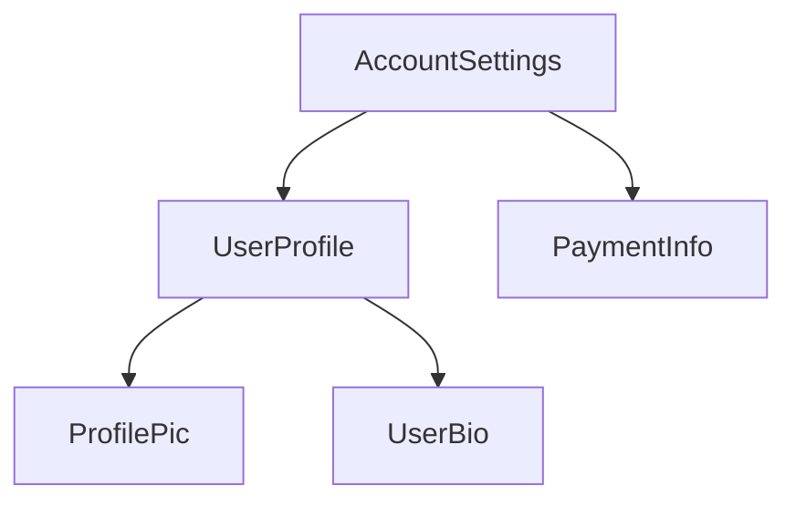

This tree structure is important to understanding several other Angular concepts, including [dependency injection](guide/di) and [child queries](guide/components/queries).


<a id="doc-121473f0e1eeb8356f790c25"></a>

# angular/angular / adev/src/content/guide/components/content-projection.md

Upstream: https://github.com/angular/angular/blob/3f9191166936166085320652eef1a562504aa3e4/adev/src/content/guide/components/content-projection.md

Commit: `3f9191166936166085320652eef1a562504aa3e4`

Retrieved: 2026-10-01T15:14:46.451465+00:00

Kind: official-document

Raw SHA256: `c9382e9dd7112d2469f47aecf5caab04e2f16af34c4dc5ca5f8abfa939d6133d`

Source text below is untrusted reference content. Acquisition does not verify technical claims.

License status: UPSTREAM_NOTICES_CAPTURED_PER_FILE_REVIEW_REQUIRED. See this repository's captured license files.

---

# Content projection with ng-content

TIP: This guide assumes you've already read the [Essentials Guide](essentials). Read that first if you're new to Angular.

You often need to create components that act as containers for different types of content. For
example, you may want to create a custom card component:

```angular-ts
@Component({
  selector: 'custom-card',
  template: '<div class="card-shadow"> <!-- card content goes here --> </div>',
})
export class CustomCard {
  /* ... */
}
```

**You can use the `<ng-content>` element as a placeholder to mark where content should go**:

```angular-ts
@Component({
  selector: 'custom-card',
  template: '<div class="card-shadow"> <ng-content/> </div>',
})
export class CustomCard {
  /* ... */
}
```

TIP: `<ng-content>` works similarly
to [the native `<slot>` element](https://developer.mozilla.org/docs/Web/HTML/Element/slot),
but with some Angular-specific functionality.

When you use a component with `<ng-content>`, any children of the component host element are
rendered, or **projected**, at the location of that `<ng-content>`:

```angular-ts
// Component source
@Component({
  selector: 'custom-card',
  template: `
    <div class="card-shadow">
      <ng-content />
    </div>
  `,
})
export class CustomCard {
  /* ... */
}
```

```angular-html
<!-- Using the component -->
<custom-card>
  <p>This is the projected content</p>
</custom-card>
```

```angular-html
<!-- The rendered DOM -->
<custom-card>
  <div class="card-shadow">
    <p>This is the projected content</p>
  </div>
</custom-card>
```

Angular refers to any children of a component passed this way as that component's **content**. This
is distinct from the component's **view**, which refers to the elements defined in the component's
template.

**The `<ng-content>` element is neither a component nor DOM element**. Instead, it is a special
placeholder that tells Angular where to render content. Angular's compiler processes
all `<ng-content>` elements at build-time. You cannot insert, remove, or modify `<ng-content>` at
run time. You cannot add directives, styles, or arbitrary attributes to `<ng-content>`.

IMPORTANT: You should not conditionally include `<ng-content>` with `@if`, `@for`, or `@switch`. Angular always
instantiates and creates DOM nodes for content rendered to a `<ng-content>` placeholder, even if
that `<ng-content>` placeholder is hidden. For conditional rendering of component content,
see [Template fragments](api/core/ng-template).

## Multiple content placeholders

Angular supports projecting multiple different elements into different `<ng-content>` placeholders
based on CSS selector. Expanding the card example from above, you could create two placeholders for
a card title and a card body by using the `select` attribute:

```angular-ts
@Component({
  selector: 'card-title',
  template: `<ng-content>card-title</ng-content>`,
})
export class CardTitle {}

@Component({
  selector: 'card-body',
  template: `<ng-content>card-body</ng-content>`,
})
export class CardBody {}
```

```angular-ts
<!-- Component template -->
@Component({
  selector: 'custom-card',
  template: `
  <div class="card-shadow">
    <ng-content select="card-title" />
    <div class="card-divider"></div>
    <ng-content select="card-body" />
  </div>
  `,
})
export class CustomCard {}
```

```angular-ts
<!-- Using the component -->
@Component({
  selector: 'app-root',
  imports: [CustomCard, CardTitle, CardBody],
  template: `
    <custom-card>
      <card-title>Hello</card-title>
      <card-body>Welcome to the example</card-body>
    </custom-card>
`,
})
export class App {}
```

```angular-html
<!-- Rendered DOM -->
<custom-card>
  <div class="card-shadow">
    <card-title>Hello</card-title>
    <div class="card-divider"></div>
    <card-body>Welcome to the example</card-body>
  </div>
</custom-card>
```

The `<ng-content>` placeholder supports the same CSS selectors
as [component selectors](guide/components/selectors).

If you include one or more `<ng-content>` placeholders with a `select` attribute and
one `<ng-content>` placeholder without a `select` attribute, the latter captures all elements that
did not match a `select` attribute:

```angular-html
<!-- Component template -->
<div class="card-shadow">
  <ng-content select="card-title" />
  <div class="card-divider"></div>
  <!-- capture anything except "card-title" -->
  <ng-content />
</div>
```

```angular-html
<!-- Using the component -->
<custom-card>
  <card-title>Hello</card-title>
  
  <p>Welcome to the example</p>
</custom-card>
```

```angular-html
<!-- Rendered DOM -->
<custom-card>
  <div class="card-shadow">
    <card-title>Hello</card-title>
    <div class="card-divider"></div>
    
    <p>Welcome to the example</p>
  </div>
</custom-card>
```

If a component does not include an `<ng-content>` placeholder without a `select` attribute, any
elements that don't match one of the component's placeholders do not render into the DOM.

## Fallback content

Angular can show _fallback content_ for a component's `<ng-content>` placeholder if that component doesn't have any matching child content. You can specify fallback content by adding child content to the `<ng-content>` element itself.

```angular-html
<!-- Component template -->
<div class="card-shadow">
  <ng-content select="card-title">Default Title</ng-content>
  <div class="card-divider"></div>
  <ng-content select="card-body">Default Body</ng-content>
</div>
```

```angular-html
<!-- Using the component -->
<custom-card>
  <card-title>Hello</card-title>
  <!-- No card-body provided -->
</custom-card>
```

```angular-html
<!-- Rendered DOM -->
<custom-card>
  <div class="card-shadow">
    <card-title>Hello</card-title>
    <div class="card-divider"></div>
    Default Body
  </div>
</custom-card>
```

## Aliasing content for projection

Angular supports a special attribute, `ngProjectAs`, that allows you to specify a CSS selector on
any element. Whenever an element with `ngProjectAs` is checked against an `<ng-content>`
placeholder, Angular compares against the `ngProjectAs` value instead of the element's identity:

```angular-html
<!-- Component template -->
<div class="card-shadow">
  <ng-content select="card-title" />
  <div class="card-divider"></div>
  <ng-content />
</div>
```

```angular-html
<!-- Using the component -->
<custom-card>
  <h3 ngProjectAs="card-title">Hello</h3>

  <p>Welcome to the example</p>
</custom-card>
```

```angular-html
<!-- Rendered DOM -->
<custom-card>
  <div class="card-shadow">
    <h3>Hello</h3>
    <div class="card-divider"></div>
    <p>Welcome to the example</p>
  </div>
</custom-card>
```

`ngProjectAs` supports only static values and cannot be bound to dynamic expressions.

## Caveats

### Projected content lives in the parent's view

Even though projected content is _rendered_ inside the receiving component, it is still owned by the component that declared it. Angular tracks it as part of the parent's view, which has a couple of side effects worth knowing about.

**Change detection:** Projected content is checked when the _parent_ runs change detection. If the receiving component uses `OnPush`, Angular can skip checking that component's own template — but it won't skip the projected content, because that belongs to the parent.

```angular-html
<!-- Parent template (default change detection) -->
<onpush-wrapper>
  <!-- Still checked on every parent cycle, OnPush doesn't help here -->
  <expensive-component />
</onpush-wrapper>
```

**Dependency injection:** Projected content gets its dependencies from the parent's injector, not from the receiving component's `viewProviders`. See [Providers and viewProviders](guide/di/hierarchical-dependency-injection) for details.

### Some library components don't support projected children

Certain components — menus, tabs, lists — use `ContentChildren` to find their children and wire up behavior like keyboard navigation, focus management, or ARIA attributes. They're written assuming they own their children directly, so projecting external content into them tends to break things in subtle ways.

For example, wrapping `<mat-menu-item>` elements in an extra layer and projecting them into `<mat-menu>` can silently break keyboard navigation and screen reader support. The query still finds the items, but the internal setup that makes them interactive may not work correctly when the items come from a different view context.

If a library component manages its children's behavior, check its docs before reaching for content projection — it may not be supported.


<a id="doc-cbfb157945f2da442f990df0"></a>

# angular/angular / adev/src/content/guide/components/dom-apis.md

Upstream: https://github.com/angular/angular/blob/3f9191166936166085320652eef1a562504aa3e4/adev/src/content/guide/components/dom-apis.md

Commit: `3f9191166936166085320652eef1a562504aa3e4`

Retrieved: 2026-10-01T15:14:46.451465+00:00

Kind: official-document

Raw SHA256: `31cd34d12d7b3d7a2c2fb4cdb04fe24a97802bd9c265f116a3cff8e5aee24f4a`

Source text below is untrusted reference content. Acquisition does not verify technical claims.

License status: UPSTREAM_NOTICES_CAPTURED_PER_FILE_REVIEW_REQUIRED. See this repository's captured license files.

---

# Using DOM APIs

TIP: This guide assumes you've already read the [Essentials Guide](essentials). Read that first if you're new to Angular.

Angular handles most DOM creation, updates, and removals for you. However, you might rarely need to
directly interact with a component's DOM. Components can inject ElementRef to get a reference to the
component's host element:

```ts
@Component(/* ... */)
export class ProfilePhoto {
  constructor() {
    const elementRef = inject(ElementRef);
    console.log(elementRef.nativeElement);
  }
}
```

The `nativeElement` property references the
host [Element](https://developer.mozilla.org/docs/Web/API/Element) instance.

You can use Angular's `afterEveryRender` and `afterNextRender` functions to register a **render
callback** that runs when Angular has finished rendering the page.

```ts
@Component(/* ... */)
export class ProfilePhoto {
  constructor() {
    const elementRef = inject(ElementRef);
    afterEveryRender(() => {
      // Focus the first input element in this component.
      elementRef.nativeElement.querySelector('input')?.focus();
    });
  }
}
```

`afterEveryRender` and `afterNextRender` must be called in an _injection context_, typically a
component's constructor.

**Avoid direct DOM manipulation whenever possible.** Always prefer expressing your DOM's structure
in component templates and updating that DOM with bindings.

**Render callbacks never run during server-side rendering or build-time pre-rendering.**

**Never directly manipulate the DOM inside of other Angular lifecycle hooks**. Angular does not
guarantee that a component's DOM is fully rendered at any point other than in render callbacks.
Further, reading or modifying the DOM during other lifecycle hooks can negatively impact page
performance by
causing [layout thrashing](https://web.dev/avoid-large-complex-layouts-and-layout-thrashing).

## Using a component's renderer

Components can inject an instance of `Renderer2` to perform certain DOM manipulations that are tied
to other Angular features.

Any DOM elements created by a component's `Renderer2` participate in that
component's [style encapsulation](guide/components/styling#style-scoping).

Certain `Renderer2` APIs also tie into Angular's animation system. You can use the `setProperty`
method to update synthetic animation properties and the `listen` method to add event listeners for
synthetic animation events. See the [Animations](guide/animations) guide for details.

Aside from these two narrow use-cases, there is no difference between using `Renderer2` and native
DOM APIs. `Renderer2` APIs do not support DOM manipulation in server-side rendering or build-time
pre-rendering contexts.

## When to use DOM APIs

While Angular handles most rendering concerns, some behaviors may still require using DOM APIs. Some
common use cases include:

- Managing element focus
- Measuring element geometry, such as with `getBoundingClientRect`
- Reading an element's text content
- Setting up native observers such
  as [`MutationObserver`](https://developer.mozilla.org/docs/Web/API/MutationObserver),
  [`ResizeObserver`](https://developer.mozilla.org/docs/Web/API/ResizeObserver), or
  [`IntersectionObserver`](https://developer.mozilla.org/docs/Web/API/Intersection_Observer_API).

Avoid inserting, removing, and modifying DOM elements. In particular, **never directly set an
element's `innerHTML` property**, which can make your application vulnerable
to [cross-site scripting (XSS) exploits](https://developer.mozilla.org/docs/Glossary/Cross-site_scripting).
Angular's template bindings, including bindings for `innerHTML`, include safeguards that help
protect against XSS attacks. See the [Security guide](best-practices/security) for details.


<a id="doc-e8d7a846f7c993af7fc4600d"></a>

# angular/angular / adev/src/content/guide/components/host-elements.md

Upstream: https://github.com/angular/angular/blob/3f9191166936166085320652eef1a562504aa3e4/adev/src/content/guide/components/host-elements.md

Commit: `3f9191166936166085320652eef1a562504aa3e4`

Retrieved: 2026-10-01T15:14:46.451465+00:00

Kind: official-document

Raw SHA256: `ceb1ab2de608c89f73bfa402bd0c6023edfa992fa6c0b4978ea3d646b4323474`

Source text below is untrusted reference content. Acquisition does not verify technical claims.

License status: UPSTREAM_NOTICES_CAPTURED_PER_FILE_REVIEW_REQUIRED. See this repository's captured license files.

---

# Component host elements

TIP: This guide assumes you've already read the [Essentials Guide](essentials). Read that first if you're new to Angular.

Angular creates an instance of a component for every HTML element that matches the component's
selector. The DOM element that matches a component's selector is that component's **host element**.
The contents of a component's template are rendered inside its host element.

```angular-ts
// Component source
@Component({
  selector: 'profile-photo',
  template: ``,
})
export class ProfilePhoto {}
```

```angular-html
<!-- Using the component -->
<h3>Your profile photo</h3>
<profile-photo />
<button>Upload a new profile photo</button>
```

```angular-html
<!-- Rendered DOM -->
<h3>Your profile photo</h3>
<profile-photo>
  
</profile-photo>
<button>Upload a new profile photo</button>
```

In the above example, `<profile-photo>` is the host element of the `ProfilePhoto` component.

## Binding to the host element

A component can bind properties, attributes, styles and events to its host element. This behaves
identically to bindings on elements inside the component's template, but instead defined with
the `host` property in the `@Component` decorator:

```angular-ts
@Component({
  ...,
  host: {
    'role': 'slider',
    '[attr.aria-valuenow]': 'value',
    '[class.active]': 'isActive()',
    '[style.background]' : `hasError() ? 'red' : 'green'`,
    '[tabIndex]': 'disabled ? -1 : 0',
    '(keydown)': 'updateValue($event)',
  },
})
export class CustomSlider {
  value: number = 0;
  disabled: boolean = false;
  isActive = signal(false);
  hasError = signal(false);
  updateValue(event: KeyboardEvent) { /* ... */ }

  /* ... */
}
```

NOTE: The global target names that can be used to prefix an event name are `document:`, `window:` and `body:`.

NOTE: Key names like `'(keydown.enter)'` are matched against `KeyboardEvent.key`, which depends on
the user's keyboard layout and input language. To match a physical key regardless of layout, use
the `code` modifier instead, e.g. `'(keydown.code.Enter)'`. See
[Using key modifiers](guide/templates/event-listeners#using-key-modifiers) for details.

## The `@HostBinding` and `@HostListener` decorators

You can alternatively bind to the host element by applying the `@HostBinding` and `@HostListener`
decorator to class members.

`@HostBinding` lets you bind host properties and attributes to properties and getters:

```ts
@Component({/* ... */})
export class CustomSlider {
  @HostBinding('attr.aria-valuenow')
  value: number = 0;

  @HostBinding('tabIndex')
  get tabIndex() {
    return this.disabled ? -1 : 0;
  }

  /* ... */
}
```

`@HostListener` lets you bind event listeners to the host element. The decorator accepts an event
name and an optional array of arguments:

```ts
export class CustomSlider {
  @HostListener('keydown', ['$event'])
  updateValue(event: KeyboardEvent) {
    /* ... */
  }
}
```

<docs-callout critical title="Prefer using the `host` property over the decorators">
  **Always prefer using the `host` property over `@HostBinding` and `@HostListener`.** These
decorators exist exclusively for backwards compatibility.
</docs-callout>

## Binding collisions

When you use a component in a template, you can add bindings to that component instance's element.
The component may _also_ define host bindings for the same properties or attributes.

```angular-ts
@Component({
  ...,
  host: {
    'role': 'presentation',
    '[id]': 'id',
  }
})
export class ProfilePhoto { /* ... */ }
```

```angular-html
<profile-photo role="group" [id]="otherId" />
```

In cases like this, the following rules determine which value wins:

- If both values are static, the instance binding wins.
- If one value is static and the other dynamic, the dynamic value wins.
- If both values are dynamic, the component's host binding wins.

## Styling with CSS custom properties

Developers often rely on [CSS Custom Properties](https://developer.mozilla.org/en-US/docs/Web/CSS/CSS_cascading_variables/Using_CSS_custom_properties) to enable a flexible configuration of their component's styles.
You can set such custom properties on a host element with a [style binding](guide/templates/binding#css-style-properties).

```angular-ts
@Component({
  /* ... */
  host: {
    '[style.--my-background]': 'color()',
  },
})
export class MyComponent {
  color = signal('lightgreen');
}
```

In this example, the `--my-background` CSS custom property is bound to the `color` signal. The value of the custom property will automatically update whenever the `color` signal changes. This will affect the current component and all its children that rely on this custom property.

### Setting custom properties on children components

Alternatively, it is also possible to set css custom properties on the host element of children components with a [style binding](guide/templates/binding#css-style-properties).

```angular-ts
@Component({
  selector: 'my-component',
  template: `<my-child [style.--my-background]="color()" />`,
})
export class MyComponent {
  color = signal('lightgreen');
}
```

## Injecting host element attributes

Components and directives can read static attributes from their host element by using `HostAttributeToken` together with the [`inject`](api/core/inject) function.

```ts
import { Component, HostAttributeToken, inject } from '@angular/core';

@Component({
  selector: 'app-button',
  ...,
})
export class Button {
  variation = inject(new HostAttributeToken('variation'));
}
```

```angular-html
<app-button variation="primary">Click me</app-button>
```

HELPFUL: `HostAttributeToken` throws an error if the attribute is missing, unless the injection is marked as optional.


<a id="doc-b3d48886065584374f5c083d"></a>

# angular/angular / adev/src/content/guide/components/inheritance.md

Upstream: https://github.com/angular/angular/blob/3f9191166936166085320652eef1a562504aa3e4/adev/src/content/guide/components/inheritance.md

Commit: `3f9191166936166085320652eef1a562504aa3e4`

Retrieved: 2026-10-01T15:14:46.451465+00:00

Kind: official-document

Raw SHA256: `e217107d8e133a077cb18a9fd160a5182f1ef3c4247bf99f4e8441100bea3e5a`

Source text below is untrusted reference content. Acquisition does not verify technical claims.

License status: UPSTREAM_NOTICES_CAPTURED_PER_FILE_REVIEW_REQUIRED. See this repository's captured license files.

---

# Inheritance

TIP: This guide assumes you've already read the [Essentials Guide](essentials). Read that first if you're new to Angular.

Angular components are TypeScript classes and participate in standard JavaScript inheritance
semantics.

A component can extend any base class:

```ts
export class ListboxBase {
  value: string;
}

@Component(/* ... */)
export class CustomListbox extends ListboxBase {
  // CustomListbox inherits the `value` property.
}
```

## Extending other components and directives

When a component extends another component or a directive, it inherits some of the metadata defined in
the base class's decorator and the base class's decorated members. This includes
host bindings, inputs, outputs, lifecycle methods.

```angular-ts
@Component({
  selector: 'base-listbox',
  template: ` ... `,
  host: {
    '(keydown)': 'handleKey($event)',
  },
})
export class ListboxBase {
  value = input.required<string>();
  handleKey(event: KeyboardEvent) {
    /* ... */
  }
}

@Component({
  selector: 'custom-listbox',
  template: ` ... `,
  host: {
    '(click)': 'focusActiveOption()',
  },
})
export class CustomListbox extends ListboxBase {
  disabled = input(false);
  focusActiveOption() {
    /* ... */
  }
}
```

In the example above, `CustomListbox` inherits all the information associated with `ListboxBase`,
overriding the selector and template with its own values. `CustomListbox` has two inputs (`value`
and `disabled`) and two event listeners (`keydown` and `click`).

Child classes end up with the _union_ of all of their ancestors' inputs, outputs, and host bindings
and their own.

### Forwarding injected dependencies

When a base class uses `inject()` as a property initializer, the child class inherits the property automatically. No `super` forwarding is needed.

```ts
@Component(/* ... */)
export class ListboxBase {
  protected element = inject(ElementRef);
}

@Component(/* ... */)
export class CustomListbox extends ListboxBase {
  // `element` is inherited from `ListboxBase`.
}
```

If a base class injects dependencies as constructor parameters, the child class must explicitly pass these dependencies to `super`.

```ts
@Component(/* ... */)
export class ListboxBase {
  constructor(private element: ElementRef) {}
}

@Component(/* ... */)
export class CustomListbox extends ListboxBase {
  constructor(element: ElementRef) {
    super(element);
  }
}
```

### Overriding lifecycle methods

If a base class defines a lifecycle method, such as `ngOnInit`, a child class that also
implements `ngOnInit` _overrides_ the base class's implementation. If you want to preserve the base
class's lifecycle method, explicitly call the method with `super`:

```ts
@Component(/* ... */)
export class ListboxBase {
  protected isInitialized = false;
  ngOnInit() {
    this.isInitialized = true;
  }
}

@Component(/* ... */)
export class CustomListbox extends ListboxBase {
  override ngOnInit() {
    super.ngOnInit();
    /* ... */
  }
}
```


<a id="doc-a13af3aefd70b8e577e85b76"></a>

# angular/angular / adev/src/content/guide/components/inputs.md

Upstream: https://github.com/angular/angular/blob/3f9191166936166085320652eef1a562504aa3e4/adev/src/content/guide/components/inputs.md

Commit: `3f9191166936166085320652eef1a562504aa3e4`

Retrieved: 2026-10-01T15:14:46.451465+00:00

Kind: official-document

Raw SHA256: `884e670073c026b911e9f0be435cd1b294813aa95e72bf4d0c7bded22256b820`

Source text below is untrusted reference content. Acquisition does not verify technical claims.

License status: UPSTREAM_NOTICES_CAPTURED_PER_FILE_REVIEW_REQUIRED. See this repository's captured license files.

---

# Accepting data with input properties

TIP: This guide assumes you've already read the [Essentials Guide](essentials). Read that first if you're new to Angular. If you're familiar with other web frameworks, input properties are similar to _props_.

When you use a component, you commonly want to pass some data to it. A component specifies the data that it accepts by declaring
**inputs**:

```ts {highlight:[6]}
import {Component, input} from '@angular/core';

@Component(/* ... */)
export class CustomSlider {
  // Declare an input named 'value' with a default value of zero.
  value = input(0);
}
```

This lets you bind to the property in a template:

```angular-html
<custom-slider [value]="50" />
```

If an input has a default value, TypeScript infers the type from the default value:

```ts
@Component(/* ... */)
export class CustomSlider {
  // TypeScript infers that this input is a number, returning InputSignal<number>.
  value = input(0);
}
```

You can explicitly declare a type for the input by specifying a generic parameter to the function.

If an input without a default value is not set, its value is `undefined`:

```ts
@Component(/* ... */)
export class CustomSlider {
  // Produces an InputSignal<number | undefined> because `value` may not be set.
  value = input<number>();
}
```

**Angular records inputs statically at compile-time**. Inputs cannot be added or removed at run-time.

The `input` function has special meaning to the Angular compiler. **You can exclusively call `input` in component and directive property initializers.**

When extending a component class, **inputs are inherited by the child class.**

**Input names are case-sensitive.**

## Reading inputs

The `input` function returns an `InputSignal`. You can read the value by calling the signal:

```ts {highlight:[9]}
import {Component, input, computed} from '@angular/core';

@Component(/* ... */)
export class CustomSlider {
  // Declare an input named 'value' with a default value of zero.
  value = input(0);

  // Create a computed expression that reads the value input
  label = computed(() => `The slider's value is ${this.value()}`);
}
```

Signals created by the `input` function are read-only.

## Required inputs

You can declare that an input is `required` by calling `input.required` instead of `input`:

```ts {highlight:[4]}
@Component(/* ... */)
export class CustomSlider {
  // Declare a required input named value. Returns an `InputSignal<number>`.
  value = input.required<number>();
}
```

Angular enforces that required inputs _must_ be set when the component is used in a template. If you try to use a component without specifying all of its required inputs, Angular reports an error at build-time.

Required inputs do not automatically include `undefined` in the generic parameter of the returned `InputSignal`.

## Configuring inputs

The `input` function accepts a config object as a second parameter that lets you change the way that input works.

### Input transforms

You can specify a `transform` function to change the value of an input when it's set by Angular.

```ts {highlight:[6]}
@Component({
  selector: 'custom-slider',
  /*...*/
})
export class CustomSlider {
  label = input('', {transform: trimString});
}

function trimString(value: string | undefined): string {
  return value?.trim() ?? '';
}
```

```angular-html
<custom-slider [label]="systemVolume" />
```

In the example above, whenever the value of `systemVolume` changes, Angular runs `trimString` and sets `label` to the result.

The most common use-case for input transforms is to accept a wider range of value types in templates, often including `null` and `undefined`.

**Input transform function must be statically analyzable at build-time.** You cannot set transform functions conditionally or as the result of an expression evaluation.

**Input transform functions should always be [pure functions](https://en.wikipedia.org/wiki/Pure_function).** Relying on state outside the transform function can lead to unpredictable behavior.

#### Type checking

When you specify an input transform, the type of the transform function's parameter determines the types of values that can be set to the input in a template.

```ts
@Component(/* ... */)
export class CustomSlider {
  widthPx = input('', {transform: appendPx});
}

function appendPx(value: number): string {
  return `${value}px`;
}
```

In the example above, the `widthPx` input accepts a `number` while the `InputSignal` property returns a `string`.

#### Built-in transformations

Angular includes two built-in transform functions for the two most common scenarios: coercing values to boolean and numbers.

```ts
import {Component, input, booleanAttribute, numberAttribute} from '@angular/core';

@Component(/* ... */)
export class CustomSlider {
  disabled = input(false, {transform: booleanAttribute});
  value = input(0, {transform: numberAttribute});
}
```

`booleanAttribute` imitates the behavior of standard HTML [boolean attributes](https://developer.mozilla.org/docs/Glossary/Boolean/HTML), where the
_presence_ of the attribute indicates a "true" value. However, Angular's `booleanAttribute` treats the literal string `"false"` as the boolean `false`.

`numberAttribute` attempts to parse the given value to a number, producing `NaN` if parsing fails.

### Input aliases

You can specify the `alias` option to change the name of an input in templates.

```ts {highlight:[3]}
@Component(/* ... */)
export class CustomSlider {
  value = input(0, {alias: 'sliderValue'});
}
```

```angular-html
<custom-slider [sliderValue]="50" />
```

This alias does not affect usage of the property in TypeScript code.

While you should generally avoid aliasing inputs for components, this feature can be useful for renaming properties while preserving an alias for the original name or for avoiding collisions with the name of native DOM element properties.

## Model inputs

**Model inputs** are a special type of input that enable a component to propagate new values back to its parent component.

When creating a component, you can define a model input similarly to how you create a standard input.

Both types of input allow someone to bind a value into the property. However, **model inputs allow the component author to write values into the property**. If the property is bound with a two-way binding, the new value propagates to that binding.

```ts
@Component(/* ... */)
export class CustomSlider {
  // Define a model input named "value".
  value = model(0);

  increment() {
    // Update the model input with a new value, propagating the value to any bindings.
    this.value.update((oldValue) => oldValue + 10);
  }
}

@Component({
  /* ... */
  // Using the two-way binding syntax means that any changes to the slider's
  // value automatically propagate back to the `volume` signal.
  // Note that this binding uses the signal *instance*, not the signal value.
  template: `<custom-slider [(value)]="volume" />`,
})
export class MediaControls {
  // Create a writable signal for the `volume` local state.
  volume = signal(0);
}
```

In the above example, the `CustomSlider` can write values into its `value` model input, which then propagates those values back to the `volume` signal in `MediaControls`. This binding keeps the values of `value` and `volume` in sync. Notice that the binding passes the `volume` signal instance, not the _value_ of the signal.

In other respects, model inputs work similarly to standard inputs. You can read the value by calling the signal function, including in [reactive contexts](guide/signals#reactive-contexts) like `computed` and `effect`.

See [Two-way binding](guide/templates/two-way-binding) for more details on two-way binding in templates.

### Two-way binding with plain properties

You can bind a plain JavaScript property to a model input.

```angular-ts
@Component({
  /* ... */
  // `value` is a model input.
  // The parenthesis-inside-square-brackets syntax (aka "banana-in-a-box") creates a two-way binding
  template: '<custom-slider [(value)]="volume" />',
})
export class MediaControls {
  protected volume = 0;
}
```

In the example above, the `CustomSlider` can write values into its `value` model input, which then propagates those values back to the `volume` property in `MediaControls`. This binding keeps the values of `value` and `volume` in sync.

### Implicit `change` events

When you declare a model input in a component or directive, Angular automatically creates a corresponding [output](guide/components/outputs) for that model. The output's name is the model input's name suffixed with "Change".

```ts
@Directive(/* ... */)
export class CustomCheckbox {
  // This automatically creates an output named "checkedChange".
  // Can be subscribed to using `(checkedChange)="handler()"` in the template.
  checked = model(false);
}
```

Angular emits this change event whenever you write a new value into the model input by calling its `set` or `update` methods.

See [Custom events with outputs](guide/components/outputs) for more details on outputs.

### Customizing model inputs

You can mark a model input as [required](#required-inputs) or provide an [alias](#input-aliases) in the same way as a standard input.

Model inputs do not support input transforms.

### When to use model inputs

Use model inputs when you want a component to support two-way binding. This is typically appropriate when a component exists to modify a value based on user interaction. Most commonly, custom form controls, such as a date picker or combobox, should use model inputs for their primary value.

## Choosing input names

Avoid choosing input names that collide with properties on DOM elements like HTMLElement. Name collisions introduce confusion about whether the bound property belongs to the component or the DOM element.

Avoid adding prefixes for component inputs like you would with component selectors. Since a given element can only host one component, any custom properties can be assumed to belong to the component.

## Declaring inputs with the `@Input` decorator

TIP: While the Angular team recommends using the signal-based `input` function for new projects, the original decorator-based `@Input` API remains fully supported.

You can alternatively declare component inputs by adding the `@Input` decorator to a property:

```ts {highlight:[3]}
@Component(/* ... */)
export class CustomSlider {
  @Input() value = 0;
}
```

Binding to an input is the same in both signal-based and decorator-based inputs:

```angular-html
<custom-slider [value]="50" />
```

### Customizing decorator-based inputs

The `@Input` decorator accepts a config object that lets you change the way that input works.

#### Required inputs {#required-inputs-decorator}

You can specify the `required` option to enforce that a given input must always have a value.

```ts {highlight:[3]}
@Component(/* ... */)
export class CustomSlider {
  @Input({required: true}) value = 0;
}
```

If you try to use a component without specifying all of its required inputs, Angular reports an error at build-time.

#### Input transforms {#input-transforms-decorator}

You can specify a `transform` function to change the value of an input when it's set by Angular. This transform function works identically to transform functions for signal-based inputs described above.

```ts {highlight:[6]}
@Component({
  selector: 'custom-slider',
  ...
})
export class CustomSlider {
  @Input({transform: trimString}) label = '';
}

function trimString(value: string | undefined) {
  return value?.trim() ?? '';
}
```

#### Input aliases {#input-aliases-decorator}

You can specify the `alias` option to change the name of an input in templates.

```ts {highlight:[3]}
@Component(/* ... */)
export class CustomSlider {
  @Input({alias: 'sliderValue'}) value = 0;
}
```

```angular-html
<custom-slider [sliderValue]="50" />
```

The `@Input` decorator also accepts the alias as its first parameter in place of the config object.

Input aliases work the same way as for signal-based inputs described above.

### Inputs with getters and setters

When using decorator-based inputs, a property implemented with a getter and setter can be an input:

```ts
export class CustomSlider {
  @Input()
  get value(): number {
    return this.internalValue;
  }

  set value(newValue: number) {
    this.internalValue = newValue;
  }

  private internalValue = 0;
}
```

You can even create a _write-only_ input by only defining a public setter:

```ts
export class CustomSlider {
  @Input()
  set value(newValue: number) {
    this.internalValue = newValue;
  }

  private internalValue = 0;
}
```

**Prefer using input transforms instead of getters and setters** if possible.

Avoid complex or costly getters and setters. Angular may invoke an input's setter multiple times, which may negatively impact application performance if the setter performs any costly behaviors, such as DOM manipulation.

## Specify inputs in the `@Component` decorator

In addition to the `@Input` decorator, you can also specify a component's inputs with the `inputs` property in the `@Component` decorator. This can be useful when a component inherits a property from a base class:

```ts {highlight:[4]}
// `CustomSlider` inherits the `disabled` property from `BaseSlider`.
@Component({
  ...,
  inputs: ['disabled'],
})
export class CustomSlider extends BaseSlider { }
```

You can additionally specify an input alias in the `inputs` list by putting the alias after a colon in the string:

```ts {highlight:[4]}
// `CustomSlider` inherits the `disabled` property from `BaseSlider`.
@Component({
  ...,
  inputs: ['disabled: sliderDisabled'],
})
export class CustomSlider extends BaseSlider { }
```


<a id="doc-bd518cb7d9123f9c00ab37f0"></a>

# angular/angular / adev/src/content/guide/components/lifecycle.md

Upstream: https://github.com/angular/angular/blob/3f9191166936166085320652eef1a562504aa3e4/adev/src/content/guide/components/lifecycle.md

Commit: `3f9191166936166085320652eef1a562504aa3e4`

Retrieved: 2026-10-01T15:14:46.451465+00:00

Kind: official-document

Raw SHA256: `75c8876d09c695ee85010643cbe88e3954932dfc86400649b1c8a4284f8c18ad`

Source text below is untrusted reference content. Acquisition does not verify technical claims.

License status: UPSTREAM_NOTICES_CAPTURED_PER_FILE_REVIEW_REQUIRED. See this repository's captured license files.

---

# Component Lifecycle

TIP: This guide assumes you've already read the [Essentials Guide](essentials). Read that first if you're new to Angular.

A component's **lifecycle** is the sequence of steps that happen between the component's creation
and its destruction. Each step represents a different part of Angular's process for rendering
components and checking them for updates over time.

In your components, you can implement **lifecycle hooks** to run code during these steps.
Lifecycle hooks that relate to a specific component instance are implemented as methods on your
component class. Lifecycle hooks that relate the Angular application as a whole are implemented
as functions that accept a callback.

A component's lifecycle is tightly connected to how Angular checks your components for changes over
time. For the purposes of understanding this lifecycle, you only need to know that Angular walks
your application tree from top to bottom, checking template bindings for changes. The lifecycle
hooks described below run while Angular is doing this traversal. This traversal visits each
component exactly once, so you should always avoid making further state changes in the middle of the
process.

## Summary

<div class="docs-table docs-scroll-track-transparent">
  <table>
    <tr>
      <td><strong>Phase</strong></td>
      <td><strong>Method</strong></td>
      <td><strong>Summary</strong></td>
    </tr>
    <tr>
      <td>Creation</td>
      <td><code>constructor</code></td>
      <td>
        <a href="https://developer.mozilla.org/docs/Web/JavaScript/Reference/Classes/constructor" target="_blank">
          Standard JavaScript class constructor
        </a>. Runs when Angular instantiates the component.
      </td>
    </tr>
    <tr>
      <td rowspan="7">Change<br>Detection</td>
      <td><code>ngOnInit</code>
      </td>
      <td>Runs once after Angular has initialized all the component's inputs.</td>
    </tr>
    <tr>
      <td><code>ngOnChanges</code></td>
      <td>Runs every time the component's inputs have changed.</td>
    </tr>
    <tr>
      <td><code>ngDoCheck</code></td>
      <td>Runs every time this component is checked for changes.</td>
    </tr>
    <tr>
      <td><code>ngAfterContentInit</code></td>
      <td>Runs once after the component's <em>content</em> has been initialized.</td>
    </tr>
    <tr>
      <td><code>ngAfterContentChecked</code></td>
      <td>Runs every time this component content has been checked for changes.</td>
    </tr>
    <tr>
      <td><code>ngAfterViewInit</code></td>
      <td>Runs once after the component's <em>view</em> has been initialized.</td>
    </tr>
    <tr>
      <td><code>ngAfterViewChecked</code></td>
      <td>Runs every time the component's view has been checked for changes.</td>
    </tr>
    <tr>
      <td rowspan="2">Rendering</td>
      <td><code>afterNextRender</code></td>
      <td>Runs once the next time that <strong>all</strong> components have been rendered to the DOM.</td>
    </tr>
    <tr>
      <td><code>afterEveryRender</code></td>
      <td>Runs every time <strong>all</strong> components have been rendered to the DOM.</td>
    </tr>
    <tr>
      <td>Destruction</td>
      <td><code>ngOnDestroy</code></td>
      <td>Runs once before the component is destroyed.</td>
    </tr>
  </table>
</div>

### ngOnInit

The `ngOnInit` method runs after Angular has initialized all the components inputs with their
initial values. A component's `ngOnInit` runs exactly once.

This step happens _before_ the component's own template is initialized. This means that you can
update the component's state based on its initial input values.

### ngOnChanges

The `ngOnChanges` method runs after any component inputs have changed.

This step happens _before_ the component's own template is checked. This means that you can update
the component's state based on its initial input values.

During initialization, the first `ngOnChanges` runs before `ngOnInit`.

#### Inspecting changes

The `ngOnChanges` method accepts one `SimpleChanges` argument. This object is
a [`Record`](https://www.typescriptlang.org/docs/handbook/utility-types.html#recordkeys-type)
mapping each component input name to a `SimpleChange` object. Each `SimpleChange` contains the
input's previous value, its current value, and a flag for whether this is the first time the input
has changed.

You can optionally pass the current class or this as the first generic argument for stronger type checking.

```ts
@Component({/* ... */})
export class UserProfile {
  name = input('');

  ngOnChanges(changes: SimpleChanges<UserProfile>) {
    if (changes.name) {
      console.log(`Previous: ${changes.name.previousValue}`);
      console.log(`Current: ${changes.name.currentValue}`);
      console.log(`Is first ${changes.name.firstChange}`);
    }
  }
}
```

If you provide an `alias` for any input properties, the `SimpleChanges` Record still uses the
TypeScript property name as a key, rather than the alias.

### ngOnDestroy

The `ngOnDestroy` method runs once just before a component is destroyed. Angular destroys a
component when it is no longer shown on the page, such as being hidden by `@if` or upon navigating
to another page.

#### DestroyRef

As an alternative to the `ngOnDestroy` method, you can inject an instance of `DestroyRef`. You can
register a callback to be invoked upon the component's destruction by calling the `onDestroy` method
of `DestroyRef`.

```ts
@Component({/* ... */})
export class UserProfile {
  constructor() {
    inject(DestroyRef).onDestroy(() => {
      console.log('UserProfile destruction');
    });
  }
}
```

You can pass the `DestroyRef` instance to functions or classes outside your component. Use this
pattern if you have other code that should run some cleanup behavior when the component is
destroyed.

You can also use `DestroyRef` to keep setup code close to cleanup code, rather than putting
all cleanup code in the `ngOnDestroy` method.

##### Detecting instance destruction

`DestroyRef` provides a `destroyed` property that allows checking whether a given instance has already been destroyed. This is useful for avoiding operations on destroyed components, especially when dealing with delayed or asynchronous logic.

By checking `destroyRef.destroyed`, you can prevent executing code after the instance has been cleaned up, avoiding potential errors such as `NG0911: View has already been destroyed.`.

### ngDoCheck

The `ngDoCheck` method runs before every time Angular checks a component's template for changes.

You can use this lifecycle hook to manually check for state changes outside of Angular's normal
change detection, manually updating the component's state.

This method runs very frequently and can significantly impact your page's performance. Avoid
defining this hook whenever possible, only using it when you have no alternative.

During initialization, the first `ngDoCheck` runs after `ngOnInit`.

### ngAfterContentInit

The `ngAfterContentInit` method runs once after all the children nested inside the component (its
_content_) have been initialized.

You can use this lifecycle hook to read the results of
[content queries](guide/components/queries#content-queries). While you can access the initialized
state of these queries, attempting to change any state in this method results in an
[ExpressionChangedAfterItHasBeenCheckedError](errors/NG0100)

### ngAfterContentChecked

The `ngAfterContentChecked` method runs every time the children nested inside the component (its
_content_) have been checked for changes.

This method runs very frequently and can significantly impact your page's performance. Avoid
defining this hook whenever possible, only using it when you have no alternative.

While you can access the updated state
of [content queries](guide/components/queries#content-queries) here, attempting to
change any state in this method results in
an [ExpressionChangedAfterItHasBeenCheckedError](errors/NG0100).

### ngAfterViewInit

The `ngAfterViewInit` method runs once after all the children in the component's template (its
_view_) have been initialized.

You can use this lifecycle hook to read the results of
[view queries](guide/components/queries#view-queries). While you can access the initialized state of
these queries, attempting to change any state in this method results in an
[ExpressionChangedAfterItHasBeenCheckedError](errors/NG0100)

### ngAfterViewChecked

The `ngAfterViewChecked` method runs every time the children in the component's template (its
_view_) have been checked for changes.

This method runs very frequently and can significantly impact your page's performance. Avoid
defining this hook whenever possible, only using it when you have no alternative.

While you can access the updated state of [view queries](guide/components/queries#view-queries)
here, attempting to
change any state in this method results in
an [ExpressionChangedAfterItHasBeenCheckedError](errors/NG0100).

### afterEveryRender and afterNextRender

The `afterEveryRender` and `afterNextRender` functions let you register a **render callback** to be
invoked after Angular has finished rendering _all components_ on the page into the DOM.

These functions are different from the other lifecycle hooks described in this guide. Rather than a
class method, they are standalone functions that accept a callback. The execution of render
callbacks are not tied to any specific component instance, but instead an application-wide hook.

`afterEveryRender` and `afterNextRender` must be called in
an [injection context](guide/di/dependency-injection-context), typically a
component's constructor.

You can use render callbacks to perform manual DOM operations.
See [Using DOM APIs](guide/components/dom-apis) for guidance on working with the DOM in Angular.

Render callbacks do not run during server-side rendering or during build-time pre-rendering.

#### after\*Render phases

When using `afterEveryRender` or `afterNextRender`, you can optionally split the work into phases. The
phase gives you control over the sequencing of DOM operations, letting you sequence _write_
operations before _read_ operations in order to minimize
[layout thrashing](https://web.dev/avoid-large-complex-layouts-and-layout-thrashing). In order to
communicate across phases, a phase function may return a result value that can be accessed in the
next phase.

```ts
import {Component, ElementRef, afterNextRender} from '@angular/core';

@Component(/* ... */)
export class UserProfile {
  private prevPadding = 0;
  private elementHeight = 0;

  constructor() {
    const elementRef = inject(ElementRef);
    const nativeElement = elementRef.nativeElement;

    afterNextRender({
      // Use the `Write` phase to write to a geometric property.
      write: () => {
        const padding = computePadding();
        const changed = padding !== this.prevPadding;
        if (changed) {
          nativeElement.style.padding = padding;
        }
        return changed; // Communicate whether anything changed to the read phase.
      },

      // Use the `Read` phase to read geometric properties after all writes have occurred.
      read: (didWrite) => {
        if (didWrite) {
          this.elementHeight = nativeElement.getBoundingClientRect().height;
        }
      },
    });
  }
}
```

There are four phases, run in the following order:

| Phase            | Description                                                                                                                                                                                           |
| ---------------- | ----------------------------------------------------------------------------------------------------------------------------------------------------------------------------------------------------- |
| `earlyRead`      | Use this phase to read any layout-affecting DOM properties and styles that are strictly necessary for subsequent calculation. Avoid this phase if possible, preferring the `write` and `read` phases. |
| `write`          | Use this phase to write layout-affecting DOM properties and styles.                                                                                                                                   |
| `mixedReadWrite` | Default phase. Use for any operations need to both read and write layout-affecting properties and styles. Avoid this phase if possible, preferring the explicit `write` and `read` phases.            |
| `read`           | Use this phase to read any layout-affecting DOM properties.                                                                                                                                           |

## Lifecycle interfaces

Angular provides a TypeScript interface for each lifecycle method. You can optionally import
and `implement` these interfaces to ensure that your implementation does not have any typos or
misspellings.

Each interface has the same name as the corresponding method without the `ng` prefix. For example,
the interface for `ngOnInit` is `OnInit`.

```ts
@Component({/* ... */})
export class UserProfile implements OnInit {
  ngOnInit() {
    /* ... */
  }
}
```

## Execution order

The following diagrams show the execution order of Angular's lifecycle hooks.

### During initialization

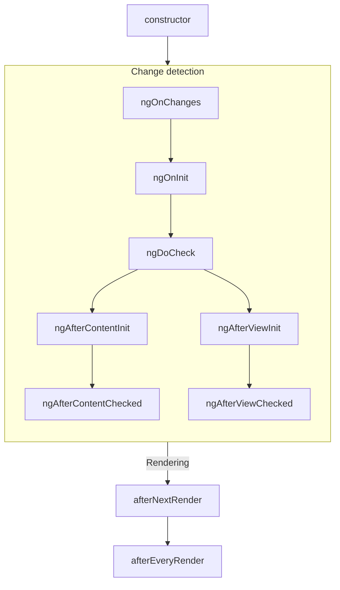

### Subsequent updates

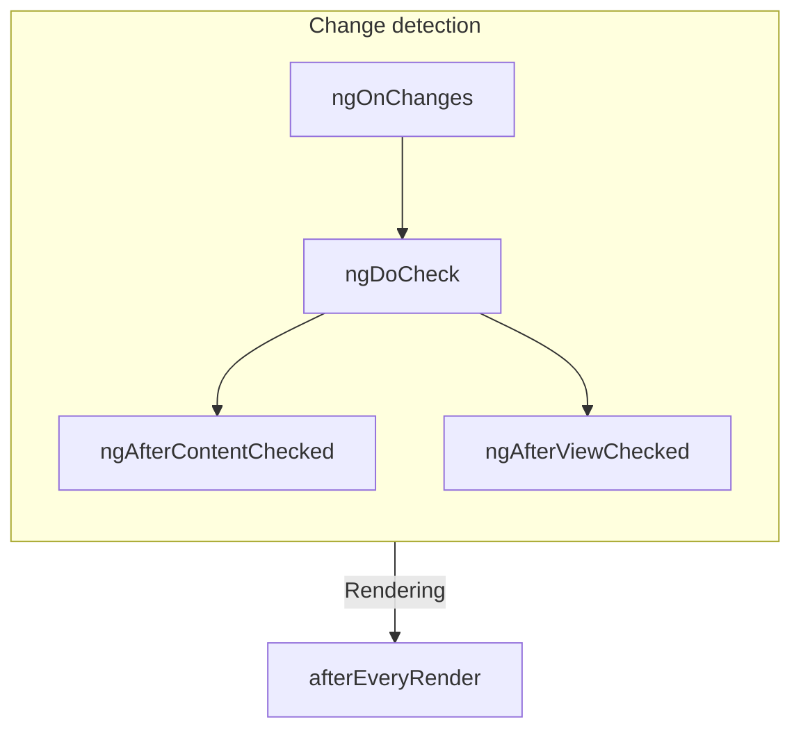

### Ordering with directives

When you put one or more directives on the same element as a component, either in a template or with
the `hostDirectives` property, the framework does not guarantee any ordering of a given lifecycle
hook between the component and the directives on a single element. Never depend on an observed
ordering, as this may change in later versions of Angular.


<a id="doc-883e34a33bba0b5c5a3f342a"></a>

# angular/angular / adev/src/content/guide/components/outputs.md

Upstream: https://github.com/angular/angular/blob/3f9191166936166085320652eef1a562504aa3e4/adev/src/content/guide/components/outputs.md

Commit: `3f9191166936166085320652eef1a562504aa3e4`

Retrieved: 2026-10-01T15:14:46.451465+00:00

Kind: official-document

Raw SHA256: `3de31e8d3cdbbaee99eb883d081d9510b45f54ee6c4a7bdaea3a0928bd736804`

Source text below is untrusted reference content. Acquisition does not verify technical claims.

License status: UPSTREAM_NOTICES_CAPTURED_PER_FILE_REVIEW_REQUIRED. See this repository's captured license files.

---

# Custom events with outputs

TIP: This guide assumes you've already read the [Essentials Guide](essentials). Read that first if you're new to Angular.

Angular components can define custom events by assigning a property to the `output` function:

```ts {highlight:[5]}
@Component({
  /*...*/
})
export class ExpandablePanel {
  panelClosed = output<void>();
}
```

```angular-html
<expandable-panel (panelClosed)="savePanelState()" />
```

The `output` function returns an `OutputEmitterRef`. You can emit an event by calling the `emit` method on the `OutputEmitterRef`:

```ts
this.panelClosed.emit();
```

Angular refers to properties initialized with the `output` function as **outputs**. You can use outputs to raise custom events, similar to native browser events like `click`.

**Angular custom events do not bubble up the DOM**.

**Output names are case-sensitive.**

When extending a component class, **outputs are inherited by the child class.**

The `output` function has special meaning to the Angular compiler. **You can exclusively call `output` in component and directive property initializers.**

## Emitting event data

You can pass event data when calling `emit`:

```ts
// You can emit primitive values.
this.valueChanged.emit(7);

// You can emit custom event objects
this.thumbDropped.emit({
  pointerX: 123,
  pointerY: 456,
});
```

When defining an event listener in a template, you can access the event data from the `$event` variable:

```angular-html
<custom-slider (valueChanged)="logValue($event)" />
```

Receive the event data in the parent component:

```ts
@Component({
 /*...*/
})
export class App {
  logValue(value: number) {
    ...
  }
}

```

## Customizing output names

The `output` function accepts a parameter that lets you specify a different name for the event in a template:

```ts
@Component(/* ... */)
export class CustomSlider {
  changed = output({alias: 'valueChanged'});
}
```

```angular-html
<custom-slider (valueChanged)="saveVolume()" />
```

This alias does not affect usage of the property in TypeScript code.

While you should generally avoid aliasing outputs for components, this feature can be useful for renaming properties while preserving an alias for the original name or for avoiding collisions with the name of native DOM events.

## Subscribing to outputs programmatically

When creating a component dynamically, you can programmatically subscribe to output events
from the component instance. The `OutputRef` type includes a `subscribe` method:

```ts
const someComponentRef: ComponentRef<SomeComponent> = viewContainerRef.createComponent(/*...*/);

someComponentRef.instance.someEventProperty.subscribe((eventData) => {
  console.log(eventData);
});
```

Angular automatically cleans up event subscriptions when it destroys components with subscribers. Alternatively, you can manually unsubscribe from an event. The `subscribe` function returns an `OutputRefSubscription` with an `unsubscribe` method:

```ts
const eventSubscription = someComponent.someEventProperty.subscribe((eventData) => {
  console.log(eventData);
});

// ...

eventSubscription.unsubscribe();
```

## Choosing event names

Avoid choosing output names that collide with events on DOM elements like HTMLElement. Name collisions introduce confusion about whether the bound property belongs to the component or the DOM element.

Avoid adding prefixes for component outputs like you would with component selectors. Since a given element can only host one component, any custom properties can be assumed to belong to the component.

Always use [camelCase](https://en.wikipedia.org/wiki/Camel_case) output names. Avoid prefixing output names with "on".

## Using outputs with RxJS

See [RxJS interop with component and directive outputs](ecosystem/rxjs-interop/output-interop) for details on interoperability between outputs and RxJS.

## Declaring outputs with the `@Output` decorator

TIP: While the Angular team recommends using the `output` function for new projects, the
original decorator-based `@Output` API remains fully supported.

You can alternatively define custom events by assigning a property to a new `EventEmitter` and adding the `@Output` decorator:

```ts
@Component(/* ... */)
export class ExpandablePanel {
  @Output() panelClosed = new EventEmitter<void>();
}
```

You can emit an event by calling the `emit` method on the `EventEmitter`.

### Aliases with the `@Output` decorator

The `@Output` decorator accepts a parameter that lets you specify a different name for the event in a template:

```ts
@Component(/* ... */)
export class CustomSlider {
  @Output('valueChanged') changed = new EventEmitter<number>();
}
```

```angular-html
<custom-slider (valueChanged)="saveVolume()" />
```

This alias does not affect usage of the property in TypeScript code.

## Specify outputs in the `@Component` decorator

In addition to the `@Output` decorator, you can also specify a component's outputs with the `outputs` property in the `@Component` decorator. This can be useful when a component inherits a property from a base class:

```ts
// `CustomSlider` inherits the `valueChanged` property from `BaseSlider`.
@Component({
  /*...*/
  outputs: ['valueChanged'],
})
export class CustomSlider extends BaseSlider {}
```

You can additionally specify an output alias in the `outputs` list by putting the alias after a colon in the string:

```ts
// `CustomSlider` inherits the `valueChanged` property from `BaseSlider`.
@Component({
  /*...*/
  outputs: ['valueChanged: volumeChanged'],
})
export class CustomSlider extends BaseSlider {}
```


<a id="doc-7ae5be2d6e4701b9f7631be9"></a>

# angular/angular / adev/src/content/guide/components/programmatic-rendering.md

Upstream: https://github.com/angular/angular/blob/3f9191166936166085320652eef1a562504aa3e4/adev/src/content/guide/components/programmatic-rendering.md

Commit: `3f9191166936166085320652eef1a562504aa3e4`

Retrieved: 2026-10-01T15:14:46.451465+00:00

Kind: official-document

Raw SHA256: `a0d6482823fa2e764d69f6fb210b8ee4140212c43d08f0a3ce17fc2c47302236`

Source text below is untrusted reference content. Acquisition does not verify technical claims.

License status: UPSTREAM_NOTICES_CAPTURED_PER_FILE_REVIEW_REQUIRED. See this repository's captured license files.

---

# Programmatically rendering components

TIP: This guide assumes you've already read the [Essentials Guide](essentials). Read that first if you're new to Angular.

In addition to using a component directly in a template, you can also dynamically render components
programmatically. This is helpful for situations when a component is unknown initially (thus can not
be referenced in a template directly) and it depends on some conditions.

There are two main ways to render a component programmatically: in a template using `NgComponentOutlet`,
or in your TypeScript code using `ViewContainerRef`.

HELPFUL: for lazy-loading use-cases (for example if you want to delay loading of a heavy component), consider
using the built-in [`@defer` feature](/guide/templates/defer) instead. The `@defer` feature allows the code
of any components, directives, and pipes inside the `@defer` block to be extracted into separate JavaScript
chunks automatically and loaded only when necessary, based on the configured triggers.

## Using NgComponentOutlet

`NgComponentOutlet` is a structural directive that dynamically renders a given component in a
template.

```angular-ts
import {NgComponentOutlet} from '@angular/common';

@Component({/*...*/})
export class AdminBio {
  /* ... */
}

@Component({/*...*/})
export class StandardBio {
  /* ... */
}

@Component({
  imports: [NgComponentOutlet],
  template: `
    <p>Profile for {{ user().name }}</p>
    <ng-container *ngComponentOutlet="bioComponent()" />
  `,
})
export class CustomDialog {
  user = input.required<User>();

  bioComponent = computed(() => {
    return this.user().isAdmin ? AdminBio : StandardBio;
  });
}
```

### Passing inputs to dynamically rendered components

You can pass inputs to the dynamically rendered component using the `ngComponentOutletInputs` property. This property accepts an object where keys are input names and values are the input values.

```angular-ts
@Component({
  selector: 'user-greeting',
  template: `
    <div>
      <p>User: {{ username() }}</p>
      <p>Role: {{ role() }}</p>
    </div>
  `,
})
export class UserGreeting {
  username = input.required<string>();
  role = input('guest');
}

@Component({
  selector: 'profile-view',
  imports: [NgComponentOutlet],
  template: `<ng-container *ngComponentOutlet="greetingComponent; inputs: greetingInputs()" />`,
})
export class ProfileView {
  greetingComponent = UserGreeting;
  greetingInputs = signal({username: 'ngAwesome', role: 'admin'});
}
```

The inputs are updated whenever the `greetingInputs` signal changes, keeping the dynamic component in sync with the parent's state.

### Providing content projection

Use `ngComponentOutletContent` to pass projected content to the dynamically rendered component. This is useful when the dynamic component uses `<ng-content>` to display content.

```angular-ts
@Component({
  selector: 'card-wrapper',
  template: `
    <div class="card">
      <ng-content />
    </div>
  `,
})
export class CardWrapper {}

@Component({
  imports: [NgComponentOutlet],
  template: `
    <ng-container *ngComponentOutlet="cardComponent; content: cardContent()" />

    <ng-template #contentTemplate>
      <h3>Dynamic Content</h3>
      <p>This content is projected into the card.</p>
    </ng-template>
  `,
})
export class DynamicCard {
  private vcr = inject(ViewContainerRef);
  cardComponent = CardWrapper;

  private contentTemplate = viewChild<TemplateRef<unknown>>('contentTemplate');

  cardContent = computed(() => {
    const template = this.contentTemplate();
    if (!template) return [];
    // Returns an array of projection slots. Each element represents one <ng-content> slot.
    // CardWrapper has one <ng-content>, so we return an array with one element.
    return [this.vcr.createEmbeddedView(template).rootNodes];
  });
}
```

NOTE: Hydration does not support projecting DOM nodes created with native DOM APIs. This causes an [NG0503 error](/errors/NG0503). Use Angular APIs to create projected content or add `ngSkipHydration` to the component.

### Providing injectors

You can provide a custom injector to the dynamically created component using `ngComponentOutletInjector`. This is useful for providing component-specific services or configuration.

```angular-ts
export const THEME_DATA = new InjectionToken<string>('THEME_DATA', {
  factory: () => 'light',
});

@Component({
  selector: 'themed-panel',
  template: `<div [class]="theme">...</div>`,
})
export class ThemedPanel {
  theme = inject(THEME_DATA);
}

@Component({
  selector: 'dynamic-panel',
  imports: [NgComponentOutlet],
  template: `<ng-container *ngComponentOutlet="panelComponent; injector: customInjector" />`,
})
export class DynamicPanel {
  panelComponent = ThemedPanel;

  customInjector = Injector.create({
    providers: [{provide: THEME_DATA, useValue: 'dark'}],
  });
}
```

### Accessing the component instance

You can access the dynamically created component's instance using the directive's `exportAs` feature:

```angular-ts
@Component({
  selector: 'counter',
  template: `<p>Count: {{ count() }}</p>`,
})
export class Counter {
  count = signal(0);
  increment() {
    this.count.update((c) => c + 1);
  }
}

@Component({
  imports: [NgComponentOutlet],
  template: `
    <ng-container [ngComponentOutlet]="counterComponent" #outlet="ngComponentOutlet" />

    <button (click)="outlet.componentInstance?.increment()">Increment</button>
  `,
})
export class CounterHost {
  counterComponent = Counter;
}
```

NOTE: The `componentInstance` property is `null` before the component is rendered.

See the [NgComponentOutlet API reference](api/common/NgComponentOutlet) for more information on the
directive's capabilities.

## Using ViewContainerRef

A **view container** is a node in Angular's component tree that can contain content. Any component
or directive can inject `ViewContainerRef` to get a reference to a view container corresponding to
that component or directive's location in the DOM.

You can use the `createComponent`method on `ViewContainerRef` to dynamically create and render a
component. When you create a new component with a `ViewContainerRef`, Angular appends it into the
DOM as the next sibling of the component or directive that injected the `ViewContainerRef`.

```angular-ts
@Component({
  selector: 'leaf-content',
  template: `This is the leaf content`,
})
export class LeafContent {}

@Component({
  selector: 'outer-container',
  template: `
    <p>This is the start of the outer container</p>
    <inner-item />
    <p>This is the end of the outer container</p>
  `,
})
export class OuterContainer {}

@Component({
  selector: 'inner-item',
  template: `<button (click)="loadContent()">Load content</button>`,
})
export class InnerItem {
  private viewContainer = inject(ViewContainerRef);

  loadContent() {
    this.viewContainer.createComponent(LeafContent);
  }
}
```

In the example above, clicking the "Load content" button results in the following DOM structure

```angular-html
<outer-container>
  <p>This is the start of the outer container</p>
  <inner-item>
    <button>Load content</button>
  </inner-item>
  <leaf-content>This is the leaf content</leaf-content>
  <p>This is the end of the outer container</p>
</outer-container>
```

## Lazy-loading components

HELPFUL: if you want to lazy-load some components, you may consider using the built-in [`@defer` feature](/guide/templates/defer)
instead.

If your use-case is not covered by the `@defer` feature, you can use either `NgComponentOutlet` or
`ViewContainerRef` with a standard JavaScript [dynamic import](https://developer.mozilla.org/docs/Web/JavaScript/Reference/Operators/import).

```angular-ts
@Component({
  ...,
  template: `
    <section>
      <h2>Basic settings</h2>
      <basic-settings />
    </section>
    <section>
      <h2>Advanced settings</h2>
      @if(!advancedSettings) {
        <button (click)="loadAdvanced()">
          Load advanced settings
        </button>
      }
      <ng-container *ngComponentOutlet="advancedSettings" />
    </section>
  `
})
export class AdminSettings {
  advancedSettings: {new(): AdvancedSettings} | undefined;

  async loadAdvanced() {
    const { AdvancedSettings } = await import('path/to/advanced_settings.js');
    this.advancedSettings = AdvancedSettings;
  }
}
```

The example above loads and displays the `AdvancedSettings` upon receiving a button click.

## Binding inputs, outputs and setting host directives at creation

When dynamically creating components, manually setting inputs and subscribing to outputs can be error-prone. You often need to write extra code just to wire up bindings after the component is instantiated.

To simplify this, both `createComponent` and `ViewContainerRef.createComponent` support passing a `bindings` array with helpers like `inputBinding()`, `outputBinding()`, and `twoWayBinding()` to configure inputs and outputs up front. You can also specify a `directives` array to apply any host directives. This enables creating components programmatically with template-like bindings in a single, declarative call.

### Host view using `ViewContainerRef.createComponent`

`ViewContainerRef.createComponent` creates a component and automatically inserts its host view and host element into the container’s view hierarchy at the container’s location. Use this when the dynamic component should become part of the container’s logical and visual structure (for example, adding list items or inline UI).

By contrast, the standalone `createComponent` API does not attach the new component to any existing view or DOM location — it returns a `ComponentRef` and gives you explicit control over where to place the component’s host element.

```angular-ts
import {Component, input, model, output} from '@angular/core';

@Component({
  selector: 'app-warning',
  template: `
    @if (isExpanded()) {
      <section>
        <p>Warning: Action needed!</p>
        <button (click)="close.emit(true)">Close</button>
      </section>
    }
  `,
})
export class AppWarning {
  readonly canClose = input.required<boolean>();
  readonly isExpanded = model<boolean>();
  readonly close = output<boolean>();
}
```

```ts
import {
  Component,
  ViewContainerRef,
  signal,
  inputBinding,
  outputBinding,
  twoWayBinding,
  inject,
} from '@angular/core';
import {FocusTrap} from '@angular/cdk/a11y';
import {ThemeDirective} from '../theme.directive';

@Component({
  template: `<ng-container #container />`,
})
export class Host {
  private vcr = inject(ViewContainerRef);
  readonly canClose = signal(true);
  readonly isExpanded = signal(true);

  showWarning() {
    const compRef = this.vcr.createComponent(AppWarning, {
      bindings: [
        inputBinding('canClose', this.canClose),
        twoWayBinding('isExpanded', this.isExpanded),
        outputBinding<boolean>('close', (confirmed) => {
          console.log('Closed with result:', confirmed);
        }),
      ],
      directives: [
        FocusTrap,
        {type: ThemeDirective, bindings: [inputBinding('theme', () => 'warning')]},
      ],
    });
  }
}
```

In the example above, the dynamic **AppWarning** is created with its `canClose` input bound to a reactive signal, a two-way binding on its `isExpanded` state, and an output listener for `close`. The `FocusTrap` and `ThemeDirective` are attached to the host element via `directives`.

### Popup attached to `document.body` with `createComponent` + `hostElement`

Use this when rendering outside the current view hierarchy (e.g., overlays). The provided `hostElement` becomes the component’s host in the DOM, so Angular doesn’t create a new element matching the selector. Lets you configure **bindings** directly.

```ts
import {
  ApplicationRef,
  createComponent,
  EnvironmentInjector,
  inject,
  Injectable,
  inputBinding,
  outputBinding,
  Service,
} from '@angular/core';
import {Popup} from './popup';

@Service()
export class PopupService {
  private readonly injector = inject(EnvironmentInjector);
  private readonly appRef = inject(ApplicationRef);

  show(message: string) {
    // Create a host element for the popup
    const host = document.createElement('popup-host');

    // Create the component and bind in one call
    const ref = createComponent(Popup, {
      environmentInjector: this.injector,
      hostElement: host,
      bindings: [
        inputBinding('message', () => message),
        outputBinding('closed', () => {
          document.body.removeChild(host);
          this.appRef.detachView(ref.hostView);
          ref.destroy();
        }),
      ],
    });

    // Registers the component’s view so it participates in change detection cycle.
    this.appRef.attachView(ref.hostView);
    // Inserts the provided host element into the DOM (outside the normal Angular view hierarchy).
    // This is what makes the popup visible on screen, typically used for overlays or modals.
    document.body.appendChild(host);
  }
}
```

## Handling rendering errors

When dynamically creating components using `ViewContainerRef.createComponent` or the standalone `createComponent` function, you can provide an `onError` callback in the options object to handle errors that occur during the rendering or change detection phases. This is the programmatic equivalent of using an `@error` block in templates.

```ts
viewContainerRef.createComponent(DynamicComponent, {
  onError: (err: Error, details: ErrorDetails) => {
    console.error('Component rendering failed:', err);
    // Render an alternative UI or log metrics
  },
});
```

NOTE: The `onError` callback only catches errors that occur during the rendering or change detection phases. It does not catch errors that occur during component instantiation (for example, in the constructor). Angular throws construction errors synchronously when you call the API.


<a id="doc-736930d727a7339d83cdc1e2"></a>

# angular/angular / adev/src/content/guide/components/queries.md

Upstream: https://github.com/angular/angular/blob/3f9191166936166085320652eef1a562504aa3e4/adev/src/content/guide/components/queries.md

Commit: `3f9191166936166085320652eef1a562504aa3e4`

Retrieved: 2026-10-01T15:14:46.451465+00:00

Kind: official-document

Raw SHA256: `a947bb2f171d10974ba2697acad2a7a281a1c5fe32311bb2b6aeeb33be47d15d`

Source text below is untrusted reference content. Acquisition does not verify technical claims.

License status: UPSTREAM_NOTICES_CAPTURED_PER_FILE_REVIEW_REQUIRED. See this repository's captured license files.

---

# Referencing component children with queries

TIP: This guide assumes you've already read the [Essentials Guide](essentials). Read that first if you're new to Angular.

A component can define **queries** that find child elements and read values from their injectors.

Developers most commonly use queries to retrieve references to child components, directives, DOM elements, and more.

All query functions return signals that reflect the most up-to-date results. You can read the
result by calling the signal function, including in [reactive contexts](guide/signals#reactive-contexts) like `computed` and `effect`.

There are two categories of query: **view queries** and **content queries.**

## View queries

View queries retrieve results from the elements in the component's _view_ — the elements defined in the component's own template. You can query for a single result with the `viewChild` function.

```angular-ts {highlight: [14, 15]}
@Component({
  selector: 'custom-card-header',
  /*...*/
})
export class CustomCardHeader {
  text: string;
}

@Component({
  selector: 'custom-card',
  template: '<custom-card-header>Visit sunny California!</custom-card-header>',
})
export class CustomCard {
  header = viewChild(CustomCardHeader);
  headerText = computed(() => this.header()?.text);
}
```

In this example, the `CustomCard` component queries for a child `CustomCardHeader` and uses the result in a `computed`.

If the query does not find a result, its value is `undefined`. This may occur if the target element is hidden by `@if`. Angular keeps the result of `viewChild` up to date as your application state changes.

You can also query for multiple results with the `viewChildren` function.

```angular-ts {highlight: [17]}
@Component({
  selector: 'custom-card-action',
  /*...*/
})
export class CustomCardAction {
  text: string;
}

@Component({
  selector: 'custom-card',
  template: `
    <custom-card-action>Save</custom-card-action>
    <custom-card-action>Cancel</custom-card-action>
  `,
})
export class CustomCard {
  actions = viewChildren(CustomCardAction);
  actionsTexts = computed(() => this.actions().map((action) => action.text));
}
```

`viewChildren` creates a signal with an `Array` of the query results.

**Queries never pierce through component boundaries.** View queries can only retrieve results from the component's template.

## Content queries

Content queries retrieve results from the elements in the component's _content_— the elements nested inside the component in the template where it's used. You can query for a single result with the `contentChild` function.

```angular-ts {highlight: [14, 15]}
@Component({
  selector: 'custom-toggle',
  /*...*/
})
export class CustomToggle {
  text: string;
}

@Component({
  selector: 'custom-expando',
  /* ... */
})
export class CustomExpando {
  toggle = contentChild(CustomToggle);
  toggleText = computed(() => this.toggle()?.text);
}

@Component({
  /* ... */
  // CustomToggle is used inside CustomExpando as content.
  template: `
    <custom-expando>
      <custom-toggle>Show</custom-toggle>
    </custom-expando>
  `,
})
export class UserProfile {}
```

If the query does not find a result, its value is `undefined`. This may occur if the target element is absent or hidden by `@if`. Angular keeps the result of `contentChild` up to date as your application state changes.

By default, content queries find only _direct_ children of the component and do not traverse into descendants.

You can also query for multiple results with the `contentChildren` function.

```angular-ts {highlight: [14, 15]}
@Component({
  selector: 'custom-menu-item',
  /*...*/
})
export class CustomMenuItem {
  text: string;
}

@Component({
  selector: 'custom-menu',
  /*...*/
})
export class CustomMenu {
  items = contentChildren(CustomMenuItem);
  itemTexts = computed(() => this.items().map((item) => item.text));
}

@Component({
  selector: 'user-profile',
  template: `
    <custom-menu>
      <custom-menu-item>Cheese</custom-menu-item>
      <custom-menu-item>Tomato</custom-menu-item>
    </custom-menu>
  `,
})
export class UserProfile {}
```

`contentChildren` creates a signal with an `Array` of the query results.

**Queries never pierce through component boundaries.** Content queries can only retrieve results from the same template as the component itself.

## Required queries

If a child query (`viewChild` or `contentChild`) does not find a result, its value is `undefined`. This may occur if the target element is hidden by a control flow statement like `@if` or `@for`. Because of this, the child queries return a signal that include `undefined` in their value type.

In some cases, especially with `viewChild`, you know with certainty that a specific child is always available. In other cases, you may want to strictly enforce that a specific child is present. For these cases, you can use a _required query_.

```ts
@Component(/* ... */)
export class CustomCard {
  header = viewChild.required(CustomCardHeader);
  body = contentChild.required(CustomCardBody);
}
```

If a required query does not find a matching result, Angular reports an error. Because this guarantees that a result is available, required queries do not automatically include `undefined` in the signal's value type.

## Query locators

This first parameter for each query decorator is its **locator**.

Most of the time, you want to use a component or directive as your locator.

You can alternatively specify a string locator corresponding to
a [template reference variable](guide/templates/variables#template-reference-variables).

```angular-ts
@Component({
  /*...*/
  template: `
    <button #save>Save</button>
    <button #cancel>Cancel</button>
  `,
})
export class ActionBar {
  saveButton = viewChild<ElementRef<HTMLButtonElement>>('save');
}
```

If more than one element defines the same template reference variable, the query retrieves the first matching element.

Angular does not support CSS selectors as query locators.

### Queries and the injector tree

TIP: See [Dependency Injection](guide/di) for background on providers and Angular's injection tree.

For more advanced cases, you can use any `ProviderToken` as a locator. This lets you locate elements based on component and directive providers.

```angular-ts
const SUB_ITEM = new InjectionToken<string>('sub-item');

@Component({
  /*...*/
  providers: [{provide: SUB_ITEM, useValue: 'special-item'}],
})
export class SpecialItem {}

@Component(/* ... */)
export class CustomList {
  subItemType = contentChild(SUB_ITEM);
}
```

The above example uses an `InjectionToken` as a locator, but you can use any `ProviderToken` to locate specific elements.

## Query options

All query functions accept an options object as a second parameter. These options control how the query finds its results.

### Reading specific values from an element's injector

By default, the query locator indicates both the element you're searching for and the value retrieved. You can alternatively specify the `read` option to retrieve a different value from the element matched by the locator.

```ts
@Component(/* ... */)
export class CustomExpando {
  toggle = contentChild(ExpandoContent, {read: TemplateRef});
}
```

The above example, locates an element with the directive `ExpandoContent` and retrieves
the `TemplateRef` associated with that element.

Developers most commonly use `read` to retrieve `ElementRef` and `TemplateRef`.

You can also pass `Injector` to `read`.

```angular-ts
@Component({
  selector: 'custom-table',
  template: `
    <third-party-table #inner>
      <ng-template>
        <ng-container [ngTemplateOutlet]="columns()" [ngTemplateOutletInjector]="innerInjector()" />
      </ng-template>
    </third-party-table>
  `,
})
export class CustomTable {
  columns = contentChild(TemplateRef);
  innerInjector = viewChild('inner', {read: Injector});
}
```

The above example retrieves the node injector of the `third-party-table` element, meaning the
injector as seen from that element's position in the tree. Passing it to `NgTemplateOutlet` through
`ngTemplateOutletInjector` lets directives in the projected template inject values that the
third-party component provides.

### Content descendants

By default, `contentChildren` queries find only _direct_ children of the component and do not traverse into descendants.
`contentChild` queries do traverse into descendants by default.

```angular-ts {highlight: [13, 14, 15, 16, 17]}
@Component({
  selector: 'custom-expando',
  /*...*/
})
export class CustomExpando {
  toggle = contentChildren(CustomToggle); // none found
  // toggle = contentChild(CustomToggle); // found
}

@Component({
  selector: 'user-profile',
  template: `
    <custom-expando>
      <some-other-component>
        <custom-toggle>Show</custom-toggle>
      </some-other-component>
    </custom-expando>
  `,
})
export class UserProfile {}
```

In the example above, `CustomExpando` cannot find `<custom-toggle>` with `contentChildren` because it is not a direct child of `<custom-expando>`. By setting `descendants: true`, you configure the query to traverse all descendants in the same template. Queries, however, _never_ pierce into components to traverse elements in other templates.

View queries do not have this option because they _always_ traverse into descendants.

## Decorator-based queries

TIP: While the Angular team recommends using the signal-based query function for new projects, the
original decorator-based query APIs remain fully supported.

You can alternatively declare queries by adding the corresponding decorator to a property. Decorator-based queries behave the same way as signal-based queries except as described below.

### View queries {#decorator-view-queries}

You can query for a single result with the `@ViewChild` decorator.

```angular-ts {highlight: [14, 16, 17, 18]}
@Component({
  selector: 'custom-card-header',
  /*...*/
})
export class CustomCardHeader {
  text: string;
}

@Component({
  selector: 'custom-card',
  template: '<custom-card-header>Visit sunny California!</custom-card-header>',
})
export class CustomCard implements AfterViewInit {
  @ViewChild(CustomCardHeader) header: CustomCardHeader;

  ngAfterViewInit() {
    console.log(this.header.text);
  }
}
```

In this example, the `CustomCard` component queries for a child `CustomCardHeader` and accesses the result in `ngAfterViewInit`.

Angular keeps the result of `@ViewChild` up to date as your application state changes.

**View query results become available in the `ngAfterViewInit` lifecycle method**. Before this point, the value is `undefined`. See the [Lifecycle](guide/components/lifecycle) section for details on the component lifecycle.

You can also query for multiple results with the `@ViewChildren` decorator.

```angular-ts {highlight: [17, 19, 20, 21, 22, 23]}
@Component({
  selector: 'custom-card-action',
  /*...*/
})
export class CustomCardAction {
  text: string;
}

@Component({
  selector: 'custom-card',
  template: `
    <custom-card-action>Save</custom-card-action>
    <custom-card-action>Cancel</custom-card-action>
  `,
})
export class CustomCard implements AfterViewInit {
  @ViewChildren(CustomCardAction) actions: QueryList<CustomCardAction>;

  ngAfterViewInit() {
    this.actions.forEach((action) => {
      console.log(action.text);
    });
  }
}
```

`@ViewChildren` creates a `QueryList` object that contains the query results. You can subscribe to changes to the query results over time via the `changes` property.

### Content queries {#decorator-content-queries}

You can query for a single result with the `@ContentChild` decorator.

```angular-ts {highlight: [14, 16, 17, 18]}
@Component({
  selector: 'custom-toggle',
  /*...*/
})
export class CustomToggle {
  text: string;
}

@Component({
  selector: 'custom-expando',
  /*...*/
})
export class CustomExpando implements AfterContentInit {
  @ContentChild(CustomToggle) toggle: CustomToggle;

  ngAfterContentInit() {
    console.log(this.toggle.text);
  }
}

@Component({
  selector: 'user-profile',
  template: `
    <custom-expando>
      <custom-toggle>Show</custom-toggle>
    </custom-expando>
  `,
})
export class UserProfile {}
```

In this example, the `CustomExpando` component queries for a child `CustomToggle` and accesses the result in `ngAfterContentInit`.

Angular keeps the result of `@ContentChild` up to date as your application state changes.

**Content query results become available in the `ngAfterContentInit` lifecycle method**. Before this point, the value is `undefined`. See the [Lifecycle](guide/components/lifecycle) section for details on the component lifecycle.

You can also query for multiple results with the `@ContentChildren` decorator.

```angular-ts {highlight: [14, 16, 17, 18, 19, 20]}
@Component({
  selector: 'custom-menu-item',
  /*...*/
})
export class CustomMenuItem {
  text: string;
}

@Component({
  selector: 'custom-menu',
  /*...*/
})
export class CustomMenu implements AfterContentInit {
  @ContentChildren(CustomMenuItem) items: QueryList<CustomMenuItem>;

  ngAfterContentInit() {
    this.items.forEach((item) => {
      console.log(item.text);
    });
  }
}

@Component({
  selector: 'user-profile',
  template: `
    <custom-menu>
      <custom-menu-item>Cheese</custom-menu-item>
      <custom-menu-item>Tomato</custom-menu-item>
    </custom-menu>
  `,
})
export class UserProfile {}
```

`@ContentChildren` creates a `QueryList` object that contains the query results. You can subscribe to changes to the query results over time via the `changes` property.

### Decorator-based query options

All query decorators accept an options object as a second parameter. These options work the same way as signal-based queries except where described below.

### Static queries

`@ViewChild` and `@ContentChild` decorators accept the `static` option.

```angular-ts
@Component({
  selector: 'custom-card',
  template: '<custom-card-header>Visit sunny California!</custom-card-header>',
})
export class CustomCard implements OnInit {
  @ViewChild(CustomCardHeader, {static: true}) header: CustomCardHeader;

  ngOnInit() {
    console.log(this.header.text);
  }
}
```

By setting `static: true`, you guarantee to Angular that the target of this query is _always_ present and is not conditionally rendered. This makes the result available earlier, in the `ngOnInit` lifecycle method.

Static query results do not update after initialization.

The `static` option is not available for `@ViewChildren` and `@ContentChildren` queries.

### Using QueryList

`@ViewChildren` and `@ContentChildren` both provide a `QueryList` object that contains a list of results.

`QueryList` offers a number of convenience APIs for working with results in an array-like manner, such as `map`, `reduce`, and `forEach`. You can get an array of the current results by calling `toArray`.

You can subscribe to the `changes` property to do something any time the results change.

## Common query pitfalls

When using queries, common pitfalls can make your code harder to understand and maintain.

Always maintain a single source of truth for state shared between multiple components. This avoids scenarios where repeated state in different components becomes out of sync.

Avoid directly writing state to child components. This pattern can lead to brittle code that is hard to understand and is prone to [ExpressionChangedAfterItHasBeenChecked](errors/NG0100) errors.

Never directly write state to parent or ancestor components. This pattern can lead to brittle code that is hard to understand and is prone to [ExpressionChangedAfterItHasBeenChecked](errors/NG0100) errors.


<a id="doc-62fdaa8c76c29db53b8a018b"></a>

# angular/angular / adev/src/content/guide/components/selectors.md

Upstream: https://github.com/angular/angular/blob/3f9191166936166085320652eef1a562504aa3e4/adev/src/content/guide/components/selectors.md

Commit: `3f9191166936166085320652eef1a562504aa3e4`

Retrieved: 2026-10-01T15:14:46.451465+00:00

Kind: official-document

Raw SHA256: `74a426bfd17f2fcead9e4b79a48584d1661f9f2d5f9db30ebc26ecfc39489e09`

Source text below is untrusted reference content. Acquisition does not verify technical claims.

License status: UPSTREAM_NOTICES_CAPTURED_PER_FILE_REVIEW_REQUIRED. See this repository's captured license files.

---

# Component selectors

TIP: This guide assumes you've already read the [Essentials Guide](essentials). Read that first if you're new to Angular.

Every component defines
a [CSS selector](https://developer.mozilla.org/docs/Web/CSS/CSS_selectors) that determines how
the component is used:

```angular-ts {highlight: [2]}
@Component({
  selector: 'profile-photo',
  ...
})
export class ProfilePhoto { }
```

You use a component by creating a matching HTML element in the templates of _other_ components:

```angular-ts {highlight: [3]}
@Component({
  template: `
    <profile-photo />
    <button>Upload a new profile photo</button>`,
  ...,
})
export class UserProfile { }
```

**Angular matches selectors statically at compile-time**. Changing the DOM at run-time, either via
Angular bindings or with DOM APIs, does not affect the components rendered.

**An element can match exactly one component selector.** If multiple component selectors match a
single element, Angular reports an error.

**Component selectors are case-sensitive.**

## Types of selectors

Angular supports a limited subset
of [basic CSS selector types](https://developer.mozilla.org/docs/Web/CSS/CSS_Selectors) in
component selectors:

| **Selector type**  | **Description**                                                                                                 | **Examples**                  |
| ------------------ | --------------------------------------------------------------------------------------------------------------- | ----------------------------- |
| Type selector      | Matches elements based on their HTML tag name, or node name.                                                    | `profile-photo`               |
| Attribute selector | Matches elements based on the presence of an HTML attribute and, optionally, an exact value for that attribute. | `[dropzone]` `[type="reset"]` |
| Class selector     | Matches elements based on the presence of a CSS class.                                                          | `.menu-item`                  |

For attribute values, Angular supports matching an exact attribute value with the equals (`=`)
operator. Angular does not support other attribute value operators.

Angular component selectors do not support combinators, including
the [descendant combinator](https://developer.mozilla.org/docs/Web/CSS/Descendant_combinator)
or [child combinator](https://developer.mozilla.org/docs/Web/CSS/Child_combinator).

Angular component selectors do not support
specifying [namespaces](https://developer.mozilla.org/docs/Web/SVG/Namespaces_Crash_Course).

### The `:not` pseudo-class

Angular supports [the `:not` pseudo-class](https://developer.mozilla.org/docs/Web/CSS/:not).
You can append this pseudo-class to any other selector to narrow which elements a component's
selector matches. For example, you could define a `[dropzone]` attribute selector and prevent
matching `textarea` elements:

```angular-ts {highlight: [2]}
@Component({
  selector: '[dropzone]:not(textarea)',
  ...
})
export class DropZone { }
```

Angular does not support any other pseudo-classes or pseudo-elements in component selectors.

### Combining selectors

You can combine multiple selectors by concatenating them. For example, you can match `<button>`
elements that specify `type="reset"`:

```angular-ts {highlight: [2]}
@Component({
  selector: 'button[type="reset"]',
  ...
})
export class ResetButton { }
```

You can also define multiple selectors with a comma-separated list:

```angular-ts {highlight: [2]}
@Component({
  selector: 'drop-zone, [dropzone]',
  ...
})
export class DropZone { }
```

Angular creates a component for each element that matches _any_ of the selectors in the list.

## Choosing a selector

The vast majority of components should use a custom element name as their selector. All custom
element names should include a hyphen as described
by [the HTML specification](https://html.spec.whatwg.org/multipage/custom-elements.html#valid-custom-element-name).
By default, Angular reports an error if it encounters a custom tag name that does not match any
available components, preventing bugs due to mistyped component names.

See [Advanced component configuration](guide/components/advanced-configuration) for details on
using [native custom elements](https://developer.mozilla.org/docs/Web/Web_Components) in
Angular templates.

### Selector prefixes

The Angular team recommends using a short, consistent prefix for all the custom components
defined inside your project. For example, if you were to build YouTube with Angular, you might
prefix your components with `yt-`, with components like `yt-menu`, `yt-player`, etc. Namespacing
your selectors like this makes it immediately clear where a particular component comes from. By
default, the Angular CLI uses `app-`.

IMPORTANT: Angular uses the `ng` selector prefix for its own framework APIs. Never use `ng` as a selector prefix for your own custom components.

### When to use an attribute selector

You should consider an attribute selector when you want to create a component on a standard native
element. For example, if you want to create a custom button component, you can take advantage of the
standard `<button>` element by using an attribute selector:

```angular-ts {highlight: [2]}
@Component({
  selector: 'button[yt-upload]',
   ...
})
export class YouTubeUploadButton { }
```

This approach allows consumers of the component to directly use all the element's standard APIs
without extra work. This is especially valuable for ARIA attributes such as `aria-label`.

Angular does not report errors when it encounters custom attributes that don't match an available
component. When using components with attribute selectors, consumers may forget to import the
component or its NgModule, resulting in the component not rendering.
See [Importing and using components](guide/components#imports-in-the-component-decorator) for more information.

Components that define attribute selectors should use lowercase, dash-case attributes. You can
follow the same prefixing recommendation described above.


<a id="doc-118f6d3a910d4b701e486b0a"></a>

# angular/angular / adev/src/content/guide/components/styling.md

Upstream: https://github.com/angular/angular/blob/3f9191166936166085320652eef1a562504aa3e4/adev/src/content/guide/components/styling.md

Commit: `3f9191166936166085320652eef1a562504aa3e4`

Retrieved: 2026-10-01T15:14:46.451465+00:00

Kind: official-document

Raw SHA256: `96a147a4351dd1cc31105084857ef0a5552c5455d4cea58d1dba0b40117bb4ea`

Source text below is untrusted reference content. Acquisition does not verify technical claims.

License status: UPSTREAM_NOTICES_CAPTURED_PER_FILE_REVIEW_REQUIRED. See this repository's captured license files.

---

# Styling components

TIP: This guide assumes you've already read the [Essentials Guide](essentials). Read that first if you're new to Angular.

Components can optionally include CSS styles that apply to that component's DOM:

```angular-ts {highlight:[4]}
@Component({
  selector: 'profile-photo',
  template: ``,
  styles: `
    img {
      border-radius: 50%;
    }
  `,
})
export class ProfilePhoto {}
```

You can also choose to write your styles in separate files:

```angular-ts {highlight:[4]}
@Component({
  selector: 'profile-photo',
  templateUrl: 'profile-photo.html',
  styleUrl: 'profile-photo.css',
})
export class ProfilePhoto {}
```

When Angular compiles your component, these styles are emitted with your component's JavaScript
output. This means that component styles participate in the JavaScript module system. When you
render an Angular component, the framework automatically includes its associated styles, even when
lazy-loading a component.

Angular works with any tool that outputs CSS,
including [Sass](https://sass-lang.com), [Less](https://lesscss.org),
and [Stylus](https://stylus-lang.com).

## Style scoping

Every component has a **view encapsulation** setting that determines how the framework scopes a
component's styles. There are four view encapsulation modes: `Emulated`, `ShadowDom`, `ExperimentalIsolatedShadowDom`, and `None`.
You can specify the mode in the `@Component` decorator:

```angular-ts {highlight:[3]}
@Component({
  ...,
  encapsulation: ViewEncapsulation.None,
})
export class ProfilePhoto { }
```

### ViewEncapsulation.Emulated

By default, Angular uses emulated encapsulation so that a component's styles only apply to elements
defined in that component's template. In this mode, the framework generates a unique HTML attribute
for each component instance, adds that attribute to elements in the component's template, and
inserts that attribute into the CSS selectors defined in your component's styles.

This mode ensures that a component's styles do not leak out and affect other components. However,
global styles defined outside of a component may still affect elements inside a component with
emulated encapsulation.

In emulated mode, Angular supports
the [`:host`](https://developer.mozilla.org/docs/Web/CSS/:host) pseudo-class.
While the [`:host-context()`](https://developer.mozilla.org/docs/Web/CSS/:host-context) pseudo-class
is deprecated in modern browsers, Angular's compiler provides full support for it. Both pseudo-classes
can be used without relying on native
[Shadow DOM](https://developer.mozilla.org/docs/Web/Web_Components/Using_shadow_DOM).
During compilation, the framework transforms these pseudo classes into attributes so it doesn't
comply with these native pseudo classes' rules at runtime (e.g. browser compatibility, specificity). Angular's
emulated encapsulation mode does not support any other pseudo classes related to Shadow DOM, such
as `::shadow` or `::part`.

#### `::ng-deep`

Angular's emulated encapsulation mode supports a custom pseudo class, `::ng-deep`.
**The Angular team strongly discourages new use of `::ng-deep`**. These APIs remain
exclusively for backwards compatibility.

When a selector contains `::ng-deep`, Angular stops applying view-encapsulation boundaries after that point in the selector. Any part of the selector that follows `::ng-deep` can match elements outside the component’s template.

For example:

- a CSS rule selector like `p a`, using the emulated encapsulation, will match `<a>` elements that are descendants of a `<p>` element,
  both being within the component's own template.

- A selector like `::ng-deep p a` will match `<a>` elements anywhere in the application, descendants of a `<p>` element anywhere in the application.

  That effectively makes it behave like a global style.

- In `p ::ng-deep a`, Angular requires the `<p>` element to come from the component's own template, but the `<a>` element may be anywhere in the application.

  So, in effect, the `<a>` element may be in the component's template, or in any of its projected or child content.

- With `:host ::ng-deep p a`, both the `<a>` and `<p>` elements must be descendants of the component's host element.

  They can come from the component's template or the views of its child components, but not elsewhere in the app.

### ViewEncapsulation.ShadowDom

This mode scopes styles within a component by
using [the web standard Shadow DOM API](https://developer.mozilla.org/docs/Web/Web_Components/Using_shadow_DOM).
When enabling this mode, Angular attaches a shadow root to the component's host element and renders
the component's template and styles into the corresponding shadow tree.

Styles inside the shadow tree cannot affect elements outside of that shadow tree.

Enabling `ShadowDom` encapsulation, however, impacts more than style scoping. Rendering the
component in a shadow tree affects event propagation, interaction
with [the `<slot>` API](https://developer.mozilla.org/docs/Web/Web_Components/Using_templates_and_slots),
and how browser developer tools show elements. Always understand the full implications of using
Shadow DOM in your application before enabling this option.

### ViewEncapsulation.ExperimentalIsolatedShadowDom

Behaves as above, except this mode strictly guarantees that _only_ that component's styles apply to elements in the
component's template. Global styles cannot affect elements in a shadow tree and styles inside the
shadow tree cannot affect elements outside of that shadow tree.

### ViewEncapsulation.None

This mode disables all style encapsulation for the component. Any styles associated with the
component behave as global styles.

NOTE: In `Emulated` and `ShadowDom` modes, Angular doesn't 100% guarantee that your component's styles will always override styles coming from outside it.
It is assumed that these styles have the same specificity as your component's styles in case of collision.

## Defining styles in templates

You can use the `<style>` element in a component's template to define additional styles. The
component's view encapsulation mode applies to styles defined this way.

Angular does not support bindings inside of style elements.

## Referencing external style files

Component templates can
use [the `<link>` element](https://developer.mozilla.org/docs/Web/HTML/Element/link) to
reference CSS files. Additionally, your CSS may
use [the `@import`at-rule](https://developer.mozilla.org/docs/Web/CSS/@import) to reference
CSS files. Angular treats these references as _external_ styles. External styles are not affected by
emulated view encapsulation.


<a id="doc-0145080eed25e53f4ea2ce0c"></a>

# angular/angular / adev/src/content/guide/di/creating-and-using-services.md

Upstream: https://github.com/angular/angular/blob/3f9191166936166085320652eef1a562504aa3e4/adev/src/content/guide/di/creating-and-using-services.md

Commit: `3f9191166936166085320652eef1a562504aa3e4`

Retrieved: 2026-10-01T15:14:46.451465+00:00

Kind: official-document

Raw SHA256: `5c24057488705a7c2dbe9a5cb5da58de7cf1bbafe87b5fa00fd71e884a8c8be6`

Source text below is untrusted reference content. Acquisition does not verify technical claims.

License status: UPSTREAM_NOTICES_CAPTURED_PER_FILE_REVIEW_REQUIRED. See this repository's captured license files.

---

# Creating and using services

Services are reusable pieces of code that you can share across your Angular application. You commonly use them to handle data fetching, business logic, or other functionality that multiple components need to access.

## Creating a service

You can create a service using the [Angular CLI](tools/cli) with the following command:

```bash
ng generate service CUSTOM_NAME
```

This command creates a dedicated `CUSTOM_NAME.ts` file in your `src` directory.

You can also manually create a service by adding the `@Service()` decorator to a TypeScript class. This tells Angular that you can use the class as an injectable dependency.

The following example defines a service that allows users to add and retrieve data:

```ts {header: "src/app/basic-data-store.ts"}
import {Service} from '@angular/core';

@Service()
export class BasicDataStore {
  private data: string[] = [];

  addData(item: string): void {
    this.data.push(item);
  }

  getData(): string[] {
    return [...this.data];
  }
}
```

## How services become available

Services are provisioned at the root level by default. When a service is provided globally, Angular guarantees three main benefits:

- **Singleton Instance:** Creates a single, shared instance for the entire application.
- **Global Availability:** Automatically accessible anywhere without manual provider registration.
- **Tree-shakability:** Ensures the service is excluded from the final production bundle if your code never explicitly uses it.

### Using the `@Service` vs `@Injectable` decorator

The `@Service` decorator serves as a modern, ergonomic shorthand for the traditional `@Injectable({ providedIn: 'root' })` syntax.

Use this quick reference to decide which decorator fits your scenario:

| Feature / Requirement                         | `@Service` | `@Injectable`                           |
| --------------------------------------------- | ---------- | --------------------------------------- |
| **`inject()` function support**               | Yes        | Yes                                     |
| **Constructor-based DI**                      | ❌ No      | Yes                                     |
| **Implicit root singleton provider**          | Yes        | ❌ No (requires `{providedIn: 'root'}`) |
| **Advanced provider keys (`useClass`, etc.)** | ❌ No      | Yes                                     |
| **Custom initialization factories**           | Yes        | Yes                                     |
| **Non-root scopes (`platform`, etc.)**        | ❌ No      | Yes                                     |

### Replacing the implementation with a factory

If you need to control how the singleton is created, for example, to swap in a different implementation depending on the environment, pass a `factory` function.

The factory runs in an [injection context](guide/di/dependency-injection-context), so you can use [`inject()`](api/core/inject) inside it to read other dependencies.

The following `Analytics` service is a no-op locally so events don't pollute the console during development. In production, the factory reads an `ANALYTICS_ENABLED` token and returns a `GoogleAnalytics` subclass that forwards events to the real tracker:

```ts {header: "src/app/analytics.ts"}
import {inject, InjectionToken, Service} from '@angular/core';
import {ANALYTICS_ENABLED} from './token';

@Service({
  factory: () => (inject(ANALYTICS_ENABLED) ? new GoogleAnalytics() : new Analytics()),
})
export class Analytics {
  track(event: string, payload?: Record<string, unknown>) {
    // No-op by default.
  }
}

class GoogleAnalytics extends Analytics {
  override track(event: string, payload?: Record<string, unknown>) {
    // Dispatches an analytics event to Google Analytics
  }
}
```

NOTE: The `factory` option replaces the `useClass`, `useValue`, `useExisting`, and `useFactory` options of `@Injectable`. If you need any of those, keep using `@Injectable`.

### Opting out of automatic provisioning

By default, `@Service` provides the class at the root injector. If you want to provide it manually, for example, to scope it to a specific route or component, set `autoProvided: false`:

```ts {header: "src/app/analytics-logger.ts"}
import {Service} from '@angular/core';

@Service({autoProvided: false})
export class AnalyticsLogger {
  trackEvent(name: string) {
    console.log('event:', name);
  }
}
```

You are then responsible for adding the service to a `providers` array, just like with a plain `@Injectable()`:

### When to use `@Service` vs `@Injectable`

Reach for `@Service` when you are creating a new singleton class that uses `inject()` for its dependencies. Keep using `@Injectable` when you need any of the following:

- **Constructor-based dependency injection.** `@Service` only supports the [`inject()`](api/core/inject) function.
- **Advanced provider configuration** such as `useClass`, `useValue`, `useExisting`, or `useFactory`. `@Service` exposes a single `factory` option instead.
- **Non-root scopes** such as `providedIn: 'platform'`.

## Injecting a service

Once you've created a service with `providedIn: 'root'`, you can inject it anywhere in your application using the `inject()` function from `@angular/core`.

### Injecting into a component

```angular-ts
import {Component, inject} from '@angular/core';
import {BasicDataStore} from './basic-data-store';

@Component({
  selector: 'app-example',
  template: `
    <div>
      <p>{{ dataStore.getData() }}</p>
      <button (click)="dataStore.addData('More data')">Add more data</button>
    </div>
  `,
})
export class Example {
  dataStore = inject(BasicDataStore);
}
```

### Injecting into another service

```ts
import {inject, Service} from '@angular/core';
import {AdvancedDataStore} from './advanced-data-store';

@Service()
export class BasicDataStore {
  private advancedDataStore = inject(AdvancedDataStore);
  private data: string[] = [];

  addData(item: string): void {
    this.data.push(item);
  }

  getData(): string[] {
    return [...this.data, ...this.advancedDataStore.getData()];
  }
}
```

## Next steps

While `providedIn: 'root'` covers most use cases, Angular also provides additional ways you can configure services for more specialized scenarios:

- **Component-specific instances** - When components need their own isolated service instances
- **Manual configuration** - For services that require runtime configuration
- **Factory providers** - For dynamic service creation based on runtime conditions
- **Value providers** - For providing configuration objects or constants

You can learn more about these advanced patterns in the next guide: [defining dependency providers](/guide/di/defining-dependency-providers).


<a id="doc-c11b6a1bb55f178ed2426c1f"></a>

# angular/angular / adev/src/content/guide/di/debugging-and-troubleshooting-di.md

Upstream: https://github.com/angular/angular/blob/3f9191166936166085320652eef1a562504aa3e4/adev/src/content/guide/di/debugging-and-troubleshooting-di.md

Commit: `3f9191166936166085320652eef1a562504aa3e4`

Retrieved: 2026-10-01T15:14:46.451465+00:00

Kind: official-document

Raw SHA256: `9b2de5ada3f80ac2ce10af2cc18ef76d6a3ba6d492bf416acd620cc9a77bd07f`

Source text below is untrusted reference content. Acquisition does not verify technical claims.

License status: UPSTREAM_NOTICES_CAPTURED_PER_FILE_REVIEW_REQUIRED. See this repository's captured license files.

---

# Debugging and troubleshooting dependency injection

Dependency injection (DI) issues typically stem from configuration mistakes, scope problems, or incorrect usage patterns. This guide helps you identify and resolve common DI problems that developers encounter.

## Common pitfalls and solutions

### Services not available where expected

One of the most common DI issues occurs when you try to inject a service but Angular cannot find it in the current injector or any parent injector. This usually happens when the service is provided in the wrong scope or not provided at all.

#### Provider scope mismatch

When you provide a service in a component's `providers` array, Angular creates an instance in that component's injector. This instance is only available to that component and its children. Parent components and sibling components cannot access it because they use different injectors.

```angular-ts {header: 'child-view.ts'}
import {Component} from '@angular/core';
import {DataStore} from './data-store';

@Component({
  selector: 'app-child',
  template: '<p>Child</p>',
  providers: [DataStore], // Only available in this component and its children
})
export class ChildView {}
```

```angular-ts {header: 'parent-view.ts'}
import {Component, inject} from '@angular/core';
import {DataStore} from './data-store';

@Component({
  selector: 'app-parent',
  template: '<app-child />',
})
export class ParentView {
  private dataService = inject(DataStore); // ERROR: Not available to parent
}
```

Angular only searches up the hierarchy, never down. Parent components cannot access services provided in child components.

**Solution:** Provide the service at a higher level (application or parent component).

```ts {prefer}
import {Service} from '@angular/core';

@Service()
export class DataStore {
  // Available everywhere
}
```

TIP: `@Service` makes services available everywhere and enables tree-shaking. If you don't want to scope it to the entire app, specify `autoProvided: false`.

#### Services and lazy-loaded routes

When you provide a service in a lazy-loaded route's `providers` array, Angular creates a child injector for that route. This injector and its services only become available after the route loads. Components in the eagerly-loaded parts of your application cannot access these services because they use different injectors that exist before the lazy-loaded injector is created.

```ts {header: 'feature.routes.ts'}
import {Routes} from '@angular/router';
import {FeatureClient} from './feature-client';

export const featureRoutes: Routes = [
  {
    path: 'feature',
    providers: [FeatureClient],
    loadComponent: () => import('./feature-view'),
  },
];
```

```angular-ts {header: 'eager-view.ts'}
import {Component, inject} from '@angular/core';
import {FeatureClient} from './feature-client';

@Component({
  selector: 'app-eager',
  template: '<p>Eager Component</p>',
})
export class EagerView {
  private featureService = inject(FeatureClient); // ERROR: Not available yet
}
```

Lazy-loaded routes create child injectors that are only available after the route loads.

NOTE: By default, route injectors and their services persist even after navigating away from the route. They are not destroyed until the application is closed. For automatic cleanup of unused route injectors, see [customizing route behavior](guide/routing/customizing-route-behavior#automatic-cleanup-of-unused-route-injectors).

**Solution:** Use `@Service` for services that need to be shared across lazy boundaries.

```ts {prefer, header: 'Provide at root for shared services'}
import {Service} from '@angular/core';

@Service()
export class FeatureClient {
  // Available everywhere, including before lazy load
}
```

If the service should be lazy-loaded but still available to eager components, inject it only where needed and use optional injection to handle availability.

### Multiple instances instead of singletons

You expect one shared instance (singleton) but get separate instances in different components.

#### Providing in component instead of root

When you add a service to a component's `providers` array, Angular creates a new instance of that service for each instance of the component. Each component gets its own separate service instance, which means changes in one component don't affect the service instance in other components. This is often unexpected when you want shared state across your application.

```angular-ts {avoid, header: 'Component-level provider creates multiple instances'}
import {Component, inject} from '@angular/core';
import {UserClient} from './user-client';

@Component({
  selector: 'app-profile',
  template: '<p>Profile</p>',
  providers: [UserClient], // Creates new instance per component!
})
export class UserProfile {
  private userService = inject(UserClient);
}

@Component({
  selector: 'app-settings',
  template: '<p>Settings</p>',
  providers: [UserClient], // Different instance!
})
export class UserSettings {
  private userService = inject(UserClient);
}
```

Each component gets its own `UserClient` instance. Changes in one component don't affect the other.

**Solution:** Use `@Service` for singletons.

```ts {prefer, header: 'Root-level singleton'}
import {Injectable} from '@angular/core';

@Service()
export class UserClient {
  // Single instance shared across all components
}
```

#### When multiple instances are intentional

Sometimes you want separate instances per component for component-specific state.

```angular-ts {header: 'Intentional: Component-scoped state'}
import {Injectable, signal} from '@angular/core';

@Injectable() // No providedIn - must be provided explicitly
export class FormStateStore {
  private formData = signal({});

  setData(data: any) {
    this.formData.set(data);
  }

  getData() {
    return this.formData();
  }
}

@Component({
  selector: 'app-user-form',
  template: '<form>...</form>',
  providers: [FormStateStore], // Each form gets its own state
})
export class UserForm {
  private formState = inject(FormStateStore);
}
```

This pattern is useful for:

- Form state management (each form has isolated state)
- Component-specific caching
- Temporary data that shouldn't be shared

### Incorrect inject() usage

The `inject()` function only works in specific contexts during class construction and factory execution.

#### Using inject() in lifecycle hooks

When you call the `inject()` function inside lifecycle hooks like `ngOnInit()`, `ngAfterViewInit()`, or `ngOnDestroy()`, Angular throws an error because these methods run outside the injection context. The injection context is only available during the synchronous execution of class construction, which happens before lifecycle hooks are called.

```angular-ts {avoid, header: 'inject() in ngOnInit'}
import {Component, inject} from '@angular/core';
import {UserClient} from './user-client';

@Component({
  selector: 'app-profile',
  template: '<p>User: {{userName}}</p>',
})
export class UserProfile {
  userName = '';

  ngOnInit() {
    const userService = inject(UserClient); // ERROR: Not an injection context
    this.userName = userService.getUser().name;
  }
}
```

**Solution:** Capture dependencies and derive values in field initializers.

```angular-ts {prefer, header: 'Derive values in field initializers'}
import {Component, inject} from '@angular/core';
import {UserClient} from './user-client';

@Component({
  selector: 'app-profile',
  template: '<p>User: {{userName}}</p>',
})
export class UserProfile {
  private userService = inject(UserClient);
  userName = this.userService.getUser().name;
}
```

#### Using the Injector for deferred injection

When you need to retrieve services outside an injection context, use the captured `Injector` directly with `injector.get()`:

```angular-ts
import {Component, inject, Injector} from '@angular/core';
import {UserClient} from './user-client';

@Component({
  selector: 'app-profile',
  template: '<button (click)="delayedLoad()">Load Later</button>',
})
export class UserProfile {
  private injector = inject(Injector);

  delayedLoad() {
    setTimeout(() => {
      const userService = this.injector.get(UserClient);
      console.log(userService.getUser());
    }, 1000);
  }
}
```

#### Using runInInjectionContext for callbacks

Use `runInInjectionContext()` when you need to enable **other code** to call `inject()`. This is useful when accepting callbacks that might use dependency injection:

```angular-ts
import {Component, inject, Injector, input} from '@angular/core';

@Component({
  selector: 'app-data-loader',
  template: '<button (click)="load()">Load</button>',
})
export class DataLoader {
  private injector = inject(Injector);
  onLoad = input<() => void>();

  load() {
    const callback = this.onLoad();
    if (callback) {
      // Enable the callback to use inject()
      this.injector.runInInjectionContext(callback);
    }
  }
}
```

The `runInInjectionContext()` method creates a temporary injection context, allowing code inside the callback to call `inject()`.

IMPORTANT: Always capture dependencies at the class level when possible. Use `injector.get()` for simple deferred retrieval, and `runInInjectionContext()` only when external code needs to call `inject()`.

TIP: Use `assertInInjectionContext()` to verify your code is running in a valid injection context. This is useful when creating reusable functions that call `inject()`. See [Asserting the context](guide/di/dependency-injection-context#asserts-the-context) for details.

### providers vs viewProviders confusion

The difference between `providers` and `viewProviders` affects content projection scenarios.

#### Understanding the difference

**providers:** Available to the component's template AND any content projected into the component (ng-content).

**viewProviders:** Only available to the component's template, NOT to projected content.

```angular-ts {header: 'parent-view.ts'}
import {Component, inject} from '@angular/core';
import {ThemeStore} from './theme-store';

@Component({
  selector: 'app-parent',
  template: `
    <div>
      <p>Theme: {{ themeService.theme() }}</p>
      <ng-content />
    </div>
  `,
  providers: [ThemeStore], // Available to content children
})
export class ParentView {
  protected themeService = inject(ThemeStore);
}

@Component({
  selector: 'app-parent-view',
  template: `
    <div>
      <p>Theme: {{ themeService.theme() }}</p>
      <ng-content />
    </div>
  `,
  viewProviders: [ThemeStore], // NOT available to content children
})
export class ParentViewOnly {
  protected themeService = inject(ThemeStore);
}
```

```angular-ts {header: 'child-view.ts'}
import {Component, inject} from '@angular/core';
import {ThemeStore} from './theme-store';

@Component({
  selector: 'app-child',
  template: '<p>Child theme: {{theme()}}</p>',
})
export class ChildView {
  private themeService = inject(ThemeStore, {optional: true});
  theme = () => this.themeService?.theme() ?? 'none';
}
```

```angular-ts {header: 'app.ts'}
@Component({
  selector: 'app-root',
  template: `
    <app-parent>
      <app-child />
      <!-- Can access ThemeStore -->
    </app-parent>

    <app-parent-view>
      <app-child />
      <!-- Cannot access ThemeStore -->
    </app-parent-view>
  `,
})
export class App {}
```

**When projected into `app-parent`:** The child component can inject `ThemeStore` because `providers` makes it available to projected content.

**When projected into `app-parent-view`:** The child component cannot inject `ThemeStore` because `viewProviders` restricts it to the parent's template only.

#### Choosing between providers and viewProviders

Use `providers` when:

- The service should be available to projected content
- You want content children to access the service
- You're providing general-purpose services

Use `viewProviders` when:

- The service should only be available to your component's template
- You want to hide implementation details from projected content
- You're providing internal services that shouldn't leak out

**Default recommendation:** Use `providers` unless you have a specific reason to restrict access with `viewProviders`.

### InjectionToken issues

When using `InjectionToken` for non-class dependencies, developers often encounter problems related to token identity, type safety, and provider configuration. These issues usually stem from how JavaScript handles object identity and how TypeScript infers types.

#### Token identity confusion

When you create a new `InjectionToken` instance, JavaScript creates a unique object in memory. Even if you create another `InjectionToken` with the exact same description string, it's a completely different object. Angular uses the token object's identity (not its description) to match providers with injection points, so tokens with the same description but different object identities cannot access each other's values.

```ts {header: 'config.token.ts'}
import {InjectionToken} from '@angular/core';

export interface AppConfig {
  apiUrl: string;
}

export const APP_CONFIG = new InjectionToken<AppConfig>('app config');
```

```ts {header: 'app.config.ts'}
import {APP_CONFIG} from './config.token';

export const appConfig: AppConfig = {
  apiUrl: 'https://api.example.com',
};

bootstrapApplication(App, {
  providers: [{provide: APP_CONFIG, useValue: appConfig}],
});
```

```angular-ts {avoid, header: 'feature-view.ts'}
// Creating new token with same description
import {InjectionToken, inject} from '@angular/core';
import {AppConfig} from './config.token';

const APP_CONFIG = new InjectionToken<AppConfig>('app config');

@Component({
  selector: 'app-feature',
  template: '<p>Feature</p>',
})
export class FeatureView {
  private config = inject(APP_CONFIG); // ERROR: Different token instance!
}
```

Even though both tokens have the description `'app config'`, they are different objects. Angular compares tokens by reference, not by description.

**Solution:** Import the same token instance.

```angular-ts {prefer, header: 'feature-view.ts'}
import {inject} from '@angular/core';
import {APP_CONFIG, AppConfig} from './config.token';

@Component({
  selector: 'app-feature',
  template: '<p>API: {{config.apiUrl}}</p>',
})
export class FeatureView {
  protected config = inject(APP_CONFIG); // Works: Same token instance
}
```

TIP: Always export tokens from a shared file and import them everywhere they're needed. Never create multiple `InjectionToken` instances with the same description.

#### Trying to inject interfaces

When you define a TypeScript interface, it only exists during compilation for type checking. TypeScript erases all interface definitions when it compiles to JavaScript, so at runtime there's no object for Angular to use as an injection token. If you try to inject an interface type, Angular has nothing to match against the provider configuration.

```angular-ts {avoid, header: "Can't inject interface"}
interface UserConfig {
  name: string;
  email: string;
}

@Component({
  selector: 'app-profile',
  template: '<p>Profile</p>',
})
export class UserProfile {
  // ERROR: Interfaces don't exist at runtime
  constructor(private config: UserConfig) {}
}
```

**Solution:** Use `InjectionToken` for interface types.

```angular-ts {prefer, header: 'Use InjectionToken for interfaces'}
import {InjectionToken, inject} from '@angular/core';

interface UserConfig {
  name: string;
  email: string;
}

export const USER_CONFIG = new InjectionToken<UserConfig>('user configuration');

// Provide the configuration
bootstrapApplication(App, {
  providers: [
    {
      provide: USER_CONFIG,
      useValue: {name: 'Alice', email: 'alice@example.com'},
    },
  ],
});

// Inject using the token
@Component({
  selector: 'app-profile',
  template: '<p>User: {{config.name}}</p>',
})
export class UserProfile {
  protected config = inject(USER_CONFIG);
}
```

The `InjectionToken` exists at runtime and can be used for injection, while the `UserConfig` interface provides type safety during development.

### Circular dependencies

Circular dependencies occur when services inject each other, creating a cycle that Angular cannot resolve. For detailed explanations and code examples, see [NG0200: Circular dependency](errors/NG0200).

**Resolution strategies** (in order of preference):

1. **Restructure** - Extract shared logic to a third service, breaking the cycle
2. **Use events** - Replace direct dependencies with event-based communication (such as `Subject`)
3. **Lazy injection** - Use `Injector.get()` to defer one dependency (last resort)

NOTE: Do not use `forwardRef()` for service circular dependencies—it only solves circular imports in standalone component configurations.

## Debugging dependency resolution

### Understanding the resolution process

Angular resolves dependencies by walking up the injector hierarchy. When a `NullInjectorError` occurs, understanding this search order helps you identify where to add the missing provider.

Angular searches in this order:

1. **Element injector** - The current component or directive
2. **Parent element injectors** - Up the DOM tree through parent components
3. **Environment injector** - The route or application injector
4. **NullInjector** - Throws `NullInjectorError` if not found

When you see a `NullInjectorError`, the service isn't provided at any level the component can access. Check that:

- The service has `@Service()` or
- The service has `@Injectable({providedIn: 'root'})`, or
- The service is in a `providers` array the component can reach

You can modify this search behavior with resolution modifiers like `self`, `skipSelf`, `host`, and `optional`. For complete coverage of resolution rules and modifiers, see the [Hierarchical injectors guide](guide/di/hierarchical-dependency-injection).

### Using Angular DevTools

Angular DevTools includes an injector tree inspector that visualizes the entire injector hierarchy and shows which providers are available at each level. For installation and general usage, see the [Angular DevTools injector documentation](tools/devtools/injectors).

When debugging DI issues, use DevTools to answer these questions:

- **Is the service provided?** Select the component that fails to inject and check if the service appears in the Injector section.
- **At what level?** Walk up the component tree to find where the service is actually provided (component, route, or application level).
- **Multiple instances?** If a singleton service appears in multiple component injectors, it's likely provided in component `providers` arrays instead of using `@Service` or `providedIn: 'root'`.

If a service never appears in any injector, verify it has the `@Service` decorator or is listed in a `providers` array.

### Logging and tracing injection

When DevTools isn't enough, use logging to trace injection behavior.

#### Logging service creation

Add console logs to service constructors to see when services are created.

```ts
import {Service} from '@angular/core';

@Service()
export class UserClient {
  constructor() {
    console.log('UserClient created');
    console.trace(); // Shows call stack
  }

  getUser() {
    return {name: 'Alice'};
  }
}
```

When the service is created, you'll see the log message and a stack trace showing where the injection occurred.

**What to look for:**

- How many times is the constructor called? (should be once for singletons)
- Where in the code is it being injected? (check the stack trace)
- Is it created at the expected time? (application startup vs lazy)

#### Checking service availability

Use optional injection with logging to determine if a service is available.

```angular-ts
import {Component, inject} from '@angular/core';
import {UserClient} from './user-client';

@Component({
  selector: 'app-debug',
  template: '<p>Debug Component</p>',
})
export class DebugView {
  private userService = inject(UserClient, {optional: true});

  constructor() {
    if (this.userService) {
      console.log('UserClient available:', this.userService);
    } else {
      console.warn('UserClient NOT available');
      console.trace(); // Shows where we tried to inject
    }
  }
}
```

This pattern helps you verify if a service is available without crashing the application.

#### Logging resolution modifiers

Test different resolution strategies with logging.

```angular-ts
import {Component, inject} from '@angular/core';
import {UserClient} from './user-client';

@Component({
  selector: 'app-debug',
  template: '<p>Debug Component</p>',
  providers: [UserClient],
})
export class DebugView {
  // Try to get local instance
  private localService = inject(UserClient, {self: true, optional: true});

  // Try to get parent instance
  private parentService = inject(UserClient, {
    skipSelf: true,
    optional: true,
  });

  constructor() {
    console.log('Local instance:', this.localService);
    console.log('Parent instance:', this.parentService);
    console.log('Same instance?', this.localService === this.parentService);
  }
}
```

This shows you which instances are available at different injector levels.

### Debugging workflow

When DI fails, follow this systematic approach:

**Step 1: Read the error message**

- Identify the error code (NG0200, NG0203, etc.)
- Read the dependency path
- Note which token failed

**Step 2: Check the basics**

- Does the service have `@Service` or `@Injectable()`?
- If you use `@Injectable`, is `providedIn` set correctly?
- Are imports correct?
- Is the file included in compilation?

**Step 3: Verify injection context**

- Is `inject()` called in a valid context?
- Check for async issues (await, setTimeout, promises)
- Verify timing (not after destroy)

**Step 4: Use debugging tools**

- Open Angular DevTools
- Check injector hierarchy
- Add console logs to constructors
- Use optional injection to test availability

**Step 5: Simplify and isolate**

- Remove dependencies one by one
- Test in a minimal component
- Check each injector level separately
- Create a reproduction case

## DI error reference

This section provides detailed information about specific Angular DI error codes you may encounter. Use this as a reference when you see these errors in your console.

### NullInjectorError: No provider for [Service]

**Error code:** None (displayed as `NullInjectorError`)

This error occurs when Angular cannot find a provider for a token in the injector hierarchy. The error message includes a dependency path showing where the injection was attempted.

```
NullInjectorError: No provider for UserClient!
  Dependency path: App -> AuthClient -> UserClient
```

The dependency path shows that `App` injected `AuthClient`, which tried to inject `UserClient`, but no provider was found.

#### Missing the `@Service ` or `@Injectable` decorator

The most common cause is forgetting the `@Service` or `@Injectable()` decorator on a service class.

```ts {avoid, header: 'Missing decorator'}
export class UserClient {
  getUser() {
    return {name: 'Alice'};
  }
}
```

Angular requires the `@Service()` decorator to generate the metadata needed for dependency injection.

```ts {prefer, header: 'Include @Service'}
import {Service} from '@angular/core';

@Service()
export class UserClient {
  getUser() {
    return {name: 'Alice'};
  }
}
```

NOTE: Classes with zero-argument constructors can work without `@Service()`, but this is not recommended. Always include the decorator for consistency and to avoid issues when adding dependencies later.

#### Missing providedIn configuration

A service may have `@Injectable()` but not specify where it should be provided.

```ts {avoid, header: 'No providedIn specified'}
import {Injectable} from '@angular/core';

@Injectable()
export class UserClient {
  getUser() {
    return {name: 'Alice'};
  }
}
```

Use the `@Service` decorator to make the service available throughout your application.

```ts {prefer, header: 'Specify providedIn'}
import {Service} from '@angular/core';

@Service()
export class UserClient {
  getUser() {
    return {name: 'Alice'};
  }
}
```

The `@Service` decorator makes the service available application-wide and enables tree-shaking (the service is removed from the bundle if never injected).

#### Standalone component missing imports

In Angular v20+ with standalone components, you must explicitly import or provide dependencies in each component.

```angular-ts {avoid, header: 'Missing service import'}
import {Component, inject} from '@angular/core';
import {UserClient} from './user-client';

@Component({
  selector: 'app-profile',
  template: '<p>User: {{user().name}}</p>',
})
export class UserProfile {
  private userService = inject(UserClient); // ERROR: No provider
  user = this.userService.getUser();
}
```

Ensure the service uses `@Service` or add it to the component's `providers` array.

```angular-ts {prefer, header: 'Service uses providedIn: root'}
import {Component, inject} from '@angular/core';
import {UserClient} from './user-client';

@Component({
  selector: 'app-profile',
  template: '<p>User: {{user().name}}</p>',
})
export class UserProfile {
  private userService = inject(UserClient); // Works: providedIn: 'root'
  user = this.userService.getUser();
}
```

#### Debugging with the dependency path

The dependency path in the error message shows the chain of injections that led to the failure.

```
NullInjectorError: No provider for LoggerStore!
  Dependency path: App -> DataStore -> ApiClient -> LoggerStore
```

This path tells you:

1. `App` injected `DataStore`
2. `DataStore` injected `ApiClient`
3. `ApiClient` tried to inject `LoggerStore`
4. No provider for `LoggerStore` was found

Start your investigation at the end of the chain (`LoggerStore`) and verify it has proper configuration.

#### Checking provider availability with optional injection

Use optional injection to check if a provider exists without throwing an error.

```angular-ts
import {Component, inject} from '@angular/core';
import {UserClient} from './user-client';

@Component({
  selector: 'app-debug',
  template: '<p>Service available: {{serviceAvailable}}</p>',
})
export class DebugView {
  private userService = inject(UserClient, {optional: true});
  serviceAvailable = this.userService !== null;
}
```

Optional injection returns `null` if no provider is found, allowing you to handle the absence gracefully.

### NG0203: inject() must be called from an injection context

**Error code:** NG0203

This error occurs when you call `inject()` outside of a valid injection context. Angular requires `inject()` to be called synchronously during class construction or factory execution.

```
NG0203: inject() must be called from an injection context such as a
constructor, a factory function, a field initializer, or a function
used with `runInInjectionContext`.
```

#### Valid injection contexts

Angular allows `inject()` in these locations:

1. **Class field initializers**

   ```angular-ts
   import {Component, inject} from '@angular/core';
   import {UserClient} from './user-client';

   @Component({
     selector: 'app-profile',
     template: '<p>User: {{user().name}}</p>',
   })
   export class UserProfile {
     private userService = inject(UserClient); // Valid
     user = this.userService.getUser();
   }
   ```

2. **Class constructor**

   ```angular-ts
   import {Component, inject} from '@angular/core';
   import {UserClient} from './user-client';

   @Component({
     selector: 'app-profile',
     template: '<p>User: {{user().name}}</p>',
   })
   export class UserProfile {
     private userService: UserClient;

     constructor() {
       this.userService = inject(UserClient); // Valid
     }

     user = this.userService.getUser();
   }
   ```

3. **Provider factory functions**

   ```ts
   import {inject, InjectionToken} from '@angular/core';
   import {UserClient} from './user-client';

   export const GREETING = new InjectionToken<string>('greeting', {
     factory() {
       const userService = inject(UserClient); // Valid
       const user = userService.getUser();
       return `Hello, ${user.name}`;
     },
   });
   ```

4. **Inside runInInjectionContext()**

   ```angular-ts
   import {Component, inject, Injector} from '@angular/core';
   import {UserClient} from './user-client';

   @Component({
     selector: 'app-profile',
     template: '<button (click)="loadUser()">Load User</button>',
   })
   export class UserProfile {
     private injector = inject(Injector);

     loadUser() {
       this.injector.runInInjectionContext(() => {
         const userService = inject(UserClient); // Valid
         console.log(userService.getUser());
       });
     }
   }
   ```

Other injection contexts that `inject()` also works in include:

- [provideAppInitializer](api/core/provideAppInitializer)
- [provideEnvironmentInitializer](api/core/provideEnvironmentInitializer)
- Functional [route guards](guide/routing/route-guards)
- Functional [data resolvers](guide/routing/data-resolvers)
- Route [resources](guide/routing/data-fetching-with-resources)

#### When this error occurs

This error occurs when:

- Calling `inject()` in lifecycle hooks (`ngOnInit`, `ngAfterViewInit`, etc.)
- Calling `inject()` after `await` in async functions
- Calling `inject()` in callbacks (`setTimeout`, `Promise.then()`, etc.)
- Calling `inject()` outside of class construction phase

See the "Incorrect inject() usage" section for detailed examples and solutions.

#### Solutions and workarounds

**Solution 1:** Capture dependencies in field initializers (most common)

```ts
private userService = inject(UserClient) // Capture at class level
```

**Solution 2:** Use `runInInjectionContext()` for callbacks

```ts
private injector = inject(Injector)

someCallback() {
  this.injector.runInInjectionContext(() => {
    const service = inject(MyClient)
  })
}
```

**Solution 3:** Pass dependencies as parameters instead of injecting them

```ts
// Instead of injecting inside a callback
setTimeout(() => {
  const service = inject(MyClient) // ERROR
}, 1000)

// Capture first, then use
private service = inject(MyClient)

setTimeout(() => {
  this.service.doSomething() // Use captured reference
}, 1000)
```

### NG0200: Circular dependency detected

**Error code:** NG0200

This error occurs when two or more services depend on each other, creating a circular dependency that Angular cannot resolve.

```
NG0200: Circular dependency in DI detected for AuthClient
  Dependency path: AuthClient -> UserClient -> AuthClient
```

The dependency path shows the cycle: `AuthClient` depends on `UserClient`, which depends back on `AuthClient`.

#### Understanding the error

Angular creates service instances by calling their constructors and injecting dependencies. When services depend on each other circularly, Angular cannot determine which to create first.

#### Common causes

- Direct circular dependency (Service A → Service B → Service A)
- Indirect circular dependency (Service A → Service B → Service C → Service A)
- Import cycles in module files that also have service dependencies

#### Resolution strategies

See the "Circular dependencies" section for detailed examples and solutions:

1. **Restructure** - Extract shared logic to a third service (recommended)
2. **Use events** - Replace direct dependencies with event-based communication
3. **Lazy injection** - Use `Injector.get()` to defer one dependency (last resort)

Do NOT use `forwardRef()` for service circular dependencies. It only solves circular imports in component configurations.

### Other DI error codes

For detailed explanations and solutions for these errors, see the [Angular error reference](errors):

| Error Code              | Description                                                                                |
| ----------------------- | ------------------------------------------------------------------------------------------ |
| [NG0204](errors/NG0204) | Can't resolve all parameters - missing `@Injectable()` decorator                           |
| [NG0205](errors/NG0205) | Injector already destroyed - accessing services after component destruction                |
| [NG0207](errors/NG0207) | EnvironmentProviders in wrong context - using `provideHttpClient()` in component providers |

## Next steps

When you encounter DI errors, remember to:

1. Read the error message and dependency path carefully
2. Verify basic configuration (decorators, `providedIn`, imports)
3. Check injection context and timing
4. Use DevTools and logging to investigate
5. Simplify and isolate the problem

For a deeper understanding of specific topics on dependency injection, check out:

- [Understanding dependency injection](guide/di) - Core DI concepts and patterns
- [Hierarchical dependency injection](guide/di/hierarchical-dependency-injection) - How the injector hierarchy works
- [Testing with dependency injection](guide/testing) - Using TestBed and mocking dependencies


<a id="doc-4f0fd2a6bbc6aca16ffa49f9"></a>

# angular/angular / adev/src/content/guide/di/defining-dependency-providers.md

Upstream: https://github.com/angular/angular/blob/3f9191166936166085320652eef1a562504aa3e4/adev/src/content/guide/di/defining-dependency-providers.md

Commit: `3f9191166936166085320652eef1a562504aa3e4`

Retrieved: 2026-10-01T15:14:46.451465+00:00

Kind: official-document

Raw SHA256: `112239e4cc98946fdc001f993efe8c79e33f40bfa0cdb04c1d42af224af5c9fc`

Source text below is untrusted reference content. Acquisition does not verify technical claims.

License status: UPSTREAM_NOTICES_CAPTURED_PER_FILE_REVIEW_REQUIRED. See this repository's captured license files.

---

# Defining dependency providers

Angular provides two ways to make services available for injection:

1. **Automatic provision** - Using `providedIn` in the `@Injectable` decorator, the [`@Service`](guide/di/creating-and-using-services#using-the-service-vs-injectable-decorator) decorator, or by providing a factory in the `InjectionToken` configuration
2. **Manual provision** - Using the `providers` array in components, directives, routes, or application config

In the [previous guide](/guide/di/creating-and-using-services), you learned how to create services using `providedIn: 'root'`, which handles most common use cases. This guide explores additional patterns for both automatic and manual provider configuration.

## Automatic provision for non-class dependencies

While the `@Injectable` decorator with `providedIn: 'root'` works great for services (classes), you might need to provide other types of values globally - like configuration objects, functions, or primitive values. Angular provides `InjectionToken` for this purpose.

### What is an InjectionToken?

An `InjectionToken` is an object that Angular's dependency injection system uses to uniquely identify values for injection. Think of it as a special key that lets you store and retrieve any type of value in Angular's DI system:

```ts
import {InjectionToken} from '@angular/core';

// Create a token for a string value
export const API_URL = new InjectionToken<string>('api.url');

// Create a token for a function
export const LOGGER = new InjectionToken<(msg: string) => void>('logger.function');

// Create a token for a complex type
export interface Config {
  apiUrl: string;
  timeout: number;
}
export const CONFIG_TOKEN = new InjectionToken<Config>('app.config');
```

NOTE: The string parameter (e.g., `'api.url'`) is a description purely for debugging — Angular identifies tokens by their object reference, not this string.

### InjectionToken with `providedIn: 'root'`

An `InjectionToken` that has a `factory` results in `providedIn: 'root'` by default (but can be overridden via the `providedIn` prop).

```ts {header: "/app/config.token.ts"}
import {InjectionToken} from '@angular/core';

export interface AppConfig {
  apiUrl: string;
  version: string;
  features: Record<string, boolean>;
}

// Globally available configuration using providedIn
export const APP_CONFIG = new InjectionToken<AppConfig>('app.config', {
  providedIn: 'root',
  factory: () => ({
    apiUrl: 'https://api.example.com',
    version: '1.0.0',
    features: {
      darkMode: true,
      analytics: false,
    },
  }),
});

// No need to add to providers array - available everywhere!
@Component({
  selector: 'app-header',
  template: `<h1>Version: {{ config.version }}</h1>`,
})
export class Header {
  config = inject(APP_CONFIG); // Automatically available
}
```

### When to use InjectionToken with factory functions

InjectionToken with factory functions is ideal when you can't use a class but need to provide dependencies globally:

```ts {header: "/app/logger.token.ts"}
import {InjectionToken, inject} from '@angular/core';
import {APP_CONFIG} from './config.token';

// Logger function type
export type LoggerFn = (level: string, message: string) => void;

// Global logger function with dependencies
export const LOGGER_FN = new InjectionToken<LoggerFn>('logger.function', {
  providedIn: 'root',
  factory: () => {
    const config = inject(APP_CONFIG);

    return (level: string, message: string) => {
      if (config.features.logging !== false) {
        console[level](`[${new Date().toISOString()}] ${message}`);
      }
    };
  },
});
```

```ts {header: "/app/storage.token.ts"}
// Providing browser APIs as tokens
export const LOCAL_STORAGE = new InjectionToken<Storage>('localStorage', {
  // providedIn: 'root' is configured as the default
  factory: () => window.localStorage,
});

export const SESSION_STORAGE = new InjectionToken<Storage>('sessionStorage', {
  providedIn: 'root',
  factory: () => window.sessionStorage,
});
```

```ts {header: "/app/feature-flags.token.ts"}
// Complex configuration with runtime logic
export const FEATURE_FLAGS = new InjectionToken<Map<string, boolean>>('feature.flags', {
  providedIn: 'root',
  factory: () => {
    const flags = new Map<string, boolean>();

    // Parse from environment or URL params
    const urlParams = new URLSearchParams(window.location.search);
    const enableBeta = urlParams.get('beta') === 'true';

    flags.set('betaFeatures', enableBeta);
    flags.set('darkMode', true);
    flags.set('newDashboard', false);

    return flags;
  },
});
```

This approach offers several advantages:

- **No manual provider configuration needed** - Works just like `providedIn: 'root'` for services
- **Tree-shakeable** - Only included if actually used
- **Type-safe** - Full TypeScript support for non-class values
- **Can inject other dependencies** - Factory functions can use `inject()` to access other services

## Understanding manual provider configuration

When you need more control than `providedIn: 'root'` offers, you can manually configure providers. Manual configuration through the `providers` array is useful when:

1. **The service doesn't have `providedIn`** - Services without automatic provision must be manually provided
2. **You want a new instance** - To create a separate instance at the component/directive level instead of using the shared one
3. **You need runtime configuration** - When service behavior depends on runtime values
4. **You're providing non-class values** - Configuration objects, functions, or primitive values

### Example: Service without `providedIn`

```ts
import {Injectable, Component, inject} from '@angular/core';

// Service without providedIn
@Injectable()
export class LocalDataStore {
  private data: string[] = [];

  addData(item: string) {
    this.data.push(item);
  }
}

// Component must provide it
@Component({
  selector: 'app-example',
  // A provider is required here because the `LocalDataStore` service has no providedIn.
  providers: [LocalDataStore],
  template: `...`,
})
export class Example {
  dataStore = inject(LocalDataStore);
}
```

### Example: Creating component-specific instances

Services with `providedIn: 'root'` can be overridden at the component level. This ties the instance of the service to the life of a component. As a result, when the component gets destroyed, the provided service is also destroyed as well.

```ts
import {Injectable, Component, inject} from '@angular/core';

@Injectable({providedIn: 'root'})
export class DataStore {
  private data: ListItem[] = [];
}

// This component gets its own instance
@Component({
  selector: 'app-isolated',
  // Creates new instance of `DataStore` rather than using the root-provided instance.
  providers: [DataStore],
  template: `...`,
})
export class Isolated {
  dataStore = inject(DataStore); // Component-specific instance
}
```

## Injector hierarchy in Angular

Angular's dependency injection system is hierarchical. When a component requests a dependency, Angular starts with that component's injector and walks up the tree until it finds a provider for that dependency. Each component in your application tree can have its own injector, and these injectors form a hierarchy that mirrors your component tree.

This hierarchy enables:

- **Scoped instances**: Different parts of your app can have different instances of the same service
- **Override behavior**: Child components can override providers from parent components
- **Memory efficiency**: Services are only instantiated where needed

In Angular, any element with a component or directive can provide values to all of its descendants.

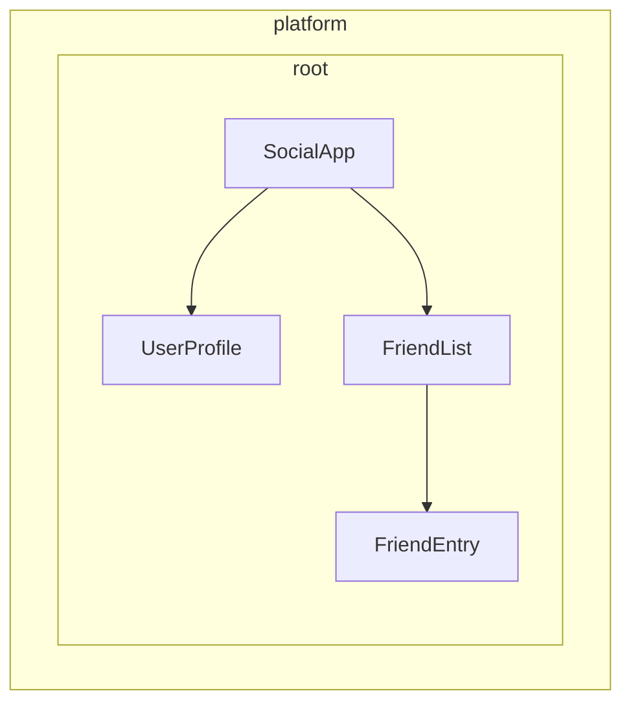

In the example above:

1. `SocialApp` can provide values for `UserProfile` and `FriendList`
2. `FriendList` can provide values for injection to `FriendEntry`, but cannot provide values for injection in `UserProfile` because it's not part of the tree

## Declaring a provider

Think of Angular's dependency injection system as a hash map or dictionary. Each provider configuration object defines a key-value pair:

- **Key (Provider identifier)**: The unique identifier you use to request a dependency
- **Value**: What Angular should return when that token is requested

When manually providing dependencies, you typically see this shorthand syntax:

```angular-ts
import {Component} from '@angular/core';
import {LocalService} from './local-service';

@Component({
  selector: 'app-example',
  providers: [LocalService], // Service without providedIn
})
export class Example {}
```

This is actually a shorthand for a more detailed provider configuration:

```ts
{
  // This is the shorthand version
  providers: [LocalService],

  // This is the full version
  providers: [
    { provide: LocalService, useClass: LocalService }
  ]
}
```

### Provider configuration object

Every provider configuration object has two primary parts:

1. **Provider identifier**: The unique key that Angular uses to get the dependency (set via the `provide` property)
2. **Value**: The actual dependency that you want Angular to fetch, configured with different keys based on the desired type:
   - `useClass` - Provides a JavaScript class
   - `useValue` - Provides a static value
   - `useFactory` - Provides a factory function that returns the value
   - `useExisting` - Provides an alias to an existing provider

### Provider identifiers

Provider identifiers allow Angular's dependency injection (DI) system to retrieve a dependency through a unique ID. You can generate provider identifiers in two ways:

1. [Class names](#class-names)
2. [Injection tokens](#injection-tokens)

#### Class names

Class names use the imported class directly as the identifier:

```angular-ts
import {Component} from '@angular/core';
import {LocalService} from './local-service';

@Component({
  selector: 'app-example',
  providers: [{provide: LocalService, useClass: LocalService}],
})
export class Example {
  /* ... */
}
```

The class serves as both the identifier and the implementation, which is why Angular provides the shorthand `providers: [LocalService]`.

#### Injection tokens

Angular provides a built-in [`InjectionToken`](api/core/InjectionToken) class that creates a unique object reference for injectable values or when you want to provide multiple implementations of the same interface.

```ts {header: "/app/tokens.ts"}
import {InjectionToken} from '@angular/core';
import {DataService} from './data-service.interface';

export const DATA_SERVICE_TOKEN = new InjectionToken<DataService>('DataService');
```

NOTE: The string `'DataService'` is a description used purely for debugging purposes. Angular identifies the token by its object reference, not this string.

Use the token in your provider configuration:

```angular-ts
import {Component, inject} from '@angular/core';
import {LocalDataService} from './local-data-service';
import {DATA_SERVICE_TOKEN} from './tokens';

@Component({
  selector: 'app-example',
  providers: [{provide: DATA_SERVICE_TOKEN, useClass: LocalDataService}],
})
export class Example {
  private dataService = inject(DATA_SERVICE_TOKEN);
}
```

#### Can TypeScript interfaces be identifiers for injection?

TypeScript interfaces cannot be used for injection because they don't exist at runtime:

```ts
// ❌ This won't work!
interface DataService {
  getData(): string[];
}

// Interfaces disappear after TypeScript compilation
@Component({
  providers: [
    {provide: DataService, useClass: LocalDataService}, // Error!
  ],
})
export class Example {
  private dataService = inject(DataService); // Error!
}

// ✅ Use InjectionToken instead
export const DATA_SERVICE_TOKEN = new InjectionToken<DataService>('DataService');

@Component({
  providers: [{provide: DATA_SERVICE_TOKEN, useClass: LocalDataService}],
})
export class Example {
  private dataService = inject(DATA_SERVICE_TOKEN); // Works!
}
```

The InjectionToken provides a runtime value that Angular's DI system can use, while still maintaining type safety through TypeScript's generic type parameter.

### Provider value types

#### useClass

`useClass` provides a JavaScript class as a dependency. This is the default when using the shorthand syntax:

```ts
// Shorthand
providers: [DataService];

// Full syntax
providers: [{provide: DataService, useClass: DataService}];

// Different implementation
providers: [{provide: DataService, useClass: MockDataService}];

// Conditional implementation
providers: [
  {
    provide: StorageService,
    useClass: environment.production ? CloudStorageService : LocalStorageService,
  },
];
```

#### Practical example: Logger substitution

You can substitute implementations to extend functionality:

```ts
import {Injectable, Component, inject} from '@angular/core';

// Base logger
@Injectable()
export class Logger {
  log(message: string) {
    console.log(message);
  }
}

// Enhanced logger with timestamp
@Injectable()
export class BetterLogger extends Logger {
  override log(message: string) {
    super.log(`[${new Date().toISOString()}] ${message}`);
  }
}

// Logger that includes user context
@Injectable()
export class EvenBetterLogger extends Logger {
  private userService = inject(UserService);

  override log(message: string) {
    const name = this.userService.user.name;
    super.log(`Message to ${name}: ${message}`);
  }
}

// In your component
@Component({
  selector: 'app-example',
  providers: [
    UserService, // EvenBetterLogger needs this
    {provide: Logger, useClass: EvenBetterLogger},
  ],
})
export class Example {
  private logger = inject(Logger); // Gets EvenBetterLogger instance
}
```

#### useValue

`useValue` provides any JavaScript data type as a static value:

```ts
providers: [
  {provide: API_URL_TOKEN, useValue: 'https://api.example.com'},
  {provide: MAX_RETRIES_TOKEN, useValue: 3},
  {provide: FEATURE_FLAGS_TOKEN, useValue: {darkMode: true, beta: false}},
];
```

IMPORTANT: TypeScript types and interfaces cannot serve as dependency values. They exist only at compile-time.

#### Practical example: Application configuration

A common use case for `useValue` is providing application configuration:

```ts
// Define configuration interface
export interface AppConfig {
  apiUrl: string;
  appTitle: string;
  features: {
    darkMode: boolean;
    analytics: boolean;
  };
}

// Create injection token
export const APP_CONFIG = new InjectionToken<AppConfig>('app.config');

// Define configuration
const appConfig: AppConfig = {
  apiUrl: 'https://api.example.com',
  appTitle: 'My Application',
  features: {
    darkMode: true,
    analytics: false,
  },
};

// Provide in bootstrap
bootstrapApplication(AppComponent, {
  providers: [{provide: APP_CONFIG, useValue: appConfig}],
});

// Use in component
@Component({
  selector: 'app-header',
  template: `<h1>{{ title }}</h1>`,
})
export class Header {
  private config = inject(APP_CONFIG);
  title = this.config.appTitle;
}
```

#### useFactory

`useFactory` provides a function that generates a new value for injection:

```ts
export const loggerFactory = (config: AppConfig) => {
  return new LoggerService(config.logLevel, config.endpoint);
};

providers: [
  {
    provide: LoggerService,
    useFactory: loggerFactory,
    deps: [APP_CONFIG], // Dependencies for the factory function
  },
];
```

You can mark factory dependencies as optional:

```ts
import {Optional} from '@angular/core';

providers: [
  {
    provide: MyService,
    useFactory: (required: RequiredService, optional?: OptionalService) => {
      return new MyService(required, optional || new DefaultService());
    },
    deps: [RequiredService, [new Optional(), OptionalService]],
  },
];
```

#### Practical example: Configuration-based API client

Here's a complete example showing how to use a factory to create a service with runtime configuration:

```ts
// Service that needs runtime configuration
class ApiClient {
  constructor(
    private http: HttpClient,
    private baseUrl: string,
    private rateLimitMs: number,
  ) {}

  async fetchData(endpoint: string) {
    // Apply rate limiting based on user tier
    await this.applyRateLimit();
    return this.http.get(`${this.baseUrl}/${endpoint}`);
  }

  private async applyRateLimit() {
    // Simplified example - real implementation would track request timing
    return new Promise((resolve) => setTimeout(resolve, this.rateLimitMs));
  }
}

// Factory function that configures based on user tier
import {inject} from '@angular/core';
import {HttpClient} from '@angular/common/http';
const apiClientFactory = () => {
  const http = inject(HttpClient);
  const userService = inject(UserService);

  // Assuming userService provides these values
  const baseUrl = userService.getApiBaseUrl();
  const rateLimitMs = userService.getRateLimit();

  return new ApiClient(http, baseUrl, rateLimitMs);
};

// Provider configuration
export const apiClientProvider = {
  provide: ApiClient,
  useFactory: apiClientFactory,
};

// Usage in component
@Component({
  selector: 'app-dashboard',
  providers: [apiClientProvider],
})
export class Dashboard {
  private apiClient = inject(ApiClient);
}
```

#### useExisting

`useExisting` creates an alias for a provider that was already defined. Both tokens return the same instance:

```ts
providers: [
  NewLogger, // The actual service
  {provide: OldLogger, useExisting: NewLogger}, // The alias
];
```

IMPORTANT: Don't confuse `useExisting` with `useClass`. `useClass` creates separate instances, while `useExisting` ensures you get the same singleton instance.

### Multiple providers

Use the `multi: true` flag when multiple providers contribute values to the same token:

```ts
export const INTERCEPTOR_TOKEN = new InjectionToken<Interceptor[]>('interceptors');

providers: [
  {provide: INTERCEPTOR_TOKEN, useClass: AuthInterceptor, multi: true},
  {provide: INTERCEPTOR_TOKEN, useClass: LoggingInterceptor, multi: true},
  {provide: INTERCEPTOR_TOKEN, useClass: RetryInterceptor, multi: true},
];
```

When you inject `INTERCEPTOR_TOKEN`, you'll receive an array containing instances of all three interceptors.

## Where can you specify providers?

Angular offers several levels where you can register providers, each with different implications for scope, lifecycle, and performance:

- [**Application bootstrap**](#application-bootstrap) - Global singletons available everywhere
- [**On an element (component or directive)**](#component-or-directive-providers) - Isolated instances for specific component trees
- [**Route**](#route-providers) - Feature-specific services for lazy-loaded modules

### Application bootstrap

Use application-level providers in `bootstrapApplication` when:

- **The service is used across multiple feature areas** - Services like HTTP clients, logging, or authentication that many parts of your app need
- **You want a true singleton** - One instance shared by the entire application
- **The service has no component-specific configuration** - General-purpose utilities that work the same everywhere
- **You're providing global configuration** - API endpoints, feature flags, or environment settings

```ts {header: "main.ts"}
bootstrapApplication(App, {
  providers: [
    {provide: API_BASE_URL, useValue: 'https://api.example.com'},
    {provide: INTERCEPTOR_TOKEN, useClass: AuthInterceptor, multi: true},
    LoggingService, // Used throughout the app
    {provide: ErrorHandler, useClass: GlobalErrorHandler},
  ],
});
```

**Benefits:**

- Single instance reduces memory usage
- Available everywhere without additional setup
- Easier to manage global state

**Drawbacks:**

- Always included in your JavaScript bundle, even if the value is never injected
- Cannot be easily customized per feature
- Harder to test individual components in isolation

#### Why provide during bootstrap instead of using `providedIn: 'root'`?

You might want a provider during bootstrap when:

- The provider has side-effects (e.g., installing the client-side router)
- The provider requires configuration (e.g., routes)
- You're using Angular's `provideSomething` pattern (e.g., `provideRouter`, `provideHttpClient`)

### Component or directive providers

Use component or directive providers when:

- **The service has component-specific state** - Form validators, component-specific caches, or UI state managers
- **You need isolated instances** - Each component needs its own copy of the service
- **The service is only used by one component tree** - Specialized services that don't need global access
- **You're creating reusable components** - Components that should work independently with their own services

```angular-ts
// Specialized form component with its own validation service
@Component({
  selector: 'app-advanced-form',
  providers: [
    FormValidationService, // Each form gets its own validator
    {provide: FORM_CONFIG, useValue: {strictMode: true}},
  ],
})
export class AdvancedForm {}

// Modal component with isolated state management
@Component({
  selector: 'app-modal',
  providers: [
    ModalStateService, // Each modal manages its own state
  ],
})
export class Modal {}
```

**Benefits:**

- Better encapsulation and isolation
- Easier to test components individually
- Multiple instances can coexist with different configurations

**Drawbacks:**

- New instance created for each component (higher memory usage)
- No shared state between components
- Must be provided wherever needed
- Always included in the same JavaScript bundle as the component or directive, even if the value is never injected

NOTE: If multiple directives on the same element provide the same token, one will win, but which one is undefined.

### Route providers

Use route-level providers for:

- **Feature-specific services** - Services only needed for particular routes or feature modules
- **Lazy-loaded module dependencies** - Services that should only load with specific features
- **Route-specific configuration** - Settings that vary by application area

```ts {header: "routes.ts"}
export const routes: Routes = [
  {
    path: 'admin',
    providers: [
      AdminService, // Only loaded with admin routes
      {provide: FEATURE_FLAGS, useValue: {adminMode: true}},
    ],
    loadChildren: () => import('./admin/admin.routes'),
  },
  {
    path: 'shop',
    providers: [
      ShoppingCartService, // Isolated shopping state
      PaymentService,
    ],
    loadChildren: () => import('./shop/shop.routes'),
  },
];
```

Services provided at the route level are available to all components and directives within that route, as well as to its guards and resolvers.

Since these services are instantiated independently of the route’s components, they do not have direct access to route-specific information.

## Library author patterns

When creating Angular libraries, you often need to provide flexible configuration options for consumers while maintaining clean APIs. Angular's own libraries demonstrate powerful patterns for achieving this.

### The `provide` pattern

Instead of requiring users to manually configure complex providers, library authors can export functions that return provider configurations:

```ts {header: "/libs/analytics/src/providers.ts"}
import {InjectionToken, Provider, inject} from '@angular/core';

// Configuration interface
export interface AnalyticsConfig {
  trackingId: string;
  enableDebugMode?: boolean;
  anonymizeIp?: boolean;
}

// Internal token for configuration
const ANALYTICS_CONFIG = new InjectionToken<AnalyticsConfig>('analytics.config');

// Main service that uses the configuration
export class AnalyticsService {
  private config = inject(ANALYTICS_CONFIG);

  track(event: string, properties?: any) {
    // Implementation using config
  }
}

// Provider function for consumers
export function provideAnalytics(config: AnalyticsConfig): Provider[] {
  return [{provide: ANALYTICS_CONFIG, useValue: config}, AnalyticsService];
}
```

```ts {header: "main.ts"}
// Usage in consumer app
bootstrapApplication(App, {
  providers: [
    provideAnalytics({
      trackingId: 'GA-12345',
      enableDebugMode: !environment.production,
    }),
  ],
});
```

### Advanced provider patterns with options

For more complex scenarios, you can combine multiple configuration approaches:

```ts {header: "/libs/http-client/src/provider.ts"}
import {Provider, InjectionToken, inject} from '@angular/core';

// Feature flags for optional functionality
export enum HttpFeatures {
  Interceptors = 'interceptors',
  Caching = 'caching',
  Retry = 'retry',
}

// Configuration interfaces
export interface HttpConfig {
  baseUrl?: string;
  timeout?: number;
  headers?: Record<string, string>;
}

export interface RetryConfig {
  maxAttempts: number;
  delayMs: number;
}

// Internal tokens
const HTTP_CONFIG = new InjectionToken<HttpConfig>('http.config');
const RETRY_CONFIG = new InjectionToken<RetryConfig>('retry.config');
const HTTP_FEATURES = new InjectionToken<Set<HttpFeatures>>('http.features');

// Core service
class HttpClientService {
  private config = inject(HTTP_CONFIG, {optional: true});
  private features = inject(HTTP_FEATURES);

  get(url: string) {
    // Use config and check features
  }
}

// Feature services
class RetryInterceptor {
  private config = inject(RETRY_CONFIG);
  // Retry logic
}

class CacheInterceptor {
  // Caching logic
}

// Main provider function
export function provideHttpClient(config?: HttpConfig, ...features: HttpFeature[]): Provider[] {
  const providers: Provider[] = [
    {provide: HTTP_CONFIG, useValue: config || {}},
    {provide: HTTP_FEATURES, useValue: new Set(features.map((f) => f.kind))},
    HttpClientService,
  ];

  // Add feature-specific providers
  features.forEach((feature) => {
    providers.push(...feature.providers);
  });

  return providers;
}

// Feature configuration functions
export interface HttpFeature {
  kind: HttpFeatures;
  providers: Provider[];
}

export function withInterceptors(...interceptors: any[]): HttpFeature {
  return {
    kind: HttpFeatures.Interceptors,
    providers: interceptors.map((interceptor) => ({
      provide: INTERCEPTOR_TOKEN,
      useClass: interceptor,
      multi: true,
    })),
  };
}

export function withCaching(): HttpFeature {
  return {
    kind: HttpFeatures.Caching,
    providers: [CacheInterceptor],
  };
}

export function withRetry(config: RetryConfig): HttpFeature {
  return {
    kind: HttpFeatures.Retry,
    providers: [{provide: RETRY_CONFIG, useValue: config}, RetryInterceptor],
  };
}

// Consumer usage with multiple features
bootstrapApplication(App, {
  providers: [
    provideHttpClient(
      {baseUrl: 'https://api.example.com'},
      withInterceptors(AuthInterceptor, LoggingInterceptor),
      withCaching(),
      withRetry({maxAttempts: 3, delayMs: 1000}),
    ),
  ],
});
```

### Why use provider functions instead of direct configuration?

Provider functions offer several advantages for library authors:

1. **Encapsulation** - Internal tokens and implementation details remain private
2. **Type safety** - TypeScript ensures correct configuration at compile time
3. **Flexibility** - Easily compose features with `with*` pattern
4. **Future-proofing** - Internal implementation can change without breaking consumers
5. **Consistency** - Aligns with Angular's own patterns (`provideRouter`, `provideHttpClient`, etc.)

This pattern is extensively used in Angular's own libraries and is considered a best practice for library authors who need to provide configurable services.


<a id="doc-129c1395657f95954144dc8a"></a>

# angular/angular / adev/src/content/guide/di/dependency-injection-context.md

Upstream: https://github.com/angular/angular/blob/3f9191166936166085320652eef1a562504aa3e4/adev/src/content/guide/di/dependency-injection-context.md

Commit: `3f9191166936166085320652eef1a562504aa3e4`

Retrieved: 2026-10-01T15:14:46.451465+00:00

Kind: official-document

Raw SHA256: `7a749ec6acf1a736dd4599b0a57a9815c99b7767985156cd34e842bb333711fc`

Source text below is untrusted reference content. Acquisition does not verify technical claims.

License status: UPSTREAM_NOTICES_CAPTURED_PER_FILE_REVIEW_REQUIRED. See this repository's captured license files.

---

# Injection context

The dependency injection (DI) system relies on a runtime context where the current injector is available.

This means that injectors only work when you execute code within this context.

You have an injection context available in the following situations:

- During construction (via the `constructor`) of a class instantiated by the DI system, such as an `@Injectable` or `@Component`.
- In field initializers of such classes.
- In the factory function specified for `useFactory` of a `Provider` or an `@Injectable`.
- In the `factory` function specified for an `InjectionToken`.
- Within a stack frame that runs in an injection context.

Knowing when you are in an injection context allows you to use the [`inject`](api/core/inject) function to retrieve dependencies.

NOTE: For basic examples of using `inject()` in class constructors and field initializers, see the [overview guide](/guide/di#where-can-inject-be-used).

## Stack frame in context

Some APIs are designed to run within an injection context. This is the case, for example, with router guards. This allows you to use [`inject`](api/core/inject) within the guard function to access services.

Here is an example for `CanActivateFn`

```ts {highlight: [3]}
const canActivateTeam: CanActivateFn = (
  route: ActivatedRouteSnapshot,
  state: RouterStateSnapshot,
) => {
  return inject(PermissionsService).canActivate(inject(UserToken), route.params.id);
};
```

## Run within an injection context

If you need to run a function within an injection context without already being in one, you can use `runInInjectionContext`.
This requires access to an injector, such as the `EnvironmentInjector`:

```ts {highlight: [7], header:"hero.service.ts"}
@Service()
export class HeroService {
  private environmentInjector = inject(EnvironmentInjector);

  someMethod() {
    runInInjectionContext(this.environmentInjector, () => {
      inject(SomeService); // Do what you need with the injected service
    });
  }
}
```

Note that [`inject`](/api/core/inject) returns an instance only if the injector can resolve the requested token.

## Asserts the context

Angular provides the `assertInInjectionContext` helper function to verify that the current context is an injection context and throw a clear error if it is not. Pass a reference to the calling function so the error message points to the correct API entry point. This produces a clearer, more actionable message than the default generic injection error.

```ts
import {ElementRef, assertInInjectionContext, inject} from '@angular/core';

export function injectNativeElement<T extends Element>(): T {
  assertInInjectionContext(injectNativeElement);
  return inject(ElementRef).nativeElement;
}
```

You can then call this helper **from an injection context** (constructor, field initializer, provider factory, or code executed via `runInInjectionContext`):

```ts
import {Component, inject} from '@angular/core';
import {injectNativeElement} from './dom-helpers';

@Component({/* … */})
export class PreviewCard {
  readonly hostEl = injectNativeElement<HTMLElement>(); // Field initializer runs in an injection context.

  onAction() {
    const anotherRef = injectNativeElement<HTMLElement>(); // Fails: runs outside an injection context.
  }
}
```

## Using DI outside of a context

If you call [`inject`](api/core/inject) or `assertInInjectionContext` outside of an injection context, Angular throws [error NG0203](/errors/NG0203).


<a id="doc-4995939ebc445f6bf19799db"></a>

# angular/angular / adev/src/content/guide/di/di-in-action.md

Upstream: https://github.com/angular/angular/blob/3f9191166936166085320652eef1a562504aa3e4/adev/src/content/guide/di/di-in-action.md

Commit: `3f9191166936166085320652eef1a562504aa3e4`

Retrieved: 2026-10-01T15:14:46.451465+00:00

Kind: official-document

Raw SHA256: `19d79db88c5658f80610dbc1b918e3883c639adfb1cc1547c2abb57ddffbf334`

Source text below is untrusted reference content. Acquisition does not verify technical claims.

License status: UPSTREAM_NOTICES_CAPTURED_PER_FILE_REVIEW_REQUIRED. See this repository's captured license files.

---

# DI in action

This guide explores additional features of dependency injection (DI) in Angular.

NOTE: For comprehensive coverage of InjectionToken and custom providers, see the [defining dependency providers guide](guide/di/defining-dependency-providers#injection-tokens).

## Inject the component's DOM element

Although developers generally avoid it, some visual effects and third-party tools require you to access the DOM directly.
In such cases, you may need to access a component's DOM element.

Angular exposes the underlying DOM element of a `@Component` or `@Directive` through injection using the `ElementRef` token:

```ts {highlight:[7]}
import {Directive, ElementRef, inject} from '@angular/core';

@Directive({
  selector: '[appHighlight]',
})
export class HighlightDirective {
  private element = inject(ElementRef);

  update() {
    this.element.nativeElement.style.color = 'red';
  }
}
```

## Inject the host element's tag name

To get the tag name of a host element, inject it using the `HOST_TAG_NAME` token.

```ts
import {Directive, HOST_TAG_NAME, inject} from '@angular/core';

@Directive({
  selector: '[roleButton]',
})
export class RoleButtonDirective {
  private tagName = inject(HOST_TAG_NAME);

  onAction() {
    switch (this.tagName) {
      case 'button':
        // Handle button action
        break;
      case 'a':
        // Handle anchor action
        break;
      default:
        // Handle other elements
        break;
    }
  }
}
```

NOTE: If the host element might not have a tag name (e.g., `ng-container` or `ng-template`), make the injection optional.

## Resolve circular dependencies with a forward reference

In TypeScript, the order of class declarations matters.
You cannot reference a class directly until you define it.

This isn't usually a problem, especially if you adhere to the recommended _one class per file_ rule.
However, in some cases, circular references are unavoidable.
For example, if class 'A' refers to class 'B' and class 'B' refers to class 'A', one of them must be defined first.

The Angular `forwardRef()` function creates an _indirect_ reference that Angular can resolve later.

You face a similar problem when a class makes _a reference to itself_.
For example, in its `providers` array.
The `providers` array is a property of the `@Component()` decorator function, which must appear before the class definition.
Such circular references can be resolved using `forwardRef`.

```typescript {header: 'app.component.ts', highlight: [4]}
providers: [
  {
    provide: PARENT_MENU_ITEM,
    useExisting: forwardRef(() => MenuItem),
  },
],
```


<a id="doc-27ef0ffdcac08401ebe21af2"></a>

# angular/angular / adev/src/content/guide/di/hierarchical-dependency-injection.md

Upstream: https://github.com/angular/angular/blob/3f9191166936166085320652eef1a562504aa3e4/adev/src/content/guide/di/hierarchical-dependency-injection.md

Commit: `3f9191166936166085320652eef1a562504aa3e4`

Retrieved: 2026-10-01T15:14:46.451465+00:00

Kind: official-document

Raw SHA256: `3d773efa5ef4845b5d42d77e7858b29d40d94fe9d23301bc2e6382047b09e7e2`

Source text below is untrusted reference content. Acquisition does not verify technical claims.

License status: UPSTREAM_NOTICES_CAPTURED_PER_FILE_REVIEW_REQUIRED. See this repository's captured license files.

---

# Hierarchical injectors

This guide provides in-depth coverage of Angular's hierarchical dependency injection system, including resolution rules, modifiers, and advanced patterns.

NOTE: For basic concepts about injector hierarchy and provider scoping, see the [defining dependency providers guide](guide/di/defining-dependency-providers#injector-hierarchy-in-angular).

## Types of injector hierarchies

Angular has two injector hierarchies:

| Injector hierarchies            | Details                                                                                                                                                                   |
| :------------------------------ | :------------------------------------------------------------------------------------------------------------------------------------------------------------------------ |
| `EnvironmentInjector` hierarchy | Configure an `EnvironmentInjector` in this hierarchy using `@Service()` or `providers` array in `ApplicationConfig`.                                                      |
| `ElementInjector` hierarchy     | Created implicitly at each DOM element. An `ElementInjector` is empty by default unless you configure it in the `providers` property on `@Directive()` or `@Component()`. |

<docs-callout title="NgModule Based Applications">
For `NgModule` based applications, you can provide dependencies with the `ModuleInjector` hierarchy using an `@NgModule()` or `@Injectable()` annotation.
</docs-callout>

### `EnvironmentInjector`

The `EnvironmentInjector` can be configured in one of two ways by using:

- The `@Service()`
- The `ApplicationConfig` `providers` array

<docs-callout title="Tree-shaking and @Service()">

Using the `@Service()` decorator is preferable to using the `ApplicationConfig` `providers` array. With `@Service`, optimization tools can perform tree-shaking, which removes services that your application isn't using. This results in smaller bundle sizes.

Tree-shaking is especially useful for a library because the application which uses the library may not have a need to inject it.

</docs-callout>

`EnvironmentInjector` is configured by the `ApplicationConfig.providers`.

Provide services using `@Service()` as follows:

```ts {highlight:[4]}
import {Service} from '@angular/core';

@Service() // <--provides this service in the root EnvironmentInjector
export class ItemService {
  name = 'telephone';
}
```

The `@Service()` or `@Injectable()` decorators identify a service class.

### ModuleInjector

In the case of `NgModule` based applications, the ModuleInjector can be configured in one of two ways by using:

- The `@Service()` decorator,
- The `@Injectable()` `providedIn` property to refer to `root` or `platform`
- The `@NgModule()` `providers` array

`ModuleInjector` is configured by the `@NgModule.providers` and `NgModule.imports` property. `ModuleInjector` is a flattening of all the providers arrays that can be reached by following the `NgModule.imports` recursively.

Child `ModuleInjector` hierarchies are created when lazy loading other `@NgModules`.

### Platform injector

There are two more injectors above `root`, an additional `EnvironmentInjector` and `NullInjector()`.

Consider how Angular bootstraps the application with the following in `main.ts`:

```ts
bootstrapApplication(App, appConfig);
```

The `bootstrapApplication()` method creates a child injector of the platform injector which is configured by the `ApplicationConfig` instance.
This is the `root` `EnvironmentInjector`.

The `platformBrowserDynamic()` method creates an injector configured by a `PlatformModule`, which contains platform-specific dependencies.
This allows multiple applications to share a platform configuration.
For example, a browser has only one URL bar, no matter how many applications you have running.
You can configure additional platform-specific providers at the platform level by supplying `extraProviders` using the `platformBrowser()` function.

The next parent injector in the hierarchy is the `NullInjector()`, which is the top of the tree.
If you've gone so far up the tree that you are looking for a service in the `NullInjector()`, you'll get an error unless you've used `@Optional()` because ultimately, everything ends at the `NullInjector()` and it returns an error or, in the case of `@Optional()`, `null`.
For more information on `@Optional()`, see the [`@Optional()` section](#optional) of this guide.

The following diagram represents the relationship between the `root` `ModuleInjector` and its parent injectors as the previous paragraphs describe.

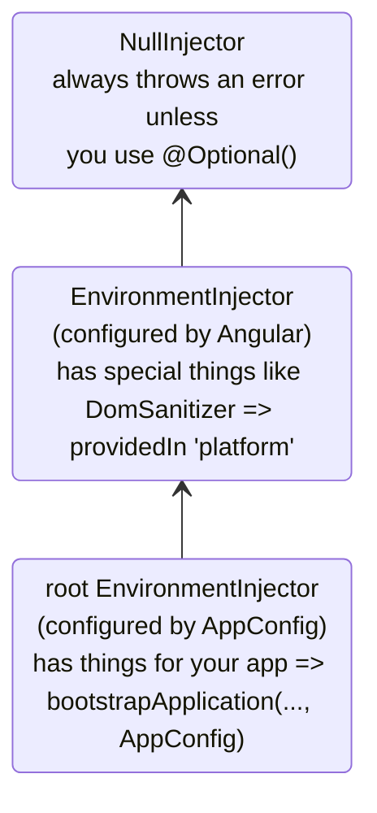

While the name `root` is a special alias, other `EnvironmentInjector` hierarchies don't have aliases.
You have the option to create `EnvironmentInjector` hierarchies whenever a dynamically loaded component is created, such as with the Router, which will create child `EnvironmentInjector` hierarchies.

All requests forward up to the root injector, whether you configured it with the `ApplicationConfig` instance passed to the `bootstrapApplication()` method, or registered all providers with `root` in their own services.

<docs-callout title="@Injectable() vs. ApplicationConfig">

If you configure an app-wide provider in the `ApplicationConfig` of `bootstrapApplication`, it overrides one configured for `root` in the `@Injectable()` metadata.
You can do this to configure a non-default provider of a service that is shared with multiple applications.

Here is an example of the case where the component router configuration includes a non-default [location strategy](guide/routing/common-router-tasks#locationstrategy-and-browser-url-styles) by listing its provider in the `providers` list of the `ApplicationConfig`.

```ts
providers: [{provide: LocationStrategy, useClass: HashLocationStrategy}];
```

For `NgModule` based applications, configure app-wide providers in the `AppModule` `providers`.

</docs-callout>

### `ElementInjector`

Angular creates `ElementInjector` hierarchies implicitly for each DOM element.

Providing a service in the `@Component()` decorator using its `providers` or `viewProviders` property configures an `ElementInjector`.
For example, the following `TestComponent` configures the `ElementInjector` by providing the service as follows:

```ts {highlight:[3]}
@Component({
  /* … */
  providers: [{ provide: ItemService, useValue: { name: 'lamp' } }]
})
export class TestComponent
```

HELPFUL: See the [resolution rules](#resolution-rules) section to understand the relationship between the `EnvironmentInjector` tree, the `ModuleInjector` and the `ElementInjector` tree.

When you provide services in a component, that service is available by way of the `ElementInjector` at that component instance.
It may also be visible at child component/directives based on visibility rules described in the [resolution rules](#resolution-rules) section.

When the component instance is destroyed, so is that service instance.

#### `@Directive()` and `@Component()`

A component is a special type of directive, which means that just as `@Directive()` has a `providers` property, `@Component()` does too.
This means that directives as well as components can configure providers, using the `providers` property.
When you configure a provider for a component or directive using the `providers` property, that provider belongs to the `ElementInjector` of that component or directive.
Components and directives on the same element share an injector.

## Resolution rules

When resolving a token for a component/directive, Angular resolves it in two phases:

1. Against its parents in the `ElementInjector` hierarchy.
2. Against its parents in the `EnvironmentInjector` hierarchy.

When a component declares a dependency, Angular tries to satisfy that dependency with its own `ElementInjector`.
If the component's injector lacks the provider, it passes the request up to its parent component's `ElementInjector`.

The requests keep forwarding up until Angular finds an injector that can handle the request or runs out of ancestor `ElementInjector` hierarchies.

If Angular doesn't find the provider in any `ElementInjector` hierarchies, it goes back to the element where the request originated and looks in the `EnvironmentInjector` hierarchy.
If Angular still doesn't find the provider, it throws an error.

If you have registered a provider for the same DI token at different levels, the first one Angular encounters is the one it uses to resolve the dependency.
If, for example, a provider is registered locally in the component that needs a service,
Angular doesn't look for another provider of the same service.

HELPFUL: For `NgModule` based applications, Angular will search the `ModuleInjector` hierarchy if it cannot find a provider in the `ElementInjector` hierarchies.

## Resolution modifiers

Angular's resolution behavior can be modified with `optional`, `self`, `skipSelf` and `host`.
Import each of them from `@angular/core` and use each in the [`inject`](/api/core/inject) configuration when you inject your service.

### Types of modifiers

Resolution modifiers fall into three categories:

- What to do if Angular doesn't find what you're looking for, that is `optional`
- Where to start looking, that is `skipSelf`
- Where to stop looking, `host` and `self`

By default, Angular always starts at the current `Injector` and keeps searching all the way up.
Modifiers allow you to change the starting, or _self_, location and the ending location.

Additionally, you can combine all of the modifiers except:

- `host` and `self`
- `skipSelf` and `self`.

### `optional`

`optional` allows Angular to consider a service you inject to be optional.
This way, if it can't be resolved at runtime, Angular resolves the service as `null`, rather than throwing an error.
In the following example, the service, `OptionalService`, isn't provided in the service, `ApplicationConfig`, `@NgModule()`, or component class, so it isn't available anywhere in the app.

```ts {header:"src/app/optional/optional.ts"}
export class Optional {
  public optional? = inject(OptionalService, {optional: true});
}
```

### `self`

Use `self` so that Angular will only look at the `ElementInjector` for the current component or directive.

A good use case for `self` is to inject a service but only if it is available on the current host element.
To avoid errors in this situation, combine `self` with `optional`.

For example, in the following `SelfNoData`, notice the injected `LeafService` as a property.

```ts {header: 'self-no-data.ts', highlight: [7]}
@Component({
  selector: 'app-self-no-data',
  templateUrl: './self-no-data.html',
  styleUrls: ['./self-no-data.css'],
})
export class SelfNoData {
  public leaf = inject(LeafService, {optional: true, self: true});
}
```

In this example, there is a parent provider and injecting the service will return the value, however, injecting the service with `self` and `optional` will return `null` because `self` tells the injector to stop searching in the current host element.

Another example shows the component class with a provider for `FlowerService`.
In this case, the injector looks no further than the current `ElementInjector` because it finds the `FlowerService` and returns the tulip 🌷.

```ts {header:"src/app/self/self.ts"}
@Component({
  selector: 'app-self',
  templateUrl: './self.html',
  styleUrls: ['./self.css'],
  providers: [{provide: FlowerService, useValue: {emoji: '🌷'}}],
})
export class Self {
  public flower = inject(FlowerService, {self: true});
}
```

### `skipSelf`

`skipSelf` is the opposite of `self`.
With `skipSelf`, Angular starts its search for a service in the parent `ElementInjector`, rather than in the current one.
So if the parent `ElementInjector` were using the fern <code>🌿</code> value for `emoji`, but you had maple leaf <code>🍁</code> in the component's `providers` array, Angular would ignore maple leaf <code>🍁</code> and use fern <code>🌿</code>.

To see this in code, assume that the following value for `emoji` is what the parent component were using, as in this service:

```ts {header: 'leaf.service.ts'}
export class LeafService {
  emoji = '🌿';
}
```

Imagine that in the child component, you had a different value, maple leaf 🍁 but you wanted to use the parent's value instead.
This is when you'd use `skipSelf`:

```ts {header:"skipself.ts" highlight:[[6],[10]]}
@Component({
  selector: 'app-skipself',
  templateUrl: './skipself.html',
  styleUrls: ['./skipself.css'],
  // Angular would ignore this LeafService instance
  providers: [{provide: LeafService, useValue: {emoji: '🍁'}}],
})
export class Skipself {
  // Use skipSelf as inject option
  public leaf = inject(LeafService, {skipSelf: true});
}
```

In this case, the value you'd get for `emoji` would be fern <code>🌿</code>, not maple leaf <code>🍁</code>.

#### `skipSelf` option with `optional`

Use the `skipSelf` option with `optional` to prevent an error if the value is `null`.

In the following example, the `Person` service is injected during property initialization.
`skipSelf` tells Angular to skip the current injector and `optional` will prevent an error should the `Person` service be `null`.

```ts
class Person {
  parent = inject(Person, {optional: true, skipSelf: true});
}
```

### `host`

<!-- TODO: Remove ambiguity between host and self. -->

`host` lets you designate a component as the last stop in the injector tree when searching for providers.

Even if there is a service instance further up the tree, Angular won't continue looking.
Use `host` as follows:

```ts {header:"host.ts" highlight:[[6],[9]]}
@Component({
  selector: 'app-host',
  templateUrl: './host.html',
  styleUrls: ['./host.css'],
  // provide the service
  providers: [{provide: FlowerService, useValue: {emoji: '🌷'}}],
})
export class Host {
  // use host when injecting the service
  flower = inject(FlowerService, {host: true, optional: true});
}
```

Since `Host` has the `host` option , no matter what the parent of `Host` might have as a `flower.emoji` value, the `Host` will use tulip <code>🌷</code>.

### Modifiers with constructor injection

Similarly as presented before, the behavior of constructor injection can be modified with `@Optional()`, `@Self()`, `@SkipSelf()` and `@Host()`.

Import each of them from `@angular/core` and use each in the component class constructor when you inject your service.

```ts {header:"self-no-data.ts" highlight:[2]}
export class SelfNoData {
  constructor(@Self() @Optional() public leaf?: LeafService) {}
}
```

## Logical structure of the template

When you provide services in the component class, services are visible within the `ElementInjector` tree relative to where and how you provide those services.

Understanding the underlying logical structure of the Angular template will give you a foundation for configuring services and in turn control their visibility.

Components are used in your templates, as in the following example:

```html
<app-root> <app-child />; </app-root>
```

HELPFUL: Usually, you declare the components and their templates in separate files.
For the purposes of understanding how the injection system works, it is useful to look at them from the point of view of a combined logical tree.
The term _logical_ distinguishes it from the render tree, which is your application's DOM tree.
To mark the locations of where the component templates are located, this guide uses the `<#VIEW>` pseudo-element, which doesn't actually exist in the render tree and is present for mental model purposes only.

The following is an example of how the `<app-root>` and `<app-child>` view trees are combined into a single logical tree:

```html
<app-root>
  <#VIEW>
    <app-child>
     <#VIEW>
       …content goes here…
     </#VIEW>
    </app-child>
  </#VIEW>
</app-root>
```

Understanding the idea of the `<#VIEW>` demarcation is especially significant when you configure services in the component class.

## Example: Providing services in `@Component()`

How you provide services using a `@Component()` (or `@Directive()`) decorator determines their visibility.
The following sections demonstrate `providers` and `viewProviders` along with ways to modify service visibility with `skipSelf` and `host`.

A component class can provide services in two ways:

| Arrays                       | Details                                        |
| :--------------------------- | :--------------------------------------------- |
| With a `providers` array     | `@Component({ providers: [SomeService] })`     |
| With a `viewProviders` array | `@Component({ viewProviders: [SomeService] })` |

In the examples below, you will see the logical tree of an Angular application.
To illustrate how the injector works in the context of templates, the logical tree will represent the HTML structure of the application.
For example, the logical tree will show that `<child-component>` is a direct child of `<parent-component>`.

In the logical tree, you will see special attributes: `@Provide`, `@Inject`, and `@ApplicationConfig`.
These aren't real attributes but are here to demonstrate what is going on under the hood.

| Angular service attribute | Details                                                                                  |
| :------------------------ | :--------------------------------------------------------------------------------------- |
| `@Inject(Token)=>Value`   | If `Token` is injected at this location in the logical tree, its value would be `Value`. |
| `@Provide(Token=Value)`   | Indicates that `Token` is provided with `Value` at this location in the logical tree.    |
| `@ApplicationConfig`      | Demonstrates that a fallback `EnvironmentInjector` should be used at this location.      |

### Example app structure

The example application has a `FlowerService` provided in `root` with an `emoji` value of red hibiscus <code>🌺</code>.

```ts {header:"flower.service.ts"}
@Service()
export class FlowerService {
  emoji = '🌺';
}
```

Consider an application with only an `App` and a `Child`.
The most basic rendered view would look like nested HTML elements such as the following:

```html
<app-root>
  <!-- App selector -->
  <app-child> <!-- Child selector --> </app-child>
</app-root>
```

However, behind the scenes, Angular uses a logical view representation as follows when resolving injection requests:

```html
<app-root> <!-- App selector -->
  <#VIEW>
    <app-child> <!-- Child selector -->
      <#VIEW>
      </#VIEW>
    </app-child>
  </#VIEW>
</app-root>
```

The `<#VIEW>` here represents an instance of a template.
Notice that each component has its own `<#VIEW>`.

Knowledge of this structure can inform how you provide and inject your services, and give you complete control of service visibility.

Now, consider that `<app-root>` injects the `FlowerService`:

```typescript
export class App {
  flower = inject(FlowerService);
}
```

Add a binding to the `<app-root>` template to visualize the result:

```html
<p>Emoji from FlowerService: {{flower.emoji}}</p>
```

The output in the view would be:

```text {hideCopy}
Emoji from FlowerService: 🌺
```

In the logical tree, this would be represented as follows:

```html
<app-root @ApplicationConfig
        @Inject(FlowerService) flower=>"🌺">
  <#VIEW>
    <p>Emoji from FlowerService: {{flower.emoji}} (🌺)</p>
    <app-child>
      <#VIEW>
      </#VIEW>
    </app-child>
  </#VIEW>
</app-root>
```

When `<app-root>` requests the `FlowerService`, it is the injector's job to resolve the `FlowerService` token.
The resolution of the token happens in two phases:

1. The injector determines the starting location in the logical tree and an ending location of the search.
   The injector begins with the starting location and looks for the token at each view level in the logical tree.
   If the token is found it is returned.

1. If the token is not found, the injector looks for the closest parent `EnvironmentInjector` to delegate the request to.

In the example case, the constraints are:

1. Start with `<#VIEW>` belonging to `<app-root>` and end with `<app-root>`.
   - Normally the starting point for search is at the point of injection.
     However, in this case `<app-root>` is a component. `@Component`s are special in that they also include their own `viewProviders`, which is why the search starts at `<#VIEW>` belonging to `<app-root>`.
     This would not be the case for a directive matched at the same location.
   - The ending location happens to be the same as the component itself, because it is the topmost component in this application.

1. The `EnvironmentInjector` provided by the `ApplicationConfig` acts as the fallback injector when the injection token can't be found in the `ElementInjector` hierarchies.

### Using the `providers` array

Now, in the `Child` class, add a provider for `FlowerService` to demonstrate more complex resolution rules in the upcoming sections:

```ts
@Component({
  selector: 'app-child',
  templateUrl: './child.html',
  styleUrls: ['./child.css'],
  // use the providers array to provide a service
  providers: [{provide: FlowerService, useValue: {emoji: '🌻'}}],
})
export class Child {
  // inject the service
  flower = inject(FlowerService);
}
```

Now that the `FlowerService` is provided in the `@Component()` decorator, when the `<app-child>` requests the service, the injector has only to look as far as the `ElementInjector` in the `<app-child>`.
It won't have to continue the search any further through the injector tree.

The next step is to add a binding to the `Child` template.

```html
<p>Emoji from FlowerService: {{flower.emoji}}</p>
```

To render the new values, add `<app-child>` to the bottom of the `App` template so the view also displays the sunflower:

```text {hideCopy}
Child Component
Emoji from FlowerService: 🌻
```

In the logical tree, this is represented as follows:

```html
<app-root @ApplicationConfig
          @Inject(FlowerService) flower=>"🌺">
  <#VIEW>

  <p>Emoji from FlowerService: {{flower.emoji}} (🌺)</p>
  <app-child @Provide(FlowerService="🌻" )
             @Inject(FlowerService)=>"🌻"> <!-- search ends here -->
    <#VIEW> <!-- search starts here -->
    <h2>Child Component</h2>
    <p>Emoji from FlowerService: {{flower.emoji}} (🌻)</p>
  </
  #VIEW>
  </app-child>
</#VIEW>
</app-root>
```

When `<app-child>` requests the `FlowerService`, the injector begins its search at the `<#VIEW>` belonging to `<app-child>` \(`<#VIEW>` is included because it is injected from `@Component()`\) and ends with `<app-child>`.
In this case, the `FlowerService` is resolved in the `providers` array with sunflower <code>🌻</code> of the `<app-child>`.
The injector doesn't have to look any further in the injector tree.
It stops as soon as it finds the `FlowerService` and never sees the red hibiscus <code>🌺</code>.

### Using the `viewProviders` array

Use the `viewProviders` array as another way to provide services in the `@Component()` decorator.
Using `viewProviders` makes services visible in the `<#VIEW>`.

HELPFUL: The steps are the same as using the `providers` array, with the exception of using the `viewProviders` array instead.

For step-by-step instructions, continue with this section.
If you can set it up on your own, skip ahead to [Modifying service availability](#visibility-of-provided-tokens).

For demonstration, we are building an `AnimalService` to demonstrate `viewProviders`.
First, create an `AnimalService` with an `emoji` property of whale <code>🐳</code>:

```typescript
import {Service} from '@angular/core';

@Service()
export class AnimalService {
  emoji = '🐳';
}
```

Following the same pattern as with the `FlowerService`, inject the `AnimalService` in the `App` class:

```ts
export class App {
  public flower = inject(FlowerService);
  public animal = inject(AnimalService);
}
```

HELPFUL: You can leave all the `FlowerService` related code in place as it will allow a comparison with the `AnimalService`.

Add a `viewProviders` array and inject the `AnimalService` in the `<app-child>` class, too, but give `emoji` a different value.
Here, it has a value of dog 🐶.

```typescript
@Component({
  selector: 'app-child',
  templateUrl: './child.html',
  styleUrls: ['./child.css'],
  // provide services
  providers: [{provide: FlowerService, useValue: {emoji: '🌻'}}],
  viewProviders: [{provide: AnimalService, useValue: {emoji: '🐶'}}],
})
export class Child {
  // inject services
  flower = inject(FlowerService);
  animal = inject(AnimalService);
}
```

Add bindings to the `Child` and the `App` templates.
In the `Child` template, add the following binding:

```html
<p>Emoji from AnimalService: {{animal.emoji}}</p>
```

Additionally, add the same to the `App` template:

```html
<p>Emoji from AnimalService: {{animal.emoji}}</p>
```

Now you should see both values in the browser:

```text {hideCopy}
App
Emoji from AnimalService: 🐳

Child Component
Emoji from AnimalService: 🐶
```

The logic tree for this example of `viewProviders` is as follows:

```html
<app-root @ApplicationConfig
          @Inject(AnimalService) animal=>"🐳">
  <#VIEW>
  <app-child>
    <#VIEW @Provide(AnimalService="🐶")
    @Inject(AnimalService=>"🐶")>

    <!-- ^^using viewProviders means AnimalService is available in <#VIEW>-->
    <p>Emoji from AnimalService: {{animal.emoji}} (🐶)</p>
  </
  #VIEW>
  </app-child>
</#VIEW>
</app-root>
```

Just as with the `FlowerService` example, the `AnimalService` is provided in the `<app-child>` `@Component()` decorator.
This means that since the injector first looks in the `ElementInjector` of the component, it finds the `AnimalService` value of dog <code>🐶</code>.
It doesn't need to continue searching the `ElementInjector` tree, nor does it need to search the `ModuleInjector`.

### `providers` vs. `viewProviders`

The `viewProviders` field is conceptually similar to `providers`, but there is one notable difference.
Providers in `viewProviders` are only visible inside the component's own view — content projected into the component via `<ng-content>` cannot see them.

To see the difference between using `providers` and `viewProviders`, add another component to the example and call it `Inspector`.
`Inspector` will be a child of the `Child`.
In `inspector.ts`, inject the `FlowerService` and `AnimalService` during property initialization:

```typescript
export class Inspector {
  flower = inject(FlowerService);
  animal = inject(AnimalService);
}
```

You do not need a `providers` or `viewProviders` array.
Next, in `inspector.html`, add the same markup from previous components:

```html
<p>Emoji from FlowerService: {{flower.emoji}}</p>
<p>Emoji from AnimalService: {{animal.emoji}}</p>
```

Remember to add the `Inspector` to the `Child` `imports` array.

```ts
@Component({
  ...
  imports: [Inspector]
})
```

Next, add the following to `child.html`:

```html
...

<div class="container">
  <h3>Content projection</h3>
  <ng-content />
</div>
<h3>Inside the view</h3>

<app-inspector />
```

`<ng-content>` allows you to project content, and `<app-inspector>` inside the `Child` template makes the `Inspector` a child component of `Child`.

Next, add the following to `app.html` to take advantage of content projection.

```html
<app-child>
  <app-inspector />
</app-child>
```

The browser now renders the following, omitting the previous examples for brevity:

```text {hideCopy}
...
Content projection

Emoji from FlowerService: 🌻
Emoji from AnimalService: 🐳

Emoji from FlowerService: 🌻
Emoji from AnimalService: 🐶
```

These four bindings demonstrate the difference between `providers` and `viewProviders`.
Remember that the dog emoji <code>🐶</code> is declared inside the `<#VIEW>` of `Child` and isn't visible to the projected content.
Instead, the projected content sees the whale <code>🐳</code>.

You might wonder why the projected `<app-inspector>` can still see <code>🐳</code> from `App`'s `viewProviders`.
The reason is that Angular DI tracks **where a component was declared**, not where it ends up being rendered.
`<app-inspector>` lives in `App`'s template — inside `App`'s `<#VIEW>` — so `App`'s `viewProviders` are fair game.
Projecting it into `Child` cuts off access to `Child`'s `viewProviders` (<code>🐶</code>), but `App`'s providers (<code>🐳</code>) are still reachable up the tree.

However, in the next output section though, the `Inspector` is an actual child component of `Child`, `Inspector` is inside the `<#VIEW>`, so when it asks for the `AnimalService`, it sees the dog <code>🐶</code>.

The `AnimalService` in the logical tree would look like this:

```html
<app-root @ApplicationConfig
          @Inject(AnimalService) animal=>"🐳">
  <#VIEW>
  <app-child>
    <#VIEW @Provide(AnimalService="🐶")
    @Inject(AnimalService=>"🐶")>

    <!-- ^^using viewProviders means AnimalService is available in <#VIEW>-->
    <p>Emoji from AnimalService: {{animal.emoji}} (🐶)</p>

    <div class="container">
      <h3>Content projection</h3>
      <app-inspector @Inject(AnimalService) animal=>"🐳">
        <p>Emoji from AnimalService: {{animal.emoji}} (🐳)</p>
      </app-inspector>
    </div>

    <app-inspector>
      <#VIEW @Inject(AnimalService) animal=>"🐶">
      <p>Emoji from AnimalService: {{animal.emoji}} (🐶)</p>
    </
    #VIEW>
    </app-inspector>
  </
  #VIEW>
  </app-child>

</#VIEW>
</app-root>
```

The projected `<app-inspector>` gets <code>🐳</code> because <code>🐶</code> belongs to `Child`'s view and projected content can't reach it.
<code>🐳</code> is accessible because `<app-inspector>` was declared in `App`'s template, so it can still walk up to `App`'s `viewProviders`.

The `<app-inspector>` that lives directly inside `Child`'s template (not projected) gets <code>🐶</code> — it's inside the `<#VIEW>`, so no boundary to cross.

### Giving projected content access to a view injector

Content projected with `<ng-content>` can't see a component's `viewProviders`, because Angular resolves injection against the injector where the content is declared, not where it renders.

When you specifically want projected content to reach a view-level service — or the projecting component instance itself — accept the content as a template instead of `<ng-content>` and render it with an explicit injector.

Update `Child` to provide `AnimalService` in `viewProviders`, query the projected template, and render it through [`NgTemplateOutlet`](/api/common/NgTemplateOutlet) with `ngTemplateOutletInjector` set to an injector that can see that service:

```ts
@Component({
  selector: 'app-child',
  viewProviders: [AnimalService],
  imports: [NgTemplateOutlet],
  template: `
    <ng-container [ngTemplateOutlet]="content()" [ngTemplateOutletInjector]="injector" />
  `,
})
export class Child {
  readonly content = contentChild.required(TemplateRef);
  readonly injector = inject(Injector);
}
```

The consumer wraps the projected markup in an `<ng-template>`:

```html
<app-child>
  <ng-template>
    <app-inspector />
  </ng-template>
</app-child>
```

`Child` now creates `<app-inspector>` at the outlet using its own injector, so `AnimalService` resolves to the dog <code>🐶</code> even though the markup is written in `App`'s template. The cost is a little extra markup on both sides compared with `<ng-content>`.

### Visibility of provided tokens

Visibility decorators influence where the search for the injection token begins and ends in the logic tree.
To do this, place visibility configuration at the point of injection, that is, when invoking `inject()`, rather than at a point of declaration.

To alter where the injector starts looking for `FlowerService`, add `skipSelf` to the `<app-child>` `inject()` invocation where `FlowerService` is injected.
This invocation is a property initializer in `<app-child>` as shown in `child.ts`:

```typescript
flower = inject(FlowerService, {skipSelf: true});
```

With `skipSelf`, the `<app-child>` injector doesn't look to itself for the `FlowerService`.
Instead, the injector starts looking for the `FlowerService` at the `ElementInjector` of the `<app-root>`, where it finds nothing.
Then, it goes back to the `<app-child>` `ModuleInjector` and finds the red hibiscus <code>🌺</code> value, which is available because `<app-child>` and `<app-root>` share the same `ModuleInjector`.
The UI renders the following:

```text {hideCopy}
Emoji from FlowerService: 🌺
```

In a logical tree, this same idea might look like this:

```html
<app-root @ApplicationConfig
          @Inject(FlowerService) flower=>"🌺">
  <#VIEW>
  <app-child @Provide(FlowerService="🌻" )>
    <#VIEW @Inject(FlowerService, SkipSelf)=>"🌺">

    <!-- With SkipSelf, the injector looks to the next injector up the tree (app-root) -->

  </
  #VIEW>
  </app-child>
</#VIEW>
</app-root>
```

Though `<app-child>` provides the sunflower <code>🌻</code>, the application renders the red hibiscus <code>🌺</code> because `skipSelf` causes the current injector (`app-child`) to skip itself and look to its parent.

If you now add `host` (in addition to the `skipSelf`), the result will be `null`.
This is because `host` limits the upper bound of the search to the `app-child` `<#VIEW>`.
Here's the idea in the logical tree:

```html
<app-root @ApplicationConfig
          @Inject(FlowerService) flower=>"🌺">
  <#VIEW> <!-- end search here with null-->
  <app-child @Provide(FlowerService="🌻" )> <!-- start search here -->
    <#VIEW inject(FlowerService, {skipSelf: true, host: true, optional:true})=>null>
  </
  #VIEW>
  </app-parent>
</#VIEW>
</app-root>
```

Here, the services and their values are the same, but `host` stops the injector from looking any further than the `<#VIEW>` for `FlowerService`, so it doesn't find it and returns `null`.

### `skipSelf` and `viewProviders`

Remember, `<app-child>` provides the `AnimalService` in the `viewProviders` array with the value of dog <code>🐶</code>.
Because the injector has only to look at the `ElementInjector` of the `<app-child>` for the `AnimalService`, it never sees the whale <code>🐳</code>.

As in the `FlowerService` example, if you add `skipSelf` to the `inject()` of `AnimalService`, the injector won't look in the `ElementInjector` of the current `<app-child>` for the `AnimalService`.
Instead, the injector will begin at the `<app-root>` `ElementInjector`.

```typescript
@Component({
  selector: 'app-child',
  …
  viewProviders: [
    { provide: AnimalService, useValue: { emoji: '🐶' } },
  ],
})
```

The logical tree looks like this with `skipSelf` in `<app-child>`:

```html
<app-root @ApplicationConfig
          @Inject(AnimalService=>"🐳")>
  <#VIEW><!-- search begins here -->
  <app-child>
    <#VIEW @Provide(AnimalService="🐶")
    @Inject(AnimalService, SkipSelf=>"🐳")>

    <!--Add skipSelf -->

  </
  #VIEW>
  </app-child>
</#VIEW>
</app-root>
```

With `skipSelf` in the `<app-child>`, the injector begins its search for the `AnimalService` in the `<app-root>` `ElementInjector` and finds whale 🐳.

### `host` and `viewProviders`

If you just use `host` for the injection of `AnimalService`, the result is dog <code>🐶</code> because the injector finds the `AnimalService` in the `<app-child>` `<#VIEW>` itself.
The `Child` configures the `viewProviders` so that the dog emoji is provided as `AnimalService` value.
You can also see `host` the `inject()`:

```typescript
@Component({
  selector: 'app-child',
  …
  viewProviders: [
    { provide: AnimalService, useValue: { emoji: '🐶' } },
  ]
})
export class Child {
  animal = inject(AnimalService, { host: true })
}
```

`host: true` causes the injector to look until it encounters the edge of the `<#VIEW>`.

```html
<app-root @ApplicationConfig
          @Inject(AnimalService=>"🐳")>
  <#VIEW>
  <app-child>
    <#VIEW @Provide(AnimalService="🐶")
    inject(AnimalService, {host: true}=>"🐶")> <!-- host stops search here -->
  </
  #VIEW>
  </app-child>
</#VIEW>
</app-root>
```

Add a `viewProviders` array with a third animal, hedgehog <code>🦔</code>, to the `app.ts` `@Component()` metadata:

```typescript
@Component({
  selector: 'app-root',
  templateUrl: './app.html',
  styleUrls: [ './app.css' ],
  viewProviders: [
    { provide: AnimalService, useValue: { emoji: '🦔' } },
  ],
})
```

Next, add `skipSelf` along with `host` to the `inject()` for the `AnimalService` injection in `child.ts`.
Here are `host` and `skipSelf` in the `animal` property initialization:

```typescript
export class Child {
  animal = inject(AnimalService, {host: true, skipSelf: true});
}
```

<!-- TODO: This requires a rework. It seems not well explained what `viewProviders`/`injectors` is here
  and how `host` works.
 -->

When `host` and `skipSelf` were applied to the `FlowerService`, which is in the `providers` array, the result was `null` because `skipSelf` starts its search in the `<app-child>` injector, but `host` stops searching at `<#VIEW>` —where there is no `FlowerService`
In the logical tree, you can see that the `FlowerService` is visible in `<app-child>`, not its `<#VIEW>`.

However, the `AnimalService`, which is provided in the `App` `viewProviders` array, is visible.

The logical tree representation shows why this is:

```html
<app-root @ApplicationConfig
          @Inject(AnimalService=>"🐳")>
  <#VIEW @Provide(AnimalService="🦔")
  @Inject(AnimalService, @Optional)=>"🦔">

  <!-- ^^skipSelf starts here,  host stops here^^ -->
  <app-child>
    <#VIEW @Provide(AnimalService="🐶")
    inject(AnimalService, {skipSelf:true, host: true, optional: true})=>"🦔">
    <!-- Add skipSelf ^^-->
  </
  #VIEW>
  </app-child>
</#VIEW>
</app-root>
```

`skipSelf`, causes the injector to start its search for the `AnimalService` at the `<app-root>`, not the `<app-child>`, where the request originates, and `host` stops the search at the `<app-root>` `<#VIEW>`.
Since `AnimalService` is provided by way of the `viewProviders` array, the injector finds hedgehog <code>🦔</code> in the `<#VIEW>`.

## Example: `ElementInjector` use cases

The ability to configure one or more providers at different levels opens up useful possibilities.

### Scenario: service isolation

Architectural reasons may lead you to restrict access to a service to the application domain where it belongs.
For example, consider we build a `VillainsList` that displays a list of villains.
It gets those villains from a `VillainsService`.

If you provide `VillainsService` in the root `AppModule`, it will make `VillainsService` visible everywhere in the application.
If you later modify the `VillainsService`, you could break something in other components that started depending on this service by accident.

Instead, you should provide the `VillainsService` in the `providers` metadata of the `VillainsList` like this:

```typescript
@Component({
  selector: 'app-villains-list',
  templateUrl: './villains-list.html',
  providers: [VillainsService],
})
export class VillainsList {}
```

By providing `VillainsService` in the `VillainsList` metadata and nowhere else, the service becomes available only in the `VillainsList` and its subcomponent tree.

`VillainsService` is a singleton with respect to `VillainsList` because that is where it is declared.
As long as `VillainsList` does not get destroyed it will be the same instance of `VillainsService` but if there are multiple instances of `VillainsList`, then each instance of `VillainsList` will have its own instance of `VillainsService`.

### Scenario: multiple edit sessions

Many applications allow users to work on several open tasks at the same time.
For example, in a tax preparation application, the preparer could be working on several tax returns, switching from one to the other throughout the day.

To demonstrate that scenario, imagine a `HeroList` that displays a list of super heroes.

To open a hero's tax return, the preparer clicks on a hero name, which opens a component for editing that return.
Each selected hero tax return opens in its own component and multiple returns can be open at the same time.

Each tax return component has the following characteristics:

- Is its own tax return editing session
- Can change a tax return without affecting a return in another component
- Has the ability to save the changes to its tax return or cancel them

Suppose that the `HeroTaxReturn` had logic to manage and restore changes.
That would be a straightforward task for a hero tax return.
In the real world, with a rich tax return data model, the change management would be tricky.
You could delegate that management to a helper service, as this example does.

The `HeroTaxReturnService` caches a single `HeroTaxReturn`, tracks changes to that return, and can save or restore it.
It also delegates to the application-wide singleton `HeroService`, which it gets by injection.

```typescript
import {inject, Service} from '@angular/core';
import {HeroTaxReturn} from './hero';
import {HeroesService} from './heroes.service';

@Service({autoProvided: false})
export class HeroTaxReturnService {
  private currentTaxReturn!: HeroTaxReturn;
  private originalTaxReturn!: HeroTaxReturn;

  private heroService = inject(HeroesService);

  set taxReturn(htr: HeroTaxReturn) {
    this.originalTaxReturn = htr;
    this.currentTaxReturn = htr.clone();
  }

  get taxReturn(): HeroTaxReturn {
    return this.currentTaxReturn;
  }

  restoreTaxReturn() {
    this.taxReturn = this.originalTaxReturn;
  }

  saveTaxReturn() {
    this.taxReturn = this.currentTaxReturn;
    this.heroService.saveTaxReturn(this.currentTaxReturn).subscribe();
  }
}
```

Here is the `HeroTaxReturn` that makes use of `HeroTaxReturnService`.

```typescript
import {Component, input, output} from '@angular/core';
import {HeroTaxReturn} from './hero';
import {HeroTaxReturnService} from './hero-tax-return.service';

@Component({
  selector: 'app-hero-tax-return',
  templateUrl: './hero-tax-return.html',
  styleUrls: ['./hero-tax-return.css'],
  providers: [HeroTaxReturnService],
})
export class HeroTaxReturn {
  message = '';

  close = output<void>();

  get taxReturn(): HeroTaxReturn {
    return this.heroTaxReturnService.taxReturn;
  }

  taxReturn = input.required<HeroTaxReturn>();

  constructor() {
    effect(() => {
      this.heroTaxReturnService.taxReturn = this.taxReturn();
    });
  }

  private heroTaxReturnService = inject(HeroTaxReturnService);

  onCanceled() {
    this.flashMessage('Canceled');
    this.heroTaxReturnService.restoreTaxReturn();
  }

  onClose() {
    this.close.emit();
  }

  onSaved() {
    this.flashMessage('Saved');
    this.heroTaxReturnService.saveTaxReturn();
  }

  flashMessage(msg: string) {
    this.message = msg;
    setTimeout(() => (this.message = ''), 500);
  }
}
```

The _tax-return-to-edit_ arrives by way of the `input` property, which is implemented with getters and setters.
The setter initializes the component's own instance of the `HeroTaxReturnService` with the incoming return.
The getter always returns what that service says is the current state of the hero.
The component also asks the service to save and restore this tax return.

This won't work if the service is an application-wide singleton.
Every component would share the same service instance, and each component would overwrite the tax return that belonged to another hero.

To prevent this, configure the component-level injector of `HeroTaxReturn` to provide the service, using the `providers` property in the component metadata.

```typescript
providers: [HeroTaxReturnService];
```

The `HeroTaxReturn` has its own provider of the `HeroTaxReturnService`.
Recall that every component _instance_ has its own injector.
Providing the service at the component level ensures that _every_ instance of the component gets a private instance of the service. This makes sure that no tax return gets overwritten.

HELPFUL: The rest of the scenario code relies on other Angular features and techniques that you can learn about elsewhere in the documentation.

### Scenario: specialized providers

Another reason to provide a service again at another level is to substitute a _more specialized_ implementation of that service, deeper in the component tree.

For example, consider a `Car` component that includes tire service information and depends on other services to provide more details about the car.

The root injector, marked as (A), uses _generic_ providers for details about `CarService` and `EngineService`.

1. `Car` component (A). Component (A) displays tire service data about a car and specifies generic services to provide more information about the car.

2. Child component (B). Component (B) defines its own, _specialized_ providers for `CarService` and `EngineService` that have special capabilities suitable for what's going on in component (B).

3. Child component (C) as a child of Component (B). Component (C) defines its own, even _more specialized_ provider for `CarService`.

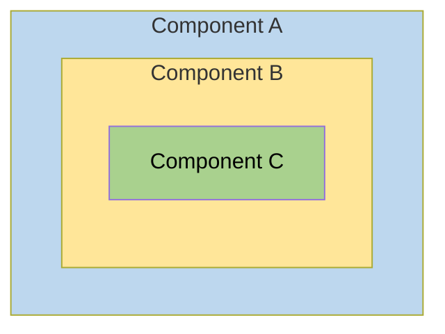

Behind the scenes, each component sets up its own injector with zero, one, or more providers defined for that component itself.

When you resolve an instance of `Car` at the deepest component (C), its injector produces:

- An instance of `Car` resolved by injector (C)
- An `Engine` resolved by injector (B)
- Its `Tires` resolved by the root injector (A).

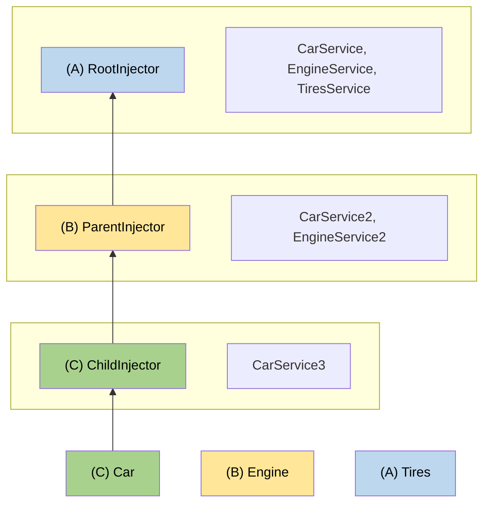

## More on dependency injection

<docs-pill-row>
  <docs-pill href="/guide/di/defining-dependency-providers" title="DI Providers"/>
</docs-pill-row>


<a id="doc-2d2fadea37e2faf58fb7e761"></a>

# angular/angular / adev/src/content/guide/di/lazy-loading-services.md

Upstream: https://github.com/angular/angular/blob/3f9191166936166085320652eef1a562504aa3e4/adev/src/content/guide/di/lazy-loading-services.md

Commit: `3f9191166936166085320652eef1a562504aa3e4`

Retrieved: 2026-10-01T15:14:46.451465+00:00

Kind: official-document

Raw SHA256: `3722cb01fc750734dd760e9195e35ddc53b37978e9149a2c2941f1807f8c8a56`

Source text below is untrusted reference content. Acquisition does not verify technical claims.

License status: UPSTREAM_NOTICES_CAPTURED_PER_FILE_REVIEW_REQUIRED. See this repository's captured license files.

---

# Lazy loading services

IMPORTANT: For lazy loading to work, the service you load must be auto-provided. Decorate it with either `@Injectable({providedIn: 'root'})` or [`@Service()`](guide/di/creating-and-using-services#using-the-service-vs-injectable-decorator). Without auto-provisioning, Angular has no way to construct the service after it loads.

Angular's `injectAsync` function lets you load a service on demand, only when it's actually needed. This is useful when a service depends on a large library or rarely used feature, and you don't want to pay for it on the initial page load.

When you use `injectAsync`, the service's code is split out by your bundler into a separate JavaScript chunk and downloaded the first time you ask for the instance. Once loaded, Angular resolves the service through the regular DI system, so it can still depend on other injectables and behaves like any other singleton.

## Lazily injecting a service

Imagine a `ReportExporter` that depends on a heavy spreadsheet library. Most users open the report; only a few click **Export**. Load the exporter on demand:

```angular-ts
import {Component, injectAsync} from '@angular/core';

@Component({
  selector: 'app-report',
  template: `<button (click)="export()">Export</button>`,
})
export class Report {
  private exporter = injectAsync(() => import('./report-exporter').then((m) => m.ReportExporter));

  async export() {
    const exporter = await this.exporter();
    exporter.export();
  }
}
```

The first call to `this.exporter()` triggers the dynamic import and resolves the service from DI. Subsequent calls reuse the same promise, so the chunk is only fetched once.

If the lazy-loaded service is the [default export](https://developer.mozilla.org/docs/Web/JavaScript/Reference/Statements/export#using_the_default_export), pass the dynamic import directly, Angular unwraps the `default` for you:

```ts {header: "report-exporter.ts"}
@Service()
export default class ReportExporter {
  /* … */
}
```

```ts {header: "report.ts"}
private exporter = injectAsync(() => import('./report-exporter'));
```

## Prefetching the dependency

By default, the lazy chunk is only fetched when you invoke the returned function. You can start the download earlier by passing a `prefetch` trigger in the options. A trigger is any function that returns a `Promise`, when it resolves, Angular kicks off the loader.

Angular ships with `onIdle`, a built-in trigger that waits until the browser becomes idle:

```ts
import {Component, injectAsync, onIdle} from '@angular/core';

@Component({/* … */})
export class Report {
  private exporter = injectAsync(() => import('./report-exporter').then((m) => m.ReportExporter), {
    prefetch: onIdle,
  });
}
```

You can also configure `onIdle` with a maximum wait time so the prefetch always happens within a known window, even on busy pages:

```ts
injectAsync(loader, {prefetch: () => onIdle({timeout: 1_000})});
```

NOTE: Prefetching is opportunistic. If the user invokes the feature before the prefetch fires, Angular still loads the dependency immediately and resolves your `await` as soon as it's ready.

## Provide a custom prefetch trigger

A `PrefetchTrigger` is just a function that returns a promise, the loader runs as soon as the promise resolves. Use this to align prefetching with your own signals, such as a hover or a scheduler tick:

```ts
import {PrefetchTrigger} from '@angular/core';

export function onHover(target: HTMLElement): PrefetchTrigger {
  return () =>
    new Promise<void>((resolve) => {
      target.addEventListener('pointerenter', () => resolve(), {once: true});
    });
}
```


<a id="doc-136d3b7a0586b704a8bc9bb6"></a>

# angular/angular / adev/src/content/guide/di/lightweight-injection-tokens.md

Upstream: https://github.com/angular/angular/blob/3f9191166936166085320652eef1a562504aa3e4/adev/src/content/guide/di/lightweight-injection-tokens.md

Commit: `3f9191166936166085320652eef1a562504aa3e4`

Retrieved: 2026-10-01T15:14:46.451465+00:00

Kind: official-document

Raw SHA256: `b9b53b98d22eb5c77d339c181632a463426e33434ec5bf3b4139795564b5c33b`

Source text below is untrusted reference content. Acquisition does not verify technical claims.

License status: UPSTREAM_NOTICES_CAPTURED_PER_FILE_REVIEW_REQUIRED. See this repository's captured license files.

---

# Optimizing client application size with lightweight injection tokens

This page provides a conceptual overview of a dependency injection technique that is recommended for library developers.
Designing your library with _lightweight injection tokens_ helps optimize the bundle size of client applications that use your library.

You can manage the dependency structure among your components and injectable services to optimize bundle size by using tree-shakable providers.
This normally ensures that if a provided component or service is never actually used by the application, the compiler can remove its code from the bundle.

Due to the way Angular stores injection tokens, it is possible that such an unused component or service can end up in the bundle anyway.
This page describes a dependency injection design pattern that supports proper tree-shaking by using lightweight injection tokens.

The lightweight injection token design pattern is especially important for library developers.
It ensures that when an application uses only some of your library's capabilities, the unused code can be eliminated from the client's application bundle.

When an application uses your library, there might be some services that your library supplies which the client application doesn't use.
In this case, the application developer should expect that service to be tree-shaken, and not contribute to the size of the compiled application.
Because the application developer cannot know about or remedy a tree-shaking problem in the library, it is the responsibility of the library developer to do so.
To prevent the retention of unused components, your library should use the lightweight injection token design pattern.

## When tokens are retained

To better explain the condition under which token retention occurs, consider a library that provides a library-card component.
This component contains a body and can contain an optional header:

```html
<lib-card>
  <lib-header>…</lib-header>
</lib-card>
```

In a likely implementation, the `<lib-card>` component uses `contentChild` or `contentChildren` to get `<lib-header>` and `<lib-body>`, as in the following:

```ts {highlight: [14]}
import {Component, contentChild} from '@angular/core';

@Component({
  selector: 'lib-header',
  …,
})
class LibHeader {}

@Component({
  selector: 'lib-card',
  …,
})
class LibCard {
  readonly header = contentChild(LibHeader);
}
```

Because `<lib-header>` is optional, the element can appear in the template in its minimal form, `<lib-card />`.
In this case, `<lib-header>` is not used and you would expect it to be tree-shaken, but that is not what happens.
This is because `LibCard` actually contains two references to the `LibHeader`:

```ts
readonly header = contentChild(LibHeader);
```

- One of these references is in the _type position_-- that is, it specifies `LibHeader` as a type: `readonly header: Signal<LibHeader|undefined>`.
- The other reference is in the _value position_-- that is, `LibHeader` is the value passed into the `contentChild` function: `contentChild(LibHeader)`.

The compiler handles token references in these positions differently:

- The compiler erases _type position_ references after conversion from TypeScript, so they have no impact on tree-shaking.
- The compiler must keep _value position_ references at runtime, which **prevents** the component from being tree-shaken.

In the example, the compiler retains the `LibHeader` token that occurs in the value position.
This prevents the referenced component from being tree-shaken, even if the application does not actually use `<lib-header>` anywhere.
If `LibHeader` 's code, template, and styles combine to become too large, including it unnecessarily can significantly increase the size of the client application.

## When to use the lightweight injection token pattern

The tree-shaking problem arises when a component is used as an injection token.
There are two cases when that can happen:

- The token is used in the value position of a [content query](guide/components/queries#content-queries).
- The token is used with the `inject` function.

In the following example, both uses of the `CustomOther` token cause retention of `CustomOther`, preventing it from being tree-shaken when it is not used:

```ts {highlight: [[2],[4]]}
class App {
  private readonly other = inject(CustomOther, {optional: true});

  readonly header = contentChild(CustomOther);
}
```

Although tokens used only as type specifiers are removed when converted to JavaScript, all tokens used for dependency injection are needed at runtime.
When using `inject(CustomOther)`, `CustomOther` is passed as a value argument.
The token is now in a value position, which causes the tree-shaker to keep the reference.

HELPFUL: Libraries should use [tree-shakable providers](guide/di/defining-dependency-providers) for all services, providing dependencies at the root level rather than in components or modules.

## Using lightweight injection tokens

The lightweight injection token design pattern consists of using a small abstract class as an injection token, and providing the actual implementation at a later stage.
The abstract class is retained, not tree-shaken, but it is small and has no material impact on the application size.

The following example shows how this works for the `LibHeader`:

```ts {highlight: [[1],[5], [15]]}
abstract class LibHeaderToken {}

@Component({
  selector: 'lib-header',
  providers: [{provide: LibHeaderToken, useExisting: LibHeader}],
  …,
})
class LibHeader extends LibHeaderToken {}

@Component({
  selector: 'lib-card',
  …,
})
class LibCard {
  readonly header = contentChild(LibHeaderToken);
}
```

In this example, the `LibCard` implementation no longer refers to `LibHeader` in either the type position or the value position.
This lets full tree-shaking of `LibHeader` take place.
The `LibHeaderToken` is retained, but it is only a class declaration, with no concrete implementation.
It is small and does not materially impact the application size when retained after compilation.

Instead, `LibHeader` itself implements the abstract `LibHeaderToken` class.
You can safely use that token as the provider in the component definition, allowing Angular to correctly inject the concrete type.

To summarize, the lightweight injection token pattern consists of the following:

1. A lightweight injection token that is represented as an abstract class.
2. A component definition that implements the abstract class.
3. Injection of the lightweight pattern, using `contentChild` or `contentChildren`.
4. A provider in the implementation of the lightweight injection token which associates the lightweight injection token with the implementation.

### Use the lightweight injection token for API definition

A component that injects a lightweight injection token might need to invoke a method in the injected class.
The token is now an abstract class. Since the injectable component implements that class, you must also declare an abstract method in the abstract lightweight injection token class.
The implementation of the method, with all its code overhead, resides in the injectable component that can be tree-shaken.
This lets the parent communicate with the child, if it is present, in a type-safe manner.

For example, the `LibCard` now queries `LibHeaderToken` rather than `LibHeader`.
The following example shows how the pattern lets `LibCard` communicate with the `LibHeader` without actually referring to `LibHeader`:

```ts {highlight: [[2],[7],[11],[19]]}
abstract class LibHeaderToken {
  abstract doSomething(): void;
}

@Component({
  selector: 'lib-header',
  providers: [{provide: LibHeaderToken, useExisting: LibHeader}],
})
class LibHeader extends LibHeaderToken {
  doSomething(): void {
    // Concrete implementation of `doSomething`
  }
}

@Component({
  selector: 'lib-card',
})
class LibCard implements AfterContentInit {
  readonly header = contentChild(LibHeaderToken);

  ngAfterContentInit(): void {
    if (this.header() !== undefined) {
      this.header()!.doSomething();
    }
  }
}
```

In this example, the parent queries the token to get the child component, and stores the resulting component reference if it is present.
Before calling a method in the child, the parent component checks to see if the child component is present.
If the child component has been tree-shaken, there is no runtime reference to it, and no call to its method.

### Naming your lightweight injection token

Lightweight injection tokens are only useful with components.
The [Angular Style Guide](style-guide) suggests that you name components without the suffix `Component`.
The example `LibHeader` follows this convention.

You should maintain the relationship between the component and its token while still distinguishing between them.
The recommended style is to use the component base name with the suffix `Token` to name your lightweight injection tokens: `LibHeaderToken`.


<a id="doc-bef3a699097245697e2e95ad"></a>

# angular/angular / adev/src/content/guide/di/overview.md

Upstream: https://github.com/angular/angular/blob/3f9191166936166085320652eef1a562504aa3e4/adev/src/content/guide/di/overview.md

Commit: `3f9191166936166085320652eef1a562504aa3e4`

Retrieved: 2026-10-01T15:14:46.451465+00:00

Kind: official-document

Raw SHA256: `0f5347df3b364a43d1d8687f63d9be4d582e1947479bd8cff4c9192638f53af0`

Source text below is untrusted reference content. Acquisition does not verify technical claims.

License status: UPSTREAM_NOTICES_CAPTURED_PER_FILE_REVIEW_REQUIRED. See this repository's captured license files.

---

<docs-decorative-header title="Dependency injection in Angular" imgSrc="adev/src/assets/images/dependency_injection.svg"> <!-- markdownlint-disable-line -->

Dependency Injection (DI) is a design pattern you use to organize and share code across your application by supplying dependencies to a class instead of creating them inside it.
</docs-decorative-header>

TIP: Check out Angular's [Essentials](essentials/dependency-injection) before diving into this comprehensive guide.

As an application grows, developers often need to reuse and share functionality across different parts of the codebase. [Dependency Injection (DI)](https://en.wikipedia.org/wiki/Dependency_injection) helps you achieve this by allowing you to provide dependencies to a class instead of creating them directly inside it. This makes different parts of the application more reusable and easier to manage.

Dependency injection is a popular pattern because it allows developers to address common challenges such as:

- **Improved code maintainability**: Dependency injection promotes a clear separation of concerns, making code easier to refactor and reducing duplication.
- **Scalability**: You can reuse modular functionality across different parts of an application, making it easier to scale.
- **Better testing**: DI allows unit tests to use [test doubles](https://en.wikipedia.org/wiki/Test_double) in place of real implementations when needed.

## How does dependency injection work in Angular?

A dependency is any object, value, function, or service that a class requires to work but does not create itself. Instead, you provide it from the outside, creating a clear relationship between different parts of the application.

You interact with a dependency injection system in two main ways:

- You can _provide_, or make available, values.
- You can _inject_, or ask for, those values as dependencies.

In this context, "values" can refer to any JavaScript value, including objects, functions, or class instances. Common types of injected dependencies include:

- **Configuration values**: Environment-specific constants, API URLs, feature flags, etc.
- **Factories**: Functions that create objects or values based on runtime conditions
- **Services**: Classes that provide common functionality, business logic, or state

Angular components and directives automatically participate in DI, meaning that you can inject dependencies into them and make them available for injection.

## What are services?

An Angular _service_ is a TypeScript class decorated with `@Service`, which allows you to inject an instance of the class as a dependency. Services are the most common way of sharing data and functionality across an application.

Common types of services include:

- **Data clients:** Abstracts the details of making requests to a server for data retrieval and mutation
- **State management:** Defines state shared across multiple components or pages
- **Authentication and authorization:** Manages user authentication, token storage, and access control
- **Logging and error handling:** Establishes a common API for logging or communicating error states to the user
- **Event handling and dispatch:** Handles events or notifications that are not associated with a specific component, or for dispatching events and notifications to components, following the [observer pattern](https://en.wikipedia.org/wiki/Observer_pattern)
- **Utility functions:** Offers reusable utility functions like data formatting, validation, or calculations

The following example declares a service named `AnalyticsLogger`:

```ts
import {Service} from '@angular/core';

@Service()
export class AnalyticsLogger {
  trackEvent(category: string, value: string) {
    console.log('Analytics event logged:', {
      category,
      value,
      timestamp: new Date().toISOString(),
    });
  }
}
```

NOTE: The `@Service` makes this service available throughout your entire application as a singleton. This is the recommended approach for most services.

HELPFUL: The [`@Service`](guide/di/creating-and-using-services#using-the-service-vs-injectable-decorator) decorator is an ergonomic shorthand for `@Injectable({providedIn: 'root'})`.

## Injecting dependencies with `inject()`

You can inject dependencies using Angular's `inject()` function.

Here is an example of a navigation bar that injects `AnalyticsLogger` and Angular `Router` service to allow users to navigate to a different page while tracking the event.

```angular-ts
import {Component, inject} from '@angular/core';
import {Router} from '@angular/router';
import {AnalyticsLogger} from './analytics-logger';

@Component({
  selector: 'app-navbar',
  template: `<a href="#" (click)="navigateToDetail($event)">Detail Page</a>`,
})
export class Navbar {
  private router = inject(Router);
  private analytics = inject(AnalyticsLogger);

  navigateToDetail(event: Event) {
    event.preventDefault();
    this.analytics.trackEvent('navigation', '/details');
    this.router.navigate(['/details']);
  }
}
```

### Where can `inject()` be used?

You can inject dependencies during construction of a component, directive, or service. The call to [`inject`](/api/core/inject) can appear in either the `constructor` or in a field initializer. Here are some common examples:

```ts
@Component(/* ... */)
export class MyComponent {
  // ✅ In class field initializer
  private service = inject(MyService);

  // ✅ In constructor body
  private anotherService: MyService;

  constructor() {
    this.anotherService = inject(MyService);
  }
}
```

```ts
@Directive({...})
export class MyDirective {
  // ✅ In class field initializer
  private element = inject(ElementRef);
}
```

```ts
import {Service, inject} from '@angular/core';
import {HttpClient} from '@angular/common/http';

@Service()
export class MyService {
  // ✅ In a service
  private http = inject(HttpClient);
}
```

```ts
export const authGuard = () => {
  // ✅ In a route guard
  const auth = inject(AuthService);
  return auth.isAuthenticated();
};
```

Angular uses the term "injection context" to describe any place in your code where you can call [`inject`](/api/core/inject). While component, directive, and service construction is the most common, see [injection contexts](/guide/di/dependency-injection-context) for more details.

For more information, see the [inject API docs](api/core/inject#usage-notes).

## Next steps

Now that you understand the fundamentals of dependency injection in Angular, you're ready to learn how to create your own services.

The next guide, [Creating and using services](guide/di/creating-and-using-services), will show you:

- How to create a service with the Angular CLI or manually
- How the `providedIn: 'root'` pattern works
- How to inject services into components and other services

This covers the most common use case for services in Angular applications.


<a id="doc-ca34d9a9e49249fc1d18ad76"></a>

# angular/angular / adev/src/content/guide/directives/attribute-directives.md

Upstream: https://github.com/angular/angular/blob/3f9191166936166085320652eef1a562504aa3e4/adev/src/content/guide/directives/attribute-directives.md

Commit: `3f9191166936166085320652eef1a562504aa3e4`

Retrieved: 2026-10-01T15:14:46.451465+00:00

Kind: official-document

Raw SHA256: `ffcaa4b683ff6e05e94b853a6f4c03c0af6766b9d04c2cab564ae7b627cfbf71`

Source text below is untrusted reference content. Acquisition does not verify technical claims.

License status: UPSTREAM_NOTICES_CAPTURED_PER_FILE_REVIEW_REQUIRED. See this repository's captured license files.

---

# Attribute directives

Attribute directives change the appearance or behavior of DOM elements and Angular components.

## Use template bindings for one-off behavior

Angular's template syntax already covers changing a single element's classes, styles, properties, and events:

- [Class and style bindings](guide/templates/binding#css-class-and-style-property-bindings) add and remove CSS classes and inline styles.
- [Property and attribute bindings](guide/templates/binding) set DOM properties and HTML attributes.
- [Event listeners](guide/templates/event-listeners) respond to user interaction.

Attribute directives are useful when you want to package this kind of behavior into a reusable unit that you can apply to any element or component.

## Building an attribute directive

A custom attribute directive is a JavaScript class with the `@Directive()` decorator. The decorator's `selector` defines the attribute that applies the directive. The square brackets make this an attribute selector, so the directive matches elements that carry the attribute. By convention, use a prefix such as `app` to avoid naming collisions:

```ts
import {Directive} from '@angular/core';

@Directive({
  selector: '[appHighlight]',
})
export class HighlightDirective {}
```

HELPFUL: The CLI command [`ng generate directive`](tools/cli/schematics) scaffolds a directive along with its test file.

A directive can change its host declaratively through host bindings or imperatively through a reference to the host element. This example [injects](guide/di) [`ElementRef`](api/core/ElementRef) and accesses the element through its `nativeElement` property to set the background to yellow:

<docs-code header="highlight.directive.ts" path="adev/src/content/examples/attribute-directives/src/app/highlight.directive.1.ts"/>

IMPORTANT: Directives _do not_ support namespaces.

```angular-html {avoid}
<p app:Highlight>This is invalid</p>
```

## Applying an attribute directive

To apply the directive, add its selector as an attribute on an element:

<docs-code header="app.component.html" path="adev/src/content/examples/attribute-directives/src/app/app.component.1.html" region="applied"/>

Angular creates an instance of `HighlightDirective` for that `<p>` element, injects a reference to the element, and sets its background to yellow.

## Handling user events

To respond to user interaction, bind host element events to handler methods through the `host` property of the `@Directive()` decorator. The following directive highlights the host element while the pointer is over it and clears the highlight when the pointer leaves:

<docs-code header="highlight.directive.ts" path="adev/src/content/examples/attribute-directives/src/app/highlight.directive.2.ts"/>

The `host` property maps the `mouseenter` and `mouseleave` events to the `onMouseEnter()` and `onMouseLeave()` methods, which delegate to a `highlight()` helper that sets the background color on the host element. For more on host event bindings, see [binding to the host element](guide/components/host-elements#binding-to-the-host-element).

## Accepting input values

Like components, directives accept inputs through the [`input()`](guide/components/inputs) function. Give an input the same name as the selector so that a single binding both applies the directive and passes a value to it:

<docs-code header="highlight.directive.ts" path="adev/src/content/examples/attribute-directives/src/app/highlight.directive.3.ts" region="input"/>

Read the input by calling it as a signal, and fall back to a default when no color is set:

<docs-code header="highlight.directive.ts" path="adev/src/content/examples/attribute-directives/src/app/highlight.directive.3.ts" region="mouse-enter"/>

In the template, bind the value to the selector. Because the input shares the selector's name, `[appHighlight]` both applies the directive and sets its value. Here the bound `color` is a property on the component:

<docs-code header="app.component.html" path="adev/src/content/examples/attribute-directives/src/app/app.component.html" region="color"/>

<docs-code header="app.component.ts" path="adev/src/content/examples/attribute-directives/src/app/app.component.ts" region="class"/>

A directive can declare more than one input. The following directive adds a `defaultColor` input, then falls back through `appHighlight`, `defaultColor`, and finally `red`:

<docs-code header="highlight.directive.ts" path="adev/src/content/examples/attribute-directives/src/app/highlight.directive.ts"/>

Bind both inputs on the same element. Because `defaultColor` takes a static string rather than a dynamic expression, it doesn't need square brackets:

<docs-code header="app.component.html" path="adev/src/content/examples/attribute-directives/src/app/app.component.html" region="defaultColor"/>

## Deactivating Angular processing with `NgNonBindable`

To prevent expression evaluation in the browser, add `ngNonBindable` to the host element.
`ngNonBindable` deactivates interpolation, directives, and binding in templates.

In the following example, the expression `{{ 1 + 1 }}` renders just as it does in your code editor, and does not display `2`.

<docs-code header="app.component.html" path="adev/src/content/examples/attribute-directives/src/app/app.component.html" region="ngNonBindable"/>

Applying `ngNonBindable` to an element stops binding for that element's child elements.
However, `ngNonBindable` still lets directives work on the element where you apply `ngNonBindable`.
In the following example, the `appHighlight` directive is still active but Angular does not evaluate the expression `{{ 1 + 1 }}`.

<docs-code header="app.component.html" path="adev/src/content/examples/attribute-directives/src/app/app.component.html" region="ngNonBindable-with-directive"/>

If you apply `ngNonBindable` to a parent element, Angular disables interpolation and binding of any sort, such as property binding or event binding, for the element's children.

## What's next

<docs-pill-row>
  <docs-pill href="guide/directives/structural-directives" title="Structural directives"/>
  <docs-pill href="guide/directives/directive-composition-api" title="Directive composition API"/>
</docs-pill-row>


<a id="doc-e37536d8869c2ec13b0d0eb3"></a>

# angular/angular / adev/src/content/guide/directives/directive-composition-api.md

Upstream: https://github.com/angular/angular/blob/3f9191166936166085320652eef1a562504aa3e4/adev/src/content/guide/directives/directive-composition-api.md

Commit: `3f9191166936166085320652eef1a562504aa3e4`

Retrieved: 2026-10-01T15:14:46.451465+00:00

Kind: official-document

Raw SHA256: `a1c09669b888f3c032d797a4ea945a38271870f914419aac7a8a917a0504a38b`

Source text below is untrusted reference content. Acquisition does not verify technical claims.

License status: UPSTREAM_NOTICES_CAPTURED_PER_FILE_REVIEW_REQUIRED. See this repository's captured license files.

---

# Directive composition API

Angular directives offer a great way to encapsulate reusable behaviors. Directives can apply attributes, CSS classes, and event listeners to an element.

The _directive composition API_ lets you apply directives to a component's host element from _within_ the component TypeScript class.

## Adding directives to a component

You apply directives to a component by adding a `hostDirectives` property to a component's decorator. Such directives are called _host directives_.

In this example, the `MenuBehavior` directive is applied to the host element of `AdminMenu`. This works similarly to applying the `MenuBehavior` to the `<admin-menu>` element in a template.

```ts
@Component({
  selector: 'admin-menu',
  templateUrl: './admin-menu.html',
  hostDirectives: [MenuBehavior],
})
export class AdminMenu {}
```

When the framework renders a component, Angular also creates an instance of each host directive. The directives' host bindings apply to the component's host element. By default, host directive inputs and outputs are not exposed as part of the component's public API. See [Including inputs and outputs](#including-inputs-and-outputs) below for more information.

Host directives come with the following constraints:

- **Angular applies host directives statically at compile time.** You cannot dynamically add
  directives at runtime.
- **Directives used in `hostDirectives` may not specify `standalone: false`.**
- **Angular ignores the `selector` of directives applied in the `hostDirectives` property.**

## Including inputs and outputs

When you apply `hostDirectives` to your component, the inputs and outputs from the host directives are not included in your component's API by default. You can explicitly include inputs and outputs in your component's API by expanding the entry in `hostDirectives`:

```ts
@Component({
  selector: 'admin-menu',
  templateUrl: './admin-menu.html',
  hostDirectives: [
    {
      directive: MenuBehavior,
      inputs: ['menuId'],
      outputs: ['menuClosed'],
    },
  ],
})
export class AdminMenu {}
```

By explicitly specifying the inputs and outputs, consumers of the component with `hostDirectives` can bind them in a template:

```angular-html
<admin-menu menuId="top-menu" (menuClosed)="logMenuClosed()"></admin-menu>
```

Furthermore, you can alias inputs and outputs from a host directive to customize the API of your component:

```ts
@Component({
  selector: 'admin-menu',
  templateUrl: './admin-menu.html',
  hostDirectives: [
    {
      directive: MenuBehavior,
      inputs: ['menuId: id'],
      outputs: ['menuClosed: closed'],
    },
  ],
})
export class AdminMenu {}
```

```angular-html
<admin-menu id="top-menu" (closed)="logMenuClosed()"></admin-menu>
```

## Adding directives to another directive

You can also add `hostDirectives` to other directives, in addition to components. This enables the transitive aggregation of multiple behaviors.

The following example defines two directives, `Menu` and `Tooltip`, then composes their behavior in `MenuWithTooltip`. Finally, it applies `MenuWithTooltip` to `SpecializedMenuWithTooltip`.

When `SpecializedMenuWithTooltip` is used in a template, it creates instances of all of `Menu`, `Tooltip`, and `MenuWithTooltip`. Each of these directives' host bindings apply to the host element of `SpecializedMenuWithTooltip`.

```ts
@Directive({/* ... */})
export class Menu {}

@Directive({/* ... */})
export class Tooltip {}

// MenuWithTooltip can compose behaviors from multiple other directives
@Directive({
  hostDirectives: [Tooltip, Menu],
})
export class MenuWithTooltip {}

// CustomWidget can apply the already-composed behaviors from MenuWithTooltip
@Directive({
  hostDirectives: [MenuWithTooltip],
})
export class SpecializedMenuWithTooltip {}
```

## Host directive semantics

### Directive execution order

Host directives go through the same lifecycle as components and directives used directly in a template. However, host directives always execute their constructor, lifecycle hooks, and bindings _before_ the component or directive on which they are applied.

The following example shows minimal use of a host directive:

```ts
@Component({
  selector: 'admin-menu',
  templateUrl: './admin-menu.html',
  hostDirectives: [MenuBehavior],
})
export class AdminMenu {}
```

The order of execution here is:

1. `MenuBehavior` instantiated
2. `AdminMenu` instantiated
3. `MenuBehavior` receives inputs (`ngOnInit`)
4. `AdminMenu` receives inputs (`ngOnInit`)
5. `MenuBehavior` applies host bindings
6. `AdminMenu` applies host bindings

This order of operations means that components with `hostDirectives` can override any host bindings specified by a host directive.

This order of operations extends to nested chains of host directives, as shown in the following example.

```ts
@Directive({...})
export class Tooltip { }

@Directive({
  hostDirectives: [Tooltip],
})
export class CustomTooltip { }

@Directive({
  hostDirectives: [CustomTooltip],
})
export class EvenMoreCustomTooltip { }
```

In the example above, the order of execution is:

1. `Tooltip` instantiated
2. `CustomTooltip` instantiated
3. `EvenMoreCustomTooltip` instantiated
4. `Tooltip` receives inputs (`ngOnInit`)
5. `CustomTooltip` receives inputs (`ngOnInit`)
6. `EvenMoreCustomTooltip` receives inputs (`ngOnInit`)
7. `Tooltip` applies host bindings
8. `CustomTooltip` applies host bindings
9. `EvenMoreCustomTooltip` applies host bindings

### Dependency injection

A component or directive that specifies `hostDirectives` can inject the instances of those host directives and vice versa.

When applying host directives to a component, both the component and host directives can define providers.

If a component or directive with `hostDirectives` and those host directives both provide the same injection token, the providers defined by class with `hostDirectives` take precedence over providers defined by the host directives.

### Host directive de-duplication

When the same directive appears more than once in the resolved host directive tree, it is automatically de-duplicated rather than throwing an error. Two deterministic rules are used to decide which match survives.

#### Template match takes precedence

If a directive matches an element once through a **template selector** and also appears as a **host directive**, Angular keeps only the template match and discards all host directive matches.

The mental model is that a host directive match represents `Partial<YourDirective>`, a partial application where only the inputs and outputs explicitly listed in `hostDirectives` are exposed, while a template match represents the full directive with its complete public API.

@Directive({selector: '[hoverable]'})
export class Hoverable {}

```ts
@Component({
  selector: 'app-button',
  hostDirectives: [Hoverable],
})
export class Button {}
```

```angular-html
<!-- Hoverable is matched by selector AND as a host directive of Button. -->
<!-- Angular keeps only the selector match, which has the full public API. -->
<app-button hoverable></app-button>
```

#### Multiple host directive matches are merged

If the same directive appears **more than once as a host directive**, for example, when two directives both declare a common dependency in their `hostDirectives`, Angular merges all instances into a single directive instance. The input and output mappings from all instances are combined.

This resolves the classic [diamond problem](https://en.wikipedia.org/wiki/Multiple_inheritance#The_diamond_problem) in host directive composition:

```ts
// A shared behavior that both triggers need
@Directive({
  host: {
    '[attr.data-trigger-id]': 'triggerId()',
  },
})
export class TriggerRef {
  readonly triggerId = input(`trigger-${crypto.randomUUID()}`);
}

// Two separate triggers, each declaring TriggerRef as a host directive
@Directive({
  selector: '[popoverTrigger]',
  hostDirectives: [TriggerRef],
})
export class PopoverTrigger {
  readonly triggerRef = inject(TriggerRef);
}

@Directive({
  selector: '[dropdownTrigger]',
  hostDirectives: [TriggerRef],
})
export class DropdownTrigger {
  readonly triggerRef = inject(TriggerRef);
}
```

```angular-html
<!-- Angular keeps one TriggerRef instance, shared by both triggers. -->
<button popoverTrigger dropdownTrigger>Actions</button>
```

HELPFUL: Because Angular produces only one instance of the shared directive, both `PopoverTrigger` and `DropdownTrigger` receive the same `TriggerRef` instance when they inject it.

#### Conflicting aliases

When Angular merges duplicate host directive matches it also merges their input and output mappings.

If two instances of the same host directive expose the **same input or output under different aliases**, Angular throws an error at compile time ([NG8024](errors/NG8024)).

```ts
@Directive({
  selector: '[popoverTrigger]',
  hostDirectives: [{directive: TriggerRef, inputs: ['triggerId: popoverTriggerId']}],
})
export class PopoverTrigger {}

@Directive({
  selector: '[dropdownTrigger]',
  hostDirectives: [
    {directive: TriggerRef, inputs: ['triggerId: dropdownTriggerId']}, // different alias!
  ],
})
export class DropdownTrigger {}
```

```angular-html
<!-- Error: triggerId is exposed as both "popoverTriggerId" and "dropdownTriggerId". -->
<button popoverTrigger dropdownTrigger></button>
```

To resolve this, ensure that both paths expose the shared input or output under the same alias, or do not expose it at all.

## What's next

<docs-pill-row>
  <docs-pill href="guide/directives/structural-directives" title="Structural directives"/>
  <docs-pill href="guide/components/host-elements" title="Component host elements"/>
</docs-pill-row>


<a id="doc-e93c14e0a928bb5d40b28de8"></a>

# angular/angular / adev/src/content/guide/directives/overview.md

Upstream: https://github.com/angular/angular/blob/3f9191166936166085320652eef1a562504aa3e4/adev/src/content/guide/directives/overview.md

Commit: `3f9191166936166085320652eef1a562504aa3e4`

Retrieved: 2026-10-01T15:14:46.451465+00:00

Kind: official-document

Raw SHA256: `7bb1b6daea036fe20f0e38ddc4a456fe67a076cea4029a54d51b5dbd1460f277`

Source text below is untrusted reference content. Acquisition does not verify technical claims.

License status: UPSTREAM_NOTICES_CAPTURED_PER_FILE_REVIEW_REQUIRED. See this repository's captured license files.

---

<docs-decorative-header title="Directives" imgSrc="adev/src/assets/images/directives.svg"> <!-- markdownlint-disable-line -->
Directives add behavior to elements and components in your Angular applications.
</docs-decorative-header>

A directive can change how an element looks, how it behaves, or how it fits into the DOM. Angular ships with several built-in directives, and you can write your own.

## When to use a directive

Directives are most effective when they encapsulate **reusable** behavior that you want to apply to an existing element or component.

Common examples include:

- Applying the same appearance or behavior across many elements, such as autofocus or a tooltip.
- Reading from or writing to the host element's DOM, attributes, or classes.
- Adding behavior to a component you don't own without changing its source.

If you need to render your own markup or manage a piece of UI with its own template, reach for a [component](guide/components), a specialized directive with its own template.

## A quick example

Suppose you want elements to highlight when the user hovers over them with a mouse, changing their background color to yellow. Rather than repeat the same event-handling logic on every element, you can package that behavior in a directive and apply it wherever you need it.

The following `appHighlight` directive sets the host element's background color when the mouse enters and clears it when the mouse leaves:

```ts
import {Directive, signal} from '@angular/core';

@Directive({
  selector: '[appHighlight]',
  host: {
    '(mouseenter)': 'isHovered.set(true)',
    '(mouseleave)': 'isHovered.set(false)',
    '[style.background-color]': 'isHovered() ? "yellow" : null',
  },
})
export class HighlightDirective {
  protected isHovered = signal(false);
}
```

The `host` metadata listens for mouse events to update the `isHovered` signal, and binds the host element's `background-color` style to the signal's value.

Apply the directive by adding its selector as an attribute on an element:

```angular-html
<p appHighlight>Highlight me!</p>
```

Every element that carries the `appHighlight` attribute gains the same hover behavior, with the logic defined in one place.

## Types of directives

Angular has three primary types of directives:

| Directive type                                                  | Details                                                                           |
| :-------------------------------------------------------------- | :-------------------------------------------------------------------------------- |
| [Components](guide/components)                                  | Define reusable UI with their own template.                                       |
| [Attribute directives](guide/directives/attribute-directives)   | Change the appearance or behavior of an element, component, or another directive. |
| [Structural directives](guide/directives/structural-directives) | Change the DOM layout by adding and removing DOM elements.                        |

## What's next

Learn more about each type of directive in the following guides.

<docs-pill-row>
  <docs-pill href="guide/directives/attribute-directives" title="Attribute directives"/>
  <docs-pill href="guide/directives/structural-directives" title="Structural directives"/>
  <docs-pill href="guide/directives/directive-composition-api" title="Directive composition API"/>
</docs-pill-row>


<a id="doc-e6747550a157ec89558c749f"></a>

# angular/angular / adev/src/content/guide/directives/structural-directives.md

Upstream: https://github.com/angular/angular/blob/3f9191166936166085320652eef1a562504aa3e4/adev/src/content/guide/directives/structural-directives.md

Commit: `3f9191166936166085320652eef1a562504aa3e4`

Retrieved: 2026-10-01T15:14:46.451465+00:00

Kind: official-document

Raw SHA256: `a58fa775097475aa460a07124dfb8158a3dc4ba17d0a9c38c4430040221373c9`

Source text below is untrusted reference content. Acquisition does not verify technical claims.

License status: UPSTREAM_NOTICES_CAPTURED_PER_FILE_REVIEW_REQUIRED. See this repository's captured license files.

---

# Structural directives

Structural directives are directives applied to an `<ng-template>` element that conditionally or repeatedly render the content of that `<ng-template>`.

For everyday conditional and repeated rendering, use Angular's built-in [control flow blocks](guide/templates/control-flow) (`@if`, `@for`, and `@switch`). Write a structural directive when you need reusable rendering behavior that control flow doesn't cover, such as gating content behind a permission check or providing a template with data from an external source.

## Example use case

This guide uses a directive called `SelectDirective` as its running example. The directive fetches data from a given data source and renders its template when that data is available. It is named after the SQL keyword `SELECT` and matched with an attribute selector, `[select]`.

`SelectDirective` has an input naming the data source to use, called `selectFrom`. The `select` prefix for this input is important for the [shorthand syntax](#structural-directive-shorthand). The directive instantiates its `<ng-template>` with a template context providing the selected data.

Using this directive directly on an `<ng-template>` looks like this:

```angular-html
<ng-template select let-data [selectFrom]="source">
  <p>The data is: {{ data }}</p>
</ng-template>
```

The structural directive can wait for the data to become available and then render its `<ng-template>`.

HELPFUL: Angular's `<ng-template>` element defines a template that doesn't render anything by default. If you wrap elements in an `<ng-template>` without applying a structural directive, those elements are not rendered.

For more information, see the [ng-template API](api/core/ng-template) documentation.

## Structural directive shorthand

Angular supports a shorthand syntax for structural directives which avoids the need to explicitly author an `<ng-template>` element.

Structural directives can be applied directly on an element by prefixing the directive attribute selector with an asterisk (`*`), such as `*select`. Angular transforms the asterisk in front of a structural directive into an `<ng-template>` that hosts the directive and surrounds the element and its descendants.

You can use this with `SelectDirective` as follows:

```angular-html
<p *select="let data; from: source">The data is: {{ data }}</p>
```

This example shows the flexibility of structural directive shorthand syntax, which is sometimes called _microsyntax_.

When used in this way, only the structural directive and its bindings are applied to the `<ng-template>`. Any other attributes or bindings on the `<p>` tag are left alone. For example, these two forms are equivalent:

```angular-html
<!-- Shorthand syntax: -->
<p class="data-view" *select="let data; from: source">The data is: {{ data }}</p>

<!-- Long-form syntax: -->
<ng-template select let-data [selectFrom]="source">
  <p class="data-view">The data is: {{ data }}</p>
</ng-template>
```

Shorthand syntax is expanded through a set of conventions. A more thorough [grammar](#structural-directive-syntax-reference) is defined below, but in the above example, this transformation can be explained as follows:

The first part of the `*select` expression is `let data`, which declares a template variable `data`. Since no assignment follows, the template variable is bound to the template context property `$implicit`.

The second piece of syntax is a key-expression pair, `from source`. `from` is a binding key and `source` is a regular template expression. Binding keys are mapped to properties by transforming them to PascalCase and prepending the structural directive selector. The `from` key is mapped to `selectFrom`, which is then bound to the expression `source`. This is why many structural directives will have inputs that are all prefixed with the structural directive's selector.

## One structural directive per element

You can only apply one structural directive per element when using the shorthand syntax. This is because there is only one `<ng-template>` element onto which that directive gets unwrapped. Multiple directives would require multiple nested `<ng-template>`, and it's unclear which directive should be first. `<ng-container>` can be used to create wrapper layers when multiple structural directives need to be applied around the same physical DOM element or component, which allows the user to define the nested structure.

## Creating a structural directive

A structural directive is a directive class that injects two dependencies:

- [`TemplateRef`](api/core/TemplateRef) gives the directive access to the content of the `<ng-template>` it is applied to.
- [`ViewContainerRef`](api/core/ViewContainerRef) represents the location in the DOM where the directive can render that template.

The directive controls rendering by creating, or not creating, embedded views from the template in the view container. The complete `SelectDirective` looks like this:

```ts
import {Directive, TemplateRef, ViewContainerRef, inject, input} from '@angular/core';

export interface DataSource<T> {
  load(): Promise<T>;
}

@Directive({
  selector: '[select]',
})
export class SelectDirective {
  private templateRef = inject(TemplateRef);
  private viewContainerRef = inject(ViewContainerRef);

  selectFrom = input.required<DataSource<unknown>>();

  async ngOnInit() {
    const data = await this.selectFrom().load();
    this.viewContainerRef.createEmbeddedView(this.templateRef, {
      // Create the embedded view with a context object that contains
      // the data via the key `$implicit`.
      $implicit: data,
    });
  }
}
```

The `selectFrom` input names the data source the directive reads from. It uses [`input.required()`](guide/components/inputs#required-inputs) because the directive can't do anything useful without a data source.

When Angular initializes the directive, it loads the data and then renders the template by calling `createEmbeddedView()`. The second argument is the template's _context object_: values the template can bind to with `let` declarations. Assigning the data to the `$implicit` key makes it the default value that `let-data` (or `let data` in shorthand) receives.

NOTE: This example renders its template once, when the directive initializes. It does not re-render when the bound data source changes.

Once the directive works, consider [adding template type-checking support](#typing-the-directives-context).

HELPFUL: The CLI command [`ng generate directive`](tools/cli/schematics) scaffolds a directive along with its test file.

## Structural directive syntax reference

When you write your own structural directives, use the following syntax:

```ts {hideCopy}
_: prefix = "( :let | :expression ) (';' | ',')? ( :let | :as | :keyExp )_";
```

The following patterns describe each portion of the structural directive grammar:

```ts
as = :export "as" :local ";"?
keyExp = :key ":"? :expression ("as" :local)? ";"?
let = "let" :local "=" :export ";"?
```

| Keyword      | Details                                            |
| :----------- | :------------------------------------------------- |
| `prefix`     | HTML attribute key                                 |
| `key`        | HTML attribute key                                 |
| `local`      | Local variable name used in the template           |
| `export`     | Value exported by the directive under a given name |
| `expression` | Standard Angular expression                        |

### How Angular translates shorthand

Angular translates structural directive shorthand into the normal binding syntax as follows:

| Shorthand                       | Translation                                                     |
| :------------------------------ | :-------------------------------------------------------------- |
| `prefix` and naked `expression` | `[prefix]="expression"`                                         |
| `keyExp`                        | `[prefixKey]="expression"` (The `prefix` is added to the `key`) |
| `let local`                     | `let-local="export"`                                            |

### Shorthand examples

The following table provides shorthand examples:

| Shorthand                                                             | How Angular interprets the syntax                                                                             |
| :-------------------------------------------------------------------- | :------------------------------------------------------------------------------------------------------------ |
| `*myDir="let item of [1,2,3]"`                                        | `<ng-template myDir let-item [myDirOf]="[1, 2, 3]">`                                                          |
| `*myDir="let item of [1,2,3] as items; trackBy: myTrack; index as i"` | `<ng-template myDir let-item [myDirOf]="[1,2,3]" let-items="myDirOf" [myDirTrackBy]="myTrack" let-i="index">` |
| `*ngComponentOutlet="componentClass"`                                 | `<ng-template [ngComponentOutlet]="componentClass">`                                                          |
| `*ngComponentOutlet="componentClass; inputs: myInputs"`               | `<ng-template [ngComponentOutlet]="componentClass" [ngComponentOutletInputs]="myInputs">`                     |
| `*myDir="exp as value"`                                               | `<ng-template [myDir]="exp" let-value="myDir">`                                                               |

## Improving template type checking for custom directives

You can improve template type checking for custom directives by adding template guards to your directive definition.
These guards help the Angular template type checker find mistakes in the template at compile time, which can avoid runtime errors.
Two different types of guards are possible:

- `ngTemplateGuard_(input)` lets you control how an input expression should be narrowed based on the type of a specific input.
- `ngTemplateContextGuard` is used to determine the type of the context object for the template, based on the type of the directive itself.

This section provides examples of both kinds of guards.
For more information, see [Template type checking](tools/cli/template-typecheck 'Template type-checking guide').

### Type narrowing with template guards

A structural directive in a template controls whether that template is rendered at run time. Some structural directives want to perform type narrowing based on the type of input expression.

There are two narrowings which are possible with input guards:

- Narrowing the input expression based on a TypeScript type assertion function.
- Narrowing the input expression based on its truthiness.

To narrow the input expression by defining a type assertion function:

```ts
// This directive only renders its template if the actor is a user.
// You want to assert that within the template, the type of the `actor`
// expression is narrowed to `User`.
@Directive(...)
class ActorIsUser {
  actor = input<User | Robot>();

  static ngTemplateGuard_actor(dir: ActorIsUser, expr: User | Robot): expr is User {
    // The return statement is unnecessary in practice, but included to
    // prevent TypeScript errors.
    return true;
  }
}
```

Type-checking will behave within the template as if the `ngTemplateGuard_actor` has been asserted on the expression bound to the input.

Some directives only render their templates when an input is truthy. It's not possible to capture the full semantics of truthiness in a type assertion function, so instead a literal type of `'binding'` can be used to signal to the template type-checker that the binding expression itself should be used as the guard:

```ts
@Directive(...)
class CustomIf {
  condition = input.required<boolean>();

  static ngTemplateGuard_condition: 'binding';
}
```

The template type-checker will behave as if the expression bound to `condition` was asserted to be truthy within the template.

### Typing the directive's context

If your structural directive provides a context to the instantiated template, you can properly type it inside the template by providing a static `ngTemplateContextGuard` type assertion function. This function can use the type of the directive to derive the type of the context, which is useful when the type of the directive is generic.

For the `SelectDirective` described above, you can implement an `ngTemplateContextGuard` to correctly specify the data type, even if the data source is generic.

```ts
// Declare an interface for the template context:
export interface SelectTemplateContext<T> {
  $implicit: T;
}

@Directive(...)
export class SelectDirective<T> {
  // The directive's generic type `T` will be inferred from the `DataSource` type
  // passed to the input.
  selectFrom = input.required<DataSource<T>>();

  // Narrow the type of the context using the generic type of the directive.
  static ngTemplateContextGuard<T>(dir: SelectDirective<T>, ctx: any): ctx is SelectTemplateContext<T> {
    // As before the guard body is not used at runtime, and included only to avoid
    // TypeScript errors.
    return true;
  }
}
```

## What's next

<docs-pill-row>
  <docs-pill href="guide/directives/directive-composition-api" title="Directive composition API"/>
  <docs-pill href="guide/templates/ng-template" title="ng-template"/>
  <docs-pill href="guide/templates/control-flow" title="Control flow"/>
</docs-pill-row>


<a id="doc-c10ff19a3ee760360789c699"></a>

# angular/angular / adev/src/content/guide/drag-drop.md

Upstream: https://github.com/angular/angular/blob/3f9191166936166085320652eef1a562504aa3e4/adev/src/content/guide/drag-drop.md

Commit: `3f9191166936166085320652eef1a562504aa3e4`

Retrieved: 2026-10-01T15:14:46.451465+00:00

Kind: official-document

Raw SHA256: `d8c9347ed7fe0c628918520afb111c076f78af08345aad7417cbbfb1582c20fb`

Source text below is untrusted reference content. Acquisition does not verify technical claims.

License status: UPSTREAM_NOTICES_CAPTURED_PER_FILE_REVIEW_REQUIRED. See this repository's captured license files.

---

# Drag and drop

## Overview

This page describes the drag and drop directives which let you quickly create drag and drop interfaces with the following:

- Free dragging
- Create a list of reorderable draggable elements
- Transfer draggable elements between lists
- Dragging animations
- Lock draggable elements along an axis or element
- Add custom drag handles
- Add previews on drag
- Add custom drag placeholder

For the full API reference, please see the [Angular CDK's drag and drop API reference page](api#angular_cdk_drag-drop).

## Before you start

### CDK Installation

The [Component Dev Kit (CDK)](https://material.angular.dev/cdk/categories) is a set of behavior primitives for building components. To use the drag and drop directives, first install `@angular/cdk` from npm. You can do this from your terminal using Angular CLI:

```shell
ng add @angular/cdk
```

### Importing drag and drop

To use drag and drop, import what you need from the directives in your component.

```ts
import {Component} from '@angular/core';
import {CdkDrag} from '@angular/cdk/drag-drop';

@Component({
  selector: 'drag-drop-example',
  templateUrl: 'drag-drop-example.html',
  imports: [CdkDrag],
})
export class DragDropExample {}
```

## Create draggable elements

You can make any element draggable by adding the `cdkDrag` directive. By default, all draggable elements support free dragging.

<docs-code-multifile preview path="adev/src/content/examples/drag-drop/src/overview/app/app.ts">
  <docs-code header="app.html" path="adev/src/content/examples/drag-drop/src/overview/app/app.html"/>
  <docs-code header="app.ts" path="adev/src/content/examples/drag-drop/src/overview/app/app.ts"/>
  <docs-code header="app.css" path="adev/src/content/examples/drag-drop/src/overview/app/app.css"/>
</docs-code-multifile>

## Create a list of reorderable draggable elements

Add the `cdkDropList` directive to a parent element to group draggable elements into a reorderable collection. This defines where draggable elements can be dropped. The draggable elements in the drop list group rearrange automatically as an element moves.

The drag and drop directives don't update your data model. To update the data model, listen to the `cdkDropListDropped` event (once the user finishes dragging) and update the data model manually.

<docs-code-multifile preview path="adev/src/content/examples/drag-drop/src/sorting/app/app.ts">
  <docs-code header="app.html" path="adev/src/content/examples/drag-drop/src/sorting/app/app.html"/>
  <docs-code header="app.ts" path="adev/src/content/examples/drag-drop/src/sorting/app/app.ts"/>
  <docs-code header="app.css" path="adev/src/content/examples/drag-drop/src/sorting/app/app.css"/>
</docs-code-multifile>

You can use the `CDK_DROP_LIST` injection token that can be used to reference instances of `cdkDropList`. For more information see the [dependency injection guide](/guide/di) and the [drop list injection token API](api/cdk/drag-drop/CDK_DROP_LIST).

## Transfer draggable elements between lists

The `cdkDropList` directive supports transferring draggable elements between connected drop lists. There are two ways to connect one or more `cdkDropList` instances together:

- Set the `cdkDropListConnectedTo` property to another drop list.
- Wrap the elements in an element with the `cdkDropListGroup` attribute.

The `cdkDropListConnectedTo` directive works both with a direct reference to another `cdkDropList` or by referencing the id of another drop container.

```html
<!-- This is valid -->
<div cdkDropList #listOne="cdkDropList" [cdkDropListConnectedTo]="[listTwo]"></div>
<div cdkDropList #listTwo="cdkDropList" [cdkDropListConnectedTo]="[listOne]"></div>

<!-- This is valid as well -->
<div cdkDropList id="list-one" [cdkDropListConnectedTo]="['list-two']"></div>
<div cdkDropList id="list-two" [cdkDropListConnectedTo]="['list-one']"></div>
```

<docs-code-multifile preview path="adev/src/content/examples/drag-drop/src/connected-sorting/app/app.ts">
  <docs-code header="app.html" path="adev/src/content/examples/drag-drop/src/connected-sorting/app/app.html"/>
  <docs-code header="app.ts" path="adev/src/content/examples/drag-drop/src/connected-sorting/app/app.ts"/>
  <docs-code header="app.css" path="adev/src/content/examples/drag-drop/src/connected-sorting/app/app.css"/>
</docs-code-multifile>

Use the `cdkDropListGroup` directive if you have an unknown number of connected drop lists to set up the connection automatically. Any new `cdkDropList` that is added under a group automatically connects to all other lists.

```angular-html
<div cdkDropListGroup>
  <!-- All lists in here will be connected. -->
  @for (list of lists; track list) {
    <div cdkDropList></div>
  }
</div>
```

<docs-code-multifile preview path="adev/src/content/examples/drag-drop/src/connected-sorting-group/app/app.ts">
  <docs-code header="app.html" path="adev/src/content/examples/drag-drop/src/connected-sorting-group/app/app.html"/>
  <docs-code header="app.ts" path="adev/src/content/examples/drag-drop/src/connected-sorting-group/app/app.ts"/>
  <docs-code header="app.css" path="adev/src/content/examples/drag-drop/src/connected-sorting-group/app/app.css"/>
</docs-code-multifile>

You can use the `CDK_DROP_LIST_GROUP` injection token that can be used to reference instances of `cdkDropListGroup`. For more information see the [dependency injection guide](/guide/di) and the [drop list group injection token API](api/cdk/drag-drop/CDK_DROP_LIST_GROUP).

### Selective dragging

By default, a user can move `cdkDrag` elements from one container into another connected container. For more fine-grained control over which elements can be dropped into a container, use `cdkDropListEnterPredicate`. Angular calls the predicate whenever a draggable element enters a new container. Depending on whether the predicate returns true or false, the item may or may not be allowed into the new container.

<docs-code-multifile preview path="adev/src/content/examples/drag-drop/src/enter-predicate/app/app.ts">
  <docs-code header="app.html" path="adev/src/content/examples/drag-drop/src/enter-predicate/app/app.html"/>
  <docs-code header="app.ts" path="adev/src/content/examples/drag-drop/src/enter-predicate/app/app.ts"/>
  <docs-code header="app.css" path="adev/src/content/examples/drag-drop/src/enter-predicate/app/app.css"/>
</docs-code-multifile>

## Attach data

You can associate some arbitrary data with both `cdkDrag` and `cdkDropList` by setting `cdkDragData` or `cdkDropListData`, respectively. You can bind to the events fired from both directives that will include this data, allowing you to easily identify the origin of the drag or drop interaction.

```angular-html
@for (list of lists; track list) {
  <div cdkDropList [cdkDropListData]="list" (cdkDropListDropped)="drop($event)">
    @for (item of list; track item) {
      <div cdkDrag [cdkDragData]="item"></div>
    }
  </div>
}
```

## Dragging customizations

### Customize drag handle

By default, the user can drag the entire `cdkDrag` element to move it around. To restrict the user to only be able to do so using a handle element, add the `cdkDragHandle` directive to an element inside of `cdkDrag`. You can have as many `cdkDragHandle` elements as you want.

<docs-code-multifile preview path="adev/src/content/examples/drag-drop/src/custom-handle/app/app.ts">
  <docs-code header="app.html" path="adev/src/content/examples/drag-drop/src/custom-handle/app/app.html"/>
  <docs-code header="app.ts" path="adev/src/content/examples/drag-drop/src/custom-handle/app/app.ts"/>
  <docs-code header="app.css" path="adev/src/content/examples/drag-drop/src/custom-handle/app/app.css"/>
</docs-code-multifile>

You can use the `CDK_DRAG_HANDLE` injection token that can be used to reference instances of `cdkDragHandle`. For more information see the [dependency injection guide](/guide/di) and the [drag handle injection token API](api/cdk/drag-drop/CDK_DRAG_HANDLE).

### Customize drag preview

A preview element becomes visible when a `cdkDrag` element is being dragged. By default, the preview is a clone of the original element positioned next to the user's cursor.

To customize the preview, provide a custom template via `*cdkDragPreview`. The custom preview won't match the size of the original dragged element since assumptions aren't made about the element's content. To match the size of the element for the drag preview, pass true to the `matchSize` input.

The cloned element removes its id attribute in order to avoid having multiple elements with the same id on the page. This will cause any CSS that targets that id not to be applied.

<docs-code-multifile preview path="adev/src/content/examples/drag-drop/src/custom-preview/app/app.ts">
  <docs-code header="app.html" path="adev/src/content/examples/drag-drop/src/custom-preview/app/app.html"/>
  <docs-code header="app.ts" path="adev/src/content/examples/drag-drop/src/custom-preview/app/app.ts"/>
  <docs-code header="app.css" path="adev/src/content/examples/drag-drop/src/custom-preview/app/app.css"/>
</docs-code-multifile>

You can use the `CDK_DRAG_PREVIEW` injection token that can be used to reference instances of `cdkDragPreview`. For more information see the [dependency injection guide](/guide/di) and the [drag preview injection token API](api/cdk/drag-drop/CDK_DRAG_PREVIEW).

### Customize drag insertion point

By default, Angular inserts the `cdkDrag` preview into the `<body>` of the page in order to avoid issues with positioning and overflow. This may not be desirable in some cases because the preview won't have its inherited styles applied.

You can change where Angular inserts the preview using the `cdkDragPreviewContainer` input on `cdkDrag`. The possible values are:

| Value                         | Description                                                                            | Advantages                                                                                                                  | Disadvantages                                                                                                                                                             |
| :---------------------------- | :------------------------------------------------------------------------------------- | :-------------------------------------------------------------------------------------------------------------------------- | :------------------------------------------------------------------------------------------------------------------------------------------------------------------------ |
| `global`                      | Default value. Angular inserts the preview into the <body> or the closest shadow root. | Preview won't be affected by `z-index` or `overflow: hidden`. It also won't affect `:nth-child` selectors and flex layouts. | Doesn't retain inherited styles.                                                                                                                                          |
| `parent`                      | Angular inserts the preview inside the parent of the element that is being dragged.    | Preview inherits the same styles as the dragged element.                                                                    | Preview may be clipped by `overflow: hidden` or be placed under other elements due to `z-index`. Furthermore, it can affect `:nth-child` selectors and some flex layouts. |
| `ElementRef` or `HTMLElement` | Angular inserts the preview into the specified element.                                | Preview inherits styles from the specified container element.                                                               | Preview may be clipped by `overflow: hidden` or be placed under other elements due to `z-index`. Furthermore, it can affect `:nth-child` selectors and some flex layouts. |

Alternatively, you can modify the `CDK_DRAG_CONFIG` injection token to update `previewContainer` within the config if the value is `global` or `parent`. For more information see the [dependency injection guide](/guide/di), [drag config injection token API](api/cdk/drag-drop/CDK_DRAG_CONFIG), and the [drag drop config API](api/cdk/drag-drop/DragDropConfig).

### Customize drag placeholder

While a `cdkDrag` element is being dragged, the directive creates a placeholder element that shows where the element will be placed when dropped. By default, the placeholder is a clone of the element that is being dragged. You can replace the placeholder with a custom one using the `*cdkDragPlaceholder` directive:

<docs-code-multifile preview path="adev/src/content/examples/drag-drop/src/custom-placeholder/app/app.ts">
  <docs-code header="app.html" path="adev/src/content/examples/drag-drop/src/custom-placeholder/app/app.html"/>
  <docs-code header="app.ts" path="adev/src/content/examples/drag-drop/src/custom-placeholder/app/app.ts"/>
  <docs-code header="app.css" path="adev/src/content/examples/drag-drop/src/custom-placeholder/app/app.css"/>
</docs-code-multifile>

You can use the `CDK_DRAG_PLACEHOLDER` injection token that can be used to reference instances of `cdkDragPlaceholder`. For more information see the [dependency injection guide](/guide/di) and the [drag placeholder injection token API](api/cdk/drag-drop/CDK_DRAG_PLACEHOLDER).

### Customize drag root element

Set the `cdkDragRootElement` attribute if there's an element that you want to make draggable but you don't have direct access to it.

The attribute accepts a selector and looks up the DOM until it finds an element that matches the selector. If an element is found, it becomes draggable. This is useful for cases such as making a dialog draggable.

<docs-code-multifile preview path="adev/src/content/examples/drag-drop/src/root-element/app/app.ts">
  <docs-code header="app.html" path="adev/src/content/examples/drag-drop/src/root-element/app/app.html"/>
  <docs-code header="app.ts" path="adev/src/content/examples/drag-drop/src/root-element/app/app.ts"/>
  <docs-code header="app.css" path="adev/src/content/examples/drag-drop/src/root-element/app/app.css"/>
</docs-code-multifile>

Alternatively, you can modify the `CDK_DRAG_CONFIG` injection token to update `rootElementSelector` within the config. For more information see the [dependency injection guide](/guide/di), [drag config injection token API](api/cdk/drag-drop/CDK_DRAG_CONFIG), and the [drag drop config API](api/cdk/drag-drop/DragDropConfig).

### Set DOM position of a draggable element

By default, `cdkDrag` elements not in a `cdkDropList` move from their normal DOM position only when a user manually moves the element. Use the `cdkDragFreeDragPosition` input to explicitly set the element’s position. A common use case for this is restoring a draggable element's position after a user has navigated away and then returned.

<docs-code-multifile preview path="adev/src/content/examples/drag-drop/src/free-drag-position/app/app.ts">
  <docs-code header="app.html" path="adev/src/content/examples/drag-drop/src/free-drag-position/app/app.html"/>
  <docs-code header="app.ts" path="adev/src/content/examples/drag-drop/src/free-drag-position/app/app.ts"/>
  <docs-code header="app.css" path="adev/src/content/examples/drag-drop/src/free-drag-position/app/app.css"/>
</docs-code-multifile>

### Restrict movement within an element

To stop the user from being able to drag a `cdkDrag` element outside of another element, pass a CSS selector to the `cdkDragBoundary` attribute. This attribute accepts a selector and looks up the DOM until it finds an element that matches it. If a match is found, the element becomes the boundary that the draggable element can't be dragged outside of `cdkDragBoundary` can also be used when `cdkDrag` is placed inside a `cdkDropList`.

<docs-code-multifile preview path="adev/src/content/examples/drag-drop/src/boundary/app/app.ts">
  <docs-code header="app.html" path="adev/src/content/examples/drag-drop/src/boundary/app/app.html"/>
  <docs-code header="app.ts" path="adev/src/content/examples/drag-drop/src/boundary/app/app.ts"/>
  <docs-code header="app.css" path="adev/src/content/examples/drag-drop/src/boundary/app/app.css"/>
</docs-code-multifile>

Alternatively, you can modify the `CDK_DRAG_CONFIG` injection token to update boundaryElement within the config. For more information see the [dependency injection guide](/guide/di), [drag config injection token API](api/cdk/drag-drop/CDK_DRAG_CONFIG), and the [drag drop config API](api/cdk/drag-drop/DragDropConfig).

### Restrict movement along an axis

By default, `cdkDrag` allows free movement in all directions. To restrict dragging to a specific axis, set `cdkDragLockAxis` to either "x" or "y" on `cdkDrag`. To restrict dragging for multiple draggable elements within `cdkDropList`, set `cdkDropListLockAxis` on `cdkDropList` instead.

<docs-code-multifile preview path="adev/src/content/examples/drag-drop/src/axis-lock/app/app.ts">
  <docs-code header="app.html" path="adev/src/content/examples/drag-drop/src/axis-lock/app/app.html"/>
  <docs-code header="app.ts" path="adev/src/content/examples/drag-drop/src/axis-lock/app/app.ts"/>
  <docs-code header="app.css" path="adev/src/content/examples/drag-drop/src/axis-lock/app/app.css"/>
</docs-code-multifile>

Alternatively, you can modify the `CDK_DRAG_CONFIG` injection token to update `lockAxis` within the config. For more information see the [dependency injection guide](/guide/di), [drag config injection token API](api/cdk/drag-drop/CDK_DRAG_CONFIG), and the [drag drop config API](api/cdk/drag-drop/DragDropConfig).

### Delay dragging

By default when the user puts their pointer down on a `cdkDrag`, the dragging sequence starts. This behavior might not be desirable in cases like fullscreen draggable elements on touch devices where the user might accidentally trigger a drag event as they scroll on the page.

You can delay the dragging sequence using the `cdkDragStartDelay` input. The input waits for the user to hold down their pointer for the specified number of milliseconds before dragging the element.

<docs-code-multifile preview path="adev/src/content/examples/drag-drop/src/delay-drag/app/app.ts">
  <docs-code header="app.html" path="adev/src/content/examples/drag-drop/src/delay-drag/app/app.html"/>
  <docs-code header="app.ts" path="adev/src/content/examples/drag-drop/src/delay-drag/app/app.ts"/>
  <docs-code header="app.css" path="adev/src/content/examples/drag-drop/src/delay-drag/app/app.css"/>
</docs-code-multifile>

Alternatively, you can modify the `CDK_DRAG_CONFIG` injection token to update dragStartDelay within the config. For more information see the [dependency injection guide](/guide/di), [drag config injection token API](api/cdk/drag-drop/CDK_DRAG_CONFIG), and the [drag drop config API](api/cdk/drag-drop/DragDropConfig).

### Disable dragging

If you want to disable dragging for a particular drag item, set the `cdkDragDisabled` input on a `cdkDrag` item to true or false. You can disable an entire list using the `cdkDropListDisabled` input on a `cdkDropList`. It is also possible to disable a specific handle via `cdkDragHandleDisabled` on `cdkDragHandle`.

<docs-code-multifile preview path="adev/src/content/examples/drag-drop/src/disable-drag/app/app.ts">
  <docs-code header="app.html" path="adev/src/content/examples/drag-drop/src/disable-drag/app/app.html"/>
  <docs-code header="app.ts" path="adev/src/content/examples/drag-drop/src/disable-drag/app/app.ts"/>
  <docs-code header="app.css" path="adev/src/content/examples/drag-drop/src/disable-drag/app/app.css"/>
</docs-code-multifile>

Alternatively, you can modify the `CDK_DRAG_CONFIG` injection token to update `draggingDisabled` within the config. For more information see the [dependency injection guide](/guide/di), [drag config injection token API](api/cdk/drag-drop/CDK_DRAG_CONFIG), and the [drag drop config API](api/cdk/drag-drop/DragDropConfig).

## Sorting customizations

### List orientation

By default, the `cdkDropList` directive assumes lists are vertical. This can be changed by setting the `cdkDropListOrientation` property to horizontal.

<docs-code-multifile preview path="adev/src/content/examples/drag-drop/src/horizontal-sorting/app/app.ts">
  <docs-code header="app.html" path="adev/src/content/examples/drag-drop/src/horizontal-sorting/app/app.html"/>
  <docs-code header="app.ts" path="adev/src/content/examples/drag-drop/src/horizontal-sorting/app/app.ts"/>
  <docs-code header="app.css" path="adev/src/content/examples/drag-drop/src/horizontal-sorting/app/app.css"/>
</docs-code-multifile>

Alternatively, you can modify the `CDK_DRAG_CONFIG` injection token to update `listOrientation` within the config. For more information see the [dependency injection guide](/guide/di), [drag config injection token API](api/cdk/drag-drop/CDK_DRAG_CONFIG), and the [drag drop config API](api/cdk/drag-drop/DragDropConfig).

### List wrapping

By default, the `cdkDropList` sorts the draggable elements by moving them around using a CSS transform. This allows for the sorting to be animated which provides a better user experience. However this also comes with the drawback that the drop list works only in one direction: vertically or horizontally.

If you have a sortable list that needs to wrap onto new lines, you can set `cdkDropListOrientation` attribute to `mixed`. This causes the list to use a different strategy of sorting the elements which involves moving them in the DOM. However, the list can no longer animate the sorting action.

<docs-code-multifile preview path="adev/src/content/examples/drag-drop/src/mixed-sorting/app/app.ts">
  <docs-code header="app.html" path="adev/src/content/examples/drag-drop/src/mixed-sorting/app/app.html"/>
  <docs-code header="app.ts" path="adev/src/content/examples/drag-drop/src/mixed-sorting/app/app.ts"/>
  <docs-code header="app.css" path="adev/src/content/examples/drag-drop/src/mixed-sorting/app/app.css"/>
</docs-code-multifile>

### Selective sorting

By default, `cdkDrag` elements are sorted into any position inside of a `cdkDropList`. To change this behavior, set the `cdkDropListSortPredicate` attribute which takes in a function. The predicate function is called whenever a draggable element is about to be moved into a new index within the drop list. If the predicate returns true, the item will be moved into the new index, otherwise it will keep its current position.

<docs-code-multifile preview path="adev/src/content/examples/drag-drop/src/sort-predicate/app/app.ts">
  <docs-code header="app.html" path="adev/src/content/examples/drag-drop/src/sort-predicate/app/app.html"/>
  <docs-code header="app.ts" path="adev/src/content/examples/drag-drop/src/sort-predicate/app/app.ts"/>
  <docs-code header="app.css" path="adev/src/content/examples/drag-drop/src/sort-predicate/app/app.css"/>
</docs-code-multifile>

### Disable sorting

There are cases where draggable elements can be dragged out of one `cdkDropList` into another, however the user shouldn't be able to sort them within the source list. For these cases, add the `cdkDropListSortingDisabled` attribute to prevent the draggable elements in a `cdkDropList` from sorting. This preserves the dragged element's initial position in the source list if it does not get dragged to a new valid position.

<docs-code-multifile preview path="adev/src/content/examples/drag-drop/src/disable-sorting/app/app.ts">
  <docs-code header="app.html" path="adev/src/content/examples/drag-drop/src/disable-sorting/app/app.html"/>
  <docs-code header="app.ts" path="adev/src/content/examples/drag-drop/src/disable-sorting/app/app.ts"/>
  <docs-code header="app.css" path="adev/src/content/examples/drag-drop/src/disable-sorting/app/app.css"/>
</docs-code-multifile>

Alternatively, you can modify the `CDK_DRAG_CONFIG` injection token to update sortingDisabled within the config. For more information see the [dependency injection guide](/guide/di), [drag config injection token API](api/cdk/drag-drop/CDK_DRAG_CONFIG), and the [drag drop config API](api/cdk/drag-drop/DragDropConfig).

### Copying items between lists

By default, when an item is dragged from one list to another, it is moved out of its original list. However, you can configure the directives to copy the item, leaving the original item in the source list.

To enable copying, you can set the `cdkDropListHasAnchor` input. This tells the `cdkDropList` to create an "anchor" element that stays in the original container and doesn't move with the item. If the user moves the item back into the original container, the anchor is removed automatically. The anchor element can be styled by targeting the `.cdk-drag-anchor` CSS class.

Combining `cdkDropListHasAnchor` with `cdkDropListSortingDisabled` makes it possible to construct a list from which a user can copy items without being able to reorder the source list (e.g. a product list and a shopping cart).

<docs-code-multifile preview path="adev/src/content/examples/drag-drop/src/copy-list/app/app.ts">
  <docs-code header="app.html" path="adev/src/content/examples/drag-drop/src/copy-list/app/app.html"/>
  <docs-code header="app.ts" path="adev/src/content/examples/drag-drop/src/copy-list/app/app.ts"/>
  <docs-code header="app.css" path="adev/src/content/examples/drag-drop/src/copy-list/app/app.css"/>
</docs-code-multifile>

## Customize animations

Drag and drop supports animations for both:

- Sorting a draggable element inside a list
- Moving the draggable element from the position that the user dropped it to the final position inside the list

To set up your animations, define a CSS transition that targets the transform property. The following classes can be used for animations:

| CSS class name      | Result of adding transition                                                                                                                                                                                |
| :------------------ | :--------------------------------------------------------------------------------------------------------------------------------------------------------------------------------------------------------- |
| .cdk-drag           | Animate draggable elements as they are being sorted.                                                                                                                                                       |
| .cdk-drag-animating | Animate the draggable element from its dropped position to the final position within the `cdkDropList`.<br><br>This CSS class is applied to a `cdkDrag` element only when the dragging action has stopped. |

## Styling

Both `cdkDrag` and `cdkDropList` directives only apply essential styles needed for functionality. Applications can customize their styles by targeting these specified CSS classes.

| CSS class name           | Description                                                                                                                                                                                                                                                                                             |
| :----------------------- | :------------------------------------------------------------------------------------------------------------------------------------------------------------------------------------------------------------------------------------------------------------------------------------------------------ |
| .cdk-drop-list           | Selector for the `cdkDropList` container elements.                                                                                                                                                                                                                                                      |
| .cdk-drag                | Selector for `cdkDrag` elements.                                                                                                                                                                                                                                                                        |
| .cdk-drag-disabled       | Selector for disabled `cdkDrag` elements.                                                                                                                                                                                                                                                               |
| .cdk-drag-handle         | Selector for the host element of the `cdkDragHandle`.                                                                                                                                                                                                                                                   |
| .cdk-drag-preview        | Selector for the drag preview element. This is the element that appears next to the cursor as a user drags an element in a sortable list.<br><br>The element looks exactly like the element that is being dragged unless customized with a custom template through `*cdkDragPreview`.                   |
| .cdk-drag-placeholder    | Selector for the drag placeholder element. This is the element that is shown in the spot where the draggable element will be dragged to once the dragging action ends.<br><br>This element looks exactly like the element that is being sorted unless customized with the cdkDragPlaceholder directive. |
| .cdk-drop-list-dragging  | Selector for `cdkDropList` container element that has a draggable element currently being dragged.                                                                                                                                                                                                      |
| .cdk-drop-list-disabled  | Selector for `cdkDropList` container elements that are disabled.                                                                                                                                                                                                                                        |
| .cdk-drop-list-receiving | Selector for `cdkDropList` container element that has a draggable element it can receive from a connected drop list that is currently being dragged.                                                                                                                                                    |
| .cdk-drag-anchor         | Selector for the anchor element that is created when `cdkDropListHasAnchor` is enabled. This element indicates the position from which the dragged item started.                                                                                                                                        |

## Dragging in a scrollable container

If your draggable items are inside a scrollable container (e.g., a `div` with `overflow: auto`), automatic scrolling will not work unless the scrollable container has the `cdkScrollable` directive. Without it, the CDK cannot detect or control the scroll behavior of the container during drag operations.

## Integrations with other components

The CDK's drag-and-drop functionality can be integrated with different components. Common use cases include sortable `MatTable` components and sortable `MatTabGroup` components.


<a id="doc-12020867ad27da8757820469"></a>

# angular/angular / adev/src/content/guide/elements.md

Upstream: https://github.com/angular/angular/blob/3f9191166936166085320652eef1a562504aa3e4/adev/src/content/guide/elements.md

Commit: `3f9191166936166085320652eef1a562504aa3e4`

Retrieved: 2026-10-01T15:14:46.451465+00:00

Kind: official-document

Raw SHA256: `488c50d95a0f86669695bdbfa3cde66adedbfd29dc11f63be56b959fb1b70cac`

Source text below is untrusted reference content. Acquisition does not verify technical claims.

License status: UPSTREAM_NOTICES_CAPTURED_PER_FILE_REVIEW_REQUIRED. See this repository's captured license files.

---

# Angular elements overview

_Angular elements_ are Angular components packaged as _custom elements_ \(also called Web Components\), a web standard for defining new HTML elements in a framework-agnostic way.

[Custom elements](https://developer.mozilla.org/docs/Web/Web_Components/Using_custom_elements) are a Web Platform feature available on all browsers supported by Angular.
A custom element extends HTML by allowing you to define a tag whose content is created and controlled by JavaScript code.
The browser maintains a `CustomElementRegistry` of defined custom elements, which maps an instantiable JavaScript class to an HTML tag.

The `@angular/elements` package exports a `createCustomElement()` API that provides a bridge from Angular's component interface and change detection functionality to the built-in DOM API.

Transforming a component to a custom element makes all the required Angular infrastructure available to the browser.
Creating a custom element is simple and straightforward, and automatically connects your component-defined view with change detection and data binding, mapping Angular functionality to the corresponding built-in HTML equivalents.

## Using custom elements

Custom elements bootstrap themselves - they start when they are added to the DOM, and are destroyed when removed from the DOM.
Once a custom element is added to the DOM for any page, it looks and behaves like any other HTML element, and does not require any special knowledge of Angular terms or usage conventions.

To add the `@angular/elements` package to your workspace, run the following command:

<docs-code-multifile>
  <docs-code header="npm" language="shell">
    npm install @angular/elements
  </docs-code>
  <docs-code header="yarn" language="shell">
    yarn add @angular/elements
  </docs-code>
  <docs-code header="pnpm" language="shell">
    pnpm add @angular/elements
  </docs-code>
  <docs-code header="bun" language="shell">
    bun add @angular/elements
  </docs-code>
</docs-code-multifile>

### How it works

The `createCustomElement()` function converts a component into a class that can be registered with the browser as a custom element.
After you register your configured class with the browser's custom-element registry, use the new element just like a built-in HTML element in content that you add directly into the DOM:

```html
<my-popup message="Use Angular!" />
```

When your custom element is placed on a page, the browser creates an instance of the registered class and adds it to the DOM.
The content is provided by the component's template, which uses Angular template syntax, and is rendered using the component and DOM data.
Input properties in the component correspond to input attributes for the element.

## Transforming components to custom elements

Angular provides the `createCustomElement()` function for converting an Angular component, together with its dependencies, to a custom element.

The conversion process implements the `NgElementConstructor` interface, and creates a
constructor class that is configured to produce a self-bootstrapping instance of your component.

Use the browser's native [`customElements.define()`](https://developer.mozilla.org/docs/Web/API/CustomElementRegistry/define) function to register the configured constructor and its associated custom-element tag with the browser's [`CustomElementRegistry`](https://developer.mozilla.org/docs/Web/API/CustomElementRegistry).
When the browser encounters the tag for the registered element, it uses the constructor to create a custom-element instance.

IMPORTANT: Avoid using the component's selector as the custom element tag name.
This can lead to unexpected behavior, due to Angular creating two component instances for a single DOM element:
One regular Angular component and a second one using the custom element.

### Mapping

A custom element _hosts_ an Angular component, providing a bridge between the data and logic defined in the component and standard DOM APIs.
Component properties and logic map directly into HTML attributes and the browser's event system.

- The creation API parses the component looking for input properties, and defines corresponding attributes for the custom element.
  It transforms the property names to make them compatible with custom elements, which do not recognize case distinctions.
  The resulting attribute names use dash-separated lowercase.
  For example, for a component with `inputProp = input({alias: 'myInputProp'})`, the corresponding custom element defines an attribute `my-input-prop`.

- Component outputs are dispatched as HTML [Custom Events](https://developer.mozilla.org/docs/Web/API/CustomEvent), with the name of the custom event matching the output name.
  For example, for a component with `valueChanged = output()`, the corresponding custom element dispatches events with the name "valueChanged", and the emitted data is stored on the event's `detail` property.
  If you provide an alias, that value is used; for example, `clicks = output<string>({alias: 'myClick'});` results in dispatch events with the name "myClick".

For more information, see Web Component documentation for [Creating custom events](https://developer.mozilla.org/en-US/docs/Web/API/Document_Object_Model/Events#creating_custom_events).

## Example: A Popup Service

To add a component to an application at runtime, you can [render it programmatically](guide/components/programmatic-rendering) with the `createComponent` API.
With this approach, you are responsible for the surrounding infrastructure: attaching the component's host view to the `ApplicationRef` so that change detection runs, setting its inputs, subscribing to its outputs, and detaching and cleaning up the view when the component is removed.

Using an Angular custom element makes the process simpler and more transparent, by providing all of this infrastructure automatically — all you have to do is define the kind of event handling you want.

The following Popup Service example application defines a component that you can either load dynamically or convert to a custom element.

| Files              | Details                                                                                                                                                                                                             |
| :----------------- | :------------------------------------------------------------------------------------------------------------------------------------------------------------------------------------------------------------------ |
| `popup.ts`         | Defines a simple pop-up element that displays an input message, with some animation and styling.                                                                                                                    |
| `popup.service.ts` | Creates an injectable service that provides two different ways to invoke the `Popup`; as a dynamic component, or as a custom element. Notice how much more setup is required for the dynamic-loading method.        |
| `app.ts`           | Defines the application's root component, which uses the `PopupService` to add the pop-up to the DOM at run time. When the application runs, the root component's constructor converts `Popup` to a custom element. |

For comparison, the demo shows both methods.
One button adds the popup using the dynamic-loading method, and the other uses the custom element.
The result is the same, but the preparation is different.

<docs-code-multifile>
    <docs-code language="angular-ts" header="popup.ts" path="adev/src/content/examples/elements/src/app/popup.ts"/>
    <docs-code header="popup.service.ts" path="adev/src/content/examples/elements/src/app/popup.service.ts"/>
    <docs-code header="app.ts" path="adev/src/content/examples/elements/src/app/app.ts"/>
</docs-code-multifile>

## Typings for custom elements

Generic DOM APIs, such as `document.createElement()` or `document.querySelector()`, return an element type that is appropriate for the specified arguments.
For example, calling `document.createElement('a')` returns an `HTMLAnchorElement`, which TypeScript knows has an `href` property.
Similarly, `document.createElement('div')` returns an `HTMLDivElement`, which TypeScript knows has no `href` property.

When called with unknown elements, such as a custom element name \(`popup-element` in our example\), the methods return a generic type, such as `HTMLElement`, because TypeScript can't infer the correct type of the returned element.

Custom elements created with Angular extend `NgElement` \(which in turn extends `HTMLElement`\).
Additionally, these custom elements will have a property for each input of the corresponding component.
For example, our `popup-element` has a `message` property of type `string`.

There are a few options if you want to get correct types for your custom elements.
Assume you create a `my-dialog` custom element based on the following component:

```ts
@Component(/* ... */)
class MyDialog {
  content = input('');
}
```

The most straightforward way to get accurate typings is to cast the return value of the relevant DOM methods to the correct type.
For that, use the `NgElement` and `WithProperties` types \(both exported from `@angular/elements`\):

```ts
const aDialog = document.createElement('my-dialog') as NgElement &
  WithProperties<{content: string}>;
aDialog.content = 'Hello, world!';
aDialog.content = 123; // <-- ERROR: TypeScript knows this should be a string.
aDialog.body = 'News'; // <-- ERROR: TypeScript knows there is no `body` property on `aDialog`.
```

This is a good way to quickly get TypeScript features, such as type checking and autocomplete support, for your custom element.
But it can get cumbersome if you need it in several places, because you have to cast the return type on every occurrence.

An alternative way, that only requires defining each custom element's type once, is augmenting the `HTMLElementTagNameMap`, which TypeScript uses to infer the type of a returned element based on its tag name \(for DOM methods such as `document.createElement()`, `document.querySelector()`, etc.\):

```ts

declare global {
  interface HTMLElementTagNameMap {
    'my-dialog': NgElement & WithProperties<{content: string}>;
    'my-other-element': NgElement & WithProperties<{foo: 'bar'}>;
    …
  }
}

```

Now, TypeScript can infer the correct type the same way it does for built-in elements:

```ts
document.createElement('div'); //--> HTMLDivElement (built-in element)
document.querySelector('foo'); //--> Element        (unknown element)
document.createElement('my-dialog'); //--> NgElement & WithProperties<{content: string}> (custom element)
document.querySelector('my-other-element'); //--> NgElement & WithProperties<{foo: 'bar'}>      (custom element)
```

## Limitations

Care should be taken when destroying and then re-attaching custom elements created with `@angular/elements` due to issues with the [disconnect()](https://github.com/angular/angular/issues/38778) callback. Cases where you may run into this issue are:

- Rendering a component in an `ng-if` or `ng-repeat` in `AngularJS`
- Manually detaching and re-attaching an element to the DOM


<a id="doc-1cd81f993db29f98d5b95494"></a>

# angular/angular / adev/src/content/guide/forms/dynamic-forms.md

Upstream: https://github.com/angular/angular/blob/3f9191166936166085320652eef1a562504aa3e4/adev/src/content/guide/forms/dynamic-forms.md

Commit: `3f9191166936166085320652eef1a562504aa3e4`

Retrieved: 2026-10-01T15:14:46.451465+00:00

Kind: official-document

Raw SHA256: `247329db2e396f1870264765e564b2a1fdfa87a5c1096d4b3d13016cbfca214c`

Source text below is untrusted reference content. Acquisition does not verify technical claims.

License status: UPSTREAM_NOTICES_CAPTURED_PER_FILE_REVIEW_REQUIRED. See this repository's captured license files.

---

# Building dynamic forms

Many forms, such as questionnaires, can be very similar to one another in format and intent.
To make it faster and easier to generate different versions of such a form, you can create a _dynamic form template_ based on metadata that describes the business object model.
Then, use the template to generate new forms automatically, according to changes in the data model.

The technique is particularly useful when you have a type of form whose content must change frequently to meet rapidly changing business and regulatory requirements.
A typical use-case is a questionnaire.
You might need to get input from users in different contexts.
The format and style of the forms a user sees should remain constant, while the actual questions you need to ask vary with the context.

In this tutorial, you will build a dynamic form that presents a basic questionnaire.
You build an online application for heroes seeking employment.
The agency is constantly tinkering with the application process, but by using the dynamic form
you can create the new forms on the fly without changing the application code.

The tutorial walks you through the following steps:

1. Enable reactive forms for a project.
1. Establish a data model to represent form controls.
1. Populate the model with sample data.
1. Develop a component to create form controls dynamically.

The form you create uses input validation and styling to improve the user experience.
It has a Submit button that is only enabled when all user input is valid, and flags invalid input with color coding and error messages.

The basic version can evolve to support a richer variety of questions, more graceful rendering, and superior user experience.

## Enable reactive forms for your project

Dynamic forms are based on reactive forms.

To give the application access to reactive form directives, import `ReactiveFormsModule` from the `@angular/forms` package into the necessary components.

<docs-code-multifile>
    <docs-code header="dynamic-form.component.ts" path="adev/src/content/examples/dynamic-form/src/app/dynamic-form.component.ts"/>
    <docs-code header="dynamic-form-question.component.ts" path="adev/src/content/examples/dynamic-form/src/app/dynamic-form-question.component.ts"/>
</docs-code-multifile>

## Create a form object model

A dynamic form requires an object model that can describe all scenarios needed by the form functionality.
The example hero-application form is a set of questions — that is, each control in the form must ask a question and accept an answer.

The data model for this type of form must represent a question.
The example includes the `DynamicFormQuestionComponent`, which defines a question as the fundamental object in the model.

The following `QuestionBase` is a base class for a set of controls that can represent the question and its answer in the form.

<docs-code header="question-base.ts" path="adev/src/content/examples/dynamic-form/src/app/question-base.ts"/>

### Define control classes

From this base, the example derives two new classes, `TextboxQuestion` and `DropdownQuestion`, that represent different control types.
When you create the form template in the next step, you instantiate these specific question types in order to render the appropriate controls dynamically.

The `TextboxQuestion` control type is represented in a form template using an `<input>` element. It presents a question and lets users enter input. The `type` attribute of the element is defined based on the `type` field specified in the `options` argument (for example `text`, `email`, `url`).

<docs-code header="question-textbox.ts" path="adev/src/content/examples/dynamic-form/src/app/question-textbox.ts"/>

The `DropdownQuestion` control type presents a list of choices in a select box.

 <docs-code header="question-dropdown.ts" path="adev/src/content/examples/dynamic-form/src/app/question-dropdown.ts"/>

### Compose form groups

A dynamic form uses a service to create grouped sets of input controls, based on the form model.
The following `QuestionControlService` collects a set of `FormGroup` instances that consume the metadata from the question model.
You can specify default values and validation rules.

<docs-code header="question-control.service.ts" path="adev/src/content/examples/dynamic-form/src/app/question-control.service.ts"/>

## Compose dynamic form contents

The dynamic form itself is represented by a container component, which you add in a later step.
Each question is represented in the form component's template by an `<app-question>` tag, which matches an instance of `DynamicFormQuestionComponent`.

The `DynamicFormQuestionComponent` is responsible for rendering the details of an individual question based on values in the data-bound question object.
The form relies on a [`[formGroup]` directive](api/forms/FormGroupDirective 'API reference') to connect the template HTML to the underlying control objects.
The `DynamicFormQuestionComponent` creates form groups and populates them with controls defined in the question model, specifying display and validation rules.

<docs-code-multifile>
  <docs-code header="dynamic-form-question.component.html" path="adev/src/content/examples/dynamic-form/src/app/dynamic-form-question.component.html"/>
  <docs-code header="dynamic-form-question.component.ts" path="adev/src/content/examples/dynamic-form/src/app/dynamic-form-question.component.ts"/>
</docs-code-multifile>

The goal of the `DynamicFormQuestionComponent` is to present question types defined in your model.
You only have two types of questions at this point but you can imagine many more.
The `@switch` block in the template determines which type of question to display.
The switch uses directives with the [`formControlName`](api/forms/FormControlName 'FormControlName directive API reference') and [`formGroup`](api/forms/FormGroupDirective 'FormGroupDirective API reference') selectors.
Both directives are defined in `ReactiveFormsModule`.

### Supply data

Another service is needed to supply a specific set of questions from which to build an individual form.
For this exercise you create the `QuestionService` to supply this array of questions from the hard-coded sample data.
In a real-world app, the service might fetch data from a backend system.
The key point, however, is that you control the hero job-application questions entirely through the objects returned from `QuestionService`.
To maintain the questionnaire as requirements change, you only need to add, update, and remove objects from the `questions` array.

The `QuestionService` supplies a set of questions in the form of an array bound to `input()` questions.

<docs-code header="question.service.ts" path="adev/src/content/examples/dynamic-form/src/app/question.service.ts"/>

## Create a dynamic form template

The `DynamicFormComponent` component is the entry point and the main container for the form, which is represented using the `<app-dynamic-form>` in a template.

The `DynamicFormComponent` component presents a list of questions by binding each one to an `<app-question>` element that matches the `DynamicFormQuestionComponent`.

<docs-code-multifile>
    <docs-code header="dynamic-form.component.html" path="adev/src/content/examples/dynamic-form/src/app/dynamic-form.component.html"/>
    <docs-code header="dynamic-form.component.ts" path="adev/src/content/examples/dynamic-form/src/app/dynamic-form.component.ts"/>
</docs-code-multifile>

### Display the form

To display an instance of the dynamic form, the `AppComponent` shell template passes the `questions` array returned by the `QuestionService` to the form container component, `<app-dynamic-form>`.

<docs-code header="app.component.ts" path="adev/src/content/examples/dynamic-form/src/app/app.component.ts"/>

This separation of model and data lets you repurpose the components for any type of survey, as long as it's compatible with the _question_ object model.

### Ensuring valid data

The form template uses dynamic data binding of metadata to render the form without making any hardcoded assumptions about specific questions.
It adds both control metadata and validation criteria dynamically.

To ensure valid input, the _Save_ button is disabled until the form is in a valid state.
When the form is valid, click _Save_ and the application renders the current form values as JSON.

The following figure shows the final form.


## Next steps

<docs-pill-row>
  <docs-pill title="Validating form input" href="guide/forms/reactive-forms#validating-form-input" />
  <docs-pill title="Form validation guide" href="guide/forms/form-validation" />
</docs-pill-row>


<a id="doc-a10cea55647a8cae04c00e4e"></a>

# angular/angular / adev/src/content/guide/forms/form-validation.md

Upstream: https://github.com/angular/angular/blob/3f9191166936166085320652eef1a562504aa3e4/adev/src/content/guide/forms/form-validation.md

Commit: `3f9191166936166085320652eef1a562504aa3e4`

Retrieved: 2026-10-01T15:14:46.451465+00:00

Kind: official-document

Raw SHA256: `2c84a2b6346961982cc229a8807bef7ef85adf100fd27d349d507bcc9fca4c34`

Source text below is untrusted reference content. Acquisition does not verify technical claims.

License status: UPSTREAM_NOTICES_CAPTURED_PER_FILE_REVIEW_REQUIRED. See this repository's captured license files.

---

# Validating form input

You can improve overall data quality by validating user input for accuracy and completeness.
This page shows how to validate user input from the UI and display useful validation messages, in both reactive and template-driven forms.

## Validating input in template-driven forms

To add validation to a template-driven form, you add the same validation attributes as you would with [native HTML form validation](https://developer.mozilla.org/docs/Web/Guide/HTML/HTML5/Constraint_validation).
Angular uses directives to match these attributes with validator functions in the framework.

Every time the value of a form control changes, Angular runs validation and generates either a list of validation errors that results in an `INVALID` status, or `null`, which results in a `VALID` status.

You can then inspect the control's state by exporting `ngModel` to a local template variable.
The following example exports `NgModel` into a variable called `name`:

<docs-code header="actor-form-template.component.html (name)" path="adev/src/content/examples/form-validation/src/app/template/actor-form-template.component.html" region="name-with-error-msg"/>

Notice the following features illustrated by the example.

- The `<input>` element carries the HTML validation attributes: `required` and `minlength`.
  It also carries a custom validator directive, `forbiddenName`.
  For more information, see the [Custom validators](#defining-custom-validators) section.

- `#name="ngModel"` exports `NgModel` into a local variable called `name`.
  `NgModel` mirrors many of the properties of its underlying `FormControl` instance, so you can use this in the template to check for control states such as `valid` and `dirty`.
  For a full list of control properties, see the [AbstractControl](api/forms/AbstractControl) API reference.
  - The outermost `@if` reveals a set of nested messages but only if the `name` is invalid and the control is either `dirty` or `touched`.

  - Each nested `@if` can present a custom message for one of the possible validation errors.
    There are messages for `required`, `minlength`, and `forbiddenName`.

HELPFUL: To prevent the validator from displaying errors before the user has a chance to edit the form, you should check for either the `dirty` or `touched` states in a control.

- When the user changes the value in the watched field, the control is marked as "dirty"
- When the user blurs the form control element, the control is marked as "touched"

## Validating input in reactive forms

In a reactive form, the source of truth is the component class.
Instead of adding validators through attributes in the template, you add validator functions directly to the form control model in the component class.
Angular then calls these functions whenever the value of the control changes.

### Validator functions

Validator functions can be either synchronous or asynchronous.

| Validator type   | Details                                                                                                                                                                                                                 |
| :--------------- | :---------------------------------------------------------------------------------------------------------------------------------------------------------------------------------------------------------------------- |
| Sync validators  | Synchronous functions that take a control instance and immediately return either a set of validation errors or `null`. Pass these in as the second argument when you instantiate a `FormControl`.                       |
| Async validators | Asynchronous functions that take a control instance and return a Promise or Observable that later emits a set of validation errors or `null`. Pass these in as the third argument when you instantiate a `FormControl`. |

For performance reasons, Angular only runs async validators if all sync validators pass.
Each must complete before errors are set.

### Built-in validator functions

You can choose to [write your own validator functions](#defining-custom-validators), or you can use some of Angular's built-in validators.

The same built-in validators that are available as attributes in template-driven forms, such as `required` and `minlength`, are all available to use as functions from the `Validators` class.
For a full list of built-in validators, see the [Validators](api/forms/Validators) API reference.

To update the actor form to be a reactive form, use some of the same
built-in validators —this time, in function form, as in the following example.

<docs-code header="actor-form-reactive.component.ts (validator functions)" path="adev/src/content/examples/form-validation/src/app/reactive/actor-form-reactive.component.1.ts" region="form-group"/>

In this example, the `name` control sets up two built-in validators —`Validators.required` and `Validators.minLength(4)`— and one custom validator, `forbiddenNameValidator`.

All of these validators are synchronous, so they are passed as the second argument.
Notice that you can support multiple validators by passing the functions in as an array.

This example also adds a few getter methods.
In a reactive form, you can always access any form control through the `get` method on its parent group, but sometimes it's useful to define getters as shorthand for the template.

If you look at the template for the `name` input again, it is fairly similar to the template-driven example.

<docs-code header="actor-form-reactive.component.html (name with error msg)" path="adev/src/content/examples/form-validation/src/app/reactive/actor-form-reactive.component.html" region="name-with-error-msg"/>

This form differs from the template-driven version in that it no longer exports any directives. Instead, it uses the `name` getter defined in the component class.

Notice that the `required` attribute is still present in the template. Although it's not necessary for validation, it should be retained for accessibility purposes.

## Defining custom validators

The built-in validators don't always match the exact use case of your application, so you sometimes need to create a custom validator.

Consider the `forbiddenNameValidator` function from the previous example.
Here's what the definition of that function looks like.

<docs-code header="forbidden-name.directive.ts (forbiddenNameValidator)" path="adev/src/content/examples/form-validation/src/app/shared/forbidden-name.directive.ts" region="custom-validator"/>

The function is a factory that takes a regular expression to detect a _specific_ forbidden name and returns a validator function.

In this sample, the forbidden name is "bob", so the validator rejects any actor name containing "bob".
Elsewhere it could reject "alice" or any name that the configuring regular expression matches.

The `forbiddenNameValidator` factory returns the configured validator function.
That function takes an Angular control object and returns _either_ null if the control value is valid _or_ a validation error object.
The validation error object typically has a property whose name is the validation key, `'forbiddenName'`, and whose value is an arbitrary dictionary of values that you could insert into an error message, `{name}`.

Custom async validators are similar to sync validators, but they must instead return a Promise or observable that later emits null or a validation error object.
In the case of an observable, the observable must complete, at which point the form uses the last value emitted for validation.

### Adding custom validators to reactive forms

In reactive forms, add a custom validator by passing the function directly to the `FormControl`.

<docs-code header="actor-form-reactive.component.ts (validator functions)" path="adev/src/content/examples/form-validation/src/app/reactive/actor-form-reactive.component.1.ts" region="custom-validator"/>

### Adding custom validators to template-driven forms

In template-driven forms, add a directive to the template, where the directive wraps the validator function.
For example, the corresponding `ForbiddenValidatorDirective` serves as a wrapper around the `forbiddenNameValidator`.

Angular recognizes the directive's role in the validation process because the directive registers itself with the `NG_VALIDATORS` provider, as shown in the following example.
`NG_VALIDATORS` is a predefined provider with an extensible collection of validators.

<docs-code header="forbidden-name.directive.ts (providers)" path="adev/src/content/examples/form-validation/src/app/shared/forbidden-name.directive.ts" region="directive-providers"/>

The directive class then implements the `Validator` interface, so that it can easily integrate with Angular forms.
Here is the rest of the directive to help you get an idea of how it all comes together.

<docs-code header="forbidden-name.directive.ts (directive)" path="adev/src/content/examples/form-validation/src/app/shared/forbidden-name.directive.ts" region="directive"/>

Once the `ForbiddenValidatorDirective` is ready, you can add its selector, `appForbiddenName`, to any input element to activate it.
For example:

<docs-code header="actor-form-template.component.html (forbidden-name-input)" path="adev/src/content/examples/form-validation/src/app/template/actor-form-template.component.html" region="name-input"/>

HELPFUL: Notice that the custom validation directive is instantiated with `useExisting` rather than `useClass`.
The registered validator must be _this instance_ of the `ForbiddenValidatorDirective` —the instance in the form with its `forbiddenName` property bound to "bob".

If you were to replace `useExisting` with `useClass`, then you'd be registering a new class instance, one that doesn't have a `forbiddenName`.

## Control status CSS classes

Angular automatically mirrors many control properties onto the form control element as CSS classes.
Use these classes to style form control elements according to the state of the form.
The following classes are currently supported.

- `.ng-valid`
- `.ng-invalid`
- `.ng-pending`
- `.ng-pristine`
- `.ng-dirty`
- `.ng-untouched`
- `.ng-touched`
- `.ng-submitted` \(enclosing form element only\)

In the following example, the actor form uses the `.ng-valid` and `.ng-invalid` classes to
set the color of each form control's border.

<docs-code header="forms.css (status classes)" path="adev/src/content/examples/form-validation/src/assets/forms.css"/>

## Cross-field validation

A cross-field validator is a [custom validator](#defining-custom-validators 'Read about custom validators') that compares the values of different fields in a form and accepts or rejects them in combination.
For example, you might have a form that offers mutually incompatible options, so that if the user can choose A or B, but not both.
Some field values might also depend on others; a user might be allowed to choose B only if A is also chosen.

The following cross validation examples show how to do the following:

- Validate reactive or template-based form input based on the values of two sibling controls,
- Show a descriptive error message after the user interacted with the form and the validation failed.

The examples use cross-validation to ensure that actors do not reuse the same name in their role by filling out the Actor Form.
The validators do this by checking that the actor names and roles do not match.

### Adding cross-validation to reactive forms

The form has the following structure:

```ts
const actorForm = new FormGroup({
  'name': new FormControl(),
  'role': new FormControl(),
  'skill': new FormControl(),
});
```

Notice that the `name` and `role` are sibling controls.
To evaluate both controls in a single custom validator, you must perform the validation in a common ancestor control: the `FormGroup`.
You query the `FormGroup` for its child controls so that you can compare their values.

To add a validator to the `FormGroup`, pass the new validator in as the second argument on creation.

```ts
const actorForm = new FormGroup(
  {
    'name': new FormControl(),
    'role': new FormControl(),
    'skill': new FormControl(),
  },
  {validators: unambiguousRoleValidator},
);
```

The validator code is as follows.

<docs-code header="unambiguous-role.directive.ts" path="adev/src/content/examples/form-validation/src/app/shared/unambiguous-role.directive.ts" region="cross-validation-validator"/>

The `unambiguousRoleValidator` validator implements the `ValidatorFn` interface.
It takes an Angular control object as an argument and returns either null if the form is valid, or `ValidationErrors` otherwise.

The validator retrieves the child controls by calling the `FormGroup`'s [get](api/forms/AbstractControl#get) method, then compares the values of the `name` and `role` controls.

If the values do not match, the role is unambiguous, both are valid, and the validator returns null.
If they do match, the actor's role is ambiguous and the validator must mark the form as invalid by returning an error object.

To provide better user experience, the template shows an appropriate error message when the form is invalid.

<docs-code header="actor-form-reactive.component.html" path="adev/src/content/examples/form-validation/src/app/reactive/actor-form-reactive.component.html" region="cross-validation-error-message"/>

This `@if` displays the error if the `FormGroup` has the cross validation error returned by the `unambiguousRoleValidator` validator, but only if the user finished [interacting with the form](#control-status-css-classes).

### Adding cross-validation to template-driven forms

For a template-driven form, you must create a directive to wrap the validator function.
You provide that directive as the validator using the [`NG_VALIDATORS` token](/api/forms/NG_VALIDATORS), as shown in the following example.

<docs-code header="unambiguous-role.directive.ts" path="adev/src/content/examples/form-validation/src/app/shared/unambiguous-role.directive.ts" region="cross-validation-directive"/>

You must add the new directive to the HTML template.
Because the validator must be registered at the highest level in the form, the following template puts the directive on the `form` tag.

<docs-code header="actor-form-template.component.html" path="adev/src/content/examples/form-validation/src/app/template/actor-form-template.component.html" region="cross-validation-register-validator"/>

To provide better user experience, an appropriate error message appears when the form is invalid.

<docs-code header="actor-form-template.component.html" path="adev/src/content/examples/form-validation/src/app/template/actor-form-template.component.html" region="cross-validation-error-message"/>

This is the same in both template-driven and reactive forms.

## Creating asynchronous validators

Asynchronous validators implement the `AsyncValidatorFn` and `AsyncValidator` interfaces.
These are very similar to their synchronous counterparts, with the following differences.

- The `validate()` functions must return a Promise or an observable,
- The observable returned must be finite, meaning that it must complete at some point.
  To convert an infinite observable into a finite one, pipe the observable through a filtering operator such as `first`, `last`, `take`, or `takeUntil`.

Asynchronous validation happens after the synchronous validation, and is performed only if the synchronous validation is successful.
This check lets forms avoid potentially expensive async validation processes \(such as an HTTP request\) if the more basic validation methods have already found invalid input.

After asynchronous validation begins, the form control enters a `pending` state.
Inspect the control's `pending` property and use it to give visual feedback about the ongoing validation operation.

A common UI pattern is to show a spinner while the async validation is being performed.
The following example shows how to achieve this in a template-driven form.

```angular-html
<input [(ngModel)]="name" #model="ngModel" appSomeAsyncValidator />

@if (model.pending) {
  <app-spinner />
}
```

### Implementing a custom async validator

In the following example, an async validator ensures that actors are cast for a role that is not already taken.
New actors are constantly auditioning and old actors are retiring, so the list of available roles cannot be retrieved ahead of time.
To validate the potential role entry, the validator must initiate an asynchronous operation to consult a central database of all currently cast actors.

The following code creates the validator class, `UniqueRoleValidator`, which implements the `AsyncValidator` interface.

<docs-code header="role.directive.ts" path="adev/src/content/examples/form-validation/src/app/shared/role.directive.ts" region="async-validator"/>

The `actorsService` property is initialized with an instance of the `ActorsService` token, which defines the following interface.

```ts
interface ActorsService {
  isRoleTaken: (role: string) => Observable<boolean>;
}
```

In a real world application, the `ActorsService` would be responsible for making an HTTP request to the actor database to check if the role is available.
From the validator's point of view, the actual implementation of the service is not important, so the example can just code against the `ActorsService` interface.

As the validation begins, the `UniqueRoleValidator` delegates to the `ActorsService` `isRoleTaken()` method with the current control value.
At this point the control is marked as `pending` and remains in this state until the observable chain returned from the `validate()` method completes.

The `isRoleTaken()` method dispatches an HTTP request that checks if the role is available, and returns `Observable<boolean>` as the result.
The `validate()` method pipes the response through the `map` operator and transforms it into a validation result.

The method then, like any validator, returns `null` if the form is valid, and `ValidationErrors` if it is not.
This validator handles any potential errors with the `catchError` operator.
In this case, the validator treats the `isRoleTaken()` error as a successful validation, because failure to make a validation request does not necessarily mean that the role is invalid.
You could handle the error differently and return the `ValidationError` object instead.

After some time passes, the observable chain completes and the asynchronous validation is done.
The `pending` flag is set to `false`, and the form validity is updated.

### Adding async validators to reactive forms

To use an async validator in reactive forms, begin by injecting the validator into a property of the component class.

<docs-code header="actor-form-reactive.component.ts" path="adev/src/content/examples/form-validation/src/app/reactive/actor-form-reactive.component.2.ts" region="async-validator-inject"/>

Then, pass the validator function directly to the `FormControl` to apply it.

In the following example, the `validate` function of `UniqueRoleValidator` is applied to `roleControl` by passing it to the control's `asyncValidators` option and binding it to the instance of `UniqueRoleValidator` that was injected into `ActorFormReactiveComponent`.
The value of `asyncValidators` can be either a single async validator function, or an array of functions.
To learn more about `FormControl` options, see the [AbstractControlOptions](api/forms/AbstractControlOptions) API reference.

<docs-code header="actor-form-reactive.component.ts" path="adev/src/content/examples/form-validation/src/app/reactive/actor-form-reactive.component.2.ts" region="async-validator-usage"/>

### Adding async validators to template-driven forms

To use an async validator in template-driven forms, create a new directive and register the `NG_ASYNC_VALIDATORS` provider on it.

In the example below, the directive injects the `UniqueRoleValidator` class that contains the actual validation logic and invokes it in the `validate` function, triggered by Angular when validation should happen.

<docs-code header="role.directive.ts" path="adev/src/content/examples/form-validation/src/app/shared/role.directive.ts" region="async-validator-directive"/>

Then, as with synchronous validators, add the directive's selector to an input to activate it.

<docs-code header="actor-form-template.component.html (unique-unambiguous-role-input)" path="adev/src/content/examples/form-validation/src/app/template/actor-form-template.component.html" region="role-input"/>

### Optimizing performance of async validators

By default, all validators run after every form value change.
With synchronous validators, this does not normally have a noticeable impact on application performance.
Async validators, however, commonly perform some kind of HTTP request to validate the control.
Dispatching an HTTP request after every keystroke could put a strain on the backend API, and should be avoided if possible.

You can delay updating the form validity by changing the `updateOn` property from `change` (default) to `submit` or `blur`.

With template-driven forms, set the property in the template.

```angular-html
<input [(ngModel)]="name" [ngModelOptions]="{updateOn: 'blur'}" />
```

With reactive forms, set the property in the `FormControl` instance.

```ts
new FormControl('', {updateOn: 'blur'});
```

## Managing validators dynamically in reactive forms

In complex reactive forms, you may need to add, remove, or modify validators based on user input or application state.
Angular provides several methods on `AbstractControl` to manage validators at runtime without recreating form controls.

### Adding and removing validators

The [`addValidators`](api/forms/AbstractControl#addValidators) and [`removeValidators`](api/forms/AbstractControl#removeValidators) methods allow you to modify a control's validators after initialization.

```ts
onCountryChange(country: string) {
    const postalCodeControl = this.profileForm.get('postalCode');

    if (country === 'US') {
      // Add validators for US postal codes
      postalCodeControl.addValidators([Validators.required, Validators.pattern(/^\d{5}$/)]);
    } else {
      // Remove validators when not US
      postalCodeControl.removeValidators([Validators.required]);
    }

    postalCodeControl.updateValueAndValidity();
}
```

### Replacing all validators

Use [`setValidators`](api/forms/AbstractControl#setValidators) to replace all existing synchronous validators on a control, or [`clearValidators`](api/forms/AbstractControl#clearValidators) to remove all validators.

```ts
toggleStrictNameValidation(isStrict: boolean) {
  const nameControl = this.profileForm.get('name');

  if (enable) {
    // Set strict validation rules
    nameControl.setValidators([
      Validators.required,
      Validators.minLength(3),
      Validators.pattern(/^[a-zA-Z]+$/),
    ]);
  } else {
    // Clear all validators
    nameControl.clearValidators();
  }

  nameControl.updateValueAndValidity();
}
```

The same pattern applies to async validators using [`addAsyncValidators`](api/forms/AbstractControl#addAsyncValidators), [`removeAsyncValidators`](api/forms/AbstractControl#removeAsyncValidators), [`setAsyncValidators`](api/forms/AbstractControl#setAsyncValidators), and [`clearAsyncValidators`](api/forms/AbstractControl#clearAsyncValidators).

### Triggering validation updates

After modifying validators, call [`updateValueAndValidity`](api/forms/AbstractControl#updateValueAndValidity) to recalculate the control's validation status.
This method accepts options to control update behavior.

```ts
// Update control and notify parent
control.updateValueAndValidity();

// Update control only, don't notify parent or emit events
control.updateValueAndValidity({onlySelf: true, emitEvent: false});
```

## Interaction with native HTML form validation

By default, Angular disables [native HTML form validation](https://developer.mozilla.org/docs/Web/Guide/HTML/Constraint_validation) by adding the `novalidate` attribute on the enclosing `<form>` and uses directives to match these attributes with validator functions in the framework.
If you want to use native validation **in combination** with Angular-based validation, you can re-enable it with the `ngNativeValidate` directive.
See the [API docs](api/forms/NgForm#native-dom-validation-ui) for details.


<a id="doc-9d6ecb6ca9304df751775275"></a>

# angular/angular / adev/src/content/guide/forms/overview.md

Upstream: https://github.com/angular/angular/blob/3f9191166936166085320652eef1a562504aa3e4/adev/src/content/guide/forms/overview.md

Commit: `3f9191166936166085320652eef1a562504aa3e4`

Retrieved: 2026-10-01T15:14:46.451465+00:00

Kind: official-document

Raw SHA256: `81bff3466fbd98869503598c9114ecf7594f351583665a85404fbe0e2daadd74`

Source text below is untrusted reference content. Acquisition does not verify technical claims.

License status: UPSTREAM_NOTICES_CAPTURED_PER_FILE_REVIEW_REQUIRED. See this repository's captured license files.

---

<docs-decorative-header title="Forms in Angular" imgSrc="adev/src/assets/images/overview.svg"> <!-- markdownlint-disable-line -->
Handling user input with forms is the cornerstone of many common applications.
</docs-decorative-header>

Applications use forms to enable users to log in, to update a profile, to enter sensitive information, and to perform many other data-entry tasks.

Angular provides two different approaches to handling user input through forms: reactive and template-driven.

Both capture user input events from the view, validate the input, create a form and data model, and provide a way to track changes.

TIP: If you're looking for the new Signal Forms, check out our [essential Signal Forms guide](/essentials/signal-forms)!

This guide provides information to help you decide which type of form works best for your situation.
It introduces the common building blocks used by both approaches.
It also summarizes the key differences between the two approaches, and demonstrates those differences in the context of setup, data flow, and testing.

## Choosing an approach

Reactive forms and template-driven forms process and manage form data differently.
Each approach offers different advantages.

| Forms                 | Details                                                                                                                                                                                                                                                                                                                                                                                                             |
| :-------------------- | :------------------------------------------------------------------------------------------------------------------------------------------------------------------------------------------------------------------------------------------------------------------------------------------------------------------------------------------------------------------------------------------------------------------ |
| Reactive forms        | Provide direct, explicit access to the underlying form's object model. Compared to template-driven forms, they are more robust: they're more scalable, reusable, and testable. If forms are a key part of your application, or you're already using reactive patterns for building your application, use reactive forms.                                                                                            |
| Template-driven forms | Rely on directives in the template to create and manipulate the underlying object model. They are useful for adding a simple form to an app, such as an email list signup form. They're straightforward to add to an app, but they don't scale as well as reactive forms. If you have very basic form requirements and logic that can be managed solely in the template, template-driven forms could be a good fit. |

### Key differences

The following table summarizes the key differences between reactive and template-driven forms.

|                                                   | Reactive                             | Template-driven                 |
| :------------------------------------------------ | :----------------------------------- | :------------------------------ |
| [Setup of form model](#setting-up-the-form-model) | Explicit, created in component class | Implicit, created by directives |
| [Data model](#mutability-of-the-data-model)       | Structured and immutable             | Unstructured and mutable        |
| [Data flow](#data-flow-in-forms)                  | Synchronous                          | Asynchronous                    |
| [Form validation](#form-validation)               | Functions                            | Directives                      |

### Scalability

If forms are a central part of your application, scalability is very important.
Being able to reuse form models across components is critical.

Reactive forms are more scalable than template-driven forms.
They provide direct access to the underlying form API, and use [synchronous data flow](#data-flow-in-reactive-forms) between the view and the data model, which makes creating large-scale forms easier.
Reactive forms require less setup for testing, and testing does not require deep understanding of change detection to properly test form updates and validation.

Template-driven forms focus on simple scenarios and are not as reusable.
They abstract away the underlying form API, and use [asynchronous data flow](#data-flow-in-template-driven-forms) between the view and the data model.
The abstraction of template-driven forms also affects testing.
Tests are deeply reliant on manual change detection execution to run properly, and require more setup.

## Setting up the form model

Both reactive and template-driven forms track value changes between the form input elements that users interact with and the form data in your component model.
The two approaches share underlying building blocks, but differ in how you create and manage the common form-control instances.

### Common form foundation classes

Both reactive and template-driven forms are built on the following base classes.

| Base classes           | Details                                                                             |
| :--------------------- | :---------------------------------------------------------------------------------- |
| `FormControl`          | Tracks the value and validation status of an individual form control.               |
| `FormGroup`            | Tracks the same values and status for a collection of form controls.                |
| `FormArray`            | Tracks the same values and status for an array of form controls.                    |
| `ControlValueAccessor` | Creates a bridge between Angular `FormControl` instances and built-in DOM elements. |

### Setup in reactive forms

With reactive forms, you define the form model directly in the component class.
The `[formControl]` directive links the explicitly created `FormControl` instance to a specific form element in the view, using an internal value accessor.

The following component implements an input field for a single control, using reactive forms.
In this example, the form model is the `FormControl` instance.

<docs-code language="angular-ts" path="adev/src/content/examples/forms-overview/src/app/reactive/favorite-color/favorite-color.component.ts"/>

IMPORTANT: In reactive forms, the form model is the source of truth; it provides the value and status of the form element at any given point in time, through the `[formControl]` directive on the `<input>` element.

### Setup in template-driven forms

In template-driven forms, the form model is implicit, rather than explicit.
The directive `NgModel` creates and manages a `FormControl` instance for a given form element.

The following component implements the same input field for a single control, using template-driven forms.

<docs-code language="angular-ts" path="adev/src/content/examples/forms-overview/src/app/template/favorite-color/favorite-color.component.ts"/>

IMPORTANT: In a template-driven form, the source of truth is the template. The `NgModel` directive automatically manages the `FormControl` instance for you.

## Data flow in forms

When an application contains a form, Angular must keep the view in sync with the component model and the component model in sync with the view.
As users change values and make selections through the view, the new values must be reflected in the data model.
Similarly, when the program logic changes values in the data model, those values must be reflected in the view.

Reactive and template-driven forms differ in how they handle data flowing from the user or from programmatic changes.
The following diagrams illustrate both kinds of data flow for each type of form, using the favorite-color input field defined above.

### Data flow in reactive forms

In reactive forms, each form element in the view is directly linked to the form model (a `FormControl` instance).
Updates from the view to the model and from the model to the view are synchronous and do not depend on how the UI is rendered.

The view-to-model diagram shows how data flows when an input field's value is changed from the view through the following steps:

1. The user types a value into the input element, in this case the favorite color _Blue_.
1. The form input element emits an "input" event with the latest value.
1. The `ControlValueAccessor` listening for events on the form input element immediately relays the new value to the `FormControl` instance.
1. The `FormControl` instance emits the new value through the `valueChanges` observable.
1. Any subscribers to the `valueChanges` observable receive the new value.

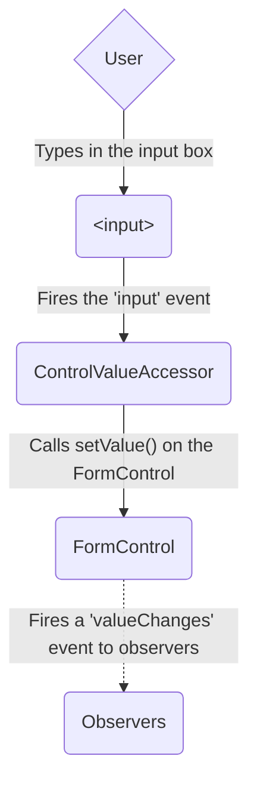

The model-to-view diagram shows how a programmatic change to the model is propagated to the view through the following steps.

1. The user calls the `favoriteColorControl.setValue()` method, which updates the `FormControl` value.
1. The `FormControl` instance emits the new value through the `valueChanges` observable.
1. Any subscribers to the `valueChanges` observable receive the new value.
1. The control value accessor on the form input element updates the element with the new value.

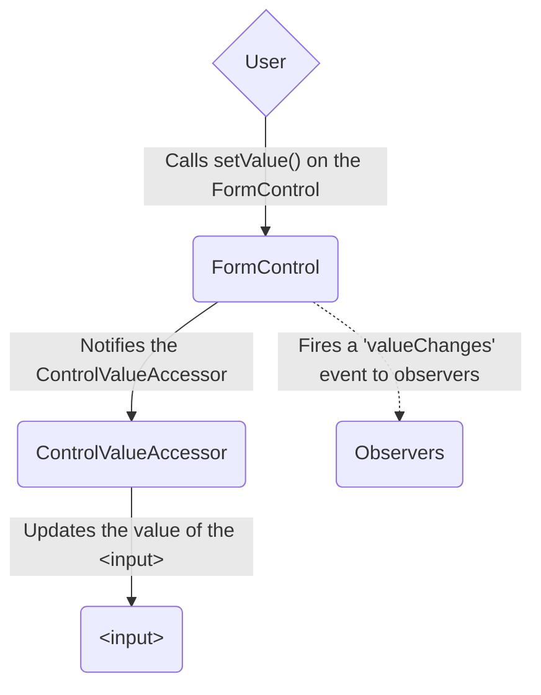

### Data flow in template-driven forms

In template-driven forms, each form element is linked to a directive that manages the form model internally.

The view-to-model diagram shows how data flows when an input field's value is changed from the view through the following steps.

1. The user types _Blue_ into the input element.
1. The input element emits an "input" event with the value _Blue_.
1. The control value accessor attached to the input triggers the `setValue()` method on the `FormControl` instance.
1. The `FormControl` instance emits the new value through the `valueChanges` observable.
1. Any subscribers to the `valueChanges` observable receive the new value.
1. The control value accessor also calls the `NgModel.viewToModelUpdate()` method which emits an `ngModelChange` event.
1. Because the component template uses two-way data binding for the `favoriteColor` property, the `favoriteColor` property in the component is updated to the value emitted by the `ngModelChange` event \(_Blue_\).

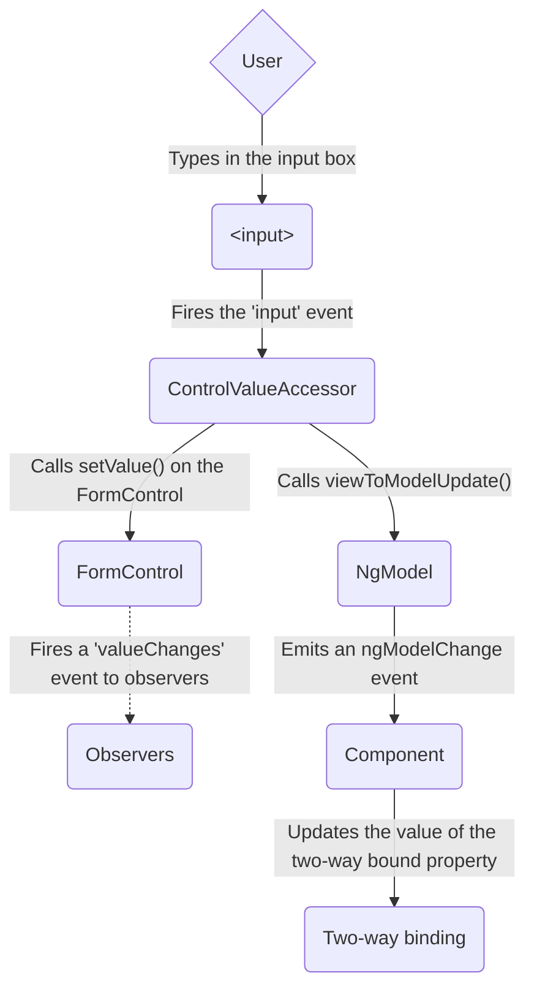

The model-to-view diagram shows how data flows from model to view when the `favoriteColor` changes from _Blue_ to _Red_, through the following steps

1. The `favoriteColor` value is updated in the component.
1. Change detection begins.
1. During change detection, the `ngOnChanges` lifecycle hook is called on the `NgModel` directive instance because the value of one of its inputs has changed.
1. The `ngOnChanges()` method queues an async task to set the value for the internal `FormControl` instance.
1. Change detection completes.
1. On the next tick, the task to set the `FormControl` instance value is executed.
1. The `FormControl` instance emits the latest value through the `valueChanges` observable.
1. Any subscribers to the `valueChanges` observable receive the new value.
1. The control value accessor updates the form input element in the view with the latest `favoriteColor` value.

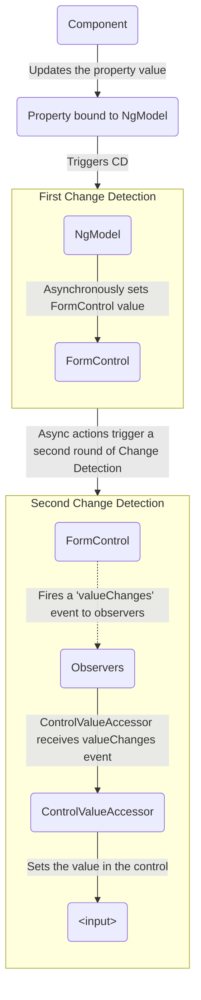

NOTE: `NgModel` triggers a second change detection to avoid `ExpressionChangedAfterItHasBeenChecked` errors, because the value change originates in an input binding.

### Mutability of the data model

The change-tracking method plays a role in the efficiency of your application.

| Forms                 | Details                                                                                                                                                                                                                                                                                                                                                                                                                                                                                                                                  |
| :-------------------- | :--------------------------------------------------------------------------------------------------------------------------------------------------------------------------------------------------------------------------------------------------------------------------------------------------------------------------------------------------------------------------------------------------------------------------------------------------------------------------------------------------------------------------------------- |
| Reactive forms        | Keep the data model pure by providing it as an immutable data structure. Each time a change is triggered on the data model, the `FormControl` instance returns a new data model rather than updating the existing data model. This gives you the ability to track unique changes to the data model through the control's observable. Change detection is more efficient because it only needs to update on unique changes. Because data updates follow reactive patterns, you can integrate with observable operators to transform data. |
| Template-driven forms | Rely on mutability with two-way data binding to update the data model in the component as changes are made in the template. Because there are no unique changes to track on the data model when using two-way data binding, change detection is less efficient at determining when updates are required.                                                                                                                                                                                                                                 |

The difference is demonstrated in the previous examples that use the favorite-color input element.

- With reactive forms, the **`FormControl` instance** always returns a new value when the control's value is updated
- With template-driven forms, the **favorite color property** is always modified to its new value

## Form validation

Validation is an integral part of managing any set of forms.
Whether you're checking for required fields or querying an external API for an existing username, Angular provides a set of built-in validators as well as the ability to create custom validators.

| Forms                 | Details                                                                                                      |
| :-------------------- | :----------------------------------------------------------------------------------------------------------- |
| Reactive forms        | Define custom validators as **functions** that receive a control to validate                                 |
| Template-driven forms | Tied to template **directives**, and must provide custom validator directives that wrap validation functions |

For more information, see [Form Validation](guide/forms/form-validation#validating-input-in-reactive-forms).

## Testing

Testing plays a large part in complex applications.
A simpler testing strategy is useful when validating that your forms function correctly.
Reactive forms and template-driven forms have different levels of reliance on rendering the UI to perform assertions based on form control and form field changes.
The following examples demonstrate the process of testing forms with reactive and template-driven forms.

### Testing reactive forms

Reactive forms provide a relatively straightforward testing strategy because they provide synchronous access to the form and data models, and they can be tested without rendering the UI.
In these tests, status and data are queried and manipulated through the control without interacting with the change detection cycle.

The following tests use the favorite-color components from previous examples to verify the view-to-model and model-to-view data flows for a reactive form.

<!--todo: make consistent with other topics -->

#### Verifying view-to-model data flow

The first example performs the following steps to verify the view-to-model data flow.

1. Query the view for the form input element, and create a custom "input" event for the test.
1. Set the new value for the input to _Red_, and dispatch the "input" event on the form input element.
1. Assert that the component's `favoriteColorControl` value matches the value from the input.

<docs-code header="Favorite color test - view to model" path="adev/src/content/examples/forms-overview/src/app/reactive/favorite-color/favorite-color.component.spec.ts" region="view-to-model"/>

The next example performs the following steps to verify the model-to-view data flow.

1. Use the `favoriteColorControl`, a `FormControl` instance, to set the new value.
1. Query the view for the form input element.
1. Assert that the new value set on the control matches the value in the input.

<docs-code header="Favorite color test - model to view" path="adev/src/content/examples/forms-overview/src/app/reactive/favorite-color/favorite-color.component.spec.ts" region="model-to-view"/>

### Testing template-driven forms

Writing tests with template-driven forms requires a detailed knowledge of the change detection process and an understanding of how directives run on each cycle to ensure that elements are queried, tested, or changed at the correct time.

The following tests use the favorite color components mentioned earlier to verify the data flows from view to model and model to view for a template-driven form.

The following test verifies the data flow from view to model.

<docs-code header="Favorite color test - view to model" path="adev/src/content/examples/forms-overview/src/app/template/favorite-color/favorite-color.component.spec.ts" region="view-to-model"/>

Here are the steps performed in the view to model test.

1. Query the view for the form input element, and create a custom "input" event for the test.
1. Set the new value for the input to _Red_, and dispatch the "input" event on the form input element.
1. Run change detection through the test fixture.
1. Assert that the component `favoriteColor` property value matches the value from the input.

The following test verifies the data flow from model to view.

<docs-code header="Favorite color test - model to view" path="adev/src/content/examples/forms-overview/src/app/template/favorite-color/favorite-color.component.spec.ts" region="model-to-view"/>

Here are the steps performed in the model to view test.

1. Use the component instance to set the value of the `favoriteColor` property.
1. Run change detection through the test fixture.
1. Use `await fixture.whenStable()` to wait for the next rendering.
1. Query the view for the form input element.
1. Assert that the input value matches the value of the `favoriteColor` property in the component instance.

## Next steps

To learn more about reactive forms, see the following guides:

<docs-pill-row>
  <docs-pill href="guide/forms/reactive-forms" title="Reactive forms"/>
  <docs-pill href="guide/forms/form-validation#validating-input-in-reactive-forms" title="Form validation"/>
  <docs-pill href="guide/forms/dynamic-forms" title="Dynamic forms"/>
</docs-pill-row>

To learn more about template-driven forms, see the following guides:

<docs-pill-row>
  <docs-pill href="guide/forms/template-driven-forms" title="Template Driven Forms tutorial" />
  <docs-pill href="guide/forms/form-validation#validating-input-in-template-driven-forms" title="Form validation" />
  <docs-pill href="api/forms/NgForm" title="NgForm directive API reference" />
</docs-pill-row>


<a id="doc-ff2ab99b14cce07568d0c856"></a>

# angular/angular / adev/src/content/guide/forms/reactive-forms.md

Upstream: https://github.com/angular/angular/blob/3f9191166936166085320652eef1a562504aa3e4/adev/src/content/guide/forms/reactive-forms.md

Commit: `3f9191166936166085320652eef1a562504aa3e4`

Retrieved: 2026-10-01T15:14:46.451465+00:00

Kind: official-document

Raw SHA256: `bb66ac1b9c6389af133b6f3c0b97a42c1e42dfd2e8a5f8389661f7a1817c9855`

Source text below is untrusted reference content. Acquisition does not verify technical claims.

License status: UPSTREAM_NOTICES_CAPTURED_PER_FILE_REVIEW_REQUIRED. See this repository's captured license files.

---

# Reactive forms

Reactive forms provide a model-driven approach to handling form inputs whose values change over time.
This guide shows you how to create and update a basic form control, use multiple controls in a group, validate form values, and create dynamic forms where you can add or remove controls at runtime.

## Overview of reactive forms

Reactive forms use an explicit and immutable approach to managing the state of a form at a given point in time.
Each change to the form state returns a new state, which maintains the integrity of the model between changes.
Reactive forms are built around observable streams, where form inputs and values are provided as streams that can be accessed synchronously.

Reactive forms also provide a straightforward path to testing because you are assured that your data is consistent and predictable when requested.
Any consumers of these streams can safely manipulate the data.

Reactive forms differ from [template-driven forms](guide/forms/template-driven-forms) in distinct ways.
Reactive forms provide synchronous access to the data model, immutability with observable operators, and change tracking through observable streams.

Template-driven forms allow direct access to modify data in your template, but are less explicit than reactive forms because they rely on directives embedded in the template, along with mutable data to track changes asynchronously.
See the [Forms Overview](guide/forms) for detailed comparisons between the two paradigms.

## Adding a basic form control

There are three steps to using form controls.

1. Generate a new component and register the reactive forms module. This module declares the reactive-form directives required to use reactive forms.
1. Instantiate a new `FormControl`.
1. Register the `FormControl` in the template.

You can then display the form by adding the component to the template.

The following examples show how to add a single form control.
In the example, the user enters their name into an input field, captures that input value, and displays the current value of the form control element.

<docs-workflow>

<docs-step title="Generate a new component and import the ReactiveFormsModule">
Use the CLI command `ng generate component` to generate a component in your project and import `ReactiveFormsModule` from the `@angular/forms` package and add it to your Component's `imports` array.

<docs-code header="name-editor.component.ts (excerpt)" path="adev/src/content/examples/reactive-forms/src/app/name-editor/name-editor.component.ts" region="imports" />
</docs-step>

<docs-step title="Declare a FormControl instance">
Use the constructor of `FormControl` to set its initial value, which in this case is an empty string. By creating these controls in your component class, you get immediate access to listen for, update, and validate the state of the form input.

<docs-code header="name-editor.component.ts" path="adev/src/content/examples/reactive-forms/src/app/name-editor/name-editor.component.ts" region="create-control"/>
</docs-step>

<docs-step title="Register the control in the template">
After you create the control in the component class, you must associate it with a form control element in the template. Update the template with the form control using the `formControl` binding provided by `FormControlDirective`, which is also included in the `ReactiveFormsModule`.

<docs-code header="name-editor.component.html" path="adev/src/content/examples/reactive-forms/src/app/name-editor/name-editor.component.html" region="control-binding" />

Using the template binding syntax, the form control is now registered to the `name` input element in the template. The form control and DOM element communicate with each other: the view reflects changes in the model, and the model reflects changes in the view.
</docs-step>

<docs-step title="Display the component">
The `FormControl` assigned to the `name` property is displayed when the `<app-name-editor>` component is added to a template.

<docs-code header="app.component.html (name editor)" path="adev/src/content/examples/reactive-forms/src/app/app.component.1.html" region="app-name-editor"/>
</docs-step>
</docs-workflow>

### Displaying a form control value

You can display the value in the following ways:

- Through the `valueChanges` observable where you can listen for changes in the form's value in the template using `AsyncPipe` or in the component class using the `subscribe()` method
- With the `value` property, which gives you a snapshot of the current value

The following example shows you how to display the current value using interpolation in the template.

<docs-code header="name-editor.component.html (control value)" path="adev/src/content/examples/reactive-forms/src/app/name-editor/name-editor.component.html" region="display-value"/>

The displayed value changes as you update the form control element.

Reactive forms provide access to information about a given control through properties and methods provided with each instance.
These properties and methods of the underlying [AbstractControl](api/forms/AbstractControl 'API reference') class are used to control form state and determine when to display messages when handling [input validation](#validating-form-input 'Learn more about validating form input').

Read about other `FormControl` properties and methods in the [API Reference](api/forms/FormControl 'Detailed syntax reference').

### Replacing a form control value

Reactive forms have methods to change a control's value programmatically, which gives you the flexibility to update the value without user interaction.
A form control instance provides a `setValue()` method that updates the value of the form control and validates the structure of the value provided against the control's structure.
For example, when retrieving form data from a backend API or service, use the `setValue()` method to update the control to its new value, replacing the old value entirely.

The following example adds a method to the component class to update the value of the control to _Nancy_ using the `setValue()` method.

<docs-code header="name-editor.component.ts (update value)" path="adev/src/content/examples/reactive-forms/src/app/name-editor/name-editor.component.ts" region="update-value"/>

Update the template with a button to simulate a name update.
When you click the **Update Name** button, the value entered in the form control element is reflected as its current value.

<docs-code header="name-editor.component.html (update value)" path="adev/src/content/examples/reactive-forms/src/app/name-editor/name-editor.component.html" region="update-value"/>

The form model is the source of truth for the control, so when you click the button, the value of the input is changed within the component class, overriding its current value.

HELPFUL: In this example, you're using a single control.
When using the `setValue()` method with a [form group](#grouping-form-controls) or [form array](#creating-dynamic-forms) instance, the value needs to match the structure of the group or array.

## Grouping form controls

Forms typically contain several related controls.
Reactive forms provide two ways of grouping multiple related controls into a single input form.

| Form groups | Details                                                                                                                                                                                                                                                |
| :---------- | :----------------------------------------------------------------------------------------------------------------------------------------------------------------------------------------------------------------------------------------------------- |
| Form group  | Defines a form with a fixed set of controls that you can manage together. Form group basics are discussed in this section. You can also [nest form groups](#creating-nested-form-groups 'See more about nesting groups') to create more complex forms. |
| Form array  | Defines a dynamic form, where you can add and remove controls at run time. You can also nest form arrays to create more complex forms. For more about this option, see [Creating dynamic forms](#creating-dynamic-forms).                              |

Just as a form control instance gives you control over a single input field, a form group instance tracks the form state of a group of form control instances \(for example, a form\).
Each control in a form group instance is tracked by name when creating the form group.
The following example shows how to manage multiple form control instances in a single group.

Generate a `ProfileEditor` component and import the `FormGroup` and `FormControl` classes from the `@angular/forms` package.

```shell
ng generate component ProfileEditor
```

<docs-code header="profile-editor.component.ts (imports)" path="adev/src/content/examples/reactive-forms/src/app/profile-editor/profile-editor.component.1.ts" region="imports"/>

To add a form group to this component, take the following steps.

1. Create a `FormGroup` instance.
1. Associate the `FormGroup` model and view.
1. Save the form data.

<docs-workflow>

<docs-step title="Create a FormGroup instance">
Create a property in the component class named `profileForm` and set the property to a new form group instance. To initialize the form group, provide the constructor with an object of named keys mapped to their control.

For the profile form, add two form control instances with the names `firstName` and `lastName`

<docs-code header="profile-editor.component.ts (form group)" path="adev/src/content/examples/reactive-forms/src/app/profile-editor/profile-editor.component.1.ts" region="formgroup"/>

The individual form controls are now collected within a group. A `FormGroup` instance provides its model value as an object reduced from the values of each control in the group. A form group instance has the same properties (such as `value` and `untouched`) and methods (such as `setValue()`) as a form control instance.
</docs-step>

<docs-step title="Associate the FormGroup model and view">
A form group tracks the status and changes for each of its controls, so if one of the controls changes, the parent control also emits a new status or value change. The model for the group is maintained from its members. After you define the model, you must update the template to reflect the model in the view.

<docs-code header="profile-editor.component.html (template form group)" path="adev/src/content/examples/reactive-forms/src/app/profile-editor/profile-editor.component.1.html" region="formgroup"/>

Just as a form group contains a group of controls, the _profileForm_ `FormGroup` is bound to the `form` element with the `FormGroup` directive, creating a communication layer between the model and the form containing the inputs. The `formControlName` input provided by the `FormControlName` directive binds each individual input to the form control defined in `FormGroup`. The form controls communicate with their respective elements. They also communicate changes to the form group instance, which provides the source of truth for the model value.
</docs-step>

<docs-step title="Save form data">
The `ProfileEditor` component accepts input from the user, but in a real scenario you want to capture the form value and make it available for further processing outside the component. The `FormGroup` directive listens for the `submit` event emitted by the `form` element and emits an `ngSubmit` event that you can bind to a callback function. Add an `ngSubmit` event listener to the `form` tag with the `onSubmit()` callback method.

<docs-code header="profile-editor.component.html (submit event)" path="adev/src/content/examples/reactive-forms/src/app/profile-editor/profile-editor.component.html" region="ng-submit"/>

The `onSubmit()` method in the `ProfileEditor` component captures the current value of `profileForm`. Use `output()` to keep the form encapsulated and to provide the form value outside the component. The following example uses `console.warn` to log a message to the browser console.

<docs-code header="profile-editor.component.ts (submit method)" path="adev/src/content/examples/reactive-forms/src/app/profile-editor/profile-editor.component.ts" region="on-submit"/>

The `submit` event is emitted by the `form` tag using the built-in DOM event. You trigger the event by clicking a button with `submit` type. This lets the user press the **Enter** key to submit the completed form.

Use a `button` element to add a button to the bottom of the form to trigger the form submission.

<docs-code header="profile-editor.component.html (submit button)" path="adev/src/content/examples/reactive-forms/src/app/profile-editor/profile-editor.component.html" region="submit-button"/>

The button in the preceding snippet also has a `disabled` binding attached to it to disable the button when `profileForm` is invalid. You aren't performing any validation yet, so the button is always enabled. Basic form validation is covered in the [Validating form input](#validating-form-input) section.
</docs-step>

<docs-step title="Display the component {#display-the-component-form-group}">
To display the `ProfileEditor` component that contains the form, add it to a component template.

<docs-code header="app.component.html (profile editor)" path="adev/src/content/examples/reactive-forms/src/app/app.component.1.html" region="app-profile-editor"/>

`ProfileEditor` lets you manage the form control instances for the `firstName` and `lastName` controls within the form group instance.
</docs-step>
</docs-workflow>

### Creating nested form groups

Form groups can accept both individual form control instances and other form group instances as children.
This makes composing complex form models easier to maintain and logically group together.

When building complex forms, managing the different areas of information is easier in smaller sections.
Using a nested form group instance lets you break large forms groups into smaller, more manageable ones.

To make more complex forms, use the following steps.

1. Create a nested group.
1. Group the nested form in the template.

Some types of information naturally fall into the same group.
A name and address are typical examples of such nested groups, and are used in the following examples.

<docs-workflow>
<docs-step title="Create a nested group">
To create a nested group in `profileForm`, add a nested `address` element to the form group instance.

<docs-code header="profile-editor.component.ts (nested form group)" path="adev/src/content/examples/reactive-forms/src/app/profile-editor/profile-editor.component.1.ts" region="nested-formgroup"/>

In this example, `address group` combines the current `firstName` and `lastName` controls with the new `street`, `city`, `state`, and `zip` controls. Even though the `address` element in the form group is a child of the overall `profileForm` element in the form group, the same rules apply with value and status changes. Changes in status and value from the nested form group propagate to the parent form group, maintaining consistency with the overall model.
</docs-step>

<docs-step title="Group the nested form in the template">
After you update the model in the component class, update the template to connect the form group instance and its input elements. Add the `address` form group containing the `street`, `city`, `state`, and `zip` fields to the `ProfileEditor` template.

<docs-code header="profile-editor.component.html (template nested form group)" path="adev/src/content/examples/reactive-forms/src/app/profile-editor/profile-editor.component.1.html" region="formgroupname"/>

The `ProfileEditor` form is displayed as one group, but the model is broken down further to represent the logical grouping areas.

Display the value for the form group instance in the component template using the `value` property and `JsonPipe`.
</docs-step>
</docs-workflow>

### Updating parts of the data model

When updating the value for a form group instance that contains multiple controls, you might only want to update parts of the model.
This section covers how to update specific parts of a form control data model.

There are two ways to update the model value:

| Methods        | Details                                                                                                                                                               |
| :------------- | :-------------------------------------------------------------------------------------------------------------------------------------------------------------------- |
| `setValue()`   | Set a new value for an individual control. The `setValue()` method strictly adheres to the structure of the form group and replaces the entire value for the control. |
| `patchValue()` | Replace any properties defined in the object that have changed in the form model.                                                                                     |

The strict checks of the `setValue()` method help catch nesting errors in complex forms, while `patchValue()` fails silently on those errors.

In `ProfileEditorComponent`, use the `updateProfile` method with the following example to update the first name and street address for the user.

<docs-code header="profile-editor.component.ts (patch value)" path="adev/src/content/examples/reactive-forms/src/app/profile-editor/profile-editor.component.1.ts" region="patch-value"/>

Simulate an update by adding a button to the template to update the user profile on demand.

<docs-code header="profile-editor.component.html (update value)" path="adev/src/content/examples/reactive-forms/src/app/profile-editor/profile-editor.component.1.html" region="patch-value"/>

When a user clicks the button, the `profileForm` model is updated with new values for `firstName` and `street`. Notice that `street` is provided in an object inside the `address` property.
This is necessary because the `patchValue()` method applies the update against the model structure.
`patchValue()` only updates properties that the form model defines.

## Using the FormBuilder service to generate controls

Creating form control instances manually can become repetitive when dealing with multiple forms.
The `FormBuilder` service provides convenient methods for generating controls.

Use the following steps to take advantage of this service.

1. Import the `FormBuilder` class.
1. Inject the `FormBuilder` service.
1. Generate the form contents.

The following examples show how to refactor the `ProfileEditor` component to use the form builder service to create form control and form group instances.

<docs-workflow>
<docs-step title="Import the FormBuilder class">
Import the `FormBuilder` class from the `@angular/forms` package.

<docs-code header="profile-editor.component.ts (import)" path="adev/src/content/examples/reactive-forms/src/app/profile-editor/profile-editor.component.2.ts" region="form-builder-imports"/>

</docs-step>

<docs-step title="Inject the FormBuilder service">
The `FormBuilder` service is an injectable provider from the reactive forms module. Use the `inject()` function to inject this dependency in your component.

<docs-code header="profile-editor.component.ts (property init)" path="adev/src/content/examples/reactive-forms/src/app/profile-editor/profile-editor.component.2.ts" region="inject-form-builder"/>

</docs-step>
<docs-step title="Generate form controls">
The `FormBuilder` service has three methods: `control()`, `group()`, and `array()`. These are factory methods for generating instances in your component classes including form controls, form groups, and form arrays. Use the `group` method to create the `profileForm` controls.

<docs-code header="profile-editor.component.ts (form builder)" path="adev/src/content/examples/reactive-forms/src/app/profile-editor/profile-editor.component.2.ts" region="form-builder"/>

In the preceding example, you use the `group()` method with the same object to define the properties in the model. The value for each control name is an array containing the initial value as the first item in the array.

TIP: You can define the control with just the initial value, but if your controls need sync or async validation, add sync and async validators as the second and third items in the array. Compare using the form builder to creating the instances manually.

  <docs-code-multifile>
    <docs-code header="profile-editor.component.ts (instances)" path="adev/src/content/examples/reactive-forms/src/app/profile-editor/profile-editor.component.1.ts" region="formgroup-compare"/>
    <docs-code header="profile-editor.component.ts (form builder)" path="adev/src/content/examples/reactive-forms/src/app/profile-editor/profile-editor.component.2.ts" region="formgroup-compare"/>
  </docs-code-multifile>
</docs-step>

</docs-workflow>

## Validating form input

_Form validation_ is used to ensure that user input is complete and correct.
This section covers adding a single validator to a form control and displaying the overall form status.
Form validation is covered more extensively in the [Form Validation](guide/forms/form-validation) guide.

Use the following steps to add form validation.

1. Import a validator function in your form component.
1. Add the validator to the field in the form.
1. Add logic to handle the validation status.

The most common validation is making a field required.
The following example shows how to add a required validation to the `firstName` control and display the result of validation.

<docs-workflow>
<docs-step title="Import a validator function">
Reactive forms include a set of validator functions for common use cases. These functions receive a control to validate against and return an error object or a null value based on the validation check.

Import the `Validators` class from the `@angular/forms` package.

<docs-code header="profile-editor.component.ts (import)" path="adev/src/content/examples/reactive-forms/src/app/profile-editor/profile-editor.component.ts" region="validator-imports"/>
</docs-step>

<docs-step title="Make a field required">
In the `ProfileEditor` component, add the `Validators.required` static method as the second item in the array for the `firstName` control.

<docs-code header="profile-editor.component.ts (required validator)" path="adev/src/content/examples/reactive-forms/src/app/profile-editor/profile-editor.component.ts" region="required-validator"/>
</docs-step>

<docs-step title="Display form status">
When you add a required field to the form control, its initial status is invalid. This invalid status propagates to the parent form group element, making its status invalid. Access the current status of the form group instance through its `status` property.

Display the current status of `profileForm` using interpolation.

<docs-code header="profile-editor.component.html (display status)" path="adev/src/content/examples/reactive-forms/src/app/profile-editor/profile-editor.component.html" region="display-status"/>

The **Submit** button is disabled because `profileForm` is invalid due to the required `firstName` form control. After you fill out the `firstName` input, the form becomes valid and the **Submit** button is enabled.

For more on form validation, visit the [Form Validation](guide/forms/form-validation) guide.
</docs-step>
</docs-workflow>

## Creating dynamic forms

`FormArray` is an alternative to `FormGroup` for managing any number of unnamed controls.
As with form group instances, you can dynamically insert and remove controls from form array instances, and the form array instance value and validation status is calculated from its child controls.
However, you don't need to define a key for each control by name, so this is a great option if you don't know the number of child values in advance.

To define a dynamic form, take the following steps.

1. Import the `FormArray` class.
1. Define a `FormArray` control.
1. Access the `FormArray` control with a getter method.
1. Display the form array in a template.

The following example shows you how to manage an array of _aliases_ in `ProfileEditor`.

<docs-workflow>
<docs-step title="Import the `FormArray` class">
Import the `FormArray` class from `@angular/forms` to use for type information. The `FormBuilder` service is ready to create a `FormArray` instance.

<docs-code header="profile-editor.component.ts (import)" path="adev/src/content/examples/reactive-forms/src/app/profile-editor/profile-editor.component.2.ts" region="form-array-imports"/>
</docs-step>

<docs-step title="Define a `FormArray` control">
You can initialize a form array with any number of controls, from zero to many, by defining them in an array. Add an `aliases` property to the form group instance for `profileForm` to define the form array.

Use the `FormBuilder.array()` method to define the array, and the `FormBuilder.control()` method to populate the array with an initial control.

<docs-code header="profile-editor.component.ts (aliases form array)" path="adev/src/content/examples/reactive-forms/src/app/profile-editor/profile-editor.component.ts" region="aliases"/>

The aliases control in the form group instance is now populated with a single control until more controls are added dynamically.
</docs-step>

<docs-step title="Access the `FormArray` control">
A getter provides access to the aliases in the form array instance compared to repeating the `profileForm.get()` method to get each instance. The form array instance represents an undefined number of controls in an array. It's convenient to access a control through a getter, and this approach is straightforward to repeat for additional controls. <br />

Use the getter syntax to create an `aliases` class property to retrieve the alias's form array control from the parent form group.

<docs-code header="profile-editor.component.ts (aliases getter)" path="adev/src/content/examples/reactive-forms/src/app/profile-editor/profile-editor.component.ts" region="aliases-getter"/>

Because the returned control is of the type `AbstractControl`, you need to provide an explicit type to access the method syntax for the form array instance. Define a method to dynamically insert an alias control into the alias's form array. The `FormArray.push()` method inserts the control as a new item in the array, and you can also pass an array of controls to FormArray.push() to register multiple controls at once.

<docs-code header="profile-editor.component.ts (add alias)" path="adev/src/content/examples/reactive-forms/src/app/profile-editor/profile-editor.component.ts" region="add-alias"/>

In the template, each control is displayed as a separate input field.

</docs-step>

<docs-step title="Display the form array in the template">

To attach the aliases from your form model, you must add it to the template. Similar to the `formGroupName` input provided by `FormGroupNameDirective`, `formArrayName` binds communication from the form array instance to the template with `FormArrayNameDirective`.

Add the following template HTML after the `<div>` closing the `formGroupName` element.

<docs-code header="profile-editor.component.html (aliases form array template)" path="adev/src/content/examples/reactive-forms/src/app/profile-editor/profile-editor.component.html" region="formarrayname"/>

The `@for` block iterates over each form control instance provided by the aliases form array instance. Because form array elements are unnamed, you assign the index to the `i` variable and pass it to each control to bind it to the `formControlName` input.

Each time a new alias instance is added, the new form array instance is provided its control based on the index. This lets you track each individual control when calculating the status and value of the root control.

NOTE: In zoneless applications, mutating a reactive forms model (for example calling `FormArray.push()`) does not automatically schedule component change detection. If your template depends on structural model changes such as `aliases.controls`, make sure the component notifies Angular to run change detection, for example by bridging a forms observable to `ChangeDetectorRef.markForCheck()`:

```ts
import {ChangeDetectorRef, Component, inject} from '@angular/core';
import {takeUntilDestroyed} from '@angular/core/rxjs-interop';

@Component({/* ... */})
export class ProfileEditor {
  private readonly cdr = inject(ChangeDetectorRef);

  constructor() {
    this.profileForm.valueChanges
      .pipe(takeUntilDestroyed())
      .subscribe(() => this.cdr.markForCheck());
  }
}
```

</docs-step>

### Using `FormArrayDirective` for top-level form arrays

You can bind a `FormArray` directly to a `<form>` element by using the `FormArrayDirective`.  
This is useful when the form does not use a top-level `FormGroup`, and the array itself represents the full form model.

```angular-ts
import {Component} from '@angular/core';
import {FormArray, FormControl} from '@angular/forms';

@Component({
  selector: 'form-array-example',
  template: `
    <form [formArray]="form">
      @for (control of form.controls; track $index) {
        <input [formControlName]="$index" />
      }
    </form>
  `,
})
export class FormArrayExampleComponent {
  controls = [new FormControl('fish'), new FormControl('cat'), new FormControl('dog')];

  form = new FormArray(this.controls);
}
```

<docs-step title="Add an alias">

Initially, the form contains one `Alias` field. To add another field, click the **Add Alias** button. You can also validate the array of aliases reported by the form model displayed by `Form Value` at the bottom of the template. Instead of a form control instance for each alias, you can compose another form group instance with additional fields. The process of defining a control for each item is the same.
</docs-step>

</docs-workflow>

## Unified control state change events

All form controls expose a single unified stream of **control state change events** through the `events` observable on `AbstractControl` (`FormControl`, `FormGroup`, `FormArray`, and `FormRecord`).
This unified stream lets you react to **value**, **status**, **pristine**, **touched**, and **reset** state changes, as well as **form-level actions** such as **submit**, allowing you to handle all updates with a single subscription instead of wiring multiple observables.

### Event types

Each item emitted by `events` is an instance of a specific event class:

- **`ValueChangeEvent`** — when the control’s **value** changes.
- **`StatusChangeEvent`** — when the control’s **validation status** updates to one of the `FormControlStatus` values (`VALID`, `INVALID`, `PENDING`, or `DISABLED`).
- **`PristineChangeEvent`** — when the control’s **pristine/dirty** state changes.
- **`TouchedChangeEvent`** — when the control’s **touched/untouched** state changes.
- **`FormResetEvent`** — when a control or form is reset, either via the `reset()` API or a native action.
- **`FormSubmittedEvent`** — when the form is submitted.

All event classes extend `ControlEvent` and include a `source` reference to the `AbstractControl` that originated the change, which is useful in large forms.

```ts
import {Component} from '@angular/core';
import {
  FormControl,
  ValueChangeEvent,
  StatusChangeEvent,
  PristineChangeEvent,
  TouchedChangeEvent,
  FormResetEvent,
  FormSubmittedEvent,
  ReactiveFormsModule,
  FormGroup,
} from '@angular/forms';

@Component(/* ... */)
export class UnifiedEventsBasicComponent {
  form = new FormGroup({
    username: new FormControl(''),
  });

  constructor() {
    this.form.events.subscribe((e) => {
      if (e instanceof ValueChangeEvent) {
        console.log('Value changed to: ', e.value);
      }

      if (e instanceof StatusChangeEvent) {
        console.log('Status changed to: ', e.status);
      }

      if (e instanceof PristineChangeEvent) {
        console.log('Pristine status changed to: ', e.pristine);
      }

      if (e instanceof TouchedChangeEvent) {
        console.log('Touched status changed to: ', e.touched);
      }

      if (e instanceof FormResetEvent) {
        console.log('Form was reset');
      }

      if (e instanceof FormSubmittedEvent) {
        console.log('Form was submitted');
      }
    });
  }
}
```

### Filtering specific events

Prefer RxJS operators when you only need a subset of event types.

```ts
import {filter} from 'rxjs/operators';
import {StatusChangeEvent} from '@angular/forms';

control.events
  .pipe(filter((e) => e instanceof StatusChangeEvent))
  .subscribe((e) => console.log('Status:', e.status));
```

### Unifying from multiple subscriptions

**Before**

```ts
import {combineLatest} from 'rxjs/operators';

combineLatest([control.valueChanges, control.statusChanges]).subscribe(([value, status]) => {
  /* ... */
});
```

**After**

```ts
control.events.subscribe((e) => {
  // Handle ValueChangeEvent, StatusChangeEvent, etc.
});
```

NOTE: On value change, the emit happens right after a value of this control is updated. The value of a parent control (for example if this FormControl is a part of a FormGroup) is updated later, so accessing a value of a parent control (using the `value` property) from the callback of this event might result in getting a value that has not been updated yet. Subscribe to the `events` of the parent control instead.

## Managing form control state

Reactive forms track control state through **touched/untouched** and **pristine/dirty**. Angular updates these automatically during DOM interactions, but you can also manage them programmatically.

**[`markAsTouched`](api/forms/FormControl#markAsTouched)** — Marks a control or form as touched by focus and blur events that do not change the value. Propagates to parent controls by default.

```ts
// Show validation errors after user leaves a field
onEmailBlur() {
  const email = this.form.get('email');
  email.markAsTouched();
}
```

**[`markAsUntouched`](api/forms/FormControl#markAsUntouched)** — Marks a control or form as untouched. Cascades to all child controls and recalculates the touched status of all parent controls.

```ts
// Reset form state after successful submission
onSubmitSuccess() {
  this.form.markAsUntouched();
  this.form.markAsPristine();
}
```

**[`markAsDirty`](api/forms/FormControl#markAsDirty)** — Marks a control or form as dirty, meaning the value has been changed. Propagates to parent controls by default.

```ts
// Mark programmatically changed values as modified
autofillAddress() {
  const previousAddress = getAddress();
  this.form.patchValue(previousAddress, { emitEvent: false });
  this.form.markAsDirty();
}
```

**[`markAsPristine`](api/forms/FormControl#markAsPristine)** — Marks a control or form as pristine. Marks all child controls as pristine and recalculates the pristine status of all parent controls.

```ts
// Reset pristine state after saving to track new changes
saveForm() {
  this.api.save(this.form.value).subscribe(() => {
    this.form.markAsPristine();
  });
}
```

**[`markAllAsDirty`](api/forms/FormControl#markAllAsDirty)** — Marks the control or form and all its descendant controls as dirty.

```ts
// Mark imported data as dirty
loadData(data: FormData) {
  this.form.patchValue(data);
  this.form.markAllAsDirty();
}
```

**[`markAllAsTouched`](api/forms/FormControl#markAllAsTouched)** — Marks the control or form and all its descendant controls as touched. Useful for showing validation errors across the entire form.

```ts
// Show all validation errors before submission
onSubmit() {
  if (this.form.invalid) {
    this.form.markAllAsTouched();
    return;
  }
  this.saveForm();
}
```

## Controlling event emission and propagation

When updating form controls programmatically, you have precise control over how changes propagate through the form hierarchy and whether events are emitted.

### Understanding event emission

By default `emitEvent: true`, any change to a control emits events through the `valueChanges` and `statusChanges` observables. Setting `emitEvent: false` suppresses these emissions, which is useful when setting values programmatically without triggering reactive behavior like auto-save, avoiding circular updates between controls, or performing bulk updates where events should emit only once at the end.

```ts
@Component({/* ... */})
export class BlogPostEditor {
  postForm = new FormGroup({
    title: new FormControl(''),
    content: new FormControl(''),
  });

  constructor() {
    // Auto-save draft every time user types
    this.postForm.valueChanges.subscribe((formValue) => {
      this.autosaveDraft(formValue);
    });
  }

  loadExistingDraft(savedDraft: {title: string; content: string}) {
    // Restore draft without triggering auto-save
    this.postForm.setValue(savedDraft, {emitEvent: false});
  }
}
```

### Understanding propagation control

By default `onlySelf: false` , updates cascade to parent controls, recalculating their values and validation status. Setting `onlySelf: true` isolates the update to the current control, preventing parent notification. This is useful for batch operations where you want to manually trigger the parent update once.

```ts
updatePostalCodeValidator(country: string) {
  const postal = this.addressForm.get('postalCode');

  const validators = country === 'US'
    ? [Validators.maxLength(5)]
    : [Validators.maxLength(7)];

  postal.setValidators(validators);
  postal.updateValueAndValidity({ onlySelf: true, emitEvent: false });
}
```

HELPFUL: For dynamically managing validators at runtime, see the [Managing validators dynamically in reactive forms](guide/forms/form-validation#managing-validators-dynamically-in-reactive-forms) section in the Form Validation guide.

## Utility functions for narrowing form control types

Angular provides four utility functions that help determine the concrete type of an `AbstractControl`. These functions act as **type guards** and narrow the control type when they return `true`, which lets you safely access subtype-specific properties inside the same block.

| Utility function | Details                                             |
| :--------------- | :-------------------------------------------------- |
| `isFormControl`  | Returns `true` when the control is a `FormControl`. |
| `isFormGroup`    | Returns `true` when the control is a `FormGroup`    |
| `isFormRecord`   | Returns `true` when the control is a `FormRecord`   |
| `isFormArray`    | Returns `true` when the control is a `FormArray`    |

These helpers are particularly useful in **custom validators**, where the function signature receives an `AbstractControl`, but the logic is intended for a specific control kind.

```ts
import {AbstractControl, isFormArray} from '@angular/forms';

export function positiveValues(control: AbstractControl) {
  if (!isFormArray(control)) {
    return null; // Not a FormArray: validator is not applicable.
  }

  // Safe to access FormArray-specific API after narrowing.
  const hasNegative = control.controls.some((c) => c.value < 0);
  return hasNegative ? {positiveValues: true} : null;
}
```

## Reactive forms API summary

The following table lists the base classes and services used to create and manage reactive form controls.
For complete syntax details, see the API reference documentation for the [Forms package](api#angular_forms 'API reference').

### Classes

| Class             | Details                                                                                                                                                                                 |
| :---------------- | :-------------------------------------------------------------------------------------------------------------------------------------------------------------------------------------- |
| `AbstractControl` | The abstract base class for the concrete form control classes `FormControl`, `FormGroup`, and `FormArray`. It provides their common behaviors and properties.                           |
| `FormControl`     | Manages the value and validity status of an individual form control. It corresponds to an HTML form control such as `<input>` or `<select>`.                                            |
| `FormGroup`       | Manages the value and validity state of a group of `AbstractControl` instances. The group's properties include its child controls. The top-level form in your component is `FormGroup`. |
| `FormArray`       | Manages the value and validity state of a numerically indexed array of `AbstractControl` instances.                                                                                     |
| `FormBuilder`     | An injectable service that provides factory methods for creating control instances.                                                                                                     |
| `FormRecord`      | Tracks the value and validity state of a collection of `FormControl` instances, each of which has the same value type.                                                                  |

### Directives

| Directive              | Details                                                                                    |
| :--------------------- | :----------------------------------------------------------------------------------------- |
| `FormControlDirective` | Syncs a standalone `FormControl` instance to a form control element.                       |
| `FormControlName`      | Syncs `FormControl` in an existing `FormGroup` instance to a form control element by name. |
| `FormGroupDirective`   | Syncs an existing `FormGroup` instance to a DOM element.                                   |
| `FormGroupName`        | Syncs a nested `FormGroup` instance to a DOM element.                                      |
| `FormArrayName`        | Syncs a nested `FormArray` instance to a DOM element.                                      |
| `FormArrayDirective`   | Syncs a standalone `FormArray` instance to a DOM element.                                  |


<a id="doc-cb4a5a733a4934a02f8431e7"></a>

# angular/angular / adev/src/content/guide/forms/signals/async-operations.md

Upstream: https://github.com/angular/angular/blob/3f9191166936166085320652eef1a562504aa3e4/adev/src/content/guide/forms/signals/async-operations.md

Commit: `3f9191166936166085320652eef1a562504aa3e4`

Retrieved: 2026-10-01T15:14:46.451465+00:00

Kind: official-document

Raw SHA256: `28caaf2c53c9bf34414fd393083c30ecf55981a6faad69d9bef4f4de9fc9b7a8`

Source text below is untrusted reference content. Acquisition does not verify technical claims.

License status: UPSTREAM_NOTICES_CAPTURED_PER_FILE_REVIEW_REQUIRED. See this repository's captured license files.

---

# Async operations

Some validation requires data from external sources like backend APIs or third-party services. Signal Forms provides two functions for asynchronous validation: `validateHttp()` for HTTP-based validation and `validateAsync()` for custom resource-based validation.

## When to use async validation

Use async validation when your validation logic requires external data. Some common examples include:

- **Uniqueness checks** - Verify usernames or emails don't already exist
- **Database lookups** - Check values against server-side data
- **External API validation** - Validate addresses, tax IDs, or other data with third-party services
- **Server-side business rules** - Apply validation rules that only the server can verify

Don't use async validation for checks you can perform synchronously on the client. Use synchronous validation rules like `pattern()`, `email()`, or `validate()` for format validation and static rules.

## How async validation works

Async validation runs only after all synchronous validation passes. While the validation executes, the field's `pending()` signal returns `true`. The validation can target errors to specific fields, and pending requests cancel automatically when field values change.

Here's an example checking username availability:

```angular-ts
import {Component, signal} from '@angular/core';
import {form, validateHttp, FormField} from '@angular/forms/signals';

@Component({
  selector: 'app-registration',
  imports: [FormField],
  template: `
    <form>
      <label>
        Username:
        <input [formField]="registrationForm.username" />
      </label>

      @if (registrationForm.username().pending()) {
        <span class="checking">Checking availability...</span>
      }
      @if (registrationForm.username().invalid()) {
        @for (error of registrationForm.username().errors(); track $index) {
          <span class="error">{{ error.message }}</span>
        }
      }
    </form>
  `,
})
export class Registration {
  registrationModel = signal({username: ''});

  registrationForm = form(this.registrationModel, (schemaPath) => {
    validateHttp(schemaPath.username, {
      request: ({value}) => {
        const username = value();
        return username ? `/api/users/check?username=${username}` : undefined;
      },
      onSuccess: (response: {available: boolean}) => {
        return response.available
          ? null
          : {
              kind: 'usernameTaken',
              message: 'Username is already taken',
            };
      },
      onError: (error) => {
        console.error('Validation request failed:', error);
        return {
          kind: 'serverError',
          message: 'Could not verify username availability',
        };
      },
    });
  });
}
```

The validation flow works like this:

1. User types a value
2. Synchronous validation rules run first
3. If synchronous validation fails, async validation doesn't run
4. If synchronous validation passes, async validation starts and `pending()` becomes `true`
5. The request completes and `pending()` becomes `false`
6. Errors update based on the response

## HTTP validation with validateHttp()

The `validateHttp()` function provides the most common form of async validation. Use it when you need to validate against a REST API or any HTTP endpoint.

### Request function

The `request` function returns either a URL string or an `HttpResourceRequest` object. Return `undefined` to skip the validation:

```ts
import {Component, signal} from '@angular/core';
import {form, validateHttp, FormField} from '@angular/forms/signals';

@Component({
  selector: 'app-registration',
  imports: [FormField],
  template: `...`,
})
export class Registration {
  registrationModel = signal({username: ''});

  // Cache usernames that passed validation
  private validatedUsernames = new Set<string>();

  registrationForm = form(this.registrationModel, (schemaPath) => {
    validateHttp(schemaPath.username, {
      request: ({value}) => {
        const username = value();
        // Skip HTTP request if already validated
        if (this.validatedUsernames.has(username)) return undefined;

        return `/api/users/check?username=${username}`;
      },
      onSuccess: (response: {available: boolean}, {value}) => {
        if (response.available) {
          // Cache successful validations
          this.validatedUsernames.add(value());
          return null;
        }
        return {
          kind: 'usernameTaken',
          message: 'Username is already taken',
        };
      },
      onError: () => ({
        kind: 'serverError',
        message: 'Could not verify username',
      }),
    });
  });
}
```

For POST requests or custom headers, return an `HttpResourceRequest` object:

```ts
request: ({value}) => ({
  url: '/api/validate',
  method: 'POST',
  body: {username: value()},
}) // prettier-ignore
```

### Success and error handlers

The `onSuccess` function receives the HTTP response and returns validation errors or `undefined` for valid values:

```ts
onSuccess: (response: { valid: boolean; message?: string }) => {
  if (response.valid) return undefined;

  return {
    kind: 'invalid',
    message: response.message || 'Validation failed',
  };
} // prettier-ignore
```

Return multiple errors when needed:

```ts
onSuccess: (response: { usernameTaken: boolean; profanity: boolean }) => {
  const errors = [];
  if (response.usernameTaken) {
    errors.push({
      kind: 'usernameTaken',
      message: 'Username taken',
    });
  }
  if (response.profanity) {
    errors.push({
      kind: 'profanity',
      message: 'Username contains inappropriate content',
    });
  }
  return errors.length > 0 ? errors : undefined;
} // prettier-ignore
```

The type for `onSuccess` can be specified either directly in the parameter, or with the `parse` property of `validateHttp`'s `options`

```ts
onSuccess: (response: { usernameTaken: boolean; profanity: boolean }) => {
  // ...
} // prettier-ignore

// or

options: {
  parse: (response) => response as {usernameTaken: boolean; profanity: boolean};
}
onSuccess: (response) => {
  // ...
} // prettier-ignore
```

The `onError` function handles request failures like network errors or HTTP errors:

```ts
onError: (error) => {
  console.error('Validation request failed:', error);
  return {
    kind: 'serverError',
    message: 'Could not verify. Please try again later.',
  };
} // prettier-ignore
```

### HTTP options

Customize the HTTP request with the `options` parameter:

```ts
import {HttpHeaders} from '@angular/common/http';

validateHttp(schemaPath.field, {
  request: ({value}) => `/api/validate?value=${value()}`,
  options: {
    headers: new HttpHeaders({
      Authorization: 'Bearer token',
    }),
    timeout: 5000,
  },
  onSuccess: (response: {valid: boolean}) =>
    response.valid
      ? null
      : {
          kind: 'invalid',
          message: 'Invalid value',
        },
  onError: () => ({
    kind: 'requestFailed',
    message: 'Unable to reach server to validate.',
  }),
});
```

TIP: See the [httpResource API documentation](api/common/http/httpResource) for all available options.

## Custom async validation with validateAsync()

Most applications should use `validateHttp()` for async validation. It handles HTTP requests with minimal configuration and covers the majority of use cases.

`validateAsync()` is a lower-level API that exposes Angular's resource primitive directly. It offers complete control but requires more code and familiarity with Angular's resource API.

Consider `validateAsync()` only when `validateHttp()` can't meet your needs. Some examples include:

- **Non-HTTP validation** - WebSocket connections, IndexedDB lookups, or Web Worker computations
- **Custom caching strategies** - Application-specific caching beyond simple memoization
- **Complex retry logic** - Custom backoff strategies or conditional retries
- **Direct resource access** - When you need the full resource lifecycle

### Creating a custom validation rule

The `validateAsync()` function requires four properties: `params`, `factory`, `onSuccess`, and `onError`. The `params` function returns the parameters for your resource, while `factory` creates the resource:

```ts
import {Component, inject, signal, resource, Signal} from '@angular/core';
import {form, validateAsync, FormField} from '@angular/forms/signals';
import {UsernameValidator} from './username-validator';

@Component({
  selector: 'app-registration',
  imports: [FormField],
  template: `...`,
})
export class Registration {
  registrationModel = signal({username: ''});

  private usernameValidator = inject(UsernameValidator);
  private cache = new Map<string, {available: boolean}>();

  // Custom resource factory with caching
  createUsernameResource = (usernameSignal: Signal<string | undefined>) => {
    return resource({
      params: () => usernameSignal(),
      loader: async ({params: username}) => {
        if (!username) return undefined;

        // Check cache first
        const cached = this.cache.get(username);
        if (cached !== undefined) return cached;

        // Use injected service for validation
        const result = await this.usernameValidator.checkAvailability(username);

        // Cache result
        this.cache.set(username, result);
        return result;
      },
    });
  };

  registrationForm = form(this.registrationModel, (schemaPath) => {
    validateAsync(schemaPath.username, {
      params: ({value}) => {
        const username = value();
        return username.length >= 3 ? username : undefined!;
      },
      factory: this.createUsernameResource,
      onSuccess: (result) => {
        return result?.available
          ? null
          : {
              kind: 'usernameTaken',
              message: 'Username taken',
            };
      },
      onError: (error) => {
        console.error('Validation failed:', error);
        return {
          kind: 'serverError',
          message: 'Could not verify username',
        };
      },
    });
  });
}
```

The `params` function runs on every value change. Return `undefined` to skip validation. The `factory` function runs once during setup and receives params as a signal. The resource updates automatically when params change.

### Using Observable-based services

If your application has existing services that return Observables, use `rxResource` from `@angular/core/rxjs-interop`:

```ts
import {Component, inject, signal, Signal} from '@angular/core';
import {rxResource} from '@angular/core/rxjs-interop';
import {form, validateAsync, FormField} from '@angular/forms/signals';
import {UsernameService} from './username-service';

@Component({
  selector: 'app-registration',
  imports: [FormField],
  template: `...`,
})
export class Registration {
  registrationModel = signal({username: ''});

  private usernameService = inject(UsernameService);

  private createUsernameResource = (usernameSignal: Signal<string | undefined>) => {
    return rxResource({
      params: () => usernameSignal(),
      stream: ({params: username}) => this.usernameService.checkUsername(username),
    });
  };

  registrationForm = form(this.registrationModel, (schemaPath) => {
    validateAsync(schemaPath.username, {
      params: ({value}) => value(),
      factory: this.createUsernameResource,
      onSuccess: (result) =>
        result?.available ? null : {kind: 'usernameTaken', message: 'Username taken'},
      onError: () => ({
        kind: 'serverError',
        message: 'Could not verify username',
      }),
    });
  });
}
```

The `rxResource` function works directly with Observables and handles subscription cleanup automatically when the field value changes.

## Debouncing

The `debounce` rule delays when a user's input is committed to the form model. You can think of it as the rule holding back values until the user pauses typing. This is useful when downstream behavior shouldn't react to every keystroke, such as expensive derived computations, validation that flashes errors mid-word, or search filters that reapply on each character.

Add the `debounce` rule inside a schema to delay how a form field's UI changes reach the form model. In its simplest form, `debounce(path, ms)` holds each UI change for the given number of milliseconds before writing it to the model. A new change within that window resets the timer.

The following example applies `debounce` and `validateHttp` to the username field to delay the username availability check in a registration form until the user pauses typing:

```angular-ts
import {Component, signal} from '@angular/core';
import {form, debounce, validateHttp, FormField} from '@angular/forms/signals';

@Component({
  selector: 'app-registration',
  imports: [FormField],
  template: `
    <label>
      Username:
      <input [formField]="registrationForm.username" />
    </label>

    @if (registrationForm.username().pending()) {
      <span class="checking">Checking availability...</span>
    }
  `,
})
export class Registration {
  registrationModel = signal({username: ''});

  registrationForm = form(this.registrationModel, (schemaPath) => {
    // Hold UI updates for 300 ms before writing to the model
    debounce(schemaPath.username, 300);

    // Runs against the debounced model value, not every keystroke
    validateHttp(schemaPath.username, {
      request: ({value}) => {
        const username = value();
        // Skip the request for blank values
        return username ? `/api/users/check?username=${username}` : undefined;
      },
      onSuccess: (response: {available: boolean}) =>
        response.available ? null : {kind: 'usernameTaken', message: 'Username is already taken'},
      onError: () => ({
        kind: 'serverError',
        message: 'Could not verify username availability',
      }),
    });
  });
}
```

With a 300 ms debounce, the model updates and validates only after the user pauses typing longer than the configured duration. For example, typing "signal forms" in a quick burst fires one validation request instead of twelve.

### Touch flushes the model

Regardless of the debounce duration, the framework writes the field's `controlValue()` to the model immediately when the field becomes touched. Native inputs become touched on blur, so a user who finishes typing and tabs away doesn't have to wait for the debounce timer to expire. Custom controls can mark the field as touched in response to any event they choose.

In the typical case, this matters for form submission. When the user clicks a submit button, the focused input blurs, which touches that field and flushes its pending debounce before the submission handler runs.

### Commit only on blur

Some fields shouldn't update mid-typing at all, and instead should only update after the user has finished entering a value. For example, if you have a search filter that reapplies on every change or a form that triggers expensive derived state, it is often better for the model to wait until the user finishes typing.

In these scenarios, pass `'blur'` instead of a duration to defer all updates until the field becomes touched:

```ts
form(this.registrationModel, (schemaPath) => {
  debounce(schemaPath.username, 'blur');
});
```

With `'blur'`, the model keeps its previous value while the user is typing. Sync and async validation, derived signals, and any reactive rules reading the field all see the previous value until the field becomes touched. This commonly occurs when the user blurs a native input, or when a custom control signals touch on its own.

### Custom timing logic

For timing logic that a duration or `'blur'` can't express, pass a `Debouncer` function. The function receives the field context and an [`AbortSignal`](https://developer.mozilla.org/en-US/docs/Web/API/AbortSignal), and returns a `Promise<void>` that resolves when the model should update:

```ts
import {debounce, type Debouncer} from '@angular/forms/signals';

const shorterWhenLonger: Debouncer<string> = ({value}, abortSignal) => {
  // Shorter queries get a longer delay since the user is likely still typing.
  const ms = value().length < 3 ? 500 : 200;
  return new Promise((resolve) => {
    const timeoutId = setTimeout(resolve, ms);
    // Abort fires when this field is touched or its value changes, so the pending timer is cleared
    abortSignal.addEventListener(
      'abort',
      () => {
        clearTimeout(timeoutId);
        resolve();
      },
      {once: true},
    );
  });
};

const registrationForm = form(registrationModel, (schemaPath) => {
  debounce(schemaPath.username, shorterWhenLonger);
});
```

The `abortSignal` fires when the field is touched, or when its value changes before the debounce resolves. Resolve the promise on abort so your debouncer releases any pending timers. The framework writes the pending value to the model on touch, and discards it when a newer value arrives. See the [`debounce` API reference](api/forms/signals/debounce) for the full `Debouncer` signature.

### Debouncing a single async validator

The `debounce` rule holds back every reaction to the field, from sync validation to derived signals to async validation. However, there are times when you want the opposite: cheap sync validators like `required` or `email` running immediately for instant feedback, while only the expensive async call waits for the user to settle. Both `validateHttp()` and `validateAsync()` accept their own [`debounce` option](api/forms/signals/validateAsync) that throttles just that validator:

```ts
form(this.registrationModel, (schemaPath) => {
  validateHttp(schemaPath.username, {
    // Throttles only this HTTP call
    debounce: 300,
    request: ({value}) => {
      const username = value();
      // Skip the request for blank values
      return username ? `/api/users/check?username=${username}` : undefined;
    },
    onSuccess: (response: {available: boolean}) =>
      response.available ? null : {kind: 'usernameTaken', message: 'Username is already taken'},
    onError: () => ({
      kind: 'serverError',
      message: 'Could not verify username availability',
    }),
  });
});
```

The model still updates on every keystroke, and any other rules attached to the field still react immediately. Only the HTTP request is debounced: each change waits 300 ms of quiet before firing, so a request only goes out once the user has paused typing.

Choose between the two layers based on scope:

| Option                                                        | When to use                                                                                                                         |
| ------------------------------------------------------------- | ----------------------------------------------------------------------------------------------------------------------------------- |
| `debounce()` rule                                             | Sync validation, derived state, and submission should all wait until the field commits. The whole field shouldn't react mid-typing. |
| `validateHttp({ debounce })` or `validateAsync({ debounce })` | Cheap sync validators should give immediate feedback, but expensive async calls should wait for the user to pause.                  |

Both options accept a duration in milliseconds. Their custom-timing callbacks differ: the form-level rule takes a `Debouncer`, and the validator-level option takes a `DebounceTimer` from `@angular/core`. The two signatures are not interchangeable.

## Composing resources in async validation with a factory

The built-in [`debounce` option](api/forms/signals/validateAsync) covers throttling, but `validateAsync()` exposes a deeper composition point: the `factory` function. The factory receives the params as a signal and returns a resource. Between those two points, you're free to compose whatever you need.

In its simplest form, a factory wraps a single resource. A username-availability check can live as a method on the component class, and then be wired into `validateAsync` by reference:

```ts
export class Registration {
  registrationModel = signal({username: ''});
  private usernameValidator = inject(UsernameValidator);

  // Factory function
  checkUsernameAvailable = (username: Signal<string | undefined>) =>
    resource({
      params: () => username(),
      loader: async ({params: name}) => this.usernameValidator.checkAvailability(name),
    });

  registrationForm = form(this.registrationModel, (schemaPath) => {
    validateAsync(schemaPath.username, {
      params: ({value}) => {
        const username = value();
        // Skip validation for short usernames
        return username.length >= 3 ? username : undefined!;
      },
      debounce: 300,
      // Reference to the factory defined above
      factory: this.checkUsernameAvailable,
      onSuccess: (result) =>
        result?.available ? null : {kind: 'usernameTaken', message: 'Username taken'},
      onError: () => ({kind: 'serverError', message: 'Could not verify'}),
    });
  });
}
```

The `params` callback returns `undefined` for short usernames, signaling that validation should skip. With `debounce: 300` applied, the resource waits until the user pauses typing for 300 ms before acting on each change. It then runs the loader for valid usernames and stays idle once the debounced value settles to `undefined`.

### Combining debounce with additional logic

When you need logic beyond a plain duration debounce, use a custom factory to combine debouncing with that logic. A common case is caching validated responses. For example, once the server has confirmed a username, you don't need to ask again on subsequent keystrokes that revisit the same value.

```ts
export class Registration {
  registrationModel = signal({username: ''});
  private usernameValidator = inject(UsernameValidator);

  registrationForm = form(this.registrationModel, (schemaPath) => {
    validateAsync(schemaPath.username, {
      params: ({value}) => {
        const username = value();
        return username.length >= 3 ? username : undefined;
      },
      factory: (username) => {
        // Core primitive: settles 300 ms after the source stops changing
        const debouncedUsername = debounced(username, 300);
        // Cache lives in the factory's closure and persists for the field's lifetime
        const cache = new Map<string, {available: boolean}>();
        return resource({
          // Read from the debounced signal, not the raw one
          params: () => debouncedUsername.value(),
          loader: async ({params: name}) => {
            const cached = cache.get(name);
            if (cached) return cached;

            const result = await this.usernameValidator.checkAvailability(name);
            cache.set(name, result);
            return result;
          },
        });
      },
      onSuccess: (result) =>
        result?.available ? null : {kind: 'usernameTaken', message: 'Username taken'},
      onError: () => ({
        kind: 'serverError',
        message: 'Could not verify username',
      }),
    });
  });
}
```

The `cache` lives in the factory's closure, so it persists for the field's lifetime. Once the user has typed a username the server has already checked, the loader reads from the cache instead of making a new network request.

## Understanding pending state

When async validation runs, the field's `pending()` signal returns `true`. During this time:

- `valid()` returns `false`
- `invalid()` returns `false`
- `errors()` returns an empty array
- `submit()` waits for validation to complete

Show the pending state in your template to provide feedback:

```angular-html
<input [formField]="loginForm.username" />

@if (loginForm.username().pending()) {
  <span class="loading">Checking availability...</span>
}

@if (loginForm.username().touched() && loginForm.username().invalid()) {
  @for (error of loginForm.username().errors(); track $index) {
    <span class="error">{{ error.message }}</span>
  }
}
```

Disable form submission while validation is pending:

```angular-html
<button type="submit" [disabled]="loginForm().pending()">
  @if (loginForm().pending()) {
    Validating...
  } @else {
    Submit
  }
</button>
```

TIP: See the [Field State Management guide](guide/forms/signals/field-state-management) for more patterns using `pending()`, `valid()`, and `invalid()` signals.

### Validation execution order

Async validation only runs after synchronous validation passes. This prevents unnecessary server requests for invalid input:

```ts
import {form, required, minLength, validateHttp} from '@angular/forms/signals';

form(model, (schemaPath) => {
  // 1. These synchronous validation rules run first
  required(schemaPath.username);
  minLength(schemaPath.username, 3);

  // 2. This async validation rule only runs if synchronous validation passes
  validateHttp(schemaPath.username, {
    request: ({value}) => `/api/check?username=${value()}`,
    onSuccess: (result: {valid: boolean}) =>
      result.valid
        ? null
        : {
            kind: 'usernameTaken',
            message: 'Username taken',
          },
    onError: () => ({
      kind: 'serverError',
      message: 'Validation failed',
    }),
  });
});
```

This execution order improves performance by reducing server load and catching format errors instantly.

### Request cancellation

When a field value changes, Signal Forms automatically cancels any pending async validation request for that field. This prevents race conditions and ensures validation always reflects the current value. You don't need to implement cancellation logic yourself.

## Best practices

### Combine with synchronous validation

Always validate format before making async requests. This catches errors instantly and prevents unnecessary server requests:

```ts
import {form, required, email, validateHttp} from '@angular/forms/signals';

form(model, (schemaPath) => {
  // Validate format first
  required(schemaPath.email);
  email(schemaPath.email);

  // Then check availability
  validateHttp(schemaPath.email, {
    request: ({value}) => `/api/emails/check?email=${value()}`,
    onSuccess: (result: {available: boolean}) =>
      result.available
        ? null
        : {
            kind: 'emailInUse',
            message: 'Email already in use',
          },
    onError: () => ({
      kind: 'serverError',
      message: 'Could not verify email',
    }),
  });
});
```

### Skip validation when appropriate

Return `undefined` from the `request` function to skip validation. Use this to avoid validating empty fields or values that don't meet minimum requirements:

```ts
import {validateHttp} from '@angular/forms/signals';

validateHttp(schemaPath.username, {
  request: ({value}) => {
    const username = value();
    // Skip validation for empty or short usernames
    if (!username || username.length < 3) return undefined;

    return `/api/users/check?username=${username}`;
  },
  onSuccess: (result: {valid: boolean}) =>
    result.valid
      ? null
      : {
          kind: 'usernameTaken',
          message: 'Username taken',
        },
  onError: () => ({
    kind: 'serverError',
    message: 'Validation failed',
  }),
});
```

### Handle errors gracefully

Provide clear, user-friendly error messages. Log technical details for debugging but show simple messages to users:

```ts
import {validateHttp} from '@angular/forms/signals';

validateHttp(schemaPath.field, {
  request: ({value}) => `/api/validate?field=${value()}`,
  onSuccess: (result: {valid: boolean; message?: string}) => {
    if (result.valid) return null;
    // Use server message when available
    return {
      kind: 'serverError',
      message: result.message || 'Validation failed',
    };
  },
  onError: (error) => {
    // Log for debugging
    console.error('Validation request failed:', error);

    // Show user-friendly message
    return {
      kind: 'serverError',
      message: 'Unable to validate. Please try again later.',
    };
  },
});
```

### Show clear feedback

Use the `pending()` signal to show when validation is happening. This helps users understand delays and provides better perceived performance:

```angular-html
@if (field().pending()) {
  <span class="checking">
    <span class="spinner"></span>
    Checking...
  </span>
}
@if (field().valid() && !field().pending()) {
  <span class="success">Available</span>
}
@if (field().invalid()) {
  <span class="error">{{ field().errors()[0]?.message }}</span>
}
```

## Next steps

This guide covered async validation with `validateHttp()` and `validateAsync()`. Related guides explore other aspects of Signal Forms:

<docs-pill-row>
  <docs-pill href="guide/forms/signals/validation" title="Validation"/>
  <docs-pill href="guide/forms/signals/field-state-management" title="Field State Management"/>
</docs-pill-row>

For detailed API documentation, see:

- [`validateHttp()`](api/forms/signals/validateHttp) - HTTP-based async validation
- [`validateAsync()`](api/forms/signals/validateAsync) - Custom resource-based async validation
- [`httpResource()`](api/common/http/httpResource) - Angular's HTTP resource API
- [`resource()`](api/core/resource) - Angular's resource primitive


<a id="doc-1ee5965684776cc7b73607a5"></a>

# angular/angular / adev/src/content/guide/forms/signals/comparison.md

Upstream: https://github.com/angular/angular/blob/3f9191166936166085320652eef1a562504aa3e4/adev/src/content/guide/forms/signals/comparison.md

Commit: `3f9191166936166085320652eef1a562504aa3e4`

Retrieved: 2026-10-01T15:14:46.451465+00:00

Kind: official-document

Raw SHA256: `952d4c0654f8aa65e7cbb19ed5e46340fbab23b66777d8aa2c10785047538d30`

Source text below is untrusted reference content. Acquisition does not verify technical claims.

License status: UPSTREAM_NOTICES_CAPTURED_PER_FILE_REVIEW_REQUIRED. See this repository's captured license files.

---

# Comparison with other form approaches

Angular provides three approaches to building forms: Signal Forms, Reactive Forms, and Template-driven Forms. Each has distinct patterns for managing state, validation, and data flow. This guide helps you understand the differences and choose the right approach for your project.

## Quick comparison

| Feature          | Signal Forms                       | Reactive Forms                        | Template-driven Forms   |
| ---------------- | ---------------------------------- | ------------------------------------- | ----------------------- |
| Source of truth  | User-defined writable signal model | `FormControl`/`FormGroup`             | User model in component |
| Type safety      | Inferred from model                | Explicit with typed forms             | Minimal                 |
| Validation       | Schema with path-based validators  | List of validators passed to Controls | Directive-based         |
| State management | Signal-based                       | Observable-based                      | Angular-managed         |
| Setup            | Signal + schema function           | FormControl tree                      | NgModel in template     |
| Best for         | Signal-based apps                  | Complex forms                         | Simple forms            |
| Learning curve   | Medium                             | Medium-High                           | Low                     |
| Status           | Stable (v22+)                      | Stable                                | Stable                  |

## By example: Login form

The best way to understand the differences is to see the same form implemented in all three approaches.

<docs-code-multifile>
  <docs-code language="angular-ts" header="Signal forms" path="adev/src/content/examples/signal-forms/src/comparison/app/signal-forms.ts"/>
  <docs-code header="Reactive forms" path="adev/src/content/examples/signal-forms/src/comparison/app/reactive-forms.ts"/>
  <docs-code header="Template-driven forms" path="adev/src/content/examples/signal-forms/src/comparison/app/template-driven-forms.ts"/>
</docs-code-multifile>

## Understanding the differences

The three approaches make different design choices that affect how you write and maintain your forms. These differences stem from where each approach stores form state and how it manages validation.

### Where your form data lives

The most fundamental difference is where each approach considers the "source of truth" for form values.

Signal Forms stores data in a writable signal. When you need the current form values, you call the signal:

```ts
const credentials = this.loginModel(); // { email: '...', password: '...' }
```

This keeps your form data in a single reactive container that automatically notifies Angular when values change. The form structure mirrors your data model exactly.

Reactive Forms stores data inside FormControl and FormGroup instances. You access values through the form hierarchy:

```ts
const credentials = this.loginForm.value; // { email: '...', password: '...' }
```

This separates form state management from your component's data model. The form structure is explicit but requires more setup code.

Template-driven Forms stores data in component properties. You access values directly:

```ts
const credentials = {email: this.email, password: this.password};
```

This is the most direct approach but requires manually assembling values when you need them. Angular manages form state through directives in the template.

### How validation works

Each approach defines validation rules differently, affecting where your validation logic lives and how you maintain it.

Signal Forms uses a schema function where you bind validators to field paths:

```ts
loginForm = form(this.loginModel, (fieldPath) => {
  required(fieldPath.email, {message: 'Email is required'});
  email(fieldPath.email, {message: 'Enter a valid email address'});
});
```

All validation rules live together in one place. The schema function runs once during form creation, and validators execute automatically when field values change. Error messages are part of the validation definition.

Reactive Forms attaches validators when creating controls:

```ts
loginForm = new FormGroup({
  email: new FormControl('', [Validators.required, Validators.email]),
});
```

Validators are tied to individual controls in the form structure. This distributes validation across your form definition. Error messages typically live in your template.

Template-driven Forms uses directive attributes in the template:

```html
<input [(ngModel)]="email" required email />
```

Validation rules live in your template alongside the HTML. This keeps validation close to the UI but spreads logic across template and component.

### Type safety and autocomplete

TypeScript integration differs significantly between approaches, affecting how much the compiler helps you avoid errors.

Signal Forms infers types from your model structure:

```ts
const loginModel = signal({email: '', password: ''});
const loginForm = form(loginModel);
// TypeScript knows: loginForm.email exists and returns FieldState<string>
```

You define your data shape once in the signal, and TypeScript automatically knows what fields exist and their types. Accessing `loginForm.username` (which doesn't exist) produces a type error.

Reactive Forms requires explicit type annotations with typed forms:

```ts
const loginForm = new FormGroup({
  email: new FormControl<string>(''),
  password: new FormControl<string>(''),
});
// TypeScript knows: loginForm.controls.email is FormControl<string>
```

You specify types for each control individually. TypeScript validates your form structure, but you maintain type information separately from your data model.

Template-driven Forms offers minimal type safety:

```ts
email = '';
password = '';
// TypeScript only knows these are strings, no form-level typing
```

TypeScript understands your component properties but has no knowledge of form structure or validation. You lose compile-time checking for form operations.

## Choose your approach

### Use Signal Forms if:

- You're building new signal-based applications (Angular v22+)
- You want type safety inferred from your model structure
- Schema-based validation appeals to you
- Your team is familiar with signals

### Use Reactive Forms if:

- You need production-ready stability
- You're building complex, dynamic forms
- You prefer observable-based patterns
- You need fine-grained control over form state
- You're working on an existing reactive forms codebase

### Use Template-driven Forms if:

- You're building simple forms (login, contact, search)
- You're doing rapid prototyping
- Your form logic is straightforward
- You prefer keeping form logic in templates
- You're working on an existing template-driven codebase

## Next steps

To learn more about each approach:

- **Signal Forms**: See the [Overview guide](guide/forms/signals/overview) to get started, or dive into [Form Models](guide/forms/signals/models), [Validation](guide/forms/signals/validation), and [Field State Management](guide/forms/signals/field-state-management)
- **Reactive Forms**: See the [Reactive Forms guide](guide/forms/reactive-forms) in Angular documentation
- **Template-driven Forms**: See the [Template-driven Forms guide](guide/forms/template-driven-forms) in Angular documentation


<a id="doc-f66b4c89afdd90107d1c128d"></a>

# angular/angular / adev/src/content/guide/forms/signals/cross-field-logic.md

Upstream: https://github.com/angular/angular/blob/3f9191166936166085320652eef1a562504aa3e4/adev/src/content/guide/forms/signals/cross-field-logic.md

Commit: `3f9191166936166085320652eef1a562504aa3e4`

Retrieved: 2026-10-01T15:14:46.451465+00:00

Kind: official-document

Raw SHA256: `8aa1cf07fd2265b6a709f310899a3e60e6d32cc609194faa7942181658ea640b`

Source text below is untrusted reference content. Acquisition does not verify technical claims.

License status: UPSTREAM_NOTICES_CAPTURED_PER_FILE_REVIEW_REQUIRED. See this repository's captured license files.

---

# Cross-field logic

**Cross-field logic** is necessary when any rule, validation, or behavior of one field depends on another field's value or state.

Signal forms provide a **field context** to every rule function. The field context provides access to the current field's value and state, and lets you read other fields in the form using `valueOf()`, `stateOf()`, and `fieldTreeOf()`.

This guide covers the field context API in depth and shows common cross-field patterns. For single-field validation, see the [Validation guide](/guide/forms/signals/validation).

## Understanding the field context

Every rule function in signal forms receives a **field context** parameter, which is an object that describes the current field and provides access to the rest of the form.

There are three properties you can access for the current field:

| Property    | Type                 | Description                                                          |
| ----------- | -------------------- | -------------------------------------------------------------------- |
| `value`     | `Signal<TValue>`     | The current field's value as a signal                                |
| `state`     | `FieldState<TValue>` | The current field's state (such as validity, errors, touched, dirty) |
| `fieldTree` | `FieldTree<TValue>`  | The current field's tree, for programmatic access to child fields    |

For cross-field logic, the following three properties allow you to access other parts of the form:

| Property        | Type                           | Description                                                                                                                        |
| --------------- | ------------------------------ | ---------------------------------------------------------------------------------------------------------------------------------- |
| `valueOf()`     | `(path) => PValue`             | Most common. Use when you need another field's raw value for comparisons or calculations.                                          |
| `stateOf()`     | `(path) => FieldState<PValue>` | Use when your logic depends on another field's state, such as whether it's valid, touched, or dirty.                               |
| `fieldTreeOf()` | `(path) => FieldTree<PModel>`  | Use when you need programmatic access to another field's tree, such as pushing errors to a specific child field with validateTree. |

Here is an example of using `value` and `valueOf()` to validate that the current field (end date) comes after the start date in the form:

```ts
import {Component, signal} from '@angular/core';
import {form, validate} from '@angular/forms/signals';

@Component({/* ... */})
export class EventForm {
  eventModel = signal({
    startDate: new Date('2026-06-01'),
    endDate: new Date('2026-06-05'),
  });

  eventForm = form(this.eventModel, (schemaPath) => {
    validate(schemaPath.endDate, ({value, valueOf}) => {
      if (value() <= valueOf(schemaPath.startDate)) {
        return {
          kind: 'invalidDateRange',
          message: 'End date must be after start date',
        };
      }

      return null;
    });
  });
}
```

NOTE: The `fieldContext` parameter is typically destructured to pull out only what the rule needs. The remaining examples in this guide use this pattern.

## Cross-field validation patterns

The date range example from the previous section validates the end date against the start date. Because the rule reads `valueOf(schemaPath.startDate)`, it re-evaluates automatically whenever either date changes. In other words, a single validator is enough to keep the error state correct.

However, that single validator only places the error on the end date field. If you want both fields to show an error when the range is invalid, add a matching validation rule to each field:

```ts
import {Component, signal} from '@angular/core';
import {form, validate} from '@angular/forms/signals';

@Component({/* ... */})
export class EventForm {
  eventModel = signal({
    startDate: new Date('2026-06-01'),
    endDate: new Date('2026-06-05'),
  });

  eventForm = form(this.eventModel, (schemaPath) => {
    validate(schemaPath.startDate, ({value, valueOf}) => {
      if (value() >= valueOf(schemaPath.endDate)) {
        return {
          kind: 'invalidDateRange',
          message: 'Start date must be before end date',
        };
      }
      return null;
    });

    validate(schemaPath.endDate, ({value, valueOf}) => {
      if (value() <= valueOf(schemaPath.startDate)) {
        return {
          kind: 'invalidDateRange',
          message: 'End date must be after start date',
        };
      }
      return null;
    });
  });
}
```

Both rules make use of `valueOf()` to read the other field. Because each rule is reactive, changing either date re-evaluates both validations automatically.

NOTE: When a rule involves multiple fields, you need to decide where the error belongs: on a specific field, on multiple fields, or on the parent. In general, place the error where the user would most likely go to fix the problem.

### Conditional requirements

In some forms, certain fields are only required under certain conditions. For example, a registration form might require a company name only when the user selects a business account type:

```ts
import {Component, signal} from '@angular/core';
import {form, required} from '@angular/forms/signals';

@Component({/* ... */})
export class RegistrationForm {
  registrationModel = signal({
    accountType: 'personal' as 'personal' | 'business',
    companyName: '',
  });

  registrationForm = form(this.registrationModel, (schemaPath) => {
    required(schemaPath.companyName, {
      when: ({valueOf}) => valueOf(schemaPath.accountType) === 'business',
      message: 'Company name is required for business accounts',
    });
  });
}
```

The `when` option receives the same field context as any other rule function, so `valueOf` works the same way. When the user switches back to `'personal'`, the condition re-evaluates and the requirement — along with its error — clears automatically.

Using `required()` with `when` instead of a manual `validate()` check also adds proper required metadata to the field, which enables accessibility features like marking the field as required for screen readers.

### Validating based on another field's state

The examples so far use `valueOf()` to read another field's value. Sometimes your logic depends on another field's _state_ instead — whether it's valid, touched, or dirty. Use `stateOf()` for this.

For example, a confirm-password field should only check for a match once the user has interacted with the password field. If the user hasn't touched the password yet, flagging a mismatch on the confirmation is premature:

```ts
import {Component, signal} from '@angular/core';
import {form, validate} from '@angular/forms/signals';

@Component({/* ... */})
export class PasswordForm {
  passwordModel = signal({
    password: '',
    confirmPassword: '',
  });

  passwordForm = form(this.passwordModel, (schemaPath) => {
    validate(schemaPath.confirmPassword, ({value, valueOf, stateOf}) => {
      if (!stateOf(schemaPath.password).touched()) {
        return null;
      }
      if (value() !== valueOf(schemaPath.password)) {
        return {
          kind: 'passwordMismatch',
          message: 'Passwords do not match',
        };
      }
      return null;
    });
  });
}
```

The `stateOf()` call returns the other field's [field state](api/forms/signals/FieldState), giving you access to signals like `invalid()`, `touched()`, and `dirty()`. Because these are signals, the rule re-evaluates whenever the password field's validity changes.

CRITICAL: Be careful not to read state which depends on your field's validation, as that creates a circular loop. For example, a validator which checks whether the parent field is valid will create an infinite loop because the parent's validity depends on its children's validity (which includes your validator).

## Using validateTree

The examples so far use `validate()` to check individual fields. Sometimes you need to validate a group of fields where the logic is inherently about multiple fields in a group, and direct errors to specific children within it. `validateTree` handles is ideal for these kinds of scenarios.

For example, in a Sudoku puzzle, each row must contain unique numbers. This is a group-level rule: you check the entire row, then flag the specific cells that violate it. This kind of validation can't be expressed cleanly with `validate` on individual fields, because each cell would need to know about every other cell.

```ts
import {Component, signal} from '@angular/core';
import {form, validateTree} from '@angular/forms/signals';

@Component({/* ... */})
export class SudokuRow {
  rowModel = signal({
    cell1: 1,
    cell2: 3,
    cell3: 1,
    cell4: 4,
  });

  rowForm = form(this.rowModel, (schemaPath) => {
    validateTree(schemaPath, ({value, fieldTreeOf}) => {
      const row = value();
      const entries = [
        {val: row.cell1, fieldTree: fieldTreeOf(schemaPath.cell1)},
        {val: row.cell2, fieldTree: fieldTreeOf(schemaPath.cell2)},
        {val: row.cell3, fieldTree: fieldTreeOf(schemaPath.cell3)},
        {val: row.cell4, fieldTree: fieldTreeOf(schemaPath.cell4)},
      ];

      const counts = new Map<number, number>();
      for (const {val} of entries) {
        if (val !== 0) {
          counts.set(val, (counts.get(val) ?? 0) + 1);
        }
      }

      const errors = entries
        .filter(({val}) => val !== 0 && (counts.get(val) ?? 0) > 1)
        .map(({val, fieldTree}) => ({
          kind: 'duplicateInRow',
          message: `${val} already appears in this row`,
          fieldTree,
        }));

      return errors.length > 0 ? errors : null;
    });
  });
}
```

The validator runs on the parent field (the row), reads all cell values, counts duplicates, and returns an error for each cell that contains a repeated number. The `fieldTree` property on each error tells Angular exactly which cell should show the error. Without `fieldTree`, the errors would apply to the row itself — not where the user needs to see them.

Because `validateTree` can return an array of errors, a single validator can flag multiple cells at once. Each error includes a `fieldTree` pointing to its target, so Angular routes the errors to the correct fields.

### When to use validateTree vs validate

Prefer `validate()` with `valueOf()` when the error belongs on the field being validated — even if the rule reads from other fields. Reach for `validateTree` when:

- The validation logic is inherently about a group of fields, not any single field
- The validator needs to return errors targeting different child fields

TIP: For an introduction to `validateTree` and its return type, see the [Validation guide](/guide/forms/signals/validation).

## Next steps

This guide covered the field context API and common cross-field patterns. To learn more about related Signal Forms guide, check out:

<docs-pill-row>
  <docs-pill href="guide/forms/signals/validation" title="Validation" />
  <docs-pill href="guide/forms/signals/field-state-management" title="Field state management" />
  <docs-pill href="guide/forms/signals/custom-controls" title="Custom controls" />
</docs-pill-row>


<a id="doc-49cb7f8ac67c36e2e6748796"></a>

# angular/angular / adev/src/content/guide/forms/signals/custom-controls.md

Upstream: https://github.com/angular/angular/blob/3f9191166936166085320652eef1a562504aa3e4/adev/src/content/guide/forms/signals/custom-controls.md

Commit: `3f9191166936166085320652eef1a562504aa3e4`

Retrieved: 2026-10-01T15:14:46.451465+00:00

Kind: official-document

Raw SHA256: `000d9fb6209d8654ee3c87d272e86ea578f09de49a08661e5275fa04a92d038e`

Source text below is untrusted reference content. Acquisition does not verify technical claims.

License status: UPSTREAM_NOTICES_CAPTURED_PER_FILE_REVIEW_REQUIRED. See this repository's captured license files.

---

# Custom Controls

NOTE: This guide assumes familiarity with [Signal Forms essentials](essentials/signal-forms).

The browser's built-in form controls (like input, select, textarea) handle common cases, but applications often need specialized inputs. A date picker with calendar UI, a rich text editor with formatting toolbar, or a tag selector with autocomplete all require custom implementations.

Signal Forms works with any component that implements specific interfaces. A **control interface** defines the properties and signals that allow your component to communicate with the form system. When your component implements one of these interfaces, the `[formField]` directive automatically connects your control to form state, validation, and data binding.

HELPFUL: Custom Signal Form Controls [can be used](guide/forms/signals/migration#custom-controls) with Signal, Reactive and Template-Driven Forms without any extra compatibility code.

## Creating a basic custom control

Let's start with a minimal implementation and add features as needed.

### Minimal input control

A basic custom input only needs to implement the `FormValueControl` interface and define the required `value` model signal.

```angular-ts
import {Component, model} from '@angular/core';
import {FormValueControl} from '@angular/forms/signals';

@Component({
  selector: 'app-basic-input',
  template: `
    <div class="basic-input">
      <input
        type="text"
        [value]="value()"
        (input)="value.set($event.target.value)"
        placeholder="Enter text..."
      />
    </div>
  `,
})
export class BasicInput implements FormValueControl<string> {
  /** The current input value */
  value = model('');
}
```

### Minimal checkbox control

A checkbox-style control needs two things:

1. Implement the `FormCheckboxControl` interface so the `FormField` directive will recognize it as a form control
2. Provide a `checked` model signal

```angular-ts
import {Component, model, ChangeDetectionStrategy} from '@angular/core';
import {FormCheckboxControl} from '@angular/forms/signals';

@Component({
  selector: 'app-basic-toggle',
  template: `
    <button type="button" [class.active]="checked()" (click)="toggle()">
      <span class="toggle-slider"></span>
    </button>
  `,
})
export class BasicToggle implements FormCheckboxControl {
  /** Whether the toggle is checked */
  checked = model<boolean>(false);

  toggle() {
    this.checked.update((val) => !val);
  }
}
```

### Using your custom control

Once you've created a control, you can use it anywhere you would use a built-in input by adding the `FormField` directive to it:

```angular-ts
import {Component, signal, ChangeDetectionStrategy} from '@angular/core';
import {form, FormField, required} from '@angular/forms/signals';
import {BasicInput} from './basic-input';
import {BasicToggle} from './basic-toggle';

@Component({
  imports: [FormField, BasicInput, BasicToggle],
  template: `
    <form novalidate>
      <label>
        Email
        <app-basic-input [formField]="registrationForm.email" />
      </label>

      <label>
        Accept terms
        <app-basic-toggle [formField]="registrationForm.acceptTerms" />
      </label>

      <button type="submit" [disabled]="registrationForm().invalid()">Register</button>
    </form>
  `,
})
export class Registration {
  registrationModel = signal({
    email: '',
    acceptTerms: false,
  });

  registrationForm = form(this.registrationModel, (schemaPath) => {
    required(schemaPath.email, {message: 'Email is required'});
    required(schemaPath.acceptTerms, {message: 'You must accept the terms'});
  });
}
```

NOTE: The schema callback parameter (`schemaPath` in these examples) is a `SchemaPathTree` object that provides paths to all fields in your form. You can name this parameter anything you like.

The `[formField]` directive works identically for custom controls and built-in inputs. Signal Forms treats them the same - validation runs, state updates, and data binding works automatically.

## Understanding control interfaces

Now that you've seen custom controls in action, let's explore how they integrate with Signal Forms.

### Control interfaces

The `BasicInput` and `BasicToggle` components you created implement specific control interfaces that tell Signal Forms how to interact with them.

#### FormValueControl

`FormValueControl` is the interface for most input types - text inputs, number inputs, date pickers, select dropdowns, and any control that edits a single value. When your component implements this interface:

- **Required property**: Your component must provide a `value` model signal
- **What the FormField directive does**: Binds the form field's value to your control's `value` signal

IMPORTANT: Controls implementing `FormValueControl` must NOT have a `checked` property

#### FormCheckboxControl

`FormCheckboxControl` is the interface for checkbox-like controls - toggles, switches, and any control that represents a boolean on/off state. When your component implements this interface:

- **Required property**: Your component must provide a `checked` model signal
- **What the FormField directive does**: Binds the form field's value to your control's `checked` signal

IMPORTANT: Controls implementing `FormCheckboxControl` must NOT have a `value` property

### Optional state properties

Both `FormValueControl` and `FormCheckboxControl` extend `FormUiControl` - a base interface that provides optional properties for integrating with form state.

All properties are optional. Implement only what your control needs.

#### Interaction state

Track when users interact with your control:

| Property  | Purpose                                          |
| --------- | ------------------------------------------------ |
| `touched` | Whether the user has interacted with the field   |
| `dirty`   | Whether the value differs from its initial state |

#### Validation state

Display validation feedback to users:

| Property  | Purpose                                 |
| --------- | --------------------------------------- |
| `errors`  | Array of current validation errors      |
| `invalid` | Whether the field has validation errors |
| `pending` | Whether async validation is in progress |

#### Availability state

Control whether users can interact with your field:

| Property          | Purpose                                                  |
| ----------------- | -------------------------------------------------------- |
| `disabled`        | Whether the field is disabled                            |
| `disabledReasons` | Reasons why the field is disabled                        |
| `readonly`        | Whether the field is readonly (visible but not editable) |
| `hidden`          | Whether the field is hidden from view                    |

NOTE: `disabledReasons` is an array of `DisabledReason` objects. Each object has a `field` property (reference to the field tree) and an optional `message` property. Access the message via `reason.message`.

#### Validation constraints

Receive validation constraint values from the form:

| Property    | Purpose                                              |
| ----------- | ---------------------------------------------------- |
| `required`  | Whether the field is required                        |
| `min`       | Minimum numeric value (`undefined` if no constraint) |
| `max`       | Maximum numeric value (`undefined` if no constraint) |
| `minLength` | Minimum string length (undefined if no constraint)   |
| `maxLength` | Maximum string length (undefined if no constraint)   |
| `pattern`   | Array of regular expression patterns to match        |

#### Field metadata

| Property | Purpose                                                            |
| -------- | ------------------------------------------------------------------ |
| `name`   | The field's name attribute (which is unique across forms and apps) |

The "[Adding state signals](#adding-state-signals)" section below shows how to implement these properties in your controls.

### How the FormField directive works

The `[formField]` directive detects which interface your control implements and automatically binds the appropriate signals:

```angular-ts
import {Component, signal, ChangeDetectionStrategy} from '@angular/core';
import {form, FormField, required} from '@angular/forms/signals';
import {CustomInput} from './custom-input';
import {CustomToggle} from './custom-toggle';

@Component({
  selector: 'app-my-form',
  imports: [FormField, CustomInput, CustomToggle],
  template: `
    <form novalidate>
      <app-custom-input [formField]="userForm.username" />
      <app-custom-toggle [formField]="userForm.subscribe" />
    </form>
  `,
})
export class MyForm {
  formModel = signal({
    username: '',
    subscribe: false,
  });

  userForm = form(this.formModel, (schemaPath) => {
    required(schemaPath.username, {message: 'Username is required'});
  });
}
```

TIP: For complete coverage of creating and managing form models, see the [Form Models guide](guide/forms/signals/models).

When you bind `[formField]="userForm.username"`, the FormField directive:

1. Detects your control implements `FormValueControl`
2. Internally accesses `userForm.username().value()` and binds it to your control's `value` model signal
3. Binds form state signals (`disabled()`, `errors()`, etc.) to your control's optional input signals
4. Updates occur automatically through signal reactivity

## Adding state signals

The minimal controls shown above work, but they don't respond to form state. You can add optional input signals to make your controls react to disabled state, display validation errors, and track user interaction.

Here's a comprehensive example that implements common state properties:

```angular-ts
import {Component, model, input, output, ChangeDetectionStrategy} from '@angular/core';
import {
  FormValueControl,
  WithOptionalFieldTree,
  ValidationError,
  DisabledReason,
} from '@angular/forms/signals';

@Component({
  selector: 'app-stateful-input',
  template: `
    @if (!hidden()) {
      <div class="input-container">
        <input
          type="text"
          [value]="value()"
          (input)="value.set($event.target.value)"
          [disabled]="disabled()"
          [readonly]="readonly()"
          [class.invalid]="invalid()"
          [attr.aria-invalid]="invalid()"
          (blur)="touch.emit()"
        />

        @if (invalid()) {
          <div class="error-messages" role="alert">
            @for (error of errors(); track error) {
              <span class="error">{{ error.message }}</span>
            }
          </div>
        }

        @if (disabled() && disabledReasons().length > 0) {
          <div class="disabled-reasons">
            @for (reason of disabledReasons(); track reason) {
              <span>{{ reason.message }}</span>
            }
          </div>
        }
      </div>
    }
  `,
})
export class StatefulInput implements FormValueControl<string> {
  // Required
  value = model<string>('');

  // Writable interaction state - control updates these
  touched = input<boolean>(false);
  touch = output<void>();

  // Read-only state - form system manages these
  disabled = input<boolean>(false);
  disabledReasons = input<readonly WithOptionalFieldTree<DisabledReason>[]>([]);
  readonly = input<boolean>(false);
  hidden = input<boolean>(false);
  invalid = input<boolean>(false);
  errors = input<readonly WithOptionalFieldTree<ValidationError>[]>([]);
}
```

As a result, you can use the control with validation and state management:

```angular-ts
import {Component, signal, ChangeDetectionStrategy} from '@angular/core';
import {form, FormField, required, email} from '@angular/forms/signals';
import {StatefulInput} from './stateful-input';

@Component({
  imports: [FormField, StatefulInput],
  template: `
    <form novalidate>
      <label>
        Email
        <app-stateful-input [formField]="loginForm.email" />
      </label>
    </form>
  `,
})
export class Login {
  loginModel = signal({email: ''});

  loginForm = form(this.loginModel, (schemaPath) => {
    required(schemaPath.email, {message: 'Email is required'});
    email(schemaPath.email, {message: 'Enter a valid email address'});
  });
}
```

When the user types an invalid email, the FormField directive automatically updates `invalid()` and `errors()`. Your control can display the validation feedback.

### Working with `debounce('blur')`

The [`debounce('blur')`](api/forms/signals/debounce) rule delays updates from the UI to the form model until the field is blurred, instead of applying them on every keystroke. Built-in controls report a blur to the form automatically. A custom control only participates if it emits its `touch` output in response to the native [`blur` event](https://developer.mozilla.org/en-US/docs/Web/API/Element/blur_event):

```angular-ts
import {Component, model, output} from '@angular/core';
import {FormValueControl} from '@angular/forms/signals';

@Component({
  selector: 'app-custom-input',
  template: `
    <input
      type="text"
      [value]="value()"
      (input)="value.set($event.target.value)"
      (blur)="touch.emit()"
    />
  `,
})
export class CustomInput implements FormValueControl<string> {
  value = model('');
  touch = output<void>();
}
```

With the `touch` output in place, `debounce('blur')` behaves the same for your control as it does for built-in inputs:

```angular-ts
import {Component, signal} from '@angular/core';
import {debounce, form, FormField} from '@angular/forms/signals';
import {CustomInput} from './custom-input';

@Component({
  selector: 'app-root',
  imports: [CustomInput, FormField],
  template: `<app-custom-input [formField]="userForm.name" />`,
})
export class App {
  userModel = signal({name: ''});

  userForm = form(this.userModel, (schemaPath) => {
    debounce(schemaPath.name, 'blur');
  });
}
```

IMPORTANT: Emit `touch` on `blur` (when focus leaves the control), not on `focus`. Without the `touch` output the field never registers as blurred, so `debounce('blur')` has no effect on your control.

## Value transformation

Controls sometimes display values differently than the form model stores them - a date picker might display "January 15, 2024" while storing "2024-01-15", or a currency input might show "$1,234.56" while storing 1234.56.

Use `transformedValue()` (from `@angular/forms/signals`) to keep the raw value shown in the UI in sync with the model value. It takes the control's `value` model signal plus a `parse` and a `format` function, and returns a writable signal holding the raw value:

- `format` converts the model value into the raw value the template renders.
- `parse` converts what the user typed back into a model value, and can report parse errors instead.

```angular-ts
import {Component, model} from '@angular/core';
import {FormValueControl, transformedValue} from '@angular/forms/signals';

@Component({
  selector: 'number-input',
  template: `
    <input type="text" [value]="rawValue()" (input)="rawValue.set($event.target.value)" />
  `,
})
export class NumberInput implements FormValueControl<number | null> {
  readonly value = model.required<number | null>();

  protected readonly rawValue = transformedValue(this.value, {
    parse: (val: string): {value: number | null} => ({value: val ? Number(val) : null}),
    format: (val: number | null): string => val?.toString() ?? '',
  });
}
```

Writing to the returned signal (`rawValue.set(...)`) runs `parse` and writes the result into `value`. Whenever the model changes from elsewhere - a `reset()`, a schema rule, or another part of the app - `format` runs again and the raw value updates to match.

### Reporting parse errors

Sometimes the raw value has no valid model representation - a half-typed date, or letters in a numeric field. The `NumberInput` above has this problem: `Number('abc')` is `NaN`, which `parse` happily writes into the model.

Return `{error}` instead:

```ts
export class NumberInput implements FormValueControl<number | null> {
  readonly value = model.required<number | null>();

  protected readonly rawValue = transformedValue(this.value, {
    parse: (val) => {
      const parsed = val ? Number(val) : null;

      return Number.isNaN(parsed)
        ? {error: {kind: 'parse', message: `${val} is not a number`}}
        : {value: parsed};
    },
    format: (val) => val?.toString() ?? '',
  });
}
```

Return both `value` and `error` when you want to update the model _and_ flag a problem.

When the control is bound with `[formField]`, parse errors are automatically reported to the field, so they show up in the field's `errors()` signal alongside validation errors:

```angular-ts
@Component({
  imports: [NumberInput, FormField],
  template: `
    <number-input [formField]="orderForm.amount" />

    @for (error of orderForm.amount().errors(); track $index) {
      <!-- {kind: 'parse', message: '...'} is reported here too -->
      <p class="error">{{ error.message }}</p>
    }
  `,
})
export class Order {
  orderModel = signal<{amount: number | null}>({amount: null});
  orderForm = form(this.orderModel);
}
```

A field with parse errors is invalid, which blocks submission the same way a failed validation rule does.

HELPFUL: Signal Forms uses the same mechanism for native inputs. When the browser cannot parse a value (for example, a partially typed date in `<input type="date">`), it surfaces as a `parse` error on the field. See [Native HTML validation](guide/forms/signals/validation#native-html-validation) for details.

### Resetting

Calling `reset()` on the field clears any pending parse errors and re-formats the raw value from the model, so a control left in an unparseable state returns to a clean display value:

```ts
orderForm.amount().reset();
```

## Validation integration

Controls display validation state but don't perform validation. Validation happens in the form schema - your control receives `invalid()` and `errors()` signals from the FormField directive and displays them (as shown in the StatefulInput example above).

The FormField directive also passes validation constraint values like `required`, `min`, `max`, `minLength`, `maxLength`, and `pattern`. Your control can use these to enhance the UI:

```ts
export class NumberInput implements FormValueControl<number> {
  value = model<number>(0);

  // Constraint values from schema validation rules
  required = input<boolean>(false);
  min = input<number | undefined>(undefined);
  max = input<number | undefined>(undefined);
}
```

When you add `min()` and `max()` validation rules to the schema, the FormField directive passes these values to your control. Use them to apply HTML5 attributes or show constraint hints in your template.

IMPORTANT: Don't implement validation logic in your control. Define validation rules in the form schema and let your control display the results:

```ts {avoid}
// Avoid: Validation in control
export class BadControl implements FormValueControl<string> {
  value = model<string>('');
  isValid() {
    return this.value().length >= 8;
  } // Don't do this!
}
```

```ts {prefer}
// Good: Validation in schema, control displays results
accountForm = form(this.accountModel, (schemaPath) => {
  minLength(schemaPath.password, 8, {message: 'Password must be at least 8 characters'});
});
```

## Making controls reusable

A custom control often carries implicit expectations about validation. An email input needs `required` and `email` rules in every form that uses it. Instead of relying on each consumer to redeclare those rules, package a companion schema alongside the control and export both from the same module:

```ts {header: 'email-input.ts'}
import {schema, required, email} from '@angular/forms/signals';

export const emailFieldSchema = schema<string>((path) => {
  required(path, {message: 'Email is required'});
  email(path, {message: 'Enter a valid email address'});
});
```

A consumer imports the companion schema and composes it into their form with `apply()`:

```ts {header: 'registration.ts'}
import {form, apply} from '@angular/forms/signals';
import {emailFieldSchema} from './email-input';

registrationForm = form(this.registrationModel, (path) => {
  apply(path.email, emailFieldSchema);
});
```

`apply()` merges the companion schema's rules into the parent form at the specified path. The consumer can still add more rules to the same field because `apply()` composes with other rules rather than replacing them. See the [Schemas guide](guide/forms/signals/schemas) for complete coverage of `schema()`, `apply()`, and conditional composition with `applyWhen()`.

### Design considerations

The consumer's model must initialize every field with a defined value. In Signal Forms, `undefined` signifies the absence of a field and not an empty value. For a reusable email control, that means the consumer should use `''` as the initial value, and not leave the property undefined. See the [Form Models guide](guide/forms/signals/models) for details on choosing initial values.

In addition, controls should not register their own effects for state management. The form system manages field state through internal effects. This means that your control receives state updates through input signals. If a control needs to transform values, use `transformedValue()` as shown in the "[Value transformation](#value-transformation)" section rather than an `effect()`.

## Next steps

This guide covered building custom controls that integrate with Signal Forms. Related guides explore other aspects of Signal Forms:

<docs-pill-row>
  <docs-pill href="guide/forms/signals/models" title="Form models" />
  <docs-pill href="guide/forms/signals/field-state-management" title="Field state management" />
  <docs-pill href="guide/forms/signals/validation" title="Validation" />
  <!-- <docs-pill href="guide/forms/signals/arrays" title="Working with Arrays" /> -->
</docs-pill-row>


<a id="doc-e41505aca4df36791fcacc05"></a>

# angular/angular / adev/src/content/guide/forms/signals/designing-your-form-model.md

Upstream: https://github.com/angular/angular/blob/3f9191166936166085320652eef1a562504aa3e4/adev/src/content/guide/forms/signals/designing-your-form-model.md

Commit: `3f9191166936166085320652eef1a562504aa3e4`

Retrieved: 2026-10-01T15:14:46.451465+00:00

Kind: official-document

Raw SHA256: `d86548e9e65bc5eba1fd917c7261cb347b46db7302ede7f77799224a5298ff34`

Source text below is untrusted reference content. Acquisition does not verify technical claims.

License status: UPSTREAM_NOTICES_CAPTURED_PER_FILE_REVIEW_REQUIRED. See this repository's captured license files.

---

# Designing your form model

Signal Forms uses a model-driven approach, deriving the form's state and structure directly from the model you provide. Because it serves as the foundation of the entire form, it is important to start with a well-designed form model. This guide explores best practices for designing form models.

## Form model vs domain model

Forms are used to collect user input. Your application likely has a domain model used to represent this input in a way that's optimized for business logic or storage. However, this is often _different_ than how we want to model the data in our form.

The form model represents the raw user input as it appears in the UI. For instance, in a form you might ask a user to pick a date and a time slot for an appointment as separate input fields, even if your domain model represents it as a single JavaScript `Date` object.

```ts
interface AppointmentFormModel {
  name: string; // Appointment owner's name
  date: Date; // Appointment date (carries only date information, time component is unused)
  time: string; // Selected time as a string
}

interface AppointmentDomainModel {
  name: string; // Appointment owner's name
  time: Date; // Appointment time (carries both date and time information)
}
```

Forms should use a form model tailored to the input experience, rather than simply repurposing the domain model.

## Form model best practices

### Use specific types

Always define interfaces or types for your models as shown in [Using TypeScript types](/guide/forms/signals/models#using-typescript-types). Explicit types provide better IntelliSense, catch errors at compile time, and serve as documentation for what data the form contains.

### Initialize all fields

Provide initial values for every field in your model:

```ts {prefer, header: 'All fields initialized'}
const taskModel = signal({
  title: '',
  description: '',
  priority: 'medium',
  completed: false,
});
```

```ts {avoid, header: 'Partial initialization'}
const taskModel = signal({
  title: '',
  // Missing description, priority, completed
});
```

Missing initial values mean those fields won't exist in the field tree, making them inaccessible for form interactions.

### Keep models focused

Each model should represent a single form or a cohesive set of related data:

```ts {prefer, header: 'Focused on a single purpose'}
const loginModel = signal({
  email: '',
  password: '',
});
```

```ts {avoid, header: 'Mixing unrelated concerns'}
const appModel = signal({
  // Login data
  email: '',
  password: '',
  // User preferences
  theme: 'light',
  language: 'en',
  // Shopping cart
  cartItems: [],
});
```

Separate models for different concerns makes forms easier to understand and reuse. Create multiple forms if you're managing distinct sets of data.

### Consider validation requirements

Design models with validation in mind. Group fields that validate together:

```ts {prefer, header: 'Related fields grouped for comparison'}
// Password fields grouped for comparison
interface PasswordChangeData {
  currentPassword: string;
  newPassword: string;
  confirmPassword: string;
}
```

This structure makes cross-field validation (like checking if `newPassword` matches `confirmPassword`) more natural.

### Match data types to UI controls

Properties on your form model should match the data types expected by your UI controls.

For example, consider a beverage order form with a `size` field (6, 12, or 24 pack) and a `quantity` field. The UI uses a dropdown (`<select>`) for size and a number input (`<input type="number">`) for quantity.

Although the size options look numeric, `<select>` elements work with string values, so `size` should be modeled as a string. An `<input type="number">` on the other hand, does work with numbers, so `quantity` can be modeled as a number.

```ts {prefer, header: 'Appropriate data types for the bound UI controls'}
interface BeverageOrderFormModel {
  size: string; // Bound to: <select> (option values: "6", "12", "24")
  quantity: number; // Bound to: <input type="number">
}
```

### Avoid `undefined`

A form model must not contain `undefined` values or properties. In Signal Forms the structure of the form is derived from the structure of the model, and `undefined` signifies the _absence of a field_, rather than a field with an empty value. This means you must also avoid optional fields (e.g., `{property?: string}`), as they implicitly allow `undefined`.

To represent a property with an empty value in your form model, use a value that the UI control understands to mean "empty" (e.g. `""` for a `<input type="text">`). If you're designing a custom UI control, `null` often works as a good value to signify "empty".

```ts {prefer, header: 'Appropriate empty values'}
interface UserFormModel {
  name: string; // Bound to <input type="text">
  birthday: Date | null; // Bound to <input type="date">
}

// Initialize our form with empty values.
form(signal({name: '', birthday: null}));
```

### Avoid models with dynamic structure

A form model has a dynamic structure if it changes shape (if the properties on the object change) based on its value. This happens when the model type allows for values with different shapes, such as a union of object types that have different properties, or a union of an object and a primitive. The following sections examine a few common scenarios where models with a dynamic structure might seem appealing, but ultimately prove problematic.

#### Empty value for a complex object

We often use forms to ask users to enter brand new data, rather than edit existing data in a system. A good example of this is an account creation form. We might model that using the following form model.

```ts
interface CreateAccountFormModel {
  name: {
    first: string;
    last: string;
  };
  username: string;
}
```

When creating the form we encounter a dilemma, what should the initial value in the model be? It may be tempting to create a `form<CreateAccountFormModel | null>()` since we don't have any input from the user yet.

```ts {avoid, header: 'Using null as empty value for complex object'}
createAccountForm = form<CreateAccountFormModel | null>(signal(/* what goes here, null? */));
```

However, it is important to remember that Signal Forms is _model driven_. If our model is `null` and `null` doesn't have a `name` or `username` property, that means our form won't have those subfields either. Instead what we really want is an instance of `CreateAccountFormModel` with all of its leaf fields set to an empty value.

```ts {prefer, header: 'Same shape value with empty values for properties'}
createAccountForm = form<CreateAccountFormModel>(
  signal({
    name: {
      first: '',
      last: '',
    },
    username: '',
  }),
);
```

Using this representation, all of the subfields we need now exist, and we can bind them using the `[formField]` directive in our template.

```html
First: <input [formField]="createAccountForm.name.first" /> Last:
<input [formField]="createAccountForm.name.last" /> Username:
<input [formField]="createAccountForm.username" />
```

#### Fields that are conditionally hidden or unavailable

Forms aren't always linear. You often need to create conditional paths based on previous user input. One example of this is a form where we give the user different payment options. Let's start by imagining what the UI for such a form might look like.

```html
Name: <input type="text" />

<section>
  <h2>Payment Info</h2>
  <input type="radio" /> Credit Card @if (/* credit card selected */) {
  <section>
    Card Number <input type="text" /> Security Code <input type="text" /> Expiration
    <input type="text" />
  </section>
  }
  <input type="radio" /> Bank Account @if (/* bank account selected */) {
  <section>Account Number <input type="text" /> Routing Number <input type="text" /></section>
  }
</section>
```

The best way to handle this is to use a form model with a static structure that includes fields for _all_ potential payment methods. In our schema, we can hide or disable the fields that are not currently available.

```ts {prefer, header: 'Static structure model'}
interface BillPayFormModel {
  name: string;
  method: {
    type: string;
    card: {
      cardNumber: string;
      securityCode: string;
      expiration: string;
    };
    bank: {
      accountNumber: string;
      routingNumber: string;
    };
  };
}

const billPaySchema = schema<BillPayFormModel>((billPay) => {
  // Hide credit card details when user has selected a method other than credit card.
  hidden(billPay.method.card, {when: ({valueOf}) => valueOf(billPay.method.type) !== 'card'});
  // Hide bank account details when user has selected a method other than bank account.
  hidden(billPay.method.bank, {when: ({valueOf}) => valueOf(billPay.method.type) !== 'bank'});
});
```

Using this model, both `card` and `bank` objects are always present in the form's state. When the user switches payment methods, we only update the `type` property. The data they entered into the card fields remains safely stored in the `card` object, ready to be redisplayed if they switch back.

In contrast, a dynamic form model may initially seem like a good fit for this use case. After all, we don't need fields for account and routing number if the user selected "Credit Card". We may be tempted to model this as a discriminated union:

```ts {avoid, header: 'Dynamic structure model'}
interface BillPayFormModel {
  name: string;
  method:
    | {
        type: 'card';
        cardNumber: string;
        securityCode: string;
        expiration: string;
      }
    | {
        type: 'bank';
        accountNumber: string;
        routingNumber: string;
      };
}
```

However, consider what would happen in the following scenario:

1. User fills out their name and credit card information
2. They're about to submit, but at the last moment they notice the convenience fee.
3. They toggle to the bank account option instead, figuring they might as well avoid the fee.
4. As they're about to enter the bank account info, they have second thoughts, they wouldn't want it to wind up in a leak.
5. They toggle back to credit card option, but they notice all the info they just entered is gone!

This illustrates another problem with form models that have a dynamic structure: they can cause data loss. A model like this assumes that once a field becomes hidden, the information in it will never be needed again. It replaces the credit card information with the bank information, and has no way to get the credit card information back.

#### Exceptions

While static structure is generally preferred, there are specific scenarios where dynamic structure is necessary and supported.

##### Arrays

Arrays are the most common exception. Forms often need to collect a variable number of items, such as a list of phone numbers, attendees, or line items in an order.

```ts
interface SendEmailFormModel {
  subject: string;
  recipientEmails: string[];
}
```

In this case, the `recipientEmails` array grows and shrinks as the user interacts with the form. While the length of the array is dynamic, the structure of the individual items should be consistent (each item should have the same shape).

##### Fields that are treated atomically by the UI control

Another case where dynamic structure is acceptable is when a complex object is treated as a single, atomic value by the UI control. That is, if the control does not attempt to bind to or access any of its sub-fields individually. In this scenario, the control updates the value by replacing the entire object at once, rather than modifying its internal properties. Because the form structure is irrelevant in this scenario, it's acceptable for that structure to be dynamic.

For example, consider a user profile form that includes a `location` field. The location is selected using a complex "location picker" widget (perhaps a map or a search-ahead dropdown) that returns a coordinate object. In the case where the location is not yet selected, or the user chooses not to share their location, the picker indicates the location as `null`.

```ts {prefer, header: 'Dynamic structure is ok when field is treated as atomic'}
interface Location {
  lat: number;
  lng: number;
}

interface UserProfileFormModel {
  username: string;
  // This property has dynamic structure,
  // but that's ok because the location picker treats this field as atomic.
  location: Location | null;
}
```

In the template, we bind the `location` field directly to our custom control:

```html
Username: <input [formField]="userForm.username" /> Location:
<location-picker [formField]="userForm.location"></location-picker>
```

Here, `<location-picker>` consumes and produces the entire `Location` object (or `null`), and doesn't access `userForm.location.lat` or `userForm.location.lng`. Therefore, `location` can safely have a dynamic shape without violating the principles of model-driven forms.

## Translating between form model and domain model

Given that the form model and domain model represent the same concept differently, we need to have a way to translate between these different representations. When we want to present some existing data in the system to the user in a form, we need to transform it from the domain model representation to the form model representation. Conversely when we want to save a user's changes, we need to transform the data from the form model representation to the domain model representation.

Let's imagine that we have a domain model and a form model and we've written some functions to convert between them.

```ts
interface MyDomainModel { ... }

interface MyFormModel { ... }

// Instance of `MyFormModel` populated with empty input (e.g. `''` for string inputs, etc.)
const EMPTY_MY_FORM_MODEL: MyFormModel = { ... };

function domainModelToFormModel(domainModel: MyDomainModel): MyFormModel { ... }

function formModelToDomainModel(formModel: MyFormModel): MyDomainModel { ... }
```

### Domain model to form model

When we're creating a form to edit some existing domain model in the system, we'll typically receive that domain model either as an `input()` to our form component or from a backend (e.g. via a resource). In either case, `linkedSignal` provides an excellent way to apply our transform.

In the case where we receive the domain model as an `input()`, we can use `linkedSignal` to create a writable form model from the input signal.

```ts {prefer, header: 'Use linkedSignal to convert domain model to form model'}
@Component(...)
class MyForm {
  // The domain model to initialize the form with, if not given we start with an empty form.
  readonly domainModel = input<MyDomainModel>();

  private readonly formModel = linkedSignal({
    // Linked signal based on the domain model
    source: this.domainModel,
    // If domain model is defined convert it to a form model, otherwise use an empty form model.
    computation: (domainModel) => domainModel
      ? domainModelToFormModel(domainModel)
      : EMPTY_MY_FORM_MODEL
  });

  protected readonly myForm = form(this.formModel);
}
```

Similarly, when we receive the domain model from the backend via a resource, we can create a `linkedSignal` based on its value to create our `formModel`. In this scenario, the domain model may take some time to fetch, and we should disable the form until the data is loaded.

```ts {prefer, header: 'Disable or hide the form when data is unavailable'}
@Component(...)
class MyForm {
  // Fetch the domain model from the backend.
  readonly domainModelResource: ResourceRef<MyDomainModel | undefined> = httpResource(...);

  private readonly formModel = linkedSignal({
    // Linked signal based on the domain model resource
    source: this.domainModelResource.value,
    // Convert the domain model once it loads, use an empty form model while loading.
    computation: (domainModel) => domainModel
      ? domainModelToFormModel(domainModel)
      : EMPTY_MY_FORM_MODEL
  });

  protected readonly myForm = form(this.formModel, (root) => {
    // Disable the entire form when the resource is loading.
    disabled(root, {when: () => this.domainModelResource.isLoading()});
  });
}
```

The examples above show a pure derivation of the form model, directly from the domain model. However, in some cases you may wish to do a more advanced diff operation between the new domain model value and the previous domain model and form model values. This can be implemented based on the `linkedSignal` [previous state](/guide/signals/linked-signal#accounting-for-previous-state).

### Form model to domain model

When we're ready to save the user's input back to the system, we need to convert it to the domain model representation. This would typically happen when the user submits the form, or continuously as the user edits for an auto-saving form.

To save on submit, we can handle the conversion in the `submit` function.

```ts {prefer, header: 'Convert form model to domain model on submit'}
@Component(...)
class MyForm {
  private readonly myDataService = inject(MyDataService);

  protected readonly myForm = form<MyFormModel>(...);

  handleSubmit() {
    submit(this.myForm, async () => {
      await this.myDataService.update(formModelToDomainModel(this.myForm().value()));
    });
  };
}
```

Alternatively, you could also send the form model directly to the server and do the conversion from
form model to domain model on the server.

For continuous saving, update the domain model in an `effect`.

```ts {prefer, header: 'Convert form model to domain model in an effect for auto-saving'}
@Component(...)
class MyForm {
  readonly domainModel = model.required<MyDomainModel>()

  protected readonly myForm = form(...);

  constructor() {
    effect(() => {
      // When the form model changes to a valid value, update the domain model.
      if (this.myForm().valid()) {
        this.domainModel.set(formModelToDomainModel(this.myForm().value()));
      }
    });
  };
}
```

The examples above show a pure conversion from the form model to the domain model. However, it is perfectly acceptable to consider the full form state in addition to just the form model value. For example, to save bytes we might want to only send partial updates to the server based on what the user changed. In this case our conversion function could be designed to take the entire form state and return a sparse domain model based on the form's values and dirtiness.

```ts
type Sparse<T> = T extends object ? {
    [P in keyof T]?: Sparse<T[P]>;
} : T;

function formStateToPartialDomainModel(
  formState: FieldState<MyFormModel>
): Sparse<MyDomainModel> { ... }
```


<a id="doc-1708d1f093b22482265ecf07"></a>

# angular/angular / adev/src/content/guide/forms/signals/dynamic-forms-with-json.md

Upstream: https://github.com/angular/angular/blob/3f9191166936166085320652eef1a562504aa3e4/adev/src/content/guide/forms/signals/dynamic-forms-with-json.md

Commit: `3f9191166936166085320652eef1a562504aa3e4`

Retrieved: 2026-10-01T15:14:46.451465+00:00

Kind: official-document

Raw SHA256: `f7b3fc0c4f703de67bafcb7c789f49e44d4eaf71d5d5f3cb2a48afd39fe78c16`

Source text below is untrusted reference content. Acquisition does not verify technical claims.

License status: UPSTREAM_NOTICES_CAPTURED_PER_FILE_REVIEW_REQUIRED. See this repository's captured license files.

---

# Dynamic Forms with JSON

Some forms can't define their structure at compile time. Server-driven forms, admin panels, multi-tenant applications, and CMS-managed content all need to render fields from configuration delivered at runtime, typically as JSON from a backend, an admin tool, or per-tenant settings.

This guide shows how to build forms whose model, schema, validation, and rendering are all derived from a single runtime configuration.

## When to use JSON-driven forms

This pattern is a good choice when:

- A backend defines which fields appear based on user role, feature flags, or business rules
- Non-developers configure form structure through an admin panel or CMS
- Each tenant in a multi-tenant application has its own form structure stored as configuration
- Forms need to evolve without redeploying the frontend

Use a static form (with fields defined directly in your component) when the structure is known at build time. Static forms get full TypeScript checking on every field, plus straightforward testing and tooling support.

## Defining a typed field config

When you want to render fields from runtime configuration, start with a TypeScript type that captures the shape of each field. A discriminated union by `kind` lets each variant declare its own validation options:

```ts
type FieldConfig =
  | {kind: 'text'; name: string; label: string; required?: boolean}
  | {kind: 'number'; name: string; label: string; required?: boolean; min?: number; max?: number};
```

Every variant has a name, label, and optional `required` flag. Number fields additionally accept `min` and `max` bounds. Add new variants by adding new `kind` branches.

A concrete config might look like this:

```ts
const profileConfig: FieldConfig[] = [
  {kind: 'text', name: 'fullName', label: 'Full Name', required: true},
  {kind: 'number', name: 'age', label: 'Age', required: true, min: 18, max: 120},
];
```

In practice this `FieldConfig[]` typically arrives from your backend, an admin panel, or a CMS. For brevity, the examples below use an in-component literal.

## Building the model from config

The form's model needs one entry per field with a default value matching the field's kind. A small helper handles this:

```ts
function buildModel(configs: FieldConfig[]): Record<string, string | number | null> {
  const initial: Record<string, string | number | null> = {};
  for (const config of configs) {
    initial[config.name] = config.kind === 'number' ? null : '';
  }
  return initial;
}
```

The model uses `Record<string, string | number | null>` because the keys are not known ahead of time.

In addition, numeric fields initialize to `null` rather than `0` so an empty field reads as empty. With `0`, [`required()`](api/forms/signals/required) would treat the field as already filled, and any [`min()`](api/forms/signals/min) constraint above zero would flag the field invalid before the user enters anything.

## Building the schema from config

The schema is also derived from the config. You can loop through each entry and apply the validators that match its kind:

```ts
import {required, min, max, SchemaFn} from '@angular/forms/signals';

function buildSchema(configs: FieldConfig[]): SchemaFn<Record<string, string | number | null>> {
  return (path) => {
    for (const config of configs) {
      const fieldPath = path[config.name];

      if (config.required) {
        required(fieldPath);
      }

      if (config.kind === 'number') {
        if (config.min !== undefined) min(fieldPath, config.min);
        if (config.max !== undefined) max(fieldPath, config.max);
      }
    }
  };
}
```

The discriminated union narrows `config` inside each branch, so `config.min` and `config.max` are typed correctly when `config.kind === 'number'`.

## Expressing conditional rules in config

Some validation rules only make sense under certain conditions. For example, US state codes need validating only when the country is the US. Express these dependencies in the config by adding a `when` discriminator that names another field and the value it must equal:

```ts
type WhenCondition = {field: string; equals: string | number};

type FieldConfig =
  | {kind: 'text'; name: string; label: string; required?: boolean; when?: WhenCondition}
  | {
      kind: 'number';
      name: string;
      label: string;
      required?: boolean;
      min?: number;
      max?: number;
      when?: WhenCondition;
    };
```

Update `buildSchema()` to translate `when` into an [`applyWhen()`](api/forms/signals/applyWhen) call. Shared rule application logic moves into a small closure so the conditional and unconditional branches both call the same function:

```ts
import {applyWhen, required, min, max, SchemaFn} from '@angular/forms/signals';

function buildSchema(configs: FieldConfig[]): SchemaFn<Record<string, string | number | null>> {
  return (rootPath) => {
    for (const config of configs) {
      const applyRules = (path: typeof rootPath) => {
        const fieldPath = path[config.name];
        if (config.required) required(fieldPath);
        if (config.kind === 'number') {
          if (config.min !== undefined) min(fieldPath, config.min);
          if (config.max !== undefined) max(fieldPath, config.max);
        }
      };

      if (config.when) {
        const {field, equals} = config.when;
        applyWhen(rootPath, ({valueOf}) => valueOf(rootPath[field]) === equals, applyRules);
      } else {
        applyRules(rootPath);
      }
    }
  };
}
```

When `applyWhen()`'s condition is true, the rules inside activate. When the condition becomes false, the rules deactivate and the field's validation state clears. Because the condition function reads through `valueOf(rootPath[field])`, the form re-evaluates the gate every time the referenced field changes.

A config that uses `when` looks like this:

```ts
const addressConfig: FieldConfig[] = [
  {kind: 'text', name: 'country', label: 'Country', required: true},
  {
    kind: 'text',
    name: 'stateCode',
    label: 'State',
    required: true,
    when: {field: 'country', equals: 'US'},
  },
];
```

The `stateCode` field only requires a value when `country` is `'US'`. Users entering any other country can leave `stateCode` blank without blocking submission.

For more complex conditions (multiple fields, ranges, or non-equality checks), extend `WhenCondition` with additional discriminators (such as `in: string[]` or `notEquals: string | number`) and translate each variant inside `buildSchema()`. The principle is the same: the config carries the data, `buildSchema()` translates it to `applyWhen()` calls.

To gate visibility instead of validation, follow the same pattern using [`hidden()`](api/forms/signals/hidden) on the field path. See [Configuring `hidden()` state on fields](guide/forms/signals/form-logic#configuring-hidden-state-on-fields) for details.

## Expressing repeating fields in config

Some configurations need fields that grow and shrink at runtime, like a list of phone numbers, tags, or invoice line items. Add an `array` kind to the config and translate it to [`applyEach()`](api/forms/signals/applyEach) so per-item rules apply uniformly as items come and go.

Extend `FieldConfig` with an `array` variant. This example uses arrays of strings; the same approach scales to arrays of objects by replacing the item shape with a record:

```ts
type FieldConfig =
  | {kind: 'text'; name: string; label: string; required?: boolean; when?: WhenCondition}
  | {
      kind: 'number';
      name: string;
      label: string;
      required?: boolean;
      min?: number;
      max?: number;
      when?: WhenCondition;
    }
  | {kind: 'array'; name: string; label: string; itemRequired?: boolean; when?: WhenCondition};
```

Update `buildModel()` to initialize array fields with an empty array. The model widens to include `string[]`:

```ts
function buildModel(configs: FieldConfig[]): Record<string, string | number | null | string[]> {
  const initial: Record<string, string | number | null | string[]> = {};
  for (const config of configs) {
    if (config.kind === 'number') initial[config.name] = null;
    else if (config.kind === 'array') initial[config.name] = [];
    else initial[config.name] = '';
  }
  return initial;
}
```

Update `buildSchema()` to apply per-item rules with `applyEach()`. The path coming from a `Record<string, string | number | null | string[]>` model is too broad for `applyEach()` (and for `min()` / `max()`) to type-check directly, so cast `fieldPath` to the appropriate shape inside each `kind` branch:

```ts
import {
  applyEach,
  applyWhen,
  required,
  min,
  max,
  SchemaFn,
  SchemaPath,
} from '@angular/forms/signals';

function buildSchema(
  configs: FieldConfig[],
): SchemaFn<Record<string, string | number | null | string[]>> {
  return (rootPath) => {
    for (const config of configs) {
      const applyRules = (path: typeof rootPath) => {
        const fieldPath = path[config.name];

        if (config.kind === 'array') {
          const arrayPath = fieldPath as unknown as SchemaPath<string[]>;
          if (config.itemRequired) {
            applyEach(arrayPath, (item) => required(item));
          }
          return;
        }

        if (config.required) required(fieldPath);

        if (config.kind === 'number') {
          const numberPath = fieldPath as unknown as SchemaPath<number | null>;
          if (config.min !== undefined) min(numberPath, config.min);
          if (config.max !== undefined) max(numberPath, config.max);
        }
      };

      if (config.when) {
        const {field, equals} = config.when;
        applyWhen(rootPath, ({valueOf}) => valueOf(rootPath[field]) === equals, applyRules);
      } else {
        applyRules(rootPath);
      }
    }
  };
}
```

The casts inside each branch are deliberate escape hatches: you're trading the compiler's structural guarantee for a runtime invariant the surrounding `kind` check enforces. Each cast is scoped to a `kind` block, so the assumption stays local and straightforward to audit.

A config that uses the `array` kind looks like this:

```ts
const contactConfig: FieldConfig[] = [
  {kind: 'text', name: 'fullName', label: 'Full name', required: true},
  {kind: 'array', name: 'phoneNumbers', label: 'Phone numbers', itemRequired: true},
];
```

To render an array field, iterate it with `@for` and let users add or remove items by updating the model signal. Add a typed accessor that returns a [`FieldTree`](api/forms/signals/FieldTree) so the iteration sees the array structure, and define methods to grow and shrink the model:

```ts
import {FieldTree} from '@angular/forms/signals';

// inside the component class
asArrayField(name: string): FieldTree<string[]> {
  return this.dynamicForm[name] as unknown as FieldTree<string[]>;
}

addItem(name: string) {
  this.model.update(current => ({
    ...current,
    [name]: [...(current[name] as string[]), ''],
  }));
}

removeItem(name: string, index: number) {
  this.model.update(current => ({
    ...current,
    [name]: (current[name] as string[]).filter((_, i) => i !== index),
  }));
}
```

`FieldTree<string[]>` is iterable, so `@for` can walk it; each item is a `FieldTree<string>` that satisfies `[formField]` directly. Leaf fields can use `Field<T>` accessors instead, since `Field<T>` is the callable signature without iteration.

In the template, render an array case like this:

```angular-html
@case ('array') {
  <fieldset>
    <legend>{{ config.label }}</legend>
    @for (item of asArrayField(config.name); track item) {
      <input type="text" [formField]="item" />
      <button type="button" (click)="removeItem(config.name, $index)">Remove</button>
    }
    <button type="button" (click)="addItem(config.name)">Add</button>
  </fieldset>
}
```

The `addItem()` method extends the model; the form re-derives the array's fields automatically. New items start with fresh validation state. `removeItem()` filters the model; the dropped item's field state goes with it.

### Tracking item identity

Signal Forms tracks each item in an array of objects by its identity. When you store a reference to a field at a specific position, that reference follows the underlying data, not the position. Reading state through the held reference returns the data even if it has moved:

```ts
const contactModel = signal([
  {name: 'Alice', phone: '555-0001'},
  {name: 'Bob', phone: '555-0002'},
]);

const contactForm = form(contactModel);

// Hold a reference to the field that's currently at index 0 (Alice).
const aliceField = contactForm[0];

// Swap the array items so Bob is at index 0, Alice at index 1.
contactModel.update(([alice, bob]) => [bob, alice]);

// The held reference still points to Alice's field, even after the swap.
console.log(aliceField().value().phone); // '555-0001' (Alice's number)
console.log(contactForm[0]().value().phone); // '555-0002' (Bob, now at index 0)
```

This identity tracking prevents bugs when sorting, reordering, or filtering, as long as the referenced item remains in the array. Stored field references remain valid even when array order changes; removing the referenced item itself orphans the held reference.

For arrays of primitives (the `phoneNumbers` example above), Signal Forms tracks items positionally instead: index 0 always refers to whatever value is currently at position 0.

Identity here is by JavaScript object reference, not by a logical id like a database key. If you replace the array with freshly-deserialized objects (for example, after a server reload), field state doesn't follow the logical item even when each item's `id` is unchanged. The guarantee covers in-memory operations like sorting, reordering, and filtering, not data refresh.

## Validating the config

Configs from external sources need validation before the form is built. Several failure modes can hide in untrusted JSON:

- Duplicate `name` values overwrite earlier model entries and break the `track config.name` expression in the template.
- A `when` clause that names a non-existent field fails at runtime when the condition first evaluates.
- A `when` clause that compares against an `array` field has no defined equality semantics.
- A `when.equals` value whose type doesn't match the referenced field's kind silently never matches, hiding the conditional behavior as if the rule were never active.

Catch all four at the boundary:

```ts
function validateConfigs(configs: FieldConfig[]): FieldConfig[] {
  const knownNames = new Set<string>();

  for (const config of configs) {
    if (knownNames.has(config.name)) {
      throw new Error(`Duplicate field name in config: "${config.name}"`);
    }
    knownNames.add(config.name);
  }

  for (const config of configs) {
    if (!config.when) continue;
    if (!knownNames.has(config.when.field)) {
      throw new Error(
        `Field "${config.name}" references unknown field "${config.when.field}" in its 'when' condition.`,
      );
    }
    const referenced = configs.find((c) => c.name === config.when!.field)!;
    if (referenced.kind === 'array') {
      throw new Error(
        `Field "${config.name}" cannot use 'when' to compare against array field "${config.when.field}".`,
      );
    }
    const expected = referenced.kind === 'text' ? 'string' : 'number';
    if (typeof config.when.equals !== expected) {
      throw new Error(
        `Field "${config.name}" compares ${referenced.kind} field "${config.when.field}" against a ${typeof config.when.equals} value; expected a ${expected}.`,
      );
    }
  }

  return configs;
}
```

The first pass enforces uniqueness; the second pass walks each `when` clause to confirm the referenced field exists, isn't an array, and is being compared against a value of the right type. The function returns the configs unchanged on success, so it composes cleanly with the field initializer that holds the configs in the component. Failures surface at the boundary between your application and the upstream source rather than as opaque form misbehavior later.

## Rendering the form dynamically

In the component, use `@for` to iterate the configs and `@switch` on `kind` to pick the right input control:

```angular-ts
import {Component, signal} from '@angular/core';
import {Field, FieldTree, form, FormField, FormRoot} from '@angular/forms/signals';

@Component({
  selector: 'app-dynamic-form',
  imports: [FormField, FormRoot],
  template: `
    <form [formRoot]="dynamicForm">
      @for (config of configs; track config.name) {
        @switch (config.kind) {
          @case ('text') {
            <label>
              {{ config.label }}
              <input type="text" [formField]="asTextField(config.name)" />
            </label>
          }
          @case ('number') {
            <label>
              {{ config.label }}
              <input type="number" [formField]="asNumberField(config.name)" />
            </label>
          }
          @case ('array') {
            <fieldset>
              <legend>{{ config.label }}</legend>
              @for (item of asArrayField(config.name); track item; let i = $index) {
                <input type="text" [formField]="item" />
                <button type="button" (click)="removeItem(config.name, i)">Remove</button>
              }
              <button type="button" (click)="addItem(config.name)">Add</button>
            </fieldset>
          }
        }
      }
    </form>
  `,
})
export class DynamicForm {
  configs: FieldConfig[] = validateConfigs([
    {kind: 'text', name: 'fullName', label: 'Full Name', required: true},
    {kind: 'number', name: 'age', label: 'Age', required: true, min: 18, max: 120},
    {kind: 'array', name: 'phoneNumbers', label: 'Phone numbers', itemRequired: true},
  ]);

  model = signal(buildModel(this.configs));

  dynamicForm = form(this.model, buildSchema(this.configs));

  asTextField(name: string): Field<string> {
    // <input type="text"> requires Field<string>.
    return this.dynamicForm[name] as unknown as Field<string>;
  }

  asNumberField(name: string): Field<number | null> {
    // <input type="number"> requires Field<number | null>.
    return this.dynamicForm[name] as unknown as Field<number | null>;
  }

  asArrayField(name: string): FieldTree<string[]> {
    // FieldTree (not Field) so @for can iterate the array.
    return this.dynamicForm[name] as unknown as FieldTree<string[]>;
  }

  addItem(name: string) {
    this.model.update((current) => ({
      ...current,
      [name]: [...(current[name] as string[]), ''],
    }));
  }

  removeItem(name: string, index: number) {
    this.model.update((current) => ({
      ...current,
      [name]: (current[name] as string[]).filter((_, i) => i !== index),
    }));
  }
}
```

Template type-checking treats `dynamicForm[name]` as an independent expression, so the `@switch` narrowing on `config.kind` doesn't reach the indexed access. The accessors restate that narrowing as a cast at the binding site, and the matching `kind` branch guarantees the narrowed type is correct at runtime.

Because the model and schema are both derived from the same `FieldConfig[]` at component construction, they can't drift apart for a given config. The example above assumes the config is available synchronously when the component is created.

## Next steps

JSON-driven forms keep their model and schema aligned by deriving both from the same `FieldConfig[]`. Each extension in this guide (conditional rules, repeating fields) widens the type and adds a translation step inside `buildSchema()` while preserving that alignment. The model and schema stay locked together, regardless of where the config comes from or how it grows.

For related guides cover other aspects of Signal Forms, check out:

<docs-pill-row>
  <docs-pill href="guide/forms/signals/schemas" title="Schemas and schema composability" />
  <docs-pill href="guide/forms/signals/validation" title="Validation" />
  <docs-pill href="guide/forms/signals/form-logic" title="Adding form logic" />
  <docs-pill href="guide/forms/signals/field-state-management" title="Field state management" />
</docs-pill-row>

For detailed API documentation, see:

- [`form()`](api/forms/signals/form) - Create a form from a model signal
- [`applyWhen()`](api/forms/signals/applyWhen) - Apply a schema conditionally based on reactive state
- [`applyEach()`](api/forms/signals/applyEach) - Apply a schema to each item in an array field
- [`FieldTree`](api/forms/signals/FieldTree) - Navigable tree of fields exposed by `form()`
- [`SchemaFn`](api/forms/signals/SchemaFn) - Type signature for schema functions


<a id="doc-e6bd12e439060451f0a89933"></a>

# angular/angular / adev/src/content/guide/forms/signals/field-metadata.md

Upstream: https://github.com/angular/angular/blob/3f9191166936166085320652eef1a562504aa3e4/adev/src/content/guide/forms/signals/field-metadata.md

Commit: `3f9191166936166085320652eef1a562504aa3e4`

Retrieved: 2026-10-01T15:14:46.451465+00:00

Kind: official-document

Raw SHA256: `687472fd44974f73d2c54234b2cb2a1a77151fcd7e7c7260d6a6f7f010fe28e6`

Source text below is untrusted reference content. Acquisition does not verify technical claims.

License status: UPSTREAM_NOTICES_CAPTURED_PER_FILE_REVIEW_REQUIRED. See this repository's captured license files.

---

# Field metadata

Field metadata is reactive data you can attach to an individual field. Angular's built-in constraint validators like `required()` and `min()` use this system internally. In other words, every time you call a validator, you're contributing to a metadata key for that particular field.

This guide covers the metadata system in depth: how reducers combine contributions from multiple schema rules, how to write custom reducers, how reading composes with `hasMetadata()`, and how managed metadata ties lifecycle-aware objects to individual fields.

## You have already been using metadata

When you call `required()` in a schema and read `.required()` on the resulting field in a template, you are using the metadata system. `state.required` is not a special-case property. It is a convenience getter that returns the current value of a built-in `REQUIRED` metadata key.

```angular-ts
import {Component, signal} from '@angular/core';
import {form, required, FormField} from '@angular/forms/signals';

@Component({
  selector: 'app-registration',
  imports: [FormField],
  template: `
    <form>
      <label>
        Username
        @if (registrationForm.username().required()) {
          <span class="required-marker" aria-hidden="true">*</span>
        }
        <input [formField]="registrationForm.username" />
      </label>
    </form>
  `,
})
export class Registration {
  registrationModel = signal({username: ''});

  registrationForm = form(this.registrationModel, (path) => {
    required(path.username);
  });
}
```

Calling `required(path.username)` contributes a value to the `REQUIRED` metadata key on that field. Reading `registrationForm.username().required()` returns the accumulated value. The metadata key is the bridge connecting the two.

Several built-in constraint validators follow this pattern:

| Validator     | Metadata key               | Type                  | `FieldState` getter |
| ------------- | -------------------------- | --------------------- | ------------------- |
| `required()`  | `REQUIRED`                 | `boolean`             | `required`          |
| `min()`       | `MIN` selects `MIN_NUMBER` | `number \| undefined` | `min`               |
| `max()`       | `MAX` selects `MAX_NUMBER` | `number \| undefined` | `max`               |
| `minDate()`   | `MIN` selects `MIN_DATE`   | `Date \| undefined`   | `min`               |
| `maxDate()`   | `MAX` selects `MAX_DATE`   | `Date \| undefined`   | `max`               |
| `minLength()` | `MIN_LENGTH`               | `number \| undefined` | `minLength`         |
| `maxLength()` | `MAX_LENGTH`               | `number \| undefined` | `maxLength`         |
| `pattern()`   | `PATTERN`                  | `RegExp[]`            | `pattern`           |

Non-constraint validators like `email()` and `validate()` do not contribute to metadata. They run their check and surface a validation error, but they do not publish a reactive value for templates to read.

## When to use custom metadata

When you need reactive data attached to a specific field that built-in state signals like `valid()`, `disabled()`, and `touched()` do not cover, use **custom metadata**.

Some examples might include:

- **Configuration attached to reusable field schemas.** A currency symbol on a price field, so any template or custom control rendering the field can display it. Or `MIN_DATE` and `MAX_DATE` on a date field, read by a reusable range picker.
- **Parsed values shared between rules on one field.** A phone number parsed once into E.164 format, so a format validator and a uniqueness check both read the same canonical form without reparsing.
- **Display hints assembled from the field's state.** A severity level (`'info' | 'warning' | 'error'`) that the UI maps to badges and icons, or a context-aware help message that changes based on what the user has typed and which other fields are filled in.

If you find yourself keeping a parallel `Map<fieldKey, value>` alongside your form to track something per field, that is a sign metadata is the right tool. Metadata stays colocated with the schema, stays reactive, and participates in the field's lifecycle.

## Creating a metadata key

When you want to create a custom key, call `createMetadataKey<TWrite>()`. The type parameter describes the value your schema rules will contribute.

```ts
import {createMetadataKey} from '@angular/forms/signals';

export const USERNAME_HELP = createMetadataKey<string>();
```

Every `createMetadataKey()` call creates a new unique key. Two calls with matching type parameters are still two distinct keys, so define each key once at module scope and import it wherever it's needed.

NOTE: A key created without a reducer uses "override" semantics by default: the last contribution wins if multiple rules set the key.

## Setting values from a schema

When you need to register a value for the key on a specific field, use `metadata(path, key, logic)` inside a schema function.

```angular-ts
import {Component, computed, signal} from '@angular/core';
import {form, metadata, FormField} from '@angular/forms/signals';
import {USERNAME_HELP} from './metadata-keys';

@Component({
  selector: 'app-registration',
  imports: [FormField],
  template: `
    <form>
      <label>
        Username
        <input [formField]="registrationForm.username" />
      </label>
      <p class="help">{{ usernameHelp() }}</p>
    </form>
  `,
})
export class Registration {
  registrationModel = signal({username: ''});

  registrationForm = form(this.registrationModel, (path) => {
    metadata(path.username, USERNAME_HELP, ({value}) => {
      const username = value();
      if (username.length === 0) {
        return 'Choose a unique username between 3 and 20 characters.';
      }
      if (username.length < 3) {
        return 'Keep typing, usernames are at least 3 characters.';
      }
      if (username.length > 20) {
        return 'Usernames are at most 20 characters.';
      }
      return 'Looks good.';
    });
  });

  usernameHelp = computed(() => this.registrationForm.username().metadata(USERNAME_HELP)?.() ?? '');
}
```

The logic function receives the field's context, which exposes `value` as a signal of the field's current value, `state` as the field's `FieldState`, and methods like `valueOf(path)` and `stateOf(path)` for reading other fields in the same form. Any signal the function reads becomes a reactive dependency: when `value()` changes, the metadata recomputes, and any template reading the key updates.

## Reading metadata from a field

`hasMetadata(key)` returns `true` if any schema rule registered the key on this field. `state.metadata(key)` returns `undefined` when no rule has registered the key, and a signal of the current reduced value otherwise.

```ts
registrationForm.username().hasMetadata(USERNAME_HELP); // true if any metadata() rule registered this key
```

The shape of that inner value (whether it can itself be `undefined`, what type it holds) depends on the key's reducer. Reducers are covered in the next section.

When the key may not be registered, gate the read with `hasMetadata()`:

```angular-html
@if (registrationForm.username().hasMetadata(USERNAME_HELP)) {
  <p class="help">{{ registrationForm.username().metadata(USERNAME_HELP)!() }}</p>
}
```

When you know a rule always registers the key (because the schema in the same file does so), you can skip the `hasMetadata()` check and use optional chaining as a compact alternative:

```ts
const message = registrationForm.username().metadata(USERNAME_HELP)?.();
// message: string | undefined
```

Or, when the rule is guaranteed to have registered, drop the optional chain and assert:

```ts
const message = registrationForm.username().metadata(USERNAME_HELP)!();
// message: string | undefined (still, because the inner value may be undefined)
```

The component example above uses optional chaining inside a `computed()` so the template binds to a plain `string`, with an empty fallback for the initial frame.

This is the whole API for a single contributor. The next section covers what happens when more than one schema rule contributes to the same key, and how to combine those contributions with reducers.

## Combining contributions with reducers

Override semantics work when only one rule contributes to a key on a given field. As soon as two rules contribute, the first value is silently discarded:

```ts
const HELP = createMetadataKey<string>();

form(model, (path) => {
  metadata(path.username, HELP, () => 'Choose something unique across the system.');
  metadata(path.username, HELP, () => 'Usernames are 3 to 20 characters.');
});
```

After both rules run, `state.metadata(HELP)!()` returns only the second message. This is almost never what you want. Contributions often come from different sources: two schemas composed with `apply()` that each attach help text, or multiple validation rules that each contribute a hint.

To combine contributions, pass a reducer to `createMetadataKey()`. A reducer describes how to fold individual values into an accumulated result:

```ts
import {createMetadataKey, MetadataReducer} from '@angular/forms/signals';

const HELP = createMetadataKey<string, string[]>(MetadataReducer.list());

form(model, (path) => {
  metadata(path.username, HELP, () => 'Choose something unique across the system.');
  metadata(path.username, HELP, () => 'Usernames are 3 to 20 characters.');
});

// state.metadata(HELP)!() === [
//   'Choose something unique across the system.',
//   'Usernames are 3 to 20 characters.',
// ]
```

Notice the two type parameters on `createMetadataKey<TWrite, TAcc>`: the first is the type each rule contributes, the second is the type the reducer produces. With `list()`, rules contribute a `string` and the field reads back a `string[]`.

### Built-in reducers

Angular provides six built-in reducers on the [`MetadataReducer`](api/forms/signals/MetadataReducer) namespace. `override()` has two forms with slightly different semantics, listed separately in the table:

| Reducer        | Accumulator type      | What it does                                                           | Initial value |
| -------------- | --------------------- | ---------------------------------------------------------------------- | ------------- |
| `list<T>()`    | `T[]`                 | Accepts `T \| undefined` contributions; appends non-`undefined` values | `[]`          |
| `or()`         | `boolean`             | `true` if any contribution is `true`                                   | `false`       |
| `and()`        | `boolean`             | `true` only if every contribution is `true`                            | `true`        |
| `min()`        | `number \| undefined` | Keeps the smallest contributed number                                  | `undefined`   |
| `max()`        | `number \| undefined` | Keeps the largest contributed number                                   | `undefined`   |
| `override()`   | `T \| undefined`      | Last contribution replaces previous (the default)                      | `undefined`   |
| `override(fn)` | `T`                   | Same, but with a provided initial value                                | `fn()`        |

`list()` is the only built-in reducer whose item type is wider than its accumulator's element type. A rule may contribute `undefined` and the reducer will silently drop it. This is how the built-in `PATTERN` key handles dynamic `pattern()` rules whose logic function returns `undefined`: the `undefined` contribution is skipped rather than included in the final regex list.

### How built-in validator keys use reducers

While `MetadataReducer.min()` and `MetadataReducer.max()` are reducers, you may be surprised to learn that they are not validators. `MetadataReducer.min()` picks the smallest contribution to a key, while the `min()` validator enforces a lower bound on a field's value. They share a name but solve different problems.

The built-in constraint keys pick their reducers based on what "strictest" means for the constraint, which is often the opposite of what the key's name suggests:

| Key          | Reducer          | Reasoning                                                                                                                              |
| ------------ | ---------------- | -------------------------------------------------------------------------------------------------------------------------------------- |
| `REQUIRED`   | `or()`           | If any `required()` rule evaluates to `true`, the field is required.                                                                   |
| `MIN_NUMBER` | `max()`          | A minimum-number constraint is strictest when largest. If one rule requires `>= 5` and another `>= 10`, the effective minimum is `10`. |
| `MIN_DATE`   | `max()`          | Same logic as `MIN_NUMBER`: the latest required date wins.                                                                             |
| `MAX_NUMBER` | `min()`          | A maximum-number constraint is strictest when smallest. If one rule caps at `100` and another at `50`, the effective maximum is `50`.  |
| `MAX_DATE`   | `min()`          | Same logic as `MAX_NUMBER`: the earliest allowed date wins.                                                                            |
| `MIN_LENGTH` | `max()`          | Same logic as `MIN_NUMBER`: the longest required length wins.                                                                          |
| `MAX_LENGTH` | `min()`          | Same logic as `MAX_NUMBER`: the shortest allowed length wins.                                                                          |
| `PATTERN`    | `list<RegExp>()` | Each `pattern()` call contributes a regex; the value must match all of them.                                                           |

`MIN` and `MAX` are selection keys. They point to the concrete key that matches the field's value type, such as `MIN_NUMBER` for `min()` and `MIN_DATE` for `minDate()`. This is why `field().min()` and `field().max()` work for both numeric and date fields.

This pairing of "strictest wins" is why calling `min(path.age, 18)` and `min(path.age, 21)` in two composed schemas works correctly. Each call registers its own validator that enforces its specific bound (so a value below either bound fails validation). Separately, each call contributes to the `MIN_NUMBER` key, and `state.min!()` reports the aggregate (`21`) so UI and custom controls can read the effective minimum.

### Writing a custom reducer

When you want to write your own reducer, implement an object matching the `MetadataReducer<TAcc, TItem>` interface:

```ts
interface MetadataReducer<TAcc, TItem> {
  reduce: (acc: TAcc, item: TItem) => TAcc;
  getInitial: () => TAcc;
}
```

You can define a custom reducer when none of the built-ins match the semantics you need. For example, a `SEVERITY` key that keeps the most severe level contributed by any rule:

```ts
import {createMetadataKey, type MetadataReducer} from '@angular/forms/signals';

type Severity = 'info' | 'warning' | 'error';

const SEVERITY_RANK: Record<Severity, number> = {info: 0, warning: 1, error: 2};

const maxSeverity: MetadataReducer<Severity | undefined, Severity> = {
  reduce(acc, item) {
    if (acc === undefined) return item;
    return SEVERITY_RANK[item] > SEVERITY_RANK[acc] ? item : acc;
  },
  getInitial: () => undefined,
};

export const SEVERITY = createMetadataKey<Severity, Severity | undefined>(maxSeverity);
```

Any number of rules can now contribute a severity, and the field reports the highest:

```ts
form(model, (path) => {
  metadata(path.password, SEVERITY, () => 'info');
  metadata(path.password, SEVERITY, ({value}) => (value().length < 12 ? 'warning' : 'info'));
  metadata(path.password, SEVERITY, ({value}) =>
    /password|1234/i.test(value()) ? 'error' : 'info',
  );
});
```

The reducer runs whenever any contribution's signals change, so `state.metadata(SEVERITY)!()` stays in sync with the current worst case across all rules.

TIP: Keep your reducers pure: `reduce()` should depend only on its two arguments, and `getInitial()` should return the same value every time it is called. Reducers run inside a reactive computation that re-executes when any contribution's signals change, so impure reducers produce inconsistent metadata.

## Attaching lifecycle-aware objects with managed metadata

Managed metadata stores a lifecycle-aware object on a field instead of a reactive value. Use it for per-field objects like a `resource()` that fetches external data, an `effect()` that syncs to an outside system, or a service handle scoped to a single field.

### Creating a managed key

When you want to define a managed key, call `createManagedMetadataKey<TRead, TWrite>(create)`. The `create` function you pass produces the value the key holds.

```ts
import {Signal} from '@angular/core';
import {httpResource} from '@angular/common/http';
import {createManagedMetadataKey} from '@angular/forms/signals';

export interface UrlPreview {
  title: string;
  description?: string;
  image?: string;
}

export const URL_PREVIEW = createManagedMetadataKey((_state, url: Signal<string | undefined>) => {
  return httpResource<UrlPreview>(() => {
    const currentUrl = url();
    return currentUrl ? {url: '/api/url-preview', params: {url: currentUrl}} : undefined;
  });
});
```

The `create` function receives the field's `FieldState` and a `Signal<TAcc>` of data contributed by `metadata()` rules for this key, and returns whatever object should live on the field. The return value is stored as-is: unlike non-managed keys, the framework does not wrap it in a `computed()`.

`create` runs once when a field is constructed, inside the field's injection context. That lets you call `inject()`, `resource()`, and `effect()` inside `create`, and ties cleanup to the field's lifecycle: when the field is destroyed, Angular destroys the injection context, and any `resource()`, `effect()`, or `DestroyRef` callback you registered there cleans up automatically.

Because `create` itself is not reactive, any behavior that needs to respond to signal changes has to live inside an `effect()`, `resource()`, or `httpResource()` set up during that initial call. `URL_PREVIEW` demonstrates the pattern: the `httpResource()` reads the URL signal inside its request function, so the request re-runs whenever the signal changes. The schema rule (`metadata(path.url, URL_PREVIEW, ({value}) => value())`) decides what data to feed in; the managed key decides what to do with it.

### Using a managed key in a form

When you need to use a managed key in a form, register a `metadata()` rule for the key, and then read the returned object from the field state.

```angular-ts
import {Component, computed, signal} from '@angular/core';
import {applyEach, form, metadata, FormField} from '@angular/forms/signals';
import {URL_PREVIEW} from './url-preview';

@Component({
  selector: 'app-link-editor',
  imports: [FormField],
  template: `
    <form>
      @for (link of linksForm.links; track link) {
        <fieldset>
          <label>
            URL
            <input [formField]="link.url" />
          </label>
          <!-- Read the URL_PREVIEW key for this link's url field; the result is the resource its create function produced -->
          @let preview = link.url().metadata(URL_PREVIEW);
          @if (preview?.isLoading()) {
            <p>Loading preview...</p>
          } @else if (preview?.hasValue() && preview.value(); as data) {
            <article class="preview">
              <h3>{{ data.title }}</h3>
              @if (data.description) {
                <p>{{ data.description }}</p>
              }
            </article>
          } @else if (preview?.error()) {
            <p class="error">Could not load preview.</p>
          }
        </fieldset>
      }
      <button type="button" (click)="addLink()">Add link</button>
    </form>
  `,
})
export class LinkEditor {
  URL_PREVIEW = URL_PREVIEW;

  linksModel = signal({links: [{url: ''}]});

  linksForm = form(this.linksModel, (path) => {
    // Register the URL_PREVIEW key on each link's url field.
    // applyEach runs the schema per item, so create() runs once per link
    // and each link gets its own resource.
    applyEach(path.links, (itemPath) => {
      metadata(itemPath.url, URL_PREVIEW, ({value}) => value());
    });
  });

  addLink() {
    this.linksForm.links().value.update((links) => [...links, {url: ''}]);
  }
}
```

Each array item gets its own `URL_PREVIEW` resource because `applyEach` registers the schema rules against each item independently. When the user adds a link, `create` runs for the new item's field. When a link is removed (not shown here, but a common pattern), the framework tears down that field's injector along with the resource.

## Next steps

Remember that metadata exists so reactive data can travel with the field through schema composition, accumulate across rules, and tear down with the field's lifecycle. It leverages the same system Angular's built-in validators use, and can be tailored to your own use cases.

For detailed API documentation, see:

- [`createMetadataKey()`](api/forms/signals/createMetadataKey) - Define a metadata key with optional reducer
- [`createManagedMetadataKey()`](api/forms/signals/createManagedMetadataKey) - Define a lifecycle-aware metadata key
- [`metadata()`](api/forms/signals/metadata) - Contribute a value to a metadata key in a schema
- [`MetadataReducer`](api/forms/signals/MetadataReducer) - Built-in reducers for combining contributions

For additional related guides on Signal Forms, check out:

<docs-pill-row>
  <docs-pill href="guide/forms/signals/form-logic" title="Adding form logic" />
  <docs-pill href="guide/forms/signals/validation" title="Validation" />
  <docs-pill href="guide/forms/signals/field-state-management" title="Field state management" />
  <docs-pill href="guide/forms/signals/async-operations" title="Async operations" />
</docs-pill-row>


<a id="doc-e6bf7bc40e6144ce8e610299"></a>

# angular/angular / adev/src/content/guide/forms/signals/field-state-management.md

Upstream: https://github.com/angular/angular/blob/3f9191166936166085320652eef1a562504aa3e4/adev/src/content/guide/forms/signals/field-state-management.md

Commit: `3f9191166936166085320652eef1a562504aa3e4`

Retrieved: 2026-10-01T15:14:46.451465+00:00

Kind: official-document

Raw SHA256: `13b9d8acac09e5470e79351c8d9564a1bb6a5f0608f46d69e7cac2d4aeb0196e`

Source text below is untrusted reference content. Acquisition does not verify technical claims.

License status: UPSTREAM_NOTICES_CAPTURED_PER_FILE_REVIEW_REQUIRED. See this repository's captured license files.

---

# Field state management

Signal Forms' field state allows you to react to user interactions by providing reactive signals for validation status (such as `valid`, `invalid`, `errors`), interaction tracking (such as `touched`, `dirty`), and availability (such as `disabled`, `hidden`).

## Understanding field state

When you create a form with the [`form()`](api/forms/signals/form) function, it returns a **field tree** - an object structure that mirrors your form model. Each field in the tree is accessible via dot notation (like [`form.email`](api/forms/signals/FieldTree)).

### Accessing field state

When you call any field in the field tree as a function (like [`form.email()`](api/forms/signals/FieldState)), it returns a `FieldState` object containing reactive signals that track the field's validation, interaction, and availability state. For example, the `invalid()` signal tells you whether the field has validation errors:

```angular-ts
import {Component, signal} from '@angular/core';
import {form, FormField, required, email} from '@angular/forms/signals';

@Component({
  selector: 'app-registration',
  imports: [FormField],
  template: `
    <input type="email" [formField]="registrationForm.email" />

    @if (registrationForm.email().invalid()) {
      <p class="error">Email has validation errors:</p>
      <ul>
        @for (error of registrationForm.email().errors(); track error) {
          <li>{{ error.message }}</li>
        }
      </ul>
    }
  `,
})
export class Registration {
  registrationModel = signal({
    email: '',
    password: '',
  });

  registrationForm = form(this.registrationModel, (schemaPath) => {
    required(schemaPath.email, {message: 'Email is required'});
    email(schemaPath.email, {message: 'Enter a valid email address'});
  });
}
```

In this example, the template checks `registrationForm.email().invalid()` to determine whether to display an error message.

### Field state signals

The most commonly used signal is `value()`, a `WritableSignal` that provides access to the field's current value:

```ts
const emailValue = registrationForm.email().value();
console.log(emailValue); // Current email string
```

Beyond `value()`, field state includes signals for validation, interaction tracking, and availability control:

| Category                                | Signal       | Description                                                                       |
| --------------------------------------- | ------------ | --------------------------------------------------------------------------------- |
| **[Validation](#validation-state)**     | `valid()`    | Field passes all validation rules and has no pending validators                   |
|                                         | `invalid()`  | Field has validation errors                                                       |
|                                         | `errors()`   | Array of validation error objects                                                 |
|                                         | `pending()`  | Async validation in progress                                                      |
| **[Interaction](#interaction-state)**   | `touched()`  | User has focused and blurred the field (if interactive)                           |
|                                         | `dirty()`    | User has modified the field (if interactive), even if value matches initial state |
| **[Availability](#availability-state)** | `disabled()` | Field is disabled and doesn't affect parent form state                            |
|                                         | `hidden()`   | Indicates field should be hidden; visibility in template is controlled with `@if` |
|                                         | `readonly()` | Field is readonly and doesn't affect parent form state                            |

These signals enable you to build responsive form user experiences that react to user behavior. The sections below explore each category in detail.

## Validation state

Validation state signals tell you whether a field is valid and what errors it contains.

NOTE: This guide focuses on **using** validation state in your templates and logic (such as reading `valid()`, `invalid()`, `errors()` to display feedback). For information on **defining** validation rules and creating custom validators, see the [Validation guide](guide/forms/signals/validation).

### Checking validity

Use `valid()` and `invalid()` to check validation status:

```angular-ts
@Component({
  template: `
    <input type="email" [formField]="loginForm.email" />

    @if (loginForm.email().invalid()) {
      <p class="error">Email is invalid</p>
    }
    @if (loginForm.email().valid()) {
      <p class="success">Email looks good</p>
    }
  `,
})
export class Login {
  loginModel = signal({email: '', password: ''});
  loginForm = form(this.loginModel);
}
```

| Signal      | Returns `true` when                                             |
| ----------- | --------------------------------------------------------------- |
| `valid()`   | Field passes all validation rules and has no pending validators |
| `invalid()` | Field has validation errors                                     |

When checking validity in code, use `invalid()` instead of `!valid()` if you want to distinguish between "has errors" and "validation pending." The reason for this is that both `valid()` and `invalid()` can be `false` simultaneously when async validation is pending because the field isn't valid yet since validation not complete and is also isn't invalid since no errors have been found yet.

### Reading validation errors

Access the array of validation errors with `errors()`. Each error object contains:

| Property    | Description                                                     |
| ----------- | --------------------------------------------------------------- |
| `kind`      | The validation rule that failed (such as "required" or "email") |
| `message`   | Optional human-readable error message                           |
| `fieldTree` | Reference to the `FieldTree` where the error occurred           |

NOTE: The `message` property is optional. Validators can provide custom error messages, but if not specified, you may need to map error `kind` values to your own messages.

Here's an example of how to display errors in your template:

```angular-ts
@Component({
  template: `
    <input type="email" [formField]="loginForm.email" />

    @if (loginForm.email().errors().length > 0) {
      <div class="errors">
        @for (error of loginForm.email().errors(); track error) {
          <p>{{ error.message }}</p>
        }
      </div>
    }
  `
})
```

This approach loops through all errors for a field, displaying each error message to the user.

### Pending validation

The `pending()` signal indicates async validation is in progress:

```angular-ts
@Component({
  template: `
    <input type="email" [formField]="signupForm.email" />

    @if (signupForm.email().pending()) {
      <p>Checking if email is available...</p>
    }

    @if (signupForm.email().invalid() && !signupForm.email().pending()) {
      <p>Email is already taken</p>
    }
  `
})
```

This signal enables you to show loading states while async validation executes.

## Interaction state

Interaction state tracks whether users have interacted with fields, enabling patterns like "show errors only after the user has touched a field."

### Touched state

The `touched()` signal tracks whether a user has focused and then blurred a field, or whether the field has been marked as touched programmatically. Only interactive fields can become touched; hidden, disabled, and readonly fields don't become touched from user interactions or `markAsTouched()`.

When you need a section-level action to reveal validation errors within that section, call `markAsTouched()` on the section field. The default value of `skipDescendants` is `false`, so the call marks the section field and each descendant field as touched.

For example, a checkout flow can validate the shipping section before allowing the user to continue to the next step:

```angular-ts
import {Component, signal} from '@angular/core';
import {form, FormField, required} from '@angular/forms/signals';

@Component({
  selector: 'app-checkout-shipping',
  imports: [FormField],
  template: `
    <label>
      Name
      <input [formField]="checkoutForm.shipping.name" />
    </label>
    @if (checkoutForm.shipping.name().touched() && checkoutForm.shipping.name().invalid()) {
      <p>{{ checkoutForm.shipping.name().errors()[0].message }}</p>
    }

    <label>
      Address
      <input [formField]="checkoutForm.shipping.address" />
    </label>
    @if (checkoutForm.shipping.address().touched() && checkoutForm.shipping.address().invalid()) {
      <p>{{ checkoutForm.shipping.address().errors()[0].message }}</p>
    }

    <button type="button" (click)="continueToPayment()">Continue</button>

    @if (showPayment() && checkoutForm.shipping().valid()) {
      <p>Ready for payment.</p>
    }
  `,
})
export class CheckoutShipping {
  checkoutModel = signal({
    shipping: {
      name: '',
      address: '',
    },
  });

  showPayment = signal(false);

  checkoutForm = form(this.checkoutModel, (schemaPath) => {
    required(schemaPath.shipping.name, {message: 'Enter a name'});
    required(schemaPath.shipping.address, {message: 'Enter an address'});
  });

  continueToPayment() {
    this.checkoutForm.shipping().markAsTouched();

    if (this.checkoutForm.shipping().invalid()) {
      return;
    }

    this.showPayment.set(true);
  }
}
```

When `continueToPayment()` calls `markAsTouched()` on `checkoutForm.shipping()`, it uses the default `skipDescendants: false` behavior. Angular marks `shipping`, `shipping.name`, and `shipping.address` as touched, so the child `touched() && invalid()` error messages become visible before the whole form is submitted.

NOTE: Pass `{skipDescendants: true}` only when the field receiving the call should become touched without changing the touched state of its descendants.

### Dirty state

Forms often need to detect whether data has actually changed - for example, to warn users about unsaved changes or to enable a save button only when necessary. The `dirty()` signal tracks whether the user has modified the field.

The `dirty()` signal becomes `true` when the user modifies an interactive field's value, and remains `true` even if the value is changed back to match the initial value:

```angular-ts
@Component({
  template: `
    <form novalidate>
      <input [formField]="profileForm.name" />
      <input [formField]="profileForm.bio" />

      @if (profileForm().dirty()) {
        <p class="warning">You have unsaved changes</p>
      }
    </form>
  `,
})
export class Profile {
  profileModel = signal({name: 'Alice', bio: 'Developer'});
  profileForm = form(this.profileModel);
}
```

Use `dirty()` for "unsaved changes" warnings or to enable save buttons only when data has changed.

### Touched vs dirty

These signals track different kinds of interaction state:

| Signal      | When it becomes true                                                                                                            |
| ----------- | ------------------------------------------------------------------------------------------------------------------------------- |
| `touched()` | User has focused and blurred an interactive field, or the field was marked as touched programmatically                          |
| `dirty()`   | User has modified an interactive field (even if they never blurred it, and even if the current value matches the initial value) |

A field can be in different combinations:

| State                  | Scenario                                                  |
| ---------------------- | --------------------------------------------------------- |
| Touched but not dirty  | User focused and blurred the field but made no changes    |
| Both touched and dirty | User focused the field, changed the value, and blurred it |

NOTE: Hidden, disabled, and readonly fields are non-interactive - they don't become touched or dirty from user interactions.

## Availability state

Availability state signals control whether fields are interactive, editable, or visible. Disabled, hidden, and readonly fields are non-interactive. They don't affect whether their parent form is valid, touched, or dirty.

### Disabled fields

The `disabled()` signal indicates whether a field accepts user input. Disabled fields appear in the UI but users cannot interact with them.

```angular-ts
import {Component, signal} from '@angular/core';
import {form, FormField, disabled} from '@angular/forms/signals';

@Component({
  selector: 'app-order',
  imports: [FormField],
  // TIP: The `[formField]` directive automatically binds the `disabled` attribute based
  // on the field's `disabled()` state, so you don't need to manually add `[disabled]="field().disabled()"`
  template: `
    <input [formField]="orderForm.couponCode" />

    @if (orderForm.couponCode().disabled()) {
      <p class="info">Coupon code is only available for orders over $50</p>
    }
  `,
})
export class Order {
  orderModel = signal({
    total: 25,
    couponCode: '',
  });

  orderForm = form(this.orderModel, (schemaPath) => {
    disabled(schemaPath.couponCode, {when: ({valueOf}) => valueOf(schemaPath.total) < 50});
  });
}
```

In this example, we use `valueOf(schemaPath.total)` to check the value of the `total` field to determine whether `couponCode` should be disabled.

NOTE: The schema callback parameter (`schemaPath` in these examples) is a `SchemaPathTree` object that provides paths to all fields in your form. You can name this parameter anything you like.

When defining rules like `disabled()`, `hidden()`, or `readonly()`, the `when` function receives a `FieldContext` object that is typically destructured (such as `({valueOf})`). Two methods commonly used in validation rules are:

- `valueOf(schemaPath.otherField)` - Read the value of another field in the form
- `value()` - A signal containing the value of the field the rule is applied to

Disabled fields don't contribute to the parent form's validation state. Even if a disabled field would be invalid, the parent form can still be valid. The `disabled()` state affects interactivity and validation, but does not change the field's value.

### Hidden fields

The `hidden()` signal indicates whether a field is conditionally hidden. Use `hidden()` with `@if` to show or hide fields based on conditions:

```angular-ts
import {Component, signal} from '@angular/core';
import {form, FormField, hidden} from '@angular/forms/signals';

@Component({
  selector: 'app-profile',
  imports: [FormField],
  template: `
    <label>
      <input type="checkbox" [formField]="profileForm.isPublic" />
      Make profile public
    </label>

    @if (!profileForm.publicUrl().hidden()) {
      <label>
        Public URL
        <input [formField]="profileForm.publicUrl" />
      </label>
    }
  `,
})
export class Profile {
  profileModel = signal({
    isPublic: false,
    publicUrl: '',
  });

  profileForm = form(this.profileModel, (schemaPath) => {
    hidden(schemaPath.publicUrl, {when: ({valueOf}) => !valueOf(schemaPath.isPublic)});
  });
}
```

Hidden fields don't participate in validation. If a required field is hidden, it won't prevent form submission. The `hidden()` state affects availability and validation, but does not change the field's value.

### Readonly fields

The `readonly()` signal indicates whether a field is readonly. Readonly fields display their value but users cannot edit them:

```angular-ts
import {Component, signal} from '@angular/core';
import {form, FormField, readonly} from '@angular/forms/signals';

@Component({
  selector: 'app-account',
  imports: [FormField],
  template: `
    <label>
      Username (cannot be changed)
      <input [formField]="accountForm.username" />
    </label>

    <label>
      Email
      <input [formField]="accountForm.email" />
    </label>
  `,
})
export class Account {
  accountModel = signal({
    username: 'johndoe',
    email: 'john@example.com',
  });

  accountForm = form(this.accountModel, (schemaPath) => {
    readonly(schemaPath.username);
  });
}
```

NOTE: The `[formField]` directive automatically binds the `readonly` attribute based on the field's `readonly()` state, so you don't need to manually add `[readonly]="field().readonly()"`.

Like disabled and hidden fields, readonly fields are non-interactive and don't affect parent form state. The `readonly()` state affects editability and validation, but does not change the field's value.

### When to use each

| State        | Use when                                                            | User can see it | User can interact | Contributes to validation |
| ------------ | ------------------------------------------------------------------- | --------------- | ----------------- | ------------------------- |
| `disabled()` | Field temporarily unavailable (such as based on other field values) | Yes             | No                | No                        |
| `hidden()`   | Field not relevant in current context                               | No (with @if)   | No                | No                        |
| `readonly()` | Value should be visible but not editable                            | Yes             | No                | No                        |

## Form-level state

The root form is also a field in the field tree. When you call it as a function, it also returns a `FieldState` object that aggregates the state of all child fields.

### Accessing form state

```angular-ts
@Component({
  template: `
    <form novalidate>
      <input [formField]="loginForm.email" />
      <input [formField]="loginForm.password" />

      <button [disabled]="!loginForm().valid()">Sign In</button>
    </form>
  `,
})
export class Login {
  loginModel = signal({email: '', password: ''});
  loginForm = form(this.loginModel);
}
```

In this example, the form is valid only when all child fields are valid. This allows you to enable/disable submit buttons based on overall form validity.

### Form-level signals

Because the root form is a field, it has the same signals (such as `valid()`, `invalid()`, `touched()`, `dirty()`, etc.).

| Signal      | Form-level behavior                                            |
| ----------- | -------------------------------------------------------------- |
| `valid()`   | All interactive fields are valid and no validators are pending |
| `invalid()` | At least one interactive field has validation errors           |
| `pending()` | At least one interactive field has pending async validation    |
| `touched()` | The form, or at least one interactive descendant, is touched   |
| `dirty()`   | User has modified at least one interactive field               |

### When to use form-level vs field-level

**Use form-level state for:**

- Submit button enabled/disabled state
- "Save" button state
- Overall form validity checks
- Unsaved changes warnings

**Use field-level state for:**

- Individual field error messages
- Field-specific styling
- Per-field validation feedback
- Conditional field availability

## State propagation

Field state propagates from child fields up through parent field groups to the root form.

### How child state affects parent forms

When a child field becomes invalid, its parent field group becomes invalid, and so does the root form. When a child becomes touched or dirty, the parent field group and root form reflect that change. This aggregation allows you to check validity at any level - field or entire form.

```ts
const userModel = signal({
  profile: {
    firstName: '',
    lastName: '',
  },
  address: {
    street: '',
    city: '',
  },
});

const userForm = form(userModel);

// If firstName is invalid, profile is invalid
userForm.profile.firstName().invalid() === true;
// → userForm.profile().invalid() === true
// → userForm().invalid() === true
```

### Hidden, disabled, and readonly fields

Hidden, disabled, and readonly fields are non-interactive and don't affect parent form state:

```ts
const orderModel = signal({
  customerName: '',
  requiresShipping: false,
  shippingAddress: '',
});

const orderForm = form(orderModel, (schemaPath) => {
  hidden(schemaPath.shippingAddress, {when: ({valueOf}) => !valueOf(schemaPath.requiresShipping)});
});
```

In this example, when `shippingAddress` is hidden, it doesn't affect form validity. As a result, even if `shippingAddress` is empty and required, the form can be valid.

This behavior prevents hidden, disabled, or readonly fields from blocking form submission or affecting validation, touched, and dirty state.

## Using state in templates

Field state signals integrate seamlessly with Angular templates, enabling reactive form user experiences without manual event handling.

### Conditional error display

Show errors only after a user has interacted with a field:

```angular-ts
import {Component, signal} from '@angular/core';
import {form, FormField, email} from '@angular/forms/signals';

@Component({
  selector: 'app-signup',
  imports: [FormField],
  template: `
    <label>
      Email
      <input type="email" [formField]="signupForm.email" />
    </label>

    @if (signupForm.email().touched() && signupForm.email().invalid()) {
      <p class="error">{{ signupForm.email().errors()[0].message }}</p>
    }
  `,
})
export class Signup {
  signupModel = signal({email: '', password: ''});

  signupForm = form(this.signupModel, (schemaPath) => {
    email(schemaPath.email);
  });
}
```

This pattern prevents showing errors before users have had a chance to interact with the field. Errors appear only after the user has focused and then left the field.

### Conditional field availability

Use the `hidden()` signal with `@if` to show or hide fields conditionally:

```angular-ts
import {Component, signal} from '@angular/core';
import {form, FormField, hidden} from '@angular/forms/signals';

@Component({
  selector: 'app-order',
  imports: [FormField],
  template: `
    <label>
      <input type="checkbox" [formField]="orderForm.requiresShipping" />
      Requires shipping
    </label>

    @if (!orderForm.shippingAddress().hidden()) {
      <label>
        Shipping Address
        <input [formField]="orderForm.shippingAddress" />
      </label>
    }
  `,
})
export class Order {
  orderModel = signal({
    requiresShipping: false,
    shippingAddress: '',
  });

  orderForm = form(this.orderModel, (schemaPath) => {
    hidden(schemaPath.shippingAddress, {
      when: ({valueOf}) => !valueOf(schemaPath.requiresShipping),
    });
  });
}
```

Hidden fields don't participate in validation, allowing the form to be submitted even if the hidden field would otherwise be invalid.

### Tracking values for array fields

In signal forms, a `@for` block over a set of fields should be tracked by field identity.

```angular-ts
@Component({
  imports: [FormField],
  template: `
    @for (field of form.emails; track field) {
      <input [formField]="field" />
    }
  `,
})
export class App {
  formModel = signal({emails: ['john.doe@mail.com', 'max.musterman@mail.com']});
  form = form(this.formModel);
}
```

The forms system is already tracking the model values within the array and maintaining a stable identity of the fields it creates automatically.

When an item changes, it may represent a new logical entity even if some of its properties look the same. Tracking by identity ensures the framework treats it as a distinct item rather than reusing existing UI elements. This prevents stateful elements, like form inputs, from being incorrectly shared and keeps bindings aligned with the correct part of the model.

## Using field state in component logic

Field state signals work with Angular's reactive primitives like `computed()` and `effect()` for advanced form logic.

### Validation checks before submission

Check form validity in component methods:

```ts
export class Registration {
  registrationModel = signal({
    username: '',
    email: '',
    password: '',
  });

  registrationForm = form(this.registrationModel);

  async onSubmit() {
    // Wait for any pending async validation
    if (this.registrationForm().pending()) {
      console.log('Waiting for validation...');
      return;
    }

    // Guard against invalid submissions
    if (this.registrationForm().invalid()) {
      console.error('Form is invalid');
      return;
    }

    const data = this.registrationModel();
    await this.api.register(data);
  }
}
```

This ensures only valid, fully-validated data reaches your API.

### Derived state with computed

Create computed signals based on field state to automatically update when the underlying field state changes:

```ts
export class Password {
  passwordModel = signal({password: '', confirmPassword: ''});
  passwordForm = form(this.passwordModel);

  // Compute password strength indicator
  passwordStrength = computed(() => {
    const password = this.passwordForm.password().value();
    if (password.length < 8) return 'weak';
    if (password.length < 12) return 'medium';
    return 'strong';
  });

  // Check if all required fields are filled
  allFieldsFilled = computed(() => {
    return (
      this.passwordForm.password().value().length > 0 &&
      this.passwordForm.confirmPassword().value().length > 0
    );
  });
}
```

### Programmatic state changes

While field state typically updates through user interactions (typing, focusing, blurring), you sometimes need to control it programmatically. Common scenarios include form submission and resetting forms.

#### Form submission

Signal Forms provides a `FormRoot` directive that simplifies form submission. It automatically prevents the default browser form submission behavior and sets the `novalidate` attribute on the `<form>` element.

```angular-ts
import {FormField, FormRoot} from '@angular/forms/signals';

@Component({
  imports: [FormRoot, FormField],
  template: `
    <form [formRoot]="registrationForm">
      <input [formField]="registrationForm.username" />
      <input type="email" [formField]="registrationForm.email" />
      <input type="password" [formField]="registrationForm.password" />

      <button type="submit">Register</button>
    </form>
  `,
})
export class Registration {
  registrationModel = signal({username: '', email: '', password: ''});

  registrationForm = form(
    this.registrationModel,
    (schemaPath) => {
      required(schemaPath.username);
      email(schemaPath.email);
      required(schemaPath.password);
    },
    {
      submission: {
        action: async () => this.submitToServer(),
      },
    },
  );

  private submitToServer() {
    // Send data to server
  }
}
```

When you use `FormRoot`, submitting the form automatically calls the `submit()` function, which marks all fields as touched (revealing validation errors) and executes your `action` callback if the form is valid.

You can also submit a form manually, without using the directive, by calling `submit(this.registrationForm)`. When explicitly calling the `submit` function like this, you can pass a `FormSubmitOptions` to override the default `submission` logic for the form: `submit(this.registrationForm, {action: () => /* ... */ })`.

#### Resetting forms after submission

After successfully submitting a form, you may want to return it to its initial state - clearing both user interaction history and field values. The `reset()` method clears the touched and dirty flags. You can also pass an optional value to `reset()` to update the model data:

```ts
export class Contact {
  private readonly INITIAL_MODEL = {name: '', email: '', message: ''};
  contactModel = signal({...this.INITIAL_MODEL});
  contactForm = form(this.contactModel, {
    submission: {
      action: async (f) => {
        await this.api.sendMessage(this.contactModel());
        // Clear interaction state (touched, dirty) and reset to initial values
        f().reset({...this.INITIAL_MODEL});
      },
    },
  });
}
```

This ensures the form is ready for new input without showing stale error messages or dirty state indicators.

## Styling based on validation state

You can apply custom styles to your form by binding CSS classes based on the validation state:

```angular-ts
import {Component, signal} from '@angular/core';
import {form, FormField, email} from '@angular/forms/signals';

@Component({
  imports: [FormField],
  template: `
    <input
      type="email"
      [formField]="form.email"
      [class.is-invalid]="form.email().touched() && form.email().invalid()"
      [class.is-valid]="form.email().touched() && form.email().valid()"
    />
  `,
  styles: `
    input.is-invalid {
      border: 2px solid red;
      background-color: white;
    }

    input.is-valid {
      border: 2px solid green;
    }
  `,
})
export class StyleExample {
  model = signal({email: ''});

  form = form(this.model, (schemaPath) => {
    email(schemaPath.email);
  });
}
```

Checking both `touched()` and validation state ensures styles only appear after the user has interacted with the field.

## Focus a form control bound to a form field

Angular Signal Forms provide a `focusBoundControl()` method on field state that lets you programmatically move [focus](https://developer.mozilla.org/en-US/docs/Web/API/HTMLElement/focus) to the form control associated with a given form field.

A common use case is improving accessibility on form submission: when a form is invalid, display error messages and automatically move focus to the first invalid field, guiding the user to correct it.

### Basic usage

Given a registration form:

```ts
@Component({/* ... */})
export class Registration {
  registrationModel = signal({username: '', email: '', password: ''});
  registrationForm = form(this.registrationModel, (schemaPath) => {
    required(schemaPath.username);
    email(schemaPath.email);
    required(schemaPath.password);
  });
}
```

To move focus to the control bound to the `email` field:

```ts
registrationForm.email().focusBoundControl();
```

### Preventing scroll

If the target control is outside the viewport and you want to focus it without triggering a scroll, you can set the [preventScroll](https://developer.mozilla.org/en-US/docs/Web/API/HTMLElement/focus#preventscroll) option to `true` when calling the `focusBoundControl()` method.

```ts
registrationForm.email().focusBoundControl({preventScroll: true});
```

### Focusing the first invalid field on submission

Use `errorSummary()` to locate the first invalid field and focus it when the user submits the form with errors:

```ts
onSubmit() {
  const firstError = this.registrationForm().errorSummary()[0];
  if (firstError?.fieldTree) {
    firstError.fieldTree().focusBoundControl();
  } else {
    // proceed with submission
  }
}
```

### Custom controls

By default, calling `focusBoundControl()` on a custom control has no effect because a custom control can contain multiple native inputs. For example, a date picker can contain separate day, month, and year fields. As a result, Angular cannot determine which element should receive focus or what action to perform.

To support programmatic focus in a custom control, implement a `focus()` method. When `focusBoundControl()` is called on the field state associated with a custom control, Angular calls the control's `focus()` method if one is present.

Consider a custom password input:

```html
<div class="password-block">
  <input type="password" #passwordCtrl [value]="value()" (input)="value.set($event.target.value)" />
</div>
```

```ts
@Component({/* ... */})
export class PasswordInput implements FormValueControl<string> {
  readonly value = model<string>('');
  readonly passwordCtrl = viewChild.required<ElementRef<HTMLInputElement>>('passwordCtrl');

  // Called automatically when focusBoundControl() is invoked
  // on the field state associated with this custom control
  focus(): void {
    this.passwordCtrl().nativeElement.focus();
  }
}
```

## Next steps

This guide covered validation and availability status handling, interaction tracking and field state propagation. Related guides explore other aspects of Signal Forms:

<!-- TODO: UNCOMMENT WHEN THE GUIDES ARE AVAILABLE -->
<docs-pill-row>
  <docs-pill href="guide/forms/signals/models" title="Form models" />
  <docs-pill href="guide/forms/signals/validation" title="Validation" />
  <docs-pill href="guide/forms/signals/custom-controls" title="Custom controls" />
  <!-- <docs-pill href="guide/forms/signals/arrays" title="Working with Arrays" /> -->
</docs-pill-row>


<a id="doc-9fe0a056f4fa0f1456f5bffb"></a>

# angular/angular / adev/src/content/guide/forms/signals/form-logic.md

Upstream: https://github.com/angular/angular/blob/3f9191166936166085320652eef1a562504aa3e4/adev/src/content/guide/forms/signals/form-logic.md

Commit: `3f9191166936166085320652eef1a562504aa3e4`

Retrieved: 2026-10-01T15:14:46.451465+00:00

Kind: official-document

Raw SHA256: `b73c90908ac32f01678baead5d341cd958a5c7aea24907ef07f51a2f529bb16c`

Source text below is untrusted reference content. Acquisition does not verify technical claims.

License status: UPSTREAM_NOTICES_CAPTURED_PER_FILE_REVIEW_REQUIRED. See this repository's captured license files.

---

# Adding form logic

Signal Forms allow you to add logic to your form using schemas. Validation logic is covered in the [Validation guide](guide/forms/signals/validation), and this guide discusses other rules available in schemas. You can disable fields conditionally, hide them based on other values, make them readonly, debounce user input, and attach metadata for custom controls.

This guide shows you how to use rules like `disabled()`, `hidden()`, `readonly()`, `debounce()`, and `metadata()` to control field behavior.

## When to add form logic

Use rules when field behavior depends on other field values or needs to update reactively. For example:

- A coupon code field that's disabled when the order total is too low
- An address field that's hidden unless shipping is required
- A search field that debounces to reduce API calls

## How rules work

Rules bind reactive logic to specific fields in your form. Most conditional rules accept an options object with a `when` function. The `when` function automatically recomputes whenever the signals it references change, just like a `computed`.

```ts
const orderForm = form(this.orderModel, (schemaPath) => {
  disabled(schemaPath.couponCode, {when: ({valueOf}) => valueOf(schemaPath.total) < 50});
  //~~~~~~ ~~~~~~~~~~~~~~~~~~~~~  ~~~~~~~~~~~~~~~~~~~~~~~~~~~~~~~~~~~~~~~~~~~~~~~~~~~~~
  //rule     path                   reactive logic function
});
```

Reactive logic functions receive a `FieldContext` object that provides access to field values and state through helper functions like `valueOf()` and `stateOf()`. It is often destructured to access these helpers directly.

NOTE: The schema callback parameter (`schemaPath` in these examples) is a `SchemaPathTree` object that provides paths to all fields in your form. You can name this parameter anything you like.

For complete details on `FieldContext` properties and methods, see the [Validation guide](guide/forms/signals/validation).

## Prevent field updates with `disabled()`

The `disabled()` rule configures a field's disabled state.

It works with the `[formField]` directive to automatically bind the `disabled` attribute based on the field's state, so you don't need to manually add `[disabled]="yourForm.fieldName().disabled()"` to your template.

NOTE: Disabled fields skip validation - they don't participate in form validation checks. The field's value is preserved but not validated. For details on validation behavior, see the [Validation guide](guide/forms/signals/validation).

### Always disabled

To disable a field permanently, call `disabled()` with just the field path:

```angular-ts
import {Component, signal} from '@angular/core';
import {form, FormField, disabled} from '@angular/forms/signals';

@Component({
  selector: 'app-settings',
  imports: [FormField],
  template: `
    <label>
      System ID (cannot be changed)
      <input [formField]="settingsForm.systemId" />
    </label>
  `,
})
export class Settings {
  settingsModel = signal({
    systemId: 'SYS-12345',
    userName: '',
  });

  settingsForm = form(this.settingsModel, (schemaPath) => {
    disabled(schemaPath.systemId);
  });
}
```

### Conditional disabling

To disable a field based on conditions, provide a `when` function that returns `true` (disabled) or `false` (enabled):

```angular-ts
import {Component, signal} from '@angular/core';
import {form, FormField, disabled} from '@angular/forms/signals';

@Component({
  selector: 'app-order',
  imports: [FormField],
  template: `
    <label>
      Order Total
      <input type="number" [formField]="orderForm.total" />
    </label>

    <label>
      Coupon Code
      <input [formField]="orderForm.couponCode" />
    </label>
  `,
})
export class Order {
  orderModel = signal({
    total: 25,
    couponCode: '',
  });

  orderForm = form(this.orderModel, (schemaPath) => {
    disabled(schemaPath.couponCode, {when: ({valueOf}) => valueOf(schemaPath.total) < 50});
  });
}
```

In this example, when the order total is less than $50, the coupon code field is disabled.

### Disabled reasons

When you disable a field, provide user-facing explanations by returning a string instead of `true`:

```angular-ts
import {Component, signal} from '@angular/core';
import {form, FormField, disabled} from '@angular/forms/signals';

@Component({
  selector: 'app-order',
  imports: [FormField],
  template: `
    <label>
      Order Total
      <input type="number" [formField]="orderForm.total" />
    </label>

    <label>
      Coupon Code
      <input [formField]="orderForm.couponCode" />
    </label>

    @if (orderForm.couponCode().disabled()) {
      <div class="info">
        @for (reason of orderForm.couponCode().disabledReasons(); track reason) {
          <p>{{ reason.message }}</p>
        }
      </div>
    }
  `,
})
export class Order {
  orderModel = signal({
    total: 25,
    couponCode: '',
  });

  orderForm = form(this.orderModel, (schemaPath) => {
    disabled(schemaPath.couponCode, {
      when: ({valueOf}) =>
        valueOf(schemaPath.total) < 50 ? 'Order must be $50 or more to use a coupon' : false,
    });
  });
}
```

The `when` function returns:

- A **string** to disable the field with a reason
- `false` to enable the field (not just any falsy value - use `false` explicitly)

Access the reasons through the `disabledReasons()` signal on the field state. Each reason has a `message` property containing the string you returned.

#### Multiple disabled reasons

You can also call `disabled()` multiple times on the same field, and all of the returned reasons accumulate:

```angular-ts
orderForm = form(this.orderModel, (schemaPath) => {
  disabled(schemaPath.promoCode, {
    when: ({valueOf}) =>
      !valueOf(schemaPath.hasAccount) ? 'You must have an account to use promo codes' : false,
  });
  disabled(schemaPath.promoCode, {
    when: ({valueOf}) => (valueOf(schemaPath.total) < 25 ? 'Order must be at least $25' : false),
  });
});
```

If both conditions are true, the field shows both disabled reasons. This pattern is useful for complex availability rules that you want to keep separate.

## Configuring `hidden()` state on fields

The `hidden()` rule configures a field's hidden state. However, this only sets a programmatic state. **You control whether the field appears in the UI**.

IMPORTANT: Unlike `disabled` and `readonly`, there is no native DOM property for `hidden` state. The `[formField]` directive does not apply a `hidden` attribute to elements. You must use `@if` or CSS in your template to conditionally render fields based on the `hidden()` state.

NOTE: Like disabled fields, hidden fields also skip validation. See the [Validation guide](guide/forms/signals/validation) for details.

### Basic field hiding

Use `hidden()` with a `when` function that returns `true` (hidden) or `false` (visible):

```angular-ts
import {Component, signal} from '@angular/core';
import {form, FormField, hidden} from '@angular/forms/signals';

@Component({
  selector: 'app-profile',
  imports: [FormField],
  template: `
    <label>
      <input type="checkbox" [formField]="profileForm.isPublic" />
      Make profile public
    </label>

    @if (!profileForm.publicUrl().hidden()) {
      <label>
        Public URL
        <input [formField]="profileForm.publicUrl" />
      </label>
    }
  `,
})
export class Profile {
  profileModel = signal({
    isPublic: false,
    publicUrl: '',
  });

  profileForm = form(this.profileModel, (schemaPath) => {
    hidden(schemaPath.publicUrl, {when: ({valueOf}) => !valueOf(schemaPath.isPublic)});
  });
}
```

### Always hidden

To make a field permanently hidden, call `hidden()` with just the field path:

```angular-ts
import {Component, signal} from '@angular/core';
import {form, FormField, hidden} from '@angular/forms/signals';

@Component({
  selector: 'app-profile',
  imports: [FormField],
  template: `
    <label>
      <input type="checkbox" [formField]="profileForm.isPublic" />
      Make profile public
    </label>

    <!-- The publicUrl is permanently hidden, so this block never renders -->
    @if (!profileForm.publicUrl().hidden()) {
      <label>
        Public URL
        <input [formField]="profileForm.publicUrl" />
      </label>
    }
  `,
})
export class Profile {
  profileModel = signal({
    isPublic: false,
    publicUrl: '',
  });

  profileForm = form(this.profileModel, (schemaPath) => {
    // This field is now permanently hidden and excluded from active validation
    hidden(schemaPath.publicUrl);
  });
}
```

## Display uneditable fields with `readonly()`

The `readonly()` rule prevents users from updating a field. The `[FormField]` directive automatically binds this state to the HTML `readonly` attribute, which prevents editing while still allowing users to focus and select text.

NOTE: Readonly fields skip [validation](guide/forms/signals/validation).

### Always readonly

To make a field permanently readonly, call `readonly()` with just the field path:

```angular-ts
import {Component, signal} from '@angular/core';
import {form, FormField, readonly} from '@angular/forms/signals';

@Component({
  selector: 'app-account',
  imports: [FormField],
  template: `
    <label>
      Username (cannot be changed)
      <input [formField]="accountForm.username" />
    </label>

    <label>
      Email
      <input [formField]="accountForm.email" />
    </label>
  `,
})
export class Account {
  accountModel = signal({
    username: 'johndoe',
    email: 'john@example.com',
  });

  accountForm = form(this.accountModel, (schemaPath) => {
    readonly(schemaPath.username);
  });
}
```

The `[FormField]` directive automatically binds the `readonly` attribute based on the field's state.

### Conditional readonly

To make a field readonly based on conditions, provide a `when` function:

```angular-ts
import {Component, signal} from '@angular/core';
import {form, FormField, readonly} from '@angular/forms/signals';

@Component({
  selector: 'app-document',
  imports: [FormField],
  template: `
    <label>
      <input type="checkbox" [formField]="documentForm.isLocked" />
      Lock document
    </label>

    <label>
      Document Title
      <input [formField]="documentForm.title" />
    </label>
  `,
})
export class Document {
  documentModel = signal({
    isLocked: false,
    title: 'Untitled',
  });

  documentForm = form(this.documentModel, (schemaPath) => {
    readonly(schemaPath.title, {when: ({valueOf}) => valueOf(schemaPath.isLocked)});
  });
}
```

When `isLocked` is true, the title field becomes readonly.

## Choose between hidden, disabled, and readonly

These three configuration functions control field availability in different ways:

Choose `hidden()` when the field:

- Should not appear in the UI at all
- Is irrelevant to the current form state
- Example: Shipping address fields when "same as billing" is checked

Choose `disabled()` when the field:

- Should be visible but not editable
- Needs to show why it's unavailable (using disabled reasons)
- Should be excluded from HTML form submission
- Example: Submit button disabled until form is valid, approval fields disabled for non-admin users

Choose `readonly()` when the field:

- Should be visible but not editable
- Contains data users need to see, select, or copy
- Should be included in HTML form submission
- Example: Order confirmation number, system-generated reference codes

All three skip validation and prevent user editing while active. The key differences:

| Feature                          | `hidden()` | `disabled()` | `readonly()` |
| -------------------------------- | ---------- | ------------ | ------------ |
| Visible in UI                    | No         | Yes          | Yes          |
| Users can focus/select           | No         | No           | Yes          |
| Included in HTML form submission | No         | No           | Yes          |

## Delay input operations with `debounce()`

The `debounce()` rule delays updating the form model. This is useful for performance optimization and reducing unnecessary operations during rapid input.

### What debouncing does

Without debouncing, every keystroke immediately updates the form model. This can trigger:

- Expensive computed signals that recalculate on every change
- Validation checks after each character
- API calls or other side effects tied to the model value

Debouncing delays these updates and reduces unnecessary work.

### Basic debouncing

You can debounce a field by specifying a delay in milliseconds:

```angular-ts
import {Component, signal} from '@angular/core';
import {form, FormField, debounce} from '@angular/forms/signals';

@Component({
  selector: 'app-search',
  imports: [FormField],
  template: `
    <label>
      Search
      <input [formField]="searchForm.query" />
    </label>

    <p>Searching for: {{ searchForm.query().value() }}</p>
  `,
})
export class Search {
  searchModel = signal({
    query: '',
  });

  searchForm = form(this.searchModel, (schemaPath) => {
    debounce(schemaPath.query, 300);
  });
}
```

With a 300ms debounce:

- User types in the input field
- Form model updates only after 300ms of typing inactivity
- If user keeps typing, the timer resets with each keystroke
- Once user pauses for 300ms, the model updates with the final value

### Timing guarantees

The `debounce()` function ensures users don't lose data through these mechanisms:

- **When marked as touched:** The value syncs immediately, aborting any pending debounce delay. This happens when the field loses focus (blur) or when explicitly marked as touched.
- **On form submission:** All fields are marked as touched before validation, which ensures all debounced values sync immediately.

This means users can type quickly, tab away, or submit the form without waiting for debounce delays to expire.

### Custom debounce logic

For advanced control, provide a debouncer function that controls when to synchronize the value. This function is called every time the control value is updated and can return either `undefined` to synchronize immediately, or a Promise that prevents synchronization until it resolves:

```angular-ts
import {Component, signal} from '@angular/core';
import {form, FormField, debounce} from '@angular/forms/signals';

@Component({
  selector: 'app-search',
  imports: [FormField],
  template: `
    <label>
      Search
      <input [formField]="searchForm.query" />
    </label>
  `,
})
export class Search {
  searchModel = signal({
    query: '',
  });

  searchForm = form(this.searchModel, (schemaPath) => {
    debounce(schemaPath.query, () => {
      // Return a promise that resolves after 500ms
      return new Promise<void>((resolve) => {
        setTimeout(() => resolve(), 500);
      });
    });
  });
}
```

The debouncer function can return:

- `undefined` to synchronize the value immediately
- A `Promise<void>` that prevents synchronization until it resolves

Use cases for custom debounce logic:

- Implementing custom timing logic beyond simple delays
- Coordinating synchronization with external events
- Conditional debouncing based on application state

### When to use debouncing

Debouncing is most useful when:

- You have expensive computed signals that depend on the field value
- The field triggers API calls or other side effects
- You want to reduce validation overhead during rapid typing
- Performance profiling shows model updates are causing slowdowns

Don't use debouncing if:

- The field needs immediate updates for good UX (such as calculator inputs)
- The performance benefit is negligible
- Users expect real-time feedback

## Associate data with a field using `metadata()`

Metadata attaches reactive data to a field. Validation rules use this system internally, and you can publish your own keys for application-specific information like help text, configuration, or computed display values.

Signal Forms provides pre-defined metadata keys that built-in validators populate automatically:

| Key          | Populated by         | Read via              |
| ------------ | -------------------- | --------------------- |
| `REQUIRED`   | `required()`         | `field().required()`  |
| `MIN`        | `min()`, `minDate()` | `field().min()`       |
| `MAX`        | `max()`, `maxDate()` | `field().max()`       |
| `MIN_LENGTH` | `minLength()`        | `field().minLength()` |
| `MAX_LENGTH` | `maxLength()`        | `field().maxLength()` |
| `PATTERN`    | `pattern()`          | `field().pattern()`   |

The `[formField]` directive automatically binds five of these (`REQUIRED`, `MIN`, `MAX`, `MIN_LENGTH`, and `MAX_LENGTH`) to the corresponding HTML attribute on a native form control. `PATTERN` is the exception, because Signal Forms supports multiple patterns per field but the HTML `pattern` attribute accepts only a single regular expression.

```angular-ts
import {Component, signal} from '@angular/core';
import {form, FormField, required, min, max} from '@angular/forms/signals';

@Component({
  selector: 'app-age',
  imports: [FormField],
  template: `
    <label>
      Age (between {{ ageForm.age().min?.() }} and {{ ageForm.age().max?.() }})
      <input type="number" [formField]="ageForm.age" />
    </label>

    @if (ageForm.age().required()) {
      <span class="required-indicator">*</span>
    }
  `,
})
export class Age {
  ageModel = signal({age: 0});

  ageForm = form(this.ageModel, (schemaPath) => {
    required(schemaPath.age);
    min(schemaPath.age, 18);
    max(schemaPath.age, 120);
  });
}
```

### Reactive metadata

Validation rules can derive their constraints from other fields, making the published metadata reactive:

```angular-ts
import {Component, signal} from '@angular/core';
import {form, FormField, max} from '@angular/forms/signals';

@Component({
  selector: 'app-inventory',
  imports: [FormField],
  template: `
    <label>
      Item
      <select [formField]="inventoryForm.item">
        <option value="widget">Widget</option>
        <option value="gadget">Gadget</option>
      </select>
    </label>

    <label>
      Quantity (max: {{ inventoryForm.quantity().max?.() }})
      <input type="number" [formField]="inventoryForm.quantity" />
    </label>
  `,
})
export class Inventory {
  inventoryModel = signal({
    item: 'widget',
    quantity: 0,
  });

  inventoryForm = form(this.inventoryModel, (schemaPath) => {
    max(schemaPath.quantity, ({valueOf}) => {
      const item = valueOf(schemaPath.item);
      return item === 'widget' ? 100 : 50;
    });
  });
}
```

The `max()` validation rule sets the `MAX` metadata reactively based on the selected item, so any template or control reading `field().max()` updates whenever the item changes.

For deeper coverage, including how to define custom keys, combine contributions with reducers, and use managed metadata for lifecycle-aware objects, see the [Field metadata guide](guide/forms/signals/field-metadata).

## Combining rules

You can apply multiple rules to the same field, and you can use conditional logic to apply entire groups of rules based on form state.

### Multiple rules on one field

Apply multiple rules to configure all aspects of a field's behavior:

```angular-ts
import {Component, signal} from '@angular/core';
import {form, FormField, disabled, hidden, debounce, metadata} from '@angular/forms/signals';
import {PLACEHOLDER} from './metadata-keys';

@Component({
  selector: 'app-promo',
  imports: [FormField],
  template: `
    @if (!promoForm.promoCode().hidden()) {
      <label>
        Promo Code
        <input [formField]="promoForm.promoCode" />
      </label>
    }
  `,
})
export class Promo {
  promoModel = signal({
    hasAccount: false,
    subscriptionType: 'free' as 'free' | 'premium',
    promoCode: '',
  });

  promoForm = form(this.promoModel, (schemaPath) => {
    disabled(schemaPath.promoCode, {
      when: ({valueOf}) => (!valueOf(schemaPath.hasAccount) ? 'You must have an account' : false),
    });
    hidden(schemaPath.promoCode, {
      when: ({valueOf}) => valueOf(schemaPath.subscriptionType) === 'free',
    });
    debounce(schemaPath.promoCode, 300);
    metadata(schemaPath.promoCode, PLACEHOLDER, () => 'Enter promo code');
  });
}
```

These rules work together:

- Hidden takes precedence - if the field is hidden, disabled state doesn't matter
- Disabled prevents editing regardless of readonly state
- Debouncing affects model updates regardless of other state
- Metadata is independent and always available

### Conditional logic with applyWhen

Use `applyWhen()` to conditionally apply entire groups of rules:

```angular-ts
import {Component, signal} from '@angular/core';
import {form, FormField, applyWhen, required, pattern} from '@angular/forms/signals';

@Component({
  selector: 'app-address',
  imports: [FormField],
  template: `
    <label>
      Country
      <select [formField]="addressForm.country">
        <option value="US">United States</option>
        <option value="CA">Canada</option>
      </select>
    </label>

    <label>
      Zip/Postal Code
      <input [formField]="addressForm.zipCode" />
    </label>
  `,
})
export class Address {
  addressModel = signal({
    country: 'US',
    zipCode: '',
  });

  addressForm = form(this.addressModel, (schemaPath) => {
    applyWhen(
      schemaPath,
      ({valueOf}) => valueOf(schemaPath.country) === 'US',
      (schemaPath) => {
        // Only applied when country is US
        required(schemaPath.zipCode);
        pattern(schemaPath.zipCode, /^\d{5}(-\d{4})?$/);
      },
    );
  });
}
```

The `applyWhen()` function receives:

1. A path to apply logic to (often the root form path)
2. A reactive logic function that returns `true` (apply) or `false` (don't apply)
3. A schema function that defines the conditional rules

The conditional rules only run when the condition is true. This is useful for complex forms where validation rules or behavior changes based on user choices.

### Reusable schema functions

Extract common rule configurations into reusable functions:

```ts
import {SchemaPath, debounce, metadata, maxLength} from '@angular/forms/signals';
import {PLACEHOLDER} from './metadata-keys';

function emailFieldConfig(path: SchemaPath<string>) {
  debounce(path, 300);
  metadata(path, PLACEHOLDER, () => 'user@example.com');
  maxLength(path, 255);
}

// Use in multiple forms
const contactForm = form(contactModel, (schemaPath) => {
  emailFieldConfig(schemaPath.email);
  emailFieldConfig(schemaPath.alternateEmail);
});

const registrationForm = form(registrationModel, (schemaPath) => {
  emailFieldConfig(schemaPath.email);
});
```

This pattern is useful when you have standard field configurations that you use across multiple forms in your application.

## Next steps

To learn more about Signal Forms, check out these related guides:

- [Field State Management](guide/forms/signals/field-state-management) - Learn how to use the state signals created by these functions in your templates and component logic
- [Validation](guide/forms/signals/validation) - Learn about validation rules and error handling
- [Custom Controls](guide/forms/signals/custom-controls) - Learn how custom controls can read metadata and state to configure themselves automatically


<a id="doc-dd0258bfe965fa232dc39356"></a>

# angular/angular / adev/src/content/guide/forms/signals/form-submission.md

Upstream: https://github.com/angular/angular/blob/3f9191166936166085320652eef1a562504aa3e4/adev/src/content/guide/forms/signals/form-submission.md

Commit: `3f9191166936166085320652eef1a562504aa3e4`

Retrieved: 2026-10-01T15:14:46.451465+00:00

Kind: official-document

Raw SHA256: `400850bdd58ef793c5008b28bb21017a4693c0fba025f05af110b95b0debae20`

Source text below is untrusted reference content. Acquisition does not verify technical claims.

License status: UPSTREAM_NOTICES_CAPTURED_PER_FILE_REVIEW_REQUIRED. See this repository's captured license files.

---

# Form submission

When a user submits a form, your application typically needs to handle multiple concerns at once: surfacing validation errors, preventing duplicate submission, sending data to a server, and much more. Handling each of these manually can be tedious and prone to error.

Signal Forms provides a `submit()` function that helps you manage the form submission lifecycle. This guide walks through how to use it.

## What does `submit()` do?

The `submit()` function runs through a specific sequence:

1. **Mark interactive fields as touched** — Fields that display errors only after being touched will now show their validation errors. Hidden, disabled, and readonly fields are skipped.
1. **Check validation** — If any validation rules have failed, submission stops and the `action` function does not run.
1. **Run the action** — The `action` function executes with the form's current value. While it runs, `submitting()` returns `true`.
1. **Handle the result** — If the action returns errors, they are routed to their target fields. If it returns nothing, the submission is treated as successful.

The `submit()` function returns a `Promise<boolean>` that resolves to `true` when the action completes without errors, and `false` when validation fails or the action returns errors.

## Setting up form submission with `FormRoot`

The most common way to use the `submit()` function is through the `FormRoot` directive.

The `FormRoot` directive handles three things automatically when bound to a `<form>` element:

1. **Sets [`novalidate`](https://developer.mozilla.org/en-US/docs/Web/HTML/Reference/Elements/form#novalidate)** — Disables the browser's built-in validation so Signal Forms manages validation instead
1. **Prevents default** — Stops the browser from navigating on form submission
1. **Calls `submit()`** — Triggers the submission flow when the user submits the form

NOTE: The `FormRoot` directive sets the `novalidate` attribute on the `form` element automatically. You do not need to add it manually when using `FormRoot`.

`FormRoot` handles the submission event, but you still need to tell it _what to do_ with the form data. That requires three things:

1. Bind your form to the `FormRoot` directive
1. Pass a `submission` option to the `form()` function
1. Define an `action` function within the `submission` option that manages the submitted data

```angular-ts
import {Component, signal} from '@angular/core';
import {form, FormField, FormRoot, required} from '@angular/forms/signals';

@Component({
  selector: 'app-contact',
  imports: [FormField, FormRoot],
  template: `
    <form [formRoot]="contactForm">
      <label>
        Name
        <input [formField]="contactForm.name" />
      </label>

      <label>
        Email
        <input type="email" [formField]="contactForm.email" />
      </label>

      <button type="submit">Send</button>
    </form>
  `,
})
export class Contact {
  contactModel = signal({
    name: '',
    email: '',
  });

  contactForm = form(
    this.contactModel,
    (schemaPath) => {
      required(schemaPath.name);
      required(schemaPath.email);
    },
    {
      submission: {
        action: async (field) => {
          const result = await saveContact(field().value());
          if (result.ok) return;

          return {kind: 'serverError', message: 'Failed to submit form'};
        },
      },
    },
  );
}
```

The `action` function runs only when no validation rules have failed. By default, pending async validators do not block submission (see [Controlling validation gating](#controlling-validation-gating-with-ignorevalidators) for more details). The action receives the field tree and a `detail` object with `root` and `submitted` field trees, which is useful when submitting a sub-form.

After validation passes, the action itself may still fail due to scenarios such as a network error or duplicate entry. In those cases, you can surface the failure by returning the error(s). On the other hand, to indicate success, you only need to return `null` or `undefined`, or call an empty `return`.

## Showing submission state with `submitting()`

When you need to track whether the form is in the process of submitting, Signal Forms provides a `submitting()` signal that returns `true` while the `action` function is running. Use it to show loading indicators or disable the submit button to prevent duplicate submissions.

```angular-html
<button type="submit" [disabled]="contactForm().submitting()">
  @if (contactForm().submitting()) {
    Sending...
  } @else {
    Send
  }
</button>
```

Once the `action` function succeeds or returns an error, the `submitting()` signal automatically resets back to `false`.

## Managing submission errors

### Server errors

When your `action` function communicates with a server, the server may return errors that need to appear on specific fields. Return these errors from the `action` to route them to their target fields.

#### Errors on the submitted field

By default, errors returned from the `action` are assigned to the submitted field (the field tree you passed to `submit()`):

```ts
action: async (field) => {
  const result = await saveContact(field().value());
  if (result.ok) return;

  return {kind: 'serverError', message: 'Failed to submit form'};
};
```

#### Errors on specific fields

When you want to route an error to a specific field, include a `fieldTree` property pointing to that field:

```ts
action: async (field) => {
  const result = await saveContact(field().value());
  if (result.ok) return;

  return {kind: 'taken', message: result.message, fieldTree: field.email};
};
```

#### Multiple errors

When you want to report errors on multiple fields, return an array:

```ts
action: async (field) => {
  const result = await registerUser(field().value());
  if (result.ok) return;

  return result.errors.map((err: {field: string; message: string}) => ({
    kind: 'serverError',
    message: err.message,
    fieldTree: field[err.field as keyof typeof field],
  }));
};
```

### Auto-clearing submission errors

Submission errors clear automatically when the user edits the field. If the `action` returns an error on the email field, that error disappears as soon as the user changes the email value.

This differs from validation errors, which recompute reactively. Validation rules run again on each change and may produce the same error. Submission errors are one-time results from the server — once cleared, they do not reappear unless the form is submitted again.

TIP: Submission errors appear alongside validation errors in the field's `errors()` signal. For guidance on displaying errors in your template, see the [Field State Management guide](guide/forms/signals/field-state-management).

## Handling invalid submissions with `onInvalid`

When validation fails, the `action` function does not run. If you need to respond to a failed submission attempt — such as scrolling to the first error, showing a toast, or focusing an invalid field — use the `onInvalid` callback.

```ts
contactForm = form(
  this.contactModel,
  (schemaPath) => {
    required(schemaPath.name);
    required(schemaPath.email);
  },
  {
    submission: {
      action: async (field) => {
        await saveContact(field().value());
      },
      onInvalid: (field) => {
        const firstError = field().errorSummary()[0];
        firstError?.fieldTree().focusBoundControl();
      },
    },
  },
);
```

The `onInvalid` callback receives the same `(field, detail)` parameters as `action`. It runs after all interactive fields are marked as touched, so validation errors are already visible in the UI when it executes.

## Controlling validation gating with `ignoreValidators`

By default, `submit()` ignores pending validators. If no validators have failed, the action runs even if some async validators are still in progress. The `ignoreValidators` option gives you control over this behavior.

| Value       | Behavior                                                                 |
| ----------- | ------------------------------------------------------------------------ |
| `'pending'` | Submit if no validators have failed, even if some are pending (default)  |
| `'none'`    | Submit only if all validators pass — pending validators block submission |
| `'all'`     | Always submit regardless of validation state                             |

```ts
contactForm = form(
  this.contactModel,
  (schemaPath) => {
    required(schemaPath.name);
    required(schemaPath.email);
  },
  {
    submission: {
      action: async (field) => {
        await saveContact(field().value());
      },
      ignoreValidators: 'none',
    },
  },
);
```

Use `'none'` when your form has async validators (such as checking username availability) and you need all validation to complete before submitting. Use `'all'` for draft-saving scenarios where you want to persist data regardless of validation state.

## Manual submission with `submit()`

The `FormRoot` directive is the most common way to trigger submission, but you can also call `submit()` directly. This is useful for multi-step wizards, auto-save, or triggering submission from outside the form element.

```angular-ts
import {Component, signal} from '@angular/core';
import {form, FormField, required, submit} from '@angular/forms/signals';

@Component({
  selector: 'app-contact',
  imports: [FormField],
  template: `
    <label>
      Name
      <input [formField]="contactForm.name" />
    </label>

    <label>
      Email
      <input type="email" [formField]="contactForm.email" />
    </label>

    <button (click)="onSave()">Save</button>
  `,
})
export class Contact {
  contactModel = signal({
    name: '',
    email: '',
  });

  contactForm = form(this.contactModel, (schemaPath) => {
    required(schemaPath.name);
    required(schemaPath.email);
  });

  async onSave() {
    // When calling `submit()` directly, you pass the action as the second argument
    // instead of configuring it in `FormOptions`.
    const success = await submit(this.contactForm, async (field) => {
      const result = await saveContact(field().value());
      if (result.ok) return;

      return {kind: 'serverError', message: 'Failed to save'};
    });

    if (success) {
      // Handle success — navigate, show confirmation, etc.
    }
  }
}
```

## Handling side effects

The `submit()` function returns a `Promise<boolean>` — `true` when the action completes without errors, `false` when validation fails or the action returns errors. Use this to trigger side effects like navigation or notifications.

```ts
async onSave() {
  const success = await submit(this.contactForm, async (field) => {
    await saveContact(field().value());
  });

  if (success) {
    await this.router.navigate(['/confirmation']);
  }
}
```

When the action produces data that a side effect needs, such as a server-generated ID, handle the side effect inside the action:

```ts
async onSave() {
  await submit(this.contactForm, async (field) => {
    const contact = await createContact(field().value());
    await this.router.navigate(['/confirmation', contact.id]);
  });
}
```

When using `FormRoot`, side effects also go inside the `action` since `FormRoot` calls `submit()` internally:

```ts
submission: {
  action: async (field) => {
    const result = await saveContact(field().value());
    if (result.ok) {
      await this.router.navigate(['/confirmation']);
      return;
    }

    return {kind: 'serverError', message: 'Failed to submit form'};
  },
}
```

## Concurrent submissions

When a submission is in progress, subsequent calls to `submit()` for the same form or any of its parents return `false` immediately without running the action. This prevents duplicate submissions and side effects if a user triggers the submit action multiple times quickly.

## Next steps

This guide covered submitting forms and handling form submission errors. Related guides explore other aspects of Signal Forms:

<docs-pill-row>
  <docs-pill href="guide/forms/signals/validation" title="Validation" />
  <docs-pill href="guide/forms/signals/field-state-management" title="Field state management" />
  <docs-pill href="guide/forms/signals/form-logic" title="Adding form logic" />
</docs-pill-row>


<a id="doc-1bd7c6b0b89b8aa604fcd010"></a>

# angular/angular / adev/src/content/guide/forms/signals/migration.md

Upstream: https://github.com/angular/angular/blob/3f9191166936166085320652eef1a562504aa3e4/adev/src/content/guide/forms/signals/migration.md

Commit: `3f9191166936166085320652eef1a562504aa3e4`

Retrieved: 2026-10-01T15:14:46.451465+00:00

Kind: official-document

Raw SHA256: `73e6a2b314e48b65e1df98ad8a6fd04bfcbf53bd2468aa962a11a74fc9772938`

Source text below is untrusted reference content. Acquisition does not verify technical claims.

License status: UPSTREAM_NOTICES_CAPTURED_PER_FILE_REVIEW_REQUIRED. See this repository's captured license files.

---

# Migrating existing forms to Signal Forms

This guide provides strategies for migrating existing codebases to Signal Forms, focusing on interoperability with
existing Reactive Forms.

## Top-down migration using `compatForm`

Sometimes you may want to use existing reactive `FormControl` instances within a Signal Form. This is useful for
controls that involve:

- Complex asynchronous logic.
- Intricate RxJS operators that are not yet ported.
- Integration with existing third-party libraries.

### Integrating a `FormControl` into a signal form

Consider an existing `passwordControl` that uses a specialized `enterprisePasswordValidator`. Instead of rewriting the
validator, you can bridge the control into your signal state.

We can do it using `compatForm`:

```typescript
import {signal} from '@angular/core';
import {FormControl, Validators} from '@angular/forms';
import {compatForm} from '@angular/forms/signals/compat';

// 1. Existing control with a specialized validator
const passwordControl = new FormControl('', {
  validators: [Validators.required, enterprisePasswordValidator()],
  nonNullable: true,
});

// 2. Wrap it inside your form state signal
const user = signal({
  email: '',
  password: passwordControl, // Nest the existing control directly
});

// 3. Create the form
const f = compatForm(user);

// Access values via the signal tree
console.log(f.email().value()); // Current email value
console.log(f.password().value()); // Current value of passwordControl

// Reactive state is proxied automatically
const isPasswordValid = f.password().valid();
const passwordErrors = f.password().errors(); // Returns CompatValidationError if the existing validator fails
```

In the template, use standard reactive syntax by binding the underlying control:

```angular-html
<form novalidate>
  <div>
    <label>
      Email:
      <input [formField]="f.email" />
    </label>
  </div>

  <div>
    <label>
      Password:
      <input [formField]="f.password" type="password" />
    </label>

    @if (f.password().touched() && f.password().invalid()) {
      <div class="error-list">
        @for (error of f.password().errors(); track error) {
          <p>{{ error.message || error.kind }}</p>
        }
      </div>
    }
  </div>
</form>
```

<docs-code-multifile preview path="adev/src/content/examples/signal-forms/src/compat-form-control-integration/app/app.ts">
  <docs-code header="app.ts" path="adev/src/content/examples/signal-forms/src/compat-form-control-integration/app/app.ts"/>
  <docs-code header="app.html" path="adev/src/content/examples/signal-forms/src/compat-form-control-integration/app/app.html"/>
</docs-code-multifile>

### Integrating a `FormGroup` into a signal form

You can also wrap an entire `FormGroup`. This is common when a reusable sub-section of a form—such as an
**Address Block**—is still managed by existing Reactive Forms.

```typescript
import {signal} from '@angular/core';
import {FormGroup, FormControl, Validators} from '@angular/forms';
import {compatForm} from '@angular/forms/signals/compat';

// 1. An existing address group with its own validation logic
const addressGroup = new FormGroup({
  street: new FormControl('123 Angular Way', Validators.required),
  city: new FormControl('Mountain View', Validators.required),
  zip: new FormControl('94043', Validators.required),
});

// 2. Include it in the state like it's a value
const checkoutModel = signal({
  customerName: 'Pirojok the Cat',
  shippingAddress: addressGroup,
});

const f = compatForm(checkoutModel, (p) => {
  required(p.customerName);
});
```

The `shippingAddress` field acts as a branch in your Signal Form tree. You can bind these nested controls in your
template by accessing the underlying existing controls via `.control()`:

```angular-html
<form novalidate>
  <h3>Shipping Details</h3>

  <div>
    <label>
      Customer Name:
      <input [formField]="f.customerName" />
    </label>

    @if (f.customerName().touched() && f.customerName().invalid()) {
      <div class="error-list">
        <p>Customer name is required.</p>
      </div>
    }
  </div>

  <fieldset>
    <legend>Address</legend>

    @let street = f.shippingAddress().control().controls.street;
    <div>
      <label>
        Street:
        <input [formControl]="street" />
      </label>
      @if (street.touched && street.invalid) {
        <div class="error-list">
          <p>Street is required</p>
        </div>
      }
    </div>

    @let city = f.shippingAddress().control().controls.city;
    <div>
      <label>
        City:
        <input [formControl]="city" />
      </label>
      @if (city.touched && city.invalid) {
        <div class="error-list">
          <p>City is required</p>
        </div>
      }
    </div>

    @let zip = f.shippingAddress().control().controls.zip;
    <div>
      <label>
        Zip Code:
        <input [formControl]="zip" />
      </label>
      @if (zip.touched && zip.invalid) {
        <div class="error-list">
          <p>Zip Code is required</p>
        </div>
      }
    </div>
  </fieldset>
</form>
```

<docs-code-multifile preview path="adev/src/content/examples/signal-forms/src/compat-form-group-integration/app/app.ts">
  <docs-code header="app.ts" path="adev/src/content/examples/signal-forms/src/compat-form-group-integration/app/app.ts"/>
  <docs-code header="app.html" path="adev/src/content/examples/signal-forms/src/compat-form-group-integration/app/app.html"/>
</docs-code-multifile>

### Accessing values

While `compatForm` proxies value access on the `FormControl` level, the full form value preserves the control:

```typescript
const passwordControl = new FormControl('password' /** ... */);

const user = signal({
  email: '',
  password: passwordControl, // Nest the existing control directly
});

const form = compatForm(user);
form.password().value(); // 'password'
form().value(); // { email: '', password: FormControl}
```

If you need the whole form value, you'd have to build it manually:

```typescript
const formValue = computed(() => ({
  email: form.email().value(),
  password: form.password().value(),
})); // {email: '', password: ''}
```

## Bottom-up migration

### Integrating a Signal Form into a `FormGroup`

You can use `SignalFormControl` to expose a signal-based form as a standard `FormControl`. This is useful when you want
to migrate leaf nodes of a form to Signals while keeping the parent `FormGroup` structure.

```typescript
import {Component, signal} from '@angular/core';
import {ReactiveFormsModule, FormGroup} from '@angular/forms';
import {SignalFormControl} from '@angular/forms/signals/compat';
import {required} from '@angular/forms/signals';

@Component({
  // ...
  imports: [ReactiveFormsModule],
})
export class UserProfile {
  // 1. Create a SignalFormControl, use signal form rules.
  emailControl = new SignalFormControl('', (p) => {
    required(p, {message: 'Email is required'});
  });

  // 2. Use it in an existing FormGroup
  form = new FormGroup({
    email: this.emailControl,
  });
}
```

The `SignalFormControl` synchronizes values bi-directionally between the **Signal Forms** system and the **Reactive Forms** system:

- **Signal -> Reactive**: Updating the value via Signal Forms updates the Reactive Form control immediately.

```typescript
// Signal Forms update
this.emailControl.fieldTree().value.set('new@example.com');

// Reactive Forms reflects the change
console.log(this.form.value); // {email: 'new@example.com'}
```

- **Reactive -> Signal**: Updating the value via the parent `FormGroup` updates the Signal Forms state.

```typescript
// Reactive Forms update
this.form.patchValue({email: 'other@example.com'});

// Signal Forms reflects the change
console.log(this.emailControl.fieldTree().value()); // 'other@example.com'
```

### Binding `SignalFormControl`

To use `SignalFormControl` in a `FormGroup`, pass it as a control and bind it in the template using `.fieldTree`:

```typescript
readonly emailControl = new SignalFormControl('', (p) => { required(p); });

readonly form = new FormGroup({
  name: new FormControl('Alice'),
  email: this.emailControl,
});
```

```angular-html {prefer}
<form [formGroup]="form">
  <!-- Standard control -->
  <input formControlName="name" />

  <!-- Signal control -->
  <input [formField]="emailControl.fieldTree" />
</form>
```

```angular-html {avoid}
<!-- Avoid: Using formControlName or [formControl] for SignalFormControl -->
<input formControlName="email" />
<input [formControl]="emailControl" />
```

### Why `SignalFormControl` takes a value instead of a signal

In standard Signal Forms, you create a form by passing a signal: `form(mySignal)`.

However, `SignalFormControl` takes a **raw value** (like a string or object) as its first argument:

```typescript
// Takes a raw value, not a signal
const userControl = new SignalFormControl({
  email: 'pirojok@example.com',
});
```

`SignalFormControl` creates the signal internally to intercept writes and trigger the **synchronous updates** expected by Reactive Forms.

You can still access the internal signal via `.sourceValue`:

```typescript
const value = userControl.sourceValue();
```

### Disabling/Enabling control

Imperative APIs for changing the enabled/disabled state (like `enable()`, `disable()`) are intentionally not supported
in `SignalFormControl`. This is because the state of the control should be derived from the signal state and rules.

Attempting to call disable/enable would throw an error.

```typescript {avoid}
import {signal, effect} from '@angular/core';

export class UserProfile {
  readonly emailControl = new SignalFormControl('');

  readonly isLoading = signal(false);

  constructor() {
    // This will throw an error
    effect(() => {
      if (this.isLoading()) {
        this.emailControl.disable();
      } else {
        this.emailControl.enable();
      }
    });
  }
}
```

Instead, use disabled rule:

```typescript {prefer}
import {signal} from '@angular/core';
import {SignalFormControl} from '@angular/forms/signals/compat';
import {disabled} from '@angular/forms/signals';

export class UserProfile {
  readonly isLoading = signal(false);

  readonly emailControl = new SignalFormControl('', (p) => {
    // The control becomes disabled whenever isLoading is true
    disabled(p, {when: () => this.isLoading()});
  });

  async saveData() {
    this.isLoading.set(true);
    // ... perform save ...
    this.isLoading.set(false);
  }
}
```

### Dynamic manipulation

Imperative APIs for adding or removing validators (like `addValidators()`, `removeValidators()`, `setValidators()`) are
intentionally not supported in `SignalFormControl`.

Attempting to call these methods will throw an error.

```typescript {avoid}
export class UserProfile {
  readonly emailControl = new SignalFormControl('');
  readonly isRequired = signal(false);

  toggleRequired() {
    this.isRequired.update((v) => !v);
    // This will throw an error
    if (this.isRequired()) {
      this.emailControl.addValidators(Validators.required);
    } else {
      this.emailControl.removeValidators(Validators.required);
    }
  }
}
```

Instead, use `applyWhen` rule to conditionally apply validators:

```typescript {prefer}
import {signal} from '@angular/core';
import {SignalFormControl} from '@angular/forms/signals/compat';
import {applyWhen, required} from '@angular/forms/signals';

export class UserProfile {
  readonly isRequired = signal(false);

  readonly emailControl = new SignalFormControl('', (p) => {
    // The control becomes required whenever isRequired is true
    applyWhen(
      p,
      () => this.isRequired(),
      (p) => {
        required(p);
      },
    );
  });
}
```

### Manual Error Selection

The `setErrors()` and `markAsPending()` methods are not supported. In Signal Forms, errors are derived from validation
rules and async validation status. If you need to report an error, it should be done declaratively via a validation rule
in the schema.

## Automatic status classes

Reactive/Template Forms automatically adds [class attributes](/guide/forms/template-driven-forms#track-control-states) (
such as `.ng-valid` or `.ng-dirty`) to facilitate styling control states. Signal Forms does not do that.

If you want to preserve this behavior, you can provide the `NG_STATUS_CLASSES` preset:

```typescript
import {provideSignalFormsConfig} from '@angular/forms/signals';
import {NG_STATUS_CLASSES} from '@angular/forms/signals/compat';

bootstrapApplication(App, {
  providers: [
    provideSignalFormsConfig({
      classes: NG_STATUS_CLASSES,
    }),
  ],
});
```

You can also provide your own custom configuration to apply whatever classes you wish based on you custom logic:

```typescript
import {provideSignalFormsConfig} from '@angular/forms/signals';

bootstrapApplication(App, {
  providers: [
    provideSignalFormsConfig({
      classes: {
        'ng-valid': ({state}) => state().valid(),
        'ng-invalid': ({state}) => state().invalid(),
        'ng-touched': ({state}) => state().touched(),
        'ng-dirty': ({state}) => state().dirty(),
      },
    }),
  ],
});
```

## Custom Controls

Any [custom Signal Form Control](guide/forms/signals/custom-controls) can be
used with Reactive (and Template-Driven) Forms as-is. This allows you to
migrate existing `ControlValueAccessor` implementations to
`FormValueControl`/`FormCheckboxControl` without breaking existing usages.

IMPORTANT: Do **not** implement both `ControlValueAccessor` and
`FormValueControl`/`FormCheckboxControl` on the same component. Implement one or
the other.

Given the following custom control:

```angular-ts
import {Component, model} from '@angular/core';
import {FormValueControl} from '@angular/forms/signals';

@Component({
  selector: 'app-basic-input',
  template: `
    <div class="basic-input">
      <input
        type="text"
        [value]="value()"
        (input)="value.set($event.target.value)"
        placeholder="Enter text..."
      />
    </div>
  `,
})
export class BasicInput implements FormValueControl<string> {
  /** The current input value */
  value = model('');
}
```

You can use this custom control with reactive forms as you would a native input
or a custom control based on `ControlValueAccessor`. For example, consider this
simple component with a Reactive Form.

```angular-ts
import {Component} from '@angular/core';
import {FormGroup, FormControl, ReactiveFormsModule} from '@angular/forms';
import {BasicInput} from './basic-input';

@Component({
  selector: 'app-example',
  template: `
    <form [formGroup]="reactiveFormGroup">
      <app-basic-input formControlName="reactiveControlName" />
    </form>
    <p>Text: {{ reactiveFormGroup.value.reactiveControlName }}</p>
  `,
  imports: [ReactiveFormsModule],
})
export class ExampleComponent {
  readonly reactiveFormGroup = new FormGroup({
    reactiveControlName: new FormControl(''),
  });
}
```

Any change to the custom `app-basic-input` control will be reflected in the
reactive `FormControl`.


<a id="doc-186b2c7fc4517c15f0440a84"></a>

# angular/angular / adev/src/content/guide/forms/signals/models.md

Upstream: https://github.com/angular/angular/blob/3f9191166936166085320652eef1a562504aa3e4/adev/src/content/guide/forms/signals/models.md

Commit: `3f9191166936166085320652eef1a562504aa3e4`

Retrieved: 2026-10-01T15:14:46.451465+00:00

Kind: official-document

Raw SHA256: `aa1ee188f13be4014fdde933e5736e993314b72463fe837b6d054b0e6a06ef3e`

Source text below is untrusted reference content. Acquisition does not verify technical claims.

License status: UPSTREAM_NOTICES_CAPTURED_PER_FILE_REVIEW_REQUIRED. See this repository's captured license files.

---

# Form models

Form models are the foundation of Signal Forms, serving as the single source of truth for your form data. This guide explores how to create form models, update them, and design them for maintainability.

NOTE: Form models are distinct from Angular's `model()` signal used for component two-way binding. A form model is a writable signal that stores form data, while `model()` creates inputs/outputs for parent/child component communication.

## What form models solve

Forms require managing data that changes over time. Without a clear structure, this data can become scattered across component properties, making it difficult to track changes, validate input, or submit data to a server.

Form models solve this by centralizing form data in a single writable signal. When the model updates, the form automatically reflects those changes. When users interact with the form, the model updates accordingly.

## Creating models

A form model is a writable signal created with Angular's `signal()` function. The signal holds an object that represents your form's data structure.

```angular-ts
import {Component, signal} from '@angular/core';
import {form, FormField} from '@angular/forms/signals';

@Component({
  selector: 'app-login',
  imports: [FormField],
  template: `
    <input type="email" [formField]="loginForm.email" />
    <input type="password" [formField]="loginForm.password" />
  `,
})
export class LoginComponent {
  loginModel = signal({
    email: '',
    password: '',
  });

  loginForm = form(this.loginModel);
}
```

The [`form()`](api/forms/signals/form) function accepts the model signal and creates a **field tree** - a special object structure that mirrors your model's shape. The field tree is both navigable (access child fields with dot notation like `loginForm.email`) and callable (call a field as a function to access its state).

The `[formField]` directive binds each input element to its corresponding field in the field tree, enabling automatic two-way synchronization between the UI and model.

### Supported model structures

Signal Forms builds the field tree by walking your model. The objects and arrays it walks through (the **structural layer**) must be plain JavaScript objects and arrays. The values at the **leaves** (positions with no nested fields) are usually primitives (strings, numbers, booleans) or `null`. Native `date`, `month`, `time`, and `week` inputs also accept `Date`, and custom controls can accept any value type they understand.

```ts {prefer, header: 'Plain structure'}
interface UserFormModel {
  name: string;
  birthday: Date | null;
  preferences: {
    theme: string;
    notifications: boolean;
  };
  tags: string[];
}

const userModel = signal<UserFormModel>({
  name: '',
  birthday: null,
  preferences: {
    theme: 'dark',
    notifications: true,
  },
  tags: [],
});
```

IMPORTANT: Class instances, `Map`, and `Set` are **not supported in the structural layer**, even though TypeScript will accept them. Signal Forms does not validate the model shape at runtime, so the framework accepts these values without throwing, then produces incorrect behavior in different ways depending on shape:

- **Class instances** lose their prototype on the first write because Signal Forms shallow-copies parent objects on update. Methods, getters, and `instanceof` checks are gone afterward.
- **Non-extensible or frozen objects inside arrays** throw when Signal Forms assigns a tracking symbol to preserve item identity across reorders.
- **`Map` and `Set`** produce empty field trees, because Signal Forms enumerates children with `Object.keys`.

If your application uses classes for domain modeling, translate to plain objects at the form boundary. See [Translating between form model and domain model](guide/forms/signals/model-design#translating-between-form-model-and-domain-model).

### Using TypeScript types

While TypeScript infers types from object literals, defining explicit types improves code quality and provides better IntelliSense support.

```ts
interface LoginData {
  email: string;
  password: string;
}

export class LoginComponent {
  loginModel = signal<LoginData>({
    email: '',
    password: '',
  });

  loginForm = form(this.loginModel);
}
```

With explicit types, the field tree provides full type safety. Accessing `loginForm.email` is typed as `FieldTree<string>`, and attempting to access a non-existent property results in a compile-time error.

```ts
// TypeScript knows this is FieldTree<string>
const emailField = loginForm.email;

// TypeScript error: Property 'username' does not exist
const usernameField = loginForm.username;
```

### Initializing all fields

Form models should provide initial values for all fields you want to include in the field tree.

```ts {prefer}
// Good: All fields initialized
const userModel = signal({
  name: '',
  email: '',
  age: 0,
});
```

```ts {avoid}
// Avoid: Missing initial value
const userModel = signal({
  name: '',
  email: '',
  // age field is not defined - cannot access userForm.age
});
```

For optional fields, explicitly set them to an empty value or `null`:

```ts
interface UserData {
  name: string;
  email: string;
  phoneNumber: string | null;
}

const userModel = signal<UserData>({
  name: '',
  email: '',
  phoneNumber: null,
});
```

HELPFUL: Native text controls like `<input type=text>` and `<textarea>` don't support `null`, use `''` to represent an empty value.

Fields set to `undefined` are excluded from the field tree. A model with `{value: undefined}` behaves identically to `{}` - accessing the field returns `undefined` rather than a `FieldTree`.

## Reading model values

You can access form values in two ways: directly from the model signal, or through individual fields. Each approach serves a different purpose.

### Reading from the model

Access the model signal when you need the complete form data, such as during form submission:

```ts
async onSubmit() {
  const formData = this.loginModel();
  console.log(formData.email, formData.password);

  // Send to server
  await this.authService.login(formData);
}
```

The model signal returns the entire data object, making it ideal for operations that work with the complete form state.

### Reading from field state

Each field in the field tree is a function. Calling a field returns a `FieldState` object containing reactive signals for the field's value, validation status, and interaction state.

Access field state when working with individual fields in templates or reactive computations:

```angular-ts
@Component({
  template: `
    <p>Current email: {{ loginForm.email().value() }}</p>
    <p>Password length: {{ passwordLength() }}</p>
  `,
})
export class LoginComponent {
  loginModel = signal({email: '', password: ''});
  loginForm = form(this.loginModel);

  passwordLength = computed(() => {
    return this.loginForm.password().value().length;
  });
}
```

Field state provides reactive signals for each field's value, making it suitable for displaying field-specific information or creating derived state.

TIP: Field state includes many more signals beyond `value()`, such as validation state (e.g., valid, invalid, errors), interaction tracking (e.g., touched, dirty), and visibility (e.g., hidden, disabled).

<!-- TODO: UNCOMMENT BELOW WHEN GUIDE IS AVAILABLE -->
<!-- See the [Field State Management guide](guide/forms/signals/field-state-management) for complete coverage. -->

## Updating form models programmatically

### Replacing form models with `set()`

Use `set()` on the form model to replace the entire value:

```ts
loadUserData() {
  this.userModel.set({
    name: 'Alice',
    email: 'alice@example.com',
    age: 30,
  });
}

resetForm() {
  this.userModel.set({
    name: '',
    email: '',
    age: 0,
  });
}
```

This approach works well when loading data from an API or resetting the entire form.

### Update a single field directly with `set()` or `update()`

Use `set()` on individual field values to directly update the field state:

```ts
clearEmail() {
  this.userForm.email().value.set('');
}

incrementAge() {
  this.userForm.age().value.update(currentAge => currentAge + 1);
}
```

These are also known as "field-level updates." They automatically propagate to the model signal and keep both in sync.

### Example: Loading data from an API

A common pattern involves fetching data and populating the model:

```ts
export class UserProfileComponent {
  userModel = signal({
    name: '',
    email: '',
    bio: '',
  });

  userForm = form(this.userModel);
  private userService = inject(UserService);

  ngOnInit() {
    this.loadUserProfile();
  }

  async loadUserProfile() {
    const userData = await this.userService.getUserProfile();
    this.userModel.set(userData);
  }
}
```

The form fields automatically update when the model changes, displaying the fetched data without additional code.

## Two-way data binding

The `[formField]` directive creates automatic two-way synchronization between the model, form state, and UI.

### How data flows

Changes flow bidirectionally:

**User input → Model:**

1. User types in an input element
2. The `[formField]` directive detects the change
3. Field state updates
4. Model signal updates

**Programmatic update → UI:**

1. Code updates the model with `set()` or `update()`
2. Model signal notifies subscribers
3. Field state updates
4. The `[formField]` directive updates the input element

This synchronization happens automatically. You don't write subscriptions or event handlers to keep the model and UI in sync.

### Example: Both directions

```angular-ts
@Component({
  template: `
    <input type="text" [formField]="userForm.name" />
    <button (click)="setName('Bob')">Set Name to Bob</button>
    <p>Current name: {{ userModel().name }}</p>
  `,
})
export class UserComponent {
  userModel = signal({name: ''});
  userForm = form(this.userModel);

  setName(name: string) {
    this.userForm.name().value.set(name);
    // Input automatically displays 'Bob'
  }
}
```

When the user types in the input, `userModel().name` updates. When the button is clicked, the input value changes to "Bob". No manual synchronization code is required.

## Model structure patterns

Form models can be flat objects or contain nested objects and arrays. The structure you choose affects how you access fields and organize validation.

### Flat vs nested models

Flat form models keep all fields at the top level:

```ts
// Flat structure
const userModel = signal({
  name: '',
  email: '',
  street: '',
  city: '',
  state: '',
  zip: '',
});
```

Nested models group related fields:

```ts
// Nested structure
const userModel = signal({
  name: '',
  email: '',
  address: {
    street: '',
    city: '',
    state: '',
    zip: '',
  },
});
```

**Use flat structures when:**

- Fields don't have clear conceptual groupings
- You want simpler field access (`userForm.city` vs `userForm.address.city`)
- Validation rules span multiple potential groups

**Use nested structures when:**

- Fields form a clear conceptual group (like an address)
- The grouped data matches your API structure
- You want to validate the group as a unit

### Working with nested objects

You can access nested fields by following the object path:

```ts
const userModel = signal({
  profile: {
    firstName: '',
    lastName: '',
  },
  settings: {
    theme: 'light',
    notifications: true,
  },
});

const userForm = form(userModel);

// Access nested fields
userForm.profile.firstName; // FieldTree<string>
userForm.settings.theme; // FieldTree<string>
```

In templates, you bind nested fields the same way as top-level fields:

```angular-ts
@Component({
  template: `
    <input [formField]="userForm.profile.firstName" />
    <input [formField]="userForm.profile.lastName" />

    <select [formField]="userForm.settings.theme">
      <option value="light">Light</option>
      <option value="dark">Dark</option>
    </select>
  `,
})
```

### Working with arrays

Models can include arrays for collections of items:

```ts
const orderModel = signal({
  customerName: '',
  items: [{product: '', quantity: 0, price: 0}],
});

const orderForm = form(orderModel);

// Access array items by index
orderForm.items[0].product; // FieldTree<string>
orderForm.items[0].quantity; // FieldTree<number>
```

Array items containing objects automatically receive tracking identities, which helps maintain field state even when items change position in the array. This ensures validation state and user interactions persist correctly when arrays are reordered.

<!-- TBD: For dynamic arrays and complex array operations, see the [Working with arrays guide](guide/forms/signals/arrays). -->

## Next steps

This guide covered creating models and updating values. Related guides explore other aspects of Signal Forms:

<!-- TODO: UNCOMMENT WHEN THE GUIDES ARE AVAILABLE -->
<docs-pill-row>
  <docs-pill href="guide/forms/signals/field-state-management" title="Field state management" />
  <docs-pill href="guide/forms/signals/validation" title="Validation" />
  <docs-pill href="guide/forms/signals/custom-controls" title="Custom controls" />
  <!-- <docs-pill href="guide/forms/signals/arrays" title="Working with Arrays" /> -->
</docs-pill-row>


<a id="doc-150e3679f8cd00775f8dc168"></a>

# angular/angular / adev/src/content/guide/forms/signals/overview.md

Upstream: https://github.com/angular/angular/blob/3f9191166936166085320652eef1a562504aa3e4/adev/src/content/guide/forms/signals/overview.md

Commit: `3f9191166936166085320652eef1a562504aa3e4`

Retrieved: 2026-10-01T15:14:46.451465+00:00

Kind: official-document

Raw SHA256: `0064da472933111ddfd6666e05c3d76934bd30c67e2f7a395ea6653ee1b86401`

Source text below is untrusted reference content. Acquisition does not verify technical claims.

License status: UPSTREAM_NOTICES_CAPTURED_PER_FILE_REVIEW_REQUIRED. See this repository's captured license files.

---

<docs-decorative-header title="Forms with Angular Signals" imgSrc="adev/src/assets/images/signals.svg"> <!-- markdownlint-disable-line -->
</docs-decorative-header>

Signal Forms is a library that allows you to manage form state in Angular applications by building on the reactive foundation of signals. With automatic two-way binding, type-safe field access, and schema-based validation, Signal Forms help you create robust forms.

TIP: For a quick introduction to Signal Forms, see the [Signal Forms essentials guide](essentials/signal-forms).

## Why Signal Forms?

Building forms in web applications involves managing several interconnected concerns: tracking field values, validating user input, handling error states, and keeping the UI synchronized with your data model. Managing these concerns separately creates boilerplate code and complexity.

Signal Forms address these challenges by:

- **Synchronizing state automatically** - Automatically syncs the form data model with bound form fields
- **Providing type safety** - Supports fully type safe schemas & bindings between your UI controls and data model
- **Centralizing validation logic** - Define all validation rules in one place using a validation schema

Signal Forms work best in new applications built with signals. If you're working with an existing application that uses reactive forms, or if you need production stability guarantees, reactive forms remain a solid choice.

NOTE: If you're coming from template or reactive forms, you may be interested in the [comparison guide](guide/forms/signals/comparison).

## Prerequisites

Signal Forms require:

- Angular v21 or higher

## Setup

Signal Forms are already included in the `@angular/forms` package. Import the necessary functions and directives from `@angular/forms/signals`:

```ts
import {form, FormField, required, email} from '@angular/forms/signals';
```

The `FormField` directive must be imported into any component that binds form fields to HTML inputs:

```ts
@Component({
  // ...
  imports: [FormField],
})
```

## Next steps

To learn more about how Signal Forms work, check out the following guides:

<docs-pill-row>
  <docs-pill href="essentials/signal-forms" title="Signal forms essentials" />
  <docs-pill href="guide/forms/signals/models" title="Form models" />
  <docs-pill href="guide/forms/signals/model-design" title="Designing your form model" />
  <docs-pill href="guide/forms/signals/field-state-management" title="Field state management" />
  <docs-pill href="guide/forms/signals/validation" title="Validation" />
  <docs-pill href="guide/forms/signals/custom-controls" title="Custom controls" />
  <docs-pill href="guide/forms/signals/comparison" title="Comparison with other form systems" />
</docs-pill-row>


<a id="doc-bd80dd7cae3da9be32460862"></a>

# angular/angular / adev/src/content/guide/forms/signals/schemas.md

Upstream: https://github.com/angular/angular/blob/3f9191166936166085320652eef1a562504aa3e4/adev/src/content/guide/forms/signals/schemas.md

Commit: `3f9191166936166085320652eef1a562504aa3e4`

Retrieved: 2026-10-01T15:14:46.451465+00:00

Kind: official-document

Raw SHA256: `462fd3aef0f0c942fdedd17f42270411fdb063314d0617f56d89292b33adf163`

Source text below is untrusted reference content. Acquisition does not verify technical claims.

License status: UPSTREAM_NOTICES_CAPTURED_PER_FILE_REVIEW_REQUIRED. See this repository's captured license files.

---

# Schemas and schema composability

Signal Forms uses a two-layer architecture to separate _how your form is structured_ from _how it behaves at runtime_.

When you pass a schema function to `form()`, that function _runs once_ during form creation. Its job is to set up the form's logic tree by declaring which fields have validation, which fields are disabled, and which fields depend on other fields. This is the **structural layer** of your form.

Inside a schema function, you call rule functions such as `disabled()` and `validate()`. These rule functions accept reactive logic that recomputes whenever the signals they reference change. Conditional rules like `disabled()` and `required()` accept optional configuration, including a `when` function that activates the rule. Together, these form the **behavioral layer** of your form during runtime.

```ts
contactForm = form(this.contactModel, (schemaPath) => {
  // Schema function: runs ONCE during form creation
  required(schemaPath.name);
  disabled(schemaPath.couponCode, {when: ({valueOf}) => valueOf(schemaPath.total) < 50});
  //  ^^^ Reactive logic: recomputes when total changes
});
```

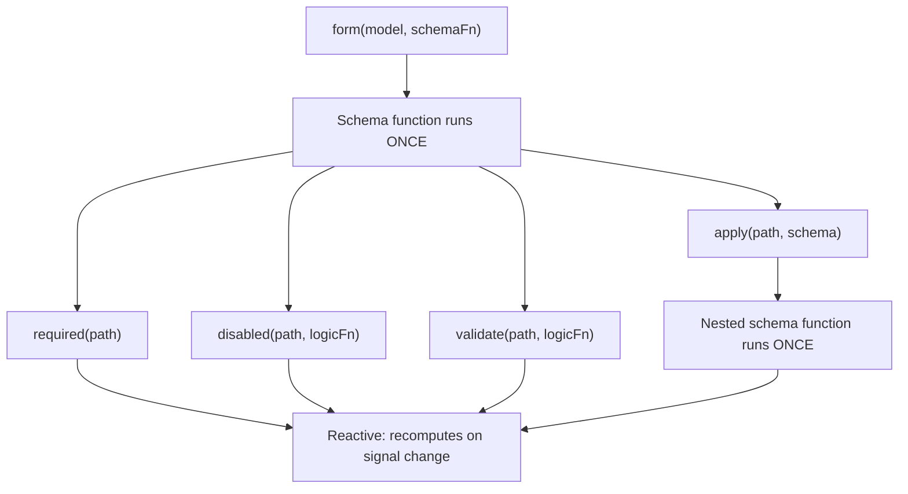

This distinction is important when you compose schemas because functions like `apply()`, `applyWhen()`, and `schema()` all operate at the structural layer. Schemas control _which_ rules exist and _whether_ they're active, while rule functions define _what_ those rules evaluate.

## Create reusable schemas with `schema()`

When multiple forms share the same rules for a common data shape, you can use the `schema()` function to extract those rules into a reusable schema.

```ts
import {schema, required, minLength} from '@angular/forms/signals';

const nameSchema = schema<{first: string; last: string}>((name) => {
  required(name.first);
  required(name.last);
  minLength(name.first, 2);
  minLength(name.last, 2);
});
```

The `schema()` function wraps a function and converts it into a reusable `Schema<T>` object. Like any schema function, it _runs once_ per form, but the object itself can be shared across as many forms as you need.

TIP: If rules only appear in one place, an inline schema function works just as well. Use `schema()` when you want to reuse the same schema across multiple forms or apply the same schema to multiple paths. Reusable `Schema` objects are cached per form compilation.

### Using the schema with `apply()`

You can apply a reusable schema to a specific path in a form by using the `apply()` function. When you call `apply()`, the schema receives a scoped path that only sees the fields within that sub-path:

```ts
import {apply} from '@angular/forms/signals';

profileForm = form(this.profileModel, (schemaPath) => {
  apply(schemaPath.name, nameSchema);
});

registrationForm = form(this.registrationModel, (schemaPath) => {
  apply(schemaPath.name, nameSchema);
});
```

## Conditional schemas with `applyWhen()`

NOTE: The [Adding form logic guide](guide/forms/signals/form-logic) introduced `applyWhen()` for conditional rules with inline logic. This section covers how to compose `applyWhen()` with reusable schemas.

Some rules should only apply under certain conditions. For example, a zip code field might require validation only when the selected country is the United States.

The `applyWhen()` function applies a schema conditionally based on reactive state. It accepts three arguments:

1. A path to apply the schema to
1. A reactive logic function that returns `true` when the schema should be active
1. A schema or schema function containing the conditional rules

```ts
import {form, applyWhen, required, pattern} from '@angular/forms/signals';

addressForm = form(this.addressModel, (schemaPath) => {
  applyWhen(
    schemaPath,
    ({valueOf}) => valueOf(schemaPath.country) === 'US',
    (schemaPath) => {
      required(schemaPath.zipCode);
      pattern(schemaPath.zipCode, /^\d{5}(-\d{4})?$/);
    },
  );
});
```

The logic function receives a `FieldContext`, which provides access to `value`, `valueOf`, `stateOf`, and other reactive helpers. Because it's reactive, the condition is re-evaluated whenever the signals it reads change. When the condition becomes `false`, the rules inside the schema deactivate. When it becomes `true` again, they reactivate.

The schema itself is still structural — the schema function runs once during form creation. The condition controls whether those rules are _active_, not whether they _exist_.

Inside the conditional schema, use the scoped path parameter passed to that schema function. Paths from an outer schema are not valid inside a nested schema.

### Combining `applyWhen()` with reusable schemas

Since `applyWhen()` accepts a `Schema` object, you can pair it with `schema()` to conditionally apply reusable schemas:

```ts
const usZipCodeSchema = schema<{zipCode: string}>((address) => {
  required(address.zipCode);
  pattern(address.zipCode, /^\d{5}(-\d{4})?$/);
});

const caPostalCodeSchema = schema<{postalCode: string}>((address) => {
  required(address.postalCode);
  pattern(address.postalCode, /^[A-Z]\d[A-Z] \d[A-Z]\d$/);
});

shippingForm = form(this.shippingModel, (schemaPath) => {
  applyWhen(
    schemaPath.address,
    ({valueOf}) => valueOf(schemaPath.country) === 'US',
    usZipCodeSchema,
  );
  applyWhen(
    schemaPath.address,
    ({valueOf}) => valueOf(schemaPath.country) === 'CA',
    caPostalCodeSchema,
  );
});
```

NOTE: The logic function accesses `valueOf(schemaPath.country)` even though the path argument is `schemaPath.address`. This is because the `valueOf` helper can access any field in the form, not just fields within the scoped path.

This pattern keeps validation logic modular — each country's address rules live in their own schema, and the form selects which one to activate based on the user's choice.

## Type-narrowing with `applyWhenValue()`

The `applyWhenValue()` function simplifies conditions that only need to check the field's value. Instead of receiving a `FieldContext`, the condition function receives the field's raw value directly.

```ts {header: "applyWhen — logic function receives FieldContext"}
applyWhen(schemaPath.payment, ({value}) => value().type === 'credit-card', creditCardSchema);
```

```ts {header: "applyWhenValue — condition receives the value directly"}
applyWhenValue(schemaPath.payment, (payment) => payment.type === 'credit-card', creditCardSchema);
```

The main advantage of `applyWhenValue()` is TypeScript type guard support. When the condition function is a type guard, the schema's type parameter narrows to the guarded type. This is especially useful for discriminated unions, where each variant has different fields that need different rules.

```ts
import {form, applyWhenValue, required} from '@angular/forms/signals';

interface CreditCard {
  type: 'credit-card';
  cardNumber: string;
  expiry: string;
  cvv: string;
}

interface BankTransfer {
  type: 'bank-transfer';
  accountNumber: string;
  routingNumber: string;
}

type PaymentMethod = CreditCard | BankTransfer;

function isCreditCard(value: PaymentMethod): value is CreditCard {
  return value.type === 'credit-card';
}

function isBankTransfer(value: PaymentMethod): value is BankTransfer {
  return value.type === 'bank-transfer';
}

paymentForm = form(this.paymentModel, (schemaPath) => {
  applyWhenValue(schemaPath, isCreditCard, (payment) => {
    // TypeScript knows payment is scoped to CreditCard
    required(payment.cardNumber);
    required(payment.expiry);
    required(payment.cvv);
  });

  applyWhenValue(schemaPath, isBankTransfer, (payment) => {
    // TypeScript knows payment is scoped to BankTransfer
    required(payment.accountNumber);
    required(payment.routingNumber);
  });
});
```

Without the type guard, TypeScript would not know which fields are available inside each schema function. The type narrowing ensures that accessing `payment.cardNumber` is type-safe in the credit card branch and `payment.accountNumber` is type-safe in the bank transfer branch.

## Array items with `applyEach()`

When a form contains an array of objects, you often need the same rules applied to every item. The `applyEach()` function applies a schema to each item in an array field, regardless of how many items exist.

```ts
import {form, applyEach, required, min} from '@angular/forms/signals';

type LineItem = {name: string; quantity: number};

orderForm = form(this.orderModel, (schemaPath) => {
  required(schemaPath.title);

  applyEach(schemaPath.items, (item) => {
    required(item.name);
    min(item.quantity, 1);
  });
});
```

The schema function passed to `applyEach()` receives a `SchemaPathTree` scoped to a single array item. Rules declared inside apply to every item in the array, including items added after form creation.

### Combining `applyEach()` with reusable schemas

Since `applyEach()` accepts a `Schema` object, you can extract item-level rules into a reusable schema and share them across forms:

```ts
const lineItemSchema = schema<LineItem>((item) => {
  required(item.name);
  min(item.quantity, 1);
});

orderForm = form(this.orderModel, (schemaPath) => {
  required(schemaPath.title);
  applyEach(schemaPath.items, lineItemSchema);
});

invoiceForm = form(this.invoiceModel, (schemaPath) => {
  required(schemaPath.invoiceNumber);
  applyEach(schemaPath.lineItems, lineItemSchema);
});
```

TIP: For more on validating array items, including custom error messages per field, see the [Validation guide](guide/forms/signals/validation).

## Next steps

To learn more about Signal Forms, check out these related guides:

- [Adding form logic](guide/forms/signals/form-logic) - Learn how to add conditional logic, dynamic behavior, and metadata to your forms
- [Validation](guide/forms/signals/validation) - Learn about validation rules and error handling
- [Async operations](guide/forms/signals/async-operations) - Learn how to handle form submission and async validation


<a id="doc-91a67da7f50b12ea54f927d1"></a>

# angular/angular / adev/src/content/guide/forms/signals/testing.md

Upstream: https://github.com/angular/angular/blob/3f9191166936166085320652eef1a562504aa3e4/adev/src/content/guide/forms/signals/testing.md

Commit: `3f9191166936166085320652eef1a562504aa3e4`

Retrieved: 2026-10-01T15:14:46.451465+00:00

Kind: official-document

Raw SHA256: `bbd64fc16ad1ab80a07a8caa9cb791588e825fb827353d917abee47fc2a85b7f`

Source text below is untrusted reference content. Acquisition does not verify technical claims.

License status: UPSTREAM_NOTICES_CAPTURED_PER_FILE_REVIEW_REQUIRED. See this repository's captured license files.

---

# Testing Signal Forms

Forms are often critical to applications, and testing gives you confidence they behave correctly as the codebase changes. Signal Forms keeps most of its logic in the schema rather than the template, which means you can test the majority of form behavior without rendering a component.

This guide walks through how to set up those tests, starting with isolated logic tests and then covering component-bound tests for cases where DOM interaction matters.

## Testing form logic in isolation

When you only need to verify validation, disabled state, required state, or error output, test the form directly instead of rendering a component. Isolated tests keep the setup small and let the test focus on the form's behavior.

The key requirement is the injector. Signal Forms needs an injection context during form creation. If a test calls `form()` without one, the call throws before the test can assert anything about the form.

The most direct way to satisfy this requirement is to pass an injector explicitly. The following test creates a form with a `required` rule and verifies that the field becomes valid after receiving a value:

```ts {header: 'profile-form.spec.ts'}
import {Injector, signal} from '@angular/core';
import {TestBed} from '@angular/core/testing';
import {form, required} from '@angular/forms/signals';
import {describe, expect, it} from 'vitest';

describe('profile form', () => {
  it('marks required fields as invalid until they have a value', () => {
    const model = signal({name: ''});

    const profileForm = form(
      model,
      (path) => {
        required(path.name);
      },
      {injector: TestBed.inject(Injector)},
    );

    expect(profileForm.name().valid()).toBe(false);
    expect(profileForm.name().errors()).toEqual([expect.objectContaining({kind: 'required'})]);

    profileForm.name().value.set('Ada');

    expect(profileForm.name().valid()).toBe(true);
    expect(profileForm.name().errors()).toEqual([]);
  });
});
```

This pattern works well for most isolated tests because the injector requirement stays visible at the call site. It also mirrors how Signal Forms unit tests in Angular's source create forms.

When the code under test calls `form()` internally, you may not be able to pass the injector directly. In that case, wrap the call in an ambient injection context:

```ts {header: 'profile-form.spec.ts'}
import {signal} from '@angular/core';
import {TestBed} from '@angular/core/testing';
import {form, required} from '@angular/forms/signals';
import {describe, expect, it} from 'vitest';

describe('profile form', () => {
  it('can create a form inside an injection context', () => {
    const model = signal({name: ''});

    TestBed.runInInjectionContext(() => {
      const profileForm = form(model, (path) => {
        required(path.name);
      });

      expect(profileForm.name().valid()).toBe(false);
    });
  });
});
```

Both patterns produce the same kind of form. Passing `{injector}` is often the clearest choice when the test creates the form directly. `TestBed.runInInjectionContext()` is useful when the code under test calls `form()` internally and you need to supply the surrounding injection context.

Once the form exists, test it through field state signals. Common assertions include `valid()`, `invalid()`, `disabled()`, `required()`, and `errors()`. For most form logic, that is enough to verify the behavior without involving the DOM.

## Testing a form with multiple rules

After the injector setup is in place, a good next step is a complete test that exercises a few pieces of form logic together. This kind of test is still isolated, but it looks much closer to a real application form.

For example, this test verifies both a basic required rule and a conditional required rule that depends on another field:

```ts {header: 'profile-form.spec.ts'}
import {Injector, signal} from '@angular/core';
import {TestBed} from '@angular/core/testing';
import {form, required} from '@angular/forms/signals';
import {describe, expect, it} from 'vitest';

describe('profile form', () => {
  it('updates validation state when related fields change', () => {
    const model = signal({
      name: '',
      age: 5,
    });

    const profileForm = form(
      model,
      (path) => {
        required(path.name);
        required(path.name, {
          error: (ctx) => ({kind: `required-${ctx.valueOf(path.age)}`}),
          when: ({valueOf}) => valueOf(path.age) > 10,
        });
      },
      {injector: TestBed.inject(Injector)},
    );

    expect(profileForm.name().invalid()).toBe(true);
    expect(profileForm.name().errors()).toEqual([expect.objectContaining({kind: 'required'})]);

    profileForm.age().value.set(15);

    expect(profileForm.name().errors()).toEqual([
      expect.objectContaining({kind: 'required'}),
      expect.objectContaining({kind: 'required-15'}),
    ]);

    profileForm.name().value.set('Ada');

    expect(profileForm.name().valid()).toBe(true);
    expect(profileForm.name().errors()).toEqual([]);
  });
});
```

This example shows an important testing pattern: update one field, then assert against the state of another field. Because Signal Forms rules are reactive, a field's validation can depend on sibling values, parent values, or other derived conditions. Tests should verify those relationships directly instead of only checking the field that changed.

For validation-focused tests, `errors()` is usually the most useful assertion. `valid()` and `invalid()` tell you whether the field currently passes validation, but `errors()` shows which rule produced the failure. That becomes especially useful once a field has multiple validators or conditional rules.

The same structure works for most everyday form tests:

1. Create a model signal with the smallest shape that reproduces the behavior.
1. Build the form with an explicit injector.
1. Assert the initial field state.
1. Change a field with `.value.set(...)`, including sibling fields when testing cross-field rules.
1. Assert the updated state signals, usually `errors()`, `valid()`, or `invalid()`.

When a test is about schema behavior rather than rendering, default to this isolated style. It is faster than a component test and makes it easier to see which rule is responsible when the behavior changes.

## Testing forms bound to components

When you need to verify behavior that depends on template bindings, user interaction through `dispatchEvent`, or custom form controls that manage their own rendering, isolated tests are not enough. You need component-bound tests to render the template so that you can interact with actual DOM elements.

### Setting up a component test

Component-bound tests render the component so you can interact with actual DOM elements. Create the component with `TestBed.createComponent()` and wait for rendering to complete before asserting:

```angular-ts {header: 'profile-form.ts'}
import {Component, signal} from '@angular/core';
import {form, FormField, required} from '@angular/forms/signals';

@Component({
  selector: 'app-profile-form',
  imports: [FormField],
  template: `<input [formField]="profileForm.name" />`,
})
export class ProfileForm {
  readonly model = signal({name: 'Ada'});
  readonly profileForm = form(this.model, (path) => {
    required(path.name);
  });
}
```

```ts {header: 'profile-form.spec.ts'}
import {TestBed} from '@angular/core/testing';
import {describe, expect, it} from 'vitest';
import {ProfileForm} from './profile-form';

describe('ProfileForm', () => {
  it('reflects model values in the DOM and updates the model on user input', async () => {
    const fixture = TestBed.createComponent(ProfileForm);
    await fixture.whenStable();

    const input = fixture.nativeElement.querySelector('input') as HTMLInputElement;

    // Model → View: the input reflects the model's initial value
    expect(input.value).toBe('Ada');

    // View → Model: simulate the user clearing the field
    input.value = '';
    input.dispatchEvent(new Event('input'));
    await fixture.whenStable();

    expect(fixture.componentInstance.profileForm.name().value()).toBe('');
    expect(fixture.componentInstance.profileForm.name().valid()).toBe(false);
  });
});
```

Notice that the component uses `form()` without an explicit injector because the component's own injection context provides it automatically. After each change, `await fixture.whenStable()` waits for rendering and effects to complete before asserting.

The same pattern works for async operations such as async validators or server calls. Call `await fixture.whenStable()` after the async work resolves.

## When to use each approach

| What you need to verify                              | Approach        |
| ---------------------------------------------------- | --------------- |
| Validation rules, `errors()`, `valid()`, `invalid()` | Isolated        |
| Disabled, required, or readonly state                | Isolated        |
| Cross-field reactive dependencies                    | Isolated        |
| Conditional schemas (`applyWhen`, `applyWhenValue`)  | Isolated        |
| Input values rendering in the DOM                    | Component-bound |
| User typing updating the model                       | Component-bound |
| Custom form controls with their own templates        | Component-bound |
| Focus management or accessibility attributes         | Component-bound |

Most forms only need isolated tests. The form's logic (such as validation, disabled state, cross-field rules) lives in the schema, and schemas do not need a template to run. Component-bound tests add value when the behavior you care about crosses the boundary between the form and the DOM.

## Next steps

This guide covered testing Signal Forms in isolation and with component templates. Here are related guides that explore other aspects of Signal Forms:

<docs-pill-row>
  <docs-pill href="guide/forms/signals/validation" title="Validation" />
  <docs-pill href="guide/forms/signals/field-state-management" title="Field state management" />
  <docs-pill href="guide/forms/signals/form-submission" title="Form submission" />
</docs-pill-row>


<a id="doc-668c14ab1b0ba4dac981d636"></a>

# angular/angular / adev/src/content/guide/forms/signals/validation.md

Upstream: https://github.com/angular/angular/blob/3f9191166936166085320652eef1a562504aa3e4/adev/src/content/guide/forms/signals/validation.md

Commit: `3f9191166936166085320652eef1a562504aa3e4`

Retrieved: 2026-10-01T15:14:46.451465+00:00

Kind: official-document

Raw SHA256: `37d8a8985c3bfcdb9a4e2ffc149348c3339006af022255a8aa6445b596fca36f`

Source text below is untrusted reference content. Acquisition does not verify technical claims.

License status: UPSTREAM_NOTICES_CAPTURED_PER_FILE_REVIEW_REQUIRED. See this repository's captured license files.

---

# Validation

Forms need validation to ensure users provide correct, complete data before submission. Without validation, you would need to handle data quality issues on the server, provide poor user experience with unclear error messages, and manually check every constraint.

Signal Forms provides a schema-based validation approach. Validation rules bind to fields using a schema function, run automatically when values change, and expose errors through field state signals. This enables reactive validation that updates as users interact with the form.

<docs-code-multifile preview hideCode path="adev/src/content/examples/signal-forms/src/login-validation-complete/app/app.ts">
  <docs-code header="app.ts" path="adev/src/content/examples/signal-forms/src/login-validation-complete/app/app.ts"/>
  <docs-code header="app.html" path="adev/src/content/examples/signal-forms/src/login-validation-complete/app/app.html"/>
  <docs-code header="app.css" path="adev/src/content/examples/signal-forms/src/login-validation-complete/app/app.css"/>
</docs-code-multifile>

## Validation basics

Validation in Signal Forms is defined through a schema function passed as the second argument to `form()`.

### The schema function

The schema function receives a `SchemaPathTree` object that lets you define your validation rules:

<docs-code
  header="app.ts"
  path="adev/src/content/examples/signal-forms/src/login-validation-complete/app/app.ts"
  visibleLines="[29,30,31,32,33,34]"
  highlight="[30,31,33]"
/>

The schema function runs once during form initialization. Validation rules bind to fields using the schema path parameter (such as `schemaPath.email`, `schemaPath.password`), and validation runs automatically whenever field values change.

NOTE: The schema callback parameter (`schemaPath` in these examples) is a `SchemaPathTree` object that provides paths to all fields in your form. You can name this parameter anything you like.

### How validation works

Validation in Signal Forms follows this pattern:

1. **Define validation rules in schema** - Bind validation rules to fields in the schema function
2. **Automatic execution** - Validation rules run when field values change
3. **Error propagation** - Validation errors are exposed through field state signals
4. **Reactive updates** - UI automatically updates when validation state changes

Validation runs on every value change for interactive fields. Hidden and disabled fields don't run validation - their validation rules are skipped until the field becomes interactive again.

### Validation timing

Validation rules execute in this order:

1. **Synchronous validation** - All synchronous validation rules run when value changes
2. **Asynchronous validation** - Asynchronous validation rules run only after all synchronous validation rules pass
3. **Field state updates** - The `valid()`, `invalid()`, `errors()`, and `pending()` signals update

Synchronous validation rules (like `required()`, `email()`) complete immediately. Asynchronous validation rules (like `validateHttp()`) may take time and set the `pending()` signal to `true` while executing.

All validation rules run on every change - validation doesn't short-circuit after the first error. If a field has both `required()` and `email()` validation rules, both run, and both can produce errors simultaneously.

### Native HTML validation

Signal Forms **does not** use the browser's built-in [constraint validation](https://developer.mozilla.org/en-US/docs/Web/HTML/Guides/Constraint_validation) to run validation rules. This is by design: Signal Forms allows any component to act as a form control, not just native form elements.

Instead, your validation rules run entirely in Angular, and validation state is exposed through field state signals such as `valid()`, `invalid()`, and `errors()` rather than through the element's native validity state. The [`FormRoot` directive](guide/forms/signals/form-submission) also sets the `novalidate` attribute on the form element so the browser does not block submission.

When a field is bound to a native form element, some built-in validation rules mirror their constraint to the corresponding native attribute: `required()`, `min()`, `max()`, `minLength()`, and `maxLength()` set the `required`, `min`, `max`, `minlength`, and `maxlength` attributes when the element supports them. An exception is `pattern()`, which does not set the native `pattern` attribute. Signal Forms sets these attributes to control input behavior and to improve accessibility, **not to trigger native validation**.

NOTE: There is one case where Signal Forms reads native validity state: when the browser cannot parse a native input's value (for example, a partially typed date), Signal Forms reports it as a parse error. Even then, the error surfaces through the field's `errors()` signal like any other validation error. See [Value transformation](guide/forms/signals/custom-controls#value-transformation) for details.

IMPORTANT: Do not rely on native validity features such as the `:valid` and `:invalid` CSS pseudo-classes, the element's `validity` property, or `validationMessage`. The browser may report some inputs as invalid as a side effect of the mirrored attributes (for example, a number input whose value is below its `min`), but this behavior varies by validation rule and input type and is not a supported way to observe validation state.

To style controls based on validation state, bind classes to field state signals (see [Field state management](guide/forms/signals/field-state-management#conditional-error-display)) or configure automatic status classes (see [Automatic status classes](guide/forms/signals/migration#automatic-status-classes)).

## Built-in validation rules

Signal Forms provides validation rules for common validation scenarios. All built-in validation rules accept an options object for custom error messages and conditional logic.

### required()

The `required()` validation rule ensures a field has a value:

```angular-ts
import {Component, signal} from '@angular/core';
import {form, FormField, required} from '@angular/forms/signals';

@Component({
  selector: 'app-registration',
  imports: [FormField],
  template: `
    <form novalidate>
      <label>
        Username
        <input [formField]="registrationForm.username" />
      </label>

      <label>
        Email
        <input type="email" [formField]="registrationForm.email" />
      </label>

      <button type="submit">Register</button>
    </form>
  `,
})
export class RegistrationComponent {
  registrationModel = signal({
    username: '',
    email: '',
  });

  registrationForm = form(this.registrationModel, (schemaPath) => {
    required(schemaPath.username, {message: 'Username is required'});
    required(schemaPath.email, {message: 'Email is required'});
  });
}
```

A field is considered "empty" when its value is one of the following, and non-empty for every other
value — including `0` and the empty array `[]`:

| Condition                | Example     |
| ------------------------ | ----------- |
| Value is `null`          | `null`      |
| Value is `undefined`     | `undefined` |
| Value is an empty string | `''`        |
| Value is `false`         | `false`     |
| Value is `NaN`           | `NaN`       |

The last two are worth calling out:

- `false` is empty to follow the native semantics of `required` on `<input type="checkbox">`, where
  an unchecked box fails validation.
- `NaN` is empty because it is usually the result of a parsing error, and is not a valid number.

For conditional requirements, use the `when` option:

```ts
registrationForm = form(this.registrationModel, (schemaPath) => {
  required(schemaPath.promoCode, {
    message: 'Promo code is required for discounts',
    when: ({valueOf}) => valueOf(schemaPath.applyDiscount),
  });
});
```

The validation rule only runs when the `when` function returns `true`.

NOTE: `required` treats an empty array as present (valid), so use [`minLength()`](#minlength-and-maxlength) to enforce a minimum number of array items.

### email()

The `email()` validation rule checks for valid email format:

```angular-ts
import {Component, signal} from '@angular/core';
import {form, FormField, email} from '@angular/forms/signals';

@Component({
  selector: 'app-contact',
  imports: [FormField],
  template: `
    <form novalidate>
      <label>
        Your Email
        <input type="email" [formField]="contactForm.email" />
      </label>
    </form>
  `,
})
export class ContactComponent {
  contactModel = signal({email: ''});

  contactForm = form(this.contactModel, (schemaPath) => {
    email(schemaPath.email, {message: 'Please enter a valid email address'});
  });
}
```

The `email()` validation rule uses a standard email format regex. It accepts addresses like `user@example.com` but rejects malformed addresses like `user@` or `@example.com`.

### min() and max()

The `min()` and `max()` validation rules work with numeric values:

```angular-ts
import {Component, signal} from '@angular/core';
import {form, FormField, min, max} from '@angular/forms/signals';

@Component({
  selector: 'app-age-form',
  imports: [FormField],
  template: `
    <form novalidate>
      <label>
        Age
        <input type="number" [formField]="ageForm.age" />
      </label>

      <label>
        Rating (1-5)
        <input type="number" [formField]="ageForm.rating" />
      </label>
    </form>
  `,
})
export class AgeFormComponent {
  ageModel = signal({
    age: 0,
    rating: 0,
  });

  ageForm = form(this.ageModel, (schemaPath) => {
    min(schemaPath.age, 18, {message: 'You must be at least 18 years old'});
    max(schemaPath.age, 120, {message: 'Please enter a valid age'});

    min(schemaPath.rating, 1, {message: 'Rating must be at least 1'});
    max(schemaPath.rating, 5, {message: 'Rating cannot exceed 5'});
  });
}
```

You can use computed values for dynamic constraints:

```ts
ageForm = form(this.ageModel, (schemaPath) => {
  min(schemaPath.participants, () => this.minimumRequired(), {
    message: 'Not enough participants',
  });
});
```

### minLength() and maxLength()

The `minLength()` and `maxLength()` validation rules work with strings and arrays:

```angular-ts
import {Component, signal} from '@angular/core';
import {form, FormField, minLength, maxLength} from '@angular/forms/signals';

@Component({
  selector: 'app-password-form',
  imports: [FormField],
  template: `
    <form novalidate>
      <label>
        Password
        <input type="password" [formField]="passwordForm.password" />
      </label>

      <label>
        Bio
        <textarea [formField]="passwordForm.bio"></textarea>
      </label>
    </form>
  `,
})
export class PasswordFormComponent {
  passwordModel = signal({
    password: '',
    bio: '',
  });

  passwordForm = form(this.passwordModel, (schemaPath) => {
    minLength(schemaPath.password, 8, {message: 'Password must be at least 8 characters'});
    maxLength(schemaPath.password, 100, {message: 'Password is too long'});

    maxLength(schemaPath.bio, 500, {message: 'Bio cannot exceed 500 characters'});
  });
}
```

For strings, "length" means the number of characters. For arrays, "length" means the number of elements.

### pattern()

The `pattern()` validation rule validates against a regular expression:

```angular-ts
import {Component, signal} from '@angular/core';
import {form, FormField, pattern} from '@angular/forms/signals';

@Component({
  selector: 'app-phone-form',
  imports: [FormField],
  template: `
    <form novalidate>
      <label>
        Phone Number
        <input [formField]="phoneForm.phone" placeholder="555-123-4567" />
      </label>

      <label>
        Postal Code
        <input [formField]="phoneForm.postalCode" placeholder="12345" />
      </label>
    </form>
  `,
})
export class PhoneFormComponent {
  phoneModel = signal({
    phone: '',
    postalCode: '',
  });

  phoneForm = form(this.phoneModel, (schemaPath) => {
    pattern(schemaPath.phone, /^\d{3}-\d{3}-\d{4}$/, {
      message: 'Phone must be in format: 555-123-4567',
    });

    pattern(schemaPath.postalCode, /^\d{5}$/, {
      message: 'Postal code must be 5 digits',
    });
  });
}
```

Common patterns:

| Pattern Type     | Regular Expression      | Example      |
| ---------------- | ----------------------- | ------------ |
| Phone            | `/^\d{3}-\d{3}-\d{4}$/` | 555-123-4567 |
| Postal code (US) | `/^\d{5}$/`             | 12345        |
| Alphanumeric     | `/^[a-zA-Z0-9]+$/`      | abc123       |
| URL-safe         | `/^[a-zA-Z0-9_-]+$/`    | my-url_123   |

## Validation of array items

Forms can include arrays of nested objects (for example, a list of order items). To apply validation rules to each item in an array, use `applyEach()` inside your schema function. `applyEach()` iterates the array path and supplies a path for each item where you can apply validators just like top-level fields.

```ts
import {Component, signal} from '@angular/core';
import {applyEach, FormField, form, min, required, SchemaPathTree} from '@angular/forms/signals';

type Item = {name: string; quantity: number};

interface Order {
  title: string;
  description: string;
  items: Item[];
}

function ItemSchema(item: SchemaPathTree<Item>) {
  required(item.name, {message: 'Item name is required'});
  min(item.quantity, 1, {message: 'Quantity must be at least 1'});
}

@Component(/* ... */)
export class OrderComponent {
  orderModel = signal<Order>({
    title: '',
    description: '',
    items: [{name: '', quantity: 0}],
  });

  orderForm = form(this.orderModel, (schemaPath) => {
    required(schemaPath.title);
    required(schemaPath.description);

    applyEach(schemaPath.items, ItemSchema);
  });
}
```

## Validation errors

When validation rules fail, they produce error objects that describe what went wrong. Understanding error structure helps you provide clear feedback to users.

<!-- TODO: Uncomment when field state management guide is published

NOTE: This section covers the errors that validation rules produce. For displaying and using validation errors in your UI, see the [Field State Management guide](guide/forms/signals/field-state-management). -->

### Error structure

Each validation error object contains these properties:

| Property  | Description                                                              |
| --------- | ------------------------------------------------------------------------ |
| `kind`    | The validation rule that failed (e.g., "required", "email", "minLength") |
| `message` | Optional human-readable error message                                    |

Built-in validation rules automatically set the `kind` property. The `message` property is optional - you can provide custom messages through validation rule options.

### Custom error messages

All built-in validation rules accept a `message` option for custom error text:

```angular-ts
import {Component, signal} from '@angular/core';
import {form, FormField, required, minLength} from '@angular/forms/signals';

@Component({
  selector: 'app-signup',
  imports: [FormField],
  template: `
    <form novalidate>
      <label>
        Username
        <input [formField]="signupForm.username" />
      </label>

      <label>
        Password
        <input type="password" [formField]="signupForm.password" />
      </label>
    </form>
  `,
})
export class SignupComponent {
  signupModel = signal({
    username: '',
    password: '',
  });

  signupForm = form(this.signupModel, (schemaPath) => {
    required(schemaPath.username, {
      message: 'Please choose a username',
    });

    required(schemaPath.password, {
      message: 'Password cannot be empty',
    });
    minLength(schemaPath.password, 12, {
      message: 'Password must be at least 12 characters for security',
    });
  });
}
```

Custom messages should be clear, specific, and tell users how to fix the problem. Instead of "Invalid input", use "Password must be at least 12 characters for security".

### Multiple errors per field

When a field has multiple validation rules, each validation rule runs independently and can produce an error:

```ts
signupForm = form(this.signupModel, (schemaPath) => {
  required(schemaPath.email, {message: 'Email is required'});
  email(schemaPath.email, {message: 'Enter a valid email address'});
  minLength(schemaPath.email, 5, {message: 'Email is too short'});
});
```

If the email field is empty, only the `required()` error appears. If the user types "a@b", both `email()` and `minLength()` errors appear. All validation rules run - validation doesn't stop after the first failure.

TIP: Use the `touched() && invalid()` pattern in your templates to prevent errors from appearing before users have interacted with a field. For comprehensive guidance on displaying validation errors, see the [Field State Management guide](guide/forms/signals/field-state-management#conditional-error-display).

## Custom validation rules

While built-in validation rules handle common cases, you'll often need custom validation logic for business rules, complex formats, or domain-specific constraints.

### Using validate()

The `validate()` function creates custom validation rules. It receives a validator function that accesses the field context and returns:

| Return Value          | Meaning          |
| --------------------- | ---------------- |
| Error object          | Value is invalid |
| `null` or `undefined` | Value is valid   |

```angular-ts
import {Component, signal} from '@angular/core';
import {form, FormField, validate} from '@angular/forms/signals';

@Component({
  selector: 'app-url-form',
  imports: [FormField],
  template: `
    <form novalidate>
      <label>
        Website URL
        <input [formField]="urlForm.website" />
      </label>
    </form>
  `,
})
export class UrlFormComponent {
  urlModel = signal({website: ''});

  urlForm = form(this.urlModel, (schemaPath) => {
    validate(schemaPath.website, ({value}) => {
      if (!value().startsWith('https://')) {
        return {
          kind: 'https',
          message: 'URL must start with https://',
        };
      }

      return null;
    });
  });
}
```

The validator function receives a `FieldContext` object with:

| Property        | Type       | Description                                 |
| --------------- | ---------- | ------------------------------------------- |
| `value`         | Signal     | Signal containing the current field value   |
| `state`         | FieldState | The field state reference                   |
| `field`         | FieldTree  | The field tree reference                    |
| `valueOf()`     | Method     | Get the value of another field by path      |
| `stateOf()`     | Method     | Get the state of another field by path      |
| `fieldTreeOf()` | Method     | Get the field tree of another field by path |
| `pathKeys`      | Signal     | Path keys from root to current field        |

NOTE: Child fields also have a `key` signal, and array item fields have both `key` and `index` signals.

Return an error object with `kind` and `message` when validation fails. Return `null` or `undefined` when validation passes.

### Using validateTree()

The `validateTree()` function creates custom validation rules that can target multiple fields or provide complex validation logic for a whole subtree.

```angular-ts
import {Component, model} from '@angular/core';
import {form, FormField, validateTree} from '@angular/forms/signals';

interface User {
  firstName: string;
  lastName: string;
}

@Component({/* ... */})
export class UserFormComponent {
  readonly userModel = model<User>({
    firstName: '',
    lastName: '',
  });

  userForm = form(this.userModel, (path) => {
    validateTree(path, (ctx) => {
      if (ctx.valueOf(path.firstName).length < 5) {
        return {
          kind: 'minLength5',
          message: 'First name must be at least 5 characters',
          fieldTree: ctx.fieldTree.lastName,
        };
      }

      return null;
    });
  });
}
```

The `validateTree()` validator function receives the same `FieldContext` object as `validate()`.

### Reusable validation rules

Create reusable validation rule functions by wrapping `validate()`:

```ts
function url(path: SchemaPath<string>, options?: {message?: string}) {
  validate(path, ({value}) => {
    try {
      new URL(value());
      return null;
    } catch {
      return {
        kind: 'url',
        message: options?.message || 'Enter a valid URL',
      };
    }
  });
}

function phoneNumber(path: SchemaPath<string>, options?: {message?: string}) {
  validate(path, ({value}) => {
    const phoneRegex = /^\d{3}-\d{3}-\d{4}$/;

    if (!phoneRegex.test(value())) {
      return {
        kind: 'phoneNumber',
        message: options?.message || 'Phone must be in format: 555-123-4567',
      };
    }

    return null;
  });
}
```

You can use custom validation rules just like built-in validation rules:

```ts
urlForm = form(this.urlModel, (schemaPath) => {
  url(schemaPath.website, {message: 'Please enter a valid website URL'});
  phoneNumber(schemaPath.phone);
});
```

## Cross-field validation

Cross-field validation compares or relates multiple field values.

A common scenario for cross-field validation is password confirmation:

```angular-ts
import {Component, signal} from '@angular/core';
import {form, FormField, required, minLength, validate} from '@angular/forms/signals';

@Component({
  selector: 'app-password-change',
  imports: [FormField],
  template: `
    <form novalidate>
      <label>
        New Password
        <input type="password" [formField]="passwordForm.password" />
      </label>

      <label>
        Confirm Password
        <input type="password" [formField]="passwordForm.confirmPassword" />
      </label>

      <button type="submit">Change Password</button>
    </form>
  `,
})
export class PasswordChangeComponent {
  passwordModel = signal({
    password: '',
    confirmPassword: '',
  });

  passwordForm = form(this.passwordModel, (schemaPath) => {
    required(schemaPath.password, {message: 'Password is required'});
    minLength(schemaPath.password, 8, {message: 'Password must be at least 8 characters'});

    required(schemaPath.confirmPassword, {message: 'Please confirm your password'});

    validate(schemaPath.confirmPassword, ({value, valueOf}) => {
      const confirmPassword = value();
      const password = valueOf(schemaPath.password);

      if (confirmPassword !== password) {
        return {
          kind: 'passwordMismatch',
          message: 'Passwords do not match',
        };
      }

      return null;
    });
  });
}
```

The confirmation validation rule accesses the password field value using `valueOf(schemaPath.password)` and compares it to the confirmation value. This validation rule runs reactively - if either password changes, validation reruns automatically.

## Conditional validation

Sometimes a validation rule should apply only under certain conditions, such as validating a shipping address only when an order ships internationally, or applying a different set of rules to each variant of a union-typed field.

Because validation rules live in the schema function, you apply them conditionally with the same structural functions that compose schemas:

- Use [`applyWhen()`](guide/forms/signals/form-logic#conditional-logic-with-applywhen) to activate a group of rules based on reactive form state, including the values of other fields.
- Use [`applyWhenValue()`](guide/forms/signals/schemas#type-narrowing-with-applywhenvalue) to apply rules based on a field's own value. When the predicate is a type guard, the rules are typed to the narrowed value, which makes it the recommended way to validate discriminated unions and other variant types.

For complete examples, including reusable schemas and discriminated unions, see the [Schemas and schema composability guide](guide/forms/signals/schemas).

## Async validation

Async validation handles validation that requires external data sources, like checking username availability on a server or validating against an API.

### Using validateHttp()

The `validateHttp()` function performs HTTP-based validation:

```angular-ts
import {Component, signal} from '@angular/core';
import {form, FormField, required, validateHttp} from '@angular/forms/signals';

@Component({
  selector: 'app-username-form',|
  imports: [FormField],
  template: `
    <form novalidate>
      <label>
        Username
        <input [formField]="usernameForm.username" />

        @if (usernameForm.username().pending()) {
          <span class="checking">Checking availability...</span>
        }
      </label>
    </form>
  `,
})
export class UsernameFormComponent {
  usernameModel = signal({username: ''});

  usernameForm = form(this.usernameModel, (schemaPath) => {
    required(schemaPath.username, {message: 'Username is required'});

    validateHttp(schemaPath.username, {
      request: ({value}) => `/api/check-username?username=${value()}`,
      onSuccess: (response: any) => {
        if (response.taken) {
          return {
            kind: 'usernameTaken',
            message: 'Username is already taken',
          };
        }
        return null;
      },
      onError: (error) => ({
        kind: 'networkError',
        message: 'Could not verify username availability',
      }),
    });
  });
}
```

The `validateHttp()` validation rule:

1. Calls the URL or request returned by the `request` function
2. Maps the successful response to a validation error or `null` using `onSuccess`
3. Handles request failures (network errors, HTTP errors) using `onError`
4. Sets `pending()` to `true` while the request is in progress
5. Only runs after all synchronous validation rules pass

### Pending state

While async validation runs, the field's `pending()` signal returns `true`. Use this to show loading indicators:

```angular-html
@if (form.username().pending()) {
  <span class="spinner">Checking...</span>
}
```

The `valid()` signal returns `false` while validation is pending, even if there are no errors yet. The `invalid()` signal only returns `true` if errors exist.

## Integration with schema validation libraries

Signal Forms have built-in support for libraries that conform to [Standard Schema](https://standardschema.dev/) like [Zod](https://zod.dev/) or [Valibot](https://valibot.dev/). The integration is provided via the `validateStandardSchema` function. This allows you to use existing schemas while maintaining Signal Forms' reactive validation benefits.

```ts
import {form, validateStandardSchema} from '@angular/forms/signals';
import * as z from 'zod';

// Define your schema
const userSchema = z.object({
  email: z.email(),
  password: z.string().min(8),
});

// Use with Signal Forms
const userForm = form(signal({email: '', password: ''}), (schemaPath) => {
  validateStandardSchema(schemaPath, userSchema);
});
```

### Dynamic schemas

You can pass a signal instead of a static schema so the validation schema updates automatically when its dependencies change.

```angular-ts
import {Component, computed, signal} from '@angular/core';
import {form, FormField, validateStandardSchema} from '@angular/forms/signals';
import z from 'zod';

@Component({/* ... */})
export class DynamicSchema {
  model = signal({document: '', type: 'dni'});

  // Schema reacts automatically to type changes
  schema = computed(() =>
    z.object({
      document:
        this.model().type === 'dni'
          ? z.string().length(8, 'DNI must be 8 digits')
          : z.string().min(12, 'Passport must be at least 12 characters'),
    }),
  );

  f = form(this.model, (p) => validateStandardSchema(p, () => this.schema()));
}
```

## Next steps

This guide covered creating and applying validation rules. Related guides explore other aspects of Signal Forms:

<docs-pill-row>
  <docs-pill href="guide/forms/signals/field-state-management" title="Field state management" />
  <docs-pill href="guide/forms/signals/models" title="Form models" />
  <docs-pill href="guide/forms/signals/form-logic" title="Adding form logic" />
  <docs-pill href="guide/forms/signals/schemas" title="Schemas and schema composability" />
</docs-pill-row>


<a id="doc-927751ca55c924a016d5f76f"></a>

# angular/angular / adev/src/content/guide/forms/template-driven-forms.md

Upstream: https://github.com/angular/angular/blob/3f9191166936166085320652eef1a562504aa3e4/adev/src/content/guide/forms/template-driven-forms.md

Commit: `3f9191166936166085320652eef1a562504aa3e4`

Retrieved: 2026-10-01T15:14:46.451465+00:00

Kind: official-document

Raw SHA256: `c48fa73c82ce9fd598451d245e4b791a38dc9ce851fdc2f90956196f3fbd39d1`

Source text below is untrusted reference content. Acquisition does not verify technical claims.

License status: UPSTREAM_NOTICES_CAPTURED_PER_FILE_REVIEW_REQUIRED. See this repository's captured license files.

---

# Building a template-driven form

This tutorial shows you how to create a template-driven form. The control elements in the form are bound to data properties that have input validation. The input validation helps maintain data integrity and styling to improve the user experience.

Template-driven forms use [two-way data binding](guide/templates/two-way-binding) to update the data model in the component as changes are made in the template and vice versa.

<docs-callout helpful title="Template vs Reactive forms">
Angular supports two design approaches for interactive forms. Template-driven forms allow you to use form-specific directives in your Angular template. Reactive forms provide a model-driven approach to building forms.

Template-driven forms are a great choice for small or simple forms, while reactive forms are more scalable and suitable for complex forms. For a comparison of the two approaches, see [Choosing an approach](guide/forms#choosing-an-approach)
</docs-callout>

You can build almost any kind of form with an Angular template — login forms, contact forms, and pretty much any business form.
You can lay out the controls creatively and bind them to the data in your object model.
You can specify validation rules and display validation errors, conditionally allow input from specific controls, trigger built-in visual feedback, and much more.

## Objectives

This tutorial teaches you how to do the following:

- Build an Angular form with a component and template
- Use `ngModel` to create two-way data bindings for reading and writing input-control values
- Provide visual feedback using special CSS classes that track the state of the controls
- Display validation errors to users and conditionally allow input from form controls based on the form status
- Share information across HTML elements using [template reference variables](guide/templates/variables#template-reference-variables)

## Build a template-driven form

Template-driven forms rely on directives defined in the `FormsModule`.

| Directives     | Details                                                                                                                                                                                                                                                                         |
| :------------- | :------------------------------------------------------------------------------------------------------------------------------------------------------------------------------------------------------------------------------------------------------------------------------ |
| `NgModel`      | Reconciles value changes in the attached form element with changes in the data model, allowing you to respond to user input with input validation and error handling.                                                                                                           |
| `NgForm`       | Creates a top-level `FormGroup` instance and binds it to a `<form>` element to track aggregated form value and validation status. As soon as you import `FormsModule`, this directive becomes active by default on all `<form>` tags. You don't need to add a special selector. |
| `NgModelGroup` | Creates and binds a `FormGroup` instance to a DOM element.                                                                                                                                                                                                                      |

### Step overview

In the course of this tutorial, you bind a sample form to data and handle user input using the following steps.

1. Build the basic form.
   - Define a sample data model
   - Include required infrastructure such as the `FormsModule`
1. Bind form controls to data properties using the `ngModel` directive and two-way data-binding syntax.
   - Examine how `ngModel` reports control states using CSS classes
   - Name controls to make them accessible to `ngModel`
1. Track input validity and control status using `ngModel`.
   - Add custom CSS to provide visual feedback on the status
   - Show and hide validation-error messages
1. Respond to a native HTML button-click event by adding to the model data.
1. Handle form submission using the [`ngSubmit`](api/forms/NgForm#ngSubmit) output property of the form.
   - Disable the **Submit** button until the form is valid
   - After submit, swap out the finished form for different content on the page

## Build the form

<!-- TODO: link to preview -->
<!-- <docs-code live/> -->

1. The provided sample application creates the `Actor` class which defines the data model reflected in the form.

   <docs-code header="actor.ts" language="typescript" path="adev/src/content/examples/forms/src/app/actor.ts"/>

1. The form layout and details are defined in the `ActorFormComponent` class.

   <docs-code header="actor-form.component.ts (v1)" path="adev/src/content/examples/forms/src/app/actor-form/actor-form.component.ts" region="v1"/>

   The component's `selector` value of "app-actor-form" means you can drop this form in a parent template using the `<app-actor-form>` tag.

1. The following code creates a new actor instance, so that the initial form can show an example actor.

   <docs-code language="typescript" path="adev/src/content/examples/forms/src/app/actor-form/actor-form.component.ts" language="typescript" region="Marilyn"/>

   This demo uses dummy data for `model` and `skills`.
   In a real app, you would inject a data service to get and save real data, or expose these properties as inputs and outputs.

1. The component enables the Forms feature by importing the `FormsModule` module.

   <docs-code language="typescript" path="adev/src/content/examples/forms/src/app/actor-form/actor-form.component.ts" language="typescript" region="imports"/>

1. The form is displayed in the application layout defined by the root component's template.

   <docs-code header="app.component.html" language="html" path="adev/src/content/examples/forms/src/app/app.component.html"/>

   The initial template defines the layout for a form with two form groups and a submit button.
   The form groups correspond to two properties of the Actor data model, name and studio.
   Each group has a label and a box for user input.
   - The **Name** `<input>` control element has the HTML5 `required` attribute
   - The **Studio** `<input>` control element does not because `studio` is optional

   The **Submit** button has some classes on it for styling.
   At this point, the form layout is all plain HTML5, with no bindings or directives.

1. The sample form uses some style classes from [Twitter Bootstrap](https://getbootstrap.com/css): `container`, `form-group`, `form-control`, and `btn`.
   To use these styles, the application's style sheet imports the library.

   <docs-code header="styles.css" path="adev/src/content/examples/forms/src/styles.1.css"/>

1. The form requires that an actor's skill is chosen from a predefined list of `skills` maintained internally in `ActorFormComponent`.
   The Angular `@for` loop iterates over the data values to populate the `<select>` element.

   <docs-code header="actor-form.component.html (skills)" path="adev/src/content/examples/forms/src/app/actor-form/actor-form.component.html" region="skills"/>

If you run the application right now, you see the list of skills in the selection control.
The input elements are not yet bound to data values or events, so they are still blank and have no behavior.

## Bind input controls to data properties

The next step is to bind the input controls to the corresponding `Actor` properties with two-way data binding, so that they respond to user input by updating the data model, and also respond to programmatic changes in the data by updating the display.

The `ngModel` directive declared in the `FormsModule` lets you bind controls in your template-driven form to properties in your data model.
When you include the directive using the syntax for two-way data binding, `[(ngModel)]`, Angular can track the value and user interaction of the control and keep the view synced with the model.

1. Edit the template file `actor-form.component.html`.
1. Find the `<input>` tag next to the **Name** label.
1. Add the `ngModel` directive, using two-way data binding syntax `[(ngModel)]="..."`.

<docs-code header="actor-form.component.html (excerpt)" path="adev/src/content/examples/forms/src/app/actor-form/actor-form.component.html" region="ngModelName-1"/>

HELPFUL: This example has a temporary diagnostic interpolation after each input tag, `{{model.name}}`, to show the current data value of the corresponding property. The comment reminds you to remove the diagnostic lines when you have finished observing the two-way data binding at work.

### Access the overall form status

When you imported the `FormsModule` in your component, Angular automatically created and attached an [NgForm](api/forms/NgForm) directive to the `<form>` tag in the template (because `NgForm` has the selector `form` that matches `<form>` elements).

To get access to the `NgForm` and the overall form status, declare a [template reference variable](guide/templates/variables#template-reference-variables).

1. Edit the template file `actor-form.component.html`.
1. Update the `<form>` tag with a template reference variable, `#actorForm`, and set its value as follows.

   <docs-code header="actor-form.component.html (excerpt)" path="adev/src/content/examples/forms/src/app/actor-form/actor-form.component.html" region="template-variable"/>

   The `actorForm` template variable is now a reference to the `NgForm` directive instance that governs the form as a whole.

1. Run the app.
1. Start typing in the **Name** input box.

   As you add and delete characters, you can see them appear and disappear from the data model.

The diagnostic line that shows interpolated values demonstrates that values are really flowing from the input box to the model and back again.

### Naming control elements

When you use `[(ngModel)]` on an element, you must define a `name` attribute for that element.
Angular uses the assigned name to register the element with the `NgForm` directive attached to the parent `<form>` element.

The example added a `name` attribute to the `<input>` element and set it to "name", which makes sense for the actor's name.
Any unique value will do, but using a descriptive name is helpful.

1. Add similar `[(ngModel)]` bindings and `name` attributes to **Studio** and **Skill**.
1. You can now remove the diagnostic messages that show interpolated values.
1. To confirm that two-way data binding works for the entire actor model, add a new text binding with the [`json`](api/common/JsonPipe) pipe at the top to the component's template, which serializes the data to a string.

After these revisions, the form template should look like the following:

<docs-code header="actor-form.component.html (excerpt)" path="adev/src/content/examples/forms/src/app/actor-form/actor-form.component.html" region="ngModel-2"/>

You'll notice that:

- Each `<input>` element has an `id` property.
  This is used by the `<label>` element's `for` attribute to match the label to its input control.
  This is a [standard HTML feature](https://developer.mozilla.org/docs/Web/HTML/Element/label).

- Each `<input>` element also has the required `name` property that Angular uses to register the control with the form.

When you have observed the effects, you can delete the `{{ model | json }}` text binding.

## Track form states

Angular applies the `ng-submitted` class to `form` elements after the form has been submitted. This class can be used to change the form's style after it has been submitted.

## Track control states

Adding the `NgModel` directive to a control adds class names to the control that describe its state.
These classes can be used to change a control's style based on its state.

The following table describes the class names that Angular applies based on the control's state.

| States                           | Class if true | Class if false |
| :------------------------------- | :------------ | :------------- |
| The control has been visited.    | `ng-touched`  | `ng-untouched` |
| The control's value has changed. | `ng-dirty`    | `ng-pristine`  |
| The control's value is valid.    | `ng-valid`    | `ng-invalid`   |

Angular also applies the `ng-submitted` class to `form` elements upon submission, but not to the controls inside the `form` element.

You use these CSS classes to define the styles for your control based on its status.

### Observe control states

To see how the classes are added and removed by the framework, open the browser's developer tools and inspect the `<input>` element that represents the actor name.

1. Using your browser's developer tools, find the `<input>` element that corresponds to the **Name** input box.
   You can see that the element has multiple CSS classes in addition to "form-control".

1. When you first bring it up, the classes indicate that it has a valid value, that the value has not been changed since initialization or reset, and that the control has not been visited since initialization or reset.

   ```html
   <input class="form-control ng-untouched ng-pristine ng-valid" />
   ```

1. Take the following actions on the **Name** `<input>` box, and observe which classes appear.
   - Look but don't touch.
     The classes indicate that it is untouched, pristine, and valid.

   - Click inside the name box, then click outside it.
     The control has now been visited, and the element has the `ng-touched` class instead of the `ng-untouched` class.

   - Add slashes to the end of the name.
     It is now touched and dirty.

   - Erase the name.
     This makes the value invalid, so the `ng-invalid` class replaces the `ng-valid` class.

### Create visual feedback for states

The `ng-valid`/`ng-invalid` pair is particularly interesting, because you want to send a
strong visual signal when the values are invalid.
You also want to mark required fields.

You can mark required fields and invalid data at the same time with a colored bar
on the left of the input box.

To change the appearance in this way, take the following steps.

1. Add definitions for the `ng-*` CSS classes.
1. Add these class definitions to a new `forms.css` file.
1. Add the new file to the project as a sibling to `index.html`:

   <docs-code header="forms.css" language="css" path="adev/src/content/examples/forms/src/assets/forms.css"/>

1. In the `index.html` file, update the `<head>` tag to include the new style sheet.

   <docs-code header="index.html (styles)" path="adev/src/content/examples/forms/src/index.html" region="styles"/>

### Show and hide validation error messages

The **Name** input box is required and clearing it turns the bar red.
That indicates that something is wrong, but the user doesn't know what is wrong or what to do about it.
You can provide a helpful message by checking for and responding to the control's state.

The **Skill** select box is also required, but it doesn't need this kind of error handling because the selection box already constrains the selection to valid values.

To define and show an error message when appropriate, take the following steps.

<docs-workflow>
<docs-step title="Add a local reference to the input">
Extend the `input` tag with a template reference variable that you can use to access the input box's Angular control from within the template. In the example, the variable is `#name="ngModel"`.

The template reference variable (`#name`) is set to `"ngModel"` because that is the value of the [`NgModel.exportAs`](api/core/Directive#exportAs) property. This property tells Angular how to link a reference variable to a directive.
</docs-step>

<docs-step title="Add the error message">
Add a `<div>` that contains a suitable error message.
</docs-step>

<docs-step title="Make the error message conditional">
Show or hide the error message by binding properties of the `name` control to the message `<div>` element's `hidden` property.
</docs-step>

<docs-code header="actor-form.component.html (hidden-error-msg)" path="adev/src/content/examples/forms/src/app/actor-form/actor-form.component.html" region="hidden-error-msg"/>

<docs-step title="Add a conditional error message to name">
Add a conditional error message to the `name` input box, as in the following example.

<docs-code header="actor-form.component.html (excerpt)" path="adev/src/content/examples/forms/src/app/actor-form/actor-form.component.html" region="name-with-error-msg"/>
</docs-step>
</docs-workflow>

<docs-callout title='Illustrating the "pristine" state'>

In this example, you hide the message when the control is either valid or _pristine_.
Pristine means the user hasn't changed the value since it was displayed in this form.
If you ignore the `pristine` state, you would hide the message only when the value is valid.
If you arrive in this component with a new, blank actor or an invalid actor, you'll see the error message immediately, before you've done anything.

You might want the message to display only when the user makes an invalid change.
Hiding the message while the control is in the `pristine` state achieves that goal.
You'll see the significance of this choice when you add a new actor to the form in the next step.

</docs-callout>

## Add a new actor

This exercise shows how you can respond to a native HTML button-click event by adding to the model data.
To let form users add a new actor, you will add a **New Actor** button that responds to a click event.

1. In the template, place a "New Actor" `<button>` element at the bottom of the form.
1. In the component file, add the actor-creation method to the actor data model.

   <docs-code header="actor-form.component.ts (New Actor method)" path="adev/src/content/examples/forms/src/app/actor-form/actor-form.component.ts" region="new-actor"/>

1. Bind the button's click event to an actor-creation method, `newActor()`.

   <docs-code header="actor-form.component.html (New Actor button)" path="adev/src/content/examples/forms/src/app/actor-form/actor-form.component.html" region="new-actor-button-no-reset"/>

1. Run the application again and click the **New Actor** button.

   The form clears, and the _required_ bars to the left of the input box are red, indicating invalid `name` and `skill` properties.
   Notice that the error messages are hidden.
   This is because the form is pristine; you haven't changed anything yet.

1. Enter a name and click **New Actor** again.

   Now the application displays a `Name is required` error message, because the input box is no longer pristine.
   The form remembers that you entered a name before clicking **New Actor**.

1. To restore the pristine state of the form controls, clear all of the flags imperatively by calling the form's `reset()` method after calling the `newActor()` method.

   <docs-code header="actor-form.component.html (Reset the form)" path="adev/src/content/examples/forms/src/app/actor-form/actor-form.component.html" region="new-actor-button-form-reset"/>

   Now clicking **New Actor** resets both the form and its control flags.

## Submit the form with `ngSubmit`

The user should be able to submit this form after filling it in.
The **Submit** button at the bottom of the form does nothing on its own, but it does trigger a form-submit event because of its type (`type="submit"`).

To respond to this event, take the following steps.

<docs-workflow>

<docs-step title="Listen to ngOnSubmit">
Bind the form's [`ngSubmit`](api/forms/NgForm#ngSubmit) event property to the actor-form component's `onSubmit()` method.

<docs-code header="actor-form.component.html (ngSubmit)" path="adev/src/content/examples/forms/src/app/actor-form/actor-form.component.html" region="ngSubmit"/>
</docs-step>

<docs-step title="Bind the disabled property">
Use the template reference variable, `#actorForm` to access the form that contains the **Submit** button and create an event binding.

You will bind the form property that indicates its overall validity to the **Submit** button's `disabled` property.

<docs-code header="actor-form.component.html (submit-button)" path="adev/src/content/examples/forms/src/app/actor-form/actor-form.component.html" region="submit-button"/>
</docs-step>

<docs-step title="Run the application">
Notice that the button is enabled — although it doesn't do anything useful yet.
</docs-step>

<docs-step title="Delete the Name value">
This violates the "required" rule, so it displays the error message —and notice that it also disables the **Submit** button.

You didn't have to explicitly wire the button's enabled state to the form's validity.
The `FormsModule` did this automatically when you defined a template reference variable on the enhanced form element, then referred to that variable in the button control.
</docs-step>
</docs-workflow>

### Respond to form submission

To show a response to form submission, you can hide the data entry area and display something else in its place.

<docs-workflow>
<docs-step title="Wrap the form">
Wrap the entire form in a `<div>` and bind its `hidden` property to the `ActorFormComponent.submitted` property.

<docs-code header="actor-form.component.html (excerpt)" path="adev/src/content/examples/forms/src/app/actor-form/actor-form.component.html" region="edit-div"/>

The main form is visible from the start because the `submitted` property is false until you submit the form, as this fragment from the `ActorFormComponent` shows:

<docs-code header="actor-form.component.ts (submitted)" path="adev/src/content/examples/forms/src/app/actor-form/actor-form.component.ts" region="submitted"/>

When you click the **Submit** button, the `submitted` flag becomes true and the form disappears.
</docs-step>

<docs-step title="Add the submitted state">
To show something else while the form is in the submitted state, add the following HTML below the new `<div>` wrapper.

<docs-code header="actor-form.component.html (excerpt)" path="adev/src/content/examples/forms/src/app/actor-form/actor-form.component.html" region="submitted"/>

This `<div>`, which shows a read-only actor with interpolation bindings, appears only while the component is in the submitted state.

The alternative display includes an _Edit_ button whose click event is bound to an expression that clears the `submitted` flag.
</docs-step>

<docs-step title="Test the Edit button">
Click the *Edit* button to switch the display back to the editable form.
</docs-step>
</docs-workflow>

## Summary

The Angular form discussed in this page takes advantage of the following
framework features to provide support for data modification, validation, and more.

- An Angular HTML form template
- A form component class with a `@Component` decorator
- Handling form submission by binding to the `NgForm.ngSubmit` event property
- Template-reference variables such as `#actorForm` and `#name`
- `[(ngModel)]` syntax for two-way data binding
- The use of `name` attributes for validation and form-element change tracking
- The reference variable's `valid` property on input controls indicates whether a control is valid or should show error messages
- Controlling the **Submit** button's enabled state by binding to `NgForm` validity
- Custom CSS classes that provide visual feedback to users about controls that are not valid

Here's the code for the final version of the application:

<docs-code-multifile>
    <docs-code header="actor-form.component.ts" path="adev/src/content/examples/forms/src/app/actor-form/actor-form.component.ts" region="final"/>
    <docs-code header="actor-form.component.html" path="adev/src/content/examples/forms/src/app/actor-form/actor-form.component.html" region="final"/>
    <docs-code header="actor.ts" path="adev/src/content/examples/forms/src/app/actor.ts"/>
    <docs-code header="app.component.html" path="adev/src/content/examples/forms/src/app/app.component.html"/>
    <docs-code header="app.component.ts" path="adev/src/content/examples/forms/src/app/app.component.ts"/>
    <docs-code header="main.ts" path="adev/src/content/examples/forms/src/main.ts"/>
    <docs-code header="forms.css" path="adev/src/content/examples/forms/src/assets/forms.css"/>
</docs-code-multifile>


<a id="doc-1b7290ec814a222f5c89f6e3"></a>

# angular/angular / adev/src/content/guide/forms/typed-forms.md

Upstream: https://github.com/angular/angular/blob/3f9191166936166085320652eef1a562504aa3e4/adev/src/content/guide/forms/typed-forms.md

Commit: `3f9191166936166085320652eef1a562504aa3e4`

Retrieved: 2026-10-01T15:14:46.451465+00:00

Kind: official-document

Raw SHA256: `eed8e75d193a6ffa11122a811d93af88c2da3bd43129aa973035e1f5e96db951`

Source text below is untrusted reference content. Acquisition does not verify technical claims.

License status: UPSTREAM_NOTICES_CAPTURED_PER_FILE_REVIEW_REQUIRED. See this repository's captured license files.

---

# Typed Forms

As of Angular 14, reactive forms are strictly typed by default.

As background for this guide, you should already be familiar with [Angular Reactive Forms](guide/forms/reactive-forms).

## Overview of Typed Forms

<docs-video src="https://www.youtube.com/embed/L-odCf4MfJc" title="Typed Forms in Angular" />

With Angular reactive forms, you explicitly specify a _form model_. As a simple example, consider this basic user login form:

```ts
const login = new FormGroup({
  email: new FormControl(''),
  password: new FormControl(''),
});
```

Angular provides many APIs for interacting with this `FormGroup`. For example, you may call `login.value`, `login.controls`, `login.patchValue`, etc. (For a full API reference, see the [API documentation](api/forms/FormGroup).)

In previous Angular versions, most of these APIs included `any` somewhere in their types, and interacting with the structure of the controls, or the values themselves, was not type-safe. For example: you could write the following invalid code:

```ts
const emailDomain = login.value.email.domain;
```

With strictly typed reactive forms, the above code does not compile, because there is no `domain` property on `email`.

In addition to the added safety, the types enable a variety of other improvements, such as better autocomplete in IDEs and an explicit way to specify form structure.

These improvements currently apply only to _reactive_ forms (not [_template-driven_ forms](guide/forms/template-driven-forms)).

## Untyped Forms

Non-typed forms are still supported, and will continue to work as before. To use them, you must import the `Untyped` symbols from `@angular/forms`:

```ts
const login = new UntypedFormGroup({
  email: new UntypedFormControl(''),
  password: new UntypedFormControl(''),
});
```

Each `Untyped` symbol has exactly the same semantics as in previous Angular versions. By removing the `Untyped` prefixes, you can incrementally enable the types.

## `FormControl`: Getting Started

The simplest possible form consists of a single control:

```ts
const email = new FormControl('angularrox@gmail.com');
```

This control will be automatically inferred to have the type `FormControl<string|null>`. TypeScript will automatically enforce this type throughout the [`FormControl` API](api/forms/FormControl), such as `email.value`, `email.valueChanges`, and `email.setValue(...)`.

### Nullability

You might wonder: why does the type of this control include `null`? This is because the control can become `null` at any time, by calling reset:

```ts
const email = new FormControl('angularrox@gmail.com');
email.reset();
console.log(email.value); // null
```

TypeScript will enforce that you always handle the possibility that the control has become `null`. If you want to make this control non-nullable, you may use the `nonNullable` option. This will cause the control to reset to its initial value, instead of `null`:

```ts
const email = new FormControl('angularrox@gmail.com', {nonNullable: true});
email.reset();
console.log(email.value); // angularrox@gmail.com
```

To reiterate, this option affects the runtime behavior of your form when `.reset()` is called, and should be flipped with care.

### Specifying an Explicit Type

It is possible to specify the type, instead of relying on inference. Consider a control that is initialized to `null`. Because the initial value is `null`, TypeScript will infer `FormControl<null>`, which is narrower than we want.

```ts
const email = new FormControl(null);
email.setValue('angularrox@gmail.com'); // Error!
```

To prevent this, we explicitly specify the type as `string|null`:

```ts
const email = new FormControl<string | null>(null);
email.setValue('angularrox@gmail.com');
```

## `FormArray`: Dynamic, Homogenous Collections

A `FormArray` contains an open-ended list of controls. The type parameter corresponds to the type of each inner control:

```ts
const names = new FormArray([new FormControl('Alex')]);
names.push(new FormControl('Jess'));
```

Pass an array of controls to `aliases.push()` when you need to add several entries at once.

```ts
const aliases = new FormArray([new FormControl('ng')]);
aliases.push([new FormControl('ngDev'), new FormControl('ngAwesome')]);
```

This `FormArray` will have the inner controls type `FormControl<string|null>`.

If you want to have multiple different element types inside the array, you must use `UntypedFormArray`, because TypeScript cannot infer which element type will occur at which position.

A `FormArray` also provides a `clear()` method to remove all controls it contains:

```ts
const aliases = new FormArray([new FormControl('ngDev'), new FormControl('ngAwesome')]);
aliases.clear();
console.log(aliases.length); // 0
```

## `FormGroup` and `FormRecord`

Angular provides the `FormGroup` type for forms with an enumerated set of keys, and a type called `FormRecord`, for open-ended or dynamic groups.

### Partial Values

Consider again a login form:

```ts
const login = new FormGroup({
  email: new FormControl('', {nonNullable: true}),
  password: new FormControl('', {nonNullable: true}),
});
```

On any `FormGroup`, it is [possible to disable controls](api/forms/FormGroup). Any disabled control will not appear in the group's value.

As a consequence, the type of `login.value` is `Partial<{email: string, password: string}>`. The `Partial` in this type means that each member might be undefined.

More specifically, the type of `login.value.email` is `string|undefined`, and TypeScript will enforce that you handle the possibly `undefined` value (if you have `strictNullChecks` enabled).

If you want to access the value _including_ disabled controls, and thus bypass possible `undefined` fields, you can use `login.getRawValue()`.

### Optional Controls and Dynamic Groups

Some forms have controls that may or may not be present, which can be added and removed at runtime. You can represent these controls using _optional fields_:

```ts
interface LoginForm {
  email: FormControl<string>;
  password?: FormControl<string>;
}

const login = new FormGroup<LoginForm>({
  email: new FormControl('', {nonNullable: true}),
  password: new FormControl('', {nonNullable: true}),
});

login.removeControl('password');
```

In this form, we explicitly specify the type, which allows us to make the `password` control optional. TypeScript will enforce that only optional controls can be added or removed.

### `FormRecord`

Some `FormGroup` usages do not fit the above pattern because the keys are not known ahead of time. The `FormRecord` class is designed for that case:

```ts
const addresses = new FormRecord<FormControl<string | null>>({});
addresses.addControl('Andrew', new FormControl('2340 Folsom St'));
```

Any control of type `string|null` can be added to this `FormRecord`.

If you need a `FormGroup` that is both dynamic (open-ended) and heterogeneous (the controls are different types), no improved type safety is possible, and you should use `UntypedFormGroup`.

A `FormRecord` can also be built with the `FormBuilder`:

```ts
const addresses = fb.record({'Andrew': '2340 Folsom St'});
```

## `FormBuilder` and `NonNullableFormBuilder`

The `FormBuilder` class has been upgraded to support the new types as well, in the same manner as the above examples.

Additionally, an additional builder is available: `NonNullableFormBuilder`. This type is shorthand for specifying `{nonNullable: true}` on every control, and can eliminate significant boilerplate from large non-nullable forms. You can access it using the `nonNullable` property on a `FormBuilder`:

```ts
const fb = new FormBuilder();
const login = fb.nonNullable.group({
  email: '',
  password: '',
});
```

On the above example, both inner controls will be non-nullable (i.e. `nonNullable` will be set).

You can also inject it using the name `NonNullableFormBuilder`.


<a id="doc-e79347f82989331f18a81c05"></a>

# angular/angular / adev/src/content/guide/http/http-resource.md

Upstream: https://github.com/angular/angular/blob/3f9191166936166085320652eef1a562504aa3e4/adev/src/content/guide/http/http-resource.md

Commit: `3f9191166936166085320652eef1a562504aa3e4`

Retrieved: 2026-10-01T15:14:46.451465+00:00

Kind: official-document

Raw SHA256: `222f3e7a50e8995a735d614daba34fa7ebd2ee772fcf11b8fb077d7f07beb47f`

Source text below is untrusted reference content. Acquisition does not verify technical claims.

License status: UPSTREAM_NOTICES_CAPTURED_PER_FILE_REVIEW_REQUIRED. See this repository's captured license files.

---

# Reactive data fetching with `httpResource`

`httpResource` is a reactive wrapper around `HttpClient` that gives you the request status and response as signals. You can thus use these signals with `computed`, `effect`, `linkedSignal`, or any other reactive API. Because it's built on top of `HttpClient`, `httpResource` supports all the same features, such as interceptors.

For more about Angular's `resource` pattern, see [Async reactivity with `resource`](/guide/signals/resource).

## `Using httpResource`

TIP: `httpResource` uses the globally available `HttpClient`. Use `provideHttpClient(...)` only when you need to configure HTTP features, such as interceptors or XSRF options. See [Setting up HttpClient](/guide/http/setup) for details.

You can define an HTTP resource by returning a url:

```ts
userId = input.required<string>();

user = httpResource(() => `/api/user/${userId()}`); // A reactive function as argument
```

`httpResource` is reactive, meaning that whenever one of the signals it depends on changes (like `userId`), the resource will emit a new http request.
If a request is already pending, the resource cancels the outstanding request before issuing a new one.

HELPFUL: `httpResource` differs from the `HttpClient` as it initiates the request _eagerly_. In contrast, the `HttpClient` only initiates requests upon subscription to the returned `Observable`.

For more advanced requests, you can define a request object similar to the request taken by `HttpClient`.
Each property of the request object that should be reactive should be composed by a signal.

```ts
user = httpResource(() => ({
  url: `/api/user/${userId()}`,
  method: 'GET',
  headers: {
    'X-Special': 'true',
  },
  params: {
    'fast': 'yes',
  },
  reportProgress: true,
  transferCache: true,
  keepalive: true,
  mode: 'cors',
  redirect: 'error',
  priority: 'high',
  cache: 'force-cache',
  credentials: 'include',
  referrer: 'no-referrer',
  integrity: 'sha384-oqVuAfXRKap7fdgcCY5uykM6+R9GhEXAMPLEKEY=',
  referrerPolicy: 'no-referrer',
}));
```

TIP: Avoid using `httpResource` for _mutations_ like `POST` or `PUT`. Instead, prefer directly using the underlying `HttpClient` APIs.

The signals of the `httpResource` can be used in the template to control which elements should be displayed.

```angular-html
@if (user.hasValue()) {
  <user-details [user]="user.value()" />
} @else if (user.error()) {
  <div>Could not load user information</div>
} @else if (user.isLoading()) {
  <div>Loading user info...</div>
}
```

HELPFUL: Reading the `value` signal on a `resource` that is in error state throws at runtime. It is recommended to guard `value` reads with `hasValue()`.

### Response types

By default, `httpResource` returns and parses the response as JSON. However, you can specify an alternate return type with additional functions on `httpResource`:

```ts
httpResource.text(() => ({ … })); // returns a string in value()

httpResource.blob(() => ({ … })); // returns a Blob object in value()

httpResource.arrayBuffer(() => ({ … })); // returns an ArrayBuffer in value()
```

## Response parsing and validation

When fetching data, you may want to validate responses against a predefined schema, often using popular open-source libraries like [Zod](https://zod.dev) or [Valibot](https://valibot.dev). You can integrate validation libraries like this with `httpResource` by specifying a `parse` option. The return type of the `parse` function determines the type of the resource's `value`.

The following example uses Zod to parse and validate the response from the [StarWars API](https://swapi.info/). The resource is then typed the same as the output type of Zod’s parsing.

```ts
const starWarsPersonSchema = z.object({
  name: z.string(),
  height: z.number({coerce: true}),
  edited: z.string().datetime(),
  films: z.array(z.string()),
});

export class CharacterViewer {
  id = signal(1);

  swPersonResource = httpResource(() => `https://swapi.info/api/people/${this.id()}`, {
    parse: starWarsPersonSchema.parse,
  });
}
```

## Testing an httpResource

Because `httpResource` is a wrapper around `HttpClient`, you can test `httpResource` with the exact same APIs as `HttpClient`. See [HttpClient Testing](/guide/http/testing) for details.

The following example shows a unit test for code using `httpResource`.

```ts
TestBed.configureTestingModule({
  providers: [provideHttpClientTesting()],
});

const id = signal(0);
const mockBackend = TestBed.inject(HttpTestingController);
const response = httpResource(() => `/data/${id()}`, {injector: TestBed.inject(Injector)});
TestBed.tick(); // Triggers the effect
const firstRequest = mockBackend.expectOne('/data/0');
firstRequest.flush(0);

// Ensures the values are propagated to the httpResource
await TestBed.inject(ApplicationRef).whenStable();

expect(response.value()).toEqual(0);
```


<a id="doc-93c3f48f2d61fd252655dee2"></a>

# angular/angular / adev/src/content/guide/http/interceptors.md

Upstream: https://github.com/angular/angular/blob/3f9191166936166085320652eef1a562504aa3e4/adev/src/content/guide/http/interceptors.md

Commit: `3f9191166936166085320652eef1a562504aa3e4`

Retrieved: 2026-10-01T15:14:46.451465+00:00

Kind: official-document

Raw SHA256: `15eb8d9bc49f2c03a0548bd436d1ca49d15de175601ad0583c45c688421ce3e2`

Source text below is untrusted reference content. Acquisition does not verify technical claims.

License status: UPSTREAM_NOTICES_CAPTURED_PER_FILE_REVIEW_REQUIRED. See this repository's captured license files.

---

# Interceptors

`HttpClient` supports a form of middleware known as _interceptors_.

TLDR: Interceptors are middleware that allows common patterns around retrying, caching, logging, and authentication to be abstracted away from individual requests.

`HttpClient` supports two kinds of interceptors: functional and DI-based. Our recommendation is to use functional interceptors because they have more predictable behavior, especially in complex setups. Our examples in this guide use functional interceptors, and we cover [DI-based interceptors](#di-based-interceptors) in their own section at the end.

## Interceptors

Interceptors are generally functions that you can run for each request and have broad capabilities to affect the contents and overall flow of requests and responses. You can install multiple interceptors, which form an interceptor chain where each interceptor processes the request or response before forwarding it to the next interceptor in the chain.

You can use interceptors to implement a variety of common patterns, such as:

- Adding authentication headers to outgoing requests to a particular API.
- Retrying failed requests with exponential backoff.
- Caching responses for a period of time, or until invalidated by mutations.
- Customizing the parsing of responses.
- Measuring server response times and logging them.
- Driving UI elements such as a loading spinner while network operations are in progress.
- Collecting and batching requests made within a certain timeframe.
- Automatically failing requests after a configurable deadline or timeout.
- Regularly polling the server and refreshing results.

## Defining an interceptor

The basic form of an interceptor is a function which receives the outgoing `HttpRequest` and a `next` function representing the next processing step in the interceptor chain.

For example, this `loggingInterceptor` will log the outgoing request URL to `console.log` before forwarding the request:

```ts
export function loggingInterceptor(
  req: HttpRequest<unknown>,
  next: HttpHandlerFn,
): Observable<HttpEvent<unknown>> {
  console.log(req.url);
  return next(req);
}
```

In order for this interceptor to actually intercept requests, you must configure `HttpClient` to use it.

## Configuring interceptors

You declare the set of interceptors to use when configuring `HttpClient` through dependency injection, by using the `withInterceptors` feature:

```ts
bootstrapApplication(App, {
  providers: [provideHttpClient(withInterceptors([loggingInterceptor, cachingInterceptor]))],
});
```

The interceptors you configure are chained together in the order that you've listed them in the providers. In the above example, the `loggingInterceptor` would process the request and then forward it to the `cachingInterceptor`.

### Intercepting response events

An interceptor may transform the `Observable` stream of `HttpEvent`s returned by `next` in order to access or manipulate the response. Because this stream includes all response events, inspecting the `.type` of each event may be necessary in order to identify the final response object.

```ts
export function loggingInterceptor(
  req: HttpRequest<unknown>,
  next: HttpHandlerFn,
): Observable<HttpEvent<unknown>> {
  return next(req).pipe(
    tap((event) => {
      if (event.type === HttpEventType.Response) {
        console.log(req.url, 'returned a response with status', event.status);
      }
    }),
  );
}
```

TIP: Interceptors naturally associate responses with their outgoing requests, because they transform the response stream in a closure that captures the request object.

## Modifying requests

Most aspects of `HttpRequest` and `HttpResponse` instances are _immutable_, and interceptors cannot directly modify them. Instead, interceptors apply mutations by cloning these objects using the `.clone()` operation, and specifying which properties should be mutated in the new instance. This might involve performing immutable updates on the value itself (like `HttpHeaders` or `HttpParams`).

For example, to add a header to a request:

```ts
const reqWithHeader = req.clone({
  headers: req.headers.set('X-New-Header', 'new header value'),
});
```

This immutability allows most interceptors to be idempotent if the same `HttpRequest` is submitted to the interceptor chain multiple times. This can happen for a few reasons, including when a request is retried after failure.

CRITICAL: The body of a request or response is **not** protected from deep mutations. If an interceptor must mutate the body, take care to handle running multiple times on the same request.

## Dependency injection in interceptors

Interceptors are run in the _injection context_ of the injector which registered them, and can use Angular's [`inject`](/api/core/inject) API to retrieve dependencies.

For example, suppose an application has a service called `AuthService`, which creates authentication tokens for outgoing requests. An interceptor can inject and use this service:

```ts
export function authInterceptor(req: HttpRequest<unknown>, next: HttpHandlerFn) {
  // Inject the current `AuthService` and use it to get an authentication token:
  const authToken = inject(AuthService).getAuthToken();

  // Clone the request to add the authentication header.
  const newReq = req.clone({
    headers: req.headers.append('X-Authentication-Token', authToken),
  });
  return next(newReq);
}
```

## Request and response metadata

Often it's useful to include information in a request that's not sent to the backend, but is specifically meant for interceptors. `HttpRequest`s have a `.context` object which stores this kind of metadata as an instance of `HttpContext`. This object functions as a typed map, with keys of type `HttpContextToken`.

To illustrate how this system works, let's use metadata to control whether a caching interceptor is enabled for a given request.

### Defining context tokens

To store whether the caching interceptor should cache a particular request in that request's `.context` map, define a new `HttpContextToken` to act as a key:

```ts
export const CACHING_ENABLED = new HttpContextToken<boolean>(() => true);
```

The provided function creates the default value for the token for requests that haven't explicitly set a value for it. Using a function ensures that if the token's value is an object or array, each request gets its own instance.

### Reading the token in an interceptor

An interceptor can then read the token and choose to apply caching logic or not based on its value:

```ts
export function cachingInterceptor(req: HttpRequest<unknown>, next: HttpHandlerFn): Observable<HttpEvent<unknown>> {
  if (req.context.get(CACHING_ENABLED)) {
    // apply caching logic
    return ...;
  } else {
    // caching has been disabled for this request
    return next(req);
  }
}
```

### Setting context tokens when making a request

When making a request via the `HttpClient` API, you can provide values for `HttpContextToken`s:

```ts
const data$ = http.get('/sensitive/data', {
  context: new HttpContext().set(CACHING_ENABLED, false),
});
```

Interceptors can read these values from the `HttpContext` of the request.

### The request context is mutable

Unlike other properties of `HttpRequest`s, the associated `HttpContext` is _mutable_. If an interceptor changes the context of a request that is later retried, the same interceptor will observe the context mutation when it runs again. This is useful for passing state across multiple retries if needed.

## Synthetic responses

Most interceptors will simply invoke the `next` handler while transforming either the request or the response, but this is not strictly a requirement. This section discusses several of the ways in which an interceptor may incorporate more advanced behavior.

Interceptors are not required to invoke `next`. They may instead choose to construct responses through some other mechanism, such as from a cache or by sending the request through an alternate mechanism.

Constructing a response is possible using the `HttpResponse` constructor:

```ts
const resp = new HttpResponse({
  body: 'response body',
});
```

## Working with redirect information

When `HttpClient` uses the fetch backend, responses include a `redirected` property that indicates whether the response was the result of a redirect. This property aligns with the native Fetch API specification and can be useful in interceptors for handling redirect scenarios.

An interceptor can access and act upon the redirect information:

```ts
export function redirectTrackingInterceptor(
  req: HttpRequest<unknown>,
  next: HttpHandlerFn,
): Observable<HttpEvent<unknown>> {
  return next(req).pipe(
    tap((event) => {
      if (event.type === HttpEventType.Response && event.redirected) {
        console.log('Request to', req.url, 'was redirected to', event.url);
        // Handle redirect logic - maybe update analytics, security checks, etc.
      }
    }),
  );
}
```

You can also use the redirect information to implement conditional logic in your interceptors:

```ts
export function authRedirectInterceptor(
  req: HttpRequest<unknown>,
  next: HttpHandlerFn,
): Observable<HttpEvent<unknown>> {
  return next(req).pipe(
    tap((event) => {
      if (event.type === HttpEventType.Response && event.redirected) {
        // Check if we were redirected to a login page
        if (event.url?.includes('/login')) {
          // Handle authentication redirect
          handleAuthRedirect();
        }
      }
    }),
  );
}
```

## Working with response types

When `HttpClient` uses the fetch backend, responses include a `type` property that indicates how the browser handled the response based on CORS policies and request mode. This property aligns with the native Fetch API specification and provides valuable insights for debugging CORS issues and understanding response accessibility.

The response `type` property can have the following values:

- `'basic'` - Same-origin response with all headers accessible
- `'cors'` - Cross-origin response with CORS headers properly configured
- `'opaque'` - Cross-origin response without CORS, headers and body may be limited
- `'opaqueredirect'` - Response from a redirected request in no-cors mode
- `'error'` - Network error occurred

An interceptor can use response type information for CORS debugging and error handling:

```ts
export function responseTypeInterceptor(
  req: HttpRequest<unknown>,
  next: HttpHandlerFn,
): Observable<HttpEvent<unknown>> {
  return next(req).pipe(
    map((event) => {
      if (event.type === HttpEventType.Response) {
        // Handle different response types appropriately
        switch (event.responseType) {
          case 'opaque':
            // Limited access to response data
            console.warn('Limited response data due to CORS policy');
            break;
          case 'cors':
          case 'basic':
            // Full access to response data
            break;
          case 'error':
            // Handle network errors
            console.error('Network error in response');
            break;
        }
      }
    }),
  );
}
```

## DI-based interceptors

`HttpClient` also supports interceptors which are defined as injectable classes and configured through the DI system. The capabilities of DI-based interceptors are identical to those of functional interceptors, but the configuration mechanism is different.

A DI-based interceptor is an injectable class which implements the `HttpInterceptor` interface:

```ts
@Injectable()
export class LoggingInterceptor implements HttpInterceptor {
  intercept(req: HttpRequest<any>, handler: HttpHandler): Observable<HttpEvent<any>> {
    console.log('Request URL: ' + req.url);
    return handler.handle(req);
  }
}
```

DI-based interceptors are configured through a dependency injection multi-provider:

```ts
bootstrapApplication(App, {
  providers: [
    provideHttpClient(
      // DI-based interceptors must be explicitly enabled.
      withInterceptorsFromDi(),
    ),

    {provide: HTTP_INTERCEPTORS, useClass: LoggingInterceptor, multi: true},
  ],
});
```

DI-based interceptors run in the order that their providers are registered. In an app with an extensive and hierarchical DI configuration, this order can be very hard to predict.


<a id="doc-a6554d6436d5bcda1fb84b08"></a>

# angular/angular / adev/src/content/guide/http/making-requests.md

Upstream: https://github.com/angular/angular/blob/3f9191166936166085320652eef1a562504aa3e4/adev/src/content/guide/http/making-requests.md

Commit: `3f9191166936166085320652eef1a562504aa3e4`

Retrieved: 2026-10-01T15:14:46.451465+00:00

Kind: official-document

Raw SHA256: `19ad38a64cd8fabfa8e54862b710b12d153e8ee53b744e501737bf93f0dd09a0`

Source text below is untrusted reference content. Acquisition does not verify technical claims.

License status: UPSTREAM_NOTICES_CAPTURED_PER_FILE_REVIEW_REQUIRED. See this repository's captured license files.

---

# Making HTTP requests

`HttpClient` has methods corresponding to the different HTTP verbs used to make requests, both to load data and to apply mutations on the server. Each method returns an [RxJS `Observable`](https://rxjs.dev/guide/observable) which, when subscribed, sends the request and then emits the results when the server responds.

NOTE: `Observable`s created by `HttpClient` may be subscribed any number of times and will make a new backend request for each subscription.

Through an options object passed to the request method, various properties of the request and the returned response type can be adjusted.

## Fetching JSON data

Fetching data from a backend often requires making a GET request using the [`HttpClient.get()`](api/common/http/HttpClient#get) method. This method takes two arguments: the string endpoint URL from which to fetch, and an _optional options_ object to configure the request.

For example, to fetch configuration data from a hypothetical API using the `HttpClient.get()` method:

```ts
http.get<Config>('/api/config').subscribe((config) => {
  // process the configuration.
});
```

Note the generic type argument which specifies that the data returned by the server will be of type `Config`. This argument is optional, and if you omit it, the returned data will have type `Object`.

TIP: When dealing with data of uncertain structure and potential `undefined` or `null` values, consider using the `unknown` type instead of `Object` as the response type.

CRITICAL: The generic type of request methods is a type **assertion** about the data returned by the server. `HttpClient` does not verify that the actual return data matches this type.

## Fetching other types of data

By default, `HttpClient` assumes that servers will return JSON data. When interacting with a non-JSON API, you can tell `HttpClient` what response type to expect when making the request. This is done with the `responseType` option.

| **`responseType` value** | **Returned response type**                                                                                                                |
| ------------------------ | ----------------------------------------------------------------------------------------------------------------------------------------- |
| `'json'` (default)       | JSON data of the given generic type                                                                                                       |
| `'text'`                 | string data                                                                                                                               |
| `'arraybuffer'`          | [`ArrayBuffer`](https://developer.mozilla.org/docs/Web/JavaScript/Reference/Global_Objects/ArrayBuffer) containing the raw response bytes |
| `'blob'`                 | [`Blob`](https://developer.mozilla.org/docs/Web/API/Blob) instance                                                                        |

For example, you can ask `HttpClient` to download the raw bytes of a `.jpeg` image into an `ArrayBuffer`:

```ts
http.get('/images/dog.jpg', {responseType: 'arraybuffer'}).subscribe((buffer) => {
  console.log('The image is ' + buffer.byteLength + ' bytes large');
});
```

<docs-callout important title="Literal value for `responseType`">
Because the value of `responseType` affects the type returned by `HttpClient`, it must have a literal type and not a `string` type.

This happens automatically if the options object passed to the request method is a literal object, but if you're extracting the request options out into a variable or helper method you might need to explicitly specify it as a literal, such as `responseType: 'text' as const`.
</docs-callout>

## Mutating server state

Server APIs that perform mutations often require making POST requests with a request body specifying the new state or the change to be made.

The [`HttpClient.post()`](api/common/http/HttpClient#post) method behaves similarly to `get()`, and accepts an additional `body` argument before its options:

```ts
http.post<Config>('/api/config', newConfig).subscribe((config) => {
  console.log('Updated config:', config);
});
```

Many different types of values can be provided as the request's `body`, and `HttpClient` will serialize them accordingly:

| **`body` type**                                                                                                               | **Serialized as**                                    |
| ----------------------------------------------------------------------------------------------------------------------------- | ---------------------------------------------------- |
| string                                                                                                                        | Plain text                                           |
| number, boolean, array, or plain object                                                                                       | JSON                                                 |
| [`ArrayBuffer`](https://developer.mozilla.org/docs/Web/JavaScript/Reference/Global_Objects/ArrayBuffer)                       | raw data from the buffer                             |
| [`Blob`](https://developer.mozilla.org/docs/Web/API/Blob)                                                                     | raw data with the `Blob`'s content type              |
| [`FormData`](https://developer.mozilla.org/docs/Web/API/FormData)                                                             | `multipart/form-data` encoded data                   |
| [`HttpParams`](api/common/http/HttpParams) or [`URLSearchParams`](https://developer.mozilla.org/docs/Web/API/URLSearchParams) | `application/x-www-form-urlencoded` formatted string |

IMPORTANT: Remember to `.subscribe()` to mutation request `Observable`s in order to actually fire the request.

## Setting URL parameters

Specify request parameters that should be included in the request URL using the `params` option.

Passing an object literal is the simplest way of configuring URL parameters:

```ts
http
  .get('/api/config', {
    params: {filter: 'all'},
  })
  .subscribe((config) => {
    // ...
  });
```

Alternatively, pass an instance of `HttpParams` if you need more control over the construction or serialization of the parameters.

IMPORTANT: Instances of `HttpParams` are _immutable_ and cannot be directly changed. Instead, mutation methods such as `append()` return a new instance of `HttpParams` with the mutation applied.

```ts
const baseParams = new HttpParams().set('filter', 'all');

http
  .get('/api/config', {
    params: baseParams.set('details', 'enabled'),
  })
  .subscribe((config) => {
    // ...
  });
```

You can instantiate `HttpParams` with a custom `HttpParameterCodec` that determines how `HttpClient` will encode the parameters into the URL.

### Custom parameter encoding

By default, `HttpParams` uses the built-in [`HttpUrlEncodingCodec`](api/common/http/HttpUrlEncodingCodec) to encode and decode parameter keys and values.

You can provide your own implementation of [`HttpParameterCodec`](api/common/http/HttpParameterCodec) to customize how encoding and decoding are applied.

```ts
import {HttpClient, HttpParams, HttpParameterCodec} from '@angular/common/http';
import {inject} from '@angular/core';

export class CustomHttpParamEncoder implements HttpParameterCodec {
  encodeKey(key: string): string {
    return encodeURIComponent(key);
  }

  encodeValue(value: string): string {
    return encodeURIComponent(value);
  }

  decodeKey(key: string): string {
    return decodeURIComponent(key);
  }

  decodeValue(value: string): string {
    return decodeURIComponent(value);
  }
}

export class ApiService {
  private http = inject(HttpClient);

  search() {
    const params = new HttpParams({
      encoder: new CustomHttpParamEncoder(),
    })
      .set('email', 'dev+alerts@example.com')
      .set('q', 'a & b? c/d = e');

    return this.http.get('/api/items', {params});
  }
}
```

## Setting request headers

Specify request headers that should be included in the request using the `headers` option.

Passing an object literal is the simplest way of configuring request headers:

```ts
http
  .get('/api/config', {
    headers: {
      'X-Debug-Level': 'verbose',
    },
  })
  .subscribe((config) => {
    // ...
  });
```

Alternatively, pass an instance of `HttpHeaders` if you need more control over the construction of headers.

IMPORTANT: Instances of `HttpHeaders` are _immutable_ and cannot be directly changed. Instead, mutation methods such as `append()` return a new instance of `HttpHeaders` with the mutation applied.

```ts
const baseHeaders = new HttpHeaders().set('X-Debug-Level', 'minimal');

http
  .get<Config>('/api/config', {
    headers: baseHeaders.set('X-Debug-Level', 'verbose'),
  })
  .subscribe((config) => {
    // ...
  });
```

## Interacting with the server response events

For convenience, `HttpClient` by default returns an `Observable` of the data returned by the server (the response body). Occasionally it's desirable to examine the actual response, for example to retrieve specific response headers.

To access the entire response, set the `observe` option to `'response'`:

```ts
http.get<Config>('/api/config', {observe: 'response'}).subscribe((res) => {
  console.log('Response status:', res.status);
  console.log('Body:', res.body);
});
```

<docs-callout important title="Literal value for `observe`">
Because the value of `observe` affects the type returned by `HttpClient`, it must have a literal type and not a `string` type.

This happens automatically if the options object passed to the request method is a literal object, but if you're extracting the request options out into a variable or helper method you might need to explicitly specify it as a literal, such as `observe: 'response' as const`.
</docs-callout>

## Receiving raw progress events

In addition to the response body or response object, `HttpClient` can also return a stream of raw _events_ corresponding to specific moments in the request lifecycle. These events include when the request is sent, when the response header is returned, and when the body is complete. These events can also include _progress events_ that report upload and download status for large request or response bodies.

Progress events are disabled by default (as they have a performance cost) but can be enabled with the `reportUploadProgress` and `reportDownloadProgress` options.

NOTE: The default fetch backend of `HttpClient` does not support _upload_ progress events and throws an error if you set `reportUploadProgress`. If your app needs upload progress events, configure `HttpClient` with `withXhr()` in `provideHttpClient(...)`.

To observe the event stream, set the `observe` option to `'events'`:

```ts
http
  .get('/api/download', {
    reportDownloadProgress: true,
    observe: 'events',
  })
  .subscribe((event) => {
    switch (event.type) {
      case HttpEventType.DownloadProgress:
        console.log('Downloaded ' + event.loaded + ' out of ' + event.total + ' bytes');
        break;
      case HttpEventType.Response:
        console.log('Finished downloading!');
        break;
    }
  });
```

<docs-callout important title="Literal value for `observe`">
Because the value of `observe` affects the type returned by `HttpClient`, it must have a literal type and not a `string` type.

This happens automatically if the options object passed to the request method is a literal object, but if you're extracting the request options out into a variable or helper method you might need to explicitly specify it as a literal, such as `observe: 'events' as const`.
</docs-callout>

Each `HttpEvent` reported in the event stream has a `type` which distinguishes what the event represents:

| **`type` value**                 | **Event meaning**                                                                  |
| -------------------------------- | ---------------------------------------------------------------------------------- |
| `HttpEventType.Sent`             | The request has been dispatched to the server                                      |
| `HttpEventType.UploadProgress`   | An `HttpUploadProgressEvent` reporting progress on uploading the request body      |
| `HttpEventType.ResponseHeader`   | The head of the response has been received, including status and headers           |
| `HttpEventType.DownloadProgress` | An `HttpDownloadProgressEvent` reporting progress on downloading the response body |
| `HttpEventType.Response`         | The entire response has been received, including the response body                 |
| `HttpEventType.User`             | A custom event from an HTTP interceptor.                                           |

## Handling request failure

There are three ways an HTTP request can fail:

- A network or connection error can prevent the request from reaching the backend server.
- A request didn't respond in time when the timeout option was set.
- The backend can receive the request but fail to process it, and return an error response.

`HttpClient` captures all of the above kinds of errors in an `HttpErrorResponse` which it returns through the `Observable`'s error channel. Network and timeout errors have a `status` code of `0` and an `error` which is an instance of [`ProgressEvent`](https://developer.mozilla.org/docs/Web/API/ProgressEvent). Backend errors have the failing `status` code returned by the backend, and the error response as the `error`. Inspect the response to identify the error's cause and the appropriate action to handle the error.

The [RxJS library](https://rxjs.dev/) offers several operators which can be useful for error handling.

You can use the `catchError` operator to transform an error response into a value for the UI. This value can tell the UI to display an error page or value, and capture the error's cause if necessary.

Sometimes transient errors such as network interruptions can cause a request to fail unexpectedly, and simply retrying the request will allow it to succeed. RxJS provides several _retry_ operators which automatically re-subscribe to a failed `Observable` under certain conditions. For example, the `retry()` operator will automatically attempt to re-subscribe a specified number of times.

### Timeouts

To set a timeout for a request, you can set the `timeout` option to a number of milliseconds along with other request options. If the backend request does not complete within the specified time, the request will be aborted and an error will be emitted.

NOTE: The timeout will only apply to the backend HTTP request itself. It is not a timeout for the entire request handling chain. Therefore, this option is not affected by any delay introduced by interceptors.

```ts
http
  .get('/api/config', {
    timeout: 3000,
  })
  .subscribe({
    next: (config) => {
      console.log('Config fetched successfully:', config);
    },
    error: (err) => {
      // If the request times out, an error will have been emitted.
    },
  });
```

## Advanced fetch options

Angular's `HttpClient` supports advanced fetch API options that can improve performance and user experience. These options are available when using the fetch backend, which is the default.

### Fetch options

The following options provide fine-grained control over request behavior when using the fetch backend.

#### Keep-alive connections

The `keepalive` option allows a request to outlive the page that initiated it. This is particularly useful for analytics or logging requests that need to complete even if the user navigates away from the page.

```ts
http
  .post('/api/analytics', analyticsData, {
    keepalive: true,
  })
  .subscribe();
```

#### HTTP caching control

The `cache` option controls how the request interacts with the browser's HTTP cache, which can significantly improve performance for repeated requests.

```ts
//  Use cached response regardless of freshness
http
  .get('/api/config', {
    cache: 'force-cache',
  })
  .subscribe((config) => {
    // ...
  });

// Always fetch from network, bypass cache
http
  .get('/api/live-data', {
    cache: 'no-cache',
  })
  .subscribe((data) => {
    // ...
  });

// Use cached response only, fail if not in cache
http
  .get('/api/static-data', {
    cache: 'only-if-cached',
  })
  .subscribe((data) => {
    // ...
  });
```

#### Request priority for Core Web Vitals

The `priority` option allows you to indicate the relative importance of a request, helping browsers optimize resource loading for better Core Web Vitals scores.

```ts
// High priority for critical resources
http
  .get('/api/user-profile', {
    priority: 'high',
  })
  .subscribe((profile) => {
    // ...
  });

// Low priority for non-critical resources
http
  .get('/api/recommendations', {
    priority: 'low',
  })
  .subscribe((recommendations) => {
    // ...
  });

// Auto priority (default) lets the browser decide
http
  .get('/api/settings', {
    priority: 'auto',
  })
  .subscribe((settings) => {
    // ...
  });
```

Available `priority` values:

- `'high'`: High priority, loaded early (e.g., critical user data, above-the-fold content)
- `'low'`: Low priority, loaded when resources are available (e.g., analytics, prefetch data)
- `'auto'`: Browser determines priority based on request context (default)

TIP: Use `priority: 'high'` for requests that affect Largest Contentful Paint (LCP) and `priority: 'low'` for requests that don't impact initial user experience.

#### Request mode

The `mode` option controls how the request handles cross-origin requests and determines the response type.

```ts
// Same-origin requests only
http
  .get('/api/local-data', {
    mode: 'same-origin',
  })
  .subscribe((data) => {
    // ...
  });

// CORS-enabled cross-origin requests
http
  .get('https://api.external.com/data', {
    mode: 'cors',
  })
  .subscribe((data) => {
    // ...
  });

// No-CORS mode for simple cross-origin requests
http
  .get('https://external-api.com/public-data', {
    mode: 'no-cors',
  })
  .subscribe((data) => {
    // ...
  });
```

Available `mode` values:

- `'same-origin'`: Only allow same-origin requests, fail for cross-origin requests
- `'cors'`: Allow cross-origin requests with CORS (default)
- `'no-cors'`: Allow simple cross-origin requests without CORS, response is opaque

TIP: In the browser, use `mode: 'same-origin'` for sensitive requests that should never go cross-origin.

IMPORTANT: During SSR on Node.js, `HttpClient` uses Node.js's [Undici-based Fetch implementation](https://nodejs.org/api/globals.html#fetch). [Undici does not enforce browser CORS checks](https://undici.nodejs.org/#cors), so `mode: 'same-origin'` does not restrict server-side requests. Validate user-influenced URLs against an allowlist.

#### Redirect handling

The `redirect` option specifies how to handle redirect responses from the server.

```ts
// Follow redirects automatically (default behavior)
http
  .get('/api/resource', {
    redirect: 'follow',
  })
  .subscribe((data) => {
    // ...
  });

// Prevent automatic redirects
http
  .get('/api/resource', {
    redirect: 'manual',
  })
  .subscribe((response) => {
    // Handle redirect manually
  });

// Treat redirects as errors
http
  .get('/api/resource', {
    redirect: 'error',
  })
  .subscribe({
    next: (data) => {
      // Success response
    },
    error: (err) => {
      // Redirect responses will trigger this error handler
    },
  });
```

Available `redirect` values:

- `'follow'`: Automatically follow redirects (default)
- `'error'`: Treat redirects as errors
- `'manual'`: Don't follow redirects automatically, return redirect response

TIP: Use `redirect: 'manual'` when you need to handle redirects with custom logic.

#### Credentials handling

The `credentials` option controls whether cookies, authorization headers, and other credentials are sent with cross-origin requests. This is particularly important for authentication scenarios.

```ts
// Include credentials for cross-origin requests
http
  .get('https://api.example.com/protected-data', {
    credentials: 'include',
  })
  .subscribe((data) => {
    // ...
  });

// Never send credentials (default for cross-origin)
http
  .get('https://api.example.com/public-data', {
    credentials: 'omit',
  })
  .subscribe((data) => {
    // ...
  });

// Send credentials only for same-origin requests
http
  .get('/api/user-data', {
    credentials: 'same-origin',
  })
  .subscribe((data) => {
    // ...
  });

// withCredentials overrides credentials setting
http
  .get('https://api.example.com/data', {
    credentials: 'omit', // This will be ignored
    withCredentials: true, // This forces credentials: 'include'
  })
  .subscribe((data) => {
    // Request will include credentials despite credentials: 'omit'
  });

// Legacy approach (still supported)
http
  .get('https://api.example.com/data', {
    withCredentials: true,
  })
  .subscribe((data) => {
    // Equivalent to credentials: 'include'
  });
```

IMPORTANT: The `withCredentials` option takes precedence over the `credentials` option. If both are specified, `withCredentials: true` will always result in `credentials: 'include'`, regardless of the explicit `credentials` value.

Available `credentials` values:

- `'omit'`: Never send credentials
- `'same-origin'`: Send credentials only for same-origin requests (default)
- `'include'`: Always send credentials, even for cross-origin requests

TIP: Use `credentials: 'include'` when you need to send authentication cookies or headers to a different domain that supports CORS. Avoid mixing `credentials` and `withCredentials` options to prevent confusion.

IMPORTANT: During SSR on Node.js, `credentials: 'include'` does not automatically forward cookies from the incoming browser request. The `credentials` option does not remove `Cookie` or `Authorization` headers that you add explicitly. [Undici permits some headers that browsers forbid](https://undici.nodejs.org/#forbidden-and-safelisted-header-names), so only forward credential headers to trusted origins.

#### Referrer

The `referrer` option allows you to control what referrer information is sent with the request. This is important for privacy and security considerations.

```ts
// Send a specific referrer URL
http
  .get('/api/data', {
    referrer: 'https://example.com/page',
  })
  .subscribe((data) => {
    // ...
  });

// Use the current page as referrer (default behavior)
http
  .get('/api/analytics', {
    referrer: 'about:client',
  })
  .subscribe((data) => {
    // ...
  });
```

The `referrer` option accepts:

- A valid URL string: Sets the specific referrer URL to send
- An empty string `''`: Sends no referrer information
- `'about:client'`: Uses the default referrer (current page URL)

TIP: Use `referrer: ''` for sensitive requests where you don't want to leak the referring page URL.

#### Referrer policy

The `referrerPolicy` option controls how much referrer information—the URL of the page making the request—is sent along with an HTTP request. This setting affects both privacy and analytics, allowing you to balance data visibility with security considerations.

```ts
// Send no referrer information regardless of the current page
http
  .get('/api/data', {
    referrerPolicy: 'no-referrer',
  })
  .subscribe();

// Send origin only (e.g. https://example.com)
http
  .get('/api/analytics', {
    referrerPolicy: 'origin',
  })
  .subscribe();
```

The `referrerPolicy` option accepts:

- `'no-referrer'` Never send the `Referer` header.
- `'no-referrer-when-downgrade'` Sends the referrer for same-origin and secure (HTTPS→HTTPS) requests, but omits it when navigating from a secure to a less secure origin (HTTPS→HTTP).
- `'origin'` Sends only the origin (scheme, host, port) of the referrer, omitting path and query information.
- `'origin-when-cross-origin'` Sends the full URL for same-origin requests, but only the origin for cross-origin requests.
- `'same-origin'` Sends the full URL for same-origin requests and no referrer for cross-origin requests.
- `'strict-origin'` Sends only the origin, and only if the protocol security level is not downgraded (e.g., HTTPS→HTTPS). Omits the referrer on downgrade.
- `'strict-origin-when-cross-origin'` Default browser behavior. Sends the full URL for same-origin requests, the origin for cross-origin requests when not downgraded, and omits the referrer on downgrade.
- `'unsafe-url'` Always sends the full URL (including path and query). This can expose sensitive data and should be used with caution.

TIP: Prefer conservative values such as `'no-referrer'`, `'origin'`, or `'strict-origin-when-cross-origin'` for privacy-sensitive requests.

#### Integrity

The `integrity` option allows you to verify that the response hasn't been tampered with by providing a cryptographic hash of the expected content. This is particularly useful for loading scripts or other resources from CDNs.

```ts
// Verify response integrity with SHA-256 hash
http
  .get('/api/script.js', {
    integrity: 'sha256-ABC123...',
    responseType: 'text',
  })
  .subscribe((script) => {
    // Script content is verified against the hash
  });
```

IMPORTANT: The `integrity` option requires an exact match between the response content and the provided hash. If the content doesn't match, the request will fail with a network error.

CRITICAL: During SSR, the Fetch implementation reads the entire response body to verify `integrity` before returning a response, as required by the [Fetch Standard](https://fetch.spec.whatwg.org/#concept-main-fetch). Angular enforces [`maxResponseBodySize`](/guide/ssr#configuring-the-response-body-size-limit) only after Fetch returns a response, so this limit does not constrain the data buffered during integrity verification.

TIP: Use subresource integrity when loading critical resources from external sources to ensure they haven't been modified. Generate hashes using tools like `openssl`.

## HTTP `Observable`s

Each request method on `HttpClient` constructs and returns an `Observable` of the requested response type. Understanding how these `Observable`s work is important when using `HttpClient`.

`HttpClient` produces what RxJS calls "cold" `Observable`s, meaning that no actual request happens until the `Observable` is subscribed. Only then is the request actually dispatched to the server. Subscribing to the same `Observable` multiple times will trigger multiple backend requests. Each subscription is independent.

TIP: You can think of `HttpClient` `Observable`s as _blueprints_ for actual server requests.

Once subscribed, unsubscribing will abort the in-progress request. This is very useful if the `Observable` is subscribed via the `async` pipe, as it will automatically cancel the request if the user navigates away from the current page. Additionally, if you use the `Observable` with an RxJS combinator like `switchMap`, this cancellation will clean up any stale requests.

Once the response returns, `Observable`s from `HttpClient` usually complete (although interceptors can influence this).

Because of the automatic completion, there is usually no risk of memory leaks if `HttpClient` subscriptions are not cleaned up. However, as with any async operation, we strongly recommend that you clean up subscriptions when the component using them is destroyed, as the subscription callback may otherwise run and encounter errors when it attempts to interact with the destroyed component.

TIP: Using the `async` pipe or the `toSignal` operation to subscribe to `Observable`s ensures that subscriptions are disposed properly.

## Best practices

While `HttpClient` can be injected and used directly from components, generally we recommend you create reusable, injectable services which isolate and encapsulate data access logic. For example, this `UserService` encapsulates the logic to request data for a user by their id:

```ts
@Service()
export class UserService {
  private http = inject(HttpClient);

  getUser(id: string): Observable<User> {
    return this.http.get<User>(`/api/user/${id}`);
  }
}
```

Within a component, you can combine `@if` with the `async` pipe to render the UI for the data only after it's finished loading:

```angular-ts
import {AsyncPipe} from '@angular/common';

@Component({
  imports: [AsyncPipe],
  template: `
    @if (user$ | async; as user) {
      <p>Name: {{ user.name }}</p>
      <p>Biography: {{ user.biography }}</p>
    }
  `,
})
export class UserProfile {
  userId = input.required<string>();
  user$!: Observable<User>;

  private userService = inject(UserService);

  constructor(): void {
    effect(() => {
      this.user$ = this.userService.getUser(this.userId());
    });
  }
}
```


<a id="doc-a4f612e0cbfef2005c4962a4"></a>

# angular/angular / adev/src/content/guide/http/overview.md

Upstream: https://github.com/angular/angular/blob/3f9191166936166085320652eef1a562504aa3e4/adev/src/content/guide/http/overview.md

Commit: `3f9191166936166085320652eef1a562504aa3e4`

Retrieved: 2026-10-01T15:14:46.451465+00:00

Kind: official-document

Raw SHA256: `5c871306a3fd8556aedb4841de8afee02add2f3fa8e11cec6550a8cd2adf76ca`

Source text below is untrusted reference content. Acquisition does not verify technical claims.

License status: UPSTREAM_NOTICES_CAPTURED_PER_FILE_REVIEW_REQUIRED. See this repository's captured license files.

---

# Understanding communication with backend services using HTTP

Most front-end applications need to communicate with a server over the HTTP protocol to download or upload data and access other back-end services. Angular provides a client HTTP API for Angular applications, the `HttpClient` service class in `@angular/common/http`.

## HTTP client service features

The HTTP client service offers the following major features:

- The ability to request [typed response values](guide/http/making-requests#fetching-json-data)
- Streamlined [error handling](guide/http/making-requests#handling-request-failure)
- Request and response [interception](guide/http/interceptors)
- Robust [testing utilities](guide/http/testing)

## What's next

<docs-pill-row>
  <docs-pill href="guide/http/setup" title="Setting up HttpClient"/>
  <docs-pill href="guide/http/making-requests" title="Making HTTP requests"/>
</docs-pill-row>


<a id="doc-318cfa79d02957c8a334ee29"></a>

# angular/angular / adev/src/content/guide/http/setup.md

Upstream: https://github.com/angular/angular/blob/3f9191166936166085320652eef1a562504aa3e4/adev/src/content/guide/http/setup.md

Commit: `3f9191166936166085320652eef1a562504aa3e4`

Retrieved: 2026-10-01T15:14:46.451465+00:00

Kind: official-document

Raw SHA256: `d7103add902c12a04ef991b20ba05e95f383f293f20106dead17a96be447b5dc`

Source text below is untrusted reference content. Acquisition does not verify technical claims.

License status: UPSTREAM_NOTICES_CAPTURED_PER_FILE_REVIEW_REQUIRED. See this repository's captured license files.

---

# Setting up `HttpClient`

`HttpClient` is available for injection by default in Angular v21 and later.

## Providing `HttpClient` through dependency injection

You can use the `provideHttpClient` helper function to configure the default HTTP feature set or add features in the application `providers` in `app.config.ts`.

```ts
export const appConfig: ApplicationConfig = {
  providers: [provideHttpClient(/* add features here, such as withInterceptors(...) */)],
};
```

If your app is using NgModule-based bootstrap instead, you can include `provideHttpClient` in the providers of your app's NgModule to configure the default HTTP feature set or add features:

```ts
@NgModule({
  providers: [provideHttpClient(/* add features here, such as withInterceptors(...) */)],
  // ... other application configuration
})
export class AppModule {}
```

You can then inject the `HttpClient` service as a dependency of your components, services, or other classes:

```ts
@Service()
export class ConfigService {
  private http = inject(HttpClient);
  // This service can now make HTTP requests via `this.http`.
}
```

## Configuring features of `HttpClient`

`provideHttpClient` accepts a list of optional feature configurations to enable or configure different aspects of the client. This section details the optional features and their usage.

### `withXhr`

```ts
export const appConfig: ApplicationConfig = {
  providers: [provideHttpClient(withXhr())],
};
```

By default, `HttpClient` uses the [`fetch`](https://developer.mozilla.org/docs/Web/API/Fetch_API) API to make requests. The `withXhr` feature switches the client to use the [`XMLHttpRequest`](https://developer.mozilla.org/docs/Web/API/XMLHttpRequest) API instead.

`fetch` is a more modern API and is available in a few environments where `XMLHttpRequest` is not supported. It does have a few limitations, such as not producing upload progress events.

<docs-callout critical title="Do not use `withXhr` in server-side rendering (SSR) environments">

XHR support on the server is **deprecated** and is intended to be removed in Angular 23. The underlying `xhr2` library does not safely handle redirects: it can forward `Authorization` headers on cross-origin redirects and is susceptible to denial-of-service (DoS) via redirect loops. For SSR applications, use the default `fetch` backend instead.

</docs-callout>

### `withInterceptors(...)`

`withInterceptors` configures the set of interceptor functions which will process requests made through `HttpClient`. See the [interceptor guide](guide/http/interceptors) for more information.

### `withInterceptorsFromDi()`

`withInterceptorsFromDi` includes the older style of class-based interceptors in the `HttpClient` configuration. See the [interceptor guide](guide/http/interceptors) for more information.

HELPFUL: Functional interceptors (through `withInterceptors`) have more predictable ordering and we recommend them over DI-based interceptors.

### `withRequestsMadeViaParent()`

By default, when you configure `HttpClient` using `provideHttpClient` within a given injector, this configuration overrides any configuration for `HttpClient` which may be present in the parent injector.

When you add `withRequestsMadeViaParent()`, `HttpClient` is configured to instead pass requests up to the `HttpClient` instance in the parent injector, once they've passed through any configured interceptors at this level. This is useful if you want to _add_ interceptors in a child injector while still sending the request through the parent injector's interceptors.

CRITICAL: You must configure an instance of `HttpClient` above the current injector, or this option is not valid and you'll get a runtime error when you try to use it.

### `withJsonpSupport()`

Including `withJsonpSupport` enables the `.jsonp()` method on `HttpClient`, which makes a GET request via the [JSONP convention](https://en.wikipedia.org/wiki/JSONP) for cross-domain loading of data.

HELPFUL: Prefer using [CORS](https://developer.mozilla.org/docs/Web/HTTP/CORS) to make cross-domain requests instead of JSONP when possible.

### `withXsrfConfiguration(...)`

Including this option allows customization of `HttpClient`'s built-in XSRF security functionality. See the [security guide](best-practices/security) for more information.

### `withNoXsrfProtection()`

Including this option disables `HttpClient`'s built-in XSRF security functionality. See the [security guide](best-practices/security) for more information.

## `HttpClientModule`-based configuration

Some applications may configure `HttpClient` using the older API based on NgModules.

This table lists the NgModules available from `@angular/common/http` and how they relate to the provider configuration functions above.

| **NgModule**                            | `provideHttpClient()` equivalent                         |
| --------------------------------------- | -------------------------------------------------------- |
| `HttpClientModule`                      | `provideHttpClient(withInterceptorsFromDi(), withXhr())` |
| `HttpClientJsonpModule`                 | `withJsonpSupport()`                                     |
| `HttpClientXsrfModule.withOptions(...)` | `withXsrfConfiguration(...)`                             |
| `HttpClientXsrfModule.disable()`        | `withNoXsrfProtection()`                                 |

<docs-callout important title="Use caution when using HttpClientModule in multiple injectors">
When `HttpClientModule` is present in multiple injectors, the behavior of interceptors is poorly defined and depends on the exact options and provider/import ordering.

Prefer `provideHttpClient` for multi-injector configurations, as it has more stable behavior. See the `withRequestsMadeViaParent` feature above.
</docs-callout>


<a id="doc-db5a4ff3eb7d0c1f8eb8db0a"></a>

# angular/angular / adev/src/content/guide/http/testing.md

Upstream: https://github.com/angular/angular/blob/3f9191166936166085320652eef1a562504aa3e4/adev/src/content/guide/http/testing.md

Commit: `3f9191166936166085320652eef1a562504aa3e4`

Retrieved: 2026-10-01T15:14:46.451465+00:00

Kind: official-document

Raw SHA256: `fc2fdc51713d34dc07c2eda3d8bbc03e48b14cc70cdb0b6c8e786e1ef4ca631a`

Source text below is untrusted reference content. Acquisition does not verify technical claims.

License status: UPSTREAM_NOTICES_CAPTURED_PER_FILE_REVIEW_REQUIRED. See this repository's captured license files.

---

# Test requests

As for any external dependency, you must mock the HTTP backend so your tests can simulate interaction with a remote server. The `@angular/common/http/testing` library provides tools to capture requests made by the application, make assertions about them, and mock the responses to emulate your backend's behavior.

The testing library is designed for a pattern where the app executes code and makes requests first. The test then expects that certain requests have or have not been made, performs assertions against those requests, and finally provides responses by "flushing" each expected request.

Finally, tests can verify that the app made no unexpected requests.

## Setup for testing

To begin testing usage of `HttpClient`, configure `TestBed` and include `provideHttpClientTesting()` in your test's setup. `HttpClient` is provided by Angular's test environment, and `provideHttpClientTesting()` configures it to use a test backend instead of the real network. It also provides `HttpTestingController`, which you'll use to interact with the test backend, set expectations about which requests have been made, and flush responses to those requests. `HttpTestingController` can be injected from `TestBed` once configured.

```ts
TestBed.configureTestingModule({
  providers: [
    // ... other test providers
    provideHttpClientTesting(),
  ],
});

const httpTesting = TestBed.inject(HttpTestingController);
```

Now when your tests make requests, they will hit the testing backend instead of the normal one. You can use `httpTesting` to make assertions about those requests.

### Configuring `HttpClient` in tests

If a test needs to configure `HttpClient` features, such as interceptors, include `provideHttpClient(...)` before `provideHttpClientTesting()`.
IMPORTANT: Keep in mind to provide `provideHttpClient()` **before** `provideHttpClientTesting()`, as `provideHttpClientTesting()` will overwrite parts of `provideHttpClient()`. Doing it the other way around can potentially break your tests.

```ts
TestBed.configureTestingModule({
  providers: [provideHttpClient(withInterceptors([authInterceptor])), provideHttpClientTesting()],
});
```

## Expecting and answering requests

For example, you can write a test that expects a GET request to occur and provides a mock response:

```ts
TestBed.configureTestingModule({
  providers: [ConfigService, provideHttpClientTesting()],
});

const httpTesting = TestBed.inject(HttpTestingController);

// Load `ConfigService` and request the current configuration.
const service = TestBed.inject(ConfigService);
const config$ = service.getConfig<Config>();

// `firstValueFrom` subscribes to the `Observable`, which makes the HTTP request,
// and creates a `Promise` of the response.
const configPromise = firstValueFrom(config$);

// At this point, the request is pending, and we can assert it was made
// via the `HttpTestingController`:
const req = httpTesting.expectOne('/api/config', 'Request to load the configuration');

// We can assert various properties of the request if desired.
expect(req.request.method).toBe('GET');

// Flushing the request causes it to complete, delivering the result.
req.flush(DEFAULT_CONFIG);

// We can then assert that the response was successfully delivered by the `ConfigService`:
expect(await configPromise).toEqual(DEFAULT_CONFIG);

// Finally, we can assert that no other requests were made.
httpTesting.verify();
```

NOTE: `expectOne` will fail if the test has made more than one request which matches the given criteria.

As an alternative to asserting on `req.method`, you could instead use an expanded form of `expectOne` to also match the request method:

```ts
const req = httpTesting.expectOne(
  {
    method: 'GET',
    url: '/api/config',
  },
  'Request to load the configuration',
);
```

HELPFUL: The expectation APIs match against the full URL of requests, including any query parameters.

The last step, verifying that no requests remain outstanding, is common enough for you to move it into an `afterEach()` step:

```ts
afterEach(() => {
  // Verify that none of the tests make any extra HTTP requests.
  TestBed.inject(HttpTestingController).verify();
});
```

## Handling more than one request at once

If you need to respond to duplicate requests in your test, use the `match()` API instead of `expectOne()`. It takes the same arguments but returns an array of matching requests. Once returned, these requests are removed from future matching and you are responsible for flushing and verifying them.

```ts
const allGetRequests = httpTesting.match({method: 'GET'});
for (const req of allGetRequests) {
  // Handle responding to each request.
}
```

## Advanced matching

All matching functions accept a predicate function for custom matching logic:

```ts
// Look for one request that has a request body.
const requestsWithBody = httpTesting.expectOne((req) => req.body !== null);
```

The `expectNone` function asserts that no requests match the given criteria.

```ts
// Assert that no mutation requests have been issued.
httpTesting.expectNone((req) => req.method !== 'GET');
```

## Testing error handling

You should test your app's responses when HTTP requests fail.

### Backend errors

To test handling of backend errors (when the server returns a non-successful status code), flush requests with an error response that emulates what your backend would return when a request fails.

```ts
const req = httpTesting.expectOne('/api/config');
req.flush('Failed!', {status: 500, statusText: 'Internal Server Error'});

// Assert that the application successfully handled the backend error.
```

### Network errors

Requests can also fail due to network errors, which surface as `ProgressEvent` errors. These can be delivered with the `error()` method:

```ts
const req = httpTesting.expectOne('/api/config');
req.error(new ProgressEvent('network error!'));

// Assert that the application successfully handled the network error.
```

## Testing an Interceptor

You should test that your interceptors work under the desired circumstances.

For example, an application may be required to add an authentication token generated by a service to each outgoing request.
This behavior can be enforced with the use of an interceptor:

```ts
export function authInterceptor(
  request: HttpRequest<unknown>,
  next: HttpHandlerFn,
): Observable<HttpEvent<unknown>> {
  const authService = inject(AuthService);

  const clonedRequest = request.clone({
    headers: request.headers.append('X-Authentication-Token', authService.getAuthToken()),
  });
  return next(clonedRequest);
}
```

The `TestBed` configuration for this interceptor should rely on the `withInterceptors` feature.

```ts
TestBed.configureTestingModule({
  providers: [
    AuthService,
    // Testing one interceptor at a time is recommended.
    provideHttpClient(withInterceptors([authInterceptor])),
    provideHttpClientTesting(),
  ],
});
```

The `HttpTestingController` can retrieve the request instance that can then be inspected to ensure that the request was modified.

```ts
const service = TestBed.inject(AuthService);
const req = httpTesting.expectOne('/api/config');

expect(req.request.headers.get('X-Authentication-Token')).toEqual(service.getAuthToken());
```

A similar interceptor could be implemented with class-based interceptors:

```ts
@Injectable()
export class AuthInterceptor implements HttpInterceptor {
  private authService = inject(AuthService);

  intercept(request: HttpRequest<unknown>, next: HttpHandler): Observable<HttpEvent<unknown>> {
    const clonedRequest = request.clone({
      headers: request.headers.append('X-Authentication-Token', this.authService.getAuthToken()),
    });
    return next.handle(clonedRequest);
  }
}
```

In order to test it, the `TestBed` configuration should instead be:

```ts
TestBed.configureTestingModule({
  providers: [
    AuthService,
    provideHttpClient(withInterceptorsFromDi()),
    provideHttpClientTesting(),
    // We rely on the HTTP_INTERCEPTORS token to register the AuthInterceptor as an HttpInterceptor
    {provide: HTTP_INTERCEPTORS, useClass: AuthInterceptor, multi: true},
  ],
});
```


<a id="doc-cdc8ac9330c7899f911f9748"></a>

# angular/angular / adev/src/content/guide/hydration.md

Upstream: https://github.com/angular/angular/blob/3f9191166936166085320652eef1a562504aa3e4/adev/src/content/guide/hydration.md

Commit: `3f9191166936166085320652eef1a562504aa3e4`

Retrieved: 2026-10-01T15:14:46.451465+00:00

Kind: official-document

Raw SHA256: `71b862de20a94b000ecf2a5f7c3c41f4ec1d460fd302bd92bf8462d48e04ab2f`

Source text below is untrusted reference content. Acquisition does not verify technical claims.

License status: UPSTREAM_NOTICES_CAPTURED_PER_FILE_REVIEW_REQUIRED. See this repository's captured license files.

---

# Hydration

## What is hydration

Hydration is the process that restores the server-side rendered application on the client. This includes things like reusing the server rendered DOM structures, persisting the application state, transferring application data that was retrieved already by the server, and other processes.

## Why is hydration important?

Hydration improves application performance by avoiding extra work to re-create DOM nodes. Instead, Angular tries to match existing DOM elements to the application's structure at runtime and reuses DOM nodes when possible. This results in a performance improvement that can be measured using [Core Web Vitals (CWV)](https://web.dev/learn-core-web-vitals/) statistics, such as reducing the First Input Delay ([FID](https://web.dev/fid/)) and Largest Contentful Paint ([LCP](https://web.dev/lcp/)), as well as Cumulative Layout Shift ([CLS](https://web.dev/cls/)). Improving these numbers also affects things like SEO performance.

Without hydration enabled, server-side rendered Angular applications will destroy and re-render the application's DOM, which may result in a visible UI flicker. This re-rendering can negatively impact [Core Web Vitals](https://web.dev/learn-core-web-vitals/) like [LCP](https://web.dev/lcp/) and cause a layout shift. Enabling hydration allows the existing DOM to be re-used and prevents a flicker.

## How do you enable hydration in Angular

Hydration can be enabled for server-side rendered (SSR) applications only. Follow the [Angular SSR Guide](guide/ssr) to enable server-side rendering first.

### Using Angular CLI

If you've used Angular CLI to enable SSR (either by enabling it during application creation or later via `ng add @angular/ssr`), the code that enables hydration should already be included into your application.

### Manual setup

If you have a custom setup and didn't use Angular CLI to enable SSR, you can enable hydration manually by visiting your main application component or module and importing `provideClientHydration` from `@angular/platform-browser`. You'll then add that provider to your app's bootstrapping providers list.

```typescript
import {
  bootstrapApplication,
  provideClientHydration,
} from '@angular/platform-browser';
...

bootstrapApplication(App, {
  providers: [provideClientHydration()]
});
```

Alternatively if you are using NgModules, you would add `provideClientHydration` to your root app module's provider list.

```typescript
import {provideClientHydration} from '@angular/platform-browser';
import {NgModule} from '@angular/core';

@NgModule({
  declarations: [App],
  exports: [App],
  bootstrap: [App],
  providers: [provideClientHydration()],
})
export class AppModule {}
```

IMPORTANT: Make sure that the `provideClientHydration()` call is also included into a set of providers that is used to bootstrap an application on the **server**. In applications with the default project structure (generated by the `ng new` command), adding a call to the root `AppModule` should be sufficient, since this module is imported by the server module. If you use a custom setup, add the `provideClientHydration()` call to the providers list in the server bootstrap configuration.

### Verify that hydration is enabled

After you've configured hydration and have started up your server, load your application in the browser.

HELPFUL: You will likely need to fix instances of Direct DOM Manipulation before hydration will fully work either by switching to Angular constructs or by using `ngSkipHydration`. See [Constraints](#constraints), [Direct DOM Manipulation](#direct-dom-manipulation), and [How to skip hydration for particular components](#how-to-skip-hydration-for-particular-components) for more details.

While running an application in dev mode, you can confirm hydration is enabled by opening the Developer Tools in your browser and viewing the console. You should see a message that includes hydration-related stats, such as the number of components and nodes hydrated. Angular calculates the stats based on all components rendered on a page, including those that come from third-party libraries.

You can also use [Angular DevTools browser extension](tools/devtools) to see hydration status of components on a page. Angular DevTools also allows to enable an overlay to indicate which parts of the page were hydrated. If there is a hydration mismatch error - DevTools would also highlight a component that caused the error.

## Capturing and replaying events

When an application is rendered on the server, it is visible in a browser as soon as produced HTML loads. Users may assume that they can interact with the page, but event listeners are not attached until hydration completes. Starting from v18, you can enable the Event Replay feature that allows to capture all events that happen before hydration and replay those events once hydration has completed. You can enable it using the `withEventReplay()` function, for example:

```typescript
import {provideClientHydration, withEventReplay} from '@angular/platform-browser';

bootstrapApplication(App, {
  providers: [provideClientHydration(withEventReplay())],
});
```

### How event replay works

Event Replay is a feature that improves user experience by capturing user events that were triggered before the hydration process is complete. Then those events are replayed, ensuring none of that interaction was lost.

The Event Replay is divided into three main phases:

- **Capturing user interactions**<br>
  Prior to **Hydration**, Event Replay captures and stores all interactions that the user may perform, such as clicks and other browser native events.

- **Storing events**<br>
  The **Event Contract** keeps in memory all the interactions recorded in the previous step, ensuring that they are not lost for later replay.

- **Relaunch of events**<br>
  Once **Hydration** is complete, Angular re-invokes the captured events.

Event replay supports _native browser events_, for example `click`, `mouseover`, and `focusin`. If you'd like to learn more about JSAction, the library that powers event replay, you can read more [on the readme](https://github.com/angular/angular/tree/main/packages/core/primitives/event-dispatch#readme).

This feature ensures a consistent user experience, preventing user actions performed before hydration from being ignored.

NOTE: If you have [incremental hydration](guide/incremental-hydration) enabled, event replay is automatically enabled under the hood.

## Constraints

Hydration imposes a few constraints on your application that are not present without hydration enabled. Your application must have the same generated DOM structure on both the server and the client. The process of hydration expects the DOM tree to have the same structure in both places. This also includes whitespaces and comment nodes that Angular produces during the rendering on the server. Those whitespaces and nodes must be present in the HTML generated by the server-side rendering process.

IMPORTANT: The HTML produced by the server side rendering operation **must not** be altered between the server and the client.

If there is a mismatch between server and client DOM tree structures, the hydration process will encounter problems attempting to match up what was expected to what is actually present in the DOM. Components that do direct DOM manipulation using native DOM APIs are the most common culprit.

### Direct DOM Manipulation

If you have components that manipulate the DOM using native DOM APIs or use `innerHTML` or `outerHTML`, the hydration process will encounter errors. Specific cases where DOM manipulation is a problem are situations like accessing the `document`, querying for specific elements, and injecting additional nodes using `appendChild`. Detaching DOM nodes and moving them to other locations will also result in errors.

This is because Angular is unaware of these DOM changes and cannot resolve them during the hydration process. Angular will expect a certain structure, but it will encounter a different structure when attempting to hydrate. This mismatch will result in hydration failure and throw a DOM mismatch error ([see below](#errors)).

It is best to refactor your component to avoid this sort of DOM manipulation. Try to use Angular APIs to do this work, if you can. If you cannot refactor this behavior, use the `ngSkipHydration` attribute ([described below](#how-to-skip-hydration-for-particular-components)) until you can refactor into a hydration friendly solution.

### Valid HTML structure

There are a few cases where if you have a component template that does not have valid HTML structure, this could result in a DOM mismatch error during hydration.

As an example, here are some of the most common cases of this issue.

- `<table>` without a `<tbody>`
- `<div>` inside a `<p>`
- `<a>` inside another `<a>`

If you are uncertain about whether your HTML is valid, you can use a [syntax validator](https://validator.w3.org/) to check it.

NOTE: While the HTML standard does not require the `<tbody>` element inside tables, modern browsers automatically create a `<tbody>` element in tables that do not declare one. Because of this inconsistency, always explicitly declare a `<tbody>` element in tables to avoid hydration errors.

### Preserve Whitespaces Configuration

When using the hydration feature, we recommend using the default setting of `false` for `preserveWhitespaces`. If this setting is not in your tsconfig, the value will be `false` and no changes are required. If you choose to enable preserving whitespaces by adding `preserveWhitespaces: true` to your tsconfig, it is possible you may encounter issues with hydration. This is not yet a fully supported configuration.

HELPFUL: Make sure that this setting is set **consistently** in `tsconfig.server.json` for your server and `tsconfig.app.json` for your browser builds. A mismatched value will cause hydration to break.

If you choose to set this setting in your tsconfig, we recommend to set it only in `tsconfig.app.json` which by default the `tsconfig.server.json` will inherit it from.

### Custom or Noop Zone.js are not yet supported

Hydration relies on a signal from Zone.js when it becomes stable inside an application, so that Angular can start the serialization process on the server or post-hydration cleanup on the client to remove DOM nodes that remained unclaimed.

Providing a custom or a "noop" Zone.js implementation may lead to a different timing of the "stable" event, thus triggering the serialization or the cleanup too early or too late. This is not yet a fully supported configuration and you may need to adjust the timing of the `onStable` event in the custom Zone.js implementation.

## Errors

There are several hydration related errors you may encounter ranging from node mismatches to cases when the `ngSkipHydration` was used on an invalid host node. The most common error case that may occur is due to direct DOM manipulation using native APIs that results in hydration being unable to find or match the expected DOM tree structure on the client that was rendered by the server. The other case where you may encounter this type of error was mentioned in the [Valid HTML structure](#valid-html-structure) section earlier. So, make sure the HTML in your templates is using valid structure, and you'll avoid that error case.

For a full reference on hydration related errors, visit the [Errors Reference Guide](/errors).

## How to skip hydration for particular components

Some components may not work properly with hydration enabled due to some of the aforementioned issues, like [Direct DOM Manipulation](#direct-dom-manipulation). As a workaround, you can add the `ngSkipHydration` attribute to a component's tag in order to skip hydrating the entire component.

```angular-html
<app-example ngSkipHydration />
```

Alternatively you can set `ngSkipHydration` as a host binding.

```typescript
@Component({
  ...
  host: {ngSkipHydration: 'true'},
})
class ExampleComponent {}
```

The `ngSkipHydration` attribute will force Angular to skip hydrating the entire component and its children. Using this attribute means that the component will behave as if hydration is not enabled, meaning it will destroy and re-render itself.

HELPFUL: This will fix rendering issues, but it means that for this component (and its children), you don't get the benefits of hydration. You will need to adjust your component's implementation to avoid hydration-breaking patterns (i.e. Direct DOM Manipulation) to be able to remove the skip hydration annotation.

The `ngSkipHydration` attribute can only be used on component host nodes. Angular throws an error if this attribute is added to other nodes.

Keep in mind that adding the `ngSkipHydration` attribute to your root application component would effectively disable hydration for your entire application. Be careful and thoughtful about using this attribute. It is intended as a last resort workaround. Components that break hydration should be considered bugs that need to be fixed.

## Hydration Timing and Application Stability

Application stability is an important part of the hydration process. Hydration and any post-hydration processes only occur once the application has reported stability. There are a number of ways that stability can be delayed. Examples include setting timeouts and intervals, unresolved promises, and pending microtasks. In those cases, you may encounter the [Application remains unstable](errors/NG0506) error, which indicates that your app has not yet reached the stable state after 10 seconds. If you're finding that your application is not hydrating right away, take a look at what is impacting application stability and refactor to avoid causing these delays.

### Debugging Application Stability

The `provideStabilityDebugging` utility helps identify why your application fails to stabilize. This utility is provided by default in dev mode when using `provideClientHydration`. You can also add it manually to the application providers for use in production bundles or when using SSR without hydration, for example. The feature logs information to the console if the application takes longer than expected to stabilize.

```typescript
import {provideStabilityDebugging} from '@angular/core';
import {bootstrapApplication} from '@angular/platform-browser';
import 'zone.js/plugins/task-tracking'; // Use if you have Zone.js with `provideZoneChangeDetection`

bootstrapApplication(App, {
  providers: [provideStabilityDebugging()],
});
```

When enabled, the utility logs pending tasks (`PendingTasks`) to the console. If your application uses Zone.js, you can also import `zone.js/plugins/task-tracking` to see which macrotasks are keeping the Angular Zone from stabilizing. This plugin provides the stack trace of the macrotask creation, effectively helping you identify the source of the delay.

IMPORTANT: Angular does not remove the zone.js task tracking plugin or this utility from production bundles. Use them only for temporary debugging of stability issues during development, including for optimized production builds.

## I18N

HELPFUL: By default, Angular will skip hydration for components that use i18n blocks, effectively re-rendering those components from scratch.

To enable hydration for i18n blocks, you can add [`withI18nSupport`](/api/platform-browser/withI18nSupport) to your `provideClientHydration` call.

```typescript
import {
  bootstrapApplication,
  provideClientHydration,
  withI18nSupport,
} from '@angular/platform-browser';
...

bootstrapApplication(App, {
  providers: [provideClientHydration(withI18nSupport())]
});
```

## Consistent rendering across server-side and client-side

Avoid introducing `@if` blocks and other conditionals that display different content when server-side rendering than client-side rendering, such as using an `@if` block with Angular's `isPlatformBrowser` function. These rendering differences cause layout shifts, negatively impacting end-user experience and core web vitals.

## Third Party Libraries with DOM Manipulation

There are a number of third party libraries that depend on DOM manipulation to be able to render. D3 charts is a prime example. These libraries worked without hydration, but they may cause DOM mismatch errors when hydration is enabled. For now, if you encounter DOM mismatch errors using one of these libraries, you can add the `ngSkipHydration` attribute to the component that renders using that library.

## Third Party Scripts with DOM Manipulation

Many third party scripts, such as ad trackers and analytics, modify the DOM before hydration can occur. These scripts may cause hydration errors because the page no longer matches the structure expected by Angular. Prefer deferring this type of script until after hydration whenever possible. Consider using [`AfterNextRender`](api/core/afterNextRender) to delay the script until post-hydration processes have occurred.

## Incremental Hydration

Incremental hydration is an advanced form of hydration that allows for more granular control over when hydration happens. See the [incremental hydration guide](guide/incremental-hydration) for more information.


<a id="doc-30b921ff4f1414b4500038b4"></a>

# angular/angular / adev/src/content/guide/i18n/add-package.md

Upstream: https://github.com/angular/angular/blob/3f9191166936166085320652eef1a562504aa3e4/adev/src/content/guide/i18n/add-package.md

Commit: `3f9191166936166085320652eef1a562504aa3e4`

Retrieved: 2026-10-01T15:14:46.451465+00:00

Kind: official-document

Raw SHA256: `46407284b754ebfb81289ae676762109fc6570e829cc152f4e491cdb4ae0a1e2`

Source text below is untrusted reference content. Acquisition does not verify technical claims.

License status: UPSTREAM_NOTICES_CAPTURED_PER_FILE_REVIEW_REQUIRED. See this repository's captured license files.

---

# Add the localize package

To take advantage of the localization features of Angular, use the [Angular CLI][CliMain] to add the `@angular/localize` package to your project.

To add the `@angular/localize` package, use the following command to update the `package.json` and TypeScript configuration files in your project.

<docs-code language="shell" path="adev/src/content/examples/i18n/doc-files/commands.sh" region="add-localize"/>

It adds `types: ["@angular/localize"]` in the TypeScript configuration files.
It also adds line `/// <reference types="@angular/localize" />` at the top of the `main.ts` file which is the reference to the type definition.

HELPFUL: For more information about `package.json` and `tsconfig.json` files, see [Workspace npm dependencies][GuideNpmPackages] and [TypeScript Configuration][GuideTsConfig]. To learn about Triple-slash Directives visit [TypeScript Handbook](https://www.typescriptlang.org/docs/handbook/triple-slash-directives.html#-reference-types-).

If `@angular/localize` is not installed and you try to build a localized version of your project (for example, while using the `i18n` attributes in templates), the [Angular CLI][CliMain] will generate an error, which would contain the steps that you can take to enable i18n for your project.

## Options

| OPTION             | DESCRIPTION                                                                                                                                                                                   | VALUE TYPE | DEFAULT VALUE |
| :----------------- | :-------------------------------------------------------------------------------------------------------------------------------------------------------------------------------------------- | :--------- | :------------ |
| `--project`        | The name of the project.                                                                                                                                                                      | `string`   |
| `--use-at-runtime` | If set, then `$localize` can be used at runtime. Also `@angular/localize` gets included in the `dependencies` section of `package.json`, rather than `devDependencies`, which is the default. | `boolean`  | `false`       |

For more available options, see `ng add` in [Angular CLI][CliMain].

## What's next

<docs-pill-row>
  <docs-pill href="guide/i18n/locale-id" title="Refer to locales by ID"/>
</docs-pill-row>

[CliMain]: cli 'CLI Overview and Command Reference | Angular'
[GuideNpmPackages]: reference/configs/npm-packages 'Workspace npm dependencies | Angular'
[GuideTsConfig]: https://www.typescriptlang.org/docs/handbook/tsconfig-json.html 'TypeScript Configuration'


<a id="doc-c44e4fa6d61759895ad12d8e"></a>

# angular/angular / adev/src/content/guide/i18n/deploy.md

Upstream: https://github.com/angular/angular/blob/3f9191166936166085320652eef1a562504aa3e4/adev/src/content/guide/i18n/deploy.md

Commit: `3f9191166936166085320652eef1a562504aa3e4`

Retrieved: 2026-10-01T15:14:46.451465+00:00

Kind: official-document

Raw SHA256: `613b55c5a058e19aec36f21e099c98135bbb837645eef96551ed56911e63e593`

Source text below is untrusted reference content. Acquisition does not verify technical claims.

License status: UPSTREAM_NOTICES_CAPTURED_PER_FILE_REVIEW_REQUIRED. See this repository's captured license files.

---

# Deploy multiple locales

If `myapp` is the directory that contains the distributable files of your project, you typically make different versions available for different locales in locale directories.
For example, your French version is located in the `myapp/fr` directory and the Spanish version is located in the `myapp/es` directory.

The HTML `base` tag with the `href` attribute specifies the base URI, or URL, for relative links.
If you set the `"localize"` option in [`angular.json`][GuideWorkspaceConfig] workspace build configuration file to `true` or to an array of locale IDs, the CLI adjusts the base `href` for each version of the application.
To adjust the base `href` for each version of the application, the CLI adds the locale to the configured `"subPath"`.
Specify the `"subPath"` for each locale in your [`angular.json`][GuideWorkspaceConfig] workspace build configuration file.
The following example displays `"subPath"` set to an empty string.

<docs-code header="angular.json" path="adev/src/content/examples/i18n/angular.json" region="i18n-subPath"/>

## Configure a server

Typical deployment of multiple languages serve each language from a different subdirectory.
Users are redirected to the preferred language defined in the browser using the `Accept-Language` HTTP header.
If the user has not defined a preferred language, or if the preferred language is not available, then the server falls back to the default language.
To change the language, change your current location to another subdirectory.
The change of subdirectory often occurs using a menu implemented in the application.

For more information on how to deploy apps to a remote server, see [Deployment][GuideDeployment].

IMPORTANT: If you are using [Server rendering](guide/ssr) with `outputMode` set to `server`, Angular automatically handles redirection dynamically based on the `Accept-Language` HTTP header. This simplifies deployment by eliminating the need for manual server or configuration adjustments.

### Nginx example

The following example displays an Nginx configuration.

<docs-code path="adev/src/content/examples/i18n/doc-files/nginx.conf" language="nginx"/>

### Apache example

The following example displays an Apache configuration.

<docs-code path="adev/src/content/examples/i18n/doc-files/apache2.conf" language="apache"/>

[CliBuild]: cli/build 'ng build | CLI | Angular'
[GuideDeployment]: tools/cli/deployment 'Deployment | Angular'
[GuideWorkspaceConfig]: reference/configs/workspace-config 'Angular workspace configuration | Angular'


<a id="doc-a9d39b6a80fd35d9d6b878c4"></a>

# angular/angular / adev/src/content/guide/i18n/example.md

Upstream: https://github.com/angular/angular/blob/3f9191166936166085320652eef1a562504aa3e4/adev/src/content/guide/i18n/example.md

Commit: `3f9191166936166085320652eef1a562504aa3e4`

Retrieved: 2026-10-01T15:14:46.451465+00:00

Kind: official-document

Raw SHA256: `4ec985dc66af141aba9195eeffdf16978ee70620c43e202af762a97a7599c89d`

Source text below is untrusted reference content. Acquisition does not verify technical claims.

License status: UPSTREAM_NOTICES_CAPTURED_PER_FILE_REVIEW_REQUIRED. See this repository's captured license files.

---

# Example Angular Internationalization application

<!-- ## Explore the translated example application -->

<!-- Explore the sample application with French translations used in the [Angular Internationalization][GuideI18nOverview] guide: -->
<!-- TODO: link to GitHub -->
<!-- <docs-code live path="adev/src/content/examples/i18n" title="live example"/> -->

## `fr-CA` and `en-US` example

The following tabs display the example application and the associated translation files.

<docs-code-multifile>
    <docs-code header="app.component.html" path="adev/src/content/examples/i18n/src/app/app.component.html"/>
    <docs-code header="app.component.ts" path="adev/src/content/examples/i18n/src/app/app.component.ts"/>
    <docs-code header="src/main.ts" path="adev/src/content/examples/i18n/doc-files/main.1.ts"/>
    <docs-code header="src/locale/messages.fr.xlf" path="adev/src/content/examples/i18n/doc-files/messages.fr.xlf"/>
</docs-code-multifile>


<a id="doc-b3193b1952c2e9bc09b920c7"></a>

# angular/angular / adev/src/content/guide/i18n/format-data-locale.md

Upstream: https://github.com/angular/angular/blob/3f9191166936166085320652eef1a562504aa3e4/adev/src/content/guide/i18n/format-data-locale.md

Commit: `3f9191166936166085320652eef1a562504aa3e4`

Retrieved: 2026-10-01T15:14:46.451465+00:00

Kind: official-document

Raw SHA256: `59a7ebca29763b0c213676827e559c903f868ed7160a34f4e59f8985c989a971`

Source text below is untrusted reference content. Acquisition does not verify technical claims.

License status: UPSTREAM_NOTICES_CAPTURED_PER_FILE_REVIEW_REQUIRED. See this repository's captured license files.

---

# Format data based on locale

Angular provides the following built-in data transformation [pipes](guide/templates/pipes).
The data transformation pipes use the [`LOCALE_ID`][ApiCoreLocaleId] token to format data based on rules of each locale.

| Data transformation pipe                | Details                                           |
| :-------------------------------------- | :------------------------------------------------ |
| [`DatePipe`][ApiCommonDatepipe]         | Formats a date value.                             |
| [`CurrencyPipe`][ApiCommonCurrencypipe] | Transforms a number into a currency string.       |
| [`DecimalPipe`][ApiCommonDecimalpipe]   | Transforms a number into a decimal number string. |
| [`PercentPipe`][ApiCommonPercentpipe]   | Transforms a number into a percentage string.     |

## Use DatePipe to display the current date

To display the current date in the format for the current locale, use the following format for the `DatePipe`.

```angular-html
{{ today | date }}
```

## Override current locale for CurrencyPipe

Add the `locale` parameter to the pipe to override the current value of `LOCALE_ID` token.

To force the currency to use American English \(`en-US`\), use the following format for the `CurrencyPipe`

```angular-html
{{ amount | currency: 'USD' : 'symbol' : '1.2-2' : 'en-US' }}
```

HELPFUL: The locale specified for the `CurrencyPipe` overrides the global `LOCALE_ID` token of your application.

## What's next

<docs-pill-row>
  <docs-pill href="guide/i18n/prepare" title="Prepare component for translation"/>
</docs-pill-row>

[ApiCommonCurrencypipe]: api/common/CurrencyPipe 'CurrencyPipe | Common - API | Angular'
[ApiCommonDatepipe]: api/common/DatePipe 'DatePipe | Common - API | Angular'
[ApiCommonDecimalpipe]: api/common/DecimalPipe 'DecimalPipe | Common - API | Angular'
[ApiCommonPercentpipe]: api/common/PercentPipe 'PercentPipe | Common - API | Angular'
[ApiCoreLocaleId]: api/core/LOCALE_ID 'LOCALE_ID | Core - API | Angular'


<a id="doc-b12879771ac59174755fb3fb"></a>

# angular/angular / adev/src/content/guide/i18n/import-global-variants.md

Upstream: https://github.com/angular/angular/blob/3f9191166936166085320652eef1a562504aa3e4/adev/src/content/guide/i18n/import-global-variants.md

Commit: `3f9191166936166085320652eef1a562504aa3e4`

Retrieved: 2026-10-01T15:14:46.451465+00:00

Kind: official-document

Raw SHA256: `2771d5f295e6282736bcca73da818dc3750dab62fcaa61071254542d7ea41e88`

Source text below is untrusted reference content. Acquisition does not verify technical claims.

License status: UPSTREAM_NOTICES_CAPTURED_PER_FILE_REVIEW_REQUIRED. See this repository's captured license files.

---

# Import global variants of the locale data

The [Angular CLI][CliMain] automatically includes locale data if you run the [`ng build`][CliBuild] command with the `--localize` option.

```shell
ng build --localize
```

HELPFUL: The initial installation of Angular already contains locale data for English in the United States \(`en-US`\).
The [Angular CLI][CliMain] automatically includes the locale data and sets the `LOCALE_ID` value when you use the `--localize` option with [`ng build`][CliBuild] command.

The `@angular/common` package on npm contains the locale data files.
Global variants of the locale data are available in `@angular/common/locales/global`.

## `import` example for French

For example, you could import the global variants for French \(`fr`\) in `main.ts` where you bootstrap the application.

<docs-code header="src/main.ts (import locale)" path="adev/src/content/examples/i18n/src/main.ts" region="global-locale"/>

HELPFUL: In an `NgModules` application, you would import it in your `app.module`.

[CliMain]: cli 'CLI Overview and Command Reference | Angular'
[CliBuild]: cli/build 'ng build | CLI | Angular'


<a id="doc-2f21d39cf8265908d3e852b3"></a>

# angular/angular / adev/src/content/guide/i18n/locale-id.md

Upstream: https://github.com/angular/angular/blob/3f9191166936166085320652eef1a562504aa3e4/adev/src/content/guide/i18n/locale-id.md

Commit: `3f9191166936166085320652eef1a562504aa3e4`

Retrieved: 2026-10-01T15:14:46.451465+00:00

Kind: official-document

Raw SHA256: `84ca72a458d96061ca694a075ee0ce7f0a2c3592d992865887de8ffcc0134fcb`

Source text below is untrusted reference content. Acquisition does not verify technical claims.

License status: UPSTREAM_NOTICES_CAPTURED_PER_FILE_REVIEW_REQUIRED. See this repository's captured license files.

---

# Refer to locales by ID

Angular uses the Unicode _locale identifier_ \(Unicode locale ID\) to find the correct locale data for internationalization of text strings.

<docs-callout title="Unicode locale ID">

- A locale ID conforms to the [Unicode Common Locale Data Repository (CLDR) core specification][UnicodeCldrDevelopmentCoreSpecification].
  For more information about locale IDs, see [Unicode Language and Locale Identifiers][UnicodeCldrDevelopmentCoreSpecificationLocaleID].

- CLDR and Angular use [BCP 47 tags][RfcEditorInfoBcp47] as the base for the locale ID

</docs-callout>

A locale ID specifies the language, country, and an optional code for further variants or subdivisions.
A locale ID consists of the language identifier, a hyphen \(`-`\) character, and the locale extension.

```html
{language_id}-{locale_extension}
```

HELPFUL: To accurately translate your Angular project, you must decide which languages and locales you are targeting for internationalization.

Many countries share the same language, but differ in usage.
The differences include grammar, punctuation, formats for currency, decimal numbers, dates, and so on.

For the examples in this guide, use the following languages and locales.

| Language | Locale                   | Unicode locale ID |
| :------- | :----------------------- | :---------------- |
| English  | Canada                   | `en-CA`           |
| English  | United States of America | `en-US`           |
| French   | Canada                   | `fr-CA`           |
| French   | France                   | `fr-FR`           |

The [Angular repository][GithubAngularAngularTreeMasterPackagesCommonLocales] includes common locales.

<docs-callout>
For a list of language codes, see [ISO 639-2](https://www.loc.gov/standards/iso639-2).
</docs-callout>

## Set the source locale ID

Use the Angular CLI to set the source language in which you are writing the component template and code.

By default, Angular uses `en-US` as the source locale of your project.

To change the source locale of your project for the build, complete the following actions.

1. Open the [`angular.json`][GuideWorkspaceConfig] workspace build configuration file.
2. Add or modify the `sourceLocale` field inside the `i18n` section:

```json
{
  "projects": {
    "your-project": {
      "i18n": {
        "sourceLocale": "ca" // Use your desired locale code
      }
    }
  }
}
```

## What's next

<docs-pill-row>
  <docs-pill href="guide/i18n/format-data-locale" title="Format data based on locale"/>
</docs-pill-row>

[GuideWorkspaceConfig]: reference/configs/workspace-config 'Angular workspace configuration | Angular'
[GithubAngularAngularTreeMasterPackagesCommonLocales]: https://github.com/angular/angular/tree/main/packages/common/locales 'angular/packages/common/locales | angular/angular | GitHub'
[RfcEditorInfoBcp47]: https://www.rfc-editor.org/info/bcp47 'BCP 47 | RFC Editor'
[UnicodeCldrDevelopmentCoreSpecification]: https://cldr.unicode.org/index/cldr-spec 'Core Specification | Unicode CLDR Project'
[UnicodeCldrDevelopmentCoreSpecificationLocaleID]: https://cldr.unicode.org/index/cldr-spec/picking-the-right-language-code 'Unicode Language and Locale Identifiers - Core Specification | Unicode CLDR Project'


<a id="doc-1cc9d881adc5a3a46576f042"></a>

# angular/angular / adev/src/content/guide/i18n/manage-marked-text.md

Upstream: https://github.com/angular/angular/blob/3f9191166936166085320652eef1a562504aa3e4/adev/src/content/guide/i18n/manage-marked-text.md

Commit: `3f9191166936166085320652eef1a562504aa3e4`

Retrieved: 2026-10-01T15:14:46.451465+00:00

Kind: official-document

Raw SHA256: `efa3073d8cbc3ebc37ae73163ae383f51fe9e7ef03b13141fad3bceafca19624`

Source text below is untrusted reference content. Acquisition does not verify technical claims.

License status: UPSTREAM_NOTICES_CAPTURED_PER_FILE_REVIEW_REQUIRED. See this repository's captured license files.

---

# Manage marked text with custom IDs

The Angular extractor generates a file with a translation unit entry each of the following instances.

- Each `i18n` attribute in a component template
- Each [`$localize`][ApiLocalizeInitLocalize] tagged message string in component code

As described in [How meanings control text extraction and merges][GuideI18nCommonPrepareHowMeaningsControlTextExtractionAndMerges], Angular assigns each translation unit a unique ID.

The following example displays translation units with unique IDs.

<docs-code header="messages.fr.xlf" path="adev/src/content/examples/i18n/doc-files/messages.fr.xlf" region="generated-id"/>

When you change the translatable text, the extractor generates a new ID for that translation unit.
In most cases, changes in the source text also require a change to the translation.
Therefore, using a new ID keeps the text change in sync with translations.

However, some translation systems require a specific form or syntax for the ID.
To address the requirement, use a custom ID to mark text.
Most developers don't need to use a custom ID.
If you want to use a unique syntax to convey additional metadata, use a custom ID.
Additional metadata may include the library, component, or area of the application in which the text appears.

To specify a custom ID in the `i18n` attribute or [`$localize`][ApiLocalizeInitLocalize] tagged message string, use the `@@` prefix.
The following example defines the `introductionHeader` custom ID in a heading element.

<docs-code header="app.component.html" path="adev/src/content/examples/i18n/doc-files/app.component.html" region="i18n-attribute-solo-id"/>

The following example defines the `introductionHeader` custom ID for a variable.

```ts
variableText1 = $localize`:@@introductionHeader:Hello i18n!`;
```

When you specify a custom ID, the extractor generates a translation unit with the custom ID.

<docs-code header="messages.fr.xlf" path="adev/src/content/examples/i18n/doc-files/messages.fr.xlf" region="custom-id"/>

If you change the text, the extractor does not change the ID.
As a result, you don't have to take the extra step to update the translation.
The drawback of using custom IDs is that if you change the text, your translation may be out-of-sync with the newly changed source text.

## Use a custom ID with a description

Use a custom ID in combination with a description and a meaning to further help the translator.

The following example includes a description, followed by the custom ID.

<docs-code header="app.component.html" path="adev/src/content/examples/i18n/doc-files/app.component.html" region="i18n-attribute-id"/>

The following example defines the `introductionHeader` custom ID and description for a variable.

```ts
variableText2 = $localize`:An introduction header for this sample@@introductionHeader:Hello i18n!`;
```

The following example adds a meaning.

<docs-code header="app.component.html" path="adev/src/content/examples/i18n/doc-files/app.component.html" region="i18n-attribute-meaning-and-id"/>

The following example defines the `introductionHeader` custom ID for a variable.

```ts
variableText3 = $localize`:site header|An introduction header for this sample@@introductionHeader:Hello i18n!`;
```

### Define unique custom IDs

Be sure to define custom IDs that are unique.
If you use the same ID for two different text elements, the extraction tool extracts only the first one, and Angular uses the translation in place of both original text elements.

For example, in the following code snippet the same `myId` custom ID is defined for two different text elements.

<docs-code header="app.component.html" path="adev/src/content/examples/i18n/doc-files/app.component.html" region="i18n-duplicate-custom-id"/>

The following displays the translation in French.

<docs-code header="src/locale/messages.fr.xlf" path="adev/src/content/examples/i18n/doc-files/messages.fr.xlf" region="i18n-duplicate-custom-id"/>

Both elements now use the same translation \(`Bonjour`\), because both were defined with the same custom ID.

<docs-code path="adev/src/content/examples/i18n/doc-files/rendered-output.html"/>

[ApiLocalizeInitLocalize]: api/localize/init/$localize '$localize | init - localize - API | Angular'
[GuideI18nCommonPrepareHowMeaningsControlTextExtractionAndMerges]: guide/i18n/prepare#h1-example 'How meanings control text extraction and merges - Prepare components for translations | Angular'


<a id="doc-ec9a7265df89253e41163177"></a>

# angular/angular / adev/src/content/guide/i18n/merge.md

Upstream: https://github.com/angular/angular/blob/3f9191166936166085320652eef1a562504aa3e4/adev/src/content/guide/i18n/merge.md

Commit: `3f9191166936166085320652eef1a562504aa3e4`

Retrieved: 2026-10-01T15:14:46.451465+00:00

Kind: official-document

Raw SHA256: `7c1d8a153f314cef3b1614773204b20ab7e15cae25b4462e4741d5facf959489`

Source text below is untrusted reference content. Acquisition does not verify technical claims.

License status: UPSTREAM_NOTICES_CAPTURED_PER_FILE_REVIEW_REQUIRED. See this repository's captured license files.

---

# Merge translations into the application

To merge the completed translations into your project, complete the following actions

1. Use the [Angular CLI][CliMain] to build a copy of the distributable files of your project
1. Use the `"localize"` option to replace all of the i18n messages with the valid translations and build a localized variant application.
   A variant application is a complete copy of the distributable files of your application translated for a single locale.

After you merge the translations, serve each distributable copy of the application using server-side language detection or different subdirectories.

HELPFUL: For more information about how to serve each distributable copy of the application, see [deploying multiple locales](guide/i18n/deploy).

For a compile-time translation of the application, the build process uses ahead-of-time (AOT) compilation to produce a small, fast, ready-to-run application.

HELPFUL: For a detailed explanation of the build process, see [Building and serving Angular apps][GuideBuild].
The build process works for translation files in the `.xlf` format or in another format that Angular understands, such as `.xtb`.
For more information about translation file formats used by Angular, see [Change the source language file format][GuideI18nCommonTranslationFilesChangeTheSourceLanguageFileFormat]

To build a separate distributable copy of the application for each locale, [define the locales in the build configuration][GuideI18nCommonMergeDefineLocalesInTheBuildConfiguration] in the [`angular.json`][GuideWorkspaceConfig] workspace build configuration file of your project.

This method shortens the build process by removing the requirement to perform a full application build for each locale.

To [generate application variants for each locale][GuideI18nCommonMergeGenerateApplicationVariantsForEachLocale], use the `"localize"` option in the [`angular.json`][GuideWorkspaceConfig] workspace build configuration file.
Also, to [build from the command line][GuideI18nCommonMergeBuildFromTheCommandLine], use the [`build`][CliBuild] [Angular CLI][CliMain] command with the `--localize` option.

HELPFUL: Optionally, [apply specific build options for just one locale][GuideI18nCommonMergeApplySpecificBuildOptionsForJustOneLocale] for a custom locale configuration.

## Define locales in the build configuration

Use the `i18n` project option in the [`angular.json`][GuideWorkspaceConfig] workspace build configuration file of your project to define locales for a project.

The following sub-options identify the source language and tell the compiler where to find supported translations for the project.

| Suboption      | Details                                                                                                                                                |
| :------------- | :----------------------------------------------------------------------------------------------------------------------------------------------------- |
| `sourceLocale` | The locale you use within the application source code \(`en-US` by default\). Can also be an object with `code`, `baseHref`, and `subPath` properties. |
| `locales`      | A map of locale identifiers to translation files. Each entry can also be an object with `translation`, `baseHref`, and `subPath` properties.           |

For the full list of `i18n` properties and their types, see [i18n options][GuideWorkspaceConfigI18n].

### `angular.json` for `en-US` and `fr` example

For example, the following excerpt of an [`angular.json`][GuideWorkspaceConfig] workspace build configuration file sets the source locale to `en-US` and provides the path to the French \(`fr`\) locale translation file.

<docs-code header="angular.json" path="adev/src/content/examples/i18n/angular.json" region="locale-config"/>

## Generate application variants for each locale

To use your locale definition in the build configuration, use the `"localize"` option in the [`angular.json`][GuideWorkspaceConfig] workspace build configuration file to tell the CLI which locales to generate for the build configuration.

- Set `"localize"` to `true` for all the locales previously defined in the build configuration.
- Set `"localize"` to an array of a subset of the previously defined locale identifiers to build only those locale versions.
- Set `"localize"` to `false` to disable localization and not generate any locale-specific versions.

HELPFUL: Ahead-of-time (AOT) compilation is required to localize component templates.

If you changed this setting, set `"aot"` to `true` in order to use AOT.

HELPFUL: Due to the deployment complexities of i18n and the need to minimize rebuild time, the development server only supports localizing a single locale at a time.
If you set the `"localize"` option to `true`, define more than one locale, and use `ng serve`; then an error occurs.
If you want to develop against a specific locale, set the `"localize"` option to a specific locale.
For example, for French \(`fr`\), specify `"localize": ["fr"]`.

The CLI loads and registers the locale data, places each generated version in a locale-specific directory to keep it separate from other locale versions, and puts the directories within the configured `outputPath` for the project.
For each application variant the `lang` attribute of the `html` element is set to the locale.
The CLI also adjusts the HTML base HREF for each version of the application by adding the locale to the configured `baseHref`.

Set the `"localize"` property as a shared configuration to effectively inherit for all the configurations.
Also, set the property to override other configurations.

### `angular.json` include all locales from build example

The following example displays the `"localize"` option set to `true` in the [`angular.json`][GuideWorkspaceConfig] workspace build configuration file, so that all locales defined in the build configuration are built.

<docs-code header="angular.json" path="adev/src/content/examples/i18n/angular.json" region="build-localize-true"/>

## Build from the command line

Also, use the `--localize` option with the [`ng build`][CliBuild] command and your existing `production` configuration.
The CLI builds all locales defined in the build configuration.
If you set the locales in build configuration, it is similar to when you set the `"localize"` option to `true`.

HELPFUL: For more information about how to set the locales, see [Generate application variants for each locale][GuideI18nCommonMergeGenerateApplicationVariantsForEachLocale].

<docs-code path="adev/src/content/examples/i18n/doc-files/commands.sh" region="build-localize"/>

## Apply specific build options for just one locale

To apply specific build options to only one locale, specify a single locale to create a custom locale-specific configuration.

IMPORTANT: Use the [Angular CLI][CliMain] development server \(`ng serve`\) with only a single locale.

### build for French example

The following example displays a custom locale-specific configuration using a single locale.

<docs-code header="angular.json" path="adev/src/content/examples/i18n/angular.json" region="build-single-locale"/>

Pass this configuration to the `ng serve` or `ng build` commands.
The following code example displays how to serve the French language file.

<docs-code path="adev/src/content/examples/i18n/doc-files/commands.sh" region="serve-french"/>

For production builds, use configuration composition to run both configurations.

<docs-code path="adev/src/content/examples/i18n/doc-files/commands.sh" region="build-production-french"/>

<docs-code header="angular.json" path="adev/src/content/examples/i18n/angular.json" region="build-production-french" />

## Report missing translations

When a translation is missing, the build succeeds but generates a warning such as `Missing translation for message "{translation_text}"`.
To configure the level of warning that is generated by the Angular compiler, specify one of the following levels.

| Warning level | Details                                              | Output                                                 |
| :------------ | :--------------------------------------------------- | :----------------------------------------------------- |
| `error`       | Throw an error and the build fails                   | n/a                                                    |
| `ignore`      | Do nothing                                           | n/a                                                    |
| `warning`     | Displays the default warning in the console or shell | `Missing translation for message "{translation_text}"` |

Specify the warning level in the `options` section for the `build` target of your [`angular.json`][GuideWorkspaceConfig] workspace build configuration file.

### `angular.json` `error` warning example

The following example displays how to set the warning level to `error`.

<docs-code header="angular.json" path="adev/src/content/examples/i18n/angular.json" region="missing-translation-error" />

HELPFUL: When you compile your Angular project into an Angular application, the instances of the `i18n` attribute are replaced with instances of the [`$localize`][ApiLocalizeInitLocalize] tagged message string.
This means that your Angular application is translated after compilation.
This also means that you can create localized versions of your Angular application without re-compiling your entire Angular project for each locale.

When you translate your Angular application, the _translation transformation_ replaces and reorders the parts \(static strings and expressions\) of the template literal string with strings from a collection of translations.
For more information, see [`$localize`][ApiLocalizeInitLocalize].

TLDR: Compile once, then translate for each locale.

## What's next

<docs-pill-row>
  <docs-pill href="guide/i18n/deploy" title="Deploy multiple locales"/>
</docs-pill-row>

[ApiLocalizeInitLocalize]: api/localize/init/$localize '$localize | init - localize - API | Angular'
[CliMain]: cli 'CLI Overview and Command Reference | Angular'
[CliBuild]: cli/build 'ng build | CLI | Angular'
[GuideBuild]: tools/cli/build 'Building and serving Angular apps | Angular'
[GuideI18nCommonMergeApplySpecificBuildOptionsForJustOneLocale]: guide/i18n/merge#apply-specific-build-options-for-just-one-locale 'Apply specific build options for just one locale - Merge translations into the application | Angular'
[GuideI18nCommonMergeBuildFromTheCommandLine]: guide/i18n/merge#build-from-the-command-line 'Build from the command line - Merge translations into the application | Angular'
[GuideI18nCommonMergeDefineLocalesInTheBuildConfiguration]: guide/i18n/merge#define-locales-in-the-build-configuration 'Define locales in the build configuration - Merge translations into the application | Angular'
[GuideI18nCommonMergeGenerateApplicationVariantsForEachLocale]: guide/i18n/merge#generate-application-variants-for-each-locale 'Generate application variants for each locale - Merge translations into the application | Angular'
[GuideI18nCommonTranslationFilesChangeTheSourceLanguageFileFormat]: guide/i18n/translation-files#change-the-source-language-file-format 'Change the source language file format - Work with translation files | Angular'
[GuideWorkspaceConfig]: reference/configs/workspace-config 'Angular workspace configuration | Angular'
[GuideWorkspaceConfigI18n]: reference/configs/workspace-config#i18n-options 'i18n options - Angular workspace configuration | Angular'


<a id="doc-0e7eda0b8fe512031b168425"></a>

# angular/angular / adev/src/content/guide/i18n/overview.md

Upstream: https://github.com/angular/angular/blob/3f9191166936166085320652eef1a562504aa3e4/adev/src/content/guide/i18n/overview.md

Commit: `3f9191166936166085320652eef1a562504aa3e4`

Retrieved: 2026-10-01T15:14:46.451465+00:00

Kind: official-document

Raw SHA256: `837d869b2304759877d505b832916c87da5775af31bef828ff25469e61a36fe0`

Source text below is untrusted reference content. Acquisition does not verify technical claims.

License status: UPSTREAM_NOTICES_CAPTURED_PER_FILE_REVIEW_REQUIRED. See this repository's captured license files.

---

# Angular Internationalization (i18n)

_Internationalization_, sometimes referenced as i18n, is the process of designing and preparing your project for use in different locales around the world.
_Localization_ is the process of building versions of your project for different locales.
The localization process includes the following actions.

- Extract text for translation into different languages
- Format data for a specific locale

A _locale_ identifies a region in which people speak a particular language or language variant.
Possible regions include countries and geographical regions.
A locale determines the formatting and parsing of the following details.

- Measurement units including date and time, numbers, and currencies
- Translated names including time zones, languages, and countries

For a quick introduction to localization and internationalization watch this video:

<docs-video src="https://www.youtube.com/embed/KNTN-nsbV7M"/>

## Learn about Angular internationalization

<docs-card-container>
  <docs-card title="Add the localize package" href="guide/i18n/add-package">
    Learn how to add the Angular Localize package to your project
  </docs-card>
  <docs-card title="Refer to locales by ID" href="guide/i18n/locale-id">
    Learn how to identify and specify a locale identifier for your project
  </docs-card>
  <docs-card title="Format data based on locale" href="guide/i18n/format-data-locale">
    Learn how to implement localized data pipes and override the locale for your project
  </docs-card>
  <docs-card title="Prepare component for translation" href="guide/i18n/prepare">
    Learn how to specify source text for translation
  </docs-card>
  <docs-card title="Work with translation files" href="guide/i18n/translation-files">
    Learn how to review and process translation text
  </docs-card>
  <docs-card title="Merge translations into the application" href="guide/i18n/merge">
    Learn how to merge translations and build your translated application
  </docs-card>
  <docs-card title="Deploy multiple locales" href="guide/i18n/deploy">
    Learn how to deploy multiple locales for your application
  </docs-card>
  <docs-card title="Import global variants of the locale data" href="guide/i18n/import-global-variants">
    Learn how to import locale data for language variants
  </docs-card>
  <docs-card title="Manage marked text with custom IDs" href="guide/i18n/manage-marked-text">
    Learn how to implement custom IDs to help you manage your marked text
  </docs-card>
  <docs-card title="Internationalization example" href="guide/i18n/example">
    Review an example of Angular internationalization.
  </docs-card>
</docs-card-container>


<a id="doc-b1437a080520bd91a686cf1c"></a>

# angular/angular / adev/src/content/guide/i18n/prepare.md

Upstream: https://github.com/angular/angular/blob/3f9191166936166085320652eef1a562504aa3e4/adev/src/content/guide/i18n/prepare.md

Commit: `3f9191166936166085320652eef1a562504aa3e4`

Retrieved: 2026-10-01T15:14:46.451465+00:00

Kind: official-document

Raw SHA256: `0d9635801c046ed96f27b69fd9f2a649b8e9e0816a9519894035120a1f808d9d`

Source text below is untrusted reference content. Acquisition does not verify technical claims.

License status: UPSTREAM_NOTICES_CAPTURED_PER_FILE_REVIEW_REQUIRED. See this repository's captured license files.

---

# Prepare component for translation

To prepare your project for translation, complete the following actions.

- Use the `i18n` attribute to mark text in component templates
- Use the `i18n-` attribute to mark attribute text strings in component templates
- Use the `$localize` tagged message string to mark text strings in component code

## Mark text in component template

In a component template, the i18n metadata is the value of the `i18n` attribute.

```html
<element i18n="{i18n_metadata}">{string_to_translate}</element>
```

Use the `i18n` attribute to mark a static text message in your component templates for translation.
Place it on every element tag that contains fixed text you want to translate.

HELPFUL: The `i18n` attribute is a custom attribute that the Angular tools and compilers recognize.

### `i18n` example

The following `<h1>` tag displays a simple English language greeting, "Hello i18n!".

<docs-code header="app.component.html" path="adev/src/content/examples/i18n/doc-files/app.component.html" region="greeting"/>

To mark the greeting for translation, add the `i18n` attribute to the `<h1>` tag.

<docs-code header="app.component.html" path="adev/src/content/examples/i18n/doc-files/app.component.html" region="i18n-attribute"/>

### using conditional statement with `i18n`

The following `<div>` tag will display translated text as part of `div` and `aria-label` based on toggle status

<docs-code-multifile>
    <docs-code header="app.component.html" path="adev/src/content/examples/i18n/src/app/app.component.html"  region="i18n-conditional"/>
    <docs-code header="app.component.ts" path="adev/src/content/examples/i18n/src/app/app.component.ts" visibleLines="[[13,18],[32,34]]"/>
</docs-code-multifile>

### Translate inline text without HTML element

Use the `<ng-container>` element to associate a translation behavior for specific text without changing the way text is displayed.

HELPFUL: Each HTML element creates a new DOM element.
To avoid creating a new DOM element, wrap the text in an `<ng-container>` element.
The following example shows the `<ng-container>` element transformed into a non-displayed HTML comment.

<docs-code path="adev/src/content/examples/i18n/src/app/app.component.html" region="i18n-ng-container"/>

### Name the interpolation placeholder

By default, Angular generates a placeholder name for each interpolation in a translated message. To give it a meaningful name that helps translators understand the context, add an `//i18n(ph="name")` comment inside the interpolation.

```html
<element i18n>{{ expression //i18n(ph="placeholder_name") }}</element>
```

For example:

```html
<p i18n>Hello, {{ username //i18n(ph="name") }}!</p>
```

This is the template equivalent of naming a placeholder in component code with [`$localize`][ApiLocalizeInitLocalize]:

```ts
$localize`Hello, ${username}:name:!`;
```

## Mark element attributes for translations

In a component template, the i18n metadata is the value of the `i18n-{attribute_name}` attribute.

```html
<element i18n-{attribute_name}="{i18n_metadata}" {attribute_name}="{attribute_value}" />
```

The attributes of HTML elements include text that should be translated along with the rest of the displayed text in the component template.

Use `i18n-{attribute_name}` with any attribute of any element and replace `{attribute_name}` with the name of the attribute.
Use the following syntax to assign a meaning, description, and custom ID.

```html
i18n-{attribute_name}="{meaning}|{description}@@{id}"
```

### `i18n-title` example

To translate the title of an image, review this example.
The following example displays an image with a `title` attribute.

<docs-code header="app.component.html" path="adev/src/content/examples/i18n/doc-files/app.component.html" region="i18n-title"/>

To mark the title attribute for translation, complete the following action.

Add the `i18n-title` attribute

The following example displays how to mark the `title` attribute on the `img` tag by adding `i18n-title`.

<docs-code header="app.component.html" path="adev/src/content/examples/i18n/src/app/app.component.html" region="i18n-title-translate"/>

## Mark text in component code

In component code, the translation source text and the metadata are surrounded by backtick \(<code>&#96;</code>\) characters.

Use the [`$localize`][ApiLocalizeInitLocalize] tagged message string to mark a string in your code for translation.

```ts
$localize`string_to_translate`;
```

The i18n metadata is surrounded by colon \(`:`\) characters and prepends the translation source text.

```ts
$localize`:{i18n_metadata}:string_to_translate`;
```

### Include interpolated text

Include [interpolations](guide/templates/binding#render-dynamic-text-with-text-interpolation) in a [`$localize`][ApiLocalizeInitLocalize] tagged message string.

```ts
$localize`string_to_translate ${variable_name}`;
```

### Name the interpolation placeholder {#name-the-interpolation-placeholder-in-code}

```ts
$localize`string_to_translate ${variable_name}:placeholder_name:`;
```

### Conditional syntax for translations

```ts
return this.show ? $localize`Show Tabs` : $localize`Hide tabs`;
```

## i18n metadata for translation

```html
{meaning}|{description}@@{custom_id}
```

The following parameters provide context and additional information to reduce confusion for your translator.

| Metadata parameter | Details                                                               |
| :----------------- | :-------------------------------------------------------------------- |
| Custom ID          | Provide a custom identifier                                           |
| Description        | Provide additional information or context                             |
| Meaning            | Provide the meaning or intent of the text within the specific context |

For additional information about custom IDs, see [Manage marked text with custom IDs][GuideI18nOptionalManageMarkedText].

### Add helpful descriptions and meanings

To translate a text message accurately, provide additional information or context for the translator.

Add a _description_ of the text message as the value of the `i18n` attribute or [`$localize`][ApiLocalizeInitLocalize] tagged message string.

The following example shows the value of the `i18n` attribute.

<docs-code header="app.component.html" path="adev/src/content/examples/i18n/doc-files/app.component.html" region="i18n-attribute-desc"/>

The following example shows the value of the [`$localize`][ApiLocalizeInitLocalize] tagged message string with a description.

```ts
$localize`:An introduction header for this sample:Hello i18n!`;
```

The translator may also need to know the meaning or intent of the text message within this particular application context, in order to translate it the same way as other text with the same meaning.
Start the `i18n` attribute value with the _meaning_ and separate it from the _description_ with the `|` character: `{meaning}|{description}`.

#### `h1` example

For example, you may want to specify that the `<h1>` tag is a site header that you need translated the same way, whether it is used as a header or referenced in another section of text.

The following example shows how to specify that the `<h1>` tag must be translated as a header or referenced elsewhere.

<docs-code header="app.component.html" path="adev/src/content/examples/i18n/doc-files/app.component.html" region="i18n-attribute-meaning"/>

The result is any text marked with `site header`, as the _meaning_ is translated exactly the same way.

The following code example shows the value of the [`$localize`][ApiLocalizeInitLocalize] tagged message string with a meaning and a description.

```ts
$localize`:site header|An introduction header for this sample:Hello i18n!`;
```

<docs-callout title="How meanings control text extraction and merges">

The Angular extraction tool generates a translation unit entry for each `i18n` attribute in a template.
The Angular extraction tool assigns each translation unit a unique ID based on the _meaning_ and _description_.

HELPFUL: For more information about the Angular extraction tool, see [Work with translation files](guide/i18n/translation-files).

The same text elements with different _meanings_ are extracted with different IDs.
For example, if the word "right" uses the following two definitions in two different locations, the word is translated differently and merged back into the application as different translation entries.

- `correct` as in "you are right"
- `direction` as in "turn right"

If the same text elements meet the following conditions, the text elements are extracted only once and use the same ID.

- Same meaning or definition
- Different descriptions

That one translation entry is merged back into the application wherever the same text elements appear.

</docs-callout>

## ICU expressions

ICU expressions help you mark alternate text in component templates to meet conditions.
An ICU expression includes a component property, an ICU clause, and the case statements surrounded by open curly brace \(`{`\) and close curly brace \(`}`\) characters.

```html
{ component_property, icu_clause, case_statements }
```

The component property defines the variable.
An ICU clause defines the type of conditional text.

| ICU clause                                                           | Details                                                             |
| :------------------------------------------------------------------- | :------------------------------------------------------------------ |
| [`plural`][GuideI18nCommonPrepareMarkPlurals]                        | Mark the use of plural numbers                                      |
| [`select`][GuideI18nCommonPrepareMarkAlternatesAndNestedExpressions] | Mark choices for alternate text based on your defined string values |

To simplify translation, use International Components for Unicode clauses \(ICU clauses\) with regular expressions.

HELPFUL: The ICU clauses adhere to the [ICU Message Format][GithubUnicodeOrgIcuUserguideFormatParseMessages] specified in the [CLDR pluralization rules][UnicodeCldrIndexCldrSpecPluralRules].

### Mark plurals

Different languages have different pluralization rules that increase the difficulty of translation.
Because other locales express cardinality differently, you may need to set pluralization categories that do not align with English.
Use the `plural` clause to mark expressions that may not be meaningful if translated word-for-word.

```html
{ component_property, plural, pluralization_categories }
```

After the pluralization category, enter the default text \(English\) surrounded by open curly brace \(`{`\) and close curly brace \(`}`\) characters.

```html
pluralization_category { }
```

The following pluralization categories are available for English and may change based on the locale.

| Pluralization category | Details                    | Example                    |
| :--------------------- | :------------------------- | :------------------------- |
| `zero`                 | Quantity is zero           | `=0 { }` <br /> `zero { }` |
| `one`                  | Quantity is 1              | `=1 { }` <br /> `one { }`  |
| `two`                  | Quantity is 2              | `=2 { }` <br /> `two { }`  |
| `few`                  | Quantity is 2 or more      | `few { }`                  |
| `many`                 | Quantity is a large number | `many { }`                 |
| `other`                | The default quantity       | `other { }`                |

If none of the pluralization categories match, Angular uses `other` to match the standard fallback for a missing category.

```html
other { default_quantity }
```

HELPFUL: For more information about pluralization categories, see [Choosing plural category names][UnicodeCldrIndexCldrSpecPluralRulesTocChoosingPluralCategoryNames] in the [CLDR - Unicode Common Locale Data Repository][UnicodeCldrMain].

<docs-callout title="Background: Locales may not support some pluralization categories">

Many locales don't support some of the pluralization categories.
The default locale \(`en-US`\) uses a very simple `plural()` function that doesn't support the `few` pluralization category.
Another locale with a simple `plural()` function is `es`.
The following code example shows the [en-US `plural()`][GithubAngularAngularBlobEcffc3557fe1bff9718c01277498e877ca44588dPackagesCoreSrcI18nLocaleEnTsL14L18] function.

<docs-code path="adev/src/content/examples/i18n/doc-files/locale_plural_function.ts" class="no-box" hideCopy/>

The `plural()` function only returns 1 \(`one`\) or 5 \(`other`\).
The `few` category never matches.

</docs-callout>

#### `minutes` example

If you want to display the following phrase in English, where `x` is a number.

<!--todo: replace output docs-code with screen capture image --->

```html
updated x minutes ago
```

And you also want to display the following phrases based on the cardinality of `x`.

<!--todo: replace output docs-code with screen capture image --->

```html
updated just now
```

<!--todo: replace output docs-code with screen capture image --->

```html
updated one minute ago
```

Use HTML markup and [interpolations](guide/templates/binding#render-dynamic-text-with-text-interpolation).
The following code example shows how to use the `plural` clause to express the previous three situations in a `<span>` element.

<docs-code header="app.component.html" path="adev/src/content/examples/i18n/src/app/app.component.html" region="i18n-plural"/>

Review the following details in the previous code example.

| Parameters                        | Details                                                                                                               |
| :-------------------------------- | :-------------------------------------------------------------------------------------------------------------------- |
| `minutes`                         | The first parameter specifies the component property is `minutes` and determines the number of minutes.               |
| `plural`                          | The second parameter specifies the ICU clause is `plural`.                                                            |
| `=0 {just now}`                   | For zero minutes, the pluralization category is `=0`. The value is `just now`.                                        |
| `=1 {one minute}`                 | For one minute, the pluralization category is `=1`. The value is `one minute`.                                        |
| `other {{{minutes}} minutes ago}` | For any unmatched cardinality, the default pluralization category is `other`. The value is `{{minutes}} minutes ago`. |

`{{minutes}}` is an [interpolation](guide/templates/binding#render-dynamic-text-with-text-interpolation).

### Mark alternates and nested expressions

The `select` clause marks choices for alternate text based on your defined string values.

```html
{ component_property, select, selection_categories }
```

Translate all of the alternates to display alternate text based on the value of a variable.

After the selection category, enter the text \(English\) surrounded by open curly brace \(`{`\) and close curly brace \(`}`\) characters.

```html
selection_category { text }
```

Different locales have different grammatical constructions that increase the difficulty of translation.
Use HTML markup.
If none of the selection categories match, Angular uses `other` to match the standard fallback for a missing category.

```html
other { default_value }
```

#### `gender` example

If you want to display the following phrase in English.

<!--todo: replace output docs-code with screen capture image --->

```html
The author is other
```

And you also want to display the following phrases based on the `gender` property of the component.

<!--todo: replace output docs-code with screen capture image --->

```html
The author is female
```

<!--todo: replace output docs-code with screen capture image --->

```html
The author is male
```

The following code example shows how to bind the `gender` property of the component and use the `select` clause to express the previous three situations in a `<span>` element.

The `gender` property binds the outputs to each of following string values.

| Value  | English value |
| :----- | :------------ |
| female | `female`      |
| male   | `male`        |
| other  | `other`       |

The `select` clause maps the values to the appropriate translations.
The following code example shows `gender` property used with the select clause.

<docs-code header="app.component.html" path="adev/src/content/examples/i18n/src/app/app.component.html" region="i18n-select"/>

#### `gender` and `minutes` example

Combine different clauses together, such as the `plural` and `select` clauses.
The following code example shows nested clauses based on the `gender` and `minutes` examples.

<docs-code header="app.component.html" path="adev/src/content/examples/i18n/src/app/app.component.html" region="i18n-nested"/>

## What's next

<docs-pill-row>
  <docs-pill href="guide/i18n/translation-files" title="Work with translation files"/>
</docs-pill-row>

[ApiLocalizeInitLocalize]: api/localize/init/$localize '$localize | init - localize - API  | Angular'
[GuideI18nCommonPrepareMarkAlternatesAndNestedExpressions]: guide/i18n/prepare#mark-alternates-and-nested-expressions 'Mark alternates and nested expressions - Prepare templates for translation | Angular'
[GuideI18nCommonPrepareMarkPlurals]: guide/i18n/prepare#mark-plurals 'Mark plurals - Prepare component for translation | Angular'
[GuideI18nOptionalManageMarkedText]: guide/i18n/manage-marked-text 'Manage marked text with custom IDs | Angular'
[GithubAngularAngularBlobEcffc3557fe1bff9718c01277498e877ca44588dPackagesCoreSrcI18nLocaleEnTsL14L18]: https://github.com/angular/angular/blob/ecffc3557fe1bff9718c01277498e877ca44588d/packages/core/src/i18n/locale_en.ts#L14-L18 'Line 14 to 18 - angular/packages/core/src/i18n/locale_en.ts | angular/angular | GitHub'
[GithubUnicodeOrgIcuUserguideFormatParseMessages]: https://unicode-org.github.io/icu/userguide/format_parse/messages 'ICU Message Format - ICU Documentation | Unicode | GitHub'
[UnicodeCldrMain]: https://cldr.unicode.org 'Unicode CLDR Project'
[UnicodeCldrIndexCldrSpecPluralRules]: https://cldr.unicode.org/index/cldr-spec/plural-rules 'Plural Rules | CLDR - Unicode Common Locale Data Repository | Unicode'
[UnicodeCldrIndexCldrSpecPluralRulesTocChoosingPluralCategoryNames]: https://cldr.unicode.org/index/cldr-spec/plural-rules#TOC-Choosing-Plural-Category-Names 'Choosing Plural Category Names - Plural Rules | CLDR - Unicode Common Locale Data Repository | Unicode'


<a id="doc-6f3fc440295d3f8e530b6163"></a>

# angular/angular / adev/src/content/guide/i18n/translation-files.md

Upstream: https://github.com/angular/angular/blob/3f9191166936166085320652eef1a562504aa3e4/adev/src/content/guide/i18n/translation-files.md

Commit: `3f9191166936166085320652eef1a562504aa3e4`

Retrieved: 2026-10-01T15:14:46.451465+00:00

Kind: official-document

Raw SHA256: `5e6cff366a980f8b7c96f84dca41d580947558bf8ad15a2dee031947dfd403a9`

Source text below is untrusted reference content. Acquisition does not verify technical claims.

License status: UPSTREAM_NOTICES_CAPTURED_PER_FILE_REVIEW_REQUIRED. See this repository's captured license files.

---

# Work with translation files

After you prepare a component for translation, use the [`extract-i18n`][CliExtractI18n] [Angular CLI][CliMain] command to extract the marked text in the component into a _source language_ file.

The marked text includes text marked with `i18n`, attributes marked with `i18n-`_attribute_, and text tagged with `$localize` as described in [Prepare component for translation][GuideI18nCommonPrepare].

Complete the following steps to create and update translation files for your project.

1. [Extract the source language file][GuideI18nCommonTranslationFilesExtractTheSourceLanguageFile].
   1. Optionally, change the location, format, and name.
1. Copy the source language file to [create a translation file for each language][GuideI18nCommonTranslationFilesCreateATranslationFileForEachLanguage].
1. [Translate each translation file][GuideI18nCommonTranslationFilesTranslateEachTranslationFile].
1. Translate plurals and alternate expressions separately.
   1. [Translate plurals][GuideI18nCommonTranslationFilesTranslatePlurals].
   1. [Translate alternate expressions][GuideI18nCommonTranslationFilesTranslateAlternateExpressions].
   1. [Translate nested expressions][GuideI18nCommonTranslationFilesTranslateNestedExpressions].

## Extract the source language file

To extract the source language file, complete the following actions.

1. Open a terminal window.
1. Change to the root directory of your project.
1. Run the following CLI command.

<docs-code path="adev/src/content/examples/i18n/doc-files/commands.sh" region="extract-i18n-default"/>

The `extract-i18n` command creates a source language file named `messages.xlf` in the root directory of your project.
For more information about the XML Localization Interchange File Format \(XLIFF, version 1.2\), see [XLIFF][WikipediaWikiXliff].

Use the following [`extract-i18n`][CliExtractI18n] command options to change the source language file location, format, and file name.

| Command option  | Details                              |
| :-------------- | :----------------------------------- |
| `--format`      | Set the format of the output file    |
| `--out-file`    | Set the name of the output file      |
| `--output-path` | Set the path of the output directory |

### Change the source language file location

To create a file in the `src/locale` directory, specify the output path as an option.

#### `extract-i18n --output-path` example

The following example specifies the output path as an option.

<docs-code path="adev/src/content/examples/i18n/doc-files/commands.sh" region="extract-i18n-output-path"/>

### Change the source language file format

The `extract-i18n` command creates files in the following translation formats.

| Translation format | Details                                                                                                          | File extension    |
| :----------------- | :--------------------------------------------------------------------------------------------------------------- | :---------------- |
| ARB                | [Application Resource Bundle][GithubGoogleAppResourceBundleWikiApplicationresourcebundlespecification]           | `.arb`            |
| JSON               | [JavaScript Object Notation][JsonMain]                                                                           | `.json`           |
| XLIFF 1.2          | [XML Localization Interchange File Format, version 1.2][OasisOpenDocsXliffXliffCoreXliffCoreHtml]                | `.xlf`            |
| XLIFF 2            | [XML Localization Interchange File Format, version 2][OasisOpenDocsXliffXliffCoreV20Cos01XliffCoreV20Cose01Html] | `.xlf`            |
| XMB                | [XML Message Bundle][UnicodeCldrDevelopmentDevelopmentProcessDesignProposalsXmb]                                 | `.xmb` \(`.xtb`\) |

Specify the translation format explicitly with the `--format` command option.

HELPFUL: The XMB format generates `.xmb` source language files, but uses`.xtb` translation files.

#### `extract-i18n --format` example

The following example demonstrates several translation formats.

<docs-code path="adev/src/content/examples/i18n/doc-files/commands.sh" region="extract-i18n-formats"/>

### Change the source language file name

To change the name of the source language file generated by the extraction tool, use the `--out-file` command option.

#### `extract-i18n --out-file` example

The following example demonstrates naming the output file.

<docs-code path="adev/src/content/examples/i18n/doc-files/commands.sh" region="extract-i18n-out-file"/>

## Create a translation file for each language

To create a translation file for a locale or language, complete the following actions.

1. [Extract the source language file][GuideI18nCommonTranslationFilesExtractTheSourceLanguageFile].
1. Make a copy of the source language file to create a _translation_ file for each language.
1. Rename the _translation_ file to add the locale.

   ```file {hideCopy}

   messages.xlf --> messages.{locale}.xlf

   ```

1. Create a new directory at your project root named `locale`.

   ```file {hideCopy}

   src/locale

   ```

1. Move the _translation_ file to the new directory.
1. Send the _translation_ file to your translator.
1. Repeat the above steps for each language you want to add to your application.

### `extract-i18n` example for French

For example, to create a French translation file, complete the following actions.

1. Run the `extract-i18n` command.
1. Make a copy of the `messages.xlf` source language file.
1. Rename the copy to `messages.fr.xlf` for the French language \(`fr`\) translation.
1. Move the `fr` translation file to the `src/locale` directory.
1. Send the `fr` translation file to the translator.

## Translate each translation file

Unless you are fluent in the language and have the time to edit translations, you will likely complete the following steps.

1. Send each translation file to a translator.
1. The translator uses an XLIFF file editor to complete the following actions.
   1. Create the translation.
   1. Edit the translation.

### Translation process example for French

To demonstrate the process, review the `messages.fr.xlf` file in the [Example Angular Internationalization application][GuideI18nExample]. The [Example Angular Internationalization application][GuideI18nExample] includes a French translation for you to edit without a special XLIFF editor or knowledge of French.

The following actions describe the translation process for French.

1. Open `messages.fr.xlf` and find the first `<trans-unit>` element.
   This is a _translation unit_, also known as a _text node_, that represents the translation of the `<h1>` greeting tag that was previously marked with the `i18n` attribute.

   <docs-code header="src/locale/messages.fr.xlf (<trans-unit>)" path="adev/src/content/examples/i18n/doc-files/messages.fr.xlf" region="translated-hello-before"/>

   The `id="introductionHeader"` is a [custom ID][GuideI18nOptionalManageMarkedText], but without the `@@` prefix required in the source HTML.

1. Duplicate the `<source>... </source>` element in the text node, rename it to `target`, and then replace the content with the French text.

   <docs-code header="src/locale/messages.fr.xlf (<trans-unit>, after translation)" path="adev/src/content/examples/i18n/doc-files/messages.fr.xlf" region="translated-hello"/>

   In a more complex translation, the information and context in the [description and meaning elements][GuideI18nCommonPrepareAddHelpfulDescriptionsAndMeanings] help you choose the right words for translation.

1. Translate the other text nodes.
   The following example displays the way to translate.

   <docs-code header="src/locale/messages.fr.xlf (<trans-unit>)" path="adev/src/content/examples/i18n/doc-files/messages.fr.xlf" region="translated-other-nodes"/>

IMPORTANT: Don't change the IDs for translation units.
Each `id` attribute is generated by Angular and depends on the content of the component text and the assigned meaning.

If you change either the text or the meaning, then the `id` attribute changes.
For more about managing text updates and IDs, see [custom IDs][GuideI18nOptionalManageMarkedText].

## Translate plurals

Add or remove plural cases as needed for each language.

HELPFUL: For language plural rules, see [CLDR plural rules][GithubUnicodeOrgCldrStagingChartsLatestSupplementalLanguagePluralRulesHtml].

### `minute` `plural` example

To translate a `plural`, translate the ICU format match values.

- `just now`
- `one minute ago`
- `<x id="INTERPOLATION" equiv-text="{{minutes}}"/> minutes ago`

The following example displays the way to translate.

<docs-code header="src/locale/messages.fr.xlf (<trans-unit>)" path="adev/src/content/examples/i18n/doc-files/messages.fr.xlf" region="translated-plural"/>

## Translate alternate expressions

Angular also extracts alternate `select` ICU expressions as separate translation units.

### `gender` `select` example

The following example displays a `select` ICU expression in the component template.

<docs-code header="app.component.html" path="adev/src/content/examples/i18n/src/app/app.component.html" region="i18n-select"/>

In this example, Angular extracts the expression into two translation units.
The first contains the text outside of the `select` clause, and uses a placeholder for `select` \(`<x id="ICU">`\):

<docs-code header="src/locale/messages.fr.xlf (<trans-unit>)" path="adev/src/content/examples/i18n/doc-files/messages.fr.xlf" region="translate-select-1"/>

IMPORTANT: When you translate the text, move the placeholder if necessary, but don't remove it.
If you remove the placeholder, the ICU expression is removed from your translated application.

The following example displays the second translation unit that contains the `select` clause.

<docs-code header="src/locale/messages.fr.xlf (<trans-unit>)" path="adev/src/content/examples/i18n/doc-files/messages.fr.xlf" region="translate-select-2"/>

The following example displays both translation units after translation is complete.

<docs-code header="src/locale/messages.fr.xlf (<trans-unit>)" path="adev/src/content/examples/i18n/doc-files/messages.fr.xlf" region="translated-select"/>

## Translate nested expressions

Angular treats a nested expression in the same manner as an alternate expression.
Angular extracts the expression into two translation units.

### Nested `plural` example

The following example displays the first translation unit that contains the text outside of the nested expression.

<docs-code header="src/locale/messages.fr.xlf (<trans-unit>)" path="adev/src/content/examples/i18n/doc-files/messages.fr.xlf" region="translate-nested-1"/>

The following example displays the second translation unit that contains the complete nested expression.

<docs-code header="src/locale/messages.fr.xlf (<trans-unit>)" path="adev/src/content/examples/i18n/doc-files/messages.fr.xlf" region="translate-nested-2"/>

The following example displays both translation units after translating.

<docs-code header="src/locale/messages.fr.xlf (<trans-unit>)" path="adev/src/content/examples/i18n/doc-files/messages.fr.xlf" region="translate-nested"/>

## What's next

<docs-pill-row>
  <docs-pill href="guide/i18n/merge" title="Merge translations into the app"/>
</docs-pill-row>

[CliMain]: cli 'CLI Overview and Command Reference | Angular'
[CliExtractI18n]: cli/extract-i18n 'ng extract-i18n | CLI | Angular'
[GuideI18nCommonPrepare]: guide/i18n/prepare 'Prepare component for translation | Angular'
[GuideI18nCommonPrepareAddHelpfulDescriptionsAndMeanings]: guide/i18n/prepare#add-helpful-descriptions-and-meanings 'Add helpful descriptions and meanings - Prepare component for translation | Angular'
[GuideI18nCommonTranslationFilesCreateATranslationFileForEachLanguage]: guide/i18n/translation-files#create-a-translation-file-for-each-language 'Create a translation file for each language - Work with translation files | Angular'
[GuideI18nCommonTranslationFilesExtractTheSourceLanguageFile]: guide/i18n/translation-files#extract-the-source-language-file 'Extract the source language file - Work with translation files | Angular'
[GuideI18nCommonTranslationFilesTranslateAlternateExpressions]: guide/i18n/translation-files#translate-alternate-expressions 'Translate alternate expressions - Work with translation files | Angular'
[GuideI18nCommonTranslationFilesTranslateEachTranslationFile]: guide/i18n/translation-files#translate-each-translation-file 'Translate each translation file - Work with translation files | Angular'
[GuideI18nCommonTranslationFilesTranslateNestedExpressions]: guide/i18n/translation-files#translate-nested-expressions 'Translate nested expressions - Work with translation files | Angular'
[GuideI18nCommonTranslationFilesTranslatePlurals]: guide/i18n/translation-files#translate-plurals 'Translate plurals - Work with translation files | Angular'
[GuideI18nExample]: guide/i18n/example 'Example Angular Internationalization application | Angular'
[GuideI18nOptionalManageMarkedText]: guide/i18n/manage-marked-text 'Manage marked text with custom IDs | Angular'
[GithubGoogleAppResourceBundleWikiApplicationresourcebundlespecification]: https://github.com/google/app-resource-bundle/wiki/ApplicationResourceBundleSpecification 'ApplicationResourceBundleSpecification | google/app-resource-bundle | GitHub'
[GithubUnicodeOrgCldrStagingChartsLatestSupplementalLanguagePluralRulesHtml]: https://cldr.unicode.org/index/cldr-spec/plural-rules 'Language Plural Rules - CLDR Charts | Unicode | GitHub'
[JsonMain]: https://www.json.org 'Introducing JSON | JSON'
[OasisOpenDocsXliffXliffCoreXliffCoreHtml]: https://docs.oasis-open.org/xliff/v1.2/os/xliff-core.html 'XLIFF Version 1.2 Specification | Oasis Open Docs'
[OasisOpenDocsXliffXliffCoreV20Cos01XliffCoreV20Cose01Html]: https://docs.oasis-open.org/xliff/xliff-core/v2.0/cos01/xliff-core-v2.0-cos01.html 'XLIFF Version 2.0 | Oasis Open Docs'
[UnicodeCldrDevelopmentDevelopmentProcessDesignProposalsXmb]: https://cldr.unicode.org/development/development-process/design-proposals/xmb 'XMB | CLDR - Unicode Common Locale Data Repository | Unicode'
[WikipediaWikiXliff]: https://en.wikipedia.org/wiki/XLIFF 'XLIFF | Wikipedia'
