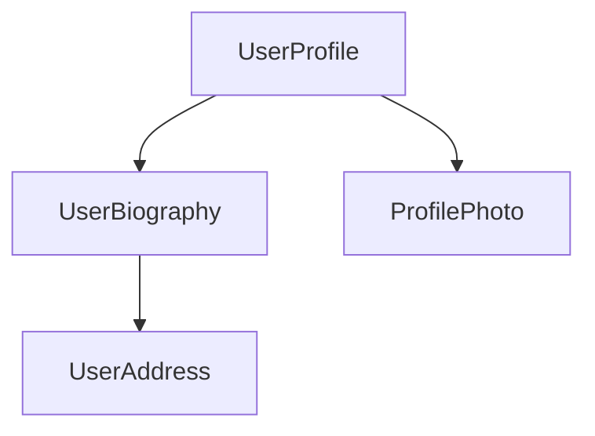
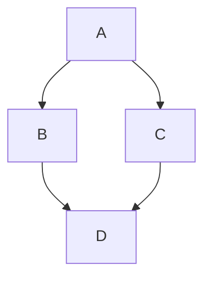
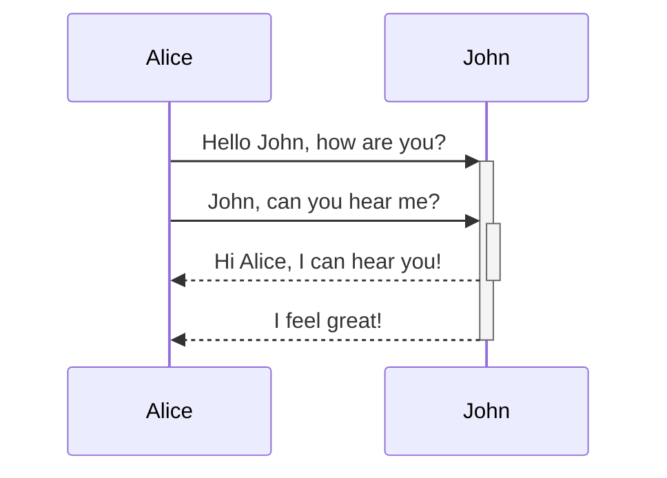
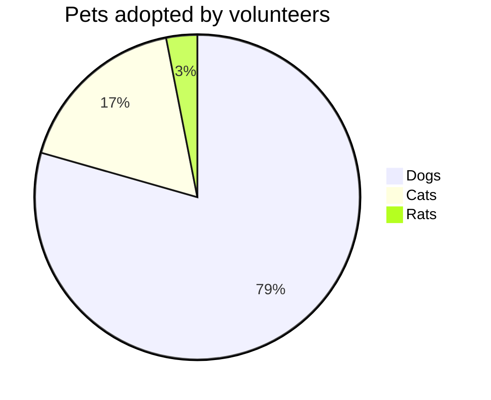
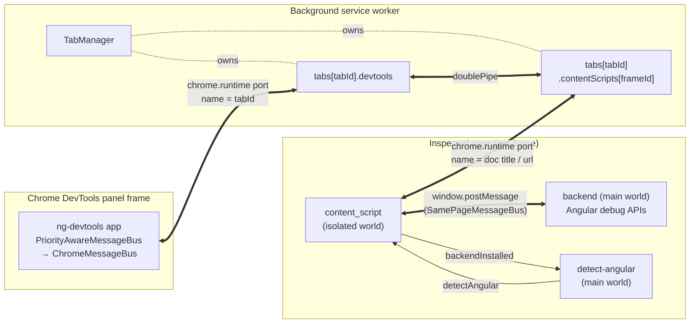
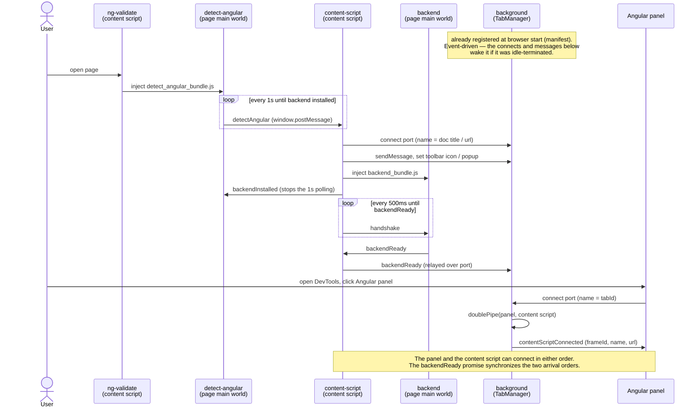
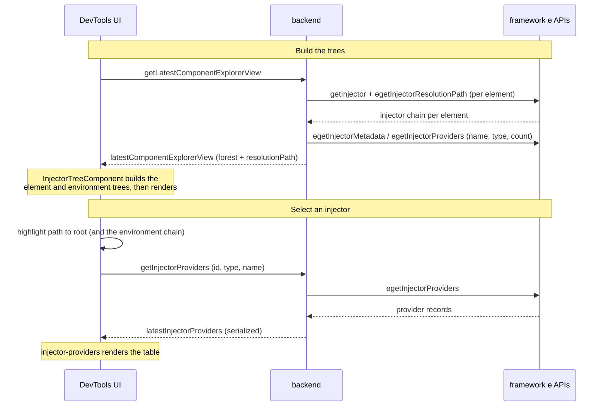
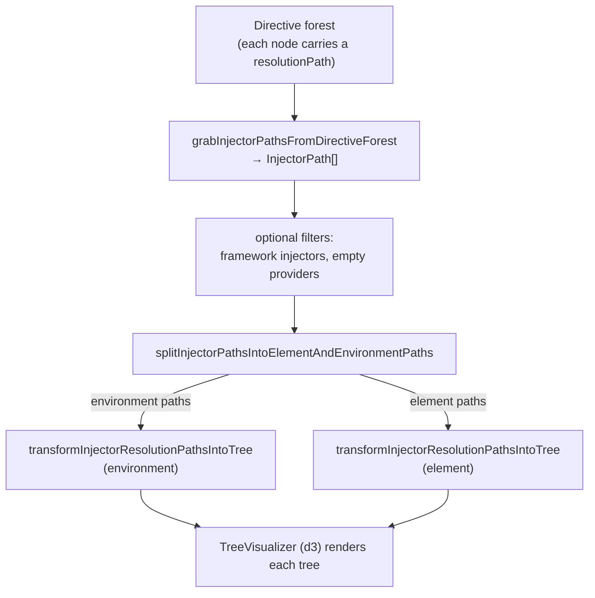

<a id="doc-0e34571c2531868072798903"></a>

# angular/angular / adev/src/content/guide/image-optimization.md

Upstream: https://github.com/angular/angular/blob/3f9191166936166085320652eef1a562504aa3e4/adev/src/content/guide/image-optimization.md

Commit: `3f9191166936166085320652eef1a562504aa3e4`

Retrieved: 2026-10-01T15:14:46.451465+00:00

Kind: official-document

Raw SHA256: `055d20915424de22a62ebc489203c2253cb8bde0bc02fa4129b583148359ab88`

Source text below is untrusted reference content. Acquisition does not verify technical claims.

License status: UPSTREAM_NOTICES_CAPTURED_PER_FILE_REVIEW_REQUIRED. See this repository's captured license files.

---

# Getting started with NgOptimizedImage

The `NgOptimizedImage` directive makes it easy to adopt performance best practices for loading images.

The directive ensures that the loading of the [Largest Contentful Paint (LCP)](https://web.dev/lcp) image is prioritized by:

- Automatically setting the `fetchpriority` attribute on the `` tag
- Lazy loading other images by default
- Automatically generating a preconnect link tag in the document head
- Automatically generating a `srcset` attribute
- Generating a [preload hint](https://developer.mozilla.org/docs/Web/HTML/Link_types/preload) if app is using SSR

In addition to optimizing the loading of the LCP image, `NgOptimizedImage` enforces a number of image best practices, such as:

- Using [image CDN URLs to apply image optimizations](https://web.dev/image-cdns/#how-image-cdns-use-urls-to-indicate-optimization-options)
- Preventing layout shift by requiring `width` and `height`
- Warning if `width` or `height` have been set incorrectly
- Warning if the image will be visually distorted when rendered

If you're using a background image in CSS, [start here](#how-to-migrate-your-background-image).

NOTE: Although the `NgOptimizedImage` directive was made a stable feature in Angular version 15, it has been backported and is available as a stable feature in versions 13.4.0 and 14.3.0 as well.

## Getting Started

<docs-workflow>
<docs-step title="Import `NgOptimizedImage` directive">
Import `NgOptimizedImage` directive from `@angular/common`:

```ts
import {NgOptimizedImage} from '@angular/common';
```

and include it into the `imports` array of a standalone component or an NgModule:

```ts
imports: [
  NgOptimizedImage,
  // ...
],
```

</docs-step>
<docs-step title="(Optional) Set up a Loader">
An image loader is not **required** in order to use NgOptimizedImage, but using one with an image CDN enables powerful performance features, including automatic `srcset`s for your images.

A brief guide for setting up a loader can be found in the [Configuring an Image Loader](#configuring-an-image-loader-for-ngoptimizedimage) section at the end of this page.
</docs-step>
<docs-step title="Enable the directive">
To activate the `NgOptimizedImage` directive, replace your image's `src` attribute with `ngSrc`.

```html

```

If you're using a [built-in third-party loader](#built-in-loaders), make sure to omit the base URL path from `src`, as that will be prepended automatically by the loader.
</docs-step>
<docs-step title="Mark images as `priority`">
Always mark the [LCP image](https://web.dev/lcp/#what-elements-are-considered) on your page as `priority` to prioritize its loading.

```html

```

Marking an image as `priority` applies the following optimizations:

- Sets `fetchpriority=high` (read more about priority hints [here](https://web.dev/priority-hints))
- Sets `loading=eager` (read more about native lazy loading [here](https://web.dev/browser-level-image-lazy-loading))
- Automatically generates a [preload link element](https://developer.mozilla.org/docs/Web/HTML/Link_types/preload) if [rendering on the server](guide/ssr).

Angular displays a warning during development if the LCP element is an image that does not have the `priority` attribute. A page’s LCP element can vary based on a number of factors - such as the dimensions of a user's screen, so a page may have multiple images that should be marked `priority`. See [CSS for Web Vitals](https://web.dev/css-web-vitals/#images-and-largest-contentful-paint-lcp) for more details.
</docs-step>
<docs-step title="Include Width and Height">
In order to prevent [image-related layout shifts](https://web.dev/css-web-vitals/#images-and-layout-shifts), NgOptimizedImage requires that you specify a height and width for your image, as follows:

```html

```

For **responsive images** (images which you've styled to grow and shrink relative to the viewport), the `width` and `height` attributes should be the intrinsic size of the image file. For responsive images it's also important to [set a value for `sizes`.](#responsive-images)

For **fixed size images**, the `width` and `height` attributes should reflect the desired rendered size of the image. The aspect ratio of these attributes should always match the intrinsic aspect ratio of the image.

NOTE: If you don't know the size of your images, consider using "fill mode" to inherit the size of the parent container, as described below.
</docs-step>
</docs-workflow>

## Using `fill` mode

In cases where you want to have an image fill a containing element, you can use the `fill` attribute. This is often useful when you want to achieve a "background image" behavior. It can also be helpful when you don't know the exact width and height of your image, but you do have a parent container with a known size that you'd like to fit your image into (see "object-fit" below).

When you add the `fill` attribute to your image, you do not need and should not include a `width` and `height`, as in this example:

```html

```

You can use the [object-fit](https://developer.mozilla.org/docs/Web/CSS/object-fit) CSS property to change how the image will fill its container. If you style your image with `object-fit: "contain"`, the image will maintain its aspect ratio and be "letterboxed" to fit the element. If you set `object-fit: "cover"`, the element will retain its aspect ratio, fully fill the element, and some content may be "cropped" off.

See visual examples of the above at the [MDN object-fit documentation.](https://developer.mozilla.org/docs/Web/CSS/object-fit)

You can also style your image with the [object-position property](https://developer.mozilla.org/docs/Web/CSS/object-position) to adjust its position within its containing element.

IMPORTANT: For the "fill" image to render properly, its parent element **must** be styled with `position: "relative"`, `position: "fixed"`, or `position: "absolute"`.

## How to migrate your background image

Here's a simple step-by-step process for migrating from `background-image` to `NgOptimizedImage`. For these steps, we'll refer to the element that has an image background as the "containing element":

1. Remove the `background-image` style from the containing element.
2. Ensure that the containing element has `position: "relative"`, `position: "fixed"`, or `position: "absolute"`.
3. Create a new image element as a child of the containing element, using `ngSrc` to enable the `NgOptimizedImage` directive.
4. Give that element the `fill` attribute. Do not include a `height` and `width`.
5. If you believe this image might be your [LCP element](https://web.dev/lcp/), add the `priority` attribute to the image element.

You can adjust how the background image fills the container as described in the [Using fill mode](#using-fill-mode) section.

## Using placeholders

### Automatic placeholders

NgOptimizedImage can display an automatic low-resolution placeholder for your image if you're using a CDN or image host that provides automatic image resizing. Take advantage of this feature by adding the `placeholder` attribute to your image:

```html

```

Adding this attribute automatically requests a second, smaller version of the image using your specified image loader. This small image will be applied as a `background-image` style with a CSS blur while your image loads. If no image loader is provided, no placeholder image can be generated and an error will be thrown.

The default size for generated placeholders is 30px wide. You can change this size by specifying a pixel value in the `IMAGE_CONFIG` provider, as seen below:

```ts
providers: [
  {
    provide: IMAGE_CONFIG,
    useValue: {
      placeholderResolution: 40
    }
  },
],
```

If you want sharp edges around your blurred placeholder, you can wrap your image in a containing `<div>` with the `overflow: hidden` style. As long as the `<div>` is the same size as the image (such as by using the `width: fit-content` style), the "fuzzy edges" of the placeholder will be hidden.

### Data URL placeholders

You can also specify a placeholder using a base64 [data URL](https://developer.mozilla.org/docs/Web/HTTP/Basics_of_HTTP/Data_URLs) without an image loader. The data url format is `data:image/[imagetype];[data]`, where `[imagetype]` is the image format, just as `png`, and `[data]` is a base64 encoding of the image. That encoding can be done using the command line or in JavaScript. For specific commands, see [the MDN documentation](https://developer.mozilla.org/docs/Web/HTTP/Basics_of_HTTP/Data_URLs#encoding_data_into_base64_format). An example of a data URL placeholder with truncated data is shown below:

```html

```

However, large data URLs increase the size of your Angular bundles and slow down page load. If you cannot use an image loader, the Angular team recommends keeping base64 placeholder images smaller than 4KB and using them exclusively on critical images. In addition to decreasing placeholder dimensions, consider changing image formats or parameters used when saving images. At very low resolutions, these parameters can have a large effect on file size.

### Non-blurred placeholders

By default, NgOptimizedImage applies a CSS blur effect to image placeholders. To render a placeholder without blur, provide a `placeholderConfig` argument with an object that includes the `blur` property, set to false. For example:

```html

```

## Adjusting image styling

Depending on the image's styling, adding `width` and `height` attributes may cause the image to render differently. `NgOptimizedImage` warns you if your image styling renders the image at a distorted aspect ratio.

You can typically fix this by adding `height: auto` or `width: auto` to your image styles. For more information, see the [web.dev article on the `` tag](https://web.dev/patterns/web-vitals-patterns/images/img-tag).

If the `width` and `height` attribute on the image are preventing you from sizing the image the way you want with CSS, consider using `fill` mode instead, and styling the image's parent element.

## Performance Features

NgOptimizedImage includes a number of features designed to improve loading performance in your app. These features are described in this section.

### Add resource hints

A [`preconnect` resource hint](https://web.dev/preconnect-and-dns-prefetch) for your image origin ensures that the LCP image loads as quickly as possible.

Preconnect links are automatically generated for domains provided as an argument to a [loader](#optional-set-up-a-loader). If an image origin cannot be automatically identified, and no preconnect link is detected for the LCP image, `NgOptimizedImage` will warn during development. In that case, you should manually add a resource hint to `index.html`. Within the `<head>` of the document, add a `link` tag with `rel="preconnect"`, as shown below:

```html
<link rel="preconnect" href="https://my.cdn.origin" />
```

To disable preconnect warnings, inject the `PRECONNECT_CHECK_BLOCKLIST` token:

```ts

providers: [
{provide: PRECONNECT_CHECK_BLOCKLIST, useValue: 'https://your-domain.com'}
],

```

See more information on automatic preconnect generation [here](#why-is-a-preconnect-element-not-being-generated-for-my-image-domain).

### Request images at the correct size with automatic `srcset`

Defining a [`srcset` attribute](https://developer.mozilla.org/docs/Web/API/HTMLImageElement/srcset) ensures that the browser requests an image at the right size for your user's viewport, so it doesn't waste time downloading an image that's too large. `NgOptimizedImage` generates an appropriate `srcset` for the image, based on the presence and value of the [`sizes` attribute](https://developer.mozilla.org/docs/Web/API/HTMLImageElement/sizes) on the image tag.

#### Fixed-size images

If your image should be "fixed" in size (i.e. the same size across devices, except for [pixel density](https://web.dev/codelab-density-descriptors/)), there is no need to set a `sizes` attribute. A `srcset` can be generated automatically from the image's width and height attributes with no further input required.

Example srcset generated:

```html

```

#### Responsive images

If your image should be responsive (i.e. grow and shrink according to viewport size), then you will need to define a [`sizes` attribute](https://developer.mozilla.org/docs/Web/API/HTMLImageElement/sizes) to generate the `srcset`.

If you haven't used `sizes` before, a good place to start is to set it based on viewport width. For example, if your CSS causes the image to fill 100% of viewport width, set `sizes` to `100vw` and the browser will select the image in the `srcset` that is closest to the viewport width (after accounting for pixel density). If your image is only likely to take up half the screen (ex: in a sidebar), set `sizes` to `50vw` to ensure the browser selects a smaller image. And so on.

If you find that the above does not cover your desired image behavior, see the documentation on [advanced sizes values](#advanced-sizes-values).

Note that `NgOptimizedImage` automatically prepends `"auto"` to the provided `sizes` value. This is an optimization that increases the accuracy of srcset selection on browsers which support `sizes="auto"`, and is ignored by browsers which do not.

By default, the responsive breakpoints are:

`[16, 32, 48, 64, 96, 128, 256, 384, 640, 750, 828, 1080, 1200, 1920, 2048, 3840]`

If you would like to customize these breakpoints, you can do so using the `IMAGE_CONFIG` provider:

```ts
providers: [
  {
    provide: IMAGE_CONFIG,
    useValue: {
      breakpoints: [16, 48, 96, 128, 384, 640, 750, 828, 1080, 1200, 1920]
    }
  },
],
```

If you would like to manually define a `srcset` attribute, you can provide your own using the `ngSrcset` attribute:

```html

```

If the `ngSrcset` attribute is present, `NgOptimizedImage` generates and sets the `srcset` based on the sizes included. Do not include image file names in `ngSrcset` - the directive infers this information from `ngSrc`. The directive supports both width descriptors (e.g. `100w`) and density descriptors (e.g. `1x`).

```html

```

### Disabling automatic srcset generation

To disable srcset generation for a single image, you can add the `disableOptimizedSrcset` attribute on the image:

```html

```

### Disabling image lazy loading

By default, `NgOptimizedImage` sets `loading=lazy` for all images that are not marked `priority`. You can disable this behavior for non-priority images by setting the `loading` attribute. This attribute accepts values: `eager`, `auto`, and `lazy`. [See the documentation for the standard image `loading` attribute for details](https://developer.mozilla.org/docs/Web/API/HTMLImageElement/loading#value).

```html

```

### Controlling image decoding

By default, `NgOptimizedImage` sets `decoding="auto"` for all images. This allows the browser to decide the optimal time to decode an image after it has been fetched. When an image is marked as `priority`, Angular automatically sets `decoding="sync"` to ensure the image is decoded and painted as early as possible helping improve **Largest Contentful Paint (LCP)** performance.

You can still override this behavior by explicitly setting the `decoding` attribute.  
[See the documentation for the standard image `decoding` attribute for details](https://developer.mozilla.org/docs/Web/HTML/Element/img#decoding).

```html
<!-- Default: decoding is 'auto' -->


<!-- Decode the image asynchronously to avoid blocking the main thread.-->


<!-- Priority images automatically use decoding="sync" -->


<!-- Decode immediately (can block) when you need the pixels right away -->

```

**Allowed values**

- `auto` (default): lets the browser choose the optimal strategy.
- `async`: decodes the image asynchronously, avoiding main‑thread blocking where possible.
- `sync`: decodes the image immediately; can block rendering but ensures pixels are ready as soon as the image is available.

### Advanced 'sizes' values

You may want to have images displayed at varying widths on differently-sized screens. A common example of this pattern is a grid- or column-based layout that renders a single column on mobile devices, and two columns on larger devices. You can capture this behavior in the `sizes` attribute, using a "media query" syntax, such as the following:

```html

```

The `sizes` attribute in the above example says "I expect this image to be 100 percent of the screen width on devices under 768px wide. Otherwise, I expect it to be 50 percent of the screen width.

For additional information about the `sizes` attribute, see [web.dev](https://web.dev/learn/design/responsive-images/#sizes) or [mdn](https://developer.mozilla.org/docs/Web/API/HTMLImageElement/sizes).

## Configuring an image loader for `NgOptimizedImage`

A "loader" is a function that generates an [image transformation URL](https://web.dev/image-cdns/#how-image-cdns-use-urls-to-indicate-optimization-options) for a given image file. When appropriate, `NgOptimizedImage` sets the size, format, and image quality transformations for an image.

`NgOptimizedImage` provides both a generic loader that applies no transformations, as well as loaders for various third-party image services. It also supports writing your own custom loader.

| Loader type                            | Behavior                                                                                                                                                                                                                       |
| :------------------------------------- | :----------------------------------------------------------------------------------------------------------------------------------------------------------------------------------------------------------------------------- |
| Generic loader                         | The URL returned by the generic loader will always match the value of `src`. In other words, this loader applies no transformations. Sites that use Angular to serve images are the primary intended use case for this loader. |
| Loaders for third-party image services | The URL returned by the loaders for third-party image services will follow API conventions used by that particular image service.                                                                                              |
| Custom loaders                         | A custom loader's behavior is defined by its developer. You should use a custom loader if your image service isn't supported by the loaders that come preconfigured with `NgOptimizedImage`.                                   |

Based on the image services commonly used with Angular applications, `NgOptimizedImage` provides loaders preconfigured to work with the following image services:

| Image Service             | Angular API               | Documentation                                                               |
| :------------------------ | :------------------------ | :-------------------------------------------------------------------------- |
| Cloudflare Image Resizing | `provideCloudflareLoader` | [Documentation](https://developers.cloudflare.com/images/image-resizing/)   |
| Cloudinary                | `provideCloudinaryLoader` | [Documentation](https://cloudinary.com/documentation/resizing_and_cropping) |
| ImageKit                  | `provideImageKitLoader`   | [Documentation](https://docs.imagekit.io/)                                  |
| Imgix                     | `provideImgixLoader`      | [Documentation](https://docs.imgix.com/)                                    |
| Netlify                   | `provideNetlifyLoader`    | [Documentation](https://docs.netlify.com/image-cdn/overview/)               |

To use the **generic loader** no additional code changes are necessary. This is the default behavior.

### Built-in Loaders

To use an existing loader for a **third-party image service**, add the provider factory for your chosen service to the `providers` array. In the example below, the Imgix loader is used:

```ts
providers: [
  provideImgixLoader('https://my.base.url/'),
],
```

The base URL for your image assets should be passed to the provider factory as an argument. For most sites, this base URL should match one of the following patterns:

- <https://yoursite.yourcdn.com>
- <https://subdomain.yoursite.com>
- <https://subdomain.yourcdn.com/yoursite>

You can learn more about the base URL structure in the docs of a corresponding CDN provider.

### Custom Loaders

To use a **custom loader**, provide your loader function as a value for the `IMAGE_LOADER` DI token. In the example below, the custom loader function returns a URL starting with `https://example.com` that includes `src`, `width`, and `height` as URL parameters.

```ts
providers: [
  {
    provide: IMAGE_LOADER,
    useValue: (config: ImageLoaderConfig) => {
      return `https://example.com/images?src=${config.src}&width=${config.width}&height=${config.height}`;
    },
  },
],
```

A loader function for the `NgOptimizedImage` directive takes an object with the `ImageLoaderConfig` type (from `@angular/common`) as its argument and returns the absolute URL of the image asset. The `ImageLoaderConfig` object contains the `src` property, and optional `width`, `height`, and `loaderParams` properties.

NOTE: even though the `width` property may not always be present, a custom loader must use it to support requesting images at various widths in order for `ngSrcset` to work properly.

### The `loaderParams` Property

There is an additional attribute supported by the `NgOptimizedImage` directive, called `loaderParams`, which is specifically designed to support the use of custom loaders. The `loaderParams` attribute takes an object with any properties as a value, and does not do anything on its own. The data in `loaderParams` is added to the `ImageLoaderConfig` object passed to your custom loader, and can be used to control the behavior of the loader.

A common use for `loaderParams` is controlling advanced image CDN features.

### Using the `transform` property with built-in loaders

The built-in loaders for Cloudinary, Cloudflare, ImageKit, and Imgix support a special `transform` property within `loaderParams`. This property allows you to apply custom image transformations provided by your CDN.

The `transform` property accepts two formats:

#### String format

Provide transformations as a comma-separated string using your CDN's transformation syntax:

```html

```

#### Object format

Provide transformations as an object with key-value pairs.

```html

```

NOTE: The `transform` property is not supported by the Netlify loader, as Netlify's image CDN does not provide custom transformation parameters.

### Example custom loader

The following shows an example of a custom loader function. This example function concatenates `src`, `width`, and `height`, and uses `loaderParams` to control a custom CDN feature for rounded corners:

```ts
const myCustomLoader = (config: ImageLoaderConfig) => {
  let url = `https://example.com/images/${config.src}?`;
  let queryParams = [];
  if (config.width) {
    queryParams.push(`w=${config.width}`);
  }
  if (config.height) {
    queryParams.push(`h=${config.height}`);
  }
  if (config.loaderParams?.roundedCorners) {
    queryParams.push('mask=corners&corner-radius=5');
  }
  return url + queryParams.join('&');
};
```

Note that in the above example, we've invented the 'roundedCorners' property name to control a feature of our custom loader. We could then use this feature when creating an image, as follows:

```html

```

## Frequently Asked Questions

### Does NgOptimizedImage support the `background-image` css property?

The NgOptimizedImage does not directly support the `background-image` css property, but it is designed to easily accommodate the use case of having an image as the background of another element.

For a step-by-step process for migration from `background-image` to `NgOptimizedImage`, see the [How to migrate your background image](#how-to-migrate-your-background-image) section above.

### Why can't I use `src` with `NgOptimizedImage`?

The `ngSrc` attribute was chosen as the trigger for NgOptimizedImage due to technical considerations around how images are loaded by the browser. NgOptimizedImage makes programmatic changes to the `loading` attribute -- if the browser sees the `src` attribute before those changes are made, it will begin eagerly downloading the image file, and the loading changes will be ignored.

### Why is a preconnect element not being generated for my image domain?

Preconnect generation is performed based on static analysis of your application. That means that the image domain must be directly included in the loader parameter, as in the following example:

```ts
providers: [
  provideImgixLoader('https://my.base.url/'),
],
```

If you use a variable to pass the domain string to the loader, or you're not using a loader, the static analysis will not be able to identify the domain, and no preconnect link will be generated. In this case you should manually add a preconnect link to the document head, as [described above](#add-resource-hints).

### Can I use two different image domains in the same page?

The [image loaders](#configuring-an-image-loader-for-ngoptimizedimage) provider pattern is designed to be as simple as possible for the common use case of having only a single image CDN used within a component. However, it's still very possible to manage multiple image CDNs using a single provider.

To do this, we recommend writing a [custom image loader](#custom-loaders) which uses the [`loaderParams` property](#the-loaderparams-property) to pass a flag that specifies which image CDN should be used, and then invokes the appropriate loader based on that flag.

### Can you add a new built-in loader for my preferred CDN?

For maintenance reasons, we don't currently plan to support additional built-in loaders in the Angular repository. Instead, we encourage developers to publish any additional image loaders as third-party packages.

### Can I use this with the `<picture>` tag

No, but this is on our roadmap, so stay tuned.

If you're waiting on this feature, please upvote the GitHub issue [here](https://github.com/angular/angular/issues/56594).

### How do I find my LCP image with Chrome DevTools?

1. Using the performance tab of the Chrome DevTools, click on the "start profiling and reload page" button on the top left. It looks like a page refresh icon.

2. This will trigger a profiling snapshot of your Angular application.

3. Once the profiling result is available, select "LCP" in the timings section.

4. A summary entry should appear in the panel at the bottom. You can find the LCP element in the row for "related node". Clicking on it will reveal the element in the Elements panel.


NOTE: This only identifies the LCP element within the viewport of the page you are testing. It is also recommended to use mobile emulation to identify the LCP element for smaller screens.


<a id="doc-b0158133d9cd3a909b0dec5c"></a>

# angular/angular / adev/src/content/guide/incremental-hydration.md

Upstream: https://github.com/angular/angular/blob/3f9191166936166085320652eef1a562504aa3e4/adev/src/content/guide/incremental-hydration.md

Commit: `3f9191166936166085320652eef1a562504aa3e4`

Retrieved: 2026-10-01T15:14:46.451465+00:00

Kind: official-document

Raw SHA256: `abd027b2b9b1fd43497cffe947fe85fd187850b82832070d69a1f95f9dfa04ca`

Source text below is untrusted reference content. Acquisition does not verify technical claims.

License status: UPSTREAM_NOTICES_CAPTURED_PER_FILE_REVIEW_REQUIRED. See this repository's captured license files.

---

# Incremental Hydration

**Incremental hydration** is an advanced type of [hydration](guide/hydration) that can leave sections of your application dehydrated and _incrementally_ trigger hydration of those sections as they are needed.

## Why use incremental hydration?

Incremental hydration is a performance improvement that builds on top of full application hydration. It can produce smaller initial bundles while still providing an end-user experience that is comparable to a full application hydration experience. Smaller bundles improve initial load times, reducing [First Input Delay (FID)](https://web.dev/fid) and [Cumulative Layout Shift (CLS)](https://web.dev/cls).

Incremental hydration also lets you use deferrable views (`@defer`) for content that may not have been deferrable before. Specifically, you can now use deferrable views for content that is above the fold. Prior to incremental hydration, putting a `@defer` block above the fold would result in placeholder content rendering and then being replaced by the `@defer` block's main template content. This would result in a layout shift. Incremental hydration means the main template of the `@defer` block will render with no layout shift on hydration.

## How do you enable incremental hydration in Angular?

You can enable incremental hydration for applications that already use server-side rendering (SSR) with hydration. Follow the [Angular SSR Guide](guide/ssr) to enable server-side rendering and the [Angular Hydration Guide](guide/hydration) to enable hydration first.

Incremental hydration is enabled by default when you use `provideClientHydration()`.

```ts
import {bootstrapApplication, provideClientHydration} from '@angular/platform-browser';

bootstrapApplication(App, {
  providers: [provideClientHydration()],
});
```

NOTE: Incremental Hydration depends on and enables [event replay](guide/hydration#capturing-and-replaying-events) automatically. If you already have `withEventReplay()` in your list, you can safely remove it.

To opt out of incremental hydration, use `withNoIncrementalHydration()`:

```ts
import {
  bootstrapApplication,
  provideClientHydration,
  withNoIncrementalHydration,
} from '@angular/platform-browser';

bootstrapApplication(App, {
  providers: [provideClientHydration(withNoIncrementalHydration())],
});
```

## How does incremental hydration work?

Incremental hydration builds on top of full-application [hydration](guide/hydration), [deferrable views](/guide/templates/defer), and [event replay](guide/hydration#capturing-and-replaying-events). With incremental hydration, you can add additional triggers to `@defer` blocks that define incremental hydration boundaries. Adding a `hydrate` trigger to a defer block tells Angular that it should load that defer block's dependencies during server-side rendering and render the main template rather than the `@placeholder`. When client-side rendering, the dependencies are still deferred, and the defer block content stays dehydrated until its `hydrate` trigger fires. That trigger tells the defer block to fetch its dependencies and hydrate the content. Any browser events, specifically those that match listeners registered in your component, that are triggered by the user prior to hydration are queued up and replayed once the hydration process is complete.

## Controlling hydration of content with triggers

You can specify **hydrate triggers** that control when Angular loads and hydrates deferred content. These are additional triggers that can be used alongside regular `@defer` triggers.

Each `@defer` block may have multiple hydrate event triggers, separated with a semicolon (`;`). Angular triggers hydration when _any_ of the triggers fire.

There are three types of hydrate triggers: `hydrate on`, `hydrate when`, and `hydrate never`.

### `hydrate on`

`hydrate on` specifies a condition for when hydration is triggered for the `@defer` block.

The available triggers are as follows:

| Trigger                                             | Description                                                            |
| --------------------------------------------------- | ---------------------------------------------------------------------- |
| [`hydrate on idle`](#hydrate-on-idle)               | Triggers when the browser is idle. Supports an optional timeout.       |
| [`hydrate on viewport`](#hydrate-on-viewport)       | Triggers when specified content enters the viewport                    |
| [`hydrate on interaction`](#hydrate-on-interaction) | Triggers when the user interacts with specified element                |
| [`hydrate on hover`](#hydrate-on-hover)             | Triggers when the mouse hovers over specified area                     |
| [`hydrate on immediate`](#hydrate-on-immediate)     | Triggers immediately after non-deferred content has finished rendering |
| [`hydrate on timer`](#hydrate-on-timer)             | Triggers after a specific duration                                     |

#### `hydrate on idle`

The `hydrate on idle` trigger loads the deferrable view's dependencies and hydrates the content once the browser has reached an idle state, based on `requestIdleCallback`.

You can optionally specify a timeout in milliseconds that is passed to [`requestIdleCallback`](https://developer.mozilla.org/docs/Web/API/Window/requestIdleCallback). If the browser doesn't schedule the callback soon enough, the work will run no later than the specified timeout.

```angular-html
@defer (hydrate on idle) {
  <large-cmp />
} @placeholder {
  <div>Large component placeholder</div>
}

<!-- With a 500ms timeout -->
@defer (hydrate on idle(500)) {
  <large-cmp />
}
```

#### `hydrate on viewport`

The `hydrate on viewport` trigger loads the deferrable view's dependencies and hydrates the corresponding page of the app when the specified content enters the viewport using the
[Intersection Observer API](https://developer.mozilla.org/docs/Web/API/Intersection_Observer_API).

```angular-html
@defer (hydrate on viewport) {
  <large-cmp />
} @placeholder {
  <div>Large component placeholder</div>
}
```

#### `hydrate on interaction`

The `hydrate on interaction` trigger loads the deferrable view's dependencies and hydrates the content when the user interacts with the specified element through
`click` or `keydown` events.

```angular-html
@defer (hydrate on interaction) {
  <large-cmp />
} @placeholder {
  <div>Large component placeholder</div>
}
```

#### `hydrate on hover`

The `hydrate on hover` trigger loads the deferrable view's dependencies and hydrates the content when the mouse has hovered over the triggered area through the
`mouseover` and `focusin` events.

```angular-html
@defer (hydrate on hover) {
  <large-cmp />
} @placeholder {
  <div>Large component placeholder</div>
}
```

#### `hydrate on immediate`

The `hydrate on immediate` trigger loads the deferrable view's dependencies and hydrates the content immediately. This means that the deferred block loads as soon
as all other non-deferred content has finished rendering.

```angular-html
@defer (hydrate on immediate) {
  <large-cmp />
} @placeholder {
  <div>Large component placeholder</div>
}
```

#### `hydrate on timer`

The `hydrate on timer` trigger loads the deferrable view's dependencies and hydrates the content after a specified duration.

```angular-html
@defer (hydrate on timer(500ms)) {
  <large-cmp />
} @placeholder {
  <div>Large component placeholder</div>
}
```

The duration parameter must be specified in milliseconds (`ms`) or seconds (`s`).

### `hydrate when`

The `hydrate when` trigger accepts a custom conditional expression and loads the deferrable view's dependencies and hydrates the content when the
condition becomes truthy.

```angular-html
@defer (hydrate when condition) {
  <large-cmp />
} @placeholder {
  <div>Large component placeholder</div>
}
```

NOTE: `hydrate when` conditions only trigger when they are the top-most dehydrated `@defer` block. The condition provided for the trigger is
specified in the parent component, which needs to exist before it can be triggered. If the parent block is dehydrated, that expression will not yet
be resolvable by Angular.

### `hydrate never`

The `hydrate never` allows users to specify that the content in the defer block should remain dehydrated indefinitely, effectively becoming static
content. Note that this applies to the initial render only. During a subsequent client-side render, a `@defer` block with `hydrate never` would
still fetch dependencies, as hydration only applies to initial load of server-side rendered content. In the example below, subsequent client-side
renders would load the `@defer` block dependencies on viewport.

```angular-html
@defer (on viewport; hydrate never) {
  <large-cmp />
} @placeholder {
  <div>Large component placeholder</div>
}
```

NOTE: Using `hydrate never` prevents hydration of the entire nested subtree of a given `@defer` block. No other `hydrate` triggers fire for content nested underneath that block.

## Hydrate triggers alongside regular triggers

Hydrate triggers are additional triggers that are used alongside regular triggers on a `@defer` block. Hydration is an initial load optimization, and that means hydrate triggers only apply to that initial load. Any subsequent client side render will still use the regular trigger.

```angular-html
@defer (on idle; hydrate on interaction) {
  <example-cmp />
} @placeholder {
  <div>Example Placeholder</div>
}
```

In this example, on the initial load, the `hydrate on interaction` applies. Hydration will be triggered on interaction with the `<example-cmp />` component. On any subsequent page load that is client-side rendered, for example when a user clicks a routerLink that loads a page with this component, the `on idle` will apply.

## How does incremental hydration work with nested `@defer` blocks?

Angular's component and dependency system is hierarchical, which means hydrating any component requires all of its parents also be hydrated. So if hydration is triggered for a child `@defer` block of a nested set of dehydrated `@defer` blocks, hydration is triggered from the top-most dehydrated `@defer` block down to the triggered child and fire in that order.

```angular-html
@defer (hydrate on interaction) {
  <parent-block-cmp />
  @defer (hydrate on hover) {
    <child-block-cmp />
  } @placeholder {
    <div>Child placeholder</div>
  }
} @placeholder {
  <div>Parent Placeholder</div>
}
```

In the above example, hovering over the nested `@defer` block triggers hydration. The parent `@defer` block with the `<parent-block-cmp />` hydrates first, then the child `@defer` block with `<child-block-cmp />` hydrates after.

## Constraints

Incremental hydration has the same constraints as full-application hydration, including limits on direct DOM manipulation and requiring valid HTML structure. Visit the [Hydration guide constraints](guide/hydration#constraints) section for more details.

## Do I still need to specify `@placeholder` blocks?

Yes. `@placeholder` block content is not used for incremental hydration, but a `@placeholder` is still necessary for subsequent client-side rendering cases. If your content was not on the route that was part of the initial load, then any navigation to the route that has your `@defer` block content renders like a regular `@defer` block. So the `@placeholder` is rendered in those client-side rendering cases.


<a id="doc-c10fe3e1d0353a54103343d0"></a>

# angular/angular / adev/src/content/guide/ngmodules/overview.md

Upstream: https://github.com/angular/angular/blob/3f9191166936166085320652eef1a562504aa3e4/adev/src/content/guide/ngmodules/overview.md

Commit: `3f9191166936166085320652eef1a562504aa3e4`

Retrieved: 2026-10-01T15:14:46.451465+00:00

Kind: official-document

Raw SHA256: `4245af37fce22824ec17b224ea44f1d049d8340e0bd53e78101ce3031e909f8a`

Source text below is untrusted reference content. Acquisition does not verify technical claims.

License status: UPSTREAM_NOTICES_CAPTURED_PER_FILE_REVIEW_REQUIRED. See this repository's captured license files.

---

# NgModules

IMPORTANT: The Angular team recommends using [standalone components](guide/components) instead of `NgModule` for all new code. Use this guide to understand existing code built with `@NgModule`.

An NgModule is a class marked by the `@NgModule` decorator. This decorator accepts _metadata_ that tells Angular how to compile component templates and configure dependency injection.

```typescript
import {NgModule} from '@angular/core';

@NgModule({
  // Metadata goes here
})
export class CustomMenuModule {}
```

An NgModule has two main responsibilities:

- Declaring components, directives, and pipes that belong to the NgModule
- Add providers to the injector for components, directives, and pipes that import the NgModule

## Declarations

The `declarations` property of the `@NgModule` metadata declares the components, directives, and pipes that belong to the NgModule.

```typescript
@NgModule({
  /* ... */
  // CustomMenu and CustomMenuItem are components.
  declarations: [CustomMenu, CustomMenuItem],
})
export class CustomMenuModule {}
```

In the example above, the components `CustomMenu` and `CustomMenuItem` belong to `CustomMenuModule`.

The `declarations` property additionally accepts _arrays_ of components, directives, and pipes. These arrays, in turn, may also contain other arrays.

```typescript
const MENU_COMPONENTS = [CustomMenu, CustomMenuItem];
const WIDGETS = [MENU_COMPONENTS, CustomSlider];

@NgModule({
  /* ... */
  // This NgModule declares all of CustomMenu, CustomMenuItem,
  // CustomSlider, and CustomCheckbox.
  declarations: [WIDGETS, CustomCheckbox],
})
export class CustomMenuModule {}
```

If Angular discovers any components, directives, or pipes declared in more than one NgModule, it reports an error.

Any components, directives, or pipes must be explicitly marked as `standalone: false` in order to be declared in an NgModule.

```typescript
@Component({
  // Mark this component as `standalone: false` so that it can be declared in an NgModule.
  standalone: false,
  /* ... */
})
export class CustomMenu {
  /* ... */
}
```

### imports

Components declared in an NgModule may depend on other components, directives, and pipes. Add these dependencies to the `imports` property of the `@NgModule` metadata.

```typescript
@NgModule({
  /* ... */
  // CustomMenu and CustomMenuItem depend on the PopupTrigger and SelectorIndicator components.
  imports: [PopupTrigger, SelectionIndicator],
  declarations: [CustomMenu, CustomMenuItem],
})
export class CustomMenuModule {}
```

The `imports` array accepts other NgModules, as well as standalone components, directives, and pipes.

### exports

An NgModule can _export_ its declared components, directives, and pipes such that they're available to other components and NgModules.

```typescript
@NgModule({
  imports: [PopupTrigger, SelectionIndicator],
  declarations: [CustomMenu, CustomMenuItem],

  // Make CustomMenu and CustomMenuItem available to
  // components and NgModules that import CustomMenuModule.
  exports: [CustomMenu, CustomMenuItem],
})
export class CustomMenuModule {}
```

The `exports` property is not limited to declarations, however. An NgModule can also export any other components, directives, pipes, and NgModules that it imports.

```typescript
@NgModule({
  imports: [PopupTrigger, SelectionIndicator],
  declarations: [CustomMenu, CustomMenuItem],

  // Also make PopupTrigger available to any component or NgModule that imports CustomMenuModule.
  exports: [CustomMenu, CustomMenuItem, PopupTrigger],
})
export class CustomMenuModule {}
```

## `NgModule` providers

TIP: See the [Dependency Injection guide](guide/di) for information on dependency injection and providers.

An `NgModule` can specify `providers` for injected dependencies. These providers are available to:

- Any standalone component, directive, or pipe that imports the NgModule, and
- The `declarations` and `providers` of any _other_ NgModule that imports the NgModule.

```typescript
@NgModule({
  imports: [PopupTrigger, SelectionIndicator],
  declarations: [CustomMenu, CustomMenuItem],

  // Provide the OverlayManager service
  providers: [OverlayManager],
  /* ... */
})
export class CustomMenuModule {}

@NgModule({
  imports: [CustomMenuModule],
  declarations: [UserProfile],
  providers: [UserDataClient],
})
export class UserProfileModule {}
```

In the example above:

- The `CustomMenuModule` provides `OverlayManager`.
- The `CustomMenu` and `CustomMenuItem` components can inject `OverlayManager` because they're declared in `CustomMenuModule`.
- `UserProfile` can inject `OverlayManager` because its NgModule imports `CustomMenuModule`.
- `UserDataClient` can inject `OverlayManager` because its NgModule imports `CustomMenuModule`.

### The `forRoot` and `forChild` pattern

Some NgModules define a static `forRoot` method that accepts some configuration and returns an array of providers. The name "`forRoot`" is a convention that indicates that these providers are intended to be added exclusively to the _root_ of your application during bootstrap.

Any providers included in this way are eagerly loaded, increasing the JavaScript bundle size of your initial page load.

```typescript
bootstrapApplication(MyApplicationRoot, {
  providers: [CustomMenuModule.forRoot(/* some config */)],
});
```

Similarly, some NgModules may define a static `forChild` that indicates the providers are intended to be added to components within your application hierarchy.

```typescript
@Component({
  /* ... */
  providers: [CustomMenuModule.forChild(/* some config */)],
})
export class UserProfile {
  /* ... */
}
```

## Bootstrapping an application

IMPORTANT: The Angular team recommends using [bootstrapApplication](api/platform-browser/bootstrapApplication) instead of `bootstrapModule` for all new code. Use this guide to understand existing applications bootstrapped with `@NgModule`.

The `@NgModule` decorator accepts an optional `bootstrap` array that may contain one or more components.

You can use the [`bootstrapModule`](/api/core/PlatformRef#bootstrapModule) method from either [`platformBrowser`](api/platform-browser/platformBrowser) or [`platformServer`](api/platform-server/platformServer) to start an Angular application. When run, this function locates any elements on the page with a CSS selector that matches the listed component(s) and renders those components on the page.

```typescript
import {platformBrowser} from '@angular/platform-browser';

@NgModule({
  bootstrap: [MyApplication],
})
export class MyApplicationModule {}

platformBrowser().bootstrapModule(MyApplicationModule);
```

Components listed in `bootstrap` are automatically included in the NgModule's declarations.

When you bootstrap an application from an NgModule, the collected `providers` of this module and all of the `providers` of its `imports` are eagerly loaded and available to inject for the entire application.


<a id="doc-8f1ea77b89c298e67d2fbd5f"></a>

# angular/angular / adev/src/content/guide/performance/overview.md

Upstream: https://github.com/angular/angular/blob/3f9191166936166085320652eef1a562504aa3e4/adev/src/content/guide/performance/overview.md

Commit: `3f9191166936166085320652eef1a562504aa3e4`

Retrieved: 2026-10-01T15:14:46.451465+00:00

Kind: official-document

Raw SHA256: `0269abedc056e718cee859c49f7a3ea8cab4d6375bdd8492de1d782e6d0f9c07`

Source text below is untrusted reference content. Acquisition does not verify technical claims.

License status: UPSTREAM_NOTICES_CAPTURED_PER_FILE_REVIEW_REQUIRED. See this repository's captured license files.

---

<docs-decorative-header title="Server-side & hybrid rendering" imgSrc="adev/src/assets/images/overview.svg"> <!-- markdownlint-disable-line -->
Learn about different ways you can optimize the performance of your application with different rendering strategies.
</docs-decorative-header>

One of the top priorities of any developer is ensuring that their application is as performant as possible. These guides are here to help you follow best practices for building performant applications by taking advantage of different rendering strategies.

| Guides Types                                          | Description                                                                                                                                                                             |
| :---------------------------------------------------- | :-------------------------------------------------------------------------------------------------------------------------------------------------------------------------------------- |
| [Server and hybrid rendering](/guide/ssr)             | Learn how to leverage rendering pages on the server to improve load times.                                                                                                              |
| [Hydration](/guide/hydration)                         | A process to improve application performance by restoring its state after server-side rendering and reusing existing DOM structure as much as possible.                                 |
| [Incremental Hydration](/guide/incremental-hydration) | Incremental hydration is an advanced type of hydration that can leave sections of your application dehydrated and incrementally trigger hydration of those sections as they are needed. |


<a id="doc-e3a5e2c90e9ba04313a45e30"></a>

# angular/angular / adev/src/content/guide/routing/common-router-tasks.md

Upstream: https://github.com/angular/angular/blob/3f9191166936166085320652eef1a562504aa3e4/adev/src/content/guide/routing/common-router-tasks.md

Commit: `3f9191166936166085320652eef1a562504aa3e4`

Retrieved: 2026-10-01T15:14:46.451465+00:00

Kind: official-document

Raw SHA256: `b325d2601dfeaf6eaadc9bd2c0949898f7ef0289b7b3eeccbd74b764805bc042`

Source text below is untrusted reference content. Acquisition does not verify technical claims.

License status: UPSTREAM_NOTICES_CAPTURED_PER_FILE_REVIEW_REQUIRED. See this repository's captured license files.

---

# Other common Routing Tasks

This guide covers some other common tasks associated with using Angular router in your application.

## Getting route information

Often, as a user navigates your application, you want to pass information from one component to another.
For example, consider an application that displays a shopping list of grocery items.
Each item in the list has a unique `id`.
To edit an item, users click an Edit button, which opens an `EditGroceryItem` component.
You want that component to retrieve the `id` for the grocery item so it can display the right information to the user.

Use a route to pass this type of information to your application components.
To do so, you use the `withComponentInputBinding` feature with `provideRouter` or the `bindToComponentInputs` option of `RouterModule.forRoot`.

To get information from a route:

<docs-workflow>

<docs-step title="Add `withComponentInputBinding`">

Add the `withComponentInputBinding` feature to the `provideRouter` method.

```ts
providers: [provideRouter(appRoutes, withComponentInputBinding())];
```

</docs-step>

<docs-step title="Add an `input` to the component">

Update the component to have an `input()` property matching the name of the parameter.

```ts
id = input.required<string>();
hero = computed(() => this.service.getHero(id()));
```

</docs-step>
<docs-step title="Optional: Use a default value">
The router assigns values to all inputs based on the current route when `withComponentInputBinding` is enabled.
The router assigns `undefined` if no route data matches the input key, such as when an optional query parameter is missing.
You should include `undefined` in the `input`'s type when there's a possibility that an input might not be matched by the route.

Provide a default value by either using the `transform` option on the input or managing a local state with a `linkedSignal`.

```ts
id = input.required({
  transform: (maybeUndefined: string | undefined) => maybeUndefined ?? '0',
});
// or
id = input<string | undefined>();
internalId = linkedSignal(() => this.id() ?? getDefaultId());
```

</docs-step>
</docs-workflow>

NOTE: You can bind all route data with key-value pairs to component inputs: route resources, static or resolved route data, path parameters, matrix parameters, and query parameters.

### Input binding priority

When multiple route sources define identical keys, the router resolves collisions in the following priority order (from highest to lowest):

1. **Route resources**: Values defined in the route's `resources` map. Blocking resources bind their unwrapped value (`resource.value()`), while non-blocking resources bind the `Resource` instance.
2. **Route data and resolvers**: Static data defined in `data` or values resolved via `resolve`.
3. **Path parameters and matrix parameters**: Parameters from the URL path (such as `:id`) and matrix parameters.
4. **Query parameters**: Parameters from the query string (such as `?id=123`).

For example, if a route has both a path parameter `:id` and a query parameter `?id=...`, the path parameter value is bound to the component's `id` input. If the route also defines a resource named `id`, the resource value takes precedence over both.

### Disable query parameter binding

Use `ComponentInputBindingOptions` to disable query parameter binding if you manage query parameters separately:

```ts
provideRouter(appRoutes, withComponentInputBinding({queryParams: false}));
```

### Configure behavior for inputs not available in router data

By default, the router sets an input to `undefined` if it was not available in the router data during a navigation. This ensures that stale data is not retained.

If you want to avoid setting `undefined` for inputs that have _never_ been available in the router data for the active component instance, you can set the `unmatchedInputBehavior` option to `'undefinedIfStale'`:

```ts
provideRouter(appRoutes, withComponentInputBinding({unmatchedInputBehavior: 'undefinedIfStale'}));
```

When you combine `unmatchedInputBehavior: 'undefinedIfStale'` with `queryParams: false`, inputs retain their initial values unless they are explicitly provided by the router. The exception is matrix parameters: if a matrix parameter is provided in one navigation and removed in a subsequent one, the router will set the input to `undefined` to avoid retaining stale data.

```ts
provideRouter(
  appRoutes,
  withComponentInputBinding({
    queryParams: false,
    unmatchedInputBehavior: 'undefinedIfStale',
  }),
);
```

### Inherit parent route data

By default, child routes inherit parameters and data from parent routes (equivalent to `paramsInheritanceStrategy: 'always'`). This means you can access parent route info directly in child components.

If you need to restore the legacy behavior where parameters were only inherited from empty path routes, you can set `paramsInheritanceStrategy` to `'emptyOnly'`:

```ts
provideRouter(routes, withRouterConfig({paramsInheritanceStrategy: 'emptyOnly'}));
```

See [router configuration options](guide/routing/customizing-route-behavior#router-configuration-options) for details on other available settings.

## Displaying a 404 page

To display a 404 page, set up a [wildcard route](guide/routing/define-routes#wildcards) with the `component` property set to the component you'd like to use for your 404 page as follows:

```ts
const routes: Routes = [
  {path: 'first-component', component: First},
  {path: 'second-component', component: Second},
  {path: '**', component: PageNotFound}, // Wildcard route for a 404 page
];
```

The last route with the `path` of `**` is a wildcard route.
The router selects this route if the requested URL doesn't match any of the paths earlier in the list and sends the user to the `PageNotFound`.

## Link parameters array

A link parameters array holds the following ingredients for router navigation:

- The path of the route to the destination component
- Required and optional route parameters that go into the route URL

Bind the `RouterLink` directive to such an array like this:

```angular-html
<a [routerLink]="['/heroes']">Heroes</a>
```

The following is a two-element array when specifying a route parameter:

```angular-html
<a [routerLink]="['/hero', hero.id]">
  <span class="badge">{{ hero.id }}</span
  >{{ hero.name }}
</a>
```

Provide optional route parameters in an object, as in `{ foo: 'foo' }`:

```angular-html
<a [routerLink]="['/crisis-center', {foo: 'foo'}]">Crisis Center</a>
```

This syntax passes matrix parameters, which are optional parameters associated with a specific URL segment. Learn more about [matrix parameters](/guide/routing/read-route-state#matrix-parameters).

These three examples cover the needs of an application with one level of routing.
However, with a child router, such as in the crisis center, you create new link array possibilities.

The following minimal `RouterLink` example builds upon a specified default child route for the crisis center.

```angular-html
<a [routerLink]="['/crisis-center']">Crisis Center</a>
```

Review the following:

- The first item in the array identifies the parent route \(`/crisis-center`\)
- There are no parameters for this parent route
- There is no default for the child route so you need to pick one
- You're navigating to the `CrisisList`, whose route path is `/`, but you don't need to explicitly add the slash

Consider the following router link that navigates from the root of the application down to the Dragon Crisis:

```angular-html
<a [routerLink]="['/crisis-center', 1]">Dragon Crisis</a>
```

- The first item in the array identifies the parent route \(`/crisis-center`\)
- There are no parameters for this parent route
- The second item identifies the child route details about a particular crisis \(`/:id`\)
- The details child route requires an `id` route parameter
- You added the `id` of the Dragon Crisis as the second item in the array \(`1`\)
- The resulting path is `/crisis-center/1`

You could also redefine the `App` template with Crisis Center routes exclusively:

```angular-ts
@Component({
  template: `
    <h1 class="title">Angular Router</h1>
    <nav>
      <a [routerLink]="['/crisis-center']">Crisis Center</a>
      <a [routerLink]="['/crisis-center/1', {foo: 'foo'}]">Dragon Crisis</a>
      <a [routerLink]="['/crisis-center/2']">Shark Crisis</a>
    </nav>
    <router-outlet />
  `,
})
export class App {}
```

In summary, you can write applications with one, two or more levels of routing.
The link parameters array affords the flexibility to represent any routing depth and any legal sequence of route paths, \(required\) router parameters, and \(optional\) route parameter objects.

## `LocationStrategy` and browser URL styles

When the router navigates to a new component view, it updates the browser's location and history with a URL for that view.

Modern HTML5 browsers support [history.pushState](https://developer.mozilla.org/docs/Web/API/History_API/Working_with_the_History_API#adding_and_modifying_history_entries 'HTML5 browser history push-state'), a technique that changes a browser's location and history without triggering a server page request.
The router can compose a "natural" URL that is indistinguishable from one that would otherwise require a page load.

Here's the Crisis Center URL in this "HTML5 pushState" style:

```text
localhost:3002/crisis-center
```

Older browsers send page requests to the server when the location URL changes unless the change occurs after a "#" \(called the "hash"\).
Routers can take advantage of this exception by composing in-application route URLs with hashes.
Here's a "hash URL" that routes to the Crisis Center.

```text
localhost:3002/src/#/crisis-center
```

The router supports both styles with two `LocationStrategy` providers:

| Providers              | Details                              |
| :--------------------- | :----------------------------------- |
| `PathLocationStrategy` | The default "HTML5 pushState" style. |
| `HashLocationStrategy` | The "hash URL" style.                |

The `RouterModule.forRoot()` function sets the `LocationStrategy` to the `PathLocationStrategy`, which makes it the default strategy.
You also have the option of switching to the `HashLocationStrategy` with an override during the bootstrapping process.

HELPFUL: For more information on providers and the bootstrap process, see [Dependency Injection](guide/di/defining-dependency-providers).


<a id="doc-78ed8c1f6124aca3874434f4"></a>

# angular/angular / adev/src/content/guide/routing/customizing-route-behavior.md

Upstream: https://github.com/angular/angular/blob/3f9191166936166085320652eef1a562504aa3e4/adev/src/content/guide/routing/customizing-route-behavior.md

Commit: `3f9191166936166085320652eef1a562504aa3e4`

Retrieved: 2026-10-01T15:14:46.451465+00:00

Kind: official-document

Raw SHA256: `ab12d3c7ce867d535784154b43cf660bb6b401da073e957b705038d1fee20647`

Source text below is untrusted reference content. Acquisition does not verify technical claims.

License status: UPSTREAM_NOTICES_CAPTURED_PER_FILE_REVIEW_REQUIRED. See this repository's captured license files.

---

# Customizing route behavior

Angular Router provides powerful extension points that allow you to customize how routes behave in your application. While the default routing behavior works well for most applications, specific requirements often demand custom implementations for performance optimization, specialized URL handling, or complex routing logic.

Route customization can become valuable when your application needs:

- **Component state preservation** across navigations to avoid re-fetching data
- **Strategic lazy module loading** based on user behavior or network conditions
- **External URL integration** or handling Angular routes alongside legacy systems
- **Dynamic route matching** based on runtime conditions beyond simple path
  patterns

NOTE: Before implementing custom strategies, ensure the default router behavior doesn't meet your needs. Angular's default routing is optimized for common use cases and provides the best balance of performance and simplicity. Customizing route strategies can create additional code complexity and have performance implications on memory usage if not carefully managed.

## Router configuration options

The `withRouterConfig` or `RouterModule.forRoot` allows providing additional `RouterConfigOptions` to adjust the Router’s behavior.

### Handle canceled navigations

`canceledNavigationResolution` controls how the Router restores browser history when a navigation is canceled. The default value is `'replace'`, which reverts to the pre-navigation URL with `location.replaceState`. In practice, this means that any time the address bar has already been updated for the navigation, such as with the browser back or forward buttons, the history entry is overwritten with the "rollback" if the navigation fails or is rejected by a guard.
Switching to `'computed'` keeps the in-flight history index in sync with the Angular navigation, so canceling a back button navigation triggers a forward navigation (and vice versa) to return to the original page.

This setting is most helpful when your app uses `urlUpdateStrategy: 'eager'` or when guards frequently cancel popstate navigations initiated by the browser.

```ts
provideRouter(routes, withRouterConfig({canceledNavigationResolution: 'computed'}));
```

### React to same-URL navigations

`onSameUrlNavigation` configures what should happen when the user asks to navigate to the current URL. The default `'ignore'` skips work, while `'reload'` instructs the Router to process the URL in its navigation pipeline rather than skipping it. Guard and resolver reruns are governed by [`runGuardsAndResolvers`](api/router/RunGuardsAndResolvers), and component reuse is determined by the [route reuse strategy](#route-reuse-strategy).

This is useful when you want repeated clicks on a list filter, left-nav item, or refresh button to trigger new data retrieval even though the URL does not change.

```ts
provideRouter(routes, withRouterConfig({onSameUrlNavigation: 'reload'}));
```

You can also control this behavior on individual navigations rather than globally. This allows you to keep the default of `'ignore'` while selectively enabling reload behavior for specific use cases:

```ts
router.navigate(['/some-path'], {onSameUrlNavigation: 'reload'});
```

TIP: If you use [route resources](/guide/routing/data-fetching-with-resources#reloading-resources-without-renavigation), you can refresh data on-demand by calling `.reload()` on the resource or by updating signals read in `params`, without needing to configure `onSameUrlNavigation` or trigger a router navigation.

### Control parameter inheritance

`paramsInheritanceStrategy` defines how route parameters and data flow from parent routes.

By default (`'always'`), child routes automatically inherit parameters, route data, and resolved values from parent routes. This ensures matrix parameters, route data, and resolved values are available further down the route tree—handy when you share contextual identifiers across feature areas such as:

```text {hideCopy}
/org/:orgId/projects/:projectId/customers/:customerId
```

```ts
export const routes: Routes = [
  {
    path: 'org/:orgId',
    component: Organization,
    children: [
      {
        path: 'projects/:projectId',
        component: Project,
        children: [
          {
            path: 'customers/:customerId',
            component: Customer,
          },
        ],
      },
    ],
  },
];
```

```ts
@Component({/* ... */})
export class Customer {
  private route = inject(ActivatedRoute);

  // All parent parameters are available directly
  orgId = this.route.snapshot.params['orgId'];
  projectId = this.route.snapshot.params['projectId'];
  customerId = this.route.snapshot.params['customerId'];
}
```

To restore the legacy behavior, set `paramsInheritanceStrategy` to `'emptyOnly'`. With `'emptyOnly'`, child routes inherit params only when their path is empty or the parent does not declare a component:

```ts
provideRouter(routes, withRouterConfig({paramsInheritanceStrategy: 'emptyOnly'}));
```

In that case, the `Customer` component has to read the parent parameters from its ancestor routes:

```ts
@Component({/* ... */})
export class Customer {
  private route = inject(ActivatedRoute);

  orgId = this.route.parent?.parent?.snapshot.params['orgId'];
  projectId = this.route.parent?.snapshot.params['projectId'];
  customerId = this.route.snapshot.params['customerId'];
}
```

### Decide when the URL updates

`urlUpdateStrategy` determines when Angular writes to the browser address bar. The default `'deferred'` waits for a successful navigation before changing the URL. Use `'eager'` to update immediately when navigation starts. Eager updates make it easier to surface the attempted URL if navigation fails due to guards or errors, but can briefly show an in-progress URL if you have long-running guards.

Consider this when your analytics pipeline needs to see the attempted route even if guards block it.

```ts
provideRouter(routes, withRouterConfig({urlUpdateStrategy: 'eager'}));
```

### Choose default query parameter handling

`defaultQueryParamsHandling` sets the fallback behavior for `Router.createUrlTree` when the call does not specify `queryParamsHandling`. `'replace'` is the default and swaps out the existing query string. `'merge'` combines the provided values with the current ones, and `'preserve'` keeps the existing query parameters unless you explicitly supply new ones.

```ts
provideRouter(routes, withRouterConfig({defaultQueryParamsHandling: 'merge'}));
```

This is especially helpful for search and filter pages to automatically retain existing filters when additional parameters are provided.

### Configure trailing slash handling

By default, the `Location` service strips trailing slashes from URLs on read.

You can configure the `Location` service to force a trailing slash on all URLs written to the browser by providing the `TrailingSlashPathLocationStrategy` in your application.

```ts
import {LocationStrategy, TrailingSlashPathLocationStrategy} from '@angular/common';

bootstrapApplication(App, {
  providers: [{provide: LocationStrategy, useClass: TrailingSlashPathLocationStrategy}],
});
```

You can also force the `Location` service to never have a trailing slash on all URLs written to the browser by providing the `NoTrailingSlashPathLocationStrategy` in your application.

```ts
import {LocationStrategy, NoTrailingSlashPathLocationStrategy} from '@angular/common';

bootstrapApplication(App, {
  providers: [{provide: LocationStrategy, useClass: NoTrailingSlashPathLocationStrategy}],
});
```

These strategies only affect the URL written to the browser.
`Location.path()` and `Location.normalize()` will continue to strip trailing slashes when reading the URL.

Angular Router exposes four main areas for customization:

  <docs-pill-row>
    <docs-pill href="#route-reuse-strategy" title="Route reuse strategy"/>
    <docs-pill href="#preloading-strategy" title="Preloading strategy"/>
    <docs-pill href="#url-handling-strategy" title="URL handling strategy"/>
    <docs-pill href="#custom-route-matchers" title="Custom route matchers"/>
  </docs-pill-row>

## Route reuse strategy

Route reuse strategy controls whether Angular destroys and recreates components during navigation or preserves them for reuse. By default, Angular destroys component instances when navigating away from a route and creates new instances when navigating back.

### When to implement route reuse

Custom route reuse strategies benefit applications that need:

- **Form state preservation** - Keep partially completed forms when users navigate away and return
- **Expensive data retention** - Avoid re-fetching large datasets or complex calculations
- **Scroll position maintenance** - Preserve scroll positions in long lists or infinite scroll implementations
- **Tab-like interfaces** - Maintain component state when switching between tabs

### Creating a custom route reuse strategy

Angular's `RouteReuseStrategy` class allows you to customize navigation behavior through the concept of "detached route handles."

"Detached route handles" are Angular's way of storing component instances and their entire view hierarchy. When a route is detached, Angular preserves the component instance, its child components, and all associated state in memory. This preserved state can later be reattached when navigating back to the route.

The `RouteReuseStrategy` class provides the following methods that control the lifecycle of route components:

| Method                                                                         | Description                                                                                                 |
| ------------------------------------------------------------------------------ | ----------------------------------------------------------------------------------------------------------- |
| [`shouldDetach`](api/router/RouteReuseStrategy#shouldDetach)                   | Determines if a route should be stored for later reuse when navigating away                                 |
| [`store`](api/router/RouteReuseStrategy#store)                                 | Stores the detached route handle when `shouldDetach` returns true                                           |
| [`shouldAttach`](api/router/RouteReuseStrategy#shouldAttach)                   | Determines if a stored route should be reattached when navigating to it                                     |
| [`retrieve`](api/router/RouteReuseStrategy#retrieve)                           | Returns the previously stored route handle for reattachment                                                 |
| [`shouldReuseRoute`](api/router/RouteReuseStrategy#shouldReuseRoute)           | Determines if the router should reuse the current route instance instead of destroying it during navigation |
| [`shouldDestroyInjector`](api/router/RouteReuseStrategy#shouldDestroyInjector) | Determines if the router should destroy the injector of a detached route when it is no longer stored        |

The following example demonstrates a custom route reuse strategy that selectively preserves component state based on route metadata:

```ts
import {
  RouteReuseStrategy,
  Route,
  ActivatedRouteSnapshot,
  DetachedRouteHandle,
} from '@angular/router';
import {Injectable} from '@angular/core';

@Injectable()
export class CustomRouteReuseStrategy implements RouteReuseStrategy {
  private handlers = new Map<Route | null, DetachedRouteHandle>();

  shouldDetach(route: ActivatedRouteSnapshot): boolean {
    // Determines if a route should be stored for later reuse
    return route.data['reuse'] === true;
  }

  store(route: ActivatedRouteSnapshot, handle: DetachedRouteHandle | null): void {
    // Stores the detached route handle when shouldDetach returns true
    if (handle && route.data['reuse'] === true) {
      const key = this.getRouteKey(route);
      this.handlers.set(key, handle);
    }
  }

  shouldAttach(route: ActivatedRouteSnapshot): boolean {
    // Checks if a stored route should be reattached
    const key = this.getRouteKey(route);
    return route.data['reuse'] === true && this.handlers.has(key);
  }

  retrieve(route: ActivatedRouteSnapshot): DetachedRouteHandle | null {
    // Returns the stored route handle for reattachment
    const key = this.getRouteKey(route);
    return route.data['reuse'] === true ? (this.handlers.get(key) ?? null) : null;
  }

  shouldReuseRoute(future: ActivatedRouteSnapshot, curr: ActivatedRouteSnapshot): boolean {
    // Determines if the router should reuse the current route instance
    return future.routeConfig === curr.routeConfig;
  }

  private getRouteKey(route: ActivatedRouteSnapshot): Route | null {
    return route.routeConfig;
  }
}
```

### Manually destroying detached route handles

When implementing a custom `RouteReuseStrategy`, you may need to manually destroy a `DetachedRouteHandle` if you decide to discard it without reattaching it. For example, if your strategy has a cache size limit or expires handles after a certain time, you must ensure the component and its state are properly destroyed to avoid memory leaks.

Since `DetachedRouteHandle` is an opaque type, you cannot call a destroy method directly on it. Instead, use the `destroyDetachedRouteHandle` function provided by the Router.

```ts
import {destroyDetachedRouteHandle} from '@angular/router';

// ... inside your strategy
if (this.handles.size > MAX_CACHE_SIZE) {
  const handle = this.handles.get(oldestKey);
  if (handle) {
    destroyDetachedRouteHandle(handle);
    this.handles.delete(oldestKey);
  }
}
```

NOTE: Avoid using the route path as the key when `canMatch` guards are involved, as it may lead to duplicate entries.

### Automatic cleanup of unused route injectors

By default, Angular does not destroy the injectors of detached routes, even if they are no longer stored by the `RouteReuseStrategy`. This is primarily because this level of memory management is not commonly needed for most applications.

To enable automatic cleanup of unused route injectors, you can use the `withAutoCleanupInjectors` feature in your router configuration. This feature checks which routes are currently stored by the strategy after navigations and destroys the injectors of any detached routes that are not currently stored by the reuse strategy.

```ts
import {provideRouter, withAutoCleanupInjectors} from '@angular/router';

export const appConfig: ApplicationConfig = {
  providers: [provideRouter(routes, withAutoCleanupInjectors())],
};
```

If you do not provide a custom `RouteReuseStrategy` or your custom strategy extends `BaseRouteReuseStrategy`, injectors will now be destroyed when the route is inactive.

#### Cleanup with a custom `RouteReuseStrategy`

If your application uses a custom `RouteReuseStrategy` _and_ the strategy does not extend `BaseRouteReuseStrategy`, you must implement `shouldDestroyInjector` to tell the router which routes should have their injectors destroyed:

```ts
@Injectable()
export class CustomRouteReuseStrategy implements RouteReuseStrategy {
  // ... other methods

  shouldDestroyInjector(route: Route): boolean {
    return !route.data['retainInjector'];
  }
}
```

If your strategy ever stores a `DetachedRouteHandle`, you will also need to tell the Router about these so it does not destroy any injectors needed by that detached handle:

```ts
@Injectable()
export class CustomRouteReuseStrategy implements RouteReuseStrategy {
  private readonly handles = new Map<Route, DetachedRouteHandle>();

  store(route: ActivatedRouteSnapshot, handle: DetachedRouteHandle | null) {
    this.handles.set(route.routeConfig!, handle);
  }

  retrieveStoredRouteHandles(): DetachedRouteHandle[] {
    return Array.from(this.handles.values());
  }

  // ... other methods
}
```

### Configuring a route to use a custom route reuse strategy

Routes can opt into reuse behavior through route configuration metadata. This approach keeps the reuse logic separate from component code, making it easy to adjust behavior without modifying components:

```ts
export const routes: Routes = [
  {
    path: 'products',
    component: ProductList,
    data: {reuse: true}, // Component state persists across navigations
  },
  {
    path: 'products/:id',
    component: ProductDetail,
    // No reuse flag - component recreates on each navigation
  },
  {
    path: 'search',
    component: Search,
    data: {reuse: true}, // Preserves search results and filter state
  },
];
```

You can also configure a custom route reuse strategy at the application level through Angular's dependency injection system. In this case, Angular creates a single instance of the strategy that manages all route reuse decisions throughout the application:

```ts
export const appConfig: ApplicationConfig = {
  providers: [
    provideRouter(routes),
    {provide: RouteReuseStrategy, useClass: CustomRouteReuseStrategy},
  ],
};
```

## Preloading strategy

Preloading strategies determine when Angular loads lazy-loaded route modules in the background. While lazy loading improves initial load time by deferring module downloads, users still experience a delay when first navigating to a lazy route. Preloading strategies eliminate this delay by loading modules before users request them.

### Built-in preloading strategies

Angular provides two preloading strategies out of the box:

| Strategy                                            | Description                                                                                                      |
| --------------------------------------------------- | ---------------------------------------------------------------------------------------------------------------- |
| [`NoPreloading`](api/router/NoPreloading)           | The default strategy that disables all preloading. In other words, modules only load when users navigate to them |
| [`PreloadAllModules`](api/router/PreloadAllModules) | Loads all lazy-loaded modules immediately after the initial navigation                                           |

The `PreloadAllModules` strategy can be configured as follows:

```ts
import {ApplicationConfig} from '@angular/core';
import {provideRouter, withPreloading, PreloadAllModules} from '@angular/router';
import {routes} from './app.routes';

export const appConfig: ApplicationConfig = {
  providers: [provideRouter(routes, withPreloading(PreloadAllModules))],
};
```

The `PreloadAllModules` strategy works well for small to medium applications where downloading all modules doesn't significantly impact performance. However, larger applications with many feature modules might benefit from more selective preloading.

### Creating a custom preloading strategy

Custom preloading strategies implement the `PreloadingStrategy` interface, which requires a single `preload` method. This method receives the route configuration and a function that triggers the actual module load. The strategy returns an Observable that emits when preloading completes or an empty Observable to skip preloading:

```ts
import {Injectable} from '@angular/core';
import {PreloadingStrategy, Route} from '@angular/router';
import {Observable, of, timer} from 'rxjs';
import {mergeMap} from 'rxjs/operators';

@Injectable()
export class SelectivePreloadingStrategy implements PreloadingStrategy {
  preload(route: Route, load: () => Observable<any>): Observable<any> {
    // Only preload routes marked with data: { preload: true }
    if (route.data?.['preload']) {
      return load();
    }
    return of(null);
  }
}
```

This selective strategy checks route metadata to determine preloading behavior. Routes can opt into preloading through their configuration:

```ts
import {Routes} from '@angular/router';

export const routes: Routes = [
  {
    path: 'dashboard',
    loadChildren: () => import('./dashboard/dashboard.routes'),
    data: {preload: true}, // Preload immediately after initial navigation
  },
  {
    path: 'reports',
    loadChildren: () => import('./reports/reports.routes'),
    data: {preload: false}, // Only load when user navigates to reports
  },
  {
    path: 'admin',
    loadChildren: () => import('./admin/admin.routes'),
    // No preload flag - won't be preloaded
  },
];
```

### Performance considerations for preloading

Preloading impacts both network usage and memory consumption. Each preloaded module consumes bandwidth and increases the application's memory footprint. Mobile users on metered connections might prefer minimal preloading, while desktop users on fast networks can handle aggressive preloading strategies.

The timing of preloading also matters. Immediate preloading after initial load might compete with other critical resources like images or API calls. Strategies should consider the application's post-load behavior and coordinate with other background tasks to avoid performance degradation.

Browser resource limits also affect preloading behavior. Browsers limit concurrent HTTP connections, so aggressive preloading might queue behind other requests. Service workers can help by providing fine-grained control over caching and network requests, complementing the preloading strategy.

## URL handling strategy

URL handling strategies determine which URLs the Angular router processes versus which ones it ignores. By default, Angular attempts to handle all navigation events within the application, but real-world applications often need to coexist with other systems, handle external links, or integrate with legacy applications that manage their own routes.

The `UrlHandlingStrategy` class gives you control over this boundary between Angular-managed routes and external URLs. This becomes essential when migrating applications to Angular incrementally or when Angular applications need to share URL space with other frameworks.

### Implementing a custom URL handling strategy

Custom URL handling strategies extend the `UrlHandlingStrategy` class and implement three methods. The `shouldProcessUrl` method determines whether Angular should handle a given URL, `extract` returns the portion of the URL that Angular should process, and `merge` combines the URL fragment with the rest of the URL:

```ts
import {Injectable} from '@angular/core';
import {UrlHandlingStrategy, UrlTree} from '@angular/router';

@Injectable()
export class CustomUrlHandlingStrategy implements UrlHandlingStrategy {
  shouldProcessUrl(url: UrlTree): boolean {
    // Only handle URLs that start with /app or /admin
    return url.toString().startsWith('/app') || url.toString().startsWith('/admin');
  }

  extract(url: UrlTree): UrlTree {
    // Return the URL unchanged if we should process it
    return url;
  }

  merge(newUrlPart: UrlTree, rawUrl: UrlTree): UrlTree {
    // Combine the URL fragment with the rest of the URL
    return newUrlPart;
  }
}
```

This strategy creates clear boundaries in the URL space. Angular handles `/app` and `/admin` paths while ignoring everything else. This pattern works well when migrating legacy applications where Angular controls specific sections while the legacy system maintains others.

### Configuring a custom URL handling strategy

You can register a custom strategy through Angular's dependency injection system:

```ts
import {ApplicationConfig} from '@angular/core';
import {provideRouter} from '@angular/router';
import {UrlHandlingStrategy} from '@angular/router';

export const appConfig: ApplicationConfig = {
  providers: [
    provideRouter(routes),
    {provide: UrlHandlingStrategy, useClass: CustomUrlHandlingStrategy},
  ],
};
```

## Custom route matchers

By default, Angular's router iterates through routes in the order they're defined, attempting to match the URL path against each route's path pattern. It supports static segments, parameterized segments (`:id`), and wildcards (`**`). The first route that matches wins, and the router stops searching.

When applications require more sophisticated matching logic based on runtime conditions, complex URL patterns, or other custom rules, custom matchers provide this flexibility without compromising the simplicity of standard routes.

The router evaluates custom matchers during the route matching phase, before path matching occurs. When a matcher returns a successful match, it can also extract parameters from the URL, making them available to the activated component just like standard route parameters.

### Creating a custom matcher

A custom matcher is a function that receives URL segments and returns either a match result with consumed segments and parameters, or null to indicate no match. The matcher function runs before Angular evaluates the route's path property:

```ts
import {Route, UrlSegment, UrlSegmentGroup, UrlMatchResult} from '@angular/router';

export function customMatcher(
  segments: UrlSegment[],
  group: UrlSegmentGroup,
  route: Route,
): UrlMatchResult | null {
  // Matching logic here
  if (matchSuccessful) {
    return {
      consumed: segments,
      posParams: {
        paramName: new UrlSegment('paramValue', {}),
      },
    };
  }
  return null;
}
```

### Implementing version-based routing

Consider an API documentation site that needs to route based on version numbers in the URL. Different versions might have different component structures or feature sets:

```ts
import {Routes, UrlSegment, UrlMatchResult} from '@angular/router';

export function versionMatcher(segments: UrlSegment[]): UrlMatchResult | null {
  // Match patterns like /v1/docs, /v2.1/docs, /v3.0.1/docs
  if (segments.length >= 2 && segments[0].path.match(/^v\d+(\.\d+)*$/)) {
    return {
      consumed: segments.slice(0, 2), // Consume version and 'docs'
      posParams: {
        version: segments[0], // Make version available as a parameter
        section: segments[1], // Make section available too
      },
    };
  }
  return null;
}

// Route configuration
export const routes: Routes = [
  {
    matcher: versionMatcher,
    component: Documentation,
  },
  {
    path: 'latest/docs',
    redirectTo: 'v3/docs',
  },
];
```

The component receives the extracted parameters through route inputs:

```angular-ts
import {Component, input, inject} from '@angular/core';
import {resource} from '@angular/core';

@Component({
  selector: 'app-documentation',
  template: `
    @if (documentation.isLoading()) {
      <div>Loading documentation...</div>
    } @else if (documentation.error()) {
      <div>Error loading documentation</div>
    } @else if (documentation.value(); as docs) {
      <article>{{ docs.content }}</article>
    }
  `,
})
export class Documentation {
  // Route parameters are automatically bound to signal inputs
  version = input.required<string>(); // Receives the version parameter
  section = input.required<string>(); // Receives the section parameter

  private docsService = inject(DocumentationService);

  // Resource automatically loads documentation when version or section changes
  documentation = resource({
    params: () => {
      if (!this.version() || !this.section()) return;

      return {
        version: this.version(),
        section: this.section(),
      };
    },
    loader: ({params}) => {
      return this.docsService.loadDocumentation(params.version, params.section);
    },
  });
}
```

### Locale-aware routing

International applications often encode locale information in URLs. A custom matcher can extract locale codes and route to appropriate components while making the locale available as a parameter:

```ts
// Supported locales
const locales = ['en', 'es', 'fr', 'de', 'ja', 'zh'];

export function localeMatcher(segments: UrlSegment[]): UrlMatchResult | null {
  if (segments.length > 0) {
    const potentialLocale = segments[0].path;

    if (locales.includes(potentialLocale)) {
      // This is a locale prefix, consume it and continue matching
      return {
        consumed: [segments[0]],
        posParams: {
          locale: segments[0],
        },
      };
    } else {
      // No locale prefix, use default locale
      return {
        consumed: [], // Don't consume any segments
        posParams: {
          locale: new UrlSegment('en', {}),
        },
      };
    }
  }

  return null;
}
```

### Complex business logic matching

Custom matchers excel at implementing business rules that would be awkward to express in path patterns. Consider an e-commerce site where product URLs follow different patterns based on product type:

```ts
export function productMatcher(segments: UrlSegment[]): UrlMatchResult | null {
  if (segments.length === 0) return null;

  const firstSegment = segments[0].path;

  // Books: /isbn-1234567890
  if (firstSegment.startsWith('isbn-')) {
    return {
      consumed: [segments[0]],
      posParams: {
        productType: new UrlSegment('book', {}),
        identifier: new UrlSegment(firstSegment.substring(5), {}),
      },
    };
  }

  // Electronics: /sku/ABC123
  if (firstSegment === 'sku' && segments.length > 1) {
    return {
      consumed: segments.slice(0, 2),
      posParams: {
        productType: new UrlSegment('electronics', {}),
        identifier: segments[1],
      },
    };
  }

  // Clothing: /style/BRAND/ITEM
  if (firstSegment === 'style' && segments.length > 2) {
    return {
      consumed: segments.slice(0, 3),
      posParams: {
        productType: new UrlSegment('clothing', {}),
        brand: segments[1],
        identifier: segments[2],
      },
    };
  }

  return null;
}
```

### Performance considerations for custom matchers

Custom matchers run for every navigation attempt until a match is found. As a result, complex matching logic can impact navigation performance, especially in applications with many routes. Keep matchers focused and efficient:

- Return early when a match is impossible
- Avoid expensive operations like API calls or complex regular expressions
- Consider caching results for repeated URL patterns

While custom matchers solve complex routing requirements elegantly, overuse can make route configuration harder to understand and maintain. Reserve custom matchers for scenarios where standard path matching genuinely falls short.


<a id="doc-9e506527b80e8c967edb557f"></a>

# angular/angular / adev/src/content/guide/routing/data-fetching-with-resources.md

Upstream: https://github.com/angular/angular/blob/3f9191166936166085320652eef1a562504aa3e4/adev/src/content/guide/routing/data-fetching-with-resources.md

Commit: `3f9191166936166085320652eef1a562504aa3e4`

Retrieved: 2026-10-01T15:14:46.451465+00:00

Kind: official-document

Raw SHA256: `c3622d6d3bc020aa6b0c258fa9bbdcbc72876653234e7dd5ecce95e0d570288d`

Source text below is untrusted reference content. Acquisition does not verify technical claims.

License status: UPSTREAM_NOTICES_CAPTURED_PER_FILE_REVIEW_REQUIRED. See this repository's captured license files.

---

# Data fetching with resources

The Angular Router integrates with Angular signals through the `resources` route configuration. This allows you to fetch data reactively using `Resource` APIs.

## Why use route resources?

Route resources offer several advantages over traditional [data resolvers](/guide/routing/data-resolvers):

- **Parallel execution**: Route resources across all matched routes load concurrently instead of one route at a time.
- **Non-blocking data loading**: Use `nonBlocking()` to activate the route immediately and render loading skeletons or UI states while data loads in the background.
- **Reload without renavigation**: Call `.reload()` on individual resources or update signal parameters to refresh data without rerunning guards or rematching routes.
- **Reactive data fetching**: Resources integrate directly with Angular signals, automatically re-evaluating when signal dependencies change and exposing reactive status signals like `isLoading()` and `error()`.

## Enabling route resources

To enable route resources, provide `withRouterResources()` to your router configuration:

```ts
import {provideRouter, withComponentInputBinding, withRouterResources} from '@angular/router';

bootstrapApplication(App, {
  providers: [provideRouter(routes, withComponentInputBinding(), withRouterResources())],
});
```

TIP: Enable `withComponentInputBinding()` so the router can bind resolved resources directly to component inputs.

## Defining route resources

You define resources on a route with the `resources` function. The function runs in an injection context, so you can use `inject()` to access services, API clients, or stores directly inside the route definition.

```angular-ts
import {Component, inject, input, resource} from '@angular/core';
import {Routes} from '@angular/router';
import {UserService} from './user.service';

const routes: Routes = [
  {
    path: 'user/:id',
    component: UserProfile,
    resources: (ctx) => {
      const userService = inject(UserService);
      return {
        user: resource({
          params: () => ctx.params()['id'],
          loader: ({params: id}) => userService.getUser(id),
        }),
      };
    },
  },
];

@Component({
  template: `<p>User: {{ user().name }}</p>`,
})
export class UserProfile {
  // The router binds only the value for blocking resources.
  user = input.required<User>();
}
```

### The `ResourceContext` object

The `resources` function receives a `ResourceContext` that provides access to reactive route signals: `params`, `queryParams`, `fragment`, and `data`.

### Supported resource implementations

The `resources` function can return any Angular `Resource` implementation, such as `resource()`, `rxResource()`, or a custom resource.

```ts
import {Routes} from '@angular/router';
import {rxResource} from '@angular/core/rxjs-interop';

const routes: Routes = [
  {
    path: 'user/:id',
    component: UserProfile,
    resources: (ctx) => ({
      user: rxResource({
        params: () => ctx.params()['id'],
        stream: ({params: id}) => fetchUserObservable(id),
      }),
    }),
  },
];
```

NOTE: `rxResource` uses the `stream` property instead of `loader` to accept a function that returns an Observable.

The `resources` function can also be `async` and return a `Promise` if you need to perform asynchronous setup or dynamic imports before configuring resources:

```ts
resources: async (ctx) => {
  const {fetchUserData} = await import('./user-api');
  return {
    user: resource({
      params: () => ctx.params()['id'],
      loader: ({params: id}) => fetchUserData(id),
    }),
  };
},
```

## Fine-grained change tracking with signals

A resource tracks the signals that its `params` function reads. Read the exact value you need so that the resource refetches only when that value changes:

```ts
resources: (ctx) => ({
  products: resource({
    // Tracks only the 'category' query parameter
    params: () => ctx.queryParams()['category'],
    loader: ({params: category}) => fetchProducts(category),
  }),
}),
```

A navigation that changes an unrelated query parameter, such as `?sort=desc` or `?page=2`, leaves `category` unchanged, so the resource does not refetch.

TIP: Read specific properties, such as `ctx.params()['id']`, instead of returning an entire parameters object, such as `ctx.params()`. The router creates a new object on every navigation, so returning the whole object refetches the resource even when the individual values are unchanged.

## Parallel execution

Data resolvers execute sequentially from parent route to child route. If a parent route resolver takes 200ms and a child route resolver takes 300ms, the navigation is blocked for 500ms.

Route resources across the matched route hierarchy run concurrently, so the same navigation completes in 300ms, the time of the slowest resource.

## Blocking and non-blocking resources

By default, every resource returned from `resources` is blocking: the router waits until the data is fully loaded before it activates the route and the component.

For a blocking resource, the router binds the resolved value to the component input, so the input type is `T` instead of `Resource<T>`. The component never observes a `loading` state because the router blocks navigation until the resource loads, and it never observes an `error` state because the router cancels the navigation when the resource errors.

To handle loading states in the UI instead, wrap the resource in `nonBlocking()`. The router activates the component immediately and binds the full `Resource<T>` object to the component input, which gives you access to `isLoading()`, `error()`, and the other resource signals.

```angular-ts
import {Component, input, Resource, resource} from '@angular/core';
import {Routes, nonBlocking} from '@angular/router';

const routes: Routes = [
  {
    path: 'reports',
    component: Reports,
    resources: () => ({
      reportData: nonBlocking(
        resource({
          loader: () => fetchHeavyReportData(),
        }),
      ),
    }),
  },
];

@Component({
  template: `
    @if (reportData().isLoading()) {
      <p>Loading...</p>
    } @else if (reportData().error()) {
      <p>Error loading report.</p>
    } @else if (reportData().hasValue()) {
      <report-view [data]="reportData().value()" />
    }
  `,
})
export class Reports {
  reportData = input.required<Resource<ReportData>>();
}
```

NOTE: If a blocking resource errors, the router cancels the navigation and emits a `NavigationError` event. A resource wrapped in `nonBlocking()` completes the navigation and exposes the failure through its `error()` signal.

### Redirecting from a resource

If a blocking resource needs to redirect the user (for example, if an item is not found), throw a `RedirectCommand` inside the resource loader. The router cancels the current navigation and redirects to the specified URL:

```ts
import {inject, resource} from '@angular/core';
import {RedirectCommand, Router, Routes} from '@angular/router';

const routes: Routes = [
  {
    path: 'user/:id',
    component: UserProfile,
    resources: (ctx) => {
      const router = inject(Router);

      return {
        user: resource({
          params: () => ctx.params()['id'],
          loader: async ({params: id}) => {
            const user = await fetchUser(id);
            if (!user) {
              throw new RedirectCommand(router.parseUrl('/not-found'));
            }
            return user;
          },
        }),
      };
    },
  },
];
```

## Reloading resources without renavigation

With data resolvers, refetching data requires a route navigation (for example, navigating with `onSameUrlNavigation: 'reload'`), which rematches routes and reruns guards and resolvers.

Route resources support two ways to refresh data in place:

1. **Programmatic reload**: Call `.reload()` on the `Resource` instance.
2. **Reactive reload**: Update a signal that the resource's `params` function reads, such as an application filter or state signal, which reruns the loader.

Because the router binds only the value of a blocking resource to a component input, read the `Resource` instance from `ActivatedRoute` or `ActivatedRouteSnapshot` when you need to call `.reload()` or inspect status signals:

```angular-ts
import {Component, inject, input} from '@angular/core';
import {ActivatedRoute} from '@angular/router';

@Component({
  template: `
    <p>User: {{ user().name }}</p>
    <button (click)="refreshUser()">Refresh</button>
  `,
})
export class UserProfile {
  user = input.required<User>();
  private userResource = inject(ActivatedRoute).resources?.['user'];

  refreshUser() {
    // Reloads only this specific resource without renavigating the route
    this.userResource?.reload();
  }
}
```

## Transitional states during pending navigations

While a navigation is pending, the router freezes the resources that it exposes on `ActivatedRoute`, which masks intermediate `loading` and `reloading` states.

If you navigate from `/user/1` to `/user/2` and the router reuses the `UserProfile` component, the component keeps rendering the data from `/user/1` until `/user/2` resolves. The router then unfreezes the resources and the UI transitions directly to the new data with no loading flash.

The router exposes these resources as read-only, even when the `resources` function returns a writable resource such as `resource()`. You can read the resource signals and call `reload()`, but not `set()` or `update()`. A `reload()` call during an active navigation or during rollback recovery returns `false` so that it cannot interrupt the router's transition tracking.

### Rollback recovery on cancellation

If a navigation is cancelled (for example, by a guard), the router reverts the state tree to the previous state. This reversion can cause the resource's signal dependencies, such as route parameters, to revert to their previous values.

Because the parameters changed back, the resource might automatically trigger a new load to fetch data for the old parameters. To prevent flashing a loading state for data that was already visible, the router retains the previous resource snapshot in the UI until the resource has settled in the reverted state.

TIP: Forward the `abortSignal` provided by the resource loader to your asynchronous calls (like `fetch`). When the router rolls back parameters or supersedes navigations, the pending request is cleanly aborted: `loader: ({params: id, abortSignal}) => fetchUser(id, {signal: abortSignal})`.


<a id="doc-d76c31256a8c4c8f486d78cf"></a>

# angular/angular / adev/src/content/guide/routing/data-resolvers.md

Upstream: https://github.com/angular/angular/blob/3f9191166936166085320652eef1a562504aa3e4/adev/src/content/guide/routing/data-resolvers.md

Commit: `3f9191166936166085320652eef1a562504aa3e4`

Retrieved: 2026-10-01T15:14:46.451465+00:00

Kind: official-document

Raw SHA256: `d082b9e00c3d9b6256a46d45a590b521b7223fa29641b68f3ff81fa73300d846`

Source text below is untrusted reference content. Acquisition does not verify technical claims.

License status: UPSTREAM_NOTICES_CAPTURED_PER_FILE_REVIEW_REQUIRED. See this repository's captured license files.

---

# Data resolvers

Data resolvers allow you to fetch data before navigating to a route, ensuring that your components receive the data they need before rendering. This can help prevent the need for loading states and improve the user experience by pre-loading essential data.

TIP: If your application uses Angular Signals, consider using [route resources](/guide/routing/data-fetching-with-resources) for reactive data fetching with `Resource` APIs and built-in support for non-blocking data loading.

## What are data resolvers?

A data resolver is a service that implements the `ResolveFn` function. It runs before a route activates and can fetch data from APIs, databases, or other sources. The resolved data becomes available to the component through the `ActivatedRoute`.

Data resolvers have access to [services provided at the route level](guide/di/defining-dependency-providers#route-providers) as well as route-specific information via the `route` argument.

## Why use data resolvers?

Data resolvers solve common routing challenges:

- **Prevent empty states**: Components receive data immediately upon loading
- **Better user experience**: No loading spinners for critical data
- **Error handling**: Handle data fetching errors before navigation
- **Data consistency**: Ensure required data is available before rendering which is important for SSR

## Creating a resolver

You create a resolver by writing a function with the `ResolveFn` type.

It receives the `ActivatedRouteSnapshot` and `RouterStateSnapshot` as parameters.

Here is a resolver that gets the user information before rendering a route using the [`inject`](api/core/inject) function:

```ts
import {inject} from '@angular/core';
import {UserStore, SettingsStore} from './user-store';
import type {ActivatedRouteSnapshot, ResolveFn, RouterStateSnapshot} from '@angular/router';
import type {User, Settings} from './types';

export const userResolver: ResolveFn<User> = (
  route: ActivatedRouteSnapshot,
  state: RouterStateSnapshot,
) => {
  const userStore = inject(UserStore);
  const userId = route.paramMap.get('id')!;
  return userStore.getUser(userId);
};

export const settingsResolver: ResolveFn<Settings> = (
  route: ActivatedRouteSnapshot,
  state: RouterStateSnapshot,
) => {
  const settingsStore = inject(SettingsStore);
  const userId = route.paramMap.get('id')!;
  return settingsStore.getUserSettings(userId);
};
```

## Configuring routes with resolvers

When you want to add one or more data resolvers to a route, you can add it under the `resolve` key in the route configuration. The `Routes` type defines the structure for route configurations:

```ts
import {Routes} from '@angular/router';

export const routes: Routes = [
  {
    path: 'user/:id',
    component: UserDetail,
    resolve: {
      user: userResolver,
      settings: settingsResolver,
    },
  },
];
```

You can learn more about the [`resolve` configuration in the API docs](api/router/Route#resolve).

## Accessing resolved data in components

### Using ActivatedRoute

You can access the resolved data in a component by accessing the snapshot data from the `ActivatedRoute` using the `signal` function:

```angular-ts
import {Component, inject, computed} from '@angular/core';
import {ActivatedRoute} from '@angular/router';
import {toSignal} from '@angular/core/rxjs-interop';
import type {User, Settings} from './types';

@Component({
  template: `
    <h1>{{ user().name }}</h1>
    <p>{{ user().email }}</p>
    <div>Theme: {{ settings().theme }}</div>
  `,
})
export class UserDetail {
  private route = inject(ActivatedRoute);
  private data = toSignal(this.route.data);
  user = computed(() => this.data().user as User);
  settings = computed(() => this.data().settings as Settings);
}
```

### Using withComponentInputBinding

A different approach to accessing the resolved data is to use `withComponentInputBinding()` when configuring your router with `provideRouter`. This allows resolved data to be passed directly as component inputs:

```ts
import {bootstrapApplication} from '@angular/platform-browser';
import {provideRouter, withComponentInputBinding} from '@angular/router';
import {routes} from './app.routes';

bootstrapApplication(App, {
  providers: [provideRouter(routes, withComponentInputBinding())],
});
```

With this configuration, you can define inputs in your component that match the resolver keys using the `input` function and `input.required` for required inputs:

```angular-ts
import {Component, input} from '@angular/core';
import type {User, Settings} from './types';

@Component({
  template: `
    <h1>{{ user().name }}</h1>
    <p>{{ user().email }}</p>
    <div>Theme: {{ settings().theme }}</div>
  `,
})
export class UserDetail {
  user = input.required<User>();
  settings = input.required<Settings>();
}
```

This approach provides better type safety and eliminates the need to inject `ActivatedRoute` just to access resolved data.

## Error handling in resolvers

In the event of navigation failures, it is important to handle errors gracefully in your data resolvers. Otherwise, a `NavigationError` will occur and the navigation to the current route will fail which will lead to a poor experience for your users.

There are three primary ways to handle errors with data resolvers:

1. Centralize error handling in `withNavigationErrorHandler`
2. Manage errors through a subscription to router events
3. Handle errors directly in the resolver

### Centralize error handling in `withNavigationErrorHandler`

The [`withNavigationErrorHandler`](api/router/withNavigationErrorHandler) feature provides a centralized way to handle all navigation errors, including those from failed data resolvers. This approach keeps error handling logic in one place and prevents duplicate error handling code across resolvers.

```ts
import {bootstrapApplication} from '@angular/platform-browser';
import {provideRouter, withNavigationErrorHandler} from '@angular/router';
import {inject} from '@angular/core';
import {Router} from '@angular/router';
import {routes} from './app.routes';

bootstrapApplication(App, {
  providers: [
    provideRouter(
      routes,
      withNavigationErrorHandler((error) => {
        const router = inject(Router);

        if (error?.message) {
          console.error('Navigation error occurred:', error.message);
        }

        router.navigate(['/error']);
      }),
    ),
  ],
});
```

With this configuration, your resolvers can focus on data fetching while letting the centralized handler manage error scenarios:

```ts
export const userResolver: ResolveFn<User> = (route) => {
  const userStore = inject(UserStore);
  const userId = route.paramMap.get('id')!;
  // No need for explicit error handling - let it bubble up
  return userStore.getUser(userId);
};
```

### Managing errors through a subscription to router events

You can also handle resolver errors by subscribing to router events and listening for `NavigationError` events. This approach gives you more granular control over error handling and allows you to implement custom error recovery logic.

```angular-ts
import {Component, inject, signal} from '@angular/core';
import {Router, NavigationError} from '@angular/router';
import {toSignal} from '@angular/core/rxjs-interop';
import {map} from 'rxjs';

@Component({
  selector: 'app-root',
  template: `
    @if (errorMessage()) {
      <div class="error-banner">
        {{ errorMessage() }}
        <button (click)="retryNavigation()">Retry</button>
      </div>
    }
    <router-outlet />
  `,
})
export class App {
  private router = inject(Router);
  private lastFailedUrl = signal('');

  private navigationErrors = toSignal(
    this.router.events.pipe(
      map((event) => {
        if (event instanceof NavigationError) {
          this.lastFailedUrl.set(event.url);

          if (event.error) {
            console.error('Navigation error', event.error);
          }

          return 'Navigation failed. Please try again.';
        }
        return '';
      }),
    ),
    {initialValue: ''},
  );

  errorMessage = this.navigationErrors;

  retryNavigation() {
    if (this.lastFailedUrl()) {
      this.router.navigateByUrl(this.lastFailedUrl());
    }
  }
}
```

This approach is particularly useful when you need to:

- Implement custom retry logic for failed navigation
- Show specific error messages based on the type of failure
- Track navigation failures for analytics purposes

### Handling errors directly in the resolver

Here's an updated example of the `userResolver` that logs the error and navigates back to the generic `/users` page using the `Router` service:

```ts
import {inject} from '@angular/core';
import {ResolveFn, RedirectCommand, Router} from '@angular/router';
import {catchError, of, EMPTY} from 'rxjs';
import {UserStore} from './user-store';
import type {User} from './types';

export const userResolver: ResolveFn<User | RedirectCommand> = (route) => {
  const userStore = inject(UserStore);
  const router = inject(Router);
  const userId = route.paramMap.get('id')!;

  return userStore.getUser(userId).pipe(
    catchError((error) => {
      console.error('Failed to load user:', error);
      return of(new RedirectCommand(router.parseUrl('/users')));
    }),
  );
};
```

## Navigation loading considerations

While data resolvers prevent loading states within components, they introduce a different UX consideration: navigation is blocked while resolvers execute. Users may experience delays between clicking a link and seeing the new route, especially with slow network requests.

TIP: To avoid blocking navigation and render components immediately with skeleton or loading indicators, use [non-blocking route resources](/guide/routing/data-fetching-with-resources#blocking-and-non-blocking-resources).

### Providing navigation feedback

To improve user experience during resolver execution, you can listen to router events and show loading indicators:

```angular-ts
import {Component, inject} from '@angular/core';
import {Router} from '@angular/router';

@Component({
  selector: 'app-root',
  template: `
    @if (isNavigating()) {
      <div class="loading-bar">Loading...</div>
    }
    <router-outlet />
  `,
})
export class App {
  private router = inject(Router);
  isNavigating = computed(() => !!this.router.currentNavigation());
}
```

This approach ensures users receive visual feedback that navigation is in progress while resolvers fetch data.

## Best practices

- **Keep resolvers lightweight**: Resolvers should fetch essential data only and not everything the page could possibly need
- **Handle errors**: Always remember to handle errors gracefully to provide the best experience possible to users
- **Use caching**: Consider caching resolved data to improve performance
- **Consider navigation UX**: Implement loading indicators for resolver execution since navigation is blocked during data fetching
- **Set reasonable timeouts**: Avoid resolvers that could hang indefinitely and block navigation
- **Type safety**: Use TypeScript interfaces for resolved data

## Reading parent resolved data in child resolvers

Resolvers execute sequentially from parent to child. When a parent route defines a resolver, its resolved data is available to child resolvers that run afterward.

NOTE: Because resolvers execute sequentially from parent to child, each nested level adds to the total navigation wait time (a network waterfall). If your child routes do not depend on parent data, consider [route resources](/guide/routing/data-fetching-with-resources), which execute concurrently across all routes.

```ts
import { inject } from '@angular/core';
import { provideRouter , ActivatedRouteSnapshot } from '@angular/router';
import { userResolver } from './resolvers';
import { UserPosts } from './pages';
import { PostService } from './services',
import type { User } from './types';

provideRouter([
  {
    path: 'users/:id',
    resolve: { user: userResolver }, // user resolver in the parent route
    children: [
      {
        path: 'posts',
        component: UserPosts,
        // route.data.user is available here while this resolver runs
        resolve: {
          posts: (route: ActivatedRouteSnapshot) => {
            const postService = inject(PostService);
            const user = route.parent?.data['user'] as User; // parent data
            const userId = user.id;
            return postService.getPostByUser(userId);
          },
        },
      },
    ],
  },
]);
```

## Next steps

<docs-pill-row>
  <docs-pill href="/guide/routing/data-fetching-with-resources" title="Data fetching with resources"/>
  <docs-pill href="/guide/routing/route-guards" title="Control route access with guards"/>
</docs-pill-row>


<a id="doc-557a493e6a2a38145ddb94ad"></a>

# angular/angular / adev/src/content/guide/routing/define-routes.md

Upstream: https://github.com/angular/angular/blob/3f9191166936166085320652eef1a562504aa3e4/adev/src/content/guide/routing/define-routes.md

Commit: `3f9191166936166085320652eef1a562504aa3e4`

Retrieved: 2026-10-01T15:14:46.451465+00:00

Kind: official-document

Raw SHA256: `2a14748a216419e250036215fc7632a86f1cb38c92589829fb0f84509e91234b`

Source text below is untrusted reference content. Acquisition does not verify technical claims.

License status: UPSTREAM_NOTICES_CAPTURED_PER_FILE_REVIEW_REQUIRED. See this repository's captured license files.

---

# Define routes

Routes serve as the fundamental building blocks for navigation within an Angular app.

## What are routes?

In Angular, a **route** is an object that defines which component should render for a specific URL path or pattern, as well as additional configuration options about what happens when a user navigates to that URL.

Here is a basic example of a route:

```ts
import {AdminPage} from './app-admin';

const adminPage = {
  path: 'admin',
  component: AdminPage,
};
```

For this route, when a user visits the `/admin` path, the app will display the `AdminPage` component.

### Managing routes in your application

Most projects define routes in a separate file that contains `routes` in the filename.

A collection of routes looks like this:

```ts
import {Routes} from '@angular/router';
import {HomePage} from './home-page';
import {AdminPage} from './admin-page';

export const routes: Routes = [
  {
    path: '',
    component: HomePage,
  },
  {
    path: 'admin',
    component: AdminPage,
  },
];
```

TIP: If you generated a project with Angular CLI, your routes are defined in `src/app/app.routes.ts`.

### Adding the router to your application

When bootstrapping an Angular application without the Angular CLI, you can pass a configuration object that includes a `providers` array.

Inside of the `providers` array, you can add the Angular router to your application by adding a `provideRouter` function call with your routes.

```ts
import {ApplicationConfig} from '@angular/core';
import {provideRouter} from '@angular/router';

import {routes} from './app.routes';

export const appConfig: ApplicationConfig = {
  providers: [
    provideRouter(routes),
    // ...
  ],
};
```

## Route URL Paths

### Static URL Paths

Static URL Paths refer to routes with predefined paths that don't change based on dynamic parameters. These are routes that match a `path` string exactly and have a fixed outcome.

Examples of this include:

- "/admin"
- "/blog"
- "/settings/account"

### Define URL Paths with Route Parameters

Parameterized URLs allow you to define dynamic paths that allow multiple URLs to the same component while dynamically displaying data based on parameters in the URL.

You can define this type of pattern by adding parameters to your route’s `path` string and prefixing each parameter with the colon (`:`) character.

IMPORTANT: Parameters are distinct from information in the URL's [query string](https://en.wikipedia.org/wiki/Query_string).
Learn more about [query parameters in Angular in this guide](/guide/routing/read-route-state#query-parameters).

The following example displays a user profile component based on the user id passed in through the URL.

```ts
import {Routes} from '@angular/router';
import {UserProfile} from './user-profile/user-profile';

const routes: Routes = [{path: 'user/:id', component: UserProfile}];
```

In this example, URLs such as `/user/leeroy` and `/user/jenkins` render the `UserProfile` component. This component can then read the `id` parameter and use it to perform additional work, such as fetching data. See [reading route state guide](/guide/routing/read-route-state) for details on reading route parameters.

Valid route parameter names must start with a letter (a-z, A-Z) and can only contain:

- Letters (a-z, A-Z)
- Numbers (0-9)
- Underscore (\_)
- Hyphen (-)

You can also define paths with multiple parameters:

```ts
import {Routes} from '@angular/router';
import {UserProfile} from './user-profile';
import {SocialMediaFeed} from './social-media-feed';

const routes: Routes = [
  {path: 'user/:id/:social-media', component: SocialMediaFeed},
  {path: 'user/:id/', component: UserProfile},
];
```

With this new path, users can visit `/user/leeroy/youtube` and `/user/leeroy/bluesky` and see respective social media feeds based on the parameter for the user leeroy.

See [Reading route state](/guide/routing/read-route-state) for details on reading route parameters.

### Wildcards

When you need to catch all routes for a specific path, the solution is a wildcard route which is defined with the double asterisk (`**`).

A common example is defining a Page Not Found component.

```ts
import {Home} from './home/home';
import {UserProfile} from './user-profile';
import {NotFound} from './not-found';

const routes: Routes = [
  {path: 'home', component: Home},
  {path: 'user/:id', component: UserProfile},
  {path: '**', component: NotFound},
];
```

In this routes array, the app displays the `NotFound` component when the user visits any path outside of `home` and `user/:id`.

TIP: Wildcard routes are typically placed at the end of a routes array.

## How Angular matches URLs

When you define routes, the order is important because Angular uses a first-match wins strategy. This means that once Angular matches a URL with a route `path`, it stops checking any further routes. As a result, always put more specific routes before less specific routes.

The following example shows routes defined from most-specific to least specific:

```ts
const routes: Routes = [
  {path: '', component: Home}, // Empty path
  {path: 'users/new', component: NewUser}, // Static, most specific
  {path: 'users/:id', component: UserDetail}, // Dynamic
  {path: 'users', component: Users}, // Static, less specific
  {path: '**', component: NotFound}, // Wildcard - always last
];
```

If a user visits `/users/new`, Angular router would go through the following steps:

1. Checks `''` - doesn't match
1. Checks `users/new` - matches! Stops here
1. Never reaches `users/:id` even though it could match
1. Never reaches `users`
1. Never reaches `**`

## Redirects

You can define a route that redirects to another route instead of rendering a component:

```ts
import {Blog} from './home/blog';

const routes: Routes = [
  {
    path: 'articles',
    redirectTo: '/blog',
  },
  {
    path: 'blog',
    component: Blog,
  },
];
```

If you modify or remove a route, some users may still click on out-of-date links or bookmarks to that route. You can add a redirect to direct those users to an appropriate alternative route instead of a "not found" page.

## Page titles

You can associate a **title** with each route. Angular automatically updates the [page title](https://developer.mozilla.org/en-US/docs/Web/HTML/Element/title) when a route activates. Always define appropriate page titles for your application, as these titles are necessary to create an accessible experience.

```ts
import {Routes} from '@angular/router';
import {Home} from './home';
import {About} from './about';
import {Products} from './products';

const routes: Routes = [
  {
    path: '',
    component: Home,
    title: 'Home Page',
  },
  {
    path: 'about',
    component: About,
    title: 'About Us',
  },
];
```

The page `title` property can be set dynamically to a resolver function using [`ResolveFn`](/api/router/ResolveFn).

```ts
const titleResolver: ResolveFn<string> = (route) => route.queryParams['id'];
const routes: Routes = [
  ...{
    path: 'products',
    component: Products,
    title: titleResolver,
  },
];
```

Route titles can also be set via a service extending the [`TitleStrategy`](/api/router/TitleStrategy) abstract class. By default, Angular uses the [`DefaultTitleStrategy`](/api/router/DefaultTitleStrategy).

### Using TitleStrategy for page titles

For advanced scenarios where you need centralized control over how the document title is composed, implement a `TitleStrategy`.

`TitleStrategy` is a token you can provide to override the default title strategy used by Angular. You can supply a custom `TitleStrategy` to implement conventions such as adding an application suffix, formatting titles from breadcrumbs, or generating titles dynamically from route data.

```ts
import {inject, Injectable} from '@angular/core';
import {Title} from '@angular/platform-browser';
import {TitleStrategy, RouterStateSnapshot} from '@angular/router';

@Injectable()
export class AppTitleStrategy extends TitleStrategy {
  private readonly title = inject(Title);

  updateTitle(snapshot: RouterStateSnapshot): void {
    // PageTitle is equal to the "Title" of a route if it's set
    // If its not set it will use the "title" given in index.html
    const pageTitle = this.buildTitle(snapshot) || this.title.getTitle();
    this.title.setTitle(`MyAwesomeApp - ${pageTitle}`);
  }
}
```

To use the custom strategy, provide it with the `TitleStrategy` token at the application level:

```ts
import {provideRouter, TitleStrategy} from '@angular/router';
import {AppTitleStrategy} from './app-title.strategy';

export const appConfig = {
  providers: [provideRouter(routes), {provide: TitleStrategy, useClass: AppTitleStrategy}],
};
```

## Route-level providers for dependency injection

Each route has a `providers` property that lets you provide dependencies to that route's content via [dependency injection](/guide/di).

Common scenarios where this can be helpful include applications that have different services based on whether the user is an admin or not.

```ts
export const ROUTES: Route[] = [
  {
    path: 'admin',
    providers: [AdminService, {provide: ADMIN_API_KEY, useValue: '12345'}],
    children: [
      {path: 'users', component: AdminUsers},
      {path: 'teams', component: AdminTeams},
    ],
  },
  // ... other application routes that don't
  //     have access to ADMIN_API_KEY or AdminService.
];
```

In this code sample, the `admin` path contains a protected data property of `ADMIN_API_KEY` that is only available to children within its section. As a result, no other paths will be able to access the data provided via `ADMIN_API_KEY`.

See the [Dependency injection guide](/guide/di) for more information about providers and injection in Angular.

## Associating data with routes

Route data enables you to attach additional information to routes. You are able to configure how components behave based on this data.

There are two ways to work with route data: static data that remains constant, and dynamic data that can change based on runtime conditions.

### Static data

You can associate arbitrary static data with a route via the `data` property in order to centralize things like route-specific metadata (e.g., analytics tracking, permissions, etc.):

```ts
import {Routes} from '@angular/router';
import {Home} from './home';
import {About} from './about';
import {Products} from './products';

const routes: Routes = [
  {
    path: 'about',
    component: About,
    data: {analyticsId: '456'},
  },
  {
    path: '',
    component: Home,
    data: {analyticsId: '123'},
  },
];
```

In this code sample, the home and about page are configured with specific `analyticsId` which would then be used in their respective components for page tracking analytics.

You can read this static data by injecting the `ActivatedRoute`. See [Reading route state](/guide/routing/read-route-state) for details.

### Dynamic data with resources and resolvers

When you need to fetch data for a route, Angular Router supports reactive route resources as well as data resolvers:

- [Data fetching with resources](/guide/routing/data-fetching-with-resources): Fetch data reactively using Angular Signals `Resource` APIs.
- [Route data resolvers](/guide/routing/data-resolvers): Fetch data before route activation using resolver functions.

## Nested Routes

Nested routes, also known as child routes, are a common technique for managing more complex navigation routes where a component has a sub-view that changes based on the URL.


You can add child routes to any route definition with the `children` property:

```ts
const routes: Routes = [
  {
    path: 'product/:id',
    component: Product,
    children: [
      {
        path: 'info',
        component: ProductInfo,
      },
      {
        path: 'reviews',
        component: ProductReviews,
      },
    ],
  },
];
```

The above example defines a route for a product page that allows a user to change whether the product info or reviews are displayed based on the url.

The `children` property accepts an array of `Route` objects.

To display child routes, the parent component (`Product` in the example above) includes its own `<router-outlet>`.

```angular-html
<!-- Product -->
<article>
  <h1>Product {{ id }}</h1>
  <router-outlet />
</article>
```

After adding child routes to the configuration and adding a `<router-outlet>` to the component, navigation between URLs that match the child routes updates only the nested outlet.

## Next steps

<docs-pill-row>
  <docs-pill href="/guide/routing/loading-strategies" title="Route Loading Strategies"/>
  <docs-pill href="/guide/routing/show-routes-with-outlets" title="Display the contents of your routes with Outlets"/>
</docs-pill-row>


<a id="doc-3e0c53d69ca1f30bc6d89cd2"></a>

# angular/angular / adev/src/content/guide/routing/lifecycle-and-events.md

Upstream: https://github.com/angular/angular/blob/3f9191166936166085320652eef1a562504aa3e4/adev/src/content/guide/routing/lifecycle-and-events.md

Commit: `3f9191166936166085320652eef1a562504aa3e4`

Retrieved: 2026-10-01T15:14:46.451465+00:00

Kind: official-document

Raw SHA256: `10097554389d33c704f1d9df3f349394a89cf68b32214b7452890653b76674e3`

Source text below is untrusted reference content. Acquisition does not verify technical claims.

License status: UPSTREAM_NOTICES_CAPTURED_PER_FILE_REVIEW_REQUIRED. See this repository's captured license files.

---

# Router Lifecycle and Events

Angular Router provides a comprehensive set of lifecycle hooks and events that allow you to respond to navigation changes and execute custom logic during the routing process.

## Common router events

The Angular Router emits navigation events that you can subscribe to in order to track the navigation lifecycle. These events are available through the `Router.events` observable. This section covers common routing lifecycle events for navigation and error tracking (in chronological order).

| Events                                              | Description                                                                                              |
| --------------------------------------------------- | -------------------------------------------------------------------------------------------------------- |
| [`NavigationStart`](api/router/NavigationStart)     | Occurs when navigation begins and contains the requested URL.                                            |
| [`RoutesRecognized`](api/router/RoutesRecognized)   | Occurs after the router determines which route matches the URL and contains the route state information. |
| [`GuardsCheckStart`](api/router/GuardsCheckStart)   | Begins the route guard phase. The router evaluates route guards like `canActivate` and `canDeactivate`.  |
| [`GuardsCheckEnd`](api/router/GuardsCheckEnd)       | Signals completion of guard evaluation. Contains the result (allowed/denied).                            |
| [`ResolveStart`](api/router/ResolveStart)           | Begins the data resolution phase. Route resolvers and resources start fetching data.                     |
| [`ResolveEnd`](api/router/ResolveEnd)               | Data resolution completes. All required data and blocking resources become available.                    |
| [`NavigationEnd`](api/router/NavigationEnd)         | Final event when navigation completes successfully. The router updates the URL.                          |
| [`NavigationSkipped`](api/router/NavigationSkipped) | Occurs when the router skips navigation (e.g., same URL navigation).                                     |

The following are common error events:

| Event                                             | Description                                                                                                    |
| ------------------------------------------------- | -------------------------------------------------------------------------------------------------------------- |
| [`NavigationCancel`](api/router/NavigationCancel) | Occurs when the router cancels navigation. Often due to a guard returning false.                               |
| [`NavigationError`](api/router/NavigationError)   | Occurs when navigation fails. Could be due to invalid routes, resolver errors, or rejected blocking resources. |

For a list of all lifecycle events, check out the [complete table of this guide](#all-router-events).

## How to subscribe to router events

When you want to run code during specific navigation lifecycle events, you can do so by subscribing to the `router.events` and checking the instance of the event:

```ts
// Example of subscribing to router events
import {Component, inject, signal, effect} from '@angular/core';
import {Event, Router, NavigationStart, NavigationEnd} from '@angular/router';
import {takeUntilDestroyed} from '@angular/core/rxjs-interop';

@Component(/* ... */)
export class RouterEvents {
  private readonly router = inject(Router);

  constructor() {
    // Subscribe to router events and react to events
    this.router.events.pipe(takeUntilDestroyed()).subscribe((event: Event) => {
      if (event instanceof NavigationStart) {
        // Navigation starting
        console.log('Navigation starting:', event.url);
      }
      if (event instanceof NavigationEnd) {
        // Navigation completed
        console.log('Navigation completed:', event.url);
      }
    });
  }
}
```

NOTE: The [`Event`](api/router/Event) type from `@angular/router` is named the same as the regular global [`Event`](https://developer.mozilla.org/en-US/docs/Web/API/Event) type, but it is different from the [`RouterEvent`](api/router/RouterEvent) type.

## How to debug routing events

Debugging router navigation issues can be challenging without visibility into the event sequence. Angular provides a built-in debugging feature that logs all router events to the console, helping you understand the navigation flow and identify where issues occur.

When you need to inspect a Router event sequence, you can enable logging for internal navigation events for debugging. You can configure this by passing a configuration option (`withDebugTracing()`) that enables detailed console logging of all routing events.

```ts
import {provideRouter, withDebugTracing} from '@angular/router';

const appRoutes: Routes = [];
bootstrapApplication(App, {
  providers: [provideRouter(appRoutes, withDebugTracing())],
});
```

For more information, check out the official docs on [`withDebugTracing`](api/router/withDebugTracing).

## Common use cases

Router events enable many practical features in real-world applications. Here are some common patterns that are used with router events.

### Loading indicators

Show loading indicators during navigation:

```angular-ts
import {Component, inject} from '@angular/core';
import {Router} from '@angular/router';

@Component({
  selector: 'app-root',
  template: `
    @if (isNavigating()) {
      <div class="loading-bar">Loading...</div>
    }
    <router-outlet />
  `,
})
export class App {
  private router = inject(Router);
  isNavigating = computed(() => !!this.router.currentNavigation());
}
```

### Analytics tracking

Track page views for analytics:

```ts
import {takeUntilDestroyed} from '@angular/core/rxjs-interop';
import {inject, DestroyRef, Service} from '@angular/core';
import {Router, NavigationEnd} from '@angular/router';

@Service()
export class AnalyticsService {
  private router = inject(Router);
  private destroyRef = inject(DestroyRef);

  startTracking() {
    this.router.events.pipe(takeUntilDestroyed(this.destroyRef)).subscribe((event) => {
      // Track page views when URL changes
      if (event instanceof NavigationEnd) {
        // Send page view to analytics
        this.analytics.trackPageView(event.url);
      }
    });
  }

  private analytics = {
    trackPageView: (url: string) => {
      console.log('Page view tracked:', url);
    },
  };
}
```

### Error handling

Handle navigation errors gracefully and provide user feedback:

```angular-ts
import {Component, inject, signal} from '@angular/core';
import {
  Router,
  NavigationStart,
  NavigationError,
  NavigationCancel,
  NavigationCancellationCode,
} from '@angular/router';
import {takeUntilDestroyed} from '@angular/core/rxjs-interop';

@Component({
  selector: 'app-error-handler',
  template: `
    @if (errorMessage()) {
      <div class="error-banner">
        {{ errorMessage() }}
        <button (click)="dismissError()">Dismiss</button>
      </div>
    }
  `,
})
export class ErrorHandler {
  private router = inject(Router);
  readonly errorMessage = signal('');

  constructor() {
    this.router.events.pipe(takeUntilDestroyed()).subscribe((event) => {
      if (event instanceof NavigationStart) {
        this.errorMessage.set('');
      } else if (event instanceof NavigationError) {
        console.error('Navigation error:', event.error);
        this.errorMessage.set('Failed to load page. Please try again.');
      } else if (event instanceof NavigationCancel) {
        console.warn('Navigation cancelled:', event.reason);
        if (event.code === NavigationCancellationCode.GuardRejected) {
          this.errorMessage.set('Access denied. Please check your permissions.');
        }
      }
    });
  }

  dismissError() {
    this.errorMessage.set('');
  }
}
```

## All router events

For reference, here is the complete list of all router events available in Angular. These events are organized by category and listed in the order they typically occur during navigation.

### Navigation events

These events track the core navigation process from start through route recognition, guard checks, and data resolution. They provide visibility into each phase of the navigation lifecycle.

| Event                                                     | Description                                                     |
| --------------------------------------------------------- | --------------------------------------------------------------- |
| [`NavigationStart`](api/router/NavigationStart)           | Occurs when navigation starts                                   |
| [`RouteConfigLoadStart`](api/router/RouteConfigLoadStart) | Occurs before lazy loading a route configuration                |
| [`RouteConfigLoadEnd`](api/router/RouteConfigLoadEnd)     | Occurs after a lazy-loaded route configuration loads            |
| [`RoutesRecognized`](api/router/RoutesRecognized)         | Occurs when the router parses the URL and recognizes the routes |
| [`GuardsCheckStart`](api/router/GuardsCheckStart)         | Occurs at the start of the guard phase                          |
| [`GuardsCheckEnd`](api/router/GuardsCheckEnd)             | Occurs at the end of the guard phase                            |
| [`ResolveStart`](api/router/ResolveStart)                 | Occurs at the start of the resolve phase                        |
| [`ResolveEnd`](api/router/ResolveEnd)                     | Occurs at the end of the resolve phase                          |

### Activation events

These events occur during the activation phase when route components are being instantiated and initialized. Activation events fire for each route in the route tree, including parent and child routes.

| Event                                                     | Description                                   |
| --------------------------------------------------------- | --------------------------------------------- |
| [`ActivationStart`](api/router/ActivationStart)           | Occurs at the start of route activation       |
| [`ChildActivationStart`](api/router/ChildActivationStart) | Occurs at the start of child route activation |
| [`ActivationEnd`](api/router/ActivationEnd)               | Occurs at the end of route activation         |
| [`ChildActivationEnd`](api/router/ChildActivationEnd)     | Occurs at the end of child route activation   |

### Navigation completion events

These events represent the final outcome of a navigation attempt. Every navigation will end with exactly one of these events, indicating whether it succeeded, was cancelled, failed, or was skipped.

| Event                                               | Description                                                         |
| --------------------------------------------------- | ------------------------------------------------------------------- |
| [`NavigationEnd`](api/router/NavigationEnd)         | Occurs when navigation ends successfully                            |
| [`NavigationCancel`](api/router/NavigationCancel)   | Occurs when the router cancels navigation                           |
| [`NavigationError`](api/router/NavigationError)     | Occurs when navigation fails due to an unexpected error             |
| [`NavigationSkipped`](api/router/NavigationSkipped) | Occurs when the router skips navigation (e.g., same URL navigation) |

### Other events

There is one additional event that occurs outside the main navigation lifecycle, but it is still part of the router's event system.

| Event                         | Description             |
| ----------------------------- | ----------------------- |
| [`Scroll`](api/router/Scroll) | Occurs during scrolling |

## Next steps

Learn more about [route guards](/guide/routing/route-guards), [data fetching with resources](/guide/routing/data-fetching-with-resources), and [common router tasks](/guide/routing/common-router-tasks).


<a id="doc-0d88b8b2a3baf791e8adfb28"></a>

# angular/angular / adev/src/content/guide/routing/loading-strategies.md

Upstream: https://github.com/angular/angular/blob/3f9191166936166085320652eef1a562504aa3e4/adev/src/content/guide/routing/loading-strategies.md

Commit: `3f9191166936166085320652eef1a562504aa3e4`

Retrieved: 2026-10-01T15:14:46.451465+00:00

Kind: official-document

Raw SHA256: `ce38c60877afcb6357fc178174e62fdc7861813137fd50cfd3eeaf5c1252a254`

Source text below is untrusted reference content. Acquisition does not verify technical claims.

License status: UPSTREAM_NOTICES_CAPTURED_PER_FILE_REVIEW_REQUIRED. See this repository's captured license files.

---

# Route Loading Strategies

Understanding how and when routes and components load in Angular routing is crucial for building responsive web applications. Angular offers two primary strategies to control loading behavior:

1. **Eagerly loaded**: Routes and components that are loaded immediately
2. **Lazily loaded**: Routes and components loaded only when needed

Each approach offers distinct advantages for different scenarios.

## Eagerly loaded components

When you define a route with the [`component`](api/router/Route#component) property, the referenced component is eagerly loaded as part of the same JavaScript bundle as the route configuration.

```ts
import {Routes} from '@angular/router';
import {HomePage} from './components/home/home-page';
import {LoginPage} from './components/auth/login-page';

export const routes: Routes = [
  // HomePage and LoginPage are both directly referenced in this config,
  // so their code is eagerly included in the same JavaScript bundle as this file.
  {
    path: '',
    component: HomePage,
  },
  {
    path: 'login',
    component: LoginPage,
  },
];
```

Eagerly loading route components like this means that the browser has to download and parse all of the JavaScript for these components as part of your initial page load, but the components are available to Angular immediately.

While including more JavaScript in your initial page load leads to slower initial load times, this can lead to more seamless transitions as the user navigates through an application.

## Lazily loaded components and routes

You can use the [`loadComponent`](api/router/Route#loadComponent) property to lazily load the JavaScript for a component at the point at which that route would become active. The [`loadChildren`](api/router/Route#loadChildren) property lazily loads child routes during route matching.

```ts
import {Routes} from '@angular/router';

export const routes: Routes = [
  {
    path: 'login',
    loadComponent: () => import('./components/auth/login-page'),
  },
  {
    path: 'admin',
    loadComponent: () => import('./admin/admin.component'),
    loadChildren: () => import('./admin/admin.routes'),
  },
];
```

The [`loadComponent`](/api/router/Route#loadComponent) and [`loadChildren`](/api/router/Route#loadChildren) properties accept a loader function that returns a Promise that resolves to an Angular component or a set of routes respectively. In most cases, this function uses the standard [JavaScript dynamic import API](https://developer.mozilla.org/en-US/docs/Web/JavaScript/Reference/Operators/import). You can, however, use any arbitrary async loader function.

If the lazily loaded file uses a `default` export, you can return the `import()` promise directly without an additional `.then` call to select the exported class.

Lazily loading routes can significantly improve the load speed of your Angular application by removing large portions of JavaScript from the initial bundle. These portions of your code compile into separate JavaScript "chunks" that the router requests only when the user visits the corresponding route.

## Injection context lazy loading

The Router executes [`loadComponent`](/api/router/Route#loadComponent) and [`loadChildren`](/api/router/Route#loadChildren) within the **injection context of the current route**, allowing you to call [`inject`](/api/core/inject)inside these loader functions to access providers declared on that route, inherited from parent routes through hierarchical dependency injection, or available globally. This enables context-aware lazy loading.

```ts
import {Routes} from '@angular/router';
import {inject} from '@angular/core';
import {FeatureFlags} from './feature-flags';

export const routes: Routes = [
  {
    path: 'dashboard',
    // Runs inside the route's injection context
    loadComponent: () => {
      const flags = inject(FeatureFlags);
      return flags.isPremium
        ? import('./dashboard/premium-dashboard')
        : import('./dashboard/basic-dashboard');
    },
  },
];
```

## Should I use an eager or a lazy route?

There are many factors to consider when deciding on whether a route should be eager or lazy.

In general, eager loading is recommended for primary landing page(s) while other pages would be lazy-loaded.

NOTE: While lazy routes have the upfront performance benefit of reducing the amount of initial data requested by the user, it adds future data requests that could be undesirable. This is particularly true when dealing with nested lazy loading at multiple levels, which can significantly impact performance.

## Next steps

Learn how to [display the contents of your routes with Outlets](/guide/routing/show-routes-with-outlets).


<a id="doc-026131116b90e2116eff02c8"></a>

# angular/angular / adev/src/content/guide/routing/navigate-to-routes.md

Upstream: https://github.com/angular/angular/blob/3f9191166936166085320652eef1a562504aa3e4/adev/src/content/guide/routing/navigate-to-routes.md

Commit: `3f9191166936166085320652eef1a562504aa3e4`

Retrieved: 2026-10-01T15:14:46.451465+00:00

Kind: official-document

Raw SHA256: `2ab0a89d40f78ef7ca27912d8eb2aba21afb5ea76c8fff60a9fb1da2b3e1aa88`

Source text below is untrusted reference content. Acquisition does not verify technical claims.

License status: UPSTREAM_NOTICES_CAPTURED_PER_FILE_REVIEW_REQUIRED. See this repository's captured license files.

---

# Navigate to routes

The RouterLink directive is Angular's declarative approach to navigation. It allows you to use standard anchor elements (`<a>`) that seamlessly integrate with Angular's routing system.

## How to use RouterLink

Instead of using regular anchor elements `<a>` with an `href` attribute, you add a RouterLink directive with the appropriate path in order to leverage Angular routing.

```angular-ts
import {RouterLink} from '@angular/router';

@Component({
  template: `
    <nav>
      <a routerLink="/user-profile">User profile</a>
      <a routerLink="/settings">Settings</a>
    </nav>
  `,
  imports: [RouterLink],
  ...
})
export class App {}
```

### Using absolute or relative links

**Relative URLs** in Angular routing allow you to define navigation paths relative to the current route's location. This is in contrast to **absolute URLs** which contain the full path with the protocol (e.g., `http://`) and the **root domain** (e.g., `google.com`).

```angular-html
<!-- Absolute URL -->
<a href="https://www.angular.dev/essentials">Angular Essentials Guide</a>

<!-- Relative URL -->
<a href="/essentials">Angular Essentials Guide</a>
```

In this example, the first example contains the full path with the protocol (i.e., `https://`) and the root domain (i.e., `angular.dev`) explicitly defined for the essentials page. In contrast, the second example assumes the user is already on the correct root domain for `/essentials`.

Generally speaking, relative URLs are preferred as they are more maintainable across applications since they don’t need to know their absolute position within the routing hierarchy.

### How relative URLs work

Angular routing has two syntaxes for defining relative URLs: strings and arrays.

```angular-html
<!-- Navigates user to /dashboard -->
<a routerLink="dashboard">Dashboard</a>
<a [routerLink]="['dashboard']">Dashboard</a>
```

HELPFUL: Passing a string is the most common way to define relative URLs.

When you need to define dynamic parameters in a relative URL, use the array syntax:

```angular-html
<a [routerLink]="['user', currentUserId]">Current User</a>
```

In addition, Angular routing allows you to specify whether you want the path to be relative to the current URL or to the root domain based on whether the relative path is prefixed with a forward slash (`/`) or not.

For example, if the user is on `example.com/settings`, here is how different relative paths can be defined for various scenarios:

```angular-html
<!-- Navigates to /settings/notifications -->
<a routerLink="notifications">Notifications</a>
<a routerLink="/settings/notifications">Notifications</a>

<!-- Navigates to /team/:teamId/user/:userId -->
<a routerLink="/team/123/user/456">User 456</a>
<a [routerLink]="['/team', teamId, 'user', userId]">Current User</a>
```

## Programmatic navigation to routes

While `RouterLink` handles declarative navigation in templates, Angular provides programmatic navigation for scenarios where you need to navigate based on logic, user actions, or application state. By injecting `Router`, you can dynamically navigate to routes, pass parameters, and control navigation behavior in your TypeScript code.

### `router.navigate()`

You can use the `router.navigate()` method to programmatically navigate between routes by specifying a URL path array.

```angular-ts
import {Router} from '@angular/router';

@Component({
  selector: 'app-dashboard',
  template: ` <button (click)="navigateToProfile()">View Profile</button> `,
})
export class AppDashboard {
  private router = inject(Router);

  navigateToProfile() {
    // Standard navigation
    this.router.navigate(['/profile']);

    // With route parameters
    this.router.navigate(['/users', userId]);

    // With query parameters
    this.router.navigate(['/search'], {
      queryParams: {category: 'books', sort: 'price'},
    });

    // With matrix parameters
    this.router.navigate(['/products', {featured: true, onSale: true}]);
  }
}
```

`router.navigate()` supports both simple and complex routing scenarios, allowing you to pass route parameters, [query parameters](/guide/routing/read-route-state#query-parameters), and control navigation behavior.

You can also build dynamic navigation paths relative to your component’s location in the routing tree using the `relativeTo` option.

```angular-ts
import {Router, ActivatedRoute} from '@angular/router';

@Component({
  selector: 'app-user-detail',
  template: `
    <button (click)="navigateToEdit()">Edit User</button>
    <button (click)="navigateToParent()">Back to List</button>
  `,
})
export class UserDetail {
  private route = inject(ActivatedRoute);
  private router = inject(Router);

  // Navigate to a sibling route
  navigateToEdit() {
    // From: /users/123
    // To:   /users/123/edit
    this.router.navigate(['edit'], {relativeTo: this.route});
  }

  // Navigate to parent
  navigateToParent() {
    // From: /users/123
    // To:   /users
    this.router.navigate(['..'], {relativeTo: this.route});
  }

  navigateToList() {
    // Angular resolves the commands array as a single navigation path relative to the current route.
    // From: /users/123
    // Result: /users/list
    this.router.navigate(['..', 'list'], {relativeTo: this.route});
  }
}
```

When navigating multiple levels up, all `..` segments must be in the **first element** of the commands array. The router only parses `..` from the first command string — subsequent array elements are treated as literal path segments.

```angular-ts {prefer}
// From: /team/123/users/456
// Result: /team/123/settings
this.router.navigate(['../../settings'], {relativeTo: this.route});
```

When using `relativeTo`, never prefix the first command with `/`. A leading `/` makes the navigation absolute and ignores `relativeTo` entirely.

```angular-ts {prefer}
// From: /team/123/users/456
// Result: /team/123/users/456/edit
this.router.navigate(['edit'], {relativeTo: this.route});
```

```angular-ts {avoid}
// From: /team/123/users/456
// Leading '/' causes absolute navigation — relativeTo is ignored
// Result: /edit
this.router.navigate(['/edit'], {relativeTo: this.route});
```

### `router.navigateByUrl()`

The `router.navigateByUrl()` method provides a direct way to programmatically navigate using URL path strings rather than array segments. This method is ideal when you have a full URL path and need to perform absolute navigation, especially when working with externally provided URLs or deep linking scenarios.

```ts
// Standard route navigation
router.navigateByUrl('/products');

// Navigate to nested route
router.navigateByUrl('/products/featured');

// Complete URL with parameters and fragment
router.navigateByUrl('/products/123?view=details#reviews');

// Navigate with query parameters
router.navigateByUrl('/search?category=books&sortBy=price');

// With matrix parameters
router.navigateByUrl('/sales-awesome;isOffer=true;showModal=false');
```

In the event you need to replace the current URL in history, `navigateByUrl` also accepts a configuration object that has a `replaceUrl` option.

```ts
// Replace current URL in history
router.navigateByUrl('/checkout', {
  replaceUrl: true,
});
```

### Display a different URL in the address bar

You can pass a browserUrl option to navigateByUrl to display a different URL in the browser's address bar than the one used for route matching.

This is useful when you want to redirect a user to a different route—such as an error page—without changing the URL that the user originally tried to visit.

```ts
router.navigateByUrl('/not-found', {browserUrl: '/products/missing-item'});
```

Angular navigates to and renders the `/not-found` route, but the browser address bar shows `/products/missing-item`.

NOTE: `browserUrl` only affects what appears in the browser's address bar.

## Customizing the browser URL with RouterLink

The `RouterLink` directive also supports a `browserUrl` input, which lets you control the URL displayed in the browser's address bar when a link is clicked, independently of the route Angular navigates to.

```angular-html
<!-- Navigates to /dashboard, but the address bar shows /home -->
<a [routerLink]="['/dashboard']" [browserUrl]="'/home'">Go to Dashboard</a>
```

You can also bind a `UrlTree` for more dynamic use cases:

```angular-ts
import {Component, inject} from '@angular/core';
import {Router, RouterLink, UrlTree} from '@angular/router';

@Component({
  template: `
    <a [routerLink]="['/products', product.id]" [browserUrl]="displayUrl">
      {{ product.name }}
    </a>
  `,
  imports: [RouterLink],
})
export class ProductList {
  private router = inject(Router);

  product = {id: 42, name: 'Widget'};

  // Create a UrlTree to display in the address bar
  displayUrl: UrlTree = this.router.createUrlTree(['/products', 'widget']);
}
```

## Next steps

Learn how to [read route state](/guide/routing/read-route-state) to create responsive and context-aware components.


<a id="doc-bf74c71e5c054f81c5b2cc06"></a>

# angular/angular / adev/src/content/guide/routing/overview.md

Upstream: https://github.com/angular/angular/blob/3f9191166936166085320652eef1a562504aa3e4/adev/src/content/guide/routing/overview.md

Commit: `3f9191166936166085320652eef1a562504aa3e4`

Retrieved: 2026-10-01T15:14:46.451465+00:00

Kind: official-document

Raw SHA256: `fde24d0492f08b50175b05da9430c9b97c81a9ba42251b7a0a07491c42f64a1a`

Source text below is untrusted reference content. Acquisition does not verify technical claims.

License status: UPSTREAM_NOTICES_CAPTURED_PER_FILE_REVIEW_REQUIRED. See this repository's captured license files.

---

<docs-decorative-header title="Angular Routing" imgSrc="adev/src/assets/images/routing.svg"> <!-- markdownlint-disable-line -->
Routing helps you change what the user sees in a single-page app.
</docs-decorative-header>

Angular Router (`@angular/router`) is the official library for managing navigation in Angular applications and a core part of the framework. It is included by default in all projects created by Angular CLI.

## Why is routing necessary in a SPA?

When you navigate to a URL in your web browser, the browser normally makes a network request to a web server and displays the returned HTML page. When you navigate to a different URL, such as clicking a link, the browser makes another network request and replaces the entire page with a new one.

A single-page application (SPA) differs in that the browser only makes a request to a web server for the first page, the `index.html`. After that, a client-side router takes over, controlling which content displays based on the URL. When a user navigates to a different URL, the router updates the page's content in place without triggering a full-page reload.

## How Angular manages routing

Routing in Angular is comprised of three primary parts:

1. **Routes** define which component displays when a user visits a specific URL.
2. **Outlets** are placeholders in your templates that dynamically load and render components based on the active route.
3. **Links** provide a way for users to navigate between different routes in your application without triggering a full page reload.

In addition, the Angular Routing library offers additional functionality such as:

- Nested routes
- Programmatic navigation
- Route params, queries and wildcards
- Activated route information with `ActivatedRoute`
- Data fetching with route resources and resolvers
- View transition effects
- Navigation guards

## Next steps

Learn about how you can [define routes using Angular router](/guide/routing/define-routes).


<a id="doc-c6f096e1478f78b87db6e272"></a>

# angular/angular / adev/src/content/guide/routing/read-route-state.md

Upstream: https://github.com/angular/angular/blob/3f9191166936166085320652eef1a562504aa3e4/adev/src/content/guide/routing/read-route-state.md

Commit: `3f9191166936166085320652eef1a562504aa3e4`

Retrieved: 2026-10-01T15:14:46.451465+00:00

Kind: official-document

Raw SHA256: `b2f04d574f7289a76324f9c95ed3376b0a22382e6cd3325aeec4d43865e84c52`

Source text below is untrusted reference content. Acquisition does not verify technical claims.

License status: UPSTREAM_NOTICES_CAPTURED_PER_FILE_REVIEW_REQUIRED. See this repository's captured license files.

---

# Read route state

Angular Router allows you to read and use information associated with a route to create responsive and context-aware components.

## Get information about the current route with ActivatedRoute

`ActivatedRoute` is a service from `@angular/router` that provides all the information associated with the current route.

```angular-ts
import {Component} from '@angular/core';
import {ActivatedRoute} from '@angular/router';

@Component({
  selector: 'app-product',
})
export class Product {
  private activatedRoute = inject(ActivatedRoute);

  constructor() {
    console.log(this.activatedRoute);
  }
}
```

The `ActivatedRoute` can provide different information about the route. Some common properties include:

| Property      | Details                                                                                                                           |
| :------------ | :-------------------------------------------------------------------------------------------------------------------------------- |
| `url`         | An `Observable` of the route paths, represented as an array of strings for each part of the route path.                           |
| `data`        | An `Observable` that contains the `data` object provided for the route. Also contains any resolved values from the resolve guard. |
| `params`      | An `Observable` that contains the required and optional parameters specific to the route.                                         |
| `queryParams` | An `Observable` that contains the query parameters available to all routes.                                                       |
| `resources`   | An optional record of `Resource` instances defined on the route (when `withRouterResources` is enabled).                          |

Check out the [`ActivatedRoute` API docs](/api/router/ActivatedRoute) for a complete list of what you can access with in the route.

## Understanding route snapshots

Page navigations are events over time, and you can access the router state at a given time by retrieving a route snapshot.

Route snapshots contain essential information about the route, including its parameters, data, and child routes. In addition, snapshots are static and will not reflect future changes.

Here’s an example of how you’d access a route snapshot:

```angular-ts
import {ActivatedRoute, ActivatedRouteSnapshot} from '@angular/router';

@Component(/* ... */)
export class UserProfile {
  readonly userId: string;
  private route = inject(ActivatedRoute);

  constructor() {
    // Example URL: https://www.angular.dev/users/123?role=admin&status=active#contact

    // Access route parameters from snapshot
    this.userId = this.route.snapshot.paramMap.get('id');

    // Access multiple route elements
    const snapshot = this.route.snapshot;
    console.log({
      url: snapshot.url, // https://www.angular.dev
      // Route parameters object: {id: '123'}
      params: snapshot.params,
      // Query parameters object: {role: 'admin', status: 'active'}
      queryParams: snapshot.queryParams, // Query parameters
    });
  }
}
```

Check out the [`ActivatedRoute` API docs](/api/router/ActivatedRoute) and [`ActivatedRouteSnapshot` API docs](/api/router/ActivatedRouteSnapshot) for a complete list of all properties you can access.

## Reading parameters on a route

There are two types of parameters that developers can utilize from a route: route and query parameters.

### Route Parameters

Route parameters allow you to pass data to a component through the URL. This is useful when you want to display specific content based on an identifier in the URL, like a user ID or a product ID.

You can [define route parameters](/guide/routing/define-routes#define-url-paths-with-route-parameters) by prefixing the parameter name with a colon (`:`).

```angular-ts
import {Routes} from '@angular/router';
import {Product} from './product';

const routes: Routes = [{path: 'product/:id', component: Product}];
```

You can access parameters by subscribing to `route.params`.

```angular-ts
import {Component, inject, signal} from '@angular/core';
import {ActivatedRoute} from '@angular/router';

@Component({
  selector: 'app-product-detail',
  template: `<h1>Product Details: {{ productId() }}</h1>`,
})
export class ProductDetail {
  productId = signal('');
  private activatedRoute = inject(ActivatedRoute);

  constructor() {
    // Access route parameters
    this.activatedRoute.params.subscribe((params) => {
      this.productId.set(params['id']);
    });
  }
}
```

### Query Parameters

[Query parameters](https://developer.mozilla.org/en-US/docs/Web/API/URLSearchParams) provide a flexible way to pass optional data through URLs without affecting the route structure. Unlike route parameters, query parameters can persist across navigation events and are perfect for handling filtering, sorting, pagination, and other stateful UI elements.

```angular-ts
// Single parameter structure
// /products?category=electronics
router.navigate(['/products'], {
  queryParams: {category: 'electronics'},
});

// Multiple parameters
// /products?category=electronics&sort=price&page=1
router.navigate(['/products'], {
  queryParams: {
    category: 'electronics',
    sort: 'price',
    page: 1,
  },
});
```

You can access query parameters with `route.queryParams`.

Here is an example of a `ProductList` that updates the query parameters that affect how it displays a list of products:

```angular-ts
import {ActivatedRoute, Router} from '@angular/router';

@Component({
  selector: 'app-product-list',
  template: `
    <div>
      <select (change)="updateSort($event)">
        <option value="price">Price</option>
        <option value="name">Name</option>
      </select>
      <!-- Products list -->
    </div>
  `,
})
export class ProductList {
  private route = inject(ActivatedRoute);
  private router = inject(Router);

  constructor() {
    // Access query parameters reactively
    this.route.queryParams.subscribe((params) => {
      const sort = params['sort'] || 'price';
      const page = Number(params['page']) || 1;
      this.loadProducts(sort, page);
    });
  }

  updateSort(event: Event) {
    const sort = (event.target as HTMLSelectElement).value;
    // Update URL with new query parameter
    this.router.navigate([], {
      queryParams: {sort},
      queryParamsHandling: 'merge', // Preserve other query parameters
    });
  }
}
```

In this example, users can use a select element to sort the product list by name or price. The associated change handler updates the URL’s query parameters, which in turn triggers a change event that can read the updated query parameters and update the product list.

For more information, check out the [official docs on QueryParamsHandling](/api/router/QueryParamsHandling).

### Matrix Parameters

Matrix parameters are optional parameters that belong to a specific URL segment, rather than applying to the entire route. Unlike query parameters which appear after a `?` and apply globally, matrix parameters use semicolons (`;`) and are scoped to individual path segments.

Matrix parameters are useful when you need to pass auxiliary data to a specific route segment without affecting the route definition or matching behavior. Like query parameters, they don't need to be defined in your route configuration.

```ts
// URL format: /path;key=value
// Multiple parameters: /path;key1=value1;key2=value2

// Navigate with matrix parameters
this.router.navigate(['/awesome-products', {view: 'grid', filter: 'new'}]);
// Results in URL: /awesome-products;view=grid;filter=new
```

**Using ActivatedRoute**

```ts
import {Component, inject} from '@angular/core';
import {ActivatedRoute} from '@angular/router';

@Component(/* ... */)
export class AwesomeProducts {
  private route = inject(ActivatedRoute);

  constructor() {
    // Access matrix parameters via params
    this.route.params.subscribe((params) => {
      const view = params['view']; // e.g., 'grid'
      const filter = params['filter']; // e.g., 'new'
    });
  }
}
```

NOTE: As an alternative to using `ActivatedRoute`, matrix parameters are also bound to component inputs when using the `withComponentInputBinding`.

## Detect active current route with RouterLinkActive

You can use the `RouterLinkActive` directive to dynamically style navigation elements based on the current active route. This is common in navigation elements to inform users what the active route is.

```angular-html
<nav>
  <a
    class="button"
    routerLink="/about"
    routerLinkActive="active-button"
    ariaCurrentWhenActive="page"
  >
    About
  </a>
  |
  <a
    class="button"
    routerLink="/settings"
    routerLinkActive="active-button"
    ariaCurrentWhenActive="page"
  >
    Settings
  </a>
</nav>
```

In this example, Angular Router will apply the `active-button` class to the correct anchor link and `ariaCurrentWhenActive` to `page` when the URL matches the corresponding `routerLink`.

If you need to add multiple classes onto the element, you can use either a space-separated string or an array:

```angular-html
<!-- Space-separated string syntax -->
<a routerLink="/user/bob" routerLinkActive="class1 class2">Bob</a>

<!-- Array syntax -->
<a routerLink="/user/bob" [routerLinkActive]="['class1', 'class2']">Bob</a>
```

When you specify a value for routerLinkActive, you are also defining the same value for `ariaCurrentWhenActive`. This makes sure that visually impaired users (which may not perceive the different styling being applied) can also identify the active button.

If you want to define a different value for aria, you’ll need to explicitly set the value using the `ariaCurrentWhenActive` directive.

### Route matching strategy

By default, `RouterLinkActive` considers any ancestors in the route a match.

```angular-html
<a [routerLink]="['/user/jane']" routerLinkActive="active-link"> User </a>
<a [routerLink]="['/user/jane/role/admin']" routerLinkActive="active-link"> Role </a>
```

When the user visits `/user/jane/role/admin`, both links would have the `active-link` class.

### Only apply RouterLinkActive on exact route matches

If you only want to apply the class on an exact match, you need to provide the `routerLinkActiveOptions` directive with a configuration object that contains the value `exact: true`.

```angular-html
<a
  [routerLink]="['/user/jane']"
  routerLinkActive="active-link"
  [routerLinkActiveOptions]="{exact: true}"
>
  User
</a>
<a
  [routerLink]="['/user/jane/role/admin']"
  routerLinkActive="active-link"
  [routerLinkActiveOptions]="{exact: true}"
>
  Role
</a>
```

If you want to be more precise in how a route is matched, it’s worth noting that `exact: true` is actually syntactic sugar for the full set of matching options:

```angular-ts
// `exact: true` is equivalent to
{
  paths: 'exact',
  fragment: 'ignored',
  matrixParams: 'ignored',
  queryParams: 'exact',
}

// `exact: false` is equivalent
{
  paths: 'subset',
  fragment: 'ignored',
  matrixParams: 'ignored',
  queryParams: 'subset',
}
```

For more information, check out the official docs for [isActiveMatchOptions](/api/router/IsActiveMatchOptions).

### Apply RouterLinkActive to an ancestor

The RouterLinkActive directive can also be applied to an ancestor element in order to allow developers to style the elements as desired.

```angular-html
<div routerLinkActive="active-link" [routerLinkActiveOptions]="{exact: true}">
  <a routerLink="/user/jim">Jim</a>
  <a routerLink="/user/bob">Bob</a>
</div>
```

For more information, check out the [API docs for RouterLinkActive](/api/router/RouterLinkActive).

## Check if a URL is active

The `isActive` function returns a computed signal that tracks whether a given URL is currently active in the router. The signal automatically updates as the router state changes.

```angular-ts
import {Component, inject} from '@angular/core';
import {isActive, Router} from '@angular/router';

@Component({
  template: `
    <div [class.active]="isSettingsActive()">
      <h2>Settings</h2>
    </div>
  `,
})
export class Panel {
  private router = inject(Router);

  isSettingsActive = isActive('/settings', this.router, {
    paths: 'subset',
    queryParams: 'ignored',
    fragment: 'ignored',
    matrixParams: 'ignored',
  });
}
```


<a id="doc-11e1835b0adab9dab5af640b"></a>

# angular/angular / adev/src/content/guide/routing/redirecting-routes.md

Upstream: https://github.com/angular/angular/blob/3f9191166936166085320652eef1a562504aa3e4/adev/src/content/guide/routing/redirecting-routes.md

Commit: `3f9191166936166085320652eef1a562504aa3e4`

Retrieved: 2026-10-01T15:14:46.451465+00:00

Kind: official-document

Raw SHA256: `79214dd70ef6ffd6bd8f735a451b1dc688fcd3dcda6094b05ab72c60a4f91d32`

Source text below is untrusted reference content. Acquisition does not verify technical claims.

License status: UPSTREAM_NOTICES_CAPTURED_PER_FILE_REVIEW_REQUIRED. See this repository's captured license files.

---

# Redirecting Routes

Route redirects allow you to automatically navigate users from one route to another. Think of it like mail forwarding, where mail intended for one address is sent to a different address. This is useful for handling legacy URLs, implementing default routes, or managing access control.

## How to configure redirects

You can define redirects in your route configuration with the `redirectTo` property. This property accepts a string.

```ts
import {Routes} from '@angular/router';

const routes: Routes = [
  // Simple redirect
  {path: 'marketing', redirectTo: 'newsletter'},

  // Redirect with path parameters
  {path: 'legacy-user/:id', redirectTo: 'users/:id'},

  // Redirect any other URLs that don’t match
  // (also known as a "wildcard" redirect)
  {path: '**', redirectTo: '/login'},
];
```

In this example, there are three redirects:

1. When a user visits the `/marketing` path, they are redirected to `/newsletter`.
2. When a user visits any `/legacy-user/:id` path, they are routed to the corresponding `/users/:id` path.
3. When a user visit any path that’s not defined in the router, they are redirected to the login page because of the `**` wildcard path definition.

## Understanding `pathMatch`

The `pathMatch` property on routes enables developers to control how Angular matches a URL to routes.

There are two values that `pathMatch` accepts:

| Value      | Description                                  |
| ---------- | -------------------------------------------- |
| `'full'`   | The entire URL path must match exactly       |
| `'prefix'` | Only the beginning of the URL needs to match |

By default, all redirects use the `prefix` strategy.

### `pathMatch: 'prefix'`

`pathMatch: 'prefix'` is the default strategy and ideal when you want Angular Router to match all subsequent routes when triggering a redirect.

```ts
export const routes: Routes = [
  // This redirect route is equivalent to…
  { path: 'news', redirectTo: 'blog },

  // This explicitly defined route redirect pathMatch
  { path: 'news', redirectTo: 'blog', pathMatch: 'prefix' },
];
```

In this example, all routes that are prefixed with `news` are redirected to their `/blog` equivalents. Here are some examples where users are redirected when visiting the old `news` prefix:

- `/news` redirects to `/blog`
- `/news/article` redirects to `/blog/article`
- `/news/article/:id` redirects to `/blog/article/:id`

### `pathMatch: 'full'`

On the other hand, `pathMatch: 'full'` is useful when you want Angular Router to only redirect a specific path.

```ts
export const routes: Routes = [{path: '', redirectTo: '/dashboard', pathMatch: 'full'}];
```

In this example, any time the user visits the root URL (i.e., `''`), the router redirects that user to the `'/dashboard'` page.

Any subsequent pages (e.g., `/login`, `/about`, `/product/id`, etc.), are ignored and do not trigger a redirect.

TIP: Be careful when configuring a redirect on the root page (i.e., `"/"` or `""`). If you do not set `pathMatch: 'full'`, the router will redirect all URLs.

To further illustrate this, if the `news` example from the previous section used `pathMatch: 'full'` instead:

```ts
export const routes: Routes = [{path: 'news', redirectTo: '/blog', pathMatch: 'full'}];
```

This means that:

1. Only the `/news` path will be redirected to `/blog`.
2. Any subsequent segments such as `/news/articles` or `/news/articles/1` would not redirect with the new `/blog` prefix.

## Conditional redirects

The `redirectTo` property can also accept a function in order to add logic to how users are redirected.

The [function](api/router/RedirectFunction) only has access part of the [`ActivatedRouteSnapshot`](api/router/ActivatedRouteSnapshot) data since some data is not accurately known at the route matching phase. Examples include: resolved titles, lazy loaded components, etc.

It typically returns a string or [`URLTree`](api/router/UrlTree), but it can also return an observable or promise.

Here is an example where the user is redirected to different menu based on the time of the day:

```ts
import {Routes} from '@angular/router';
import {Menu} from './menu';

export const routes: Routes = [
  {
    path: 'restaurant/:location/menu',
    redirectTo: (activatedRouteSnapshot) => {
      const location = activatedRouteSnapshot.params['location'];
      const currentHour = new Date().getHours();

      // Check if user requested a specific meal via query parameter
      if (activatedRouteSnapshot.queryParams['meal']) {
        return `/restaurant/${location}/menu/${queryParams['meal']}`;
      }

      // Auto-redirect based on time of day
      if (currentHour >= 5 && currentHour < 11) {
        return `/restaurant/${location}/menu/breakfast`;
      } else if (currentHour >= 11 && currentHour < 17) {
        return `/restaurant/${location}/menu/lunch`;
      } else {
        return `/restaurant/${location}/menu/dinner`;
      }
    },
  },

  // Destination routes
  {path: 'restaurant/:location/menu/breakfast', component: Menu},
  {path: 'restaurant/:location/menu/lunch', component: Menu},
  {path: 'restaurant/:location/menu/dinner', component: Menu},

  // Default redirect
  {path: '', redirectTo: '/restaurant/downtown/menu', pathMatch: 'full'},
];
```

To learn more, check out [the API docs for the RedirectFunction](api/router/RedirectFunction).

## Next steps

For more information about the `redirectTo` property, check out the [API docs](api/router/Route#redirectTo).


<a id="doc-09429e620680fc15e3c30e0a"></a>

# angular/angular / adev/src/content/guide/routing/rendering-strategies.md

Upstream: https://github.com/angular/angular/blob/3f9191166936166085320652eef1a562504aa3e4/adev/src/content/guide/routing/rendering-strategies.md

Commit: `3f9191166936166085320652eef1a562504aa3e4`

Retrieved: 2026-10-01T15:14:46.451465+00:00

Kind: official-document

Raw SHA256: `3f95a0837c80b13ea6793ecb57a6ddd572948b8a7acafb9588539ce8c7d20310`

Source text below is untrusted reference content. Acquisition does not verify technical claims.

License status: UPSTREAM_NOTICES_CAPTURED_PER_FILE_REVIEW_REQUIRED. See this repository's captured license files.

---

# Rendering strategies in Angular

This guide helps you choose the right rendering strategy for different parts of your Angular application.

## What are rendering strategies?

Rendering strategies determine when and where your Angular application's HTML content is generated. Each strategy offers different trade-offs between initial page load performance, interactivity, SEO capabilities, and server resource usage.

Angular supports three primary rendering strategies:

- **Client-Side Rendering (CSR)** - Content is rendered entirely in the browser
- **Static Site Generation (SSG/Prerendering)** - Content is pre-rendered at build time
- **Server-Side Rendering (SSR)** - Content is rendered on the server for the initial request for a route

## Client-Side Rendering (CSR)

**CSR is Angular's default.** Content renders entirely in the browser after JavaScript loads.

### When to use CSR

✅ It can be a good fit for:

- Interactive applications (dashboards, admin panels)
- Real-time applications
- Internal tools where SEO doesn't matter
- Single-page applications with complex client-side state

❌ When possible, consider avoiding it for:

- Public-facing content that needs SEO
- Pages where initial load performance is critical

### CSR trade-offs

| Aspect            | Impact                                                   |
| :---------------- | :------------------------------------------------------- |
| **SEO**           | Poor - content not visible to crawlers until JS executes |
| **Initial load**  | Slower - must download and execute JavaScript first      |
| **Interactivity** | Immediate once loaded                                    |
| **Server needs**  | Minimal outside of some configuration                    |
| **Complexity**    | Simplest because it works with minimum configuration     |

## Static Site Generation (SSG/Prerendering)

**SSG pre-renders pages at build time** into static HTML files. The server sends pre-built HTML for the initial page load. After hydration, your app runs entirely in the browser like a traditional SPA - subsequent navigation, route changes, and API calls all happen client-side without server rendering.

### When to use SSG

✅ It can be a good fit for:

- Marketing pages and landing pages
- Blog posts and documentation
- Product catalogs with stable content
- Content that doesn't change per-user

❌ When possible, consider avoiding it for:

- User-specific content
- Frequently changing data
- Real-time information

### SSG trade-offs

| Aspect              | Impact                                      |
| :------------------ | :------------------------------------------ |
| **SEO**             | Excellent - full HTML available immediately |
| **Initial load**    | Fastest - pre-generated HTML                |
| **Interactivity**   | After hydration completes                   |
| **Server needs**    | None for serving (CDN-friendly)             |
| **Build time**      | Longer - generates all pages upfront        |
| **Content updates** | Requires rebuild and redeploy               |

📖 **Implementation:** See [Customizing build-time prerendering](guide/ssr#customizing-build-time-prerendering-ssg) in the SSR guide.

## Server-Side Rendering (SSR)

**SSR generates HTML on the server for the initial request for a route**, providing dynamic content with good SEO. The server renders HTML and sends it to the client.

Once the client renders the page, Angular [hydrates](/guide/hydration#what-is-hydration) the app and it then runs entirely in the browser like a traditional SPA - subsequent navigation, route changes, and API calls all happen client-side without additional server rendering.

### When to use SSR

✅ It can be a good fit for:

- E-commerce product pages (dynamic pricing/inventory)
- News sites and social media feeds
- Personalized content that changes frequently

❌ When possible, consider avoiding it for:

- Static content (use SSG instead)
- When server costs are a concern

### SSR trade-offs

| Aspect              | Impact                                              |
| :------------------ | :-------------------------------------------------- |
| **SEO**             | Excellent - full HTML for crawlers                  |
| **Initial load**    | Fast - immediate content visibility                 |
| **Interactivity**   | Delayed until hydration                             |
| **Server needs**    | Requires server                                     |
| **Personalization** | Full access to user context                         |
| **Server costs**    | Higher - renders on the initial request for a route |

📖 **Implementation:** See [Server routing](guide/ssr#server-routing) and [Authoring server-compatible components](guide/ssr#authoring-server-compatible-components) in the SSR guide.

## Choosing the Right Strategy

### Decision matrix

| If you need...             | Use this strategy | Why                                              |
| :------------------------- | :---------------- | :----------------------------------------------- |
| **SEO + Static content**   | SSG               | Pre-rendered HTML, fastest load                  |
| **SEO + Dynamic content**  | SSR               | Fresh content on the initial request for a route |
| **No SEO + Interactivity** | CSR               | Simplest, no server needed                       |
| **Mixed requirements**     | Hybrid            | Different strategies per route                   |

## Making SSR/SSG Interactive with Hydration

When using SSR or SSG, Angular "hydrates" the server-rendered HTML to make it interactive.

**Available strategies:**

- **Full hydration** - Entire app becomes interactive at once (default)
- **Incremental hydration** - Parts become interactive as needed (better performance)
- **Event replay** - Captures clicks before hydration completes

📖 **Learn more:**

- [Hydration guide](guide/hydration) - Complete hydration setup
- [Incremental hydration](guide/incremental-hydration) - Advanced hydration with `@defer` blocks

## Next steps

<docs-pill-row>
  <docs-pill href="/guide/ssr" title="Server-Side Rendering"/>
  <docs-pill href="/guide/hydration" title="Hydration"/>
  <docs-pill href="/guide/incremental-hydration" title="Incremental Hydration"/>
</docs-pill-row>


<a id="doc-69515703d94388b1b9104a88"></a>

# angular/angular / adev/src/content/guide/routing/route-guards.md

Upstream: https://github.com/angular/angular/blob/3f9191166936166085320652eef1a562504aa3e4/adev/src/content/guide/routing/route-guards.md

Commit: `3f9191166936166085320652eef1a562504aa3e4`

Retrieved: 2026-10-01T15:14:46.451465+00:00

Kind: official-document

Raw SHA256: `b78ac871044f99f1a67aa685a61a51ce53e6fcaebfbde34008cf054f8d944e40`

Source text below is untrusted reference content. Acquisition does not verify technical claims.

License status: UPSTREAM_NOTICES_CAPTURED_PER_FILE_REVIEW_REQUIRED. See this repository's captured license files.

---

# Control route access with guards

CRITICAL: Never rely on client-side guards as the sole source of access control. All JavaScript that runs in a web browser can be modified by the user running the browser. Always enforce user authorization server-side, in addition to any client-side guards.

Route guards are functions that control whether a user can navigate to or leave a particular route. They are like checkpoints that manage whether a user can access specific routes. Common examples of using route guards include authentication and access control.

## Creating a route guard

You can generate a route guard using the Angular CLI:

```bash
ng generate guard CUSTOM_NAME
```

This will prompt you to select which [type of route guard](#types-of-route-guards) to use and then create the corresponding `CUSTOM_NAME-guard.ts` file.

TIP: You can also create a route guard manually by creating a separate TypeScript file in your Angular project. Developers typically add a suffix of `-guard.ts` in the filename to distinguish it from other files.

## Route guard return types

All route guards share the same possible return types. This gives you flexibility in how you control navigation:

| Return types                    | Description                                                                       |
| ------------------------------- | --------------------------------------------------------------------------------- |
| `boolean`                       | `true` allows navigation, `false` blocks it (see note for `CanMatch` route guard) |
| `UrlTree` or `RedirectCommand`  | Redirects to another route instead of blocking                                    |
| `Promise<T>` or `Observable<T>` | Router uses the first emitted value and then unsubscribes                         |

NOTE: `CanMatch` behaves differently— when it returns `false`, Angular tries other matching routes instead of completely blocking navigation.

## Types of route guards

Angular provides four types of route guards, each serving different purposes:

<docs-pill-row>
  <docs-pill href="#canactivate" title="CanActivate"/>
  <docs-pill href="#canactivatechild" title="CanActivateChild"/>
  <docs-pill href="#candeactivate" title="CanDeactivate"/>
  <docs-pill href="#canmatch" title="CanMatch"/>
</docs-pill-row>

All the guards have access to [services provided at the route level](guide/di/defining-dependency-providers#route-providers) as well as route-specific information via the `route` argument.

### CanActivate

The `CanActivate` guard determines whether a user can access a route. It is most commonly used for authentication and authorization.

It has access to the following default arguments:

- `route`: `ActivatedRouteSnapshot` - Contains information about the route being activated
- `state`: `RouterStateSnapshot` - Contains the router's current state

It can return the [standard return guard types](#route-guard-return-types).

```ts
export const authGuard: CanActivateFn = (
  route: ActivatedRouteSnapshot,
  state: RouterStateSnapshot,
) => {
  const authService = inject(AuthService);
  return authService.isAuthenticated();
};
```

TIP: If you need to redirect the user, return a [`URLTree`](api/router/UrlTree) or [`RedirectCommand`](api/router/RedirectCommand). Do **not** return `false` and then programmatically `navigate` the user.

For more information, check out the [API docs for CanActivateFn](api/router/CanActivateFn).

### CanActivateChild

The `CanActivateChild` guard determines whether a user can access child routes of a particular parent route. This is useful when you want to protect an entire section of nested routes. In other words, `canActivateChild` runs for _all_ children. If there is a child component with another child component underneath of it, `canActivateChild` will run once for both components.

It has access to the following default arguments:

- `childRoute`: `ActivatedRouteSnapshot` - Contains information about the "future" snapshot (i.e., state the router is attempting to navigate to) of the child route being activated
- `state`: `RouterStateSnapshot` - Contains the router's current state

It can return the [standard return guard types](#route-guard-return-types).

```ts
export const adminChildGuard: CanActivateChildFn = (
  childRoute: ActivatedRouteSnapshot,
  state: RouterStateSnapshot,
) => {
  const authService = inject(AuthService);
  return authService.hasRole('admin');
};
```

For more information, check out the [API docs for CanActivateChildFn](api/router/CanActivateChildFn).

### CanDeactivate

The `CanDeactivate` guard determines whether a user can leave a route. A common scenario is preventing navigation away from unsaved forms.

It has access to the following default arguments:

- `component`: `T` - The component instance being deactivated
- `currentRoute`: `ActivatedRouteSnapshot` - Contains information about the current route
- `currentState`: `RouterStateSnapshot` - Contains the current router state
- `nextState`: `RouterStateSnapshot` - Contains the next router state being navigated to

It can return the [standard return guard types](#route-guard-return-types).

```ts
export const unsavedChangesGuard: CanDeactivateFn<Form> = (
  component: Form,
  currentRoute: ActivatedRouteSnapshot,
  currentState: RouterStateSnapshot,
  nextState: RouterStateSnapshot,
) => {
  return component.hasUnsavedChanges()
    ? confirm('You have unsaved changes. Are you sure you want to leave?')
    : true;
};
```

For more information, check out the [API docs for CanDeactivateFn](api/router/CanDeactivateFn).

### CanMatch

The `CanMatch` guard determines whether a route can be matched during path matching. Unlike other guards, rejection falls through to try other matching routes instead of blocking navigation entirely. This can be useful for feature flags, A/B testing, or conditional route loading.

It has access to the following default arguments:

- `route`: `Route` - The route configuration being evaluated
- `segments`: `UrlSegment[]` - The URL segments that have not been consumed by previous parent route evaluations
- `currentSnapshot: PartialMatchRouteSnapshot` - The current route snapshot up to this point in the matching process

It can return the [standard return guard types](#route-guard-return-types), but when it returns `false`, Angular tries other matching routes instead of completely blocking navigation.

```ts
export const featureToggleGuard: CanMatchFn = (
  route: Route,
  segments: UrlSegment[],
  currentSnapshot: PartialMatchRouteSnapshot,
) => {
  const featureService = inject(FeatureService);
  return featureService.isFeatureEnabled('newDashboard');
};
```

It can also allow you to use different components for the same path.

```ts {header: "routes.ts"}
const routes: Routes = [
  {
    path: 'dashboard',
    component: AdminDashboard,
    canMatch: [adminGuard],
  },
  {
    path: 'dashboard',
    component: UserDashboard,
    canMatch: [userGuard],
  },
];
```

In this example, when the user visits `/dashboard`, the first one that matches the correct guard will be used.

For more information, check out the [API docs for CanMatchFn](api/router/CanMatchFn).

## Applying guards to routes

Once you've created your route guards, you need to configure them in your route definitions.

Guards are specified as arrays in the route configuration in order to allow you to apply multiple guards to a single route. They are executed in the order they appear in the array.

```ts
import {Routes} from '@angular/router';
import {authGuard} from './guards/auth.guard';
import {adminGuard} from './guards/admin.guard';
import {canDeactivateGuard} from './guards/can-deactivate.guard';
import {featureToggleGuard} from './guards/feature-toggle.guard';

const routes: Routes = [
  // Basic CanActivate - requires authentication
  {
    path: 'dashboard',
    component: Dashboard,
    canActivate: [authGuard],
  },

  // Multiple CanActivate guards - requires authentication AND admin role
  {
    path: 'admin',
    component: Admin,
    canActivate: [authGuard, adminGuard],
  },

  // CanActivate + CanDeactivate - protected route with unsaved changes check
  {
    path: 'profile',
    component: Profile,
    canActivate: [authGuard],
    canDeactivate: [canDeactivateGuard],
  },

  // CanActivateChild - protects all child routes
  {
    path: 'users', // /user - NOT protected
    canActivateChild: [authGuard],
    children: [
      // /users/list - PROTECTED
      {path: 'list', component: UserList},
      // /users/detail/:id - PROTECTED
      {path: 'detail/:id', component: UserDetail},
    ],
  },

  // CanMatch - conditionally matches route based on feature flag
  {
    path: 'beta-feature',
    component: BetaFeature,
    canMatch: [featureToggleGuard],
  },

  // Fallback route if beta feature is disabled
  {
    path: 'beta-feature',
    component: ComingSoon,
  },
];
```


<a id="doc-cfd6a78c6571b746b9762179"></a>

# angular/angular / adev/src/content/guide/routing/route-transition-animations.md

Upstream: https://github.com/angular/angular/blob/3f9191166936166085320652eef1a562504aa3e4/adev/src/content/guide/routing/route-transition-animations.md

Commit: `3f9191166936166085320652eef1a562504aa3e4`

Retrieved: 2026-10-01T15:14:46.451465+00:00

Kind: official-document

Raw SHA256: `bf6cf917cf508318387eff8237230beec3d393322a3d4b60a28ee09fb23ca2e1`

Source text below is untrusted reference content. Acquisition does not verify technical claims.

License status: UPSTREAM_NOTICES_CAPTURED_PER_FILE_REVIEW_REQUIRED. See this repository's captured license files.

---

# Route transition animations

Route transition animations enhance user experience by providing smooth visual transitions when navigating between different views in your Angular application. [Angular Router](/guide/routing) includes built-in support for the browser's View Transitions API, enabling seamless animations between route changes in supported browsers.

HELPFUL: The Router's native View Transitions integration is currently in [developer preview](/reference/releases#developer-preview). Native View Transitions are a relatively new browser feature with limited support across all browsers.

## How View Transitions work

View transitions use the browser's native [`document.startViewTransition` API](https://developer.mozilla.org/en-US/docs/Web/API/Document/startViewTransition) to create smooth animations between different states of your application. The API works by:

1. **Capturing the current state** - The browser takes a screenshot of the current page
2. **Executing the DOM update** - Your callback function runs to update the DOM
3. **Capturing the new state** - The browser captures the updated page state
4. **Playing the transition** - The browser animates between the old and new states

Here's the basic structure of the `startViewTransition` API:

```ts
document.startViewTransition(async () => {
  await updateTheDOMSomehow();
});
```

For more details about the browser API, see the [Chrome Explainer](https://developer.chrome.com/docs/web-platform/view-transitions).

## How the Router uses view transitions

Angular Router integrates view transitions into the navigation lifecycle to create seamless route changes. During navigation, the Router:

1. **Completes navigation preparation** - Route matching, [lazy loading](guide/routing/loading-strategies#lazily-loaded-components-and-routes), [guards](/guide/routing/route-guards), [resources](/guide/routing/data-fetching-with-resources), and [resolvers](/guide/routing/data-resolvers) execute
2. **Initiates the view transition** - Router calls `startViewTransition` when routes are ready for activation
3. **Updates the DOM** - Router activates new routes and deactivates old ones within the transition callback
4. **Finalizes the transition** - The transition Promise resolves when Angular completes rendering

The Router's view transition integration acts as a [progressive enhancement](https://developer.mozilla.org/en-US/docs/Glossary/Progressive_Enhancement). When browsers don't support the View Transitions API, the Router performs normal DOM updates without animation, ensuring your application works across all browsers.

## Enabling View Transitions in the Router

Enable view transitions by adding the `withViewTransitions` feature to your [router configuration](/guide/routing/define-routes#adding-the-router-to-your-application). Angular supports both standalone and NgModule bootstrap approaches:

### Standalone bootstrap

```ts
import {bootstrapApplication} from '@angular/platform-browser';
import {provideRouter, withViewTransitions} from '@angular/router';
import {routes} from './app.routes';

bootstrapApplication(MyApp, {
  providers: [provideRouter(routes, withViewTransitions())],
});
```

### NgModule bootstrap

```ts
import {NgModule} from '@angular/core';
import {RouterModule} from '@angular/router';

@NgModule({
  imports: [RouterModule.forRoot(routes, {enableViewTransitions: true})],
})
export class AppRouting {}
```

[Try the "count" example on StackBlitz](https://stackblitz.com/edit/stackblitz-starters-2dnvtm?file=src%2Fmain.ts)

This example demonstrates how router navigation can replace direct `startViewTransition` calls for counter updates.

## Customizing transitions with CSS

You can customize view transitions using CSS to create unique animation effects. The browser creates separate transition elements that you can target with CSS selectors.

To create custom transitions:

1. **Add view-transition-name** - Assign unique names to elements you want to animate
2. **Define global animations** - Create CSS animations in your global styles
3. **Target transition pseudo-elements** - Use `::view-transition-old()` and `::view-transition-new()` selectors

Here's an example that adds a rotation effect to a counter element:

```css
/* Define keyframe animations */
@keyframes rotate-out {
  to {
    transform: rotate(90deg);
  }
}

@keyframes rotate-in {
  from {
    transform: rotate(-90deg);
  }
}

/* Target view transition pseudo-elements */
::view-transition-old(count),
::view-transition-new(count) {
  animation-duration: 200ms;
  animation-name: -ua-view-transition-fade-in, rotate-in;
}

::view-transition-old(count) {
  animation-name: -ua-view-transition-fade-out, rotate-out;
}
```

IMPORTANT: Define view transition animations in your global styles file, not in component styles. Angular's [view encapsulation](/guide/components/styling#style-scoping) scopes component styles, which prevents them from targeting the transition pseudo-elements correctly.

[Try the updated “count” example on StackBlitz](https://stackblitz.com/edit/stackblitz-starters-fwn4i7?file=src%2Fmain.ts)

## Advanced transition control with onViewTransitionCreated

The `withViewTransitions` feature accepts an options object with an `onViewTransitionCreated` callback for advanced control over view transitions. This callback:

- Runs in an [injection context](/guide/di/dependency-injection-context#run-within-an-injection-context)
- Receives a [`ViewTransitionInfo`](/api/router/ViewTransitionInfo) object containing:
  - The `ViewTransition` instance from `startViewTransition`
  - The [`ActivatedRouteSnapshot`](/api/router/ActivatedRouteSnapshot) for the route being navigated from
  - The [`ActivatedRouteSnapshot`](/api/router/ActivatedRouteSnapshot) for the route being navigated to

Use this callback to customize transition behavior based on navigation context. For example, you can skip transitions for specific navigation types:

```ts
import {inject} from '@angular/core';
import {Router, withViewTransitions, isActive} from '@angular/router';

withViewTransitions({
  onViewTransitionCreated: ({transition}) => {
    const router = inject(Router);
    const targetUrl = router.currentNavigation()!.finalUrl!;

    // Skip transition if only fragment or query params change
    const config = {
      paths: 'exact',
      matrixParams: 'exact',
      fragment: 'ignored',
      queryParams: 'ignored',
    };

    const isTargetRouteCurrent = isActive(targetUrl, router, config);

    if (isTargetRouteCurrent()) {
      transition.skipTransition();
    }
  },
});
```

This example skips the view transition when navigation only changes the [URL fragment or query parameters](/guide/routing/read-route-state#query-parameters) (such as anchor links within the same page). The `skipTransition()` method prevents the animation while still allowing the navigation to complete.

## Examples from the Chrome explainer adapted to Angular

The following examples demonstrate various view transition techniques adapted from the Chrome team's documentation for use with Angular Router:

### Transitioning elements don't need to be the same DOM element

Elements can transition smoothly between different DOM elements as long as they share the same `view-transition-name`.

- [Chrome Explainer](https://developer.chrome.com/docs/web-platform/view-transitions/same-document#transitioning_elements_dont_need_to_be_the_same_dom_element)
- [Angular Example on StackBlitz](https://stackblitz.com/edit/stackblitz-starters-dh8npr?file=src%2Fmain.ts)

### Custom entry and exit animations

Create unique animations for elements entering and leaving the viewport during route transitions.

- [Chrome Explainer](https://developer.chrome.com/docs/web-platform/view-transitions/same-document#custom_entry_and_exit_transitions)
- [Angular Example on StackBlitz](https://stackblitz.com/edit/stackblitz-starters-8kly3o)

### Async DOM updates and waiting for content

Angular Router prioritizes immediate transitions over waiting for additional content to load.

- [Chrome Explainer](https://developer.chrome.com/docs/web-platform/view-transitions/same-document#async_dom_updates_and_waiting_for_content)

NOTE: Angular Router does not provide a way to delay view transitions. This design choice prevents pages from becoming non-interactive while waiting for additional content. As the Chrome documentation notes: "During this time, the page is frozen, so delays here should be kept to a minimum…in some cases it's better to avoid the delay altogether, and use the content you already have."

### Handle multiple view transition styles with view transition types

Use view transition types to apply different animation styles based on navigation context.

- [Chrome Explainer](https://developer.chrome.com/docs/web-platform/view-transitions/same-document#view-transition-types)
- [Angular Example on StackBlitz](https://stackblitz.com/edit/stackblitz-starters-vxzcam)

### Handle multiple view transition styles with a class name on the view transition root (deprecated)

This approach uses CSS classes on the transition root element to control animation styles.

- [Chrome Explainer](https://developer.chrome.com/docs/web-platform/view-transitions/same-document#changing-on-navigation-type)
- [Angular Example on StackBlitz](https://stackblitz.com/edit/stackblitz-starters-nmnzzg?file=src%2Fmain.ts)

### Transitioning without freezing other animations

Maintain other page animations during view transitions to create more dynamic user experiences.

- [Chrome Explainer](https://developer.chrome.com/docs/web-platform/view-transitions/same-document#transitioning-without-freezing)
- [Angular Example on StackBlitz](https://stackblitz.com/edit/stackblitz-starters-76kgww)

### Animating with JavaScript

Control view transitions programmatically using JavaScript APIs for complex animation scenarios.

- [Chrome Explainer](https://developer.chrome.com/docs/web-platform/view-transitions/same-document#animating-with-javascript)
- [Angular Example on StackBlitz](https://stackblitz.com/edit/stackblitz-starters-cklnkm)


<a id="doc-1a82fd997e1c06c223d0b2f8"></a>

# angular/angular / adev/src/content/guide/routing/router-reference.md

Upstream: https://github.com/angular/angular/blob/3f9191166936166085320652eef1a562504aa3e4/adev/src/content/guide/routing/router-reference.md

Commit: `3f9191166936166085320652eef1a562504aa3e4`

Retrieved: 2026-10-01T15:14:46.451465+00:00

Kind: official-document

Raw SHA256: `98fe703245fce56fdb7e77b2c8c7753e5a1466b33b0fbc5f83a92276aaca1abb`

Source text below is untrusted reference content. Acquisition does not verify technical claims.

License status: UPSTREAM_NOTICES_CAPTURED_PER_FILE_REVIEW_REQUIRED. See this repository's captured license files.

---

# Router reference

The following sections highlight some core router concepts and terminology.

## Router events

During each navigation, the `Router` emits navigation events through the `Router.events` property.
These events are shown in the following table.

| Router event                                              | Details                                                                                                                                                                |
| :-------------------------------------------------------- | :--------------------------------------------------------------------------------------------------------------------------------------------------------------------- |
| [`NavigationStart`](api/router/NavigationStart)           | Triggered when navigation starts.                                                                                                                                      |
| [`RouteConfigLoadStart`](api/router/RouteConfigLoadStart) | Triggered before the `Router` lazy loads a route configuration.                                                                                                        |
| [`RouteConfigLoadEnd`](api/router/RouteConfigLoadEnd)     | Triggered after a route has been lazy loaded.                                                                                                                          |
| [`RoutesRecognized`](api/router/RoutesRecognized)         | Triggered when the Router parses the URL and the routes are recognized.                                                                                                |
| [`GuardsCheckStart`](api/router/GuardsCheckStart)         | Triggered when the Router begins the Guards phase of routing.                                                                                                          |
| [`ChildActivationStart`](api/router/ChildActivationStart) | Triggered when the Router begins activating a route's children.                                                                                                        |
| [`ActivationStart`](api/router/ActivationStart)           | Triggered when the Router begins activating a route.                                                                                                                   |
| [`GuardsCheckEnd`](api/router/GuardsCheckEnd)             | Triggered when the Router finishes the Guards phase of routing successfully.                                                                                           |
| [`ResolveStart`](api/router/ResolveStart)                 | Triggered when the Router begins the Resolve phase of routing.                                                                                                         |
| [`ResolveEnd`](api/router/ResolveEnd)                     | Triggered when the Router finishes the Resolve phase of routing successfully.                                                                                          |
| [`ChildActivationEnd`](api/router/ChildActivationEnd)     | Triggered when the Router finishes activating a route's children.                                                                                                      |
| [`ActivationEnd`](api/router/ActivationEnd)               | Triggered when the Router finishes activating a route.                                                                                                                 |
| [`NavigationEnd`](api/router/NavigationEnd)               | Triggered when navigation ends successfully.                                                                                                                           |
| [`NavigationCancel`](api/router/NavigationCancel)         | Triggered when navigation is canceled. This can happen when a Route Guard returns false during navigation, or redirects by returning a `UrlTree` or `RedirectCommand`. |
| [`NavigationError`](api/router/NavigationError)           | Triggered when navigation fails due to an unexpected error.                                                                                                            |
| [`Scroll`](api/router/Scroll)                             | Represents a scrolling event.                                                                                                                                          |

When you enable the `withDebugTracing` feature, Angular logs these events to the console.

## Router terminology

Here are the key `Router` terms and their meanings:

| Router part           | Details                                                                                                                                                                                                                                   |
| :-------------------- | :---------------------------------------------------------------------------------------------------------------------------------------------------------------------------------------------------------------------------------------- |
| `Router`              | Displays the application component for the active URL. Manages navigation from one component to the next.                                                                                                                                 |
| `provideRouter`       | provides the necessary service providers for navigating through application views.                                                                                                                                                        |
| `RouterModule`        | A separate NgModule that provides the necessary service providers and directives for navigating through application views.                                                                                                                |
| `Routes`              | Defines an array of Routes, each mapping a URL path to a component.                                                                                                                                                                       |
| `Route`               | Defines how the router should navigate to a component based on a URL pattern. Routes can include paths, components, child routes, guards, resolvers, and resources.                                                                       |
| `RouterOutlet`        | The directive \(`<router-outlet>`\) that marks where the router displays a view.                                                                                                                                                          |
| `RouterLink`          | The directive for binding a clickable HTML element to a route. Clicking an element with a `routerLink` directive that's bound to a _string_ or a _link parameters array_ triggers a navigation.                                           |
| `RouterLinkActive`    | The directive for adding/removing classes from an HTML element when an associated `routerLink` contained on or inside the element becomes active/inactive. It can also set the `aria-current` of an active link for better accessibility. |
| `ActivatedRoute`      | A service that's provided to each route component that contains route specific information such as route parameters, static data, resolve data, route resources, global query parameters, and the global fragment.                        |
| `RouterState`         | The current state of the router including a tree of the currently activated routes together with convenience methods for traversing the route tree.                                                                                       |
| Link parameters array | An array that the router interprets as a routing instruction. You can bind that array to a `RouterLink` or pass the array as an argument to the `Router.navigate` method.                                                                 |
| Routing component     | An Angular component with a `RouterOutlet` that displays views based on router navigations.                                                                                                                                               |

## `<base href>`

The router uses the browser's [history.pushState](https://developer.mozilla.org/docs/Web/API/History_API/Working_with_the_History_API#adding_and_modifying_history_entries 'HTML5 browser history push-state') for navigation.
`pushState` lets you customize in-application URL paths; for example, `localhost:4200/crisis-center`.
The in-application URLs can be indistinguishable from server URLs.

Modern HTML5 browsers were the first to support `pushState` which is why many people refer to these URLs as "HTML5 style" URLs.

HELPFUL: HTML5 style navigation is the router default.
In the [LocationStrategy and browser URL styles](guide/routing/common-router-tasks#locationstrategy-and-browser-url-styles) section, learn why HTML5 style is preferable, how to adjust its behavior, and how to switch to the older hash \(`#`\) style, if necessary.

You must add a [`<base href>` element](https://developer.mozilla.org/docs/Web/HTML/Element/base 'base href') to the application's `index.html` for `pushState` routing to work.
The browser uses the `<base href>` value to prefix relative URLs when referencing CSS files, scripts, and images.

Add the `<base>` element just after the `<head>` tag.
If the `app` folder is the application root, as it is for this application, set the `href` value in `index.html` as shown here.

```html
<base href="/" />
```

### HTML5 URLs and the `<base href>`

The guidelines that follow will refer to different parts of a URL.
This diagram outlines what those parts refer to:

```text {hideCopy}
foo://example.com:8042/over/there?name=ferret#nose
\_/   \______________/\_________/ \_________/ \__/
 |           |            |            |        |
scheme    authority      path        query   fragment
```

While the router uses the [HTML5 pushState](https://developer.mozilla.org/docs/Web/API/History_API#Adding_and_modifying_history_entries 'Browser history push-state') style by default, you must configure that strategy with a `<base href>`.

The preferred way to configure the strategy is to add a [`<base href>` element](https://developer.mozilla.org/docs/Web/HTML/Element/base 'base href') tag in the `<head>` of the `index.html`.

```angular-html
<base href="/" />
```

Without that tag, the browser might not be able to load resources \(images, CSS, scripts\) when "deep linking" into the application.

Some developers might not be able to add the `<base>` element, perhaps because they don't have access to `<head>` or the `index.html`.

Those developers can still use HTML5 URLs by taking the following two steps:

1. Provide the router with an appropriate `APP_BASE_HREF` value.
1. Use root URLs \(URLs with an `authority`\) for all web resources: CSS, images, scripts, and template HTML files.
   - The `<base href>` `path` should end with a "/", as browsers ignore characters in the `path` that follow the right-most "`/`"
   - If the `<base href>` includes a `query` part, the `query` is only used if the `path` of a link in the page is empty and has no `query`.
     This means that a `query` in the `<base href>` is only included when using `HashLocationStrategy`.

   - If a link in the page is a root URL \(has an `authority`\), the `<base href>` is not used.
     In this way, an `APP_BASE_HREF` with an authority will cause all links created by Angular to ignore the `<base href>` value.

   - A fragment in the `<base href>` is _never_ persisted

For more complete information on how `<base href>` is used to construct target URIs, see the [RFC](https://tools.ietf.org/html/rfc3986#section-5.2.2) section on transforming references.

### `HashLocationStrategy`

Use `HashLocationStrategy` by providing the `useHash: true` in an object as the second argument of the `RouterModule.forRoot()` in the `AppModule`.

```ts
providers: [provideRouter(appRoutes, withHashLocation())];
```

When using `RouterModule.forRoot`, this is configured with the `useHash: true` in the second argument: `RouterModule.forRoot(routes, {useHash: true})`.


<a id="doc-976ac2a9c2b31a097740840b"></a>

# angular/angular / adev/src/content/guide/routing/routing-with-urlmatcher.md

Upstream: https://github.com/angular/angular/blob/3f9191166936166085320652eef1a562504aa3e4/adev/src/content/guide/routing/routing-with-urlmatcher.md

Commit: `3f9191166936166085320652eef1a562504aa3e4`

Retrieved: 2026-10-01T15:14:46.451465+00:00

Kind: official-document

Raw SHA256: `a1ff569e14410fc0ccc1eeded9f52841e976011d6e2b9c5791997980d53ddb37`

Source text below is untrusted reference content. Acquisition does not verify technical claims.

License status: UPSTREAM_NOTICES_CAPTURED_PER_FILE_REVIEW_REQUIRED. See this repository's captured license files.

---

# Creating custom route matches

The Angular Router supports a powerful matching strategy that you can use to help users navigate your application.
This matching strategy supports static routes, variable routes with parameters, wildcard routes, and so on.
Also, build your own custom pattern matching for situations in which the URLs are more complicated.

In this tutorial, you'll build a custom route matcher using Angular's `UrlMatcher`.
This matcher looks for an X (formerly Twitter) handle in the URL.

## Objectives

Implement Angular's `UrlMatcher` to create a custom route matcher.

## Create a sample application

Using the Angular CLI, create a new application, _angular-custom-route-match_.
In addition to the default Angular application framework, you will also create a _profile_ component.

1. Create a new Angular project, _angular-custom-route-match_.

   ```shell
   ng new angular-custom-route-match
   ```

   When prompted with `Would you like to add Angular routing?`, select `Y`.

   When prompted with `Which stylesheet format would you like to use?`, select `CSS`.

   After a few moments, a new project, `angular-custom-route-match`, is ready.

1. From your terminal, navigate to the `angular-custom-route-match` directory.
1. Create a component, _profile_.

   ```shell
   ng generate component profile
   ```

1. In your code editor, locate the file, `profile.html` and replace the placeholder content with the following HTML.

   <docs-code header="profile.html" path="adev/src/content/examples/routing-with-urlmatcher/src/app/profile/profile.html"/>

1. In your code editor, locate the file, `app.html` and replace the placeholder content with the following HTML.

   <docs-code header="app.html" path="adev/src/content/examples/routing-with-urlmatcher/src/app/app.html"/>

## Configure your routes for your application

With your application framework in place, you next need to add routing capabilities to the `app.config.ts` file.
As a part of this process, you will create a custom URL matcher that looks for an X handle in the URL.
This handle is identified by a preceding `@` symbol.

1. In your code editor, open your `app.config.ts` file.
1. Add an `import` statement for Angular's `provideRouter` and `withComponentInputBinding` as well as the application routes.

   ```ts
   import {provideRouter, withComponentInputBinding} from '@angular/router';

   import {routes} from './app.routes';
   ```

1. In the providers array, add a `provideRouter(routes, withComponentInputBinding())` statement.

1. Define the custom route matcher by adding the following code to the application routes.

   <docs-code header="app.routes.ts" path="adev/src/content/examples/routing-with-urlmatcher/src/app/app.routes.ts" region="matcher"/>

This custom matcher is a function that performs the following tasks:

- The matcher verifies that the array contains only one segment
- The matcher employs a regular expression to ensure that the format of the username is a match
- If there is a match, the function returns the entire URL, defining a `username` route parameter as a substring of the path
- If there isn't a match, the function returns null and the router continues to look for other routes that match the URL

HELPFUL: A custom URL matcher behaves like any other route definition. Define child routes or lazy loaded routes as you would with any other route.

## Reading the route parameters

With the custom matcher in place, you can now bind the route parameter in the `profile` component.

In your code editor, open your `profile.ts` file and create an `input` matching the `username` parameter.
We added the `withComponentInputBinding` feature earlier
in `provideRouter`. This allows the `Router` to bind information directly to the route components.

```ts
username = input.required<string>();
```

## Test your custom URL matcher

With your code in place, you can now test your custom URL matcher.

1. From a terminal window, run the `ng serve` command.

   ```shell
   ng serve
   ```

1. Open a browser to `http://localhost:4200`.

   You should see a single web page, consisting of a sentence that reads `Navigate to my profile`.

1. Click the **my profile** hyperlink.

   A new sentence, reading `Hello, Angular!` appears on the page.

## Next steps

Pattern matching with the Angular Router provides you with a lot of flexibility when you have dynamic URLs in your application.
To learn more about the Angular Router, see the following topics:

<docs-pill-row>
  <docs-pill href="guide/routing/common-router-tasks" title="In-app Routing and Navigation"/>
  <docs-pill href="api/router/Router" title="Router API"/>
</docs-pill-row>

HELPFUL: This content is based on [Custom Route Matching with the Angular Router](https://medium.com/@brandontroberts/custom-route-matching-with-the-angular-router-fbdd48665483), by [Brandon Roberts](https://x.com/brandontroberts).


<a id="doc-e8af0942e93c150b1ff8857f"></a>

# angular/angular / adev/src/content/guide/routing/show-routes-with-outlets.md

Upstream: https://github.com/angular/angular/blob/3f9191166936166085320652eef1a562504aa3e4/adev/src/content/guide/routing/show-routes-with-outlets.md

Commit: `3f9191166936166085320652eef1a562504aa3e4`

Retrieved: 2026-10-01T15:14:46.451465+00:00

Kind: official-document

Raw SHA256: `ce2965b0c29970a8daee150b73c7f459ed35f5e2f47ed4d093b716e65bb05353`

Source text below is untrusted reference content. Acquisition does not verify technical claims.

License status: UPSTREAM_NOTICES_CAPTURED_PER_FILE_REVIEW_REQUIRED. See this repository's captured license files.

---

# Show routes with outlets

The `RouterOutlet` directive is a placeholder that marks the location where the router should render the component for the current URL.

```html
<app-header />
<!-- Angular inserts your route content here -->
<router-outlet />
<app-footer />
```

```ts
import {Component} from '@angular/core';
import {RouterOutlet} from '@angular/router';

@Component({
  selector: 'app-root',
  imports: [RouterOutlet],
  templateUrl: './app.html',
  styleUrl: './app.css',
})
export class App {}
```

In this example, if an application has the following routes defined:

```ts
import {Routes} from '@angular/router';
import {Home} from './home';
import {Products} from './products';

const routes: Routes = [
  {
    path: '',
    component: Home,
    title: 'Home Page',
  },
  {
    path: 'products',
    component: Products,
    title: 'Our Products',
  },
];
```

When a user visits `/products`, Angular renders the following:

```angular-html
<app-header />
<app-products />
<app-footer />
```

If the user goes back to the home page, then Angular renders:

```angular-html
<app-header />
<app-home />
<app-footer />
```

When displaying a route, the `<router-outlet>` element remains present in the DOM as a reference point for future navigations. Angular inserts routed content just after the outlet element as a sibling.

```angular-html
<!-- Contents of the component's template -->
<app-header />
<router-outlet />
<app-footer />
```

```angular-html
<!-- Content rendered on the page when the user visits /admin -->
<app-header />
<router-outlet />
<app-admin-page />
<app-footer />
```

## Nesting routes with child routes

As your application grows more complex, you might want to create routes that are relative to a component other than your root component. This enables you to create experiences where only part of the application changes when the URL changes, as opposed to the users feeling like the entire page is refreshed.

These types of nested routes are called child routes. This means you're adding a second `<router-outlet>` to your app, because it is in addition to the `<router-outlet>` in AppComponent.

In this example, the `Settings` component will display the desired panel based on what the user selects. One of the unique things you’ll notice about child routes is that the component often has its own `<nav>` and `<router-outlet>`.

```angular-html
<h1>Settings</h1>
<nav>
  <ul>
    <li><a routerLink="profile">Profile</a></li>
    <li><a routerLink="security">Security</a></li>
  </ul>
</nav>
<router-outlet />
```

A child route is like any other route, in that it needs both a `path` and a `component`. The one difference is that you place child routes in a children array within the parent route.

```ts
const routes: Routes = [
  {
    path: 'settings',
    component: Settings, // this is the component with the <router-outlet> in the template
    children: [
      {
        path: 'profile', // child route path
        component: Profile, // child route component that the router renders
      },
      {
        path: 'security',
        component: Security, // another child route component that the router renders
      },
    ],
  },
];
```

Once both the `routes` and `<router-outlet>` are configured correctly, your application is now using nested routes!

## Secondary routes with named outlets

Pages may have multiple outlets— you can assign a name to each outlet to specify which content belongs to which outlet.

```angular-html
<app-header />
<router-outlet />
<router-outlet name="read-more" />
<router-outlet name="additional-actions" />
<app-footer />
```

Each outlet must have a unique name. The name cannot be set or changed dynamically. By default, the name is `'primary'`.

Angular matches the outlet's name to the `outlet` property defined on each route:

```ts
{
  path: 'user/:id',
  component: UserDetails,
  outlet: 'additional-actions'
}
```

## Outlet lifecycle events

There are four lifecycle events that a router outlet can emit:

| Event        | Description                                                              |
| ------------ | ------------------------------------------------------------------------ |
| `activate`   | When a new component is instantiated                                     |
| `deactivate` | When a component is destroyed                                            |
| `attach`     | When the `RouteReuseStrategy` instructs the outlet to attach the subtree |
| `detach`     | When the `RouteReuseStrategy` instructs the outlet to detach the subtree |

You can add event listeners with the standard event binding syntax:

```angular-html
<router-outlet
  (activate)="onActivate($event)"
  (deactivate)="onDeactivate($event)"
  (attach)="onAttach($event)"
  (detach)="onDetach($event)"
/>
```

Check out the [API docs for RouterOutlet](/api/router/RouterOutlet?tab=api) if you’d like to learn more.

## Passing contextual data to routed components

Passing contextual data to routed components often requires global state or complicated route configurations. To make this easier, each `RouterOutlet` supports a `routerOutletData` input. Routed components and their children can read this data as a signal using the `ROUTER_OUTLET_DATA` injection token, allowing outlet-specific configuration without modifying route definitions.

```angular-ts
import {Component} from '@angular/core';
import {RouterOutlet} from '@angular/router';

@Component({
  selector: 'app-dashboard',
  imports: [RouterOutlet],
  template: `
    <h2>Dashboard</h2>
    <router-outlet [routerOutletData]="{layout: 'sidebar'}" />
  `,
})
export class Dashboard {}
```

The routed component can inject the provided outlet data using `ROUTER_OUTLET_DATA`:

```angular-ts
import {Component, inject} from '@angular/core';
import {ROUTER_OUTLET_DATA} from '@angular/router';

@Component({
  selector: 'app-stats',
  template: `<p>Stats view (layout: {{ outletData().layout }})</p>`,
})
export class Stats {
  outletData = inject(ROUTER_OUTLET_DATA) as Signal<{layout: string}>;
}
```

When Angular activates the `Stats` in that outlet, it receives `{ layout: 'sidebar' }` as injected data.

NOTE: When the `routerOutletData` input is unset, the injected value is null by default.

---

## Next steps

Learn how to [navigate to routes](/guide/routing/navigate-to-routes) with Angular Router.


<a id="doc-d688f373bb083803de33f7a3"></a>

# angular/angular / adev/src/content/guide/routing/testing.md

Upstream: https://github.com/angular/angular/blob/3f9191166936166085320652eef1a562504aa3e4/adev/src/content/guide/routing/testing.md

Commit: `3f9191166936166085320652eef1a562504aa3e4`

Retrieved: 2026-10-01T15:14:46.451465+00:00

Kind: official-document

Raw SHA256: `3e03d599d460158266ab9915f8d21af06858af95bce87eec9a53abc5c5eed865`

Source text below is untrusted reference content. Acquisition does not verify technical claims.

License status: UPSTREAM_NOTICES_CAPTURED_PER_FILE_REVIEW_REQUIRED. See this repository's captured license files.

---

# Testing routing and navigation

Testing routing and navigation is essential to ensure your application behaves correctly when users navigate between different routes. This guide covers various strategies for testing routing functionality in Angular applications.

## Prerequisites

This guide assumes you are familiar with the following tools and libraries:

- **[Vitest](https://vitest.dev/)** - JavaScript testing framework that provides the testing syntax (`describe`, `it`, `expect`)
- **[Angular Testing Utilities](guide/testing)** - Angular's built-in testing tools ([`TestBed`](api/core/testing/TestBed), [`ComponentFixture`](api/core/testing/ComponentFixture))
- **[`RouterTestingHarness`](api/router/testing/RouterTestingHarness)** - Test harness for testing routed components with built-in navigation and component testing capabilities

## Testing scenarios

### Route parameters

Components often rely on route parameters from the URL to fetch data, like a user ID for a profile page.

The following example shows how to test a `UserProfile` component that displays a user ID from the route.

```ts { header: 'user-profile.spec.ts'}
import {TestBed} from '@angular/core/testing';
import {Router} from '@angular/router';
import {RouterTestingHarness} from '@angular/router/testing';
import {provideRouter} from '@angular/router';
import {UserProfile} from './user-profile';

describe('UserProfile', () => {
  it('should display user ID from route parameters', async () => {
    TestBed.configureTestingModule({
      imports: [UserProfile],
      providers: [provideRouter([{path: 'user/:id', component: UserProfile}])],
    });

    const harness = await RouterTestingHarness.create();
    await harness.navigateByUrl('/user/123', UserProfile);

    expect(harness.routeNativeElement?.textContent).toContain('User Profile: 123');
  });
});
```

```angular-ts {header: 'user-profile.ts'}
import {Component, inject} from '@angular/core';
import {ActivatedRoute} from '@angular/router';

@Component({
  template: '<h1>User Profile: {{userId}}</h1>',
})
export class UserProfile {
  private route = inject(ActivatedRoute);
  userId: string | null = this.route.snapshot.paramMap.get('id');
}
```

### Route guards

Route guards control access to routes based on conditions like authentication or permissions. When testing guards, focus on mocking dependencies and verifying navigation outcomes.

The following example tests an `authGuard` that allows navigation for authenticated users and redirects unauthenticated users to a login page.

```ts {header: 'auth.guard.spec.ts'}
import {vi, type Mocked} from 'vitest';
import {RouterTestingHarness} from '@angular/router/testing';
import {provideRouter, Router} from '@angular/router';
import {authGuard} from './auth.guard';
import {AuthStore} from './auth-store';
import {Component} from '@angular/core';
import {TestBed} from '@angular/core/testing';

@Component({template: '<h1>Protected Page</h1>'})
class Protected {}

@Component({template: '<h1>Login Page</h1>'})
class Login {}

describe('authGuard', () => {
  let authStore: Mocked<AuthStore>;
  let harness: RouterTestingHarness;

  async function setup(isAuthenticated: boolean) {
    authStore = {isAuthenticated: vi.fn().mockReturnValue(isAuthenticated)} as Mocked<AuthStore>;

    TestBed.configureTestingModule({
      providers: [
        {provide: AuthStore, useValue: authStore},
        provideRouter([
          {path: 'protected', component: Protected, canActivate: [authGuard]},
          {path: 'login', component: Login},
        ]),
      ],
    });

    harness = await RouterTestingHarness.create();
  }

  it('allows navigation when user is authenticated', async () => {
    await setup(true);
    await harness.navigateByUrl('/protected', Protected);
    // The protected component should render when authenticated
    expect(harness.routeNativeElement?.textContent).toContain('Protected Page');
  });

  it('redirects to login when user is not authenticated', async () => {
    await setup(false);
    await harness.navigateByUrl('/protected', Login);
    // The login component should render after redirect
    expect(harness.routeNativeElement?.textContent).toContain('Login Page');
  });
});
```

```ts {header: 'auth.guard.ts'}
import {inject} from '@angular/core';
import {CanActivateFn, Router} from '@angular/router';
import {AuthStore} from './auth-store';

export const authGuard: CanActivateFn = () => {
  const authStore = inject(AuthStore);
  const router = inject(Router);
  return authStore.isAuthenticated() ? true : router.parseUrl('/login');
};
```

### Router outlets

Router outlet tests are more of an integration test since you're essentially testing the integration between the [`Router`](api/router/Router), the outlet, and the components being displayed.

Here's an example of how to set up a test that verifies different components are displayed for different routes:

```ts {header: 'app.spec.ts'}
import {TestBed} from '@angular/core/testing';
import {RouterTestingHarness} from '@angular/router/testing';
import {provideRouter} from '@angular/router';
import {Component} from '@angular/core';
import {App} from './app';

@Component({
  template: '<h1>Home Page</h1>',
})
class MockHome {}

@Component({
  template: '<h1>About Page</h1>',
})
class MockAbout {}

describe('App Router Outlet', () => {
  let harness: RouterTestingHarness;

  beforeEach(async () => {
    TestBed.configureTestingModule({
      imports: [App],
      providers: [
        provideRouter([
          {path: '', component: MockHome},
          {path: 'about', component: MockAbout},
        ]),
      ],
    });

    harness = await RouterTestingHarness.create();
  });

  it('should display home component for default route', async () => {
    await harness.navigateByUrl('');

    expect(harness.routeNativeElement?.textContent).toContain('Home Page');
  });

  it('should display about component for about route', async () => {
    await harness.navigateByUrl('/about');

    expect(harness.routeNativeElement?.textContent).toContain('About Page');
  });
});
```

```angular-ts {header: 'app.ts'}
import {Component} from '@angular/core';
import {RouterOutlet, RouterLink} from '@angular/router';

@Component({
  imports: [RouterOutlet, RouterLink],
  template: `
    <nav>
      <a routerLink="/">Home</a>
      <a routerLink="/about">About</a>
    </nav>
    <router-outlet />
  `,
})
export class App {}
```

### Nested routes

Testing nested routes ensures that both the parent and child components render correctly when navigating to nested URLs. This is important because nested routes involve multiple layers.

You need to verify that:

1. The parent component renders properly.
2. The child component renders within it.
3. Ensure that both components can access their respective route data.

Here's an example of testing a parent-child route structure:

```ts {header: 'nested-routes.spec.ts'}
import {TestBed} from '@angular/core/testing';
import {RouterTestingHarness} from '@angular/router/testing';
import {provideRouter} from '@angular/router';
import {Parent, Child} from './nested-components';

describe('Nested Routes', () => {
  let harness: RouterTestingHarness;

  beforeEach(async () => {
    TestBed.configureTestingModule({
      imports: [Parent, Child],
      providers: [
        provideRouter([
          {
            path: 'parent',
            component: Parent,
            children: [{path: 'child', component: Child}],
          },
        ]),
      ],
    });

    harness = await RouterTestingHarness.create();
  });

  it('should render parent and child components for nested route', async () => {
    await harness.navigateByUrl('/parent/child');

    expect(harness.routeNativeElement?.textContent).toContain('Parent Component');
    expect(harness.routeNativeElement?.textContent).toContain('Child Component');
  });
});
```

```angular-ts {header: 'nested.ts'}
import {Component} from '@angular/core';
import {RouterOutlet} from '@angular/router';

@Component({
  imports: [RouterOutlet],
  template: `
    <h1>Parent Component</h1>
    <router-outlet />
  `,
})
export class Parent {}

@Component({
  template: '<h2>Child Component</h2>',
})
export class Child {}
```

### Query parameters and fragments

Query parameters (like `?search=angular&category=web`) and URL fragments (like `#section1`) provide additional data through the URL that doesn't affect which component loads, but does affect how the component behaves. Components that read query parameters through [`ActivatedRoute.queryParams`](api/router/ActivatedRoute#queryParams) need to be tested to ensure they handle different parameter scenarios correctly.

Unlike route parameters that are part of the route definition, query parameters are optional and can change without triggering route navigation. This means you need to test both the initial loading and the reactive updates when query parameters change.

Here's an example of how to test query parameters and fragments:

```ts {header: 'search.spec.ts'}
import {TestBed} from '@angular/core/testing';
import {Router, provideRouter} from '@angular/router';
import {RouterTestingHarness} from '@angular/router/testing';
import {Search} from './search';

describe('Search', () => {
  let component: Search;
  let harness: RouterTestingHarness;

  beforeEach(async () => {
    TestBed.configureTestingModule({
      imports: [Search],
      providers: [provideRouter([{path: 'search', component: Search}])],
    });

    harness = await RouterTestingHarness.create();
  });

  it('should read search term from query parameters', async () => {
    component = await harness.navigateByUrl('/search?q=angular', Search);

    expect(component.searchTerm()).toBe('angular');
  });
});
```

```angular-ts {header: 'search.ts'}
import {Component, inject, computed} from '@angular/core';
import {ActivatedRoute} from '@angular/router';
import {toSignal} from '@angular/core/rxjs-interop';

@Component({
  template: '<div>Search term: {{searchTerm()}}</div>',
})
export class Search {
  private route = inject(ActivatedRoute);
  private queryParams = toSignal(this.route.queryParams, {initialValue: {}});

  searchTerm = computed(() => this.queryParams()['q'] || null);
}
```

## Best practices for router testing

1. **Use RouterTestingHarness** - For testing routed components, use [`RouterTestingHarness`](api/router/testing/RouterTestingHarness) which provides a cleaner API and eliminates the need for test host components. It offers direct component access, built-in navigation, and better type safety. However, it isn't as suitable for some scenarios, such as testing named outlets, where you may need to create custom host components.
2. **Handle external dependencies thoughtfully** - Prefer real implementations when possible for more realistic tests. If real implementations aren't feasible (e.g., external APIs), use fakes that approximate the real behavior. Use mocks or stubs only as a last resort, as they can make tests brittle and less reliable.
3. **Test navigation state** - Verify both the navigation action and the resulting application state, including URL changes and component rendering.
4. **Handle asynchronous operations** - Router navigation is asynchronous. Use `async/await` to properly handle timing in your tests.
5. **Test error scenarios** - Include tests for invalid routes, failed navigation, and guard rejections to ensure your application handles edge cases gracefully.
6. **Do not mock Angular Router** - Instead, provide real route configurations and use the harness to navigate. This makes your tests more robust and less likely to break on internal Angular updates, while also ensuring you catch real issues when the router updates since mocks can hide breaking changes.


<a id="doc-b899744219da00b2f8721434"></a>

# angular/angular / adev/src/content/guide/security.md

Upstream: https://github.com/angular/angular/blob/3f9191166936166085320652eef1a562504aa3e4/adev/src/content/guide/security.md

Commit: `3f9191166936166085320652eef1a562504aa3e4`

Retrieved: 2026-10-01T15:14:46.451465+00:00

Kind: official-document

Raw SHA256: `8fb542049fd60fd707adb64115877547e6eb82600438979d6200212705100d6d`

Source text below is untrusted reference content. Acquisition does not verify technical claims.

License status: UPSTREAM_NOTICES_CAPTURED_PER_FILE_REVIEW_REQUIRED. See this repository's captured license files.

---

# Security

This topic describes Angular's built-in protections against common web application vulnerabilities and attacks such as cross-site scripting attacks.
It doesn't cover application-level security, such as authentication and authorization.

For more information about the attacks and mitigations described below, see the [Open Web Application Security Project (OWASP) Guide](https://www.owasp.org/index.php/Category:OWASP_Guide_Project).

<a id="report-issues"></a>

<docs-callout title="Reporting vulnerabilities">

Angular is part of Google [Open Source Software Vulnerability Reward Program](https://bughunters.google.com/about/rules/6521337925468160/google-open-source-software-vulnerability-reward-program-rules). For vulnerabilities in Angular, please submit your report at [https://bughunters.google.com](https://bughunters.google.com/report).

For more information about how Google handles security issues, see [Google's security philosophy](https://www.google.com/about/appsecurity).

</docs-callout>

## Best practices

These are some best practices to ensure that your Angular application is secure.

1. **Keep current with the latest Angular library releases** - The Angular libraries get regular updates, and these updates might fix security defects discovered in previous versions. Check the Angular [change log](https://github.com/angular/angular/blob/main/CHANGELOG.md) for security-related updates.
2. **Don't alter your copy of Angular** - Private, customized versions of Angular tend to fall behind the current version and might not include important security fixes and enhancements. Instead, share your Angular improvements with the community and make a pull request.
3. **Avoid Angular APIs marked in the documentation as "_Security Risk_"** - For more information, see the [Trusting safe values](#trusting-safe-values) section of this page.

## Preventing cross-site scripting (XSS)

[Cross-site scripting (XSS)](https://en.wikipedia.org/wiki/Cross-site_scripting) enables attackers to inject malicious code into web pages.
Such code can then, for example, steal user and login data, or perform actions that impersonate the user.
This is one of the most common attacks on the web.

To block XSS attacks, you must prevent malicious code from entering the Document Object Model (DOM).
For example, if attackers can trick you into inserting a `<script>` tag in the DOM, they can run arbitrary code on your website.
The attack isn't limited to `<script>` tags —many elements and properties in the DOM allow code execution, for example, `` and `<a href="javascript:...">`.
If attacker-controlled data enters the DOM, expect security vulnerabilities.

### Angular's cross-site scripting security model

To systematically block XSS bugs, Angular treats all values as untrusted by default.
When a value is inserted into the DOM from a template binding, or interpolation, Angular sanitizes and escapes untrusted values.
If a value was already sanitized outside of Angular and is considered safe, communicate this to Angular by marking the [value as trusted](#trusting-safe-values).

Unlike values to be used for rendering, Angular templates are considered trusted by default, and should be treated as executable code.
Never create templates by concatenating user input and template syntax.
Doing this would enable attackers to [inject arbitrary code](https://en.wikipedia.org/wiki/Code_injection) into your application.
To prevent these vulnerabilities, always use the default [Ahead-Of-Time (AOT) template compiler](#use-the-aot-template-compiler) in production deployments.

An extra layer of protection can be provided through the use of Content security policy and Trusted Types.
These web platform features operate at the DOM level which is the most effective place to prevent XSS issues. Here they can't be bypassed using other, lower-level APIs.
For this reason, it is strongly encouraged to take advantage of these features. To do this, configure the [content security policy](#content-security-policy) for the application and enable [trusted types enforcement](#enforcing-trusted-types).

### Sanitization and security contexts

_Sanitization_ is the inspection of an untrusted value, turning it into a value that's safe to insert into the DOM.
In many cases, sanitization doesn't change a value at all.
Sanitization depends on a context.
For example, a value that's harmless in CSS is potentially dangerous in a URL.

Angular defines the following security contexts:

| Security contexts | Details                                                                           |
| :---------------- | :-------------------------------------------------------------------------------- |
| HTML              | Used when interpreting a value as HTML, for example, when binding to `innerHtml`. |
| Style             | Used when binding CSS into the `style` property.                                  |
| URL               | Used for URL properties, such as `<a href>`.                                      |
| Resource URL      | A URL that is loaded and executed as code, for example, in `<script src>`.        |

Angular sanitizes untrusted values for HTML and URLs. Sanitizing resource URLs isn't possible because they contain arbitrary code.
In development mode, Angular prints a console warning when it has to change a value during sanitization.

### Sanitization example

The following template binds the value of `htmlSnippet`. Once by interpolating it into an element's content, and once by binding it to the `innerHTML` property of an element:

<docs-code header="inner-html-binding.component.html" path="adev/src/content/examples/security/src/app/inner-html-binding.component.html"/>

Interpolated content is always escaped —the HTML isn't interpreted and the browser displays angle brackets in the element's text content.

For the HTML to be interpreted, bind it to an HTML property such as `innerHTML`.
Be aware that binding a value that an attacker might control into `innerHTML` normally causes an XSS vulnerability.
For example, one could run JavaScript in a following way:

<docs-code header="inner-html-binding.component.ts (class)" path="adev/src/content/examples/security/src/app/inner-html-binding.component.ts" region="class"/>

Angular recognizes the value as unsafe and automatically sanitizes it, which removes the `script` element but keeps safe content such as the `<b>` element.


### Direct use of the DOM APIs and explicit sanitization calls

Unless you enforce Trusted Types, the built-in browser DOM APIs don't automatically protect you from security vulnerabilities.
For example, `document`, the node available through `ElementRef`, and many third-party APIs contain unsafe methods.
Likewise, if you interact with other libraries that manipulate the DOM, you likely won't have the same automatic sanitization as with Angular interpolations.
Avoid directly interacting with the DOM and instead use Angular templates where possible.

For cases where this is unavoidable, use the built-in Angular sanitization functions.
Sanitize untrusted values with the [DomSanitizer.sanitize](api/platform-browser/DomSanitizer#sanitize) method and the appropriate `SecurityContext`.
That function also accepts values that were marked as trusted using the `bypassSecurityTrust` functions, and does not sanitize them, as [described below](#trusting-safe-values).

### Trusting safe values

Sometimes applications genuinely need to include executable code, display an `<iframe>` from some URL, or construct potentially dangerous URLs.
To prevent automatic sanitization in these situations, tell Angular that you inspected a value, checked how it was created, and made sure it is secure.
Do _be careful_.
If you trust a value that might be malicious, you are introducing a security vulnerability into your application.
If in doubt, find a professional security reviewer.

To mark a value as trusted, inject `DomSanitizer` and call one of the following methods:

- `bypassSecurityTrustHtml`
- `bypassSecurityTrustScript`
- `bypassSecurityTrustStyle`
- `bypassSecurityTrustUrl`
- `bypassSecurityTrustResourceUrl`

Remember, whether a value is safe depends on context, so choose the right context for your intended use of the value.
Imagine that the following template needs to bind a URL to a `javascript:alert(...)` call:

<docs-code header="bypass-security.component.html (URL)" path="adev/src/content/examples/security/src/app/bypass-security.component.html" region="URL"/>

Normally, Angular automatically sanitizes the URL, disables the dangerous code, and in development mode, logs this action to the console.
To prevent this, mark the URL value as a trusted URL using the `bypassSecurityTrustUrl` call:

<docs-code header="bypass-security.component.ts (trust-url)" path="adev/src/content/examples/security/src/app/bypass-security.component.ts" region="trust-url"/>


If you need to convert user input into a trusted value, use a component method.
The following template lets users enter a YouTube video ID and load the corresponding video in an `<iframe>`.
The `<iframe src>` attribute is a resource URL security context, because an untrusted source can, for example, smuggle in file downloads that unsuspecting users could run.
To prevent this, call a method on the component to construct a trusted video URL, which causes Angular to let binding into `<iframe src>`:

<docs-code header="bypass-security.component.html (iframe)" path="adev/src/content/examples/security/src/app/bypass-security.component.html" region="iframe"/>

<docs-code header="bypass-security.component.ts (trust-video-url)" path="adev/src/content/examples/security/src/app/bypass-security.component.ts" region="trust-video-url"/>

### Content security policy

Content Security Policy \(CSP\) is a defense-in-depth technique to prevent XSS.
To enable CSP, configure your web server to return an appropriate `Content-Security-Policy` HTTP header.
Read more about content security policy at the [Web Fundamentals guide](https://developers.google.com/web/fundamentals/security/csp) on the Google Developers website.

The minimal policy required for a brand-new Angular application is:

```txt
default-src 'self'; style-src 'self' 'nonce-randomNonceGoesHere'; script-src 'self' 'nonce-randomNonceGoesHere';
```

When serving your Angular application, the server should include a randomly-generated nonce in the HTTP header for each request.
You must provide this nonce to Angular so that the framework can render `<style>` elements.
You can set the nonce for Angular in one of the following ways:

1. Set the `ngCspNonce` attribute on the root application element as `<app ngCspNonce="randomNonceGoesHere"></app>`. Use this approach if you have access to server-side templating that can add the nonce both to the header and the `index.html` when constructing the response.
1. Provide the nonce using the `CSP_NONCE` injection token. Use this approach if you have access to the nonce at runtime and you want to be able to cache the `index.html`.

```ts
import {CSP_NONCE} from '@angular/core';
import {bootstrapApplication} from '@angular/platform-browser';
import {AppComponent} from './app/app.component';

bootstrapApplication(AppComponent, {
  providers: [
    {
      provide: CSP_NONCE,
      useValue: globalThis.myRandomNonceValue,
    },
  ],
});
```

<docs-callout title="Unique nonces">

Always ensure that the nonces you provide are <strong>unique per request</strong> and that they are not predictable or guessable.
If an attacker can predict future nonces, they can circumvent the protections offered by CSP.

Generating a nonce at the origin server is generally discouraged when using a CDN, as responses are frequently cached. If the server generates a nonce and the CDN caches that HTML response, every subsequent visitor receives the same "unique" value, allowing an attacker to discover the static value and bypass CSP protections.

To maintain the "one-time-use" integrity of a nonce, it should ideally be generated at the Edge layer (e.g., CDN) just before the content is delivered to the user.

</docs-callout>

NOTE: If you want to [inline the critical CSS](/tools/cli/build#critical-css-inlining) of your application, you can not use the `CSP_NONCE` token, and should prefer the `security.autoCsp` option in the [workspace configuration](reference/configs/workspace-config#extra-build-and-test-options) or set the `ngCspNonce` attribute on the root application element.

If you cannot generate nonces in your project, you can allow inline styles by adding `'unsafe-inline'` to the `style-src` section of the CSP header.

| Sections                                         | Details                                                                                                                                                                                                                                                                                                                                                  |
| :----------------------------------------------- | :------------------------------------------------------------------------------------------------------------------------------------------------------------------------------------------------------------------------------------------------------------------------------------------------------------------------------------------------------- |
| `default-src 'self';`                            | Allows the page to load all its required resources from the same origin.                                                                                                                                                                                                                                                                                 |
| `style-src 'self' 'nonce-randomNonceGoesHere';`  | Allows the page to load global styles from the same origin \(`'self'`\) and styles inserted by Angular with the `nonce-randomNonceGoesHere`.                                                                                                                                                                                                             |
| `script-src 'self' 'nonce-randomNonceGoesHere';` | Allows the page to load JavaScript from the same origin \(`'self'`\) and scripts inserted by the Angular CLI with the `nonce-randomNonceGoesHere`. Required only when you enable critical CSS inlining or subresource integrity (which injects an import map to validate dynamically imported chunks), both of which add inline scripts to `index.html`. |

Angular itself requires only these settings to function correctly.
As your project grows, you may need to expand your CSP settings to accommodate extra features specific to your application.

#### Static hosting without per-response nonces

If your hosting environment or CDN can replace a placeholder token in cached HTML at the edge (for example, using SSI, ESI, or an edge function), you can build `index.html` with a placeholder in `ngCspNonce` (such as `<app ngCspNonce="__CSP_NONCE__"></app>`) and replace it with a unique nonce on each response.

If you deploy your application to a static host that serves `index.html` unchanged without edge transformation, do not hard-code a static nonce. Instead, use one of the following approaches:

##### Hash inline scripts with `autoCsp`

Set the `security.autoCsp` option to `true` in the [workspace configuration](reference/configs/workspace-config#extra-build-and-test-options).
At build time, the Angular CLI computes a hash of every inline script in `index.html`, including the scripts added by critical CSS inlining and subresource integrity.
The CLI replaces the `<script src>` elements with a hashed loader script and adds a `<meta>` tag at the start of `<head>`:

```txt
script-src 'strict-dynamic' 'sha256-...' https: 'unsafe-inline'; object-src 'none'; base-uri 'self';
```

Because hashes depend only on the content of the scripts, `index.html` remains valid for every visitor and can be cached.
Browsers that support hashes and `'strict-dynamic'` ignore the `https:` and `'unsafe-inline'` fallback sources.

The policy generated by `autoCsp` has the following limitations:

- It only covers scripts. You must configure `style-src` separately.
- Browsers ignore some directives, such as `frame-ancestors`, `report-uri`, and `sandbox`, when they appear in a `<meta>` tag. Send these directives in a `Content-Security-Policy` HTTP header.
- When a page has multiple policies, the browser enforces all of them. If you also send a CSP header, omit both `script-src` and `default-src` from the header so they do not block the hashed inline scripts.
- You cannot use `autoCsp` with server-side rendering.

##### Avoid inline scripts

The Angular CLI only adds inline scripts to `index.html` for critical CSS inlining and subresource integrity (which emits an import map to carry integrity metadata for dynamic module imports).
If you set `optimization.styles.inlineCritical` to `false` and leave `subresourceIntegrity` disabled, `index.html` does not contain inline scripts. You can then configure a `Content-Security-Policy` header with `script-src 'self'`.

NOTE: Disabling critical CSS inlining can slow down the initial render of your application, and disabling subresource integrity removes script integrity checks.

##### Configure styles for static hosting

Angular inserts `<style>` elements for component styles at runtime, and critical CSS inlining adds a `<style>` element to `index.html`.
Neither `autoCsp` nor disabling inline scripts covers these styles. Without a per-response nonce, allow them by adding `'unsafe-inline'` to `style-src`.
For example, if your build avoids inline scripts, configure your host to send the following header:

```txt
default-src 'self'; style-src 'self' 'unsafe-inline';
```

If you use `autoCsp`, send `style-src 'self' 'unsafe-inline'` in the HTTP header without `default-src` or `script-src`.

Your application code and third-party libraries might require additional directives in both cases.

### Enforcing Trusted Types

It is recommended that you use [Trusted Types](https://w3c.github.io/trusted-types/dist/spec/) as a way to help secure your applications from cross-site scripting attacks.
Trusted Types is a [web platform](https://en.wikipedia.org/wiki/Web_platform) feature that can help you prevent cross-site scripting attacks by enforcing safer coding practices.
Trusted Types can also help simplify the auditing of application code.

<docs-callout title="Trusted types">

Trusted Types might not yet be available in all browsers your application targets.
In the case your Trusted-Types-enabled application runs in a browser that doesn't support Trusted Types, the features of the application are preserved. Your application is guarded against XSS by way of Angular's DomSanitizer.
See [caniuse.com/trusted-types](https://caniuse.com/trusted-types) for the current browser support.

</docs-callout>

To enforce Trusted Types for your application, you must configure your application's web server to emit HTTP headers with one of the following Angular policies:

| Policies                 | Detail                                                                                                                                                                                                                                                                                     |
| :----------------------- | :----------------------------------------------------------------------------------------------------------------------------------------------------------------------------------------------------------------------------------------------------------------------------------------- |
| `angular`                | This policy is used in security-reviewed code that is internal to Angular, and is required for Angular to function when Trusted Types are enforced. Any inline template values or content sanitized by Angular is treated as safe by this policy.                                          |
| `angular#bundler`        | This policy is used by the Angular CLI bundler when creating lazy chunk files.                                                                                                                                                                                                             |
| `angular#unsafe-bypass`  | This policy is used for applications that use any of the methods in Angular's [DomSanitizer](api/platform-browser/DomSanitizer) that bypass security, such as `bypassSecurityTrustHtml`. Any application that uses these methods must enable this policy.                                  |
| `angular#unsafe-jit`     | This policy is used by the [Just-In-Time (JIT) compiler](api/core/Compiler). You must enable this policy if your application interacts directly with the JIT compiler or is running in JIT mode using the [platform browser dynamic](api/platform-browser-dynamic/platformBrowserDynamic). |
| `angular#unsafe-upgrade` | This policy is used by the [@angular/upgrade](api/upgrade/static/UpgradeModule) package. You must enable this policy if your application is an AngularJS hybrid.                                                                                                                           |

You should configure the HTTP headers for Trusted Types in the following locations:

- Production serving infrastructure
- Angular CLI \(`ng serve`\), using the `headers` property in the `angular.json` file, for local development and end-to-end testing
- Karma \(`ng test`\), using the `customHeaders` property in the `karma.config.js` file, for unit testing

The following is an example of a header specifically configured for Trusted Types and Angular:

```html
Content-Security-Policy: trusted-types angular; require-trusted-types-for 'script';
```

An example of a header specifically configured for Trusted Types and Angular applications that use any of Angular's methods in [DomSanitizer](api/platform-browser/DomSanitizer) that bypasses security:

```html
Content-Security-Policy: trusted-types angular angular#unsafe-bypass; require-trusted-types-for
'script';
```

The following is an example of a header specifically configured for Trusted Types and Angular applications using JIT:

```html
Content-Security-Policy: trusted-types angular angular#unsafe-jit; require-trusted-types-for
'script';
```

The following is an example of a header specifically configured for Trusted Types and Angular applications that use lazy loading of modules:

```html
Content-Security-Policy: trusted-types angular angular#bundler; require-trusted-types-for 'script';
```

<docs-callout title="Community contributions">

To learn more about troubleshooting Trusted Type configurations, the following resource might be helpful:

[Prevent DOM-based cross-site scripting vulnerabilities with Trusted Types](https://web.dev/trusted-types/#how-to-use-trusted-types)

</docs-callout>

### Use the AOT template compiler

The AOT template compiler prevents a whole class of vulnerabilities called template injection, and greatly improves application performance.
The AOT template compiler is the default compiler used by Angular CLI applications, and you should use it in all production deployments.

An alternative to the AOT compiler is the JIT compiler which compiles templates to executable template code within the browser at runtime.
Angular trusts template code, so dynamically generating templates and compiling them, in particular templates containing user data, circumvents Angular's built-in protections. This is a security anti-pattern.
For information about dynamically constructing forms in a safe way, see the [Dynamic Forms](guide/forms/dynamic-forms) guide.

### Server-side XSS protection

HTML constructed on the server is vulnerable to injection attacks.
Injecting template code into an Angular application is the same as injecting executable code into the application:
It gives the attacker full control over the application.
To prevent this, use a templating language that automatically escapes values to prevent XSS vulnerabilities on the server.
Don't create Angular templates on the server side using a templating language. This carries a high risk of introducing template-injection vulnerabilities.

## HTTP-level vulnerabilities

Angular has built-in support to help prevent two common HTTP vulnerabilities, cross-site request forgery \(CSRF or XSRF\) and cross-site script inclusion \(XSSI\).
Both of these must be mitigated primarily on the server side, but Angular provides helpers to make integration on the client side easier.

### Cross-site request forgery

In a cross-site request forgery \(CSRF or XSRF\), an attacker tricks the user into visiting a different web page \(such as `evil.com`\) with malignant code. This web page secretly sends a malicious request to the application's web server \(such as `example-bank.com`\).

Assume the user is logged into the application at `example-bank.com`.
The user opens an email and clicks a link to `evil.com`, which opens in a new tab.

The `evil.com` page immediately sends a malicious request to `example-bank.com`.
Perhaps it's a request to transfer money from the user's account to the attacker's account.
The browser automatically sends the `example-bank.com` cookies, including the authentication cookie, with this request.

If the `example-bank.com` server lacks XSRF protection, it can't tell the difference between a legitimate request from the application and the forged request from `evil.com`.

To prevent this, the application must ensure that a user request originates from the real application, not from a different site.
The server and client must cooperate to thwart this attack.

In a common anti-XSRF technique, the application server sends a randomly created authentication token in a cookie.
The client code reads the cookie and adds a custom request header with the token in all following requests.
The server compares the received cookie value to the request header value and rejects the request if the values are missing or don't match.

This technique is effective because all browsers implement the _same origin policy_.
Only code from the website on which cookies are set can read the cookies from that site and set custom headers on requests to that site.
That means only your application can read this cookie token and set the custom header.
The malicious code on `evil.com` can't.

### `HttpClient` XSRF/CSRF security

`HttpClient` supports a [common mechanism](https://en.wikipedia.org/wiki/Cross-site_request_forgery#Cookie-to-header_token) used to prevent XSRF attacks. When performing HTTP requests, an interceptor reads a token from a cookie, by default `XSRF-TOKEN`, and sets it as an HTTP header, `X-XSRF-TOKEN`. Because only code that runs on your domain could read the cookie, the backend can be certain that the HTTP request came from your client application and not an attacker.

By default, an interceptor sends this header on all mutating requests (such as `POST`) to relative and same origin URLs, but not on `GET` or `HEAD` requests.

<docs-callout helpful title="Why not protect GET requests?">
CSRF protection is only needed for requests that can change state on the backend. By their nature, CSRF attacks cross domain boundaries, and the web's [same-origin policy](https://developer.mozilla.org/docs/Web/Security/Same-origin_policy) will prevent an attacking page from retrieving the results of authenticated `GET` requests.
</docs-callout>

To take advantage of this, your server needs to set a token in a JavaScript readable session cookie called `XSRF-TOKEN` on either the page load or the first GET request. On subsequent requests the server can verify that the cookie matches the `X-XSRF-TOKEN` HTTP header, and therefore be sure that only code running on your domain could have sent the request. The token must be unique for each user and must be verifiable by the server; this prevents the client from making up its own tokens. Set the token to a digest of your site's authentication cookie with a salt for added security.

To prevent collisions in environments where multiple Angular apps share the same domain or subdomain, give each application a unique cookie name.

<docs-callout important title="HttpClient supports only the client half of the XSRF protection scheme">
  Your backend service must be configured to set the cookie for your page, and to verify that the header is present on all eligible requests. Failing to do so renders Angular's default protection ineffective.
</docs-callout>

### Configure custom cookie/header names

If your backend service uses different names for the XSRF token cookie or header, use `withXsrfConfiguration` to override the defaults.

Add it to the `provideHttpClient` call as follows:

```ts
export const appConfig: ApplicationConfig = {
  providers: [
    provideHttpClient(
      withXsrfConfiguration({
        cookieName: 'CUSTOM_XSRF_TOKEN',
        headerName: 'X-Custom-Xsrf-Header',
      }),
    ),
  ],
};
```

### Disabling XSRF protection

If the built-in XSRF protection mechanism doesn't work for your application, you can disable it using the `withNoXsrfProtection` feature:

```ts
export const appConfig: ApplicationConfig = {
  providers: [provideHttpClient(withNoXsrfProtection())],
};
```

For information about CSRF at the Open Web Application Security Project \(OWASP\), see [Cross-Site Request Forgery (CSRF)](https://owasp.org/www-community/attacks/csrf) and [Cross-Site Request Forgery (CSRF) Prevention Cheat Sheet](https://cheatsheetseries.owasp.org/cheatsheets/Cross-Site_Request_Forgery_Prevention_Cheat_Sheet.html).
The Stanford University paper [Robust Defenses for Cross-Site Request Forgery](https://seclab.stanford.edu/websec/csrf/csrf.pdf) is a rich source of detail.

See also Dave Smith's [talk on XSRF at AngularConnect 2016](https://www.youtube.com/watch?v=9inczw6qtpY 'Cross Site Request Funkery Securing Your Angular Apps From Evil Doers').

### Cross-site script inclusion (XSSI)

Cross-site script inclusion, also known as JSON vulnerability, can allow an attacker's website to read data from a JSON API.
The attack works on older browsers by overriding built-in JavaScript object constructors, and then including an API URL using a `<script>` tag.

This attack is only successful if the returned JSON is executable as JavaScript.
Servers can prevent an attack by prefixing all JSON responses to make them non-executable, by convention, using the well-known string `")]}',\n"`.

Angular's `HttpClient` library recognizes this convention and automatically strips the string `")]}',\n"` from all responses before further parsing.

For more information, see the XSSI section of this [Google web security blog post](https://security.googleblog.com/2011/05/website-security-for-webmasters.html).

## Preventing Server-Side Request Forgery (SSRF)

Angular includes strict validation for `Host`, `Forwarded`, `X-Forwarded-Host`, `X-Forwarded-Proto`, `X-Forwarded-Prefix`, and `X-Forwarded-Port` headers in the request handling pipeline to prevent header-based [Server-Side Request Forgery (SSRF)](https://developer.mozilla.org/en-US/docs/Web/Security/Attacks/SSRF).

The validation rules are:

- `Host`, `X-Forwarded-Host`, and the `host` parameter of the `Forwarded` header are validated against a strict allowlist and cannot contain path separators.
- `X-Forwarded-Port` header must be numeric.
- `X-Forwarded-Proto` header and the `proto` parameter of the `Forwarded` header must be `http` or `https`.
- `X-Forwarded-Prefix` header must start with `/` and contain only alphanumeric characters, hyphens, and underscores, separated by single slashes.
- By default, the `Forwarded` header and all `X-Forwarded-*` headers are treated as untrusted and are removed from the request. To retain them, they must be explicitly allowed by configuring `trustProxyHeaders`.

Invalid headers trigger an error log, and unallowed proxy headers are removed from the request. Requests with unrecognized hostnames will result in a `400 Bad Request`.

NOTE: Most cloud providers and CDN providers perform automatic validation of these headers before a request ever reaches the application origin. This inherent filtering significantly reduces the practical attack surface.

### Configuring allowed hosts

To allow specific hostnames, you need to add them to the allowlist. This is critical for ensuring your application works correctly and securely when deployed. The patterns support wildcards for flexible hostname matching.

You can configure the `allowedHosts` option in your `angular.json`:

```json {hideCopy}
{
  // ...
  "projects": {
    "your-project-name": {
      // ...
      "architect": {
        "build": {
          "builder": "@angular/build:application",
          "options": {
            "security": {
              "allowedHosts": [
                "example.com",
                "*.example.com" // allows all subdomains of example.com
              ]
            }
            // ... other options
          }
        }
      }
    }
  }
}
```

You can also configure `allowedHosts` when initializing the application engine:

```typescript
const appEngine = new AngularAppEngine({
  allowedHosts: ['example.com', '*.trusted-example.com'],
});

const nodeAppEngine = new AngularNodeAppEngine({
  allowedHosts: ['example.com', '*.trusted-example.com'],
});
```

For the Node.js variant `AngularNodeAppEngine`, you can also provide `NG_ALLOWED_HOSTS` (comma-separated list) environment variable for authorizing hosts.

```bash {hideDollar}
export NG_ALLOWED_HOSTS="example.com,*.trusted-example.com"
```

IMPORTANT: You can use `*` as a value in `allowedHosts` to allow all hostnames, though this is generally discouraged and presents a security risk. Accepting any host header can expose your application to host header injection and [Server-Side Request Forgery (SSRF)](https://developer.mozilla.org/en-US/docs/Web/Security/Attacks/SSRF) attacks. This configuration should only be used when validation for `Host` and `X-Forwarded-Host` headers is performed in another layer, such as a load balancer or reverse proxy. For better security, we recommend using an explicit list of allowed hosts whenever possible. See [GHSA-x288-3778-4hhx](https://github.com/angular/angular-cli/security/advisories/GHSA-x288-3778-4hhx) for more details.

### Configuring trusted proxy headers

By default, Angular ignores the standard `Forwarded` header and all `X-Forwarded-*` headers. If your application is behind a trusted reverse proxy (like a load balancer) that sets these headers, you can configure Angular to trust them.

If the `Forwarded` header is trusted, its `host` and `proto` parameters are extracted and take precedence over the corresponding `x-forwarded-host` and `x-forwarded-proto` headers.

You can configure `trustProxyHeaders` when initializing the application engine:

```typescript
const appEngine = new AngularAppEngine({
  trustProxyHeaders: ['forwarded'], // Trust the standard Forwarded header
});

const appEngine = new AngularAppEngine({
  trustProxyHeaders: ['x-forwarded-host', 'x-forwarded-proto'], // Trust non-standard headers
});

const nodeAppEngine = new AngularNodeAppEngine({
  trustProxyHeaders: true, // Trust standard Forwarded and all X-Forwarded-* headers
});
```

For the Node.js variant `AngularNodeAppEngine`, you can also provide the `NG_TRUST_PROXY_HEADERS` environment variable (with a comma-separated list of headers as a value) to allow the usage of these headers.

```bash {hideDollar}
export NG_TRUST_PROXY_HEADERS="X-FORWARDED-HOST,X-FORWARDED-PREFIX"
```

IMPORTANT: Only enable `trustProxyHeaders` if your application is behind a trusted proxy that strictly validates or overrides these headers. Otherwise, attackers can spoof these headers to cause [Server-Side Request Forgery (SSRF)](https://developer.mozilla.org/en-US/docs/Web/Security/Attacks/SSRF) attacks.

## Auditing Angular applications

Angular applications must follow the same security principles as regular web applications, and must be audited as such.
Angular-specific APIs that should be audited in a security review, such as the [_bypassSecurityTrust_](#trusting-safe-values) methods, are marked in the documentation as security sensitive.


<a id="doc-028167f2e9499536b7dd4a21"></a>

# angular/angular / adev/src/content/guide/signals/debounced.md

Upstream: https://github.com/angular/angular/blob/3f9191166936166085320652eef1a562504aa3e4/adev/src/content/guide/signals/debounced.md

Commit: `3f9191166936166085320652eef1a562504aa3e4`

Retrieved: 2026-10-01T15:14:46.451465+00:00

Kind: official-document

Raw SHA256: `567a23383eb96bf665dd99c4d37bc74bec47ccda7ade756d05b01d1b6852663b`

Source text below is untrusted reference content. Acquisition does not verify technical claims.

License status: UPSTREAM_NOTICES_CAPTURED_PER_FILE_REVIEW_REQUIRED. See this repository's captured license files.

---

# Debouncing signals with `debounced`

IMPORTANT: `debounced` is [experimental](reference/releases#experimental). It's ready for you to try, but it might change before it is stable.

Use `debounced` to delay reacting to a signal's value until it stops changing. It returns a `Resource` whose value reflects the debounced value of the source signal.

```angular-ts
import {debounced, resource, signal} from '@angular/core';

@Component({
  template: `
    <input (input)="query.set($event.target.value)" />

    @if (results.isLoading()) {
      <p>Searching…</p>
    }
    @for (item of results.value(); track item.id) {
      <li>{{ item.name }}</li>
    }
  `,
})
export class Search {
  query = signal('');

  debouncedQuery = debounced(this.query, 300);

  results = resource({
    params: () => this.debouncedQuery.value(),
    loader: ({params}) => fetchResults(params),
  });
}
```

`debounced` takes the source signal and a wait duration in milliseconds. The returned resource's `value()` always contains the last settled value, and `status()` tells you whether a new value is still pending.

## Status during debounce

While the debounce timer is counting down, `status()` is `'loading'` and `value()` returns the previously resolved value. When the timer expires, the resource settles to `'resolved'`. If the source signal throws, the resource enters `'error'` immediately; no timer runs.

See [Resource status](/guide/signals/resource#resource-status) for the full list of statuses and their `value()` behavior.

## Custom wait function

Instead of a millisecond duration, you can pass a function that returns a `Promise<void>`. The resource resolves when the promise resolves. If the source signal changes before the promise settles, Angular discards the previous promise and starts a new one.

```ts
debouncedQuery = debounced(query, (value, lastSnapshot) => {
  // Retry immediately after an error rather than making the user wait again.
  if (lastSnapshot.status === 'error') return;
  // Short queries get a longer delay—the user is likely still typing.
  const ms = value.length < 3 ? 500 : 200;
  return new Promise<void>((resolve) => setTimeout(resolve, ms));
});
```

See the `DebounceTimer` type in the API reference for details.

## Equality

By default, `debounced` uses `Object.is` to compare values.

Provide a custom equality function with the `equal` option when the default identity check is too strict:

```ts
debouncedFilter = debounced(filter, 200, {
  equal: (a, b) => a.category === b.category && a.minPrice === b.minPrice,
});
```

## Injection context

`debounced` must be called inside an [injection context](guide/di/dependency-injection-context). Angular automatically destroys the debounced resource and cancels any pending timer when the injector is destroyed.

To use `debounced` outside of an injection context, pass an explicit `Injector` via the options:

```ts
@Service()
export class SearchService {
  private injector = inject(Injector);

  createDebouncedQuery(query: Signal<string>): Resource<string> {
    return debounced(query, 300, {injector: this.injector});
  }
}
```


<a id="doc-2ad4cc1e4cfffc44eac13d83"></a>

# angular/angular / adev/src/content/guide/signals/effect.md

Upstream: https://github.com/angular/angular/blob/3f9191166936166085320652eef1a562504aa3e4/adev/src/content/guide/signals/effect.md

Commit: `3f9191166936166085320652eef1a562504aa3e4`

Retrieved: 2026-10-01T15:14:46.451465+00:00

Kind: official-document

Raw SHA256: `c61765cacc90d5a0c59bf48a71af9c2f4408b6e527cfb8a72b7cb2c284431908`

Source text below is untrusted reference content. Acquisition does not verify technical claims.

License status: UPSTREAM_NOTICES_CAPTURED_PER_FILE_REVIEW_REQUIRED. See this repository's captured license files.

---

# Effects

Signals are useful because they notify interested consumers when they change. An **effect** is an operation that runs whenever one or more signal values change. You can create an effect with the `effect` function:

```ts
import {effect} from '@angular/core';

effect(() => {
  console.log(`The current count is: ${count()}`);
});
```

Effects always run **at least once.** When an effect runs, it tracks any signal value reads. Whenever any of these signal values change, the effect runs again. Similar to computed signals, effects keep track of their dependencies dynamically, and only track signals which were read in the most recent execution.

Effects always execute **asynchronously**, during the change detection process.

## Use cases for effects

Effects should be the last API you reach for. Always prefer `computed()` for derived values and `linkedSignal()` for values that can be both derived and manually set. If you find yourself copying data from one signal to another with an effect, it's a sign you should move your source-of-truth higher up and use `computed()` or `linkedSignal()` instead. Effects are best for syncing signal state to imperative, non-signal APIs.

TIP: There are no situations where effect is good, only situations where it is appropriate.

- Logging signal values, either for analytics or as a debugging tool.
- Keeping data in sync with different kinds of storage: `window.localStorage`, session storage, cookies, etc.
- Adding custom DOM behavior that can't be expressed with template syntax.
- Performing custom rendering to a `<canvas>` element, charting library, or other third party UI library.

<docs-callout critical title="When not to use effects">
Avoid using effects for propagation of state changes. This can result in `ExpressionChangedAfterItHasBeenChecked` errors, infinite circular updates, or unnecessary change detection cycles.

Instead, use `computed` signals to model state that depends on other state.
</docs-callout>

## Injection context

By default, you can only create an `effect()` within an [injection context](guide/di/dependency-injection-context) (where you have access to the `inject` function). The easiest way to satisfy this requirement is to call `effect` within a component, directive, or service `constructor`:

```ts
@Component(/* ... */)
export class EffectiveCounter {
  readonly count = signal(0);

  constructor() {
    // Register a new effect.
    effect(() => {
      console.log(`The count is: ${this.count()}`);
    });
  }
}
```

To create an effect outside the constructor, you can pass an `Injector` to `effect` via its options:

```ts
@Component(/* ... */)
export class EffectiveCounter {
  readonly count = signal(0);
  private injector = inject(Injector);

  initializeLogging(): void {
    effect(
      () => {
        console.log(`The count is: ${this.count()}`);
      },
      {injector: this.injector},
    );
  }
}
```

## Execution of effects

Angular implicitly defines two implicit behaviors for its effects depending on the context they were created in.

A "View Effect" is an `effect` created in the context of a component instantiation. This includes effects created by services that are tied to component injectors.<br>
A "Root Effect" is created in the context of a root provided service instantiation.

The execution of both kinds of `effect` are tied to the change detection process.

- "View effects" are executed _before_ their corresponding component is checked by the change detection process.
- "Root effects" are executed prior to all components being checked by the change detection process.

In both cases, if at least one of the effect dependencies changed during the effect execution, the effect will re-run before moving ahead on the change detection process.

## Destroying effects

When a component or directive is destroyed, Angular automatically cleans up any associated effects.

An `effect` can be created in two different contexts that will affect when it's destroyed:

- A "View effect" is destroyed when the component is destroyed.
- A "Root effect" is destroyed when the application is destroyed.

Effects return an `EffectRef`. You can use the ref's `destroy` method to manually dispose of an effect. You can combine this with the `manualCleanup` option when creating an effect to disable automatic cleanup. Be careful to actually destroy such effects when they're no longer required.

## Effect cleanup functions

When a component or directive is destroyed, Angular automatically cleans up any associated effects.
Effects might start long-running operations, which you should cancel if the effect is destroyed or runs again before the first operation finished. When you create an effect, your function can optionally accept an `onCleanup` function as its first parameter. This `onCleanup` function lets you register a callback that is invoked before the next run of the effect begins, or when the effect is destroyed.

```ts
effect((onCleanup) => {
  const user = currentUser();

  const timer = setTimeout(() => {
    console.log(`1 second ago, the user became ${user}`);
  }, 1000);

  onCleanup(() => {
    clearTimeout(timer);
  });
});
```

## Side effects on DOM elements

The `effect` function is a general-purpose tool for running code in reaction to signal changes. However, it runs _before_ the Angular updates the DOM. In some situations, you may need to manually inspect or modify the DOM, or integrate a 3rd-party library that requires direct DOM access.

For these situations, you can use `afterRenderEffect`. It functions like `effect`, but runs after Angular has finished rendering and committed its changes to the DOM.

```ts
@Component(/* ... */)
export class MyFancyChart {
  chartData = input.required<ChartData>();
  canvas = viewChild.required<ElementRef<HTMLCanvasElement>>('canvas');
  chart: ChartInstance;

  constructor() {
    // Run a single time to create the chart instance
    afterNextRender({
      write: () => {
        this.chart = initializeChart(this.canvas().nativeElement, this.chartData());
      },
    });

    // Re-run after DOM has been updated whenever `chartData` changes
    afterRenderEffect(() => {
      this.chart.updateData(this.chartData());
    });
  }
}
```

In this example `afterRenderEffect` is used to update a chart created by a 3rd party library.

TIP: You often don't need `afterRenderEffect` to check for DOM changes. APIs like `ResizeObserver`, `MutationObserver` and `IntersectionObserver` are preferred to `effect` or `afterRenderEffect` when possible.

### Render phases

Accessing the DOM and mutating it can impact the performance of your application, for example by triggering too many unnecessary [reflows](https://developer.mozilla.org/en-US/docs/Glossary/Reflow).

To optimize those operations, `afterRenderEffect` offers four phases to group the callbacks and execute them in an optimized order.

The phases are:

| Phase            | Description                                                                                                                                                                                        |
| ---------------- | -------------------------------------------------------------------------------------------------------------------------------------------------------------------------------------------------- |
| `earlyRead`      | Use this phase to read from the DOM before a subsequent write callback, for example to perform custom layout that the browser doesn't natively support. Prefer the read phase if reading can wait. |
| `write`          | Use this phase to write to the DOM. **Never** read from the DOM in this phase.                                                                                                                     |
| `mixedReadWrite` | Use this phase to read from and write to the DOM simultaneously. Never use this phase if it is possible to divide the work among the other phases instead.                                         |
| `read`           | Use this phase to read from the DOM. **Never** write to the DOM in this phase.                                                                                                                     |

Using these phases helps prevent layout thrashing and ensures that your DOM operations are performed in a safe and efficient manner.

You can specify the phases by passing an object with a callback for each phase to `afterRenderEffect`:

```ts
afterRenderEffect({
  earlyRead: (cleanupFn) => {
    /* ... */
  },
  write: (previousPhaseValue, cleanupFn) => {
    /* ... */
  },
  mixedReadWrite: (previousPhaseValue, cleanupFn) => {
    /* ... */
  },
  read: (previousPhaseValue, cleanupFn) => {
    /* ... */
  },
});
```

CRITICAL: If you don't specify the phase, `afterRenderEffect` runs callbacks during the `mixedReadWrite` phase. This may worsen application performance by causing additional DOM reflows.

#### Phase executions

The `earlyRead` phase callback receives no parameters. Each subsequent phase receives the return value of the previous phase's callback as a Signal. You can use this to coordinate work across phases.

Effects run in the following phase order:

1. `earlyRead`
2. `write`
3. `mixedReadWrite`
4. `read`

If one of the phases modifies a signal value tracked by `afterRenderEffect`, the affected phases execute again.

#### Cleanup

Each phase provides a cleanup callback function as argument. The cleanup callbacks are executed when the `afterRenderEffect` is destroyed or before re-running phase effects.

### Server-side rendering caveats

`afterRenderEffect`, similarly to `afterNextRender`/`afterEveryRender`, only runs on the client.

NOTE: Components are not guaranteed to be [hydrated](/guide/hydration) before the callback runs. You must use caution when directly reading or writing the DOM and layout.


<a id="doc-4969d96a01506623549c50fe"></a>

# angular/angular / adev/src/content/guide/signals/linked-signal.md

Upstream: https://github.com/angular/angular/blob/3f9191166936166085320652eef1a562504aa3e4/adev/src/content/guide/signals/linked-signal.md

Commit: `3f9191166936166085320652eef1a562504aa3e4`

Retrieved: 2026-10-01T15:14:46.451465+00:00

Kind: official-document

Raw SHA256: `ebca0f0398ad9205eac3bac3f75c656c6ab7ccfb0c9ee4081ca6c0371ff2540c`

Source text below is untrusted reference content. Acquisition does not verify technical claims.

License status: UPSTREAM_NOTICES_CAPTURED_PER_FILE_REVIEW_REQUIRED. See this repository's captured license files.

---

# Dependent state with `linkedSignal`

You can use the `signal` function to hold some state in your Angular code. Sometimes, this state depends on some _other_ state. For example, imagine a component that lets the user select a shipping method for an order:

```typescript
@Component({
  /* ... */
})
export class ShippingMethodPicker {
  shippingOptions: Signal<ShippingMethod[]> = getShippingOptions();

  // Select the first shipping option by default.
  selectedOption = signal(this.shippingOptions()[0]);

  changeShipping(newOptionIndex: number) {
    this.selectedOption.set(this.shippingOptions()[newOptionIndex]);
  }
}
```

In this example, the `selectedOption` defaults to the first option, but changes if the user selects another option. But `shippingOptions` is a signal— its value may change! If `shippingOptions` changes, `selectedOption` may contain a value that is no longer a valid option.

**The `linkedSignal` function lets you create a signal to hold some state that is intrinsically _linked_ to some other state.** Revisiting the example above, `linkedSignal` can replace `signal`:

```ts
@Component({
  /* ... */
})
export class ShippingMethodPicker {
  shippingOptions: Signal<ShippingMethod[]> = getShippingOptions();

  // Initialize selectedOption to the first shipping option.
  selectedOption = linkedSignal(() => this.shippingOptions()[0]);

  changeShipping(index: number) {
    this.selectedOption.set(this.shippingOptions()[index]);
  }
}
```

`linkedSignal` works similarly to `signal` with one key difference— instead of passing a default value, you pass a _computation function_, just like `computed`. When the value of the computation changes, the value of the `linkedSignal` changes to the computation result. This helps ensure that the `linkedSignal` always has a valid value.

The following example shows how the value of a `linkedSignal` can change based on its linked state:

```ts
const shippingOptions = signal(['Ground', 'Air', 'Sea']);
const selectedOption = linkedSignal(() => shippingOptions()[0]);
console.log(selectedOption()); // 'Ground'

selectedOption.set(shippingOptions()[2]);
console.log(selectedOption()); // 'Sea'

shippingOptions.set(['Email', 'Will Call', 'Postal service']);
console.log(selectedOption()); // 'Email'
```

## Accounting for previous state

In some cases, the computation for a `linkedSignal` needs to account for the previous value of the `linkedSignal`.

In the example above, `selectedOption` always updates back to the first option when `shippingOptions` changes. You may, however, want to preserve the user's selection if their selected option is still somewhere in the list. To accomplish this, you can create a `linkedSignal` with a separate _source_ and _computation_:

```ts
interface ShippingMethod {
  id: number;
  name: string;
}

@Component({
  /* ... */
})
export class ShippingMethodPicker {
  constructor() {
    this.changeShipping(2);
    this.changeShippingOptions();
    console.log(this.selectedOption()); // {"id":2,"name":"Postal Service"}
  }

  shippingOptions = signal<ShippingMethod[]>([
    {id: 0, name: 'Ground'},
    {id: 1, name: 'Air'},
    {id: 2, name: 'Sea'},
  ]);

  selectedOption = linkedSignal<ShippingMethod[], ShippingMethod>({
    // `selectedOption` is set to the `computation` result whenever this `source` changes.
    source: this.shippingOptions,
    computation: (newOptions, previous) => {
      // If the newOptions contain the previously selected option, preserve that selection.
      // Otherwise, default to the first option.
      return newOptions.find((opt) => opt.id === previous?.value.id) ?? newOptions[0];
    },
  });

  changeShipping(index: number) {
    this.selectedOption.set(this.shippingOptions()[index]);
  }

  changeShippingOptions() {
    this.shippingOptions.set([
      {id: 0, name: 'Email'},
      {id: 1, name: 'Sea'},
      {id: 2, name: 'Postal Service'},
    ]);
  }
}
```

When you create a `linkedSignal`, you can pass an object with separate `source` and `computation` properties instead of providing just a computation.

The `source` can be any signal, such as a `computed` or component `input`. The `linkedSignal` updates its value when the `source` changes or when any signal referenced in the `computation` changes, updating its value with the result of the provided `computation`.

The `computation` is a function that receives the new value of `source` and a `previous` object. The `previous` object has two properties— `previous.source` is the previous value of `source`, and `previous.value` is the previous value of the `linkedSignal`. You can use these previous values to decide the new result of the computation.

HELPFUL: When using the `previous` parameter, it is necessary to provide the generic type arguments of `linkedSignal` explicitly. The first generic type corresponds with the type of `source` and the second generic type determines the output type of `computation`.

## Custom equality comparison

`linkedSignal`, as any other signal, can be configured with a custom equality function. This function is used by downstream dependencies to determine if that value of the `linkedSignal` (result of a computation) changed:

```typescript
const activeUser = signal({id: 123, name: 'Morgan', isAdmin: true});

const activeUserEditCopy = linkedSignal(() => activeUser(), {
  // Consider the user as the same if it's the same `id`.
  equal: (a, b) => a.id === b.id,
});

// Or, if separating `source` and `computation`
const activeUserEditCopy = linkedSignal({
  source: activeUser,
  computation: (user) => user,
  equal: (a, b) => a.id === b.id,
});
```

## Customizing the set operation

Sometimes you may want the `set` and `update` operations of a `linkedSignal` to write back to the source of truth instead of updating the `linkedSignal`'s value directly. You can customize this behavior by passing a `set` function in the options.

The custom `set` function receives two arguments:

1. The new value being set.
2. A `rawSet` function, which you can invoke to update the `linkedSignal`'s internal state directly (matching the default behavior).

NOTE: Using `rawSet` allows you to update the `linkedSignal`'s value directly. This can be useful to prevent the computation from running, for example if it is an expensive derivation and you already know the result.

### Writing back to a source signal

Consider a component that displays and allows editing temperature in Fahrenheit, but uses a Celsius signal as its source of truth:

```typescript
const tempC = signal(0);
const tempF = linkedSignal(() => (tempC() * 9) / 5 + 32, {
  set: (valF) => tempC.set(((valF - 32) * 5) / 9),
});

console.log(tempF()); // 32

// Setting Fahrenheit updates Celsius, which reactively updates Fahrenheit
tempF.set(212);
console.log(tempC()); // 100
console.log(tempF()); // 212
```

### Updating a property inside a parent object

Another common scenario is updating a specific property inside a parent object. The parent is held in a signal, and you link to a nested property:

```typescript
interface Order {
  id: number;
  shippingMethod: string;
}

const order = signal<Order>({
  id: 42,
  shippingMethod: 'Ground',
});

const shippingMethod = linkedSignal(() => order().shippingMethod, {
  set: (newMethod) => {
    // Perform an immutable update to write the change back to the order
    order.update((currentOrder) => ({
      ...currentOrder,
      shippingMethod: newMethod,
    }));
  },
});

console.log(shippingMethod()); // 'Ground'

// Updating the shippingMethod updates the parent order object
shippingMethod.set('Air');
console.log(order()); // { id: 42, shippingMethod: 'Air' }
console.log(shippingMethod()); // 'Air'
```


<a id="doc-2972b62ba8a6f93d1fd07f7e"></a>

# angular/angular / adev/src/content/guide/signals/overview.md

Upstream: https://github.com/angular/angular/blob/3f9191166936166085320652eef1a562504aa3e4/adev/src/content/guide/signals/overview.md

Commit: `3f9191166936166085320652eef1a562504aa3e4`

Retrieved: 2026-10-01T15:14:46.451465+00:00

Kind: official-document

Raw SHA256: `267eda841fa19742a4d49a5ebbdd93c343ca5e72c55766f8fd0a06472cb54cb4`

Source text below is untrusted reference content. Acquisition does not verify technical claims.

License status: UPSTREAM_NOTICES_CAPTURED_PER_FILE_REVIEW_REQUIRED. See this repository's captured license files.

---

<docs-decorative-header title="Angular Signals" imgSrc="adev/src/assets/images/signals.svg"> <!-- markdownlint-disable-line -->
Angular Signals is a system that granularly tracks how and where your state is used throughout an application, allowing the framework to optimize rendering updates.
</docs-decorative-header>

TIP: Check out Angular's [Essentials](essentials/signals) before diving into this comprehensive guide.

## What are signals?

A **signal** is a wrapper around a value that notifies interested consumers when that value changes. Signals can contain any value, from primitives to complex data structures.

You read a signal's value by calling its getter function, which allows Angular to track where the signal is used.

Signals may be either _writable_ or _read-only_.

### Writable signals

Writable signals provide an API for updating their values directly. You create writable signals by calling the `signal` function with the signal's initial value:

```ts
const count = signal(0);

// Signals are getter functions - calling them reads their value.
console.log('The count is: ' + count());
```

To change the value of a writable signal, either `.set()` it directly:

```ts
count.set(3);
```

or use the `.update()` operation to compute a new value from the previous one:

```ts
// Increment the count by 1.
count.update((value) => value + 1);
```

Writable signals have the type `WritableSignal`.

#### Converting writable signals to readonly

`WritableSignal` provides an `asReadonly()` method that returns a readonly version of the signal. This is useful when you want to expose a signal's value to consumers without allowing them to modify it directly:

```ts
@Service()
export class CounterState {
  // Private writable state
  private readonly _count = signal(0);

  readonly count = this._count.asReadonly(); // public readonly

  increment() {
    this._count.update((v) => v + 1);
  }
}

@Component({/* ... */})
export class AwesomeCounter {
  state = inject(CounterState);

  count = this.state.count; // can read but not modify

  increment() {
    this.state.increment();
  }
}
```

The readonly signal reflects any changes made to the original writable signal, but cannot be modified using `set()` or `update()` methods.

IMPORTANT: The readonly signals do **not** have any built-in mechanism that would prevent deep-mutation of their value.

### Computed signals

**Computed signals** are read-only signals that derive their value from other signals. You define computed signals using the `computed` function and specifying a derivation:

```typescript
const count: WritableSignal<number> = signal(0);
const doubleCount: Signal<number> = computed(() => count() * 2);
```

The `doubleCount` signal depends on the `count` signal. Whenever `count` updates, Angular knows that `doubleCount` needs to update as well.

#### Computed signals are both lazily evaluated and memoized

`doubleCount`'s derivation function does not run to calculate its value until the first time you read `doubleCount`. The calculated value is then cached, and if you read `doubleCount` again, it will return the cached value without recalculating.

If you then change `count`, Angular knows that `doubleCount`'s cached value is no longer valid, and the next time you read `doubleCount` its new value will be calculated.

As a result, you can safely perform computationally expensive derivations in computed signals, such as filtering arrays.

#### Computed signals are not writable signals

You cannot directly assign values to a computed signal. That is,

```ts
doubleCount.set(3);
```

produces a compilation error, because `doubleCount` is not a `WritableSignal`.

#### Computed signal dependencies are dynamic

Only the signals actually read during the derivation are tracked. For example, in this `computed` the `count` signal is only read if the `showCount` signal is true:

```ts
const showCount = signal(false);
const count = signal(0);
const conditionalCount = computed(() => {
  if (showCount()) {
    return `The count is ${count()}.`;
  } else {
    return 'Nothing to see here!';
  }
});
```

When you read `conditionalCount`, if `showCount` is `false` the "Nothing to see here!" message is returned _without_ reading the `count` signal. This means that if you later update `count` it will _not_ result in a recomputation of `conditionalCount`.

If you set `showCount` to `true` and then read `conditionalCount` again, the derivation will re-execute and take the branch where `showCount` is `true`, returning the message which shows the value of `count`. Changing `count` will then invalidate `conditionalCount`'s cached value.

Note that dependencies can be removed during a derivation as well as added. If you later set `showCount` back to `false`, then `count` will no longer be considered a dependency of `conditionalCount`.

## Reactive contexts

A **reactive context** is a runtime state where Angular monitors signal reads to establish a dependency. The code reading the signal is the _consumer_, and the signal being read is the _producer_.

Angular automatically enters a reactive context when:

- Executing an `effect`, `afterRenderEffect` callback.
- Evaluating a `computed` signal.
- Evaluating a `linkedSignal`.
- Evaluating a `resource`'s params or loader function.
- Rendering a component template (including bindings in the [host property](guide/components/host-elements#binding-to-the-host-element)).

During these operations, Angular creates a _live_ connection. If a tracked signal changes, Angular will _eventually_ re-run the consumer.

### Asserts the reactive context

Angular provides the `assertNotInReactiveContext` helper function to assert that code is not executing within a reactive context. Pass a reference to the calling function so the error message points to the correct API entry point if the assertion fails. This produces a clearer, more actionable error message than a generic reactive context error.

```ts
import {assertNotInReactiveContext} from '@angular/core';

function subscribeToEvents() {
  assertNotInReactiveContext(subscribeToEvents);
  // Safe to proceed - subscription logic here
}
```

### Reading without tracking dependencies

Rarely, you may want to execute code which may read signals within a reactive function such as `computed` or `effect` _without_ creating a dependency.

For example, suppose that when `currentUser` changes, the value of a `counter` should be logged. You could create an `effect` which reads both signals:

```ts
effect(() => {
  console.log(`User set to ${currentUser()} and the counter is ${counter()}`);
});
```

This example will log a message when _either_ `currentUser` or `counter` changes. However, if the effect should only run when `currentUser` changes, then the read of `counter` is only incidental and changes to `counter` shouldn't log a new message.

You can prevent a signal read from being tracked by calling its getter with `untracked`:

```ts
effect(() => {
  console.log(`User set to ${currentUser()} and the counter is ${untracked(counter)}`);
});
```

`untracked` is also useful when an effect needs to invoke some external code which shouldn't be treated as a dependency:

```ts
effect(() => {
  const user = currentUser();
  untracked(() => {
    // If the `loggingService` reads signals, they won't be counted as
    // dependencies of this effect.
    this.loggingService.log(`User set to ${user}`);
  });
});
```

### Reactive context and async operations

The reactive context is only active for synchronous code. Any signal reads that occur after an asynchronous boundary will not be tracked as dependencies.

```ts {avoid}
effect(async () => {
  const data = await fetchUserData();
  // Reactive context is lost here - theme() won't be tracked
  console.log(`User: ${data.name}, Theme: ${theme()}`);
});
```

To ensure all signal reads are tracked, read signals before the `await`. This includes passing them as arguments to the awaited function, since arguments are evaluated synchronously:

```ts {prefer}
effect(async () => {
  const currentTheme = theme(); // Read before await
  const data = await fetchUserData();
  console.log(`User: ${data.name}, Theme: ${currentTheme}`);
});
```

```ts {prefer}
effect(async () => {
  // Also works: signal is read before await (as function argument)
  await renderContent(docContent());
});
```

## Advanced derivations

While `computed` handles simple readonly derivations, you might find yourself needing a writable state that is dependent on other signals.
For more information see the [Dependent state with linkedSignal](/guide/signals/linked-signal) guide.

All signal APIs are synchronous— `signal`, `computed`, `input`, etc. However, applications often need to deal with data that is available asynchronously. A `Resource` gives you a way to incorporate async data into your application's signal-based code and still allow you to access its data synchronously. For more information see the [Async reactivity with resources](/guide/signals/resource) guide.

## Executing side effects on non-reactive APIs

Synchronous or asynchronous derivations are recommended when we want to react to state changes. However, this doesn't cover all the possible use cases, and you'll sometimes find yourself in a situation where you need to react to signal changes on non-reactive APIs. Use `effect` or `afterRenderEffect` for those specific use cases. For more information see [Side effects for non-reactive APIs](/guide/signals/effect) guide.

## Reading signals in `OnPush` components

When you read a signal within an `OnPush` component's template, Angular tracks the signal as a dependency of that component. When the value of that signal changes, Angular automatically [marks](api/core/ChangeDetectorRef#markForCheck) the component to ensure it gets updated the next time change detection runs. Refer to the [Skipping component subtrees](best-practices/skipping-subtrees) guide for more information about `OnPush` components.

## Advanced topics

### Signal equality functions

When creating a signal, you can optionally provide an equality function, which will be used to check whether the new value is actually different than the previous one.

```ts
import isEqual from 'lodash/isEqual';

const data = signal(['test'], {equal: isEqual});

// Even though this is a different array instance, the deep equality
// function will consider the values to be equal, and the signal won't
// trigger any updates.
data.set(['test']);
```

Equality functions can be provided to both writable and computed signals.

HELPFUL: By default, signals use referential equality ([`Object.is()`](https://developer.mozilla.org/docs/Web/JavaScript/Reference/Global_Objects/Object/is) comparison).

### Type checking signals

You can use `isSignal` to check if a value is a `Signal`:

```ts
const count = signal(0);
const doubled = computed(() => count() * 2);

isSignal(count); // true
isSignal(doubled); // true
isSignal(42); // false
```

To specifically check if a signal is writable, use `isWritableSignal`:

```ts
const count = signal(0);
const doubled = computed(() => count() * 2);

isWritableSignal(count); // true
isWritableSignal(doubled); // false
```

## Using signals with RxJS

See [RxJS interop with Angular signals](ecosystem/rxjs-interop) for details on interoperability between signals and RxJS.


<a id="doc-2c18d731dc9ad5556ab50180"></a>

# angular/angular / adev/src/content/guide/signals/resource.md

Upstream: https://github.com/angular/angular/blob/3f9191166936166085320652eef1a562504aa3e4/adev/src/content/guide/signals/resource.md

Commit: `3f9191166936166085320652eef1a562504aa3e4`

Retrieved: 2026-10-01T15:14:46.451465+00:00

Kind: official-document

Raw SHA256: `548c32e936ed46d008b4e1e83448d6e4055eb7481a0cbfa4bc6a39256b3ae500`

Source text below is untrusted reference content. Acquisition does not verify technical claims.

License status: UPSTREAM_NOTICES_CAPTURED_PER_FILE_REVIEW_REQUIRED. See this repository's captured license files.

---

# Async reactivity with resources

All signal APIs are synchronous— `signal`, `computed`, `input`, etc. However, applications often need to deal with data that is available asynchronously. A `Resource` gives you a way to incorporate async data into your application's signal-based code and still allow you to access its data synchronously.

You can use a `Resource` to perform any kind of async operation, but the most common use-case for `Resource` is fetching data from a server. The following example creates a resource to fetch some user data.

The easiest way to create a `Resource` is the `resource` function.

```typescript
import {computed, resource, Signal} from '@angular/core';

const userId: Signal<string> = getUserId();

const userResource = resource({
  // Define a reactive computation.
  // The params value recomputes whenever any read signals change.
  params: () => ({id: userId()}),

  // Define an async loader that retrieves data.
  // The resource calls this function every time the `params` value changes.
  loader: ({params}) => fetchUser(params),
});

// Create a computed signal based on the result of the resource's loader function.
const firstName = computed(() => {
  if (userResource.hasValue()) {
    // `hasValue` serves 2 purposes:
    // - It acts as type guard to strip `undefined` from the type
    // - It protects against reading a throwing `value` when the resource is in error state
    return userResource.value().firstName;
  }

  // fallback in case the resource value is `undefined` or if the resource is in error state
  return undefined;
});
```

The `resource` function accepts a `ResourceOptions` object with two main properties: `params` and `loader`.

The `params` property defines a reactive computation that produces a parameter value. Whenever signals read in this computation change, the resource produces a new parameter value, similar to `computed`.

The `loader` property defines a `ResourceLoader`— an async function that retrieves some state. The resource calls the loader every time the `params` computation produces a new value, passing that value to the loader. See [Resource loaders](#resource-loaders) below for more details.

`Resource` has a `value` signal that contains the results of the loader.

## Resource loaders

When creating a resource, you specify a `ResourceLoader`. This loader is an async function that accepts a single parameter— a `ResourceLoaderParams` object— and returns a value.

The `ResourceLoaderParams` object contains three properties: `params`, `previous`, and `abortSignal`.

| Property      | Description                                                                                                                                      |
| ------------- | ------------------------------------------------------------------------------------------------------------------------------------------------ |
| `params`      | The value of the resource's `params` computation.                                                                                                |
| `previous`    | An object with a `status` property, containing the previous `ResourceStatus`.                                                                    |
| `abortSignal` | An [`AbortSignal`](https://developer.mozilla.org/en-US/docs/Web/API/AbortSignal). See [Aborting requests](#aborting-requests) below for details. |

If the `params` computation returns `undefined`, the loader function does not run and the resource status becomes `'idle'`.

### Streaming resources

Some asynchronous data sources produce multiple values over time instead of returning a single result. Examples include WebSockets, Server-Sent Events (SSE), and Firestore `onSnapshot` listeners.

Use `stream` for these continuously updating data sources. Unlike `loader`, which resolves once for each request, `stream` returns a signal whose value can continue to update as new data becomes available.

Use `loader` for one-time asynchronous operations, such as fetching data from an HTTP endpoint.

```typescript
const userUpdates = signal({value: 'Alice'});

const userResource = resource({
  stream: () => userUpdates,
});

// Later, when new data arrives:
userUpdates.set({value: 'Bob'});
```

### Aborting requests

A resource aborts an outstanding loading operation if the `params` computation changes while the resource is loading.

You can use the `abortSignal` in `ResourceLoaderParams` to respond to aborted requests. For example, the native `fetch` function accepts an `AbortSignal`:

```typescript
const userId: Signal<string> = getUserId();

const userResource = resource({
  params: () => ({id: userId()}),
  loader: ({params, abortSignal}): Promise<User> => {
    // fetch cancels any outstanding HTTP requests when the given `AbortSignal`
    // indicates that the request has been aborted.
    return fetch(`users/${params.id}`, {signal: abortSignal});
  },
});
```

See [`AbortSignal` on MDN](https://developer.mozilla.org/en-US/docs/Web/API/AbortSignal) for more details on request cancellation with `AbortSignal`.

### Reloading

You can programmatically trigger a resource's `loader` by calling the `reload` method.

```typescript
const userId: Signal<string> = getUserId();

const userResource = resource({
  params: () => ({id: userId()}),
  loader: ({params}) => fetchUser(params),
});

// ...

userResource.reload();
```

## Resource status

The resource object has several signal properties for reading the status of the asynchronous loader.

| Property    | Description                                                                                                     |
| ----------- | --------------------------------------------------------------------------------------------------------------- |
| `value`     | The most recent value of the resource, or `undefined` if no value has been received.                            |
| `hasValue`  | Whether the resource has a value.                                                                               |
| `error`     | The most recent error encountered while running the resource's loader, or `undefined` if no error has occurred. |
| `isLoading` | Whether the resource loader is currently running.                                                               |
| `status`    | The resource's specific `ResourceStatus`, as described below.                                                   |

The `status` signal provides a specific `ResourceStatus` that describes the state of the resource using a string constant.

| Status        | `value()`         | Description                                                                  |
| ------------- | :---------------- | ---------------------------------------------------------------------------- |
| `'idle'`      | `undefined`       | The resource has no valid request and the loader has not run.                |
| `'error'`     | `undefined`       | The loader has encountered an error.                                         |
| `'loading'`   | `undefined`       | The loader is running as a result of the `params` value changing.            |
| `'reloading'` | Previous value    | The loader is running as a result of calling the resource's `reload` method. |
| `'resolved'`  | Resolved value    | The loader has completed.                                                    |
| `'local'`     | Locally set value | The resource's value has been set locally via `.set()` or `.update()`        |

You can use this status information to conditionally display user interface elements, such as loading indicators and error messages.

## Caching `resource` data with SSR

When an application renders on the server, a resource loader runs once to produce the initial HTML. During hydration, the browser normally runs the same loader again.

To reuse the server result, provide an `id` for the resource. Angular stores the resolved value in `TransferState` on the server and uses it on the client to initialize the resource in a `'resolved'` state.

```ts
const userId: Signal<string> = getUserId();

const userResource = resource({
  params: () => ({id: userId()}),
  loader: ({params}) => fetchUser(params),
  id: 'user-unique-id',
});
```

The `id` value must be unique within your application and identical on the server and the client so that Angular can match the cached entry to the resource that requested it.

IMPORTANT: Because the cached value is serialized into the page's HTML, avoid setting `id` on resources that load data specific to the user who triggered the server-side render, especially if the rendered HTML can be cached or shared between users.

## Chaining resources

Sometimes one resource depends on the result of another. You can express this dependency using the `chain` function available in the `params` context object.

```typescript
import {resource} from '@angular/core';

const userResource = resource({
  params: () => ({id: getUserId()}),
  loader: ({params}) => fetchUser(params),
});

const companyResource = resource({
  params: ({chain}) => chain(userResource)?.companyId,
  loader: ({params: companyId}) => fetchCompany(companyId),
});
```

Here `companyResource` depends on the user's `companyId`, which is only known once `userResource` has loaded. `chain(userResource)` reads the value of `userResource` and automatically propagates its status to `companyResource`:

- If `userResource` is **idle**, `companyResource` also becomes `idle`.
- If `userResource` is **loading** or **reloading**, `companyResource` enters the `loading` state and its loader does not run. Note that during `reloading`, `chain` does not return the previously resolved value.
- If `userResource` is in an **error** state, `companyResource` also enters the `error` state.
- If `userResource` is **resolved** or **local**, `chain` returns its current value, which `companyResource` then uses as its params.

When `chain` propagates a status from `userResource` (`idle`, `loading`, `reloading`, or `error`), the params function does not continue. When `userResource` is `resolved` or `local`, `chain` returns its value, which can itself be `undefined`. The example handles this with `chain(userResource)?.companyId`, so an `undefined` value results in `undefined` params and `companyResource` becomes `idle`.

NOTE: Pass the chained value directly as the params value rather than wrapping it in an object. A params value like `{companyId: undefined}` is still a defined value, so the loader would run with an `undefined` `companyId` instead of the resource becoming `idle`.

### Chaining vs. reading resource values directly

You might be tempted to read a resource's value directly inside `params`:

```typescript {avoid, header: 'reads value() directly without status propagation'}
const companyResource = resource({
  params: () => {
    const user = userResource.value(); // may be undefined
    return user ? {companyId: user.companyId} : undefined;
  },
  loader: ({params}) => fetchCompany(params.companyId),
});
```

While this works, returning `undefined` from `params` makes the resource go `idle` rather than reflecting the actual state of the upstream resource. Using `chain` is preferred because it correctly mirrors `loading` and `error` states.

Reach for `chain` only when the downstream resource performs its own async work that depends on the upstream value. If you only need to derive a value synchronously from a resource, use `computed` instead.

## Reactive data fetching with `httpResource`

[`httpResource`](/guide/http/http-resource) is a wrapper around `HttpClient` that gives you the request status and response as signals. It makes HTTP requests through the Angular HTTP stack, including interceptors.

## Resource composition with snapshots

A `ResourceSnapshot` is a structured representation of a resource's current state. Every resource has a `snapshot` property that provides a signal of its current state.

```ts
const userId: Signal<string> = getUserId();

const userResource = resource({
  params: () => ({id: userId()}),
  loader: ({params}) => fetchUser(params),
});

const userSnapshot = userResource.snapshot;
```

Each snapshot contains a `status` and either a `value` or an `error`.

### Composing resources with snapshots

You can create new resources from snapshots using `resourceFromSnapshots`. This enables composition with signal APIs like `computed` and `linkedSignal` to transform resource behavior.

```ts
import {linkedSignal, resourceFromSnapshots, Resource, ResourceSnapshot} from '@angular/core';

function withPreviousValue<T>(input: Resource<T>): Resource<T> {
  const derived = linkedSignal<ResourceSnapshot<T>, ResourceSnapshot<T>>({
    source: input.snapshot,
    computation: (snap, previous) => {
      if (snap.status === 'loading' && previous && previous.value.status !== 'error') {
        // When the input resource enters loading state, we keep the value
        // from its previous state, if any.
        return {status: 'loading' as const, value: previous.value.value};
      }

      // Otherwise we simply forward the state of the input resource.
      return snap;
    },
  });

  return resourceFromSnapshots(derived);
}

@Component({
  /*... */
})
export class AwesomeProfile {
  userId = input.required<number>();
  user = withPreviousValue(httpResource(() => `/user/${this.userId()}`));
  // When userId changes, user.value() keeps the old user data until the new one loads
}
```


<a id="doc-f5e2091785d51c058abaf2bc"></a>

# angular/angular / adev/src/content/guide/ssr.md

Upstream: https://github.com/angular/angular/blob/3f9191166936166085320652eef1a562504aa3e4/adev/src/content/guide/ssr.md

Commit: `3f9191166936166085320652eef1a562504aa3e4`

Retrieved: 2026-10-01T15:14:46.451465+00:00

Kind: official-document

Raw SHA256: `07380b3fb5a49527b08fe84eceedc0aaa889e9d2be0899eed3a1c95521f56a31`

Source text below is untrusted reference content. Acquisition does not verify technical claims.

License status: UPSTREAM_NOTICES_CAPTURED_PER_FILE_REVIEW_REQUIRED. See this repository's captured license files.

---

# Server and hybrid rendering

Angular ships all applications as client-side rendered (CSR) by default. While this approach delivers an initial payload that's lightweight, it introduces trade-offs including slower load times, degraded performance metrics, and higher resource demands since the user's device performs most of the computations. As a result, many applications achieve significant performance improvements by integrating server-side rendering (SSR) into a hybrid rendering strategy.

## What is hybrid rendering?

Hybrid rendering allows developers to leverage the benefits of server-side rendering (SSR), pre-rendering (also known as "static site generation" or SSG) and client-side rendering (CSR) to optimize your Angular application. It gives you fine-grained control over how the different parts of your app are rendered to give your users the best experience possible.

## Setting up hybrid rendering

You can create a **new** project with hybrid rendering by using the server-side rendering flag (i.e., `--ssr`) with the Angular CLI `ng new` command:

```shell
ng new --ssr
```

You can also enable hybrid rendering by adding server-side rendering to an existing project with the `ng add` command:

```shell
ng add @angular/ssr
```

NOTE: By default, Angular prerenders your entire application and generates a server file. To disable this and create a fully static app, set `outputMode` to `static`. To enable SSR, update the server routes to use `RenderMode.Server`. For more details, see [`Server routing`](#server-routing) and [`Generate a fully static application`](#generate-a-fully-static-application).

## Server routing

### Configuring server routes

You can create a server route config by declaring an array of [`ServerRoute`](api/ssr/ServerRoute 'API reference') objects. This configuration typically lives in a file named `app.routes.server.ts`.

```typescript {header: "app.routes.server.ts"}
import {RenderMode, ServerRoute} from '@angular/ssr';

export const serverRoutes: ServerRoute[] = [
  {
    path: '', // This renders the "/" route on the client (CSR)
    renderMode: RenderMode.Client,
  },
  {
    path: 'about', // This page is static, so we prerender it (SSG)
    renderMode: RenderMode.Prerender,
  },
  {
    path: 'profile', // This page requires user-specific data, so we use SSR
    renderMode: RenderMode.Server,
  },
  {
    path: '**', // All other routes will be rendered on the server (SSR)
    renderMode: RenderMode.Server,
  },
];
```

You can add this config to your application with [`provideServerRendering`](api/ssr/provideServerRendering 'API reference') using the [`withRoutes`](api/ssr/withRoutes 'API reference') function:

```typescript {header: "app.config.server.ts"}
import {provideServerRendering, withRoutes} from '@angular/ssr';
import {serverRoutes} from './app.routes.server';

const serverConfig: ApplicationConfig = {
  providers: [
    provideServerRendering(withRoutes(serverRoutes)),
    // ... other providers ...
  ],
};
```

When using the [App shell pattern](ecosystem/service-workers/app-shell), you must specify the component to be used as the app shell for client-side rendered routes. To do this, use the [`withAppShell`](api/ssr/withAppShell 'API reference') feature:

```typescript
import {provideServerRendering, withRoutes, withAppShell} from '@angular/ssr';
import {AppShell} from './app-shell';

const serverConfig: ApplicationConfig = {
  providers: [
    provideServerRendering(withRoutes(serverRoutes), withAppShell(AppShell)),
    // ... other providers ...
  ],
};
```

### Rendering modes

The server routing configuration lets you specify how each route in your application should render by setting a [`RenderMode`](api/ssr/RenderMode 'API reference'):

| Rendering mode      | Description                                                                                                 |
| ------------------- | ----------------------------------------------------------------------------------------------------------- |
| **Server (SSR)**    | Renders the application on the server for each request, sending a fully populated HTML page to the browser. |
| **Client (CSR)**    | Renders the application in the browser. This is the default Angular behavior.                               |
| **Prerender (SSG)** | Prerenders the application at build time, generating static HTML files for each route.                      |

#### Choosing a rendering mode

Each rendering mode has different benefits and drawbacks. You can choose rendering modes based on the specific needs of your application.

##### Client-side rendering (CSR)

Client-side rendering has the simplest development model, as you can write code that assumes it always runs in a web browser. This lets you use a wide range of client-side libraries that also assume they run in a browser.

Client-side rendering generally has worse performance than other rendering modes, as it must download, parse, and execute your page's JavaScript before the user can see any rendered content. If your page fetches more data from the server as it renders, users also have to wait for those additional requests before they can view the complete content.

If your page is indexed by search crawlers, client-side rendering may negatively affect search engine optimization (SEO), as search crawlers have limits to how much JavaScript they execute when indexing a page.

When client-side rendering, the server does not need to do any work to render a page beyond serving static JavaScript assets. You may consider this factor if server cost is a concern.

Applications that support installable, offline experiences with [service workers](https://developer.mozilla.org/en-US/docs/Web/API/Service_Worker_API) can rely on client-side rendering without needing to communicate with a server.

##### Server-side rendering (SSR)

Server-side rendering offers faster page loads than client-side rendering. Instead of waiting for JavaScript to download and run, the server directly renders an HTML document upon receiving a request from the browser. The user experiences only the latency necessary for the server to fetch data and render the requested page. This mode also eliminates the need for additional network requests from the browser, as your code can fetch data during rendering on the server.

Server-side rendering generally has excellent search engine optimization (SEO), as search crawlers receive a fully rendered HTML document.

Server-side rendering requires you to author code that does not strictly depend on browser APIs and limits your selection of JavaScript libraries that assume they run in a browser.

When server-side rendering, your server runs Angular to produce an HTML response for every request which may increase server hosting costs.

##### Build-time prerendering

Prerendering offers faster page loads than both client-side rendering and server-side rendering. Because prerendering creates HTML documents at _build-time_, the server can directly respond to requests with the static HTML document without any additional work.

Prerendering requires that all information necessary to render a page is available at _build-time_. This means that prerendered pages cannot include any data to the specific user loading the page. Prerendering is primarily useful for pages that are the same for all users of your application.

Because prerendering occurs at build-time, it may add significant time to your production builds. Using [`getPrerenderParams`](api/ssr/ServerRoutePrerenderWithParams#getPrerenderParams 'API reference') to produce a large number of HTML documents may affect the total file size of your deployments, and thus lead to slower deployments.

Prerendering generally has excellent search engine optimization (SEO), as search crawlers receive a fully rendered HTML document.

Prerendering requires you to author code that does not strictly depend on browser APIs and limits your selection of JavaScript libraries that assume they run in a browser.

Prerendering incurs extremely little overhead per server request, as your server responds with static HTML documents. Static files are also easily cached by Content Delivery Networks (CDNs), browsers, and intermediate caching layers for even faster subsequent page loads. Fully static sites can also be deployed solely through a CDN or static file server, eliminating the need to maintain a custom server runtime for your application. This enhances scalability by offloading work from an application web server, making it particularly beneficial for high-traffic applications.

NOTE: When using Angular service worker, the first request is server-rendered, but all subsequent requests are handled by the service worker and rendered client-side.

### Setting headers and status codes

You can set custom headers and status codes for individual server routes using the `headers` and `status` properties in the `ServerRoute` configuration.

```typescript {header: "app.routes.server.ts"}
import {RenderMode, ServerRoute} from '@angular/ssr';

export const serverRoutes: ServerRoute[] = [
  {
    path: 'profile',
    renderMode: RenderMode.Server,
    headers: {
      'X-My-Custom-Header': 'some-value',
    },
    status: 201,
  },
  // ... other routes
];
```

### Redirects

Angular handles redirects specified by the [`redirectTo`](api/router/Route#redirectTo 'API reference') property in route configurations, differently on the server-side.

**Server-Side Rendering (SSR)**
Redirects are performed using standard HTTP redirects (e.g., 301, 302) within the server-side rendering process.

**Prerendering (SSG)**
Redirects are implemented as "soft redirects" using [`<meta http-equiv="refresh">`](https://developer.mozilla.org/en-US/docs/Web/HTML/Element/meta#refresh) tags in the prerendered HTML.

### Customizing build-time prerendering (SSG)

When using [`RenderMode.Prerender`](api/ssr/RenderMode#Prerender 'API reference'), you can specify several configuration options to customize the prerendering and serving process.

#### Parameterized routes

For each route with [`RenderMode.Prerender`](api/ssr/RenderMode#Prerender 'API reference'), you can specify a [`getPrerenderParams`](api/ssr/ServerRoutePrerenderWithParams#getPrerenderParams 'API reference') function. This function lets you control which specific parameters produce separate prerendered documents.

The [`getPrerenderParams`](api/ssr/ServerRoutePrerenderWithParams#getPrerenderParams 'API reference') function returns a `Promise` that resolves to an array of objects. Each object is a key-value map of route parameter name to value. For example, if you define a route like `post/:id`, `getPrerenderParams ` could return the array `[{id: 123}, {id: 456}]`, and thus render separate documents for `post/123` and `post/456`.

The body of [`getPrerenderParams`](api/ssr/ServerRoutePrerenderWithParams#getPrerenderParams 'API reference') can use Angular's [`inject`](api/core/inject 'API reference') function to inject dependencies and perform any work to determine which routes to prerender. This typically includes making requests to fetch data to construct the array of parameter values.

You can also use this function with catch-all routes (e.g., `/**`), where the parameter name will be `"**"` and the return value will be the segments of the path, such as `foo/bar`. These can be combined with other parameters (e.g., `/post/:id/**`) to handle more complex route configuration.

```ts {header: "app.routes.server.ts"}
import {RenderMode, ServerRoute} from '@angular/ssr';

export const serverRoutes: ServerRoute[] = [
  {
    path: 'post/:id',
    renderMode: RenderMode.Prerender,
    async getPrerenderParams() {
      const dataService = inject(PostService);
      const ids = await dataService.getIds(); // Assuming this returns ['1', '2', '3']

      return ids.map((id) => ({id})); // Generates paths like: /post/1, /post/2, /post/3
    },
  },
  {
    path: 'post/:id/**',
    renderMode: RenderMode.Prerender,
    async getPrerenderParams() {
      return [
        {id: '1', '**': 'foo/3'},
        {id: '2', '**': 'bar/4'},
      ]; // Generates paths like: /post/1/foo/3, /post/2/bar/4
    },
  },
];
```

Because [`getPrerenderParams`](api/ssr/ServerRoutePrerenderWithParams#getPrerenderParams 'API reference') exclusively applies to [`RenderMode.Prerender`](api/ssr/RenderMode#Prerender 'API reference'), this function always runs at _build-time_. `getPrerenderParams` must not rely on any browser-specific or server-specific APIs for data.

IMPORTANT: When using [`inject`](api/core/inject 'API reference') inside `getPrerenderParams`, please remember that `inject` must be used synchronously. It cannot be invoked within asynchronous callbacks or following any `await` statements. For more information, refer to `runInInjectionContext`.

#### Fallback strategies

When using [`RenderMode.Prerender`](api/ssr/RenderMode#Prerender 'API reference') mode, you can specify a fallback strategy to handle requests for paths that haven't been prerendered.

The available fallback strategies are:

- **Server:** Falls back to server-side rendering. This is the **default** behavior if no `fallback` property is specified.
- **Client:** Falls back to client-side rendering.
- **None:** No fallback. Angular will not handle requests for paths that are not prerendered.

```ts {header: "app.routes.server.ts"}
import {RenderMode, PrerenderFallback, ServerRoute} from '@angular/ssr';

export const serverRoutes: ServerRoute[] = [
  {
    path: 'post/:id',
    renderMode: RenderMode.Prerender,
    fallback: PrerenderFallback.Client, // Fallback to CSR if not prerendered
    async getPrerenderParams() {
      // This function returns an array of objects representing prerendered posts at the paths:
      // `/post/1`, `/post/2`, and `/post/3`.
      // The path `/post/4` will utilize the fallback behavior if it's requested.
      return [{id: 1}, {id: 2}, {id: 3}];
    },
  },
];
```

## Authoring server-compatible components

Some common browser APIs and capabilities might not be available on the server. Applications cannot make use of browser-specific global objects like `window`, `document`, `navigator`, or `location` as well as certain properties of `HTMLElement`.

In general, code which relies on browser-specific symbols should only be executed in the browser, not on the server. This can be enforced through the `afterEveryRender` and `afterNextRender` lifecycle hooks. These are only executed on the browser and skipped on the server.

```angular-ts
import {Component, viewChild, afterNextRender} from '@angular/core';

@Component({
  selector: 'my-cmp',
  template: `<span #content>{{ ... }}</span>`,
})
export class MyComponent {
  contentRef = viewChild.required<ElementRef>('content');

  constructor() {
    afterNextRender(() => {
      // Safe to check `scrollHeight` because this will only run in the browser, not the server.
      console.log('content height: ' + this.contentRef().nativeElement.scrollHeight);
    });
  }
}
```

NOTE: Prefer [platform-specific providers](guide/ssr#providing-platform-specific-implementations) over runtime checks with `isPlatformBrowser` or `isPlatformServer`.

IMPORTANT: Avoid using `isPlatformBrowser` in templates with `@if` or other conditionals to render different content on server and client. This causes hydration mismatches and layout shifts, negatively impacting user experience and [Core Web Vitals](https://web.dev/learn-core-web-vitals/). Instead, use `afterNextRender` for browser-specific initialization and keep rendered content consistent across platforms.

## Setting providers on the server

On the server side, top level provider values are set once when the application code is initially parsed and evaluated.
This means that providers configured with `useValue` will keep their value across multiple requests, until the server application is restarted.

If you want to generate a new value for each request, use a factory provider with `useFactory`. The factory function will run for every incoming request, ensuring that a new value is created and assigned to the token each time.

## Providing platform-specific implementations

When your application needs different behavior on the browser and server, provide separate service implementations for each platform. This approach centralizes platform logic in dedicated services.

```ts
export abstract class AnalyticsService {
  abstract trackEvent(name: string): void;
}
```

Create the browser implementation:

```ts
@Injectable()
export class BrowserAnalyticsService implements AnalyticsService {
  trackEvent(name: string): void {
    // Sends the event to the browser-based third-party analytics provider
  }
}
```

Create the server implementation:

```ts
@Injectable()
export class ServerAnalyticsService implements AnalyticsService {
  trackEvent(name: string): void {
    // Records the event on the server
  }
}
```

Register the browser implementation in your main application configuration:

```ts {header: "app.config.ts"}
export const appConfig: ApplicationConfig = {
  providers: [{provide: AnalyticsService, useClass: BrowserAnalyticsService}],
};
```

Override with the server implementation in your server configuration:

```ts {header: "app.config.server.ts"}
const serverConfig: ApplicationConfig = {
  providers: [{provide: AnalyticsService, useClass: ServerAnalyticsService}],
};
```

Inject and use the service in your components:

```ts
@Component(/* ... */)
export class Checkout {
  private analytics = inject(AnalyticsService);

  onAction() {
    this.analytics.trackEvent('action');
  }
}
```

## Accessing Document via DI

When working with server-side rendering, you should avoid directly referencing browser-specific globals like `document`. Instead, use the [`DOCUMENT`](api/core/DOCUMENT) token to access the document object in a platform-agnostic way.

```ts
import {inject, DOCUMENT, Service} from '@angular/core';

@Service()
export class CanonicalLinkService {
  private readonly document = inject(DOCUMENT);

  // During server rendering, inject a <link rel="canonical"> tag
  // so the generated HTML includes the correct canonical URL
  setCanonical(href: string): void {
    const link = this.document.createElement('link');
    link.rel = 'canonical';
    link.href = href;
    this.document.head.appendChild(link);
  }
}
```

HELPFUL: For managing meta tags, Angular provides the `Meta` service.

## Accessing Request and Response via DI

The `@angular/core` package provides several tokens for interacting with the server-side rendering environment. These tokens give you access to crucial information and objects within your Angular application during SSR.

- **[`REQUEST`](api/core/REQUEST 'API reference'):** Provides access to the current request object, which is of type [`Request`](https://developer.mozilla.org/en-US/docs/Web/API/Request) from the Web API. This allows you to access headers, cookies, and other request information.
- **[`RESPONSE_INIT`](api/core/RESPONSE_INIT 'API reference'):** Provides access to the response initialization options, which is of type [`ResponseInit`](https://developer.mozilla.org/en-US/docs/Web/API/Response/Response#parameters) from the Web API. This allows you to set headers and the status code for the response dynamically. Use this token to set headers or status codes that need to be determined at runtime.
- **[`REQUEST_CONTEXT`](api/core/REQUEST_CONTEXT 'API reference'):** Provides access to additional context related to the current request. This context can be passed as the second parameter of the [`handle`](api/ssr/AngularAppEngine#handle 'API reference') function. Typically, this is used to provide additional request-related information that is not part of the standard Web API.

```angular-ts
import {inject, REQUEST} from '@angular/core';

@Component({
  selector: 'app-my-component',
  template: `<h1>My Component</h1>`,
})
export class MyComponent {
  constructor() {
    const request = inject(REQUEST);
    console.log(request?.url);
  }
}
```

<!-- UL is used below as otherwise the list will not be include as part of the note. -->
<!-- prettier-ignore-start -->

IMPORTANT: The above tokens will be `null` in the following scenarios:<ul class="docs-list">
  <li>During the build processes.</li>
  <li>When the application is rendered in the browser (CSR).</li>
  <li>When performing static site generation (SSG).</li>
  <li>During route extraction in development (at the time of the request).</li>
</ul>

<!-- prettier-ignore-end -->

## Generate a fully static application

By default, Angular prerenders your entire application and generates a server file for handling requests. This allows your app to serve pre-rendered content to users. However, if you prefer a fully static site without a server, you can opt out of this behavior by setting the `outputMode` to `static` in your `angular.json` configuration file.

When `outputMode` is set to `static`, Angular generates pre-rendered HTML files for each route at build time, but it does not generate a server file or require a Node.js server to serve the app. This is useful for deploying to static hosting providers where a backend server is not needed.

To configure this, update your `angular.json` file as follows:

```json
{
  "projects": {
    "your-app": {
      "architect": {
        "build": {
          "options": {
            "outputMode": "static"
          }
        }
      }
    }
  }
}
```

## Caching data when using HttpClient

`HttpClient` caches outgoing network requests when running on the server. This information is serialized and transferred to the browser as part of the initial HTML sent from the server. In the browser, `HttpClient` checks whether it has data in the cache and if so, reuses it instead of making a new HTTP request during initial application rendering. `HttpClient` stops using the cache once an application becomes [stable](api/core/ApplicationRef#isStable) while running in a browser.

### Configuring the response body size limit

When `HttpClient` uses the default fetch backend during server-side rendering, Angular limits each response body to 1 MB. This limit prevents the server from buffering unexpectedly large responses during rendering. If a response exceeds the configured limit, the request fails with the [NG02825](errors/NG02825) error.

If your application needs to fetch larger responses during server rendering, set `maxResponseBodySize` in the `provideServerRendering` options:

```ts
import {provideServerRendering, withRoutes} from '@angular/ssr';
import {serverRoutes} from './app.routes.server';

const serverConfig: ApplicationConfig = {
  providers: [
    provideServerRendering(
      {
        maxResponseBodySize: 5 * 1024 * 1024, // 5MB
      },
      withRoutes(serverRoutes),
    ),
  ],
};
```

`maxResponseBodySize` is configured in bytes and applies globally to server-side `HttpClient` requests that use the fetch backend.

IMPORTANT: Keep this limit as small as your application allows. Increasing it lets server-side requests buffer larger response bodies, which can increase memory use and denial-of-service risk. Prefer moving large downloads outside server rendering.

CRITICAL: During SSR, the Fetch implementation reads the entire response body to verify `integrity` before returning a response, as required by the [Fetch Standard](https://fetch.spec.whatwg.org/#concept-main-fetch). Angular enforces [`maxResponseBodySize`](/guide/ssr#configuring-the-response-body-size-limit) only after Fetch returns a response, so this limit does not constrain the data buffered during integrity verification.

### Configuring the caching options

You can customize how Angular caches HTTP responses during server‑side rendering (SSR) and reuses them during hydration by configuring `HttpTransferCacheOptions`.  
This configuration is provided globally using `withHttpTransferCacheOptions` inside `provideClientHydration()`.

By default, `HttpClient` caches all `HEAD` and `GET` requests which don't contain `Authorization`, `Proxy-Authorization`, or `Cookie` headers and are not sent with `withCredentials` or Fetch API `credentials` modes that can send credentials. Angular also skips transfer cache when a request or response includes `Cache-Control` directives that forbid caching (`no-store`, `no-cache`, or `private`), or when the Fetch API `cache` option is set to `no-store` or `no-cache`. Responses that carry a `Set-Cookie` header are also skipped. You can override the request filtering settings by using `withHttpTransferCacheOptions` in the hydration configuration.

```ts
import {bootstrapApplication} from '@angular/platform-browser';
import {provideClientHydration, withHttpTransferCacheOptions} from '@angular/platform-browser';

bootstrapApplication(App, {
  providers: [
    provideClientHydration(
      withHttpTransferCacheOptions({
        includeHeaders: ['ETag', 'Cache-Control'],
        filter: (req) => !req.url.includes('/api/profile'),
        includePostRequests: true,
        includeRequestsWithAuthHeaders: false,
      }),
    ),
  ],
});
```

### `includeHeaders`

Specifies which headers from the server response should be included in cached entries.  
No headers are included by default.

```ts
withHttpTransferCacheOptions({
  includeHeaders: ['ETag', 'Cache-Control'],
});
```

IMPORTANT: Avoid including sensitive headers like authentication tokens. These can leak user‑specific data between requests.

Including `Cache-Control` in `includeHeaders` only makes that header available on the hydrated response. Angular already evaluates `Cache-Control` headers automatically when deciding whether a request or response is eligible for transfer cache.

### `includePostRequests`

By default, only `GET` and `HEAD` requests are cached.  
You can enable caching for `POST` requests when they are used as read operations such as GraphQL queries.

```ts
withHttpTransferCacheOptions({
  includePostRequests: true,
});
```

Use this only when `POST` requests are **idempotent** and safe to reuse between server and client renders.

### `includeRequestsWithAuthHeaders`

Determines whether requests containing `Authorization`, `Proxy‑Authorization`, or `Cookie` headers are eligible for caching.  
By default, these are excluded to prevent caching user‑specific responses.

```ts
withHttpTransferCacheOptions({
  includeRequestsWithAuthHeaders: true,
});
```

Enable only when authentication headers do **not** affect the response content (for example, public tokens for analytics APIs).

### `includeRequestsWithCredentials`

Determines whether requests sent using `withCredentials` or Fetch API `credentials` modes (`include` or `same-origin`) are eligible for caching.  
By default, these are excluded to prevent caching user‑specific responses.

```ts
withHttpTransferCacheOptions({
  includeRequestsWithCredentials: true,
});
```

Enable only when credentialed requests return responses that are safe to cache.

### `includeNonCacheableRequests`

Determines whether requests and responses containing `Cache-Control` directives that forbid caching (`no-store`, `no-cache`, or `private`), responses with a `Set-Cookie` header, or requests using Fetch API `cache` options (`no-store` or `no-cache`), are eligible for caching.  
By default, these are excluded to respect HTTP caching controls.

```ts
withHttpTransferCacheOptions({
  includeNonCacheableRequests: true,
});
```

Enable only when you need to bypass cache-control restrictions for transfer caching.

### Per‑request overrides

You can override caching behavior for a specific request using the `transferCache` request option.

```ts
// Include specific headers for this request
http.get('/api/profile', {transferCache: {includeHeaders: ['CustomHeader']}});
```

### Disabling caching

You can disable HTTP caching of requests sent from the server either globally or individually.

#### Globally

To disable caching for all requests in your application, use the `withNoHttpTransferCache` feature:

```ts
import {
  bootstrapApplication,
  provideClientHydration,
  withNoHttpTransferCache,
} from '@angular/platform-browser';

bootstrapApplication(App, {
  providers: [provideClientHydration(withNoHttpTransferCache())],
});
```

#### Filtering

You can also selectively disable caching for certain requests using the [`filter`](api/common/http/HttpTransferCacheOptions) option in `withHttpTransferCacheOptions`. For example, you can disable caching for a specific API endpoint:

```ts
import {
  bootstrapApplication,
  provideClientHydration,
  withHttpTransferCacheOptions,
} from '@angular/platform-browser';

bootstrapApplication(App, {
  providers: [
    provideClientHydration(
      withHttpTransferCacheOptions({
        filter: (req) => !req.url.includes('/api/sensitive-data'),
      }),
    ),
  ],
});
```

Use this option to exclude endpoints with user‑specific or dynamic data (for example `/api/profile`).

#### Per-request

To disable caching for an individual request, you can specify the [`transferCache`](api/common/http/HttpRequest#transferCache) option in an `HttpRequest`.

```ts
httpClient.get('/api/sensitive-data', {transferCache: false});
```

`HttpTransferCache` does not cache requests or responses that explicitly opt out of caching. Angular skips transfer cache entries when a request includes a `Cache-Control` header with `no-store`, `no-cache`, or `private`, or when the request uses the Fetch API `cache` option set to `no-store` or `no-cache`. Responses with `Cache-Control: no-store`, `Cache-Control: no-cache`, or `Cache-Control: private` are also not stored in the transfer cache. Responses that include a `Set-Cookie` header are likewise not stored, as they typically carry user-specific state.

NOTE: If your application uses different HTTP origins to make API calls on the server and on the client, the `HTTP_TRANSFER_CACHE_ORIGIN_MAP` token allows you to establish a mapping between those origins, so that `HttpTransferCache` feature can recognize those requests as the same ones and reuse the data cached on the server during hydration on the client.

## Configuring a server

### Node.js

The `@angular/ssr/node` extends `@angular/ssr` specifically for Node.js environments. It provides APIs that make it easier to implement server-side rendering within your Node.js application. For a complete list of functions and usage examples, refer to the [`@angular/ssr/node` API reference](api/ssr/node/AngularNodeAppEngine) API reference.

```ts {header: "server.ts"}
import {
  AngularNodeAppEngine,
  createNodeRequestHandler,
  writeResponseToNodeResponse,
} from '@angular/ssr/node';
import express from 'express';

const app = express();
const angularApp = new AngularNodeAppEngine();

app.use('*', (req, res, next) => {
  angularApp
    .handle(req)
    .then((response) => {
      if (response) {
        writeResponseToNodeResponse(response, res);
      } else {
        next(); // Pass control to the next middleware
      }
    })
    .catch(next);
});

/**
 * The request handler used by the Angular CLI (dev-server and during build).
 */
export const reqHandler = createNodeRequestHandler(app);
```

### Non-Node.js

The `@angular/ssr` provides essential APIs for server-side rendering your Angular application on platforms other than Node.js. It leverages the standard [`Request`](https://developer.mozilla.org/en-US/docs/Web/API/Request) and [`Response`](https://developer.mozilla.org/en-US/docs/Web/API/Response) objects from the Web API, enabling you to integrate Angular SSR into various server environments. For detailed information and examples, refer to the [`@angular/ssr` API reference](api/ssr/AngularAppEngine).

```ts {header: "server.ts"}
import {AngularAppEngine, createRequestHandler} from '@angular/ssr';

const angularApp = new AngularAppEngine();

/**
 * This is a request handler used by the Angular CLI (dev-server and during build).
 */
export const reqHandler = createRequestHandler(async (req: Request) => {
  const res: Response | null = await angularApp.handle(req);

  // ...
});
```

## Security

For detailed information on preventing Server-Side Request Forgery (SSRF) and configuring allowed hosts, see the [Server-side security](best-practices/security#preventing-server-side-request-forgery-ssrf) guide.


<a id="doc-d532b48591cf9be5a21ecd4e"></a>

# angular/angular / adev/src/content/guide/tailwind.md

Upstream: https://github.com/angular/angular/blob/3f9191166936166085320652eef1a562504aa3e4/adev/src/content/guide/tailwind.md

Commit: `3f9191166936166085320652eef1a562504aa3e4`

Retrieved: 2026-10-01T15:14:46.451465+00:00

Kind: official-document

Raw SHA256: `d059bf6c165cb24f1c2f3b14ba44b9b0b2eb6a061f63bbff1f47f9626b2e2733`

Source text below is untrusted reference content. Acquisition does not verify technical claims.

License status: UPSTREAM_NOTICES_CAPTURED_PER_FILE_REVIEW_REQUIRED. See this repository's captured license files.

---

# Using Tailwind CSS with Angular

[Tailwind CSS](https://tailwindcss.com/) is a utility-first CSS framework that can be used to build modern websites without ever leaving your HTML. This guide will walk you through setting up Tailwind CSS in your Angular project.

## Automated Setup with `ng add`

Angular CLI provides a streamlined way to integrate Tailwind CSS into your project using the `ng add` command. This command automatically installs the necessary packages, configures Tailwind CSS, and updates your project's build settings.

First, navigate to your Angular project's root directory in a terminal and run the following command:

```shell
ng add tailwindcss
```

This command performs the following actions:

- Installs `tailwindcss` and its peer dependencies.
- Configures the project to use Tailwind CSS.
- Adds the Tailwind CSS `@import` statement to your styles.

After running `ng add tailwindcss`, you can immediately start using Tailwind's utility classes in your component templates.

## Manual Setup (Alternative Method)

If you prefer to set up Tailwind CSS manually, follow these steps:

### 1. Create an Angular project

First, create a new Angular project if you don't have one set up already.

```shell
ng new my-project
cd my-project
```

### 2. Install Tailwind CSS

Next, open a terminal in your Angular project's root directory and run the following command to install Tailwind CSS and its peer dependencies:

<docs-code-multifile>
  <docs-code header="npm" language="shell">
    npm install tailwindcss @tailwindcss/postcss postcss
  </docs-code>
  <docs-code header="yarn" language="shell">
    yarn add tailwindcss @tailwindcss/postcss postcss
  </docs-code>
  <docs-code header="pnpm" language="shell">
    pnpm add tailwindcss @tailwindcss/postcss postcss
  </docs-code>
  <docs-code header="bun" language="shell">
    bun add tailwindcss @tailwindcss/postcss postcss
  </docs-code>
</docs-code-multifile>

### 3. Configure PostCSS Plugins

Next, add a `.postcssrc.json` file in the file root of the project.
Add the `@tailwindcss/postcss` plugin into your PostCSS configuration.

```json {header: '.postcssrc.json'}
{
  "plugins": {
    "@tailwindcss/postcss": {}
  }
}
```

### 4. Import Tailwind CSS

Add an `@import` to `./src/styles.css` that imports Tailwind CSS.

```css {header: "src/styles.css"}
@import 'tailwindcss';
```

If you're using SCSS, add `@use` to `./src/styles.scss`.

```scss {header: "src/styles.scss"}
@use 'tailwindcss';
```

### 5. Start using Tailwind in your project

You can now start using Tailwind's utility classes in your component templates to style your application. Run your build process with `ng serve` and you should see the styled heading.

For example, you can add the following to your `app.html` file:

```html
<h1 class="text-3xl font-bold underline">Hello world!</h1>
```

## Additional Resources

- [Tailwind CSS Documentation](https://tailwindcss.com/docs)


<a id="doc-cb1c14496381c7a900a1c2b4"></a>

# angular/angular / adev/src/content/guide/templates/binding.md

Upstream: https://github.com/angular/angular/blob/3f9191166936166085320652eef1a562504aa3e4/adev/src/content/guide/templates/binding.md

Commit: `3f9191166936166085320652eef1a562504aa3e4`

Retrieved: 2026-10-01T15:14:46.451465+00:00

Kind: official-document

Raw SHA256: `d10003bd8f6d4453f013c66d26bacc62b4900fe3cebcd7d35783ae1124131166`

Source text below is untrusted reference content. Acquisition does not verify technical claims.

License status: UPSTREAM_NOTICES_CAPTURED_PER_FILE_REVIEW_REQUIRED. See this repository's captured license files.

---

# Binding dynamic text, properties and attributes

In Angular, a **binding** creates a dynamic connection between a component's template and its data. This connection ensures that changes to the component's data automatically update the rendered template.

## Render dynamic text with text interpolation

You can bind dynamic text in templates with double curly braces, which tells Angular that it is responsible for the expression inside and ensuring it is updated correctly. This is called **text interpolation**.

```angular-ts
@Component({
  template: `
    <p>Your color preference is {{ theme }}.</p>
  `,
  ...
})
export class App {
  theme = 'dark';
}
```

In this example, when the snippet is rendered to the page, Angular will replace `{{ theme }}` with `dark`.

```angular-html
<!-- Rendered Output -->
<p>Your color preference is dark.</p>
```

Bindings that change over time should read values from [signals](/guide/signals). Angular tracks the signals read in the template, and updates the rendered page when those signal values change.

```angular-ts
@Component({
  template: `
    <!-- Does not necessarily update when `welcomeMessage` changes. -->
    <p>{{ welcomeMessage }}</p>

    <p>Your color preference is {{ theme() }}.</p> <!-- Always updates when the value of the `theme` signal changes. -->
  `
  ...
})
export class App {
  welcomeMessage = "Welcome, enjoy this app that we built for you";
  theme = signal('dark');
}
```

For more details, see the [Signals guide](/guide/signals).

Continuing the theme example, if a user clicks on a button that updates the `theme` signal to `'light'` after the page loads, the page updates accordingly to:

```angular-html
<!-- Rendered Output -->
<p>Your color preference is light.</p>
```

You can use text interpolation anywhere you would normally write text in HTML.

All expression values are converted to a string. Objects and arrays are converted using the value’s `toString` method.

## Binding dynamic properties and attributes

Angular supports binding dynamic values into object properties and HTML attributes with square brackets.

You can bind to properties on an HTML element's DOM instance, a [component](/guide/components) instance, or a [directive](/guide/directives) instance.

### Native element properties

Every HTML element has a corresponding DOM representation. For example, each `<button>` HTML element corresponds to an instance of `HTMLButtonElement` in the DOM. In Angular, you use property bindings to set values directly to the DOM representation of the element.

```angular-html
<!-- Bind the `disabled` property on the button element's DOM object -->
<button [disabled]="isFormValid()">Save</button>
```

In this example, every time `isFormValid` changes, Angular automatically sets the `disabled` property of the `HTMLButtonElement` instance.

### Component and directive properties

When an element is an Angular component, you can use property bindings to set component input properties using the same square bracket syntax.

```angular-html
<!-- Bind the `value` property on the `MyListbox` component instance. -->
<my-listbox [value]="mySelection()" />
```

In this example, every time `mySelection` changes, Angular automatically sets the `value` property of the `MyListbox` instance.

You can bind to directive properties as well.

```angular-html
<!-- Bind to the `ngSrc` property of the `NgOptimizedImage` directive  -->

```

### Attributes

When you need to set HTML attributes that do not have corresponding DOM properties, such as SVG attributes, you can bind attributes to elements in your template with the `attr.` prefix.

<!-- prettier-ignore -->
```angular-html
<!-- Bind the `role` attribute on the `<ul>` element to the component's `listRole` property. -->
<ul [attr.role]="listRole()">
```

In this example, every time `listRole` changes, Angular automatically sets the `role` attribute of the `<ul>` element by calling `setAttribute`.

If the value of an attribute binding is `null`, Angular removes the attribute by calling `removeAttribute`.

### Text interpolation in properties and attributes

You can also use text interpolation syntax in properties and attributes by using the double curly brace syntax instead of square braces around the property or attribute name. When using this syntax, Angular treats the assignment as a property binding.

```angular-html
<!-- Binds a value to the `alt` property of the image element's DOM object. -->

```

## CSS class and style property bindings

Angular supports additional features for binding CSS classes and CSS style properties to elements.

### CSS classes

You can create a CSS class binding to conditionally add or remove a CSS class on an element based on whether the bound value is [truthy or falsy](https://developer.mozilla.org/en-US/docs/Glossary/Truthy).

<!-- prettier-ignore -->
```angular-html
<!-- When `isExpanded` is truthy, add the `expanded` CSS class. -->
<ul [class.expanded]="isExpanded()">
```

You can also bind directly to the `class` property. Angular accepts three types of value:

| Description of `class` value                                                                                                                                      | TypeScript type       |
| ----------------------------------------------------------------------------------------------------------------------------------------------------------------- | --------------------- |
| A string containing one or more CSS classes separated by spaces                                                                                                   | `string`              |
| An array of CSS class strings                                                                                                                                     | `string[]`            |
| An object where each property name is a CSS class name and each corresponding value determines whether that class is applied to the element, based on truthiness. | `Record<string, any>` |

```angular-ts
@Component({
  template: `
    <ul [class]="listClasses"> ... </ul>
    <section [class]="sectionClasses()"> ... </section>
    <button [class]="buttonClasses()"> ... </button>
  `,
  ...
})
export class UserProfile {
  listClasses = 'full-width outlined';
  sectionClasses = signal(['expandable', 'elevated']);
  buttonClasses = signal({
    highlighted: true,
    embiggened: false,
  });
}
```

The above example renders the following DOM:

<!-- prettier-ignore -->
```angular-html
<ul class="full-width outlined"> ... </ul>
<section class="expandable elevated"> ... </section>
<button class="highlighted"> ... </button>
```

Angular ignores any string values that are not valid CSS class names.

When using static CSS classes, directly binding `class`, and binding specific classes, Angular intelligently combines all of the classes in the rendered result.

```angular-ts
@Component({
  template: `<ul class="list" [class]="listType()" [class.expanded]="isExpanded()"> ...`,
  ...
})
export class Listbox {
  listType = signal('box');
  isExpanded = signal(true);
}
```

In the example above, Angular renders the `ul` element with all three CSS classes.

<!-- prettier-ignore -->
```angular-html
<ul class="list box expanded">
```

Angular does not guarantee any specific order of CSS classes on rendered elements.

When binding `class` to an array or an object, Angular compares the previous value to the current value with the triple-equals operator (`===`). You must create a new object or array instance when you modify these values in order for Angular to apply any updates.

If an element has multiple bindings for the same CSS class, Angular resolves collisions by following its style precedence order.

NOTE: Class bindings do not support space-separated class names in a single key. They also don't support mutations on objects as the reference of the binding remains the same. If you need one or the other, use the [ngClass](/api/common/NgClass) directive.

### CSS style properties

You can also bind to CSS style properties directly on an element.

<!-- prettier-ignore -->
```angular-html
<!-- Set the CSS `display` property based on the `isExpanded` property. -->
<section [style.display]="isExpanded() ? 'block' : 'none'">
```

You can further specify units for CSS properties that accept units.

<!-- prettier-ignore -->
```angular-html
<!-- Set the CSS `height` property to a pixel value based on the `sectionHeightInPixels` property. -->
<section [style.height.px]="sectionHeightInPixels()">
```

You can also set multiple style values in one binding. Angular accepts the following types of value:

| Description of `style` value                                                                                              | TypeScript type       |
| ------------------------------------------------------------------------------------------------------------------------- | --------------------- |
| A string containing zero or more CSS declarations, such as `"display: flex; margin: 8px"`.                                | `string`              |
| An object where each property name is a CSS property name and each corresponding value is the value of that CSS property. | `Record<string, any>` |

```angular-ts
@Component({
  template: `
    <ul [style]="listStyles()"> ... </ul>
    <section [style]="sectionStyles()"> ... </section>
  `,
  ...
})
export class UserProfile {
  listStyles = signal('display: flex; padding: 8px');
  sectionStyles = signal({
    border: '1px solid black',
    'font-weight': 'bold',
  });
}
```

The above example renders the following DOM.

<!-- prettier-ignore -->
```angular-html
<ul style="display: flex; padding: 8px"> ... </ul>
<section style="border: 1px solid black; font-weight: bold"> ... </section>
```

When binding `style` to an object, Angular compares the previous value to the current value with the triple-equals operator (`===`). You must create a new object instance when you modify these values in order for Angular to apply any updates.

If an element has multiple bindings for the same style property, Angular resolves collisions by following its style precedence order.

## ARIA attributes

Angular supports binding string values to ARIA attributes.

```angular-html
<button type="button" [aria-label]="actionLabel()">
  {{ actionLabel() }}
</button>
```

Angular writes the string value to the element’s `aria-label` attribute and removes it when the bound value is `null`.

Some ARIA features expose DOM properties or directive inputs that accept structured values (such as element references). Use standard property bindings for those cases. See the [accessibility guide](/best-practices/a11y#aria-attributes-and-properties) for examples and additional guidance.


<a id="doc-843ce3d7ab6e2c5e2999fb0a"></a>

# angular/angular / adev/src/content/guide/templates/control-flow.md

Upstream: https://github.com/angular/angular/blob/3f9191166936166085320652eef1a562504aa3e4/adev/src/content/guide/templates/control-flow.md

Commit: `3f9191166936166085320652eef1a562504aa3e4`

Retrieved: 2026-10-01T15:14:46.451465+00:00

Kind: official-document

Raw SHA256: `cb55fab0eb4d423baf0e869779ae95108b6638d69befcdeaacc8cadc36d18679`

Source text below is untrusted reference content. Acquisition does not verify technical claims.

License status: UPSTREAM_NOTICES_CAPTURED_PER_FILE_REVIEW_REQUIRED. See this repository's captured license files.

---

# Control flow

Angular templates support control flow blocks that let you conditionally show, hide, and repeat elements.

## Conditionally display content with `@if`, `@else if` and `@else`

The `@if` block conditionally displays its content when its condition expression is truthy:

```angular-html
@if (a > b) {
  <p>{{ a }} is greater than {{ b }}</p>
}
```

If you want to display alternative content, you can do so by providing any number of `@else if` blocks and a singular `@else` block.

```angular-html
@if (a > b) {
  {{ a }} is greater than {{ b }}
} @else if (b > a) {
  {{ a }} is less than {{ b }}
} @else {
  {{ a }} is equal to {{ b }}
}
```

### Referencing the conditional expression's result

The `@if` conditional supports saving the result of the conditional expression into a variable for reuse inside of the block.

```angular-html
@if (user.profile.settings.startDate; as startDate) {
  {{ startDate }}
}
```

This can be useful for referencing longer expressions that would be easier to read and maintain within the template.

## Repeat content with the `@for` block

The `@for` block loops through a collection and repeatedly renders the content of a block. The collection can be any JavaScript [iterable](https://developer.mozilla.org/docs/Web/JavaScript/Reference/Iteration_protocols), but Angular has additional performance optimizations for `Array` values.

A typical `@for` loop looks like:

```angular-html
@for (item of items; track item.id) {
  {{ item.name }}
}
```

Angular's `@for` block does not support flow-modifying statements like JavaScript's `continue` or `break`.

### Why is `track` in `@for` blocks important?

The `track` expression allows Angular to maintain a relationship between your data and the DOM nodes on the page. This allows Angular to optimize performance by executing the minimum necessary DOM operations when the data changes.

Using track effectively can significantly improve your application's rendering performance when looping over data collections.

Select a property that uniquely identifies each item in the `track` expression. If your data model includes a uniquely identifying property, commonly `id` or `uuid`, use this value. If your data does not include a field like this, strongly consider adding one.

For static collections that never change, you can use `$index` to tell Angular to track each item by its index in the collection.

If no other option is available, you can use the item itself as a tracking key. This tells Angular to track the item by its reference identity using the triple-equals operator (`===`). Avoid this option whenever possible as it can lead to significantly slower rendering updates, as Angular has no way to map which data item corresponds to which DOM nodes.

```angular-html
@for (item of items; track item) {
  {{ item.name }}
}
```

NOTE: Unlike `*ngFor`, the `@for` block prioritizes view reuse. If a tracked property changes but the object reference remains the same, Angular updates the view's bindings (including component inputs) rather than destroying and recreating the entire element.

### Contextual variables in `@for` blocks

Inside `@for` blocks, several implicit variables are always available:

| Variable | Meaning                                       |
| -------- | --------------------------------------------- |
| `$count` | Number of items in a collection iterated over |
| `$index` | Index of the current row                      |
| `$first` | Whether the current row is the first row      |
| `$last`  | Whether the current row is the last row       |
| `$even`  | Whether the current row index is even         |
| `$odd`   | Whether the current row index is odd          |

These variables are always available with these names, but can be aliased via a `let` segment:

```angular-html
@for (item of items; track item.id; let idx = $index, e = $even) {
  <p>Item #{{ idx }}: {{ item.name }}</p>
}
```

The aliasing is useful when nesting `@for` blocks, letting you read variables from the outer `@for` block from an inner `@for` block.

### Providing a fallback for `@for` blocks with the `@empty` block

You can optionally include an `@empty` section immediately after the `@for` block content. The content of the `@empty` block displays when there are no items:

```angular-html
@for (item of items; track item.name) {
  <li>{{ item.name }}</li>
} @empty {
  <li>There are no items.</li>
}
```

## Conditionally display content with the `@switch` block

While the `@if` block is great for most scenarios, the `@switch` block provides an alternate syntax to conditionally render data. Its syntax closely resembles JavaScript's `switch` statement.

```angular-html
@switch (userPermissions) {
  @case ('admin') {
    <app-admin-dashboard />
  }
  @case ('reviewer')
  @case ('editor') {
    <app-editor-dashboard />
  }
  @default {
    <app-viewer-dashboard />
  }
}
```

The value of the conditional expression is compared to the case expression using the triple-equals (`===`) operator.

**`@switch` does not have a fallthrough**, so you do not need an equivalent to a `break` or `return` statement in the block.

You can specify multiple conditions for a single block by having consecutive `@case` statements.

You can optionally include a `@default` block. The content of the `@default` block displays if none of the preceding case expressions match the switch value.

If no `@case` matches the expression and there is no `@default` block, nothing is shown.

### Exhaustive type checking

`@switch` supports exhaustive type checking, allowing Angular to verify at compile time that all possible values of a union type are handled.

By using `@default never;`, you explicitly declare that no remaining cases should exist. If the union type is later extended and a new case is not covered by an @case, Angular’s template type checker will report an error, helping you catch missing branches early.

NOTE: Exhaustiveness checking relies on TypeScript's type narrowing, which only works on variables. It will not work if the switch condition is a function call or a signal (for example, `@switch (state())`). To work around this, assign the signal to a `@let` variable, e.g.: `@let mySignal = this.mySignal()`.

```angular-ts
@Component({
  template: `
    @switch (state) {
      @case ('loggedOut') {
        <button>Login</button>
      }

      @case ('loggedIn') {
        <p>Welcome back!</p>
      }

      @default never;
      <!-- throws because @case ('loading') is missing -->
    }
  `,
})
export class AppComponent {
  state: 'loggedOut' | 'loading' | 'loggedIn' = 'loggedOut';
}
```

When the switched expression is nested within a union, you must explicitly specify the expression to check for exhaustiveness.

<!-- prettier-ignore -->
```angular-ts
@Component({
  template: `
    @switch (state.mode) {
      @case ('show') {
        {{ state.menu }};
      }
      @case ('hide') {}
      @default never(state);
    }
  `,
})
export class App {
  state!: {mode: 'hide'} | {mode: 'show'; menu: number};
}
```


<a id="doc-71f01017e579308bfc644d71"></a>

# angular/angular / adev/src/content/guide/templates/defer.md

Upstream: https://github.com/angular/angular/blob/3f9191166936166085320652eef1a562504aa3e4/adev/src/content/guide/templates/defer.md

Commit: `3f9191166936166085320652eef1a562504aa3e4`

Retrieved: 2026-10-01T15:14:46.451465+00:00

Kind: official-document

Raw SHA256: `1fba0b65edfc5bd497f2c1a84f411975324d3b7fc751b8eae84f14d2d667e5b8`

Source text below is untrusted reference content. Acquisition does not verify technical claims.

License status: UPSTREAM_NOTICES_CAPTURED_PER_FILE_REVIEW_REQUIRED. See this repository's captured license files.

---

# Deferred loading with `@defer`

Deferrable views, also known as `@defer` blocks, reduce the initial bundle size of your application by deferring the loading of code that is not strictly necessary for the initial rendering of a page. This often results in a faster initial load and improvement in Core Web Vitals (CWV), primarily Largest Contentful Paint (LCP) and Time to First Byte (TTFB).

To use this feature, you can declaratively wrap a section of your template in a @defer block:

```angular-html
@defer {
  <large-component />
}
```

The code for any components, directives, and pipes inside the `@defer` block is split into a separate JavaScript file and loaded only when necessary, after the rest of the template has been rendered.

Deferrable views support a variety of triggers, prefetching options, and sub-blocks for placeholder, loading, and error state management.

## Which dependencies are deferred?

Components, directives, pipes, and any component CSS styles can be deferred when loading an application.

In order for the dependencies within a `@defer` block to be deferred, they need to meet two conditions:

1. **They must be standalone.** Non-standalone dependencies cannot be deferred and are still eagerly loaded, even if they are inside of `@defer` blocks.
1. **They cannot be referenced outside of `@defer` blocks within the same file.** If they are referenced outside the `@defer` block or referenced within ViewChild queries, the dependencies will be eagerly loaded.

The _transitive_ dependencies of the components, directives and pipes used in the `@defer` block do not strictly need to be standalone; transitive dependencies can still be declared in an `NgModule` and participate in deferred loading.

Angular's compiler produces a [dynamic import](https://developer.mozilla.org/en-US/docs/Web/JavaScript/Reference/Operators/import) statement for each component, directive, and pipe used in the `@defer` block. The main content of the block renders after all the imports resolve. Angular does not guarantee any particular order for these imports.

## How to manage different stages of deferred loading

`@defer` blocks have several sub blocks to allow you to gracefully handle different stages in the deferred loading process.

### `@defer`

This is the primary block that defines the section of content that is lazily loaded. It is not rendered initially– deferred content loads and renders once the specified [trigger](#controlling-deferred-content-loading-with-triggers) occurs or the `when` condition is met.

By default, a `@defer` block is triggered when the browser state becomes [idle](/guide/templates/defer#idle).

```angular-html
@defer {
  <large-component />
}
```

### Show placeholder content with `@placeholder`

By default, defer blocks do not render any content before they are triggered.

The `@placeholder` is an optional block that declares what content to show before the `@defer` block is triggered.

```angular-html
@defer {
  <large-component />
} @placeholder {
  <p>Placeholder content</p>
}
```

While optional, certain triggers may require the presence of either a `@placeholder` or a [template reference variable](/guide/templates/variables#template-reference-variables) to function. See the [Triggers](#controlling-deferred-content-loading-with-triggers) section for more details.

Angular replaces placeholder content with the main content once loading is complete. You can use any content in the placeholder section including plain HTML, components, directives, and pipes. Keep in mind the _dependencies of the placeholder block are eagerly loaded_.

The `@placeholder` block accepts an optional parameter to specify the `minimum` amount of time that this placeholder should be shown after the placeholder content initially renders.

```angular-html
@defer {
  <large-component />
} @placeholder (minimum 500ms) {
  <p>Placeholder content</p>
}
```

This `minimum` parameter is specified in time increments of milliseconds (ms) or seconds (s). You can use this parameter to prevent fast flickering of placeholder content in the case that the deferred dependencies are fetched quickly.

### Show loading content with `@loading`

The `@loading` block is an optional block that allows you to declare content that is shown while deferred dependencies are loading. It replaces the `@placeholder` block once loading is triggered.

```angular-html
@defer {
  <large-component />
} @loading {
  
} @placeholder {
  <p>Placeholder content</p>
}
```

Its dependencies are eagerly loaded (similar to `@placeholder`).

The `@loading` block accepts two optional parameters to help prevent fast flickering of content that may occur when deferred dependencies are fetched quickly,:

- `minimum` - the minimum amount of time that this placeholder should be shown
- `after` - the amount of time to wait after loading begins before showing the loading template

```angular-html
@defer {
  <large-component />
} @loading (after 100ms; minimum 1s) {
  
}
```

Both parameters are specified in time increments of milliseconds (ms) or seconds (s). In addition, the timers for both parameters begin immediately after the loading has been triggered.

### Show error state when deferred loading fails with `@error`

The `@error` block is an optional block that displays if deferred loading fails. Similar to `@placeholder` and `@loading`, the dependencies of the @error block are eagerly loaded.

```angular-html
@defer {
  <large-component />
} @error {
  <p>Failed to load large component.</p>
}
```

## Controlling deferred content loading with triggers

You can specify **triggers** that control when Angular loads and displays deferred content.

When a `@defer` block is triggered, it replaces placeholder content with lazily loaded content.

Multiple event triggers can be defined by separating them with a semicolon, `;` and will be evaluated as OR conditions.

There are two types of triggers: `on` and `when`.

### `on`

`on` specifies a condition for when the `@defer` block is triggered.

The available triggers are as follows:

| Trigger                       | Description                                                            |
| ----------------------------- | ---------------------------------------------------------------------- |
| [`idle`](#idle)               | Triggers when the browser is idle. Supports an optional timeout.       |
| [`viewport`](#viewport)       | Triggers when specified content enters the viewport                    |
| [`interaction`](#interaction) | Triggers when the user interacts with specified element                |
| [`hover`](#hover)             | Triggers when the mouse hovers over specified area                     |
| [`immediate`](#immediate)     | Triggers immediately after non-deferred content has finished rendering |
| [`timer`](#timer)             | Triggers after a specific duration                                     |

#### `idle`

The `idle` trigger loads the deferred content once the browser has reached an idle state, based on requestIdleCallback. This is the default behavior with a defer block.

You can optionally specify a timeout in milliseconds that is passed to [`requestIdleCallback`](https://developer.mozilla.org/docs/Web/API/Window/requestIdleCallback). If the browser doesn't schedule the callback soon enough, the work will run no later than the specified timeout.

```angular-html
<!-- @defer (on idle) -->
@defer {
  <large-cmp />
} @placeholder {
  <div>Large component placeholder</div>
}

<!-- With a 500ms timeout -->
@defer (on idle(500)) {
  <large-cmp />
}
```

##### Customizing `idle` behavior

You can customize the `idle` trigger by providing your own `IdleService` implementation and registering it with `provideIdleServiceWith` in your application's providers.

```ts
@Service()
class CustomIdleService implements IdleService {
  requestOnIdle(callback: (deadline?: IdleDeadline) => void, options?: IdleRequestOptions) {
    // Custom idle scheduling logic can be implemented here.
  }

  cancelOnIdle(id: number) {
    // Implement custom idle cancellation here.
  }
}

bootstrapApplication(App, {
  providers: [provideIdleServiceWith(CustomIdleService)],
});
```

#### `viewport`

The `viewport` trigger loads the deferred content when the specified content enters the viewport using the [Intersection Observer API](https://developer.mozilla.org/docs/Web/API/Intersection_Observer_API). Observed content may be `@placeholder` content or an explicit element reference.

By default, the `@defer` watches for the placeholder entering the viewport. Placeholders used this way must have a single root element.

```angular-html
@defer (on viewport) {
  <large-cmp />
} @placeholder {
  <div>Large component placeholder</div>
}
```

Alternatively, you can specify a [template reference variable](/guide/templates/variables) in the same template as the `@defer` block as the element that is watched to enter the viewport. This variable is passed in as a parameter on the viewport trigger.

```angular-html
<div #greeting>Hello!</div>
@defer (on viewport(greeting)) {
  <greetings-cmp />
}
```

If you want to customize the options of the `IntersectionObserver`, the `viewport` trigger supports passing in an object literal. The literal supports all properties from the second parameter of `IntersectionObserver`, except for `root`. When using the object literal notation, you have to pass your trigger using the `trigger` property.

```angular-html
<div #greeting>Hello!</div>

<!-- With options and a trigger -->
@defer (on viewport({trigger: greeting, rootMargin: '100px', threshold: 0.5})) {
  <greetings-cmp />
}

<!-- With options and an implied trigger -->
@defer (on viewport({rootMargin: '100px', threshold: 0.5})) {
  <greetings-cmp />
} @placeholder {
  <div>Implied trigger</div>
}
```

#### `interaction`

The `interaction` trigger loads the deferred content when the user interacts with the specified element through `click` or `keydown` events.

By default, the placeholder acts as the interaction element. Placeholders used this way must have a single root element.

```angular-html
@defer (on interaction) {
  <large-cmp />
} @placeholder {
  <div>Large component placeholder</div>
}
```

Alternatively, you can specify a [template reference variable](/guide/templates/variables) in the same template as the `@defer` block as the element that is watched for interactions. This variable is passed in as a parameter on the interaction trigger.

```angular-html
<div #greeting>Hello!</div>
@defer (on interaction(greeting)) {
  <greetings-cmp />
}
```

#### `hover`

The `hover` trigger loads the deferred content when the mouse has hovered over the triggered area through the `mouseover` and `focusin` events.

By default, the placeholder acts as the interaction element. Placeholders used this way must have a single root element.

```angular-html
@defer (on hover) {
  <large-cmp />
} @placeholder {
  <div>Large component placeholder</div>
}
```

Alternatively, you can specify a [template reference variable](/guide/templates/variables) in the same template as the `@defer` block as the element that is hovered over. This variable is passed in as a parameter on the hover trigger.

```angular-html
<div #greeting>Hello!</div>
@defer (on hover(greeting)) {
  <greetings-cmp />
}
```

#### `immediate`

The `immediate` trigger loads the deferred content immediately. This means that the deferred block loads as soon as all other non-deferred content has finished rendering.

```angular-html
@defer (on immediate) {
  <large-cmp />
} @placeholder {
  <div>Large component placeholder</div>
}
```

#### `timer`

The `timer` trigger loads the deferred content after a specified duration.

```angular-html
@defer (on timer(500ms)) {
  <large-cmp />
} @placeholder {
  <div>Large component placeholder</div>
}
```

The duration parameter must be specified in milliseconds (`ms`) or seconds (`s`).

### `when`

The `when` trigger accepts a custom conditional expression and loads the deferred content when the condition becomes truthy.

```angular-html
@defer (when condition) {
  <large-cmp />
} @placeholder {
  <div>Large component placeholder</div>
}
```

This is a one-time operation– the `@defer` block does not revert back to the placeholder if the condition changes to a falsy value after becoming truthy.

## Prefetching data with `prefetch`

In addition to specifying a condition that determines when deferred content is shown, you can optionally specify a **prefetch trigger**. This trigger lets you load the JavaScript associated with the `@defer` block before the deferred content is shown.

Prefetching enables more advanced behaviors, such as letting you start to prefetch resources before a user has actually seen or interacted with a defer block, but might interact with it soon, making the resources available faster.

You can specify a prefetch trigger similarly to the block's main trigger, but prefixed with the `prefetch` keyword. The block's main trigger and prefetch trigger are separated with a semi-colon character (`;`).

In the example below, the prefetching starts when a browser becomes idle and the contents of the block is rendered only once the user interacts with the placeholder.

```angular-html
@defer (on interaction; prefetch on idle) {
  <large-cmp />
} @placeholder {
  <div>Large component placeholder</div>
}

<!-- Prefetching with a 500ms idle timeout -->
@defer (on interaction; prefetch on idle(500)) {
  <large-cmp />
}
```

## Testing `@defer` blocks

Angular provides TestBed APIs to simplify the process of testing `@defer` blocks and triggering different states during testing. By default, `@defer` blocks in tests play through like a defer block would behave in a real application. If you want to manually step through states, you can switch the defer block behavior to `Manual` in the TestBed configuration.

```angular-ts
it('should render a defer block in different states', async () => {
  // configures the defer block behavior to start in "paused" state for manual control.
  TestBed.configureTestingModule({deferBlockBehavior: DeferBlockBehavior.Manual});
  @Component({
    // ...
    template: `
      @defer {
        <large-component />
      } @placeholder {
        Placeholder
      } @loading {
        Loading...
      }
    `,
  })
  class ExampleA {}
  // Create component fixture.
  const componentFixture = TestBed.createComponent(ExampleA);
  // Retrieve the list of all defer block fixtures and get the first block.
  const deferBlockFixture = (await componentFixture.getDeferBlocks())[0];
  // Renders placeholder state by default.
  expect(componentFixture.nativeElement.innerHTML).toContain('Placeholder');
  // Render loading state and verify rendered output.
  await deferBlockFixture.render(DeferBlockState.Loading);
  expect(componentFixture.nativeElement.innerHTML).toContain('Loading');
  // Render final state and verify the output.
  await deferBlockFixture.render(DeferBlockState.Complete);
  expect(componentFixture.nativeElement.innerHTML).toContain('large works!');
});
```

## Does `@defer` work with `NgModule`?

`@defer` blocks are compatible with both standalone and NgModule-based components, directives and pipes. However, **only standalone components, directives and pipes can be deferred**. NgModule-based dependencies are not deferred and are included in the eagerly loaded bundle.

## Compatibility between `@defer` blocks and Hot Module Reload (HMR)

When Hot Module Replacement (HMR) is active, all `@defer` block chunks are fetched eagerly, overriding any configured triggers. To restore the standard trigger behavior, you must disable HMR by serving your application with the `--no-hmr` flag.

## How does `@defer` work with server-side rendering (SSR) and static-site generation (SSG)?

By default, when rendering an application on the server (either using SSR or SSG), defer blocks always render their `@placeholder` (or nothing if a placeholder is not specified) and triggers are not invoked. On the client, the content of the `@placeholder` is hydrated and triggers are activated.

To render the main content of `@defer` blocks on the server (both SSR and SSG), you can enable [the Incremental Hydration feature](/guide/incremental-hydration) and configure `hydrate` triggers for the necessary blocks.

## Barrel files and lazy chunks

If you're using `@defer` but not seeing a separate lazy chunk in your build output, check how you're importing the deferred component. Importing through a barrel file (`index.ts`) is a common culprit — bundlers see the barrel as a single module and keep all its exports together, so your component ends up in the main bundle regardless of `@defer`.

```typescript {header: "index.ts"}
export {HeavyComponent} from './heavy.component';
export {OtherComponent} from './other.component';
```

```typescript {header: "parent.component.ts"}
import {HeavyComponent} from './index'; // pulls in OtherComponent too

@Component({
  imports: [HeavyComponent],
  template: `@defer {
    <heavy-component />
  }`,
})
export class ParentComponent {}
```

The fix is straightforward — import directly from the component's own file:

```typescript
import {HeavyComponent} from './heavy.component';
```

That's enough for the bundler to split it into its own chunk and load it lazily when the trigger fires.

## Best practices for deferring views

### Avoid cascading loads with nested `@defer` blocks

When you have nested `@defer` blocks, they should have different triggers in order to avoid loading simultaneously, which causes cascading requests and may negatively impact page load performance.

### Avoid layout shifts

Avoid deferring components that are visible in the user’s viewport on initial load. Doing this may negatively affect Core Web Vitals by causing an increase in cumulative layout shift (CLS).

In the event this is necessary, avoid `immediate`, `timer`, `viewport`, and custom `when` triggers that cause the content to load during the initial page render.

### Keep accessibility in mind

When using `@defer` blocks, consider the impact on users with assistive technologies like screen readers.
Screen readers that focus on a deferred section will initially read the placeholder or loading content, but may not announce changes when the deferred content loads.

To ensure deferred content changes are announced to screen readers, you can wrap your `@defer` block in an element with a live region:

```angular-html
<div aria-live="polite" aria-atomic="true">
  @defer (on timer(2000)) {
    <user-profile [user]="currentUser" />
  } @placeholder {
    Loading user profile...
  } @loading {
    Please wait...
  } @error {
    Failed to load profile
  }
</div>
```

This ensures that changes are announced to the user when transitions (placeholder &rarr; loading &rarr; content/error) occur.


<a id="doc-90f436b81e54df43a2c5cec6"></a>

# angular/angular / adev/src/content/guide/templates/error-boundaries.md

Upstream: https://github.com/angular/angular/blob/3f9191166936166085320652eef1a562504aa3e4/adev/src/content/guide/templates/error-boundaries.md

Commit: `3f9191166936166085320652eef1a562504aa3e4`

Retrieved: 2026-10-01T15:14:46.451465+00:00

Kind: official-document

Raw SHA256: `d6fc5fe4ca25464a4b475f097604714d19274a1fa9b2d42306a798ba17e5082f`

Source text below is untrusted reference content. Acquisition does not verify technical claims.

License status: UPSTREAM_NOTICES_CAPTURED_PER_FILE_REVIEW_REQUIRED. See this repository's captured license files.

---

# Error boundaries with `@boundary`

IMPORTANT: `@boundary` is in [developer preview](reference/releases#developer-preview).

Angular templates support error boundaries to gracefully handle runtime errors that occur during rendering and change detection.

Error boundaries prevent a single component's failure from crashing the entire application and provide a way to display fallback UI to the user.

## Catching errors with `@boundary` and `@error`

The `@boundary` block wraps a section of your template. If any component or directive inside this boundary throws an error during initialization or change detection, the framework catches the error and renders the `@error` block instead.

```angular-html
@boundary {
  <app-risky-component />
} @error {
  <p>Something went wrong!</p>
}
```

## Accessing the error object

You can access the caught error by accessing the implicit `$error` variable:

```angular-html
@boundary {
  <app-risky-component />
} @error {
  <p>Error occurred: {{ $error.message }}</p>
}
```

## Resetting the boundary

You can attempt to re-render the content of the `@boundary` by calling the implicit `$reset` function in the `@error` block. When called, it resets the boundary state and tries to render the original content again.

```angular-html
@boundary {
  <app-flaky-component />
} @error {
  <p>Loading failed.</p>
  <button (click)="$reset()">Try again</button>
}
```

## Conditional error handling with `when`

You can use `when` clauses to conditionally handle specific types of errors, allowing you to provide different fallback UIs. Angular evaluates this condition when it catches an error.

```angular-html
@boundary {
  <app-chart-dashboard />
} @error (let err; reset = $reset; when isRenderError(err)) {
  <p>Network issue. Check your connection.</p>
  <button (click)="reset()">Retry</button>
} @error {
  <p>An unexpected error occurred: {{ $error.message }}</p>
}
```

Order your `@error` blocks from most specific to least specific, as Angular evaluates the `when` clauses in order and uses the first one that evaluates to true. A final `@error` block without a `when` clause acts as a catch-all fallback.

## Global error handler integration

When a boundary catches an error, Angular can still notify the global `ErrorHandler`. You can implement the optional `onViewError` hook in your custom `ErrorHandler` to log these caught errors to your error tracking service.

```ts
@Injectable()
export class MyErrorHandler implements ErrorHandler {
  handleError(error: any): void {
    // Handle uncaught errors
  }

  onViewError(error: Error, details: ErrorDetails): void {
    // Handle errors caught by a @boundary
    console.warn('Caught by boundary:', details.boundary);
    myErrorTrackingService.log(error);
  }
}
```

IMPORTANT: If an `@error` block itself throws an error, the error propagates to the next outer `@boundary` or Angular treats it as an unhandled application error.

## Content projection

If your component uses [content projection](guide/components/content-projection), wrapping `<ng-content>` in a `@boundary` does not catch errors from projected content. That content belongs to the view that declares it, not the receiving component's view.

For example, a wrapper component with the following template does not catch errors from components projected into it:

```angular-html {avoid}
@boundary {
  <ng-content />
} @error {
  <p>Something went wrong!</p>
}
```

To catch those errors, wrap the wrapper component and its projected content in a `@boundary` in the parent template:

```angular-html {prefer}
@boundary {
  <app-wrapper>
    <app-risky-component />
  </app-wrapper>
} @error {
  <p>Something went wrong!</p>
}
```

## Dynamic views and programmatic error handling

Error handling isn't limited to template syntax. If you are creating components or embedded views dynamically, you can use the `onError` option to handle errors. See the [Handling rendering errors](guide/components/programmatic-rendering#handling-rendering-errors) section in the programmatic rendering guide for more information.


<a id="doc-c53f4f0bb0283d8e67734c86"></a>

# angular/angular / adev/src/content/guide/templates/event-listeners.md

Upstream: https://github.com/angular/angular/blob/3f9191166936166085320652eef1a562504aa3e4/adev/src/content/guide/templates/event-listeners.md

Commit: `3f9191166936166085320652eef1a562504aa3e4`

Retrieved: 2026-10-01T15:14:46.451465+00:00

Kind: official-document

Raw SHA256: `ccf58993c8d46860b2a9260e5adbd3b09cd4b8d58cbe6218ff5637b3154211a5`

Source text below is untrusted reference content. Acquisition does not verify technical claims.

License status: UPSTREAM_NOTICES_CAPTURED_PER_FILE_REVIEW_REQUIRED. See this repository's captured license files.

---

# Adding event listeners

Angular supports defining event listeners on an element in your template by specifying the event name inside parentheses along with a statement that runs every time the event occurs.

## Listening to native events

When you want to add event listeners to an HTML element, you wrap the event with parentheses, `()`, which allows you to specify a listener statement.

```angular-ts
@Component({
  template: `
    <input type="text" (keyup)="updateField()" />
  `,
  ...
})
export class App{
  updateField(): void {
    console.log('Field is updated!');
  }
}
```

In this example, Angular calls `updateField` every time the `<input>` element emits a `keyup` event.

You can add listeners for any native events, such as: `click`, `keydown`, `mouseover`, etc. To learn more, check out the [all available events on elements on MDN](https://developer.mozilla.org/en-US/docs/Web/API/Element#events).

## Accessing the event argument

In every template event listener, Angular provides a variable named `$event` that contains a reference to the event object.

```angular-ts
@Component({
  template: `
    <input type="text" (keyup)="updateField($event)" />
  `,
  ...
})
export class App {
  updateField(event: KeyboardEvent): void {
    console.log(`The user pressed: ${event.key}`);
  }
}
```

## Using key modifiers

When you want to capture specific keyboard events for a specific key, you might write some code like the following:

```angular-ts
@Component({
  template: `
    <input type="text" (keyup)="updateField($event)" />
  `,
  ...
})
export class App {
  updateField(event: KeyboardEvent): void {
    if (event.key === 'Enter') {
      console.log('The user pressed enter in the text field.');
    }
  }
}
```

However, since this is a common scenario, Angular lets you filter the events by specifying a specific key using the period (`.`) character. By doing so, code can be simplified to:

```angular-ts
@Component({
  template: `
    <input type="text" (keyup.enter)="updateField($event)" />
  `,
  ...
})
export class App{
  updateField(event: KeyboardEvent): void {
    console.log('The user pressed enter in the text field.');
  }
}
```

You can also add additional key modifiers:

```angular-html
<!-- Matches shift and enter -->
<input type="text" (keyup.shift.enter)="updateField($event)" />
```

Angular supports the modifiers `alt`, `control`, `meta`, and `shift`.

You can specify the key or code that you would like to bind to keyboard events. The key and code fields are a native part of the browser keyboard event object. By default, event binding assumes you want to use the [Key values for keyboard events](https://developer.mozilla.org/docs/Web/API/UI_Events/Keyboard_event_key_values).

Angular also allows you to specify [Code values for keyboard events](https://developer.mozilla.org/docs/Web/API/UI_Events/Keyboard_event_code_values) by providing a built-in `code` suffix.

```angular-html
<!-- Matches alt and left shift -->
<input type="text" (keydown.code.alt.shiftleft)="updateField($event)" />
```

This can be useful for handling keyboard events consistently across different operating systems. For example, when using the Alt key on macOS devices, the `key` property reports the key based on the character already modified by the Alt key. This means that a combination like Alt + S reports a `key` value of `'ß'`. The `code` property, however, corresponds to the physical or virtual button pressed rather than the character produced.

## Listening on global targets

Global target names can be used to prefix an event. The 3 supported global targets are `window`, `document` and `body`.

```angular-ts
@Component({
  /* ... */
  host: {
    '(window:click)': 'onWindowClick()',
    '(document:click)': 'onDocumentClick()',
    '(body:click)': 'onBodyClick()',
  },
})
export class MyView {}
```

## Preventing event default behavior

If your event handler should replace the native browser behavior, you can use the event object's [`preventDefault` method](https://developer.mozilla.org/en-US/docs/Web/API/Event/preventDefault):

```angular-ts
@Component({
  template: `
    <a href="#overlay" (click)="showOverlay($event)">
  `,
  ...
})
export class App{
  showOverlay(event: PointerEvent): void {
    event.preventDefault();
    console.log('Show overlay without updating the URL!');
  }
}
```

If the event handler statement evaluates to `false`, Angular automatically calls `preventDefault()`, similar to [native event handler attributes](https://developer.mozilla.org/en-US/docs/Web/HTML/Reference/Attributes#event_handler_attributes). _Always prefer explicitly calling `preventDefault`_, as this approach makes the code's intent obvious.

## Extend event handling

Angular’s event system is extensible via custom event plugins registered with the `EVENT_MANAGER_PLUGINS` injection token.

### Implementing Event Plugin

To create a custom event plugin, extend the `EventManagerPlugin` class and implement the required methods.

```ts
import {Injectable} from '@angular/core';
import {EventManagerPlugin} from '@angular/platform-browser';

@Injectable()
export class DebounceEventPlugin extends EventManagerPlugin {
  constructor() {
    super(document);
  }

  // Define which events this plugin supports
  override supports(eventName: string) {
    return /debounce/.test(eventName);
  }

  // Handle the event registration
  override addEventListener(element: HTMLElement, eventName: string, handler: Function) {
    // Parse the event: e.g., "click.debounce.500"
    // event: "click", delay: 500
    const [event, method, delay = 300] = eventName.split('.');

    let timeoutId: number;

    const listener = (event: Event) => {
      clearTimeout(timeoutId);
      timeoutId = setTimeout(() => {
        handler(event);
      }, delay);
    };

    element.addEventListener(event, listener);

    // Return cleanup function
    return () => {
      clearTimeout(timeoutId);
      element.removeEventListener(event, listener);
    };
  }
}
```

Register your custom plugin using the `EVENT_MANAGER_PLUGINS` token in your application's providers:

```ts
import {bootstrapApplication} from '@angular/platform-browser';
import {EVENT_MANAGER_PLUGINS} from '@angular/platform-browser';
import {App} from './app';
import {DebounceEventPlugin} from './debounce-event-plugin';

bootstrapApplication(App, {
  providers: [
    {
      provide: EVENT_MANAGER_PLUGINS,
      useClass: DebounceEventPlugin,
      multi: true,
    },
  ],
});
```

Once registered, you can use your custom event syntax in templates, as well as with the `host` property:

```angular-ts
@Component({
  template: `
    <input
      type="text"
      (input.debounce.500)="onSearch($event.target.value)"
      placeholder="Search..."
    />
  `,
  ...
})
export class Search {
 onSearch(query: string): void {
    console.log('Searching for:', query);
  }
}
```

```ts
@Component({
  ...,
  host: {
    '(click.debounce.500)': 'handleDebouncedClick()',
  },
})
export class AwesomeCard {
  handleDebouncedClick(): void {
   console.log('Debounced click!');
  }
}
```


<a id="doc-05c53112502350c878baaa9b"></a>

# angular/angular / adev/src/content/guide/templates/expression-syntax.md

Upstream: https://github.com/angular/angular/blob/3f9191166936166085320652eef1a562504aa3e4/adev/src/content/guide/templates/expression-syntax.md

Commit: `3f9191166936166085320652eef1a562504aa3e4`

Retrieved: 2026-10-01T15:14:46.451465+00:00

Kind: official-document

Raw SHA256: `8f0b9d1beb51ee58fa4abb7168ae3a21b2c9fe1ae0dea8beb17318eb5493c0aa`

Source text below is untrusted reference content. Acquisition does not verify technical claims.

License status: UPSTREAM_NOTICES_CAPTURED_PER_FILE_REVIEW_REQUIRED. See this repository's captured license files.

---

# Expression Syntax

Angular expressions are based on JavaScript, but differ in some key ways. This guide walks through the similarities and differences between Angular expressions and standard JavaScript.

## Value literals

Angular supports a subset of [literal values](https://developer.mozilla.org/en-US/docs/Glossary/Literal) from JavaScript.

### Supported value literals

| Literal type           | Example values                  |
| ---------------------- | ------------------------------- |
| String                 | `'Hello'`, `"World"`            |
| Boolean                | `true`, `false`                 |
| Number                 | `123`, `3.14`                   |
| Object                 | `{name: 'Alice'}`               |
| Array                  | `['Onion', 'Cheese', 'Garlic']` |
| null                   | `null`                          |
| RegExp                 | `/\d+/`                         |
| Template string        | `` `Hello ${name}` ``           |
| Tagged template string | `` tag`Hello ${name}` ``        |

### Unsupported value literals

| Literal type | Example values |
| ------------ | -------------- |
| BigInt       | `1n`           |

## Globals

Angular expressions support the following [globals](https://developer.mozilla.org/en-US/docs/Glossary/Global_object):

- [undefined](https://developer.mozilla.org/en-US/docs/Web/JavaScript/Reference/Global_Objects/undefined)
- [$any](https://www.typescriptlang.org/docs/handbook/2/everyday-types.html#any)

No other JavaScript globals are supported. Common JavaScript globals include `Number`, `Boolean`, `NaN`, `Infinity`, `parseInt`, and more.

## Local variables

Angular automatically makes special local variables available for use in expressions in specific contexts. These special variables always start with the dollar sign character (`$`).

For example, `@for` blocks make several local variables corresponding to information about the loop, such as `$index`.

## What operators are supported?

### Supported operators

Angular supports the following operators from standard JavaScript.

| Operator                      | Example(s)                                     |
| ----------------------------- | ---------------------------------------------- |
| Add / Concatenate             | `1 + 2`                                        |
| Subtract                      | `52 - 3`                                       |
| Multiply                      | `41 * 6`                                       |
| Divide                        | `20 / 4`                                       |
| Remainder (Modulo)            | `17 % 5`                                       |
| Exponentiation                | `10 ** 3`                                      |
| Parenthesis                   | `9 * (8 + 4)`                                  |
| Conditional (Ternary)         | `a > b ? true : false`                         |
| And (Logical)                 | `&&`                                           |
| Or (Logical)                  | `\|\|`                                         |
| Not (Logical)                 | `!`                                            |
| Nullish Coalescing            | `possiblyNullValue ?? 'default'`               |
| Comparison Operators          | `<`, `<=`, `>`, `>=`, `==`, `===`, `!==`, `!=` |
| Unary Negation                | `-x`                                           |
| Unary Plus                    | `+y`                                           |
| Property Accessor             | `person['name']`                               |
| typeof                        | `typeof 42`                                    |
| void                          | `void 1`                                       |
| in                            | `'model' in car`                               |
| instanceof                    | `car instanceof Automobile`                    |
| Assignment                    | `a = b`                                        |
| Increment                     | `a++`, `++a`                                   |
| Decrement                     | `a--`, `--a`                                   |
| Addition Assignment           | `a += b`                                       |
| Subtraction Assignment        | `a -= b`                                       |
| Multiplication Assignment     | `a *= b`                                       |
| Division Assignment           | `a /= b`                                       |
| Remainder Assignment          | `a %= b`                                       |
| Exponentiation Assignment     | `a **= b`                                      |
| Logical AND Assignment        | `a &&= b`                                      |
| Logical OR Assignment         | `a \|\|= b`                                    |
| Nullish Coalescing Assignment | `a ??= b`                                      |
| Spread in object literals     | `{...obj, foo: 'bar'}`                         |
| Spread in array literals      | `[...arr, 1, 2, 3]`                            |
| Rest in function calls        | `fn(...args)`                                  |

Angular expressions additionally also support the following non-standard operators:

| Operator                        | Example(s)                     |
| ------------------------------- | ------------------------------ |
| [Pipe](/guide/templates/pipes)  | `{{ total \| currency }}`      |
| Optional chaining\*             | `someObj.someProp?.nestedProp` |
| Non-null assertion (TypeScript) | `someObj!.someProp`            |

### Safe navigation migration

Prior to Angular 22, the optional chaining operator (`?.`) returned `null` when the left-hand side is `null` or `undefined`, whereas standard JavaScript's `?.` returns `undefined`.
Since Angular 22, the optional chaining operator behavior in Angular expressions is aligned with the standard JavaScript behavior.

During the migration to v22, the `ng update` schematics adds a `$safeNavigationMigration` function to existing expressions to preserve the previous behavior.

```html
{{ $safeNavigationMigration(foo?.bar) }}
```

`$safeNavigationMigration` is a **temporary migration aid only**. It instructs the compiler to compile the wrapped safe-navigation expression using the legacy null-returning semantics rather than the standard JavaScript `?.` semantics. It is not a real function and cannot be called from TypeScript.

NOTE: Prefer migrating expressions to no longer rely on `null` vs `undefined` distinctions so that `$safeNavigationMigration` can be removed. This function may be removed in a future version of Angular.

### Unsupported operators

| Operator              | Example(s)                        |
| --------------------- | --------------------------------- |
| All bitwise operators | `&`, `&=`, `~`, `\|=`, `^=`, etc. |
| Object destructuring  | `const { name } = person`         |
| Array destructuring   | `const [firstItem] = items`       |
| Comma operator        | `x = (x++, x)`                    |
| new                   | `new Car()`                       |

## Lexical context for expressions

Angular expressions are evaluated within the context of the component class as well as any relevant [template variables](/guide/templates/variables), locals, and globals.

When referring to component class members, `this` is always implied. However, if a template declares a [template variables](guide/templates/variables) with the same name as a member, the variable shadows that member. You can unambiguously reference such a class member by explicitly using `this.`. This can be useful when creating an `@let` declaration that shadows a class member, e.g. for signal narrowing purposes.

## Declarations

Generally speaking, declarations are not supported in Angular expressions. This includes, but is not limited to:

| Declarations    | Example(s)                                  |
| --------------- | ------------------------------------------- |
| Variables       | `let label = 'abc'`, `const item = 'apple'` |
| Functions       | `function myCustomFunction() { }`           |
| Arrow Functions | `() => { }`                                 |
| Classes         | `class Rectangle { }`                       |

## Event listener statements

Event handlers are **statements** rather than expressions. While they support all of the same syntax as Angular expressions, there are two key differences:

1. Statements **do support** assignment operators (but not destructuring assignments)
1. Statements **do not support** pipes


<a id="doc-b4fe32d4162bfd97b48690ff"></a>

# angular/angular / adev/src/content/guide/templates/ng-container.md

Upstream: https://github.com/angular/angular/blob/3f9191166936166085320652eef1a562504aa3e4/adev/src/content/guide/templates/ng-container.md

Commit: `3f9191166936166085320652eef1a562504aa3e4`

Retrieved: 2026-10-01T15:14:46.451465+00:00

Kind: official-document

Raw SHA256: `2d5e5e2e34ee4b30872cfce75d483679d7a92ba9d0c64ef72d7772f48187d662`

Source text below is untrusted reference content. Acquisition does not verify technical claims.

License status: UPSTREAM_NOTICES_CAPTURED_PER_FILE_REVIEW_REQUIRED. See this repository's captured license files.

---

# Grouping elements with ng-container

`<ng-container>` is a special element in Angular that groups multiple elements together or marks a location in a template without rendering a real element in the DOM.

```angular-html
<!-- Component template -->
<section>
  <ng-container>
    <h3>User bio</h3>
    <p>Here's some info about the user</p>
  </ng-container>
</section>
```

```angular-html
<!-- Rendered DOM -->
<section>
  <h3>User bio</h3>
  <p>Here's some info about the user</p>
</section>
```

You can apply directives to `<ng-container>` to add behaviors or configuration to a part of your template.

Angular ignores all attribute bindings and event listeners applied to `<ng-container>`, including those applied via directive.

## Using `<ng-container>` to display dynamic contents

`<ng-container>` can act as a placeholder for rendering dynamic content.

### Rendering components

You can use Angular's built-in `NgComponentOutlet` directive to dynamically render a component to the location of the `<ng-container>`.

```angular-ts
@Component({
  template: `
    <h2>Your profile</h2>
    <ng-container [ngComponentOutlet]="profileComponent()" />
  `,
})
export class UserProfile {
  isAdmin = input(false);
  profileComponent = computed(() => (this.isAdmin() ? AdminProfile : BasicUserProfile));
}
```

In the example above, the `NgComponentOutlet` directive dynamically renders either `AdminProfile` or `BasicUserProfile` in the location of the `<ng-container>` element.

### Rendering template fragments

You can use Angular's built-in `NgTemplateOutlet` directive to dynamically render a template fragment to the location of the `<ng-container>`.

```angular-ts
@Component({
  template: `
    <h2>Your profile</h2>
    <ng-container [ngTemplateOutlet]="profileTemplate()" />

    <ng-template #admin>This is the admin profile</ng-template>
    <ng-template #basic>This is the basic profile</ng-template>
  `,
})
export class UserProfile {
  isAdmin = input(false);
  adminTemplate = viewChild('admin', {read: TemplateRef});
  basicTemplate = viewChild('basic', {read: TemplateRef});
  profileTemplate = computed(() => (this.isAdmin() ? this.adminTemplate() : this.basicTemplate()));
}
```

In the example above, the `ngTemplateOutlet` directive dynamically renders one of two template fragments in the location of the `<ng-container>` element.

For more information regarding `NgTemplateOutlet`, see the [NgTemplateOutlet API documentation page](/api/common/NgTemplateOutlet).

## Using `<ng-container>` with structural directives

You can also apply structural directives to `<ng-container>` elements. Common examples of this include `ngIf` and `ngFor`.

```angular-html
<ng-container *ngIf="permissions == 'admin'">
  <h1>Admin Dashboard</h1>
  <admin-infographic />
</ng-container>

<ng-container *ngFor="let item of items; index as i; trackBy: trackByFn">
  <h2>{{ item.title }}</h2>
  <p>{{ item.description }}</p>
</ng-container>
```

## Using `<ng-container>` for injection

See the [Dependency Injection guide](/guide/di) for more information on Angular's dependency injection system.

When you apply a directive to `<ng-container>`, descendant elements can inject the directive or anything that the directive provides. Use this when you want to declaratively provide a value to a specific part of your template.

```angular-ts
@Directive({
  selector: '[theme]',
})
export class Theme {
  // Create an input that accepts 'light' or 'dark`, defaulting to 'light'.
  mode = input<'light' | 'dark'>('light');
}
```

```angular-html
<ng-container theme="dark">
  <profile-pic />
  <user-bio />
</ng-container>
```

In the example above, the `ProfilePic` and `UserBio` components can inject the `Theme` directive and apply styles based on its `mode`.


<a id="doc-aa5f67af69613d3d9f879922"></a>

# angular/angular / adev/src/content/guide/templates/ng-content.md

Upstream: https://github.com/angular/angular/blob/3f9191166936166085320652eef1a562504aa3e4/adev/src/content/guide/templates/ng-content.md

Commit: `3f9191166936166085320652eef1a562504aa3e4`

Retrieved: 2026-10-01T15:14:46.451465+00:00

Kind: official-document

Raw SHA256: `f299e51bf51158bf9e3c725d2f50b25e94f01a12457278add572437f27989e17`

Source text below is untrusted reference content. Acquisition does not verify technical claims.

License status: UPSTREAM_NOTICES_CAPTURED_PER_FILE_REVIEW_REQUIRED. See this repository's captured license files.

---

# Render templates from a parent component with `ng-content`

`<ng-content>` is a special element that accepts markup or a template fragment and controls how components render content. It does not render a real DOM element.

Here is an example of a `BaseButton` component that accepts any markup from its parent.

```angular-ts {header:'base-button/base-button.ts'}
import {Component} from '@angular/core';

@Component({
  selector: 'button[baseButton]',
  template: `<ng-content />`,
})
export class BaseButton {}
```

```angular-ts {header:'app.ts'}
import {Component} from '@angular/core';
import {BaseButton} from './base-button';

@Component({
  selector: 'app-root',
  imports: [BaseButton],
  template: `<button baseButton>Next <span class="icon arrow-right"></span></button>`,
})
export class App {}
```

For more detail, check out the [`<ng-content>` in-depth guide](/guide/components/content-projection) for other ways you can leverage this pattern.


<a id="doc-e40cbe4f4f212ef97aa0283d"></a>

# angular/angular / adev/src/content/guide/templates/ng-template.md

Upstream: https://github.com/angular/angular/blob/3f9191166936166085320652eef1a562504aa3e4/adev/src/content/guide/templates/ng-template.md

Commit: `3f9191166936166085320652eef1a562504aa3e4`

Retrieved: 2026-10-01T15:14:46.451465+00:00

Kind: official-document

Raw SHA256: `3c7e430279d4e51e3eccedc39aad9aa81a3d4f92ce37492178801f5d9eeb32cd`

Source text below is untrusted reference content. Acquisition does not verify technical claims.

License status: UPSTREAM_NOTICES_CAPTURED_PER_FILE_REVIEW_REQUIRED. See this repository's captured license files.

---

# Create template fragments with ng-template

Inspired by the [native `<template>` element](https://developer.mozilla.org/en-US/docs/Web/HTML/Element/template), the `<ng-template>` element lets you declare a **template fragment** – a section of content that you can dynamically or programmatically render.

## Creating a template fragment

You can create a template fragment inside of any component template with the `<ng-template>` element:

```angular-html
<p>This is a normal element</p>

<ng-template>
  <p>This is a template fragment</p>
</ng-template>
```

When the above is rendered, the content of the `<ng-template>` element is not rendered on the page. Instead, you can get a reference to the template fragment and write code to dynamically render it.

### Binding context for fragments

Template fragments may contain bindings with dynamic expressions:

```angular-ts
@Component({
  /* ... */,
  template: `<ng-template>You've selected {{count}} items.</ng-template>`,
})
export class ItemCounter {
  count: number = 0;
}
```

Expressions or statements in a template fragment are evaluated against the component in which the fragment is declared, regardless of where the fragment is rendered.

## Getting a reference to a template fragment

You can get a reference to a template fragment in one of three ways:

- By declaring a [template reference variable](/guide/templates/variables#template-reference-variables) on the `<ng-template>` element
- By querying for the fragment with [a component or directive query](/guide/components/queries)
- By injecting the fragment in a directive that's applied directly to an `<ng-template>` element.

In all three cases, the fragment is represented by a [TemplateRef](/api/core/TemplateRef) object.

### Referencing a template fragment with a template reference variable

You can add a template reference variable to an `<ng-template>` element to reference that template fragment in other parts of the same template file:

```angular-html
<p>This is a normal element</p>

<ng-template #myFragment>
  <p>This is a template fragment</p>
</ng-template>
```

You can then reference this fragment anywhere else in the template via the `myFragment` variable.

### Referencing a template fragment with queries

You can get a reference to a template fragment using any [component or directive query API](/guide/components/queries).

You can query the `TemplateRef` object directly using a `viewChild` query.

```angular-ts
@Component({
  /* ... */,
  template: `
    <p>This is a normal element</p>

    <ng-template>
      <p>This is a template fragment</p>
    </ng-template>
  `,
})
export class ComponentWithFragment {
  templateRef = viewChild<TemplateRef<unknown>>(TemplateRef);
}
```

You can then reference this fragment in your component code or the component's template like any other class member.

If a template contains multiple fragments, you can assign a name to each fragment by adding a template reference variable to each `<ng-template>` element and querying for the fragments based on that name:

```angular-ts
@Component({
  /* ... */,
  template: `
    <p>This is a normal element</p>

    <ng-template #fragmentOne>
      <p>This is one template fragment</p>
    </ng-template>

    <ng-template #fragmentTwo>
      <p>This is another template fragment</p>
    </ng-template>
  `,
})
export class ComponentWithFragment {
    fragmentOne = viewChild<TemplateRef<unknown>>('fragmentOne');
    fragmentTwo = viewChild<TemplateRef<unknown>>('fragmentTwo');
}
```

Again, you can then reference these fragments in your component code or the component's template like any other class members.

### Injecting a template fragment

A directive can inject a `TemplateRef` if that directive is applied directly to an `<ng-template>` element:

```angular-ts
@Directive({
  selector: '[myDirective]',
})
export class MyDirective {
  private fragment = inject(TemplateRef);
}
```

```angular-html
<ng-template myDirective>
  <p>This is one template fragment</p>
</ng-template>
```

You can then reference this fragment in your directive code like any other class member.

## Rendering a template fragment

Once you have a reference to a template fragment's `TemplateRef` object, you can render a fragment in one of two ways: in your template with the `NgTemplateOutlet` directive or in your TypeScript code with `ViewContainerRef`.

### Using `NgTemplateOutlet`

The `NgTemplateOutlet` directive from `@angular/common` accepts a `TemplateRef` and renders the fragment as a **sibling** to the element with the outlet. You should generally use `NgTemplateOutlet` on an [`<ng-container>` element](/guide/templates/ng-container).

First, import `NgTemplateOutlet`:

```typescript
import {NgTemplateOutlet} from '@angular/common';
```

The following example declares a template fragment and renders that fragment to a `<ng-container>` element with `NgTemplateOutlet`:

```angular-html
<p>This is a normal element</p>

<ng-template #myFragment>
  <p>This is a fragment</p>
</ng-template>

<ng-container *ngTemplateOutlet="myFragment"></ng-container>
```

This example produces the following rendered DOM:

```angular-html
<p>This is a normal element</p>
<p>This is a fragment</p>
```

### Using `ViewContainerRef`

A **view container** is a node in Angular's component tree that can contain content. Any component or directive can inject `ViewContainerRef` to get a reference to a view container corresponding to that component or directive's location in the DOM.

You can use the `createEmbeddedView` method on `ViewContainerRef` to dynamically render a template fragment. When you render a fragment with a `ViewContainerRef`, Angular appends it into the DOM as the next sibling of the component or directive that injected the `ViewContainerRef`.

The following example shows a component that accepts a reference to a template fragment as an input and renders that fragment into the DOM on a button click.

```angular-ts
@Component({
  /* ... */,
  selector: 'component-with-fragment',
  template: `
    <h2>Component with a fragment</h2>
    <ng-template #myFragment>
      <p>This is the fragment</p>
    </ng-template>
    <my-outlet [fragment]="myFragment" />
  `,
})
export class ComponentWithFragment { }

@Component({
  /* ... */,
  selector: 'my-outlet',
  template: `<button (click)="showFragment()">Show</button>`,
})
export class MyOutlet {
  private viewContainer = inject(ViewContainerRef);
  fragment = input<TemplateRef<unknown> | undefined>();

  showFragment() {
    if (this.fragment()) {
      this.viewContainer.createEmbeddedView(this.fragment());
    }
  }
}
```

In the example above, clicking the "Show" button results in the following output:

```angular-html
<component-with-fragment>
  <h2>Component with a fragment</h2>
  <my-outlet>
    <button>Show</button>
  </my-outlet>
  <p>This is the fragment</p>
</component-with-fragment>
```

## Passing parameters when rendering a template fragment

When declaring a template fragment with `<ng-template>`, you can additionally declare parameters accepted by the fragment. When you render a fragment, you can optionally pass a `context` object corresponding to these parameters. You can use data from this context object in binding expressions and statements, in addition to referencing data from the component in which the fragment is declared.

Each parameter is written as an attribute prefixed with `let-` with a value matching a property name in the context object:

```angular-html
<ng-template let-pizzaTopping="topping">
  <p>You selected: {{ pizzaTopping }}</p>
</ng-template>
```

### Using `NgTemplateOutlet` {#using-ngtemplateoutlet-with-parameters}

You can bind a context object to the `ngTemplateOutletContext` input:

```angular-html
<ng-template #myFragment let-pizzaTopping="topping">
  <p>You selected: {{ pizzaTopping }}</p>
</ng-template>

<ng-container [ngTemplateOutlet]="myFragment" [ngTemplateOutletContext]="{topping: 'onion'}" />
```

### Using `ViewContainerRef` {#using-viewcontainerref-with-parameters}

You can pass a context object as the second argument to `createEmbeddedView`:

```ts
this.viewContainer.createEmbeddedView(this.myFragment, {topping: 'onion'});
```

## Providing injectors to template fragments

When you render a template fragment, its injector context comes from the **template declaration's location**, not from where it is rendered. You can override this behavior by providing a custom injector.

### Using `NgTemplateOutlet` {#using-ngtemplateoutlet-with-injectors}

You can pass a custom `Injector` to the `ngTemplateOutletInjector` input:

```angular-ts
export const THEME_DATA = new InjectionToken<string>('THEME_DATA', {
  factory: () => 'light',
});

@Component({
  selector: 'themed-panel',
  template: `<div [class]="theme">...</div>`,
})
export class ThemedPanel {
  theme = inject(THEME_DATA);
}

@Component({
  selector: 'root',
  imports: [NgTemplateOutlet, ThemedPanel],
  template: `
    <ng-template #myFragment>
      <themed-panel />
    </ng-template>
    <ng-container *ngTemplateOutlet="myFragment; injector: customInjector" />
  `,
})
export class Root {
  customInjector = Injector.create({
    providers: [{provide: THEME_DATA, useValue: 'dark'}],
  });
}
```

#### Inheriting the outlet's injector

You can set `ngTemplateOutletInjector` to the string `'outlet'` to make the embedded view inherit its injector from the outlet's location in the DOM instead of from where the template was declared.

```angular-html
<ng-template #node let-items>
  <item-component>
    @for (child of items; track $index) {
      <ng-container
        *ngTemplateOutlet="node; context: {$implicit: child.children}; injector: 'outlet'"
      />
    }
  </item-component>
</ng-template>

<ng-container *ngTemplateOutlet="node; context: {$implicit: topLevelItems}" />
```

Each recursive rendering of the `node` template inherits the injector from the surrounding `<item-component>`, allowing each nested level to access providers scoped to its parent component.

NOTE: This is useful for building recursive structures or any situation where the rendered template needs access to providers from the component tree at the outlet site.

### Using `ViewContainerRef` {#using-viewcontainerref-with-injectors}

You can pass a custom injector as part of the options object in `createEmbeddedView`:

```ts
this.viewContainer.createEmbeddedView(this.myFragment, context, {
  injector: myCustomInjector,
});
```

## Structural directives

A **structural directive** is any directive that:

- Injects `TemplateRef`
- Injects `ViewContainerRef` and programmatically renders the injected `TemplateRef`

Angular supports a special convenience syntax for structural directives. If you apply the directive to an element and prefix the directive's selector with an asterisk (`*`) character, Angular interprets the entire element and all of its content as a template fragment:

```angular-html
<section *myDirective>
  <p>This is a fragment</p>
</section>
```

This is equivalent to:

```angular-html
<ng-template myDirective>
  <section>
    <p>This is a fragment</p>
  </section>
</ng-template>
```

Developers typically use structural directives to conditionally render fragments or render fragments multiple times.

For more details, see [Structural Directives](/guide/directives/structural-directives).

## Additional resources

For examples of how `ng-template` is used in other libraries, check out:

- [Tabs from Angular Material](https://material.angular.dev/components/tabs/overview) - nothing gets rendered into the DOM until the tab is activated
- [Table from Angular Material](https://material.angular.dev/components/table/overview) - allows developers to define different ways to render data


<a id="doc-571a0af3f0a22b72e75d3a2c"></a>

# angular/angular / adev/src/content/guide/templates/overview.md

Upstream: https://github.com/angular/angular/blob/3f9191166936166085320652eef1a562504aa3e4/adev/src/content/guide/templates/overview.md

Commit: `3f9191166936166085320652eef1a562504aa3e4`

Retrieved: 2026-10-01T15:14:46.451465+00:00

Kind: official-document

Raw SHA256: `7b5acf125d5232d5ed6172ca6e95675fe247dc4072b36e4bd5928b317a39f0d8`

Source text below is untrusted reference content. Acquisition does not verify technical claims.

License status: UPSTREAM_NOTICES_CAPTURED_PER_FILE_REVIEW_REQUIRED. See this repository's captured license files.

---

<docs-decorative-header title="Template syntax" imgSrc="adev/src/assets/images/templates.svg"> <!-- markdownlint-disable-line -->
In Angular, a template is a chunk of HTML.
Use special syntax within a template to leverage many of Angular's features.
</docs-decorative-header>

TIP: Check out Angular's [Essentials](essentials/templates) before diving into this comprehensive guide.

Every Angular component has a **template** that defines the [DOM](https://developer.mozilla.org/en-US/docs/Web/API/Document_Object_Model) that the component renders onto the page. By using templates, Angular is able to automatically keep your page up-to-date as data changes.

Templates are usually found within either the `template` property of a `*.ts` file or the `*.html` file. To learn more, check out the [in-depth components guide](/guide/components).

## How do templates work?

Templates are based on [HTML](https://developer.mozilla.org/en-US/docs/Web/HTML) syntax, with additional features such as built-in template functions, data binding, event listening, variables, and more.

Angular compiles templates into JavaScript in order to build up an internal understanding of your application. One of the benefits of this are built-in rendering optimizations that Angular applies to your application automatically.

### Differences from standard HTML

Some differences between templates and standard HTML syntax include:

- Comments in the template source code are not included in the rendered output
- Component and directive elements can be self-closed (e.g., `<UserProfile />`)
- Attributes with certain characters (i.e., `[]`, `()`, etc.) have special meaning to Angular. See [binding docs](guide/templates/binding) and [adding event listeners docs](guide/templates/event-listeners) for more information.
- The `@` character has a special meaning to Angular for adding dynamic behavior, such as [control flow](guide/templates/control-flow), to templates. You can include a literal `@` character by escaping it as an HTML entity code (`&commat;` or `&#64;`).
- Angular ignores and collapses unnecessary whitespace characters. See [whitespace in templates](guide/templates/whitespace) for more details.
- Angular may add comment nodes to a page as placeholders for dynamic content, but developers can ignore these.

In addition, while most HTML syntax is valid template syntax, Angular does not support `<script>` element in templates. For more information, see the [Security](best-practices/security) page.

## What's next?

You might also be interested in the following:

| Topics                                                                      | Details                                                                                 |
| :-------------------------------------------------------------------------- | :-------------------------------------------------------------------------------------- |
| [Binding dynamic text, properties, and attributes](guide/templates/binding) | Bind dynamic data to text, properties and attributes.                                   |
| [Adding event listeners](guide/templates/event-listeners)                   | Respond to events in your templates.                                                    |
| [Two-way binding](guide/templates/two-way-binding)                          | Simultaneously binds a value and propagate changes.                                     |
| [Control flow](guide/templates/control-flow)                                | Conditionally show, hide and repeat elements.                                           |
| [Pipes](guide/templates/pipes)                                              | Transform data declaratively.                                                           |
| [Slotting child content with ng-content](guide/templates/ng-content)        | Control how components render content.                                                  |
| [Create template fragments with ng-template](guide/templates/ng-template)   | Declare a template fragment.                                                            |
| [Grouping elements with ng-container](guide/templates/ng-container)         | Group multiple elements together or mark a location for rendering.                      |
| [Variables in templates](guide/templates/variables)                         | Learn about variable declarations.                                                      |
| [Deferred loading with @defer](guide/templates/defer)                       | Create deferrable views with `@defer`.                                                  |
| [Expression syntax](guide/templates/expression-syntax)                      | Learn similarities and differences between Angular expressions and standard JavaScript. |
| [Whitespace in templates](guide/templates/whitespace)                       | Learn how Angular handles whitespace.                                                   |


<a id="doc-f551e508784bdee253fdfc63"></a>

# angular/angular / adev/src/content/guide/templates/pipes.md

Upstream: https://github.com/angular/angular/blob/3f9191166936166085320652eef1a562504aa3e4/adev/src/content/guide/templates/pipes.md

Commit: `3f9191166936166085320652eef1a562504aa3e4`

Retrieved: 2026-10-01T15:14:46.451465+00:00

Kind: official-document

Raw SHA256: `20cb606d2189bac0d7aafd281a5772eab714f9f96adea08fd8d46103917f9a52`

Source text below is untrusted reference content. Acquisition does not verify technical claims.

License status: UPSTREAM_NOTICES_CAPTURED_PER_FILE_REVIEW_REQUIRED. See this repository's captured license files.

---

# Pipes

## Overview

Pipes are special operators in Angular template expressions that allow you to transform data declaratively in your template. Pipes let you declare a transformation function once and then use that transformation across multiple templates. Angular pipes use the vertical bar character (`|`), inspired by the [Unix pipe](<https://en.wikipedia.org/wiki/Pipeline_(Unix)>).

NOTE: Angular's pipe syntax deviates from standard JavaScript, which uses the vertical bar character for the [bitwise OR operator](https://developer.mozilla.org/en-US/docs/Web/JavaScript/Reference/Operators/Bitwise_OR). Angular template expressions do not support bitwise operators.

Here is an example using some built-in pipes that Angular provides:

```angular-ts
import {Component} from '@angular/core';
import {CurrencyPipe, DatePipe, TitleCasePipe} from '@angular/common';

@Component({
  selector: 'app-root',
  imports: [CurrencyPipe, DatePipe, TitleCasePipe],
  template: `
    <main>
      <!-- Transform the company name to title-case and
       transform the purchasedOn date to a locale-formatted string -->
      <h1>Purchases from {{ company | titlecase }} on {{ purchasedOn | date }}</h1>

      <!-- Transform the amount to a currency-formatted string -->
      <p>Total: {{ amount | currency }}</p>
    </main>
  `,
})
export class ShoppingCart {
  amount = 123.45;
  company = 'acme corporation';
  purchasedOn = '2024-07-08';
}
```

When Angular renders the component, it will ensure that the appropriate date format and currency are based on the locale of the user. If the user is in the United States, it would render:

```angular-html
<main>
  <h1>Purchases from Acme Corporation on Jul 8, 2024</h1>
  <p>Total: $123.45</p>
</main>
```

See the [in-depth guide on i18n](/guide/i18n) to learn more about how Angular localizes values.

### Built-in Pipes

Angular includes a set of built-in pipes in the `@angular/common` package:

| Name                                          | Description                                                                                   |
| --------------------------------------------- | --------------------------------------------------------------------------------------------- |
| [`AsyncPipe`](api/common/AsyncPipe)           | Read the value from a `Promise` or an RxJS `Observable`.                                      |
| [`CurrencyPipe`](api/common/CurrencyPipe)     | Transforms a number to a currency string, formatted according to locale rules.                |
| [`DatePipe`](api/common/DatePipe)             | Formats a `Date` value according to locale rules.                                             |
| [`DecimalPipe`](api/common/DecimalPipe)       | Transforms a number into a string with a decimal point, formatted according to locale rules.  |
| [`I18nPluralPipe`](api/common/I18nPluralPipe) | Maps a value to a string that pluralizes the value according to locale rules.                 |
| [`I18nSelectPipe`](api/common/I18nSelectPipe) | Maps a key to a custom selector that returns a desired value.                                 |
| [`JsonPipe`](api/common/JsonPipe)             | Transforms an object to a string representation via `JSON.stringify`, intended for debugging. |
| [`KeyValuePipe`](api/common/KeyValuePipe)     | Transforms Object or Map into an array of key value pairs.                                    |
| [`LowerCasePipe`](api/common/LowerCasePipe)   | Transforms text to all lower case.                                                            |
| [`PercentPipe`](api/common/PercentPipe)       | Transforms a number to a percentage string, formatted according to locale rules.              |
| [`SlicePipe`](api/common/SlicePipe)           | Creates a new Array or String containing a subset (slice) of the elements.                    |
| [`TitleCasePipe`](api/common/TitleCasePipe)   | Transforms text to title case.                                                                |
| [`UpperCasePipe`](api/common/UpperCasePipe)   | Transforms text to all upper case.                                                            |

## Using pipes

Angular's pipe operator uses the vertical bar character (`|`), within a template expression. The pipe operator is a binary operator– the left-hand operand is the value passed to the transformation function, and the right side operand is the name of the pipe and any additional arguments (described below).

```angular-html
<p>Total: {{ amount | currency }}</p>
```

In this example, the value of `amount` is passed into the `CurrencyPipe` where the pipe name is `currency`. It then renders the default currency for the user’s locale.

### Combining multiple pipes in the same expression

You can apply multiple transformations to a value by using multiple pipe operators. Angular runs the pipes from left to right.

The following example demonstrates a combination of pipes to display a localized date in all uppercase:

```angular-html
<p>The event will occur on {{ scheduledOn | date | uppercase }}.</p>
```

### Passing parameters to pipes

Some pipes accept parameters to configure the transformation. To specify a parameter, append the pipe name with a colon (`:`) followed by the parameter value.

For example, the `DatePipe` is able to take parameters to format the date in a specific way.

```angular-html
<p>The event will occur at {{ scheduledOn | date: 'hh:mm' }}.</p>
```

Some pipes may accept multiple parameters. You can specify additional parameter values separated by the colon character (`:`).

For example, we can also pass a second optional parameter to control the timezone.

```angular-html
<p>The event will occur at {{ scheduledOn | date: 'hh:mm' : 'UTC' }}.</p>
```

## How pipes work

Conceptually, pipes are functions that accept an input value and return a transformed value.

```angular-ts
import {Component} from '@angular/core';
import {CurrencyPipe} from '@angular/common';

@Component({
  selector: 'app-root',
  imports: [CurrencyPipe],
  template: `
    <main>
      <p>Total: {{ amount | currency }}</p>
    </main>
  `,
})
export class AppComponent {
  amount = 123.45;
}
```

In this example:

1. `CurrencyPipe` is imported from `@angular/common`
1. `CurrencyPipe` is added to the `imports` array
1. The `amount` data is passed to the `currency` pipe

### Pipe operator precedence

The pipe operator has lower precedence than other binary operators, including `+`, `-`, `*`, `/`, `%`, `&&`, `||`, and `??`.

```angular-html
<!-- firstName and lastName are concatenated before the result is passed to the uppercase pipe -->
{{ firstName + lastName | uppercase }}
```

The pipe operator has higher precedence than the conditional (ternary) operator.

```angular-html
{{ (isAdmin ? 'Access granted' : 'Access denied') | uppercase }}
```

If the same expression were written without parentheses:

<!-- prettier-ignore -->
```angular-html
{{ isAdmin ? 'Access granted' : 'Access denied' | uppercase }}
```

It will be parsed instead as:

```angular-html
{{ isAdmin ? 'Access granted' : ('Access denied' | uppercase) }}
```

Always use parentheses in your expressions when operator precedence may be ambiguous.

### Change detection with pipes

By default, all pipes are considered `pure`, which means that they only execute when a primitive input value (such as a `String`, `Number`, `Boolean`, or `Symbol`) or an object reference (such as `Array`, `Object`, `Function`, or `Date`) is changed. Pure pipes offer a performance advantage because Angular can avoid calling the transformation function if the passed value has not changed.

As a result, this means that mutations to object properties or array items are not detected unless the entire object or array reference is replaced with a different instance. If you want this level of change detection, refer to [detecting changes within arrays or objects](#detecting-change-within-arrays-or-objects).

## Creating custom pipes

You can define a custom pipe by implementing a TypeScript class with the `@Pipe` decorator. A pipe must have two things:

- A name, specified in the pipe decorator
- A method named `transform` that performs the value transformation.

The TypeScript class should additionally implement the `PipeTransform` interface to ensure that it satisfies the type signature for a pipe.

Here is an example of a custom pipe that transforms strings to kebab case:

```angular-ts {header: "kebab-case.pipe.ts"}
import {Pipe, PipeTransform} from '@angular/core';

@Pipe({
  name: 'kebabCase',
})
export class KebabCasePipe implements PipeTransform {
  transform(value: string): string {
    return value.toLowerCase().replace(/ /g, '-');
  }
}
```

### Using the `@Pipe` decorator

When creating a custom pipe, import `Pipe` from the `@angular/core` package and use it as a decorator for the TypeScript class.

```angular-ts
import {Pipe} from '@angular/core';

@Pipe({
  name: 'myCustomTransformation',
})
export class MyCustomTransformationPipe {}
```

The `@Pipe` decorator requires a `name` that controls how the pipe is used in a template.

### Naming convention for custom pipes

The naming convention for custom pipes consists of two conventions:

- `name` - camelCase is recommended. Do not use hyphens.
- `class name` - PascalCase version of the `name` with `Pipe` appended to the end

### Implement the `PipeTransform` interface

In addition to the `@Pipe` decorator, custom pipes should always implement the `PipeTransform` interface from `@angular/core`.

```angular-ts
import {Pipe, PipeTransform} from '@angular/core';

@Pipe({
  name: 'myCustomTransformation',
})
export class MyCustomTransformationPipe implements PipeTransform {}
```

Implementing this interface ensures that your pipe class has the correct structure.

### Transforming the value of a pipe

Every transformation is invoked by the `transform` method with the first parameter being the value being passed in and the return value being the transformed value.

```angular-ts
import {Pipe, PipeTransform} from '@angular/core';

@Pipe({
  name: 'myCustomTransformation',
})
export class MyCustomTransformationPipe implements PipeTransform {
  transform(value: string): string {
    return `My custom transformation of ${value}.`;
  }
}
```

### Adding parameters to a custom pipe

You can add parameters to your transformation by adding additional parameters to the `transform` method:

```angular-ts
import {Pipe, PipeTransform} from '@angular/core';

@Pipe({
  name: 'myCustomTransformation',
})
export class MyCustomTransformationPipe implements PipeTransform {
  transform(value: string, format: string): string {
    let msg = `My custom transformation of ${value}.`;

    if (format === 'uppercase') {
      return msg.toUpperCase();
    } else {
      return msg;
    }
  }
}
```

### Detecting change within arrays or objects

When you want a pipe to detect changes within arrays or objects, it must be marked as an impure function by passing the `pure` flag with a value of `false`.

IMPORTANT: Avoid creating impure pipes unless absolutely necessary, as they can incur a significant performance penalty if used without care.

```angular-ts
import {Pipe, PipeTransform} from '@angular/core';

@Pipe({
  name: 'joinNamesImpure',
  pure: false,
})
export class JoinNamesImpurePipe implements PipeTransform {
  transform(names: string[]): string {
    return names.join();
  }
}
```

Angular developers often adopt the convention of including `Impure` in the pipe `name` and class name to indicate the potential performance pitfall to other developers.

## Using pipe logic outside templates

Pipes are template operators designed to transform data declaratively in templates. When you need the same transformation logic in a service, a utility class, or any other non-template context, **avoid injecting the pipe class**. Pipes are not designed as injectable services.

### Extract the logic from custom pipes

When you create a custom pipe, extract the transformation into a standalone function. Have the pipe's `transform()` method delegate to that function, and import the function directly wherever else you need it.

```ts {header: "kebab-case.ts"}
export function toKebabCase(value: string): string {
  return value.toLowerCase().replace(/ /g, '-');
}
```

```ts {header: "kebab-case.pipe.ts" , prefer}
import {Pipe, PipeTransform} from '@angular/core';
import {toKebabCase} from './kebab-case';

@Pipe({name: 'kebabCase'})
export class KebabCasePipe implements PipeTransform {
  transform(value: string): string {
    return toKebabCase(value);
  }
}
```

```ts {header: "formatter.service.ts" , prefer}
import {Service} from '@angular/core';
import {toKebabCase} from './kebab-case';

@Service()
export class FormatterService {
  formatSlug(title: string): string {
    return toKebabCase(title);
  }
}
```

```ts {header: "formatter.service.ts" , avoid}
import {Service} from '@angular/core';
import {KebabCasePipe} from './kebab-case.pipe';

@Service()
export class FormatterService {
  // Avoid injecting the pipe class into services or other classes.
  private kebabCasePipe = inject(KebabCasePipe);

  formatSlug(title: string): string {
    return this.kebabCasePipe.transform(title);
  }
}
```

### Use formatting functions for built-in pipes

Angular's built-in locale-aware pipes each have a corresponding standalone formatting function exported from `@angular/common`. Use these functions instead of injecting the pipe class.

| Pipe           | Standalone function |
| -------------- | ------------------- |
| `DatePipe`     | `formatDate`        |
| `CurrencyPipe` | `formatCurrency`    |
| `DecimalPipe`  | `formatNumber`      |
| `PercentPipe`  | `formatPercent`     |

```ts {prefer}
import {Service, LOCALE_ID, inject} from '@angular/core';
import {formatNumber} from '@angular/common';

@Service()
export class PriceService {
  private locale = inject(LOCALE_ID);

  format(value: number) {
    return formatNumber(value, this.locale, '1.2-2');
  }
}
```

```ts {avoid}
import {Service} from '@angular/core';
import {DecimalPipe} from '@angular/common';

@Service()
export class PriceService {
  private decimalPipe = inject(DecimalPipe);

  format(value: number) {
    return this.decimalPipe.transform(value, '1.2-2');
  }
}
```


<a id="doc-e8cd4f1024cb3511b87d3d24"></a>

# angular/angular / adev/src/content/guide/templates/two-way-binding.md

Upstream: https://github.com/angular/angular/blob/3f9191166936166085320652eef1a562504aa3e4/adev/src/content/guide/templates/two-way-binding.md

Commit: `3f9191166936166085320652eef1a562504aa3e4`

Retrieved: 2026-10-01T15:14:46.451465+00:00

Kind: official-document

Raw SHA256: `da47f5336d9716755cd022ce28c4332caeffa276cd3dc0e5199e098f9e480b9d`

Source text below is untrusted reference content. Acquisition does not verify technical claims.

License status: UPSTREAM_NOTICES_CAPTURED_PER_FILE_REVIEW_REQUIRED. See this repository's captured license files.

---

# Two-way binding

**Two way binding** is a shorthand to simultaneously bind a value into an element, while also giving that element the ability to propagate changes back through this binding.

## Syntax

The syntax for two-way binding is a combination of square brackets and parentheses, `[()]`. It combines the syntax from property binding, `[]`, and the syntax from event binding, `()`. The Angular community informally refers to this syntax as "banana-in-a-box".

## Two-way binding with form controls

Developers commonly use two-way binding to keep component data in sync with a form control as a user interacts with the control. For example, when a user fills out a text input, it should update the state in the component.

The following example dynamically updates the `firstName` attribute on the page:

```angular-ts
import {Component} from '@angular/core';
import {FormsModule} from '@angular/forms';

@Component({
  imports: [FormsModule],
  template: `
    <main>
      <h2>Hello {{ firstName }}!</h2>
      <input type="text" [(ngModel)]="firstName" />
    </main>
  `,
})
export class App {
  firstName = 'Ada';
}
```

To use two-way binding with native form controls, you need to:

1. Import the `FormsModule` from `@angular/forms`
1. Use the `ngModel` directive with the two-way binding syntax (e.g., `[(ngModel)]`)
1. Assign it the state that you want it to update (e.g., `firstName`)

Once that is set up, Angular will ensure that any updates in the text input will reflect correctly inside of the component state!

Learn more about [`NgModel`](/api/forms/NgModel) in the official docs.

## Two-way binding between components

Leveraging two-way binding between a parent and child component requires more configuration compared to form elements.

Here is an example where the `App` is responsible for setting the initial count state, but the logic for updating and rendering the UI for the counter primarily resides inside its child `Counter`.

```angular-ts {header: 'app.ts'}
import {Component} from '@angular/core';
import {Counter} from './counter';

@Component({
  selector: 'app-root',
  imports: [Counter],
  template: `
    <main>
      <h1>Counter: {{ initialCount }}</h1>
      <app-counter [(count)]="initialCount"></app-counter>
    </main>
  `,
})
export class App {
  initialCount = 18;
}
```

```angular-ts {header: 'counter.ts'}
import {Component, model} from '@angular/core';

@Component({
  selector: 'app-counter',
  template: `
    <button (click)="updateCount(-1)">-</button>
    <span>{{ count() }}</span>
    <button (click)="updateCount(+1)">+</button>
  `,
})
export class Counter {
  count = model<number>(0);

  updateCount(amount: number): void {
    this.count.update((currentCount) => currentCount + amount);
  }
}
```

### Enabling two-way binding between components

If we break down the example above to its core, each two-way binding for components requires the following:

The child component must contain a `model` property.

Here is a simplified example:

```angular-ts {header: 'counter.ts'}
import {Component, model} from '@angular/core';

@Component({
  /* Omitted for brevity */
})
export class Counter {
  count = model<number>(0);

  updateCount(amount: number): void {
    this.count.update((currentCount) => currentCount + amount);
  }
}
```

The parent component must:

1. Wrap the `model` property name in the two-way binding syntax.
1. Assign a property or a signal to the `model` property.

Here is a simplified example:

```angular-ts {header: 'app.ts'}
import {Component} from '@angular/core';
import {Counter} from './counter';

@Component({
  selector: 'app-root',
  imports: [Counter],
  template: `
    <main>
      <app-counter [(count)]="initialCount"></app-counter>
    </main>
  `,
})
export class App {
  initialCount = 18;
}
```


<a id="doc-dadec6b1754818f792f022cd"></a>

# angular/angular / adev/src/content/guide/templates/variables.md

Upstream: https://github.com/angular/angular/blob/3f9191166936166085320652eef1a562504aa3e4/adev/src/content/guide/templates/variables.md

Commit: `3f9191166936166085320652eef1a562504aa3e4`

Retrieved: 2026-10-01T15:14:46.451465+00:00

Kind: official-document

Raw SHA256: `e625fa93e64b38c8b307e9c27c193afa3e3c306d8d1e76c1b54ee0780b4ca9fc`

Source text below is untrusted reference content. Acquisition does not verify technical claims.

License status: UPSTREAM_NOTICES_CAPTURED_PER_FILE_REVIEW_REQUIRED. See this repository's captured license files.

---

# Variables in templates

Angular has two types of variable declarations in templates: local template variables and template reference variables.

HELPFUL: In this guide, “template” does not mean the entire HTML template file. It refers only to a specific template construct or expression within the file.

## Local template variables with `@let`

Angular's `@let` syntax allows you to define a local variable and re-use it across a template, similar to the [JavaScript `let` syntax](https://developer.mozilla.org/en-US/docs/Web/JavaScript/Reference/Statements/let).

### Using `@let`

Use `@let` to declare a variable whose value is based on the result of a template expression. Angular automatically keeps the variable's value up-to-date with the given expression, similar to [bindings](/guide/templates/binding).

```angular-html
@let name = user.name;
@let greeting = 'Hello, ' + name;
@let data = data$ | async;
@let pi = 3.14159;
@let coordinates = {x: 50, y: 100};
@let longExpression =
  'Lorem ipsum dolor sit amet, consectetur adipiscing elit ' +
  'sed do eiusmod tempor incididunt ut labore et dolore magna ' +
  'Ut enim ad minim veniam...';
```

Each `@let` block can declare exactly one variable. You cannot declare multiple variables in the same block with a comma.

### Referencing the value of `@let`

Once you've declared a variable with `@let`, you can reuse it in the same template:

```angular-html
@let user = user$ | async;

@if (user) {
  <h1>Hello, {{ user.name }}</h1>
  <user-avatar [photo]="user.photo" />

  <ul>
    @for (snack of user.favoriteSnacks; track snack.id) {
      <li>{{ snack.name }}</li>
    }
  </ul>

  <button (click)="update(user)">Update profile</button>
}
```

### Assignability

A key difference between `@let` and JavaScript's `let` is that `@let` cannot be reassigned after declaration. However, Angular automatically keeps the variable's value up-to-date with the given expression.

```angular-html
@let value = 1;

<!-- Invalid - This does not work! -->
<button (click)="value = value + 1">Increment the value</button>
```

### Variable scope

`@let` declarations are scoped to the current view and its descendants. Angular creates a new view at component boundaries and wherever a template might contain dynamic content, such as control flow blocks, `@defer` blocks, or structural directives.

Since `@let` declarations are not hoisted, they **cannot** be accessed by parent views or siblings:

```angular-html
@let topLevel = value;

<div>
  @let insideDiv = value;
</div>

<!-- Valid -->
{{ topLevel }}
<!-- Valid -->
{{ insideDiv }}

@if (condition) {
  <!-- Valid -->
  {{ topLevel + insideDiv }}

  @let nested = value;

  @if (condition) {
    <!-- Valid -->
    {{ topLevel + insideDiv + nested }}
  }
}

<!-- Error, not hoisted from @if -->
{{ nested }}
```

### Full syntax

The `@let` syntax is formally defined as:

- The `@let` keyword.
- Followed by one or more whitespaces, not including new lines.
- Followed by a valid JavaScript name and zero or more whitespaces.
- Followed by the = symbol and zero or more whitespaces.
- Followed by an Angular expression which can be multi-line.
- Terminated by the `;` symbol.

## Template reference variables

Template reference variables give you a way to declare a variable that references a value from an element in your template.

A template reference variable can refer to the following:

- a DOM element within a template (including [custom elements](https://developer.mozilla.org/en-US/docs/Web/API/Web_components/Using_custom_elements))
- an Angular component or directive
- a [TemplateRef](/api/core/TemplateRef) from an [ng-template](/api/core/ng-template)

You can use template reference variables to read information from one part of the template in another part of the same template.

### Declaring a template reference variable

You can declare a variable on an element in a template by adding an attribute that starts with the hash character (`#`) followed by the variable name.

```angular-html
<!-- Create a template reference variable named "taskInput", referring to the HTMLInputElement. -->
<input #taskInput placeholder="Enter task name" />
```

### Assigning values to template reference variables

Angular assigns a value to template variables based on the element on which the variable is declared.

If you declare the variable on a Angular component, the variable refers to the component instance.

```angular-html
<!-- The `startDate` variable is assigned the instance of `MyDatepicker`. -->
<my-datepicker #startDate />
```

If you declare the variable on an `<ng-template>` element, the variable refers to a TemplateRef instance which represents the template. For more information, see [How Angular uses the asterisk, \*, syntax](/guide/directives/structural-directives#structural-directive-shorthand) in [Structural directives](/guide/directives/structural-directives).

```angular-html
<!-- The `myFragment` variable is assigned the `TemplateRef` instance corresponding to this template fragment. -->
<ng-template #myFragment>
  <p>This is a template fragment</p>
</ng-template>
```

If you declare the variable on any other displayed element, the variable refers to the `HTMLElement` instance.

```angular-html
<!-- The "taskInput" variable refers to the HTMLInputElement instance. -->
<input #taskInput placeholder="Enter task name" />
```

#### Assigning a reference to an Angular directive

Angular directives may have an `exportAs` property that defines a name by which the directive can be referenced in a template:

```angular-ts
@Directive({
  selector: '[dropZone]',
  exportAs: 'dropZone',
})
export class DropZone {
  /* ... */
}
```

When you declare a template variable on an element, you can assign that variable a directive instance by specifying this `exportAs` name:

```angular-html
<!-- The `firstZone` variable refers to the `DropZone` directive instance. -->
<section dropZone #firstZone="dropZone">...</section>
```

You cannot refer to a directive that does not specify an `exportAs` name.

### Using template reference variables with queries

In addition to using template variables to read values from another part of the same template, you can also use this style of variable declaration to "mark" an element for [component and directive queries](/guide/components/queries).

When you want to query for a specific element in a template, you can declare a template variable on that element and then query for the element based on the variable name.

```angular-html
<input #description value="Original description" />
```

```angular-ts
@Component({
  /* ... */,
  template: `<input #description value="Original description">`,
})
export class AppComponent {
  // Query for the input element based on the template variable name.
  @ViewChild('description') input: ElementRef | undefined;
}
```

See [Referencing children with queries](/guide/components/queries) for more information on queries.

### Template variable scope

Just like variables in JavaScript or TypeScript code, template variables are scoped to the template that declares them.

Similarly, [control flow blocks](guide/templates/control-flow) like `@if` and `@for`, [structural directives](guide/directives/structural-directives), and `<ng-template>` declarations create a new nested template scope, much like JavaScript's control flow statements like `if` and `for` create new lexical scopes. You cannot access template variables within one of these nested templates from outside of its boundaries.

HELPFUL: Define a variable only once in the template so the runtime value remains predictable.

#### Accessing in a nested template

An inner template can access template variables that the outer template defines.

In the following example, changing the text in the `<input>` changes the value in the `<span>` because Angular immediately updates changes through the template variable, `ref1`.

```angular-html
<input #ref1 type="text" [(ngModel)]="firstExample" />

@if (true) {
  <span>Value: {{ ref1.value }}</span>
}
```

In this case, the `@if` block creates a new template scope, which includes the `ref1` variable from its parent scope.

However, accessing a template variable from a child scope in the parent template doesn't work:

```angular-html {avoid}
@if (true) {
  <input #ref2 type="text" [(ngModel)]="secondExample" />
}

<span>Value: {{ ref2?.value }}</span>
```

Here, `ref2` is declared in the child scope created by `@if`, and is not accessible from the parent template.


<a id="doc-98e6fba47885e06709c915a3"></a>

# angular/angular / adev/src/content/guide/templates/whitespace.md

Upstream: https://github.com/angular/angular/blob/3f9191166936166085320652eef1a562504aa3e4/adev/src/content/guide/templates/whitespace.md

Commit: `3f9191166936166085320652eef1a562504aa3e4`

Retrieved: 2026-10-01T15:14:46.451465+00:00

Kind: official-document

Raw SHA256: `673f9e275b37035c63e069ee4b8870e7b7d2fe7455563314dd3ef79e4952c003`

Source text below is untrusted reference content. Acquisition does not verify technical claims.

License status: UPSTREAM_NOTICES_CAPTURED_PER_FILE_REVIEW_REQUIRED. See this repository's captured license files.

---

# Whitespace in templates

By default, Angular templates do not preserve whitespace that the framework considers unnecessary. This commonly occurs in two situations: whitespace between elements, and collapsible whitespace inside of text.

## Whitespace between elements

Most developers prefer to format their templates with newlines and indentation to make the template readable:

```html
<section>
  <h3>User profile</h3>
  <label>
    User name
    <input />
  </label>
</section>
```

This template contains whitespace between all of the elements. The following snippet shows the same HTML with each whitespace character replaced with the hash (`#`) character to highlight how much whitespace is present:

<!-- prettier-ignore -->
```html
<!-- Total Whitespace: 20 -->
<section>###<h3>User profile</h3>###<label>#####User name#####<input>###</label>#</section>
```

Preserving the whitespace as written in the template would result in many unnecessary [text nodes](https://developer.mozilla.org/en-US/docs/Web/API/Text) and increase page rendering overhead. By ignoring this whitespace between elements, Angular performs less work when rendering the template on the page, improving overall performance.

## Collapsible whitespace inside text

When your web browser renders HTML on a page, it collapses multiple consecutive whitespace characters to a single character:

<!-- prettier-ignore -->
```html
<!-- What it looks like in the template -->
<p>Hello         world</p>
```

In this example, the browser displays only a single space between "Hello" and "world".

```angular-html
<!-- What shows up in the browser -->
<p>Hello world</p>
```

See [How whitespace is handled by HTML, CSS, and in the DOM](https://developer.mozilla.org/en-US/docs/Web/API/Document_Object_Model/Whitespace) for more context on how this works.

Angular avoids sending these unnecessary whitespace characters to the browser in the first place by collapsing them to a single character when it compiles the template.

## Preserving whitespace

You can tell Angular to preserve whitespace in a template by specifying `preserveWhitespaces: true` in the `@Component` decorator for a template.

```angular-ts
@Component({
  /* ... */,
  preserveWhitespaces: true,
  template: `
    <p>Hello         world</p>
  `
})
```

Avoid setting this option unless absolutely necessary. Preserving whitespace can cause Angular to produce significantly more nodes while rendering, slowing down your application.

You can additionally use a special HTML entity unique to Angular, `&ngsp;`. This entity produces a single space character that's preserved in the compiled output.


<a id="doc-129031d8681d29305bb9b8d9"></a>

# angular/angular / adev/src/content/guide/testing/attribute-directives.md

Upstream: https://github.com/angular/angular/blob/3f9191166936166085320652eef1a562504aa3e4/adev/src/content/guide/testing/attribute-directives.md

Commit: `3f9191166936166085320652eef1a562504aa3e4`

Retrieved: 2026-10-01T15:14:46.451465+00:00

Kind: official-document

Raw SHA256: `f3f90814ad526e84f8ee8ed6803225151cb7aaecf308ce69f05390e89344a80c`

Source text below is untrusted reference content. Acquisition does not verify technical claims.

License status: UPSTREAM_NOTICES_CAPTURED_PER_FILE_REVIEW_REQUIRED. See this repository's captured license files.

---

# Testing Attribute Directives

An _attribute directive_ modifies the behavior of an element, component or another directive.
Its name reflects the way the directive is applied: as an attribute on a host element.

## Testing the `Highlight` directive

The sample application's `Highlight` directive sets the background color of an element based on either a data bound color or a default color \(lightgray\).
It also sets a custom property of the element \(`customProperty`\) to `true` for no reason other than to show that it can.

```ts
import {Directive, inject, input} from '@angular/core';

/**
 * Set backgroundColor for the attached element to highlight color
 * and set the element's customProperty attribute to true
 */
@Directive({
  selector: '[highlight]',
  host: {
    '[style.backgroundColor]': 'bgColor() || defaultColor',
  },
})
export class Highlight {
  readonly defaultColor = 'rgb(211, 211, 211)'; // lightgray

  readonly bgColor = input('', {alias: 'highlight'});
}
```

It's used throughout the application, perhaps most simply in the `About` component:

```ts
@Component({
  imports: [Twain, Highlight],
  template: `
    <h2 highlight="skyblue">About</h2>
    <h3>Quote of the day:</h3>
    <twain-quote />
  `,
})
export class About {}
```

Testing the specific use of the `Highlight` directive within the `About` component requires only the techniques explored in the ["Nested component tests"](guide/testing/components-scenarios#nested-component-tests) section of [Component testing scenarios](guide/testing/components-scenarios).

```ts
let fixture: ComponentFixture<About>;

beforeEach(async () => {
  TestBed.configureTestingModule({
    providers: [TwainService, UserService],
    schemas: [CUSTOM_ELEMENTS_SCHEMA],
  });
  fixture = TestBed.createComponent(About);
  await fixture.whenStable();
});

it('should have skyblue <h2>', () => {
  const h2: HTMLElement = fixture.nativeElement.querySelector('h2');
  const bgColor = h2.style.backgroundColor;
  expect(bgColor).toBe('skyblue');
});
```

However, testing a single use case is unlikely to explore the full range of a directive's capabilities.
Finding and testing all components that use the directive is tedious, brittle, and almost as unlikely to afford full coverage.

_Class-only tests_ might be helpful, but attribute directives like this one tend to manipulate the DOM.
Isolated unit tests don't touch the DOM and, therefore, do not inspire confidence in the directive's efficacy.

A better solution is to create an artificial test component that demonstrates all ways to apply the directive.

```angular-ts
@Component({
  imports: [Highlight],
  template: `
    <h2 highlight="yellow">Something Yellow</h2>
    <h2 highlight>The Default (Gray)</h2>
    <h2>No Highlight</h2>
    <input #box [highlight]="box.value" value="cyan" />
  `,
})
class Test {}
```


HELPFUL: The `<input>` case binds the `Highlight` to the name of a color value in the input box.
The initial value is the word "cyan" which should be the background color of the input box.

Here are some tests of this component:

```ts
let fixture: ComponentFixture<Test>;
let des: DebugElement[]; // the three elements w/ the directive

beforeEach(async () => {
  fixture = TestBed.createComponent(Test);
  await fixture.whenStable();

  // all elements with an attached Highlight
  des = fixture.debugElement.queryAll(By.directive(Highlight));
});

// color tests
it('should have three highlighted elements', () => {
  expect(des.length).toBe(3);
});

it('should color 1st <h2> background "yellow"', () => {
  const bgColor = des[0].nativeElement.style.backgroundColor;
  expect(bgColor).toBe('yellow');
});

it('should color 2nd <h2> background w/ default color', () => {
  const dir = des[1].injector.get(Highlight);
  const bgColor = des[1].nativeElement.style.backgroundColor;
  expect(bgColor).toBe(dir.defaultColor);
});

it('should bind <input> background to value color', async () => {
  // easier to work with nativeElement
  const input = des[2].nativeElement as HTMLInputElement;
  expect(input.style.backgroundColor, 'initial backgroundColor').toBe('cyan');

  input.value = 'green';

  // Dispatch a DOM event so that Angular responds to the input value change.
  input.dispatchEvent(new Event('input'));
  await fixture.whenStable();

  expect(input.style.backgroundColor, 'changed backgroundColor').toBe('green');
});

it('bare <h2> should not have a backgroundColor', () => {
  // the h2 without the Highlight directive
  const bareH2 = fixture.debugElement.query(By.css('h2:not([highlight])'));

  expect(bareH2.styles.backgroundColor).toBeUndefined();
});
```

A few techniques are noteworthy:

- The `By.directive` predicate is a great way to get the elements that have this directive _when their element types are unknown_
- The [`:not` pseudo-class](https://developer.mozilla.org/docs/Web/CSS/:not) in `By.css('h2:not([highlight])')` helps find `<h2>` elements that _do not_ have the directive.
  `By.css('*:not([highlight])')` finds _any_ element that does not have the directive.

- `DebugElement.styles` affords access to element styles even in the absence of a real browser, thanks to the `DebugElement` abstraction.
  But feel free to exploit the `nativeElement` when that seems easier or more clear than the abstraction.

- Angular adds a directive to the injector of the element to which it is applied.
  The test for the default color uses the injector of the second `<h2>` to get its `Highlight` instance and its `defaultColor`.

- `DebugElement.properties` affords access to the artificial custom property that is set by the directive

## Testing a directive in isolation

A directive can't be constructed through TestBed; it must be rendered through a component's template to behave correctly.
The `Highlight` directive can be tested this way, using a local test component's input to control the directive.

```ts
@Component({
  imports: [Highlight],
  template: `<p [highlight]="color()">{{ color() }}</p>`,
})
class Test {
  readonly color = input('');
}

describe('Highlight', () => {
  let fixture: ComponentFixture<Test>;

  beforeEach(async () => {
    fixture = TestBed.createComponent(Test);
    await fixture.whenStable();
  });

  it('should use the specified color once an input is provided', async () => {
    fixture.componentRef.setInput('color', 'blue');
    await fixture.whenStable();

    const p = fixture.nativeElement.querySelector('p');
    expect(p.style.backgroundColor).toBe('blue');
  });
});
```


<a id="doc-b7390d1876c822369a3a79fc"></a>

# angular/angular / adev/src/content/guide/testing/code-coverage.md

Upstream: https://github.com/angular/angular/blob/3f9191166936166085320652eef1a562504aa3e4/adev/src/content/guide/testing/code-coverage.md

Commit: `3f9191166936166085320652eef1a562504aa3e4`

Retrieved: 2026-10-01T15:14:46.451465+00:00

Kind: official-document

Raw SHA256: `7dec12d02173a83e15500209b0744a25ec4459dabdcd1fc83d127309ee0380e9`

Source text below is untrusted reference content. Acquisition does not verify technical claims.

License status: UPSTREAM_NOTICES_CAPTURED_PER_FILE_REVIEW_REQUIRED. See this repository's captured license files.

---

# Code coverage

Code coverage reports show you any parts of your code base that might not be properly tested by your unit tests.

## Prerequisites

To generate code coverage reports with Vitest, you must install the `@vitest/coverage-v8` package:

<docs-code-multifile>
  <docs-code header="npm" language="shell">
    npm install --save-dev @vitest/coverage-v8
  </docs-code>
  <docs-code header="yarn" language="shell">
    yarn add --dev @vitest/coverage-v8
  </docs-code>
  <docs-code header="pnpm" language="shell">
    pnpm add -D @vitest/coverage-v8
  </docs-code>
  <docs-code header="bun" language="shell">
    bun add --dev @vitest/coverage-v8
  </docs-code>
</docs-code-multifile>

## Generating a report

To generate a coverage report, add the `--coverage` flag to the `ng test` command:

```shell
ng test --coverage
```

After the tests run, the command creates a new `coverage/` directory in the project. Open the `index.html` file to see a report with your source code and code coverage values.

If you want to create code-coverage reports every time you test, you can set the `coverage` option to `true` in your `angular.json` file:

```json
{
  "projects": {
    "your-project-name": {
      "architect": {
        "test": {
          "builder": "@angular/build:unit-test",
          "options": {
            "coverage": true
          }
        }
      }
    }
  }
}
```

## Enforcing code coverage thresholds

The code coverage percentages let you estimate how much of your code is tested. If your team decides on a minimum amount to be unit tested, you can enforce this minimum in your configuration.

For example, suppose you want the code base to have a minimum of 80% code coverage. To enable this, add the `coverageThresholds` option to your `angular.json` file:

```json
{
  "projects": {
    "your-project-name": {
      "architect": {
        "test": {
          "builder": "@angular/build:unit-test",
          "options": {
            "coverage": true,
            "coverageThresholds": {
              "statements": 80,
              "branches": 80,
              "functions": 80,
              "lines": 80
            }
          }
        }
      }
    }
  }
}
```

Now, if your coverage drops below 80% when you run your tests, the command will fail.

## Advanced configuration

You can configure several other coverage options in your `angular.json` file:

- `coverageInclude`: Glob patterns of files to include in the coverage report.
- `coverageExclude`: Glob patterns of files to exclude in the coverage report.
- `coverageReporters`: An array of reporters to use (e.g., `html`, `lcov`, `json`).
- `coverageWatermarks`: An object specifying `[low, high]` watermarks for the HTML reporter, which can affect the color-coding of the report.

```json
{
  "projects": {
    "your-project-name": {
      "architect": {
        "test": {
          "builder": "@angular/build:unit-test",
          "options": {
            "coverage": true,
            "coverageReporters": ["html", "lcov"],
            "coverageWatermarks": {
              "statements": [50, 80],
              "branches": [50, 80],
              "functions": [50, 80],
              "lines": [50, 80]
            }
          }
        }
      }
    }
  }
}
```


<a id="doc-8c6a7645383b919f12e630d1"></a>

# angular/angular / adev/src/content/guide/testing/component-harnesses-overview.md

Upstream: https://github.com/angular/angular/blob/3f9191166936166085320652eef1a562504aa3e4/adev/src/content/guide/testing/component-harnesses-overview.md

Commit: `3f9191166936166085320652eef1a562504aa3e4`

Retrieved: 2026-10-01T15:14:46.451465+00:00

Kind: official-document

Raw SHA256: `a11c1c411fc346f78d8c308f78ebbc78b6ec4526109b75dc7fe55caeea77e670`

Source text below is untrusted reference content. Acquisition does not verify technical claims.

License status: UPSTREAM_NOTICES_CAPTURED_PER_FILE_REVIEW_REQUIRED. See this repository's captured license files.

---

# Component harnesses overview

A <strong>component harness</strong> is a class that allows tests to interact with components the way an end user does via a supported API. You can create test harnesses for any component, ranging from small reusable widgets to full pages.

Harnesses offer several benefits:

- They make tests less brittle by insulating themselves against implementation details of a component, such as its DOM structure
- They make tests become more readable and easier to maintain
- They can be used across multiple testing environments

```ts
// Example of test with a harness for a component called MyButtonComponent
it('should load button with exact text', async () => {
  const button = await loader.getHarness(MyButtonComponentHarness);
  expect(await button.getText()).toBe('Confirm');
});
```

Component harnesses are especially useful for shared UI widgets. Developers often write tests that depend on private implementation details of widgets, such as DOM structure and CSS classes. Those dependencies make tests brittle and hard to maintain. Harnesses offer an alternative— a supported API that interacts with the widget the same way an end-user does. Widget implementation changes now become less likely to break user tests. For example, [Angular Material](https://material.angular.dev/components/categories) provides a test harness for each component in the library.

Component harnesses support multiple testing environments. You can use the same harness implementation in both unit and end-to-end tests. Test authors only need to learn one API and component authors don't have to maintain separate unit and end-to-end test implementations.

Many developers can be categorized by one of the following developer type categories: test authors, component harness authors, and harness environment authors. Use the table below to find the most relevant section in this guide based on these categories:

| Developer Type              | Description                                                                                                                                                                                                                                                                                            | Relevant Section                                                                                             |
| :-------------------------- | :----------------------------------------------------------------------------------------------------------------------------------------------------------------------------------------------------------------------------------------------------------------------------------------------------- | :----------------------------------------------------------------------------------------------------------- |
| Test Authors                | Developers that use component harnesses written by someone else to test their application. For example, this could be an app developer who uses a third-party menu component and needs to interact with the menu in a unit test.                                                                       | [Using component harnesses in tests](guide/testing/using-component-harnesses)                                |
| Component harness authors   | Developers who maintain some reusable Angular components and want to create a test harness for its users to use in their tests. For example, an author of a third party Angular component library or a developer who maintains a set of common components for a large Angular application.             | [Creating component harnesses for your components](guide/testing/creating-component-harnesses)               |
| Harness environment authors | Developers who want to add support for using component harnesses in additional testing environments. For information on supported testing environments out-of-the-box, see the [test harness environments and loaders](guide/testing/using-component-harnesses#test-harness-environments-and-loaders). | [Adding support for additional testing environments](guide/testing/component-harnesses-testing-environments) |

For the full API reference, please see the [Angular CDK's component harness API reference page](/api#angular_cdk_testing).


<a id="doc-f1d2f011e4c6fb7c6479e62a"></a>

# angular/angular / adev/src/content/guide/testing/component-harnesses-testing-environments.md

Upstream: https://github.com/angular/angular/blob/3f9191166936166085320652eef1a562504aa3e4/adev/src/content/guide/testing/component-harnesses-testing-environments.md

Commit: `3f9191166936166085320652eef1a562504aa3e4`

Retrieved: 2026-10-01T15:14:46.451465+00:00

Kind: official-document

Raw SHA256: `93bd2f4144ada27fcd291149a7617679a0442bed43a80a2fda2535e9fd3c9d6e`

Source text below is untrusted reference content. Acquisition does not verify technical claims.

License status: UPSTREAM_NOTICES_CAPTURED_PER_FILE_REVIEW_REQUIRED. See this repository's captured license files.

---

# Adding harness support for additional testing environments

## Before you start

TIP: This guide assumes you've already read the [component harnesses overview guide](guide/testing/component-harnesses-overview). Read that first if you're new to using component harnesses.

### When does adding support for a test environment make sense?

To use component harnesses in the following environments, you can use Angular CDK's two built-in environments:

- Unit tests
- WebDriver end-to-end tests

To use a supported testing environment, read the [Creating harnesses for your components guide](guide/testing/creating-component-harnesses).

Otherwise, to add support for other environments, you need to define how to interact with a DOM element and how DOM interactions work in your environment. Continue reading to learn more.

### CDK Installation

The [Component Dev Kit (CDK)](https://material.angular.dev/cdk/categories) is a set of behavior primitives for building components. To use the component harnesses, first install `@angular/cdk` from npm. You can do this from your terminal using the Angular CLI:

```shell
ng add @angular/cdk
```

## Creating a `TestElement` implementation

Every test environment must define a `TestElement` implementation. The `TestElement` interface serves as an environment-agnostic representation of a DOM element. It enables harnesses to interact with DOM elements regardless of the underlying environment. Because some environments don't support interacting with DOM elements synchronously (e.g. WebDriver), all `TestElement` methods are asynchronous, returning a `Promise` with the result of the operation.

`TestElement` offers a number of methods to interact with the underlying DOM such as `blur()`, `click()`, `getAttribute()`, and more. See the [TestElement API reference page](/api/cdk/testing/TestElement) for the full list of methods.

The `TestElement` interface consists largely of methods that resemble methods available on `HTMLElement`. Similar methods exist in most test environments, which makes implementing the methods fairly straightforward. However, one important difference to note when implementing the `sendKeys` method, is that the key codes in the `TestKey` enum likely differ from the key codes used in the test environment. Environment authors should maintain a mapping from `TestKey` codes to the codes used in the particular testing environment.

The [UnitTestElement](/api/cdk/testing/testbed/UnitTestElement) and [SeleniumWebDriverElement](/api/cdk/testing/selenium-webdriver/SeleniumWebDriverElement) implementations in Angular CDK serve as good examples of implementations of this interface.

## Creating a `HarnessEnvironment` implementation

Test authors use `HarnessEnvironment` to create component harness instances for use in tests. `HarnessEnvironment` is an abstract class that must be extended to create a concrete subclass for the new environment. When supporting a new test environment, create a `HarnessEnvironment` subclass that adds concrete implementations for all abstract members.

`HarnessEnvironment` has a generic type parameter: `HarnessEnvironment<E>`. This parameter, `E`, represents the raw element type of the environment. For example, this parameter is Element for unit test environments.

The following are the abstract methods that must be implemented:

| Method                                                       | Description                                                                                                                                                          |
| :----------------------------------------------------------- | :------------------------------------------------------------------------------------------------------------------------------------------------------------------- |
| `abstract getDocumentRoot(): E`                              | Gets the root element for the environment (e.g. `document.body`).                                                                                                    |
| `abstract createTestElement(element: E): TestElement`        | Creates a `TestElement` for the given raw element.                                                                                                                   |
| `abstract createEnvironment(element: E): HarnessEnvironment` | Creates a `HarnessEnvironment` rooted at the given raw element.                                                                                                      |
| `abstract getAllRawElements(selector: string): Promise<E[]>` | Gets all of the raw elements under the root element of the environment matching the given selector.                                                                  |
| `abstract forceStabilize(): Promise<void>`                   | Gets a `Promise` that resolves when the `NgZone` is stable. Additionally, if applicable, tells `NgZone` to stabilize (e.g. calling `flush()` in a `fakeAsync` test). |
| `abstract waitForTasksOutsideAngular(): Promise<void>`       | Gets a `Promise` that resolves when the parent zone of `NgZone` is stable.                                                                                           |

In addition to implementing the missing methods, this class should provide a way for test authors to get `ComponentHarness` instances. You should define a protected constructor and provide a static method called `loader` that returns a `HarnessLoader` instance. This allows test authors to write code like: `SomeHarnessEnvironment.loader().getHarness(...)`. Depending on the needs of the particular environment, the class may provide several different static methods or require arguments to be passed. (e.g. the `loader` method on `TestbedHarnessEnvironment` takes a `ComponentFixture`, and the class provides additional static methods called `documentRootLoader` and `harnessForFixture`).

The [`TestbedHarnessEnvironment`](/api/cdk/testing/testbed/TestbedHarnessEnvironment) and [SeleniumWebDriverHarnessEnvironment](/api/cdk/testing/selenium-webdriver/SeleniumWebDriverHarnessEnvironment) implementations in Angular CDK serve as good examples of implementations of this interface.

## Handling auto change detection

In order to support the `manualChangeDetection` and parallel APIs, your environment should install a handler for the auto change detection status.

When your environment wants to start handling the auto change detection status it can call `handleAutoChangeDetectionStatus(handler)`. The handler function will receive a `AutoChangeDetectionStatus` which has two properties `isDisabled` and `onDetectChangesNow()`. See the [AutoChangeDetectionStatus API reference page](/api/cdk/testing/AutoChangeDetectionStatus) for more information.
If your environment wants to stop handling auto change detection status it can call `stopHandlingAutoChangeDetectionStatus()`.


<a id="doc-fe553a7c0fe28a0bea04eb83"></a>

# angular/angular / adev/src/content/guide/testing/components-basics.md

Upstream: https://github.com/angular/angular/blob/3f9191166936166085320652eef1a562504aa3e4/adev/src/content/guide/testing/components-basics.md

Commit: `3f9191166936166085320652eef1a562504aa3e4`

Retrieved: 2026-10-01T15:14:46.451465+00:00

Kind: official-document

Raw SHA256: `f1c2eb88c79cc0f21b3c81fef78f7e04857b9845c8373642a5cd29107753f286`

Source text below is untrusted reference content. Acquisition does not verify technical claims.

License status: UPSTREAM_NOTICES_CAPTURED_PER_FILE_REVIEW_REQUIRED. See this repository's captured license files.

---

# Basics of testing components

A component, unlike all other parts of an Angular application, combines an HTML template and a TypeScript class.
The component truly is the template and the class _working together_.
To adequately test a component, you should test that they work together as intended.

Such tests require creating the component's host element in the browser DOM, as Angular does, and investigating the component class's interaction with the DOM as described by its template.

The Angular `TestBed` facilitates this kind of testing as you'll see in the following sections.
But in many cases, _testing the component class alone_, without DOM involvement, can validate much of the component's behavior in a straightforward, more obvious way.

## Component DOM testing

A component is more than just its class.
A component interacts with the DOM and with other components.
Classes alone cannot tell you if the component is going to render properly, respond to user input and gestures, or integrate with its parent and child components.

- Is `Lightswitch.clicked()` bound to anything such that the user can invoke it?
- Is the `Lightswitch.message` displayed?
- Can the user actually select the hero displayed by the `DashboardHero` component?
- Is the hero name displayed as expected \(such as uppercase\)?
- Is the welcome message displayed by the template of the `Welcome` component?

These might not be troubling questions for the preceding simple components illustrated.
But many components have complex interactions with the DOM elements described in their templates, causing HTML to appear and disappear as the component state changes.

To answer these kinds of questions, you have to create the DOM elements associated with the components, you must examine the DOM to confirm that component state displays properly at the appropriate times, and you must simulate user interaction with the screen to determine whether those interactions cause the component to behave as expected.

To write these kinds of test, you'll use additional features of the `TestBed` as well as other testing helpers.

### CLI-generated tests

The CLI creates an initial test file for you by default when you ask it to generate a new component.

For example, the following CLI command generates a `Banner` component in the `app/banner` folder \(with inline template and styles\):

```shell
ng generate component banner --inline-template --inline-style
```

It also generates an initial test file for the component, `banner.spec.ts`, that looks like this:

```ts
import {ComponentFixture, TestBed} from '@angular/core/testing';
import {Banner} from './banner';

describe('Banner', () => {
  let component: Banner;
  let fixture: ComponentFixture<Banner>;

  beforeEach(async () => {
    TestBed.configureTestingModule({});

    fixture = TestBed.createComponent(Banner);
    component = fixture.componentInstance;
    await fixture.whenStable();
  });

  it('should create', () => {
    expect(component).toBeTruthy();
  });
});
```

### Reduce the setup

Only the last three lines of this file actually test the component and all they do is assert that Angular can create the component.

The rest of the file is boilerplate setup code anticipating more advanced tests that _might_ become necessary if the component evolves into something substantial.

You'll learn about these advanced test features in the following sections.
For now, you can radically reduce this test file to a more manageable size:

```ts
describe('Banner (minimal)', () => {
  it('should create', () => {
    const fixture = TestBed.createComponent(Banner);
    const component = fixture.componentInstance;
    expect(component).toBeDefined();
  });
});
```

Later you'll call `TestBed.configureTestingModule()` with imports, providers, and more declarations to suit your testing needs.
Optional `override` methods can further fine-tune aspects of the configuration.

NOTE: `TestBed.compileComponents` is only required when `@defer` blocks are used in the tested components.

### `createComponent()`

After configuring `TestBed`, you call its `createComponent()` method.

```ts
const fixture = TestBed.createComponent(Banner);
```

`TestBed.createComponent()` creates an instance of the `Banner` component, adds a corresponding element to the test-runner DOM, and returns a [`ComponentFixture`](#componentfixture).

IMPORTANT: Do not re-configure `TestBed` after calling `createComponent`.

The `createComponent` method freezes the current `TestBed` definition, closing it to further configuration.

You cannot call any more `TestBed` configuration methods, not `configureTestingModule()`, nor `get()`, nor any of the `override...` methods.
If you try, `TestBed` throws an error.

### `ComponentFixture`

The [`ComponentFixture`](api/core/testing/ComponentFixture) is a test harness for interacting with the created component and its corresponding element.

Access the component instance through the fixture and confirm it exists with an expectation:

```ts
const component = fixture.componentInstance;
expect(component).toBeDefined();
```

### `beforeEach()`

You will add more tests as this component evolves.
Rather than duplicate the `TestBed` configuration for each test, you refactor to pull the setup into a `beforeEach()` and some supporting variables:

```ts
describe('Banner (with beforeEach)', () => {
  let component: Banner;
  let fixture: ComponentFixture<Banner>;

  beforeEach(async () => {
    fixture = TestBed.createComponent(Banner);
    component = fixture.componentInstance;

    await fixture.whenStable(); // necessary to wait for the initial rendering
  });

  it('should create', () => {
    expect(component).toBeDefined();
  });
});
```

HELPFUL: By awaiting the initial rendering in the `beforeEach` with `await fixture.whenStable` the single tests synchronous.

Now add a test that gets the component's element from `fixture.nativeElement` and looks for the expected text.

```ts
it('should contain "banner works!"', () => {
  const bannerElement: HTMLElement = fixture.nativeElement;
  expect(bannerElement.textContent).toContain('banner works!');
});
```

### create a `setup` function

As an alternative to `beforeEach`, you can also create a setup function that you will call in every test.
A setup function has the advantage of being customizable via parameters.

Here is an example of what a setup function could look like:

```ts
function setup(providers?: StaticProviders[]): ComponentFixture<Banner> {
  TestBed.configureTestingModule({providers});
  return TestBed.createComponent(Banner);
}
```

### `nativeElement`

The value of `ComponentFixture.nativeElement` has the `any` type.
Later you'll encounter the `DebugElement.nativeElement` and it too has the `any` type.

Angular can't know at compile time what kind of HTML element the `nativeElement` is or if it even is an HTML element.
The application might be running on a _non-browser platform_, such as the server or a node environment, where the element might have a diminished API or not exist at all.

The tests in this guide are designed to run in a browser so a `nativeElement` value will always be an `HTMLElement` or one of its derived classes.

Knowing that it is an `HTMLElement` of some sort, use the standard HTML `querySelector` to dive deeper into the element tree.

Here's another test that calls `HTMLElement.querySelector` to get the paragraph element and look for the banner text:

```ts
it('should have <p> with "banner works!"', () => {
  const bannerElement: HTMLElement = fixture.nativeElement;
  const p = bannerElement.querySelector('p')!;
  expect(p.textContent).toEqual('banner works!');
});
```

### `DebugElement`

The Angular _fixture_ provides the component's element directly through the `fixture.nativeElement`.

```ts
const bannerElement: HTMLElement = fixture.nativeElement;
```

This is actually a convenience method, implemented as `fixture.debugElement.nativeElement`.

```ts
const bannerDe: DebugElement = fixture.debugElement;
const bannerEl: HTMLElement = bannerDe.nativeElement;
```

There's a good reason for this circuitous path to the element.

The properties of the `nativeElement` depend upon the runtime environment.
You could be running these tests on a _non-browser_ platform that doesn't have a DOM or whose DOM-emulation doesn't support the full `HTMLElement` API.

Angular relies on the `DebugElement` abstraction to work safely across _all supported platforms_.
Instead of creating an HTML element tree, Angular creates a `DebugElement` tree that wraps the _native elements_ for the runtime platform.
The `nativeElement` property unwraps the `DebugElement` and returns the platform-specific element object.

Because the sample tests for this guide are designed to run only in a browser, a `nativeElement` in these tests is always an `HTMLElement` whose familiar methods and properties you can explore within a test.

Here's the previous test, re-implemented with `fixture.debugElement.nativeElement`:

```ts
it('should find the <p> with fixture.debugElement.nativeElement', () => {
  const bannerDe: DebugElement = fixture.debugElement;
  const bannerEl: HTMLElement = bannerDe.nativeElement;
  const p = bannerEl.querySelector('p')!;
  expect(p.textContent).toEqual('banner works!');
});
```

The `DebugElement` has other methods and properties that are useful in tests, as you'll see elsewhere in this guide.

You import the `DebugElement` symbol from the Angular core library.

```ts
import {DebugElement} from '@angular/core';
```

### `By.css()`

Although the tests in this guide all run in the browser, some applications might run on a different platform at least some of the time.

For example, the component might render first on the server as part of a strategy to make the application launch faster on poorly connected devices.
The server-side renderer might not support the full HTML element API.
If it doesn't support `querySelector`, the previous test could fail.

The `DebugElement` offers query methods that work for all supported platforms.
These query methods take a _predicate_ function that returns `true` when a node in the `DebugElement` tree matches the selection criteria.

You create a _predicate_ with the help of a `By` class imported from a library for the runtime platform.
Here's the `By` import for the browser platform:

```ts
import {By} from '@angular/platform-browser';
```

The following example re-implements the previous test with `DebugElement.query()` and the browser's `By.css` method.

```ts
it('should find the <p> with fixture.debugElement.query(By.css)', () => {
  const bannerDe: DebugElement = fixture.debugElement;
  const paragraphDe = bannerDe.query(By.css('p'));
  const p: HTMLElement = paragraphDe.nativeElement;
  expect(p.textContent).toEqual('banner works!');
});
```

Some noteworthy observations:

- The `By.css()` static method selects `DebugElement` nodes with a [standard CSS selector](https://developer.mozilla.org/docs/Learn/CSS/Building_blocks/Selectors 'CSS selectors').
- The query returns a `DebugElement` for the paragraph.
- You must unwrap that result to get the paragraph element.

When you're filtering by CSS selector and only testing properties of a browser's _native element_, the `By.css` approach might be overkill.

It's often more straightforward and clear to filter with a standard `HTMLElement` method such as `querySelector()` or `querySelectorAll()`.


<a id="doc-a915daf8f0369ab9d3269854"></a>

# angular/angular / adev/src/content/guide/testing/components-scenarios.md

Upstream: https://github.com/angular/angular/blob/3f9191166936166085320652eef1a562504aa3e4/adev/src/content/guide/testing/components-scenarios.md

Commit: `3f9191166936166085320652eef1a562504aa3e4`

Retrieved: 2026-10-01T15:14:46.451465+00:00

Kind: official-document

Raw SHA256: `ed7b4e56a5407c5ebc5aa9479e36c3997f70701d9893035ae362fcb1b76db845`

Source text below is untrusted reference content. Acquisition does not verify technical claims.

License status: UPSTREAM_NOTICES_CAPTURED_PER_FILE_REVIEW_REQUIRED. See this repository's captured license files.

---

# Component testing scenarios

This guide explores common component testing use cases.

## Component binding

In the example application, the `Banner` component presents static title text in the HTML template.

After a few changes, the `Banner` component presents a dynamic title by binding to the component's `title` property like this.

```angular-ts {header: "banner.ts"}
import {Component, signal} from '@angular/core';

@Component({
  selector: 'app-banner',
  template: '<h1>{{ title() }}</h1>',
  styles: ['h1 { color: green; font-size: 350%}'],
})
export class Banner {
  title = signal('Test Tour of Heroes');
}
```

As minimal as this is, you decide to add a test to confirm that component actually displays the right content where you think it should.

### Query for the `<h1>`

You'll write a sequence of tests that inspect the value of the `<h1>` element that wraps the _title_ property interpolation binding.

You update the `beforeEach` to find that element with a standard HTML `querySelector` and assign it to the `h1` variable.

```ts {header: "banner.component.spec.ts"}
let component: Banner;
let fixture: ComponentFixture<Banner>;
let h1: HTMLElement;

beforeEach(() => {
  fixture = TestBed.createComponent(Banner);
  component = fixture.componentInstance; // Banner test instance
  h1 = fixture.nativeElement.querySelector('h1');
});
```

### `createComponent()` does not bind data

For your first test you'd like to see that the screen displays the default `title`.
Your instinct is to write a test that immediately inspects the `<h1>` like this:

```ts
it('should display original title', () => {
  expect(h1.textContent).toContain(component.title());
});
```

_That test fails_ with the message:

```shell {hideCopy}
expected '' to contain 'Test Tour of Heroes'.
```

Binding happens when Angular performs **change detection**.

In production, change detection kicks in automatically when Angular creates a component or the user enters a keystroke, for example.

The `TestBed.createComponent` does not trigger change detection synchronously; a fact confirmed in the revised test:

```ts
it('no title in the DOM after createComponent()', () => {
  expect(h1.textContent).toEqual('');
});
```

### `whenStable()`

You can tell the `TestBed` to wait for change detection to run with `await fixture.whenStable()`.
Only then does the `<h1>` have the expected title.

```ts
it('should display original title', async () => {
  await fixture.whenStable();
  expect(h1.textContent).toContain(component.title());
});
```

Delayed change detection is intentional and useful.
It gives the tester an opportunity to inspect and change the state of the component _before Angular initiates data binding and calls [lifecycle hooks](guide/components/lifecycle)_.

Here's another test that changes the component's `title` property _before_ calling `fixture.whenStable()`.

```ts
it('should display a different test title', async () => {
  component.title.set('Test Title');
  await fixture.whenStable();
  expect(h1.textContent).toContain('Test Title');
});
```

### Binding signals to inputs

To reflect changes to inputs and listen to outputs you can dynamically bind signals to inputs and functions to outputs.

```ts
import {inputBinding, outputBinding} from '@angular/core';

const fixture = TestBed.createComponent(ValueDisplay, {
  bindings: [
    inputBinding('value', value),
    outputBinding('valueChange', () =>  (/* ... */) ),
  ],
});
```

### Change an input value with `dispatchEvent()`

To simulate user input, find the input element and set its `value` property.

But there is an essential, intermediate step.

Angular doesn't know that you set the input element's `value` property.
It won't read that property until you raise the element's `input` event by calling `dispatchEvent()`.

The following example of a component using the `TitleCasePipe` demonstrates the proper sequence.

```ts
it('should convert hero name to Title Case', async () => {
  const hostElement = fixture.nativeElement;
  const nameInput: HTMLInputElement = hostElement.querySelector('input')!;
  const nameDisplay: HTMLElement = hostElement.querySelector('span')!;

  // simulate user entering a new name into the input box
  nameInput.value = 'quick BROWN  fOx';

  // Dispatch a DOM event so that Angular learns of input value change.
  nameInput.dispatchEvent(new Event('input'));

  // Wait for Angular to update the display binding through the title pipe
  await fixture.whenStable();

  expect(nameDisplay.textContent).toBe('Quick Brown  Fox');
});
```

## Component with a dependency

Components often have service dependencies.

The `Welcome` component displays a welcome message to the logged-in user.
It knows who the user is based on a property of the injected `UserAuthentication`:

```angular-ts
import {Component, inject, OnInit, signal} from '@angular/core';
import {UserAuthentication} from '../model/user.authentication';

@Component({
  selector: 'app-welcome',
  template: '<h3 class="welcome"><i>{{ welcome() }}</i></h3>',
})
export class Welcome {
  private userAuth = inject(UserAuthentication);
  welcome = signal(
    this.userAuth.isLoggedIn() ? `Welcome, ${this.userAuth.user().name}` : 'Please log in.',
  );
}
```

The `Welcome` component has decision logic that interacts with the service, logic that makes this component worth testing.

### Provide service test doubles

A _component-under-test_ doesn't have to be provided with real services.

Injecting the real `UserAuthentication` could be difficult.
The real service might ask the user for login credentials and attempt to reach an authentication server.
These behaviors can be hard to intercept. Be aware that using test doubles makes the test behave differently from production so use them sparingly.

### Get injected services

The tests need access to the `UserAuthentication` injected into the `Welcome` component.

Angular has a hierarchical injection system.
There can be injectors at multiple levels, from the root injector created by the `TestBed` down through the component tree.

The safest way to get the injected service, the way that **_always works_**,
is to **get it from the injector of the _component-under-test_**.
The component injector is a property of the fixture's `DebugElement`.

```ts
// UserAuthentication actually injected into the component
userAuth = fixture.debugElement.injector.get(UserAuthentication);
```

HELPFUL: This is _usually_ not necessary. Services are often provided in the root or the TestBed overrides and can be retrieved more easily with `TestBed.inject()` (see below).

### `TestBed.inject()`

This is easier to remember and less verbose than retrieving a service using the fixture's `DebugElement`.

In this test suite, the _only_ provider of `UserAuthentication` is the root testing module, so it is safe to call `TestBed.inject()` as follows:

```ts
userAuth = TestBed.inject(UserAuthentication);
```

HELPFUL: For a use case in which `TestBed.inject()` does not work, see the [_Override component providers_](#override-component-providers) section that explains when and why you must get the service from the component's injector instead.

### Final setup and tests

Here's the complete `beforeEach()`, using `TestBed.inject()`:

```ts
let fixture: ComponentFixture<Welcome>;
let comp: Welcome;
let userAuth: UserAuthentication; // the TestBed injected service
let el: HTMLElement; // the DOM element with the welcome message

beforeEach(() => {
  fixture = TestBed.createComponent(Welcome);
  comp = fixture.componentInstance;

  // UserAuthentication from the root injector
  userAuth = TestBed.inject(UserAuthentication);

  //  get the "welcome" element by CSS selector (e.g., by class name)
  el = fixture.nativeElement.querySelector('.welcome');
});
```

And here are some tests:

```ts
it('should welcome the user', async () => {
  await fixture.whenStable();
  const content = el.textContent;

  expect(content, '"Welcome ..."').toContain('Welcome');
  expect(content, 'expected name').toContain('Test User');
});

it('should welcome "Bubba"', async () => {
  userAuth.user.set({name: 'Bubba'}); // welcome message hasn't been shown yet
  await fixture.whenStable();

  expect(el.textContent).toContain('Bubba');
});

it('should request login if not logged in', async () => {
  userAuth.isLoggedIn.set(false); // welcome message hasn't been shown yet
  await fixture.whenStable();
  const content = el.textContent;

  expect(content, 'not welcomed').not.toContain('Welcome');
  expect(content, '"log in"').toMatch(/log in/i);
});
```

The first is a sanity test; it confirms that the `UserAuthentication` is called and working.

HELPFUL: The 2nd argument of `expect` \(for example, `'expected name'`\) is an optional failure label.
If the expectation fails, Vitest appends this label to the expectation failure message.
In a spec with multiple expectations, it can help clarify what went wrong and which expectation failed.

The remaining tests confirm the logic of the component when the service returns different values.
The second test validates the effect of changing the user name.
The third test checks that the component displays the proper message when there is no logged-in user.

## Component with async service

In this sample, the `About` component template hosts a `Twain` component.
The `Twain` component displays Mark Twain quotes.

```angular-html
<p class="twain">
  <i>{{ quote | async }}</i>
</p>
<button type="button" (click)="getQuote()">Next quote</button>
@if (errorMessage()) {
  <p class="error">{{ errorMessage() }}</p>
}
```

HELPFUL: The value of the component's `quote` property passes through an `AsyncPipe`.
That means the property returns either a `Promise` or an `Observable`.

In this example, the `TwainQuotes.getQuote()` method tells you that the `quote` property returns an `Observable`.

```ts
getQuote() {
  this.errorMessage.set('');
  this.quote = this.twainQuotes.getQuote().pipe(
    startWith('...'),
    catchError((err: any) => {
      this.errorMessage.set(err.message || err.toString());
      return of('...'); // reset message to placeholder
    }),
  );
}
```

The `Twain` component gets quotes from an injected `TwainQuotes`.
The component starts the returned `Observable` with a placeholder value \(`'...'`\), before the service can return its first quote.

The `catchError` intercepts service errors, prepares an error message, and returns the placeholder value on the success channel.

These are all features you'll want to test.

### Testing by mocking http requests with the `HttpTestingController`.

When testing a component, only the service's public API should matter.
In general, tests themselves should not make calls to remote servers.
They should emulate such calls.

In the case your async service relies on the `HttpClient` to load remote data, it is recommended to return mock responses at the HTTP level with the `HttpTestingController`.

For more details on mocking the `HttpBackend`, refer to the [dedicated guide](guide/http/testing).

### Testing by providing a stubbed implementation of a service.

When mocking async request at the http level isn't possible, an alternative is to leverage spies.

The setup in this `app/twain/twain-quotes.spec.ts` shows one way to do that:

```ts {header: "twain.spec.ts"}
class TwainQuotesStub implements TwainQuotes {
  private testQuote = 'Test Quote';

  getQuote() {
    return of(this.testQuote);
  }

  // ... Implement everything to conform to the API
}

beforeEach(async () => {
  TestBed.configureTestingModule({
    providers: [{provide: TwainQuotes, useClass: TwainQuotesStub}],
  });

  fixture = TestBed.createComponent(Twain);
  component = fixture.componentInstance;
  await fixture.whenStable();
  quoteEl = fixture.nativeElement.querySelector('.twain');
});
```

Focus on the how the stub implementation replaces the original one.

```ts
TestBed.configureTestingModule({
  providers: [{provide: TwainQuotes, useClass: TwainQuotesStub}],
});
```

The stub is designed in such a way that any component or service that injects it will receive the stubbed implementation.
It means that any call to `getQuote` receives an observable with a test quote.

Unlike the real `getQuote()` method, this spy bypasses the server and returns a synchronous observable whose value is available immediately.

### Async test with a Vitest fake timers

To mock async functions like `setTimeout` or `Promise`s, you can leverage Vitest fake timers to control whenever they fire.

```ts
it('should display error when TwainQuotes service fails', async () => {
  class TwainQuotesStub implements TwainQuotes {
    getQuote() {
      return defer(() => {
        return new Promise<string>((_, reject) => {
          setTimeout(() => reject('TwainService test failure'));
        });
      });
    }

    // ... Implement everything to conform to the API
  }

  TestBed.configureTestingModule({
    providers: [{provide: TwainQuotes, useClass: TwainQuotesStub}],
  });

  vi.useFakeTimers(); // setting up the fake timers
  const fixture = TestBed.createComponent(TwainComponent);

  // rendering isn't async, we need to flush
  await vi.runAllTimersAsync();

  await expect(fixture.nativeElement.querySelector('.error')!.textContent).toMatch(/test failure/);
  expect(fixture.nativeElement.querySelector('.twain')!.textContent).toBe('...');

  vi.useRealTimers(); // resets to regular async execution
});
```

### More async tests

With the stubbed service returning async observables, most of your tests will have to be async as well.

Here's a test that demonstrates the data flow you'd expect in the real world.

```ts
it('should show quote after getQuote', async () => {
  class MockTwainQuotes implements TwainQuotes {
    private subject = new Subject<string>();

    getQuote() {
      return this.subject.asObservable();
    }

    emit(val: string) {
      this.subject.next(val);
    }
  }

  it('should show quote after getQuote (success)', async () => {
    vi.useFakeTimers();

    TestBed.configureTestingModule({
      providers: [{provide: TwainQuotes, useClass: MockTwainQuotes}],
    });

    const fixture = TestBed.createComponent(TwainComponent);
    const twainQuotes = TestBed.inject(TwainQuotes) as MockTwainQuotes;
    await vi.runAllTimersAsync(); // render before the quote is received

    const quoteEl = fixture.nativeElement.querySelector('.twain');
    expect(quoteEl.textContent).toBe('...');

    twainQuotes.emit('Twain Quote'); // emits the quote
    await vi.runAllTimersAsync(); // render with the quote received

    expect(quoteEl.textContent).toBe('Twain Quote');
    expect(fixture.nativeElement.querySelector('.error')).toBeNull();

    vi.useRealTimers();
  });
});
```

Notice that the quote element displays the placeholder value \(`'...'`\) on first rendering.
The first quote hasn't arrived yet.

Then you can assert that the quote element displays the expected text.

### Async tests with `zone.js` and `fakeAsync`

The `fakeAsync` helper function is another mock clock that relies on patching asynchronous APIs with `zone.js`. It was commonly used in `zone.js` based applications for testing. The use of `fakeAsync` is no longer recommended.

TIP: Prefer using native async testing strategies or other fake timers (also called mock clocks) like those from Vitest or Jasmine.

IMPORTANT: `fakeAsync` cannot be used with the Vitest test runner as no `zone.js` patch is applied for this runner.

## Component with inputs and outputs

A component with inputs and outputs typically appears inside the view template of a host component.
The host uses a property binding to set the input property and an event binding to listen to events raised by the output property.

The testing goal is to verify that such bindings work as expected.
The tests should set input values and listen for output events.

The `DashboardHero` component is a tiny example of a component in this role.
It displays an individual hero provided by the `Dashboard` component.
Clicking that hero tells the `Dashboard` component that the user has selected the hero.

The `DashboardHero` component is embedded in the `Dashboard` component template like this:

```angular-html
@for (hero of heroes; track hero) {
  <dashboard-hero class="col-1-4" [hero]="hero" (selected)="gotoDetail($event)" />
}
```

The `DashboardHero` component appears in an `@for` block, which sets each component's `hero` input property to the looping value and listens for the component's `selected` event.

Here's the component's full definition:

```angular-ts
@Component({
  selector: 'dashboard-hero',
  imports: [UpperCasePipe],
  template: `
    <button type="button" (click)="click()" class="hero">
      {{ hero().name | uppercase }}
    </button>
  `,
})
export class DashboardHero {
  readonly hero = input.required<Hero>();
  readonly selected = output<Hero>();

  click() {
    this.selected.emit(this.hero());
  }
}
```

While testing a component this simple has little intrinsic value, it's worth knowing how.
Use one of these approaches:

- Test it as used by the `Dashboard` component
- Test it as a standalone component
- Test it as used by a substitute for the `Dashboard` component

The immediate goal is to test the `DashboardHero` component, not the `Dashboard` component, so, try the second and third options.

### Test the `DashboardHero` component standalone

Here's the meat of the spec file setup.

```ts
let fixture: ComponentFixture<DashboardHero>;
let comp: DashboardHero;
let heroDe: DebugElement;
let heroEl: HTMLElement;
let expectedHero: Hero;

beforeEach(async () => {
  fixture = TestBed.createComponent(DashboardHero);
  comp = fixture.componentInstance;

  // find the hero's DebugElement and element
  heroDe = fixture.debugElement.query(By.css('.hero'));
  heroEl = heroDe.nativeElement;

  // mock the hero supplied by the parent component
  expectedHero = {id: 42, name: 'Test Name'};

  // simulate the parent setting the input property with that hero
  fixture.componentRef.setInput('hero', expectedHero);

  // wait for initial data binding
  await fixture.whenStable();
});
```

Notice how the setup code assigns a test hero \(`expectedHero`\) to the component's `hero` property, emulating the way the `Dashboard` would set it using the property binding in its repeater.

The following test verifies that the hero name is propagated to the template using a binding.

```ts
it('should display hero name in uppercase', () => {
  const expectedPipedName = expectedHero.name.toUpperCase();
  expect(heroEl.textContent).toContain(expectedPipedName);
});
```

Because the template passes the hero name through the Angular `UpperCasePipe`, the test must match the element value with the upper-cased name.

### Clicking

Clicking the hero should raise a `selected` event that the host component \(`Dashboard` presumably\) can hear:

```ts
it('should raise selected event when clicked (triggerEventHandler)', () => {
  let selectedHero: Hero | undefined;
  comp.selected.subscribe((hero: Hero) => (selectedHero = hero));

  heroDe.triggerEventHandler('click');
  expect(selectedHero).toBe(expectedHero);
});
```

The component's `selected` property returns an `EventEmitter`, which looks like an RxJS synchronous `Observable` to consumers.
The test subscribes to it _explicitly_ just as the host component does _implicitly_.

If the component behaves as expected, clicking the hero's element should tell the component's `selected` property to emit the `hero` object.

The test detects that event through its subscription to `selected`.

### `triggerEventHandler`

The `heroDe` in the previous test is a `DebugElement` that represents the hero `<div>`.

It has Angular properties and methods that abstract interaction with the native element.
This test calls the `DebugElement.triggerEventHandler` with the "click" event name.
The "click" event binding responds by calling `DashboardHero.click()`.

The Angular `DebugElement.triggerEventHandler` can raise _any data-bound event_ by its _event name_.
The second parameter is the event object passed to the handler.

The test triggered a "click" event.

```ts
heroDe.triggerEventHandler('click');
```

In this case, the test correctly assumes that the runtime event handler, the component's `click()` method, doesn't care about the event object.

HELPFUL: Other handlers are less forgiving.
For example, the `RouterLink` directive expects an object with a `button` property that identifies which mouse button, if any, was pressed during the click.
The `RouterLink` directive throws an error if the event object is missing.

### Click the element

The following test alternative calls the native element's own `click()` method, which is perfectly fine for _this component_.

```ts
it('should raise selected event when clicked (element.click)', () => {
  let selectedHero: Hero | undefined;
  comp.selected.subscribe((hero: Hero) => (selectedHero = hero));

  heroEl.click();
  expect(selectedHero).toBe(expectedHero);
});
```

### `click()` helper

Clicking a button, an anchor, or an arbitrary HTML element is a common test task.

Make that consistent and straightforward by encapsulating the _click-triggering_ process in a helper such as the following `click()` function:

```ts
/** Button events to pass to `DebugElement.triggerEventHandler` for RouterLink event handler */
export const ButtonClickEvents = {
  left: {button: 0},
  right: {button: 2},
};

/** Simulate element click. Defaults to mouse left-button click event. */
export function click(
  el: DebugElement | HTMLElement,
  eventObj: any = ButtonClickEvents.left,
): void {
  if (el instanceof HTMLElement) {
    el.click();
  } else {
    el.triggerEventHandler('click', eventObj);
  }
}
```

The first parameter is the _element-to-click_.
If you want, pass a custom event object as the second parameter.
The default is a partial [left-button mouse event object](https://developer.mozilla.org/docs/Web/API/MouseEvent/button) accepted by many handlers including the `RouterLink` directive.

IMPORTANT: The `click()` helper function is **not** one of the Angular testing utilities.
It's a function defined in _this guide's sample code_.
All of the sample tests use it.
If you like it, add it to your own collection of helpers.

Here's the previous test, rewritten using the click helper.

```ts
it('should raise selected event when clicked (click helper with DebugElement)', () => {
  let selectedHero: Hero | undefined;
  comp.selected.subscribe((hero: Hero) => (selectedHero = hero));

  click(heroDe); // click helper with DebugElement

  expect(selectedHero).toBe(expectedHero);
});
```

## Component inside a test host

The previous tests played the role of the host `Dashboard` component themselves.
But does the `DashboardHero` component work correctly when properly data-bound to a host component?

```angular-ts
@Component({
  imports: [DashboardHero],
  template: ` <dashboard-hero [hero]="hero" (selected)="onSelected($event)" />`,
})
class TestHost {
  hero: Hero = {id: 42, name: 'Test Name'};
  selectedHero: Hero | undefined;

  onSelected(hero: Hero) {
    this.selectedHero = hero;
  }
}
```

The test host sets the component's `hero` input property with its test hero.
It binds the component's `selected` event with its `onSelected` handler, which records the emitted hero in its `selectedHero` property.

Later, the tests will be able to check `selectedHero` to verify that the `DashboardHero.selected` event emitted the expected hero.

The setup for the `test-host` tests is similar to the setup for the stand-alone tests:

```ts
beforeEach(async () => {
  // create TestHost instead of DashboardHero
  fixture = TestBed.createComponent(TestHost);
  testHost = fixture.componentInstance;
  heroEl = fixture.nativeElement.querySelector('.hero');

  await fixture.whenStable();
});
```

This testing module configuration shows two important differences:

- It _creates_ the `TestHost` component instead of the `DashboardHero`
- The `TestHost` component sets the `DashboardHero.hero` with a binding

The `createComponent` returns a `fixture` that holds an instance of `TestHost` instead of an instance of `DashboardHero`.

Creating the `TestHost` has the side effect of creating a `DashboardHero` because the latter appears within the template of the former.
The query for the hero element \(`heroEl`\) still finds it in the test DOM, albeit at greater depth in the element tree than before.

The tests themselves are almost identical to the stand-alone version:

```ts
it('should display hero name', () => {
  const expectedPipedName = testHost.hero.name.toUpperCase();
  expect(heroEl.textContent).toContain(expectedPipedName);
});

it('should raise selected event when clicked', () => {
  click(heroEl);
  // selected hero should be the same data bound hero
  expect(testHost.selectedHero).toBe(testHost.hero);
});
```

Only the selected event test differs.
It confirms that the selected `DashboardHero` hero really does find its way up through the event binding to the host component.

## Routing component

A _routing component_ is a component that tells the `Router` to navigate to another component.
The `Dashboard` component is a _routing component_ because the user can navigate to the `HeroDetail` component by clicking on one of the _hero buttons_ on the dashboard.

Angular provides test helpers to reduce boilerplate and more effectively test code which depends on `HttpClient`. The `provideRouter` function can be used directly in the test module as well.

```ts
beforeEach(async () => {
  TestBed.configureTestingModule({
    providers: [
      provideRouter([{path: '**', component: Dashboard}]),
      provideHttpClientTesting(),
      HeroService,
    ],
  });
  harness = await RouterTestingHarness.create();
  comp = await harness.navigateByUrl('/', Dashboard);
  TestBed.inject(HttpTestingController).expectOne('api/heroes').flush(getTestHeroes());
});
```

The following test clicks the displayed hero and confirms that we navigate to the expected URL.

```ts
it('should tell navigate when hero clicked', async () => {
  // get first <dashboard-hero> DebugElement
  const heroDe = harness.routeDebugElement!.query(By.css('dashboard-hero'));
  heroDe.triggerEventHandler('selected', comp.heroes[0]);

  // expecting to navigate to id of the component's first hero
  const id = comp.heroes[0].id;
  expect(TestBed.inject(Router).url, 'should nav to HeroDetail for first hero').toEqual(
    `/heroes/${id}`,
  );
});
```

## Routed components

A _routed component_ is the destination of a `Router` navigation.
It can be trickier to test, especially when the route to the component _includes parameters_.
The `HeroDetail` is a _routed component_ that is the destination of such a route.

When a user clicks a _Dashboard_ hero, the `Dashboard` tells the `Router` to navigate to `heroes/:id`.
The `:id` is a route parameter whose value is the `id` of the hero to edit.

The `Router` matches that URL to a route to the `HeroDetail`.
It creates an `ActivatedRoute` object with the routing information and injects it into a new instance of the `HeroDetail`.

Here are the services injected into `HeroDetail`:

```ts
private heroDetailService = inject(HeroDetailService);
private route = inject(ActivatedRoute);
private router = inject(Router);
```

The `HeroDetail` component needs the `id` parameter so it can fetch the corresponding hero using the `HeroDetailService`.
The component has to get the `id` from the `ActivatedRoute.paramMap` property which is an `Observable`.

It can't just reference the `id` property of the `ActivatedRoute.paramMap`.
The component has to _subscribe_ to the `ActivatedRoute.paramMap` observable and be prepared for the `id` to change during its lifetime.

```ts
constructor() {
  // get hero when `id` param changes
  this.route.paramMap.subscribe((pmap) => this.getHero(pmap.get('id')));
}
```

Tests can explore how the `HeroDetail` responds to different `id` parameter values by navigating to different routes.

## Nested component tests

Component templates often have nested components, whose templates might contain more components.

The component tree can be very deep and sometimes the nested components play no role in testing the component at the top of the tree.

The `App` component, for example, displays a navigation bar with anchors and their `RouterLink` directives.

```angular-html
<app-banner />
<app-welcome />

<nav>
  <a routerLink="/dashboard">Dashboard</a>
  <a routerLink="/heroes">Heroes</a>
  <a routerLink="/about">About</a>
</nav>

<router-outlet />
```

To validate the links but not the navigation, you don't need the `Router` to navigate and you don't need the `<router-outlet>` to mark where the `Router` inserts _routed components_.

The `Banner` and `Welcome` components \(indicated by `<app-banner>` and `<app-welcome>`\) are also irrelevant.

Yet any test that creates the `App` component in the DOM also creates instances of these three components and, if you let that happen, you'll have to configure the `TestBed` to create them.

If you neglect to declare them, the Angular compiler won't recognize the `<app-banner>`, `<app-welcome>`, and `<router-outlet>` tags in the `App` template and will throw an error.

If you declare the real components, you'll also have to declare _their_ nested components and provide for _all_ services injected in _any_ component in the tree.

This section describes two techniques for minimizing the setup.
Use them, alone or in combination, to stay focused on testing the primary component.

### Stubbing unneeded components

In the first technique, you create and declare stub versions of the components and directive that play little or no role in the tests.

```ts
@Component({selector: 'app-banner', template: ''})
class BannerStub {}

@Component({selector: 'router-outlet', template: ''})
class RouterOutletStub {}

@Component({selector: 'app-welcome', template: ''})
class WelcomeStub {}
```

The stub selectors match the selectors for the corresponding real components.
But their templates and classes are empty.

Then declare them by overriding the `imports` of your component using `TestBed.overrideComponent`.

```ts
let comp: App;
let fixture: ComponentFixture<App>;

beforeEach(() => {
  TestBed.configureTestingModule({
    providers: [provideRouter([]), UserAuthentication],
  }).overrideComponent(App, {
    set: {
      imports: [RouterLink, BannerStub, RouterOutletStub, WelcomeStub],
    },
  });

  fixture = TestBed.createComponent(App);
  comp = fixture.componentInstance;
});
```

HELPFUL: The `set` key in this example replaces all the existing imports on your component, make sure to import all dependencies, not only the stubs. Alternatively you can use the `remove`/`add` keys to selectively remove and add imports.

### `NO_ERRORS_SCHEMA`

In the second approach, add `NO_ERRORS_SCHEMA` to the metadata overrides of your component.

```ts
beforeEach(() => {
  TestBed.configureTestingModule({
    providers: [provideRouter([]), UserAuthentication],
  }).overrideComponent(App, {
    set: {
      imports: [], // resets all imports
      schemas: [NO_ERRORS_SCHEMA],
    },
  });
});
```

The `NO_ERRORS_SCHEMA` tells the Angular compiler to ignore unrecognized elements and attributes.

The compiler recognizes the `<app-root>` element and the `routerLink` attribute because you declared a corresponding `App` component and `RouterLink` in the `TestBed` configuration.

But the compiler won't throw an error when it encounters `<app-banner>`, `<app-welcome>`, or `<router-outlet>`.
It simply renders them as empty tags and the browser ignores them.

You no longer need the stub components.

### Use both techniques together

These are techniques for _Shallow Component Testing_, so-named because they reduce the visual surface of the component to just those elements in the component's template that matter for tests.

The `NO_ERRORS_SCHEMA` approach is the easier of the two but don't overuse it.

The `NO_ERRORS_SCHEMA` also prevents the compiler from telling you about the missing components and attributes that you omitted inadvertently or misspelled.
You could waste hours chasing phantom bugs that the compiler would have caught in an instant.

The _stub component_ approach has another advantage.
While the stubs in _this_ example were empty, you could give them stripped-down templates and classes if your tests need to interact with them in some way.

In practice you will combine the two techniques in the same setup, as seen in this example.

```ts
beforeEach(() => {
  TestBed.configureTestingModule({
    providers: [provideRouter([]), UserAuthentication],
  }).overrideComponent(App, {
    remove: {imports: [RouterOutlet, Welcome]},
    set: {schemas: [NO_ERRORS_SCHEMA]},
  });
});
```

The Angular compiler creates the `BannerStub` for the `<app-banner>` element and applies the `RouterLink` to the anchors with the `routerLink` attribute, but it ignores the `<app-welcome>` and `<router-outlet>` tags.

### `By.directive` and injected directives

A little more setup triggers the initial data binding and gets references to the navigation links:

```ts
beforeEach(async () => {
  await fixture.whenStable();

  // find DebugElements with an attached RouterLinkStubDirective
  linkDes = fixture.debugElement.queryAll(By.directive(RouterLink));

  // get attached link directive instances
  // using each DebugElement's injector
  routerLinks = linkDes.map((de) => de.injector.get(RouterLink));
});
```

Three points of special interest:

- Locate the anchor elements with an attached directive using `By.directive`
- The query returns `DebugElement` wrappers around the matching elements
- Each `DebugElement` exposes a dependency injector with the specific instance of the directive attached to that element

The `App` component links to validate are as follows:

```angular-html
<nav>
  <a routerLink="/dashboard">Dashboard</a>
  <a routerLink="/heroes">Heroes</a>
  <a routerLink="/about">About</a>
</nav>
```

Here are some tests that confirm those links are wired to the `routerLink` directives as expected:

```ts
it('can get RouterLinks from template', () => {
  expect(routerLinks.length, 'should have 3 routerLinks').toBe(3);
  expect(routerLinks[0].href).toBe('/dashboard');
  expect(routerLinks[1].href).toBe('/heroes');
  expect(routerLinks[2].href).toBe('/about');
});

it('can click Heroes link in template', async () => {
  const heroesLinkDe = linkDes[1]; // heroes link DebugElement

  TestBed.inject(Router).resetConfig([{path: '**', children: []}]);
  heroesLinkDe.triggerEventHandler('click', {button: 0});

  await fixture.whenStable();

  expect(TestBed.inject(Router).url).toBe('/heroes');
});
```

## Use a `page` object

The `HeroDetail` component is a simple view with a title, two hero fields, and two buttons.

But there's plenty of template complexity even in this simple form.

```angular-html
@if (hero) {
  <div>
    <h2>
      <span>{{ hero.name | titlecase }}</span> Details
    </h2>
    <div><span>id: </span>{{ hero.id }}</div>
    <div>
      <label for="name">name: </label>
      <input id="name" [(ngModel)]="hero.name" placeholder="name" />
    </div>
    <button type="button" (click)="save()">Save</button>
    <button type="button" (click)="cancel()">Cancel</button>
  </div>
}
```

Tests that exercise the component need …

- To wait until a hero arrives before elements appear in the DOM
- A reference to the title text
- A reference to the name input box to inspect and set it
- References to the two buttons so they can click them

Even a small form such as this one can produce a mess of tortured conditional setup and CSS element selection.

Tame the complexity with a `Page` class that handles access to component properties and encapsulates the logic that sets them.

Here is such a `Page` class for the `hero-detail.component.spec.ts`

```ts
class Page {
  // getter properties wait to query the DOM until called.
  get buttons() {
    return this.queryAll<HTMLButtonElement>('button');
  }
  get saveBtn() {
    return this.buttons[0];
  }
  get cancelBtn() {
    return this.buttons[1];
  }
  get nameDisplay() {
    return this.query<HTMLElement>('span');
  }
  get nameInput() {
    return this.query<HTMLInputElement>('input');
  }

  //// query helpers ////
  private query<T>(selector: string): T {
    return harness.routeNativeElement!.querySelector(selector)! as T;
  }

  private queryAll<T>(selector: string): T[] {
    return harness.routeNativeElement!.querySelectorAll(selector) as any as T[];
  }
}
```

Now the important hooks for component manipulation and inspection are neatly organized and accessible from an instance of `Page`.

A `createComponent` method creates a `page` object and fills in the blanks once the `hero` arrives.

```ts
async function createComponent(id: number) {
  harness = await RouterTestingHarness.create();
  component = await harness.navigateByUrl(`/heroes/${id}`, HeroDetail);
  page = new Page();

  const request = TestBed.inject(HttpTestingController).expectOne(`api/heroes/?id=${id}`);
  const hero = getTestHeroes().find((h) => h.id === Number(id));
  request.flush(hero ? [hero] : []);
  await harness.fixture.whenStable();
}
```

Here are a few more `HeroDetail` component tests to reinforce the point.

```ts
it("should display that hero's name", () => {
  expect(page.nameDisplay.textContent).toBe(expectedHero.name);
});

it('should navigate when click cancel', () => {
  click(page.cancelBtn);
  expect(TestBed.inject(Router).url).toEqual(`/heroes/${expectedHero.id}`);
});

it('should save when click save but not navigate immediately', () => {
  click(page.saveBtn);
  expect(TestBed.inject(HttpTestingController).expectOne({method: 'PUT', url: 'api/heroes'}));
  expect(TestBed.inject(Router).url).toEqual('/heroes/41');
});

it('should navigate when click save and save resolves', async () => {
  click(page.saveBtn);
  await harness.fixture.whenStable();
  expect(TestBed.inject(Router).url).toEqual('/heroes/41');
});

it('should convert hero name to Title Case', async () => {
  // get the name's input and display elements from the DOM
  const hostElement: HTMLElement = harness.routeNativeElement!;
  const nameInput: HTMLInputElement = hostElement.querySelector('input')!;
  const nameDisplay: HTMLElement = hostElement.querySelector('span')!;

  // simulate user entering a new name into the input box
  nameInput.value = 'quick BROWN  fOx';

  // Dispatch a DOM event so that Angular learns of input value change.
  nameInput.dispatchEvent(new Event('input'));

  // Wait for Angular to update the display binding through the title pipe
  await harness.fixture.whenStable();

  expect(nameDisplay.textContent).toBe('Quick Brown  Fox');
});
```

## Override component providers

The `HeroDetail` provides its own `HeroDetailService`.

```ts
@Component({
  /* ... */
  providers: [HeroDetailService],
})
export class HeroDetail {
  private heroDetailService = inject(HeroDetailService);
  private route = inject(ActivatedRoute);
  private router = inject(Router);
}
```

It's not possible to stub the component's `HeroDetailService` in the `providers` of the `TestBed.configureTestingModule`.
Those are providers for the _testing module_, not the component.
They prepare the dependency injector at the _fixture level_.

Angular creates the component with its _own_ injector, which is a _child_ of the fixture injector.
It registers the component's providers \(the `HeroDetailService` in this case\) with the child injector.

A test cannot get to child injector services from the fixture injector.
And `TestBed.configureTestingModule` can't configure them either.

Angular has created new instances of the real `HeroDetailService` all along!

HELPFUL: These tests could fail or timeout if the `HeroDetailService` made its own XHR calls to a remote server.
There might not be a remote server to call.

Fortunately, the `HeroDetailService` delegates responsibility for remote data access to an injected `HeroService`.

```ts
@Service()
export class HeroDetailService {
  private heroService = inject(HeroService);
}
```

The previous test configuration replaces the real `HeroService` with a `TestHeroService` that intercepts server requests and fakes their responses.

What if you aren't so lucky.
What if faking the `HeroService` is hard?
What if `HeroDetailService` makes its own server requests?

The `TestBed.overrideComponent` method can replace the component's `providers` with easy-to-manage _test doubles_ as seen in the following setup variation:

```ts
beforeEach(async () => {
  await TestBed.configureTestingModule({
    providers: [
      provideRouter([
        {path: 'heroes', component: HeroList},
        {path: 'heroes/:id', component: HeroDetail},
      ]),
      // HeroDetailService at this level is IRRELEVANT!
      {provide: HeroDetailService, useValue: {}},
    ],
  }).overrideComponent(HeroDetail, {
    set: {providers: [{provide: HeroDetailService, useClass: HeroDetailServiceSpy}]},
  });
});
```

Notice that `TestBed.configureTestingModule` no longer provides a fake `HeroService` because it's [not needed](#provide-a-spy-stub-herodetailservicespy).

### The `overrideComponent` method

Focus on the `overrideComponent` method.

```ts
.overrideComponent(HeroDetail, {
  set: {providers: [{provide: HeroDetailService, useClass: HeroDetailServiceSpy}]},
});
```

It takes two arguments: the component type to override \(`HeroDetail`\) and an override metadata object.
The [override metadata object](/guide/testing/utility-apis#testbed-class-summary) is a generic defined as follows:

```ts
type MetadataOverride<T> = {
  add?: Partial<T>;
  remove?: Partial<T>;
  set?: Partial<T>;
};
```

A metadata override object can either add-and-remove elements in metadata properties or completely reset those properties.
This example resets the component's `providers` metadata.

The type parameter, `T`, is the kind of metadata you'd pass to the `@Component` decorator:

```ts
selector?: string;
template?: string;
templateUrl?: string;
providers?: any[];
…
```

### Provide a _spy stub_ (`HeroDetailServiceSpy`)

This example completely replaces the component's `providers` array with a new array containing a `HeroDetailServiceSpy`.

The `HeroDetailServiceSpy` is a stubbed version of the real `HeroDetailService` that fakes all necessary features of that service.
It neither injects nor delegates to the lower level `HeroService` so there's no need to provide a test double for that.

The related `HeroDetail` component tests will assert that methods of the `HeroDetailService` were called by spying on the service methods.
Accordingly, the stub implements its methods as spies:

```ts
import {vi} from 'vitest';

class HeroDetailServiceSpy {
  testHero: Hero = {...testHero};

  /* emit cloned test hero */
  getHero = vi.fn(() => asyncData({...this.testHero}));

  /* emit clone of test hero, with changes merged in */
  saveHero = vi.fn((hero: Hero) => asyncData(Object.assign(this.testHero, hero)));
}
```

### The override tests

Now the tests can control the component's hero directly by manipulating the spy-stub's `testHero` and confirm that service methods were called.

```ts
let hdsSpy: HeroDetailServiceSpy;

beforeEach(async () => {
  harness = await RouterTestingHarness.create();
  component = await harness.navigateByUrl(`/heroes/${testHero.id}`, HeroDetail);
  page = new Page();
  // get the component's injected HeroDetailServiceSpy
  hdsSpy = harness.routeDebugElement!.injector.get(HeroDetailService) as any;

  harness.detectChanges();
});

it('should have called `getHero`', () => {
  expect(hdsSpy.getHero, 'getHero called once').toHaveBeenCalledTimes(1);
});

it("should display stub hero's name", () => {
  expect(page.nameDisplay.textContent).toBe(hdsSpy.testHero.name);
});

it('should save stub hero change', async () => {
  const origName = hdsSpy.testHero.name;
  const newName = 'New Name';

  page.nameInput.value = newName;

  page.nameInput.dispatchEvent(new Event('input')); // tell Angular

  expect(component.hero.name, 'component hero has new name').toBe(newName);
  expect(hdsSpy.testHero.name, 'service hero unchanged before save').toBe(origName);

  click(page.saveBtn);
  expect(hdsSpy.saveHero, 'saveHero called once').toHaveBeenCalledTimes(1);

  await harness.fixture.whenStable();
  expect(hdsSpy.testHero.name, 'service hero has new name after save').toBe(newName);
  expect(TestBed.inject(Router).url).toEqual('/heroes');
});
```

### More overrides

The `TestBed.overrideComponent` method can be called multiple times for the same or different components.
The `TestBed` offers similar `overrideDirective`, `overrideModule`, and `overridePipe` methods for digging into and replacing parts of these other classes.

Explore the options and combinations on your own.


<a id="doc-58097c06c627b20ae6b459a1"></a>

# angular/angular / adev/src/content/guide/testing/creating-component-harnesses.md

Upstream: https://github.com/angular/angular/blob/3f9191166936166085320652eef1a562504aa3e4/adev/src/content/guide/testing/creating-component-harnesses.md

Commit: `3f9191166936166085320652eef1a562504aa3e4`

Retrieved: 2026-10-01T15:14:46.451465+00:00

Kind: official-document

Raw SHA256: `c6cdcd75a22940ec705cf272cc669f414a3ba0bb89da7946617216acda7ea6de`

Source text below is untrusted reference content. Acquisition does not verify technical claims.

License status: UPSTREAM_NOTICES_CAPTURED_PER_FILE_REVIEW_REQUIRED. See this repository's captured license files.

---

# Creating harnesses for your components

## Before you start

TIP: This guide assumes you've already read the [component harnesses overview guide](guide/testing/component-harnesses-overview). Read that first if you're new to using component harnesses.

### When does creating a test harness make sense?

The Angular team recommends creating component test harnesses for shared components that are used in many places and have some user interactivity. This most commonly applies to widget libraries and similar reusable components. Harnesses are valuable for these cases because they provide the consumers of these shared components a well- supported API for interacting with a component. Tests that use harnesses can avoid depending on unreliable implementation details of these shared components, such as DOM structure and specific event listeners.

For components that appear in only one place, such as a page in an application, harnesses don't provide as much benefit. In these situations, a component's tests can reasonably depend on the implementation details of this component, as the tests and components are updated at the same time. However, harnesses still provide some value if you would use the harness in both unit and end-to-end tests.

### CDK Installation

The [Component Dev Kit (CDK)](https://material.angular.dev/cdk/categories) is a set of behavior primitives for building components. To use the component harnesses, first install `@angular/cdk` from npm. You can do this from your terminal using the Angular CLI:

```shell
ng add @angular/cdk
```

## Extending `ComponentHarness`

The abstract `ComponentHarness` class is the base class for all component harnesses. To create a custom component harness, extend `ComponentHarness` and implement the static property `hostSelector`.

The `hostSelector` property identifies elements in the DOM that match this harness subclass. In most cases, the `hostSelector` should be the same as the selector of the corresponding `Component` or `Directive`. For example, consider a simple popup component:

```ts
@Component({
  selector: 'my-popup',
  template: `
    <button (click)="toggle()">{{ triggerText() }}</button>
    @if (isOpen()) {
      <div class="my-popup-content"><ng-content /></div>
    }
  `,
})
class MyPopup {
  triggerText = input('');

  isOpen = signal(false);

  toggle() {
    this.isOpen.update((value) => !value);
  }
}
```

In this case, a minimal harness for the component would look like the following:

```ts
class MyPopupHarness extends ComponentHarness {
  static hostSelector = 'my-popup';
}
```

While `ComponentHarness` subclasses require only the `hostSelector` property, most harnesses should also implement a static `with` method to generate `HarnessPredicate` instances. The [filtering harnesses section](guide/testing/using-component-harnesses#filtering-harnesses) covers this in more detail.

## Finding elements in the component's DOM

Each instance of a `ComponentHarness` subclass represents a particular instance of the corresponding component. You can access the component's host element via the `host() `method from the `ComponentHarness` base class.

`ComponentHarness` also offers several methods for locating elements within the component's DOM. These methods are `locatorFor()`, `locatorForOptional()`, and `locatorForAll()`. These methods create functions that find elements, they do not directly find elements. This approach safeguards against caching references to out-of-date elements. For example, when an `@if` block hides and then shows an element, the result is a new DOM element; using functions ensures that tests always reference the current state of the DOM.

See the [ComponentHarness API reference page](/api/cdk/testing/ComponentHarness) for the full list details of the different `locatorFor` methods.

For example, the `MyPopupHarness` example discussed above could provide methods to get the trigger and content elements as follows:

```ts
class MyPopupHarness extends ComponentHarness {
  static hostSelector = 'my-popup';

  // Gets the trigger element
  getTriggerElement = this.locatorFor('button');

  // Gets the content element.
  getContentElement = this.locatorForOptional('.my-popup-content');
}
```

## Working with `TestElement` instances

`TestElement` is an abstraction designed to work across different test environments (Unit tests, WebDriver, etc). When using harnesses, you should perform all DOM interaction via this interface. Other means of accessing DOM elements, such as `document.querySelector()`, do not work in all test environments.

`TestElement` has a number of methods to interact with the underlying DOM, such as `blur()`, `click()`, `getAttribute()`, and more. See the [TestElement API reference page](/api/cdk/testing/TestElement) for the full list of methods.

Do not expose `TestElement` instances to harness users unless it's an element the component consumer defines directly, such as the component's host element. Exposing `TestElement` instances for internal elements leads users to depend on a component's internal DOM structure.

Instead, provide more narrow-focused methods for specific actions the end-user may take or particular state they may observe. For example, `MyPopupHarness` from previous sections could provide methods like `toggle` and `isOpen`:

```ts
class MyPopupHarness extends ComponentHarness {
  static hostSelector = 'my-popup';

  protected getTriggerElement = this.locatorFor('button');
  protected getContentElement = this.locatorForOptional('.my-popup-content');

  /** Toggles the open state of the popup. */
  async toggle() {
    const trigger = await this.getTriggerElement();
    return trigger.click();
  }

  /** Checks if the popup us open. */
  async isOpen() {
    const content = await this.getContentElement();
    return !!content;
  }
}
```

## Loading harnesses for subcomponents

Larger components often compose sub-components. You can reflect this structure in a component's harness as well. Each of the `locatorFor` methods on `ComponentHarness` has an alternate signature that can be used for locating sub-harnesses rather than elements.

See the [ComponentHarness API reference page](/api/cdk/testing/ComponentHarness) for the full list of the different locatorFor methods.

For example, consider a menu build using the popup from above:

```ts
@Directive({
  selector: 'my-menu-item',
})
class MyMenuItem {}

@Component({
  selector: 'my-menu',
  template: `
    <my-popup>
      <ng-content />
    </my-popup>
  `,
})
class MyMenu {
  triggerText = input('');

  items = contentChildren(MyMenuItem);
}
```

The harness for `MyMenu` can then take advantage of other harnesses for `MyPopup` and `MyMenuItem`:

```ts
class MyMenuHarness extends ComponentHarness {
  static hostSelector = 'my-menu';

  protected getPopupHarness = this.locatorFor(MyPopupHarness);

  /** Gets the currently shown menu items (empty list if menu is closed). */
  getItems = this.locatorForAll(MyMenuItemHarness);

  /** Toggles open state of the menu. */
  async toggle() {
    const popupHarness = await this.getPopupHarness();
    return popupHarness.toggle();
  }
}

class MyMenuItemHarness extends ComponentHarness {
  static hostSelector = 'my-menu-item';
}
```

## Filtering harness instances with `HarnessPredicate`

When a page contains multiple instances of a particular component, you may want to filter based on some property of the component to get a particular component instance. For example, you may want a button with some specific text, or a menu with a specific ID. The `HarnessPredicate` class can capture criteria like this for a `ComponentHarness` subclass. While the test author is able to construct `HarnessPredicate` instances manually, it's easier when the `ComponentHarness` subclass provides a helper method to construct predicates for common filters.

You should create a static `with()` method on each `ComponentHarness` subclass that returns a `HarnessPredicate` for that class. This allows test authors to write easily understandable code, e.g. `loader.getHarness(MyMenuHarness.with({selector: '#menu1'}))`. In addition to the standard selector and ancestor options, the `with` method should add any other options that make sense for the particular subclass.

Harnesses that need to add additional options should extend the `BaseHarnessFilters` interface and additional optional properties as needed. `HarnessPredicate` provides several convenience methods for adding options: `stringMatches()`, `addOption()`, and `add()`. See the [HarnessPredicate API page](/api/cdk/testing/HarnessPredicate) for the full description.

For example, when working with a menu it is useful to filter based on trigger text and to filter menu items based on their text:

```ts
interface MyMenuHarnessFilters extends BaseHarnessFilters {
  /** Filters based on the trigger text for the menu. */
  triggerText?: string | RegExp;
}

interface MyMenuItemHarnessFilters extends BaseHarnessFilters {
  /** Filters based on the text of the menu item. */
  text?: string | RegExp;
}

class MyMenuHarness extends ComponentHarness {
  static hostSelector = 'my-menu';

  /** Creates a `HarnessPredicate` used to locate a particular `MyMenuHarness`. */
  static with(options: MyMenuHarnessFilters): HarnessPredicate<MyMenuHarness> {
    return new HarnessPredicate(MyMenuHarness, options).addOption(
      'trigger text',
      options.triggerText,
      (harness, text) => HarnessPredicate.stringMatches(harness.getTriggerText(), text),
    );
  }

  protected getPopupHarness = this.locatorFor(MyPopupHarness);

  /** Gets the text of the menu trigger. */
  async getTriggerText(): Promise<string> {
    const popupHarness = await this.getPopupHarness();
    return popupHarness.getTriggerText();
  }
}

class MyMenuItemHarness extends ComponentHarness {
  static hostSelector = 'my-menu-item';

  /** Creates a `HarnessPredicate` used to locate a particular `MyMenuItemHarness`. */
  static with(options: MyMenuItemHarnessFilters): HarnessPredicate<MyMenuItemHarness> {
    return new HarnessPredicate(MyMenuItemHarness, options).addOption(
      'text',
      options.text,
      (harness, text) => HarnessPredicate.stringMatches(harness.getText(), text),
    );
  }

  /** Gets the text of the menu item. */
  async getText(): Promise<string> {
    const host = await this.host();
    return host.text();
  }
}
```

You can pass a `HarnessPredicate` instead of a `ComponentHarness` class to any of the APIs on `HarnessLoader`, `LocatorFactory`, or `ComponentHarness`. This allows test authors to easily target a particular component instance when creating a harness instance. It also allows the harness author to leverage the same `HarnessPredicate` to enable more powerful APIs on their harness class. For example, consider the `getItems` method on the `MyMenuHarness` shown above. Adding a filtering API allows users of the harness to search for particular menu items:

```ts
class MyMenuHarness extends ComponentHarness {
  static hostSelector = 'my-menu';

  /** Gets a list of items in the menu, optionally filtered based on the given criteria. */
  async getItems(filters: MyMenuItemHarnessFilters = {}): Promise<MyMenuItemHarness[]> {
    const getFilteredItems = this.locatorForAll(MyMenuItemHarness.with(filters));
    return getFilteredItems();
  }
  ...
}
```

## Creating `HarnessLoader` for elements that use content projection

Some components project additional content into the component's template. See the [content projection guide](guide/components/content-projection) for more information.

Add a `HarnessLoader` instance scoped to the element containing the `<ng-content>` when you create a harness for a component that uses content projection. This allows the user of the harness to load additional harnesses for whatever components were passed in as content. `ComponentHarness` has several methods that can be used to create HarnessLoader instances for cases like this: `harnessLoaderFor()`, `harnessLoaderForOptional()`, `harnessLoaderForAll()`. See the [HarnessLoader interface API reference page](/api/cdk/testing/HarnessLoader) for more details.

For example, the `MyPopupHarness` example from above can extend `ContentContainerComponentHarness` to add support to load harnesses within the `<ng-content>` of the component.

```ts
class MyPopupHarness extends ContentContainerComponentHarness<string> {
  static hostSelector = 'my-popup';
}
```

## Accessing elements outside of the component's host element

There are times when a component harness might need to access elements outside of its corresponding component's host element. For example, code that displays a floating element or pop-up often attaches DOM elements directly to the document body, such as the `Overlay` service in Angular CDK.

In this case, `ComponentHarness` provides a method that can be used to get a `LocatorFactory` for the root element of the document. The `LocatorFactory` supports most of the same APIs as the `ComponentHarness` base class, and can then be used to query relative to the document's root element.

Consider if the `MyPopup` component above used the CDK overlay for the popup content, rather than an element in its own template. In this case, `MyPopupHarness` would have to access the content element via `documentRootLocatorFactory()` method that gets a locator factory rooted at the document root.

```ts
class MyPopupHarness extends ComponentHarness {
  static hostSelector = 'my-popup';

  /** Gets a `HarnessLoader` whose root element is the popup's content element. */
  async getHarnessLoaderForContent(): Promise<HarnessLoader> {
    const rootLocator = this.documentRootLocatorFactory();
    return rootLocator.harnessLoaderFor('my-popup-content');
  }
}
```

## Waiting for asynchronous tasks

The methods on `TestElement` automatically trigger Angular's change detection and wait for tasks inside the `NgZone`. In most cases no special effort is required for harness authors to wait on asynchronous tasks. However, there are some edge cases where this may not be sufficient.

Under some circumstances, Angular animations may require a second cycle of change detection and subsequent `NgZone` stabilization before animation events are fully flushed. In cases where this is needed, the `ComponentHarness` offers a `forceStabilize()` method that can be called to do the second round.

You can use `NgZone.runOutsideAngular()` to schedule tasks outside of NgZone. Call the `waitForTasksOutsideAngular()` method on the corresponding harness if you need to explicitly wait for tasks outside `NgZone` since this does not happen automatically.


<a id="doc-5c99e2a400dde403bb2b9ddb"></a>

# angular/angular / adev/src/content/guide/testing/debugging.md

Upstream: https://github.com/angular/angular/blob/3f9191166936166085320652eef1a562504aa3e4/adev/src/content/guide/testing/debugging.md

Commit: `3f9191166936166085320652eef1a562504aa3e4`

Retrieved: 2026-10-01T15:14:46.451465+00:00

Kind: official-document

Raw SHA256: `ecff95426477f27f1895bdd70d5a11649e1a292b0a0059e54ad11ccf639d370b`

Source text below is untrusted reference content. Acquisition does not verify technical claims.

License status: UPSTREAM_NOTICES_CAPTURED_PER_FILE_REVIEW_REQUIRED. See this repository's captured license files.

---

# Debugging tests

If your tests aren't working as you expect, you can debug them in both the default Node.js environment and in a real browser.

## Debugging in Node.js

Debugging in the default Node.js environment is often the quickest way to diagnose issues that are not related to browser-specific APIs or rendering.

1.  Run the `ng test` command with the `--debug` flag:
    ```shell
    ng test --debug
    ```
2.  The test runner will start in debug mode and wait for a debugger to attach.
3.  You can now attach your preferred debugger. For example, you can use the built-in Node.js debugger in VS Code or the Chrome DevTools for Node.js.

## Debugging in a browser

The same way you start a debugging session with in Node, you can use `ng test` with the `--debug` flag with Vitest and [browser mode](/guide/testing/migrating-to-vitest#5-configure-browser-mode-optional).

The test runner will start in debug mode and wait for you to open the browser devtools to debug the tests.


<a id="doc-6807f090b5304594dc2cc871"></a>

# angular/angular / adev/src/content/guide/testing/karma.md

Upstream: https://github.com/angular/angular/blob/3f9191166936166085320652eef1a562504aa3e4/adev/src/content/guide/testing/karma.md

Commit: `3f9191166936166085320652eef1a562504aa3e4`

Retrieved: 2026-10-01T15:14:46.451465+00:00

Kind: official-document

Raw SHA256: `7ec019bfbd66eb688f3dde1969b09d3948e83d98a4747c31ba3d50d54bafddec`

Source text below is untrusted reference content. Acquisition does not verify technical claims.

License status: UPSTREAM_NOTICES_CAPTURED_PER_FILE_REVIEW_REQUIRED. See this repository's captured license files.

---

# Testing with Karma and Jasmine

While [Vitest](https://vitest.dev) is the default test runner for new Angular projects, [Karma](https://karma-runner.github.io) is still a supported and widely used test runner. This guide provides instructions for testing your Angular application using the Karma test runner with the [Jasmine](https://jasmine.github.io) testing framework.

## Setting Up Karma and Jasmine

You can set up Karma and Jasmine for a new project or add it to an existing one.

### For New Projects

To create a new project with Karma and Jasmine pre-configured, run the `ng new` command with the `--test-runner=karma` option:

```shell
ng new my-karma-app --test-runner=karma
```

### For Existing Projects

To add Karma and Jasmine to an existing project, follow these steps:

1.  **Install the necessary packages:**

    <docs-code-multifile>
      <docs-code header="npm" language="shell">
        npm install --save-dev karma karma-chrome-launcher karma-coverage karma-jasmine karma-jasmine-html-reporter jasmine-core @types/jasmine
      </docs-code>
      <docs-code header="yarn" language="shell">
        yarn add --dev karma karma-chrome-launcher karma-coverage karma-jasmine karma-jasmine-html-reporter jasmine-core @types/jasmine
      </docs-code>
      <docs-code header="pnpm" language="shell">
        pnpm add -D karma karma-chrome-launcher karma-coverage karma-jasmine karma-jasmine-html-reporter jasmine-core @types/jasmine
      </docs-code>
      <docs-code header="bun" language="shell">
        bun add --dev karma karma-chrome-launcher karma-coverage karma-jasmine karma-jasmine-html-reporter jasmine-core @types/jasmine
      </docs-code>
    </docs-code-multifile>

2.  **Configure the test runner in `angular.json`:**

    In your `angular.json` file, find the `test` target and set the `runner` option to `karma`:

    ```json
    {
      // ...
      "projects": {
        "your-project-name": {
          // ...
          "architect": {
            "test": {
              "builder": "@angular/build:unit-test",
              "options": {
                "runner": "karma"
                // ... other options
              }
            }
          }
        }
      }
    }
    ```

3.  **Update `tsconfig.spec.json` for Jasmine types:**

    To ensure TypeScript recognizes global testing functions like `describe` and `it`, add `"jasmine"` to the `types` array in your `tsconfig.spec.json`:

    ```json
    {
      // ...
      "compilerOptions": {
        // ...
        "types": ["jasmine"]
      }
      // ...
    }
    ```

## Running Tests

Once your project is configured, run the tests using the [`ng test`](cli/test) command:

```shell
ng test
```

The `ng test` command builds the application in _watch mode_ and launches the [Karma test runner](https://karma-runner.github.io).

The console output looks like below:

```shell

02 11 2022 09:08:28.605:INFO [karma-server]: Karma v6.4.1 server started at http://localhost:9876/
02 11 2022 09:08:28.607:INFO [launcher]: Launching browsers Chrome with concurrency unlimited
02 11 2022 09:08:28.620:INFO [launcher]: Starting browser Chrome
02 11 2022 09:08:31.312:INFO [Chrome]: Connected on socket -LaEYvD2R7MdcS0-AAAB with id 31534482
Chrome: Executed 3 of 3 SUCCESS (0.193 secs / 0.172 secs)
TOTAL: 3 SUCCESS

```

The test output is displayed in the browser using [Karma Jasmine HTML Reporter](https://github.com/dfederm/karma-jasmine-html-reporter).


Click on a test row to re-run just that test or click on a description to re-run the tests in the selected test group ("test suite").

Meanwhile, the `ng test` command is watching for changes. To see this in action, make a small change to a source file and save. The tests run again, the browser refreshes, and the new test results appear.

## Configuration

The Angular CLI takes care of Jasmine and Karma configuration for you. It constructs the full configuration in memory, based on options specified in the `angular.json` file.

### Customizing Karma Configuration

If you want to customize Karma, you can create a `karma.conf.js` by running the following command:

```shell
ng generate config karma
```

HELPFUL: Read more about Karma configuration in the [Karma configuration guide](https://karma-runner.github.io/6.4/config/configuration-file.html).

### Setting the Test Runner in `angular.json`

To explicitly set Karma as the test runner for your project, locate the `test` target in your `angular.json` file and set the `runner` option to `karma`:

```json
{
  // ...
  "projects": {
    "your-project-name": {
      // ...
      "architect": {
        "test": {
          "builder": "@angular/build:unit-test",
          "options": {
            "runner": "karma"
            // ... other options
          }
        }
      }
    }
  }
}
```

## Code coverage enforcement

To enforce a minimum code coverage level, you can use the `check` property in the `coverageReporter` section of your `karma.conf.js` file.

For example, to require a minimum of 80% coverage:

```javascript
coverageReporter: {
  dir: require('path').join(__dirname, './coverage/<project-name>'),
  subdir: '.',
  reporters: [
    { type: 'html' },
    { type: 'text-summary' }
  ],
  check: {
    global: {
      statements: 80,
      branches: 80,
      functions: 80,
      lines: 80
    }
  }
}
```

This will cause the test run to fail if the specified coverage thresholds are not met.

## Testing in continuous integration

To run your Karma tests in a CI environment, use the following command:

```shell
ng test --no-watch --no-progress --browsers=ChromeHeadless
```

NOTE: The `--no-watch` and `--no-progress` flags are crucial for Karma in CI environments to ensure tests run once and exit cleanly. The `--browsers=ChromeHeadless` flag is also essential for running tests in a browser environment without a graphical interface.

## Debugging tests

If your tests aren't working as you expect, you can inspect and debug them in the browser.

To debug an application with the Karma test runner:

1.  Reveal the Karma browser window. See [Set up for testing](guide/testing#set-up-for-testing) if you need help with this step.
2.  Click the **DEBUG** button to open a new browser tab and re-run the tests.
3.  Open the browser's **Developer Tools**. On Windows, press `Ctrl-Shift-I`. On macOS, press `Command-Option-I`.
4.  Pick the **Sources** section.
5.  Press `Control/Command-P`, and then start typing the name of your test file to open it.
6.  Set a breakpoint in the test.
7.  Refresh the browser, and notice how it stops at the breakpoint.


<a id="doc-69c7b05fe8640d82d76707f8"></a>

# angular/angular / adev/src/content/guide/testing/migrating-to-vitest.md

Upstream: https://github.com/angular/angular/blob/3f9191166936166085320652eef1a562504aa3e4/adev/src/content/guide/testing/migrating-to-vitest.md

Commit: `3f9191166936166085320652eef1a562504aa3e4`

Retrieved: 2026-10-01T15:14:46.451465+00:00

Kind: official-document

Raw SHA256: `fd962db8f5d1a59944abbe8b83bbe924af39459d503235883dd70807c799ea19`

Source text below is untrusted reference content. Acquisition does not verify technical claims.

License status: UPSTREAM_NOTICES_CAPTURED_PER_FILE_REVIEW_REQUIRED. See this repository's captured license files.

---

# Migrating from Karma to Vitest

The Angular CLI uses [Vitest](https://vitest.dev/) as the default unit test runner for new projects. This guide provides instructions for migrating an existing project from Karma and Jasmine to Vitest.

IMPORTANT: Migrating an existing project to Vitest is considered experimental. This process also requires the use of the `application` build system, which is the default for all newly created projects.

## Manual migration steps

Before using the automated refactoring schematic, you must manually update your project to use the Vitest test runner.

### 1. Install dependencies

Install `vitest` and a DOM emulation library. While browser testing is still possible (see [step 5](#5-configure-browser-mode-optional)), Vitest uses a DOM emulation library by default to simulate a browser environment within Node.js for faster test execution. The CLI automatically detects and uses `happy-dom` if it's installed; otherwise, it falls back to `jsdom`. You must have one of these packages installed.

<docs-code-multifile>
  <docs-code header="npm" language="shell">
    npm install --save-dev vitest jsdom
  </docs-code>
  <docs-code header="yarn" language="shell">
    yarn add --dev vitest jsdom
  </docs-code>
  <docs-code header="pnpm" language="shell">
    pnpm add -D vitest jsdom
  </docs-code>
  <docs-code header="bun" language="shell">
    bun add --dev vitest jsdom
  </docs-code>
</docs-code-multifile>

### 2. Update `angular.json`

In your `angular.json` file, find the `test` target for your project and change the `builder` to `@angular/build:unit-test`.

```json
{
  "projects": {
    "your-project-name": {
      "architect": {
        "test": {
          "builder": "@angular/build:unit-test"
        }
      }
    }
  }
}
```

The `unit-test` builder defaults to `"tsConfig": "tsconfig.spec.json"` and `"buildTarget": "::development"`. You can explicitly set these options if your project requires different values. For example, if the `development` build configuration is missing or you need different options for testing, you can create and use a `testing` or similarly named build configuration for `buildTarget`.

The `@angular/build:karma` builder previously allowed build options (like `polyfills`, `assets`, or `styles`) to be configured directly within the `test` target. The new `@angular/build:unit-test` builder does not support this. If your test-specific build options differ from your existing `development` build configuration, you must move them to a dedicated build target configuration. If your test build options already match your `development` build configuration, no action is needed.

### 3. Handle custom `karma.conf.js` configurations

Custom configurations in `karma.conf.js` are not automatically migrated. Before deleting your `karma.conf.js` file, review it for any custom settings that need to be migrated.

Many Karma options have equivalents in Vitest that can be set in a custom Vitest configuration file (e.g., `vitest.config.ts`) and linked to your `angular.json` via the `runnerConfig` option.

Common migration paths include:

- **Reporters**: Karma reporters must be replaced with Vitest-compatible reporters. These can often be configured directly in your `angular.json` under the `test.options.reporters` property. For more advanced configurations, use a custom `vitest.config.ts` file.
- **Plugins**: Karma plugins may have Vitest equivalents that you will need to find and install. Note that code coverage is a first-class feature in the Angular CLI and can be enabled with `ng test --coverage`.
- **Custom Browser Launchers**: These are replaced by the `browsers` option in `angular.json` and the installation of a browser provider like `@vitest/browser-playwright`.

For other settings, consult the official [Vitest documentation](https://vitest.dev/config/).

### 4. Remove Karma and `test.ts` files

You can now delete `karma.conf.js` and `src/test.ts` from your project and uninstall the Karma-related packages. The following commands are based on the packages installed in a new Angular CLI project; your project may have other Karma-related packages to remove.

<docs-code-multifile>
  <docs-code header="npm" language="shell">
    npm uninstall karma karma-chrome-launcher karma-coverage karma-jasmine karma-jasmine-html-reporter jasmine-core
  </docs-code>
  <docs-code header="yarn" language="shell">
    yarn remove karma karma-chrome-launcher karma-coverage karma-jasmine karma-jasmine-html-reporter jasmine-core
  </docs-code>
  <docs-code header="pnpm" language="shell">
    pnpm remove karma karma-chrome-launcher karma-coverage karma-jasmine karma-jasmine-html-reporter jasmine-core
  </docs-code>
  <docs-code header="bun" language="shell">
    bun remove karma karma-chrome-launcher karma-coverage karma-jasmine karma-jasmine-html-reporter jasmine-core
  </docs-code>
</docs-code-multifile>

### 5. Configure browser mode (optional)

If you need to run tests in a real browser, you must install a browser provider and configure your `angular.json`.

**Install a browser provider:**

Choose one of the following browser providers based on your needs:

- **Playwright**: `@vitest/browser-playwright` for Chromium, Firefox, and WebKit.
- **WebdriverIO**: `@vitest/browser-webdriverio` for Chrome, Firefox, Safari, and Edge.
- **Preview**: `@vitest/browser-preview` for WebContainer environments (like StackBlitz).

<docs-code-multifile>
  <docs-code header="npm" language="shell">
    npm install --save-dev @vitest/browser-playwright
  </docs-code>
  <docs-code header="yarn" language="shell">
    yarn add --dev @vitest/browser-playwright
  </docs-code>
  <docs-code header="pnpm" language="shell">
    pnpm add -D @vitest/browser-playwright
  </docs-code>
  <docs-code header="bun" language="shell">
    bun add --dev @vitest/browser-playwright
  </docs-code>
</docs-code-multifile>

**Update `angular.json` for browser mode:**

Add the `browsers` option to your `test` target's options. The browser name depends on the provider you installed (e.g., `chromium` for Playwright, `chrome` for WebdriverIO).

```json
{
  "projects": {
    "your-project-name": {
      "architect": {
        "test": {
          "builder": "@angular/build:unit-test",
          "options": {
            "browsers": ["chromium"]
          }
        }
      }
    }
  }
}
```

Headless mode is enabled automatically if the `CI` environment variable is set or if a browser name includes "Headless" (e.g., `ChromeHeadless`). Otherwise, tests will run in a headed browser.

## Automated test refactoring with schematics

IMPORTANT: The `refactor-jasmine-vitest` schematic is experimental and may not cover all possible test patterns. Always review the changes made by the schematic.

The Angular CLI provides the `refactor-jasmine-vitest` schematic to automatically refactor your Jasmine tests to use Vitest.

### Overview

The schematic automates the following transformations in your test files (`.spec.ts`):

- Converts `fit` and `fdescribe` to `it.only` and `describe.only`.
- Converts `xit` and `xdescribe` to `it.skip` and `describe.skip`.
- Converts `spyOn` calls to the equivalent `vi.spyOn`.
- Replaces `jasmine.objectContaining` with `expect.objectContaining`.
- Replaces `jasmine.any` with `expect.any`.
- Replaces `jasmine.createSpy` with `vi.fn`.
- Updates `beforeAll`, `beforeEach`, `afterAll`, and `afterEach` to their Vitest equivalents.
- Converts `fail()` to Vitest's `vi.fail()`.
- Adjusts expectations to match Vitest APIs
- Adds TODO comments for code that cannot be automatically converted

The schematic **does not** perform the following actions:

- It does not install `vitest` or other related dependencies.
- It does not change your `angular.json` to use the Vitest builder or migrate any build options (like `polyfills` or `styles`) from the `test` target.
- It does not remove `karma.conf.js` or `test.ts` files.
- It does not handle complex or nested spy scenarios, which may require manual refactoring.

### Running the schematic

Once your project is configured for Vitest, you can run the schematic to refactor your test files.

To refactor **all** test files in your default project, run:

```bash
ng g @schematics/angular:refactor-jasmine-vitest
```

### Options

You can use the following options to customize the schematic's behavior:

| Option                   | Description                                                                                         |
| :----------------------- | :-------------------------------------------------------------------------------------------------- |
| `--project <name>`       | Specify the project to refactor in a multi-project workspace. <br> Example: `--project=my-lib`      |
| `--include <path>`       | Refactor only a specific file or directory. <br> Example: `--include=src/app/app.component.spec.ts` |
| `--file-suffix <suffix>` | Specify a different file suffix for test files. <br> Example: `--file-suffix=.test.ts`              |
| `--add-imports`          | Add explicit `vitest` imports if you have disabled globals in your Vitest configuration.            |
| `--verbose`              | See detailed logging of all transformations applied.                                                |
| `--browser-mode`         | If you intend to run the tests in browser mode.                                                     |

### After migrating

After the schematic completes, it's a good practice to:

1.  **Run your tests**: Execute `ng test` to ensure that all tests still pass after the refactoring.
2.  **Review the changes**: Look over the changes made by the schematic, paying close attention to any complex tests, especially those with intricate spies or mocks, as they may require further manual adjustments.

The `ng test` command builds the application in _watch mode_ and launches the configured runner. Watch mode is enabled by default when using an interactive terminal and not running on CI.

## Configuration

The Angular CLI takes care of the Vitest configuration for you, constructing the full configuration in memory based on options in `angular.json`.

### Custom Vitest configuration

IMPORTANT: While using a custom configuration enables advanced options, the Angular team does not provide direct support for the specific contents of the configuration file or for any third-party plugins used within it. The CLI will also override certain properties (`test.projects`, `test.include`) to ensure proper operation.

You can provide a custom Vitest configuration file to override the default settings. For a full list of available options, see the official [Vitest documentation](https://vitest.dev/config/).

**1. Direct path:**
Provide a direct path to a Vitest configuration file in your `angular.json`:

```json
{
  "projects": {
    "your-project-name": {
      "architect": {
        "test": {
          "builder": "@angular/build:unit-test",
          "options": {"runnerConfig": "vitest.config.ts"}
        }
      }
    }
  }
}
```

**2. Automatic search for base configuration:**
If you set `runnerConfig` to `true`, the builder will automatically search for a shared `vitest-base.config.*` file in your project and workspace roots.

## `zone.js` Vitest patch

In order to use functions like `fakeAsync`, `flush` or `waitForAsync`, or to enable your existing tests to work with them, you can add `zone.js/plugins/vitest-patch` to your test target polyfills in `angular.json`.

Regardless, we strongly recommend you start planning to convert your existing test suites to native `async` and Vitest fake timers, since this is the established approach.

See [an example here](/guide/testing/components-scenarios#async-test-with-a-vitest-fake-timers) for fake timers usage with Vitest.

## Bug reports

Report issues and feature requests on [GitHub](https://github.com/angular/angular-cli/issues).

Please provide a minimal reproduction where possible to aid the team in addressing issues.


<a id="doc-751c9271c905854077c8d8e8"></a>

# angular/angular / adev/src/content/guide/testing/overview.md

Upstream: https://github.com/angular/angular/blob/3f9191166936166085320652eef1a562504aa3e4/adev/src/content/guide/testing/overview.md

Commit: `3f9191166936166085320652eef1a562504aa3e4`

Retrieved: 2026-10-01T15:14:46.451465+00:00

Kind: official-document

Raw SHA256: `5495026976467da2c06c9fe9d37fae2e68023877b2a8d117fc85e84b0a6ec929`

Source text below is untrusted reference content. Acquisition does not verify technical claims.

License status: UPSTREAM_NOTICES_CAPTURED_PER_FILE_REVIEW_REQUIRED. See this repository's captured license files.

---

# Unit testing

Testing your Angular application helps you check that it is working as you expect. Unit tests are crucial for catching bugs early, ensuring code quality, and facilitating safe refactoring.

NOTE: This guide covers the default testing setup for new Angular CLI projects, which uses Vitest. If you are migrating an existing project from Karma, see the [Migrating from Karma to Vitest guide](guide/testing/migrating-to-vitest). Karma is still supported; for more information, see the [Karma testing guide](guide/testing/karma).

## Set up for testing

The Angular CLI downloads and installs everything you need to test an Angular application with the [Vitest testing framework](https://vitest.dev). New projects include `vitest` and `jsdom` by default.

Vitest runs your unit tests in a Node.js environment. To simulate the browser's DOM, Vitest uses a library called `jsdom`. This allows for faster test execution by avoiding the overhead of launching a browser. You can swap `jsdom` for an alternative like `happy-dom` by installing it and uninstalling `jsdom`. Currently, `jsdom` and `happy-dom` are the supported DOM emulation libraries.

The project you create with the CLI is immediately ready to test. Run the [`ng test`](cli/test) command:

```shell
ng test
```

The `ng test` command builds the application in _watch mode_ and launches the [Vitest test runner](https://vitest.dev).

The console output looks like this:

```shell
 ✓ src/app/app.spec.ts (3)
   ✓ AppComponent should create the app
   ✓ AppComponent should have as title 'my-app'
   ✓ AppComponent should render title
 Test Files  1 passed (1)
      Tests  3 passed (3)
   Start at  18:18:01
   Duration  2.46s (transform 615ms, setup 2ms, collect 2.21s, tests 5ms)
```

The `ng test` command also watches your files for changes. If you modify a file and save it, the tests will run again.

## Configuration

The Angular CLI handles most of the Vitest configuration for you. You can customize the test behavior by modifying the `test` target options in your `angular.json` file.

### Angular.json options

- `include`: Glob patterns for files to include for testing. Defaults to `['**/*.spec.ts', '**/*.test.ts']`.
- `exclude`: Glob patterns for files to exclude from testing.
- `setupFiles`: A list of paths to global setup files (e.g., polyfills or global mocks) that are executed before your tests.
- `providersFile`: The path to a file that exports a default array of Angular providers for the test environment. This is useful for setting up global test providers which are injected into your tests.
- `coverage`: A boolean to enable or disable code coverage reporting. Defaults to `false`.
- `browsers`: An array of browser names to run tests in a real browser (e.g., `["chromium"]`). Requires a browser provider to be installed. See the [Running tests in a browser](#running-tests-in-a-browser) section for more details.

### Global test setup and providers

The `setupFiles` and `providersFile` options are particularly useful for managing global test configuration.

For example, you could create a `src/test-providers.ts` file to provide `provideHttpClientTesting` to all your tests:

```typescript {header: "src/test-providers.ts"}
import {EnvironmentProviders, Provider} from '@angular/core';
import {provideHttpClientTesting} from '@angular/common/http/testing';

const testProviders: (Provider | EnvironmentProviders)[] = [provideHttpClientTesting()];

export default testProviders;
```

You would then reference this file in your `angular.json`:

```json
{
  "projects": {
    "your-project-name": {
      "architect": {
        "test": {
          "builder": "@angular/build:unit-test",
          "options": {
            "providersFile": "src/test-providers.ts"
          }
        }
      }
    }
  }
}
```

HELPFUL: When creating new TypeScript files for test setup or providers, like `src/test-providers.ts`, ensure they are included in your project's test TypeScript configuration file (typically `tsconfig.spec.json`). This allows the TypeScript compiler to properly process these files during testing.

### Advanced Vitest configuration

For advanced use cases, you can provide a custom Vitest configuration file using the `runnerConfig` option in `angular.json`.

IMPORTANT: While using a custom configuration enables advanced options, the Angular team does not provide support for the contents of the configuration file or for any third-party plugins. The CLI will also override certain properties (`test.projects`, `test.include`) to ensure proper integration.

You can create a Vitest configuration file (e.g., `vitest-base.config.ts`) and reference it in your `angular.json`:

```json
{
  "projects": {
    "your-project-name": {
      "architect": {
        "test": {
          "builder": "@angular/build:unit-test",
          "options": {
            "runnerConfig": "vitest-base.config.ts"
          }
        }
      }
    }
  }
}
```

You can also generate a base configuration file using the CLI:

```shell
ng generate config vitest
```

This creates a `vitest-base.config.ts` file that you can customize.

HELPFUL: Read more about Vitest configuration in the [official Vitest documentation](https://vitest.dev/config/).

## Code coverage

You can generate a code coverage report by adding the `--coverage` flag to the `ng test` command. The report is generated in the `coverage/` directory.

For more detailed information, see the [Code coverage guide](guide/testing/code-coverage).

## Running tests in a browser

While the default Node.js environment is faster for most unit tests, you can also run your tests in a real browser. This is useful for tests that rely on browser-specific APIs (like rendering) or for debugging.

To run tests in a browser, you must first install a browser provider. Read more about Vitest's browser mode in the [official documentation](https://vitest.dev/guide/browser).

Once the provider is installed, you can run your tests in the browser by configuring the `browsers` option in `angular.json` or by using the `--browsers` CLI flag. Tests run in a headed browser by default. If the `CI` environment variable is set, headless mode is used instead. To explicitly control headless mode, you can suffix the browser name with `Headless` (e.g., `chromiumHeadless`).

```bash
# Example for Playwright (headed)
ng test --browsers=chromium

# Example for Playwright (headless)
ng test --browsers=chromiumHeadless

# Example for WebdriverIO (headed)
ng test --browsers=chrome

# Example for WebdriverIO (headless)
ng test --browsers=chromeHeadless
```

Choose one of the following browser providers based on your needs:

### Playwright

[Playwright](https://playwright.dev/) is a browser automation library that supports Chromium, Firefox, and WebKit.

<docs-code-multifile>
  <docs-code header="npm" language="shell">
    npm install --save-dev @vitest/browser-playwright playwright
  </docs-code>
  <docs-code header="yarn" language="shell">
    yarn add --dev @vitest/browser-playwright playwright
  </docs-code>
  <docs-code header="pnpm" language="shell">
    pnpm add -D @vitest/browser-playwright playwright
  </docs-code>
  <docs-code header="bun" language="shell">
    bun add --dev @vitest/browser-playwright playwright
  </docs-code>
</docs-code-multifile>

### WebdriverIO

[WebdriverIO](https://webdriver.io/) is a browser and mobile automation test framework that supports Chrome, Firefox, Safari, and Edge.

<docs-code-multifile>
  <docs-code header="npm" language="shell">
    npm install --save-dev @vitest/browser-webdriverio webdriverio
  </docs-code>
  <docs-code header="yarn" language="shell">
    yarn add --dev @vitest/browser-webdriverio webdriverio
  </docs-code>
  <docs-code header="pnpm" language="shell">
    pnpm add -D @vitest/browser-webdriverio webdriverio
  </docs-code>
  <docs-code header="bun" language="shell">
    bun add --dev @vitest/browser-webdriverio webdriverio
  </docs-code>
</docs-code-multifile>

### Preview

The `@vitest/browser-preview` provider is designed for WebContainer environments like StackBlitz and is not intended for use in CI/CD.

<docs-code-multifile>
  <docs-code header="npm" language="shell">
    npm install --save-dev @vitest/browser-preview
  </docs-code>
  <docs-code header="yarn" language="shell">
    yarn add --dev @vitest/browser-preview
  </docs-code>
  <docs-code header="pnpm" language="shell">
    pnpm add -D @vitest/browser-preview
  </docs-code>
  <docs-code header="bun" language="shell">
    bun add --dev @vitest/browser-preview
  </docs-code>
</docs-code-multifile>

HELPFUL: For more advanced browser-specific configuration, see the [Advanced Vitest configuration](#advanced-vitest-configuration) section.

## Other test frameworks

You can also unit test an Angular application with other testing libraries and test runners. Each library and runner has its own installation procedures, configuration, and syntax.

## Testing in continuous integration

A robust test suite is a key part of a continuous integration (CI) pipeline. CI servers let you automate your tests to run on every commit and pull request.

To test your Angular application in a CI server, run the standard test command:

```shell
ng test
```

Most CI servers set a `CI=true` environment variable, which `ng test` detects. This automatically configures your tests to run in a non-interactive, single-run mode.

If your CI server does not set this variable, or if you need to force single-run mode manually, you can use the `--no-watch` and `--no-progress` flags:

```shell
ng test --no-watch --no-progress
```

## More information on testing

After you've set up your application for testing, you might find the following testing guides useful.

|                                                                    | Details                                                                           |
| :----------------------------------------------------------------- | :-------------------------------------------------------------------------------- |
| [Code coverage](guide/testing/code-coverage)                       | How much of your app your tests are covering and how to specify required amounts. |
| [Testing services](guide/testing/services)                         | How to test the services your application uses.                                   |
| [Basics of testing components](guide/testing/components-basics)    | Basics of testing Angular components.                                             |
| [Component testing scenarios](guide/testing/components-scenarios)  | Various kinds of component testing scenarios and use cases.                       |
| [Testing attribute directives](guide/testing/attribute-directives) | How to test your attribute directives.                                            |
| [Testing pipes](guide/testing/pipes)                               | How to test pipes.                                                                |
| [Debugging tests](guide/testing/debugging)                         | Common testing bugs.                                                              |
| [Testing utility APIs](guide/testing/utility-apis)                 | Angular testing features.                                                         |


<a id="doc-17f8749c127838def5c14919"></a>

# angular/angular / adev/src/content/guide/testing/pipes.md

Upstream: https://github.com/angular/angular/blob/3f9191166936166085320652eef1a562504aa3e4/adev/src/content/guide/testing/pipes.md

Commit: `3f9191166936166085320652eef1a562504aa3e4`

Retrieved: 2026-10-01T15:14:46.451465+00:00

Kind: official-document

Raw SHA256: `166df5520bfef15af0dd6227863366ce6eb3a567ec76403cb2959afda95804ac`

Source text below is untrusted reference content. Acquisition does not verify technical claims.

License status: UPSTREAM_NOTICES_CAPTURED_PER_FILE_REVIEW_REQUIRED. See this repository's captured license files.

---

# Testing Pipes

You can test [pipes](guide/templates/pipes) without the Angular testing utilities.

## Testing the `TitleCasePipe`

A pipe class has one method, `transform`, that manipulates the input value into a transformed output value.
The `transform` implementation rarely interacts with the DOM.
Most pipes have no dependence on Angular other than the `@Pipe` metadata and an interface.

Consider a `TitleCasePipe` that capitalizes the first letter of each word.
Here's an implementation with a regular expression.

```ts
import {Pipe, PipeTransform} from '@angular/core';

@Pipe({name: 'titlecase', pure: true})
/** Transform to Title Case: uppercase the first letter of the words in a string. */
export class TitleCasePipe implements PipeTransform {
  transform(input: string): string {
    return input.length === 0
      ? ''
      : input.replace(/\w\S*/g, (txt) => txt[0].toUpperCase() + txt.slice(1).toLowerCase());
  }
}
```

Anything that uses a regular expression is worth testing thoroughly. You can use standard unit testing techniques to explore the expected cases and the edge cases.

```ts
describe('TitleCasePipe', () => {
  // This pipe is a pure, stateless function so no need for BeforeEach
  const pipe = new TitleCasePipe();

  it('transforms "abc" to "Abc"', () => {
    expect(pipe.transform('abc')).toBe('Abc');
  });

  it('transforms "abc def" to "Abc Def"', () => {
    expect(pipe.transform('abc def')).toBe('Abc Def');
  });

  // ... more tests ...
});
```

## Writing DOM tests to support a pipe test

These are tests of the pipe _in isolation_.
They can't tell if the `TitleCasePipe` is working properly as applied in the application components.

Consider adding component tests such as this one:

```ts
it('should convert hero name to Title Case', async () => {
  // get the name's input and display elements from the DOM
  const hostElement: HTMLElement = harness.routeNativeElement!;
  const nameInput: HTMLInputElement = hostElement.querySelector('input')!;
  const nameDisplay: HTMLElement = hostElement.querySelector('span')!;

  // simulate user entering a new name into the input box
  nameInput.value = 'quick BROWN  fOx';

  // Dispatch a DOM event so that Angular learns of input value change.
  nameInput.dispatchEvent(new Event('input'));

  // Wait for Angular to update the display binding through the title pipe
  await harness.fixture.whenStable();

  expect(nameDisplay.textContent).toBe('Quick Brown  Fox');
});
```


<a id="doc-2e1038b09eb0ce805143c302"></a>

# angular/angular / adev/src/content/guide/testing/services.md

Upstream: https://github.com/angular/angular/blob/3f9191166936166085320652eef1a562504aa3e4/adev/src/content/guide/testing/services.md

Commit: `3f9191166936166085320652eef1a562504aa3e4`

Retrieved: 2026-10-01T15:14:46.451465+00:00

Kind: official-document

Raw SHA256: `2323eab9207d72237d5e25ec9f92e1d49a6f0a66c0d820ebb337f0d937dd8dd2`

Source text below is untrusted reference content. Acquisition does not verify technical claims.

License status: UPSTREAM_NOTICES_CAPTURED_PER_FILE_REVIEW_REQUIRED. See this repository's captured license files.

---

# Testing services

Services typically contain your application's business logic that components rely on. Testing services verifies that the logic works correctly in isolation, independent of any component or template.

This guide uses [Vitest](https://vitest.dev/), which Angular CLI projects include by default. For more on testing setup, see the [testing overview guide](guide/testing#set-up-for-testing).

## Testing a service

Consider a `Calculator` service that performs basic arithmetic:

```ts { header: 'calculator.ts' }
import {Service} from '@angular/core';

@Service()
export class Calculator {
  add(a: number, b: number): number {
    return a + b;
  }

  subtract(a: number, b: number): number {
    return a - b;
  }
}
```

To test this service, configure a `TestBed`, which is Angular's testing utility for creating an isolated testing environment for each test. It sets up dependency injection and lets you retrieve service instances — simulating how Angular wires things together in a real application.

```ts { header: 'calculator.spec.ts' }
import {TestBed} from '@angular/core/testing';
import {beforeEach, describe, expect, it} from 'vitest';
import {Calculator} from './calculator';

describe('Calculator', () => {
  let service: Calculator;

  beforeEach(() => {
    // Injects the Calculator service which is available to Angular
    // because the service uses `@Service`
    service = TestBed.inject(Calculator);
  });

  it('adds two numbers', () => {
    expect(service.add(1, 2)).toBe(3);
  });

  it('subtracts two numbers', () => {
    expect(service.subtract(5, 3)).toBe(2);
  });
});
```

In the example above, the `beforeEach` block injects a fresh instance of the service before every test. This ensures each test runs in isolation with no leaked state from previous tests.

## Testing services with dependencies

Most services depend on other services to run properly. By default, `TestBed` provides the real implementations of these dependencies, which means your tests exercise the actual code paths your application uses. Sometimes, however, a dependency may be complex, slow, or unpredictable. In those cases, you can substitute it with a controlled replacement.

Consider an `OrderTotal` service that relies on a `TaxCalculator` to compute the final price of an order:

```ts { header: 'tax-calculator.ts' }
import {Service} from '@angular/core';

@Service()
export class TaxCalculator {
  calculate(subtotal: number): number {
    return subtotal * 0.05;
  }
}
```

```ts { header: 'order-total.ts' }
import {inject, Service} from '@angular/core';
import {TaxCalculator} from './tax-calculator';

@Service()
export class OrderTotal {
  private taxCalculator = inject(TaxCalculator);

  total(subtotal: number): number {
    return subtotal + this.taxCalculator.calculate(subtotal);
  }
}
```

In this example, `OrderTotal` uses `inject()` to request `TaxCalculator` from Angular's dependency injection system. By default, `TestBed` provides the real `TaxCalculator` which is perfect for simple calculations like this. However, if `TaxCalculator` involved complex logic, network requests, or unpredictable results, you might want to substitute it with a controlled replacement.

### Replacing a dependency with a stub

A stub is a way to replace a dependency or method with one that returns predictable values, which can make test results easier to verify.

To test `OrderTotal` without relying on the real `TaxCalculator`, you can provide a stub in the `TestBed` configuration.

```ts { header: 'order-total.spec.ts' }
import {TestBed} from '@angular/core/testing';
import {beforeEach, describe, expect, it, vi, type Mocked} from 'vitest';
import {OrderTotal} from './order-total';
import {TaxCalculator} from './tax-calculator';

// Vitest's `Mocked` utility type ensures the stub is type-safe,
// while `vi.fn()` creates a mock function for each method
const taxCalculatorStub: Mocked<TaxCalculator> = {
  calculate: vi.fn(),
};

describe('OrderTotal', () => {
  let service: OrderTotal;

  beforeEach(() => {
    // `mockReturnValue` sets a controlled return value for the stub
    taxCalculatorStub.calculate.mockReturnValue(5);

    TestBed.configureTestingModule({
      // The `providers` array accepts a provider object where `provide`
      // specifies the dependency to replace and `useValue` defines the stub
      providers: [{provide: TaxCalculator, useValue: taxCalculatorStub}],
    });
    service = TestBed.inject(OrderTotal);
  });

  it('adds tax to the subtotal', () => {
    expect(service.total(100)).toBe(105);
  });
});
```

With this stub, whenever `OrderTotal` requests `TaxCalculator`, the `TestBed` knows to use the `taxCalculatorStub` instead. Because the stub always returns 5, the test verifies that `OrderTotal` correctly adds the tax value to the subtotal regardless of whether the tax rate changes in `TaxCalculator`.

### Verifying interactions with spies

A stub controls what a dependency returns, but sometimes you also need to verify that a service called its dependency with the correct arguments. This can be accomplished with spies, which track how a function is called. With Vitest, this functionality is built into `vi.fn()` and lets you assert on interactions between services.

```ts { header: 'order-total.spec.ts' }
import {TestBed} from '@angular/core/testing';
import {beforeEach, describe, expect, it, vi, type Mocked} from 'vitest';
import {OrderTotal} from './order-total';
import {TaxCalculator} from './tax-calculator';

const taxCalculatorStub: Mocked<TaxCalculator> = {
  calculate: vi.fn(),
};

describe('OrderTotal', () => {
  let service: OrderTotal;

  beforeEach(() => {
    taxCalculatorStub.calculate.mockReturnValue(5);

    TestBed.configureTestingModule({
      providers: [{provide: TaxCalculator, useValue: taxCalculatorStub}],
    });
    service = TestBed.inject(OrderTotal);
  });

  afterEach(() => {
    taxCalculatorStub.calculate.mockClear();
  });

  it('adds tax to the subtotal', () => {
    expect(service.total(100)).toBe(105);
  });

  // Verify the interaction with a spy
  it('calls the tax calculator', () => {
    service.total(100);
    expect(taxCalculatorStub.calculate).toHaveBeenCalledExactlyOnceWith(100);
  });
});
```

The new test verifies that `OrderTotal` called `TaxCalculator.calculate` when computing the total. This is useful when verifying that the interaction between services happened correctly.

## Testing HTTP services

Many services use Angular's `HttpClient` to fetch data from a server. Angular provides dedicated testing utilities for `HttpClient` that let you control HTTP responses without making real network requests.

For details on testing services that use `HttpClient`, see the [HTTP testing guide](guide/http/testing).


<a id="doc-428f3ba2efdc88ac502177b1"></a>

# angular/angular / adev/src/content/guide/testing/using-component-harnesses.md

Upstream: https://github.com/angular/angular/blob/3f9191166936166085320652eef1a562504aa3e4/adev/src/content/guide/testing/using-component-harnesses.md

Commit: `3f9191166936166085320652eef1a562504aa3e4`

Retrieved: 2026-10-01T15:14:46.451465+00:00

Kind: official-document

Raw SHA256: `89b856315d5bb4ce36f1298509c687476e86430a901d51eb447c0735b1c3b1d7`

Source text below is untrusted reference content. Acquisition does not verify technical claims.

License status: UPSTREAM_NOTICES_CAPTURED_PER_FILE_REVIEW_REQUIRED. See this repository's captured license files.

---

# Using component harnesses in tests

## Before you start

TIP: This guide assumes you've already read the [component harnesses overview guide](guide/testing/component-harnesses-overview). Read that first if you're new to using component harnesses.

### CDK Installation

The [Component Dev Kit (CDK)](https://material.angular.dev/cdk/categories) is a set of behavior primitives for building components. To use the component harnesses, first install `@angular/cdk` from npm. You can do this from your terminal using the Angular CLI:

```shell
ng add @angular/cdk
```

## Test harness environments and loaders

You can use component test harnesses in different test environments. Angular CDK supports two built-in environments:

- Unit tests with Angular's `TestBed`
- End-to-end tests with [WebDriver](https://developer.mozilla.org/en-US/docs/Web/WebDriver)

Each environment provides a <strong>harness loader</strong>. The loader creates the harness instances you use throughout your tests. See below for more specific guidance on supported testing environments.

Additional testing environments require custom bindings. See the [adding harness support for additional testing environments guide](guide/testing/component-harnesses-testing-environments) for more information.

### Using the loader from `TestbedHarnessEnvironment` for unit tests

For unit tests you can create a harness loader from [TestbedHarnessEnvironment](/api/cdk/testing/testbed/TestbedHarnessEnvironment). This environment uses a [component fixture](api/core/testing/ComponentFixture) created by Angular's `TestBed`.

To create a harness loader rooted at the fixture's root element, use the `loader()` method:

```ts
const fixture = TestBed.createComponent(MyComponent);

// Create a harness loader from the fixture
const loader = TestbedHarnessEnvironment.loader(fixture);
...

// Use the loader to get harness instances
const myComponentHarness = await loader.getHarness(MyComponent);
```

To create a harness loader for harnesses for elements that fall outside the fixture, use the `documentRootLoader()` method. For example, code that displays a floating element or pop-up often attaches DOM elements directly to the document body, such as the `Overlay` service in Angular CDK.

You can also create a harness loader directly with `harnessForFixture()` for a harness at that fixture's root element directly.

### Using the loader from `SeleniumWebDriverHarnessEnvironment` for end-to-end tests

For WebDriver-based end-to-end tests you can create a harness loader with `SeleniumWebDriverHarnessEnvironment`.

Use the `loader()` method to get the harness loader instance for the current HTML document, rooted at the document's root element. This environment uses a WebDriver client.

```ts
let wd: webdriver.WebDriver = getMyWebDriverClient();
const loader = SeleniumWebDriverHarnessEnvironment.loader(wd);
...
const myComponentHarness = await loader.getHarness(MyComponent);
```

## Using a harness loader

Harness loader instances correspond to a specific DOM element and are used to create component harness instances for elements under that specific element.

To get `ComponentHarness` for the first instance of the element, use the `getHarness()` method. To get all `ComponentHarness` instances, use the `getAllHarnesses()` method.

```ts
// Get harness for first instance of the element
const myComponentHarness = await loader.getHarness(MyComponent);

// Get harnesses for all instances of the element
const myComponentHarnesses = await loader.getAllHarnesses(MyComponent);
```

In addition to `getHarness` and `getAllHarnesses`, `HarnessLoader` has several other useful methods for querying for harnesses:

- `getHarnessAtIndex(...)`: Gets the harness for a component that matches the given criteria at a specific index.
- `countHarnesses(...)`: Counts the number of component instances that match the given criteria.
- `hasHarness(...)`: Checks if at least one component instance matches the given criteria.

As an example, consider a reusable dialog-button component that opens a dialog on click. It contains the following components, each with a corresponding harness:

- `MyDialogButton` (composes the `MyButton` and `MyDialog` with a convenient API)
- `MyButton` (a standard button component)
- `MyDialog` (a dialog appended to `document.body` by `MyDialogButton` upon click)

The following test loads harnesses for each of these components:

```ts
let fixture: ComponentFixture<MyDialogButton>;
let loader: HarnessLoader;
let rootLoader: HarnessLoader;

beforeEach(() => {
  fixture = TestBed.createComponent(MyDialogButton);
  loader = TestbedHarnessEnvironment.loader(fixture);
  rootLoader = TestbedHarnessEnvironment.documentRootLoader(fixture);
});

it('loads harnesses', async () => {
  // Load a harness for the bootstrapped component with `harnessForFixture`
  dialogButtonHarness = await TestbedHarnessEnvironment.harnessForFixture(
    fixture,
    MyDialogButtonHarness,
  );

  // The button element is inside the fixture's root element, so we use `loader`.
  const buttonHarness = await loader.getHarness(MyButtonHarness);

  // Click the button to open the dialog
  await buttonHarness.click();

  // The dialog is appended to `document.body`, outside of the fixture's root element,
  // so we use `rootLoader` in this case.
  const dialogHarness = await rootLoader.getHarness(MyDialogHarness);

  // ... make some assertions
});
```

### Harness behavior in different environments

Harnesses may not behave exactly the same in all environments. Some differences are unavoidable between the real user interaction versus the simulated events generated in unit tests. Angular CDK makes a best effort to normalize the behavior to the extent possible.

### Interacting with child elements

To interact with elements below the root element of this harness loader, use the `HarnessLoader` instance of a child element. For the first instance of the child element, use the `getChildLoader()` method. For all instances of the child element, use the `getAllChildLoaders()` method.

```ts
const myComponentHarness = await loader.getHarness(MyComponent);

// Get loader for first instance of child element with '.child' selector
const childLoader = await myComponentHarness.getLoader('.child');

// Get loaders for all instances of child elements with '.child' selector
const allChildLoaders = await myComponentHarness.getAllChildLoaders('.child');
```

### Filtering harnesses

When a page contains multiple instances of a particular component, you may want to filter based on some property of the component to get a particular component instance. You can use a <strong>harness predicate</strong>, a class used to associate a `ComponentHarness` class with predicates functions that can be used to filter component instances, to do so.

When you ask a `HarnessLoader` for a harness, you're actually providing a HarnessQuery. A query can be one of two things:

- A harness constructor. This just gets that harness
- A `HarnessPredicate`, which gets harnesses that are filtered based on one or more conditions

`HarnessPredicate` does support some base filters (selector, ancestor) that work on anything that extends `ComponentHarness`.

```ts
// Example of loading a MyButtonComponentHarness with a harness predicate
const disabledButtonPredicate = new HarnessPredicate(MyButtonComponentHarness, {
  selector: '[disabled]',
});
const disabledButton = await loader.getHarness(disabledButtonPredicate);
```

However it's common for harnesses to implement a static `with()` method that accepts component-specific filtering options and returns a `HarnessPredicate`.

```ts
// Example of loading a MyButtonComponentHarness with a specific selector
const button = await loader.getHarness(MyButtonComponentHarness.with({selector: 'btn'}));
```

For more details refer to the specific harness documentation since additional filtering options are specific to each harness implementation.

## Using test harness APIs

While every harness defines an API specific to its corresponding component, they all share a common base class, [ComponentHarness](/api/cdk/testing/ComponentHarness). This base class defines a static property, `hostSelector`, that matches the harness class to instances of the component in the DOM.

Beyond that, the API of any given harness is specific to its corresponding component; refer to the component's documentation to learn how to use a specific harness.

As an example, the following is a test for a component that uses the [Angular Material slider component harness](https://material.angular.dev/components/slider/api#MatSliderHarness):

```ts
it('should get value of slider thumb', async () => {
  const slider = await loader.getHarness(MatSliderHarness);
  const thumb = await slider.getEndThumb();
  expect(await thumb.getValue()).toBe(50);
});
```

## Interop with Angular change detection

By default, test harnesses runs Angular's [change detection](/best-practices/runtime-performance) before reading the state of a DOM element and after interacting with a DOM element.

There may be times that you need finer-grained control over change detection in your tests. such as checking the state of a component while an async operation is pending. In these cases use the `manualChangeDetection` function to disable automatic handling of change detection for a block of code.

```ts
it('checks state while async action is in progress', async () => {
  const buttonHarness = loader.getHarness(MyButtonHarness);
  await manualChangeDetection(async () => {
    await buttonHarness.click();
    fixture.detectChanges();
    // Check expectations while async click operation is in progress.
    expect(isProgressSpinnerVisible()).toBe(true);
    await fixture.whenStable();
    // Check expectations after async click operation complete.
    expect(isProgressSpinnerVisible()).toBe(false);
  });
});
```

Almost all harness methods are asynchronous and return a `Promise` to support the following:

- Support for unit tests
- Support for end-to-end tests
- Insulate tests against changes in asynchronous behavior

The Angular team recommends using [await](https://developer.mozilla.org/en-US/docs/Web/JavaScript/Reference/Statements/async_function) to improve the test readability. Calling `await` blocks the execution of your test until the associated `Promise` resolves.

Occasionally, you may want to perform multiple actions simultaneously and wait until they're all done rather than performing each action sequentially. For example, read multiple properties of a single component. In these situations use the `parallel` function to parallelize the operations. The parallel function works similarly to `Promise.all`, while also optimizing change detection checks.

```ts
it('reads properties in parallel', async () => {
  const checkboxHarness = loader.getHarness(MyCheckboxHarness);
  // Read the checked and intermediate properties simultaneously.
  const [checked, indeterminate] = await parallel(() => [
    checkboxHarness.isChecked(),
    checkboxHarness.isIndeterminate(),
  ]);
  expect(checked).toBe(false);
  expect(indeterminate).toBe(true);
});
```


<a id="doc-e4720a132149dcef331b42e7"></a>

# angular/angular / adev/src/content/guide/testing/utility-apis.md

Upstream: https://github.com/angular/angular/blob/3f9191166936166085320652eef1a562504aa3e4/adev/src/content/guide/testing/utility-apis.md

Commit: `3f9191166936166085320652eef1a562504aa3e4`

Retrieved: 2026-10-01T15:14:46.451465+00:00

Kind: official-document

Raw SHA256: `27c84469911a5703a2f45a306832f84fc097687bf5ee5fa0ede4d83c04b5c11b`

Source text below is untrusted reference content. Acquisition does not verify technical claims.

License status: UPSTREAM_NOTICES_CAPTURED_PER_FILE_REVIEW_REQUIRED. See this repository's captured license files.

---

# Testing Utility APIs

NOTE: While this guide is being updated for Vitest, some descriptions and examples of utility APIs are currently presented within the context of Karma/Jasmine. We are actively working to provide Vitest equivalents and updated guidance where applicable.

This page describes the most useful Angular testing features.

The Angular testing utilities include the `TestBed`, the `ComponentFixture`, and a handful of functions that control the test environment.
The [`TestBed`](#testbed-class-summary) and [`ComponentFixture`](#the-componentfixture) classes are covered separately.

Here's a summary of the stand-alone functions, in order of likely utility:

| Function     | Details                                                                                                                                                                                                                                                      |
| :----------- | :----------------------------------------------------------------------------------------------------------------------------------------------------------------------------------------------------------------------------------------------------------- |
| [`inject`]   | Injects one or more services from the current `TestBed` injector into a test function. It cannot inject a service provided by the component itself. See discussion of the [debugElement.injector](guide/testing/components-scenarios#get-injected-services). |
| `getTestBed` | Gets the current instance of the `TestBed`. Usually unnecessary because the static class methods of the `TestBed` class are typically sufficient. The `TestBed` instance exposes a few rarely used members that are not available as static methods.         |

For handling complex asynchronous scenarios or testing legacy Zone.js-based applications, see the [Zone.js Testing Utilities](guide/testing/zone-js-testing-utilities) guide.

## `TestBed` class summary

The `TestBed` class is one of the principal Angular testing utilities.
Its API is quite large and can be overwhelming until you've explored it, a little at a time.
Read the early part of this guide first to get the basics before trying to absorb the full API.

The module definition passed to `configureTestingModule` is a subset of the `@NgModule` metadata properties.

```ts
type TestModuleMetadata = {
  providers?: any[];
  declarations?: any[];
  imports?: any[];
  schemas?: Array<SchemaMetadata | any[]>;
};
```

Each override method takes a `MetadataOverride<T>` where `T` is the kind of metadata appropriate to the method, that is, the parameter of an `@NgModule`, `@Component`, `@Directive`, or `@Pipe`.

```ts
type MetadataOverride<T> = {
  add?: Partial<T>;
  remove?: Partial<T>;
  set?: Partial<T>;
};
```

The `TestBed` API consists of static class methods that either update or reference a _global_ instance of the `TestBed`.

Internally, all static methods cover methods of the current runtime `TestBed` instance, which is also returned by the `getTestBed()` function.

Call `TestBed` methods _within_ a `beforeEach()` to ensure a fresh start before each individual test.

Here are the most important static methods, in order of likely utility.

| Methods                  | Details                                                                                                                                                                                                                                                                                                                                                                                                                                                                                                                                                  |
| :----------------------- | :------------------------------------------------------------------------------------------------------------------------------------------------------------------------------------------------------------------------------------------------------------------------------------------------------------------------------------------------------------------------------------------------------------------------------------------------------------------------------------------------------------------------------------------------------- |
| `configureTestingModule` | The testing shims establish the [initial test environment](guide/testing) and a default testing module. The default testing module is configured with basic declaratives and some Angular service substitutes that every tester needs. <br /> Call `configureTestingModule` to refine the testing module configuration for a particular set of tests by adding and removing imports, declarations \(of components, directives, and pipes\), and providers.                                                                                               |
| `compileComponents`      | Compile the testing module asynchronously after you've finished configuring it. You **must** call this method if _any_ of the testing module components have asynchronously loaded resources (like @defer blocks). <br /> After calling `compileComponents`, the `TestBed` configuration is frozen for the duration of the current spec.                                                                                                                                                                                                                 |
| `createComponent<T>`     | Create an instance of a component of type `T` based on the current `TestBed` configuration. After calling `createComponent`, the `TestBed` configuration is frozen for the duration of the current spec.                                                                                                                                                                                                                                                                                                                                                 |
| `overrideComponent`      | Replace metadata for the given component class, which could be nested deeply within an inner module.                                                                                                                                                                                                                                                                                                                                                                                                                                                     |
| `overrideDirective`      | Replace metadata for the given directive class, which could be nested deeply within an inner module.                                                                                                                                                                                                                                                                                                                                                                                                                                                     |
| `overridePipe`           | Replace metadata for the given pipe class, which could be nested deeply within an inner module.                                                                                                                                                                                                                                                                                                                                                                                                                                                          |
| `overrideModule`         | Replace metadata for the given `NgModule`. Recall that modules can import other modules. The `overrideModule` method can reach deeply into the current testing module to modify one of these inner modules.                                                                                                                                                                                                                                                                                                                                              |
| `inject`                 | Retrieve a service from the current `TestBed` injector. The `inject` function is often adequate for this purpose. But `inject` throws an error if it can't provide the service. <br /> What if the service is optional? <br /> The `TestBed.inject()` method takes an optional second parameter, the object to return if Angular can't find the provider \(`null` in this example\): `expect(TestBed.inject(NotProvided, null)).toBeNull();` After calling `TestBed.inject`, the `TestBed` configuration is frozen for the duration of the current spec. |
| `initTestEnvironment`    | Initialize the testing environment for the entire test run. <br /> The testing shims call it for you so there is rarely a reason for you to call it yourself. <br /> Call this method _exactly once_. To change this default in the middle of a test run, call `resetTestEnvironment` first. <br /> Specify the Angular compiler factory, a `PlatformRef`, and a default Angular testing module. Alternatives for non-browser platforms are available in the general form `@angular/platform-<platform_name>/testing/<platform_name>`.                   |
| `resetTestEnvironment`   | Reset the initial test environment, including the default testing module.                                                                                                                                                                                                                                                                                                                                                                                                                                                                                |

A few of the `TestBed` instance methods are not covered by static `TestBed` _class_ methods.
These are rarely needed.

## The `ComponentFixture`

The `TestBed.createComponent<T>` creates an instance of the component `T` and returns a strongly typed `ComponentFixture` for that component.

The `ComponentFixture` properties and methods provide access to the component, its DOM representation, and aspects of its Angular environment.

### `ComponentFixture` properties

Here are the most important properties for testers, in order of likely utility.

| Properties          | Details                                                                                                                                                                                                                                                                                   |
| :------------------ | :---------------------------------------------------------------------------------------------------------------------------------------------------------------------------------------------------------------------------------------------------------------------------------------- |
| `componentInstance` | The instance of the component class created by `TestBed.createComponent`.                                                                                                                                                                                                                 |
| `debugElement`      | The `DebugElement` associated with the root element of the component. <br /> The `debugElement` provides insight into the component and its DOM element during test and debugging. It's a critical property for testers. The most interesting members are covered [below](#debugelement). |
| `nativeElement`     | The native DOM element at the root of the component.                                                                                                                                                                                                                                      |
| `changeDetectorRef` | The `ChangeDetectorRef` for the component. <br /> The `ChangeDetectorRef` is most valuable when testing a component that has the `ChangeDetectionStrategy.OnPush` method or the component's change detection is under your programmatic control.                                          |

### `ComponentFixture` methods

The _fixture_ methods cause Angular to perform certain tasks on the component tree.
Call these methods to trigger Angular behavior in response to simulated user action.

Here are the most useful methods for testers.

| Methods             | Details                                                                                                                                                                                                                                                                                                                                                                                                                                                                                                                                                |
| :------------------ | :----------------------------------------------------------------------------------------------------------------------------------------------------------------------------------------------------------------------------------------------------------------------------------------------------------------------------------------------------------------------------------------------------------------------------------------------------------------------------------------------------------------------------------------------------- |
| `detectChanges`     | Trigger a change detection cycle for the component. <br /> Call it to initialize the component \(it calls `ngOnInit`\) and after your test code, change the component's data bound property values. Angular can't see that you've changed `personComponent.name` and won't update the `name` binding until you call `detectChanges`. <br /> Runs `checkNoChanges` afterwards to confirm that there are no circular updates unless called as `detectChanges(false)`;                                                                                    |
| `autoDetectChanges` | Set this to `true` when you want the fixture to detect changes automatically. <br /> When autodetect is `true`, the test fixture calls `detectChanges` immediately after creating the component. Then it listens for pertinent zone events and calls `detectChanges` accordingly. When your test code modifies component property values directly, you probably still have to call `fixture.detectChanges` to trigger data binding updates. <br /> The default is `false`. Testers who prefer fine control over test behavior tend to keep it `false`. |
| `checkNoChanges`    | Do a change detection run to make sure there are no pending changes. Throws an exceptions if there are.                                                                                                                                                                                                                                                                                                                                                                                                                                                |
| `isStable`          | If the fixture is currently _stable_, returns `true`. If there are async tasks that have not completed, returns `false`.                                                                                                                                                                                                                                                                                                                                                                                                                               |
| `whenStable`        | Returns a promise that resolves when the fixture is stable. <br /> To resume testing after completion of asynchronous activity or asynchronous change detection, hook that promise. See [whenStable](guide/testing/components-scenarios#whenstable).                                                                                                                                                                                                                                                                                                   |
| `destroy`           | Trigger component destruction.                                                                                                                                                                                                                                                                                                                                                                                                                                                                                                                         |

#### `DebugElement`

The `DebugElement` provides crucial insights into the component's DOM representation.

From the test root component's `DebugElement` returned by `fixture.debugElement`, you can walk \(and query\) the fixture's entire element and component subtrees.

Here are the most useful `DebugElement` members for testers, in approximate order of utility:

| Members               | Details                                                                                                                                                                                                                                                                                                                                         |
| :-------------------- | :---------------------------------------------------------------------------------------------------------------------------------------------------------------------------------------------------------------------------------------------------------------------------------------------------------------------------------------------- |
| `nativeElement`       | The corresponding DOM element in the browser                                                                                                                                                                                                                                                                                                    |
| `query`               | Calling `query(predicate: Predicate<DebugElement>)` returns the first `DebugElement` that matches the predicate at any depth in the subtree.                                                                                                                                                                                                    |
| `queryAll`            | Calling `queryAll(predicate: Predicate<DebugElement>)` returns all `DebugElements` that matches the predicate at any depth in subtree.                                                                                                                                                                                                          |
| `injector`            | The host dependency injector. For example, the root element's component instance injector.                                                                                                                                                                                                                                                      |
| `componentInstance`   | The element's own component instance, if it has one.                                                                                                                                                                                                                                                                                            |
| `context`             | An object that provides parent context for this element. Often an ancestor component instance that governs this element. <br /> When an element is repeated within `@for` block, the context is an `RepeaterContext` whose `$implicit` property is the value of the row instance value. For example, the `hero` in `@for(hero of heroes; ...)`. |
| `children`            | The immediate `DebugElement` children. Walk the tree by descending through `children`. `DebugElement` also has `childNodes`, a list of `DebugNode` objects. `DebugElement` derives from `DebugNode` objects and there are often more nodes than elements. Testers can usually ignore plain nodes.                                               |
| `parent`              | The `DebugElement` parent. Null if this is the root element.                                                                                                                                                                                                                                                                                    |
| `name`                | The element tag name, if it is an element.                                                                                                                                                                                                                                                                                                      |
| `triggerEventHandler` | Triggers the event by its name if there is a corresponding listener in the element's `listeners` collection. The second parameter is the _event object_ expected by the handler. <br /> If the event lacks a listener or there's some other problem, consider calling `nativeElement.dispatchEvent(eventObject)`.                               |
| `listeners`           | The callbacks attached to the component's `@Output` properties and/or the element's event properties.                                                                                                                                                                                                                                           |
| `providerTokens`      | This component's injector lookup tokens. Includes the component itself plus the tokens that the component lists in its `providers` metadata.                                                                                                                                                                                                    |
| `source`              | Where to find this element in the source component template.                                                                                                                                                                                                                                                                                    |
| `references`          | Dictionary of objects associated with template local variables \(for example, `#foo`\), keyed by the local variable name.                                                                                                                                                                                                                       |

The `DebugElement.query(predicate)` and `DebugElement.queryAll(predicate)` methods take a predicate that filters the source element's subtree for matching `DebugElement`.

The predicate is any method that takes a `DebugElement` and returns a _truthy_ value.
The following example finds all `DebugElements` with a reference to a template local variable named "content":

```ts
// Filter for DebugElements with a #content reference
const contentRefs = el.queryAll((de) => de.references['content']);
```

The Angular `By` class has three static methods for common predicates:

| Static method             | Details                                                                    |
| :------------------------ | :------------------------------------------------------------------------- |
| `By.all`                  | Return all elements                                                        |
| `By.css(selector)`        | Return elements with matching CSS selectors                                |
| `By.directive(directive)` | Return elements that Angular matched to an instance of the directive class |

```ts
// Can find DebugElement either by css selector or by directive
const h2 = fixture.debugElement.query(By.css('h2'));
const directive = fixture.debugElement.query(By.directive(Highlight));
```


<a id="doc-11321dff00b6b64ec0e877a4"></a>

# angular/angular / adev/src/content/guide/testing/zone-js-testing-utilities.md

Upstream: https://github.com/angular/angular/blob/3f9191166936166085320652eef1a562504aa3e4/adev/src/content/guide/testing/zone-js-testing-utilities.md

Commit: `3f9191166936166085320652eef1a562504aa3e4`

Retrieved: 2026-10-01T15:14:46.451465+00:00

Kind: official-document

Raw SHA256: `46b064e3272ac29733a123e15fd7d426d718edc2f864837fe0aa85188bb232f6`

Source text below is untrusted reference content. Acquisition does not verify technical claims.

License status: UPSTREAM_NOTICES_CAPTURED_PER_FILE_REVIEW_REQUIRED. See this repository's captured license files.

---

# Zone.js Testing Utilities

This guide describes testing utilities primarily used for managing and controlling async tasks in unit tests. These utilities are essentially the Zone.js-specific mock clock utilities, particularly relevant for controlling the flow of asynchronous operations within tests.

For general Angular testing utilities, including `TestBed` and `ComponentFixture`, see the [Testing Utility APIs](guide/testing/utility-apis) guide.

Here's a summary of Zone.js-specific functions:

| Function               | Details                                                                                                                                                                                                                                                                                                                                                                                                                                                                                                                                    |
| :--------------------- | :----------------------------------------------------------------------------------------------------------------------------------------------------------------------------------------------------------------------------------------------------------------------------------------------------------------------------------------------------------------------------------------------------------------------------------------------------------------------------------------------------------------------------------------- |
| `waitForAsync`         | Tracks async tasks and completes the tests only once there are no longer any micro or macrotasks remaining in the test zone.                                                                                                                                                                                                                                                                                                                                                                                                               |
| `fakeAsync`            | Runs the body of a test \(`it`\) within a special _fakeAsync test zone_, enabling a linear control flow coding style.                                                                                                                                                                                                                                                                                                                                                                                                                      |
| `tick`                 | Simulates the passage of time and the completion of pending asynchronous activities by flushing both _timer_ and _micro-task_ queues within the _fakeAsync test zone_. The curious, dedicated reader might enjoy this lengthy blog post, ["_Tasks, microtasks, queues and schedules_"](https://jakearchibald.com/2015/tasks-microtasks-queues-and-schedules). Accepts an optional argument that moves the virtual clock forward by the specified number of milliseconds, clearing asynchronous activities scheduled within that timeframe. |
| `discardPeriodicTasks` | Discards any periodic tasks (e.g. `setInterval`) that were created inside the `fakeAsync` Zone.                                                                                                                                                                                                                                                                                                                                                                                                                                            |
| `flushMicrotasks`      | When a `fakeAsync()` test ends with pending _micro-tasks_ such as unresolved promises, the test fails with a clear error message. <br /> In general, a test should wait for micro-tasks to finish. When pending microtasks are expected, call `flushMicrotasks` to flush the _micro-task_ queue and avoid the error.                                                                                                                                                                                                                       |


<a id="doc-02af3162d5840a00d4b78b99"></a>

# angular/angular / adev/src/content/guide/zoneless.md

Upstream: https://github.com/angular/angular/blob/3f9191166936166085320652eef1a562504aa3e4/adev/src/content/guide/zoneless.md

Commit: `3f9191166936166085320652eef1a562504aa3e4`

Retrieved: 2026-10-01T15:14:46.451465+00:00

Kind: official-document

Raw SHA256: `e54569d46e30a7943b1807a88e1405ee7e83069006521a0c736ac566833b8878`

Source text below is untrusted reference content. Acquisition does not verify technical claims.

License status: UPSTREAM_NOTICES_CAPTURED_PER_FILE_REVIEW_REQUIRED. See this repository's captured license files.

---

# Angular without ZoneJS (Zoneless)

## Why use Zoneless?

The main advantages to removing ZoneJS as a dependency are:

- **Improved performance**: ZoneJS uses DOM events and async tasks as indicators of when application state _might_ have updated and subsequently triggers application synchronization to run change detection on the application's views. ZoneJS does not have any insight into whether application state actually changed and so this synchronization is triggered more frequently than necessary.
- **Improved Core Web Vitals**: ZoneJS brings a fair amount of overhead, both in payload size and startup time.
- **Improved debugging experience**: ZoneJS makes debugging code more difficult. Stack traces are harder to understand with ZoneJS. It's also difficult to understand when code breaks as a result of being outside the Angular Zone.
- **Better ecosystem compatibility**: ZoneJS works by patching browser APIs but does not automatically have patches for every new browser API. Some APIs, such as `async`/`await`, cannot be patched effectively and must be downleveled to work with ZoneJS. Sometimes libraries in the ecosystem are also incompatible with the way ZoneJS patches the native APIs. Removing ZoneJS as a dependency ensures better long-term compatibility by removing a source of complexity, monkey patching, and ongoing maintenance.

## Enabling Zoneless in an application

Zoneless is the default in Angular v21+ so you do not need to do anything to enable it. You should verify that `provideZoneChangeDetection` is not used anywhere to override the default configuration.

If you are using Angular v20, enable zoneless change detection by adding `provideZonelessChangeDetection()` at bootstrap:

```ts {header: 'standalone bootstrap'}
bootstrapApplication(MyApp, {providers: [provideZonelessChangeDetection()]});
```

```ts {header: 'NgModule bootstrap'}
platformBrowser().bootstrapModule(AppModule);

@NgModule({
  providers: [provideZonelessChangeDetection()],
})
export class AppModule {}
```

## Removing ZoneJS

Zoneless applications should remove ZoneJS entirely from the build to reduce bundle size. ZoneJS is typically
loaded via the `polyfills` option in `angular.json`, both in the `build` and `test` targets. Remove `zone.js`
and `zone.js/testing` from both to remove it from the build. Projects which use an explicit `polyfills.ts` file
should remove `import 'zone.js';` and `import 'zone.js/testing';` from the file.

After removing ZoneJS from the build, there is no longer a need for a `zone.js` dependency either and the
package can be removed entirely:

```shell
npm uninstall zone.js
```

## Requirements for Zoneless compatibility

Angular relies on notifications from core APIs in order to determine when to run change detection and on which views.
These notifications include:

- `ChangeDetectorRef.markForCheck` (called automatically by `AsyncPipe`)
- `ComponentRef.setInput`
- Updating a signal that's read in a template
- Bound host or template listeners callbacks
- Attaching a view that was marked dirty by one of the above

### `OnPush`-compatible components

One way to ensure that a component is using the correct notification mechanisms from above is to
use [ChangeDetectionStrategy.OnPush](/best-practices/skipping-subtrees#using-onpush).

The `OnPush` change detection strategy is not required, but it is a recommended step towards zoneless compatibility for application components. It is not always possible for library components to use `ChangeDetectionStrategy.OnPush`.
When a library component is a host for user-components which might use `ChangeDetectionStrategy.Eager`/`Default`, it cannot use `OnPush` because that would prevent the child component from being refreshed if it is not `OnPush` compatible and relies on ZoneJS to trigger change detection. Components can use the `Default` strategy as long as they notify Angular when change detection needs to run (calling `markForCheck`, using signals, `AsyncPipe`, etc.).
Being a host for a user component means using an API such as `ViewContainerRef.createComponent` and not just hosting a portion of a template from a user component (i.e. content projection or using a template ref input).

### Remove `NgZone.onMicrotaskEmpty`, `NgZone.onUnstable`, `NgZone.isStable`, or `NgZone.onStable`

Applications and libraries need to remove uses of `NgZone.onMicrotaskEmpty`, `NgZone.onUnstable`, and `NgZone.onStable`.
These observables will never emit when an Application enables zoneless change detection.
Similarly, `NgZone.isStable` will always be `true` and should not be used as a condition for code execution.

The `NgZone.onMicrotaskEmpty` and `NgZone.onStable` observables are most often used to wait for Angular to
complete change detection before performing a task. Instead, these can be replaced by `afterNextRender`
if they need to wait for a single change detection or `afterEveryRender` if there is some condition that might span
several change detection rounds. In other cases, these observables were used because they happened to be
familiar and have similar timing to what was needed. More straightforward or direct DOM APIs can be used instead,
such as `MutationObserver` when code needs to wait for certain DOM state (rather than waiting for it indirectly
through Angular's render hooks).

<docs-callout title="NgZone.run and NgZone.runOutsideAngular are compatible with Zoneless">
`NgZone.run` and `NgZone.runOutsideAngular` do not need to be removed in order for code to be compatible with
Zoneless applications. In fact, removing these calls can lead to performance regressions for libraries that
are used in applications that still rely on ZoneJS.
</docs-callout>

### `PendingTasks` for Server Side Rendering (SSR)

If you are using SSR with Angular, you may know that it relies on ZoneJS to help determine when the application
is "stable" and can be serialized. If there are asynchronous tasks that should prevent serialization, an application
not using ZoneJS must make Angular aware of these with the [PendingTasks](/api/core/PendingTasks) service. Serialization
will wait for the first moment that all pending tasks have been removed.

The two most straightforward uses of pending tasks are the `run` method:

```typescript
const taskService = inject(PendingTasks);
taskService.run(async () => {
  const someResult = await doSomeWorkThatNeedsToBeRendered();
  this.someState.set(someResult);
});
```

For more complicated use-cases, you can manually add and remove a pending task:

```typescript
const taskService = inject(PendingTasks);
const taskCleanup = taskService.add();
try {
  await doSomeWorkThatNeedsToBeRendered();
} catch {
  // handle error
} finally {
  taskCleanup();
}
```

In addition, the [pendingUntilEvent](/api/core/rxjs-interop/pendingUntilEvent) helper in `rxjs-interop` ensures
the application remains unstable until the observable emits, completes, errors, or is unsubscribed.

```typescript
readonly myObservableState = someObservable.pipe(pendingUntilEvent());
```

The framework uses this service internally as well to prevent serialization until asynchronous tasks are complete. These include, but are not limited to, an ongoing Router navigation and an incomplete `HttpClient` request.

### Reactive forms in zoneless applications

Reactive forms model updates (`setValue`, `patchValue`, `FormArray.push`, and similar APIs) update form state and emit form observables, but they do not automatically schedule component change detection.

If a template depends on reactive forms state, connect forms observables to a change-detection notification (for example `ChangeDetectorRef.markForCheck()`), or reflect the data through signals consumed by the template.

## Testing and Debugging

### Using Zoneless in `TestBed`

`TestBed` uses Zone-based change detection by default when `zone.js` is loaded via the `polyfills`.

If `zone.js` is not present, `TestBed` runs zoneless by default. To force zoneless mode when `zone.js` is loaded, add `provideZonelessChangeDetection()`:

```typescript
TestBed.configureTestingModule({
  // Optional: include the provider to force the testing environment
  // uses the same zoneless behavior as a zoneless application.
  providers: [provideZonelessChangeDetection()],
});

const fixture = TestBed.createComponent(MyComponent);
await fixture.whenStable();
```

To ensure tests have the most similar behavior to production code,
avoid using `fixture.detectChanges()` when possible. This forces
change detection to run when Angular might otherwise have not
scheduled change detection. Tests should ensure these notifications
are happening and allow Angular to handle when to synchronize
state rather than manually forcing it to happen in the test.

For existing test suites, using `fixture.detectChanges()` is a common pattern
and it is likely not worth the effort of converting these to
`await fixture.whenStable()`. `TestBed` will still enforce that the
fixture's component is `OnPush` compatible and throws `ExpressionChangedAfterItHasBeenCheckedError`
if it finds that template values were updated without a
change notification (i.e. `fixture.componentInstance.someValue = 'newValue';`).
If the component is used in production, this issue should be addressed by updating
the component to use signals for state or call `ChangeDetectorRef.markForCheck()`.
If the component is only used as a test wrapper and never used in an application,
it is acceptable to use `fixture.changeDetectorRef.markForCheck()`.

### Debug-mode check to ensure updates are detected

Angular also provides an additional tool to help verify that an application is making
updates to state in a zoneless-compatible way. `provideCheckNoChangesConfig({exhaustive: true, interval: <milliseconds>})`
can be used to periodically check to ensure that no bindings have been updated
without a notification. Angular throws `ExpressionChangedAfterItHasBeenCheckedError`
if there is an updated binding that would not have refreshed by the zoneless change
detection.


<a id="doc-0e315621e72acaa33e596fdd"></a>

# angular/angular / adev/src/content/introduction/essentials/components.md

Upstream: https://github.com/angular/angular/blob/3f9191166936166085320652eef1a562504aa3e4/adev/src/content/introduction/essentials/components.md

Commit: `3f9191166936166085320652eef1a562504aa3e4`

Retrieved: 2026-10-01T15:14:46.451465+00:00

Kind: official-document

Raw SHA256: `a93df1d72f825f5d5549d576b960ec5a831b18200c81aca40ca8789a98122f57`

Source text below is untrusted reference content. Acquisition does not verify technical claims.

License status: UPSTREAM_NOTICES_CAPTURED_PER_FILE_REVIEW_REQUIRED. See this repository's captured license files.

---

<docs-decorative-header title="Components" imgSrc="adev/src/assets/images/components.svg"> <!-- markdownlint-disable-line -->
The fundamental building block for creating applications in Angular.
</docs-decorative-header>

Components are the main building blocks of Angular applications. Each component represents a part of a larger web page. Organizing an application into components helps provide structure to your project, clearly separating code into specific parts that are easy to maintain and grow over time.

## Defining a component

Every component has a few main parts:

1. A `@Component` [decorator](https://www.typescriptlang.org/docs/handbook/decorators.html) that contains some configuration used by Angular.
2. An HTML template that controls what renders into the DOM.
3. A [CSS selector](https://developer.mozilla.org/docs/Learn/CSS/Building_blocks/Selectors) that defines how the component is used in HTML.
4. A TypeScript class with behaviors, such as handling user input or making requests to a server.

Here is a simplified example of a `UserProfile` component.

```angular-ts {header: "user-profile.ts"}
@Component({
  selector: 'user-profile',
  template: `
    <h1>User profile</h1>
    <p>This is the user profile page</p>
  `,
})
export class UserProfile {
  /* Your component code goes here */
}
```

The `@Component` decorator also optionally accepts a `styles` property for any CSS you want to apply to your template:

```angular-ts {header: "user-profile.ts"}
@Component({
  selector: 'user-profile',
  template: `
    <h1>User profile</h1>
    <p>This is the user profile page</p>
  `,
  styles: `
    h1 {
      font-size: 3em;
    }
  `,
})
export class UserProfile {
  /* Your component code goes here */
}
```

### Separating HTML and CSS into separate files

You can define a component's HTML and CSS in separate files using `templateUrl` and `styleUrl`:

```angular-ts {header: "user-profile.ts"}
@Component({
  selector: 'user-profile',
  templateUrl: 'user-profile.html',
  styleUrl: 'user-profile.css',
})
export class UserProfile {
  // Component behavior is defined in here
}
```

```angular-html {header: "user-profile.html"}
<h1>User profile</h1>
<p>This is the user profile page</p>
```

```css {header: "user-profile.css"}
h1 {
  font-size: 3em;
}
```

## Using components

You build an application by composing multiple components together. For example, if you are building a user profile page, you might break the page up into several components like this:



Here, the `UserProfile` component uses several other components to produce the final page.

To import and use a component, you need to:

1. In your component's TypeScript file, add an `import` statement for the component you want to use.
2. In your `@Component` decorator, add an entry to the `imports` array for the component you want to use.
3. In your component's template, add an element that matches the selector of the component you want to use.

Here's an example of a `UserProfile` component importing a `ProfilePhoto` component:

```angular-ts {header: "user-profile.ts"}
import {ProfilePhoto} from 'profile-photo.ts';

@Component({
  selector: 'user-profile',
  imports: [ProfilePhoto],
  template: `
    <h1>User profile</h1>
    <profile-photo />
    <p>This is the user profile page</p>
  `,
})
export class UserProfile {
  // Component behavior is defined in here
}
```

TIP: Want to know more about Angular components? See the [In-depth Components guide](guide/components) for the full details.

## Next Step

Now that you know how components work in Angular, it's time to learn how we add and manage dynamic data in our application.

<docs-pill-row>
  <docs-pill title="Reactivity with signals" href="essentials/signals" />
  <docs-pill title="In-depth components guide" href="guide/components" />
</docs-pill-row>


<a id="doc-fb5a2cfbaa181f8e2285b982"></a>

# angular/angular / adev/src/content/introduction/essentials/dependency-injection.md

Upstream: https://github.com/angular/angular/blob/3f9191166936166085320652eef1a562504aa3e4/adev/src/content/introduction/essentials/dependency-injection.md

Commit: `3f9191166936166085320652eef1a562504aa3e4`

Retrieved: 2026-10-01T15:14:46.451465+00:00

Kind: official-document

Raw SHA256: `4c77b97ae4de4dd0fa1ba921aa05ead82a4fd4c685fabd8c13088efdb57a364d`

Source text below is untrusted reference content. Acquisition does not verify technical claims.

License status: UPSTREAM_NOTICES_CAPTURED_PER_FILE_REVIEW_REQUIRED. See this repository's captured license files.

---

<docs-decorative-header title="Dependency Injection" imgSrc="adev/src/assets/images/dependency_injection.svg"> <!-- markdownlint-disable-line -->
Reuse code and control behaviors across your application and tests.
</docs-decorative-header>

When you need to share logic between components, Angular leverages the design pattern of [dependency injection](guide/di) that allows you to create a “service” which allows you to inject code into components while managing it from a single source of truth.

## What are services?

Services are reusable pieces of code that can be injected.

Similar to defining a component, services are comprised of the following:

- A **TypeScript decorator** that declares the class as an Angular service via `@Service` and allows you to define a service that can be accessed anywhere in your application.
- A **TypeScript class** that defines the desired code that will be accessible when the service is injected

Here is an example of a `Calculator` service.

```angular-ts
import {Service} from '@angular/core';

@Service()
export class Calculator {
  add(x: number, y: number) {
    return x + y;
  }
}
```

## How to use a service

When you want to use a service in a component, you need to:

1. Import the service
2. Declare a class field where the service is injected. Assign the class field to the result of the call of the built-in function [`inject`](/api/core/inject) which creates the service

Here’s what it might look like in the `Receipt` component:

```angular-ts
import {Component, inject} from '@angular/core';
import {Calculator} from './calculator';

@Component({
  selector: 'app-receipt',
  template: `<h1>The total is {{ totalCost }}</h1>`,
})
export class Receipt {
  private calculator = inject(Calculator);
  totalCost = this.calculator.add(50, 25);
}
```

In this example, the `Calculator` is being used by calling the Angular function [`inject`](/api/core/inject) and passing in the service to it.

## Next Step

<docs-pill-row>
  <docs-pill title="Next Steps After Essentials" href="essentials/next-steps" />
  <docs-pill title="In-depth dependency injection guide" href="guide/di" />
</docs-pill-row>


<a id="doc-47f0871e47e6bfc0233d74ae"></a>

# angular/angular / adev/src/content/introduction/essentials/next-steps.md

Upstream: https://github.com/angular/angular/blob/3f9191166936166085320652eef1a562504aa3e4/adev/src/content/introduction/essentials/next-steps.md

Commit: `3f9191166936166085320652eef1a562504aa3e4`

Retrieved: 2026-10-01T15:14:46.451465+00:00

Kind: official-document

Raw SHA256: `86c2510c1a2f29dbb5e6c95dde2504d7568470202119fa8a22d9b34204e0f5e0`

Source text below is untrusted reference content. Acquisition does not verify technical claims.

License status: UPSTREAM_NOTICES_CAPTURED_PER_FILE_REVIEW_REQUIRED. See this repository's captured license files.

---

<docs-decorative-header title="Next Steps" imgSrc="adev/src/assets/images/roadmap.svg"> <!-- markdownlint-disable-line -->
</docs-decorative-header>

Now that you have been introduced to the main concepts of Angular - you're ready to put what you learned into practice with our interactive tutorials and learn more with our in-depth guides.

## Playground

Try out Angular in an interactive code editor to further explore the concepts you've learned.

<docs-pill-row>
  <docs-pill title="Play with Angular!" href="playground" />
</docs-pill-row>

## Tutorials

Put these main concepts into practice with our in-browser tutorial or build your first app locally with the Angular CLI.

<docs-pill-row>
  <docs-pill title="Learn Angular's fundamentals" href="tutorials/learn-angular" />
  <docs-pill title="Build your first Angular app" href="tutorials/first-app" />
</docs-pill-row>

## In-depth Guides

Here are some in-depth guides you might be interested in reading:

<docs-pill-row>
  <docs-pill title="Components In-depth Guide" href="guide/components" />
  <docs-pill title="Template In-depth Guide" href="guide/templates" />
  <docs-pill title="Forms In-depth Guide" href="/guide/forms" />
</docs-pill-row>

To see the rest of our in-depth guides, check out the main navigation.


<a id="doc-fb696beb320d387debb791e2"></a>

# angular/angular / adev/src/content/introduction/essentials/overview.md

Upstream: https://github.com/angular/angular/blob/3f9191166936166085320652eef1a562504aa3e4/adev/src/content/introduction/essentials/overview.md

Commit: `3f9191166936166085320652eef1a562504aa3e4`

Retrieved: 2026-10-01T15:14:46.451465+00:00

Kind: official-document

Raw SHA256: `00f3f977a288e05ef2e09fa6892a2bac8ca4a4f2ab763ef5e53395cc31cd5005`

Source text below is untrusted reference content. Acquisition does not verify technical claims.

License status: UPSTREAM_NOTICES_CAPTURED_PER_FILE_REVIEW_REQUIRED. See this repository's captured license files.

---

<docs-decorative-header title="Essentials" imgSrc="adev/src/assets/images/what_is_angular.svg"> <!-- markdownlint-disable-line -->
A short introduction to some of Angular's main concepts.
</docs-decorative-header>

## Interested in Angular?

Welcome! This _Essentials_ guide explains some of Angular's main concepts, helping you understand what it's like to use the framework. This guide focuses on just a few building blocks as a short introduction. If you're looking for deep, comprehensive documentation, you can navigate to specific _In-depth Guides_ from the [documentation landing page](overview).

If you prefer to immediately start writing some code, you can [skip straight to the hands-on tutorial](tutorials/learn-angular).

### Before you start

This site expects that you're familiar with HTML, CSS and TypeScript. If you are totally new to web development, you should seek out some more introductory content before coming back here.

In particular, you should be familiar with the following concepts:

- [JavaScript Classes](https://developer.mozilla.org/docs/Web/JavaScript/Reference/Classes)
- [TypeScript fundamentals](https://www.typescriptlang.org/docs/handbook/typescript-in-5-minutes.html)
- [TypeScript Decorators](https://www.typescriptlang.org/docs/handbook/decorators.html)

## Next Step

Ready to jump in? It's time to learn about components in Angular!

<docs-pill-row>
  <docs-pill title="Composing with Components" href="essentials/components" />
</docs-pill-row>


<a id="doc-241c2bc996275ed4f4a816f1"></a>

# angular/angular / adev/src/content/introduction/essentials/signal-forms.md

Upstream: https://github.com/angular/angular/blob/3f9191166936166085320652eef1a562504aa3e4/adev/src/content/introduction/essentials/signal-forms.md

Commit: `3f9191166936166085320652eef1a562504aa3e4`

Retrieved: 2026-10-01T15:14:46.451465+00:00

Kind: official-document

Raw SHA256: `d1a96989324ba50d84527bc11774f311ad178179c4ea55e86a419adb7fe1b75a`

Source text below is untrusted reference content. Acquisition does not verify technical claims.

License status: UPSTREAM_NOTICES_CAPTURED_PER_FILE_REVIEW_REQUIRED. See this repository's captured license files.

---

<docs-decorative-header title="Forms with signals" imgSrc="adev/src/assets/images/signals.svg"> </docs-decorative-header>

Signal Forms manage form state using Angular signals to provide automatic synchronization between your data model and the UI with Angular Signals.

This guide walks you through the core concepts to create forms with Signal Forms. Here's how it works:

## Creating your first form

### 1. Create a form model with `signal()`

Every form starts by creating a signal that holds your form's data model:

```ts
interface LoginData {
  email: string;
  password: string;
}

const loginModel = signal<LoginData>({
  email: '',
  password: '',
});
```

### 2. Pass the form model to `form()` to create a `FieldTree`

Then, you pass your form model into the `form()` function to create a **field tree** - an object structure that mirrors your model's shape, allowing you to access fields with dot notation.

Both the root form object and its nested properties are `FieldTree` nodes:

```ts
const loginForm = form(loginModel);

loginForm; // is a FieldTree
loginForm.email; // is also a FieldTree
```

### 3. Bind HTML inputs with `[formField]` directive

Next, you bind your HTML inputs to the form using the `[formField]` directive, which creates two-way binding between them:

```html
<input type="email" [formField]="loginForm.email" />
<input type="password" [formField]="loginForm.password" />
```

As a result, user changes (such as typing in the field) automatically updates the form.

NOTE: The `[formField]` directive also syncs field state for attributes like `required`, `disabled`, and `readonly` when appropriate.

### 4. Read state with `FieldTree` signals

You can access state for any part of the tree by calling the `FieldTree` node as a function. This returns a state object containing reactive signals for the value, validation status, and interaction state:

```ts
loginForm(); // Returns state for the whole form
loginForm.email(); // Returns state for the email field
```

To read the current value, access the `value()` signal:

```html
<!-- Render values that update automatically as user types -->
<p>Form value: {{ loginForm().value() | json }}</p>
<p>Email: {{ loginForm.email().value() }}</p>
```

```ts
// Get the current value
const currentEmail = loginForm.email().value();
```

### 5. Update values with `set()`

You can programmatically update values using the `value.set()` method on any node. This updates both the `FieldTree` and the underlying model signal:

```ts
// Update the value programmatically
loginForm.email().value.set('alice@wonderland.com');
```

As a result, both the field value and the model signal are updated automatically:

```ts
// The model signal is also updated
console.log(loginModel().email); // 'alice@wonderland.com'
```

### Complete example

<docs-code-multifile preview path="adev/src/content/examples/signal-forms/src/login-simple/app/app.ts">
  <docs-code header="app.ts" path="adev/src/content/examples/signal-forms/src/login-simple/app/app.ts"/>
  <docs-code header="app.html" path="adev/src/content/examples/signal-forms/src/login-simple/app/app.html"/>
  <docs-code header="app.css" path="adev/src/content/examples/signal-forms/src/login-simple/app/app.css"/>
</docs-code-multifile>

## Basic usage

The `[formField]` directive works with all standard HTML input types. Here are the most common patterns:

### Text inputs

Text inputs work with various `type` attributes and textareas:

```html
<!-- Text and email -->
<input type="text" [formField]="form.name" />
<input type="email" [formField]="form.email" />
```

#### Numbers

Number inputs automatically convert between strings and numbers:

```html
<!-- Number - automatically converts to number type -->
<input type="number" [formField]="form.age" />
```

#### Date and time

Date inputs store values as `YYYY-MM-DD` strings, and time inputs use `HH:mm` format:

```html
<!-- Date and time - stores as ISO format strings -->
<input type="date" [formField]="form.eventDate" />
<input type="time" [formField]="form.eventTime" />
```

If you need to convert date strings to Date objects, you can do so by passing the field value into `Date()`:

```ts
const dateObject = new Date(form.eventDate().value());
```

#### Multiline text

Textareas work the same way as text inputs:

```html
<!-- Textarea -->
<textarea [formField]="form.message" rows="4"></textarea>
```

### Checkboxes

Checkboxes bind to boolean values:

```html
<!-- Single checkbox -->
<label>
  <input type="checkbox" [formField]="form.agreeToTerms" />
  I agree to the terms
</label>
```

#### Multiple checkboxes

For multiple options, create a separate boolean `formField` for each:

```html
<label>
  <input type="checkbox" [formField]="form.emailNotifications" />
  Email notifications
</label>
<label>
  <input type="checkbox" [formField]="form.smsNotifications" />
  SMS notifications
</label>
```

### Radio buttons

Radio buttons work similarly to checkboxes. As long as the radio buttons use the same `[formField]` value, Signal Forms will automatically bind the same `name` attribute to all of them:

```html
<label>
  <input type="radio" value="free" [formField]="form.plan" />
  Free
</label>
<label>
  <input type="radio" value="premium" [formField]="form.plan" />
  Premium
</label>
```

When a user selects a radio button, the form `formField` stores the value from that radio button's `value` attribute. For example, selecting "Premium" sets `form.plan().value()` to `"premium"`.

### Select dropdowns

Select elements work with both static and dynamic options:

```angular-html
<!-- Static options -->
<select [formField]="form.country">
  <option value="">Select a country</option>
  <option value="us">United States</option>
  <option value="ca">Canada</option>
</select>

<!-- Dynamic options with @for -->
<select [formField]="form.productId">
  <option value="">Select a product</option>
  @for (product of products; track product.id) {
    <option [value]="product.id">{{ product.name }}</option>
  }
</select>
```

NOTE: Multiple select (`<select multiple>`) is not supported by the `[formField]` directive at this time.

## Validation and state

Signal Forms provides built-in validators that you can apply to your form fields. To add validation, pass a schema function as the second argument to `form()`:

```ts
const loginForm = form(loginModel, (schemaPath) => {
  debounce(schemaPath.email, 500);
  required(schemaPath.email);
  email(schemaPath.email);
});
```

The schema function receives a **schema path** parameter that provides paths to your fields for configuring validation rules.

Common validators include:

- **`required()`** - Ensures the field has a value
- **`email()`** - Validates email format
- **`min()`** / **`max()`** - Validates number ranges
- **`minLength()`** / **`maxLength()`** - Validates string or collection length
- **`pattern()`** - Validates against a regex pattern

You can also customize error messages by passing an options object as the second argument to the validator:

```ts
required(schemaPath.email, {message: 'Email is required'});
email(schemaPath.email, {message: 'Please enter a valid email address'});
```

Each node in the `FieldTree` exposes its validation and interaction state through reactive signals.

### FieldTree State Signals

Every node in the tree, including the root form object, provides the same signals to track its state. Since every node is a `FieldTree`, the API for monitoring validity and interaction is identical at every level.

| State        | Description                                                                     |
| ------------ | ------------------------------------------------------------------------------- |
| `valid()`    | Returns `true` if the node passes all validation rules                          |
| `invalid()`  | Returns `true` if there are validation errors                                   |
| `pending()`  | Returns `true` if async validation is in progress                               |
| `touched()`  | Returns `true` if the user has focused and blurred the field or any child field |
| `dirty()`    | Returns `true` if the value has been changed by the user                        |
| `disabled()` | Returns `true` if the node is disabled                                          |
| `readonly()` | Returns `true` if the node is readonly                                          |
| `errors()`   | Returns an array of validation errors with `kind` and `message` properties      |

### Complete example {#complete-example-validation}

<docs-code-multifile preview path="adev/src/content/examples/signal-forms/src/login-validation/app/app.ts">
  <docs-code header="app.ts" path="adev/src/content/examples/signal-forms/src/login-validation/app/app.ts"/>
  <docs-code header="app.html" path="adev/src/content/examples/signal-forms/src/login-validation/app/app.html"/>
  <docs-code header="app.css" path="adev/src/content/examples/signal-forms/src/login-validation/app/app.css"/>
</docs-code-multifile>

## Next steps

To learn more about Signal Forms and how it works, check out the in-depth guides:

- [Overview](guide/forms/signals/overview) - Introduction to Signal Forms and when to use them
- [Form models](guide/forms/signals/models) - Creating and managing form data with signals
- [Field state management](guide/forms/signals/field-state-management) - Working with validation state, interaction tracking, and field visibility
- [Validation](guide/forms/signals/validation) - Built-in validators, custom validation rules, and async validation

<docs-pill-row>
  <docs-pill title="Modular design with dependency injection" href="essentials/dependency-injection" />
</docs-pill-row>


<a id="doc-97d592c036644f9e3f5f5cee"></a>

# angular/angular / adev/src/content/introduction/essentials/signals.md

Upstream: https://github.com/angular/angular/blob/3f9191166936166085320652eef1a562504aa3e4/adev/src/content/introduction/essentials/signals.md

Commit: `3f9191166936166085320652eef1a562504aa3e4`

Retrieved: 2026-10-01T15:14:46.451465+00:00

Kind: official-document

Raw SHA256: `188bc624fffaa8f66f9ef6256ca2b91dd546fd5753bf7b0ae95693fd98021081`

Source text below is untrusted reference content. Acquisition does not verify technical claims.

License status: UPSTREAM_NOTICES_CAPTURED_PER_FILE_REVIEW_REQUIRED. See this repository's captured license files.

---

<docs-decorative-header title="Signals" imgSrc="adev/src/assets/images/signals.svg"> <!-- markdownlint-disable-line -->
Create and manage dynamic data.
</docs-decorative-header>

In Angular, you use _signals_ to create and manage state. A signal is a lightweight wrapper around a value.

Use the `signal` function to create a signal for holding local state:

```typescript
import {signal} from '@angular/core';

// Create a signal with the `signal` function.
const firstName = signal('Morgan');

// Read a signal value by calling it— signals are functions.
console.log(firstName());

// Change the value of this signal by calling its `set` method with a new value.
firstName.set('Jaime');

// You can also use the `update` method to change the value
// based on the previous value.
firstName.update((name) => name.toUpperCase());
```

Angular tracks where signals are read and when they're updated. The framework uses this information to do additional work, such as updating the DOM with new state. This ability to respond to changing signal values over time is known as _reactivity_.

## Computed expressions

A `computed` is a signal that produces its value based on other signals.

```typescript
import {signal, computed} from '@angular/core';

const firstName = signal('Morgan');
const firstNameCapitalized = computed(() => firstName().toUpperCase());

console.log(firstNameCapitalized()); // MORGAN
```

A `computed` signal is read-only; it does not have a `set` or an `update` method. Instead, the value of the `computed` signal automatically changes when any of the signals it reads change:

```typescript
import {signal, computed} from '@angular/core';

const firstName = signal('Morgan');
const firstNameCapitalized = computed(() => firstName().toUpperCase());
console.log(firstNameCapitalized()); // MORGAN

firstName.set('Jaime');
console.log(firstNameCapitalized()); // JAIME
```

## Using signals in components

Use `signal` and `computed` inside your components to create and manage state:

```ts
@Component({
  /* ... */
})
export class UserProfile {
  isTrial = signal(false);
  isTrialExpired = signal(false);
  showTrialDuration = computed(() => this.isTrial() && !this.isTrialExpired());

  activateTrial() {
    this.isTrial.set(true);
  }
}
```

TIP: Want to know more about Angular Signals? See the [In-depth Signals guide](guide/signals) for the full details.

## Next Step

Now that you have learned how to declare and manage dynamic data, it's time to learn how to use that data inside of templates.

<docs-pill-row>
  <docs-pill title="Dynamic interfaces with templates" href="essentials/templates" />
  <docs-pill title="In-depth signals guide" href="guide/signals" />
</docs-pill-row>


<a id="doc-36940506b6dc1b20606d3725"></a>

# angular/angular / adev/src/content/introduction/essentials/templates.md

Upstream: https://github.com/angular/angular/blob/3f9191166936166085320652eef1a562504aa3e4/adev/src/content/introduction/essentials/templates.md

Commit: `3f9191166936166085320652eef1a562504aa3e4`

Retrieved: 2026-10-01T15:14:46.451465+00:00

Kind: official-document

Raw SHA256: `29a0586f8325cff2b3ecb8a5d315aa2fd559e6e9f7bdd404167470b31c78a07e`

Source text below is untrusted reference content. Acquisition does not verify technical claims.

License status: UPSTREAM_NOTICES_CAPTURED_PER_FILE_REVIEW_REQUIRED. See this repository's captured license files.

---

<docs-decorative-header title="Templates" imgSrc="adev/src/assets/images/templates.svg"> <!-- markdownlint-disable-line -->
Use Angular's template syntax to create dynamic user interfaces.
</docs-decorative-header>

Component templates aren't just static HTML— they can use data from your component class and set up handlers for user interaction.

## Showing dynamic text

In Angular, a _binding_ creates a dynamic connection between a component's template and its data. This connection ensures that changes to the component's data automatically update the rendered template.

You can create a binding to show some dynamic text in a template by using double curly-braces:

```angular-ts
@Component({
  selector: 'user-profile',
  template: `<h1>Profile for {{ userName() }}</h1>`,
})
export class UserProfile {
  userName = signal('pro_programmer_123');
}
```

When Angular renders the component, you see:

```html
<h1>Profile for pro_programmer_123</h1>
```

Angular automatically keeps the binding up-to-date when the value of the signal changes. Building on
the example above, if we update the value of the `userName` signal:

```typescript
this.userName.set('cool_coder_789');
```

The rendered page updates to reflect the new value:

```html
<h1>Profile for cool_coder_789</h1>
```

## Setting dynamic properties and attributes

Angular supports binding dynamic values into DOM properties with square brackets:

```angular-ts
@Component({
  /*...*/
  // Set the `disabled` property of the button based on the value of `isValidUserId`.
  template: `<button [disabled]="!isValidUserId()">Save changes</button>`,
})
export class UserProfile {
  isValidUserId = signal(false);
}
```

You can also bind to HTML _attributes_ by prefixing the attribute name with `attr.`:

```angular-html
<!-- Bind the `role` attribute on the `<ul>` element to value of `listRole`. -->
<ul [attr.role]="listRole()"></ul>
```

Angular automatically updates DOM properties and attributes when the bound value changes.

## Handling user interaction

Angular lets you add event listeners to an element in your template with parentheses:

```angular-ts
@Component({
  /*...*/
  // Add an 'click' event handler that calls the `cancelSubscription` method.
  template: `<button (click)="cancelSubscription()">Cancel subscription</button>`,
})
export class UserProfile {
  /* ... */

  cancelSubscription() {
    /* Your event handling code goes here. */
  }
}
```

If you need to pass the [event](https://developer.mozilla.org/docs/Web/API/Event) object to your listener, you can use Angular's built-in `$event` variable inside the function call:

```angular-ts
@Component({
  /*...*/
  // Add an 'click' event handler that calls the `cancelSubscription` method.
  template: `<button (click)="cancelSubscription($event)">Cancel subscription</button>`,
})
export class UserProfile {
  /* ... */

  cancelSubscription(event: Event) {
    /* Your event handling code goes here. */
  }
}
```

## Control flow with `@if` and `@for`

You can conditionally hide and show parts of a template with Angular's `@if` block:

```angular-html
<h1>User profile</h1>

@if (isAdmin()) {
  <h2>Admin settings</h2>
  <!-- ... -->
}
```

The `@if` block also supports an optional `@else` block:

```angular-html
<h1>User profile</h1>

@if (isAdmin()) {
  <h2>Admin settings</h2>
  <!-- ... -->
} @else {
  <h2>User settings</h2>
  <!-- ... -->
}
```

You can repeat part of a template multiple times with Angular's `@for` block:

```angular-html
<h1>User profile</h1>

<ul class="user-badge-list">
  @for (badge of badges(); track badge.id) {
    <li class="user-badge">{{ badge.name }}</li>
  }
</ul>
```

Angular uses the `track` keyword, shown in the example above, to associate data with the DOM elements created by `@for`. See [_Why is track in @for blocks important?_](guide/templates/control-flow#why-is-track-in-for-blocks-important) for more info.

TIP: Want to know more about Angular templates? See the [In-depth Templates guide](guide/templates) for the full details.

## Next Step

Now that you have dynamic data and templates in the application, it's time to learn how to enhance templates by conditionally hiding or showing certain elements, looping over elements, and more.

<docs-pill-row>
  <docs-pill title="Forms with Signals" href="essentials/signal-forms" />
  <docs-pill title="In-depth template guide" href="guide/templates" />
</docs-pill-row>


<a id="doc-f2a3c202c46420776c1f35cf"></a>

# angular/angular / adev/src/content/introduction/installation.md

Upstream: https://github.com/angular/angular/blob/3f9191166936166085320652eef1a562504aa3e4/adev/src/content/introduction/installation.md

Commit: `3f9191166936166085320652eef1a562504aa3e4`

Retrieved: 2026-10-01T15:14:46.451465+00:00

Kind: official-document

Raw SHA256: `cc9349e5f47f0398a66cfd30ac9fd105d98a4b86b703e2200921f904b0c36887`

Source text below is untrusted reference content. Acquisition does not verify technical claims.

License status: UPSTREAM_NOTICES_CAPTURED_PER_FILE_REVIEW_REQUIRED. See this repository's captured license files.

---

<docs-decorative-header title="Installation" imgSrc="adev/src/assets/images/what_is_angular.svg"> <!-- markdownlint-disable-line -->
</docs-decorative-header>

Get started with Angular quickly with online starters or locally with your terminal.

## Play Online

If you just want to play around with Angular in your browser without setting up a project, you can use our online sandbox:

<docs-card title="Playground" href="/playground" link="Open on Playground" iconImgSrc="adev/src/assets/icons/playground.svg" titleInline>
The fastest way to play with an Angular app. No setup required.
</docs-card>

## Set up a new project locally

If you're starting a new project, you'll most likely want to create a local project so that you can use tooling such as Git.

### Prerequisites

- **Node.js** - [v22.22.3 or newer](/reference/versions)
- **Text editor** - We recommend [Visual Studio Code](https://code.visualstudio.com/)
- **Terminal** - Required for running [Angular CLI](/tools/cli) commands
- **Development Tool** - To improve your development workflow, we recommend the [Angular Language Service](/tools/language-service)

### Instructions

The following guide will walk you through setting up a local Angular project.

#### Install Angular CLI

Open a terminal (if you're using [Visual Studio Code](https://code.visualstudio.com/), you can open an [integrated terminal](https://code.visualstudio.com/docs/editor/integrated-terminal)) and run the following command:

<docs-code-multifile>
  <docs-code
    header="npm"
    language="shell"
    >
    npm install -g @angular/cli
    </docs-code>
  <docs-code
    header="pnpm"
    language="shell"
    >
    pnpm install -g @angular/cli
    </docs-code>
  <docs-code
    header="yarn"
    language="shell"
    >
    yarn global add @angular/cli
    </docs-code>
  <docs-code
    header="bun"
    language="shell"
    >
    bun install -g @angular/cli
    </docs-code>
</docs-code-multifile>

If you are having issues running this command in Windows or Unix, check out the [CLI docs](/tools/cli/setup-local#install-the-angular-cli) for more info.

#### Create a new project

In your terminal, run the CLI command [`ng new`](cli/new) with the desired project name. In the following examples, we'll be using the example project name of `my-first-angular-app`.

```shell
ng new <project-name>
```

You will be presented with some configuration options for your project. Use the arrow and enter keys to navigate and select which options you desire.

If you don't have any preferences, just hit the enter key to take the default options and continue with the setup.

After you select the configuration options and the CLI runs through the setup, you should see the following message:

```text
✔ Packages installed successfully.
    Successfully initialized git.
```

At this point, you're now ready to run your project locally!

#### Running your new project locally

In your terminal, switch to your new Angular project.

```shell
cd my-first-angular-app
```

All of your dependencies should be installed at this point (which you can verify by checking for the existence of a `node_modules` folder in your project), so you can start your project by running the command:

```shell
npm start
```

If everything is successful, you should see a similar confirmation message in your terminal:

```text
Watch mode enabled. Watching for file changes...
NOTE: Raw file sizes do not reflect development server per-request transformations.
  ➜  Local:   http://localhost:4200/
  ➜  press h + enter to show help
```

And now you can visit the path in `Local` (e.g., `http://localhost:4200`) to see your application. Happy coding! 🎉

### Using AI for Development

To get started with building in your preferred AI powered IDE, [check out Angular prompt rules and best practices](/ai/develop-with-ai).

## Next steps

Now that you've created your Angular project, you can learn more about Angular in our [Essentials guide](/essentials) or choose a topic in our in-depth guides!


<a id="doc-fe8bfe234a71ffe3c8f92a8d"></a>

# angular/angular / adev/src/content/introduction/what-is-angular.md

Upstream: https://github.com/angular/angular/blob/3f9191166936166085320652eef1a562504aa3e4/adev/src/content/introduction/what-is-angular.md

Commit: `3f9191166936166085320652eef1a562504aa3e4`

Retrieved: 2026-10-01T15:14:46.451465+00:00

Kind: official-document

Raw SHA256: `7ccbfc743064b72d08024ec5230bd912fad0216f88e9e713bd77f0c67b290a01`

Source text below is untrusted reference content. Acquisition does not verify technical claims.

License status: UPSTREAM_NOTICES_CAPTURED_PER_FILE_REVIEW_REQUIRED. See this repository's captured license files.

---

<docs-decorative-header title="What is Angular?" imgSrc="adev/src/assets/images/globe.svg" gradientBackground="true">
  Angular is a web framework that empowers<br/>
  developers to build fast, reliable applications that users love.
</docs-decorative-header>

<div style="margin: 2em">
  Maintained by a dedicated team at Google, Angular provides a broad suite of tools, APIs, and
  libraries to simplify and streamline your development workflow. Angular gives you
  a solid platform on which to build fast, reliable applications that scale with both the size of
  your team and the size of your codebase. Angular.dev is the official home for Angular documentation.
</div>

<docs-nav-card title="Want to see some code?" iconImgSrc="adev/src/assets/icons/star.svg">
  <docs-nav-link title="Essentials" iconName="docs" href="essentials" iconImgSrc="adev/src/assets/icons/docs.svg">
    An overview of what it's like to use Angular
  </docs-nav-link>
  <docs-nav-link title="Tutorials" iconName="code"  href="tutorials" iconImgSrc="adev/src/assets/icons/tutorials.svg">
    Step-by-step instructions in your browser
  </docs-nav-link>
</docs-nav-card>

<docs-card-container headerTitle="Features that power your development" headerImgSrc="adev/src/assets/images/learn-angular-browser-bw.svg">
  <docs-card title="Components" href="essentials/components" link="Get started with Components" iconImgSrc="adev/src/assets/icons/components.svg">
    Angular components make it easy to split your code into well-encapsulated parts.
  </docs-card>
  <docs-card title="Angular Signals" href="essentials/signals" link="Explore Angular Signals" titleIconName="sensors" iconImgSrc="adev/src/assets/icons/signals.svg">
    Our fine-grained reactivity model, combined with compile-time optimizations, simplifies development and helps build faster apps by default.
  </docs-card>
  <docs-card title="Server-side rendering" href="guide/ssr" link="Read about SSR" iconImgSrc="adev/src/assets/icons/ssr.svg">
    Angular supports both server-side rendering (SSR) and static site generation (SSG) along with full DOM hydration.
  </docs-card>
  <docs-card title="Dependency injection" href="essentials/dependency-injection" link="Explore Dependency Injection" iconImgSrc="adev/src/assets/icons/di.svg">
    Easily share code across components throughout your entire application.
  </docs-card>
  <docs-card title="Angular Routing" href="guide/routing" link="Explore Angular Routing" iconImgSrc="adev/src/assets/icons/routing.svg">
    Provides a feature-rich navigation toolkit, including support for route guards, data resolution, lazy-loading, and much more.
  </docs-card>
  <docs-card title="Forms in Angular" href="guide/forms" link="Explore Forms" iconImgSrc="adev/src/assets/icons/forms.svg">
    Provides a standardized system for form participation and validation.
  </docs-card>
</docs-card-container>

<docs-card-container headerTitle="Develop applications faster than ever" headerImgSrc="adev/src/assets/images/browser-bolt.svg">
  <docs-card title="CLI" href="tools/cli" link="Angular CLI" iconImgSrc="adev/src/assets/icons/cli.svg">
    Angular CLI gets your project running in under a minute with the commands you need to grow into a deployed production application.
  </docs-card>
  <docs-card title="DevTools" href="tools/devtools" link="Angular DevTools" iconImgSrc="adev/src/assets/icons/dev-tools.svg">
    Angular DevTools sits alongside your browser's developer tools. It helps debug and analyze your app, including a component tree inspector, dependency injection tree view, and custom performance profiling flame chart.
  </docs-card>
  <docs-card title="ng update" href="update" link="ng update" iconImgSrc="adev/src/assets/icons/ng-update.svg">
    Angular CLI's `ng update` runs automated code transformations that automatically handle routine breaking changes, dramatically simplifying major version updates. Keeping up with the latest version keeps your app as fast and secure as possible.
  </docs-card>
  <docs-card title="Language Service" href="tools/language-service" link="Language Service" iconImgSrc="adev/src/assets/icons/language-service.svg">
    Angular's IDE language service powers code completion, navigation, refactoring, and real-time diagnostics in your favorite editor.
  </docs-card>
</docs-card-container>

<docs-card-container headerTitle="Ship with confidence" headerImgSrc="adev/src/assets/images/rocket.svg">
  <docs-card title="Verified commit-by-commit against Google's colossal monorepo" href="https://cacm.acm.org/research/why-google-stores-billions-of-lines-of-code-in-a-single-repository/" link="Learn about Google's monorepo" titleIconName="sensors">
    <p>Every Angular commit is checked against hundreds of thousands of tests in Google's internal code repository, representing countless real-world scenarios.</p>
    <p>Angular is committed to stability for some of Google’s largest products, including Google Cloud. This commitment ensures changes are well-tested, backwards compatible, and include migration tools whenever possible.</p>
  </docs-card>
  <docs-card title="Clear support policies and predictable release schedule" href="reference/releases" link="Versioning & releasing" titleIconName="sensors">
    Angular's predictable, time-based release schedule gives your organization confidence in the stability and backwards compatibility of the framework. Long Term Support (LTS) windows make sure you get critical security fixes when you need them. First-party update tools, guides and automated migration schematics help keep your apps up-to-date with the latest advancements to the framework and the web platform.
  </docs-card>
</docs-card-container>

<docs-card-container headerTitle="Works at any scale" headerImgSrc="adev/src/assets/images/servers.svg">
  <docs-card title="Reach users everywhere with internationalization support" href="guide/i18n" link="Internationalization" titleIconName="sensors">
    Angular's internationalization features handle message translations and formatting, including
    support for unicode standard ICU syntax.
  </docs-card>
  <docs-card title="Protect your users with security by default" href="best-practices/security" link="Security" titleIconName="sensors">
    In collaboration with Google's world-class security engineers, Angular aims to make development
    safe by default. Built-in security features, including HTML sanitization and
    trusted type support, help protect your users from common vulnerabilities like
    cross-site scripting and cross-site request forgery.
  </docs-card>
  <docs-card title="Keep large teams productive with Vite and esbuild" href="tools/cli/build-system-migration" link="Vite and esbuild" titleIconName="sensors">
    Angular CLI includes a fast, modern build pipeline using Vite and esbuild. Developers report
    building projects with hundreds of thousands of lines of code in less than a minute.
  </docs-card>
  <docs-card title="Proven in some of Google's largest web apps" titleIconName="sensors">
    Large Google products build on top of Angular's architecture and help develop new features that
    further improve Angular's scalability, from [Google Fonts](https://fonts.google.com/) to [Google Cloud](https://console.cloud.google.com).
  </docs-card>
</docs-card-container>

<docs-card-container headerTitle="Open-source first" headerImgSrc="adev/src/assets/images/open-source.svg">
  <docs-card title="Made in the open on GitHub" href="https://github.com/angular/angular" link="Star our GitHub" titleIconName="sensors">
    Curious what we’re working on? Every PR and commit is available on our GitHub. Run into an issue or bug? We triage GitHub issues regularly to ensure we’re responsive and engaged with our community, and solving the real world problems you’re facing.
  </docs-card>
  <docs-card title="Built with transparency" href="roadmap" link="Read our public roadmap" titleIconName="sensors">
    Our team publishes a public roadmap of our current and future work and values your feedback. We publish Request for Comments (RFCs) to collect feedback on larger feature changes and ensure the community voice is heard while shaping the future direction of Angular.
  </docs-card>
</docs-card-container>

<docs-card-container headerTitle="A thriving community" headerImgSrc="adev/src/assets/images/community.svg">
  <docs-card title="Courses, blogs and resources" href="https://devlibrary.withgoogle.com/products/angular?sort=added" link="Check out DevLibrary" titleIconName="sensors">
    Our community is composed of talented developers, writers, instructors, podcasters, and more. The Google for Developers library is just a sample of the high quality resources available for new and experienced developers to continue developing.
  </docs-card>
  <docs-card title="Open Source" href="https://github.com/angular/angular/blob/main/CONTRIBUTING.md" link="Contribute to Angular" titleIconName="sensors">
    We are thankful for the open source contributors who make Angular a better framework for everyone. From fixing a typo in the docs, to adding major features, we encourage anyone interested to get started on our GitHub.
  </docs-card>
  <docs-card title="Community partnerships" href="https://developers.google.com/community/experts/directory?specialization=angular" link="Meet the Angular GDEs" titleIconName="sensors">
    Our team partners with individuals, educators, and enterprises to ensure we consistently are supporting developers. Angular Google Developer Experts (GDEs) represent community leaders around the world educating, organizing, and developing with Angular. Enterprise partnerships help ensure that Angular scales well for technology industry leaders.
  </docs-card>
  <docs-card title="Partnering with other Google technologies" titleIconName="sensors">
    <p>Angular partners closely with other Google technologies and teams to improve the web.</p>
    <p>Our ongoing partnership with Chrome’s Aurora actively explores improvements to user experience across the web, developing built-in performance optimizations like <code>NgOptimizedImage</code> and improvements to Angular’s Core Web Vitals.</p>
    <p>We are also working with <a href="https://firebase.google.com/" target="_blank">Firebase</a>, <a href="https://www.tensorflow.org/" target="_blank">TensorFlow</a>, <a href="https://flutter.dev/" target="_blank">Flutter</a>, <a href="https://m3.material.io/" target="_blank">Material Design</a>, and <a href="https://cloud.google.com/" target="_blank">Google Cloud</a> to ensure we provide meaningful integrations across the developer workflow.</p>
  </docs-card>
</docs-card-container>

<docs-callout title="Join the momentum!">
  <docs-pill-row>
    <docs-pill href="roadmap" title="Read Angular's roadmap"/>
    <docs-pill href="playground" title="Try out our playground"/>
    <docs-pill href="tutorials" title="Learn with tutorials"/>
    <docs-pill href="https://youtube.com/playlist?list=PL1w1q3fL4pmj9k1FrJ3Pe91EPub2_h4jF" title="Watch our YouTube course"/>
    <docs-pill href="api" title="Reference our APIs"/>
  </docs-pill-row>
</docs-callout>


<a id="doc-b481ba73c6a08033bcba0edc"></a>

# angular/angular / adev/src/content/kitchen-sink.md

Upstream: https://github.com/angular/angular/blob/3f9191166936166085320652eef1a562504aa3e4/adev/src/content/kitchen-sink.md

Commit: `3f9191166936166085320652eef1a562504aa3e4`

Retrieved: 2026-10-01T15:14:46.451465+00:00

Kind: official-document

Raw SHA256: `6264d4925d82e084864966b027b8471357aa6597b8fd7983ad142b0443bb8e01`

Source text below is untrusted reference content. Acquisition does not verify technical claims.

License status: UPSTREAM_NOTICES_CAPTURED_PER_FILE_REVIEW_REQUIRED. See this repository's captured license files.

---

<docs-decorative-header title="Kitchen sink" imgSrc="adev/src/assets/images/components.svg"> <!-- markdownlint-disable-line -->
This is a visual list of all custom components and styles for Angular.dev.
</docs-decorative-header>

As a design system, this page contains visual and Markdown authoring guidance for:

- Custom Angular docs elements: [`docs-card`](#cards), [`docs-callout`](#callouts), [`docs-pill`](#pills), and [`docs-steps`](#workflow)
- Custom text elements: [alerts](#alerts)
- Code examples: [`docs-code`](#code)
- Built-in Markdown styled elements: links, lists, [headers](#headers-h2), [horizontal lines](#horizontal-line-divider)
- and more!

Get ready to:

1. Write...
2. great...
3. docs!

## Headers (h2)

### Smaller headers (h3)

#### Even smaller (h4)

##### Even more smaller (h5)

###### The smallest! (h6)

## Cards

<docs-card-container>
  <docs-card title="What is Angular?" link="Platform Overview" href="tutorials/first-app">
    Lorem ipsum dolor sit amet, consectetur adipiscing elit. Nullam ornare ligula nisi
  </docs-card>
  <docs-card title="Second Card" link="Try It Now" href="essentials/what-is-angular">
    Lorem ipsum dolor sit amet, consectetur adipiscing elit. Nullam ornare ligula nisi
  </docs-card>
    <docs-card title="No Link Card">
    Lorem ipsum dolor sit amet, consectetur adipiscing elit. Nullam ornare ligula nisi
  </docs-card>
</docs-card-container>

### `<docs-card>` Attributes

| Attributes              | Details                                           |
| :---------------------- | :------------------------------------------------ |
| `<docs-card-container>` | All cards must be nested inside a container       |
| `title`                 | Card title                                        |
| card body contents      | Anything between `<docs-card>` and `</docs-card>` |
| `link`                  | (Optional) Call to Action link text               |
| `href`                  | (Optional) Call to Action link href               |

## Callouts

<docs-callout title="Title of a callout that is helpful">
  Lorem ipsum dolor sit amet, consectetur adipiscing elit. Nulla luctus metus blandit semper faucibus. Sed blandit diam quis tellus maximus, ac scelerisque ex egestas. Ut euismod lobortis mauris pretium iaculis. Quisque ullamcorper, elit ut lacinia blandit, magna sem finibus urna, vel suscipit tortor dolor id risus.
</docs-callout>

<docs-callout critical title="Title of a callout that is critical">
  Lorem ipsum dolor sit amet, consectetur adipiscing elit. Nulla luctus metus blandit semper faucibus. Sed blandit diam quis tellus maximus, ac scelerisque ex egestas. Ut euismod lobortis mauris pretium iaculis. Quisque ullamcorper, elit ut lacinia blandit, magna sem finibus urna, vel suscipit tortor dolor id risus.
</docs-callout>

<docs-callout important title="Title of a callout that is important">
  Lorem ipsum dolor sit amet, consectetur adipiscing elit. Nulla luctus metus blandit semper faucibus. Sed blandit diam quis tellus maximus, ac scelerisque ex egestas. Ut euismod lobortis mauris pretium iaculis. Quisque ullamcorper, elit ut lacinia blandit, magna sem finibus urna, vel suscipit tortor dolor id risus.
</docs-callout>

### `<docs-callout>` Attributes

| Attributes                                       | Details                                                   |
| :----------------------------------------------- | :-------------------------------------------------------- |
| `title`                                          | Callout title                                             |
| card body contents                               | Anything between `<docs-callout>` and `</docs-callout>`   |
| `helpful` (default) \| `critical` \| `important` | (Optional) Adds styling and icons based on severity level |

## Pills

Pill rows are helpful as a sort of navigation with links to helpful resources.

<docs-pill-row id=pill-row>
  <docs-pill href="#pill-row" title="Link"/>
  <docs-pill href="#pill-row" title="Link"/>
  <docs-pill href="#pill-row" title="Link"/>
  <docs-pill href="#pill-row" title="Link"/>
  <docs-pill href="#pill-row" title="Link"/>
  <docs-pill href="#pill-row" title="Link"/>
</docs-pill-row>

### `<docs-pill>` Attributes

| Attributes       | Details                                    |
| :--------------- | :----------------------------------------- |
| `<docs-pill-row` | All pills must be nested inside a pill row |
| `title`          | Pill text                                  |
| `href`           | Pill href                                  |

Pills may also be used inline by themselves, but we haven't built that out yet.

## Alerts

Alerts are just special paragraphs. They are helpful to call out (not to be confused with call-out) something that's a bit more urgent. They gain font size from context and are available in many levels. Try not to use alerts to render too much content, but rather to enhance and call attention to surrounding content.

Style alerts starting on a new line in Markdown using the format `SEVERITY_LEVEL` + `:` + `ALERT_TEXT`.

NOTE: Use Note for ancillary/additional information that's not _essential_ to the main text.

TIP: Use Tip to call out a specific task/action users can perform, or a fact that plays directly into a task/action.

TODO: Use TODO for incomplete documentation that you plan to expand soon. You can also assign the TODO, e.g. TODO(emmatwersky): Text.

QUESTION: Use Question to pose a question to the reader, kind of like a mini-quiz that they should be able to answer.

SUMMARY: Use Summary to provide a two- or three-sentence synopsis of the page or section content, so readers can figure out whether this is the right place for them.

TLDR: Use TL;DR (or TLDR) if you can provide the essential information about a page or section in a sentence or two. For example, TLDR: Rhubarb is a cat.

CRITICAL: Use Critical to call out potential bad stuff or alert the reader they ought to be careful before doing something. For example, Warning: Running `rm` with the `-f` option will delete write-protected files or directories without prompting you.

IMPORTANT: Use Important for information that's crucial to comprehending the text or to completing some task.

HELPFUL: Use Best practice to call out practices that are known to be successful or better than alternatives.

NOTE: Heads up `developers`! Alerts _can_ have a [link](#alerts) and other nested styles (but try to **use this sparingly**)!.

## Code

You can display `code` using the built in triple backtick:

```ts
example code
```

Or using the `<docs-code>` element.

<docs-code header="Your first example" language="ts" linenums>
import { Component } from '@angular/core';

@Component({
selector: 'example-code',
template: '<h1>Hello World!</h1>',
})
export class ComponentOverviewComponent {}
</docs-code>

### Styling the example

Here's a code example fully styled:

<docs-code
  path="adev/src/content/examples/hello-world/src/app/app.component-old.ts"
  header="A styled code example"
  language='ts'
  linenums
  highlight="[[3,7], 9]"
  preview
  visibleLines="[3,10]">
</docs-code>

We also have styling for the terminal, just set the language as `shell`:

```shell
npm install @angular/material --save
```

You can style standard Markdown triple backticks with attributes for enhanced presentation:

```ts {header:"Awesome Title", linenums, highlight: [2], hideCopy}
console.log('Hello, World!');
console.log('Awesome Angular Docs!');
```

#### `<docs-code>` Attributes

| Attributes     | Type                 | Details                                                         |
| :------------- | :------------------- | :-------------------------------------------------------------- |
| code           | `string`             | Anything between tags is treated as code                        |
| `path`         | `string`             | Path to code example (root: `content/examples/`)                |
| `header`       | `string`             | Title of the example (default: `file-name`)                     |
| `language`     | `string`             | code language                                                   |
| `linenums`     | `boolean`            | (False) displays line numbers                                   |
| `highlight`    | `string of number[]` | lines highlighted                                               |
| `diff`         | `string`             | path to changed code                                            |
| `visibleLines` | `string of number[]` | range of lines for collapse mode                                |
| `region`       | `string`             | only show the provided region.                                  |
| `preview`      | `boolean`            | (False) display preview                                         |
| `hideCode`     | `boolean`            | (False) Whether to collapse code example by default.            |
| `hideDollar`   | `boolean`            | (False) Whether to hide the dollar sign in shell code examples. |

### Multifile examples

You can create multifile examples by wrapping the examples inside a `<docs-code-multifile>`.

<docs-code-multifile
  path="adev/src/content/examples/hello-world/src/app/app.component.ts"
  preview>
<docs-code
    path="adev/src/content/examples/hello-world/src/app/app.component.html"
    highlight="[1]"
    linenums/>
<docs-code
    path="adev/src/content/examples/hello-world/src/app/app.component.css" />
</docs-code-multifile>

#### `<docs-code-multifile>` Attributes

| Attributes    | Type      | Details                                                         |
| :------------ | :-------- | :-------------------------------------------------------------- |
| body contents | `string`  | nested tabs of `docs-code` examples                             |
| `path`        | `string`  | Path to code example for preview and external link              |
| `preview`     | `boolean` | (False) display preview                                         |
| `hideCode`    | `boolean` | (False) Whether to collapse code example by default.            |
| `hideDollar`  | `boolean` | (False) Whether to hide the dollar sign in shell code examples. |

### Adding `preview` to your code example

Adding the `preview` flag builds a running example of the code below the code snippet. This also automatically adds a button to open the running example in StackBlitz.

NOTE: `preview` only works with standalone.

### Styling example previews with Tailwind CSS

Tailwind utility classes can be used within code examples.

<docs-code-multifile
  path="adev/src/content/examples/hello-world/src/app/tailwind-app.component.ts"
  preview>
<docs-code path="adev/src/content/examples/hello-world/src/app/tailwind-app.component.html" />
<docs-code path="adev/src/content/examples/hello-world/src/app/tailwind-app.component.ts" />
</docs-code-multifile>

## Tabs

<docs-tab-group>
  <docs-tab label="Code Example">
    <docs-code-multifile
      path="adev/src/content/examples/hello-world/src/app/tailwind-app.component.ts"
      hideCode="true"
      preview>
    <docs-code path="adev/src/content/examples/hello-world/src/app/tailwind-app.component.html" />
    <docs-code path="adev/src/content/examples/hello-world/src/app/tailwind-app.component.ts" />
    </docs-code-multifile>
  </docs-tab>
  <docs-tab label="Some Text">
    Lorem ipsum dolor sit amet, consectetur adipiscing elit. Nulla luctus metus blandit semper faucibus. Sed blandit diam quis tellus maximus, ac scelerisque ex egestas. Ut euismod lobortis mauris pretium iaculis. Quisque ullamcorper, elit ut lacinia blandit, magna sem finibus urna, vel suscipit tortor dolor id risus.
  </docs-tab>
</docs-tab-group>

## Workflow

Style numbered steps using `<docs-step>`. Numbering is created using CSS (handy!).

### `<docs-workflow>` and `<docs-step>` Attributes

| Attributes         | Details                                           |
| :----------------- | :------------------------------------------------ |
| `<docs-workflow>`  | All steps must be nested inside a workflow        |
| `title`            | Step title                                        |
| step body contents | Anything between `<docs-step>` and `</docs-step>` |

Steps must start on a new line, and can contain `docs-code`s and other nested elements and styles.

<docs-workflow>

<docs-step title="Install the Angular CLI">
  You use the Angular CLI to create projects, generate application and library code, and perform a variety of ongoing development tasks such as testing, bundling, and deployment.

To install the Angular CLI, open a terminal window and run the following command:

```shell
npm install -g @angular/cli
```

</docs-step>

<docs-step title="Create a workspace and initial application">
  You develop apps in the context of an Angular workspace.

To create a new workspace and initial starter app:

- Run the CLI command `ng new` and provide the name `my-app`, as shown here:

  ```shell
  ng new my-app
  ```

- The ng new command prompts you for information about features to include in the initial app. Accept the defaults by pressing the Enter or Return key.

  The Angular CLI installs the necessary Angular npm packages and other dependencies. This can take a few minutes.

  The CLI creates a new workspace and a simple Welcome app, ready to run.
  </docs-step>

<docs-step title="Run the application">
  The Angular CLI includes a server, for you to build and serve your app locally.

1. Navigate to the workspace folder, such as `my-app`.
2. Run the following command:

   ```shell
   cd my-app
   ng serve --open
   ```

The `ng serve` command launches the server, watches your files, and rebuilds the app as you make changes to those files.

The `--open` (or just `-o`) option automatically opens your browser to <http://localhost:4200/>.
If your installation and setup was successful, you should see a page similar to the following.
</docs-step>

<docs-step title="Final step">
  That's all the docs components! Now:

  <docs-pill-row>
    <docs-pill href="#pill-row" title="Go"/>
    <docs-pill href="#pill-row" title="write"/>
    <docs-pill href="#pill-row" title="great"/>
    <docs-pill href="#pill-row" title="docs!"/>
  </docs-pill-row>
</docs-step>

</docs-workflow>

## Images and video

You can add images using the semantic Markdown image:


### Add `#small` and `#medium` to change the image size


## Add attributes using curly braces syntax


Embedded videos are created with `docs-video` and just need a `src` and `title`:

<docs-video src="https://www.youtube.com/embed/O47uUnJjbJc" title="Expression changed after checked"/>

## Charts & Graphs

Write diagrams and charts using [Mermaid](https://mermaid.js.org/) by setting the code language to `mermaid`, all theming is built-in.







## Horizontal Line Divider

This can be used to separate page sections, like we're about to do below. These styles will be added by default, nothing custom needed.

<hr/>

The end!

## Prefer / Avoid

```ts {prefer}
const foo = 'bar';
```

```ts {avoid}
const bar = 'foo';
```

```ts {avoid, header: 'with a header'}
const baz = 42;
```

<docs-code
  path="adev/src/content/examples/hello-world/src/app/app.component-old.ts"
  header="A styled code example"
  language='ts'
  linenums
  highlight="[[3,7], 9]"
  prefer>
</docs-code>


<a id="doc-e69d4bf003e1b629760247e0"></a>

# angular/angular / adev/src/content/reference/cli.md

Upstream: https://github.com/angular/angular/blob/3f9191166936166085320652eef1a562504aa3e4/adev/src/content/reference/cli.md

Commit: `3f9191166936166085320652eef1a562504aa3e4`

Retrieved: 2026-10-01T15:14:46.451465+00:00

Kind: official-document

Raw SHA256: `8211bfdf7a905a1efae1db614a6e82111aa1b1ff479a825835e3fb4af9d25457`

Source text below is untrusted reference content. Acquisition does not verify technical claims.

License status: UPSTREAM_NOTICES_CAPTURED_PER_FILE_REVIEW_REQUIRED. See this repository's captured license files.

---

# CLI Reference

| Command                            | Alias      | Description                                                                                               |
| :--------------------------------- | :--------- | :-------------------------------------------------------------------------------------------------------- |
| [`add`](cli/add)                   |            | Adds support for an external library to your project.                                                     |
| [`analytics`](cli/analytics)       |            | Configures the gathering of Angular CLI usage metrics.                                                    |
| [`build`](cli/build)               | `b`        | Compiles an Angular application or library into an output directory named dist/ at the given output path. |
| [`cache`](cli/cache)               |            | Configure persistent disk cache and retrieve cache statistics.                                            |
| [`completion`](cli/completion)     |            | Set up Angular CLI autocompletion for your terminal.                                                      |
| [`config`](cli/config)             |            | Retrieves or sets Angular configuration values in the angular.json file for the workspace.                |
| [`deploy`](cli/deploy)             |            | Invokes the deploy builder for a specified project or for the default project in the workspace.           |
| [`e2e`](cli/e2e)                   | `e`        | Builds and serves an Angular application, then runs end-to-end tests.                                     |
| [`extract-i18n`](cli/extract-i18n) |            | Extracts i18n messages from source code.                                                                  |
| [`generate`](cli/generate)         | `g`        | Generates and/or modifies files based on a schematic.                                                     |
| [`lint`](cli/lint)                 |            | Runs linting tools on Angular application code in a given project folder.                                 |
| [`new`](cli/new)                   | `n`        | Creates a new Angular workspace.                                                                          |
| [`run`](cli/run)                   |            | Runs an Architect target with an optional custom builder configuration defined in your project.           |
| [`serve`](cli/serve)               | `s`, `dev` | Builds and serves your application, rebuilding on file changes.                                           |
| [`test`](cli/test)                 | `t`        | Runs unit tests in a project.                                                                             |
| [`update`](cli/update)             |            | Updates your workspace and its dependencies. See the [Update Guide](/update-guide).                       |
| [`version`](cli/version)           | `v`        | Outputs Angular CLI version.                                                                              |


<a id="doc-77b7ac00e2c1deb190b39cad"></a>

# angular/angular / adev/src/content/reference/configs/angular-compiler-options.md

Upstream: https://github.com/angular/angular/blob/3f9191166936166085320652eef1a562504aa3e4/adev/src/content/reference/configs/angular-compiler-options.md

Commit: `3f9191166936166085320652eef1a562504aa3e4`

Retrieved: 2026-10-01T15:14:46.451465+00:00

Kind: official-document

Raw SHA256: `c6f0f2969c2afdb49730d0c829f1ed0861ff8fb434b872c42989e2b05cac39dd`

Source text below is untrusted reference content. Acquisition does not verify technical claims.

License status: UPSTREAM_NOTICES_CAPTURED_PER_FILE_REVIEW_REQUIRED. See this repository's captured license files.

---

# Angular compiler options

When you use [ahead-of-time compilation (AOT)](tools/cli/aot-compiler), you can control how your application is compiled by specifying Angular compiler options in the [TypeScript configuration file](https://www.typescriptlang.org/docs/handbook/tsconfig-json.html).

The Angular options object, `angularCompilerOptions`, is a sibling to the `compilerOptions` object that supplies standard options to the TypeScript compiler.

<docs-code header="tsconfig.json" path="adev/src/content/examples/angular-compiler-options/tsconfig.json" region="angular-compiler-options"/>

## Configuration inheritance with `extends`

Like the TypeScript compiler, the Angular AOT compiler also supports `extends` in the `angularCompilerOptions` section of the TypeScript configuration file.
The `extends` property is at the top level, parallel to `compilerOptions` and `angularCompilerOptions`.

A TypeScript configuration can inherit settings from another file using the `extends` property.
The configuration options from the base file are loaded first, then overridden by those in the inheriting configuration file.

For example:

<docs-code header="tsconfig.app.json" path="adev/src/content/examples/angular-compiler-options/tsconfig.app.json" region="angular-compiler-options-app"/>

For more information, see the [TypeScript Handbook](https://www.typescriptlang.org/docs/handbook/tsconfig-json.html).

## Template options

The following options are available for configuring the Angular AOT compiler.

### `annotationsAs`

Modifies how Angular-specific annotations are emitted to improve tree-shaking.
Non-Angular annotations are not affected.
One of `static fields` or `decorators`. The default value is `static fields`.

- By default, the compiler replaces decorators with a static field in the class, which allows advanced tree-shakers like [Closure compiler](https://github.com/google/closure-compiler) to remove unused classes
- The `decorators` value leaves the decorators in place, which makes compilation faster.
  TypeScript emits calls to the `__decorate` helper.
  Use `--emitDecoratorMetadata` for runtime reflection.

  HELPFUL: That the resulting code cannot tree-shake properly.

### `annotateForClosureCompiler`

<!-- vale Angular.Angular_Spelling = NO -->

When `true`, use [Tsickle](https://github.com/angular/tsickle) to annotate the emitted JavaScript with [JSDoc](https://jsdoc.app) comments needed by the [Closure Compiler](https://github.com/google/closure-compiler).
Default is `false`.

<!-- vale Angular.Angular_Spelling = YES -->

### `compilationMode`

Specifies the compilation mode to use.
The following modes are available:

| Modes       | Details                                                                                             |
| :---------- | :-------------------------------------------------------------------------------------------------- |
| `'full'`    | Generates fully AOT-compiled code according to the version of Angular that is currently being used. |
| `'partial'` | Generates code in a stable, but intermediate form suitable for a published library.                 |

The default value is `'full'`.

For most applications, `'full'` is the correct compilation mode.

Use `'partial'` for independently published libraries, such as npm packages.
`'partial'` compilations output a stable, intermediate format which better supports usage by applications built at different Angular versions from the library.
Libraries built at "HEAD" alongside their applications and using the same version of Angular such as in a mono-repository can use `'full'` since there is no risk of version skew.

### `disableTypeScriptVersionCheck`

When `true`, the compiler does not look at the TypeScript version and does not report an error when an unsupported version of TypeScript is used.
Not recommended, as unsupported versions of TypeScript might have undefined behavior.
Default is `false`.

### `enableI18nLegacyMessageIdFormat`

Instructs the Angular template compiler to create legacy ids for messages that are tagged in templates by the `i18n` attribute.
See [Mark text for translations][GuideI18nCommonPrepareMarkTextInComponentTemplate] for more information about marking messages for localization.

Set this option to `false` unless your project relies upon translations that were created earlier using legacy IDs.
Default is `true`.

The pre-Ivy message extraction tooling created a variety of legacy formats for extracted message IDs.
These message formats have some issues, such as whitespace handling and reliance upon information inside the original HTML of a template.

The new message format is more resilient to whitespace changes, is the same across all translation file formats, and can be created directly from calls to `$localize`.
This allows `$localize` messages in application code to use the same ID as identical `i18n` messages in component templates.

IMPORTANT: This option is only supported by the `@angular-devkit/build-angular:browser` builder.
When using the `@angular/build:application` builder (esbuild), this option has no effect and the new decimal message ID format is always used regardless of this setting.

### `enableResourceInlining`

When `true`, replaces the `templateUrl` and `styleUrls` properties in all `@Component` decorators with inline content in the `template` and `styles` properties.

When enabled, the `.js` output of `ngc` does not include any lazy-loaded template or style URLs.

For library projects created with the Angular CLI, the development configuration default is `true`.

### `flatModuleId`

The module ID to use for importing a flat module \(when `flatModuleOutFile` is `true`\).
References created by the template compiler use this module name when importing symbols from the flat module.
Ignored if `flatModuleOutFile` is `false`.

### `flatModuleOutFile`

When `true`, generates a flat module index of the given filename and the corresponding flat module metadata.
Use to create flat modules that are packaged similarly to `@angular/core` and `@angular/common`.
When this option is used, the `package.json` for the library should refer to the created flat module index instead of the library index file.

Produces only one `.metadata.json` file, which contains all the metadata necessary for symbols exported from the library index.
In the created `.ngfactory.js` files, the flat module index is used to import symbols. Symbols that include both the public API from the library index and shrouded internal symbols.

By default, the `.ts` file supplied in the `files` field is assumed to be the library index.
If more than one `.ts` file is specified, `libraryIndex` is used to select the file to use.
If more than one `.ts` file is supplied without a `libraryIndex`, an error is produced.

A flat module index `.d.ts` and `.js` is created with the given `flatModuleOutFile` name in the same location as the library index `.d.ts` file.

For example, if a library uses the `public_api.ts` file as the library index of the module, the `tsconfig.json` `files` field would be `["public_api.ts"]`.
The `flatModuleOutFile` option could then be set, for example, to `"index.js"`, which produces `index.d.ts` and `index.metadata.json` files.
The `module` field of the library's `package.json` would be `"index.js"` and the `typings` field would be `"index.d.ts"`.

### `generateCodeForLibraries`

When `true`, creates factory files \(`.ngfactory.js` and `.ngstyle.js`\) for `.d.ts` files with a corresponding `.metadata.json` file. The default value is `true`.

When `false`, factory files are created only for `.ts` files.
Do this when using factory summaries.

### `preserveWhitespaces`

When `false`, the default, removes blank text nodes from compiled templates, which results in smaller emitted template factory modules.
Set to `true` to preserve blank text nodes.

HELPFUL: When using hydration, it is recommended that you use `preserveWhitespaces: false`, which is the default value. If you choose to enable preserving whitespaces by adding `preserveWhitespaces: true` to your tsconfig, it is possible you may encounter issues with hydration. This is not yet a fully supported configuration. Ensure this is also consistently set between the server and client tsconfig files. See the [hydration guide](guide/hydration#preserve-whitespaces-configuration) for more details.

### `skipMetadataEmit`

When `true`, does not produce `.metadata.json` files.
Default is `false`.

The `.metadata.json` files contain information needed by the template compiler from a `.ts` file that is not included in the `.d.ts` file produced by the TypeScript compiler.
This information includes, for example, the content of annotations, such as a component's template, which TypeScript emits to the `.js` file but not to the `.d.ts` file.

You can set to `true` when using factory summaries, because the factory summaries include a copy of the information that is in the `.metadata.json` file.

Set to `true` if you are using TypeScript's `--outFile` option, because the metadata files are not valid for this style of TypeScript output.
The Angular community does not recommend using `--outFile` with Angular.
Use a bundler, such as [webpack](https://webpack.js.org), instead.

### `skipTemplateCodegen`

When `true`, does not emit `.ngfactory.js` and `.ngstyle.js` files.
This turns off most of the template compiler and disables the reporting of template diagnostics.

Can be used to instruct the template compiler to produce `.metadata.json` files for distribution with an `npm` package. This avoids the production of `.ngfactory.js` and `.ngstyle.js` files that cannot be distributed to `npm`.

For library projects created with the Angular CLI, the development configuration default is `true`.

### `strictMetadataEmit`

When `true`, reports an error to the `.metadata.json` file if `"skipMetadataEmit"` is `false`.
Default is `false`.
Use only when `"skipMetadataEmit"` is `false` and `"skipTemplateCodegen"` is `true`.

This option is intended to verify the `.metadata.json` files emitted for bundling with an `npm` package.
The validation is strict and can emit errors for metadata that would never produce an error when used by the template compiler.
You can choose to suppress the error emitted by this option for an exported symbol by including `@dynamic` in the comment documenting the symbol.

It is valid for `.metadata.json` files to contain errors.
The template compiler reports these errors if the metadata is used to determine the contents of an annotation.
The metadata collector cannot predict the symbols that are designed for use in an annotation. It preemptively includes error nodes in the metadata for the exported symbols.
The template compiler can then use the error nodes to report an error if these symbols are used.

If the client of a library intends to use a symbol in an annotation, the template compiler does not normally report this. It gets reported after the client actually uses the symbol.
This option allows detection of these errors during the build phase of the library and is used, for example, in producing Angular libraries themselves.

For library projects created with the Angular CLI, the development configuration default is `true`.

### `strictInjectionParameters`

When `true`, reports an error for a supplied parameter whose injection type cannot be determined.
When `false`, constructor parameters of classes marked with `@Injectable` whose type cannot be resolved produce a warning.
The recommended value is `true`, but the default value is `false`.

When you use the Angular CLI command `ng new --strict`, it is set to `true` in the created project's configuration.

### `strictTemplates`

When `true`, enables [strict template type checking](tools/cli/template-typecheck#strict-mode).

The strictness flags that this option enables allow you to turn on and off specific types of strict template type checking.
See [troubleshooting template errors](tools/cli/template-typecheck#troubleshooting-template-errors).
Default is `true`.

### `strictStandalone`

When `true`, reports an error if a component, directive, or pipe is not standalone.

### `trace`

When `true`, prints extra information while compiling templates.
Default is `false`.

### `typeCheckHostBindings`

When `true`, enables type checking of expressions in the `host` object literal and `@HostBinding`/`@HostListener` decorators of components and directives.
Default is `true`.

## Command line options

Most of the time, you interact with the Angular Compiler indirectly using [Angular CLI](reference/configs/angular-compiler-options). When debugging certain issues, you might find it useful to invoke the Angular Compiler directly.
You can use the `ngc` command provided by the `@angular/compiler-cli` npm package to call the compiler from the command line.

The `ngc` command is a wrapper around TypeScript's `tsc` compiler command. The Angular Compiler is primarily configured through `tsconfig.json` while Angular CLI is primarily configured through `angular.json`.

Besides the configuration file, you can also use [`tsc` command line options](https://www.typescriptlang.org/docs/handbook/compiler-options.html) to configure `ngc`.

[GuideI18nCommonPrepareMarkTextInComponentTemplate]: guide/i18n/prepare#mark-text-in-component-template 'Mark text in component template - Prepare component for translation | Angular'


<a id="doc-57559b985694a3206247863e"></a>

# angular/angular / adev/src/content/reference/configs/file-structure.md

Upstream: https://github.com/angular/angular/blob/3f9191166936166085320652eef1a562504aa3e4/adev/src/content/reference/configs/file-structure.md

Commit: `3f9191166936166085320652eef1a562504aa3e4`

Retrieved: 2026-10-01T15:14:46.451465+00:00

Kind: official-document

Raw SHA256: `3cc38600f5418103507d49a2f82b644a865ab05bcc7d8b30c76969657234f4ed`

Source text below is untrusted reference content. Acquisition does not verify technical claims.

License status: UPSTREAM_NOTICES_CAPTURED_PER_FILE_REVIEW_REQUIRED. See this repository's captured license files.

---

# Workspace and project file structure

You develop applications in the context of an Angular workspace.
A workspace contains the files for one or more projects.
A project is the set of files that comprise an application or a shareable library.

The Angular CLI `ng new` command creates a workspace.

```shell
ng new my-project
```

When you run this command, the CLI installs the necessary Angular npm packages and other dependencies in a new workspace, with a root-level application named _my-project_.

By default, `ng new` creates an initial skeleton application at the root level of the workspace, along with its end-to-end tests.
The skeleton is for a simple welcome application that is ready to run and easy to modify.
The root-level application has the same name as the workspace, and the source files reside in the `src/` subfolder of the workspace.

This default behavior is suitable for a typical "multi-repo" development style where each application resides in its own workspace.
Beginners and intermediate users are encouraged to use `ng new` to create a separate workspace for each application.

Angular also supports workspaces with [multiple projects](#multiple-projects).
This type of development environment is suitable for advanced users who are developing shareable libraries,
and for enterprises that use a "monorepo" development style, with a single repository and global configuration for all Angular projects.

To set up a monorepo workspace, you should skip creating the root application.
See [Setting up for a multi-project workspace](#multiple-projects) below.

## Workspace configuration files

All projects within a workspace share a [configuration](reference/configs/workspace-config).
The top level of the workspace contains workspace-wide configuration files, configuration files for the root-level application, and subfolders for the root-level application source and test files.

| Workspace configuration files | Purpose                                                                                                                                                                                                                                                                                                          |
| :---------------------------- | :--------------------------------------------------------------------------------------------------------------------------------------------------------------------------------------------------------------------------------------------------------------------------------------------------------------- |
| `.editorconfig`               | Configuration for code editors. See [EditorConfig](https://editorconfig.org).                                                                                                                                                                                                                                    |
| `.gitignore`                  | Specifies intentionally untracked files that [Git](https://git-scm.com) should ignore.                                                                                                                                                                                                                           |
| `README.md`                   | Documentation for the workspace.                                                                                                                                                                                                                                                                                 |
| `angular.json`                | CLI configuration for all projects in the workspace, including configuration options for how to build, serve, and test each project. For details, see [Angular Workspace Configuration](reference/configs/workspace-config).                                                                                     |
| `package.json`                | Configures [npm package dependencies](reference/configs/npm-packages) that are available to all projects in the workspace. See [npm documentation](https://docs.npmjs.com/files/package.json) for the specific format and contents of this file.                                                                 |
| `package-lock.json`           | Provides version information for all packages installed into `node_modules` by the npm client. See [npm documentation](https://docs.npmjs.com/files/package-lock.json) for details.                                                                                                                              |
| `src/`                        | Source files for the root-level application project.                                                                                                                                                                                                                                                             |
| `public/`                     | Contains image and other asset files to be served as static files by the dev server and copied as-is when you build your application.                                                                                                                                                                            |
| `node_modules/`               | Installed [npm packages](reference/configs/npm-packages) for the entire workspace. Workspace-wide `node_modules` dependencies are visible to all projects.                                                                                                                                                       |
| `tsconfig.json`               | The base [TypeScript](https://www.typescriptlang.org) configuration for projects in the workspace. All other configuration files inherit from this base file. For more information, see the [relevant TypeScript documentation](https://www.typescriptlang.org/docs/handbook/tsconfig-json.html#tsconfig-bases). |

## Application project files

By default, the CLI command `ng new my-app` creates a workspace folder named "my-app" and generates a new application skeleton in a `src/` folder at the top level of the workspace.
A newly generated application contains source files for a root module, with a root component and template.

When the workspace file structure is in place, you can use the `ng generate` command on the command line to add functionality and data to the application.
This initial root-level application is the _default app_ for CLI commands (unless you change the default after creating [additional apps](#multiple-projects)).

For a single-application workspace, the `src` subfolder of the workspace contains the source files (application logic, data, and assets) for the root application.
For a multi-project workspace, additional projects in the `projects` folder contain a `project-name/src/` subfolder with the same structure.

### Application source files

Files at the top level of `src/` support running your application.
Subfolders contain the application source and application-specific configuration.

| Application support files | Purpose                                                                                                                                                                                                                           |
| :------------------------ | :-------------------------------------------------------------------------------------------------------------------------------------------------------------------------------------------------------------------------------- |
| `app/`                    | Contains the component files in which your application logic and data are defined. See details below.                                                                                                                             |
| `favicon.ico`             | An icon to use for this application in the bookmark bar.                                                                                                                                                                          |
| `index.html`              | The main HTML page that is served when someone visits your site. The CLI automatically adds all JavaScript and CSS files when building your app, so you typically don't need to add any `<script>` or`<link>` tags here manually. |
| `main.ts`                 | The main entry point for your application.                                                                                                                                                                                        |
| `styles.css`              | Global CSS styles applied to the entire application.                                                                                                                                                                              |

Inside the `src` folder, the `app` folder contains your project's logic and data.
Angular components, templates, and styles go here.

| `src/app/` files        | Purpose                                                                                                                                                                                                                                                                            |
| :---------------------- | :--------------------------------------------------------------------------------------------------------------------------------------------------------------------------------------------------------------------------------------------------------------------------------- |
| `app.config.ts`         | Defines the application configuration that tells Angular how to assemble the application. As you add more providers to the app, they should be declared here.<br><br>_Only generated when using the `--standalone` option._                                                        |
| `app.component.ts`      | Defines the application's root component, named `AppComponent`. The view associated with this root component becomes the root of the view hierarchy as you add components and services to your application.                                                                        |
| `app.component.html`    | Defines the HTML template associated with `AppComponent`.                                                                                                                                                                                                                          |
| `app.component.css`     | Defines the CSS stylesheet for `AppComponent`.                                                                                                                                                                                                                                     |
| `app.component.spec.ts` | Defines a unit test for `AppComponent`.                                                                                                                                                                                                                                            |
| `app.module.ts`         | Defines the root module, named `AppModule`, that tells Angular how to assemble the application. Initially declares only the `AppComponent`. As you add more components to the app, they must be declared here.<br><br>_Only generated when using the `--standalone false` option._ |
| `app.routes.ts`         | Defines the application's routing configuration.                                                                                                                                                                                                                                   |

### Application configuration files

Application-specific configuration files for the root application reside at the workspace root level.
For a multi-project workspace, project-specific configuration files are in the project root, under `projects/project-name/`.

Project-specific [TypeScript](https://www.typescriptlang.org) configuration files inherit from the workspace-wide `tsconfig.json`.

| Application-specific configuration files | Purpose                                                                                                                                                                                             |
| :--------------------------------------- | :-------------------------------------------------------------------------------------------------------------------------------------------------------------------------------------------------- |
| `tsconfig.app.json`                      | Application-specific [TypeScript configuration](https://www.typescriptlang.org/docs/handbook/tsconfig-json.html), including [Angular compiler options](reference/configs/angular-compiler-options). |
| `tsconfig.spec.json`                     | [TypeScript configuration](https://www.typescriptlang.org/docs/handbook/tsconfig-json.html) for application tests.                                                                                  |

## Multiple projects

A multi-project workspace is suitable for an organization that uses a single repository and global configuration for multiple Angular projects (the "monorepo" model).
A multi-project workspace also supports library development.

### Setting up for a multi-project workspace

If you intend to have multiple projects in a workspace, you can skip the initial application generation when you create the workspace, and give the workspace a unique name.
The following command creates a workspace with all of the workspace-wide configuration files, but no root-level application.

```shell
ng new my-workspace --no-create-application
```

You can then generate applications and libraries with names that are unique within the workspace.

```shell
cd my-workspace
ng generate application my-app
ng generate library my-lib
```

### Multiple project file structure

The first explicitly generated application goes into the `projects` folder along with all other projects in the workspace.
Newly generated libraries are also added under `projects`.
When you create projects this way, the file structure of the workspace is entirely consistent with the structure of the [workspace configuration file](reference/configs/workspace-config), `angular.json`.

```markdown
my-workspace/
├── … (workspace-wide configuration files)
└── projects/ (applications and libraries)
├── my-app/ (an explicitly generated application)
│ └── … (application-specific code and configuration)
└── my-lib/ (a generated library)
└── … (library-specific code and configuration)
```

## Library project files

When you generate a library using the CLI (with a command such as `ng generate library my-lib`), the generated files go into the `projects/` folder of the workspace.
For more information about creating your own libraries, see [Creating Libraries](tools/libraries/creating-libraries).

Unlike an application, a library has its own `package.json` configuration file.

Under the `projects/` folder, the `my-lib` folder contains your library code.

| Library source files     | Purpose                                                                                                                                                                                         |
| :----------------------- | :---------------------------------------------------------------------------------------------------------------------------------------------------------------------------------------------- |
| `src/lib`                | Contains your library project's logic and data. Like an application project, a library project can contain components, services, modules, directives, and pipes.                                |
| `src/public-api.ts`      | Specifies all files that are exported from your library.                                                                                                                                        |
| `ng-package.json`        | Configuration file used by [ng-packagr](https://github.com/ng-packagr/ng-packagr) for building your library.                                                                                    |
| `package.json`           | Configures [npm package dependencies](reference/configs/npm-packages) that are required for this library.                                                                                       |
| `tsconfig.lib.json`      | Library-specific [TypeScript Configuration](https://www.typescriptlang.org/docs/handbook/tsconfig-json.html), including [Angular compiler options](reference/configs/angular-compiler-options). |
| `tsconfig.lib.prod.json` | Library-specific [TypeScript Configuration](https://www.typescriptlang.org/docs/handbook/tsconfig-json.html) that is used when building the library in production mode.                         |
| `tsconfig.spec.json`     | [TypeScript Configuration](https://www.typescriptlang.org/docs/handbook/tsconfig-json.html) for the library's unit tests.                                                                       |


<a id="doc-523d9893b0d4ae2ee4578f31"></a>

# angular/angular / adev/src/content/reference/configs/npm-packages.md

Upstream: https://github.com/angular/angular/blob/3f9191166936166085320652eef1a562504aa3e4/adev/src/content/reference/configs/npm-packages.md

Commit: `3f9191166936166085320652eef1a562504aa3e4`

Retrieved: 2026-10-01T15:14:46.451465+00:00

Kind: official-document

Raw SHA256: `3fd0f43e77b4a1823d41972b3df0d3efea7c3f19ef9a62299ba424d963a3aa05`

Source text below is untrusted reference content. Acquisition does not verify technical claims.

License status: UPSTREAM_NOTICES_CAPTURED_PER_FILE_REVIEW_REQUIRED. See this repository's captured license files.

---

# Workspace npm dependencies

The Angular Framework, Angular CLI, and components used by Angular applications are packaged as [npm packages](https://docs.npmjs.com/getting-started/what-is-npm 'What is npm?') and distributed using the [npm registry](https://docs.npmjs.com).

You can download and install these npm packages by using the [npm CLI client](https://docs.npmjs.com/cli/install).
By default, Angular CLI uses the npm client.

HELPFUL: See [Local Environment Setup](tools/cli/setup-local 'Setting up for Local Development') for information about the required versions and installation of `Node.js` and `npm`.

If you already have projects running on your machine that use other versions of Node.js and npm, consider using [nvm](https://github.com/creationix/nvm) to manage the multiple versions of Node.js and npm.

## `package.json`

`npm` installs the packages identified in a [`package.json`](https://docs.npmjs.com/files/package.json) file.

The CLI command `ng new` creates a `package.json` file when it creates the new workspace.
This `package.json` is used by all projects in the workspace, including the initial application project that is created by the CLI when it creates the workspace.
Libraries created with `ng generate library` will include their own `package.json` file.

Initially, this `package.json` includes _a starter set of packages_, some of which are required by Angular and others that support common application scenarios.
You add packages to `package.json` as your application evolves.

## Default Dependencies

The following Angular packages are included as dependencies in the default `package.json` file for a new Angular workspace.
For a complete list of Angular packages, see the [API reference](api).

| Package name                                                                                   | Details                                                                                                                                                                                                      |
| :--------------------------------------------------------------------------------------------- | :----------------------------------------------------------------------------------------------------------------------------------------------------------------------------------------------------------- |
| [`@angular/animations`](api?package=angular_animations&status=8)                               | Angular's legacy animations library makes it easy to define and apply animation effects such as page and list transitions. For more information, see the [Legacy Animations guide](guide/legacy-animations). |
| [`@angular/common`](api#angular_common)                                                        | The commonly-needed services, pipes, and directives provided by the Angular team.                                                                                                                            |
| `@angular/compiler`                                                                            | Angular's template compiler. It understands Angular templates and can convert them to code that makes the application run.                                                                                   |
| `@angular/compiler-cli`                                                                        | Angular's compiler which is invoked by the Angular CLI's `ng build` and `ng serve` commands. It processes Angular templates with `@angular/compiler` inside a standard TypeScript compilation.               |
| [`@angular/core`](api#angular_core)                                                            | Critical runtime parts of the framework that are needed by every application. Includes all metadata decorators such as `@Component`, dependency injection, and component lifecycle hooks.                    |
| [`@angular/forms`](api#angular_forms)                                                          | Support for both [template-driven](guide/forms) and [reactive forms](guide/forms/reactive-forms). See [Introduction to forms](guide/forms).                                                                  |
| [`@angular/platform-browser`](api#angular_platform-browser)                                    | Everything DOM and browser related, especially the pieces that help render into the DOM.                                                                                                                     |
| [`@angular/platform-browser-dynamic`](api#angular_platform-browser-dynamic)                    | Includes [providers](api/core/Provider) and methods to compile and run the application on the client using the [JIT compiler](tools/cli/aot-compiler#choosing-a-compiler).                                   |
| [`@angular/router`](api#angular_router)                                                        | The router module navigates among your application pages when the browser URL changes. For more information, see [Routing and Navigation](guide/routing).                                                    |
| [`@angular/cli`](https://github.com/angular/angular-cli)                                       | Contains the Angular CLI binary for running `ng` commands.                                                                                                                                                   |
| [`@angular-devkit/build-angular`](https://www.npmjs.com/package/@angular-devkit/build-angular) | Contains default CLI builders for bundling, testing, and serving Angular applications and libraries.                                                                                                         |
| [`rxjs`](https://www.npmjs.com/package/rxjs)                                                   | A library for reactive programming using `Observables`.                                                                                                                                                      |
| [`zone.js`](https://github.com/angular/zone.js)                                                | Angular relies on `zone.js` to run Angular's change detection processes when native JavaScript operations raise events.                                                                                      |
| [`typescript`](https://www.npmjs.com/package/typescript)                                       | The TypeScript compiler, language server, and built-in type definitions.                                                                                                                                     |


<a id="doc-6e961cc8cb578db14ed5fbd7"></a>

# angular/angular / adev/src/content/reference/configs/workspace-config.md

Upstream: https://github.com/angular/angular/blob/3f9191166936166085320652eef1a562504aa3e4/adev/src/content/reference/configs/workspace-config.md

Commit: `3f9191166936166085320652eef1a562504aa3e4`

Retrieved: 2026-10-01T15:14:46.451465+00:00

Kind: official-document

Raw SHA256: `35da24d45377944ef7d16e51854ba20cb3c263ef4b12cd4fd7c2fcecfdb93032`

Source text below is untrusted reference content. Acquisition does not verify technical claims.

License status: UPSTREAM_NOTICES_CAPTURED_PER_FILE_REVIEW_REQUIRED. See this repository's captured license files.

---

# Angular workspace configuration

The `angular.json` file at the root level of an Angular workspace provides workspace-wide and project-specific configuration defaults. These are used for build and development tools provided by the Angular CLI.
Path values given in the configuration are relative to the root workspace directory.

## General JSON structure

At the top-level of `angular.json`, a few properties configure the workspace and a `projects` section contains the remaining per-project configuration options.
You can override Angular CLI defaults set at the workspace level through defaults set at the project level.
You can also override defaults set at the project level using the command line.

The following properties, at the top-level of the file, configure the workspace.

| Properties       | Details                                                                                                                                                                                        |
| :--------------- | :--------------------------------------------------------------------------------------------------------------------------------------------------------------------------------------------- |
| `version`        | The configuration-file version.                                                                                                                                                                |
| `newProjectRoot` | Path where new projects are created through tools like `ng generate application` or `ng generate library`. Path can be absolute or relative to the workspace directory. Defaults to `projects` |
| `cli`            | A set of options that customize the [Angular CLI](tools/cli). See [Angular CLI configuration options](#angular-cli-configuration-options) below.                                               |
| `schematics`     | A set of [schematics](tools/cli/schematics) that customize the `ng generate` sub-command option defaults for this workspace. See [schematics](#schematics) below.                              |
| `projects`       | Contains a subsection for each application or library in the workspace, with project-specific configuration options.                                                                           |

The initial application that you create with `ng new app-name` is listed under "projects":

When you create a library project with `ng generate library`, the library project is also added to the `projects` section.

HELPFUL: The `projects` section of the configuration file does not correspond exactly to the workspace file structure.

<!-- markdownlint-disable-next-line MD032 -->

- The initial application created by `ng new` is at the top level of the workspace file structure.
- Other applications and libraries are under the `projects` directory by default.

For more information, see [Workspace and project file structure](reference/configs/file-structure).

## Angular CLI configuration options

The following properties are a set of options that customize the Angular CLI.

| Property               | Details                                                                                                                                                                    | Value type                                  | Default value |
| :--------------------- | :------------------------------------------------------------------------------------------------------------------------------------------------------------------------- | :------------------------------------------ | :------------ |
| `analytics`            | Share anonymous usage data with the Angular Team. A boolean value indicates whether or not to share data, while a UUID string shares data using a pseudonymous identifier. | `boolean` \| `string`                       | `false`       |
| `cache`                | Control [persistent disk cache](cli/cache) used by [Angular CLI Builders](tools/cli/cli-builder).                                                                          | [Cache options](#cache-options)             | `{}`          |
| `schematicCollections` | List schematics collections to use in `ng generate`.                                                                                                                       | `string[]`                                  | `[]`          |
| `packageManager`       | The preferred package manager tool to use.                                                                                                                                 | `npm` \| `cnpm` \| `pnpm` \| `yarn`\| `bun` | `npm`         |
| `warnings`             | Control Angular CLI specific console warnings.                                                                                                                             | [Warnings options](#warnings-options)       | `{}`          |

### Cache options

| Property      | Details                                                                                                                                                                                                                                       | Value type               | Default value    |
| :------------ | :-------------------------------------------------------------------------------------------------------------------------------------------------------------------------------------------------------------------------------------------- | :----------------------- | :--------------- |
| `enabled`     | Configure whether disk caching is enabled for builds.                                                                                                                                                                                         | `boolean`                | `true`           |
| `environment` | Configure in which environment disk cache is enabled.<br><br>_ `ci` enables caching only in continuous integration (CI) environments.<br>_ `local` enables caching only _outside_ of CI environments.<br>\* `all` enables caching everywhere. | `local` \| `ci` \| `all` | `local`          |
| `path`        | The directory used to stored cache results.                                                                                                                                                                                                   | `string`                 | `.angular/cache` |

### Warnings options

| Property          | Details                                                                         | Value type | Default value |
| :---------------- | :------------------------------------------------------------------------------ | :--------- | :------------ |
| `versionMismatch` | Show a warning when the global Angular CLI version is newer than the local one. | `boolean`  | `true`        |

## Project configuration options

The following top-level configuration properties are available for each project, under `projects['project-name']`.

| Property      | Details                                                                                                                                                                                                               | Value type                                                      | Default value   |
| :------------ | :-------------------------------------------------------------------------------------------------------------------------------------------------------------------------------------------------------------------- | :-------------------------------------------------------------- | :-------------- |
| `root`        | The root directory for this project's files, relative to the workspace directory. Empty for the initial application, which resides at the top level of the workspace.                                                 | `string`                                                        | None (required) |
| `projectType` | One of "application" or "library" An application can run independently in a browser, while a library cannot.                                                                                                          | `application` \| `library`                                      | None (required) |
| `sourceRoot`  | The root directory for this project's source files.                                                                                                                                                                   | `string`                                                        | `''`            |
| `prefix`      | A string that Angular prepends to selectors when generating new components, directives, and pipes using `ng generate`. Can be customized to identify an application or feature area.                                  | `string`                                                        | `'app'`         |
| `i18n`        | Internationalization options for the project. Defines the source locale and additional locales to build. See [Define locales in the build configuration](guide/i18n/merge#define-locales-in-the-build-configuration). | See [i18n options](#i18n-options)                               | `{}`            |
| `schematics`  | A set of schematics that customize the `ng generate` sub-command option defaults for this project. See the [Generation schematics](#schematics) section.                                                              | See [schematics](#schematics)                                   | `{}`            |
| `architect`   | Configuration defaults for Architect builder targets for this project.                                                                                                                                                | See [Configuring builder targets](#configuring-builder-targets) | `{}`            |

## i18n options

Use the `i18n` project option to define the application's source locale and any additional locales to build.

| Property       | Details                                                                                                                              | Value type                                              | Default value |
| :------------- | :----------------------------------------------------------------------------------------------------------------------------------- | :------------------------------------------------------ | :------------ |
| `sourceLocale` | The locale used in the application source code. Can be a locale identifier string or a [configuration object](#sourcelocale-object). | `string` \| [sourceLocale object](#sourcelocale-object) | `"en-US"`     |
| `locales`      | A map of locale identifiers to translation files or [locale configuration objects](#locale-object).                                  | `object`                                                | `{}`          |

### `sourceLocale` object

Pass an object instead of a string to customize the output directory or base HREF for the source locale:

| Property   | Details                                                                                                                                       | Value type | Default value |
| :--------- | :-------------------------------------------------------------------------------------------------------------------------------------------- | :--------- | :------------ |
| `code`     | The source locale identifier.                                                                                                                 | `string`   | `"en-US"`     |
| `baseHref` | Overrides the HTML `<base href>` for this locale. The output directory name stays as the locale code. Cannot be used together with `subPath`. | `string`   | Locale code   |
| `subPath`  | Sets both the output directory name and the HTML `<base href>` for this locale. Cannot be used together with `baseHref`.                      | `string`   | Locale code   |

### Locale object

Each `locales` entry can be a path string, an array of paths, or an object:

| Property      | Details                                                                                                                                             | Value type             | Default value |
| :------------ | :-------------------------------------------------------------------------------------------------------------------------------------------------- | :--------------------- | :------------ |
| `translation` | Path or paths to the translation file(s) for this locale.                                                                                           | `string` \| `string[]` |               |
| `baseHref`    | Overrides the HTML `<base href>` for this locale. The output directory name stays as the locale identifier. Cannot be used together with `subPath`. | `string`               | Locale code   |
| `subPath`     | Sets both the output directory name and the HTML `<base href>` for this locale. Cannot be used together with `baseHref`.                            | `string`               | Locale code   |

HELPFUL: Use `subPath` rather than `baseHref` when you also need to rename the output directory — for example, to output to `de-DE/` instead of `de/`.

## Schematics

[Angular schematics](tools/cli/schematics) are instructions for modifying a project by adding new files or modifying existing files.
These can be configured by mapping the schematic name to a set of default options.

The "name" of a schematic is in the format: `<schematic-package>:<schematic-name>`.
Schematics for the default Angular CLI `ng generate` sub-commands are collected in the package [`@schematics/angular`](https://github.com/angular/angular-cli/blob/main/packages/schematics/angular/application/schema.json).
For example, the schematic for generating a component with `ng generate component` is `@schematics/angular:component`.

The fields given in the schematic's schema correspond to the allowed command-line argument values and defaults for the Angular CLI sub-command options.
You can update your workspace schema file to set a different default for a sub-command option. For example, to disable `standalone` in `ng generate component` by default:

```json
{
  "projects": {
    "my-app": {
      "schematics": {
        "@schematics/angular:component": {
          "standalone": false
        }
      }
    }
  }
}
```

## Configuring CLI builders

Architect is the tool that the Angular CLI uses to perform complex tasks, such as compilation and test running.
Architect is a shell that runs a specified builder to perform a given task, according to a target configuration.
You can define and configure new builders and targets to extend the Angular CLI.
See [Angular CLI Builders](tools/cli/cli-builder).

### Default Architect builders and targets

Angular defines default builders for use with specific commands, or with the general `ng run` command.
The JSON schemas that define the options and defaults for each of these builders are collected in the [`@angular-devkit/build-angular`](https://github.com/angular/angular-cli/blob/main/packages/angular_devkit/build_angular/builders.json) package.
The schemas configure options for the following builders.

### Configuring builder targets

The `architect` section of `angular.json` contains a set of Architect targets.
Many of the targets correspond to the Angular CLI commands that run them.
Other targets can be executed using the `ng run` command, and you can define your own targets.

Each target object specifies the `builder` for that target, which is the npm package for the tool that Architect runs.
Each target also has an `options` section that configures default options for the target, and a `configurations` section that names and specifies alternative configurations for the target.
See the example in [Build target](#build-target) below.

| Property       | Details                                                                                                                                                                                              |
| :------------- | :--------------------------------------------------------------------------------------------------------------------------------------------------------------------------------------------------- |
| `build`        | Configures defaults for options of the `ng build` command. See the [Build target](#build-target) section for more information.                                                                       |
| `serve`        | Overrides build defaults and supplies extra serve defaults for the `ng serve` command. Besides the options available for the `ng build` command, it adds options related to serving the application. |
| `e2e`          | Overrides build defaults for building end-to-end testing applications using the `ng e2e` command.                                                                                                    |
| `test`         | Overrides build defaults for test builds and supplies extra test-running defaults for the `ng test` command.                                                                                         |
| `lint`         | Configures defaults for options of the `ng lint` command, which performs static code analysis on project source files.                                                                               |
| `extract-i18n` | Configures defaults for options of the `ng extract-i18n` command, which extracts localized message strings from source code and outputs translation files for internationalization.                  |

HELPFUL: All options in the configuration file must use `camelCase`, rather than `dash-case` as used on the command line.

## Build target

Each target under `architect` has the following properties:

| Property         | Details                                                                                                                                                                                                                                                       |
| :--------------- | :------------------------------------------------------------------------------------------------------------------------------------------------------------------------------------------------------------------------------------------------------------ |
| `builder`        | The CLI builder used to create this target in the form of `<package-name>:<builder-name>`.                                                                                                                                                                    |
| `options`        | Build target default options.                                                                                                                                                                                                                                 |
| `configurations` | Alternative configurations for executing the target. Each configuration sets the default options for that intended environment, overriding the associated value under `options`. See [Alternate build configurations](#alternate-build-configurations) below. |

For example, to configure a build with optimizations disabled:

```json
{
  "projects": {
    "my-app": {
      "architect": {
        "build": {
          "builder": "@angular/build:application",
          "options": {
            "optimization": false
          }
        }
      }
    }
  }
}
```

### Alternate build configurations

Angular CLI comes with two build configurations: `production` and `development`.
By default, the `ng build` command uses the `production` configuration, which applies several build optimizations, including:

- Bundling files
- Minimizing excess whitespace
- Removing comments and dead code
- Minifying code to use short, mangled names

You can define and name extra alternate configurations (such as `staging`, for instance) appropriate to your development process.
You can select an alternate configuration by passing its name to the `--configuration` command line flag.

For example, to configure a build where optimization is enabled only for production builds (`ng build --configuration production`):

```json
{
  "projects": {
    "my-app": {
      "architect": {
        "build": {
          "builder": "@angular/build:application",
          "options": {
            "optimization": false
          },
          "configurations": {
            "production": {
              "optimization": true
            }
          }
        }
      }
    }
  }
}
```

You can also pass in more than one configuration name as a comma-separated list.
For example, to apply both `staging` and `french` build configurations, use the command `ng build --configuration staging,french`.
In this case, the command parses the named configurations from left to right.
If multiple configurations change the same setting, the last-set value is the final one.
In this example, if both `staging` and `french` configurations set the output path, the value in `french` would get used.

### Extra build and test options

The configurable options for a default or targeted build generally correspond to the options available for the [`ng build`](cli/build), and [`ng test`](cli/test) commands.
For details of those options and their possible values, see the [Angular CLI Reference](cli).

| Options properties         | Details                                                                                                                                                                                                                                                                  |
| :------------------------- | :----------------------------------------------------------------------------------------------------------------------------------------------------------------------------------------------------------------------------------------------------------------------- |
| `assets`                   | An object containing paths to static assets to serve with the application. The default paths point to the project's `public` directory. See more in the [Assets configuration](#assets-configuration) section.                                                           |
| `styles`                   | An array of CSS files to add to the global context of the project. Angular CLI supports CSS imports and all major CSS preprocessors. See more in the [Styles and scripts configuration](#styles-and-scripts-configuration) section.                                      |
| `stylePreprocessorOptions` | An object containing option-value pairs to pass to style preprocessors. See more in the [Styles and scripts configuration](#styles-and-scripts-configuration) section.                                                                                                   |
| `inlineStyleLanguage`      | The stylesheet language to use for the application's inline component styles. Accepts `css`, `less`, `sass`, or `scss`, and defaults to `css`.                                                                                                                           |
| `scripts`                  | An object containing JavaScript files to add to the application. The scripts are loaded exactly as if you had added them in a `<script>` tag inside `index.html`. See more in the [Styles and scripts configuration](#styles-and-scripts-configuration) section.         |
| `budgets`                  | Default size-budget type and thresholds for all or parts of your application. You can configure the builder to report a warning or an error when the output reaches or exceeds a threshold size. See [Configure size budgets](tools/cli/build#configuring-size-budgets). |
| `fileReplacements`         | An object containing files and their compile-time replacements. See more in [Configure target-specific file replacements](tools/cli/environments#configure-environment-specific-defaults).                                                                               |
| `index`                    | A base HTML document which loads the application. See more in [Index configuration](#index-configuration).                                                                                                                                                               |
| `security`                 | An object containing the key `autoCsp` that can be set to `true` or `false`                                                                                                                                                                                              |

### Extra serve options

The dev-server comes with its own set of options that generaly correspond to the options available for the [`ng serve`](cli/serve) command.

| Options properties | Details                                                                                                                                                                                                                   |
| :----------------- | :------------------------------------------------------------------------------------------------------------------------------------------------------------------------------------------------------------------------ |
| `allowedHosts`     | An array of host that the development server will respond to. This option sets the Vite option of the same name. For further details [see the vite docs](https://vite.dev/config/server-options.html#server-allowedhosts) |

## Complex configuration values

The `assets`, `index`, `outputPath`, `styles`, and `scripts` options can have either simple path string values, or object values with specific fields.
The `sourceMap` and `optimization` options can be set to a simple boolean value. They can also be given a complex value using the configuration file.

The following sections provide more details of how these complex values are used in each case.

### Assets configuration

Each `build` target configuration can include an `assets` array that lists files or folders you want to copy as-is when building your project.
By default, the contents of the `public/` directory are copied over.

To exclude an asset, you can remove it from the assets configuration.

You can further configure assets to be copied by specifying assets as objects, rather than as simple paths relative to the workspace root.
An asset specification object can have the following fields.

| Fields           | Details                                                                                                                                   |
| :--------------- | :---------------------------------------------------------------------------------------------------------------------------------------- |
| `glob`           | A [node-glob](https://github.com/isaacs/node-glob/blob/main/README.md) using `input` as base directory.                                   |
| `input`          | A path relative to the workspace root.                                                                                                    |
| `output`         | A path relative to `outDir`. Because of the security implications, the Angular CLI never writes files outside of the project output path. |
| `ignore`         | A list of globs to exclude.                                                                                                               |
| `followSymlinks` | Allow glob patterns to follow symlink directories. This allows subdirectories of the symlink to be searched. Defaults to `false`.         |

For example, the default asset paths can be represented in more detail using the following objects.

```json
{
  "projects": {
    "my-app": {
      "architect": {
        "build": {
          "builder": "@angular/build:application",
          "options": {
            "assets": [
              {
                "glob": "**/*",
                "input": "src/assets/",
                "output": "/assets/"
              },
              {
                "glob": "favicon.ico",
                "input": "src/",
                "output": "/"
              }
            ]
          }
        }
      }
    }
  }
}
```

The following example uses the `ignore` field to exclude certain files in the assets directory from being copied into the build:

```json
{
  "projects": {
    "my-app": {
      "architect": {
        "build": {
          "builder": "@angular/build:application",
          "options": {
            "assets": [
              {
                "glob": "**/*",
                "input": "src/assets/",
                "ignore": ["**/*.svg"],
                "output": "/assets/"
              }
            ]
          }
        }
      }
    }
  }
}
```

### Styles and scripts configuration

An array entry for the `styles` and `scripts` options can be a simple path string, or an object that points to an extra entry-point file.
The associated builder loads that file and its dependencies as a separate bundle during the build.
With a configuration object, you have the option of naming the bundle for the entry point, using a `bundleName` field.

The bundle is injected by default, but you can set `inject` to `false` to exclude the bundle from injection.
For example, the following object values create and name a bundle that contains styles and scripts, and excludes it from injection:

```json
{
  "projects": {
    "my-app": {
      "architect": {
        "build": {
          "builder": "@angular/build:application",
          "options": {
            "styles": [
              {
                "input": "src/external-module/styles.scss",
                "inject": false,
                "bundleName": "external-module"
              }
            ],
            "scripts": [
              {
                "input": "src/external-module/main.js",
                "inject": false,
                "bundleName": "external-module"
              }
            ]
          }
        }
      }
    }
  }
}
```

#### Style preprocessor options

In Sass, you can make use of the `includePaths` feature for both component and global styles. This allows you to add extra base paths that are checked for imports.

To add paths, use the `stylePreprocessorOptions` option:

```json
{
  "projects": {
    "my-app": {
      "architect": {
        "build": {
          "builder": "@angular/build:application",
          "options": {
            "stylePreprocessorOptions": {
              "includePaths": ["src/style-paths"]
            }
          }
        }
      }
    }
  }
}
```

Files in that directory, such as `src/style-paths/_variables.scss`, can be imported from anywhere in your project without the need for a relative path:

```scss {header: "src/app/app.scss"}
// A relative path works
@import '../style-paths/variables';

// But now this works as well
@import 'variables';
```

HELPFUL: You also need to add any styles or scripts to the `test` builder if you need them for unit tests.
See also [Using runtime-global libraries inside your application](tools/libraries/using-libraries#using-runtime-global-libraries-inside-your-app).

### Optimization configuration

The `optimization` option can be either a boolean or an object for more fine-tune configuration.
This option enables various optimizations of the build output, including:

- Minification of scripts and styles
- Tree-shaking
- Dead-code elimination
- [Inlining of critical CSS](/tools/cli/build#critical-css-inlining)
- Fonts inlining

Several options can be used to fine-tune the optimization of an application.

| Options   | Details                                                        | Value type                                                               | Default value |
| :-------- | :------------------------------------------------------------- | :----------------------------------------------------------------------- | :------------ |
| `scripts` | Enables optimization of the scripts output.                    | `boolean`                                                                | `true`        |
| `styles`  | Enables optimization of the styles output.                     | `boolean` \| [Styles optimization options](#styles-optimization-options) | `true`        |
| `fonts`   | Enables optimization for fonts. This requires internet access. | `boolean` \| [Fonts optimization options](#fonts-optimization-options)   | `true`        |

#### Styles optimization options

| Options                 | Details                                                                                                                  | Value type | Default value |
| :---------------------- | :----------------------------------------------------------------------------------------------------------------------- | :--------- | :------------ |
| `minify`                | Minify CSS definitions by removing extraneous whitespace and comments, merging identifiers, and minimizing values.       | `boolean`  | `true`        |
| `inlineCritical`        | Extract and inline critical CSS definitions to improve [First Contentful Paint](https://web.dev/first-contentful-paint). | `boolean`  | `true`        |
| `removeSpecialComments` | Remove comments in global CSS that contains `@license` or `@preserve` or that starts with `//!` or `/*!`.                | `boolean`  | `true`        |

#### Fonts optimization options

| Options  | Details                                                                                                                                                                                                             | Value type | Default value |
| :------- | :------------------------------------------------------------------------------------------------------------------------------------------------------------------------------------------------------------------ | :--------- | :------------ |
| `inline` | Reduce [render blocking requests](https://web.dev/render-blocking-resources) by inlining external Google Fonts and Adobe Fonts CSS definitions in the application's HTML index file. This requires internet access. | `boolean`  | `true`        |

You can supply a value such as the following to apply optimization to one or the other:

```json
{
  "projects": {
    "my-app": {
      "architect": {
        "build": {
          "builder": "@angular/build:application",
          "options": {
            "stylePreprocessorOptions": {
              "includePaths": ["src/style-paths"]
            }
          }
        }
      }
    }
  }
}
```

### Source map configuration

The `sourceMap` builder option can be either a boolean or an object for more fine-tune configuration to control the source maps of an application.

| Options          | Details                                                      | Value type | Default value |
| :--------------- | :----------------------------------------------------------- | :--------- | :------------ |
| `scripts`        | Output source maps for all scripts.                          | `boolean`  | `true`        |
| `styles`         | Output source maps for all styles.                           | `boolean`  | `true`        |
| `vendor`         | Resolve vendor packages source maps.                         | `boolean`  | `false`       |
| `hidden`         | Omit link to sourcemaps from the output JavaScript.          | `boolean`  | `false`       |
| `sourcesContent` | Output original source content for files within source maps. | `boolean`  | `true`        |

The example below shows how to toggle one or more values to configure the source map outputs:

```json
{
  "projects": {
    "my-app": {
      "architect": {
        "build": {
          "builder": "@angular/build:application",
          "options": {
            "sourceMap": {
              "scripts": true,
              "styles": false,
              "hidden": true,
              "vendor": true
            }
          }
        }
      }
    }
  }
}
```

HELPFUL: When using hidden source maps, source maps are not referenced in the bundle.
These are useful if you only want source maps to map stack traces in error reporting tools without showing up in browser developer tools.
Note that even though `hidden` prevents the source map from being linked in the output bundle, your deployment process must take care not to serve the generated sourcemaps in production, or else the information is still leaked.

#### Source maps without sources content

You can generate source maps without the `sourcesContent` field, which contains the original source code.
This allows you to deploy source maps to production for better error reporting with original source names while protecting your source code from exposure.

To exclude sources content from source maps, set the `sourcesContent` option to `false`:

```json
{
  "projects": {
    "my-app": {
      "architect": {
        "build": {
          "builder": "@angular/build:application",
          "options": {
            "sourceMap": {
              "scripts": true,
              "styles": true,
              "sourcesContent": false
            }
          }
        }
      }
    }
  }
}
```

### Index configuration

Configures generation of the application's HTML index.

The `index` option can be either a string or an object for more fine-tune configuration.

When supplying the value as a string the filename of the specified path will be used for the generated file and will be created in the root of the application's configured output path.

#### Index options

| Options  | Details                                                                                                                                                                          | Value type | Default value   |
| :------- | :------------------------------------------------------------------------------------------------------------------------------------------------------------------------------- | :--------- | :-------------- |
| `input`  | The path of a file to use for the application's generated HTML index.                                                                                                            | `string`   | None (required) |
| `output` | The output path of the application's generated HTML index file. The full provided path will be used and will be considered relative to the application's configured output path. | `string`   | `index.html`    |

### Output path configuration

The `outputPath` option can be either a String which will be used as the `base` value or an Object for more fine-tune configuration.

Several options can be used to fine-tune the output structure of an application.

| Options   | Details                                                                                                                                                           | Value type | Default value |
| :-------- | :---------------------------------------------------------------------------------------------------------------------------------------------------------------- | :--------- | :------------ |
| `base`    | Specify the output path relative to workspace root.                                                                                                               | `string`   |               |
| `browser` | The output directory name for your browser build is within the base output path. This can be safely served to users.                                              | `string`   | `browser`     |
| `server`  | The output directory name of your server build within the output path base.                                                                                       | `string`   | `server`      |
| `media`   | The output directory name for your media files located within the output browser directory. These media files are commonly referred to as resources in CSS files. | `string`   | `media`       |


<a id="doc-eb1ded1ce82e664359b5c2f3"></a>

# angular/angular / adev/src/content/reference/errors/NG0100.md

Upstream: https://github.com/angular/angular/blob/3f9191166936166085320652eef1a562504aa3e4/adev/src/content/reference/errors/NG0100.md

Commit: `3f9191166936166085320652eef1a562504aa3e4`

Retrieved: 2026-10-01T15:14:46.451465+00:00

Kind: official-document

Raw SHA256: `a7bcbd676ba5377b8a572d890ac17fd299593e2c8d62c4d513721d5750a7a03c`

Source text below is untrusted reference content. Acquisition does not verify technical claims.

License status: UPSTREAM_NOTICES_CAPTURED_PER_FILE_REVIEW_REQUIRED. See this repository's captured license files.

---

# Expression Changed After Checked

<docs-video src="https://www.youtube.com/embed/O47uUnJjbJc"/>

Angular throws an `ExpressionChangedAfterItHasBeenCheckedError` when an expression value has been changed after change detection has completed. Angular only throws this error in development mode.

In development mode, Angular performs an additional check after each change detection run, to ensure the bindings haven't changed. This catches errors where the view is left in an inconsistent state. This can occur, for example, if a method or getter returns a different value each time it is called, or if a child component changes values on its parent. If either of these occurs, this is a sign that change detection is not stabilized. Angular throws the error to ensure data is always reflected correctly in the view, which prevents erratic UI behavior or a possible infinite loop.

This error commonly occurs when you've added template expressions or have begun to implement lifecycle hooks like `ngAfterViewInit` or `ngOnChanges`. It is also common when dealing with loading status and asynchronous operations, or when a child component changes its parent bindings.

## Debugging the error

The [source maps](https://developer.mozilla.org/docs/Tools/Debugger/How_to/Use_a_source_map) generated by the CLI are very useful when debugging. Navigate up the call stack until you find a template expression where the value displayed in the error has changed.

Ensure that there are no changes to the bindings in the template after change detection is run. This often means refactoring to use the correct component lifecycle hook for your use case. If the issue exists within `ngAfterViewInit`, the recommended solution is to use a constructor or `ngOnInit` to set initial values, or use `ngAfterContentInit` for other value bindings.

If you are binding to methods in the view, ensure that the invocation does not update any of the other bindings in the template.

Read more about which solution is right for you in ['Everything you need to know about the "ExpressionChangedAfterItHasBeenCheckedError" error'](https://medium.com/angular-in-depth/everything-you-need-to-know-about-the-expressionchangedafterithasbeencheckederror-error-e3fd9ce7dbb4) and why this is useful at ['Angular Debugging "Expression has changed after it was checked": Simple Explanation (and Fix)'](https://blog.angular-university.io/angular-debugging).


<a id="doc-da3215d9b8eec015bdc599bf"></a>

# angular/angular / adev/src/content/reference/errors/NG01002.md

Upstream: https://github.com/angular/angular/blob/3f9191166936166085320652eef1a562504aa3e4/adev/src/content/reference/errors/NG01002.md

Commit: `3f9191166936166085320652eef1a562504aa3e4`

Retrieved: 2026-10-01T15:14:46.451465+00:00

Kind: official-document

Raw SHA256: `5b8f6b4ce045188e3af51affbc6264c9562d598e641234b9f9067043000ef257`

Source text below is untrusted reference content. Acquisition does not verify technical claims.

License status: UPSTREAM_NOTICES_CAPTURED_PER_FILE_REVIEW_REQUIRED. See this repository's captured license files.

---

# Missing Control Value

This error occurs when you call `setValue` on a `FormGroup` or `FormArray` but the value you pass is missing an entry for one of the registered controls.

`setValue` is strict — it expects a value for every control. If you want to update only some controls, use `patchValue` instead.

## Debugging the error

Check which control is named in the error message, then make sure your value object includes it.

A common source of this error is spreading an object that doesn't have all the keys:

```typescript
const someValue = {first: 'Nancy'}; // 'last' is missing

form.setValue({...someValue}); // throws NG01002
```

This can happen if `someValue` comes from an API response, a partial state update, or a type that doesn't fully match the form structure. In those cases, either fill in the missing keys explicitly or switch to `patchValue`.

### FormGroup

```typescript
const form = new FormGroup({
  first: new FormControl(''),
  last: new FormControl(''),
});

// 'last' is not in the value — throws NG01002
form.setValue({first: 'Nancy'});

// both controls are covered — works fine
form.setValue({first: 'Nancy', last: 'Drew'});
```

### FormArray

```typescript
const formArray = new FormArray([new FormControl(''), new FormControl('')]);

// only one value for two controls — throws NG01002
formArray.setValue(['Nancy']);

// one value per control — works fine
formArray.setValue(['Nancy', 'Drew']);
```


<a id="doc-ec6d5b527ace18c8bcb7d5bb"></a>

# angular/angular / adev/src/content/reference/errors/NG01101.md

Upstream: https://github.com/angular/angular/blob/3f9191166936166085320652eef1a562504aa3e4/adev/src/content/reference/errors/NG01101.md

Commit: `3f9191166936166085320652eef1a562504aa3e4`

Retrieved: 2026-10-01T15:14:46.451465+00:00

Kind: official-document

Raw SHA256: `3295e48d24a8f0ce1857d0b6486034da57174872642048df81f74fdc6db626af`

Source text below is untrusted reference content. Acquisition does not verify technical claims.

License status: UPSTREAM_NOTICES_CAPTURED_PER_FILE_REVIEW_REQUIRED. See this repository's captured license files.

---

# Wrong Async Validator Return Type

Async validators must return a promise or an observable, and emit/resolve them whether the validation fails or succeeds. In particular, they must implement the [AsyncValidatorFn API](api/forms/AsyncValidator)

```typescript
export function isTenAsync(control: AbstractControl): Observable<ValidationErrors | null> {
  const v: number = control.value;
  if (v !== 10) {
    // Emit an object with a validation error.
    return of({'notTen': true, 'requiredValue': 10});
  }
  // Emit null, to indicate no error occurred.
  return of(null);
}
```

## Debugging the error

Did you mistakenly use a synchronous validator instead of an async validator?


<a id="doc-86b2417102f31f2d6c3a84e9"></a>

# angular/angular / adev/src/content/reference/errors/NG01203.md

Upstream: https://github.com/angular/angular/blob/3f9191166936166085320652eef1a562504aa3e4/adev/src/content/reference/errors/NG01203.md

Commit: `3f9191166936166085320652eef1a562504aa3e4`

Retrieved: 2026-10-01T15:14:46.451465+00:00

Kind: official-document

Raw SHA256: `98f4685d4a600097354084c182c50319f25afec30587a6493a4a1cbf8c7193e7`

Source text below is untrusted reference content. Acquisition does not verify technical claims.

License status: UPSTREAM_NOTICES_CAPTURED_PER_FILE_REVIEW_REQUIRED. See this repository's captured license files.

---

# Missing value accessor

For all custom form controls, you must register a value accessor.

Here's an example of how to provide one:

```typescript
providers: [
  {
    provide: NG_VALUE_ACCESSOR,
    useExisting: forwardRef(() => MyInputField),
    multi: true,
  },
];
```

## Debugging the error

As described above, your control was expected to have a value accessor, but was missing one. However, there are many different reasons this can happen in practice. Here's a listing of some known problems leading to this error.

1. If you **defined** a custom form control, did you remember to provide a value accessor?
1. Did you put `ngModel` on an element with no value, or an **invalid element** (e.g. `<div [(ngModel)]="foo">`)?
1. Are you using a custom form control declared inside an `NgModule`? if so, make sure you are **importing** the `NgModule`.
1. Are you using `ngModel` with a third-party custom form control? Check whether that control provides a value accessor. If not, use **`ngDefaultControl`** on the control's element.
1. Are you **testing** a custom form control? Be sure to configure your testbed to know about the control. You can do so with `Testbed.configureTestingModule`.
1. Are you using **Nx and Module Federation** with webpack? Your `webpack.config.js` may require [extra configuration](https://github.com/angular/angular/issues/43821#issuecomment-1054845431) to ensure the forms package is shared.


<a id="doc-d3f83ed50b8297ffb481b49f"></a>

# angular/angular / adev/src/content/reference/errors/NG01354.md

Upstream: https://github.com/angular/angular/blob/3f9191166936166085320652eef1a562504aa3e4/adev/src/content/reference/errors/NG01354.md

Commit: `3f9191166936166085320652eef1a562504aa3e4`

Retrieved: 2026-10-01T15:14:46.451465+00:00

Kind: official-document

Raw SHA256: `5a9dd748c341cc2518379e9cc2b9cbe7795959a96e5a9b81f5a346e2cdd4c120`

Source text below is untrusted reference content. Acquisition does not verify technical claims.

License status: UPSTREAM_NOTICES_CAPTURED_PER_FILE_REVIEW_REQUIRED. See this repository's captured license files.

---

# NgModel in child component cannot reach parent form

This warning is emitted when `ngModel` (or any template-driven form control) is placed inside
a child component whose parent component hosts a form directive (`NgForm` or
`FormGroupDirective`), but the control cannot register with that form.

The root cause is that `NgModel` injects `ControlContainer` with `@Host()`, which stops the
injector from crossing component boundaries. The form directive in the parent component's
template is invisible to `NgModel` in the child's template.

As a result, the child's controls silently act as standalone — they do not participate in the
parent form's value, validity, or submission state.

## Fixing the warning

### Option 1: Bridge the `ControlContainer` with `viewProviders`

Add `viewProviders` to the child component so it re-exports the parent form into its own view.
Use the same class that the warning names — `NgForm` for template-driven forms (`<form>`), or
`FormGroupDirective` for reactive forms (`[formGroup]`):

```angular-ts
// Parent uses a template-driven form: <form> ... <app-child> </form>
import {ControlContainer, NgForm} from '@angular/forms';

@Component({
  selector: 'app-child',
  template: `<input name="email" [(ngModel)]="email" />`,
  viewProviders: [{provide: ControlContainer, useExisting: NgForm}],
})
export class Child {
  email = '';
}
```

```angular-ts
// Parent uses a reactive form: <div [formGroup]="myGroup"> ... <app-child> </div>
import {ControlContainer, FormGroupDirective} from '@angular/forms';

@Component({
  selector: 'app-child',
  template: `<input name="email" [(ngModel)]="email" />`,
  viewProviders: [{provide: ControlContainer, useExisting: FormGroupDirective}],
})
export class Child {
  email = '';
}
```

The parent form then sees and validates the child's controls normally.

### Option 2: Mark the control as standalone

If the child's controls should genuinely be independent of the parent form, opt out explicitly:

```html
<input name="email" [(ngModel)]="email" [ngModelOptions]="{standalone: true}" />
```

## Debugging the warning

The warning message includes the error code `NG01354`. Use the call stack to locate which
`ngModel` triggered it. Check whether the component that owns the `<form>` tag is the same
component that owns the `ngModel` input — if they differ, apply one of the options above.


<a id="doc-0d4a0af49fce9d3240142ed8"></a>

# angular/angular / adev/src/content/reference/errors/NG01902.md

Upstream: https://github.com/angular/angular/blob/3f9191166936166085320652eef1a562504aa3e4/adev/src/content/reference/errors/NG01902.md

Commit: `3f9191166936166085320652eef1a562504aa3e4`

Retrieved: 2026-10-01T15:14:46.451465+00:00

Kind: official-document

Raw SHA256: `5cbdef74390fc28151a043a6a215eb8778bc7789e42f96780f987712606c5b48`

Source text below is untrusted reference content. Acquisition does not verify technical claims.

License status: UPSTREAM_NOTICES_CAPTURED_PER_FILE_REVIEW_REQUIRED. See this repository's captured license files.

---

# Orphan field in signal forms

This error indicates that a `Field` instance is no longer connected to the current model structure.
Angular signal forms throw `NG01902` when a field path that previously existed can no longer be resolved as the same property in the parent object.

A common trigger is unintentionally setting a field's value to `undefined`.
In signal forms, `undefined` means "field does not exist", so an existing field can become orphaned.

## Why this happens

Signal forms keep field instances in sync with your model shape.
If code still references an older field instance after the model shape changed, Angular detects the mismatch and throws this error.

This can happen when:

- a property is removed from the model object
- a property becomes `undefined` instead of remaining present
- code holds a stale field reference across structural updates

## How to fix it

- Avoid writing `undefined` to model fields. Use `null` or another explicit value when the field should still exist.
- Keep the model shape stable while a field is in use.
- Re-read fields from the current form tree after structural updates instead of reusing stale references.

For model design guidance, see [Avoid `undefined`](/guide/forms/signals/model-design#avoid-undefined).


<a id="doc-38f05cc7024702c239f32bd7"></a>

# angular/angular / adev/src/content/reference/errors/NG0200.md

Upstream: https://github.com/angular/angular/blob/3f9191166936166085320652eef1a562504aa3e4/adev/src/content/reference/errors/NG0200.md

Commit: `3f9191166936166085320652eef1a562504aa3e4`

Retrieved: 2026-10-01T15:14:46.451465+00:00

Kind: official-document

Raw SHA256: `d4bf1ed9c401858a491c69b1eaeb7705860fb686f10aa46ec388c86eabd968a9`

Source text below is untrusted reference content. Acquisition does not verify technical claims.

License status: UPSTREAM_NOTICES_CAPTURED_PER_FILE_REVIEW_REQUIRED. See this repository's captured license files.

---

# Circular Dependency in DI

<docs-video src="https://www.youtube.com/embed/CpLOm4o_FzM"/>

A cyclic dependency exists when a [dependency of a service](guide/di/hierarchical-dependency-injection) directly or indirectly depends on the service itself. For example, if `UserService` depends on `EmployeeService`, which also depends on `UserService`. Angular will have to instantiate `EmployeeService` to create `UserService`, which depends on `UserService`, itself.

## Debugging the error

Use the call stack to determine where the cyclical dependency exists.
You will be able to see if any child dependencies rely on the original file by [mapping out](guide/di/di-in-action) the component, module, or service's dependencies, and identifying the loop causing the problem.

Break this loop \(or circle\) of dependency to resolve this error. This most commonly means removing or refactoring the dependencies to not be reliant on one another.


<a id="doc-5d7083f6b8b386b5ff621c9f"></a>

# angular/angular / adev/src/content/reference/errors/NG0201.md

Upstream: https://github.com/angular/angular/blob/3f9191166936166085320652eef1a562504aa3e4/adev/src/content/reference/errors/NG0201.md

Commit: `3f9191166936166085320652eef1a562504aa3e4`

Retrieved: 2026-10-01T15:14:46.451465+00:00

Kind: official-document

Raw SHA256: `93e04796b657c2deb6bcf8ac638c96a90b4d986800cff2dcc88f34baab29551d`

Source text below is untrusted reference content. Acquisition does not verify technical claims.

License status: UPSTREAM_NOTICES_CAPTURED_PER_FILE_REVIEW_REQUIRED. See this repository's captured license files.

---

# No Provider Found

<docs-video src="https://www.youtube.com/embed/lAlOryf1-WU"/>

You see this error when you try to inject a service but have not declared a corresponding provider. A provider is a mapping that supplies a value that you can inject into the constructor of a class in your application.

Read more on providers in our [Dependency Injection guide](guide/di).

## Debugging the error

Work backwards from the object where the error states that a provider is missing: `No provider for ${this}!`. This is commonly thrown in services, which require non-existing providers.

To fix the error ensure that your service is registered in the list of providers of an `NgModule` or has the `@Service` decorator at top.

The most common solution is to add a provider in `@Service`

```ts
@Service()
```


<a id="doc-de8a31819c1fa121b1cf0e4b"></a>

# angular/angular / adev/src/content/reference/errors/NG0203.md

Upstream: https://github.com/angular/angular/blob/3f9191166936166085320652eef1a562504aa3e4/adev/src/content/reference/errors/NG0203.md

Commit: `3f9191166936166085320652eef1a562504aa3e4`

Retrieved: 2026-10-01T15:14:46.451465+00:00

Kind: official-document

Raw SHA256: `72b3df82533702c5ff36a809a201d5f014a39c61c639865113708418c2220390`

Source text below is untrusted reference content. Acquisition does not verify technical claims.

License status: UPSTREAM_NOTICES_CAPTURED_PER_FILE_REVIEW_REQUIRED. See this repository's captured license files.

---

# `inject()` must be called from an injection context

You see this error when you try to use the [`inject`](api/core/inject) function outside of the allowed [injection context](guide/di/dependency-injection-context). The injection context is available during the class creation and initialization. It is also available to functions
used with `runInInjectionContext`.

In practice the `inject()` calls are allowed in a constructor, a constructor parameter and a field initializer:

```typescript
@Service()
export class Car {
  radio: Radio | undefined;

  // OK: field initializer
  spareTyre = inject(Tyre);

  constructor() {
    // OK: constructor body
    this.radio = inject(Radio);
  }
}
```

It is also legal to call [`inject`](api/core/inject) from a provider's factory:

```typescript
providers: [
  {
    provide: Car,
    useFactory: () => {
      // OK: a class factory
      const engine = inject(Engine);
      return new Car(engine);
    },
  },
];
```

Calls to the [`inject`](api/core/inject) function outside of the class creation or `runInInjectionContext` will result in error. Most notably, calls to `inject()` are disallowed after a class instance was created, in methods (including lifecycle hooks):

```typescript
@Component({ ... })
export class Car {
  ngOnInit() {
    // ERROR: too late, the component instance was already created
    const engine = inject(Engine);
    engine.start();
  }
}
```

## Debugging the error

Work backwards from the stack trace of the error to identify a place where the disallowed call to `inject()` is located.

To fix the error move the [`inject`](api/core/inject) call to an allowed place (usually a class constructor or a field initializer).

**NOTE:** If you are running in a test context, `TestBed.runInInjectionContext` will enable `inject()` to succeed.

```typescript
TestBed.runInInjectionContext(() => {
  // ...
});
```


<a id="doc-62a65ac5e1263a7acac9983c"></a>

# angular/angular / adev/src/content/reference/errors/NG0204.md

Upstream: https://github.com/angular/angular/blob/3f9191166936166085320652eef1a562504aa3e4/adev/src/content/reference/errors/NG0204.md

Commit: `3f9191166936166085320652eef1a562504aa3e4`

Retrieved: 2026-10-01T15:14:46.451465+00:00

Kind: official-document

Raw SHA256: `2667c3277826589046d1b19aaa684b9c2396b85ec27789f327f53c17d3655691`

Source text below is untrusted reference content. Acquisition does not verify technical claims.

License status: UPSTREAM_NOTICES_CAPTURED_PER_FILE_REVIEW_REQUIRED. See this repository's captured license files.

---

# Invalid Injection Token

This error occurs when Angular cannot resolve a dependency for a class during dependency injection. This most commonly affects classes using constructor injection, where Angular relies on TypeScript metadata to determine parameter types.

The most common causes are:

1. A service class is missing the `@Service()` or the `@Injectable` decorator
2. An `InjectionToken` lacks a proper provider definition
3. A constructor parameter cannot be resolved

NOTE: The `inject()` function takes an explicit token, so the "unresolvable parameter" scenario does not apply to it directly. However, if the injected class itself is missing `@Service()` and has its own constructor dependencies, the error can still occur.

## Common scenarios

### Missing `@Service()` decorator

When a class has constructor dependencies but lacks the `@Service()` decorator, Angular cannot resolve its parameters:

```ts {header: 'Missing @Service() decorator'}
export class UserClient {
  constructor(private http: HttpClient) {} // Angular can't resolve this
}
```

Add the `@Service()` decorator to fix this:

```ts
@Service()
export class UserClient {
  constructor(private http: HttpClient) {}
}
```

### Unresolvable constructor parameters

This error also appears when Angular cannot determine the type of a constructor parameter:

```ts
@Service()
export class DataStore {
  // Angular can't resolve 'config' without a provider
  constructor(private config: AppConfig) {}
}
```

Ensure all constructor parameters either have providers configured or use `@Optional()` for optional dependencies.

## Debugging the error

The error message includes details about which token could not be resolved:

- `Can't resolve all parameters for X: (?, ?, ?)` — The `?` marks indicate unresolvable parameters. Check that the class has `@Service` or `@Injectable()` and all dependencies have providers.
- `Token X is missing a ɵprov definition` — An `InjectionToken` was used without configuring a provider. Register the token with a value using `{provide: TOKEN, useValue: ...}` or add a default factory to the token definition.

Work backwards from the error's stack trace to identify where the problematic injection occurs, then verify that:

1. The class has a `@Service` or `@Injectable()` decorator
2. All constructor parameters have registered providers
3. Any `InjectionToken` has a configured provider or default value


<a id="doc-ac179fca881c63f352df4c75"></a>

# angular/angular / adev/src/content/reference/errors/NG0205.md

Upstream: https://github.com/angular/angular/blob/3f9191166936166085320652eef1a562504aa3e4/adev/src/content/reference/errors/NG0205.md

Commit: `3f9191166936166085320652eef1a562504aa3e4`

Retrieved: 2026-10-01T15:14:46.451465+00:00

Kind: official-document

Raw SHA256: `a8be9f43e621b9ea1636b053f4444ad961452d3f166b61ca514e83a2c0bacf7a`

Source text below is untrusted reference content. Acquisition does not verify technical claims.

License status: UPSTREAM_NOTICES_CAPTURED_PER_FILE_REVIEW_REQUIRED. See this repository's captured license files.

---

# Injector has already been destroyed

This error occurs when you attempt to retrieve a service from an injector that has already been destroyed. This typically happens when code tries to access dependencies after a component, directive, or module has been destroyed.

## Common scenarios

### Accessing services in callbacks after destruction

When a component is destroyed, its injector is also destroyed. If an async callback later tries to access services, this error occurs:

```ts
@Component(/* ... */)
export class UserProfile implements OnInit {
  private userClient = inject(UserClient);

  ngOnInit() {
    setTimeout(() => {
      // ERROR: If component was destroyed before timeout fires,
      // the injector is no longer available
      this.userClient.fetchData();
    }, 5000);
  }
}
```

### Accessing services after unsubscribing

Similar issues occur with observables if cleanup happens in the wrong order:

```ts
@Component(/* ... */)
export class DataView implements OnDestroy {
  private dataStore = inject(DataStore);

  ngOnDestroy() {
    // Problematic: attempting to use the injector during destruction
    // after other cleanup may have occurred
    this.dataStore.cleanup();
  }
}
```

## Debugging the error

To fix this error:

1. **Check async operations** — Ensure callbacks, promises, and subscriptions are cancelled when the component is destroyed. Use `takeUntilDestroyed()` or `DestroyRef` for cleanup.

2. **Capture dependencies early** — Store references to services in class fields rather than accessing the injector in callbacks.

3. **Guard against destroyed state** — For operations that might outlive the component, check if the component is still active before accessing services.

```ts
@Component(/* ... */)
export class UserProfile implements OnInit {
  private destroyRef = inject(DestroyRef);
  private userClient = inject(UserClient);

  ngOnInit() {
    // Use takeUntilDestroyed to automatically cancel when destroyed
    interval(5000)
      .pipe(takeUntilDestroyed(this.destroyRef))
      .subscribe(() => {
        this.userClient.fetchData();
      });
  }
}
```

The stack trace indicates where the destroyed injector was accessed. Work backwards to identify the async operation that outlived its component.


<a id="doc-d5478caa18af3b5c9a021672"></a>

# angular/angular / adev/src/content/reference/errors/NG0207.md

Upstream: https://github.com/angular/angular/blob/3f9191166936166085320652eef1a562504aa3e4/adev/src/content/reference/errors/NG0207.md

Commit: `3f9191166936166085320652eef1a562504aa3e4`

Retrieved: 2026-10-01T15:14:46.451465+00:00

Kind: official-document

Raw SHA256: `d58a29553c560c334056a8e62e4ef200a93cd4049fad027754e10c1972e9ddc9`

Source text below is untrusted reference content. Acquisition does not verify technical claims.

License status: UPSTREAM_NOTICES_CAPTURED_PER_FILE_REVIEW_REQUIRED. See this repository's captured license files.

---

# EnvironmentProviders in wrong context

This error occurs when `EnvironmentProviders` are used in a context that only accepts regular providers, such as a component's `providers` array. Environment providers are designed for application-wide configuration and can only be used in environment injectors (like the root injector configured in `bootstrapApplication` or route configurations).

## Common scenarios

### Using `provideHttpClient()` in component providers

Functions like `provideHttpClient()` return `EnvironmentProviders`, which cannot be used at the component level:

```ts
@Component({
  providers: [
    provideHttpClient(), // ERROR: EnvironmentProviders can't be used here
  ],
})
export class UserProfile {}
```

### Using `importProvidersFrom()` in component providers

The `importProvidersFrom()` function also returns `EnvironmentProviders`:

```ts
@Component({
  providers: [
    importProvidersFrom(SomeModule), // ERROR: can't be used for component providers
  ],
})
export class DataView {}
```

## Debugging the error

Move the environment providers to an appropriate location:

### For application-wide providers

Configure environment providers in `bootstrapApplication`:

```ts
bootstrapApplication(App, {
  providers: [provideHttpClient(), importProvidersFrom(SomeModule)],
});
```

### For route-specific providers

Use the `providers` array in route configurations:

```ts
const routes: Routes = [
  {
    path: 'admin',
    component: AdminView,
    providers: [provideHttpClient(withInterceptors([authInterceptor]))],
  },
];
```

### For component-level services

If you need component-scoped services, use regular providers instead of environment providers:

```ts
@Component({
  providers: [
    UserClient, // Regular provider - this works
    {provide: API_URL, useValue: '/api'}, // Value provider - this works
  ],
})
export class UserProfile {}
```

The error message specifies which provider caused the issue. Check that all items in your component's `providers` array are regular providers, not environment providers returned by functions like `provideHttpClient()`, `provideRouter()`, or `importProvidersFrom()`.


<a id="doc-65e264b3debf491e8aa9aa5e"></a>

# angular/angular / adev/src/content/reference/errors/NG0209.md

Upstream: https://github.com/angular/angular/blob/3f9191166936166085320652eef1a562504aa3e4/adev/src/content/reference/errors/NG0209.md

Commit: `3f9191166936166085320652eef1a562504aa3e4`

Retrieved: 2026-10-01T15:14:46.451465+00:00

Kind: official-document

Raw SHA256: `655d3464bee8d8362c9e4921bf0a119f597fac2cb0fcbc29de489ccd68852f81`

Source text below is untrusted reference content. Acquisition does not verify technical claims.

License status: UPSTREAM_NOTICES_CAPTURED_PER_FILE_REVIEW_REQUIRED. See this repository's captured license files.

---

# Invalid multi provider

The Angular runtime will throw this error when it injects a token intended to be used with `multi: true` but
a non-Array was found instead. For example, `ENVIRONMENT_INITIALIZER` should be provided
like `{provide: ENVIRONMENT_INITIALIZER, multi: true, useValue: () => {...}}`.


<a id="doc-396d4b8f037bbdc3d7df2b4e"></a>

# angular/angular / adev/src/content/reference/errors/NG02200.md

Upstream: https://github.com/angular/angular/blob/3f9191166936166085320652eef1a562504aa3e4/adev/src/content/reference/errors/NG02200.md

Commit: `3f9191166936166085320652eef1a562504aa3e4`

Retrieved: 2026-10-01T15:14:46.451465+00:00

Kind: official-document

Raw SHA256: `7032718ba7a37ce6432732f9fdf826f8557469fdb098a17beba81cae47f41e38`

Source text below is untrusted reference content. Acquisition does not verify technical claims.

License status: UPSTREAM_NOTICES_CAPTURED_PER_FILE_REVIEW_REQUIRED. See this repository's captured license files.

---

# Missing Iterable Differ

`NgFor` could not find an iterable differ for the value passed in. Make sure it's an iterable, like an `Array`.

## Debugging the error

When using ngFor in a template, you must use some type of Iterable, like `Array`, `Set`, `Map`, etc.
If you're trying to iterate over the keys in an object, you should look at the [KeyValue pipe](/api/common/KeyValuePipe) instead.


<a id="doc-6eb04b1e0754541cad2bb013"></a>

# angular/angular / adev/src/content/reference/errors/NG02800.md

Upstream: https://github.com/angular/angular/blob/3f9191166936166085320652eef1a562504aa3e4/adev/src/content/reference/errors/NG02800.md

Commit: `3f9191166936166085320652eef1a562504aa3e4`

Retrieved: 2026-10-01T15:14:46.451465+00:00

Kind: official-document

Raw SHA256: `66d61bc7b8efecac53691645482dbf50ef8527854e078a8a6319db500ad649a4`

Source text below is untrusted reference content. Acquisition does not verify technical claims.

License status: UPSTREAM_NOTICES_CAPTURED_PER_FILE_REVIEW_REQUIRED. See this repository's captured license files.

---

# JSONP support in HttpClient configuration

Angular produces this error when you attempt a `JSONP` request without providing the necessary support for it in the `HttpClient` configuration.
To enable `JSONP` support, you can do one of the following:

- add the `withJsonpSupport()` as an argument during the `provideHttpClient` function call (e.g. `provideHttpClient(withJsonpSupport())`) when `bootstrapApplication` is useddocs
- import the `HttpClientJsonpModule` in your root AppModule, when NgModule-based bootstrap is used.

## Debugging the error

Make sure that the JSONP support is added into your application either by calling the `withJsonpSupport` function (when `provideHttpClient` is used) or importing the `HttpClientJsonpModule` module as described above.


<a id="doc-cb5c6481bcbe3a7e9739bfaa"></a>

# angular/angular / adev/src/content/reference/errors/NG02802.md

Upstream: https://github.com/angular/angular/blob/3f9191166936166085320652eef1a562504aa3e4/adev/src/content/reference/errors/NG02802.md

Commit: `3f9191166936166085320652eef1a562504aa3e4`

Retrieved: 2026-10-01T15:14:46.451465+00:00

Kind: official-document

Raw SHA256: `55927c90e8abed84ad7b0838cb7daec06075a2b671a079054b590fa8c2b3f406`

Source text below is untrusted reference content. Acquisition does not verify technical claims.

License status: UPSTREAM_NOTICES_CAPTURED_PER_FILE_REVIEW_REQUIRED. See this repository's captured license files.

---

# Headers not transferred by HttpTransferCache

Angular produces this warning when code attempts to access an HTTP header that was not transferred from the server to the client by the `HttpTransferCache`.

By default, `HttpTransferCache` does not transfer any headers to avoid potential security issues or unnecessary data transfer. When a header is accessed on the client that wasn't included, Angular logs this warning to help you identify missing headers.

## Fixing the error

To include specific headers in the transfer cache, use the `includeHeaders` option.

### At the request level

Add the `transferCache` parameter to your HTTP request:

```typescript
this.http.get('/api/data', {
  transferCache: {
    includeHeaders: ['cache-control', 'etag'],
  },
});
```

### At the application level

Configure `includeHeaders` when providing the transfer cache:

```typescript
provideClientHydration(
  withHttpTransferCache({
    includeHeaders: ['cache-control', 'etag'],
  }),
);
```

Only include headers that are necessary for your application logic. Be cautious with sensitive headers.

## Debugging the error

The warning message includes the header name and the request URL. Check your code for where this header is being accessed and determine if it needs to be included in the transfer cache.

If the header is not needed on the client, consider refactoring your code to avoid accessing it.


<a id="doc-4a1aae0430ce54efaf05546a"></a>

# angular/angular / adev/src/content/reference/errors/NG02825.md

Upstream: https://github.com/angular/angular/blob/3f9191166936166085320652eef1a562504aa3e4/adev/src/content/reference/errors/NG02825.md

Commit: `3f9191166936166085320652eef1a562504aa3e4`

Retrieved: 2026-10-01T15:14:46.451465+00:00

Kind: official-document

Raw SHA256: `39d87e8bcc45f83db3fae8b755e8a089ca0b9bd313193bda78b4d8b0cc4070de`

Source text below is untrusted reference content. Acquisition does not verify technical claims.

License status: UPSTREAM_NOTICES_CAPTURED_PER_FILE_REVIEW_REQUIRED. See this repository's captured license files.

---

# Fetch response body exceeds the configured limit

Angular produces this error when `HttpClient` uses the fetch backend during server-side rendering and the bytes buffered for a response body exceed the configured `maxResponseBodySize` limit. By default, Angular limits each buffered response body to 1 MB to prevent the server from buffering unexpectedly large responses during rendering.

## Fixing the error

Set `maxResponseBodySize` in the `provideServerRendering` options to increase the limit:

```ts
import {provideServerRendering, withRoutes} from '@angular/ssr';
import {serverRoutes} from './app.routes.server';

const serverConfig: ApplicationConfig = {
  providers: [
    provideServerRendering(
      {
        maxResponseBodySize: 5 * 1024 * 1024, // 5MB
      },
      withRoutes(serverRoutes),
    ),
  ],
};
```

`maxResponseBodySize` configures the maximum number of response body bytes Angular buffers for each server-side `HttpClient` request that uses the fetch backend. The value is configured in bytes and applies globally.

IMPORTANT: Keep this limit as small as your application allows. Increasing it lets server-side requests buffer larger response bodies, which can increase memory use and denial-of-service risk. Prefer moving large downloads outside server rendering.

## Debugging the error

The error message includes the configured `maxResponseBodySize` limit in bytes. To identify which HTTP request is returning a large response, check your network logs or the SSR server console for the failing request URL.

If the large response is only needed on the client and not required for server-side rendering, you can disable the transfer cache for that specific request:

```ts
httpClient.get('/api/large-data', {transferCache: false});
```


<a id="doc-4ad3a503394fb326b0338ec7"></a>

# angular/angular / adev/src/content/reference/errors/NG0300.md

Upstream: https://github.com/angular/angular/blob/3f9191166936166085320652eef1a562504aa3e4/adev/src/content/reference/errors/NG0300.md

Commit: `3f9191166936166085320652eef1a562504aa3e4`

Retrieved: 2026-10-01T15:14:46.451465+00:00

Kind: official-document

Raw SHA256: `6ee8f83894dba24619194d62ea9be3baebfc252214944dbb303de4bd471d062e`

Source text below is untrusted reference content. Acquisition does not verify technical claims.

License status: UPSTREAM_NOTICES_CAPTURED_PER_FILE_REVIEW_REQUIRED. See this repository's captured license files.

---

# Selector Collision

<docs-video src="https://www.youtube.com/embed/z_3Z5mOm59I"/>

Two or more [components](guide/components) use the same element selector. Because there can only be a single component associated with an element, selectors must be unique strings to prevent ambiguity for Angular.

This error occurs at runtime when you apply two selectors to a single node, each of which matches a different component, or when you apply a single selector to a node and it matches more than one component.

```angular-ts
import {Component} from '@angular/core';

@Component({
  selector: '[stroked-button]',
  templateUrl: './stroked-button.html',
})
export class StrokedBtn {}

@Component({
  selector: '[raised-button]',
  templateUrl: './raised-button.html',
})
export class RaisedBtn {}

@Component({
  selector: 'app-root',
  template: `
    <!-- This node has 2 selectors: stroked-button and raised-button, and both match a different component: StrokedBtnComponent, and RaisedBtnComponent , so NG0300 will be raised  -->

    <button stroked-button raised-button></button>
  `,
})
export class App {}
```

## Debugging the error

Use the element name from the error message to search for places where you're using the same selector declaration in your codebase:

```ts

@Component({
  selector: 'YOUR_STRING',
…
})

```

Ensure that each component has a unique CSS selector. This will guarantee that Angular renders the component you expect.

If you're having trouble finding multiple components with this selector tag name, check for components from imported component libraries, such as Angular Material. Make sure you're following the [best practices](style-guide#choosing-component-selectors) for your selectors to prevent collisions.


<a id="doc-b3427b43a983158bf631aaa2"></a>

# angular/angular / adev/src/content/reference/errors/NG0301.md

Upstream: https://github.com/angular/angular/blob/3f9191166936166085320652eef1a562504aa3e4/adev/src/content/reference/errors/NG0301.md

Commit: `3f9191166936166085320652eef1a562504aa3e4`

Retrieved: 2026-10-01T15:14:46.451465+00:00

Kind: official-document

Raw SHA256: `a5a357e7307c6567d052275b7cccfedba58e3b0ceffbfe99f1d03d7b30f469a7`

Source text below is untrusted reference content. Acquisition does not verify technical claims.

License status: UPSTREAM_NOTICES_CAPTURED_PER_FILE_REVIEW_REQUIRED. See this repository's captured license files.

---

# Export Not Found

<docs-video src="https://www.youtube.com/embed/fUSAg4kp2WQ"/>

Angular can't find a directive with `{{ PLACEHOLDER }}` export name. The export name is specified in the `exportAs` property of the directive decorator. This is common when using FormsModule or Material modules in templates and you've forgotten to import the corresponding modules.

HELPFUL: This is the runtime equivalent of a common compiler error [NG8003: No directive found with export](errors/NG8003).

## Debugging the error

Use the export name to trace the templates or modules using this export.

Ensure that all dependencies are properly imported and declared in your NgModules. For example, if the export not found is `ngForm`, we need to import `FormsModule` and declare it in the list of imports in `*.module.ts` to resolve the error.

```ts

import { FormsModule } from '@angular/forms';

@NgModule({
…
imports: [
FormsModule,
…

```

If you recently added an import, you may need to restart your server to see these changes.


<a id="doc-ad6a70fc46f96c1e8760bc55"></a>

# angular/angular / adev/src/content/reference/errors/NG0302.md

Upstream: https://github.com/angular/angular/blob/3f9191166936166085320652eef1a562504aa3e4/adev/src/content/reference/errors/NG0302.md

Commit: `3f9191166936166085320652eef1a562504aa3e4`

Retrieved: 2026-10-01T15:14:46.451465+00:00

Kind: official-document

Raw SHA256: `f31b98703b1271ed9c4b62b376d3c446a64b138399fa3c22efbeea8441e38448`

Source text below is untrusted reference content. Acquisition does not verify technical claims.

License status: UPSTREAM_NOTICES_CAPTURED_PER_FILE_REVIEW_REQUIRED. See this repository's captured license files.

---

# Pipe Not Found

<docs-video src="https://www.youtube.com/embed/maI2u6Sxk9M"/>

Angular can't find a pipe with this name.

The [pipe](guide/templates/pipes) referenced in the template has not been named or declared properly.

To use the pipe:

- Ensure the name used in a template matches the name defined in the pipe decorator.
- Add the pipe to your component's `imports` array or, if the pipe sets `standalone: false`, add the `NgModule` to which the pipe belongs.

## Debugging the error

Use the pipe name to trace where the pipe is declared and used.

To resolve this error:

- If the pipe is local to the `NgModule`, give it a unique name in the pipe's decorator and declared it in the `NgModule`.
- If the pipe is standalone or is declared in another `NgModule`, add it to the `imports` field of the standalone component or the current `NgModule`.

If you recently added an import or declaration, you may need to restart your server to see these changes.


<a id="doc-34189c5f1f946b44bf6b78eb"></a>

# angular/angular / adev/src/content/reference/errors/NG0318.md

Upstream: https://github.com/angular/angular/blob/3f9191166936166085320652eef1a562504aa3e4/adev/src/content/reference/errors/NG0318.md

Commit: `3f9191166936166085320652eef1a562504aa3e4`

Retrieved: 2026-10-01T15:14:46.451465+00:00

Kind: official-document

Raw SHA256: `f59dc4e9520da2a9801df5bb36bd0be4ed0264ef154121ad9d434cf04dad929b`

Source text below is untrusted reference content. Acquisition does not verify technical claims.

License status: UPSTREAM_NOTICES_CAPTURED_PER_FILE_REVIEW_REQUIRED. See this repository's captured license files.

---

# Invalid style property binding value

Angular detected a value with an unsupported type in a style property binding. This can occur in
an individual binding such as `[style.width]` or in a property of a `[style]` map.

Style property values accept strings, numbers, style `SafeValue` objects, `null`, and `undefined`.
Other values, including `SafeValue` objects created for a non-style security context, produce this
warning in development mode.

For example, the following binding passes a boolean instead of a CSS value:

```angular-html
<div [style.display]="isVisible"></div>
```

## Debugging the error

Use the property name and value in the error message to locate the binding. Convert the value to a
valid CSS string or number, or use `null` or `undefined` to remove the style.

When using a unit suffix such as `[style.width.px]`, bind the numeric portion of the value:

```angular-html
<div [style.width.px]="width"></div>
```

Do not pass a `SafeValue` created for another security context, such as trusted HTML, to a style
property binding.


<a id="doc-457d4f9ce04f5ae1ba8c1e6d"></a>

# angular/angular / adev/src/content/reference/errors/NG0401.md

Upstream: https://github.com/angular/angular/blob/3f9191166936166085320652eef1a562504aa3e4/adev/src/content/reference/errors/NG0401.md

Commit: `3f9191166936166085320652eef1a562504aa3e4`

Retrieved: 2026-10-01T15:14:46.451465+00:00

Kind: official-document

Raw SHA256: `2d70ad2f5cbab528461926eecd469ac1287e18ad2e17056901b7e431f171d2d7`

Source text below is untrusted reference content. Acquisition does not verify technical claims.

License status: UPSTREAM_NOTICES_CAPTURED_PER_FILE_REVIEW_REQUIRED. See this repository's captured license files.

---

# Missing Platform

Angular requires a platform to be initialized. This error is thrown when `bootstrapApplication` is used on the server without providing a `BootstrapContext`.

When using server-side rendering, `bootstrapApplication` requires a `BootstrapContext` to be passed as an argument.

## Debugging the error

To resolve this error, ensure that your `main.server.ts` file correctly passes a `BootstrapContext` to the `bootstrapApplication` function.

```typescript
import {bootstrapApplication, BootstrapContext} from '@angular/platform-browser';
import {App} from './app/app';
import {config} from './app/app.config.server';

const bootstrap = (context: BootstrapContext) => bootstrapApplication(App, config, context);
export default bootstrap;
```


<a id="doc-bca071e9b208f2b6d24b5b4b"></a>

# angular/angular / adev/src/content/reference/errors/NG0403.md

Upstream: https://github.com/angular/angular/blob/3f9191166936166085320652eef1a562504aa3e4/adev/src/content/reference/errors/NG0403.md

Commit: `3f9191166936166085320652eef1a562504aa3e4`

Retrieved: 2026-10-01T15:14:46.451465+00:00

Kind: official-document

Raw SHA256: `1bbed43623913a7ceb1be7d2f332db711cead462c16f36d830da548687252224`

Source text below is untrusted reference content. Acquisition does not verify technical claims.

License status: UPSTREAM_NOTICES_CAPTURED_PER_FILE_REVIEW_REQUIRED. See this repository's captured license files.

---

# Bootstrapped NgModule doesn't specify which component to initialize

This error means that an NgModule that was used for bootstrapping an application is missing key information for Angular to proceed with the bootstrap process.

The error happens when the NgModule `bootstrap` property is missing (or is an empty array) in the `@NgModule` annotation and there is no `ngDoBootstrap` lifecycle hook defined on that NgModule class.

More information about the bootstrapping process can be found in [this guide](guide/ngmodules/overview).

The following examples will trigger the error.

```typescript
@NgModule({
  declarations: [App],
  imports: [BrowserModule, AppRoutingModule],
  providers: [],
})
export class AppModule {}

// The `AppModule` is used for bootstrapping, but the `@NgModule.bootstrap` field is missing.
platformBrowser().bootstrapModule(AppModule);
```

```typescript
@NgModule({
  declarations: [App],
  imports: [BrowserModule, AppRoutingModule],
  providers: [],
  bootstrap: [],
})
export class AppModule {}

// The `AppModule` is used for bootstrapping, but the `@NgModule.bootstrap` field contains an empty array.
platformBrowser().bootstrapModule(AppModule);
```

## Debugging the error

Please make sure that the NgModule that is used for bootstrapping is set up correctly:

- either the `bootstrap` property exists (and contains a non-empty array) in the `@NgModule` annotation
- or the `ngDoBootstrap` method exists on the NgModule class


<a id="doc-a7332dfe05029b60b2edeefb"></a>

# angular/angular / adev/src/content/reference/errors/NG0500.md

Upstream: https://github.com/angular/angular/blob/3f9191166936166085320652eef1a562504aa3e4/adev/src/content/reference/errors/NG0500.md

Commit: `3f9191166936166085320652eef1a562504aa3e4`

Retrieved: 2026-10-01T15:14:46.451465+00:00

Kind: official-document

Raw SHA256: `29db6ad66c8d2b69c8ed192cdf570258bc832bda2789dd34aea4fd88003ab523`

Source text below is untrusted reference content. Acquisition does not verify technical claims.

License status: UPSTREAM_NOTICES_CAPTURED_PER_FILE_REVIEW_REQUIRED. See this repository's captured license files.

---

# Hydration Node Mismatch

This error means that during the hydration process, Angular expected a DOM structure as rendered and annotated during server-side rendering. However, on the client, the DOM tree was different than the server rendered DOM tree.

This error typically happens due to direct DOM manipulation using native browser APIs that alter the DOM structure outside of what Angular produced. It will also occur if you use `innerHTML` or `outerHTML` to set HTML content, which similarly alters the DOM structure outside of what Angular produced. You can resolve this by refactoring the component to use native Angular APIs instead of native APIs. If that's not possible, you can add the `ngSkipHydration` attribute to your component's host node, which will disable hydration for the component and its children. `ngSkipHydration` should only be used as a last resort and should be considered a bug that needs to be fixed.

More information about hydration can be found in [this guide](guide/hydration).

The following example will trigger the error.

```angular-ts
@Component({
  selector: 'app-example',
  template: '<div><span>world</span></div>',
})
export class Example {
  hostElement = inject(ElementRef).nativeElement;

  ngOnInit() {
    // Create a new <p> element with the `Hello` text inside
    const newNode = document.createElement('p');
    newNode.innerHTML = 'Hello';

    // Insert the <p> before the first element. Since Angular has no information
    // about the <p> element, it will be looking for the <div> element at the first
    // element position instead. As a result, a hydration mismatch error would be
    // thrown. Instead, update component's template to create the <p> element.
    this.hostElement.insertBefore(newNode, this.hostElement.firstChild);
  }
}
```

## Debugging the error

The error message in the developer console should contain information on a specific part of the application's DOM structure that is causing the problem. Review that part of the application for hydration-related errors, such as direct DOM manipulation using native APIs.

Check that your template has valid HTML structure. See more information in the [hydration guide](guide/hydration#valid-html-structure).

You can add the `ngSkipHydration` attribute to your component host node as a possible workaround.

If your application works in development environment, but you see hydration errors in production builds, make sure that the generated HTML that is delivered to a browser contains comment nodes produced by Angular during the rendering on the server. Those comment nodes are used by Angular runtime as anchors for view containers (with and without hydration) and hydration process expects them to be present at their original locations. If you have a custom logic to remove comment nodes from the HTML generated by the server-side rendering or you've configured your CDN to remove them before serving the content - disable the comment nodes removal and check if hydration errors are gone.


<a id="doc-b67338702868b411b13dbc68"></a>

# angular/angular / adev/src/content/reference/errors/NG05000.md

Upstream: https://github.com/angular/angular/blob/3f9191166936166085320652eef1a562504aa3e4/adev/src/content/reference/errors/NG05000.md

Commit: `3f9191166936166085320652eef1a562504aa3e4`

Retrieved: 2026-10-01T15:14:46.451465+00:00

Kind: official-document

Raw SHA256: `6340b66c214c32f9b457f2aa184ecefa199fc766158c4fe145e5df8ec3c0d66f`

Source text below is untrusted reference content. Acquisition does not verify technical claims.

License status: UPSTREAM_NOTICES_CAPTURED_PER_FILE_REVIEW_REQUIRED. See this repository's captured license files.

---

# Hydration with unsupported Zone.js instance

This warning means that the hydration was enabled for an application that was configured to use an unsupported version of Zone.js: either a custom or a "noop" one (see more info [here](api/core/BootstrapOptions#ngZone)).

Hydration relies on a signal from Zone.js when it becomes stable inside an application, so that Angular can start the serialization process on the server or post-hydration cleanup on the client (to remove DOM nodes that remained unclaimed).

Providing a custom or a "noop" Zone.js implementation may lead to a different timing of the "stable" event, thus triggering the serialization or the cleanup too early or too late. This is not yet a fully supported configuration.

If you use a custom Zone.js implementation, make sure that the "onStable" event is emitted at the right time and does not result in incorrect application behavior with hydration.

More information about hydration can be found in the [hydration guide](guide/hydration).


<a id="doc-b371b420d1e0ab67d03a97ab"></a>

# angular/angular / adev/src/content/reference/errors/NG0501.md

Upstream: https://github.com/angular/angular/blob/3f9191166936166085320652eef1a562504aa3e4/adev/src/content/reference/errors/NG0501.md

Commit: `3f9191166936166085320652eef1a562504aa3e4`

Retrieved: 2026-10-01T15:14:46.451465+00:00

Kind: official-document

Raw SHA256: `6d7c1c9182fe9e8ae673067a4aac44a30579784661e28a0f1ec7226db07d24a0`

Source text below is untrusted reference content. Acquisition does not verify technical claims.

License status: UPSTREAM_NOTICES_CAPTURED_PER_FILE_REVIEW_REQUIRED. See this repository's captured license files.

---

# Hydration Missing Siblings

This error is similar to the [error NG0500](errors/NG0500), but it means Angular's hydration process expected more sibling nodes at a specific spot in the DOM and did not find them. Check the [error NG0500](errors/NG0500) page for causes related to direct DOM manipulation.

## A common cause: conditional content that differs between server and client

Besides direct DOM manipulation, this error often happens when content inside `@if` or `@for` renders differently on the server than it does when the client hydrates. If the server rendered a condition as `true` (or a list with more items), but the client sees it as `false` (or a shorter list) when hydration runs, the client ends up expecting fewer sibling nodes than the server actually sent. Hydration then fails while walking through the siblings.

A common way this happens is when a value comes from an `input()`, but instead of using that input directly (or through `computed()`), it gets copied into a plain `signal()` one time inside `ngOnInit()` or the constructor:

```angular-ts
@Component({
  selector: 'app-example',
  template: `
    @if (visibleItems().length) {
      <ul>
        @for (item of visibleItems(); track item) {
          <li>{{ item }}</li>
        }
      </ul>
    }
  `,
})
export class Example {
  items = input<string[]>();

  // This only runs once. If `items()` is not ready yet at the exact
  // moment `ngOnInit` runs, this signal can end up holding a different
  // value on the server than it does on the client. That means a
  // different number of DOM nodes gets rendered on each side, which
  // causes a hydration mismatch.
  visibleItems = signal<string[]>([]);

  ngOnInit() {
    this.visibleItems.set(this.items() ?? []);
  }
}
```

The fix is to derive the value instead of copying it once. That way every render, including the very first one, always matches the input:

```ts
export class Example {
  items = input<string[]>();

  visibleItems = computed(() => this.items() ?? []);
}
```

If you also need to let users override that value locally, for example a "show more" button that reveals extra items, use [`linkedSignal()`](guide/signals/linked-signal) instead of a plain `signal()` set from a lifecycle hook.

## Debugging the error

See the [error NG0500](errors/NG0500) for tips on debugging causes related to direct DOM manipulation.

This error alone will not tell you which component caused it. The [Angular DevTools browser extension](tools/devtools) can help: it can highlight the exact component where the hydration mismatch happened. Once you find it, look at how it computes any value used inside an `@if` or `@for` in its template. Check whether that value comes straight from an `input()` (through a template binding or `computed()`), or whether it gets copied into a signal inside a lifecycle hook like shown above.


<a id="doc-64e34968ec02f21e39b2c475"></a>

# angular/angular / adev/src/content/reference/errors/NG0502.md

Upstream: https://github.com/angular/angular/blob/3f9191166936166085320652eef1a562504aa3e4/adev/src/content/reference/errors/NG0502.md

Commit: `3f9191166936166085320652eef1a562504aa3e4`

Retrieved: 2026-10-01T15:14:46.451465+00:00

Kind: official-document

Raw SHA256: `ada12ea25c32f14761524724568560ca6df27ecb26ea512be5f2ffc3313e2f82`

Source text below is untrusted reference content. Acquisition does not verify technical claims.

License status: UPSTREAM_NOTICES_CAPTURED_PER_FILE_REVIEW_REQUIRED. See this repository's captured license files.

---

# Hydration Missing Node

This error is similar to the [error NG0500](errors/NG0500), but it indicates that Angular hydration process expected a node to be present in the DOM structure at a particular location and none was found. Please refer to the [error NG0500](errors/NG0500) page for additional information.

## Debugging the error

See the [error NG0500](errors/NG0500) for more information on how to debug this error.


<a id="doc-0209e6f17f1890867cfadad1"></a>

# angular/angular / adev/src/content/reference/errors/NG0503.md

Upstream: https://github.com/angular/angular/blob/3f9191166936166085320652eef1a562504aa3e4/adev/src/content/reference/errors/NG0503.md

Commit: `3f9191166936166085320652eef1a562504aa3e4`

Retrieved: 2026-10-01T15:14:46.451465+00:00

Kind: official-document

Raw SHA256: `dda925e057e43bb55f235e01cf6c9d2e0593a8bdc15803ebe7d60a3a26a59d00`

Source text below is untrusted reference content. Acquisition does not verify technical claims.

License status: UPSTREAM_NOTICES_CAPTURED_PER_FILE_REVIEW_REQUIRED. See this repository's captured license files.

---

# Hydration Unsupported Projection of DOM Nodes

This error means that during the server-side serialization process, Angular encountered nodes that were created outside of Angular's context (i.e. using native DOM APIs) and found those nodes were provided as projectable nodes. They were likely provided using `ViewContainerRef.createComponent` or `createComponent` APIs. Angular hydration does not support this use case.

More information about hydration can be found in [this guide](guide/hydration).

The following examples will trigger the error.

```angular-ts
@Component({
  selector: 'dynamic',
  template: `<ng-content />`,
})
class CardWrapper {}

@Component({
  selector: 'app',
  template: `<div #target></div>`,
})
class DynamicCard {
  @ViewChild('target', {read: ViewContainerRef}) vcr!: ViewContainerRef;
  envInjector = inject(EnvironmentInjector);

  ngAfterViewInit() {
    const div = document.createElement('div');
    const p = document.createElement('p');
    // In this test we create DOM nodes outside of Angular context
    // (i.e. not using Angular APIs) and try to content-project them.
    // This is an unsupported pattern and an exception will be thrown.
    const compRef = createComponent(CardWrapper, {
      environmentInjector: this.envInjector,
      projectableNodes: [[div, p]],
    });
  }
}
```

## Debugging the error

The error message in the developer console should contain information on a specific part of the application's DOM structure that is causing the problem. Review that part of the application for hydration-related errors, such as direct DOM manipulation using native APIs.

You can add the `ngSkipHydration` attribute to your component host node as a possible workaround.


<a id="doc-96b83ba74120d30ba4ce5f07"></a>

# angular/angular / adev/src/content/reference/errors/NG0504.md

Upstream: https://github.com/angular/angular/blob/3f9191166936166085320652eef1a562504aa3e4/adev/src/content/reference/errors/NG0504.md

Commit: `3f9191166936166085320652eef1a562504aa3e4`

Retrieved: 2026-10-01T15:14:46.451465+00:00

Kind: official-document

Raw SHA256: `caa26b279a367fb3f8a6d0d695b558a47bc3aadc9da7e4a56a2e0d93abe02cb7`

Source text below is untrusted reference content. Acquisition does not verify technical claims.

License status: UPSTREAM_NOTICES_CAPTURED_PER_FILE_REVIEW_REQUIRED. See this repository's captured license files.

---

# Skip hydration flag is applied to an invalid node

This error occurs when the `ngSkipHydration` attribute was added to an inappropriate DOM node. The `ngSkipHydration` attribute can only be applied to component host nodes either directly in the template or via a host binding. It cannot be applied to other DOM nodes and will have no effect if done so other than causing this error.

More information about hydration can be found in [this guide](guide/hydration).

The following examples will trigger the error.

## Example 1

In this example, the `ngSkipHydration` attribute is applied to a `<div>` using host bindings of a directive. Since the `<div>` doesn't act as a component host node, Angular will throw an error.

```angular-ts
@Directive({
  selector: '[dir]',
  host: {ngSkipHydration: 'true'},
})
class Dir {}

@Component({
  selector: 'app',
  imports: [Dir],
  template: ` <div dir></div> `,
})
class Simple {}
```

## Example 2

In this example, the `ngSkipHydration` is applied to a `<div>` as an attribute via a template.
Since the `<div>` doesn't act as a component host node, Angular will throw an error.

```angular-ts
@Component({
  selector: 'app',
  template: ` <div ngSkipHydration></div> `,
})
class Simple {}
```

## Debugging the error

Remove the `ngSkipHydration` attribute from any invalid DOM nodes. Alternatively, move the `ngSkipHydration` attribute to the component host node either in a template or via a host binding.


<a id="doc-16c4915cd7b74765aacaaba1"></a>

# angular/angular / adev/src/content/reference/errors/NG0505.md

Upstream: https://github.com/angular/angular/blob/3f9191166936166085320652eef1a562504aa3e4/adev/src/content/reference/errors/NG0505.md

Commit: `3f9191166936166085320652eef1a562504aa3e4`

Retrieved: 2026-10-01T15:14:46.451465+00:00

Kind: official-document

Raw SHA256: `d061673661671b886b2279237d5fa4b2361e260912df80389106403f7f35c830`

Source text below is untrusted reference content. Acquisition does not verify technical claims.

License status: UPSTREAM_NOTICES_CAPTURED_PER_FILE_REVIEW_REQUIRED. See this repository's captured license files.

---

# No hydration info in server response

This error occurs when hydration is enabled on the client, but the server response
doesn't contain special serialized information about the application that hydration
logic relies on.

This can happen when the `provideClientHydration()` function is included in the client
part of the application configuration, but is missing in the server part of the configuration.

In applications with the default project structure (generated by the `ng new`),
the `provideClientHydration()` call is added either into the `providers` array of
the main `AppModule` (which is imported into the server module) or into a set of
providers that are included into both client and server configurations.

If you have a custom setup where client and server configuration are independent
and do not share common set of providers, make sure that the `provideClientHydration()`
is also included into the set of providers used to bootstrap an application on the server.

More information about hydration can be found in [this guide](guide/hydration).

## Debugging the error

Verify that the `provideClientHydration()` call is included into a set of providers
that is used to bootstrap an application on the server.


<a id="doc-5e2f4dcda7086eaee0d3d6b5"></a>

# angular/angular / adev/src/content/reference/errors/NG0506.md

Upstream: https://github.com/angular/angular/blob/3f9191166936166085320652eef1a562504aa3e4/adev/src/content/reference/errors/NG0506.md

Commit: `3f9191166936166085320652eef1a562504aa3e4`

Retrieved: 2026-10-01T15:14:46.451465+00:00

Kind: official-document

Raw SHA256: `8519e361f2de67bfc1495e1e8e48b1d7f5d2929d36f7c69a250ea2a17a7284ff`

Source text below is untrusted reference content. Acquisition does not verify technical claims.

License status: UPSTREAM_NOTICES_CAPTURED_PER_FILE_REVIEW_REQUIRED. See this repository's captured license files.

---

# Application remains unstable

This warning only appears in the browser during the hydration process when it's enabled on the client but the application remains unstable for an extended period of time (over 10 seconds).

Typically that happens when there are some pending microtasks or macrotasks on a page.

Angular Hydration relies on a signal from `ApplicationRef.isStable` when it becomes stable inside an application:

- during the server-side rendering (SSR) to start the serialization process
- in a browser this signal is used to start the post-hydration cleanup to remove DOM nodes that remained unclaimed

This warning is displayed when `ApplicationRef.isStable` does not emit `true` within 10 seconds. If this behavior is intentional and your application stabilizes later, you could choose to ignore this warning.

## Applications that use zone.js

Applications that use zone.js may have various factors contributing to delays in stability. These may include pending HTTP requests, timers (`setInterval`, `setTimeout`) or some logic that continuously invokes `requestAnimationFrame`.

### Macrotasks

Macrotasks include functions like `setInterval`, `setTimeout`, `requestAnimationFrame`, etc.
If one of these functions is called during the initialization phase of the application or in bootstrapped components, it may delay the moment when the application becomes stable.

```typescript
@Component({
  selector: 'app',
  template: ``,
})
class Simple {
  constructor() {
    setInterval(() => { ... }, 1000)

    // or

    setTimeout(() => { ... }, 10_000)
  }
}
```

If these functions must be called during the initialization phase, invoking them outside the Angular zone resolves the problem:

```typescript
class Simple {
  constructor() {
    const ngZone = inject(NgZone);

    ngZone.runOutsideAngular(() => {
      setInterval(() => {}, 1000);
    });
  }
}
```

### Third-party libraries

Some third-party libraries can also produce long-running asynchronous tasks, which may delay application stability. The recommendation is to invoke relevant library code outside of the zone as described above.

### Running code after an application becomes stable

You can run a code that sets up asynchronous tasks once an application becomes stable:

```typescript
class Simple {
  constructor() {
    const applicationRef = inject(ApplicationRef);

    applicationRef.isStable.pipe( first((isStable) => isStable) ).subscribe(() => {
      // Note that we don't need to use `runOutsideAngular` because `isStable`
      // emits events outside of the Angular zone when it's truthy (falsy values
      // are emitted inside the Angular zone).
      setTimeout(() => { ... });
    });
  }
}
```

## Zoneless applications

In zoneless scenarios, stability might be delayed by an application code inside of an `effect` running in an infinite loop (potentially because signals used in effect functions keep changing) or a pending HTTP request.

Developers may also explicitly contribute to indicating the application's stability by using the [`PendingTasks`](/api/core/PendingTasks) service. If you use the mentioned APIs in your application, make sure you invoke a function to mark the task as completed.


<a id="doc-462a8076c754f5dbdad46a5d"></a>

# angular/angular / adev/src/content/reference/errors/NG0507.md

Upstream: https://github.com/angular/angular/blob/3f9191166936166085320652eef1a562504aa3e4/adev/src/content/reference/errors/NG0507.md

Commit: `3f9191166936166085320652eef1a562504aa3e4`

Retrieved: 2026-10-01T15:14:46.451465+00:00

Kind: official-document

Raw SHA256: `6f31c154eeec3e85f00e47d01cf90e231c3aadd0b4c59b5ed3a303a228c1d95f`

Source text below is untrusted reference content. Acquisition does not verify technical claims.

License status: UPSTREAM_NOTICES_CAPTURED_PER_FILE_REVIEW_REQUIRED. See this repository's captured license files.

---

# HTML content was altered after server-side rendering

Angular throws this error when it detects that the content generated by server-side rendering (SSR) was altered after the rendering. The process of hydration relies on the content to be untouched after SSR, which also includes whitespaces and comment nodes. Those whitespaces and comment nodes must be retained in the HTML generated by the SSR process. Learn more in the Hydration guide.

## Debugging the error

Typically this happens in the following cases:

Some CDN providers have a built-in feature to remove whitespaces and comment nodes from HTML as an optimization. Please verify if there is such an option in CDN configuration and turn it off.
If you use custom post-processing of HTML generated by SSR (as a build step), make sure that this process doesn't remove whitespaces and comment nodes.


<a id="doc-5f46e871b16fa8801ea685e6"></a>

# angular/angular / adev/src/content/reference/errors/NG05101.md

Upstream: https://github.com/angular/angular/blob/3f9191166936166085320652eef1a562504aa3e4/adev/src/content/reference/errors/NG05101.md

Commit: `3f9191166936166085320652eef1a562504aa3e4`

Retrieved: 2026-10-01T15:14:46.451465+00:00

Kind: official-document

Raw SHA256: `6c6a1118518c9229baf2b36a82ed994954e179bd9b6cc0065eba55b4f6b75726`

Source text below is untrusted reference content. Acquisition does not verify technical claims.

License status: UPSTREAM_NOTICES_CAPTURED_PER_FILE_REVIEW_REQUIRED. See this repository's captured license files.

---

# No event manager plugin found for event

This error occurs when Angular tries to set up a listener for an event but none of the registered event manager plugins recognizes the event name.

## Debugging the error

The error message includes the unrecognized event name, which is usually enough to spot the problem. The most common cause is a typo in the event binding:

```html
<!-- 'keyup.ente' is not recognized -->
<input (keyup.ente)="onEnter()" />

<!-- Correct -->
<input (keyup.enter)="onEnter()" />
```

If the event name is intentional and belongs to a third-party plugin (for example, a Hammer.js gesture event), make sure the plugin is provided via the `EVENT_MANAGER_PLUGINS` token:

```typescript
import {ApplicationConfig} from '@angular/core';
import {EVENT_MANAGER_PLUGINS} from '@angular/platform-browser';

export const appConfig: ApplicationConfig = {
  providers: [{provide: EVENT_MANAGER_PLUGINS, useClass: MyCustomPlugin, multi: true}],
};
```


<a id="doc-ca40de5021bbec7237edd3bc"></a>

# angular/angular / adev/src/content/reference/errors/NG05102.md

Upstream: https://github.com/angular/angular/blob/3f9191166936166085320652eef1a562504aa3e4/adev/src/content/reference/errors/NG05102.md

Commit: `3f9191166936166085320652eef1a562504aa3e4`

Retrieved: 2026-10-01T15:14:46.451465+00:00

Kind: official-document

Raw SHA256: `2eeed828d02ef282fcb105df4226bad092748147569e1afc84e95307568cfc7b`

Source text below is untrusted reference content. Acquisition does not verify technical claims.

License status: UPSTREAM_NOTICES_CAPTURED_PER_FILE_REVIEW_REQUIRED. See this repository's captured license files.

---

# Unsupported event target

Angular only recognizes three string values as global event targets: `'window'`, `'document'`, and `'body'`. If you pass anything else as a string target when registering a global event listener, Angular can't resolve it and throws this error.

## Debugging the error

Check for a typo in the target name used with `@HostListener` or `Renderer2.listen()`. A small mistake like `'windw'` instead of `'window'` is enough to trigger this:

```angular-ts
@Component({
  selector: 'app-example',
  template: '<button>Click me</button>',
})
export class Example {
  @HostListener('windw:resize') // typo — should be 'window'
  onResize() {}
}
```

The same applies when calling `Renderer2.listen()` directly with a string that Angular doesn't know about:

```typescript
this.renderer.listen('global', 'click', handler); // 'global' is not supported
```

## Fixing the error

Correct the target to one of the three supported strings, or pass an actual DOM element instead of a string:

```angular-ts
@Component({
  selector: 'app-example',
  template: '<button>Click me</button>',
})
export class Example {
  @HostListener('window:resize')
  onResize() {}
}
```

```typescript
// Use an element reference when you need to target something more specific
this.renderer.listen(this.elementRef.nativeElement, 'click', handler);
```


<a id="doc-a0cb5d3b0342c915675eb1fa"></a>

# angular/angular / adev/src/content/reference/errors/NG05104.md

Upstream: https://github.com/angular/angular/blob/3f9191166936166085320652eef1a562504aa3e4/adev/src/content/reference/errors/NG05104.md

Commit: `3f9191166936166085320652eef1a562504aa3e4`

Retrieved: 2026-10-01T15:14:46.451465+00:00

Kind: official-document

Raw SHA256: `95c2f0a5d7a23bdd5cb1c598597a250c11703558064d01830961ccd8c419af69`

Source text below is untrusted reference content. Acquisition does not verify technical claims.

License status: UPSTREAM_NOTICES_CAPTURED_PER_FILE_REVIEW_REQUIRED. See this repository's captured license files.

---

# Root element was not found

Bootstrapped components are defined in the `bootstrap` property of an `@NgModule` decorator or as the first parameter of `bootstrapApplication` for standalone components.

This error happens when Angular tries to bootstrap one of these components but cannot find its corresponding node in the DOM.

## Debugging the error

This issue occurs when the selector mismatches the tag

```typescript
@Component({
  selector: 'my-app',
  ...
})
export class App {}
```

<!-- prettier-ignore -->
```html
<html>
  <app-root></app-root> <!-- Doesn't match the selector -->
</html>
```

Replace the tag with the correct one:

<!-- prettier-ignore -->
```html
<html>
  <my-app></my-app> <!-- OK -->
</html>
```


<a id="doc-e176a2380cd08c3c79c1e3fe"></a>

# angular/angular / adev/src/content/reference/errors/NG05106.md

Upstream: https://github.com/angular/angular/blob/3f9191166936166085320652eef1a562504aa3e4/adev/src/content/reference/errors/NG05106.md

Commit: `3f9191166936166085320652eef1a562504aa3e4`

Retrieved: 2026-10-01T15:14:46.451465+00:00

Kind: official-document

Raw SHA256: `fea42afddd71852a879c0f8d0b78a9b3d8687dbfccebd1e2a7abdfaf644bba55`

Source text below is untrusted reference content. Acquisition does not verify technical claims.

License status: UPSTREAM_NOTICES_CAPTURED_PER_FILE_REVIEW_REQUIRED. See this repository's captured license files.

---

# Insertion reference node not found

Angular threw this error because it tried to insert a DOM node next to another node it was tracking, and that node isn't where Angular expects it to be anymore.

Angular keeps track of the DOM nodes it renders so it knows where to insert, move, or remove things later, for example when a `@for` block re-renders. If something outside Angular changes that part of the DOM (removes a node, moves it somewhere else), Angular's internal record goes stale. The next time it tries to insert next to that node, you get this error instead of a confusing native `NotFoundError`.

This can happen because of:

- App code touching the DOM directly (`ElementRef.nativeElement`, `document.querySelector`, `innerHTML`, etc.) instead of going through Angular.
- A browser extension messing with the page, like a translation tool, a grammar checker, or a password manager.
- An edge case in Angular itself, in code that reorders or conditionally renders views (`@for`, `@if`, dynamically created views).

The following example triggers the error:

```angular-ts
@Component({
  selector: 'app-example',
  template: `@if (show) {
    <span>{{ text }}</span>
  }`,
})
export class Example {
  show = true;
  text = 'hello';
  hostElement = inject(ElementRef).nativeElement;

  ngAfterViewInit() {
    // Removing this node behind Angular's back is what causes the error.
    this.hostElement.querySelector('span').remove();
  }
}
```

## Debugging the error

The error message tells you which node Angular expected to find, so start there.

- Look for code in this component (or a parent) that touches the DOM directly instead of using Angular APIs, and switch it to use those instead.
- If the error only shows up for some users, or you can reproduce it locally with an extension installed, try an incognito window with extensions turned off.
- If it happens consistently on the same route for many different users, it's probably not an extension (those vary per user) — look for something deterministic in that page instead, like a `@for`/`@if` that reorders or removes content in an unusual way, or a third-party widget embedded on that page.
- If none of the above explains it, please file an issue with a reproduction.


<a id="doc-d763677b840c63b11b3af8ee"></a>

# angular/angular / adev/src/content/reference/errors/NG05201.md

Upstream: https://github.com/angular/angular/blob/3f9191166936166085320652eef1a562504aa3e4/adev/src/content/reference/errors/NG05201.md

Commit: `3f9191166936166085320652eef1a562504aa3e4`

Retrieved: 2026-10-01T15:14:46.451465+00:00

Kind: official-document

Raw SHA256: `0ef0f9f6aa99cdf6ac2de7a097310b669def28d61bdb4b661a9571c0da6c5541`

Source text below is untrusted reference content. Acquisition does not verify technical claims.

License status: UPSTREAM_NOTICES_CAPTURED_PER_FILE_REVIEW_REQUIRED. See this repository's captured license files.

---

# Unsafe value used in a resource URL context

Angular throws this error when you bind a value to an attribute that loads an external resource — like `<iframe src>`, or `<link href>` — and that value hasn't been explicitly marked as trusted.

Resource URLs are treated differently from regular URLs. Angular can sanitize a plain URL (stripping `javascript:` schemes and so on), but it can't make an arbitrary resource URL safe because these attributes cause the browser to fetch and execute external content. So Angular rejects untrusted values rather than trying to sanitize them.

The attributes that trigger this check are:

| Element    | Attribute(s)       |
| ---------- | ------------------ |
| `<base>`   | `href`             |
| `<embed>`  | `src`              |
| `<frame>`  | `src`              |
| `<iframe>` | `src`              |
| `<link>`   | `href`             |
| `<object>` | `codebase`, `data` |

## Debugging the error

This error can also be thrown when calling `DomSanitizer.sanitize()` directly with `SecurityContext.RESOURCE_URL` and a plain string:

```typescript
inject(DomSanitizer).sanitize(SecurityContext.RESOURCE_URL, 'https://example.com'); // throws NG05201
```

`sanitize()` cannot make an arbitrary string safe in a resource URL context. Either use `bypassSecurityTrustResourceUrl` if the value is fully under your control, or bind the value to a regular URL attribute that Angular can sanitize.

Look for a binding to one of the attributes above or a direct `sanitize()` call:

```html
<iframe [src]="userUrl"></iframe>
```

If the URL comes from a trusted, controlled source, mark it safe using `DomSanitizer.bypassSecurityTrustResourceUrl`:

```typescript
import {DomSanitizer, SafeResourceUrl} from '@angular/platform-browser';

@Component({
  selector: 'my-app',
})
export class App {
  safeUrl: SafeResourceUrl = inject(DomSanitizer).bypassSecurityTrustResourceUrl(
    'https://example.com/embed',
  );
}
```

```html
<iframe [src]="safeUrl"></iframe>
```

`bypassSecurityTrustResourceUrl` is an escape hatch, not a sanitizer. Never pass user-supplied URLs through it — that would allow an attacker to load arbitrary content, including malicious scripts. Only use it when the value is fully under your control.


<a id="doc-3cdbfe34ff8701f38bfd0b37"></a>

# angular/angular / adev/src/content/reference/errors/NG05703.md

Upstream: https://github.com/angular/angular/blob/3f9191166936166085320652eef1a562504aa3e4/adev/src/content/reference/errors/NG05703.md

Commit: `3f9191166936166085320652eef1a562504aa3e4`

Retrieved: 2026-10-01T15:14:46.451465+00:00

Kind: official-document

Raw SHA256: `13346c64ee454bb2c752744638ecaf2178941a3549a5838ca75aa364032664d7`

Source text below is untrusted reference content. Acquisition does not verify technical claims.

License status: UPSTREAM_NOTICES_CAPTURED_PER_FILE_REVIEW_REQUIRED. See this repository's captured license files.

---

# Suspicious URL Origin Change

This error occurs in Server-Side Rendering (SSR) environments when a URL resolution results in an unexpected origin change. This check is a security feature in `@angular/platform-server` designed to protect your application from Server-Side Request Forgery (SSRF) and security bypasses.

## Description

To perform HTTP requests and process route states during SSR, Angular must resolve relative URLs to absolute URLs.

During this resolution process, Angular validates that the resolved URL does not unexpectedly point to an external or untrusted origin. If a URL behaves like a relative path but resolves to a different origin, Angular throws `NG05703` and blocks the request/navigation.

### Common causes

- **Backslash-prefixed hijack attempts (open redirects / SSRF bypass):** Relative paths beginning with slashes and backslashes (such as `/\\attacker.com/path` or `\\\\attacker.com/path`) can be interpreted differently by browsers and server-side URL parsers. In some parser implementations, these resolve to an absolute URL pointing to `attacker.com`. Angular detects this mismatch and blocks the resolution.
- **Disallowed state changes to different origins:** Navigation or URL updates (e.g. using `location.replaceState` or `location.pushState`) that change the origin of the application when the environment is configured to restrict URL changes to the current origin only.
- **SSR bootstrap URL mismatch:** In server-side rendering, if the `url` passed to the renderer does not align with the base origin configured for the application (such as `APP_BASE_HREF`), the router might attempt to synchronize the location on startup, causing a disallowed origin change.
- **Obfuscated protocol schemes:** Absolute URLs with obfuscated or malformed protocols (e.g. `ht\ntp://evil.com/path`) that attempt to bypass origin checks.

## Debugging the error

Check the URL that triggered the error. Ensure it does not contain unexpected backslashes, line breaks, or other characters that could trigger parsing anomalies:

- Avoid using backslashes (`\`) in relative URLs or routing paths.
- Make sure any user-supplied URLs or query parameters are properly validated and sanitized before being processed in SSR.
- **Align SSR bootstrap URL with configured base URL:** If the error occurs on startup in an SSR environment, ensure that the `url` passed to the renderer matches the expected base origin/host (e.g. `APP_BASE_HREF`). Avoid using dynamic URLs from raw request headers (like `X-Forwarded-Host`) if they do not match the trusted application origin.
- If you intentionally want to make requests to a different domain via a protocol-relative URL (`//other-domain.com/path`), ensure it is allowed by the configuration or use an explicit scheme (`http://` or `https://`).


<a id="doc-1d3644166623e308e00ff471"></a>

# angular/angular / adev/src/content/reference/errors/NG0600.md

Upstream: https://github.com/angular/angular/blob/3f9191166936166085320652eef1a562504aa3e4/adev/src/content/reference/errors/NG0600.md

Commit: `3f9191166936166085320652eef1a562504aa3e4`

Retrieved: 2026-10-01T15:14:46.451465+00:00

Kind: official-document

Raw SHA256: `fc0389933e4a9132dc10576d08a00e6098d538e9dfa375ee975d6be4487364da`

Source text below is untrusted reference content. Acquisition does not verify technical claims.

License status: UPSTREAM_NOTICES_CAPTURED_PER_FILE_REVIEW_REQUIRED. See this repository's captured license files.

---

# Signal write in a disallowed context

Angular throws this error when a signal is written to (with `set` or `update`) while a `computed` or a template is being evaluated. Both are expected to only read signals, so writing to one there would change state in the middle of computing it.

The error message says which of the two cases it is.

## Writing to signals is not allowed in a `computed`

A `computed` should derive its value from other signals without side effects:

```typescript
count = signal(1);
total = signal(0);

doubled = computed(() => {
  this.total.set(this.count() * 2); // not allowed
  return this.count() * 2;
});
```

If the value only depends on other signals, make it a `computed` itself instead of storing it:

```typescript
count = signal(1);
total = computed(() => this.count() * 2);
```

Use `linkedSignal` if the value should also be writable, or an `effect` if the write is a side effect of the change.

The same error is thrown for writes inside the computation of a `linkedSignal`.

## Writing to signals is not allowed while Angular renders the template

Template expressions run during rendering, so a method called from the template must not write to a signal either:

```angular-ts
@Component({
  selector: 'app-example',
  template: '<p>{{ label() }}</p>',
})
export class Example {
  views = signal(0);

  label() {
    this.views.update((v) => v + 1); // not allowed
    return `Viewed ${this.views()} times`;
  }
}
```

Move the write to where the change actually happens. Writing to signals is allowed in event listeners, lifecycle hooks, output handlers and effects.

## Using `untracked`

A write wrapped in `untracked` does not throw. Use it only when the write is intentional and can't be moved, and keep in mind that signals read inside `untracked` are not tracked either.

## Debugging the error

The stack trace points to the `set` or `update` call. From there, look for the `computed`, `linkedSignal` or template expression that called it.


<a id="doc-886ea881c51ea203991f1021"></a>

# angular/angular / adev/src/content/reference/errors/NG0602.md

Upstream: https://github.com/angular/angular/blob/3f9191166936166085320652eef1a562504aa3e4/adev/src/content/reference/errors/NG0602.md

Commit: `3f9191166936166085320652eef1a562504aa3e4`

Retrieved: 2026-10-01T15:14:46.451465+00:00

Kind: official-document

Raw SHA256: `1981cf2a3c453559b6697758b471c22daf352b492c37f5a53383f3330e71f8ac`

Source text below is untrusted reference content. Acquisition does not verify technical claims.

License status: UPSTREAM_NOTICES_CAPTURED_PER_FILE_REVIEW_REQUIRED. See this repository's captured license files.

---

# Disallowed function call inside reactive context

A function that is not allowed to run inside a reactive context was called from within a reactive context.

For example, an `effect` cannot be scheduled from within a `computed` or an actively executing effect.
Avoid calling functions like `effect` as part of template expressions, as those execute in their own reactive context.

Computed expressions are expected to be pure.
Pure means that expression do not trigger any side effects.
Side effects are operations like scheduling `afterNextRender`/`afterEveryRender`, creating a new `effect`, or subscribing to observables.

Some operations are explicitly banned inside reactive contexts in order to avoid common pitfalls.
As an example, using `afterNextRender`/`afterEveryRender` inside a `computed` will schedule new render hooks every time the computed expression evaluates.
This is likely not intended and could degrade application performance.

### Fixing the error

This error guide is non-exhaustive.
It captures a few common scenarios and how to address the error.

#### `afterNextRender`/`afterEveryRender`

Move the call for `afterNextRender`/`afterEveryRender` outside of the reactive context.

A good place to schedule the after render hook is in the component's class constructor.
Alternatively, use `untracked` to leave the reactive context and explicitly opt-out of this error.

#### `effect`

Move the call for `effect` outside of the reactive context.

A good place to schedule an effect is in a `@Component`'s class constructor.

#### `toSignal`

Move the call for `toSignal` outside of the reactive context.

```typescript
result = computed(() => {
  const dataSignal = toSignal(dataObservable$);
  return doSomething(dataSignal());
});
```

can be refactored into:

```typescript
dataSignal = toSignal(dataObservable$);
result = computed(() => doSomething(dataSignal()));
```

Alternatively, if this is not possible, consider manually subscribing to the observable.

As a last resort, use `untracked` to leave the reactive context.
Be careful as leaving the reactive context can result in signal reads to be ignored inside `untracked`.

### Debugging the error

The error message mentions the function that was unexpectedly called.
Look for this function call in your application code.

Alternatively, the stack trace in your browser will show where the function was invoked and where it's located.


<a id="doc-3c5a3826165c5701d44c0a45"></a>

# angular/angular / adev/src/content/reference/errors/NG0750.md

Upstream: https://github.com/angular/angular/blob/3f9191166936166085320652eef1a562504aa3e4/adev/src/content/reference/errors/NG0750.md

Commit: `3f9191166936166085320652eef1a562504aa3e4`

Retrieved: 2026-10-01T15:14:46.451465+00:00

Kind: official-document

Raw SHA256: `4030df8b32087d3d354bc30c20ba3c45f48756d77e8f603284e3be984091db20`

Source text below is untrusted reference content. Acquisition does not verify technical claims.

License status: UPSTREAM_NOTICES_CAPTURED_PER_FILE_REVIEW_REQUIRED. See this repository's captured license files.

---

# @defer dependencies failed to load

This error occurs when loading dependencies for a `@defer` block fails (typically due to poor network conditions) and no `@error` block has been configured to handle the failure state. Having no `@error` block in this scenario may create a poor user experience.

## Debugging the error

Verify that you added `@error` blocks to your `@defer` blocks to handle failure states.


<a id="doc-d671979f155837fe12192603"></a>

# angular/angular / adev/src/content/reference/errors/NG0751.md

Upstream: https://github.com/angular/angular/blob/3f9191166936166085320652eef1a562504aa3e4/adev/src/content/reference/errors/NG0751.md

Commit: `3f9191166936166085320652eef1a562504aa3e4`

Retrieved: 2026-10-01T15:14:46.451465+00:00

Kind: official-document

Raw SHA256: `3cf03a071ba84de55a657e8ebea5c953ebc908976ac35c482acf90e032780ac6`

Source text below is untrusted reference content. Acquisition does not verify technical claims.

License status: UPSTREAM_NOTICES_CAPTURED_PER_FILE_REVIEW_REQUIRED. See this repository's captured license files.

---

# @defer behavior when HMR is enabled

Hot Module Replacement (HMR) is a technique used by development servers to avoid reloading the entire page when only part of an application is changed.

When the HMR is enabled in Angular, all `@defer` block dependencies are loaded
eagerly, instead of waiting for configured trigger conditions (both for client-only and incremental hydration triggers). This is needed
for the HMR to function properly, replacing components in an application at runtime
without the need to reload the entire page. NOTE: the actual rendering of defer
blocks respects trigger conditions in the HMR mode.

If you want to test `@defer` block behavior in development mode and ensure that
the necessary dependencies are loaded when a triggering condition is met, you can
disable the HMR mode as described in [`this document`](/tools/cli/build-system-migration#hot-module-replacement).


<a id="doc-2299c892d2ae9d081360eb66"></a>

# angular/angular / adev/src/content/reference/errors/NG0910.md

Upstream: https://github.com/angular/angular/blob/3f9191166936166085320652eef1a562504aa3e4/adev/src/content/reference/errors/NG0910.md

Commit: `3f9191166936166085320652eef1a562504aa3e4`

Retrieved: 2026-10-01T15:14:46.451465+00:00

Kind: official-document

Raw SHA256: `49d6c710683368b815bd7c49ac116b68c3fe9ddf2b0a53a734b9d8ffe4332f5b`

Source text below is untrusted reference content. Acquisition does not verify technical claims.

License status: UPSTREAM_NOTICES_CAPTURED_PER_FILE_REVIEW_REQUIRED. See this repository's captured license files.

---

# Unsafe bindings on an iframe element

You see this error when Angular detects an attribute binding or a property binding on an `<iframe>` element using the following property names:

- sandbox
- allow
- allowFullscreen
- referrerPolicy
- csp
- fetchPriority
- credentialless

The mentioned attributes affect the security model setup for `<iframe>`s
and it's important to apply them before setting the `src` or `srcdoc` attributes.
To enforce that, Angular requires these attributes to be set on `<iframe>`s as
static attributes, so the values are set at the element creation time and they
remain the same throughout the lifetime of an `<iframe>` instance.

The error is thrown when a property binding with one of the mentioned attribute names is used:

```angular-html
<iframe [sandbox]="'allow-scripts'" src="..."></iframe>
```

or when it's an attribute bindings:

```angular-html
<iframe [attr.sandbox]="'allow-scripts'" src="..."></iframe>
```

Also, the error is thrown when a similar pattern is used in Directive's host bindings:

```typescript
@Directive({
  selector: 'iframe',
  host: {
    '[sandbox]': `'allow-scripts'`,
    '[attr.sandbox]': `'allow-scripts'`,
  },
})
class IframeDirective {}
```

## Debugging the error

The error message includes the name of the component with the template where
an `<iframe>` element with unsafe bindings is located.

The recommended solution is to use the mentioned attributes as static ones, for example:

```angular-html
<iframe sandbox="allow-scripts" src="..."></iframe>
```

If you need to have different values for these attributes (depending on various conditions),
you can use the `@if` or `@switch` control flow blocks to conditionally render the appropriate `<iframe>` element:

```angular-html
@if (someConditionA) {
  <iframe sandbox="allow-scripts" src="..."></iframe>
} @else if (someConditionB) {
  <iframe sandbox="allow-forms" src="..."></iframe>
} @else {
  <iframe sandbox="allow-popups" src="..."></iframe>
}
```


<a id="doc-23661913c7e0de46016c72f6"></a>

# angular/angular / adev/src/content/reference/errors/NG0912.md

Upstream: https://github.com/angular/angular/blob/3f9191166936166085320652eef1a562504aa3e4/adev/src/content/reference/errors/NG0912.md

Commit: `3f9191166936166085320652eef1a562504aa3e4`

Retrieved: 2026-10-01T15:14:46.451465+00:00

Kind: official-document

Raw SHA256: `b6f0e9bfe693c21b06eb9339aa726609ac6b454418f88f6b7236200e0209b79c`

Source text below is untrusted reference content. Acquisition does not verify technical claims.

License status: UPSTREAM_NOTICES_CAPTURED_PER_FILE_REVIEW_REQUIRED. See this repository's captured license files.

---

# Component ID generation collision

When creating components, Angular generates a unique component ID for each component. This is generated using the Angular component metadata, including but not limited: selectors, the number of host bindings, class property names, view and content queries. When two components metadata are identical (often times sharing the same selector), an ID generation collision will occur.

Component IDs are used in Angular internally:

- for extra annotations of DOM nodes for style encapsulation
- during [hydration](guide/hydration) to restore an application state after [server-side rendering](guide/ssr).

To avoid issues that might be caused by the component ID collision, it's recommended to resolve them as described below.

## Example of a Component ID collision

```typescript
@Component({
  selector: 'my-component',
  template: 'complex-template',
})
class Some {}

@Component({
  selector: 'my-component',
  template: 'empty-template',
})
class SomeMocked {}
```

Having these two components defined will trigger an ID generation collision and during development a warning will be displayed.

## Debugging the error

The warning message includes the class name of the two components whose IDs are colliding.

The problem can be resolved using one of the solutions below:

1. Change the selector of one of the two components. For example by using a pseudo-selector with no effect like `:not()` and a different tag name.

   ```typescript
   @Component({
     selector: 'my-component:not(p)',
     template: 'empty-template',
   })
   class SomeMocked {}
   ```

1. Add an extra host attribute to one of the components.

   ```typescript
   @Component({
     selector: 'my-component',
     template: 'complex-template',
     host: {'some-binding': 'some-value'},
   })
   class Some {}
   ```


<a id="doc-6933de9acfc262858162748d"></a>

# angular/angular / adev/src/content/reference/errors/NG0913.md

Upstream: https://github.com/angular/angular/blob/3f9191166936166085320652eef1a562504aa3e4/adev/src/content/reference/errors/NG0913.md

Commit: `3f9191166936166085320652eef1a562504aa3e4`

Retrieved: 2026-10-01T15:14:46.451465+00:00

Kind: official-document

Raw SHA256: `9219edf489a37d9f4c04324a1e9ef4bf37c21d2c1ff8f96f0e9b847973958487`

Source text below is untrusted reference content. Acquisition does not verify technical claims.

License status: UPSTREAM_NOTICES_CAPTURED_PER_FILE_REVIEW_REQUIRED. See this repository's captured license files.

---

# Runtime Performance Warnings

### Oversized images

When images are loaded, the **intrinsic size** of the downloaded file is checked against the actual size of the image on the page. The actual size is calculated using the **rendered size** of the image with CSS applied, multiplied by the [pixel device ratio](https://web.dev/codelab-density-descriptors/#pixel-density). If the downloaded image is much larger (more than 1200px too large in either dimension), this warning is triggered. Downloading oversized images can slow down page loading and have a negative effect on [Core Web Vitals](https://web.dev/vitals/).

### Lazy-loaded LCP element

The largest contentful element on a page during load is considered the "LCP Element", which relates to [Largest Contentful Paint](https://web.dev/lcp/), one of the Core Web Vitals. Lazy loading an LCP element will have a strong negative effect on page performance. With this strategy, the browser has to complete layout calculations to determine whether the element is in the viewport before starting the image download. As a result, a warning is triggered when Angular detects that the LCP element has been given the `loading="lazy"` attribute.

### Debugging the error

Use the image URL provided in the console warning to find the `` element in question.

### Ways to fix oversized images

- Use a smaller source image
- Add a [`srcset`](https://web.dev/learn/design/responsive-images/#responsive-images-with-srcset) if multiple sizes are needed for different layouts.
- Switch to use Angular's built-in image directive ([`NgOptimizedImage`](/api/common/NgOptimizedImage)), which generates [srcsets automatically](/guide/image-optimization#request-images-at-the-correct-size-with-automatic-srcset).

### Ways to fix lazy-loaded LCP element

- Change the `loading` attribute to a different value such as `"eager"`.
- Switch to use Angular's built-in image directive ([`NgOptimizedImage`](/api/common/NgOptimizedImage)), which allows for easily [prioritizing LCP images](/guide/image-optimization#mark-images-as-priority).

### Disabling Image Performance Warnings

Both warnings can be disabled individually, site-wide, using a provider at the root of your application:

```typescript
providers: [
  {
    provide: IMAGE_CONFIG,
    useValue: {
      disableImageSizeWarning: true,
      disableImageLazyLoadWarning: true
    }
  },
],
```


<a id="doc-42fbabbab006d6f86b9b9581"></a>

# angular/angular / adev/src/content/reference/errors/NG0919.md

Upstream: https://github.com/angular/angular/blob/3f9191166936166085320652eef1a562504aa3e4/adev/src/content/reference/errors/NG0919.md

Commit: `3f9191166936166085320652eef1a562504aa3e4`

Retrieved: 2026-10-01T15:14:46.451465+00:00

Kind: official-document

Raw SHA256: `87989ec6ccefa0cc7875ebb3a60d5f0b9525e4dd312bce57dd23005325b3ac03`

Source text below is untrusted reference content. Acquisition does not verify technical claims.

License status: UPSTREAM_NOTICES_CAPTURED_PER_FILE_REVIEW_REQUIRED. See this repository's captured license files.

---

# Circular Dependency Detected

Angular detected a circular dependency between components, directives, or pipes. This error occurs when component A imports component B, and component B (directly or indirectly) imports component A, creating a cycle.

This circular reference prevents Angular from properly initializing the components, resulting in an error like:

```text
NG0919: Cannot read @Component metadata. This can indicate a runtime circular dependency in your app that needs to be resolved.
```

In older Angular versions, you might instead see an error like:

```text
Cannot read properties of undefined (reading 'ɵcmp')
```

## Common Causes

### Mutual Component Imports

The most common cause is when two components import each other:

```angular-ts {header:"parent.ts"}
import {Component} from '@angular/core';
import {Child} from './child';

@Component({
  selector: 'app-parent',
  imports: [Child],
  template: '<app-child/>',
})
export class Parent {}
```

```angular-ts {header:"child.ts"}
import {Component} from '@angular/core';
import {Parent} from './parent';

@Component({
  selector: 'app-child',
  imports: [Parent],
  template: '<app-parent/>',
})
export class Child {}
```

### Indirect Circular References

Circular dependencies can also occur through intermediate files:

```text
ComponentA -> ComponentB -> ComponentC -> ComponentA
```

## Resolving the error

### Refactor shared logic

Move shared functionality to a separate file that doesn't import either component:

```ts {header:"shared.service.ts"}
import {Service} from '@angular/core';

@Service()
export class SharedService {
  // Shared logic here
}
```

### Use type-only imports

If you only need types for TypeScript, use `import type`:

```ts
import type {Parent} from './parent';
```

Type-only imports are erased at compile time and don't contribute to runtime circular dependencies.

### Restructure component hierarchy

Consider whether the circular dependency indicates a design issue. Often, extracting shared functionality into a third component or service is the cleanest solution.

### Debugging complex circular dependencies

For complex applications with many modules, circular dependencies can be difficult to identify manually. Consider using tools like [madge](https://www.npmjs.com/package/madge) to visualize and detect circular imports:

```bash
# Install madge
npm install -g madge

# Check for circular dependencies
madge --circular --extensions ts ./src

# Generate a visual graph
madge --circular --extensions ts --image graph.svg ./src
```

These tools can help identify circular dependency chains across your entire project and generate visual dependency graphs.


<a id="doc-b8143b6828177e3c2371ec26"></a>

# angular/angular / adev/src/content/reference/errors/NG0950.md

Upstream: https://github.com/angular/angular/blob/3f9191166936166085320652eef1a562504aa3e4/adev/src/content/reference/errors/NG0950.md

Commit: `3f9191166936166085320652eef1a562504aa3e4`

Retrieved: 2026-10-01T15:14:46.451465+00:00

Kind: official-document

Raw SHA256: `2b25460c928f2f600b75404730a05eb0b2e336cc43e0760de01b87f471a2efcc`

Source text below is untrusted reference content. Acquisition does not verify technical claims.

License status: UPSTREAM_NOTICES_CAPTURED_PER_FILE_REVIEW_REQUIRED. See this repository's captured license files.

---

# Required input is accessed before a value is set.

A required input was accessed but no value was bound.

This can happen when a required input is accessed too early in your directive or component.
This is commonly happening when the input is read as part of class construction.

Inputs are guaranteed to be available in the `ngOnInit` lifecycle hook and afterwards.

## Fixing the error

Access the required input in reactive contexts.
For example, in the template itself, inside a `computed`, or inside an effect.

Alternatively, access the input inside the `ngOnInit` lifecycle hook, or later.


<a id="doc-24cde1a0b6268c745b41b77a"></a>

# angular/angular / adev/src/content/reference/errors/NG0951.md

Upstream: https://github.com/angular/angular/blob/3f9191166936166085320652eef1a562504aa3e4/adev/src/content/reference/errors/NG0951.md

Commit: `3f9191166936166085320652eef1a562504aa3e4`

Retrieved: 2026-10-01T15:14:46.451465+00:00

Kind: official-document

Raw SHA256: `7c1237d9991a4b35db1dace1cdb384238e6d23395940f21a05ccf746c1ba2605`

Source text below is untrusted reference content. Acquisition does not verify technical claims.

License status: UPSTREAM_NOTICES_CAPTURED_PER_FILE_REVIEW_REQUIRED. See this repository's captured license files.

---

# Child query result is required but no value is available.

Required child query (`contentChild.required` or `viewChild.required`) result was accessed before query results were calculated or query has no matches.

This can happen in two distinct situations:

- query results were accessed before a given query could collect results;
- a query was executed but didn't match any nodes and has no results as a consequence.

Content queries and view queries each calculate their results at different points in time:

- `contentChild` results are available after a _host_ view (template where a directive declaring a query is used) is created;
- `viewChild` results are available after a template of a component declaring a query is created.

Accessing query results before they're available results in the error described on this page. Most notably, query results are _never_ available in a constructor of the component or directive declaring a query.

## Fixing the error

`contentChild` query results can be accessed in the `AfterContentChecked` lifecycle hook, or later.
`viewChild` query results can be accessed in the `AfterViewChecked` lifecycle hook, or later.

Make sure that a required query matches at least one node and has results at all. You can verify this by accessing query results in the lifecycle hooks listed above.


<a id="doc-f25fa5f23afa41edb99ea61d"></a>

# angular/angular / adev/src/content/reference/errors/NG0955.md

Upstream: https://github.com/angular/angular/blob/3f9191166936166085320652eef1a562504aa3e4/adev/src/content/reference/errors/NG0955.md

Commit: `3f9191166936166085320652eef1a562504aa3e4`

Retrieved: 2026-10-01T15:14:46.451465+00:00

Kind: official-document

Raw SHA256: `77f891938058766bab4d0fcc49c5324e94c1065678462b5b710a999d7092deaf`

Source text below is untrusted reference content. Acquisition does not verify technical claims.

License status: UPSTREAM_NOTICES_CAPTURED_PER_FILE_REVIEW_REQUIRED. See this repository's captured license files.

---

# Track expression resulted in duplicated keys for a given collection.

A track expression specified in the `@for` loop evaluated to duplicated keys for a given collection, ex.:

```angular-ts
@Component({
  template: `@for (item of items; track item.value) {
    {{ item.value }}
  }`,
})
class Test {
  items = [
    {key: 1, value: 'a'},
    {key: 2, value: 'b'},
    {key: 3, value: 'a'},
  ];
}
```

In the provided example the `item.value` tracking expression will find two duplicate keys `a` (at index 0 and 2).

Duplicate keys are problematic from the correctness point of view: since the `@for` loop can't uniquely identify items it might choose DOM nodes corresponding to _another_ item (with the same key) when performing DOM moves or destroy.

There is also performance penalty associated with duplicated keys - internally Angular must use more sophisticated and slower data structures while repeating over collections with duplicated keys.

## Fixing the error

Change the tracking expression such that it uniquely identifies an item in a collection. In the discussed example the correct track expression would use the unique `key` property (`item.key`):

```angular-ts
@Component({
  template: `@for (item of items; track item.key) {
    {{ item.value }}
  }`,
})
class Test {
  items = [
    {key: 1, value: 'a'},
    {key: 2, value: 'b'},
    {key: 3, value: 'a'},
  ];
}
```


<a id="doc-e6e96c784e81ff62e4450a48"></a>

# angular/angular / adev/src/content/reference/errors/NG0956.md

Upstream: https://github.com/angular/angular/blob/3f9191166936166085320652eef1a562504aa3e4/adev/src/content/reference/errors/NG0956.md

Commit: `3f9191166936166085320652eef1a562504aa3e4`

Retrieved: 2026-10-01T15:14:46.451465+00:00

Kind: official-document

Raw SHA256: `8aaf884eaab3fc918023f8fd932edd0efb7c8895888ae93520719fac0f7d8c33`

Source text below is untrusted reference content. Acquisition does not verify technical claims.

License status: UPSTREAM_NOTICES_CAPTURED_PER_FILE_REVIEW_REQUIRED. See this repository's captured license files.

---

# Tracking expression caused re-creation of the DOM structure.

The identity track expression specified in the `@for` loop caused re-creation of the DOM corresponding to _all_ items. This is a very expensive operation that commonly occurs when working with immutable data structures. For example:

```angular-ts
@Component({
  template: `
    <button (click)="toggleAllDone()">All done!</button>
    <ul>
      @for (todo of todos; track todo) {
        <li>{{ todo.task }}</li>
      }
    </ul>
  `,
})
export class App {
  todos = [
    {id: 0, task: 'understand trackBy', done: false},
    {id: 1, task: 'use proper tracking expression', done: false},
  ];

  toggleAllDone() {
    this.todos = this.todos.map((todo) => ({...todo, done: true}));
  }
}
```

In the provided example, the entire list with all the views (DOM nodes, Angular directives, components, queries, etc.) are re-created (!) after toggling the "done" status of items. Here, a relatively inexpensive binding update to the `done` property would suffice.

Apart from having a high performance penalty, re-creating the DOM tree results in loss of state in the DOM elements (ex.: focus, text selection, sites loaded in an iframe, etc.).

## Fixing the error

Change the tracking expression such that it uniquely identifies an item in a collection, regardless of its object identity. In the discussed example, the correct track expression would use the unique `id` property (`item.id`):

```angular-ts
@Component({
  template: `
    <button (click)="toggleAllDone()">All done!</button>
    <ul>
      @for (todo of todos; track todo.id) {
        <li>{{ todo.task }}</li>
      }
    </ul>
  `,
})
export class App {
  todos = [
    {id: 0, task: 'understand trackBy', done: false},
    {id: 1, task: 'use proper tracking expression', done: false},
  ];

  toggleAllDone() {
    this.todos = this.todos.map((todo) => ({...todo, done: true}));
  }
}
```


<a id="doc-6dc52e206f9dc3c145532e25"></a>

# angular/angular / adev/src/content/reference/errors/NG0991.md

Upstream: https://github.com/angular/angular/blob/3f9191166936166085320652eef1a562504aa3e4/adev/src/content/reference/errors/NG0991.md

Commit: `3f9191166936166085320652eef1a562504aa3e4`

Retrieved: 2026-10-01T15:14:46.451465+00:00

Kind: official-document

Raw SHA256: `c5051dd97fc58c2517f6a80172e5171feb3048e5c0d2ee63f045d83376b399cf`

Source text below is untrusted reference content. Acquisition does not verify technical claims.

License status: UPSTREAM_NOTICES_CAPTURED_PER_FILE_REVIEW_REQUIRED. See this repository's captured license files.

---

# Resource completed before producing a value

This error happens when an `Observable`-backed resource — [`rxResource`](/ecosystem/rxjs-interop#using-rxresource-for-async-data) or [`httpResource`](/api/common/http/httpResource) — finishes (completes) without ever sending a value or an error.

A resource always needs to end up with _something_: a value it loaded, or an error explaining what went wrong. An Observable that just completes silently doesn't give Angular either of those, so Angular doesn't know what to put in the resource — and it throws this error instead.

## With `httpResource`

`httpResource` doesn't give you an Observable to write yourself — it makes the HTTP call internally through `HttpClient` and completes once the response comes back. So if you're seeing this error from `httpResource`, the request itself isn't the problem; something sitting in front of it is swallowing the response before it gets there.

The usual suspect is an `HttpInterceptor` that catches an error and doesn't re-emit anything, the same `EMPTY` mistake as below but living in an interceptor instead of your own code:

```typescript
@Injectable()
class MyInterceptor implements HttpInterceptor {
  intercept(req: HttpRequest<unknown>, next: HttpHandler) {
    return next.handle(req).pipe(
      // BAD: same problem as `catchError(() => EMPTY)` in a `stream` —
      // the request completes with no response and no error, and any
      // httpResource depending on it hits NG0991.
      catchError(() => EMPTY),
    );
  }
}
```

Fix it the same way as you would in an interceptor pipeline generally: let the error propagate (drop the `catchError`), or replace it with something that actually resolves the request, like `of(new HttpResponse({body: fallbackValue}))`.

## With `rxResource`

The most common way to accidentally cause this is catching an error and swallowing it with `EMPTY`:

```typescript
import {EMPTY, catchError} from 'rxjs';

const userResource = rxResource({
  params: () => ({id: userId()}),
  stream: ({params}) =>
    this.http.get(`/users/${params.id}`).pipe(
      // BAD: this hides the error completely. The Observable just
      // completes with nothing, and the resource has no value and no
      // error to show for it — this is what triggers NG0991.
      catchError(() => EMPTY),
    ),
});
```

Another common way this happens: combining several Observables (with `merge`, `race`, and similar) where one of them can complete on its own before ever emitting, without a `startWith(...)` to guarantee an initial value. If none of the combined sources ever emits before they've all completed, the combined stream completes empty too.

Pick whichever fix makes sense for your case:

**Let the error through.** If you don't need to handle the error yourself, just remove the `catchError` — the resource will end up in its `error` state, which you can already check with `userResource.error()`.

```typescript
stream: ({params}) => this.http.get(`/users/${params.id}`),
```

**Recover with a fallback value.** If you'd rather show something instead of an error, use `catchError` to return an Observable that emits a value, such as `of(...)`:

```typescript
import {of, catchError} from 'rxjs';

stream: ({params}) =>
  this.http.get(`/users/${params.id}`).pipe(
    catchError(() => of(null)), // resource resolves with `null` instead of erroring
  ),
```

Either way, make sure the Observable you return from `stream` always emits at least one value or an error before it completes.

## Where you'll actually see this error

The error isn't thrown when the resource is created, and not necessarily where the request completes either. It's thrown the next time something reads the resource's value — for example `userResource.value()` in a template binding. That can make it look like the bug is somewhere else in your app, when the real cause is upstream (the `stream` completing empty, or an interceptor swallowing the response).

If nothing in your code checks the resource's status before reading `.value()`, this error can bubble all the way up to Angular's global `ErrorHandler`, the same as any other uncaught error thrown while rendering a template.

Two ways to reduce the impact of this, from most to least preferred:

1. **Fix it at the root**, using one of the approaches above, so the resource never ends up in this state.
2. **Guard reads of `.value()`** as defense in depth, in case something you don't fully control (a third-party interceptor or service, for example) ever completes empty unexpectedly. Check `.hasValue()` or `.status()` before reading `.value()`, for example with `@if (userResource.hasValue()) { {{ userResource.value() }} }`, instead of reading `.value()` unconditionally.


<a id="doc-cd134afaff5d5a969722b775"></a>

# angular/angular / adev/src/content/reference/errors/NG1001.md

Upstream: https://github.com/angular/angular/blob/3f9191166936166085320652eef1a562504aa3e4/adev/src/content/reference/errors/NG1001.md

Commit: `3f9191166936166085320652eef1a562504aa3e4`

Retrieved: 2026-10-01T15:14:46.451465+00:00

Kind: official-document

Raw SHA256: `f11d42254bf9ee7c545b85a6e485826d240763b970a516358dba5a00556414d9`

Source text below is untrusted reference content. Acquisition does not verify technical claims.

License status: UPSTREAM_NOTICES_CAPTURED_PER_FILE_REVIEW_REQUIRED. See this repository's captured license files.

---

# Argument Not Literal

To make the metadata extraction in the Angular compiler faster, the decorators `@NgModule`, `@Pipe`, `@Component`, `@Directive`, and `@Injectable` accept only object literals as arguments.

This is an [intentional change in Ivy](https://github.com/angular/angular/issues/30840#issuecomment-498869540), which enforces stricter argument requirements for decorators than View Engine.
Ivy requires this approach because it compiles decorators by moving the expressions into other locations in the class output.

## Debugging the error

Move all declarations:

```ts
const moduleDefinition = {…}

@NgModule(moduleDefinition)
export class AppModule {
  constructor() {}
}

```

into the decorator:

```ts

@NgModule({…})
export class AppModule {
  constructor() {}
}

```


<a id="doc-0182237d08de5d849a1711c5"></a>

# angular/angular / adev/src/content/reference/errors/NG2003.md

Upstream: https://github.com/angular/angular/blob/3f9191166936166085320652eef1a562504aa3e4/adev/src/content/reference/errors/NG2003.md

Commit: `3f9191166936166085320652eef1a562504aa3e4`

Retrieved: 2026-10-01T15:14:46.451465+00:00

Kind: official-document

Raw SHA256: `930d5b72a64515ecc79ca959654fb59094eb7d66d5eea8e3ffa608c44f717478`

Source text below is untrusted reference content. Acquisition does not verify technical claims.

License status: UPSTREAM_NOTICES_CAPTURED_PER_FILE_REVIEW_REQUIRED. See this repository's captured license files.

---

# Missing Token

There is no injection token for a constructor parameter at compile time. [InjectionTokens](api/core/InjectionToken) are tokens that can be used in a Dependency Injection Provider.

## Debugging the error

Look at the parameter that throws the error, and all uses of the class.
This error is commonly thrown when a constructor defines parameters with primitive types such as `string`, `number`, `boolean`, and `Object`.

Use the `@Injectable` method or `@Inject` decorator from `@angular/core` to ensure that the type you are injecting is reified \(has a runtime representation\). Make sure to add a provider to this decorator so that you do not throw [NG0201: No Provider Found](errors/NG0201).


<a id="doc-b180f25fc0405b8a42ffdc9b"></a>

# angular/angular / adev/src/content/reference/errors/NG2009.md

Upstream: https://github.com/angular/angular/blob/3f9191166936166085320652eef1a562504aa3e4/adev/src/content/reference/errors/NG2009.md

Commit: `3f9191166936166085320652eef1a562504aa3e4`

Retrieved: 2026-10-01T15:14:46.451465+00:00

Kind: official-document

Raw SHA256: `f3050445566e29cf8ccfaaa251541f3a940137df787f72fc2acf111ac56235d6`

Source text below is untrusted reference content. Acquisition does not verify technical claims.

License status: UPSTREAM_NOTICES_CAPTURED_PER_FILE_REVIEW_REQUIRED. See this repository's captured license files.

---

# Invalid Shadow DOM selector

The selector of a component using `ViewEncapsulation.ShadowDom` doesn't match the custom element tag name requirements.

In order for a tag name to be considered a valid custom element name, it has to:

- Be in lower case.
- Contain a hyphen.
- Start with a letter \(a-z\).

## Debugging the error

Rename your component's selector so that it matches the requirements.

**Before:**

```ts
@Component({
  selector: 'comp',
  encapsulation: ViewEncapsulation.ShadowDom
…
})

```

**After:**

```ts
@Component({
  selector: 'app-comp',
  encapsulation: ViewEncapsulation.ShadowDom
…
})
```


<a id="doc-5470151a0c5f001a21d93fed"></a>

# angular/angular / adev/src/content/reference/errors/NG3003.md

Upstream: https://github.com/angular/angular/blob/3f9191166936166085320652eef1a562504aa3e4/adev/src/content/reference/errors/NG3003.md

Commit: `3f9191166936166085320652eef1a562504aa3e4`

Retrieved: 2026-10-01T15:14:46.451465+00:00

Kind: official-document

Raw SHA256: `01570622e626a3e2e1f547e7e63d47bbda94b90c1277bc3f5d6cd21b26031f6d`

Source text below is untrusted reference content. Acquisition does not verify technical claims.

License status: UPSTREAM_NOTICES_CAPTURED_PER_FILE_REVIEW_REQUIRED. See this repository's captured license files.

---

# Import Cycle Detected

A component, directive, or pipe that is referenced by this component would require the compiler to add an import that would lead to a cycle of imports.
For example, consider a scenario where a `Parent` references a `Child` in its template:

```angular-ts {header:"parent.ts"}
import {Component} from '@angular/core';
import {Child} from './child';

@Component({
  selector: 'app-parent',
  imports: [Child],
  template: '<app-child/>',
})
export class Parent {}
```

```angular-ts {header:"child.ts"}
import {Component, inject} from '@angular/core';
import {Parent} from './parent';

@Component({
  selector: 'app-child',
  template: 'The child!',
})
export class Child {
  private parent = inject(Parent);
}
```

There is already an import from `child.ts` to `parent.ts` since the `Child` references the `Parent` in its constructor.
HELPFUL: The parent component's template contains `<child></child>`.
The generated code for this template must therefore contain a reference to the `Child` class.
In order to make this reference, the compiler would have to add an import from `parent.ts` to `child.ts`, which would cause an import cycle:

```text

parent.ts -> child.ts -> parent.ts

```

## Remote Scoping

If you are using NgModules, to avoid adding imports that create cycles, additional code is added to the `NgModule` class where the component that wires up the dependencies is declared.

This is known as "remote scoping".

## Libraries

Unfortunately, "remote scoping" code is side-effectful —which prevents tree shaking— and cannot be used in libraries.
So when building libraries using the `"compilationMode": "partial"` setting, any component that would require a cyclic import will cause this `NG3003` compiler error to be raised.

## Debugging the error

The cycle that would be generated is shown as part of the error message.
For example:

```text {hideCopy}

The component Child is used in the template but importing it would create a cycle:
/parent.ts -> /child.ts -> /parent.ts

```

Use this to identify how the referenced component, pipe, or directive has a dependency back to the component being compiled.
Here are some ideas for fixing the problem:

- Try to rearrange your dependencies to avoid the cycle.
  For example, using an intermediate interface that is stored in an independent file that can be imported to both dependent files without causing an import cycle.
- Move the classes that reference each other into the same file, to avoid any imports between them.
- Convert import statements to type-only imports \(using `import type` syntax\) if the imported declarations are only used as types, as type-only imports do not contribute to cycles.


<a id="doc-6f5b132d44f56549ff557dd2"></a>

# angular/angular / adev/src/content/reference/errors/NG6100.md

Upstream: https://github.com/angular/angular/blob/3f9191166936166085320652eef1a562504aa3e4/adev/src/content/reference/errors/NG6100.md

Commit: `3f9191166936166085320652eef1a562504aa3e4`

Retrieved: 2026-10-01T15:14:46.451465+00:00

Kind: official-document

Raw SHA256: `8396fc8031e5ba31c02ad720f746bcc60ce10ab896cdadf53b4807ad74341090`

Source text below is untrusted reference content. Acquisition does not verify technical claims.

License status: UPSTREAM_NOTICES_CAPTURED_PER_FILE_REVIEW_REQUIRED. See this repository's captured license files.

---

# NgModule.id Set to module.id anti-pattern

Using `module.id` as an NgModule `id` is a common anti-pattern and is likely not serving a useful purpose in your code.

NgModules can be declared with an `id`:

```typescript
@NgModule({
  id: 'my_module',
})
export class MyModule {}
```

Declaring an `id` makes the NgModule available for lookup via the `getNgModuleById()` operation. This functionality is rarely used, mainly in very specific bundling scenarios when lazily loading NgModules without obtaining direct references to them. In most Angular code, ES dynamic `import()` (`import('./path/to/module')`) should be used instead, as this provides a direct reference to the NgModule being loaded without the need for a global registration side effect.

If you are not using `getNgModuleById`, you do not need to provide `id`s for your NgModules. Providing one has a significant drawback: it makes the NgModule non-tree-shakable, which can have an impact on your bundle size.

In particular, the pattern of specifying `id: module.id` results from a misunderstanding of `@NgModule.id`. In earlier versions of Angular, it was sometimes necessary to include the property `moduleId: module.id` in `@Component` metadata.

## Debugging the error

You can remove the `id: module.id` declaration from your NgModules. The compiler ignores this declaration and issues this warning instead.


<a id="doc-f9b6642e0a063fc599e222cd"></a>

# angular/angular / adev/src/content/reference/errors/NG8001.md

Upstream: https://github.com/angular/angular/blob/3f9191166936166085320652eef1a562504aa3e4/adev/src/content/reference/errors/NG8001.md

Commit: `3f9191166936166085320652eef1a562504aa3e4`

Retrieved: 2026-10-01T15:14:46.451465+00:00

Kind: official-document

Raw SHA256: `2fb2fbe4b2404136c95678d94bc3d1ff27d0afce01dbbac97705efd1049c1a59`

Source text below is untrusted reference content. Acquisition does not verify technical claims.

License status: UPSTREAM_NOTICES_CAPTURED_PER_FILE_REVIEW_REQUIRED. See this repository's captured license files.

---

# Invalid Element

One or more elements cannot be resolved during compilation because the element is not defined by the HTML spec, or there is no component or directive with such element selector.

HELPFUL: This is the compiler equivalent of a common runtime error `NG0304: '${tagName}' is not a known element: ...`.

## Debugging the error

Use the element name in the error to find the file(s) where the element is being used.

Check that the name and selector are correct.

Make sure that the component is correctly imported inside your NgModule or standalone component, by checking its presence in the `imports` field. If the component is declared in an NgModule (meaning that it is not standalone) make sure that it is exported correctly from it, by checking its presence in the `exports` field.

When using custom elements or web components, ensure that you add [`CUSTOM_ELEMENTS_SCHEMA`](api/core/CUSTOM_ELEMENTS_SCHEMA) to the application module.

If this does not resolve the error, check the imported libraries for any recent changes to the exports and properties you are using, and restart your server.


<a id="doc-4ee615da9c8881be49a6003e"></a>

# angular/angular / adev/src/content/reference/errors/NG8002.md

Upstream: https://github.com/angular/angular/blob/3f9191166936166085320652eef1a562504aa3e4/adev/src/content/reference/errors/NG8002.md

Commit: `3f9191166936166085320652eef1a562504aa3e4`

Retrieved: 2026-10-01T15:14:46.451465+00:00

Kind: official-document

Raw SHA256: `3a7ff664e1fc9e7da6a1c2898e9c8f234f63bd6cfc4e45fe28ba567876b75687`

Source text below is untrusted reference content. Acquisition does not verify technical claims.

License status: UPSTREAM_NOTICES_CAPTURED_PER_FILE_REVIEW_REQUIRED. See this repository's captured license files.

---

# Invalid Attribute

<docs-video src="https://www.youtube.com/embed/wfLkB3RsSJM"/>

An attribute or property cannot be resolved during compilation.

This error arises when attempting to bind to a property that does not exist.
Any property binding must correspond to either:

- A native property on the HTML element, or
- An `input()`/`@Input()` property of a component or directive applied to the element.

The runtime error for this is `NG0304: '${tagName}' is not a known element: …'`.

## Debugging the error

Look at documentation for the specific [binding syntax](guide/templates) used. This is usually a typo or incorrect import.
There may also be a missing direction with property selector 'name' or missing input.


<a id="doc-c3db0495bf632077c0db2fbe"></a>

# angular/angular / adev/src/content/reference/errors/NG8003.md

Upstream: https://github.com/angular/angular/blob/3f9191166936166085320652eef1a562504aa3e4/adev/src/content/reference/errors/NG8003.md

Commit: `3f9191166936166085320652eef1a562504aa3e4`

Retrieved: 2026-10-01T15:14:46.451465+00:00

Kind: official-document

Raw SHA256: `67d46fa932057bba57016bbe1c7a651740ad0061012f15c258ea7387ab82752a`

Source text below is untrusted reference content. Acquisition does not verify technical claims.

License status: UPSTREAM_NOTICES_CAPTURED_PER_FILE_REVIEW_REQUIRED. See this repository's captured license files.

---

# Missing Reference Target

<docs-video src="https://www.youtube.com/embed/fUSAg4kp2WQ"/>

Angular can't find a directive with `{{ PLACEHOLDER }}` export name.
This is common with a missing import or a missing [`exportAs`](api/core/Directive#exportAs) on a directive.

HELPFUL: This is the compiler equivalent of a common runtime error [NG0301: Export Not Found](errors/NG0301).

## Debugging the error

Use the string name of the export not found to trace the templates or modules using this export.

Ensure that all dependencies are properly imported and declared in our Modules.
For example, if the export not found is `ngForm`, we will need to import `FormsModule` and declare it in our list of imports in `*.module.ts` to resolve the missing export error.

```ts

import { FormsModule } from '@angular/forms';

@NgModule({
…
imports: [
FormsModule,
…

```

If you recently added an import, you will need to restart your server to see these changes.


<a id="doc-3c74ff19aee285c63a58600d"></a>

# angular/angular / adev/src/content/reference/errors/NG8011.md

Upstream: https://github.com/angular/angular/blob/3f9191166936166085320652eef1a562504aa3e4/adev/src/content/reference/errors/NG8011.md

Commit: `3f9191166936166085320652eef1a562504aa3e4`

Retrieved: 2026-10-01T15:14:46.451465+00:00

Kind: official-document

Raw SHA256: `81e533c53c25d3d674ccef95be72e31eacc8428cb792a4c90094687fd635a468`

Source text below is untrusted reference content. Acquisition does not verify technical claims.

License status: UPSTREAM_NOTICES_CAPTURED_PER_FILE_REVIEW_REQUIRED. See this repository's captured license files.

---

# Control flow preventing content projection

An element or `<ng-template>` inside a control flow block would be projected into a specific `<ng-content>` slot, but isn't because the block has more than one root node.

```angular-ts
import {Component} from '@angular/core';

@Component({
  selector: 'app-card',
  template: `
    <ng-content select="[card-title]" />
    <ng-content />
  `,
})
class Card {}

@Component({
  imports: [Card],
  // NG8011: <h2 card-title> is not projected into the "[card-title]" slot because the @if
  // block has two root nodes (the h2 and the p).
  template: `
    <app-card>
      @if (showTitle) {
        <h2 card-title>Title</h2>
        <p>Subtitle</p>
      }
    </app-card>
  `,
})
class MyComponent {
  showTitle = true;
}
```

## Debugging the error

Control flow blocks emulate the content projection behavior of `*ngIf` and `*ngFor`, which project the element they are applied to.
This only works if the block has a single root node.
When the block has more than one root node, Angular can't use the element to choose a slot, so `<h2 card-title>` ends up in the default `<ng-content />` slot of `Card` instead of the `[card-title]` slot.

Text counts as a root node, so a stray line of text next to the projected element causes the same problem, unless the component that contains the block sets `preserveWhitespaces: true`, in which case whitespace counts as well.

To resolve the error, pick one of the following approaches:

- **Wrap the content in an `<ng-container>` that uses [`ngProjectAs`](guide/components/content-projection#aliasing-content-for-projection)** to match the selector of the slot. Everything inside the container is projected into that slot.

  ```angular-ts
  @Component({
    imports: [Card],
    template: `
      <app-card>
        @if (showTitle) {
          <ng-container ngProjectAs="[card-title]">
            <h2>Title</h2>
            <p>Subtitle</p>
          </ng-container>
        }
      </app-card>
    `,
  })
  class MyComponent {
    showTitle = true;
  }
  ```

- **Split the content across multiple blocks**, so that each one has a single projectable node at its root.

  ```angular-ts
  @Component({
    imports: [Card],
    template: `
      <app-card>
        @if (showTitle) {
          <h2 card-title>Title</h2>
        }
        @if (showTitle) {
          <p>Subtitle</p>
        }
      </app-card>
    `,
  })
  class MyComponent {
    showTitle = true;
  }
  ```


<a id="doc-3438251bbc110b4f3385527b"></a>

# angular/angular / adev/src/content/reference/errors/NG8023.md

Upstream: https://github.com/angular/angular/blob/3f9191166936166085320652eef1a562504aa3e4/adev/src/content/reference/errors/NG8023.md

Commit: `3f9191166936166085320652eef1a562504aa3e4`

Retrieved: 2026-10-01T15:14:46.451465+00:00

Kind: official-document

Raw SHA256: `9abccd3281d76195a9d2ac3955dfd78204e9b2cde6847618f9919808ec5d096a`

Source text below is untrusted reference content. Acquisition does not verify technical claims.

License status: UPSTREAM_NOTICES_CAPTURED_PER_FILE_REVIEW_REQUIRED. See this repository's captured license files.

---

# Multiple Components Match Same Element

Two or more [components](guide/components) in the compilation scope match the same element in a template.
Because Angular can associate only one component with a given element, selectors must be unique enough to prevent ambiguity.

NOTE: This is the build-time equivalent of the runtime error [NG0300: Selector Collision](errors/NG0300). Detecting this at compile time means the error surfaces immediately.

```angular-ts
import {Component} from '@angular/core';

@Component({
  selector: '[stroked-button]',
  template: '',
})
export class StrokedBtn {}

@Component({
  selector: '[raised-button]',
  template: '',
})
export class RaisedBtn {}

@Component({
  selector: 'app-root',
  // NG8023: StrokedBtn and RaisedBtn both match this element.
  template: `<button stroked-button raised-button></button>`,
  imports: [StrokedBtn, RaisedBtn],
})
export class App {}
```

## Debugging the error

Use the element name from the error message to search for places where you're using the same selector declaration in your codebase:

```ts

@Component({
  selector: 'YOUR_STRING',
…
})

```

Ensure that each component has a unique CSS selector. This will guarantee that Angular renders the component you expect.

If you're having trouble finding multiple components with this selector tag name, check for components from imported component libraries, such as Angular Material. Make sure you're following the [best practices](style-guide#choosing-component-selectors) for your selectors to prevent collisions.


<a id="doc-ecee64f703d856fce5fb3e0f"></a>

# angular/angular / adev/src/content/reference/errors/NG8024.md

Upstream: https://github.com/angular/angular/blob/3f9191166936166085320652eef1a562504aa3e4/adev/src/content/reference/errors/NG8024.md

Commit: `3f9191166936166085320652eef1a562504aa3e4`

Retrieved: 2026-10-01T15:14:46.451465+00:00

Kind: official-document

Raw SHA256: `26fc821b1780086184371a8f8bcfcd6e3d2b9812bf08266191f4bc59e4fa7007`

Source text below is untrusted reference content. Acquisition does not verify technical claims.

License status: UPSTREAM_NOTICES_CAPTURED_PER_FILE_REVIEW_REQUIRED. See this repository's captured license files.

---

# Conflicting Host Directive Binding

Two or more host directive declarations expose the **same input or output under different aliases**,
making it impossible for Angular to merge the duplicate host directive instances.

This error arises from the [diamond composition pattern](guide/directives/directive-composition-api#host-directive-de-duplication):
two directives both declare the same shared directive in their `hostDirectives`, but each exposes
one of its bindings under a different alias name.

```angular-ts
@Directive()
export class Shared {
  readonly value = input('');
}

@Directive({
  selector: '[dirA]',
  hostDirectives: [{directive: Shared, inputs: ['value: aliasA']}],
})
export class DirA {}

@Directive({
  selector: '[dirB]',
  hostDirectives: [{directive: Shared, inputs: ['value: aliasB']}], // different alias!
})
export class DirB {}

@Component({
  selector: 'app-root',
  // NG8024: Shared.value is exposed as both "aliasA" (via DirA) and "aliasB" (via DirB).
  template: `<div dirA dirB></div>`,
  imports: [DirA, DirB],
})
export class AppComponent {}
```

## Debugging the error

The error message identifies the directive and the input or output that is conflicting. Find every
`hostDirectives` declaration that includes that shared directive and inspect the `inputs` or
`outputs` arrays for the conflicting binding.

To resolve the error, pick one of the following approaches:

- **Use the same alias in both places.** Both host directive declarations must expose the binding
  under the same public name.
- **Remove the alias from one or both declarations.** If neither declaration needs to expose the
  binding to consumers, omit it from the `inputs` or `outputs` arrays entirely.

See [Host directive de-duplication](guide/directives/directive-composition-api#host-directive-de-duplication)
for more information on how Angular merges duplicate host directives and what constitutes a conflict.


<a id="doc-7fbfe2993a4a69694cd0e74f"></a>

# angular/angular / adev/src/content/reference/errors/overview.md

Upstream: https://github.com/angular/angular/blob/3f9191166936166085320652eef1a562504aa3e4/adev/src/content/reference/errors/overview.md

Commit: `3f9191166936166085320652eef1a562504aa3e4`

Retrieved: 2026-10-01T15:14:46.451465+00:00

Kind: official-document

Raw SHA256: `45d025e707cce8641970ac3707a0eec47d41d927d4e15e83b67b49c95138b0f6`

Source text below is untrusted reference content. Acquisition does not verify technical claims.

License status: UPSTREAM_NOTICES_CAPTURED_PER_FILE_REVIEW_REQUIRED. See this repository's captured license files.

---

# Error Encyclopedia

## Runtime errors

| Code      | Name                                                                                 |
| :-------- | :----------------------------------------------------------------------------------- |
| `NG0100`  | [Expression Changed After Checked](errors/NG0100)                                    |
| `NG0200`  | [Circular Dependency in DI](errors/NG0200)                                           |
| `NG0201`  | [No Provider Found](errors/NG0201)                                                   |
| `NG0203`  | [`inject()` must be called from an injection context](errors/NG0203)                 |
| `NG0204`  | [Invalid Injection Token](errors/NG0204)                                             |
| `NG0205`  | [Injector has already been destroyed](errors/NG0205)                                 |
| `NG0207`  | [EnvironmentProviders in wrong context](errors/NG0207)                               |
| `NG0209`  | [Invalid multi provider](errors/NG0209)                                              |
| `NG0300`  | [Selector Collision](errors/NG0300)                                                  |
| `NG0301`  | [Export Not Found](errors/NG0301)                                                    |
| `NG0302`  | [Pipe Not Found](errors/NG0302)                                                      |
| `NG0318`  | [Invalid style property binding value](errors/NG0318)                                |
| `NG0401`  | [Missing platform](errors/NG0401)                                                    |
| `NG0403`  | [Bootstrapped NgModule doesn't specify which component to initialize](errors/NG0403) |
| `NG0500`  | [Hydration Node Mismatch](errors/NG0500)                                             |
| `NG0501`  | [Hydration Missing Siblings](errors/NG0501)                                          |
| `NG0502`  | [Hydration Missing Node](errors/NG0502)                                              |
| `NG0503`  | [Hydration Unsupported Projection of DOM Nodes](errors/NG0503)                       |
| `NG0504`  | [Skip hydration flag is applied to an invalid node](errors/NG0504)                   |
| `NG0505`  | [No hydration info in server response](errors/NG0505)                                |
| `NG0506`  | [NgZone remains unstable](errors/NG0506)                                             |
| `NG0507`  | [HTML content was altered after SSR](errors/NG0507)                                  |
| `NG0600`  | [Signal write in a disallowed context](errors/NG0600)                                |
| `NG0602`  | [Disallowed function call inside reactive context](errors/NG0602)                    |
| `NG0750`  | [@defer dependencies failed to load](errors/NG0750)                                  |
| `NG0751`  | [@defer behavior when HMR is enabled](errors/NG0751)                                 |
| `NG0910`  | [Unsafe bindings on an iframe element](errors/NG0910)                                |
| `NG0912`  | [Component ID generation collision](errors/NG0912)                                   |
| `NG0913`  | [Runtime Performance Warnings](errors/NG0913)                                        |
| `NG0919`  | [Circular Dependency Detected](errors/NG0919)                                        |
| `NG0950`  | [Required input is accessed before a value is set](errors/NG0950)                    |
| `NG0951`  | [Child query result is required but no value is available](errors/NG0951)            |
| `NG0955`  | [Track expression resulted in duplicated keys for a given collection](errors/NG0955) |
| `NG0956`  | [Tracking expression caused re-creation of the DOM structure](errors/NG0956)         |
| `NG0991`  | [Resource completed before producing a value](errors/NG0991)                         |
| `NG01002` | [Missing Control Value](errors/NG01002)                                              |
| `NG01101` | [Wrong Async Validator Return Type](errors/NG01101)                                  |
| `NG01203` | [Missing value accessor](errors/NG01203)                                             |
| `NG01902` | [Orphan field in signal forms](errors/NG01902)                                       |
| `NG02200` | [Missing Iterable Differ](errors/NG02200)                                            |
| `NG02800` | [JSONP support in HttpClient configuration](errors/NG02800)                          |
| `NG02802` | [Headers not transferred by HttpTransferCache](errors/NG02802)                       |
| `NG02825` | [Fetch response body exceeds the configured limit](errors/NG02825)                   |
| `NG05000` | [Hydration with unsupported Zone.js instance.](errors/NG05000)                       |
| `NG05104` | [Root element was not found.](errors/NG05104)                                        |
| `NG05106` | [Insertion reference node not found](errors/NG05106)                                 |
| `NG05703` | [Suspicious URL origin change during SSR](errors/NG05703)                            |

## Compiler errors

| Code     | Name                                                        |
| :------- | :---------------------------------------------------------- |
| `NG1001` | [Argument Not Literal](errors/NG1001)                       |
| `NG2003` | [Missing Token](errors/NG2003)                              |
| `NG2009` | [Invalid Shadow DOM selector](errors/NG2009)                |
| `NG3003` | [Import Cycle Detected](errors/NG3003)                      |
| `NG6100` | [NgModule.id Set to module.id anti-pattern](errors/NG6100)  |
| `NG8001` | [Invalid Element](errors/NG8001)                            |
| `NG8002` | [Invalid Attribute](errors/NG8002)                          |
| `NG8003` | [Missing Reference Target](errors/NG8003)                   |
| `NG8011` | [Control Flow Preventing Content Projection](errors/NG8011) |
| `NG8023` | [Multiple Components Match Same Element](errors/NG8023)     |
| `NG8024` | [Conflicting Host Directive Binding](errors/NG8024)         |


<a id="doc-096d7a4e547b8db058fc51db"></a>

# angular/angular / adev/src/content/reference/extended-diagnostics/NG8021.md

Upstream: https://github.com/angular/angular/blob/3f9191166936166085320652eef1a562504aa3e4/adev/src/content/reference/extended-diagnostics/NG8021.md

Commit: `3f9191166936166085320652eef1a562504aa3e4`

Retrieved: 2026-10-01T15:14:46.451465+00:00

Kind: official-document

Raw SHA256: `0258f7f076026cab9fb256c4e1b05f716add08e08256fe4a3f3c874d1ca226d4`

Source text below is untrusted reference content. Acquisition does not verify technical claims.

License status: UPSTREAM_NOTICES_CAPTURED_PER_FILE_REVIEW_REQUIRED. See this repository's captured license files.

---

# Defer Trigger Misconfiguration

This diagnostic detects unreachable or redundant triggers in `@defer` blocks.

```angular-ts
import {Component} from '@angular/core';

@Component({
  template: `
    @defer (on immediate; on timer(500ms)) {
      <large-component />
    }
  `,
})
class MyComponent {}
```

## What's wrong with that?

The diagnostic identifies several problematic patterns in defer trigger configuration that lead to:

- **Unnecessary code** that never affects behavior
- **Missed optimization opportunities** for better performance
- **Unreachable prefetch triggers** that will never execute

## Diagnostic warning cases

This diagnostic flags the following problematic patterns:

### `immediate` with prefetch triggers

```angular-ts {avoid, header: "prefetch never runs"}
@Component({
  template: `
    @defer (on immediate; prefetch on idle) {
      <my-cmp />
    }
  `,
})
class MyComponent {}
```

```angular-ts {prefer, header: "remove redundant prefetch"}
@Component({
  template: `
    @defer (on immediate) {
      <my-cmp />
    }
  `,
})
class MyComponent {}
```

### Prefetch timer not earlier than main timer

```angular-ts {avoid, header: "prefetch is later than main"}
@Component({
  template: `
    @defer (on timer(100ms); prefetch on timer(3000ms)) {
      <my-cmp />
    }
  `,
})
class MyComponent {}
```

```angular-ts {avoid, header: "equal timing provides no benefit"}
@Component({
  template: `
    @defer (on timer(500ms); prefetch on timer(500ms)) {
      <my-cmp />
    }
  `,
})
class MyComponent {}
```

```angular-ts {prefer, header: "prefetch fires earlier"}
@Component({
  template: `
    @defer (on timer(1000ms); prefetch on timer(500ms)) {
      <large-component />
    }
  `,
})
class MyComponent {}
```

### Prefetch without main triggers

```angular-ts {avoid, header: "unexpected early fetch"}
@Component({
  template: `
    @defer (prefetch when someFlag()) {
      <heavy-comp />
    }
  `,
})
class MyComponent {
  someFlag = signal(false);
}
```

This configuration may suggest that the prefetch will only run when `someFlag` becomes true. However, since the main trigger still defaults to `on idle`, the deferred content can be fetched earlier during the browser’s idle period, effectively bypassing the intended condition.

```angular-ts {prefer, header: "explicitly define main trigger"}
@Component({
  template: `
    @defer (on interaction; prefetch when someFlag()) {
      <heavy-comp />
    }
  `,
})
class MyComponent {
  someFlag = signal(false);
}
```

### Identical prefetch and main triggers

```angular-ts {avoid, header: "identical viewport trigger"}
@Component({
  template: `
    @defer (on viewport; prefetch on viewport) {
      <my-cmp />
    }
  `,
})
class MyComponent {}
```

```angular-ts {avoid, header: "identical interaction target"}
@Component({
  template: `
    <button #loadBtn>Load</button>
    @defer (on interaction(loadBtn); prefetch on interaction(loadBtn)) {
      <large-component />
    }
  `,
})
class MyComponent {}
```

```angular-ts {prefer, header: "remove redundant prefetch"}
@Component({
  template: `
    <button #loadBtn>Load</button>
    @defer (on interaction(loadBtn)) {
      <large-component />
    }
  `,
})
class MyComponent {}
```

```angular-ts {prefer, header: "use different targets for prefetch and main"}
@Component({
  template: `
    <div #hoverArea>Hover to prefetch</div>
    <button #clickBtn>Click to load</button>
    @defer (on interaction(clickBtn); prefetch on hover(hoverArea)) {
      <large-component />
    }
  `,
})
class MyComponent {}
```

## Configuration requirements

[`strictTemplates`](tools/cli/template-typecheck#strict-mode) must be enabled for any extended diagnostic to emit.
`deferTriggerMisconfiguration` has no additional requirements beyond `strictTemplates`.

## What if I can't avoid this?

This diagnostic can be disabled by editing the project's `tsconfig.json` file:

```json
{
  "angularCompilerOptions": {
    "extendedDiagnostics": {
      "checks": {
        "deferTriggerMisconfiguration": "suppress"
      }
    }
  }
}
```

See [extended diagnostic configuration](extended-diagnostics#configuration) for more info.


<a id="doc-9d6a6d59114c23ec695d41d8"></a>

# angular/angular / adev/src/content/reference/extended-diagnostics/NG8101.md

Upstream: https://github.com/angular/angular/blob/3f9191166936166085320652eef1a562504aa3e4/adev/src/content/reference/extended-diagnostics/NG8101.md

Commit: `3f9191166936166085320652eef1a562504aa3e4`

Retrieved: 2026-10-01T15:14:46.451465+00:00

Kind: official-document

Raw SHA256: `0070cdc76945d382c85f1d93bd1bce2a93eff76adffc24afc056f05663529b49`

Source text below is untrusted reference content. Acquisition does not verify technical claims.

License status: UPSTREAM_NOTICES_CAPTURED_PER_FILE_REVIEW_REQUIRED. See this repository's captured license files.

---

# Invalid Banana-in-Box

This diagnostic detects a backwards "banana-in-box" syntax for [two-way bindings](guide/templates/two-way-binding).

```html
<user-viewer ([user])="loggedInUser" />
```

## What's wrong with that?

As it stands, `([var])` is actually an [event binding](guide/templates/event-listeners) with the name `[var]`.
The author likely intended this as a two-way binding to a variable named `var` but, as written, this binding has no effect.

## What should I do instead?

Fix the typo.
As the name suggests, the banana `(` should go _inside_ the box `[]`.
In this case:

```html
<user-viewer [(user)]="loggedInUser" />
```

## Configuration requirements

[`strictTemplates`](tools/cli/template-typecheck#strict-mode) must be enabled for any extended diagnostic to emit.
`invalidBananaInBox` has no additional requirements beyond `strictTemplates`.

## What if I can't avoid this?

This diagnostic can be disabled by editing the project's `tsconfig.json` file:

```json
{
  "angularCompilerOptions": {
    "extendedDiagnostics": {
      "checks": {
        "invalidBananaInBox": "suppress"
      }
    }
  }
}
```

See [extended diagnostic configuration](extended-diagnostics#configuration) for more info.


<a id="doc-77c4642b0db58a43188807d9"></a>

# angular/angular / adev/src/content/reference/extended-diagnostics/NG8102.md

Upstream: https://github.com/angular/angular/blob/3f9191166936166085320652eef1a562504aa3e4/adev/src/content/reference/extended-diagnostics/NG8102.md

Commit: `3f9191166936166085320652eef1a562504aa3e4`

Retrieved: 2026-10-01T15:14:46.451465+00:00

Kind: official-document

Raw SHA256: `831bebd7c4d1e219f0f68119602309bc8b14cbb8bdb11b3901d834573053fe59`

Source text below is untrusted reference content. Acquisition does not verify technical claims.

License status: UPSTREAM_NOTICES_CAPTURED_PER_FILE_REVIEW_REQUIRED. See this repository's captured license files.

---

# Nullish coalescing not nullable

This diagnostic detects a useless nullish coalescing operator \(`??`\) characters in Angular templates.
Specifically, it looks for operations where the input is not "nullable", meaning its type does not include `null` or `undefined`.
For such values, the right side of the `??` will never be used.

```angular-ts
import {Component} from '@angular/core';

@Component({
  // Template displays `username` if present, falls back to 'root' if it is
  // `null` or `undefined`.
  template: `<div>{{ username ?? 'root' }}</div>`,
})
class MyComponent {
  // `username` is declared as a `string` which _cannot_ be `null` or
  // `undefined`.
  username: string = 'Angelino';
}
```

## What's wrong with that?

Using the nullish coalescing operator with a non-nullable input has no effect and is indicative of a discrepancy between the allowed type of a value and how it is presented in the template.
A developer might reasonably assume that the right side of the nullish coalescing operator is displayed in some case, but it will never actually be displayed.
This can lead to confusion about the expected output of the program.

## What should I do instead?

Update the template and declared type to be in sync.
Double-check the type of the input and confirm whether it is actually expected to be nullable.

If the input should be nullable, add `null` or `undefined` to its type to indicate this.

```angular-ts
import {Component} from '@angular/core';

@Component({
  template: `<div>{{ username ?? 'root' }}</div>`,
})
class MyComponent {
  // `username` is now nullable. If it is ever set to `null`, 'root' will be
  // displayed.
  username: string | null = 'Angelino';
}
```

If the input should _not_ be nullable, delete the `??` operator and its right operand, since the value is guaranteed by TypeScript to always be non-nullable.

```angular-ts
import {Component} from '@angular/core';

@Component({
  // Template always displays `username`, which is guaranteed to never be `null`
  // or `undefined`.
  template: `<div>{{ username }}</div>`,
})
class MyComponent {
  username: string = 'Angelino';
}
```

## Configuration requirements

[`strictTemplates`](tools/cli/template-typecheck#strict-mode) must be enabled for any extended diagnostic to emit.
[`strictNullChecks`](tools/cli/template-typecheck#strict-null-checks) must also be enabled to emit `nullishCoalescingNotNullable` diagnostics.

## What if I can't avoid this?

This diagnostic can be disabled by editing the project's `tsconfig.json` file:

```json
{
  "angularCompilerOptions": {
    "extendedDiagnostics": {
      "checks": {
        "nullishCoalescingNotNullable": "suppress"
      }
    }
  }
}
```

See [extended diagnostic configuration](extended-diagnostics#configuration) for more info.


<a id="doc-ce390dbc90e55bb8580001f8"></a>

# angular/angular / adev/src/content/reference/extended-diagnostics/NG8103.md

Upstream: https://github.com/angular/angular/blob/3f9191166936166085320652eef1a562504aa3e4/adev/src/content/reference/extended-diagnostics/NG8103.md

Commit: `3f9191166936166085320652eef1a562504aa3e4`

Retrieved: 2026-10-01T15:14:46.451465+00:00

Kind: official-document

Raw SHA256: `5d716a048ba9d75d6b35219349298fa08a610dfcb88a5ea6b36675fadd7f98c5`

Source text below is untrusted reference content. Acquisition does not verify technical claims.

License status: UPSTREAM_NOTICES_CAPTURED_PER_FILE_REVIEW_REQUIRED. See this repository's captured license files.

---

# Missing control flow directive

This diagnostics ensures that a standalone component which uses known control flow directives
(such as `*ngIf`, `*ngFor`, or `*ngSwitch`) in a template, also imports those directives either
individually or by importing the `CommonModule`.

```angular-ts
import {Component} from '@angular/core';

@Component({
  // Template uses `*ngIf`, but no corresponding directive imported.
  imports: [],
  template: `<div *ngIf="visible">Hi</div>`,
})
class MyComponent {}
```

## What's wrong with that?

Using a control flow directive without importing it will fail at runtime, as Angular attempts to bind to an `ngIf` property of the HTML element, which does not exist.

## What should I do instead?

Make sure that a corresponding control flow directive is imported.

A directive can be imported individually:

```angular-ts
import {Component} from '@angular/core';
import {NgIf} from '@angular/common';

@Component({
  imports: [NgIf],
  template: `<div *ngIf="visible">Hi</div>`,
})
class MyComponent {}
```

or you could import the entire `CommonModule`, which contains all control flow directives:

```angular-ts
import {Component} from '@angular/core';
import {CommonModule} from '@angular/common';

@Component({
  imports: [CommonModule],
  template: `<div *ngIf="visible">Hi</div>`,
})
class MyComponent {}
```

## Configuration requirements

[`strictTemplates`](tools/cli/template-typecheck#strict-mode) must be enabled for any extended diagnostic to emit.
`missingControlFlowDirective` has no additional requirements beyond `strictTemplates`.

## What if I can't avoid this?

This diagnostic can be disabled by editing the project's `tsconfig.json` file:

```json
{
  "angularCompilerOptions": {
    "extendedDiagnostics": {
      "checks": {
        "missingControlFlowDirective": "suppress"
      }
    }
  }
}
```

See [extended diagnostic configuration](extended-diagnostics#configuration) for more info.


<a id="doc-46f75a4a54eddc6d7f7b5a4d"></a>

# angular/angular / adev/src/content/reference/extended-diagnostics/NG8104.md

Upstream: https://github.com/angular/angular/blob/3f9191166936166085320652eef1a562504aa3e4/adev/src/content/reference/extended-diagnostics/NG8104.md

Commit: `3f9191166936166085320652eef1a562504aa3e4`

Retrieved: 2026-10-01T15:14:46.451465+00:00

Kind: official-document

Raw SHA256: `4ea7a55f57b24d15482d9bcc0078ba164f7a9732c4477bb2781e9cef0247cbf8`

Source text below is untrusted reference content. Acquisition does not verify technical claims.

License status: UPSTREAM_NOTICES_CAPTURED_PER_FILE_REVIEW_REQUIRED. See this repository's captured license files.

---

# Text attribute not binding

This diagnostic ensures that attributes which have the "special" Angular binding prefix (`attr.`, `style.`, and
`class.`) are interpreted as bindings.

```html
<div attr.id="my-id"></div>
```

## What's wrong with that?

In this example, `attr.id` is interpreted as a regular attribute and will appear
as-is in the final HTML (`<div attr.id="my-id"></div>`). This is likely not the intent of the developer.
Instead, the intent is likely to set the `id` attribute (`<div id="my-id"></div>`).

## What should I do instead?

When binding to `attr.`, `class.`, or `style.`, ensure you use the Angular template binding syntax (`[]`).

```html
<div [attr.id]="my-id"></div>
<div [style.color]="red"></div>
<div [class.large]="true"></div>
```

## Configuration requirements

[`strictTemplates`](tools/cli/template-typecheck#strict-mode) must be enabled for any extended diagnostic to emit.
`textAttributeNotBinding` has no additional requirements beyond `strictTemplates`.

## What if I can't avoid this?

This diagnostic can be disabled by editing the project's `tsconfig.json` file:

```json
{
  "angularCompilerOptions": {
    "extendedDiagnostics": {
      "checks": {
        "textAttributeNotBinding": "suppress"
      }
    }
  }
}
```

See [extended diagnostic configuration](extended-diagnostics#configuration) for more info.


<a id="doc-7dfa9d079661661cdd503ee3"></a>

# angular/angular / adev/src/content/reference/extended-diagnostics/NG8105.md

Upstream: https://github.com/angular/angular/blob/3f9191166936166085320652eef1a562504aa3e4/adev/src/content/reference/extended-diagnostics/NG8105.md

Commit: `3f9191166936166085320652eef1a562504aa3e4`

Retrieved: 2026-10-01T15:14:46.451465+00:00

Kind: official-document

Raw SHA256: `e3b59d01899d10d7af9dcf8b2736768b903037c1391307ebb11f13454edf79e4`

Source text below is untrusted reference content. Acquisition does not verify technical claims.

License status: UPSTREAM_NOTICES_CAPTURED_PER_FILE_REVIEW_REQUIRED. See this repository's captured license files.

---

# Missing `let` keyword in an `*ngFor` expression

This diagnostic is emitted when an expression used in `*ngFor` is missing the `let` keyword.

```angular-ts
import {Component} from '@angular/core';

@Component({
  // The `let` keyword is missing in the `*ngFor` expression.
  template: `<div *ngFor="item of items">{{ item }}</div>`,
})
class MyComponent {
  items = [1, 2, 3];
}
```

## What's wrong with that?

A missing `let` is indicative of a syntax error in the `*ngFor` string. It also means that `item` will not be properly pulled into scope and `{{ item }}` will not resolve correctly.

## What should I do instead?

Add the missing `let` keyword.

```angular-ts
import {Component} from '@angular/core';

@Component({
  // The `let` keyword is now present in the `*ngFor` expression,
  // no diagnostic messages are emitted in this case.
  template: `<div *ngFor="let item of items">{{ item }}</div>`,
})
class MyComponent {
  items = [1, 2, 3];
}
```

## Configuration requirements

[`strictTemplates`](tools/cli/template-typecheck#strict-mode) must be enabled for any extended diagnostic to emit.
`missingNgForOfLet` has no additional requirements beyond `strictTemplates`.

## What if I can't avoid this?

This diagnostic can be disabled by editing the project's `tsconfig.json` file:

```json
{
  "angularCompilerOptions": {
    "extendedDiagnostics": {
      "checks": {
        "missingNgForOfLet": "suppress"
      }
    }
  }
}
```

See [extended diagnostic configuration](extended-diagnostics#configuration) for more info.


<a id="doc-d3d4b5696d48d49ee6da3136"></a>

# angular/angular / adev/src/content/reference/extended-diagnostics/NG8106.md

Upstream: https://github.com/angular/angular/blob/3f9191166936166085320652eef1a562504aa3e4/adev/src/content/reference/extended-diagnostics/NG8106.md

Commit: `3f9191166936166085320652eef1a562504aa3e4`

Retrieved: 2026-10-01T15:14:46.451465+00:00

Kind: official-document

Raw SHA256: `e78f690d99f99e9698fcb74836f58e85661fa50782e55b06daa47e3c89da10cf`

Source text below is untrusted reference content. Acquisition does not verify technical claims.

License status: UPSTREAM_NOTICES_CAPTURED_PER_FILE_REVIEW_REQUIRED. See this repository's captured license files.

---

# Suffix not supported

This diagnostic detects when the `.px`, `.%`, and `.em` suffixes are used with an attribute
binding.

```html

```

## What's wrong with that?

These suffixes are only available for style bindings. They do not have any meaning when binding to an attribute.

## What should I do instead?

Rather than using the `.px`, `.%`, or `.em` suffixes that are only supported in style bindings,
move this to the value assignment of the binding.

```html

```

## Configuration requirements

[`strictTemplates`](tools/cli/template-typecheck#strict-mode) must be enabled for any extended diagnostic to emit.
`suffixNotSupported` has no additional requirements beyond `strictTemplates`.

## What if I can't avoid this?

This diagnostic can be disabled by editing the project's `tsconfig.json` file:

```json
{
  "angularCompilerOptions": {
    "extendedDiagnostics": {
      "checks": {
        "suffixNotSupported": "suppress"
      }
    }
  }
}
```

See [extended diagnostic configuration](extended-diagnostics#configuration) for more info.


<a id="doc-d351cbb43e2c9e5d9d0a654c"></a>

# angular/angular / adev/src/content/reference/extended-diagnostics/NG8107.md

Upstream: https://github.com/angular/angular/blob/3f9191166936166085320652eef1a562504aa3e4/adev/src/content/reference/extended-diagnostics/NG8107.md

Commit: `3f9191166936166085320652eef1a562504aa3e4`

Retrieved: 2026-10-01T15:14:46.451465+00:00

Kind: official-document

Raw SHA256: `e3abb9113ea7fa62427a424d19542815fb97692fd18b912b52ee71576e4f59cb`

Source text below is untrusted reference content. Acquisition does not verify technical claims.

License status: UPSTREAM_NOTICES_CAPTURED_PER_FILE_REVIEW_REQUIRED. See this repository's captured license files.

---

# Optional chain not nullable

This diagnostic detects when the left side of an optional chain operation (`.?`) does not include `null` or `undefined` in its type in Angular templates.

```angular-ts
import {Component} from '@angular/core';

@Component({
  // Print the user's name safely, even if `user` is `null` or `undefined`.
  template: `<div>User name: {{ user?.name }}</div>`,
})
class MyComponent {
  // `user` is declared as an object which _cannot_ be `null` or `undefined`.
  user: {name: string} = {name: 'Angelino'};
}
```

## What's wrong with that?

Using the optional chain operator with a non-nullable input has no effect and is indicative of a discrepancy between the allowed type of a value and how it is presented in the template.
A developer might reasonably assume that the output of the optional chain operator is could be `null` or `undefined`, but it will never actually be either of those values.
This can lead to confusion about the expected output of the program.

## What should I do instead?

Update the template and declared type to be in sync.
Double-check the type of the input and confirm whether it is actually expected to be nullable.

If the input should be nullable, add `null` or `undefined` to its type to indicate this.

```angular-ts
import {Component} from '@angular/core';

@Component({
  // If `user` is nullish, `name` won't be evaluated and the expression will
  // return the nullish value (`null` or `undefined`).
  template: `<div>{{ user?.name }}</div>`,
})
class MyComponent {
  user: {name: string} | null = {name: 'Angelino'};
}
```

If the input should not be nullable, delete the `?` operator.

```angular-ts
import {Component} from '@angular/core';

@Component({
  // Template always displays `name` as `user` is guaranteed to never be `null`
  // or `undefined`.
  template: `<div>{{ foo.bar }}</div>`,
})
class MyComponent {
  user: {name: string} = {name: 'Angelino'};
}
```

## Configuration requirements

[`strictTemplates`](tools/cli/template-typecheck#strict-mode) must be enabled for any extended diagnostic to emit.
[`strictNullChecks`](tools/cli/template-typecheck#strict-null-checks) must also be enabled to emit `optionalChainNotNullable` diagnostics.

## What if I can't avoid this?

This diagnostic can be disabled by editing the project's `tsconfig.json` file:

```json
{
  "angularCompilerOptions": {
    "extendedDiagnostics": {
      "checks": {
        "optionalChainNotNullable": "suppress"
      }
    }
  }
}
```

See [extended diagnostic configuration](extended-diagnostics#configuration) for more info.


<a id="doc-d141dea6c27f2fcbf34199eb"></a>

# angular/angular / adev/src/content/reference/extended-diagnostics/NG8108.md

Upstream: https://github.com/angular/angular/blob/3f9191166936166085320652eef1a562504aa3e4/adev/src/content/reference/extended-diagnostics/NG8108.md

Commit: `3f9191166936166085320652eef1a562504aa3e4`

Retrieved: 2026-10-01T15:14:46.451465+00:00

Kind: official-document

Raw SHA256: `e44bebc8ddb39b7388285135dbb7f4988e275168964f869c74b38808002f8792`

Source text below is untrusted reference content. Acquisition does not verify technical claims.

License status: UPSTREAM_NOTICES_CAPTURED_PER_FILE_REVIEW_REQUIRED. See this repository's captured license files.

---

# `ngSkipHydration` should be a static attribute

`ngSkipHydration` is a special attribute which indicates to Angular that a particular component should be opted-out of [hydration](guide/hydration).
This diagnostic ensures that this attribute `ngSkipHydration` is set statically and the value is either set to `"true"` or an empty value.

```angular-ts
import {Component} from '@angular/core';

@Component({
  template: `<user-viewer ngSkipHydration="hasUser" />`,
})
class MyComponent {
  hasUser = true;
}
```

## What's wrong with that?

As a special attribute implemented by Angular, `ngSkipHydration` needs to be statically analyzable so Angular knows at compile-time whether or not hydration is needed for a component.

## What should I do instead?

When using the `ngSkipHydration`, ensure that it's set as a static attribute (i.e. you do not use the Angular template binding syntax).

```angular-ts
import {Component} from '@angular/core';

@Component({
  template: `
    <user-viewer ngSkipHydration />
    <user-viewer ngSkipHydration="true" />
  `,
})
class MyComponent {}
```

If a conditional is necessary, you can wrap the component in an `*ngIf`.

```angular-ts
import {Component} from '@angular/core';

@Component({
  template: `
    <div *ngIf="hasUser; else noUser">
      <user-viewer ngSkipHydration />
    </div>

    <ng-template #noUser>
      <user-viewer />
    </ng-template>
  `,
})
class MyComponent {}
```

## Configuration requirements

[`strictTemplates`](tools/cli/template-typecheck#strict-mode) must be enabled for any extended diagnostic to emit.
`skipHydrationNotStatic` has no additional requirements beyond `strictTemplates`.

## What if I can't avoid this?

This diagnostic can be disabled by editing the project's `tsconfig.json` file:

```json
{
  "angularCompilerOptions": {
    "extendedDiagnostics": {
      "checks": {
        "skipHydrationNotStatic": "suppress"
      }
    }
  }
}
```

See [extended diagnostic configuration](extended-diagnostics#configuration) for more info.


<a id="doc-4af9e4ad0854148de7dc3481"></a>

# angular/angular / adev/src/content/reference/extended-diagnostics/NG8109.md

Upstream: https://github.com/angular/angular/blob/3f9191166936166085320652eef1a562504aa3e4/adev/src/content/reference/extended-diagnostics/NG8109.md

Commit: `3f9191166936166085320652eef1a562504aa3e4`

Retrieved: 2026-10-01T15:14:46.451465+00:00

Kind: official-document

Raw SHA256: `3420286791c49cbdb12e4d9d15e1af70e3aa860bae4d2c46706f56beb7a0233e`

Source text below is untrusted reference content. Acquisition does not verify technical claims.

License status: UPSTREAM_NOTICES_CAPTURED_PER_FILE_REVIEW_REQUIRED. See this repository's captured license files.

---

# Signals must be invoked in template interpolations.

This diagnostic detects uninvoked signals in template interpolations.

```angular-ts
import {Component, signal, Signal} from '@angular/core';

@Component({
  template: `<div>{{ mySignal }}</div>`,
})
class MyComponent {
  mySignal: Signal<number> = signal(0);
}
```

## What's wrong with that?

Angular Signals are zero-argument functions (`() => T`). When executed, they return the current value of the signal.
This means they are meant to be invoked when used in template interpolations to render their value.

## What should I do instead?

Ensure to invoke the signal when you use it within a template interpolation to render its value.

```angular-ts
import {Component, signal, Signal} from '@angular/core';

@Component({
  template: `<div>{{ mySignal() }}</div>`,
})
class MyComponent {
  mySignal: Signal<number> = signal(0);
}
```

## Configuration requirements

[`strictTemplates`](tools/cli/template-typecheck#strict-mode) must be enabled for any extended diagnostic to emit.
`interpolatedSignalNotInvoked` has no additional requirements beyond `strictTemplates`.

## What if I can't avoid this?

This diagnostic can be disabled by editing the project's `tsconfig.json` file:

```json
{
  "angularCompilerOptions": {
    "extendedDiagnostics": {
      "checks": {
        "interpolatedSignalNotInvoked": "suppress"
      }
    }
  }
}
```

See [extended diagnostic configuration](extended-diagnostics#configuration) for more info.


<a id="doc-8aa674539c4f2f040a3548b9"></a>

# angular/angular / adev/src/content/reference/extended-diagnostics/NG8111.md

Upstream: https://github.com/angular/angular/blob/3f9191166936166085320652eef1a562504aa3e4/adev/src/content/reference/extended-diagnostics/NG8111.md

Commit: `3f9191166936166085320652eef1a562504aa3e4`

Retrieved: 2026-10-01T15:14:46.451465+00:00

Kind: official-document

Raw SHA256: `ea0e7841e24a1a31d96ac99629019309a65c0ff5161ace1e9e7ce4ed48d76c8a`

Source text below is untrusted reference content. Acquisition does not verify technical claims.

License status: UPSTREAM_NOTICES_CAPTURED_PER_FILE_REVIEW_REQUIRED. See this repository's captured license files.

---

# Functions should be invoked in event bindings.

This diagnostic detects uninvoked functions in event bindings.

```angular-ts
import {Component, signal, Signal} from '@angular/core';

@Component({
  template: `<button (click)="(onClick)">Click me</button>`,
})
class MyComponent {
  onClick() {
    console.log('clicked');
  }
}
```

## What's wrong with that?

Functions in event bindings should be invoked when the event is triggered.
If the function is not invoked, it will not execute when the event is triggered.

## What should I do instead?

Ensure to invoke the function when you use it in an event binding to execute the function when the event is triggered.

```angular-ts
import {Component} from '@angular/core';

@Component({
  template: `<button (click)="onClick()">Click me</button>`,
})
class MyComponent {
  onClick() {
    console.log('clicked');
  }
}
```

## Configuration requirements

[`strictTemplates`](tools/cli/template-typecheck#strict-mode) must be enabled for any extended diagnostic to emit.
`uninvokedFunctionInEventBinding` has no additional requirements beyond `strictTemplates`.

## What if I can't avoid this?

This diagnostic can be disabled by editing the project's `tsconfig.json` file:

```json
{
  "angularCompilerOptions": {
    "extendedDiagnostics": {
      "checks": {
        "uninvokedFunctionInEventBinding": "suppress"
      }
    }
  }
}
```

See [extended diagnostic configuration](extended-diagnostics#configuration) for more info.


<a id="doc-873ef53d0621fea9973782ac"></a>

# angular/angular / adev/src/content/reference/extended-diagnostics/NG8112.md

Upstream: https://github.com/angular/angular/blob/3f9191166936166085320652eef1a562504aa3e4/adev/src/content/reference/extended-diagnostics/NG8112.md

Commit: `3f9191166936166085320652eef1a562504aa3e4`

Retrieved: 2026-10-01T15:14:46.451465+00:00

Kind: official-document

Raw SHA256: `2f6f623e57143cf7c4bd7dc2ee89343b4f5ce6ec99880cf0d46ed56fb53e046a`

Source text below is untrusted reference content. Acquisition does not verify technical claims.

License status: UPSTREAM_NOTICES_CAPTURED_PER_FILE_REVIEW_REQUIRED. See this repository's captured license files.

---

# Unused `@let` declaration

This diagnostic detects `@let` declarations whose value is never read in the template.

```angular-ts
import {Component} from '@angular/core';

@Component({
  template: `
    @let fullName = user.firstName + ' ' + user.lastName;
    <h1>Welcome</h1>
  `,
})
class MyComponent {
  user = {firstName: 'Ada', lastName: 'Lovelace'};
}
```

## What's wrong with that?

An unused `@let` is usually left over from a refactor, or points to a place where the value was meant to be used.
Angular still evaluates the expression of an unused `@let` each time the template updates. For example, a function call in the expression still runs.

## What should I do instead?

Either use the declaration or remove it:

```angular-ts {prefer, header: "use the declaration"}
@Component({
  template: `
    @let fullName = user.firstName + ' ' + user.lastName;
    <h1>Welcome, {{ fullName }}</h1>
  `,
})
class MyComponent {
  user = {firstName: 'Ada', lastName: 'Lovelace'};
}
```

```angular-ts {prefer, header: "remove the declaration"}
@Component({
  template: `<h1>Welcome</h1>`,
})
class MyComponent {}
```

## What if I can't avoid this?

This diagnostic can be disabled by editing the project's `tsconfig.json` file:

```json
{
  "angularCompilerOptions": {
    "extendedDiagnostics": {
      "checks": {
        "unusedLetDeclaration": "suppress"
      }
    }
  }
}
```

See [extended diagnostic configuration](extended-diagnostics#configuration) for more info.


<a id="doc-f7022dd534096cb8b4dbec00"></a>

# angular/angular / adev/src/content/reference/extended-diagnostics/NG8113.md

Upstream: https://github.com/angular/angular/blob/3f9191166936166085320652eef1a562504aa3e4/adev/src/content/reference/extended-diagnostics/NG8113.md

Commit: `3f9191166936166085320652eef1a562504aa3e4`

Retrieved: 2026-10-01T15:14:46.451465+00:00

Kind: official-document

Raw SHA256: `5486f7f76ec9cf0947c8e3a2f6286b84abb4f303246e385fa7c1e12c897b7346`

Source text below is untrusted reference content. Acquisition does not verify technical claims.

License status: UPSTREAM_NOTICES_CAPTURED_PER_FILE_REVIEW_REQUIRED. See this repository's captured license files.

---

# Unused Standalone Imports

This diagnostic detects cases where the `imports` array of a `@Component` contains symbols that
aren't used within the template.

```typescript
@Component({
  imports: [UsedDirective, UnusedPipe],
})
class AwesomeCheckbox {}
```

## What's wrong with that?

The unused imports add unnecessary noise to your code and can increase your compilation time.

## What should I do instead?

Delete the unused import.

```typescript
@Component({
  imports: [UsedDirective],
})
class AwesomeCheckbox {}
```

## What if I can't avoid this?

This diagnostic can be disabled by editing the project's `tsconfig.json` file:

```json
{
  "angularCompilerOptions": {
    "extendedDiagnostics": {
      "checks": {
        "unusedStandaloneImports": "suppress"
      }
    }
  }
}
```

See [extended diagnostic configuration](extended-diagnostics#configuration) for more info.


<a id="doc-b89874e3898d1add8e0a967e"></a>

# angular/angular / adev/src/content/reference/extended-diagnostics/NG8114.md

Upstream: https://github.com/angular/angular/blob/3f9191166936166085320652eef1a562504aa3e4/adev/src/content/reference/extended-diagnostics/NG8114.md

Commit: `3f9191166936166085320652eef1a562504aa3e4`

Retrieved: 2026-10-01T15:14:46.451465+00:00

Kind: official-document

Raw SHA256: `d4e4b7131b12cbdd6392b08d0e06e2183aa4b66181f332da93bc92a1033b1900`

Source text below is untrusted reference content. Acquisition does not verify technical claims.

License status: UPSTREAM_NOTICES_CAPTURED_PER_FILE_REVIEW_REQUIRED. See this repository's captured license files.

---

# Unparenthesized Nullish Coalescing

This diagnostic detects cases where the nullish coalescing operator (`??`) is mixed with the logical
or (`||`) or logical and (`&&`) operators without parentheses to disambiguate precedence.

```angular-ts
import {Component, signal, Signal} from '@angular/core';

@Component({
  template: `<button [disabled]="hasPermission() && (task()?.disabled ?? true)">Run</button>`,
})
class MyComponent {
  hasPermission = input(false);
  task = input<Task | undefined>(undefined);
}
```

## What's wrong with that?

Without disambiguating parentheses, its difficult to understand whether the `??` or `||`/`&&` is
evaluated first. This is considered an error in TypeScript and JavaScript, but has historically been
allowed in Angular templates.

## What should I do instead?

Always use parentheses to disambiguate in theses situations. If you're unsure what the original
intent of the code was but want to keep the behavior the same, place the parentheses around the `??`
operator.

```angular-ts
import {Component, signal, Signal} from '@angular/core';

@Component({
  template: `<button [disabled]="hasPermission() && (task()?.disabled ?? true)">Run</button>`,
})
class MyComponent {
  hasPermission = input(false);
  task = input<Task | undefined>(undefined);
}
```


<a id="doc-2af2bc7009bb2bf13c5bff6f"></a>

# angular/angular / adev/src/content/reference/extended-diagnostics/NG8115.md

Upstream: https://github.com/angular/angular/blob/3f9191166936166085320652eef1a562504aa3e4/adev/src/content/reference/extended-diagnostics/NG8115.md

Commit: `3f9191166936166085320652eef1a562504aa3e4`

Retrieved: 2026-10-01T15:14:46.451465+00:00

Kind: official-document

Raw SHA256: `7fb476d3b979e7dfd966af35360167e37920c4f92062fe16cd43f80e1be92acf`

Source text below is untrusted reference content. Acquisition does not verify technical claims.

License status: UPSTREAM_NOTICES_CAPTURED_PER_FILE_REVIEW_REQUIRED. See this repository's captured license files.

---

# Uninvoked Track Function

This diagnostic detects when a track function is not invoked in `@for` blocks.

```angular-ts
import {Component} from '@angular/core';

@Component({
  template: `@for (item of items; track trackByName) {}`,
})
class Items {
  protected trackByName(item) {
    return item.name;
  }
}
```

## What's wrong with that?

`@for` blocks need to uniquely identify items in the iterable to correctly perform DOM updates when items in the iterable are reordered, new items are added, or existing items are removed.
When you don't invoke the function, the reconcialiation algorithm will use the function reference instead of returned value to compare items.

## What should I do instead?

Ensure to invoke the track function when you use it in a `@for` block to execute the function so the loop can uniquely identify items.

```angular-ts
import {Component} from '@angular/core';

@Component({
  template: `@for (item of items; track trackByName(item)) {}`,
})
class Items {
  protected trackByName(item) {
    return item.name;
  }
}
```

## Configuration requirements

[`strictTemplates`](tools/cli/template-typecheck#strict-mode) must be enabled for any extended diagnostic to emit.
`uninvokedTrackFunction` has no additional requirements beyond `strictTemplates`.

## What if I can't avoid this?

This diagnostic can be disabled by editing the project's `tsconfig.json` file:

```json
{
  "angularCompilerOptions": {
    "extendedDiagnostics": {
      "checks": {
        "uninvokedTrackFunction": "suppress"
      }
    }
  }
}
```

See [extended diagnostic configuration](extended-diagnostics#configuration) for more info.


<a id="doc-1803da0e7079a709ea554a22"></a>

# angular/angular / adev/src/content/reference/extended-diagnostics/NG8116.md

Upstream: https://github.com/angular/angular/blob/3f9191166936166085320652eef1a562504aa3e4/adev/src/content/reference/extended-diagnostics/NG8116.md

Commit: `3f9191166936166085320652eef1a562504aa3e4`

Retrieved: 2026-10-01T15:14:46.451465+00:00

Kind: official-document

Raw SHA256: `702ea9336a04f7dab5a3b49ce0bc5d5ed7bcc543796efc5ed8dc27242ea24bb1`

Source text below is untrusted reference content. Acquisition does not verify technical claims.

License status: UPSTREAM_NOTICES_CAPTURED_PER_FILE_REVIEW_REQUIRED. See this repository's captured license files.

---

# Missing structural directive

This diagnostic ensures that a standalone component using custom structural directives (e.g., `*select` or `*featureFlag`) in a template has the necessary imports for those directives.

```angular-ts
import {Component} from '@angular/core';

@Component({
  // Template uses `*select`, but no corresponding directive imported.
  imports: [],
  template: `<p *select="let data; from: source">{{ data }}</p>`,
})
class MyComponent {}
```

## What's wrong with that?

Using a structural directive without importing it will fail at runtime, as Angular attempts to bind to a `select` property of the HTML element, which does not exist.

## What should I do instead?

Make sure that the corresponding structural directive is imported into the component:

```angular-ts
import {Component} from '@angular/core';
import {SelectDirective} from 'my-directives';

@Component({
  // Add `SelectDirective` to the `imports` array to make it available in the template.
  imports: [SelectDirective],
  template: `<p *select="let data; from: source">{{ data }}</p>`,
})
class MyComponent {}
```

## Configuration requirements

[`strictTemplates`](tools/cli/template-typecheck#strict-mode) must be enabled for any extended diagnostic to emit.
`missingStructuralDirective` has no additional requirements beyond `strictTemplates`.

## What if I can't avoid this?

This diagnostic can be disabled by editing the project's `tsconfig.json` file:

```json
{
  "angularCompilerOptions": {
    "extendedDiagnostics": {
      "checks": {
        "missingStructuralDirective": "suppress"
      }
    }
  }
}
```

See [extended diagnostic configuration](extended-diagnostics#configuration) for more info.


<a id="doc-8f3c94f19c2ad32eb544b9a2"></a>

# angular/angular / adev/src/content/reference/extended-diagnostics/NG8117.md

Upstream: https://github.com/angular/angular/blob/3f9191166936166085320652eef1a562504aa3e4/adev/src/content/reference/extended-diagnostics/NG8117.md

Commit: `3f9191166936166085320652eef1a562504aa3e4`

Retrieved: 2026-10-01T15:14:46.451465+00:00

Kind: official-document

Raw SHA256: `b17d3ffe8a3f1da7720dd1c0c9729160ec0df6e6ee011476bdcbc5806a1bc156`

Source text below is untrusted reference content. Acquisition does not verify technical claims.

License status: UPSTREAM_NOTICES_CAPTURED_PER_FILE_REVIEW_REQUIRED. See this repository's captured license files.

---

# Functions should be invoked in text interpolation.

This diagnostic detects uninvoked functions in text interpolation.

```angular-ts
import {Component} from '@angular/core';

@Component({
  template: `{{ getValue }}`,
})
class MyComponent {
  getValue() {
    return 'value';
  }
}
```

## What's wrong with that?

Functions in text interpolation should be invoked to return a value.
If the function is not invoked, it will not return any value and the interpolation will not work as expected.

## What should I do instead?

Ensure to invoke the function when you use it in text interpolation to return the value.

```angular-ts
import {Component} from '@angular/core';

@Component({
  template: `{{ getValue() }}`,
})
class MyComponent {
  getValue() {
    return 'value';
  }
}
```

## Configuration requirements

[`strictTemplates`](/tools/cli/template-typecheck#strict-mode) must be enabled for any extended diagnostic to emit.
`uninvokedFunctionInTextInterpolation` has no additional requirements beyond `strictTemplates`.

## What if I can't avoid this?

This diagnostic can be disabled by editing the project's `tsconfig.json` file:

```json
{
  "angularCompilerOptions": {
    "extendedDiagnostics": {
      "checks": {
        "uninvokedFunctionInTextInterpolation": "suppress"
      }
    }
  }
}
```

See [extended diagnostic configuration](/extended-diagnostics#configuration) for more info.


<a id="doc-85ff44f949d9f2a9dd8bb288"></a>

# angular/angular / adev/src/content/reference/extended-diagnostics/overview.md

Upstream: https://github.com/angular/angular/blob/3f9191166936166085320652eef1a562504aa3e4/adev/src/content/reference/extended-diagnostics/overview.md

Commit: `3f9191166936166085320652eef1a562504aa3e4`

Retrieved: 2026-10-01T15:14:46.451465+00:00

Kind: official-document

Raw SHA256: `e5dda29e39e4df1458c895d74114599d4bf1ed971e2b4bc9e0380414d7483ccc`

Source text below is untrusted reference content. Acquisition does not verify technical claims.

License status: UPSTREAM_NOTICES_CAPTURED_PER_FILE_REVIEW_REQUIRED. See this repository's captured license files.

---

# Extended Diagnostics

There are many coding patterns that are technically valid to the compiler or runtime, but which may have complex nuances or caveats.
These patterns may not have the intended effect expected by a developer, which often leads to bugs.
The Angular compiler includes "extended diagnostics" which identify many of these patterns, in order to warn developers about the potential issues and enforce common best practices within a codebase.

## Diagnostics

Currently, Angular supports the following extended diagnostics:

| Code     | Name                                                                  |
| :------- | :-------------------------------------------------------------------- |
| `NG8101` | [`invalidBananaInBox`](extended-diagnostics/NG8101)                   |
| `NG8102` | [`nullishCoalescingNotNullable`](extended-diagnostics/NG8102)         |
| `NG8103` | [`missingControlFlowDirective`](extended-diagnostics/NG8103)          |
| `NG8104` | [`textAttributeNotBinding`](extended-diagnostics/NG8104)              |
| `NG8105` | [`missingNgForOfLet`](extended-diagnostics/NG8105)                    |
| `NG8106` | [`suffixNotSupported`](extended-diagnostics/NG8106)                   |
| `NG8107` | [`optionalChainNotNullable`](extended-diagnostics/NG8107)             |
| `NG8108` | [`skipHydrationNotStatic`](extended-diagnostics/NG8108)               |
| `NG8109` | [`interpolatedSignalNotInvoked`](extended-diagnostics/NG8109)         |
| `NG8111` | [`uninvokedFunctionInEventBinding`](extended-diagnostics/NG8111)      |
| `NG8112` | [`unusedLetDeclaration`](extended-diagnostics/NG8112)                 |
| `NG8113` | [`unusedStandaloneImports`](extended-diagnostics/NG8113)              |
| `NG8114` | [`unparenthesizedNullishCoalescing`](extended-diagnostics/NG8114)     |
| `NG8115` | [`uninvokedTrackFunction`](extended-diagnostics/NG8115)               |
| `NG8116` | [`missingStructuralDirective`](extended-diagnostics/NG8116)           |
| `NG8117` | [`uninvokedFunctionInTextInterpolation`](extended-diagnostics/NG8117) |
| `NG8021` | [`deferTriggerMisconfiguration`](extended-diagnostics/NG8021)         |

## Configuration

Extended diagnostics are warnings by default and do not block compilation.
Each diagnostic can be configured as either:

| Error category | Effect                                                                                                                                                                   |
| :------------- | :----------------------------------------------------------------------------------------------------------------------------------------------------------------------- |
| `warning`      | Default - The compiler emits the diagnostic as a warning but does not block compilation. The compiler will still exist with status code 0, even if warnings are emitted. |
| `error`        | The compiler emits the diagnostic as an error and fails the compilation. The compiler will exit with a non-zero status code if one or more errors are emitted.           |
| `suppress`     | The compiler does _not_ emit the diagnostic at all.                                                                                                                      |

Check severity can be configured as an [Angular compiler option](reference/configs/angular-compiler-options):

```json
{
  "angularCompilerOptions": {
    "extendedDiagnostics": {
      "checks": {
        "invalidBananaInBox": "suppress"
      },
      "defaultCategory": "error"
    }
  }
}
```

The `checks` field maps the name of individual diagnostics to their associated category.
See [Diagnostics](#diagnostics) for a complete list of extended diagnostics and the name to use for configuring them.

The `defaultCategory` field is used for any diagnostics that are not explicitly listed under `checks`.
If not set, such diagnostics will be treated as `warning`.

Extended diagnostics will emit when [`strictTemplates`](tools/cli/template-typecheck#strict-mode) is enabled.
This is required to allow the compiler to better understand Angular template types and provide accurate and meaningful diagnostics.

## Semantic Versioning

The Angular team intends to add or enable new extended diagnostics in **minor** versions of Angular (see [semver](https://docs.npmjs.com/about-semantic-versioning)).
This means that upgrading Angular may show new warnings in your existing codebase.
This enables the team to deliver features more quickly and to make extended diagnostics more accessible to developers.

However, setting `"defaultCategory": "error"` will promote such warnings to hard errors.
This can cause a minor version upgrade to introduce compilation errors, which may be seen as a semver non-compliant breaking change.
Any new diagnostics can be suppressed or demoted to warnings via the above [configuration](#configuration), so the impact of a new diagnostic should be minimal to
projects that treat extended diagnostics as errors by default.
Defaulting to error is a very powerful tool; just be aware of this semver caveat when deciding if `error` is the right default for your project.

## New Diagnostics

The Angular team is always open to suggestions about new diagnostics that could be added.
Extended diagnostics should generally:

- Detect a common, non-obvious developer mistake with Angular templates
- Clearly articulate why this pattern can lead to bugs or unintended behavior
- Suggest one or more clear solutions
- Have a low, preferably zero, false-positive rate
- Apply to the vast majority of Angular applications (not specific to an unofficial library)
- Improve program correctness or performance (not style, that responsibility falls to a linter)

If you have an idea for an extended diagnostic which fits these criteria, consider filing a [feature request](https://github.com/angular/angular/issues/new?template=2-feature-request.yaml).


<a id="doc-aede280b5aef12f7041115fd"></a>

# angular/angular / adev/src/content/reference/license.md

Upstream: https://github.com/angular/angular/blob/3f9191166936166085320652eef1a562504aa3e4/adev/src/content/reference/license.md

Commit: `3f9191166936166085320652eef1a562504aa3e4`

Retrieved: 2026-10-01T15:14:46.451465+00:00

Kind: license

Raw SHA256: `89c158d64e0e6e10de57140906039264f7a3bbf3efe75ddd2b98039f2e224f22`

Source text below is untrusted reference content. Acquisition does not verify technical claims.

License status: UPSTREAM_NOTICES_CAPTURED_PER_FILE_REVIEW_REQUIRED. See this repository's captured license files.

---

````text
# The MIT License

Copyright (c) 2010-2026 Google LLC. [https://angular.dev/license](/license)

Permission is hereby granted, free of charge, to any person obtaining a copy of this software and associated documentation files (the "Software"), to deal in the Software without restriction, including without limitation the rights to use, copy, modify, merge, publish, distribute, sublicense, and/or sell copies of the Software, and to permit persons to whom the Software is furnished to do so, subject to the following conditions:

The above copyright notice and this permission notice shall be included in all copies or substantial portions of the Software.

THE SOFTWARE IS PROVIDED "AS IS", WITHOUT WARRANTY OF ANY KIND, EXPRESS OR IMPLIED, INCLUDING BUT NOT LIMITED TO THE WARRANTIES OF MERCHANTABILITY, FITNESS FOR A PARTICULAR PURPOSE AND NONINFRINGEMENT. IN NO EVENT SHALL THE AUTHORS OR COPYRIGHT HOLDERS BE LIABLE FOR ANY CLAIM, DAMAGES OR OTHER LIABILITY, WHETHER IN AN ACTION OF CONTRACT, TORT OR OTHERWISE, ARISING FROM, OUT OF OR IN CONNECTION WITH THE SOFTWARE OR THE USE OR OTHER DEALINGS IN THE SOFTWARE.

````


<a id="doc-609175d0eeab6bed5cd894c2"></a>

# angular/angular / adev/src/content/reference/migrations/cleanup-unused-imports.md

Upstream: https://github.com/angular/angular/blob/3f9191166936166085320652eef1a562504aa3e4/adev/src/content/reference/migrations/cleanup-unused-imports.md

Commit: `3f9191166936166085320652eef1a562504aa3e4`

Retrieved: 2026-10-01T15:14:46.451465+00:00

Kind: official-document

Raw SHA256: `50643352f680d6c80648cd6b8e4d9d8739dc2df596a5b8ab31055c5894b42907`

Source text below is untrusted reference content. Acquisition does not verify technical claims.

License status: UPSTREAM_NOTICES_CAPTURED_PER_FILE_REVIEW_REQUIRED. See this repository's captured license files.

---

# Clean up unused imports

As of version 19, Angular reports when a component's `imports` array contains symbols that aren't used in its template.

Running this schematic will clean up all unused imports within the project.

Run the schematic using the following command:

```shell
ng generate @angular/core:cleanup-unused-imports
```

#### Before

```angular-ts
import {Component} from '@angular/core';
import {UnusedDirective} from './unused';

@Component({
  template: 'Hello',
  imports: [UnusedDirective],
})
export class MyComp {}
```

#### After

```angular-ts
import {Component} from '@angular/core';

@Component({
  template: 'Hello',
  imports: [],
})
export class MyComp {}
```


<a id="doc-d7b5ece41d4c8c8d5e7840c4"></a>

# angular/angular / adev/src/content/reference/migrations/common-to-standalone.md

Upstream: https://github.com/angular/angular/blob/3f9191166936166085320652eef1a562504aa3e4/adev/src/content/reference/migrations/common-to-standalone.md

Commit: `3f9191166936166085320652eef1a562504aa3e4`

Retrieved: 2026-10-01T15:14:46.451465+00:00

Kind: official-document

Raw SHA256: `d8ebedf61d6e354596b6182c78c2446042073c22db74f8ac1e5514b0e100bf80`

Source text below is untrusted reference content. Acquisition does not verify technical claims.

License status: UPSTREAM_NOTICES_CAPTURED_PER_FILE_REVIEW_REQUIRED. See this repository's captured license files.

---

# Convert CommonModule usage to standalone imports

This migration helps projects remove imports of the `CommonModule` inside components by adding the minimal set of directive and pipe imports each template requires (for example, `NgIf`, `NgFor`, `AsyncPipe`, etc.).

Run the schematic using the following command:

```shell
ng generate @angular/core:common-to-standalone
```

## Options

| Option | Details                                                                                                                       |
| :----- | :---------------------------------------------------------------------------------------------------------------------------- |
| `path` | The path (relative to project root) to migrate. Defaults to `./`. Use this to incrementally migrate a subset of your project. |

## Example

Before:

```angular-ts
import {Component} from '@angular/core';
import {CommonModule} from '@angular/common';

@Component({
  selector: 'app-example',
  imports: [CommonModule],
  template: `
    <div *ngIf="show">
      {{ data | async | json }}
    </div>
  `,
})
export class Example {
  show = true;
  data = Promise.resolve({message: 'Hello'});
}
```

After running the migration (component imports added, CommonModule removed):

```angular-ts
import {Component} from '@angular/core';
import {AsyncPipe, JsonPipe, NgIf} from '@angular/common';

@Component({
  selector: 'app-example',
  imports: [AsyncPipe, JsonPipe, NgIf],
  template: `
    <div *ngIf="show">
      {{ data | async | json }}
    </div>
  `,
})
export class Example {
  show = true;
  data = Promise.resolve({message: 'Hello'});
}
```


<a id="doc-1a9c327fe8227d4a4eed4c6c"></a>

# angular/angular / adev/src/content/reference/migrations/control-flow.md

Upstream: https://github.com/angular/angular/blob/3f9191166936166085320652eef1a562504aa3e4/adev/src/content/reference/migrations/control-flow.md

Commit: `3f9191166936166085320652eef1a562504aa3e4`

Retrieved: 2026-10-01T15:14:46.451465+00:00

Kind: official-document

Raw SHA256: `1f57f13e97e2c5922d4e711452ba28a40dce3674e145ea97e0729c00fa0b43d6`

Source text below is untrusted reference content. Acquisition does not verify technical claims.

License status: UPSTREAM_NOTICES_CAPTURED_PER_FILE_REVIEW_REQUIRED. See this repository's captured license files.

---

# Migration to Control Flow syntax

[Control flow syntax](guide/templates/control-flow) is available from Angular v17. The new syntax is baked into the template, so you don't need to import `CommonModule` anymore.

This schematic migrates all existing code in your application to use new Control Flow Syntax.

Run the schematic using the following command:

```shell
ng generate @angular/core:control-flow
```

## Breaking changes

### `@for` view reuse

Using `@for` block if a property used in the `track` expression changes but the object reference remains the same (in-place modification), Angular updates the view's bindings (including component inputs) instead of destroying and recreating the element.

This differs from `*ngFor`, which would execute a remount (destroy and recreate) of the element in a similar scenario if the `trackBy` function returned a different value.


<a id="doc-058cd2d8fc63d299258f5a6b"></a>

# angular/angular / adev/src/content/reference/migrations/inject-function.md

Upstream: https://github.com/angular/angular/blob/3f9191166936166085320652eef1a562504aa3e4/adev/src/content/reference/migrations/inject-function.md

Commit: `3f9191166936166085320652eef1a562504aa3e4`

Retrieved: 2026-10-01T15:14:46.451465+00:00

Kind: official-document

Raw SHA256: `e2bab4b6c9ef28e266fefd8bafc19bbec87ebd1b748d82e8350e8cf72ca953db`

Source text below is untrusted reference content. Acquisition does not verify technical claims.

License status: UPSTREAM_NOTICES_CAPTURED_PER_FILE_REVIEW_REQUIRED. See this repository's captured license files.

---

# Migration to the `inject` function

Angular's [`inject`](/api/core/inject) function offers more accurate types and better compatibility with standard decorators, compared to constructor-based injection.

This schematic converts constructor-based injection in your classes to use the [`inject`](/api/core/inject) function instead.

Run the schematic using the following command:

```shell
ng generate @angular/core:inject
```

#### Before

```typescript
import {Component, Inject, Optional} from '@angular/core';
import {MyService} from './service';
import {DI_TOKEN} from './token';

@Component()
export class MyComp {
  constructor(
    private service: MyService,
    @Inject(DI_TOKEN) @Optional() readonly token: string,
  ) {}
}
```

#### After

```typescript
import {Component, inject} from '@angular/core';
import {MyService} from './service';
import {DI_TOKEN} from './token';

@Component()
export class MyComp {
  private service = inject(MyService);
  readonly token = inject(DI_TOKEN, {optional: true});
}
```

## Migration options

The migration includes several options to customize its output.

### `path`

Determines which sub-path in your project should be migrated. Pass in `.` or leave it blank to
migrate the entire directory.

### `migrateAbstractClasses`

Angular doesn't validate that parameters of abstract classes are injectable. This means that the
migration can't reliably migrate them to [`inject`](/api/core/inject) without risking breakages which is why they're
disabled by default. Enable this option if you want abstract classes to be migrated, but note
that you may have to **fix some breakages manually**.

### `backwardsCompatibleConstructors`

By default the migration tries to clean up the code as much as it can, which includes deleting
parameters from the constructor, or even the entire constructor if it doesn't include any code.
In some cases this can lead to compilation errors when classes with Angular decorators inherit from
other classes with Angular decorators. If you enable this option, the migration will generate an
additional constructor signature to keep it backwards compatible, at the expense of more code.

#### Before {#backwards-compatible-constructors-before}

```typescript
import {Component} from '@angular/core';
import {MyService} from './service';

@Component()
export class MyComp {
  constructor(private service: MyService) {}
}
```

#### After {#backwards-compatible-constructors-after}

```typescript
import {Component, inject} from '@angular/core';
import {MyService} from './service';

@Component()
export class MyComp {
  private service = inject(MyService);

  /** Inserted by Angular inject() migration for backwards compatibility */
  constructor(...args: unknown[]);

  constructor() {}
}
```

### `nonNullableOptional`

If injection fails for a parameter with the `@Optional` decorator, Angular returns `null` which
means that the real type of any `@Optional` parameter will be `| null`. However, because decorators
cannot influence their types, there is a lot of existing code whose type is incorrect. The type is
fixed in `inject()` which can cause new compilation errors to show up. If you enable this option,
the migration will produce a non-null assertion after the `inject()` call to match the old type,
at the expense of potentially hiding type errors.

**NOTE:** non-null assertions won't be added to parameters that are already typed to be nullable,
because the code that depends on them likely already accounts for their nullability.

#### Before {#non-nullable-optional-before}

```typescript
import {Component, Inject, Optional} from '@angular/core';
import {TOKEN_ONE, TOKEN_TWO} from './token';

@Component()
export class MyComp {
  constructor(
    @Inject(TOKEN_ONE) @Optional() private tokenOne: number,
    @Inject(TOKEN_TWO) @Optional() private tokenTwo: string | null,
  ) {}
}
```

#### After {#non-nullable-optional-after}

```typescript
import {Component, inject} from '@angular/core';
import {TOKEN_ONE, TOKEN_TWO} from './token';

@Component()
export class MyComp {
  // Note the `!` at the end.
  private tokenOne = inject(TOKEN_ONE, {optional: true})!;

  // Does not have `!` at the end, because the type was already nullable.
  private tokenTwo = inject(TOKEN_TWO, {optional: true});
}
```


<a id="doc-b8865823e17061c0d734b721"></a>

# angular/angular / adev/src/content/reference/migrations/injectable-to-service.md

Upstream: https://github.com/angular/angular/blob/3f9191166936166085320652eef1a562504aa3e4/adev/src/content/reference/migrations/injectable-to-service.md

Commit: `3f9191166936166085320652eef1a562504aa3e4`

Retrieved: 2026-10-01T15:14:46.451465+00:00

Kind: official-document

Raw SHA256: `4e328d5f9bd913f6fa66000170d6ce02937e0c1b49fd1285312d7efb59216b4e`

Source text below is untrusted reference content. Acquisition does not verify technical claims.

License status: UPSTREAM_NOTICES_CAPTURED_PER_FILE_REVIEW_REQUIRED. See this repository's captured license files.

---

# Migration from `@Injectable` to `@Service`

This schematic converts eligible `@Injectable` classes to the [`@Service`](/api/core/Service) decorator, an ergonomic shorthand for `@Injectable({providedIn: 'root'})`.
It is available as of v22.1, and only migrates classes that are considered safe to migrate.

Run the schematic using the following command:

```bash
ng generate @angular/core:service
```

A class declared with `providedIn: 'root'` becomes a `@Service` with no options.

#### Before

```ts
import {Injectable} from '@angular/core';

@Injectable({providedIn: 'root'})
export class MyService {}
```

#### After

```ts
import {Service} from '@angular/core';

@Service()
export class MyService {}
```

A class declared without options is not provided automatically, so the migration keeps that behavior with `autoProvided: false`.
You remain responsible for adding it to a `providers` array, as before.

#### Before {#no-options-before}

```ts
import {Injectable} from '@angular/core';

@Injectable()
export class MyService {}
```

#### After {#no-options-after}

```ts
import {Service} from '@angular/core';

@Service({autoProvided: false})
export class MyService {}
```

For more details, see [Opting out of automatic provisioning](guide/di/creating-and-using-services#opting-out-of-automatic-provisioning).

## Configuration options

### `--path`

By default, the migration updates your whole Angular CLI workspace, including test files.
You can limit the migration to a specific sub-directory using this option.

```bash
ng generate @angular/core:service --path src/app/sub-component
```

## Limitations

To avoid introducing breakages into your app, the schematic skips a class when:

- The class, or the closest ancestor in your own source that defines a constructor, injects dependencies through its constructor.
- The `@Injectable` decorator receives any option other than `providedIn`.
- The `providedIn` option is set to anything other than `'root'`.

When every `@Injectable` in a file migrates, the migration removes the `Injectable` import.
A file with both migrated and skipped classes keeps both imports.

If the migration reports that it did not find any files to migrate, it did not change any file.
Either it found no `@Injectable` class it could convert, or the code is already migrated.
Constructor injection is the most common reason for a skip, and you can run the [migration to the `inject` function](reference/migrations/inject-function) first, then run this one again.


<a id="doc-172a2454d8f83c1c50bb2398"></a>

# angular/angular / adev/src/content/reference/migrations/ngclass-to-class.md

Upstream: https://github.com/angular/angular/blob/3f9191166936166085320652eef1a562504aa3e4/adev/src/content/reference/migrations/ngclass-to-class.md

Commit: `3f9191166936166085320652eef1a562504aa3e4`

Retrieved: 2026-10-01T15:14:46.451465+00:00

Kind: official-document

Raw SHA256: `c8fc43287042be15da030bb09ed8d4fea46ac4ee611292fb69a07b9ed4f297ad`

Source text below is untrusted reference content. Acquisition does not verify technical claims.

License status: UPSTREAM_NOTICES_CAPTURED_PER_FILE_REVIEW_REQUIRED. See this repository's captured license files.

---

# Migration from NgClass to class bindings

This schematic migrates NgClass directive usages to class bindings in your application.
It will only migrate usages that are considered safe to migrate.

Run the schematic using the following command:

```bash
ng generate @angular/core:ngclass-to-class
```

#### Before

```html
<div [ngClass]="{admin: isAdmin, dense: density === 'high'}"></div>
```

#### After

```html
<div [class]="{admin: isAdmin, dense: density === 'high'}"></div>
```

## Configuration options

The migration supports a few options for fine tuning the migration to your specific needs.

### `--migrate-space-separated-key`

By default, the migration avoids migrating usages of `NgClass` in which object literal keys contain space-separated class names.
When the --migrate-space-separated-key flag is enabled, a binding is created for each individual key.

```html
<div [ngClass]="{'class1 class2': condition}"></div>
```

to

```html
<div [class.class1]="condition" [class.class2]="condition"></div>
```


<a id="doc-1d676b9dc36b439c0469164f"></a>

# angular/angular / adev/src/content/reference/migrations/ngstyle-to-style.md

Upstream: https://github.com/angular/angular/blob/3f9191166936166085320652eef1a562504aa3e4/adev/src/content/reference/migrations/ngstyle-to-style.md

Commit: `3f9191166936166085320652eef1a562504aa3e4`

Retrieved: 2026-10-01T15:14:46.451465+00:00

Kind: official-document

Raw SHA256: `717a3eeaddc84f42b242e826c138c1b2978e7d030d09536bdd705a96892abe27`

Source text below is untrusted reference content. Acquisition does not verify technical claims.

License status: UPSTREAM_NOTICES_CAPTURED_PER_FILE_REVIEW_REQUIRED. See this repository's captured license files.

---

# Migration from NgStyle to style bindings

This schematic migrates NgStyle directive usages to style bindings in your application.
It will only migrate usages that are considered safe to migrate.

Run the schematic using the following command:

```bash
ng generate @angular/core:ngstyle-to-style
```

An object with a single key becomes a binding to that one style property.

#### Before

```html
<div [ngStyle]="{'background-color': 'red'}"></div>
```

#### After

```html
<div [style.background-color]="'red'"></div>
```

An object with more than one key becomes a single `[style]` binding.

#### Before {#multiple-keys-before}

```html
<div [ngStyle]="{'color': 'blue', 'font-weight': 'bold'}"></div>
```

#### After {#multiple-keys-after}

```html
<div [style]="{'color': 'blue', 'font-weight': 'bold'}"></div>
```

## Configuration options

The migration supports a few options for fine tuning the migration to your specific needs.

### `--best-effort-mode`

By default, the migration avoids migrating object references usages of `NgStyle`
When the `--best-effort-mode` flag is enabled, `ngStyle` instances binded to object references are also migrated.
This can be unsafe to migrate, for example if the binded object is mutated.

```html
<div [ngStyle]="styleObject"></div>
```

to

```html
<div [style]="styleObject"></div>
```


<a id="doc-60609c156691ca93a49c7582"></a>

# angular/angular / adev/src/content/reference/migrations/outputs.md

Upstream: https://github.com/angular/angular/blob/3f9191166936166085320652eef1a562504aa3e4/adev/src/content/reference/migrations/outputs.md

Commit: `3f9191166936166085320652eef1a562504aa3e4`

Retrieved: 2026-10-01T15:14:46.451465+00:00

Kind: official-document

Raw SHA256: `81517ee7fe498ca7e316553da6892e718936d22663ef2eb2a3960f9bdd0b70c6`

Source text below is untrusted reference content. Acquisition does not verify technical claims.

License status: UPSTREAM_NOTICES_CAPTURED_PER_FILE_REVIEW_REQUIRED. See this repository's captured license files.

---

# Migration to output function

Angular introduced an improved API for outputs in v17.3 that is considered
production ready as of v19. This API mimics the `input()` API but is not based on Signals.
Read more about custom events output function and its benefits in the [dedicated guide](guide/components/outputs).

To support existing projects that would like to use output function, the Angular team
provides an automated migration that converts `@Output` custom events to the new `output()` API.

Run the schematic using the following command:

```bash
ng generate @angular/core:output-migration
```

## What does the migration change?

1. `@Output()` class members are updated to their `output()` equivalent.
2. Imports in the file of components or directives, at TypeScript module level, are updated as well.
3. Migrates API calls like `event.next()`, whose use is not recommended, to `event.emit()` and removes `event.complete()` calls.

**Before**

```typescript
import {Component, Output, EventEmitter} from '@angular/core';

@Component({
  template: `<button (click)="someMethod('test')">emit</button>`,
})
export class MyComponent {
  @Output() someChange = new EventEmitter<string>();

  someMethod(value: string): void {
    this.someChange.emit(value);
  }
}
```

**After**

```typescript
import {Component, output} from '@angular/core';

@Component({
  template: `<button (click)="someMethod('test')">emit</button>`,
})
export class MyComponent {
  readonly someChange = output<string>();

  someMethod(value: string): void {
    this.someChange.emit(value);
  }
}
```

## Configuration options

The migration supports a few options for fine tuning the migration to your specific needs.

### `--path`

If not specified, the migration will ask you for a path and update your whole Angular CLI workspace.
You can limit the migration to a specific sub-directory using this option.

### `--analysis-dir`

In large projects you may use this option to reduce the amount of files being analyzed.
By default, the migration analyzes the whole workspace, regardless of the `--path` option, in
order to update all references affected by an `@Output()` migration.

With this option, you can limit analysis to a sub-folder. Note that this means that any
references outside this directory are silently skipped, potentially breaking your build.

Use these options as shown below:

```bash
ng generate @angular/core:output-migration --path src/app/sub-folder
```

## Exceptions

In some cases, the migration will not touch the code.
One of these exceptions is the case where the event is used with a `pipe()` method.
The following code won't be migrated:

```typescript
export class MyDialogComponent {
  @Output() close = new EventEmitter<void>();
  doSome(): void {
    this.close.complete();
  }
  otherThing(): void {
    this.close.pipe();
  }
}
```


<a id="doc-63708dd2b69738eddb7973fb"></a>

# angular/angular / adev/src/content/reference/migrations/overview.md

Upstream: https://github.com/angular/angular/blob/3f9191166936166085320652eef1a562504aa3e4/adev/src/content/reference/migrations/overview.md

Commit: `3f9191166936166085320652eef1a562504aa3e4`

Retrieved: 2026-10-01T15:14:46.451465+00:00

Kind: official-document

Raw SHA256: `bc356f388bed0ce744dd93e5f5a0e4f3ef44e42fe87be3922e3cdb5ef00eedf1`

Source text below is untrusted reference content. Acquisition does not verify technical claims.

License status: UPSTREAM_NOTICES_CAPTURED_PER_FILE_REVIEW_REQUIRED. See this repository's captured license files.

---

# Migrations

Learn about how you can migrate your existing angular project to the latest features incrementally.

<docs-card-container>
  <docs-card title="Standalone" link="Migrate now" href="reference/migrations/standalone">
    Standalone components provide a simplified way to build Angular applications. Standalone components specify their dependencies directly instead of getting them through NgModules.
  </docs-card>
  <docs-card title="Control Flow Syntax" link="Migrate now" href="reference/migrations/control-flow">
    Built-in Control Flow Syntax allows you to use more ergonomic syntax which is close to JavaScript and has better type checking. It replaces the need to import `CommonModule` to use functionality like `*ngFor`, `*ngIf` and `*ngSwitch`.
  </docs-card>
  <docs-card title="inject() Function" link="Migrate now" href="reference/migrations/inject-function">
    Angular's [`inject`](/api/core/inject) function offers more accurate types and better compatibility with standard decorators, compared to constructor-based injection.
  </docs-card>
  <docs-card title="Lazy-loaded routes" link="Migrate now" href="reference/migrations/route-lazy-loading">
    Convert eagerly loaded component routes to lazy loaded ones. This allows the build process to split production bundles into smaller chunks, to load less JavaScript at initial page load.
  </docs-card>
  <docs-card title="New `input()` API" link="Migrate now" href="reference/migrations/signal-inputs">
    Convert existing `@Input` fields to the new signal input API that is now production ready.
  </docs-card>
  <docs-card title="New `output()` function" link="Migrate now" href="reference/migrations/outputs">
    Convert existing `@Output` custom events to the new output function that is now production ready.
  </docs-card>
  <docs-card title="Queries as signal" link="Migrate now" href="reference/migrations/signal-queries">
    Convert existing decorator query fields to the improved signal queries API. The API is now production ready.
  </docs-card>
  <docs-card title="Cleanup unused imports" link="Try it now" href="reference/migrations/cleanup-unused-imports">
    Clean up unused imports in your project.
  </docs-card>
  <docs-card title="Self-closing tags" link="Migrate now" href="reference/migrations/self-closing-tags">
    Convert component templates to use self-closing tags where possible.
  </docs-card>
  <docs-card title="NgClass to Class Bindings" link="Migrate now" href="reference/migrations/ngclass-to-class">
      Convert component templates to prefer class bindings over the `NgClass` directives when possible.
  </docs-card>
  <docs-card title="NgStyle to Style Bindings" link="Migrate now" href="reference/migrations/ngstyle-to-style">
      Convert component templates to prefer style bindings over the `NgStyle` directives when possible.
  </docs-card>
  <docs-card title="RouterTestingModule migration" link="Migrate now" href="reference/migrations/router-testing-module-migration">
    Convert `RouterTestingModule` usages to `RouterModule` in TestBed configurations and add `provideLocationMocks()` when appropriate.
  </docs-card>
  <docs-card title="CommonModule to standalone imports" link="Migrate now" href="reference/migrations/common-to-standalone">
    Replace imports of the `CommonModule` with imports of the individual directives and pipes used in the templates when possible.
  </docs-card>
  <docs-card title="Injectable to Service" link="Migrate now" href="reference/migrations/injectable-to-service">
    Convert eligible `@Injectable` classes to the `@Service` decorator.
  </docs-card>
</docs-card-container>


<a id="doc-94abaecb449cad4a8485e35a"></a>

# angular/angular / adev/src/content/reference/migrations/route-lazy-loading.md

Upstream: https://github.com/angular/angular/blob/3f9191166936166085320652eef1a562504aa3e4/adev/src/content/reference/migrations/route-lazy-loading.md

Commit: `3f9191166936166085320652eef1a562504aa3e4`

Retrieved: 2026-10-01T15:14:46.451465+00:00

Kind: official-document

Raw SHA256: `b76109fa1208c51da4ad7345e6c3afd7ae0ea98995e77c92e4d45364329f9fbe`

Source text below is untrusted reference content. Acquisition does not verify technical claims.

License status: UPSTREAM_NOTICES_CAPTURED_PER_FILE_REVIEW_REQUIRED. See this repository's captured license files.

---

# Migration to lazy-loaded routes

This schematic helps developers to convert eagerly loaded component routes to lazy loaded routes. This allows the build process to split the production bundle into smaller chunks, to avoid a big JS bundle that includes all routes, which negatively affects initial page load of an application.

Run the schematic using the following command:

```shell
ng generate @angular/core:route-lazy-loading
```

### `path` config option

By default, migration will go over the entire application. If you want to apply this migration to a subset of the files, you can pass the path argument as shown below:

```shell
ng generate @angular/core:route-lazy-loading --path src/app/sub-component
```

The value of the path parameter is a relative path within the project.

### How does it work?

The schematic will attempt to find all the places where the application routes as defined:

- `RouterModule.forRoot` and `RouterModule.forChild`
- `Router.resetConfig`
- `provideRouter`
- variables of type `Routes` or `Route[]` (e.g. `const routes: Routes = [{...}]`)

The migration will check all the components in the routes, check if they are standalone and eagerly loaded, and if so, it will convert them to lazy loaded routes.

#### Before

```typescript {header: "app.module.ts"}
import {Home} from './home';

@NgModule({
  imports: [
    RouterModule.forRoot([
      {
        path: 'home',
        // Home is standalone and eagerly loaded
        component: Home,
      },
    ]),
  ],
})
export class AppModule {}
```

#### After

```typescript {header: "app.module.ts"}
@NgModule({
  imports: [
    RouterModule.forRoot([
      {
        path: 'home',
        // ↓ Home is now lazy loaded
        loadComponent: () => import('./home').then((m) => m.Home),
      },
    ]),
  ],
})
export class AppModule {}
```

This migration will also collect information about all the components declared in NgModules and output the list of routes that use them (including corresponding location of the file). Consider making those components standalone and run this migration again. You can use an existing migration ([see](reference/migrations/standalone)) to convert those components to standalone.


<a id="doc-9f3e6b9503ce51ce84282699"></a>

# angular/angular / adev/src/content/reference/migrations/router-testing-module-migration.md

Upstream: https://github.com/angular/angular/blob/3f9191166936166085320652eef1a562504aa3e4/adev/src/content/reference/migrations/router-testing-module-migration.md

Commit: `3f9191166936166085320652eef1a562504aa3e4`

Retrieved: 2026-10-01T15:14:46.451465+00:00

Kind: official-document

Raw SHA256: `409902c73991ebefc7a2166846f81c67e683ffe296a303663913b55434362ed9`

Source text below is untrusted reference content. Acquisition does not verify technical claims.

License status: UPSTREAM_NOTICES_CAPTURED_PER_FILE_REVIEW_REQUIRED. See this repository's captured license files.

---

# RouterTestingModule migration

This schematic migrates usages of `RouterTestingModule` inside tests to `RouterModule`.

When a test imports `SpyLocation` from `@angular/common/testing` and uses `urlChanges` property , the schematic will also add `provideLocationMocks()` to preserve the original behavior.

Run the schematic with:

```shell
ng generate @angular/core:router-testing-module-migration
```

## Options

| Option | Details                                                                                                                       |
| :----- | :---------------------------------------------------------------------------------------------------------------------------- |
| `path` | The path (relative to project root) to migrate. Defaults to `./`. Use this to incrementally migrate a subset of your project. |

## Examples

### Preserve router options

Before:

```ts
import {RouterTestingModule} from '@angular/router/testing';
import {SpyLocation} from '@angular/common/testing';

describe('test', () => {
  beforeEach(() => {
    TestBed.configureTestingModule({
      imports: [RouterTestingModule.withRoutes(routes, {initialNavigation: 'enabledBlocking'})],
    });
  });
});
```

After:

```ts
import {RouterModule} from '@angular/router';
import {SpyLocation} from '@angular/common/testing';

describe('test', () => {
  beforeEach(() => {
    TestBed.configureTestingModule({
      imports: [RouterModule.forRoot(routes, {initialNavigation: 'enabledBlocking'})],
    });
  });
});
```

### Add provideLocationMocks when `SpyLocation` is imported and `urlChanges` is used

Before:

```ts
import {RouterTestingModule} from '@angular/router/testing';
import {SpyLocation} from '@angular/common/testing';

describe('test', () => {
  let spy: SpyLocation;

  beforeEach(() => {
    TestBed.configureTestingModule({
      imports: [RouterTestingModule],
    });
    spy = TestBed.inject(SpyLocation);
  });

  it('Awesome test', () => {
    expect(spy.urlChanges).toBeDefined();
  });
});
```

After:

```ts
import {RouterModule} from '@angular/router';
import {SpyLocation, provideLocationMocks} from '@angular/common/testing';

describe('test', () => {
  let spy: SpyLocation;

  beforeEach(() => {
    TestBed.configureTestingModule({
      imports: [RouterModule],
      providers: [provideLocationMocks()],
    });
    spy = TestBed.inject(SpyLocation);
  });

  it('Awesome test', () => {
    expect(spy.urlChanges).toBeDefined();
  });
});
```


<a id="doc-49684c8e9aef152e301bb78b"></a>

# angular/angular / adev/src/content/reference/migrations/self-closing-tags.md

Upstream: https://github.com/angular/angular/blob/3f9191166936166085320652eef1a562504aa3e4/adev/src/content/reference/migrations/self-closing-tags.md

Commit: `3f9191166936166085320652eef1a562504aa3e4`

Retrieved: 2026-10-01T15:14:46.451465+00:00

Kind: official-document

Raw SHA256: `8aa477b96b18ab50b18f7a9cba378efed716f685d0cfa14df5c9cd88c1d740b5`

Source text below is untrusted reference content. Acquisition does not verify technical claims.

License status: UPSTREAM_NOTICES_CAPTURED_PER_FILE_REVIEW_REQUIRED. See this repository's captured license files.

---

# Migration to self-closing tags

Self-closing tags are supported in Angular templates since [v16](https://blog.angular.dev/angular-v16-is-here-4d7a28ec680d#7065). .

This schematic migrates the templates in your application to use self-closing tags.

Run the schematic using the following command:

```shell
ng generate @angular/core:self-closing-tag
```

#### Before

```angular-html
<hello-world></hello-world>
```

#### After

```angular-html
<hello-world />
```


<a id="doc-e5727dc27b76b2e58af7ebbc"></a>

# angular/angular / adev/src/content/reference/migrations/signal-inputs.md

Upstream: https://github.com/angular/angular/blob/3f9191166936166085320652eef1a562504aa3e4/adev/src/content/reference/migrations/signal-inputs.md

Commit: `3f9191166936166085320652eef1a562504aa3e4`

Retrieved: 2026-10-01T15:14:46.451465+00:00

Kind: official-document

Raw SHA256: `e72c8a794db4595e89663a2939e3483f4103409aed816c293c47e28cafea288f`

Source text below is untrusted reference content. Acquisition does not verify technical claims.

License status: UPSTREAM_NOTICES_CAPTURED_PER_FILE_REVIEW_REQUIRED. See this repository's captured license files.

---

# Migration to signal inputs

Angular introduced an improved API for inputs that is considered
production ready as of v19.
Read more about signal inputs and their benefits in the [dedicated guide](guide/components/inputs).

To support existing teams that would like to use signal inputs, the Angular team
provides an automated migration that converts `@Input` fields to the new `input()` API.

Run the schematic using the following command:

```bash
ng generate @angular/core:signal-input-migration
```

Alternatively, the migration is available as a [code refactor action](https://code.visualstudio.com/docs/typescript/typescript-refactoring#_refactoring) in VSCode.
Install the latest version of the VSCode extension and click on an `@Input` field.
See more details in the section [below](#vscode-extension).

## What does the migration change?

1. `@Input()` class members are updated to their signal `input()` equivalent.
2. References to migrated inputs are updated to call the signal.
   - This includes references in templates, host bindings or TypeScript code.

**Before**

```angular-ts
import {Component, Input} from '@angular/core';

@Component({
  template: `Name: {{ name ?? '' }}`,
})
export class MyComponent {
  @Input() name: string | undefined = undefined;

  someMethod(): number {
    if (this.name) {
      return this.name.length;
    }
    return -1;
  }
}
```

**After**

```angular-ts {highlight: [[4],[7], [10,12]]}
import {Component, input} from '@angular/core';

@Component({
  template: `Name: {{ name() ?? '' }}`,
})
export class MyComponent {
  readonly name = input<string>();

  someMethod(): number {
    const name = this.name();
    if (name) {
      return name.length;
    }
    return -1;
  }
}
```

## Configuration options

The migration supports a few options for fine tuning the migration to your specific needs.

### `--path`

By default, the migration will update your whole Angular CLI workspace.
You can limit the migration to a specific sub-directory using this option.

### `--best-effort-mode`

By default, the migration skips inputs that cannot be safely migrated.
The migration tries to refactor code as safely as possible.

When the `--best-effort-mode` flag is enabled, the migration eagerly
tries to migrate as much as possible, even if it could break your build.

### `--insert-todos`

When enabled, the migration will add TODOs to inputs that couldn't be migrated.
The TODOs will include reasoning on why inputs were skipped. E.g.

```ts
// TODO: Skipped for migration because:
//  Your application code writes to the input. This prevents migration.
@Input() myInput = false;
```

### `--analysis-dir`

In large projects you may use this option to reduce the amount of files being analyzed.
By default, the migration analyzes the whole workspace, regardless of the `--path` option, in
order to update all references affected by an `@Input()` migration.

With this option, you can limit analysis to a sub-folder. Note that this means that any
references outside this directory are silently skipped, potentially breaking your build.

## VSCode extension


The migration is available as a [code refactor action](https://code.visualstudio.com/docs/typescript/typescript-refactoring#_refactoring) in VSCode.

To make use of the migration via VSCode, install the latest version of the VSCode extension and either click:

- on a `@Input` field.
- or, on a directive/component

Then, wait for the yellow lightbulb VSCode refactoring button to appear.
Via this button you can then select the signal input migration.


<a id="doc-1a71b17bacabed214445d3ca"></a>

# angular/angular / adev/src/content/reference/migrations/signal-queries.md

Upstream: https://github.com/angular/angular/blob/3f9191166936166085320652eef1a562504aa3e4/adev/src/content/reference/migrations/signal-queries.md

Commit: `3f9191166936166085320652eef1a562504aa3e4`

Retrieved: 2026-10-01T15:14:46.451465+00:00

Kind: official-document

Raw SHA256: `b7156a0ef7096dd96222169ff163acc6327ac0f3a41481d80e7cfd497d2917fc`

Source text below is untrusted reference content. Acquisition does not verify technical claims.

License status: UPSTREAM_NOTICES_CAPTURED_PER_FILE_REVIEW_REQUIRED. See this repository's captured license files.

---

# Migration to signal queries

Angular introduced improved APIs for queries that are considered
production ready as of v19.
Read more about signal queries and their benefits in the [dedicated guide](guide/components/queries).

To support existing teams that would like to use signal queries, the Angular team
provides an automated migration that converts existing decorator query fields to the new API.

Run the schematic using the following command:

```bash
ng generate @angular/core:signal-queries-migration
```

Alternatively, the migration is available as a [code refactor action](https://code.visualstudio.com/docs/typescript/typescript-refactoring#_refactoring) in VSCode.
Install the latest version of the VSCode extension and click onto e.g. a `@ViewChild` field.
See more details in the section [below](#vscode-extension).

## What does the migration change?

1. `@ViewChild()`, `@ViewChildren`, `@ContentChild` and `@ContentChildren` class members
   are updated to their signal equivalents.
2. References in your application to migrated queries are updated to call the signal.
   - This includes references in templates, host bindings or TypeScript code.

**Before**

```angular-ts
import {Component, ContentChild} from '@angular/core';

@Component({
  template: `Has ref: {{ someRef ? 'Yes' : 'No' }}`,
})
export class MyComponent {
  @ContentChild('someRef') ref: ElementRef | undefined = undefined;

  someMethod(): void {
    if (this.ref) {
      this.ref.nativeElement;
    }
  }
}
```

**After**

```angular-ts
import {Component, contentChild} from '@angular/core';

@Component({
  template: `Has ref: {{ someRef() ? 'Yes' : 'No' }}`,
})
export class MyComponent {
  readonly ref = contentChild<ElementRef>('someRef');

  someMethod(): void {
    const ref = this.ref();
    if (ref) {
      ref.nativeElement;
    }
  }
}
```

## Configuration options

The migration supports a few options for fine tuning the migration to your specific needs.

### `--path`

By default, the migration will update your whole Angular CLI workspace.
You can limit the migration to a specific sub-directory using this option.

### `--best-effort-mode`

By default, the migration skips queries that cannot be safely migrated.
The migration tries to refactor code as safely as possible.

When the `--best-effort-mode` flag is enabled, the migration eagerly
tries to migrate as much as possible, even if it could break your build.

### `--insert-todos`

When enabled, the migration will add TODOs to queries that couldn't be migrated.
The TODOs will include reasoning on why queries were skipped. E.g.

```ts
// TODO: Skipped for migration because:
//  Your application code writes to the query. This prevents migration.
@ViewChild('ref') ref?: ElementRef;
```

### `--analysis-dir`

In large projects you may use this option to reduce the amount of files being analyzed.
By default, the migration analyzes the whole workspace, regardless of the `--path` option, in
order to update all references affected by a query declaration being migrated.

With this option, you can limit analysis to a sub-folder. Note that this means that any
references outside this directory are silently skipped, potentially breaking your build.

## VSCode extension


The migration is available as a [code refactor action](https://code.visualstudio.com/docs/typescript/typescript-refactoring#_refactoring) in VSCode.

To make use of the migration via VSCode, install the latest version of the VSCode extension and either click:

- on a `@ViewChild`, `@ViewChildren`, `@ContentChild`, or `@ContentChildren` field.
- on a directive/component

Then, wait for the yellow lightbulb VSCode refactoring button to appear.
Via this button you can then select the signal queries migration.


<a id="doc-598dd64352893e01a8e5a74c"></a>

# angular/angular / adev/src/content/reference/migrations/standalone.md

Upstream: https://github.com/angular/angular/blob/3f9191166936166085320652eef1a562504aa3e4/adev/src/content/reference/migrations/standalone.md

Commit: `3f9191166936166085320652eef1a562504aa3e4`

Retrieved: 2026-10-01T15:14:46.451465+00:00

Kind: official-document

Raw SHA256: `94795057b45cc77a49511ecc3d6068282a480214a202879a5b49710eac881638`

Source text below is untrusted reference content. Acquisition does not verify technical claims.

License status: UPSTREAM_NOTICES_CAPTURED_PER_FILE_REVIEW_REQUIRED. See this repository's captured license files.

---

# Migrate an existing Angular project to standalone

**Standalone components** provide a simplified way to build Angular applications. Standalone components, directives, and pipes aim to streamline the authoring experience by reducing the need for `NgModule`s. Existing applications can optionally and incrementally adopt the new standalone style without any breaking changes.

<docs-video src="https://www.youtube.com/embed/x5PZwb4XurU" title="Getting started with standalone components"/>

This schematic helps to transform components, directive and pipes in existing projects to become standalone. The schematic aims to transform as much code as possible automatically, but it may require some manual fixes by the project author.

Run the schematic using the following command:

```shell
ng generate @angular/core:standalone
```

## Before updating

Before using the schematic, please ensure that the project:

1. Is using Angular 15.2.0 or later.
2. Builds without any compilation errors.
3. Is on a clean Git branch and all work is saved.

## Schematic options

| Option | Details                                                                                                                       |
| :----- | :---------------------------------------------------------------------------------------------------------------------------- |
| `mode` | The transformation to perform. See [Migration modes](#migration-modes) below for details on the available options.            |
| `path` | The path to migrate, relative to the project root. You can use this option to migrate sections of your project incrementally. |

## Migrations steps

The migration process is composed of three steps. You'll have to run it multiple times and check manually that the project builds and behaves as expected.

NOTE: While the schematic can automatically update most code, some edge cases require developer intervention.
You should plan to apply manual fixes after each step of the migration. Additionally, the new code generated by the schematic may not match your code's formatting rules.

Run the migration in the order listed below, verifying that your code builds and runs between each step:

1. Run `ng g @angular/core:standalone` and select "Convert all components, directives and pipes to standalone"
2. Run `ng g @angular/core:standalone` and select "Remove unnecessary NgModule classes"
3. Run `ng g @angular/core:standalone` and select "Bootstrap the project using standalone APIs"
4. Run any linting and formatting checks, fix any failures, and commit the result

## After the migration

Congratulations, your application has been converted to standalone 🎉. These are some optional follow-up steps you may want to take now:

- Find and remove any remaining `NgModule` declarations: since the ["Remove unnecessary NgModules" step](#remove-unnecessary-ngmodules) cannot remove all modules automatically, you may have to remove the remaining declarations manually.
- Run the project's unit tests and fix any failures.
- Run any code formatters, if the project uses automatic formatting.
- Run any linters in your project and fix new warnings. Some linters support a `--fix` flag that may resolve some of your warnings automatically.

## Migration modes

The migration has the following modes:

1. Convert declarations to standalone.
2. Remove unnecessary NgModules.
3. Switch to standalone bootstrapping API.
   You should run these migrations in the order given.

### Convert declarations to standalone

In this mode, the migration converts all components, directives and pipes to standalone by removing `standalone: false` and adding dependencies to their `imports` array.

HELPFUL: The schematic ignores NgModules which bootstrap a component during this step because they are likely root modules used by `bootstrapModule` rather than the standalone-compatible `bootstrapApplication`. The schematic converts these declarations automatically as a part of the ["Switch to standalone bootstrapping API"](#switch-to-standalone-bootstrapping-api) step.

**Before:**

```typescript {header: "shared.module.ts"}
@NgModule({
  imports: [CommonModule],
  declarations: [Greeter],
  exports: [Greeter],
})
export class SharedModule {}
```

```angular-ts {header: "greeter.ts"}
@Component({
  selector: 'greeter',
  template: '<div *ngIf="showGreeting">Hello</div>',
  standalone: false,
})
export class Greeter {
  showGreeting = true;
}
```

**After:**

```typescript {header: "shared.module.ts"}
@NgModule({
  imports: [CommonModule, Greeter],
  exports: [Greeter],
})
export class SharedModule {}
```

```angular-ts {header: "greeter.ts"}
@Component({
  selector: 'greeter',
  template: '<div *ngIf="showGreeting">Hello</div>',
  imports: [NgIf],
})
export class Greeter {
  showGreeting = true;
}
```

### Remove unnecessary NgModules

After converting all declarations to standalone, many NgModules can be safely removed. This step deletes such module declarations and as many corresponding references as possible. If the migration cannot delete a reference automatically, it leaves the following TODO comment so that you can delete the NgModule manually:

```typescript
/* TODO(standalone-migration): clean up removed NgModule reference manually */
```

The migration considers a module safe to remove if that module:

- Has no `declarations`.
- Has no `providers`.
- Has no `bootstrap` components.
- Has no `imports` that reference a `ModuleWithProviders` symbol or a module that can't be removed.
- Has no class members. Empty constructors are ignored.

**Before:**

```typescript {header: "importer.module.ts"}
@NgModule({
  imports: [FooComponent, BarPipe],
  exports: [FooComponent, BarPipe],
})
export class ImporterModule {}
```

**After:**

```typescript {header: "importer.module.ts"}
// Does not exist!
```

### Switch to standalone bootstrapping API

This step converts any usages of `bootstrapModule` to the new, standalone-based `bootstrapApplication`. It also removes `standalone: false` from the root component and deletes the root NgModule. If the root module has any `providers` or `imports`, the migration attempts to copy as much of this configuration as possible into the new bootstrap call.

**Before:**

```typescript {header: "./app/app.module.ts"}
import {NgModule} from '@angular/core';
import {App} from './app';

@NgModule({
  declarations: [App],
  bootstrap: [App],
})
export class AppModule {}
```

```typescript {header: "./app/app.ts"}
@Component({
  selector: 'app',
  template: 'hello',
  standalone: false,
})
export class App {}
```

```typescript {header: "./main.ts"}
import {platformBrowser} from '@angular/platform-browser';
import {AppModule} from './app/app.module';

platformBrowser()
  .bootstrapModule(AppModule)
  .catch((e) => console.error(e));
```

**After:**

```typescript {header: "./app/app.module.ts"}
// Does not exist!
```

```typescript {header: "./app/app.ts"}
@Component({
  selector: 'app',
  template: 'hello',
})
export class App {}
```

```typescript {header: "./main.ts"}
import {bootstrapApplication} from '@angular/platform-browser';
import {App} from './app';

bootstrapApplication(App).catch((e) => console.error(e));
```

## Common problems

Some common problems that may prevent the schematic from working correctly include:

- Compilation errors - if the project has compilation errors, Angular cannot analyze and migrate it correctly.
- Files not included in a tsconfig - the schematic determines which files to migrate by analyzing your project's `tsconfig.json` files. The schematic excludes any files not captured by a tsconfig.
- Code that cannot be statically analyzed - the schematic uses static analysis to understand your code and determine where to make changes. The migration may skip any classes with metadata that cannot be statically analyzed at build time.

## Limitations

Due to the size and complexity of the migration, there are some cases that the schematic cannot handle:

- Because unit tests are not ahead-of-time (AoT) compiled, `imports` added to components in unit tests might not be entirely correct.
- The schematic relies on direct calls to Angular APIs. The schematic cannot recognize custom wrappers around Angular APIs. For example, if there you define a custom `customConfigureTestModule` function that wraps `TestBed.configureTestingModule`, components it declares may not be recognized.


<a id="doc-0debc04d5b3e0f10a7733cab"></a>

# angular/angular / adev/src/content/reference/press-kit.md

Upstream: https://github.com/angular/angular/blob/3f9191166936166085320652eef1a562504aa3e4/adev/src/content/reference/press-kit.md

Commit: `3f9191166936166085320652eef1a562504aa3e4`

Retrieved: 2026-10-01T15:14:46.451465+00:00

Kind: official-document

Raw SHA256: `8b4fdd743102125c39439425a8e29411fc19e9a5cf3feb6c7eeeff31e0b430ec`

Source text below is untrusted reference content. Acquisition does not verify technical claims.

License status: UPSTREAM_NOTICES_CAPTURED_PER_FILE_REVIEW_REQUIRED. See this repository's captured license files.

---

# Angular Press Kit

The logo graphics available for download on this page are provided under [CC BY 4.0](https://creativecommons.org/licenses/by/4.0/).

<docs-card-container>
  <docs-card title="Angular logos" href="https://drive.google.com/drive/folders/1IgcAwLDVZUz8ycnFa7T4_H6B4V4LhYUQ?usp=sharing" link="Download from Google Drive">
    
    
    
    Black and white are the default color variations and should be used in most circumstances. A gradient version of the icon and lockup is available in both static and animated formats and can be used in cases where a color icon is required.
  </docs-card>
  <docs-card title="Brand guidelines" href="https://drive.google.com/drive/folders/1gD5-kamfribnib6TH4-aqVZxjYaDZlCg?usp=drive_link" link="Download from Google Drive">
    
    Our brand guidelines folders contain the design files, guidance and community examples for how the brand can be adapted.
    Read more about adapting the logo in the section below.
  </docs-card>
  <docs-card title="Angular mascot" href="https://drive.google.com/drive/folders/1uX4H3exWWpwPqh52Bxig3GLS736gBEAf?usp=drive_link" link="Download from Google Drive">
    
    Angie is the official mascot of the Angular framework. The mascot folders contain different file formats and poses of our friendly companion for use in your community assets and presentations.
  </docs-card>
</docs-card-container>

## Press and Media

For inquiries regarding press and media please contact us at press@angular.io. For developer inquiries contact devrel@angular.io.

## Adapting the logo

Angular’s success is deeply connected to our community. We know many communities, meetups, conferences, blogs, websites, YouTube channels and developers have built their brand on top of ours. This logo is for us and our community, and it’s important that you can join us in updating your brand as well.

Angular has long valued creative expression through customized shield icons. The new Angular icon allows customization in several ways. The icon shape can be used as a container for simple colors and patterns. Alternatively, a custom backplate can be used for more intricate designs. We recommend keeping your compositions simple and clear, since busy and complex patterns can be difficult to read. We appreciate your cooperation in keeping our community a safe and welcoming space. Please keep designs respectful and be mindful of our community guidelines when creating your icons.

We have provided a template to get you started.

If you have any questions on adapting the new logo, or updating your own, please email devrel@angular.io for additional help – we can’t wait to see what you create!

<docs-workflow>

<docs-step title="Adapt the logo colors as your own">
Lean into the shape of Angular’s new logo by changing the logo colors to match your brand colors, flag, cause, etc.

In this example, we’ve adapted the colors to create an Angular Pride logo variation:

</docs-step>

<docs-step title="Adapt the logo shape as your own">
Lean into the shape of Angular’s new logo by adapting the shield to match your own brand.

In this example, we’ve adapted the shield to create an Angular Signals logo variation:

</docs-step>

<docs-step title="Do’s and don’ts of using Angular's brand">
If you are creating your own logo, we encourage differentiating your logo from ours to not cause confusion. When adapting the logo, you are free to change and adapt the colors and shape to make it your own.
  
When representing Angular with the original logo, please follow these guidelines:

</docs-step>

</docs-workflow>

## Deprecated logos

### 2016 Angular (v3-v16)

In 2023 , we announced a modernized logo with v17. We advise against using the former Angular logo to prevent confusion. You can view the old press kit on our [old docs site](https://angular.io/presskit).

### AngularJS

AngularJS is the v1.x predecessor of modern Angular. We advise against using this logo to prevent confusion.
Read more about the discontinued LTS (Long Term Support) for AngularJS on our [blog](https://blog.angular.dev/discontinued-long-term-support-for-angularjs-cc066b82e65a).


<a id="doc-bd3202391edc52cabcd3e0e9"></a>

# angular/angular / adev/src/content/reference/releases.md

Upstream: https://github.com/angular/angular/blob/3f9191166936166085320652eef1a562504aa3e4/adev/src/content/reference/releases.md

Commit: `3f9191166936166085320652eef1a562504aa3e4`

Retrieved: 2026-10-01T15:14:46.451465+00:00

Kind: official-document

Raw SHA256: `ea892335537f7ce725fa4e98ef6c64cffff56a22c8430c227f60258b8fefac9c`

Source text below is untrusted reference content. Acquisition does not verify technical claims.

License status: UPSTREAM_NOTICES_CAPTURED_PER_FILE_REVIEW_REQUIRED. See this repository's captured license files.

---

# Angular versioning and releases

We recognize that you need stability from the Angular framework.
Stability ensures that reusable components and libraries, tutorials, tools, and learned practices don't become obsolete unexpectedly.
Stability is essential for the ecosystem around Angular to thrive.

We also share with you the need for Angular to keep evolving.
We strive to ensure that the foundation on top of which you are building is continuously improving and enabling you to stay up-to-date with the rest of the web ecosystem and your user needs.

This document contains the practices that we follow to provide you with a leading-edge application development platform, balanced with stability.
We strive to ensure that future changes are always introduced in a predictable way.
We want everyone who depends on Angular to know when and how new features are added, and to be well-prepared when obsolete ones are removed.

Sometimes _breaking changes_, such as the removal of APIs or features, are necessary to innovate and stay current with evolving best practices, changing dependencies, or shifts in the web platform. These breaking changes go through a deprecation process explained in our [deprecation policy](#deprecation-policy).

To make these transitions as straightforward as possible, the Angular team makes these commitments:

- We work hard to minimize the number of breaking changes and to provide migration tools when possible
- We follow the deprecation policy described here, so you have time to update your applications to the latest APIs and best practices

HELPFUL: The practices described in this document apply to Angular 2.0 and later.
If you are currently using AngularJS, see [Upgrading from AngularJS](https://angular.io/guide/upgrade 'Upgrading from AngularJS').
_AngularJS_ is the name for all v1.x versions of Angular.

## Angular versioning

Angular version numbers indicate the level of changes that are introduced by the release.
This use of [semantic versioning](https://semver.org/ 'Semantic Versioning Specification') helps you understand the potential impact of updating to a new version.

Angular version numbers have three parts: `major.minor.patch`.
For example, version 7.2.11 indicates major version 7, minor version 2, and patch level 11.

The version number is incremented based on the level of change included in the release.

| Level of change | Details                                                                                                                                                                                                                                                                                                                                                                                                                           |
| :-------------- | :-------------------------------------------------------------------------------------------------------------------------------------------------------------------------------------------------------------------------------------------------------------------------------------------------------------------------------------------------------------------------------------------------------------------------------- |
| Major release   | Contains significant new features, some but minimal developer assistance is expected during the update. When updating to a new major release, you might need to run update scripts, refactor code, run additional tests, and learn new APIs.                                                                                                                                                                                      |
| Minor release   | Contains new smaller features. Minor releases are fully backward-compatible; no developer assistance is expected during update, but you can optionally modify your applications and libraries to begin using new APIs, features, and capabilities that were added in the release. We update peer dependencies in minor versions by expanding the supported versions, but we do not require projects to update these dependencies. |
| Patch release   | Low risk, bug fix release. No developer assistance is expected during update.                                                                                                                                                                                                                                                                                                                                                     |

HELPFUL: As of Angular version 7, the major versions of Angular core and the CLI are aligned.
This means that in order to use the CLI as you develop an Angular app, the version of `@angular/core` and the CLI need to be the same.

### Preview releases

We let you preview what's coming by providing "Next" and Release Candidates \(`rc`\) pre-releases for each major and minor release:

| Pre-release type  | Details                                                                                                                                                                      |
| :---------------- | :--------------------------------------------------------------------------------------------------------------------------------------------------------------------------- |
| Next              | The release that is under active development and testing. The next release is indicated by a release tag appended with the `-next` identifier, such as `8.1.0-next.0`.       |
| Release candidate | A release that is feature complete and in final testing. A release candidate is indicated by a release tag appended with the `-rc` identifier, such as version `8.1.0-rc.0`. |

The latest `next` or `rc` pre-release version of the documentation is available at [next.angular.dev](https://next.angular.dev).

## Release frequency

We work toward a regular schedule of releases, so that you can plan and coordinate your updates with the continuing evolution of Angular.

HELPFUL: Dates are offered as general guidance and are subject to change.

In general, expect the following release cycle:

- A major release every 12 months
- 4-6 minor releases for each major release
- A patch release and pre-release \(`next` or `rc`\) build almost every week

This cadence of releases gives eager developers access to new features as soon as they are fully developed and pass through our code review and integration testing processes, while maintaining the stability and reliability of the platform for production users that prefer to receive features after they have been validated by Google and other developers that use the pre-release builds.

HELPFUL: Until Angular v22, Angular had a 6-month major release cycle, with 1-3 minor releases for each major release

## Support policy and schedule

HELPFUL: Approximate dates are offered as general guidance and are subject to change.

### Release schedule

| Version | Date               |
| :------ | :----------------- |
| v22.1   | Week of 2026-07-27 |
| v22.2   | Week of 2026-09-21 |
| v22.3   | ~ November 2026    |
| v22.4   | ~ January 2027     |
| v22.5   | ~ March 2027       |
| v23.0   | ~ June 2027        |

### Support window

All major releases are typically supported for 24 months.

| Support stage     | Support Timing | Details                                                             |
| :---------------- | :------------- | :------------------------------------------------------------------ |
| Active            | 12 months      | Regularly-scheduled updates and patches are released                |
| Long-term \(LTS\) | 12 months      | Only [critical fixes and security patches](#lts-fixes) are released |

### Actively supported versions

The following table provides the status for Angular versions under support.

| Version | Status | Released   | Active ends | LTS ends   |
| :------ | :----- | :--------- | :---------- | :--------- |
| ^22.0.0 | Active | 2026-06-03 | 2027-06     | 2028-06    |
| ^21.0.0 | LTS    | 2025-11-19 | 2026-06-03  | 2027-06    |
| ^20.0.0 | LTS    | 2025-05-28 | 2025-11-19  | 2026-11-28 |

IMPORTANT: Angular versions v2 to v19 are no longer supported.

### LTS fixes

As a general rule, a fix is considered for an LTS version if it resolves one of:

- A newly identified security vulnerability,
- A regression, since the start of LTS, caused by a 3rd party change, such as a new browser version.

## Deprecation policy

When the Angular team intends to remove an API or feature, it will be marked as _deprecated_. This occurs when an API is obsolete, superseded by another API, or otherwise discontinued. Deprecated API remain available through their deprecated phase, which lasts a minimum one major version (approximately one year).

To help ensure that you have sufficient time and a clear path to update, this is our deprecation policy:

| Deprecation stages | Details                                                                                                                                                                                                                                                                                                                                                                                                                                                                                                    |
| :----------------- | :--------------------------------------------------------------------------------------------------------------------------------------------------------------------------------------------------------------------------------------------------------------------------------------------------------------------------------------------------------------------------------------------------------------------------------------------------------------------------------------------------------- |
| Announcement       | We announce deprecated APIs and features in the [change log](https://github.com/angular/angular/blob/main/CHANGELOG.md 'Angular change log'). Deprecated APIs appear in the [documentation](api?status=8) with ~~strikethrough~~. When we announce a deprecation, we also announce a recommended update path. Additionally, all deprecated APIs are annotated with `@deprecated` in the corresponding documentation, which enables text editors and IDEs to provide hints if your project depends on them. |
| Deprecation period | When an API or a feature is deprecated, it is still present in at least the next major release (period of at least 12 months). After that, deprecated APIs and features are candidates for removal. A deprecation can be announced in any release, but the removal of a deprecated API or feature happens only in major release. Until a deprecated API or feature is removed, it is maintained according to the LTS support policy, meaning that only critical and security issues are fixed.             |
| npm dependencies   | We only make npm dependency updates that require changes to your applications in a major release. In minor releases, we update peer dependencies by expanding the supported versions, but we do not require projects to update these dependencies until a future major version. This means that during minor Angular releases, npm dependency updates within Angular applications and libraries are optional.                                                                                              |

## Compatibility policy

Angular is a collection of many packages, subprojects, and tools.
To prevent accidental use of private APIs and so that you can clearly understand what is covered by the practices described here — we document what is and is not considered our public API surface.
For details, see [Supported Public API Surface of Angular](https://github.com/angular/angular/blob/main/contributing-docs/public-api-surface.md 'Supported Public API Surface of Angular').

To guarantee backward compatibility of Angular we run a series of checks before we merge any change:

- Unit tests and integration tests
- Comparing the type definitions of the public API surface before and after the change
- Running the tests of all the applications at Google that depend on Angular

Any changes to the public API surface are made in accordance with the versioning, support, and depreciation policies previously described. In exceptional cases, such as critical security patches, fixes may introduce backwards incompatible changes. Such exceptional cases are accompanied by explicit notice on the framework's official communication channels.

## Breaking change policy and update paths

Breaking change requires you to do work because the state after it is not backward compatible with the state before it. You can find the rare exceptions from this rule in the [Compatibility policy](#compatibility-policy). Examples of breaking changes are the removal of public APIs or other changes of the type definition of Angular, changing the timing of calls, or updating to a new version of a dependency of Angular, which includes breaking changes itself.

To support you in case of breaking changes in Angular:

- We follow our [deprecation policy](#deprecation-policy) before we remove a public API
- Support update automation via the `ng update` command. It provides code transformations which we often have tested ahead of time over hundreds of thousands of projects at Google
- Step by step instructions how to update from one major version to another at the ["Angular Update Guide"](update-guide)

You can `ng update` to any version of Angular, provided that the following criteria are met:

- The version you want to update _to_ is supported.
- The version you want to update _from_ is within one major version of the version you want to
  upgrade to.

For example, you can update from version 11 to version 12, provided that version 12 is still supported.
If you want to update across multiple major versions, perform each update one major version at a time.
For example, to update from version 10 to version 12:

1. Update from version 10 to version 11.
1. Update from version 11 to version 12.

## Developer Preview

Occasionally we introduce new APIs under the label of "Developer Preview". These are APIs that are fully functional and polished, but that we are not ready to stabilize under our normal deprecation policy.

This may be because we want to gather feedback from real applications before stabilization, or because the associated documentation or migration tooling is not fully complete. Feedback can be provided via a [GitHub issue](https://github.com/angular/angular/issues), where developers can share their experiences, report bugs, or suggest improvements to help refine the feature.

The policies and practices that are described in this document do not apply to APIs marked as Developer Preview. Such APIs can change at any time, even in new patch versions of the framework. Teams should decide for themselves whether the benefits of using Developer Preview APIs are worth the risk of breaking changes outside of our normal use of semantic versioning.

## Experimental

These APIs might not become stable at all or have significant changes before becoming stable.

The policies and practices that are described in this document do not apply to APIs marked as experimental. Such APIs can change at any time, even in new patch versions of the framework. Teams should decide for themselves whether the benefits of using experimental APIs are worth the risk of breaking changes outside of our normal use of semantic versioning.


<a id="doc-ca53b8313033fe61c4db80f4"></a>

# angular/angular / adev/src/content/reference/roadmap.md

Upstream: https://github.com/angular/angular/blob/3f9191166936166085320652eef1a562504aa3e4/adev/src/content/reference/roadmap.md

Commit: `3f9191166936166085320652eef1a562504aa3e4`

Retrieved: 2026-10-01T15:14:46.451465+00:00

Kind: official-document

Raw SHA256: `368859fbbd0d2178a09521377c89085cf21c76c5d2a6d39ba1cf1d7804d0a00f`

Source text below is untrusted reference content. Acquisition does not verify technical claims.

License status: UPSTREAM_NOTICES_CAPTURED_PER_FILE_REVIEW_REQUIRED. See this repository's captured license files.

---

<docs-decorative-header title="Angular Roadmap" imgSrc="adev/src/assets/images/roadmap.svg"> <!-- markdownlint-disable-line -->
Learn how the Angular team is building momentum on the web.
</docs-decorative-header>

As an open source project, Angular’s daily commits, PRs and momentum is all trackable on GitHub. To increase transparency into how this daily work connects to the framework’s future, our roadmap brings together the team’s current and future planned vision.

The following projects are not associated with a particular Angular version. We will release them on completion, and they will be part of a specific version based on our release schedule, following semantic versioning. For example, we release features in the next minor after completion or the next major if they include breaking changes.

Currently, Angular has three goals for the framework:

1. Improve the [AI experience for developers](/ai)
1. Improve the [Angular developer experience](#improving-the-angular-developer-experience)
1. Improve the framework’s performance

Continue reading to learn how we plan to deliver these objectives with specific project work.

## Explore modern Angular

Start developing with the latest Angular features from our roadmap. This list represents the current status of new features from our roadmap:

### Available to experiment with

- [Web MCP](/ai/webmcp)

### Production ready

- [Signal Forms](/guide/forms/signals/overview)
- [Resource API](/guide/signals/resource)
- [httpResource](/api/common/http/httpResource)
- [Zoneless change detection](/guide/zoneless)
- [Linked Signal API](/guide/signals/linked-signal)
- [Incremental hydration](/guide/incremental-hydration)
- [Effect API](/api/core/effect)
- [Event replay with SSR](/api/platform-browser/withEventReplay)
- [Route-level render mode](/guide/ssr)

## Improving the AI experience for Angular Developers

### Bringing the best of AI to Angular

<docs-card-container>
  <docs-card title="AI Powered Angular">
  AI continues to shape the development landscape. It has changed how we develop apps and the types of user experiences that are possible. We plan to best support the developer community in AI-assisted coding and integrating AI in their applications.
  </docs-card>
  <docs-card title="AI Development">
  The team will continue to develop meaningful integrations with tools like Google AI Studio, Gemini CLI and other agentic tooling such as Agentic IDEs like Antigravity. We plan to launch solutions that stay in line with the rapidly evolving industry. Some examples include agent skills, new MCP features and AI SDKs.
  </docs-card>
  <docs-card title="Code Generation">
  [Based on our research](https://blog.angular.dev/beyond-the-horizon-how-angular-is-embracing-ai-for-next-gen-apps-7a7ed706e1a3), code generation for Angular is already high quality with modern LLMs. We will continue our investments in improving code generation for Angular. This means we will regularly evaluate code generation quality using current models and work to improve it through system instructions, documentation, and tactical framework changes.
  </docs-card>
  <docs-card title="AI Powered Experiences">
  There is a new frontier for Angular developers to explore with new concepts such as Dynamic UI generation. We started with building Angular support for A2UI and are actively searching out more opportunities to support modern application experiences.
  </docs-card>
</docs-card-container>

## Improving the Angular developer experience

### Developer velocity

<docs-card-container>
  <docs-card title="Compiler">
    Microsoft has spent the last year porting the TypeScript compiler to Go, with the promise of a 5 - 10x speedup for typical TypeScript compilations. Angular has perhaps one of the deepest integrations with the TypeScript compiler, which will require bigger architectural changes to support new tsgo-based workflows for both the compiler and language service.

We're in the process of prototyping and exploring what this support would look like, and will deliver an Angular compiler that is compatible with tsgo and brings the performance benefits of Microsoft's native port to the Angular ecosystem.
</docs-card>

  <docs-card title="Enhanced Ecosystem compatibility">
    Developers are mixing AI generated code with manually generated code, and want to make use of popular libraries and integrate new experiences quickly. Angular wants to integrate well into that ecosystem - developers should be able to use the tools they love and mix and match frameworks according to their requirements.

As part of this project, we'll explore the requirement space of cross framework interop and our build tooling to improve our compatibility.

  </docs-card>

  <docs-card title="Components">
  In Angular v21, we launched Angular Aria in developer preview, providing eight patterns for accessible, headless components. In Angular v22, we promoted Angular Aria to stable, and we plan to introduce new patterns where needed. We want to provide developers with a solid foundation for developing their own components using Angular Aria - we provide the interactions and you bring the style that matches your design systems. Developers will have the choice of developing custom components with Angular Aria, use interaction patterns from the CDK, or use ready-made styled Material Components.

For accessibility, we are continuously evaluating the components and patterns against accessibility standards such as WCAG and are working to fix any issues that arise from this process.
</docs-card>
</docs-card-container>

### Improve tooling

<docs-card-container>
  <docs-card title="Modernize unit testing tooling with ng test">
  Following the stable release of Vitest in Angular v21, it is now our primary test runner. We are now focused on promoting our experimental Karma to Vitest migration tool to stable as well as investigating new features to further refine and improve the developer testing workflow.
</docs-card>
</docs-card-container>

## Completed projects

<docs-card-container>

  <docs-card title="Signal Forms" href="/guide/forms/signals/overview" link="Completed in 2026">
  Signal Forms are now stable. This new approach allows developers to manage form state using signals, providing an ergonomic forms creation experience. We promoted Signal Forms to stable and enhanced interoperability with reactive forms - enabling teams to progressively migrate large forms at their own pace.
  </docs-card>

  <docs-card title="Reactivity" href="/guide/signals" link="Completed in 2026">
  We introduced new signal APIs, `resource()` and `httpResource()`, for flexible asynchronous data handling. We promoted these APIs to developer stable.
  </docs-card>

  <docs-card title="Change Detection" href="/api/core/ChangeDetectionStrategy" link="Completed in 2026">
  With Zoneless being stable and default, we set the default change detection strategy to `OnPush`, to follow current best practices. We also renamed `ChangeDetectionStrategy.Default` to `ChangeDetectionStrategy.Eager`.

[See the RFC discussion for details](https://github.com/angular/angular/discussions/66779).
</docs-card>

  <docs-card title="Signal debugging in Angular DevTools" link="Completed in 2026">
  We've added better tooling for debugging Signals using Angular DevTools. This change includes a new UI for inspecting and debugging signals.
  </docs-card>

  <docs-card title="Improve HMR (Hot Module Reload)" href="https://github.com/angular/angular/issues/39367#issuecomment-1439537306" link="Completed in 2025">
  We're working towards faster edit/refresh cycle by enabling hot module replacement. In Angular v19 we shipped initial support for CSS and template HMR and in v20 we graduated template HMR to stable. We'll continue collecting feedback to make sure we're addressing developers' needs before we mark this project as complete.
</docs-card>

<docs-card title="Zoneless Angular"  link="Completed in Q4 2025">
In v18 we shipped experimental zoneless support in Angular. It enables developers to use the framework without including zone.js in their bundle, which improves performance, debugging experience, and interoperability. As part of the initial release we also introduced zoneless support to the Angular CDK and Angular Material.

In v19 we introduced zoneless support in server-side rendering, addressed some edge cases, and created a schematic to scaffold zoneless projects. We transitioned <a href="https://fonts.google.com/" target="_blank">Google Fonts</a> to zoneless which improved performance, developer experience, and allowed us to identify gaps that we need to address before moving this feature to developer preview.

As of Angular v20.2, Zoneless Angular is now stable and includes improvements in error handling and server-side rendering.
</docs-card>

<docs-card title="Server route configuration" link="Completed in Q2 2025"  >
We're working towards enabling a more ergonomic route configuration on the server. We want to make it trivial to declare which routes should be server-side rendered, prerendered or client-side rendered.

In Angular v19 we shipped developer preview of route-level render mode which allows you to granularly configure which routes you want Angular to prerender, server-side render or client-side render. In Angular v20 we graduated it to stable.
</docs-card>
<docs-card title="Enable incremental hydration" link="Completed in Q2 2025">
In v17 we graduated hydration from developer preview and we've been consistently observing 40-50% improvements in LCP. Since then we started prototyping incremental hydration and shared a demo on stage at ng-conf.

In v19 we shipped the incremental hydration in developer preview mode, powered by `@defer` blocks. In Angular v20 we graduated it to stable!
</docs-card>
<docs-card title="Deliver Angular Signals" link="Completed in Q2 2025" href="https://github.com/angular/angular/discussions/49685">
This project rethinks the Angular reactivity model by introducing Signals as a reactivity primitive. The initial planning resulted in hundreds of discussions, conversations with developers, feedback sessions, user experience studies, and a series of RFCs, which received over 1,000 comments.

In Angular v20 we graduated all the fundamental reactivity primitives to stable including signal, effect, linkedSignal, signal-based queries, and inputs.
</docs-card>
<docs-card title="Support two-dimensional drag-and-drop" link="Completed in Q2 2024" href="https://github.com/angular/components/issues/13372">
As part of this project, we implemented mixed orientation support for the Angular CDK drag and drop. This is one of the repository's most highly requested features.
</docs-card>
<docs-card title="Event replay with SSR and prerendering" link="Completed in Q4 2024" href="api/platform-browser/withEventReplay">
In v18 we introduced an event replay functionality when using server-side rendering or prerendering. For this feature we depend on the event dispatch primitive (previously known as jsaction) that is running on Google.com.

In Angular v19 we graduated event replay to stable and enabled it by default for all new projects.
</docs-card>
<docs-card title="Integrate Angular Language Service with Schematics" link="Completed in Q4 2024">
To make it easier for developers to use modern Angular APIs, we enabled integration between the Angular language service and schematics which allows you to refactor your app with a single click.
</docs-card>
<docs-card title="Streamline standalone imports with Language Service" link="Completed in Q4 2024">
As part of this initiative, the language service automatically imports components and pipes in standalone and NgModule-based apps. Additionally, we've added a template diagnostic to highlight unused imports in standalone components, which should help make application bundles smaller.
</docs-card>
<docs-card title="Local template variables" link="Completed in Q3 2024">
We've released the support for local template variables in Angular, see [`@let`](/api/core/@let) for additional information.
</docs-card>
<docs-card title="Expand the customizability of Angular Material" link="Completed in Q2 2024" href="https://material.angular.dev/guide/theming">
To provide better customization of our Angular Material components and enable Material 3 capabilities, we'll be collaborating with Google's Material Design team on defining token-based theming APIs.

In v17.2 we shared experimental support for Angular Material 3 and in v18 we graduated it to stable.
</docs-card>
<docs-card title="Introduce deferred loading" link="Completed in Q2 2024" href="guide/templates/defer">
In v17 we shipped deferrable views in developer preview, which provide an ergonomic API for deferred code loading. In v18 we enabled deferrable views for library developers and graduated the API to stable.
</docs-card>
<docs-card title="iframe support in Angular DevTools" link="Completed in Q2 2024">
We enabled debugging and profiling of Angular apps embedded within an iframe on the page.
</docs-card>
<docs-card title="Automation for transition of existing hybrid rendering projects to esbuild and vite" link="Completed in Q2 2024" href="tools/cli/build-system-migration">
In v17 we shipped a vite and esbuild-based application builder and enabled it for new projects by default. It improves build time for projects using hybrid rendering with up to 87%. As part of v18 we shipped schematics and a guide that migrate existing projects using hybrid rendering to the new build pipeline.
</docs-card>
<docs-card title="Make Angular.dev the official home for Angular developers" link="Completed in Q2 2024" href="https://goo.gle/angular-dot-dev">
Angular.dev is the new site, domain and home for Angular development. The new site contains updated documentation, tutorials and guidance that will help developers build with Angular’s latest features.
</docs-card>
<docs-card title="Introduce built-in control flow" link="Completed in Q2 2024" href="guide/templates/control-flow">
In v17 we shipped a developer preview version of a new control flow. It brings significant performance improvements and better ergonomics for template authoring. We also provided a migration of existing `*ngIf`, `*ngFor`, and `*ngSwitch` which you can run to move your project to the new implementation. As of v18 the built-in control flow is now stable.
</docs-card>
<docs-card title="Modernize getting started tutorial" link="Completed in Q4 2023">
Over the past two quarters, we developed a new [video](https://www.youtube.com/watch?v=xAT0lHYhHMY&list=PL1w1q3fL4pmj9k1FrJ3Pe91EPub2_h4jF) and [textual](/tutorials/learn-angular) tutorial based on standalone components.
</docs-card>
<docs-card title="Investigate modern bundlers" link="Completed in Q4 2023" href="guide/hydration">
In Angular v16, we released a developer preview of an esbuild-based builder with support for `ng build` and `ng serve`. The `ng serve` development server uses Vite and a multi-file compilation by esbuild and the Angular compiler. In v17 we graduated the build tooling from developer preview and enabled it by default for new projects.
</docs-card>
<docs-card title="Introduce dependency injection debugging APIs" link="Completed in Q4 2023" href="tools/devtools">
To improve the debugging utilities of Angular and Angular DevTools, we'll work on APIs that provide access to the dependency injection runtime. As part of the project, we'll expose debugging methods that allow us to explore the injector hierarchy and the dependencies across their associated providers. As of v17, we shipped a feature that enables us to plug into the dependency injection life-cycle. We also launched a visualization of the injector tree and inspection of the providers declared inside each individual node,
</docs-card>
<docs-card title="Improve documentation and schematics for standalone components" link="Completed in Q4 2023" href="essentials/components">
We released a developer preview of the `ng new --standalone` schematics collection, allowing you to create apps free of NgModules. In v17 we switched the new application authoring format to standalone APIs and changed the documentation to reflect the recommendation. Additionally, we shipped schematics which support updating existing applications to standalone components, directives, and pipes. Even though NgModules will stick around for foreseeable future, we recommend you to explore the benefits of the new APIs to improve developer experience and benefit from the new features we build for them.
</docs-card>
<docs-card title="Explore hydration and server-side rendering improvements" link="Completed in Q4 2023">
In v16, we released a developer preview of non-destructive full hydration, see the [hydration guide](guide/hydration) and the [blog post](https://blog.angular.dev/whats-next-for-server-side-rendering-in-angular-2a6f27662b67) for additional information. We're already seeing significant improvements to Core Web Vitals, including [LCP](https://web.dev/lcp) and [CLS](https://web.dev/cls). In lab tests, we consistently observed 45% better LCP of a real-world app.

In v17 we launched hydration outside developer preview and did a series of improvements in the server-side rendering story, including: route discovery at runtime for SSG, up to 87% faster build times for hybrid rendered applications, prompt that enables hybrid rendering for new projects.
</docs-card>
<docs-card title="Non-destructive full app hydration" link="Completed in Q1 2023" href="guide/hydration">
In v16, we released a developer preview of non-destructive full hydration, which allows Angular to reuse existing DOM nodes on a server-side rendered page, instead of re-creating an app from scratch. See additional information in the hydration guide.
</docs-card>
<docs-card title="Improvements in the image directive" link="Completed in Q1 2023" href="guide/image-optimization">
We released the Angular image directive as stable in v15. We introduced a new fill mode feature that enables images to fit within their parent container rather than having explicit dimensions. Over the past two months, the Chrome Aurora team backported the directive to v12 and newer.
</docs-card>
<docs-card title="Documentation refactoring" link="Completed in Q1 2023" href="https://angular.io">
Ensure all existing documentation fits into a consistent set of content types. Update excessive use of tutorial-style documentation into independent topics. We want to ensure the content outside the main tutorials is self-sufficient without being tightly coupled to a series of guides. In Q2 2022, we refactored the template content and dependency injection. In Q1 2023, we improved the HTTP guides, and with this, we're putting the documentation refactoring project on hold.
</docs-card>
<docs-card title="Improve image performance" link="Completed in Q4 2022" href="guide/image-optimization">
The Aurora and the Angular teams are working on the implementation of an image directive that aims to improve Core Web Vitals. We shipped a stable version of the image directive in v15.
</docs-card>
<docs-card title="Modern CSS" link="Completed in Q4 2022" href="https://blog.angular.dev/modern-css-in-angular-layouts-4a259dca9127">
The Web ecosystem evolves constantly and we want to reflect the latest modern standards in Angular. In this project we aim to provide guidelines on using modern CSS features in Angular to ensure developers follow best practices for layout, styling, etc. We shared official guidelines for layout and as part of the initiative stopped publishing flex layout.
</docs-card>
<docs-card title="Support adding directives to host elements" link="Completed in Q4 2022" href="guide/directives/directive-composition-api">
A long-standing feature request is to add the ability to add directives to host elements. The feature lets developers augment their own components with additional behaviors without using inheritance. In v15 we shipped our directive composition API, which enables enhancing host elements with directives.
</docs-card>
<docs-card title="Better stack traces" link="Completed in Q4 2022" href="https://developer.chrome.com/blog/devtools-better-angular-debugging/">
The Angular and the Chrome DevTools are working together to enable more readable stack traces for error messages. In v15 we released improved relevant and linked stack traces. As a lower priority initiative, we'll be exploring how to make the stack traces friendlier by providing more accurate call frame names for templates.
</docs-card>
<docs-card title="Enhanced Angular Material components by integrating MDC Web" link="Completed in Q4 2022" href="https://material.angular.dev/guide/mdc-migration">
MDC Web is a library created by the Google Material Design team that provides reusable primitives for building Material Design components. The Angular team is incorporating these primitives into Angular Material. Using MDC Web aligns Angular Material more closely with the Material Design specification, expands accessibility, improves component quality, and improves the velocity of our team.
</docs-card>
<docs-card title="Implement APIs for optional NgModules" link="Completed in Q4 2022" href="https://blog.angular.dev/angular-v15-is-now-available-df7be7f2f4c8">
In the process of making Angular simpler, we are working on introducing APIs that allow developers to initialize apps, instantiate components, and use the router without NgModules. Angular v14 introduces developer preview of the APIs for standalone components, directives, and pipes. In the next few quarters we'll collect feedback from developers and finalize the project making the APIs stable. As the next step we will work on improving use cases such as TestBed, Angular elements, etc.
</docs-card>
<docs-card title="Allow binding to protected fields in templates" link="Completed in Q2 2022" href="guide/templates/binding">
To improve the encapsulation of Angular components we enabled binding to protected members of the component instance. This way you'll no longer have to expose a field or a method as public to use it inside your templates.
</docs-card>
<docs-card title="Publish guides on advanced concepts" link="Completed in Q2 2022" href="https://angular.io/guide/change-detection">
Develop and publish an in-depth guide on change detection. Develop content for performance profiling of Angular apps. Cover how change detection interacts with Zone.js and explain when it gets triggered, how to profile its duration, as well as common practices for performance optimization.
</docs-card>
<docs-card title="Rollout strict typings for @angular/forms" link="Completed in Q2 2022" href="guide/forms/typed-forms">
In Q4 2021 we designed a solution for introducing strict typings for forms and in Q1 2022 we concluded the corresponding request for comments. Currently, we are implementing a rollout strategy with an automated migration step that will enable the improvements for existing projects. We are first testing the solution with more than 2,500 projects at Google to ensure a smooth migration path for the external community.
</docs-card>
<docs-card title="Remove legacy View Engine" link="Completed in Q1 2022" href="https://blog.angular.dev/angular-v15-is-now-available-df7be7f2f4c8">
After the transition of all our internal tooling to Ivy is completed, we will remove the legacy View Engine for reduced Angular conceptual overhead, smaller package size, lower maintenance cost, and lower codebase complexity.
</docs-card>
<docs-card title="Simplified Angular mental model with optional NgModules" link="Completed in Q1 2022" href="https://blog.angular.dev/angular-v15-is-now-available-df7be7f2f4c8">
To simplify the Angular mental model and learning journey, we will be working on making NgModules optional. This work lets developers develop standalone components and implement an alternative API for declaring the compilation scope of the component. We kicked this project off with high-level design discussions that we captured in an RFC.
</docs-card>
<docs-card title="Design strict typing for @angular/forms" link="Completed in Q1 2022" href="guide/forms/typed-forms">
We will work on finding a way to implement stricter type checking for reactive forms with minimal backward incompatible implications. This way, we let developers catch more issues during development time, enable better text editor and IDE support, and improve the type checking for reactive forms.
</docs-card>
<docs-card title="Improve integration of Angular DevTools with framework" link="Completed in Q1 2022" href="tools/devtools">
To improve the integration of Angular DevTools with the framework, we are working on moving the codebase to the angular/angular monorepository. This includes transitioning Angular DevTools to Bazel and integrating it into the existing processes and CI pipeline.
</docs-card>
<docs-card title="Launch advanced compiler diagnostics" link="Completed in Q1 2022" href="extended-diagnostics">
Extend the diagnostics of the Angular compiler outside type checking. Introduce other correctness and conformance checks to further guarantee correctness and best practices.
</docs-card>
<docs-card title="Update our e2e testing strategy" link="Completed in Q3 2021" href="guide/testing">
To ensure we provide a future-proof e2e testing strategy, we want to evaluate the state of Protractor, community innovations, e2e best practices, and explore novel opportunities. As first steps of the effort, we shared an RFC and worked with partners to ensure smooth integration between the Angular CLI and state-of-the-art tooling for e2e testing. As the next step, we need to finalize the recommendations and compile a list of resources for the transition.
</docs-card>
<docs-card title="Angular libraries use Ivy" link="Completed in Q3 2021" href="tools/libraries">
Earlier in 2020, we shared an RFC for Ivy library distribution. After invaluable feedback from the community, we developed a design of the project. We are now investing in the development of Ivy library distribution, including an update of the library package format to use Ivy compilation, unblock the deprecation of the View Engine library format, and ngcc.
</docs-card>
<docs-card title="Improve test times and debugging with automatic test environment tear down" link="Completed in Q3 2021" href="guide/testing">
To improve test time and create better isolation across tests, we want to change TestBed to automatically clean up and tear down the test environment after each test run.
</docs-card>
<docs-card title="Deprecate and remove IE11 support" link="Completed in Q3 2021" href="https://github.com/angular/angular/issues/41840">
Internet Explorer 11 (IE11) has been preventing Angular from taking advantage of some of the modern features of the Web platform. As part of this project we are going to deprecate and remove IE11 support to open the path for modern features that evergreen browsers provide. We ran an RFC to collect feedback from the community and decide on next steps to move forward.
</docs-card>
<docs-card title="Leverage ES2017+ as the default output language" link="Completed in Q3 2021" href="https://www.typescriptlang.org/docs/handbook/tsconfig-json.html">
Supporting modern browsers lets us take advantage of the more compact, expressive, and performant new syntax of JavaScript. As part of this project we will investigate what the blockers are to moving forward with this effort, and take the steps to enable it.
</docs-card>
<docs-card title="Accelerated debugging and performance profiling with Angular DevTools" link="Completed in Q2 2021" href="tools/devtools">
We are working on development tooling for Angular that provides utilities for debugging and performance profiling. This project aims to help developers understand the component structure and the change detection in an Angular app.
</docs-card>
<docs-card title="Streamline releases with consolidated Angular versioning & branching" link="Completed in Q2 2021" href="reference/releases">
We want to consolidate release management tooling between the multiple GitHub repositories for Angular (angular/angular, angular/angular-cli, and angular/components). This effort lets us reuse infrastructure, unify and simplify processes, and improve the reliability of our release process.
</docs-card>
<docs-card title="Higher developer consistency with commit message standardization" link="Completed in Q2 2021" href="https://github.com/angular/angular">
We want to unify commit message requirements and conformance across Angular repositories (angular/angular, angular/components, and angular/angular-cli) to bring consistency to our development process and reuse infrastructure tooling.
</docs-card>
<docs-card title="Transition the Angular language service to Ivy" link="Completed in Q2 2021" href="tools/language-service">
The goal of this project is to improve the experience and remove legacy dependency by transitioning the language service to Ivy. Today the language service still uses the View Engine compiler and type checking, even for Ivy apps. We want to use the Ivy template parser and improved type checking for the Angular Language service to match app behavior. This migration is also a step towards unblocking the removal of View Engine, which will simplify Angular, reduce the npm package size, and improve the maintainability of the framework.
</docs-card>
<docs-card title="Increased security with native Trusted Types in Angular" link="Completed in Q2 2021" href="best-practices/security">
In collaboration with the Google security team, we are adding support for the new Trusted Types API. This web platform API helps developers build more secure web apps.
</docs-card>
<docs-card title="Optimized build speed and bundle sizes with Angular CLI webpack 5" link="Completed in Q2 2021" href="tools/cli/build">
As part of the v11 release, we introduced an opt-in preview of webpack 5 in the Angular CLI. To ensure stability, we will continue iterating on the implementation to enable build speed and bundle size improvements.
</docs-card>
<docs-card title="Faster apps by inlining critical styles in Universal apps" link="Completed in Q1 2021" href="guide/ssr">
Loading external stylesheets is a blocking operation, which means that the browser cannot start rendering your app until it loads all the referenced CSS. Having render-blocking resources in the header of a page can significantly impact its load performance, for example, its first contentful paint. To make apps faster, we have been collaborating with the Google Chrome team on inlining critical CSS and loading the rest of the styles asynchronously.
</docs-card>
<docs-card title="Improve debugging with better Angular error messages" link="Completed in Q1 2021" href="errors">
Error messages often bring limited actionable information to help developers resolve them. We have been working on making error messages more discoverable by adding associated codes, developing guides, and other materials to ensure a smoother debugging experience.
</docs-card>
<docs-card title="Improved developer onboarding with refreshed introductory documentation" link="Completed in Q1 2021" href="tutorials">
We will redefine the user learning journeys and refresh the introductory documentation. We will clearly state the benefits of Angular, how to explore its capabilities and provide guidance so developers can become proficient with the framework in as little time as possible.
</docs-card>
<docs-card title="Expand component harnesses best practices" link="Completed in Q1 2021" href="https://material.angular.dev/guide/using-component-harnesses">
Angular CDK introduced the concept of component test harnesses to Angular in version 9. Test harnesses let component authors create supported APIs for testing component interactions. We are continuing to improve this harness infrastructure and clarifying the best practices around using harnesses. We are also working to drive more harness adoption inside of Google.
</docs-card>
<docs-card title="Author a guide for content projection" link="Completed in Q2 2021" href="https://angular.io/docs">
Content projection is a core Angular concept that does not have the presence it deserves in the documentation. As part of this project we want to identify the core use cases and concepts for content projection and document them.
</docs-card>
<docs-card title="Migrate to ESLint" link="Completed in Q4 2020" href="tools/cli">
With the deprecation of TSLint we will be moving to ESLint. As part of the process, we will work on ensuring backward compatibility with our current recommended TSLint configuration, implement a migration strategy for existing Angular apps and introduce new tooling to the Angular CLI toolchain.
</docs-card>
<docs-card title="Operation Bye Bye Backlog (also known as Operation Byelog)" link="Completed in Q4 2020" href="https://github.com/angular/angular/issues">
We are actively investing up to 50% of our engineering capacity on triaging issues and PRs until we have a clear understanding of broader community needs. After that, we will commit up to 20% of our engineering capacity to keep up with new submissions promptly.
</docs-card>
</docs-card-container>


<a id="doc-9643461bcae5e8ce26c360f8"></a>

# angular/angular / adev/src/content/reference/versions.md

Upstream: https://github.com/angular/angular/blob/3f9191166936166085320652eef1a562504aa3e4/adev/src/content/reference/versions.md

Commit: `3f9191166936166085320652eef1a562504aa3e4`

Retrieved: 2026-10-01T15:14:46.451465+00:00

Kind: official-document

Raw SHA256: `875d43ccefd6435b157f9766e9ffdbab7a2efce407425bc97899bcf974b869e5`

Source text below is untrusted reference content. Acquisition does not verify technical claims.

License status: UPSTREAM_NOTICES_CAPTURED_PER_FILE_REVIEW_REQUIRED. See this repository's captured license files.

---

# Version compatibility

The following tables describe the versions of Node.js, TypeScript, and RxJS that each version of
Angular requires.

## Actively supported versions

This table covers [Angular versions under active support](reference/releases#actively-supported-versions).

| Angular                        | Node.js                             | TypeScript     | RxJS               |
| ------------------------------ | ----------------------------------- | -------------- | ------------------ |
| 22.0.x                         | ^22.22.3 \|\| ^24.15.0 \|\| ^26.0.0 | >=6.0.0 <6.1.0 | ^6.5.3 \|\| ^7.4.0 |
| 21.0.x \|\| 21.1.x \|\| 21.2.x | ^20.19.0 \|\| ^22.12.0 \|\| ^24.0.0 | >=5.9.0 <6.0.0 | ^6.5.3 \|\| ^7.4.0 |
| 20.2.x \|\| 20.3.x             | ^20.19.0 \|\| ^22.12.0 \|\| ^24.0.0 | >=5.8.0 <6.0.0 | ^6.5.3 \|\| ^7.4.0 |
| 20.0.x \|\| 20.1.x             | ^20.19.0 \|\| ^22.12.0 \|\| ^24.0.0 | >=5.8.0 <5.9.0 | ^6.5.3 \|\| ^7.4.0 |

## Unsupported Angular versions

This table covers Angular versions that are no longer under long-term support (LTS). This
information was correct when each version went out of LTS and is provided without any further
guarantees. It is listed here for historical reference.

| Angular            | Node.js                              | TypeScript     | RxJS               |
| ------------------ | ------------------------------------ | -------------- | ------------------ |
| 19.2.x             | ^18.19.1 \|\| ^20.11.1 \|\| ^22.0.0  | >=5.5.0 <5.9.0 | ^6.5.3 \|\| ^7.4.0 |
| 19.1.x             | ^18.19.1 \|\| ^20.11.1 \|\| ^22.0.0  | >=5.5.0 <5.8.0 | ^6.5.3 \|\| ^7.4.0 |
| 19.0.x             | ^18.19.1 \|\| ^20.11.1 \|\| ^22.0.0  | >=5.5.0 <5.7.0 | ^6.5.3 \|\| ^7.4.0 |
| 18.1.x \|\| 18.2.x | ^18.19.1 \|\| ^20.11.1 \|\| ^22.0.0  | >=5.4.0 <5.6.0 | ^6.5.3 \|\| ^7.4.0 |
| 18.0.x             | ^18.19.1 \|\| ^20.11.1 \|\| ^22.0.0  | >=5.4.0 <5.5.0 | ^6.5.3 \|\| ^7.4.0 |
| 17.3.x             | ^18.13.0 \|\| ^20.9.0                | >=5.2.0 <5.5.0 | ^6.5.3 \|\| ^7.4.0 |
| 17.1.x \|\| 17.2.x | ^18.13.0 \|\| ^20.9.0                | >=5.2.0 <5.4.0 | ^6.5.3 \|\| ^7.4.0 |
| 17.0.x             | ^18.13.0 \|\| ^20.9.0                | >=5.2.0 <5.3.0 | ^6.5.3 \|\| ^7.4.0 |
| 16.1.x \|\| 16.2.x | ^16.14.0 \|\| ^18.10.0               | >=4.9.3 <5.2.0 | ^6.5.3 \|\| ^7.4.0 |
| 16.0.x             | ^16.14.0 \|\| ^18.10.0               | >=4.9.3 <5.1.0 | ^6.5.3 \|\| ^7.4.0 |
| 15.1.x \|\| 15.2.x | ^14.20.0 \|\| ^16.13.0 \|\| ^18.10.0 | >=4.8.2 <5.0.0 | ^6.5.3 \|\| ^7.4.0 |
| 15.0.x             | ^14.20.0 \|\| ^16.13.0 \|\| ^18.10.0 | ~4.8.2         | ^6.5.3 \|\| ^7.4.0 |
| 14.2.x \|\| 14.3.x | ^14.15.0 \|\| ^16.10.0               | >=4.6.2 <4.9.0 | ^6.5.3 \|\| ^7.4.0 |
| 14.0.x \|\| 14.1.x | ^14.15.0 \|\| ^16.10.0               | >=4.6.2 <4.8.0 | ^6.5.3 \|\| ^7.4.0 |
| 13.3.x \|\| 13.4.x | ^12.20.0 \|\| ^14.15.0 \|\| ^16.10.0 | >=4.4.3 <4.7.0 | ^6.5.3 \|\| ^7.4.0 |
| 13.1.x \|\| 13.2.x | ^12.20.0 \|\| ^14.15.0 \|\| ^16.10.0 | >=4.4.3 <4.6.0 | ^6.5.3 \|\| ^7.4.0 |
| 13.0.x             | ^12.20.0 \|\| ^14.15.0 \|\| ^16.10.0 | ~4.4.3         | ^6.5.3 \|\| ^7.4.0 |
| 12.2.x             | ^12.14.0 \|\| ^14.15.0               | >=4.2.3 <4.4.0 | ^6.5.3 \|\| ^7.0.0 |
| 12.1.x             | ^12.14.0 \|\| ^14.15.0               | >=4.2.3 <4.4.0 | ^6.5.3             |
| 12.0.x             | ^12.14.0 \|\| ^14.15.0               | ~4.2.3         | ^6.5.3             |
| 11.2.x             | ^10.13.0 \|\| ^12.11.0               | >=4.0.0 <4.2.0 | ^6.5.3             |
| 11.1.x             | ^10.13.0 \|\| ^12.11.0               | >=4.0.0 <4.2.0 | ^6.5.3             |
| 11.0.x             | ^10.13.0 \|\| ^12.11.0               | ~4.0.0         | ^6.5.3             |
| 10.2.x             | ^10.13.0 \|\| ^12.11.0               | >=3.9.0 <4.1.0 | ^6.5.3             |
| 10.1.x             | ^10.13.0 \|\| ^12.11.0               | >=3.9.0 <4.1.0 | ^6.5.3             |
| 10.0.x             | ^10.13.0 \|\| ^12.11.0               | ~3.9.0         | ^6.5.3             |
| 9.1.x              | ^10.13.0 \|\| ^12.11.0               | >=3.6.0 <3.9.0 | ^6.5.3             |
| 9.0.x              | ^10.13.0 \|\| ^12.11.0               | >=3.6.0 <3.8.0 | ^6.5.3             |

### Before v9

Until Angular v9, Angular and Angular CLI versions were not synced.

| Angular                     | Angular CLI                 | Node.js             | TypeScript     | RxJS   |
| --------------------------- | --------------------------- | ------------------- | -------------- | ------ |
| 8.2.x                       | 8.2.x \|\| 8.3.x            | ^10.9.0             | >=3.4.2 <3.6.0 | ^6.4.0 |
| 8.0.x \|\| 8.1.x            | 8.0.x \|\| 8.1.x            | ^10.9.0             | ~3.4.2         | ^6.4.0 |
| 7.2.x                       | 7.2.x \|\| 7.3.x            | ^8.9.0 \|\| ^10.9.0 | >=3.1.3 <3.3.0 | ^6.0.0 |
| 7.0.x \|\| 7.1.x            | 7.0.x \|\| 7.1.x            | ^8.9.0 \|\| ^10.9.0 | ~3.1.3         | ^6.0.0 |
| 6.1.x                       | 6.1.x \|\| 6.2.x            | ^8.9.0              | >=2.7.2 <3.0.0 | ^6.0.0 |
| 6.0.x                       | 6.0.x                       | ^8.9.0              | ~2.7.2         | ^6.0.0 |
| 5.2.x                       | 1.6.x \|\| 1.7.x            | ^6.9.0 \|\| ^8.9.0  | >=2.4.2 <2.7.0 | ^5.5.0 |
| 5.0.x \|\| 5.1.x            | 1.5.x                       | ^6.9.0 \|\| ^8.9.0  | ~2.4.2         | ^5.5.0 |
| 4.2.x \|\| 4.3.x \|\| 4.4.x | 1.4.x                       | ^6.9.0 \|\| ^8.9.0  | >=2.1.6 <2.5.0 | ^5.0.1 |
| 4.2.x \|\| 4.3.x \|\| 4.4.x | 1.3.x                       | ^6.9.0              | >=2.1.6 <2.5.0 | ^5.0.1 |
| 4.0.x \|\| 4.1.x            | 1.0.x \|\| 1.1.x \|\| 1.2.x | ^6.9.0              | >=2.1.6 <2.4.0 | ^5.0.1 |
| 2.x                         | -                           | ^6.9.0              | >=1.8.0 <2.2.0 | ^5.0.1 |

## Browser support

Angular uses the ["widely available" Baseline](https://web.dev/baseline) to define browser
support. For each major version, Angular supports browsers included in the Baseline of a
chosen date near the release date for that major.

The "widely available" Baseline includes browsers released less than 30 months (2.5 years)
of the chosen date within Baseline's core browser set (Chrome, Edge, Firefox, Safari) and
targets supporting approximately 95% of web users.

| Angular | Baseline Date | Browser Set                 |
| ------- | ------------- | --------------------------- |
| v22     | 2026-05-07    | [Browser Set][browsers-v22] |
| v21     | 2025-10-20    | [Browser Set][browsers-v21] |
| v20     | 2025-04-30    | [Browser Set][browsers-v20] |

[browsers-v22]: https://web-platform-dx.github.io/supported-browsers/?widelyAvailableOnDate=2026-05-07&includeDownstream=false
[browsers-v21]: https://web-platform-dx.github.io/supported-browsers/?widelyAvailableOnDate=2025-10-20&includeDownstream=false
[browsers-v20]: https://web-platform-dx.github.io/supported-browsers/?widelyAvailableOnDate=2025-04-30&includeDownstream=false

Angular versions prior to v20 support the following specific browser versions:

| Browser | Supported versions                          |
| :------ | :------------------------------------------ |
| Chrome  | 2 most recent versions                      |
| Firefox | latest and extended support release \(ESR\) |
| Edge    | 2 most recent major versions                |
| Safari  | 2 most recent major versions                |
| iOS     | 2 most recent major versions                |
| Android | 2 most recent major versions                |

## Polyfills

Angular is built on the latest standards of the web platform.
Targeting such a wide range of browsers is challenging because they do not support all features of modern browsers.
You compensate by loading polyfill scripts \("polyfills"\) for the browsers that you must support.
See instructions on how to include polyfills into your project below.

IMPORTANT: The suggested polyfills are the ones that run full Angular applications.
You might need additional polyfills to support features not covered by this list.

HELPFUL: Polyfills cannot magically transform an old, slow browser into a modern, fast one.

## Enabling polyfills with CLI projects

The [Angular CLI](tools/cli) provides support for polyfills.
If you are not using the CLI to create your projects, see [Polyfill instructions for non-CLI users](#polyfills-for-non-cli-users).

The `polyfills` options of the [browser and test builder](tools/cli/cli-builder) can be a full path for a file \(Example: `src/polyfills.ts`\) or,
relative to the current workspace or module specifier \(Example: `zone.js`\).

If you create a TypeScript file, make sure to include it in the `files` property of your `tsconfig` file.

```json

{
  "extends": "./tsconfig.json",
  "compilerOptions": {
    ...
  },
  "files": [
    "src/main.ts",
    "src/polyfills.ts"
  ]
  ...
}
```

## Polyfills for non-CLI users

If you are not using the CLI, add your polyfill scripts directly to the host web page \(`index.html`\).

For example:

<docs-code header="src/index.html" language="html">
<!-- pre-zone polyfills -->
<script src="node_modules/core-js/client/shim.min.js"></script>
<script>
  /**
   * you can configure some zone flags which can disable zone interception for some
   * asynchronous activities to improve startup performance - use these options only
   * if you know what you are doing as it could result in hard to trace down bugs.
   */
  // __Zone_disable_requestAnimationFrame = true; // disable patch requestAnimationFrame
  // __Zone_disable_on_property = true; // disable patch onProperty such as onclick
  // __zone_symbol__UNPATCHED_EVENTS = ['scroll', 'mousemove']; // disable patch specified eventNames
  /*
   * in Edge developer tools, the addEventListener will also be wrapped by zone.js
   * with the following flag, it will bypass `zone.js` patch for Edge.
   */
  // __Zone_enable_cross_context_check = true;
</script>
<!-- zone.js required by Angular -->
<script src="node_modules/zone.js/bundles/zone.umd.js"></script>
<!-- application polyfills -->
</docs-code>


<a id="doc-6aaa667d3775823d6a4904e8"></a>

# angular/angular / adev/src/content/tools/cli/aot-compiler.md

Upstream: https://github.com/angular/angular/blob/3f9191166936166085320652eef1a562504aa3e4/adev/src/content/tools/cli/aot-compiler.md

Commit: `3f9191166936166085320652eef1a562504aa3e4`

Retrieved: 2026-10-01T15:14:46.451465+00:00

Kind: official-document

Raw SHA256: `58b28100e331a0db91c5f3a53dead925222326d43c3af83d15d190e489baa0d1`

Source text below is untrusted reference content. Acquisition does not verify technical claims.

License status: UPSTREAM_NOTICES_CAPTURED_PER_FILE_REVIEW_REQUIRED. See this repository's captured license files.

---

# Ahead-of-time (AOT) compilation

An Angular application consists mainly of components and their HTML templates.
Because the components and templates provided by Angular cannot be understood by the browser directly, Angular applications require a compilation process before they can run in a browser.

The Angular ahead-of-time (AOT) compiler converts your Angular HTML and TypeScript code into efficient JavaScript code during the build phase _before_ the browser downloads and runs that code.
Compiling your application during the build process provides a faster rendering in the browser.

This guide explains how to specify metadata and apply available compiler options to compile your applications efficiently using the AOT compiler.

HELPFUL: [Watch Alex Rickabaugh explain the Angular compiler](https://www.youtube.com/watch?v=anphffaCZrQ) at AngularConnect 2019.

Here are some reasons you might want to use AOT.

| Reasons                                 | Details                                                                                                                                                                                                                                            |
| :-------------------------------------- | :------------------------------------------------------------------------------------------------------------------------------------------------------------------------------------------------------------------------------------------------- |
| Faster rendering                        | With AOT, the browser downloads a pre-compiled version of the application. The browser loads executable code so it can render the application immediately, without waiting to compile the application first.                                       |
| Fewer asynchronous requests             | The compiler _inlines_ external HTML templates and CSS style sheets within the application JavaScript, eliminating separate ajax requests for those source files.                                                                                  |
| Smaller Angular framework download size | There's no need to download the Angular compiler if the application is already compiled. The compiler is roughly half of Angular itself, so omitting it dramatically reduces the application payload.                                              |
| Detect template errors earlier          | The AOT compiler detects and reports template binding errors during the build step before users can see them.                                                                                                                                      |
| Better security                         | AOT compiles HTML templates and components into JavaScript files long before they are served to the client. With no templates to read and no risky client-side HTML or JavaScript evaluation, there are fewer opportunities for injection attacks. |

## Choosing a compiler

Angular offers two ways to compile your application:

| Angular compile       | Details                                                                                           |
| :-------------------- | :------------------------------------------------------------------------------------------------ |
| Just-in-Time \(JIT\)  | Compiles your application in the browser at runtime. This was the default until Angular 8.        |
| Ahead-of-Time \(AOT\) | Compiles your application and libraries at build time. This is the default starting in Angular 9. |

When you run the [`ng build`](cli/build) \(build only\) or [`ng serve`](cli/serve) \(build and serve locally\) CLI commands, the type of compilation \(JIT or AOT\) depends on the value of the `aot` property in your build configuration specified in `angular.json`.
By default, `aot` is set to `true` for new CLI applications.

See the [CLI command reference](cli) and [Building and serving Angular apps](tools/cli/build) for more information.

## How AOT works

The Angular AOT compiler extracts **metadata** to interpret the parts of the application that Angular is supposed to manage.
You can specify the metadata explicitly in **decorators** such as `@Component()`, or implicitly in the constructor declarations of the decorated classes.
The metadata tells Angular how to construct instances of your application classes and interact with them at runtime.

In the following example, the `@Component()` metadata object and the class constructor tell Angular how to create and display an instance of `Typical`.

```angular-ts
@Component({
  selector: 'app-typical',
  template: '<div>A typical component for {{data.name}}</div>',
})
export class Typical {
  data = input.required<TypicalData>();
  private someService = inject(SomeService);
}
```

The Angular compiler extracts the metadata _once_ and generates a _factory_ for `Typical`.
When it needs to create a `Typical` instance, Angular calls the factory, which produces a new visual element, bound to a new instance of the component class with its injected dependency.

### Compilation phases

There are three phases of AOT compilation.

|     | Phase                  | Details                                                                                                                                                                                                                                                                                                        |
| :-- | :--------------------- | :------------------------------------------------------------------------------------------------------------------------------------------------------------------------------------------------------------------------------------------------------------------------------------------------------------- |
| 1   | code analysis          | In this phase, the TypeScript compiler and _AOT collector_ create a representation of the source. The collector does not attempt to interpret the metadata it collects. It represents the metadata as best it can and records errors when it detects a metadata syntax violation.                              |
| 2   | code generation        | In this phase, the compiler's `StaticReflector` interprets the metadata collected in phase 1, performs additional validation of the metadata, and throws an error if it detects a metadata restriction violation.                                                                                              |
| 3   | template type checking | In this optional phase, the Angular _template compiler_ uses the TypeScript compiler to validate the binding expressions in templates. You can enable this phase explicitly by setting the `strictTemplates` configuration option; see [Angular compiler options](reference/configs/angular-compiler-options). |

### Metadata restrictions

You write metadata in a _subset_ of TypeScript that must conform to the following general constraints:

- Limit [expression syntax](#expression-syntax-limitations) to the supported subset of JavaScript
- Only reference exported symbols after [code folding](#code-folding)
- Only call [functions supported](#supported-classes-and-functions) by the compiler
- Input/Outputs and data-bound class members must be public or protected.For additional guidelines and instructions on preparing an application for AOT compilation, see [Angular: Writing AOT-friendly applications](https://medium.com/sparkles-blog/angular-writing-aot-friendly-applications-7b64c8afbe3f).

HELPFUL: Errors in AOT compilation commonly occur because of metadata that does not conform to the compiler's requirements \(as described more fully below\).
For help in understanding and resolving these problems, see [AOT Metadata Errors](tools/cli/aot-metadata-errors).

### Configuring AOT compilation

You can provide options in the [TypeScript configuration file](https://www.typescriptlang.org/docs/handbook/tsconfig-json.html) that controls the compilation process.
See [Angular compiler options](reference/configs/angular-compiler-options) for a complete list of available options.

## Phase 1: Code analysis

The TypeScript compiler does some of the analytic work of the first phase.
It emits the `.d.ts` _type definition files_ with type information that the AOT compiler needs to generate application code.
At the same time, the AOT **collector** analyzes the metadata recorded in the Angular decorators and outputs metadata information in **`.metadata.json`** files, one per `.d.ts` file.

You can think of `.metadata.json` as a diagram of the overall structure of a decorator's metadata, represented as an [abstract syntax tree (AST)](https://en.wikipedia.org/wiki/Abstract_syntax_tree).

HELPFUL: Angular's [schema.ts](https://github.com/angular/angular/blob/12.2.x/packages/compiler-cli/src/metadata/schema.ts) describes the JSON format as a collection of TypeScript interfaces.

### Expression syntax limitations

The AOT collector only understands a subset of JavaScript.
Define metadata objects with the following limited syntax:

| Syntax                    | Example                                                    |
| :------------------------ | :--------------------------------------------------------- |
| Literal object            | `{cherry: true, apple: true, mincemeat: false}`            |
| Literal array             | `['cherries', 'flour', 'sugar']`                           |
| Spread in literal array   | `['apples', 'flour', …]`                                   |
| Calls                     | `bake(ingredients)`                                        |
| New                       | `new Oven()`                                               |
| Property access           | `pie.slice`                                                |
| Array index               | `ingredients[0]`                                           |
| Identity reference        | `Component`                                                |
| A template string         | <code>`pie is ${multiplier} times better than cake`</code> |
| Literal string            | `'pi'`                                                     |
| Literal number            | `3.14153265`                                               |
| Literal boolean           | `true`                                                     |
| Literal null              | `null`                                                     |
| Supported prefix operator | `!cake`                                                    |
| Supported binary operator | `a+b`                                                      |
| Conditional operator      | `a ? b : c`                                                |
| Parentheses               | `(a+b)`                                                    |

If an expression uses unsupported syntax, the collector writes an error node to the `.metadata.json` file.
The compiler later reports the error if it needs that piece of metadata to generate the application code.

HELPFUL: If you want `ngc` to report syntax errors immediately rather than produce a `.metadata.json` file with errors, set the `strictMetadataEmit` option in the TypeScript configuration file.

```json

"angularCompilerOptions": {
  …
  "strictMetadataEmit" : true
}

```

Angular libraries have this option to ensure that all Angular `.metadata.json` files are clean and it is a best practice to do the same when building your own libraries.

### Code folding

The compiler can only resolve references to **_exported_** symbols.
The collector, however, can evaluate an expression during collection and record the result in the `.metadata.json`, rather than the original expression.
This allows you to make limited use of non-exported symbols within expressions.

For example, the collector can evaluate the expression `1 + 2 + 3 + 4` and replace it with the result, `10`.
This process is called _folding_.
An expression that can be reduced in this manner is _foldable_.

The collector can evaluate references to module-local `const` declarations and initialized `var` and `let` declarations, effectively removing them from the `.metadata.json` file.

Consider the following component definition:

```angular-ts
const template = '<div>{{hero().name}}</div>';

@Component({
  selector: 'app-hero',
  template: template,
})
export class Hero {
  hero = input.required<Hero>();
}
```

The compiler could not refer to the `template` constant because it isn't exported.
The collector, however, can fold the `template` constant into the metadata definition by in-lining its contents.
The effect is the same as if you had written:

```angular-ts
@Component({
  selector: 'app-hero',
  template: '<div>{{hero().name}}</div>',
})
export class Hero {
  hero = input.required<Hero>();
}
```

There is no longer a reference to `template` and, therefore, nothing to trouble the compiler when it later interprets the _collector's_ output in `.metadata.json`.

You can take this example a step further by including the `template` constant in another expression:

```angular-ts
const template = '<div>{{hero().name}}</div>';

@Component({
  selector: 'app-hero',
  template: template + '<div>{{hero().title}}</div>',
})
export class Hero {
  hero = input.required<Hero>();
}
```

The collector reduces this expression to its equivalent _folded_ string:

```angular-ts
'<div>{{hero().name}}</div><div>{{hero().title}}</div>';
```

#### Foldable syntax

The following table describes which expressions the collector can and cannot fold:

| Syntax                           | Foldable                                 |
| :------------------------------- | :--------------------------------------- |
| Literal object                   | yes                                      |
| Literal array                    | yes                                      |
| Spread in literal array          | no                                       |
| Calls                            | no                                       |
| New                              | no                                       |
| Property access                  | yes, if target is foldable               |
| Array index                      | yes, if target and index are foldable    |
| Identity reference               | yes, if it is a reference to a local     |
| A template with no substitutions | yes                                      |
| A template with substitutions    | yes, if the substitutions are foldable   |
| Literal string                   | yes                                      |
| Literal number                   | yes                                      |
| Literal boolean                  | yes                                      |
| Literal null                     | yes                                      |
| Supported prefix operator        | yes, if operand is foldable              |
| Supported binary operator        | yes, if both left and right are foldable |
| Conditional operator             | yes, if condition is foldable            |
| Parentheses                      | yes, if the expression is foldable       |

If an expression is not foldable, the collector writes it to `.metadata.json` as an [AST](https://en.wikipedia.org/wiki/Abstract_syntax_tree) for the compiler to resolve.

## Phase 2: code generation

The collector makes no attempt to understand the metadata that it collects and outputs to `.metadata.json`.
It represents the metadata as best it can and records errors when it detects a metadata syntax violation.
It's the compiler's job to interpret the `.metadata.json` in the code generation phase.

The compiler understands all syntax forms that the collector supports, but it may reject _syntactically_ correct metadata if the _semantics_ violate compiler rules.

### Public or protected symbols

The compiler can only reference _exported symbols_.

- Decorated component class members must be public or protected.
  You cannot make an `input()` property private.

- Data bound properties must also be public or protected

### Supported classes and functions

The collector can represent a function call or object creation with `new` as long as the syntax is valid.
The compiler, however, can later refuse to generate a call to a _particular_ function or creation of a _particular_ object.

The compiler can only create instances of certain classes, supports only core decorators, and only supports calls to macros \(functions or static methods\) that return expressions.

| Compiler action      | Details                                                                                                              |
| :------------------- | :------------------------------------------------------------------------------------------------------------------- |
| New instances        | The compiler only allows metadata that create instances of the class `InjectionToken` from `@angular/core`.          |
| Supported decorators | The compiler only supports metadata for the [Angular decorators in the `@angular/core` module](/api?type=decorator). |

### Functions and static method calls

The collector accepts any function or static method that contains a single `return` statement.
The compiler, however, only supports macros in the form of functions or static methods that return an _expression_.

For example, consider the following function:

```ts
export function wrapInArray<T>(value: T): T[] {
  return [value];
}
```

You can call the `wrapInArray` in a metadata definition because it returns the value of an expression that conforms to the compiler's restrictive JavaScript subset.

You might use `wrapInArray()` like this:

```ts
@NgModule({
  declarations: wrapInArray(Typical),
})
export class TypicalModule {}
```

The compiler treats this usage as if you had written:

```ts
@NgModule({
  declarations: [Typical],
})
export class TypicalModule {}
```

The Angular [`RouterModule`](api/router/RouterModule) exports two macro static methods, `forRoot` and `forChild`, to help declare root and child routes.
Review the [source code](https://github.com/angular/angular/blob/main/packages/router/src/router_module.ts#L139 'RouterModule.forRoot source code')
for these methods to see how macros can simplify configuration of complex [NgModules](guide/ngmodules/overview).

## Phase 3: Template type checking

One of the Angular compiler's most helpful features is the ability to type-check expressions within templates, and catch any errors before they cause crashes at runtime.
In the template type-checking phase, the Angular template compiler uses the TypeScript compiler to validate the binding expressions in templates.

Enable this phase explicitly by adding the compiler option `"strictTemplates"` in the `"angularCompilerOptions"` of the project's TypeScript configuration file
(see [Angular Compiler Options](reference/configs/angular-compiler-options)).

Template validation produces error messages when a type error is detected in a template binding
expression, similar to how type errors are reported by the TypeScript compiler against code in a `.ts`
file.

For example, consider the following component:

```angular-ts
@Component({
  selector: 'my-component',
  template: '{{person.addresss.street}}',
})
class MyComponent {
  person?: Person;
}
```

This produces the following error:

```shell {hideCopy}

my.component.ts.MyComponent.html(1,1): : Property 'addresss' does not exist on type 'Person'. Did you mean 'address'?

```

The file name reported in the error message, `my.component.ts.MyComponent.html`, is a synthetic file
generated by the template compiler that holds contents of the `MyComponent` class template.
The compiler never writes this file to disk.
The line and column numbers are relative to the template string in the `@Component` annotation of the class, `MyComponent` in this case.
If a component uses `templateUrl` instead of `template`, the errors are reported in the HTML file referenced by the `templateUrl` instead of a synthetic file.

The error location is the beginning of the text node that contains the interpolation expression with the error.
If the error is in an attribute binding such as `[value]="person.address.street"`, the error
location is the location of the attribute that contains the error.

The validation uses the TypeScript type checker and the options supplied to the TypeScript compiler to control how detailed the type validation is.
For example, if the `strictTypeChecks` is specified, the error

```shell {hideCopy}

my.component.ts.MyComponent.html(1,1): : Object is possibly 'undefined'

```

is reported as well as the above error message.

### Type narrowing

The expression used in an `ngIf` directive is used to narrow type unions in the Angular
template compiler, the same way the `if` expression does in TypeScript.
For example, to avoid `Object is possibly 'undefined'` error in the template above, modify it to only emit the interpolation if the value of `person` is initialized as shown below:

```angular-ts
@Component({
  selector: 'my-component',
  template: '<span *ngIf="person"> {{person.address.street}} </span>',
})
class MyComponent {
  person?: Person;
}
```

Using `*ngIf` allows the TypeScript compiler to infer that the `person` used in the binding expression will never be `undefined`.

For more information about input type narrowing, see [Improving template type checking for custom directives](/guide/directives/structural-directives#improving-template-type-checking-for-custom-directives).

### Non-null type assertion operator

Use the non-null type assertion operator to suppress the `Object is possibly 'undefined'` error when it is inconvenient to use `*ngIf` or when some constraint in the component ensures that the expression is always non-null when the binding expression is interpolated.

In the following example, the `person` and `address` properties are always set together, implying that `address` is always non-null if `person` is non-null.
There is no convenient way to describe this constraint to TypeScript and the template compiler, but the error is suppressed in the example by using `address!.street`.

```angular-ts
@Component({
  selector: 'my-component',
  template: '<span *ngIf="person"> {{person.name}} lives on {{address!.street}} </span>',
})
class MyComponent {
  person?: Person;
  address?: Address;

  setData(person: Person, address: Address) {
    this.person = person;
    this.address = address;
  }
}
```

The non-null assertion operator should be used sparingly as refactoring of the component might break this constraint.

In this example it is recommended to include the checking of `address` in the `*ngIf` as shown below:

```angular-ts
@Component({
  selector: 'my-component',
  template: '<span *ngIf="person && address"> {{person.name}} lives on {{address.street}} </span>',
})
class MyComponent {
  person?: Person;
  address?: Address;

  setData(person: Person, address: Address) {
    this.person = person;
    this.address = address;
  }
}
```


<a id="doc-5d0d060baad5051e4a59ed9a"></a>

# angular/angular / adev/src/content/tools/cli/aot-metadata-errors.md

Upstream: https://github.com/angular/angular/blob/3f9191166936166085320652eef1a562504aa3e4/adev/src/content/tools/cli/aot-metadata-errors.md

Commit: `3f9191166936166085320652eef1a562504aa3e4`

Retrieved: 2026-10-01T15:14:46.451465+00:00

Kind: official-document

Raw SHA256: `1f5bcf070540e21ac7184a261f561bd50f4cd6b01aaaa596f386ed053389bd1e`

Source text below is untrusted reference content. Acquisition does not verify technical claims.

License status: UPSTREAM_NOTICES_CAPTURED_PER_FILE_REVIEW_REQUIRED. See this repository's captured license files.

---

# AOT metadata errors

The following are metadata errors you may encounter, with explanations and suggested corrections.

## Expression form not supported

HELPFUL: The compiler encountered an expression it didn't understand while evaluating Angular metadata.

Language features outside of the compiler's [restricted expression syntax](tools/cli/aot-compiler)
can produce this error, as seen in the following example:

```ts
// ERROR
export class Fooish { … }
…
const prop = typeof Fooish; // typeof is not valid in metadata
  …
  // bracket notation is not valid in metadata
  { provide: 'token', useValue: { [prop]: 'value' } };
  …
```

You can use `typeof` and bracket notation in normal application code.
You just can't use those features within expressions that define Angular metadata.

Avoid this error by sticking to the compiler's [restricted expression syntax](tools/cli/aot-compiler)
when writing Angular metadata
and be wary of new or unusual TypeScript features.

## Reference to a local (non-exported) symbol

HELPFUL: Reference to a local \(non-exported\) symbol 'symbol name'. Consider exporting the symbol.

The compiler encountered a reference to a locally defined symbol that either wasn't exported or wasn't initialized.

Here's a `provider` example of the problem.

```ts

// ERROR
let foo: number; // neither exported nor initialized

@Component({
  selector: 'my-component',
  template: … ,
  providers: [
    { provide: Foo, useValue: foo }
  ]
})
export class MyComponent {}

```

The compiler generates the component factory, which includes the `useValue` provider code, in a separate module. _That_ factory module can't reach back to _this_ source module to access the local \(non-exported\) `foo` variable.

You could fix the problem by initializing `foo`.

```ts
let foo = 42; // initialized
```

The compiler will [fold](tools/cli/aot-compiler#code-folding) the expression into the provider as if you had written this.

```ts
providers: [{provide: Foo, useValue: 42}];
```

Alternatively, you can fix it by exporting `foo` with the expectation that `foo` will be assigned at runtime when you actually know its value.

```ts
// CORRECTED
export let foo: number; // exported

@Component({
  selector: 'my-component',
  template: … ,
  providers: [
    { provide: Foo, useValue: foo }
  ]
})
export class MyComponent {}
```

Adding `export` often works for variables referenced in metadata such as `providers` and `animations` because the compiler can generate _references_ to the exported variables in these expressions. It doesn't need the _values_ of those variables.

Adding `export` doesn't work when the compiler needs the _actual value_
in order to generate code.
For example, it doesn't work for the `template` property.

```ts
// ERROR
export let someTemplate: string; // exported but not initialized

@Component({
  selector: 'my-component',
  template: someTemplate,
})
export class MyComponent {}
```

The compiler needs the value of the `template` property _right now_ to generate the component factory.
The variable reference alone is insufficient.
Prefixing the declaration with `export` merely produces a new error, "[`Only initialized variables and constants can be referenced`](#only-initialized-variables-and-constants)".

## Only initialized variables and constants

HELPFUL: _Only initialized variables and constants can be referenced because the value of this variable is needed by the template compiler._

The compiler found a reference to an exported variable or static field that wasn't initialized.
It needs the value of that variable to generate code.

The following example tries to set the component's `template` property to the value of the exported `someTemplate` variable which is declared but _unassigned_.

```ts
// ERROR
export let someTemplate: string;

@Component({
  selector: 'my-component',
  template: someTemplate,
})
export class MyComponent {}
```

You'd also get this error if you imported `someTemplate` from some other module and neglected to initialize it there.

```ts
// ERROR - not initialized there either
import {someTemplate} from './config';

@Component({
  selector: 'my-component',
  template: someTemplate,
})
export class MyComponent {}
```

The compiler cannot wait until runtime to get the template information.
It must statically derive the value of the `someTemplate` variable from the source code so that it can generate the component factory, which includes instructions for building the element based on the template.

To correct this error, provide the initial value of the variable in an initializer clause _on the same line_.

```ts
// CORRECTED
export let someTemplate = '<h1>Greetings from Angular</h1>';

@Component({
  selector: 'my-component',
  template: someTemplate,
})
export class MyComponent {}
```

## Reference to a non-exported class

HELPFUL: _Reference to a non-exported class `<class name>`._
_Consider exporting the class._

Metadata referenced a class that wasn't exported.

For example, you may have defined a class and used it as an injection token in a providers array but neglected to export that class.

```ts
// ERROR
abstract class MyStrategy { }

  …
  providers: [
    { provide: MyStrategy, useValue: … }
  ]
  …
```

Angular generates a class factory in a separate module and that factory [can only access exported classes](tools/cli/aot-compiler#public-or-protected-symbols).
To correct this error, export the referenced class.

```ts
// CORRECTED
export abstract class MyStrategy { }

  …
  providers: [
    { provide: MyStrategy, useValue: … }
  ]
  …
```

## Destructured variable or constant not supported

HELPFUL: _Referencing an exported destructured variable or constant is not supported by the template compiler. Consider simplifying this to avoid destructuring._

The compiler does not support references to variables assigned by [destructuring](https://www.typescriptlang.org/docs/handbook/variable-declarations.html#destructuring).

For example, you cannot write something like this:

```ts
// ERROR
import { configuration } from './configuration';

// destructured assignment to foo and bar
const {foo, bar} = configuration;
  …
  providers: [
    {provide: Foo, useValue: foo},
    {provide: Bar, useValue: bar},
  ]
  …
```

To correct this error, refer to non-destructured values.

```ts
// CORRECTED
import { configuration } from './configuration';
  …
  providers: [
    {provide: Foo, useValue: configuration.foo},
    {provide: Bar, useValue: configuration.bar},
  ]
  …
```

## Could not resolve type

HELPFUL: _The compiler encountered a type and can't determine which module exports that type._

This can happen if you refer to an ambient type.
For example, the `Window` type is an ambient type declared in the global `.d.ts` file.

You'll get an error if you reference it in the component constructor, which the compiler must statically analyze.

```ts
// ERROR
@Component({ })
export class MyComponent {
  constructor (private win: Window) { … }
}
```

TypeScript understands ambient types so you don't import them.
The Angular compiler does not understand a type that you neglect to export or import.

In this case, the compiler doesn't understand how to inject something with the `Window` token.

Do not refer to ambient types in metadata expressions.

If you must inject an instance of an ambient type,
you can finesse the problem in four steps:

1. Create an injection token for an instance of the ambient type.
1. Create a factory function that returns that instance.
1. Add a `useFactory` provider with that factory function.
1. Use `@Inject` to inject the instance.

Here's an illustrative example.

```ts
// CORRECTED
import { Inject } from '@angular/core';

export const WINDOW = new InjectionToken('Window');
export function _window() { return window; }

@Component({
  …
  providers: [
    { provide: WINDOW, useFactory: _window }
  ]
})
export class MyComponent {
  constructor (@Inject(WINDOW) private win: Window) { … }
}
```

The `Window` type in the constructor is no longer a problem for the compiler because it
uses the `@Inject(WINDOW)` to generate the injection code.

Angular does something similar with the `DOCUMENT` token so you can inject the browser's `document` object \(or an abstraction of it, depending upon the platform in which the application runs\).

```ts
import { Inject }   from '@angular/core';
import { DOCUMENT } from '@angular/common';

@Component({ … })
export class MyComponent {
  constructor (@Inject(DOCUMENT) private doc: Document) { … }
}
```

## Name expected

HELPFUL: _The compiler expected a name in an expression it was evaluating._

This can happen if you use a number as a property name as in the following example.

```ts
// ERROR
provider: [{provide: Foo, useValue: {0: 'test'}}];
```

Change the name of the property to something non-numeric.

```ts
// CORRECTED
provider: [{provide: Foo, useValue: {'0': 'test'}}];
```

## Unsupported enum member name

HELPFUL: _Angular couldn't determine the value of the [enum member](https://www.typescriptlang.org/docs/handbook/enums.html) that you referenced in metadata._

The compiler can understand simple enum values but not complex values such as those derived from computed properties.

```ts
// ERROR
enum Colors {
  Red = 1,
  White,
  Blue = "Blue".length // computed
}

  …
  providers: [
    { provide: BaseColor,   useValue: Colors.White } // ok
    { provide: DangerColor, useValue: Colors.Red }   // ok
    { provide: StrongColor, useValue: Colors.Blue }  // bad
  ]
  …
```

Avoid referring to enums with complicated initializers or computed properties.

## Tagged template expressions are not supported

HELPFUL: _Tagged template expressions are not supported in metadata._

The compiler encountered a JavaScript ES2015 [tagged template expression](https://developer.mozilla.org/docs/Web/JavaScript/Reference/Template_literals#Tagged_template_literals) such as the following.

```ts

// ERROR
const expression = 'funky';
const raw = String.raw`A tagged template ${expression} string`;
 …
 template: '<div>' + raw + '</div>'
 …

```

[`String.raw()`](https://developer.mozilla.org/docs/Web/JavaScript/Reference/Global_Objects/String/raw) is a _tag function_ native to JavaScript ES2015.

The AOT compiler does not support tagged template expressions; avoid them in metadata expressions.

## Symbol reference expected

HELPFUL: _The compiler expected a reference to a symbol at the location specified in the error message._

This error can occur if you use an expression in the `extends` clause of a class.

<!--todo: Chuck: After reviewing your PR comment I'm still at a loss. See [comment there](https://github.com/angular/angular/pull/17712#discussion_r132025495). -->


<a id="doc-86ddd39d9df1fbe20502fca4"></a>

# angular/angular / adev/src/content/tools/cli/build-system-migration.md

Upstream: https://github.com/angular/angular/blob/3f9191166936166085320652eef1a562504aa3e4/adev/src/content/tools/cli/build-system-migration.md

Commit: `3f9191166936166085320652eef1a562504aa3e4`

Retrieved: 2026-10-01T15:14:46.451465+00:00

Kind: official-document

Raw SHA256: `a4134b752afebd2fefb21cce08e6ea851c2adbcf42891d6a239056fb00c5c2d4`

Source text below is untrusted reference content. Acquisition does not verify technical claims.

License status: UPSTREAM_NOTICES_CAPTURED_PER_FILE_REVIEW_REQUIRED. See this repository's captured license files.

---

# Angular application build system

In v17 and higher, the new build system provides an improved way to build Angular applications. This new build system includes:

- A modern output format using ESM, with dynamic import expressions to support lazy module loading.
- Faster build-time performance for both initial builds and incremental rebuilds.
- Newer JavaScript ecosystem tools such as [esbuild](https://esbuild.github.io/) and [Vite](https://vitejs.dev/).
- Integrated SSR and prerendering capabilities.
- Automatic global and component stylesheet hot replacement.

This new build system is stable and fully supported for use with Angular applications.
You can migrate to the new build system with applications that use the `browser` builder.
If using a custom builder, please refer to the documentation for that builder on possible migration options.

IMPORTANT: The existing webpack-based build system and `browser` builder are deprecated.
Applications can temporarily continue to use the `browser` builder and projects can opt-out of migrating during an update, but the Angular team recommends migrating to the new build system.

## For new applications

New applications will use this new build system by default via the `application` builder.

## For existing applications

Both automated and manual procedures are available depending on the requirements of the project.
Starting with v18, the update process will ask if you would like to migrate existing applications to use the new build system via the automated migration.
Prior to migrating, please consider reviewing the [Known Issues](#known-issues) section as it may contain relevant information for your project.

HELPFUL: Remember to remove any CommonJS assumptions in the application server code if using SSR such as `require`, `__filename`, `__dirname`, or other constructs from the [CommonJS module scope](https://nodejs.org/api/modules.html#the-module-scope). All application code should be ESM compatible. This does not apply to third-party dependencies.

### Automated migration (Recommended)

The automated migration will adjust both the application configuration within `angular.json` as well as code and stylesheets to remove previous webpack-specific feature usage.
While many changes can be automated and most applications will not require any further changes, each application is unique and there may be some manual changes required.
After the migration, please attempt a build of the application as there could be new errors that will require adjustments within the code.
The errors will attempt to provide solutions to the problem when possible and the later sections of this guide describe some of the more common situations that you may encounter.
When updating to Angular v18 via `ng update`, you will be asked to execute the migration.
This migration is entirely optional for v18 and can also be run manually at anytime after an update via the following command:

```shell

ng update @angular/cli --name use-application-builder

```

The migration does the following:

- Converts existing `browser` or `browser-esbuild` target to `application`
- Removes any previous SSR builders (because `application` does that now).
- Updates configuration accordingly.
- Merges `tsconfig.server.json` with `tsconfig.app.json` and adds the TypeScript option `"esModuleInterop": true` to ensure `express` imports are [ESM compliant](#esm-default-imports-vs-namespace-imports).
- Updates application server code to use new bootstrapping and output directory structure.
- Removes any webpack-specific builder stylesheet usage such as the tilde or caret in `@import`/`url()` and updates the configuration to provide equivalent behavior
- Converts to use the new lower dependency `@angular/build` Node.js package if no other `@angular-devkit/build-angular` usage is found.

### Manual migration

Additionally for existing projects, you can manually opt-in to use the new builder on a per-application basis with two different options.
Both options are considered stable and fully supported by the Angular team.
The choice of which option to use is a factor of how many changes you will need to make to migrate and what new features you would like to use in the project.

- The `browser-esbuild` builder builds only the client-side bundle of an application designed to be compatible with the existing `browser` builder that provides the preexisting build system.
  This builder provides equivalent build options, and in many cases, it serves as a drop-in replacement for existing `browser` applications.
- The `application` builder covers an entire application, such as the client-side bundle, as well as optionally building a server for server-side rendering and performing build-time prerendering of static pages.

The `application` builder is generally preferred as it improves server-side rendered (SSR) builds, and makes it easier for client-side rendered projects to adopt SSR in the future.
However it requires a little more migration effort, particularly for existing SSR applications if performed manually.
If the `application` builder is difficult for your project to adopt, `browser-esbuild` can be an easier solution which gives most of the build performance benefits with fewer breaking changes.

#### Manual migration to the compatibility builder

A builder named `browser-esbuild` is available within the `@angular-devkit/build-angular` package that is present in an Angular CLI generated application.
You can try out the new build system for applications that use the `browser` builder.
If using a custom builder, please refer to the documentation for that builder on possible migration options.

The compatibility option was implemented to minimize the amount of changes necessary to initially migrate your applications.
This is provided via an alternate builder (`browser-esbuild`).
You can update the `build` target for any application target to migrate to the new build system.

The following is what you would typically find in `angular.json` for an application:

```json
...
"architect": {
  "build": {
    "builder": "@angular-devkit/build-angular:browser",
...
```

Changing the `builder` field is the only change you will need to make.

```json
...
"architect": {
  "build": {
    "builder": "@angular-devkit/build-angular:browser-esbuild",
...
```

#### Manual migration to the new `application` builder

A builder named `application` is also available within the `@angular-devkit/build-angular` package that is present in an Angular CLI generated application.
This builder is the default for all new applications created via `ng new`.

The following is what you would typically find in `angular.json` for an application:

```json
...
"architect": {
  "build": {
    "builder": "@angular-devkit/build-angular:browser",
...
```

Changing the `builder` field is the first change you will need to make.

```json
...
"architect": {
  "build": {
    "builder": "@angular-devkit/build-angular:application",
...
```

Once the builder name has been changed, options within the `build` target will need to be updated.
The following list discusses all the `browser` builder options that will need to be adjusted.

- `main` should be renamed to `browser`.
- `polyfills` should be an array, rather than a single file.
- `buildOptimizer` should be removed, as this is covered by the `optimization` option.
- `resourcesOutputPath` should be removed, this is now always `media`.
- `vendorChunk` should be removed, as this was a performance optimization which is no longer needed.
- `commonChunk` should be removed, as this was a performance optimization which is no longer needed.
- `deployUrl` should be removed and is not supported. Prefer [`<base href>`](guide/routing/router-reference#base-href) instead. See [deployment documentation](tools/cli/deployment#--deploy-url) for more information.
- `ngswConfigPath` should be renamed to `serviceWorker`.

If the application is not using SSR currently, this should be the final step to allow `ng build` to function.
After executing `ng build` for the first time, there may be new warnings or errors based on behavioral differences or application usage of webpack-specific features.
Many of the warnings will provide suggestions on how to remedy that problem.
If it appears that a warning is incorrect or the solution is not apparent, please open an issue on [GitHub](https://github.com/angular/angular-cli/issues).
Also, the later sections of this guide provide additional information on several specific cases as well as current known issues.

For applications new to SSR, the [Angular SSR Guide](guide/ssr) provides additional information regarding the setup process for adding SSR to an application.

For applications that are already using SSR, additional adjustments will be needed to update the application server to support the new integrated SSR capabilities.
The `application` builder now provides the integrated functionality for all of the following preexisting builders:

- `app-shell`
- `prerender`
- `server`
- `ssr-dev-server`

The `ng update` process will automatically remove usages of the `@nguniversal` scope packages where some of these builders were previously located.
The new `@angular/ssr` package will also be automatically added and used with configuration and code being adjusted during the update.
The `@angular/ssr` package supports the `browser` builder as well as the `application` builder.

## Executing a build

Once you have updated the application configuration, builds can be performed using `ng build` as was previously done.
Depending on the choice of builder migration, some of the command line options may be different.
If the build command is contained in any `npm` or other scripts, ensure they are reviewed and updated.
For applications that have migrated to the `application` builder and that use SSR and/or prererending, you also may be able to remove extra `ng run` commands from scripts now that `ng build` has integrated SSR support.

```shell

ng build

```

## Starting the development server

The development server will automatically detect the new build system and use it to build the application.
To start the development server no changes are necessary to the `dev-server` builder configuration or command line.

```shell

ng serve

```

You can continue to use the [command line options](/cli/serve) you have used in the past with the development server.

HELPFUL: With the development server, you may see a small Flash of Unstyled Content (FOUC) on startup as the server initializes.
The development server attempts to defer processing of stylesheets until first use to improve rebuild times.
This will not occur in builds outside the development server.

### Hot module replacement

Hot Module Replacement (HMR) is a technique used by development servers to avoid reloading the entire page when only part of an application is changed.
The changes in many cases can be immediately shown in the browser which allows for an improved edit/refresh cycle while developing an application.
While general JavaScript-based hot module replacement (HMR) is currently not supported, several more specific forms of HMR are available:

- **global stylesheet** (`styles` build option)
- **component stylesheet** (inline and file-based)
- **component template** (inline and file-based)

The HMR capabilities are automatically enabled and require no code or configuration changes to use.
Angular provides HMR support for both file-based (`templateUrl`/`styleUrl`/`styleUrls`) and inline (`template`/`styles`) component styles and templates.
The build system will attempt to compile and process the minimal amount of application code when it detects a stylesheet only change.

If preferred, the HMR capabilities can be disabled by setting the `hmr` development server option to `false`.
This can also be changed on the command line via:

```shell

ng serve --no-hmr

```

### Vite as a development server

The usage of Vite in the Angular CLI is currently within a _development server capacity only_. Even without using the underlying Vite build system, Vite provides a full-featured development server with client side support that has been bundled into a low dependency npm package. This makes it an ideal candidate to provide comprehensive development server functionality. The current development server process uses the new build system to generate a development build of the application in memory and passes the results to Vite to serve the application. The usage of Vite, much like the Webpack-based development server, is encapsulated within the Angular CLI `dev-server` builder and currently cannot be directly configured.

### Prebundling

Prebundling provides improved build and rebuild times when using the development server.
Vite provides [prebundling capabilities](https://vite.dev/guide/dep-pre-bundling) that are enabled by default when using the Angular CLI.
The prebundling process analyzes all the third-party project dependencies within a project and processes them the first time the development server is executed.
This process removes the need to rebuild and bundle the project's dependencies each time a rebuild occurs or the development server is executed.

In most cases, no additional customization is required. However, some situations where it may be needed include:

- Customizing loader behavior for imports within the dependency such as the [`loader` option](#file-extension-loader-customization)
- Symlinking a dependency to local code for development such as [`npm link`](https://docs.npmjs.com/cli/v10/commands/npm-link)
- Working around an error encountered during prebundling of a dependency

The prebundling process can be fully disabled or individual dependencies can be excluded if needed by a project.
The `dev-server` builder's `prebundle` option can be used for these customizations.
To exclude specific dependencies, the `prebundle.exclude` option is available:

```json
    "serve": {
      "builder": "@angular/build:dev-server",
      "options": {
        "prebundle": {
          "exclude": ["some-dep"]
        }
      },
```

By default, `prebundle` is set to `true` but can be set to `false` to fully disable prebundling.
However, excluding specific dependencies is recommended instead since rebuild times will increase with prebundling disabled.

```json
    "serve": {
      "builder": "@angular/build:dev-server",
      "options": {
        "prebundle": false
      },
```

## New features

One of the main benefits of the application build system is the improved build and rebuild speed.
However, the new application build system also provides additional features not present in the `browser` builder.

IMPORTANT: The new features of the `application` builder described here are incompatible with the `karma` test builder by default because it is using the `browser` builder internally.
Users can opt-in to use the `application` builder by setting the `builderMode` option to `application` for the `karma` builder.
This option is currently in developer preview.
If you notice any issues, please report them [here](https://github.com/angular/angular-cli/issues).

### Build-time value replacement with `define`

The `define` option allows identifiers present in the code to be replaced with another value at build time.
This is similar to the behavior of Webpack's `DefinePlugin` which was previously used with some custom Webpack configurations that used third-party builders.
The option can either be used within the `angular.json` configuration file or on the command line.
Configuring `define` within `angular.json` is useful for cases where the values are constant and able to be checked in to source control.

Within the configuration file, the option is in the form of an object.
The keys of the object represent the identifier to replace and the values of the object represent the corresponding replacement value for the identifier.
An example is as follows:

```json
  "build": {
    "builder": "@angular/build:application",
    "options": {
      ...
      "define": {
          "SOME_NUMBER": "5",
          "ANOTHER": "'this is a string literal, note the extra single quotes'",
          "REFERENCE": "globalThis.someValue.noteTheAbsentSingleQuotes"
      }
    }
  }
```

HELPFUL: All replacement values are defined as strings within the configuration file.
If the replacement is intended to be an actual string literal, it should be enclosed in single quote marks.
This allows the flexibility of using any valid JSON type as well as a different identifier as a replacement.

The command line usage is preferred for values that may change per build execution such as the git commit hash or an environment variable.
The CLI will merge `--define` values from the command line with `define` values from `angular.json`, including both in a build.
Command line usage takes precedence if the same identifier is present for both.
For command line usage, the `--define` option uses the format of `IDENTIFIER=VALUE`.

```shell
ng build --define SOME_NUMBER=5 --define "ANOTHER='these will overwrite existing'"
```

Environment variables can also be selectively included in a build.
For non-Windows shells, the quotes around the hash literal can be escaped directly if preferred.
This example assumes a bash-like shell but similar behavior is available for other shells as well.

```shell
export MY_APP_API_HOST="http://example.com"
export API_RETRY=3
ng build --define API_HOST=\'$MY_APP_API_HOST\' --define API_RETRY=$API_RETRY
```

For either usage, TypeScript needs to be aware of the types for the identifiers to prevent type-checking errors during the build.
This can be accomplished with an additional type definition file within the application source code (`src/types.d.ts`, for example) with similar content:

```ts
declare const SOME_NUMBER: number;
declare const ANOTHER: string;
declare const GIT_HASH: string;
declare const API_HOST: string;
declare const API_RETRY: number;
```

The default project configuration is already setup to use any type definition files present in the project source directories.
If the TypeScript configuration for the project has been altered, it may need to be adjusted to reference this newly added type definition file.

IMPORTANT: This option will not replace identifiers contained within Angular metadata such as a Component or Directive decorator.

### File extension loader customization

IMPORTANT: This feature is only available with the `application` builder.

Some projects may need to control how all files with a specific file extension are loaded and bundled into an application.
When using the `application` builder, the `loader` option can be used to handle these cases.
The option allows a project to define the type of loader to use with a specified file extension.
A file with the defined extension can then be used within the application code via an import statement or dynamic import expression.
The available loaders that can be used are:

- `text` - inlines the content as a `string` available as the default export
- `binary` - inlines the content as a `Uint8Array` available as the default export
- `file` - emits the file at the application output path and provides the runtime location of the file as the default export
- `dataurl` - inlines the content as a [data URL](https://developer.mozilla.org/docs/Web/HTTP/Basics_of_HTTP/Data_URIs).
- `base64` - inlines the content as a Base64-encoded string.
- `empty` - considers the content to be empty and will not include it in bundles

The `empty` value, while less common, can be useful for compatibility of third-party libraries that may contain bundler-specific import usage that needs to be removed.
One case for this is side-effect imports (`import 'my.css';`) of CSS files which has no effect in a browser.
Instead, the project can use `empty` and then the CSS files can be added to the `styles` build option or use some other injection method.

The loader option is an object-based option with the keys used to define the file extension and the values used to define the loader type.

An example of the build option usage to inline the content of SVG files into the bundled application would be as follows:

```json
  "build": {
    "builder": "@angular/build:application",
    "options": {
      ...
      "loader": {
        ".svg": "text"
      }
    }
  }
```

An SVG file can then be imported:

```ts
import contents from './some-file.svg';

console.log(contents); // <svg>...</svg>
```

Additionally, TypeScript needs to be aware of the module type for the import to prevent type-checking errors during the build. This can be accomplished with an additional type definition file within the application source code (`src/types.d.ts`, for example) with the following or similar content:

```ts
declare module '*.svg' {
  const content: string;
  export default content;
}
```

The default project configuration is already setup to use any type definition files (`.d.ts` files) present in the project source directories. If the TypeScript configuration for the project has been altered, the tsconfig may need to be adjusted to reference this newly added type definition file.

### Import attribute loader customization

For cases where only certain files should be loaded in a specific way, per file control over loading behavior is available.
This is accomplished with a `loader` [import attribute](https://developer.mozilla.org/en-US/docs/Web/JavaScript/Reference/Statements/import/with) that can be used with both import statements and expressions.
The presence of the import attribute takes precedence over all other loading behavior including JS/TS and any `loader` build option values.
For general loading for all files of an otherwise unsupported file type, the [`loader`](#file-extension-loader-customization) build option is recommended.

For the import attribute, the following loader values are supported:

- `text` - inlines the content as a `string` available as the default export
- `binary` - inlines the content as a `Uint8Array` available as the default export
- `file` - emits the file at the application output path and provides the runtime location of the file as the default export
- `dataurl` - inlines the content as a [data URL](https://developer.mozilla.org/docs/Web/HTTP/Basics_of_HTTP/Data_URIs).
- `base64` - inlines the content as a Base64-encoded string.

An additional requirement to use import attributes is that the TypeScript `module` option must be set to `esnext` to allow TypeScript to successfully build the application code.
Once `ES2025` is available within TypeScript, this change will no longer be needed.

At this time, TypeScript does not support type definitions that are based on import attribute values.
The use of `@ts-expect-error`/`@ts-ignore` or the use of individual type definition files (assuming the file is only imported with the same loader attribute) is currently required.
As an example, an SVG file can be imported as text via:

```ts
// @ts-expect-error TypeScript cannot provide types based on attributes yet
import contents from './some-file.svg' with {loader: 'text'};
```

The same can be accomplished with an import expression inside an async function.

```ts
async function loadSvg(): Promise<string> {
  // @ts-expect-error TypeScript cannot provide types based on attributes yet
  return import('./some-file.svg', {with: {loader: 'text'}}).then((m) => m.default);
}
```

For the import expression, the `loader` value must be a string literal to be statically analyzed.
A warning will be issued if the value is not a string literal.

The `file` loader is useful when a file will be loaded at runtime through either a `fetch()`, setting to an image elements `src`, or other similar method.

```ts
// @ts-expect-error TypeScript cannot provide types based on attributes yet
import imagePath from './image.webp' with {loader: 'file'};

console.log(imagePath); // media/image-ULK2SIIB.webp
```

The `base64` loader is useful when a file needs to be embedded directly into the bundle as an encoded string that can later be used to construct a Data URL.

```ts
// @ts-expect-error TypeScript cannot provide types based on attributes yet
import logo from './logo.png' with {loader: 'base64'};

console.log(logo); // "iVBORw0KGgoAAAANSUhEUgAA..."
```

The `dataurl` loader to inline assets as complete Data URLs.

```ts
// @ts-expect-error TypeScript cannot provide types based on attributes yet
import icon from './icon.svg' with {loader: 'dataurl'};

console.log(icon); // "data:image/svg+xml;..."
```

For production builds as shown in the code comment above, hashing will be automatically added to the path for long-term caching.

HELPFUL: When using the development server and using a `loader` attribute to import a file from a Node.js package, that package must be excluded from prebundling via the development server `prebundle` option.

### Import/export conditions

Projects may need to map certain import paths to different files based on the type of build.
This can be particularly useful for cases such as `ng serve` needing to use debug/development specific code but `ng build` needing to use code without any development features/information.
Several import/export [conditions](https://nodejs.org/api/packages.html#community-conditions-definitions) are automatically applied to support these project needs:

- For optimized builds, the `production` condition is enabled.
- For non-optimized builds, the `development` condition is enabled.
- For browser output code, the `browser` condition is enabled.

An optimized build is determined by the value of the `optimization` option.
When `optimization` is set to `true` or more specifically if `optimization.scripts` is set to `true`, then the build is considered optimized.
This classification applies to both `ng build` and `ng serve`.
In a new project, `ng build` defaults to optimized and `ng serve` defaults to non-optimized.

A useful method to leverage these conditions within application code is to combine them with [subpath imports](https://nodejs.org/api/packages.html#subpath-imports).
By using the following import statement:

```ts
import {verboseLogging} from '#logger';
```

The file can be switched in the `imports` field in `package.json`:

```json
{
  ...
  "imports": {
    "#logger": {
      "development": "./src/logging/debug.ts",
      "default": "./src/logging/noop.ts"
    }
  }
}
```

For applications that are also using SSR, browser and server code can be switched by using the `browser` condition:

```json
{
  ...
  "imports": {
    "#crashReporter": {
      "browser": "./src/browser-logger.ts",
      "default": "./src/server-logger.ts"
    }
  }
}
```

These conditions also apply to Node.js packages and any defined [`exports`](https://nodejs.org/api/packages.html#conditional-exports) within the packages.

HELPFUL: If currently using the `fileReplacements` build option, this feature may be able to replace its usage.

## Known Issues

There are currently several known issues that you may encounter when trying the new build system. This list will be updated to stay current. If any of these issues are currently blocking you from trying out the new build system, please check back in the future as it may have been solved.

### Type-checking of Web Worker code and processing of nested Web Workers

Web Workers can be used within application code using the same syntax (`new Worker(new URL('<workerfile>', import.meta.url))`) that is supported with the `browser` builder.
However, the code within the Worker will not currently be type-checked by the TypeScript compiler. TypeScript code is supported just not type-checked.
Additionally, any nested workers will not be processed by the build system. A nested worker is a Worker instantiation within another Worker file.

### ESM default imports vs. namespace imports

TypeScript by default allows default exports to be imported as namespace imports and then used in call expressions.
This is unfortunately a divergence from the ECMAScript specification.
The underlying bundler (`esbuild`) within the new build system expects ESM code that conforms to the specification.
The build system will now generate a warning if your application uses an incorrect type of import of a package.
However, to allow TypeScript to accept the correct usage, a TypeScript option must be enabled within the application's `tsconfig` file.
When enabled, the [`esModuleInterop`](https://www.typescriptlang.org/tsconfig#esModuleInterop) option provides better alignment with the ECMAScript specification and is also recommended by the TypeScript team.
Once enabled, you can update package imports where applicable to an ECMAScript conformant form.

Using the [`moment`](https://npmjs.com/package/moment) package as an example, the following application code will cause runtime errors:

```ts
import * as moment from 'moment';

console.log(moment().format());
```

The build will generate a warning to notify you that there is a potential problem. The warning will be similar to:

```text
▲ [WARNING] Calling "moment" will crash at run-time because it's an import namespace object, not a function [call-import-namespace]

    src/main.ts:2:12:
      2 │ console.log(moment().format());
        ╵             ~~~~~~

Consider changing "moment" to a default import instead:

    src/main.ts:1:7:
      1 │ import * as moment from 'moment';
        │        ~~~~~~~~~~~
        ╵        moment

```

However, you can avoid the runtime errors and the warning by enabling the `esModuleInterop` TypeScript option for the application and changing the import to the following:

```ts
import moment from 'moment';

console.log(moment().format());
```

### Order-dependent side-effectful imports in lazy modules

Import statements that are dependent on a specific ordering and are also used in multiple lazy modules can cause top-level statements to be executed out of order.
This is not common as it depends on the usage of side-effectful modules and does not apply to the `polyfills` option.
This is caused by a [defect](https://github.com/evanw/esbuild/issues/399) in the underlying bundler but will be addressed in a future update.

IMPORTANT: Avoiding the use of modules with non-local side effects (outside of polyfills) is recommended whenever possible regardless of the build system being used and avoids this particular issue. Modules with non-local side effects can have a negative effect on both application size and runtime performance as well.

### Output location changes

By default, after a successful build by the application builder the bundle is located in a `dist/<project-name>/browser` directory (instead of `dist/<project-name>` for the browser builder).
This might break some of the toolchains that rely the previous location. In this case, you can [configure the output path](reference/configs/workspace-config#output-path-configuration) to suit your needs.

## Bug reports

Report issues and feature requests on [GitHub](https://github.com/angular/angular-cli/issues).

Please provide a minimal reproduction where possible to aid the team in addressing issues.


<a id="doc-0cd2515c93144bd7c0e2d42e"></a>

# angular/angular / adev/src/content/tools/cli/build.md

Upstream: https://github.com/angular/angular/blob/3f9191166936166085320652eef1a562504aa3e4/adev/src/content/tools/cli/build.md

Commit: `3f9191166936166085320652eef1a562504aa3e4`

Retrieved: 2026-10-01T15:14:46.451465+00:00

Kind: official-document

Raw SHA256: `7f9833c14a6b0c98cb6a4f60aba1fcf27ec6bedc3a1b563f5e6a1c93c36a5ed4`

Source text below is untrusted reference content. Acquisition does not verify technical claims.

License status: UPSTREAM_NOTICES_CAPTURED_PER_FILE_REVIEW_REQUIRED. See this repository's captured license files.

---

# Building Angular apps

You can build your Angular CLI application or library with the `ng build` command.
This will compile your TypeScript code to JavaScript, as well as optimize, bundle, and minify the output as appropriate.

`ng build` only executes the builder for the `build` target in the default project as specified in `angular.json`.
Angular CLI includes four builders typically used as `build` targets:

| Builder                                         | Purpose                                                                                                                                                                                                                                        |
| ----------------------------------------------- | ---------------------------------------------------------------------------------------------------------------------------------------------------------------------------------------------------------------------------------------------- |
| `@angular/build:application`                    | Builds an application with a client-side bundle, a Node server, and build-time prerendered routes with [esbuild](https://esbuild.github.io/).                                                                                                  |
| `@angular-devkit/build-angular:browser-esbuild` | Bundles a client-side application for use in a browser with [esbuild](https://esbuild.github.io/). See [`browser-esbuild` documentation](tools/cli/build-system-migration#manual-migration-to-the-compatibility-builder) for more information. |
| `@angular-devkit/build-angular:browser`         | Bundles a client-side application for use in a browser with [webpack](https://webpack.js.org/).                                                                                                                                                |
| `@angular/build:ng-packagr`                     | Builds an Angular library adhering to [Angular Package Format](tools/libraries/angular-package-format).                                                                                                                                        |

Applications generated by `ng new` use `@angular/build:application` by default.
Libraries generated by `ng generate library` use `@angular/build:ng-packagr` by default.

You can determine which builder is being used for a particular project by looking up the `build` target for that project.

```json
{
  "projects": {
    "my-app": {
      "architect": {
        // `ng build` invokes the Architect target named `build`.
        "build": {
          "builder": "@angular/build:application",
          …
        },
        "serve": { … }
        "test": { … }
        …
      }
    }
  }
}
```

This page discusses usage and options of `@angular/build:application`.

## Output directory

The result of this build process is output to a directory (`dist/${PROJECT_NAME}` by default).

## Configuring size budgets

As applications grow in functionality, they also grow in size.
The CLI lets you set size thresholds in your configuration to ensure that parts of your application stay within size boundaries that you define.

Define your size boundaries in the CLI configuration file, `angular.json`, in a `budgets` section for each [configured environment](tools/cli/environments).

```json
{
  …
  "configurations": {
    "production": {
      …
      "budgets": [
        {
          "type": "initial",
          "maximumWarning": "250kb",
          "maximumError": "500kb"
        },
      ]
    }
  }
}
```

You can specify size budgets for the entire app, and for particular parts.
Each budget entry configures a budget of a given type.
For example, the `initial` budget measures the JavaScript and CSS used to bootstrap the application, which corresponds to the `Initial Total` value shown in the build output summary.
Specify size values in the following formats:

| Size value      | Details                                                                     |
| :-------------- | :-------------------------------------------------------------------------- |
| `123` or `123b` | Size in bytes.                                                              |
| `123kb`         | Size in kilobytes.                                                          |
| `123mb`         | Size in megabytes.                                                          |
| `12%`           | Percentage of size relative to baseline. \(Not valid for baseline values.\) |

When you configure a budget, the builder warns or reports an error when a given part of the application reaches or exceeds a boundary size that you set.

Each budget entry is a JSON object with the following properties:

| Property       | Value                                                                                                                                                                                                                                                                                                                                                                                                                                                                                                                                                                                                                                                                                                                                                                                                                                                                                                                                                                                                                                                                                                   |
| :------------- | :------------------------------------------------------------------------------------------------------------------------------------------------------------------------------------------------------------------------------------------------------------------------------------------------------------------------------------------------------------------------------------------------------------------------------------------------------------------------------------------------------------------------------------------------------------------------------------------------------------------------------------------------------------------------------------------------------------------------------------------------------------------------------------------------------------------------------------------------------------------------------------------------------------------------------------------------------------------------------------------------------------------------------------------------------------------------------------------------------ |
| type           | The type of budget. One of: <table> <thead> <tr> <th> Value </th> <th> Details </th> </tr> </thead> <tbody> <tr> <td> <code>bundle</code> </td> <td> The size of a specific bundle. Use this type together with <code>name</code> to budget a specific bundle, including a lazy-loaded bundle. </td> </tr> <tr> <td> <code>initial</code> </td> <td> The size of JavaScript and CSS needed for bootstrapping the application. This corresponds to the <code>Initial Total</code> value shown in the build output summary. Defaults to warning at 500kb and erroring at 1mb. </td> </tr> <tr> <td> <code>allScript</code> </td> <td> The size of all scripts. </td> </tr> <tr> <td> <code>all</code> </td> <td> The size of the entire application. </td> </tr> <tr> <td> <code>anyComponentStyle</code> </td> <td> This size of any one component stylesheet. Defaults to warning at 2kb and erroring at 4kb. </td> </tr> <tr> <td> <code>anyScript</code> </td> <td> The size of any one script. </td> </tr> <tr> <td> <code>any</code> </td> <td> The size of any file. </td> </tr> </tbody> </table> |
| name           | The bundle name for `type=bundle`. This is the bundle name reported by the builder, not the generated output filename.                                                                                                                                                                                                                                                                                                                                                                                                                                                                                                                                                                                                                                                                                                                                                                                                                                                                                                                                                                                  |
| baseline       | The baseline size for comparison. If not set, the baseline defaults to `0`, and threshold values are calculated relative to that baseline.                                                                                                                                                                                                                                                                                                                                                                                                                                                                                                                                                                                                                                                                                                                                                                                                                                                                                                                                                              |
| maximumWarning | The maximum threshold for warning relative to the baseline.                                                                                                                                                                                                                                                                                                                                                                                                                                                                                                                                                                                                                                                                                                                                                                                                                                                                                                                                                                                                                                             |
| maximumError   | The maximum threshold for error relative to the baseline.                                                                                                                                                                                                                                                                                                                                                                                                                                                                                                                                                                                                                                                                                                                                                                                                                                                                                                                                                                                                                                               |
| minimumWarning | The minimum threshold for warning relative to the baseline.                                                                                                                                                                                                                                                                                                                                                                                                                                                                                                                                                                                                                                                                                                                                                                                                                                                                                                                                                                                                                                             |
| minimumError   | The minimum threshold for error relative to the baseline.                                                                                                                                                                                                                                                                                                                                                                                                                                                                                                                                                                                                                                                                                                                                                                                                                                                                                                                                                                                                                                               |
| warning        | The threshold for warning relative to the baseline (min & max).                                                                                                                                                                                                                                                                                                                                                                                                                                                                                                                                                                                                                                                                                                                                                                                                                                                                                                                                                                                                                                         |
| error          | The threshold for error relative to the baseline (min & max).                                                                                                                                                                                                                                                                                                                                                                                                                                                                                                                                                                                                                                                                                                                                                                                                                                                                                                                                                                                                                                           |

To configure a budget for a lazy-loaded bundle, use `type: "bundle"` and set `name` to that bundle's name.

```json
{
  "budgets": [
    {
      "type": "bundle",
      "name": "admin",
      "maximumWarning": "250kb",
      "maximumError": "300kb"
    }
  ]
}
```

The `name` field matches the bundle name, not the emitted filename, so it does not use wildcard or regular expression patterns such as `admin.*.js`.

The following example shows a budget that uses a baseline:

```json
{
  "type": "bundle",
  "name": "main",
  "baseline": "200kb",
  "maximumWarning": "10%",
  "maximumError": "20%"
}
```

In this example, the builder warns when the bundle grows beyond `220kb` and errors when it grows beyond `240kb`.

## Configuring CommonJS dependencies

Always prefer native [ECMAScript modules](https://developer.mozilla.org/docs/Web/JavaScript/Reference/Statements/import) (ESM) throughout your application and its dependencies.
ESM is a fully specified web standard and JavaScript language feature with strong static analysis support. This makes bundle optimizations more powerful than other module formats.

Angular CLI also supports importing [CommonJS](https://nodejs.org/api/modules.html) dependencies into your project and will bundle these dependencies automatically.
However, CommonJS modules can prevent bundlers and minifiers from optimizing those modules effectively, which results in larger bundle sizes.
For more information, see [How CommonJS is making your bundles larger](https://web.dev/commonjs-larger-bundles).

Angular CLI outputs warnings if it detects that your browser application depends on CommonJS modules.
When you encounter a CommonJS dependency, consider asking the maintainer to support ECMAScript modules, contributing that support yourself, or using an alternative dependency which meets your needs.
If the best option is to use a CommonJS dependency, you can disable these warnings by adding the CommonJS module name to `allowedCommonJsDependencies` option in the `build` options located in `angular.json`.

```json
"build": {
  "builder": "@angular/build:application",
  "options": {
     "allowedCommonJsDependencies": [
        "lodash"
     ]
     …
   }
   …
},
```

## Configuring browser compatibility

The Angular CLI uses [Browserslist](https://github.com/browserslist/browserslist) to ensure compatibility with different browser versions.
Depending on supported browsers, Angular will automatically transform certain JavaScript and CSS features to ensure the built application does not use a feature which has not been implemented by a supported browser. However, the Angular CLI will not automatically add polyfills to supplement missing Web APIs. Use the `polyfills` option in `angular.json` to add polyfills.

By default, the Angular CLI uses a `browserslist` configuration which [matches browsers supported by Angular](reference/versions#browser-support) for the current major version.

To override the internal configuration, run [`ng generate config browserslist`](cli/generate/config), which generates a `.browserslistrc` configuration file in the project directory matching Angular's supported browsers.

See the [browserslist repository](https://github.com/browserslist/browserslist) for more examples of how to target specific browsers and versions.
Avoid expanding this list to more browsers. Even if your application code more broadly compatible, Angular itself might not be.
You should only ever _reduce_ the set of browsers or versions in this list.

HELPFUL: Use [browsersl.ist](https://browsersl.ist) to display compatible browsers for a `browserslist` query.

## Configuring Tailwind

Angular supports [Tailwind CSS](https://tailwindcss.com/), a utility-first CSS framework.

To integrate Tailwind CSS with Angular CLI, see [Using Tailwind CSS with Angular](guide/tailwind)

## Critical CSS inlining

Angular can inline the critical CSS definitions of your application to improve [First Contentful Paint (FCP)](https://web.dev/first-contentful-paint).
This option is enabled default. You can disable this inlining in the [`styles` customization options](reference/configs/workspace-config#styles-optimization-options).

This optimization extracts the CSS needed to render the initial viewport and inlines it directly into the generated HTML, allowing the browser to display content faster without waiting for the full stylesheets to load. The remaining CSS then loads asynchronously in the background. Angular CLI uses [Beasties](https://github.com/danielroe/beasties) to analyze your application’s HTML and styles.


<a id="doc-04be71597e78310947ead94e"></a>

# angular/angular / adev/src/content/tools/cli/cli-builder.md

Upstream: https://github.com/angular/angular/blob/3f9191166936166085320652eef1a562504aa3e4/adev/src/content/tools/cli/cli-builder.md

Commit: `3f9191166936166085320652eef1a562504aa3e4`

Retrieved: 2026-10-01T15:14:46.451465+00:00

Kind: official-document

Raw SHA256: `d206699f4ce860f7a27d9aa14f8931c801d8fe999b18c055029e87b35b1248a6`

Source text below is untrusted reference content. Acquisition does not verify technical claims.

License status: UPSTREAM_NOTICES_CAPTURED_PER_FILE_REVIEW_REQUIRED. See this repository's captured license files.

---

# Angular CLI builders

A number of Angular CLI commands run a complex process on your code, such as building, testing, or serving your application.
The commands use an internal tool called Architect to run _CLI builders_, which invoke another tool (bundler, test runner, server) to accomplish the desired task.
Custom builders can perform an entirely new task, or to change which third-party tool is used by an existing command.

This document explains how CLI builders integrate with the workspace configuration file, and shows how you can create your own builder.

HELPFUL: Find the code from the examples used here in this [GitHub repository](https://github.com/mgechev/cli-builders-demo).

## CLI builders

The internal Architect tool delegates work to handler functions called _builders_.
A builder handler function receives two arguments:

| Argument  | Type             |
| :-------- | :--------------- |
| `options` | `JSONObject`     |
| `context` | `BuilderContext` |

The separation of concerns here is the same as with [schematics](tools/cli/schematics-authoring), which are used for other CLI commands that touch your code (such as `ng generate`).

- The `options` object is provided by the CLI user's options and configuration, while the `context` object is provided by the CLI Builder API automatically.
- In addition to the contextual information, the `context` object also provides access to a scheduling method, `context.scheduleTarget()`.
  The scheduler executes the builder handler function with a given target configuration.

The builder handler function can be synchronous (return a value), asynchronous (return a `Promise`), or watch and return multiple values (return an `Observable`).
The return values must always be of type `BuilderOutput`.
This object contains a Boolean `success` field and an optional `error` field that can contain an error message.

Angular provides some builders that are used by the CLI for commands such as `ng build` and `ng test`.
Default target configurations for these and other built-in CLI builders can be found and configured in the "architect" section of the [workspace configuration file](reference/configs/workspace-config), `angular.json`.
Also, extend and customize Angular by creating your own builders, which you can run directly using the [`ng run` CLI command](cli/run).

### Builder project structure

A builder resides in a "project" folder that is similar in structure to an Angular workspace, with global configuration files at the top level, and more specific configuration in a source folder with the code files that define the behavior.
For example, your `myBuilder` folder could contain the following files.

| Files                    | Purpose                                                                                                   |
| :----------------------- | :-------------------------------------------------------------------------------------------------------- |
| `src/my-builder.ts`      | Main source file for the builder definition.                                                              |
| `src/my-builder.spec.ts` | Source file for tests.                                                                                    |
| `src/schema.json`        | Definition of builder input options.                                                                      |
| `builders.json`          | Builders definition.                                                                                      |
| `package.json`           | Dependencies. See [https://docs.npmjs.com/files/package.json](https://docs.npmjs.com/files/package.json). |
| `tsconfig.json`          | [TypeScript configuration](https://www.typescriptlang.org/docs/handbook/tsconfig-json.html).              |

Builders can be published to `npm`, see [Publishing your Library](tools/libraries/creating-libraries).

## Creating a builder

As an example, create a builder that copies a file to a new location.
To create a builder, use the `createBuilder()` CLI Builder function, and return a `Promise<BuilderOutput>` object.

<docs-code header="src/my-builder.ts (builder skeleton)" path="adev/src/content/examples/cli-builder/src/my-builder.ts" region="builder-skeleton"/>

Now let's add some logic to it.
The following code retrieves the source and destination file paths from user options and copies the file from the source to the destination \(using the [Promise version of the built-in Node.js `copyFile()` function](https://nodejs.org/api/fs.html#fs_fspromises_copyfile_src_dest_mode)\).
If the copy operation fails, it returns an error with a message about the underlying problem.

<docs-code header="src/my-builder.ts (builder)" path="adev/src/content/examples/cli-builder/src/my-builder.ts" region="builder"/>

### Handling output

By default, `copyFile()` does not print anything to the process standard output or error.
If an error occurs, it might be difficult to understand exactly what the builder was trying to do when the problem occurred.
Add some additional context by logging additional information using the `Logger` API.
This also lets the builder itself be executed in a separate process, even if the standard output and error are deactivated.

You can retrieve a `Logger` instance from the context.

<docs-code header="src/my-builder.ts (handling output)" path="adev/src/content/examples/cli-builder/src/my-builder.ts" region="handling-output"/>

### Progress and status reporting

The CLI Builder API includes progress and status reporting tools, which can provide hints for certain functions and interfaces.

To report progress, use the `context.reportProgress()` method, which takes a current value, optional total, and status string as arguments.
The total can be any number. For example, if you know how many files you have to process, the total could be the number of files, and current should be the number processed so far.
The status string is unmodified unless you pass in a new string value.

In our example, the copy operation either finishes or is still executing, so there's no need for a progress report, but you can report status so that a parent builder that called our builder would know what's going on.
Use the `context.reportStatus()` method to generate a status string of any length.

HELPFUL: There's no guarantee that a long string will be shown entirely; it could be cut to fit the UI that displays it.

Pass an empty string to remove the status.

<docs-code header="src/my-builder.ts (progress reporting)" path="adev/src/content/examples/cli-builder/src/my-builder.ts" region="progress-reporting"/>

## Builder input

You can invoke a builder indirectly through a CLI command such as `ng build`, or directly with the Angular CLI `ng run` command.
In either case, you must provide required inputs, but can let other inputs default to values that are pre-configured for a specific _target_, specified by a [configuration](tools/cli/environments), or set on the command line.

### Input validation

You define builder inputs in a JSON schema associated with that builder.
Similar to schematics, the Architect tool collects the resolved input values into an `options` object, and validates their types against the schema before passing them to the builder function.

For our example builder, `options` should be a `JsonObject` with two keys:
a `source` and a `destination`, each of which are a string.

You can provide the following schema for type validation of these values.

```json {header: "schema.json"}
{
  "$schema": "https://json-schema.org/schema",
  "type": "object",
  "properties": {
    "source": {
      "type": "string"
    },
    "destination": {
      "type": "string"
    }
  }
}
```

HELPFUL: This is a minimal example, but the use of a schema for validation can be very powerful.
For more information, see the [JSON schemas website](https://json-schema.org).

To link our builder implementation with its schema and name, you need to create a _builder definition_ file, which you can point to in `package.json`.

Create a file named `builders.json` that looks like this:

```json {header: "builders.json"}
{
  "builders": {
    "copy": {
      "implementation": "./dist/my-builder.js",
      "schema": "./src/schema.json",
      "description": "Copies a file."
    }
  }
}
```

In the `package.json` file, add a `builders` key that tells the Architect tool where to find our builder definition file.

```json {header: "package.json"}
{
  "name": "@example/copy-file",
  "version": "1.0.0",
  "description": "Builder for copying files",
  "builders": "builders.json",
  "dependencies": {
    "@angular/build": "^21.2.0"
  }
}
```

The official name of our builder is now `@example/copy-file:copy`.
The first part of this is the package name and the second part is the builder name as specified in the `builders.json` file.

These values are accessed on `options.source` and `options.destination`.

<docs-code header="src/my-builder.ts (report status)" path="adev/src/content/examples/cli-builder/src/my-builder.ts" region="report-status"/>

### Target configuration

A builder must have a defined target that associates it with a specific input configuration and project.

Targets are defined in the `angular.json` [CLI configuration file](reference/configs/workspace-config).
A target specifies the builder to use, its default options configuration, and named alternative configurations.
Architect in the Angular CLI uses the target definition to resolve input options for a given run.

The `angular.json` file has a section for each project, and the "architect" section of each project configures targets for builders used by CLI commands such as 'build', 'test', and 'serve'.
By default, for example, the `ng build` command runs the builder `@angular/build:application` to perform the build task, and passes in default option values as specified for the `build` target in `angular.json`.

```json {header: "angular.json"}
{
  "myApp": {
    "...": "...",
    "architect": {
      "build": {
        "builder": "@angular/build:application",
        "options": {
          "outputPath": "dist/myApp",
          "index": "src/index.html",
          "...": "..."
        },
        "configurations": {
          "production": {
            "fileReplacements": [
              {
                "replace": "src/environments/environment.ts",
                "with": "src/environments/environment.prod.ts"
              }
            ],
            "optimization": true,
            "outputHashing": "all",
            "...": "..."
          }
        }
      },
      "...": "..."
    }
  }
}
```

The command passes the builder the set of default options specified in the "options" section.
If you pass the `--configuration=production` flag, it uses the override values specified in the `production` configuration.
Specify further option overrides individually on the command line.

#### Target strings

The generic `ng run` CLI command takes as its first argument a target string of the following form.

```shell

project:target[:configuration]

```

|               | Details                                                                                                               |
| :------------ | :-------------------------------------------------------------------------------------------------------------------- |
| project       | The name of the Angular CLI project that the target is associated with.                                               |
| target        | A named builder configuration from the `architect` section of the `angular.json` file.                                |
| configuration | (optional) The name of a specific configuration override for the given target, as defined in the `angular.json` file. |

If your builder calls another builder, it might need to read a passed target string.
Parse this string into an object by using the `targetFromTargetString()` utility function from `@angular-devkit/architect`.

## Schedule and run

Architect runs builders asynchronously.
To invoke a builder, you schedule a task to be run when all configuration resolution is complete.

The builder function is not executed until the scheduler returns a `BuilderRun` control object.
The CLI typically schedules tasks by calling the `context.scheduleTarget()` function, and then resolves input options using the target definition in the `angular.json` file.

Architect resolves input options for a given target by taking the default options object, then overwriting values from the configuration, then further overwriting values from the overrides object passed to `context.scheduleTarget()`.
For the Angular CLI, the overrides object is built from command line arguments.

Architect validates the resulting options values against the schema of the builder.
If inputs are valid, Architect creates the context and executes the builder.

For more information see [Workspace Configuration](reference/configs/workspace-config).

HELPFUL: You can also invoke a builder directly from another builder or test by calling `context.scheduleBuilder()`.
You pass an `options` object directly to the method, and those option values are validated against the schema of the builder without further adjustment.

Only the `context.scheduleTarget()` method resolves the configuration and overrides through the `angular.json` file.

### Default architect configuration

Let's create a simple `angular.json` file that puts target configurations into context.

You can publish the builder to npm (see [Publishing your Library](tools/libraries/creating-libraries#publishing-your-library)), and install it using the following command:

```shell

npm install @example/copy-file

```

If you create a new project with `ng new builder-test`, the generated `angular.json` file looks something like this, with only default builder configurations.

```json {header: "angular.json"}
{
  "projects": {
    "builder-test": {
      "architect": {
        "build": {
          "builder": "@angular/build:application",
          "options": {
            "outputPath": "dist/builder-test",
            "index": "src/index.html",
            "main": "src/main.ts",
            "polyfills": "src/polyfills.ts",
            "tsConfig": "src/tsconfig.app.json"
          },
          "configurations": {
            "production": {
              "optimization": true,
              "aot": true
            }
          }
        }
      }
    }
  }
}
```

### Adding a target

Add a new target that will run our builder to copy a file.
This target tells the builder to copy the `package.json` file.

- We will add a new target section to the `architect` object for our project
- The target named `copy-package` uses our builder, which you published to `@example/copy-file`.
- The options object provides default values for the two inputs that you defined.
  - `source` - The existing file you are copying.
  - `destination` - The path you want to copy to.

```json {header: "angular.json"}
{
  "projects": {
    "builder-test": {
      "architect": {
        "copy-package": {
          "builder": "@example/copy-file:copy",
          "options": {
            "source": "package.json",
            "destination": "package-copy.json"
          }
        }
        // Existing targets...
      }
    }
  }
}
```

### Running the builder

To run our builder with the new target's default configuration, use the following CLI command.

```shell

ng run builder-test:copy-package

```

This copies the `package.json` file to `package-copy.json`.

Use command-line arguments to override the configured defaults.
For example, to run with a different `destination` value, use the following CLI command.

```shell

ng run builder-test:copy-package --destination=package-other.json

```

This copies the file to `package-other.json` instead of `package-copy.json`.
Because you did not override the _source_ option, it will still copy from the default `package.json` file.

## Testing a builder

Use integration testing for your builder, so that you can use the Architect scheduler to create a context, as in this [example](https://github.com/mgechev/cli-builders-demo).
In the builder source directory, create a new test file `my-builder.spec.ts`. The test creates new instances of `JsonSchemaRegistry` (for schema validation), `TestingArchitectHost` (an in-memory implementation of `ArchitectHost`), and `Architect`.

Here's an example of a test that runs the copy file builder.
The test uses the builder to copy the `package.json` file and validates that the copied file's contents are the same as the source.

<docs-code header="src/my-builder.spec.ts" path="adev/src/content/examples/cli-builder/src/my-builder.spec.ts"/>

HELPFUL: When running this test in your repo, you need the [`ts-node`](https://github.com/TypeStrong/ts-node) package.
You can avoid this by renaming `my-builder.spec.ts` to `my-builder.spec.js`.

### Watch mode

Most builders to run once and return. However, this behavior is not entirely compatible with a builder that watches for changes (like a devserver, for example).
Architect can support watch mode, but there are some things to look out for.

- To be used with watch mode, a builder handler function should return an `Observable`.
  Architect subscribes to the `Observable` until it completes and might reuse it if the builder is scheduled again with the same arguments.

- The builder should always emit a `BuilderOutput` object after each execution.
  Once it's been executed, it can enter a watch mode, to be triggered by an external event.
  If an event triggers it to restart, the builder should execute the `context.reportRunning()` function to tell Architect that it is running again.
  This prevents Architect from stopping the builder if another run is scheduled.

When your builder calls `BuilderRun.stop()` to exit watch mode, Architect unsubscribes from the builder's `Observable` and calls the builder's teardown logic to clean up.
This behavior also allows for long-running builds to be stopped and cleaned up.

In general, if your builder is watching an external event, you should separate your run into three phases.

| Phases     | Details                                                                                                                                                                                                                                       |
| :--------- | :-------------------------------------------------------------------------------------------------------------------------------------------------------------------------------------------------------------------------------------------- |
| Running    | The task being performed, such as invoking a compiler. This ends when the compiler finishes and your builder emits a `BuilderOutput` object.                                                                                                  |
| Watching   | Between two runs, watch an external event stream. For example, watch the file system for any changes. This ends when the compiler restarts, and `context.reportRunning()` is called.                                                          |
| Completion | Either the task is fully completed, such as a compiler which needs to run a number of times, or the builder run was stopped (using `BuilderRun.stop()`). Architect executes teardown logic and unsubscribes from your builder's `Observable`. |

## Summary

The CLI Builder API provides a means of changing the behavior of the Angular CLI by using builders to execute custom logic.

- Builders can be synchronous or asynchronous, execute once or watch for external events, and can schedule other builders or targets.
- Builders have option defaults specified in the `angular.json` configuration file, which can be overwritten by an alternate configuration for the target, and further overwritten by command line flags
- The Angular team recommends that you use integration tests to test Architect builders. Use unit tests to validate the logic that the builder executes.
- If your builder returns an `Observable`, it should clean up the builder in the teardown logic of that `Observable`.


<a id="doc-c25e676d2059a51074311a9b"></a>

# angular/angular / adev/src/content/tools/cli/deployment.md

Upstream: https://github.com/angular/angular/blob/3f9191166936166085320652eef1a562504aa3e4/adev/src/content/tools/cli/deployment.md

Commit: `3f9191166936166085320652eef1a562504aa3e4`

Retrieved: 2026-10-01T15:14:46.451465+00:00

Kind: official-document

Raw SHA256: `cb593744143a8f12e2e095049eaa84a61163fdb92da3cae787fe03db0f9d7c1c`

Source text below is untrusted reference content. Acquisition does not verify technical claims.

License status: UPSTREAM_NOTICES_CAPTURED_PER_FILE_REVIEW_REQUIRED. See this repository's captured license files.

---

# Deployment

When you are ready to deploy your Angular application to a remote server, you have various options.

## Automatic deployment with the CLI

The Angular CLI command `ng deploy` executes the `deploy` [CLI builder](tools/cli/cli-builder) associated with your project.
A number of third-party builders implement deployment capabilities to different platforms.
You can add any of them to your project with `ng add`.

When you add a package with deployment capability, it will automatically update your workspace configuration (`angular.json` file) with a `deploy` section for the selected project.
You can then use the `ng deploy` command to deploy that project.

For example, the following command automatically deploys a project to [Firebase](https://firebase.google.com/).

```shell

ng add @angular/fire
ng deploy

```

The command is interactive.
In this case, you must have or create a Firebase account and authenticate using it.
The command prompts you to select a Firebase project for deployment before building your application and uploading the production assets to Firebase.

The table below lists tools which implement deployment functionality to different platforms.
The `deploy` command for each package may require different command line options.
You can read more by following the links associated with the package names below:

| Deployment to                                                     | Setup Command                                                                               |
| :---------------------------------------------------------------- | :------------------------------------------------------------------------------------------ |
| [Firebase hosting](https://firebase.google.com/docs/hosting)      | [`ng add @angular/fire`](https://www.npmjs.com/package/@angular/fire)                       |
| [Vercel](https://vercel.com/solutions/angular)                    | [`vercel init angular`](https://github.com/vercel/vercel/tree/main/examples/angular)        |
| [Netlify](https://www.netlify.com)                                | [`ng add @netlify-builder/deploy`](https://www.npmjs.com/package/@netlify-builder/deploy)   |
| [GitHub Pages](https://pages.github.com)                          | [`ng add angular-cli-ghpages`](https://www.npmjs.com/package/angular-cli-ghpages)           |
| [Amazon Cloud S3](https://aws.amazon.com/s3/?nc2=h_ql_prod_st_s3) | [`ng add @jefiozie/ngx-aws-deploy`](https://www.npmjs.com/package/@jefiozie/ngx-aws-deploy) |

If you're deploying to a self-managed server or there's no builder for your favorite cloud platform, you can either [create a builder](tools/cli/cli-builder) that allows you to use the `ng deploy` command, or read through this guide to learn how to manually deploy your application.

## Manual deployment to a remote server

To manually deploy your application, create a production build and copy the output directory to a web server or content delivery network (CDN).
By default, `ng build` uses the `production` configuration.
If you have customized your build configurations, you may want to confirm [production optimizations](tools/cli/deployment#production-optimizations) are being applied before deploying.

`ng build` outputs the built artifacts to `dist/my-app/` by default, however this path can be configured with the `outputPath` option in the `@angular/build:application` builder.
Copy this directory to the server and configure it to serve the directory.

While this is a minimal deployment solution, there are a few requirements for the server to serve your Angular application correctly.

## Server configuration

This section covers changes you may need to configure on the server to run your Angular application.

### Routed apps must fall back to `index.html`

Client-side rendered Angular applications are perfect candidates for serving with a static HTML server because all the content is static and generated at build time.

If the application uses the Angular router, you must configure the server to return the application's host page (`index.html`) when asked for a file that it does not have.

A routed application should support "deep links".
A _deep link_ is a URL that specifies a path to a component inside the application.
For example, `http://my-app.test/users/42` is a _deep link_ to the user detail page that displays the user with `id` 42.

There is no issue when the user initially loads the index page and then navigates to that URL from within a running client.
The Angular router performs the navigation _client-side_ and does not request a new HTML page.

But clicking a deep link in an email, entering it in the browser address bar, or even refreshing the browser while already on the deep linked page will all be handled by the browser itself, _outside_ the running application.
The browser makes a direct request to the server for `/users/42`, bypassing Angular's router.

A static server routinely returns `index.html` when it receives a request for `http://my-app.test/`.
But most servers by default will reject `http://my-app.test/users/42` and returns a `404 - Not Found` error _unless_ it is configured to return `index.html` instead.
Configure the fallback route or 404 page to `index.html` for your server, so Angular is served for deep links and can display the correct route.
Some servers call this fallback behavior "Single-Page Application" (SPA) mode.

Once the browser loads the application, Angular router will read the URL to determine which page it is on and display `/users/42` correctly.

For "real" 404 pages such as `http://my-app.test/does-not-exist`, the server does not require any additional configuration.
[404 pages implemented in the Angular router](guide/routing/common-router-tasks#displaying-a-404-page) will be displayed correctly.

### Requesting data from a different server (CORS)

Web developers may encounter a [_cross-origin resource sharing_](https://developer.mozilla.org/docs/Web/HTTP/CORS 'Cross-origin resource sharing') error when making a network request to a server other than the application's own host server.
Browsers forbid such requests unless the server explicitly permits them.

There isn't anything Angular or the client application can do about these errors.
The _server_ must be configured to accept the application's requests.
Read about how to enable CORS for specific servers at [enable-cors.org](https://enable-cors.org/server.html 'Enabling CORS server').

## Production optimizations

`ng build` uses the `production` configuration unless configured otherwise. This configuration enables the following build optimization features.

| Features                                                          | Details                                                                                       |
| :---------------------------------------------------------------- | :-------------------------------------------------------------------------------------------- |
| [Ahead-of-Time (AOT) Compilation](tools/cli/aot-compiler)         | Pre-compiles Angular component templates.                                                     |
| [Production mode](tools/cli/deployment#development-only-features) | Optimizes the application for the best runtime performance                                    |
| Bundling                                                          | Concatenates your many application and library files into a minimum number of deployed files. |
| Minification                                                      | Removes excess whitespace, comments, and optional tokens.                                     |
| Mangling                                                          | Renames functions, classes, and variables to use shorter, arbitrary identifiers.              |
| Dead code elimination                                             | Removes unreferenced modules and unused code.                                                 |

See [`ng build`](cli/build) for more about CLI build options and their effects.

### Development-only features

When you run an application locally using `ng serve`, Angular uses the development configuration
at runtime which enables:

- Extra safety checks such as [`expression-changed-after-checked`](errors/NG0100) detection.
- More detailed error messages.
- Additional debugging utilities such as the global `ng` variable with [debugging functions](api#angular_core_globals) and [Angular DevTools](tools/devtools) support.

These features are helpful during development, but they require extra code in the app, which is
undesirable in production. To ensure these features do not negatively impact bundle size for end users, Angular CLI
removes development-only code from the bundle when building for production.

Building your application with `ng build` by default uses the `production` configuration which removes these features from the output for optimal bundle size.

## `--deploy-url`

`--deploy-url` is a command line option used to specify the base path for resolving relative URLs for assets such as images, scripts, and style sheets at _compile_ time.

```shell

ng build --deploy-url /my/assets

```

The effect and purpose of `--deploy-url` overlaps with [`<base href>`](guide/routing/router-reference#base-href). Both can be used for initial scripts, stylesheets, lazy scripts, and css resources.

Unlike `<base href>` which can be defined in a single place at runtime, the `--deploy-url` needs to be hard-coded into an application at build time.
Prefer `<base href>` where possible.


<a id="doc-b155d421874fd322eb190b6b"></a>

# angular/angular / adev/src/content/tools/cli/end-to-end.md

Upstream: https://github.com/angular/angular/blob/3f9191166936166085320652eef1a562504aa3e4/adev/src/content/tools/cli/end-to-end.md

Commit: `3f9191166936166085320652eef1a562504aa3e4`

Retrieved: 2026-10-01T15:14:46.451465+00:00

Kind: official-document

Raw SHA256: `b2b430be1b70dd2a48578ac1c885426a0e1f5466c7cb3e098be03f09d711bc8e`

Source text below is untrusted reference content. Acquisition does not verify technical claims.

License status: UPSTREAM_NOTICES_CAPTURED_PER_FILE_REVIEW_REQUIRED. See this repository's captured license files.

---

# End to End Testing

End-to-end or (E2E) testing is a form of testing used to assert your entire application works as expected from start to finish or _"end-to-end"_. E2E testing differs from unit testing in that it is completely decoupled from the underlying implementation details of your code. It is typically used to validate an application in a way that mimics the way a user would interact with it. This page serves as a guide to getting started with end-to-end testing in Angular using the Angular CLI.

## Set Up E2E Testing

The Angular CLI downloads and installs everything you need to run end-to-end tests for your Angular application.

```shell

ng e2e

```

The `ng e2e` command will first check your project for the "e2e" target. If it can't locate it, the CLI will then prompt you which e2e package you would like to use and walk you through the setup.

```text

Cannot find "e2e" target for the specified project.
You can add a package that implements these capabilities.

For example:
Cypress: ng add @cypress/schematic
Nightwatch: ng add @nightwatch/schematics
WebdriverIO: ng add @wdio/schematics
Playwright: ng add playwright-ng-schematics
Puppeteer: ng add @puppeteer/ng-schematics

Would you like to add a package with "e2e" capabilities now?
No
❯ Cypress
Nightwatch
WebdriverIO
Playwright
Puppeteer

```

If you don't find the test runner you would like to use from the list above, you can manually add a package using `ng add`.

## Running E2E Tests

Now that your application is configured for end-to-end testing we can now run the same command to execute your tests.

```shell

ng e2e

```

Note, there isn't anything "special" about running your tests with any of the integrated e2e packages. The `ng e2e` command is really just running the `e2e` builder under the hood. You can always [create your own custom builder](tools/cli/cli-builder#creating-a-builder) named `e2e` and run it using `ng e2e`.

## More information on end-to-end testing tools

| Testing Tool | Details                                                                                                              |
| :----------- | :------------------------------------------------------------------------------------------------------------------- |
| Cypress      | [Getting started with Cypress](https://docs.cypress.io/guides/end-to-end-testing/writing-your-first-end-to-end-test) |
| Nightwatch   | [Getting started with Nightwatch](https://nightwatchjs.org/guide/writing-tests/introduction.html)                    |
| WebdriverIO  | [Getting started with Webdriver.io](https://webdriver.io/docs/gettingstarted)                                        |
| Playwright   | [Getting started with Playwright](https://playwright.dev/docs/writing-tests)                                         |
| Puppeteer    | [Getting started with Puppeteer](https://pptr.dev)                                                                   |


<a id="doc-1e02e414c4d060c15ed5bd6d"></a>

# angular/angular / adev/src/content/tools/cli/environments.md

Upstream: https://github.com/angular/angular/blob/3f9191166936166085320652eef1a562504aa3e4/adev/src/content/tools/cli/environments.md

Commit: `3f9191166936166085320652eef1a562504aa3e4`

Retrieved: 2026-10-01T15:14:46.451465+00:00

Kind: official-document

Raw SHA256: `31cf2ec80245ff472ff4f819e500acb3e2f8979f7bb46bc9cbdee8be2a20e7e3`

Source text below is untrusted reference content. Acquisition does not verify technical claims.

License status: UPSTREAM_NOTICES_CAPTURED_PER_FILE_REVIEW_REQUIRED. See this repository's captured license files.

---

# Configuring application environments

You can define different named build configurations for your project, such as `development` and `staging`, with different defaults.

Each named configuration can have defaults for any of the options that apply to the various builder targets, such as `build`, `serve`, and `test`.
The [Angular CLI](tools/cli) `build`, `serve`, and `test` commands can then replace files with appropriate versions for your intended target environment.

## Angular CLI configurations

Angular CLI builders support a `configurations` object, which allows overwriting specific options for a builder based on the configuration provided on the command line.

```json

{
  "projects": {
    "my-app": {
      "architect": {
        "build": {
          "builder": "@angular/build:application",
          "options": {
            // By default, disable source map generation.
            "sourceMap": false
          },
          "configurations": {
            // For the `debug` configuration, enable source maps.
            "debug": {
              "sourceMap": true
            }
          }
        },
        …
      }
    }
  }
}

```

You can choose which configuration to use with the `--configuration` option.

```shell

ng build --configuration debug

```

Configurations can be applied to any Angular CLI builder. Multiple configurations can be specified with a comma separator. The configurations are applied in order, with conflicting options using the value from the last configuration.

```shell

ng build --configuration debug,production,customer-facing

```

## Configure environment-specific defaults

`@angular/build:application` supports file replacements, an option for substituting source files before executing a build.
Using this in combination with `--configuration` provides a mechanism for configuring environment-specific data in your application.

Start by [generating environments](cli/generate/environments) to create the `src/environments/` directory and configure the project to use file replacements.

```shell

ng generate environments

```

The project's `src/environments/` directory contains the base configuration file, `environment.ts`, which provides the default configuration for production.
You can override default values for additional environments, such as `development` and `staging`, in target-specific configuration files.

For example:

```text

my-app/src/environments
├── environment.development.ts
├── environment.staging.ts
└── environment.ts

```

The base file `environment.ts`, contains the default environment settings.
For example:

```ts
export const environment = {
  production: true,
};
```

The `build` command uses this as the build target when no environment is specified.
You can add further variables, either as additional properties on the environment object, or as separate objects.
For example, the following adds a default for a variable to the default environment:

```ts
export const environment = {
  production: true,
  apiUrl: 'http://my-prod-url',
};
```

CRITICAL: Files in `src/environments/` are bundled into your client-side application and visible to anyone who loads the page. Never store secrets such as API keys here. Use a server-side proxy or a secrets manager instead.

You can add target-specific configuration files, such as `environment.development.ts`.
The following content sets default values for the development build target:

```ts
export const environment = {
  production: false,
  apiUrl: 'http://my-dev-url',
};
```

## Using environment-specific variables in your app

To use the environment configurations you have defined, your components must import the original environments file:

```ts
import {environment} from './environments/environment';
```

This ensures that the build and serve commands can find the configurations for specific build targets.

The following code in the component file (`app.ts`) uses an environment variable defined in the configuration files.

```ts
import {environment} from './../environments/environment';

// Fetches from `http://my-prod-url` in production, `http://my-dev-url` in development.
fetch(environment.apiUrl);
```

The main CLI configuration file, `angular.json`, contains a `fileReplacements` section in the configuration for each build target, which lets you replace any file in the TypeScript program with a target-specific version of that file.
This is useful for including target-specific code or variables in a build that targets a specific environment, such as production or staging.

By default no files are replaced, however `ng generate environments` sets up this configuration automatically.
You can change or add file replacements for specific build targets by editing the `angular.json` configuration directly.

```json

  "configurations": {
    "development": {
      "fileReplacements": [
          {
            "replace": "src/environments/environment.ts",
            "with": "src/environments/environment.development.ts"
          }
        ],
        …

```

This means that when you build your development configuration with `ng build --configuration development`, the `src/environments/environment.ts` file is replaced with the target-specific version of the file, `src/environments/environment.development.ts`.

To add a staging environment, create a copy of `src/environments/environment.ts` called `src/environments/environment.staging.ts`, then add a `staging` configuration to `angular.json`:

```json

  "configurations": {
    "development": { … },
    "production": { … },
    "staging": {
      "fileReplacements": [
        {
          "replace": "src/environments/environment.ts",
          "with": "src/environments/environment.staging.ts"
        }
      ]
    }
  }

```

You can add more configuration options to this target environment as well.
Any option that your build supports can be overridden in a build target configuration.

To build using the staging configuration, run the following command:

```shell

ng build --configuration staging

```

By default, the `build` target includes `production` and `development` configurations and `ng serve` uses the development build of the application.
You can also configure `ng serve` to use the targeted build configuration if you set the `buildTarget` option:

```json

  "serve": {
    "builder": "@angular/build:dev-server",
    "options": { … },
    "configurations": {
      "development": {
        // Use the `development` configuration of the `build` target.
        "buildTarget": "my-app:build:development"
      },
      "production": {
        // Use the `production` configuration of the `build` target.
        "buildTarget": "my-app:build:production"
      }
    },
    "defaultConfiguration": "development"
  },

```

The `defaultConfiguration` option specifies which configuration is used by default.
When `defaultConfiguration` is not set, `options` are used directly without modification.


<a id="doc-3ac18d9473d0617dc72239dc"></a>

# angular/angular / adev/src/content/tools/cli/overview.md

Upstream: https://github.com/angular/angular/blob/3f9191166936166085320652eef1a562504aa3e4/adev/src/content/tools/cli/overview.md

Commit: `3f9191166936166085320652eef1a562504aa3e4`

Retrieved: 2026-10-01T15:14:46.451465+00:00

Kind: official-document

Raw SHA256: `78e8758687ed033966a2e18e9f745a5e9c7a67e5cdf54a9d9fb53070b8a43969`

Source text below is untrusted reference content. Acquisition does not verify technical claims.

License status: UPSTREAM_NOTICES_CAPTURED_PER_FILE_REVIEW_REQUIRED. See this repository's captured license files.

---

# The Angular CLI

The Angular CLI is a command-line interface tool which allows you to scaffold, develop, test, deploy, and maintain Angular applications directly from a command shell.

Angular CLI is published on npm as the `@angular/cli` package and includes a binary named `ng`. Commands invoking `ng` are using the Angular CLI.

<docs-callout title="Try Angular without local setup">

If you are new to Angular, you might want to start with [Try it now!](tutorials/learn-angular), which introduces the essentials of Angular in the context of a ready-made basic online store app for you to examine and modify.
This standalone tutorial takes advantage of the interactive [StackBlitz](https://stackblitz.com) environment for online development.
You don't need to set up your local environment until you're ready.

</docs-callout>

<docs-card-container>
  <docs-card title="Getting Started" link="Get Started" href="tools/cli/setup-local">
    Install Angular CLI to create and build your first app.
  </docs-card>
  <docs-card title="Command Reference" link="Learn More" href="cli">
    Discover CLI commands to make you more productive with Angular.
  </docs-card>
  <docs-card title="Schematics" link="Learn More" href="tools/cli/schematics">
    Create and run schematics to generate and modify source files in your application automatically.
  </docs-card>
  <docs-card title="Builders" link="Learn More" href="tools/cli/cli-builder">
    Create and run builders to perform complex transformations from your source code to generated build outputs.
  </docs-card>
</docs-card-container>

## CLI command-language syntax

Angular CLI roughly follows Unix/POSIX conventions for option syntax.

### Boolean options

Boolean options have two forms: `--this-option` sets the flag to `true`, `--no-this-option` sets it to `false`.
You can also use `--this-option=false` or `--this-option=true`.
If neither option is supplied, the flag remains in its default state, as listed in the reference documentation.

### Array options

Array options can be provided in two forms: `--option value1 value2` or `--option value1 --option value2`.

### Key/value options

Some options like `--define` expect an array of `key=value` pairs as their values.
Just like array options, key/value options can be provided in two forms:
`--define 'KEY_1="value1"' KEY_2=true` or `--define 'KEY_1="value1"' --define KEY_2=true`.

### Relative paths

Options that specify files can be given as absolute paths, or as paths relative to the current working directory, which is generally either the workspace or project root.


<a id="doc-cee15a21505837aa29899f8f"></a>

# angular/angular / adev/src/content/tools/cli/schematics-authoring.md

Upstream: https://github.com/angular/angular/blob/3f9191166936166085320652eef1a562504aa3e4/adev/src/content/tools/cli/schematics-authoring.md

Commit: `3f9191166936166085320652eef1a562504aa3e4`

Retrieved: 2026-10-01T15:14:46.451465+00:00

Kind: official-document

Raw SHA256: `aa6a53a720077492256b25222da97ba3ba1736237a2c2c9acb2594d4c08c6198`

Source text below is untrusted reference content. Acquisition does not verify technical claims.

License status: UPSTREAM_NOTICES_CAPTURED_PER_FILE_REVIEW_REQUIRED. See this repository's captured license files.

---

# Authoring schematics

You can create your own schematics to operate on Angular projects.
Library developers typically package schematics with their libraries to integrate them with the Angular CLI.
You can also create stand-alone schematics to manipulate the files and constructs in Angular applications as a way of customizing them for your development environment and making them conform to your standards and constraints.
Schematics can be chained, running other schematics to perform complex operations.

Manipulating the code in an application has the potential to be both very powerful and correspondingly dangerous.
For example, creating a file that already exists would be an error, and if it was applied immediately, it would discard all the other changes applied so far.
The Angular Schematics tooling guards against side effects and errors by creating a virtual file system.
A schematic describes a pipeline of transformations that can be applied to the virtual file system.
When a schematic runs, the transformations are recorded in memory, and only applied in the real file system once they're confirmed to be valid.

## Schematics concepts

The public API for schematics defines classes that represent the basic concepts.

- The virtual file system is represented by a `Tree`.
  The `Tree` data structure contains a _base_ \(a set of files that already exists\) and a _staging area_ \(a list of changes to be applied to the base\).
  When making modifications, you don't actually change the base, but add those modifications to the staging area.

- A `Rule` object defines a function that takes a `Tree`, applies transformations, and returns a new `Tree`.
  The main file for a schematic, `index.ts`, defines a set of rules that implement the schematic's logic.

- A transformation is represented by an `Action`.
  There are four action types: `Create`, `Rename`, `Overwrite`, and `Delete`.

- Each schematic runs in a context, represented by a `SchematicContext` object.

The context object passed into a rule provides access to utility functions and metadata that the schematic might need to work with, including a logging API to help with debugging.
The context also defines a _merge strategy_ that determines how changes are merged from the staged tree into the base tree.
A change can be accepted or ignored, or throw an exception.

### Defining rules and actions

When you create a new blank schematic with the [Schematics CLI](#schematics-cli), the generated entry function is a _rule factory_.
A `RuleFactory` object defines a higher-order function that creates a `Rule`.

```ts {header: "index.ts"}
import {Rule, SchematicContext, Tree} from '@angular-devkit/schematics';

// You don't have to export the function as default.
// You can also have more than one rule factory per file.
export function helloWorld(_options: any): Rule {
  return (tree: Tree, _context: SchematicContext) => {
    return tree;
  };
}
```

Your rules can make changes to your projects by calling external tools and implementing logic.
You need a rule, for example, to define how a template in the schematic is to be merged into the hosting project.

Rules can make use of utilities provided with the `@schematics/angular` package.
Look for helper functions for working with modules, dependencies, TypeScript, AST, JSON, Angular CLI workspaces and projects, and more.

```ts {header: "index.ts"}
import {
  JsonAstObject,
  JsonObject,
  JsonValue,
  Path,
  normalize,
  parseJsonAst,
  strings,
} from '@angular-devkit/core';
```

### Defining input options with a schema and interfaces

Rules can collect option values from the caller and inject them into templates.
The options available to your rules, with their allowed values and defaults, are defined in the schematic's JSON schema file, `<schematic>/schema.json`.
Define variable or enumerated data types for the schema using TypeScript interfaces.

The schema defines the types and default values of variables used in the schematic.
For example, the hypothetical "Hello World" schematic might have the following schema.

```json {header: "schema.json"}
{
  "properties": {
    "name": {
      "type": "string",
      "minLength": 1,
      "default": "world"
    },
    "useColor": {
      "type": "boolean"
    }
  }
}
```

See examples of schema files for the Angular CLI command schematics in [`@schematics/angular`](https://github.com/angular/angular-cli/blob/main/packages/schematics/angular/application/schema.json).

### Schematic prompts

Schematic _prompts_ introduce user interaction into schematic execution.
Configure schematic options to display a customizable question to the user.
The prompts are displayed before the execution of the schematic, which then uses the response as the value for the option.
This lets users direct the operation of the schematic without requiring in-depth knowledge of the full spectrum of available options.

The "Hello World" schematic might, for example, ask the user for their name, and display that name in place of the default name "world".
To define such a prompt, add an `x-prompt` property to the schema for the `name` variable.

Similarly, you can add a prompt to let the user decide whether the schematic uses color when executing its hello action.
The schema with both prompts would be as follows.

```json {header: "schema.json"}
{
  "properties": {
    "name": {
      "type": "string",
      "minLength": 1,
      "default": "world",
      "x-prompt": "What is your name?"
    },
    "useColor": {
      "type": "boolean",
      "x-prompt": "Would you like the response in color?"
    }
  }
}
```

#### Prompt short-form syntax

These examples use a shorthand form of the prompt syntax, supplying only the text of the question.
In most cases, this is all that is required.
Notice however, that the two prompts expect different types of input.
When using the shorthand form, the most appropriate type is automatically selected based on the property's schema.
In the example, the `name` prompt uses the `input` type because it is a string property.
The `useColor` prompt uses a `confirmation` type because it is a Boolean property.
In this case, "yes" corresponds to `true` and "no" corresponds to `false`.

There are three supported input types.

| Input type   | Details                                            |
| :----------- | :------------------------------------------------- |
| confirmation | A yes or no question; ideal for Boolean options.   |
| input        | Textual input; ideal for string or number options. |
| list         | A predefined set of allowed values.                |

In the short form, the type is inferred from the property's type and constraints.

| Property schema   | Prompt type                                  |
| :---------------- | :------------------------------------------- |
| "type": "boolean" | confirmation \("yes"=`true`, "no"=`false`\)  |
| "type": "string"  | input                                        |
| "type": "number"  | input \(only valid numbers accepted\)        |
| "type": "integer" | input \(only valid numbers accepted\)        |
| "enum": […]       | list \(enum members become list selections\) |

In the following example, the property takes an enumerated value, so the schematic automatically chooses the list type, and creates a menu from the possible values.

```json {header: "schema.json"}
{
  "style": {
    "description": "The file extension or preprocessor to use for style files.",
    "type": "string",
    "default": "css",
    "enum": ["css", "scss", "sass", "less", "styl"],
    "x-prompt": "Which stylesheet format would you like to use?"
  }
}
```

The prompt runtime automatically validates the provided response against the constraints provided in the JSON schema.
If the value is not acceptable, the user is prompted for a new value.
This ensures that any values passed to the schematic meet the expectations of the schematic's implementation, so that you do not need to add additional checks within the schematic's code.

#### Prompt long-form syntax

The `x-prompt` field syntax supports a long form for cases where you require additional customization and control over the prompt.
In this form, the `x-prompt` field value is a JSON object with subfields that customize the behavior of the prompt.

| Field   | Data value                                                                  |
| :------ | :-------------------------------------------------------------------------- |
| type    | `confirmation`, `input`, or `list` \(selected automatically in short form\) |
| message | string \(required\)                                                         |
| items   | string and/or label/value object pair \(only valid with type `list`\)       |

The following example of the long form is from the JSON schema for the schematic that the CLI uses to [generate applications](https://github.com/angular/angular-cli/blob/ba8a6ea59983bb52a6f1e66d105c5a77517f062e/packages/schematics/angular/application/schema.json#L56).
It defines the prompt that lets users choose which style preprocessor they want to use for the application being created.
By using the long form, the schematic can provide more explicit formatting of the menu choices.

```json {header: "schema.json"}
{
  "style": {
    "description": "The file extension or preprocessor to use for style files.",
    "type": "string",
    "default": "css",
    "enum": ["css", "scss", "sass", "less"],
    "x-prompt": {
      "message": "Which stylesheet format would you like to use?",
      "type": "list",
      "items": [
        {"value": "css", "label": "CSS"},
        {"value": "scss", "label": "SCSS [ https://sass-lang.com/documentation/syntax#scss ]"},
        {
          "value": "sass",
          "label": "Sass [ https://sass-lang.com/documentation/syntax#the-indented-syntax ]"
        },
        {"value": "less", "label": "Less [ https://lesscss.org/ ]"}
      ]
    }
  }
}
```

#### x-prompt schema

The JSON schema that defines a schematic's options supports extensions to allow the declarative definition of prompts and their respective behavior.
No additional logic or changes are required to the code of a schematic to support the prompts.
The following JSON schema is a complete description of the long-form syntax for the `x-prompt` field.

```json {header: "x-prompt schema"}
{
  "oneOf": [
    {
      "type": "string"
    },
    {
      "type": "object",
      "properties": {
        "type": {
          "type": "string"
        },
        "message": {
          "type": "string"
        },
        "items": {
          "type": "array",
          "items": {
            "oneOf": [
              {
                "type": "string"
              },
              {
                "type": "object",
                "properties": {
                  "label": {
                    "type": "string"
                  },
                  "value": {}
                },
                "required": ["value"]
              }
            ]
          }
        }
      },
      "required": ["message"]
    }
  ]
}
```

## Schematics CLI

Schematics come with their own command-line tool.
Using Node 6.9 or later, install the Schematics command line tool globally:

```shell

npm install -g @angular-devkit/schematics-cli

```

This installs the `schematics` executable, which you can use to create a new schematics collection in its own project folder, add a new schematic to an existing collection, or extend an existing schematic.

In the following sections, you will create a new schematics collection using the CLI to introduce the files and file structure, and some of the basic concepts.

The most common use of schematics, however, is to integrate an Angular library with the Angular CLI.
Do this by creating the schematic files directly within the library project in an Angular workspace, without using the Schematics CLI.
See [Schematics for Libraries](tools/cli/schematics-for-libraries).

### Creating a schematics collection

The following command creates a new schematic named `hello-world` in a new project folder of the same name.

```shell

schematics blank --name=hello-world

```

The `blank` schematic is provided by the Schematics CLI.
The command creates a new project folder \(the root folder for the collection\) and an initial named schematic in the collection.

Go to the collection folder, install your npm dependencies, and open your new collection in your favorite editor to see the generated files.
For example, if you are using VS Code:

```shell

cd hello-world
npm install
npm run build
code .

```

The initial schematic gets the same name as the project folder, and is generated in `src/hello-world`.
Add related schematics to this collection, and modify the generated skeleton code to define your schematic's functionality.
Each schematic name must be unique within the collection.

### Running a schematic

Use the `schematics` command to run a named schematic.
Provide the path to the project folder, the schematic name, and any mandatory options, in the following format.

```shell

schematics <path-to-schematics-project>:<schematics-name> --<required-option>=<value>

```

The path can be absolute or relative to the current working directory where the command is executed.
For example, to run the schematic you just generated \(which has no required options\), use the following command.

```shell

schematics .:hello-world

```

### Adding a schematic to a collection

To add a schematic to an existing collection, use the same command you use to start a new schematics project, but run the command inside the project folder.

```shell

cd hello-world
schematics blank --name=goodbye-world

```

The command generates the new named schematic inside your collection, with a main `index.ts` file and its associated test spec.
It also adds the name, description, and factory function for the new schematic to the collection's schema in the `collection.json` file.

## Collection contents

The top level of the root project folder for a collection contains configuration files, a `node_modules` folder, and a `src/` folder.
The `src/` folder contains subfolders for named schematics in the collection, and a schema, `collection.json`, which describes the collected schematics.
Each schematic is created with a name, description, and factory function.

```json
{
  "$schema": "../node_modules/@angular-devkit/schematics/collection-schema.json",
  "schematics": {
    "hello-world": {
      "description": "A blank schematic.",
      "factory": "./hello-world/index#helloWorld"
    }
  }
}
```

- The `$schema` property specifies the schema that the CLI uses for validation.
- The `schematics` property lists named schematics that belong to this collection.
  Each schematic has a plain-text description, and points to the generated entry function in the main file.

- The `factory` property points to the generated entry function.
  In this example, you invoke the `hello-world` schematic by calling the `helloWorld()` factory function.

- The optional `schema` property points to a JSON schema file that defines the command-line options available to the schematic.
- The optional `aliases` array specifies one or more strings that can be used to invoke the schematic.
  For example, the schematic for the Angular CLI "generate" command has an alias "g", that lets you use the command `ng g`.

### Named schematics

When you use the Schematics CLI to create a blank schematics project, the new blank schematic is the first member of the collection, and has the same name as the collection.
When you add a new named schematic to this collection, it is automatically added to the `collection.json` schema.

In addition to the name and description, each schematic has a `factory` property that identifies the schematic's entry point.
In the example, you invoke the schematic's defined functionality by calling the `helloWorld()` function in the main file, `hello-world/index.ts`.


Each named schematic in the collection has the following main parts.

| Parts         | Details                                                           |
| :------------ | :---------------------------------------------------------------- |
| `index.ts`    | Code that defines the transformation logic for a named schematic. |
| `schema.json` | Schematic variable definition.                                    |
| `schema.d.ts` | Schematic variables.                                              |
| `files/`      | Optional component/template files to replicate.                   |

It is possible for a schematic to provide all of its logic in the `index.ts` file, without additional templates.
You can create dynamic schematics for Angular, however, by providing components and templates in the `files` folder, like those in standalone Angular projects.
The logic in the index file configures these templates by defining rules that inject data and modify variables.


<a id="doc-0b9b6de3f5d37bb23363e956"></a>

# angular/angular / adev/src/content/tools/cli/schematics-for-libraries.md

Upstream: https://github.com/angular/angular/blob/3f9191166936166085320652eef1a562504aa3e4/adev/src/content/tools/cli/schematics-for-libraries.md

Commit: `3f9191166936166085320652eef1a562504aa3e4`

Retrieved: 2026-10-01T15:14:46.451465+00:00

Kind: official-document

Raw SHA256: `2bce54dc1680dd55aa80392214404bf11630151d9a22b61d07bb889aa81a4e2a`

Source text below is untrusted reference content. Acquisition does not verify technical claims.

License status: UPSTREAM_NOTICES_CAPTURED_PER_FILE_REVIEW_REQUIRED. See this repository's captured license files.

---

# Schematics for libraries

When you create an Angular library, you can provide and package it with schematics that integrate it with the Angular CLI.
With your schematics, your users can use `ng add` to install an initial version of your library,
`ng generate` to create artifacts defined in your library, and `ng update` to adjust their project for a new version of your library that introduces breaking changes.

All three types of schematics can be part of a collection that you package with your library.

## Creating a schematics collection

To start a collection, you need to create the schematic files.
The following steps show you how to add initial support without modifying any project files.

1. In your library's root folder, create a `schematics` folder.
1. In the `schematics/` folder, create an `ng-add` folder for your first schematic.
1. At the root level of the `schematics` folder, create a `collection.json` file.
1. Edit the `collection.json` file to define the initial schema for your collection.

   <docs-code header="projects/my-lib/schematics/collection.json (Schematics Collection)" path="adev/src/content/examples/schematics-for-libraries/projects/my-lib/schematics/collection.1.json"/>
   - The `$schema` path is relative to the Angular Devkit collection schema.
   - The `schematics` object describes the named schematics that are part of this collection.
   - The first entry is for a schematic named `ng-add`.
     It contains the description, and points to the factory function that is called when your schematic is executed.

1. In your library project's `package.json` file, add a "schematics" entry with the path to your schema file.
   The Angular CLI uses this entry to find named schematics in your collection when it runs commands.

<docs-code header="projects/my-lib/package.json (Schematics Collection Reference)" path="adev/src/content/examples/schematics-for-libraries/projects/my-lib/package.json" region="collection"/>

The initial schema that you have created tells the CLI where to find the schematic that supports the `ng add` command.
Now you are ready to create that schematic.

## Providing installation support

A schematic for the `ng add` command can enhance the initial installation process for your users.
The following steps define this type of schematic.

1. Go to the `<lib-root>/schematics/ng-add` folder.
1. Create a `schema.json` file to define the options that the schematic accepts.

   <docs-code header="projects/my-lib/schematics/ng-add/schema.json (ng-add Schema)" path="adev/src/content/examples/schematics-for-libraries/projects/my-lib/schematics/ng-add/schema.json"/>

1. Create a `schema.ts` file to define an interface for the options defined in the `schema.json` file.

   <docs-code header="projects/my-lib/schematics/ng-add/schema.ts (ng-add Schema Interface)" path="adev/src/content/examples/schematics-for-libraries/projects/my-lib/schematics/ng-add/schema.ts"/>

1. Create the main file, `index.ts`, and add the source code for your schematic factory function.

   <docs-code header="projects/my-lib/schematics/ng-add/index.ts (ng-add Rule Factory)" path="adev/src/content/examples/schematics-for-libraries/projects/my-lib/schematics/ng-add/index.ts"/>

The Angular CLI will install the latest version of the library automatically, and this example is taking it a step further by adding the `MyLibModule` to the root of the application. The `addRootImport` function accepts a callback that needs to return a code block. You can write any code inside of the string tagged with the `code` function and any external symbol have to be wrapped with the `external` function to ensure that the appropriate import statements are generated.

### Define dependency type

Use the `save` option of `ng-add` to configure if the library should be added to the `dependencies`, the `devDependencies`, or not saved at all in the project's `package.json` configuration file.

<docs-code header="projects/my-lib/package.json (ng-add Reference)" path="adev/src/content/examples/schematics-for-libraries/projects/my-lib/package.json" region="ng-add"/>

Possible values are:

| Values              | Details                                 |
| :------------------ | :-------------------------------------- |
| `false`             | Don't add the package to `package.json` |
| `true`              | Add the package to the dependencies     |
| `"dependencies"`    | Add the package to the dependencies     |
| `"devDependencies"` | Add the package to the devDependencies  |

## Building your schematics

To bundle your schematics together with your library, you must configure the library to build the schematics separately, then add them to the bundle.
You must build your schematics _after_ you build your library, so they are placed in the correct directory.

- Your library needs a custom TypeScript configuration file with instructions on how to compile your schematics into your distributed library
- To add the schematics to the library bundle, add scripts to the library's `package.json` file

Assume you have a library project `my-lib` in your Angular workspace.
To tell the library how to build the schematics, add a `tsconfig.schematics.json` file next to the generated `tsconfig.lib.json` file that configures the library build.

1. Edit the `tsconfig.schematics.json` file to add the following content.

   <docs-code header="projects/my-lib/tsconfig.schematics.json (TypeScript Config)" path="adev/src/content/examples/schematics-for-libraries/projects/my-lib/tsconfig.schematics.json"/>

   | Options   | Details                                                                                                          |
   | :-------- | :--------------------------------------------------------------------------------------------------------------- |
   | `rootDir` | Specifies that your `schematics` folder contains the input files to be compiled.                                 |
   | `outDir`  | Maps to the library's output folder. By default, this is the `dist/my-lib` folder at the root of your workspace. |

1. To make sure your schematics source files get compiled into the library bundle, add the following scripts to the `package.json` file in your library project's root folder \(`projects/my-lib`\).

   <docs-code header="projects/my-lib/package.json (Build Scripts)" path="adev/src/content/examples/schematics-for-libraries/projects/my-lib/package.json"/>
   - The `build` script compiles your schematic using the custom `tsconfig.schematics.json` file
   - The `postbuild` script copies the schematic files after the `build` script completes
   - Both the `build` and the `postbuild` scripts require the `copyfiles` and `typescript` dependencies.
     To install the dependencies, navigate to the path defined in `devDependencies` and run `npm install` before you run the scripts.

## Providing generation support

You can add a named schematic to your collection that lets your users use the `ng generate` command to create an artifact that is defined in your library.

We'll assume that your library defines a service, `my-service`, that requires some setup.
You want your users to be able to generate it using the following CLI command.

```shell

ng generate my-lib:my-service

```

To begin, create a new subfolder, `my-service`, in the `schematics` folder.

### Configure the new schematic

When you add a schematic to the collection, you have to point to it in the collection's schema, and provide configuration files to define options that a user can pass to the command.

1. Edit the `schematics/collection.json` file to point to the new schematic subfolder, and include a pointer to a schema file that specifies inputs for the new schematic.

   <docs-code header="projects/my-lib/schematics/collection.json (Schematics Collection)" path="adev/src/content/examples/schematics-for-libraries/projects/my-lib/schematics/collection.json"/>

1. Go to the `<lib-root>/schematics/my-service` folder.
1. Create a `schema.json` file and define the available options for the schematic.

   <docs-code header="projects/my-lib/schematics/my-service/schema.json (Schematic JSON Schema)" path="adev/src/content/examples/schematics-for-libraries/projects/my-lib/schematics/my-service/schema.json"/>
   - _id_: A unique ID for the schema in the collection.
   - _title_: A human-readable description of the schema.
   - _type_: A descriptor for the type provided by the properties.
   - _properties_: An object that defines the available options for the schematic.

   Each option associates key with a type, description, and optional alias.
   The type defines the shape of the value you expect, and the description is displayed when the user requests usage help for your schematic.

   See the workspace schema for additional customizations for schematic options.

1. Create a `schema.ts` file and define an interface that stores the values of the options defined in the `schema.json` file.

   <docs-code header="projects/my-lib/schematics/my-service/schema.ts (Schematic Interface)" path="adev/src/content/examples/schematics-for-libraries/projects/my-lib/schematics/my-service/schema.ts"/>

   | Options | Details                                                                                                                                     |
   | :------ | :------------------------------------------------------------------------------------------------------------------------------------------ |
   | name    | The name you want to provide for the created service.                                                                                       |
   | path    | Overrides the path provided to the schematic. The default path value is based on the current working directory.                             |
   | project | Provides a specific project to run the schematic on. In the schematic, you can provide a default if the option is not provided by the user. |

### Add template files

To add artifacts to a project, your schematic needs its own template files.
Schematic templates support special syntax to execute code and variable substitution.

1. Create a `files/` folder inside the `schematics/my-service/` folder.
1. Create a file named `__name@dasherize__.service.ts.template` that defines a template to use for generating files.
   This template will generate a service that already has Angular's `HttpClient` injected into an `http` property.

   ```ts {header: "projects/my-lib/schematics/my-service/files/__name@dasherize__.service.ts.template (Schematic Template)"}

   import { Service } from '@angular/core';
   import { HttpClient } from '@angular/common/http';

   @Service()
   export class <%= classify(name) %>Service {
      private http = inject(HttpClient);
   }

   ```

   - The `classify` and `dasherize` methods are utility functions that your schematic uses to transform your source template and filename.
   - The `name` is provided as a property from your factory function.
     It is the same `name` you defined in the schema.

### Add the factory function

Now that you have the infrastructure in place, you can define the main function that performs the modifications you need in the user's project.

The Schematics framework provides a file templating system, which supports both path and content templates.
The system operates on placeholders defined inside files or paths that loaded in the input `Tree`.
It fills these in using values passed into the `Rule`.

For details of these data structures and syntax, see the [Schematics README](https://github.com/angular/angular-cli/blob/main/packages/angular_devkit/schematics/README.md).

1. Create the main file `index.ts` and add the source code for your schematic factory function.
1. First, import the schematics definitions you will need.
   The Schematics framework offers many utility functions to create and use rules when running a schematic.

   <docs-code header="projects/my-lib/schematics/my-service/index.ts (Imports)" path="adev/src/content/examples/schematics-for-libraries/projects/my-lib/schematics/my-service/index.ts" region="schematics-imports"/>

1. Import the defined schema interface that provides the type information for your schematic's options.

   <docs-code header="projects/my-lib/schematics/my-service/index.ts (Schema Import)" path="adev/src/content/examples/schematics-for-libraries/projects/my-lib/schematics/my-service/index.ts" region="schema-imports"/>

1. To build up the generation schematic, start with an empty rule factory.

   <docs-code header="projects/my-lib/schematics/my-service/index.ts (Initial Rule)" path="adev/src/content/examples/schematics-for-libraries/projects/my-lib/schematics/my-service/index.1.ts" region="factory"/>

This rule factory returns the tree without modification.
The options are the option values passed through from the `ng generate` command.

## Define a generation rule

You now have the framework in place for creating the code that actually modifies the user's application to set it up for the service defined in your library.

The Angular workspace where the user installed your library contains multiple projects \(applications and libraries\).
The user can specify the project on the command line, or let it default.
In either case, your code needs to identify the specific project to which this schematic is being applied, so that you can retrieve information from the project configuration.

Do this using the `Tree` object that is passed in to the factory function.
The `Tree` methods give you access to the complete file tree in your workspace, letting you read and write files during the execution of the schematic.

### Get the project configuration

1. To determine the destination project, use the `workspaces.readWorkspace` method to read the contents of the workspace configuration file, `angular.json`.
   To use `workspaces.readWorkspace` you need to create a `workspaces.WorkspaceHost` from the `Tree`.
   Add the following code to your factory function.

   <docs-code header="projects/my-lib/schematics/my-service/index.ts (Schema Import)" path="adev/src/content/examples/schematics-for-libraries/projects/my-lib/schematics/my-service/index.ts" region="workspace"/>

   Be sure to check that the context exists and throw the appropriate error.

1. Now that you have the project name, use it to retrieve the project-specific configuration information.

   <docs-code header="projects/my-lib/schematics/my-service/index.ts (Project)" path="adev/src/content/examples/schematics-for-libraries/projects/my-lib/schematics/my-service/index.ts" region="project-info"/>

   The `workspace.projects` object contains all the project-specific configuration information.

1. The `options.path` determines where the schematic template files are moved to once the schematic is applied.

   The `path` option in the schematic's schema is substituted by default with the current working directory.
   If the `path` is not defined, use the `sourceRoot` from the project configuration along with the `projectType`.

   <docs-code header="projects/my-lib/schematics/my-service/index.ts (Project Info)" path="adev/src/content/examples/schematics-for-libraries/projects/my-lib/schematics/my-service/index.ts" region="path"/>

### Define the rule

A `Rule` can use external template files, transform them, and return another `Rule` object with the transformed template.
Use the templating to generate any custom files required for your schematic.

1. Add the following code to your factory function.

   <docs-code header="projects/my-lib/schematics/my-service/index.ts (Template transform)" path="adev/src/content/examples/schematics-for-libraries/projects/my-lib/schematics/my-service/index.ts" region="template"/>

   | Methods            | Details                                                                                                                                                                                                                                          |
   | :----------------- | :----------------------------------------------------------------------------------------------------------------------------------------------------------------------------------------------------------------------------------------------- |
   | `apply()`          | Applies multiple rules to a source and returns the transformed source. It takes 2 arguments, a source and an array of rules.                                                                                                                     |
   | `url()`            | Reads source files from your filesystem, relative to the schematic.                                                                                                                                                                              |
   | `applyTemplates()` | Receives an argument of methods and properties you want make available to the schematic template and the schematic filenames. It returns a `Rule`. This is where you define the `classify()` and `dasherize()` methods, and the `name` property. |
   | `classify()`       | Takes a value and returns the value in title case. For example, if the provided name is `my service`, it is returned as `MyService`.                                                                                                             |
   | `dasherize()`      | Takes a value and returns the value in dashed and lowercase. For example, if the provided name is MyService, it is returned as `my-service`.                                                                                                     |
   | `move()`           | Moves the provided source files to their destination when the schematic is applied.                                                                                                                                                              |

1. Finally, the rule factory must return a rule.

   <docs-code header="projects/my-lib/schematics/my-service/index.ts (Chain Rule)" path="adev/src/content/examples/schematics-for-libraries/projects/my-lib/schematics/my-service/index.ts" region="chain"/>

   The `chain()` method lets you combine multiple rules into a single rule, so that you can perform multiple operations in a single schematic.
   Here you are only merging the template rules with any code executed by the schematic.

See a complete example of the following schematic rule function.

<docs-code header="projects/my-lib/schematics/my-service/index.ts" path="adev/src/content/examples/schematics-for-libraries/projects/my-lib/schematics/my-service/index.ts"/>

For more information about rules and utility methods, see [Provided Rules](https://github.com/angular/angular-cli/tree/main/packages/angular_devkit/schematics#provided-rules).

## Running your library schematic

After you build your library and schematics, you can install the schematics collection to run against your project.
The following steps show you how to generate a service using the schematic you created earlier.

### Build your library and schematics

From the root of your workspace, run the `ng build` command for your library.

```shell

ng build my-lib

```

Then, you change into your library directory to build the schematic

```shell

cd projects/my-lib
npm run build

```

### Link the library

Your library and schematics are packaged and placed in the `dist/my-lib` folder at the root of your workspace.
For running the schematic, you need to link the library into your `node_modules` folder.
From the root of your workspace, run the `npm link` command with the path to your distributable library.

```shell

npm link dist/my-lib

```

### Run the schematic

Now that your library is installed, run the schematic using the `ng generate` command.

```shell

ng generate my-lib:my-service --name my-data

```

In the console, you see that the schematic was run and the `my-data.service.ts` file was created in your application folder.

```shell {hideCopy}

CREATE src/app/my-data.service.ts (208 bytes)

```


<a id="doc-acdcd1a5750ea70519be1c27"></a>

# angular/angular / adev/src/content/tools/cli/schematics.md

Upstream: https://github.com/angular/angular/blob/3f9191166936166085320652eef1a562504aa3e4/adev/src/content/tools/cli/schematics.md

Commit: `3f9191166936166085320652eef1a562504aa3e4`

Retrieved: 2026-10-01T15:14:46.451465+00:00

Kind: official-document

Raw SHA256: `71eeea48d4caee5e6b951634a42dbf7554ce93330090ba1555ddf974a98af73a`

Source text below is untrusted reference content. Acquisition does not verify technical claims.

License status: UPSTREAM_NOTICES_CAPTURED_PER_FILE_REVIEW_REQUIRED. See this repository's captured license files.

---

# Generating code using schematics

A schematic is a template-based code generator that supports complex logic.
It is a set of instructions for transforming a software project by generating or modifying code.
Schematics are packaged into collections and installed with npm.

The schematic collection can be a powerful tool for creating, modifying, and maintaining any software project, but is particularly useful for customizing Angular projects to suit the particular needs of your own organization.
You might use schematics, for example, to generate commonly-used UI patterns or specific components, using predefined templates or layouts.
Use schematics to enforce architectural rules and conventions, making your projects consistent and interoperative.

## Schematics for the Angular CLI

Schematics are part of the Angular ecosystem.
The Angular CLI uses schematics to apply transforms to a web-app project.
You can modify these schematics, and define new ones to do things like update your code to fix breaking changes in a dependency, for example, or to add a new configuration option or framework to an existing project.

Schematics that are included in the `@schematics/angular` collection are run by default by the commands `ng generate` and `ng add`.
The package contains named schematics that configure the options that are available to the CLI for `ng generate` sub-commands, such as `ng generate component` and `ng generate service`.
The sub-commands for `ng generate` are shorthand for the corresponding schematic.
To specify and generate a particular schematic, or a collection of schematics, using the long form:

```shell

ng generate my-schematic-collection:my-schematic-name

```

or

```shell

ng generate my-schematic-name --collection collection-name

```

### Configuring CLI schematics

A JSON schema associated with a schematic tells the Angular CLI what options are available to commands and sub-commands, and determines the defaults.
These defaults can be overridden by providing a different value for an option on the command line.
See [Workspace Configuration](reference/configs/workspace-config) for information about how to change the generation option defaults for your workspace.

The JSON schemas for the default schematics used by the CLI to generate projects and parts of projects are collected in the package [`@schematics/angular`](https://github.com/angular/angular-cli/tree/main/packages/schematics/angular).
The schema describes the options available to the CLI for each of the `ng generate` sub-commands, as shown in the `--help` output.

## Developing schematics for libraries

As a library developer, you can create your own collections of custom schematics to integrate your library with the Angular CLI.

- An _add schematic_ lets developers install your library in an Angular workspace using `ng add`
- _Generation schematics_ can tell the `ng generate` sub-commands how to modify projects, add configurations and scripts, and scaffold artifacts that are defined in your library
- An _update schematic_ can tell the `ng update` command how to update your library's dependencies and adjust for breaking changes when you release a new version

For more details of what these look like and how to create them, see:

<docs-pill-row>
  <docs-pill href="tools/cli/schematics-authoring" title="Authoring Schematics"/>
  <docs-pill href="tools/cli/schematics-for-libraries" title="Schematics for Libraries"/>
</docs-pill-row>

### Add schematics

An _add schematic_ is typically supplied with a library, so that the library can be added to an existing project with `ng add`.
The `add` command uses your package manager to download new dependencies, and invokes an installation script that is implemented as a schematic.

For example, the [`@angular/material`](https://material.angular.dev/guide/schematics) schematic tells the `add` command to install and set up Angular Material and theming, and register new starter components that can be created with `ng generate`.
Look at this one as an example and model for your own add schematic.

Partner and third party libraries also support the Angular CLI with add schematics.
For example, `@ng-bootstrap/schematics` adds [ng-bootstrap](https://ng-bootstrap.github.io) to an app, and `@clr/angular` installs and sets up [Clarity from VMWare](https://clarity.design/documentation/get-started).

An _add schematic_ can also update a project with configuration changes, add additional dependencies \(such as polyfills\), or scaffold package-specific initialization code.
For example, the `@angular/pwa` schematic turns your application into a PWA by adding an application manifest and service worker.

### Generation schematics

Generation schematics are instructions for the `ng generate` command.
The documented sub-commands use the default Angular generation schematics, but you can specify a different schematic \(in place of a sub-command\) to generate an artifact defined in your library.

Angular Material, for example, supplies generation schematics for the UI components that it defines.
The following command uses one of these schematics to render an Angular Material `<mat-table>` that is pre-configured with a datasource for sorting and pagination.

```shell

ng generate @angular/material:table <component-name>

```

### Update schematics

The `ng update` command can be used to update your workspace's library dependencies.
If you supply no options or use the help option, the command examines your workspace and suggests libraries to update.

```shell

ng update
We analyzed your package.json, there are some packages to update:

    Name                                      Version                     Command to update
    --------------------------------------------------------------------------------
    @angular/cdk                       7.2.2 -> 7.3.1           ng update @angular/cdk
    @angular/cli                       7.2.3 -> 7.3.0           ng update @angular/cli
    @angular/core                      7.2.2 -> 7.2.3           ng update @angular/core
    @angular/material                  7.2.2 -> 7.3.1           ng update @angular/material
    rxjs                                      6.3.3 -> 6.4.0           ng update rxjs

```

If you pass the command a set of libraries to update, it updates those libraries, their peer dependencies, and the peer dependencies that depend on them.

HELPFUL: If there are inconsistencies \(for example, if peer dependencies cannot be matched by a simple [semver](https://semver.org) range\), the command generates an error and does not change anything in the workspace.

We recommend that you do not force an update of all dependencies by default.
Try updating specific dependencies first.

For more about how the `ng update` command works, see [Update Command](https://github.com/angular/angular-cli/blob/main/docs/specifications/update.md).

If you create a new version of your library that introduces potential breaking changes, you can provide an _update schematic_ to enable the `ng update` command to automatically resolve any such changes in the project being updated.

For example, suppose you want to update the Angular Material library.

```shell
ng update @angular/material
```

This command updates both `@angular/material` and its dependency `@angular/cdk` in your workspace's `package.json`.
If either package contains an update schematic that covers migration from the existing version to a new version, the command runs that schematic on your workspace.


<a id="doc-77940080eef67ca6a79e0aed"></a>

# angular/angular / adev/src/content/tools/cli/serve.md

Upstream: https://github.com/angular/angular/blob/3f9191166936166085320652eef1a562504aa3e4/adev/src/content/tools/cli/serve.md

Commit: `3f9191166936166085320652eef1a562504aa3e4`

Retrieved: 2026-10-01T15:14:46.451465+00:00

Kind: official-document

Raw SHA256: `3ba7ca5c226862b885bcc7d3773a748aa7e7afb790c89533173e3aed0c8d9767`

Source text below is untrusted reference content. Acquisition does not verify technical claims.

License status: UPSTREAM_NOTICES_CAPTURED_PER_FILE_REVIEW_REQUIRED. See this repository's captured license files.

---

# Serving Angular apps for development

You can serve your Angular CLI application with the `ng serve` command.
This will compile your application, skip unnecessary optimizations, start a devserver, and automatically rebuild and live reload any subsequent changes.
You can stop the server by pressing `Ctrl+C`.

`ng serve` only executes the builder for the `serve` target in the default project as specified in `angular.json`. While any builder can be used here, the most common (and default) builder is `@angular/build:dev-server`.

You can determine which builder is being used for a particular project by looking up the `serve` target for that project.

```json
{
  "projects": {
    "my-app": {
      "architect": {
        // `ng serve` invokes the Architect target named `serve`.
        "serve": {
          "builder": "@angular/build:dev-server"
          // ...
        },
        "build": {
          /* ... */
        },
        "test": {
          /* ... */
        }
      }
    }
  }
}
```

## Proxying to a backend server

Use [proxying support](https://vite.dev/config/server-options#server-proxy) to divert certain URLs to a backend server, by passing a file to the `--proxy-config` build option.
For example, to divert all calls for `http://localhost:4200/api` to a server running on `http://localhost:3000/api`, take the following steps.

1. Create a file `proxy.conf.json` in your project's `src/` folder.
1. Add the following content to the new proxy file:

```json
{
  "/api/**": {
    "target": "http://localhost:3000",
    "secure": false
  }
}
```

1. In the CLI configuration file, `angular.json`, add the `proxyConfig` option to the `serve` target:

```json
{
  "projects": {
    "my-app": {
      "architect": {
        "serve": {
          "builder": "@angular/build:dev-server",
          "options": {
            "proxyConfig": "src/proxy.conf.json"
          }
        }
      }
    }
  }
}
```

1. To run the development server with this proxy configuration, call `ng serve`.

NOTE: To apply changes made to your proxy configuration file, you must restart the `ng serve` process.

### Path matching behavior depends on the builder

**`@angular/build:dev-server`** (based on [Vite](https://vite.dev/config/server-options#server-proxy))

- `/api` matches only `/api`.
- `/api/*` matches `/api/users` but not `/api/users/123`.
- `/api/**` matches `/api/users` and `/api/users/123`.

**`@angular-devkit/build-angular:dev-server`** (based on [Webpack DevServer](https://webpack.js.org/configuration/dev-server/#devserverproxy))

- `/api` matches `/api` and any sub-paths (equivalent to `/api/**`).


<a id="doc-36554bed563bd60482c71d6f"></a>

# angular/angular / adev/src/content/tools/cli/setup-local.md

Upstream: https://github.com/angular/angular/blob/3f9191166936166085320652eef1a562504aa3e4/adev/src/content/tools/cli/setup-local.md

Commit: `3f9191166936166085320652eef1a562504aa3e4`

Retrieved: 2026-10-01T15:14:46.451465+00:00

Kind: official-document

Raw SHA256: `f475f3af9abdd7768b33f9317e9c16d6793d12fb00c760e73c75e18582a3b0b7`

Source text below is untrusted reference content. Acquisition does not verify technical claims.

License status: UPSTREAM_NOTICES_CAPTURED_PER_FILE_REVIEW_REQUIRED. See this repository's captured license files.

---

# Setting up the local environment and workspace

This guide explains how to set up your environment for Angular development using the [Angular CLI](cli 'CLI command reference').
It includes information about installing the CLI, creating an initial workspace and starter app, and running that app locally to verify your setup.

<docs-callout title="Try Angular without local setup">

If you are new to Angular, you might want to start with [Try it now!](tutorials/learn-angular), which introduces the essentials of Angular in your browser.
This standalone tutorial takes advantage of the interactive [StackBlitz](https://stackblitz.com) environment for online development.
You don't need to set up your local environment until you're ready.

</docs-callout>

## Before you start

To use Angular CLI, you should be familiar with the following:

<docs-pill-row>
  <docs-pill href="https://developer.mozilla.org/en-US/docs/Web/JavaScript" title="JavaScript"/>
  <docs-pill href="https://developer.mozilla.org/en-US/docs/Web/HTML" title="HTML"/>
  <docs-pill href="https://developer.mozilla.org/en-US/docs/Web/CSS" title="CSS"/>
</docs-pill-row>

You should also be familiar with usage of command line interface (CLI) tools and have a general understanding of command shells.
Knowledge of [TypeScript](https://www.typescriptlang.org) is helpful, but not required.

## Dependencies

To install Angular CLI on your local system, you need to install [Node.js](https://nodejs.org/).
Angular CLI uses Node and its associated package manager, npm, to install and run JavaScript tools outside the browser.

[Download and install Node.js](https://nodejs.org/en/download), which will include the `npm` CLI as well.
Angular requires an [active LTS or maintenance LTS](https://nodejs.org/en/about/previous-releases) version of Node.js.
See [Angular's version compatibility](reference/versions) guide for more information.

## Install the Angular CLI

To install the Angular CLI, open a terminal window and run the following command:

<docs-code-multifile>
   <docs-code
     header="npm"
     language="shell"
     >
     npm install -g @angular/cli
     </docs-code>
   <docs-code
     header="pnpm"
     language="shell"
     >
     pnpm install -g @angular/cli
     </docs-code>
   <docs-code
     header="yarn"
     language="shell"
     >
     yarn global add @angular/cli
     </docs-code>
   <docs-code
     header="bun"
     language="shell"
     >
     bun install -g @angular/cli
     </docs-code>

 </docs-code-multifile>

### Powershell execution policy

On Windows client computers, the execution of PowerShell scripts is disabled by default, so the above command may fail with an error.
To allow the execution of PowerShell scripts, which is needed for npm global binaries, you must set the following <a href="https://docs.microsoft.com/powershell/module/microsoft.powershell.core/about/about_execution_policies" target="_blank">execution policy</a>:

```sh

Set-ExecutionPolicy -Scope CurrentUser -ExecutionPolicy RemoteSigned

```

Carefully read the message displayed after executing the command and follow the instructions. Make sure you understand the implications of setting an execution policy.

### Unix permissions

On some Unix-like setups, global scripts may be owned by the root user, so to the above command may fail with a permission error.
Run with `sudo` to execute the command as the root user and enter your password when prompted:

<docs-code-multifile>
   <docs-code
     header="npm"
     language="shell"
     >
     sudo npm install -g @angular/cli
     </docs-code>
   <docs-code
     header="pnpm"
     language="shell"
     >
     sudo pnpm install -g @angular/cli
     </docs-code>
   <docs-code
     header="yarn"
     language="shell"
     >
     sudo yarn global add @angular/cli
     </docs-code>
   <docs-code
     header="bun"
     language="shell"
     >
     sudo bun install -g @angular/cli
     </docs-code>

 </docs-code-multifile>

Make sure you understand the implications of running commands as root.

## Create a workspace and initial application

You develop apps in the context of an Angular **workspace**.

To create a new workspace and initial starter app, run the CLI command `ng new` and provide the name `my-app`, as shown here, then answer prompts about features to include:

```shell

ng new my-app

```

The Angular CLI installs the necessary Angular npm packages and other dependencies.
This can take a few minutes.

The CLI creates a new workspace and a small welcome app in a new directory with the same name as the workspace, ready to run.
Navigate to the new directory so subsequent commands use this workspace.

```shell

cd my-app

```

## Run the application

The Angular CLI includes a development server, for you to build and serve your app locally. Run the following command:

```shell

ng serve --open

```

The `ng serve` command launches the server, watches your files, as well as rebuilds the app and reloads the browser as you make changes to those files.

The `--open` (or just `-o`) option automatically opens your browser to `http://localhost:4200/` to view the generated application.

## Workspaces and project files

The [`ng new`](cli/new) command creates an [Angular workspace](reference/configs/workspace-config) folder and generates a new application inside it.
A workspace can contain multiple applications and libraries.
The initial application created by the [`ng new`](cli/new) command is at the root directory of the workspace.
When you generate an additional application or library in an existing workspace, it goes into a `projects/` subfolder by default.

A newly generated application contains the source files for a root component and template.
Each application has a `src` folder that contains its components, data, and assets.

You can edit the generated files directly, or add to and modify them using CLI commands.
Use the [`ng generate`](cli/generate) command to add new files for additional components, directives, pipes, services, and more.
Commands such as [`ng add`](cli/add) and [`ng generate`](cli/generate), which create or operate on applications and libraries, must be executed
from within a workspace. By contrast, commands such as `ng new` must be executed _outside_ a workspace because they will create a new one.

## Next steps

- Learn more about the [file structure](reference/configs/file-structure) and [configuration](reference/configs/workspace-config) of the generated workspace.

- Test your new application with [`ng test`](cli/test).

- Generate boilerplate like components, directives, and pipes with [`ng generate`](cli/generate).

- Deploy your new application and make it available to real users with [`ng deploy`](cli/deploy).

- Set up and run end-to-end tests of your application with [`ng e2e`](cli/e2e).


<a id="doc-ed85f61024b1a50f32581ce7"></a>

# angular/angular / adev/src/content/tools/cli/template-typecheck.md

Upstream: https://github.com/angular/angular/blob/3f9191166936166085320652eef1a562504aa3e4/adev/src/content/tools/cli/template-typecheck.md

Commit: `3f9191166936166085320652eef1a562504aa3e4`

Retrieved: 2026-10-01T15:14:46.451465+00:00

Kind: official-document

Raw SHA256: `b7339b4be8ce27e9f80952a0e72d4b098f53c7e907ba2b1131d3ca646bd41687`

Source text below is untrusted reference content. Acquisition does not verify technical claims.

License status: UPSTREAM_NOTICES_CAPTURED_PER_FILE_REVIEW_REQUIRED. See this repository's captured license files.

---

# Template type checking

## Overview of template type checking

Just as TypeScript catches type errors in your code, Angular checks the expressions and bindings within the templates of your application and can report any type errors it finds.
Angular has two modes of doing this, depending on the value of the `strictTemplates` flag in [Angular's compiler options](reference/configs/angular-compiler-options).

### Basic mode

In the basic type-checking mode, with the `strictTemplates` flag set to `false`, Angular validates only top-level expressions in a template.

If you write `<map [city]="user.address.city">`, the compiler verifies the following:

- `user` is a property on the component class
- `user` is an object with an address property
- `user.address` is an object with a city property

The compiler does not verify that the value of `user.address.city` is assignable to the city input of the `<map>` component.

The compiler also has some major limitations in this mode:

- Importantly, it doesn't check embedded views, such as `*ngIf`, `*ngFor`, other `<ng-template>` embedded view.
- It doesn't figure out the types of `#refs`, the results of pipes, or the type of `$event` in event bindings.

In many cases, these things end up as type `any`, which can cause subsequent parts of the expression to go unchecked.

### Strict mode

Strict mode is the default, and is enabled when the `strictTemplates` flag is `true` or not set.

In strict mode, Angular does the following:

- Checks embedded views \(such as those within an `*ngIf` or `*ngFor`\)
- Infers the correct return type of pipes
- Infers the correct type of local references to directives and pipes
- Verifies that component/directive bindings are assignable to their `input()`s
- Obeys TypeScript's `strictNullChecks` flag when validating input bindings
- Infers the correct type of components/directives, including generics
- Infers template context types where configured \(for example, allowing correct type-checking of `NgFor`\)
- Infers the correct type of `$event` in component/directive, DOM, and animation event bindings
- Infers the correct type of local references to DOM elements, based on the tag name \(for example, the type that `document.createElement` would return for that tag\)

## Checking of `*ngFor`

The two modes of type-checking treat embedded views differently.
Consider the following example.

```ts {header:"User interface"}
interface User {
  name: string;
  address: {
    city: string;
    state: string;
  };
}
```

```html
<div *ngFor="let user of users">
  <h2>{{config.title}}</h2>
  <span>City: {{user.address.city}}</span>
</div>
```

The `<h2>` and the `<span>` are in the `*ngFor` embedded view.
In basic mode, Angular doesn't check either of them.
In strict mode, Angular knows that the `user` in the `<span>` has a type of `User`, and that `address` is an object with a `city` property of type `string`.

## Troubleshooting template errors

With strict mode, you might encounter template errors that didn't arise in basic mode.
These errors often represent genuine type mismatches in the templates that were not caught by the previous tooling.
If this is the case, the error message should make it clear where in the template the problem occurs.

There can also be false positives when the typings of an Angular library are either incomplete or incorrect, or when the typings don't quite line up with expectations as in the following cases.

- When a library's typings are wrong or incomplete \(for example, missing `null | undefined` if the library was not written with `strictNullChecks` in mind\)
- When a library's input types are too narrow and the library hasn't added appropriate metadata for Angular to figure this out.
  This usually occurs with disabled or other common Boolean inputs used as attributes, for example, `<input disabled>`.

- When using `$event.target` for DOM events \(because of the possibility of event bubbling, `$event.target` in the DOM typings doesn't have the type you might expect\)

In case of a false positive like these, there are a few options:

- Use the `$any()` type-cast function in certain contexts to opt out of type-checking for a part of the expression
- Disable strict checks entirely by setting `strictTemplates: false` in the application's TypeScript configuration file, `tsconfig.json`
- Disable certain type-checking operations individually, while maintaining strictness in other aspects, by setting a _strictness flag_ to `false`
- If you want to use `strictTemplates` and `strictNullChecks` together, opt out of strict null type checking specifically for input bindings using `strictNullInputTypes`

Each following option is set to the value for `strictTemplates` \(`true` when `strictTemplates` is `true` and conversely, the other way around\):

| Strictness flag              | Effect                                                                                                                                                                                                                                                                                                                                                                                                                                                                                                                                                                                                                                         |
| :--------------------------- | :--------------------------------------------------------------------------------------------------------------------------------------------------------------------------------------------------------------------------------------------------------------------------------------------------------------------------------------------------------------------------------------------------------------------------------------------------------------------------------------------------------------------------------------------------------------------------------------------------------------------------------------------- |
| `strictInputTypes`           | Whether the assignability of a binding expression to the `@Input()` field is checked. Also affects the inference of directive generic types.                                                                                                                                                                                                                                                                                                                                                                                                                                                                                                   |
| `strictNullInputTypes`       | Whether `strictNullChecks` is honored when checking `@Input()` bindings \(per `strictInputTypes`\). Turning this off can be useful when using a library that was not built with `strictNullChecks` in mind.                                                                                                                                                                                                                                                                                                                                                                                                                                    |
| `strictAttributeTypes`       | Whether to check `@Input()` bindings that are made using text attributes. For example, `<input matInput disabled="true">` \(setting the `disabled` property to the string `'true'`\) vs `<input matInput [disabled]="true">` \(setting the `disabled` property to the boolean `true`\).                                                                                                                                                                                                                                                                                                                                                        |
| `strictSafeNavigationTypes`  | Whether the return type of safe navigation operations \(for example, `user?.name` will be correctly inferred based on the type of `user`\). If disabled, `user?.name` will be of type `any`.                                                                                                                                                                                                                                                                                                                                                                                                                                                   |
| `strictDomLocalRefTypes`     | Whether local references to DOM elements will have the correct type. If disabled `ref` will be of type `any` for `<input #ref>`.                                                                                                                                                                                                                                                                                                                                                                                                                                                                                                               |
| `strictOutputEventTypes`     | Whether `$event` will have the correct type for event bindings to component/directive an `@Output()`, or to animation events. If disabled, it will be `any`.                                                                                                                                                                                                                                                                                                                                                                                                                                                                                   |
| `strictDomEventTypes`        | Whether `$event` will have the correct type for event bindings to DOM events. If disabled, it will be `any`.                                                                                                                                                                                                                                                                                                                                                                                                                                                                                                                                   |
| `strictContextGenerics`      | Whether the type parameters of generic components will be inferred correctly \(including any generic bounds\). If disabled, any type parameters will be `any`.                                                                                                                                                                                                                                                                                                                                                                                                                                                                                 |
| `strictLiteralTypes`         | Whether object and array literals declared in the template will have their type inferred. If disabled, the type of such literals will be `any`.                                                                                                                                                                                                                                                                                                                                                                                                                                                                                                |
| Strictness flag              | Effect                                                                                                                                                                                                                                                                                                                                                                                                                                                                                                                                                                                                                                         |
| :--------------------------- | :--------------------------------------------------------------------------------------------------------------------------------------------------------------------------------------------------------------------------------------------------------------------------------------------------------------------------------------------------------------------------------------------------------------------------------------------------------------------------------------------------------------------------------------------------------------------------------------------------------------------------------------------- |
| `strictInputAccessModifiers` | Whether access modifiers such as `private`/`protected`/`readonly` are honored when assigning a binding expression to an `@Input()` or `input()`. If disabled, the access modifiers of the input are ignored; only the type is checked. Note: This checking only applies to inputs, not outputs.                                                                                                                                                                                                                                                                                                                                                |
| `strictUnclaimedEventNames`  | Whether to report event bindings whose name matches neither an output of a directive applied to the element nor a known native DOM event — the ones described by TypeScript's `GlobalEventHandlersEventMap`, compared ignoring case — which usually indicates a misspelled output name. Only single-identifier camelCase names are checked; dash-separated names \(for example, `my-event`\), which custom events dispatched by descendants conventionally use, are exempt, as are elements without a matched component when `CUSTOM_ELEMENTS_SCHEMA` is in use. This option is `false` by default, even with `strictTemplates` set to `true`. |

If you still have issues after troubleshooting with these flags, an option of last resort is to fall back to basic mode by disabling `strictTemplates`.

A type-checking error that you cannot resolve with any of the recommended methods can be the result of a bug in the template type-checker itself.
If you get errors that require falling back to basic mode, it is likely to be such a bug.
If this happens, [file an issue](https://github.com/angular/angular/issues) so the team can address it.

## Inputs and type-checking

The template type checker checks whether a binding expression's type is compatible with that of the corresponding directive input.
As an example, consider the following component:

```angular-ts
export interface User {
  name: string;
}

@Component({
  selector: 'user-detail',
  template: '{{ user.name }}',
})
export class UserDetailComponent {
  user = input.required<User>();
}
```

The `AppComponent` template uses this component as follows:

```angular-ts
@Component({
  selector: 'app-root',
  template: '<user-detail [user]="selectedUser"></user-detail>',
})
export class AppComponent {
  selectedUser: User | null = null;
}
```

Here, during type checking of the template for `AppComponent`, the `[user]="selectedUser"` binding corresponds with the `UserDetailComponent.user` input.
Therefore, Angular assigns the `selectedUser` property to `UserDetailComponent.user`, which would result in an error if their types were incompatible.
TypeScript checks the assignment according to its type system, obeying flags such as `strictNullChecks` as they are configured in the application.

Avoid run-time type errors by providing more specific in-template type requirements to the template type checker.
Make the input type requirements for your own directives as specific as possible by providing template-guard functions in the directive definition.
See [Improving template type checking for custom directives](/guide/directives/structural-directives#improving-template-type-checking-for-custom-directives) in this guide.

### Strict null checks

When you enable `strictTemplates` and the TypeScript flag `strictNullChecks`, typecheck errors might occur for certain situations that might not easily be avoided.
For example:

- A nullable value that is bound to a directive from a library which did not have `strictNullChecks` enabled.

  For a library compiled without `strictNullChecks`, its declaration files will not indicate whether a field can be `null` or not.
  For situations where the library handles `null` correctly, this is problematic, as the compiler will check a nullable value against the declaration files which omit the `null` type.
  As such, the compiler produces a type-check error because it adheres to `strictNullChecks`.

- Using the `async` pipe with an Observable which you know will emit synchronously.

  The `async` pipe currently assumes that the Observable it subscribes to can be asynchronous, which means that it's possible that there is no value available yet.
  In that case, it still has to return something —which is `null`.
  In other words, the return type of the `async` pipe includes `null`, which might result in errors in situations where the Observable is known to emit a non-nullable value synchronously.

There are two potential workarounds to the preceding issues:

- In the template, include the non-null assertion operator `!` at the end of a nullable expression, such as

```html
<user-detail [user]="user!"></user-detail>
```

In this example, the compiler disregards type incompatibilities in nullability, just as in TypeScript code.
In the case of the `async` pipe, notice that the expression needs to be wrapped in parentheses, as in

```html
<user-detail [user]="(user$ | async)!"></user-detail>
```

- Disable strict null checks in Angular templates completely.

  When `strictTemplates` is enabled, it is still possible to disable certain aspects of type checking.
  Setting the option `strictNullInputTypes` to `false` disables strict null checks within Angular templates.
  This flag applies for all components that are part of the application.

### Advice for library authors

As a library author, you can take several measures to provide an optimal experience for your users.
First, enabling `strictNullChecks` and including `null` in an input's type, as appropriate, communicates to your consumers whether they can provide a nullable value or not.
Additionally, it is possible to provide type hints that are specific to the template type checker.
See [Improving template type checking for custom directives](/guide/directives/structural-directives#improving-template-type-checking-for-custom-directives), and [Input setter coercion](#input-setter-coercion).

## Input setter coercion

Occasionally it is desirable for the `input()` property of a directive or component to alter the value bound to it, typically using a `transform` function for the input.
As an example, consider this custom button component:

Consider the following directive:

```angular-ts
@Component({
  selector: 'submit-button',
  template: `
    <div class="wrapper">
      <button [disabled]="disabled">Submit</button>
    </div>
  `,
})
class SubmitButton {
  disabled = input.required({transform: booleanAttribute});
}
```

Here, the `disabled` input of the component is being passed on to the `<button>` in the template.
All of this works as expected, as long as a `boolean` value is bound to the input.
But, suppose a consumer uses this input in the template as an attribute:

```html
<submit-button disabled></submit-button>
```

This has the same effect as the binding:

```html
<submit-button [disabled]="''"></submit-button>
```

At runtime, the input will be set to the empty string, which is not a `boolean` value.
Angular component libraries that deal with this problem often "coerce" the value into the right type in the setter:

```ts

set disabled(value: boolean) {
  this._disabled = (value === '') || value;
}

```

It would be ideal to change the type of `value` here, from `boolean` to `boolean|''`, to match the set of values which are actually accepted by the setter.
TypeScript prior to version 4.3 requires that both the getter and setter have the same type, so if the getter should return a `boolean` then the setter is stuck with the narrower type.

If the consumer has Angular's strictest type checking for templates enabled, this creates a problem: the empty string \(`''`\) is not actually assignable to the `disabled` field, which creates a type error when the attribute form is used.

As a workaround for this problem, Angular supports checking a wider, more permissive type for `@Input()` than is declared for the input field itself.
Enable this by adding a static property with the `ngAcceptInputType_` prefix to the component class:

```ts
class SubmitButton {
  private _disabled: boolean;

  @Input()
  get disabled(): boolean {
    return this._disabled;
  }

  set disabled(value: boolean) {
    this._disabled = value === '' || value;
  }

  static ngAcceptInputType_disabled: boolean | '';
}
```

Since TypeScript 4.3, the setter could have been declared to accept `boolean|''` as type, making the input setter coercion field obsolete.
As such, input setters coercion fields have been deprecated.

This field does not need to have a value.
Its existence communicates to the Angular type checker that the `disabled` input should be considered as accepting bindings that match the type `boolean|''`.
The suffix should be the `@Input` _field_ name.

Care should be taken that if an `ngAcceptInputType_` override is present for a given input, then the setter should be able to handle any values of the overridden type.

## Disabling type checking using `$any()`

Disable checking of a binding expression by surrounding the expression in a call to the `$any()` cast pseudo-function.
The compiler treats it as a cast to the `any` type just like in TypeScript when a `<any>` or `as any` cast is used.

In the following example, casting `person` to the `any` type suppresses the error `Property address does not exist`.

```angular-ts
@Component({
  selector: 'my-component',
  template: '{{$any(person).address.street}}',
})
class MyComponent {
  person?: Person;
}
```


<a id="doc-60e66e59804befb614b62415"></a>

# angular/angular / adev/src/content/tools/devtools/component.md

Upstream: https://github.com/angular/angular/blob/3f9191166936166085320652eef1a562504aa3e4/adev/src/content/tools/devtools/component.md

Commit: `3f9191166936166085320652eef1a562504aa3e4`

Retrieved: 2026-10-01T15:14:46.451465+00:00

Kind: official-document

Raw SHA256: `b497ee6d5a157e3fa2e8ea303dac45f13b62b2072c367a60c933efcaa06ee58e`

Source text below is untrusted reference content. Acquisition does not verify technical claims.

License status: UPSTREAM_NOTICES_CAPTURED_PER_FILE_REVIEW_REQUIRED. See this repository's captured license files.

---

# Inspect the component tree

## Debug your application

The **Components** tab lets you explore the structure of your application.
You can visualize the component and directive instances in the DOM and inspect or modify their state.

### Explore the application structure

The component tree displays a hierarchical relationship of the _components and directives_ within your application.


Click the individual components or directives in the component explorer to select them and preview their properties.
Angular DevTools displays properties and metadata on the right side of the component tree.

To look up a component or directive by name use the search box above the component tree.


### Navigate to the host node

To go to the host element of a particular component or directive, double-click it in the component explorer.
Angular DevTools will open the Elements tab in Chrome or the Inspector tab in Firefox, and select the associated DOM node.

### Navigate to source

For components, Angular DevTools lets you navigate to the component definition in the Sources tab (Chrome) and Debugger tab (Firefox).
After you select a particular component, click the icon at the top-right of the properties view:

` icon. An adjacent tooltip reads 'Open component source'.">

### Update property value

Like browsers' DevTools, the properties view lets you edit the value of an input, output, or other properties.
Right-click on the property value and if edit functionality is available for this value type, a text input will appear.
Type the new value and press `Enter` to apply this value to the property.


### Access selected component or directive in console

As a shortcut in the console, Angular DevTools provides access to instances of recently selected components or directives.
Type `$ng0` to get a reference to the instance of the currently selected component or directive, and type `$ng1` for the previously selected instance, `$ng2` for the instance selected before that, and so on.


### Select a directive or component

Similar to browsers' DevTools, you can inspect the page to select a particular component or directive.
Click the **_Inspect element_** icon in the top left corner within Angular DevTools and hover over a DOM element on the page.
The extension recognizes the associated directives and/or components and lets you select the corresponding element in the Component tree.

` label displayed in an adjacent tooltip.">

### Inspect Deferrable views

Alongside the directives, the directive tree also includes [`@defer` blocks](/guide/templates/defer).


Clicking a defer block shows more details in the properties sidebar: the different optional blocks (for example `@loading`, `@placeholder`, and `@error`), the configured triggers (defer triggers, prefetch triggers, and hydrate triggers), and timing options such as the `minimum` and `after` values.

### Hydration

When [hydration](/guide/hydration) is enabled on your SSR/SSG application, the directive tree shows the hydration status of each component.

In case of errors, an error message is displayed on the affected component.


The hydration status can also be visualized on the application itself by enabling the overlay.


Here is an illustration of the hydration overlays on a Angular e-shop example app.


<a id="doc-1099ed36eb2944f2d9d2ed70"></a>

# angular/angular / adev/src/content/tools/devtools/injectors.md

Upstream: https://github.com/angular/angular/blob/3f9191166936166085320652eef1a562504aa3e4/adev/src/content/tools/devtools/injectors.md

Commit: `3f9191166936166085320652eef1a562504aa3e4`

Retrieved: 2026-10-01T15:14:46.451465+00:00

Kind: official-document

Raw SHA256: `8e4feafd2922a5d12588ceaad6a5b366f58bc5fe70b5b7f8346e33a6ffc8fbe0`

Source text below is untrusted reference content. Acquisition does not verify technical claims.

License status: UPSTREAM_NOTICES_CAPTURED_PER_FILE_REVIEW_REQUIRED. See this repository's captured license files.

---

# Inspect your injectors

NOTE: The Injector Tree is available for Angular Applications built with version 17 or higher.

## View the injector hierarchy of your application

The **Injector Tree** tab lets you explore the structure of the Injectors configured in your application. Here you will see two trees representing the [injector hierarchy](guide/di/hierarchical-dependency-injection) of your application. One tree is your environment hierarchy, the other is your element hierarchy.


## Visualize resolution paths

When a specific injector is selected, the path that Angular's dependency injection algorithm traverses from that injector to the root is highlighted. For element injectors, this includes highlighting the environment injectors that the dependency injection algorithm jumps to when a dependency cannot be resolved in the element hierarchy.

See [resolution rules](guide/di/hierarchical-dependency-injection#resolution-rules) for more details about how Angular resolves resolution paths.


## View injector providers

Clicking an injector that has configured providers will display those providers in a list on the right of the injector tree view. Here you can view the provided token and it's type. The button on the right of each provider allows you to log the provider in the console.


<a id="doc-ba6f1770bb2fbbd46bd02a8a"></a>

# angular/angular / adev/src/content/tools/devtools/overview.md

Upstream: https://github.com/angular/angular/blob/3f9191166936166085320652eef1a562504aa3e4/adev/src/content/tools/devtools/overview.md

Commit: `3f9191166936166085320652eef1a562504aa3e4`

Retrieved: 2026-10-01T15:14:46.451465+00:00

Kind: official-document

Raw SHA256: `7d022c68f94a01bd1e1d491ded0134d4d3560f1545a5c08b6c03ca907aa669bc`

Source text below is untrusted reference content. Acquisition does not verify technical claims.

License status: UPSTREAM_NOTICES_CAPTURED_PER_FILE_REVIEW_REQUIRED. See this repository's captured license files.

---

# DevTools Overview

Angular DevTools is a browser extension that provides debugging and profiling capabilities for Angular applications.

<docs-video src="https://www.youtube.com/embed/bavWOHZM6zE"/>

Install Angular DevTools from the [Chrome Web Store](https://chrome.google.com/webstore/detail/angular-developer-tools/ienfalfjdbdpebioblfackkekamfmbnh) or from [Firefox Addons](https://addons.mozilla.org/firefox/addon/angular-devtools/).

You can open Chrome or Firefox DevTools on any web page by pressing <kbd>F12</kbd> or <kbd><kbd>Ctrl</kbd>+<kbd>Shift</kbd>+<kbd>I</kbd></kbd> (Windows or Linux) and <kbd><kbd>Fn</kbd>+<kbd>F12</kbd></kbd> or <kbd><kbd>Cmd</kbd>+<kbd>Option</kbd>+<kbd>I</kbd></kbd> (Mac).
Once browser DevTools is open and Angular DevTools is installed, you can find it under the "Angular" tab.

HELPFUL: Chrome's new tab page does not run installed extensions, so the Angular tab will not appear in DevTools. Visit any other page to see it.


## Open your application

When you open the extension, you'll see four additional tabs:

| Tabs                                      | Details                                                                                                                |
| :---------------------------------------- | :--------------------------------------------------------------------------------------------------------------------- |
| [Components](tools/devtools/component)    | Lets you explore the components and directives in your application and preview or edit their state.                    |
| [Profiler](tools/devtools/profiler)       | Lets you profile your application and understand what the performance bottleneck is during change detection execution. |
| [Injector Tree](tools/devtools/injectors) | Lets you visualize the Environment and Element Injector hierarchy                                                      |
| [Router Tree](tools/devtools/router)      | Lets you visualize the routing tree of your application.                                                               |

Other tabs like `Transfer State` are experimental and can be enabled via the devtools settings and are not documented yet.

HELPFUL: For users of Chromium based browsers, you might be interested in the [Performance panel integration](/best-practices/profiling-with-chrome-devtools).


In the top-right corner of Angular DevTools you'll find the information button which open a popover.
The information popover contains among others what version of Angular is running on the page as well as the devtools version.

### Angular application not detected

If you see an error message "Angular application not detected" when opening Angular DevTools, this means it is not able to communicate with an Angular app on the page.
The most common reason for this is because the web page you are inspecting does not contain an Angular application.
Double check that you are inspecting the right web page and that the Angular app is running.

### We detected an application built with production configuration

If you see an error message "We detected an application built with production configuration. Angular DevTools only supports development builds.", this means that an Angular application was found on the page, but it was compiled with production optimizations.
When compiling for production, Angular CLI removes various debug features to minimize the amount of the JavaScript on the page to improve performance. This includes features needed to communicate with DevTools.

To run DevTools, you need to compile your application with optimizations disabled. `ng serve` does this by default.
If you need to debug a deployed application, disable optimizations in your build with the [`optimization` configuration option](reference/configs/workspace-config#optimization-configuration) (`{"optimization": false}`).


<a id="doc-b4a9df649fa064e238a4d319"></a>

# angular/angular / adev/src/content/tools/devtools/profiler.md

Upstream: https://github.com/angular/angular/blob/3f9191166936166085320652eef1a562504aa3e4/adev/src/content/tools/devtools/profiler.md

Commit: `3f9191166936166085320652eef1a562504aa3e4`

Retrieved: 2026-10-01T15:14:46.451465+00:00

Kind: official-document

Raw SHA256: `f5c3ff4382fea402b3e8e4fe3e6c68c7f48fd14989e60e597bc47bfc111ccba1`

Source text below is untrusted reference content. Acquisition does not verify technical claims.

License status: UPSTREAM_NOTICES_CAPTURED_PER_FILE_REVIEW_REQUIRED. See this repository's captured license files.

---

# Profile your application

The **Profiler** tab lets you visualize the execution of Angular's change detection.
This is useful for determining when and how change detection impacts your application's performance.


The Profiler tab lets you start profiling the current application or import an existing profile from a previous run.
To start profiling your application, hover over the circle in the top-left corner within the **Profiler** tab and click **Start recording**.

During profiling, Angular DevTools captures execution events, such as change detection and lifecycle hook execution.
Interact with your application to trigger change detection and generate data Angular DevTools can use.
To finish recording, click the circle again to **Stop recording**.

You can also import an existing recording.
Read more about this feature in the [Import recording](tools/devtools/profiler#import-and-export-recordings) section.

## Understand your application's execution

After recording or importing a profile, Angular DevTools displays a visualization of change detection cycles.


Each bar in the sequence represents a change detection cycle in your app.
The taller a bar is, the longer the application spent running change detection in this cycle.
When you select a bar, DevTools displays useful information about it including:

- A bar chart with all the components and directives that it captured during this cycle
- How much time Angular spent running change detection in this cycle.
- An estimated frame rate as experienced by the user (if below 60fps)


## Understand component execution

The bar chart displayed after clicking on a change detection cycle displays a detailed view about how much time your application spent running change detection in that particular component or directive.

This example shows the total time spent by the `NgForOf` directive and which method was called on it.


## Hierarchical views


You can also visualize the change detection execution in a flame graph-like view.

Each tile in the graph represents an element on the screen at a specific position in the render tree.
For example, consider a change detection cycle where a `LoggedOutUserComponent` is removed and in its place Angular rendered a `LoggedInUserComponent`. In this scenario both components will be displayed in the same tile.

The x-axis represents the full time it took to render this change detection cycle.
The y-axis represents the element hierarchy. Running change detection for an element requires rendering its directives and child components.
Together, this graph visualizes which components are taking the longest time to render and where that time is going.

Each tile is colored depending on how much time Angular spent there.
Angular DevTools determines the intensity of the color by the time spent relative to the tile where rendering took the most time.

When you click on a certain tile, you'll see details about it in the panel on the right.
Double-clicking the tile zooms it in so you can more easily view its nested children.

## Debug change detection and `OnPush` components

Normally, the graph visualizes the time it takes to _render_ an application, for any given change detection frame. However some components such as `OnPush` components will only re-render if their input properties change. It can be useful to visualize the flame graph without these components for particular frames.

To visualize only the components in a change detection frame that went through the change detection process, select the **Change detection** checkbox at the top, above the flame graph.

This view highlights all the components that went through change detection and displays those that did not in gray, such as `OnPush` components that did not re-render.


## Import and export recordings

Click the **Save Profile** button at the top-right of a recorded profiling session to export it as a JSON file and save it to the disk.
Later, import the file in the initial view of the profiler by clicking the **Choose file** input.


<a id="doc-d4967698534a391962dd68f3"></a>

# angular/angular / adev/src/content/tools/devtools/router.md

Upstream: https://github.com/angular/angular/blob/3f9191166936166085320652eef1a562504aa3e4/adev/src/content/tools/devtools/router.md

Commit: `3f9191166936166085320652eef1a562504aa3e4`

Retrieved: 2026-10-01T15:14:46.451465+00:00

Kind: official-document

Raw SHA256: `756b8f8890063dabc2598954fb5ffdb17f3a9598f187b081e7ac9c0ffd547ba1`

Source text below is untrusted reference content. Acquisition does not verify technical claims.

License status: UPSTREAM_NOTICES_CAPTURED_PER_FILE_REVIEW_REQUIRED. See this repository's captured license files.

---

# Inspect the Router Tree

The **Router Tree** tab lets you visualize the routing tree of your application. You can explore how routes are nested and view details about specific routes.


### View route details

When you select a specific route in the tree, Angular DevTools displays its properties in the sidebar on the right. This information includes:

- **Path**: The URL path for the route. If the route uses a custom URL matcher, DevTools displays the **Matcher** instead.
- **Component**: The component rendered for this route. If the route is a redirect, DevTools displays the **Redirect to** target instead.
- **Path Match**: The path matching strategy (`prefix` or `full`), if configured.
- **Data**: Static data associated with the route, displayed as a JSON tree.
- **Resolvers**: Route resolvers, displayed as key-value pairs.
- **Guards**: Any guards configured on the route, grouped by type — `canActivate`, `canActivateChild`, `canDeactivate`, and `canMatch`.
- **Providers**: Route-level providers, if configured.
- **Title**: The route title, if configured.
- **RunGuardsAndResolvers**: The re-run strategy for guards and resolvers, if configured.
- **Active**: Whether this route is currently active.
- **Auxiliary**: Indicates if the route is an auxiliary route (e.g., in a named outlet).
- **Lazy**: Indicates if the route is lazily loaded.

NOTE: Properties like Path Match, Data, Resolvers, Guards, Providers, Title, and RunGuardsAndResolvers only appear in the sidebar when they are configured on the selected route.

### Navigate to a specific route

You can easily trigger navigation directly from the DevTools. While inspecting a route's details in the right sidebar, click on the **Navigate** icon next to the path string. This triggers the Angular router to navigate to that URL in your application.


<a id="doc-36bb3f656acd8bd73eab29b5"></a>

# angular/angular / adev/src/content/tools/language-service.md

Upstream: https://github.com/angular/angular/blob/3f9191166936166085320652eef1a562504aa3e4/adev/src/content/tools/language-service.md

Commit: `3f9191166936166085320652eef1a562504aa3e4`

Retrieved: 2026-10-01T15:14:46.451465+00:00

Kind: official-document

Raw SHA256: `4cb462edc12474a534c678883f99e1f36ea496832c03e5a08fcbcba94643d753`

Source text below is untrusted reference content. Acquisition does not verify technical claims.

License status: UPSTREAM_NOTICES_CAPTURED_PER_FILE_REVIEW_REQUIRED. See this repository's captured license files.

---

# Angular Language Service

The Angular Language Service provides code editors with a way to get completions, errors, hints, and navigation inside Angular templates.
It works with external templates in separate HTML files, and also with in-line templates.

## Configuring compiler options for the Angular Language Service

To enable the latest Language Service features, set the `strictTemplates` option in `tsconfig.json` by setting `strictTemplates` to `true`, as shown in the following example:

```json

"angularCompilerOptions": {
  "strictTemplates": true
}

```

For more information, see the [Angular compiler options](reference/configs/angular-compiler-options) guide.

## Features

Your editor autodetects that you are opening an Angular file.
It then uses the Angular Language Service to read your `tsconfig.json` file, find all the templates you have in your application, and then provide language services for any templates that you open.

Language services include:

- Completions lists
- AOT Diagnostic messages
- Quick info
- Go to definition

### Autocompletion

Autocompletion can speed up your development time by providing you with contextual possibilities and hints as you type.
This example shows autocomplete in an interpolation.
As you type it out, you can press tab to complete.


There are also completions within elements.
Any elements you have as a component selector will show up in the completion list.

### Error checking

The Angular Language Service can forewarn you of mistakes in your code.
In this example, Angular doesn't know what `orders` is or where it comes from.


### Quick info and navigation

The quick-info feature lets you hover to see where components, directives, and modules come from.
You can then click "Go to definition" or press F12 to go directly to the definition.


## Angular Language Service in your editor

Angular Language Service is currently available as an extension for [Visual Studio Code](https://code.visualstudio.com), [WebStorm](https://www.jetbrains.com/webstorm), [Sublime Text](https://www.sublimetext.com), [Zed](https://zed.dev), [Neovim](https://neovim.io), and [Eclipse IDE](https://www.eclipse.org/eclipseide).

### Visual Studio Code

In [Visual Studio Code](https://code.visualstudio.com), install the extension from the [Extensions: Marketplace](https://marketplace.visualstudio.com/items?itemName=Angular.ng-template).
Open the marketplace from the editor using the Extensions icon on the left menu pane, or use VS Quick Open \(⌘+P on Mac, CTRL+P on Windows\) and type "? ext".
In the marketplace, search for Angular Language Service extension, and click the **Install** button.

The Visual Studio Code integration with the Angular language service is maintained and distributed by the Angular team.

### Visual Studio

In [Visual Studio](https://visualstudio.microsoft.com), install the extension from the [Extensions: Marketplace](https://marketplace.visualstudio.com/items?itemName=TypeScriptTeam.AngularLanguageService).
Open the marketplace from the editor selecting Extensions on the top menu pane, and then selecting Manage Extensions.
In the marketplace, search for Angular Language Service extension, and click the **Install** button.

The Visual Studio integration with the Angular language service is maintained and distributed by Microsoft with help from the Angular team.
Check out the project [here](https://github.com/microsoft/vs-ng-language-service).

### WebStorm

In [WebStorm](https://www.jetbrains.com/webstorm), enable the plugin [Angular and AngularJS](https://plugins.jetbrains.com/plugin/6971-angular-and-angularjs).

Since WebStorm 2019.1, the `@angular/language-service` is not required anymore and should be removed from your `package.json`.

### Sublime Text

In [Sublime Text](https://www.sublimetext.com), the Language Service supports only in-line templates when installed as a plug-in.
You need a custom Sublime plug-in \(or modifications to the current plug-in\) for completions in HTML files.

To use the Language Service for in-line templates, you must first add an extension to allow TypeScript, then install the Angular Language Service plug-in.
Starting with TypeScript 2.3, TypeScript has a plug-in model that the language service can use.

1. Install the latest version of TypeScript in a local `node_modules` directory:

   ```shell
   npm install --save-dev typescript
   ```

1. Install the Angular Language Service package in the same location:

   ```shell

   npm install --save-dev @angular/language-service

   ```

1. Once the package is installed, add the following to the `"compilerOptions"` section of your project's `tsconfig.json`.

   ```json {header:"tsconfig.json"}
   "plugins": [
     {"name": "@angular/language-service"}
   ]
   ```

1. In your editor's user preferences \(`Cmd+,` or `Ctrl+,`\), add the following:

   ```json {header:"Sublime Text user preferences"}

   "typescript-tsdk": "<path to your folder>/node_modules/typescript/lib"

   ```

This lets the Angular Language Service provide diagnostics and completions in `.ts` files.

### Eclipse IDE

Either directly install the "Eclipse IDE for Web and JavaScript developers" package which comes with the Angular Language Server included, or from other Eclipse IDE packages, use Help > Eclipse Marketplace to find and install [Eclipse Wild Web Developer](https://marketplace.eclipse.org/content/wild-web-developer-html-css-javascript-typescript-nodejs-angular-json-yaml-kubernetes-xml).

### Neovim

#### Conquer of Completion with Node.js

The Angular Language Service uses the tsserver, which doesn't follow the LSP specifications exactly. Therefore if you are using neovim or vim with JavaScript or TypeScript or Angular you may find that [Conquer of Completion](https://github.com/neoclide/coc.nvim) (COC) has the fullest implementation of the Angular Language Service and the tsserver. This is because COC ports the VSCode implementation of the tsserver which accommodates the tsserver's implementation.

1. [Setup coc.nvim](https://github.com/neoclide/coc.nvim)

2. Configure the Angular Language Service

   Once installed run the `CocConfig` vim command line command to open the config file `coc-settings.json` and add the angular property.

   Make sure to substitute the correct paths to your global `node_modules` such that they go to directories which contain `tsserver` and the `ngserver` respectively.

   ```json {header:"CocConfig example file coc-settings.json"}
   {
     "languageserver": {
       "angular": {
         "command": "ngserver",
         "args": [
           "--stdio",
           "--tsProbeLocations",
           "/usr/local/lib/node_modules/typescript/lib/CHANGE/THIS/TO/YOUR/GLOBAL/NODE_MODULES",
           "--ngProbeLocations",
           "/usr/local/lib/node_modules/@angular/language-server/bin/CHANGE/THIS/TO/YOUR/GLOBAL/NODE_MODULES"
         ],
         "filetypes": ["ts", "typescript", "html"],
         "trace.server.verbosity": "verbose"
       }
     }
   }
   ```

HELPFUL: `/usr/local/lib/node_modules/typescript/lib` and `/usr/local/lib/node_modules/@angular/language-server/bin` above should point to the location of your global node modules, which may be different.

#### Built In Neovim LSP

Angular Language Service can be used with Neovim by using the [nvim-lspconfig](https://github.com/neovim/nvim-lspconfig) plugin.

1. [Install nvim-lspconfig](https://github.com/neovim/nvim-lspconfig?tab=readme-ov-file#install)

2. [Configure angularls for nvim-lspconfig](https://github.com/neovim/nvim-lspconfig/blob/master/doc/configs.md#angularls)

### Zed

In [Zed](https://zed.dev), install the extension from [Extensions: Marketplace](https://zed.dev/extensions/angular).

## How the Language Service works

When you use an editor with a language service, the editor starts a separate language-service process and communicates with it through an [RPC](https://en.wikipedia.org/wiki/Remote_procedure_call), using the [Language Server Protocol](https://microsoft.github.io/language-server-protocol).
When you type into the editor, the editor sends information to the language-service process to track the state of your project.

When you trigger a completion list within a template, the editor first parses the template into an HTML [abstract syntax tree (AST)](https://en.wikipedia.org/wiki/Abstract_syntax_tree).
The Angular compiler interprets that tree to determine the context: which module the template is part of, the current scope, the component selector, and where your cursor is in the template AST.
It can then determine the symbols that could potentially be at that position.

It's a little more involved if you are in an interpolation.
If you have an interpolation of `{{data.---}}` inside a `div` and need the completion list after `data.---`, the compiler can't use the HTML AST to find the answer.
The HTML AST can only tell the compiler that there is some text with the characters "`{{data.---}}`".
That's when the template parser produces an expression AST, which resides within the template AST.
The Angular Language Services then looks at `data.---` within its context, asks the TypeScript Language Service what the members of `data` are, and returns the list of possibilities.

## More information

- For more in-depth information on the implementation, see the [Angular Language Service source](https://github.com/angular/angular/blob/main/packages/language-service/src)
- For more on the design considerations and intentions, see [design documentation here](https://github.com/angular/vscode-ng-language-service/wiki/Design)


<a id="doc-ffa3aa4b1dc51b257c30b008"></a>

# angular/angular / adev/src/content/tools/libraries/angular-package-format.md

Upstream: https://github.com/angular/angular/blob/3f9191166936166085320652eef1a562504aa3e4/adev/src/content/tools/libraries/angular-package-format.md

Commit: `3f9191166936166085320652eef1a562504aa3e4`

Retrieved: 2026-10-01T15:14:46.451465+00:00

Kind: official-document

Raw SHA256: `db5b7aea40b52cf97fc40b9c39ac010b831638a51faee31e0405cab2617a1323`

Source text below is untrusted reference content. Acquisition does not verify technical claims.

License status: UPSTREAM_NOTICES_CAPTURED_PER_FILE_REVIEW_REQUIRED. See this repository's captured license files.

---

# Angular package format

This document describes the Angular Package Format \(APF\).
APF is an Angular specific specification for the structure and format of npm packages that is used by all first-party Angular packages \(`@angular/core`, `@angular/material`, etc.\) and most third-party Angular libraries.

APF enables a package to work seamlessly under most common scenarios that use Angular.
Packages that use APF are compatible with the tooling offered by the Angular team as well as wider JavaScript ecosystem.
It is recommended that third-party library developers follow the same npm package format.

HELPFUL: APF is versioned along with the rest of Angular, and every major version improves the package format.
You can find the versions of the specification prior to v13 in this [google doc](https://docs.google.com/document/d/1CZC2rcpxffTDfRDs6p1cfbmKNLA6x5O-NtkJglDaBVs/preview).

## Why specify a package format?

In today's JavaScript landscape, developers consume packages in many different ways, using many different toolchains \(webpack, Rollup, Rolldown, esbuild, etc.\).
These tools may understand and require different inputs - some tools may be able to process the latest ES language version, while others may benefit from directly consuming an older ES version.

The Angular distribution format supports all of the commonly used development tools and workflows, and adds emphasis on optimizations that result either in smaller application payload size or faster development iteration cycle \(build time\).

Developers can rely on Angular CLI and [ng-packagr](https://github.com/ng-packagr/ng-packagr) \(a build tool Angular CLI uses\) to produce packages in the Angular package format.
See the [Creating Libraries](tools/libraries/creating-libraries) guide for more details.

## File layout

The following example shows a simplified version of the `@angular/core` package's file layout, with an explanation for each file in the package.

```markdown
node_modules/@angular/core
├── README.md
├── package.json
├── fesm2022
│ ├── core.mjs
│ ├── core.mjs.map
│ ├── testing.mjs
│ └── testing.mjs.map
└── types
│ ├── core.d.ts
│ ├── testing.d.ts
```

This table describes the file layout under `node_modules/@angular/core` annotated to describe the purpose of files and directories:

| Files                                                                                                                                                     | Purpose                                                                                                                                                                                                        |
| :-------------------------------------------------------------------------------------------------------------------------------------------------------- | :------------------------------------------------------------------------------------------------------------------------------------------------------------------------------------------------------------- |
| `README.md`                                                                                                                                               | Package README, used by npmjs web UI.                                                                                                                                                                          |
| `package.json`                                                                                                                                            | Primary `package.json`, describing the package itself as well as all available entrypoints and code formats. This file contains the "exports" mapping used by runtimes and tools to perform module resolution. |
| `fesm2022/` <br /> &nbsp;&nbsp;─ `core.mjs` <br /> &nbsp;&nbsp;─ `core.mjs.map` <br /> &nbsp;&nbsp;─ `testing.mjs` <br /> &nbsp;&nbsp;─ `testing.mjs.map` | Code for all entrypoints in flattened \(FESM\) ES2022 format, along with source maps.                                                                                                                          |
| `types/` <br /> &nbsp;&nbsp;─ `core.d.ts` <br /> &nbsp;&nbsp;─ `testing.d.ts`                                                                             | Bundled TypeScript type definitions for all public entrypoints.                                                                                                                                                |

### `package.json`

The primary `package.json` contains important package metadata, including the following:

- It [declares](#esm-declaration) the package to be in EcmaScript Module \(ESM\) format
- It contains an `"exports"` field which defines the available source code formats of all entrypoints
- It contains [keys](#legacy-resolution-keys) which define the available source code formats of the primary `@angular/core` entrypoint, for tools which do not understand `"exports"`.
  These keys are considered deprecated, and could be removed as the support for `"exports"` rolls out across the ecosystem.

- It declares whether the package contains [side effects](#side-effects)

### ESM declaration

The top-level `package.json` contains the key:

```js
{
  "type": "module"
}
```

This informs resolvers that code within the package is using EcmaScript Modules as opposed to CommonJS modules.

### `"exports"`

The `"exports"` field has the following structure:

```js
"exports": {
  "./schematics/*": {
    "default": "./schematics/*.js"
  },
  "./package.json": {
    "default": "./package.json"
  },
  ".": {
    "types": "./types/core.d.ts",
    "default": "./fesm2022/core.mjs"
  },
  "./testing": {
    "types": "./types/testing.d.ts",
    "default": "./fesm2022/testing.mjs"
  }
}
```

Of primary interest are the `"."` and the `"./testing"` keys, which define the available code formats for the `@angular/core` primary entrypoint and the `@angular/core/testing` secondary entrypoint, respectively.
For each entrypoint, the available formats are:

| Formats                   | Details                                                                 |
| :------------------------ | :---------------------------------------------------------------------- |
| Typings \(`.d.ts` files\) | `.d.ts` files are used by TypeScript when depending on a given package. |
| `default`                 | ES2022 code flattened into a single source.                             |

Tooling that is aware of these keys may preferentially select a desirable code format from `"exports"`.

Libraries may want to expose additional static files which are not captured by the exports of the JavaScript-based entry-points such as Sass mixins or pre-compiled CSS.

For more information, see [Managing assets in a library](tools/libraries/creating-libraries#managing-assets-in-a-library).

### Legacy resolution keys

In addition to `"exports"`, the top-level `package.json` also defines legacy module resolution keys for resolvers that don't support `"exports"`.
For `@angular/core` these are:

```js
{
  "module": "./fesm2022/core.mjs",
  "typings": "./types/core.d.ts",
}
```

As shown in the preceding code snippet, a module resolver can use these keys to load a specific code format.

### Side effects

The last function of `package.json` is to declare whether the package has [side effects](#sideeffects-flag).

```js
{
  "sideEffects": false
}
```

Most Angular packages should not depend on top-level side effects, and thus should include this declaration.

### Entrypoints and code splitting

Packages in the Angular Package Format contain one primary entrypoint and zero or more secondary entrypoints \(for example, `@angular/common/http`\).
Entrypoints serve several functions.

1. They define the module specifiers from which users import code \(for example, `@angular/core` and `@angular/core/testing`\).

   Users typically perceive these entrypoints as distinct groups of symbols, with different purposes or capability.

   Specific entrypoints might only be used for special purposes, such as testing.
   Such APIs can be separated out from the primary entrypoint to reduce the chance of them being used accidentally or incorrectly.

1. They define the granularity at which code can be lazily loaded.

   Many modern build tools are only capable of "code splitting" \(aka lazy loading\) at the ES Module level.
   The Angular Package Format uses primarily a single "flat" ES Module per entry point. This means that most build tooling is not able to split code with a single entry point into multiple output chunks.

The general rule for APF packages is to use entrypoints for the smallest sets of logically connected code possible.
For example, the Angular Material package publishes each logical component or set of components as a separate entrypoint - one for Button, one for Tabs, etc.
This allows each Material component to be lazily loaded separately, if desired.

Not all libraries require such granularity.
Most libraries with a single logical purpose should be published as a single entrypoint.
`@angular/core` for example uses a single entrypoint for the runtime, because the Angular runtime is generally used as a single entity.

#### Resolution of secondary entry points

Secondary entrypoints can be resolved via the `"exports"` field of the `package.json` for the package.

To learn how to configure secondary entry points in a library, see [Entry points](tools/libraries/creating-libraries#entry-points).

### README.md

The README file in the Markdown format that is used to display description of a package on npm and GitHub.

Example README content of @angular/core package:

```html
Angular &equals;&equals;&equals;&equals;&equals;&equals;&equals; The sources for this package are in
the main [Angular](https://github.com/angular/angular) repo.Please file issues and pull requests
against that repo. License: MIT
```

## Library Compilation and Package Optimizations

This section describes the compilation process for libraries and optimizations that apply to the npm package before publishing the artifact to a registry.

### Partial compilation

Libraries in the Angular Package Format must be published in "partial compilation" mode.
This is a compilation mode for `ngc` which produces compiled Angular code that is not tied to a specific Angular runtime version, in contrast to the full compilation used for applications, where the Angular compiler and runtime versions must match exactly.

To partially compile Angular code, use the `compilationMode` flag in the `angularCompilerOptions` property of your `tsconfig.json`:

```js
{
  …
  "angularCompilerOptions": {
    "compilationMode": "partial",
  }
}
```

Partially compiled library code is then converted to fully compiled code during the application build process by the Angular CLI.

If your build pipeline does not use the Angular CLI then refer to the [Consuming partial ivy code outside the Angular CLI](tools/libraries/creating-libraries#consuming-partial-ivy-code-outside-the-angular-cli) guide.

### Flattening of ES modules

The Angular Package Format specifies that code be published in "flattened" ES module format.
This significantly reduces the build time of Angular applications as well as download and parse time of the final application bundle.
Please check out the excellent post ["The cost of small modules"](https://nolanlawson.com/2016/08/15/the-cost-of-small-modules) by Nolan Lawson.

The Angular compiler can generate index ES module files. Tools like Rollup / Rolldown can use these files to generate flattened modules in a _Flattened ES Module_ (FESM) file format.

FESM is a file format created by flattening all ES Modules accessible from an entrypoint into a single ES Module.
It's formed by following all imports from a package and copying that code into a single file while preserving all public ES exports and removing all private imports.
However, in some cases, the FESM may depend on shared chunks that are shared between multiple entry points.

The abbreviated name, FESM, pronounced _phe-som_, can be followed by a number such as FESM2020.
The number refers to the language level of the JavaScript inside the module.
Accordingly a FESM2022 file would be ESM+ES2022 and include import/export statements and ES2022 source code.

To generate a flattened ES Module index file, use the following configuration options in your tsconfig.json file:

```js
{
  "compilerOptions": {
    …
    "module": "esnext",
    "target": "es2022",
    …
  },
  "angularCompilerOptions": {
    …
    "flatModuleOutFile": "my-ui-lib.js",
    "flatModuleId": "my-ui-lib"
  }
}
```

Once the index file \(for example, `my-ui-lib.js`\) is generated by ngc, bundlers and optimizers like Rollup and Rolldown can be used to produce the flattened ESM file.

### "sideEffects" flag

By default, EcmaScript Modules are side-effectful: importing from a module ensures that any code at the top level of that module should run.
This is often undesirable, as most side-effectful code in typical modules is not truly side-effectful, but instead only affects specific symbols.
If those symbols are not imported and used, it's often desirable to remove them in an optimization process known as tree-shaking, and the side-effectful code can prevent this.

Build tools such as webpack support a flag which allows packages to declare that they do not depend on side-effectful code at the top level of their modules, giving the tools more freedom to tree-shake code from the package.
The end result of these optimizations should be smaller bundle size and better code distribution in bundle chunks after code-splitting.
This optimization can break your code if it contains non-local side-effects - this is however not common in Angular applications and it's usually a sign of bad design.
The recommendation is for all packages to claim the side-effect free status by setting the `sideEffects` property to `false`, and that developers follow the [Angular Style Guide](/style-guide) which naturally results in code without non-local side-effects.

More info: [webpack docs on side effects](https://github.com/webpack/webpack/tree/main/examples/side-effects)

### ES2022 language level

ES2022 Language level is now the default language level that is consumed by Angular CLI and other tooling.
The Angular CLI down-levels the bundle to a language level that is supported by all targeted browsers at application build time.

### Flattening of Type Definitions (`.d.ts` bundling)

As of APF v8, it is recommended to bundle TypeScript definitions.
Bundling of type definitions can significantly speed up compilations for users, especially if there are many individual `.ts` source files in your library.

Angular uses [`rolldown-plugin-dts`](https://github.com/sxzz/rolldown-plugin-dts) to flatten `.d.ts` files (using `rolldown`, similar to how FESM files are created).

Using rolldown for `.d.ts` bundling is beneficial as it supports code splitting between entry-points.
For example, consider you have multiple entrypoints relying on the same shared type, a shared `.d.ts` file would be created along with the larger flattened `.d.ts` files.
This is desirable and avoids duplication of types.

### Tslib

As of APF v10, it is recommended to add tslib as a direct dependency of your primary entry-point.
This is because the tslib version is tied to the TypeScript version used to compile your library.

## Examples

The npm packages of the Angular framework are a good reference point for APF-compliant library packages.
Browse the file layout and npm package on UNPKG:

<docs-pill-row>
  <docs-pill href="https://app.unpkg.com/@angular/core@latest" title="@angular/core package"/>
  <docs-pill href="https://app.unpkg.com/@angular/material@latest" title="@angular/material package"/>
</docs-pill-row>

## Definition of terms

The following terms are used throughout this document intentionally.
In this section are the definitions of all of them to provide additional clarity.

### Package

The smallest set of files that are published to npm and installed together, for example `@angular/core`.
This package includes a manifest called package.json, compiled source code, typescript definition files, source maps, metadata, etc.
The package is installed with `npm install @angular/core`.

### Symbol

A class, function, constant, or variable contained in a module and optionally made visible to the external world via a module export.

### Module

Short for ECMAScript Modules.
A file containing statements that import and export symbols.
This is identical to the definition of modules in the ECMAScript spec.

### ESM

Short for ECMAScript Modules \(see above\).

### FESM

Short for Flattened ES Modules and consists of a file format created by flattening all ES Modules accessible from an entry point into a single ES Module.
Note that FESM is typically a single file, but it can depend on a shared chunk that is shared with other FESMs.

### Module ID

The identifier of a module used in the import statements \(for example, `@angular/core`\).
The ID often maps directly to a path on the filesystem, but this is not always the case due to various module resolution strategies.

### Module specifier

A module identifier \(see above\).

### Module resolution strategy

Algorithm used to convert Module IDs to paths on the filesystem.
Node.js has one that is well specified and widely used, TypeScript supports several module resolution strategies, [Closure Compiler](https://developers.google.com/closure/compiler) has yet another strategy.

### Module format

Specification of the module syntax that covers at minimum the syntax for the importing and exporting from a file.
Common module formats are CommonJS \(CJS, typically used for Node.js applications\) or ECMAScript Modules \(ESM\).
The module format indicates only the packaging of the individual modules, but not the JavaScript language features used to make up the module content.
Because of this, the Angular team often uses the language level specifier as a suffix to the module format, \(for example, ESM+ES2022 specifies that the module is in ESM format and contains ES2022 code\).

### Bundle

An artifact in the form of a single JS file, produced by a build tool \(for example, [webpack](https://webpack.js.org) or [Rollup](https://rollupjs.org)\) that contains symbols originating in one or more modules.
Bundles are a browser-specific workaround that reduce network strain that would be caused if browsers were to start downloading hundreds if not tens of thousands of files.
Node.js typically doesn't use bundles.
Common bundle formats are UMD and System.register.

### Language level

The language of the code \(ES2022\).
Independent of the module format.

### Entry point

A module intended to be imported by the user.
It is referenced by a unique module ID and exports the public API referenced by that module ID.
An example is `@angular/core` or `@angular/core/testing`.
Both entry points exist in the `@angular/core` package, but they export different symbols.
A package can have many entry points.

### Deep import

A process of retrieving symbols from modules that are not Entry Points.
These module IDs are usually considered to be private APIs that can change over the lifetime of the project or while the bundle for the given package is being created.

### Top-Level import

An import coming from an entry point.
The available top-level imports are what define the public API and are exposed in "@angular/name" modules, such as `@angular/core` or `@angular/common`.

### Tree-shaking

The process of identifying and removing code not used by an application - also known as dead code elimination.
This is a global optimization performed at the application level using tools like [Rollup](https://rollupjs.org), [Rolldown](https://rolldown.rs/), [Closure Compiler](https://developers.google.com/closure/compiler), or [Terser](https://github.com/terser/terser).

### AOT compiler

The Ahead of Time Compiler for Angular.

### Flattened type definitions

The bundled TypeScript definitions generated using tools like [API Extractor](https://api-extractor.com) or [rollup-plugin-dts](https://github.com/Swatinem/rollup-plugin-dts).


<a id="doc-ad29a7a4f3d0628fd7b63fa3"></a>

# angular/angular / adev/src/content/tools/libraries/creating-libraries.md

Upstream: https://github.com/angular/angular/blob/3f9191166936166085320652eef1a562504aa3e4/adev/src/content/tools/libraries/creating-libraries.md

Commit: `3f9191166936166085320652eef1a562504aa3e4`

Retrieved: 2026-10-01T15:14:46.451465+00:00

Kind: official-document

Raw SHA256: `cae811feed3383386987c55503a54541e7237454add31daada1af4b3cc3ef020`

Source text below is untrusted reference content. Acquisition does not verify technical claims.

License status: UPSTREAM_NOTICES_CAPTURED_PER_FILE_REVIEW_REQUIRED. See this repository's captured license files.

---

# Creating libraries

This page provides a conceptual overview of how to create and publish new libraries to extend Angular functionality.

If you find that you need to solve the same problem in more than one application \(or want to share your solution with other developers\), you have a candidate for a library.
A simple example might be a button that sends users to your company website, that would be included in all applications that your company builds.

## Getting started

Use the Angular CLI to generate a new library skeleton in a new workspace with the following commands.

```shell

ng new my-workspace --no-create-application
cd my-workspace
ng generate library my-lib

```

<docs-callout title="Naming your library">

You should be very careful when choosing the name of your library if you want to publish it later in a public package registry such as npm.
See [Publishing your library](tools/libraries/creating-libraries#publishing-your-library).

Avoid using a name that is prefixed with `ng-`, such as `ng-library`.
The `ng-` prefix is a reserved keyword used by the Angular framework and its libraries.
The `ngx-` prefix is preferred as a convention used to denote that the library is suitable for use with Angular.
It is also an excellent indication to consumers of the registry to differentiate between libraries of different JavaScript frameworks.

</docs-callout>

The `ng generate` command creates the `projects/my-lib` folder in your workspace, which contains a component.

HELPFUL: For more details on how a library project is structured, refer to the [Library project files](reference/configs/file-structure#library-project-files) section of the [Project File Structure guide](reference/configs/file-structure).

Use the monorepo model to use the same workspace for multiple projects.
See [Setting up for a multi-project workspace](reference/configs/file-structure#multiple-projects).

When you generate a new library, the workspace configuration file, `angular.json`, is updated with a project of type `library`.

```json

"projects": {
  …
  "my-lib": {
    "root": "projects/my-lib",
    "sourceRoot": "projects/my-lib/src",
    "projectType": "library",
    "prefix": "lib",
    "architect": {
      "build": {
        "builder": "@angular/build:ng-packagr",
        …

```

Build, test, and lint the project with CLI commands:

```shell

ng build my-lib --configuration development
ng test my-lib
ng lint my-lib

```

Notice that the configured builder for the project is different from the default builder for application projects.
This builder, among other things, ensures that the library is always built with the [AOT compiler](tools/cli/aot-compiler).

To make library code reusable you must define a public API for it.
This "user layer" defines what is available to consumers of your library.
A user of your library should be able to access public functionality \(such as service providers and general utility functions\) through a single import path.

The public API for your library is maintained in the `public-api.ts` file in your library folder.
Anything exported from this file is made public when your library is imported into an application.

Your library should supply documentation \(typically a README file\) for installation and maintenance.

## Entry points

An _entry point_ is a module specifier that consumers import from, together with the public API that specifier exposes.
Every library has one _primary entry point_, and can add any number of _secondary entry points_.

The primary entry point is the package itself.
The `ng-package.json` file at the root of the library configures it, and `lib.entryFile` names the file that defines its public API.

```json {header: 'projects/my-lib/ng-package.json'}
{
  "$schema": "../../node_modules/ng-packagr/ng-package.schema.json",
  "dest": "../../dist/my-lib",
  "lib": {
    "entryFile": "src/public-api.ts"
  }
}
```

Consumers import the primary entry point by the package name:

```ts
import {ThemeService} from 'my-lib';
```

A secondary entry point is a directory inside the library with its own `ng-package.json` file.
The path of that directory relative to the library root defines the import subpath.
For example, a `button` directory makes `my-lib/button` available to consumers:

```ts
import {ButtonComponent} from 'my-lib/button';
```

Angular packages use this same structure.
For example, `@angular/core` is the primary entry point and `@angular/core/testing` is a secondary entry point of the same package.

HELPFUL: For an architectural overview of how entry points enable code splitting and define chunk boundaries in the Angular Package Format, see [Entrypoints and code splitting](tools/libraries/angular-package-format#entrypoints-and-code-splitting).

### Adding a secondary entry point

Create a directory inside the library with its own `ng-package.json` and public API file:

```text
projects/my-lib/
├── ng-package.json      (primary entry point: my-lib)
├── package.json
├── src/
│   ├── public-api.ts
│   └── lib/ …
└── button/
    ├── ng-package.json  (secondary entry point: my-lib/button)
    └── src/
        ├── public-api.ts
        └── button.ts
```

The secondary `ng-package.json` configures only the entry point itself:

```json {header: 'projects/my-lib/button/ng-package.json'}
{
  "$schema": "../../../node_modules/ng-packagr/ng-entrypoint.schema.json",
  "lib": {
    "entryFile": "src/public-api.ts"
  }
}
```

IMPORTANT: A secondary `ng-package.json` accepts only the `lib` options. Package-wide options such as `dest` and `assets` belong in the `ng-package.json` at the library root and apply to every entry point.

You do not need to register the secondary entry point anywhere else.
During the build, `ng-packagr` automatically discovers every `ng-package.json` under the library root and derives the import subpath from its directory path (for example, `button/` becomes `my-lib/button` and `testing/harness/` becomes `my-lib/testing/harness`).

To import a secondary entry point from an application in the same workspace, add a wildcard path mapping in the workspace `tsconfig.json`.
By default, `ng generate library` maps only the package root, which does not cover subpaths:

```json {header: 'tsconfig.json'}
{
  "compilerOptions": {
    "paths": {
      "my-lib": ["./dist/my-lib"],
      "my-lib/*": ["./dist/my-lib/*"]
    }
  }
}
```

IMPORTANT: When importing code from another entry point in the same library, always use its package import path (for example, `import {ThemeService} from 'my-lib'`) instead of a relative path. `ng-packagr` builds each entry point separately in dependency order, so relative imports across entry points and circular dependencies between entry points will fail the build.

## Refactoring parts of an application into a library

To make your solution reusable, you need to adjust it so that it does not depend on application-specific code.
Here are some things to consider in migrating application functionality to a library.

- Declarations such as components and pipes should be designed as stateless, meaning they don't rely on or alter external variables.
  If you do rely on state, you need to evaluate every case and decide whether it is application state or state that the library would manage.

- Any observables that the components subscribe to internally should be cleaned up and disposed of during the lifecycle of those components
- Components should expose their interactions through inputs for providing context, and outputs for communicating events to other components

- Check all internal dependencies.
  - For custom classes or interfaces used in components or service, check whether they depend on additional classes or interfaces that also need to be migrated
  - Similarly, if your library code depends on a service, that service needs to be migrated
  - If your library code or its templates depend on other libraries \(such as Angular Material, for instance\), you must configure your library with those dependencies

- Consider how you provide services to client applications.
  - Services should declare their own providers, rather than declaring providers in the NgModule or a component.
    Declaring a provider makes that service _tree-shakable_.
    This practice lets the compiler leave the service out of the bundle if it never gets injected into the application that imports the library.
    For more about this, see [Tree-shakable providers](guide/di/lightweight-injection-tokens).

  - If you register global service providers expose a `provideXYZ()` provider function.
  - If your library provides optional services that might not be used by all client applications, support proper tree-shaking for that case by using the [lightweight token design pattern](guide/di/lightweight-injection-tokens)

## Integrating with the CLI using code-generation schematics

A library typically includes _reusable code_ that defines components, services, and other Angular artifacts \(pipes, directives\) that you import into a project.
A library is packaged into an npm package for publishing and sharing.
This package can also include schematics that provide instructions for generating or transforming code directly in your project, in the same way that the CLI creates a generic new component with `ng generate component`.
A schematic that is packaged with a library can, for example, provide the Angular CLI with the information it needs to generate a component that configures and uses a particular feature, or set of features, defined in that library.
One example of this is [Angular Material's navigation schematic](https://material.angular.dev/guide/schematics#navigation-schematic) which configures the CDK's [BreakpointObserver](https://material.angular.dev/cdk/layout/overview#breakpointobserver) and uses it with Material's [MatSideNav](https://material.angular.dev/components/sidenav/overview) and [MatToolbar](https://material.angular.dev/components/toolbar/overview) components.

Create and include the following kinds of schematics:

- Include an installation schematic so that `ng add` can add your library to a project
- Include generation schematics in your library so that `ng generate` can scaffold your defined artifacts \(components, services, tests\) in a project
- Include an update schematic so that `ng update` can update your library's dependencies and provide migrations for breaking changes in new releases

What you include in your library depends on your task.
For example, you could define a schematic to create a dropdown that is pre-populated with canned data to show how to add it to an application.
If you want a dropdown that would contain different passed-in values each time, your library could define a schematic to create it with a given configuration.
Developers could then use `ng generate` to configure an instance for their own application.

Suppose you want to read a configuration file and then generate a form based on that configuration.
If that form needs additional customization by the developer who is using your library, it might work best as a schematic.
However, if the form will always be the same and not need much customization by developers, then you could create a dynamic component that takes the configuration and generates the form.
In general, the more complex the customization, the more useful the schematic approach.

For more information, see [Schematics Overview](tools/cli/schematics) and [Schematics for Libraries](tools/cli/schematics-for-libraries).

## Publishing your library

Use the Angular CLI and the npm package manager to build and publish your library as an npm package.

Angular CLI uses a tool called [ng-packagr](https://github.com/ng-packagr/ng-packagr/blob/main/README.md) to create packages from your compiled code that can be published to npm.
See [Building libraries with Ivy](tools/libraries/creating-libraries#publishing-libraries) for information on the distribution formats supported by `ng-packagr` and guidance on how
to choose the right format for your library.

You should always build libraries for distribution using the `production` configuration.
This ensures that generated output uses the appropriate optimizations and the correct package format for npm.

```shell

ng build my-lib
cd dist/my-lib
npm publish

```

## Managing assets in a library

In your Angular library, the distributable can include additional assets like theming files, Sass mixins, or documentation \(like a changelog\).
For more information [copy assets into your library as part of the build](https://github.com/ng-packagr/ng-packagr/blob/main/docs/copy-assets.md) and [embed assets in component styles](https://github.com/ng-packagr/ng-packagr/blob/main/docs/embed-assets-css.md).

IMPORTANT: When including additional assets like Sass mixins or pre-compiled CSS.
You need to add these manually to the conditional ["exports"](tools/libraries/angular-package-format#exports) in the `package.json` of the primary entrypoint.

`ng-packagr` will merge handwritten `"exports"` with the auto-generated ones, allowing for library authors to configure additional export subpaths, or custom conditions.

```json

"exports": {
  ".": {
    "sass": "./_index.scss",
  },
  "./theming": {
    "sass": "./_theming.scss"
  },
  "./prebuilt-themes/indigo-pink.css": {
    "style": "./prebuilt-themes/indigo-pink.css"
  }
}

```

The above is an extract from the [@angular/material](https://unpkg.com/browse/@angular/material/package.json) distributable.

## Peer dependencies

Angular libraries should list any `@angular/*` dependencies the library depends on as peer dependencies.
This ensures that when modules ask for Angular, they all get the exact same module.
If a library lists `@angular/core` in `dependencies` instead of `peerDependencies`, it might get a different Angular module instead, which would cause your application to break.

## Using your own library in applications

You don't have to publish your library to the npm package manager to use it in the same workspace, but you do have to build it first.

To use your own library in an application:

- Build the library.
  You cannot use a library before it is built.

```shell
  ng build my-lib
```

- In your applications, import from the library by name:

```ts
import {myExport} from 'my-lib';
```

### Building and rebuilding your library

The build step is important if you haven't published your library as an npm package and then installed the package back into your application from npm.
For instance, if you clone your git repository and run `npm install`, your editor shows the `my-lib` imports as missing if you haven't yet built your library.

HELPFUL: When you import something from a library in an Angular application, Angular looks for a mapping between the library name and a location on disk.
When you install a library package, the mapping is in the `node_modules` folder.
When you build your own library, it has to find the mapping in your `tsconfig` paths.

Generating a library with the Angular CLI automatically adds its path to the `tsconfig` file.
The Angular CLI uses the `tsconfig` paths to tell the build system where to find the library.

For more information, see [Path mapping overview](https://www.typescriptlang.org/docs/handbook/module-resolution.html#path-mapping).

You can rebuild your library whenever you make changes to it, but this extra step takes time.
_Incremental builds_ functionality improves the library-development experience.
Every time a file is changed a partial build is performed that emits the amended files.

Incremental builds can be run as a background process in your development environment.
To take advantage of this feature add the `--watch` flag to the build command:

```shell

ng build my-lib --watch

```

IMPORTANT: The CLI `build` command uses a different builder and invokes a different build tool for libraries than it does for applications.

- The build system for applications, `@angular/build`, is based on `esbuild`, and is included in all new Angular CLI projects
- The build system for libraries is based on `ng-packagr`.
  It is only added to your dependencies when you add a library using `ng generate library my-lib`.

The two build systems support different things, and even where they support the same things, they do those things differently.
This means that the TypeScript source can result in different JavaScript code in a built library than it would in a built application.

For this reason, an application that depends on a library should only use TypeScript path mappings that point to the _built library_.
TypeScript path mappings should _not_ point to the library source `.ts` files.

### Linking libraries for local development

This section explains how to use your package manager's local linking feature
(such as [`npm link`](https://docs.npmjs.com/cli/v11/commands/npm-link) or [`pnpm link`](https://pnpm.io/cli/link)) to test a standalone Angular library with an external application during
local development, without relying on the monorepo workspace structure or publishing to the npm registry.

NOTE: If your library and application are in the same Angular workspace (a monorepo setup), the standard monorepo workflow automatically handles the linking and is generally more efficient. This local linking approach is best when:

- You are developing a standalone library and need to test changes with an external, consuming application.
- You are testing library changes in a consuming application outside the monorepo workspace.

#### Configuring the consuming application

To use linked libraries, you need to configure your application's `angular.json` file with the following settings:

```json
{
  "projects": {
    "your-app": {
      "architect": {
        "build": {
          "builder": "@angular/build:application",
          "options": {
            "preserveSymlinks": true
          },
          "configurations": {
            "development": {
              "sourceMap": {
                "scripts": true,
                "styles": true,
                "vendor": true
              }
            }
          }
        },
        "serve": {
          "builder": "@angular/build:dev-server",
          "options": {
            "prebundle": {
              "exclude": ["my-lib"]
            }
          }
        }
      }
    }
  }
}
```

**Configuration options explained:**

- `preserveSymlinks: true`: Instructs the build system to follow the symlinks created by your package manager's linking command instead of resolving to the symlink's original location. This is essential to avoid multiple copies of the dependent node packages.
- `sourceMap.vendor`: Enabling vendor source maps (especially `vendor: true`) for easier debugging of linked library code.
- `prebundle.exclude`: By default, the Angular CLI can pre-bundle all node dependencies. Excluding your library ensures that the linked source code is properly watched and rebuilt when changes occur.

## Publishing libraries

There are two distribution formats to use when publishing a library:

| Distribution formats        | Details                                                                                                                                                                                                                                                                                                                                  |
| :-------------------------- | :--------------------------------------------------------------------------------------------------------------------------------------------------------------------------------------------------------------------------------------------------------------------------------------------------------------------------------------- |
| Partial-Ivy \(recommended\) | Contains portable code that can be consumed by Ivy applications built with any version of Angular from v12 onwards.                                                                                                                                                                                                                      |
| Full-Ivy                    | Contains private Angular Ivy instructions, which are not guaranteed to work across different versions of Angular. This format requires that the library and application are built with the _exact_ same version of Angular. This format is useful for environments where all library and application code is built directly from source. |

For publishing to npm use the partial-Ivy format as it is stable between patch versions of Angular.

Avoid compiling libraries with full-Ivy code if you are publishing to npm because the generated Ivy instructions are not part of Angular's public API, and so might change between patch versions.

## Ensuring library version compatibility

The Angular version used to build an application should always be the same or greater than the Angular versions used to build any of its dependent libraries.
For example, if you had a library using Angular version 13, the application that depends on that library should use Angular version 13 or later.
Angular does not support using an earlier version for the application.

If you intend to publish your library to npm, compile with partial-Ivy code by setting `"compilationMode": "partial"` in `tsconfig.prod.json`.
This partial format is stable between different versions of Angular, so is safe to publish to npm.
Code with this format is processed during the application build using the same version of the Angular compiler, ensuring that the application and all of its libraries use a single version of Angular.

Avoid compiling libraries with full-Ivy code if you are publishing to npm because the generated Ivy instructions are not part of Angular's public API, and so might change between patch versions.

If you've never published a package in npm before, you must create a user account.
Read more in [Publishing npm Packages](https://docs.npmjs.com/getting-started/publishing-npm-packages).

## Consuming partial-Ivy code outside the Angular CLI

An application installs many Angular libraries from npm into its `node_modules` directory.
However, the code in these libraries cannot be bundled directly along with the built application as it is not fully compiled.
To finish compilation, use the Angular linker.

For applications that don't use the Angular CLI, the linker is available as a [Babel](https://babeljs.io) plugin.
The plugin is to be imported from `@angular/compiler-cli/linker/babel`.

The Angular linker Babel plugin supports build caching, meaning that libraries only need to be processed by the linker a single time, regardless of other npm operations.

Example of integrating the plugin into a custom [webpack](https://webpack.js.org) build by registering the linker as a [Babel](https://babeljs.io) plugin using [babel-loader](https://webpack.js.org/loaders/babel-loader/#options).

<docs-code header="webpack.config.mjs" path="adev/src/content/examples/angular-linker-plugin/webpack.config.mjs" region="webpack-config"/>

HELPFUL: The Angular CLI integrates the linker plugin automatically, so if consumers of your library are using the CLI, they can install Ivy-native libraries from npm without any additional configuration.


<a id="doc-9e91ebf34d90c8b771e3e0ad"></a>

# angular/angular / adev/src/content/tools/libraries/overview.md

Upstream: https://github.com/angular/angular/blob/3f9191166936166085320652eef1a562504aa3e4/adev/src/content/tools/libraries/overview.md

Commit: `3f9191166936166085320652eef1a562504aa3e4`

Retrieved: 2026-10-01T15:14:46.451465+00:00

Kind: official-document

Raw SHA256: `b71d166171a9b535fec16269f880eecaa62112b01a1c19c71118fa6c7671233e`

Source text below is untrusted reference content. Acquisition does not verify technical claims.

License status: UPSTREAM_NOTICES_CAPTURED_PER_FILE_REVIEW_REQUIRED. See this repository's captured license files.

---

# Overview of Angular libraries

Many applications need to solve the same general problems, such as presenting a unified user interface, presenting data, and allowing data entry.
Developers can create general solutions for particular domains that can be adapted for re-use in different applications.
Such a solution can be built as Angular _libraries_ and these libraries can be published and shared as _npm packages_.

An Angular library is an Angular project that differs from an application in that it cannot run on its own.
A library must be imported and used in an application.

Libraries extend Angular's base features.
For example, to add [reactive forms](guide/forms/reactive-forms) to an application, add the library package using `ng add @angular/forms`, then import the `ReactiveFormsModule` from the `@angular/forms` library in your application code.
Similarly, adding the [service worker](ecosystem/service-workers) library to an Angular application is one of the steps for turning an application into a [Progressive Web App](https://developers.google.com/web/progressive-web-apps) \(PWA\).
[Angular Material](https://material.angular.dev) is an example of a large, general-purpose library that provides sophisticated, reusable, and adaptable UI components.

Any application developer can use these and other libraries that have been published as npm packages by the Angular team or by third parties.
See [Using Published Libraries](tools/libraries/using-libraries).

HELPFUL: Libraries are intended to be used by Angular applications. To add Angular features to non-Angular web applications, use [Angular custom elements](guide/elements).

## Creating libraries

If you have developed features that are suitable for reuse, you can create your own libraries.
These libraries can be used locally in your workspace, or you can publish them as [npm packages](reference/configs/npm-packages) to share with other projects or other Angular developers.
These packages can be published to the npm registry, a private npm Enterprise registry, or a private package management system that supports npm packages.
See [Creating Libraries](tools/libraries/creating-libraries).

Deciding to package features as a library is an architectural decision. It is comparable to deciding whether a feature is a component or a service, or deciding on the scope of a component.

Packaging features as a library forces the artifacts in the library to be decoupled from the application's business logic.
This can help to avoid various bad practices or architecture mistakes that can make it difficult to decouple and reuse code in the future.

Putting code into a separate library is more complex than simply putting everything in one application.
It requires more of an investment in time and thought for managing, maintaining, and updating the library.
This complexity can pay off when the library is being used in multiple applications.


<a id="doc-48ef32a237fca1e88320b30c"></a>

# angular/angular / adev/src/content/tools/libraries/using-libraries.md

Upstream: https://github.com/angular/angular/blob/3f9191166936166085320652eef1a562504aa3e4/adev/src/content/tools/libraries/using-libraries.md

Commit: `3f9191166936166085320652eef1a562504aa3e4`

Retrieved: 2026-10-01T15:14:46.451465+00:00

Kind: official-document

Raw SHA256: `e7f2ed66de52da8e1793037758ec3b353c74aa344011e0beacf627956d0d69ac`

Source text below is untrusted reference content. Acquisition does not verify technical claims.

License status: UPSTREAM_NOTICES_CAPTURED_PER_FILE_REVIEW_REQUIRED. See this repository's captured license files.

---

# Usage of Angular libraries published to npm

When you build your Angular application, take advantage of sophisticated first-party libraries, as well as a rich ecosystem of third-party libraries.
[Angular Material][AngularMaterialMain] is an example of a sophisticated first-party library.

## Install libraries

Libraries are published as [npm packages][GuideNpmPackages], usually together with schematics that integrate them with the Angular CLI.
To integrate reusable library code into an application, you need to install the package and import the provided functionality in the location you use it.
For most published Angular libraries, use the `ng add <lib_name>` Angular CLI command.

The `ng add` Angular CLI command uses a package manager to install the library package and invokes schematics that are included in the package to other scaffolding within the project code.
Examples of package managers include [npm][NpmjsMain] or [yarn][YarnpkgMain].
Additional scaffolding within the project code includes import statements, fonts, and themes.

A published library typically provides a `README` file or other documentation on how to add that library to your application.
For an example, see the [Angular Material][AngularMaterialMain] documentation.

### Library typings

Typically, library packages include typings in `.d.ts` files; see examples in `node_modules/@angular/material`.
If the package of your library does not include typings and your IDE complains, you might need to install the `@types/<lib_name>` package with the library.

For example, suppose you have a library named `d3`:

```shell

npm install d3 --save
npm install @types/d3 --save-dev

```

Types defined in a `@types/` package for a library installed into the workspace are automatically added to the TypeScript configuration for the project that uses that library.
TypeScript looks for types in the `node_modules/@types` directory by default, so you do not have to add each type package individually.

If a library does not have typings available at `@types/`, you may use it by manually adding typings for it.
To do this:

1. Create a `typings.d.ts` file in your `src/` directory.
   This file is automatically included as global type definition.

1. Add the following code in `src/typings.d.ts`:

   ```ts
   declare module 'host' {
     export interface Host {
       protocol?: string;
       hostname?: string;
       pathname?: string;
     }
     export function parse(url: string, queryString?: string): Host;
   }
   ```

1. In the component or file that uses the library, add the following code:

   ```ts
   import * as host from 'host';
   const parsedUrl = host.parse('https://angular.dev');
   console.log(parsedUrl.hostname);
   ```

Define more typings as needed.

## Updating libraries

A library is able to be updated by the publisher, and also has individual dependencies which need to be kept current.
To check for updates to your installed libraries, use the [`ng update`][CliUpdate] Angular CLI command.

Use `ng update <lib_name>` Angular CLI command to update individual library versions.
The Angular CLI checks the latest published release of the library, and if the latest version is newer than your installed version, downloads it and updates your `package.json` to match the latest version.

When you update Angular to a new version, you need to make sure that any libraries you are using are current.
If libraries have interdependencies, you might have to update them in a particular order.
See the [Angular Update Guide][AngularUpdateMain] for help.

## Adding a library to the runtime global scope

If a legacy JavaScript library is not imported into an application, you may add it to the runtime global scope and load it as if it was added in a script tag.
Configure the Angular CLI to do this at build time using the `scripts` and `styles` options of the build target in the [`angular.json`][GuideWorkspaceConfig] workspace build configuration file.

For example, to use the [Bootstrap 4][GetbootstrapDocs40GettingStartedIntroduction] library

1. Install the library and the associated dependencies using the npm package manager:

   ```shell
     npm install jquery --save
     npm install popper.js --save
     npm install bootstrap --save
   ```

1. In the `angular.json` configuration file, add the associated script files to the `scripts` array:

   ```json
     "scripts": [
         "node_modules/jquery/dist/jquery.slim.js",
         "node_modules/popper.js/dist/umd/popper.js",
         "node_modules/bootstrap/dist/js/bootstrap.js"
       ],
   ```

1. Add the `bootstrap.css` CSS file to the `styles` array:

   ```json
     "styles": [
         "node_modules/bootstrap/dist/css/bootstrap.css",
         "src/styles.css"
     ],
   ```

1. Run or restart the `ng serve` Angular CLI command to see Bootstrap 4 work in your application.

### Using runtime-global libraries inside your app

After you import a library using the "scripts" array, do **not** import it using an import statement in your TypeScript code.
The following code snippet is an example import statement.

```ts
import * as $ from 'jquery';
```

If you import it using import statements, you have two different copies of the library: one imported as a global library, and one imported as a module.
This is especially bad for libraries with plugins, like jQuery, because each copy includes different plugins.

Instead, run the `npm install @types/jquery` Angular CLI command to download typings for your library and then follow the library installation steps.
This gives you access to the global variables exposed by that library.

### Defining typings for runtime-global libraries

If the global library you need to use does not have global typings, you can declare them manually as `any` in `src/typings.d.ts`.

For example:

```ts
declare var libraryName: any;
```

Some scripts extend other libraries; for instance with jQuery plugins:

```ts
$('.test').myPlugin();
```

In this case, the installed `@types/jquery` does not include `myPlugin`, so you need to add an interface in `src/typings.d.ts`.
For example:

```ts
interface JQuery {
  myPlugin(options?: any): any;
}
```

If you do not add the interface for the script-defined extension, your IDE shows an error:

```text

[TS][Error] Property 'myPlugin' does not exist on type 'JQuery'

```

[CliUpdate]: cli/update 'ng update | CLI |Angular'
[GuideNpmPackages]: reference/configs/npm-packages 'Workspace npm dependencies | Angular'
[GuideWorkspaceConfig]: reference/configs/workspace-config 'Angular workspace configuration | Angular'
[Resources]: resources 'Explore Angular Resources | Angular'
[AngularMaterialMain]: https://material.angular.dev 'Angular Material | Angular'
[AngularUpdateMain]: /update-guide 'Angular Update Guide | Angular'
[GetbootstrapDocs40GettingStartedIntroduction]: https://getbootstrap.com/docs/4.0/getting-started/introduction 'Introduction | Bootstrap'
[NpmjsMain]: https://www.npmjs.com 'npm'
[YarnpkgMain]: https://yarnpkg.com ' Yarn'


<a id="doc-8b8d726149fbea34b913c0c5"></a>

# angular/angular / adev/src/content/tutorials/README.md

Upstream: https://github.com/angular/angular/blob/3f9191166936166085320652eef1a562504aa3e4/adev/src/content/tutorials/README.md

Commit: `3f9191166936166085320652eef1a562504aa3e4`

Retrieved: 2026-10-01T15:14:46.451465+00:00

Kind: official-document

Raw SHA256: `d64a9b75cd0d98a8b4a8b259c5ebe1a8b6def770751a80b2a4714e488a732f6e`

Source text below is untrusted reference content. Acquisition does not verify technical claims.

License status: UPSTREAM_NOTICES_CAPTURED_PER_FILE_REVIEW_REQUIRED. See this repository's captured license files.

---

# Angular embedded docs tutorial

- [Tutorial files](#tutorial-files)
- [Tutorials directory structure](#tutorials-directory-structure)
- [Reserved tutorials directories](#reserved-tutorials-directories)

## Tutorial files

The tutorials content consists of the tutorial content, source code and configuration.

### Content: `README.md`

The tutorial content must be located in a `README.md` file in the tutorial directory.

Taking the `learn-angular` tutorial as an example, see: [`adev/src/content/tutorials/learn-angular/intro/README.md`](/adev/src/content/tutorials/learn-angular/intro/README.md)

### Configuration: `config.json`

Each tutorial is defined by a `config.json`, which can have the following options:

- `title`: defines the tutorial title used in the tutorial nav
- `nextTutorial`: the path of the next tutorial (only in `intro/` step)
- `src`: the relative path to an external directory, which defines the tutorial source code used in the embedded editor
- `answerSrc`: the relative path to an external directory, which defines the tutorial answer used in the embedded editor
- `openFiles`: an array of files to be open in the editor
- `type`: the type denotes how the tutorial will be presented and which components are necessary for that tutorial
  - `cli`: a tutorial with a `cli` type will contain only the content and an interactive terminal with the Angular CLI
  - `editor`: used for the complete embedded editor, containing the code editor, the preview, an interactive terminal and the console with outputs from the dev server
  - `local`: disables the embedded editor and shows only the content
  - `editor-only`: a special config used for the tutorial playground and the homepage playground, which disables the content and shows only the embedded editor

### Source code

The tutorial source code includes every file in the tutorial directory, except `README.md` and `config.json`.

The tutorial source code has precedence over the [`common`](#common) project file, so if a file exists in both [`common`](#common) and in the tutorial directory, containing the same relative path, the tutorial file will override the [`common`](#common) file.

## Tutorials directory structure

A tutorial is composed of an introduction and steps. Both the intro and each step contains its own content, config and source code.

Taking the `learn-angular` tutorial as an example:

### Introduction

[`adev/src/content/tutorials/learn-angular/intro`](/adev/src/content/tutorials/learn-angular/intro)

is the introduction of the tutorial, which will live in the `/tutorials/learn-angular` route.

### Steps

[`adev/src/content/tutorials/learn-angular/steps`](/adev/src/content/tutorials/learn-angular/steps) is the directory that contains the tutorial steps.

These are some examples from the `learn-angular` tutorial:

- [`learn-angular/steps/1-components-in-angular`](/adev/src/content/tutorials/learn-angular/steps/1-components-in-angular): The route will be `/tutorials/learn-angular/1-components-in-angular`
- [`learn-angular/steps/2-updating-the-component-class`](/adev/src/content/tutorials/learn-angular/steps/2-updating-the-component-class): The route will be `/tutorials/learn-angular/2-updating-the-component-class`

Each step directory must start with a number followed by a hyphen, then followed by the step pathname.

- The number denotes the step, defining which will be the previous and next step within a tutorial.
- The hyphen is a delimiter :).
- The directory name, including the number and the hyphen, defines the step URL.

## Reserved tutorials directories

### `common`

The common project is a complete Angular project that is reused by all tutorials. It contains all
dependencies(`package.json`, `package-lock.json`), project configuration(`tsconfig.json`, `angular.json`) and main files to bootstrap the application(`index.html`, `main.ts`, `app.config.ts`).

A common project is used for a variety of reasons:

- Avoid duplication of files in tutorials.
- Optimize in-app performance by requesting the common project files and dependencies only once, benefiting from the
  browser cache on subsequent requests.
- Require a single `npm install` for all tutorials, therefore reducing the time to interactive with the tutorial
  when navigating different tutorials and steps.
- Provide a consistent environment for all tutorials.
- Allow each tutorial to focus on the specific source code for what's being taught and not on the project setup.

See [`adev/shared-docs/pipeline/tutorials/common`](/adev/shared-docs/pipeline/tutorials/common)

A tutorial can also provide its own `common` directory, whose files are applied on top of the shared common project for the intro and every step of that tutorial. See [`adev/src/content/tutorials/signals/common`](/adev/src/content/tutorials/signals/common) for an example.

### `playground`

The playground contains the source code for the tutorials playground at `/playground`. It should not contain any content.

See [`adev/src/content/tutorials/playground`](/adev/src/content/tutorials/playground)

### `homepage`

The homepage contains the source code for the homepage playground. It should not contain any content.

See [`adev/src/content/tutorials/homepage`](/adev/src/content/tutorials/homepage)

## Update dependencies

To update the dependencies of all tutorials you can run the following script

```bash
rm ./adev/src/content/tutorials/homepage/package-lock.json  ./adev/src/content/tutorials/first-app/common/package-lock.json ./adev/src/content/tutorials/learn-angular/common/package-lock.json ./adev/src/content/tutorials/playground/common/package-lock.json ./adev/src/content/tutorials/deferrable-views/common/package-lock.json ./adev/src/content/tutorials/signals/common/package-lock.json ./adev/src/content/tutorials/signal-forms/common/package-lock.json ./adev/shared-docs/pipeline/tutorials/common/package-lock.json

npm i --package-lock-only --prefix ./adev/src/content/tutorials/homepage
npm i --package-lock-only --prefix ./adev/src/content/tutorials/first-app/common
npm i --package-lock-only --prefix ./adev/src/content/tutorials/learn-angular/common
npm i --package-lock-only --prefix ./adev/src/content/tutorials/playground/common
npm i --package-lock-only --prefix ./adev/src/content/tutorials/deferrable-views/common
npm i --package-lock-only --prefix ./adev/src/content/tutorials/signals/common
npm i --package-lock-only --prefix ./adev/src/content/tutorials/signal-forms/common
npm i --package-lock-only --prefix ./adev/shared-docs/pipeline/tutorials/common
```


<a id="doc-3e37d365b1d744143593bb45"></a>

# angular/angular / adev/src/content/tutorials/deferrable-views/intro/README.md

Upstream: https://github.com/angular/angular/blob/3f9191166936166085320652eef1a562504aa3e4/adev/src/content/tutorials/deferrable-views/intro/README.md

Commit: `3f9191166936166085320652eef1a562504aa3e4`

Retrieved: 2026-10-01T15:14:46.451465+00:00

Kind: official-document

Raw SHA256: `1f86247e8c59179d857e99686a2b3e301a4d3117cc3e10e1a057948e63878e99`

Source text below is untrusted reference content. Acquisition does not verify technical claims.

License status: UPSTREAM_NOTICES_CAPTURED_PER_FILE_REVIEW_REQUIRED. See this repository's captured license files.

---

# Deferrable views tutorial

This interactive tutorial consists of lessons that introduce the Angular deferrable views concepts.

## How to use this tutorial

Each step represents a concept in Angular deferrable views. You can do one, or all of them.

If you get stuck, click "Reveal answer" at the top.

Alright, let's [get started](/tutorials/deferrable-views/1-what-are-deferrable-views).


<a id="doc-8a799d032f335e6e0f540bc7"></a>

# angular/angular / adev/src/content/tutorials/deferrable-views/intro/src/app/app.ts

Upstream: https://github.com/angular/angular/blob/3f9191166936166085320652eef1a562504aa3e4/adev/src/content/tutorials/deferrable-views/intro/src/app/app.ts

Commit: `3f9191166936166085320652eef1a562504aa3e4`

Retrieved: 2026-10-01T15:14:46.451465+00:00

Kind: upstream-example-code

Raw SHA256: `4ac5dab4d6eef3d4f7b05c1d454b7d75b2d882f215373d016f560a2bf7e789e3`

Source text below is untrusted reference content. Acquisition does not verify technical claims.

License status: UPSTREAM_NOTICES_CAPTURED_PER_FILE_REVIEW_REQUIRED. See this repository's captured license files.

---

````text
import {Component} from '@angular/core';

@Component({
  selector: 'app-root',
  template: ` Welcome to Angular! `,
})
export class App {}

````


<a id="doc-4e8074a14f879f60aa4d6832"></a>

# angular/angular / adev/src/content/tutorials/deferrable-views/steps/1-what-are-deferrable-views/README.md

Upstream: https://github.com/angular/angular/blob/3f9191166936166085320652eef1a562504aa3e4/adev/src/content/tutorials/deferrable-views/steps/1-what-are-deferrable-views/README.md

Commit: `3f9191166936166085320652eef1a562504aa3e4`

Retrieved: 2026-10-01T15:14:46.451465+00:00

Kind: official-document

Raw SHA256: `928665fe52608d89e9b8fd8c249643abc67c67f8e861aa3595f68432a2e151c9`

Source text below is untrusted reference content. Acquisition does not verify technical claims.

License status: UPSTREAM_NOTICES_CAPTURED_PER_FILE_REVIEW_REQUIRED. See this repository's captured license files.

---

# What are deferrable views?

A fully rendered Angular page may contain many different components, directives, and pipes. While certain parts of the page should be shown to the user immediately, there may be portions that can wait to display until later.
Angular's _deferrable views_, using the `@defer` syntax, can help you speed up your application by telling Angular to wait to download the JavaScript for the parts of the page that don't need to be shown right away.

In this activity, you'll learn how to use deferrable views to defer load a section of your component template.

<hr>

<docs-workflow>

<docs-step title="Add a `@defer` block to a section of a template">
In your `app.ts`, wrap the `article-comments` component with a `@defer` block to defer load it.

```angular-html
@defer {
  <article-comments />
}
```

By default, `@defer` loads the `article-comments` component when the browser is idle.

In your browser's developer console, you can see that the `article-comments-component` lazy chunk file is loaded separately (The specific file names may change from run to run):

```markdown
Initial chunk files | Names | Raw size
chunk-NNSQHFIE.js | - | 769.00 kB |
main.js | main | 229.25 kB |

Lazy chunk files | Names | Raw size
chunk-T5UYXUSI.js | article-comments-component | 1.84 kB |
```

</docs-step>
</docs-workflow>

Great work! You’ve learned the basics of deferrable views.


<a id="doc-24f1d5cfcfff38457c23645e"></a>

# angular/angular / adev/src/content/tutorials/deferrable-views/steps/1-what-are-deferrable-views/answer/src/app/app.config.ts

Upstream: https://github.com/angular/angular/blob/3f9191166936166085320652eef1a562504aa3e4/adev/src/content/tutorials/deferrable-views/steps/1-what-are-deferrable-views/answer/src/app/app.config.ts

Commit: `3f9191166936166085320652eef1a562504aa3e4`

Retrieved: 2026-10-01T15:14:46.451465+00:00

Kind: upstream-example-code

Raw SHA256: `4965bffb853eadb7c8b778f5bfb2f7756bf49a6dca34c7d23d0a8bf31174827a`

Source text below is untrusted reference content. Acquisition does not verify technical claims.

License status: UPSTREAM_NOTICES_CAPTURED_PER_FILE_REVIEW_REQUIRED. See this repository's captured license files.

---

````text
import {ApplicationConfig} from '@angular/core';

export const appConfig: ApplicationConfig = {
  providers: [],
};

````


<a id="doc-d2e38037364644a025becb0d"></a>

# angular/angular / adev/src/content/tutorials/deferrable-views/steps/1-what-are-deferrable-views/answer/src/app/app.ts

Upstream: https://github.com/angular/angular/blob/3f9191166936166085320652eef1a562504aa3e4/adev/src/content/tutorials/deferrable-views/steps/1-what-are-deferrable-views/answer/src/app/app.ts

Commit: `3f9191166936166085320652eef1a562504aa3e4`

Retrieved: 2026-10-01T15:14:46.451465+00:00

Kind: upstream-example-code

Raw SHA256: `dc492acc45259b97f732831ba53bd499f3962709b4eaef8510cfc6a0dbd712fb`

Source text below is untrusted reference content. Acquisition does not verify technical claims.

License status: UPSTREAM_NOTICES_CAPTURED_PER_FILE_REVIEW_REQUIRED. See this repository's captured license files.

---

````text
import {Component} from '@angular/core';
import {ArticleComments} from './article-comments';

@Component({
  selector: 'app-root',
  template: `
    <div>
      <h1>How I feel about Angular</h1>
      <article>
        <p>
          Angular is my favorite framework, and this is why. Angular has the coolest deferrable view
          feature that makes defer loading content the easiest and most ergonomic it could possibly
          be.
        </p>
      </article>

      @defer {
        <article-comments />
      }
    </div>
  `,
  imports: [ArticleComments],
})
export class App {}

````


<a id="doc-227412864f70914b2ad2f237"></a>

# angular/angular / adev/src/content/tutorials/deferrable-views/steps/1-what-are-deferrable-views/answer/src/app/article-comments.ts

Upstream: https://github.com/angular/angular/blob/3f9191166936166085320652eef1a562504aa3e4/adev/src/content/tutorials/deferrable-views/steps/1-what-are-deferrable-views/answer/src/app/article-comments.ts

Commit: `3f9191166936166085320652eef1a562504aa3e4`

Retrieved: 2026-10-01T15:14:46.451465+00:00

Kind: upstream-example-code

Raw SHA256: `5063f0ce7104615663f91501633d725abe561ef2a9ae2a6b38527131a6170dce`

Source text below is untrusted reference content. Acquisition does not verify technical claims.

License status: UPSTREAM_NOTICES_CAPTURED_PER_FILE_REVIEW_REQUIRED. See this repository's captured license files.

---

````text
import {Component} from '@angular/core';

@Component({
  selector: 'article-comments',
  template: `
    <h2>Comments</h2>
    <p class="comment">Building for the web is fantastic!</p>
    <p class="comment">The new template syntax is great</p>
    <p class="comment">I agree with the other comments!</p>
  `,
  styles: [
    `
      .comment {
        padding: 15px;
        margin-left: 30px;
        background-color: paleturquoise;
        border-radius: 20px;
      }
    `,
  ],
})
export class ArticleComments {}

````


<a id="doc-a746612e38a9af48ef7eee2e"></a>

# angular/angular / adev/src/content/tutorials/deferrable-views/steps/1-what-are-deferrable-views/answer/src/main.ts

Upstream: https://github.com/angular/angular/blob/3f9191166936166085320652eef1a562504aa3e4/adev/src/content/tutorials/deferrable-views/steps/1-what-are-deferrable-views/answer/src/main.ts

Commit: `3f9191166936166085320652eef1a562504aa3e4`

Retrieved: 2026-10-01T15:14:46.451465+00:00

Kind: upstream-example-code

Raw SHA256: `cab25af4d5192e8a5786a1a8a7d2089e5b93a3b0b7116b613f2d050da2eb88be`

Source text below is untrusted reference content. Acquisition does not verify technical claims.

License status: UPSTREAM_NOTICES_CAPTURED_PER_FILE_REVIEW_REQUIRED. See this repository's captured license files.

---

````text
import {bootstrapApplication} from '@angular/platform-browser';
import {App} from './app/app';
import {appConfig} from './app/app.config';

bootstrapApplication(App, appConfig).catch((err) => console.error(err));

````


<a id="doc-ead89d52708fa4861d6e5fdd"></a>

# angular/angular / adev/src/content/tutorials/deferrable-views/steps/1-what-are-deferrable-views/src/app/app.config.ts

Upstream: https://github.com/angular/angular/blob/3f9191166936166085320652eef1a562504aa3e4/adev/src/content/tutorials/deferrable-views/steps/1-what-are-deferrable-views/src/app/app.config.ts

Commit: `3f9191166936166085320652eef1a562504aa3e4`

Retrieved: 2026-10-01T15:14:46.451465+00:00

Kind: upstream-example-code

Raw SHA256: `4965bffb853eadb7c8b778f5bfb2f7756bf49a6dca34c7d23d0a8bf31174827a`

Source text below is untrusted reference content. Acquisition does not verify technical claims.

License status: UPSTREAM_NOTICES_CAPTURED_PER_FILE_REVIEW_REQUIRED. See this repository's captured license files.

---

````text
import {ApplicationConfig} from '@angular/core';

export const appConfig: ApplicationConfig = {
  providers: [],
};

````


<a id="doc-4dd52c41aa1eedfc71df7eee"></a>

# angular/angular / adev/src/content/tutorials/deferrable-views/steps/1-what-are-deferrable-views/src/app/app.ts

Upstream: https://github.com/angular/angular/blob/3f9191166936166085320652eef1a562504aa3e4/adev/src/content/tutorials/deferrable-views/steps/1-what-are-deferrable-views/src/app/app.ts

Commit: `3f9191166936166085320652eef1a562504aa3e4`

Retrieved: 2026-10-01T15:14:46.451465+00:00

Kind: upstream-example-code

Raw SHA256: `831d098408c41c833b1ea2989d82be7e9f07110e0c445d82b0db79bde6c21515`

Source text below is untrusted reference content. Acquisition does not verify technical claims.

License status: UPSTREAM_NOTICES_CAPTURED_PER_FILE_REVIEW_REQUIRED. See this repository's captured license files.

---

````text
import {Component} from '@angular/core';
import {ArticleComments} from './article-comments';

@Component({
  selector: 'app-root',
  template: `
    <div>
      <h1>How I feel about Angular</h1>
      <article>
        <p>
          Angular is my favorite framework, and this is why. Angular has the coolest deferrable view
          feature that makes defer loading content the easiest and most ergonomic it could possibly
          be.
        </p>
      </article>

      <article-comments />
    </div>
  `,
  imports: [ArticleComments],
})
export class App {}

````


<a id="doc-1503a1f4861787f960cfd848"></a>

# angular/angular / adev/src/content/tutorials/deferrable-views/steps/1-what-are-deferrable-views/src/app/article-comments.ts

Upstream: https://github.com/angular/angular/blob/3f9191166936166085320652eef1a562504aa3e4/adev/src/content/tutorials/deferrable-views/steps/1-what-are-deferrable-views/src/app/article-comments.ts

Commit: `3f9191166936166085320652eef1a562504aa3e4`

Retrieved: 2026-10-01T15:14:46.451465+00:00

Kind: upstream-example-code

Raw SHA256: `5063f0ce7104615663f91501633d725abe561ef2a9ae2a6b38527131a6170dce`

Source text below is untrusted reference content. Acquisition does not verify technical claims.

License status: UPSTREAM_NOTICES_CAPTURED_PER_FILE_REVIEW_REQUIRED. See this repository's captured license files.

---

````text
import {Component} from '@angular/core';

@Component({
  selector: 'article-comments',
  template: `
    <h2>Comments</h2>
    <p class="comment">Building for the web is fantastic!</p>
    <p class="comment">The new template syntax is great</p>
    <p class="comment">I agree with the other comments!</p>
  `,
  styles: [
    `
      .comment {
        padding: 15px;
        margin-left: 30px;
        background-color: paleturquoise;
        border-radius: 20px;
      }
    `,
  ],
})
export class ArticleComments {}

````


<a id="doc-9223281feea4cd7642b4ae39"></a>

# angular/angular / adev/src/content/tutorials/deferrable-views/steps/1-what-are-deferrable-views/src/main.ts

Upstream: https://github.com/angular/angular/blob/3f9191166936166085320652eef1a562504aa3e4/adev/src/content/tutorials/deferrable-views/steps/1-what-are-deferrable-views/src/main.ts

Commit: `3f9191166936166085320652eef1a562504aa3e4`

Retrieved: 2026-10-01T15:14:46.451465+00:00

Kind: upstream-example-code

Raw SHA256: `cab25af4d5192e8a5786a1a8a7d2089e5b93a3b0b7116b613f2d050da2eb88be`

Source text below is untrusted reference content. Acquisition does not verify technical claims.

License status: UPSTREAM_NOTICES_CAPTURED_PER_FILE_REVIEW_REQUIRED. See this repository's captured license files.

---

````text
import {bootstrapApplication} from '@angular/platform-browser';
import {App} from './app/app';
import {appConfig} from './app/app.config';

bootstrapApplication(App, appConfig).catch((err) => console.error(err));

````


<a id="doc-42747f6aed43492ceb81a5a0"></a>

# angular/angular / adev/src/content/tutorials/deferrable-views/steps/2-loading-error-placeholder/README.md

Upstream: https://github.com/angular/angular/blob/3f9191166936166085320652eef1a562504aa3e4/adev/src/content/tutorials/deferrable-views/steps/2-loading-error-placeholder/README.md

Commit: `3f9191166936166085320652eef1a562504aa3e4`

Retrieved: 2026-10-01T15:14:46.451465+00:00

Kind: official-document

Raw SHA256: `28ee092a212966338e19f24af8bc9db9762e334632a51641130478e611c2f087`

Source text below is untrusted reference content. Acquisition does not verify technical claims.

License status: UPSTREAM_NOTICES_CAPTURED_PER_FILE_REVIEW_REQUIRED. See this repository's captured license files.

---

# @loading, @error and @placeholder blocks

Deferrable views let you define content to be shown in different loading states.

| Block          | Description                                                                                                                                                                                                                                                                                                                                                                                                                                         |
| -------------- | --------------------------------------------------------------------------------------------------------------------------------------------------------------------------------------------------------------------------------------------------------------------------------------------------------------------------------------------------------------------------------------------------------------------------------------------------- |
| `@placeholder` | By default, defer blocks do not render any content before they are triggered. The `@placeholder` is an optional block that declares content to show before the deferred content loads. Angular replaces the placeholder with the deferred content after loading completes. While this block is optional, the Angular team recommends always including a placeholder. [Learn more in the full deferrable views documentation](guide/templates/defer) |
| `@loading`     | This optional block allows you to declare content to be shown during the loading of any deferred dependencies.                                                                                                                                                                                                                                                                                                                                      |
| `@error`       | This block allows you to declare content which is shown if deferred loading fails.                                                                                                                                                                                                                                                                                                                                                                  |

The contents of all the above sub-blocks are eagerly loaded. Additionally, some features require a `@placeholder` block.

In this activity, you'll learn how to use the `@loading`, `@error` and `@placeholder` blocks to manage the states of deferrable views.

<hr>

<docs-workflow>

<docs-step title="Add `@placeholder` block">
In your `app.ts`, add a `@placeholder` block to the `@defer` block.

```angular-html {highlight:[3,4,5]}
@defer {
  <article-comments />
} @placeholder {
  <p>Placeholder for comments</p>
}
```

</docs-step>

<docs-step title="Configure the `@placeholder` block">
The `@placeholder` block accepts an optional parameter to specify the `minimum` amount of time that this placeholder should be shown. This `minimum` parameter is specified in time increments of milliseconds (ms) or seconds (s). This parameter exists to prevent fast flickering of placeholder content in the case that the deferred dependencies are fetched quickly.

```angular-html {highlight:[3,4,5]}
@defer {
  <article-comments />
} @placeholder (minimum 1s) {
  <p>Placeholder for comments</p>
}
```

</docs-step>

<docs-step title="Add `@loading` block">
Next add a `@loading` block to the component template.

The `@loading` block accepts two optional parameters:

- `minimum`: the amount of time that this block should be shown
- `after`: the amount of time to wait after loading begins before showing the loading template

Both parameters are specified in time increments of milliseconds (ms) or seconds (s).

Update `app.ts` to include a `@loading` block with a minimum parameter of `1s` as well as an after parameter with the value 500ms to the @loading block.

```angular-html {highlight:[5,6,7]}
@defer {
  <article-comments />
} @placeholder (minimum 1s) {
  <p>Placeholder for comments</p>
} @loading (minimum 1s; after 500ms) {
  <p>Loading comments...</p>
}
```

NOTE: this example uses two parameters, separated by the ; character.

</docs-step>

<docs-step title="Add `@error` block">
Finally, add an `@error` block to the `@defer` block.

```angular-html {highlight:[7,8,9]}
@defer {
  <article-comments />
} @placeholder (minimum 1s) {
  <p>Placeholder for comments</p>
} @loading (minimum 1s; after 500ms) {
  <p>Loading comments...</p>
} @error {
  <p>Failed to load comments</p>
}
```

</docs-step>
</docs-workflow>

Congratulations! At this point, you have a good understanding about deferrable views. Keep up the great work and let's learn about triggers next.


<a id="doc-f11f9ccb0652f478c389e82e"></a>

# angular/angular / adev/src/content/tutorials/deferrable-views/steps/2-loading-error-placeholder/answer/src/app/app.config.ts

Upstream: https://github.com/angular/angular/blob/3f9191166936166085320652eef1a562504aa3e4/adev/src/content/tutorials/deferrable-views/steps/2-loading-error-placeholder/answer/src/app/app.config.ts

Commit: `3f9191166936166085320652eef1a562504aa3e4`

Retrieved: 2026-10-01T15:14:46.451465+00:00

Kind: upstream-example-code

Raw SHA256: `4965bffb853eadb7c8b778f5bfb2f7756bf49a6dca34c7d23d0a8bf31174827a`

Source text below is untrusted reference content. Acquisition does not verify technical claims.

License status: UPSTREAM_NOTICES_CAPTURED_PER_FILE_REVIEW_REQUIRED. See this repository's captured license files.

---

````text
import {ApplicationConfig} from '@angular/core';

export const appConfig: ApplicationConfig = {
  providers: [],
};

````


<a id="doc-4dc42662bfef250567e23d20"></a>

# angular/angular / adev/src/content/tutorials/deferrable-views/steps/2-loading-error-placeholder/answer/src/app/app.ts

Upstream: https://github.com/angular/angular/blob/3f9191166936166085320652eef1a562504aa3e4/adev/src/content/tutorials/deferrable-views/steps/2-loading-error-placeholder/answer/src/app/app.ts

Commit: `3f9191166936166085320652eef1a562504aa3e4`

Retrieved: 2026-10-01T15:14:46.451465+00:00

Kind: upstream-example-code

Raw SHA256: `9c76fa380d02bdb6cf91476414a22150341a3d3134adc2909043568f0a3ede34`

Source text below is untrusted reference content. Acquisition does not verify technical claims.

License status: UPSTREAM_NOTICES_CAPTURED_PER_FILE_REVIEW_REQUIRED. See this repository's captured license files.

---

````text
import {Component} from '@angular/core';
import {ArticleComments} from './article-comments';

@Component({
  selector: 'app-root',
  template: `
    <div>
      <h1>How I feel about Angular</h1>
      <article>
        <p>
          Angular is my favorite framework, and this is why. Angular has the coolest deferrable view
          feature that makes defer loading content the easiest and most ergonomic it could possibly
          be.
        </p>
      </article>

      @defer {
        <article-comments />
      } @placeholder (minimum 1s) {
        <p>Placeholder for comments</p>
      } @loading (minimum 1s; after 500ms) {
        <p>Loading comments...</p>
      } @error {
        <p>Failed to load comments</p>
      }
    </div>
  `,
  imports: [ArticleComments],
})
export class App {}

````


<a id="doc-f8818b982244a3285b5b7046"></a>

# angular/angular / adev/src/content/tutorials/deferrable-views/steps/2-loading-error-placeholder/answer/src/app/article-comments.ts

Upstream: https://github.com/angular/angular/blob/3f9191166936166085320652eef1a562504aa3e4/adev/src/content/tutorials/deferrable-views/steps/2-loading-error-placeholder/answer/src/app/article-comments.ts

Commit: `3f9191166936166085320652eef1a562504aa3e4`

Retrieved: 2026-10-01T15:14:46.451465+00:00

Kind: upstream-example-code

Raw SHA256: `5063f0ce7104615663f91501633d725abe561ef2a9ae2a6b38527131a6170dce`

Source text below is untrusted reference content. Acquisition does not verify technical claims.

License status: UPSTREAM_NOTICES_CAPTURED_PER_FILE_REVIEW_REQUIRED. See this repository's captured license files.

---

````text
import {Component} from '@angular/core';

@Component({
  selector: 'article-comments',
  template: `
    <h2>Comments</h2>
    <p class="comment">Building for the web is fantastic!</p>
    <p class="comment">The new template syntax is great</p>
    <p class="comment">I agree with the other comments!</p>
  `,
  styles: [
    `
      .comment {
        padding: 15px;
        margin-left: 30px;
        background-color: paleturquoise;
        border-radius: 20px;
      }
    `,
  ],
})
export class ArticleComments {}

````


<a id="doc-b63ef23bd5c2c80d29f9c395"></a>

# angular/angular / adev/src/content/tutorials/deferrable-views/steps/2-loading-error-placeholder/answer/src/main.ts

Upstream: https://github.com/angular/angular/blob/3f9191166936166085320652eef1a562504aa3e4/adev/src/content/tutorials/deferrable-views/steps/2-loading-error-placeholder/answer/src/main.ts

Commit: `3f9191166936166085320652eef1a562504aa3e4`

Retrieved: 2026-10-01T15:14:46.451465+00:00

Kind: upstream-example-code

Raw SHA256: `cab25af4d5192e8a5786a1a8a7d2089e5b93a3b0b7116b613f2d050da2eb88be`

Source text below is untrusted reference content. Acquisition does not verify technical claims.

License status: UPSTREAM_NOTICES_CAPTURED_PER_FILE_REVIEW_REQUIRED. See this repository's captured license files.

---

````text
import {bootstrapApplication} from '@angular/platform-browser';
import {App} from './app/app';
import {appConfig} from './app/app.config';

bootstrapApplication(App, appConfig).catch((err) => console.error(err));

````


<a id="doc-f41f535eeb30f5423c4c2a3a"></a>

# angular/angular / adev/src/content/tutorials/deferrable-views/steps/2-loading-error-placeholder/src/app/app.config.ts

Upstream: https://github.com/angular/angular/blob/3f9191166936166085320652eef1a562504aa3e4/adev/src/content/tutorials/deferrable-views/steps/2-loading-error-placeholder/src/app/app.config.ts

Commit: `3f9191166936166085320652eef1a562504aa3e4`

Retrieved: 2026-10-01T15:14:46.451465+00:00

Kind: upstream-example-code

Raw SHA256: `4965bffb853eadb7c8b778f5bfb2f7756bf49a6dca34c7d23d0a8bf31174827a`

Source text below is untrusted reference content. Acquisition does not verify technical claims.

License status: UPSTREAM_NOTICES_CAPTURED_PER_FILE_REVIEW_REQUIRED. See this repository's captured license files.

---

````text
import {ApplicationConfig} from '@angular/core';

export const appConfig: ApplicationConfig = {
  providers: [],
};

````


<a id="doc-0afc09b5a65fda999b594a65"></a>

# angular/angular / adev/src/content/tutorials/deferrable-views/steps/2-loading-error-placeholder/src/app/app.ts

Upstream: https://github.com/angular/angular/blob/3f9191166936166085320652eef1a562504aa3e4/adev/src/content/tutorials/deferrable-views/steps/2-loading-error-placeholder/src/app/app.ts

Commit: `3f9191166936166085320652eef1a562504aa3e4`

Retrieved: 2026-10-01T15:14:46.451465+00:00

Kind: upstream-example-code

Raw SHA256: `dc492acc45259b97f732831ba53bd499f3962709b4eaef8510cfc6a0dbd712fb`

Source text below is untrusted reference content. Acquisition does not verify technical claims.

License status: UPSTREAM_NOTICES_CAPTURED_PER_FILE_REVIEW_REQUIRED. See this repository's captured license files.

---

````text
import {Component} from '@angular/core';
import {ArticleComments} from './article-comments';

@Component({
  selector: 'app-root',
  template: `
    <div>
      <h1>How I feel about Angular</h1>
      <article>
        <p>
          Angular is my favorite framework, and this is why. Angular has the coolest deferrable view
          feature that makes defer loading content the easiest and most ergonomic it could possibly
          be.
        </p>
      </article>

      @defer {
        <article-comments />
      }
    </div>
  `,
  imports: [ArticleComments],
})
export class App {}

````


<a id="doc-8db59a4fb6e6725db5f4d08b"></a>

# angular/angular / adev/src/content/tutorials/deferrable-views/steps/2-loading-error-placeholder/src/app/article-comments.ts

Upstream: https://github.com/angular/angular/blob/3f9191166936166085320652eef1a562504aa3e4/adev/src/content/tutorials/deferrable-views/steps/2-loading-error-placeholder/src/app/article-comments.ts

Commit: `3f9191166936166085320652eef1a562504aa3e4`

Retrieved: 2026-10-01T15:14:46.451465+00:00

Kind: upstream-example-code

Raw SHA256: `5063f0ce7104615663f91501633d725abe561ef2a9ae2a6b38527131a6170dce`

Source text below is untrusted reference content. Acquisition does not verify technical claims.

License status: UPSTREAM_NOTICES_CAPTURED_PER_FILE_REVIEW_REQUIRED. See this repository's captured license files.

---

````text
import {Component} from '@angular/core';

@Component({
  selector: 'article-comments',
  template: `
    <h2>Comments</h2>
    <p class="comment">Building for the web is fantastic!</p>
    <p class="comment">The new template syntax is great</p>
    <p class="comment">I agree with the other comments!</p>
  `,
  styles: [
    `
      .comment {
        padding: 15px;
        margin-left: 30px;
        background-color: paleturquoise;
        border-radius: 20px;
      }
    `,
  ],
})
export class ArticleComments {}

````


<a id="doc-8b80114289de054d5fa1f591"></a>

# angular/angular / adev/src/content/tutorials/deferrable-views/steps/2-loading-error-placeholder/src/main.ts

Upstream: https://github.com/angular/angular/blob/3f9191166936166085320652eef1a562504aa3e4/adev/src/content/tutorials/deferrable-views/steps/2-loading-error-placeholder/src/main.ts

Commit: `3f9191166936166085320652eef1a562504aa3e4`

Retrieved: 2026-10-01T15:14:46.451465+00:00

Kind: upstream-example-code

Raw SHA256: `cab25af4d5192e8a5786a1a8a7d2089e5b93a3b0b7116b613f2d050da2eb88be`

Source text below is untrusted reference content. Acquisition does not verify technical claims.

License status: UPSTREAM_NOTICES_CAPTURED_PER_FILE_REVIEW_REQUIRED. See this repository's captured license files.

---

````text
import {bootstrapApplication} from '@angular/platform-browser';
import {App} from './app/app';
import {appConfig} from './app/app.config';

bootstrapApplication(App, appConfig).catch((err) => console.error(err));

````


<a id="doc-5e941492e2b9ef1228b2429b"></a>

# angular/angular / adev/src/content/tutorials/deferrable-views/steps/3-defer-triggers/README.md

Upstream: https://github.com/angular/angular/blob/3f9191166936166085320652eef1a562504aa3e4/adev/src/content/tutorials/deferrable-views/steps/3-defer-triggers/README.md

Commit: `3f9191166936166085320652eef1a562504aa3e4`

Retrieved: 2026-10-01T15:14:46.451465+00:00

Kind: official-document

Raw SHA256: `ee7f1ca6e2a266ab6de784847c68977206db64752a38dd39a9d5e42fa063e4ff`

Source text below is untrusted reference content. Acquisition does not verify technical claims.

License status: UPSTREAM_NOTICES_CAPTURED_PER_FILE_REVIEW_REQUIRED. See this repository's captured license files.

---

# Defer triggers

While the default options for `@defer` offer great options for lazy loading parts of your components it may still be desirable to further customize the deferred loading experience.

By default, deferred content loads when the browser is idle. You can, however, customize when this loading occurs by specifying a **trigger**. This lets you pick the loading behavior best suited to your component.

Deferrable views offer two types of loading trigger:

| Trigger | Description                                                                                                                                                                                                    |
| ------- | -------------------------------------------------------------------------------------------------------------------------------------------------------------------------------------------------------------- |
| `on`    | A trigger condition using a trigger from the list of built-in triggers.<br/>For example: `@defer (on viewport)`                                                                                                |
| `when`  | A condition as an expression which is evaluated for truthiness. When the expression is truthy, the placeholder is swapped with the lazily loaded content.<br/>For example: `@defer (when customizedCondition)` |

If the `when` condition evaluates to `false`, the `defer` block is not reverted back to the placeholder. The swap is a one-time operation.

You can define multiple event triggers at once, these triggers will be evaluated as OR conditions.

- Ex: `@defer (on viewport; on timer(2s))`
- Ex: `@defer (on viewport; when customizedCondition)`

In this activity, you'll learn how to use triggers to specify the condition to load the deferrable views.

<hr>

<docs-workflow>

<docs-step title="Add `on hover` trigger">
In your `app.ts`,  add an `on hover` trigger to the `@defer` block.

```angular-html {highlight:[1]}
@defer (on hover) {
  <article-comments />
} @placeholder (minimum 1s) {
  <p>Placeholder for comments</p>
} @loading (minimum 1s; after 500ms) {
  <p>Loading comments...</p>
} @error {
  <p>Failed to load comments</p>
}
```

Now, the page will not render the comments section until you hover its placeholder.
</docs-step>

<docs-step title="Add a 'Show all comments' button">
Next, update the template to include a button with the label "Show all comments". Include a template variable called `#showComments` with the button.

```angular-html {highlight:[1]}
<button type="button" #showComments>Show all comments</button>

@defer (on hover) {
  <article-comments />
} @placeholder (minimum 1s) {
  <p>Placeholder for comments</p>
} @loading (minimum 1s; after 500ms) {
  <p>Loading comments...</p>
} @error {
  <p>Failed to load comments</p>
}
```

NOTE: for more information on [template variables check the documentation](/guide/templates/variables#declaring-a-template-reference-variable).

</docs-step>

<docs-step title="Add `on interaction` trigger">
Update the `@defer` block in the template to use the `on interaction` trigger. Provide the `showComments` template variable as the parameter to `interaction`.

```angular-html {highlight:[3]}
<button type="button" #showComments>Show all comments</button>

@defer (on hover; on interaction(showComments)) {
  <article-comments />
} @placeholder (minimum 1s) {
  <p>Placeholder for comments</p>
} @loading (minimum 1s; after 500ms) {
  <p>Loading comments...</p>
} @error {
  <p>Failed to load comments</p>
}
```

With these changes, the page will wait for one of the following conditions before rendering the comments section:

- User hovers the comments section’s placeholder
- User clicks on the “Show all comments" button

You can reload the page to try out different triggers to render the comments section.
</docs-step>
</docs-workflow>

If you would like to learn more, check out the documentation for [Deferrable View](/guide/templates/defer).
Keep learning to unlock more of Angular's great features.


<a id="doc-0c27eaddf2da00bfa3a2d5c6"></a>

# angular/angular / adev/src/content/tutorials/deferrable-views/steps/3-defer-triggers/answer/src/app/app.config.ts

Upstream: https://github.com/angular/angular/blob/3f9191166936166085320652eef1a562504aa3e4/adev/src/content/tutorials/deferrable-views/steps/3-defer-triggers/answer/src/app/app.config.ts

Commit: `3f9191166936166085320652eef1a562504aa3e4`

Retrieved: 2026-10-01T15:14:46.451465+00:00

Kind: upstream-example-code

Raw SHA256: `4965bffb853eadb7c8b778f5bfb2f7756bf49a6dca34c7d23d0a8bf31174827a`

Source text below is untrusted reference content. Acquisition does not verify technical claims.

License status: UPSTREAM_NOTICES_CAPTURED_PER_FILE_REVIEW_REQUIRED. See this repository's captured license files.

---

````text
import {ApplicationConfig} from '@angular/core';

export const appConfig: ApplicationConfig = {
  providers: [],
};

````


<a id="doc-fc308f859f6df03e3b0a98f7"></a>

# angular/angular / adev/src/content/tutorials/deferrable-views/steps/3-defer-triggers/answer/src/app/app.ts

Upstream: https://github.com/angular/angular/blob/3f9191166936166085320652eef1a562504aa3e4/adev/src/content/tutorials/deferrable-views/steps/3-defer-triggers/answer/src/app/app.ts

Commit: `3f9191166936166085320652eef1a562504aa3e4`

Retrieved: 2026-10-01T15:14:46.451465+00:00

Kind: upstream-example-code

Raw SHA256: `d7775960605a559962093d8395d16017cce9794a9e1f1912591969e93a33326d`

Source text below is untrusted reference content. Acquisition does not verify technical claims.

License status: UPSTREAM_NOTICES_CAPTURED_PER_FILE_REVIEW_REQUIRED. See this repository's captured license files.

---

````text
import {Component} from '@angular/core';
import {ArticleComments} from './article-comments';

@Component({
  selector: 'app-root',
  template: `
    <div>
      <h1>How I feel about Angular</h1>
      <article>
        <p>
          Angular is my favorite framework, and this is why. Angular has the coolest deferrable view
          feature that makes defer loading content the easiest and most ergonomic it could possibly
          be.
        </p>
      </article>

      <button type="button" #showComments>Show all comments</button>

      @defer (on hover; on interaction(showComments)) {
        <article-comments />
      } @placeholder (minimum 1s) {
        <p>Placeholder for comments</p>
      } @loading (minimum 1s; after 500ms) {
        <p>Loading comments...</p>
      } @error {
        <p>Failed to load comments</p>
      }
    </div>
  `,
  imports: [ArticleComments],
})
export class App {}

````


<a id="doc-9abec5f16ca027d3bf825ada"></a>

# angular/angular / adev/src/content/tutorials/deferrable-views/steps/3-defer-triggers/answer/src/app/article-comments.ts

Upstream: https://github.com/angular/angular/blob/3f9191166936166085320652eef1a562504aa3e4/adev/src/content/tutorials/deferrable-views/steps/3-defer-triggers/answer/src/app/article-comments.ts

Commit: `3f9191166936166085320652eef1a562504aa3e4`

Retrieved: 2026-10-01T15:14:46.451465+00:00

Kind: upstream-example-code

Raw SHA256: `5063f0ce7104615663f91501633d725abe561ef2a9ae2a6b38527131a6170dce`

Source text below is untrusted reference content. Acquisition does not verify technical claims.

License status: UPSTREAM_NOTICES_CAPTURED_PER_FILE_REVIEW_REQUIRED. See this repository's captured license files.

---

````text
import {Component} from '@angular/core';

@Component({
  selector: 'article-comments',
  template: `
    <h2>Comments</h2>
    <p class="comment">Building for the web is fantastic!</p>
    <p class="comment">The new template syntax is great</p>
    <p class="comment">I agree with the other comments!</p>
  `,
  styles: [
    `
      .comment {
        padding: 15px;
        margin-left: 30px;
        background-color: paleturquoise;
        border-radius: 20px;
      }
    `,
  ],
})
export class ArticleComments {}

````


<a id="doc-08a7ca2d045006d9e1c55748"></a>

# angular/angular / adev/src/content/tutorials/deferrable-views/steps/3-defer-triggers/answer/src/main.ts

Upstream: https://github.com/angular/angular/blob/3f9191166936166085320652eef1a562504aa3e4/adev/src/content/tutorials/deferrable-views/steps/3-defer-triggers/answer/src/main.ts

Commit: `3f9191166936166085320652eef1a562504aa3e4`

Retrieved: 2026-10-01T15:14:46.451465+00:00

Kind: upstream-example-code

Raw SHA256: `cab25af4d5192e8a5786a1a8a7d2089e5b93a3b0b7116b613f2d050da2eb88be`

Source text below is untrusted reference content. Acquisition does not verify technical claims.

License status: UPSTREAM_NOTICES_CAPTURED_PER_FILE_REVIEW_REQUIRED. See this repository's captured license files.

---

````text
import {bootstrapApplication} from '@angular/platform-browser';
import {App} from './app/app';
import {appConfig} from './app/app.config';

bootstrapApplication(App, appConfig).catch((err) => console.error(err));

````


<a id="doc-1328598826f569a3a415d88d"></a>

# angular/angular / adev/src/content/tutorials/deferrable-views/steps/3-defer-triggers/src/app/app.config.ts

Upstream: https://github.com/angular/angular/blob/3f9191166936166085320652eef1a562504aa3e4/adev/src/content/tutorials/deferrable-views/steps/3-defer-triggers/src/app/app.config.ts

Commit: `3f9191166936166085320652eef1a562504aa3e4`

Retrieved: 2026-10-01T15:14:46.451465+00:00

Kind: upstream-example-code

Raw SHA256: `4965bffb853eadb7c8b778f5bfb2f7756bf49a6dca34c7d23d0a8bf31174827a`

Source text below is untrusted reference content. Acquisition does not verify technical claims.

License status: UPSTREAM_NOTICES_CAPTURED_PER_FILE_REVIEW_REQUIRED. See this repository's captured license files.

---

````text
import {ApplicationConfig} from '@angular/core';

export const appConfig: ApplicationConfig = {
  providers: [],
};

````


<a id="doc-eaa6a270e379946b5c234cbd"></a>

# angular/angular / adev/src/content/tutorials/deferrable-views/steps/3-defer-triggers/src/app/app.ts

Upstream: https://github.com/angular/angular/blob/3f9191166936166085320652eef1a562504aa3e4/adev/src/content/tutorials/deferrable-views/steps/3-defer-triggers/src/app/app.ts

Commit: `3f9191166936166085320652eef1a562504aa3e4`

Retrieved: 2026-10-01T15:14:46.451465+00:00

Kind: upstream-example-code

Raw SHA256: `9c76fa380d02bdb6cf91476414a22150341a3d3134adc2909043568f0a3ede34`

Source text below is untrusted reference content. Acquisition does not verify technical claims.

License status: UPSTREAM_NOTICES_CAPTURED_PER_FILE_REVIEW_REQUIRED. See this repository's captured license files.

---

````text
import {Component} from '@angular/core';
import {ArticleComments} from './article-comments';

@Component({
  selector: 'app-root',
  template: `
    <div>
      <h1>How I feel about Angular</h1>
      <article>
        <p>
          Angular is my favorite framework, and this is why. Angular has the coolest deferrable view
          feature that makes defer loading content the easiest and most ergonomic it could possibly
          be.
        </p>
      </article>

      @defer {
        <article-comments />
      } @placeholder (minimum 1s) {
        <p>Placeholder for comments</p>
      } @loading (minimum 1s; after 500ms) {
        <p>Loading comments...</p>
      } @error {
        <p>Failed to load comments</p>
      }
    </div>
  `,
  imports: [ArticleComments],
})
export class App {}

````


<a id="doc-2185c20f8afd89a445c31632"></a>

# angular/angular / adev/src/content/tutorials/deferrable-views/steps/3-defer-triggers/src/app/article-comments.ts

Upstream: https://github.com/angular/angular/blob/3f9191166936166085320652eef1a562504aa3e4/adev/src/content/tutorials/deferrable-views/steps/3-defer-triggers/src/app/article-comments.ts

Commit: `3f9191166936166085320652eef1a562504aa3e4`

Retrieved: 2026-10-01T15:14:46.451465+00:00

Kind: upstream-example-code

Raw SHA256: `5063f0ce7104615663f91501633d725abe561ef2a9ae2a6b38527131a6170dce`

Source text below is untrusted reference content. Acquisition does not verify technical claims.

License status: UPSTREAM_NOTICES_CAPTURED_PER_FILE_REVIEW_REQUIRED. See this repository's captured license files.

---

````text
import {Component} from '@angular/core';

@Component({
  selector: 'article-comments',
  template: `
    <h2>Comments</h2>
    <p class="comment">Building for the web is fantastic!</p>
    <p class="comment">The new template syntax is great</p>
    <p class="comment">I agree with the other comments!</p>
  `,
  styles: [
    `
      .comment {
        padding: 15px;
        margin-left: 30px;
        background-color: paleturquoise;
        border-radius: 20px;
      }
    `,
  ],
})
export class ArticleComments {}

````


<a id="doc-5e6c864f62b31c503e3e7ecd"></a>

# angular/angular / adev/src/content/tutorials/deferrable-views/steps/3-defer-triggers/src/main.ts

Upstream: https://github.com/angular/angular/blob/3f9191166936166085320652eef1a562504aa3e4/adev/src/content/tutorials/deferrable-views/steps/3-defer-triggers/src/main.ts

Commit: `3f9191166936166085320652eef1a562504aa3e4`

Retrieved: 2026-10-01T15:14:46.451465+00:00

Kind: upstream-example-code

Raw SHA256: `cab25af4d5192e8a5786a1a8a7d2089e5b93a3b0b7116b613f2d050da2eb88be`

Source text below is untrusted reference content. Acquisition does not verify technical claims.

License status: UPSTREAM_NOTICES_CAPTURED_PER_FILE_REVIEW_REQUIRED. See this repository's captured license files.

---

````text
import {bootstrapApplication} from '@angular/platform-browser';
import {App} from './app/app';
import {appConfig} from './app/app.config';

bootstrapApplication(App, appConfig).catch((err) => console.error(err));

````


<a id="doc-319da54db2bb594eb81b69c7"></a>

# angular/angular / adev/src/content/tutorials/first-app/intro/README.md

Upstream: https://github.com/angular/angular/blob/3f9191166936166085320652eef1a562504aa3e4/adev/src/content/tutorials/first-app/intro/README.md

Commit: `3f9191166936166085320652eef1a562504aa3e4`

Retrieved: 2026-10-01T15:14:46.451465+00:00

Kind: official-document

Raw SHA256: `d35af9fb740865051dc6393657cf73c73f65d2a10a622392eede9a6604accd1c`

Source text below is untrusted reference content. Acquisition does not verify technical claims.

License status: UPSTREAM_NOTICES_CAPTURED_PER_FILE_REVIEW_REQUIRED. See this repository's captured license files.

---

# Build your first Angular app

This tutorial consists of lessons that introduce the Angular concepts you need to know to start coding in Angular.

You can do as many or as few as you would like and you can do them in any order.

HELPFUL: Prefer video? We also have a full [YouTube course](https://youtube.com/playlist?list=PL1w1q3fL4pmj9k1FrJ3Pe91EPub2_h4jF&si=1q9889ulHp8VZ0e7) for this tutorial!

<docs-video src="https://www.youtube.com/embed/xAT0lHYhHMY?si=cKUW_MGn3MesFT7o"/>

## Before you start

For the best experience with this tutorial, review these requirements to make sure you have what you need to be successful.

### Your experience

The lessons in this tutorial assume that you have experience with the following:

1. Created an HTML web page by editing the HTML directly.
1. Programmed web site content in JavaScript.
1. Read Cascading Style Sheet (CSS) content and understand how selectors are used.
1. Used command-line instructions to perform tasks on your computer.

### Your equipment

These lessons can be completed using a local installation of the Angular tools or in our embedded editor. Local Angular development can be completed on Windows, macOS or Linux based systems.

NOTE: Look for alerts like this one, which call out steps that may only be for your local editor.

## Conceptual preview of your first Angular app

The lessons in this tutorial create an Angular app that lists houses for rent and shows the details of individual houses.
This app uses features that are common to many Angular apps.


## Local development environment

NOTE: This step is only for your local environment!

Perform these steps in a command-line tool on the computer you want to use for this tutorial.

<docs-workflow>

<docs-step title="Identify the version of `node.js` that Angular requires">
Angular requires an active LTS or maintenance LTS version of Node. Let's confirm your version of `node.js`. For information about specific version requirements, see the engines property in the [package.json file](https://unpkg.com/browse/@angular/core@15.1.5/package.json).

From a **Terminal** window:

1. Run the following command: `node --version`
1. Confirm that the version number displayed meets the requirements.
   </docs-step>

<docs-step title="Install the correct version of `node.js` for Angular">
If you do not have a version of `node.js` installed, please follow the [directions for installation on nodejs.org](https://nodejs.org/en/download/)
</docs-step>

<docs-step title="Install the latest version of Angular">
With `node.js` and `npm` installed, the next step is to install the [Angular CLI](tools/cli) which provides tooling for effective Angular development.

From a **Terminal** window run the following command: `npm install -g @angular/cli`.
</docs-step>

<docs-step title="Install integrated development environment (IDE)">
You are free to use any tool you prefer to build apps with Angular. We recommend the following:

1. [Visual Studio Code](https://code.visualstudio.com/)
2. As an optional, but recommended step you can further improve your developer experience by installing the [Angular Language Service](https://marketplace.visualstudio.com/items?itemName=Angular.ng-template)
3. [WebStorm](https://www.jetbrains.com/webstorm/)
   </docs-step>

<docs-step title="Optional: set-up your AI powered IDE">

In case you're following this tutorial in your preferred AI powered IDE, [check out Angular prompt rules and best practices](/ai/develop-with-ai).

</docs-step>

</docs-workflow>

For more information about the topics covered in this lesson, visit:

<docs-pill-row>
  <docs-pill href="/overview" title="What is Angular"/>
  <docs-pill href="/tools/cli/setup-local" title="Setting up the local environment and workspace"/>
  <docs-pill href="/cli" title="Angular CLI Reference"/>
</docs-pill-row>


<a id="doc-821e8f3a630b470116dff4c4"></a>

# angular/angular / adev/src/content/tutorials/first-app/intro/src/app/app.ts

Upstream: https://github.com/angular/angular/blob/3f9191166936166085320652eef1a562504aa3e4/adev/src/content/tutorials/first-app/intro/src/app/app.ts

Commit: `3f9191166936166085320652eef1a562504aa3e4`

Retrieved: 2026-10-01T15:14:46.451465+00:00

Kind: upstream-example-code

Raw SHA256: `4ac5dab4d6eef3d4f7b05c1d454b7d75b2d882f215373d016f560a2bf7e789e3`

Source text below is untrusted reference content. Acquisition does not verify technical claims.

License status: UPSTREAM_NOTICES_CAPTURED_PER_FILE_REVIEW_REQUIRED. See this repository's captured license files.

---

````text
import {Component} from '@angular/core';

@Component({
  selector: 'app-root',
  template: ` Welcome to Angular! `,
})
export class App {}

````


<a id="doc-c9aa052ed7ad03b41f5a054d"></a>

# angular/angular / adev/src/content/tutorials/first-app/steps/01-hello-world/README.md

Upstream: https://github.com/angular/angular/blob/3f9191166936166085320652eef1a562504aa3e4/adev/src/content/tutorials/first-app/steps/01-hello-world/README.md

Commit: `3f9191166936166085320652eef1a562504aa3e4`

Retrieved: 2026-10-01T15:14:46.451465+00:00

Kind: official-document

Raw SHA256: `622800f51d72cd354f75630486cb20aa98ee6d6d740826a78741c090ab82a03d`

Source text below is untrusted reference content. Acquisition does not verify technical claims.

License status: UPSTREAM_NOTICES_CAPTURED_PER_FILE_REVIEW_REQUIRED. See this repository's captured license files.

---

# Hello world

This first lesson serves as the starting point from which each lesson in this tutorial adds new features to build a complete Angular app. In this lesson, we'll update the application to display the famous text, "Hello World".

<docs-video src="https://www.youtube.com/embed/UnOwDuliqZA?si=uML-cDRbrxmYdD_9"/>

## What you'll learn

If your application runs successfully in the browser and displays the executed content without errors, it confirms that your development environment and IDE are correctly set up to begin building an Angular app.

NOTE: If you are working with the embedded editor, skip to [step four](#create-hello-world).
When working in the browser playground, you do not need to `ng serve` to run the app. Other commands like `ng generate` can be done in the console window to your right.

<docs-workflow>

<docs-step title="Download the default app">
Start by clicking the "Download" icon in the top right pane of the code editor. This will download a `.zip` file containing the source code for this tutorial. Open this in your local Terminal and IDE then move on to testing the default app.

At any step in the tutorial, you can click this icon to download the step's source code and start from there.
</docs-step>

<docs-step title="Test the default app">
In this step, after you download the default starting app, you build the default Angular app.
This confirms that your development environment has what you need to continue the tutorial.

In the **Terminal** pane of your IDE:

1. In your project directory, navigate to the `first-app` directory.
1. Run this command to install the dependencies needed to run the app.

   ```shell
   npm install
   ```

1. Run this command to build and serve the default app.

   ```shell
   ng serve
   ```

   The app should build without errors.

1. In a web browser on your development computer, open `http://localhost:4200`.
1. Confirm that the default web site appears in the browser.
1. You can leave `ng serve` running as you complete the next steps.
   </docs-step>

<docs-step title="Review the files in the project">
In this step, you get to know the files that make up a default Angular app.

In the **Explorer** pane of your IDE:

1. In your project directory, navigate to the `first-app` directory.
1. Open the `src` directory to see these files.
   1. In the file explorer, find the Angular app files (`/src`).
      1. `index.html` is the app's top level HTML template.
      1. `styles.css` is the app's top level style sheet.
      1. `main.ts` is where the app starts running.
      1. `favicon.ico` is the app's icon, just as you would find in any web site.
   1. In the file explorer, find the Angular app's component files (`/app`).
      1. `app.ts` is the source file that describes the `app-root` component.
         This is the top-level Angular component in the app. A component is the basic building block of an Angular application.
         The component description includes the component's code, HTML template, and styles, which can be described in this file, or in separate files.

         In this app, the styles are in a separate file while the component's code and HTML template are in this file.

      1. `app.css` is the style sheet for this component.
      1. New components are added to this directory.

   1. In the file explorer, find the image directory (`/assets`) that contains images used by the app.
   1. In the file explorer, find the files and directories that an Angular app needs to build and run, but they are not files that you normally interact with.
      1. `.angular` has files required to build the Angular app.
      1. `.e2e` has files used to test the app.
      1. `.node_modules` has the node.js packages that the app uses.
      1. `angular.json` describes the Angular app to the app building tools.
      1. `package.json` is used by `npm` (the node package manager) to run the finished app.
      1. `tsconfig.*` are the files that describe the app's configuration to the TypeScript compiler.

After you have reviewed the files that make up an Angular app project, continue to the next step.
</docs-step>

<docs-step title="Create `Hello World`">
In this step, you update the Angular project files to change the displayed content.

In your IDE:

1. Open `first-app/src/index.html`.
   NOTE: This step and the next are only for your local environment!

1. In `index.html`, replace the `<title>` element with this code to update the title of the app.

   <docs-code header="Replace in src/index.html" path="adev/src/content/tutorials/first-app/steps/02-Home/src/index.html" visibleLines="[5]"/>

   Then, save the changes you just made to `index.html`.

1. Next, open `first-app/src/app/app.ts`.
1. In `app.ts`, in the `@Component` definition, replace the `template` line with this code to change the text in the app component.

   <docs-code language="angular-ts" header="Replace in src/app/app.ts" path="adev/src/content/tutorials/first-app/steps/02-Home/src/app/app.ts" visibleLines="[6,8]"/>

1. In `app.ts`, in the `App` class definition, replace the `title` line with this code to change the component title.

   <docs-code header="Replace in src/app/app.ts" path="adev/src/content/tutorials/first-app/steps/02-Home/src/app/app.ts" visibleLines="[10]"/>

   Then, save the changes you made to `app.ts`.

1. If you stopped the `ng serve` command from step 1, in the **Terminal** window of your IDE, run `ng serve` again.
1. Open your browser and navigate to `localhost:4200` and confirm that the app builds without error and displays _Homes_ in the title and _Hello world_ in the body of your app:
   
   </docs-step>

</docs-workflow>

SUMMARY: In this lesson, you updated a default Angular app to display _Hello world_.
In the process, you learned about the `ng serve` command to serve your app locally for testing.

For more information about the topics covered in this lesson, visit:

<docs-pill-row>
  <docs-pill href="guide/components" title="Angular Components"/>
  <docs-pill href="tools/cli" title="Creating applications with the Angular CLI"/>
</docs-pill-row>


<a id="doc-3e9b8877b5e0635d0d0ce5f0"></a>

# angular/angular / adev/src/content/tutorials/first-app/steps/01-hello-world/src/app/app.ts

Upstream: https://github.com/angular/angular/blob/3f9191166936166085320652eef1a562504aa3e4/adev/src/content/tutorials/first-app/steps/01-hello-world/src/app/app.ts

Commit: `3f9191166936166085320652eef1a562504aa3e4`

Retrieved: 2026-10-01T15:14:46.451465+00:00

Kind: upstream-example-code

Raw SHA256: `01f871a8fcabdf6d8ac3d5bb0fbd80942601d5b34f5e7dded2a3857f6a5fb3a2`

Source text below is untrusted reference content. Acquisition does not verify technical claims.

License status: UPSTREAM_NOTICES_CAPTURED_PER_FILE_REVIEW_REQUIRED. See this repository's captured license files.

---

````text
import {Component} from '@angular/core';

@Component({
  selector: 'app-root',
  imports: [],
  template: ` <h1>Default</h1> `,
  styleUrls: ['./app.css'],
})
export class App {
  title = 'default';
}

````


<a id="doc-6a2a82bf1b9df766da329020"></a>

# angular/angular / adev/src/content/tutorials/first-app/steps/01-hello-world/src/main.ts

Upstream: https://github.com/angular/angular/blob/3f9191166936166085320652eef1a562504aa3e4/adev/src/content/tutorials/first-app/steps/01-hello-world/src/main.ts

Commit: `3f9191166936166085320652eef1a562504aa3e4`

Retrieved: 2026-10-01T15:14:46.451465+00:00

Kind: upstream-example-code

Raw SHA256: `9d54884f4d46326d505911156fe50463742eb41a954709cfba0fde2a2d9ad4e5`

Source text below is untrusted reference content. Acquisition does not verify technical claims.

License status: UPSTREAM_NOTICES_CAPTURED_PER_FILE_REVIEW_REQUIRED. See this repository's captured license files.

---

````text
import {bootstrapApplication} from '@angular/platform-browser';
import {App} from './app/app';

bootstrapApplication(App).catch((err) => console.error(err));

````


<a id="doc-e323b7104ed7e9ddb9592981"></a>

# angular/angular / adev/src/content/tutorials/first-app/steps/02-Home/README.md

Upstream: https://github.com/angular/angular/blob/3f9191166936166085320652eef1a562504aa3e4/adev/src/content/tutorials/first-app/steps/02-Home/README.md

Commit: `3f9191166936166085320652eef1a562504aa3e4`

Retrieved: 2026-10-01T15:14:46.451465+00:00

Kind: official-document

Raw SHA256: `1197f65cc306b6fbdeb706fe6914c853b5d0d848863c33c1697a4808fd6ba1e9`

Source text below is untrusted reference content. Acquisition does not verify technical claims.

License status: UPSTREAM_NOTICES_CAPTURED_PER_FILE_REVIEW_REQUIRED. See this repository's captured license files.

---

# Create Home component

This tutorial lesson demonstrates how to create a new [component](guide/components) for your Angular app.

<docs-video src="https://www.youtube.com/embed/R0nRX8jD2D0?si=OMVaw71EIa44yIOJ"/>

## What you'll learn

Your app has a new component: `Home`.

## Conceptual preview of Angular components

Angular apps are built around components, which are Angular's building blocks.
Components contain the code, HTML layout, and CSS style information that provide the function and appearance of an element in the app.
In Angular, components can contain other components. An app's functions and appearance can be divided and partitioned into components.

In Angular, components have metadata that define its properties.
When you create your `Home`, you use these properties:

- `selector`: to describe how Angular refers to the component in templates.
- `standalone`: to describe whether the component requires a `NgModule`.
- `imports`: to describe the component's dependencies.
- `template`: to describe the component's HTML markup and layout.
- `styleUrls`: to list the URLs of the CSS files that the component uses in an array.

<docs-pill-row>
  <docs-pill href="api/core/Component" title="Learn more about Components"/>
</docs-pill-row>

<docs-workflow>

<docs-step title="Create the `Home`">
In this step, you create a new component for your app.

In the **Terminal** pane of your IDE:

1. In your project directory, navigate to the `first-app` directory.
1. Run this command to create a new `Home`

   ```shell
   ng generate component home
   ```

1. Run this command to build and serve your app.

   NOTE: This step is only for your local environment!

   ```shell
   ng serve
   ```

1. Open a browser and navigate to `http://localhost:4200` to find the application.

1. Confirm that the app builds without error.

   HELPFUL: It should render the same as it did in the previous lesson because even though you added a new component, you haven't included it in any of the app's templates, yet.

1. Leave `ng serve` running as you complete the next steps.
   </docs-step>

<docs-step title="Add the new component to your app's layout">
In this step, you add the new component, `Home` to your app's root component, `App`, so that it displays in your app's layout.

In the **Edit** pane of your IDE:

1.  Open `app.ts` in the editor.
1.  In `app.ts`, import `Home` by adding this line to the file level imports.

      <docs-code header="Import Home in src/app/app.ts" path="adev/src/content/tutorials/first-app/steps/03-HousingLocation/src/app/app.ts" visibleLines="[2]"/>

1.  In `app.ts`, in `@Component`, update the `imports` array property and add `Home`.

      <docs-code header="Replace in src/app/app.ts" path="adev/src/content/tutorials/first-app/steps/03-HousingLocation/src/app/app.ts" visibleLines="[6]"/>

1.  In `app.ts`, in `@Component`, update the `template` property to include the following HTML code.

      <docs-code language="angular-ts" header="Replace in src/app/app.ts" path="adev/src/content/tutorials/first-app/steps/03-HousingLocation/src/app/app.ts" visibleLines="[7,16]"/>

1.  Save your changes to `app.ts`.
1.  If `ng serve` is running, the app should update.
    If `ng serve` is not running, start it again.
    _Hello world_ in your app should change to _home works!_ from the `Home`.
1.  Check the running app in the browser and confirm that the app has been updated.

  

</docs-step>

<docs-step title="Add features to `Home`">

In this step you add features to `Home`.

In the previous step, you added the default `Home` to your app's template so its default HTML appeared in the app.
In this step, you add a search filter and button that is used in a later lesson.
For now, that's all that `Home` has.
Note that, this step just adds the search elements to the layout without any functionality, yet.

If you started from a fresh Angular project instead of downloading the starter
(ng new): add these globals to `src/styles.css` so the search button and input border are visible:

```
:root {
  --primary-color: #605DC8;
  --secondary-color: #8B89E6;
  --accent-color: #e8e7fa;
  --shadow-color: #E8E8E8;
}

button.primary {
  padding: 10px;
  border: solid 1px var(--primary-color);
  background: var(--primary-color);
  color: white;
  border-radius: 8px;
}
```

In the **Edit** pane of your IDE:

1.  In the `first-app` directory, open `home.ts` in the editor.
1.  In `home.ts`, in `@Component`, update the `template` property with this code.

      <docs-code language="angular-ts" header="Replace in src/app/home/home.ts" path="adev/src/content/tutorials/first-app/steps/03-HousingLocation/src/app/home/home.ts" visibleLines="[5,12]"/>

1.  Next, open `home.css` in the editor and update the content with these styles.

    NOTE: In the browser, these can go in `src/app/home/home.ts` in the `styles` array.

       <docs-code header="Replace in src/app/home/home.css" path="adev/src/content/tutorials/first-app/steps/03-HousingLocation/src/app/home/home.css"/>

1.  Confirm that the app builds without error. You should find the filter query box and button in your app and they should be styled. Correct any errors before you continue to the next step.

   
</docs-step>

</docs-workflow>

SUMMARY: In this lesson, you created a new component for your app and gave it a filter edit control and button.

For more information about the topics covered in this lesson, visit:

<docs-pill-row>
  <docs-pill href="cli/generate/component" title="`ng generate component`"/>
  <docs-pill href="api/core/Component" title="`Component` reference"/>
  <docs-pill href="guide/components" title="Angular components overview"/>
</docs-pill-row>


<a id="doc-44d6d1a9a368cb98dfb4284f"></a>

# angular/angular / adev/src/content/tutorials/first-app/steps/02-Home/src/app/app.ts

Upstream: https://github.com/angular/angular/blob/3f9191166936166085320652eef1a562504aa3e4/adev/src/content/tutorials/first-app/steps/02-Home/src/app/app.ts

Commit: `3f9191166936166085320652eef1a562504aa3e4`

Retrieved: 2026-10-01T15:14:46.451465+00:00

Kind: upstream-example-code

Raw SHA256: `69add7c6111982e66fff13d602d75e405c8e18c0a18bd46ff8db6f19e8f346e2`

Source text below is untrusted reference content. Acquisition does not verify technical claims.

License status: UPSTREAM_NOTICES_CAPTURED_PER_FILE_REVIEW_REQUIRED. See this repository's captured license files.

---

````text
import {Component} from '@angular/core';

@Component({
  selector: 'app-root',
  imports: [],
  template: ` <h1>Hello world!</h1> `,
  styleUrls: ['./app.css'],
})
export class App {
  title = 'homes';
}

````


<a id="doc-d286eb2d5e973b7f0674c91f"></a>

# angular/angular / adev/src/content/tutorials/first-app/steps/02-Home/src/main.ts

Upstream: https://github.com/angular/angular/blob/3f9191166936166085320652eef1a562504aa3e4/adev/src/content/tutorials/first-app/steps/02-Home/src/main.ts

Commit: `3f9191166936166085320652eef1a562504aa3e4`

Retrieved: 2026-10-01T15:14:46.451465+00:00

Kind: upstream-example-code

Raw SHA256: `9d54884f4d46326d505911156fe50463742eb41a954709cfba0fde2a2d9ad4e5`

Source text below is untrusted reference content. Acquisition does not verify technical claims.

License status: UPSTREAM_NOTICES_CAPTURED_PER_FILE_REVIEW_REQUIRED. See this repository's captured license files.

---

````text
import {bootstrapApplication} from '@angular/platform-browser';
import {App} from './app/app';

bootstrapApplication(App).catch((err) => console.error(err));

````


<a id="doc-7070161ef0a5d2cab5c6c44c"></a>

# angular/angular / adev/src/content/tutorials/first-app/steps/03-HousingLocation/README.md

Upstream: https://github.com/angular/angular/blob/3f9191166936166085320652eef1a562504aa3e4/adev/src/content/tutorials/first-app/steps/03-HousingLocation/README.md

Commit: `3f9191166936166085320652eef1a562504aa3e4`

Retrieved: 2026-10-01T15:14:46.451465+00:00

Kind: official-document

Raw SHA256: `c8f3927796d731cb90cea8b61629e57a4c7550cf6489326ac8817a4dc353a98e`

Source text below is untrusted reference content. Acquisition does not verify technical claims.

License status: UPSTREAM_NOTICES_CAPTURED_PER_FILE_REVIEW_REQUIRED. See this repository's captured license files.

---

# Create the application’s HousingLocation component

This tutorial lesson demonstrates how to add the `HousingLocation` component to your Angular app.

<docs-video src="https://www.youtube.com/embed/R0nRX8jD2D0?si=U4ONEbPvtptdUHTt&amp;start=440"/>

## What you'll learn

- Your app has a new component: `HousingLocation` and it displays a message confirming that the component was added to your application.

<docs-workflow>

<docs-step title="Create the `HousingLocation`">
In this step, you create a new component for your app.

In the **Terminal** pane of your IDE:

1. In your project directory, navigate to the `first-app` directory.

1. Run this command to create a new `HousingLocation`

   ```shell
   ng generate component housingLocation
   ```

1. Run this command to build and serve your app.

   ```shell
   ng serve
   ```

   NOTE: This step is only for your local environment!

1. Open a browser and navigate to `http://localhost:4200` to find the application.
1. Confirm that the app builds without error.

   HELPFUL: It should render the same as it did in the previous lesson because even though you added a new component, you haven't included it in any of the app's templates, yet.

1. Leave `ng serve` running as you complete the next steps.
   </docs-step>

<docs-step title="Add the new component to your app's layout">
In this step, you add the new component, `HousingLocation` to your app's `Home`, so that it displays in your app's layout.

In the **Edit** pane of your IDE:

1.  Open `home.ts` in the editor.
1.  In `home.ts`, import `HousingLocation` by adding this line to the file level imports.

      <docs-code header="Import HousingLocation in src/app/home/home.ts" path="adev/src/content/tutorials/first-app/steps/04-interfaces/src/app/home/home.ts" visibleLines="[2]"/>

1.  Next update the `imports` property of the `@Component` metadata by adding `HousingLocation` to the array.

      <docs-code  header="Add HousingLocation to imports array in src/app/home/home.ts" path="adev/src/content/tutorials/first-app/steps/04-interfaces/src/app/home/home.ts" visibleLines="[6]"/>

1.  Now the component is ready for use in the template for the `Home`. Update the `template` property of the `@Component` metadata to include a reference to the `<app-housing-location>` tag.

      <docs-code language="angular-ts" header="Add housing location to the component template in src/app/home/home.ts" path="adev/src/content/tutorials/first-app/steps/04-interfaces/src/app/home/home.ts" visibleLines="[7,17]"/>

</docs-step>

<docs-step title="Add the styles for the component">
In this step, you will copy over the pre-written styles for the `HousingLocation` to your app so that the app renders properly.

1. Open `src/app/housing-location/housing-location.css`, and paste the styles below into the file:

   NOTE: In the browser, these can go in `src/app/housing-location/housing-location.ts` in the `styles` array.

   <docs-code header="Add CSS styles to housing location to the component in src/app/housing-location/housing-location.css" path="adev/src/content/tutorials/first-app/steps/04-interfaces/src/app/housing-location/housing-location.css"/>

1. Save your code, return to the browser and confirm that the app builds without error. You should find the message "housing-location works!" rendered to the screen.Correct any errors before you continue to the next step.

   

</docs-step>

</docs-workflow>

SUMMARY: In this lesson, you created a new component for your app and added it to the app's layout.


<a id="doc-797c2f07c6f473670c686258"></a>

# angular/angular / adev/src/content/tutorials/first-app/steps/03-HousingLocation/src/app/app.ts

Upstream: https://github.com/angular/angular/blob/3f9191166936166085320652eef1a562504aa3e4/adev/src/content/tutorials/first-app/steps/03-HousingLocation/src/app/app.ts

Commit: `3f9191166936166085320652eef1a562504aa3e4`

Retrieved: 2026-10-01T15:14:46.451465+00:00

Kind: upstream-example-code

Raw SHA256: `f25dca9bb43deb3e4eb777294e0ff6d633a66b8e96e442396d25475ccc697268`

Source text below is untrusted reference content. Acquisition does not verify technical claims.

License status: UPSTREAM_NOTICES_CAPTURED_PER_FILE_REVIEW_REQUIRED. See this repository's captured license files.

---

````text
import {Component} from '@angular/core';
import {Home} from './home/home';

@Component({
  selector: 'app-root',
  imports: [Home],
  template: `
    <main>
      <header class="brand-name">
        
      </header>
      <section class="content">
        <app-home />
      </section>
    </main>
  `,
  styleUrls: ['./app.css'],
})
export class App {
  title = 'homes';
}

````


<a id="doc-5059b13299088c047b7b60ab"></a>

# angular/angular / adev/src/content/tutorials/first-app/steps/03-HousingLocation/src/app/home/home.ts

Upstream: https://github.com/angular/angular/blob/3f9191166936166085320652eef1a562504aa3e4/adev/src/content/tutorials/first-app/steps/03-HousingLocation/src/app/home/home.ts

Commit: `3f9191166936166085320652eef1a562504aa3e4`

Retrieved: 2026-10-01T15:14:46.451465+00:00

Kind: upstream-example-code

Raw SHA256: `d6c3dfd28c042aa4d7655b83a628ce6165334264c7211ca9e066d87f0e69321c`

Source text below is untrusted reference content. Acquisition does not verify technical claims.

License status: UPSTREAM_NOTICES_CAPTURED_PER_FILE_REVIEW_REQUIRED. See this repository's captured license files.

---

````text
import {Component} from '@angular/core';

@Component({
  selector: 'app-home',
  template: `
    <section>
      <form>
        <input type="text" placeholder="Filter by city" />
        <button class="primary" type="button">Search</button>
      </form>
    </section>
  `,
  styleUrls: ['./home.css'],
})
export class Home {}

````


<a id="doc-730b279e1e9e559184902a59"></a>

# angular/angular / adev/src/content/tutorials/first-app/steps/03-HousingLocation/src/main.ts

Upstream: https://github.com/angular/angular/blob/3f9191166936166085320652eef1a562504aa3e4/adev/src/content/tutorials/first-app/steps/03-HousingLocation/src/main.ts

Commit: `3f9191166936166085320652eef1a562504aa3e4`

Retrieved: 2026-10-01T15:14:46.451465+00:00

Kind: upstream-example-code

Raw SHA256: `9d54884f4d46326d505911156fe50463742eb41a954709cfba0fde2a2d9ad4e5`

Source text below is untrusted reference content. Acquisition does not verify technical claims.

License status: UPSTREAM_NOTICES_CAPTURED_PER_FILE_REVIEW_REQUIRED. See this repository's captured license files.

---

````text
import {bootstrapApplication} from '@angular/platform-browser';
import {App} from './app/app';

bootstrapApplication(App).catch((err) => console.error(err));

````


<a id="doc-1321d3f34eca129c212b2621"></a>

# angular/angular / adev/src/content/tutorials/first-app/steps/04-interfaces/README.md

Upstream: https://github.com/angular/angular/blob/3f9191166936166085320652eef1a562504aa3e4/adev/src/content/tutorials/first-app/steps/04-interfaces/README.md

Commit: `3f9191166936166085320652eef1a562504aa3e4`

Retrieved: 2026-10-01T15:14:46.451465+00:00

Kind: official-document

Raw SHA256: `c035573cdd3b99b79474cb1ac61ff26f773c2e890fc49a64b8771dc87163fe03`

Source text below is untrusted reference content. Acquisition does not verify technical claims.

License status: UPSTREAM_NOTICES_CAPTURED_PER_FILE_REVIEW_REQUIRED. See this repository's captured license files.

---

# Creating an interface

This tutorial lesson demonstrates how to create an interface and include it in a component of your app.

<docs-video src="https://www.youtube.com/embed/eM3zi_n7lNs?si=YkFSeUeV8Ixtz8pm"/>

## What you'll learn

- Your app has a new interface that it can use as a data type.
- Your app has an instance of the new interface with sample data.

## Conceptual preview of interfaces

[Interfaces](https://www.typescriptlang.org/docs/handbook/interfaces.html) are custom data types for your app.

Angular uses TypeScript to take advantage of working in a strongly typed programming environment.
Strong type checking reduces the likelihood of one element in your app sending incorrectly formatted data to another.
Such type-mismatch errors are caught by the TypeScript compiler and many such errors can also be caught in your IDE.

In this lesson, you'll create an interface to define properties that represent data about a single housing location.

<docs-workflow>

<docs-step title="Create a new Angular interface">
This step creates a new interface in your app.

In the **Terminal** pane of your IDE:

1. In your project directory, navigate to the `first-app` directory.
1. In the `first-app` directory, run this command to create the new interface.

   ```shell

   ng generate interface housinglocation

   ```

1. Run `ng serve` to build the app and serve it to `http://localhost:4200`.
1. In a browser, open `http://localhost:4200` to see your app.
1. Confirm that the app builds without error.
   Correct any errors before you continue to the next step.
   </docs-step>

<docs-step title="Add properties to the new interface">
This step adds the properties to the interface that your app needs to represent a housing location.

1.  In the **Terminal** pane of your IDE, start the `ng serve` command, if it isn't already running, to build the app and serve it to `http://localhost:4200`.
1.  In the **Edit** pane of your IDE, open the `src/app/housinglocation.ts` file.
1.  In `housinglocation.ts`, replace the default content with the following code to make your new interface to match this example.

      <docs-code header="Update src/app/housinglocation.ts to match this code" path="adev/src/content/tutorials/first-app/steps/05-inputs/src/app/housinglocation.ts" visibleLines="[1,10]" />

1.  Save your changes and confirm the app does not display any errors. Correct any errors before you continue to the next step.

At this point, you've defined an interface that represents data about a housing location including an `id`, `name`, and location information.
</docs-step>

<docs-step title="Create a test house for your app">
You have an interface, but you aren't using it yet.

In this step, you create an instance of the interface and assign some sample data to it.
You won't see this sample data appear in your app yet.
There are a few more lessons to complete before that happens.

1.  In the **Terminal** pane of your IDE, run the `ng serve` command, if it isn't already running, to build the app and serve your app to `http://localhost:4200`.
1.  In the **Edit** pane of your IDE, open `src/app/home/home.ts`.
1.  In `src/app/home/home.ts`, add this import statement after the existing `import` statements so that `Home` can use the new interface.

      <docs-code language="angular-ts" header="Import Home in src/app/home/home.ts" path="adev/src/content/tutorials/first-app/steps/05-inputs/src/app/home/home.ts" visibleLines="[3]"/>

1.  In `src/app/home/home.ts`, replace the empty `export class Home {}` definition with this code to create a single instance of the new interface in the component.

      <docs-code language="angular-ts" header="Add sample data to src/app/home/home.ts" path="adev/src/content/tutorials/first-app/steps/05-inputs/src/app/home/home.ts" visibleLines="[22,35]"/>

1.  Confirm that your `home.ts` file matches this example.

      <docs-code language="angular-ts" header="src/app/home/home.ts" path="adev/src/content/tutorials/first-app/steps/05-inputs/src/app/home/home.ts" visibleLines="[[1,7],[9,36]]" />

    By adding the `housingLocation` property of type `HousingLocation` to the `Home` class, we're able to confirm that the data matches the description of the interface. If the data didn't satisfy the description of the interface, the IDE has enough information to give us helpful errors.

1.  Save your changes and confirm the app does not have any errors. Open the browser and confirm that your application still displays the message "housing-location works!"

      

1.  Correct any errors before you continue to the next step.
    </docs-step>

</docs-workflow>

SUMMARY: In this lesson, you created an interface that created a new data type for your app.
This new data type makes it possible for you to specify where `HousingLocation` data is required.
This new data type also makes it possible for your IDE and the TypeScript compiler can ensure that `HousingLocation` data is used where it's required.

For more information about the topics covered in this lesson, visit:

<docs-pill-row>
  <docs-pill href="cli/generate/interface" title="ng generate interface"/>
  <docs-pill href="cli/generate" title="ng generate"/>
</docs-pill-row>


<a id="doc-027737ba4d734c5b0f599d9a"></a>

# angular/angular / adev/src/content/tutorials/first-app/steps/04-interfaces/src/app/app.ts

Upstream: https://github.com/angular/angular/blob/3f9191166936166085320652eef1a562504aa3e4/adev/src/content/tutorials/first-app/steps/04-interfaces/src/app/app.ts

Commit: `3f9191166936166085320652eef1a562504aa3e4`

Retrieved: 2026-10-01T15:14:46.451465+00:00

Kind: upstream-example-code

Raw SHA256: `f25dca9bb43deb3e4eb777294e0ff6d633a66b8e96e442396d25475ccc697268`

Source text below is untrusted reference content. Acquisition does not verify technical claims.

License status: UPSTREAM_NOTICES_CAPTURED_PER_FILE_REVIEW_REQUIRED. See this repository's captured license files.

---

````text
import {Component} from '@angular/core';
import {Home} from './home/home';

@Component({
  selector: 'app-root',
  imports: [Home],
  template: `
    <main>
      <header class="brand-name">
        
      </header>
      <section class="content">
        <app-home />
      </section>
    </main>
  `,
  styleUrls: ['./app.css'],
})
export class App {
  title = 'homes';
}

````


<a id="doc-0ae4dcad110915bcb6cd612e"></a>

# angular/angular / adev/src/content/tutorials/first-app/steps/04-interfaces/src/app/home/home.ts

Upstream: https://github.com/angular/angular/blob/3f9191166936166085320652eef1a562504aa3e4/adev/src/content/tutorials/first-app/steps/04-interfaces/src/app/home/home.ts

Commit: `3f9191166936166085320652eef1a562504aa3e4`

Retrieved: 2026-10-01T15:14:46.451465+00:00

Kind: upstream-example-code

Raw SHA256: `910fd1d15a4d2d0b126f3a30005f6ebe6891fb75e46f6c4b2f72bfdda858e09c`

Source text below is untrusted reference content. Acquisition does not verify technical claims.

License status: UPSTREAM_NOTICES_CAPTURED_PER_FILE_REVIEW_REQUIRED. See this repository's captured license files.

---

````text
import {Component} from '@angular/core';
import {HousingLocation} from '../housing-location/housing-location';

@Component({
  selector: 'app-home',
  imports: [HousingLocation],
  template: `
    <section>
      <form>
        <input type="text" placeholder="Filter by city" />
        <button class="primary" type="button">Search</button>
      </form>
    </section>
    <section class="results">
      <app-housing-location />
    </section>
  `,
  styleUrls: ['./home.css'],
})
export class Home {}

````


<a id="doc-1d5b5c52aa1f31452470fa17"></a>

# angular/angular / adev/src/content/tutorials/first-app/steps/04-interfaces/src/app/housing-location/housing-location.ts

Upstream: https://github.com/angular/angular/blob/3f9191166936166085320652eef1a562504aa3e4/adev/src/content/tutorials/first-app/steps/04-interfaces/src/app/housing-location/housing-location.ts

Commit: `3f9191166936166085320652eef1a562504aa3e4`

Retrieved: 2026-10-01T15:14:46.451465+00:00

Kind: upstream-example-code

Raw SHA256: `c637e96e143d3cb44f38fa5b9bbda24020e804b5e70956e39d89a08b7cdc0310`

Source text below is untrusted reference content. Acquisition does not verify technical claims.

License status: UPSTREAM_NOTICES_CAPTURED_PER_FILE_REVIEW_REQUIRED. See this repository's captured license files.

---

````text
import {Component} from '@angular/core';

@Component({
  selector: 'app-housing-location',
  template: ` <p>housing-location works!</p> `,
  styleUrls: ['./housing-location.css'],
})
export class HousingLocation {}

````


<a id="doc-3f715bbf013221ab52e79383"></a>

# angular/angular / adev/src/content/tutorials/first-app/steps/04-interfaces/src/main.ts

Upstream: https://github.com/angular/angular/blob/3f9191166936166085320652eef1a562504aa3e4/adev/src/content/tutorials/first-app/steps/04-interfaces/src/main.ts

Commit: `3f9191166936166085320652eef1a562504aa3e4`

Retrieved: 2026-10-01T15:14:46.451465+00:00

Kind: upstream-example-code

Raw SHA256: `9d54884f4d46326d505911156fe50463742eb41a954709cfba0fde2a2d9ad4e5`

Source text below is untrusted reference content. Acquisition does not verify technical claims.

License status: UPSTREAM_NOTICES_CAPTURED_PER_FILE_REVIEW_REQUIRED. See this repository's captured license files.

---

````text
import {bootstrapApplication} from '@angular/platform-browser';
import {App} from './app/app';

bootstrapApplication(App).catch((err) => console.error(err));

````


<a id="doc-9660bee47c2fe89a7f58f9ae"></a>

# angular/angular / adev/src/content/tutorials/first-app/steps/05-inputs/README.md

Upstream: https://github.com/angular/angular/blob/3f9191166936166085320652eef1a562504aa3e4/adev/src/content/tutorials/first-app/steps/05-inputs/README.md

Commit: `3f9191166936166085320652eef1a562504aa3e4`

Retrieved: 2026-10-01T15:14:46.451465+00:00

Kind: official-document

Raw SHA256: `b5430a451382f5c14f76a9f4013ef3cc8c86e73572b954f6be9bd0c5ca73fb8a`

Source text below is untrusted reference content. Acquisition does not verify technical claims.

License status: UPSTREAM_NOTICES_CAPTURED_PER_FILE_REVIEW_REQUIRED. See this repository's captured license files.

---

# Add an input parameter to the component

This tutorial lesson demonstrates how to create a component `input` and use it to pass data to a component for customization.

<docs-video src="https://www.youtube.com/embed/eM3zi_n7lNs?si=WvRGFSkW_7_zDIFD&amp;start=241"/>

NOTE: This video reflects an older syntax, but the main concepts remain valid.

## What you'll learn

Your app's `HousingLocation` template has a `HousingLocation` property to receive input.

## Conceptual preview of Inputs

[Inputs](api/core/input) allow components to specify data that can be passed to it from a parent component.

In this lesson, you'll define an `input` property in the `HousingLocation` component that enables you to customize the data displayed in the component.

Learn more in the [Accepting data with input properties](guide/components/inputs) and [Custom events with outputs](guide/components/outputs) guides.

<docs-workflow>

<docs-step title="Import the input() function">
In the code editor, import the `input` helper method from `@angular/core` into the `HousingLocation` component.

<docs-code header="Import input in housing-location.ts" path="adev/src/content/tutorials/first-app/steps/06-property-binding/src/app/housing-location/housing-location.ts" visibleLines="[1]"/>

</docs-step>

<docs-step title="Add the Input property">
Add a required property called `housingLocation` and initialize it using `input.required()` with the type `HousingLocationInfo`.

  <docs-code header="Declare the input property in housing-location.ts" path="adev/src/content/tutorials/first-app/steps/06-property-binding/src/app/housing-location/housing-location.ts" visibleLines="[10]"/>

You have to invoke the `required` method on `input` to indicate that the parent component must provide a value. In our example application, we know this value will always be passed in — this is by design. The `.required()` call ensures that the TypeScript compiler enforces this and treats the property as non-nullable when this component is used in a template.

</docs-step>

<docs-step title="Pass data to the input">
Send the `housingLocation` value from the `Home` component to the `housingLocation` property of the HousingLocation component.

<docs-code language="angular-ts" header="Declare the input property for HousingLocation in home.ts" path="adev/src/content/tutorials/first-app/steps/06-property-binding/src/app/home/home.ts" visibleLines="[16]"/>

</docs-step>

</docs-workflow>

SUMMARY: In this lesson, you created a new `input` property. You also used the `.required` method to ensure the signal value is always defined.

<docs-pill-row>
  <docs-pill href="guide/components/inputs" title="Accepting data with input properties"/>
  <docs-pill href="guide/components/outputs" title="Custom events with outputs"/>
</docs-pill-row>


<a id="doc-76e97dbf3aaea149af083b48"></a>

# angular/angular / adev/src/content/tutorials/first-app/steps/05-inputs/src/app/app.ts

Upstream: https://github.com/angular/angular/blob/3f9191166936166085320652eef1a562504aa3e4/adev/src/content/tutorials/first-app/steps/05-inputs/src/app/app.ts

Commit: `3f9191166936166085320652eef1a562504aa3e4`

Retrieved: 2026-10-01T15:14:46.451465+00:00

Kind: upstream-example-code

Raw SHA256: `f25dca9bb43deb3e4eb777294e0ff6d633a66b8e96e442396d25475ccc697268`

Source text below is untrusted reference content. Acquisition does not verify technical claims.

License status: UPSTREAM_NOTICES_CAPTURED_PER_FILE_REVIEW_REQUIRED. See this repository's captured license files.

---

````text
import {Component} from '@angular/core';
import {Home} from './home/home';

@Component({
  selector: 'app-root',
  imports: [Home],
  template: `
    <main>
      <header class="brand-name">
        
      </header>
      <section class="content">
        <app-home />
      </section>
    </main>
  `,
  styleUrls: ['./app.css'],
})
export class App {
  title = 'homes';
}

````


<a id="doc-60f593a4eae178e5fb5e2588"></a>

# angular/angular / adev/src/content/tutorials/first-app/steps/05-inputs/src/app/home/home.ts

Upstream: https://github.com/angular/angular/blob/3f9191166936166085320652eef1a562504aa3e4/adev/src/content/tutorials/first-app/steps/05-inputs/src/app/home/home.ts

Commit: `3f9191166936166085320652eef1a562504aa3e4`

Retrieved: 2026-10-01T15:14:46.451465+00:00

Kind: upstream-example-code

Raw SHA256: `153188fce7f9f07d8998e32c062ae7018366b2cf8fdbfe6024eee4d1996c366c`

Source text below is untrusted reference content. Acquisition does not verify technical claims.

License status: UPSTREAM_NOTICES_CAPTURED_PER_FILE_REVIEW_REQUIRED. See this repository's captured license files.

---

````text
import {Component} from '@angular/core';
import {HousingLocation} from '../housing-location/housing-location';
import {HousingLocationInfo} from '../housinglocation';

@Component({
  selector: 'app-home',
  imports: [HousingLocation],
  template: `
    <section>
      <form>
        <input type="text" placeholder="Filter by city" />
        <button class="primary" type="button">Search</button>
      </form>
    </section>
    <section class="results">
      <app-housing-location />
    </section>
  `,
  styleUrls: ['./home.css'],
})
export class Home {
  readonly baseUrl = 'https://angular.dev/assets/images/tutorials/common';

  housingLocation: HousingLocationInfo = {
    id: 9999,
    name: 'Test Home',
    city: 'Test city',
    state: 'ST',
    photo: `${this.baseUrl}/example-house.jpg`,
    availableUnits: 99,
    wifi: true,
    laundry: false,
  };
}

````


<a id="doc-7e3ea078b54cbe38ac179b4e"></a>

# angular/angular / adev/src/content/tutorials/first-app/steps/05-inputs/src/app/housing-location/housing-location.ts

Upstream: https://github.com/angular/angular/blob/3f9191166936166085320652eef1a562504aa3e4/adev/src/content/tutorials/first-app/steps/05-inputs/src/app/housing-location/housing-location.ts

Commit: `3f9191166936166085320652eef1a562504aa3e4`

Retrieved: 2026-10-01T15:14:46.451465+00:00

Kind: upstream-example-code

Raw SHA256: `c637e96e143d3cb44f38fa5b9bbda24020e804b5e70956e39d89a08b7cdc0310`

Source text below is untrusted reference content. Acquisition does not verify technical claims.

License status: UPSTREAM_NOTICES_CAPTURED_PER_FILE_REVIEW_REQUIRED. See this repository's captured license files.

---

````text
import {Component} from '@angular/core';

@Component({
  selector: 'app-housing-location',
  template: ` <p>housing-location works!</p> `,
  styleUrls: ['./housing-location.css'],
})
export class HousingLocation {}

````


<a id="doc-b3b0d8025a8c6930418d1bc8"></a>

# angular/angular / adev/src/content/tutorials/first-app/steps/05-inputs/src/app/housinglocation.ts

Upstream: https://github.com/angular/angular/blob/3f9191166936166085320652eef1a562504aa3e4/adev/src/content/tutorials/first-app/steps/05-inputs/src/app/housinglocation.ts

Commit: `3f9191166936166085320652eef1a562504aa3e4`

Retrieved: 2026-10-01T15:14:46.451465+00:00

Kind: upstream-example-code

Raw SHA256: `bcd7038469919d5ac04deec5299e7a47e7059c57642e69598e5c2e9fc32250b8`

Source text below is untrusted reference content. Acquisition does not verify technical claims.

License status: UPSTREAM_NOTICES_CAPTURED_PER_FILE_REVIEW_REQUIRED. See this repository's captured license files.

---

````text
export interface HousingLocationInfo {
  id: number;
  name: string;
  city: string;
  state: string;
  photo: string;
  availableUnits: number;
  wifi: boolean;
  laundry: boolean;
}

````


<a id="doc-5f29f3d9660001d97aaf4860"></a>

# angular/angular / adev/src/content/tutorials/first-app/steps/05-inputs/src/main.ts

Upstream: https://github.com/angular/angular/blob/3f9191166936166085320652eef1a562504aa3e4/adev/src/content/tutorials/first-app/steps/05-inputs/src/main.ts

Commit: `3f9191166936166085320652eef1a562504aa3e4`

Retrieved: 2026-10-01T15:14:46.451465+00:00

Kind: upstream-example-code

Raw SHA256: `9d54884f4d46326d505911156fe50463742eb41a954709cfba0fde2a2d9ad4e5`

Source text below is untrusted reference content. Acquisition does not verify technical claims.

License status: UPSTREAM_NOTICES_CAPTURED_PER_FILE_REVIEW_REQUIRED. See this repository's captured license files.

---

````text
import {bootstrapApplication} from '@angular/platform-browser';
import {App} from './app/app';

bootstrapApplication(App).catch((err) => console.error(err));

````


<a id="doc-555c35e6f9715dee1bfe5279"></a>

# angular/angular / adev/src/content/tutorials/first-app/steps/06-property-binding/README.md

Upstream: https://github.com/angular/angular/blob/3f9191166936166085320652eef1a562504aa3e4/adev/src/content/tutorials/first-app/steps/06-property-binding/README.md

Commit: `3f9191166936166085320652eef1a562504aa3e4`

Retrieved: 2026-10-01T15:14:46.451465+00:00

Kind: official-document

Raw SHA256: `f4272279be781ab3f261250f65bc4804e1383786a1d2b1f697ba073f1b33093d`

Source text below is untrusted reference content. Acquisition does not verify technical claims.

License status: UPSTREAM_NOTICES_CAPTURED_PER_FILE_REVIEW_REQUIRED. See this repository's captured license files.

---

# Add a property binding to a component’s template

This tutorial lesson demonstrates how to add property binding to a template and use it to pass dynamic data to components.

<docs-video src="https://www.youtube.com/embed/eM3zi_n7lNs?si=AsiczpWnMz5HhJqB&amp;start=599"/>

## What you'll learn

- Your app has data bindings in the `Home` template.
- Your app sends data from the `Home` to the `HousingLocation`.

## Conceptual preview of Inputs

In this lesson, you'll continue the process of sharing data from the parent component to the child component by binding data to those properties in the template using property binding.

Property binding enables you to connect a variable to an `Input` in an Angular template. The data is then dynamically bound to the `Input`.

For a more in depth explanation, please refer to the [Property binding](/guide/templates/binding#css-class-and-style-property-bindings) guide.

<docs-workflow>

<docs-step title="Update the `Home` template">
This step adds property binding to the `<app-housing-location>` tag.

In the code editor:

1.  Navigate to `src/app/home/home.ts`
1.  In the template property of the `@Component` decorator, update the code to match the code below:
    <docs-code language="angular-ts" header="Add housingLocation property binding" path="adev/src/content/tutorials/first-app/steps/07-dynamic-template-values/src/app/home/home.ts" visibleLines="[15,17]"/>

    When adding a property binding to a component tag, we use the `[attribute] = "value"` syntax to notify Angular that the assigned value should be treated as a property from the component class and not a string value.

    The value on the right-hand side is the name of the property from the `Home`.

</docs-step>

<docs-step title="Confirm the code still works">
1.  Save your changes and confirm the app does not have any errors.
1.  Correct any errors before you continue to the next step.
</docs-step>

</docs-workflow>

SUMMARY: In this lesson, you added a new property binding and passed in a reference to a class property. Now, the `HousingLocation` has access to data that it can use to customize the component's display.

For more information about the topics covered in this lesson, visit:

<docs-pill-row>
  <docs-pill href="/guide/templates/binding#css-class-and-style-property-bindings" title="Property binding"/>
</docs-pill-row>


<a id="doc-ac9413602fead698b21769d7"></a>

# angular/angular / adev/src/content/tutorials/first-app/steps/06-property-binding/src/app/app.ts

Upstream: https://github.com/angular/angular/blob/3f9191166936166085320652eef1a562504aa3e4/adev/src/content/tutorials/first-app/steps/06-property-binding/src/app/app.ts

Commit: `3f9191166936166085320652eef1a562504aa3e4`

Retrieved: 2026-10-01T15:14:46.451465+00:00

Kind: upstream-example-code

Raw SHA256: `f25dca9bb43deb3e4eb777294e0ff6d633a66b8e96e442396d25475ccc697268`

Source text below is untrusted reference content. Acquisition does not verify technical claims.

License status: UPSTREAM_NOTICES_CAPTURED_PER_FILE_REVIEW_REQUIRED. See this repository's captured license files.

---

````text
import {Component} from '@angular/core';
import {Home} from './home/home';

@Component({
  selector: 'app-root',
  imports: [Home],
  template: `
    <main>
      <header class="brand-name">
        
      </header>
      <section class="content">
        <app-home />
      </section>
    </main>
  `,
  styleUrls: ['./app.css'],
})
export class App {
  title = 'homes';
}

````


<a id="doc-86a9ace00006201e42744869"></a>

# angular/angular / adev/src/content/tutorials/first-app/steps/06-property-binding/src/app/home/home.ts

Upstream: https://github.com/angular/angular/blob/3f9191166936166085320652eef1a562504aa3e4/adev/src/content/tutorials/first-app/steps/06-property-binding/src/app/home/home.ts

Commit: `3f9191166936166085320652eef1a562504aa3e4`

Retrieved: 2026-10-01T15:14:46.451465+00:00

Kind: upstream-example-code

Raw SHA256: `39a598ceca899a4dabbe11159befe76d402429626c757b3d4c0638c23d93e5fe`

Source text below is untrusted reference content. Acquisition does not verify technical claims.

License status: UPSTREAM_NOTICES_CAPTURED_PER_FILE_REVIEW_REQUIRED. See this repository's captured license files.

---

````text
import {Component} from '@angular/core';
import {HousingLocation} from '../housing-location/housing-location';
import {HousingLocationInfo} from '../housinglocation';

@Component({
  selector: 'app-home',
  imports: [HousingLocation],
  template: `
    <section>
      <form>
        <input type="text" placeholder="Filter by city" />
        <button class="primary" type="button">Search</button>
      </form>
    </section>
    <section class="results">
      <app-housing-location [housingLocation]="housingLocation" />
    </section>
  `,
  styleUrls: ['./home.css'],
})
export class Home {
  readonly baseUrl = 'https://angular.dev/assets/images/tutorials/common';

  housingLocation: HousingLocationInfo = {
    id: 9999,
    name: 'Test Home',
    city: 'Test city',
    state: 'ST',
    photo: `${this.baseUrl}/example-house.jpg`,
    availableUnits: 99,
    wifi: true,
    laundry: false,
  };
}

````


<a id="doc-aa300554a3906c04c1574c3e"></a>

# angular/angular / adev/src/content/tutorials/first-app/steps/06-property-binding/src/app/housing-location/housing-location.ts

Upstream: https://github.com/angular/angular/blob/3f9191166936166085320652eef1a562504aa3e4/adev/src/content/tutorials/first-app/steps/06-property-binding/src/app/housing-location/housing-location.ts

Commit: `3f9191166936166085320652eef1a562504aa3e4`

Retrieved: 2026-10-01T15:14:46.451465+00:00

Kind: upstream-example-code

Raw SHA256: `cee4cdd05dd6ae53726fdeabb7c53a2f4b67de99a5ef1e545b75fc32884025ad`

Source text below is untrusted reference content. Acquisition does not verify technical claims.

License status: UPSTREAM_NOTICES_CAPTURED_PER_FILE_REVIEW_REQUIRED. See this repository's captured license files.

---

````text
import {Component, input} from '@angular/core';
import {HousingLocationInfo} from '../housinglocation';

@Component({
  selector: 'app-housing-location',
  template: ` <p>housing-location works!</p> `,
  styleUrls: ['./housing-location.css'],
})
export class HousingLocation {
  housingLocation = input.required<HousingLocationInfo>();
}

````


<a id="doc-466b1162c723a52c047847fa"></a>

# angular/angular / adev/src/content/tutorials/first-app/steps/06-property-binding/src/app/housinglocation.ts

Upstream: https://github.com/angular/angular/blob/3f9191166936166085320652eef1a562504aa3e4/adev/src/content/tutorials/first-app/steps/06-property-binding/src/app/housinglocation.ts

Commit: `3f9191166936166085320652eef1a562504aa3e4`

Retrieved: 2026-10-01T15:14:46.451465+00:00

Kind: upstream-example-code

Raw SHA256: `bcd7038469919d5ac04deec5299e7a47e7059c57642e69598e5c2e9fc32250b8`

Source text below is untrusted reference content. Acquisition does not verify technical claims.

License status: UPSTREAM_NOTICES_CAPTURED_PER_FILE_REVIEW_REQUIRED. See this repository's captured license files.

---

````text
export interface HousingLocationInfo {
  id: number;
  name: string;
  city: string;
  state: string;
  photo: string;
  availableUnits: number;
  wifi: boolean;
  laundry: boolean;
}

````


<a id="doc-6621f64865c784556dab112b"></a>

# angular/angular / adev/src/content/tutorials/first-app/steps/06-property-binding/src/main.ts

Upstream: https://github.com/angular/angular/blob/3f9191166936166085320652eef1a562504aa3e4/adev/src/content/tutorials/first-app/steps/06-property-binding/src/main.ts

Commit: `3f9191166936166085320652eef1a562504aa3e4`

Retrieved: 2026-10-01T15:14:46.451465+00:00

Kind: upstream-example-code

Raw SHA256: `9d54884f4d46326d505911156fe50463742eb41a954709cfba0fde2a2d9ad4e5`

Source text below is untrusted reference content. Acquisition does not verify technical claims.

License status: UPSTREAM_NOTICES_CAPTURED_PER_FILE_REVIEW_REQUIRED. See this repository's captured license files.

---

````text
import {bootstrapApplication} from '@angular/platform-browser';
import {App} from './app/app';

bootstrapApplication(App).catch((err) => console.error(err));

````


<a id="doc-e76bfe9ecdf6ec2f3b792735"></a>

# angular/angular / adev/src/content/tutorials/first-app/steps/07-dynamic-template-values/README.md

Upstream: https://github.com/angular/angular/blob/3f9191166936166085320652eef1a562504aa3e4/adev/src/content/tutorials/first-app/steps/07-dynamic-template-values/README.md

Commit: `3f9191166936166085320652eef1a562504aa3e4`

Retrieved: 2026-10-01T15:14:46.451465+00:00

Kind: official-document

Raw SHA256: `9bca332750ea8e4d18ed9f86d16b4cd1a3e4ca2721c0c6345b74deda802373e3`

Source text below is untrusted reference content. Acquisition does not verify technical claims.

License status: UPSTREAM_NOTICES_CAPTURED_PER_FILE_REVIEW_REQUIRED. See this repository's captured license files.

---

# Add an interpolation to a component’s template

This tutorial lesson demonstrates how to add interpolation to Angular templates in order to display dynamic data in a template.

<docs-video src="https://www.youtube.com/embed/eM3zi_n7lNs?si=IFAly3Ss8dwqFx8N&amp;start=338"/>

## What you'll learn

- Your app will display interpolated values in the `HousingLocation` template.
- Your app will render a housing location data to the browser.

## Conceptual preview of interpolation

In this step you will display values read from `input` properties in a template using interpolation.

Using the `{{ expression }}` in Angular templates, you can render values from properties, `inputs`, and valid JavaScript expressions.

For a more in depth explanation, please refer to the [Displaying values with interpolation](guide/templates/binding#render-dynamic-text-with-text-interpolation) guide.

<docs-workflow>

<docs-step title="Update `HousingLocation` template to include interpolated values">
This step adds new HTML structure and interpolated values in the `HousingLocation` template.

In the code editor:

1.  Navigate to `src/app/housing-location/housing-location.ts`
1.  In the template property of the `@Component` decorator, replace the existing HTML markup with the following code:

    <docs-code language="angular-ts"  header="Update HousingLocation template in housing-location.ts" path="adev/src/content/tutorials/first-app/steps/08-ngFor/src/app/housing-location/housing-location.ts" visibleLines="[6,17]"/>

In this updated template code you have used property binding to bind the `housingLocation.photo` to the `src` attribute. The `alt` attribute uses interpolation to give more context to the alt text of the image.

You use interpolation to include the values for `name`, `city` and `state` of the `housingLocation` property.

</docs-step>

<docs-step title="Confirm the changes render in the browser">
1.  Save all changes.
1.  Open the browser and confirm that the app renders the photo, city and state sample data.
    
</docs-step>

</docs-workflow>

SUMMARY: In this lesson, you added a new HTML structure and used Angular template syntax to render values in the `HousingLocation` template.

Now, you have two important skills:

- passing data to components
- Interpolating values into a template

With these skills, your app can now share data and display dynamic values in the browser. Great work so far.

For more information about the topics covered in this lesson, visit:

<docs-pill-row>
  <docs-pill href="guide/templates" title="Template syntax"/>
  <docs-pill href="guide/templates/binding#render-dynamic-text-with-text-interpolation" title="Displaying values with interpolation"/>
</docs-pill-row>


<a id="doc-892aecb79cb104139b659aef"></a>

# angular/angular / adev/src/content/tutorials/first-app/steps/07-dynamic-template-values/src/app/app.ts

Upstream: https://github.com/angular/angular/blob/3f9191166936166085320652eef1a562504aa3e4/adev/src/content/tutorials/first-app/steps/07-dynamic-template-values/src/app/app.ts

Commit: `3f9191166936166085320652eef1a562504aa3e4`

Retrieved: 2026-10-01T15:14:46.451465+00:00

Kind: upstream-example-code

Raw SHA256: `f25dca9bb43deb3e4eb777294e0ff6d633a66b8e96e442396d25475ccc697268`

Source text below is untrusted reference content. Acquisition does not verify technical claims.

License status: UPSTREAM_NOTICES_CAPTURED_PER_FILE_REVIEW_REQUIRED. See this repository's captured license files.

---

````text
import {Component} from '@angular/core';
import {Home} from './home/home';

@Component({
  selector: 'app-root',
  imports: [Home],
  template: `
    <main>
      <header class="brand-name">
        
      </header>
      <section class="content">
        <app-home />
      </section>
    </main>
  `,
  styleUrls: ['./app.css'],
})
export class App {
  title = 'homes';
}

````


<a id="doc-2016dc836dfd2e02e2f23cef"></a>

# angular/angular / adev/src/content/tutorials/first-app/steps/07-dynamic-template-values/src/app/home/home.ts

Upstream: https://github.com/angular/angular/blob/3f9191166936166085320652eef1a562504aa3e4/adev/src/content/tutorials/first-app/steps/07-dynamic-template-values/src/app/home/home.ts

Commit: `3f9191166936166085320652eef1a562504aa3e4`

Retrieved: 2026-10-01T15:14:46.451465+00:00

Kind: upstream-example-code

Raw SHA256: `39a598ceca899a4dabbe11159befe76d402429626c757b3d4c0638c23d93e5fe`

Source text below is untrusted reference content. Acquisition does not verify technical claims.

License status: UPSTREAM_NOTICES_CAPTURED_PER_FILE_REVIEW_REQUIRED. See this repository's captured license files.

---

````text
import {Component} from '@angular/core';
import {HousingLocation} from '../housing-location/housing-location';
import {HousingLocationInfo} from '../housinglocation';

@Component({
  selector: 'app-home',
  imports: [HousingLocation],
  template: `
    <section>
      <form>
        <input type="text" placeholder="Filter by city" />
        <button class="primary" type="button">Search</button>
      </form>
    </section>
    <section class="results">
      <app-housing-location [housingLocation]="housingLocation" />
    </section>
  `,
  styleUrls: ['./home.css'],
})
export class Home {
  readonly baseUrl = 'https://angular.dev/assets/images/tutorials/common';

  housingLocation: HousingLocationInfo = {
    id: 9999,
    name: 'Test Home',
    city: 'Test city',
    state: 'ST',
    photo: `${this.baseUrl}/example-house.jpg`,
    availableUnits: 99,
    wifi: true,
    laundry: false,
  };
}

````


<a id="doc-b9e7b86abf5eb9859e455ffb"></a>

# angular/angular / adev/src/content/tutorials/first-app/steps/07-dynamic-template-values/src/app/housing-location/housing-location.ts

Upstream: https://github.com/angular/angular/blob/3f9191166936166085320652eef1a562504aa3e4/adev/src/content/tutorials/first-app/steps/07-dynamic-template-values/src/app/housing-location/housing-location.ts

Commit: `3f9191166936166085320652eef1a562504aa3e4`

Retrieved: 2026-10-01T15:14:46.451465+00:00

Kind: upstream-example-code

Raw SHA256: `cee4cdd05dd6ae53726fdeabb7c53a2f4b67de99a5ef1e545b75fc32884025ad`

Source text below is untrusted reference content. Acquisition does not verify technical claims.

License status: UPSTREAM_NOTICES_CAPTURED_PER_FILE_REVIEW_REQUIRED. See this repository's captured license files.

---

````text
import {Component, input} from '@angular/core';
import {HousingLocationInfo} from '../housinglocation';

@Component({
  selector: 'app-housing-location',
  template: ` <p>housing-location works!</p> `,
  styleUrls: ['./housing-location.css'],
})
export class HousingLocation {
  housingLocation = input.required<HousingLocationInfo>();
}

````


<a id="doc-86c79fe47c56a13e99104293"></a>

# angular/angular / adev/src/content/tutorials/first-app/steps/07-dynamic-template-values/src/app/housinglocation.ts

Upstream: https://github.com/angular/angular/blob/3f9191166936166085320652eef1a562504aa3e4/adev/src/content/tutorials/first-app/steps/07-dynamic-template-values/src/app/housinglocation.ts

Commit: `3f9191166936166085320652eef1a562504aa3e4`

Retrieved: 2026-10-01T15:14:46.451465+00:00

Kind: upstream-example-code

Raw SHA256: `bcd7038469919d5ac04deec5299e7a47e7059c57642e69598e5c2e9fc32250b8`

Source text below is untrusted reference content. Acquisition does not verify technical claims.

License status: UPSTREAM_NOTICES_CAPTURED_PER_FILE_REVIEW_REQUIRED. See this repository's captured license files.

---

````text
export interface HousingLocationInfo {
  id: number;
  name: string;
  city: string;
  state: string;
  photo: string;
  availableUnits: number;
  wifi: boolean;
  laundry: boolean;
}

````


<a id="doc-0032ff8c36f92f9368e65b39"></a>

# angular/angular / adev/src/content/tutorials/first-app/steps/07-dynamic-template-values/src/main.ts

Upstream: https://github.com/angular/angular/blob/3f9191166936166085320652eef1a562504aa3e4/adev/src/content/tutorials/first-app/steps/07-dynamic-template-values/src/main.ts

Commit: `3f9191166936166085320652eef1a562504aa3e4`

Retrieved: 2026-10-01T15:14:46.451465+00:00

Kind: upstream-example-code

Raw SHA256: `9d54884f4d46326d505911156fe50463742eb41a954709cfba0fde2a2d9ad4e5`

Source text below is untrusted reference content. Acquisition does not verify technical claims.

License status: UPSTREAM_NOTICES_CAPTURED_PER_FILE_REVIEW_REQUIRED. See this repository's captured license files.

---

````text
import {bootstrapApplication} from '@angular/platform-browser';
import {App} from './app/app';

bootstrapApplication(App).catch((err) => console.error(err));

````


<a id="doc-9443ceed1f427930d88a5038"></a>

# angular/angular / adev/src/content/tutorials/first-app/steps/08-ngFor/README.md

Upstream: https://github.com/angular/angular/blob/3f9191166936166085320652eef1a562504aa3e4/adev/src/content/tutorials/first-app/steps/08-ngFor/README.md

Commit: `3f9191166936166085320652eef1a562504aa3e4`

Retrieved: 2026-10-01T15:14:46.451465+00:00

Kind: official-document

Raw SHA256: `89b88b0865f52a7935660ce11ffbaa13f0359567300f3f2c5385380411d26299`

Source text below is untrusted reference content. Acquisition does not verify technical claims.

License status: UPSTREAM_NOTICES_CAPTURED_PER_FILE_REVIEW_REQUIRED. See this repository's captured license files.

---

# Use @for to list objects in component

This tutorial lesson demonstrates how to use `@for` block in Angular templates in order to display dynamically repeated data in a template.

<docs-video src="https://www.youtube.com/embed/eM3zi_n7lNs?si=MIl5NcRxvcLjYt5f&amp;start=477"/>

NOTE: This video reflects an older syntax, but the main concepts remain valid.

## What you'll learn

- You will have added a data set to the app
- Your app will display a list of elements from the new data set using `@for`

## Conceptual preview of `@for`

In Angular, `@for` is a specific type of [control flow block](/guide/templates/control-flow) used to dynamically repeat data in a template. In plain JavaScript you would use a for loop - `@for` provides similar functionality for Angular templates.

You can utilize `@for` to iterate over arrays and even asynchronous values. In this lesson, you'll add a new array of data to iterate over.

For a more in depth explanation, please refer to the [control flow](guide/templates/control-flow#repeat-content-with-the-for-block) guide.

<docs-workflow>

<docs-step title="Add housing data to the `Home`">

In the `Home` there is only a single housing location. In this step, you will add an array of `HousingLocation` entries.

1. In `src/app/home/home.ts`, remove the `housingLocation` property from the `Home` class.
1. Update the `Home` class to have a property called `housingLocationList`. Update your code to match the following code:
   <docs-code language="angular-ts"  header="Add housingLocationList property in home.ts" path="adev/src/content/tutorials/first-app/steps/09-services/src/app/home/home.ts" visibleLines="[26,127]"/>

   IMPORTANT: Do not remove the `@Component` decorator, you will update that code in an upcoming step.

</docs-step>

<docs-step title="Update the `Home` template to use `@for`">
Now the app has a dataset that you can use to display the entries in the browser using the `@for` block.

1. Update the `<app-housing-location>` tag in the template code to this:
   <docs-code language="angular-ts"  header="Add @for to Home template in home.ts" path="adev/src/content/tutorials/first-app/steps/09-services/src/app/home/home.ts" visibleLines="[15,19]"/>

   Note, in the code `[housingLocation] = "housingLocation"` the `housingLocation` value now refers to the variable used in the `@for` block. Before this change, it referred to the property on the `Home` class.

1. Save all changes.

1. Refresh the browser and confirm that the app now renders a grid of housing locations.

<section class="lightbox">

</section>

</docs-step>

</docs-workflow>

SUMMARY: In this lesson, you used the `@for` block to repeat data dynamically in Angular templates. You also added a new array of data to be used in the Angular app. The application now dynamically renders a list of housing locations in the browser.

The app is taking shape, great job.

For more information about the topics covered in this lesson, visit:

<docs-pill-row>
  <docs-pill href="guide/templates/control-flow" title="Control flow blocks"/>
  <docs-pill href="guide/templates/control-flow#repeat-content-with-the-for-block" title="@for guide"/>
  <docs-pill href="/api/core/@for" title="@for"/>
</docs-pill-row>


<a id="doc-4d0112c5db3d8f37565fe9d2"></a>

# angular/angular / adev/src/content/tutorials/first-app/steps/08-ngFor/src/app/app.ts

Upstream: https://github.com/angular/angular/blob/3f9191166936166085320652eef1a562504aa3e4/adev/src/content/tutorials/first-app/steps/08-ngFor/src/app/app.ts

Commit: `3f9191166936166085320652eef1a562504aa3e4`

Retrieved: 2026-10-01T15:14:46.451465+00:00

Kind: upstream-example-code

Raw SHA256: `f25dca9bb43deb3e4eb777294e0ff6d633a66b8e96e442396d25475ccc697268`

Source text below is untrusted reference content. Acquisition does not verify technical claims.

License status: UPSTREAM_NOTICES_CAPTURED_PER_FILE_REVIEW_REQUIRED. See this repository's captured license files.

---

````text
import {Component} from '@angular/core';
import {Home} from './home/home';

@Component({
  selector: 'app-root',
  imports: [Home],
  template: `
    <main>
      <header class="brand-name">
        
      </header>
      <section class="content">
        <app-home />
      </section>
    </main>
  `,
  styleUrls: ['./app.css'],
})
export class App {
  title = 'homes';
}

````


<a id="doc-af1df4abe59cb5b759f42c45"></a>

# angular/angular / adev/src/content/tutorials/first-app/steps/08-ngFor/src/app/home/home.ts

Upstream: https://github.com/angular/angular/blob/3f9191166936166085320652eef1a562504aa3e4/adev/src/content/tutorials/first-app/steps/08-ngFor/src/app/home/home.ts

Commit: `3f9191166936166085320652eef1a562504aa3e4`

Retrieved: 2026-10-01T15:14:46.451465+00:00

Kind: upstream-example-code

Raw SHA256: `39a598ceca899a4dabbe11159befe76d402429626c757b3d4c0638c23d93e5fe`

Source text below is untrusted reference content. Acquisition does not verify technical claims.

License status: UPSTREAM_NOTICES_CAPTURED_PER_FILE_REVIEW_REQUIRED. See this repository's captured license files.

---

````text
import {Component} from '@angular/core';
import {HousingLocation} from '../housing-location/housing-location';
import {HousingLocationInfo} from '../housinglocation';

@Component({
  selector: 'app-home',
  imports: [HousingLocation],
  template: `
    <section>
      <form>
        <input type="text" placeholder="Filter by city" />
        <button class="primary" type="button">Search</button>
      </form>
    </section>
    <section class="results">
      <app-housing-location [housingLocation]="housingLocation" />
    </section>
  `,
  styleUrls: ['./home.css'],
})
export class Home {
  readonly baseUrl = 'https://angular.dev/assets/images/tutorials/common';

  housingLocation: HousingLocationInfo = {
    id: 9999,
    name: 'Test Home',
    city: 'Test city',
    state: 'ST',
    photo: `${this.baseUrl}/example-house.jpg`,
    availableUnits: 99,
    wifi: true,
    laundry: false,
  };
}

````


<a id="doc-d88ceb712b77527d28b7913a"></a>

# angular/angular / adev/src/content/tutorials/first-app/steps/08-ngFor/src/app/housing-location/housing-location.ts

Upstream: https://github.com/angular/angular/blob/3f9191166936166085320652eef1a562504aa3e4/adev/src/content/tutorials/first-app/steps/08-ngFor/src/app/housing-location/housing-location.ts

Commit: `3f9191166936166085320652eef1a562504aa3e4`

Retrieved: 2026-10-01T15:14:46.451465+00:00

Kind: upstream-example-code

Raw SHA256: `40da6706cd3d49269ceefd0814e0c7e391ff14364d7ea8ab8be5db1f38cda0a6`

Source text below is untrusted reference content. Acquisition does not verify technical claims.

License status: UPSTREAM_NOTICES_CAPTURED_PER_FILE_REVIEW_REQUIRED. See this repository's captured license files.

---

````text
import {Component, input} from '@angular/core';
import {HousingLocationInfo} from '../housinglocation';

@Component({
  selector: 'app-housing-location',
  template: `
    <section class="listing">
      
      <h2 class="listing-heading">{{ housingLocation().name }}</h2>
      <p class="listing-location">{{ housingLocation().city }}, {{ housingLocation().state }}</p>
    </section>
  `,
  styleUrls: ['./housing-location.css'],
})
export class HousingLocation {
  housingLocation = input.required<HousingLocationInfo>();
}

````


<a id="doc-89b76c06dae69d23a10807ee"></a>

# angular/angular / adev/src/content/tutorials/first-app/steps/08-ngFor/src/app/housinglocation.ts

Upstream: https://github.com/angular/angular/blob/3f9191166936166085320652eef1a562504aa3e4/adev/src/content/tutorials/first-app/steps/08-ngFor/src/app/housinglocation.ts

Commit: `3f9191166936166085320652eef1a562504aa3e4`

Retrieved: 2026-10-01T15:14:46.451465+00:00

Kind: upstream-example-code

Raw SHA256: `bcd7038469919d5ac04deec5299e7a47e7059c57642e69598e5c2e9fc32250b8`

Source text below is untrusted reference content. Acquisition does not verify technical claims.

License status: UPSTREAM_NOTICES_CAPTURED_PER_FILE_REVIEW_REQUIRED. See this repository's captured license files.

---

````text
export interface HousingLocationInfo {
  id: number;
  name: string;
  city: string;
  state: string;
  photo: string;
  availableUnits: number;
  wifi: boolean;
  laundry: boolean;
}

````


<a id="doc-149173674855c51c4dc22c68"></a>

# angular/angular / adev/src/content/tutorials/first-app/steps/08-ngFor/src/main.ts

Upstream: https://github.com/angular/angular/blob/3f9191166936166085320652eef1a562504aa3e4/adev/src/content/tutorials/first-app/steps/08-ngFor/src/main.ts

Commit: `3f9191166936166085320652eef1a562504aa3e4`

Retrieved: 2026-10-01T15:14:46.451465+00:00

Kind: upstream-example-code

Raw SHA256: `9d54884f4d46326d505911156fe50463742eb41a954709cfba0fde2a2d9ad4e5`

Source text below is untrusted reference content. Acquisition does not verify technical claims.

License status: UPSTREAM_NOTICES_CAPTURED_PER_FILE_REVIEW_REQUIRED. See this repository's captured license files.

---

````text
import {bootstrapApplication} from '@angular/platform-browser';
import {App} from './app/app';

bootstrapApplication(App).catch((err) => console.error(err));

````


<a id="doc-0952e693b56c418995013da2"></a>

# angular/angular / adev/src/content/tutorials/first-app/steps/09-services/README.md

Upstream: https://github.com/angular/angular/blob/3f9191166936166085320652eef1a562504aa3e4/adev/src/content/tutorials/first-app/steps/09-services/README.md

Commit: `3f9191166936166085320652eef1a562504aa3e4`

Retrieved: 2026-10-01T15:14:46.451465+00:00

Kind: official-document

Raw SHA256: `7805a828d0cf2f7c8b15e50440448ae6b449198e96437f3f7d95db020a5d5ba4`

Source text below is untrusted reference content. Acquisition does not verify technical claims.

License status: UPSTREAM_NOTICES_CAPTURED_PER_FILE_REVIEW_REQUIRED. See this repository's captured license files.

---

# Angular services

This tutorial lesson demonstrates how to create an Angular service and use dependency injection to include it in your app.

<docs-video src="https://www.youtube.com/embed/-jRxG84AzCI?si=rieGfJawp9xJ00Sz"/>

## What you'll learn

Your app has a service to serve the data to your app.
At the end of this lesson, the service reads data from local, static data.
In a later lesson, you'll update the service to get data from a web service.

## Conceptual preview of services

This tutorial introduces Angular services and dependency injection.

### Angular services

_Angular services_ provide a way for you to separate Angular app data and functions that can be used by multiple components in your app.
To be used by multiple components, a service must be made _injectable_.
Services that are injectable and used by a component become dependencies of that component.
The component depends on those services and can't function without them.

### Dependency injection

_Dependency injection_ is the mechanism that manages the dependencies of an app's components and the services that other components can use.

<docs-workflow>

<docs-step title="Create a new service for your app">
This step creates an injectable service for your app.

In the **Terminal** pane of your IDE:

1. In your project directory, navigate to the `first-app` directory.
1. In the `first-app` directory, run this command to create the new service.

   ```shell
   ng generate service housing --skip-tests
   ```

1. Run `ng serve` to build the app and serve it to `http://localhost:4200`.
1. Confirm that the app builds without error.
   Correct any errors before you continue to the next step.
   </docs-step>

<docs-step title="Add static data to the new service">
This step adds some sample data to your new service.
In a later lesson, you'll replace the static data with a web interface to get data as you might in a real app.
For now, your app's new service uses the data that has, so far, been created locally in `Home`.

In the **Edit** pane of your IDE:

1. In `src/app/home/home.ts`, from `Home`, copy the `housingLocationList` variable and its array value.
1. In `src/app/housing.service.ts`:
   1. Inside the `HousingService` class, paste the variable that you copied from `Home` in the previous step.
   1. Inside the `HousingService` class, paste these functions after the data you just copied.
      These functions allow dependencies to access the service's data.

      <docs-code header="Service functions in src/app/housing.service.ts" path="adev/src/content/tutorials/first-app/steps/10-routing/src/app/housing.service.ts" visibleLines="[110,116]"/>

      You will need these functions in a future lesson. For now, it is enough to understand that these functions return either a specific `HousingLocation` by id or the entire list.

   1. Add a file level import for the `HousingLocation`.

      <docs-code header="Import HousingLocation type in  src/app/housing.service.ts" path="adev/src/content/tutorials/first-app/steps/10-routing/src/app/housing.service.ts" visibleLines="[2]"/>

1. Confirm that the app builds without error.
   Correct any errors before you continue to the next step.
   </docs-step>

<docs-step title="Inject the new service into `Home`">
This step injects the new service into your app's `Home` so that it can read the app's data from a service.
In a later lesson, you'll replace the static data with a live data source to get data as you might in a real app.

In the **Edit** pane of your IDE, in `src/app/home/home.ts`:

1.  At the top of `src/app/home/home.ts`, add the `inject` to the items imported from `@angular/core`. This will import the `inject` function into the `Home` class.

      <docs-code language="angular-ts" header="Update to src/app/home/home.ts" path="adev/src/content/tutorials/first-app/steps/10-routing/src/app/home/home.ts" visibleLines="[1]"/>

1.  Add a new file level import for the `HousingService`:

      <docs-code language="angular-ts" header="Add import to src/app/home/home.ts" path="adev/src/content/tutorials/first-app/steps/10-routing/src/app/home/home.ts" visibleLines="[4]"/>

1.  From `Home`, delete the `housingLocationList` array entries and assign `housingLocationList` the value of empty array (`[]`). In a few steps you will update the code to pull the data from the `HousingService`.

1.  In `Home`, add the following code to inject the new service and initialize the data for the app. The `constructor` is the first function that runs when this component is created. The code in the `constructor` will assign the `housingLocationList` the value returned from the call to `getAllHousingLocations`.

      <docs-code language="angular-ts" header="Initialize data from service in src/app/home/home.ts" path="adev/src/content/tutorials/first-app/steps/10-routing/src/app/home/home.ts" visibleLines="[23,30]"/>

1.  Save the changes to `src/app/home/home.ts` and confirm your app builds without error.
    Correct any errors before you continue to the next step.
    </docs-step>

</docs-workflow>

SUMMARY: In this lesson, you added an Angular service to your app and injected it into the `Home` class.
This compartmentalizes how your app gets its data.
For now, the new service gets its data from a static array of data.
In a later lesson, you'll refactor the service to get its data from an API endpoint.

For more information about the topics covered in this lesson, visit:

<docs-pill-row>
  <docs-pill href="guide/di/creating-and-using-services" title="Creating an injectable service"/>
  <docs-pill href="guide/di" title="Dependency injection in Angular"/>
  <docs-pill href="cli/generate/service" title="ng generate service"/>
  <docs-pill href="cli/generate" title="ng generate"/>
</docs-pill-row>


<a id="doc-6606652fd95a3998d7cccd5d"></a>

# angular/angular / adev/src/content/tutorials/first-app/steps/09-services/src/app/app.ts

Upstream: https://github.com/angular/angular/blob/3f9191166936166085320652eef1a562504aa3e4/adev/src/content/tutorials/first-app/steps/09-services/src/app/app.ts

Commit: `3f9191166936166085320652eef1a562504aa3e4`

Retrieved: 2026-10-01T15:14:46.451465+00:00

Kind: upstream-example-code

Raw SHA256: `f25dca9bb43deb3e4eb777294e0ff6d633a66b8e96e442396d25475ccc697268`

Source text below is untrusted reference content. Acquisition does not verify technical claims.

License status: UPSTREAM_NOTICES_CAPTURED_PER_FILE_REVIEW_REQUIRED. See this repository's captured license files.

---

````text
import {Component} from '@angular/core';
import {Home} from './home/home';

@Component({
  selector: 'app-root',
  imports: [Home],
  template: `
    <main>
      <header class="brand-name">
        
      </header>
      <section class="content">
        <app-home />
      </section>
    </main>
  `,
  styleUrls: ['./app.css'],
})
export class App {
  title = 'homes';
}

````


<a id="doc-6c0743a1bc075443fb92172e"></a>

# angular/angular / adev/src/content/tutorials/first-app/steps/09-services/src/app/home/home.ts

Upstream: https://github.com/angular/angular/blob/3f9191166936166085320652eef1a562504aa3e4/adev/src/content/tutorials/first-app/steps/09-services/src/app/home/home.ts

Commit: `3f9191166936166085320652eef1a562504aa3e4`

Retrieved: 2026-10-01T15:14:46.451465+00:00

Kind: upstream-example-code

Raw SHA256: `c5da8befd3d0bf7c936c972eae8f4739f69e379e14471acadba767e4d4eb8f2c`

Source text below is untrusted reference content. Acquisition does not verify technical claims.

License status: UPSTREAM_NOTICES_CAPTURED_PER_FILE_REVIEW_REQUIRED. See this repository's captured license files.

---

````text
import {Component} from '@angular/core';
import {HousingLocation} from '../housing-location/housing-location';
import {HousingLocationInfo} from '../housinglocation';

@Component({
  selector: 'app-home',
  imports: [HousingLocation],
  template: `
    <section>
      <form>
        <input type="text" placeholder="Filter by city" />
        <button class="primary" type="button">Search</button>
      </form>
    </section>
    <section class="results">
      @for (housingLocation of housingLocationList; track $index) {
        <app-housing-location [housingLocation]="housingLocation" />
      }
    </section>
  `,
  styleUrls: ['./home.css'],
})
export class Home {
  readonly baseUrl = 'https://angular.dev/assets/images/tutorials/common';

  housingLocationList: HousingLocationInfo[] = [
    {
      id: 0,
      name: 'Acme Fresh Start Housing',
      city: 'Chicago',
      state: 'IL',
      photo: `${this.baseUrl}/bernard-hermant-CLKGGwIBTaY-unsplash.jpg`,
      availableUnits: 4,
      wifi: true,
      laundry: true,
    },
    {
      id: 1,
      name: 'A113 Transitional Housing',
      city: 'Santa Monica',
      state: 'CA',
      photo: `${this.baseUrl}/brandon-griggs-wR11KBaB86U-unsplash.jpg`,
      availableUnits: 0,
      wifi: false,
      laundry: true,
    },
    {
      id: 2,
      name: 'Warm Beds Housing Support',
      city: 'Juneau',
      state: 'AK',
      photo: `${this.baseUrl}/i-do-nothing-but-love-lAyXdl1-Wmc-unsplash.jpg`,
      availableUnits: 1,
      wifi: false,
      laundry: false,
    },
    {
      id: 3,
      name: 'Homesteady Housing',
      city: 'Chicago',
      state: 'IL',
      photo: `${this.baseUrl}/ian-macdonald-W8z6aiwfi1E-unsplash.jpg`,
      availableUnits: 1,
      wifi: true,
      laundry: false,
    },
    {
      id: 4,
      name: 'Happy Homes Group',
      city: 'Gary',
      state: 'IN',
      photo: `${this.baseUrl}/krzysztof-hepner-978RAXoXnH4-unsplash.jpg`,
      availableUnits: 1,
      wifi: true,
      laundry: false,
    },
    {
      id: 5,
      name: 'Hopeful Apartment Group',
      city: 'Oakland',
      state: 'CA',
      photo: `${this.baseUrl}/r-architecture-JvQ0Q5IkeMM-unsplash.jpg`,
      availableUnits: 2,
      wifi: true,
      laundry: true,
    },
    {
      id: 6,
      name: 'Seriously Safe Towns',
      city: 'Oakland',
      state: 'CA',
      photo: `${this.baseUrl}/phil-hearing-IYfp2Ixe9nM-unsplash.jpg`,
      availableUnits: 5,
      wifi: true,
      laundry: true,
    },
    {
      id: 7,
      name: 'Hopeful Housing Solutions',
      city: 'Oakland',
      state: 'CA',
      photo: `${this.baseUrl}/r-architecture-GGupkreKwxA-unsplash.jpg`,
      availableUnits: 2,
      wifi: true,
      laundry: true,
    },
    {
      id: 8,
      name: 'Seriously Safe Towns',
      city: 'Oakland',
      state: 'CA',
      photo: `${this.baseUrl}/saru-robert-9rP3mxf8qWI-unsplash.jpg`,
      availableUnits: 10,
      wifi: false,
      laundry: false,
    },
    {
      id: 9,
      name: 'Capital Safe Towns',
      city: 'Portland',
      state: 'OR',
      photo: `${this.baseUrl}/webaliser-_TPTXZd9mOo-unsplash.jpg`,
      availableUnits: 6,
      wifi: true,
      laundry: true,
    },
  ];
}

````


<a id="doc-de3a8e121a1bd5905e440050"></a>

# angular/angular / adev/src/content/tutorials/first-app/steps/09-services/src/app/housing-location/housing-location.ts

Upstream: https://github.com/angular/angular/blob/3f9191166936166085320652eef1a562504aa3e4/adev/src/content/tutorials/first-app/steps/09-services/src/app/housing-location/housing-location.ts

Commit: `3f9191166936166085320652eef1a562504aa3e4`

Retrieved: 2026-10-01T15:14:46.451465+00:00

Kind: upstream-example-code

Raw SHA256: `3befc207a97a904f1d49403df409afdea56b3047c8f9c74dd38bb486d0057001`

Source text below is untrusted reference content. Acquisition does not verify technical claims.

License status: UPSTREAM_NOTICES_CAPTURED_PER_FILE_REVIEW_REQUIRED. See this repository's captured license files.

---

````text
import {Component, input} from '@angular/core';
import {HousingLocationInfo} from '../housinglocation';

@Component({
  selector: 'app-housing-location',
  imports: [],
  template: `
    <section class="listing">
      
      <h2 class="listing-heading">{{ housingLocation().name }}</h2>
      <p class="listing-location">{{ housingLocation().city }}, {{ housingLocation().state }}</p>
    </section>
  `,
  styleUrls: ['./housing-location.css'],
})
export class HousingLocation {
  housingLocation = input.required<HousingLocationInfo>();
}

````


<a id="doc-cb66a684293c5eed3edf34da"></a>

# angular/angular / adev/src/content/tutorials/first-app/steps/09-services/src/app/housinglocation.ts

Upstream: https://github.com/angular/angular/blob/3f9191166936166085320652eef1a562504aa3e4/adev/src/content/tutorials/first-app/steps/09-services/src/app/housinglocation.ts

Commit: `3f9191166936166085320652eef1a562504aa3e4`

Retrieved: 2026-10-01T15:14:46.451465+00:00

Kind: upstream-example-code

Raw SHA256: `bcd7038469919d5ac04deec5299e7a47e7059c57642e69598e5c2e9fc32250b8`

Source text below is untrusted reference content. Acquisition does not verify technical claims.

License status: UPSTREAM_NOTICES_CAPTURED_PER_FILE_REVIEW_REQUIRED. See this repository's captured license files.

---

````text
export interface HousingLocationInfo {
  id: number;
  name: string;
  city: string;
  state: string;
  photo: string;
  availableUnits: number;
  wifi: boolean;
  laundry: boolean;
}

````


<a id="doc-7ea89f5e1541a13af36c8a05"></a>

# angular/angular / adev/src/content/tutorials/first-app/steps/09-services/src/main.ts

Upstream: https://github.com/angular/angular/blob/3f9191166936166085320652eef1a562504aa3e4/adev/src/content/tutorials/first-app/steps/09-services/src/main.ts

Commit: `3f9191166936166085320652eef1a562504aa3e4`

Retrieved: 2026-10-01T15:14:46.451465+00:00

Kind: upstream-example-code

Raw SHA256: `9d54884f4d46326d505911156fe50463742eb41a954709cfba0fde2a2d9ad4e5`

Source text below is untrusted reference content. Acquisition does not verify technical claims.

License status: UPSTREAM_NOTICES_CAPTURED_PER_FILE_REVIEW_REQUIRED. See this repository's captured license files.

---

````text
import {bootstrapApplication} from '@angular/platform-browser';
import {App} from './app/app';

bootstrapApplication(App).catch((err) => console.error(err));

````


<a id="doc-e86eec6b67e4bab7544e449e"></a>

# angular/angular / adev/src/content/tutorials/first-app/steps/10-routing/README.md

Upstream: https://github.com/angular/angular/blob/3f9191166936166085320652eef1a562504aa3e4/adev/src/content/tutorials/first-app/steps/10-routing/README.md

Commit: `3f9191166936166085320652eef1a562504aa3e4`

Retrieved: 2026-10-01T15:14:46.451465+00:00

Kind: official-document

Raw SHA256: `2f3418f62ecaf29b8ded8da7e6745d4fb1209f229032ab817bbe4248c9f43efc`

Source text below is untrusted reference content. Acquisition does not verify technical claims.

License status: UPSTREAM_NOTICES_CAPTURED_PER_FILE_REVIEW_REQUIRED. See this repository's captured license files.

---

# Add routes to the application

This tutorial lesson demonstrates how to add routes to your app.

<docs-video src="https://www.youtube.com/embed/r5DEBMuStPw?si=H6Bx6nLJoMLaMxkx" />

IMPORTANT: We recommend using your local environment to learn routing.

## What you'll learn

At the end of this lesson your application will have support for routing.

## Conceptual preview of routing

This tutorial introduces routing in Angular. Routing is the ability to navigate from one component in the application to another. In [Single Page Applications (SPA)](guide/routing), only parts of the page are updated to represent the requested view for the user.

The [Angular Router](guide/routing) enables users to declare routes and specify which component should be displayed on the screen if that route is requested by the application.

In this lesson, you will enable routing in your application to navigate to the details page.

<docs-workflow>

<docs-step title="Create a default details component ">
1. From the terminal, enter the following command to create the `Details`:

    ```shell
    ng generate component details
    ```

    This component will represent the details page that provides more information on a given housing location.

</docs-step>

<docs-step title="Add routing to the application">
1.  In the `src/app` directory, create a file called `routes.ts`. This file is where we will define the routes in the application.

2.  In `main.ts`, make the following updates to enable routing in the application:
    1.  Import the routes file and the `provideRouter` function:

          <docs-code header="Import routing details in src/main.ts" path="adev/src/content/tutorials/first-app/steps/11-details-page/src/main.ts" visibleLines="[3,4]"/>

    1.  Update the call to `bootstrapApplication` to include the routing configuration:

          <docs-code header="Add router configuration in src/main.ts" path="adev/src/content/tutorials/first-app/steps/11-details-page/src/main.ts" visibleLines="[6,8]"/>

3.  In `src/app/app.ts`, update the component to use routing:
    1.  Add file level imports for the router directives `RouterOutlet` and `RouterLink`:

          <docs-code language="angular-ts" header="Import router directives in src/app/app.ts" path="adev/src/content/tutorials/first-app/steps/11-details-page/src/app/app.ts" visibleLines="[3]"/>

    1.  Add `RouterOutlet` and `RouterLink` to the `@Component` metadata imports

          <docs-code language="angular-ts" header="Add router directives to component imports in src/app/app.ts" path="adev/src/content/tutorials/first-app/steps/11-details-page/src/app/app.ts" visibleLines="[6]"/>

    1.  In the `template` property, replace the `<app-home />` tag with the `<router-outlet>` directive and add a link back to the home page. Your code should match this code:

          <docs-code language="angular-ts" header="Add router-outlet in src/app/app.ts" path="adev/src/content/tutorials/first-app/steps/11-details-page/src/app/app.ts" visibleLines="[7,18]"/>

</docs-step>

<docs-step title="Add route to new component">
In the previous step you removed the reference to the `<app-home>` component in the template. In this step, you will add a new route to that component.

1. In `routes.ts`, perform the following updates to create a route.
   1. Add a file level imports for the `Home`, `Details` and the `Routes` type that you'll use in the route definitions.

      <docs-code header="Import components and Routes" path="adev/src/content/tutorials/first-app/steps/11-details-page/src/app/routes.ts" visibleLines="[1,3]"/>

   1. Define a variable called `routeConfig` of type `Routes` and define two routes for the app:
      <docs-code header="Add routes to the app" path="adev/src/content/tutorials/first-app/steps/11-details-page/src/app/routes.ts" visibleLines="[5,18]"/>

      The entries in the `routeConfig` array represent the routes in the application. The first entry navigates to the `Home` whenever the url matches `''`. The second entry uses some special formatting that will be revisited in a future lesson.

1. Save all changes and confirm that the application works in the browser. The application should still display the list of housing locations.
   </docs-step>

</docs-workflow>

SUMMARY: In this lesson, you enabled routing in your app as well as defined new routes. Now your app can support navigation between views. In the next lesson, you will learn to navigate to the "details" page for a given housing location.

You are making great progress with your app, well done.

For more information about the topics covered in this lesson, visit:

<docs-pill-row>
  <docs-pill href="guide/routing" title="Routing in Angular Overview"/>
  <docs-pill href="guide/routing/common-router-tasks" title="Common Routing Tasks"/>
</docs-pill-row>


<a id="doc-6a5eae5a9c2902e6cddf286c"></a>

# angular/angular / adev/src/content/tutorials/first-app/steps/10-routing/src/app/app.ts

Upstream: https://github.com/angular/angular/blob/3f9191166936166085320652eef1a562504aa3e4/adev/src/content/tutorials/first-app/steps/10-routing/src/app/app.ts

Commit: `3f9191166936166085320652eef1a562504aa3e4`

Retrieved: 2026-10-01T15:14:46.451465+00:00

Kind: upstream-example-code

Raw SHA256: `f25dca9bb43deb3e4eb777294e0ff6d633a66b8e96e442396d25475ccc697268`

Source text below is untrusted reference content. Acquisition does not verify technical claims.

License status: UPSTREAM_NOTICES_CAPTURED_PER_FILE_REVIEW_REQUIRED. See this repository's captured license files.

---

````text
import {Component} from '@angular/core';
import {Home} from './home/home';

@Component({
  selector: 'app-root',
  imports: [Home],
  template: `
    <main>
      <header class="brand-name">
        
      </header>
      <section class="content">
        <app-home />
      </section>
    </main>
  `,
  styleUrls: ['./app.css'],
})
export class App {
  title = 'homes';
}

````


<a id="doc-c8c731879f29d4b65a6ead74"></a>

# angular/angular / adev/src/content/tutorials/first-app/steps/10-routing/src/app/home/home.ts

Upstream: https://github.com/angular/angular/blob/3f9191166936166085320652eef1a562504aa3e4/adev/src/content/tutorials/first-app/steps/10-routing/src/app/home/home.ts

Commit: `3f9191166936166085320652eef1a562504aa3e4`

Retrieved: 2026-10-01T15:14:46.451465+00:00

Kind: upstream-example-code

Raw SHA256: `454a545a3e6e30edcf38e8caa4dec7272474a5fc00d445d507fbb01deb78b652`

Source text below is untrusted reference content. Acquisition does not verify technical claims.

License status: UPSTREAM_NOTICES_CAPTURED_PER_FILE_REVIEW_REQUIRED. See this repository's captured license files.

---

````text
import {Component, inject} from '@angular/core';
import {HousingLocation} from '../housing-location/housing-location';
import {HousingLocationInfo} from '../housinglocation';
import {HousingService} from '../housing.service';
@Component({
  selector: 'app-home',
  imports: [HousingLocation],
  template: `
    <section>
      <form>
        <input type="text" placeholder="Filter by city" />
        <button class="primary" type="button">Search</button>
      </form>
    </section>
    <section class="results">
      @for (housingLocation of housingLocationList; track $index) {
        <app-housing-location [housingLocation]="housingLocation" />
      }
    </section>
  `,
  styleUrls: ['./home.css'],
})
export class Home {
  housingLocationList: HousingLocationInfo[] = [];
  housingService: HousingService = inject(HousingService);

  constructor() {
    this.housingLocationList = this.housingService.getAllHousingLocations();
  }
}

````


<a id="doc-535cdc4474334c4f611c6f57"></a>

# angular/angular / adev/src/content/tutorials/first-app/steps/10-routing/src/app/housing-location/housing-location.ts

Upstream: https://github.com/angular/angular/blob/3f9191166936166085320652eef1a562504aa3e4/adev/src/content/tutorials/first-app/steps/10-routing/src/app/housing-location/housing-location.ts

Commit: `3f9191166936166085320652eef1a562504aa3e4`

Retrieved: 2026-10-01T15:14:46.451465+00:00

Kind: upstream-example-code

Raw SHA256: `3befc207a97a904f1d49403df409afdea56b3047c8f9c74dd38bb486d0057001`

Source text below is untrusted reference content. Acquisition does not verify technical claims.

License status: UPSTREAM_NOTICES_CAPTURED_PER_FILE_REVIEW_REQUIRED. See this repository's captured license files.

---

````text
import {Component, input} from '@angular/core';
import {HousingLocationInfo} from '../housinglocation';

@Component({
  selector: 'app-housing-location',
  imports: [],
  template: `
    <section class="listing">
      
      <h2 class="listing-heading">{{ housingLocation().name }}</h2>
      <p class="listing-location">{{ housingLocation().city }}, {{ housingLocation().state }}</p>
    </section>
  `,
  styleUrls: ['./housing-location.css'],
})
export class HousingLocation {
  housingLocation = input.required<HousingLocationInfo>();
}

````


<a id="doc-2a61b111d0c8d97907b18402"></a>

# angular/angular / adev/src/content/tutorials/first-app/steps/10-routing/src/app/housing.service.ts

Upstream: https://github.com/angular/angular/blob/3f9191166936166085320652eef1a562504aa3e4/adev/src/content/tutorials/first-app/steps/10-routing/src/app/housing.service.ts

Commit: `3f9191166936166085320652eef1a562504aa3e4`

Retrieved: 2026-10-01T15:14:46.451465+00:00

Kind: upstream-example-code

Raw SHA256: `7dfdbde28a31119f076d90d8ef9a5a8e9490464a9c972658d839e0a9b2eceef6`

Source text below is untrusted reference content. Acquisition does not verify technical claims.

License status: UPSTREAM_NOTICES_CAPTURED_PER_FILE_REVIEW_REQUIRED. See this repository's captured license files.

---

````text
import {Service} from '@angular/core';
import {HousingLocationInfo} from './housinglocation';
@Service()
export class HousingService {
  readonly baseUrl = 'https://angular.dev/assets/images/tutorials/common';

  protected housingLocationList: HousingLocationInfo[] = [
    {
      id: 0,
      name: 'Acme Fresh Start Housing',
      city: 'Chicago',
      state: 'IL',
      photo: `${this.baseUrl}/bernard-hermant-CLKGGwIBTaY-unsplash.jpg`,
      availableUnits: 4,
      wifi: true,
      laundry: true,
    },
    {
      id: 1,
      name: 'A113 Transitional Housing',
      city: 'Santa Monica',
      state: 'CA',
      photo: `${this.baseUrl}/brandon-griggs-wR11KBaB86U-unsplash.jpg`,
      availableUnits: 0,
      wifi: false,
      laundry: true,
    },
    {
      id: 2,
      name: 'Warm Beds Housing Support',
      city: 'Juneau',
      state: 'AK',
      photo: `${this.baseUrl}/i-do-nothing-but-love-lAyXdl1-Wmc-unsplash.jpg`,
      availableUnits: 1,
      wifi: false,
      laundry: false,
    },
    {
      id: 3,
      name: 'Homesteady Housing',
      city: 'Chicago',
      state: 'IL',
      photo: `${this.baseUrl}/ian-macdonald-W8z6aiwfi1E-unsplash.jpg`,
      availableUnits: 1,
      wifi: true,
      laundry: false,
    },
    {
      id: 4,
      name: 'Happy Homes Group',
      city: 'Gary',
      state: 'IN',
      photo: `${this.baseUrl}/krzysztof-hepner-978RAXoXnH4-unsplash.jpg`,
      availableUnits: 1,
      wifi: true,
      laundry: false,
    },
    {
      id: 5,
      name: 'Hopeful Apartment Group',
      city: 'Oakland',
      state: 'CA',
      photo: `${this.baseUrl}/r-architecture-JvQ0Q5IkeMM-unsplash.jpg`,
      availableUnits: 2,
      wifi: true,
      laundry: true,
    },
    {
      id: 6,
      name: 'Seriously Safe Towns',
      city: 'Oakland',
      state: 'CA',
      photo: `${this.baseUrl}/phil-hearing-IYfp2Ixe9nM-unsplash.jpg`,
      availableUnits: 5,
      wifi: true,
      laundry: true,
    },
    {
      id: 7,
      name: 'Hopeful Housing Solutions',
      city: 'Oakland',
      state: 'CA',
      photo: `${this.baseUrl}/r-architecture-GGupkreKwxA-unsplash.jpg`,
      availableUnits: 2,
      wifi: true,
      laundry: true,
    },
    {
      id: 8,
      name: 'Seriously Safe Towns',
      city: 'Oakland',
      state: 'CA',
      photo: `${this.baseUrl}/saru-robert-9rP3mxf8qWI-unsplash.jpg`,
      availableUnits: 10,
      wifi: false,
      laundry: false,
    },
    {
      id: 9,
      name: 'Capital Safe Towns',
      city: 'Portland',
      state: 'OR',
      photo: `${this.baseUrl}/webaliser-_TPTXZd9mOo-unsplash.jpg`,
      availableUnits: 6,
      wifi: true,
      laundry: true,
    },
  ];

  getAllHousingLocations(): HousingLocationInfo[] {
    return this.housingLocationList;
  }

  getHousingLocationById(id: number): HousingLocationInfo | undefined {
    return this.housingLocationList.find((housingLocation) => housingLocation.id === id);
  }
}

````


<a id="doc-2cf74d758656cbe5ff578c1d"></a>

# angular/angular / adev/src/content/tutorials/first-app/steps/10-routing/src/app/housinglocation.ts

Upstream: https://github.com/angular/angular/blob/3f9191166936166085320652eef1a562504aa3e4/adev/src/content/tutorials/first-app/steps/10-routing/src/app/housinglocation.ts

Commit: `3f9191166936166085320652eef1a562504aa3e4`

Retrieved: 2026-10-01T15:14:46.451465+00:00

Kind: upstream-example-code

Raw SHA256: `bcd7038469919d5ac04deec5299e7a47e7059c57642e69598e5c2e9fc32250b8`

Source text below is untrusted reference content. Acquisition does not verify technical claims.

License status: UPSTREAM_NOTICES_CAPTURED_PER_FILE_REVIEW_REQUIRED. See this repository's captured license files.

---

````text
export interface HousingLocationInfo {
  id: number;
  name: string;
  city: string;
  state: string;
  photo: string;
  availableUnits: number;
  wifi: boolean;
  laundry: boolean;
}

````


<a id="doc-dc43097b2f0aef64fda3d217"></a>

# angular/angular / adev/src/content/tutorials/first-app/steps/10-routing/src/main.ts

Upstream: https://github.com/angular/angular/blob/3f9191166936166085320652eef1a562504aa3e4/adev/src/content/tutorials/first-app/steps/10-routing/src/main.ts

Commit: `3f9191166936166085320652eef1a562504aa3e4`

Retrieved: 2026-10-01T15:14:46.451465+00:00

Kind: upstream-example-code

Raw SHA256: `9d54884f4d46326d505911156fe50463742eb41a954709cfba0fde2a2d9ad4e5`

Source text below is untrusted reference content. Acquisition does not verify technical claims.

License status: UPSTREAM_NOTICES_CAPTURED_PER_FILE_REVIEW_REQUIRED. See this repository's captured license files.

---

````text
import {bootstrapApplication} from '@angular/platform-browser';
import {App} from './app/app';

bootstrapApplication(App).catch((err) => console.error(err));

````


<a id="doc-ad3d24cf4f909191d2952adb"></a>

# angular/angular / adev/src/content/tutorials/first-app/steps/11-details-page/README.md

Upstream: https://github.com/angular/angular/blob/3f9191166936166085320652eef1a562504aa3e4/adev/src/content/tutorials/first-app/steps/11-details-page/README.md

Commit: `3f9191166936166085320652eef1a562504aa3e4`

Retrieved: 2026-10-01T15:14:46.451465+00:00

Kind: official-document

Raw SHA256: `829bbbd8b1b5697991f21720dcb7388c37115df8e57f082db1f984d8ff90239f`

Source text below is untrusted reference content. Acquisition does not verify technical claims.

License status: UPSTREAM_NOTICES_CAPTURED_PER_FILE_REVIEW_REQUIRED. See this repository's captured license files.

---

# Integrate details page into application

This tutorial lesson demonstrates how to connect the details page to your app.

<docs-video src="https://www.youtube.com/embed/-jRxG84AzCI?si=CbqIpmRpwp5ZZDnu&amp;start=345"/>

IMPORTANT: We recommend using your local environment to learn routing.

## What you'll learn

At the end of this lesson your application will have support for routing to the details page.

## Conceptual preview of routing with route parameters

Each housing location has specific details that should be displayed when a user navigates to the details page for that item. To accomplish this goal, you will need to use route parameters.

Route parameters enable you to include dynamic information as a part of your route URL. To identify which housing location a user has clicked on you will use the `id` property of the `HousingLocation` type.

<docs-workflow>

<docs-step title="Using `routerLink` for dynamic navigation">
In lesson 10, you added a second route to `src/app/routes.ts` which includes a special segment that identifies the route parameter, `id`:

```
'details/:id'
```

In this case, `:id` is dynamic and will change based on how the route is requested by the code.

1.  In `src/app/housing-location/housing-location.ts`, add an anchor tag to the `section` element and include the `routerLink` directive:

    <docs-code language="angular-ts" header="Add anchor with a routerLink directive to housing-location.ts" path="adev/src/content/tutorials/first-app/steps/12-forms/src/app/housing-location/housing-location.ts" visibleLines="[18]"/>

    The `routerLink` directive enables Angular's router to create dynamic links in the application. The value assigned to the `routerLink` is an array with two entries: the static portion of the path and the dynamic data.

    For the `routerLink` to work in the template, add a file level import of `RouterLink` and `RouterOutlet` from '@angular/router', then update the component `imports` array to include both `RouterLink` and `RouterOutlet`.

1.  At this point you can confirm that the routing is working in your app. In the browser, refresh the home page and click the "Learn More" button for a housing location.

      

</docs-step>

<docs-step title="Get route parameters">
In this step, you will get the route parameter in the `Details`. Currently, the app displays `details works!`. Next you'll update the code to display the `id` value passed using the route parameters.

1.  In `src/app/details/details.ts` update the template to import the functions, classes and services that you'll need to use in the `Details`:

      <docs-code header="Update file level imports" path="adev/src/content/tutorials/first-app/steps/12-forms/src/app/details/details.ts" visibleLines="[1,4]"/>

1.  Update the `template` property of the `@Component` decorator to display the value `housingLocationId`:

         ```angular-ts
         template: `<p>details works! {{ housingLocationId }}</p>`,
         ```

1.  Update the body of the `Details` class with the following code:

         ```ts
         export class Details {
            route: ActivatedRoute = inject(ActivatedRoute);
            housingLocationId = -1;
            constructor() {
            this.housingLocationId = Number(this.route.snapshot.params['id']);
            }
         }
         ```

    This code gives the `Details` access to the `ActivatedRoute` router feature that enables you to have access to the data about the current route. In the `constructor`, the code converts the `id` parameter acquired from the route from a string to a number.

1.  Save all changes.

1.  In the browser, click on one of the housing location's "Learn More" links and confirm that the numeric value displayed on the page matches the `id` property for that location in the data.
    </docs-step>

<docs-step title="Customize the `Details`">
Now that routing is working properly in the application this is a great time to update the template of the `Details` to display the specific data represented by the housing location for the route parameter.

To access the data you will add a call to the `HousingService`.

1. Update the template code to match the following code:

   <docs-code language="angular-ts" header="Update the Details template in src/app/details/details.ts" path="adev/src/content/tutorials/first-app/steps/12-forms/src/app/details/details.ts" visibleLines="[8,29]"/>

   Notice that the `housingLocation` properties are being accessed with the optional chaining operator `?`. This ensures that if the `housingLocation` value is null or undefined the application doesn't crash.

1. Update the body of the `Details` class to match the following code:

   <docs-code language="angular-ts" header="Update the Details class in src/app/details/details.ts" path="adev/src/content/tutorials/first-app/steps/12-forms/src/app/details/details.ts" visibleLines="[32,41]"/>

   Now the component has the code to display the correct information based on the selected housing location. The `constructor` now includes a call to the `HousingService` to pass the route parameter as an argument to the `getHousingLocationById` service function.

1. Copy the following styles into the `src/app/details/details.css` file:

   <docs-code header="Add styles for the Details" path="adev/src/content/tutorials/first-app/steps/12-forms/src/app/details/details.css" visibleLines="[1,72]"/>

   and save your changes

1. In `Details` use the just created `details.css` file as the source for the styles:
   <docs-code language="angular-ts" header="Update details.ts to use the created css file" path="adev/src/content/tutorials/first-app/steps/12-forms/src/app/details/details.ts" visibleLines="[30]"/>

1. In the browser refresh the page and confirm that when you click on the "Learn More" link for a given housing location the details page displays the correct information based on the data for that selected item.


</docs-step>

<docs-step title="Check navigation in the `Home`">
In a previous lesson you updated the `App` template to include a `routerLink`. Adding that code updated your app to enable navigation back to the `Home` whenever the logo is clicked.

1.  Confirm that your code matches the following:

      <docs-code language="angular-ts" header="Confirm the routerLink in app.ts" path="adev/src/content/tutorials/first-app/steps/12-forms/src/app/app.ts" visibleLines="[8,19]"/>

    Your code should already be up-to-date but confirm to be sure.

    </docs-step>

</docs-workflow>

SUMMARY: In this lesson you added routing to show details pages.

You now know how to:

- use route parameters to pass data to a route
- use the `routerLink` directive to use dynamic data to create a route
- use route parameter to retrieve data from the `HousingService` to display specific housing location information.

Really great work so far.

For more information about the topics covered in this lesson, visit:

<docs-pill-row>
  <docs-pill href="guide/routing/read-route-state#get-information-about-the-current-route-with-activatedroute" title="Route Parameters"/>
  <docs-pill href="guide/routing" title="Routing in Angular Overview"/>
  <docs-pill href="guide/routing/common-router-tasks" title="Common Routing Tasks"/>
  <docs-pill href="https://developer.mozilla.org/docs/Web/JavaScript/Reference/Operators/Optional_chaining" title="Optional Chaining Operator"/>
</docs-pill-row>


<a id="doc-0f76811757a9dad35d5721b3"></a>

# angular/angular / adev/src/content/tutorials/first-app/steps/11-details-page/src/app/app.ts

Upstream: https://github.com/angular/angular/blob/3f9191166936166085320652eef1a562504aa3e4/adev/src/content/tutorials/first-app/steps/11-details-page/src/app/app.ts

Commit: `3f9191166936166085320652eef1a562504aa3e4`

Retrieved: 2026-10-01T15:14:46.451465+00:00

Kind: upstream-example-code

Raw SHA256: `cf25910d28632f4a1014b1bf8ee065f389e1f6ce2b4017ce85296b006aaceeea`

Source text below is untrusted reference content. Acquisition does not verify technical claims.

License status: UPSTREAM_NOTICES_CAPTURED_PER_FILE_REVIEW_REQUIRED. See this repository's captured license files.

---

````text
import {Component} from '@angular/core';
import {Home} from './home/home';
import {RouterLink, RouterOutlet} from '@angular/router';
@Component({
  selector: 'app-root',
  imports: [Home, RouterOutlet, RouterLink],
  template: `
    <main>
      <a [routerLink]="['/']">
        <header class="brand-name">
          
        </header>
      </a>
      <section class="content">
        <router-outlet />
      </section>
    </main>
  `,
  styleUrls: ['./app.css'],
})
export class App {
  title = 'homes';
}

````


<a id="doc-64f5ec6478c751cce4e8ab37"></a>

# angular/angular / adev/src/content/tutorials/first-app/steps/11-details-page/src/app/details/details.ts

Upstream: https://github.com/angular/angular/blob/3f9191166936166085320652eef1a562504aa3e4/adev/src/content/tutorials/first-app/steps/11-details-page/src/app/details/details.ts

Commit: `3f9191166936166085320652eef1a562504aa3e4`

Retrieved: 2026-10-01T15:14:46.451465+00:00

Kind: upstream-example-code

Raw SHA256: `3cf29c7769eb902a251ed270a0f73004d71541f51005aacc5084c03d596fc628`

Source text below is untrusted reference content. Acquisition does not verify technical claims.

License status: UPSTREAM_NOTICES_CAPTURED_PER_FILE_REVIEW_REQUIRED. See this repository's captured license files.

---

````text
import {Component} from '@angular/core';

@Component({
  selector: 'app-details',
  template: ` <p>details works!</p> `,
  styleUrls: ['./details.css'],
})
export class Details {}

````


<a id="doc-aad9793e93568552208ee66e"></a>

# angular/angular / adev/src/content/tutorials/first-app/steps/11-details-page/src/app/home/home.ts

Upstream: https://github.com/angular/angular/blob/3f9191166936166085320652eef1a562504aa3e4/adev/src/content/tutorials/first-app/steps/11-details-page/src/app/home/home.ts

Commit: `3f9191166936166085320652eef1a562504aa3e4`

Retrieved: 2026-10-01T15:14:46.451465+00:00

Kind: upstream-example-code

Raw SHA256: `7d201f139e7dda91690fde0d33a5013745760205e0b48c84f3a3822f81c92843`

Source text below is untrusted reference content. Acquisition does not verify technical claims.

License status: UPSTREAM_NOTICES_CAPTURED_PER_FILE_REVIEW_REQUIRED. See this repository's captured license files.

---

````text
import {Component, inject} from '@angular/core';
import {HousingLocation} from '../housing-location/housing-location';
import {HousingLocationInfo} from '../housinglocation';
import {HousingService} from '../housing.service';

@Component({
  selector: 'app-home',
  imports: [HousingLocation],
  template: `
    <section>
      <form>
        <input type="text" placeholder="Filter by city" />
        <button class="primary" type="button">Search</button>
      </form>
    </section>
    <section class="results">
      @for (housingLocation of housingLocationList; track $index) {
        <app-housing-location [housingLocation]="housingLocation" />
      }
    </section>
  `,
  styleUrls: ['./home.css'],
})
export class Home {
  housingLocationList: HousingLocationInfo[] = [];
  housingService: HousingService = inject(HousingService);

  constructor() {
    this.housingLocationList = this.housingService.getAllHousingLocations();
  }
}

````


<a id="doc-2b6981af25850dc8c286d485"></a>

# angular/angular / adev/src/content/tutorials/first-app/steps/11-details-page/src/app/housing-location/housing-location.ts

Upstream: https://github.com/angular/angular/blob/3f9191166936166085320652eef1a562504aa3e4/adev/src/content/tutorials/first-app/steps/11-details-page/src/app/housing-location/housing-location.ts

Commit: `3f9191166936166085320652eef1a562504aa3e4`

Retrieved: 2026-10-01T15:14:46.451465+00:00

Kind: upstream-example-code

Raw SHA256: `600846909391d2ea7d4c4c42aa1dce328e3aad1aafee1184fc67ba4ddb796b7e`

Source text below is untrusted reference content. Acquisition does not verify technical claims.

License status: UPSTREAM_NOTICES_CAPTURED_PER_FILE_REVIEW_REQUIRED. See this repository's captured license files.

---

````text
import {Component, input} from '@angular/core';
import {HousingLocationInfo} from '../housinglocation';
import {RouterLink} from '@angular/router';

@Component({
  selector: 'app-housing-location',
  imports: [RouterLink],
  template: `
    <section class="listing">
      
      <h2 class="listing-heading">{{ housingLocation().name }}</h2>
      <p class="listing-location">{{ housingLocation().city }}, {{ housingLocation().state }}</p>
    </section>
  `,
  styleUrls: ['./housing-location.css'],
})
export class HousingLocation {
  housingLocation = input.required<HousingLocationInfo>();
}

````


<a id="doc-ac289db85a0574461aa03450"></a>

# angular/angular / adev/src/content/tutorials/first-app/steps/11-details-page/src/app/housing.service.ts

Upstream: https://github.com/angular/angular/blob/3f9191166936166085320652eef1a562504aa3e4/adev/src/content/tutorials/first-app/steps/11-details-page/src/app/housing.service.ts

Commit: `3f9191166936166085320652eef1a562504aa3e4`

Retrieved: 2026-10-01T15:14:46.451465+00:00

Kind: upstream-example-code

Raw SHA256: `d241ac73ac5ff9ebde108911afcdabdfa7723bf8c9962684b78eba4f279cebab`

Source text below is untrusted reference content. Acquisition does not verify technical claims.

License status: UPSTREAM_NOTICES_CAPTURED_PER_FILE_REVIEW_REQUIRED. See this repository's captured license files.

---

````text
import {Service} from '@angular/core';
import {HousingLocationInfo} from './housinglocation';

@Service()
export class HousingService {
  readonly baseUrl = 'https://angular.dev/assets/images/tutorials/common';

  protected housingLocationList: HousingLocationInfo[] = [
    {
      id: 0,
      name: 'Acme Fresh Start Housing',
      city: 'Chicago',
      state: 'IL',
      photo: `${this.baseUrl}/bernard-hermant-CLKGGwIBTaY-unsplash.jpg`,
      availableUnits: 4,
      wifi: true,
      laundry: true,
    },
    {
      id: 1,
      name: 'A113 Transitional Housing',
      city: 'Santa Monica',
      state: 'CA',
      photo: `${this.baseUrl}/brandon-griggs-wR11KBaB86U-unsplash.jpg`,
      availableUnits: 0,
      wifi: false,
      laundry: true,
    },
    {
      id: 2,
      name: 'Warm Beds Housing Support',
      city: 'Juneau',
      state: 'AK',
      photo: `${this.baseUrl}/i-do-nothing-but-love-lAyXdl1-Wmc-unsplash.jpg`,
      availableUnits: 1,
      wifi: false,
      laundry: false,
    },
    {
      id: 3,
      name: 'Homesteady Housing',
      city: 'Chicago',
      state: 'IL',
      photo: `${this.baseUrl}/ian-macdonald-W8z6aiwfi1E-unsplash.jpg`,
      availableUnits: 1,
      wifi: true,
      laundry: false,
    },
    {
      id: 4,
      name: 'Happy Homes Group',
      city: 'Gary',
      state: 'IN',
      photo: `${this.baseUrl}/krzysztof-hepner-978RAXoXnH4-unsplash.jpg`,
      availableUnits: 1,
      wifi: true,
      laundry: false,
    },
    {
      id: 5,
      name: 'Hopeful Apartment Group',
      city: 'Oakland',
      state: 'CA',
      photo: `${this.baseUrl}/r-architecture-JvQ0Q5IkeMM-unsplash.jpg`,
      availableUnits: 2,
      wifi: true,
      laundry: true,
    },
    {
      id: 6,
      name: 'Seriously Safe Towns',
      city: 'Oakland',
      state: 'CA',
      photo: `${this.baseUrl}/phil-hearing-IYfp2Ixe9nM-unsplash.jpg`,
      availableUnits: 5,
      wifi: true,
      laundry: true,
    },
    {
      id: 7,
      name: 'Hopeful Housing Solutions',
      city: 'Oakland',
      state: 'CA',
      photo: `${this.baseUrl}/r-architecture-GGupkreKwxA-unsplash.jpg`,
      availableUnits: 2,
      wifi: true,
      laundry: true,
    },
    {
      id: 8,
      name: 'Seriously Safe Towns',
      city: 'Oakland',
      state: 'CA',
      photo: `${this.baseUrl}/saru-robert-9rP3mxf8qWI-unsplash.jpg`,
      availableUnits: 10,
      wifi: false,
      laundry: false,
    },
    {
      id: 9,
      name: 'Capital Safe Towns',
      city: 'Portland',
      state: 'OR',
      photo: `${this.baseUrl}/webaliser-_TPTXZd9mOo-unsplash.jpg`,
      availableUnits: 6,
      wifi: true,
      laundry: true,
    },
  ];

  getAllHousingLocations(): HousingLocationInfo[] {
    return this.housingLocationList;
  }

  getHousingLocationById(id: number): HousingLocationInfo | undefined {
    return this.housingLocationList.find((housingLocation) => housingLocation.id === id);
  }
}

````


<a id="doc-c0ad21a7baf2f465970c57d9"></a>

# angular/angular / adev/src/content/tutorials/first-app/steps/11-details-page/src/app/housinglocation.ts

Upstream: https://github.com/angular/angular/blob/3f9191166936166085320652eef1a562504aa3e4/adev/src/content/tutorials/first-app/steps/11-details-page/src/app/housinglocation.ts

Commit: `3f9191166936166085320652eef1a562504aa3e4`

Retrieved: 2026-10-01T15:14:46.451465+00:00

Kind: upstream-example-code

Raw SHA256: `bcd7038469919d5ac04deec5299e7a47e7059c57642e69598e5c2e9fc32250b8`

Source text below is untrusted reference content. Acquisition does not verify technical claims.

License status: UPSTREAM_NOTICES_CAPTURED_PER_FILE_REVIEW_REQUIRED. See this repository's captured license files.

---

````text
export interface HousingLocationInfo {
  id: number;
  name: string;
  city: string;
  state: string;
  photo: string;
  availableUnits: number;
  wifi: boolean;
  laundry: boolean;
}

````


<a id="doc-8a6b019134930c4357148288"></a>

# angular/angular / adev/src/content/tutorials/first-app/steps/11-details-page/src/app/routes.ts

Upstream: https://github.com/angular/angular/blob/3f9191166936166085320652eef1a562504aa3e4/adev/src/content/tutorials/first-app/steps/11-details-page/src/app/routes.ts

Commit: `3f9191166936166085320652eef1a562504aa3e4`

Retrieved: 2026-10-01T15:14:46.451465+00:00

Kind: upstream-example-code

Raw SHA256: `26f58e3ecc41b228906d77f33fe13ab7cf57e942c6c6d05ed60c964d20096781`

Source text below is untrusted reference content. Acquisition does not verify technical claims.

License status: UPSTREAM_NOTICES_CAPTURED_PER_FILE_REVIEW_REQUIRED. See this repository's captured license files.

---

````text
import {Routes} from '@angular/router';
import {Home} from './home/home';
import {Details} from './details/details';

const routeConfig: Routes = [
  {
    path: '',
    component: Home,
    title: 'Home page',
  },
  {
    path: 'details/:id',
    component: Details,
    title: 'Home details',
  },
];

export default routeConfig;

````


<a id="doc-adc71d56c575f490bae9d613"></a>

# angular/angular / adev/src/content/tutorials/first-app/steps/11-details-page/src/main.ts

Upstream: https://github.com/angular/angular/blob/3f9191166936166085320652eef1a562504aa3e4/adev/src/content/tutorials/first-app/steps/11-details-page/src/main.ts

Commit: `3f9191166936166085320652eef1a562504aa3e4`

Retrieved: 2026-10-01T15:14:46.451465+00:00

Kind: upstream-example-code

Raw SHA256: `8082e85985e98bec20c5c84498ed88074fb210479460c464befa43e89733805b`

Source text below is untrusted reference content. Acquisition does not verify technical claims.

License status: UPSTREAM_NOTICES_CAPTURED_PER_FILE_REVIEW_REQUIRED. See this repository's captured license files.

---

````text
import {bootstrapApplication} from '@angular/platform-browser';
import {App} from './app/app';
import {provideRouter} from '@angular/router';
import routeConfig from './app/routes';

bootstrapApplication(App, {
  providers: [provideRouter(routeConfig)],
}).catch((err) => console.error(err));

````


<a id="doc-ce021410b51040488cd56718"></a>

# angular/angular / adev/src/content/tutorials/first-app/steps/12-forms/README.md

Upstream: https://github.com/angular/angular/blob/3f9191166936166085320652eef1a562504aa3e4/adev/src/content/tutorials/first-app/steps/12-forms/README.md

Commit: `3f9191166936166085320652eef1a562504aa3e4`

Retrieved: 2026-10-01T15:14:46.451465+00:00

Kind: official-document

Raw SHA256: `15b3339f8ea54ccfa44dcb4b096a9a11fcb9ddba30ac28ac8e93dc8d66ffb7b0`

Source text below is untrusted reference content. Acquisition does not verify technical claims.

License status: UPSTREAM_NOTICES_CAPTURED_PER_FILE_REVIEW_REQUIRED. See this repository's captured license files.

---

# Adding a form to your Angular app

This tutorial lesson demonstrates how to add a form that collects user data to an Angular app.
This lesson starts with a functional Angular app and shows how to add a form to it.

The data that the form collects is sent only to the app's service, which writes it to the browser's console.
Using a REST API to send and receive the form's data is not covered in this lesson.

<docs-video src="https://www.youtube.com/embed/kWbk-dOJaNQ?si=FYMXGdUiT-qh321h"/>

IMPORTANT: We recommend using your local environment for this step of the tutorial.

## What you'll learn

- Your app has a form into which users can enter data that is sent to your app's service.
- The service writes the data from the form to the browser's console log.

<docs-workflow>

<docs-step title="Add a method to send form data">
This step adds a method to your app's service that receives the form data to send to the data's destination.
In this example, the method writes the data from the form to the browser's console log.

In the **Edit** pane of your IDE:

1.  In `src/app/housing.service.ts`, inside the `HousingService` class, paste this method at the bottom of the class definition.

       <docs-code header="Submit method in src/app/housing.service.ts" path="adev/src/content/tutorials/first-app/steps/13-search/src/app/housing.service.ts" visibleLines="[118,122]"/>

1.  Confirm that the app builds without error.
    Correct any errors before you continue to the next step.
    </docs-step>

<docs-step title="Add the form functions to the details page">
This step adds the code to the details page that handles the form's interactions.

In the **Edit** pane of your IDE, in `src/app/details/details.ts`:

1.  After the `import` statements at the top of the file, add the following code to import the Angular form classes.

      <docs-code header="Forms imports in src/app/details/details.ts" path="adev/src/content/tutorials/first-app/steps/13-search/src/app/details/details.ts" visibleLines="[5]"/>

1.  In the `Details` decorator metadata, update the `imports` property with the following code:

      <docs-code header="imports directive in src/app/details/details.ts" path="adev/src/content/tutorials/first-app/steps/13-search/src/app/details/details.ts" visibleLines="[9]"/>

1.  In the `Details` class, before the `constructor()` method, add the following code to create the form object.

      <docs-code header="template directive in src/app/details/details.ts" path="adev/src/content/tutorials/first-app/steps/13-search/src/app/details/details.ts" visibleLines="[52,56]"/>

    In Angular, `FormGroup` and `FormControl` are types that enable you to build forms. The `FormControl` type can provide a default value and shape the form data. In this example `firstName` is a `string` and the default value is empty string.

1.  In the `Details` class, after the `constructor()` method, add the following code to handle the **Apply now** click.

      <docs-code header="template directive in src/app/details/details.ts" path="adev/src/content/tutorials/first-app/steps/13-search/src/app/details/details.ts" visibleLines="[62,68]"/>

    This button does not exist yet - you will add it in the next step. In the above code, the `FormControl`s may return `null`. This code uses the nullish coalescing operator to default to empty string if the value is `null`.

1.  Confirm that the app builds without error.
    Correct any errors before you continue to the next step.
    </docs-step>

<docs-step title="Add the form's markup to the details page">
This step adds the markup to the details page that displays the form.

In the **Edit** pane of your IDE, in `src/app/details/details.ts`:

1. In the `Details` decorator metadata, update the `template` HTML to match the following code to add the form's markup.

   <docs-code language="angular-ts" header="template directive in src/app/details/details.ts" path="adev/src/content/tutorials/first-app/steps/13-search/src/app/details/details.ts" visibleLines="[10,45]"/>

   The template now includes an event handler `(submit)="submitApplication()"`. Angular uses parentheses syntax around the event name to define events in the template code. The code on the right hand side of the equals sign is the code that should be executed when this event is triggered. You can bind to browser events and custom events.

1. Confirm that the app builds without error.
   Correct any errors before you continue to the next step.

   

</docs-step>

<docs-step title="Test your app's new form">
This step tests the new form to see that when the form data is submitted to the app, the form data appears in the console log.

1. In the **Terminal** pane of your IDE, run `ng serve`, if it isn't already running.
1. In your browser, open your app at `http://localhost:4200`.
1. Right click on the app in the browser and from the context menu, choose **Inspect**.
1. In the developer tools window, choose the **Console** tab.
   Make sure that the developer tools window is visible for the next steps
1. In your app:
   1. Select a housing location and click **Learn more**, to see details about the house.
   1. In the house's details page, scroll to the bottom to find the new form.
   1. Enter data into the form's fields - any data is fine.
   1. Choose **Apply now** to submit the data.
1. In the developer tools window, review the log output to find your form data.
   </docs-step>

</docs-workflow>

SUMMARY: In this lesson, you updated your app to add a form using Angular's forms feature, and connect the data captured in the form to a component using an event handler.

For more information about the topics covered in this lesson, visit:

<docs-pill-row>
  <docs-pill href="guide/forms" title="Angular Forms"/>
  <docs-pill href="guide/templates/event-listeners" title="Event Handling"/>
</docs-pill-row>


<a id="doc-b5742dd9a640d9aecece87ae"></a>

# angular/angular / adev/src/content/tutorials/first-app/steps/12-forms/src/app/app.ts

Upstream: https://github.com/angular/angular/blob/3f9191166936166085320652eef1a562504aa3e4/adev/src/content/tutorials/first-app/steps/12-forms/src/app/app.ts

Commit: `3f9191166936166085320652eef1a562504aa3e4`

Retrieved: 2026-10-01T15:14:46.451465+00:00

Kind: upstream-example-code

Raw SHA256: `e8f3141cc79e455abef562858751e726ce090fb7b3706842d06dfd37c459ae7c`

Source text below is untrusted reference content. Acquisition does not verify technical claims.

License status: UPSTREAM_NOTICES_CAPTURED_PER_FILE_REVIEW_REQUIRED. See this repository's captured license files.

---

````text
import {Component} from '@angular/core';
import {Home} from './home/home';
import {RouterLink, RouterOutlet} from '@angular/router';

@Component({
  selector: 'app-root',
  imports: [Home, RouterLink, RouterOutlet],
  template: `
    <main>
      <a [routerLink]="['/']">
        <header class="brand-name">
          
        </header>
      </a>
      <section class="content">
        <router-outlet />
      </section>
    </main>
  `,
  styleUrls: ['./app.css'],
})
export class App {
  title = 'homes';
}

````


<a id="doc-bfe102b8a3817f6d2233764b"></a>

# angular/angular / adev/src/content/tutorials/first-app/steps/12-forms/src/app/details/details.ts

Upstream: https://github.com/angular/angular/blob/3f9191166936166085320652eef1a562504aa3e4/adev/src/content/tutorials/first-app/steps/12-forms/src/app/details/details.ts

Commit: `3f9191166936166085320652eef1a562504aa3e4`

Retrieved: 2026-10-01T15:14:46.451465+00:00

Kind: upstream-example-code

Raw SHA256: `1062e3da60149c7526b5722118a433fe0083782571298235d490c99dec1de22b`

Source text below is untrusted reference content. Acquisition does not verify technical claims.

License status: UPSTREAM_NOTICES_CAPTURED_PER_FILE_REVIEW_REQUIRED. See this repository's captured license files.

---

````text
import {Component, inject} from '@angular/core';
import {ActivatedRoute} from '@angular/router';
import {HousingService} from '../housing.service';
import {HousingLocationInfo} from '../housinglocation';

@Component({
  selector: 'app-details',
  template: `
    <article>
      
      <section class="listing-description">
        <h2 class="listing-heading">{{ housingLocation?.name }}</h2>
        <p class="listing-location">{{ housingLocation?.city }}, {{ housingLocation?.state }}</p>
      </section>
      <section class="listing-features">
        <h2 class="section-heading">About this housing location</h2>
        <ul>
          <li>Units available: {{ housingLocation?.availableUnits }}</li>
          <li>Does this location have wifi: {{ housingLocation?.wifi }}</li>
          <li>Does this location have laundry: {{ housingLocation?.laundry }}</li>
        </ul>
      </section>
    </article>
  `,
  styleUrls: ['./details.css'],
})
export class Details {
  route: ActivatedRoute = inject(ActivatedRoute);
  housingService = inject(HousingService);
  housingLocation: HousingLocationInfo | undefined;

  constructor() {
    const housingLocationId = Number(this.route.snapshot.params['id']);
    this.housingLocation = this.housingService.getHousingLocationById(housingLocationId);
  }
}

````


<a id="doc-2121d6baba09f595434f63bb"></a>

# angular/angular / adev/src/content/tutorials/first-app/steps/12-forms/src/app/home/home.ts

Upstream: https://github.com/angular/angular/blob/3f9191166936166085320652eef1a562504aa3e4/adev/src/content/tutorials/first-app/steps/12-forms/src/app/home/home.ts

Commit: `3f9191166936166085320652eef1a562504aa3e4`

Retrieved: 2026-10-01T15:14:46.451465+00:00

Kind: upstream-example-code

Raw SHA256: `7d201f139e7dda91690fde0d33a5013745760205e0b48c84f3a3822f81c92843`

Source text below is untrusted reference content. Acquisition does not verify technical claims.

License status: UPSTREAM_NOTICES_CAPTURED_PER_FILE_REVIEW_REQUIRED. See this repository's captured license files.

---

````text
import {Component, inject} from '@angular/core';
import {HousingLocation} from '../housing-location/housing-location';
import {HousingLocationInfo} from '../housinglocation';
import {HousingService} from '../housing.service';

@Component({
  selector: 'app-home',
  imports: [HousingLocation],
  template: `
    <section>
      <form>
        <input type="text" placeholder="Filter by city" />
        <button class="primary" type="button">Search</button>
      </form>
    </section>
    <section class="results">
      @for (housingLocation of housingLocationList; track $index) {
        <app-housing-location [housingLocation]="housingLocation" />
      }
    </section>
  `,
  styleUrls: ['./home.css'],
})
export class Home {
  housingLocationList: HousingLocationInfo[] = [];
  housingService: HousingService = inject(HousingService);

  constructor() {
    this.housingLocationList = this.housingService.getAllHousingLocations();
  }
}

````


<a id="doc-ada6b94e19cdf3a494c70c1e"></a>

# angular/angular / adev/src/content/tutorials/first-app/steps/12-forms/src/app/housing-location/housing-location.ts

Upstream: https://github.com/angular/angular/blob/3f9191166936166085320652eef1a562504aa3e4/adev/src/content/tutorials/first-app/steps/12-forms/src/app/housing-location/housing-location.ts

Commit: `3f9191166936166085320652eef1a562504aa3e4`

Retrieved: 2026-10-01T15:14:46.451465+00:00

Kind: upstream-example-code

Raw SHA256: `74f5b0745ea92a9cf6db433db761c208e1e80760e5752f10dac7d217a8484732`

Source text below is untrusted reference content. Acquisition does not verify technical claims.

License status: UPSTREAM_NOTICES_CAPTURED_PER_FILE_REVIEW_REQUIRED. See this repository's captured license files.

---

````text
import {Component, input} from '@angular/core';
import {HousingLocationInfo} from '../housinglocation';
import {RouterLink} from '@angular/router';

@Component({
  selector: 'app-housing-location',
  imports: [RouterLink],
  template: `
    <section class="listing">
      
      <h2 class="listing-heading">{{ housingLocation().name }}</h2>
      <p class="listing-location">{{ housingLocation().city }}, {{ housingLocation().state }}</p>
      <a [routerLink]="['/details', housingLocation().id]">Learn More</a>
    </section>
  `,
  styleUrls: ['./housing-location.css'],
})
export class HousingLocation {
  housingLocation = input.required<HousingLocationInfo>();
}

````


<a id="doc-27505c54445bb3e697fd1ed5"></a>

# angular/angular / adev/src/content/tutorials/first-app/steps/12-forms/src/app/housing.service.ts

Upstream: https://github.com/angular/angular/blob/3f9191166936166085320652eef1a562504aa3e4/adev/src/content/tutorials/first-app/steps/12-forms/src/app/housing.service.ts

Commit: `3f9191166936166085320652eef1a562504aa3e4`

Retrieved: 2026-10-01T15:14:46.451465+00:00

Kind: upstream-example-code

Raw SHA256: `d241ac73ac5ff9ebde108911afcdabdfa7723bf8c9962684b78eba4f279cebab`

Source text below is untrusted reference content. Acquisition does not verify technical claims.

License status: UPSTREAM_NOTICES_CAPTURED_PER_FILE_REVIEW_REQUIRED. See this repository's captured license files.

---

````text
import {Service} from '@angular/core';
import {HousingLocationInfo} from './housinglocation';

@Service()
export class HousingService {
  readonly baseUrl = 'https://angular.dev/assets/images/tutorials/common';

  protected housingLocationList: HousingLocationInfo[] = [
    {
      id: 0,
      name: 'Acme Fresh Start Housing',
      city: 'Chicago',
      state: 'IL',
      photo: `${this.baseUrl}/bernard-hermant-CLKGGwIBTaY-unsplash.jpg`,
      availableUnits: 4,
      wifi: true,
      laundry: true,
    },
    {
      id: 1,
      name: 'A113 Transitional Housing',
      city: 'Santa Monica',
      state: 'CA',
      photo: `${this.baseUrl}/brandon-griggs-wR11KBaB86U-unsplash.jpg`,
      availableUnits: 0,
      wifi: false,
      laundry: true,
    },
    {
      id: 2,
      name: 'Warm Beds Housing Support',
      city: 'Juneau',
      state: 'AK',
      photo: `${this.baseUrl}/i-do-nothing-but-love-lAyXdl1-Wmc-unsplash.jpg`,
      availableUnits: 1,
      wifi: false,
      laundry: false,
    },
    {
      id: 3,
      name: 'Homesteady Housing',
      city: 'Chicago',
      state: 'IL',
      photo: `${this.baseUrl}/ian-macdonald-W8z6aiwfi1E-unsplash.jpg`,
      availableUnits: 1,
      wifi: true,
      laundry: false,
    },
    {
      id: 4,
      name: 'Happy Homes Group',
      city: 'Gary',
      state: 'IN',
      photo: `${this.baseUrl}/krzysztof-hepner-978RAXoXnH4-unsplash.jpg`,
      availableUnits: 1,
      wifi: true,
      laundry: false,
    },
    {
      id: 5,
      name: 'Hopeful Apartment Group',
      city: 'Oakland',
      state: 'CA',
      photo: `${this.baseUrl}/r-architecture-JvQ0Q5IkeMM-unsplash.jpg`,
      availableUnits: 2,
      wifi: true,
      laundry: true,
    },
    {
      id: 6,
      name: 'Seriously Safe Towns',
      city: 'Oakland',
      state: 'CA',
      photo: `${this.baseUrl}/phil-hearing-IYfp2Ixe9nM-unsplash.jpg`,
      availableUnits: 5,
      wifi: true,
      laundry: true,
    },
    {
      id: 7,
      name: 'Hopeful Housing Solutions',
      city: 'Oakland',
      state: 'CA',
      photo: `${this.baseUrl}/r-architecture-GGupkreKwxA-unsplash.jpg`,
      availableUnits: 2,
      wifi: true,
      laundry: true,
    },
    {
      id: 8,
      name: 'Seriously Safe Towns',
      city: 'Oakland',
      state: 'CA',
      photo: `${this.baseUrl}/saru-robert-9rP3mxf8qWI-unsplash.jpg`,
      availableUnits: 10,
      wifi: false,
      laundry: false,
    },
    {
      id: 9,
      name: 'Capital Safe Towns',
      city: 'Portland',
      state: 'OR',
      photo: `${this.baseUrl}/webaliser-_TPTXZd9mOo-unsplash.jpg`,
      availableUnits: 6,
      wifi: true,
      laundry: true,
    },
  ];

  getAllHousingLocations(): HousingLocationInfo[] {
    return this.housingLocationList;
  }

  getHousingLocationById(id: number): HousingLocationInfo | undefined {
    return this.housingLocationList.find((housingLocation) => housingLocation.id === id);
  }
}

````


<a id="doc-c600cd2bc948962cf2c02aed"></a>

# angular/angular / adev/src/content/tutorials/first-app/steps/12-forms/src/app/housinglocation.ts

Upstream: https://github.com/angular/angular/blob/3f9191166936166085320652eef1a562504aa3e4/adev/src/content/tutorials/first-app/steps/12-forms/src/app/housinglocation.ts

Commit: `3f9191166936166085320652eef1a562504aa3e4`

Retrieved: 2026-10-01T15:14:46.451465+00:00

Kind: upstream-example-code

Raw SHA256: `bcd7038469919d5ac04deec5299e7a47e7059c57642e69598e5c2e9fc32250b8`

Source text below is untrusted reference content. Acquisition does not verify technical claims.

License status: UPSTREAM_NOTICES_CAPTURED_PER_FILE_REVIEW_REQUIRED. See this repository's captured license files.

---

````text
export interface HousingLocationInfo {
  id: number;
  name: string;
  city: string;
  state: string;
  photo: string;
  availableUnits: number;
  wifi: boolean;
  laundry: boolean;
}

````


<a id="doc-4ee92994031bef1811252f6d"></a>

# angular/angular / adev/src/content/tutorials/first-app/steps/12-forms/src/app/routes.ts

Upstream: https://github.com/angular/angular/blob/3f9191166936166085320652eef1a562504aa3e4/adev/src/content/tutorials/first-app/steps/12-forms/src/app/routes.ts

Commit: `3f9191166936166085320652eef1a562504aa3e4`

Retrieved: 2026-10-01T15:14:46.451465+00:00

Kind: upstream-example-code

Raw SHA256: `26f58e3ecc41b228906d77f33fe13ab7cf57e942c6c6d05ed60c964d20096781`

Source text below is untrusted reference content. Acquisition does not verify technical claims.

License status: UPSTREAM_NOTICES_CAPTURED_PER_FILE_REVIEW_REQUIRED. See this repository's captured license files.

---

````text
import {Routes} from '@angular/router';
import {Home} from './home/home';
import {Details} from './details/details';

const routeConfig: Routes = [
  {
    path: '',
    component: Home,
    title: 'Home page',
  },
  {
    path: 'details/:id',
    component: Details,
    title: 'Home details',
  },
];

export default routeConfig;

````


<a id="doc-56187ac25a3d882ba9584ff0"></a>

# angular/angular / adev/src/content/tutorials/first-app/steps/12-forms/src/main.ts

Upstream: https://github.com/angular/angular/blob/3f9191166936166085320652eef1a562504aa3e4/adev/src/content/tutorials/first-app/steps/12-forms/src/main.ts

Commit: `3f9191166936166085320652eef1a562504aa3e4`

Retrieved: 2026-10-01T15:14:46.451465+00:00

Kind: upstream-example-code

Raw SHA256: `8082e85985e98bec20c5c84498ed88074fb210479460c464befa43e89733805b`

Source text below is untrusted reference content. Acquisition does not verify technical claims.

License status: UPSTREAM_NOTICES_CAPTURED_PER_FILE_REVIEW_REQUIRED. See this repository's captured license files.

---

````text
import {bootstrapApplication} from '@angular/platform-browser';
import {App} from './app/app';
import {provideRouter} from '@angular/router';
import routeConfig from './app/routes';

bootstrapApplication(App, {
  providers: [provideRouter(routeConfig)],
}).catch((err) => console.error(err));

````


<a id="doc-7aec56d957d9f464c3900991"></a>

# angular/angular / adev/src/content/tutorials/first-app/steps/13-search/README.md

Upstream: https://github.com/angular/angular/blob/3f9191166936166085320652eef1a562504aa3e4/adev/src/content/tutorials/first-app/steps/13-search/README.md

Commit: `3f9191166936166085320652eef1a562504aa3e4`

Retrieved: 2026-10-01T15:14:46.451465+00:00

Kind: official-document

Raw SHA256: `b6cd97d1658211d1152c323ca3d117e031e79d9bd1b7dd081ed650a0a492f54c`

Source text below is untrusted reference content. Acquisition does not verify technical claims.

License status: UPSTREAM_NOTICES_CAPTURED_PER_FILE_REVIEW_REQUIRED. See this repository's captured license files.

---

# Add the search feature to your app

This tutorial lesson demonstrates how to add a search functionality to your Angular app.

The app will enable users to search through the data provided by your app and display only the results that match the entered term.

<docs-video src="https://www.youtube.com/embed/5K10oYJ5Y-E?si=TiuNKx_teR9baO7k&amp;start=457"/>

IMPORTANT: We recommend using your local environment for this step of the tutorial.

## What you'll learn

- Your app will use data from a form to search for matching housing locations
- Your app will display only the matching housing locations

<docs-workflow>

<docs-step title="Update the home component properties">
In this step, you'll update the `Home` class to store data in a new array property that you will use for filtering.

1. In `src/app/home/home.ts`, add new property to the class called `filteredLocationList`.

   <docs-code header="Add the filteredLocationList property in home.ts" path="adev/src/content/tutorials/first-app/steps/14-http/src/app/home/home.ts" visibleLines="[28]"/>

   The `filteredLocationList` hold the values that match the search criteria entered by the user.

1. The `filteredLocationList` should contain the total set of housing locations values by default when the page loads. Update the `constructor` for the `Home` to set the value.

   <docs-code header="Set the value of filteredLocationList" path="adev/src/content/tutorials/first-app/steps/14-http/src/app/home/home.ts" visibleLines="[29,32]"/>

</docs-step>

<docs-step title="Update the home component template">
The `Home` already contains an input field that you will use to capture input from the user. That string text will be used to filter the results.

1. Update the `Home` template to include a template variable in the `input` element called `#filter`.

   <docs-code language="angular-ts" header="Add a template variable to the input HTML element in home.ts" path="adev/src/content/tutorials/first-app/steps/14-http/src/app/home/home.ts" visibleLines="[12]"/>
   This example uses a [template reference variable](guide/templates) to get access to the `input` element as its value.

1. Next, update the component template to attach an event handler to the "Search" button.

   <docs-code language="angular-ts" header="Bind the button click event to a method in home.ts" path="adev/src/content/tutorials/first-app/steps/14-http/src/app/home/home.ts" visibleLines="[13]"/>

   By binding to the `click` event on the `button` element, you are able to call the `filterResults` function. The argument to the function is the `value` property of the `filter` template variable. Specifically, the `.value` property from the `input` HTML element.

1. The last template update is to the `@for` directive. Update the `@for` to iterate over values from the `filteredLocationList` array.

   <docs-code language="angular-ts" header="Update the @for template directive in home.ts" path="adev/src/content/tutorials/first-app/steps/14-http/src/app/home/home.ts" visibleLines="[17,19]"/>

</docs-step>

<docs-step title="Implement the event handler function">
The template has been updated to bind the `filterResults` function to the `click` event. Next, your task is to implement the `filterResults` function in the `Home` class.

1.  Update the `Home` class to include the implementation of the `filterResults` function.

    <docs-code header="Add the filterResults function implementation" path="adev/src/content/tutorials/first-app/steps/14-http/src/app/home/home.ts" visibleLines="[35,44]"/>

    This function uses the `String` `filter` function to compare the value of the `text` parameter against the `housingLocation.city` property. You can update this function to match against any property or multiple properties for a fun exercise.

1.  Save your code.

1.  Refresh the browser and confirm that you can search the housing location data by city when you click the "Search" button after entering text.

       

    </docs-step>

</docs-workflow>

SUMMARY: In this lesson, you updated your app to use template variables to interact with template values, and add search functionality using event binding and array functions.

For more information about the topics covered in this lesson, visit:

<docs-pill-row>
  <docs-pill href="guide/templates" title="Template Variables"/>
  <docs-pill href="guide/templates/event-listeners" title="Event Handling"/>
</docs-pill-row>


<a id="doc-127f5eb61f9b4fb0d2eb3510"></a>

# angular/angular / adev/src/content/tutorials/first-app/steps/13-search/src/app/app.ts

Upstream: https://github.com/angular/angular/blob/3f9191166936166085320652eef1a562504aa3e4/adev/src/content/tutorials/first-app/steps/13-search/src/app/app.ts

Commit: `3f9191166936166085320652eef1a562504aa3e4`

Retrieved: 2026-10-01T15:14:46.451465+00:00

Kind: upstream-example-code

Raw SHA256: `e8f3141cc79e455abef562858751e726ce090fb7b3706842d06dfd37c459ae7c`

Source text below is untrusted reference content. Acquisition does not verify technical claims.

License status: UPSTREAM_NOTICES_CAPTURED_PER_FILE_REVIEW_REQUIRED. See this repository's captured license files.

---

````text
import {Component} from '@angular/core';
import {Home} from './home/home';
import {RouterLink, RouterOutlet} from '@angular/router';

@Component({
  selector: 'app-root',
  imports: [Home, RouterLink, RouterOutlet],
  template: `
    <main>
      <a [routerLink]="['/']">
        <header class="brand-name">
          
        </header>
      </a>
      <section class="content">
        <router-outlet />
      </section>
    </main>
  `,
  styleUrls: ['./app.css'],
})
export class App {
  title = 'homes';
}

````


<a id="doc-10d9d6a02671d0d6604650b6"></a>

# angular/angular / adev/src/content/tutorials/first-app/steps/13-search/src/app/details/details.ts

Upstream: https://github.com/angular/angular/blob/3f9191166936166085320652eef1a562504aa3e4/adev/src/content/tutorials/first-app/steps/13-search/src/app/details/details.ts

Commit: `3f9191166936166085320652eef1a562504aa3e4`

Retrieved: 2026-10-01T15:14:46.451465+00:00

Kind: upstream-example-code

Raw SHA256: `69e0d5b4e4a3ddf6545d35a4175b340c524c6b4a62d0257da82c3642ad907e19`

Source text below is untrusted reference content. Acquisition does not verify technical claims.

License status: UPSTREAM_NOTICES_CAPTURED_PER_FILE_REVIEW_REQUIRED. See this repository's captured license files.

---

````text
import {Component, inject} from '@angular/core';
import {ActivatedRoute} from '@angular/router';
import {HousingService} from '../housing.service';
import {HousingLocationInfo} from '../housinglocation';
import {FormControl, FormGroup, ReactiveFormsModule} from '@angular/forms';

@Component({
  selector: 'app-details',
  imports: [ReactiveFormsModule],
  template: `
    <article>
      
      <section class="listing-description">
        <h2 class="listing-heading">{{ housingLocation?.name }}</h2>
        <p class="listing-location">{{ housingLocation?.city }}, {{ housingLocation?.state }}</p>
      </section>
      <section class="listing-features">
        <h2 class="section-heading">About this housing location</h2>
        <ul>
          <li>Units available: {{ housingLocation?.availableUnits }}</li>
          <li>Does this location have wifi: {{ housingLocation?.wifi }}</li>
          <li>Does this location have laundry: {{ housingLocation?.laundry }}</li>
        </ul>
      </section>
      <section class="listing-apply">
        <h2 class="section-heading">Apply now to live here</h2>
        <form [formGroup]="applyForm" (submit)="submitApplication()">
          <label for="first-name">First Name</label>
          <input id="first-name" type="text" formControlName="firstName" />

          <label for="last-name">Last Name</label>
          <input id="last-name" type="text" formControlName="lastName" />

          <label for="email">Email</label>
          <input id="email" type="email" formControlName="email" />
          <button type="submit" class="primary">Apply now</button>
        </form>
      </section>
    </article>
  `,
  styleUrls: ['./details.css'],
})
export class Details {
  route: ActivatedRoute = inject(ActivatedRoute);
  housingService = inject(HousingService);
  housingLocation: HousingLocationInfo | undefined;
  applyForm = new FormGroup({
    firstName: new FormControl(''),
    lastName: new FormControl(''),
    email: new FormControl(''),
  });

  constructor() {
    const housingLocationId = parseInt(this.route.snapshot.params['id'], 10);
    this.housingLocation = this.housingService.getHousingLocationById(housingLocationId);
  }
  submitApplication() {
    this.housingService.submitApplication(
      this.applyForm.value.firstName ?? '',
      this.applyForm.value.lastName ?? '',
      this.applyForm.value.email ?? '',
    );
  }
}

````


<a id="doc-24ffecba2eb0c0a577938b54"></a>

# angular/angular / adev/src/content/tutorials/first-app/steps/13-search/src/app/home/home.ts

Upstream: https://github.com/angular/angular/blob/3f9191166936166085320652eef1a562504aa3e4/adev/src/content/tutorials/first-app/steps/13-search/src/app/home/home.ts

Commit: `3f9191166936166085320652eef1a562504aa3e4`

Retrieved: 2026-10-01T15:14:46.451465+00:00

Kind: upstream-example-code

Raw SHA256: `7d201f139e7dda91690fde0d33a5013745760205e0b48c84f3a3822f81c92843`

Source text below is untrusted reference content. Acquisition does not verify technical claims.

License status: UPSTREAM_NOTICES_CAPTURED_PER_FILE_REVIEW_REQUIRED. See this repository's captured license files.

---

````text
import {Component, inject} from '@angular/core';
import {HousingLocation} from '../housing-location/housing-location';
import {HousingLocationInfo} from '../housinglocation';
import {HousingService} from '../housing.service';

@Component({
  selector: 'app-home',
  imports: [HousingLocation],
  template: `
    <section>
      <form>
        <input type="text" placeholder="Filter by city" />
        <button class="primary" type="button">Search</button>
      </form>
    </section>
    <section class="results">
      @for (housingLocation of housingLocationList; track $index) {
        <app-housing-location [housingLocation]="housingLocation" />
      }
    </section>
  `,
  styleUrls: ['./home.css'],
})
export class Home {
  housingLocationList: HousingLocationInfo[] = [];
  housingService: HousingService = inject(HousingService);

  constructor() {
    this.housingLocationList = this.housingService.getAllHousingLocations();
  }
}

````


<a id="doc-a21a37c1c13dc898fc4d7fe4"></a>

# angular/angular / adev/src/content/tutorials/first-app/steps/13-search/src/app/housing-location/housing-location.ts

Upstream: https://github.com/angular/angular/blob/3f9191166936166085320652eef1a562504aa3e4/adev/src/content/tutorials/first-app/steps/13-search/src/app/housing-location/housing-location.ts

Commit: `3f9191166936166085320652eef1a562504aa3e4`

Retrieved: 2026-10-01T15:14:46.451465+00:00

Kind: upstream-example-code

Raw SHA256: `74f5b0745ea92a9cf6db433db761c208e1e80760e5752f10dac7d217a8484732`

Source text below is untrusted reference content. Acquisition does not verify technical claims.

License status: UPSTREAM_NOTICES_CAPTURED_PER_FILE_REVIEW_REQUIRED. See this repository's captured license files.

---

````text
import {Component, input} from '@angular/core';
import {HousingLocationInfo} from '../housinglocation';
import {RouterLink} from '@angular/router';

@Component({
  selector: 'app-housing-location',
  imports: [RouterLink],
  template: `
    <section class="listing">
      
      <h2 class="listing-heading">{{ housingLocation().name }}</h2>
      <p class="listing-location">{{ housingLocation().city }}, {{ housingLocation().state }}</p>
      <a [routerLink]="['/details', housingLocation().id]">Learn More</a>
    </section>
  `,
  styleUrls: ['./housing-location.css'],
})
export class HousingLocation {
  housingLocation = input.required<HousingLocationInfo>();
}

````


<a id="doc-90c141f21f8b2b0fb6e487df"></a>

# angular/angular / adev/src/content/tutorials/first-app/steps/13-search/src/app/housing.service.ts

Upstream: https://github.com/angular/angular/blob/3f9191166936166085320652eef1a562504aa3e4/adev/src/content/tutorials/first-app/steps/13-search/src/app/housing.service.ts

Commit: `3f9191166936166085320652eef1a562504aa3e4`

Retrieved: 2026-10-01T15:14:46.451465+00:00

Kind: upstream-example-code

Raw SHA256: `8de0398dbf0dc1422c012e2bec624e9c60ee384b04e0d7b7b5b8699507b76e04`

Source text below is untrusted reference content. Acquisition does not verify technical claims.

License status: UPSTREAM_NOTICES_CAPTURED_PER_FILE_REVIEW_REQUIRED. See this repository's captured license files.

---

````text
import {Service} from '@angular/core';
import {HousingLocationInfo} from './housinglocation';

@Service()
export class HousingService {
  readonly baseUrl = 'https://angular.dev/assets/images/tutorials/common';

  protected housingLocationList: HousingLocationInfo[] = [
    {
      id: 0,
      name: 'Acme Fresh Start Housing',
      city: 'Chicago',
      state: 'IL',
      photo: `${this.baseUrl}/bernard-hermant-CLKGGwIBTaY-unsplash.jpg`,
      availableUnits: 4,
      wifi: true,
      laundry: true,
    },
    {
      id: 1,
      name: 'A113 Transitional Housing',
      city: 'Santa Monica',
      state: 'CA',
      photo: `${this.baseUrl}/brandon-griggs-wR11KBaB86U-unsplash.jpg`,
      availableUnits: 0,
      wifi: false,
      laundry: true,
    },
    {
      id: 2,
      name: 'Warm Beds Housing Support',
      city: 'Juneau',
      state: 'AK',
      photo: `${this.baseUrl}/i-do-nothing-but-love-lAyXdl1-Wmc-unsplash.jpg`,
      availableUnits: 1,
      wifi: false,
      laundry: false,
    },
    {
      id: 3,
      name: 'Homesteady Housing',
      city: 'Chicago',
      state: 'IL',
      photo: `${this.baseUrl}/ian-macdonald-W8z6aiwfi1E-unsplash.jpg`,
      availableUnits: 1,
      wifi: true,
      laundry: false,
    },
    {
      id: 4,
      name: 'Happy Homes Group',
      city: 'Gary',
      state: 'IN',
      photo: `${this.baseUrl}/krzysztof-hepner-978RAXoXnH4-unsplash.jpg`,
      availableUnits: 1,
      wifi: true,
      laundry: false,
    },
    {
      id: 5,
      name: 'Hopeful Apartment Group',
      city: 'Oakland',
      state: 'CA',
      photo: `${this.baseUrl}/r-architecture-JvQ0Q5IkeMM-unsplash.jpg`,
      availableUnits: 2,
      wifi: true,
      laundry: true,
    },
    {
      id: 6,
      name: 'Seriously Safe Towns',
      city: 'Oakland',
      state: 'CA',
      photo: `${this.baseUrl}/phil-hearing-IYfp2Ixe9nM-unsplash.jpg`,
      availableUnits: 5,
      wifi: true,
      laundry: true,
    },
    {
      id: 7,
      name: 'Hopeful Housing Solutions',
      city: 'Oakland',
      state: 'CA',
      photo: `${this.baseUrl}/r-architecture-GGupkreKwxA-unsplash.jpg`,
      availableUnits: 2,
      wifi: true,
      laundry: true,
    },
    {
      id: 8,
      name: 'Seriously Safe Towns',
      city: 'Oakland',
      state: 'CA',
      photo: `${this.baseUrl}/saru-robert-9rP3mxf8qWI-unsplash.jpg`,
      availableUnits: 10,
      wifi: false,
      laundry: false,
    },
    {
      id: 9,
      name: 'Capital Safe Towns',
      city: 'Portland',
      state: 'OR',
      photo: `${this.baseUrl}/webaliser-_TPTXZd9mOo-unsplash.jpg`,
      availableUnits: 6,
      wifi: true,
      laundry: true,
    },
  ];

  getAllHousingLocations(): HousingLocationInfo[] {
    return this.housingLocationList;
  }

  getHousingLocationById(id: number): HousingLocationInfo | undefined {
    return this.housingLocationList.find((housingLocation) => housingLocation.id === id);
  }
  submitApplication(firstName: string, lastName: string, email: string) {
    console.log(
      `Homes application received: firstName: ${firstName}, lastName: ${lastName}, email: ${email}.`,
    );
  }
}

````


<a id="doc-10a475b7f34da8186e42177b"></a>

# angular/angular / adev/src/content/tutorials/first-app/steps/13-search/src/app/housinglocation.ts

Upstream: https://github.com/angular/angular/blob/3f9191166936166085320652eef1a562504aa3e4/adev/src/content/tutorials/first-app/steps/13-search/src/app/housinglocation.ts

Commit: `3f9191166936166085320652eef1a562504aa3e4`

Retrieved: 2026-10-01T15:14:46.451465+00:00

Kind: upstream-example-code

Raw SHA256: `bcd7038469919d5ac04deec5299e7a47e7059c57642e69598e5c2e9fc32250b8`

Source text below is untrusted reference content. Acquisition does not verify technical claims.

License status: UPSTREAM_NOTICES_CAPTURED_PER_FILE_REVIEW_REQUIRED. See this repository's captured license files.

---

````text
export interface HousingLocationInfo {
  id: number;
  name: string;
  city: string;
  state: string;
  photo: string;
  availableUnits: number;
  wifi: boolean;
  laundry: boolean;
}

````


<a id="doc-df4b7431894c9f70b7c6480e"></a>

# angular/angular / adev/src/content/tutorials/first-app/steps/13-search/src/app/routes.ts

Upstream: https://github.com/angular/angular/blob/3f9191166936166085320652eef1a562504aa3e4/adev/src/content/tutorials/first-app/steps/13-search/src/app/routes.ts

Commit: `3f9191166936166085320652eef1a562504aa3e4`

Retrieved: 2026-10-01T15:14:46.451465+00:00

Kind: upstream-example-code

Raw SHA256: `26f58e3ecc41b228906d77f33fe13ab7cf57e942c6c6d05ed60c964d20096781`

Source text below is untrusted reference content. Acquisition does not verify technical claims.

License status: UPSTREAM_NOTICES_CAPTURED_PER_FILE_REVIEW_REQUIRED. See this repository's captured license files.

---

````text
import {Routes} from '@angular/router';
import {Home} from './home/home';
import {Details} from './details/details';

const routeConfig: Routes = [
  {
    path: '',
    component: Home,
    title: 'Home page',
  },
  {
    path: 'details/:id',
    component: Details,
    title: 'Home details',
  },
];

export default routeConfig;

````


<a id="doc-1689364481875df83865bb38"></a>

# angular/angular / adev/src/content/tutorials/first-app/steps/13-search/src/main.ts

Upstream: https://github.com/angular/angular/blob/3f9191166936166085320652eef1a562504aa3e4/adev/src/content/tutorials/first-app/steps/13-search/src/main.ts

Commit: `3f9191166936166085320652eef1a562504aa3e4`

Retrieved: 2026-10-01T15:14:46.451465+00:00

Kind: upstream-example-code

Raw SHA256: `8082e85985e98bec20c5c84498ed88074fb210479460c464befa43e89733805b`

Source text below is untrusted reference content. Acquisition does not verify technical claims.

License status: UPSTREAM_NOTICES_CAPTURED_PER_FILE_REVIEW_REQUIRED. See this repository's captured license files.

---

````text
import {bootstrapApplication} from '@angular/platform-browser';
import {App} from './app/app';
import {provideRouter} from '@angular/router';
import routeConfig from './app/routes';

bootstrapApplication(App, {
  providers: [provideRouter(routeConfig)],
}).catch((err) => console.error(err));

````


<a id="doc-8c91b4491933f9ded33f1f76"></a>

# angular/angular / adev/src/content/tutorials/first-app/steps/14-http/README.md

Upstream: https://github.com/angular/angular/blob/3f9191166936166085320652eef1a562504aa3e4/adev/src/content/tutorials/first-app/steps/14-http/README.md

Commit: `3f9191166936166085320652eef1a562504aa3e4`

Retrieved: 2026-10-01T15:14:46.451465+00:00

Kind: official-document

Raw SHA256: `d94e9e547d6e15b741a9210403667f6f4d43521d8ab73f076c669acfdbf75529`

Source text below is untrusted reference content. Acquisition does not verify technical claims.

License status: UPSTREAM_NOTICES_CAPTURED_PER_FILE_REVIEW_REQUIRED. See this repository's captured license files.

---

# Add HTTP communication to your app

This tutorial demonstrates how to integrate HTTP and an API into your app.

Up until this point your app has read data from a static array in an Angular service. The next step is to use a JSON server that your app will communicate with over HTTP. The HTTP request will simulate the experience of working with data from a server.

<docs-video src="https://www.youtube.com/embed/5K10oYJ5Y-E?si=TiuNKx_teR9baO7k"/>

IMPORTANT: We recommend using your local environment for this step of the tutorial.

## What you'll learn

Your app will use data from a JSON server

<docs-workflow>

<docs-step title="Configure the JSON server">
JSON Server is an open source tool used to create mock REST APIs. You'll use it to serve the housing location data that is currently stored in the housing service.

1. Install `json-server` from npm by using the following command.

   ```bash
   npm install -g json-server
   ```

1. In the root directory of your project, create a file called `db.json`. This is where you will store the data for the `json-server`.

1. Open `db.json` and copy the following code into the file

   ```json
   {
     "locations": [
       {
         "id": 0,
         "name": "Acme Fresh Start Housing",
         "city": "Chicago",
         "state": "IL",
         "photo": "https://angular.dev/assets/images/tutorials/common/bernard-hermant-CLKGGwIBTaY-unsplash.jpg",
         "availableUnits": 4,
         "wifi": true,
         "laundry": true
       },
       {
         "id": 1,
         "name": "A113 Transitional Housing",
         "city": "Santa Monica",
         "state": "CA",
         "photo": "https://angular.dev/assets/images/tutorials/common/brandon-griggs-wR11KBaB86U-unsplash.jpg",
         "availableUnits": 0,
         "wifi": false,
         "laundry": true
       },
       {
         "id": 2,
         "name": "Warm Beds Housing Support",
         "city": "Juneau",
         "state": "AK",
         "photo": "https://angular.dev/assets/images/tutorials/common/i-do-nothing-but-love-lAyXdl1-Wmc-unsplash.jpg",
         "availableUnits": 1,
         "wifi": false,
         "laundry": false
       },
       {
         "id": 3,
         "name": "Homesteady Housing",
         "city": "Chicago",
         "state": "IL",
         "photo": "https://angular.dev/assets/images/tutorials/common/ian-macdonald-W8z6aiwfi1E-unsplash.jpg",
         "availableUnits": 1,
         "wifi": true,
         "laundry": false
       },
       {
         "id": 4,
         "name": "Happy Homes Group",
         "city": "Gary",
         "state": "IN",
         "photo": "https://angular.dev/assets/images/tutorials/common/krzysztof-hepner-978RAXoXnH4-unsplash.jpg",
         "availableUnits": 1,
         "wifi": true,
         "laundry": false
       },
       {
         "id": 5,
         "name": "Hopeful Apartment Group",
         "city": "Oakland",
         "state": "CA",
         "photo": "https://angular.dev/assets/images/tutorials/common/r-architecture-JvQ0Q5IkeMM-unsplash.jpg",
         "availableUnits": 2,
         "wifi": true,
         "laundry": true
       },
       {
         "id": 6,
         "name": "Seriously Safe Towns",
         "city": "Oakland",
         "state": "CA",
         "photo": "https://angular.dev/assets/images/tutorials/common/phil-hearing-IYfp2Ixe9nM-unsplash.jpg",
         "availableUnits": 5,
         "wifi": true,
         "laundry": true
       },
       {
         "id": 7,
         "name": "Hopeful Housing Solutions",
         "city": "Oakland",
         "state": "CA",
         "photo": "https://angular.dev/assets/images/tutorials/common/r-architecture-GGupkreKwxA-unsplash.jpg",
         "availableUnits": 2,
         "wifi": true,
         "laundry": true
       },
       {
         "id": 8,
         "name": "Seriously Safe Towns",
         "city": "Oakland",
         "state": "CA",
         "photo": "https://angular.dev/assets/images/tutorials/common/saru-robert-9rP3mxf8qWI-unsplash.jpg",
         "availableUnits": 10,
         "wifi": false,
         "laundry": false
       },
       {
         "id": 9,
         "name": "Capital Safe Towns",
         "city": "Portland",
         "state": "OR",
         "photo": "https://angular.dev/assets/images/tutorials/common/webaliser-_TPTXZd9mOo-unsplash.jpg",
         "availableUnits": 6,
         "wifi": true,
         "laundry": true
       }
     ]
   }
   ```

1. Save this file.

1. Time to test your configuration. From the command line, at the root of your project run the following commands.

   ```bash
   json-server --watch db.json
   ```

1. In your web browser, navigate to the `http://localhost:3000/locations` and confirm that the response includes the data stored in `db.json`.

If you have any trouble with your configuration, you can find more details in the [official documentation](https://www.npmjs.com/package/json-server).
</docs-step>

<docs-step title="Update service to use web server instead of local array">
The data source has been configured, the next step is to update your web app to connect to it use the data.

1.  In `src/app/housing.service.ts`, make the following changes:

1.  Update the code to remove `housingLocationList` property and the array containing the data, as well as the `baseUrl` property.

1.  Add a string property called `url` and set its value to `'http://localhost:3000/locations'`

    <docs-code header="Add url property to housing.service.ts" path="adev/src/content/tutorials/first-app/steps/14-http/src-final/app/housing.service.ts" visibleLines="[6]"/>

    This code will result in errors in the rest of the file because it depends on the `housingLocationList` property. We're going to update the service methods next.

1.  Update the `getAllHousingLocations` function to make a call to the web server you configured.

     <docs-code header="Update the getAllHousingLocations method in housing.service.ts" path="adev/src/content/tutorials/first-app/steps/14-http/src-final/app/housing.service.ts" visibleLines="[8,11]"/>

    The code now uses asynchronous code to make a **GET** request over HTTP.

    HELPFUL: For this example, the code uses `fetch`. For more advanced use cases consider using `HttpClient` provided by Angular.

1.  Update the `getHousingLocationsById` function to make a call to the web server you configured.

    HELPFUL: Notice the `fetch` method has been updated to _query_ the data for location with a matching `id` property value. See [URL Search Parameter](https://developer.mozilla.org/en-US/docs/Web/API/URL/search) for more information.

     <docs-code header="Update the getHousingLocationById method in housing.service.ts" path="adev/src/content/tutorials/first-app/steps/14-http/src-final/app/housing.service.ts" visibleLines="[13,17]"/>

1.  Once all the updates are complete, your updated service should match the following code.

     <docs-code header="Final version of housing.service.ts" path="adev/src/content/tutorials/first-app/steps/14-http/src-final/app/housing.service.ts" visibleLines="[1,25]" />

</docs-step>

<docs-step title="Update the components to use asynchronous calls to the housing service">
The server is now reading data from the HTTP request but the components that rely on the service now have errors because they were programmed to use the synchronous version of the service.

1.  In `src/app/home/home.ts`, update the `constructor` to use the new asynchronous version of the `getAllHousingLocations` method. Because we didn't use signals for our state, you have to notify Angular that a change happened that requires a synchronization. Call `this.changeDetectorRef.markForCheck()` to do this.

      <docs-code header="Update constructor in home.ts" path="adev/src/content/tutorials/first-app/steps/14-http/src-final/app/home/home.ts" visibleLines="[30,38]"/>

1.  In `src/app/details/details.ts`, update the `constructor` to use the new asynchronous version of the `getHousingLocationById` method. As before, you must also call `this.changeDetectorRef.markForCheck()` to notify Angular of the changes.

      <docs-code header="Update constructor in details.ts" path="adev/src/content/tutorials/first-app/steps/14-http/src-final/app/details/details.ts" visibleLines="[60,66]"/>

1.  Save your code.

1.  Open the application in the browser and confirm that it runs without any errors.
    </docs-step>

</docs-workflow>

NOTE: This lesson relies on the `fetch` browser API. For the support of interceptors, please refer to the [HTTP client documentation](/guide/http)

SUMMARY: In this lesson, you updated your app to use a local web server (`json-server`), and use asynchronous service methods to retrieve data.

Congratulations! You've successfully completed this tutorial and are ready to continue your journey with building even more complex Angular Apps.

If you would like to learn more, please consider completing some of Angular's other developer [tutorials](tutorials) and [guides](overview).


<a id="doc-d4fc5dd1916a0c1f0aa6f6cd"></a>

# angular/angular / adev/src/content/tutorials/first-app/steps/14-http/src-final/app/app.ts

Upstream: https://github.com/angular/angular/blob/3f9191166936166085320652eef1a562504aa3e4/adev/src/content/tutorials/first-app/steps/14-http/src-final/app/app.ts

Commit: `3f9191166936166085320652eef1a562504aa3e4`

Retrieved: 2026-10-01T15:14:46.451465+00:00

Kind: upstream-example-code

Raw SHA256: `e8f3141cc79e455abef562858751e726ce090fb7b3706842d06dfd37c459ae7c`

Source text below is untrusted reference content. Acquisition does not verify technical claims.

License status: UPSTREAM_NOTICES_CAPTURED_PER_FILE_REVIEW_REQUIRED. See this repository's captured license files.

---

````text
import {Component} from '@angular/core';
import {Home} from './home/home';
import {RouterLink, RouterOutlet} from '@angular/router';

@Component({
  selector: 'app-root',
  imports: [Home, RouterLink, RouterOutlet],
  template: `
    <main>
      <a [routerLink]="['/']">
        <header class="brand-name">
          
        </header>
      </a>
      <section class="content">
        <router-outlet />
      </section>
    </main>
  `,
  styleUrls: ['./app.css'],
})
export class App {
  title = 'homes';
}

````


<a id="doc-1160e932a54806bc0851e97e"></a>

# angular/angular / adev/src/content/tutorials/first-app/steps/14-http/src-final/app/details/details.ts

Upstream: https://github.com/angular/angular/blob/3f9191166936166085320652eef1a562504aa3e4/adev/src/content/tutorials/first-app/steps/14-http/src-final/app/details/details.ts

Commit: `3f9191166936166085320652eef1a562504aa3e4`

Retrieved: 2026-10-01T15:14:46.451465+00:00

Kind: upstream-example-code

Raw SHA256: `565d03b6f9373eabbd3b5985b5bc1071cb2b8e1d069f2e246c0a5fe7e299a007`

Source text below is untrusted reference content. Acquisition does not verify technical claims.

License status: UPSTREAM_NOTICES_CAPTURED_PER_FILE_REVIEW_REQUIRED. See this repository's captured license files.

---

````text
import {ChangeDetectorRef, Component, inject} from '@angular/core';
import {ActivatedRoute} from '@angular/router';
import {HousingService} from '../housing.service';
import {HousingLocationInfo} from '../housinglocation';
import {FormControl, FormGroup, ReactiveFormsModule} from '@angular/forms';

@Component({
  selector: 'app-details',
  imports: [ReactiveFormsModule],
  template: `
    <article>
      
      <section class="listing-description">
        <h2 class="listing-heading">{{ housingLocation?.name }}</h2>
        <p class="listing-location">{{ housingLocation?.city }}, {{ housingLocation?.state }}</p>
      </section>
      <section class="listing-features">
        <h2 class="section-heading">About this housing location</h2>
        <ul>
          <li>Units available: {{ housingLocation?.availableUnits }}</li>
          <li>Does this location have wifi: {{ housingLocation?.wifi }}</li>
          <li>Does this location have laundry: {{ housingLocation?.laundry }}</li>
        </ul>
      </section>
      <section class="listing-apply">
        <h2 class="section-heading">Apply now to live here</h2>
        <form [formGroup]="applyForm" (submit)="submitApplication()">
          <label for="first-name">First Name</label>
          <input id="first-name" type="text" formControlName="firstName" />

          <label for="last-name">Last Name</label>
          <input id="last-name" type="text" formControlName="lastName" />

          <label for="email">Email</label>
          <input id="email" type="email" formControlName="email" />
          <button type="submit" class="primary">Apply now</button>
        </form>
      </section>
    </article>
  `,
  styleUrls: ['./details.css'],
})
export class Details {
  private readonly changeDetectorRef = inject(ChangeDetectorRef);
  route: ActivatedRoute = inject(ActivatedRoute);
  housingService = inject(HousingService);
  housingLocation: HousingLocationInfo | undefined;

  applyForm = new FormGroup({
    firstName: new FormControl(''),
    lastName: new FormControl(''),
    email: new FormControl(''),
  });

  constructor() {
    const housingLocationId = parseInt(this.route.snapshot.params['id'], 10);
    this.housingService.getHousingLocationById(housingLocationId).then((housingLocation) => {
      this.housingLocation = housingLocation;
      this.changeDetectorRef.markForCheck();
    });
  }

  submitApplication() {
    this.housingService.submitApplication(
      this.applyForm.value.firstName ?? '',
      this.applyForm.value.lastName ?? '',
      this.applyForm.value.email ?? '',
    );
  }
}

````


<a id="doc-2e4e9f5eb2fc293e81bcfa65"></a>

# angular/angular / adev/src/content/tutorials/first-app/steps/14-http/src-final/app/home/home.ts

Upstream: https://github.com/angular/angular/blob/3f9191166936166085320652eef1a562504aa3e4/adev/src/content/tutorials/first-app/steps/14-http/src-final/app/home/home.ts

Commit: `3f9191166936166085320652eef1a562504aa3e4`

Retrieved: 2026-10-01T15:14:46.451465+00:00

Kind: upstream-example-code

Raw SHA256: `a2e3a099a0f4d555b86245fd4dadad07f28eedd1160cadc64ca32677efaf3696`

Source text below is untrusted reference content. Acquisition does not verify technical claims.

License status: UPSTREAM_NOTICES_CAPTURED_PER_FILE_REVIEW_REQUIRED. See this repository's captured license files.

---

````text
import {ChangeDetectorRef, Component, inject} from '@angular/core';
import {HousingLocation} from '../housing-location/housing-location';
import {HousingLocationInfo} from '../housinglocation';
import {HousingService} from '../housing.service';

@Component({
  selector: 'app-home',
  imports: [HousingLocation],
  template: `
    <section>
      <form>
        <input type="text" placeholder="Filter by city" #filter />
        <button class="primary" type="button" (click)="filterResults(filter.value)">Search</button>
      </form>
    </section>
    <section class="results">
      @for (housingLocation of filteredLocationList; track $index) {
        <app-housing-location [housingLocation]="housingLocation" />
      }
    </section>
  `,
  styleUrls: ['./home.css'],
})
export class Home {
  private readonly changeDetectorRef = inject(ChangeDetectorRef);
  housingLocationList: HousingLocationInfo[] = [];
  housingService: HousingService = inject(HousingService);
  filteredLocationList: HousingLocationInfo[] = [];

  constructor() {
    this.housingService
      .getAllHousingLocations()
      .then((housingLocationList: HousingLocationInfo[]) => {
        this.housingLocationList = housingLocationList;
        this.filteredLocationList = housingLocationList;
        this.changeDetectorRef.markForCheck();
      });
  }

  filterResults(text: string) {
    if (!text) {
      this.filteredLocationList = this.housingLocationList;
      return;
    }

    this.filteredLocationList = this.housingLocationList.filter((housingLocation) =>
      housingLocation?.city.toLowerCase().includes(text.toLowerCase()),
    );
  }
}

````


<a id="doc-45bad17378b470f4b86fb893"></a>

# angular/angular / adev/src/content/tutorials/first-app/steps/14-http/src-final/app/housing-location/housing-location.ts

Upstream: https://github.com/angular/angular/blob/3f9191166936166085320652eef1a562504aa3e4/adev/src/content/tutorials/first-app/steps/14-http/src-final/app/housing-location/housing-location.ts

Commit: `3f9191166936166085320652eef1a562504aa3e4`

Retrieved: 2026-10-01T15:14:46.451465+00:00

Kind: upstream-example-code

Raw SHA256: `74f5b0745ea92a9cf6db433db761c208e1e80760e5752f10dac7d217a8484732`

Source text below is untrusted reference content. Acquisition does not verify technical claims.

License status: UPSTREAM_NOTICES_CAPTURED_PER_FILE_REVIEW_REQUIRED. See this repository's captured license files.

---

````text
import {Component, input} from '@angular/core';
import {HousingLocationInfo} from '../housinglocation';
import {RouterLink} from '@angular/router';

@Component({
  selector: 'app-housing-location',
  imports: [RouterLink],
  template: `
    <section class="listing">
      
      <h2 class="listing-heading">{{ housingLocation().name }}</h2>
      <p class="listing-location">{{ housingLocation().city }}, {{ housingLocation().state }}</p>
      <a [routerLink]="['/details', housingLocation().id]">Learn More</a>
    </section>
  `,
  styleUrls: ['./housing-location.css'],
})
export class HousingLocation {
  housingLocation = input.required<HousingLocationInfo>();
}

````


<a id="doc-1e19ee9cf8e4f0333b4a856c"></a>

# angular/angular / adev/src/content/tutorials/first-app/steps/14-http/src-final/app/housing.service.ts

Upstream: https://github.com/angular/angular/blob/3f9191166936166085320652eef1a562504aa3e4/adev/src/content/tutorials/first-app/steps/14-http/src-final/app/housing.service.ts

Commit: `3f9191166936166085320652eef1a562504aa3e4`

Retrieved: 2026-10-01T15:14:46.451465+00:00

Kind: upstream-example-code

Raw SHA256: `5e4f4f9f98756bddec4f0dd7e5feed2ce1488aaeafcad2c61fac78944b7a2945`

Source text below is untrusted reference content. Acquisition does not verify technical claims.

License status: UPSTREAM_NOTICES_CAPTURED_PER_FILE_REVIEW_REQUIRED. See this repository's captured license files.

---

````text
import {Service} from '@angular/core';
import {HousingLocationInfo} from './housinglocation';

@Service()
export class HousingService {
  url = 'http://localhost:3000/locations';

  async getAllHousingLocations(): Promise<HousingLocationInfo[]> {
    const data = await fetch(this.url);
    return (await data.json()) ?? [];
  }

  async getHousingLocationById(id: number): Promise<HousingLocationInfo | undefined> {
    const data = await fetch(`${this.url}/${id}`);
    const locationJson = await data.json();
    return locationJson ?? {};
  }

  submitApplication(firstName: string, lastName: string, email: string) {
    // tslint:disable-next-line
    console.log(firstName, lastName, email);
  }
}

````


<a id="doc-903eb603529a629242b0b309"></a>

# angular/angular / adev/src/content/tutorials/first-app/steps/14-http/src-final/app/housinglocation.ts

Upstream: https://github.com/angular/angular/blob/3f9191166936166085320652eef1a562504aa3e4/adev/src/content/tutorials/first-app/steps/14-http/src-final/app/housinglocation.ts

Commit: `3f9191166936166085320652eef1a562504aa3e4`

Retrieved: 2026-10-01T15:14:46.451465+00:00

Kind: upstream-example-code

Raw SHA256: `bcd7038469919d5ac04deec5299e7a47e7059c57642e69598e5c2e9fc32250b8`

Source text below is untrusted reference content. Acquisition does not verify technical claims.

License status: UPSTREAM_NOTICES_CAPTURED_PER_FILE_REVIEW_REQUIRED. See this repository's captured license files.

---

````text
export interface HousingLocationInfo {
  id: number;
  name: string;
  city: string;
  state: string;
  photo: string;
  availableUnits: number;
  wifi: boolean;
  laundry: boolean;
}

````


<a id="doc-0c5ddd458adc1f67ca2c28f1"></a>

# angular/angular / adev/src/content/tutorials/first-app/steps/14-http/src-final/app/routes.ts

Upstream: https://github.com/angular/angular/blob/3f9191166936166085320652eef1a562504aa3e4/adev/src/content/tutorials/first-app/steps/14-http/src-final/app/routes.ts

Commit: `3f9191166936166085320652eef1a562504aa3e4`

Retrieved: 2026-10-01T15:14:46.451465+00:00

Kind: upstream-example-code

Raw SHA256: `26f58e3ecc41b228906d77f33fe13ab7cf57e942c6c6d05ed60c964d20096781`

Source text below is untrusted reference content. Acquisition does not verify technical claims.

License status: UPSTREAM_NOTICES_CAPTURED_PER_FILE_REVIEW_REQUIRED. See this repository's captured license files.

---

````text
import {Routes} from '@angular/router';
import {Home} from './home/home';
import {Details} from './details/details';

const routeConfig: Routes = [
  {
    path: '',
    component: Home,
    title: 'Home page',
  },
  {
    path: 'details/:id',
    component: Details,
    title: 'Home details',
  },
];

export default routeConfig;

````


<a id="doc-168c5564a79b0063e50df74b"></a>

# angular/angular / adev/src/content/tutorials/first-app/steps/14-http/src-final/main.ts

Upstream: https://github.com/angular/angular/blob/3f9191166936166085320652eef1a562504aa3e4/adev/src/content/tutorials/first-app/steps/14-http/src-final/main.ts

Commit: `3f9191166936166085320652eef1a562504aa3e4`

Retrieved: 2026-10-01T15:14:46.451465+00:00

Kind: upstream-example-code

Raw SHA256: `8082e85985e98bec20c5c84498ed88074fb210479460c464befa43e89733805b`

Source text below is untrusted reference content. Acquisition does not verify technical claims.

License status: UPSTREAM_NOTICES_CAPTURED_PER_FILE_REVIEW_REQUIRED. See this repository's captured license files.

---

````text
import {bootstrapApplication} from '@angular/platform-browser';
import {App} from './app/app';
import {provideRouter} from '@angular/router';
import routeConfig from './app/routes';

bootstrapApplication(App, {
  providers: [provideRouter(routeConfig)],
}).catch((err) => console.error(err));

````


<a id="doc-43a1e0c2cf7357762094914b"></a>

# angular/angular / adev/src/content/tutorials/first-app/steps/14-http/src/app/app.ts

Upstream: https://github.com/angular/angular/blob/3f9191166936166085320652eef1a562504aa3e4/adev/src/content/tutorials/first-app/steps/14-http/src/app/app.ts

Commit: `3f9191166936166085320652eef1a562504aa3e4`

Retrieved: 2026-10-01T15:14:46.451465+00:00

Kind: upstream-example-code

Raw SHA256: `e8f3141cc79e455abef562858751e726ce090fb7b3706842d06dfd37c459ae7c`

Source text below is untrusted reference content. Acquisition does not verify technical claims.

License status: UPSTREAM_NOTICES_CAPTURED_PER_FILE_REVIEW_REQUIRED. See this repository's captured license files.

---

````text
import {Component} from '@angular/core';
import {Home} from './home/home';
import {RouterLink, RouterOutlet} from '@angular/router';

@Component({
  selector: 'app-root',
  imports: [Home, RouterLink, RouterOutlet],
  template: `
    <main>
      <a [routerLink]="['/']">
        <header class="brand-name">
          
        </header>
      </a>
      <section class="content">
        <router-outlet />
      </section>
    </main>
  `,
  styleUrls: ['./app.css'],
})
export class App {
  title = 'homes';
}

````


<a id="doc-73a2c487ec9ef46620a6dab5"></a>

# angular/angular / adev/src/content/tutorials/first-app/steps/14-http/src/app/details/details.ts

Upstream: https://github.com/angular/angular/blob/3f9191166936166085320652eef1a562504aa3e4/adev/src/content/tutorials/first-app/steps/14-http/src/app/details/details.ts

Commit: `3f9191166936166085320652eef1a562504aa3e4`

Retrieved: 2026-10-01T15:14:46.451465+00:00

Kind: upstream-example-code

Raw SHA256: `ad37d7c03a2a6e951b54326da4f4dc8013d86f56505ac4ac6b4968d5116c8a60`

Source text below is untrusted reference content. Acquisition does not verify technical claims.

License status: UPSTREAM_NOTICES_CAPTURED_PER_FILE_REVIEW_REQUIRED. See this repository's captured license files.

---

````text
import {ChangeDetectorRef, Component, inject} from '@angular/core';
import {ActivatedRoute} from '@angular/router';
import {HousingService} from '../housing.service';
import {HousingLocationInfo} from '../housinglocation';
import {FormControl, FormGroup, ReactiveFormsModule} from '@angular/forms';

@Component({
  selector: 'app-details',
  imports: [ReactiveFormsModule],
  template: `
    <article>
      
      <section class="listing-description">
        <h2 class="listing-heading">{{ housingLocation?.name }}</h2>
        <p class="listing-location">{{ housingLocation?.city }}, {{ housingLocation?.state }}</p>
      </section>
      <section class="listing-features">
        <h2 class="section-heading">About this housing location</h2>
        <ul>
          <li>Units available: {{ housingLocation?.availableUnits }}</li>
          <li>Does this location have wifi: {{ housingLocation?.wifi }}</li>
          <li>Does this location have laundry: {{ housingLocation?.laundry }}</li>
        </ul>
      </section>
      <section class="listing-apply">
        <h2 class="section-heading">Apply now to live here</h2>
        <form [formGroup]="applyForm" (submit)="submitApplication()">
          <label for="first-name">First Name</label>
          <input id="first-name" type="text" formControlName="firstName" />

          <label for="last-name">Last Name</label>
          <input id="last-name" type="text" formControlName="lastName" />

          <label for="email">Email</label>
          <input id="email" type="email" formControlName="email" />
          <button type="submit" class="primary">Apply now</button>
        </form>
      </section>
    </article>
  `,
  styleUrls: ['./details.css'],
})
export class Details {
  private readonly changeDetectorRef = inject(ChangeDetectorRef);
  route: ActivatedRoute = inject(ActivatedRoute);
  housingService = inject(HousingService);
  housingLocation: HousingLocationInfo | undefined;

  applyForm = new FormGroup({
    firstName: new FormControl(''),
    lastName: new FormControl(''),
    email: new FormControl(''),
  });

  constructor() {
    const housingLocationId = parseInt(this.route.snapshot.params['id'], 10);
    this.housingLocation = this.housingService.getHousingLocationById(housingLocationId);
  }

  submitApplication() {
    this.housingService.submitApplication(
      this.applyForm.value.firstName ?? '',
      this.applyForm.value.lastName ?? '',
      this.applyForm.value.email ?? '',
    );
  }
}

````


<a id="doc-9c6ddb473e5efc022f694540"></a>

# angular/angular / adev/src/content/tutorials/first-app/steps/14-http/src/app/home/home.ts

Upstream: https://github.com/angular/angular/blob/3f9191166936166085320652eef1a562504aa3e4/adev/src/content/tutorials/first-app/steps/14-http/src/app/home/home.ts

Commit: `3f9191166936166085320652eef1a562504aa3e4`

Retrieved: 2026-10-01T15:14:46.451465+00:00

Kind: upstream-example-code

Raw SHA256: `35b65aa3871048e2e8ee733384f094f10385894b08819952bb6c53e34a535d7b`

Source text below is untrusted reference content. Acquisition does not verify technical claims.

License status: UPSTREAM_NOTICES_CAPTURED_PER_FILE_REVIEW_REQUIRED. See this repository's captured license files.

---

````text
import {ChangeDetectorRef, Component, inject} from '@angular/core';
import {HousingLocation} from '../housing-location/housing-location';
import {HousingLocationInfo} from '../housinglocation';
import {HousingService} from '../housing.service';

@Component({
  selector: 'app-home',
  imports: [HousingLocation],
  template: `
    <section>
      <form>
        <input type="text" placeholder="Filter by city" #filter />
        <button class="primary" type="button" (click)="filterResults(filter.value)">Search</button>
      </form>
    </section>
    <section class="results">
      @for (housingLocation of filteredLocationList; track $index) {
        <app-housing-location [housingLocation]="housingLocation" />
      }
    </section>
  `,
  styleUrls: ['./home.css'],
})
export class Home {
  private readonly changeDetectorRef = inject(ChangeDetectorRef);
  housingLocationList: HousingLocationInfo[] = [];
  housingService: HousingService = inject(HousingService);
  filteredLocationList: HousingLocationInfo[] = [];

  constructor() {
    this.housingLocationList = this.housingService.getAllHousingLocations();
    this.filteredLocationList = this.housingLocationList;
  }

  filterResults(text: string) {
    if (!text) {
      this.filteredLocationList = this.housingLocationList;
      return;
    }

    this.filteredLocationList = this.housingLocationList.filter((housingLocation) =>
      housingLocation?.city.toLowerCase().includes(text.toLowerCase()),
    );
  }
}

````


<a id="doc-15076b9ebd52398d4f6ee992"></a>

# angular/angular / adev/src/content/tutorials/first-app/steps/14-http/src/app/housing-location/housing-location.ts

Upstream: https://github.com/angular/angular/blob/3f9191166936166085320652eef1a562504aa3e4/adev/src/content/tutorials/first-app/steps/14-http/src/app/housing-location/housing-location.ts

Commit: `3f9191166936166085320652eef1a562504aa3e4`

Retrieved: 2026-10-01T15:14:46.451465+00:00

Kind: upstream-example-code

Raw SHA256: `74f5b0745ea92a9cf6db433db761c208e1e80760e5752f10dac7d217a8484732`

Source text below is untrusted reference content. Acquisition does not verify technical claims.

License status: UPSTREAM_NOTICES_CAPTURED_PER_FILE_REVIEW_REQUIRED. See this repository's captured license files.

---

````text
import {Component, input} from '@angular/core';
import {HousingLocationInfo} from '../housinglocation';
import {RouterLink} from '@angular/router';

@Component({
  selector: 'app-housing-location',
  imports: [RouterLink],
  template: `
    <section class="listing">
      
      <h2 class="listing-heading">{{ housingLocation().name }}</h2>
      <p class="listing-location">{{ housingLocation().city }}, {{ housingLocation().state }}</p>
      <a [routerLink]="['/details', housingLocation().id]">Learn More</a>
    </section>
  `,
  styleUrls: ['./housing-location.css'],
})
export class HousingLocation {
  housingLocation = input.required<HousingLocationInfo>();
}

````


<a id="doc-5071290d4f9f193793e45e34"></a>

# angular/angular / adev/src/content/tutorials/first-app/steps/14-http/src/app/housing.service.ts

Upstream: https://github.com/angular/angular/blob/3f9191166936166085320652eef1a562504aa3e4/adev/src/content/tutorials/first-app/steps/14-http/src/app/housing.service.ts

Commit: `3f9191166936166085320652eef1a562504aa3e4`

Retrieved: 2026-10-01T15:14:46.451465+00:00

Kind: upstream-example-code

Raw SHA256: `2d85698bd4045586c9e411f0bc4c68392e2bc46cc69f348c085800c219b900dd`

Source text below is untrusted reference content. Acquisition does not verify technical claims.

License status: UPSTREAM_NOTICES_CAPTURED_PER_FILE_REVIEW_REQUIRED. See this repository's captured license files.

---

````text
import {Service} from '@angular/core';
import {HousingLocationInfo} from './housinglocation';

@Service()
export class HousingService {
  readonly baseUrl = 'https://angular.dev/assets/images/tutorials/common';

  protected housingLocationList: HousingLocationInfo[] = [
    {
      id: 0,
      name: 'Acme Fresh Start Housing',
      city: 'Chicago',
      state: 'IL',
      photo: `${this.baseUrl}/bernard-hermant-CLKGGwIBTaY-unsplash.jpg`,
      availableUnits: 4,
      wifi: true,
      laundry: true,
    },
    {
      id: 1,
      name: 'A113 Transitional Housing',
      city: 'Santa Monica',
      state: 'CA',
      photo: `${this.baseUrl}/brandon-griggs-wR11KBaB86U-unsplash.jpg`,
      availableUnits: 0,
      wifi: false,
      laundry: true,
    },
    {
      id: 2,
      name: 'Warm Beds Housing Support',
      city: 'Juneau',
      state: 'AK',
      photo: `${this.baseUrl}/i-do-nothing-but-love-lAyXdl1-Wmc-unsplash.jpg`,
      availableUnits: 1,
      wifi: false,
      laundry: false,
    },
    {
      id: 3,
      name: 'Homesteady Housing',
      city: 'Chicago',
      state: 'IL',
      photo: `${this.baseUrl}/ian-macdonald-W8z6aiwfi1E-unsplash.jpg`,
      availableUnits: 1,
      wifi: true,
      laundry: false,
    },
    {
      id: 4,
      name: 'Happy Homes Group',
      city: 'Gary',
      state: 'IN',
      photo: `${this.baseUrl}/krzysztof-hepner-978RAXoXnH4-unsplash.jpg`,
      availableUnits: 1,
      wifi: true,
      laundry: false,
    },
    {
      id: 5,
      name: 'Hopeful Apartment Group',
      city: 'Oakland',
      state: 'CA',
      photo: `${this.baseUrl}/r-architecture-JvQ0Q5IkeMM-unsplash.jpg`,
      availableUnits: 2,
      wifi: true,
      laundry: true,
    },
    {
      id: 6,
      name: 'Seriously Safe Towns',
      city: 'Oakland',
      state: 'CA',
      photo: `${this.baseUrl}/phil-hearing-IYfp2Ixe9nM-unsplash.jpg`,
      availableUnits: 5,
      wifi: true,
      laundry: true,
    },
    {
      id: 7,
      name: 'Hopeful Housing Solutions',
      city: 'Oakland',
      state: 'CA',
      photo: `${this.baseUrl}/r-architecture-GGupkreKwxA-unsplash.jpg`,
      availableUnits: 2,
      wifi: true,
      laundry: true,
    },
    {
      id: 8,
      name: 'Seriously Safe Towns',
      city: 'Oakland',
      state: 'CA',
      photo: `${this.baseUrl}/saru-robert-9rP3mxf8qWI-unsplash.jpg`,
      availableUnits: 10,
      wifi: false,
      laundry: false,
    },
    {
      id: 9,
      name: 'Capital Safe Towns',
      city: 'Portland',
      state: 'OR',
      photo: `${this.baseUrl}/webaliser-_TPTXZd9mOo-unsplash.jpg`,
      availableUnits: 6,
      wifi: true,
      laundry: true,
    },
  ];

  getAllHousingLocations(): HousingLocationInfo[] {
    return this.housingLocationList;
  }

  getHousingLocationById(id: number): HousingLocationInfo | undefined {
    return this.housingLocationList.find((housingLocation) => housingLocation.id === id);
  }

  submitApplication(firstName: string, lastName: string, email: string) {
    console.log(
      `Homes application received: firstName: ${firstName}, lastName: ${lastName}, email: ${email}.`,
    );
  }
}

````


<a id="doc-b1222de40c14b2e5354901c6"></a>

# angular/angular / adev/src/content/tutorials/first-app/steps/14-http/src/app/housinglocation.ts

Upstream: https://github.com/angular/angular/blob/3f9191166936166085320652eef1a562504aa3e4/adev/src/content/tutorials/first-app/steps/14-http/src/app/housinglocation.ts

Commit: `3f9191166936166085320652eef1a562504aa3e4`

Retrieved: 2026-10-01T15:14:46.451465+00:00

Kind: upstream-example-code

Raw SHA256: `bcd7038469919d5ac04deec5299e7a47e7059c57642e69598e5c2e9fc32250b8`

Source text below is untrusted reference content. Acquisition does not verify technical claims.

License status: UPSTREAM_NOTICES_CAPTURED_PER_FILE_REVIEW_REQUIRED. See this repository's captured license files.

---

````text
export interface HousingLocationInfo {
  id: number;
  name: string;
  city: string;
  state: string;
  photo: string;
  availableUnits: number;
  wifi: boolean;
  laundry: boolean;
}

````


<a id="doc-21d8303bc16b6972483109d2"></a>

# angular/angular / adev/src/content/tutorials/first-app/steps/14-http/src/app/routes.ts

Upstream: https://github.com/angular/angular/blob/3f9191166936166085320652eef1a562504aa3e4/adev/src/content/tutorials/first-app/steps/14-http/src/app/routes.ts

Commit: `3f9191166936166085320652eef1a562504aa3e4`

Retrieved: 2026-10-01T15:14:46.451465+00:00

Kind: upstream-example-code

Raw SHA256: `26f58e3ecc41b228906d77f33fe13ab7cf57e942c6c6d05ed60c964d20096781`

Source text below is untrusted reference content. Acquisition does not verify technical claims.

License status: UPSTREAM_NOTICES_CAPTURED_PER_FILE_REVIEW_REQUIRED. See this repository's captured license files.

---

````text
import {Routes} from '@angular/router';
import {Home} from './home/home';
import {Details} from './details/details';

const routeConfig: Routes = [
  {
    path: '',
    component: Home,
    title: 'Home page',
  },
  {
    path: 'details/:id',
    component: Details,
    title: 'Home details',
  },
];

export default routeConfig;

````


<a id="doc-18658e7f47bd866bc34c361f"></a>

# angular/angular / adev/src/content/tutorials/first-app/steps/14-http/src/main.ts

Upstream: https://github.com/angular/angular/blob/3f9191166936166085320652eef1a562504aa3e4/adev/src/content/tutorials/first-app/steps/14-http/src/main.ts

Commit: `3f9191166936166085320652eef1a562504aa3e4`

Retrieved: 2026-10-01T15:14:46.451465+00:00

Kind: upstream-example-code

Raw SHA256: `8082e85985e98bec20c5c84498ed88074fb210479460c464befa43e89733805b`

Source text below is untrusted reference content. Acquisition does not verify technical claims.

License status: UPSTREAM_NOTICES_CAPTURED_PER_FILE_REVIEW_REQUIRED. See this repository's captured license files.

---

````text
import {bootstrapApplication} from '@angular/platform-browser';
import {App} from './app/app';
import {provideRouter} from '@angular/router';
import routeConfig from './app/routes';

bootstrapApplication(App, {
  providers: [provideRouter(routeConfig)],
}).catch((err) => console.error(err));

````


<a id="doc-6023b0865228db059108d811"></a>

# angular/angular / adev/src/content/tutorials/home.md

Upstream: https://github.com/angular/angular/blob/3f9191166936166085320652eef1a562504aa3e4/adev/src/content/tutorials/home.md

Commit: `3f9191166936166085320652eef1a562504aa3e4`

Retrieved: 2026-10-01T15:14:46.451465+00:00

Kind: official-document

Raw SHA256: `9d1ca054f3de39bc9a2805046b7d054b0a16c0cfb4c5dbf87070a3587e4b341e`

Source text below is untrusted reference content. Acquisition does not verify technical claims.

License status: UPSTREAM_NOTICES_CAPTURED_PER_FILE_REVIEW_REQUIRED. See this repository's captured license files.

---

# Tutorials

Welcome to the Angular tutorials! These tutorials will guide you through the core concepts of the framework, and get you started building performant, scalable apps.

<docs-card-container>
  <docs-card title="Learn Angular in your browser" link="Start coding" href="tutorials/learn-angular" imgSrc="adev/src/assets/images/learn-angular-browser.svg">
    via the Playground
  </docs-card>
  <docs-card title="Angular AI Tutor" link="Installation and usage instructions" href="ai/ai-tutor" imgSrc="adev/src/assets/images/learn-angular-local.svg">
    via MCP Server
  </docs-card>
  <docs-card title="Build your first Angular app locally" link="Start coding" href="tutorials/first-app" imgSrc="adev/src/assets/images/learn-angular-local.svg">
    via npm
  </docs-card>
  <docs-card title="Learn signals" link="Start coding" href="tutorials/signals" imgSrc="adev/src/assets/images/learn-angular-local.svg">
    via the Playground
  </docs-card>
  <docs-card title="Deferrable views" link="Start coding" href="tutorials/deferrable-views" imgSrc="adev/src/assets/images/ang_illustrations-04.svg">
    via the Playground
  </docs-card>
  <docs-card title="Learn signals forms" link="Start coding" href="tutorials/signal-forms" imgSrc="adev/src/assets/images/learn-angular-local.svg">
    via the Playground
  </docs-card>
</docs-card-container>


<a id="doc-32d5864f72d72face0c35bd2"></a>

# angular/angular / adev/src/content/tutorials/homepage/src/main.ts

Upstream: https://github.com/angular/angular/blob/3f9191166936166085320652eef1a562504aa3e4/adev/src/content/tutorials/homepage/src/main.ts

Commit: `3f9191166936166085320652eef1a562504aa3e4`

Retrieved: 2026-10-01T15:14:46.451465+00:00

Kind: upstream-example-code

Raw SHA256: `5c9c12cff536ade1a9a9796ef107a863a6575fd8cd799bde9041ca77b25be215`

Source text below is untrusted reference content. Acquisition does not verify technical claims.

License status: UPSTREAM_NOTICES_CAPTURED_PER_FILE_REVIEW_REQUIRED. See this repository's captured license files.

---

````text
import {Component} from '@angular/core';
import {FormsModule} from '@angular/forms';
import {bootstrapApplication} from '@angular/platform-browser';

@Component({
  selector: 'app-root',
  template: `
    <label for="name">Name:</label>
    <input type="text" id="name" [(ngModel)]="name" placeholder="Enter a name here" />
    <hr />
    <h1>Hello {{ name }}!</h1>
  `,
  imports: [FormsModule],
})
export class Demo {
  name = '';
}

bootstrapApplication(Demo);

````


<a id="doc-61a8d0da695a75ff9c5a8b52"></a>

# angular/angular / adev/src/content/tutorials/learn-angular/intro/README.md

Upstream: https://github.com/angular/angular/blob/3f9191166936166085320652eef1a562504aa3e4/adev/src/content/tutorials/learn-angular/intro/README.md

Commit: `3f9191166936166085320652eef1a562504aa3e4`

Retrieved: 2026-10-01T15:14:46.451465+00:00

Kind: official-document

Raw SHA256: `68bb54eb5be26bdc1f7b137a1f535a47e56ee6c6bc145084cc16e616252c11b2`

Source text below is untrusted reference content. Acquisition does not verify technical claims.

License status: UPSTREAM_NOTICES_CAPTURED_PER_FILE_REVIEW_REQUIRED. See this repository's captured license files.

---

# Welcome to the Angular tutorial

<div class="docs-tutorial-mascot">
  
  <p class="docs-tutorial-mascot__bubble">Welcome! Let's learn the building blocks of Angular.</p>
</div>

This interactive tutorial will teach you the basic building blocks to start building great apps with Angular.

## How to use this tutorial

You'll need to have basic familiarity with HTML, CSS and JavaScript to understand Angular.

Each step represents a concept in Angular. You can do one, or all of them.

If you get stuck, click "Reveal answer" at the top.

Alright, let's [get started](/tutorials/learn-angular/1-components-in-angular).

## Using AI for Development

In case you're following this tutorial in your preferred AI powered IDE, [check out Angular prompt rules and best practices](/ai/develop-with-ai).


<a id="doc-96cbbca02835c8bc941225b0"></a>

# angular/angular / adev/src/content/tutorials/learn-angular/intro/src/app/app.ts

Upstream: https://github.com/angular/angular/blob/3f9191166936166085320652eef1a562504aa3e4/adev/src/content/tutorials/learn-angular/intro/src/app/app.ts

Commit: `3f9191166936166085320652eef1a562504aa3e4`

Retrieved: 2026-10-01T15:14:46.451465+00:00

Kind: upstream-example-code

Raw SHA256: `4ac5dab4d6eef3d4f7b05c1d454b7d75b2d882f215373d016f560a2bf7e789e3`

Source text below is untrusted reference content. Acquisition does not verify technical claims.

License status: UPSTREAM_NOTICES_CAPTURED_PER_FILE_REVIEW_REQUIRED. See this repository's captured license files.

---

````text
import {Component} from '@angular/core';

@Component({
  selector: 'app-root',
  template: ` Welcome to Angular! `,
})
export class App {}

````


<a id="doc-4b2066f6ca5032268fd8b463"></a>

# angular/angular / adev/src/content/tutorials/learn-angular/steps/1-components-in-angular/README.md

Upstream: https://github.com/angular/angular/blob/3f9191166936166085320652eef1a562504aa3e4/adev/src/content/tutorials/learn-angular/steps/1-components-in-angular/README.md

Commit: `3f9191166936166085320652eef1a562504aa3e4`

Retrieved: 2026-10-01T15:14:46.451465+00:00

Kind: official-document

Raw SHA256: `938b9ba24ff34152d886320f7e24fb2dbd888bd2092b77e6d1e7a7b5fd72726a`

Source text below is untrusted reference content. Acquisition does not verify technical claims.

License status: UPSTREAM_NOTICES_CAPTURED_PER_FILE_REVIEW_REQUIRED. See this repository's captured license files.

---

# Components in Angular

Components are the foundational building blocks for any Angular application. Each component has three parts:

- TypeScript class
- HTML template
- CSS styles

NOTE: Learn more about [components in the essentials guide](/essentials/components).

In this activity, you'll learn how to update the template and styles of a component.

<hr />

This is a great opportunity for you to get started with Angular.

<docs-workflow>

<docs-step title="Update the component template">
Update the `template` property to read `Hello Universe`

```ts
template: `
  Hello Universe
`,
```

When you changed the HTML template, the preview updated with your message. Let's go one step further: change the color of the text.
</docs-step>

<docs-step title="Update the component styles">
Update the styles value and change the `color` property from `blue` to `#a144eb`.

```ts
styles: `
  :host {
    color: #a144eb;
  }
`,
```

When you check the preview, you'll find that the text color will be changed.
</docs-step>

</docs-workflow>

In Angular, you can use all the browser supported CSS and HTML that's available. If you'd like, you can store your template and styles in separate files.


<a id="doc-c898701f7be0c51c2c83094d"></a>

# angular/angular / adev/src/content/tutorials/learn-angular/steps/1-components-in-angular/answer/src/app/app.ts

Upstream: https://github.com/angular/angular/blob/3f9191166936166085320652eef1a562504aa3e4/adev/src/content/tutorials/learn-angular/steps/1-components-in-angular/answer/src/app/app.ts

Commit: `3f9191166936166085320652eef1a562504aa3e4`

Retrieved: 2026-10-01T15:14:46.451465+00:00

Kind: upstream-example-code

Raw SHA256: `9c143e427683f37d7e6575bc7c05b585db41472fa0229ec49e80f80fb4d08dea`

Source text below is untrusted reference content. Acquisition does not verify technical claims.

License status: UPSTREAM_NOTICES_CAPTURED_PER_FILE_REVIEW_REQUIRED. See this repository's captured license files.

---

````text
import {Component} from '@angular/core';

@Component({
  selector: 'app-root',
  template: ` Hello Universe `,
  styles: `
    :host {
      color: #a144eb;
    }
  `,
})
export class App {}

````


<a id="doc-43c7024cb0616e2ff5715127"></a>

# angular/angular / adev/src/content/tutorials/learn-angular/steps/1-components-in-angular/src/app/app.ts

Upstream: https://github.com/angular/angular/blob/3f9191166936166085320652eef1a562504aa3e4/adev/src/content/tutorials/learn-angular/steps/1-components-in-angular/src/app/app.ts

Commit: `3f9191166936166085320652eef1a562504aa3e4`

Retrieved: 2026-10-01T15:14:46.451465+00:00

Kind: upstream-example-code

Raw SHA256: `49043c4365f97705d8b71f694454340025ee0ea5dc3c09e06420ae565f7f5a2b`

Source text below is untrusted reference content. Acquisition does not verify technical claims.

License status: UPSTREAM_NOTICES_CAPTURED_PER_FILE_REVIEW_REQUIRED. See this repository's captured license files.

---

````text
import {Component} from '@angular/core';

@Component({
  selector: 'app-root',
  template: ` Hello `,
  styles: `
    :host {
      color: blue;
    }
  `,
})
export class App {}

````


<a id="doc-a9b9220c13d06485f5c29146"></a>

# angular/angular / adev/src/content/tutorials/learn-angular/steps/10-deferrable-views/README.md

Upstream: https://github.com/angular/angular/blob/3f9191166936166085320652eef1a562504aa3e4/adev/src/content/tutorials/learn-angular/steps/10-deferrable-views/README.md

Commit: `3f9191166936166085320652eef1a562504aa3e4`

Retrieved: 2026-10-01T15:14:46.451465+00:00

Kind: official-document

Raw SHA256: `31fa2baf237fa8b310edde3535aefaa8df7d156453142b35c5d16a44fcc92f1c`

Source text below is untrusted reference content. Acquisition does not verify technical claims.

License status: UPSTREAM_NOTICES_CAPTURED_PER_FILE_REVIEW_REQUIRED. See this repository's captured license files.

---

# Deferrable Views

Sometimes in app development, you end up with a lot of components that you need to reference in your app, but some of those don't need to be loaded right away for various reasons.

Maybe they are below the visible fold or are heavy components that aren't interacted with until later. In that case, we can load some of those resources later with deferrable views.

NOTE: Learn more about [deferred loading with @defer in the in-depth guide](/guide/templates/defer).

In this activity, you'll learn how to use deferrable views to defer load a section of your component template.

<hr>

<docs-workflow>

<docs-step title="Add a `@defer` block around the comments component">

In your app, the blog post page has a comment component after the post details.

Wrap the comment component with a `@defer` block to defer load it.

```angular-html
@defer {
  <comments />
}
```

The code above is an example of how to use a basic `@defer` block. By default `@defer` will load the `comments` component when the browser is idle.

</docs-step>

<docs-step title="Add a placeholder">

Add a `@placeholder` block to the `@defer` block. The `@placeholder` block is where you put html that will show before the deferred loading starts. The content in `@placeholder` blocks is eagerly loaded.

```angular-html {highlight:[3,4,5]}
@defer {
  <comments />
} @placeholder {
  <p>Future comments</p>
}
```

</docs-step>

<docs-step title="Add a loading block">

Add a `@loading` block to the `@defer` block. The `@loading` block is where you put html that will show _while_ the deferred content is actively being fetched, but hasn't finished yet. The content in `@loading` blocks is eagerly loaded.

```angular-html {highlight:[5,6,7]}
@defer {
  <comments />
} @placeholder {
  <p>Future comments</p>
} @loading {
  <p>Loading comments...</p>
}
```

</docs-step>

<docs-step title="Add a minimum duration">

Both `@placeholder` and `@loading` sections have optional parameters to prevent flickering from occurring when loading happens quickly. `@placeholder` has `minimum` and `@loading` has `minimum` and `after`. Add a `minimum` duration to the `@loading` block so it will be rendered for at least 2 seconds.

```angular-html {highlight:[5]}
@defer {
  <comments />
} @placeholder {
  <p>Future comments</p>
} @loading (minimum 2s) {
  <p>Loading comments...</p>
}
```

</docs-step>

<docs-step title="Add a viewport trigger">

Deferrable views have a number of trigger options. Add a viewport trigger so the content will defer load once it enters the viewport.

```angular-html {highlight:[1]}
@defer (on viewport) {
  <comments />
}
```

</docs-step>

<docs-step title="Add content">

A viewport trigger is best used when you're deferring content that's far enough down the page that it needs to be scrolled to see. So let's add some content to our blog post. You can either write your own, or you can copy the content below and put it inside the `<article>` element.

```html {highlight:[1]}
<article>
  <p>
    Angular is my favorite framework, and this is why. Angular has the coolest deferrable view
    feature that makes defer loading content the easiest and most ergonomic it could possibly be.
    The Angular community is also filled with amazing contributors and experts that create excellent
    content. The community is welcoming and friendly, and it really is the best community out there.
  </p>
  <p>
    I can't express enough how much I enjoy working with Angular. It offers the best developer
    experience I've ever had. I love that the Angular team puts their developers first and takes
    care to make us very happy. They genuinely want Angular to be the best framework it can be, and
    they're doing such an amazing job at it, too. This statement comes from my heart and is not at
    all copied and pasted. In fact, I think I'll say these exact same things again a few times.
  </p>
  <p>
    Angular is my favorite framework, and this is why. Angular has the coolest deferrable view
    feature that makes defer loading content the easiest and most ergonomic it could possibly be.
    The Angular community is also filled with amazing contributors and experts that create excellent
    content. The community is welcoming and friendly, and it really is the best community out there.
  </p>
  <p>
    I can't express enough how much I enjoy working with Angular. It offers the best developer
    experience I've ever had. I love that the Angular team puts their developers first and takes
    care to make us very happy. They genuinely want Angular to be the best framework it can be, and
    they're doing such an amazing job at it, too. This statement comes from my heart and is not at
    all copied and pasted. In fact, I think I'll say these exact same things again a few times.
  </p>
  <p>
    Angular is my favorite framework, and this is why. Angular has the coolest deferrable view
    feature that makes defer loading content the easiest and most ergonomic it could possibly be.
    The Angular community is also filled with amazing contributors and experts that create excellent
    content. The community is welcoming and friendly, and it really is the best community out there.
  </p>
  <p>
    I can't express enough how much I enjoy working with Angular. It offers the best developer
    experience I've ever had. I love that the Angular team puts their developers first and takes
    care to make us very happy. They genuinely want Angular to be the best framework it can be, and
    they're doing such an amazing job at it, too. This statement comes from my heart and is not at
    all copied and pasted.
  </p>
</article>
```

Once you've added this code, now scroll down to see the deferred content load once you scroll it into the viewport.

</docs-step>

</docs-workflow>

In the activity, you've learned how to use deferrable views in your applications. Great work. 🙌

There's even more you can do with them, like different triggers, prefetching, and `@error` blocks.

If you would like to learn more, check out the [documentation for Deferrable views](/guide/templates/defer).


<a id="doc-9e194b989a559960c792abef"></a>

# angular/angular / adev/src/content/tutorials/learn-angular/steps/10-deferrable-views/answer/src/app/app.config.ts

Upstream: https://github.com/angular/angular/blob/3f9191166936166085320652eef1a562504aa3e4/adev/src/content/tutorials/learn-angular/steps/10-deferrable-views/answer/src/app/app.config.ts

Commit: `3f9191166936166085320652eef1a562504aa3e4`

Retrieved: 2026-10-01T15:14:46.451465+00:00

Kind: upstream-example-code

Raw SHA256: `4965bffb853eadb7c8b778f5bfb2f7756bf49a6dca34c7d23d0a8bf31174827a`

Source text below is untrusted reference content. Acquisition does not verify technical claims.

License status: UPSTREAM_NOTICES_CAPTURED_PER_FILE_REVIEW_REQUIRED. See this repository's captured license files.

---

````text
import {ApplicationConfig} from '@angular/core';

export const appConfig: ApplicationConfig = {
  providers: [],
};

````


<a id="doc-d137d77107f7aa1058c8c040"></a>

# angular/angular / adev/src/content/tutorials/learn-angular/steps/10-deferrable-views/answer/src/app/app.ts

Upstream: https://github.com/angular/angular/blob/3f9191166936166085320652eef1a562504aa3e4/adev/src/content/tutorials/learn-angular/steps/10-deferrable-views/answer/src/app/app.ts

Commit: `3f9191166936166085320652eef1a562504aa3e4`

Retrieved: 2026-10-01T15:14:46.451465+00:00

Kind: upstream-example-code

Raw SHA256: `d23fa4eb8362b1011c13f870fe20168c343e7a50d147fe523fc6f2ff9fe99916`

Source text below is untrusted reference content. Acquisition does not verify technical claims.

License status: UPSTREAM_NOTICES_CAPTURED_PER_FILE_REVIEW_REQUIRED. See this repository's captured license files.

---

````text
import {Component} from '@angular/core';
import {Comments} from './comments';

@Component({
  selector: 'app-root',
  template: `
    <div>
      <h1>How I feel about Angular</h1>
      <article>
        <p>
          Angular is my favorite framework, and this is why. Angular has the coolest deferrable view
          feature that makes defer loading content the easiest and most ergonomic it could possibly
          be. The Angular community is also filled with amazing contributors and experts that create
          excellent content. The community is welcoming and friendly, and it really is the best
          community out there.
        </p>
        <p>
          I can't express enough how much I enjoy working with Angular. It offers the best developer
          experience I've ever had. I love that the Angular team puts their developers first and
          takes care to make us very happy. They genuinely want Angular to be the best framework it
          can be, and they're doing such an amazing job at it, too. This statement comes from my
          heart and is not at all copied and pasted. In fact, I think I'll say these exact same
          things again a few times.
        </p>
        <p>
          Angular is my favorite framework, and this is why. Angular has the coolest deferrable view
          feature that makes defer loading content the easiest and most ergonomic it could possibly
          be. The Angular community is also filled with amazing contributors and experts that create
          excellent content. The community is welcoming and friendly, and it really is the best
          community out there.
        </p>
        <p>
          I can't express enough how much I enjoy working with Angular. It offers the best developer
          experience I've ever had. I love that the Angular team puts their developers first and
          takes care to make us very happy. They genuinely want Angular to be the best framework it
          can be, and they're doing such an amazing job at it, too. This statement comes from my
          heart and is not at all copied and pasted. In fact, I think I'll say these exact same
          things again a few times.
        </p>
        <p>
          Angular is my favorite framework, and this is why. Angular has the coolest deferrable view
          feature that makes defer loading content the easiest and most ergonomic it could possibly
          be. The Angular community is also filled with amazing contributors and experts that create
          excellent content. The community is welcoming and friendly, and it really is the best
          community out there.
        </p>
        <p>
          I can't express enough how much I enjoy working with Angular. It offers the best developer
          experience I've ever had. I love that the Angular team puts their developers first and
          takes care to make us very happy. They genuinely want Angular to be the best framework it
          can be, and they're doing such an amazing job at it, too. This statement comes from my
          heart and is not at all copied and pasted.
        </p>
      </article>

      @defer (on viewport) {
        <comments />
      } @placeholder {
        <p>Future comments</p>
      } @loading (minimum 2s) {
        <p>Loading comments...</p>
      }
    </div>
  `,
  imports: [Comments],
})
export class App {}

````


<a id="doc-c4c0705493c3295ab490bb80"></a>

# angular/angular / adev/src/content/tutorials/learn-angular/steps/10-deferrable-views/answer/src/app/comments.ts

Upstream: https://github.com/angular/angular/blob/3f9191166936166085320652eef1a562504aa3e4/adev/src/content/tutorials/learn-angular/steps/10-deferrable-views/answer/src/app/comments.ts

Commit: `3f9191166936166085320652eef1a562504aa3e4`

Retrieved: 2026-10-01T15:14:46.451465+00:00

Kind: upstream-example-code

Raw SHA256: `fa15290fbb054d77285a6ab52919f484d4afbb7afe6389129aa8d90e29959e0c`

Source text below is untrusted reference content. Acquisition does not verify technical claims.

License status: UPSTREAM_NOTICES_CAPTURED_PER_FILE_REVIEW_REQUIRED. See this repository's captured license files.

---

````text
import {Component} from '@angular/core';

@Component({
  selector: 'comments',
  template: `
    <ul>
      <li>Building for the web is fantastic!</li>
      <li>The new template syntax is great</li>
      <li>I agree with the other comments!</li>
    </ul>
  `,
})
export class Comments {}

````


<a id="doc-f491aa4dda6d2aad4078c9fa"></a>

# angular/angular / adev/src/content/tutorials/learn-angular/steps/10-deferrable-views/answer/src/main.ts

Upstream: https://github.com/angular/angular/blob/3f9191166936166085320652eef1a562504aa3e4/adev/src/content/tutorials/learn-angular/steps/10-deferrable-views/answer/src/main.ts

Commit: `3f9191166936166085320652eef1a562504aa3e4`

Retrieved: 2026-10-01T15:14:46.451465+00:00

Kind: upstream-example-code

Raw SHA256: `cab25af4d5192e8a5786a1a8a7d2089e5b93a3b0b7116b613f2d050da2eb88be`

Source text below is untrusted reference content. Acquisition does not verify technical claims.

License status: UPSTREAM_NOTICES_CAPTURED_PER_FILE_REVIEW_REQUIRED. See this repository's captured license files.

---

````text
import {bootstrapApplication} from '@angular/platform-browser';
import {App} from './app/app';
import {appConfig} from './app/app.config';

bootstrapApplication(App, appConfig).catch((err) => console.error(err));

````


<a id="doc-ddbd33d622af5cc51171d03a"></a>

# angular/angular / adev/src/content/tutorials/learn-angular/steps/10-deferrable-views/src/app/app.config.ts

Upstream: https://github.com/angular/angular/blob/3f9191166936166085320652eef1a562504aa3e4/adev/src/content/tutorials/learn-angular/steps/10-deferrable-views/src/app/app.config.ts

Commit: `3f9191166936166085320652eef1a562504aa3e4`

Retrieved: 2026-10-01T15:14:46.451465+00:00

Kind: upstream-example-code

Raw SHA256: `4965bffb853eadb7c8b778f5bfb2f7756bf49a6dca34c7d23d0a8bf31174827a`

Source text below is untrusted reference content. Acquisition does not verify technical claims.

License status: UPSTREAM_NOTICES_CAPTURED_PER_FILE_REVIEW_REQUIRED. See this repository's captured license files.

---

````text
import {ApplicationConfig} from '@angular/core';

export const appConfig: ApplicationConfig = {
  providers: [],
};

````


<a id="doc-614ba3091616f9f43ff80014"></a>

# angular/angular / adev/src/content/tutorials/learn-angular/steps/10-deferrable-views/src/app/app.ts

Upstream: https://github.com/angular/angular/blob/3f9191166936166085320652eef1a562504aa3e4/adev/src/content/tutorials/learn-angular/steps/10-deferrable-views/src/app/app.ts

Commit: `3f9191166936166085320652eef1a562504aa3e4`

Retrieved: 2026-10-01T15:14:46.451465+00:00

Kind: upstream-example-code

Raw SHA256: `da82878cc06f8eca8c01d9abb9c060c0939130d0e748930ec42c09d89824c575`

Source text below is untrusted reference content. Acquisition does not verify technical claims.

License status: UPSTREAM_NOTICES_CAPTURED_PER_FILE_REVIEW_REQUIRED. See this repository's captured license files.

---

````text
import {Component} from '@angular/core';
import {Comments} from './comments';

@Component({
  selector: 'app-root',
  template: `
    <div>
      <h1>How I feel about Angular</h1>
      <article></article>
      <comments />
    </div>
  `,
  imports: [Comments],
})
export class App {}

````


<a id="doc-473e35975e3aaae77d19512c"></a>

# angular/angular / adev/src/content/tutorials/learn-angular/steps/10-deferrable-views/src/app/comments.ts

Upstream: https://github.com/angular/angular/blob/3f9191166936166085320652eef1a562504aa3e4/adev/src/content/tutorials/learn-angular/steps/10-deferrable-views/src/app/comments.ts

Commit: `3f9191166936166085320652eef1a562504aa3e4`

Retrieved: 2026-10-01T15:14:46.451465+00:00

Kind: upstream-example-code

Raw SHA256: `fa15290fbb054d77285a6ab52919f484d4afbb7afe6389129aa8d90e29959e0c`

Source text below is untrusted reference content. Acquisition does not verify technical claims.

License status: UPSTREAM_NOTICES_CAPTURED_PER_FILE_REVIEW_REQUIRED. See this repository's captured license files.

---

````text
import {Component} from '@angular/core';

@Component({
  selector: 'comments',
  template: `
    <ul>
      <li>Building for the web is fantastic!</li>
      <li>The new template syntax is great</li>
      <li>I agree with the other comments!</li>
    </ul>
  `,
})
export class Comments {}

````


<a id="doc-45d548add8bbbc16221f80c7"></a>

# angular/angular / adev/src/content/tutorials/learn-angular/steps/10-deferrable-views/src/main.ts

Upstream: https://github.com/angular/angular/blob/3f9191166936166085320652eef1a562504aa3e4/adev/src/content/tutorials/learn-angular/steps/10-deferrable-views/src/main.ts

Commit: `3f9191166936166085320652eef1a562504aa3e4`

Retrieved: 2026-10-01T15:14:46.451465+00:00

Kind: upstream-example-code

Raw SHA256: `cab25af4d5192e8a5786a1a8a7d2089e5b93a3b0b7116b613f2d050da2eb88be`

Source text below is untrusted reference content. Acquisition does not verify technical claims.

License status: UPSTREAM_NOTICES_CAPTURED_PER_FILE_REVIEW_REQUIRED. See this repository's captured license files.

---

````text
import {bootstrapApplication} from '@angular/platform-browser';
import {App} from './app/app';
import {appConfig} from './app/app.config';

bootstrapApplication(App, appConfig).catch((err) => console.error(err));

````


<a id="doc-31ac5bda8dbd9889070c61d8"></a>

# angular/angular / adev/src/content/tutorials/learn-angular/steps/11-optimizing-images/README.md

Upstream: https://github.com/angular/angular/blob/3f9191166936166085320652eef1a562504aa3e4/adev/src/content/tutorials/learn-angular/steps/11-optimizing-images/README.md

Commit: `3f9191166936166085320652eef1a562504aa3e4`

Retrieved: 2026-10-01T15:14:46.451465+00:00

Kind: official-document

Raw SHA256: `278b4fa93a57f70cd8b6fda7f5b0d2c9753ca65dbaf452dc50a417b15ee70512`

Source text below is untrusted reference content. Acquisition does not verify technical claims.

License status: UPSTREAM_NOTICES_CAPTURED_PER_FILE_REVIEW_REQUIRED. See this repository's captured license files.

---

# Optimizing images

Images are a big part of many applications, and can be a major contributor to application performance problems, including low [Core Web Vitals](https://web.dev/explore/learn-core-web-vitals) scores.

Image optimization can be a complex topic, but Angular handles most of it for you, with the `NgOptimizedImage` directive.

NOTE: Learn more about [image optimization with NgOptimizedImage in the in-depth guide](/guide/image-optimization).

In this activity, you'll learn how to use `NgOptimizedImage` to ensure your images are loaded efficiently.

<hr>

<docs-workflow>

<docs-step title="Import the NgOptimizedImage directive">

In order to leverage the `NgOptimizedImage` directive, first import it from the `@angular/common` library and add it to the component `imports` array.

```ts
import { NgOptimizedImage } from '@angular/common';

@Component({
  imports: [NgOptimizedImage],
  ...
})
```

</docs-step>

<docs-step title="Update the src attribute to be ngSrc">

To enable the `NgOptimizedImage` directive, swap out the `src` attribute for `ngSrc`. This applies for both static image sources (i.e., `src`) and dynamic image sources (i.e., `[src]`).

```angular-ts {highlight:[[7],[11]]}
import { NgOptimizedImage } from '@angular/common';

@Component({
template: `     ...
    <li>
      Static Image:
      
    </li>
    <li>
      Dynamic Image:
      
    </li>
    ...
  `,
imports: [NgOptimizedImage],
})
```

</docs-step>

<docs-step title="Add width and height attributes">

Note that in the above code example, each image has both `width` and `height` attributes. In order to prevent [layout shift](https://web.dev/articles/cls), the `NgOptimizedImage` directive requires both size attributes on each image.

In situations where you can't or don't want to specify a static `height` and `width` for images, you can use [the `fill` attribute](https://web.dev/articles/cls) to tell the image to act like a "background image", filling its containing element:

```angular-html
// Container div has 'position: "relative"'
<div class="image-container">
  
</div>
```

NOTE: For the `fill` image to render properly, its parent element must be styled with `position: "relative"`, `position: "fixed"`, or `position: "absolute"`.

</docs-step>

<docs-step title="Prioritize important images">

One of the most important optimizations for loading performance is to prioritize any image which might be the ["LCP element"](https://web.dev/articles/optimize-lcp), which is the largest on-screen graphical element when the page loads. To optimize your loading times, make sure to add the `priority` attribute to your "hero image" or any other images that you think could be an LCP element.

```ts

```

</docs-step>

<docs-step title="Optional: Use an image loader">

`NgOptimizedImage` allows you to specify an [image loader](guide/image-optimization#configuring-an-image-loader-for-ngoptimizedimage), which tells the directive how to format URLs for your images. Using a loader allows you to define your images with short, relative URLs:

```ts
providers: [provideImgixLoader('https://my.base.url/')],
```

Final URL will be 'https://my.base.url/image.png'

```angular-html

```

Image loaders are for more than just convenience--they allow you to use the full capabilities of `NgOptimizedImage`. Learn more about these optimizations and the built-in loaders for popular CDNs [here](guide/image-optimization#configuring-an-image-loader-for-ngoptimizedimage).

</docs-step>

</docs-workflow>

By adding this directive to your workflow, your images are now loading using best practices with the help of Angular 🎉

If you would like to learn more, check out the [documentation for `NgOptimizedImage`](guide/image-optimization). Keep up the great work and let's learn about routing next.


<a id="doc-c50c8ee30c4f30c1dde279f2"></a>

# angular/angular / adev/src/content/tutorials/learn-angular/steps/11-optimizing-images/answer/src/app/app.ts

Upstream: https://github.com/angular/angular/blob/3f9191166936166085320652eef1a562504aa3e4/adev/src/content/tutorials/learn-angular/steps/11-optimizing-images/answer/src/app/app.ts

Commit: `3f9191166936166085320652eef1a562504aa3e4`

Retrieved: 2026-10-01T15:14:46.451465+00:00

Kind: upstream-example-code

Raw SHA256: `21a6ebd6361176670f145e3257d8ae4099e24b19f0d700034d5271dcbd64b81a`

Source text below is untrusted reference content. Acquisition does not verify technical claims.

License status: UPSTREAM_NOTICES_CAPTURED_PER_FILE_REVIEW_REQUIRED. See this repository's captured license files.

---

````text
import {Component} from '@angular/core';
import {User} from './user';

@Component({
  selector: 'app-root',
  template: ` <app-user /> `,
  imports: [User],
})
export class App {}

````


<a id="doc-c80625b6909dac3a3f10b490"></a>

# angular/angular / adev/src/content/tutorials/learn-angular/steps/11-optimizing-images/answer/src/app/user.ts

Upstream: https://github.com/angular/angular/blob/3f9191166936166085320652eef1a562504aa3e4/adev/src/content/tutorials/learn-angular/steps/11-optimizing-images/answer/src/app/user.ts

Commit: `3f9191166936166085320652eef1a562504aa3e4`

Retrieved: 2026-10-01T15:14:46.451465+00:00

Kind: upstream-example-code

Raw SHA256: `6b5b216344ca4da91c79e67c329080655c7b993574c9ae43f5bdce91e70d6856`

Source text below is untrusted reference content. Acquisition does not verify technical claims.

License status: UPSTREAM_NOTICES_CAPTURED_PER_FILE_REVIEW_REQUIRED. See this repository's captured license files.

---

````text
import {Component} from '@angular/core';
import {NgOptimizedImage} from '@angular/common';

@Component({
  selector: 'app-user',
  template: `
    <p>Username: {{ username }}</p>
    <p>Preferred Framework:</p>
    <ul>
      <li>
        Static Image:
        
      </li>
      <li>
        Dynamic Image:
        
      </li>
    </ul>
  `,
  imports: [NgOptimizedImage],
})
export class User {
  logoUrl = '/logo.svg';
  logoAlt = 'Angular logo';
  username = 'youngTech';
}

````


<a id="doc-e9c0fe6dfcb0fde8299531cb"></a>

# angular/angular / adev/src/content/tutorials/learn-angular/steps/11-optimizing-images/src/app/app.ts

Upstream: https://github.com/angular/angular/blob/3f9191166936166085320652eef1a562504aa3e4/adev/src/content/tutorials/learn-angular/steps/11-optimizing-images/src/app/app.ts

Commit: `3f9191166936166085320652eef1a562504aa3e4`

Retrieved: 2026-10-01T15:14:46.451465+00:00

Kind: upstream-example-code

Raw SHA256: `21a6ebd6361176670f145e3257d8ae4099e24b19f0d700034d5271dcbd64b81a`

Source text below is untrusted reference content. Acquisition does not verify technical claims.

License status: UPSTREAM_NOTICES_CAPTURED_PER_FILE_REVIEW_REQUIRED. See this repository's captured license files.

---

````text
import {Component} from '@angular/core';
import {User} from './user';

@Component({
  selector: 'app-root',
  template: ` <app-user /> `,
  imports: [User],
})
export class App {}

````


<a id="doc-78951e8bb2729a7db7542af9"></a>

# angular/angular / adev/src/content/tutorials/learn-angular/steps/11-optimizing-images/src/app/user.ts

Upstream: https://github.com/angular/angular/blob/3f9191166936166085320652eef1a562504aa3e4/adev/src/content/tutorials/learn-angular/steps/11-optimizing-images/src/app/user.ts

Commit: `3f9191166936166085320652eef1a562504aa3e4`

Retrieved: 2026-10-01T15:14:46.451465+00:00

Kind: upstream-example-code

Raw SHA256: `0fc3de682669a682f5a2d5315e039287986509713a001775fe805ddea1801ac0`

Source text below is untrusted reference content. Acquisition does not verify technical claims.

License status: UPSTREAM_NOTICES_CAPTURED_PER_FILE_REVIEW_REQUIRED. See this repository's captured license files.

---

````text
import {Component} from '@angular/core';

@Component({
  selector: 'app-user',
  template: `
    <p>Username: {{ username }}</p>
    <p>Preferred Framework:</p>
    <ul>
      <li>
        Static Image:
        
      </li>
      <li>
        Dynamic Image:
        
      </li>
    </ul>
  `,
  imports: [],
})
export class User {
  logoUrl = '/logo.svg';
  logoAlt = 'Angular logo';
  username = 'youngTech';
}

````


<a id="doc-a6f765ed9fb6e09ed676ece6"></a>

# angular/angular / adev/src/content/tutorials/learn-angular/steps/12-enable-routing/README.md

Upstream: https://github.com/angular/angular/blob/3f9191166936166085320652eef1a562504aa3e4/adev/src/content/tutorials/learn-angular/steps/12-enable-routing/README.md

Commit: `3f9191166936166085320652eef1a562504aa3e4`

Retrieved: 2026-10-01T15:14:46.451465+00:00

Kind: official-document

Raw SHA256: `92659f3474258eed39b4347ae710c2bf653fca7e9243acb72f02aa448bad599d`

Source text below is untrusted reference content. Acquisition does not verify technical claims.

License status: UPSTREAM_NOTICES_CAPTURED_PER_FILE_REVIEW_REQUIRED. See this repository's captured license files.

---

# Routing Overview

For most apps, there comes a point where the app requires more than a single page. When that time inevitably comes, routing becomes a big part of the performance story for users.

NOTE: Learn more about [routing in the in-depth guide](/guide/routing).

In this activity, you'll learn how to set up and configure your app to use Angular Router.

<hr>

<docs-workflow>

<docs-step title="Create an app.routes.ts file">

Inside `app.routes.ts`, make the following changes:

1. Import `Routes` from the `@angular/router` package.
2. Export a constant called `routes` of type `Routes`, assign it `[]` as the value.

```ts
import {Routes} from '@angular/router';

export const routes: Routes = [];
```

</docs-step>

<docs-step title="Add routing to provider">

In `app.config.ts`, configure the app to Angular Router with the following steps:

1. Import the `provideRouter` function from `@angular/router`.
1. Import `routes` from the `./app.routes.ts`.
1. Call the `provideRouter` function with `routes` passed in as an argument in the `providers` array.

```ts {highlight:[2,3,6]}
import {ApplicationConfig} from '@angular/core';
import {provideRouter} from '@angular/router';
import {routes} from './app.routes';

export const appConfig: ApplicationConfig = {
  providers: [provideRouter(routes)],
};
```

</docs-step>

<docs-step title="Import `RouterOutlet` in the component">

Finally, to make sure your app is ready to use the Angular Router, you need to tell the app where you expect the router to display the desired content. Accomplish that by using the `RouterOutlet` directive from `@angular/router`.

Update the template for `App` by adding `<router-outlet />`

```angular-ts {highlight:[11]}
import {RouterOutlet} from '@angular/router';

@Component({
...
template: `
    <nav>
      <a href="/">Home</a>
      |
      <a href="/user">User</a>
    </nav>
    <router-outlet />
  `,
imports: [RouterOutlet],
})
export class App {}
```

</docs-step>

</docs-workflow>

Your app is now set up to use Angular Router. Nice work! 🙌

Keep the momentum going to learn the next step of defining the routes for our app.


<a id="doc-334c5d01f43e9c0a4ec44629"></a>

# angular/angular / adev/src/content/tutorials/learn-angular/steps/12-enable-routing/answer/src/app/app.config.ts

Upstream: https://github.com/angular/angular/blob/3f9191166936166085320652eef1a562504aa3e4/adev/src/content/tutorials/learn-angular/steps/12-enable-routing/answer/src/app/app.config.ts

Commit: `3f9191166936166085320652eef1a562504aa3e4`

Retrieved: 2026-10-01T15:14:46.451465+00:00

Kind: upstream-example-code

Raw SHA256: `e85cfec351079a0e4bbdbb5233b477ec2c5e0e865a9b08cfd85d588ac4b1fed9`

Source text below is untrusted reference content. Acquisition does not verify technical claims.

License status: UPSTREAM_NOTICES_CAPTURED_PER_FILE_REVIEW_REQUIRED. See this repository's captured license files.

---

````text
import {ApplicationConfig} from '@angular/core';
import {provideRouter} from '@angular/router';

import {routes} from './app.routes';

export const appConfig: ApplicationConfig = {
  providers: [provideRouter(routes)],
};

````


<a id="doc-508e77fb9907a1a3df4a6530"></a>

# angular/angular / adev/src/content/tutorials/learn-angular/steps/12-enable-routing/answer/src/app/app.routes.ts

Upstream: https://github.com/angular/angular/blob/3f9191166936166085320652eef1a562504aa3e4/adev/src/content/tutorials/learn-angular/steps/12-enable-routing/answer/src/app/app.routes.ts

Commit: `3f9191166936166085320652eef1a562504aa3e4`

Retrieved: 2026-10-01T15:14:46.451465+00:00

Kind: upstream-example-code

Raw SHA256: `c0d20fcf64711067fc90027c4a7e3c0f59f46ab7731395ae400678ebe1ca935e`

Source text below is untrusted reference content. Acquisition does not verify technical claims.

License status: UPSTREAM_NOTICES_CAPTURED_PER_FILE_REVIEW_REQUIRED. See this repository's captured license files.

---

````text
import {Routes} from '@angular/router';

export const routes: Routes = [];

````


<a id="doc-b99fdfeeeeb504761fede415"></a>

# angular/angular / adev/src/content/tutorials/learn-angular/steps/12-enable-routing/answer/src/app/app.ts

Upstream: https://github.com/angular/angular/blob/3f9191166936166085320652eef1a562504aa3e4/adev/src/content/tutorials/learn-angular/steps/12-enable-routing/answer/src/app/app.ts

Commit: `3f9191166936166085320652eef1a562504aa3e4`

Retrieved: 2026-10-01T15:14:46.451465+00:00

Kind: upstream-example-code

Raw SHA256: `d805b0a8a8fae40e61e5f71b37ddfe555af3cd77b9442e0a096871462b6f3150`

Source text below is untrusted reference content. Acquisition does not verify technical claims.

License status: UPSTREAM_NOTICES_CAPTURED_PER_FILE_REVIEW_REQUIRED. See this repository's captured license files.

---

````text
import {Component} from '@angular/core';
import {RouterOutlet} from '@angular/router';

@Component({
  selector: 'app-root',
  template: `
    <nav>
      <a href="/">Home</a>
      |
      <a href="/user">User</a>
    </nav>
    <router-outlet />
  `,
  imports: [RouterOutlet],
})
export class App {}

````


<a id="doc-2c5241f343ea74dd9d5065bf"></a>

# angular/angular / adev/src/content/tutorials/learn-angular/steps/12-enable-routing/answer/src/app/home/home.ts

Upstream: https://github.com/angular/angular/blob/3f9191166936166085320652eef1a562504aa3e4/adev/src/content/tutorials/learn-angular/steps/12-enable-routing/answer/src/app/home/home.ts

Commit: `3f9191166936166085320652eef1a562504aa3e4`

Retrieved: 2026-10-01T15:14:46.451465+00:00

Kind: upstream-example-code

Raw SHA256: `3a3d16cb541cde16208ac27c7060a17bd79e1d01f35c8516c53167993dae4463`

Source text below is untrusted reference content. Acquisition does not verify technical claims.

License status: UPSTREAM_NOTICES_CAPTURED_PER_FILE_REVIEW_REQUIRED. See this repository's captured license files.

---

````text
import {Component} from '@angular/core';

@Component({
  selector: 'app-home',
  template: ` <div>Home Page</div> `,
})
export class Home {}

````


<a id="doc-0f508495753d03211e049035"></a>

# angular/angular / adev/src/content/tutorials/learn-angular/steps/12-enable-routing/answer/src/app/user/user.ts

Upstream: https://github.com/angular/angular/blob/3f9191166936166085320652eef1a562504aa3e4/adev/src/content/tutorials/learn-angular/steps/12-enable-routing/answer/src/app/user/user.ts

Commit: `3f9191166936166085320652eef1a562504aa3e4`

Retrieved: 2026-10-01T15:14:46.451465+00:00

Kind: upstream-example-code

Raw SHA256: `a8f884b7725adc1b9f9a8f406236da5cbeeb3e2738937eade38df6bda534deae`

Source text below is untrusted reference content. Acquisition does not verify technical claims.

License status: UPSTREAM_NOTICES_CAPTURED_PER_FILE_REVIEW_REQUIRED. See this repository's captured license files.

---

````text
import {Component} from '@angular/core';

@Component({
  selector: 'app-user',
  template: ` <div>Username: {{ username }}</div> `,
})
export class User {
  username = 'youngTech';
}

````


<a id="doc-11f4beb2865756dcb3c55f12"></a>

# angular/angular / adev/src/content/tutorials/learn-angular/steps/12-enable-routing/answer/src/main.ts

Upstream: https://github.com/angular/angular/blob/3f9191166936166085320652eef1a562504aa3e4/adev/src/content/tutorials/learn-angular/steps/12-enable-routing/answer/src/main.ts

Commit: `3f9191166936166085320652eef1a562504aa3e4`

Retrieved: 2026-10-01T15:14:46.451465+00:00

Kind: upstream-example-code

Raw SHA256: `cab25af4d5192e8a5786a1a8a7d2089e5b93a3b0b7116b613f2d050da2eb88be`

Source text below is untrusted reference content. Acquisition does not verify technical claims.

License status: UPSTREAM_NOTICES_CAPTURED_PER_FILE_REVIEW_REQUIRED. See this repository's captured license files.

---

````text
import {bootstrapApplication} from '@angular/platform-browser';
import {App} from './app/app';
import {appConfig} from './app/app.config';

bootstrapApplication(App, appConfig).catch((err) => console.error(err));

````


<a id="doc-968b383257d99b1ad53f5677"></a>

# angular/angular / adev/src/content/tutorials/learn-angular/steps/12-enable-routing/src/app/app.config.ts

Upstream: https://github.com/angular/angular/blob/3f9191166936166085320652eef1a562504aa3e4/adev/src/content/tutorials/learn-angular/steps/12-enable-routing/src/app/app.config.ts

Commit: `3f9191166936166085320652eef1a562504aa3e4`

Retrieved: 2026-10-01T15:14:46.451465+00:00

Kind: upstream-example-code

Raw SHA256: `4965bffb853eadb7c8b778f5bfb2f7756bf49a6dca34c7d23d0a8bf31174827a`

Source text below is untrusted reference content. Acquisition does not verify technical claims.

License status: UPSTREAM_NOTICES_CAPTURED_PER_FILE_REVIEW_REQUIRED. See this repository's captured license files.

---

````text
import {ApplicationConfig} from '@angular/core';

export const appConfig: ApplicationConfig = {
  providers: [],
};

````


<a id="doc-d5df828c8b72ce346b9090df"></a>

# angular/angular / adev/src/content/tutorials/learn-angular/steps/12-enable-routing/src/app/app.routes.ts

Upstream: https://github.com/angular/angular/blob/3f9191166936166085320652eef1a562504aa3e4/adev/src/content/tutorials/learn-angular/steps/12-enable-routing/src/app/app.routes.ts

Commit: `3f9191166936166085320652eef1a562504aa3e4`

Retrieved: 2026-10-01T15:14:46.451465+00:00

Kind: upstream-example-code

Raw SHA256: `e3b0c44298fc1c149afbf4c8996fb92427ae41e4649b934ca495991b7852b855`

Source text below is untrusted reference content. Acquisition does not verify technical claims.

License status: UPSTREAM_NOTICES_CAPTURED_PER_FILE_REVIEW_REQUIRED. See this repository's captured license files.

---

````text

````


<a id="doc-1364c7dcccec2a59bd5e8b63"></a>

# angular/angular / adev/src/content/tutorials/learn-angular/steps/12-enable-routing/src/app/app.ts

Upstream: https://github.com/angular/angular/blob/3f9191166936166085320652eef1a562504aa3e4/adev/src/content/tutorials/learn-angular/steps/12-enable-routing/src/app/app.ts

Commit: `3f9191166936166085320652eef1a562504aa3e4`

Retrieved: 2026-10-01T15:14:46.451465+00:00

Kind: upstream-example-code

Raw SHA256: `9b988ffe177e75a7eb4f6494aae66a76e982c7e809c662fadb28ca61a5ce4ba6`

Source text below is untrusted reference content. Acquisition does not verify technical claims.

License status: UPSTREAM_NOTICES_CAPTURED_PER_FILE_REVIEW_REQUIRED. See this repository's captured license files.

---

````text
import {Component} from '@angular/core';
import {RouterOutlet} from '@angular/router';

@Component({
  selector: 'app-root',
  template: `
    <nav>
      <a href="/">Home</a>
      |
      <a href="/user">User</a>
    </nav>
  `,
  imports: [RouterOutlet],
})
export class App {}

````


<a id="doc-9cd16178b8e58920fc9c14f6"></a>

# angular/angular / adev/src/content/tutorials/learn-angular/steps/12-enable-routing/src/app/home/home.ts

Upstream: https://github.com/angular/angular/blob/3f9191166936166085320652eef1a562504aa3e4/adev/src/content/tutorials/learn-angular/steps/12-enable-routing/src/app/home/home.ts

Commit: `3f9191166936166085320652eef1a562504aa3e4`

Retrieved: 2026-10-01T15:14:46.451465+00:00

Kind: upstream-example-code

Raw SHA256: `3a3d16cb541cde16208ac27c7060a17bd79e1d01f35c8516c53167993dae4463`

Source text below is untrusted reference content. Acquisition does not verify technical claims.

License status: UPSTREAM_NOTICES_CAPTURED_PER_FILE_REVIEW_REQUIRED. See this repository's captured license files.

---

````text
import {Component} from '@angular/core';

@Component({
  selector: 'app-home',
  template: ` <div>Home Page</div> `,
})
export class Home {}

````


<a id="doc-7e4c313f5973fa87fc28c9ad"></a>

# angular/angular / adev/src/content/tutorials/learn-angular/steps/12-enable-routing/src/app/user/user.ts

Upstream: https://github.com/angular/angular/blob/3f9191166936166085320652eef1a562504aa3e4/adev/src/content/tutorials/learn-angular/steps/12-enable-routing/src/app/user/user.ts

Commit: `3f9191166936166085320652eef1a562504aa3e4`

Retrieved: 2026-10-01T15:14:46.451465+00:00

Kind: upstream-example-code

Raw SHA256: `a8f884b7725adc1b9f9a8f406236da5cbeeb3e2738937eade38df6bda534deae`

Source text below is untrusted reference content. Acquisition does not verify technical claims.

License status: UPSTREAM_NOTICES_CAPTURED_PER_FILE_REVIEW_REQUIRED. See this repository's captured license files.

---

````text
import {Component} from '@angular/core';

@Component({
  selector: 'app-user',
  template: ` <div>Username: {{ username }}</div> `,
})
export class User {
  username = 'youngTech';
}

````


<a id="doc-8111d0b43be72aa758c5985a"></a>

# angular/angular / adev/src/content/tutorials/learn-angular/steps/12-enable-routing/src/main.ts

Upstream: https://github.com/angular/angular/blob/3f9191166936166085320652eef1a562504aa3e4/adev/src/content/tutorials/learn-angular/steps/12-enable-routing/src/main.ts

Commit: `3f9191166936166085320652eef1a562504aa3e4`

Retrieved: 2026-10-01T15:14:46.451465+00:00

Kind: upstream-example-code

Raw SHA256: `cab25af4d5192e8a5786a1a8a7d2089e5b93a3b0b7116b613f2d050da2eb88be`

Source text below is untrusted reference content. Acquisition does not verify technical claims.

License status: UPSTREAM_NOTICES_CAPTURED_PER_FILE_REVIEW_REQUIRED. See this repository's captured license files.

---

````text
import {bootstrapApplication} from '@angular/platform-browser';
import {App} from './app/app';
import {appConfig} from './app/app.config';

bootstrapApplication(App, appConfig).catch((err) => console.error(err));

````


<a id="doc-4b5b9adb5a19ea7d998756c2"></a>

# angular/angular / adev/src/content/tutorials/learn-angular/steps/13-define-a-route/README.md

Upstream: https://github.com/angular/angular/blob/3f9191166936166085320652eef1a562504aa3e4/adev/src/content/tutorials/learn-angular/steps/13-define-a-route/README.md

Commit: `3f9191166936166085320652eef1a562504aa3e4`

Retrieved: 2026-10-01T15:14:46.451465+00:00

Kind: official-document

Raw SHA256: `2a732b0bcf94fc499b939af40fd80f995fa82143858bfd0473d37debe63ebf89`

Source text below is untrusted reference content. Acquisition does not verify technical claims.

License status: UPSTREAM_NOTICES_CAPTURED_PER_FILE_REVIEW_REQUIRED. See this repository's captured license files.

---

# Define a Route

Now that you've set up the app to use Angular Router, you need to define the routes.

NOTE: Learn more about [defining a basic route in the in-depth guide](/guide/routing/define-routes).

In this activity, you'll learn how to add and configure routes with your app.

<hr>

<docs-workflow>

<docs-step title="Define a route in `app.routes.ts`">

In your app, there are two pages to display: (1) Home Page and (2) User Page.

To define a route, add a route object to the `routes` array in `app.routes.ts` that contains:

- The `path` of the route (which automatically starts at the root path (i.e., `/`))
- The `component` that you want the route to display

```ts
import {Routes} from '@angular/router';
import {Home} from './home/home';

export const routes: Routes = [
  {
    path: '',
    component: Home,
  },
];
```

The code above is an example of how `Home` can be added as a route. Now go ahead and implement this along with the `User` in the playground.

Use `'user'` for the path of `User`.

</docs-step>

<docs-step title="Add title to route definition">

In addition to defining the routes correctly, Angular Router also enables you to set the page title whenever users are navigating by adding the `title` property to each route.

In `app.routes.ts`, add the `title` property to the default route (`path: ''`) and the `user` route. Here's an example:

```ts {highlight:[7]}
import {Routes} from '@angular/router';
import {Home} from './home/home';

export const routes: Routes = [
  {
    path: '',
    title: 'App Home Page',
    component: Home,
  },
];
```

</docs-step>

</docs-workflow>

In the activity, you've learned how to define and configure routes in your Angular app. Nice work. 🙌

The journey to fully enabling routing in your app is almost complete, keep going.


<a id="doc-ad6b0b4a9ae4fad36220c518"></a>

# angular/angular / adev/src/content/tutorials/learn-angular/steps/13-define-a-route/answer/src/app/app.config.ts

Upstream: https://github.com/angular/angular/blob/3f9191166936166085320652eef1a562504aa3e4/adev/src/content/tutorials/learn-angular/steps/13-define-a-route/answer/src/app/app.config.ts

Commit: `3f9191166936166085320652eef1a562504aa3e4`

Retrieved: 2026-10-01T15:14:46.451465+00:00

Kind: upstream-example-code

Raw SHA256: `e85cfec351079a0e4bbdbb5233b477ec2c5e0e865a9b08cfd85d588ac4b1fed9`

Source text below is untrusted reference content. Acquisition does not verify technical claims.

License status: UPSTREAM_NOTICES_CAPTURED_PER_FILE_REVIEW_REQUIRED. See this repository's captured license files.

---

````text
import {ApplicationConfig} from '@angular/core';
import {provideRouter} from '@angular/router';

import {routes} from './app.routes';

export const appConfig: ApplicationConfig = {
  providers: [provideRouter(routes)],
};

````


<a id="doc-8295ef4501a65a6cfdc075a7"></a>

# angular/angular / adev/src/content/tutorials/learn-angular/steps/13-define-a-route/answer/src/app/app.routes.ts

Upstream: https://github.com/angular/angular/blob/3f9191166936166085320652eef1a562504aa3e4/adev/src/content/tutorials/learn-angular/steps/13-define-a-route/answer/src/app/app.routes.ts

Commit: `3f9191166936166085320652eef1a562504aa3e4`

Retrieved: 2026-10-01T15:14:46.451465+00:00

Kind: upstream-example-code

Raw SHA256: `53bedcb818106f60222b5d1128defee1843e981a03ea50c4c03d33d686661130`

Source text below is untrusted reference content. Acquisition does not verify technical claims.

License status: UPSTREAM_NOTICES_CAPTURED_PER_FILE_REVIEW_REQUIRED. See this repository's captured license files.

---

````text
import {Routes} from '@angular/router';

import {Home} from './home/home';
import {User} from './user/user';

export const routes: Routes = [
  {
    path: '',
    title: 'App Home Page',
    component: Home,
  },
  {
    path: 'user',
    title: 'App User Page',
    component: User,
  },
];

````


<a id="doc-502438129ef465bf6918f1e4"></a>

# angular/angular / adev/src/content/tutorials/learn-angular/steps/13-define-a-route/answer/src/app/app.ts

Upstream: https://github.com/angular/angular/blob/3f9191166936166085320652eef1a562504aa3e4/adev/src/content/tutorials/learn-angular/steps/13-define-a-route/answer/src/app/app.ts

Commit: `3f9191166936166085320652eef1a562504aa3e4`

Retrieved: 2026-10-01T15:14:46.451465+00:00

Kind: upstream-example-code

Raw SHA256: `d805b0a8a8fae40e61e5f71b37ddfe555af3cd77b9442e0a096871462b6f3150`

Source text below is untrusted reference content. Acquisition does not verify technical claims.

License status: UPSTREAM_NOTICES_CAPTURED_PER_FILE_REVIEW_REQUIRED. See this repository's captured license files.

---

````text
import {Component} from '@angular/core';
import {RouterOutlet} from '@angular/router';

@Component({
  selector: 'app-root',
  template: `
    <nav>
      <a href="/">Home</a>
      |
      <a href="/user">User</a>
    </nav>
    <router-outlet />
  `,
  imports: [RouterOutlet],
})
export class App {}

````


<a id="doc-8159d20e3f92cf47047cfd79"></a>

# angular/angular / adev/src/content/tutorials/learn-angular/steps/13-define-a-route/answer/src/app/home/home.ts

Upstream: https://github.com/angular/angular/blob/3f9191166936166085320652eef1a562504aa3e4/adev/src/content/tutorials/learn-angular/steps/13-define-a-route/answer/src/app/home/home.ts

Commit: `3f9191166936166085320652eef1a562504aa3e4`

Retrieved: 2026-10-01T15:14:46.451465+00:00

Kind: upstream-example-code

Raw SHA256: `3a3d16cb541cde16208ac27c7060a17bd79e1d01f35c8516c53167993dae4463`

Source text below is untrusted reference content. Acquisition does not verify technical claims.

License status: UPSTREAM_NOTICES_CAPTURED_PER_FILE_REVIEW_REQUIRED. See this repository's captured license files.

---

````text
import {Component} from '@angular/core';

@Component({
  selector: 'app-home',
  template: ` <div>Home Page</div> `,
})
export class Home {}

````


<a id="doc-7f740ca144bcb288d9714b9f"></a>

# angular/angular / adev/src/content/tutorials/learn-angular/steps/13-define-a-route/answer/src/app/user/user.ts

Upstream: https://github.com/angular/angular/blob/3f9191166936166085320652eef1a562504aa3e4/adev/src/content/tutorials/learn-angular/steps/13-define-a-route/answer/src/app/user/user.ts

Commit: `3f9191166936166085320652eef1a562504aa3e4`

Retrieved: 2026-10-01T15:14:46.451465+00:00

Kind: upstream-example-code

Raw SHA256: `a8f884b7725adc1b9f9a8f406236da5cbeeb3e2738937eade38df6bda534deae`

Source text below is untrusted reference content. Acquisition does not verify technical claims.

License status: UPSTREAM_NOTICES_CAPTURED_PER_FILE_REVIEW_REQUIRED. See this repository's captured license files.

---

````text
import {Component} from '@angular/core';

@Component({
  selector: 'app-user',
  template: ` <div>Username: {{ username }}</div> `,
})
export class User {
  username = 'youngTech';
}

````


<a id="doc-7e8dcb9ff03bdb3b0c12c90f"></a>

# angular/angular / adev/src/content/tutorials/learn-angular/steps/13-define-a-route/answer/src/main.ts

Upstream: https://github.com/angular/angular/blob/3f9191166936166085320652eef1a562504aa3e4/adev/src/content/tutorials/learn-angular/steps/13-define-a-route/answer/src/main.ts

Commit: `3f9191166936166085320652eef1a562504aa3e4`

Retrieved: 2026-10-01T15:14:46.451465+00:00

Kind: upstream-example-code

Raw SHA256: `cab25af4d5192e8a5786a1a8a7d2089e5b93a3b0b7116b613f2d050da2eb88be`

Source text below is untrusted reference content. Acquisition does not verify technical claims.

License status: UPSTREAM_NOTICES_CAPTURED_PER_FILE_REVIEW_REQUIRED. See this repository's captured license files.

---

````text
import {bootstrapApplication} from '@angular/platform-browser';
import {App} from './app/app';
import {appConfig} from './app/app.config';

bootstrapApplication(App, appConfig).catch((err) => console.error(err));

````


<a id="doc-1818cccc6447e828d9aae52a"></a>

# angular/angular / adev/src/content/tutorials/learn-angular/steps/13-define-a-route/src/app/app.config.ts

Upstream: https://github.com/angular/angular/blob/3f9191166936166085320652eef1a562504aa3e4/adev/src/content/tutorials/learn-angular/steps/13-define-a-route/src/app/app.config.ts

Commit: `3f9191166936166085320652eef1a562504aa3e4`

Retrieved: 2026-10-01T15:14:46.451465+00:00

Kind: upstream-example-code

Raw SHA256: `e85cfec351079a0e4bbdbb5233b477ec2c5e0e865a9b08cfd85d588ac4b1fed9`

Source text below is untrusted reference content. Acquisition does not verify technical claims.

License status: UPSTREAM_NOTICES_CAPTURED_PER_FILE_REVIEW_REQUIRED. See this repository's captured license files.

---

````text
import {ApplicationConfig} from '@angular/core';
import {provideRouter} from '@angular/router';

import {routes} from './app.routes';

export const appConfig: ApplicationConfig = {
  providers: [provideRouter(routes)],
};

````


<a id="doc-ad63ea9cfc681c1f582ee7f3"></a>

# angular/angular / adev/src/content/tutorials/learn-angular/steps/13-define-a-route/src/app/app.routes.ts

Upstream: https://github.com/angular/angular/blob/3f9191166936166085320652eef1a562504aa3e4/adev/src/content/tutorials/learn-angular/steps/13-define-a-route/src/app/app.routes.ts

Commit: `3f9191166936166085320652eef1a562504aa3e4`

Retrieved: 2026-10-01T15:14:46.451465+00:00

Kind: upstream-example-code

Raw SHA256: `f296543504c163e14c3a7c9936107f147d11cff9573606d8cb10b5c55b53a7b3`

Source text below is untrusted reference content. Acquisition does not verify technical claims.

License status: UPSTREAM_NOTICES_CAPTURED_PER_FILE_REVIEW_REQUIRED. See this repository's captured license files.

---

````text
import {Routes} from '@angular/router';
import {Home} from './home/home';
import {User} from './user/user';

export const routes: Routes = [];

````


<a id="doc-ba4ea9c5f4559984c8cd13ae"></a>

# angular/angular / adev/src/content/tutorials/learn-angular/steps/13-define-a-route/src/app/app.ts

Upstream: https://github.com/angular/angular/blob/3f9191166936166085320652eef1a562504aa3e4/adev/src/content/tutorials/learn-angular/steps/13-define-a-route/src/app/app.ts

Commit: `3f9191166936166085320652eef1a562504aa3e4`

Retrieved: 2026-10-01T15:14:46.451465+00:00

Kind: upstream-example-code

Raw SHA256: `d805b0a8a8fae40e61e5f71b37ddfe555af3cd77b9442e0a096871462b6f3150`

Source text below is untrusted reference content. Acquisition does not verify technical claims.

License status: UPSTREAM_NOTICES_CAPTURED_PER_FILE_REVIEW_REQUIRED. See this repository's captured license files.

---

````text
import {Component} from '@angular/core';
import {RouterOutlet} from '@angular/router';

@Component({
  selector: 'app-root',
  template: `
    <nav>
      <a href="/">Home</a>
      |
      <a href="/user">User</a>
    </nav>
    <router-outlet />
  `,
  imports: [RouterOutlet],
})
export class App {}

````


<a id="doc-9f6594561c814cb799b7580c"></a>

# angular/angular / adev/src/content/tutorials/learn-angular/steps/13-define-a-route/src/app/home/home.ts

Upstream: https://github.com/angular/angular/blob/3f9191166936166085320652eef1a562504aa3e4/adev/src/content/tutorials/learn-angular/steps/13-define-a-route/src/app/home/home.ts

Commit: `3f9191166936166085320652eef1a562504aa3e4`

Retrieved: 2026-10-01T15:14:46.451465+00:00

Kind: upstream-example-code

Raw SHA256: `3a3d16cb541cde16208ac27c7060a17bd79e1d01f35c8516c53167993dae4463`

Source text below is untrusted reference content. Acquisition does not verify technical claims.

License status: UPSTREAM_NOTICES_CAPTURED_PER_FILE_REVIEW_REQUIRED. See this repository's captured license files.

---

````text
import {Component} from '@angular/core';

@Component({
  selector: 'app-home',
  template: ` <div>Home Page</div> `,
})
export class Home {}

````


<a id="doc-c2e4a06a96749c7ddfcb88bb"></a>

# angular/angular / adev/src/content/tutorials/learn-angular/steps/13-define-a-route/src/app/user/user.ts

Upstream: https://github.com/angular/angular/blob/3f9191166936166085320652eef1a562504aa3e4/adev/src/content/tutorials/learn-angular/steps/13-define-a-route/src/app/user/user.ts

Commit: `3f9191166936166085320652eef1a562504aa3e4`

Retrieved: 2026-10-01T15:14:46.451465+00:00

Kind: upstream-example-code

Raw SHA256: `a8f884b7725adc1b9f9a8f406236da5cbeeb3e2738937eade38df6bda534deae`

Source text below is untrusted reference content. Acquisition does not verify technical claims.

License status: UPSTREAM_NOTICES_CAPTURED_PER_FILE_REVIEW_REQUIRED. See this repository's captured license files.

---

````text
import {Component} from '@angular/core';

@Component({
  selector: 'app-user',
  template: ` <div>Username: {{ username }}</div> `,
})
export class User {
  username = 'youngTech';
}

````


<a id="doc-efaff1e6870043ec91f9e656"></a>

# angular/angular / adev/src/content/tutorials/learn-angular/steps/13-define-a-route/src/main.ts

Upstream: https://github.com/angular/angular/blob/3f9191166936166085320652eef1a562504aa3e4/adev/src/content/tutorials/learn-angular/steps/13-define-a-route/src/main.ts

Commit: `3f9191166936166085320652eef1a562504aa3e4`

Retrieved: 2026-10-01T15:14:46.451465+00:00

Kind: upstream-example-code

Raw SHA256: `cab25af4d5192e8a5786a1a8a7d2089e5b93a3b0b7116b613f2d050da2eb88be`

Source text below is untrusted reference content. Acquisition does not verify technical claims.

License status: UPSTREAM_NOTICES_CAPTURED_PER_FILE_REVIEW_REQUIRED. See this repository's captured license files.

---

````text
import {bootstrapApplication} from '@angular/platform-browser';
import {App} from './app/app';
import {appConfig} from './app/app.config';

bootstrapApplication(App, appConfig).catch((err) => console.error(err));

````


<a id="doc-b7f03866867db5a252a3b295"></a>

# angular/angular / adev/src/content/tutorials/learn-angular/steps/14-routerLink/README.md

Upstream: https://github.com/angular/angular/blob/3f9191166936166085320652eef1a562504aa3e4/adev/src/content/tutorials/learn-angular/steps/14-routerLink/README.md

Commit: `3f9191166936166085320652eef1a562504aa3e4`

Retrieved: 2026-10-01T15:14:46.451465+00:00

Kind: official-document

Raw SHA256: `a05b225d73a8ca8e5469a2d2b072d46b1377383cbcd69e17d31956f86a0ff10b`

Source text below is untrusted reference content. Acquisition does not verify technical claims.

License status: UPSTREAM_NOTICES_CAPTURED_PER_FILE_REVIEW_REQUIRED. See this repository's captured license files.

---

# Use RouterLink for Navigation

In the app's current state, the entire page refreshes when we click on an internal link that exists within the app. While this may not seem significant with a small app, this can have performance implications for larger pages with more content where users have to redownload assets and run calculations again.

NOTE: Learn more about [adding routes to your application in the in-depth guide](/guide/routing/define-routes#adding-the-router-to-your-application).

In this activity, you'll learn how to leverage the `RouterLink` directive to make the most use of Angular Router.

<hr>

<docs-workflow>

<docs-step title="Import `RouterLink` directive">

In `app.ts` add the `RouterLink` directive import to the existing import statement from `@angular/router` and add it to the `imports` array of your component decorator.

```ts
...
import { RouterLink, RouterOutlet } from '@angular/router';

@Component({
  imports: [RouterLink, RouterOutlet],
  ...
})
```

</docs-step>

<docs-step title="Add a `routerLink` to template">

To use the `RouterLink` directive, replace the `href` attributes with `routerLink`. Update the template with this change.

```angular-ts
import { RouterLink, RouterOutlet } from '@angular/router';

@Component({
  ...
  template: `
    ...
    <a routerLink="/">Home</a>
    <a routerLink="/user">User</a>
    ...
  `,
  imports: [RouterLink, RouterOutlet],
})
```

</docs-step>

</docs-workflow>

When you click on the links in the navigation now, you should not see any blinking and only the content of the page itself (i.e., `router-outlet`) being changed 🎉

Great job learning about routing with Angular. This is just the surface of the `Router` API, to learn more check out the [Angular Router Documentation](guide/routing).


<a id="doc-801ff0b443bd1de86f5a0743"></a>

# angular/angular / adev/src/content/tutorials/learn-angular/steps/14-routerLink/answer/src/app/app.config.ts

Upstream: https://github.com/angular/angular/blob/3f9191166936166085320652eef1a562504aa3e4/adev/src/content/tutorials/learn-angular/steps/14-routerLink/answer/src/app/app.config.ts

Commit: `3f9191166936166085320652eef1a562504aa3e4`

Retrieved: 2026-10-01T15:14:46.451465+00:00

Kind: upstream-example-code

Raw SHA256: `e85cfec351079a0e4bbdbb5233b477ec2c5e0e865a9b08cfd85d588ac4b1fed9`

Source text below is untrusted reference content. Acquisition does not verify technical claims.

License status: UPSTREAM_NOTICES_CAPTURED_PER_FILE_REVIEW_REQUIRED. See this repository's captured license files.

---

````text
import {ApplicationConfig} from '@angular/core';
import {provideRouter} from '@angular/router';

import {routes} from './app.routes';

export const appConfig: ApplicationConfig = {
  providers: [provideRouter(routes)],
};

````


<a id="doc-ed23b65721f1c75322178d38"></a>

# angular/angular / adev/src/content/tutorials/learn-angular/steps/14-routerLink/answer/src/app/app.routes.ts

Upstream: https://github.com/angular/angular/blob/3f9191166936166085320652eef1a562504aa3e4/adev/src/content/tutorials/learn-angular/steps/14-routerLink/answer/src/app/app.routes.ts

Commit: `3f9191166936166085320652eef1a562504aa3e4`

Retrieved: 2026-10-01T15:14:46.451465+00:00

Kind: upstream-example-code

Raw SHA256: `53bedcb818106f60222b5d1128defee1843e981a03ea50c4c03d33d686661130`

Source text below is untrusted reference content. Acquisition does not verify technical claims.

License status: UPSTREAM_NOTICES_CAPTURED_PER_FILE_REVIEW_REQUIRED. See this repository's captured license files.

---

````text
import {Routes} from '@angular/router';

import {Home} from './home/home';
import {User} from './user/user';

export const routes: Routes = [
  {
    path: '',
    title: 'App Home Page',
    component: Home,
  },
  {
    path: 'user',
    title: 'App User Page',
    component: User,
  },
];

````


<a id="doc-564adda2b23bfadc697ba2b5"></a>

# angular/angular / adev/src/content/tutorials/learn-angular/steps/14-routerLink/answer/src/app/app.ts

Upstream: https://github.com/angular/angular/blob/3f9191166936166085320652eef1a562504aa3e4/adev/src/content/tutorials/learn-angular/steps/14-routerLink/answer/src/app/app.ts

Commit: `3f9191166936166085320652eef1a562504aa3e4`

Retrieved: 2026-10-01T15:14:46.451465+00:00

Kind: upstream-example-code

Raw SHA256: `2f3dfe4aa11a41f3a65e85e65b98837a8a268094b828ae27090c312723c0afc9`

Source text below is untrusted reference content. Acquisition does not verify technical claims.

License status: UPSTREAM_NOTICES_CAPTURED_PER_FILE_REVIEW_REQUIRED. See this repository's captured license files.

---

````text
import {Component} from '@angular/core';
import {RouterOutlet, RouterLink} from '@angular/router';

@Component({
  selector: 'app-root',
  template: `
    <nav>
      <a routerLink="/">Home</a>
      |
      <a routerLink="/user">User</a>
    </nav>
    <router-outlet />
  `,
  imports: [RouterOutlet, RouterLink],
})
export class App {}

````


<a id="doc-5d252fa69aaf11a0ad2554c9"></a>

# angular/angular / adev/src/content/tutorials/learn-angular/steps/14-routerLink/answer/src/app/home/home.ts

Upstream: https://github.com/angular/angular/blob/3f9191166936166085320652eef1a562504aa3e4/adev/src/content/tutorials/learn-angular/steps/14-routerLink/answer/src/app/home/home.ts

Commit: `3f9191166936166085320652eef1a562504aa3e4`

Retrieved: 2026-10-01T15:14:46.451465+00:00

Kind: upstream-example-code

Raw SHA256: `3a3d16cb541cde16208ac27c7060a17bd79e1d01f35c8516c53167993dae4463`

Source text below is untrusted reference content. Acquisition does not verify technical claims.

License status: UPSTREAM_NOTICES_CAPTURED_PER_FILE_REVIEW_REQUIRED. See this repository's captured license files.

---

````text
import {Component} from '@angular/core';

@Component({
  selector: 'app-home',
  template: ` <div>Home Page</div> `,
})
export class Home {}

````


<a id="doc-893dda5b99446e489374a362"></a>

# angular/angular / adev/src/content/tutorials/learn-angular/steps/14-routerLink/answer/src/app/user/user.ts

Upstream: https://github.com/angular/angular/blob/3f9191166936166085320652eef1a562504aa3e4/adev/src/content/tutorials/learn-angular/steps/14-routerLink/answer/src/app/user/user.ts

Commit: `3f9191166936166085320652eef1a562504aa3e4`

Retrieved: 2026-10-01T15:14:46.451465+00:00

Kind: upstream-example-code

Raw SHA256: `a8f884b7725adc1b9f9a8f406236da5cbeeb3e2738937eade38df6bda534deae`

Source text below is untrusted reference content. Acquisition does not verify technical claims.

License status: UPSTREAM_NOTICES_CAPTURED_PER_FILE_REVIEW_REQUIRED. See this repository's captured license files.

---

````text
import {Component} from '@angular/core';

@Component({
  selector: 'app-user',
  template: ` <div>Username: {{ username }}</div> `,
})
export class User {
  username = 'youngTech';
}

````


<a id="doc-a28685db413d53a5666b7e25"></a>

# angular/angular / adev/src/content/tutorials/learn-angular/steps/14-routerLink/answer/src/main.ts

Upstream: https://github.com/angular/angular/blob/3f9191166936166085320652eef1a562504aa3e4/adev/src/content/tutorials/learn-angular/steps/14-routerLink/answer/src/main.ts

Commit: `3f9191166936166085320652eef1a562504aa3e4`

Retrieved: 2026-10-01T15:14:46.451465+00:00

Kind: upstream-example-code

Raw SHA256: `cab25af4d5192e8a5786a1a8a7d2089e5b93a3b0b7116b613f2d050da2eb88be`

Source text below is untrusted reference content. Acquisition does not verify technical claims.

License status: UPSTREAM_NOTICES_CAPTURED_PER_FILE_REVIEW_REQUIRED. See this repository's captured license files.

---

````text
import {bootstrapApplication} from '@angular/platform-browser';
import {App} from './app/app';
import {appConfig} from './app/app.config';

bootstrapApplication(App, appConfig).catch((err) => console.error(err));

````


<a id="doc-9c5064aaa2616dea8e03efd3"></a>

# angular/angular / adev/src/content/tutorials/learn-angular/steps/14-routerLink/src/app/app.config.ts

Upstream: https://github.com/angular/angular/blob/3f9191166936166085320652eef1a562504aa3e4/adev/src/content/tutorials/learn-angular/steps/14-routerLink/src/app/app.config.ts

Commit: `3f9191166936166085320652eef1a562504aa3e4`

Retrieved: 2026-10-01T15:14:46.451465+00:00

Kind: upstream-example-code

Raw SHA256: `e85cfec351079a0e4bbdbb5233b477ec2c5e0e865a9b08cfd85d588ac4b1fed9`

Source text below is untrusted reference content. Acquisition does not verify technical claims.

License status: UPSTREAM_NOTICES_CAPTURED_PER_FILE_REVIEW_REQUIRED. See this repository's captured license files.

---

````text
import {ApplicationConfig} from '@angular/core';
import {provideRouter} from '@angular/router';

import {routes} from './app.routes';

export const appConfig: ApplicationConfig = {
  providers: [provideRouter(routes)],
};

````


<a id="doc-62a0d0440062b0dd7ad2f9fd"></a>

# angular/angular / adev/src/content/tutorials/learn-angular/steps/14-routerLink/src/app/app.routes.ts

Upstream: https://github.com/angular/angular/blob/3f9191166936166085320652eef1a562504aa3e4/adev/src/content/tutorials/learn-angular/steps/14-routerLink/src/app/app.routes.ts

Commit: `3f9191166936166085320652eef1a562504aa3e4`

Retrieved: 2026-10-01T15:14:46.451465+00:00

Kind: upstream-example-code

Raw SHA256: `53bedcb818106f60222b5d1128defee1843e981a03ea50c4c03d33d686661130`

Source text below is untrusted reference content. Acquisition does not verify technical claims.

License status: UPSTREAM_NOTICES_CAPTURED_PER_FILE_REVIEW_REQUIRED. See this repository's captured license files.

---

````text
import {Routes} from '@angular/router';

import {Home} from './home/home';
import {User} from './user/user';

export const routes: Routes = [
  {
    path: '',
    title: 'App Home Page',
    component: Home,
  },
  {
    path: 'user',
    title: 'App User Page',
    component: User,
  },
];

````


<a id="doc-0661d27563db2845bdc468e1"></a>

# angular/angular / adev/src/content/tutorials/learn-angular/steps/14-routerLink/src/app/app.ts

Upstream: https://github.com/angular/angular/blob/3f9191166936166085320652eef1a562504aa3e4/adev/src/content/tutorials/learn-angular/steps/14-routerLink/src/app/app.ts

Commit: `3f9191166936166085320652eef1a562504aa3e4`

Retrieved: 2026-10-01T15:14:46.451465+00:00

Kind: upstream-example-code

Raw SHA256: `d805b0a8a8fae40e61e5f71b37ddfe555af3cd77b9442e0a096871462b6f3150`

Source text below is untrusted reference content. Acquisition does not verify technical claims.

License status: UPSTREAM_NOTICES_CAPTURED_PER_FILE_REVIEW_REQUIRED. See this repository's captured license files.

---

````text
import {Component} from '@angular/core';
import {RouterOutlet} from '@angular/router';

@Component({
  selector: 'app-root',
  template: `
    <nav>
      <a href="/">Home</a>
      |
      <a href="/user">User</a>
    </nav>
    <router-outlet />
  `,
  imports: [RouterOutlet],
})
export class App {}

````


<a id="doc-883434cdf8b2e80e5dfcd34d"></a>

# angular/angular / adev/src/content/tutorials/learn-angular/steps/14-routerLink/src/app/home/home.ts

Upstream: https://github.com/angular/angular/blob/3f9191166936166085320652eef1a562504aa3e4/adev/src/content/tutorials/learn-angular/steps/14-routerLink/src/app/home/home.ts

Commit: `3f9191166936166085320652eef1a562504aa3e4`

Retrieved: 2026-10-01T15:14:46.451465+00:00

Kind: upstream-example-code

Raw SHA256: `3a3d16cb541cde16208ac27c7060a17bd79e1d01f35c8516c53167993dae4463`

Source text below is untrusted reference content. Acquisition does not verify technical claims.

License status: UPSTREAM_NOTICES_CAPTURED_PER_FILE_REVIEW_REQUIRED. See this repository's captured license files.

---

````text
import {Component} from '@angular/core';

@Component({
  selector: 'app-home',
  template: ` <div>Home Page</div> `,
})
export class Home {}

````


<a id="doc-cf5373a0a4b3b224036fb96c"></a>

# angular/angular / adev/src/content/tutorials/learn-angular/steps/14-routerLink/src/app/user/user.ts

Upstream: https://github.com/angular/angular/blob/3f9191166936166085320652eef1a562504aa3e4/adev/src/content/tutorials/learn-angular/steps/14-routerLink/src/app/user/user.ts

Commit: `3f9191166936166085320652eef1a562504aa3e4`

Retrieved: 2026-10-01T15:14:46.451465+00:00

Kind: upstream-example-code

Raw SHA256: `a8f884b7725adc1b9f9a8f406236da5cbeeb3e2738937eade38df6bda534deae`

Source text below is untrusted reference content. Acquisition does not verify technical claims.

License status: UPSTREAM_NOTICES_CAPTURED_PER_FILE_REVIEW_REQUIRED. See this repository's captured license files.

---

````text
import {Component} from '@angular/core';

@Component({
  selector: 'app-user',
  template: ` <div>Username: {{ username }}</div> `,
})
export class User {
  username = 'youngTech';
}

````


<a id="doc-1be9872bb65c076f73fb0235"></a>

# angular/angular / adev/src/content/tutorials/learn-angular/steps/14-routerLink/src/main.ts

Upstream: https://github.com/angular/angular/blob/3f9191166936166085320652eef1a562504aa3e4/adev/src/content/tutorials/learn-angular/steps/14-routerLink/src/main.ts

Commit: `3f9191166936166085320652eef1a562504aa3e4`

Retrieved: 2026-10-01T15:14:46.451465+00:00

Kind: upstream-example-code

Raw SHA256: `cab25af4d5192e8a5786a1a8a7d2089e5b93a3b0b7116b613f2d050da2eb88be`

Source text below is untrusted reference content. Acquisition does not verify technical claims.

License status: UPSTREAM_NOTICES_CAPTURED_PER_FILE_REVIEW_REQUIRED. See this repository's captured license files.

---

````text
import {bootstrapApplication} from '@angular/platform-browser';
import {App} from './app/app';
import {appConfig} from './app/app.config';

bootstrapApplication(App, appConfig).catch((err) => console.error(err));

````


<a id="doc-7a93d11b1de1ecff8482b6bb"></a>

# angular/angular / adev/src/content/tutorials/learn-angular/steps/15-forms/README.md

Upstream: https://github.com/angular/angular/blob/3f9191166936166085320652eef1a562504aa3e4/adev/src/content/tutorials/learn-angular/steps/15-forms/README.md

Commit: `3f9191166936166085320652eef1a562504aa3e4`

Retrieved: 2026-10-01T15:14:46.451465+00:00

Kind: official-document

Raw SHA256: `29b43b9a6d881cac93e1866b0856583843527c0c498a74aaa3f22b975aa2d830`

Source text below is untrusted reference content. Acquisition does not verify technical claims.

License status: UPSTREAM_NOTICES_CAPTURED_PER_FILE_REVIEW_REQUIRED. See this repository's captured license files.

---

# Forms Overview

Forms are a big part of many apps because they enable your app to accept user input. Let's learn about how forms are handled in Angular.

In Angular, there are two types of forms: template-driven and reactive. You'll learn about both over the next few activities.

NOTE: Learn more about [forms in Angular in the in-depth guide](/guide/forms).

In this activity, you'll learn how to set up a form using a template-driven approach.

<hr>

<docs-workflow>

<docs-step title="Create an input field">

In `user.ts`, update the template by adding a text input with the `id` set to `framework`, type set to `text`.

```angular-html
<label for="framework">
  Favorite Framework:
  <input id="framework" type="text" />
</label>
```

</docs-step>

<docs-step title="Import `FormsModule`">

For this form to use Angular features that enable data binding to forms, you'll need to import the `FormsModule`.

Import the `FormsModule` from `@angular/forms` and add it to the `imports` array of the `User`.

```ts {highlight:[[2],[6]]}
import {Component} from '@angular/core';
import {FormsModule} from '@angular/forms';

@Component({
...
imports: [FormsModule],
})
export class User {}
```

</docs-step>

<docs-step title="Add binding to the value of the input">

The `FormsModule` has a directive called `ngModel` that binds the value of the input to a property in your class.

Update the input to use the `ngModel` directive, specifically with the following syntax `[(ngModel)]="favoriteFramework"` to bind to the `favoriteFramework` property.

```html {highlight:[3]}
<label for="framework">
  Favorite Framework:
  <input id="framework" type="text" [(ngModel)]="favoriteFramework" />
</label>
```

After you've made changes, try entering a value in the input field. Notice how it updates on the screen (yes, very cool).

NOTE: The syntax `[()]` is known as "banana in a box" but it represents two-way binding: property binding and event binding. Learn more in the [Angular docs about two-way data binding](guide/templates/two-way-binding).

</docs-step>

</docs-workflow>

You've now taken an important first step towards building forms with Angular.

Nice work. Let's keep the momentum going!


<a id="doc-9184a655aa34f3e25e8607ba"></a>

# angular/angular / adev/src/content/tutorials/learn-angular/steps/15-forms/answer/src/app/app.ts

Upstream: https://github.com/angular/angular/blob/3f9191166936166085320652eef1a562504aa3e4/adev/src/content/tutorials/learn-angular/steps/15-forms/answer/src/app/app.ts

Commit: `3f9191166936166085320652eef1a562504aa3e4`

Retrieved: 2026-10-01T15:14:46.451465+00:00

Kind: upstream-example-code

Raw SHA256: `21a6ebd6361176670f145e3257d8ae4099e24b19f0d700034d5271dcbd64b81a`

Source text below is untrusted reference content. Acquisition does not verify technical claims.

License status: UPSTREAM_NOTICES_CAPTURED_PER_FILE_REVIEW_REQUIRED. See this repository's captured license files.

---

````text
import {Component} from '@angular/core';
import {User} from './user';

@Component({
  selector: 'app-root',
  template: ` <app-user /> `,
  imports: [User],
})
export class App {}

````


<a id="doc-b3ad162d09e37da7a85c79cb"></a>

# angular/angular / adev/src/content/tutorials/learn-angular/steps/15-forms/answer/src/app/user.ts

Upstream: https://github.com/angular/angular/blob/3f9191166936166085320652eef1a562504aa3e4/adev/src/content/tutorials/learn-angular/steps/15-forms/answer/src/app/user.ts

Commit: `3f9191166936166085320652eef1a562504aa3e4`

Retrieved: 2026-10-01T15:14:46.451465+00:00

Kind: upstream-example-code

Raw SHA256: `4cd158fad06980bb255ab6987ed0974b5500a503e8e20376d2435c6d68b3fd96`

Source text below is untrusted reference content. Acquisition does not verify technical claims.

License status: UPSTREAM_NOTICES_CAPTURED_PER_FILE_REVIEW_REQUIRED. See this repository's captured license files.

---

````text
import {Component} from '@angular/core';
import {FormsModule} from '@angular/forms';

@Component({
  selector: 'app-user',
  template: `
    <p>Username: {{ username }}</p>
    <p>{{ username }}'s favorite framework: {{ favoriteFramework }}</p>
    <label for="framework">
      Favorite Framework:
      <input id="framework" type="text" [(ngModel)]="favoriteFramework" />
    </label>
  `,
  imports: [FormsModule],
})
export class User {
  favoriteFramework = '';
  username = 'youngTech';
}

````


<a id="doc-9e6d0b801a94317b50c52708"></a>

# angular/angular / adev/src/content/tutorials/learn-angular/steps/15-forms/src/app/app.ts

Upstream: https://github.com/angular/angular/blob/3f9191166936166085320652eef1a562504aa3e4/adev/src/content/tutorials/learn-angular/steps/15-forms/src/app/app.ts

Commit: `3f9191166936166085320652eef1a562504aa3e4`

Retrieved: 2026-10-01T15:14:46.451465+00:00

Kind: upstream-example-code

Raw SHA256: `21a6ebd6361176670f145e3257d8ae4099e24b19f0d700034d5271dcbd64b81a`

Source text below is untrusted reference content. Acquisition does not verify technical claims.

License status: UPSTREAM_NOTICES_CAPTURED_PER_FILE_REVIEW_REQUIRED. See this repository's captured license files.

---

````text
import {Component} from '@angular/core';
import {User} from './user';

@Component({
  selector: 'app-root',
  template: ` <app-user /> `,
  imports: [User],
})
export class App {}

````


<a id="doc-24a9d3d8f7ccbf7b811ea6e2"></a>

# angular/angular / adev/src/content/tutorials/learn-angular/steps/15-forms/src/app/user.ts

Upstream: https://github.com/angular/angular/blob/3f9191166936166085320652eef1a562504aa3e4/adev/src/content/tutorials/learn-angular/steps/15-forms/src/app/user.ts

Commit: `3f9191166936166085320652eef1a562504aa3e4`

Retrieved: 2026-10-01T15:14:46.451465+00:00

Kind: upstream-example-code

Raw SHA256: `056e0c0ada0fe06ff845e1ef599c47bac368dfe55184b393330ed2889b89fcd7`

Source text below is untrusted reference content. Acquisition does not verify technical claims.

License status: UPSTREAM_NOTICES_CAPTURED_PER_FILE_REVIEW_REQUIRED. See this repository's captured license files.

---

````text
import {Component} from '@angular/core';

@Component({
  selector: 'app-user',
  template: `
    <p>Username: {{ username }}</p>
    <p>{{ username }}'s favorite framework: {{ favoriteFramework }}</p>
    <label for="framework">Favorite Framework:</label>
  `,
  imports: [],
})
export class User {
  username = 'youngTech';
  favoriteFramework = '';
}

````


<a id="doc-af23b0bdfa1322baf4795607"></a>

# angular/angular / adev/src/content/tutorials/learn-angular/steps/16-form-control-values/README.md

Upstream: https://github.com/angular/angular/blob/3f9191166936166085320652eef1a562504aa3e4/adev/src/content/tutorials/learn-angular/steps/16-form-control-values/README.md

Commit: `3f9191166936166085320652eef1a562504aa3e4`

Retrieved: 2026-10-01T15:14:46.451465+00:00

Kind: official-document

Raw SHA256: `fbcf6f80bce40821b3a50f3ea34fbaa397e580b6bae51a8e046d5ad213733371`

Source text below is untrusted reference content. Acquisition does not verify technical claims.

License status: UPSTREAM_NOTICES_CAPTURED_PER_FILE_REVIEW_REQUIRED. See this repository's captured license files.

---

# Getting form control value

Now that your forms are set up with Angular, the next step is to access the values from the form controls.

NOTE: Learn more about [adding a basic form control in the in-depth guide](/guide/forms/reactive-forms#adding-a-basic-form-control).

In this activity, you'll learn how to get the value from your form input.

<hr>

<docs-workflow>

<docs-step title="Show the value of the input field in the template">

To display the input value in a template, you can use the interpolation syntax `{{}}` just like any other class property of the component:

```angular-ts {highlight:[5]}
@Component({
  selector: 'app-user',
  template: `
    ...
    <p>Framework: {{ favoriteFramework }}</p>
    <label for="framework">
      Favorite Framework:
      <input id="framework" type="text" [(ngModel)]="favoriteFramework" />
    </label>
  `,
})
export class User {
  favoriteFramework = '';
}
```

</docs-step>

<docs-step title="Retrieve the value of an input field">

When you need to reference the input field value in the component class, you can do so by accessing the class property with the `this` syntax.

```angular-ts {highlight:[15]}
...
@Component({
  selector: 'app-user',
  template: `
    ...
    <button (click)="showFramework()">Show Framework</button>
  `,
  ...
})
export class User {
  favoriteFramework = '';
  ...

  showFramework() {
    alert(this.favoriteFramework);
  }
}
```

</docs-step>

</docs-workflow>

Great job learning how to display the input values in your template and access them programmatically.

Time to progress onto the next way of managing forms with Angular: reactive forms. If you'd like to learn more about template-driven forms, please refer to the [Angular forms documentation](guide/forms/template-driven-forms).


<a id="doc-116672dab5847e233e41caa8"></a>

# angular/angular / adev/src/content/tutorials/learn-angular/steps/16-form-control-values/answer/src/app/app.ts

Upstream: https://github.com/angular/angular/blob/3f9191166936166085320652eef1a562504aa3e4/adev/src/content/tutorials/learn-angular/steps/16-form-control-values/answer/src/app/app.ts

Commit: `3f9191166936166085320652eef1a562504aa3e4`

Retrieved: 2026-10-01T15:14:46.451465+00:00

Kind: upstream-example-code

Raw SHA256: `21a6ebd6361176670f145e3257d8ae4099e24b19f0d700034d5271dcbd64b81a`

Source text below is untrusted reference content. Acquisition does not verify technical claims.

License status: UPSTREAM_NOTICES_CAPTURED_PER_FILE_REVIEW_REQUIRED. See this repository's captured license files.

---

````text
import {Component} from '@angular/core';
import {User} from './user';

@Component({
  selector: 'app-root',
  template: ` <app-user /> `,
  imports: [User],
})
export class App {}

````


<a id="doc-82c90dafad9773045b9773ec"></a>

# angular/angular / adev/src/content/tutorials/learn-angular/steps/16-form-control-values/answer/src/app/user.ts

Upstream: https://github.com/angular/angular/blob/3f9191166936166085320652eef1a562504aa3e4/adev/src/content/tutorials/learn-angular/steps/16-form-control-values/answer/src/app/user.ts

Commit: `3f9191166936166085320652eef1a562504aa3e4`

Retrieved: 2026-10-01T15:14:46.451465+00:00

Kind: upstream-example-code

Raw SHA256: `128b05da1d175900b17dad14dc7ddaa030021acb4fc2311d8d692793b7019864`

Source text below is untrusted reference content. Acquisition does not verify technical claims.

License status: UPSTREAM_NOTICES_CAPTURED_PER_FILE_REVIEW_REQUIRED. See this repository's captured license files.

---

````text
import {Component} from '@angular/core';
import {FormsModule} from '@angular/forms';

@Component({
  selector: 'app-user',
  template: `
    <p>Username: {{ username }}</p>
    <p>Framework: {{ favoriteFramework }}</p>
    <label for="framework">
      Favorite Framework:
      <input id="framework" type="text" [(ngModel)]="favoriteFramework" />
    </label>
    <button (click)="showFramework()">Show Framework</button>
  `,
  imports: [FormsModule],
})
export class User {
  favoriteFramework = '';
  username = 'youngTech';

  showFramework() {
    alert(this.favoriteFramework);
  }
}

````


<a id="doc-3d916333d49c0e42ba9e923d"></a>

# angular/angular / adev/src/content/tutorials/learn-angular/steps/16-form-control-values/src/app/app.ts

Upstream: https://github.com/angular/angular/blob/3f9191166936166085320652eef1a562504aa3e4/adev/src/content/tutorials/learn-angular/steps/16-form-control-values/src/app/app.ts

Commit: `3f9191166936166085320652eef1a562504aa3e4`

Retrieved: 2026-10-01T15:14:46.451465+00:00

Kind: upstream-example-code

Raw SHA256: `21a6ebd6361176670f145e3257d8ae4099e24b19f0d700034d5271dcbd64b81a`

Source text below is untrusted reference content. Acquisition does not verify technical claims.

License status: UPSTREAM_NOTICES_CAPTURED_PER_FILE_REVIEW_REQUIRED. See this repository's captured license files.

---

````text
import {Component} from '@angular/core';
import {User} from './user';

@Component({
  selector: 'app-root',
  template: ` <app-user /> `,
  imports: [User],
})
export class App {}

````


<a id="doc-f88d73ee591f413e8f756f50"></a>

# angular/angular / adev/src/content/tutorials/learn-angular/steps/16-form-control-values/src/app/user.ts

Upstream: https://github.com/angular/angular/blob/3f9191166936166085320652eef1a562504aa3e4/adev/src/content/tutorials/learn-angular/steps/16-form-control-values/src/app/user.ts

Commit: `3f9191166936166085320652eef1a562504aa3e4`

Retrieved: 2026-10-01T15:14:46.451465+00:00

Kind: upstream-example-code

Raw SHA256: `f25f7b598667349b5e44363dc534370a4a662d1f56d809977abe8efbe5302b6c`

Source text below is untrusted reference content. Acquisition does not verify technical claims.

License status: UPSTREAM_NOTICES_CAPTURED_PER_FILE_REVIEW_REQUIRED. See this repository's captured license files.

---

````text
import {Component} from '@angular/core';
import {FormsModule} from '@angular/forms';

@Component({
  selector: 'app-user',
  template: `
    <p>Username: {{ username }}</p>
    <p>Framework:</p>
    <label for="framework">
      Favorite Framework:
      <input id="framework" type="text" [(ngModel)]="favoriteFramework" />
    </label>
    <button (click)="showFramework()">Show Framework</button>
  `,
  imports: [FormsModule],
})
export class User {
  favoriteFramework = '';
  username = 'youngTech';

  showFramework() {}
}

````


<a id="doc-1ae5c040ab7525d5c22913be"></a>

# angular/angular / adev/src/content/tutorials/learn-angular/steps/17-reactive-forms/README.md

Upstream: https://github.com/angular/angular/blob/3f9191166936166085320652eef1a562504aa3e4/adev/src/content/tutorials/learn-angular/steps/17-reactive-forms/README.md

Commit: `3f9191166936166085320652eef1a562504aa3e4`

Retrieved: 2026-10-01T15:14:46.451465+00:00

Kind: official-document

Raw SHA256: `beca2aa5c8a3979bdd55e5b477a7cb6dc3128685f4703fe22c68f61785fe171b`

Source text below is untrusted reference content. Acquisition does not verify technical claims.

License status: UPSTREAM_NOTICES_CAPTURED_PER_FILE_REVIEW_REQUIRED. See this repository's captured license files.

---

# Reactive Forms

When you want to manage your forms programmatically instead of relying purely on the template, reactive forms are the answer.

NOTE: Learn more about [reactive forms in the in-depth guide](/guide/forms/reactive-forms).

In this activity, you'll learn how to set up reactive forms.

<hr>

<docs-workflow>

<docs-step title="Import `ReactiveForms` module">

In `app.ts`, import `ReactiveFormsModule` from `@angular/forms` and add it to the `imports` array of the component.

```angular-ts
import { ReactiveFormsModule } from '@angular/forms';

@Component({
  selector: 'app-root',
  template: `
    <form>
      <label>Name
        <input type="text" />
      </label>
      <label>Email
        <input type="email" />
      </label>
      <button type="submit">Submit</button>
    </form>
  `,
  imports: [ReactiveFormsModule],
})
```

</docs-step>

<docs-step title="Create the `FormGroup` object with FormControls">

Reactive forms use the `FormControl` class to represent the form controls (e.g., inputs). Angular provides the `FormGroup` class to serve as a grouping of form controls into a helpful object that makes handling large forms more convenient for developers.

Add `FormControl` and `FormGroup` to the import from `@angular/forms` so that you can create a FormGroup for each form, with the properties `name` and `email` as FormControls.

```ts
import {ReactiveFormsModule, FormControl, FormGroup } from '@angular/forms';
...
export class App {
  profileForm = new FormGroup({
    name: new FormControl(''),
    email: new FormControl(''),
  });
}
```

</docs-step>

<docs-step title="Link the FormGroup and FormControls to the form">

Each `FormGroup` should be attached to a form using the `[formGroup]` directive.

In addition, each `FormControl` can be attached with the `formControlName` directive and assigned to the corresponding property. Update the template with the following form code:

```angular-html
<form [formGroup]="profileForm">
  <label>
    Name
    <input type="text" formControlName="name" />
  </label>
  <label>
    Email
    <input type="email" formControlName="email" />
  </label>
  <button type="submit">Submit</button>
</form>
```

</docs-step>

<docs-step title="Handle update to the form">

When you want to access data from the `FormGroup`, it can be done by accessing the value of the `FormGroup`. Update the `template` to display the form values:

```angular-html
...
<h2>Profile Form</h2>
<p>Name: {{ profileForm.value.name }}</p>
<p>Email: {{ profileForm.value.email }}</p>
```

</docs-step>

<docs-step title="Access FormGroup values">
Add a new method to the component class called `handleSubmit` that you'll later use to handle the form submission.
This method will display values from the form, you can access the values from the FormGroup.

In the component class, add the `handleSubmit()` method to handle the form submission.

```ts
handleSubmit() {
  alert(
    this.profileForm.value.name + ' | ' + this.profileForm.value.email
  );
}
```

</docs-step>

<docs-step title="Add `ngSubmit` to the form">
You have access to the form values, now it is time to handle the submission event and use the `handleSubmit` method.
Angular has an event handler for this specific purpose called `ngSubmit`. Update the form element to call the `handleSubmit` method when the form is submitted.

```angular-html {highlight:[1]}
<form [formGroup]="profileForm" (ngSubmit)="handleSubmit()"></form>
```

</docs-step>

</docs-workflow>

And just like that, you know how to work with reactive forms in Angular.

Fantastic job with this activity. Keep going to learn about form validation.


<a id="doc-2ade2364e038646acbd3671f"></a>

# angular/angular / adev/src/content/tutorials/learn-angular/steps/17-reactive-forms/answer/src/app/app.ts

Upstream: https://github.com/angular/angular/blob/3f9191166936166085320652eef1a562504aa3e4/adev/src/content/tutorials/learn-angular/steps/17-reactive-forms/answer/src/app/app.ts

Commit: `3f9191166936166085320652eef1a562504aa3e4`

Retrieved: 2026-10-01T15:14:46.451465+00:00

Kind: upstream-example-code

Raw SHA256: `88dbb387a8e15d66fe45fbc7803ffb4ce3425b95a9170ec5cae7633547415587`

Source text below is untrusted reference content. Acquisition does not verify technical claims.

License status: UPSTREAM_NOTICES_CAPTURED_PER_FILE_REVIEW_REQUIRED. See this repository's captured license files.

---

````text
import {Component} from '@angular/core';
import {FormGroup, FormControl} from '@angular/forms';
import {ReactiveFormsModule} from '@angular/forms';

@Component({
  selector: 'app-root',
  template: `
    <form [formGroup]="profileForm" (ngSubmit)="handleSubmit()">
      <input type="text" formControlName="name" />
      <input type="email" formControlName="email" />
      <button type="submit">Submit</button>
    </form>

    <h2>Profile Form</h2>
    <p>Name: {{ profileForm.value.name }}</p>
    <p>Email: {{ profileForm.value.email }}</p>
  `,
  imports: [ReactiveFormsModule],
})
export class App {
  profileForm = new FormGroup({
    name: new FormControl(''),
    email: new FormControl(''),
  });

  handleSubmit() {
    alert(this.profileForm.value.name + ' | ' + this.profileForm.value.email);
  }
}

````


<a id="doc-43e95e22e7e488e3fd9a9a59"></a>

# angular/angular / adev/src/content/tutorials/learn-angular/steps/17-reactive-forms/src/app/app.ts

Upstream: https://github.com/angular/angular/blob/3f9191166936166085320652eef1a562504aa3e4/adev/src/content/tutorials/learn-angular/steps/17-reactive-forms/src/app/app.ts

Commit: `3f9191166936166085320652eef1a562504aa3e4`

Retrieved: 2026-10-01T15:14:46.451465+00:00

Kind: upstream-example-code

Raw SHA256: `427111b7f3b10006f85acb25177e63767fd825826f8af3e9a0b0d49b70ef94f2`

Source text below is untrusted reference content. Acquisition does not verify technical claims.

License status: UPSTREAM_NOTICES_CAPTURED_PER_FILE_REVIEW_REQUIRED. See this repository's captured license files.

---

````text
import {Component} from '@angular/core';

@Component({
  selector: 'app-root',
  template: `
    <form>
      <label>
        Name
        <input type="text" formControlName="name" />
      </label>
      <label>
        Email
        <input type="email" formControlName="email" />
      </label>
      <button type="submit">Submit</button>
    </form>
  `,
  imports: [],
})
export class App {}

````


<a id="doc-605edbad68c18c92f879c689"></a>

# angular/angular / adev/src/content/tutorials/learn-angular/steps/18-forms-validation/README.md

Upstream: https://github.com/angular/angular/blob/3f9191166936166085320652eef1a562504aa3e4/adev/src/content/tutorials/learn-angular/steps/18-forms-validation/README.md

Commit: `3f9191166936166085320652eef1a562504aa3e4`

Retrieved: 2026-10-01T15:14:46.451465+00:00

Kind: official-document

Raw SHA256: `0f93492c433daa4d80a073612d2e6b40909ffba2570f2d841e5c9816ee4782fa`

Source text below is untrusted reference content. Acquisition does not verify technical claims.

License status: UPSTREAM_NOTICES_CAPTURED_PER_FILE_REVIEW_REQUIRED. See this repository's captured license files.

---

# Validating forms

Another common scenario when working with forms is the need to validate the inputs to ensure the correct data is submitted.

NOTE: Learn more about [validating form input in the in-depth guide](/guide/forms/reactive-forms#validating-form-input).

In this activity, you'll learn how to validate forms with reactive forms.

<hr>

<docs-workflow>

<docs-step title="Import Validators">

Angular provides a set of validation tools. To use them, first update the component to import `Validators` from `@angular/forms`.

```ts {highlight:[1]}
import {ReactiveFormsModule, Validators} from '@angular/forms';

@Component({...})
export class App {}
```

</docs-step>

<docs-step title="Add validation to form">

Every `FormControl` can be passed the `Validators` you want to use for validating the `FormControl` values. For example, if you want to make the `name` field in `profileForm` required then use `Validators.required`.
For the `email` field in our Angular form, we want to ensure it's not left empty and follows a valid email address structure. We can achieve this by combining the `Validators.required` and `Validators.email` validators in an array.
Update the `name` and `email` `FormControl`:

```ts
profileForm = new FormGroup({
  name: new FormControl('', Validators.required),
  email: new FormControl('', [Validators.required, Validators.email]),
});
```

</docs-step>

<docs-step title="Check form validation in template">

To determine if a form is valid, the `FormGroup` class has a `valid` property.
You can use this property to dynamically bind attributes. Update the submit `button` to be enabled based on the validity of the form.

```angular-html
<button type="submit" [disabled]="!profileForm.valid">Submit</button>
```

</docs-step>

</docs-workflow>

You now know the basics around how validation works with reactive forms.

Great job learning these core concepts of working with forms in Angular. If you want to learn more, be sure to refer to the [Angular forms documentation](guide/forms/form-validation).


<a id="doc-5e2caf8bb53474940506da34"></a>

# angular/angular / adev/src/content/tutorials/learn-angular/steps/18-forms-validation/answer/src/app/app.ts

Upstream: https://github.com/angular/angular/blob/3f9191166936166085320652eef1a562504aa3e4/adev/src/content/tutorials/learn-angular/steps/18-forms-validation/answer/src/app/app.ts

Commit: `3f9191166936166085320652eef1a562504aa3e4`

Retrieved: 2026-10-01T15:14:46.451465+00:00

Kind: upstream-example-code

Raw SHA256: `0da0e0d72167e48d54b5e153c386fbb18a67ab3bb7cafd50a46f333ef0403bdf`

Source text below is untrusted reference content. Acquisition does not verify technical claims.

License status: UPSTREAM_NOTICES_CAPTURED_PER_FILE_REVIEW_REQUIRED. See this repository's captured license files.

---

````text
import {Component} from '@angular/core';
import {FormGroup, FormControl} from '@angular/forms';
import {ReactiveFormsModule, Validators} from '@angular/forms';

@Component({
  selector: 'app-root',
  template: `
    <form [formGroup]="profileForm">
      <input type="text" formControlName="name" name="name" />
      <input type="email" formControlName="email" name="email" />
      <button type="submit" [disabled]="!profileForm.valid">Submit</button>
    </form>
  `,
  imports: [ReactiveFormsModule],
})
export class App {
  profileForm = new FormGroup({
    name: new FormControl('', Validators.required),
    email: new FormControl('', [Validators.required, Validators.email]),
  });
}

````


<a id="doc-9da2a39ad53301e817929276"></a>

# angular/angular / adev/src/content/tutorials/learn-angular/steps/18-forms-validation/src/app/app.ts

Upstream: https://github.com/angular/angular/blob/3f9191166936166085320652eef1a562504aa3e4/adev/src/content/tutorials/learn-angular/steps/18-forms-validation/src/app/app.ts

Commit: `3f9191166936166085320652eef1a562504aa3e4`

Retrieved: 2026-10-01T15:14:46.451465+00:00

Kind: upstream-example-code

Raw SHA256: `0099368bc1b4c26c8a7e04b9c43699a8749fec68dc118bd7eb272521f64d27d5`

Source text below is untrusted reference content. Acquisition does not verify technical claims.

License status: UPSTREAM_NOTICES_CAPTURED_PER_FILE_REVIEW_REQUIRED. See this repository's captured license files.

---

````text
import {Component} from '@angular/core';
import {FormGroup, FormControl} from '@angular/forms';
import {ReactiveFormsModule} from '@angular/forms';

@Component({
  selector: 'app-root',
  template: `
    <form [formGroup]="profileForm">
      <input type="text" formControlName="name" name="name" />
      <input type="email" formControlName="email" name="email" />
      <button type="submit">Submit</button>
    </form>
  `,
  imports: [ReactiveFormsModule],
})
export class App {
  profileForm = new FormGroup({
    name: new FormControl(''),
    email: new FormControl(''),
  });
}

````


<a id="doc-309b084b9b130eee79480a8a"></a>

# angular/angular / adev/src/content/tutorials/learn-angular/steps/19-creating-an-injectable-service/README.md

Upstream: https://github.com/angular/angular/blob/3f9191166936166085320652eef1a562504aa3e4/adev/src/content/tutorials/learn-angular/steps/19-creating-an-injectable-service/README.md

Commit: `3f9191166936166085320652eef1a562504aa3e4`

Retrieved: 2026-10-01T15:14:46.451465+00:00

Kind: official-document

Raw SHA256: `bc887b25983d6c2a4589ebe009dcac7a79d9987746ef8841db769e18d588207e`

Source text below is untrusted reference content. Acquisition does not verify technical claims.

License status: UPSTREAM_NOTICES_CAPTURED_PER_FILE_REVIEW_REQUIRED. See this repository's captured license files.

---

# Creating an injectable service

Dependency injection (DI) in Angular is one of the framework's most powerful features. Consider dependency injection to be the ability for Angular to _provide_ resources you need for your application at runtime. A dependency could be a service or some other resources.

NOTE: Learn more about [dependency injection in the essentials guide](/essentials/dependency-injection).

In this activity, you'll learn how to create an `injectable` service.

<hr>

One way to use a service is to act as a way to interact with data and APIs. To make a service reusable you should keep the logic in the service and share it throughout the application when it is needed.

To make a class eligible to be injected by the DI system, use the `@Service` decorator. For example:

```ts {highlight:[1]}
@Service()
class UserService {
  // methods to retrieve and return data
}
```

The `@Service` decorator marks the class as a service and notifies the DI system that `UserService` can be accessed anywhere in your application. By default, Angular provides the service across your entire application, so you don't need to write any extra configuration.

NOTE: By default, `@Service` provides the class at the root injector. If you want to provide it manually, for example, to scope it to a specific route or component, set `autoProvided: false`. Learn more in the [guide on creating and using services](guide/di/creating-and-using-services#using-the-service-vs-injectable-decorator).

Alright, you try:

<docs-workflow>

<docs-step title="Add the `@Service` decorator">
Update the code in `car.service.ts` by adding the `@Service()` decorator to the `CarService` class.

TIP: Use the above example to find the correct syntax.

</docs-step>

</docs-workflow>

Well, done 👍 that service is now `injectable` and can participate in the fun. Now that the service is `injectable`, let's try injecting it into a component 👉


<a id="doc-6df5d9cc9b08abdd5e014b00"></a>

# angular/angular / adev/src/content/tutorials/learn-angular/steps/19-creating-an-injectable-service/answer/src/app/app.ts

Upstream: https://github.com/angular/angular/blob/3f9191166936166085320652eef1a562504aa3e4/adev/src/content/tutorials/learn-angular/steps/19-creating-an-injectable-service/answer/src/app/app.ts

Commit: `3f9191166936166085320652eef1a562504aa3e4`

Retrieved: 2026-10-01T15:14:46.451465+00:00

Kind: upstream-example-code

Raw SHA256: `07cec47d434bf256628698b666802a52a4ec6261f647d3f65c13d4a2a5a10701`

Source text below is untrusted reference content. Acquisition does not verify technical claims.

License status: UPSTREAM_NOTICES_CAPTURED_PER_FILE_REVIEW_REQUIRED. See this repository's captured license files.

---

````text
import {Component, inject} from '@angular/core';
import {CarService} from './car.service';

@Component({
  selector: 'app-root',
  template: '<p> {{ carService.getCars() }} </p>',
})
export class App {
  carService = inject(CarService);
}

````


<a id="doc-a49d79a14f56c97c29382702"></a>

# angular/angular / adev/src/content/tutorials/learn-angular/steps/19-creating-an-injectable-service/answer/src/app/car.service.ts

Upstream: https://github.com/angular/angular/blob/3f9191166936166085320652eef1a562504aa3e4/adev/src/content/tutorials/learn-angular/steps/19-creating-an-injectable-service/answer/src/app/car.service.ts

Commit: `3f9191166936166085320652eef1a562504aa3e4`

Retrieved: 2026-10-01T15:14:46.451465+00:00

Kind: upstream-example-code

Raw SHA256: `25d78ff013abb31f93fd99aca89b070f92222ff6c79f3d2c198f28cdeb5cdb30`

Source text below is untrusted reference content. Acquisition does not verify technical claims.

License status: UPSTREAM_NOTICES_CAPTURED_PER_FILE_REVIEW_REQUIRED. See this repository's captured license files.

---

````text
import {Service} from '@angular/core';

@Service()
export class CarService {
  cars = ['Sunflower GT', 'Flexus Sport', 'Sprout Mach One'];

  getCars(): string[] {
    return this.cars;
  }

  getCar(id: number) {
    return this.cars[id];
  }
}

````


<a id="doc-804dceaf1b3539d851c7e943"></a>

# angular/angular / adev/src/content/tutorials/learn-angular/steps/19-creating-an-injectable-service/src/app/app.ts

Upstream: https://github.com/angular/angular/blob/3f9191166936166085320652eef1a562504aa3e4/adev/src/content/tutorials/learn-angular/steps/19-creating-an-injectable-service/src/app/app.ts

Commit: `3f9191166936166085320652eef1a562504aa3e4`

Retrieved: 2026-10-01T15:14:46.451465+00:00

Kind: upstream-example-code

Raw SHA256: `07cec47d434bf256628698b666802a52a4ec6261f647d3f65c13d4a2a5a10701`

Source text below is untrusted reference content. Acquisition does not verify technical claims.

License status: UPSTREAM_NOTICES_CAPTURED_PER_FILE_REVIEW_REQUIRED. See this repository's captured license files.

---

````text
import {Component, inject} from '@angular/core';
import {CarService} from './car.service';

@Component({
  selector: 'app-root',
  template: '<p> {{ carService.getCars() }} </p>',
})
export class App {
  carService = inject(CarService);
}

````


<a id="doc-a7493eccd4d014b3d4193851"></a>

# angular/angular / adev/src/content/tutorials/learn-angular/steps/19-creating-an-injectable-service/src/app/car.service.ts

Upstream: https://github.com/angular/angular/blob/3f9191166936166085320652eef1a562504aa3e4/adev/src/content/tutorials/learn-angular/steps/19-creating-an-injectable-service/src/app/car.service.ts

Commit: `3f9191166936166085320652eef1a562504aa3e4`

Retrieved: 2026-10-01T15:14:46.451465+00:00

Kind: upstream-example-code

Raw SHA256: `4e153bade62cc6e7a2bb1b106eb56790076e4ce6e85999ea728967c78e18cf30`

Source text below is untrusted reference content. Acquisition does not verify technical claims.

License status: UPSTREAM_NOTICES_CAPTURED_PER_FILE_REVIEW_REQUIRED. See this repository's captured license files.

---

````text
import {Service} from '@angular/core';

export class CarService {
  cars = ['Sunflower GT', 'Flexus Sport', 'Sprout Mach One'];

  getCars(): string[] {
    return this.cars;
  }

  getCar(id: number) {
    return this.cars[id];
  }
}

````


<a id="doc-33b71bb1d818c5c8ef0419be"></a>

# angular/angular / adev/src/content/tutorials/learn-angular/steps/2-updating-the-component-class/README.md

Upstream: https://github.com/angular/angular/blob/3f9191166936166085320652eef1a562504aa3e4/adev/src/content/tutorials/learn-angular/steps/2-updating-the-component-class/README.md

Commit: `3f9191166936166085320652eef1a562504aa3e4`

Retrieved: 2026-10-01T15:14:46.451465+00:00

Kind: official-document

Raw SHA256: `dfa9c69a43edef55fd3f2782a8ec6218e1b4fde2f9aa695466025d101f341b53`

Source text below is untrusted reference content. Acquisition does not verify technical claims.

License status: UPSTREAM_NOTICES_CAPTURED_PER_FILE_REVIEW_REQUIRED. See this repository's captured license files.

---

# Updating the Component Class

In Angular, the component's logic and behavior are defined in the component's TypeScript class.

NOTE: Learn more about [showing dynamic text in the essentials guide](/essentials/templates#showing-dynamic-text).

In this activity, you'll learn how to update the component class and how to use [interpolation](/guide/templates/binding#render-dynamic-text-with-text-interpolation).

<hr />

<docs-workflow>

<docs-step title="Add a property called `city`">
Update the component class by adding a property called `city` to the `App` class.

```ts
export class App {
  city = 'San Francisco';
}
```

The `city` property is of type `string` but you can omit the type because of [type inference in TypeScript](https://www.typescriptlang.org/docs/handbook/type-inference.html). The `city` property can be used in the `App` class and can be referenced in the component template.

<br>

To use a class property in a template, you have to use the `{{ }}` syntax.
</docs-step>

<docs-step title="Update the component template">
Update the `template` property to match the following HTML:

```ts
template: `Hello {{ city }}`,
```

This is an example of interpolation and is a part of Angular template syntax. It enables you to do much more than put dynamic text in a template. You can also use this syntax to call functions, write expressions and more.
</docs-step>

<docs-step title="More practice with interpolation">
Try this - add another set of `{{ }}` with the contents being `1 + 1`:

```ts
template: `Hello {{ city }}, {{ 1 + 1 }}`,
```

Angular evaluates the contents of the `{{ }}` and renders the output in the template.
</docs-step>

</docs-workflow>

This is just the beginning of what's possible with Angular templates, keep on learning to find out more.


<a id="doc-2856cea8a8d4ac16c768dcc2"></a>

# angular/angular / adev/src/content/tutorials/learn-angular/steps/2-updating-the-component-class/answer/src/app/app.ts

Upstream: https://github.com/angular/angular/blob/3f9191166936166085320652eef1a562504aa3e4/adev/src/content/tutorials/learn-angular/steps/2-updating-the-component-class/answer/src/app/app.ts

Commit: `3f9191166936166085320652eef1a562504aa3e4`

Retrieved: 2026-10-01T15:14:46.451465+00:00

Kind: upstream-example-code

Raw SHA256: `c89511479593a4d4ba907d48361b2da3443de627e0d8aadbb2cf62a954e0c84a`

Source text below is untrusted reference content. Acquisition does not verify technical claims.

License status: UPSTREAM_NOTICES_CAPTURED_PER_FILE_REVIEW_REQUIRED. See this repository's captured license files.

---

````text
import {Component} from '@angular/core';

@Component({
  selector: 'app-root',
  template: ` Hello {{ city }}, {{ 1 + 1 }} `,
})
export class App {
  city = 'San Francisco';
}

````


<a id="doc-b33e535902460e3e79c228ff"></a>

# angular/angular / adev/src/content/tutorials/learn-angular/steps/2-updating-the-component-class/src/app/app.ts

Upstream: https://github.com/angular/angular/blob/3f9191166936166085320652eef1a562504aa3e4/adev/src/content/tutorials/learn-angular/steps/2-updating-the-component-class/src/app/app.ts

Commit: `3f9191166936166085320652eef1a562504aa3e4`

Retrieved: 2026-10-01T15:14:46.451465+00:00

Kind: upstream-example-code

Raw SHA256: `5b7a07f5ab361acc23129be655b89639ef7b72ad53ff1353bbeea86a59518a37`

Source text below is untrusted reference content. Acquisition does not verify technical claims.

License status: UPSTREAM_NOTICES_CAPTURED_PER_FILE_REVIEW_REQUIRED. See this repository's captured license files.

---

````text
import {Component} from '@angular/core';

@Component({
  selector: 'app-root',
  template: ` Hello `,
})
export class App {}

````


<a id="doc-fabd18dcd950b05a5a8955ac"></a>

# angular/angular / adev/src/content/tutorials/learn-angular/steps/20-inject-based-di/README.md

Upstream: https://github.com/angular/angular/blob/3f9191166936166085320652eef1a562504aa3e4/adev/src/content/tutorials/learn-angular/steps/20-inject-based-di/README.md

Commit: `3f9191166936166085320652eef1a562504aa3e4`

Retrieved: 2026-10-01T15:14:46.451465+00:00

Kind: official-document

Raw SHA256: `db209210f7254a368e5d2d767479c72638aab1d06c26e025e413877c35e075a3`

Source text below is untrusted reference content. Acquisition does not verify technical claims.

License status: UPSTREAM_NOTICES_CAPTURED_PER_FILE_REVIEW_REQUIRED. See this repository's captured license files.

---

# Inject-based dependency injection

Creating an injectable service is the first part of the dependency injection (DI) system in Angular. How do you inject a service into a component? Angular has a convenient function called `inject()` that can be used in the proper context.

NOTE: Injection contexts are beyond the scope of this tutorial, but you can learn more in the [dependency injection (DI) essentials guide](/essentials/dependency-injection) and [DI context guide](guide/di/dependency-injection-context).

In this activity, you'll learn how to inject a service and use it in a component.

<hr>

It is often helpful to initialize class properties with values provided by the DI system. Here's an example:

```ts {highlight:[3]}
@Component({...})
class PetCareDashboard {
  petRosterService = inject(PetRosterService);
}
```

<docs-workflow>

<docs-step title="Inject the `CarService`">

In `app.ts`, using the `inject()` function inject the `CarService` and assign it to a property called `carService`

NOTE: Notice the difference between the property `carService` and the class `CarService`.

</docs-step>

<docs-step title="Use the `carService` instance">

Calling `inject(CarService)` gave you an instance of the `CarService` that you can use in your application, stored in the `carService` property.

Initialize the `display` property with the following implementation:

```ts
display = this.carService.getCars().join(' ⭐️ ');
```

</docs-step>

<docs-step title="Update the `App` template">

Update the component template in `app.ts` with the following code:

```ts
template: `<p>Car Listing: {{ display }}</p>`,
```

</docs-step>

</docs-workflow>

You've just injected your first service into a component - fantastic effort.


<a id="doc-140a62a1f3fd012be98af882"></a>

# angular/angular / adev/src/content/tutorials/learn-angular/steps/20-inject-based-di/answer/src/app/app.ts

Upstream: https://github.com/angular/angular/blob/3f9191166936166085320652eef1a562504aa3e4/adev/src/content/tutorials/learn-angular/steps/20-inject-based-di/answer/src/app/app.ts

Commit: `3f9191166936166085320652eef1a562504aa3e4`

Retrieved: 2026-10-01T15:14:46.451465+00:00

Kind: upstream-example-code

Raw SHA256: `5a5a747b954419522899a53621e4ed3e6f4b7160733e4fed398e94934d8b67be`

Source text below is untrusted reference content. Acquisition does not verify technical claims.

License status: UPSTREAM_NOTICES_CAPTURED_PER_FILE_REVIEW_REQUIRED. See this repository's captured license files.

---

````text
import {Component, inject} from '@angular/core';
import {CarService} from './car.service';

@Component({
  selector: 'app-root',
  template: ` <p>Car Listing: {{ display }}</p> `,
})
export class App {
  carService = inject(CarService);

  display = this.carService.getCars().join(' ⭐️ ');
}

````


<a id="doc-a85def1fe9dda68dfb2564fe"></a>

# angular/angular / adev/src/content/tutorials/learn-angular/steps/20-inject-based-di/answer/src/app/car.service.ts

Upstream: https://github.com/angular/angular/blob/3f9191166936166085320652eef1a562504aa3e4/adev/src/content/tutorials/learn-angular/steps/20-inject-based-di/answer/src/app/car.service.ts

Commit: `3f9191166936166085320652eef1a562504aa3e4`

Retrieved: 2026-10-01T15:14:46.451465+00:00

Kind: upstream-example-code

Raw SHA256: `25d78ff013abb31f93fd99aca89b070f92222ff6c79f3d2c198f28cdeb5cdb30`

Source text below is untrusted reference content. Acquisition does not verify technical claims.

License status: UPSTREAM_NOTICES_CAPTURED_PER_FILE_REVIEW_REQUIRED. See this repository's captured license files.

---

````text
import {Service} from '@angular/core';

@Service()
export class CarService {
  cars = ['Sunflower GT', 'Flexus Sport', 'Sprout Mach One'];

  getCars(): string[] {
    return this.cars;
  }

  getCar(id: number) {
    return this.cars[id];
  }
}

````


<a id="doc-cabfcb9c5288982f9132d0ec"></a>

# angular/angular / adev/src/content/tutorials/learn-angular/steps/20-inject-based-di/src/app/app.ts

Upstream: https://github.com/angular/angular/blob/3f9191166936166085320652eef1a562504aa3e4/adev/src/content/tutorials/learn-angular/steps/20-inject-based-di/src/app/app.ts

Commit: `3f9191166936166085320652eef1a562504aa3e4`

Retrieved: 2026-10-01T15:14:46.451465+00:00

Kind: upstream-example-code

Raw SHA256: `a5fa217a5338123f87c793def23302b3ff5b7365e42e925b489de4ee9549e337`

Source text below is untrusted reference content. Acquisition does not verify technical claims.

License status: UPSTREAM_NOTICES_CAPTURED_PER_FILE_REVIEW_REQUIRED. See this repository's captured license files.

---

````text
import {Component, inject} from '@angular/core';
import {CarService} from './car.service';

@Component({
  selector: 'app-root',
  template: ``,
})
export class App {
  display = '';
}

````


<a id="doc-049a73906c633c726d6d87ec"></a>

# angular/angular / adev/src/content/tutorials/learn-angular/steps/20-inject-based-di/src/app/car.service.ts

Upstream: https://github.com/angular/angular/blob/3f9191166936166085320652eef1a562504aa3e4/adev/src/content/tutorials/learn-angular/steps/20-inject-based-di/src/app/car.service.ts

Commit: `3f9191166936166085320652eef1a562504aa3e4`

Retrieved: 2026-10-01T15:14:46.451465+00:00

Kind: upstream-example-code

Raw SHA256: `25d78ff013abb31f93fd99aca89b070f92222ff6c79f3d2c198f28cdeb5cdb30`

Source text below is untrusted reference content. Acquisition does not verify technical claims.

License status: UPSTREAM_NOTICES_CAPTURED_PER_FILE_REVIEW_REQUIRED. See this repository's captured license files.

---

````text
import {Service} from '@angular/core';

@Service()
export class CarService {
  cars = ['Sunflower GT', 'Flexus Sport', 'Sprout Mach One'];

  getCars(): string[] {
    return this.cars;
  }

  getCar(id: number) {
    return this.cars[id];
  }
}

````


<a id="doc-da8702991089ecc7440d4259"></a>

# angular/angular / adev/src/content/tutorials/learn-angular/steps/22-pipes/README.md

Upstream: https://github.com/angular/angular/blob/3f9191166936166085320652eef1a562504aa3e4/adev/src/content/tutorials/learn-angular/steps/22-pipes/README.md

Commit: `3f9191166936166085320652eef1a562504aa3e4`

Retrieved: 2026-10-01T15:14:46.451465+00:00

Kind: official-document

Raw SHA256: `467442140f1a805921bf2d615bff78cb7397c892b284cc59c4739005e9063599`

Source text below is untrusted reference content. Acquisition does not verify technical claims.

License status: UPSTREAM_NOTICES_CAPTURED_PER_FILE_REVIEW_REQUIRED. See this repository's captured license files.

---

# Pipes

Pipes are functions that are used to transform data in templates. In general, pipes are "pure" functions that don't cause side effects. Angular has a number of helpful built-in pipes you can import and use in your components. You can also create a custom pipe.

NOTE: Learn more about [pipes in the in-depth guide](/guide/templates/pipes).

In this activity, you will import a pipe and use it in the template.

<hr>

To use a pipe in a template include it in an interpolated expression. Check out this example:

```angular-ts {highlight:[1,5,6]}
import {UpperCasePipe} from '@angular/common';

@Component({
  ...
  template: `{{ loudMessage | uppercase }}`,
  imports: [UpperCasePipe],
})
export class App {
  loudMessage = 'we think you are doing great!'
}
```

Now, it's your turn to give this a try:

<docs-workflow>

<docs-step title="Import the `LowerCase` pipe">
First, update `app.ts` by adding the file level import for `LowerCasePipe` from `@angular/common`.

```ts
import {LowerCasePipe} from '@angular/common';
```

</docs-step>

<docs-step title="Add the pipe to the template imports">
Next, update `@Component()` decorator `imports` to include a reference to `LowerCasePipe`

```ts {highlight:[3]}
@Component({
  ...
  imports: [LowerCasePipe]
})
```

</docs-step>

<docs-step title="Add the pipe to the template">
Finally, in `app.ts` update the template to include the `lowercase` pipe:

```angular-html
template: `{{ username | lowercase }}`
```

</docs-step>

</docs-workflow>

Pipes can also accept parameters which can be used to configure their output. Find out more in the next activity.

P.S. you are doing great ⭐️


<a id="doc-890d08371ae9b96447f9dfdb"></a>

# angular/angular / adev/src/content/tutorials/learn-angular/steps/22-pipes/answer/src/app/app.ts

Upstream: https://github.com/angular/angular/blob/3f9191166936166085320652eef1a562504aa3e4/adev/src/content/tutorials/learn-angular/steps/22-pipes/answer/src/app/app.ts

Commit: `3f9191166936166085320652eef1a562504aa3e4`

Retrieved: 2026-10-01T15:14:46.451465+00:00

Kind: upstream-example-code

Raw SHA256: `218bd4400728630b0623c6ef34e947c8b0f4a5603131c84fa4e11244df6fbdd8`

Source text below is untrusted reference content. Acquisition does not verify technical claims.

License status: UPSTREAM_NOTICES_CAPTURED_PER_FILE_REVIEW_REQUIRED. See this repository's captured license files.

---

````text
import {Component} from '@angular/core';
import {LowerCasePipe} from '@angular/common';

@Component({
  selector: 'app-root',
  template: ` {{ username | lowercase }} `,
  imports: [LowerCasePipe],
})
export class App {
  username = 'yOunGTECh';
}

````


<a id="doc-3d8d0b7c295afc980535cfd1"></a>

# angular/angular / adev/src/content/tutorials/learn-angular/steps/22-pipes/src/app/app.ts

Upstream: https://github.com/angular/angular/blob/3f9191166936166085320652eef1a562504aa3e4/adev/src/content/tutorials/learn-angular/steps/22-pipes/src/app/app.ts

Commit: `3f9191166936166085320652eef1a562504aa3e4`

Retrieved: 2026-10-01T15:14:46.451465+00:00

Kind: upstream-example-code

Raw SHA256: `0d0037b4448b832d21d41eaefc5c2829b2cf2b9b771745a076d661b0a0dabfad`

Source text below is untrusted reference content. Acquisition does not verify technical claims.

License status: UPSTREAM_NOTICES_CAPTURED_PER_FILE_REVIEW_REQUIRED. See this repository's captured license files.

---

````text
import {Component} from '@angular/core';

@Component({
  selector: 'app-root',
  template: ` {{ username }} `,
  imports: [],
})
export class App {
  username = 'yOunGTECh';
}

````


<a id="doc-f2314ecd5ca141dbadfbe708"></a>

# angular/angular / adev/src/content/tutorials/learn-angular/steps/23-pipes-format-data/README.md

Upstream: https://github.com/angular/angular/blob/3f9191166936166085320652eef1a562504aa3e4/adev/src/content/tutorials/learn-angular/steps/23-pipes-format-data/README.md

Commit: `3f9191166936166085320652eef1a562504aa3e4`

Retrieved: 2026-10-01T15:14:46.451465+00:00

Kind: official-document

Raw SHA256: `d1ce251b00ed0f48a042f60e5b20150c4f521469d120b329e201ea3ccfc47ea4`

Source text below is untrusted reference content. Acquisition does not verify technical claims.

License status: UPSTREAM_NOTICES_CAPTURED_PER_FILE_REVIEW_REQUIRED. See this repository's captured license files.

---

# Formatting data with pipes

You can take your use of pipes even further by configuring them. Pipes can be configured by passing options to them.

NOTE: Learn more about [formatting data with pipes in the in-depth guide](/guide/templates/pipes).

In this activity, you will work with some pipes and pipe parameters.

<hr>

To pass parameters to a pipe, use the `:` syntax followed by the parameter value. Here's an example:

```angular-html
template: `{{ date | date: 'medium' }}`;
```

The output is `Jun 15, 2015, 9:43:11 PM`.

Time to customize some pipe output:

<docs-workflow>

<docs-step title="Format a number with `DecimalPipe`">

In `app.ts`, update the template to include parameter for the `decimal` pipe.

```angular-html {highlight:[2]}
template: ` ...
<li>Number with "decimal" {{ num | number: '3.2-2' }}</li>
`
```

NOTE: What's that format? The parameter for the `DecimalPipe` is called `digitsInfo`, this parameter uses the format: `{minIntegerDigits}.{minFractionDigits}-{maxFractionDigits}`

</docs-step>

<docs-step title="Format a date with `DatePipe`">

Now, update the template to use the `date` pipe.

```angular-html {highlight:[2]}
template: ` ...
<li>Date with "date" {{ birthday | date: 'medium' }}</li>
`
```

For extra fun, try some different parameters for `date`. More information can be found in the [Angular docs](guide/templates/pipes).

</docs-step>

<docs-step title="Format a currency with `CurrencyPipe`">

For your last task, update the template to use the `currency` pipe.

```angular-html {highlight:[2]}
template: ` ...
<li>Currency with "currency" {{ cost | currency }}</li>
`
```

You can also try different parameters for `currency`. More information can be found in the [Angular docs](guide/templates/pipes).

</docs-step>

</docs-workflow>

Great work with pipes. You've made some great progress so far.

There are even more built-in pipes that you can use in your applications. You can find the list in the [Angular documentation](guide/templates/pipes).

In the case that the built-in pipes don't cover your needs, you can also create a custom pipe. Check out the next lesson to find out more.


<a id="doc-4a0ed516f3d785be2ad07473"></a>

# angular/angular / adev/src/content/tutorials/learn-angular/steps/23-pipes-format-data/answer/src/app/app.ts

Upstream: https://github.com/angular/angular/blob/3f9191166936166085320652eef1a562504aa3e4/adev/src/content/tutorials/learn-angular/steps/23-pipes-format-data/answer/src/app/app.ts

Commit: `3f9191166936166085320652eef1a562504aa3e4`

Retrieved: 2026-10-01T15:14:46.451465+00:00

Kind: upstream-example-code

Raw SHA256: `c807b1cc0d145bd2e1e2d7e6d768da59a03e567e913aeb2b772c6dfd30d6ec56`

Source text below is untrusted reference content. Acquisition does not verify technical claims.

License status: UPSTREAM_NOTICES_CAPTURED_PER_FILE_REVIEW_REQUIRED. See this repository's captured license files.

---

````text
import {Component} from '@angular/core';
import {DecimalPipe, DatePipe, CurrencyPipe} from '@angular/common';

@Component({
  selector: 'app-root',
  template: `
    <ul>
      <li>Number with "decimal" {{ num | number: '3.2-2' }}</li>
      <li>Date with "date" {{ birthday | date: 'medium' }}</li>
      <li>Currency with "currency" {{ cost | currency }}</li>
    </ul>
  `,
  imports: [DecimalPipe, DatePipe, CurrencyPipe],
})
export class App {
  num = 103.1234;
  birthday = new Date(2023, 3, 2);
  cost = 4560.34;
}

````


<a id="doc-4257a46e45e8ec99e3062d03"></a>

# angular/angular / adev/src/content/tutorials/learn-angular/steps/23-pipes-format-data/src/app/app.ts

Upstream: https://github.com/angular/angular/blob/3f9191166936166085320652eef1a562504aa3e4/adev/src/content/tutorials/learn-angular/steps/23-pipes-format-data/src/app/app.ts

Commit: `3f9191166936166085320652eef1a562504aa3e4`

Retrieved: 2026-10-01T15:14:46.451465+00:00

Kind: upstream-example-code

Raw SHA256: `5e3bd5e17abbff8597539ecdf1191100662125ab42b2a5a606f8ea1449c2cccb`

Source text below is untrusted reference content. Acquisition does not verify technical claims.

License status: UPSTREAM_NOTICES_CAPTURED_PER_FILE_REVIEW_REQUIRED. See this repository's captured license files.

---

````text
import {Component} from '@angular/core';
import {DecimalPipe, DatePipe, CurrencyPipe} from '@angular/common';

@Component({
  selector: 'app-root',
  template: `
    <ul>
      <li>Number with "decimal" {{ num }}</li>
      <li>Date with "date" {{ birthday }}</li>
      <li>Currency with "currency" {{ cost }}</li>
    </ul>
  `,
  imports: [DecimalPipe, DatePipe, CurrencyPipe],
})
export class App {
  num = 103.1234;
  birthday = new Date(2023, 3, 2);
  cost = 4560.34;
}

````


<a id="doc-d662836648e6f60ac73b343d"></a>

# angular/angular / adev/src/content/tutorials/learn-angular/steps/24-create-a-pipe/README.md

Upstream: https://github.com/angular/angular/blob/3f9191166936166085320652eef1a562504aa3e4/adev/src/content/tutorials/learn-angular/steps/24-create-a-pipe/README.md

Commit: `3f9191166936166085320652eef1a562504aa3e4`

Retrieved: 2026-10-01T15:14:46.451465+00:00

Kind: official-document

Raw SHA256: `59a669ccba93795139f07f82d8fc45a5000a2428f838dc311cc06b675ba6b9b5`

Source text below is untrusted reference content. Acquisition does not verify technical claims.

License status: UPSTREAM_NOTICES_CAPTURED_PER_FILE_REVIEW_REQUIRED. See this repository's captured license files.

---

# Create a custom pipe

You can create custom pipes in Angular to fit your data transformation needs.

NOTE: Learn more about [creating custom pipes in the in-depth guide](/guide/templates/pipes#creating-custom-pipes).

In this activity, you will create a custom pipe and use it in your template.

<hr>

A pipe is a TypeScript class with a `@Pipe` decorator. Here's an example:

```ts
import {Pipe, PipeTransform} from '@angular/core';

@Pipe({
  name: 'star',
})
export class StarPipe implements PipeTransform {
  transform(value: string): string {
    return `⭐️ ${value} ⭐️`;
  }
}
```

The `StarPipe` accepts a string value and returns that string with stars around it. Take note that:

- the name in the `@Pipe` decorator configuration is what will be used in the template
- the `transform` function is where you put your logic

Alright, it's your turn to give this a try — you'll create the `ReversePipe`:

<docs-workflow>

<docs-step title="Create the `ReversePipe`">

In `reverse.pipe.ts` add the `@Pipe` decorator to the `ReversePipe` class and provide the following configuration:

```ts
@Pipe({
  name: 'reverse'
})
```

</docs-step>

<docs-step title="Implement the `transform` function">

Now the `ReversePipe` class is a pipe. Update the `transform` function to add the reversing logic:

```ts {highlight:[3,4,5,6,7,8,9]}
export class ReversePipe implements PipeTransform {
  transform(value: string): string {
    let reverse = '';

    for (let i = value.length - 1; i >= 0; i--) {
      reverse += value[i];
    }

    return reverse;
  }
}
```

</docs-step>

<docs-step title="Use the `ReversePipe` in the template"></docs-step>
With the pipe logic implemented, the final step is to use it in the template. In `app.ts` include the pipe in the template and add it to the component imports:

```angular-ts {highlight:[3,4]}
@Component({
  ...
  template: `Reverse Machine: {{ word | reverse }}`
  imports: [ReversePipe]
})
```

</docs-workflow>

And with that you've done it. Congratulations on completing this activity. You now know how to use pipes and even how to implement your own custom pipes.


<a id="doc-0693690e2729e230dc4aba12"></a>

# angular/angular / adev/src/content/tutorials/learn-angular/steps/24-create-a-pipe/answer/src/app/app.ts

Upstream: https://github.com/angular/angular/blob/3f9191166936166085320652eef1a562504aa3e4/adev/src/content/tutorials/learn-angular/steps/24-create-a-pipe/answer/src/app/app.ts

Commit: `3f9191166936166085320652eef1a562504aa3e4`

Retrieved: 2026-10-01T15:14:46.451465+00:00

Kind: upstream-example-code

Raw SHA256: `6a5ab8a9021f0f6055ac62c4dee36c84205700c19b19970a64eae8a7f8f5fcd1`

Source text below is untrusted reference content. Acquisition does not verify technical claims.

License status: UPSTREAM_NOTICES_CAPTURED_PER_FILE_REVIEW_REQUIRED. See this repository's captured license files.

---

````text
import {Component} from '@angular/core';
import {ReversePipe} from './reverse.pipe';

@Component({
  selector: 'app-root',
  template: ` Reverse Machine: {{ word | reverse }} `,
  imports: [ReversePipe],
})
export class App {
  word = 'You are a champion';
}

````


<a id="doc-6cb166c353008751e3dda1a1"></a>

# angular/angular / adev/src/content/tutorials/learn-angular/steps/24-create-a-pipe/answer/src/app/reverse.pipe.ts

Upstream: https://github.com/angular/angular/blob/3f9191166936166085320652eef1a562504aa3e4/adev/src/content/tutorials/learn-angular/steps/24-create-a-pipe/answer/src/app/reverse.pipe.ts

Commit: `3f9191166936166085320652eef1a562504aa3e4`

Retrieved: 2026-10-01T15:14:46.451465+00:00

Kind: upstream-example-code

Raw SHA256: `66e41d96473bcfb6e87e546728eec3f0c7e09ae281db218997bd307861d586b2`

Source text below is untrusted reference content. Acquisition does not verify technical claims.

License status: UPSTREAM_NOTICES_CAPTURED_PER_FILE_REVIEW_REQUIRED. See this repository's captured license files.

---

````text
import {Pipe, PipeTransform} from '@angular/core';

@Pipe({
  name: 'reverse',
})
export class ReversePipe implements PipeTransform {
  transform(value: string): string {
    let reverse = '';

    for (let i = value.length - 1; i >= 0; i--) {
      reverse += value[i];
    }

    return reverse;
  }
}

````


<a id="doc-f84abd25c340d437ff25854e"></a>

# angular/angular / adev/src/content/tutorials/learn-angular/steps/24-create-a-pipe/src/app/app.ts

Upstream: https://github.com/angular/angular/blob/3f9191166936166085320652eef1a562504aa3e4/adev/src/content/tutorials/learn-angular/steps/24-create-a-pipe/src/app/app.ts

Commit: `3f9191166936166085320652eef1a562504aa3e4`

Retrieved: 2026-10-01T15:14:46.451465+00:00

Kind: upstream-example-code

Raw SHA256: `88b2a6f1f4a29b91ff7c3d38780e981032006ffe160713a81a58a6eccb0c0269`

Source text below is untrusted reference content. Acquisition does not verify technical claims.

License status: UPSTREAM_NOTICES_CAPTURED_PER_FILE_REVIEW_REQUIRED. See this repository's captured license files.

---

````text
import {Component} from '@angular/core';
import {ReversePipe} from './reverse.pipe';

@Component({
  selector: 'app-root',
  template: ` Reverse Machine: {{ word }} `,
  imports: [],
})
export class App {
  word = 'You are a champion';
}

````


<a id="doc-5b5f7d7578c90c940772f9cb"></a>

# angular/angular / adev/src/content/tutorials/learn-angular/steps/24-create-a-pipe/src/app/reverse.pipe.ts

Upstream: https://github.com/angular/angular/blob/3f9191166936166085320652eef1a562504aa3e4/adev/src/content/tutorials/learn-angular/steps/24-create-a-pipe/src/app/reverse.pipe.ts

Commit: `3f9191166936166085320652eef1a562504aa3e4`

Retrieved: 2026-10-01T15:14:46.451465+00:00

Kind: upstream-example-code

Raw SHA256: `ed28d053b5204c37d132afbc06436a46f721b25a6a0cfb3c4eea400c5c9f1f2a`

Source text below is untrusted reference content. Acquisition does not verify technical claims.

License status: UPSTREAM_NOTICES_CAPTURED_PER_FILE_REVIEW_REQUIRED. See this repository's captured license files.

---

````text
import {Pipe, PipeTransform} from '@angular/core';

export class ReversePipe implements PipeTransform {
  transform(value: string): string {
    return '';
  }
}

````


<a id="doc-aa009089e23fefae5006f3da"></a>

# angular/angular / adev/src/content/tutorials/learn-angular/steps/25-next-steps/README.md

Upstream: https://github.com/angular/angular/blob/3f9191166936166085320652eef1a562504aa3e4/adev/src/content/tutorials/learn-angular/steps/25-next-steps/README.md

Commit: `3f9191166936166085320652eef1a562504aa3e4`

Retrieved: 2026-10-01T15:14:46.451465+00:00

Kind: official-document

Raw SHA256: `e116462f3b6e8a996d6d220c3cb26db59325a0f885b9e2a34adc71dd7867caee`

Source text below is untrusted reference content. Acquisition does not verify technical claims.

License status: UPSTREAM_NOTICES_CAPTURED_PER_FILE_REVIEW_REQUIRED. See this repository's captured license files.

---

# Ready to explore more of Angular?

<div class="docs-tutorial-mascot">
  
  <p class="docs-tutorial-mascot__bubble">You've done it! You completed the Learn Angular tutorial and learned the essentials of building apps.</p>
</div>

You can also learn more in our [guides](overview) and [reference](api), or `ng new`.

<docs-card-container>
  <docs-card title="What is Angular?" href="overview">
  Angular is the web development framework for building modern apps!
  </docs-card>
  <docs-card title="Angular's Roadmap" href="roadmap">
  Read about Angular's open source roadmap including current, future and accomplished projects.
  </docs-card>
  <docs-card title="Playground" href="playground" link="Start playing">
  Play with Angular in your browser!
  </docs-card>
  <docs-card title="Angular YouTube Course" href="https://youtube.com/playlist?list=PL1w1q3fL4pmj9k1FrJ3Pe91EPub2_h4jF" link="Start learning">
  Check out the official Angular YouTube channel for videos, courses and more!
  </docs-card>
</docs-card-container>


<a id="doc-6d05aa0e95a646ae62fe41c0"></a>

# angular/angular / adev/src/content/tutorials/learn-angular/steps/3-composing-components/README.md

Upstream: https://github.com/angular/angular/blob/3f9191166936166085320652eef1a562504aa3e4/adev/src/content/tutorials/learn-angular/steps/3-composing-components/README.md

Commit: `3f9191166936166085320652eef1a562504aa3e4`

Retrieved: 2026-10-01T15:14:46.451465+00:00

Kind: official-document

Raw SHA256: `dd881cb8ed332e998280ed19599412e150ddc1d7d4d2eaa6bae96e06528e40fa`

Source text below is untrusted reference content. Acquisition does not verify technical claims.

License status: UPSTREAM_NOTICES_CAPTURED_PER_FILE_REVIEW_REQUIRED. See this repository's captured license files.

---

# Composing Components

You've learned to update the component template, component logic, and component styles, but how do you use a component in your application?

The `selector` property of the component configuration gives you a name to use when referencing the component in another template. You use the `selector` like an HTML tag, for example `app-user` would be `<app-user />` in the template.

NOTE: Learn more about [using components in the essentials guide](/essentials/components#using-components).

In this activity, you'll learn how to compose components.

<hr/>

In this example, there are two components `User` and `App`.

<docs-workflow>

<docs-step title="Add a reference to `User`">
Update the `App` template to include a reference to the `User` which uses the selector `app-user`. Be sure to add `User` to the imports array of `App`, this makes it available for use in the `App` template.

```angular-html
template: `<app-user />`, imports: [User]
```

The component now displays the message `Username: youngTech`. You can update the template code to include more markup.
</docs-step>

<docs-step title="Add more markup">
Because you can use any HTML markup that you want in a template, try updating the template for `App` to also include more HTML elements. This example will add a `<section>` element as the parent of the `<app-user>` element.

```angular-html
template: `
<section><app-user /></section>
`,
```

</docs-step>

</docs-workflow>
You can use as much HTML markup and as many components as you need to bring your app idea to reality. You can even have multiple copies of your component on the same page.

That's a great segue, how would you conditionally show a component based on data? Head to the next section to find out.


<a id="doc-70d41d20ed129c747f292e00"></a>

# angular/angular / adev/src/content/tutorials/learn-angular/steps/3-composing-components/answer/src/app/app.ts

Upstream: https://github.com/angular/angular/blob/3f9191166936166085320652eef1a562504aa3e4/adev/src/content/tutorials/learn-angular/steps/3-composing-components/answer/src/app/app.ts

Commit: `3f9191166936166085320652eef1a562504aa3e4`

Retrieved: 2026-10-01T15:14:46.451465+00:00

Kind: upstream-example-code

Raw SHA256: `8d933f62b39cc30908e26466a65209659a0ccab4785ff9ad7cea6d5cd9bb6ee6`

Source text below is untrusted reference content. Acquisition does not verify technical claims.

License status: UPSTREAM_NOTICES_CAPTURED_PER_FILE_REVIEW_REQUIRED. See this repository's captured license files.

---

````text
import {Component} from '@angular/core';

@Component({
  selector: 'app-user',
  template: ` Username: {{ username }} `,
})
export class User {
  username = 'youngTech';
}

@Component({
  selector: 'app-root',
  template: `
    <section>
      <app-user />
    </section>
  `,
  imports: [User],
})
export class App {}

````


<a id="doc-fd904e75d05e4a94291b17db"></a>

# angular/angular / adev/src/content/tutorials/learn-angular/steps/3-composing-components/src/app/app.ts

Upstream: https://github.com/angular/angular/blob/3f9191166936166085320652eef1a562504aa3e4/adev/src/content/tutorials/learn-angular/steps/3-composing-components/src/app/app.ts

Commit: `3f9191166936166085320652eef1a562504aa3e4`

Retrieved: 2026-10-01T15:14:46.451465+00:00

Kind: upstream-example-code

Raw SHA256: `321b5b2e1b977b5a1440fad02f4f5c53ecaf9b5137abea917f62d82f142c5047`

Source text below is untrusted reference content. Acquisition does not verify technical claims.

License status: UPSTREAM_NOTICES_CAPTURED_PER_FILE_REVIEW_REQUIRED. See this repository's captured license files.

---

````text
import {Component} from '@angular/core';

@Component({
  selector: 'app-user',
  template: ` Username: {{ username }} `,
})
export class User {
  username = 'youngTech';
}

@Component({
  selector: 'app-root',
  template: ``,
  imports: [],
})
export class App {}

````


<a id="doc-9b34e9d6f8d6a4a6a9a1d766"></a>

# angular/angular / adev/src/content/tutorials/learn-angular/steps/4-control-flow-if/README.md

Upstream: https://github.com/angular/angular/blob/3f9191166936166085320652eef1a562504aa3e4/adev/src/content/tutorials/learn-angular/steps/4-control-flow-if/README.md

Commit: `3f9191166936166085320652eef1a562504aa3e4`

Retrieved: 2026-10-01T15:14:46.451465+00:00

Kind: official-document

Raw SHA256: `3fa4d0329e8a8d0b46d77bd8e08088eebad38b87307a0c79dd54737f1591ef15`

Source text below is untrusted reference content. Acquisition does not verify technical claims.

License status: UPSTREAM_NOTICES_CAPTURED_PER_FILE_REVIEW_REQUIRED. See this repository's captured license files.

---

# Control Flow in Components - `@if`

Deciding what to display on the screen for a user is a common task in application development. Many times, the decision is made programmatically using conditions.

To express conditional displays in templates, Angular uses the `@if` template syntax.

NOTE: Learn more about [control flow in the essentials guide](/essentials/templates#control-flow-with-if-and-for).

In this activity, you'll learn how to use conditionals in templates.

<hr/>

The syntax that enables the conditional display of elements in a template is `@if`.

Here's an example of how to use the `@if` syntax in a component:

```angular-ts
@Component({
  ...
  template: `
    @if (isLoggedIn) {
      <p>Welcome back, Friend!</p>
    }
  `,
})
export class App {
  isLoggedIn = true;
}
```

Two things to take note of:

- There is an `@` prefix for the `if` because it is a special type of syntax called [Angular template syntax](guide/templates)
- For applications using v16 and older please refer to the [Angular documentation for NgIf](guide/directives/structural-directives) for more information.

<docs-workflow>

<docs-step title="Create a property called `isServerRunning`">
In the `App` class, add a `boolean` property called `isServerRunning`, set the initial value to `true`.
</docs-step>

<docs-step title="Use `@if` in the template">
Update the template to display the message `Yes, the server is running` if the value of `isServerRunning` is `true`.

</docs-step>

<docs-step title="Use `@else` in the template">
Now Angular supports native template syntax for defining the else case with the `@else` syntax. Update the template to display the message `No, the server is not running` as the else case.

Here's an example:

```angular-html
template: `
@if (isServerRunning) {
  ...
} @else {
  ...
}
`;
```

Add your code to fill in the missing markup.

</docs-step>

</docs-workflow>

This type of functionality is called conditional control flow. Next you'll learn how to repeat items in a template.


<a id="doc-92ba79e2010035e9a3480ebf"></a>

# angular/angular / adev/src/content/tutorials/learn-angular/steps/4-control-flow-if/answer/src/app/app.ts

Upstream: https://github.com/angular/angular/blob/3f9191166936166085320652eef1a562504aa3e4/adev/src/content/tutorials/learn-angular/steps/4-control-flow-if/answer/src/app/app.ts

Commit: `3f9191166936166085320652eef1a562504aa3e4`

Retrieved: 2026-10-01T15:14:46.451465+00:00

Kind: upstream-example-code

Raw SHA256: `c8615bb6fecad94b8bc204f78349b70badb88dd80d0f3ae5ad8b823f42389515`

Source text below is untrusted reference content. Acquisition does not verify technical claims.

License status: UPSTREAM_NOTICES_CAPTURED_PER_FILE_REVIEW_REQUIRED. See this repository's captured license files.

---

````text
import {Component} from '@angular/core';

@Component({
  selector: 'app-root',
  template: `
    @if (isServerRunning) {
      <span>Yes, the server is running</span>
    } @else {
      <span>No, the server is not running</span>
    }
  `,
})
export class App {
  isServerRunning = true;
}

````


<a id="doc-8e7cb976c0215fc83d67f920"></a>

# angular/angular / adev/src/content/tutorials/learn-angular/steps/4-control-flow-if/src/app/app.ts

Upstream: https://github.com/angular/angular/blob/3f9191166936166085320652eef1a562504aa3e4/adev/src/content/tutorials/learn-angular/steps/4-control-flow-if/src/app/app.ts

Commit: `3f9191166936166085320652eef1a562504aa3e4`

Retrieved: 2026-10-01T15:14:46.451465+00:00

Kind: upstream-example-code

Raw SHA256: `5ef31f6836fe3dcf8589ee7ea03218d7c748f23a90d50ee39ff8d7fe8932f78a`

Source text below is untrusted reference content. Acquisition does not verify technical claims.

License status: UPSTREAM_NOTICES_CAPTURED_PER_FILE_REVIEW_REQUIRED. See this repository's captured license files.

---

````text
import {Component} from '@angular/core';

@Component({
  selector: 'app-root',
  template: ` <span>Yes, the server is running</span> `,
})
export class App {
  // add the boolean property here
}

````


<a id="doc-f9e4f71d76642429220166cf"></a>

# angular/angular / adev/src/content/tutorials/learn-angular/steps/5-control-flow-for/README.md

Upstream: https://github.com/angular/angular/blob/3f9191166936166085320652eef1a562504aa3e4/adev/src/content/tutorials/learn-angular/steps/5-control-flow-for/README.md

Commit: `3f9191166936166085320652eef1a562504aa3e4`

Retrieved: 2026-10-01T15:14:46.451465+00:00

Kind: official-document

Raw SHA256: `623f1328ff743170026a37ce352aea5c5cf52f335b2f1b914e16fc73e06a520a`

Source text below is untrusted reference content. Acquisition does not verify technical claims.

License status: UPSTREAM_NOTICES_CAPTURED_PER_FILE_REVIEW_REQUIRED. See this repository's captured license files.

---

# Control Flow in Components - `@for`

Often when building web applications, you need to repeat some code a specific number of times - for example, given an array of names, you may want to display each name in a `<p>` tag.

NOTE: Learn more about [control flow in the essentials guide](/essentials/templates#control-flow-with-if-and-for).

In this activity, you'll learn how to use `@for` to repeat elements in a template.

<hr/>

The syntax that enables repeating elements in a template is `@for`.

Here's an example of how to use the `@for` syntax in a component:

```angular-ts
@Component({
  ...
  template: `
    @for (os of operatingSystems; track os.id) {
      {{ os.name }}
    }
  `,
})
export class App {
  operatingSystems = [{id: 'win', name: 'Windows'}, {id: 'osx', name: 'macOS'}, {id: 'linux', name: 'Linux'}];
}
```

Two things to take note of:

- There is an `@` prefix for the `for` because it is a special syntax called [Angular template syntax](guide/templates)
- For applications using v16 and older please refer to the [Angular documentation for NgFor](guide/directives/structural-directives)

<docs-workflow>

<docs-step title="Add the `users` property">
In the `App` class, add a property called `users` that contains users and their names.

```ts
[
  {id: 0, name: 'Sarah'},
  {id: 1, name: 'Amy'},
  {id: 2, name: 'Rachel'},
  {id: 3, name: 'Jessica'},
  {id: 4, name: 'Poornima'},
];
```

</docs-step>

<docs-step title="Update the template">
Update the template to display each user name in a `p` element using the `@for` template syntax.

```angular-html
@for (user of users; track user.id) {
  <p>{{ user.name }}</p>
}
```

NOTE: the use of `track` is required, you may use the `id` or some other unique identifier.

</docs-step>

</docs-workflow>

This type of functionality is called control flow. Next, you'll learn to customize and communicate with components - by the way, you're doing a great job so far.


<a id="doc-cd4d7c06c0cbe897235e3368"></a>

# angular/angular / adev/src/content/tutorials/learn-angular/steps/5-control-flow-for/answer/src/app/app.ts

Upstream: https://github.com/angular/angular/blob/3f9191166936166085320652eef1a562504aa3e4/adev/src/content/tutorials/learn-angular/steps/5-control-flow-for/answer/src/app/app.ts

Commit: `3f9191166936166085320652eef1a562504aa3e4`

Retrieved: 2026-10-01T15:14:46.451465+00:00

Kind: upstream-example-code

Raw SHA256: `d313b62adfb97be009503292ef8c32f6acea9116bf817ba6ac17d03c5668d56c`

Source text below is untrusted reference content. Acquisition does not verify technical claims.

License status: UPSTREAM_NOTICES_CAPTURED_PER_FILE_REVIEW_REQUIRED. See this repository's captured license files.

---

````text
import {Component} from '@angular/core';

@Component({
  selector: 'app-root',
  template: `
    @for (user of users; track user.id) {
      <p>{{ user.name }}</p>
    }
  `,
})
export class App {
  users = [
    {id: 0, name: 'Sarah'},
    {id: 1, name: 'Amy'},
    {id: 2, name: 'Rachel'},
    {id: 3, name: 'Jessica'},
    {id: 4, name: 'Poornima'},
  ];
}

````


<a id="doc-c60a8cfe60198049535cefb7"></a>

# angular/angular / adev/src/content/tutorials/learn-angular/steps/5-control-flow-for/src/app/app.ts

Upstream: https://github.com/angular/angular/blob/3f9191166936166085320652eef1a562504aa3e4/adev/src/content/tutorials/learn-angular/steps/5-control-flow-for/src/app/app.ts

Commit: `3f9191166936166085320652eef1a562504aa3e4`

Retrieved: 2026-10-01T15:14:46.451465+00:00

Kind: upstream-example-code

Raw SHA256: `0493d1452f3860d67c5a561eebd376f2f1615a3e67c18f4e71c1a7b821d23556`

Source text below is untrusted reference content. Acquisition does not verify technical claims.

License status: UPSTREAM_NOTICES_CAPTURED_PER_FILE_REVIEW_REQUIRED. See this repository's captured license files.

---

````text
import {Component} from '@angular/core';

@Component({
  selector: 'app-root',
  template: ``,
})
export class App {}

````


<a id="doc-408ace3d4c9a4deef1283108"></a>

# angular/angular / adev/src/content/tutorials/learn-angular/steps/6-property-binding/README.md

Upstream: https://github.com/angular/angular/blob/3f9191166936166085320652eef1a562504aa3e4/adev/src/content/tutorials/learn-angular/steps/6-property-binding/README.md

Commit: `3f9191166936166085320652eef1a562504aa3e4`

Retrieved: 2026-10-01T15:14:46.451465+00:00

Kind: official-document

Raw SHA256: `2284184b2134556ec6596a00062d7bed0757c5a950be15f46453eff8f57efae8`

Source text below is untrusted reference content. Acquisition does not verify technical claims.

License status: UPSTREAM_NOTICES_CAPTURED_PER_FILE_REVIEW_REQUIRED. See this repository's captured license files.

---

# Property Binding in Angular

Property binding in Angular enables you to set values for properties of HTML elements, Angular components and more.

Use property binding to dynamically set values for properties and attributes. You can do things such as toggle button features, set image paths programmatically, and share values between components.

NOTE: Learn more about [setting dynamic properties and attributes in the essentials guide](/essentials/templates#setting-dynamic-properties-and-attributes).

In this activity, you'll learn how to use property binding in templates.

<hr />

To bind to an element's attribute, wrap the attribute name in square brackets. Here's an example:

```angular-html

```

In this example, the value of the `src` attribute will be bound to the class property `imageURL`. Whatever value `imageURL` has will be set as the `src` attribute of the `img` tag.

<docs-workflow>

<docs-step title="Add a property called `isEditable`" header="app.ts" language="ts">
Update the code in `app.ts` by adding a property to the `App` class called `isEditable` with the initial value set to `true`.

```ts {highlight:[2]}
export class App {
  isEditable = true;
}
```

</docs-step>

<docs-step title="Bind to `contentEditable`" header="app.ts" language="ts">
Next, bind the `contentEditable` attribute of the `div` to the `isEditable` property by using the <code aria-label="square brackets">[]</code> syntax.

```angular-ts {highlight:[3]}
@Component({
  ...
  template: `<div [contentEditable]="isEditable"></div>`,
})
```

</docs-step>

</docs-workflow>

The div is now editable. Nice work 👍

Property binding is one of Angular's many powerful features. If you'd like to learn more checkout [the Angular documentation](guide/templates/binding#css-class-and-style-property-bindings).


<a id="doc-e0d2e15d95d36c20449eb0e9"></a>

# angular/angular / adev/src/content/tutorials/learn-angular/steps/6-property-binding/answer/src/app/app.ts

Upstream: https://github.com/angular/angular/blob/3f9191166936166085320652eef1a562504aa3e4/adev/src/content/tutorials/learn-angular/steps/6-property-binding/answer/src/app/app.ts

Commit: `3f9191166936166085320652eef1a562504aa3e4`

Retrieved: 2026-10-01T15:14:46.451465+00:00

Kind: upstream-example-code

Raw SHA256: `3cc7f3839bc26b250269deb748a778fbe6ae1be1f46187b3174870ee4a217762`

Source text below is untrusted reference content. Acquisition does not verify technical claims.

License status: UPSTREAM_NOTICES_CAPTURED_PER_FILE_REVIEW_REQUIRED. See this repository's captured license files.

---

````text
import {Component} from '@angular/core';

@Component({
  selector: 'app-root',
  styleUrls: ['app.css'],
  template: ` <div [contentEditable]="isEditable"></div> `,
})
export class App {
  isEditable = true;
}

````


<a id="doc-f3691608bf84b30cc0d639b4"></a>

# angular/angular / adev/src/content/tutorials/learn-angular/steps/6-property-binding/src/app/app.ts

Upstream: https://github.com/angular/angular/blob/3f9191166936166085320652eef1a562504aa3e4/adev/src/content/tutorials/learn-angular/steps/6-property-binding/src/app/app.ts

Commit: `3f9191166936166085320652eef1a562504aa3e4`

Retrieved: 2026-10-01T15:14:46.451465+00:00

Kind: upstream-example-code

Raw SHA256: `e38d71143d0a96016ce65ccd15bed7523d10f6dce1b7306eaec4093669acf1ad`

Source text below is untrusted reference content. Acquisition does not verify technical claims.

License status: UPSTREAM_NOTICES_CAPTURED_PER_FILE_REVIEW_REQUIRED. See this repository's captured license files.

---

````text
import {Component} from '@angular/core';

@Component({
  selector: 'app-root',
  styleUrls: ['app.css'],
  template: ` <div contentEditable="false"></div> `,
})
export class App {}

````


<a id="doc-883ba144ec9edf53e6ebad94"></a>

# angular/angular / adev/src/content/tutorials/learn-angular/steps/7-event-handling/README.md

Upstream: https://github.com/angular/angular/blob/3f9191166936166085320652eef1a562504aa3e4/adev/src/content/tutorials/learn-angular/steps/7-event-handling/README.md

Commit: `3f9191166936166085320652eef1a562504aa3e4`

Retrieved: 2026-10-01T15:14:46.451465+00:00

Kind: official-document

Raw SHA256: `bae5472565c34a10acde55eae6dbc32023fa034799e93eb4734fd217594ec6b9`

Source text below is untrusted reference content. Acquisition does not verify technical claims.

License status: UPSTREAM_NOTICES_CAPTURED_PER_FILE_REVIEW_REQUIRED. See this repository's captured license files.

---

# Event handling

Event handling enables interactive features on web apps. It gives you the ability as a developer to respond to user actions like button presses, form submissions and more.

NOTE: Learn more about [handling user interaction in the essentials guide](/essentials/templates#handling-user-interaction).

In this activity, you'll learn how to add an event handler.

<hr />

In Angular you bind to events with the parentheses syntax `()`. On a given element, wrap the event you want to bind to with parentheses and set an event handler. Consider this `button` example:

```angular-ts
@Component({
  ...
  template: `<button (click)="greet()">`
})
export class App {
  greet() {
    console.log('Hello, there 👋');
  }
}
```

In this example, the `greet()` function will run every time the button is clicked. Take note that the `greet()` syntax includes the trailing parenthesis.

Alright, your turn to give this a try:

<docs-workflow>

<docs-step title="Add an event handler">
Add the `showSecretMessage()` event handler function in the `App` class. Use the following code as the implementation:

```ts
showSecretMessage() {
  this.message = 'Way to go 🚀';
}
```

</docs-step>

<docs-step title="Bind to the template event">
Update the template code in `app.ts` to bind to the `mouseover` event of the `section` element.

<!-- prettier-ignore -->
```angular-html
<section (mouseover)="showSecretMessage()">
```

</docs-step>

</docs-workflow>

And with a few steps in the code you've created your first event handler in Angular. Seems like you are getting pretty good at this, keep up the good work.


<a id="doc-034ad63c162bafaba2aacf9d"></a>

# angular/angular / adev/src/content/tutorials/learn-angular/steps/7-event-handling/answer/src/app/app.ts

Upstream: https://github.com/angular/angular/blob/3f9191166936166085320652eef1a562504aa3e4/adev/src/content/tutorials/learn-angular/steps/7-event-handling/answer/src/app/app.ts

Commit: `3f9191166936166085320652eef1a562504aa3e4`

Retrieved: 2026-10-01T15:14:46.451465+00:00

Kind: upstream-example-code

Raw SHA256: `2dadf224cccdbda6e33571e42573742f7c7492132649ecb47bdf2303a5dd6d9c`

Source text below is untrusted reference content. Acquisition does not verify technical claims.

License status: UPSTREAM_NOTICES_CAPTURED_PER_FILE_REVIEW_REQUIRED. See this repository's captured license files.

---

````text
import {Component} from '@angular/core';

@Component({
  selector: 'app-root',
  template: `
    <section (mouseover)="showSecretMessage()">
      There's a secret message for you, hover to reveal:
      {{ message }}
    </section>
  `,
})
export class App {
  message = '';

  showSecretMessage() {
    this.message = 'Way to go 🚀';
  }
}

````


<a id="doc-b82e65ac210dbd0f1f0d7c4a"></a>

# angular/angular / adev/src/content/tutorials/learn-angular/steps/7-event-handling/src/app/app.ts

Upstream: https://github.com/angular/angular/blob/3f9191166936166085320652eef1a562504aa3e4/adev/src/content/tutorials/learn-angular/steps/7-event-handling/src/app/app.ts

Commit: `3f9191166936166085320652eef1a562504aa3e4`

Retrieved: 2026-10-01T15:14:46.451465+00:00

Kind: upstream-example-code

Raw SHA256: `62f41d5460a873a4c95ed69cfa0a0aae4ad253eecc1a9e7cba9373c5511ac0f3`

Source text below is untrusted reference content. Acquisition does not verify technical claims.

License status: UPSTREAM_NOTICES_CAPTURED_PER_FILE_REVIEW_REQUIRED. See this repository's captured license files.

---

````text
import {Component} from '@angular/core';

@Component({
  selector: 'app-root',
  template: `
    <section>
      There's a secret message for you, hover to reveal 👀
      {{ message }}
    </section>
  `,
})
export class App {
  message = '';

  showSecretMessage() {}
}

````


<a id="doc-5e7af586b58b1b5706d95e02"></a>

# angular/angular / adev/src/content/tutorials/learn-angular/steps/8-input/README.md

Upstream: https://github.com/angular/angular/blob/3f9191166936166085320652eef1a562504aa3e4/adev/src/content/tutorials/learn-angular/steps/8-input/README.md

Commit: `3f9191166936166085320652eef1a562504aa3e4`

Retrieved: 2026-10-01T15:14:46.451465+00:00

Kind: official-document

Raw SHA256: `d232c9c1808490023c2333dc457b411fba4e99b32ca7407ef7835cd785de2d0f`

Source text below is untrusted reference content. Acquisition does not verify technical claims.

License status: UPSTREAM_NOTICES_CAPTURED_PER_FILE_REVIEW_REQUIRED. See this repository's captured license files.

---

# Component input properties

Sometimes app development requires you to send data into a component. This data can be used to customize a component or perhaps send information from a parent component to a child component.

Angular uses a concept called `input`. This is similar to `props` in other frameworks. To create an `input` property, use the `input()` function.

NOTE: Learn more about [accepting data with input properties in the inputs guide](/guide/components/inputs).

In this activity, you'll learn how to use the `input()` function to send information to components.

<hr>

To create an `input` property, add the `input()` function to initialize a property of a component class:

```ts {header:"user.ts"}
class User {
  occupation = input<string>();
}
```

When you are ready to pass in a value through an `input`, values can be set in templates using the attribute syntax. Here's an example:

```angular-ts {header:"app.ts", highlight:[3]}
@Component({
  ...
  template: `<app-user occupation="Angular Developer"></app-user>`
})
export class App {}
```

The `input` function returns an `InputSignal`. You can read the value by calling the signal.

```angular-ts {header:"user.ts"}
@Component({
  ...
  template: `<p>The user's occupation is {{occupation()}}</p>`
})
```

<docs-workflow>

<docs-step title="Define an `input()` property">
Update the code in `user.ts` to define an `input` property on the `User` called `name` and specify the `string` type. For now, don't set an initial value and invoke `input()` without arguments. Be sure to update the template to invoke and interpolate the `name` property at the end of the sentence.
</docs-step>

<docs-step title="Pass a value to the `input` property">
Update the code in `app.ts` to send in the `name` property with a value of `"Simran"`.
<br>

When the code has been successfully updated, the app will display `The user's name is Simran`.
</docs-step>

</docs-workflow>

While this is great, it is only one direction of the component communication. What if you want to send information and data to a parent component from a child component? Check out the next lesson to find out.

P.S. you are doing great - keep going 🎉


<a id="doc-e6501719c5a97075ec7d5b09"></a>

# angular/angular / adev/src/content/tutorials/learn-angular/steps/8-input/answer/src/app/app.ts

Upstream: https://github.com/angular/angular/blob/3f9191166936166085320652eef1a562504aa3e4/adev/src/content/tutorials/learn-angular/steps/8-input/answer/src/app/app.ts

Commit: `3f9191166936166085320652eef1a562504aa3e4`

Retrieved: 2026-10-01T15:14:46.451465+00:00

Kind: upstream-example-code

Raw SHA256: `e80fe519194cb8c5cc07af9e0ad2c058e058bf5303776268501a19e0384985f0`

Source text below is untrusted reference content. Acquisition does not verify technical claims.

License status: UPSTREAM_NOTICES_CAPTURED_PER_FILE_REVIEW_REQUIRED. See this repository's captured license files.

---

````text
import {Component} from '@angular/core';
import {User} from './user';

@Component({
  selector: 'app-root',
  template: ` <app-user name="Simran" /> `,
  imports: [User],
})
export class App {}

````


<a id="doc-bef44114d47115da91e52ba3"></a>

# angular/angular / adev/src/content/tutorials/learn-angular/steps/8-input/answer/src/app/user.ts

Upstream: https://github.com/angular/angular/blob/3f9191166936166085320652eef1a562504aa3e4/adev/src/content/tutorials/learn-angular/steps/8-input/answer/src/app/user.ts

Commit: `3f9191166936166085320652eef1a562504aa3e4`

Retrieved: 2026-10-01T15:14:46.451465+00:00

Kind: upstream-example-code

Raw SHA256: `dec6c54f15e15baad1d6d43b1f4240f0340a7aa5b1df923e46698da849d96ba7`

Source text below is untrusted reference content. Acquisition does not verify technical claims.

License status: UPSTREAM_NOTICES_CAPTURED_PER_FILE_REVIEW_REQUIRED. See this repository's captured license files.

---

````text
import {Component, input} from '@angular/core';

@Component({
  selector: 'app-user',
  template: ` <p>The user's name is {{ name() }}</p> `,
})
export class User {
  readonly name = input<string>();
}

````


<a id="doc-57ec93bda5ef34aeb805560a"></a>

# angular/angular / adev/src/content/tutorials/learn-angular/steps/8-input/src/app/app.ts

Upstream: https://github.com/angular/angular/blob/3f9191166936166085320652eef1a562504aa3e4/adev/src/content/tutorials/learn-angular/steps/8-input/src/app/app.ts

Commit: `3f9191166936166085320652eef1a562504aa3e4`

Retrieved: 2026-10-01T15:14:46.451465+00:00

Kind: upstream-example-code

Raw SHA256: `21a6ebd6361176670f145e3257d8ae4099e24b19f0d700034d5271dcbd64b81a`

Source text below is untrusted reference content. Acquisition does not verify technical claims.

License status: UPSTREAM_NOTICES_CAPTURED_PER_FILE_REVIEW_REQUIRED. See this repository's captured license files.

---

````text
import {Component} from '@angular/core';
import {User} from './user';

@Component({
  selector: 'app-root',
  template: ` <app-user /> `,
  imports: [User],
})
export class App {}

````


<a id="doc-21a9535820e0725a220183a7"></a>

# angular/angular / adev/src/content/tutorials/learn-angular/steps/8-input/src/app/user.ts

Upstream: https://github.com/angular/angular/blob/3f9191166936166085320652eef1a562504aa3e4/adev/src/content/tutorials/learn-angular/steps/8-input/src/app/user.ts

Commit: `3f9191166936166085320652eef1a562504aa3e4`

Retrieved: 2026-10-01T15:14:46.451465+00:00

Kind: upstream-example-code

Raw SHA256: `0430fd88351a71023f4c81d2e9c5126f45ef25d7277e4a83c6e95275b8cd935e`

Source text below is untrusted reference content. Acquisition does not verify technical claims.

License status: UPSTREAM_NOTICES_CAPTURED_PER_FILE_REVIEW_REQUIRED. See this repository's captured license files.

---

````text
import {Component, input} from '@angular/core';

@Component({
  selector: 'app-user',
  template: ` <p>The user's name is</p> `,
})
export class User {}

````


<a id="doc-ff1f0d5a3b715978cea60acb"></a>

# angular/angular / adev/src/content/tutorials/learn-angular/steps/9-output/README.md

Upstream: https://github.com/angular/angular/blob/3f9191166936166085320652eef1a562504aa3e4/adev/src/content/tutorials/learn-angular/steps/9-output/README.md

Commit: `3f9191166936166085320652eef1a562504aa3e4`

Retrieved: 2026-10-01T15:14:46.451465+00:00

Kind: official-document

Raw SHA256: `ec24fe90ebed6c3b755ee0cb8ced884009bad26e8040c297a4a8fe4c196aa72e`

Source text below is untrusted reference content. Acquisition does not verify technical claims.

License status: UPSTREAM_NOTICES_CAPTURED_PER_FILE_REVIEW_REQUIRED. See this repository's captured license files.

---

# Component output properties

When working with components it may be required to notify other components that something has happened. Perhaps a button has been clicked, an item has been added/removed from a list or some other important update has occurred. In this scenario components need to communicate with parent components.

Angular uses the `output()` function to enable this type of behavior.

NOTE: Learn more about [custom events in the outputs guide](/guide/components/outputs).

In this activity, you'll learn how to use the `output()` function to communicate with components.

<hr />

To create the communication path from child to parent components, use the `output` function to initialize a class property.

```ts {header:"child.ts"}
@Component({...})
class Child {
  incrementCountEvent = output<number>();
}
```

Now the component can generate events that can be listened to by the parent component. Trigger events by calling the `emit` method:

```ts {header:"child.ts"}
class Child {
  ...

  onClick() {
    this.count++;
    this.incrementCountEvent.emit(this.count);
  }
}
```

The emit function will generate an event with the same type as defined by the `output`.

Alright, your turn to give this a try. Complete the code by following these tasks:

<docs-workflow>

<docs-step title="Add an `output()` property">
Update `child.ts` by adding an output property called `addItemEvent`, be sure to set the output type to be `string`.
</docs-step>

<docs-step title="Complete `addItem` method">
In `child.ts` update the `addItem` method; use the following code as the logic:

```ts {header:"child.ts", highlight:[2]}
addItem() {
  this.addItemEvent.emit('🐢');
}
```

</docs-step>

<docs-step title="Update the `App` template">
In `app.ts` update the template to listen to the emitted event by adding the following code:

```angular-html
<app-child (addItemEvent)="addItem($event)" />
```

Now, the "Add Item" button adds a new item to the list every time the button is clicked.

</docs-step>

</docs-workflow>

Wow, at this point you've completed the component fundamentals - impressive 👏

Keep learning to unlock more of Angular's great features.


<a id="doc-acad7d192ea2134d43fa843c"></a>

# angular/angular / adev/src/content/tutorials/learn-angular/steps/9-output/answer/src/app/app.ts

Upstream: https://github.com/angular/angular/blob/3f9191166936166085320652eef1a562504aa3e4/adev/src/content/tutorials/learn-angular/steps/9-output/answer/src/app/app.ts

Commit: `3f9191166936166085320652eef1a562504aa3e4`

Retrieved: 2026-10-01T15:14:46.451465+00:00

Kind: upstream-example-code

Raw SHA256: `b8a8d6edbd756d96999b8cc163aa57612f4c84585e8637150d67fbbc614fde5f`

Source text below is untrusted reference content. Acquisition does not verify technical claims.

License status: UPSTREAM_NOTICES_CAPTURED_PER_FILE_REVIEW_REQUIRED. See this repository's captured license files.

---

````text
import {Component} from '@angular/core';
import {Child} from './child';

@Component({
  selector: 'app-root',
  template: `
    <app-child (addItemEvent)="addItem($event)" />
    <p>🐢 all the way down {{ items.length }}</p>
  `,
  imports: [Child],
})
export class App {
  items = new Array();

  addItem(item: string) {
    this.items.push(item);
  }
}

````


<a id="doc-c00bce3b554bda50b011adeb"></a>

# angular/angular / adev/src/content/tutorials/learn-angular/steps/9-output/answer/src/app/child.ts

Upstream: https://github.com/angular/angular/blob/3f9191166936166085320652eef1a562504aa3e4/adev/src/content/tutorials/learn-angular/steps/9-output/answer/src/app/child.ts

Commit: `3f9191166936166085320652eef1a562504aa3e4`

Retrieved: 2026-10-01T15:14:46.451465+00:00

Kind: upstream-example-code

Raw SHA256: `401f888b13dc073afb855424447904506fea9e08360ef153eb4187bbc0e5d3e3`

Source text below is untrusted reference content. Acquisition does not verify technical claims.

License status: UPSTREAM_NOTICES_CAPTURED_PER_FILE_REVIEW_REQUIRED. See this repository's captured license files.

---

````text
import {Component, output} from '@angular/core';

@Component({
  selector: 'app-child',
  styles: `
    .btn {
      padding: 5px;
    }
  `,
  template: ` <button class="btn" (click)="addItem()">Add Item</button> `,
})
export class Child {
  readonly addItemEvent = output<string>();

  addItem() {
    this.addItemEvent.emit('🐢');
  }
}

````


<a id="doc-d99f1ed45e71656ec776671c"></a>

# angular/angular / adev/src/content/tutorials/learn-angular/steps/9-output/src/app/app.ts

Upstream: https://github.com/angular/angular/blob/3f9191166936166085320652eef1a562504aa3e4/adev/src/content/tutorials/learn-angular/steps/9-output/src/app/app.ts

Commit: `3f9191166936166085320652eef1a562504aa3e4`

Retrieved: 2026-10-01T15:14:46.451465+00:00

Kind: upstream-example-code

Raw SHA256: `ce5bb3b26bc874ec8bcec80033f00bf71cb3f1302bad9e75293ff34fbffd9877`

Source text below is untrusted reference content. Acquisition does not verify technical claims.

License status: UPSTREAM_NOTICES_CAPTURED_PER_FILE_REVIEW_REQUIRED. See this repository's captured license files.

---

````text
import {Component} from '@angular/core';
import {Child} from './child';

@Component({
  selector: 'app-root',
  template: `
    <app-child />
    <p>🐢 all the way down {{ items.length }}</p>
  `,
  imports: [Child],
})
export class App {
  items = new Array();

  addItem(item: string) {
    this.items.push(item);
  }
}

````


<a id="doc-2e6c0072aef9350bb86ec492"></a>

# angular/angular / adev/src/content/tutorials/learn-angular/steps/9-output/src/app/child.ts

Upstream: https://github.com/angular/angular/blob/3f9191166936166085320652eef1a562504aa3e4/adev/src/content/tutorials/learn-angular/steps/9-output/src/app/child.ts

Commit: `3f9191166936166085320652eef1a562504aa3e4`

Retrieved: 2026-10-01T15:14:46.451465+00:00

Kind: upstream-example-code

Raw SHA256: `6b7564aa084e126ee7d2c4f327d410d6eef284489c6090dcf0188b6027b0df48`

Source text below is untrusted reference content. Acquisition does not verify technical claims.

License status: UPSTREAM_NOTICES_CAPTURED_PER_FILE_REVIEW_REQUIRED. See this repository's captured license files.

---

````text
import {Component, output} from '@angular/core';

@Component({
  selector: 'app-child',
  styles: `
    .btn {
      padding: 5px;
    }
  `,
  template: ` <button class="btn" (click)="addItem()">Add Item</button> `,
})
export class Child {
  addItem() {}
}

````


<a id="doc-b82302d63829f692029deda1"></a>

# angular/angular / adev/src/content/tutorials/playground/0-hello-world/src/main.ts

Upstream: https://github.com/angular/angular/blob/3f9191166936166085320652eef1a562504aa3e4/adev/src/content/tutorials/playground/0-hello-world/src/main.ts

Commit: `3f9191166936166085320652eef1a562504aa3e4`

Retrieved: 2026-10-01T15:14:46.451465+00:00

Kind: upstream-example-code

Raw SHA256: `0765bd8d840e12f8b013989e399433d94f17b43607f2e7acadae8f6d6f836670`

Source text below is untrusted reference content. Acquisition does not verify technical claims.

License status: UPSTREAM_NOTICES_CAPTURED_PER_FILE_REVIEW_REQUIRED. See this repository's captured license files.

---

````text
import {Component} from '@angular/core';
import {bootstrapApplication} from '@angular/platform-browser';

@Component({
  selector: 'app-root',
  template: ` Hello world! `,
})
export class Playground {}

bootstrapApplication(Playground);

````


<a id="doc-a39b42703ea089b1484549e0"></a>

# angular/angular / adev/src/content/tutorials/playground/1-signals/src/main.ts

Upstream: https://github.com/angular/angular/blob/3f9191166936166085320652eef1a562504aa3e4/adev/src/content/tutorials/playground/1-signals/src/main.ts

Commit: `3f9191166936166085320652eef1a562504aa3e4`

Retrieved: 2026-10-01T15:14:46.451465+00:00

Kind: upstream-example-code

Raw SHA256: `333f760bcee741b8d17737a28023de6537260780b4ec7fde3a2315be37b040ad`

Source text below is untrusted reference content. Acquisition does not verify technical claims.

License status: UPSTREAM_NOTICES_CAPTURED_PER_FILE_REVIEW_REQUIRED. See this repository's captured license files.

---

````text
import {Component, signal, computed} from '@angular/core';
import {bootstrapApplication} from '@angular/platform-browser';

@Component({
  selector: 'app-root',
  template: `
    <h2>Cookie recipe</h2>

    <label>
      # of cookies:
      <input type="range" min="10" max="100" step="10" [value]="count()" (input)="update($event)" />
      {{ count() }}
    </label>

    <p>Butter: {{ butter() }} cup(s)</p>
    <p>Sugar: {{ sugar() }} cup(s)</p>
    <p>Flour: {{ flour() }} cup(s)</p>
  `,
})
export class CookieRecipe {
  readonly count = signal(10);

  readonly butter = computed(() => this.count() * 0.1);
  readonly sugar = computed(() => this.count() * 0.05);
  readonly flour = computed(() => this.count() * 0.2);

  update(event: Event) {
    const input = event.target as HTMLInputElement;
    this.count.set(parseInt(input.value));
  }
}

bootstrapApplication(CookieRecipe);

````


<a id="doc-11c5abebed81e3a72c72d7d7"></a>

# angular/angular / adev/src/content/tutorials/playground/2-control-flow/src/main.ts

Upstream: https://github.com/angular/angular/blob/3f9191166936166085320652eef1a562504aa3e4/adev/src/content/tutorials/playground/2-control-flow/src/main.ts

Commit: `3f9191166936166085320652eef1a562504aa3e4`

Retrieved: 2026-10-01T15:14:46.451465+00:00

Kind: upstream-example-code

Raw SHA256: `f0134ea8940dc4da40acbdb10049271aafd83087bf60b372122e0411a5d32682`

Source text below is untrusted reference content. Acquisition does not verify technical claims.

License status: UPSTREAM_NOTICES_CAPTURED_PER_FILE_REVIEW_REQUIRED. See this repository's captured license files.

---

````text
import {Component} from '@angular/core';
import {bootstrapApplication} from '@angular/platform-browser';

@Component({
  selector: 'app-root',
  template: `
    <h2>Todos</h2>
    <input #text />
    <button (click)="add(text.value)">Add</button>

    @for (todo of todos; track $index) {
      <p>
        <input type="checkbox" (change)="toggle($index)" />
        @if (todo.done) {
          <s>{{ todo.text }}</s>
        } @else {
          <span>{{ todo.text }}</span>
        }
      </p>
    } @empty {
      <p>No todos</p>
    }
  `,
})
export class Todos {
  todos: Array<{done: boolean; text: string}> = [];

  add(text: string) {
    this.todos.push({text, done: false});
  }

  toggle(index: number) {
    this.todos[index].done = !this.todos[index].done;
  }
}

bootstrapApplication(Todos);

````


<a id="doc-4212a00aa9ef6c05ccd77cc2"></a>

# angular/angular / adev/src/content/tutorials/playground/3-minigame/src/main.ts

Upstream: https://github.com/angular/angular/blob/3f9191166936166085320652eef1a562504aa3e4/adev/src/content/tutorials/playground/3-minigame/src/main.ts

Commit: `3f9191166936166085320652eef1a562504aa3e4`

Retrieved: 2026-10-01T15:14:46.451465+00:00

Kind: upstream-example-code

Raw SHA256: `bc5f3a73913217a0d783992770d679b4093c9513df93312c32c2c4a0bd188a0a`

Source text below is untrusted reference content. Acquisition does not verify technical claims.

License status: UPSTREAM_NOTICES_CAPTURED_PER_FILE_REVIEW_REQUIRED. See this repository's captured license files.

---

````text
import {A11yModule} from '@angular/cdk/a11y';
import {DecimalPipe} from '@angular/common';
import {Component, ElementRef, computed, signal, viewChild} from '@angular/core';
import {MatSlideToggleChange, MatSlideToggleModule} from '@angular/material/slide-toggle';
import {bootstrapApplication} from '@angular/platform-browser';

const RESULT_QUOTES = [
  [
    'Not quite right!',
    'You missed the mark!',
    'Have you seen an angle before?',
    'Your measurements are all over the place!',
    'Your precision needs work!',
  ],
  ['Not too shabby.', 'Getting sharper, keep it up!', 'Not perfect, but getting better!'],
  [
    'Your angles are on point!',
    'Your precision is unparalleled!',
    'Your geometric skills are divine!',
    "Amazing! You're acute-y!",
    'Wow! So precise!',
  ],
];

const CHANGING_QUOTES = [
  ["I'm such a-cute-y!", "I'm a tiny slice of pi!", "You're doing great!"],
  ["I'm wide open!", 'Keep going!', 'Wow!', 'Wheee!!'],
  ["I'm so obtuse!", 'The bigger the better!', "Life's too short for right angles!", 'Whoa!'],
];

function getChangingQuote(rotateValue: number): string {
  let possibleQuotes = CHANGING_QUOTES[1];
  if (rotateValue < 110) {
    possibleQuotes = CHANGING_QUOTES[0];
  } else if (rotateValue >= 230) {
    possibleQuotes = CHANGING_QUOTES[2];
  }
  const randomQuoteIndex = Math.floor(Math.random() * possibleQuotes.length);
  return possibleQuotes[randomQuoteIndex];
}

function getResultQuote(accuracy: number) {
  let possibleQuotes = RESULT_QUOTES[1];
  if (accuracy < 50) {
    possibleQuotes = RESULT_QUOTES[0];
  } else if (accuracy >= 85) {
    possibleQuotes = RESULT_QUOTES[2];
  }
  let randomQuoteIndex = Math.floor(Math.random() * possibleQuotes.length);
  return possibleQuotes[randomQuoteIndex];
}

@Component({
  selector: 'app-root',
  imports: [DecimalPipe, MatSlideToggleModule, A11yModule],
  styleUrl: 'game.css',
  templateUrl: 'game.html',
})
export class Playground {
  protected readonly isGuessModalOpen = signal(false);
  protected readonly isAccessiblePanelOpen = signal(false);
  protected readonly rotateVal = signal(40);
  protected readonly goal = signal(85);
  protected readonly animatedAccuracy = signal(0);
  protected readonly finalAccuracy = signal(0);
  protected readonly gameStats = signal({
    level: 0,
    totalAccuracy: 0,
  });
  protected readonly resultQuote = signal('');

  private isDragging = false;
  private currentInteractions: {lastChangedAt: number; face: number; quote: string} = {
    lastChangedAt: 75,
    face: 0,
    quote: "Hi, I'm NG the Angle!",
  };

  staticArrow = viewChild.required<ElementRef<HTMLElement>>('staticArrow');

  protected readonly totalAccuracyPercentage = computed(() => {
    const {level, totalAccuracy} = this.gameStats();
    if (level === 0) {
      return 0;
    }
    return totalAccuracy / level;
  });

  protected readonly updatedInteractions = computed(() => {
    if (
      this.rotateVal() > 75 &&
      Math.abs(this.rotateVal() - this.currentInteractions.lastChangedAt) > 70 &&
      Math.random() > 0.5
    ) {
      this.currentInteractions = {
        lastChangedAt: this.rotateVal(),
        face: Math.floor(Math.random() * 6),
        quote: getChangingQuote(this.rotateVal()),
      };
    }
    return this.currentInteractions;
  });

  protected readonly resultPose = computed(() => {
    const accuracy = this.finalAccuracy();
    if (accuracy > 95) return 'superhero.svg';
    if (accuracy > 80) return 'greeting.svg';
    if (accuracy > 60) return 'coffee.svg';
    if (accuracy > 40) return 'sad.svg';
    if (accuracy > 20) return 'error.svg';
    if (accuracy > 10) return 'laughing.svg';
    return 'angry.svg';
  });

  protected readonly showPose = computed(() => this.animatedAccuracy() >= this.finalAccuracy());

  protected readonly rotation = computed(() => `rotate(${this.rotateVal()}deg)`);

  protected readonly indicatorStyle = computed(() => 0.487 * this.rotateVal() - 179.5);

  protected readonly indicatorRotation = computed(() => `rotate(${253 + this.rotateVal()}deg)`);

  constructor() {
    this.resetGame();
  }

  resetGame() {
    this.goal.set(Math.floor(Math.random() * 360));
    this.rotateVal.set(40);
  }

  mouseDown() {
    this.isDragging = true;
  }

  stopDragging() {
    this.isDragging = false;
  }

  mouseMove(e: MouseEvent) {
    const vh30 = 0.3 * document.documentElement.clientHeight;
    if (!this.isDragging) return;

    let pointX = e.pageX - (this.staticArrow().nativeElement.offsetLeft + 2.5);
    let pointY = e.pageY - (this.staticArrow().nativeElement.offsetTop + vh30);

    let calculatedAngle = 0;
    if (pointX >= 0 && pointY < 0) {
      calculatedAngle = 90 - (Math.atan2(Math.abs(pointY), pointX) * 180) / Math.PI;
    } else if (pointX >= 0 && pointY >= 0) {
      calculatedAngle = 90 + (Math.atan2(pointY, pointX) * 180) / Math.PI;
    } else if (pointX < 0 && pointY >= 0) {
      calculatedAngle = 270 - (Math.atan2(pointY, Math.abs(pointX)) * 180) / Math.PI;
    } else {
      calculatedAngle = 270 + (Math.atan2(Math.abs(pointY), Math.abs(pointX)) * 180) / Math.PI;
    }

    this.rotateVal.set(calculatedAngle);
  }

  adjustAngle(degreeChange: number) {
    this.rotateVal.update((x) =>
      x + degreeChange < 0 ? 360 + (x + degreeChange) : (x + degreeChange) % 360,
    );
  }

  touchMove(e: Event) {
    let firstTouch = (e as TouchEvent).touches[0];
    if (firstTouch) {
      this.mouseMove({pageX: firstTouch.pageX, pageY: firstTouch.pageY} as MouseEvent);
    }
  }

  guess() {
    this.isGuessModalOpen.set(true);
    const calcAcc = Math.abs(100 - (Math.abs(this.goal() - this.rotateVal()) / 180) * 100);
    this.resultQuote.set(getResultQuote(calcAcc));
    this.finalAccuracy.set(calcAcc);
    this.animatedAccuracy.set(calcAcc > 20 ? calcAcc - 20 : 0);
    this.powerUpAccuracy(calcAcc);
    this.gameStats.update(({level, totalAccuracy}) => ({
      level: level + 1,
      totalAccuracy: totalAccuracy + calcAcc,
    }));
  }

  powerUpAccuracy(finalAcc: number) {
    if (this.animatedAccuracy() >= finalAcc) return;

    let difference = finalAcc - this.animatedAccuracy();
    if (difference > 20) {
      this.animatedAccuracy.update((x) => x + 10.52);
      setTimeout(() => this.powerUpAccuracy(finalAcc), 30);
    } else if (difference > 4) {
      this.animatedAccuracy.update((x) => x + 3.31);
      setTimeout(() => this.powerUpAccuracy(finalAcc), 40);
    } else if (difference > 0.5) {
      this.animatedAccuracy.update((x) => x + 0.49);
      setTimeout(() => this.powerUpAccuracy(finalAcc), 50);
    } else if (difference >= 0.1) {
      this.animatedAccuracy.update((x) => x + 0.1);
      setTimeout(() => this.powerUpAccuracy(finalAcc), 100);
    } else {
      this.animatedAccuracy.update((x) => x + 0.01);
      setTimeout(() => this.powerUpAccuracy(finalAcc), 100);
    }
  }

  close() {
    this.isGuessModalOpen.set(false);
    this.resetGame();
  }

  getText() {
    const roundedAcc = Math.floor(this.totalAccuracyPercentage() * 10) / 10;
    let emojiAccuracy = '';
    for (let i = 0; i < 5; i++) {
      emojiAccuracy += roundedAcc >= 20 * (i + 1) ? '🟩' : '⬜️';
    }
    return encodeURI(
      `📐 ${emojiAccuracy}\n\nI'm ${roundedAcc}% accurate at angles on level ${
        this.gameStats().level
      }.\n\nHow @Angular are you?\nhttps://angular.dev/playground`,
    );
  }

  toggleA11yControls(event: MatSlideToggleChange) {
    this.isAccessiblePanelOpen.set(event.checked);
  }
}

bootstrapApplication(Playground);

````


<a id="doc-1260a01aee005ae9ea30b994"></a>

# angular/angular / adev/src/content/tutorials/playground/4-signal-forms/src/main.ts

Upstream: https://github.com/angular/angular/blob/3f9191166936166085320652eef1a562504aa3e4/adev/src/content/tutorials/playground/4-signal-forms/src/main.ts

Commit: `3f9191166936166085320652eef1a562504aa3e4`

Retrieved: 2026-10-01T15:14:46.451465+00:00

Kind: upstream-example-code

Raw SHA256: `a57c7c416913701e5ffc8ebe0130c1785f0ca61c0cd783a03254d0504666de71`

Source text below is untrusted reference content. Acquisition does not verify technical claims.

License status: UPSTREAM_NOTICES_CAPTURED_PER_FILE_REVIEW_REQUIRED. See this repository's captured license files.

---

````text
import {Component, signal} from '@angular/core';
import {email, form, FormField, required, submit} from '@angular/forms/signals';
import {bootstrapApplication} from '@angular/platform-browser';

interface LoginData {
  email: string;
  password: string;
}

@Component({
  selector: 'app-root',
  template: `
    <form (submit)="onSubmit($event)">
      <div>
        <label>
          Email:
          <input type="email" [formField]="loginForm.email" />
        </label>

        @if (loginForm.email().invalid()) {
          <ul class="error-list">
            @for (error of loginForm.email().errors(); track error) {
              <li>{{ error.message }}</li>
            }
          </ul>
        }
      </div>

      <div>
        <label>
          Password:
          <input type="password" [formField]="loginForm.password" />
        </label>

        @if (loginForm.password().invalid()) {
          <ul class="error-list">
            @for (error of loginForm.password().errors(); track error) {
              <li>{{ error.message }}</li>
            }
          </ul>
        }
      </div>

      <button type="submit">Log In</button>
    </form>
  `,
  styleUrl: 'main.css',
  imports: [FormField],
})
export class LoginApp {
  loginModel = signal<LoginData>({
    email: '',
    password: '',
  });

  loginForm = form(this.loginModel, (schemaPath) => {
    required(schemaPath.email, {message: 'Email is required'});
    email(schemaPath.email, {message: 'Enter a valid email address'});
    required(schemaPath.password, {message: 'Password is required'});
  });

  onSubmit(event: Event) {
    event.preventDefault();
    submit(this.loginForm, async () => {
      // Perform login logic here
      const credentials = this.loginModel();
      console.log('Logging in with:', credentials);
      // e.g., await this.authService.login(credentials);
    });
  }
}

bootstrapApplication(LoginApp);

````


<a id="doc-3c124c5bf171d724442df320"></a>

# angular/angular / adev/src/content/tutorials/playground/5-aria-accordion/src/main.ts

Upstream: https://github.com/angular/angular/blob/3f9191166936166085320652eef1a562504aa3e4/adev/src/content/tutorials/playground/5-aria-accordion/src/main.ts

Commit: `3f9191166936166085320652eef1a562504aa3e4`

Retrieved: 2026-10-01T15:14:46.451465+00:00

Kind: upstream-example-code

Raw SHA256: `a847c1c7100d343d94a7d0421579b3520144ba7789eac95e292f3f938efe2ecf`

Source text below is untrusted reference content. Acquisition does not verify technical claims.

License status: UPSTREAM_NOTICES_CAPTURED_PER_FILE_REVIEW_REQUIRED. See this repository's captured license files.

---

````text
import {Component} from '@angular/core';
import {
  AccordionGroup,
  AccordionTrigger,
  AccordionPanel,
  AccordionContent,
} from '@angular/aria/accordion';
import {bootstrapApplication} from '@angular/platform-browser';

@Component({
  selector: 'app-root',
  template: `
    <h2>Frequently asked questions</h2>

    <div ngAccordionGroup class="basic-accordion" [multiExpandable]="false">
      <h3>
        <span ngAccordionTrigger [panel]="panel1" #trigger1="ngAccordionTrigger" [expanded]="true">
          How do I start a new Angular project?
          <span
            aria-hidden="true"
            class="expand-icon"
            [class.expand-icon__expanded]="trigger1.expanded()"
          ></span>
        </span>
      </h3>
      <div ngAccordionPanel #panel1="ngAccordionPanel">
        <ng-template ngAccordionContent>
          <p>
            Install the CLI with <code>npm install -g &#64;angular/cli</code>, then run
            <code>ng new &lt;project-name&gt;</code>.
          </p>
        </ng-template>
      </div>

      <h3>
        <span ngAccordionTrigger [panel]="panel2" #trigger2="ngAccordionTrigger">
          What are signals?
          <span
            aria-hidden="true"
            class="expand-icon"
            [class.expand-icon__expanded]="trigger2.expanded()"
          ></span>
        </span>
      </h3>
      <div ngAccordionPanel #panel2="ngAccordionPanel">
        <ng-template ngAccordionContent>
          <p>Signals are reactive values that track reads and notify dependents on write.</p>
        </ng-template>
      </div>

      <h3>
        <span ngAccordionTrigger [panel]="panel3" #trigger3="ngAccordionTrigger">
          What is zoneless?
          <span
            aria-hidden="true"
            class="expand-icon"
            [class.expand-icon__expanded]="trigger3.expanded()"
          ></span>
        </span>
      </h3>
      <div ngAccordionPanel #panel3="ngAccordionPanel">
        <ng-template ngAccordionContent>
          <p>
            Zoneless is a mode where Angular drops its Zone.js dependency and relies on signals to
            schedule change detection, reducing bundle size and making reactivity explicit.
          </p>
        </ng-template>
      </div>
    </div>
  `,
  styleUrl: 'main.css',
  imports: [AccordionGroup, AccordionTrigger, AccordionPanel, AccordionContent],
})
export class AccordionApp {}

bootstrapApplication(AccordionApp);

````


<a id="doc-aa4755a532c07477e1f9e539"></a>

# angular/angular / adev/src/content/tutorials/signal-forms/intro/README.md

Upstream: https://github.com/angular/angular/blob/3f9191166936166085320652eef1a562504aa3e4/adev/src/content/tutorials/signal-forms/intro/README.md

Commit: `3f9191166936166085320652eef1a562504aa3e4`

Retrieved: 2026-10-01T15:14:46.451465+00:00

Kind: official-document

Raw SHA256: `5d6b8489162f532f1e3cd274cb47405acd2366067c8d605fa3d9cd9d52f9953e`

Source text below is untrusted reference content. Acquisition does not verify technical claims.

License status: UPSTREAM_NOTICES_CAPTURED_PER_FILE_REVIEW_REQUIRED. See this repository's captured license files.

---

# Learn Angular Signal Forms

<div class="docs-tutorial-mascot">
  
  <p class="docs-tutorial-mascot__bubble">Welcome! Let's build forms with signals.</p>
</div>

This interactive tutorial will teach you how to build reactive forms using Angular's Signal Forms API.

## How to use this tutorial

This tutorial assumes you understand Angular's core concepts and have basic familiarity with signals. If you're new to Angular, read our [essentials guide](/essentials). If you're new to signals, complete the [signals tutorial](/tutorials/signals) first.

Each step represents a concept in Signal Forms. You'll build a complete login form from scratch, learning the fundamentals step by step.

**Your learning path:**

1. Set up the form model with TypeScript and signals
2. Connect the form to your template
3. Add validation rules
4. Display validation errors to users
5. Handle form submission
6. Explore advanced topics and next steps

If you get stuck, click "Reveal answer" at the top.

Alright, let's [get started](/tutorials/signal-forms/1-set-up-form-model)!


<a id="doc-4046b973bfcd1f364895f380"></a>

# angular/angular / adev/src/content/tutorials/signal-forms/intro/src/app/app.ts

Upstream: https://github.com/angular/angular/blob/3f9191166936166085320652eef1a562504aa3e4/adev/src/content/tutorials/signal-forms/intro/src/app/app.ts

Commit: `3f9191166936166085320652eef1a562504aa3e4`

Retrieved: 2026-10-01T15:14:46.451465+00:00

Kind: upstream-example-code

Raw SHA256: `52263a22d273950d78c8de68cad0ebfdf37b7a4d3db62f9e34464ff2ef1a3fbe`

Source text below is untrusted reference content. Acquisition does not verify technical claims.

License status: UPSTREAM_NOTICES_CAPTURED_PER_FILE_REVIEW_REQUIRED. See this repository's captured license files.

---

````text
import {Component} from '@angular/core';

@Component({
  selector: 'app-root',
  templateUrl: './app.html',
  styleUrl: './app.css',
})
export class App {}

````


<a id="doc-1dbbe7690dbc322e10a31b38"></a>

# angular/angular / adev/src/content/tutorials/signal-forms/steps/1-set-up-form-model/README.md

Upstream: https://github.com/angular/angular/blob/3f9191166936166085320652eef1a562504aa3e4/adev/src/content/tutorials/signal-forms/steps/1-set-up-form-model/README.md

Commit: `3f9191166936166085320652eef1a562504aa3e4`

Retrieved: 2026-10-01T15:14:46.451465+00:00

Kind: official-document

Raw SHA256: `9336f965feeb0dcd3f3dbf8923e626fa2280050c0b2f25fc5bcd8ba9e0305a4d`

Source text below is untrusted reference content. Acquisition does not verify technical claims.

License status: UPSTREAM_NOTICES_CAPTURED_PER_FILE_REVIEW_REQUIRED. See this repository's captured license files.

---

# Set up the form model

Every Signal Form starts with a form data model - a signal that defines the shape of your data, and stores your form data.

In this lesson, you'll learn how to:

- Define a TypeScript interface for your form data
- Create a signal to hold form values
- Use the `form()` function to create a Signal Form

Let's build the foundation for our login form!

<hr />

<docs-workflow>

<docs-step title="Define the LoginData interface">
Create a TypeScript interface that defines the structure of your login form data. The form will have:

- An `email` field (string)
- A `password` field (string)
- A `rememberMe` field (boolean)

```ts
interface LoginData {
  email: string;
  password: string;
  rememberMe: boolean;
}
```

Add this interface above the `@Component` decorator.
</docs-step>

<docs-step title="Import signal and form">
Import the `signal` function from `@angular/core` and the `form` function from `@angular/forms/signals`:

```ts
import {Component, signal} from '@angular/core';
import {form} from '@angular/forms/signals';
```

</docs-step>

<docs-step title="Create the form model signal">
In your component class, create a `loginModel` signal with initial values. Use the `LoginData` interface as the type parameter:

```ts
loginModel = signal<LoginData>({
  email: '',
  password: '',
  rememberMe: false,
});
```

The initial values start as empty strings for text fields and `false` for the checkbox.
</docs-step>

<docs-step title="Create the form">
Now create the form by passing your model signal to the `form()` function:

```ts
loginForm = form(this.loginModel);
```

The `form()` function creates a form from your model, giving you access to field state and validation.
</docs-step>

</docs-workflow>

Excellent! You've set up your form model. The `loginModel` signal holds your form data, and the `loginForm` provides access to each field with type safety.

Next, you'll learn [how to connect your form to the template](/tutorials/signal-forms/2-connect-form-template)!


<a id="doc-9f2775839c23052427d796d7"></a>

# angular/angular / adev/src/content/tutorials/signal-forms/steps/1-set-up-form-model/answer/src/app/app.ts

Upstream: https://github.com/angular/angular/blob/3f9191166936166085320652eef1a562504aa3e4/adev/src/content/tutorials/signal-forms/steps/1-set-up-form-model/answer/src/app/app.ts

Commit: `3f9191166936166085320652eef1a562504aa3e4`

Retrieved: 2026-10-01T15:14:46.451465+00:00

Kind: upstream-example-code

Raw SHA256: `e490e6119dc0f54a49a9180263c9226ed41e5d0a49430be87a826a4d791aa43f`

Source text below is untrusted reference content. Acquisition does not verify technical claims.

License status: UPSTREAM_NOTICES_CAPTURED_PER_FILE_REVIEW_REQUIRED. See this repository's captured license files.

---

````text
import {Component, signal} from '@angular/core';
import {form} from '@angular/forms/signals';

interface LoginData {
  email: string;
  password: string;
  rememberMe: boolean;
}

@Component({
  selector: 'app-root',
  templateUrl: './app.html',
  styleUrl: './app.css',
})
export class App {
  loginModel = signal<LoginData>({
    email: '',
    password: '',
    rememberMe: false,
  });

  loginForm = form(this.loginModel);
}

````


<a id="doc-722dbcf6629f7f7269bf4d51"></a>

# angular/angular / adev/src/content/tutorials/signal-forms/steps/1-set-up-form-model/src/app/app.ts

Upstream: https://github.com/angular/angular/blob/3f9191166936166085320652eef1a562504aa3e4/adev/src/content/tutorials/signal-forms/steps/1-set-up-form-model/src/app/app.ts

Commit: `3f9191166936166085320652eef1a562504aa3e4`

Retrieved: 2026-10-01T15:14:46.451465+00:00

Kind: upstream-example-code

Raw SHA256: `22c472fd0327a9a3e0a01adf87024bc4159d216ae8a401704c9f19d85ac30918`

Source text below is untrusted reference content. Acquisition does not verify technical claims.

License status: UPSTREAM_NOTICES_CAPTURED_PER_FILE_REVIEW_REQUIRED. See this repository's captured license files.

---

````text
// TODO: Add signal to the import from @angular/core below
import {Component} from '@angular/core';
// TODO: Import form from @angular/forms/signals

// TODO: Define LoginData interface with email, password, and rememberMe fields

@Component({
  selector: 'app-root',
  templateUrl: './app.html',
  styleUrl: './app.css',
})
export class App {
  // TODO: Create loginModel signal with LoginData type and initial values
  // TODO: Create loginForm using form() function
}

````


<a id="doc-b6e3ced439632fcaaefbaf8b"></a>

# angular/angular / adev/src/content/tutorials/signal-forms/steps/2-connect-form-template/README.md

Upstream: https://github.com/angular/angular/blob/3f9191166936166085320652eef1a562504aa3e4/adev/src/content/tutorials/signal-forms/steps/2-connect-form-template/README.md

Commit: `3f9191166936166085320652eef1a562504aa3e4`

Retrieved: 2026-10-01T15:14:46.451465+00:00

Kind: official-document

Raw SHA256: `4c47ba7f133b8ccf761f47337e389803c45a0c63605fbbd2ac02b18e4171538e`

Source text below is untrusted reference content. Acquisition does not verify technical claims.

License status: UPSTREAM_NOTICES_CAPTURED_PER_FILE_REVIEW_REQUIRED. See this repository's captured license files.

---

# Connect your form to the template

Now, you need to connect your form to the template using the `[formField]` directive. This creates two-way data binding between your form model and the input elements.

In this lesson, you'll learn how to:

- Import the `FormField` directive
- Use the `[formField]` directive to bind form fields to inputs
- Connect text inputs and checkboxes to your form
- Display form field values in the template

Let's wire up the template!

<hr />

<docs-workflow>

<docs-step title="Import the FormField directive">
Import the `FormField` directive from `@angular/forms/signals` and add it to your component's imports array:

```ts
import { form, FormField } from '@angular/forms/signals';

@Component({
  selector: 'app-root',
  templateUrl: './app.html',
  styleUrl: './app.css',
  imports: [FormField],
})
```

</docs-step>

<docs-step title="Bind the email field">
In your template, add the `[formField]` directive to the email input:

```html
<input type="email" [formField]="loginForm.email" />
```

The `loginForm.email` expression accesses the email field from your form.
</docs-step>

<docs-step title="Bind the password field">
Add the `[formField]` directive to the password input:

```html
<input type="password" [formField]="loginForm.password" />
```

</docs-step>

<docs-step title="Bind the checkbox field">
Add the `[formField]` directive to the checkbox input:

```html
<input type="checkbox" [formField]="loginForm.rememberMe" />
```

</docs-step>

<docs-step title="Display the form values">
Below the form, there's a debug section to show current form values. Display each field value using `.value()`:

```angular-html
<p>Email: {{ loginForm.email().value() }}</p>
<p>Password: {{ loginForm.password().value() ? '••••••••' : '(empty)' }}</p>
<p>Remember me: {{ loginForm.rememberMe().value() ? 'Yes' : 'No' }}</p>
```

Form field values are signals, so the displayed values update automatically as you type.
</docs-step>

</docs-workflow>

Great work! You've connected your form to the template and displayed the form values. The `[formField]` directive handles two-way data binding automatically - as you type, the `loginModel` signal updates, and the displayed values update immediately.

Next, you'll learn [how to add validation to your form](/tutorials/signal-forms/3-add-validation)!


<a id="doc-6b40bd5a568c0f6085823b47"></a>

# angular/angular / adev/src/content/tutorials/signal-forms/steps/2-connect-form-template/answer/src/app/app.ts

Upstream: https://github.com/angular/angular/blob/3f9191166936166085320652eef1a562504aa3e4/adev/src/content/tutorials/signal-forms/steps/2-connect-form-template/answer/src/app/app.ts

Commit: `3f9191166936166085320652eef1a562504aa3e4`

Retrieved: 2026-10-01T15:14:46.451465+00:00

Kind: upstream-example-code

Raw SHA256: `2822210b1093ae8acad7df3011bf00816768e4cf80cfa411529e5451ba4f25c7`

Source text below is untrusted reference content. Acquisition does not verify technical claims.

License status: UPSTREAM_NOTICES_CAPTURED_PER_FILE_REVIEW_REQUIRED. See this repository's captured license files.

---

````text
import {Component, signal} from '@angular/core';
import {form, FormField} from '@angular/forms/signals';

interface LoginData {
  email: string;
  password: string;
  rememberMe: boolean;
}

@Component({
  selector: 'app-root',
  templateUrl: './app.html',
  styleUrl: './app.css',
  imports: [FormField],
})
export class App {
  loginModel = signal<LoginData>({
    email: '',
    password: '',
    rememberMe: false,
  });

  loginForm = form(this.loginModel);
}

````


<a id="doc-bae5dbea06afb13f7410b965"></a>

# angular/angular / adev/src/content/tutorials/signal-forms/steps/2-connect-form-template/src/app/app.ts

Upstream: https://github.com/angular/angular/blob/3f9191166936166085320652eef1a562504aa3e4/adev/src/content/tutorials/signal-forms/steps/2-connect-form-template/src/app/app.ts

Commit: `3f9191166936166085320652eef1a562504aa3e4`

Retrieved: 2026-10-01T15:14:46.451465+00:00

Kind: upstream-example-code

Raw SHA256: `c2b83bcd12aa860414ca0cfb388b3a4ca940b993a8c1189f47f3d1e5bbcbc918`

Source text below is untrusted reference content. Acquisition does not verify technical claims.

License status: UPSTREAM_NOTICES_CAPTURED_PER_FILE_REVIEW_REQUIRED. See this repository's captured license files.

---

````text
import {Component, signal} from '@angular/core';
// TODO: Import FormField directive from @angular/forms/signals
import {form} from '@angular/forms/signals';

interface LoginData {
  email: string;
  password: string;
  rememberMe: boolean;
}

@Component({
  selector: 'app-root',
  templateUrl: './app.html',
  styleUrl: './app.css',
  // TODO: Add FormField to imports array
})
export class App {
  loginModel = signal<LoginData>({
    email: '',
    password: '',
    rememberMe: false,
  });

  loginForm = form(this.loginModel);
}

````


<a id="doc-746f903fcf80e24fed964b37"></a>

# angular/angular / adev/src/content/tutorials/signal-forms/steps/3-add-validation/README.md

Upstream: https://github.com/angular/angular/blob/3f9191166936166085320652eef1a562504aa3e4/adev/src/content/tutorials/signal-forms/steps/3-add-validation/README.md

Commit: `3f9191166936166085320652eef1a562504aa3e4`

Retrieved: 2026-10-01T15:14:46.451465+00:00

Kind: official-document

Raw SHA256: `241cf58a04c2441d218850a30c083878eafa4c4b0afb9cf31175dd96cae802bf`

Source text below is untrusted reference content. Acquisition does not verify technical claims.

License status: UPSTREAM_NOTICES_CAPTURED_PER_FILE_REVIEW_REQUIRED. See this repository's captured license files.

---

# Add validation to your form

Adding validation to your form is critical to ensure users enter valid data. Signal Forms uses validators in a schema function that you pass to the `form()` function.

In this activity, you'll learn how to:

- Import built-in validators
- Define a schema function for your form
- Apply validators to specific fields with custom error messages

Let's add validation!

<hr />

<docs-workflow>

<docs-step title="Import the validators">
Import the `required` and `email` validators from `@angular/forms/signals`:

```ts
import {form, FormField, required, email} from '@angular/forms/signals';
```

</docs-step>

<docs-step title="Add a schema function to your form">
Update your `form()` call to include a schema function as the second parameter. The schema function receives a `fieldPath` parameter that lets you access each field:

```ts
loginForm = form(this.loginModel, (fieldPath) => {
  // Validators will go here
});
```

</docs-step>

<docs-step title="Add validation to the email field">
Inside the schema function, add validation for the email field. Use both `required()` and `email()` validators:

```ts
loginForm = form(this.loginModel, (fieldPath) => {
  required(fieldPath.email, {message: 'Email is required'});
  email(fieldPath.email, {message: 'Enter a valid email address'});
});
```

The `message` option provides custom error messages for users.
</docs-step>

<docs-step title="Add validation to the password field">
Add validation for the password field using the `required()` validator:

```ts
loginForm = form(this.loginModel, (fieldPath) => {
  required(fieldPath.email, {message: 'Email is required'});
  email(fieldPath.email, {message: 'Enter a valid email address'});
  required(fieldPath.password, {message: 'Password is required'});
});
```

</docs-step>

</docs-workflow>

Perfect! You've added validation to your form. The validators run automatically as users interact with the form. When validation fails, the field's state will reflect the errors.

Next, you'll learn [how to display validation errors in the template](/tutorials/signal-forms/4-display-errors)!


<a id="doc-4f62fe2170efec3abc6cf932"></a>

# angular/angular / adev/src/content/tutorials/signal-forms/steps/3-add-validation/answer/src/app/app.ts

Upstream: https://github.com/angular/angular/blob/3f9191166936166085320652eef1a562504aa3e4/adev/src/content/tutorials/signal-forms/steps/3-add-validation/answer/src/app/app.ts

Commit: `3f9191166936166085320652eef1a562504aa3e4`

Retrieved: 2026-10-01T15:14:46.451465+00:00

Kind: upstream-example-code

Raw SHA256: `ca143e902a00399badee115f9f49b91177299babe905b34914b0d3e07e7ef85f`

Source text below is untrusted reference content. Acquisition does not verify technical claims.

License status: UPSTREAM_NOTICES_CAPTURED_PER_FILE_REVIEW_REQUIRED. See this repository's captured license files.

---

````text
import {Component, signal} from '@angular/core';
import {email, form, FormField, required} from '@angular/forms/signals';

interface LoginData {
  email: string;
  password: string;
  rememberMe: boolean;
}

@Component({
  selector: 'app-root',
  templateUrl: './app.html',
  styleUrl: './app.css',
  imports: [FormField],
})
export class App {
  loginModel = signal<LoginData>({
    email: '',
    password: '',
    rememberMe: false,
  });

  loginForm = form(this.loginModel, (fieldPath) => {
    required(fieldPath.email, {message: 'Email is required'});
    email(fieldPath.email, {message: 'Enter a valid email address'});
    required(fieldPath.password, {message: 'Password is required'});
  });
}

````


<a id="doc-c859d6dc3e617d7500ab1f57"></a>

# angular/angular / adev/src/content/tutorials/signal-forms/steps/3-add-validation/src/app/app.ts

Upstream: https://github.com/angular/angular/blob/3f9191166936166085320652eef1a562504aa3e4/adev/src/content/tutorials/signal-forms/steps/3-add-validation/src/app/app.ts

Commit: `3f9191166936166085320652eef1a562504aa3e4`

Retrieved: 2026-10-01T15:14:46.451465+00:00

Kind: upstream-example-code

Raw SHA256: `7430c3622c2a4097a2b047c3c653e7e7578956ba07199c0fafc512a8e2dd51b1`

Source text below is untrusted reference content. Acquisition does not verify technical claims.

License status: UPSTREAM_NOTICES_CAPTURED_PER_FILE_REVIEW_REQUIRED. See this repository's captured license files.

---

````text
import {Component, signal} from '@angular/core';
// TODO: Import required and email validators
import {form, FormField} from '@angular/forms/signals';

interface LoginData {
  email: string;
  password: string;
  rememberMe: boolean;
}

@Component({
  selector: 'app-root',
  templateUrl: './app.html',
  styleUrl: './app.css',
  imports: [FormField],
})
export class App {
  loginModel = signal<LoginData>({
    email: '',
    password: '',
    rememberMe: false,
  });

  // TODO: Add schema function as second parameter to form()
  // TODO: Add required() and email() validators for email field
  // TODO: Add required() validator for password field
  loginForm = form(this.loginModel);
}

````


<a id="doc-d259bfb0ccbea23b1d262c42"></a>

# angular/angular / adev/src/content/tutorials/signal-forms/steps/4-display-errors/README.md

Upstream: https://github.com/angular/angular/blob/3f9191166936166085320652eef1a562504aa3e4/adev/src/content/tutorials/signal-forms/steps/4-display-errors/README.md

Commit: `3f9191166936166085320652eef1a562504aa3e4`

Retrieved: 2026-10-01T15:14:46.451465+00:00

Kind: official-document

Raw SHA256: `5e44369bb3493a54eb01329dd01dc4ca8a8c7ce2b70c2c8ad5d81293eaeac510`

Source text below is untrusted reference content. Acquisition does not verify technical claims.

License status: UPSTREAM_NOTICES_CAPTURED_PER_FILE_REVIEW_REQUIRED. See this repository's captured license files.

---

# Display validation errors

Now that you're able to validate the form, it's important to show validation errors to users.

In this activity, you'll learn how to:

- Access field state with validation signals
- Use `@if` to conditionally display errors
- Loop through errors with `@for`
- Show errors only after user interaction

Let's display validation feedback!

<hr />

<docs-workflow>

<docs-step title="Add error display for email field">
Below the email input, add conditional error display. This will only show errors when the field is both invalid and touched:

```angular-html
<label>
  Email
  <input type="email" [formField]="loginForm.email" />
</label>
@if (loginForm.email().invalid() && loginForm.email().touched()) {
  <div class="error">
    @for (error of loginForm.email().errors(); track error.kind) {
      <span>{{ error.message }}</span>
    }
  </div>
}
```

The `loginForm.email()` call accesses the field's state signal. The `invalid()` method returns `true` when validation fails, `touched()` returns `true` after the user has interacted with the field, and `errors()` provides an array of validation errors with their custom messages.
</docs-step>

<docs-step title="Add error display for password field">
Below the password input, add the same pattern for password errors:

```angular-html
<label>
  Password
  <input type="password" [formField]="loginForm.password" />
</label>
@if (loginForm.password().invalid() && loginForm.password().touched()) {
  <div class="error">
    @for (error of loginForm.password().errors(); track error.kind) {
      <span>{{ error.message }}</span>
    }
  </div>
}
```

</docs-step>

</docs-workflow>

Excellent! You've added error display to your form. The errors appear only after users interact with a field, providing helpful feedback without being intrusive.

Next, you'll learn [how to handle form submission](/tutorials/signal-forms/5-add-submission)!


<a id="doc-e848ceb4b85f97bdf92950e3"></a>

# angular/angular / adev/src/content/tutorials/signal-forms/steps/4-display-errors/answer/src/app/app.ts

Upstream: https://github.com/angular/angular/blob/3f9191166936166085320652eef1a562504aa3e4/adev/src/content/tutorials/signal-forms/steps/4-display-errors/answer/src/app/app.ts

Commit: `3f9191166936166085320652eef1a562504aa3e4`

Retrieved: 2026-10-01T15:14:46.451465+00:00

Kind: upstream-example-code

Raw SHA256: `ca143e902a00399badee115f9f49b91177299babe905b34914b0d3e07e7ef85f`

Source text below is untrusted reference content. Acquisition does not verify technical claims.

License status: UPSTREAM_NOTICES_CAPTURED_PER_FILE_REVIEW_REQUIRED. See this repository's captured license files.

---

````text
import {Component, signal} from '@angular/core';
import {email, form, FormField, required} from '@angular/forms/signals';

interface LoginData {
  email: string;
  password: string;
  rememberMe: boolean;
}

@Component({
  selector: 'app-root',
  templateUrl: './app.html',
  styleUrl: './app.css',
  imports: [FormField],
})
export class App {
  loginModel = signal<LoginData>({
    email: '',
    password: '',
    rememberMe: false,
  });

  loginForm = form(this.loginModel, (fieldPath) => {
    required(fieldPath.email, {message: 'Email is required'});
    email(fieldPath.email, {message: 'Enter a valid email address'});
    required(fieldPath.password, {message: 'Password is required'});
  });
}

````


<a id="doc-83839c67efa028c520ac4343"></a>

# angular/angular / adev/src/content/tutorials/signal-forms/steps/4-display-errors/src/app/app.ts

Upstream: https://github.com/angular/angular/blob/3f9191166936166085320652eef1a562504aa3e4/adev/src/content/tutorials/signal-forms/steps/4-display-errors/src/app/app.ts

Commit: `3f9191166936166085320652eef1a562504aa3e4`

Retrieved: 2026-10-01T15:14:46.451465+00:00

Kind: upstream-example-code

Raw SHA256: `ca143e902a00399badee115f9f49b91177299babe905b34914b0d3e07e7ef85f`

Source text below is untrusted reference content. Acquisition does not verify technical claims.

License status: UPSTREAM_NOTICES_CAPTURED_PER_FILE_REVIEW_REQUIRED. See this repository's captured license files.

---

````text
import {Component, signal} from '@angular/core';
import {email, form, FormField, required} from '@angular/forms/signals';

interface LoginData {
  email: string;
  password: string;
  rememberMe: boolean;
}

@Component({
  selector: 'app-root',
  templateUrl: './app.html',
  styleUrl: './app.css',
  imports: [FormField],
})
export class App {
  loginModel = signal<LoginData>({
    email: '',
    password: '',
    rememberMe: false,
  });

  loginForm = form(this.loginModel, (fieldPath) => {
    required(fieldPath.email, {message: 'Email is required'});
    email(fieldPath.email, {message: 'Enter a valid email address'});
    required(fieldPath.password, {message: 'Password is required'});
  });
}

````


<a id="doc-52766e32be8106536411a6d8"></a>

# angular/angular / adev/src/content/tutorials/signal-forms/steps/5-add-submission/README.md

Upstream: https://github.com/angular/angular/blob/3f9191166936166085320652eef1a562504aa3e4/adev/src/content/tutorials/signal-forms/steps/5-add-submission/README.md

Commit: `3f9191166936166085320652eef1a562504aa3e4`

Retrieved: 2026-10-01T15:14:46.451465+00:00

Kind: official-document

Raw SHA256: `3df18a901dc4d0639b7a180ae3872f00614a7edf0642f54b4064e8233239b929`

Source text below is untrusted reference content. Acquisition does not verify technical claims.

License status: UPSTREAM_NOTICES_CAPTURED_PER_FILE_REVIEW_REQUIRED. See this repository's captured license files.

---

# Add form submission

Finally, let's learn how to handle form submission. You'll learn how to use the `submit()` function to run async operations when the form is valid, and disable the submit button when the form has errors.

In this activity, you'll learn how to:

- Import the `submit()` function
- Create a submission handler method
- Use `submit()` to run logic only when valid
- Disable the submit button based on form state

Let's complete the form!

<hr />

<docs-workflow>

<docs-step title="Import the submit function">
Import the `submit` function from `@angular/forms/signals`:

```ts
import {form, FormField, required, email, submit} from '@angular/forms/signals';
```

</docs-step>

<docs-step title="Add the onSubmit method">
In your component class, add an `onSubmit()` method that handles form submission:

```ts
onSubmit(event: Event) {
  event.preventDefault();
  submit(this.loginForm, async () => {
    const credentials = this.loginModel();
    console.log('Logging in with:', credentials);
    // Add your login logic here
  });
}
```

The `submit()` function only runs your async callback if the form is valid. It also handles the form's submission state automatically.
</docs-step>

<docs-step title="Bind the submit handler to the form">
In your template, bind the `onSubmit()` method to the form's submit event:

```html
<form (submit)="onSubmit($event)"></form>
```

</docs-step>

<docs-step title="Disable the button when form is invalid">
Update the submit button to be disabled when the form is invalid:

```html
<button type="submit" [disabled]="loginForm().invalid()">Log in</button>
```

This prevents submission when the form has validation errors.
</docs-step>

</docs-workflow>

Congratulations! You've built a complete login form with Signal Forms.

Ready to see what you've learned and explore advanced topics? Continue to [the next steps](/tutorials/signal-forms/6-next-steps)!


<a id="doc-5584bf3a333f13853bb11d74"></a>

# angular/angular / adev/src/content/tutorials/signal-forms/steps/5-add-submission/answer/src/app/app.ts

Upstream: https://github.com/angular/angular/blob/3f9191166936166085320652eef1a562504aa3e4/adev/src/content/tutorials/signal-forms/steps/5-add-submission/answer/src/app/app.ts

Commit: `3f9191166936166085320652eef1a562504aa3e4`

Retrieved: 2026-10-01T15:14:46.451465+00:00

Kind: upstream-example-code

Raw SHA256: `9ab7f83e60f6c2a483a6ea22c037b0b2fff1628252124ffbe80dcc40087352ef`

Source text below is untrusted reference content. Acquisition does not verify technical claims.

License status: UPSTREAM_NOTICES_CAPTURED_PER_FILE_REVIEW_REQUIRED. See this repository's captured license files.

---

````text
import {Component, signal} from '@angular/core';
import {email, form, FormField, required, submit} from '@angular/forms/signals';

interface LoginData {
  email: string;
  password: string;
  rememberMe: boolean;
}

@Component({
  selector: 'app-root',
  templateUrl: './app.html',
  styleUrl: './app.css',
  imports: [FormField],
})
export class App {
  loginModel = signal<LoginData>({
    email: '',
    password: '',
    rememberMe: false,
  });

  loginForm = form(this.loginModel, (fieldPath) => {
    required(fieldPath.email, {message: 'Email is required'});
    email(fieldPath.email, {message: 'Enter a valid email address'});
    required(fieldPath.password, {message: 'Password is required'});
  });

  onSubmit(event: Event) {
    event.preventDefault();
    submit(this.loginForm, async () => {
      const credentials = this.loginModel();
      console.log('Logging in with:', credentials);
      // Add your login logic here
    });
  }
}

````


<a id="doc-8f4e02d98f1a741236f9f345"></a>

# angular/angular / adev/src/content/tutorials/signal-forms/steps/5-add-submission/src/app/app.ts

Upstream: https://github.com/angular/angular/blob/3f9191166936166085320652eef1a562504aa3e4/adev/src/content/tutorials/signal-forms/steps/5-add-submission/src/app/app.ts

Commit: `3f9191166936166085320652eef1a562504aa3e4`

Retrieved: 2026-10-01T15:14:46.451465+00:00

Kind: upstream-example-code

Raw SHA256: `d8a46ce6de2b06c63b6ba390e422d144ec7b2692bed1adfe88fbbd35bee09424`

Source text below is untrusted reference content. Acquisition does not verify technical claims.

License status: UPSTREAM_NOTICES_CAPTURED_PER_FILE_REVIEW_REQUIRED. See this repository's captured license files.

---

````text
import {Component, signal} from '@angular/core';
// TODO: Import submit function
import {email, form, FormField, required} from '@angular/forms/signals';

interface LoginData {
  email: string;
  password: string;
  rememberMe: boolean;
}

@Component({
  selector: 'app-root',
  templateUrl: './app.html',
  styleUrl: './app.css',
  imports: [FormField],
})
export class App {
  loginModel = signal<LoginData>({
    email: '',
    password: '',
    rememberMe: false,
  });

  loginForm = form(this.loginModel, (fieldPath) => {
    required(fieldPath.email, {message: 'Email is required'});
    email(fieldPath.email, {message: 'Enter a valid email address'});
    required(fieldPath.password, {message: 'Password is required'});
  });

  // TODO: Add onSubmit method
  // TODO: Use event.preventDefault()
  // TODO: Call submit() with loginForm and async callback
  // TODO: Access form values with this.loginModel()
}

````


<a id="doc-a06be7123ea63be7f9803e03"></a>

# angular/angular / adev/src/content/tutorials/signal-forms/steps/6-next-steps/README.md

Upstream: https://github.com/angular/angular/blob/3f9191166936166085320652eef1a562504aa3e4/adev/src/content/tutorials/signal-forms/steps/6-next-steps/README.md

Commit: `3f9191166936166085320652eef1a562504aa3e4`

Retrieved: 2026-10-01T15:14:46.451465+00:00

Kind: official-document

Raw SHA256: `b5f5fe04e65fffd3dc5332f51e57af5f0de42b76d5b4d3546b777db90fb43fbd`

Source text below is untrusted reference content. Acquisition does not verify technical claims.

License status: UPSTREAM_NOTICES_CAPTURED_PER_FILE_REVIEW_REQUIRED. See this repository's captured license files.

---

# Congratulations!

<div class="docs-tutorial-mascot">
  
  <p class="docs-tutorial-mascot__bubble">You've done it! You completed the Signal Forms tutorial and built a login form from scratch.</p>
</div>

## What you learned

Throughout this tutorial, you learned the fundamentals of Angular Signal Forms:

1. **Form Models** - Creating type-safe form data with signals and the `form()` function
2. **Field Binding** - Using the `[formField]` directive for two-way data binding and displaying the field with `value()`
3. **Validation** - Applying built-in validators (such as `required()`, `email()`) with custom messages
4. **Error Display** - Showing validation errors conditionally based on field state
5. **Form Submission** - Handling form submission with the `submit()` function

## Next steps

Ready to learn more? Here are recommended next steps:

### Explore the documentation

- **[Signal Forms Overview](guide/forms/signals/overview)** - Introduction to Signal Forms and when to use them
- **[Form Models Guide](guide/forms/signals/models)** - Deep dive into form models and data management
- **[Validation Guide](guide/forms/signals/validation)** - Comprehensive validation reference
- **[Field State Management Guide](guide/forms/signals/field-state-management)** - Advanced state patterns
- **[Custom Controls Guide](guide/forms/signals/custom-controls)** - Building reusable form components

## Keep learning

IMPORTANT: Signal Forms is experimental, so check the [official documentation](guide/forms/signals/overview) for updates to the API.

Happy coding!


<a id="doc-cc08135b660645b95c539e7e"></a>

# angular/angular / adev/src/content/tutorials/signals/intro/README.md

Upstream: https://github.com/angular/angular/blob/3f9191166936166085320652eef1a562504aa3e4/adev/src/content/tutorials/signals/intro/README.md

Commit: `3f9191166936166085320652eef1a562504aa3e4`

Retrieved: 2026-10-01T15:14:46.451465+00:00

Kind: official-document

Raw SHA256: `aecea646a965b11bbedf582261fbf2b4e8e947bc3f4cd73785665b2c04fd763f`

Source text below is untrusted reference content. Acquisition does not verify technical claims.

License status: UPSTREAM_NOTICES_CAPTURED_PER_FILE_REVIEW_REQUIRED. See this repository's captured license files.

---

# Learn Angular signals

<div class="docs-tutorial-mascot">
  
  <p class="docs-tutorial-mascot__bubble">Welcome! Let's explore signals.</p>
</div>

This interactive tutorial will teach you the fundamentals of Angular signals and how to use them to build reactive applications.

## How to use this tutorial

This tutorial assumes you understand Angular's core concepts. If you're new to Angular, read our [essentials guide](/essentials).

Each step represents a concept in Angular signals. You can do one, or all of them.

If you get stuck, click "Reveal answer" at the top.

Alright, let's [get started](/tutorials/signals/1-creating-your-first-signal)!


<a id="doc-be693c339501eaefe3d40f96"></a>

# angular/angular / adev/src/content/tutorials/signals/intro/src/app/app.ts

Upstream: https://github.com/angular/angular/blob/3f9191166936166085320652eef1a562504aa3e4/adev/src/content/tutorials/signals/intro/src/app/app.ts

Commit: `3f9191166936166085320652eef1a562504aa3e4`

Retrieved: 2026-10-01T15:14:46.451465+00:00

Kind: upstream-example-code

Raw SHA256: `92036a033bbf68152a2ad667653183b04c132bb71a67d37553dbf5d24ccf4ee4`

Source text below is untrusted reference content. Acquisition does not verify technical claims.

License status: UPSTREAM_NOTICES_CAPTURED_PER_FILE_REVIEW_REQUIRED. See this repository's captured license files.

---

````text
import {Component, signal, computed} from '@angular/core';

@Component({
  selector: 'app-root',
  templateUrl: './app.html',
  styleUrl: './app.css',
})
export class App {
  count = signal(0);

  isEven = computed(() => this.count() % 2 === 0);

  increment() {
    this.count.set(this.count() + 1);
  }

  decrement() {
    this.count.set(this.count() - 1);
  }
}

````


<a id="doc-55f87b5ee2dcc5ea7bc7c7c8"></a>

# angular/angular / adev/src/content/tutorials/signals/steps/1-creating-your-first-signal/README.md

Upstream: https://github.com/angular/angular/blob/3f9191166936166085320652eef1a562504aa3e4/adev/src/content/tutorials/signals/steps/1-creating-your-first-signal/README.md

Commit: `3f9191166936166085320652eef1a562504aa3e4`

Retrieved: 2026-10-01T15:14:46.451465+00:00

Kind: official-document

Raw SHA256: `7db9fced6e7b54d5c2fb16a9859c301ca23ff94c625669d4c043345f04afbcf2`

Source text below is untrusted reference content. Acquisition does not verify technical claims.

License status: UPSTREAM_NOTICES_CAPTURED_PER_FILE_REVIEW_REQUIRED. See this repository's captured license files.

---

# Creating and updating your first signal

Welcome to the Angular signals tutorial! [Signals](/essentials/signals) are Angular's reactive primitive that provide a way to manage state and automatically update your UI when that state changes.

In this activity, you'll learn how to:

- Create your first signal using the `signal()` function
- Display its value in a template
- Update the signal value using `set()` and `update()` methods

Let's build an interactive user status system with signals!

<hr />

<docs-workflow>

<docs-step title="Import the signal function">
Import the `signal` function from `@angular/core` at the top of your component file.

```ts
import {Component, signal, ChangeDetectionStrategy} from '@angular/core';
```

</docs-step>

<docs-step title="Create a signal in your component">
Add a `userStatus` signal to your component class that is initialized with a value of `'offline'`.

```ts
@Component({
  /* Config omitted */
})
export class App {
  userStatus = signal<'online' | 'offline'>('offline');
}
```

</docs-step>

<docs-step title="Display the signal value in the template">
Update the status indicator to display the current user status by:
1. Binding the signal to the class attribute with `[class]="userStatus()"`
2. Displaying the status text by replacing `???` with `{{ userStatus() }}`

```angular-html
<!-- Update from: -->
<div class="status-indicator offline">
  <span class="status-dot"></span>
  Status: ???
</div>

<!-- To: -->
<div class="status-indicator" [class]="userStatus()">
  <span class="status-dot"></span>
  Status: {{ userStatus() }}
</div>
```

Notice how we call the signal `userStatus()` with parentheses to read its value.
</docs-step>

<docs-step title="Add methods to update the signal">
Add methods to your component that change the user status using the `set()` method.

```ts
goOnline() {
  this.userStatus.set('online');
}

goOffline() {
  this.userStatus.set('offline');
}
```

The `set()` method replaces the signal's value entirely with a new value.

</docs-step>

<docs-step title="Wire up the control buttons">
The buttons are already in the template. Now connect them to your methods by adding:
1. Click handlers with `(click)`
2. Disabled states with `[disabled]` when already in that status

```html
<!-- Add bindings to the existing buttons: -->
<button (click)="goOnline()" [disabled]="userStatus() === 'online'">Go Online</button>
<button (click)="goOffline()" [disabled]="userStatus() === 'offline'">Go Offline</button>
```

</docs-step>

<docs-step title="Add a toggle method using update()">
Add a `toggleStatus()` method that switches between online and offline using the `update()` method.

```ts
toggleStatus() {
  this.userStatus.update(current => current === 'online' ? 'offline' : 'online');
}
```

The `update()` method takes a function that receives the current value and returns the new value. This is useful when you need to modify the existing value based on its current state.

</docs-step>

<docs-step title="Add the toggle button handler">
The toggle button is already in the template. Connect it to your `toggleStatus()` method:

```html
<button (click)="toggleStatus()" class="toggle-btn">Toggle Status</button>
```

</docs-step>

</docs-workflow>

Congratulations! You've created your first signal and learned how to update it using both `set()` and `update()` methods. The `signal()` function creates a reactive value that Angular tracks, and when you update it, your UI automatically reflects the changes.

Next, you'll learn [how to derive state from signals using computed](/tutorials/signals/2-deriving-state-with-computed-signals)!


<a id="doc-7d9cf19be98cd6eb53d970d1"></a>

# angular/angular / adev/src/content/tutorials/signals/steps/1-creating-your-first-signal/answer/src/app/app.ts

Upstream: https://github.com/angular/angular/blob/3f9191166936166085320652eef1a562504aa3e4/adev/src/content/tutorials/signals/steps/1-creating-your-first-signal/answer/src/app/app.ts

Commit: `3f9191166936166085320652eef1a562504aa3e4`

Retrieved: 2026-10-01T15:14:46.451465+00:00

Kind: upstream-example-code

Raw SHA256: `1865e6268835428ac9d719651d3cb4a1c1a93da7ceff50c749dc08407a77a4d8`

Source text below is untrusted reference content. Acquisition does not verify technical claims.

License status: UPSTREAM_NOTICES_CAPTURED_PER_FILE_REVIEW_REQUIRED. See this repository's captured license files.

---

````text
import {Component, signal} from '@angular/core';

@Component({
  selector: 'app-root',
  template: `
    <div class="user-profile">
      <h1>User Dashboard</h1>
      <div class="status-indicator" [class]="userStatus()">
        <span class="status-dot"></span>
        Status: {{ userStatus() }}
      </div>

      <div class="status-controls">
        <button (click)="goOnline()" [disabled]="userStatus() === 'online'">Go Online</button>
        <button (click)="goOffline()" [disabled]="userStatus() === 'offline'">Go Offline</button>
        <button (click)="toggleStatus()" class="toggle-btn">Toggle Status</button>
      </div>
    </div>
  `,
  styleUrl: './app.css',
})
export class App {
  userStatus = signal<'online' | 'offline'>('offline');

  goOnline() {
    this.userStatus.set('online');
  }

  goOffline() {
    this.userStatus.set('offline');
  }

  toggleStatus() {
    this.userStatus.update((current) => (current === 'online' ? 'offline' : 'online'));
  }
}

````


<a id="doc-5cbd94d964d0303dc6edde20"></a>

# angular/angular / adev/src/content/tutorials/signals/steps/1-creating-your-first-signal/src/app/app.ts

Upstream: https://github.com/angular/angular/blob/3f9191166936166085320652eef1a562504aa3e4/adev/src/content/tutorials/signals/steps/1-creating-your-first-signal/src/app/app.ts

Commit: `3f9191166936166085320652eef1a562504aa3e4`

Retrieved: 2026-10-01T15:14:46.451465+00:00

Kind: upstream-example-code

Raw SHA256: `048fc9ea7b42f5dafa453b2674d484d57972e26b3832e170d03b45330e8c0c30`

Source text below is untrusted reference content. Acquisition does not verify technical claims.

License status: UPSTREAM_NOTICES_CAPTURED_PER_FILE_REVIEW_REQUIRED. See this repository's captured license files.

---

````text
// TODO: Import signal from @angular/core
import {Component} from '@angular/core';

@Component({
  selector: 'app-root',
  template: `
    <div class="user-profile">
      <h1>User Dashboard</h1>
      <!-- TODO: Update class binding and display userStatus() -->
      <div class="status-indicator offline">
        <span class="status-dot"></span>
        Status: ???
      </div>

      <div class="status-controls">
        <!-- TODO: Add (click) and [disabled] bindings -->
        <button>Go Online</button>
        <button>Go Offline</button>
        <button class="toggle-btn">Toggle Status</button>
      </div>
    </div>
  `,
  styleUrl: './app.css',
})
export class App {
  // TODO: Create a userStatus signal with type 'online' | 'offline' and the initial value of 'offline'
  // TODO: Add goOnline() method using set()
  // TODO: Add goOffline() method using set()
  // TODO: Add toggleStatus() method using update()
}

````


<a id="doc-52db206024de9c57e3c1ca80"></a>

# angular/angular / adev/src/content/tutorials/signals/steps/10-reacting-to-signal-changes-with-effect/README.md

Upstream: https://github.com/angular/angular/blob/3f9191166936166085320652eef1a562504aa3e4/adev/src/content/tutorials/signals/steps/10-reacting-to-signal-changes-with-effect/README.md

Commit: `3f9191166936166085320652eef1a562504aa3e4`

Retrieved: 2026-10-01T15:14:46.451465+00:00

Kind: official-document

Raw SHA256: `a7054d4d63f0d0312f01d33d46c0b1324724a3fee35e2d988ec959f3c4ea6ef3`

Source text below is untrusted reference content. Acquisition does not verify technical claims.

License status: UPSTREAM_NOTICES_CAPTURED_PER_FILE_REVIEW_REQUIRED. See this repository's captured license files.

---

# Reacting to signal changes with effect

Now that you've learned [querying child elements with signal queries](/tutorials/signals/9-query-child-elements-with-signal-queries), let's explore how to react to signal changes with effects. Effects are functions that run automatically when their dependencies change, making them perfect for side effects like logging, DOM manipulation, or API calls.

**Important: Effects should be the last API you reach for.** Always prefer `computed()` for derived values and `linkedSignal()` for values that can be both derived and manually set. If you find yourself copying data from one signal to another with an effect, it's a sign you should move your source-of-truth higher up and use `computed()` or `linkedSignal()` instead. Effects are best for syncing signal state to imperative, non-signal APIs.

In this activity, you'll learn how to use the `effect()` function appropriately for legitimate side effects that respond to signal changes.

<hr />

You have a theme manager app with signals already set up. Now you'll add effects to automatically react to signal changes.

<docs-workflow>

<docs-step title="Import effect function">
Add `effect` to your existing imports.

```ts
// Add effect to existing imports
import {Component, signal, computed, effect, ChangeDetectionStrategy} from '@angular/core';
```

The `effect` function creates a reactive side effect that runs automatically when any signals it reads change.
</docs-step>

<docs-step title="Create an effect for local storage">
Add an effect that automatically saves the theme to local storage when it changes.

```ts
constructor() {
  // Save theme to localStorage whenever it changes
  effect(() => {
    localStorage.setItem('theme', this.theme());
    console.log('Theme saved to localStorage:', this.theme());
  });
}
```

This effect runs whenever the theme signal changes, automatically persisting the user's preference.
</docs-step>

<docs-step title="Create an effect for logging user activity">
Add an effect that logs when the user logs in or out.

```ts
constructor() {
  // ... previous effect

  // Log user activity changes
  effect(() => {
    const status = this.isLoggedIn() ? 'logged in' : 'logged out';
    const user = this.username();
    console.log(`User ${user} is ${status}`);
  });
}
```

This effect demonstrates how effects can read multiple signals and react to changes in any of them.
</docs-step>

<docs-step title="Create an effect with cleanup">
Add an effect that sets up a timer and cleans up when the component is destroyed.

```ts
constructor() {
  // ... previous effects

  // Timer effect with cleanup
  effect((onCleanup) => {
    const interval = setInterval(() => {
      console.log('Timer tick - Current theme:', this.theme());
    }, 5000);

    // Clean up the interval when the effect is destroyed
    onCleanup(() => {
      clearInterval(interval);
      console.log('Timer cleaned up');
    });
  });
}
```

This effect demonstrates how to clean up resources when effects are destroyed or re-run.
</docs-step>

<docs-step title="Test the effects">
Open the browser console and interact with the app:

- **Toggle Theme** - See localStorage saves and timer logs
- **Login/Logout** - See user activity logging
- **Watch Timer** - See periodic theme logging every 5 seconds

The effects run automatically whenever their tracked signals change!
</docs-step>

</docs-workflow>

Excellent! You've now learned how to use effects with signals. Key concepts to remember:

- **Effects are reactive**: They automatically run when any signal they read changes
- **Side effects only**: Perfect for logging, DOM manipulation, API calls, and syncing to imperative APIs
- **Cleanup**: Use the `onCleanup` callback to clean up resources like timers or subscriptions
- **Automatic tracking**: Effects automatically track which signals they read and re-run when those signals change

**Remember: Use effects sparingly!** The examples in this lesson (localStorage sync, logging, timers) are appropriate uses. Avoid effects for:

- Deriving values from other signals - use `computed()` instead
- Creating writable derived state - use `linkedSignal()` instead
- Copying data between signals - restructure to use a shared source of truth

Effects are powerful but should be your last resort when `computed()` and `linkedSignal()` can't solve your use case.


<a id="doc-003341e176131ef20e5b26de"></a>

# angular/angular / adev/src/content/tutorials/signals/steps/10-reacting-to-signal-changes-with-effect/answer/src/app/app.ts

Upstream: https://github.com/angular/angular/blob/3f9191166936166085320652eef1a562504aa3e4/adev/src/content/tutorials/signals/steps/10-reacting-to-signal-changes-with-effect/answer/src/app/app.ts

Commit: `3f9191166936166085320652eef1a562504aa3e4`

Retrieved: 2026-10-01T15:14:46.451465+00:00

Kind: upstream-example-code

Raw SHA256: `be728bdb04466531cfd1cfec5468d5d0799825508cfe688ae74072cfbc379efe`

Source text below is untrusted reference content. Acquisition does not verify technical claims.

License status: UPSTREAM_NOTICES_CAPTURED_PER_FILE_REVIEW_REQUIRED. See this repository's captured license files.

---

````text
import {Component, computed, effect, signal} from '@angular/core';

@Component({
  selector: 'app-root',
  template: `
    <div [class]="themeClass()">
      <h2>Theme Manager with Effects</h2>

      <div class="controls">
        <button (click)="toggleTheme()">
          Switch to
          @if (theme() === 'light') {
            Dark
          } @else {
            Light
          }
          Theme
        </button>

        @if (!isLoggedIn()) {
          <button (click)="login()">Login</button>
        } @else {
          <button (click)="logout()">Logout</button>
        }
      </div>

      <div class="info">
        <p>Current theme: {{ theme() }}</p>
        <p>User: {{ username() }}</p>
        <p>
          Status:
          @if (isLoggedIn()) {
            Logged in
          } @else {
            Logged out
          }
        </p>
      </div>

      <div class="demo">
        <p>Open the browser console to see the effects in action!</p>
        <p>Effects are automatically:</p>
        <ul>
          <li>Saving theme to localStorage</li>
          <li>Logging user activity changes</li>
          <li>Running a timer every 5 seconds</li>
        </ul>
      </div>
    </div>
  `,
  styleUrl: './app.css',
})
export class App {
  theme = signal<'light' | 'dark'>('light');
  username = signal('Guest');
  isLoggedIn = signal(false);

  themeClass = computed(() => `theme-${this.theme()}`);

  constructor() {
    // Save theme to localStorage whenever it changes
    effect(() => {
      localStorage.setItem('theme', this.theme());
      console.log('Theme saved to localStorage:', this.theme());
    });

    // Log user activity changes
    effect(() => {
      const status = this.isLoggedIn() ? 'logged in' : 'logged out';
      const user = this.username();
      console.log(`User ${user} is ${status}`);
    });

    // Timer effect with cleanup
    effect((onCleanup) => {
      const interval = setInterval(() => {
        console.log('Timer tick - Current theme:', this.theme());
      }, 5000);

      // Clean up the interval when the effect is destroyed
      onCleanup(() => {
        clearInterval(interval);
        console.log('Timer cleaned up');
      });
    });
  }

  toggleTheme() {
    this.theme.set(this.theme() === 'light' ? 'dark' : 'light');
  }

  login() {
    this.username.set('John Doe');
    this.isLoggedIn.set(true);
  }

  logout() {
    this.username.set('Guest');
    this.isLoggedIn.set(false);
  }
}

````


<a id="doc-5942b6ce212ceade2a1c11a4"></a>

# angular/angular / adev/src/content/tutorials/signals/steps/10-reacting-to-signal-changes-with-effect/src/app/app.ts

Upstream: https://github.com/angular/angular/blob/3f9191166936166085320652eef1a562504aa3e4/adev/src/content/tutorials/signals/steps/10-reacting-to-signal-changes-with-effect/src/app/app.ts

Commit: `3f9191166936166085320652eef1a562504aa3e4`

Retrieved: 2026-10-01T15:14:46.451465+00:00

Kind: upstream-example-code

Raw SHA256: `0d15619239b46995749db88f29bbb5deb0dd261540d6eccd9b99d02dc5b2a6f9`

Source text below is untrusted reference content. Acquisition does not verify technical claims.

License status: UPSTREAM_NOTICES_CAPTURED_PER_FILE_REVIEW_REQUIRED. See this repository's captured license files.

---

````text
// TODO: Import effect from @angular/core
import {Component, computed, signal} from '@angular/core';

@Component({
  selector: 'app-root',
  template: `
    <div [class]="themeClass()">
      <h2>Theme Manager with Effects</h2>

      <div class="controls">
        <button (click)="toggleTheme()">
          Switch to
          @if (theme() === 'light') {
            Dark
          } @else {
            Light
          }
          Theme
        </button>

        @if (!isLoggedIn()) {
          <button (click)="login()">Login</button>
        } @else {
          <button (click)="logout()">Logout</button>
        }
      </div>

      <div class="info">
        <p>Current theme: {{ theme() }}</p>
        <p>User: {{ username() }}</p>
        <p>
          Status:
          @if (isLoggedIn()) {
            Logged in
          } @else {
            Logged out
          }
        </p>
      </div>

      <div class="demo">
        <p>Open the browser console to see the effects in action!</p>
        <p>Effects will automatically:</p>
        <ul>
          <li>Save theme to localStorage</li>
          <li>Log user activity changes</li>
          <li>Run a timer every 5 seconds</li>
        </ul>
      </div>
    </div>
  `,
  styleUrl: './app.css',
})
export class App {
  theme = signal<'light' | 'dark'>('light');
  username = signal('Guest');
  isLoggedIn = signal(false);

  themeClass = computed(() => `theme-${this.theme()}`);

  constructor() {
    // TODO: Create effect to save theme to localStorage
    // Use localStorage.setItem('theme', this.theme()) and console.log
    // TODO: Create effect to log user activity changes
    // Read both isLoggedIn() and username() signals and console.log the status
    // TODO: Create effect with cleanup for timer
    // Use setInterval to log every 5 seconds, and onCleanup to clear the interval
  }

  toggleTheme() {
    this.theme.set(this.theme() === 'light' ? 'dark' : 'light');
  }

  login() {
    this.username.set('John Doe');
    this.isLoggedIn.set(true);
  }

  logout() {
    this.username.set('Guest');
    this.isLoggedIn.set(false);
  }
}

````


<a id="doc-b71f224c9efc195072f2f274"></a>

# angular/angular / adev/src/content/tutorials/signals/steps/11-next-steps/README.md

Upstream: https://github.com/angular/angular/blob/3f9191166936166085320652eef1a562504aa3e4/adev/src/content/tutorials/signals/steps/11-next-steps/README.md

Commit: `3f9191166936166085320652eef1a562504aa3e4`

Retrieved: 2026-10-01T15:14:46.451465+00:00

Kind: official-document

Raw SHA256: `563c28aac903aeff60700167f2e68f7b5b3a45847dff3131731eb647bfab9487`

Source text below is untrusted reference content. Acquisition does not verify technical claims.

License status: UPSTREAM_NOTICES_CAPTURED_PER_FILE_REVIEW_REQUIRED. See this repository's captured license files.

---

# Want to dive deeper into signals?

<div class="docs-tutorial-mascot">
  
  <p class="docs-tutorial-mascot__bubble">You've done it! You completed the Signals tutorial and learned to manage reactive state with signals.</p>
</div>

You can also learn more about signals with the following resources:

<docs-card-container>
  <docs-card title="Angular Signals Guide" href="guide/signals">
  The official guide for Angular Signals.
  </docs-card>
  <docs-card title="Angular's Roadmap" href="roadmap">
  Read about Angular's open source roadmap including current, future and accomplished projects.
  </docs-card>
</docs-card-container>


<a id="doc-a0f3dbe84b0d2f49df2f76d5"></a>

# angular/angular / adev/src/content/tutorials/signals/steps/2-deriving-state-with-computed-signals/README.md

Upstream: https://github.com/angular/angular/blob/3f9191166936166085320652eef1a562504aa3e4/adev/src/content/tutorials/signals/steps/2-deriving-state-with-computed-signals/README.md

Commit: `3f9191166936166085320652eef1a562504aa3e4`

Retrieved: 2026-10-01T15:14:46.451465+00:00

Kind: official-document

Raw SHA256: `5a43ce6437d42a531f253201b7b5b734db7c33d2fa2921481bb7cb2037405594`

Source text below is untrusted reference content. Acquisition does not verify technical claims.

License status: UPSTREAM_NOTICES_CAPTURED_PER_FILE_REVIEW_REQUIRED. See this repository's captured license files.

---

# Deriving state with computed signals

Now that you've learned [how to create and update signals](/tutorials/signals/1-creating-your-first-signal), let's learn about computed signals. Computed signals are derived values that automatically update when their dependencies change. They're perfect for creating reactive calculations based on other signals.

In this activity, you'll learn how to use the `computed()` function to create derived state that updates automatically when the underlying signals change.

Let's enhance our user status system by adding computed values that derive information from our user status signal. The starter code now includes three status options: `'online'`, `'away'`, and `'offline'`.

<hr />

<docs-workflow>

<docs-step title="Import computed function">
Add `computed` to your existing imports.

```ts
// Add computed to existing imports
import {Component, signal, computed, ChangeDetectionStrategy} from '@angular/core';
```

</docs-step>

<docs-step title="Create a computed signal for notifications">
Add a computed signal that determines if notifications should be enabled based on user status.

```ts
notificationsEnabled = computed(() => this.userStatus() === 'online');
```

This computed signal will automatically recalculate whenever the `userStatus` signal changes. Notice how we call `this.userStatus()` inside the computed function to read the signal's value.
</docs-step>

<docs-step title="Create a computed signal for a descriptive message">
Add a computed signal that creates a descriptive message based on the user status.

```ts
statusMessage = computed(() => {
  const status = this.userStatus();
  switch (status) {
    case 'online':
      return 'Available for meetings and messages';
    case 'away':
      return 'Temporarily away, will respond soon';
    case 'offline':
      return 'Not available, check back later';
    default:
      return 'Status unknown';
  }
});
```

This shows how computed signals can handle more complex logic with switch statements and string transformations.
</docs-step>

<docs-step title="Create a computed signal that calculates working hours availability">
Add a computed signal that calculates if the user is within their working hours.

```ts
isWithinWorkingHours = computed(() => {
  const now = new Date();
  const hour = now.getHours();
  const isWeekday = now.getDay() > 0 && now.getDay() < 6;
  return isWeekday && hour >= 9 && hour < 17 && this.userStatus() !== 'offline';
});
```

This demonstrates how computed signals can perform calculations and combine multiple data sources. The value updates automatically when the `userStatus` changes.
</docs-step>

<docs-step title="Display the computed values in the template">
The template already has placeholders showing "Loading...". Replace them with your computed signals:

1. For notifications, replace `Loading...` with an `@if` block:

   ```angular-html
   @if (notificationsEnabled()) {
     Enabled
   } @else {
     Disabled
   }
   ```

1. For the message, replace `Loading...` with:

   ```angular-html
   {{ statusMessage() }}
   ```

1. For working hours, replace `Loading...` with an `@if` block:

   ```angular-html
   @if (isWithinWorkingHours()) {
     Yes
   } @else {
     No
   }
   ```

Notice how computed signals are called just like regular signals - with parentheses!
</docs-step>

</docs-workflow>

Excellent! You've now learned how to create computed signals.

Here are some key points to remember:

- **Computed signals are reactive**: They automatically update when their dependencies change
- **They're read-only**: You can't directly set computed values, they're derived from other signals
- **They can contain complex logic**: Use them for calculations, transformations, and derived state
- **They provide a way to make performant computations based on dynamic state**: Angular only recalculates them when their dependencies actually change

In the next lesson, you'll learn about [a different way to derive state with linkedSignals](/tutorials/signals/3-deriving-state-with-linked-signals)!


<a id="doc-eef1c81343f25aeb6dc7a99a"></a>

# angular/angular / adev/src/content/tutorials/signals/steps/2-deriving-state-with-computed-signals/answer/src/app/app.ts

Upstream: https://github.com/angular/angular/blob/3f9191166936166085320652eef1a562504aa3e4/adev/src/content/tutorials/signals/steps/2-deriving-state-with-computed-signals/answer/src/app/app.ts

Commit: `3f9191166936166085320652eef1a562504aa3e4`

Retrieved: 2026-10-01T15:14:46.451465+00:00

Kind: upstream-example-code

Raw SHA256: `ffcb9d7057614d8093d001d0aa764172f5b0f60f09fe69fa3bf4a14eb5a7935c`

Source text below is untrusted reference content. Acquisition does not verify technical claims.

License status: UPSTREAM_NOTICES_CAPTURED_PER_FILE_REVIEW_REQUIRED. See this repository's captured license files.

---

````text
import {Component, computed, signal} from '@angular/core';

@Component({
  selector: 'app-root',
  template: `
    <div class="user-profile">
      <h1>User Dashboard</h1>
      <div class="status-indicator" [class]="userStatus()">
        <span class="status-dot"></span>
        Status: {{ userStatus() }}
      </div>

      <div class="status-info">
        <div class="notifications">
          <strong>Notifications:</strong>
          @if (notificationsEnabled()) {
            Enabled
          } @else {
            Disabled
          }
        </div>
        <div class="message"><strong>Message:</strong> {{ statusMessage() }}</div>
        <div class="working-hours">
          <strong>Within Working Hours:</strong>
          @if (isWithinWorkingHours()) {
            Yes
          } @else {
            No
          }
        </div>
      </div>

      <div class="status-controls">
        <button (click)="goOnline()" [disabled]="userStatus() === 'online'">Go Online</button>
        <button (click)="goAway()" [disabled]="userStatus() === 'away'">Set Away</button>
        <button (click)="goOffline()" [disabled]="userStatus() === 'offline'">Go Offline</button>
        <button (click)="toggleStatus()" class="toggle-btn">Cycle Status</button>
      </div>
    </div>
  `,
  styleUrl: './app.css',
})
export class App {
  userStatus = signal<'online' | 'away' | 'offline'>('offline');

  notificationsEnabled = computed(() => this.userStatus() === 'online');

  statusMessage = computed(() => {
    const status = this.userStatus();
    switch (status) {
      case 'online':
        return 'Available for meetings and messages';
      case 'away':
        return 'Temporarily away, will respond soon';
      case 'offline':
        return 'Not available, check back later';
      default:
        return 'Status unknown';
    }
  });

  isWithinWorkingHours = computed(() => {
    const now = new Date();
    const hour = now.getHours();
    const isWeekday = now.getDay() > 0 && now.getDay() < 6;
    return isWeekday && hour >= 9 && hour < 17 && this.userStatus() !== 'offline';
  });

  goOnline() {
    this.userStatus.set('online');
  }

  goAway() {
    this.userStatus.set('away');
  }

  goOffline() {
    this.userStatus.set('offline');
  }

  toggleStatus() {
    const current = this.userStatus();
    switch (current) {
      case 'offline':
        this.userStatus.set('online');
        break;
      case 'online':
        this.userStatus.set('away');
        break;
      case 'away':
        this.userStatus.set('offline');
        break;
    }
  }
}

````


<a id="doc-82127e385149db45b03e8244"></a>

# angular/angular / adev/src/content/tutorials/signals/steps/2-deriving-state-with-computed-signals/src/app/app.ts

Upstream: https://github.com/angular/angular/blob/3f9191166936166085320652eef1a562504aa3e4/adev/src/content/tutorials/signals/steps/2-deriving-state-with-computed-signals/src/app/app.ts

Commit: `3f9191166936166085320652eef1a562504aa3e4`

Retrieved: 2026-10-01T15:14:46.451465+00:00

Kind: upstream-example-code

Raw SHA256: `f368cbc2bcbbf3e0deaa648369268776f2bc0aef3d4f3a520ef53918f0551fc6`

Source text below is untrusted reference content. Acquisition does not verify technical claims.

License status: UPSTREAM_NOTICES_CAPTURED_PER_FILE_REVIEW_REQUIRED. See this repository's captured license files.

---

````text
// TODO: Import computed from @angular/core
import {Component, signal} from '@angular/core';

@Component({
  selector: 'app-root',
  template: `
    <div class="user-profile">
      <h1>User Dashboard</h1>
      <div class="status-indicator" [class]="userStatus()">
        <span class="status-dot"></span>
        Status: {{ userStatus() }}
      </div>

      <div class="status-info">
        <div class="notifications">
          <strong>Notifications:</strong>
          <!-- TODO: Replace 'Loading...' with @if block using notificationsEnabled() -->
          Loading...
        </div>
        <div class="message">
          <strong>Message:</strong>
          <!-- TODO: Replace 'Loading...' with {{ statusMessage() }} -->
          Loading...
        </div>
        <div class="working-hours">
          <strong>Within Working Hours:</strong>
          <!-- TODO: Replace 'Loading...' with @if block using isWithinWorkingHours() -->
          Loading...
        </div>
      </div>

      <div class="status-controls">
        <button (click)="goOnline()" [disabled]="userStatus() === 'online'">Go Online</button>
        <button (click)="goAway()" [disabled]="userStatus() === 'away'">Set Away</button>
        <button (click)="goOffline()" [disabled]="userStatus() === 'offline'">Go Offline</button>
        <button (click)="toggleStatus()" class="toggle-btn">Cycle Status</button>
      </div>
    </div>
  `,
  styleUrl: './app.css',
})
export class App {
  userStatus = signal<'online' | 'away' | 'offline'>('offline');

  // TODO: Create notificationsEnabled computed signal that returns true when status is 'online'

  // TODO: Create statusMessage computed signal that returns appropriate message for each status

  // TODO: Create isWithinWorkingHours computed signal that calculates if user is within working hours

  goOnline() {
    this.userStatus.set('online');
  }

  goAway() {
    this.userStatus.set('away');
  }

  goOffline() {
    this.userStatus.set('offline');
  }

  toggleStatus() {
    const current = this.userStatus();
    switch (current) {
      case 'offline':
        this.userStatus.set('online');
        break;
      case 'online':
        this.userStatus.set('away');
        break;
      case 'away':
        this.userStatus.set('offline');
        break;
    }
  }
}

````


<a id="doc-6f2ef2bdf50a0e3395f53eae"></a>

# angular/angular / adev/src/content/tutorials/signals/steps/3-deriving-state-with-linked-signals/README.md

Upstream: https://github.com/angular/angular/blob/3f9191166936166085320652eef1a562504aa3e4/adev/src/content/tutorials/signals/steps/3-deriving-state-with-linked-signals/README.md

Commit: `3f9191166936166085320652eef1a562504aa3e4`

Retrieved: 2026-10-01T15:14:46.451465+00:00

Kind: official-document

Raw SHA256: `c2dab9d3e76b2cd6471482cfde5bdeb3519c7a25c95a0a6547d37f1e9da33f71`

Source text below is untrusted reference content. Acquisition does not verify technical claims.

License status: UPSTREAM_NOTICES_CAPTURED_PER_FILE_REVIEW_REQUIRED. See this repository's captured license files.

---

# Deriving state with linked signals

Now that you've learned [how to derive state with computed signals](/tutorials/signals/2-deriving-state-with-computed-signals), you created a computed signal for `notificationsEnabled` that automatically followed your user status. But what if users want to manually disable notifications even when they're online? That's where linked signals come in.

Linked signals are writable signals that maintain a reactive connection to their source signals. They're perfect for creating state that normally follows a computation but can be overridden when needed.

In this activity, you'll learn how `linkedSignal()` differs from `computed()` by enhancing the previous user status system's computed `notificationsEnabled` to a writable linked signal.

<hr />

<docs-workflow>

<docs-step title="Import linkedSignal function">
Add `linkedSignal` to your existing imports.

```ts
// Add linkedSignal to existing imports
import {Component, signal, computed, linkedSignal, ChangeDetectionStrategy} from '@angular/core';
```

</docs-step>

<docs-step title="Convert computed to linkedSignal with the same expression">
Replace the computed `notificationsEnabled` with a linkedSignal using the exact same expression:

```ts
// Previously (from lesson 2):
// notificationsEnabled = computed(() => this.userStatus() === 'online');

// Now with linkedSignal - same expression, but writable:
notificationsEnabled = linkedSignal(() => this.userStatus() === 'online');
```

The expression is identical, but linkedSignal creates a writable signal. It will still automatically update when `userStatus` changes, but you can also set it manually.
</docs-step>

<docs-step title="Add a method to manually toggle notifications">
Add a method to demonstrate that linked signals can be written to directly:

```ts
toggleNotifications() {
  // This works with linkedSignal but would error with computed!
  this.notificationsEnabled.set(!this.notificationsEnabled());
}
```

This is the key difference: computed signals are read-only, but linked signals can be updated manually while still maintaining their reactive connection.
</docs-step>

<docs-step title="Update the template to add manual notification control">
Update your template to add a toggle button for notifications:

```angular-html
<div class="status-info">
  <div class="notifications">
    <strong>Notifications:</strong>
    @if (notificationsEnabled()) {
      Enabled
    } @else {
      Disabled
    }
    <button (click)="toggleNotifications()" class="override-btn">
      @if (notificationsEnabled()) {
        Disable
      } @else {
        Enable
      }
    </button>
  </div>
  <!-- existing message and working-hours divs remain -->
</div>
```

</docs-step>

<docs-step title="Observe the reactive behavior">
Now test the behavior:

1. Change the user status - notice how `notificationsEnabled` updates automatically
2. Manually toggle notifications - it overrides the computed value
3. Change status again - the linked signal re-syncs with its computation

This demonstrates that linked signals maintain their reactive connection even after being manually set!
</docs-step>

</docs-workflow>

Excellent! You've learned the key differences between computed and linked signals:

- **Computed signals**: Read-only, always derived from other signals
- **Linked signals**: Writable, can be both derived AND manually updated
- **Use computed when**: The value should always be calculated
- **Use linkedSignal when**: You need a default computation that can be overridden

In the next lesson, you'll learn [how to manage async data with signals](/tutorials/signals/4-managing-async-data-with-signals)!


<a id="doc-fb4128a48cf954d74b5ca3e0"></a>

# angular/angular / adev/src/content/tutorials/signals/steps/3-deriving-state-with-linked-signals/answer/src/app/app.ts

Upstream: https://github.com/angular/angular/blob/3f9191166936166085320652eef1a562504aa3e4/adev/src/content/tutorials/signals/steps/3-deriving-state-with-linked-signals/answer/src/app/app.ts

Commit: `3f9191166936166085320652eef1a562504aa3e4`

Retrieved: 2026-10-01T15:14:46.451465+00:00

Kind: upstream-example-code

Raw SHA256: `d08b7eed8df34730b3184a45040596a6efe2846dca98913df73614204b736d83`

Source text below is untrusted reference content. Acquisition does not verify technical claims.

License status: UPSTREAM_NOTICES_CAPTURED_PER_FILE_REVIEW_REQUIRED. See this repository's captured license files.

---

````text
import {Component, computed, linkedSignal, signal} from '@angular/core';

@Component({
  selector: 'app-root',
  template: `
    <div class="user-profile">
      <h1>User Dashboard</h1>
      <div class="status-indicator" [class]="userStatus()">
        <span class="status-dot"></span>
        Status: {{ userStatus() }}
      </div>

      <div class="status-info">
        <div class="notifications">
          <strong>Notifications:</strong>
          @if (notificationsEnabled()) {
            Enabled
          } @else {
            Disabled
          }
          <button (click)="toggleNotifications()" class="override-btn">
            @if (notificationsEnabled()) {
              Disable
            } @else {
              Enable
            }
          </button>
        </div>
        <div class="message"><strong>Message:</strong> {{ statusMessage() }}</div>
        <div class="working-hours">
          <strong>Within Working Hours:</strong>
          @if (isWithinWorkingHours()) {
            Yes
          } @else {
            No
          }
        </div>
      </div>

      <div class="status-controls">
        <button (click)="goOnline()" [disabled]="userStatus() === 'online'">Go Online</button>
        <button (click)="goAway()" [disabled]="userStatus() === 'away'">Set Away</button>
        <button (click)="goOffline()" [disabled]="userStatus() === 'offline'">Go Offline</button>
        <button (click)="toggleStatus()" class="toggle-btn">Cycle Status</button>
      </div>
    </div>
  `,
  styleUrl: './app.css',
})
export class App {
  userStatus = signal<'online' | 'offline' | 'away'>('offline');

  // Now using linkedSignal instead of computed - writable!
  notificationsEnabled = linkedSignal(() => this.userStatus() === 'online');

  statusMessage = computed(() => {
    const status = this.userStatus();
    switch (status) {
      case 'online':
        return 'Available for meetings and messages';
      case 'away':
        return 'Temporarily away, will respond soon';
      case 'offline':
        return 'Not available, check back later';
      default:
        return 'Status unknown';
    }
  });

  isWithinWorkingHours = computed(() => {
    const now = new Date();
    const hour = now.getHours();
    const isWeekday = now.getDay() > 0 && now.getDay() < 6;
    return isWeekday && hour >= 9 && hour < 17 && this.userStatus() !== 'offline';
  });

  toggleNotifications() {
    // This works with linkedSignal but would error with computed!
    this.notificationsEnabled.set(!this.notificationsEnabled());
  }

  goOnline() {
    this.userStatus.set('online');
  }

  goAway() {
    this.userStatus.set('away');
  }

  goOffline() {
    this.userStatus.set('offline');
  }

  toggleStatus() {
    const current = this.userStatus();
    switch (current) {
      case 'offline':
        this.userStatus.set('online');
        break;
      case 'online':
        this.userStatus.set('away');
        break;
      case 'away':
        this.userStatus.set('offline');
        break;
    }
  }
}

````


<a id="doc-e369390cd33f48fbcd0c58df"></a>

# angular/angular / adev/src/content/tutorials/signals/steps/3-deriving-state-with-linked-signals/src/app/app.ts

Upstream: https://github.com/angular/angular/blob/3f9191166936166085320652eef1a562504aa3e4/adev/src/content/tutorials/signals/steps/3-deriving-state-with-linked-signals/src/app/app.ts

Commit: `3f9191166936166085320652eef1a562504aa3e4`

Retrieved: 2026-10-01T15:14:46.451465+00:00

Kind: upstream-example-code

Raw SHA256: `c3af50fd77f9cadd8ed1105c8b487775ba712340ae07494be246b87ba6cf41b6`

Source text below is untrusted reference content. Acquisition does not verify technical claims.

License status: UPSTREAM_NOTICES_CAPTURED_PER_FILE_REVIEW_REQUIRED. See this repository's captured license files.

---

````text
import {Component, computed, signal} from '@angular/core';

// TODO: Import linkedSignal from @angular/core

@Component({
  selector: 'app-root',
  template: `
    <div class="user-profile">
      <h1>User Dashboard</h1>
      <div class="status-indicator" [class]="userStatus()">
        <span class="status-dot"></span>
        Status: {{ userStatus() }}
      </div>

      <div class="status-info">
        <div class="notifications">
          <strong>Notifications:</strong>
          @if (notificationsEnabled()) {
            Enabled
          } @else {
            Disabled
          }
          <!-- TODO: Add button to toggle notifications -->
        </div>
        <div class="message"><strong>Message:</strong> {{ statusMessage() }}</div>
        <div class="working-hours">
          <strong>Within Working Hours:</strong>
          @if (isWithinWorkingHours()) {
            Yes
          } @else {
            No
          }
        </div>
      </div>

      <div class="status-controls">
        <button (click)="goOnline()" [disabled]="userStatus() === 'online'">Go Online</button>
        <button (click)="goAway()" [disabled]="userStatus() === 'away'">Set Away</button>
        <button (click)="goOffline()" [disabled]="userStatus() === 'offline'">Go Offline</button>
        <button (click)="toggleStatus()" class="toggle-btn">Cycle Status</button>
      </div>
    </div>
  `,
  styleUrl: './app.css',
})
export class App {
  userStatus = signal<'online' | 'away' | 'offline'>('offline');

  // Currently using computed - read-only
  notificationsEnabled = computed(() => this.userStatus() === 'online');

  // TODO: Replace notificationsEnabled with linkedSignal using the same expression:
  // notificationsEnabled = linkedSignal(() => this.userStatus() === 'online');

  statusMessage = computed(() => {
    const status = this.userStatus();
    switch (status) {
      case 'online':
        return 'Available for meetings and messages';
      case 'away':
        return 'Temporarily away, will respond soon';
      case 'offline':
        return 'Not available, check back later';
      default:
        return 'Status unknown';
    }
  });

  isWithinWorkingHours = computed(() => {
    const now = new Date();
    const hour = now.getHours();
    const isWeekday = now.getDay() > 0 && now.getDay() < 6;
    return isWeekday && hour >= 9 && hour < 17 && this.userStatus() !== 'offline';
  });

  // TODO: Add toggleNotifications method to manually set notificationsEnabled
  // toggleNotifications() {
  //   // This works with linkedSignal but would error with computed!
  //   this.notificationsEnabled.set(!this.notificationsEnabled());
  // }

  goOnline() {
    this.userStatus.set('online');
  }

  goAway() {
    this.userStatus.set('away');
  }

  goOffline() {
    this.userStatus.set('offline');
  }

  toggleStatus() {
    const current = this.userStatus();
    switch (current) {
      case 'offline':
        this.userStatus.set('online');
        break;
      case 'online':
        this.userStatus.set('away');
        break;
      case 'away':
        this.userStatus.set('offline');
        break;
    }
  }
}

````


<a id="doc-16250c964ca6d95c0c2cd9d8"></a>

# angular/angular / adev/src/content/tutorials/signals/steps/4-managing-async-data-with-signals/README.md

Upstream: https://github.com/angular/angular/blob/3f9191166936166085320652eef1a562504aa3e4/adev/src/content/tutorials/signals/steps/4-managing-async-data-with-signals/README.md

Commit: `3f9191166936166085320652eef1a562504aa3e4`

Retrieved: 2026-10-01T15:14:46.451465+00:00

Kind: official-document

Raw SHA256: `290f356926699857bbe565d9dcf02d7cbd6edc5b7cdf421a2583814e556f7f34`

Source text below is untrusted reference content. Acquisition does not verify technical claims.

License status: UPSTREAM_NOTICES_CAPTURED_PER_FILE_REVIEW_REQUIRED. See this repository's captured license files.

---

# Managing async data with signals using the Resources API

Now that you've learned [how to derive state with linked signals](/tutorials/signals/3-deriving-state-with-linked-signals), let's explore how to handle asynchronous data with the Resource API. The Resource API provides a powerful way to manage async operations using signals, with built-in loading states, error handling, and request management.

In this activity, you'll learn how to use the `resource()` function to load data asynchronously and how to handle different states of async operations by building a user profile loader that demonstrates the Resource API in action.

<hr />

<docs-workflow>

<docs-step title="Import resource function and API">
Add `resource` to your existing imports and import the fake API function.

```ts
// Add resource to existing imports
import {Component, signal, computed, resource, ChangeDetectionStrategy} from '@angular/core';
// Import mock API function
import {getUserData} from './user-api';
```

</docs-step>

<docs-step title="Create a resource for user data">
Add a property in the component class that creates a resource to load user data based on a user ID signal.

```ts
userId = signal(1);

userResource = resource({
  params: () => ({id: this.userId()}),
  loader: (params) => getUserData(params.params.id),
});
```

</docs-step>

<docs-step title="Add methods to interact with the resource">
Add methods to change the user ID and reload the resource.

```ts
loadUser(id: number) {
  this.userId.set(id);
}

reloadUser() {
  this.userResource.reload();
}
```

Changing the params signal automatically triggers a reload, or you can manually reload with `reload()`.
</docs-step>

<docs-step title="Create computed signals for resource states">
Add computed signals to access different states of the resource.

```ts
isLoading = computed(() => this.userResource.status() === 'loading');
hasError = computed(() => this.userResource.status() === 'error');
```

Resources provide a `status()` signal that can be 'loading', 'success', or 'error', a `value()` signal for the loaded data, and a `hasValue()` method that safely checks if data is available.
</docs-step>

<docs-step title="Wire up the buttons and display resource states">
The template structure is already provided. Now connect everything:

Part 1. **Add click handlers to the buttons:**

```html
<button (click)="loadUser(1)">Load User 1</button>
<button (click)="loadUser(2)">Load User 2</button>
<button (click)="loadUser(999)">Load Invalid User</button>
<button (click)="reloadUser()">Reload</button>
```

Part 2. **Replace the placeholder with resource state handling:**

```angular-html
@if (isLoading()) {
  <p>Loading user...</p>
} @else if (hasError()) {
  <p class="error">Error: {{ userResource.error()?.message }}</p>
} @else if (userResource.hasValue()) {
  <div class="user-info">
    <h3>{{ userResource.value().name }}</h3>
    <p>{{ userResource.value().email }}</p>
  </div>
}
```

The resource provides different methods to check its state:

- `isLoading()` - true when fetching data
- `hasError()` - true when an error occurred
- `userResource.hasValue()` - true when data is available
- `userResource.value()` - access the loaded data
- `userResource.error()` - access error information

</docs-step>

</docs-workflow>

Excellent! You've now learned how to use the Resource API with signals. Key concepts to remember:

- **Resources are reactive**: They automatically reload when params change
- **Built-in state management**: Resources provide `status()`, `value()`, and `error()` signals
- **Automatic cleanup**: Resources handle request cancellation and cleanup automatically
- **Manual control**: You can manually reload or abort requests when needed

In the next lesson, you'll learn [how to pass data to components with input signals](/tutorials/signals/5-component-communication-with-signals)!


<a id="doc-1139226bcf206c60434a6c9f"></a>

# angular/angular / adev/src/content/tutorials/signals/steps/4-managing-async-data-with-signals/answer/src/app/app.ts

Upstream: https://github.com/angular/angular/blob/3f9191166936166085320652eef1a562504aa3e4/adev/src/content/tutorials/signals/steps/4-managing-async-data-with-signals/answer/src/app/app.ts

Commit: `3f9191166936166085320652eef1a562504aa3e4`

Retrieved: 2026-10-01T15:14:46.451465+00:00

Kind: upstream-example-code

Raw SHA256: `f3e4e6292c95decbb6a2057d6622f0cf00050fb45785e34306ef7eadd11a5ed3`

Source text below is untrusted reference content. Acquisition does not verify technical claims.

License status: UPSTREAM_NOTICES_CAPTURED_PER_FILE_REVIEW_REQUIRED. See this repository's captured license files.

---

````text
import {Component, computed, resource, signal} from '@angular/core';
import {getUserData} from './user-api';

@Component({
  selector: 'app-root',
  template: `
    <div>
      <h2>User Profile Loader</h2>

      <div>
        <button (click)="loadUser(1)">Load User 1</button>
        <button (click)="loadUser(2)">Load User 2</button>
        <button (click)="loadUser(999)">Load Invalid User</button>
        <button (click)="reloadUser()">Reload</button>
      </div>

      <div class="status">
        @if (isLoading()) {
          <p>Loading user...</p>
        } @else if (hasError()) {
          <p class="error">Error: {{ userResource.error()?.message }}</p>
        } @else if (userResource.hasValue()) {
          <div class="user-info">
            <h3>{{ userResource.value().name }}</h3>
            <p>{{ userResource.value().email }}</p>
          </div>
        }
      </div>
    </div>
  `,
  styleUrl: './app.css',
})
export class App {
  userId = signal(1);

  userResource = resource({
    params: () => ({id: this.userId()}),
    loader: (params) => getUserData(params.params.id),
  });

  isLoading = computed(() => this.userResource.status() === 'loading');
  hasError = computed(() => this.userResource.status() === 'error');

  loadUser(id: number) {
    this.userId.set(id);
  }

  reloadUser() {
    this.userResource.reload();
  }
}

````


<a id="doc-68c1c12a355547c4f48a23f2"></a>

# angular/angular / adev/src/content/tutorials/signals/steps/4-managing-async-data-with-signals/answer/src/app/user-api.ts

Upstream: https://github.com/angular/angular/blob/3f9191166936166085320652eef1a562504aa3e4/adev/src/content/tutorials/signals/steps/4-managing-async-data-with-signals/answer/src/app/user-api.ts

Commit: `3f9191166936166085320652eef1a562504aa3e4`

Retrieved: 2026-10-01T15:14:46.451465+00:00

Kind: upstream-example-code

Raw SHA256: `23f3f2e74c55aeaeca7a33785f9e9a99c74992529fb7173a022dad8baedfb6fa`

Source text below is untrusted reference content. Acquisition does not verify technical claims.

License status: UPSTREAM_NOTICES_CAPTURED_PER_FILE_REVIEW_REQUIRED. See this repository's captured license files.

---

````text
// Mock API function for loading user data
export async function getUserData(id: number): Promise<{name: string; email: string}> {
  // Simulate network delay
  await new Promise((resolve) => setTimeout(resolve, 1000));

  // Simulate potential errors
  if (id === 999) {
    throw new Error('User not found');
  }

  return {
    name: `User ${id}`,
    email: `user${id}@example.com`,
  };
}

````


<a id="doc-e9fbc161384aff62a94273e0"></a>

# angular/angular / adev/src/content/tutorials/signals/steps/4-managing-async-data-with-signals/src/app/app.ts

Upstream: https://github.com/angular/angular/blob/3f9191166936166085320652eef1a562504aa3e4/adev/src/content/tutorials/signals/steps/4-managing-async-data-with-signals/src/app/app.ts

Commit: `3f9191166936166085320652eef1a562504aa3e4`

Retrieved: 2026-10-01T15:14:46.451465+00:00

Kind: upstream-example-code

Raw SHA256: `08a13e22bf38973c743e7035454c5a5aceb0c1ddc8e6b7bcd3f9ba1a50e3bacc`

Source text below is untrusted reference content. Acquisition does not verify technical claims.

License status: UPSTREAM_NOTICES_CAPTURED_PER_FILE_REVIEW_REQUIRED. See this repository's captured license files.

---

````text
// TODO: Add the resource import from @angular/core
import {Component} from '@angular/core';

@Component({
  selector: 'app-root',
  template: `
    <div>
      <h2>User Profile Loader</h2>

      <div>
        <!-- TODO: Add (click) handlers to call loadUser() with appropriate IDs -->
        <button>Load User 1</button>
        <button>Load User 2</button>
        <button>Load Invalid User</button>
        <!-- TODO: Add (click) handler to call reloadUser() -->
        <button>Reload</button>
      </div>

      <div class="status">
        <!-- TODO: Replace with @if blocks for loading, error, and success states -->
        <!-- Use isLoading(), hasError(), and userResource.hasValue() -->
        <!-- For loading: show "Loading user..." -->
        <!-- For error: show error message with userResource.error()?.message -->
        <!-- For success: show user name and email from userResource.value() -->
        <p>Click a button to load user data</p>
      </div>
    </div>
  `,
  styleUrl: './app.css',
})
export class App {
  // TODO: Create a signal for userId
  // TODO: Create a resource for user data
  // TODO: Create computed signals for resource states
  // TODO: Add loadUser method
  // TODO: Add reloadUser method
}

````


<a id="doc-5522e509c625c8edcbdee544"></a>

# angular/angular / adev/src/content/tutorials/signals/steps/4-managing-async-data-with-signals/src/app/user-api.ts

Upstream: https://github.com/angular/angular/blob/3f9191166936166085320652eef1a562504aa3e4/adev/src/content/tutorials/signals/steps/4-managing-async-data-with-signals/src/app/user-api.ts

Commit: `3f9191166936166085320652eef1a562504aa3e4`

Retrieved: 2026-10-01T15:14:46.451465+00:00

Kind: upstream-example-code

Raw SHA256: `23f3f2e74c55aeaeca7a33785f9e9a99c74992529fb7173a022dad8baedfb6fa`

Source text below is untrusted reference content. Acquisition does not verify technical claims.

License status: UPSTREAM_NOTICES_CAPTURED_PER_FILE_REVIEW_REQUIRED. See this repository's captured license files.

---

````text
// Mock API function for loading user data
export async function getUserData(id: number): Promise<{name: string; email: string}> {
  // Simulate network delay
  await new Promise((resolve) => setTimeout(resolve, 1000));

  // Simulate potential errors
  if (id === 999) {
    throw new Error('User not found');
  }

  return {
    name: `User ${id}`,
    email: `user${id}@example.com`,
  };
}

````


<a id="doc-0642475d4079223627226473"></a>

# angular/angular / adev/src/content/tutorials/signals/steps/5-component-communication-with-signals/README.md

Upstream: https://github.com/angular/angular/blob/3f9191166936166085320652eef1a562504aa3e4/adev/src/content/tutorials/signals/steps/5-component-communication-with-signals/README.md

Commit: `3f9191166936166085320652eef1a562504aa3e4`

Retrieved: 2026-10-01T15:14:46.451465+00:00

Kind: official-document

Raw SHA256: `cda051812ebd964fcae080bd7c85854d4978c6e1fe737da8cb056a9b36e53563`

Source text below is untrusted reference content. Acquisition does not verify technical claims.

License status: UPSTREAM_NOTICES_CAPTURED_PER_FILE_REVIEW_REQUIRED. See this repository's captured license files.

---

# Passing data to components with input signals

Now that you've learned [managing async data with signals](/tutorials/signals/4-managing-async-data-with-signals), let's explore Angular's signal-based `input()` API for passing data from parent to child components, making component data flow more reactive and efficient. If you're familiar with component props from other frameworks, inputs are the same idea.

In this activity, you'll add signal inputs to a product card component and see how parent data flows down reactively.

<hr />

<docs-workflow>

<docs-step title="Add signal inputs to ProductCard">
Add signal `input()` functions to receive data in the `product-card` component.

```ts
// Add imports for signal inputs
import {Component, input, ChangeDetectionStrategy} from '@angular/core';

// Add these signal inputs
name = input.required<string>();
price = input.required<number>();
available = input<boolean>(true);
```

Notice how `input.required()` creates an input that must be provided, while `input()` with a default value is optional.
</docs-step>

<docs-step title="Connect inputs to the template">
Update the template in `product-card` to display the signal input values.

```angular-html
<div class="product-card">
  <h3>{{ name() }}</h3>
  <p class="price">\${{ price() }}</p>
  <p class="status">
    Status:
    @if (available()) {
      Available
    } @else {
      Out of Stock
    }
  </p>
</div>
```

Input signals work just like regular signals in templates - call them as functions to access their values.
</docs-step>

<docs-step title="Connect parent signals to child inputs">
Update the `product-card` usage in `app.ts` to pass dynamic signal values instead of static ones.

```html
<!-- Change from static values: -->
<product-card name="Static Product" price="99" available="true" />

<!-- To dynamic signals: -->
<product-card [name]="productName()" [price]="productPrice()" [available]="productAvailable()" />
```

The square brackets `[]` create property bindings that pass the current signal values to the child.
</docs-step>

<docs-step title="Test reactive updates">
Add methods in `app.ts` to update the parent signals and see how the child component reacts automatically.

```ts
updateProduct() {
  this.productName.set('Updated Product');
  this.productPrice.set(149);
}

toggleAvailability() {
  this.productAvailable.set(!this.productAvailable());
}
```

```html
<!-- Add controls to test reactivity -->
<div class="controls">
  <button (click)="updateProduct()">Update Product Info</button>
  <button (click)="toggleAvailability()">Toggle Availability</button>
</div>
```

When parent signals change, the child component automatically receives and displays the new values!
</docs-step>

</docs-workflow>

Excellent! You've learned how signal inputs work:

- **Signal inputs** - Use `input()` and `input.required()` to receive data from parent components
- **Reactive updates** - Child components automatically update when parent signal values change
- **Type safety** - Signal inputs provide full TypeScript type checking
- **Default values** - Optional inputs can have default values while required inputs must be provided

Signal inputs make component communication more reactive and eliminate the need for `OnChanges` lifecycle hooks in many cases.

In the next lesson, you'll learn about [two-way binding with model signals](/tutorials/signals/6-two-way-binding-with-model-signals)!


<a id="doc-402eb7e1fbe4f2073e8b8a96"></a>

# angular/angular / adev/src/content/tutorials/signals/steps/5-component-communication-with-signals/answer/src/app/app.ts

Upstream: https://github.com/angular/angular/blob/3f9191166936166085320652eef1a562504aa3e4/adev/src/content/tutorials/signals/steps/5-component-communication-with-signals/answer/src/app/app.ts

Commit: `3f9191166936166085320652eef1a562504aa3e4`

Retrieved: 2026-10-01T15:14:46.451465+00:00

Kind: upstream-example-code

Raw SHA256: `f0e518e7f19a49834c4c423f920af07ba28a4ed84f1ba1988f58258f70c8b415`

Source text below is untrusted reference content. Acquisition does not verify technical claims.

License status: UPSTREAM_NOTICES_CAPTURED_PER_FILE_REVIEW_REQUIRED. See this repository's captured license files.

---

````text
import {Component, signal} from '@angular/core';
import {ProductCard} from './product-card';

@Component({
  selector: 'app-root',
  imports: [ProductCard],
  template: `
    <div class="shopping-app">
      <h1>Input Signals Demo</h1>

      <div class="demo-section">
        <h2>Signal Inputs (Parent → Child)</h2>
        <p>Data flows down from parent to child via signal inputs:</p>

        <product-card
          [name]="productName()"
          [price]="productPrice()"
          [available]="productAvailable()"
        />

        <div class="controls">
          <button (click)="updateProduct()">Update Product Data</button>
          <button (click)="toggleAvailability()">Toggle Availability</button>
        </div>
      </div>
    </div>
  `,
  styleUrl: './app.css',
})
export class App {
  // Signal inputs data
  productName = signal('Demo Product');
  productPrice = signal(99);
  productAvailable = signal(true);

  updateProduct() {
    this.productName.set(`Product ${Math.floor(Math.random() * 100)}`);
    this.productPrice.set(Math.floor(Math.random() * 500) + 50);
  }

  toggleAvailability() {
    this.productAvailable.set(!this.productAvailable());
  }
}

````


<a id="doc-2aafa4bcfdcbd3b9b284a1b8"></a>

# angular/angular / adev/src/content/tutorials/signals/steps/5-component-communication-with-signals/answer/src/app/product-card.ts

Upstream: https://github.com/angular/angular/blob/3f9191166936166085320652eef1a562504aa3e4/adev/src/content/tutorials/signals/steps/5-component-communication-with-signals/answer/src/app/product-card.ts

Commit: `3f9191166936166085320652eef1a562504aa3e4`

Retrieved: 2026-10-01T15:14:46.451465+00:00

Kind: upstream-example-code

Raw SHA256: `243617ecec4a721241f6f8143b4df12c81663c45436b8b3a7142d3dc8322c488`

Source text below is untrusted reference content. Acquisition does not verify technical claims.

License status: UPSTREAM_NOTICES_CAPTURED_PER_FILE_REVIEW_REQUIRED. See this repository's captured license files.

---

````text
import {Component, input} from '@angular/core';

@Component({
  selector: 'product-card',
  template: `
    <div class="product-card">
      <h3>{{ name() }}</h3>
      <p class="price">\${{ price() }}</p>
      <p class="status">
        Status:
        @if (available()) {
          <span class="available">Available</span>
        } @else {
          <span class="unavailable">Out of Stock</span>
        }
      </p>
    </div>
  `,
})
export class ProductCard {
  // Signal inputs - receive data from parent
  name = input.required<string>();
  price = input.required<number>();
  available = input<boolean>(true);
}

````


<a id="doc-654cae1d23d9bc55eb15074d"></a>

# angular/angular / adev/src/content/tutorials/signals/steps/5-component-communication-with-signals/src/app/app.ts

Upstream: https://github.com/angular/angular/blob/3f9191166936166085320652eef1a562504aa3e4/adev/src/content/tutorials/signals/steps/5-component-communication-with-signals/src/app/app.ts

Commit: `3f9191166936166085320652eef1a562504aa3e4`

Retrieved: 2026-10-01T15:14:46.451465+00:00

Kind: upstream-example-code

Raw SHA256: `1f28e153a31694971085b802a9561252da66b6016d51eecd48ded3db6e201076`

Source text below is untrusted reference content. Acquisition does not verify technical claims.

License status: UPSTREAM_NOTICES_CAPTURED_PER_FILE_REVIEW_REQUIRED. See this repository's captured license files.

---

````text
// TODO: Import signal from @angular/core
import {Component} from '@angular/core';
import {ProductCard} from './product-card';

@Component({
  selector: 'app-root',
  imports: [ProductCard],
  template: `
    <div class="shopping-app">
      <h1>Input Signals Demo</h1>

      <div class="demo-section">
        <h2>Signal Inputs (Parent → Child)</h2>
        <p>Data flows down from parent to child via signal inputs:</p>

        <!-- TODO: Change from static values to dynamic signal values -->
        <product-card name="Static Product" price="99" available="true" />

        <!-- TODO: Add controls to test reactive updates -->
        <div class="controls">
          <!-- Add buttons to update product data and toggle availability -->
        </div>
      </div>
    </div>
  `,
  styleUrl: './app.css',
})
export class App {
  // TODO: Create parent signals for product data
  // productName = signal('Demo Product');
  // productPrice = signal(99);
  // productAvailable = signal(true);
  // TODO: Add methods to update parent signals
  // updateProduct() {
  //   this.productName.set('Updated Product');
  //   this.productPrice.set(149);
  // }
  // toggleAvailability() {
  //   this.productAvailable.set(!this.productAvailable());
  // }
}

````


<a id="doc-0e07cb1acc24777e28432952"></a>

# angular/angular / adev/src/content/tutorials/signals/steps/5-component-communication-with-signals/src/app/product-card.ts

Upstream: https://github.com/angular/angular/blob/3f9191166936166085320652eef1a562504aa3e4/adev/src/content/tutorials/signals/steps/5-component-communication-with-signals/src/app/product-card.ts

Commit: `3f9191166936166085320652eef1a562504aa3e4`

Retrieved: 2026-10-01T15:14:46.451465+00:00

Kind: upstream-example-code

Raw SHA256: `01561aba629412ffdc230257798bb38e3db4aae3c63733e9ec4ba1cfd917a99a`

Source text below is untrusted reference content. Acquisition does not verify technical claims.

License status: UPSTREAM_NOTICES_CAPTURED_PER_FILE_REVIEW_REQUIRED. See this repository's captured license files.

---

````text
// TODO: Import input from @angular/core
import {Component} from '@angular/core';

@Component({
  selector: 'product-card',
  template: `
    <div class="product-card">
      <!-- TODO: Display signal input values -->
      <h3>Product Name</h3>
      <p class="price">$0</p>
      <p class="status">Status: Available</p>
    </div>
  `,
})
export class ProductCard {
  // TODO: Create signal inputs for name, price, and available
  // name = input.required<string>();
  // price = input.required<number>();
  // available = input<boolean>(true);
}

````


<a id="doc-3be2e650e2fcf1b20586a916"></a>

# angular/angular / adev/src/content/tutorials/signals/steps/6-two-way-binding-with-model-signals/README.md

Upstream: https://github.com/angular/angular/blob/3f9191166936166085320652eef1a562504aa3e4/adev/src/content/tutorials/signals/steps/6-two-way-binding-with-model-signals/README.md

Commit: `3f9191166936166085320652eef1a562504aa3e4`

Retrieved: 2026-10-01T15:14:46.451465+00:00

Kind: official-document

Raw SHA256: `cc991b5234864798d4c86b1ef684c09d32da01f0bbd6456f425ced5efe4cd514`

Source text below is untrusted reference content. Acquisition does not verify technical claims.

License status: UPSTREAM_NOTICES_CAPTURED_PER_FILE_REVIEW_REQUIRED. See this repository's captured license files.

---

# Two-way binding with model signals

Now that you've learned [passing data to components with input signals](/tutorials/signals/5-component-communication-with-signals), let's explore Angular's `model()` API for two-way binding. Model signals are perfect for UI components like checkboxes, sliders, or custom form controls where the component needs to both receive a value AND update it.

In this activity, you'll create a custom checkbox component that manages its own state while keeping the parent synchronized.

<hr />

<docs-workflow>

<docs-step title="Set up the custom checkbox with model signal">
Create a model signal in the `custom-checkbox` component that can both receive and update the parent's value.

```ts
// Add imports for model signals
import {Component, model, input, ChangeDetectionStrategy} from '@angular/core';

// Model signal for two-way binding
checked = model.required<boolean>();

// Optional input for label
label = input<string>('');
```

Unlike `input()` signals which are read-only, `model()` signals can be both read and written to.
</docs-step>

<docs-step title="Create the checkbox template">
Build the checkbox template that responds to clicks and updates its own model.

```html
<label class="custom-checkbox">
  <input type="checkbox" [checked]="checked()" (change)="toggle()" />
  <span class="checkmark"></span>
  {{ label() }}
</label>
```

The component reads from its model signal and has a method to update it.
</docs-step>

<docs-step title="Add the toggle method">
Implement the toggle method that updates the model signal when the checkbox is clicked.

```ts
toggle() {
  // This updates BOTH the component's state AND the parent's model!
  this.checked.set(!this.checked());
}
```

When the child component calls `this.checked.set()`, it automatically propagates the change back to the parent. This is the key difference from `input()` signals.
</docs-step>

<docs-step title="Set up two-way binding in the parent">
First, uncomment the model signal properties and methods in `app.ts`:

```ts
// Parent signal models
agreedToTerms = model(false);
enableNotifications = model(true);

// Methods to test two-way binding
toggleTermsFromParent() {
  this.agreedToTerms.set(!this.agreedToTerms());
}

resetAll() {
  this.agreedToTerms.set(false);
  this.enableNotifications.set(false);
}
```

Then update the template:

Part 1. **Uncomment the checkboxes and add two-way binding:**

- Replace `___ADD_TWO_WAY_BINDING___` with `[(checked)]="agreedToTerms"` for the first checkbox
- Replace `___ADD_TWO_WAY_BINDING___` with `[(checked)]="enableNotifications"` for the second

Part 2. **Replace the `???` placeholders with @if blocks:**

```angular-html
@if (agreedToTerms()) {
  Yes
} @else {
  No
}

@if (enableNotifications()) {
  Yes
} @else {
  No
}
```

Part 3. **Add click handlers to the buttons:**

```html
<button (click)="toggleTermsFromParent()">Toggle Terms from Parent</button>
<button (click)="resetAll()">Reset All</button>
```

The `[(checked)]` syntax creates two-way binding - data flows down to the component AND changes flow back up to the parent by emitting an event that references the signal itself and does _not_ call the signal getter directly.
</docs-step>

<docs-step title="Test the two-way binding">
Interact with your app to see two-way binding in action:

1. **Click checkboxes** - Component updates its own state and notifies parent
2. **Click "Toggle Terms from Parent"** - Parent updates propagate down to component
3. **Click "Reset All"** - Parent resets both models and components update automatically

Both the parent and child can update the shared state, and both stay in sync automatically!
</docs-step>

</docs-workflow>

Perfect! You've learned how model signals enable two-way binding:

- **Model signals** - Use `model()` and `model.required()` for values that can be both read and written
- **Two-way binding** - Use `[(property)]` syntax to bind parent signals to child models
- **Perfect for UI components** - Checkboxes, form controls, and widgets that need to manage their own state
- **Automatic synchronization** - Parent and child stay in sync without manual event handling

**When to use `model()` vs `input()`:**

- Use `input()` for data that only flows down (display data, configuration)
- Use `model()` for UI components that need to update their own value (form controls, toggles)

In the next lesson, you'll learn about [using signals with services](/tutorials/signals/7-using-signals-with-services)!


<a id="doc-75d69abb7c70b3434e51772f"></a>

# angular/angular / adev/src/content/tutorials/signals/steps/6-two-way-binding-with-model-signals/answer/src/app/app.ts

Upstream: https://github.com/angular/angular/blob/3f9191166936166085320652eef1a562504aa3e4/adev/src/content/tutorials/signals/steps/6-two-way-binding-with-model-signals/answer/src/app/app.ts

Commit: `3f9191166936166085320652eef1a562504aa3e4`

Retrieved: 2026-10-01T15:14:46.451465+00:00

Kind: upstream-example-code

Raw SHA256: `7d9cc3b4d4b0101a27211c0af738a887e423ccb457a10117774faa8635998ba3`

Source text below is untrusted reference content. Acquisition does not verify technical claims.

License status: UPSTREAM_NOTICES_CAPTURED_PER_FILE_REVIEW_REQUIRED. See this repository's captured license files.

---

````text
import {Component, model} from '@angular/core';
import {CustomCheckbox} from './custom-checkbox';

@Component({
  selector: 'app-root',
  imports: [CustomCheckbox],
  template: `
    <div class="shopping-app">
      <h1>Custom Checkbox Example</h1>

      <div class="demo-section">
        <!-- Two-way binding with custom components -->
        <custom-checkbox [(checked)]="agreedToTerms" label="I agree to the terms" />

        <custom-checkbox [(checked)]="enableNotifications" label="Enable notifications" />

        <!-- Controls to test two-way binding -->
        <div class="controls">
          <p>
            Terms agreed:
            @if (agreedToTerms()) {
              Yes
            } @else {
              No
            }
          </p>
          <p>
            Notifications:
            @if (enableNotifications()) {
              Enabled
            } @else {
              Disabled
            }
          </p>
          <button (click)="toggleTermsFromParent()">Toggle Terms from Parent</button>
          <button (click)="resetAll()">Reset All</button>
        </div>
      </div>
    </div>
  `,
  styleUrl: './app.css',
})
export class App {
  // Parent signal models
  agreedToTerms = model(false);
  enableNotifications = model(true);

  // Methods to test two-way binding
  toggleTermsFromParent() {
    this.agreedToTerms.set(!this.agreedToTerms());
  }

  resetAll() {
    this.agreedToTerms.set(false);
    this.enableNotifications.set(false);
  }
}

````


<a id="doc-8a7156819c9627d107e49dfa"></a>

# angular/angular / adev/src/content/tutorials/signals/steps/6-two-way-binding-with-model-signals/answer/src/app/custom-checkbox.ts

Upstream: https://github.com/angular/angular/blob/3f9191166936166085320652eef1a562504aa3e4/adev/src/content/tutorials/signals/steps/6-two-way-binding-with-model-signals/answer/src/app/custom-checkbox.ts

Commit: `3f9191166936166085320652eef1a562504aa3e4`

Retrieved: 2026-10-01T15:14:46.451465+00:00

Kind: upstream-example-code

Raw SHA256: `d0d3dbb4b75e4c228be878d9bdb0084134f25d2b5110482d6161e6399a022de4`

Source text below is untrusted reference content. Acquisition does not verify technical claims.

License status: UPSTREAM_NOTICES_CAPTURED_PER_FILE_REVIEW_REQUIRED. See this repository's captured license files.

---

````text
import {Component, input, model} from '@angular/core';

@Component({
  selector: 'custom-checkbox',
  template: `
    <label class="custom-checkbox">
      <input type="checkbox" [checked]="checked()" (change)="toggle()" />
      <span class="checkmark"></span>
      {{ label() }}
    </label>
  `,
})
export class CustomCheckbox {
  // Model signal for two-way binding
  checked = model.required<boolean>();

  // Optional input for label
  label = input<string>('');

  toggle() {
    // This updates BOTH the component's state AND the parent's model!
    this.checked.set(!this.checked());
  }
}

````


<a id="doc-64fe9c9199fc4bab762b8061"></a>

# angular/angular / adev/src/content/tutorials/signals/steps/6-two-way-binding-with-model-signals/src/app/app.ts

Upstream: https://github.com/angular/angular/blob/3f9191166936166085320652eef1a562504aa3e4/adev/src/content/tutorials/signals/steps/6-two-way-binding-with-model-signals/src/app/app.ts

Commit: `3f9191166936166085320652eef1a562504aa3e4`

Retrieved: 2026-10-01T15:14:46.451465+00:00

Kind: upstream-example-code

Raw SHA256: `7cfc6747d5bb365c7f550aeebd143f92effdc450f9ab43ab9b1045c29b03b806`

Source text below is untrusted reference content. Acquisition does not verify technical claims.

License status: UPSTREAM_NOTICES_CAPTURED_PER_FILE_REVIEW_REQUIRED. See this repository's captured license files.

---

````text
// TODO: Import model from @angular/core
import {Component} from '@angular/core';
import {CustomCheckbox} from './custom-checkbox';

@Component({
  selector: 'app-root',
  imports: [CustomCheckbox],
  template: `
    <div class="shopping-app">
      <h1>Custom Checkbox Example</h1>

      <div class="demo-section">
        <!-- TODO: Uncomment and add [(checked)] two-way binding -->
        <!--
        <custom-checkbox
          ___ADD_TWO_WAY_BINDING___
          label="I agree to the terms"
        />

        <custom-checkbox
          ___ADD_TWO_WAY_BINDING___
          label="Enable notifications"
        />
        -->

        <div class="controls">
          <p>
            Terms agreed:
            <!-- TODO: Replace with @if block using agreedToTerms() -->
            ???
          </p>
          <p>
            Notifications:
            <!-- TODO: Replace with @if block using enableNotifications() -->
            ???
          </p>
          <!-- TODO: Add (click) handlers -->
          <button>Toggle Terms from Parent</button>
          <button>Reset All</button>
        </div>
      </div>
    </div>
  `,
  styleUrl: './app.css',
})
export class App {
  // TODO: Add parent signal models
  // agreedToTerms = model(false);
  // enableNotifications = model(true);
  // TODO: Add methods to test two-way binding
  // toggleTermsFromParent() {
  //   this.agreedToTerms.set(!this.agreedToTerms());
  // }
  // resetAll() {
  //   this.agreedToTerms.set(false);
  //   this.enableNotifications.set(false);
  // }
}

````


<a id="doc-c7eebdf55f9b668e7d643cbd"></a>

# angular/angular / adev/src/content/tutorials/signals/steps/6-two-way-binding-with-model-signals/src/app/custom-checkbox.ts

Upstream: https://github.com/angular/angular/blob/3f9191166936166085320652eef1a562504aa3e4/adev/src/content/tutorials/signals/steps/6-two-way-binding-with-model-signals/src/app/custom-checkbox.ts

Commit: `3f9191166936166085320652eef1a562504aa3e4`

Retrieved: 2026-10-01T15:14:46.451465+00:00

Kind: upstream-example-code

Raw SHA256: `a207c28296d7f9435644d88bc70d8fc16ec1b5142862099eb38ec6673d437e4e`

Source text below is untrusted reference content. Acquisition does not verify technical claims.

License status: UPSTREAM_NOTICES_CAPTURED_PER_FILE_REVIEW_REQUIRED. See this repository's captured license files.

---

````text
// TODO: Import model and input from @angular/core
import {Component} from '@angular/core';

@Component({
  selector: 'custom-checkbox',
  template: `
    <label class="custom-checkbox">
      <!-- TODO: Add checkbox input with [checked] binding and (change) event -->
      <span class="checkmark"></span>
      <!-- TODO: Display label -->
    </label>
  `,
})
export class CustomCheckbox {
  // TODO: Add model signal for two-way binding
  // checked = model.required<boolean>();
  // TODO: Add optional input for label
  // label = input<string>('');
  // TODO: Add toggle method
  // toggle() {
  //   this.checked.set(!this.checked());
  // }
}

````


<a id="doc-c0b77161cc0d356a47ad262d"></a>

# angular/angular / adev/src/content/tutorials/signals/steps/7-using-signals-with-services/README.md

Upstream: https://github.com/angular/angular/blob/3f9191166936166085320652eef1a562504aa3e4/adev/src/content/tutorials/signals/steps/7-using-signals-with-services/README.md

Commit: `3f9191166936166085320652eef1a562504aa3e4`

Retrieved: 2026-10-01T15:14:46.451465+00:00

Kind: official-document

Raw SHA256: `b21899e4c67a6514e624a9febf94412fca0520ca130953f079a626087e9a75f0`

Source text below is untrusted reference content. Acquisition does not verify technical claims.

License status: UPSTREAM_NOTICES_CAPTURED_PER_FILE_REVIEW_REQUIRED. See this repository's captured license files.

---

# Using signals with services

Now that you've learned [two-way binding with model signals](/tutorials/signals/6-two-way-binding-with-model-signals), let's explore how to use signals with Angular services. Services are perfect for sharing reactive state across multiple components, and signals make this even more powerful by providing automatic change detection and clean reactive patterns.

In this activity, you'll learn how to create a cart store with signals that allow the cart display component to react to state changes automatically.

<hr />

<docs-workflow>

<docs-step title="Add cart store signals">
Add readonly and computed signals to make the cart state reactive in `cart-store.ts`.

```ts
// Add the computed import
import {Service, signal, computed} from '@angular/core';

// Then add these signals to the class:

// Readonly signals
readonly cartItems = this.items.asReadonly();

// Computed signals
readonly totalQuantity = computed(() => {
  return this.items().reduce((sum, item) => sum + item.quantity, 0);
});

readonly totalPrice = computed(() => {
  return this.items().reduce((sum, item) => sum + item.price * item.quantity, 0);
});
```

These signals allow components to reactively access cart data and computed totals. The `asReadonly()` method prevents external code from modifying the cart items directly, while `computed()` creates derived state that automatically updates when the source signal changes.
</docs-step>

<docs-step title="Complete the quantity update methods">
The cart display component in `cart-display.ts` already uses the cart store signals in its template. Complete the quantity update methods to modify cart items:

```ts
increaseQuantity(id: string) {
  const items = this.cartStore.cartItems();
  const currentItem = items.find((item) => item.id === id);
  if (currentItem) {
    this.cartStore.updateQuantity(id, currentItem.quantity + 1);
  }
}

decreaseQuantity(id: string) {
  const items = this.cartStore.cartItems();
  const currentItem = items.find((item) => item.id === id);
  if (currentItem && currentItem.quantity > 1) {
    this.cartStore.updateQuantity(id, currentItem.quantity - 1);
  }
}
```

These methods read the current cart state using `cartItems()` and update quantities through the store's methods. The UI automatically updates when the signals change!
</docs-step>

<docs-step title="Update the main app component">
Update the main app component in `app.ts` to use the cart service and display the cart component.

```angular-ts
import {Component, inject} from '@angular/core';
import {CartStore} from './cart-store';
import {CartDisplay} from './cart-display';

@Component({
  selector: 'app-root',
  imports: [CartDisplay],
  template: `
    <div class="shopping-app">
      <header>
        <h1>Signals with Services Demo</h1>
        <div class="cart-badge">
          Cart: {{ cartStore.totalQuantity() }} items (\${{ cartStore.totalPrice() }})
        </div>
      </header>

      <main>
        <cart-display />
      </main>
    </div>
  `,
  styleUrl: './app.css',
})
export class App {
  cartStore = inject(CartStore);
}
```

</docs-step>

</docs-workflow>

Excellent! You've now learned how to use signals with services. Key concepts to remember:

- **Service-level signals**: Services can use signals to manage reactive state
- **Dependency injection**: Use `inject()` to access services with signals in components
- **Computed signals in services**: Create derived state that updates automatically
- **Readonly signals**: Expose read-only versions of signals to prevent external mutations

In the next lesson, you'll learn about [how to use signals with directives](/tutorials/signals/8-using-signals-with-directives)!


<a id="doc-850999e9a4cf1be376bd48e7"></a>

# angular/angular / adev/src/content/tutorials/signals/steps/7-using-signals-with-services/answer/src/app/app.ts

Upstream: https://github.com/angular/angular/blob/3f9191166936166085320652eef1a562504aa3e4/adev/src/content/tutorials/signals/steps/7-using-signals-with-services/answer/src/app/app.ts

Commit: `3f9191166936166085320652eef1a562504aa3e4`

Retrieved: 2026-10-01T15:14:46.451465+00:00

Kind: upstream-example-code

Raw SHA256: `61da1d55b13741ee14729bb1bf1e36bfef5fa36bbeb429c93eb32438b3fdede0`

Source text below is untrusted reference content. Acquisition does not verify technical claims.

License status: UPSTREAM_NOTICES_CAPTURED_PER_FILE_REVIEW_REQUIRED. See this repository's captured license files.

---

````text
import {Component, inject} from '@angular/core';
import {CartDisplay} from './cart-display';
import {CartStore} from './cart-store';

@Component({
  selector: 'app-root',
  imports: [CartDisplay],
  template: `
    <div class="shopping-app">
      <header>
        <h1>Signals with Services Demo</h1>
        <div class="cart-badge">
          Cart: {{ cartStore.totalQuantity() }} items (\${{ cartStore.totalPrice() }})
        </div>
      </header>

      <main>
        <cart-display />
      </main>
    </div>
  `,
  styleUrl: './app.css',
})
export class App {
  cartStore = inject(CartStore);
}

````


<a id="doc-2f789e7012fe0afad931c0c4"></a>

# angular/angular / adev/src/content/tutorials/signals/steps/7-using-signals-with-services/answer/src/app/cart-display.ts

Upstream: https://github.com/angular/angular/blob/3f9191166936166085320652eef1a562504aa3e4/adev/src/content/tutorials/signals/steps/7-using-signals-with-services/answer/src/app/cart-display.ts

Commit: `3f9191166936166085320652eef1a562504aa3e4`

Retrieved: 2026-10-01T15:14:46.451465+00:00

Kind: upstream-example-code

Raw SHA256: `8cbc2559e878fb105ef98e11987a0b55c22bfb59a04002e9887ebc4ab3aea749`

Source text below is untrusted reference content. Acquisition does not verify technical claims.

License status: UPSTREAM_NOTICES_CAPTURED_PER_FILE_REVIEW_REQUIRED. See this repository's captured license files.

---

````text
import {Component, inject} from '@angular/core';
import {CartStore} from './cart-store';
import {CartItem} from './cart-types';

@Component({
  selector: 'cart-display',
  template: `
    <div class="cart-display">
      <h2>Shopping Cart Demo</h2>

      <!-- Add some products to test the cart -->
      <div class="add-products">
        <h3>Add Products</h3>
        <button (click)="addLaptop()">Add Laptop ($999)</button>
        <button (click)="addMouse()">Add Mouse ($25)</button>
        <button (click)="addKeyboard()">Add Keyboard ($79)</button>
      </div>

      <h3>Cart Contents</h3>
      @if (cartStore.cartItems().length === 0) {
        <p class="empty-message">Your cart is empty</p>
      } @else {
        <div class="cart-items">
          @for (item of cartStore.cartItems(); track item.id) {
            <div class="cart-item">
              <div class="item-info">
                <h4>{{ item.name }}</h4>
                <p class="price">\${{ item.price }} each</p>
              </div>

              <div class="quantity-controls">
                <button (click)="decreaseQuantity(item.id)">-</button>
                <span class="quantity">{{ item.quantity }}</span>
                <button (click)="increaseQuantity(item.id)">+</button>
                <button (click)="removeItem(item.id)" class="remove">×</button>
              </div>
            </div>
          }
        </div>

        <div class="cart-summary">
          <p>Total Items: {{ cartStore.totalQuantity() }}</p>
          <p class="total-price">Total: \${{ cartStore.totalPrice() }}</p>
          <button (click)="clearCart()" class="clear-btn">Clear Cart</button>
        </div>
      }
    </div>
  `,
})
export class CartDisplay {
  cartStore = inject(CartStore);

  addLaptop() {
    this.cartStore.addItem('1', 'Laptop', 999);
  }

  addMouse() {
    this.cartStore.addItem('2', 'Mouse', 25);
  }

  addKeyboard() {
    this.cartStore.addItem('3', 'Keyboard', 79);
  }

  increaseQuantity(id: string) {
    const items = this.cartStore.cartItems();
    const currentItem: CartItem | undefined = items.find((item: CartItem) => item.id === id);
    if (currentItem) {
      this.cartStore.updateQuantity(id, currentItem.quantity + 1);
    }
  }

  decreaseQuantity(id: string) {
    const items = this.cartStore.cartItems();
    const currentItem = items.find((item: CartItem) => item.id === id);
    if (currentItem && currentItem.quantity > 1) {
      this.cartStore.updateQuantity(id, currentItem.quantity - 1);
    }
  }

  removeItem(id: string) {
    this.cartStore.removeItem(id);
  }

  clearCart() {
    this.cartStore.clearCart();
  }
}

````


<a id="doc-6bf3f7e544ae51e2dcd66d1c"></a>

# angular/angular / adev/src/content/tutorials/signals/steps/7-using-signals-with-services/answer/src/app/cart-store.ts

Upstream: https://github.com/angular/angular/blob/3f9191166936166085320652eef1a562504aa3e4/adev/src/content/tutorials/signals/steps/7-using-signals-with-services/answer/src/app/cart-store.ts

Commit: `3f9191166936166085320652eef1a562504aa3e4`

Retrieved: 2026-10-01T15:14:46.451465+00:00

Kind: upstream-example-code

Raw SHA256: `cc4c16af6b085e4d86bbcc79cc3d0d4112e15e64af576007120efb2e64a07efa`

Source text below is untrusted reference content. Acquisition does not verify technical claims.

License status: UPSTREAM_NOTICES_CAPTURED_PER_FILE_REVIEW_REQUIRED. See this repository's captured license files.

---

````text
import {Service, signal, computed} from '@angular/core';
import {CartItem} from './cart-types';

@Service()
export class CartStore {
  private items = signal<CartItem[]>([]);

  // Readonly signals
  readonly cartItems = this.items.asReadonly();

  // Computed signals
  readonly totalQuantity = computed(() => {
    return this.items().reduce((sum, item) => sum + item.quantity, 0);
  });

  readonly totalPrice = computed(() => {
    return this.items().reduce((sum, item) => sum + item.price * item.quantity, 0);
  });

  addItem(id: string, name: string, price: number) {
    this.items.update((currentItems) => {
      const existingItem = currentItems.find((item) => item.id === id);

      if (existingItem) {
        return currentItems.map((item) =>
          item.id === id ? {...item, quantity: item.quantity + 1} : item,
        );
      } else {
        return [...currentItems, {id, name, price, quantity: 1}];
      }
    });
  }

  removeItem(id: string) {
    this.items.update((currentItems) => currentItems.filter((item) => item.id !== id));
  }

  updateQuantity(id: string, quantity: number) {
    if (quantity <= 0) {
      this.removeItem(id);
      return;
    }

    this.items.update((currentItems) =>
      currentItems.map((item) => (item.id === id ? {...item, quantity} : item)),
    );
  }

  clearCart() {
    this.items.set([]);
  }
}

````


<a id="doc-0af2e93cba5d7a88032ed343"></a>

# angular/angular / adev/src/content/tutorials/signals/steps/7-using-signals-with-services/answer/src/app/cart-types.ts

Upstream: https://github.com/angular/angular/blob/3f9191166936166085320652eef1a562504aa3e4/adev/src/content/tutorials/signals/steps/7-using-signals-with-services/answer/src/app/cart-types.ts

Commit: `3f9191166936166085320652eef1a562504aa3e4`

Retrieved: 2026-10-01T15:14:46.451465+00:00

Kind: upstream-example-code

Raw SHA256: `53711583cedc440b430a55928bc023b48a2f22d246c9f9b5f4536cfd3f2c7848`

Source text below is untrusted reference content. Acquisition does not verify technical claims.

License status: UPSTREAM_NOTICES_CAPTURED_PER_FILE_REVIEW_REQUIRED. See this repository's captured license files.

---

````text
export interface CartItem {
  id: string;
  name: string;
  price: number;
  quantity: number;
}

````


<a id="doc-87b588a6a68b0374fab1ee8f"></a>

# angular/angular / adev/src/content/tutorials/signals/steps/7-using-signals-with-services/src/app/app.ts

Upstream: https://github.com/angular/angular/blob/3f9191166936166085320652eef1a562504aa3e4/adev/src/content/tutorials/signals/steps/7-using-signals-with-services/src/app/app.ts

Commit: `3f9191166936166085320652eef1a562504aa3e4`

Retrieved: 2026-10-01T15:14:46.451465+00:00

Kind: upstream-example-code

Raw SHA256: `b69af0fc54e1a6c0f6c9e9c029bf5cf5d6578f369b4c97c4b966489a30ea6193`

Source text below is untrusted reference content. Acquisition does not verify technical claims.

License status: UPSTREAM_NOTICES_CAPTURED_PER_FILE_REVIEW_REQUIRED. See this repository's captured license files.

---

````text
// TODO: Import inject from @angular/core
import {Component} from '@angular/core';
// TODO: Import CartStore from './cart-store'
// TODO: Import CartDisplay from './cart-display'

@Component({
  selector: 'app-root',
  // TODO: Add CartDisplay to imports array
  template: `
    <div class="shopping-app">
      <header>
        <h1>Signals with Services Demo</h1>
        <div class="cart-badge">Cart: Loading... items ($Loading...)</div>
      </header>

      <main>
        <!-- TODO: Add cart-display component here -->
      </main>
    </div>
  `,
  styleUrl: './app.css',
})
export class App {
  // TODO: Inject CartStore using inject(CartStore)
}

````


<a id="doc-cfa05a68ea80da8b442b75a2"></a>

# angular/angular / adev/src/content/tutorials/signals/steps/7-using-signals-with-services/src/app/cart-display.ts

Upstream: https://github.com/angular/angular/blob/3f9191166936166085320652eef1a562504aa3e4/adev/src/content/tutorials/signals/steps/7-using-signals-with-services/src/app/cart-display.ts

Commit: `3f9191166936166085320652eef1a562504aa3e4`

Retrieved: 2026-10-01T15:14:46.451465+00:00

Kind: upstream-example-code

Raw SHA256: `08c8db50e7f08b9091e06908b583b573a609f558a3581066adfc5663c0d7bcda`

Source text below is untrusted reference content. Acquisition does not verify technical claims.

License status: UPSTREAM_NOTICES_CAPTURED_PER_FILE_REVIEW_REQUIRED. See this repository's captured license files.

---

````text
import {Component, inject} from '@angular/core';
import {CartStore} from './cart-store';

@Component({
  selector: 'cart-display',
  template: `
    <div class="cart-display">
      <h2>Shopping Cart Demo</h2>

      <!-- Add some products to test the cart -->
      <div class="add-products">
        <h3>Add Products</h3>
        <button (click)="addLaptop()">Add Laptop ($999)</button>
        <button (click)="addMouse()">Add Mouse ($25)</button>
        <button (click)="addKeyboard()">Add Keyboard ($79)</button>
      </div>

      <h3>Cart Contents</h3>
      @if (cartStore.cartItems().length === 0) {
        <p class="empty-message">Your cart is empty</p>
      } @else {
        <div class="cart-items">
          @for (item of cartStore.cartItems(); track item.id) {
            <div class="cart-item">
              <div class="item-info">
                <h4>{{ item.name }}</h4>
                <p class="price">\${{ item.price }} each</p>
              </div>

              <div class="quantity-controls">
                <button (click)="decreaseQuantity(item.id)">-</button>
                <span class="quantity">{{ item.quantity }}</span>
                <button (click)="increaseQuantity(item.id)">+</button>
                <button (click)="removeItem(item.id)" class="remove">×</button>
              </div>
            </div>
          }
        </div>

        <div class="cart-summary">
          <p>Total Items: {{ cartStore.totalQuantity() }}</p>
          <p class="total-price">Total: \${{ cartStore.totalPrice() }}</p>
          <button (click)="clearCart()" class="clear-btn">Clear Cart</button>
        </div>
      }
    </div>
  `,
})
export class CartDisplay {
  cartStore = inject(CartStore);

  addLaptop() {
    this.cartStore.addItem('1', 'Laptop', 999);
  }

  addMouse() {
    this.cartStore.addItem('2', 'Mouse', 25);
  }

  addKeyboard() {
    this.cartStore.addItem('3', 'Keyboard', 79);
  }

  increaseQuantity(id: string) {
    // TODO: Get current item from cartStore.cartItems()
    // and call cartStore.updateQuantity() with quantity + 1
  }

  decreaseQuantity(id: string) {
    // TODO: Get current item from cartStore.cartItems()
    // and call cartStore.updateQuantity() with quantity - 1 (if > 1)
  }

  removeItem(id: string) {
    this.cartStore.removeItem(id);
  }

  clearCart() {
    this.cartStore.clearCart();
  }
}

````


<a id="doc-bdb91812d575d8d88bdb9c88"></a>

# angular/angular / adev/src/content/tutorials/signals/steps/7-using-signals-with-services/src/app/cart-store.ts

Upstream: https://github.com/angular/angular/blob/3f9191166936166085320652eef1a562504aa3e4/adev/src/content/tutorials/signals/steps/7-using-signals-with-services/src/app/cart-store.ts

Commit: `3f9191166936166085320652eef1a562504aa3e4`

Retrieved: 2026-10-01T15:14:46.451465+00:00

Kind: upstream-example-code

Raw SHA256: `7a5429c2281fcac7bf96b0b6d8b2d70de4d765f6d43e7776d75d30fb869ad40f`

Source text below is untrusted reference content. Acquisition does not verify technical claims.

License status: UPSTREAM_NOTICES_CAPTURED_PER_FILE_REVIEW_REQUIRED. See this repository's captured license files.

---

````text
// TODO: Import computed from @angular/core
import {Service, signal} from '@angular/core';
import {CartItem} from './cart-types';

@Service()
export class CartStore {
  private items = signal<CartItem[]>([]);

  // TODO: Create readonly signal for cartItems using this.items.asReadonly()
  // readonly cartItems = ???

  // TODO: Create computed signal for totalQuantity
  // readonly totalQuantity = computed(() => ???)

  // TODO: Create computed signal for totalPrice
  // readonly totalPrice = computed(() => ???)

  addItem(id: string, name: string, price: number) {
    this.items.update((currentItems) => {
      const existingItem = currentItems.find((item) => item.id === id);

      if (existingItem) {
        return currentItems.map((item) =>
          item.id === id ? {...item, quantity: item.quantity + 1} : item,
        );
      } else {
        return [...currentItems, {id, name, price, quantity: 1}];
      }
    });
  }

  removeItem(id: string) {
    this.items.update((currentItems) => currentItems.filter((item) => item.id !== id));
  }

  updateQuantity(id: string, quantity: number) {
    if (quantity <= 0) {
      this.removeItem(id);
      return;
    }

    this.items.update((currentItems) =>
      currentItems.map((item) => (item.id === id ? {...item, quantity} : item)),
    );
  }

  clearCart() {
    this.items.set([]);
  }
}

````


<a id="doc-b99f822b1e932308d850c768"></a>

# angular/angular / adev/src/content/tutorials/signals/steps/7-using-signals-with-services/src/app/cart-types.ts

Upstream: https://github.com/angular/angular/blob/3f9191166936166085320652eef1a562504aa3e4/adev/src/content/tutorials/signals/steps/7-using-signals-with-services/src/app/cart-types.ts

Commit: `3f9191166936166085320652eef1a562504aa3e4`

Retrieved: 2026-10-01T15:14:46.451465+00:00

Kind: upstream-example-code

Raw SHA256: `53711583cedc440b430a55928bc023b48a2f22d246c9f9b5f4536cfd3f2c7848`

Source text below is untrusted reference content. Acquisition does not verify technical claims.

License status: UPSTREAM_NOTICES_CAPTURED_PER_FILE_REVIEW_REQUIRED. See this repository's captured license files.

---

````text
export interface CartItem {
  id: string;
  name: string;
  price: number;
  quantity: number;
}

````


<a id="doc-823c68b487d41131de0ec93c"></a>

# angular/angular / adev/src/content/tutorials/signals/steps/8-using-signals-with-directives/README.md

Upstream: https://github.com/angular/angular/blob/3f9191166936166085320652eef1a562504aa3e4/adev/src/content/tutorials/signals/steps/8-using-signals-with-directives/README.md

Commit: `3f9191166936166085320652eef1a562504aa3e4`

Retrieved: 2026-10-01T15:14:46.451465+00:00

Kind: official-document

Raw SHA256: `ef800d7f0a9b851650647a0b981ec3199ca7e179f1e6775cb8a2e129595f80ca`

Source text below is untrusted reference content. Acquisition does not verify technical claims.

License status: UPSTREAM_NOTICES_CAPTURED_PER_FILE_REVIEW_REQUIRED. See this repository's captured license files.

---

# Using signals with directives

Now that you've learned [using signals with services](/tutorials/signals/7-using-signals-with-services), let's explore how directives use signals. **The great news: signals work exactly the same in directives as they do in components!** The main difference is that since directives don't have templates, you'll primarily use signals in host bindings to reactively update the host element.

In this activity, you'll build a highlight directive that demonstrates how signals create reactive behavior in directives.

<hr />

<docs-workflow>

<docs-step title="Set up signals just like in a component">
Import the signal functions and create your reactive state. This works exactly the same as in components:

```ts
import {Directive, input, signal, computed} from '@angular/core';

@Directive({
  selector: '[highlight]',
})
export class HighlightDirective {
  // Signal inputs - same as components!
  color = input<string>('yellow');
  intensity = input<number>(0.3);

  // Internal state - same as components!
  private isHovered = signal(false);

  // Computed signals - same as components!
  backgroundStyle = computed(() => {
    const baseColor = this.color();
    const alpha = this.isHovered() ? this.intensity() : this.intensity() * 0.5;

    const colorMap: Record<string, string> = {
      'yellow': `rgba(255, 255, 0, ${alpha})`,
      'blue': `rgba(0, 100, 255, ${alpha})`,
      'green': `rgba(0, 200, 0, ${alpha})`,
      'red': `rgba(255, 0, 0, ${alpha})`,
    };

    return colorMap[baseColor] || colorMap['yellow'];
  });
}
```

Notice how this is identical to component patterns - the only difference is we're in a `@Directive` instead of `@Component`.
</docs-step>

<docs-step title="Use signals in host bindings">
Since directives don't have templates, you'll use signals in **host bindings** to reactively update the host element. Add the `host` configuration and event handlers:

```ts
@Directive({
  selector: '[highlight]',
  host: {
    '[style.backgroundColor]': 'backgroundStyle()',
    '(mouseenter)': 'onMouseEnter()',
    '(mouseleave)': 'onMouseLeave()',
  },
})
export class HighlightDirective {
  // ... signals from previous step ...

  onMouseEnter() {
    this.isHovered.set(true);
  }

  onMouseLeave() {
    this.isHovered.set(false);
  }
}
```

The host bindings automatically re-evaluate when the signals change - just like template bindings in components! When `isHovered` changes, the `backgroundStyle` computed signal recalculates, and the host binding updates the element's style.
</docs-step>

<docs-step title="Use the directive in your template">
Update the app template to demonstrate the reactive directive:

```angular-html
template: `
<div>
  <h1>Directive with Signals</h1>

  <div highlight color="yellow" [intensity]="0.2">Hover me - Yellow highlight</div>

  <div highlight color="blue" [intensity]="0.4">Hover me - Blue highlight</div>

  <div highlight color="green" [intensity]="0.6">Hover me - Green highlight</div>
</div>
`,
```

The directive automatically applies reactive highlighting based on the signal inputs!
</docs-step>

</docs-workflow>

Perfect! You've now seen how signals work with directives. Some key takeaways from this lesson are:

- **Signals are universal** - All signal APIs (`input()`, `signal()`, `computed()`, `effect()`) work the same in both directives and components
- **Host bindings are the primary use case** - Since directives don't have templates, you use signals in host bindings to reactively modify the host element
- **Same reactive patterns** - Signal updates trigger automatic re-evaluation of computed signals and host bindings, just like in component templates

In the next lesson, you'll [learn how to query child elements with signal queries](/tutorials/signals/9-query-child-elements-with-signal-queries)!


<a id="doc-e78a4725203cb132e62e5a4a"></a>

# angular/angular / adev/src/content/tutorials/signals/steps/8-using-signals-with-directives/answer/src/app/app.ts

Upstream: https://github.com/angular/angular/blob/3f9191166936166085320652eef1a562504aa3e4/adev/src/content/tutorials/signals/steps/8-using-signals-with-directives/answer/src/app/app.ts

Commit: `3f9191166936166085320652eef1a562504aa3e4`

Retrieved: 2026-10-01T15:14:46.451465+00:00

Kind: upstream-example-code

Raw SHA256: `990c7b802752c4cd6e30f416389a3bcc92d6401e493aeb9c33dd6f76e277c1dd`

Source text below is untrusted reference content. Acquisition does not verify technical claims.

License status: UPSTREAM_NOTICES_CAPTURED_PER_FILE_REVIEW_REQUIRED. See this repository's captured license files.

---

````text
import {Component} from '@angular/core';
import {HighlightDirective} from './highlight-directive';

@Component({
  selector: 'app-root',
  imports: [HighlightDirective],
  template: `
    <div>
      <h1>Directive with Signals</h1>

      <div highlight color="blue" [intensity]="0.2">Hover me - Blue highlight</div>

      <div highlight color="green" [intensity]="0.4">Hover me - Green highlight</div>

      <div highlight color="yellow" [intensity]="0.6">Hover me - Yellow highlight</div>
    </div>
  `,
  styleUrl: './app.css',
})
export class App {}

````


<a id="doc-612acd924e509a4bfcec9432"></a>

# angular/angular / adev/src/content/tutorials/signals/steps/8-using-signals-with-directives/answer/src/app/highlight-directive.ts

Upstream: https://github.com/angular/angular/blob/3f9191166936166085320652eef1a562504aa3e4/adev/src/content/tutorials/signals/steps/8-using-signals-with-directives/answer/src/app/highlight-directive.ts

Commit: `3f9191166936166085320652eef1a562504aa3e4`

Retrieved: 2026-10-01T15:14:46.451465+00:00

Kind: upstream-example-code

Raw SHA256: `b76629ac0a02233406260bda7ef2bc38aeb93a0cfc3d688fa24002af62184610`

Source text below is untrusted reference content. Acquisition does not verify technical claims.

License status: UPSTREAM_NOTICES_CAPTURED_PER_FILE_REVIEW_REQUIRED. See this repository's captured license files.

---

````text
import {Directive, input, computed, signal} from '@angular/core';

@Directive({
  selector: '[highlight]',
  host: {
    '[style.backgroundColor]': 'backgroundStyle()',
    '(mouseenter)': 'onMouseEnter()',
    '(mouseleave)': 'onMouseLeave()',
  },
})
export class HighlightDirective {
  // Signal inputs
  color = input<string>('yellow');
  intensity = input<number>(0.3);

  // Internal signal state
  private isHovered = signal(false);

  // Computed signal for background style
  backgroundStyle = computed(() => {
    const baseColor = this.color();
    const alpha = this.isHovered() ? this.intensity() : this.intensity() * 0.5;

    // Simple color mapping
    const colorMap: Record<string, string> = {
      'yellow': `rgba(255, 255, 0, ${alpha})`,
      'blue': `rgba(0, 100, 255, ${alpha})`,
      'green': `rgba(0, 200, 0, ${alpha})`,
      'red': `rgba(255, 0, 0, ${alpha})`,
    };

    return colorMap[baseColor] || colorMap['yellow'];
  });

  onMouseEnter() {
    this.isHovered.set(true);
  }

  onMouseLeave() {
    this.isHovered.set(false);
  }
}

````


<a id="doc-46769971db0d58e8de413e6d"></a>

# angular/angular / adev/src/content/tutorials/signals/steps/8-using-signals-with-directives/src/app/app.ts

Upstream: https://github.com/angular/angular/blob/3f9191166936166085320652eef1a562504aa3e4/adev/src/content/tutorials/signals/steps/8-using-signals-with-directives/src/app/app.ts

Commit: `3f9191166936166085320652eef1a562504aa3e4`

Retrieved: 2026-10-01T15:14:46.451465+00:00

Kind: upstream-example-code

Raw SHA256: `2cbbd65ef4674ace48c32d9606eeda8e70f509daf59c45787510f24ad152309c`

Source text below is untrusted reference content. Acquisition does not verify technical claims.

License status: UPSTREAM_NOTICES_CAPTURED_PER_FILE_REVIEW_REQUIRED. See this repository's captured license files.

---

````text
import {Component} from '@angular/core';
import {HighlightDirective} from './highlight-directive';

@Component({
  selector: 'app-root',
  imports: [HighlightDirective],
  template: `
    <div>
      <h1>Directive with Signals</h1>

      <div highlight color="blue" intensity="0.2">Hover me - Blue highlight</div>

      <div highlight color="green" intensity="0.4">Hover me - Green highlight</div>

      <div highlight color="yellow" intensity="0.6">Hover me - Yellow highlight</div>
    </div>
  `,
  styleUrl: './app.css',
})
export class App {}

````


<a id="doc-3beb3c8956bc8583d5e25314"></a>

# angular/angular / adev/src/content/tutorials/signals/steps/8-using-signals-with-directives/src/app/highlight-directive.ts

Upstream: https://github.com/angular/angular/blob/3f9191166936166085320652eef1a562504aa3e4/adev/src/content/tutorials/signals/steps/8-using-signals-with-directives/src/app/highlight-directive.ts

Commit: `3f9191166936166085320652eef1a562504aa3e4`

Retrieved: 2026-10-01T15:14:46.451465+00:00

Kind: upstream-example-code

Raw SHA256: `33c904daf9c8af24df03df6df3248de435cb9a50a6c00f46097373cfe1558a7d`

Source text below is untrusted reference content. Acquisition does not verify technical claims.

License status: UPSTREAM_NOTICES_CAPTURED_PER_FILE_REVIEW_REQUIRED. See this repository's captured license files.

---

````text
// TODO: Import input, signal, and computed from @angular/core
import {Directive} from '@angular/core';

@Directive({
  selector: '[highlight]',
})
export class HighlightDirective {
  // TODO: Create signal input for color with default 'yellow'
  // TODO: Create signal input for intensity with default 0.3
  // TODO: Create internal signal for hover state (private isHovered)
  // TODO: Create computed signal for background style
}

````


<a id="doc-ed3cd67e9b05a9863abc78f4"></a>

# angular/angular / adev/src/content/tutorials/signals/steps/9-query-child-elements-with-signal-queries/README.md

Upstream: https://github.com/angular/angular/blob/3f9191166936166085320652eef1a562504aa3e4/adev/src/content/tutorials/signals/steps/9-query-child-elements-with-signal-queries/README.md

Commit: `3f9191166936166085320652eef1a562504aa3e4`

Retrieved: 2026-10-01T15:14:46.451465+00:00

Kind: official-document

Raw SHA256: `dcb43bdce94e85d339c02ae6b628cf56424c128d70b8797f87e4c5c3ed38782c`

Source text below is untrusted reference content. Acquisition does not verify technical claims.

License status: UPSTREAM_NOTICES_CAPTURED_PER_FILE_REVIEW_REQUIRED. See this repository's captured license files.

---

# Query child elements with signal queries

Now that you've learned [how to use signals with directives](/tutorials/signals/8-using-signals-with-directives), let's explore signal-based query APIs. These provide a reactive way to access and interact with child components and directives. Both components and directives can perform queries while also being queried themselves. Unlike the traditional ViewChild, signal queries automatically update and provide type-safe access to child components and directives.

In this activity, you'll add viewChild queries to interact with child components programmatically.

<hr />

<docs-workflow>

<docs-step title="Add viewChild import">
First, add the `viewChild` import to access child components in `app.ts`.

```ts
import {Component, signal, computed, viewChild, ChangeDetectionStrategy} from '@angular/core';
```

</docs-step>

<docs-step title="Create viewChild queries">
Add viewChild queries to the App component to access child components.

```ts
// Query APIs to access child components
firstProduct = viewChild(ProductCard);
cartSummary = viewChild(CartSummary);
```

These queries create signals that reference child component instances.
</docs-step>

<docs-step title="Implement parent methods">
Use the viewChild queries to call methods on child components in `app.ts`:

```ts
showFirstProductDetails() {
  const product = this.firstProduct();
  if (product) {
    product.highlight();
  }
}

initiateCheckout() {
  const summary = this.cartSummary();
  if (summary) {
    summary.initiateCheckout();
  }
}
```

</docs-step>

<docs-step title="Test the interactions">
The control buttons should now work:

- **"Show First Product Details"** - Calls `highlight()` on the ProductCard
- **"Initiate Checkout"** - Calls `initiateCheckout()` on the CartSummary

Click the buttons to see how viewChild queries enable parent components to control child behavior.
</docs-step>

</docs-workflow>

Perfect! You've learned how to use signal-based query APIs for child component interaction:

In the next lesson, you'll learn about [how to react to signal changes with effect](/tutorials/signals/10-reacting-to-signal-changes-with-effect)!


<a id="doc-ac1a8583401a53875dc30faf"></a>

# angular/angular / adev/src/content/tutorials/signals/steps/9-query-child-elements-with-signal-queries/answer/src/app/app.ts

Upstream: https://github.com/angular/angular/blob/3f9191166936166085320652eef1a562504aa3e4/adev/src/content/tutorials/signals/steps/9-query-child-elements-with-signal-queries/answer/src/app/app.ts

Commit: `3f9191166936166085320652eef1a562504aa3e4`

Retrieved: 2026-10-01T15:14:46.451465+00:00

Kind: upstream-example-code

Raw SHA256: `0b46afaae9c38e50138d26ebb5815c2d8fceead223c513ad1815d716d841b85b`

Source text below is untrusted reference content. Acquisition does not verify technical claims.

License status: UPSTREAM_NOTICES_CAPTURED_PER_FILE_REVIEW_REQUIRED. See this repository's captured license files.

---

````text
import {Component, computed, signal, viewChild} from '@angular/core';
import {CartSummary} from './cart-summary';
import {ProductCard} from './product-card';

@Component({
  selector: 'app-root',
  imports: [ProductCard, CartSummary],
  template: `
    <div class="shopping-app">
      <h1>Advanced Shopping Cart</h1>

      <div class="controls">
        <button (click)="showFirstProductDetails()">Show First Product Details</button>
        <button (click)="initiateCheckout()">Initiate Checkout</button>
      </div>

      <div class="products">
        <product-card
          [name]="'Laptop'"
          [price]="999"
          [description]="'High-performance laptop'"
          [available]="true"
          [productId]="'LAP001'"
          [category]="'Electronics'"
        />
      </div>

      <div class="cart-section">
        <cart-summary [itemCount]="cartQuantity()" [total]="totalPrice()" />

        <div class="cart-controls">
          <label>Quantity:</label>
          <button (click)="updateQuantity(-1)" [disabled]="cartQuantity() <= 0">-</button>
          <span class="quantity">{{ cartQuantity() }}</span>
          <button (click)="updateQuantity(1)" [disabled]="cartQuantity() >= 10">+</button>
        </div>
      </div>
    </div>
  `,
  styleUrl: './app.css',
})
export class App {
  cartQuantity = signal(2);

  // Query APIs to access child components
  firstProduct = viewChild(ProductCard);
  allProducts = viewChild.required(ProductCard, {read: ProductCard});
  cartSummary = viewChild(CartSummary);

  totalPrice = computed(() => {
    return this.cartQuantity() * 999;
  });

  updateQuantity(change: number) {
    const newQuantity = this.cartQuantity() + change;
    if (newQuantity >= 0 && newQuantity <= 10) {
      this.cartQuantity.set(newQuantity);
    }
  }

  showFirstProductDetails() {
    const product = this.firstProduct();
    if (product) {
      product.highlight();
    }
  }

  initiateCheckout() {
    const summary = this.cartSummary();
    if (summary) {
      summary.initiateCheckout();
    }
  }
}

````


<a id="doc-71660feb8e9c0fe5aa52630f"></a>

# angular/angular / adev/src/content/tutorials/signals/steps/9-query-child-elements-with-signal-queries/answer/src/app/cart-summary.ts

Upstream: https://github.com/angular/angular/blob/3f9191166936166085320652eef1a562504aa3e4/adev/src/content/tutorials/signals/steps/9-query-child-elements-with-signal-queries/answer/src/app/cart-summary.ts

Commit: `3f9191166936166085320652eef1a562504aa3e4`

Retrieved: 2026-10-01T15:14:46.451465+00:00

Kind: upstream-example-code

Raw SHA256: `065afe5581085bbf568532242e6f27f391137ce44b281a500d3b06f43446a4e1`

Source text below is untrusted reference content. Acquisition does not verify technical claims.

License status: UPSTREAM_NOTICES_CAPTURED_PER_FILE_REVIEW_REQUIRED. See this repository's captured license files.

---

````text
import {Component, DestroyRef, inject, input, signal} from '@angular/core';

@Component({
  selector: 'cart-summary',
  template: `
    <div class="cart-summary" [style.background]="isAnimating() ? '#e8f5e8' : ''">
      <h3>Cart Summary {{ isAnimating() ? '🎉' : '' }}</h3>
      <p>Items: {{ itemCount() }}</p>
      <p>Total: \${{ total() }}</p>
      @if (isAnimating()) {
        <p style="color: green; font-weight: bold;">Processing checkout...</p>
      }
    </div>
  `,
  styleUrl: './app.css',
})
export class CartSummary {
  itemCount = input.required<number>();
  total = input.required<number>();

  isAnimating = signal(false);

  private timeoutId?: ReturnType<typeof setTimeout>;
  private destroyRef = inject(DestroyRef);

  // Public method for parent interaction
  initiateCheckout() {
    this.isAnimating.set(true);
    this.timeoutId = setTimeout(() => this.isAnimating.set(false), 2000);
    this.destroyRef.onDestroy(() => clearTimeout(this.timeoutId));
  }
}

````


<a id="doc-be9684891c5b8ceb52de8ae7"></a>

# angular/angular / adev/src/content/tutorials/signals/steps/9-query-child-elements-with-signal-queries/answer/src/app/product-card.ts

Upstream: https://github.com/angular/angular/blob/3f9191166936166085320652eef1a562504aa3e4/adev/src/content/tutorials/signals/steps/9-query-child-elements-with-signal-queries/answer/src/app/product-card.ts

Commit: `3f9191166936166085320652eef1a562504aa3e4`

Retrieved: 2026-10-01T15:14:46.451465+00:00

Kind: upstream-example-code

Raw SHA256: `a06c5be0e805faf00ea557f09c46562694bb49eb5a2dd31f21bf96de62e6b179`

Source text below is untrusted reference content. Acquisition does not verify technical claims.

License status: UPSTREAM_NOTICES_CAPTURED_PER_FILE_REVIEW_REQUIRED. See this repository's captured license files.

---

````text
import {Component, input, signal} from '@angular/core';

@Component({
  selector: 'product-card',
  template: `
    <div class="product-card" #cardElement>
      <h3 #productTitle>{{ name() }}</h3>
      <p class="price">\${{ price() }}</p>
      <p class="description">{{ description() }}</p>
      <div class="actions">
        <button (click)="toggleDetails()">
          @if (showDetails()) {
            Hide
          } @else {
            Show
          }
          Details
        </button>
      </div>
      @if (showDetails()) {
        <div class="details">
          <p>Product ID: {{ productId() }}</p>
          <p>Category: {{ category() }}</p>
        </div>
      }
    </div>
  `,
  styleUrl: './app.css',
})
export class ProductCard {
  name = input.required();
  price = input.required<number>();
  description = input('');
  available = input(true);
  productId = input('');
  category = input('');

  showDetails = signal(false);

  toggleDetails() {
    this.showDetails.set(!this.showDetails());
  }

  // Public methods for parent interaction
  highlight() {
    this.showDetails.set(true);
  }
}

````


<a id="doc-2c01b9e16477703e1abc64d6"></a>

# angular/angular / adev/src/content/tutorials/signals/steps/9-query-child-elements-with-signal-queries/src/app/app.ts

Upstream: https://github.com/angular/angular/blob/3f9191166936166085320652eef1a562504aa3e4/adev/src/content/tutorials/signals/steps/9-query-child-elements-with-signal-queries/src/app/app.ts

Commit: `3f9191166936166085320652eef1a562504aa3e4`

Retrieved: 2026-10-01T15:14:46.451465+00:00

Kind: upstream-example-code

Raw SHA256: `c273141281318939278c70d0f7e6dac2a29ade94070df255bb47cd6b3492d648`

Source text below is untrusted reference content. Acquisition does not verify technical claims.

License status: UPSTREAM_NOTICES_CAPTURED_PER_FILE_REVIEW_REQUIRED. See this repository's captured license files.

---

````text
// TODO: Import viewChild from @angular/core
import {Component, computed, signal} from '@angular/core';
import {CartSummary} from './cart-summary';
import {ProductCard} from './product-card';

@Component({
  selector: 'app-root',
  imports: [ProductCard, CartSummary],
  template: `
    <div class="shopping-app">
      <h1>Advanced Shopping Cart</h1>

      <div class="controls">
        <button (click)="showFirstProductDetails()">Show First Product Details</button>
        <button (click)="initiateCheckout()">Initiate Checkout</button>
      </div>

      <div class="products">
        <product-card
          [name]="'Laptop'"
          [price]="999"
          [description]="'High-performance laptop'"
          [available]="true"
          [productId]="'LAP001'"
          [category]="'Electronics'"
        />
      </div>

      <div class="cart-section">
        <cart-summary [itemCount]="cartQuantity()" [total]="totalPrice()" />

        <div class="cart-controls">
          <label>Quantity:</label>
          <button (click)="updateQuantity(-1)" [disabled]="cartQuantity() <= 0">-</button>
          <span class="quantity">{{ cartQuantity() }}</span>
          <button (click)="updateQuantity(1)" [disabled]="cartQuantity() >= 10">+</button>
        </div>
      </div>
    </div>
  `,
  styleUrl: './app.css',
})
export class App {
  cartQuantity = signal(2);

  // TODO: Create viewChild queries to access child components
  // firstProduct = viewChild(ProductCard);
  // cartSummary = viewChild(CartSummary);

  totalPrice = computed(() => {
    return this.cartQuantity() * 999;
  });

  updateQuantity(change: number) {
    const newQuantity = this.cartQuantity() + change;
    if (newQuantity >= 0 && newQuantity <= 10) {
      this.cartQuantity.set(newQuantity);
    }
  }

  showFirstProductDetails() {
    // TODO: Get the first product using viewChild and call its highlight() method
    console.log('TODO: Implement show first product details');
  }

  initiateCheckout() {
    // TODO: Get the cart summary using viewChild and call its initiateCheckout() method
    console.log('TODO: Implement initiate checkout');
  }
}

````


<a id="doc-e657961f62dbca375326ea38"></a>

# angular/angular / adev/src/content/tutorials/signals/steps/9-query-child-elements-with-signal-queries/src/app/cart-summary.ts

Upstream: https://github.com/angular/angular/blob/3f9191166936166085320652eef1a562504aa3e4/adev/src/content/tutorials/signals/steps/9-query-child-elements-with-signal-queries/src/app/cart-summary.ts

Commit: `3f9191166936166085320652eef1a562504aa3e4`

Retrieved: 2026-10-01T15:14:46.451465+00:00

Kind: upstream-example-code

Raw SHA256: `065afe5581085bbf568532242e6f27f391137ce44b281a500d3b06f43446a4e1`

Source text below is untrusted reference content. Acquisition does not verify technical claims.

License status: UPSTREAM_NOTICES_CAPTURED_PER_FILE_REVIEW_REQUIRED. See this repository's captured license files.

---

````text
import {Component, DestroyRef, inject, input, signal} from '@angular/core';

@Component({
  selector: 'cart-summary',
  template: `
    <div class="cart-summary" [style.background]="isAnimating() ? '#e8f5e8' : ''">
      <h3>Cart Summary {{ isAnimating() ? '🎉' : '' }}</h3>
      <p>Items: {{ itemCount() }}</p>
      <p>Total: \${{ total() }}</p>
      @if (isAnimating()) {
        <p style="color: green; font-weight: bold;">Processing checkout...</p>
      }
    </div>
  `,
  styleUrl: './app.css',
})
export class CartSummary {
  itemCount = input.required<number>();
  total = input.required<number>();

  isAnimating = signal(false);

  private timeoutId?: ReturnType<typeof setTimeout>;
  private destroyRef = inject(DestroyRef);

  // Public method for parent interaction
  initiateCheckout() {
    this.isAnimating.set(true);
    this.timeoutId = setTimeout(() => this.isAnimating.set(false), 2000);
    this.destroyRef.onDestroy(() => clearTimeout(this.timeoutId));
  }
}

````


<a id="doc-036231aabeb3d44e58612b7e"></a>

# angular/angular / adev/src/content/tutorials/signals/steps/9-query-child-elements-with-signal-queries/src/app/product-card.ts

Upstream: https://github.com/angular/angular/blob/3f9191166936166085320652eef1a562504aa3e4/adev/src/content/tutorials/signals/steps/9-query-child-elements-with-signal-queries/src/app/product-card.ts

Commit: `3f9191166936166085320652eef1a562504aa3e4`

Retrieved: 2026-10-01T15:14:46.451465+00:00

Kind: upstream-example-code

Raw SHA256: `a06c5be0e805faf00ea557f09c46562694bb49eb5a2dd31f21bf96de62e6b179`

Source text below is untrusted reference content. Acquisition does not verify technical claims.

License status: UPSTREAM_NOTICES_CAPTURED_PER_FILE_REVIEW_REQUIRED. See this repository's captured license files.

---

````text
import {Component, input, signal} from '@angular/core';

@Component({
  selector: 'product-card',
  template: `
    <div class="product-card" #cardElement>
      <h3 #productTitle>{{ name() }}</h3>
      <p class="price">\${{ price() }}</p>
      <p class="description">{{ description() }}</p>
      <div class="actions">
        <button (click)="toggleDetails()">
          @if (showDetails()) {
            Hide
          } @else {
            Show
          }
          Details
        </button>
      </div>
      @if (showDetails()) {
        <div class="details">
          <p>Product ID: {{ productId() }}</p>
          <p>Category: {{ category() }}</p>
        </div>
      }
    </div>
  `,
  styleUrl: './app.css',
})
export class ProductCard {
  name = input.required();
  price = input.required<number>();
  description = input('');
  available = input(true);
  productId = input('');
  category = input('');

  showDetails = signal(false);

  toggleDetails() {
    this.showDetails.set(!this.showDetails());
  }

  // Public methods for parent interaction
  highlight() {
    this.showDetails.set(true);
  }
}

````


<a id="doc-5646c81a79171e6e166f6a97"></a>

# angular/angular / adev/src/content/tutorials/zoneless-migration/steps/4-make-tests-compatible-with-zoneless/src/app/test-helpers.ts

Upstream: https://github.com/angular/angular/blob/3f9191166936166085320652eef1a562504aa3e4/adev/src/content/tutorials/zoneless-migration/steps/4-make-tests-compatible-with-zoneless/src/app/test-helpers.ts

Commit: `3f9191166936166085320652eef1a562504aa3e4`

Retrieved: 2026-10-01T15:14:46.451465+00:00

Kind: upstream-example-code

Raw SHA256: `b4d57e8e5e7338a6939d358c05a793e6c0757b33db34cff8f4be2fc7b7db3f8b`

Source text below is untrusted reference content. Acquisition does not verify technical claims.

License status: UPSTREAM_NOTICES_CAPTURED_PER_FILE_REVIEW_REQUIRED. See this repository's captured license files.

---

````text
import 'zone.js';
import {fakeAsync as fakeAsyncInternal} from '@angular/core/testing';

export function fakeAsync(fn: Function): Function {
  return withProxyZone(fn);
}
export function withProxyZone(fn: Function): Function {
  const autoProxyFn = function (this: unknown, ...args: any[]) {
    const proxyZoneSpec = (Zone as any)['ProxyZoneSpec'];

    const _sharedAutoProxyZoneSpec = new proxyZoneSpec();
    const zone = Zone.root.fork(_sharedAutoProxyZoneSpec);

    return zone.run(fakeAsyncInternal(fn), this, args);
  };
  return autoProxyFn;
}

````


<a id="doc-0c0729e274e98e3018a05779"></a>

# angular/angular / dev-app/README.md

Upstream: https://github.com/angular/angular/blob/3f9191166936166085320652eef1a562504aa3e4/dev-app/README.md

Commit: `3f9191166936166085320652eef1a562504aa3e4`

Retrieved: 2026-10-01T15:14:46.451465+00:00

Kind: official-document

Raw SHA256: `8b438f9b612277f53a04ee8f8a1d4f82c9ead4bd81e48b7a25ef235715ec84b2`

Source text below is untrusted reference content. Acquisition does not verify technical claims.

License status: UPSTREAM_NOTICES_CAPTURED_PER_FILE_REVIEW_REQUIRED. See this repository's captured license files.

---

# Angular dev-app

For experimentation while developing Angular.

## Local Development

For local development, [pnpm](https://pnpm.io/) is the preferred package manager. You can set up a local environment with the following commands:

```bash
# Clone Angular repo
git clone https://github.com/angular/angular.git

# Navigate to project directory
cd angular

# Install dependencies
pnpm install

# Build and run local dev server
# NOTE: Initial build will take some time
pnpm dev
```

## FAQs

### The build is failing and I'm seeing `bazel:bazel failed: missing input file` messages.

This is most likely due to a bazel dependency / caching issue. To resolve this, run the following command:

```
# Try this first
pnpm bazel clean

# If that doesn't work, try it with the expunge flag
pnpm bazel clean --expunge
```


<a id="doc-94df1ae27fc4420df1089af6"></a>

# angular/angular / devtools/README.md

Upstream: https://github.com/angular/angular/blob/3f9191166936166085320652eef1a562504aa3e4/devtools/README.md

Commit: `3f9191166936166085320652eef1a562504aa3e4`

Retrieved: 2026-10-01T15:14:46.451465+00:00

Kind: official-document

Raw SHA256: `24daae1ddb64b442c2cb507f1d5b4e7faac018b94074266ee1c2c84430b59edd`

Source text below is untrusted reference content. Acquisition does not verify technical claims.

License status: UPSTREAM_NOTICES_CAPTURED_PER_FILE_REVIEW_REQUIRED. See this repository's captured license files.

---

# Angular DevTools

Angular DevTools is a browser DevTools extension for debugging and profiling Angular applications.

## Developing Locally

<!-- This duplicates some general content for setting up the angular/angular repository, however it is important to
     have complete instructions here for Mozilla Add-On reviewers who need to be able to reproduce Angular DevTools
     builds and will use the same documentation. -->

### Set up

Follow the instructions below to set up your Angular DevTools development
environment. Note that all commands should be executed in the repository root, not
`devtools/`. All file paths are also relative to the repository root.

Debian Linux, MacOS, and Windows via WSL should build successfully. Building
natively on Windows without WSL is not supported at the moment.

To set up your development environment, first install the [correct version of Node](/.nvmrc). If you have
[`nvm`](https://github.com/nvm-sh/nvm) set up, this can be done with:

```shell
nvm install
```

Second, install [pnpm](https://pnpm.io/):

```shell
npm install -g pnpm
```

Third, install NPM dependencies:

```shell
pnpm install --frozen-lockfile
```

Now you should be ready to build the DevTools extension.

### Dev builds

To run the extension in development mode run:

```shell
pnpm devtools:devserver
```

This would start a development server that you can access on <http://localhost:4200>. In development, Angular DevTools
uses a "development shell." This is different from "chrome shell" in a way, that it runs the user's app in an iframe.
DevTools then communicate with the user's app via message passing.

#### Dev Install

To actually build and install as a real browser extension in dev mode, use:

```shell
pnpm devtools:build:chrome:debug
```

This will build the extension at `dist/bin/devtools/projects/shell-browser/src/prodapp`. Then go to `chrome://extensions`,
enable developer mode, and click "Load unpacked" to load the extension from that directory.

Whenever you rebuild the extension, make sure to reload the extension in `chrome://extensions`, right click on the
Angular DevTools panel and click "Reload frame", and refresh the page you're inspecting to make sure changes are applied.

#### Debugging

For how the panel, background worker, content scripts, and backend connect per tab and pass messages, see
[docs/connection.md](docs/connection.md).

Depending on which script you want to debug, you can find them in different locations. In debug mode, these should all
have sourcemaps loaded and be unminified.

- The main "Angular DevTools" panel UI runs in its own frame and can be found by clicking "Inspect Element" directly
  on that UI.
  - Note that this inspects _all_ of Chrome DevTools, which loads Angular DevTools in an iframe.
  - The right entry point is under `index.html/ienfalfjdbdpebioblfackkekamfmbnh/...`
- Scripts directly executed in the inspected page content's can be found in the normal Sources panel under "Angular DevTools".
  - `backend_bundle.js`
  - `detect_angular_bundle.js`
- Content scripts are executed in the inspected page, but within an isolated environment and found in the normal Sources panel,
  but under the "Content Scripts" section (as opposed to "Page", "Workspace", "Overrides", etc., you may need to click an
  arrow to expand the list of sections).
  - `content_script_bundle.js`
  - `ng_validate_bundle.js`
- The background service worker is found at `chrome://extensions`.
  - Click on the "Angular DevTools" extension and the "Inspect Views > service worker" button to open a debugger.

### Enabling sourcemaps

To enable sourcemaps you need to add the `sourcemap = "inline"` flag to the `esbuild` macro located in `tools/defaults.bzl`.

### Running End-to-End Tests

Before running end-to-end tests, you need to start the development server using:

```shell
pnpm devtools:devserver
```

You have two options for running cypress, you can use the interactive cypress UI or you can run Cypress in headless mode.

To open Cypress for Angular DevTools in interactive mode, run:

```shell
pnpm devtools:e2e:open
```

To run Cypress tests headless, use:

```shell
pnpm devtools:test:e2e
```

### Release builds

You can build the release version of Angular DevTools for either Chrome or Firefox with:

```shell
pnpm devtools:build:chrome:release
pnpm devtools:build:firefox:release
```

Either way, the built extension will be at `dist/bin/devtools/projects/shell-browser/src/prodapp`.

#### Installation

For Chrome, you can install the extension from `dist/bin/devtools/projects/shell-browser/src/prodapp` by following the
guide from [here](https://developer.chrome.com/docs/extensions/get-started/tutorial/hello-world#load-unpacked).

For Firefox, to load the extension, you can go to the about:debugging page, click the "This Firefox" option and then
click the Load Temporary Add-on button. You'll have to select the manifest file in
`dist/bin/devtools/projects/shell-browser/src/prodapp` directly.


<a id="doc-bc5a24121348f78ba6fdb18b"></a>

# angular/angular / devtools/docs/connection.md

Upstream: https://github.com/angular/angular/blob/3f9191166936166085320652eef1a562504aa3e4/devtools/docs/connection.md

Commit: `3f9191166936166085320652eef1a562504aa3e4`

Retrieved: 2026-10-01T15:14:46.451465+00:00

Kind: official-document

Raw SHA256: `c53fe1b4cf3ec3bbd398d7f955d7bb11a68a83bb9e86a6e057e506d61e69df21`

Source text below is untrusted reference content. Acquisition does not verify technical claims.

License status: UPSTREAM_NOTICES_CAPTURED_PER_FILE_REVIEW_REQUIRED. See this repository's captured license files.

---

# How Angular DevTools connects to a tab

This describes how the extension wires the **Angular** panel in Chrome DevTools to the
inspected page, per browser tab, and how it routes messages between them. It covers the
real browser extension ("chrome shell"). The dev shell is noted at the end.

## The pieces

| Script                       | Bundle                                                                                                        | Where it runs                              | Job                                                                    |
| ---------------------------- | ------------------------------------------------------------------------------------------------------------- | ------------------------------------------ | ---------------------------------------------------------------------- |
| Panel UI                     | [`index.html`](../projects/shell-browser/src/index.html) + [`main.ts`](../projects/shell-browser/src/main.ts) | The "Angular" DevTools panel frame         | The `ng-devtools` Angular app the user sees                            |
| Background                   | `background_bundle.js` ([`background.ts`](../projects/shell-browser/src/app/background.ts))                   | Extension service worker                   | Hosts the `TabManager` that routes per tab; toggles toolbar icon/popup |
| `ng-validate` content script | `ng_validate_bundle.js` ([`ng-validate.ts`](../projects/shell-browser/src/app/ng-validate.ts))                | Inspected page, isolated world, all frames | Injects `detect_angular_bundle.js` into the page's main world          |
| `detect-angular`             | `detect_angular_bundle.js` ([`detect-angular.ts`](../projects/shell-browser/src/app/detect-angular.ts))       | Inspected page, main world                 | Reports whether the page is a supported Angular app                    |
| Content script               | `content_script_bundle.js` ([`content-script.ts`](../projects/shell-browser/src/app/content-script.ts))       | Inspected page, isolated world, all frames | Opens the port to the background, injects the backend, relays messages |
| Backend                      | `backend_bundle.js` ([`backend.ts`](../projects/shell-browser/src/app/backend.ts))                            | Inspected page, main world                 | Talks to Angular's debug APIs (`ng-devtools-backend`)                  |

Two manifest-registered content scripts run in every frame (`all_frames: true`):
`ng_validate_bundle.js` and `content_script_bundle.js`. The detect and backend bundles are
`web_accessible_resources`, injected into the page's main world by a `<script>` tag so they
can read the page's Angular globals.

## Content script and backend execution environments

The two in-page scripts run in different JavaScript environments, which is why the in-page relay
exists.

- The content script (`content_script_bundle.js`) runs in the content-script **isolated world**,
  a separate JS context that shares the page's DOM but not its `window`, globals, or prototypes.
  It can call extension `chrome.*` APIs (`chrome.runtime.connect`/`sendMessage`) to reach the
  background, but can't read the page's `ng` debug globals. See
  [`content-script.ts`](../projects/shell-browser/src/app/content-script.ts).
- The backend (`backend_bundle.js`) runs in the page's **main world**, the same context as the
  app's own scripts, so it can reach Angular's debug APIs (`ng-devtools-backend`). The trade-off
  is the reverse: no access to `chrome.*`, so it can't talk to the extension directly.
  [`backend.ts`](../projects/shell-browser/src/app/backend.ts) uses only a `SamePageMessageBus`.

The content script injects the backend and then bridges the two worlds. It injects by appending
a `<script src="…backend_bundle.js">` element, which runs in the page's main world; the bundle
must be in `web_accessible_resources` for the page to load it, and the element is removed right
after appending because the script has already started. `detect-angular` reaches the page the
same way through `ng-validate`. For the bridge, the content script forwards every message between
its `chrome.runtime.Port` and a `SamePageMessageBus`, the only channels the two worlds have for
passing structured-cloneable data over `window.postMessage`. The full panel-to-backend chain is
in [The double pipe and message relay](#the-double-pipe-and-message-relay) below.

## Topology (one tab)



## How a tab is keyed

The background's `TabManager` ([`shell-browser/src/app/tab_manager.ts`](../projects/shell-browser/src/app/tab_manager.ts)) keeps one entry per
tab:

```ts
tabs[tabId] = {
  devtools: Port | null, // the panel's port
  contentScripts: {[frameId]: {port, enabled, frameId, backendReady}},
};
```

Both sides reach the background through `chrome.runtime.connect`, and `TabManager` tells them
apart by the **port name** in its `runtime.onConnect` listener:

- A numeric port name means the panel. [`app.config.ts`](../projects/shell-browser/src/app/app.config.ts) opens
  `chrome.runtime.connect({ name: '' + chrome.devtools.inspectedWindow.tabId })`, so the name
  is the tab id, and `registerDevToolsForTab` parses it and stores `tabs[tabId].devtools`.
- Any other name comes from a content script. [`content-script.ts`](../projects/shell-browser/src/app/content-script.ts) connects with
  `name: document.title || location.href`. The port carries `sender.tab.id` and
  `sender.frameId`, so `registerContentScriptForTab` files it under
  `tabs[tabId].contentScripts[frameId]`.

## Boot sequence



The page setup (everything up to `backendReady`) and the panel opening are order-independent.
If the panel connects first, `registerDevToolsForTab` waits on each content script's
`backendReady` promise before piping. If a content script connects first, its `backendReady`
handler sets up the pipe once the panel is present. The panel itself is registered by
[`devtools.ts`](../projects/shell-browser/src/devtools.ts) through `chrome.devtools.panels.create`.

The sequence above does not start the background: Chrome registers the service worker before
any page loads, and the connects and messages shown are the events that wake it when it has
been idle-terminated. See
[Background service worker lifecycle](#background-service-worker-lifecycle).

## The double pipe and message relay

`doublePipe(devtoolsPort, contentScript)` installs two listeners that forward messages between
the panel port and the content script port. Inside the page, the content script bridges that
port to the backend over a second `SamePageMessageBus`:

```
panel  ⇄  [port]  ⇄  background doublePipe  ⇄  [port]  ⇄  content script  ⇄  [postMessage]  ⇄  backend
        ChromeMessageBus                                  ChromeMessageBus / SamePageMessageBus
```

`ChromeMessageBus` ([`chrome-message-bus.ts`](../projects/shell-browser/src/app/chrome-message-bus.ts)) wraps a `chrome.runtime.Port`.
`SamePageMessageBus` ([`same-page-message-bus.ts`](../projects/shell-browser/src/app/same-page-message-bus.ts)) wraps `window.postMessage` and filters by
source and destination URIs built from the page URL in [`comm-utils.ts`](../projects/shell-browser/src/app/comm-utils.ts)
(`angular-devtools-content-script-<url>`, `angular-devtools-backend-<url>`, and the detect
variant), which keeps frames and unrelated `postMessage` traffic from crossing wires. The
panel side wraps everything in a `PriorityAwareMessageBus` so a large, late response cannot
overwrite a newer one.

## Frame selection

A tab can hold many frames, so `contentScripts` can hold many connections. Only one is
`enabled` at a time, and that is the frame the panel is talking to. The panel picks one by
sending `enableFrameConnection [frameId, tabId]`. In `doublePipe`, `onDevToolsMessage` matches
the frame id, disables every other frame on the tab, enables the chosen one, and replies
`frameConnected`. While a connection is disabled, the pipe drops messages in both directions.

The in-page `SamePageMessageBus` mirrors this with a `BusStatus`: it starts at `init`, moves
to `waiting` on `backendReady` (only `enableFrameConnection` passes), and reaches `ready` on
`enableFrameConnection`. This stops the bus from emitting before the panel has selected a
frame.

## Background service worker lifecycle

No code registers the background; Chrome registers `app/background_bundle.js` from the manifest's
`background.service_worker` key when the extension is installed or updated and on browser start. It
is then event-driven: terminated after ~30s idle and re-evaluated from scratch on each wake. Every
wake re-runs the top level of [`background.ts`](../projects/shell-browser/src/app/background.ts),
which sets the default icon, adds the `runtime.onMessage` listener, and adds the `runtime.onConnect`
listener via `TabManager.initialize`. It wakes when one of those events fires: a content
script connecting (every page load, since [`content-script.ts`](../projects/shell-browser/src/app/content-script.ts)
connects unconditionally), the panel connecting, or a detect-angular result arriving over
`runtime.sendMessage`. Firefox instead uses an MV2 persistent background page (`background.scripts`),
which stays loaded for the extension's whole enabled lifetime. See Chrome's
[service worker lifecycle](https://developer.chrome.com/docs/extensions/develop/concepts/service-workers/lifecycle)
docs for the event details.

## Heartbeat (Manifest V3)

That ~30s idle termination would drop a live connection. Since Chrome 114, holding the port open
does not reset the idle timer, though messages over it still do. The content script posts
`__NG_DEVTOOLS_BEAT` every 20s to keep the worker alive
([`content-script.ts`](../projects/shell-browser/src/app/content-script.ts)).

## Teardown

- Panel disconnects: `tabs[tabId].devtools` is set to null and every content script on the tab
  is marked disabled.
- Content script disconnects: its frame entry is removed, the tab entry is deleted once no
  frames remain, and the panel receives `contentScriptDisconnected`.

## Dev shell

`pnpm devtools:devserver` runs a development shell at `http://localhost:4200` with no
extension and no `chrome.runtime` ports. It loads the user's app in an iframe and the panel
talks to it through plain `window` message passing. The protocol and message-bus interfaces
are the same, so the panel code does not change between the two shells.

## Q&A

**Why is `backendReady` a `Promise<void>` and not a boolean?**

The first version ([#53934](https://github.com/angular/angular/pull/53934)) stored it as a
boolean that the panel read once when it connected. If the panel connected before a frame's
backend finished initializing, the boolean was already `false` and nothing reconnected the
panel later. The panel got stuck showing "Angular application not detected" after a page reload
([issue #53953](https://github.com/angular/angular/issues/53953)), and refreshing just re-ran
the same losing race. The re-land ([#54805](https://github.com/angular/angular/pull/54805))
switched to a promise so the panel can attach a callback that fires whenever the content script
eventually emits `backendReady`, no matter which side connected first. That bug was bad enough
to force a full revert ([#54629](https://github.com/angular/angular/pull/54629)) before the fix
landed.

**Why does registration handle the panel and content script connecting in either order?**

A page can finish loading and run its content script before the user opens the Angular panel,
and an already-open panel can outlive a page reload. `registerDevToolsForTab` and
`registerContentScriptForTab` each set up the double pipe from their own side once
`backendReady` resolves, so the final wiring is identical regardless of arrival order. The
spec exercises every permutation of that ordering on purpose, to keep the property from
regressing. The intent is that `TabManager`'s end state stays the same whatever order it
processes events in.

**Why key connections by both tab and frame?**

This whole change exists to support iframes ([#53934](https://github.com/angular/angular/pull/53934)). One panel can inspect an Angular app that lives
in nested frames, so the background keeps a `contentScripts[frameId]` entry per frame under
each tab and lets the user pick which frame to inspect. The single-`enabled`-frame gating in
`doublePipe` is how that selection works.

**Why a static `TabManager.initialize()` instead of `new TabManager()`?**

A bare constructor leaves the manager inert until someone wires up the `onConnect` listener,
which is easy to forget. The factory bundles construction and wiring together, so you cannot
hold a half-initialized manager.


<a id="doc-760f055b90ee157f4e7c8e7e"></a>

# angular/angular / devtools/docs/firefox.md

Upstream: https://github.com/angular/angular/blob/3f9191166936166085320652eef1a562504aa3e4/devtools/docs/firefox.md

Commit: `3f9191166936166085320652eef1a562504aa3e4`

Retrieved: 2026-10-01T15:14:46.451465+00:00

Kind: official-document

Raw SHA256: `01203b6b8e763ce10271a0a7e464e94fb6b930b11f3503a7e1166d132b2d7d55`

Source text below is untrusted reference content. Acquisition does not verify technical claims.

License status: UPSTREAM_NOTICES_CAPTURED_PER_FILE_REVIEW_REQUIRED. See this repository's captured license files.

---

# Installing Angular DevTools in Firefox

To install Angular DevTools in Firefox follow the steps:

- Open menu item from top bar `Tools -> Browser Tools -> Remote Debugging`.

- After clicking `Remote Debugging` click on `This Firefox` option from left navigation. You will see the below screen with list of extensions. Temporary extensions are unreleased extensions loaded in development mode.

- Click on `Load Temporary Add-on` button to select and load the Angular DevTools extension for Firefox.

- Select any file from `dist/bin/devtools/projects/shell-browser/src/prodapp` directory to load extension. If you have not built the extension for Firefox yet, you can do it using `pnpm devtools:build:firefox` which will generate build for Firefox.

- After selecting file and clicking open, you should be able to see Angular DevTools as a temporary Extension in Firefox.

- Open any Angular application in dev mode and open Firefox DevTools you should see Angular Tab in there.


<a id="doc-1cd2a74eb64b5150e65fe1af"></a>

# angular/angular / devtools/docs/injector-tree.md

Upstream: https://github.com/angular/angular/blob/3f9191166936166085320652eef1a562504aa3e4/devtools/docs/injector-tree.md

Commit: `3f9191166936166085320652eef1a562504aa3e4`

Retrieved: 2026-10-01T15:14:46.451465+00:00

Kind: official-document

Raw SHA256: `41b6845d25d12df6545e0489b9461fb182911d6812668384161ceca4336765ce`

Source text below is untrusted reference content. Acquisition does not verify technical claims.

License status: UPSTREAM_NOTICES_CAPTURED_PER_FILE_REVIEW_REQUIRED. See this repository's captured license files.

---

# How the injector tree visualization works

The **Injector Tree** tab draws the inspected app's dependency injection hierarchy as two
graphs, one for environment injectors and one for element injectors. It highlights the
resolution path from a selected injector up to the root, and lists the providers configured on
each injector. This doc covers the implementation: where the data comes from, how the two
trees get built, and how rendering, selection, and the providers panel work. The feature needs
Angular v17 or higher, because it reads framework debug APIs added in v17.

## The pieces

- **Tab UI and orchestration** (`InjectorTreeComponent`): reacts to new forest data, builds both
  trees, and drives selection and highlighting.
- **Tree construction**: pure functions that turn resolution paths into trees.
- **Providers panel** (`InjectorProvidersComponent`): lists and filters the selected injector's
  providers.
- **Renderer** (`TreeVisualizerComponent`): a generic d3 tree renderer shared with other tabs.
- **Backend data source**: reads the DI graph from the page and serializes it.
- **Framework debug APIs** (`ɵgetInjectorResolutionPath`, `ɵgetInjectorProviders`,
  `ɵgetInjectorMetadata`, `getInjector`): the debug APIs the backend calls.

The UI and backend talk over the typed message bus. Everything below rides that channel.

## Data flow



The forest is the shared component explorer view, the same tree the Components tab reads. It
gets fetched on refresh or selection, and the injector tab reacts to each
`latestComponentExplorerView` update through its `componentExplorerView` input.

## Where the data comes from (backend)

The backend serializes the forest in `prepareForestForSerialization`, attaching a
`resolutionPath` to a node only when the DI debug APIs are available
(`ngDebugDependencyInjectionApiIsSupported()`). Without those APIs the path
is left off and the tab stays hidden.

`getNodeDIResolutionPath` builds the path for one node. It reads the element's injector with
`getInjector`, walks to the root with `ɵgetInjectorResolutionPath`, and caches the result in the
`nodeInjectorToResolutionPath` WeakMap so later serializations reuse it. Two cases stop early: a
node with no `nativeElement` (for example a `@defer` block) returns `undefined`, and a component
created through `createComponent` with a `NullInjector` returns an empty path, since only element
injectors yield a real one.

Each injector in the path is a `SerializedInjector` holding:

- `id`, `name`, and `type` (one of `imported-module`, `environment`, `element`, `null`, or `hidden`)
- a `providers` count
- an optional back-reference to the owning `node`

`serializeInjector` reads the type and name from `ɵgetInjectorMetadata` (#51900) and labels the
platform and root environment injectors specially. `getOrCreateInjectorId` assigns the `id`,
holds the injector by `WeakRef` in `idToInjector`, and registers a `FinalizationRegistry` so the
id drops once the injector is garbage collected.

## Building the two trees (frontend)

`InjectorTreeComponent` runs the forest through a pipeline of pure transform functions whenever
a new `componentExplorerView` arrives.



The split step also records a map from each element path's leaf to its environment path, so
selecting an element injector can light up the environment chain it falls back to. The
framework-injector filter list (`IGNORED_ANGULAR_INJECTORS`) is hardcoded and a known stopgap,
so it drifts as the framework adds directives.

The two trees live in signals with a custom `areInjectorTreesEqual` equality, so an identical
rebuild does not trigger a re-render.

## Rendering

Both trees use the shared `TreeVisualizerComponent`, a generic d3 renderer built on
`d3.hierarchy`, `d3.tree`, and `d3.zoom`. The injector tab passes two hooks through its config:

- `d3InjectorTreeNodeModifier` tags each SVG node with a CSS class for its injector type, a
  `data-id` holding the injector id, and a `data-component-id` for element injectors (the owning
  component's id). The synthetic root is hidden.
- `d3InjectorTreeLinkModifier` tags each edge with a `data-id` of the form
  `${childId}-to-${parentId}` and hides edges under the synthetic root.

Arrows point child to parent, matching the direction resolution walks. `snapToNode` and
`snapToRoot` handle zoom-to-fit.

## Q&A

**Why two separate trees instead of one?**

Angular has two injector hierarchies with different resolution rules, the environment hierarchy
and the element hierarchy. Splitting each resolution path at its first element injector keeps
the two on screen as distinct graphs and mirrors how resolution moves from the element tree up
into the environment tree when a token is not found.

**Why a synthetic hidden root?**

An Angular application can have multiple roots, and d3's layout needs a single root. The `N/A`
node gives every path one parent for layout, and the node and link modifiers hide it so users
see only real injectors.

**Why cache resolution paths in a WeakMap keyed by element?**

An element injector's path to the root stays the same between serializations, and recomputing
it on every forest dump would be wasteful. Keying the cache on the element lets the entry be
collected once the element goes away.

**Why hold injectors with WeakRef and a FinalizationRegistry?**

The backend hands ids to the panel and has to map them back to live injectors when the user
opens the providers list. A strong reference would keep destroyed injectors, and their
elements, alive. The `WeakRef` lets them be collected, and the `FinalizationRegistry` removes
the dead id from `idToInjector`.

**Why collapse multi providers into one row?**

A multi-provider token has one record per contributor. Listing each as its own row would repeat
the token many times, so the panel emits a single `multi` row that carries every contributing
index.

**How do we know that the DI debugging is supported in the inspected app?**

The backend attaches `resolutionPath` only when it detects the DI debug APIs are available
(introduced in v17), so the tab reads that as its capability check (`diDebugAPIsAvailable` looks
at `view.forest[0].resolutionPath`) rather than probing the APIs itself.


<a id="doc-e9e486f51a6f90683b002d03"></a>

# angular/angular / devtools/docs/overview.md

Upstream: https://github.com/angular/angular/blob/3f9191166936166085320652eef1a562504aa3e4/devtools/docs/overview.md

Commit: `3f9191166936166085320652eef1a562504aa3e4`

Retrieved: 2026-10-01T15:14:46.451465+00:00

Kind: official-document

Raw SHA256: `821f2d41fa40209bcd7d9e4a3895379fc0aea14183fb0d329c275bc819ab9565`

Source text below is untrusted reference content. Acquisition does not verify technical claims.

License status: UPSTREAM_NOTICES_CAPTURED_PER_FILE_REVIEW_REQUIRED. See this repository's captured license files.

---

- [DevTools Overview](#devtools-overview)
  - [Bug reports](#bug-reports)
  - [Debug your application](#debug-your-application)
    - [Explore the application structure](#explore-the-application-structure)
    - [View properties](#view-properties)
    - [Navigate to the host node](#navigate-to-the-host-node)
    - [Navigate to source](#navigate-to-source)
    - [Update property value](#update-property-value)
    - [Access selected component or directive in console](#access-selected-component-or-directive-in-console)
    - [Select a directive or component](#select-a-directive-or-component)
  - [Profile your application](#profile-your-application)
    - [Understand your application's execution](#understand-your-applications-execution)
    - [Understand component execution](#understand-component-execution)
    - [Hierarchical views](#hierarchical-views)
    - [Debug OnPush](#debug-onpush)
    - [Import recording](#import-recording)

# DevTools Overview

Angular DevTools is a Chrome extension that provides debugging and profiling capabilities for Angular applications. Angular DevTools supports Angular v12 and above.

You can find Angular DevTools in the [Chrome Web Store](https://chrome.google.com/webstore/detail/angular-developer-tools/ienfalfjdbdpebioblfackkekamfmbnh).

After installing Angular DevTools, you can find the extension under the Angular tab in Chrome DevTools.


When you open the extension, you'll see two additional tabs:

- [Components](#components) - lets you explore the components and directives in your application and preview or edit their state.

- [Profiler](#profiler) - lets you profile your application and understand what the performance bottleneck is during change detection execution.


In the top-right corner of Angular DevTools you'll find which version of Angular is running on the page as well as the latest commit hash for the extension.

## Bug reports

You can report issues and feature requests on [GitHub](https://github.com/angular/angular/issues).

To report an issue with the Profiler, export the Profiler recording by clicking the **Save Profile** button, and then attaching that export as a file in the issue.

> Make sure that the Profiler recording does not contain any confidential information.\*\*\*\*

## Debug your application

The **Components** tab lets you explore the structure of your application. You can visualize and inspect the component and directive instances and preview or modify their state. In the next couple of sections we'll look into how you can use this tab effectively to debug your application.

### Explore the application structure


In the preceding screenshot, you can see the component tree of an application.

The component tree displays a hierarchical relationship of the _components and directives_ within your application. When you select a component or a directive instance, Angular DevTools presents additional information about that instance.

### View properties

Click the individual components or directives in the component explorer to select them and preview their properties. Angular DevTools displays their properties and metadata on the right-hand side of the component tree.

You can navigate in the component tree using the mouse or the following keyboard shortcuts:

- Up and down arrows select the previous and next nodes.
- Left and right arrows collapse and expand a node.

To look up a component or directive by name use the search box above the component tree. To navigate to the next search match, press `Enter`. To navigate to the previous search match, press `Shift + Enter`.


### Navigate to the host node

To go to the host element of a particular component or directive, find it in the component explorer and double-click it. Chrome DevTools opens the Elements tab and selects the associated DOM node.

### Navigate to source

For components, Angular DevTools also lets you navigate to the component definition in the source tab. After you select a particular component, click the icon at the top-right of the properties view:


### Update property value

Like Chrome DevTools, the properties view allows you to edit the value of an input, output, or another property. Right-click on the property value. If edit functionality is available for this value type, you'll see a text input. Type the new value and press `Enter`.


### Access selected component or directive in console

As a shortcut in the console, Angular DevTools provides you access to instances of the recently selected components or directives. Type `$ng0` to get a reference to the instance of the currently selected component or directive, and type `$ng1` for the previously selected instance.


### Select a directive or component

Similar to Chrome DevTools, you can inspect the page to select a particular component or directive. Click the **_Inspect element_** icon at the top left corner within Devtools and hover over a DOM element on the page. Angular DevTools recognizes the associated directives and/or components and lets you select the corresponding element in the Component tree.


## Profile your application

The **Profiler** tab lets you preview the execution of Angular's change detection.


The Profiler lets you start profiling or import an existing profile. To start profiling your application, hover over the circle at the top-left corner within the **Profiler** tab and click **Start recording**.

During profiling, Angular DevTools captures execution events, such as change detection and lifecycle hook execution. To finish recording, click the circle again to **Stop recording**.

You can also import an existing recording. Read more about this feature in the [Import recording](#) section.

### Understand your application's execution

In the following screenshot, you can find the default view of the Profiler after you complete recording.


Near the top of the view you can see a sequence of bars, each one of them symbolizing change detection cycles in your app. The taller a bar is, the longer your application has spent in this cycle. When you select a bar, DevTools renders a bar chart with all the components and directives that it captured during this cycle.


Above the change detection timeline, you can find how much time Angular spent in this cycle. Angular DevTools attempts to estimate the frame drop at this point to indicate when the execution of your application might impact the user experience.

Angular DevTools also indicates what triggered the change detection (that is, the change detection's source).

### Understand component execution

When you click on a bar, you'll find a detailed view about how much time your application spent in the particular directive or component:


Figure shows the total time spent by NgforOf directive and which method was called in it. It also shows the parent hierarchy of the directive selected.

### Hierarchical views


You can also preview the change detection execution in a flame graph-like view. Each tile in the graph represents an element on the screen at a specific position in the render tree.

For example, if during one change detection cycle at a specific position in the component tree we had `ComponentA`, this component was removed and in its place Angular rendered `ComponentB`, you'll see both components at the same tile.

Each tile is colored depending on how much time Angular has spent there. DevTools determines the intensity of the color by the time spent relative to the tile where we've spent the most time in change detection.

When you click on a certain tile, you'll see details about it in the panel on the right. Double-clicking the tile zooms it in so you can preview the nested children.

### Debug OnPush

To preview the components in which Angular did change detection, select the **Change detection** checkbox at the top, above the flame graph.

This view will color all the tiles in which Angular performed change detection in green, and the rest in gray:


### Import recording

Click the **Save Profile** button at the top-left of a recorded profiling session to export it as a JSON file and save it to the disk. Then, you can import the file in the initial view of the profiler by clicking the **Choose file** input:


<a id="doc-ca9aaef5eec76f343c97eaf8"></a>

# angular/angular / devtools/docs/release.md

Upstream: https://github.com/angular/angular/blob/3f9191166936166085320652eef1a562504aa3e4/devtools/docs/release.md

Commit: `3f9191166936166085320652eef1a562504aa3e4`

Retrieved: 2026-10-01T15:14:46.451465+00:00

Kind: official-document

Raw SHA256: `da475bcfdffbfabdc0b0a23ad154587fbcdb8b4a0a510e1208385f932571ea46`

Source text below is untrusted reference content. Acquisition does not verify technical claims.

License status: UPSTREAM_NOTICES_CAPTURED_PER_FILE_REVIEW_REQUIRED. See this repository's captured license files.

---

# Publish Angular DevTools

To publish Angular DevTools, run the following command and follow the prompts:

```shell
pnpm run devtools:release
```


<a id="doc-997fa131e88708614db91fc9"></a>

# angular/angular / devtools/docs/safari.md

Upstream: https://github.com/angular/angular/blob/3f9191166936166085320652eef1a562504aa3e4/devtools/docs/safari.md

Commit: `3f9191166936166085320652eef1a562504aa3e4`

Retrieved: 2026-10-01T15:14:46.451465+00:00

Kind: official-document

Raw SHA256: `376c89401a721bd3b58ff5a1ef194028d2ab0fe597ad4d5ccc440055276a7692`

Source text below is untrusted reference content. Acquisition does not verify technical claims.

License status: UPSTREAM_NOTICES_CAPTURED_PER_FILE_REVIEW_REQUIRED. See this repository's captured license files.

---

# Installing Angular DevTools in Safari (experimental)

### Requirements

- Xcode 13+

To install Angular DevTools in Safari follow the steps:

- Open Safari and make sure the checkbox in `Safari -> Preferences -> Advanced -> Show develop menu in menu bar` is checked.

- Make sure the flag in `Develop -> Experimental Features -> Web Inspector Extensions` is checked.

- Build Angular DevTools with a chrome configuration with `pnpm devtools:build:chrome` this will create an Angular DevTools build in `dist/bin/devtools/projects/shell-browser/src/prodapp`.

- Run `xcrun safari-web-extension-converter --macos-only dist/bin/devtools/projects/shell-browser/src/prodapp`. This will convert Angular DevTools into a Safari web extension. This command should open Xcode when it completes.

- In Xcode, click the build button and wait for the extension to build. Once this is complete, a system prompt should ask you to open Safari and enable the extension. You'll know the extension is enabled because of an Angular icon present in browser toolbar.

- Open any Angular application in dev mode and open Safari DevTools, you should see the Angular Tab there.


<a id="doc-32a573ba63a4301bbaf60751"></a>

# angular/angular / devtools/docs/settings.md

Upstream: https://github.com/angular/angular/blob/3f9191166936166085320652eef1a562504aa3e4/devtools/docs/settings.md

Commit: `3f9191166936166085320652eef1a562504aa3e4`

Retrieved: 2026-10-01T15:14:46.451465+00:00

Kind: official-document

Raw SHA256: `5611436b3c0cb4214e647a2a0e79aa840e18a526ca2ff7ca5c0c6a626b009c05`

Source text below is untrusted reference content. Acquisition does not verify technical claims.

License status: UPSTREAM_NOTICES_CAPTURED_PER_FILE_REVIEW_REQUIRED. See this repository's captured license files.

---

# Settings mechanism

Angular DevTools keeps a set of user-selected settings that are persistently stored. The following sections describe the internal mechanism and how you can update these settings if needed.

## Mechanism

The core of the settings mechanism is the `SettingsStore`. It provides an API for creating settings option items. Since these items are represented by writable signals, you can freely use them across the app. Any changes to these signals will be immediately reflected in the persistent storage, meaning that the signal and the storage are always in sync.

> [!NOTE]
> Depending on the environment, the DevTools app uses either `window.localStorage` in dev mode, or the browser's extension storage API (`chrome.storage` in the case of Chrome) in prod mode for persistent storage.

As for the items themselves, each one should be composed of the mandatory `key`, `category`, and `initialValue`. Each `key` should be unique for its `category`, meaning that we can have the same key across different categories.

While the `SettingsStore` is a tool for creating option items, the concrete set of options for the Angular DevTools is kept in the `Settings` class.

## Updating the settings

With the growing number of features, the DevTools settings options expand proportionally – we add new items or change existing ones. This is why the settings mechanism incorporates a versioning system that should handle the cases when the user's storage diverges from what the app expects.

### Updating the options & Versioning

As you may have already noticed, `SettingsStore` accepts a template type – the settings version. In [`settings_versions.ts`](https://github.com/angular/angular/blob/main/devtools/projects/ng-devtools/src/lib/application-providers/settings_versions.ts) you can explore the current and all previous versions. They are needed both for implementing the required migrations and as a historical record of what the app used to support.

We can separate the updates to the settings into two types:

1. Adding a new option item.
2. Changing or removing an existing option item.

#### 1. Adding a new option item

In order to add a new item, you can simply update the latest version interface (check [`settings_versions.ts`](https://github.com/angular/angular/blob/main/devtools/projects/ng-devtools/src/lib/application-providers/settings_versions.ts)) and then reflect the change in the `Settings` class by adding a new property. After that, you can safely introduce and use the new option item in your app via the `Settings` instance.

Keep in mind that you have to update the existing migration validation tests in [`settings_provider_spec.ts`](https://github.com/angular/angular/blob/main/devtools/projects/ng-devtools/src/lib/application-providers/settings_provider_spec.ts) by adding the newly introduced item to the test suites, which brings us to the next section:

#### 2. Changing or removing an existing option item

Changing or removing an existing item requires slightly more steps. Unlike the addition of new items, we need to introduce a new version interface in [`settings_versions.ts`](https://github.com/angular/angular/blob/main/devtools/projects/ng-devtools/src/lib/application-providers/settings_versions.ts).

> [!NOTE]
> Naively changing `Settings` items and/or the latest version interface may lead to the loss of user data due to the mismatching schemas between what the app expects and what the persistent storage keeps.

For example, if the latest version interface is:

```typescript
interface SettingsDataV2 {
  // Note: V2
  'foo@bar': boolean;
  'baz@qux': string;
}
```

and we want to update `baz@qux` to `baz@quux`, we have to create a new interface:

```typescript
interface SettingsDataV3 {
  // Note: V3
  'foo@bar': boolean;
  'baz@quux': string;
}
```

> [!IMPORTANT]
> You have to update the `LATEST_DATA_VERSION` const as well. In our case, that should be `3`.

After the introduction of the new interface, that same interface should be provided (in place of the old one) to the `SettingsStore` instance template type in `Settings`, that is:

```typescript
settingsStore = inject(SettingsStore<SettingsDataV3>);
```

Accordingly, you'll need to update the existing class prop that calls `SettingsStore.create` with the relevant data (e.g. `category: 'quux'`).

After that, we need to verify that any user whose persistent storage is still using the old item will not lose that piece of data when they update their DevTools extension. To do this, we need to add a migration in the `applyMigration` function in [`settings_provider.ts`](https://github.com/angular/angular/blob/main/devtools/projects/ng-devtools/src/lib/application-providers/settings_provider.ts). You can find relevant information about how migrations should be implemented along with existing examples in the file itself.

Finally, you need to add a test to [`settings_provider_spec.ts`](https://github.com/angular/angular/blob/main/devtools/projects/ng-devtools/src/lib/application-providers/settings_provider_spec.ts) that ensures the migration is applied correctly.

In a similar fashion, you can remove an existing item – create a new interface, substitute it in `Settings` and remove the relevant property, create a migration, and then verify that it works as expected by adding a test.


<a id="doc-cff2bfd2a5443123cf536233"></a>

# angular/angular / devtools/projects/ng-devtools-backend/README.md

Upstream: https://github.com/angular/angular/blob/3f9191166936166085320652eef1a562504aa3e4/devtools/projects/ng-devtools-backend/README.md

Commit: `3f9191166936166085320652eef1a562504aa3e4`

Retrieved: 2026-10-01T15:14:46.451465+00:00

Kind: official-document

Raw SHA256: `a1afcf70a0b907fccdb427a8638cdb7fc8b6a3e9f8e30d4429bc23c6084247dd`

Source text below is untrusted reference content. Acquisition does not verify technical claims.

License status: UPSTREAM_NOTICES_CAPTURED_PER_FILE_REVIEW_REQUIRED. See this repository's captured license files.

---

# Angular DevTools Backend

This directory contains the "backend" of Angular DevTools. This module interacts with the framework debugging APIs and responses to requests from the Angular DevTools extension.


<a id="doc-25d476fb849033e0eee586e2"></a>

# angular/angular / devtools/projects/ng-devtools/README.md

Upstream: https://github.com/angular/angular/blob/3f9191166936166085320652eef1a562504aa3e4/devtools/projects/ng-devtools/README.md

Commit: `3f9191166936166085320652eef1a562504aa3e4`

Retrieved: 2026-10-01T15:14:46.451465+00:00

Kind: official-document

Raw SHA256: `d7c569346ae0287ac79b24c0b2e6a8adf80d4e60d0c66cc440c4b3f130903a45`

Source text below is untrusted reference content. Acquisition does not verify technical claims.

License status: UPSTREAM_NOTICES_CAPTURED_PER_FILE_REVIEW_REQUIRED. See this repository's captured license files.

---

# Angular DevTools UI

This module exports the Angular DevTools component. We render the `DevToolsComponent` within an Angular application running in Chrome or Firefox DevTools. This module of the application communicates with the Angular DevTools "backend".


<a id="doc-e61c62bd7ccc3f76f97cbfb4"></a>

# angular/angular / devtools/projects/ng-devtools/src/lib/shared/split/README.md

Upstream: https://github.com/angular/angular/blob/3f9191166936166085320652eef1a562504aa3e4/devtools/projects/ng-devtools/src/lib/shared/split/README.md

Commit: `3f9191166936166085320652eef1a562504aa3e4`

Retrieved: 2026-10-01T15:14:46.451465+00:00

Kind: official-document

Raw SHA256: `b4cb40faec2f6a8fffbe7c5c9d0f1de70e78dc00a41293cd1e270fc3c9cada62`

Source text below is untrusted reference content. Acquisition does not verify technical claims.

License status: UPSTREAM_NOTICES_CAPTURED_PER_FILE_REVIEW_REQUIRED. See this repository's captured license files.

---

# Fork

This directory is a fork of the Angular-split library
https://github.com/angular-split/angular-split/
Under Apache 2.0 license (see below).

It has now diverged enough to not be considered an external dependency and code files
have been integrated directly into the devtool project.

# License

                                 Apache License
                           Version 2.0, January 2004
                        http://www.apache.org/licenses/

TERMS AND CONDITIONS FOR USE, REPRODUCTION, AND DISTRIBUTION

1.  Definitions.

    "License" shall mean the terms and conditions for use, reproduction,
    and distribution as defined by Sections 1 through 9 of this document.

    "Licensor" shall mean the copyright owner or entity authorized by
    the copyright owner that is granting the License.

    "Legal Entity" shall mean the union of the acting entity and all
    other entities that control, are controlled by, or are under common
    control with that entity. For the purposes of this definition,
    "control" means (i) the power, direct or indirect, to cause the
    direction or management of such entity, whether by contract or
    otherwise, or (ii) ownership of fifty percent (50%) or more of the
    outstanding shares, or (iii) beneficial ownership of such entity.

    "You" (or "Your") shall mean an individual or Legal Entity
    exercising permissions granted by this License.

    "Source" form shall mean the preferred form for making modifications,
    including but not limited to software source code, documentation
    source, and configuration files.

    "Object" form shall mean any form resulting from mechanical
    transformation or translation of a Source form, including but
    not limited to compiled object code, generated documentation,
    and conversions to other media types.

    "Work" shall mean the work of authorship, whether in Source or
    Object form, made available under the License, as indicated by a
    copyright notice that is included in or attached to the work
    (an example is provided in the Appendix below).

    "Derivative Works" shall mean any work, whether in Source or Object
    form, that is based on (or derived from) the Work and for which the
    editorial revisions, annotations, elaborations, or other modifications
    represent, as a whole, an original work of authorship. For the purposes
    of this License, Derivative Works shall not include works that remain
    separable from, or merely link (or bind by name) to the interfaces of,
    the Work and Derivative Works thereof.

    "Contribution" shall mean any work of authorship, including
    the original version of the Work and any modifications or additions
    to that Work or Derivative Works thereof, that is intentionally
    submitted to Licensor for inclusion in the Work by the copyright owner
    or by an individual or Legal Entity authorized to submit on behalf of
    the copyright owner. For the purposes of this definition, "submitted"
    means any form of electronic, verbal, or written communication sent
    to the Licensor or its representatives, including but not limited to
    communication on electronic mailing lists, source code control systems,
    and issue tracking systems that are managed by, or on behalf of, the
    Licensor for the purpose of discussing and improving the Work, but
    excluding communication that is conspicuously marked or otherwise
    designated in writing by the copyright owner as "Not a Contribution."

    "Contributor" shall mean Licensor and any individual or Legal Entity
    on behalf of whom a Contribution has been received by Licensor and
    subsequently incorporated within the Work.

2.  Grant of Copyright License. Subject to the terms and conditions of
    this License, each Contributor hereby grants to You a perpetual,
    worldwide, non-exclusive, no-charge, royalty-free, irrevocable
    copyright license to reproduce, prepare Derivative Works of,
    publicly display, publicly perform, sublicense, and distribute the
    Work and such Derivative Works in Source or Object form.

3.  Grant of Patent License. Subject to the terms and conditions of
    this License, each Contributor hereby grants to You a perpetual,
    worldwide, non-exclusive, no-charge, royalty-free, irrevocable
    (except as stated in this section) patent license to make, have made,
    use, offer to sell, sell, import, and otherwise transfer the Work,
    where such license applies only to those patent claims licensable
    by such Contributor that are necessarily infringed by their
    Contribution(s) alone or by combination of their Contribution(s)
    with the Work to which such Contribution(s) was submitted. If You
    institute patent litigation against any entity (including a
    cross-claim or counterclaim in a lawsuit) alleging that the Work
    or a Contribution incorporated within the Work constitutes direct
    or contributory patent infringement, then any patent licenses
    granted to You under this License for that Work shall terminate
    as of the date such litigation is filed.

4.  Redistribution. You may reproduce and distribute copies of the
    Work or Derivative Works thereof in any medium, with or without
    modifications, and in Source or Object form, provided that You
    meet the following conditions:

    (a) You must give any other recipients of the Work or
    Derivative Works a copy of this License; and

    (b) You must cause any modified files to carry prominent notices
    stating that You changed the files; and

    (c) You must retain, in the Source form of any Derivative Works
    that You distribute, all copyright, patent, trademark, and
    attribution notices from the Source form of the Work,
    excluding those notices that do not pertain to any part of
    the Derivative Works; and

    (d) If the Work includes a "NOTICE" text file as part of its
    distribution, then any Derivative Works that You distribute must
    include a readable copy of the attribution notices contained
    within such NOTICE file, excluding those notices that do not
    pertain to any part of the Derivative Works, in at least one
    of the following places: within a NOTICE text file distributed
    as part of the Derivative Works; within the Source form or
    documentation, if provided along with the Derivative Works; or,
    within a display generated by the Derivative Works, if and
    wherever such third-party notices normally appear. The contents
    of the NOTICE file are for informational purposes only and
    do not modify the License. You may add Your own attribution
    notices within Derivative Works that You distribute, alongside
    or as an addendum to the NOTICE text from the Work, provided
    that such additional attribution notices cannot be construed
    as modifying the License.

    You may add Your own copyright statement to Your modifications and
    may provide additional or different license terms and conditions
    for use, reproduction, or distribution of Your modifications, or
    for any such Derivative Works as a whole, provided Your use,
    reproduction, and distribution of the Work otherwise complies with
    the conditions stated in this License.

5.  Submission of Contributions. Unless You explicitly state otherwise,
    any Contribution intentionally submitted for inclusion in the Work
    by You to the Licensor shall be under the terms and conditions of
    this License, without any additional terms or conditions.
    Notwithstanding the above, nothing herein shall supersede or modify
    the terms of any separate license agreement you may have executed
    with Licensor regarding such Contributions.

6.  Trademarks. This License does not grant permission to use the trade
    names, trademarks, service marks, or product names of the Licensor,
    except as required for reasonable and customary use in describing the
    origin of the Work and reproducing the content of the NOTICE file.

7.  Disclaimer of Warranty. Unless required by applicable law or
    agreed to in writing, Licensor provides the Work (and each
    Contributor provides its Contributions) on an "AS IS" BASIS,
    WITHOUT WARRANTIES OR CONDITIONS OF ANY KIND, either express or
    implied, including, without limitation, any warranties or conditions
    of TITLE, NON-INFRINGEMENT, MERCHANTABILITY, or FITNESS FOR A
    PARTICULAR PURPOSE. You are solely responsible for determining the
    appropriateness of using or redistributing the Work and assume any
    risks associated with Your exercise of permissions under this License.

8.  Limitation of Liability. In no event and under no legal theory,
    whether in tort (including negligence), contract, or otherwise,
    unless required by applicable law (such as deliberate and grossly
    negligent acts) or agreed to in writing, shall any Contributor be
    liable to You for damages, including any direct, indirect, special,
    incidental, or consequential damages of any character arising as a
    result of this License or out of the use or inability to use the
    Work (including but not limited to damages for loss of goodwill,
    work stoppage, computer failure or malfunction, or any and all
    other commercial damages or losses), even if such Contributor
    has been advised of the possibility of such damages.

9.  Accepting Warranty or Additional Liability. While redistributing
    the Work or Derivative Works thereof, You may choose to offer,
    and charge a fee for, acceptance of support, warranty, indemnity,
    or other liability obligations and/or rights consistent with this
    License. However, in accepting such obligations, You may act only
    on Your own behalf and on Your sole responsibility, not on behalf
    of any other Contributor, and only if You agree to indemnify,
    defend, and hold each Contributor harmless for any liability
    incurred by, or claims asserted against, such Contributor by reason
    of your accepting any such warranty or additional liability.

END OF TERMS AND CONDITIONS

APPENDIX: How to apply the Apache License to your work.

      To apply the Apache License to your work, attach the following
      boilerplate notice, with the fields enclosed by brackets "{}"
      replaced with your own identifying information. (Don't include
      the brackets!)  The text should be enclosed in the appropriate
      comment syntax for the file format. We also recommend that a
      file or class name and description of purpose be included on the
      same "printed page" as the copyright notice for easier
      identification within third-party archives.

Copyright 2017 Bertrand Gaillard

Licensed under the Apache License, Version 2.0 (the "License");
you may not use this file except in compliance with the License.
You may obtain a copy of the License at

       http://www.apache.org/licenses/LICENSE-2.0

Unless required by applicable law or agreed to in writing, software
distributed under the License is distributed on an "AS IS" BASIS,
WITHOUT WARRANTIES OR CONDITIONS OF ANY KIND, either express or implied.
See the License for the specific language governing permissions and
limitations under the License.


<a id="doc-fed0297f73344f0337f1fb2f"></a>

# angular/angular / devtools/projects/protocol/README.md

Upstream: https://github.com/angular/angular/blob/3f9191166936166085320652eef1a562504aa3e4/devtools/projects/protocol/README.md

Commit: `3f9191166936166085320652eef1a562504aa3e4`

Retrieved: 2026-10-01T15:14:46.451465+00:00

Kind: official-document

Raw SHA256: `343e5fe8fe0ff9e4687ce58941da68fbabd2ad1b5f2798e9d2f8d3cfda32a021`

Source text below is untrusted reference content. Acquisition does not verify technical claims.

License status: UPSTREAM_NOTICES_CAPTURED_PER_FILE_REVIEW_REQUIRED. See this repository's captured license files.

---

# Angular DevTools Communication Protocol

Angular DevTools injects scripts in the user application page that interact with the framework debugging APIs. The injected scripts interact with the extension via message passing using a statically typed protocol.

This subdirectory contains:

- Declaration of a statically typed message bus
- Implementation of priority aware message bus
- Interfaces that declare the messages exchanged between the extension and the page

We use the `PriorityAwareMessageBus` to ensure that certain messages have higher priority than others. Because of the asynchronous nature of the property exchange there's a risk that a message response may overwrite the result from a more recent response.

An example is:

1. We request the state of the component tree
1. We update the state
1. We request the state of the properties of a particular component

We don't have guarantees that the response of 1. will arrive before the response of 3. Often the response of 1. is larger and might be delivered after 3. In such a case, it may contain the application state prior to the update and override the state update we received from 3.


<a id="doc-5ca94b632210fecb74c9e9fb"></a>

# angular/angular / devtools/projects/shared-utils/README.md

Upstream: https://github.com/angular/angular/blob/3f9191166936166085320652eef1a562504aa3e4/devtools/projects/shared-utils/README.md

Commit: `3f9191166936166085320652eef1a562504aa3e4`

Retrieved: 2026-10-01T15:14:46.451465+00:00

Kind: official-document

Raw SHA256: `1c6cabda8c8158db938d84ccb90df8768338f6a7c98bffa6f81a255dae8568e7`

Source text below is untrusted reference content. Acquisition does not verify technical claims.

License status: UPSTREAM_NOTICES_CAPTURED_PER_FILE_REVIEW_REQUIRED. See this repository's captured license files.

---

# Shared Utilities

This directory contains shared utilities between different Angular DevTools modules.


<a id="doc-28f41ff3db8b5b324a6167fe"></a>

# angular/angular / goldens/README.md

Upstream: https://github.com/angular/angular/blob/3f9191166936166085320652eef1a562504aa3e4/goldens/README.md

Commit: `3f9191166936166085320652eef1a562504aa3e4`

Retrieved: 2026-10-01T15:14:46.451465+00:00

Kind: official-document

Raw SHA256: `adf205772ad06bf937ed2d36ea34b751e169d72a5d2a1ef6471b460f1aa2a92c`

Source text below is untrusted reference content. Acquisition does not verify technical claims.

License status: UPSTREAM_NOTICES_CAPTURED_PER_FILE_REVIEW_REQUIRED. See this repository's captured license files.

---

### _`public-api/`_

This directory contains all of the public api goldens for our npm packages we publish
to NPM. These are tested on all PRs and commits as part of our bazel tests.

To check or update the public api goldens, run one of the following commands:

```bash
pnpm public-api:check
pnpm public-api:update
```


<a id="doc-a3d303ad5b0de361788b41ef"></a>

# angular/angular / integration/README.md

Upstream: https://github.com/angular/angular/blob/3f9191166936166085320652eef1a562504aa3e4/integration/README.md

Commit: `3f9191166936166085320652eef1a562504aa3e4`

Retrieved: 2026-10-01T15:14:46.451465+00:00

Kind: official-document

Raw SHA256: `114d1c79565630b8c8a2b1e1795668e0386f5ddb22c63abfa2233087f1ced131`

Source text below is untrusted reference content. Acquisition does not verify technical claims.

License status: UPSTREAM_NOTICES_CAPTURED_PER_FILE_REVIEW_REQUIRED. See this repository's captured license files.

---

# Integration tests for Angular

This directory contains end-to-end tests for Angular. Each directory is a self-contained application
that exactly mimics how a user might expect Angular to work, so they allow high-fidelity
reproductions of real-world issues.

For this to work, we first build the Angular distribution via `pnpm build`, then
install the distribution into each app.

To test Angular CLI applications, we use the `cli-hello-world-*` integration tests.
When a significant change is released in the CLI, the applications should be updated with
`ng update`:

```bash
$ cd integration/cli-hello-world[-*]
$ pnpm install
$ pnpm ng update @angular/cli @angular-devkit/build-angular
$ pnpm build
$ pnpm test
```

Afterwards the `@angular/cli` and `@angular-devkit/build-angular` should be reverted to the `file:../` urls
and the main `package.json` should be updated with the new versions.

## Render3 tests

The directory `cli-hello-world-ivy-compat` contains a test for render3 used with the angular cli.

The `cli-hello-world-ivy-minimal` contains a minimal ivy app that is meant to mimic the bazel
equivalent in `packages/core/test/bundling/hello_world`, and should be kept similar.

## Writing an integration test

The API for each test is:

- Each sub-directory here is an integration test
- Each test should have a `package.json` file
- The test runner will run `yarn` and `pnpm test` on the package

This means that the test should be started by test script, like

```
"scripts": {"test": "runProgramA && assertResultIsGood"}
```

Note that the `package.json` file uses a special `file:../../dist` scheme to reference the Angular
packages, so that the locally-built Angular is installed into the test app.

Also, beware of floating (non-locked) dependencies. If in doubt, you can install the package
directly from `file:../../node_modules`.

> WARNING
>
> Always ensure that `yarn.lock` files are up-to-date with the corresponding `package.json` files
> (wrt the non-local dependencies - i.e. dependencies whose versions do not start with `file:`).
>
> You can update a `yarn.lock` file by running `pnpm install` in the project subdirectory.

## Running integration tests

```
$ ./integration/run_tests.sh
```

The test runner will first re-build any stale npm packages, then `cd` into each subdirectory to
execute the test.

## Running integration tests under Bazel

The PR https://github.com/angular/angular/pull/33927 added the ability to run integration tests with Bazel. These tests can be resource intensive so it is recommended to limit the number of concurrent test jobs with the `--local_test_jobs` bazel flag.

Locally, if Bazel uses all of your cores to run the maximum number of integration tests in parallel then this can lead to test timeouts and flakes and freeze up your machine while these tests are running. You can limit the number of concurrent local integration tests that run with:

```
pnpm bazel test --local_test_jobs=<N> //integration/...
```

Set a reasonable `local_test_jobs` limit for your local machine to prevent full cpu utilization during local development test runs.

To avoid having to specify this command line flag, you may want to include it in your `.bazelrc.user` file:

```
test --local_test_jobs=<N>
```

The downside of this is that this will apply to all tests and not just the resource intensive integration tests.

### Bazel-in-bazel integration tests

Two of the integration tests that run Bazel-in-Bazel are particularly resource intensive and are tagged "manual" and "exclusive". To run these tests use,

```
pnpm bazel test //integration/bazel:test
pnpm bazel test //integration/cli-hello-world-ivy-minimal:test
```

## Adding a new integration test

When adding a new integration test, follow the steps below to add a bazel test target for the new test.

1. Add a build file using the `ng_integration_test` rule from `//integration:index.bzl`.
2. If test requires ports and does not support ethereal ports then make sure the port is unique and add it to the "manually configured ports" section to document which port it is using
3. Add at least the following two entries `.bazelignore` (as they may contain BUILD files)
   1. `integration/new_test/node_modules`
   2. `integration/new_test/.yarn_local_cache`
4. Add any other untracked folders to `.bazelignore` that may contain `BUILD` files
5. If there are BUILD files in the integration test folder (except for the top-level one defining the test), add those folders to the `--deleted_packages` in the `.bazelrc`. An example is the `bazel_ngtsc_plugin` test within `//integration/bazel_workspace_tests`.

## Manually configured ports

Some integration ports must be managed manually to be unique and in other
cases the tests are able to select a random free port.

Where `ng e2e` is used we pass `ng e2e --port 0` which prompts the cli
to select a random free port for the e2e test. The protractor.conf is
automatically updated to use this port.

Karma automatically finds a free port so no effort is needed there.

The manually configured ports are as follows:

| TEST             | PORT | CONFIGURATION                          |
| ---------------- | ---- | -------------------------------------- |
| dynamic-compiler | 4201 | /e2e/browser.config.json: "port": 4201 |
| ng_elements      | 4205 | /e2e/browser.config.json: "port": 4205 |
| platform-server  | 4206 | /src/server.ts: app.listen(4206,...    |

**Note**: This will become obsolete soon once we start running integration tests with RBE and within a sandbox environment.

## Browser tests

For integration tests we use the Bazel-managed versions of `chromium`. For both Karma and Protractor tests we set a number of browser testing flags. To avoid duplication, they will be listed and explained here and the code will reference this file for more information.

### No Sandbox: --no-sandbox

The sandbox needs to be disabled with the `--no-sandbox` flag for both Karma and Protractor tests, because it causes Chrome to crash on some environments.

See: https://chromedriver.chromium.org/help/chrome-doesn-t-start
See: https://github.com/puppeteer/puppeteer/blob/v1.0.0/docs/troubleshooting.md#chrome-headless-fails-due-to-sandbox-issues

### Headless: --headless

So that browsers are not popping up and tearing down when running these tests we run Chrome in headless mode. The `--headless` flag puts Chrome in headless mode and a number of other flags are recommended in this mode as well:

- `--headless`
- `--disable-gpu`
- `--disable-dev-shm-usage`
- `--hide-scrollbars`
- `--mute-audio`

These come from the flags that puppeteer passes to chrome when it launches it in headless mode: https://github.com/puppeteer/puppeteer/blob/18f2ecdffdfc70e891750b570bfe8bea5b5ca8c2/lib/Launcher.js#L91

And from the flags that the Karma `ChromeHeadless` browser passes to Chrome: https://github.com/karma-runner/karma-chrome-launcher/blob/5f70a76de87ecbb57f3f3cb556aa6a2a1a4f643f/index.js#L171

#### Disable shared memory space: --disable-dev-shm-usage

The `--disable-dev-shm-usage` flag disables the usage of `/dev/shm` because it causes Chrome to crash on some environments.

On CI, the puppeteer provisioned Chrome crashes with `CI we get Root cause: org.openqa.selenium.WebDriverException: unknown error: DevToolsActivePort file doesn't exist which resolves` without this flag.

See: https://github.com/puppeteer/puppeteer/blob/v1.0.0/docs/troubleshooting.md#tips
See: https://stackoverflow.com/questions/50642308/webdriverexception-unknown-error-devtoolsactiveport-file-doesnt-exist-while-t

## Debugging Size Regressions

If size regression occurs, one way to debug is to get a build which shows the code before and after. Here are the steps to do that.

1. Check out both the `main` branch as well as your change (let's refer to it as `change` branch) into two different working locations. (A suggested way to do this is using `git worktree`.)
2. In both `main` and `change` locations update the failing tests `package.json` with `NG_BUILD_DEBUG_OPTIMIZE=minify` environment variable so that the resulting build would contain a human readable but optimized output. As an example:
   - Open `integration/cli-hello-world/package.json` and prefix `NG_BUILD_DEBUG_OPTIMIZE=minify` into the `build` rule. Resulting in something like: `"build": "NG_BUILD_DEBUG_OPTIMIZE=minify ng build --prod",`
   - Run `bazel test //integration/cli-hello-world:test --test_output=streamed --cache_test_results=no` to run the test.
   - Open the test temporary directory as printed out by Bazel.
   - Diff the `main` vs `change` to see the differences. `myDiffTool change/integration/cli-hello-world/dist/main-es2015.*.js main/integration/cli-hello-world/dist/main-es2015.*.js`
   - The above should give you a better understanding as to what has changed and what is causing the regression.


<a id="doc-3ef3754c323aa6437bffdefd"></a>

# angular/angular / integration/animations/README.md

Upstream: https://github.com/angular/angular/blob/3f9191166936166085320652eef1a562504aa3e4/integration/animations/README.md

Commit: `3f9191166936166085320652eef1a562504aa3e4`

Retrieved: 2026-10-01T15:14:46.451465+00:00

Kind: official-document

Raw SHA256: `2bf9aa5c5ed88bb582dd3298d2649fb10e8cbe4aca8cdfe16dc3c5ad8844ca8f`

Source text below is untrusted reference content. Acquisition does not verify technical claims.

License status: UPSTREAM_NOTICES_CAPTURED_PER_FILE_REVIEW_REQUIRED. See this repository's captured license files.

---

# CoreAnimationsE2E

This project was generated with [Angular CLI](https://github.com/angular/angular-cli) version 9.0.0-next.9.

## Development server

Run `ng serve` for a dev server. Navigate to `http://localhost:4200/`. The app will automatically reload if you change any of the source files.

## Code scaffolding

Run `ng generate component component-name` to generate a new component. You can also use `ng generate directive|pipe|service|class|guard|interface|enum|module`.

## Build

Run `ng build` to build the project. The build artifacts will be stored in the `dist/` directory. Use the `--prod` flag for a production build.

## Running unit tests

Run `ng test` to execute the unit tests via [Karma](https://karma-runner.github.io).

## Running end-to-end tests

Run `ng e2e` to execute the end-to-end tests via [Protractor](https://www.protractortest.org/).

## Further help

To get more help on the Angular CLI use `ng help` or go check out the [Angular CLI README](https://github.com/angular/angular-cli/blob/main/README.md).


<a id="doc-973b15f42d2762a33c25f450"></a>

# angular/angular / integration/cli-hello-world-ivy-i18n/README.md

Upstream: https://github.com/angular/angular/blob/3f9191166936166085320652eef1a562504aa3e4/integration/cli-hello-world-ivy-i18n/README.md

Commit: `3f9191166936166085320652eef1a562504aa3e4`

Retrieved: 2026-10-01T15:14:46.451465+00:00

Kind: official-document

Raw SHA256: `45a53b5337f4bce48b474b25e9e27166002041e88908543d2039585b914aaa60`

Source text below is untrusted reference content. Acquisition does not verify technical claims.

License status: UPSTREAM_NOTICES_CAPTURED_PER_FILE_REVIEW_REQUIRED. See this repository's captured license files.

---

# CliHelloWorldIvyI18n

This project tests i18n using localize with CLI.

It includes a date pipe to ensure localeData is pulled into builds correctly.


<a id="doc-f727525e30284814d04552ee"></a>

# angular/angular / integration/cli-hello-world-lazy/README.md

Upstream: https://github.com/angular/angular/blob/3f9191166936166085320652eef1a562504aa3e4/integration/cli-hello-world-lazy/README.md

Commit: `3f9191166936166085320652eef1a562504aa3e4`

Retrieved: 2026-10-01T15:14:46.451465+00:00

Kind: official-document

Raw SHA256: `f29deb7510c05dab5f11ea264b6034e0ea1a87e33e741d06f3d4117cbe7cbe82`

Source text below is untrusted reference content. Acquisition does not verify technical claims.

License status: UPSTREAM_NOTICES_CAPTURED_PER_FILE_REVIEW_REQUIRED. See this repository's captured license files.

---

# CliHelloWorldLazy

This test checks bundle sizes when there is a lazy module. It also checks if the `ngDevMode` global variable and string references in `packages/core/src/util/ng_dev_mode.ts` are correctly removed.

This test contains a lazy route to ensure `ngDevMode` removal happens even across chunks, and a payload size check to ensure extra code is not retained accidentally.


<a id="doc-83b9ad2914444b007aad6c6a"></a>

# angular/angular / integration/cli-hello-world/README.md

Upstream: https://github.com/angular/angular/blob/3f9191166936166085320652eef1a562504aa3e4/integration/cli-hello-world/README.md

Commit: `3f9191166936166085320652eef1a562504aa3e4`

Retrieved: 2026-10-01T15:14:46.451465+00:00

Kind: official-document

Raw SHA256: `f4b74b9a9243168336a53a657be9b509c74f1758a68523e3411fc301b576447f`

Source text below is untrusted reference content. Acquisition does not verify technical claims.

License status: UPSTREAM_NOTICES_CAPTURED_PER_FILE_REVIEW_REQUIRED. See this repository's captured license files.

---

# CliHelloWorld

This project was generated with [Angular CLI](https://github.com/angular/angular-cli) version 9.0.0-next.9.

## Development server

Run `ng serve` for a dev server. Navigate to `http://localhost:4200/`. The app will automatically reload if you change any of the source files.

## Code scaffolding

Run `ng generate component component-name` to generate a new component. You can also use `ng generate directive|pipe|service|class|guard|interface|enum|module`.

## Build

Run `ng build` to build the project. The build artifacts will be stored in the `dist/` directory. Use the `--prod` flag for a production build.

## Running unit tests

Run `ng test` to execute the unit tests via [Karma](https://karma-runner.github.io).

## Running end-to-end tests

Run `ng e2e` to execute the end-to-end tests via [Protractor](https://www.protractortest.org/).

## Further help

To get more help on the Angular CLI use `ng help` or go check out the [Angular CLI README](https://github.com/angular/angular-cli/blob/main/README.md).


<a id="doc-9b58af234e1369d99a13bb51"></a>

# angular/angular / integration/cli-signal-inputs/README.md

Upstream: https://github.com/angular/angular/blob/3f9191166936166085320652eef1a562504aa3e4/integration/cli-signal-inputs/README.md

Commit: `3f9191166936166085320652eef1a562504aa3e4`

Retrieved: 2026-10-01T15:14:46.451465+00:00

Kind: official-document

Raw SHA256: `f4b74b9a9243168336a53a657be9b509c74f1758a68523e3411fc301b576447f`

Source text below is untrusted reference content. Acquisition does not verify technical claims.

License status: UPSTREAM_NOTICES_CAPTURED_PER_FILE_REVIEW_REQUIRED. See this repository's captured license files.

---

# CliHelloWorld

This project was generated with [Angular CLI](https://github.com/angular/angular-cli) version 9.0.0-next.9.

## Development server

Run `ng serve` for a dev server. Navigate to `http://localhost:4200/`. The app will automatically reload if you change any of the source files.

## Code scaffolding

Run `ng generate component component-name` to generate a new component. You can also use `ng generate directive|pipe|service|class|guard|interface|enum|module`.

## Build

Run `ng build` to build the project. The build artifacts will be stored in the `dist/` directory. Use the `--prod` flag for a production build.

## Running unit tests

Run `ng test` to execute the unit tests via [Karma](https://karma-runner.github.io).

## Running end-to-end tests

Run `ng e2e` to execute the end-to-end tests via [Protractor](https://www.protractortest.org/).

## Further help

To get more help on the Angular CLI use `ng help` or go check out the [Angular CLI README](https://github.com/angular/angular-cli/blob/main/README.md).


<a id="doc-ba4f0fb4bbbe20e65ced6bfb"></a>

# angular/angular / integration/defer/README.md

Upstream: https://github.com/angular/angular/blob/3f9191166936166085320652eef1a562504aa3e4/integration/defer/README.md

Commit: `3f9191166936166085320652eef1a562504aa3e4`

Retrieved: 2026-10-01T15:14:46.451465+00:00

Kind: official-document

Raw SHA256: `fb1114757300791e856273795ba2bd5c4c23bf041b8ecfd9d4339108b142ee6e`

Source text below is untrusted reference content. Acquisition does not verify technical claims.

License status: UPSTREAM_NOTICES_CAPTURED_PER_FILE_REVIEW_REQUIRED. See this repository's captured license files.

---

# Defer test app

This project was generated with [Angular CLI](https://github.com/angular/angular-cli).

## Development server

Run `ng serve` for a dev server. Navigate to `http://localhost:4200/`. The app will automatically reload if you change any of the source files.

## Code scaffolding

Run `ng generate component component-name` to generate a new component. You can also use `ng generate directive|pipe|service|class|guard|interface|enum|module`.

## Build

Run `ng build` to build the project. The build artifacts will be stored in the `dist/` directory. Use the `--prod` flag for a production build.

## Running unit tests

Run `ng test` to execute the unit tests via [Karma](https://karma-runner.github.io).

## Running end-to-end tests

Run `ng e2e` to execute the end-to-end tests via [Protractor](https://www.protractortest.org/).

## Further help

To get more help on the Angular CLI use `ng help` or go check out the [Angular CLI README](https://github.com/angular/angular-cli/blob/main/README.md).


<a id="doc-4256b0ca5bded518714a2488"></a>

# angular/angular / integration/legacy-animations-async/README.md

Upstream: https://github.com/angular/angular/blob/3f9191166936166085320652eef1a562504aa3e4/integration/legacy-animations-async/README.md

Commit: `3f9191166936166085320652eef1a562504aa3e4`

Retrieved: 2026-10-01T15:14:46.451465+00:00

Kind: official-document

Raw SHA256: `44b1eac25efe611b038f5a914b02fad84a7a7e26f84c2e8d9243655e4fc5de0a`

Source text below is untrusted reference content. Acquisition does not verify technical claims.

License status: UPSTREAM_NOTICES_CAPTURED_PER_FILE_REVIEW_REQUIRED. See this repository's captured license files.

---

# Animations test app

This project was generated with [Angular CLI](https://github.com/angular/angular-cli).

## Development server

Run `ng serve` for a dev server. Navigate to `http://localhost:4200/`. The app will automatically reload if you change any of the source files.

## Code scaffolding

Run `ng generate component component-name` to generate a new component. You can also use `ng generate directive|pipe|service|class|guard|interface|enum|module`.

## Build

Run `ng build` to build the project. The build artifacts will be stored in the `dist/` directory. Use the `--prod` flag for a production build.

## Running unit tests

Run `ng test` to execute the unit tests via [Karma](https://karma-runner.github.io).

## Running end-to-end tests

Run `ng e2e` to execute the end-to-end tests via [Protractor](https://www.protractortest.org/).

## Further help

To get more help on the Angular CLI use `ng help` or go check out the [Angular CLI README](https://github.com/angular/angular-cli/blob/main/README.md).


<a id="doc-2cfd15b36a1a7cae4cec0a90"></a>

# angular/angular / integration/legacy-animations/README.md

Upstream: https://github.com/angular/angular/blob/3f9191166936166085320652eef1a562504aa3e4/integration/legacy-animations/README.md

Commit: `3f9191166936166085320652eef1a562504aa3e4`

Retrieved: 2026-10-01T15:14:46.451465+00:00

Kind: official-document

Raw SHA256: `44b1eac25efe611b038f5a914b02fad84a7a7e26f84c2e8d9243655e4fc5de0a`

Source text below is untrusted reference content. Acquisition does not verify technical claims.

License status: UPSTREAM_NOTICES_CAPTURED_PER_FILE_REVIEW_REQUIRED. See this repository's captured license files.

---

# Animations test app

This project was generated with [Angular CLI](https://github.com/angular/angular-cli).

## Development server

Run `ng serve` for a dev server. Navigate to `http://localhost:4200/`. The app will automatically reload if you change any of the source files.

## Code scaffolding

Run `ng generate component component-name` to generate a new component. You can also use `ng generate directive|pipe|service|class|guard|interface|enum|module`.

## Build

Run `ng build` to build the project. The build artifacts will be stored in the `dist/` directory. Use the `--prod` flag for a production build.

## Running unit tests

Run `ng test` to execute the unit tests via [Karma](https://karma-runner.github.io).

## Running end-to-end tests

Run `ng e2e` to execute the end-to-end tests via [Protractor](https://www.protractortest.org/).

## Further help

To get more help on the Angular CLI use `ng help` or go check out the [Angular CLI README](https://github.com/angular/angular-cli/blob/main/README.md).


<a id="doc-6a0594568f3267d77f878b50"></a>

# angular/angular / integration/ng-add-localize/README.md

Upstream: https://github.com/angular/angular/blob/3f9191166936166085320652eef1a562504aa3e4/integration/ng-add-localize/README.md

Commit: `3f9191166936166085320652eef1a562504aa3e4`

Retrieved: 2026-10-01T15:14:46.451465+00:00

Kind: official-document

Raw SHA256: `d5bee4321a88f00a937e22a9703369c11592d14e34495db3d99bc8512a2b11e3`

Source text below is untrusted reference content. Acquisition does not verify technical claims.

License status: UPSTREAM_NOTICES_CAPTURED_PER_FILE_REVIEW_REQUIRED. See this repository's captured license files.

---

# NgAddLocalize

This project was generated with [Angular CLI](https://github.com/angular/angular-cli) version 13.0.0-next.7.

## Development server

Run `ng serve` for a dev server. Navigate to `http://localhost:4200/`. The app will automatically reload if you change any of the source files.

## Code scaffolding

Run `ng generate component component-name` to generate a new component. You can also use `ng generate directive|pipe|service|class|guard|interface|enum|module`.

## Build

Run `ng build` to build the project. The build artifacts will be stored in the `dist/` directory.

## Running unit tests

Run `ng test` to execute the unit tests via [Karma](https://karma-runner.github.io).

## Running end-to-end tests

Run `ng e2e` to execute the end-to-end tests via a platform of your choice. To use this command, you need to first add a package that implements end-to-end testing capabilities.

## Further help

To get more help on the Angular CLI use `ng help` or go check out the [Angular CLI Overview and Command Reference](https://angular.dev/cli) page.


<a id="doc-521428c82be429b64ebeab35"></a>

# angular/angular / integration/ng-modules-importability/README.md

Upstream: https://github.com/angular/angular/blob/3f9191166936166085320652eef1a562504aa3e4/integration/ng-modules-importability/README.md

Commit: `3f9191166936166085320652eef1a562504aa3e4`

Retrieved: 2026-10-01T15:14:46.451465+00:00

Kind: official-document

Raw SHA256: `57142f23c6badf40d29b73133e1b0447f85171cd97e451fcbb89007237cb2b6d`

Source text below is untrusted reference content. Acquisition does not verify technical claims.

License status: UPSTREAM_NOTICES_CAPTURED_PER_FILE_REVIEW_REQUIRED. See this repository's captured license files.

---

This test is a safety check, ensuring that all `@NgModule`'s exported by Angular framework
packages can be imported in user code without causing any build errors.

Occasionally, an `@NgModule` might re-export another module. This is fine, but there are
cases, especially with relative imports being used, where the compiler (in consuming projects)
is not able to find a working import to these re-exported symbols.

The re-exported symbols simply need to be re-exported from the entry-point. For more details
on this, see: https://github.com/angular/components/pull/30667.


<a id="doc-aa60ac838c90b67f5631c688"></a>

# angular/angular / integration/platform-server-zoneless/README.md

Upstream: https://github.com/angular/angular/blob/3f9191166936166085320652eef1a562504aa3e4/integration/platform-server-zoneless/README.md

Commit: `3f9191166936166085320652eef1a562504aa3e4`

Retrieved: 2026-10-01T15:14:46.451465+00:00

Kind: official-document

Raw SHA256: `219053effafc07285e803d68bec2f868c94c56c3e8f9392b49ef8458563fcbf6`

Source text below is untrusted reference content. Acquisition does not verify technical claims.

License status: UPSTREAM_NOTICES_CAPTURED_PER_FILE_REVIEW_REQUIRED. See this repository's captured license files.

---

# PlatformServer

This project was generated with [Angular CLI](https://github.com/angular/angular-cli) version 16.0.0-rc.0.

## Development server

Run `ng serve` for a dev server. Navigate to `http://localhost:4200/`. The application will automatically reload if you change any of the source files.

## Code scaffolding

Run `ng generate component component-name` to generate a new component. You can also use `ng generate directive|pipe|service|class|guard|interface|enum|module`.

## Build

Run `ng build` to build the project. The build artifacts will be stored in the `dist/` directory.

## Running unit tests

Run `ng test` to execute the unit tests via [Karma](https://karma-runner.github.io).

## Running end-to-end tests

Run `ng e2e` to execute the end-to-end tests via a platform of your choice. To use this command, you need to first add a package that implements end-to-end testing capabilities.

## Further help

To get more help on the Angular CLI use `ng help` or go check out the [Angular CLI Overview and Command Reference](https://angular.io/cli) page.


<a id="doc-ee5a1bb1e8544ceb1f69e7eb"></a>

# angular/angular / integration/platform-server/README.md

Upstream: https://github.com/angular/angular/blob/3f9191166936166085320652eef1a562504aa3e4/integration/platform-server/README.md

Commit: `3f9191166936166085320652eef1a562504aa3e4`

Retrieved: 2026-10-01T15:14:46.451465+00:00

Kind: official-document

Raw SHA256: `01df8d2c89029462a2545ec71256048750d8b51d0e36b6c74e047071fc0840e6`

Source text below is untrusted reference content. Acquisition does not verify technical claims.

License status: UPSTREAM_NOTICES_CAPTURED_PER_FILE_REVIEW_REQUIRED. See this repository's captured license files.

---

# PlatformServer

This project was generated with [Angular CLI](https://github.com/angular/angular-cli) version 16.0.0-rc.0.

## Development server

Run `ng serve` for a dev server. Navigate to `http://localhost:4200/`. The application will automatically reload if you change any of the source files.

## Code scaffolding

Run `ng generate component component-name` to generate a new component. You can also use `ng generate directive|pipe|service|class|guard|interface|enum|module`.

## Build

Run `ng build` to build the project. The build artifacts will be stored in the `dist/` directory.

## Running unit tests

Run `ng test` to execute the unit tests via [Karma](https://karma-runner.github.io).

## Running end-to-end tests

Run `ng e2e` to execute the end-to-end tests via a platform of your choice. To use this command, you need to first add a package that implements end-to-end testing capabilities.

## Further help

To get more help on the Angular CLI use `ng help` or go check out the [Angular CLI Overview and Command Reference](https://angular.dev/cli) page.


<a id="doc-976c7e946b26c3ca7b7a6699"></a>

# angular/angular / integration/standalone-bootstrap/README.md

Upstream: https://github.com/angular/angular/blob/3f9191166936166085320652eef1a562504aa3e4/integration/standalone-bootstrap/README.md

Commit: `3f9191166936166085320652eef1a562504aa3e4`

Retrieved: 2026-10-01T15:14:46.451465+00:00

Kind: official-document

Raw SHA256: `614ae655079c2900e45e9a47b027c59edf974fe367c128c375865e4d820bc9b1`

Source text below is untrusted reference content. Acquisition does not verify technical claims.

License status: UPSTREAM_NOTICES_CAPTURED_PER_FILE_REVIEW_REQUIRED. See this repository's captured license files.

---

# Standalone Bootstrap test app

This project was generated with [Angular CLI](https://github.com/angular/angular-cli).

## Development server

Run `ng serve` for a dev server. Navigate to `http://localhost:4200/`. The app will automatically reload if you change any of the source files.

## Code scaffolding

Run `ng generate component component-name` to generate a new component. You can also use `ng generate directive|pipe|service|class|guard|interface|enum|module`.

## Build

Run `ng build` to build the project. The build artifacts will be stored in the `dist/` directory. Use the `--prod` flag for a production build.

## Running unit tests

Run `ng test` to execute the unit tests via [Karma](https://karma-runner.github.io).

## Running end-to-end tests

Run `ng e2e` to execute the end-to-end tests via [Protractor](https://www.protractortest.org/).

## Further help

To get more help on the Angular CLI use `ng help` or go check out the [Angular CLI README](https://github.com/angular/angular-cli/blob/main/README.md).


<a id="doc-f4e48f75df225702bd80c857"></a>

# angular/angular / integration/trusted-types/README.md

Upstream: https://github.com/angular/angular/blob/3f9191166936166085320652eef1a562504aa3e4/integration/trusted-types/README.md

Commit: `3f9191166936166085320652eef1a562504aa3e4`

Retrieved: 2026-10-01T15:14:46.451465+00:00

Kind: official-document

Raw SHA256: `06b46b9d425b448270a710142b08131d0bf4eb46a00c6c53acd96ef08a556955`

Source text below is untrusted reference content. Acquisition does not verify technical claims.

License status: UPSTREAM_NOTICES_CAPTURED_PER_FILE_REVIEW_REQUIRED. See this repository's captured license files.

---

# IvyTrustedTypes

This project was generated with [Angular CLI](https://github.com/angular/angular-cli) version 11.0.0-rc.1.

## Development server

Run `ng serve` for a dev server. Navigate to `http://localhost:4200/`. The app will automatically reload if you change any of the source files.

## Code scaffolding

Run `ng generate component component-name` to generate a new component. You can also use `ng generate directive|pipe|service|class|guard|interface|enum|module`.

## Build

Run `ng build` to build the project. The build artifacts will be stored in the `dist/` directory. Use the `--prod` flag for a production build.

## Running unit tests

Run `ng test` to execute the unit tests via [Karma](https://karma-runner.github.io).

## Running end-to-end tests

Run `ng e2e` to execute the end-to-end tests via [Protractor](http://www.protractortest.org/).

## Further help

To get more help on the Angular CLI use `ng help` or go check out the [Angular CLI Overview and Command Reference](https://angular.io/cli) page.


<a id="doc-e4af086392e53ecaef241354"></a>

# angular/angular / modules/benchmarks/README.md

Upstream: https://github.com/angular/angular/blob/3f9191166936166085320652eef1a562504aa3e4/modules/benchmarks/README.md

Commit: `3f9191166936166085320652eef1a562504aa3e4`

Retrieved: 2026-10-01T15:14:46.451465+00:00

Kind: official-document

Raw SHA256: `28b5c7fa2792c5b0b18d0f974831fbbab4157d06917814878d3ec3ded278890e`

Source text below is untrusted reference content. Acquisition does not verify technical claims.

License status: UPSTREAM_NOTICES_CAPTURED_PER_FILE_REVIEW_REQUIRED. See this repository's captured license files.

---

# How to run the benchmarks locally

## Run in the browser

```bash
pnpm bazel run modules/benchmarks/src/tree/{name}:devserver

# e.g. "ng2" tree benchmark:
pnpm bazel run modules/benchmarks/src/tree/ng2:devserver
```

## Run e2e tests

```
# Run e2e tests of individual applications:
pnpm bazel test modules/benchmarks/src/tree/ng2/...

# Run all e2e tests:
pnpm bazel test modules/benchmarks/...
```

## Use of \*\_aot.ts files

The `*_aot.ts` files are used as entry-points within Google to run the benchmark
tests. These are still built as part of the corresponding `ng_module` rule.

## Specifying benchmark options

There are options that can be specified in order to control how a given benchmark target
runs. The following options can be set through [test environment variables](https://docs.bazel.build/versions/master/command-line-reference.html#flag--test_env):

- `PERF_SAMPLE_SIZE`: Benchpress performs measurements until `scriptTime` predictively no longer
  decreases. It does this by using a simple linear regression with the amount of samples specified.
  Defaults to `20` samples.
- `PERF_FORCE_GC`: If set to `true`, `@angular/benchpress` will run run the garbage collector
  before and after performing measurements. Benchpress will measure and report the garbage
  collection time.
- `PERF_DRYRUN`: If set to `true`, no results are printed and stored in a `json` file. Also
  benchpress only performs a single measurement (unlike with the simple linear regression).

Here is an example command that sets the `PERF_DRYRUN` option:

```bash
pnpm bazel test modules/benchmarks/src/tree/baseline:perf --test_env=PERF_DRYRUN=true
```


<a id="doc-ac571378ee8c9ac96f46e7f5"></a>

# angular/angular / modules/benchmarks/src/README.md

Upstream: https://github.com/angular/angular/blob/3f9191166936166085320652eef1a562504aa3e4/modules/benchmarks/src/README.md

Commit: `3f9191166936166085320652eef1a562504aa3e4`

Retrieved: 2026-10-01T15:14:46.451465+00:00

Kind: official-document

Raw SHA256: `338c3d374feea5c6f66cd6f9ec3afc17f3ca4c915fc49525e84c3a2f5c600b62`

Source text below is untrusted reference content. Acquisition does not verify technical claims.

License status: UPSTREAM_NOTICES_CAPTURED_PER_FILE_REVIEW_REQUIRED. See this repository's captured license files.

---

# Benchmark Directory Layout

## Bazel

Under bazel the rules for laying out test files are slightly different. Use `largetable/render3` as an example.

Put the perf file in current subdirectory (ie `largetable`) such that the same perf file can be used for each of the sub-subdirectories. (ie `largetable/*` should all be testable with the same perf file `largetable/largetable_perf.spec.ts`). Under bazel, typescript protractor spec files must end with `.spec.ts` or `.test.ts`.


<a id="doc-07d97f9b14dc937d7bd404bf"></a>

# angular/angular / modules/benchmarks/src/defer/README.md

Upstream: https://github.com/angular/angular/blob/3f9191166936166085320652eef1a562504aa3e4/modules/benchmarks/src/defer/README.md

Commit: `3f9191166936166085320652eef1a562504aa3e4`

Retrieved: 2026-10-01T15:14:46.451465+00:00

Kind: official-document

Raw SHA256: `1fc5a383c20b57f660d930f8cf76a958960926c8a7f76e705e19b8073ca5ff7f`

Source text below is untrusted reference content. Acquisition does not verify technical claims.

License status: UPSTREAM_NOTICES_CAPTURED_PER_FILE_REVIEW_REQUIRED. See this repository's captured license files.

---

# Defer benchmark

This folder contains defer benchmark that tests the process of `@defer` block creation.

There are 2 folders in this benchmark:

- `baseline` - renders a component using an `@if` condition, we use it as a baseline
- `main` - the same code as the `baseline`, but instead of the `@if`, we use `@defer` to compare defer blocks against conditionals

The benchmarks are based on `largetable` benchmarks.


<a id="doc-830fe198be138d85b32485c0"></a>

# angular/angular / modules/benchmarks/src/hydration/README.md

Upstream: https://github.com/angular/angular/blob/3f9191166936166085320652eef1a562504aa3e4/modules/benchmarks/src/hydration/README.md

Commit: `3f9191166936166085320652eef1a562504aa3e4`

Retrieved: 2026-10-01T15:14:46.451465+00:00

Kind: official-document

Raw SHA256: `36414560d8e5c2a75e93fbd7de3675de832ed1a9767216218d3d92c6380d0128`

Source text below is untrusted reference content. Acquisition does not verify technical claims.

License status: UPSTREAM_NOTICES_CAPTURED_PER_FILE_REVIEW_REQUIRED. See this repository's captured license files.

---

# Hydration benchmark

This folder contains hydration benchmark that tests the process of matching DOM nodes at runtime.

There are 2 folders in this benchmark:

- `baseline` - renders a component without hydration, we use it as a baseline
- `main` - the same code as the `baseline`, but Angular uses hydration and matches existing DOM nodes instead of creating new ones

The benchmarks are based on `largetable` benchmarks.


<a id="doc-ad10c3f72f370d373668f05b"></a>

# angular/angular / modules/benchmarks/src/largeform/README.md

Upstream: https://github.com/angular/angular/blob/3f9191166936166085320652eef1a562504aa3e4/modules/benchmarks/src/largeform/README.md

Commit: `3f9191166936166085320652eef1a562504aa3e4`

Retrieved: 2026-10-01T15:14:46.451465+00:00

Kind: official-document

Raw SHA256: `b073458c26c779071544466b1056f67b94fb5353aaf1530fc5e3778d37852f91`

Source text below is untrusted reference content. Acquisition does not verify technical claims.

License status: UPSTREAM_NOTICES_CAPTURED_PER_FILE_REVIEW_REQUIRED. See this repository's captured license files.

---

# Large Form Benchmark

Purpose:

- Track generated file size for a big form
- Track time for creation / destruction of form widgets,
  as they are more complex (e.g. include event listeners, host bindings, ...)


<a id="doc-6b11ba831fc6257833cd76a8"></a>

# angular/angular / modules/playground/README.md

Upstream: https://github.com/angular/angular/blob/3f9191166936166085320652eef1a562504aa3e4/modules/playground/README.md

Commit: `3f9191166936166085320652eef1a562504aa3e4`

Retrieved: 2026-10-01T15:14:46.451465+00:00

Kind: official-document

Raw SHA256: `f3f1c03a43187889eb69e8b0d2c333c852bd6ff61d5079e1bb6ca669f31e60c1`

Source text below is untrusted reference content. Acquisition does not verify technical claims.

License status: UPSTREAM_NOTICES_CAPTURED_PER_FILE_REVIEW_REQUIRED. See this repository's captured license files.

---

## How to serve the examples

All playground examples are built and served with Bazel. Below is an example that
demonstrates how a specific example can be built and served with Bazel:

```bash
# e.g. src/zippy_component
pnpm bazel run modules/playground/src/zippy_component:devserver
```


<a id="doc-e59d6605326ef99408326c95"></a>

# angular/angular / modules/ssr-benchmarks/README.md

Upstream: https://github.com/angular/angular/blob/3f9191166936166085320652eef1a562504aa3e4/modules/ssr-benchmarks/README.md

Commit: `3f9191166936166085320652eef1a562504aa3e4`

Retrieved: 2026-10-01T15:14:46.451465+00:00

Kind: official-document

Raw SHA256: `8629892c226eefd3ad1693507de49a0d28ee8eab40768835029239258e595eb7`

Source text below is untrusted reference content. Acquisition does not verify technical claims.

License status: UPSTREAM_NOTICES_CAPTURED_PER_FILE_REVIEW_REQUIRED. See this repository's captured license files.

---

## Intro

This small benchmark suite is dedicated to measure & describe how compute time is spent when rendering an application like in SSR.

## Structure

- `./main.ts` is the entry point to run the benchmark
- `./src` contains a sample app that exports a `render` function.
- This app renders a table of variable size, which depends on data (`initData()`)
- This app is then rendered X numbers of times

- Individual function calls are measured with `startMeasuring()`/`stopMeasuring()` from the core package.
- If you add a new measure, make sure to add it also to the `levels` map for it to be represented correctly in the result

## Build & run

`pnpm bazel run //modules/ssr-benchmarks:run`

### Running the benchmark in a browser environment

`pnpm bazel run //modules/ssr-benchmarks:run_browser`

This bazel target will build the benchmark, start a http-server with a html that will load the benchmark script.
The benchmark script with this target will have DOM Emulation disabled.
The result will be visible in the DevTools console.

Note: Due to the CLI adding some polyfills, @angular/build is patched to disable DOM emulation and running server code inside a browser:

1.  removing an import from `node:module` in `polyfills.server.mjs` (with `tail ...`)
2.  removing the import of `platform-server/init`.

To create a usable flame chart, prepare a narrowed run (like `benchmarkRun(10000, 20);`).
Then in the performance tab of the devtools, trigger "Record & Reload" to generate a profile.

### Deopt Explorer

A target is dedicated to generate a v8 log that can be fed to the [Deopt Explorer extension](https://github.com/microsoft/deoptexplorer-vscode).

1. Run `pnpm bazel run //modules/ssr-benchmarks:run_deopt`,
2. open the project generated at the path after `Successfully ran all commands in test directory:`,
3. open the logfile in the extension

## Result example

=== table with 10000 rows, with 1000 renders ===
┌─────────┬──────────────────────────────────────┬──────────┬──────────┬────────────┬───────────┐
│ (index) │ name │ min │ average │ percentage │ max │
├─────────┼──────────────────────────────────────┼──────────┼──────────┼────────────┼───────────┤
│ 0 │ ' renderApplication ' │ '77.0ms' │ '86.4ms' │ '100.0%' │ '259.2ms' │
│ 1 │ ' └ createServerPlatform ' │ '0.0ms' │ '0.1ms' │ '0.1%' │ '3.7ms' │
│ 2 │ ' └ bootstrap ' │ '35.9ms' │ '42.6ms' │ '49.3%' │ '138.4ms' │
│ 3 │ ' └ \_render ' │ '39.7ms' │ '43.8ms' │ '50.7%' │ '124.9ms' │
│ 4 │ ' └ whenStable ' │ '0.0ms' │ '0.0ms' │ '0.0%' │ '0.0ms' │
│ 5 │ ' └ prepareForHydration ' │ '13.1ms' │ '14.8ms' │ '17.1%' │ '53.4ms' │
│ 6 │ ' └ insertEventRecordScript ' │ '0.0ms' │ '0.0ms' │ '0.0%' │ '0.0ms' │
│ 7 │ ' └ serializeTransferStateFactory' │ '0.0ms' │ '0.0ms' │ '0.0%' │ '0.1ms' │
│ 8 │ ' └ renderToString ' │ '7.3ms' │ '8.9ms' │ '10.3%' │ '41.8ms' │
└─────────┴──────────────────────────────────────┴──────────┴──────────┴────────────┴───────────┘

Note: The max measure is often an outlier of the first few measures, probably before the JIT optimisation happens


<a id="doc-1206c4b8d1f7e37d1a407986"></a>

# angular/angular / packages/README.md

Upstream: https://github.com/angular/angular/blob/3f9191166936166085320652eef1a562504aa3e4/packages/README.md

Commit: `3f9191166936166085320652eef1a562504aa3e4`

Retrieved: 2026-10-01T15:14:46.451465+00:00

Kind: official-document

Raw SHA256: `a7c07dae40cd2cd54fa8ef21ace7e8757bbb4e1d2b0dd22300b584de0634664e`

Source text below is untrusted reference content. Acquisition does not verify technical claims.

License status: UPSTREAM_NOTICES_CAPTURED_PER_FILE_REVIEW_REQUIRED. See this repository's captured license files.

---

# Angular

The sources for this package are in the main [Angular](https://github.com/angular/angular) repo. Please file issues and pull requests against that repo.

Usage information and reference details can be found in [Angular documentation](https://angular.dev/overview).

License: MIT


<a id="doc-89b0fe2fdee43b5e175c75d3"></a>

# angular/angular / packages/benchpress/README.md

Upstream: https://github.com/angular/angular/blob/3f9191166936166085320652eef1a562504aa3e4/packages/benchpress/README.md

Commit: `3f9191166936166085320652eef1a562504aa3e4`

Retrieved: 2026-10-01T15:14:46.451465+00:00

Kind: official-document

Raw SHA256: `4b33cce63a7cc8a6cbb52c1acb54de3ad77091de1822d3bda0bb0b731d08c17a`

Source text below is untrusted reference content. Acquisition does not verify technical claims.

License status: UPSTREAM_NOTICES_CAPTURED_PER_FILE_REVIEW_REQUIRED. See this repository's captured license files.

---

# Benchpress

Benchpress is a framework for e2e performance tests.
See [here for an example project](https://github.com/angular/benchpress-tree).

The sources for this package are in the main [Angular](https://github.com/angular/angular) repo. Please file issues and pull requests against that repo.

License: MIT

# Why?

There are so-called "micro benchmarks" that essentially use a stop watch in the browser to measure time
(e.g. via `performance.now()`). This approach is limited to time, and in some cases memory
(Chrome with special flags), as metric. It does not allow to measure:

- rendering time: e.g. the time the browser spends to layout or paint elements. This can e.g. used to
  test the performance impact of stylesheet changes.
- garbage collection: e.g. how long the browser paused script execution, and how much memory was collected.
  This can be used to stabilize script execution time, as garbage collection times are usually very
  unpredictable. This data can also be used to measure and improve memory usage of applications,
  as the garbage collection amount directly affects garbage collection time.
- distinguish script execution time from waiting: e.g. to measure the client side only time that is spent
  in a complex user interaction, ignoring backend calls.
- measure fps to assert the smoothness of scrolling and animations.

This kind of data is already available in the DevTools of modern browsers. However, there is no standard way to
use those tools in an automated way to measure web app performance, especially not across platforms.

Benchpress tries to fill this gap, i.e. allow to access all kinds of performance metrics in an automated way.

# How it works

Benchpress uses webdriver to read out the so-called "performance log" of browsers. This contains all kinds of interesting
data, e.g. when a script started/ended executing, gc started/ended, the browser painted something to the screen, ...

As browsers are different, benchpress has plugins to normalizes these events.

# Features

- Provides a loop (so-called "Sampler") that executes the benchmark multiple times
- Automatically waits/detects until the browser is "warm"
- Reporters provide a normalized way to store results:
  - console reporter
  - file reporter
  - Google Big Query reporter (coming soon)
- Supports micro benchmarks as well via `console.time()` / `console.timeEnd()`
  - `console.time()` / `console.timeEnd()` mark the timeline in the DevTools, so it makes sense
    to use them in micro benchmark to visualize and understand them, with or without benchpress.
  - running micro benchmarks in benchpress leverages the already existing reporters,
    the sampler and the auto warmup feature of benchpress.

# Supported browsers

- Chrome on all platforms
- Mobile Safari (iOS)
- Firefox (work in progress)

# How to write a benchmark

A benchmark in benchpress is made by an application under test
and a benchmark driver. The application under test is the
actual application consisting of html/css/js that should be tests.
A benchmark driver is a webdriver test that interacts with the
application under test.

## A simple benchmark

Let's assume we want to measure the script execution time, as well as the render time
that it takes to fill a container element with a complex html string.

The application under test could look like this:

```
index.html:

<button id="reset" onclick="reset()">Reset</button>
<button id="fill" onclick="fill()">fill innerHTML</button>
<div id="container"></div>
<script>
  var container = document.getElementById('container');
  var complexHtmlString = '...'; // TODO

  function reset() { container.innerHTML = ''; }

  function fill() {
    container.innerHTML = complexHtmlString;
  }
</script>
```

A benchmark driver could look like this:

```
// A runner contains the shared configuration
// and can be shared across multiple tests.
var runner = new Runner(...);

driver.get('http://myserver/index.html');

var resetBtn = driver.findElement(By.id('reset'));
var fillBtn = driver.findElement(By.id('fill'));

runner.sample({
  id: 'fillElement',
  // Prepare is optional...
  prepare: () {
    resetBtn.click();
  },
  execute: () {
    fillBtn.click();
    // Note: if fillBtn would use some asynchronous code,
    // we would need to wait here for its end.
  }
});
```

## Measuring in the browser

If the application under test would like to, it can measure on its own.
E.g.

```
index.html:

<button id="measure" onclick="measure()">Measure document.createElement</button>
<script>
  function measure() {
    console.time('createElement*10000');
    for (var i=0; i<10000; i++) {
      document.createElement('div');
    }
    console.timeEnd('createElement*10000');
  }
</script>
```

When the `measure` button is clicked, it marks the timeline and creates 10000 elements.
It uses the special names `createElement*10000` to tell benchpress that the
time that was measured is for 10000 calls to createElement and that benchpress should
take the average for it.

A test driver for this would look like this:

```
driver.get('.../index.html');

var measureBtn = driver.findElement(By.id('measure'));
runner.sample({
  id: 'createElement test',
  microMetrics: {
    'createElement': 'time to create an element (ms)'
  },
  execute: () {
    measureBtn.click();
  }
});
```

When looking into the DevTools Timeline, we see a marker as well:


### Custom Metrics Without Using `console.time`

It's also possible to measure any "user metric" within the browser
by setting a numeric value on the `window` object. For example:

```js
bootstrap(App).then(() => {
  window.timeToBootstrap = Date.now() - performance.timing.navigationStart;
});
```

A test driver for this user metric could be written as follows:

```js
describe('home page load', function () {
  it('should log load time for a 2G connection', (done) => {
    runner
      .sample({
        execute: () => {
          browser.get(`http://localhost:8080`);
        },
        userMetrics: {
          timeToBootstrap: 'The time in milliseconds to bootstrap',
        },
        providers: [{provide: RegressionSlopeValidator.METRIC, useValue: 'timeToBootstrap'}],
      })
      .then(done);
  });
});
```

Using this strategy, benchpress will wait until the specified property name,
`timeToBootstrap` in this case, is defined as a number on the `window` object
inside the application under test.

# Smoothness Metrics

Benchpress can also measure the "smoothness" of scrolling and animations. In order to do that, the following set of metrics can be collected by benchpress:

- `frameTime.mean`: mean frame time in ms (target: 16.6ms for 60fps)
- `frameTime.worst`: worst frame time in ms
- `frameTime.best`: best frame time in ms
- `frameTime.smooth`: percentage of frames that hit 60fps

To collect these metrics, you need to execute `console.time('frameCapture')` and `console.timeEnd('frameCapture')` either in your benchmark application or in you benchmark driver via webdriver. The metrics mentioned above will only be collected between those two calls, and it is recommended to wrap the time/timeEnd calls as closely as possible around the action you want to evaluate to get accurate measurements.

In addition to that, one extra provider needs to be passed to benchpress in tests that want to collect these metrics:

    benchpress.sample(providers: [{provide: bp.Options.CAPTURE_FRAMES, useValue: true}], ... )

# Requests Metrics

Benchpress can also record the number of requests sent and count the received "encoded" bytes since [window.performance.timing.navigationStart](https://www.w3.org/TR/navigation-timing/#dom-performancetiming-navigationstart):

- `receivedData`: number of bytes received since the last navigation start
- `requestCount`: number of requests sent since the last navigation start

To collect these metrics, you need the following corresponding extra providers:

    benchpress.sample(providers: [
      {provide: bp.Options.RECEIVED_DATA, useValue: true},
      {provide: bp.Options.REQUEST_COUNT, useValue: true}
    ], ... )

# Best practices

- Use normalized environments
  - metrics that are dependent on the performance of the execution environment must be executed on a normalized machine
  - e.g. a real mobile device whose cpu frequency is set to a fixed value.
    - see our [build script](https://github.com/angular/angular/blob/2.4.9/scripts/ci/android_cpu.sh)
    - this requires root access, e.g. via a userdebug build of Android on a Google Nexus device
      (see [here](https://source.android.com/source/building) and [here](https://source.android.com/source/building#obtaining-proprietary-binaries))
  - e.g. a calibrated machine that does not run background jobs, has a fixed cpu frequency, ...

- Use relative comparisons
  - relative comparisons are less likely to change over time and help to interpret the results of benchmarks
  - e.g. compare an example written using a ui framework against a hand coded example and track the ratio

- Assert post-commit for commit ranges
  - running benchmarks can take some time. Running them before every commit is usually too slow.
  - when a regression is detected for a commit range, use bisection to find the problematic commit

- Repeat benchmarks multiple times in a fresh window
  - run the same benchmark multiple times in a fresh window and then take the minimal average value of each benchmark run

- Use force gc with care
  - forcing gc can skew the script execution time and gcTime numbers,
    but might be needed to get stable gc time / gc amount numbers

- Open a new window for every test
  - browsers (e.g. chrome) might keep JIT statistics over page reloads and optimize pages differently depending on what has been loaded before

# Detailed overview


Definitions:

- valid sample: a sample that represents the world that should be measured in a good way.
- complete sample: sample of all measure values collected so far

Components:

- Runner
  - contains a default configuration
  - creates a new injector for every sample call, via which all other components are created

- Sampler
  - gets data from the metrics
  - reports measure values immediately to the reporters
  - loops until the validator is able to extract a valid sample out of the complete sample (see below).
  - reports the valid sample and the complete sample to the reporters

- Metric
  - gets measure values from the browser
  - e.g. reads out performance logs, DOM values, JavaScript values

- Validator
  - extracts a valid sample out of the complete sample of all measure values.
  - e.g. wait until there are 10 samples and take them as valid sample (would include warmup time)
  - e.g. wait until the regression slope for the metric `scriptTime` through the last 10 measure values is >=0, i.e. the values for the `scriptTime` metric are no more decreasing

- Reporter
  - reports measure values, the valid sample and the complete sample to backends
  - e.g. a reporter that prints to the console, a reporter that reports values into Google BigQuery, ...

- WebDriverAdapter
  - abstraction over the used web driver client
  - one implementation for every webdriver client
    E.g. one for selenium-webdriver Node.js module, dart async webdriver, dart sync webdriver, ...

- WebDriverExtension
  - implements additional methods that are standardized in the webdriver protocol using the WebDriverAdapter
  - provides functionality like force gc, read out performance logs in a normalized format
  - one implementation per browser, e.g. one for Chrome, one for mobile Safari, one for Firefox


<a id="doc-b324372a8c069fe1d3ec7819"></a>

# angular/angular / packages/compiler-cli/linker/README.md

Upstream: https://github.com/angular/angular/blob/3f9191166936166085320652eef1a562504aa3e4/packages/compiler-cli/linker/README.md

Commit: `3f9191166936166085320652eef1a562504aa3e4`

Retrieved: 2026-10-01T15:14:46.451465+00:00

Kind: official-document

Raw SHA256: `424e2fe945fd154a2308edde61929e8bf29f3beef2c82e35b206bbde11982772`

Source text below is untrusted reference content. Acquisition does not verify technical claims.

License status: UPSTREAM_NOTICES_CAPTURED_PER_FILE_REVIEW_REQUIRED. See this repository's captured license files.

---

# Angular Linker

This package contains a `FileLinker` and supporting code to be able to "link" partial declarations of components, directives, etc in libraries to produce the full definitions.

The partial declaration format allows library packages to be published to npm without exposing the underlying Ivy instructions.

The tooling here allows application build tools (e.g. CLI) to produce fully compiled components, directives, etc at the point when the application is bundled.
These linked files can be cached outside `node_modules` so it does not suffer from problems of mutating packages in `node_modules`.

Generally this tooling will be wrapped in a transpiler specific plugin, such as the provided [Babel plugin](./babel).

## Unit Testing

The unit tests are built and run using Bazel:

```bash
pnpm bazel test //packages/compiler-cli/linker/test
```


<a id="doc-fa1981cccb15e20a64e39b40"></a>

# angular/angular / packages/compiler-cli/linker/babel/README.md

Upstream: https://github.com/angular/angular/blob/3f9191166936166085320652eef1a562504aa3e4/packages/compiler-cli/linker/babel/README.md

Commit: `3f9191166936166085320652eef1a562504aa3e4`

Retrieved: 2026-10-01T15:14:46.451465+00:00

Kind: official-document

Raw SHA256: `86da407c4c91d913f84323e5589218f9a0aad1c16b5b1eddb3eeec259885d3e9`

Source text below is untrusted reference content. Acquisition does not verify technical claims.

License status: UPSTREAM_NOTICES_CAPTURED_PER_FILE_REVIEW_REQUIRED. See this repository's captured license files.

---

# Angular linker - Babel plugin

This package contains a Babel plugin that can be used to find and link partially compiled declarations in library source code.
See the [linker package README](../README.md) for more information.

## Unit Testing

The unit tests are built and run using Bazel:

```bash
pnpm bazel test //packages/compiler-cli/linker/babel/test
```


<a id="doc-65ed83a9e9af4a09435ff8e6"></a>

# angular/angular / packages/compiler-cli/private/README.md

Upstream: https://github.com/angular/angular/blob/3f9191166936166085320652eef1a562504aa3e4/packages/compiler-cli/private/README.md

Commit: `3f9191166936166085320652eef1a562504aa3e4`

Retrieved: 2026-10-01T15:14:46.451465+00:00

Kind: official-document

Raw SHA256: `5b428971762edf15f3c0ecf1e62d7ccbeb3f37d5356195945b0bb942607491da`

Source text below is untrusted reference content. Acquisition does not verify technical claims.

License status: UPSTREAM_NOTICES_CAPTURED_PER_FILE_REVIEW_REQUIRED. See this repository's captured license files.

---

This is a directory defining the `@angular/compiler-cli/private` entry-point. The entry-point can be used to
expose code that is needed by other Angular framework packages, without having to expose code through the primary
entry-point.

The primary entry-point has a couple of downsides when it comes to cross-package imports:

- It exports various other things that will end up creating additional type dependencies. e.g. when
  the Angular localize package relies on it, it might end up accidentally relying on `@types/node`.
- The primary entry-point has a larger build graph, slowing down local development as much more things
  can invalidate the dependent targets. A smaller subset leads to faster incremental builds.


<a id="doc-48bc48b7be3e2d0f15ad1c6e"></a>

# angular/angular / packages/compiler-cli/src/ngtsc/annotations/README.md

Upstream: https://github.com/angular/angular/blob/3f9191166936166085320652eef1a562504aa3e4/packages/compiler-cli/src/ngtsc/annotations/README.md

Commit: `3f9191166936166085320652eef1a562504aa3e4`

Retrieved: 2026-10-01T15:14:46.451465+00:00

Kind: official-document

Raw SHA256: `17ef008fac2593ba4c2d1a9b42f0a194d1ee04911e1b5abe7da01cc574139a61`

Source text below is untrusted reference content. Acquisition does not verify technical claims.

License status: UPSTREAM_NOTICES_CAPTURED_PER_FILE_REVIEW_REQUIRED. See this repository's captured license files.

---

# What is the 'annotations' package?

This package implements compilation of Angular-annotated classes - those with `@Component`, `@NgModule`, etc. decorators. (Note that the compiler uses 'decorator' and 'annotation' interchangeably, despite them having slightly different semantics).

The 'transform' package of the compiler provides an abstraction for a `DecoratorHandler`, which defines how to compile a class decorated with a particular Angular decorator. This package implements a `DecoratorHandler` for each Angular type. The methods of these `DecoratorHandler`s then allow the rest of the compiler to process each decorated class through the phases of compilation.

# Anatomy of `DecoratorHandler`s

Each handler implemented here performs some similar operations:

- It uses the `PartialEvaluator` to resolve expressions within the decorator metadata or other decorated fields that need to be understood statically.
- It extracts information from constructors of decorated classes which is required to generate dependency injection instructions.
- It reports errors when developers have misused or misconfigured the decorators.
- It populates registries that describe decorated classes to the rest of the compiler.
- It uses those same registries to understand decorated classes within the context of the compilation (for example, to understand which dependencies are used in a given template).
- It creates `SemanticSymbol`s which allow for accurate incremental compilation when reacting to input changes.
- It builds metadata objects for `@angular/compiler` which describe the decorated classes, which can then perform the actual code generation.

Since there is significant overlap between `DecoratorHandler` implementations, much of this functionality is implemented in a shared 'common' sub-package.


<a id="doc-ed1bd3510479f57bb3876798"></a>

# angular/angular / packages/compiler-cli/src/ngtsc/annotations/common/README.md

Upstream: https://github.com/angular/angular/blob/3f9191166936166085320652eef1a562504aa3e4/packages/compiler-cli/src/ngtsc/annotations/common/README.md

Commit: `3f9191166936166085320652eef1a562504aa3e4`

Retrieved: 2026-10-01T15:14:46.451465+00:00

Kind: official-document

Raw SHA256: `abb938af0871fb714a81b62ede681395e763dae946c1c3b757a5dc976b2f5ed3`

Source text below is untrusted reference content. Acquisition does not verify technical claims.

License status: UPSTREAM_NOTICES_CAPTURED_PER_FILE_REVIEW_REQUIRED. See this repository's captured license files.

---

# What is the 'annotations/common' package?

This package contains common code related to the processing of Angular-decorated classes by `DecoratorHandler` implementations. Some common utilities provided by this package help with:

- Static evaluation of different kinds of expressions
- Construction of various diagnostics
- Extraction of dependency injection information
- Compilation of dependency injection factories
- Extraction of raw metadata suitable for generating `setClassMetadata` calls


<a id="doc-5904482ed6c63f9b4afa2507"></a>

# angular/angular / packages/compiler-cli/src/ngtsc/annotations/component/README.md

Upstream: https://github.com/angular/angular/blob/3f9191166936166085320652eef1a562504aa3e4/packages/compiler-cli/src/ngtsc/annotations/component/README.md

Commit: `3f9191166936166085320652eef1a562504aa3e4`

Retrieved: 2026-10-01T15:14:46.451465+00:00

Kind: official-document

Raw SHA256: `215b8d32e34a08d3d2a0759e3e991dc71cec8151133c4923070bdedc54cb781c`

Source text below is untrusted reference content. Acquisition does not verify technical claims.

License status: UPSTREAM_NOTICES_CAPTURED_PER_FILE_REVIEW_REQUIRED. See this repository's captured license files.

---

# What is the 'annotations/component' package?

This package implements the `ComponentDecoratorHandler`, which processes and compiles `@Component`-decorated classes.

Component compilation is complex, and so not only is this package split out from the parent 'annotations' package, but its functionality is divided into separate files. In Angular, the concept of a component is an extension of a directive, so much of the component compilation functionality is shared with directive compilation, and is imported from the 'annotations/directive' package.


<a id="doc-807a27d5209e102c8672f4c1"></a>

# angular/angular / packages/compiler-cli/src/ngtsc/annotations/directive/README.md

Upstream: https://github.com/angular/angular/blob/3f9191166936166085320652eef1a562504aa3e4/packages/compiler-cli/src/ngtsc/annotations/directive/README.md

Commit: `3f9191166936166085320652eef1a562504aa3e4`

Retrieved: 2026-10-01T15:14:46.451465+00:00

Kind: official-document

Raw SHA256: `c09e894c65d1f3c34502210189d77b866819fe4e12ec2858768b98beb9208f95`

Source text below is untrusted reference content. Acquisition does not verify technical claims.

License status: UPSTREAM_NOTICES_CAPTURED_PER_FILE_REVIEW_REQUIRED. See this repository's captured license files.

---

# What is the 'annotations/directive' package?

This package implements the `DirectiveDecoratorHandler`, which processes and compiles `@Directive`-decorated classes.

Directive compilation is also the base of component compilation, and so this package exports a number of utilities related to directive compilation for the 'annotations/component' package to use.


<a id="doc-9ba9ba260781363e785a2d1b"></a>

# angular/angular / packages/compiler-cli/src/ngtsc/annotations/ng_module/README.md

Upstream: https://github.com/angular/angular/blob/3f9191166936166085320652eef1a562504aa3e4/packages/compiler-cli/src/ngtsc/annotations/ng_module/README.md

Commit: `3f9191166936166085320652eef1a562504aa3e4`

Retrieved: 2026-10-01T15:14:46.451465+00:00

Kind: official-document

Raw SHA256: `cd961a934d3e0c6b56c1540229dcf1843f33ee10c1f83678caa04122570af4cb`

Source text below is untrusted reference content. Acquisition does not verify technical claims.

License status: UPSTREAM_NOTICES_CAPTURED_PER_FILE_REVIEW_REQUIRED. See this repository's captured license files.

---

# What is the 'annotations/ng_module' package?

This package implements the `NgModuleDecoratorHandler`, which processes and compiles `@NgModule`-decorated classes.

It's separated out because other `DecoratorHandler`s interact with the `NgModuleSymbol` to implement the incremental compilation semantics of Angular.


<a id="doc-e9debd6b1b37471ab951e4a3"></a>

# angular/angular / packages/compiler-cli/src/ngtsc/core/README.md

Upstream: https://github.com/angular/angular/blob/3f9191166936166085320652eef1a562504aa3e4/packages/compiler-cli/src/ngtsc/core/README.md

Commit: `3f9191166936166085320652eef1a562504aa3e4`

Retrieved: 2026-10-01T15:14:46.451465+00:00

Kind: official-document

Raw SHA256: `c54b5e82ada953d4dfb7c54d7362461c6ab3774c1a8b7e8e33d0eaadd7746c80`

Source text below is untrusted reference content. Acquisition does not verify technical claims.

License status: UPSTREAM_NOTICES_CAPTURED_PER_FILE_REVIEW_REQUIRED. See this repository's captured license files.

---

# What is the 'core' package?

This package contains the core functionality of the Angular compiler. It provides APIs for the implementor of a TypeScript compiler to provide Angular compilation as well.

It supports the 'ngc' command-line tool and the Angular CLI (via the `NgtscProgram`), as well as an experimental integration with `tsc_wrapped` and the `ts_library` Bazel rule via `NgTscPlugin`.

# Angular compilation

Angular compilation involves the translation of Angular decorators into static definition fields. At build time, this is done during the overall process of TypeScript compilation, where TypeScript code is type-checked and then downleveled to JavaScript code. Along the way, diagnostics specific to Angular can also be produced.

## Compilation flow

Any use of the TypeScript compiler APIs follows a multi-step process:

1. A `ts.CompilerHost` is created.
2. That `ts.CompilerHost`, plus a set of "root files", is used to create a `ts.Program`.
3. The `ts.Program` is used to gather various kinds of diagnostics.
4. Eventually, the `ts.Program` is asked to `emit`, and JavaScript code is produced.

A compiler which integrates Angular compilation into this process follows a very similar flow, with a few extra steps:

1. A `ts.CompilerHost` is created.
2. That `ts.CompilerHost` is wrapped in an `NgCompilerHost`, which adds Angular specific files to the compilation.
3. A `ts.Program` is created from the `NgCompilerHost` and its augmented set of root files.
4. A `CompilationTicket` is created, optionally incorporating any state from a previous compilation run.
5. An `NgCompiler` is created using the `CompilationTicket`.
6. Diagnostics can be gathered from the `ts.Program` as normal, as well as from the `NgCompiler`.
7. Prior to `emit`, `NgCompiler.prepareEmit` is called to retrieve the Angular transformers which need to be fed to `ts.Program.emit`.
8. `emit` is called on the `ts.Program` with the Angular transformers from above, which produces JavaScript code with Angular extensions.

# `NgCompiler` and incremental compilation

The Angular compiler is capable of incremental compilation, where information from a previous compilation is used to accelerate the next compilation. During compilation, the compiler produces two major kinds of information: local information (such as component and directive metadata) and global information (such as reified NgModule scopes). Incremental compilation is managed in two ways:

1. For most changes, a new `NgCompiler` can selectively inherit local information from a previous instance, and only needs to recompute it where an underlying TypeScript file has change. Global information is always recomputed from scratch in this case.

2. For specific changes, such as those in component resources, an `NgCompiler` can be reused in its entirety, and updated to incorporate the effects of such changes without needing to recompute any other information.

Note that these two modes differ in terms of whether a new `NgCompiler` instance is needed or whether a previous one can reused. To prevent leaking this implementation complexity and shield consumers from having to manage the lifecycle of `NgCompiler` so specifically, this process is abstracted via `CompilationTicket`s. Consumers first obtain a `CompilationTicket` (depending on the nature of the incoming change), and then use this ticket to retrieve an `NgCompiler` instance. In creating the `CompilationTicket`, the compiler can decide whether to reuse an old `NgCompiler` instance or to create a new one.

## Asynchronous compilation

In some compilation environments (such as the webpack-driven compilation inside the Angular CLI), various inputs to the compilation are only producible in an asynchronous fashion. For example, SASS compilation of `styleUrls` that link to SASS files requires spawning a child webpack compilation. To support this, Angular has an asynchronous interface for loading such resources.

If this interface is used, an additional asynchronous step after `NgCompiler` creation is to call `NgCompiler.analyzeAsync` and await its `Promise`. After this operation completes, all resources have been loaded and the rest of the `NgCompiler` API can be used synchronously.

# Wrapping the `ts.CompilerHost`

Angular compilation generates a number of synthetic files (files which did not exist originally as inputs), depending on configuration. Such files can include:

- A flat module index file, if requested.
- The `__ng_typecheck__.ts` file, which supports template type-checking code.

These files don't exist on disk, but need to appear as such to the `ts.Program`. This is accomplished by wrapping the `ts.CompilerHost` (which abstracts the outside world to the `ts.Program`) in an implementation which provides these synthetic files. This is the primary function of `NgCompilerHost`.

# API definitions

The `core` package contains separate API definitions, which are used across the compiler. Of note is the interface `NgCompilerOptions`, which unifies various supported compilation options across Angular and TypeScript itself. It's assignable to `ts.CompilerOptions`, and implemented by the legacy `CompilerOptions` type in `//packages/compiler-cli/src/transformers/api.ts`.

The various types of options are split out into distinct interfaces according to their purpose and level of support.


<a id="doc-d13603e71cb24c78d3483ad4"></a>

# angular/angular / packages/compiler-cli/src/ngtsc/file_system/README.md

Upstream: https://github.com/angular/angular/blob/3f9191166936166085320652eef1a562504aa3e4/packages/compiler-cli/src/ngtsc/file_system/README.md

Commit: `3f9191166936166085320652eef1a562504aa3e4`

Retrieved: 2026-10-01T15:14:46.451465+00:00

Kind: official-document

Raw SHA256: `ce92f5fb5f18ea3205dfa7a77ee868dbb4b71e5a59e6c4ea8656cbd2bb6655bb`

Source text below is untrusted reference content. Acquisition does not verify technical claims.

License status: UPSTREAM_NOTICES_CAPTURED_PER_FILE_REVIEW_REQUIRED. See this repository's captured license files.

---

# Virtual file-system layer

To improve cross platform support, all file access (and path manipulation)
is now done through a well known interface (`FileSystem`).

Note that `FileSystem` extends `ReadonlyFileSystem`, which itself extends
`PathManipulation`.
If you are using a file-system object you should only ask for the type that supports
all the methods that you require.
For example, if you have a function (`foo()`) that only needs to resolve paths then
it should only require `PathManipulation`: `foo(fs: PathManipulation)`.
This allows the caller to avoid implementing unneeded functionality.

For testing, a number of `MockFileSystem` implementations are supplied.
These provide an in-memory file-system which emulates operating systems
like OS/X, Unix and Windows.

The current file system is always available via the helper method,
`getFileSystem()`. This is also used by a number of helper
methods to avoid having to pass `FileSystem` objects around all the time.
The result of this is that one must be careful to ensure that the file-system
has been initialized before using any of these helper methods.
To prevent this happening accidentally the current file system always starts out
as an instance of `InvalidFileSystem`, which will throw an error if any of its
methods are called.

Generally it is safer to explicitly pass file-system objects to constructors or
free-standing functions if possible. This avoids confusing bugs where the
global file-system has not been set-up correctly before calling functions that
expect there to be a file-system configured globally.

You can set the current file-system by calling `setFileSystem()`.
During testing you can call the helper function `initMockFileSystem(os)`
which takes a string name of the OS to emulate, and will also monkey-patch
aspects of the TypeScript library to ensure that TS is also using the
current file-system.

Finally there is the `NgtscCompilerHost` to be used for any TypeScript
compilation, which uses a given file-system.

All tests that interact with the file-system should be tested against each
of the mock file-systems. A series of helpers have been provided to support
such tests:

- `runInEachFileSystem()` - wrap your tests in this helper to run all the
  wrapped tests in each of the mock file-systems, it calls `initMockFileSystem()`
  for each OS to emulate.
- `loadTestFiles()` - use this to add files and their contents
  to the mock file system for testing.
- `loadStandardTestFiles()` - use this to load a mirror image of Angular test
  files on disk into the in-memory mock file-system.
- `loadAngularCore()` - use this to load the npm package of `@angular/core`
  into the mock file-system.

All ngtsc source and tests now use this virtual file-system setup.


<a id="doc-1f4612bc1953492fc195de93"></a>

# angular/angular / packages/compiler-cli/src/ngtsc/imports/README.md

Upstream: https://github.com/angular/angular/blob/3f9191166936166085320652eef1a562504aa3e4/packages/compiler-cli/src/ngtsc/imports/README.md

Commit: `3f9191166936166085320652eef1a562504aa3e4`

Retrieved: 2026-10-01T15:14:46.451465+00:00

Kind: official-document

Raw SHA256: `4b5583036a97a72666bbf70e0c9e316afcc431c30c00b8e3d763c3b0c4d80d49`

Source text below is untrusted reference content. Acquisition does not verify technical claims.

License status: UPSTREAM_NOTICES_CAPTURED_PER_FILE_REVIEW_REQUIRED. See this repository's captured license files.

---

# `imports`

The `imports` module attempts to unify all import handling in ngtsc. It powers the compiler's reference system - how the compiler tracks classes like components, directives, NgModules, etc, and how it generates imports to them in user code. At its heart is the `Reference` abstraction, which combines a class `ts.Declaration` with any additional context needed to generate an import of that class in different situations.

In Angular, users do not import the directives and pipes they use in templates directly. Instead, they import an NgModule, and the NgModule exports a set of directives/pipes which will be available in the template of any consumer. When generating code for the template, though, the directives/pipes used there need to be imported directly. This creates a challenge for the compiler: it must choose an ES module specifier from which they can be imported, since the user never provided it.

Much of the logic around imports and references in the compiler is dedicated to answering this question. The compiler has two major modes of operation here:

1. Module specifier (import path) tracking

If a directive/pipe is within the user's program, then it can be imported directly. If not (e.g. the directive came from a library in `node_modules`), the compiler will look at the NgModule that caused the directive to be available in the template, look at its import, and attempt to use the same module specifier.

This logic is based on the Angular Package Format, which dictates that libraries are organized into entrypoints, and both an NgModule and its directives/pipes must be exported from the same entrypoint (usually an `index.ts` file).

Thus, if `CommonModule` is imported from the specifier '@angular/common', and its `NgIf` directive is used in a template, the compiler will always import `NgIf` from '@angular/common' as well.

It's important to note that this logic is transitive. If the user instead imported `BrowserModule` from '@angular/platform-browser' (which re-exports `CommonModule` and thus `NgIf`), the compiler will note that `BrowserModule` itself imported `CommonModule` from '@angular/common', and so `NgIf` will be imported from '@angular/common' still.

This logic of course breaks down for non-Angular Package Format libraries, such as "internal" libraries within a monorepo, which frequently don't use `index.ts` files or entrypoints. In this case, the user will likely import NgModules directly from their declaration (e.g. via a 'lib/module' specifier), and the compiler cannot simply assume that the user has exported all of the directives/pipes from the NgModule via this same specifier. In this case a compiler feature called "aliasing" kicks in (see below) and generates private exports from the NgModule file.

2. Using a `UnifiedModulesHost`

The `ts.CompilerHost` given to the compiler may optionally implement an interface called `UnifiedModulesHost`, which allows an absolute module specifier to be generated for any file. If a `UnifiedModulesHost` is present, the compiler will attempt to directly import all directives and pipes from the file which declares them, instead of going via the specifier of the NgModule as in the first mode described above. This logic is used internally in the Google monorepo.

This approach comes with a significant caveat: the build system may prevent importing from files which are not directly declared dependencies of the current compilation (this is known as "strict dependency checking"). This is a problem when attempting to consume a re-exported directive. For example, if the user depends only on '@angular/platform-browser', imports `BrowserModule` from '@angular/platform-browser' and attempts to use the re-exported `NgIf`, the compiler cannot import `NgIf` directly from its declaration within '@angular/common', which is a transitive (but not direct) dependency.

To support these re-exports, a compiler feature called "aliasing" will create a re-export of `NgIf` from within @angular/platform-browser when compiling that package. Then, the downstream application compiler can import `NgIf` via this "alias" re-export from a direct dependency, instead of needing to import it from a transitive dependency.

## References

At its heart, the compiler keeps track of the types (classes) it's operating on using the `ts.Declaration` of that class. This suffices to _identify_ a class; however, the compiler frequently needs to track not only the class itself, but how that class came to be known in a particular context. For example, the compiler might see that `CommonModule` is included in `AppModule`'s imports, but it also needs to keep track of from where `CommonModule` was imported to apply the logic of "module specifier tracking" described above.

To do this, the compiler will wrap the `ts.Declaration` of `CommonModule` into a `Reference`. A `Reference` is a pointer to a `ts.Declaration` plus any additional information and context about _how_ that reference came to be.

### Identifier tracking

Where possible, the compiler tries to use existing user-provided imports to refer to classes, instead of generating new imports. This is possible because `Reference`s keep track of any `ts.Identifier`s encountered which refer to the referenced class. If Angular, in the course of processing a `ts.Expression` (such as the `declarations` array of an NgModule), determines that the `ts.Identifier` points to a `Reference`, it adds the `ts.Identifier` to that `Reference` for future use.

The `Reference.getIdentityIn` method queries the `Reference` for a `ts.Identifier` that's valid in a given `ts.SourceFile`. This is used by the `LocalIdentifierStrategy` when emitting an `Expression` for the `Reference` (see the description of `ReferenceEmitter` below).

#### Synthetic references

In some cases, identifier tracking needs to be disabled for a `Reference`. For example, when the compiler synthesizes a `Reference` as part of "foreign function evaluation", the evaluated `ts.Identifier` may not be a direct reference to the `Reference`'s class at runtime, even if logically that interpretation makes sense in the context of the current expression.

In these cases, the `Reference`s are marked as `synthetic`, which disables all `ts.Identifier` tracking.

### Owning modules

As described above, one piece of information the compiler tracks about a `Reference` is the module specifier from which it came. This is known as its "owning module".

For a `Reference`, the compiler tracks both the module specifier itself as well as the context file which contained this module specifier (which is important for TypeScript module resolution operations).

This information is tracked in `Reference.bestGuessOwningModule`. This field carries the "best guess" prefix because the compiler cannot verify that each `Reference` which was extracted from a given ES module is actually exported via that module specifier. This depends on the packaging convention the user chose to use. Since a `Reference` may not belong to any external module, `bestGuessOwningModule` may be `null`.

For convenience, the module specifier as a string is also made available as `Reference.ownedByModuleGuess`.

## ReferenceEmitter

During evaluation of `ts.Expression`s, `Reference`s to specific directives/pipes/etc are created. During code generation, imports need to be generated for a particular component's template function, based on these `Reference`s. This job falls to the `ReferenceEmitter`.

A `ReferenceEmitter` takes a `Reference` as well as a `ts.SourceFile` which will contain the import, and generates an `Expression` which can be used to refer to the referenced class within that file. This may or may not be an `ExternalExpression` (which would generate an import statement), depending on whether it's possible to rely on an existing import of the class within that file.

`ReferenceEmitter` is a wrapper around one or more `ReferenceEmitStrategy` instances. Each strategy is tried in succession until an `Expression` can be determined. An error is produced if no valid mechanism of referring to the referenced class can be found.

### `LocalIdentifierStrategy`

This `ReferenceEmitStrategy` queries the `Reference` for a `ts.Identifier` that's valid in the requested file (see "identifier tracking" for `Reference`s above).

### `LogicalProjectStrategy`

This `ReferenceEmitStrategy` is used to import referenced classes that are declared in the current project, and not in any third-party or external libraries, whenever `rootDir` or `rootDirs` is set in the TS compiler options.

When `rootDir`(s) are present, multiple physical directories can be mapped into the same logical namespace. So consider two files `/app/app.cmp.ts` and `/lib/lib.cmp.ts`. Ordinarily, a relative import (such as the kind generated by `RelativePathStrategy`) from the former to the latter would be `../lib/lib.cmp`. However, if both `/app` and `/lib` are project `rootDirs`, then the files within are logically in the same "directory", and the correct import is `./lib.cmp`.

The `LogicalProjectStrategy` constructs `LogicalProjectPath`s between files and generates module specifiers that are relative imports within that namespace, honoring the project's `rootDirs` settings.

The `LogicalProjectStrategy` will decline to generate an import into any file which falls outside the project's `rootDirs`, as such a relative specifier is not representable in the merged namespace.

### `RelativePathStrategy`

This `ReferenceEmitStrategy` is used to generate relative imports between two files in the project, assuming the layout of files on the disk maps directly to the module specifier namespace. This is the case if the project does not have `rootDir`/`rootDirs` configured in its TS compiler options.

### `AbsoluteModuleStrategy`

This `ReferenceEmitStrategy` uses the `bestGuessOwningModule` of a `Reference` to generate an import of the referenced class.

Note that the `bestGuessOwningModule` only gives the module specifier for the import, not the symbol name. The user may have renamed the class as part of re-exporting it from an entrypoint, so the `AbsoluteModuleStrategy` searches the exports of the target module and finds the symbol name by which the class is re-exported, if it exists.

### `UnifiedModulesStrategy`

This `ReferenceEmitStrategy` uses a `UnifiedModulesHost` to implement the major import mode #2 described at the beginning of this document.

Under this strategy, direct imports to referenced classes are constructed using globally valid absolute module specifiers determined by the `UnifiedModulesHost`.

Like with `AbsoluteModuleStrategy`, the `UnifiedModulesHost` only gives the module specifier and not the symbol name, so an appropriate symbol name must be determined by searching the exports of the module.

### `AliasStrategy`

The `AliasStrategy` will choose the alias `Expression` of a `Reference`. This strategy is used before the `UnifiedModulesStrategy` to guarantee aliases are preferred to direct imports when available.

See the description of aliasing in the case of `UnifiedModulesAliasingHost` below.

## Aliasing and re-exports

In certain cases, the exports written by the user are not sufficient to guarantee that a downstream compiler will be able to depend on directives/pipes correctly. In these circumstances the compiler's "aliasing" system creates new exports to bridge the gaps.

An `AliasingHost` interface allows different aliasing strategies to be chosen based on the needs of the current compilation. It supports two operations:

1. Determination of a re-export name, if needed, for a given directive/pipe.

When compiling an NgModule, the compiler will consult the `AliasingHost` via its `maybeAliasSymbolAs` method to determine whether to add re-exports of any directives/pipes exported (directly or indirectly) by the NgModule.

2. Determination of an alias `Expression` for a directive/pipe, based on a re-export that was expected to have been generated previously.

When the user imports an NgModule from an external library (via a `.d.ts` file), the compiler will construct a "scope" of exported directives/pipes that this NgModule makes available to any templates. In the process of constructing this scope, the compiler creates `Reference`s for each directive/pipe.

As part of this operation, the compiler will consult the `AliasingHost` via its `getAliasIn` method to determine whether an alias `Expression` should be used to refer to each class instead of going through other import generation logic. This alias is saved on the `Reference`.

Because the first import of an NgModule from a user library to a `.d.ts` is always from a direct dependency, the result is that all `Reference`s to directives/pipes which can be used from this module will have an associated alias `Expression` specifying how to import them from that direct dependency, instead of from a transitive dependency.

Aliasing is currently used in two cases:

1. To address strict dependency checking issues when using a `UnifiedModulesHost`.
2. To support depending on non-Angular Package Format packages (e.g. private libraries in monorepos) which do not have an entrypoint file through which all directives/pipes/modules are exported.

In environments with "strict dependency checking" as described above, an NgModule which exports another NgModule from one of its dependencies needs to export its directives/pipes as well, in order to make them available to the downstream compiler.

### Aliasing under `UnifiedModulesHost`

A `UnifiedModulesAliasingHost` implements `AliasingHost` and makes full use of the aliasing system in the case of a `UnifiedModulesHost`.

When compiling an NgModule, re-exports are added under a stable name for each directive/pipe that's re-exported by the NgModule.

When importing that NgModule, alias `Expression`s are added to all the `Reference`s for those directives/pipes that are guaranteed to be from a direct dependency.

### Private re-exports for non-APF packages

A `PrivateExportAliasingHost` is used to add re-exports of directives/pipes in the case where the compiler cannot determine that all directives/pipes are re-exported from a common entrypoint (like in the case of an Angular Package Format compilation).

In this case, aliasing is used to proactively add re-exports of directives/pipes to the file of any NgModule which exports them, ensuring they can be imported from the same module specifier as the NgModule itself. This is only done if the user has not already added such exports directly.

This `AliasingHost` does not tag any `Reference`s with aliases, and relies on the action of the `AbsoluteModuleStrategy` described above to find and select the alias re-export when attempting to write an import for a given `Reference`.

## Default imports

This aspect of the `imports` package is a little different than the rest of the code as it's not concerned with directive/pipe imports. Instead, it's concerned with a different problem: preventing the removal of default import statements which were converted from type-only to value imports through compilation.

### Type-to-value compilation

This occurs when a default import is used as a type parameter in a service constructor:

```typescript
import Foo from 'foo';

@Injectable()
export class Svc {
  constructor(private foo: Foo) {}
}
```

Here, `Foo` is used in the type position only, but the compiler will eventually generate an `inject(Foo)` call in the factory function for this service. The use of `Foo` like this in the output depends on the import statement surviving compilation.

Due to quirks in TypeScript transformers (see below), TypeScript considers the import to be type-only and does not notice the additional usage as a value added during transformation, and so will attempt to remove the import. The default import managing system exists to prevent this.

It consists of two mechanisms:

1. A `DefaultImportTracker`, which records information about both default imports encountered in the program as well as usages of those imports added during compilation.

2. A TypeScript transformer which processes default import statements and can preserve those which are actually used.

This is accessed via `DefaultImportTracker.importPreservingTransformer`.

### Why default imports are problematic

This section is the result of speculation, as we have not traced the TypeScript compiler thoroughly.

Consider the class:

```typescript
import {Foo} from './foo';

class X {
  constructor(foo: Foo) {}
}
```

Angular wants to generate a value expression (`inject(Foo)`), using the value side of the `Foo` type from the constructor.

After transforms, this roughly looks like:

```javascript
let foo_1 = require('./foo');

inject(foo_1.Foo);
```

The Angular compiler takes the `Foo` `ts.Identifier` from the import statement `import {Foo} from './foo'`, which has a "provenance" in TypeScript that indicates it's associated with the import statement. After transforms, TypeScript will scan the output code and notice this `ts.Identifier` is still present, and so it will choose to preserve the import statement.

If, however, `Foo` was a default import:

```typescript
import Foo from './foo';
```

Then the generated code depends on a few factors (target/module/esModuleInterop settings), but roughly looks like:

```javascript
let foo_1 = require('./foo');

inject(foo_1.default);
```

Note in this output, the `Foo` identifier from before has disappeared. TypeScript then does not find any `ts.Identifier`s which point back to the original import statement, and thus it concludes that the import is unused.

It's likely that this case was overlooked in the design of the transformers API.


<a id="doc-90fc870b6a9cb8d56bf301bb"></a>

# angular/angular / packages/compiler-cli/src/ngtsc/incremental/README.md

Upstream: https://github.com/angular/angular/blob/3f9191166936166085320652eef1a562504aa3e4/packages/compiler-cli/src/ngtsc/incremental/README.md

Commit: `3f9191166936166085320652eef1a562504aa3e4`

Retrieved: 2026-10-01T15:14:46.451465+00:00

Kind: official-document

Raw SHA256: `62a77043e67b33d7c115fa636b004f0715bde30821277407087e02ea3c3d4ee5`

Source text below is untrusted reference content. Acquisition does not verify technical claims.

License status: UPSTREAM_NOTICES_CAPTURED_PER_FILE_REVIEW_REQUIRED. See this repository's captured license files.

---

# Incremental Compilation

The `incremental` package contains logic related to incremental compilation in ngtsc. Its goal is to
ensure that the compiler's incremental performance is largely O(number of files changed in that
iteration) instead of O(size of the program as a whole), by allowing the compiler to optimize away
as much work as possible without sacrificing the correctness of its output.

An incremental compilation receives information about the prior compilation, including
its `ts.Program` and the result of ngtsc's analyses of each class in that program. Depending on the
nature of any changes made to files in the program between its prior and current versions, and on
the semantic effect of those changes, ngtsc may perform 3 different optimizations as it processes
the new build:

- It can reuse analysis work performed in the previous program

ngtsc receives the analyses of all decorated classes performed as part of the previous compilation,
and can reuse that work for a class if it can prove that the results are not stale.

- It can skip emitting a file

Emitting a file is a very expensive operation in TypeScript, involving the execution of many
internal TS transforms (downleveling, module system, etc) as well as the synthesis of a large text
buffer for the final JS output. Skipping emit of a file is the most effective optimizations ngtsc
can do. It's also one of the most challenging. Even if ngtsc's _analysis_ of a specific file is not
stale, that file may still need to be re-emitted if other changes in the program impact its
semantics. For example, a change to a component selector affects other components which use that
selector in their templates, even though no direct dependency exists between them.

- It can reuse template type-checking code

Template type-checking code is generated using semantic information extracted from the user's
program. This generation can be expensive, and ngtsc attempts to reuse previous results as much as
possible. This optimization can be thought of as a special case of the above re-emit optimization,
since template type-checking code is a particular flavor of "emit" for a component.

Due to the way that template type-checking works (creation of a second `ts.Program`
with `.ngtypecheck` files containing template type-checking blocks, or TCBs), reuse of template
type-checking code is critical for good performance. Not only is generation of these TCBs expensive,
but forcing TypeScript to re-parse and re-analyze every `.ngtypecheck` file on each incremental
change would be costly as well.

The `incremental` package is dedicated to allowing ngtsc to make these important optimizations
safely.

During an incremental compilation, the compiler begins with a process called "reconciliation",
focused on understanding the differences between the incoming, new `ts.Program` and the
last `ts.Program`. In TypeScript, an unchanged file will have its `ts.SourceFile` AST completely
reused. Reconciliation therefore examines the `ts.SourceFile`s of both the old and new programs, and
identifies files which have been added, removed, or changed. This information feeds in to the rest
of the incremental compilation process.

## Reuse of analysis results

Angular's process of understanding an individual component, directive, or other decorated class is
known as "analysis". Analysis is always performed on a class-by-class basis, so the analysis of a
component only takes into consideration information present in the `@Component` decorator, and not
for example in the `@NgModule` which declares the component.

However, analysis _can_ depend on information outside of the decorated class's file. This can happen
in two ways:

- External resources, such as templates or stylesheets, are covered by analysis.
- The partial evaluation of expressions within a class's metadata may descend into symbols imported
  from other files.

For example, a directive's selector may be determined via an imported constant:

```typescript
import {Directive} from '@angular/core';
import {DIR_SELECTOR} from './selectors';

@Directive({
  selector: DIR_SELECTOR,
})
export class Dir {}
```

The analysis of this directive _depends on_ the value of `DIR_SELECTOR` from `selectors.ts`.
Consequently, if `selectors.ts` changes, `Dir` needs to be re-analyzed, even if `dir.ts` has not
changed.

The `incremental` system provides a mechanism which tracks such dependencies at the file level. The
partial evaluation system records dependencies for any given evaluation operation when an import
boundary is crossed, building up a file-to-file dependency graph. This graph is then transmitted to
the next incremental compilation, where it can be used to determine, based on the set of files
physically changed on disk, which files have _logically_ changed and need to be re-analyzed.

## Reuse of emit results

In plain TypeScript programs, the compiled JavaScript code for any given input file (e.g. `foo.ts`)
depends only on the code within that input file. That is, only the contents of `foo.ts` can affect
the generated contents written to `foo.js`. The TypeScript compiler can therefore perform a very
simple optimization, and avoid generating and emitting code for any input files which do not change.
This is important for good incremental build performance, as emitting a file is a very expensive
operation.

(in practice, the TypeScript feature of `const enum` declarations breaks this overly simple model)

In Angular applications, however, this optimization is not nearly so simple. The emit of a `.js`
file in Angular is affected in four main ways:

- Just as in plain TS, it depends on the contents of the input `.ts` file.
- It can be affected by expressions that were statically evaluated during analysis of any decorated
  classes in the input, and these expressions can depend on other files.

For example, the directive with its selector specified via the imported `DIR_SELECTOR` constant
above has compilation output which depends on the value of `DIR_SELECTOR`. Therefore, the `dir.js`
file needs to be emitted whenever the value of the selector constant in `selectors.ts` changes, even
if `dir.ts` itself is unchanged. The compiler therefore will re-emit `dir.js` if the `dir.ts` file
is determined to have _logically_ changed, using the same dependency graph that powers analysis
reuse.

- Components can have external templates and CSS stylesheets which influence their compilation.

These are incorporated into a component's analysis dependencies.

- Components (and NgModules) are influenced by the NgModule graph, which controls which directives
  and pipes are "in scope" for each component's template.

This last relationship is the most difficult, as there is no import relationship between a component
and the directives and pipes it uses in its template. That means that a component file can be
logically unchanged, but still require re-emit if one of its dependencies has been updated in a way
that influences the compilation of the component.

### Example

For example, the output of a compiled component includes an array called `directiveDefs`, listing
all of the directives and components actually used within the component's template. This array is
built by combining the template (from analysis) with the "scope" of the component - the set of
directives and pipes which are available for use in its template. This scope is synthesized from the
analysis of not just the component's NgModule, but other NgModules which might be imported, and the
components/directives that those NgModules export, and their analysis data as well.

These dependencies of a component on the directives/pipes it consumes, and the NgModule structures
that made them visible, are not captured in the file-level dependency graph. This is due to the
peculiar nature of NgModule and component relationships: NgModules import components, so there is
never a reference from a component to its NgModule, or any of its directive or pipe dependencies.

In code, this looks like:

```typescript
// dir.ts
@Directive({selector: '[dir]'})
export class Dir {}

// cmp.ts
@Component({
  selector: 'cmp',
  template: '<div dir></div>', // Matches the `[dir]` selector
})
export class Cmp {}

// mod.ts
import {Dir} from './dir';
import {Cmp} from './cmp';

@NgModule({declarations: [Dir, Cmp]})
export class Mod {}
```

Here, `Cmp` never directly imports or refers to `Dir`, but it _does_ consume the directive in its
template. During emit, `Cmp` would receive a `directiveDefs` array:

```typescript
// cmp.js
import * as i1 from './dir';

export class Cmp {
  static cmp = defineComponent({
    ...
    directiveDefs: [i1.Dir],
  });
}
```

If `Dir`'s selector were to change to `[other]` in an incremental step, it might no longer
match `Cmp`'s template, in which case `cmp.js` would need to be re-emitted.

### SemanticSymbols

For each decorated class being processed, the compiler creates a `SemanticSymbol` representing the
data regarding that class that's involved in these "indirect" relationships. During the
compiler's `resolve` phase, these `SemanticSymbol`s are connected together to form a "semantic
dependency graph". Two classes of data are recorded:

- Information about the public shape API of the class.

For example, directives have a public API which includes their selector, any inputs or outputs, and
their `exportAs` name if any.

- Information about the emit shape of the class, including any dependencies on
  other `SemanticSymbol`s.

This information allows the compiler to determine which classes have been semantically affected by
other changes in the program (and therefore need to be re-emitted) according to a simple algorithm:

1. Determine the set of `SemanticSymbol`s which have had their public API changed.
2. For each `SemanticSymbol`, determine if its emit shape was affected by any of the public API
   changes (that is, if it depends on a symbol with public API changes).

### Determination of public API changes

The first step of this algorithm is to determine, for each `SemanticSymbol`, if its public API has
been affected. Doing this requires knowing which `SemanticSymbol` in the previous program
corresponds to the current version of the symbol. There are two ways that symbols can be "matched":

- The old and new symbols share the same `ts.ClassDeclaration`.

This is true whenever the `ts.SourceFile` declaring the class has not changed between the old and
new programs. The public API of the symbol may still have changed (such as when a directive's
selector is determined by a constant imported from another file, like in one of the examples above).
But if the declaration file itself has not changed, then the previous symbol can be directly found
this way.

- By its unique path and name.

If the file _has_ changed, then symbols can be located by their declaration path plus their name, if
they have a name that's guaranteed to be unique. Currently, this means that the classes are declared
at the top level of the source file, so their names are in the module's scope. If this is the case,
then a symbol can be matched to its ancestor even if the declaration itself has changed in the
meantime. Note that there is no guarantee the symbol will be of the same type - an incremental step
may change a directive into a component, or even into a pipe or injectable.

Once a previous symbol is located, its public API can be compared against the current version of the
symbol. Symbols without a valid ancestor are assumed to have changed in their public API.

The compiler processes all `SemanticSymbol`s and determines the `Set` of them which have experienced
public API changes. In the example above, this `Set` would include the `DirectiveSymbol` for `Dir`,
since its selector would have changed.

### Determination of emit requirements

For each potential output file, the compiler then looks at all declared `SemanticSymbol`s and uses
their ancestor symbol (if present) as well as the `Set` of public API changes to make a
determination if that file needs be emitted.

In the case of a `ComponentSymbol`, for example, the symbol tracks the dependencies of the component
which will go into the `directiveDefs` array. If that array is different, the component needs to be
re-emitted. Even if the same directives are referenced, if one of those directives has changed in
its public API, the emitted output (especially when generating prelink library code) may be
affected, and the component needs to be re-emitted.

### `SemanticReference`s

`ComponentSymbol`s track their dependencies via an intermediate type, a `SemanticReference`. Such
references track not only the `SemanticSymbol` of the dependency, but also the name by which it was
imported previously. Even if a dependency's identity and public API remain the same, changes in how
it was exported can affect the import which needs to be emitted within the component consuming it,
and thus would require a re-emit.

## Reuse of template type-checking results

Since type-checking block (TCB) generation for template type-checking is a form of
emit, `SemanticSymbol`s also track the type-checking shape of decorated classes. This includes any
data which is not public API, but upon which the TCB generation for components might depend. Such
data includes:

- Type-checking API shape from any base classes, since TCB generation uses information from the full
  inheritance chain of a directive/pipe.
- The generic signature shape of the class.
- Private field names for `@Input`s and `@Output`s.

Using a similar algorithm to the `emit` optimization, the compiler can determine which files need
their type-checking code regenerated, and which can continue to use TCB code from the previous
program, even if some dependencies have unrelated changes.

## Unsuccessful compilation attempts

Often, incremental compilations will fail. The user's input program may contain incomplete changes,
typos, semantic errors, or other problems which prevent the compiler from fully analyzing or
emitting it. Such errors create problems for incremental build correctness, as the compiler relies
on information extracted from the previous program to correctly optimize the next compilation. If
the previous compilation failed, such information may be unreliable.

In theory, the compiler could simply not perform incremental compilation on top of a broken build,
and assume that it must redo all analysis and re-emit all files, but this would result in
devastatingly poor performance for common developer workflows that rely on automatically running
builds and/or tests on every change. The compiler must deal with such scenarios more gracefully.

ngtsc solves this problem by always performing its incremental steps from a "last known good"
compilation. Thus, if compilation A succeeds, and a subsequent compilation B fails, compilation C
will begin using the state of compilation A as a starting point. This requires tracking of two
important pieces of state:

- Reusable information, such as analysis results, from the last known good compilation.
- The accumulated set of files which have physically changed since the last known good compilation.

Using this information, ngtsc is able to "forget" about the intermediate failed attempts and begin
each new compilation as if it were a single step from the last successful build. It can then ensure
complete correctness of its reuse optimization, since it has reliable data extracted from the "
previous" successful build.


<a id="doc-befeec851f9008211409856f"></a>

# angular/angular / packages/compiler-cli/src/ngtsc/indexer/README.md

Upstream: https://github.com/angular/angular/blob/3f9191166936166085320652eef1a562504aa3e4/packages/compiler-cli/src/ngtsc/indexer/README.md

Commit: `3f9191166936166085320652eef1a562504aa3e4`

Retrieved: 2026-10-01T15:14:46.451465+00:00

Kind: official-document

Raw SHA256: `8023fc49811a20b04b3660237c2a8a3e84dc0c1026e102458e8af0d94540aa37`

Source text below is untrusted reference content. Acquisition does not verify technical claims.

License status: UPSTREAM_NOTICES_CAPTURED_PER_FILE_REVIEW_REQUIRED. See this repository's captured license files.

---

# `indexer`

The `indexer` module generates semantic analysis about components used in an
Angular project. The module is consumed by a semantic analysis API on an Angular
program, which can be invoked separately from the regular Angular compilation
pipeline.

The module is _not_ a fully-featured source code indexer. Rather, it is designed
to produce semantic information about an Angular project that can then be used
by language analysis tools to generate, for example, cross-references in Angular
templates.

The `indexer` module is developed primarily with the
[Kythe](https://github.com/kythe/kythe) ecosystem in mind as an indexing
service.

### Scope of Analysis

The scope of analysis performed by the module includes

- indexing template syntax identifiers in a component template
- generating information about directives used in a template
- generating metadata about component and template source files

The module does not support indexing TypeScript source code.


<a id="doc-3e2dc0ab7ec854e5ec6d30ce"></a>

# angular/angular / packages/compiler-cli/src/ngtsc/logging/README.md

Upstream: https://github.com/angular/angular/blob/3f9191166936166085320652eef1a562504aa3e4/packages/compiler-cli/src/ngtsc/logging/README.md

Commit: `3f9191166936166085320652eef1a562504aa3e4`

Retrieved: 2026-10-01T15:14:46.451465+00:00

Kind: official-document

Raw SHA256: `cfe5caa4fa4d535c3ef714b849769dae0dd3ce44d4272dc183601f244c37b4e9`

Source text below is untrusted reference content. Acquisition does not verify technical claims.

License status: UPSTREAM_NOTICES_CAPTURED_PER_FILE_REVIEW_REQUIRED. See this repository's captured license files.

---

# Logging

Here you can find a simple abstraction over the console logging that allows
filtered logs by level.


<a id="doc-057170d30b42416779bbbe63"></a>

# angular/angular / packages/compiler-cli/src/ngtsc/perf/README.md

Upstream: https://github.com/angular/angular/blob/3f9191166936166085320652eef1a562504aa3e4/packages/compiler-cli/src/ngtsc/perf/README.md

Commit: `3f9191166936166085320652eef1a562504aa3e4`

Retrieved: 2026-10-01T15:14:46.451465+00:00

Kind: official-document

Raw SHA256: `52d509e55dcf513b42d7397e1aae2147fc14c0debd576d4185734645807a0678`

Source text below is untrusted reference content. Acquisition does not verify technical claims.

License status: UPSTREAM_NOTICES_CAPTURED_PER_FILE_REVIEW_REQUIRED. See this repository's captured license files.

---

# What is the `perf` package?

This package contains utilities for collecting performance information from around the compiler and for producing ngtsc performance traces.

This feature is currently undocumented and not exposed to users as the trace file format is still unstable.

# What is a performance trace?

A performance trace is a JSON file which logs events within ngtsc with microsecond precision. It tracks the phase of compilation, the file and possibly symbol being compiled, and other metadata explaining what the compiler was doing during the event.

Traces track two specific kinds of events: marks and spans. A mark is a single event with a timestamp, while a span is two events (start and end) that cover a section of work in the compiler. Analyzing a file is a span event, while a decision (such as deciding not to emit a particular file) is a mark event.

# Enabling performance traces

Performance traces are enabled via the undocumented `tracePerformance` option in `angularCompilerOptions` inside the tsconfig.json file. This option takes a string path relative to the current directory, which will be used to write the trace JSON file.

## In-Memory TS Host Tracing

By default, the trace file will be written with the `fs` package directly. However, ngtsc supports in-memory compilation using a `ts.CompilerHost` for all operations. In the event that tracing is required when using an in-memory filesystem, a `ts:` prefix can be added to the value of `tracePerformance`, which will cause the trace JSON file to be written with the TS host's `writeFile` method instead.

This is not done by default as `@angular/cli` does not allow writing arbitrary JSON files via its host.


<a id="doc-17cde33d31d236956a8efa68"></a>

# angular/angular / packages/compiler-cli/src/ngtsc/program_driver/README.md

Upstream: https://github.com/angular/angular/blob/3f9191166936166085320652eef1a562504aa3e4/packages/compiler-cli/src/ngtsc/program_driver/README.md

Commit: `3f9191166936166085320652eef1a562504aa3e4`

Retrieved: 2026-10-01T15:14:46.451465+00:00

Kind: official-document

Raw SHA256: `298da48c373b3261e0b28b98be85acbc7d0c3340d4178f2de676e69939537714`

Source text below is untrusted reference content. Acquisition does not verify technical claims.

License status: UPSTREAM_NOTICES_CAPTURED_PER_FILE_REVIEW_REQUIRED. See this repository's captured license files.

---

# The Program Driver interface

`ProgramDriver` is a small but important interface which allows the template type-checking machinery to request changes to the current `ts.Program`, and to receive a new `ts.Program` with those changes applied. This is used to add template type-checking code to the current `ts.Program`, eventually allowing for diagnostics to be produced within that code. This operation is abstracted behind this interface because different clients create `ts.Program`s differently. The Language Service, for example, creates `ts.Program`s from the current editor state on request, while the TS compiler API creates them explicitly.

When running using the TS APIs, it's important that each new `ts.Program` be created incrementally from the previous `ts.Program`. Under a normal compilation, this means that programs alternate between template type checking programs and user programs:

- `ts.Program#1` is created from user input (the user's source files).
- `ts.Program#2` is created incrementally on top of #1 for template type-checking, and adds private TCB code.
- `ts.Program#3` is created incrementally on top of #2 when the user makes changes to files on disk (incremental build).
- `ts.Program#4` is created incrementally on top of #3 to adjust template type-checking code according to the user's changes.

The `TsCreateProgramDriver` performs this operation for template type-checking `ts.Program`s built by the command-line compiler or by the CLI. The latest template type-checking program is then exposed via the `NgCompiler`'s `getCurrentProgram()` operation, and new user programs are expected to be created incrementally on top of the previous template type-checking program.

## Programs and the compiler as a service

Not all clients of the compiler follow the incremental tick-tock scenario above. When the compiler is used as a service, new `ts.Program`s may be generated in response to various queries, either directly to `NgCompiler` or via the `TemplateTypeChecker`. Internally, the compiler will use the current `ProgramDriver` to create these additional `ts.Program`s as needed.

Incremental builds (new user code changes) may also require changing the `ts.Program`, using the compiler's incremental ticket process. If the `TsCreateProgramDriver` is used, the client is responsible for ensuring that any new incremental `ts.Program`s are created on top of the current program from the previous compilation, which can be obtained via `NgCompiler`'s `getCurrentProgram()`.


<a id="doc-06ef5821112bb9d88bded31d"></a>

# angular/angular / packages/compiler-cli/src/ngtsc/shims/README.md

Upstream: https://github.com/angular/angular/blob/3f9191166936166085320652eef1a562504aa3e4/packages/compiler-cli/src/ngtsc/shims/README.md

Commit: `3f9191166936166085320652eef1a562504aa3e4`

Retrieved: 2026-10-01T15:14:46.451465+00:00

Kind: official-document

Raw SHA256: `f2c080d784ec0b467aa668d6db8ca9c4d37353eca43a0ea13af4982f52f75296`

Source text below is untrusted reference content. Acquisition does not verify technical claims.

License status: UPSTREAM_NOTICES_CAPTURED_PER_FILE_REVIEW_REQUIRED. See this repository's captured license files.

---

# Shims

The shims package deals with the specification and generation of "shim files". These are files which are not part of the user's original program, but are added by the compiler by user request or in support of certain features. For example, users can request that the compiler produce `.ngfactory` files alongside user files to support migration from View Engine (which used `.ngfactory` files) to Ivy which does not.

## API

Shim generation is exposed through two interfaces: `TopLevelShimGenerator` and `PerFileShimGenerator`. Each implementation of one of these interfaces produces one or more shims of a particular type.

A top-level shim is a shim which is a "singleton" with respect to the program - it's one file that's generated and added in addition to all the user files.

A per-file shim is a shim generated from the contents of a particular file (like how `.ngfactory` shims are generated for each user input file, if requested).

Shims from either kind of generator can be emittable, in which case their `ts.SourceFile`s will be transpiled to JS and emitted alongside the user's code, or non-emittable, which means the user is unlikely to be aware of their existence.

This API is used both by the shim generators in this package as well as for other types of shims generated by other compiler subsystems.

## Implementation

The shim package exposes two specific pieces of functionality related to the integration of shims into the creation of a `ts.Program`:

- A `ShimReferenceTagger` which "tags" `ts.SourceFile`s prior to program creation, and creates links from each original file to all of the per-file shims which need to be created for those file.
- A `ShimAdapter` which is used by an implementation of `ts.CompilerHost` to include shims in any program created via the host.

### `ShimAdapter`

The shim adapter is responsible for recognizing when a path being loaded corresponds to a shim, and producing a `ts.SourceFile` for the shim if so.

Recognizing a shim filename involves two steps. First, the path itself must match a pattern for a particular `PerFileShimGenerator`'s shims (for example, NgFactory shims end in `.ngfactory.ts`). From this filename, the "source" filename can be inferred (actually several source filenames, since the source file might be `.ts` or `.tsx`). Even if a path matches the pattern, it's only a valid shim if the source file actually exists.

Once a filename has been recognized, the `ShimAdapter` caches the generated shim source file and can quickly produce it on request.

#### Shim loading in practice

As TS starts from the root files and walks imports and references, it discovers new files which are part of the program. It will discover shim files in two different ways:

- As references on their source files (those added by `ShimReferenceTagger`).
- As imports written by users.

This means that it's not guaranteed for a source file to be loaded before its shim.

### `ShimReferenceTagger`

During program creation, TypeScript enumerates the `.ts` files on disk (the original files) and includes them into the program. However, each original file may have many associated shim files, which are not referenced and do not exist on disk, but still need to be included as well.

The mechanism used to do this is "reference tagging", which is performed by the `ShimReferenceTagger`.

`ts.SourceFile`s have a `referencedFiles` property, which contains paths extracted from any `/// <reference>` comments within the file. If a `ts.SourceFile` with references is included in a program, so are its referenced files.

This mechanism is (ab)used by the `ShimReferenceTagger` to create references from each original file to its shims, causing them to be loaded as well.

Once the program has been created, the `referencedFiles` properties can be restored to their original values via the `cleanup()` operation. This is necessary as `ts.SourceFile`s may live on in various caches for much longer than the duration of a single compilation.

### Expando

The shim system needs to keep track of various pieces of metadata for `ts.SourceFile`s:

- Whether or not they're shims, and if so which generator created them.
- If the file is not a shim, then the original `referenceFiles` for that file (so it can be restored later).

Instead of `Map`s keyed with `ts.SourceFile`s which could lead to memory leaks, this information is instead patched directly onto the `ts.SourceFile` instances using an expando symbol property `NgExtension`.

## Usage

### Factory shim generation

Generated factory files create a catch-22 in ngtsc. Their contents depends on static analysis of the current program, yet they're also importable from the current program. This importability gives rise to the requirement that the contents of the generated file must be known before program creation, so that imports of it are valid. However, until the program is created, the analysis to determine the contents of the generated file cannot take place.

ngc used to get away with this because the analysis phase did not depend on program creation but on the metadata collection / global analysis process.

ngtsc is forced to take a different approach. A lightweight analysis pipeline which does not rely on the `ts.TypeChecker` (and thus can run before the program is created) is used to estimate the contents of a generated file, in a way that allows the program to be created. A transformer then operates on this estimated file during emit and replaces the estimated contents with accurate information.

It is important that this estimate be an overestimate, as type-checking will always be run against the estimated file, and must succeed in every case where it would have succeeded with accurate info.

### Summary shim generation

Summary shim generation is simpler than factory generation, and can be generated from a `ts.SourceFile` without needing to be cleaned up later.

### Other uses of shims

A few other systems in the compiler make use of shim generation as well.

- `entry_point` generates a flat module index (in the way View Engine used to) using a shim.
- `typecheck` includes template type-checking code in the program using a shim generator.


<a id="doc-9598c2bfc26198f669dbc10a"></a>

# angular/angular / packages/compiler-cli/src/ngtsc/sourcemaps/README.md

Upstream: https://github.com/angular/angular/blob/3f9191166936166085320652eef1a562504aa3e4/packages/compiler-cli/src/ngtsc/sourcemaps/README.md

Commit: `3f9191166936166085320652eef1a562504aa3e4`

Retrieved: 2026-10-01T15:14:46.451465+00:00

Kind: official-document

Raw SHA256: `5dbdf9494c22a68e68ba66b7dbe2fca418bf08f2d13f7f4bdb3d699a19cbff9b`

Source text below is untrusted reference content. Acquisition does not verify technical claims.

License status: UPSTREAM_NOTICES_CAPTURED_PER_FILE_REVIEW_REQUIRED. See this repository's captured license files.

---

# Source-map handling

Here there are classes for loading and merging source-maps.


<a id="doc-70415f1db5f5776d10fd6458"></a>

# angular/angular / packages/compiler-cli/src/ngtsc/typecheck/README.md

Upstream: https://github.com/angular/angular/blob/3f9191166936166085320652eef1a562504aa3e4/packages/compiler-cli/src/ngtsc/typecheck/README.md

Commit: `3f9191166936166085320652eef1a562504aa3e4`

Retrieved: 2026-10-01T15:14:46.451465+00:00

Kind: official-document

Raw SHA256: `4721bcdd4cc6604e7c4e81a7363773806a0d5681c9cda5e92a31033d0d1a921b`

Source text below is untrusted reference content. Acquisition does not verify technical claims.

License status: UPSTREAM_NOTICES_CAPTURED_PER_FILE_REVIEW_REQUIRED. See this repository's captured license files.

---

# The Template Type Checking Engine

The `typecheck` package is concerned with template type-checking, the process by which the compiler determines and understands the TypeScript types of constructs within component templates. It's used to perform actual type checking of templates (similarly to how TypeScript checks code for type errors). It also provides the `TemplateTypeChecker` API which is a conceptual analogue to TypeScript's own `ts.TypeChecker`, exposing various semantic details about template types to consumers such as the Angular Language Service.

The template type-checking engine is complex, as TypeScript itself is not very pluggable when it comes to the type system. The main algorithm for template type-checking is as follows:

1. The input `ts.Program` is analyzed, and information about directives/pipes as well as candidate templates is collected.
2. Each candidate template is converted into a "type-check block", or TCB, a TypeScript function that semantically describes the operations in the template as well as their types.
3. A derivative `ts.Program` is created from the user's input program from step 1, plus the newly generated TCBs.
4. TypeScript is asked to produce diagnostics for the TCBs, which arise from type errors within the template.
5. TCB diagnostics are converted to template diagnostics and reported to the user.

This algorithm relies extensively on TypeScript's ability to rapidly type check incremental changes in a `ts.Program` for its performance characteristics. Much of its design is optimized to ensure TypeScript has to do the minimum incremental work to check the new `ts.Program`.

## Type Check Blocks

To understand and check the types of various operations and structures within templates, the `typecheck` system maps them to TypeScript code, encoding them in such a way as to express the intent of the operation within the type system.

TCBs are not ever emitted, nor are they referenced from any other code (they're unused code as far as TypeScript is concerned). Their _runtime_ effect is therefore unimportant. What matters is that they express to TypeScript the type relationships of directives, bindings, and other entities in the template. Type errors within TCBs translate directly to type errors in the original template.

### AST-Free Metadata & Preprocessor Integration

As Angular evolves toward supporting alternative compilation pipelines (such as a native Rust compiler or a fast native TS parser like `ts-go`), the mechanism for providing information about components, directives, and pipes to the TCB generator has been abstracted.

Instead of directly passing TypeScript AST nodes representing the original program (`ts.Node`, `ts.Declaration`, `ClassDeclaration`, etc.), the type checking system relies on "AST-free" metadata interfaces (e.g., `TcbDirectiveMetadata`, `TcbReferenceMetadata`).

When operating in the traditional TypeScript compiler (`ngc`), a "TCB Adapter" translates the internal TS-bound metadata into these AST-free structures.

When operating in an environment where the Angular application is analyzed by a separate preprocessor process (whether `ts-go` or Rust), the indexer performs the analysis and serializes this exact same AST-free metadata over an IPC boundary directly to the TS-based TCB generator. This enables the existing, robust TS-based template type checker (which heavily relies on TypeScript's inference engines) to continue functioning without needing to port the entire template type checking and `TcbOp` implementation to the native preprocessor.

**Note on AST Generation:** While the metadata is "AST-free" in the sense that it is entirely disconnected from the original user's `ts.Program`, the TCB generation process is still fundamentally tied to TypeScript factory APIs. Because of this, certain metadata fields (such as `TcbInputMapping.transformType` and `TcbComponentMetadata.typeParameters`) are passed as strings which are parsed into AST nodes by the TCB generator. In a hybrid architecture, the native preprocessor is expected to serialize these scopes and types as strings, and the TypeScript coordinator (Node.js) is responsible for parsing these strings back into detached TypeScript AST nodes before passing them to the TCB generator. This avoids unnecessary serialization costs when the TCB generator runs directly within the existing TypeScript codebase.

### Theory

Given a component `SomeCmp`, its TCB takes the form of a function:

```typescript
function tcb(this: SomeCmp): void {
  // TCB code
}
```

Encoding the TCB as a function serves two purposes:

1. It provides a lexical scope in which to declare variables without fear of collisions.
2. It provides a convenient location (the parameter list) to declare the component context.

The component context is the theoretical component instance associated with the template. Expressions within the template often refer to properties of this component.

For example, if `SomeCmp`'s template has an interpolation expression `{{foo.bar}}`, this suggests that `SomeCmp` has a property `foo`, and that `foo` itself is an object with a property `bar` (or in a type sense, that the type of `SomeCmp.foo` has a property `bar`).

Such a binding is expressed in the TCB function, using the `this` parameter as the component instance:

```typescript
function tcb(this: SomeCmp): void {
  '' + this.foo.bar;
}
```

If `SomeCmp` does not have a `foo` property, then TypeScript will produce a type error/diagnostic for the expression `this.foo`. If `this.foo` does exist, but is not of a type that has a `bar` property, then TypeScript will catch that too. By mapping the template expression `{{foo.bar}}` to TypeScript code, the compiler has captured its _intent_ in the TCB in a way that TypeScript can validate.

#### Types of template declarations

Not only can a template consume properties declared from its component, but various structures within a template can also be considered "declarations" which have types of their own. For example, the template:

```html
<input #name /> {{name.value}}
```

declares a single `<input>` element with a local ref `#name`, meaning that within this template `name` refers to the `<input>` element. The `{{name.value}}` interpolation is reading the `value` property of this element.

Within the TCB, the `<input>` element is treated as a declaration, and the compiler leverages the powerful type inference of `document.createElement`:

```typescript
function tcb(this: SomeCmp): void {
  var _t1 = document.createElement('input');
  '' + _t1.value;
}
```

The `_t1` variable represents the instance of the `<input>` element within the template. This statement will never be executed, but its initialization expression is used to infer a correct type of `_t1` (`HTMLInputElement`), using the `document.createElement` typings that TypeScript provides.

By knowing the type of this element, the expression involving the `name` local ref can be translated into the TCB as `_t1.value`. TypeScript will then validate that `_t1` has a `value` property (really, that the `HTMLInputElement` type has a `value` property).

#### Directive types

Just like with HTML elements, directives present on elements within the template (including those directives which are components) are treated as declarations as well. Consider the template:

```html
<other-cmp [foo]="bar"></other-cmp>
```

The TCB for this template looks like:

```typescript
function tcb(this: SomeCmp): void {
  var _t1: OtherCmp = null!;
  _t1.foo = this.bar;
}
```

Since `<other-cmp>` is a component, the TCB declares `_t1` to be of that component's type. This allows for the binding `[foo]="bar"` to be expressed in TypeScript as `_t1.foo = this.bar` - an assignment to `OtherCmp`'s `@Input` for `foo` of the `bar` property from the template's context. TypeScript can then type check this operation and produce diagnostics if the type of `this.bar` is not assignable to the `_t1.foo` property which backs the `@Input`.

#### Generic directives & type constructors

The above declaration of `_t1` using the component's type only works when the directive/component class is not generic. If `OtherCmp` were declared as:

```typescript
export class OtherCmp<T> {
  ...
}
```

then the compiler could not write

```typescript
var _t1: OtherCmp<?> = ...;
```

without picking a value for the generic type parameter `T` of `OtherCmp`. How should the compiler know what type the user intended for this component instance?

Ordinarily, for a plain TypeScript class such as `Set<T>`, the generic type parameters of an instance are determined in one of two ways:

1. Directly, via construction: `new Set<string>()`
2. Indirectly, via inference from constructor parameters: `new Set(['foo', 'bar']); // Set<string>`

For directives, neither of these options makes sense. Users do not write direct constructor calls to directives in a template, so there is no mechanism by which they can specify generic types directly. Directive constructors are also dependency-injected, and generic types cannot be used as DI tokens and so they cannot be inferred from DI.

Instead, conceptually, the generic type of a directive depends on the types bound to its _inputs_. This is immediately evident for a directive such as `NgFor`:

```typescript
@Directive({selector: '[ngFor]'})
export class NgFor<T> {
  @Input() ngForOf!: Iterable<T>;
}
```

(Note: the real `NgFor` directive is more complex than the simplistic version examined here, but the same principles still apply)

In this case, the `T` type parameter of `NgFor` represents the value type of the `Iterable` over which we're iterating. This depends entirely on the `Iterable` passed to `NgFor` - if the user passes a `User[]` array, then this should conceptually create an `NgFor<User>` instance. If they pass a `string[]` array, it should be an `NgFor<string>` instead.

To infer a correct type for a generic directive, the TCB system generates a **type constructor** for the directive. The type constructor is a "fake" constructor which can be used to infer the directive type based on any provided input bindings.

A type constructor for the simplistic `NgFor` directive above would look like:

```typescript
declare function ctor1<T>(inputs: {ngForOf?: Iterable<T>}): NgFor<T>;
```

This type constructor can then be used to infer the instance type of a usage of `NgFor` based on provided bindings. For example, the template:

```html
<div *ngFor="let user of users">...</div>
```

Would use the above type constructor in its TCB:

```typescript
function tcb(this: SomeCmp): void {
  var _t1 = ctor1({ngForOf: this.users});
  // Assuming this.users is User[], then _t1 is inferred as NgFor<User>.
}
```

A single type constructor for a directive can be used in multiple places, whenever an instance of the directive is present in the template.

#### Nested templates & structural directives

`NgFor` is a structural directive, meaning that it applies to a nested `<ng-template>`. That is, the template:

```html
<div *ngFor="let user of users">{{user.name}}</div>
```

is syntactic sugar for:

```html
<ng-template ngFor let-user="$implicit" [ngForOf]="users">
  <div>{{user.name}}</div>
</ng-template>
```

The `NgFor` directive injects a `TemplateRef` for this _embedded view_, as well as a `ViewContainerRef`, and at runtime creates dynamic instances of this nested template (one per row). Each instance of the embedded view has its own "template context" object, from which any `let` bindings are read.

In the TCB, the template context of this nested template is itself a declaration with its own type. Since a structural directive can in theory create embedded views with any context object it wants, the template context type always starts as `any`:

```typescript
declare function ctor1(inputs: {ngForOf?: Iterable<T>}): NgFor<T>;

function tcb(this: SomeCmp): void {
  // _t1 is the NgFor directive instance, inferred as NgFor<User>.
  var _t1 = ctor1({ngForOf: this.users});

  // _t2 is the context type for the embedded views created by the NgFor structural directive.
  var _t2: any;

  // _t3 is the let-user variable within the embedded view.
  var _t3 = _t2.$implicit;

  // Represents the `{{user.name}}` interpolation within the embedded view.
  '' + _t3.name;
}
```

Note that the `any` type of the embedded view context `_t2` effectively disables type-checking of the `{{user.name}}` expression, because the compiler has no idea what type `user` will be when `NgFor` instantiates this embedded view. Since this instantiation is imperative code, the compiler cannot know what `NgFor` will do.

##### Template context hints

To solve this problem, the template type-checking engine allows structural directives to _declaratively_ narrow the context type of any embedded views they create. The example `NgFor` directive would do this by declaring a static `ngTemplateContextGuard` function:

```typescript
@Directive({selector: '[ngFor]'})
export class NgFor<T> {
  @Input() ngForOf!: Iterable<T>;

  static ngTemplateContextGuard<T>(dir: NgFor<T>, ctx: any): ctx is NgForContext<T> {
    return true; // implementation is not important
  }
}

export interface NgForContext<T> {
  $implicit: T;
}
```

The `typecheck` system is aware of the presence of this method on any structural directives used in templates, and uses it to narrow the type of its context declarations. So with this method on `NgFor`, the template from before would now generate a TCB of:

```typescript
declare function ctor1(inputs: {ngForOf?: Iterable<T>}): NgFor<T>;

function tcb(this: SomeCmp): void {
  // _t1 is the NgFor directive instance, inferred as NgFor<User>.
  var _t1 = ctor1({ngForOf: this.users});

  // _t2 is the context type for the embedded views created by the NgFor structural directive.
  var _t2: any;

  if (NgFor.ngTemplateContextGuard(_t1, _t2)) {
    // NgFor's ngTemplateContextGuard has narrowed the type of _t2
    // based on the type of _t1 (the NgFor directive itself).
    // Within this `if` block, _t2 is now of type NgForContext<User>.

    // _t3 is the let-user variable within the embedded view.
    // Because _t2 is narrowed, _t3 is now of type User.
    var _t3 = _t2.$implicit;

    // Represents the `{{user.name}}` interpolation within the embedded view.
    '' + _t3.name;
  }
}
```

Because the `NgFor` directive _declared_ to the template type checking engine what type it intends to use for embedded views it creates, the TCB has full type information for expressions within the nested template for the `*ngFor` invocation, and the compiler is able to correctly type check the `{{user.name}}` expression.

##### 'binding' guard hints

`NgIf` requires a similar, albeit not identical, operation to perform type narrowing with its nested template. Instead of narrowing the template context, `NgIf` wants to narrow the actual type of the expression within its binding. Consider the template:

```html
<div *ngIf="user !== null">{{user.name}}</div>
```

Obviously, if `user` is potentially `null`, then this `NgIf` is intended to only show the `<div>` when `user` actually has a value. However, from a type-checking perspective, the expression `user.name` is not legal if `user` is potentially `null`. So if this template was rendered into a TCB as:

```typescript
function tcb(this: SomeCmp): void {
  // Type of the NgIf directive instance.
  var _t1: NgIf;

  // Binding *ngIf="user != null".
  _t1.ngIf = this.user !== null;

  // Nested template interpolation `{{user.name}}`
  '' + this.user.name;
}
```

Then the `'' + user.name` line would produce a type error that `user` might be `null`. At runtime, though, the `NgIf` prevents this condition by only instantiating its embedded view if its bound `ngIf` expression is truthy.

Similarly to `ngTemplateContextGuard`, the template type checking engine allows `NgIf` to express this behavior by adding a static field:

```typescript
@Directive({selector: '[ngIf]'})
export class NgIf {
  @Input() ngIf!: boolean;

  static ngTemplateGuard_ngIf: 'binding';
}
```

The presence and type of this static property tells the template type-checking engine to reflect the bound expression for its `ngIf` input as a guard for any embedded views created by the structural directive. This produces a TCB:

```typescript
function tcb(this: SomeCmp): void {
  // Type of the NgIf directive instance.
  var _t1: NgIf;

  // Binding *ngIf="user != null".
  _t1.ngIf = this.user !== null;

  // Guard generated due to the `ngTemplateGuard_ngIf` declaration by the NgIf directive.
  if (user !== null) {
    // Nested template interpolation `{{user.name}}`.
    // `this.user` here is appropriately narrowed to be non-nullable.
    '' + this.user.name;
  }
}
```

The guard expression causes TypeScript to narrow the type of `this.user` within the `if` block and identify that `this.user` cannot be `null` within the embedded view context, just as `NgIf` itself does during rendering.

### Generation process

Angular templates allow forward references. For example, the template:

```html
The value is: {{in.value}} <input #in />
```

contains an expression which makes use of the `#in` local reference before the targeted `<input #in>` element is declared. Since such forward references are not legal in TypeScript code, the TCB may need to declare and check template structures in a different order than the template itself.

#### Two phase generation

To support this out-of-order generation, the template type checking engine processes templates using an abstraction of known as a `TcbOp`, or TCB operation. `TcbOp`s have two main behaviors:

1. Executing a `TcbOp` appends code to the TCB being generated.
2. Executing a `TcbOp` optionally returns an identifier or expression, which can be used by other operations to refer to some aspect of the generated structure.

The main algorithm for TCB generation then makes use of this abstraction:

1. The template is processed in a depth-first manner, and `TcbOp`s representing the code to be generated for the structures and expressions within are enqueued into a `TcbOp` queue.
2. Execution of operations begins from the start of the queue.
3. As each `TcbOp` is executed, its result is recorded.
4. An executing `TcbOp` may request the results of other `TcbOp`s for any dependencies, even `TcbOp`s which appear later in the queue and have not yet executed.
5. Such dependency `TcbOp`s are executed "on demand", when requested.

This potential out-of-order execution of `TcbOp`s allows for the TCB ordering to support forward references within templates. The above forward reference example thus results in a `TcbOp` queue of two operations:

```typescript
[TcbTextInterpolationOp(`in.value`), TcbElementOp('<input #in>')];
```

Execution of the first `TcbTextInterpolationOp` will attempt to generate code representing the expression. Doing this requires knowing the type of the `in` reference, which maps to the element node for the `<input>`. Therefore, as part of executing the `TcbTextInterpolationOp`, the execution of the `TcbElementOp` will be requested. This operation produces TCB code for the element:

```typescript
var t1 = document.createElement('input');
```

and returns the expression `t1` which represents the element type. The `TcbTextInterpolationOp` can then finish executing and produce its code:

```typescript
'' + t1.value;
```

resulting in a final TCB:

```typescript
var t1 = document.createElement('input');
'' + t1.value;
```

This ordering resolves the forward reference from the original template.

##### Tracking of `TcbOp`s

In practice, a `TcbOp` queue is maintained as an array, where each element begins as a `TcbOp` and is later replaced with the resulting `ts.Expression` once the operation is executed. As `TcbOp`s are generated for various template structures, the index of these operations is recorded. Future dependencies on those operations can then be satisfied by looking in the queue at the appropriate index. The contents will either be a `TcbOp` which has yet to be executed, or the result of the required operation.

#### `Scope`

Angular templates are nested structures, as the main template can contain embedded views, which can contain their own views. Much like in other programming languages, this leads to a scoped hierarchy of symbol visibility and name resolution.

This is reflected in the TCB generation system via the `Scope` class, which actually performs the TCB generation itself. Each embedded view is its own `Scope`, with its own `TcbOp` queue.

When a parent `Scope` processing a template encounters an `<ng-template>` node:

1. a new child `Scope` is created from the nodes of the embedded view.
2. a `TcbTemplateBodyOp` is added to the parent scope's queue, which upon execution triggers generation of the child `Scope`'s TCB code and inserts it into the parent's code at the right position.

Resolution of names (such as local refs) within the template is also driven by the `Scope` hierarchy. Resolution of a name within a particular embedded view begins in that view's `Scope`. If the name is not defined there, resolution proceeds upwards to the parent `Scope`, all the way up to the root template `Scope`.

If the name resolves in any given `Scope`, the associated `TcbOp` can be executed and returned. If the name does not resolve even at the root scope, then it's treated as a reference to the component context for the template.

#### Breaking cycles

It's possible for a template to contain a referential cycle. As a contrived example, if a component is generic over one of its inputs:

```html
<generic-cmp #ref [in]="ref.value"></generic-cmp>
```

Here, type-checking the `[in]` binding requires knowing the type of `ref`, which is the `<generic-cmp>`. But the `<generic-cmp>` type is inferred using a type constructor for the component which requires the `[in]` binding expression:

```typescript
declare function ctor1<T>(inputs: {in?: T}): GenericCmp<T>;

function tcb(this: SomeCmp): void {
  // Not legal: cannot refer to t1 (ref) before its declaration.
  var t1 = ctor1({in: t1.value});

  t1.in = t1.value;
}
```

This is only a cycle in the _type_ sense. At runtime, the component is created before its inputs are set, so no cycle exists.

To get around this, `TcbOp`s may optionally provide a fallback value via a `circularFallback()` method, which will be used in the event that evaluation of a `TcbOp` attempts to re-enter its own evaluation. In the above example, the `TcbOp` for the directive type declares a fallback which infers a type for the directive _without_ using its bound inputs:

```typescript
declare function ctor1<T>(inputs: {in?: T}): GenericCmp<T>;

function tcb(this: SomeCmp): void {
  // Generated to break the cycle for `ref` - infers a placeholder
  // type for the component without using any of its input bindings.
  var t1 = ctor1(null!);

  // Infer the real type of the component using the `t1` placeholder
  // type for `ref`.
  var t2 = ctor1({in: t1.value});

  // Check the binding to [in] using the real type of `ref`.
  t2.in = t2.value;
}
```

#### Optional operations

Some `TcbOp`s are marked as optional. Optional operations are never executed as part of processing the op queue, and are skipped when encountered directly. However, other ops may depend on the results of optional operations, and the optional ops are then executed when requested in this manner.

The TCB node generated to represent a DOM element type (`TcbElementOp`) is an example of such an optional operation. Such nodes are only useful if the type of the element is referenced in some other context (such as via a `#ref` local reference). If not, then including it in the TCB only serves to bloat the TCB and increase the time it takes TypeScript to process it.

Therefore, the `TcbElementOp` is optional. If nothing requires the element type, it won't be executed and no code will be generated for the element node.

### Source mapping and diagnostic translation

Once TCB code is generated, TypeScript is able to process it. One use case is to have TypeScript produce diagnostics related to type issues within the TCB code, which indicate type issues within the template itself. These diagnostics are of course expressed in terms of the TCB itself, but the compiler wants to report diagnostics to the user in terms of the original template text.

To do this, the template type checking system is capable of mapping from the TCB back to the original template. The algorithm to perform this mapping relies on the emission of source mapping information into the TCB itself, in the form of comments.

Consider a template expression of the form:

```html
{{foo.bar}}
```

The generated TCB code for this expression would look like:

```typescript
'' + this.foo.bar;
```

What actually gets generated for this expression looks more like:

```typescript
'' + this.foo /* 3,5 */.bar /* 3,9 */;
```

The trailing comment for each node in the TCB indicates the template offsets for the corresponding template nodes. If for example TypeScript returns a diagnostic for the `this.foo` part of the expression (such as if `foo` is not a valid property on the component context), the attached comment can be used to map this diagnostic back to the original template's `foo` node.

#### `TemplateId`

As multiple TCBs can be present in a single typecheck file, an additional layer of mapping is necessary to determine the component and template for a given TCB diagnostic.

During TCB generation, a numeric `TemplateId` is assigned to each template declared within a given input file. These `TemplateId` are attached in a comment to the TCBs for each template within the corresponding typecheck files. So the full algorithm for mapping a diagnostic back to the original template involves two steps:

1. Locate the top level TCB function declaration that contains the TCB node in error, extract its `TemplateId`, and use that to locate the component and template in question.
2. Locate the closest source map comment to the TCB node in error, and combine that with knowledge of the template to locate the template node in error to produce the template diagnostic.

#### Ignore markers

Occasionally, code needs to be generated in the TCB that should not produce diagnostics. For example, a safe property navigation operation `a?.b` is mapped to a TypeScript ternary operation `a ? a.b : undefined` (the actual code here may be more complex). If the original `a` expression is in error, then redundant diagnostics would be produced from both instances of `a` in the generated TCB code.

To avoid this, generated code can be marked with a special comment indicating that any diagnostics produced within should be ignored and not converted into template diagnostics.

#### Why not real sourcemaps?

TypeScript unfortunately cannot consume sourcemaps, only produce them. Therefore, it's impossible to generate a source map to go along with the TCB code and feed it to TypeScript.

### Generation diagnostics

Not all template errors will be caught by TypeScript from generated TCB code. The template type checking engine may also detect errors during the creation of the TCB itself. Several classes of errors are caught this way:

- DOM schema errors, like elements that don't exist or attributes that aren't correct.
- Missing pipes.
- Missing `#ref` targets.
- Duplicate `let-variable`s.
- Attempts to write to a `let-variable`.

These errors manifest as "generation diagnostics", diagnostics which are produced during TCB generation, before TCB code is fed to TypeScript. They're ultimately reported together with any converted TCB diagnostics, but are tracked separately by the type checking system.

### Inline operations

In certain cases, generation of TCBs as separate, independent structures may not be possible.

#### Inline type constructors

The mechanics of generic directive type constructors were described above. However, the example given was for a directive with an unbounded generic type. If the directive has a _bounded_ generic type, then the type bounds must be repeated as part of the type constructor. For example, consider the directive:

```typescript
@Directive({selector: '[dir]'})
export class MyDir<T extends string> {
  @Input() value: T;
}
```

In order to properly infer and check the type of this directive, the type constructor must include the generic bounds:

```typescript
declare function ctor1<T extends string>(inputs: {value?: T}): MyDir<T>;
```

A generic bound for a type parameter is an arbitrary type, which may contain references to other types. These other types may be imported, or declared locally in the same file as a directive. This means that copying the generic bounds into the type constructor for the directive is not always straightforward, as the TCB which requires this type constructor is usually not emitted into the same file as the directive itself.

For example, copying the generic bounds is not possible for the directive:

```typescript
interface PrivateInterface {
  field: string;
}

@Directive({selector: '[dir]'})
export class MyDir<T extends PrivateInterface> {
  @Input() value: T;
}
```

In such cases, the type checking system falls back to an alternative mechanism for declaring type constructors: adding them as static methods on the directive class itself. As part of the type checking phase, the above directive would be transformed to:

```typescript
interface PrivateInterface {
  field: string;
}

@Directive({selector: '[dir]'})
export class MyDir<T extends PrivateInterface> {
  @Input() value: T;

  static ngTypeCtor<T extends PrivateInterface>(inputs: {value?: T}): MyDir<T> {
    return null!;
  }
}
```

Putting the type constructor declaration within the directive class itself allows the generic signature to be copied without issue, as any references to other types in the same file will still be valid. The type constructor can then be consumed from a TCB as `MyDir.ngTypeCtor`. This is known as an "inline" type constructor.

Additions of such inline type checking code have significant ramifications on the performance of template type checking, as discussed below.

#### Inline Type Check Blocks

A similar problem exists for generic components and the declaration of TCBs. A TCB function must also copy the generic bounds of its context component:

```typescript
function tcb<T extends string>(this: SomeCmp<T>): void {
  /* tcb code */
}
```

If `SomeCmp`'s generic bounds are more complex and reference types that cannot be safely reproduced in the separate context of the TCB, then a similar workaround is employed: the compiler generates the TCB as an "inline" static method on the component.

This can also happen for components which aren't themselves importable:

```typescript
it('should type-check components declared within functions', () => {
  @Component({
    selector: 'some-cmp',
    template: '{{foo.bar}}'})
  class SomeCmp {
    foo: Foo = {...};
  }
});
```

Such component declarations are still processed by the compiler and can still be type checked using inline TCBs.

### `Environment`

TCBs are not standalone, and require supporting code such as imports to be properly checked. Additionally, multiple TCBs can share declarations regarding common dependencies, such as type constructors for directives as well as pipe instances.

Each TCB is therefore generated in the context of an `Environment`, which loosely represents the file which will ultimately contain the TCB code.

During TCB generation, the `Environment` is used to obtain references to imported types, type constructors, and other shared structures.

#### `TypeCheckingConfig`

`Environment` also carries the `TypeCheckingConfig`, an options interface which controls the specifics of TCB generation. Through the `TypeCheckingConfig`, a consumer can enable or disable various kinds of strictness checks and other TCB operations.

## The `TemplateTypeChecker`

The main interface used by consumers to interact with the template type checking system is the `TemplateTypeChecker`. Methods on this interface allow for various operations related to TCBs, such as:

- Generation of diagnostics.
- Retrieving `Symbol`s (the template equivalent to TypeScript's `ts.Symbol`) for template nodes.
- Retrieving TCB locations suitable for autocompletion operations.

### Symbols

The TCB structures representing specific template nodes and operations are highly useful for "code intelligence" purposes, not just for type checking. For example, consider the "Go to Definition" function within an IDE. Within TypeScript code, TypeScript's language service can access semantic information about an identifier under the user's cursor, and locate the referenced declaration for that identifier.

Because TCBs are TypeScript code, the TypeScript language service can be used within TCB code to locate definitions in a similar manner. Such a "template language service" works in the following manner:

1. Find the template node under the user's cursor.
2. Locate its equivalent structure in the TCB.
3. Ask TypeScript's language service to perform the requested operation on the TCB node.

Step 2 in this algorithm is made possible by the `TemplateTypeChecker`'s APIs for retrieving `Symbol`s for template nodes. A `Symbol` is a structure describing the TCB information associated with a given template node, including positions within the TCB where type information about the node in question can be found.

For example, an `ElementSymbol` contains a TCB location for the element type, as well as any directives which may be present on the element. Such information can be used by a consumer to query TypeScript for further information about the types present in the template for that element. This is used in the Angular Language Service to implement many of its features.

## The type checking workflow

Like TypeScript's `ts.TypeChecker`, the `TemplateTypeChecker`'s operations are lazy. TCB code for a given template is only generated on demand, to satisfy a query for information about that specific template. Once generated, future queries regarding that template can be answered using the existing TCB structure.

The lazy algorithm used by the `TemplateTypeChecker` is as follows.

1. Given a query, determine which (if any) components need TCBs generated.
2. Request sufficient information about those components and any used directives/pipes from the main compiler.
3. Generate TCB source text.
4. Obtain a `ts.Program` containing the new, generated TCBs.
5. Use TypeScript APIs against this program and the TCBs to answer the query.

To enable the most flexibility for integrating the template type checking engine into various compilation workflows, steps 2 and 4 are abstracted behind interfaces.

### Step 2: template information

To answer most queries, the `TemplateTypeChecker` will require the TCB for a specific component. If not already generated, this involves generating a TCB for that component, and incorporating that TCB somehow into a new `ts.Program`.

Each source file in the user's program has a corresponding synthetic "typecheck" file which holds the TCBs for any components it contains. Updating this typecheck file with new contents (a new TCB) has a large fixed cost, regardless of the scope of the textual change to the file. Thus, the `TemplateTypeChecker` will always generate _all_ TCBs for a given input file, instead of just the one it needs. The marginal cost of generating the extra TCBs is extremely low.

To perform this generation, the type checking system first constructs a "context" into which template information can be recorded. It then requests (via an interface, the `ProgramTypeCheckAdapter`) that this context be populated with information about any templates present in the input file(s) it needs to process. Once populated, the information in the context can be used to drive TCB generation.

This process is somewhat complicated by the bookkeeping required to track which TCBs have been generated as well as the source mapping information for components within those TCBs.

On the compiler side, this interface drives the `TraitCompiler` to call the `typeCheck()` method of the `ComponentDecoratorHandler` for each decorated component class.

### Step 4: `ts.Program`s

The main output of the TCB generation mechanism is a list of new text contents for various source files. Typically this contains new TCB text for "typecheck" source files, but inline operations may require changes to actual user input files.

Before diagnostics can be produced or the `ts.TypeChecker` API can be used to interrogate types within the TCBs, these changes need to be parsed and incorporated into a `ts.Program`.

Creating such a `ts.Program` is not the responsibility of the `TemplateTypeChecker`. Instead, this creation is abstracted behind the `TypeCheckingProgramStrategy` interface. A strategy which implements this interface allows the type checking system to request textual changes be applied to the current `ts.Program`, resulting in an updated `ts.Program`.

As a convenience, the type-checking system provides an implementation of this abstraction, the `ReusedProgramStrategy`, which can be used by consumers that manage `ts.Program`s via TypeScript's `ts.createProgram` API. The main compiler uses this strategy to support template type checking.

`ts.Program`s can also be created via Language Service APIs, which would require a different strategy implementation.


<a id="doc-a072a1afc7b6e1f38f760bd5"></a>

# angular/angular / packages/compiler-cli/test/compliance/README.md

Upstream: https://github.com/angular/angular/blob/3f9191166936166085320652eef1a562504aa3e4/packages/compiler-cli/test/compliance/README.md

Commit: `3f9191166936166085320652eef1a562504aa3e4`

Retrieved: 2026-10-01T15:14:46.451465+00:00

Kind: official-document

Raw SHA256: `01482633415f29a0072b4b115899dcac99d4ef58866f895280906702afab8a4d`

Source text below is untrusted reference content. Acquisition does not verify technical claims.

License status: UPSTREAM_NOTICES_CAPTURED_PER_FILE_REVIEW_REQUIRED. See this repository's captured license files.

---

# Compliance test-cases

This directory contains rules, helpers and test-cases for the Angular compiler compliance tests.

There are five different types of tests that are run based on file-based "test-cases".

- **Full compile** - in this test the source files defined by the test-case are fully compiled by Angular.
  The generated files are compared to "expected files" via a matching algorithm that is tolerant to
  whitespace and variable name changes.
- **Local compile** - in this test the source files defined by the test-case are compiled in local mode by Angular.
  The generated files are compared to "expected files" via a matching algorithm similar to the case of "full compile"
- **Declaration-only emit** - in this test the source files defined by the test-case are compiled in full mode by
  Angular. The same source files are then compiled again in declaration-only emission mode and the resulting type
  declarations (.d.ts files) are compared to the type declarations produced by the full compilation checking for exact
  matches.
- **Partial compile** - in this test the source files defined by the test-case are "partially" compiled by
  Angular to produce files that can be published. These partially compiled files are compared directly
  against "golden files" to ensure that we do not inadvertently break the public API of partial
  declarations.
- **Linked** - in this test the golden files mentioned in the previous bullet point, are passed to the
  Angular linker, which generates files that are comparable to the fully compiled files. These linked
  files are compared against the "expected files" in the same way as in the "full compile" tests.

This way the compliance tests are able to check each mode and stage of compilation is accurate and does
not change unexpectedly.

## Defining a test-case

To define a test-case, create a new directory below `test_cases`. In this directory

- add a new file called `TEST_CASES.json`. The format of this file is described below.
- add an empty `GOLDEN_PARTIAL.js` file. This file will be updated by the tooling later.
- add any `inputFiles` that will be compiled as part of the test-case.
- add any `expected` files that will be compared to the files generated by compiling the source files.

### TEST_CASES.json format

The `TEST_CASES.json` defines an object with one or more test-case definitions in the `cases` property.

Each test-case can specify:

- A `description` of the test.
- The `inputFiles` that will be compiled.
- Additional `compilerOptions` and `angularCompilerOptions` that are passed to the compiler.
- Whether to exclude this test-case from certain tests running under certain compilation modes (`compilationModeFilter`).
- A collection of `expectations` definitions that will be checked against the generated files.

Note that there is a JSON schema for the `TEST_CASES.json` file stored at `test_cases/test_case_schema.json`.
You should add a link to this schema at the top of your `TEST_CASES.json` file to provide
validation and intellisense for this file in your IDE.

For example:

```json
{
  "$schema": "../test_case_schema.json",
  "cases": [
    {
      "description": "description of the test - equivalent to an `it` clause message.",
      "inputFiles": ["abc.ts"],
      "expectations": [
        {
          "failureMessage": "message to display if this expectation fails",
          "files": [
            { "expected": "xyz.js", "generated": "abc.js" }, ...
          ]
        }, ...
      ],
      "compilerOptions": { ... },
      "angularCompilerOptions": { ... }
    }
  ]
}
```

### Input files

The input files are the source file that will be compiled as part of this test-case.
Input files should be stored in the directory next to the `TEST_CASES.json`.
The paths to the input files should be listed in the `inputFiles` property of `TEST_CASES.json`.
The paths are relative to the `TEST_CASES.json` file.

If no `inputFiles` property is provided, the default is `["test.ts"]`.

Note that test-cases can share input files, but you should only do this if these input files are
going to be compiled using the same options. This is because only one version of the compiled input
file is retrieved from the golden partial file to be used in the linker tests. This can cause the
linker tests to fail if they are provided with a compiled file (from the golden partial) that was
compiled with different options to what are expected for that test-case.

### Expectations

An expectation consists of a `failureMessage`, which is displayed if the expectation check fails,
a collection of expected `files` pairs and/or a collection of `expectedErrors`.

Each expected file-pair consists of a path to a `generated` file (relative to the build output folder),
and a path to an `expected` file (relative to the test case).

The `generated` file is checked to see if it "matches" the `expected` file. The matching is
resilient to whitespace and variable name changes.

If no `files` property is provided, the default is a collection of objects `{expected, generated}`,
where `expected` and `generated` are computed by taking each path in the `inputFiles` collection
and replacing the `.ts` extension with `.js` for full compilation and with `.local.js` for local compilation, respectively.

Each expected error must have a `message` property and, optionally, a `location` property. These are
parsed as regular expressions (so `.` and `(` etc must be escaped) and tested against the errors that
are returned as diagnostics from the compilation.

If no `failureMessage` property is provided, the default is `"Incorrect generated output."`.

### Expected file format

The expected files look like JavaScript but are actually specially formatted to allow matching
with the generated output. The generated and expected files are tokenized and then the tokens
are intelligently matched to check whether they are equivalent.

- Whitespace tolerant - the tokens can be separated by any amount of whitespace
- Code skipping - you can skip sections of code in the generated output by adding an ellipsis
  (…) to the expectation file.
- Identifier tolerant - identifiers in the expectation file that start and end with a dollar
  (e.g. `$r3$`) will be matched against any identifier. But the matching will ensure that the
  same identifier name appears consistently elsewhere in the file.
- Macro expansion - we can add macros to the expected files that will be expanded to blocks
  of code dynamically. The following macros are defined in the
  `test_helpers/expected_file_macros.ts` file:
  - I18n messages - for example:
    `__i18nMsg__('message string', [ ['placeholder', 'pair] ], { meta: 'properties'})`.
  - Attribute markers - for example: `__AttributeMarker.Bindings__`.

### Source-map checks

To check a mapping, add a `// SOURCE:` comment to the end of a line in an expectation file:

```
<generated code> // SOURCE: "<source-url>" "<source code>"
```

The generated code, stripped of the `// SOURCE: ` comment, will still be checked as normal by the
`expectEmit()` helper. But, prior to that, the source-map segments are checked to ensure that there
is a mapping from `<generated code>` to `<source code>` found in the file at `<source-url>`.

Note:

- The source-url should be absolute, with the directory containing the TEST_CASES.json file assumed
  to be `/`.
- Whitespace is important and will be included when comparing the segments.
- There is a single space character between each part of the line.
- Double quotes in the mapping must be escaped.
- Newlines within a mapping must be escaped since the mapping and comment must all appear on a
  single line of this file.

## Running tests

The simplest way to run all the compliance tests is:

```sh
pnpm test //packages/compiler-cli/test/compliance/...
```

If you only want to run one of the three types of test you can be more specific:

```sh
pnpm test //packages/compiler-cli/test/compliance/full
pnpm test //packages/compiler-cli/test/compliance/linked
pnpm test //packages/compiler-cli/test/compliance/test_cases/...
```

(The last command runs the partial compilation tests.)

## Updating a golden partial file

There is one golden partial file per `TEST_CASES.json` file. So even if this file defines multiple
test-cases, which each contain multiple input files, there will only be one golden file.

The golden file is generated by the tooling and should not be modified manually.

When you first create a test-case, with an empty `GOLDEN_PARTIAL.js` file, or a change is made to
the generated partial output, we must update the `GOLDEN_PARTIAL.js` file.

This is done by running a specific bazel rule of the form:

```sh
bazel run //packages/compiler-cli/test/compliance/test_cases:<path/to/test_case>.golden
```

where to replace `<path/to/test_case>` with the path (relative to `test_cases`) of the directory
that contains the `GOLDEN_PARTIAL.js` to update.

To update all golden partial files, the following command can be run:

```sh
node packages/compiler-cli/test/compliance/update_all_goldens.js
```

## Debugging test-cases

The full and linked compliance tests are basically `jasmine_test` rules. As such, they can be
debugged just like any other `jasmine_test`. The standard approach is to add `--config=debug`
to the Bazel test command.

For example:

```sg
pnpm test //packages/compiler-cli/test/compliance/full --config=debug
pnpm test //packages/compiler-cli/test/compliance/linked --config=debug
```

To debug generating the partial golden output use the following form of Bazel command:

```sh
pnpm bazel run //packages/compiler-cli/test/compliance/test_cases:partial_<path/to/test_case>.debug
```

The `path/to/test_case` is relative to the `test_cases` directory. So for this `TEST_CASES.json` file at:

```
packages/compiler-cli/test/compliance/test_cases/r3_view_compiler_directives/matching/TEST_CASES.json
```

The command to debug the test-cases would be:

```
pnpm bazel run //packages/compiler-cli/test/compliance/test_cases:partial_r3_view_compiler_directives/matching.debug
```

### Focusing test-cases

You can focus a test case by setting `"focusTest": true` in the `TEST_CASES.json` file.
This is equivalent to using jasmine `fit()`.

### Excluding test-cases

You can exclude a test case by setting `"excludeTest": true` in the `TEST_CASES.json` file.
This is equivalent to using jasmine `xit()`.


<a id="doc-977a3f5538763884099d4146"></a>

# angular/angular / packages/compiler/design/architecture.md

Upstream: https://github.com/angular/angular/blob/3f9191166936166085320652eef1a562504aa3e4/packages/compiler/design/architecture.md

Commit: `3f9191166936166085320652eef1a562504aa3e4`

Retrieved: 2026-10-01T15:14:46.451465+00:00

Kind: official-document

Raw SHA256: `a7348782dbb1704fb92c3f1605da522ca2c18b4aea5656f0a929301e15c3b893`

Source text below is untrusted reference content. Acquisition does not verify technical claims.

License status: UPSTREAM_NOTICES_CAPTURED_PER_FILE_REVIEW_REQUIRED. See this repository's captured license files.

---

# DESIGN DOC(Ivy): Compiler Architecture

AUTHOR: arick@, chuckj@
Status: Draft

## Overview

This document details the new architecture of the Angular compiler in a post-Ivy world, as well as the compatibility functionality needed for the ecosystem to gradually migrate to Ivy without breaking changes. This compatibility ensures Ivy and non-Ivy libraries can coexist during the migration period.

### The Ivy Compilation Model

Broadly speaking, The Ivy model is that Angular decorators (`@Injectable`, etc) are compiled to static properties on the classes (`ɵprov`). This operation must take place without global program knowledge, and in most cases only with knowledge of that single decorator.

The one exception is `@Component`, which requires knowledge of the metadata from the `@NgModule` which declares the component in order to properly generate the component def (`ɵcmp`). In particular, the selectors which are applicable during compilation of a component template are determined by the module that declares that component, and the transitive closure of the exports of that module's imports.

Going forward, this will be the model by which Angular code will be compiled, shipped to NPM, and eventually bundled into applications.

### Existing code on NPM

Existing Angular libraries exist on NPM today and are distributed in the Angular Package Format, which details the artifacts shipped. Today this includes compiled `.js` files in both ES2015 and ESM (ES5 + ES2015 modules) flavors, `.d.ts` files, and `.metadata.json` files. The `.js` files have the Angular decorator information removed, and the `.metadata.json` files preserve the decorator metadata in an alternate format.

### High Level Proposal

We will produce two compiler entry-points, `ngtsc` and `ngcc`.

`ngtsc` will be a Typescript-to-Javascript transpiler that reifies Angular decorators into static properties. It is a minimal wrapper around `tsc` which includes a set of Angular transforms. While Ivy is experimental, `ngc` operates as `ngtsc` when the `angularCompilerOption` `enableIvy` flag is set to `true` in the `tsconfig.json` file for the project.

`ngcc` (which stands for Angular compatibility compiler) is designed to process code coming from NPM and produce the equivalent Ivy version, as if the code was compiled with `ngtsc`. It will operate given a `node_modules` directory and a set of packages to compile, and will produce an equivalent directory from which the Ivy equivalents of those modules can be read. `ngcc` is a separate script entry point to `@angular/compiler-cli`.

`ngcc` can also be run as part of a code loader (e.g. for webpack) to transpile packages being read from `node_modules` on-demand.

## Detailed Design

### Ivy Compilation Model

The overall architecture of `ngtsc` it is a set of transformers that adjust what is emitted by TypeScript for a TypeScript program. Angular transforms both the `.js` files and the `.d.ts` files to reflect the content of Angular decorators that are then erased. This transformation is done file by file with no global knowledge except during the type-checking and for reference inversion discussed below.

For example, the following class declaration:

```ts
import {Component, Input} from '@angular/core';

@Component({
  selector: 'greet',
  template: '<div> Hello, {{name}}! </div>',
})
export class GreetComponent {
  @Input() name: string;
}
```

will normally be translated into something like this:

```js
const tslib_1 = require('tslib');
const core_1 = require('@angular/core');
let GreetComponent = class GreetComponent {};
tslib_1.__decorate(
  [core_1.Input(), tslib_1.__metadata('design:type', String)],
  GreetComponent.prototype,
  'name',
  void 0,
);
GreetComponent = tslib_1.__decorate(
  [
    core_1.Component({
      selector: 'greet',
      template: '<div> Hello, {{name}}! </div>',
    }),
  ],
  GreetComponent,
);
```

which translates the decorator into a form that is executed at runtime. A `.d.ts` file is also emitted that might look something like

```ts
export class GreetComponent {
  name: string;
}
```

In `ngtsc` this is instead emitted as,

```js
const i0 = require('@angular/core');
class GreetComponent {}
GreetComponent.ɵcmp = i0.ɵɵdefineComponent({
  type: GreetComponent,
  tag: 'greet',
  factory: () => new GreetComponent(),
  template: function (rf, ctx) {
    if (rf & RenderFlags.Create) {
      i0.ɵɵelementStart(0, 'div');
      i0.ɵɵtext(1);
      i0.ɵɵelementEnd();
    }
    if (rf & RenderFlags.Update) {
      i0.ɵɵadvance();
      i0.ɵɵtextInterpolate1('Hello ', ctx.name, '!');
    }
  },
});
```

and the `.d.ts` contains:

```ts
import * as i0 from '@angular/core';
export class GreetComponent {
  static ɵcmp: i0.NgComponentDef<GreetComponent, 'greet', {input: 'input'}>;
}
```

The information needed by reference inversion and type-checking is included in
the type declaration of the `ɵcmp` in the `.d.ts`.

#### TypeScript architecture

The overall architecture of TypeScript is:

                                                                    |------------|
                               |----------------------------------> | TypeScript |
                               |                                    |   .d.ts    |
                               |                                    |------------|
                               |
    |------------|          |-----|               |-----|           |------------|
    | TypeScript | -parse-> | AST | ->transform-> | AST | ->print-> | JavaScript |
    |   source   |    |     |-----|       |       |-----|           |   source   |
    |------------|    |        |          |                         |------------|
                      |    type-check     |
                      |        |          |
                      |        v          |
                      |    |--------|     |
                      |--> | errors | <---|
                           |--------|

The parse step is a traditional recursive descent parser, augmented to support incremental parsing, that emits an abstract syntax tree (AST).

The type-checker construct a symbol table and then performs type analysis of every expression in the file, reporting errors it finds. This process is not extended or modified by `ngtsc`.

The transform step is a set of AST to AST transformations that perform various tasks such as, removing type declarations, lowering module and class declarations to ES5, converting `async` methods to state-machines, etc.

#### Extension points

TypeScript supports the following extension points to alter its output. You can,

1. Modify the TypeScript source it sees (`CompilerHost.getSourceFile`)
2. Alter the list of transforms (`CustomTransformers`)
3. Intercept the output before it is written (`WriteFileCallback`)

It is not recommended to alter the source code as this complicates the managing of source maps, makes it difficult to support incremental parsing, and is not supported by TypeScript's language service plug-in model.

#### Angular Extensions

Angular transforms the `.js` output by adding Angular specific transforms to the list of transforms executed by TypeScript.

As of TypeScript 2.7, there is no similar transformer pipe-line for `.d.ts` files so the .d.ts files will be altered during the `WriteFileCallback`.

#### Decorator Reification

Angular supports the following class decorators:

- `@Component`
- `@Directive`
- `@Injectable`
- `@NgModule`
- `@Pipe`

There are also a list of helper decorators that make the `@Component` and `@Directive` easier to use such as `@Input`, `@Output`, etc.; as well as a set of decorators that help `@Injectable` classes customize the injector such as `@Inject` and `@SkipSelf`.

Each of the class decorators can be thought of as class transformers that take the declared class and transform it, possibly using information from the helper decorators, to produce an Angular class. The JIT compiler performs this transformation at runtime. The AOT compiler performs this transformation at compile time.

Each of the class decorators' class transformer creates a corresponding static member on the class that describes to the runtime how to use the class. For example, the `@Component` decorator creates a `ɵcmp` static member, `@Directive` create a `ɵdir`, etc. Internally, these class transformers are called a "Compiler". Most of the compilers are straight forward translations of the metadata specified in the decorator to the information provided in the corresponding definition and, therefore, do not require anything outside the source file to perform the conversion. However, the component, during production builds and for type checking a template require the module scope of the component which requires information from other files in the program.

#### Compiler design

Each "Compiler" which transforms a single decorator into a static field will operate as a "pure function". Given input metadata about a particular type and decorator, it will produce an object describing the field to be added to the type, as well as the initializer value for that field (in Output AST format).

A Compiler must not depend on any inputs not directly passed to it (for example, it must not scan sources or metadata for other symbols). This restriction is important for two reasons:

1. It helps to enforce the Ivy locality principle, since all inputs to the Compiler will be visible.
2. It protects against incorrect builds during `--watch` mode, since the dependencies between files will be easily traceable.

Compilers will also not take Typescript nodes directly as input, but will operate against information extracted from TS sources by the transformer. In addition to helping enforce the rules above, this restriction also enables Compilers to run at runtime during JIT mode.

For example, the input to the `@Component` compiler will be:

- A reference to the class of the component.
- The template and style resources of the component.
- The selector of the component.
- A selector map for the module to which the component belongs.

#### Need for static value resolution

During some parts of compilation, the compiler will need to statically interpret particular values in the AST, especially values from the decorator metadata. This is a complex problem. For example, while this form of a component is common:

```javascript
@Component({
  selector: 'foo-cmp',
  templateUrl: 'templates/foo.html',
})
export class Foo {}
```

The following is also permitted:

```javascript
export const TEMPLATE_BASE = 'templates/';

export function getTemplateUrl(cmp: string): string {
  return TEMPLATE_BASE + cmp + '.html';
}

export const FOO_SELECTOR = 'foo-cmp';
export const FOO_TEMPLATE_URL = getTemplateUrl('foo');

@Component({
  selector: FOO_SELECTOR,
  templateUrl: FOO_TEMPLATE_URL,
})
export class Foo {}
```

`ngc` has a metadata system which attempts to statically understand the "value side" of a program. This allowed it to follow the references and evaluate the expressions required to understand that `FOO_TEMPLATE_URL` evaluates statically to `templates/foo.html`. `ngtsc` will need a similar capability, though the design will be different.

The `ngtsc` metadata evaluator will be built as a partial Typescript interpreter, which visits Typescript nodes and evaluates expressions statically. This allows metadata evaluation to happen on demand. It will have some restrictions that aren't present in the `ngc` model - in particular, evaluation will not cross `node_module` boundaries.

#### Compiling a template

A template is compiled in `TemplateCompiler` by performing the following:

1. Tokenizes the template
2. Parses the tokens into an HTML AST
3. Converts the HTML AST into an Angular Template AST.
4. Translates the Angular Template AST to a template function

The Angular Template AST transformed and annotated version of the HTML AST that does the following:

1. Converts Angular template syntax short-cuts such as `*ngFor` and `[name]` into the their canonical versions, (<ng-template> and `bind-name`).
2. Collects references (`#` attribute) and variables (`let-` attributes).
3. Parses and converts binding expressions in the binding expression AST using the variables and references collected

As part of this conversion an exhaustive list of selector targets is also produced that describes the potential targets of the selectors of any component, directive or pipe. For the purpose of this document, the name of the pipe is treated as a pipe selector and the expression reference in a binding expression is a potential target of that selector. This list is used in reference inversion discussed below.

The `TemplateCompiler` can produce a template function from a string without additional information. However, correct interpretation of that string requires a selector scope discussed below. The selector scope is built at runtime allowing the runtime to use a function built from just a string as long as it is given a selector scope (e.g. an NgModule) to use during instantiation.

#### The selector problem

To interpret the content of a template, the runtime needs to know what component and directives to apply to the element and what pipes are referenced by binding expressions. The list of candidate components, directives, and pipes are determined by the `NgModule` in which the component is declared. Since the module and component are in separate source files, mapping which components, directives, and pipes referenced is left to the runtime. Unfortunately, this leads to a tree-shaking problem. Since there no direct link between the component and types the component references then all components, directives, and pipes declared in the module, and any module imported from the module, must be available at runtime or risk the template failing to be interpreted correctly. Including everything can lead to a very large program which contains many components the application doesn't actually use.

The process of removing unused code is traditionally referred to as "tree-shaking". To determine what codes is necessary to include, a tree-shakers produces the transitive closure of all the code referenced by the bootstrap function. If the bootstrap code references a module then the tree-shaker will include everything imported or declared into the module.

This problem can be avoided if the component would contain a list of the components, directives, and pipes on which it depends allowing the module to be ignored altogether. The program then need only contain the types the initial component rendered depends on and on any types those dependencies require.

The process of determining this list is called reference inversion because it inverts the link from the module (which hold the dependencies) to component into a link from the component to its dependencies.

##### Reference inversion in practice

The View Compiler will optionally be able to perform the step of "reference inversion". If this option is elected (likely with a command-line option), the View Compiler must receive as input the selector scope for the component, indicating all of the directives and pipes that are in scope for the component. It scans the component's template, and filters the list of all directives and pipes in scope down to those which match elements in the template. This list is then reified into an instruction call which will patch it onto the component's definition.

#### Flowing module & selector metadata via types (reference inversion)

Reference inversion is an optional step of the compiler that can be used during production builds that prepares the Angular classes for tree-shaking.

The process of reference inversion is to turn the list of selector targets produced by the template compiler to the list of types on which it depends. This mapping requires a selector scope which contains a mapping of CSS selectors declared in components, directives, and pipe names and their corresponding class. To produce this list for a module you do the following,

1. Add all the type declared in the `declarations` field.
2. For each module that is imported.
   - Add the exported components, directives, and pipes
   - Repeat these sub-steps for with each exported module

For each type in the list produced above, parse the selector and convert them all into a selector matcher that, given a target, produces the type that matches the selector. This is referred to as the selector scope.

Given a selector scope, a dependency list is formed by producing the set of types that are matched in selector scope from the selector target list produced by the template compiler.

##### Finding a components module.

A component's module can be found by using the TypeScript language service's `findReferences`. If one of the references is to a class declaration with an `@NgModule` annotation, process the class as described above to produce the selector scope. If the class is the declaration list of the `@NgModule` then use the scope produced for that module.

When processing the `@NgModule` class, the type references can be found using the program's `checker` `getSymbolAtLocation` (potentially calling `getAliasedSymbol` if it is an alias symbol, `SymbolFlags.Alias`) and then using `Symbol`'s `declarations` field to get the list of declarations nodes (there should only be one for a `class`, there can be several for an `interface`).

##### DTS modification

As mentioned, TypeScript has no built in transformation pipeline for .d.ts files. Transformers can process the parsed AST and add/delete/modify nodes, but the type information emitted in the .d.ts files is purely from the initial AST, not the transformed AST. Thus, if the changes made by transformers are to be reflected in the .d.ts output, this must happen via some other mechanism.

This leaves option 3 from above (`WriteFileCallback`) as the only point where .d.ts modification is possible. We will parse the .d.ts file as it's written and use the indices in the AST to coordinate insertion and deletion operations to fix up the generated types.

#### Type checking a template

A model very similar to the Renderer2 style of code generation can be used to generate type-check blocks for every template declared in a module. The module for type-checking can be similar to that used in `type_check_compiler.ts` for the Renderer2 AST. `type_check_compiler.ts` just emits all the binding expressions in a way that can be type-checked, calculating the correct implicit target and guarded by the correct type guards.

Global type information is required for calculating type guards and for determining pipe calls.

Type guards require determining which directives apply to an element to determine if any have a type guard.

Correctly typing an expression that includes a pipe requires determining the result type of the `transform` method of the type.

Additionally, more advanced type-checking also requires determining the types of the directives that apply to an element as well as how the attributes map to the properties of the directives.

The types of directives can be found using a selector scope as described for reference inversion. Once a selector scope is produced, the component and directives that apply to an element can be determined from the selector scope. The `.d.ts` changes described above also includes the attribute to property maps. The `TypeGuard`s are recorded as static fields that are included in the `.d.ts` file of the directive.

#### Overall ngtsc architecture

##### Compilation flow

When `ngtsc` starts running, it first parses the `tsconfig.json` file and then creates a `ts.Program`. Several things need to happen before the transforms described above can run:

- Metadata must be collected for input source files which contain decorators.
- Resource files listed in `@Component` decorators must be resolved asynchronously. The CLI, for example, may wish to run webpack to produce the `.css` input to the `styleUrls` property of an `@Component`.
- Diagnostics must be run, which creates the `TypeChecker` and touches every node in the program (a decently expensive operation).

Because resource loading is asynchronous (and in particular, may actually be concurrent via subprocesses), it's desirable to kick off as much resource loading as possible before doing anything expensive.

Thus, the compiler flow looks like:

1. Create the `ts.Program`
2. Scan source files for top-level declarations which have trivially detectable `@Component` annotations. This avoids creating the `TypeChecker`.
   - For each such declaration that has a `templateUrl` or `styleUrls`, kick off resource loading for that URL and add the `Promise` to a queue.
3. Get diagnostics and report any initial error messages. At this point, the `TypeChecker` is primed.
4. Do a thorough scan for `@Component` annotations, using the `TypeChecker` and the metadata system to resolve any complex expressions.
5. Wait on all resources to be resolved.
6. Calculate the set of transforms which need to be applied.
7. Kick off Tsickle emit, which runs the transforms.
8. During the emit callback for .d.ts files, re-parse the emitted .d.ts and merge in any requested changes from the Angular compiler.

##### Resource loading

Before the transformers can run, `templateUrl` and `styleUrls` need to be asynchronously resolved to their string contents. This resolution will happen via a Host interface which the compiler will expect to be implemented.

```javascript
interface NgtscCompilerHost extends ts.CompilerHost {
  loadResource(path: string): Promise<string>;
}
```

In the `ngtsc` CLI, this interface will be implemented using a plain read from the filesystem. Another consumer of the `ngtsc` API may wish to implement custom resource loading. For example, `@angular/cli` will invoke webpack on the resource paths to produce the result.

##### Tsickle

###### Special design considerations

Currently, the design of Tsickle necessitates special consideration for its integration into `ngtsc`. Tsickle masquerades as a set of transformers, and has a particular API for triggering emit. As a transformer, Tsickle expects to be able to serialize the AST it's given to code strings (that is, it expects to be able to call `.getText()` on any given input node). This restriction means that transformers which run before Tsickle cannot introduce new synthetic nodes in the AST (for example, they cannot create new static properties on classes).

Tsickle also currently converts `ts.Decorator` nodes into static properties on a class, an operation known as decorator down-leveling.

###### Plan for Tsickle

Because of the serialization restriction, Tsickle must run first, before the Angular transformer. However, the Angular transformer will operate against `ts.Decorator` nodes, not Tsickle's downleveled format. The Angular transformer will also remove the decorator nodes during compilation, so there is no need for Tsickle decorator downleveling. Thus, Tsickle's downlevel can be disabled for `ngtsc`.

So the Angular transformer will run after the Tsickle transforms, but before the Typescript transforms.

##### Watch mode

`ngtsc` will support TypeScript's `--watch` mode for incremental compilation. Internally, watch mode is implemented via reuse of a `ts.Program` from the previous compile. When a `ts.Program` is reused, TypeScript determines which source files need to be re-typechecked and re-emitted, and performs those operations.

This mode works for the Angular transformer and most of the decorator compilers, because they operate only using the metadata from one particular file. The exception is the `@Component` decorator, which requires the selector scope for the module in which the component is declared in. Effectively, this means that all components within a selector scope must be recompiled together, as any changes to the component selectors or type names, for example, will invalidate the compilation of all templates of all components in the scope. Since TypeScript will not track these changes, it's the responsibility of `ngtsc` to ensure the re-compilation of the right set of files.

`ngtsc` will do this by tracking the set of source files included in each module scope within its `ts.Program`. When an old `ts.Program` is reused, the previous program's selector scope records can be used to determine whether any of the included files have changed, and thus whether re-compilation of components in the scope is necessary. In the future, this tracking can be improved to reduce the number of false positives by tracking the specific data which would trigger recompiles instead of conservatively triggering on any file modifications.

### The compatibility compiler

#### The compatibility problem

Not all Angular code is compiled at the same time. Applications have dependencies on shared libraries, and those libraries are published on NPM in their compiled form and not as Typescript source code. Even if an application is built using `ngtsc`, its dependencies may not have been.

If a particular library was not compiled with `ngtsc`, it does not have reified decorator properties in its `.js` distribution as described above. Linking it against a dependency that was not compiled in the same way will fail at runtime.

#### Converting pre-Ivy code

Since Ivy code can only be linked against other Ivy code, to build the application all pre-Ivy dependencies from NPM must be converted to Ivy dependencies. This transformation must happen as a precursor to running `ngtsc` on the application, and future compilation and linking operations need to be made against this transformed version of the dependencies.

It is possible to transpile non-Ivy code in the Angular Package Format (v6) into Ivy code, even though the `.js` files no longer contain the decorator information. This works because the Angular Package Format includes `.metadata.json` files for each `.js` file. These metadata files contain information that was present in the Typescript source but was removed during transpilation to Javascript, and this information is sufficient to generate patched `.js` files which add the Ivy static properties to decorated classes.

#### Metadata from APF

The `.metadata.json` files currently being shipped to NPM includes, among other information, the arguments to the Angular decorators which `ngtsc` downlevels to static properties. For example, the `.metadata.json` file for `CommonModule` contains the information for its `NgModule` decorator which was originally present in the Typescript source:

```json
"CommonModule": {
  "__symbolic": "class",
  "decorators": [{
    "__symbolic": "call",
    "expression": {
      "__symbolic": "reference",
      "module": "@angular/core",
      "name": "NgModule",
      "line": 22,
      "character": 1
    },
    "arguments": [{
      "declarations": [...],
      "exports": [...],
      "providers": [...]
    }]
  }]
}
```

#### ngcc operation

`ngcc` will by default scan `node_modules` and produce Ivy-compatible versions of every package it discovers built using Angular Package Format (APF). It detects the APF by looking for the presence of a `.metadata.json` file alongside the package's `module` entrypoint.

Alternatively, `ngcc` can be initiated by passing the name of a single NPM package. It will begin converting that package, and recurse into any dependencies of that package that it discovers which have not yet been converted.

The output of `ngcc` is a directory called `ngcc_node_modules` by default, but can be renamed based on an option. Its structure mirrors that of `node_modules`, and the packages that are converted have the non-transpiled files copied verbatim - `package.json`, etc are all preserved in the output. Only the `.js` and `.d.ts` files are changed, and the `.metadata.json` files are removed.

An example directory layout would be:

```
# input
node_modules/
  ng-dep/
    package.json
    index.js (pre-ivy)
    index.d.ts (pre-ivy)
    index.metadata.json
    other.js

# output
ngcc_node_modules
  ng-dep/
    package.json
    index.js (ivy compatible)
    index.d.ts (ivy-compatible)
    other.js (copied verbatim)
```

#### Operation as a loader

`ngcc` can be called as a standalone entrypoint, but it can also be integrated into the dependency loading operation of a bundler such as Rollup or webpack. In this mode, the `ngcc` API can be used to read a file originally in `node_modules`. If the file is from a package which has not yet been converted, `ngcc` will convert the package and its dependencies before returning the file's contents.

In this mode, the on-disk `ngcc_node_modules` directory functions as a cache. If the file being requested has previously been converted, its contents will be read from `ngcc_node_modules`.

#### Compilation Model

`ngtsc` operates using a pipeline of different transformations, each one processing a different Angular decorator and converting it into a static property on the type being decorated. `ngcc` is architected to reuse as much of that process as possible.

Compiling a package in `ngcc` involves the following steps:

1. Parse the JS files of the package with the Typescript parser.
2. Invoke the `StaticReflector` system from the legacy `@angular/compiler` to parse the `.metadata.json` files.
3. Run through each Angular decorator in the Ivy system and compile:
   1. Use the JS AST plus the information from the `StaticReflector` to construct the input to the annotation's Compiler.
   2. Run the annotation's Compiler which will produce a partial class and its type declaration.
   3. Extract the static property definition from the partial class.
4. Combine the compiler outputs with the JS AST to produce the resulting `.js` and `.d.ts` files, and write them to disk.
5. Copy over all other files.

#### Merging with JS output

At first glance it is desirable for each Compiler's output to be patched into the AST for the modules being compiled, and then to generate the resulting JS code and sourcemaps using Typescript's emit on the AST. This is undesirable for several reasons:

- The round-trip through the Typescript parser and emitter might subtly change the input JS code - dropping comments, reformatting code, etc. This is not ideal, as users expect the input code to remain as unchanged as possible.
- It isn't possible in Typescript to directly emit without going through any of Typescript's own transformations. This may cause expressions to be reformatted, code to be downleveled, and requires configuration of an output module system into which the code will be transformed.

For these reasons, `ngcc` will not use the TS emitter to produce the final patched `.js` files. Instead, the JS text will be manipulated directly, with the help of the `magic-string` or similar library to ensure the changes are reflected in the output sourcemaps. The AST which is parsed from the JS files contains position information of all the types in the JS source, and this information can be used to determine the correct insertion points for the Ivy static fields.

Similarly, the `.d.ts` files will be parsed by the TS parser, and the information used to determine the insertion points of typing information that needs to be added to individual types (as well as associated imports).

##### Module systems

The Angular Package Format includes more than one copy of a package's code. At minimum, it includes one ESM5 (ES5 code in ES Modules) entrypoint, one ES2015 entrypoint, and one UMD entrypoint. Some libraries _not_ following the package format may still work in the Angular CLI, if they export code that can be loaded by webpack.

Thus, `ngcc` will have two approaches for dealing with packages on NPM.

1. APF Path: libraries following the Angular package format will have their source code updated to contain Ivy definitions. This ensures tree-shaking will work properly.
2. Compatibility Path: libraries where `ngcc` cannot determine how to safely modify the existing code will have a patching operation applied. This patching operation produces a "wrapper" file for each file containing an Angular entity, which re-exports patched versions of the Angular entities. This is not compatible with tree-shaking, but will work for libraries which `ngcc` cannot otherwise understand. A warning will be printed to notify the user they should update the version of the library if possible.

For example, if a library ships with commonjs-only code or a UMD bundle that `ngcc` isn't able to patch directly, it can generate patching wrappers instead of modifying the input code.

### Language Service

The `@angular/language-service` is mostly out of scope for this document, and will be treated in a separate design document. However, it's worth a consideration here as the architecture of the compiler impacts the language service's design.

A Language Service is an analysis engine that integrates into an IDE such as Visual Studio Code. It processes code and provides static analysis information regarding that code, as well as enables specific IDE operations such as code completion, tracing of references, and refactoring. The `@angular/language-service` is a wrapper around the Typescript language service (much as `ngtsc` wraps `tsc`) and extends the analysis of Typescript with a specific understanding of Angular concepts. In particular, it also understands the Angular Template Syntax and can bridge between the component class in Typescript and expressions in the templates.

To provide code completion and other intelligence around template contents, the Angular Language Service must have a similar understanding of the template contents as the `ngtsc` compiler - it must know the selector map associated with the component, and the metadata of each directive or pipe used in the template. Whether the language service consumes the output of `ngcc` or reuses its metadata transformation logic, the data it needs will be available.


<a id="doc-490c7ef0d02580d7fd3d1590"></a>

# angular/angular / packages/compiler/test/render3/README.md

Upstream: https://github.com/angular/angular/blob/3f9191166936166085320652eef1a562504aa3e4/packages/compiler/test/render3/README.md

Commit: `3f9191166936166085320652eef1a562504aa3e4`

Retrieved: 2026-10-01T15:14:46.451465+00:00

Kind: official-document

Raw SHA256: `d4de9cb6cba7fc590e6b43d22e075897e33a2c2600f08f87d7855d35a3b15c48`

Source text below is untrusted reference content. Acquisition does not verify technical claims.

License status: UPSTREAM_NOTICES_CAPTURED_PER_FILE_REVIEW_REQUIRED. See this repository's captured license files.

---

Tests in this directory are excluded from running in the browser and only run in node.


<a id="doc-7056bb024dcb65afc269797d"></a>

# angular/angular / packages/core/primitives/devtools/README.md

Upstream: https://github.com/angular/angular/blob/3f9191166936166085320652eef1a562504aa3e4/packages/core/primitives/devtools/README.md

Commit: `3f9191166936166085320652eef1a562504aa3e4`

Retrieved: 2026-10-01T15:14:46.451465+00:00

Kind: official-document

Raw SHA256: `9b2fa76c3e98f6a739602c717bd2d01cc56680ed3e026f2490017bd3afbee0b1`

Source text below is untrusted reference content. Acquisition does not verify technical claims.

License status: UPSTREAM_NOTICES_CAPTURED_PER_FILE_REVIEW_REQUIRED. See this repository's captured license files.

---

# Angular Devtools

This directory contains interfaces and enums related to the [Angular Devtools](https://angular.dev/tools/devtools). Use these interfaces and enums if you need to hook into Angular Devtools.


<a id="doc-627b71a952173f5bc8522b63"></a>

# angular/angular / packages/core/primitives/di/README.md

Upstream: https://github.com/angular/angular/blob/3f9191166936166085320652eef1a562504aa3e4/packages/core/primitives/di/README.md

Commit: `3f9191166936166085320652eef1a562504aa3e4`

Retrieved: 2026-10-01T15:14:46.451465+00:00

Kind: official-document

Raw SHA256: `75e09b04d858bdb958c942e8be20de57d8f19bec5ef534463ed720fa67061d32`

Source text below is untrusted reference content. Acquisition does not verify technical claims.

License status: UPSTREAM_NOTICES_CAPTURED_PER_FILE_REVIEW_REQUIRED. See this repository's captured license files.

---

# Angular Dependency Injection

This directory contains the code which powers Angular's dependency injection primitive.


<a id="doc-bd87e2541e91b0cd2e22c831"></a>

# angular/angular / packages/core/primitives/event-dispatch/README.md

Upstream: https://github.com/angular/angular/blob/3f9191166936166085320652eef1a562504aa3e4/packages/core/primitives/event-dispatch/README.md

Commit: `3f9191166936166085320652eef1a562504aa3e4`

Retrieved: 2026-10-01T15:14:46.451465+00:00

Kind: official-document

Raw SHA256: `a2f4ab375cb2583a8b55d853dcbbe46fedc94c7d02bbec5d50c978b391125d19`

Source text below is untrusted reference content. Acquisition does not verify technical claims.

License status: UPSTREAM_NOTICES_CAPTURED_PER_FILE_REVIEW_REQUIRED. See this repository's captured license files.

---

# JSAction

> [!CAUTION] This document serves as a technical documentation of an internal
> library used within Angular. This is **not** a public API that Angular
> provides, avoid using it directly in Angular applications.

JSAction is a tiny, low-level event delegation library that decouples the
registration of event listeners from the JavaScript code for the listeners
themselves. This enables capturing user interactions before the application is
bootstrapped or hydrated as well as very fine grained lazy loading of event
handling code. It is typically used as a sub-component of a larger framework,
rather than as a stand-alone library.

## How it works

The traditional way of adding an event listener is to obtain a reference to the
node and call `.addEventListener` (or use `.onclick`-like properties). However,
this necessarily requires that the code that handles the event has been loaded.
This can introduce a couple problems:

1.  Server rendered applications will silently ignore user events that happen
    before the app hydrates and registers handlers

    ```html
    <!-- Let's say this server-rendered page is streamed to the browser -->
    <body>
      <button id="buy_btn" type="button">Buy now!</button>
      ...
      <!--
      There's a window of time between when the button is rendered and the
      script below reaches the client, either because there's a lot of content
      streamed in-between, network lag, or the script is asynchronously loaded
      via a follow-up network request rather than as part of the main document
      content.
      ->
      ...
      <script>
        const btn = document.querySelector('#buy_btn');
        // Until this line is executed, clicking on the button doesn't do
        // anything. This can be a frustrating user experience.
        btn.addEventListener('click', () => app.confirmPurchase());
      </script>
    ```

2.  Applications must eagerly load any possible handler that could be needed to
    handle user interactions, even if that handler is never invoked or even
    rendered on the page

    ```html
    // This button is rarely clicked, but the code to show the dialog must be // loaded for every
    user
    <button type="button" (click)="showAdvancedOptionsDialog()">Advanced options</button>

    // Non-admins will never see this button, and yet they still have to load // this handler. @if
    (isAdmin) {
    <button type="button" (click)="showAdminOptionsDialog()">Admin options</button>
    }
    ```

    It's possible to write these handlers so that they will late-load their
    inner logic, but that's a manual, opt-in solution.

Instead, JSAction "registers" event handlers by storing a map from event type
to handler name (which can map to whatever handler function or behavior the
application needs) on a custom HTML `jsaction` attribute.

```html
<button id="buy_btn" type="button" jsaction="click:confirmPurchase">Buy now!</button>
```

A small inline script is added before any application content which registers
global event handlers for event types that could be delegated. Any events
triggered on the page bubble up to the global handler and are queued until the
application has bootstrapped or hydrated.

Once ready, JSAction can "replay" the queued events to the application,
providing the events and their matched handler name. It's up to the user of
JSAction what to do with the replayed events. The handler name could be mapped
to some eagerly loaded handlers and called right away, or it could be used to
lazily load a handler. (Typically JSAction is not used directly, but configured
by a framework like Angular or Wiz).

Frameworks may continue using JSAction after hydration to take advantage of its
event delegation. This allows handling most if not all events in your
application with just a few global listeners, saving the cost of registering
a larger amount (potentially thousands) of listeners on individual elements.

### `jsaction` attribute syntax

The value of the `jsaction` attribute encodes a mapping from event type to
handler name. The grammar for its syntax in [EBNF
format](https://en.wikipedia.org/wiki/Extended_Backus%E2%80%93Naur_form) is as
follows:

```ebnf
; JSAction attribute syntax in ENBF format
jsaction-attr-value   = binding, { ";", jsaction-attr-value }

binding               = [ event-type, ":" ], event-handler

event-type            = { white space characters }, [valid-name], { white space characters }
event-handler         = { white space characters }, [valid-name], { white space characters }

valid-name            = { valid-char }

valid-char            = character - invalid-name-chars
invalid-name-chars    = ":" | ";" | "."
```

- Omitting the event type and colon will default the binding to the `click`
  event (e.g.`jsaction="handleClick;hover:handleHover"`)
- Both the event type and handler name can be the empty string (but make sure
  to keep the colon: `jsaction="change:;"`)
- The `event-handler` is an arbitrary string that can store metadata needed to
  find the handler that handles the event. The user of JSAction can choose to
  define the semantics of the handler string however they like.

#### Example

```html
<div jsaction="click:handleClick;hover:handleHover"></div>
```

In this example, there are two event bindings:

1.  The `click` event is bound to the handler name `handleClick`
2.  The `hover` event is bound to the handler name `handleHover`

## Setup

### 1. Create the `EventContract`

First, we need to set up the `EventContract`, which installs the global handlers
for JSAction. The contract can be configured as follows:

```javascript
import {EventContract} from '@angular/core/primitives/event-dispatch/src/eventcontract';
import {EventContractContainer} from '@angular/core/primitives/event-dispatch/src/event_contract_container';

/**
 * The list of event types that you want JSAction to listen for. In Angular,
 * this is dynamically generated at server render time.
 */
const EVENTS_TO_LISTEN_TO = ['click', 'keydown', ...];

// Events will be handled by JSAction for all elements under this container
const eventContract = new EventContract(
    new EventContractContainer(document.body));

for (const eventType of EVENTS_TO_LISTEN_TO) {
  eventContract.addEvent(eventType);
}

// Stash the contract somewhere the main application bundle can access.
window['__ec'] = eventContract;
```

This code should be compiled/bundled/minified separately from the main
application bundle. Code size is critical here since this code will be inlined
at the top of the page and will block rendering content.

For scroll-blocking events like `touchstart`, `touchmove`, `wheel` and `mousewheel`,
you can optimize scrolling performance by passing the `passive` option to the
`addEvent` function. This allows the browser to continue scrolling smoothly even
while the event listener is processing. For example:

```javascript
eventContract.addEvent(eventType, prefixedEventType, /* passive= */ true);
```

### 2. Embed the `EventContract`

In your server rendered application, embed the contract bundle at the top of
your `<body>`, before any other content is rendered. Make sure that the bundle
is inlined in a `<script>` tag rather than loaded from a URL, since inlined
scripts will block rendering and prevent showing content before JSAction is
installed.

```html
<body>
  <script type="text/javascript">
    <!-- inline bundled code from above here -->
  </script>
  <!-- ...page content here... -->
</body>
```

### 3. Bind to events with `jsaction` attributes

Add a `jsaction` attribute for every handler in your application that you want
to register with JSAction. If you're embedding JSAction into a framework, you
would probably update your event handling APIs to automatically render these
attributes for your users.

```html
<button type="button" jsaction="click:handleClick">Buy now!</button>
```

### 4. Register your application with JSAction

Finally, once your application is bootstrapped and ready to handle events,
you'll need to create a `Dispatcher` and register it with the `EventContract`
that has been queueing events.

```javascript
import {Dispatcher, registerDispatcher} from '@angular/core/primitives/event-dispatch';

function handleEvent(eventInfoWrapper) {
  // eventInfoWrapper contains all the information about the event
  const eventType = eventInfoWrapper.getEventType();
  const handlerName = eventInfoWrapper.getAction().name;
  const event = eventInfoWrapper.getEvent();

  // Your application or framework must now decide how to get and call the
  // appropriate handler.
  myApp.runHandler(eventType, handlerName, event);
}

function eventReplayer(eventInfoWrappers) {
  // The dispatcher uses a separate callback for replaying events to allow
  // control over how the events are replayed. Here we simply handle them like
  // any other event.
  for (const eventInfoWrapper of eventInfoWrappers) {
    handleEvent(eventInfoWrapper);
  }
}

// Get the contract that we stashed in the other bundle.
const eventContract = window['__ec'];
const dispatcher = new Dispatcher(handleEvent, {eventReplayer});

// This will replay any queued events and call handleEvent for each one of them.
registerDispatcher(eventContract, dispatcher);
```

Now the application is set up to handle events through JSAction! What the
application does to handle the dispatched events is up to you. It can be as
simple as calling methods in a map keyed by handler name, or as complicated as a
dynamic lazy loading system to load a handler based on the handler name.

### 5. [optional] Cleanup event contract

Optionally, you can clean up and remove the event contract from the app if you
plan to replace all jsaction attributes with native event handlers. There are
some tradeoffs to doing this:

Pros of cleaning up event contract:

- Native handlers avoid the [quirks](#known-caveats) of JSAction dispatching

Pros of keeping event contract:

- JSAction's event delegation drastically reduces the number of event
  listeners registered with the browser. In extreme cases, registering
  thousands of listeners in your app can be noticably slow.
- There may be slight behavior differences when your event is dispatched via
  JSAction vs native event listeners. Always using JSAction dispatch keeps
  things consistent.

<!-- end list -->

```javascript
window['__ec'].cleanUp();
```

## Known caveats

Because JSAction may potentially replay queued events some time after the events
originally fired, certain APIs like `e.preventDefault()` or
`e.stopPropagation()` won't function correctly.

<!-- TODO: Add a comprehensive list of known behavior differences for both replayed and delegated events. There are also plans to emulate some browser behavior (i.e. stopPropagation) that may fix some of these. -->


<a id="doc-d9f366337cc0efeb680f06ef"></a>

# angular/angular / packages/core/primitives/signals/README.md

Upstream: https://github.com/angular/angular/blob/3f9191166936166085320652eef1a562504aa3e4/packages/core/primitives/signals/README.md

Commit: `3f9191166936166085320652eef1a562504aa3e4`

Retrieved: 2026-10-01T15:14:46.451465+00:00

Kind: official-document

Raw SHA256: `296aaeafd7ffcdc6972cd0976ed3405835040a164c4574e309285dd098410b3f`

Source text below is untrusted reference content. Acquisition does not verify technical claims.

License status: UPSTREAM_NOTICES_CAPTURED_PER_FILE_REVIEW_REQUIRED. See this repository's captured license files.

---

# Angular Signals Implementation

This directory contains the code which powers Angular's reactive primitive, an implementation of the "signal" concept. A signal is a value which is "reactive", meaning it can notify interested consumers when it changes. There are many different implementations of this concept, with different designs for how these notifications are subscribed to and propagated, how cleanup/unsubscription works, how dependencies are tracked, etc. This document describes the algorithm behind our specific implementation of the signal pattern.

## Conceptual surface

Angular Signals are zero-argument functions (`() => T`). When executed, they return the current value of the signal. Executing signals does not trigger side effects, though it may lazily recompute intermediate values (lazy memoization).

Particular contexts (such as template expressions) can be _reactive_. In such contexts, executing a signal will return the value, but also register the signal as a dependency of the context in question. The context's owner will then be notified if any of its signal dependencies produces a new value (usually, this results in the re-execution of those expressions to consume the new values).

This context and getter function mechanism allows for signal dependencies of a context to be tracked _automatically_ and _implicitly_. Users do not need to declare arrays of dependencies, nor does the set of dependencies of a particular context need to remain static across executions.

### Source signals

### Writable signals: `signal()`

The `createSignal()` function produces a specific type of signal that tracks a stored value. In addition to providing a getter function, these signals can be wired up with additional APIs for changing the value of the signal (along with notifying any dependents of the change). These include the `.set` operation for replacing the signal value, and `.update` for deriving a new value. In Angular, these are exposed as functions on the signal getter itself. For example:

```typescript
const counter = signal(0);

counter.set(2);
counter.update((count) => count + 1);
```

#### Equality

The signal creation function one can, optionally, specify an equality comparator function. The comparator is used to decide whether the new supplied value is the same, or different, as compared to the current signal’s value.

If the equality function determines that 2 values are equal it will:

- block update of signal’s value;
- skip change propagation.

### Declarative derived values

`createComputed()` creates a memoizing signal, which calculates its value from the values of some number of input signals. In Angular this is wrapped into the `computed` constructor:

```typescript
const counter = signal(0);

// Automatically updates when `counter` changes:
const isEven = computed(() => counter() % 2 === 0);
```

Because the calculation function used to create the `computed` is executed in a reactive context, any signals read by that calculation will be tracked as dependencies, and the value of the computed signal recalculated whenever any of those dependencies changes.

Similarly to signals, the `computed` can (optionally) specify an equality comparator function.

### Side effects: `createWatch()`

The signals library provides an operation to watch a reactive function and receive notifications when the dependencies of that function change. This is used within Angular to build `effect()`.

`effect()` schedules and runs a side-effectful function inside a reactive context. Signal dependencies of this function are captured, and the side effect is re-executed whenever any of its dependencies produces a new value.

```typescript
const counter = signal(0);
effect(() => console.log('The counter is:', counter()));
// The counter is: 0

counter.set(1);
// The counter is: 1
```

Effects do not execute synchronously with the set (see the section on glitch-free execution below), but are scheduled and resolved by the framework. The exact timing of effects is unspecified.

## Untracked

`untracked` executes an arbitrary function in a non-reactive (non-tracking) context. All signals read inside of the function are not added as a dependency to a surrounding `effect`.

```typescript
const counter = signal(0);
const untrackedCounter = signal(0);
effect(() =>
  console.log(`counter: ${counter()}, untrackedCounter: ${untracked(untrackedCounter)}`),
);
// counter: 0, untrackedCounter: 0

untrackedCounter.set(1);
// effect does not rerun because untrackedCounter was untracked

counter.set(1);
// counter: 1, untrackedCounter: 1
```

## Producer and Consumer

Internally, the signals implementation is defined in terms of two abstractions, producers and consumers. Producers represents values which can deliver change notifications, such as the various flavors of `Signal`s. Consumers represents a reactive context which may depend on some number of producers. In other words, producers produce reactivity, and consumers consume it.

Implementers of either abstraction define a node object which implements the `ReactiveNode` interface, which models participation in the reactive graph. Any `ReactiveNode` can act in the role of a producer, a consumer, or both, by interacting with the appropriate subset of APIs. For example, `WritableSignal`s implement `ReactiveNode` but only operate against the producer APIs, since `WritableSignal`s don't consume other signal values.

Some concepts are both producers _and_ consumers. For example, derived `computed` expressions consume other signals to produce new reactive values.

Throughout the rest of this document, "producer" and "consumer" are used to describe `ReactiveNode`s acting in that capacity.

### The Dependency Graph

`ReactiveNode`s are linked together through a dependency graph. This dependency graph is bidirectional, but there are differences in which dependencies are tracked in each direction.

Consumers always keep track of the producers they depend on. Producers only track dependencies from consumers which are considered "live". A consumer is "live" when either:

- It sets the `consumerIsAlwaysLive` property of its `ReactiveNode` to `true`, or
- It's also a producer which is depended upon by a live consumer.

In that sense, "liveness" is a transitive property of consumers.

In practice, effects (including template pseudo-effects) are live consumers, which `computed`s are not inherently live. This means that any `computed` used in an `effect` will be treated as live, but a `computed` not read in any effects will not be.

#### Liveness and memory management

The concept of liveness allows for producer-to-consumer dependency tracking without risking memory leaks.

Consider this contrived case of a `signal` and a `computed`:

```typescript
const counter = signal(1);

let double = computed(() => counter() * 2);
console.log(double()); // 2
double = null;
```

If the dependency graph maintained a hard reference from `counter` to `double`, then `double` would be retained(not garbage collected) even though the user dropped their last reference to the actual signal. But because `double` is not live, the graph doesn't hold a reference from `counter` to `double`, and `double` can be freed when the user drops it.

#### Non-live consumers and polling

A consequence of not tracking an edge from `counter` to `double` is that when counter is changed:

```typescript
counter.set(2);
```

No notification can propagate in the graph from `counter` to `double`, to let the `computed` know that it needs to throw away its memoized value (2) and recompute (producing 4).

Instead, when `double()` is read, it polls its producers (which _are_ tracked in the graph) and checks whether any of them report having changed since the last time `double` was calculated. If not, it can safely use its memoized value.

#### With a live consumer

If an `effect` is created:

```typescript
effect(() => console.log(double()));
```

Then `double` becomes a live consumer, as it's a dependency of a live consumer (the effect), and the graph will have a hard reference from `counter` to `double` to the effect consumer. There is no risk of memory leaks though, since the effect is referencing `double` directly anyway, and the effect cannot just be dropped and must be manually destroyed (which would cause `double` to no longer be live). That is, there is no way for a reference from a producer to a live consumer to exist in the graph _without_ the consumer also referencing the producer outside of the graph.`

## "Glitch Free" property

Consider the following setup:

```typescript
const counter = signal(0);
const evenOrOdd = computed(() => (counter() % 2 === 0 ? 'even' : 'odd'));
effect(() => console.log(counter() + ' is ' + evenOrOdd()));

counter.set(1);
```

When the effect is first created, it will print "0 is even", as expected, and record that both `counter` and `evenOrOdd` are dependencies of the logging effect.

When `counter` is set to `1`, this invalidates both `evenOrOdd` and the logging effect. If `counter.set()` iterated through the dependencies of `counter` and triggered the logging effect first, before notifying `evenOrOdd` of the change, however, we might observe the inconsistent logging statement "1 is even". Eventually `evenOrOdd` would be notified, which would trigger the logging effect again, logging the correct statement "1 is odd".

In this situation, the logging effect's observation of the inconsistent state "1 is even" is known as a _glitch_. A major goal of reactive system design is to prevent such intermediate states from ever being observed, and ensure _glitch-free execution_.

### Push/Pull Algorithm

Angular Signals guarantees glitch-free execution by separating updates to the `ReactiveNode` graph into two phases. The first phase is performed eagerly when a producer value is changed. This change notification is propagated through the graph, notifying live consumers which depend on the producer of the potential update. Some of these consumers may be derived values and thus also producers, which invalidate their cached values and then continue the propagation of the change notification to their own live consumers, and so on. Ultimately this notification reaches effects, which schedule themselves for re-execution.

Crucially, during this first phase, no side effects are run, and no recomputation of intermediate or derived values is performed, only invalidation of cached values. This allows the change notification to reach all affected nodes in the graph without the possibility of observing intermediate or glitchy states.

Once this change propagation has completed (synchronously), the second phase can begin. In this second phase, signal values may be read by the application or framework, triggering recomputation of any needed derived values which were previously invalidated.

We refer to this as the "push/pull" algorithm: "dirtiness" is eagerly _pushed_ through the graph when a source signal is changed, but recalculation is performed lazily, only when values are _pulled_ by reading their signals.

## Dynamic Dependency Tracking

When a reactive context operation (for example, an `effect`'s side effect function) is executed, the signals that it reads are tracked as dependencies. However, this may not be the same set of signals from one execution to the next. For example, this computed signal:

```typescript
const dynamic = computed(() => (useA() ? dataA() : dataB()));
```

reads either `dataA` or `dataB` depending on the value of the `useA` signal. At any given point, it will have a dependency set of either `[useA, dataA]` or `[useA, dataB]`, and it can never depend on `dataA` and `dataB` at the same time.

The potential dependencies of a reactive context are unbounded. Signals may be stored in variables or other data structures and swapped out with other signals from time to time. Thus, the signals implementation must deal with potential changes in the set of dependencies of a consumer on each execution.

Dependencies of a computation are tracked in an array. When the computation is rerun, a pointer into that array is initialized to the index `0`, and each dependency read is compared against the dependency from the previous run at the pointer's current location. If there's a mismatch, then the dependencies have changed since the last run, and the old dependency can be dropped and replaced with the new one. At the end of the run, any remaining unmatched dependencies can be dropped.

## Equality Semantics

Producers may lazily produce their value (such as a `computed` which only recalculates its value when pulled). However, a producer may also choose to apply an equality check to the values that it produces, and determine that the newly computed value is "equal" semantically to the previous. In this case, consumers which depend on that value should not be re-executed. For example, the following effect:

```typescript
const counter = signal(0);
const isEven = computed(() => counter() % 2 === 0);
effect(() => console.log(isEven() ? 'even!' : 'odd!'));
```

should run if `counter` is updated to `1` as the value of `isEven` switches from `true` to `false`. But if `counter` is then set to `3`, `isEven` will recompute the same value: `false`. Therefore the logging effect should not run.

This is a tricky property to guarantee in our implementation because values are not recomputed during the push phase of change propagation. `isEven` is invalidated when `counter` is changed, which causes the logging `effect` to also be invalidated and scheduled. Naively, `isEven` wouldn't be recomputed until the logging effect actually runs and attempts to read its value, which is too late to notice that it didn't need to run at all.

### Value Versioning

To solve this problem, our implementation uses a similar technique to tracking dependency staleness. Producers track a monotonically increasing `version`, representing the semantic identity of their value. `version` is incremented when the producer produces a semantically new value. The current `version` of each dependency (producer) is saved as part of the tracked dependencies of a consumer.

Before consumers trigger their reactive operations (e.g. the side effect function for `effect`s, or the recomputation for `computed`s), they poll their dependencies and ask for `version` to be refreshed if needed. For a `computed`, this will trigger recomputation of the value and the subsequent equality check, if the value is stale (which makes this polling a recursive process as the `computed` is also a consumer which will poll its own producers). If this recomputation produces a semantically changed value, `version` is incremented.

The consumer can then compare the `version` of the new value with its last read version to determine if that particular dependency really did change. By doing this for all producers the consumer can determine that, if all `version`s match, that no _actual_ change to any dependency has occurred, and it can skip reacting to that change (e.g. skip running the side effect function).

## `Watch` primitive

`Watch` is a primitive used to build different types of effects. `Watch`es are consumers that run side-effectful functions in their reactive context, but where the scheduling of the side effect is delegated to the implementor. The `Watch` will call this scheduling operation when it receives a notification that it's stale.


<a id="doc-17c9342950872dc74a75276d"></a>

# angular/angular / packages/core/schematics/ng-generate/cleanup-unused-imports/README.md

Upstream: https://github.com/angular/angular/blob/3f9191166936166085320652eef1a562504aa3e4/packages/core/schematics/ng-generate/cleanup-unused-imports/README.md

Commit: `3f9191166936166085320652eef1a562504aa3e4`

Retrieved: 2026-10-01T15:14:46.451465+00:00

Kind: official-document

Raw SHA256: `eabf200527aa40e9dff28813488fa83cebb3bb1277e72b06a999943d7a6c5b9e`

Source text below is untrusted reference content. Acquisition does not verify technical claims.

License status: UPSTREAM_NOTICES_CAPTURED_PER_FILE_REVIEW_REQUIRED. See this repository's captured license files.

---

## Cleanup unused imports migration

Automated migration that removes all unused standalone imports across the entire project. It can be
run using:

```bash
ng generate @angular/core:cleanup-unused-imports
```

**Before:**

```typescript
import {Component} from '@angular/core';
import {UnusedDirective} from './unused';

@Component({
  template: 'Hello',
  imports: [UnusedDirective],
})
export class MyComp {}
```

**After:**

```typescript
import {Component} from '@angular/core';

@Component({
  template: 'Hello',
  imports: [],
})
export class MyComp {}
```


<a id="doc-e6bbce7f806cf5293f6348a4"></a>

# angular/angular / packages/core/schematics/ng-generate/control-flow-migration/README.md

Upstream: https://github.com/angular/angular/blob/3f9191166936166085320652eef1a562504aa3e4/packages/core/schematics/ng-generate/control-flow-migration/README.md

Commit: `3f9191166936166085320652eef1a562504aa3e4`

Retrieved: 2026-10-01T15:14:46.451465+00:00

Kind: official-document

Raw SHA256: `6e72aa49c9665214ae76b88af3a7eb948c1baa882ebcf1f07b31b42349c89990`

Source text below is untrusted reference content. Acquisition does not verify technical claims.

License status: UPSTREAM_NOTICES_CAPTURED_PER_FILE_REVIEW_REQUIRED. See this repository's captured license files.

---

## Control Flow Syntax migration

Angular v17 introduces a new control flow syntax. This migration replaces the
existing usages of `*ngIf`, `*ngFor`, and `*ngSwitch` to their equivalent block
syntax. Existing ng-templates are preserved in case they are used elsewhere in
the template. It has the following option:

- `path` - Relative path within the project that the migration should apply to. Can be used to
  migrate specific sub-directories individually. Defaults to the project root.

#### Before

```ts
import {Component} from '@angular/core';

@Component({
  template: `<div><span *ngIf="show">Content here</span></div>`,
})
export class MyComp {
  show = false;
}
```

#### After

```ts
import {Component} from '@angular/core';

@Component({
  template: `<div>
    @if (show) {
      <span>Content here</span>
    }
  </div>`,
})
export class MyComp {
  show = false;
}
```


<a id="doc-885cc5c9bfddd9bdbd42f891"></a>

# angular/angular / packages/core/schematics/ng-generate/inject-migration/README.md

Upstream: https://github.com/angular/angular/blob/3f9191166936166085320652eef1a562504aa3e4/packages/core/schematics/ng-generate/inject-migration/README.md

Commit: `3f9191166936166085320652eef1a562504aa3e4`

Retrieved: 2026-10-01T15:14:46.451465+00:00

Kind: official-document

Raw SHA256: `216f10a4efa1d0db37ad7845cdc05329c341753d44815185e8f2d0af87bc6816`

Source text below is untrusted reference content. Acquisition does not verify technical claims.

License status: UPSTREAM_NOTICES_CAPTURED_PER_FILE_REVIEW_REQUIRED. See this repository's captured license files.

---

## Inject migration

Automated migration that converts classes using constructor-based injection to the `inject`
function. It can be run using:

```bash
ng generate @angular/core:inject-migration
```

**Before:**

```typescript
import {Component, Inject, Optional} from '@angular/core';
import {MyService} from './service';
import {DI_TOKEN} from './token';

@Component({})
export class MyComp {
  constructor(
    private service: MyService,
    @Inject(DI_TOKEN) @Optional() readonly token: string,
  ) {}
}
```

**After:**

```typescript
import {Component, inject} from '@angular/core';
import {MyService} from './service';
import {DI_TOKEN} from './token';

@Component({})
export class MyComp {
  private service = inject(MyService);
  readonly token = inject(DI_TOKEN, {optional: true});
}
```

### Options

The migration includes several options to customize its output.

#### `path`

Determines which sub-path in your project should be migrated. Pass in `.` or leave it blank to
migrate the entire directory.

#### `migrateAbstractClasses`

Angular doesn't validate that parameters of abstract classes are injectable. This means that the
migration can't reliably migrate them to `inject` without risking breakages which is why they're
disabled by default. Enable this option if you want abstract classes to be migrated, but note
that you may have to **fix some breakages manually**.

#### `backwardsCompatibleConstructors`

By default the migration tries to clean up the code as much as it can, which includes deleting
parameters from the constructor, or even the entire constructor if it doesn't include any code.
In some cases this can lead to compilation errors when classes with Angular decorators inherit from
other classes with Angular decorators. If you enable this option, the migration will generate an
additional constructor signature to keep it backwards compatible, at the expense of more code.

**Before:**

```typescript
import {Component} from '@angular/core';
import {MyService} from './service';

@Component({})
export class MyComp {
  constructor(private service: MyService) {}
}
```

**After:**

```typescript
import {Component, inject} from '@angular/core';
import {MyService} from './service';

@Component({})
export class MyComp {
  private service = inject(MyService);

  /** Inserted by Angular inject() migration for backwards compatibility */
  constructor(...args: unknown[]);

  constructor() {}
}
```

#### `nonNullableOptional`

If injection fails for a parameter with the `@Optional` decorator, Angular returns `null` which
means that the real type of any `@Optional` parameter will be `| null`. However, because decorators
cannot influence their types, there is a lot of existing code whose type is incorrect. The type is
fixed in `inject()` which can cause new compilation errors to show up. If you enable this option,
the migration will produce a non-null assertion after the `inject()` call to match the old type,
at the expense of potentially hiding type errors.

**Note:** non-null assertions won't be added to parameters that are already typed to be nullable,
because the code that depends on them likely already accounts for their nullability.

**Before:**

```typescript
import {Component, Inject, Optional} from '@angular/core';
import {TOKEN_ONE, TOKEN_TWO} from './token';

@Component({})
export class MyComp {
  constructor(
    @Inject(TOKEN_ONE) @Optional() private tokenOne: number,
    @Inject(TOKEN_TWO) @Optional() private tokenTwo: string | null,
  ) {}
}
```

**After:**

```typescript
import {Component, inject} from '@angular/core';
import {TOKEN_ONE, TOKEN_TWO} from './token';

@Component({})
export class MyComp {
  // Note the `!` at the end.
  private tokenOne = inject(TOKEN_ONE, {optional: true})!;

  // Does not have `!` at the end, because the type was already nullable.
  private tokenTwo = inject(TOKEN_TWO, {optional: true});
}
```


<a id="doc-126019957f43f77813a42c57"></a>

# angular/angular / packages/core/schematics/ng-generate/ngclass-to-class-migration/README.md

Upstream: https://github.com/angular/angular/blob/3f9191166936166085320652eef1a562504aa3e4/packages/core/schematics/ng-generate/ngclass-to-class-migration/README.md

Commit: `3f9191166936166085320652eef1a562504aa3e4`

Retrieved: 2026-10-01T15:14:46.451465+00:00

Kind: official-document

Raw SHA256: `228e60eb733a30275607364923c81773014d218f032b5197251cdb2f501ac41e`

Source text below is untrusted reference content. Acquisition does not verify technical claims.

License status: UPSTREAM_NOTICES_CAPTURED_PER_FILE_REVIEW_REQUIRED. See this repository's captured license files.

---

# ngClass to class migration

This schematic helps developers to convert ngClass directive usages to class bindings where possible.

## How to run this migration?

The migration can be run using the following command:

```bash
ng generate @angular/core:ngclass-to-class
```

By default, the migration will go over the entire application. If you want to apply this migration to a subset of the files, you can pass the path argument as shown below:

```bash
ng generate @angular/core:ngclass-to-class --path src/app/sub-component
```

### How does it work?

The schematic will attempt to find all the places in the templates where the directive is used and check if it can be converted to `[class]`.

Example:

```html
<!-- Before -->
<div [ngClass]="{admin: isAdmin, dense: density === 'high'}"></div>

<!-- After -->
<div [class]="{admin: isAdmin, dense: density === 'high'}"></div>
```


<a id="doc-314dcee9d7e1a953b1552d2e"></a>

# angular/angular / packages/core/schematics/ng-generate/ngstyle-to-style-migration/README.md

Upstream: https://github.com/angular/angular/blob/3f9191166936166085320652eef1a562504aa3e4/packages/core/schematics/ng-generate/ngstyle-to-style-migration/README.md

Commit: `3f9191166936166085320652eef1a562504aa3e4`

Retrieved: 2026-10-01T15:14:46.451465+00:00

Kind: official-document

Raw SHA256: `03fc5c99cf44fe793b0d6645efab1eb3c3f6e0a69384c0d99000014ff9ec53d8`

Source text below is untrusted reference content. Acquisition does not verify technical claims.

License status: UPSTREAM_NOTICES_CAPTURED_PER_FILE_REVIEW_REQUIRED. See this repository's captured license files.

---

# ngStyle to style migration

This schematic helps developers to convert ngStyle directive usages to style bindings where possible.

## How to run this migration?

The migration can be run using the following command:

```bash
ng generate @angular/core:ngstyle-to-style
```

By default, the migration will go over the entire application. If you want to apply this migration to a subset of the files, you can pass the path argument as shown below:

```bash
ng generate @angular/core:ngstyle-to-style --path src/app/sub-component
```

### How does it work?

The schematic will attempt to find all the places in the templates where the directive is used and check if it can be converted to [style].

An object with a single key becomes a binding to that one style property:

```html
<!-- Before -->
<div [ngStyle]="{'background-color': 'red'}"></div>

<!-- After -->
<div [style.background-color]="'red'"></div>
```

An object with more than one key becomes a single `[style]` binding:

```html
<!-- Before -->
<div [ngStyle]="{'color': 'blue', 'font-weight': 'bold'}"></div>

<!-- After -->
<div [style]="{'color': 'blue', 'font-weight': 'bold'}"></div>
```


<a id="doc-e622fedc9a14c2d7a7425580"></a>

# angular/angular / packages/core/schematics/ng-generate/route-lazy-loading/README.md

Upstream: https://github.com/angular/angular/blob/3f9191166936166085320652eef1a562504aa3e4/packages/core/schematics/ng-generate/route-lazy-loading/README.md

Commit: `3f9191166936166085320652eef1a562504aa3e4`

Retrieved: 2026-10-01T15:14:46.451465+00:00

Kind: official-document

Raw SHA256: `28a74cc0aebb94e5b82b69ec4e11974be92b67d92527b6bddccf0c8fbb599b91`

Source text below is untrusted reference content. Acquisition does not verify technical claims.

License status: UPSTREAM_NOTICES_CAPTURED_PER_FILE_REVIEW_REQUIRED. See this repository's captured license files.

---

# Route lazy loading migration

This schematic helps developers to convert eagerly loaded component routes to lazy loaded routes.
By lazy loading components we can split the production bundle into smaller chunks,
to avoid big JS bundle that includes all routes, which negatively affects initial page load of an application.

## How to run this migration?

The migration can be run using the following command:

```bash
ng generate @angular/core:route-lazy-loading
```

By default, migration will go over the entire application. If you want to apply this migration to a subset of the files, you can pass the path argument as shown below:

```bash
ng generate @angular/core:route-lazy-loading --path src/app/sub-component
```

The value of the path parameter is a relative path within the project.

### How does it work?

The schematic will attempt to find all the places where the application routes as defined:

- `RouterModule.forRoot` and `RouterModule.forChild`
- `Router.resetConfig`
- `provideRouter`
- variables of type `Routes` or `Route[]` (e.g. `const routes: Routes = [{...}]`)

The migration will check all the components in the routes, check if they are standalone and eagerly loaded, and if so, it will convert them to lazy loaded routes.

**Before:**

```typescript
// app.module.ts
import {HomeComponent} from './home/home.component';

@NgModule({
  imports: [
    RouterModule.forRoot([
      {
        path: 'home',
        component: HomeComponent, // HomeComponent is standalone and eagerly loaded
      },
    ]),
  ],
})
export class AppModule {}
```

**After:**

```typescript
// app.module.ts
@NgModule({
  imports: [
    RouterModule.forRoot([
      {
        path: 'home',
        // ↓ HomeComponent is now lazy loaded
        loadComponent: () => import('./home/home.component').then((m) => m.HomeComponent),
      },
    ]),
  ],
})
export class AppModule {}
```

> This migration will also collect information about all the components declared in NgModules
> and output the list of routes that use them (including corresponding location of the file).
> Consider making those components standalone and run this migration again.
> You can use an existing migration (see https://angular.dev/reference/migrations/standalone)
> to convert those components to standalone.


<a id="doc-91a6dc9c0e86bc20c67a7387"></a>

# angular/angular / packages/core/schematics/ng-generate/router-testing-module-migration/README.md

Upstream: https://github.com/angular/angular/blob/3f9191166936166085320652eef1a562504aa3e4/packages/core/schematics/ng-generate/router-testing-module-migration/README.md

Commit: `3f9191166936166085320652eef1a562504aa3e4`

Retrieved: 2026-10-01T15:14:46.451465+00:00

Kind: official-document

Raw SHA256: `3f35131d64d05c7c69959799f3679720f3e2fb29e0e3154f4932a6d59802d4c9`

Source text below is untrusted reference content. Acquisition does not verify technical claims.

License status: UPSTREAM_NOTICES_CAPTURED_PER_FILE_REVIEW_REQUIRED. See this repository's captured license files.

---

# RouterTestingModule migration

This schematic converts deprecated `RouterTestingModule` usages in tests to `RouterModule`.

## How to run this migration?

The migration can be run using the following command:

```bash
ng generate @angular/core:router-testing-module-migration
```

By default, the migration will go over the entire application. If you want to apply this migration to a subset of the files, you can pass the path argument as shown below:

```bash
ng generate @angular/core:router-testing-module-migration --path src/app/sub-component
```

### How does it work?

The schematic looks at `*.spec.ts` files only. In each one it replaces `RouterTestingModule` in the `imports` of a `TestBed` configuration, adds the `RouterModule` import from `@angular/router`, and drops `RouterTestingModule` from the `@angular/router/testing` import. Your other entries and the rest of the test configuration are kept, with `RouterModule` appended to the end of the `imports` array.

Example:

```ts
// Before
import {RouterTestingModule} from '@angular/router/testing';

TestBed.configureTestingModule({
  imports: [RouterTestingModule.withRoutes(routes)],
});

// After
import {RouterModule} from '@angular/router';

TestBed.configureTestingModule({
  imports: [RouterModule.forRoot(routes)],
});
```

When no routes are given, or the routes array is empty and no options are passed, `RouterTestingModule` becomes `RouterModule` on its own:

```ts
// Before
import {RouterTestingModule} from '@angular/router/testing';

TestBed.configureTestingModule({
  imports: [RouterTestingModule],
});

// After
import {RouterModule} from '@angular/router';

TestBed.configureTestingModule({
  imports: [RouterModule],
});
```

Router options passed to `withRoutes` are carried over:

```ts
// Before
imports: [RouterTestingModule.withRoutes(routes, {initialNavigation: 'enabledBlocking'})],

// After
imports: [RouterModule.forRoot(routes, {initialNavigation: 'enabledBlocking'})],
```

The schematic also adds `provideLocationMocks()` to the providers of tests that read `SpyLocation.urlChanges`, because `RouterModule` does not set up the location mocks that `RouterTestingModule` did.

## Related

- Issue: angular/angular#54853
- Deprecation: angular/angular#54466


<a id="doc-cae57cdc63ac5a50d2b738eb"></a>

# angular/angular / packages/core/schematics/ng-generate/self-closing-tags-migration/README.md

Upstream: https://github.com/angular/angular/blob/3f9191166936166085320652eef1a562504aa3e4/packages/core/schematics/ng-generate/self-closing-tags-migration/README.md

Commit: `3f9191166936166085320652eef1a562504aa3e4`

Retrieved: 2026-10-01T15:14:46.451465+00:00

Kind: official-document

Raw SHA256: `d42364e4361a87f8357390f1b38067e24bd2a3e3e22e66d956c23eab89a15e06`

Source text below is untrusted reference content. Acquisition does not verify technical claims.

License status: UPSTREAM_NOTICES_CAPTURED_PER_FILE_REVIEW_REQUIRED. See this repository's captured license files.

---

# Self-closing tags migration

This schematic helps developers to convert component selectors in the templates to self-closing tags.
This is a purely aesthetic change and does not affect the behavior of the application.

## How to run this migration?

The migration can be run using the following command:

```bash
ng generate @angular/core:self-closing-tag
```

By default, the migration will go over the entire application. If you want to apply this migration to a subset of the files, you can pass the path argument as shown below:

```bash
ng generate @angular/core:self-closing-tag --path src/app/sub-component
```

### How does it work?

The schematic will attempt to find all the places in the templates where the component selectors are used. And check if they can be converted to self-closing tags.

Example:

```html
<!-- Before -->
<app-home hello="world"></app-home>

<!-- After -->
<app-home hello="world" />
```


<a id="doc-ddc989fa5f8a754e03774aaa"></a>

# angular/angular / packages/core/schematics/ng-generate/service-migration/README.md

Upstream: https://github.com/angular/angular/blob/3f9191166936166085320652eef1a562504aa3e4/packages/core/schematics/ng-generate/service-migration/README.md

Commit: `3f9191166936166085320652eef1a562504aa3e4`

Retrieved: 2026-10-01T15:14:46.451465+00:00

Kind: official-document

Raw SHA256: `d34040c0b73896b278979307fc03320df8b57307d8c624c87a7a90bbfae044d8`

Source text below is untrusted reference content. Acquisition does not verify technical claims.

License status: UPSTREAM_NOTICES_CAPTURED_PER_FILE_REVIEW_REQUIRED. See this repository's captured license files.

---

# @Injectable to @Service migration

This schematic converts eligible `@Injectable` classes to the `@Service` decorator.

## How to run this migration?

The migration can be run using the following command:

```bash
ng generate @angular/core:service
```

By default, the migration will go over the entire application. If you want to apply this migration
to a subset of the files, you can pass the path argument as shown below:

```bash
ng generate @angular/core:service --path src/app/sub-component
```

### Example

```ts
// Before
import {Injectable} from '@angular/core';

@Injectable({providedIn: 'root'})
export class MyService {}

// After
import {Service} from '@angular/core';

@Service()
export class MyService {}
```

A class declared without options is not provided automatically, so the migration keeps that behavior
with `autoProvided: false`:

```ts
// Before
import {Injectable} from '@angular/core';

@Injectable()
export class MyService {}

// After
import {Service} from '@angular/core';

@Service({autoProvided: false})
export class MyService {}
```

### Limitations

To avoid introducing breakages into your app, the schematic will skip the following classes:

- Using constructor-based dependency injection, either on the class itself or on the closest
  ancestor that defines a constructor.
- Passing any options into `@Injectable` aside from `providedIn`.
- Passing anything aside from `root` into `providedIn`.


<a id="doc-22dc150118528f3e5f25be2b"></a>

# angular/angular / packages/core/schematics/ng-generate/signals/README.md

Upstream: https://github.com/angular/angular/blob/3f9191166936166085320652eef1a562504aa3e4/packages/core/schematics/ng-generate/signals/README.md

Commit: `3f9191166936166085320652eef1a562504aa3e4`

Retrieved: 2026-10-01T15:14:46.451465+00:00

Kind: official-document

Raw SHA256: `2249b8ecd21ac941df858923d083cebce4f97cc4de0bf483e750129a4cc514df`

Source text below is untrusted reference content. Acquisition does not verify technical claims.

License status: UPSTREAM_NOTICES_CAPTURED_PER_FILE_REVIEW_REQUIRED. See this repository's captured license files.

---

# Combined signals migration

Combines all signal-related migrations into a single migration. It includes the following migrations:

- Converting `@Input` to the signal-based `input`.
- Converting `@Output` to `output`.
- Converting `@ViewChild`/`@ViewChildren` and `@ContentChild`/`@ContentChildren` to
  `viewChild`/`viewChildren` and `contentChild`/`contentChildren`.

The primary use case for this migration is to offer developers interested in switching to signals a
single entrypoint from which they can do so.

## How to run this migration?

The migration can be run using the following command:

```bash
ng generate @angular/core:signals
```


<a id="doc-8bb2c15d0842f416628c603d"></a>

# angular/angular / packages/core/schematics/ng-generate/standalone-migration/README.md

Upstream: https://github.com/angular/angular/blob/3f9191166936166085320652eef1a562504aa3e4/packages/core/schematics/ng-generate/standalone-migration/README.md

Commit: `3f9191166936166085320652eef1a562504aa3e4`

Retrieved: 2026-10-01T15:14:46.451465+00:00

Kind: official-document

Raw SHA256: `e8cabb5d3cd0e3fdeac56ea14d280761ce72c78247e33c294ff7ec03d8baea90`

Source text below is untrusted reference content. Acquisition does not verify technical claims.

License status: UPSTREAM_NOTICES_CAPTURED_PER_FILE_REVIEW_REQUIRED. See this repository's captured license files.

---

# Standalone migration

`ng generate` schematic that helps users to convert an application to `standalone` components,
directives and pipes. The migration can be run with `ng generate @angular/core:standalone` and it
has the following options:

- `mode` - Configures the mode that migration should run in. The different modes are clarified
  further down in this document.
- `path` - Relative path within the project that the migration should apply to. Can be used to
  migrate specific sub-directories individually. Defaults to the project root.

## Migration flow

The standalone migration involves multiple distinct operations, and as such has to be run multiple
times. Authors should verify that the app still works between each of the steps. If the application
is large, it can be easier to use the `path` option to migrate specific sub-sections of the app
individually.

**Note:** The schematic often needs to generate new code or copy existing code to different places.
This means that likely the formatting won't match your app anymore and there may be some lint
failures. The application should compile, but it's expected that the author will fix up any
formatting and linting failures.

An example migration could look as follows:

1. `ng generate @angular/core:standalone`.
2. Select the "Convert all components, directives and pipes to standalone" option.
3. Verify that the app works and commit the changes.
4. `ng generate @angular/core:standalone`.
5. Select the "Remove unnecessary NgModule classes" option.
6. Verify that the app works and commit the changes.
7. `ng generate @angular/core:standalone`.
8. Select the "Bootstrap the application using standalone APIs" option.
9. Verify that the app works and commit the changes.
10. Run your linting and formatting checks, and fix any failures. Commit the result.

## Migration modes

The migration is made up the following modes that are intended to be run in the order they are
listed in:

1. Convert declarations to standalone.
2. Remove unnecessary NgModules.
3. Switch to standalone bootstrapping API.

### Convert declarations to standalone

In this mode, the migration will find all of the components, directives and pipes, and convert them
to standalone by removing `standalone: false` and adding any dependencies to the `imports` array.

**Note:** NgModules which bootstrap a component are explicitly ignored in this step, because they
are likely to be root modules and they would have to be bootstrapped using `bootstrapApplication`
instead of `bootstrapModule`. Their declarations will be converted automatically as a part of the
"Switch to standalone bootstrapping API" step.

**Before:**

```typescript
// app.module.ts
@NgModule({
  imports: [CommonModule],
  declarations: [MyComp, MyDir, MyPipe],
})
export class AppModule {}
```

```typescript
// my-comp.ts
@Component({
  selector: 'my-comp',
  template: '<div my-dir *ngIf="showGreeting">{{ "Hello" | myPipe }}</div>',
  standalone: false,
})
export class MyComp {
  public showGreeting = true;
}
```

```typescript
// my-dir.ts
@Directive({selector: '[my-dir]', standalone: false})
export class MyDir {}
```

```typescript
// my-pipe.ts
@Pipe({name: 'myPipe', pure: true, standalone: false})
export class MyPipe {}
```

**After:**

```typescript
// app.module.ts
@NgModule({
  imports: [CommonModule, MyComp, MyDir, MyPipe],
})
export class AppModule {}
```

```typescript
// my-comp.ts
@Component({
  selector: 'my-comp',
  template: '<div my-dir *ngIf="showGreeting">{{ "Hello" | myPipe }}</div>',
  imports: [NgIf, MyDir, MyPipe],
})
export class MyComp {
  public showGreeting = true;
}
```

```typescript
// my-dir.ts
@Directive({selector: '[my-dir]'})
export class MyDir {}
```

```typescript
// my-pipe.ts
@Pipe({name: 'myPipe', pure: true})
export class MyPipe {}
```

### Remove unnecessary NgModules

After converting all declarations to standalone, a lot of NgModules won't be necessary anymore!
This step identifies such modules and deletes them, including as many references to them, as
possible. If a module reference can't be deleted automatically, the migration will leave a TODO
comment saying `TODO(standalone-migration): clean up removed NgModule reference manually` so that
the author can delete it themselves.

A module is considered "safe to remove" if it:

- Has no `declarations`.
- Has no `providers`.
- Has no `bootstrap` components.
- Has no `imports` that reference a `ModuleWithProviders` symbol or a module that can't be removed.
- Has no class members. Empty constructors are ignored.

**Before:**

```typescript
// importer.module.ts

@NgModule({
  imports: [FooComp, BarPipe],
  exports: [FooComp, BarPipe],
})
export class ImporterModule {}
```

```typescript
// configurer.module.ts
import {ImporterModule} from './importer.module';

console.log(ImporterModule);

@NgModule({
  imports: [ImporterModule],
  exports: [ImporterModule],
  providers: [{provide: FOO, useValue: 123}],
})
export class ConfigurerModule {}
```

```typescript
// index.ts
export {ImporterModule, ConfigurerModule} from './modules/index';
```

**After:**

```typescript
// importer.module.ts
// Deleted!
```

```typescript
// configurer.module.ts
console.log(
  /* TODO(standalone-migration): clean up removed NgModule reference manually */ ImporterModule,
);

@NgModule({
  imports: [],
  exports: [],
  providers: [{provide: FOO, useValue: 123}],
})
export class ConfigurerModule {}
```

```typescript
// index.ts
export {ConfigurerModule} from './modules/index';
```

### Switch to standalone bootstrapping API

Converts any usages of the old `bootstrapModule` API to the new `bootstrapApplication`. To do this
in a safe way, the migration has to make the following changes to the application's code:

1. Generate the `bootstrapApplication` call to replace the `bootstrapModule` one.
2. Convert the `declarations` of the module that is being bootstrapped to `standalone`. These
   modules were skipped explicitly in the first step of the migration.
3. Copy any `providers` from the bootstrapped module into the `providers` option of
   `bootstrapApplication`.
4. Copy any classes from the `imports` array of the rootModule to the `providers` option of
   `bootstrapApplication` and wrap them in an `importsProvidersFrom` function call.
5. Adjust any dynamic import paths so that they're correct when they're copied over.
6. If an API with a standalone equivalent is detected, it may be converted automatically as well.
   E.g. `RouterModule.forRoot` will become `provideRouter`.
7. Remove the root module.

If the migration detects that the `providers` or `imports` of the root module are referencing code
outside of the class declaration, it will attempt to carry over as much of it as it can to the new
location. If some of that code is exported, it will be imported in the new location, otherwise it
will be copied over.

**Before:**

```typescript
// ./app/app.module.ts
import {NgModule, InjectionToken} from '@angular/core';
import {RouterModule} from '@angular/router';
import {BrowserAnimationsModule} from '@angular/platform-browser/animations';
import {AppComponent} from './app.component.ts';
import {SharedModule} from './shared.module';
import {ImportedInterface} from './some-interface';
import {CONFIG} from './config';

interface NonImportedInterface {
  foo: any;
  baz: ImportedInterface;
}

const token = new InjectionToken<NonImportedInterface>('token');

export class ExportedConfigClass {}

@NgModule({
  imports: [
    SharedModule,
    BrowserAnimationsModule,
    RouterModule.forRoot(
      [
        {
          path: 'shop',
          loadComponent: () => import('./shop/shop.component').then((m) => m.ShopComponent),
        },
      ],
      {
        initialNavigation: 'enabledBlocking',
      },
    ),
  ],
  declarations: [AppComponent],
  bootstrap: [AppComponent],
  providers: [
    {provide: token, useValue: {foo: true, bar: {baz: false}}},
    {provide: CONFIG, useClass: ExportedConfigClass},
  ],
})
export class AppModule {}
```

```typescript
// ./app/app.component.ts
@Component({selector: 'app', template: 'hello', standalone: false})
export class AppComponent {}
```

```typescript
// ./main.ts
import {platformBrowser} from '@angular/platform-browser';
import {AppModule} from './app/app.module';

platformBrowser()
  .bootstrapModule(AppModule)
  .catch((e) => console.error(e));
```

**After:**

```typescript
// ./app/app.module.ts
import {NgModule, InjectionToken} from '@angular/core';
import {RouterModule} from '@angular/router';
import {BrowserAnimationsModule} from '@angular/platform-browser/animations';
import {AppComponent} from './app.component.ts';
import {SharedModule} from '../shared/shared.module';
import {ImportedInterface} from './some-interface';
import {CONFIG} from './config';

interface NonImportedInterface {
  foo: any;
  bar: ImportedInterface;
}

const token = new InjectionToken<NonImportedInterface>('token');

export class ExportedConfigClass {}
```

```typescript
// ./app/app.component.ts
@Component({selector: 'app', template: 'hello'})
export class AppComponent {}
```

```typescript
// ./main.ts
import {platformBrowser, bootstrapApplication} from '@angular/platform-browser';
import {InjectionToken, importProvidersFrom} from '@angular/core';
import {withEnabledBlockingInitialNavigation, provideRouter} from '@angular/router';
import {provideAnimations} from '@angular/platform-browser/animations';
import {AppModule, ExportedConfigClass} from './app/app.module';
import {AppComponent} from './app/app.component';
import {CONFIG} from './app/config';
import {SharedModule} from './shared/shared.module';
import {ImportedInterface} from './app/some-interface';

interface NonImportedInterface {
  foo: any;
  bar: ImportedInterface;
}

const token = new InjectionToken<NonImportedInterface>('token');

bootstrapApplication(AppComponent, {
  providers: [
    importProvidersFrom(SharedModule),
    {provide: token, useValue: {foo: true, bar: {baz: false}}},
    {provide: CONFIG, useClass: ExportedConfigClass},
    provideAnimations(),
    provideRouter(
      [
        {
          path: 'shop',
          loadComponent: () => import('./app/shop/shop.component').then((m) => m.ShopComponent),
        },
      ],
      withEnabledBlockingInitialNavigation(),
    ),
  ],
}).catch((e) => console.error(e));
```


<a id="doc-586120f0807ac1b423687119"></a>

# angular/angular / packages/core/src/internal/README.md

Upstream: https://github.com/angular/angular/blob/3f9191166936166085320652eef1a562504aa3e4/packages/core/src/internal/README.md

Commit: `3f9191166936166085320652eef1a562504aa3e4`

Retrieved: 2026-10-01T15:14:46.451465+00:00

Kind: official-document

Raw SHA256: `6afde3db8950c9e2b8aeaef54255b9f7bac5e75856d0e9612f08b9ae4db061ee`

Source text below is untrusted reference content. Acquisition does not verify technical claims.

License status: UPSTREAM_NOTICES_CAPTURED_PER_FILE_REVIEW_REQUIRED. See this repository's captured license files.

---

Contains utilities exposed specifically for g3-internal functionality.

These APIs are not considered public.


<a id="doc-7c00e864ad2fe6c4f1488034"></a>

# angular/angular / packages/core/src/sanitization/readme.md

Upstream: https://github.com/angular/angular/blob/3f9191166936166085320652eef1a562504aa3e4/packages/core/src/sanitization/readme.md

Commit: `3f9191166936166085320652eef1a562504aa3e4`

Retrieved: 2026-10-01T15:14:46.451465+00:00

Kind: official-document

Raw SHA256: `740163c8ad916e683f2283d997572bc4318a4c206152b74deb3b5aec150919df`

Source text below is untrusted reference content. Acquisition does not verify technical claims.

License status: UPSTREAM_NOTICES_CAPTURED_PER_FILE_REVIEW_REQUIRED. See this repository's captured license files.

---

# Sanitization

This folder contains sanitization related code.

## History

It used to be that sanitization related code used to be in `@angular/platform-browser` since it is platform related. While this is true, in practice the compiler schema is permanently tied to the DOM and hence the fact that sanitizer could in theory be replaced is not used in practice.

In order to better support tree shaking we need to be able to refer to the sanitization functions from the Ivy code. For this reason the code has been moved into the `@angular/core`.


<a id="doc-f8064ca1a95089e9a2c6bca8"></a>

# angular/angular / packages/core/test/bundling/README.md

Upstream: https://github.com/angular/angular/blob/3f9191166936166085320652eef1a562504aa3e4/packages/core/test/bundling/README.md

Commit: `3f9191166936166085320652eef1a562504aa3e4`

Retrieved: 2026-10-01T15:14:46.451465+00:00

Kind: official-document

Raw SHA256: `630b32837cf703685541ca52590997f8c56da4f5a0c4f6ce7a23ed2e03b67643`

Source text below is untrusted reference content. Acquisition does not verify technical claims.

License status: UPSTREAM_NOTICES_CAPTURED_PER_FILE_REVIEW_REQUIRED. See this repository's captured license files.

---

# Bundle

## `js_expected_symbol_test`

This folder contains tests which assert that most of the code is tree shaken away.
This is asserted by keeping gold files of all symbols which are expected to be retained.
When doing renaming it is often necessary to update the gold files; to do so use these scripts:

```
pnpm run symbol-extractor:check
pnpm run symbol-extractor:update
```

## Debugging

You can inspect the build output of each project by building the `:bundles` target.

```bash
pnpm bazel build //packages/core/test/bundling/standalone_bootstrap:bundles
```

This output is always unmangled and can be easily used for debugging. Alternatively, you
can also serve the output by running:

```bash
pnpm bazel run //packages/core/test/bundling/standalone_bootstrap:bundles.serve
```

If needed, you can also control the Angular CLI optimizations via environment variables that
you can set via the `env` attribute in `BUILD.bazel` of each test.


<a id="doc-3dffe580e581e233ef88e2ce"></a>

# angular/angular / packages/core/test/bundling/cyclic_import/README.md

Upstream: https://github.com/angular/angular/blob/3f9191166936166085320652eef1a562504aa3e4/packages/core/test/bundling/cyclic_import/README.md

Commit: `3f9191166936166085320652eef1a562504aa3e4`

Retrieved: 2026-10-01T15:14:46.451465+00:00

Kind: official-document

Raw SHA256: `f00a07bd2ba6a28ce2fd0a701eef44b10e75eec479d97b278090a7ea56d96e14`

Source text below is untrusted reference content. Acquisition does not verify technical claims.

License status: UPSTREAM_NOTICES_CAPTURED_PER_FILE_REVIEW_REQUIRED. See this repository's captured license files.

---

# Purpose

This test exists to validate that ngtsc, when compiling an application where Ivy would otherwise
require a circular dependency, uses "remote scoping" via the `setComponentScope` function instead.

# How it works

There are two files, `index.ts` and `trigger.ts`. `index.ts` contains the NgModule and a simple
component (`<dep>`).

`trigger.ts` contains a component `TriggerComponent` that uses `<dep>` in its template. Normally,
Ivy would want `DepComponent` to be listed in `TriggerComponent`'s definition. However, this
requires adding an import from `trigger.ts` -> `index.ts`, and there's already an import from
`index.ts` to `trigger.ts` (for the NgModule).

In this case, ngtsc decides to set the directives in `TriggerComponent`'s definition via a different
mechanism: remote scoping. Alongside the NgModule (in `index.ts`) a call to `setComponentScope` is
generated which sets up `TriggerComponent`'s definition correctly, without introducing any imports.
This call is not tree-shakeable, but does not create a cycle.

The symbol test here verifies that `setComponentScope` is used, and the e2e spec verifies that the
application works correctly.


<a id="doc-cad1c40f8fa8883e152ee8a2"></a>

# angular/angular / packages/core/test/bundling/image-directive/README.md

Upstream: https://github.com/angular/angular/blob/3f9191166936166085320652eef1a562504aa3e4/packages/core/test/bundling/image-directive/README.md

Commit: `3f9191166936166085320652eef1a562504aa3e4`

Retrieved: 2026-10-01T15:14:46.451465+00:00

Kind: official-document

Raw SHA256: `fec16f1d9db56f57cae58ca76cb10a0f713b425fede509ce6a3eb348af39921d`

Source text below is untrusted reference content. Acquisition does not verify technical claims.

License status: UPSTREAM_NOTICES_CAPTURED_PER_FILE_REVIEW_REQUIRED. See this repository's captured license files.

---

- NgOptimizedImage directive testing

This folder contains a simple application that can be used as a playground for the `NgOptimizedImage` directive testing. You can run the following command to start the dev server:

```
pnpm ibazel run packages/core/test/bundling/image-directive:devserver
```

There is also a set of e2e tests (powered by Selenium WebDriver), which can be invoked by running:

```
pnpm bazel test packages/core/test/bundling/image-directive:webdriver_tests
```


<a id="doc-faba027a199577a4e410d882"></a>

# angular/angular / packages/docs/di/di.md

Upstream: https://github.com/angular/angular/blob/3f9191166936166085320652eef1a562504aa3e4/packages/docs/di/di.md

Commit: `3f9191166936166085320652eef1a562504aa3e4`

Retrieved: 2026-10-01T15:14:46.451465+00:00

Kind: official-document

Raw SHA256: `49c1f7cca8e2c8326340ce0a9ee2f5b851350f00973921bb5c40f00a042d5a67`

Source text below is untrusted reference content. Acquisition does not verify technical claims.

License status: UPSTREAM_NOTICES_CAPTURED_PER_FILE_REVIEW_REQUIRED. See this repository's captured license files.

---

# Dependency Injection (DI): Documentation

This document describes in detail how the DI module works in Angular.

## Core Abstractions

The library is built on top of the following core abstractions: `Injector`, `Binding`, and `Dependency`.

- An injector is created from a set of bindings.
- An injector resolves dependencies and creates objects.
- A binding maps a token, such as a string or class, to a factory function and a list of dependencies. So a binding defines how to create an object.
- A dependency points to a token and contains extra information on how the object corresponding to that token should be injected.

```
[Injector]
    |
    |
    |*
[Binding]
   |----------|-----------------|
   |          |                 |*
[Token]    [FactoryFn]     [Dependency]
                               |---------|
                               |         |
                            [Token]   [Flags]
```

## Example

```
class Engine {
}

class Car {
  constructor(@Inject(Engine) engine) {
  }
}

var inj = Injector.resolveAndCreate([
  bind(Car).toClass(Car),
  bind(Engine).toClass(Engine)
]);
var car = inj.get(Car);
```

In this example we create two bindings: one for `Car` and one for `Engine`. `@Inject(Engine)` declares a dependency on Engine.

## Injector

An injector instantiates objects lazily, only when asked for, and then caches them.

Compare

```
var car = inj.get(Car); //instantiates both an Engine and a Car
```

with

```
var engine = inj.get(Engine); //instantiates an Engine
var car = inj.get(Car); //instantiates a Car (reuses Engine)
```

and with

```
var car = inj.get(Car); //instantiates both an Engine and a Car
var engine = inj.get(Engine); //reads the Engine from the cache
```

To avoid bugs make sure the registered objects have side-effect-free constructors. In this case, an injector acts like a hash map, where the order in which the objects got created does not matter.

## Child Injectors and Dependencies

Injectors are hierarchical.

```
var parent = Injector.resolveAndCreate([
  bind(Engine).toClass(TurboEngine)
]);
var child = parent.resolveAndCreateChild([Car]);

var car = child.get(Car); // uses the Car binding from the child injector and Engine from the parent injector.
```

Injectors form a tree.

```
  GrandParentInjector
   /              \
Parent1Injector  Parent2Injector
  |
ChildInjector
```

The dependency resolution algorithm works as follows:

```
// this is pseudocode.
var inj = this;
while (inj) {
  if (inj.hasKey(requestedKey)) {
    return inj.get(requestedKey);
  } else {
    inj = inj.parent;
  }
}
throw new NoProviderError(requestedKey);
```

So in the following example

```
class Car {
  constructor(e: Engine){}
}
```

DI will start resolving `Engine` in the same injector where the `Car` binding is defined. It will check whether that injector has the `Engine` binding. If it is the case, it will return that instance. If not, the injector will ask its parent whether it has an instance of `Engine`. The process continues until either an instance of `Engine` has been found, or we have reached the root of the injector tree.

### Constraints

You can put upper and lower bound constraints on a dependency. For instance, the `@Self` decorator tells DI to look for `Engine` only in the same injector where `Car` is defined. So it will not walk up the tree.

```
class Car {
  constructor(@Self() e: Engine){}
}
```

A more realistic example is having two bindings that have to be provided together (e.g., NgModel and NgRequiredValidator.)

The `@Host` decorator tells DI to look for `Engine` in this injector, its parent, until it reaches a host (see the section on hosts.)

```
class Car {
  constructor(@Host() e: Engine){}
}
```

The `@SkipSelf` decorator tells DI to look for `Engine` in the whole tree starting from the parent injector.

```
class Car {
  constructor(@SkipSelf() e: Engine){}
}
```

### DI Does Not Walk Down

Dependency resolution only walks up the tree. The following will throw because DI will look for an instance of `Engine` starting from `parent`.

```
var parent = Injector.resolveAndCreate([Car]);
var child = parent.resolveAndCreateChild([
  bind(Engine).toClass(TurboEngine)
]);

parent.get(Car); // will throw NoProviderError
```

## Bindings

You can bind to a class, a value, or a factory. It is also possible to alias existing bindings.

```
var inj = Injector.resolveAndCreate([
  bind(Car).toClass(Car),
  bind(Engine).toClass(Engine)
]);

var inj = Injector.resolveAndCreate([
  Car,  // syntax sugar for bind(Car).toClass(Car)
  Engine
]);

var inj = Injector.resolveAndCreate([
  bind(Car).toValue(new Car(new Engine()))
]);

var inj = Injector.resolveAndCreate([
  bind(Car).toFactory((e) => new Car(e), [Engine]),
  bind(Engine).toFactory(() => new Engine())
]);
```

You can bind any token.

```
var inj = Injector.resolveAndCreate([
  bind(Car).toFactory((e) => new Car(), ["engine!"]),
  bind("engine!").toClass(Engine)
]);
```

If you want to alias an existing binding, you can do so using `toAlias`:

```
var inj = Injector.resolveAndCreate([
  bind(Engine).toClass(Engine),
  bind("engine!").toAlias(Engine)
]);
```

which implies `inj.get(Engine) === inj.get("engine!")`.

Note that tokens and factory functions are decoupled.

```
bind("some token").toFactory(someFactory);
```

The `someFactory` function does not have to know that it creates an object for `some token`.

### Resolved Bindings

When DI receives `bind(Car).toClass(Car)`, it needs to do a few things before it can create an instance of `Car`:

- It needs to reflect on `Car` to create a factory function.
- It needs to normalize the dependencies (e.g., calculate lower and upper bounds).

The result of these two operations is a `ResolvedBinding`.

The `resolveAndCreate` and `resolveAndCreateChild` functions resolve passed-in bindings before creating an injector. But you can resolve bindings yourself using `Injector.resolve([bind(Car).toClass(Car)])`. Creating an injector from pre-resolved bindings is faster, and may be needed for performance sensitive areas.

You can create an injector using a list of resolved bindings.

```
var listOfResolvingProviders = Injector.resolve([Provider1, Provider2]);
var inj = Injector.fromResolvedProviders(listOfResolvingProviders);
inj.createChildFromResolvedProviders(listOfResolvedProviders);
```

### Transient Dependencies

An injector has only one instance created by each registered binding.

```
inj.get(MyClass) === inj.get(MyClass); //always holds
```

If we need a transient dependency, something that we want a new instance of every single time, we have two options.

We can create a child injector for each new instance:

```
var child = inj.resolveAndCreateChild([MyClass]);
child.get(MyClass);
```

Or we can register a factory function:

```
var inj = Injector.resolveAndCreate([
  bind('MyClassFactory').toFactory(dep => () => new MyClass(dep), [SomeDependency])
]);

var factory = inj.get('MyClassFactory');
var instance1 = factory(), instance2 = factory();
// Depends on the implementation of MyClass, but generally holds.
expect(instance1).not.toBe(instance2);
```


<a id="doc-b8a5c23374cefe763b26db96"></a>

# angular/angular / packages/docs/di/di_advanced.md

Upstream: https://github.com/angular/angular/blob/3f9191166936166085320652eef1a562504aa3e4/packages/docs/di/di_advanced.md

Commit: `3f9191166936166085320652eef1a562504aa3e4`

Retrieved: 2026-10-01T15:14:46.451465+00:00

Kind: official-document

Raw SHA256: `d9101df040ab692b3ad6471d50737cb6e11e8a28f4d5196ac03e9747022d4c75`

Source text below is untrusted reference content. Acquisition does not verify technical claims.

License status: UPSTREAM_NOTICES_CAPTURED_PER_FILE_REVIEW_REQUIRED. See this repository's captured license files.

---

# Dependency Injection (DI): Documentation (Advanced Topics)

This document talks about advanced topics related to the DI module and how it is used in Angular. You don't have to know this to use DI in Angular or independently.

### Key

Most of the time we do not have to deal with keys.

```
var inj = Injector.resolveAndCreate([
  bind(Engine).toFactory(() => new TurboEngine())  //the passed in token Engine gets mapped to a key
]);
var engine = inj.get(Engine); //the passed in token Engine gets mapped to a key
```

Now, the same example, but with keys.

```
var ENGINE_KEY = Key.get(Engine);

var inj = Injector.resolveAndCreate([
  bind(ENGINE_KEY).toFactory(() => new TurboEngine()) // no mapping
]);
var engine = inj.get(ENGINE_KEY);  // no mapping
```

Every key has an id, which we utilize to store providers and instances. So Injector uses keys internally for performance reasons.

### ProtoInjector and Injector

Often there is a need to create multiple instances of essentially the same injector. In Angular, for example, every component element type gets an injector configured in the same way.

Doing the following would be very inefficient.

```
function createComponentInjector(parent, providers: Binding[]) {
  return parent.resolveAndCreateChild(providers);
}
```

This would require us to resolve and store providers for every single component instance. Instead, we want to resolve and store the providers for every component type, and create a set of instances for every component. To enable that DI separates the meta information about injectables (providers and their dependencies), which are stored in `ProtoInjector`, and injectables themselves, which are stored in `Injector`.

```
var proto = new ProtoInjector(providers); // done once
function createComponentInjector(parent, proto) {
  return new Injector(proto, parent);
}
```

`Injector.resolveAndCreate` creates both a `ProtoInjector` and an `Injector`.

### Host & Visibility

An injector can have a parent. The parent relationship can be marked as a "host" as follows:

```
var child = new Injector(proto, parent, true /* host */);
```

Hosts are used to constraint dependency resolution. For instance, in the following example, DI will stop looking for `Engine` after reaching the host.

```
class Car {
  constructor(@Host() e: Engine) {}
}
```

Imagine the following scenario:

```
    ParentInjector
       /   \
      /     \ host
   Child1    Child2
```

Here both Child1 and Child2 are children of ParentInjector. Child2 marks this relationship as host. ParentInjector might want to expose two different sets of providers for its "regular" children and its "host" children. providers visible to "regular" children are called "public" and providers visible to "host" children are called "private". This is an advanced use case used by Angular, where components can provide different sets of providers for their children and their view.

Let's look at this example.

```
class Car {
  constructor(@Host() e: Engine) {}
}

var parentProto = new ProtoInjector([
  new BindingWithVisibility(Engine, Visibility.Public),
  new BindingWithVisibility(Car, Visibility.Public)
]);
var parent = new Injector(parentProto);

var hostChildProto = new ProtoInjector([new BindingWithVisibility(Car, Visibility.Public)]);
var hostChild = new Injector(hostChildProto, parent, true);

var regularChildProto = new ProtoInjector([new BindingWithVisibility(Car, Visibility.Public)]);
var regularChild = new Injector(regularChildProto, parent, false);

hostChild.get(Car); // will throw because public dependencies declared at the host cannot be seen by child injectors
parent.get(Car); // this works
regularChild.get(Car); // this works
```

Now, let's mark `Engine` as private:

```
class Car {
  constructor(@Host() e: Engine) {}
}

var parentProto = new ProtoInjector([
  new BindingWithVisibility(Engine, Visibility.Private),
  new BindingWithVisibility(Car, Visibility.Public)
]);
var parent = new Injector(parentProto);

var hostChildProto = new ProtoInjector([new BindingWithVisibility(Car, Visibility.Public)]);
var hostChild = new Injector(hostChildProto, parent, true);

var regularChildProto = new ProtoInjector([new BindingWithVisibility(Car, Visibility.Public)]);
var regularChild = new Injector(regularChildProto, parent, false);

hostChild.get(Car); // this works
parent.get(Car); // this throws
regularChild.get(Car); // this throws
```

Now, let's mark `Engine` as both public and private:

```
class Car {
  constructor(@Host() e: Engine) {}
}

var parentProto = new ProtoInjector([
  new BindingWithVisibility(Engine, Visibility.PublicAndPrivate),
  new BindingWithVisibility(Car, Visibility.Public)
]);
var parent = new Injector(parentProto);

var hostChildProto = new ProtoInjector([new BindingWithVisibility(Car, Visibility.Public)]);
var hostChild = new Injector(hostChildProto, parent, true);

var regularChildProto = new ProtoInjector([new BindingWithVisibility(Car, Visibility.Public)]);
var regularChild = new Injector(regularChildProto, parent, false);

hostChild.get(Car); // this works
parent.get(Car); // this works
regularChild.get(Car); // this works
```

## Angular and DI

Now let's see how Angular uses DI behind the scenes.

The right mental model is to think that every DOM element has an Injector. (In practice, only interesting elements containing directives will have an injector, but this is a performance optimization)

There are two properties that can be used to configure DI: providers and viewProviders.

- `providers` affects the element and its children.
- `viewProviders` affects the component's view.

Every directive can declare injectables via `providers`, but only components can declare `viewProviders`.

Let's look at a complex example that shows how the injector tree gets created.

```
<my-component my-directive>
  <needs-service></needs-service>
</my-component>
```

Both `MyComponent` and `MyDirective` are created on the same element.

```
@Component({
  selector: 'my-component',
  providers: [
    bind('componentService').toValue('Host_MyComponentService')
  ],
  viewProviders: [
    bind('viewService').toValue('View_MyComponentService')
  ],
  template: `<needs-view-service></needs-view-service>`,
  directives: [NeedsViewService]
})
class MyComponent {}

@Directive({
  selector: '[my-directive]',
  providers: [
    bind('directiveService').toValue('MyDirectiveService')
  ]
})
class MyDirective {
}
```

`NeedsService` and `NeedsViewService` look like this:

```
@Directive({
  selector: 'needs-view-service'
})
class NeedsViewService {
  constructor(@Host() @Inject('viewService') viewService) {}
}

@Directive({
  selector: 'needs-service'
})
class NeedsService {
  constructor(@Host() @Inject('componentService') service1,
              @Host() @Inject('directiveService') service2) {}
}
```

This will create the following injector tree.

```
      Injector1 [
        {binding: MyComponent,        visibility: Visibility.PublicAndPrivate},
        {binding: 'componentService', visibility: Visibility.PublicAndPrivate},
        {binding: 'viewService',      visibility: Visibility.Private},
        {binding: MyDirective         visibility: Visibility.Public},
        {binding: 'directiveService', visibility: Visibility.Public}
      ]
  /                                                       \
  |                                                        \ host
Injector2 [                                                 Injector3 [
  {binding: NeedsService, visibility: Visibility.Public}           {binding: NeedsViewService, visibility: Visibility.Public}
]                                                           ]
```

As you can see the component and its providers can be seen by its children and its view. The view providers can be seen only by the view. And the providers of other directives can be seen only their children.


<a id="doc-975d23192c7c7ef3a9d6c63a"></a>

# angular/angular / packages/examples/README.md

Upstream: https://github.com/angular/angular/blob/3f9191166936166085320652eef1a562504aa3e4/packages/examples/README.md

Commit: `3f9191166936166085320652eef1a562504aa3e4`

Retrieved: 2026-10-01T15:14:46.451465+00:00

Kind: official-document

Raw SHA256: `d4e098712e5e1ff2a1c7f51c7eff8bdcb0ca4d4f62b448940278de529da12469`

Source text below is untrusted reference content. Acquisition does not verify technical claims.

License status: UPSTREAM_NOTICES_CAPTURED_PER_FILE_REVIEW_REQUIRED. See this repository's captured license files.

---

# API Examples

This folder contains small example apps that get in-lined into our API docs.
Each example contains tests for application behavior (as opposed to testing Angular's
behavior) just like an Angular application developer would write.

# Running the examples

```
# Serving individual examples (e.g. common)
pnpm bazel run //packages/examples/common:devserver

# "core" examples
pnpm bazel run //packages/examples/core:devserver
```

# Running the tests

```
pnpm bazel test //packages/examples/...
```


<a id="doc-c8f36cc8ffc1788ea83fb77d"></a>

# angular/angular / packages/examples/common/location/ts/e2e_test/location_component_spec.ts

Upstream: https://github.com/angular/angular/blob/3f9191166936166085320652eef1a562504aa3e4/packages/examples/common/location/ts/e2e_test/location_component_spec.ts

Commit: `3f9191166936166085320652eef1a562504aa3e4`

Retrieved: 2026-10-01T15:14:46.451465+00:00

Kind: upstream-example-code

Raw SHA256: `fc40aa91489332fd4adfd32f28132b5e200a017a10698b1ad20ca58a30d1facc`

Source text below is untrusted reference content. Acquisition does not verify technical claims.

License status: UPSTREAM_NOTICES_CAPTURED_PER_FILE_REVIEW_REQUIRED. See this repository's captured license files.

---

````text
/**
 * @license
 * Copyright Google LLC All Rights Reserved.
 *
 * Use of this source code is governed by an MIT-style license that can be
 * found in the LICENSE file at https://angular.dev/license
 */

import * as webdriver from 'selenium-webdriver';
import {createWebDriver, verifyNoBrowserErrors, waitForAngular} from '../../../../test-utils';

describe('Location', () => {
  let driver: webdriver.WebDriver;
  let baseUrl: string;

  beforeAll(async () => {
    ({driver, baseUrl} = await createWebDriver());
  });

  afterAll(async () => {
    await driver.quit();
  });

  afterEach(async () => {
    await verifyNoBrowserErrors(driver);
  });

  it('should verify paths', async () => {
    await driver.get(`${baseUrl}/location/#/bar/baz`);
    await waitForAngular(driver);
    const pathCode = await driver.findElement(webdriver.By.css('path-location code'));
    const hashCode = await driver.findElement(webdriver.By.css('hash-location code'));
    expect(await pathCode.getText()).toEqual('/location');
    expect(await hashCode.getText()).toEqual('/bar/baz');
  });
});

````


<a id="doc-7a408a32a4bf521e8f4f2438"></a>

# angular/angular / packages/examples/common/location/ts/hash_location_component.ts

Upstream: https://github.com/angular/angular/blob/3f9191166936166085320652eef1a562504aa3e4/packages/examples/common/location/ts/hash_location_component.ts

Commit: `3f9191166936166085320652eef1a562504aa3e4`

Retrieved: 2026-10-01T15:14:46.451465+00:00

Kind: upstream-example-code

Raw SHA256: `47155335ef1439b529436d72c153d8e5f39020391be2245baa647c25b0d4db12`

Source text below is untrusted reference content. Acquisition does not verify technical claims.

License status: UPSTREAM_NOTICES_CAPTURED_PER_FILE_REVIEW_REQUIRED. See this repository's captured license files.

---

````text
/**
 * @license
 * Copyright Google LLC All Rights Reserved.
 *
 * Use of this source code is governed by an MIT-style license that can be
 * found in the LICENSE file at https://angular.dev/license
 */

// #docregion LocationComponent
import {HashLocationStrategy, Location, LocationStrategy} from '@angular/common';
import {Component} from '@angular/core';

@Component({
  selector: 'hash-location',
  providers: [Location, {provide: LocationStrategy, useClass: HashLocationStrategy}],
  template: `
    <h1>HashLocationStrategy</h1>
    Current URL is: <code>{{ location.path() }}</code
    ><br />
    Normalize: <code>/foo/bar/</code> is: <code>{{ location.normalize('foo/bar') }}</code
    ><br />
  `,
  standalone: false,
})
export class HashLocationComponent {
  location: Location;
  constructor(location: Location) {
    this.location = location;
  }
}
// #enddocregion

````


<a id="doc-f29fb1539d9d74ea6426c7dd"></a>

# angular/angular / packages/examples/common/location/ts/module.ts

Upstream: https://github.com/angular/angular/blob/3f9191166936166085320652eef1a562504aa3e4/packages/examples/common/location/ts/module.ts

Commit: `3f9191166936166085320652eef1a562504aa3e4`

Retrieved: 2026-10-01T15:14:46.451465+00:00

Kind: upstream-example-code

Raw SHA256: `5dbe96674d3b58bdc28dbce912f90c5d71995f5263972da429a9af9b1ecd143e`

Source text below is untrusted reference content. Acquisition does not verify technical claims.

License status: UPSTREAM_NOTICES_CAPTURED_PER_FILE_REVIEW_REQUIRED. See this repository's captured license files.

---

````text
/**
 * @license
 * Copyright Google LLC All Rights Reserved.
 *
 * Use of this source code is governed by an MIT-style license that can be
 * found in the LICENSE file at https://angular.dev/license
 */

import {APP_BASE_HREF} from '@angular/common';
import {Component, NgModule} from '@angular/core';
import {BrowserModule} from '@angular/platform-browser';

import {HashLocationComponent} from './hash_location_component';
import {PathLocationComponent} from './path_location_component';

@Component({
  selector: 'example-app',
  template: `<hash-location></hash-location><path-location></path-location>`,
  standalone: false,
})
export class AppComponent {}

@NgModule({
  declarations: [AppComponent, PathLocationComponent, HashLocationComponent],
  providers: [{provide: APP_BASE_HREF, useValue: '/'}],
  imports: [BrowserModule],
})
export class AppModule {}

````


<a id="doc-d4c1642baf452cffce9f83a6"></a>

# angular/angular / packages/examples/common/location/ts/path_location_component.ts

Upstream: https://github.com/angular/angular/blob/3f9191166936166085320652eef1a562504aa3e4/packages/examples/common/location/ts/path_location_component.ts

Commit: `3f9191166936166085320652eef1a562504aa3e4`

Retrieved: 2026-10-01T15:14:46.451465+00:00

Kind: upstream-example-code

Raw SHA256: `92e9c4e82f32a7e697155d411ea4f4155fd37bacbaf19a15725f0bef4c4e4744`

Source text below is untrusted reference content. Acquisition does not verify technical claims.

License status: UPSTREAM_NOTICES_CAPTURED_PER_FILE_REVIEW_REQUIRED. See this repository's captured license files.

---

````text
/**
 * @license
 * Copyright Google LLC All Rights Reserved.
 *
 * Use of this source code is governed by an MIT-style license that can be
 * found in the LICENSE file at https://angular.dev/license
 */

// #docregion LocationComponent
import {Location, LocationStrategy, PathLocationStrategy} from '@angular/common';
import {Component} from '@angular/core';

@Component({
  selector: 'path-location',
  providers: [Location, {provide: LocationStrategy, useClass: PathLocationStrategy}],
  template: `
    <h1>PathLocationStrategy</h1>
    Current URL is: <code>{{ location.path() }}</code
    ><br />
    Normalize: <code>/foo/bar/</code> is: <code>{{ location.normalize('foo/bar') }}</code
    ><br />
  `,
  standalone: false,
})
export class PathLocationComponent {
  location: Location;
  constructor(location: Location) {
    this.location = location;
  }
}
// #enddocregion

````


<a id="doc-935b3d014785110a6aff8943"></a>

# angular/angular / packages/examples/common/main.ts

Upstream: https://github.com/angular/angular/blob/3f9191166936166085320652eef1a562504aa3e4/packages/examples/common/main.ts

Commit: `3f9191166936166085320652eef1a562504aa3e4`

Retrieved: 2026-10-01T15:14:46.451465+00:00

Kind: upstream-example-code

Raw SHA256: `5bb849d935e350763276f9f599a836c7764991964e47ebac48da4a10a56a1a15`

Source text below is untrusted reference content. Acquisition does not verify technical claims.

License status: UPSTREAM_NOTICES_CAPTURED_PER_FILE_REVIEW_REQUIRED. See this repository's captured license files.

---

````text
/**
 * @license
 * Copyright Google LLC All Rights Reserved.
 *
 * Use of this source code is governed by an MIT-style license that can be
 * found in the LICENSE file at https://angular.dev/license
 */

import 'zone.js';

import {platformBrowser} from '@angular/platform-browser';

import {TestsAppModule} from './test_module';

platformBrowser().bootstrapModule(TestsAppModule);

````


<a id="doc-7be8f9bd8898eecc6f486eb4"></a>

# angular/angular / packages/examples/common/ngComponentOutlet/ts/e2e_test/ngComponentOutlet_spec.ts

Upstream: https://github.com/angular/angular/blob/3f9191166936166085320652eef1a562504aa3e4/packages/examples/common/ngComponentOutlet/ts/e2e_test/ngComponentOutlet_spec.ts

Commit: `3f9191166936166085320652eef1a562504aa3e4`

Retrieved: 2026-10-01T15:14:46.451465+00:00

Kind: upstream-example-code

Raw SHA256: `9ad31b2b16351c8462b71a5ec84452e86f340142dac25e95ad77fe4b9352a6f0`

Source text below is untrusted reference content. Acquisition does not verify technical claims.

License status: UPSTREAM_NOTICES_CAPTURED_PER_FILE_REVIEW_REQUIRED. See this repository's captured license files.

---

````text
/**
 * @license
 * Copyright Google LLC All Rights Reserved.
 *
 * Use of this source code is governed by an MIT-style license that can be
 * found in the LICENSE file at https://angular.dev/license
 */

import * as webdriver from 'selenium-webdriver';
import {createWebDriver, verifyNoBrowserErrors, waitForAngular} from '../../../../test-utils';

describe('ngComponentOutlet', () => {
  let driver: webdriver.WebDriver;
  let baseUrl: string;

  beforeAll(async () => {
    ({driver, baseUrl} = await createWebDriver());
  });

  afterAll(async () => {
    await driver.quit();
  });

  afterEach(async () => {
    await verifyNoBrowserErrors(driver);
  });

  describe('ng-component-outlet-example', () => {
    it('should render simple', async () => {
      await driver.get(`${baseUrl}/ngComponentOutlet`);
      await waitForAngular(driver);
      const helloWorlds = await driver.findElements(webdriver.By.css('hello-world'));
      const texts = await Promise.all(helloWorlds.map((el) => el.getText()));
      expect(texts).toEqual(['Hello World!']);
    });
  });
});

````


<a id="doc-27b630ceda567d44f668cb99"></a>

# angular/angular / packages/examples/common/ngComponentOutlet/ts/module.ts

Upstream: https://github.com/angular/angular/blob/3f9191166936166085320652eef1a562504aa3e4/packages/examples/common/ngComponentOutlet/ts/module.ts

Commit: `3f9191166936166085320652eef1a562504aa3e4`

Retrieved: 2026-10-01T15:14:46.451465+00:00

Kind: upstream-example-code

Raw SHA256: `6a181abb808c41434b407b6cda73e9c18d43694fd77f45740b07c2c0b82c00be`

Source text below is untrusted reference content. Acquisition does not verify technical claims.

License status: UPSTREAM_NOTICES_CAPTURED_PER_FILE_REVIEW_REQUIRED. See this repository's captured license files.

---

````text
/**
 * @license
 * Copyright Google LLC All Rights Reserved.
 *
 * Use of this source code is governed by an MIT-style license that can be
 * found in the LICENSE file at https://angular.dev/license
 */

import {NgComponentOutlet} from '@angular/common';
import {
  Component,
  effect,
  Injectable,
  Injector,
  input,
  TemplateRef,
  viewChild,
  ViewContainerRef,
} from '@angular/core';

// #docregion SimpleExample
@Component({
  selector: 'hello-world',
  template: 'Hello World!',
})
export class HelloWorld {}

@Component({
  selector: 'ng-component-outlet-simple-example',
  imports: [NgComponentOutlet],
  template: `<ng-container *ngComponentOutlet="HelloWorld"></ng-container>`,
})
export class NgComponentOutletSimpleExample {
  // This field is necessary to expose HelloWorld to the template.
  HelloWorld = HelloWorld;
}
// #enddocregion

// #docregion CompleteExample
@Injectable()
export class Greeter {
  suffix = '!';
}

@Component({
  selector: 'complete-component',
  template: `{{ label() }}: <ng-content></ng-content> <ng-content></ng-content
    >{{ greeter.suffix }}`,
})
export class CompleteComponent {
  label = input.required<string>();

  constructor(public greeter: Greeter) {}
}

@Component({
  selector: 'ng-component-outlet-complete-example',
  imports: [NgComponentOutlet],
  template: ` <ng-template #ahoj>Ahoj</ng-template>
    <ng-template #svet>Svet</ng-template>
    <ng-container
      *ngComponentOutlet="
        CompleteComponent;
        inputs: myInputs;
        injector: myInjector;
        content: myContent
      "
    ></ng-container>`,
})
export class NgComponentOutletCompleteExample {
  // This field is necessary to expose CompleteComponent to the template.
  CompleteComponent = CompleteComponent;

  myInputs = {'label': 'Complete'};

  myInjector: Injector;
  ahojTemplateRef = viewChild.required<TemplateRef<any>>('ahoj');
  svetTemplateRef = viewChild.required<TemplateRef<any>>('svet');
  myContent?: any[][];

  constructor(
    injector: Injector,
    private vcr: ViewContainerRef,
  ) {
    this.myInjector = Injector.create({
      providers: [{provide: Greeter, deps: []}],
      parent: injector,
    });

    effect(() => {
      this.myContent = [
        this.vcr.createEmbeddedView(this.ahojTemplateRef()).rootNodes,
        this.vcr.createEmbeddedView(this.svetTemplateRef()).rootNodes,
      ];
    });
  }
}
// #enddocregion

@Component({
  selector: 'example-app',
  imports: [NgComponentOutletSimpleExample, NgComponentOutletCompleteExample],
  template: `<ng-component-outlet-simple-example />
    <hr />
    <ng-component-outlet-complete-example />`,
})
export class AppComponent {}

````


<a id="doc-60a49fcff9ce82d66a42ee31"></a>

# angular/angular / packages/examples/common/ngIf/ts/e2e_test/ngIf_spec.ts

Upstream: https://github.com/angular/angular/blob/3f9191166936166085320652eef1a562504aa3e4/packages/examples/common/ngIf/ts/e2e_test/ngIf_spec.ts

Commit: `3f9191166936166085320652eef1a562504aa3e4`

Retrieved: 2026-10-01T15:14:46.451465+00:00

Kind: upstream-example-code

Raw SHA256: `39294f40644e41e1797acdc631637dba36fb210d6d1c8b9d35a00b71d5f7e5a2`

Source text below is untrusted reference content. Acquisition does not verify technical claims.

License status: UPSTREAM_NOTICES_CAPTURED_PER_FILE_REVIEW_REQUIRED. See this repository's captured license files.

---

````text
/**
 * @license
 * Copyright Google LLC All Rights Reserved.
 *
 * Use of this source code is governed by an MIT-style license that can be
 * found in the LICENSE file at https://angular.dev/license
 */

import * as webdriver from 'selenium-webdriver';
import {createWebDriver, verifyNoBrowserErrors, waitForAngular} from '../../../../test-utils';

describe('ngIf', () => {
  let driver: webdriver.WebDriver;
  let baseUrl: string;

  beforeAll(async () => {
    ({driver, baseUrl} = await createWebDriver());
  });

  afterAll(async () => {
    await driver.quit();
  });

  afterEach(async () => {
    await verifyNoBrowserErrors(driver);
  });

  async function loadPage() {
    await driver.get(`${baseUrl}/ngIf`);
    await waitForAngular(driver);
  }

  describe('ng-if-simple', () => {
    const comp = 'ng-if-simple';
    it('should hide/show content', async () => {
      await loadPage();
      const compEl = await driver.findElement(webdriver.By.css(comp));
      expect(await compEl.getText()).toEqual('hide show = true\nText to show');
      const button = await driver.findElement(webdriver.By.css(`${comp} button`));
      await button.click();
      await waitForAngular(driver);
      expect(await compEl.getText()).toEqual('show show = false');
    });
  });

  describe('ng-if-else', () => {
    const comp = 'ng-if-else';
    it('should hide/show content', async () => {
      await loadPage();
      const compEl = await driver.findElement(webdriver.By.css(comp));
      expect(await compEl.getText()).toEqual('hide show = true\nText to show');
      const button = await driver.findElement(webdriver.By.css(`${comp} button`));
      await button.click();
      await waitForAngular(driver);
      expect(await compEl.getText()).toEqual(
        'show show = false\nAlternate text while primary text is hidden',
      );
    });
  });

  describe('ng-if-then-else', () => {
    const comp = 'ng-if-then-else';

    it('should hide/show content', async () => {
      await loadPage();
      const compEl = await driver.findElement(webdriver.By.css(comp));
      expect(await compEl.getText()).toEqual(
        'hideSwitch Primary show = true\nPrimary text to show',
      );
      const buttons = await driver.findElements(webdriver.By.css(`${comp} button`));
      await buttons[1].click();
      await waitForAngular(driver);
      expect(await compEl.getText()).toEqual(
        'hideSwitch Primary show = true\nSecondary text to show',
      );
      const updatedButtons = await driver.findElements(webdriver.By.css(`${comp} button`));
      await updatedButtons[0].click();
      await waitForAngular(driver);
      expect(await compEl.getText()).toEqual(
        'showSwitch Primary show = false\nAlternate text while primary text is hidden',
      );
    });
  });

  describe('ng-if-as', () => {
    const comp = 'ng-if-as';
    it('should hide/show content', async () => {
      await loadPage();
      const compEl = await driver.findElement(webdriver.By.css(comp));
      expect(await compEl.getText()).toEqual('Next User\nWaiting... (user is null)');
      const button = await driver.findElement(webdriver.By.css(`${comp} button`));
      await button.click();
      await waitForAngular(driver);
      expect(await compEl.getText()).toEqual('Next User\nHello Smith, John!');
    });
  });
});

````


<a id="doc-4d3f5c4d60e667cbc2a72e8a"></a>

# angular/angular / packages/examples/common/ngIf/ts/module.ts

Upstream: https://github.com/angular/angular/blob/3f9191166936166085320652eef1a562504aa3e4/packages/examples/common/ngIf/ts/module.ts

Commit: `3f9191166936166085320652eef1a562504aa3e4`

Retrieved: 2026-10-01T15:14:46.451465+00:00

Kind: upstream-example-code

Raw SHA256: `6016c1c5a19831ac7a4b3f89d29034d2424d953ba2741f95df7b73a26bd70414`

Source text below is untrusted reference content. Acquisition does not verify technical claims.

License status: UPSTREAM_NOTICES_CAPTURED_PER_FILE_REVIEW_REQUIRED. See this repository's captured license files.

---

````text
/**
 * @license
 * Copyright Google LLC All Rights Reserved.
 *
 * Use of this source code is governed by an MIT-style license that can be
 * found in the LICENSE file at https://angular.dev/license
 */

import {AsyncPipe, JsonPipe, NgIf} from '@angular/common';
import {Component, OnInit, TemplateRef, ViewChild} from '@angular/core';
import {Subject} from 'rxjs';

// #docregion NgIfSimple
@Component({
  selector: 'ng-if-simple',
  imports: [NgIf],
  template: `
    <button (click)="show = !show">{{ show ? 'hide' : 'show' }}</button>
    show = {{ show }}
    <br />
    <div *ngIf="show">Text to show</div>
  `,
})
export class NgIfSimple {
  show = true;
}
// #enddocregion

// #docregion NgIfElse
@Component({
  selector: 'ng-if-else',
  imports: [NgIf],
  template: `
    <button (click)="show = !show">{{ show ? 'hide' : 'show' }}</button>
    show = {{ show }}
    <br />
    <div *ngIf="show; else elseBlock">Text to show</div>
    <ng-template #elseBlock>Alternate text while primary text is hidden</ng-template>
  `,
})
export class NgIfElse {
  show = true;
}
// #enddocregion

// #docregion NgIfThenElse
@Component({
  selector: 'ng-if-then-else',
  imports: [NgIf],
  template: `
    <button (click)="show = !show">{{ show ? 'hide' : 'show' }}</button>
    <button (click)="switchPrimary()">Switch Primary</button>
    show = {{ show }}
    <br />
    <div *ngIf="show; then thenBlock; else elseBlock">this is ignored</div>
    <ng-template #primaryBlock>Primary text to show</ng-template>
    <ng-template #secondaryBlock>Secondary text to show</ng-template>
    <ng-template #elseBlock>Alternate text while primary text is hidden</ng-template>
  `,
})
export class NgIfThenElse implements OnInit {
  thenBlock: TemplateRef<any> | null = null;
  show = true;

  @ViewChild('primaryBlock', {static: true}) primaryBlock: TemplateRef<any> | null = null;
  @ViewChild('secondaryBlock', {static: true}) secondaryBlock: TemplateRef<any> | null = null;

  switchPrimary() {
    this.thenBlock = this.thenBlock === this.primaryBlock ? this.secondaryBlock : this.primaryBlock;
  }

  ngOnInit() {
    this.thenBlock = this.primaryBlock;
  }
}
// #enddocregion

// #docregion NgIfAs
@Component({
  selector: 'ng-if-as',
  imports: [NgIf, JsonPipe, AsyncPipe],
  template: `
    <button (click)="nextUser()">Next User</button>
    <br />
    <div *ngIf="userObservable | async as user; else loading">
      Hello {{ user.last }}, {{ user.first }}!
    </div>
    <ng-template #loading let-user>Waiting... (user is {{ user | json }})</ng-template>
  `,
})
export class NgIfAs {
  userObservable = new Subject<{first: string; last: string}>();
  first = ['John', 'Mike', 'Mary', 'Bob'];
  firstIndex = 0;
  last = ['Smith', 'Novotny', 'Angular'];
  lastIndex = 0;

  nextUser() {
    let first = this.first[this.firstIndex++];
    if (this.firstIndex >= this.first.length) this.firstIndex = 0;
    let last = this.last[this.lastIndex++];
    if (this.lastIndex >= this.last.length) this.lastIndex = 0;
    this.userObservable.next({first, last});
  }
}
// #enddocregion

@Component({
  selector: 'example-app',
  imports: [NgIfSimple, NgIfElse, NgIfThenElse, NgIfAs],
  template: `
    <ng-if-simple></ng-if-simple>
    <hr />
    <ng-if-else></ng-if-else>
    <hr />
    <ng-if-then-else></ng-if-then-else>
    <hr />
    <ng-if-as></ng-if-as>
    <hr />
  `,
})
export class AppComponent {}

````


<a id="doc-ec7fdfcd66ba00adc8711118"></a>

# angular/angular / packages/examples/common/ngTemplateOutlet/ts/e2e_test/ngTemplateOutlet_spec.ts

Upstream: https://github.com/angular/angular/blob/3f9191166936166085320652eef1a562504aa3e4/packages/examples/common/ngTemplateOutlet/ts/e2e_test/ngTemplateOutlet_spec.ts

Commit: `3f9191166936166085320652eef1a562504aa3e4`

Retrieved: 2026-10-01T15:14:46.451465+00:00

Kind: upstream-example-code

Raw SHA256: `e85fe2f80e02fd0dec4935fc987baa1091c73374b8cc24b50a7e1189dcbe2daf`

Source text below is untrusted reference content. Acquisition does not verify technical claims.

License status: UPSTREAM_NOTICES_CAPTURED_PER_FILE_REVIEW_REQUIRED. See this repository's captured license files.

---

````text
/**
 * @license
 * Copyright Google LLC All Rights Reserved.
 *
 * Use of this source code is governed by an MIT-style license that can be
 * found in the LICENSE file at https://angular.dev/license
 */

import * as webdriver from 'selenium-webdriver';
import {createWebDriver, verifyNoBrowserErrors, waitForAngular} from '../../../../test-utils';

describe('ngTemplateOutlet', () => {
  let driver: webdriver.WebDriver;
  let baseUrl: string;

  beforeAll(async () => {
    ({driver, baseUrl} = await createWebDriver());
  });

  afterAll(async () => {
    await driver.quit();
  });

  afterEach(async () => {
    await verifyNoBrowserErrors(driver);
  });

  describe('ng-template-outlet-example', () => {
    it('should render', async () => {
      await driver.get(`${baseUrl}/ngTemplateOutlet`);
      await waitForAngular(driver);
      const spans = await driver.findElements(webdriver.By.css('ng-template-outlet-example span'));
      const texts = await Promise.all(spans.map((el) => el.getText()));
      expect(texts).toEqual(['Hello', 'Hello World!', 'Ahoj Svet!']);
    });
  });
});

````


<a id="doc-c34cc3bcbe8c26c719f84289"></a>

# angular/angular / packages/examples/common/ngTemplateOutlet/ts/module.ts

Upstream: https://github.com/angular/angular/blob/3f9191166936166085320652eef1a562504aa3e4/packages/examples/common/ngTemplateOutlet/ts/module.ts

Commit: `3f9191166936166085320652eef1a562504aa3e4`

Retrieved: 2026-10-01T15:14:46.451465+00:00

Kind: upstream-example-code

Raw SHA256: `99c82b2c16855bafecf9e893ad87de75b3828b2e47ed2af601aee10e3418b083`

Source text below is untrusted reference content. Acquisition does not verify technical claims.

License status: UPSTREAM_NOTICES_CAPTURED_PER_FILE_REVIEW_REQUIRED. See this repository's captured license files.

---

````text
/**
 * @license
 * Copyright Google LLC All Rights Reserved.
 *
 * Use of this source code is governed by an MIT-style license that can be
 * found in the LICENSE file at https://angular.dev/license
 */

import {NgTemplateOutlet} from '@angular/common';
import {Component} from '@angular/core';

// #docregion NgTemplateOutlet
@Component({
  selector: 'ng-template-outlet-example',
  imports: [NgTemplateOutlet],
  template: `
    <ng-container *ngTemplateOutlet="greet"></ng-container>
    <hr />
    <ng-container *ngTemplateOutlet="eng; context: myContext"></ng-container>
    <hr />
    <ng-container *ngTemplateOutlet="svk; context: myContext"></ng-container>
    <hr />

    <ng-template #greet><span>Hello</span></ng-template>
    <ng-template #eng let-name
      ><span>Hello {{ name }}!</span></ng-template
    >
    <ng-template #svk let-person="localSk"
      ><span>Ahoj {{ person }}!</span></ng-template
    >
  `,
})
export class NgTemplateOutletExample {
  myContext = {$implicit: 'World', localSk: 'Svet'};
}
// #enddocregion

@Component({
  selector: 'example-app',
  imports: [NgTemplateOutletExample],
  template: `<ng-template-outlet-example />`,
})
export class AppComponent {}

````


<a id="doc-5317da321e8ee6fab65d502e"></a>

# angular/angular / packages/examples/common/pipes/ts/async_pipe.ts

Upstream: https://github.com/angular/angular/blob/3f9191166936166085320652eef1a562504aa3e4/packages/examples/common/pipes/ts/async_pipe.ts

Commit: `3f9191166936166085320652eef1a562504aa3e4`

Retrieved: 2026-10-01T15:14:46.451465+00:00

Kind: upstream-example-code

Raw SHA256: `51eab6ef3b51890fdba2716280f467f6dd24d789ecd4e50ed672d65332b1bd7d`

Source text below is untrusted reference content. Acquisition does not verify technical claims.

License status: UPSTREAM_NOTICES_CAPTURED_PER_FILE_REVIEW_REQUIRED. See this repository's captured license files.

---

````text
/**
 * @license
 * Copyright Google LLC All Rights Reserved.
 *
 * Use of this source code is governed by an MIT-style license that can be
 * found in the LICENSE file at https://angular.dev/license
 */

import {AsyncPipe} from '@angular/common';
import {Component} from '@angular/core';
import {Observable, Observer} from 'rxjs';

// #docregion AsyncPipePromise
@Component({
  selector: 'async-promise-pipe',
  imports: [AsyncPipe],
  template: `<div>
    <code>promise|async</code>:
    <button (click)="clicked()">{{ arrived ? 'Reset' : 'Resolve' }}</button>
    <span>Wait for it... {{ greeting | async }}</span>
  </div>`,
})
export class AsyncPromisePipeComponent {
  greeting: Promise<string> | null = null;
  arrived: boolean = false;

  private resolve: Function | null = null;

  constructor() {
    this.reset();
  }

  reset() {
    this.arrived = false;
    this.greeting = new Promise<string>((resolve, reject) => {
      this.resolve = resolve;
    });
  }

  clicked() {
    if (this.arrived) {
      this.reset();
    } else {
      this.resolve!('hi there!');
      this.arrived = true;
    }
  }
}
// #enddocregion

// #docregion AsyncPipeObservable
@Component({
  selector: 'async-observable-pipe',
  imports: [AsyncPipe],
  template: '<div><code>observable|async</code>: Time: {{ time | async }}</div>',
})
export class AsyncObservablePipeComponent {
  time = new Observable<string>((observer: Observer<string>) => {
    setInterval(() => observer.next(new Date().toString()), 1000);
  });
}
// #enddocregion

// For some reason protractor hangs on setInterval. So we will run outside of angular zone so that
// protractor will not see us. Also we want to have this outside the docregion so as not to confuse
// the reader.
function setInterval(fn: Function, delay: number) {
  const zone = (window as any)['Zone'].current;
  let rootZone = zone;
  while (rootZone.parent) {
    rootZone = rootZone.parent;
  }
  rootZone.run(() => {
    window.setInterval(function (this: unknown) {
      zone.run(fn, this, arguments as any);
    }, delay);
  });
}

````


<a id="doc-16471eb9d182b2ac09d10ba8"></a>

# angular/angular / packages/examples/common/pipes/ts/currency_pipe.ts

Upstream: https://github.com/angular/angular/blob/3f9191166936166085320652eef1a562504aa3e4/packages/examples/common/pipes/ts/currency_pipe.ts

Commit: `3f9191166936166085320652eef1a562504aa3e4`

Retrieved: 2026-10-01T15:14:46.451465+00:00

Kind: upstream-example-code

Raw SHA256: `ca50b8be50eef24c4ee8492b9dce472b14b6f899cca288221d3728f574724810`

Source text below is untrusted reference content. Acquisition does not verify technical claims.

License status: UPSTREAM_NOTICES_CAPTURED_PER_FILE_REVIEW_REQUIRED. See this repository's captured license files.

---

````text
/**
 * @license
 * Copyright Google LLC All Rights Reserved.
 *
 * Use of this source code is governed by an MIT-style license that can be
 * found in the LICENSE file at https://angular.dev/license
 */

import {registerLocaleData, CurrencyPipe} from '@angular/common';
import {Component} from '@angular/core';
// we need to import data for the french locale
import localeFr from './locale-fr';

// registering french data
registerLocaleData(localeFr);

// #docregion CurrencyPipe
@Component({
  selector: 'currency-pipe',
  imports: [CurrencyPipe],
  template: `<div>
    <!--output '$0.26'-->
    <p>A: {{ a | currency }}</p>

    <!--output 'CA$0.26'-->
    <p>A: {{ a | currency: 'CAD' }}</p>

    <!--output 'CAD0.26'-->
    <p>A: {{ a | currency: 'CAD' : 'code' }}</p>

    <!--output 'CA$0,001.35'-->
    <p>B: {{ b | currency: 'CAD' : 'symbol' : '4.2-2' }}</p>

    <!--output '$0,001.35'-->
    <p>B: {{ b | currency: 'CAD' : 'symbol-narrow' : '4.2-2' }}</p>

    <!--output '0 001,35 CA$'-->
    <p>B: {{ b | currency: 'CAD' : 'symbol' : '4.2-2' : 'fr' }}</p>

    <!--output 'CLP1' because CLP has no cents-->
    <p>B: {{ b | currency: 'CLP' }}</p>
  </div>`,
})
export class CurrencyPipeComponent {
  a: number = 0.259;
  b: number = 1.3495;
}
// #enddocregion

````


<a id="doc-346c0629dc3da8dc66f78b8c"></a>

# angular/angular / packages/examples/common/pipes/ts/date_pipe.ts

Upstream: https://github.com/angular/angular/blob/3f9191166936166085320652eef1a562504aa3e4/packages/examples/common/pipes/ts/date_pipe.ts

Commit: `3f9191166936166085320652eef1a562504aa3e4`

Retrieved: 2026-10-01T15:14:46.451465+00:00

Kind: upstream-example-code

Raw SHA256: `089da4c7b188f31a387cbbd938625ddb39065a96fe893c276077317d1e01b2f6`

Source text below is untrusted reference content. Acquisition does not verify technical claims.

License status: UPSTREAM_NOTICES_CAPTURED_PER_FILE_REVIEW_REQUIRED. See this repository's captured license files.

---

````text
/**
 * @license
 * Copyright Google LLC All Rights Reserved.
 *
 * Use of this source code is governed by an MIT-style license that can be
 * found in the LICENSE file at https://angular.dev/license
 */

import {registerLocaleData, DatePipe} from '@angular/common';
import {Component} from '@angular/core';
// we need to import data for the french locale
import localeFr from './locale-fr';

// registering french data
registerLocaleData(localeFr);

@Component({
  selector: 'date-pipe',
  imports: [DatePipe],
  template: `<div>
    <!--output 'Jun 15, 2015'-->
    <p>Today is {{ today | date }}</p>

    <!--output 'Monday, June 15, 2015'-->
    <p>Or if you prefer, {{ today | date: 'fullDate' }}</p>

    <!--output '9:43 AM'-->
    <p>The time is {{ today | date: 'shortTime' }}</p>

    <!--output 'Monday, June 15, 2015 at 9:03:01 AM GMT+01:00' -->
    <p>The full date/time is {{ today | date: 'full' }}</p>

    <!--output 'Lundi 15 Juin 2015 à 09:03:01 GMT+01:00'-->
    <p>The full date/time in french is: {{ today | date: 'full' : '' : 'fr' }}</p>

    <!--output '2015-06-15 05:03 PM GMT+9'-->
    <p>The custom date is {{ today | date: 'yyyy-MM-dd HH:mm a z' : '+0900' }}</p>

    <!--output '2015-06-15 09:03 AM GMT+9'-->
    <p>
      The custom date with fixed timezone is
      {{ fixedTimezone | date: 'yyyy-MM-dd HH:mm a z' : '+0900' }}
    </p>
  </div>`,
})
export class DatePipeComponent {
  today = Date.now();
  fixedTimezone = '2015-06-15T09:03:01+0900';
}
@Component({
  selector: 'deprecated-date-pipe',
  imports: [DatePipe],
  template: `<div>
    <!--output 'Sep 3, 2010'-->
    <p>Today is {{ today | date }}</p>

    <!--output 'Friday, September 3, 2010'-->
    <p>Or if you prefer, {{ today | date: 'fullDate' }}</p>

    <!--output '12:05 PM'-->
    <p>The time is {{ today | date: 'shortTime' }}</p>

    <!--output '2010-09-03 12:05 PM'-->
    <p>The custom date is {{ today | date: 'yyyy-MM-dd HH:mm a' }}</p>
  </div>`,
})
export class DeprecatedDatePipeComponent {
  today = Date.now();
}

````


<a id="doc-ebc7c9ef0306ac3bbcbf9621"></a>

# angular/angular / packages/examples/common/pipes/ts/e2e_test/pipe_spec.ts

Upstream: https://github.com/angular/angular/blob/3f9191166936166085320652eef1a562504aa3e4/packages/examples/common/pipes/ts/e2e_test/pipe_spec.ts

Commit: `3f9191166936166085320652eef1a562504aa3e4`

Retrieved: 2026-10-01T15:14:46.451465+00:00

Kind: upstream-example-code

Raw SHA256: `b4910290d6124de247c0a99e3a00347554d6db4bc2e5647764a5a5ef94901e0a`

Source text below is untrusted reference content. Acquisition does not verify technical claims.

License status: UPSTREAM_NOTICES_CAPTURED_PER_FILE_REVIEW_REQUIRED. See this repository's captured license files.

---

````text
/**
 * @license
 * Copyright Google LLC All Rights Reserved.
 *
 * Use of this source code is governed by an MIT-style license that can be
 * found in the LICENSE file at https://angular.dev/license
 */

import * as webdriver from 'selenium-webdriver';
import {createWebDriver, verifyNoBrowserErrors, waitForAngular} from '../../../../test-utils';

describe('pipe', () => {
  let driver: webdriver.WebDriver;
  let baseUrl: string;

  beforeAll(async () => {
    ({driver, baseUrl} = await createWebDriver());
  });

  afterAll(async () => {
    await driver.quit();
  });

  afterEach(async () => {
    await verifyNoBrowserErrors(driver);
  });

  async function loadPage() {
    await driver.get(`${baseUrl}/pipes`);
    await waitForAngular(driver);
  }

  describe('async', () => {
    it('should resolve and display promise', async () => {
      await loadPage();
      const spans = await driver.findElements(webdriver.By.css('async-promise-pipe span'));
      expect(await spans[0].getText()).toEqual('Wait for it...');
      const button = await driver.findElement(webdriver.By.css('async-promise-pipe button'));
      await button.click();
      await waitForAngular(driver);
      const updatedSpans = await driver.findElements(webdriver.By.css('async-promise-pipe span'));
      expect(await updatedSpans[0].getText()).toEqual('Wait for it... hi there!');
    });
  });

  describe('lowercase/uppercase', () => {
    it('should work properly', async () => {
      await loadPage();
      const input = await driver.findElement(webdriver.By.css('lowerupper-pipe input'));
      await input.sendKeys('Hello World!');
      await waitForAngular(driver);
      const pres = await driver.findElements(webdriver.By.css('lowerupper-pipe pre'));
      expect(await pres[0].getText()).toEqual("'hello world!'");
      expect(await pres[1].getText()).toEqual("'HELLO WORLD!'");
    });
  });

  describe('titlecase', () => {
    it('should work properly', async () => {
      await loadPage();
      const ps = await driver.findElements(webdriver.By.css('titlecase-pipe p'));
      expect(await ps[0].getText()).toEqual('Some String');
      expect(await ps[1].getText()).toEqual('This Is Mixed Case');
      expect(await ps[2].getText()).toEqual("It's Non-trivial Question");
      expect(await ps[3].getText()).toEqual('One,two,three');
      expect(await ps[4].getText()).toEqual('True|false');
      expect(await ps[5].getText()).toEqual('Foo-vs-bar');
    });
  });

  describe('keyvalue', () => {
    it('should work properly', async () => {
      await loadPage();
      const divs = await driver.findElements(webdriver.By.css('keyvalue-pipe div'));
      expect(await divs[0].getText()).toEqual('1:bar');
      expect(await divs[1].getText()).toEqual('2:foo');
      expect(await divs[2].getText()).toEqual('1:bar');
      expect(await divs[3].getText()).toEqual('2:foo');
    });
  });

  describe('number', () => {
    it('should work properly', async () => {
      await loadPage();
      const examples = await driver.findElements(webdriver.By.css('number-pipe p'));
      expect(await examples[0].getText()).toEqual('No specified formatting: 3.142');
      expect(await examples[1].getText()).toEqual(
        'With digitsInfo parameter specified: 0,003.14159',
      );
      expect(await examples[2].getText()).toEqual(
        'With digitsInfo and locale parameters specified: 0\u202f003,14159',
      );
    });
  });

  describe('percent', () => {
    it('should work properly', async () => {
      await loadPage();
      const examples = await driver.findElements(webdriver.By.css('percent-pipe p'));
      expect(await examples[0].getText()).toEqual('A: 26%');
      expect(await examples[1].getText()).toEqual('B: 0,134.950%');
      expect(await examples[2].getText()).toEqual('B: 0\u202f134,950 %');
    });
  });

  describe('currency', () => {
    it('should work properly', async () => {
      await loadPage();
      const examples = await driver.findElements(webdriver.By.css('currency-pipe p'));
      expect(await examples[0].getText()).toEqual('A: $0.26');
      expect(await examples[1].getText()).toEqual('A: CA$0.26');
      expect(await examples[2].getText()).toEqual('A: CAD0.26');
      expect(await examples[3].getText()).toEqual('B: CA$0,001.35');
      expect(await examples[4].getText()).toEqual('B: $0,001.35');
      expect(await examples[5].getText()).toEqual('B: 0\u202f001,35 $CA');
      expect(await examples[6].getText()).toEqual('B: CLP1');
    });
  });
});

````


<a id="doc-efbf0cf1b915a51365e8830b"></a>

# angular/angular / packages/examples/common/pipes/ts/i18n_pipe.ts

Upstream: https://github.com/angular/angular/blob/3f9191166936166085320652eef1a562504aa3e4/packages/examples/common/pipes/ts/i18n_pipe.ts

Commit: `3f9191166936166085320652eef1a562504aa3e4`

Retrieved: 2026-10-01T15:14:46.451465+00:00

Kind: upstream-example-code

Raw SHA256: `5c78f96b4da42d7024d60b7f0ad7bbe5c7aabc3312e8c2708ee72d0a7f190517`

Source text below is untrusted reference content. Acquisition does not verify technical claims.

License status: UPSTREAM_NOTICES_CAPTURED_PER_FILE_REVIEW_REQUIRED. See this repository's captured license files.

---

````text
/**
 * @license
 * Copyright Google LLC All Rights Reserved.
 *
 * Use of this source code is governed by an MIT-style license that can be
 * found in the LICENSE file at https://angular.dev/license
 */

import {Component} from '@angular/core';
import {I18nPluralPipe, I18nSelectPipe} from '@angular/common';

// #docregion I18nPluralPipeComponent
@Component({
  selector: 'i18n-plural-pipe',
  imports: [I18nPluralPipe],
  template: `<div>{{ messages.length | i18nPlural: messageMapping }}</div>`,
})
export class I18nPluralPipeComponent {
  messages: any[] = ['Message 1'];
  messageMapping: {[k: string]: string} = {
    '=0': 'No messages.',
    '=1': 'One message.',
    'other': '# messages.',
  };
}
// #enddocregion

// #docregion I18nSelectPipeComponent
@Component({
  selector: 'i18n-select-pipe',
  imports: [I18nSelectPipe],
  template: `<div>{{ gender | i18nSelect: inviteMap }}</div>`,
})
export class I18nSelectPipeComponent {
  gender: string = 'male';
  inviteMap: any = {'male': 'Invite him.', 'female': 'Invite her.', 'other': 'Invite them.'};
}
//#enddocregion

````


<a id="doc-3e41cf03f1871461b011128d"></a>

# angular/angular / packages/examples/common/pipes/ts/json_pipe.ts

Upstream: https://github.com/angular/angular/blob/3f9191166936166085320652eef1a562504aa3e4/packages/examples/common/pipes/ts/json_pipe.ts

Commit: `3f9191166936166085320652eef1a562504aa3e4`

Retrieved: 2026-10-01T15:14:46.451465+00:00

Kind: upstream-example-code

Raw SHA256: `f51a572d801c4c2f50ac8b65c1982bc42ffd668081139049a23e3ea219d848aa`

Source text below is untrusted reference content. Acquisition does not verify technical claims.

License status: UPSTREAM_NOTICES_CAPTURED_PER_FILE_REVIEW_REQUIRED. See this repository's captured license files.

---

````text
/**
 * @license
 * Copyright Google LLC All Rights Reserved.
 *
 * Use of this source code is governed by an MIT-style license that can be
 * found in the LICENSE file at https://angular.dev/license
 */

import {JsonPipe} from '@angular/common';
import {Component} from '@angular/core';

// #docregion JsonPipe
@Component({
  selector: 'json-pipe',
  imports: [JsonPipe],
  template: `<div>
    <p>Without JSON pipe:</p>
    <pre>{{ object }}</pre>
    <p>With JSON pipe:</p>
    <pre>{{ object | json }}</pre>
  </div>`,
})
export class JsonPipeComponent {
  object: Object = {foo: 'bar', baz: 'qux', nested: {xyz: 3, numbers: [1, 2, 3, 4, 5]}};
}
// #enddocregion

````


<a id="doc-08a98148f084af6f3c0e06ee"></a>

# angular/angular / packages/examples/common/pipes/ts/keyvalue_pipe.ts

Upstream: https://github.com/angular/angular/blob/3f9191166936166085320652eef1a562504aa3e4/packages/examples/common/pipes/ts/keyvalue_pipe.ts

Commit: `3f9191166936166085320652eef1a562504aa3e4`

Retrieved: 2026-10-01T15:14:46.451465+00:00

Kind: upstream-example-code

Raw SHA256: `7772b4d64fae65c68193d5d9ce78022aeb81df06c1c3f212997c42a41cd80d97`

Source text below is untrusted reference content. Acquisition does not verify technical claims.

License status: UPSTREAM_NOTICES_CAPTURED_PER_FILE_REVIEW_REQUIRED. See this repository's captured license files.

---

````text
/**
 * @license
 * Copyright Google LLC All Rights Reserved.
 *
 * Use of this source code is governed by an MIT-style license that can be
 * found in the LICENSE file at https://angular.dev/license
 */

import {KeyValuePipe} from '@angular/common';
import {Component} from '@angular/core';

// #docregion KeyValuePipe
@Component({
  selector: 'keyvalue-pipe',
  imports: [KeyValuePipe],
  template: ` <span>
    <p>Object</p>
    @for (item of object | keyvalue; track item.key) {
      <div>{{ item.key }}:{{ item.value }}</div>
    }
    <p>Map</p>
    @for (item of map | keyvalue; track item.key) {
      <div>{{ item.key }}:{{ item.value }}</div>
    }
    <p>Natural order</p>
    @for (item of map | keyvalue: null; track item.key) {
      <div>{{ item.key }}:{{ item.value }}</div>
    }
  </span>`,
})
export class KeyValuePipeComponent {
  object: {[key: number]: string} = {2: 'foo', 1: 'bar'};
  map = new Map([
    [2, 'foo'],
    [1, 'bar'],
  ]);
}
// #enddocregion

````


<a id="doc-d63f30f5b593886afd265350"></a>

# angular/angular / packages/examples/common/pipes/ts/locale-fr.ts

Upstream: https://github.com/angular/angular/blob/3f9191166936166085320652eef1a562504aa3e4/packages/examples/common/pipes/ts/locale-fr.ts

Commit: `3f9191166936166085320652eef1a562504aa3e4`

Retrieved: 2026-10-01T15:14:46.451465+00:00

Kind: upstream-example-code

Raw SHA256: `adb16720172f78bf96260c6b5c90b71a0829c57fffee41570ef812f2c1c6dc94`

Source text below is untrusted reference content. Acquisition does not verify technical claims.

License status: UPSTREAM_NOTICES_CAPTURED_PER_FILE_REVIEW_REQUIRED. See this repository's captured license files.

---

````text
/**
 * @license
 * Copyright Google LLC All Rights Reserved.
 *
 * Use of this source code is governed by an MIT-style license that can be
 * found in the LICENSE file at https://angular.dev/license
 */

// THIS CODE IS GENERATED - DO NOT MODIFY
// See angular/tools/gulp-tasks/cldr/extract.js

const u = undefined;

function plural(n: number): number {
  let i = Math.floor(Math.abs(n));
  if (i === 0 || i === 1) return 1;
  return 5;
}

export default [
  'fr',
  [['AM', 'PM'], u, u],
  u,
  [
    ['D', 'L', 'M', 'M', 'J', 'V', 'S'],
    ['dim.', 'lun.', 'mar.', 'mer.', 'jeu.', 'ven.', 'sam.'],
    ['dimanche', 'lundi', 'mardi', 'mercredi', 'jeudi', 'vendredi', 'samedi'],
    ['di', 'lu', 'ma', 'me', 'je', 've', 'sa'],
  ],
  u,
  [
    ['J', 'F', 'M', 'A', 'M', 'J', 'J', 'A', 'S', 'O', 'N', 'D'],
    [
      'janv.',
      'févr.',
      'mars',
      'avr.',
      'mai',
      'juin',
      'juil.',
      'août',
      'sept.',
      'oct.',
      'nov.',
      'déc.',
    ],
    [
      'janvier',
      'février',
      'mars',
      'avril',
      'mai',
      'juin',
      'juillet',
      'août',
      'septembre',
      'octobre',
      'novembre',
      'décembre',
    ],
  ],
  u,
  [['av. J.-C.', 'ap. J.-C.'], u, ['avant Jésus-Christ', 'après Jésus-Christ']],
  1,
  [6, 0],
  ['dd/MM/y', 'd MMM y', 'd MMMM y', 'EEEE d MMMM y'],
  ['HH:mm', 'HH:mm:ss', 'HH:mm:ss z', 'HH:mm:ss zzzz'],
  ['{1} {0}', "{1} 'à' {0}", u, u],
  [',', '\u202f', ';', '%', '+', '-', 'E', '×', '‰', '∞', 'NaN', ':'],
  ['#,##0.###', '#,##0 %', '#,##0.00 ¤', '#E0'],
  'EUR',
  '€',
  'euro',
  {
    'ARS': ['$AR', '$'],
    'AUD': ['$AU', '$'],
    'BEF': ['FB'],
    'BMD': ['$BM', '$'],
    'BND': ['$BN', '$'],
    'BZD': ['$BZ', '$'],
    'CAD': ['$CA', '$'],
    'CLP': ['$CL', '$'],
    'CNY': [u, '¥'],
    'COP': ['$CO', '$'],
    'CYP': ['£CY'],
    'EGP': [u, '£E'],
    'FJD': ['$FJ', '$'],
    'FKP': ['£FK', '£'],
    'FRF': ['F'],
    'GBP': ['£GB', '£'],
    'GIP': ['£GI', '£'],
    'HKD': [u, '$'],
    'IEP': ['£IE'],
    'ILP': ['£IL'],
    'ITL': ['₤IT'],
    'JPY': [u, '¥'],
    'KMF': [u, 'FC'],
    'LBP': ['£LB', '£L'],
    'MTP': ['£MT'],
    'MXN': ['$MX', '$'],
    'NAD': ['$NA', '$'],
    'NIO': [u, '$C'],
    'NZD': ['$NZ', '$'],
    'RHD': ['$RH'],
    'RON': [u, 'L'],
    'RWF': [u, 'FR'],
    'SBD': ['$SB', '$'],
    'SGD': ['$SG', '$'],
    'SRD': ['$SR', '$'],
    'TOP': [u, '$T'],
    'TTD': ['$TT', '$'],
    'TWD': [u, 'NT$'],
    'USD': ['$US', '$'],
    'UYU': ['$UY', '$'],
    'WST': ['$WS'],
    'XCD': [u, '$'],
    'XPF': ['FCFP'],
    'ZMW': [u, 'Kw'],
  },
  'ltr',
  plural,
];

````


<a id="doc-5d450a14728ad1aba760a342"></a>

# angular/angular / packages/examples/common/pipes/ts/lowerupper_pipe.ts

Upstream: https://github.com/angular/angular/blob/3f9191166936166085320652eef1a562504aa3e4/packages/examples/common/pipes/ts/lowerupper_pipe.ts

Commit: `3f9191166936166085320652eef1a562504aa3e4`

Retrieved: 2026-10-01T15:14:46.451465+00:00

Kind: upstream-example-code

Raw SHA256: `047f21e28789af1d2de6ee6afe2287c23ef40dc425140311b879edf2ff0bccee`

Source text below is untrusted reference content. Acquisition does not verify technical claims.

License status: UPSTREAM_NOTICES_CAPTURED_PER_FILE_REVIEW_REQUIRED. See this repository's captured license files.

---

````text
/**
 * @license
 * Copyright Google LLC All Rights Reserved.
 *
 * Use of this source code is governed by an MIT-style license that can be
 * found in the LICENSE file at https://angular.dev/license
 */

import {LowerCasePipe, UpperCasePipe} from '@angular/common';
import {Component} from '@angular/core';

// #docregion LowerUpperPipe
@Component({
  selector: 'lowerupper-pipe',
  imports: [LowerCasePipe, UpperCasePipe],
  template: `<div>
    <label>Name: </label><input #name (keyup)="change(name.value)" type="text" />
    <p>In lowercase:</p>
    <pre>'{{ value | lowercase }}'</pre>
    <p>In uppercase:</p>
    <pre>'{{ value | uppercase }}'</pre>
  </div>`,
})
export class LowerUpperPipeComponent {
  value: string = '';
  change(value: string) {
    this.value = value;
  }
}
// #enddocregion

````


<a id="doc-9f2f8c679610fc09c63219a6"></a>

# angular/angular / packages/examples/common/pipes/ts/module.ts

Upstream: https://github.com/angular/angular/blob/3f9191166936166085320652eef1a562504aa3e4/packages/examples/common/pipes/ts/module.ts

Commit: `3f9191166936166085320652eef1a562504aa3e4`

Retrieved: 2026-10-01T15:14:46.451465+00:00

Kind: upstream-example-code

Raw SHA256: `373ee442b2e422e53972a0f06b89ab5d844edf3b59eddafe989209c1bfba4a14`

Source text below is untrusted reference content. Acquisition does not verify technical claims.

License status: UPSTREAM_NOTICES_CAPTURED_PER_FILE_REVIEW_REQUIRED. See this repository's captured license files.

---

````text
/**
 * @license
 * Copyright Google LLC All Rights Reserved.
 *
 * Use of this source code is governed by an MIT-style license that can be
 * found in the LICENSE file at https://angular.dev/license
 */

import {Component} from '@angular/core';

import {AsyncObservablePipeComponent, AsyncPromisePipeComponent} from './async_pipe';
import {CurrencyPipeComponent} from './currency_pipe';
import {DatePipeComponent, DeprecatedDatePipeComponent} from './date_pipe';
import {I18nPluralPipeComponent, I18nSelectPipeComponent} from './i18n_pipe';
import {JsonPipeComponent} from './json_pipe';
import {KeyValuePipeComponent} from './keyvalue_pipe';
import {LowerUpperPipeComponent} from './lowerupper_pipe';
import {NumberPipeComponent} from './number_pipe';
import {PercentPipeComponent} from './percent_pipe';
import {SlicePipeListComponent, SlicePipeStringComponent} from './slice_pipe';
import {TitleCasePipeComponent} from './titlecase_pipe';

@Component({
  selector: 'example-app',
  imports: [
    AsyncPromisePipeComponent,
    AsyncObservablePipeComponent,
    JsonPipeComponent,
    DatePipeComponent,
    DeprecatedDatePipeComponent,
    LowerUpperPipeComponent,
    TitleCasePipeComponent,
    NumberPipeComponent,
    PercentPipeComponent,
    CurrencyPipeComponent,
    SlicePipeStringComponent,
    SlicePipeListComponent,
    I18nPluralPipeComponent,
    I18nSelectPipeComponent,
    KeyValuePipeComponent,
  ],
  template: `
    <h1>Pipe Example</h1>

    <h2><code>async</code></h2>
    <async-promise-pipe></async-promise-pipe>
    <async-observable-pipe></async-observable-pipe>

    <h2><code>date</code></h2>
    <date-pipe></date-pipe>
    <deprecated-date-pipe></deprecated-date-pipe>

    <h2><code>json</code></h2>
    <json-pipe></json-pipe>

    <h2><code>lower</code>, <code>upper</code></h2>
    <lowerupper-pipe></lowerupper-pipe>

    <h2><code>titlecase</code></h2>
    <titlecase-pipe></titlecase-pipe>

    <h2><code>number</code></h2>
    <number-pipe></number-pipe>
    <percent-pipe></percent-pipe>
    <currency-pipe></currency-pipe>

    <h2><code>slice</code></h2>
    <slice-string-pipe></slice-string-pipe>
    <slice-list-pipe></slice-list-pipe>

    <h2><code>i18n</code></h2>
    <i18n-plural-pipe></i18n-plural-pipe>
    <i18n-select-pipe></i18n-select-pipe>

    <h2><code>keyvalue</code></h2>
    <keyvalue-pipe></keyvalue-pipe>
  `,
})
export class AppComponent {}

````


<a id="doc-356483d22c865b7c7e28fb3a"></a>

# angular/angular / packages/examples/common/pipes/ts/number_pipe.ts

Upstream: https://github.com/angular/angular/blob/3f9191166936166085320652eef1a562504aa3e4/packages/examples/common/pipes/ts/number_pipe.ts

Commit: `3f9191166936166085320652eef1a562504aa3e4`

Retrieved: 2026-10-01T15:14:46.451465+00:00

Kind: upstream-example-code

Raw SHA256: `6e24f547ec1afa5c081bacabd40bd75ac5613d7f8fa14711dba436cef74b450c`

Source text below is untrusted reference content. Acquisition does not verify technical claims.

License status: UPSTREAM_NOTICES_CAPTURED_PER_FILE_REVIEW_REQUIRED. See this repository's captured license files.

---

````text
/**
 * @license
 * Copyright Google LLC All Rights Reserved.
 *
 * Use of this source code is governed by an MIT-style license that can be
 * found in the LICENSE file at https://angular.dev/license
 */

import {registerLocaleData, DecimalPipe} from '@angular/common';
import {Component} from '@angular/core';
// we need to import data for the french locale
import localeFr from './locale-fr';

registerLocaleData(localeFr, 'fr');

// #docregion NumberPipe
@Component({
  selector: 'number-pipe',
  imports: [DecimalPipe],
  template: `<div>
    <p>
      No specified formatting:
      {{ pi | number }}
      <!--output: '3.142'-->
    </p>

    <p>
      With digitsInfo parameter specified:
      {{ pi | number: '4.1-5' }}
      <!--output: '0,003.14159'-->
    </p>

    <p>
      With digitsInfo and locale parameters specified:
      {{ pi | number: '4.1-5' : 'fr' }}
      <!--output: '0 003,14159'-->
    </p>
  </div>`,
})
export class NumberPipeComponent {
  pi: number = 3.14159265359;
}
// #enddocregion

````


<a id="doc-d26405707207015094cf2985"></a>

# angular/angular / packages/examples/common/pipes/ts/percent_pipe.ts

Upstream: https://github.com/angular/angular/blob/3f9191166936166085320652eef1a562504aa3e4/packages/examples/common/pipes/ts/percent_pipe.ts

Commit: `3f9191166936166085320652eef1a562504aa3e4`

Retrieved: 2026-10-01T15:14:46.451465+00:00

Kind: upstream-example-code

Raw SHA256: `18ce951fb8d718397055a578d8fafc62c468b77dac25ec43b6727932090cdfcb`

Source text below is untrusted reference content. Acquisition does not verify technical claims.

License status: UPSTREAM_NOTICES_CAPTURED_PER_FILE_REVIEW_REQUIRED. See this repository's captured license files.

---

````text
/**
 * @license
 * Copyright Google LLC All Rights Reserved.
 *
 * Use of this source code is governed by an MIT-style license that can be
 * found in the LICENSE file at https://angular.dev/license
 */

import {registerLocaleData, PercentPipe} from '@angular/common';
import {Component} from '@angular/core';
// we need to import data for the french locale
import localeFr from './locale-fr';

// registering french data
registerLocaleData(localeFr);

// #docregion PercentPipe
@Component({
  selector: 'percent-pipe',
  imports: [PercentPipe],
  template: `<div>
    <!--output '26%'-->
    <p>A: {{ a | percent }}</p>

    <!--output '0,134.950%'-->
    <p>B: {{ b | percent: '4.3-5' }}</p>

    <!--output '0 134,950 %'-->
    <p>B: {{ b | percent: '4.3-5' : 'fr' }}</p>
  </div>`,
})
export class PercentPipeComponent {
  a: number = 0.259;
  b: number = 1.3495;
}
// #enddocregion

````


<a id="doc-7e99fda2a8ace06f0fa59307"></a>

# angular/angular / packages/examples/common/pipes/ts/slice_pipe.ts

Upstream: https://github.com/angular/angular/blob/3f9191166936166085320652eef1a562504aa3e4/packages/examples/common/pipes/ts/slice_pipe.ts

Commit: `3f9191166936166085320652eef1a562504aa3e4`

Retrieved: 2026-10-01T15:14:46.451465+00:00

Kind: upstream-example-code

Raw SHA256: `05aced532cf2071ced01b289a487db8715c7d38902726a83ffd2fc7c3a621b2d`

Source text below is untrusted reference content. Acquisition does not verify technical claims.

License status: UPSTREAM_NOTICES_CAPTURED_PER_FILE_REVIEW_REQUIRED. See this repository's captured license files.

---

````text
/**
 * @license
 * Copyright Google LLC All Rights Reserved.
 *
 * Use of this source code is governed by an MIT-style license that can be
 * found in the LICENSE file at https://angular.dev/license
 */

import {SlicePipe} from '@angular/common';
import {Component} from '@angular/core';

// #docregion SlicePipe_string
@Component({
  selector: 'slice-string-pipe',
  imports: [SlicePipe],
  template: `<div>
    <p>{{ str }}[0:4]: '{{ str | slice: 0 : 4 }}' - output is expected to be 'abcd'</p>
    <p>{{ str }}[4:0]: '{{ str | slice: 4 : 0 }}' - output is expected to be ''</p>
    <p>{{ str }}[-4]: '{{ str | slice: -4 }}' - output is expected to be 'ghij'</p>
    <p>{{ str }}[-4:-2]: '{{ str | slice: -4 : -2 }}' - output is expected to be 'gh'</p>
    <p>{{ str }}[-100]: '{{ str | slice: -100 }}' - output is expected to be 'abcdefghij'</p>
    <p>{{ str }}[100]: '{{ str | slice: 100 }}' - output is expected to be ''</p>
  </div>`,
})
export class SlicePipeStringComponent {
  str: string = 'abcdefghij';
}
// #enddocregion

// #docregion SlicePipe_list
@Component({
  selector: 'slice-list-pipe',
  imports: [SlicePipe],
  template: `<ul>
    @for (i of collection | slice: 1 : 3; track $index) {
      <li>{{ i }}</li>
    }
  </ul>`,
})
export class SlicePipeListComponent {
  collection: string[] = ['a', 'b', 'c', 'd'];
}
// #enddocregion

````


<a id="doc-13b18d0c214562b3d832ef49"></a>

# angular/angular / packages/examples/common/pipes/ts/titlecase_pipe.ts

Upstream: https://github.com/angular/angular/blob/3f9191166936166085320652eef1a562504aa3e4/packages/examples/common/pipes/ts/titlecase_pipe.ts

Commit: `3f9191166936166085320652eef1a562504aa3e4`

Retrieved: 2026-10-01T15:14:46.451465+00:00

Kind: upstream-example-code

Raw SHA256: `80aa41a9e03825560c83005d78a545068cfa5314a295fccbfb7c457cde13b79e`

Source text below is untrusted reference content. Acquisition does not verify technical claims.

License status: UPSTREAM_NOTICES_CAPTURED_PER_FILE_REVIEW_REQUIRED. See this repository's captured license files.

---

````text
/**
 * @license
 * Copyright Google LLC All Rights Reserved.
 *
 * Use of this source code is governed by an MIT-style license that can be
 * found in the LICENSE file at https://angular.dev/license
 */

import {TitleCasePipe} from '@angular/common';
import {Component} from '@angular/core';

// #docregion TitleCasePipe
@Component({
  selector: 'titlecase-pipe',
  imports: [TitleCasePipe],
  template: `<div>
    <p>{{ 'some string' | titlecase }}</p>
    <!-- output is expected to be "Some String" -->
    <p>{{ 'tHIs is mIXeD CaSe' | titlecase }}</p>
    <!-- output is expected to be "This Is Mixed Case" -->
    <p>{{ "it's non-trivial question" | titlecase }}</p>
    <!-- output is expected to be "It's Non-trivial Question" -->
    <p>{{ 'one,two,three' | titlecase }}</p>
    <!-- output is expected to be "One,two,three" -->
    <p>{{ 'true|false' | titlecase }}</p>
    <!-- output is expected to be "True|false" -->
    <p>{{ 'foo-vs-bar' | titlecase }}</p>
    <!-- output is expected to be "Foo-vs-bar" -->
  </div>`,
})
export class TitleCasePipeComponent {}
// #enddocregion

````


<a id="doc-e3713478f4c87151f7d8f08c"></a>

# angular/angular / packages/examples/common/test_module.ts

Upstream: https://github.com/angular/angular/blob/3f9191166936166085320652eef1a562504aa3e4/packages/examples/common/test_module.ts

Commit: `3f9191166936166085320652eef1a562504aa3e4`

Retrieved: 2026-10-01T15:14:46.451465+00:00

Kind: upstream-example-code

Raw SHA256: `97565ea902386b77941d3f12d5049b96c740afaf40062903cded61daaed402f9`

Source text below is untrusted reference content. Acquisition does not verify technical claims.

License status: UPSTREAM_NOTICES_CAPTURED_PER_FILE_REVIEW_REQUIRED. See this repository's captured license files.

---

````text
/**
 * @license
 * Copyright Google LLC All Rights Reserved.
 *
 * Use of this source code is governed by an MIT-style license that can be
 * found in the LICENSE file at https://angular.dev/license
 */

import {Component, NgModule} from '@angular/core';
import {RouterModule} from '@angular/router';

import * as locationExample from './location/ts/module';
import * as ngComponentOutletExample from './ngComponentOutlet/ts/module';
import * as ngIfExample from './ngIf/ts/module';
import * as ngTemplateOutletExample from './ngTemplateOutlet/ts/module';
import * as pipesExample from './pipes/ts/module';

@Component({
  selector: 'example-app:not(y)',
  template: '<router-outlet></router-outlet>',
  standalone: false,
})
export class TestsAppComponent {}

@NgModule({
  imports: [
    locationExample.AppModule,

    // Router configuration so that the individual e2e tests can load their
    // app components.
    RouterModule.forRoot([
      {path: 'location', component: locationExample.AppComponent},
      {path: 'ngComponentOutlet', component: ngComponentOutletExample.AppComponent},
      {path: 'ngIf', component: ngIfExample.AppComponent},
      {path: 'ngTemplateOutlet', component: ngTemplateOutletExample.AppComponent},
      {path: 'pipes', component: pipesExample.AppComponent},
    ]),
  ],
  declarations: [TestsAppComponent],
  bootstrap: [TestsAppComponent],
})
export class TestsAppModule {}

````


<a id="doc-5fd273cb30583215fe6c8020"></a>

# angular/angular / packages/examples/core/animation/ts/dsl/animation_example.ts

Upstream: https://github.com/angular/angular/blob/3f9191166936166085320652eef1a562504aa3e4/packages/examples/core/animation/ts/dsl/animation_example.ts

Commit: `3f9191166936166085320652eef1a562504aa3e4`

Retrieved: 2026-10-01T15:14:46.451465+00:00

Kind: upstream-example-code

Raw SHA256: `a77e8d1bf4282fdac8f48fdcaf771d16140a8ccba9d418c85c66f2d48d015788`

Source text below is untrusted reference content. Acquisition does not verify technical claims.

License status: UPSTREAM_NOTICES_CAPTURED_PER_FILE_REVIEW_REQUIRED. See this repository's captured license files.

---

````text
/**
 * @license
 * Copyright Google LLC All Rights Reserved.
 *
 * Use of this source code is governed by an MIT-style license that can be
 * found in the LICENSE file at https://angular.dev/license
 */

import {animate, state, style, transition, trigger} from '@angular/animations';
import {Component} from '@angular/core';

@Component({
  selector: 'example-app',
  styles: [
    `
      .toggle-container {
        background-color: white;
        border: 10px solid black;
        width: 200px;
        text-align: center;
        line-height: 100px;
        font-size: 50px;
        box-sizing: border-box;
        overflow: hidden;
      }
    `,
  ],
  animations: [
    trigger('openClose', [
      state('collapsed, void', style({height: '0px', color: 'maroon', borderColor: 'maroon'})),
      state('expanded', style({height: '*', borderColor: 'green', color: 'green'})),
      transition('collapsed <=> expanded', [animate(500, style({height: '250px'})), animate(500)]),
    ]),
  ],
  template: `
    <button (click)="expand()">Open</button>
    <button (click)="collapse()">Closed</button>
    <hr />
    <div class="toggle-container" [@openClose]="stateExpression">Look at this box</div>
  `,
})
export class MyExpandoCmp {
  stateExpression!: string;
  constructor() {
    this.collapse();
  }
  expand() {
    this.stateExpression = 'expanded';
  }
  collapse() {
    this.stateExpression = 'collapsed';
  }
}

````


<a id="doc-7bd3ac4330edf39db90d687b"></a>

# angular/angular / packages/examples/core/animation/ts/dsl/e2e_test/animation_example_spec.ts

Upstream: https://github.com/angular/angular/blob/3f9191166936166085320652eef1a562504aa3e4/packages/examples/core/animation/ts/dsl/e2e_test/animation_example_spec.ts

Commit: `3f9191166936166085320652eef1a562504aa3e4`

Retrieved: 2026-10-01T15:14:46.451465+00:00

Kind: upstream-example-code

Raw SHA256: `9605113c99787908cd5201038b4599289ed08a27567a12550371add626bf396a`

Source text below is untrusted reference content. Acquisition does not verify technical claims.

License status: UPSTREAM_NOTICES_CAPTURED_PER_FILE_REVIEW_REQUIRED. See this repository's captured license files.

---

````text
/**
 * @license
 * Copyright Google LLC All Rights Reserved.
 *
 * Use of this source code is governed by an MIT-style license that can be
 * found in the LICENSE file at https://angular.dev/license
 */

import * as webdriver from 'selenium-webdriver';
import {createWebDriver, verifyNoBrowserErrors, waitForAngular} from '../../../../../test-utils';

describe('animation example', () => {
  let driver: webdriver.WebDriver;
  let baseUrl: string;

  beforeAll(async () => {
    ({driver, baseUrl} = await createWebDriver());
  });

  afterAll(async () => {
    await driver.quit();
  });

  afterEach(async () => {
    await verifyNoBrowserErrors(driver);
  });

  describe('index view', () => {
    it('should list out the current collection of items', async () => {
      await driver.get(`${baseUrl}/animation/dsl/`);
      await waitForAngular(driver);
      const container = await driver.findElement(webdriver.By.css('.toggle-container'));
      expect(await container.getText()).toEqual('Look at this box');
    });
  });
});

````


<a id="doc-de17c062b2621ece937c0ad9"></a>

# angular/angular / packages/examples/core/animation/ts/dsl/module.ts

Upstream: https://github.com/angular/angular/blob/3f9191166936166085320652eef1a562504aa3e4/packages/examples/core/animation/ts/dsl/module.ts

Commit: `3f9191166936166085320652eef1a562504aa3e4`

Retrieved: 2026-10-01T15:14:46.451465+00:00

Kind: upstream-example-code

Raw SHA256: `cb8d25a1f501814e5b30fa11fb3d8d6ff7b1b58ef8fd32a0371042150113b687`

Source text below is untrusted reference content. Acquisition does not verify technical claims.

License status: UPSTREAM_NOTICES_CAPTURED_PER_FILE_REVIEW_REQUIRED. See this repository's captured license files.

---

````text
/**
 * @license
 * Copyright Google LLC All Rights Reserved.
 *
 * Use of this source code is governed by an MIT-style license that can be
 * found in the LICENSE file at https://angular.dev/license
 */

export {MyExpandoCmp as AppComponent} from './animation_example';

````


<a id="doc-6431dc7811b801e7a6f300c6"></a>

# angular/angular / packages/examples/core/debug/ts/debug_element/debug_element.ts

Upstream: https://github.com/angular/angular/blob/3f9191166936166085320652eef1a562504aa3e4/packages/examples/core/debug/ts/debug_element/debug_element.ts

Commit: `3f9191166936166085320652eef1a562504aa3e4`

Retrieved: 2026-10-01T15:14:46.451465+00:00

Kind: upstream-example-code

Raw SHA256: `6763d5e56c750932de93f1de6f5926f9481ff5433db67786d11934ed51d375bc`

Source text below is untrusted reference content. Acquisition does not verify technical claims.

License status: UPSTREAM_NOTICES_CAPTURED_PER_FILE_REVIEW_REQUIRED. See this repository's captured license files.

---

````text
/**
 * @license
 * Copyright Google LLC All Rights Reserved.
 *
 * Use of this source code is governed by an MIT-style license that can be
 * found in the LICENSE file at https://angular.dev/license
 */

import {DebugElement} from '@angular/core';

let debugElement: DebugElement = undefined!;
let predicate: any;

debugElement.query(predicate);

````


<a id="doc-270b3d38b1765257d6113f80"></a>

# angular/angular / packages/examples/core/di/ts/contentChild/content_child_example.ts

Upstream: https://github.com/angular/angular/blob/3f9191166936166085320652eef1a562504aa3e4/packages/examples/core/di/ts/contentChild/content_child_example.ts

Commit: `3f9191166936166085320652eef1a562504aa3e4`

Retrieved: 2026-10-01T15:14:46.451465+00:00

Kind: upstream-example-code

Raw SHA256: `5d5e6653d1eb0b19fc81e82a5de0d33fde16ef4c2430e1c1d465751e4194388d`

Source text below is untrusted reference content. Acquisition does not verify technical claims.

License status: UPSTREAM_NOTICES_CAPTURED_PER_FILE_REVIEW_REQUIRED. See this repository's captured license files.

---

````text
/**
 * @license
 * Copyright Google LLC All Rights Reserved.
 *
 * Use of this source code is governed by an MIT-style license that can be
 * found in the LICENSE file at https://angular.dev/license
 */

// #docregion Component
import {Component, contentChild, Directive, input, signal} from '@angular/core';

@Directive({
  selector: 'pane',
})
export class Pane {
  id = input.required<string>();
}

@Component({
  selector: 'tab',
  template: ` <div>pane: {{ pane()?.id() }}</div> `,
})
export class Tab {
  pane = contentChild(Pane);
}

@Component({
  selector: 'example-app',
  imports: [Tab, Pane],
  template: `
    <tab>
      @if (shouldShow()) {
        <pane id="1" />
      } @else {
        <pane id="2" />
      }
    </tab>

    <button (click)="toggle()">Toggle</button>
  `,
})
export class ContentChildComp {
  shouldShow = signal(true);

  toggle() {
    this.shouldShow.update((shouldShow) => !shouldShow);
  }
}
// #enddocregion

````


<a id="doc-d3f31e42d06f84b22c06b92b"></a>

# angular/angular / packages/examples/core/di/ts/contentChild/content_child_howto.ts

Upstream: https://github.com/angular/angular/blob/3f9191166936166085320652eef1a562504aa3e4/packages/examples/core/di/ts/contentChild/content_child_howto.ts

Commit: `3f9191166936166085320652eef1a562504aa3e4`

Retrieved: 2026-10-01T15:14:46.451465+00:00

Kind: upstream-example-code

Raw SHA256: `3d62337c6fb9cd211237ca808fd13a2a01a3093729c96d22aa30a10b70efcc71`

Source text below is untrusted reference content. Acquisition does not verify technical claims.

License status: UPSTREAM_NOTICES_CAPTURED_PER_FILE_REVIEW_REQUIRED. See this repository's captured license files.

---

````text
/**
 * @license
 * Copyright Google LLC All Rights Reserved.
 *
 * Use of this source code is governed by an MIT-style license that can be
 * found in the LICENSE file at https://angular.dev/license
 */

// #docregion HowTo
import {AfterContentInit, ContentChild, Directive} from '@angular/core';

@Directive({selector: 'child-directive'})
class ChildDirective {}

@Directive({selector: 'someDir'})
class SomeDir implements AfterContentInit {
  @ContentChild(ChildDirective) contentChild!: ChildDirective;

  ngAfterContentInit() {
    // contentChild is set
  }
}
// #enddocregion

````


<a id="doc-f88c198ef844ef43ef564dd9"></a>

# angular/angular / packages/examples/core/di/ts/contentChild/e2e_test/content_child_spec.ts

Upstream: https://github.com/angular/angular/blob/3f9191166936166085320652eef1a562504aa3e4/packages/examples/core/di/ts/contentChild/e2e_test/content_child_spec.ts

Commit: `3f9191166936166085320652eef1a562504aa3e4`

Retrieved: 2026-10-01T15:14:46.451465+00:00

Kind: upstream-example-code

Raw SHA256: `e4a0259b0edaa7c867b779e99a5aafc3daf5a16d5cf9eabf1e3d09f18fc9c648`

Source text below is untrusted reference content. Acquisition does not verify technical claims.

License status: UPSTREAM_NOTICES_CAPTURED_PER_FILE_REVIEW_REQUIRED. See this repository's captured license files.

---

````text
/**
 * @license
 * Copyright Google LLC All Rights Reserved.
 *
 * Use of this source code is governed by an MIT-style license that can be
 * found in the LICENSE file at https://angular.dev/license
 */

import * as webdriver from 'selenium-webdriver';
import {createWebDriver, verifyNoBrowserErrors, waitForAngular} from '../../../../../test-utils';

describe('contentChild example', () => {
  let driver: webdriver.WebDriver;
  let baseUrl: string;

  beforeAll(async () => {
    ({driver, baseUrl} = await createWebDriver());
  });

  afterAll(async () => {
    await driver.quit();
  });

  afterEach(async () => {
    await verifyNoBrowserErrors(driver);
  });

  beforeEach(async () => {
    await driver.get(`${baseUrl}/di/contentChild`);
    await waitForAngular(driver);
  });

  it('should query content child', async () => {
    const result = await driver.findElement(webdriver.By.css('div'));
    expect(await result.getText()).toEqual('pane: 1');

    const button = await driver.findElement(webdriver.By.css('button'));
    await button.click();
    await waitForAngular(driver);

    expect(await result.getText()).toEqual('pane: 2');
  });
});

````


<a id="doc-54cdbc3a0e182d40dabc6506"></a>

# angular/angular / packages/examples/core/di/ts/contentChild/module.ts

Upstream: https://github.com/angular/angular/blob/3f9191166936166085320652eef1a562504aa3e4/packages/examples/core/di/ts/contentChild/module.ts

Commit: `3f9191166936166085320652eef1a562504aa3e4`

Retrieved: 2026-10-01T15:14:46.451465+00:00

Kind: upstream-example-code

Raw SHA256: `1c83a4d97129eba5cca9ca96535f55ce6ab20a18fa2806b5d9f800767ca8a7a9`

Source text below is untrusted reference content. Acquisition does not verify technical claims.

License status: UPSTREAM_NOTICES_CAPTURED_PER_FILE_REVIEW_REQUIRED. See this repository's captured license files.

---

````text
/**
 * @license
 * Copyright Google LLC All Rights Reserved.
 *
 * Use of this source code is governed by an MIT-style license that can be
 * found in the LICENSE file at https://angular.dev/license
 */

import {ContentChildComp} from './content_child_example';

export {ContentChildComp as AppComponent};

````


<a id="doc-09fe2df4c25ed216c0e2f7d5"></a>

# angular/angular / packages/examples/core/di/ts/contentChildren/content_children_example.ts

Upstream: https://github.com/angular/angular/blob/3f9191166936166085320652eef1a562504aa3e4/packages/examples/core/di/ts/contentChildren/content_children_example.ts

Commit: `3f9191166936166085320652eef1a562504aa3e4`

Retrieved: 2026-10-01T15:14:46.451465+00:00

Kind: upstream-example-code

Raw SHA256: `9372309d5f28786371ae60fe5f45d63d493ea706f4f798ebd2cc503c2daffee6`

Source text below is untrusted reference content. Acquisition does not verify technical claims.

License status: UPSTREAM_NOTICES_CAPTURED_PER_FILE_REVIEW_REQUIRED. See this repository's captured license files.

---

````text
/**
 * @license
 * Copyright Google LLC All Rights Reserved.
 *
 * Use of this source code is governed by an MIT-style license that can be
 * found in the LICENSE file at https://angular.dev/license
 */

// #docregion Component
import {
  ChangeDetectionStrategy,
  Component,
  ContentChildren,
  Directive,
  input,
  QueryList,
  signal,
} from '@angular/core';

@Directive({
  selector: 'pane',
})
export class Pane {
  id = input.required<string>();
}

@Component({
  selector: 'tab',
  template: `
    <div class="top-level">Top level panes: {{ serializedPanes }}</div>
    <div class="nested">Arbitrary nested panes: {{ serializedNestedPanes }}</div>
  `,
  changeDetection: ChangeDetectionStrategy.Eager,
})
export class Tab {
  @ContentChildren(Pane) topLevelPanes!: QueryList<Pane>;
  @ContentChildren(Pane, {descendants: true}) arbitraryNestedPanes!: QueryList<Pane>;

  get serializedPanes(): string {
    return this.topLevelPanes ? this.topLevelPanes.map((p) => p.id()).join(', ') : '';
  }
  get serializedNestedPanes(): string {
    return this.arbitraryNestedPanes ? this.arbitraryNestedPanes.map((p) => p.id()).join(', ') : '';
  }
}

@Component({
  selector: 'example-app',
  imports: [Tab, Pane],
  template: `
    <tab>
      <pane id="1"></pane>
      <pane id="2"></pane>
      @if (shouldShow()) {
        <pane id="3">
          <tab>
            <pane id="3_1"></pane>
            <pane id="3_2"></pane>
          </tab>
        </pane>
      }
    </tab>

    <button (click)="show()">Show 3</button>
  `,
  changeDetection: ChangeDetectionStrategy.Eager,
})
export class ContentChildrenComp {
  shouldShow = signal(false);

  show() {
    this.shouldShow.set(true);
  }
}
// #enddocregion

````


<a id="doc-d0453d7af99c55cd92ecf961"></a>

# angular/angular / packages/examples/core/di/ts/contentChildren/content_children_howto.ts

Upstream: https://github.com/angular/angular/blob/3f9191166936166085320652eef1a562504aa3e4/packages/examples/core/di/ts/contentChildren/content_children_howto.ts

Commit: `3f9191166936166085320652eef1a562504aa3e4`

Retrieved: 2026-10-01T15:14:46.451465+00:00

Kind: upstream-example-code

Raw SHA256: `6add965d81174740036a1c3f94e371e38af246e9d276eab6967b04efd056245c`

Source text below is untrusted reference content. Acquisition does not verify technical claims.

License status: UPSTREAM_NOTICES_CAPTURED_PER_FILE_REVIEW_REQUIRED. See this repository's captured license files.

---

````text
/**
 * @license
 * Copyright Google LLC All Rights Reserved.
 *
 * Use of this source code is governed by an MIT-style license that can be
 * found in the LICENSE file at https://angular.dev/license
 */

// #docregion HowTo
import {AfterContentInit, ContentChildren, Directive, QueryList} from '@angular/core';

@Directive({
  selector: 'child-directive',
})
class ChildDirective {}

@Directive({
  selector: 'someDir',
})
class SomeDir implements AfterContentInit {
  @ContentChildren(ChildDirective) contentChildren!: QueryList<ChildDirective>;

  ngAfterContentInit() {
    // contentChildren is set
  }
}
// #enddocregion

````


<a id="doc-81c5e3fd44f510ebdd845bc0"></a>

# angular/angular / packages/examples/core/di/ts/contentChildren/e2e_test/content_children_spec.ts

Upstream: https://github.com/angular/angular/blob/3f9191166936166085320652eef1a562504aa3e4/packages/examples/core/di/ts/contentChildren/e2e_test/content_children_spec.ts

Commit: `3f9191166936166085320652eef1a562504aa3e4`

Retrieved: 2026-10-01T15:14:46.451465+00:00

Kind: upstream-example-code

Raw SHA256: `d1d82ba1e7bd374f767bbaab2bbae92c7aa70e50a763021bec327f641abb44eb`

Source text below is untrusted reference content. Acquisition does not verify technical claims.

License status: UPSTREAM_NOTICES_CAPTURED_PER_FILE_REVIEW_REQUIRED. See this repository's captured license files.

---

````text
/**
 * @license
 * Copyright Google LLC All Rights Reserved.
 *
 * Use of this source code is governed by an MIT-style license that can be
 * found in the LICENSE file at https://angular.dev/license
 */

import * as webdriver from 'selenium-webdriver';
import {createWebDriver, verifyNoBrowserErrors, waitForAngular} from '../../../../../test-utils';

describe('contentChildren example', () => {
  let driver: webdriver.WebDriver;
  let baseUrl: string;

  beforeAll(async () => {
    ({driver, baseUrl} = await createWebDriver());
  });

  afterAll(async () => {
    await driver.quit();
  });

  afterEach(async () => {
    await verifyNoBrowserErrors(driver);
  });

  beforeEach(async () => {
    await driver.get(`${baseUrl}/di/contentChildren`);
    await waitForAngular(driver);
  });

  it('should query content children', async () => {
    const resultTopLevel = await driver.findElement(webdriver.By.css('.top-level'));
    expect(await resultTopLevel.getText()).toEqual('Top level panes: 1, 2');

    const button = await driver.findElement(webdriver.By.css('button'));
    await button.click();
    await waitForAngular(driver);

    expect(await resultTopLevel.getText()).toEqual('Top level panes: 1, 2, 3');
  });

  it('should query nested content children', async () => {
    const resultNested = await driver.findElement(webdriver.By.css('.nested'));
    expect(await resultNested.getText()).toEqual('Arbitrary nested panes: 1, 2');

    const button = await driver.findElement(webdriver.By.css('button'));
    await button.click();
    await waitForAngular(driver);

    expect(await resultNested.getText()).toEqual('Arbitrary nested panes: 1, 2, 3, 3_1, 3_2');
  });
});

````


<a id="doc-cc0b4f170628f6d46f1f40b3"></a>

# angular/angular / packages/examples/core/di/ts/contentChildren/module.ts

Upstream: https://github.com/angular/angular/blob/3f9191166936166085320652eef1a562504aa3e4/packages/examples/core/di/ts/contentChildren/module.ts

Commit: `3f9191166936166085320652eef1a562504aa3e4`

Retrieved: 2026-10-01T15:14:46.451465+00:00

Kind: upstream-example-code

Raw SHA256: `b9b835ceae2b232555434abade1c969c3a40037c2b93328376b6e723be2dc3df`

Source text below is untrusted reference content. Acquisition does not verify technical claims.

License status: UPSTREAM_NOTICES_CAPTURED_PER_FILE_REVIEW_REQUIRED. See this repository's captured license files.

---

````text
/**
 * @license
 * Copyright Google LLC All Rights Reserved.
 *
 * Use of this source code is governed by an MIT-style license that can be
 * found in the LICENSE file at https://angular.dev/license
 */

import {ContentChildrenComp} from './content_children_example';

export {ContentChildrenComp as AppComponent};

````


<a id="doc-84b3b5f0d5b5842d6db910d8"></a>

# angular/angular / packages/examples/core/di/ts/forward_ref/forward_ref_spec.ts

Upstream: https://github.com/angular/angular/blob/3f9191166936166085320652eef1a562504aa3e4/packages/examples/core/di/ts/forward_ref/forward_ref_spec.ts

Commit: `3f9191166936166085320652eef1a562504aa3e4`

Retrieved: 2026-10-01T15:14:46.451465+00:00

Kind: upstream-example-code

Raw SHA256: `06e4d8362cc6299b0d31750ec8f73e850b4c10816c70e16ad9cab753c2c0e8b6`

Source text below is untrusted reference content. Acquisition does not verify technical claims.

License status: UPSTREAM_NOTICES_CAPTURED_PER_FILE_REVIEW_REQUIRED. See this repository's captured license files.

---

````text
/**
 * @license
 * Copyright Google LLC All Rights Reserved.
 *
 * Use of this source code is governed by an MIT-style license that can be
 * found in the LICENSE file at https://angular.dev/license
 */

import {forwardRef, Inject, Injectable, Injector, resolveForwardRef} from '@angular/core';

{
  describe('forwardRef examples', () => {
    it('ForwardRefFn example works', () => {
      // #docregion forward_ref_fn
      const ref = forwardRef(() => Lock);
      // #enddocregion
      expect(ref).not.toBeNull();

      class Lock {}
    });

    it('can be used to inject a class defined later', () => {
      // #docregion forward_ref
      @Injectable()
      class Door {
        lock: Lock;

        // Door attempts to inject Lock, despite it not being defined yet.
        // forwardRef makes this possible.
        constructor(@Inject(forwardRef(() => Lock)) lock: Lock) {
          this.lock = lock;
        }
      }

      // Only at this point Lock is defined.
      class Lock {}

      const injector = Injector.create({
        providers: [
          {provide: Lock, deps: []},
          {provide: Door, deps: [Lock]},
        ],
      });

      expect(injector.get(Door) instanceof Door).toBe(true);
      expect(injector.get(Door).lock instanceof Lock).toBe(true);
      // #enddocregion
    });

    it('can be unwrapped', () => {
      // #docregion resolve_forward_ref
      const ref = forwardRef(() => 'refValue');
      expect(resolveForwardRef(ref as any)).toEqual('refValue');
      expect(resolveForwardRef('regularValue')).toEqual('regularValue');
      // #enddocregion
    });
  });
}

````


<a id="doc-133410f98981b0272c684209"></a>

# angular/angular / packages/examples/core/di/ts/injector_spec.ts

Upstream: https://github.com/angular/angular/blob/3f9191166936166085320652eef1a562504aa3e4/packages/examples/core/di/ts/injector_spec.ts

Commit: `3f9191166936166085320652eef1a562504aa3e4`

Retrieved: 2026-10-01T15:14:46.451465+00:00

Kind: upstream-example-code

Raw SHA256: `472298a6ae8af7b2ec066509ee5aaf794fea9df1cf2211c496a08bcf43385b30`

Source text below is untrusted reference content. Acquisition does not verify technical claims.

License status: UPSTREAM_NOTICES_CAPTURED_PER_FILE_REVIEW_REQUIRED. See this repository's captured license files.

---

````text
/**
 * @license
 * Copyright Google LLC All Rights Reserved.
 *
 * Use of this source code is governed by an MIT-style license that can be
 * found in the LICENSE file at https://angular.dev/license
 */

import {
  inject,
  InjectionToken,
  InjectOptions,
  Injector,
  ProviderToken,
  runInInjectionContext,
} from '@angular/core';

// TODO(crisbeto): change the `options` parameter of `MockRootScopeInjector.get` to be
// `InjectOptions` once #60318 is released.

class MockRootScopeInjector implements Injector {
  constructor(readonly parent: Injector) {}

  get<T>(token: ProviderToken<T>, defaultValue?: any, options?: any): T {
    if ((token as any).ɵprov && (token as any).ɵprov.providedIn === 'root') {
      return runInInjectionContext(this, () => {
        return (token as any).ɵprov.factory();
      });
    }
    return this.parent.get(token, defaultValue, options);
  }
}

{
  describe('injector metadata examples', () => {
    it('works', () => {
      // #docregion Injector
      const injector: Injector = Injector.create({
        providers: [{provide: 'validToken', useValue: 'Value'}],
      });
      expect(injector.get('validToken')).toEqual('Value');
      expect(() => injector.get('invalidToken')).toThrowError();
      expect(injector.get('invalidToken', 'notFound')).toEqual('notFound');
      // #enddocregion
    });

    it('injects injector', () => {
      // #docregion injectInjector
      const injector = Injector.create({providers: []});
      expect(injector.get(Injector)).toBe(injector);
      // #enddocregion
    });

    it('should infer type', () => {
      // #docregion InjectionToken
      const BASE_URL = new InjectionToken<string>('BaseUrl');
      const injector = Injector.create({
        providers: [{provide: BASE_URL, useValue: 'http://localhost'}],
      });
      const url = injector.get(BASE_URL);
      // Note: since `BASE_URL` is `InjectionToken<string>`
      // `url` is correctly inferred to be `string`
      expect(url).toBe('http://localhost');
      // #enddocregion
    });

    it('injects a tree-shakeable InjectionToken', () => {
      class MyDep {}
      const injector = new MockRootScopeInjector(
        Injector.create({providers: [{provide: MyDep, deps: []}]}),
      );

      // #docregion ShakableInjectionToken
      class MyService {
        constructor(readonly myDep: MyDep) {}
      }

      const MY_SERVICE_TOKEN = new InjectionToken<MyService>('Manually constructed MyService', {
        providedIn: 'root',
        factory: () => new MyService(inject(MyDep)),
      });

      const instance = injector.get(MY_SERVICE_TOKEN);
      expect(instance instanceof MyService).toBeTruthy();
      expect(instance.myDep instanceof MyDep).toBeTruthy();
      // #enddocregion
    });
  });
}

````


<a id="doc-b02a148ff23ef206737f8a41"></a>

# angular/angular / packages/examples/core/di/ts/metadata_spec.ts

Upstream: https://github.com/angular/angular/blob/3f9191166936166085320652eef1a562504aa3e4/packages/examples/core/di/ts/metadata_spec.ts

Commit: `3f9191166936166085320652eef1a562504aa3e4`

Retrieved: 2026-10-01T15:14:46.451465+00:00

Kind: upstream-example-code

Raw SHA256: `3682784c26da8fed42226d94a5961ab9c809b70c432d3e90cdba4194bee94b31`

Source text below is untrusted reference content. Acquisition does not verify technical claims.

License status: UPSTREAM_NOTICES_CAPTURED_PER_FILE_REVIEW_REQUIRED. See this repository's captured license files.

---

````text
/**
 * @license
 * Copyright Google LLC All Rights Reserved.
 *
 * Use of this source code is governed by an MIT-style license that can be
 * found in the LICENSE file at https://angular.dev/license
 */

import {
  Component,
  Directive,
  Host,
  Injectable,
  Injector,
  Optional,
  Self,
  SkipSelf,
} from '@angular/core';
import {ComponentFixture, TestBed} from '@angular/core/testing';

{
  describe('di metadata examples', () => {
    describe('Inject', () => {
      it('works without decorator', () => {
        // #docregion InjectWithoutDecorator
        class Engine {}

        @Injectable()
        class Car {
          constructor(public engine: Engine) {} // same as constructor(@Inject(Engine) engine:Engine)
        }

        const injector = Injector.create({
          providers: [
            {provide: Engine, deps: []},
            {provide: Car, deps: [Engine]},
          ],
        });
        expect(injector.get(Car).engine instanceof Engine).toBe(true);
        // #enddocregion
      });
    });

    describe('Optional', () => {
      it('works', () => {
        // #docregion Optional
        class Engine {}

        @Injectable()
        class Car {
          constructor(@Optional() public engine: Engine) {}
        }

        const injector = Injector.create({
          providers: [{provide: Car, deps: [[new Optional(), Engine]]}],
        });
        expect(injector.get(Car).engine).toBeNull();
        // #enddocregion
      });
    });

    describe('Injectable', () => {
      it('works', () => {
        // #docregion Injectable
        @Injectable()
        class UsefulService {}

        @Injectable()
        class NeedsService {
          constructor(public service: UsefulService) {}
        }

        const injector = Injector.create({
          providers: [
            {provide: NeedsService, deps: [UsefulService]},
            {provide: UsefulService, deps: []},
          ],
        });
        expect(injector.get(NeedsService).service instanceof UsefulService).toBe(true);
        // #enddocregion
      });
    });

    describe('Self', () => {
      it('works', () => {
        // #docregion Self
        class Dependency {}

        @Injectable()
        class NeedsDependency {
          constructor(@Self() public dependency: Dependency) {}
        }

        let inj = Injector.create({
          providers: [
            {provide: Dependency, deps: []},
            {provide: NeedsDependency, deps: [[new Self(), Dependency]]},
          ],
        });
        const nd = inj.get(NeedsDependency);

        expect(nd.dependency instanceof Dependency).toBe(true);

        const child = Injector.create({
          providers: [{provide: NeedsDependency, deps: [[new Self(), Dependency]]}],
          parent: inj,
        });
        expect(() => child.get(NeedsDependency)).toThrowError();
        // #enddocregion
      });
    });

    describe('SkipSelf', () => {
      it('works', () => {
        // #docregion SkipSelf
        class Dependency {}

        @Injectable()
        class NeedsDependency {
          constructor(@SkipSelf() public dependency: Dependency) {}
        }

        const parent = Injector.create({providers: [{provide: Dependency, deps: []}]});
        const child = Injector.create({
          providers: [{provide: NeedsDependency, deps: [Dependency]}],
          parent,
        });
        expect(child.get(NeedsDependency).dependency instanceof Dependency).toBe(true);

        const inj = Injector.create({
          providers: [{provide: NeedsDependency, deps: [[new Self(), Dependency]]}],
        });
        expect(() => inj.get(NeedsDependency)).toThrowError();
        // #enddocregion
      });
    });

    describe('Host', () => {
      it('works', () => {
        // #docregion Host
        class OtherService {}
        class HostService {}

        @Directive({
          selector: 'child-directive',
          standalone: false,
        })
        class ChildDirective {
          logs: string[] = [];

          constructor(@Optional() @Host() os: OtherService, @Optional() @Host() hs: HostService) {
            // os is null: true
            this.logs.push(`os is null: ${os === null}`);
            // hs is an instance of HostService: true
            this.logs.push(`hs is an instance of HostService: ${hs instanceof HostService}`);
          }
        }

        @Component({
          selector: 'parent-cmp',
          viewProviders: [HostService],
          template: '<child-directive></child-directive>',
          standalone: false,
        })
        class ParentCmp {}

        @Component({
          selector: 'app',
          viewProviders: [OtherService],
          template: '<parent-cmp></parent-cmp>',
          standalone: false,
        })
        class App {}
        // #enddocregion

        TestBed.configureTestingModule({
          declarations: [App, ParentCmp, ChildDirective],
        });

        let cmp: ComponentFixture<App> = undefined!;
        expect(() => (cmp = TestBed.createComponent(App))).not.toThrow();

        expect(cmp.debugElement.children[0].children[0].injector.get(ChildDirective).logs).toEqual([
          'os is null: true',
          'hs is an instance of HostService: true',
        ]);
      });
    });
  });
}

````


<a id="doc-e890fb28b885149545b20fa7"></a>

# angular/angular / packages/examples/core/di/ts/provider_spec.ts

Upstream: https://github.com/angular/angular/blob/3f9191166936166085320652eef1a562504aa3e4/packages/examples/core/di/ts/provider_spec.ts

Commit: `3f9191166936166085320652eef1a562504aa3e4`

Retrieved: 2026-10-01T15:14:46.451465+00:00

Kind: upstream-example-code

Raw SHA256: `3f8a8b5edb0fe023161e51c9b72219bae5cbb992a02342ddf58c461d0903e37d`

Source text below is untrusted reference content. Acquisition does not verify technical claims.

License status: UPSTREAM_NOTICES_CAPTURED_PER_FILE_REVIEW_REQUIRED. See this repository's captured license files.

---

````text
/**
 * @license
 * Copyright Google LLC All Rights Reserved.
 *
 * Use of this source code is governed by an MIT-style license that can be
 * found in the LICENSE file at https://angular.dev/license
 */

import {Injectable, InjectionToken, Injector, Optional} from '@angular/core';

{
  describe('Provider examples', () => {
    describe('TypeProvider', () => {
      it('works', () => {
        // #docregion TypeProvider
        @Injectable()
        class Greeting {
          salutation = 'Hello';
        }

        const injector = Injector.create({providers: [{provide: Greeting, useClass: Greeting}]});

        expect(injector.get(Greeting).salutation).toBe('Hello');
        // #enddocregion
      });
    });

    describe('ValueProvider', () => {
      it('works', () => {
        // #docregion ValueProvider
        const injector = Injector.create({providers: [{provide: String, useValue: 'Hello'}]});

        expect(injector.get(String)).toEqual('Hello');
        // #enddocregion
      });
    });

    describe('MultiProviderAspect', () => {
      it('works', () => {
        // #docregion MultiProviderAspect
        const locale = new InjectionToken<string[]>('locale');
        const injector = Injector.create({
          providers: [
            {provide: locale, multi: true, useValue: 'en'},
            {provide: locale, multi: true, useValue: 'sk'},
          ],
        });

        const locales: string[] = injector.get(locale);
        expect(locales).toEqual(['en', 'sk']);
        // #enddocregion
      });
    });

    describe('ClassProvider', () => {
      it('works', () => {
        // #docregion ClassProvider
        abstract class Shape {
          name!: string;
        }

        class Square extends Shape {
          override name = 'square';
        }

        const injector = Injector.create({providers: [{provide: Shape, useValue: new Square()}]});

        const shape: Shape = injector.get(Shape);
        expect(shape.name).toEqual('square');
        expect(shape instanceof Square).toBe(true);
        // #enddocregion
      });

      it('is different then useExisting', () => {
        // #docregion ClassProviderDifference
        class Greeting {
          salutation = 'Hello';
        }

        class FormalGreeting extends Greeting {
          override salutation = 'Greetings';
        }

        const injector = Injector.create({
          providers: [
            {provide: FormalGreeting, useClass: FormalGreeting},
            {provide: Greeting, useClass: FormalGreeting},
          ],
        });

        // The injector returns different instances.
        // See: {provide: ?, useExisting: ?} if you want the same instance.
        expect(injector.get(FormalGreeting)).not.toBe(injector.get(Greeting));
        // #enddocregion
      });
    });

    describe('StaticClassProvider', () => {
      it('works', () => {
        // #docregion StaticClassProvider
        abstract class Shape {
          name!: string;
        }

        class Square extends Shape {
          override name = 'square';
        }

        const injector = Injector.create({
          providers: [{provide: Shape, useClass: Square, deps: []}],
        });

        const shape: Shape = injector.get(Shape);
        expect(shape.name).toEqual('square');
        expect(shape instanceof Square).toBe(true);
        // #enddocregion
      });

      it('is different then useExisting', () => {
        // #docregion StaticClassProviderDifference
        class Greeting {
          salutation = 'Hello';
        }

        class FormalGreeting extends Greeting {
          override salutation = 'Greetings';
        }

        const injector = Injector.create({
          providers: [
            {provide: FormalGreeting, useClass: FormalGreeting, deps: []},
            {provide: Greeting, useClass: FormalGreeting, deps: []},
          ],
        });

        // The injector returns different instances.
        // See: {provide: ?, useExisting: ?} if you want the same instance.
        expect(injector.get(FormalGreeting)).not.toBe(injector.get(Greeting));
        // #enddocregion
      });
    });

    describe('ConstructorProvider', () => {
      it('works', () => {
        // #docregion ConstructorProvider
        class Square {
          name = 'square';
        }

        const injector = Injector.create({providers: [{provide: Square, deps: []}]});

        const shape: Square = injector.get(Square);
        expect(shape.name).toEqual('square');
        expect(shape instanceof Square).toBe(true);
        // #enddocregion
      });
    });

    describe('ExistingProvider', () => {
      it('works', () => {
        // #docregion ExistingProvider
        class Greeting {
          salutation = 'Hello';
        }

        class FormalGreeting extends Greeting {
          override salutation = 'Greetings';
        }

        const injector = Injector.create({
          providers: [
            {provide: FormalGreeting, deps: []},
            {provide: Greeting, useExisting: FormalGreeting},
          ],
        });

        expect(injector.get(Greeting).salutation).toEqual('Greetings');
        expect(injector.get(FormalGreeting).salutation).toEqual('Greetings');
        expect(injector.get(FormalGreeting)).toBe(injector.get(Greeting));
        // #enddocregion
      });
    });

    describe('FactoryProvider', () => {
      it('works', () => {
        // #docregion FactoryProvider
        const Location = new InjectionToken('location');
        const Hash = new InjectionToken('hash');

        const injector = Injector.create({
          providers: [
            {provide: Location, useValue: 'https://angular.io/#someLocation'},
            {
              provide: Hash,
              useFactory: (location: string) => location.split('#')[1],
              deps: [Location],
            },
          ],
        });

        expect(injector.get(Hash)).toEqual('someLocation');
        // #enddocregion
      });

      it('supports optional dependencies', () => {
        // #docregion FactoryProviderOptionalDeps
        const Location = new InjectionToken('location');
        const Hash = new InjectionToken('hash');

        const injector = Injector.create({
          providers: [
            {
              provide: Hash,
              useFactory: (location: string) => `Hash for: ${location}`,
              // use a nested array to define metadata for dependencies.
              deps: [[new Optional(), Location]],
            },
          ],
        });

        expect(injector.get(Hash)).toEqual('Hash for: null');
        // #enddocregion
      });
    });
  });
}

````


<a id="doc-5adf33a419833a0fa2c21bdd"></a>

# angular/angular / packages/examples/core/di/ts/viewChild/e2e_test/view_child_spec.ts

Upstream: https://github.com/angular/angular/blob/3f9191166936166085320652eef1a562504aa3e4/packages/examples/core/di/ts/viewChild/e2e_test/view_child_spec.ts

Commit: `3f9191166936166085320652eef1a562504aa3e4`

Retrieved: 2026-10-01T15:14:46.451465+00:00

Kind: upstream-example-code

Raw SHA256: `13789a501d0dd854265ea0ef697ebbd7194b40fea972c8458c285d9e7e296ecd`

Source text below is untrusted reference content. Acquisition does not verify technical claims.

License status: UPSTREAM_NOTICES_CAPTURED_PER_FILE_REVIEW_REQUIRED. See this repository's captured license files.

---

````text
/**
 * @license
 * Copyright Google LLC All Rights Reserved.
 *
 * Use of this source code is governed by an MIT-style license that can be
 * found in the LICENSE file at https://angular.dev/license
 */

import * as webdriver from 'selenium-webdriver';
import {createWebDriver, verifyNoBrowserErrors, waitForAngular} from '../../../../../test-utils';

describe('viewChild example', () => {
  let driver: webdriver.WebDriver;
  let baseUrl: string;

  beforeAll(async () => {
    ({driver, baseUrl} = await createWebDriver());
  });

  afterAll(async () => {
    await driver.quit();
  });

  afterEach(async () => {
    await verifyNoBrowserErrors(driver);
  });

  beforeEach(async () => {
    await driver.get(`${baseUrl}/di/viewChild`);
    await waitForAngular(driver);
  });

  it('should query view child', async () => {
    const result = await driver.findElement(webdriver.By.css('div'));
    expect(await result.getText()).toEqual('Selected: 1');

    const button = await driver.findElement(webdriver.By.css('button'));
    await button.click();
    await waitForAngular(driver);

    expect(await result.getText()).toEqual('Selected: 2');
  });
});

````


<a id="doc-b82ea2f58d434e70c2709c50"></a>

# angular/angular / packages/examples/core/di/ts/viewChild/module.ts

Upstream: https://github.com/angular/angular/blob/3f9191166936166085320652eef1a562504aa3e4/packages/examples/core/di/ts/viewChild/module.ts

Commit: `3f9191166936166085320652eef1a562504aa3e4`

Retrieved: 2026-10-01T15:14:46.451465+00:00

Kind: upstream-example-code

Raw SHA256: `96275b179c33a5bc859c04a0c3855c4ed8f2622e0de33178c16e1533024790a0`

Source text below is untrusted reference content. Acquisition does not verify technical claims.

License status: UPSTREAM_NOTICES_CAPTURED_PER_FILE_REVIEW_REQUIRED. See this repository's captured license files.

---

````text
/**
 * @license
 * Copyright Google LLC All Rights Reserved.
 *
 * Use of this source code is governed by an MIT-style license that can be
 * found in the LICENSE file at https://angular.dev/license
 */

import {ViewChildComp} from './view_child_example';

export {ViewChildComp as AppComponent};

````


<a id="doc-6d26291b8c446a39a1a45c00"></a>

# angular/angular / packages/examples/core/di/ts/viewChild/view_child_example.ts

Upstream: https://github.com/angular/angular/blob/3f9191166936166085320652eef1a562504aa3e4/packages/examples/core/di/ts/viewChild/view_child_example.ts

Commit: `3f9191166936166085320652eef1a562504aa3e4`

Retrieved: 2026-10-01T15:14:46.451465+00:00

Kind: upstream-example-code

Raw SHA256: `80c8cb754ce9fd4d58abca4ea4dd71b69ae4e9075d606542b5c76cbd5a0d18b3`

Source text below is untrusted reference content. Acquisition does not verify technical claims.

License status: UPSTREAM_NOTICES_CAPTURED_PER_FILE_REVIEW_REQUIRED. See this repository's captured license files.

---

````text
/**
 * @license
 * Copyright Google LLC All Rights Reserved.
 *
 * Use of this source code is governed by an MIT-style license that can be
 * found in the LICENSE file at https://angular.dev/license
 */

// #docregion Component
import {Component, Directive, input, signal, ViewChild} from '@angular/core';

@Directive({
  selector: 'pane',
})
export class Pane {
  id = input.required<string>();
}

@Component({
  selector: 'example-app',
  imports: [Pane],
  template: `
    @if (shouldShow()) {
      <pane id="1" />
    } @else {
      <pane id="2" />
    }

    <button (click)="toggle()">Toggle</button>

    <div>Selected: {{ selectedPane() }}</div>
  `,
})
export class ViewChildComp {
  @ViewChild(Pane)
  set pane(v: Pane) {
    setTimeout(() => {
      this.selectedPane.set(v.id());
    }, 0);
  }
  selectedPane = signal('');
  shouldShow = signal(true);
  toggle() {
    this.shouldShow.update((shouldShow) => !shouldShow);
  }
}
// #enddocregion

````


<a id="doc-9e957b5d6c281ceef48f12d6"></a>

# angular/angular / packages/examples/core/di/ts/viewChild/view_child_howto.ts

Upstream: https://github.com/angular/angular/blob/3f9191166936166085320652eef1a562504aa3e4/packages/examples/core/di/ts/viewChild/view_child_howto.ts

Commit: `3f9191166936166085320652eef1a562504aa3e4`

Retrieved: 2026-10-01T15:14:46.451465+00:00

Kind: upstream-example-code

Raw SHA256: `99ee23aea65a047b13f07d9335bd36bf3920914b0082fa1b6c8e417d1278a01b`

Source text below is untrusted reference content. Acquisition does not verify technical claims.

License status: UPSTREAM_NOTICES_CAPTURED_PER_FILE_REVIEW_REQUIRED. See this repository's captured license files.

---

````text
/**
 * @license
 * Copyright Google LLC All Rights Reserved.
 *
 * Use of this source code is governed by an MIT-style license that can be
 * found in the LICENSE file at https://angular.dev/license
 */

// #docregion HowTo
import {AfterViewInit, Component, Directive, ViewChild} from '@angular/core';

@Directive({
  selector: 'child-directive',
})
export class ChildDirective {}

@Component({
  selector: 'someCmp',
  templateUrl: 'someCmp.html',
})
export class SomeCmp implements AfterViewInit {
  @ViewChild(ChildDirective) child!: ChildDirective;

  ngAfterViewInit() {
    // child is set
  }
}
// #enddocregion

````


<a id="doc-ee4cf430de0bbf7838d9d102"></a>

# angular/angular / packages/examples/core/di/ts/viewChildren/e2e_test/view_children_spec.ts

Upstream: https://github.com/angular/angular/blob/3f9191166936166085320652eef1a562504aa3e4/packages/examples/core/di/ts/viewChildren/e2e_test/view_children_spec.ts

Commit: `3f9191166936166085320652eef1a562504aa3e4`

Retrieved: 2026-10-01T15:14:46.451465+00:00

Kind: upstream-example-code

Raw SHA256: `1148400c211b07d06694e44f5cf28b8b225b978646528a4546045143db8c5061`

Source text below is untrusted reference content. Acquisition does not verify technical claims.

License status: UPSTREAM_NOTICES_CAPTURED_PER_FILE_REVIEW_REQUIRED. See this repository's captured license files.

---

````text
/**
 * @license
 * Copyright Google LLC All Rights Reserved.
 *
 * Use of this source code is governed by an MIT-style license that can be
 * found in the LICENSE file at https://angular.dev/license
 */

import * as webdriver from 'selenium-webdriver';
import {createWebDriver, verifyNoBrowserErrors, waitForAngular} from '../../../../../test-utils';

describe('viewChildren example', () => {
  let driver: webdriver.WebDriver;
  let baseUrl: string;

  beforeAll(async () => {
    ({driver, baseUrl} = await createWebDriver());
  });

  afterAll(async () => {
    await driver.quit();
  });

  afterEach(async () => {
    await verifyNoBrowserErrors(driver);
  });

  beforeEach(async () => {
    await driver.get(`${baseUrl}/di/viewChildren`);
    await waitForAngular(driver);
  });

  it('should query view children', async () => {
    const result = await driver.findElement(webdriver.By.css('div'));
    expect(await result.getText()).toEqual('panes: 1, 2');

    const button = await driver.findElement(webdriver.By.css('button'));
    await button.click();
    await waitForAngular(driver);

    expect(await result.getText()).toEqual('panes: 1, 2, 3');
  });
});

````


<a id="doc-dce9f4fdff95a63f79afc684"></a>

# angular/angular / packages/examples/core/di/ts/viewChildren/module.ts

Upstream: https://github.com/angular/angular/blob/3f9191166936166085320652eef1a562504aa3e4/packages/examples/core/di/ts/viewChildren/module.ts

Commit: `3f9191166936166085320652eef1a562504aa3e4`

Retrieved: 2026-10-01T15:14:46.451465+00:00

Kind: upstream-example-code

Raw SHA256: `ff97a7a890c0deca2cee349dad709b8de3502afb211dcb1c8384d8c3a4b1744d`

Source text below is untrusted reference content. Acquisition does not verify technical claims.

License status: UPSTREAM_NOTICES_CAPTURED_PER_FILE_REVIEW_REQUIRED. See this repository's captured license files.

---

````text
/**
 * @license
 * Copyright Google LLC All Rights Reserved.
 *
 * Use of this source code is governed by an MIT-style license that can be
 * found in the LICENSE file at https://angular.dev/license
 */

import {ViewChildrenComp} from './view_children_example';

export {ViewChildrenComp as AppComponent};

````


<a id="doc-3db9c446947c056f3ad7399a"></a>

# angular/angular / packages/examples/core/di/ts/viewChildren/view_children_example.ts

Upstream: https://github.com/angular/angular/blob/3f9191166936166085320652eef1a562504aa3e4/packages/examples/core/di/ts/viewChildren/view_children_example.ts

Commit: `3f9191166936166085320652eef1a562504aa3e4`

Retrieved: 2026-10-01T15:14:46.451465+00:00

Kind: upstream-example-code

Raw SHA256: `c6ae313cebb34379ab498fe965343b387ccb1ba4c54ce058c516399b0a9316bb`

Source text below is untrusted reference content. Acquisition does not verify technical claims.

License status: UPSTREAM_NOTICES_CAPTURED_PER_FILE_REVIEW_REQUIRED. See this repository's captured license files.

---

````text
/**
 * @license
 * Copyright Google LLC All Rights Reserved.
 *
 * Use of this source code is governed by an MIT-style license that can be
 * found in the LICENSE file at https://angular.dev/license
 */

// #docregion Component
import {
  AfterViewInit,
  ChangeDetectionStrategy,
  Component,
  Directive,
  input,
  QueryList,
  signal,
  ViewChildren,
} from '@angular/core';

@Directive({
  selector: 'pane',
})
export class Pane {
  id = input.required<string>();
}

@Component({
  selector: 'example-app',
  imports: [Pane],
  template: `
    <pane id="1" />
    <pane id="2" />
    @if (shouldShow()) {
      <pane id="3" />
    }

    <button (click)="show()">Show 3</button>

    <div>panes: {{ serializedPanes }}</div>
  `,
  changeDetection: ChangeDetectionStrategy.Eager,
})
export class ViewChildrenComp implements AfterViewInit {
  @ViewChildren(Pane) panes!: QueryList<Pane>;
  serializedPanes: string = '';

  shouldShow = signal(false);

  show() {
    this.shouldShow.set(true);
  }

  ngAfterViewInit() {
    this.calculateSerializedPanes();
    this.panes.changes.subscribe(() => {
      this.calculateSerializedPanes();
    });
  }

  calculateSerializedPanes() {
    setTimeout(() => {
      this.serializedPanes = this.panes.map((p) => p.id()).join(', ');
    }, 0);
  }
}
// #enddocregion

````


<a id="doc-37fe95f9b6423e4d736e9f12"></a>

# angular/angular / packages/examples/core/di/ts/viewChildren/view_children_howto.ts

Upstream: https://github.com/angular/angular/blob/3f9191166936166085320652eef1a562504aa3e4/packages/examples/core/di/ts/viewChildren/view_children_howto.ts

Commit: `3f9191166936166085320652eef1a562504aa3e4`

Retrieved: 2026-10-01T15:14:46.451465+00:00

Kind: upstream-example-code

Raw SHA256: `f6131d757e5c42e042ed128768f89088898d3e4cc592a0dbc440eaaad0557ad4`

Source text below is untrusted reference content. Acquisition does not verify technical claims.

License status: UPSTREAM_NOTICES_CAPTURED_PER_FILE_REVIEW_REQUIRED. See this repository's captured license files.

---

````text
/**
 * @license
 * Copyright Google LLC All Rights Reserved.
 *
 * Use of this source code is governed by an MIT-style license that can be
 * found in the LICENSE file at https://angular.dev/license
 */

// #docregion HowTo
import {AfterViewInit, Component, Directive, QueryList, ViewChildren} from '@angular/core';

@Directive({
  selector: 'child-directive',
})
class ChildDirective {}

@Component({
  selector: 'someCmp',
  templateUrl: 'someCmp.html',
})
class SomeCmp implements AfterViewInit {
  @ViewChildren(ChildDirective) viewChildren!: QueryList<ChildDirective>;

  ngAfterViewInit() {
    // viewChildren is set
  }
}
// #enddocregion

````


<a id="doc-efd5c9ed06dcae2314e51014"></a>

# angular/angular / packages/examples/core/main.ts

Upstream: https://github.com/angular/angular/blob/3f9191166936166085320652eef1a562504aa3e4/packages/examples/core/main.ts

Commit: `3f9191166936166085320652eef1a562504aa3e4`

Retrieved: 2026-10-01T15:14:46.451465+00:00

Kind: upstream-example-code

Raw SHA256: `9957531f1f7c1b6948fde6b31b3f917b42860b918e06caddf81c1d3f016ce13d`

Source text below is untrusted reference content. Acquisition does not verify technical claims.

License status: UPSTREAM_NOTICES_CAPTURED_PER_FILE_REVIEW_REQUIRED. See this repository's captured license files.

---

````text
/**
 * @license
 * Copyright Google LLC All Rights Reserved.
 *
 * Use of this source code is governed by an MIT-style license that can be
 * found in the LICENSE file at https://angular.dev/license
 */

import 'zone.js';
import 'zone.js/plugins/task-tracking';

// okd

import {bootstrapApplication, provideProtractorTestingSupport} from '@angular/platform-browser';
import {routes, TestsAppComponent} from './test_app_component';
import {ApplicationConfig, provideZoneChangeDetection} from '@angular/core';
import {provideRouter} from '@angular/router';
import {provideAnimations} from '@angular/platform-browser/animations';

const appConfig: ApplicationConfig = {
  providers: [
    provideRouter(routes),
    provideAnimations(),
    provideZoneChangeDetection(),
    provideProtractorTestingSupport(),
  ],
};

bootstrapApplication(TestsAppComponent, appConfig).catch((err) => console.error(err));

````


<a id="doc-f240b83e58d5a5203e95f232"></a>

# angular/angular / packages/examples/core/test_app_component.ts

Upstream: https://github.com/angular/angular/blob/3f9191166936166085320652eef1a562504aa3e4/packages/examples/core/test_app_component.ts

Commit: `3f9191166936166085320652eef1a562504aa3e4`

Retrieved: 2026-10-01T15:14:46.451465+00:00

Kind: upstream-example-code

Raw SHA256: `db9ddd5d25589c542f8ad4e8885e00dedfed1908ccd6d448e4a63b55c67452c4`

Source text below is untrusted reference content. Acquisition does not verify technical claims.

License status: UPSTREAM_NOTICES_CAPTURED_PER_FILE_REVIEW_REQUIRED. See this repository's captured license files.

---

````text
/**
 * @license
 * Copyright Google LLC All Rights Reserved.
 *
 * Use of this source code is governed by an MIT-style license that can be
 * found in the LICENSE file at https://angular.dev/license
 */

import {ChangeDetectionStrategy, Component} from '@angular/core';
import {RouterOutlet, Routes} from '@angular/router';

import * as animationDslExample from './animation/ts/dsl/module';
import * as diContentChildExample from './di/ts/contentChild/module';
import * as diContentChildrenExample from './di/ts/contentChildren/module';
import * as diViewChildExample from './di/ts/viewChild/module';
import * as diViewChildrenExample from './di/ts/viewChildren/module';
import * as testabilityWhenStableExample from './testability/ts/whenStable/module';

@Component({
  selector: 'example-app',
  imports: [RouterOutlet],
  template: '<router-outlet />',
  changeDetection: ChangeDetectionStrategy.Eager,
})
export class TestsAppComponent {}

export const routes: Routes = [
  {path: 'animation/dsl', component: animationDslExample.AppComponent},
  {path: 'di/contentChild', component: diContentChildExample.AppComponent},
  {path: 'di/contentChildren', component: diContentChildrenExample.AppComponent},
  {path: 'di/viewChild', component: diViewChildExample.AppComponent},
  {path: 'di/viewChildren', component: diViewChildrenExample.AppComponent},
  {path: 'testability/whenStable', component: testabilityWhenStableExample.AppComponent},
];

````


<a id="doc-a3fe4b87adaf1748c3a2946d"></a>

# angular/angular / packages/examples/core/testability/ts/whenStable/e2e_test/testability_example_spec.ts

Upstream: https://github.com/angular/angular/blob/3f9191166936166085320652eef1a562504aa3e4/packages/examples/core/testability/ts/whenStable/e2e_test/testability_example_spec.ts

Commit: `3f9191166936166085320652eef1a562504aa3e4`

Retrieved: 2026-10-01T15:14:46.451465+00:00

Kind: upstream-example-code

Raw SHA256: `8b9ee936bc403d33688295ff31a08cf273be2d9b0682bf4f59d16beb504e5d97`

Source text below is untrusted reference content. Acquisition does not verify technical claims.

License status: UPSTREAM_NOTICES_CAPTURED_PER_FILE_REVIEW_REQUIRED. See this repository's captured license files.

---

````text
/**
 * @license
 * Copyright Google LLC All Rights Reserved.
 *
 * Use of this source code is governed by an MIT-style license that can be
 * found in the LICENSE file at https://angular.dev/license
 */

import * as webdriver from 'selenium-webdriver';
import {createWebDriver, verifyNoBrowserErrors} from '../../../../../test-utils';

describe('testability example', () => {
  let driver: webdriver.WebDriver;
  let baseUrl: string;

  beforeAll(async () => {
    ({driver, baseUrl} = await createWebDriver());
  });

  afterAll(async () => {
    await driver.quit();
  });

  afterEach(async () => {
    await verifyNoBrowserErrors(driver);
  });

  describe('using task tracking', () => {
    it('times out with a list of tasks', async () => {
      await driver.get(`${baseUrl}/testability/whenStable/`);

      // Script that runs in the browser and calls whenStable with a timeout.
      const waitWithResultScript = `
        var done = arguments[arguments.length - 1];
        var rootEl = document.querySelector('example-app');
        var testability = window.getAngularTestability(rootEl);
        testability.whenStable(function() {
          done();
        }, 1000);
      `;

      const startButton = await driver.findElement(webdriver.By.css('.start-button'));
      await startButton.click();

      await driver.executeAsyncScript(waitWithResultScript);
      const statusEl = await driver.findElement(webdriver.By.css('.status'));
      expect(await statusEl.getText()).not.toContain('done');
    });
  });
});

````


<a id="doc-7f264036b8e3373cd1703c45"></a>

# angular/angular / packages/examples/core/testability/ts/whenStable/module.ts

Upstream: https://github.com/angular/angular/blob/3f9191166936166085320652eef1a562504aa3e4/packages/examples/core/testability/ts/whenStable/module.ts

Commit: `3f9191166936166085320652eef1a562504aa3e4`

Retrieved: 2026-10-01T15:14:46.451465+00:00

Kind: upstream-example-code

Raw SHA256: `ad93078925aef674c87cf72a4eeb4f3d7d8168996a146851ae4e11addfc4eee2`

Source text below is untrusted reference content. Acquisition does not verify technical claims.

License status: UPSTREAM_NOTICES_CAPTURED_PER_FILE_REVIEW_REQUIRED. See this repository's captured license files.

---

````text
/**
 * @license
 * Copyright Google LLC All Rights Reserved.
 *
 * Use of this source code is governed by an MIT-style license that can be
 * found in the LICENSE file at https://angular.dev/license
 */
export {StableTestCmp as AppComponent} from './testability_example';

````


<a id="doc-52d4ece868781b41512301a0"></a>

# angular/angular / packages/examples/core/testability/ts/whenStable/testability_example.ts

Upstream: https://github.com/angular/angular/blob/3f9191166936166085320652eef1a562504aa3e4/packages/examples/core/testability/ts/whenStable/testability_example.ts

Commit: `3f9191166936166085320652eef1a562504aa3e4`

Retrieved: 2026-10-01T15:14:46.451465+00:00

Kind: upstream-example-code

Raw SHA256: `644b8ef577ef115d00539315942ab6fa791d4eba61b261df05eb56134fa3d0f0`

Source text below is untrusted reference content. Acquisition does not verify technical claims.

License status: UPSTREAM_NOTICES_CAPTURED_PER_FILE_REVIEW_REQUIRED. See this repository's captured license files.

---

````text
/**
 * @license
 * Copyright Google LLC All Rights Reserved.
 *
 * Use of this source code is governed by an MIT-style license that can be
 * found in the LICENSE file at https://angular.dev/license
 */

import {Component} from '@angular/core';

@Component({
  selector: 'example-app',
  template: `
    <button class="start-button" (click)="start()">Start long-running task</button>
    <div class="status">Status: {{ status }}</div>
  `,
})
export class StableTestCmp {
  status = 'none';
  start() {
    this.status = 'running';
    setTimeout(() => {
      this.status = 'done';
    }, 5000);
  }
}

````


<a id="doc-7e05d117eeb1a5fee42c7191"></a>

# angular/angular / packages/examples/core/testing/ts/example_spec.ts

Upstream: https://github.com/angular/angular/blob/3f9191166936166085320652eef1a562504aa3e4/packages/examples/core/testing/ts/example_spec.ts

Commit: `3f9191166936166085320652eef1a562504aa3e4`

Retrieved: 2026-10-01T15:14:46.451465+00:00

Kind: upstream-example-code

Raw SHA256: `2fbf324e5e110a52ee3f9947e9924d550e6e25e2ee910d1ae828be13ff59a14e`

Source text below is untrusted reference content. Acquisition does not verify technical claims.

License status: UPSTREAM_NOTICES_CAPTURED_PER_FILE_REVIEW_REQUIRED. See this repository's captured license files.

---

````text
/**
 * @license
 * Copyright Google LLC All Rights Reserved.
 *
 * Use of this source code is governed by an MIT-style license that can be
 * found in the LICENSE file at https://angular.dev/license
 */

// Import the "fake_async" example that registers tests which are shown as examples. These need
// to be valid tests, so we run them here. Note that we need to add this layer of abstraction here
// because the "jasmine_test" rule only picks up test files with the "_spec.ts" file suffix.
import './fake_async';

````


<a id="doc-a6393835f9a8b24e036ae8bb"></a>

# angular/angular / packages/examples/core/testing/ts/fake_async.ts

Upstream: https://github.com/angular/angular/blob/3f9191166936166085320652eef1a562504aa3e4/packages/examples/core/testing/ts/fake_async.ts

Commit: `3f9191166936166085320652eef1a562504aa3e4`

Retrieved: 2026-10-01T15:14:46.451465+00:00

Kind: upstream-example-code

Raw SHA256: `fb042e7f009e180b0bc412a929c1e524b7b5cc01c8e641187b52b54bcd7914c4`

Source text below is untrusted reference content. Acquisition does not verify technical claims.

License status: UPSTREAM_NOTICES_CAPTURED_PER_FILE_REVIEW_REQUIRED. See this repository's captured license files.

---

````text
/**
 * @license
 * Copyright Google LLC All Rights Reserved.
 *
 * Use of this source code is governed by an MIT-style license that can be
 * found in the LICENSE file at https://angular.dev/license
 */

import {fakeAsync, tick} from '@angular/core/testing';

// #docregion basic
describe('this test', () => {
  it(
    'looks async but is synchronous',
    <any>fakeAsync((): void => {
      let flag = false;
      setTimeout(() => {
        flag = true;
      }, 100);
      expect(flag).toBe(false);
      tick(50);
      expect(flag).toBe(false);
      tick(50);
      expect(flag).toBe(true);
    }),
  );
});
// #enddocregion

````


<a id="doc-69508873459f55aba945af42"></a>

# angular/angular / packages/examples/core/ts/bootstrap/bootstrap.ts

Upstream: https://github.com/angular/angular/blob/3f9191166936166085320652eef1a562504aa3e4/packages/examples/core/ts/bootstrap/bootstrap.ts

Commit: `3f9191166936166085320652eef1a562504aa3e4`

Retrieved: 2026-10-01T15:14:46.451465+00:00

Kind: upstream-example-code

Raw SHA256: `046e43924ca57e1390dc4ebcd15d5e8c2f777986fbf8dc7f053f6bf672926812`

Source text below is untrusted reference content. Acquisition does not verify technical claims.

License status: UPSTREAM_NOTICES_CAPTURED_PER_FILE_REVIEW_REQUIRED. See this repository's captured license files.

---

````text
/**
 * @license
 * Copyright Google LLC All Rights Reserved.
 *
 * Use of this source code is governed by an MIT-style license that can be
 * found in the LICENSE file at https://angular.dev/license
 */

import {Component} from '@angular/core';
import {bootstrapApplication} from '@angular/platform-browser';

@Component({
  selector: 'app-root',
  template: 'Hello {{ name }}!',
})
class MyApp {
  name: string = 'World';
}

export function main() {
  bootstrapApplication(MyApp);
}

````


<a id="doc-90df0d1262c744c98a2d1eb2"></a>

# angular/angular / packages/examples/core/ts/change_detect/change-detection.ts

Upstream: https://github.com/angular/angular/blob/3f9191166936166085320652eef1a562504aa3e4/packages/examples/core/ts/change_detect/change-detection.ts

Commit: `3f9191166936166085320652eef1a562504aa3e4`

Retrieved: 2026-10-01T15:14:46.451465+00:00

Kind: upstream-example-code

Raw SHA256: `e408a09db3fa47843db76695f402cff4426dcd157adaf311f40027486d6e78b2`

Source text below is untrusted reference content. Acquisition does not verify technical claims.

License status: UPSTREAM_NOTICES_CAPTURED_PER_FILE_REVIEW_REQUIRED. See this repository's captured license files.

---

````text
/**
 * @license
 * Copyright Google LLC All Rights Reserved.
 *
 * Use of this source code is governed by an MIT-style license that can be
 * found in the LICENSE file at https://angular.dev/license
 */
import {ChangeDetectorRef, Component, effect, input, signal} from '@angular/core';
import {FormsModule} from '@angular/forms';

// #docregion mark-for-check
@Component({
  selector: 'app-root',
  template: `Number of ticks: {{ numberOfTicks }}`,
})
class AppComponent {
  numberOfTicks = 0;

  constructor(private ref: ChangeDetectorRef) {
    setInterval(() => {
      this.numberOfTicks++;
      // require view to be updated
      this.ref.markForCheck();
    }, 1000);
  }
}
// #enddocregion mark-for-check

// #docregion detach
class DataListProvider {
  // in a real application the returned data will be different every time
  get data() {
    return [1, 2, 3, 4, 5];
  }
}

@Component({
  selector: 'giant-list',
  template: ` <ul>
    @for (d of dataProvider.data; track $index) {
      <li>Item {{ d }}</li>
    }
  </ul>`,
})
class GiantList {
  constructor(
    private ref: ChangeDetectorRef,
    public dataProvider: DataListProvider,
  ) {
    ref.detach();
    setInterval(() => {
      this.ref.detectChanges();
    }, 5000);
  }
}

@Component({
  selector: 'app',
  providers: [DataListProvider],
  imports: [GiantList],
  template: `<giant-list />`,
})
class App {}
// #enddocregion detach

// #docregion reattach
class DataProvider {
  data = signal(1);
  constructor() {
    setInterval(() => {
      this.data.set(2);
    }, 500);
  }
}

@Component({
  selector: 'live-data',
  template: 'Data: {{dataProvider.data()}}',
})
class LiveData {
  live = input.required<boolean>();
  constructor(
    private ref: ChangeDetectorRef,
    public dataProvider: DataProvider,
  ) {
    effect(() => {
      if (this.live()) {
        this.ref.reattach();
      } else {
        this.ref.detach();
      }
    });
  }
}

@Component({
  selector: 'app',
  providers: [DataProvider],
  imports: [FormsModule, LiveData],
  template: `
    Live Update: <input type="checkbox" [(ngModel)]="live" />
    <live-data [live]="live"></live-data>
  `,
})
class App1 {
  live = true;
}
// #enddocregion reattach

````


<a id="doc-f2329646c41514f6733d817a"></a>

# angular/angular / packages/examples/core/ts/metadata/directives.ts

Upstream: https://github.com/angular/angular/blob/3f9191166936166085320652eef1a562504aa3e4/packages/examples/core/ts/metadata/directives.ts

Commit: `3f9191166936166085320652eef1a562504aa3e4`

Retrieved: 2026-10-01T15:14:46.451465+00:00

Kind: upstream-example-code

Raw SHA256: `2231b9a0c6bf71c044327d9fd3176d8505a3a5d548ff82f01a6f9f0d5524213e`

Source text below is untrusted reference content. Acquisition does not verify technical claims.

License status: UPSTREAM_NOTICES_CAPTURED_PER_FILE_REVIEW_REQUIRED. See this repository's captured license files.

---

````text
/**
 * @license
 * Copyright Google LLC All Rights Reserved.
 *
 * Use of this source code is governed by an MIT-style license that can be
 * found in the LICENSE file at https://angular.dev/license
 */
/* tslint:disable:no-console  */
import {Component, Directive, output} from '@angular/core';

// #docregion component-input
@Component({
  selector: 'app-bank-account',
  inputs: ['bankName', 'id: account-id'],
  template: ` Bank Name: {{ bankName }} Account Id: {{ id }} `,
})
export class BankAccountComponent {
  bankName: string | null = null;
  id: string | null = null;

  // this property is not bound, and won't be automatically updated by Angular
  normalizedBankName: string | null = null;
}

@Component({
  selector: 'app-my-input',
  template: ` <app-bank-account bankName="RBC" account-id="4747" /> `,
  imports: [BankAccountComponent],
})
export class MyInputComponent {}
// #enddocregion component-input

// #docregion component-output-interval
@Directive({
  selector: 'app-interval-dir',
})
export class IntervalDirComponent {
  everySecond = output<string>();
  everyFiveSeconds = output<string>();

  constructor() {
    setInterval(() => this.everySecond.emit('event'), 1000);
    setInterval(() => this.everyFiveSeconds.emit('event'), 5000);
  }
}

@Component({
  selector: 'app-my-output',
  template: `
    <app-interval-dir (everySecond)="onEverySecond()" (everyFiveSeconds)="onEveryFiveSeconds()" />
  `,
  imports: [IntervalDirComponent],
})
export class MyOutputComponent {
  onEverySecond() {
    console.log('second');
  }
  onEveryFiveSeconds() {
    console.log('five seconds');
  }
}
// #enddocregion component-output-interval

````


<a id="doc-3272a00d13d69dd90ffc7023"></a>

# angular/angular / packages/examples/core/ts/metadata/encapsulation.ts

Upstream: https://github.com/angular/angular/blob/3f9191166936166085320652eef1a562504aa3e4/packages/examples/core/ts/metadata/encapsulation.ts

Commit: `3f9191166936166085320652eef1a562504aa3e4`

Retrieved: 2026-10-01T15:14:46.451465+00:00

Kind: upstream-example-code

Raw SHA256: `1f559152b12b9bb73bf2d5027d699141630f0e0d7d63b5197a65dd5de93f1600`

Source text below is untrusted reference content. Acquisition does not verify technical claims.

License status: UPSTREAM_NOTICES_CAPTURED_PER_FILE_REVIEW_REQUIRED. See this repository's captured license files.

---

````text
/**
 * @license
 * Copyright Google LLC All Rights Reserved.
 *
 * Use of this source code is governed by an MIT-style license that can be
 * found in the LICENSE file at https://angular.dev/license
 */

import {Component, ViewEncapsulation} from '@angular/core';

// #docregion longform
@Component({
  selector: 'app-root',
  template: `
    <h1>Hello World!</h1>
    <span class="red">Shadow DOM Rocks!</span>
  `,
  styles: [
    `
      :host {
        display: block;
        border: 1px solid black;
      }
      h1 {
        color: blue;
      }
      .red {
        background-color: red;
      }
    `,
  ],
  encapsulation: ViewEncapsulation.ShadowDom,
})
export class MyApp {}
// #enddocregion

````


<a id="doc-ea37ec6cc542876344f5cca7"></a>

# angular/angular / packages/examples/core/ts/metadata/lifecycle_hooks_spec.ts

Upstream: https://github.com/angular/angular/blob/3f9191166936166085320652eef1a562504aa3e4/packages/examples/core/ts/metadata/lifecycle_hooks_spec.ts

Commit: `3f9191166936166085320652eef1a562504aa3e4`

Retrieved: 2026-10-01T15:14:46.451465+00:00

Kind: upstream-example-code

Raw SHA256: `b983287a18a3a0b133d140e115dabeb36b90ea6b34c8c28dc3bf381e1e818693`

Source text below is untrusted reference content. Acquisition does not verify technical claims.

License status: UPSTREAM_NOTICES_CAPTURED_PER_FILE_REVIEW_REQUIRED. See this repository's captured license files.

---

````text
/**
 * @license
 * Copyright Google LLC All Rights Reserved.
 *
 * Use of this source code is governed by an MIT-style license that can be
 * found in the LICENSE file at https://angular.dev/license
 */

import {
  AfterContentChecked,
  AfterContentInit,
  AfterViewChecked,
  AfterViewInit,
  Component,
  DoCheck,
  Input,
  OnChanges,
  OnDestroy,
  OnInit,
  SimpleChanges,
  Type,
} from '@angular/core';
import {TestBed} from '@angular/core/testing';

(function () {
  describe('lifecycle hooks examples', () => {
    it('should work with ngOnInit', () => {
      // #docregion OnInit
      @Component({
        selector: 'my-cmp',
        template: `...`,
      })
      class MyComponent implements OnInit {
        ngOnInit() {
          // ...
        }
      }
      // #enddocregion

      expect(createAndLogComponent(MyComponent)).toEqual([['ngOnInit', []]]);
    });

    it('should work with ngDoCheck', () => {
      // #docregion DoCheck
      @Component({
        selector: 'my-cmp',
        template: `...`,
      })
      class MyComponent implements DoCheck {
        ngDoCheck() {
          // ...
        }
      }
      // #enddocregion

      expect(createAndLogComponent(MyComponent)).toEqual([['ngDoCheck', []]]);
    });

    it('should work with ngAfterContentChecked', () => {
      // #docregion AfterContentChecked
      @Component({
        selector: 'my-cmp',
        template: `...`,
      })
      class MyComponent implements AfterContentChecked {
        ngAfterContentChecked() {
          // ...
        }
      }
      // #enddocregion

      expect(createAndLogComponent(MyComponent)).toEqual([['ngAfterContentChecked', []]]);
    });

    it('should work with ngAfterContentInit', () => {
      // #docregion AfterContentInit
      @Component({
        selector: 'my-cmp',
        template: `...`,
      })
      class MyComponent implements AfterContentInit {
        ngAfterContentInit() {
          // ...
        }
      }
      // #enddocregion

      expect(createAndLogComponent(MyComponent)).toEqual([['ngAfterContentInit', []]]);
    });

    it('should work with ngAfterViewChecked', () => {
      // #docregion AfterViewChecked
      @Component({
        selector: 'my-cmp',
        template: `...`,
      })
      class MyComponent implements AfterViewChecked {
        ngAfterViewChecked() {
          // ...
        }
      }
      // #enddocregion

      expect(createAndLogComponent(MyComponent)).toEqual([['ngAfterViewChecked', []]]);
    });

    it('should work with ngAfterViewInit', () => {
      // #docregion AfterViewInit
      @Component({
        selector: 'my-cmp',
        template: `...`,
      })
      class MyComponent implements AfterViewInit {
        ngAfterViewInit() {
          // ...
        }
      }
      // #enddocregion

      expect(createAndLogComponent(MyComponent)).toEqual([['ngAfterViewInit', []]]);
    });

    it('should work with ngOnDestroy', () => {
      // #docregion OnDestroy
      @Component({
        selector: 'my-cmp',
        template: `...`,
      })
      class MyComponent implements OnDestroy {
        ngOnDestroy() {
          // ...
        }
      }
      // #enddocregion

      expect(createAndLogComponent(MyComponent)).toEqual([['ngOnDestroy', []]]);
    });

    it('should work with ngOnChanges', () => {
      // #docregion OnChanges
      @Component({
        selector: 'my-cmp',
        template: `...`,
      })
      class MyComponent implements OnChanges {
        @Input() prop: number = 0;

        ngOnChanges(changes: SimpleChanges) {
          // changes.prop contains the old and the new value...
        }
      }
      // #enddocregion

      const log = createAndLogComponent(MyComponent, ['prop']);
      expect(log.length).toBe(1);
      expect(log[0][0]).toBe('ngOnChanges');
      const changes: SimpleChanges = log[0][1][0];
      expect(changes['prop'].currentValue).toBe(true);
    });
  });

  function createAndLogComponent(clazz: Type<any>, inputs: string[] = []): any[] {
    const log: any[] = [];
    createLoggingSpiesFromProto(clazz, log);

    const inputBindings = inputs.map((input) => `[${input}] = true`).join(' ');

    @Component({
      template: `<my-cmp ${inputBindings}></my-cmp>`,
      imports: [clazz],
    })
    class ParentComponent {}

    const fixture = TestBed.configureTestingModule({
      imports: [ParentComponent],
    }).createComponent(ParentComponent);
    fixture.detectChanges();
    fixture.destroy();
    return log;
  }

  function createLoggingSpiesFromProto(clazz: Type<any>, log: any[]) {
    const proto = clazz.prototype;
    // For ES2015+ classes, members are not enumerable in the prototype.
    Object.getOwnPropertyNames(proto).forEach((method) => {
      if (method === 'constructor') {
        return;
      }

      proto[method] = (...args: any[]) => {
        log.push([method, args]);
      };
    });
  }
})();

````


<a id="doc-970aad781d4857f21cca3b23"></a>

# angular/angular / packages/examples/core/ts/metadata/metadata.ts

Upstream: https://github.com/angular/angular/blob/3f9191166936166085320652eef1a562504aa3e4/packages/examples/core/ts/metadata/metadata.ts

Commit: `3f9191166936166085320652eef1a562504aa3e4`

Retrieved: 2026-10-01T15:14:46.451465+00:00

Kind: upstream-example-code

Raw SHA256: `dacc33a7d94a2f19e4cc922fd3d5b3ca6d3e7a12ed0f939e5648e27e326b08a9`

Source text below is untrusted reference content. Acquisition does not verify technical claims.

License status: UPSTREAM_NOTICES_CAPTURED_PER_FILE_REVIEW_REQUIRED. See this repository's captured license files.

---

````text
/**
 * @license
 * Copyright Google LLC All Rights Reserved.
 *
 * Use of this source code is governed by an MIT-style license that can be
 * found in the LICENSE file at https://angular.dev/license
 */

import {Attribute, Component, Directive} from '@angular/core';

// #docregion attributeFactory
@Component({
  selector: 'page',
  template: 'Title: {{title}}',
})
class Page {
  title: string;
  constructor(@Attribute('title') title: string) {
    this.title = title;
  }
}
// #enddocregion

// #docregion attributeMetadata
@Directive({
  selector: 'input',
})
class InputAttrDirective {
  constructor(@Attribute('type') type: string) {
    // type would be 'text' in this example
  }
}
// #enddocregion

````


<a id="doc-53835b3dfb8948a660992326"></a>

# angular/angular / packages/examples/core/ts/pipes/pipeTransFormEx_module.ts

Upstream: https://github.com/angular/angular/blob/3f9191166936166085320652eef1a562504aa3e4/packages/examples/core/ts/pipes/pipeTransFormEx_module.ts

Commit: `3f9191166936166085320652eef1a562504aa3e4`

Retrieved: 2026-10-01T15:14:46.451465+00:00

Kind: upstream-example-code

Raw SHA256: `6b2d13f6a862926f56abbb9c6a2973aed7fd067cb3148fefd9c2ddc95827fd0b`

Source text below is untrusted reference content. Acquisition does not verify technical claims.

License status: UPSTREAM_NOTICES_CAPTURED_PER_FILE_REVIEW_REQUIRED. See this repository's captured license files.

---

````text
/**
 * @license
 * Copyright Google LLC All Rights Reserved.
 *
 * Use of this source code is governed by an MIT-style license that can be
 * found in the LICENSE file at https://angular.dev/license
 */

import {ApplicationConfig, provideZoneChangeDetection} from '@angular/core';
import {TruncatePipe} from './truncate';
import {bootstrapApplication} from '@angular/platform-browser';

const appConfig: ApplicationConfig = {
  providers: [provideZoneChangeDetection()],
};

bootstrapApplication(TruncatePipe, appConfig).catch((err) => console.error(err));

````


<a id="doc-544be2fb4ed3e9080a80aacf"></a>

# angular/angular / packages/examples/core/ts/pipes/simple_truncate.ts

Upstream: https://github.com/angular/angular/blob/3f9191166936166085320652eef1a562504aa3e4/packages/examples/core/ts/pipes/simple_truncate.ts

Commit: `3f9191166936166085320652eef1a562504aa3e4`

Retrieved: 2026-10-01T15:14:46.451465+00:00

Kind: upstream-example-code

Raw SHA256: `531c5f9ad31e178d18c677d733e64ce4c4b2b79591b1dd831ab4991acac7f8ee`

Source text below is untrusted reference content. Acquisition does not verify technical claims.

License status: UPSTREAM_NOTICES_CAPTURED_PER_FILE_REVIEW_REQUIRED. See this repository's captured license files.

---

````text
/**
 * @license
 * Copyright Google LLC All Rights Reserved.
 *
 * Use of this source code is governed by an MIT-style license that can be
 * found in the LICENSE file at https://angular.dev/license
 */
// #docregion simple-truncate
import {Pipe, PipeTransform} from '@angular/core';

@Pipe({
  name: 'truncate',
})
export class TruncatePipe implements PipeTransform {
  transform(value: string) {
    return value.split(' ').slice(0, 2).join(' ') + '...';
  }
}
// #enddocregion simple-truncate

````


<a id="doc-c422050afcf35b7ca9009899"></a>

# angular/angular / packages/examples/core/ts/pipes/truncate.ts

Upstream: https://github.com/angular/angular/blob/3f9191166936166085320652eef1a562504aa3e4/packages/examples/core/ts/pipes/truncate.ts

Commit: `3f9191166936166085320652eef1a562504aa3e4`

Retrieved: 2026-10-01T15:14:46.451465+00:00

Kind: upstream-example-code

Raw SHA256: `e4f6ac14f4af21a3fc5ef1f62036aa9d7ac894f3e1ea058420e074213d4bec0d`

Source text below is untrusted reference content. Acquisition does not verify technical claims.

License status: UPSTREAM_NOTICES_CAPTURED_PER_FILE_REVIEW_REQUIRED. See this repository's captured license files.

---

````text
/**
 * @license
 * Copyright Google LLC All Rights Reserved.
 *
 * Use of this source code is governed by an MIT-style license that can be
 * found in the LICENSE file at https://angular.dev/license
 */
// #docregion truncate
import {Pipe, PipeTransform} from '@angular/core';

@Pipe({
  name: 'truncate',
})
export class TruncatePipe implements PipeTransform {
  transform(value: string, length: number, symbol: string) {
    return value.split(' ').slice(0, length).join(' ') + symbol;
  }
}
// #enddocregion truncate

````


<a id="doc-60ec4e7daa2bed4ae0eef365"></a>

# angular/angular / packages/examples/core/ts/platform/platform.ts

Upstream: https://github.com/angular/angular/blob/3f9191166936166085320652eef1a562504aa3e4/packages/examples/core/ts/platform/platform.ts

Commit: `3f9191166936166085320652eef1a562504aa3e4`

Retrieved: 2026-10-01T15:14:46.451465+00:00

Kind: upstream-example-code

Raw SHA256: `34e0ea24ecfe6fa4481e53914728899db9e025ec52e02a9f006d93a8d9c123b2`

Source text below is untrusted reference content. Acquisition does not verify technical claims.

License status: UPSTREAM_NOTICES_CAPTURED_PER_FILE_REVIEW_REQUIRED. See this repository's captured license files.

---

````text
/**
 * @license
 * Copyright Google LLC All Rights Reserved.
 *
 * Use of this source code is governed by an MIT-style license that can be
 * found in the LICENSE file at https://angular.dev/license
 */

import {ApplicationRef, Component, DoBootstrap, NgModule} from '@angular/core';
import {BrowserModule} from '@angular/platform-browser';

@Component({
  selector: 'app-root',
  template: ` <h1>Component One</h1> `,
  standalone: false,
})
export class ComponentOne {}

@Component({
  selector: 'app-root',
  template: ` <h1>Component Two</h1> `,
  standalone: false,
})
export class ComponentTwo {}

@Component({
  selector: 'app-root',
  template: ` <h1>Component Three</h1> `,
  standalone: false,
})
export class ComponentThree {}

@Component({
  selector: 'app-root',
  template: ` <h1>Component Four</h1> `,
  standalone: false,
})
export class ComponentFour {}

@NgModule({imports: [BrowserModule], declarations: [ComponentOne, ComponentTwo]})
export class AppModule implements DoBootstrap {
  // #docregion componentSelector
  ngDoBootstrap(appRef: ApplicationRef) {
    this.fetchDataFromApi().then((componentName: string) => {
      if (componentName === 'ComponentOne') {
        appRef.bootstrap(ComponentOne);
      } else {
        appRef.bootstrap(ComponentTwo);
      }
    });
  }
  // #enddocregion

  fetchDataFromApi(): Promise<string> {
    return new Promise((resolve) => {
      setTimeout(() => {
        resolve('ComponentTwo');
      }, 2000);
    });
  }
}

@NgModule({imports: [BrowserModule], declarations: [ComponentThree]})
export class AppModuleTwo implements DoBootstrap {
  // #docregion cssSelector
  ngDoBootstrap(appRef: ApplicationRef) {
    appRef.bootstrap(ComponentThree, '#root-element');
  }
  // #enddocregion cssSelector
}

@NgModule({imports: [BrowserModule], declarations: [ComponentFour]})
export class AppModuleThree implements DoBootstrap {
  // #docregion domNode
  ngDoBootstrap(appRef: ApplicationRef) {
    const element = document.querySelector('#root-element');
    appRef.bootstrap(ComponentFour, element!);
  }
  // #enddocregion domNode
}

````


<a id="doc-0971659b0424c09114f7067c"></a>

# angular/angular / packages/examples/core/ts/prod_mode/my_component.ts

Upstream: https://github.com/angular/angular/blob/3f9191166936166085320652eef1a562504aa3e4/packages/examples/core/ts/prod_mode/my_component.ts

Commit: `3f9191166936166085320652eef1a562504aa3e4`

Retrieved: 2026-10-01T15:14:46.451465+00:00

Kind: upstream-example-code

Raw SHA256: `54cc6c9ee28f907328aeabeabdc1bcf3e4307802cd7049ace18a9150719a53ed`

Source text below is untrusted reference content. Acquisition does not verify technical claims.

License status: UPSTREAM_NOTICES_CAPTURED_PER_FILE_REVIEW_REQUIRED. See this repository's captured license files.

---

````text
/**
 * @license
 * Copyright Google LLC All Rights Reserved.
 *
 * Use of this source code is governed by an MIT-style license that can be
 * found in the LICENSE file at https://angular.dev/license
 */

import {Component} from '@angular/core';

@Component({
  selector: 'my-component',
  template: '<h1>My Component</h1>',
})
export class MyComponent {}

````


<a id="doc-752b015d579ac351c3fa55d7"></a>

# angular/angular / packages/examples/core/ts/prod_mode/prod_mode_example.ts

Upstream: https://github.com/angular/angular/blob/3f9191166936166085320652eef1a562504aa3e4/packages/examples/core/ts/prod_mode/prod_mode_example.ts

Commit: `3f9191166936166085320652eef1a562504aa3e4`

Retrieved: 2026-10-01T15:14:46.451465+00:00

Kind: upstream-example-code

Raw SHA256: `7754092ac18ee94687eda5c8e89375cdec1dd6215abc48d7cf7d2e468a60790f`

Source text below is untrusted reference content. Acquisition does not verify technical claims.

License status: UPSTREAM_NOTICES_CAPTURED_PER_FILE_REVIEW_REQUIRED. See this repository's captured license files.

---

````text
/**
 * @license
 * Copyright Google LLC All Rights Reserved.
 *
 * Use of this source code is governed by an MIT-style license that can be
 * found in the LICENSE file at https://angular.dev/license
 */

import {enableProdMode} from '@angular/core';
import {bootstrapApplication} from '@angular/platform-browser';
import {MyComponent} from './my_component';

enableProdMode();

bootstrapApplication(MyComponent, {
  providers: [
    // Add your global providers here
    // provideRouter(routes),
    // provideHttpClient(),
    // etc.
  ],
});

````


<a id="doc-c82f88e95d5ac98f995638a9"></a>

# angular/angular / packages/examples/forms/main.ts

Upstream: https://github.com/angular/angular/blob/3f9191166936166085320652eef1a562504aa3e4/packages/examples/forms/main.ts

Commit: `3f9191166936166085320652eef1a562504aa3e4`

Retrieved: 2026-10-01T15:14:46.451465+00:00

Kind: upstream-example-code

Raw SHA256: `5bb849d935e350763276f9f599a836c7764991964e47ebac48da4a10a56a1a15`

Source text below is untrusted reference content. Acquisition does not verify technical claims.

License status: UPSTREAM_NOTICES_CAPTURED_PER_FILE_REVIEW_REQUIRED. See this repository's captured license files.

---

````text
/**
 * @license
 * Copyright Google LLC All Rights Reserved.
 *
 * Use of this source code is governed by an MIT-style license that can be
 * found in the LICENSE file at https://angular.dev/license
 */

import 'zone.js';

import {platformBrowser} from '@angular/platform-browser';

import {TestsAppModule} from './test_module';

platformBrowser().bootstrapModule(TestsAppModule);

````


<a id="doc-da7364e376eb4d09c8b355c4"></a>

# angular/angular / packages/examples/forms/test_module.ts

Upstream: https://github.com/angular/angular/blob/3f9191166936166085320652eef1a562504aa3e4/packages/examples/forms/test_module.ts

Commit: `3f9191166936166085320652eef1a562504aa3e4`

Retrieved: 2026-10-01T15:14:46.451465+00:00

Kind: upstream-example-code

Raw SHA256: `a1e0532d3a73b9a31eea5a1b15cd5c5a5ab7e25259e9b8f55bd3e101426d5713`

Source text below is untrusted reference content. Acquisition does not verify technical claims.

License status: UPSTREAM_NOTICES_CAPTURED_PER_FILE_REVIEW_REQUIRED. See this repository's captured license files.

---

````text
/**
 * @license
 * Copyright Google LLC All Rights Reserved.
 *
 * Use of this source code is governed by an MIT-style license that can be
 * found in the LICENSE file at https://angular.dev/license
 */

import {Component, NgModule} from '@angular/core';
import {RouterModule} from '@angular/router';

import * as formBuilderExample from './ts/formBuilder/module';
import * as nestedFormArrayExample from './ts/nestedFormArray/module';
import * as nestedFormGroupExample from './ts/nestedFormGroup/module';
import * as ngModelGroupExample from './ts/ngModelGroup/module';
import * as radioButtonsExample from './ts/radioButtons/module';
import * as reactiveRadioButtonsExample from './ts/reactiveRadioButtons/module';
import * as reactiveSelectControlExample from './ts/reactiveSelectControl/module';
import * as selectControlExample from './ts/selectControl/module';
import * as simpleFormExample from './ts/simpleForm/module';
import * as simpleFormControlExample from './ts/simpleFormControl/module';
import * as simpleFormGroupExample from './ts/simpleFormGroup/module';
import * as simpleNgModelExample from './ts/simpleNgModel/module';

@Component({
  selector: 'example-app',
  template: '<router-outlet></router-outlet>',
  standalone: false,
})
export class TestsAppComponent {}

@NgModule({
  imports: [
    formBuilderExample.AppModule,
    nestedFormArrayExample.AppModule,
    nestedFormGroupExample.AppModule,
    ngModelGroupExample.AppModule,
    radioButtonsExample.AppModule,
    reactiveRadioButtonsExample.AppModule,
    reactiveSelectControlExample.AppModule,
    selectControlExample.AppModule,
    simpleFormExample.AppModule,
    simpleFormControlExample.AppModule,
    simpleFormGroupExample.AppModule,
    simpleNgModelExample.AppModule,

    // Router configuration so that the individual e2e tests can load their
    // app components.
    RouterModule.forRoot([
      {path: 'formBuilder', component: formBuilderExample.AppComponent},
      {path: 'nestedFormArray', component: nestedFormArrayExample.AppComponent},
      {path: 'nestedFormGroup', component: nestedFormGroupExample.AppComponent},
      {path: 'ngModelGroup', component: ngModelGroupExample.AppComponent},
      {path: 'radioButtons', component: radioButtonsExample.AppComponent},
      {path: 'reactiveRadioButtons', component: reactiveRadioButtonsExample.AppComponent},
      {path: 'reactiveSelectControl', component: reactiveSelectControlExample.AppComponent},
      {path: 'selectControl', component: selectControlExample.AppComponent},
      {path: 'simpleForm', component: simpleFormExample.AppComponent},
      {path: 'simpleFormControl', component: simpleFormControlExample.AppComponent},
      {path: 'simpleFormGroup', component: simpleFormGroupExample.AppComponent},
      {path: 'simpleNgModel', component: simpleNgModelExample.AppComponent},
    ]),
  ],
  declarations: [TestsAppComponent],
  bootstrap: [TestsAppComponent],
})
export class TestsAppModule {}

````


<a id="doc-70ce5487c536816aca039e10"></a>

# angular/angular / packages/examples/forms/ts/formBuilder/e2e_test/form_builder_spec.ts

Upstream: https://github.com/angular/angular/blob/3f9191166936166085320652eef1a562504aa3e4/packages/examples/forms/ts/formBuilder/e2e_test/form_builder_spec.ts

Commit: `3f9191166936166085320652eef1a562504aa3e4`

Retrieved: 2026-10-01T15:14:46.451465+00:00

Kind: upstream-example-code

Raw SHA256: `714bdd47b863c18a60a331a6878df3b63467f345f57b23d6a82911af49e0a1af`

Source text below is untrusted reference content. Acquisition does not verify technical claims.

License status: UPSTREAM_NOTICES_CAPTURED_PER_FILE_REVIEW_REQUIRED. See this repository's captured license files.

---

````text
/**
 * @license
 * Copyright Google LLC All Rights Reserved.
 *
 * Use of this source code is governed by an MIT-style license that can be
 * found in the LICENSE file at https://angular.dev/license
 */

import * as webdriver from 'selenium-webdriver';
import {createWebDriver, verifyNoBrowserErrors, waitForAngular} from '../../../../test-utils';

describe('formBuilder example', () => {
  let driver: webdriver.WebDriver;
  let baseUrl: string;

  beforeAll(async () => {
    ({driver, baseUrl} = await createWebDriver());
  });

  afterAll(async () => {
    await driver.quit();
  });

  afterEach(async () => {
    await verifyNoBrowserErrors(driver);
  });

  beforeEach(async () => {
    await driver.get(`${baseUrl}/formBuilder`);
    await waitForAngular(driver);
  });

  it('should populate the UI with initial values', async () => {
    const inputs = await driver.findElements(webdriver.By.css('input'));
    expect(await inputs[0].getAttribute('value')).toEqual('Nancy');
    expect(await inputs[1].getAttribute('value')).toEqual('Drew');
  });

  it('should update the validation status', async () => {
    const paragraphs = await driver.findElements(webdriver.By.css('p'));
    expect(await paragraphs[1].getText()).toEqual('Validation status: VALID');

    const inputs = await driver.findElements(webdriver.By.css('input'));
    await inputs[0].click();
    await inputs[0].clear();
    await inputs[0].sendKeys('a');
    await waitForAngular(driver);

    const updatedParagraphs = await driver.findElements(webdriver.By.css('p'));
    expect(await updatedParagraphs[1].getText()).toEqual('Validation status: INVALID');
  });
});

````


<a id="doc-22bff1313195f2bba75a8af6"></a>

# angular/angular / packages/examples/forms/ts/formBuilder/form_builder_example.ts

Upstream: https://github.com/angular/angular/blob/3f9191166936166085320652eef1a562504aa3e4/packages/examples/forms/ts/formBuilder/form_builder_example.ts

Commit: `3f9191166936166085320652eef1a562504aa3e4`

Retrieved: 2026-10-01T15:14:46.451465+00:00

Kind: upstream-example-code

Raw SHA256: `6c9feeacd06c4195428171bd27c49046dc9ca9d53d15bb7531466aef96562c75`

Source text below is untrusted reference content. Acquisition does not verify technical claims.

License status: UPSTREAM_NOTICES_CAPTURED_PER_FILE_REVIEW_REQUIRED. See this repository's captured license files.

---

````text
/**
 * @license
 * Copyright Google LLC All Rights Reserved.
 *
 * Use of this source code is governed by an MIT-style license that can be
 * found in the LICENSE file at https://angular.dev/license
 */

// #docregion disabled-control
import {Component, inject} from '@angular/core';
import {FormBuilder, FormControl, FormGroup, Validators} from '@angular/forms';
// #enddocregion disabled-control

@Component({
  selector: 'example-app',
  template: `
    <form [formGroup]="form">
      <div formGroupName="name">
        <input formControlName="first" placeholder="First" />
        <input formControlName="last" placeholder="Last" />
      </div>
      <input formControlName="email" placeholder="Email" />
      <button>Submit</button>
    </form>

    <p>Value: {{ form.value | json }}</p>
    <p>Validation status: {{ form.status }}</p>
  `,
  standalone: false,
})
export class FormBuilderComp {
  form: FormGroup;

  constructor() {
    const formBuilder = inject(FormBuilder);
    this.form = formBuilder.group(
      {
        name: formBuilder.group({
          first: ['Nancy', Validators.minLength(2)],
          last: 'Drew',
        }),
        email: '',
      },
      {updateOn: 'change'},
    );
  }
}

// #docregion disabled-control
@Component({
  selector: 'app-disabled-form-control',
  template: ` <input [formControl]="control" placeholder="First" /> `,
  standalone: false,
})
export class DisabledFormControlComponent {
  control: FormControl;

  constructor(private formBuilder: FormBuilder) {
    this.control = formBuilder.control({value: 'my val', disabled: true});
  }
}
// #enddocregion disabled-control

````


<a id="doc-b3ce89e486641481b806d0b7"></a>

# angular/angular / packages/examples/forms/ts/formBuilder/module.ts

Upstream: https://github.com/angular/angular/blob/3f9191166936166085320652eef1a562504aa3e4/packages/examples/forms/ts/formBuilder/module.ts

Commit: `3f9191166936166085320652eef1a562504aa3e4`

Retrieved: 2026-10-01T15:14:46.451465+00:00

Kind: upstream-example-code

Raw SHA256: `1a47f547b85c24033deb35963c400a945775177a156c38e880fac9098bc90ee8`

Source text below is untrusted reference content. Acquisition does not verify technical claims.

License status: UPSTREAM_NOTICES_CAPTURED_PER_FILE_REVIEW_REQUIRED. See this repository's captured license files.

---

````text
/**
 * @license
 * Copyright Google LLC All Rights Reserved.
 *
 * Use of this source code is governed by an MIT-style license that can be
 * found in the LICENSE file at https://angular.dev/license
 */

import {NgModule} from '@angular/core';
import {ReactiveFormsModule} from '@angular/forms';
import {BrowserModule} from '@angular/platform-browser';
import {DisabledFormControlComponent, FormBuilderComp} from './form_builder_example';

@NgModule({
  imports: [BrowserModule, ReactiveFormsModule],
  declarations: [FormBuilderComp, DisabledFormControlComponent],
  bootstrap: [FormBuilderComp],
})
export class AppModule {}

export {FormBuilderComp as AppComponent};

````


<a id="doc-2028c4c559079300ffe3bfa4"></a>

# angular/angular / packages/examples/forms/ts/nestedFormArray/e2e_test/nested_form_array_spec.ts

Upstream: https://github.com/angular/angular/blob/3f9191166936166085320652eef1a562504aa3e4/packages/examples/forms/ts/nestedFormArray/e2e_test/nested_form_array_spec.ts

Commit: `3f9191166936166085320652eef1a562504aa3e4`

Retrieved: 2026-10-01T15:14:46.451465+00:00

Kind: upstream-example-code

Raw SHA256: `1ee61eb5cdf9292e564a32fdfee619ed565a0cd30b7200a5a687e6c6997e2344`

Source text below is untrusted reference content. Acquisition does not verify technical claims.

License status: UPSTREAM_NOTICES_CAPTURED_PER_FILE_REVIEW_REQUIRED. See this repository's captured license files.

---

````text
/**
 * @license
 * Copyright Google LLC All Rights Reserved.
 *
 * Use of this source code is governed by an MIT-style license that can be
 * found in the LICENSE file at https://angular.dev/license
 */

import * as webdriver from 'selenium-webdriver';
import {createWebDriver, verifyNoBrowserErrors, waitForAngular} from '../../../../test-utils';

describe('nestedFormArray example', () => {
  let driver: webdriver.WebDriver;
  let baseUrl: string;

  beforeAll(async () => {
    ({driver, baseUrl} = await createWebDriver());
  });

  afterAll(async () => {
    await driver.quit();
  });

  afterEach(async () => {
    await verifyNoBrowserErrors(driver);
  });

  beforeEach(async () => {
    await driver.get(`${baseUrl}/nestedFormArray`);
    await waitForAngular(driver);
  });

  it('should populate the UI with initial values', async () => {
    const inputs = await driver.findElements(webdriver.By.css('input'));
    expect(await inputs[0].getAttribute('value')).toEqual('SF');
    expect(await inputs[1].getAttribute('value')).toEqual('NY');
  });

  it('should add inputs programmatically', async () => {
    let inputs = await driver.findElements(webdriver.By.css('input'));
    expect(inputs.length).toBe(2);

    const buttons = await driver.findElements(webdriver.By.css('button'));
    await buttons[1].click();
    await waitForAngular(driver);

    inputs = await driver.findElements(webdriver.By.css('input'));
    expect(inputs.length).toBe(3);
  });

  it('should set the value programmatically', async () => {
    const buttons = await driver.findElements(webdriver.By.css('button'));
    await buttons[2].click();
    await waitForAngular(driver);

    const inputs = await driver.findElements(webdriver.By.css('input'));
    expect(await inputs[0].getAttribute('value')).toEqual('LA');
    expect(await inputs[1].getAttribute('value')).toEqual('MTV');
  });
});

````


<a id="doc-8de55d26159eb833c1dd5764"></a>

# angular/angular / packages/examples/forms/ts/nestedFormArray/module.ts

Upstream: https://github.com/angular/angular/blob/3f9191166936166085320652eef1a562504aa3e4/packages/examples/forms/ts/nestedFormArray/module.ts

Commit: `3f9191166936166085320652eef1a562504aa3e4`

Retrieved: 2026-10-01T15:14:46.451465+00:00

Kind: upstream-example-code

Raw SHA256: `ca9e8037ff99d9e057348428bd3f4842c2c6572f546c7af4705a430c19fc6fb4`

Source text below is untrusted reference content. Acquisition does not verify technical claims.

License status: UPSTREAM_NOTICES_CAPTURED_PER_FILE_REVIEW_REQUIRED. See this repository's captured license files.

---

````text
/**
 * @license
 * Copyright Google LLC All Rights Reserved.
 *
 * Use of this source code is governed by an MIT-style license that can be
 * found in the LICENSE file at https://angular.dev/license
 */

import {NgModule} from '@angular/core';
import {ReactiveFormsModule} from '@angular/forms';
import {BrowserModule} from '@angular/platform-browser';
import {NestedFormArray} from './nested_form_array_example';

@NgModule({
  imports: [BrowserModule, ReactiveFormsModule],
  declarations: [NestedFormArray],
  bootstrap: [NestedFormArray],
})
export class AppModule {}

export {NestedFormArray as AppComponent};

````


<a id="doc-3eeaf7e75118fdd1c268ced6"></a>

# angular/angular / packages/examples/forms/ts/nestedFormArray/nested_form_array_example.ts

Upstream: https://github.com/angular/angular/blob/3f9191166936166085320652eef1a562504aa3e4/packages/examples/forms/ts/nestedFormArray/nested_form_array_example.ts

Commit: `3f9191166936166085320652eef1a562504aa3e4`

Retrieved: 2026-10-01T15:14:46.451465+00:00

Kind: upstream-example-code

Raw SHA256: `a21dae3dda40b165a5af318e65183d7df74ef185e175a01f95c7a928f0f33d0c`

Source text below is untrusted reference content. Acquisition does not verify technical claims.

License status: UPSTREAM_NOTICES_CAPTURED_PER_FILE_REVIEW_REQUIRED. See this repository's captured license files.

---

````text
/**
 * @license
 * Copyright Google LLC All Rights Reserved.
 *
 * Use of this source code is governed by an MIT-style license that can be
 * found in the LICENSE file at https://angular.dev/license
 */

/* tslint:disable:no-console  */
// #docregion Component
import {Component} from '@angular/core';
import {FormArray, FormControl, FormGroup} from '@angular/forms';

@Component({
  selector: 'example-app',
  template: `
    <form [formGroup]="form" (ngSubmit)="onSubmit()">
      <div formArrayName="cities">
        @for (city of cities.controls; track city) {
          <input [formControlName]="$index" placeholder="City" />
        }
      </div>
      <button>Submit</button>
    </form>

    <button (click)="addCity()">Add City</button>
    <button (click)="setPreset()">Set preset</button>
  `,
  standalone: false,
})
export class NestedFormArray {
  form = new FormGroup({
    cities: new FormArray([new FormControl('SF'), new FormControl('NY')]),
  });

  get cities(): FormArray {
    return this.form.get('cities') as FormArray;
  }

  addCity() {
    this.cities.push(new FormControl());
  }

  onSubmit() {
    console.log(this.cities.value); // ['SF', 'NY']
    console.log(this.form.value); // { cities: ['SF', 'NY'] }
  }

  setPreset() {
    this.cities.patchValue(['LA', 'MTV']);
  }
}
// #enddocregion

````


<a id="doc-8bf7aa19b8f6a68c4a997322"></a>

# angular/angular / packages/examples/forms/ts/nestedFormGroup/e2e_test/nested_form_group_spec.ts

Upstream: https://github.com/angular/angular/blob/3f9191166936166085320652eef1a562504aa3e4/packages/examples/forms/ts/nestedFormGroup/e2e_test/nested_form_group_spec.ts

Commit: `3f9191166936166085320652eef1a562504aa3e4`

Retrieved: 2026-10-01T15:14:46.451465+00:00

Kind: upstream-example-code

Raw SHA256: `de4d842882abcea9e8851080c9ae5e00f6cb911e0c62cfb44f7d4e7a9ad64afe`

Source text below is untrusted reference content. Acquisition does not verify technical claims.

License status: UPSTREAM_NOTICES_CAPTURED_PER_FILE_REVIEW_REQUIRED. See this repository's captured license files.

---

````text
/**
 * @license
 * Copyright Google LLC All Rights Reserved.
 *
 * Use of this source code is governed by an MIT-style license that can be
 * found in the LICENSE file at https://angular.dev/license
 */

import * as webdriver from 'selenium-webdriver';
import {createWebDriver, verifyNoBrowserErrors, waitForAngular} from '../../../../test-utils';

describe('nestedFormGroup example', () => {
  let driver: webdriver.WebDriver;
  let baseUrl: string;

  beforeAll(async () => {
    ({driver, baseUrl} = await createWebDriver());
  });

  afterAll(async () => {
    await driver.quit();
  });

  afterEach(async () => {
    await verifyNoBrowserErrors(driver);
  });

  beforeEach(async () => {
    await driver.get(`${baseUrl}/nestedFormGroup`);
    await waitForAngular(driver);
  });

  it('should populate the UI with initial values', async () => {
    const firstInput = await driver.findElement(webdriver.By.css('[formControlName="first"]'));
    const lastInput = await driver.findElement(webdriver.By.css('[formControlName="last"]'));
    expect(await firstInput.getAttribute('value')).toEqual('Nancy');
    expect(await lastInput.getAttribute('value')).toEqual('Drew');
  });

  it('should show the error when name is invalid', async () => {
    const firstInput = await driver.findElement(webdriver.By.css('[formControlName="first"]'));
    await firstInput.click();
    await firstInput.clear();
    await firstInput.sendKeys('a');
    await waitForAngular(driver);

    const p = await driver.findElement(webdriver.By.css('p'));
    expect(await p.getText()).toEqual('Name is invalid.');
  });

  it('should set the value programmatically', async () => {
    const button = await driver.findElement(webdriver.By.css('button:not([type="submit"])'));
    await button.click();
    await waitForAngular(driver);

    const firstInput = await driver.findElement(webdriver.By.css('[formControlName="first"]'));
    const lastInput = await driver.findElement(webdriver.By.css('[formControlName="last"]'));
    expect(await firstInput.getAttribute('value')).toEqual('Bess');
    expect(await lastInput.getAttribute('value')).toEqual('Marvin');
  });
});

````


<a id="doc-82e95ee442ab50705ea39cd0"></a>

# angular/angular / packages/examples/forms/ts/nestedFormGroup/module.ts

Upstream: https://github.com/angular/angular/blob/3f9191166936166085320652eef1a562504aa3e4/packages/examples/forms/ts/nestedFormGroup/module.ts

Commit: `3f9191166936166085320652eef1a562504aa3e4`

Retrieved: 2026-10-01T15:14:46.451465+00:00

Kind: upstream-example-code

Raw SHA256: `20011729da6460e0ed5c8ad55d766cc93109bf187dc9f03cb22871d6317c5573`

Source text below is untrusted reference content. Acquisition does not verify technical claims.

License status: UPSTREAM_NOTICES_CAPTURED_PER_FILE_REVIEW_REQUIRED. See this repository's captured license files.

---

````text
/**
 * @license
 * Copyright Google LLC All Rights Reserved.
 *
 * Use of this source code is governed by an MIT-style license that can be
 * found in the LICENSE file at https://angular.dev/license
 */

import {NgModule} from '@angular/core';
import {ReactiveFormsModule} from '@angular/forms';
import {BrowserModule} from '@angular/platform-browser';
import {NestedFormGroupComp} from './nested_form_group_example';

@NgModule({
  imports: [BrowserModule, ReactiveFormsModule],
  declarations: [NestedFormGroupComp],
  bootstrap: [NestedFormGroupComp],
})
export class AppModule {}

export {NestedFormGroupComp as AppComponent};

````


<a id="doc-c786b835c6529a27985d1a60"></a>

# angular/angular / packages/examples/forms/ts/nestedFormGroup/nested_form_group_example.ts

Upstream: https://github.com/angular/angular/blob/3f9191166936166085320652eef1a562504aa3e4/packages/examples/forms/ts/nestedFormGroup/nested_form_group_example.ts

Commit: `3f9191166936166085320652eef1a562504aa3e4`

Retrieved: 2026-10-01T15:14:46.451465+00:00

Kind: upstream-example-code

Raw SHA256: `e7a6cb88ae9b54c7c3fc0c4d2c144c1e6d2d21d28a94ccb6e8174297a30780a6`

Source text below is untrusted reference content. Acquisition does not verify technical claims.

License status: UPSTREAM_NOTICES_CAPTURED_PER_FILE_REVIEW_REQUIRED. See this repository's captured license files.

---

````text
/**
 * @license
 * Copyright Google LLC All Rights Reserved.
 *
 * Use of this source code is governed by an MIT-style license that can be
 * found in the LICENSE file at https://angular.dev/license
 */

/* tslint:disable:no-console  */
// #docregion Component
import {Component} from '@angular/core';
import {FormControl, FormGroup, Validators} from '@angular/forms';

@Component({
  selector: 'example-app',
  template: `
    <form [formGroup]="form" (ngSubmit)="onSubmit()">
      @if (name.invalid) {
        <p>Name is invalid.</p>
      }
      <div formGroupName="name">
        <input formControlName="first" placeholder="First name" />
        <input formControlName="last" placeholder="Last name" />
      </div>
      <input formControlName="email" placeholder="Email" />
      <button type="submit">Submit</button>
    </form>

    <button (click)="setPreset()">Set preset</button>
  `,
  standalone: false,
})
export class NestedFormGroupComp {
  form = new FormGroup({
    name: new FormGroup({
      first: new FormControl('Nancy', Validators.minLength(2)),
      last: new FormControl('Drew', Validators.required),
    }),
    email: new FormControl(),
  });

  get first(): any {
    return this.form.get('name.first');
  }

  get name(): any {
    return this.form.get('name');
  }

  onSubmit() {
    console.log(this.first.value); // 'Nancy'
    console.log(this.name.value); // {first: 'Nancy', last: 'Drew'}
    console.log(this.form.value); // {name: {first: 'Nancy', last: 'Drew'}, email: ''}
    console.log(this.form.status); // VALID
  }

  setPreset() {
    this.name.setValue({first: 'Bess', last: 'Marvin'});
  }
}
// #enddocregion

````


<a id="doc-77d84f77902e38337fd6e502"></a>

# angular/angular / packages/examples/forms/ts/ngModelGroup/e2e_test/ng_model_group_spec.ts

Upstream: https://github.com/angular/angular/blob/3f9191166936166085320652eef1a562504aa3e4/packages/examples/forms/ts/ngModelGroup/e2e_test/ng_model_group_spec.ts

Commit: `3f9191166936166085320652eef1a562504aa3e4`

Retrieved: 2026-10-01T15:14:46.451465+00:00

Kind: upstream-example-code

Raw SHA256: `59a063436965ceb3a4d46aeb009317c108e8757d827a01f006916c24052c07e6`

Source text below is untrusted reference content. Acquisition does not verify technical claims.

License status: UPSTREAM_NOTICES_CAPTURED_PER_FILE_REVIEW_REQUIRED. See this repository's captured license files.

---

````text
/**
 * @license
 * Copyright Google LLC All Rights Reserved.
 *
 * Use of this source code is governed by an MIT-style license that can be
 * found in the LICENSE file at https://angular.dev/license
 */

import * as webdriver from 'selenium-webdriver';
import {createWebDriver, verifyNoBrowserErrors, waitForAngular} from '../../../../test-utils';

describe('ngModelGroup example', () => {
  let driver: webdriver.WebDriver;
  let baseUrl: string;

  beforeAll(async () => {
    ({driver, baseUrl} = await createWebDriver());
  });

  afterAll(async () => {
    await driver.quit();
  });

  afterEach(async () => {
    await verifyNoBrowserErrors(driver);
  });

  beforeEach(async () => {
    await driver.get(`${baseUrl}/ngModelGroup`);
    await waitForAngular(driver);
  });

  it('should populate the UI with initial values', async () => {
    const inputs = await driver.findElements(webdriver.By.css('input'));
    expect(await inputs[0].getAttribute('value')).toEqual('Nancy');
    expect(await inputs[1].getAttribute('value')).toEqual('J');
    expect(await inputs[2].getAttribute('value')).toEqual('Drew');
  });

  it('should show the error when name is invalid', async () => {
    const inputs = await driver.findElements(webdriver.By.css('input'));
    await inputs[0].click();
    await inputs[0].clear();
    await inputs[0].sendKeys('a');
    await waitForAngular(driver);

    const p = await driver.findElement(webdriver.By.css('p'));
    expect(await p.getText()).toEqual('Name is invalid.');
  });

  it('should set the value when changing the domain model', async () => {
    const buttons = await driver.findElements(webdriver.By.css('button'));
    await buttons[1].click();
    await waitForAngular(driver);

    const inputs = await driver.findElements(webdriver.By.css('input'));
    expect(await inputs[0].getAttribute('value')).toEqual('Bess');
    expect(await inputs[1].getAttribute('value')).toEqual('S');
    expect(await inputs[2].getAttribute('value')).toEqual('Marvin');
  });
});

````


<a id="doc-0f71d79c692c1cd88effde3d"></a>

# angular/angular / packages/examples/forms/ts/ngModelGroup/module.ts

Upstream: https://github.com/angular/angular/blob/3f9191166936166085320652eef1a562504aa3e4/packages/examples/forms/ts/ngModelGroup/module.ts

Commit: `3f9191166936166085320652eef1a562504aa3e4`

Retrieved: 2026-10-01T15:14:46.451465+00:00

Kind: upstream-example-code

Raw SHA256: `867e0d8091b3376e486bed225b959597e31c9e0195a2f39c0abf8f6a27fa6d40`

Source text below is untrusted reference content. Acquisition does not verify technical claims.

License status: UPSTREAM_NOTICES_CAPTURED_PER_FILE_REVIEW_REQUIRED. See this repository's captured license files.

---

````text
/**
 * @license
 * Copyright Google LLC All Rights Reserved.
 *
 * Use of this source code is governed by an MIT-style license that can be
 * found in the LICENSE file at https://angular.dev/license
 */

import {NgModule} from '@angular/core';
import {FormsModule} from '@angular/forms';
import {BrowserModule} from '@angular/platform-browser';
import {NgModelGroupComp} from './ng_model_group_example';

@NgModule({
  imports: [BrowserModule, FormsModule],
  declarations: [NgModelGroupComp],
  bootstrap: [NgModelGroupComp],
})
export class AppModule {}

export {NgModelGroupComp as AppComponent};

````


<a id="doc-ce59f485d7665595fa45787f"></a>

# angular/angular / packages/examples/forms/ts/ngModelGroup/ng_model_group_example.ts

Upstream: https://github.com/angular/angular/blob/3f9191166936166085320652eef1a562504aa3e4/packages/examples/forms/ts/ngModelGroup/ng_model_group_example.ts

Commit: `3f9191166936166085320652eef1a562504aa3e4`

Retrieved: 2026-10-01T15:14:46.451465+00:00

Kind: upstream-example-code

Raw SHA256: `a8174306c5125501f7b058b31ee2327c80289476cd2e5fcea9948afcb9a0eeca`

Source text below is untrusted reference content. Acquisition does not verify technical claims.

License status: UPSTREAM_NOTICES_CAPTURED_PER_FILE_REVIEW_REQUIRED. See this repository's captured license files.

---

````text
/**
 * @license
 * Copyright Google LLC All Rights Reserved.
 *
 * Use of this source code is governed by an MIT-style license that can be
 * found in the LICENSE file at https://angular.dev/license
 */

/* tslint:disable:no-console  */
// #docregion Component
import {Component} from '@angular/core';
import {NgForm} from '@angular/forms';

@Component({
  selector: 'example-app',
  template: `
    <form #f="ngForm" (ngSubmit)="onSubmit(f)">
      @if (nameCtrl.invalid) {
        <p>Name is invalid.</p>
      }
      <div ngModelGroup="name" #nameCtrl="ngModelGroup">
        <input name="first" [ngModel]="name.first" minlength="2" />
        <input name="middle" [ngModel]="name.middle" maxlength="2" />
        <input name="last" [ngModel]="name.last" required />
      </div>

      <input name="email" ngModel />
      <button>Submit</button>
    </form>

    <button (click)="setValue()">Set value</button>
  `,
  standalone: false,
})
export class NgModelGroupComp {
  name = {first: 'Nancy', middle: 'J', last: 'Drew'};

  onSubmit(f: NgForm) {
    console.log(f.value); // {name: {first: 'Nancy', middle: 'J', last: 'Drew'}, email: ''}
    console.log(f.valid); // true
  }

  setValue() {
    this.name = {first: 'Bess', middle: 'S', last: 'Marvin'};
  }
}
// #enddocregion

````


<a id="doc-4c14178489f5415df892f709"></a>

# angular/angular / packages/examples/forms/ts/radioButtons/e2e_test/radio_button_spec.ts

Upstream: https://github.com/angular/angular/blob/3f9191166936166085320652eef1a562504aa3e4/packages/examples/forms/ts/radioButtons/e2e_test/radio_button_spec.ts

Commit: `3f9191166936166085320652eef1a562504aa3e4`

Retrieved: 2026-10-01T15:14:46.451465+00:00

Kind: upstream-example-code

Raw SHA256: `1137368b095f18ff6d90a8c900b63ac153218b7e39ba967155756caad63930b2`

Source text below is untrusted reference content. Acquisition does not verify technical claims.

License status: UPSTREAM_NOTICES_CAPTURED_PER_FILE_REVIEW_REQUIRED. See this repository's captured license files.

---

````text
/**
 * @license
 * Copyright Google LLC All Rights Reserved.
 *
 * Use of this source code is governed by an MIT-style license that can be
 * found in the LICENSE file at https://angular.dev/license
 */

import * as webdriver from 'selenium-webdriver';
import {createWebDriver, verifyNoBrowserErrors, waitForAngular} from '../../../../test-utils';

describe('radioButtons example', () => {
  let driver: webdriver.WebDriver;
  let baseUrl: string;

  beforeAll(async () => {
    ({driver, baseUrl} = await createWebDriver());
  });

  afterAll(async () => {
    await driver.quit();
  });

  afterEach(async () => {
    await verifyNoBrowserErrors(driver);
  });

  beforeEach(async () => {
    await driver.get(`${baseUrl}/radioButtons`);
    await waitForAngular(driver);
  });

  it('should populate the UI with initial values', async () => {
    const inputs = await driver.findElements(webdriver.By.css('input'));
    expect(await inputs[0].isSelected()).toBe(false);
    expect(await inputs[1].isSelected()).toBe(true);
    expect(await inputs[2].isSelected()).toBe(false);

    const paragraphs = await driver.findElements(webdriver.By.css('p'));
    expect(await paragraphs[0].getText()).toEqual('Form value: { "food": "lamb" }');
    expect(await paragraphs[1].getText()).toEqual('myFood value: lamb');
  });

  it('update model and other buttons as the UI value changes', async () => {
    const inputs = await driver.findElements(webdriver.By.css('input'));
    await inputs[0].click();
    await waitForAngular(driver);

    expect(await inputs[0].isSelected()).toBe(true);
    expect(await inputs[1].isSelected()).toBe(false);
    expect(await inputs[2].isSelected()).toBe(false);

    const paragraphs = await driver.findElements(webdriver.By.css('p'));
    expect(await paragraphs[0].getText()).toEqual('Form value: { "food": "beef" }');
    expect(await paragraphs[1].getText()).toEqual('myFood value: beef');
  });
});

````


<a id="doc-fd047bf54254b4cb73718d1d"></a>

# angular/angular / packages/examples/forms/ts/radioButtons/module.ts

Upstream: https://github.com/angular/angular/blob/3f9191166936166085320652eef1a562504aa3e4/packages/examples/forms/ts/radioButtons/module.ts

Commit: `3f9191166936166085320652eef1a562504aa3e4`

Retrieved: 2026-10-01T15:14:46.451465+00:00

Kind: upstream-example-code

Raw SHA256: `5f500889ab5cc6a0e2c0a956d72ec5b94fe299c7eda79ea1d836b938271789df`

Source text below is untrusted reference content. Acquisition does not verify technical claims.

License status: UPSTREAM_NOTICES_CAPTURED_PER_FILE_REVIEW_REQUIRED. See this repository's captured license files.

---

````text
/**
 * @license
 * Copyright Google LLC All Rights Reserved.
 *
 * Use of this source code is governed by an MIT-style license that can be
 * found in the LICENSE file at https://angular.dev/license
 */

import {NgModule} from '@angular/core';
import {FormsModule} from '@angular/forms';
import {BrowserModule} from '@angular/platform-browser';
import {RadioButtonComp} from './radio_button_example';

@NgModule({
  imports: [BrowserModule, FormsModule],
  declarations: [RadioButtonComp],
  bootstrap: [RadioButtonComp],
})
export class AppModule {}

export {RadioButtonComp as AppComponent};

````


<a id="doc-bb33fdc63a6c59812ad0f68c"></a>

# angular/angular / packages/examples/forms/ts/radioButtons/radio_button_example.ts

Upstream: https://github.com/angular/angular/blob/3f9191166936166085320652eef1a562504aa3e4/packages/examples/forms/ts/radioButtons/radio_button_example.ts

Commit: `3f9191166936166085320652eef1a562504aa3e4`

Retrieved: 2026-10-01T15:14:46.451465+00:00

Kind: upstream-example-code

Raw SHA256: `ba45767e20bf41681519b0a29fec5b18aaf34b9de6858e2ac34fa6dc8f64ac5e`

Source text below is untrusted reference content. Acquisition does not verify technical claims.

License status: UPSTREAM_NOTICES_CAPTURED_PER_FILE_REVIEW_REQUIRED. See this repository's captured license files.

---

````text
/**
 * @license
 * Copyright Google LLC All Rights Reserved.
 *
 * Use of this source code is governed by an MIT-style license that can be
 * found in the LICENSE file at https://angular.dev/license
 */
import {Component} from '@angular/core';

@Component({
  selector: 'example-app',
  template: `
    <form #f="ngForm">
      <input type="radio" value="beef" name="food" [(ngModel)]="myFood" /> Beef
      <input type="radio" value="lamb" name="food" [(ngModel)]="myFood" /> Lamb
      <input type="radio" value="fish" name="food" [(ngModel)]="myFood" /> Fish
    </form>

    <p>Form value: {{ f.value | json }}</p>
    <!-- {food: 'lamb' } -->
    <p>myFood value: {{ myFood }}</p>
    <!-- 'lamb' -->
  `,
  standalone: false,
})
export class RadioButtonComp {
  myFood = 'lamb';
}

````


<a id="doc-aa1c66ca2ac2dd8fbfc9bdf7"></a>

# angular/angular / packages/examples/forms/ts/reactiveRadioButtons/e2e_test/reactive_radio_button_spec.ts

Upstream: https://github.com/angular/angular/blob/3f9191166936166085320652eef1a562504aa3e4/packages/examples/forms/ts/reactiveRadioButtons/e2e_test/reactive_radio_button_spec.ts

Commit: `3f9191166936166085320652eef1a562504aa3e4`

Retrieved: 2026-10-01T15:14:46.451465+00:00

Kind: upstream-example-code

Raw SHA256: `285e608f141910b8628703a6a6d6b5c324fb34dc4f65e6499a7c524cc1befe7f`

Source text below is untrusted reference content. Acquisition does not verify technical claims.

License status: UPSTREAM_NOTICES_CAPTURED_PER_FILE_REVIEW_REQUIRED. See this repository's captured license files.

---

````text
/**
 * @license
 * Copyright Google LLC All Rights Reserved.
 *
 * Use of this source code is governed by an MIT-style license that can be
 * found in the LICENSE file at https://angular.dev/license
 */

import * as webdriver from 'selenium-webdriver';
import {createWebDriver, verifyNoBrowserErrors, waitForAngular} from '../../../../test-utils';

describe('reactiveRadioButtons example', () => {
  let driver: webdriver.WebDriver;
  let baseUrl: string;

  beforeAll(async () => {
    ({driver, baseUrl} = await createWebDriver());
  });

  afterAll(async () => {
    await driver.quit();
  });

  afterEach(async () => {
    await verifyNoBrowserErrors(driver);
  });

  beforeEach(async () => {
    await driver.get(`${baseUrl}/reactiveRadioButtons`);
    await waitForAngular(driver);
  });

  it('should populate the UI with initial values', async () => {
    const inputs = await driver.findElements(webdriver.By.css('input'));
    expect(await inputs[0].isSelected()).toBe(false);
    expect(await inputs[1].isSelected()).toBe(true);
    expect(await inputs[2].isSelected()).toBe(false);

    const p = await driver.findElement(webdriver.By.css('p'));
    expect(await p.getText()).toEqual('Form value: { "food": "lamb" }');
  });

  it('update model and other buttons as the UI value changes', async () => {
    const inputs = await driver.findElements(webdriver.By.css('input'));
    await inputs[0].click();
    await waitForAngular(driver);

    expect(await inputs[0].isSelected()).toBe(true);
    expect(await inputs[1].isSelected()).toBe(false);
    expect(await inputs[2].isSelected()).toBe(false);

    const p = await driver.findElement(webdriver.By.css('p'));
    expect(await p.getText()).toEqual('Form value: { "food": "beef" }');
  });
});

````


<a id="doc-8a22d247ed749e65864d4f1f"></a>

# angular/angular / packages/examples/forms/ts/reactiveRadioButtons/module.ts

Upstream: https://github.com/angular/angular/blob/3f9191166936166085320652eef1a562504aa3e4/packages/examples/forms/ts/reactiveRadioButtons/module.ts

Commit: `3f9191166936166085320652eef1a562504aa3e4`

Retrieved: 2026-10-01T15:14:46.451465+00:00

Kind: upstream-example-code

Raw SHA256: `3640ecefb07826d303a960d6e62d30fa6b29bb05fe203049be53947d723a2af4`

Source text below is untrusted reference content. Acquisition does not verify technical claims.

License status: UPSTREAM_NOTICES_CAPTURED_PER_FILE_REVIEW_REQUIRED. See this repository's captured license files.

---

````text
/**
 * @license
 * Copyright Google LLC All Rights Reserved.
 *
 * Use of this source code is governed by an MIT-style license that can be
 * found in the LICENSE file at https://angular.dev/license
 */

import {NgModule} from '@angular/core';
import {ReactiveFormsModule} from '@angular/forms';
import {BrowserModule} from '@angular/platform-browser';
import {ReactiveRadioButtonComp} from './reactive_radio_button_example';

@NgModule({
  imports: [BrowserModule, ReactiveFormsModule],
  declarations: [ReactiveRadioButtonComp],
  bootstrap: [ReactiveRadioButtonComp],
})
export class AppModule {}

export {ReactiveRadioButtonComp as AppComponent};

````


<a id="doc-05f4154bc4c3ed24ef24cc43"></a>

# angular/angular / packages/examples/forms/ts/reactiveRadioButtons/reactive_radio_button_example.ts

Upstream: https://github.com/angular/angular/blob/3f9191166936166085320652eef1a562504aa3e4/packages/examples/forms/ts/reactiveRadioButtons/reactive_radio_button_example.ts

Commit: `3f9191166936166085320652eef1a562504aa3e4`

Retrieved: 2026-10-01T15:14:46.451465+00:00

Kind: upstream-example-code

Raw SHA256: `4db654f391f6aee871e22b006f3b9e284f704f86e47062980c7b56a0d3f90bc0`

Source text below is untrusted reference content. Acquisition does not verify technical claims.

License status: UPSTREAM_NOTICES_CAPTURED_PER_FILE_REVIEW_REQUIRED. See this repository's captured license files.

---

````text
/**
 * @license
 * Copyright Google LLC All Rights Reserved.
 *
 * Use of this source code is governed by an MIT-style license that can be
 * found in the LICENSE file at https://angular.dev/license
 */

// #docregion Reactive
import {Component} from '@angular/core';
import {FormControl, FormGroup} from '@angular/forms';

@Component({
  selector: 'example-app',
  template: `
    <form [formGroup]="form">
      <input type="radio" formControlName="food" value="beef" /> Beef
      <input type="radio" formControlName="food" value="lamb" /> Lamb
      <input type="radio" formControlName="food" value="fish" /> Fish
    </form>

    <p>Form value: {{ form.value | json }}</p>
    <!-- {food: 'lamb' } -->
  `,
  standalone: false,
})
export class ReactiveRadioButtonComp {
  form = new FormGroup({
    food: new FormControl('lamb'),
  });
}
// #enddocregion

````


<a id="doc-03de47a9292bf0f57b315613"></a>

# angular/angular / packages/examples/forms/ts/reactiveSelectControl/e2e_test/reactive_select_control_spec.ts

Upstream: https://github.com/angular/angular/blob/3f9191166936166085320652eef1a562504aa3e4/packages/examples/forms/ts/reactiveSelectControl/e2e_test/reactive_select_control_spec.ts

Commit: `3f9191166936166085320652eef1a562504aa3e4`

Retrieved: 2026-10-01T15:14:46.451465+00:00

Kind: upstream-example-code

Raw SHA256: `c44f0972641b0ccccd08af16febf504d7a9118db790ee055d59d04ed0b2dac74`

Source text below is untrusted reference content. Acquisition does not verify technical claims.

License status: UPSTREAM_NOTICES_CAPTURED_PER_FILE_REVIEW_REQUIRED. See this repository's captured license files.

---

````text
/**
 * @license
 * Copyright Google LLC All Rights Reserved.
 *
 * Use of this source code is governed by an MIT-style license that can be
 * found in the LICENSE file at https://angular.dev/license
 */

import * as webdriver from 'selenium-webdriver';
import {createWebDriver, verifyNoBrowserErrors, waitForAngular} from '../../../../test-utils';

describe('reactiveSelectControl example', () => {
  let driver: webdriver.WebDriver;
  let baseUrl: string;

  beforeAll(async () => {
    ({driver, baseUrl} = await createWebDriver());
  });

  afterAll(async () => {
    await driver.quit();
  });

  afterEach(async () => {
    await verifyNoBrowserErrors(driver);
  });

  beforeEach(async () => {
    await driver.get(`${baseUrl}/reactiveSelectControl`);
    await waitForAngular(driver);
  });

  it('should populate the initial selection', async () => {
    const select = await driver.findElement(webdriver.By.css('select'));
    const options = await driver.findElements(webdriver.By.css('option'));
    expect(await select.getAttribute('value')).toEqual('3: Object');
    expect(await options[3].isSelected()).toBe(true);
  });

  it('should update the model when the value changes in the UI', async () => {
    const select = await driver.findElement(webdriver.By.css('select'));
    const options = await driver.findElements(webdriver.By.css('option'));
    await select.click();
    await options[0].click();
    await waitForAngular(driver);

    const p = await driver.findElement(webdriver.By.css('p'));
    expect(await p.getText()).toEqual(
      'Form value: { "state": { "name": "Arizona", "abbrev": "AZ" } }',
    );
  });
});

````


<a id="doc-57ea691b2754229fba805179"></a>

# angular/angular / packages/examples/forms/ts/reactiveSelectControl/module.ts

Upstream: https://github.com/angular/angular/blob/3f9191166936166085320652eef1a562504aa3e4/packages/examples/forms/ts/reactiveSelectControl/module.ts

Commit: `3f9191166936166085320652eef1a562504aa3e4`

Retrieved: 2026-10-01T15:14:46.451465+00:00

Kind: upstream-example-code

Raw SHA256: `82a13137fa865d7523b49adc419aee9fcc0654956fb27f32f287b6133baa4c49`

Source text below is untrusted reference content. Acquisition does not verify technical claims.

License status: UPSTREAM_NOTICES_CAPTURED_PER_FILE_REVIEW_REQUIRED. See this repository's captured license files.

---

````text
/**
 * @license
 * Copyright Google LLC All Rights Reserved.
 *
 * Use of this source code is governed by an MIT-style license that can be
 * found in the LICENSE file at https://angular.dev/license
 */

import {NgModule} from '@angular/core';
import {ReactiveFormsModule} from '@angular/forms';
import {BrowserModule} from '@angular/platform-browser';
import {ReactiveSelectComp} from './reactive_select_control_example';

@NgModule({
  imports: [BrowserModule, ReactiveFormsModule],
  declarations: [ReactiveSelectComp],
  bootstrap: [ReactiveSelectComp],
})
export class AppModule {}

export {ReactiveSelectComp as AppComponent};

````


<a id="doc-8b9a7abfb546760a969a404b"></a>

# angular/angular / packages/examples/forms/ts/reactiveSelectControl/reactive_select_control_example.ts

Upstream: https://github.com/angular/angular/blob/3f9191166936166085320652eef1a562504aa3e4/packages/examples/forms/ts/reactiveSelectControl/reactive_select_control_example.ts

Commit: `3f9191166936166085320652eef1a562504aa3e4`

Retrieved: 2026-10-01T15:14:46.451465+00:00

Kind: upstream-example-code

Raw SHA256: `c67e110e68aa7d9f477b7a2fb245ef44769c31e3ff703e8c8aca845d627d1000`

Source text below is untrusted reference content. Acquisition does not verify technical claims.

License status: UPSTREAM_NOTICES_CAPTURED_PER_FILE_REVIEW_REQUIRED. See this repository's captured license files.

---

````text
/**
 * @license
 * Copyright Google LLC All Rights Reserved.
 *
 * Use of this source code is governed by an MIT-style license that can be
 * found in the LICENSE file at https://angular.dev/license
 */

// #docregion Component
import {Component} from '@angular/core';
import {FormControl, FormGroup} from '@angular/forms';

@Component({
  selector: 'example-app',
  template: `
    <form [formGroup]="form">
      <select formControlName="state">
        @for (state of states; track $index) {
          <option [ngValue]="state">{{ state.abbrev }}</option>
        }
      </select>
    </form>

    <p>Form value: {{ form.value | json }}</p>
    <!-- {state: {name: 'New York', abbrev: 'NY'} } -->
  `,
  standalone: false,
})
export class ReactiveSelectComp {
  states = [
    {name: 'Arizona', abbrev: 'AZ'},
    {name: 'California', abbrev: 'CA'},
    {name: 'Colorado', abbrev: 'CO'},
    {name: 'New York', abbrev: 'NY'},
    {name: 'Pennsylvania', abbrev: 'PA'},
  ];

  form = new FormGroup({
    state: new FormControl(this.states[3]),
  });
}
// #enddocregion

````


<a id="doc-dad10dfc797263815be07357"></a>

# angular/angular / packages/examples/forms/ts/selectControl/e2e_test/select_control_spec.ts

Upstream: https://github.com/angular/angular/blob/3f9191166936166085320652eef1a562504aa3e4/packages/examples/forms/ts/selectControl/e2e_test/select_control_spec.ts

Commit: `3f9191166936166085320652eef1a562504aa3e4`

Retrieved: 2026-10-01T15:14:46.451465+00:00

Kind: upstream-example-code

Raw SHA256: `fa1cab7a3bf0b0600859ab8146c6c8184d1de9129b88b639ffcfceced535a627`

Source text below is untrusted reference content. Acquisition does not verify technical claims.

License status: UPSTREAM_NOTICES_CAPTURED_PER_FILE_REVIEW_REQUIRED. See this repository's captured license files.

---

````text
/**
 * @license
 * Copyright Google LLC All Rights Reserved.
 *
 * Use of this source code is governed by an MIT-style license that can be
 * found in the LICENSE file at https://angular.dev/license
 */

import * as webdriver from 'selenium-webdriver';
import {createWebDriver, verifyNoBrowserErrors, waitForAngular} from '../../../../test-utils';

describe('selectControl example', () => {
  let driver: webdriver.WebDriver;
  let baseUrl: string;

  beforeAll(async () => {
    ({driver, baseUrl} = await createWebDriver());
  });

  afterAll(async () => {
    await driver.quit();
  });

  afterEach(async () => {
    await verifyNoBrowserErrors(driver);
  });

  beforeEach(async () => {
    await driver.get(`${baseUrl}/selectControl`);
    await waitForAngular(driver);
  });

  it('should initially select the placeholder option', async () => {
    const options = await driver.findElements(webdriver.By.css('option'));
    expect(await options[0].isSelected()).toBe(true);
  });

  it('should update the model when the value changes in the UI', async () => {
    const select = await driver.findElement(webdriver.By.css('select'));
    const options = await driver.findElements(webdriver.By.css('option'));
    await select.click();
    await options[1].click();
    await waitForAngular(driver);

    const p = await driver.findElement(webdriver.By.css('p'));
    expect(await p.getText()).toEqual(
      'Form value: { "state": { "name": "Arizona", "abbrev": "AZ" } }',
    );
  });
});

````


<a id="doc-dc20dd5beab7bc82da29662a"></a>

# angular/angular / packages/examples/forms/ts/selectControl/module.ts

Upstream: https://github.com/angular/angular/blob/3f9191166936166085320652eef1a562504aa3e4/packages/examples/forms/ts/selectControl/module.ts

Commit: `3f9191166936166085320652eef1a562504aa3e4`

Retrieved: 2026-10-01T15:14:46.451465+00:00

Kind: upstream-example-code

Raw SHA256: `267bfb2534d1c54937995ce829fc0bcdb60d4dc7c364e97a15645e36037cb25e`

Source text below is untrusted reference content. Acquisition does not verify technical claims.

License status: UPSTREAM_NOTICES_CAPTURED_PER_FILE_REVIEW_REQUIRED. See this repository's captured license files.

---

````text
/**
 * @license
 * Copyright Google LLC All Rights Reserved.
 *
 * Use of this source code is governed by an MIT-style license that can be
 * found in the LICENSE file at https://angular.dev/license
 */

import {NgModule} from '@angular/core';
import {FormsModule} from '@angular/forms';
import {BrowserModule} from '@angular/platform-browser';
import {SelectControlComp} from './select_control_example';

@NgModule({
  imports: [BrowserModule, FormsModule],
  declarations: [SelectControlComp],
  bootstrap: [SelectControlComp],
})
export class AppModule {}

export {SelectControlComp as AppComponent};

````


<a id="doc-67bbb9ae07ba8a5849ce1cac"></a>

# angular/angular / packages/examples/forms/ts/selectControl/select_control_example.ts

Upstream: https://github.com/angular/angular/blob/3f9191166936166085320652eef1a562504aa3e4/packages/examples/forms/ts/selectControl/select_control_example.ts

Commit: `3f9191166936166085320652eef1a562504aa3e4`

Retrieved: 2026-10-01T15:14:46.451465+00:00

Kind: upstream-example-code

Raw SHA256: `c3686af94f08b43e73db973b06a3d33f4b823a5e6c6e91770f7abbeaf090cea9`

Source text below is untrusted reference content. Acquisition does not verify technical claims.

License status: UPSTREAM_NOTICES_CAPTURED_PER_FILE_REVIEW_REQUIRED. See this repository's captured license files.

---

````text
/**
 * @license
 * Copyright Google LLC All Rights Reserved.
 *
 * Use of this source code is governed by an MIT-style license that can be
 * found in the LICENSE file at https://angular.dev/license
 */

// #docregion Component
import {Component} from '@angular/core';

@Component({
  selector: 'example-app',
  template: `
    <form #f="ngForm">
      <select name="state" ngModel>
        <option value="" disabled>Choose a state</option>
        @for (state of states; track $index) {
          <option [ngValue]="state">{{ state.abbrev }}</option>
        }
      </select>
    </form>

    <p>Form value: {{ f.value | json }}</p>
    <!-- example value: {state: {name: 'New York', abbrev: 'NY'} } -->
  `,
  standalone: false,
})
export class SelectControlComp {
  states = [
    {name: 'Arizona', abbrev: 'AZ'},
    {name: 'California', abbrev: 'CA'},
    {name: 'Colorado', abbrev: 'CO'},
    {name: 'New York', abbrev: 'NY'},
    {name: 'Pennsylvania', abbrev: 'PA'},
  ];
}
// #enddocregion

````


<a id="doc-f3152fb3e9aaade5522481e7"></a>

# angular/angular / packages/examples/forms/ts/simpleForm/e2e_test/simple_form_spec.ts

Upstream: https://github.com/angular/angular/blob/3f9191166936166085320652eef1a562504aa3e4/packages/examples/forms/ts/simpleForm/e2e_test/simple_form_spec.ts

Commit: `3f9191166936166085320652eef1a562504aa3e4`

Retrieved: 2026-10-01T15:14:46.451465+00:00

Kind: upstream-example-code

Raw SHA256: `86d3c2511c4fe3a11a16de7760a9fb0caab87e5ada1e0ea4d0625acc3a89013f`

Source text below is untrusted reference content. Acquisition does not verify technical claims.

License status: UPSTREAM_NOTICES_CAPTURED_PER_FILE_REVIEW_REQUIRED. See this repository's captured license files.

---

````text
/**
 * @license
 * Copyright Google LLC All Rights Reserved.
 *
 * Use of this source code is governed by an MIT-style license that can be
 * found in the LICENSE file at https://angular.dev/license
 */

import * as webdriver from 'selenium-webdriver';
import {createWebDriver, verifyNoBrowserErrors, waitForAngular} from '../../../../test-utils';

describe('simpleForm example', () => {
  let driver: webdriver.WebDriver;
  let baseUrl: string;

  beforeAll(async () => {
    ({driver, baseUrl} = await createWebDriver());
  });

  afterAll(async () => {
    await driver.quit();
  });

  afterEach(async () => {
    await verifyNoBrowserErrors(driver);
  });

  beforeEach(async () => {
    await driver.get(`${baseUrl}/simpleForm`);
    await waitForAngular(driver);
  });

  it('should update the domain model as you type', async () => {
    const inputs = await driver.findElements(webdriver.By.css('input'));
    await inputs[0].click();
    await inputs[0].sendKeys('Nancy');
    await waitForAngular(driver);

    await inputs[1].click();
    await inputs[1].sendKeys('Drew');
    await waitForAngular(driver);

    const paragraphs = await driver.findElements(webdriver.By.css('p'));
    expect(await paragraphs[0].getText()).toEqual('First name value: Nancy');
    expect(await paragraphs[2].getText()).toEqual(
      'Form value: { "first": "Nancy", "last": "Drew" }',
    );
  });

  it('should report the validity correctly', async () => {
    let paragraphs = await driver.findElements(webdriver.By.css('p'));
    expect(await paragraphs[1].getText()).toEqual('First name valid: false');
    expect(await paragraphs[3].getText()).toEqual('Form valid: false');

    const inputs = await driver.findElements(webdriver.By.css('input'));
    await inputs[0].click();
    await inputs[0].sendKeys('a');
    await waitForAngular(driver);

    paragraphs = await driver.findElements(webdriver.By.css('p'));
    expect(await paragraphs[1].getText()).toEqual('First name valid: true');
    expect(await paragraphs[3].getText()).toEqual('Form valid: true');
  });
});

````


<a id="doc-a9730dd935bc185a5a61ffa1"></a>

# angular/angular / packages/examples/forms/ts/simpleForm/module.ts

Upstream: https://github.com/angular/angular/blob/3f9191166936166085320652eef1a562504aa3e4/packages/examples/forms/ts/simpleForm/module.ts

Commit: `3f9191166936166085320652eef1a562504aa3e4`

Retrieved: 2026-10-01T15:14:46.451465+00:00

Kind: upstream-example-code

Raw SHA256: `cdc2e93d0fd919fabbbccbea40ebfdbb9faf8b52183983087faf935c92937c3a`

Source text below is untrusted reference content. Acquisition does not verify technical claims.

License status: UPSTREAM_NOTICES_CAPTURED_PER_FILE_REVIEW_REQUIRED. See this repository's captured license files.

---

````text
/**
 * @license
 * Copyright Google LLC All Rights Reserved.
 *
 * Use of this source code is governed by an MIT-style license that can be
 * found in the LICENSE file at https://angular.dev/license
 */

import {NgModule} from '@angular/core';
import {FormsModule} from '@angular/forms';
import {BrowserModule} from '@angular/platform-browser';
import {SimpleFormComp} from './simple_form_example';

@NgModule({
  imports: [BrowserModule, FormsModule],
  declarations: [SimpleFormComp],
  bootstrap: [SimpleFormComp],
})
export class AppModule {}

export {SimpleFormComp as AppComponent};

````


<a id="doc-37fb48609cc9445988e36e61"></a>

# angular/angular / packages/examples/forms/ts/simpleForm/simple_form_example.ts

Upstream: https://github.com/angular/angular/blob/3f9191166936166085320652eef1a562504aa3e4/packages/examples/forms/ts/simpleForm/simple_form_example.ts

Commit: `3f9191166936166085320652eef1a562504aa3e4`

Retrieved: 2026-10-01T15:14:46.451465+00:00

Kind: upstream-example-code

Raw SHA256: `e553e744b878257d07f8490e1ea246f642e799279130f634301b86056668dd98`

Source text below is untrusted reference content. Acquisition does not verify technical claims.

License status: UPSTREAM_NOTICES_CAPTURED_PER_FILE_REVIEW_REQUIRED. See this repository's captured license files.

---

````text
/**
 * @license
 * Copyright Google LLC All Rights Reserved.
 *
 * Use of this source code is governed by an MIT-style license that can be
 * found in the LICENSE file at https://angular.dev/license
 */

/* tslint:disable:no-console  */
// #docregion Component
import {Component} from '@angular/core';
import {NgForm} from '@angular/forms';

@Component({
  selector: 'example-app',
  template: `
    <form #f="ngForm" (ngSubmit)="onSubmit(f)" novalidate>
      <input name="first" ngModel required #first="ngModel" />
      <input name="last" ngModel />
      <button>Submit</button>
    </form>

    <p>First name value: {{ first.value }}</p>
    <p>First name valid: {{ first.valid }}</p>
    <p>Form value: {{ f.value | json }}</p>
    <p>Form valid: {{ f.valid }}</p>
  `,
  standalone: false,
})
export class SimpleFormComp {
  onSubmit(f: NgForm) {
    console.log(f.value); // { first: '', last: '' }
    console.log(f.valid); // false
  }
}
// #enddocregion

````


<a id="doc-60505d25ffed1bf49ab8eafc"></a>

# angular/angular / packages/examples/forms/ts/simpleFormControl/e2e_test/simple_form_control_spec.ts

Upstream: https://github.com/angular/angular/blob/3f9191166936166085320652eef1a562504aa3e4/packages/examples/forms/ts/simpleFormControl/e2e_test/simple_form_control_spec.ts

Commit: `3f9191166936166085320652eef1a562504aa3e4`

Retrieved: 2026-10-01T15:14:46.451465+00:00

Kind: upstream-example-code

Raw SHA256: `eede8310f8aeed1f0373a09a7908f871eef6055ba3c0079faa10534bc276b896`

Source text below is untrusted reference content. Acquisition does not verify technical claims.

License status: UPSTREAM_NOTICES_CAPTURED_PER_FILE_REVIEW_REQUIRED. See this repository's captured license files.

---

````text
/**
 * @license
 * Copyright Google LLC All Rights Reserved.
 *
 * Use of this source code is governed by an MIT-style license that can be
 * found in the LICENSE file at https://angular.dev/license
 */

import * as webdriver from 'selenium-webdriver';
import {createWebDriver, verifyNoBrowserErrors, waitForAngular} from '../../../../test-utils';

describe('simpleFormControl example', () => {
  let driver: webdriver.WebDriver;
  let baseUrl: string;

  beforeAll(async () => {
    ({driver, baseUrl} = await createWebDriver());
  });

  afterAll(async () => {
    await driver.quit();
  });

  afterEach(async () => {
    await verifyNoBrowserErrors(driver);
  });

  describe('index view', () => {
    beforeEach(async () => {
      await driver.get(`${baseUrl}/simpleFormControl`);
      await waitForAngular(driver);
    });

    it('should populate the form control value in the DOM', async () => {
      const input = await driver.findElement(webdriver.By.css('input'));
      const valueP = await driver.findElement(webdriver.By.css('p:first-of-type'));
      expect(await input.getAttribute('value')).toEqual('value');
      expect(await valueP.getText()).toEqual('Value: value');
    });

    it('should update the value as user types', async () => {
      const input = await driver.findElement(webdriver.By.css('input'));
      await input.click();
      await input.sendKeys('s!');
      await waitForAngular(driver);

      const valueP = await driver.findElement(webdriver.By.css('p:first-of-type'));
      expect(await valueP.getText()).toEqual('Value: values!');
    });

    it('should show the correct validity state', async () => {
      const statusP = await driver.findElement(webdriver.By.css('p:last-of-type'));
      expect(await statusP.getText()).toEqual('Validation status: VALID');

      const input = await driver.findElement(webdriver.By.css('input'));
      await input.click();
      await input.clear();
      await input.sendKeys('a');
      await waitForAngular(driver);

      expect(await statusP.getText()).toEqual('Validation status: INVALID');
    });

    it('should set the value programmatically', async () => {
      const button = await driver.findElement(webdriver.By.css('button'));
      await button.click();
      await waitForAngular(driver);

      const input = await driver.findElement(webdriver.By.css('input'));
      expect(await input.getAttribute('value')).toEqual('new value');
    });
  });
});

````


<a id="doc-20fde9909e4c06feb75c6ab2"></a>

# angular/angular / packages/examples/forms/ts/simpleFormControl/module.ts

Upstream: https://github.com/angular/angular/blob/3f9191166936166085320652eef1a562504aa3e4/packages/examples/forms/ts/simpleFormControl/module.ts

Commit: `3f9191166936166085320652eef1a562504aa3e4`

Retrieved: 2026-10-01T15:14:46.451465+00:00

Kind: upstream-example-code

Raw SHA256: `26cac41fd4fc807f023c8ed51b7e3b2739db54f5d35e6bcb65b2d4a826285907`

Source text below is untrusted reference content. Acquisition does not verify technical claims.

License status: UPSTREAM_NOTICES_CAPTURED_PER_FILE_REVIEW_REQUIRED. See this repository's captured license files.

---

````text
/**
 * @license
 * Copyright Google LLC All Rights Reserved.
 *
 * Use of this source code is governed by an MIT-style license that can be
 * found in the LICENSE file at https://angular.dev/license
 */

import {NgModule} from '@angular/core';
import {ReactiveFormsModule} from '@angular/forms';
import {BrowserModule} from '@angular/platform-browser';
import {SimpleFormControl} from './simple_form_control_example';

@NgModule({
  imports: [BrowserModule, ReactiveFormsModule],
  declarations: [SimpleFormControl],
  bootstrap: [SimpleFormControl],
})
export class AppModule {}

export {SimpleFormControl as AppComponent};

````


<a id="doc-e6935df210ce525883980c51"></a>

# angular/angular / packages/examples/forms/ts/simpleFormControl/simple_form_control_example.ts

Upstream: https://github.com/angular/angular/blob/3f9191166936166085320652eef1a562504aa3e4/packages/examples/forms/ts/simpleFormControl/simple_form_control_example.ts

Commit: `3f9191166936166085320652eef1a562504aa3e4`

Retrieved: 2026-10-01T15:14:46.451465+00:00

Kind: upstream-example-code

Raw SHA256: `d8a42a9de76732140bb11c980d0827ba5aa2e84b978193ef7393b7ad15fef82f`

Source text below is untrusted reference content. Acquisition does not verify technical claims.

License status: UPSTREAM_NOTICES_CAPTURED_PER_FILE_REVIEW_REQUIRED. See this repository's captured license files.

---

````text
/**
 * @license
 * Copyright Google LLC All Rights Reserved.
 *
 * Use of this source code is governed by an MIT-style license that can be
 * found in the LICENSE file at https://angular.dev/license
 */

// #docregion Component
import {Component} from '@angular/core';
import {FormControl, Validators} from '@angular/forms';

@Component({
  selector: 'example-app',
  template: `
    <input [formControl]="control" />

    <p>Value: {{ control.value }}</p>
    <p>Validation status: {{ control.status }}</p>

    <button (click)="setValue()">Set value</button>
  `,
  standalone: false,
})
export class SimpleFormControl {
  control: FormControl = new FormControl('value', Validators.minLength(2));

  setValue() {
    this.control.setValue('new value');
  }
}
// #enddocregion

````


<a id="doc-01afd62468a2c03e5872575c"></a>

# angular/angular / packages/examples/forms/ts/simpleFormGroup/e2e_test/simple_form_group_spec.ts

Upstream: https://github.com/angular/angular/blob/3f9191166936166085320652eef1a562504aa3e4/packages/examples/forms/ts/simpleFormGroup/e2e_test/simple_form_group_spec.ts

Commit: `3f9191166936166085320652eef1a562504aa3e4`

Retrieved: 2026-10-01T15:14:46.451465+00:00

Kind: upstream-example-code

Raw SHA256: `713d2c250d2aaf0a23d295b3916a9a47ff23efb22a47d6815365f29c5a93725f`

Source text below is untrusted reference content. Acquisition does not verify technical claims.

License status: UPSTREAM_NOTICES_CAPTURED_PER_FILE_REVIEW_REQUIRED. See this repository's captured license files.

---

````text
/**
 * @license
 * Copyright Google LLC All Rights Reserved.
 *
 * Use of this source code is governed by an MIT-style license that can be
 * found in the LICENSE file at https://angular.dev/license
 */

import * as webdriver from 'selenium-webdriver';
import {createWebDriver, verifyNoBrowserErrors, waitForAngular} from '../../../../test-utils';

describe('formControlName example', () => {
  let driver: webdriver.WebDriver;
  let baseUrl: string;

  beforeAll(async () => {
    ({driver, baseUrl} = await createWebDriver());
  });

  afterAll(async () => {
    await driver.quit();
  });

  afterEach(async () => {
    await verifyNoBrowserErrors(driver);
  });

  describe('index view', () => {
    beforeEach(async () => {
      await driver.get(`${baseUrl}/simpleFormGroup`);
      await waitForAngular(driver);
    });

    it('should populate the form control values in the DOM', async () => {
      const firstInput = await driver.findElement(webdriver.By.css('[formControlName="first"]'));
      const lastInput = await driver.findElement(webdriver.By.css('[formControlName="last"]'));
      expect(await firstInput.getAttribute('value')).toEqual('Nancy');
      expect(await lastInput.getAttribute('value')).toEqual('Drew');
    });

    it('should show the error when the form is invalid', async () => {
      const firstInput = await driver.findElement(webdriver.By.css('[formControlName="first"]'));
      await firstInput.click();
      await firstInput.clear();
      await firstInput.sendKeys('a');
      await waitForAngular(driver);

      const errorDiv = await driver.findElement(webdriver.By.css('div'));
      expect(await errorDiv.getText()).toEqual('Name is too short.');
    });

    it('should set the value programmatically', async () => {
      const button = await driver.findElement(webdriver.By.css('button:not([type="submit"])'));
      await button.click();
      await waitForAngular(driver);

      const firstInput = await driver.findElement(webdriver.By.css('[formControlName="first"]'));
      const lastInput = await driver.findElement(webdriver.By.css('[formControlName="last"]'));
      expect(await firstInput.getAttribute('value')).toEqual('Carson');
      expect(await lastInput.getAttribute('value')).toEqual('Drew');
    });
  });
});

````


<a id="doc-b9154c59e73607d475280e5c"></a>

# angular/angular / packages/examples/forms/ts/simpleFormGroup/module.ts

Upstream: https://github.com/angular/angular/blob/3f9191166936166085320652eef1a562504aa3e4/packages/examples/forms/ts/simpleFormGroup/module.ts

Commit: `3f9191166936166085320652eef1a562504aa3e4`

Retrieved: 2026-10-01T15:14:46.451465+00:00

Kind: upstream-example-code

Raw SHA256: `0987a591bdade1da20a00a9978233a4bbd2a95ef7ca24258c1bc0865dd44503f`

Source text below is untrusted reference content. Acquisition does not verify technical claims.

License status: UPSTREAM_NOTICES_CAPTURED_PER_FILE_REVIEW_REQUIRED. See this repository's captured license files.

---

````text
/**
 * @license
 * Copyright Google LLC All Rights Reserved.
 *
 * Use of this source code is governed by an MIT-style license that can be
 * found in the LICENSE file at https://angular.dev/license
 */

import {NgModule} from '@angular/core';
import {ReactiveFormsModule} from '@angular/forms';
import {BrowserModule} from '@angular/platform-browser';
import {SimpleFormGroup} from './simple_form_group_example';

@NgModule({
  imports: [BrowserModule, ReactiveFormsModule],
  declarations: [SimpleFormGroup],
  bootstrap: [SimpleFormGroup],
})
export class AppModule {}

export {SimpleFormGroup as AppComponent};

````


<a id="doc-f1bef0a7ea6a90ba44447e73"></a>

# angular/angular / packages/examples/forms/ts/simpleFormGroup/simple_form_group_example.ts

Upstream: https://github.com/angular/angular/blob/3f9191166936166085320652eef1a562504aa3e4/packages/examples/forms/ts/simpleFormGroup/simple_form_group_example.ts

Commit: `3f9191166936166085320652eef1a562504aa3e4`

Retrieved: 2026-10-01T15:14:46.451465+00:00

Kind: upstream-example-code

Raw SHA256: `db63402b258a93af99870fa7a14f0ab04b75dd220b22c439982b9f53beca3afa`

Source text below is untrusted reference content. Acquisition does not verify technical claims.

License status: UPSTREAM_NOTICES_CAPTURED_PER_FILE_REVIEW_REQUIRED. See this repository's captured license files.

---

````text
/**
 * @license
 * Copyright Google LLC All Rights Reserved.
 *
 * Use of this source code is governed by an MIT-style license that can be
 * found in the LICENSE file at https://angular.dev/license
 */

/* tslint:disable:no-console  */
// #docregion Component
import {Component} from '@angular/core';
import {FormControl, FormGroup, Validators} from '@angular/forms';

@Component({
  selector: 'example-app',
  template: `
    <form [formGroup]="form" (ngSubmit)="onSubmit()">
      @if (first.invalid) {
        <div>Name is too short.</div>
      }
      <input formControlName="first" placeholder="First name" />
      <input formControlName="last" placeholder="Last name" />

      <button type="submit">Submit</button>
    </form>
    <button (click)="setValue()">Set preset value</button>
  `,
  standalone: false,
})
export class SimpleFormGroup {
  form = new FormGroup({
    first: new FormControl('Nancy', Validators.minLength(2)),
    last: new FormControl('Drew'),
  });

  get first(): any {
    return this.form.get('first');
  }

  onSubmit(): void {
    console.log(this.form.value); // {first: 'Nancy', last: 'Drew'}
  }

  setValue() {
    this.form.setValue({first: 'Carson', last: 'Drew'});
  }
}

// #enddocregion

````


<a id="doc-56cc8f25e6d4f622c769e9cc"></a>

# angular/angular / packages/examples/forms/ts/simpleNgModel/e2e_test/simple_ng_model_spec.ts

Upstream: https://github.com/angular/angular/blob/3f9191166936166085320652eef1a562504aa3e4/packages/examples/forms/ts/simpleNgModel/e2e_test/simple_ng_model_spec.ts

Commit: `3f9191166936166085320652eef1a562504aa3e4`

Retrieved: 2026-10-01T15:14:46.451465+00:00

Kind: upstream-example-code

Raw SHA256: `795908e7d872c2e51dd4366089207f8304e2566d2efb78c77ff47b91b238aca3`

Source text below is untrusted reference content. Acquisition does not verify technical claims.

License status: UPSTREAM_NOTICES_CAPTURED_PER_FILE_REVIEW_REQUIRED. See this repository's captured license files.

---

````text
/**
 * @license
 * Copyright Google LLC All Rights Reserved.
 *
 * Use of this source code is governed by an MIT-style license that can be
 * found in the LICENSE file at https://angular.dev/license
 */

import * as webdriver from 'selenium-webdriver';
import {createWebDriver, verifyNoBrowserErrors, waitForAngular} from '../../../../test-utils';

describe('simpleNgModel example', () => {
  let driver: webdriver.WebDriver;
  let baseUrl: string;

  beforeAll(async () => {
    ({driver, baseUrl} = await createWebDriver());
  });

  afterAll(async () => {
    await driver.quit();
  });

  afterEach(async () => {
    await verifyNoBrowserErrors(driver);
  });

  beforeEach(async () => {
    await driver.get(`${baseUrl}/simpleNgModel`);
    await waitForAngular(driver);
  });

  it('should update the domain model as you type', async () => {
    const input = await driver.findElement(webdriver.By.css('input'));
    await input.click();
    await input.sendKeys('Carson');
    await waitForAngular(driver);

    const paragraphs = await driver.findElements(webdriver.By.css('p'));
    expect(await paragraphs[0].getText()).toEqual('Value: Carson');
  });

  it('should report the validity correctly', async () => {
    let paragraphs = await driver.findElements(webdriver.By.css('p'));
    expect(await paragraphs[1].getText()).toEqual('Valid: false');

    const input = await driver.findElement(webdriver.By.css('input'));
    await input.click();
    await input.sendKeys('a');
    await waitForAngular(driver);

    paragraphs = await driver.findElements(webdriver.By.css('p'));
    expect(await paragraphs[1].getText()).toEqual('Valid: true');
  });

  it('should set the value by changing the domain model', async () => {
    const button = await driver.findElement(webdriver.By.css('button'));
    await button.click();
    await waitForAngular(driver);

    const input = await driver.findElement(webdriver.By.css('input'));
    expect(await input.getAttribute('value')).toEqual('Nancy');
  });
});

````


<a id="doc-2e89725f713691e38c2272db"></a>

# angular/angular / packages/examples/forms/ts/simpleNgModel/module.ts

Upstream: https://github.com/angular/angular/blob/3f9191166936166085320652eef1a562504aa3e4/packages/examples/forms/ts/simpleNgModel/module.ts

Commit: `3f9191166936166085320652eef1a562504aa3e4`

Retrieved: 2026-10-01T15:14:46.451465+00:00

Kind: upstream-example-code

Raw SHA256: `eb8f7a7a8aa3156d4224db2b66b7e26c1d4758f389b25a644e2670734cb81a90`

Source text below is untrusted reference content. Acquisition does not verify technical claims.

License status: UPSTREAM_NOTICES_CAPTURED_PER_FILE_REVIEW_REQUIRED. See this repository's captured license files.

---

````text
/**
 * @license
 * Copyright Google LLC All Rights Reserved.
 *
 * Use of this source code is governed by an MIT-style license that can be
 * found in the LICENSE file at https://angular.dev/license
 */

import {NgModule} from '@angular/core';
import {FormsModule} from '@angular/forms';
import {BrowserModule} from '@angular/platform-browser';
import {SimpleNgModelComp} from './simple_ng_model_example';

@NgModule({
  imports: [BrowserModule, FormsModule],
  declarations: [SimpleNgModelComp],
  bootstrap: [SimpleNgModelComp],
})
export class AppModule {}

export {SimpleNgModelComp as AppComponent};

````


<a id="doc-817659f4073a095d62e7e853"></a>

# angular/angular / packages/examples/forms/ts/simpleNgModel/simple_ng_model_example.ts

Upstream: https://github.com/angular/angular/blob/3f9191166936166085320652eef1a562504aa3e4/packages/examples/forms/ts/simpleNgModel/simple_ng_model_example.ts

Commit: `3f9191166936166085320652eef1a562504aa3e4`

Retrieved: 2026-10-01T15:14:46.451465+00:00

Kind: upstream-example-code

Raw SHA256: `3fc8630d788169f2c890f0d7d31dbb6a84fa0b69d8f4ee810128543d2a04f4b4`

Source text below is untrusted reference content. Acquisition does not verify technical claims.

License status: UPSTREAM_NOTICES_CAPTURED_PER_FILE_REVIEW_REQUIRED. See this repository's captured license files.

---

````text
/**
 * @license
 * Copyright Google LLC All Rights Reserved.
 *
 * Use of this source code is governed by an MIT-style license that can be
 * found in the LICENSE file at https://angular.dev/license
 */

// #docregion Component
import {Component} from '@angular/core';

@Component({
  selector: 'example-app',
  template: `
    <input [(ngModel)]="name" #ctrl="ngModel" required />

    <p>Value: {{ name }}</p>
    <p>Valid: {{ ctrl.valid }}</p>

    <button (click)="setValue()">Set value</button>
  `,
  standalone: false,
})
export class SimpleNgModelComp {
  name: string = '';

  setValue() {
    this.name = 'Nancy';
  }
}
// #enddocregion

````


<a id="doc-bddd31f8ec54d34dc9546d90"></a>

# angular/angular / packages/examples/injection-token/src/main.ts

Upstream: https://github.com/angular/angular/blob/3f9191166936166085320652eef1a562504aa3e4/packages/examples/injection-token/src/main.ts

Commit: `3f9191166936166085320652eef1a562504aa3e4`

Retrieved: 2026-10-01T15:14:46.451465+00:00

Kind: upstream-example-code

Raw SHA256: `f029f2bfbe58d11ab101336dfacc3f803ac4d4bb327af1f528332387b39ec0b1`

Source text below is untrusted reference content. Acquisition does not verify technical claims.

License status: UPSTREAM_NOTICES_CAPTURED_PER_FILE_REVIEW_REQUIRED. See this repository's captured license files.

---

````text
/**
 * @license
 * Copyright Google LLC All Rights Reserved.
 *
 * Use of this source code is governed by an MIT-style license that can be
 * found in the LICENSE file at https://angular.dev/license
 */

/* eslint-disable @angular-eslint/no-output-native */
// #docregion
import {Injector, InjectionToken} from '@angular/core';

interface MyInterface {
  someProperty: string;
}

// #docregion InjectionToken

const TOKEN = new InjectionToken<MyInterface>('SomeToken');

// Setting up the provider using the same token instance
const providers = [
  {provide: TOKEN, useValue: {someProperty: 'exampleValue'}}, // Mock value for MyInterface
];

// Creating the injector with the provider
const injector = Injector.create({providers});

// Retrieving the value using the same token instance
const myInterface = injector.get(TOKEN);
// myInterface is inferred to be MyInterface.

// #enddocregion InjectionToken

````


<a id="doc-0943ee79860625907a5e91f7"></a>

# angular/angular / packages/examples/platform-browser/dom/debug/ts/by/by.ts

Upstream: https://github.com/angular/angular/blob/3f9191166936166085320652eef1a562504aa3e4/packages/examples/platform-browser/dom/debug/ts/by/by.ts

Commit: `3f9191166936166085320652eef1a562504aa3e4`

Retrieved: 2026-10-01T15:14:46.451465+00:00

Kind: upstream-example-code

Raw SHA256: `b9a128f48915fc7693f362cb8c48bef31f9f7885ef119ca55095868838ad5ded`

Source text below is untrusted reference content. Acquisition does not verify technical claims.

License status: UPSTREAM_NOTICES_CAPTURED_PER_FILE_REVIEW_REQUIRED. See this repository's captured license files.

---

````text
/**
 * @license
 * Copyright Google LLC All Rights Reserved.
 *
 * Use of this source code is governed by an MIT-style license that can be
 * found in the LICENSE file at https://angular.dev/license
 */

import {DebugElement} from '@angular/core';
import {By} from '@angular/platform-browser';

let debugElement: DebugElement = undefined!;
class MyDirective {}

// #docregion by_all
debugElement.query(By.all());
// #enddocregion

// #docregion by_css
debugElement.query(By.css('[attribute]'));
// #enddocregion

// #docregion by_directive
debugElement.query(By.directive(MyDirective));
// #enddocregion

````


<a id="doc-760c5f7e8b19b4da32a0999c"></a>

# angular/angular / packages/examples/router/activated-route/activated_route_component.ts

Upstream: https://github.com/angular/angular/blob/3f9191166936166085320652eef1a562504aa3e4/packages/examples/router/activated-route/activated_route_component.ts

Commit: `3f9191166936166085320652eef1a562504aa3e4`

Retrieved: 2026-10-01T15:14:46.451465+00:00

Kind: upstream-example-code

Raw SHA256: `7e38d91548325a9a882cdc15d84136dd2417fd40656b9ef4e200edc873e0defd`

Source text below is untrusted reference content. Acquisition does not verify technical claims.

License status: UPSTREAM_NOTICES_CAPTURED_PER_FILE_REVIEW_REQUIRED. See this repository's captured license files.

---

````text
/**
 * @license
 * Copyright Google LLC All Rights Reserved.
 *
 * Use of this source code is governed by an MIT-style license that can be
 * found in the LICENSE file at https://angular.dev/license
 */
// #docregion activated-route
import {Component} from '@angular/core';
// #enddocregion activated-route
// #docregion activated-route
import {ActivatedRoute} from '@angular/router';
import {Observable} from 'rxjs';
import {map} from 'rxjs/operators';
// #enddocregion activated-route

// #docregion activated-route

@Component({
  // #enddocregion activated-route
  selector: 'example-app',
  template: '...',
  // #docregion activated-route
})
export class ActivatedRouteComponent {
  constructor(route: ActivatedRoute) {
    const id: Observable<string> = route.params.pipe(map((p) => p['id']));
    const url: Observable<string> = route.url.pipe(map((segments) => segments.join('')));
    // route.data includes both `data` and `resolve`
    const user = route.data.pipe(map((d) => d['user']));
  }
}
// #enddocregion activated-route

````


<a id="doc-1523e132a2d7a1a22cb5fcba"></a>

# angular/angular / packages/examples/router/activated-route/main.ts

Upstream: https://github.com/angular/angular/blob/3f9191166936166085320652eef1a562504aa3e4/packages/examples/router/activated-route/main.ts

Commit: `3f9191166936166085320652eef1a562504aa3e4`

Retrieved: 2026-10-01T15:14:46.451465+00:00

Kind: upstream-example-code

Raw SHA256: `cc1c2a14bcc5c324b56a477fa2f560bb85b96728644c0b4180479d833cab8fc2`

Source text below is untrusted reference content. Acquisition does not verify technical claims.

License status: UPSTREAM_NOTICES_CAPTURED_PER_FILE_REVIEW_REQUIRED. See this repository's captured license files.

---

````text
/**
 * @license
 * Copyright Google LLC All Rights Reserved.
 *
 * Use of this source code is governed by an MIT-style license that can be
 * found in the LICENSE file at https://angular.dev/license
 */

import 'zone.js';

import {bootstrapApplication, provideProtractorTestingSupport} from '@angular/platform-browser';
import {ApplicationConfig, provideZoneChangeDetection} from '@angular/core';
import {provideRouter} from '@angular/router';
import {ActivatedRouteComponent} from './activated_route_component';

const appConfig: ApplicationConfig = {
  providers: [provideRouter([]), provideZoneChangeDetection(), provideProtractorTestingSupport()],
};

bootstrapApplication(ActivatedRouteComponent, appConfig).catch((err) => console.error(err));

````


<a id="doc-b3370a1c2eff4c15abfff15e"></a>

# angular/angular / packages/examples/router/route_functional_guards.ts

Upstream: https://github.com/angular/angular/blob/3f9191166936166085320652eef1a562504aa3e4/packages/examples/router/route_functional_guards.ts

Commit: `3f9191166936166085320652eef1a562504aa3e4`

Retrieved: 2026-10-01T15:14:46.451465+00:00

Kind: upstream-example-code

Raw SHA256: `35f94b99488df5b1f3496bd1aa4edf753d99989d5780d1f9134ec6ea303f58b1`

Source text below is untrusted reference content. Acquisition does not verify technical claims.

License status: UPSTREAM_NOTICES_CAPTURED_PER_FILE_REVIEW_REQUIRED. See this repository's captured license files.

---

````text
/**
 * @license
 * Copyright Google LLC All Rights Reserved.
 *
 * Use of this source code is governed by an MIT-style license that can be
 * found in the LICENSE file at https://angular.dev/license
 */

import {Component, inject, Injectable} from '@angular/core';
import {bootstrapApplication} from '@angular/platform-browser';
import {
  ActivatedRoute,
  ActivatedRouteSnapshot,
  CanActivateChildFn,
  CanActivateFn,
  CanMatchFn,
  PartialMatchRouteSnapshot,
  provideRouter,
  ResolveFn,
  Route,
  RouterStateSnapshot,
  UrlSegment,
} from '@angular/router';

@Component({
  template: '',
})
export class App {}

@Component({
  template: '',
})
export class TeamComponent {}

// #docregion CanActivateFn
@Injectable()
class UserToken {}

@Injectable()
class PermissionsService {
  canActivate(currentUser: UserToken, userId: string): boolean {
    return true;
  }
  canMatch(currentUser: UserToken): boolean {
    return true;
  }
}

const canActivateTeam: CanActivateFn = (
  route: ActivatedRouteSnapshot,
  state: RouterStateSnapshot,
) => {
  return inject(PermissionsService).canActivate(inject(UserToken), route.params['id']);
};
// #enddocregion

// #docregion CanActivateFnInRoute
bootstrapApplication(App, {
  providers: [
    provideRouter([
      {
        path: 'team/:id',
        component: TeamComponent,
        canActivate: [canActivateTeam],
      },
    ]),
  ],
});
// #enddocregion

// #docregion CanActivateChildFn
const canActivateChildExample: CanActivateChildFn = (
  route: ActivatedRouteSnapshot,
  state: RouterStateSnapshot,
) => {
  return inject(PermissionsService).canActivate(inject(UserToken), route.params['id']);
};

bootstrapApplication(App, {
  providers: [
    provideRouter([
      {
        path: 'team/:id',
        component: TeamComponent,
        canActivateChild: [canActivateChildExample],
        children: [],
      },
    ]),
  ],
});
// #enddocregion

// #docregion CanDeactivateFn
@Component({
  template: '',
})
export class UserComponent {
  hasUnsavedChanges = true;
}

bootstrapApplication(App, {
  providers: [
    provideRouter([
      {
        path: 'user/:id',
        component: UserComponent,
        canDeactivate: [(component: UserComponent) => !component.hasUnsavedChanges],
      },
    ]),
  ],
});
// #enddocregion

// #docregion CanMatchFn
const canMatchTeam: CanMatchFn = (
  route: Route,
  segments: UrlSegment[],
  currentSnapshot: PartialMatchRouteSnapshot,
) => {
  return inject(PermissionsService).canMatch(inject(UserToken));
};

bootstrapApplication(App, {
  providers: [
    provideRouter([
      {
        path: 'team/:id',
        component: TeamComponent,
        canMatch: [canMatchTeam],
      },
    ]),
  ],
});
// #enddocregion

// #docregion ResolveDataUse
@Component({
  template: '',
})
export class HeroDetailComponent {
  constructor(private activatedRoute: ActivatedRoute) {}

  ngOnInit() {
    this.activatedRoute.data.subscribe(({hero}) => {
      // do something with your resolved data ...
    });
  }
}
// #enddocregion

// #docregion ResolveFn
interface Hero {
  name: string;
}
@Injectable()
export class HeroService {
  getHero(id: string) {
    return {name: `Superman-${id}`};
  }
}

export const heroResolver: ResolveFn<Hero> = (
  route: ActivatedRouteSnapshot,
  state: RouterStateSnapshot,
) => {
  return inject(HeroService).getHero(route.paramMap.get('id')!);
};

bootstrapApplication(App, {
  providers: [
    provideRouter([
      {
        path: 'detail/:id',
        component: HeroDetailComponent,
        resolve: {hero: heroResolver},
      },
    ]),
  ],
});
// #enddocregion

````


<a id="doc-c6e3f6a63994c8eced41acc9"></a>

# angular/angular / packages/examples/router/testing/test/router_testing_harness_examples.spec.ts

Upstream: https://github.com/angular/angular/blob/3f9191166936166085320652eef1a562504aa3e4/packages/examples/router/testing/test/router_testing_harness_examples.spec.ts

Commit: `3f9191166936166085320652eef1a562504aa3e4`

Retrieved: 2026-10-01T15:14:46.451465+00:00

Kind: upstream-example-code

Raw SHA256: `f4fe9664f9a053373c6bd7be837810de7e213a650a4d1ae21601f11838f06f06`

Source text below is untrusted reference content. Acquisition does not verify technical claims.

License status: UPSTREAM_NOTICES_CAPTURED_PER_FILE_REVIEW_REQUIRED. See this repository's captured license files.

---

````text
/**
 * @license
 * Copyright Google LLC All Rights Reserved.
 *
 * Use of this source code is governed by an MIT-style license that can be
 * found in the LICENSE file at https://angular.dev/license
 */

import {AsyncPipe} from '@angular/common';
import {Component, inject} from '@angular/core';
import {TestBed} from '@angular/core/testing';
import {ActivatedRoute, CanActivateFn, provideRouter, Router} from '@angular/router';
import {RouterTestingHarness} from '@angular/router/testing';

describe('navigate for test examples', () => {
  // #docregion RoutedComponent
  it('navigates to routed component', async () => {
    @Component({standalone: true, template: 'hello {{name}}'})
    class TestCmp {
      name = 'world';
    }

    TestBed.configureTestingModule({
      providers: [provideRouter([{path: '', component: TestCmp}])],
    });

    const harness = await RouterTestingHarness.create();
    const activatedComponent = await harness.navigateByUrl('/', TestCmp);
    expect(activatedComponent).toBeInstanceOf(TestCmp);
    expect(harness.routeNativeElement?.innerHTML).toContain('hello world');
  });
  // #enddocregion

  it('testing a guard', async () => {
    @Component({standalone: true, template: ''})
    class AdminComponent {}
    @Component({standalone: true, template: ''})
    class LoginComponent {}

    // #docregion Guard
    let isLoggedIn = false;
    const isLoggedInGuard: CanActivateFn = () => {
      return isLoggedIn ? true : inject(Router).parseUrl('/login');
    };

    TestBed.configureTestingModule({
      providers: [
        provideRouter([
          {path: 'admin', canActivate: [isLoggedInGuard], component: AdminComponent},
          {path: 'login', component: LoginComponent},
        ]),
      ],
    });

    const harness = await RouterTestingHarness.create('/admin');
    expect(TestBed.inject(Router).url).toEqual('/login');
    isLoggedIn = true;
    await harness.navigateByUrl('/admin');
    expect(TestBed.inject(Router).url).toEqual('/admin');
    // #enddocregion
  });

  it('test a ActivatedRoute', async () => {
    // #docregion ActivatedRoute
    @Component({
      imports: [AsyncPipe],
      template: `search: {{ (route.queryParams | async)?.query }}`,
    })
    class SearchCmp {
      constructor(
        readonly route: ActivatedRoute,
        readonly router: Router,
      ) {}

      async searchFor(thing: string) {
        await this.router.navigate([], {queryParams: {query: thing}});
      }
    }

    TestBed.configureTestingModule({
      providers: [provideRouter([{path: 'search', component: SearchCmp}])],
    });

    const harness = await RouterTestingHarness.create();
    const activatedComponent = await harness.navigateByUrl('/search', SearchCmp);
    await activatedComponent.searchFor('books');
    harness.detectChanges();
    expect(TestBed.inject(Router).url).toEqual('/search?query=books');
    expect(harness.routeNativeElement?.innerHTML).toContain('books');
    // #enddocregion
  });
});

````


<a id="doc-8997e479a109f60f481cbe4c"></a>

# angular/angular / packages/examples/router/utils/functional_guards.ts

Upstream: https://github.com/angular/angular/blob/3f9191166936166085320652eef1a562504aa3e4/packages/examples/router/utils/functional_guards.ts

Commit: `3f9191166936166085320652eef1a562504aa3e4`

Retrieved: 2026-10-01T15:14:46.451465+00:00

Kind: upstream-example-code

Raw SHA256: `c93612c23f6aa5cf5ce275186143e68ff020c2f7f2b242ee3fa5d1c1e9acf756`

Source text below is untrusted reference content. Acquisition does not verify technical claims.

License status: UPSTREAM_NOTICES_CAPTURED_PER_FILE_REVIEW_REQUIRED. See this repository's captured license files.

---

````text
/**
 * @license
 * Copyright Google LLC All Rights Reserved.
 *
 * Use of this source code is governed by an MIT-style license that can be
 * found in the LICENSE file at https://angular.dev/license
 */

import {Injectable} from '@angular/core';
import {mapToCanActivate, mapToResolve, Route} from '@angular/router';

// #docregion CanActivate
@Injectable({providedIn: 'root'})
export class AdminGuard {
  canActivate() {
    return true;
  }
}

const route: Route = {
  path: 'admin',
  canActivate: mapToCanActivate([AdminGuard]),
};
// #enddocregion

// #docregion Resolve
@Injectable({providedIn: 'root'})
export class ResolveUser {
  resolve() {
    return {name: 'Bob'};
  }
}

const userRoute: Route = {
  path: 'user',
  resolve: {
    user: mapToResolve(ResolveUser),
  },
};
// #enddocregion

````


<a id="doc-5c6ce5a607fde6e5832a2ca0"></a>

# angular/angular / packages/examples/service-worker/push/e2e_test/push_spec.ts

Upstream: https://github.com/angular/angular/blob/3f9191166936166085320652eef1a562504aa3e4/packages/examples/service-worker/push/e2e_test/push_spec.ts

Commit: `3f9191166936166085320652eef1a562504aa3e4`

Retrieved: 2026-10-01T15:14:46.451465+00:00

Kind: upstream-example-code

Raw SHA256: `4ec3138e1808cc8abb89db6abd6c254700aef8558ce3f802578ed1d6b9c4a014`

Source text below is untrusted reference content. Acquisition does not verify technical claims.

License status: UPSTREAM_NOTICES_CAPTURED_PER_FILE_REVIEW_REQUIRED. See this repository's captured license files.

---

````text
/**
 * @license
 * Copyright Google LLC All Rights Reserved.
 *
 * Use of this source code is governed by an MIT-style license that can be
 * found in the LICENSE file at https://angular.dev/license
 */

import * as webdriver from 'selenium-webdriver';
import {createWebDriver, verifyNoBrowserErrors, waitForAngular} from '../../../test-utils';

describe('SW `SwPush` example', () => {
  let driver: webdriver.WebDriver;
  let baseUrl: string;

  beforeAll(async () => {
    ({driver, baseUrl} = await createWebDriver());
  });

  afterAll(async () => {
    await driver.quit();
  });

  afterEach(async () => {
    await verifyNoBrowserErrors(driver);
  });

  it('should be enabled', async () => {
    await driver.get(`${baseUrl}/push`);
    await waitForAngular(driver);
    const appElem = await driver.findElement(webdriver.By.css('example-app'));
    expect(await appElem.getText()).toBe('SW enabled: true');
  });
});

````


<a id="doc-61160c535380be7bc798614c"></a>

# angular/angular / packages/examples/service-worker/push/main.ts

Upstream: https://github.com/angular/angular/blob/3f9191166936166085320652eef1a562504aa3e4/packages/examples/service-worker/push/main.ts

Commit: `3f9191166936166085320652eef1a562504aa3e4`

Retrieved: 2026-10-01T15:14:46.451465+00:00

Kind: upstream-example-code

Raw SHA256: `fb4f9c049de9d92848ff0ac0d4aa0848530f5c2a9d685afc09db62ed48998735`

Source text below is untrusted reference content. Acquisition does not verify technical claims.

License status: UPSTREAM_NOTICES_CAPTURED_PER_FILE_REVIEW_REQUIRED. See this repository's captured license files.

---

````text
/**
 * @license
 * Copyright Google LLC All Rights Reserved.
 *
 * Use of this source code is governed by an MIT-style license that can be
 * found in the LICENSE file at https://angular.dev/license
 */

import 'zone.js';

import {bootstrapApplication, provideProtractorTestingSupport} from '@angular/platform-browser';
import {AppComponent} from './service_worker_component';
import {ApplicationConfig, importProvidersFrom, provideZoneChangeDetection} from '@angular/core';
import {ServiceWorkerModule} from '@angular/service-worker';

const appConfig: ApplicationConfig = {
  providers: [
    provideZoneChangeDetection(),
    provideProtractorTestingSupport(),
    importProvidersFrom(ServiceWorkerModule.register('ngsw-worker.js')),
  ],
};

bootstrapApplication(AppComponent, appConfig).catch((err) => console.error(err));

````


<a id="doc-153b81f5183b4375cd25a901"></a>

# angular/angular / packages/examples/service-worker/push/ngsw-worker.js

Upstream: https://github.com/angular/angular/blob/3f9191166936166085320652eef1a562504aa3e4/packages/examples/service-worker/push/ngsw-worker.js

Commit: `3f9191166936166085320652eef1a562504aa3e4`

Retrieved: 2026-10-01T15:14:46.451465+00:00

Kind: upstream-example-code

Raw SHA256: `d370d184a7856ad0c45b3fa05e27c7c3493b01fe9ca686de97ff5a01435eca39`

Source text below is untrusted reference content. Acquisition does not verify technical claims.

License status: UPSTREAM_NOTICES_CAPTURED_PER_FILE_REVIEW_REQUIRED. See this repository's captured license files.

---

````text
/**
 * @license
 * Copyright Google LLC All Rights Reserved.
 *
 * Use of this source code is governed by an MIT-style license that can be
 * found in the LICENSE file at https://angular.dev/license
 */

// Mock `ngsw-worker.js` used for testing the examples.
// Immediately takes over and unregisters itself.
self.addEventListener('install', (evt) => evt.waitUntil(self.skipWaiting()));
self.addEventListener('activate', (evt) =>
  evt.waitUntil(self.clients.claim().then(() => self.registration.unregister())),
);

````


<a id="doc-722a334684503d041a2716a7"></a>

# angular/angular / packages/examples/service-worker/push/service_worker_component.ts

Upstream: https://github.com/angular/angular/blob/3f9191166936166085320652eef1a562504aa3e4/packages/examples/service-worker/push/service_worker_component.ts

Commit: `3f9191166936166085320652eef1a562504aa3e4`

Retrieved: 2026-10-01T15:14:46.451465+00:00

Kind: upstream-example-code

Raw SHA256: `71fb7d152bc6651bc7cb8578fcb7249d3da64fec27b83d8177c16e679801e415`

Source text below is untrusted reference content. Acquisition does not verify technical claims.

License status: UPSTREAM_NOTICES_CAPTURED_PER_FILE_REVIEW_REQUIRED. See this repository's captured license files.

---

````text
/**
 * @license
 * Copyright Google LLC All Rights Reserved.
 *
 * Use of this source code is governed by an MIT-style license that can be
 * found in the LICENSE file at https://angular.dev/license
 */
// tslint:disable: no-duplicate-imports
import {Component} from '@angular/core';

// #docregion inject-sw-push
import {SwPush} from '@angular/service-worker';
// #enddocregion inject-sw-push
// tslint:enable: no-duplicate-imports

const PUBLIC_VAPID_KEY_OF_SERVER = '...';

@Component({
  selector: 'example-app',
  template: 'SW enabled: {{ swPush.isEnabled }}',
})
// #docregion inject-sw-push
export class AppComponent {
  constructor(readonly swPush: SwPush) {}
  // #enddocregion inject-sw-push

  // #docregion subscribe-to-push
  private async subscribeToPush() {
    try {
      const sub = await this.swPush.requestSubscription({
        serverPublicKey: PUBLIC_VAPID_KEY_OF_SERVER,
      });
      // TODO: Send to server.
    } catch (err) {
      console.error('Could not subscribe due to:', err);
    }
  }
  // #enddocregion subscribe-to-push

  private subscribeToNotificationClicks() {
    // #docregion subscribe-to-notification-clicks
    this.swPush.notificationClicks.subscribe(({action, notification}) => {
      // TODO: Do something in response to notification click.
    });
    // #enddocregion subscribe-to-notification-clicks
  }
  // #docregion inject-sw-push
}
// #enddocregion inject-sw-push

````


<a id="doc-ee056caba95e96465a63cdfa"></a>

# angular/angular / packages/examples/service-worker/registration-options/e2e_test/registration-options_spec.ts

Upstream: https://github.com/angular/angular/blob/3f9191166936166085320652eef1a562504aa3e4/packages/examples/service-worker/registration-options/e2e_test/registration-options_spec.ts

Commit: `3f9191166936166085320652eef1a562504aa3e4`

Retrieved: 2026-10-01T15:14:46.451465+00:00

Kind: upstream-example-code

Raw SHA256: `d0dbcf11a83549eef151b7daf5b534104d9d47c24330aa47224866e51cb12dee`

Source text below is untrusted reference content. Acquisition does not verify technical claims.

License status: UPSTREAM_NOTICES_CAPTURED_PER_FILE_REVIEW_REQUIRED. See this repository's captured license files.

---

````text
/**
 * @license
 * Copyright Google LLC All Rights Reserved.
 *
 * Use of this source code is governed by an MIT-style license that can be
 * found in the LICENSE file at https://angular.dev/license
 */

import * as webdriver from 'selenium-webdriver';
import {createWebDriver, verifyNoBrowserErrors, waitForAngular} from '../../../test-utils';

describe('SW `SwRegistrationOptions` example', () => {
  let driver: webdriver.WebDriver;
  let baseUrl: string;

  beforeAll(async () => {
    ({driver, baseUrl} = await createWebDriver());
  });

  afterAll(async () => {
    await driver.quit();
  });

  afterEach(async () => {
    await verifyNoBrowserErrors(driver);
  });

  it('not register the SW by default', async () => {
    await driver.get(`${baseUrl}/registration-options`);
    await waitForAngular(driver);
    const appElem = await driver.findElement(webdriver.By.css('example-app'));
    expect(await appElem.getText()).toBe('SW enabled: false');
  });

  it('register the SW when navigating to `?sw=true`', async () => {
    await driver.get(`${baseUrl}/registration-options?sw=true`);
    await waitForAngular(driver);
    const appElem = await driver.findElement(webdriver.By.css('example-app'));
    expect(await appElem.getText()).toBe('SW enabled: true');
  });
});

````


<a id="doc-a83f8f2b10344769d1bce9a8"></a>

# angular/angular / packages/examples/service-worker/registration-options/main.ts

Upstream: https://github.com/angular/angular/blob/3f9191166936166085320652eef1a562504aa3e4/packages/examples/service-worker/registration-options/main.ts

Commit: `3f9191166936166085320652eef1a562504aa3e4`

Retrieved: 2026-10-01T15:14:46.451465+00:00

Kind: upstream-example-code

Raw SHA256: `3875d9e9e85fa95b325feb8f00879bf71165fc92c983cad6a668393e514699c3`

Source text below is untrusted reference content. Acquisition does not verify technical claims.

License status: UPSTREAM_NOTICES_CAPTURED_PER_FILE_REVIEW_REQUIRED. See this repository's captured license files.

---

````text
/**
 * @license
 * Copyright Google LLC All Rights Reserved.
 *
 * Use of this source code is governed by an MIT-style license that can be
 * found in the LICENSE file at https://angular.dev/license
 */

import 'zone.js';

import {platformBrowser} from '@angular/platform-browser';

import {AppModule} from './module';

platformBrowser().bootstrapModule(AppModule);

````


<a id="doc-52794732f1a4025014cf155e"></a>

# angular/angular / packages/examples/service-worker/registration-options/module.ts

Upstream: https://github.com/angular/angular/blob/3f9191166936166085320652eef1a562504aa3e4/packages/examples/service-worker/registration-options/module.ts

Commit: `3f9191166936166085320652eef1a562504aa3e4`

Retrieved: 2026-10-01T15:14:46.451465+00:00

Kind: upstream-example-code

Raw SHA256: `653968cc8565b363f87118a6415673758140ae090bb7476b242a5c72ef7f0b98`

Source text below is untrusted reference content. Acquisition does not verify technical claims.

License status: UPSTREAM_NOTICES_CAPTURED_PER_FILE_REVIEW_REQUIRED. See this repository's captured license files.

---

````text
/**
 * @license
 * Copyright Google LLC All Rights Reserved.
 *
 * Use of this source code is governed by an MIT-style license that can be
 * found in the LICENSE file at https://angular.dev/license
 */
// tslint:disable: no-duplicate-imports
import {Component} from '@angular/core';
// #docregion registration-options
import {NgModule} from '@angular/core';
import {BrowserModule} from '@angular/platform-browser';
import {ServiceWorkerModule, SwRegistrationOptions} from '@angular/service-worker';
// #enddocregion registration-options
import {SwUpdate} from '@angular/service-worker';
// tslint:enable: no-duplicate-imports

@Component({
  selector: 'example-app',
  template: 'SW enabled: {{ swu.isEnabled }}',
  standalone: false,
})
export class AppComponent {
  constructor(readonly swu: SwUpdate) {}
}
// #docregion registration-options

@NgModule({
  // #enddocregion registration-options
  bootstrap: [AppComponent],
  declarations: [AppComponent],
  // #docregion registration-options
  imports: [BrowserModule, ServiceWorkerModule.register('ngsw-worker.js')],
  providers: [
    {
      provide: SwRegistrationOptions,
      useFactory: () => ({enabled: location.search.includes('sw=true')}),
    },
  ],
})
export class AppModule {}
// #enddocregion registration-options

````


<a id="doc-d42f66ab877f56a387672cd5"></a>

# angular/angular / packages/examples/service-worker/registration-options/ngsw-worker.js

Upstream: https://github.com/angular/angular/blob/3f9191166936166085320652eef1a562504aa3e4/packages/examples/service-worker/registration-options/ngsw-worker.js

Commit: `3f9191166936166085320652eef1a562504aa3e4`

Retrieved: 2026-10-01T15:14:46.451465+00:00

Kind: upstream-example-code

Raw SHA256: `d370d184a7856ad0c45b3fa05e27c7c3493b01fe9ca686de97ff5a01435eca39`

Source text below is untrusted reference content. Acquisition does not verify technical claims.

License status: UPSTREAM_NOTICES_CAPTURED_PER_FILE_REVIEW_REQUIRED. See this repository's captured license files.

---

````text
/**
 * @license
 * Copyright Google LLC All Rights Reserved.
 *
 * Use of this source code is governed by an MIT-style license that can be
 * found in the LICENSE file at https://angular.dev/license
 */

// Mock `ngsw-worker.js` used for testing the examples.
// Immediately takes over and unregisters itself.
self.addEventListener('install', (evt) => evt.waitUntil(self.skipWaiting()));
self.addEventListener('activate', (evt) =>
  evt.waitUntil(self.clients.claim().then(() => self.registration.unregister())),
);

````


<a id="doc-1e97be19f7f6a87033bcfa4c"></a>

# angular/angular / packages/examples/test-utils/index.ts

Upstream: https://github.com/angular/angular/blob/3f9191166936166085320652eef1a562504aa3e4/packages/examples/test-utils/index.ts

Commit: `3f9191166936166085320652eef1a562504aa3e4`

Retrieved: 2026-10-01T15:14:46.451465+00:00

Kind: upstream-example-code

Raw SHA256: `5c085de99a19a3f20aa47c87ed53dfeb8f19b89f14b7852b0371f48869211cf0`

Source text below is untrusted reference content. Acquisition does not verify technical claims.

License status: UPSTREAM_NOTICES_CAPTURED_PER_FILE_REVIEW_REQUIRED. See this repository's captured license files.

---

````text
/**
 * @license
 * Copyright Google LLC All Rights Reserved.
 *
 * Use of this source code is governed by an MIT-style license that can be
 * found in the LICENSE file at https://angular.dev/license
 */

/* tslint:disable:no-console  */
import * as fs from 'fs';
import * as path from 'path';
import * as webdriver from 'selenium-webdriver';
import * as chrome from 'selenium-webdriver/chrome.js';

declare const jasmine: any;
if (typeof jasmine !== 'undefined') {
  jasmine.DEFAULT_TIMEOUT_INTERVAL = 120000;
}

function resolveRunfile(filePath: string): string {
  if (fs.existsSync(filePath)) {
    return filePath;
  }
  const runfilesDir = process.env['JS_BINARY__RUNFILES'] || process.env['RUNFILES_DIR'];
  if (runfilesDir) {
    const candidates = [
      path.join(runfilesDir, filePath),
      path.join(runfilesDir, '_main', filePath),
      path.join(runfilesDir, filePath.replace(/^(\.\.\/)+/, '')),
      path.join(runfilesDir, '_main', filePath.replace(/^(\.\.\/)+/, '')),
    ];
    for (const c of candidates) {
      if (fs.existsSync(c)) {
        return c;
      }
    }
  }
  return filePath;
}

export interface E2eContext {
  driver: webdriver.WebDriver;
  baseUrl: string;
}

let serviceInitialized = false;

export async function createWebDriver(): Promise<E2eContext> {
  const port = process.env['TEST_SERVER_PORT'] || '8080';
  const baseUrl = `http://localhost:${port}`;

  if (!serviceInitialized && process.env['CHROMEDRIVER']) {
    const chromeDriverPath = resolveRunfile(process.env['CHROMEDRIVER']);
    const service = new chrome.ServiceBuilder(chromeDriverPath).build();
    chrome.setDefaultService(service);
    serviceInitialized = true;
  }

  const options = new chrome.Options();
  if (process.env['CHROME_HEADLESS_BIN']) {
    options.setChromeBinaryPath(resolveRunfile(process.env['CHROME_HEADLESS_BIN']));
  }
  options.headless();
  options.addArguments('--no-sandbox', '--disable-gpu', '--disable-dev-shm-usage');

  const builder = new webdriver.Builder().forBrowser('chrome').setChromeOptions(options);
  const driver = await builder.build();
  return {driver, baseUrl};
}

export async function waitForAngular(driver: webdriver.WebDriver): Promise<void> {
  try {
    await driver.executeAsyncScript(`
      var done = arguments[arguments.length - 1];
      setTimeout(function() {
        var testabilities = [];
        if (window.getAllAngularTestabilities) {
          try {
            testabilities = testabilities.concat(window.getAllAngularTestabilities());
          } catch (e) {}
        }
        if (window.angular) {
          try {
            var ng1Roots = document.querySelectorAll('[ng-app], [ng\\\\:app], [x-ng-app], body');
            for (var i = 0; i < ng1Roots.length; i++) {
              var el = window.angular.element(ng1Roots[i]);
              if (el && el.injector && el.injector()) {
                var $browser = el.injector().get('$browser');
                if ($browser && $browser.notifyWhenNoOutstandingRequests) {
                  testabilities.push({
                    whenStable: function(cb) { $browser.notifyWhenNoOutstandingRequests(cb); }
                  });
                  break;
                }
              }
            }
          } catch (e) {}
        }
        if (testabilities.length > 0) {
          var count = testabilities.length;
          var decrement = function() {
            if (--count === 0) {
              done();
            }
          };
          testabilities.forEach(function(t) {
            try {
              t.whenStable(decrement);
            } catch (e) {
              decrement();
            }
          });
          return;
        }
        done();
      }, 50);
    `);
  } catch {
    // Ignore errors if testability is not present
  }
}

export async function openBrowser(
  driver: webdriver.WebDriver,
  baseUrl: string,
  urlPath: string,
  params?: {name: string; value: any}[],
): Promise<void> {
  const urlParams: string[] = [];
  if (params) {
    params.forEach((param) => urlParams.push(param.name + '=' + param.value));
  }
  const relative = urlPath.startsWith('/') ? urlPath : '/' + urlPath;
  const fullUrl = encodeURI(
    `${baseUrl}${relative}${urlParams.length ? '?' + urlParams.join('&') : ''}`,
  );
  await driver.get(fullUrl);
  await waitForAngular(driver);
}

export async function collectBrowserLogs(
  driver: webdriver.WebDriver,
  loggingLevel: webdriver.logging.Level,
  collectMoreSevereErrors: boolean = false,
): Promise<webdriver.logging.Entry[]> {
  const browserLog = await driver.manage().logs().get('browser');
  const collectedLogs: webdriver.logging.Entry[] = [];

  browserLog.forEach((logEntry) => {
    const msg = logEntry.message;
    if (
      (!collectMoreSevereErrors && logEntry.level.value === loggingLevel.value) ||
      (collectMoreSevereErrors && logEntry.level.value >= loggingLevel.value)
    ) {
      collectedLogs.push(logEntry);
    }
  });
  return collectedLogs;
}

export async function verifyNoBrowserErrors(driver: webdriver.WebDriver): Promise<void> {
  const logs = await collectBrowserLogs(
    driver,
    webdriver.logging.Level.WARNING,
    true /* collect more severe errors too */,
  );
  expect(logs).toEqual([]);
}

````


<a id="doc-c8ea064c9cae403b87443f88"></a>

# angular/angular / packages/examples/testing/ts/testing.ts

Upstream: https://github.com/angular/angular/blob/3f9191166936166085320652eef1a562504aa3e4/packages/examples/testing/ts/testing.ts

Commit: `3f9191166936166085320652eef1a562504aa3e4`

Retrieved: 2026-10-01T15:14:46.451465+00:00

Kind: upstream-example-code

Raw SHA256: `00d2a6a1184d870a235207e02bb18de016992b221b40171bcc4af94aaf6ae2e7`

Source text below is untrusted reference content. Acquisition does not verify technical claims.

License status: UPSTREAM_NOTICES_CAPTURED_PER_FILE_REVIEW_REQUIRED. See this repository's captured license files.

---

````text
/**
 * @license
 * Copyright Google LLC All Rights Reserved.
 *
 * Use of this source code is governed by an MIT-style license that can be
 * found in the LICENSE file at https://angular.dev/license
 */

let db: any;
class MyService {}
class MyMockService implements MyService {}

describe('some component', () => {
  it('does something', () => {
    // This is a test.
  });
});

// tslint:disable-next-line:ban
fdescribe('some component', () => {
  it('has a test', () => {
    // This test will run.
  });
});
describe('another component', () => {
  it('also has a test', () => {
    throw 'This test will not run.';
  });
});

xdescribe('some component', () => {
  it('has a test', () => {
    throw 'This test will not run.';
  });
});
describe('another component', () => {
  it('also has a test', () => {
    // This test will run.
  });
});

describe('some component', () => {
  // tslint:disable-next-line:ban
  fit('has a test', () => {
    // This test will run.
  });
  it('has another test', () => {
    throw 'This test will not run.';
  });
});

describe('some component', () => {
  xit('has a test', () => {
    throw 'This test will not run.';
  });
  it('has another test', () => {
    // This test will run.
  });
});

describe('some component', () => {
  beforeEach(() => {
    db.connect();
  });
  it('uses the db', () => {
    // Database is connected.
  });
});

describe('some component', () => {
  afterEach((done: Function) => {
    db.reset().then((_: any) => done());
  });
  it('uses the db', () => {
    // This test can leave the database in a dirty state.
    // The afterEach will ensure it gets reset.
  });
});

````


<a id="doc-4e18067e3085c769492bfd46"></a>

# angular/angular / packages/examples/upgrade/static/ts/full/e2e_test/static_full_spec.ts

Upstream: https://github.com/angular/angular/blob/3f9191166936166085320652eef1a562504aa3e4/packages/examples/upgrade/static/ts/full/e2e_test/static_full_spec.ts

Commit: `3f9191166936166085320652eef1a562504aa3e4`

Retrieved: 2026-10-01T15:14:46.451465+00:00

Kind: upstream-example-code

Raw SHA256: `86323d09b4055aa57b568a71a9a14e1eaa838a5966b66c4eea024ff1e0aa81fe`

Source text below is untrusted reference content. Acquisition does not verify technical claims.

License status: UPSTREAM_NOTICES_CAPTURED_PER_FILE_REVIEW_REQUIRED. See this repository's captured license files.

---

````text
/**
 * @license
 * Copyright Google LLC All Rights Reserved.
 *
 * Use of this source code is governed by an MIT-style license that can be
 * found in the LICENSE file at https://angular.dev/license
 */

import * as webdriver from 'selenium-webdriver';
import {createWebDriver, verifyNoBrowserErrors, waitForAngular} from '../../../../../test-utils';

describe('upgrade/static (full)', () => {
  let driver: webdriver.WebDriver;
  let baseUrl: string;

  beforeAll(async () => {
    ({driver, baseUrl} = await createWebDriver());
  });

  afterAll(async () => {
    await driver.quit();
  });

  afterEach(async () => {
    await verifyNoBrowserErrors(driver);
  });

  beforeEach(async () => {
    await driver.get(`${baseUrl}/`);
    await waitForAngular(driver);
  });

  it('should render the `ng2-heroes` component', async () => {
    const h1 = await driver.findElement(webdriver.By.css('h1'));
    expect(await h1.getText()).toEqual('Heroes');

    const ps = await driver.findElements(webdriver.By.css('p'));
    expect(await ps[0].getText()).toEqual('There are 3 heroes.');
  });

  it('should render 3 ng1-hero components', async () => {
    const heroComponents = await driver.findElements(webdriver.By.css('ng1-hero'));
    expect(heroComponents.length).toEqual(3);
  });

  it('should add a new hero when the "Add Hero" button is pressed', async () => {
    const buttons = await driver.findElements(webdriver.By.css('button'));
    const addHeroButton = buttons[buttons.length - 1];
    expect(await addHeroButton.getText()).toEqual('Add Hero');
    await addHeroButton.click();
    await waitForAngular(driver);

    const heroComponents = await driver.findElements(webdriver.By.css('ng1-hero'));
    const lastHeroName = await heroComponents[heroComponents.length - 1]
      .findElement(webdriver.By.css('h2'))
      .getText();
    expect(lastHeroName).toEqual('Kamala Khan');
  });

  it('should remove a hero when the "Remove" button is pressed', async () => {
    let heroComponents = await driver.findElements(webdriver.By.css('ng1-hero'));
    const firstHeroName = await heroComponents[0].findElement(webdriver.By.css('h2')).getText();
    expect(firstHeroName).toEqual('Superman');

    const removeHeroButton = await heroComponents[0].findElement(
      webdriver.By.xpath(".//button[text()='Remove']"),
    );
    expect(await removeHeroButton.getText()).toEqual('Remove');
    await removeHeroButton.click();
    await waitForAngular(driver);

    heroComponents = await driver.findElements(webdriver.By.css('ng1-hero'));
    expect(heroComponents.length).toEqual(2);

    const newFirstHeroName = await heroComponents[0].findElement(webdriver.By.css('h2')).getText();
    expect(newFirstHeroName).toEqual('Wonder Woman');
  });
});

````


<a id="doc-d85d4e9d59b3f4b22850dba0"></a>

# angular/angular / packages/examples/upgrade/static/ts/full/module.spec.ts

Upstream: https://github.com/angular/angular/blob/3f9191166936166085320652eef1a562504aa3e4/packages/examples/upgrade/static/ts/full/module.spec.ts

Commit: `3f9191166936166085320652eef1a562504aa3e4`

Retrieved: 2026-10-01T15:14:46.451465+00:00

Kind: upstream-example-code

Raw SHA256: `a24ab3c239193945bbbe9c469695a28160c2082752384aec9991fdd2927dc1ec`

Source text below is untrusted reference content. Acquisition does not verify technical claims.

License status: UPSTREAM_NOTICES_CAPTURED_PER_FILE_REVIEW_REQUIRED. See this repository's captured license files.

---

````text
/**
 * @license
 * Copyright Google LLC All Rights Reserved.
 *
 * Use of this source code is governed by an MIT-style license that can be
 * found in the LICENSE file at https://angular.dev/license
 */

// #docregion angular-setup
import {TestBed} from '@angular/core/testing';
import {
  createAngularJSTestingModule,
  createAngularTestingModule,
} from '@angular/upgrade/static/testing';

import {HeroesService, ng1AppModule, Ng2AppModule} from './module';

const {module, inject} = (window as any).angular.mock;

// #enddocregion angular-setup
describe('HeroesService (from Angular)', () => {
  // #docregion angular-setup
  beforeEach(() => {
    TestBed.configureTestingModule({
      imports: [createAngularTestingModule([ng1AppModule.name]), Ng2AppModule],
    });
  });
  // #enddocregion angular-setup

  // #docregion angular-spec
  it('should have access to the HeroesService', () => {
    const heroesService = TestBed.inject(HeroesService);
    expect(heroesService).toBeDefined();
  });
  // #enddocregion angular-spec
});

describe('HeroesService (from AngularJS)', () => {
  // #docregion angularjs-setup
  beforeEach(module(createAngularJSTestingModule([Ng2AppModule])));
  beforeEach(module(ng1AppModule.name));
  // #enddocregion angularjs-setup

  // #docregion angularjs-spec
  it('should have access to the HeroesService', inject((heroesService: HeroesService) => {
    expect(heroesService).toBeDefined();
  }));
  // #enddocregion angularjs-spec
});

````


<a id="doc-01abd59fc3c9ef7e7951a333"></a>

# angular/angular / packages/examples/upgrade/static/ts/full/module.ts

Upstream: https://github.com/angular/angular/blob/3f9191166936166085320652eef1a562504aa3e4/packages/examples/upgrade/static/ts/full/module.ts

Commit: `3f9191166936166085320652eef1a562504aa3e4`

Retrieved: 2026-10-01T15:14:46.451465+00:00

Kind: upstream-example-code

Raw SHA256: `7e3f7664c32f3214cb1761c4ebc7a205a555724047d6c31c4cd5f1ea1ee569aa`

Source text below is untrusted reference content. Acquisition does not verify technical claims.

License status: UPSTREAM_NOTICES_CAPTURED_PER_FILE_REVIEW_REQUIRED. See this repository's captured license files.

---

````text
/**
 * @license
 * Copyright Google LLC All Rights Reserved.
 *
 * Use of this source code is governed by an MIT-style license that can be
 * found in the LICENSE file at https://angular.dev/license
 */
// #docplaster
import {
  Component,
  Directive,
  ElementRef,
  Injectable,
  Injector,
  input,
  NgModule,
  output,
} from '@angular/core';
import {BrowserModule, platformBrowser} from '@angular/platform-browser';
import {
  downgradeComponent,
  downgradeInjectable,
  UpgradeComponent,
  UpgradeModule,
} from '@angular/upgrade/static';

declare var angular: ng.IAngularStatic;

export interface Hero {
  name: string;
  description: string;
}

// #docregion ng1-text-formatter-service
export class TextFormatter {
  titleCase(value: string) {
    return value.replace(/((^|\s)[a-z])/g, (_, c) => c.toUpperCase());
  }
}

// #enddocregion
// #docregion ng2-heroes
// This Angular component will be "downgraded" to be used in AngularJS
@Component({
  selector: 'ng2-heroes',
  // This template uses the upgraded `ng1-hero` component
  // Note that because its element is compiled by Angular we must use camelCased attribute names
  template: `<header><ng-content selector="h1"></ng-content></header>
    <ng-content selector=".extra"></ng-content>
    <div *ngFor="let hero of heroes()">
      <ng1-hero [hero]="hero" (onRemove)="removeHero.emit(hero)"
        ><strong>Super Hero</strong></ng1-hero
      >
    </div>
    <button (click)="addHero.emit()">Add Hero</button>`,
  standalone: false,
})
export class Ng2HeroesComponent {
  heroes = input<Hero[]>([]);
  addHero = output<void>();
  removeHero = output<Hero>();
}
// #enddocregion

// #docregion ng2-heroes-service
// This Angular service will be "downgraded" to be used in AngularJS
@Injectable()
export class HeroesService {
  heroes: Hero[] = [
    {name: 'superman', description: 'The man of steel'},
    {name: 'wonder woman', description: 'Princess of the Amazons'},
    {name: 'thor', description: 'The hammer-wielding god'},
  ];

  // #docregion use-ng1-upgraded-service
  constructor(textFormatter: TextFormatter) {
    // Change all the hero names to title case, using the "upgraded" AngularJS service
    this.heroes.forEach((hero: Hero) => (hero.name = textFormatter.titleCase(hero.name)));
  }
  // #enddocregion

  addHero() {
    this.heroes = this.heroes.concat([
      {name: 'Kamala Khan', description: 'Epic shape-shifting healer'},
    ]);
  }

  removeHero(hero: Hero) {
    this.heroes = this.heroes.filter((item: Hero) => item !== hero);
  }
}
// #enddocregion

// #docregion ng1-hero-wrapper
// This Angular directive will act as an interface to the "upgraded" AngularJS component
@Directive({
  selector: 'ng1-hero',
  standalone: false,
})
export class Ng1HeroComponentWrapper extends UpgradeComponent {
  // The names of the input and output properties here must match the names of the
  // `<` and `&` bindings in the AngularJS component that is being wrapped
  hero = input.required<Hero>();
  onRemove = output<void>();

  constructor(elementRef: ElementRef, injector: Injector) {
    // We must pass the name of the directive as used by AngularJS to the super
    super('ng1Hero', elementRef, injector);
  }
}
// #enddocregion

// #docregion ng2-module
// This NgModule represents the Angular pieces of the application
@NgModule({
  declarations: [Ng2HeroesComponent, Ng1HeroComponentWrapper],
  providers: [
    HeroesService,
    // #docregion upgrade-ng1-service
    // Register an Angular provider whose value is the "upgraded" AngularJS service
    {provide: TextFormatter, useFactory: (i: any) => i.get('textFormatter'), deps: ['$injector']},
    // #enddocregion
  ],
  // We must import `UpgradeModule` to get access to the AngularJS core services
  imports: [BrowserModule, UpgradeModule],
})
// #docregion bootstrap-ng1
export class Ng2AppModule {
  // #enddocregion ng2-module
  constructor(private upgrade: UpgradeModule) {}

  ngDoBootstrap() {
    // We bootstrap the AngularJS app.
    this.upgrade.bootstrap(document.body, [ng1AppModule.name]);
  }
  // #docregion ng2-module
}
// #enddocregion bootstrap-ng1
// #enddocregion ng2-module

// This Angular 1 module represents the AngularJS pieces of the application
export const ng1AppModule: ng.IModule = angular.module('ng1AppModule', []);

// #docregion ng1-hero
// This AngularJS component will be "upgraded" to be used in Angular
ng1AppModule.component('ng1Hero', {
  bindings: {hero: '<', onRemove: '&'},
  transclude: true,
  template: `<div class="title" ng-transclude></div>
             <h2>{{ $ctrl.hero.name }}</h2>
             <p>{{ $ctrl.hero.description }}</p>
             <button ng-click="$ctrl.onRemove()">Remove</button>`,
});
// #enddocregion

// #docregion ng1-text-formatter-service
// This AngularJS service will be "upgraded" to be used in Angular
ng1AppModule.service('textFormatter', [TextFormatter]);
// #enddocregion

// #docregion downgrade-ng2-heroes-service
// Register an AngularJS service, whose value is the "downgraded" Angular injectable.
ng1AppModule.factory('heroesService', downgradeInjectable(HeroesService) as any);
// #enddocregion

// #docregion ng2-heroes-wrapper
// This directive will act as the interface to the "downgraded" Angular component
ng1AppModule.directive('ng2Heroes', downgradeComponent({component: Ng2HeroesComponent}));
// #enddocregion

// #docregion example-app
// This is our top level application component
ng1AppModule.component('exampleApp', {
  // We inject the "downgraded" HeroesService into this AngularJS component
  // (We don't need the `HeroesService` type for AngularJS DI - it just helps with TypeScript
  // compilation)
  controller: [
    'heroesService',
    function (this: any, heroesService: HeroesService) {
      this.heroesService = heroesService;
    },
  ],
  // This template makes use of the downgraded `ng2-heroes` component
  // Note that because its element is compiled by AngularJS we must use kebab-case attributes
  // for inputs and outputs
  template: `<link rel="stylesheet" href="./styles.css">
          <ng2-heroes [heroes]="$ctrl.heroesService.heroes" (add-hero)="$ctrl.heroesService.addHero()" (remove-hero)="$ctrl.heroesService.removeHero($event)">
            <h1>Heroes</h1>
            <p class="extra">There are {{ $ctrl.heroesService.heroes.length }} heroes.</p>
          </ng2-heroes>`,
});
// #enddocregion

// #docregion bootstrap-ng2
// We bootstrap the Angular module as we would do in a normal Angular app.
// (We are using the dynamic browser platform as this example has not been compiled AOT.)
platformBrowser().bootstrapModule(Ng2AppModule);
// #enddocregion

````


<a id="doc-6ca70a21dd5558f8e23a68d9"></a>

# angular/angular / packages/examples/upgrade/static/ts/lite-multi-shared/e2e_test/static_lite_multi_shared_spec.ts

Upstream: https://github.com/angular/angular/blob/3f9191166936166085320652eef1a562504aa3e4/packages/examples/upgrade/static/ts/lite-multi-shared/e2e_test/static_lite_multi_shared_spec.ts

Commit: `3f9191166936166085320652eef1a562504aa3e4`

Retrieved: 2026-10-01T15:14:46.451465+00:00

Kind: upstream-example-code

Raw SHA256: `82f5deb0ad49b49e2f505d3c25424dff11fa4ea78f239e9894b157c10244b318`

Source text below is untrusted reference content. Acquisition does not verify technical claims.

License status: UPSTREAM_NOTICES_CAPTURED_PER_FILE_REVIEW_REQUIRED. See this repository's captured license files.

---

````text
/**
 * @license
 * Copyright Google LLC All Rights Reserved.
 *
 * Use of this source code is governed by an MIT-style license that can be
 * found in the LICENSE file at https://angular.dev/license
 */

import * as webdriver from 'selenium-webdriver';
import {createWebDriver, verifyNoBrowserErrors, waitForAngular} from '../../../../../test-utils';

describe('upgrade/static (lite with multiple downgraded modules and shared root module)', () => {
  let driver: webdriver.WebDriver;
  let baseUrl: string;

  beforeAll(async () => {
    ({driver, baseUrl} = await createWebDriver());
  });

  afterAll(async () => {
    await driver.quit();
  });

  afterEach(async () => {
    await verifyNoBrowserErrors(driver);
  });

  beforeEach(async () => {
    await driver.get(`${baseUrl}/`);
    await waitForAngular(driver);
  });

  it('should share the same injectable instance across downgraded modules A and B', async () => {
    const compA = await driver.findElement(webdriver.By.css('ng2-a'));
    const compB = await driver.findElement(webdriver.By.css('ng2-b'));
    expect(await compA.getText()).toBe('Component A (Service ID: 2)');
    expect(await compB.getText()).toBe('Component B (Service ID: 2)');
  });

  it('should use a different injectable instance on downgraded module C', async () => {
    const compC = await driver.findElement(webdriver.By.css('ng2-c'));
    expect(await compC.getText()).toBe('Component C (Service ID: 1)');
  });
});

````


<a id="doc-6632889dd521ba04ccda834d"></a>

# angular/angular / packages/examples/upgrade/static/ts/lite-multi-shared/module.ts

Upstream: https://github.com/angular/angular/blob/3f9191166936166085320652eef1a562504aa3e4/packages/examples/upgrade/static/ts/lite-multi-shared/module.ts

Commit: `3f9191166936166085320652eef1a562504aa3e4`

Retrieved: 2026-10-01T15:14:46.451465+00:00

Kind: upstream-example-code

Raw SHA256: `581ed8aebd6216d86bfdfef1ff26793059fee3db2bdac55063853d30b6ad18a5`

Source text below is untrusted reference content. Acquisition does not verify technical claims.

License status: UPSTREAM_NOTICES_CAPTURED_PER_FILE_REVIEW_REQUIRED. See this repository's captured license files.

---

````text
/**
 * @license
 * Copyright Google LLC All Rights Reserved.
 *
 * Use of this source code is governed by an MIT-style license that can be
 * found in the LICENSE file at https://angular.dev/license
 */

import {
  Compiler,
  Component,
  getPlatform,
  Injectable,
  Injector,
  NgModule,
  StaticProvider,
} from '@angular/core';
import {BrowserModule, platformBrowser} from '@angular/platform-browser';
import {downgradeComponent, downgradeModule} from '@angular/upgrade/static';

declare var angular: ng.IAngularStatic;

// An Angular service provided in root. Each instance of the service will get a new ID.
@Injectable({providedIn: 'root'})
export class Ng2Service {
  static nextId = 1;
  id = Ng2Service.nextId++;
}

// An Angular module that will act as "root" for all downgraded modules, so that injectables
// provided in root will be available to all.
@NgModule({
  imports: [BrowserModule],
})
export class Ng2RootModule {
  ngDoBootstrap() {}
}

// An Angular module that declares an Angular component,
// which in turn uses an Angular service from the root module.
@Component({
  selector: 'ng2A',
  template: 'Component A (Service ID: {{ service.id }})',
  standalone: false,
})
export class Ng2AComponent {
  constructor(public service: Ng2Service) {}
}

@NgModule({
  declarations: [Ng2AComponent],
})
export class Ng2AModule {
  ngDoBootstrap() {}
}

// Another Angular module that declares an Angular component, which uses the same service.
@Component({
  selector: 'ng2B',
  template: 'Component B (Service ID: {{ service.id }})',
  standalone: false,
})
export class Ng2BComponent {
  constructor(public service: Ng2Service) {}
}

@NgModule({
  declarations: [Ng2BComponent],
})
export class Ng2BModule {
  ngDoBootstrap() {}
}

// A third Angular module that declares an Angular component, which uses the same service.
@Component({
  selector: 'ng2C',
  template: 'Component C (Service ID: {{ service.id }})',
  standalone: false,
})
export class Ng2CComponent {
  constructor(public service: Ng2Service) {}
}

@NgModule({
  imports: [BrowserModule],
  declarations: [Ng2CComponent],
})
export class Ng2CModule {
  ngDoBootstrap() {}
}

// The downgraded Angular modules. Modules A and B share a common root module. Module C does not.
// #docregion shared-root-module
let rootInjectorPromise: Promise<Injector> | null = null;
const getRootInjector = (extraProviders: StaticProvider[]) => {
  if (!rootInjectorPromise) {
    rootInjectorPromise = platformBrowser(extraProviders)
      .bootstrapModule(Ng2RootModule)
      .then((moduleRef) => moduleRef.injector);
  }
  return rootInjectorPromise;
};

const downgradedNg2AModule = downgradeModule(async (extraProviders: StaticProvider[]) => {
  const rootInjector = await getRootInjector(extraProviders)!;
  const moduleAFactory = await rootInjector.get(Compiler).compileModuleAsync(Ng2AModule);
  return moduleAFactory.create(rootInjector);
});
const downgradedNg2BModule = downgradeModule(async (extraProviders: StaticProvider[]) => {
  const rootInjector = await getRootInjector(extraProviders)!;
  const moduleBFactory = await rootInjector.get(Compiler).compileModuleAsync(Ng2BModule);
  return moduleBFactory.create(rootInjector);
});
// #enddocregion shared-root-module

const downgradedNg2CModule = downgradeModule((extraProviders: StaticProvider[]) =>
  (getPlatform() || platformBrowser(extraProviders)).bootstrapModule(Ng2CModule),
);

// The AngularJS app including downgraded modules and components.
// #docregion shared-root-module
const appModule = angular
  .module('exampleAppModule', [downgradedNg2AModule, downgradedNg2BModule, downgradedNg2CModule])
  // #enddocregion shared-root-module
  .component('exampleApp', {template: '<ng2-a></ng2-a> | <ng2-b></ng2-b> | <ng2-c></ng2-c>'})
  .directive(
    'ng2A',
    downgradeComponent({
      component: Ng2AComponent,
      // Since there is more than one downgraded Angular module,
      // specify which module this component belongs to.
      downgradedModule: downgradedNg2AModule,
      propagateDigest: false,
    }),
  )
  .directive(
    'ng2B',
    downgradeComponent({
      component: Ng2BComponent,
      // Since there is more than one downgraded Angular module,
      // specify which module this component belongs to.
      downgradedModule: downgradedNg2BModule,
      propagateDigest: false,
    }),
  )
  .directive(
    'ng2C',
    downgradeComponent({
      component: Ng2CComponent,
      // Since there is more than one downgraded Angular module,
      // specify which module this component belongs to.
      downgradedModule: downgradedNg2CModule,
      propagateDigest: false,
    }),
  );

// Bootstrap the AngularJS app.
angular.bootstrap(document.body, [appModule.name]);

````


<a id="doc-ac6780d87035782547f62728"></a>

# angular/angular / packages/examples/upgrade/static/ts/lite-multi/e2e_test/static_lite_multi_spec.ts

Upstream: https://github.com/angular/angular/blob/3f9191166936166085320652eef1a562504aa3e4/packages/examples/upgrade/static/ts/lite-multi/e2e_test/static_lite_multi_spec.ts

Commit: `3f9191166936166085320652eef1a562504aa3e4`

Retrieved: 2026-10-01T15:14:46.451465+00:00

Kind: upstream-example-code

Raw SHA256: `ed932bf5a92e7e3410120559a0e15da291dc64ef4ced6c490c5414d8d205481a`

Source text below is untrusted reference content. Acquisition does not verify technical claims.

License status: UPSTREAM_NOTICES_CAPTURED_PER_FILE_REVIEW_REQUIRED. See this repository's captured license files.

---

````text
/**
 * @license
 * Copyright Google LLC All Rights Reserved.
 *
 * Use of this source code is governed by an MIT-style license that can be
 * found in the LICENSE file at https://angular.dev/license
 */

import * as webdriver from 'selenium-webdriver';
import {createWebDriver, verifyNoBrowserErrors, waitForAngular} from '../../../../../test-utils';

describe('upgrade/static (lite with multiple downgraded modules)', () => {
  let driver: webdriver.WebDriver;
  let baseUrl: string;

  beforeAll(async () => {
    ({driver, baseUrl} = await createWebDriver());
  });

  afterAll(async () => {
    await driver.quit();
  });

  afterEach(async () => {
    await verifyNoBrowserErrors(driver);
  });

  beforeEach(async () => {
    await driver.get(`${baseUrl}/`);
    await waitForAngular(driver);
  });

  it('should correctly bootstrap multiple downgraded modules', async () => {
    const navButtons = await driver.findElements(webdriver.By.css('nav button'));
    await navButtons[1].click();
    await waitForAngular(driver);

    const mainContent = await driver.findElement(webdriver.By.css('main'));
    expect(await mainContent.getText()).toBe('Component B');

    const updatedNavButtons = await driver.findElements(webdriver.By.css('nav button'));
    await updatedNavButtons[0].click();
    await waitForAngular(driver);

    expect(await mainContent.getText()).toBe('Component A | ng1(ng2)');
  });
});

````


<a id="doc-0cb66be7b65931e137587e22"></a>

# angular/angular / packages/examples/upgrade/static/ts/lite-multi/module.ts

Upstream: https://github.com/angular/angular/blob/3f9191166936166085320652eef1a562504aa3e4/packages/examples/upgrade/static/ts/lite-multi/module.ts

Commit: `3f9191166936166085320652eef1a562504aa3e4`

Retrieved: 2026-10-01T15:14:46.451465+00:00

Kind: upstream-example-code

Raw SHA256: `23b084a2bee80879a2685fd5d5802e71357424e913ff52560618b98861404577`

Source text below is untrusted reference content. Acquisition does not verify technical claims.

License status: UPSTREAM_NOTICES_CAPTURED_PER_FILE_REVIEW_REQUIRED. See this repository's captured license files.

---

````text
/**
 * @license
 * Copyright Google LLC All Rights Reserved.
 *
 * Use of this source code is governed by an MIT-style license that can be
 * found in the LICENSE file at https://angular.dev/license
 */

// #docplaster
import {
  Component,
  Directive,
  ElementRef,
  getPlatform,
  Injectable,
  Injector,
  NgModule,
  StaticProvider,
} from '@angular/core';
import {BrowserModule, platformBrowser} from '@angular/platform-browser';
import {
  downgradeComponent,
  downgradeInjectable,
  downgradeModule,
  UpgradeComponent,
} from '@angular/upgrade/static';

declare var angular: ng.IAngularStatic;

// An Angular module that declares an Angular service and a component,
// which in turn uses an upgraded AngularJS component.
@Component({
  selector: 'ng2A',
  template: 'Component A | <ng1A></ng1A>',
  standalone: false,
})
export class Ng2AComponent {}

@Directive({
  selector: 'ng1A',
  standalone: false,
})
export class Ng1AComponentFacade extends UpgradeComponent {
  constructor(elementRef: ElementRef, injector: Injector) {
    super('ng1A', elementRef, injector);
  }
}

@Injectable()
export class Ng2AService {
  getValue() {
    return 'ng2';
  }
}

@NgModule({
  imports: [BrowserModule],
  providers: [Ng2AService],
  declarations: [Ng1AComponentFacade, Ng2AComponent],
})
export class Ng2AModule {
  ngDoBootstrap() {}
}

// Another Angular module that declares an Angular component.
@Component({
  selector: 'ng2B',
  template: 'Component B',
  standalone: false,
})
export class Ng2BComponent {}

@NgModule({
  imports: [BrowserModule],
  declarations: [Ng2BComponent],
})
export class Ng2BModule {
  ngDoBootstrap() {}
}

// The downgraded Angular modules.
const downgradedNg2AModule = downgradeModule((extraProviders: StaticProvider[]) =>
  (getPlatform() || platformBrowser(extraProviders)).bootstrapModule(Ng2AModule),
);

const downgradedNg2BModule = downgradeModule((extraProviders: StaticProvider[]) =>
  (getPlatform() || platformBrowser(extraProviders)).bootstrapModule(Ng2BModule),
);

// The AngularJS app including downgraded modules, components and injectables.
const appModule = angular
  .module('exampleAppModule', [downgradedNg2AModule, downgradedNg2BModule])
  .component('exampleApp', {
    template: `
        <nav>
          <button ng-click="$ctrl.page = page" ng-repeat="page in ['A', 'B']">
            Page {{ page }}
          </button>
        </nav>
        <hr />
        <main ng-switch="$ctrl.page">
          <ng2-a ng-switch-when="A"></ng2-a>
          <ng2-b ng-switch-when="B"></ng2-b>
        </main>
      `,
    controller: class ExampleAppController {
      page = 'A';
    },
  })
  .component('ng1A', {
    template: 'ng1({{ $ctrl.value }})',
    controller: [
      'ng2AService',
      class Ng1AController {
        value: string;
        constructor(private ng2AService: Ng2AService) {
          this.value = this.ng2AService.getValue();
        }
      },
    ],
  })
  .directive(
    'ng2A',
    downgradeComponent({
      component: Ng2AComponent,
      // Since there is more than one downgraded Angular module,
      // specify which module this component belongs to.
      downgradedModule: downgradedNg2AModule,
      propagateDigest: false,
    }),
  )
  .directive(
    'ng2B',
    downgradeComponent({
      component: Ng2BComponent,
      // Since there is more than one downgraded Angular module,
      // specify which module this component belongs to.
      downgradedModule: downgradedNg2BModule,
      propagateDigest: false,
    }),
  )
  .factory('ng2AService', downgradeInjectable(Ng2AService, downgradedNg2AModule));

// Bootstrap the AngularJS app.
angular.bootstrap(document.body, [appModule.name]);

````


<a id="doc-412899ce51014e55980617e3"></a>

# angular/angular / packages/examples/upgrade/static/ts/lite/e2e_test/e2e_util.ts

Upstream: https://github.com/angular/angular/blob/3f9191166936166085320652eef1a562504aa3e4/packages/examples/upgrade/static/ts/lite/e2e_test/e2e_util.ts

Commit: `3f9191166936166085320652eef1a562504aa3e4`

Retrieved: 2026-10-01T15:14:46.451465+00:00

Kind: upstream-example-code

Raw SHA256: `0e7fbae0b0fa1bf07ae43260eb3d82901f8717c58f40bb88637e64386fae041b`

Source text below is untrusted reference content. Acquisition does not verify technical claims.

License status: UPSTREAM_NOTICES_CAPTURED_PER_FILE_REVIEW_REQUIRED. See this repository's captured license files.

---

````text
/**
 * @license
 * Copyright Google LLC All Rights Reserved.
 *
 * Use of this source code is governed by an MIT-style license that can be
 * found in the LICENSE file at https://angular.dev/license
 */

import * as webdriver from 'selenium-webdriver';

const isTitleCased = (text: string) =>
  text.split(/\s+/).every((word) => word[0] === word[0].toUpperCase());

export async function expectToBeAHero(actualNg1Hero: webdriver.WebElement): Promise<void> {
  const title = await actualNg1Hero.findElement(webdriver.By.css('.title')).getText();
  const name = await actualNg1Hero.findElement(webdriver.By.css('h2')).getText();
  const description = await actualNg1Hero.findElement(webdriver.By.css('p')).getText();

  expect(title).toBe('Super Hero');
  expect(isTitleCased(name)).toBe(true);
  expect(description.length).toBeGreaterThan(0);
}

export async function expectToHaveName(
  actualNg1Hero: webdriver.WebElement,
  expectedName: string,
): Promise<void> {
  const name = await actualNg1Hero.findElement(webdriver.By.css('h2')).getText();
  expect(name).toBe(expectedName);
}

````


<a id="doc-793b5c63be43278e08630667"></a>

# angular/angular / packages/examples/upgrade/static/ts/lite/e2e_test/static_lite_spec.ts

Upstream: https://github.com/angular/angular/blob/3f9191166936166085320652eef1a562504aa3e4/packages/examples/upgrade/static/ts/lite/e2e_test/static_lite_spec.ts

Commit: `3f9191166936166085320652eef1a562504aa3e4`

Retrieved: 2026-10-01T15:14:46.451465+00:00

Kind: upstream-example-code

Raw SHA256: `2258d504bec6b1fa3ca6c2267fce7834baf8c5c2e3c9301773315dc3406f8106`

Source text below is untrusted reference content. Acquisition does not verify technical claims.

License status: UPSTREAM_NOTICES_CAPTURED_PER_FILE_REVIEW_REQUIRED. See this repository's captured license files.

---

````text
/**
 * @license
 * Copyright Google LLC All Rights Reserved.
 *
 * Use of this source code is governed by an MIT-style license that can be
 * found in the LICENSE file at https://angular.dev/license
 */

import * as webdriver from 'selenium-webdriver';
import {createWebDriver, verifyNoBrowserErrors, waitForAngular} from '../../../../../test-utils';
import {expectToBeAHero, expectToHaveName} from './e2e_util';

describe('upgrade/static (lite)', () => {
  let driver: webdriver.WebDriver;
  let baseUrl: string;

  beforeAll(async () => {
    ({driver, baseUrl} = await createWebDriver());
  });

  afterAll(async () => {
    await driver.quit();
  });

  afterEach(async () => {
    await verifyNoBrowserErrors(driver);
  });

  async function loadPage() {
    await driver.get(`${baseUrl}/`);
    await waitForAngular(driver);
  }

  const expectHeroes = async (isShown: boolean, ng1HeroCount = 3, statusMessage = 'Ready') => {
    const showHideBtn = await driver.findElement(webdriver.By.css('button'));
    expect(await showHideBtn.getText()).toBe(isShown ? 'Hide heroes' : 'Show heroes');

    const ng2HeroesList = await driver.findElements(webdriver.By.css('.ng2-heroes'));
    expect(ng2HeroesList.length > 0).toBe(isShown);
    if (isShown) {
      const ng2HeroesHeader = await ng2HeroesList[0].findElement(webdriver.By.css('h1'));
      const ng2HeroesExtra = await ng2HeroesList[0].findElement(webdriver.By.css('.extra'));
      expect(await ng2HeroesHeader.getText()).toBe('Heroes');
      expect(await ng2HeroesExtra.getText()).toBe(`Status: ${statusMessage}`);
    }

    const ng1Heroes = await driver.findElements(webdriver.By.css('.ng1-hero'));
    expect(ng1Heroes.length).toBe(isShown ? ng1HeroCount : 0);
    if (isShown) {
      for (const ng1Hero of ng1Heroes) {
        await expectToBeAHero(ng1Hero);
      }
    }
  };

  beforeEach(loadPage);

  it('should initially not render the heroes', async () => expectHeroes(false));

  it('should toggle the heroes when clicking the "show/hide" button', async () => {
    let showHideBtn = await driver.findElement(webdriver.By.css('button'));
    await showHideBtn.click();
    await waitForAngular(driver);
    await expectHeroes(true);

    showHideBtn = await driver.findElement(webdriver.By.css('button'));
    await showHideBtn.click();
    await waitForAngular(driver);
    await expectHeroes(false);
  });

  it('should add a new hero when clicking the "add" button', async () => {
    let showHideBtn = await driver.findElement(webdriver.By.css('button'));
    await showHideBtn.click();
    await waitForAngular(driver);

    const ng2HeroesAddBtn = await driver.findElement(
      webdriver.By.xpath("//button[text()='Add Hero']"),
    );
    await ng2HeroesAddBtn.click();
    await waitForAngular(driver);

    await expectHeroes(true, 4, 'Added hero Kamala Khan');
    const ng1Heroes = await driver.findElements(webdriver.By.css('.ng1-hero'));
    await expectToHaveName(ng1Heroes[ng1Heroes.length - 1], 'Kamala Khan');
  });

  it('should remove a hero when clicking its "remove" button', async () => {
    let showHideBtn = await driver.findElement(webdriver.By.css('button'));
    await showHideBtn.click();
    await waitForAngular(driver);

    let ng1Heroes = await driver.findElements(webdriver.By.css('.ng1-hero'));
    await expectToHaveName(ng1Heroes[0], 'Superman');

    const removeBtn = await ng1Heroes[0].findElement(
      webdriver.By.xpath(".//button[text()='Remove']"),
    );
    await removeBtn.click();
    await waitForAngular(driver);

    await expectHeroes(true, 2, 'Removed hero Superman');
    ng1Heroes = await driver.findElements(webdriver.By.css('.ng1-hero'));
    const firstHeroName = await ng1Heroes[0].findElement(webdriver.By.css('h2')).getText();
    expect(firstHeroName).not.toBe('Superman');
  });
});

````


<a id="doc-2fd07d0cbad58343ba8aaa8e"></a>

# angular/angular / packages/examples/upgrade/static/ts/lite/module.ts

Upstream: https://github.com/angular/angular/blob/3f9191166936166085320652eef1a562504aa3e4/packages/examples/upgrade/static/ts/lite/module.ts

Commit: `3f9191166936166085320652eef1a562504aa3e4`

Retrieved: 2026-10-01T15:14:46.451465+00:00

Kind: upstream-example-code

Raw SHA256: `8dc1672d2392503077a865fceb94db3243247acffb947c277ac6a963d7a98713`

Source text below is untrusted reference content. Acquisition does not verify technical claims.

License status: UPSTREAM_NOTICES_CAPTURED_PER_FILE_REVIEW_REQUIRED. See this repository's captured license files.

---

````text
/**
 * @license
 * Copyright Google LLC All Rights Reserved.
 *
 * Use of this source code is governed by an MIT-style license that can be
 * found in the LICENSE file at https://angular.dev/license
 */

// #docplaster
import {
  Component,
  Directive,
  ElementRef,
  Inject,
  Injectable,
  Injector,
  input,
  NgModule,
  output,
  StaticProvider,
} from '@angular/core';
// #docregion basic-how-to
import {BrowserModule, platformBrowser} from '@angular/platform-browser';
// #enddocregion
// #docregion basic-how-to
import {downgradeComponent, downgradeModule, UpgradeComponent} from '@angular/upgrade/static';

// #enddocregion
/* tslint:enable: no-duplicate-imports */

declare var angular: ng.IAngularStatic;

interface Hero {
  name: string;
  description: string;
}

// This Angular service will use an "upgraded" AngularJS service.
@Injectable()
class HeroesService {
  heroes: Hero[] = [
    {name: 'superman', description: 'The man of steel'},
    {name: 'wonder woman', description: 'Princess of the Amazons'},
    {name: 'thor', description: 'The hammer-wielding god'},
  ];

  constructor(@Inject('titleCase') titleCase: (v: string) => string) {
    // Change all the hero names to title case, using the "upgraded" AngularJS service.
    this.heroes.forEach((hero: Hero) => (hero.name = titleCase(hero.name)));
  }

  addHero() {
    const newHero: Hero = {name: 'Kamala Khan', description: 'Epic shape-shifting healer'};
    this.heroes = this.heroes.concat([newHero]);
    return newHero;
  }

  removeHero(hero: Hero) {
    this.heroes = this.heroes.filter((item: Hero) => item !== hero);
  }
}

// This Angular component will be "downgraded" to be used in AngularJS.
@Component({
  selector: 'ng2-heroes',
  // This template uses the "upgraded" `ng1-hero` component
  // (Note that because its element is compiled by Angular we must use camelCased attribute names.)
  template: `
    <div class="ng2-heroes">
      <header><ng-content selector="h1"></ng-content></header>
      <ng-content selector=".extra"></ng-content>
      <div *ngFor="let hero of this.heroesService.heroes">
        <ng1-hero [hero]="hero" (onRemove)="onRemoveHero(hero)">
          <strong>Super Hero</strong>
        </ng1-hero>
      </div>
      <button (click)="onAddHero()">Add Hero</button>
    </div>
  `,
  standalone: false,
})
class Ng2HeroesComponent {
  addHero = output<Hero>();
  removeHero = output<Hero>();

  constructor(
    @Inject('$rootScope') private $rootScope: ng.IRootScopeService,
    public heroesService: HeroesService,
  ) {}

  onAddHero() {
    const newHero = this.heroesService.addHero();
    this.addHero.emit(newHero);

    // When a new instance of an "upgraded" component - such as `ng1Hero` - is created, we want to
    // run a `$digest` to initialize its bindings. Here, the component will be created by `ngFor`
    // asynchronously, thus we have to schedule the `$digest` to also happen asynchronously.
    this.$rootScope.$applyAsync();
  }

  onRemoveHero(hero: Hero) {
    this.heroesService.removeHero(hero);
    this.removeHero.emit(hero);
  }
}

// This Angular directive will act as an interface to the "upgraded" AngularJS component.
@Directive({
  selector: 'ng1-hero',
  standalone: false,
})
class Ng1HeroComponentWrapper extends UpgradeComponent {
  // The names of the input and output properties here must match the names of the
  // `<` and `&` bindings in the AngularJS component that is being wrapped.
  hero = input.required<Hero>();
  onRemove = output<void>();

  constructor(elementRef: ElementRef, injector: Injector) {
    // We must pass the name of the directive as used by AngularJS to the super.
    super('ng1Hero', elementRef, injector);
  }
}

// This Angular module represents the Angular pieces of the application.
@NgModule({
  imports: [BrowserModule],
  declarations: [Ng2HeroesComponent, Ng1HeroComponentWrapper],
  providers: [
    HeroesService,
    // Register an Angular provider whose value is the "upgraded" AngularJS service.
    {provide: 'titleCase', useFactory: (i: any) => i.get('titleCase'), deps: ['$injector']},
  ],
  // Note that there are no `bootstrap` components, since the "downgraded" component
  // will be instantiated by ngUpgrade.
})
class MyLazyAngularModule {
  // Empty placeholder method to prevent the `Compiler` from complaining.
  ngDoBootstrap() {}
}

// #docregion basic-how-to

// The function that will bootstrap the Angular module (when/if necessary).
// (This would be omitted if we provided an `NgModuleFactory` directly.)
const ng2BootstrapFn = (extraProviders: StaticProvider[]) =>
  platformBrowser(extraProviders).bootstrapModule(MyLazyAngularModule);
// #enddocregion
// (We are using the dynamic browser platform, as this example has not been compiled AOT.)

// #docregion basic-how-to

// This AngularJS module represents the AngularJS pieces of the application.
const myMainAngularJsModule = angular.module('myMainAngularJsModule', [
  // We declare a dependency on the "downgraded" Angular module.
  downgradeModule(ng2BootstrapFn),
  // or
  // downgradeModule(MyLazyAngularModuleFactory)
]);
// #enddocregion

// This AngularJS component will be "upgraded" to be used in Angular.
myMainAngularJsModule.component('ng1Hero', {
  bindings: {hero: '<', onRemove: '&'},
  transclude: true,
  template: `
    <div class="ng1-hero">
      <div class="title" ng-transclude></div>
      <h2>{{ $ctrl.hero.name }}</h2>
      <p>{{ $ctrl.hero.description }}</p>
      <button ng-click="$ctrl.onRemove()">Remove</button>
    </div>
  `,
});

// This AngularJS service will be "upgraded" to be used in Angular.
myMainAngularJsModule.factory(
  'titleCase',
  () => (value: string) => value.replace(/(^|\s)[a-z]/g, (m) => m.toUpperCase()),
);

// This directive will act as the interface to the "downgraded" Angular component.
myMainAngularJsModule.directive(
  'ng2Heroes',
  downgradeComponent({
    component: Ng2HeroesComponent,
    // Optionally, disable `$digest` propagation to avoid unnecessary change detection.
    // (Change detection is still run when the inputs of a "downgraded" component change.)
    propagateDigest: false,
  }),
);

// This is our top level application component.
myMainAngularJsModule.component('exampleApp', {
  // This template makes use of the "downgraded" `ng2-heroes` component,
  // but loads it lazily only when/if the user clicks the button.
  // (Note that because its element is compiled by AngularJS,
  //  we must use kebab-case attributes for inputs and outputs.)
  template: `
    <link rel="stylesheet" href="./styles.css">
    <button ng-click="$ctrl.toggleHeroes()">{{ $ctrl.toggleBtnText() }}</button>
    <ng2-heroes
        ng-if="$ctrl.showHeroes"
        (add-hero)="$ctrl.setStatusMessage('Added hero ' + $event.name)"
        (remove-hero)="$ctrl.setStatusMessage('Removed hero ' + $event.name)">
      <h1>Heroes</h1>
      <p class="extra">Status: {{ $ctrl.statusMessage }}</p>
    </ng2-heroes>
  `,
  controller: function (this: any) {
    this.showHeroes = false;
    this.statusMessage = 'Ready';

    this.setStatusMessage = (msg: string) => (this.statusMessage = msg);
    this.toggleHeroes = () => (this.showHeroes = !this.showHeroes);
    this.toggleBtnText = () => `${this.showHeroes ? 'Hide' : 'Show'} heroes`;
  },
});

// We bootstrap the Angular module as we would do in a normal Angular app.
angular.bootstrap(document.body, [myMainAngularJsModule.name]);

````


<a id="doc-55b00ef1c139cf7539e0161e"></a>

# angular/angular / packages/language-service/README.md

Upstream: https://github.com/angular/angular/blob/3f9191166936166085320652eef1a562504aa3e4/packages/language-service/README.md

Commit: `3f9191166936166085320652eef1a562504aa3e4`

Retrieved: 2026-10-01T15:14:46.451465+00:00

Kind: official-document

Raw SHA256: `be5252104c2d9d41d594c660a0a6ad9adf051ae2188bc03bf8d126815b2b6233`

Source text below is untrusted reference content. Acquisition does not verify technical claims.

License status: UPSTREAM_NOTICES_CAPTURED_PER_FILE_REVIEW_REQUIRED. See this repository's captured license files.

---

## Override Rename Ts Plugin

When the user wants to rename a symbol in the ts file VSCode will ask the rename providers for the answer in turn. If the first extension returns the result, the VSCode will break the loop and apply the result. If the first extension cannot rename the symbol, VSCode will ask the second extension in the list (built-in TS/JS extension, Angular LS extension, etc.). In other words, VSCode takes the result from only one rename provider and the order depends on registration timing, scoring.

Because the built-in ts extension and Angular extension have the same high score, if the built-in ts extension is the first(depends on the time the extension was registered), the result will be provided by the built-in extension. We want Angular to provide it, so this plugin will delegate rename requests and reject the request for the built-in ts server.

The Angular LS only provides the rename info when working within an Angular project. If we cannot locate Angular sources in the project files, the built-in extension should provide the rename info.

This plugin will apply to the built-in TS/JS extension and delegate rename requests to the Angular LS. It provides the rename info only when it is an Angular project. Otherwise, it will return info by the default built-in ts server rename provider.

See [here][1] for more info.

[1]: https://github.com/microsoft/vscode/issues/115354


<a id="doc-c81dc7f36c4a1b77ca5e9ed6"></a>

# angular/angular / packages/license-banner.txt

Upstream: https://github.com/angular/angular/blob/3f9191166936166085320652eef1a562504aa3e4/packages/license-banner.txt

Commit: `3f9191166936166085320652eef1a562504aa3e4`

Retrieved: 2026-10-01T15:14:46.451465+00:00

Kind: license

Raw SHA256: `192fa0a49b8229c5b466943b7c26e9191ab71dd08fff536adc799930a013a471`

Source text below is untrusted reference content. Acquisition does not verify technical claims.

License status: UPSTREAM_NOTICES_CAPTURED_PER_FILE_REVIEW_REQUIRED. See this repository's captured license files.

---

````text
/**
 * @license Angular v0.0.0-PLACEHOLDER
 * (c) 2010-2026 Google LLC. https://angular.dev/
 * License: MIT
 */

````


<a id="doc-f4f470407a06370a66ae2069"></a>

# angular/angular / packages/localize/schematics/ng-add/README.md

Upstream: https://github.com/angular/angular/blob/3f9191166936166085320652eef1a562504aa3e4/packages/localize/schematics/ng-add/README.md

Commit: `3f9191166936166085320652eef1a562504aa3e4`

Retrieved: 2026-10-01T15:14:46.451465+00:00

Kind: official-document

Raw SHA256: `8b4d4bb418a4987b047c53c085874f52556178259a948090c1d1eda92a103749`

Source text below is untrusted reference content. Acquisition does not verify technical claims.

License status: UPSTREAM_NOTICES_CAPTURED_PER_FILE_REVIEW_REQUIRED. See this repository's captured license files.

---

# @angular/localize schematic for `ng add`

This schematic will be executed when an Angular CLI user runs `ng add @angular/localize`.

It will search their `angular.json` file, and add `types: ["@angular/localize"]` in the TypeScript
configuration files of the project.

If the user specifies that they want to use `$localize` at runtime then the dependency will be
added to the `dependencies` section of `package.json` rather than in the `devDependencies` which
is the default.


<a id="doc-3c50bcf386d8b5a5cbc7e75a"></a>

# angular/angular / packages/localize/tools/README.md

Upstream: https://github.com/angular/angular/blob/3f9191166936166085320652eef1a562504aa3e4/packages/localize/tools/README.md

Commit: `3f9191166936166085320652eef1a562504aa3e4`

Retrieved: 2026-10-01T15:14:46.451465+00:00

Kind: official-document

Raw SHA256: `8e91fda825199e719c60c098599113a4970edb546a3b39a1e18faaf830cfbad1`

Source text below is untrusted reference content. Acquisition does not verify technical claims.

License status: UPSTREAM_NOTICES_CAPTURED_PER_FILE_REVIEW_REQUIRED. See this repository's captured license files.

---

### Disclaimer

The localize tools are consumed via the Angular CLI. The programmatic APIs are not considered officially
supported though and are not subject to the breaking change guarantees of SemVer.


<a id="doc-c082c8c7eed837069f37dae0"></a>

# angular/angular / packages/misc/angular-in-memory-web-api/CHANGELOG.md

Upstream: https://github.com/angular/angular/blob/3f9191166936166085320652eef1a562504aa3e4/packages/misc/angular-in-memory-web-api/CHANGELOG.md

Commit: `3f9191166936166085320652eef1a562504aa3e4`

Retrieved: 2026-10-01T15:14:46.451465+00:00

Kind: official-document

Raw SHA256: `bb5ae9d6762709b592cd7b95101ca9bf0934d51bc6b84364593011bd5008ff77`

Source text below is untrusted reference content. Acquisition does not verify technical claims.

License status: UPSTREAM_NOTICES_CAPTURED_PER_FILE_REVIEW_REQUIRED. See this repository's captured license files.

---

# "angular-in-memory-web-api" versions

> This in-memory-web-api exists primarily to support the Angular documentation.
> It is not supposed to emulate every possible real world web API and is not intended for production use.
>
> Most importantly, it is **_always experimental_**.

We will make breaking changes and we won't feel bad about it
because this is a development tool, not a production product.
We do try to tell you about such changes in this `CHANGELOG.md`
and we fix bugs as fast as we can.

<a id="0.11.0"></a>

## 0.11.0 (2020-05-13)

- update to support Angular v10.
- no functional changes.

<a id="0.9.0"></a>

## 0.9.0 (2019-06-20)

- update to support Angular version 8.x and forward
- no functional changes

<a id="0.8.0"></a>

## 0.8.0 (2018-12-06)

- remove `@angular/http` support
- no functional changes

**BREAKING CHANGE**
This version no longer supports any functionality for `@angular/http`. Please use
`@angular/common/http` instead.

<a id="0.7.0"></a>

## 0.7.0 (2018-10-31)

- update to support Angular v7.
- no functional changes

<a id="0.6.1"></a>

## 0.6.1 (2018-05-04)

- update to Angular and RxJS v6 releases

<a id="0.6.0"></a>

## 0.6.0 (2018-03-22)

_Migrate to Angular v6 and RxJS v6 (rc and beta)_

Note that this release is pinned to Angular "^6.0.0-rc.0" and RxJS "^6.0.0-beta.1".
Will likely update again when they are official.

**BREAKING CHANGE**
This version depends on RxJS v6 and is not backward compatible with earlier RxJS versions.

<a id="0.5.4"></a>

## 0.5.4 (2018-03-09)

Simulated HTTP error responses were not delaying the prescribed time when using RxJS `delay()`
because it was short-circuited by the ErrorResponse.
New `delayResponse` function does it right.
Should not break you unless you incorrectly expected no delay for errors.

Also, this library no longer calls RxJS `delay()` which may make testing with it easier
(Angular TestBed does not handle RxJS `delay()` well because that operator uses `interval()`).

Also fixes type error (issue #180).

<a id="0.5.3"></a>

## 0.5.3 (2018-01-06)

Can make use of `HttpParams` which yields a `request.urlWithParams`.
Added supporting `HeroService.searchHeroes(term: string)` and test.

<a id="0.5.2"></a>

## 0.5.2 (2017-12-10)

No longer modify the request data coming from client. Fixes #164

<a id="0.5.1"></a>

## 0.5.1 (2017-10-21)

Support Angular v5.

<a id="0.5.0"></a>

## 0.5.0 (2017-10-05)

**BREAKING CHANGE**: HTTP response data no longer wrapped in object w/ `data` property by default.

In this release, the `dataEncapsulation` configuration default changed from `false` to `true`. The HTTP response body holds the data values directly rather than an object that encapsulates those values, `{data: ...}`. This is a **breaking change that affects almost all existing apps!**

Changing the default to `false` is a **breaking change**. Pre-existing apps that did not set this property explicitly will be broken because they expect encapsulation and are probably mapping
the HTTP response results from the `data` property like this:

```
  .map(data => data.data as Hero[])
```

**To migrate, simply remove that line everywhere.**

If you would rather keep the web api's encapsulation, `{data: ...}`, set `dataEncapsulation` to `true` during configuration as in the following example:

```
HttpClientInMemoryWebApiModule.forRoot(HeroInMemDataService, { dataEncapsulation: true })
```

We made this change because

1. Almost everyone seems to hate the encapsulation

2. Encapsulation requires mapping to get the desired data out. With old `Http` that isn't _too_ bad because you needed to map to get data anyway (`res => res.json()`). But it is really ugly for `HttpClient` because you can't use the type HTTP method type parameter (e.g., `get<entity-type>`) and you have to map out of the data property (`.map(data => data.data as Hero[]`). That extra step requires explanations that distract from learning `HttpClient` itself.
   Now you just write `http.get<Hero[]>()` and you’ve got data (please add error handling).

3. While you could have turned off encapsulation with configuration as of v.0.4, to do so took yet another step that you’d have to discover and explain. A big reason for the in-mem web api is to make it easy to introduce and demonstrate HTTP operations in Angular. The _out-of-box_ experience is more important than avoiding a breaking change.

4. The [security flaw](https://stackoverflow.com/questions/3503102/what-are-top-level-json-arrays-and-why-are-they-a-security-risk)
   that prompted encapsulation seems to have been mitigated by all (almost all?) the browsers that can run an Angular (v2+) app. We don’t think it’s needed anymore.

5. A most real world APIs today will not encapsulate; they’ll return the data in the body without extra ceremony.

<a id="0.4.6"></a>

## 0.4.6 (2017-09-13)

- improves README
- updates v0.4.0 entry in the CHANGELOG to describe essential additions to SystemJS configuration.
- no important functional changes.

<a id="0.4.5"></a>

## 0.4.5 (2017-09-11)

Feature - offer separate `HttpClientInMemoryWebApiModule` and `HttpInMemoryWebApiModule`.

closes #140

<a id="0.4.4"></a>

## 0.4.4 (2017-09-11)

closes #136

A **breaking change** if you expected `genId` to generate ids for a collection
with non-numeric `item.id`.

<a id="0.4.3"></a>

## 0.4.3 (2017-09-11)

Refactoring for clarity and to correctly reflect intent.
A **breaking change** only if your customizations depend directly and explicitly on `RequestInfo` or the `get`, `delete`, `post`, or `put` methods.

- replace all `switchMap` with `concatMap` because, in all previous uses of `switchMap`,
  I really meant to wait for the source observable to complete _before_ beginning the inner observable whereas `switchMap` starts the inner observable right away.

- restored `collection` to the `RequestInfo` interface and set it in `handleRequest_`
- `get`, `delete`, `post`, and `put` methods get the `collection` from `requestInfo`; simplifies their signatures to one parameter.

<a id="0.4.2"></a>

## 0.4.2 (2017-09-08)

- Postpones the in-memory database initialization (via `resetDb`) until the first HTTP request.

- Your `createDb` method _can_ be asynchronous.
  You may return the database object (synchronous), an observable of it, or a promise of it. Issue #113.

- fixed some rare race conditions.

<a id="0.4.1"></a>

## 0.4.1 (2017-09-08)

**Support PassThru.**

The passthru feature was broken by 0.4.0

- add passthru to both `Http` and `HttpClient`
- test passThru feature with jasmine-ajax mock-ajax plugin
  to intercept Angular's attempt to call browser's XHR
- update devDependency packages
- update karma.conf with jasmine-ajax plugin

<a id="0.4.0"></a>

## 0.4.0 (2017-09-07)

**Theme: Support `HttpClient` and add tests**.
See PR #130.

The 0.4.0 release was a major overhaul of this library.

You don't have to change your existing application _code_ if your app uses this library without customizations.

But this release's **breaking changes** affect developers who used the customization features or loaded application files with SystemJS.

**BREAKING CHANGES**: Massive refactoring.
Many low-level and customization options have changed.
Apps that stuck with defaults should be (mostly) OK.

If you're loading application files with **SystemJS** (as you would in a plunker), see the [instructions below](#v-0-4-systemjs).

- added support for `HttpClient` -> renaming of backend service classes
- added tests
- refactor existing code to support tests
- correct bugs and clarify choices as result of test
- add some configuration options
  - dataEncapsulation (issue #112, pr#123)
  - post409
  - put404b
- `POST commands/resetDb` passes the request to your `resetDb` method
  so you can optionally reset the database dynamically
  to arbitrary initial states (issue #128)
- when HTTP method interceptor returns null/undefined, continue with service's default processing (pr #120)
- can substitute your own id generator, `geniD`
- parseUrl -> parseRequestUrl
- utility methods exposed in `RequestInfo.utils`
- reorganize files into src/app and src/in-mem
- adjust gulp tasks accordingly

---

<a id="v-0-4-systemjs"></a>

### Plunkers and SystemJS

If you’re loading application files with **SystemJS** (as you would in a plunker), you’ll have to configure it to load Angular’s `umd.js` for `HttpModule` and the `tslib` package.

To see how, look in the `map` section of the
[`src/systemjs.config.js` for this project](https://github.com/angular/in-memory-web-api/blob/master/src/systemjs.config.js) for the following two _additional_ lines :

```
'@angular/common/http': 'npm:@angular/common/bundles/common-http.umd.js',
...
'tslib': 'npm:tslib/tslib.js',

```

You've already made these changes if you are using `HttpClient` today.

If you’re sticking with the original Angular `Http` module, you _must make this change anyway!_ Your app will break as soon as you run `npm install` and it installs >=v0.4.0.

If you're using webpack (as CLI devs do), you don't have to worry about this stuff because webpack bundles the dependencies for you.

---

<a id="0.3.2"></a>

## 0.3.2 (2017-05-02)

- Bug fixes PRs #91, 95, 106

<a id="0.3.1"></a>

## 0.3.1 (2017-03-08)

- Now runs in node so can use in "universal" demos.
  See PR #102.

<a id="0.3.0"></a>

## 0.3.0 (2017-02-27)

- Support Angular version 4

<a id="0.2.4"></a>

## 0.2.4 (2017-01-02)

- Remove reflect-matadata and zone.js as peerDependencies

<a id="0.2.3"></a>

## 0.2.3 (2016-12-28)

- Unpin RxJs

<a id="0.2.2"></a>

## 0.2.2 (2016-12-20)

- Update to Angular 2.4.0

<a id="0.2.1"></a>

## 0.2.1 (2016-12-14)

- Fixed regression in handling commands, introduced in 0.2.0
- Improved README

<a id="0.2.0"></a>

## 0.2.0 (2016-12-11)

- BREAKING CHANGE: The observables returned by the `handleCollections` methods that process requests against the supplied in-mem-db collections are now "cold".
  That means that requests aren't processed until something subscribes to the observable ... just like real-world `Http` calls.

  Previously, these request were "hot" meaning that the operation was performed immediately
  (e.g., an in-memory collection was updated) and _then_ we returned an `Observable<Response>`.
  That was a mistake! Fixing that mistake _might_ break your app which is why bumped the _minor_ version number from 1 to 2.

  We hope _very few apps are broken by this change_. Most will have subscribed anyway.
  But any app that called an `http` method with fire-and-forget ... and didn't subscribe ...
  expecting the database to be updated (for example) will discover that the operation did **_not_** happen.

- BREAKING CHANGE: `createErrorResponse` now requires the `Request` object as its first parameter
  so it can prepare a proper error message.
  For example, a 404 `errorResponse.toString()` now shows the request URL.

- Commands remain "hot" &mdash; processed immediately &mdash; as they should be.

- The `HTTP GET` interceptor in example `hero-data.service` shows how to create your own "cold" observable.

- While you can still specify the `inMemDbService['responseInterceptor']` to morph the response options,
  the previously exported `responseInterceptor` function no longer exists as it served no useful purpose.
  Added the `ResponseInterceptor` _type_ to remind you of the signature to implement.

- Allows objects with `id===0` (issue #56)

- The default `parseUrl` method is more flexible, thanks in part to the new `config.apiBase` property.
  See the ReadMe to learn more.

- Added `config.post204` and `config.put204` to control whether PUT and POST return the saved entity.
  It is `true` by default which means they do not return the entity (`status=204`) &mdash; the same behavior as before. (issue #74)

- `response.url` is set to `request.url` when this service itself creates the response.

- A few new methods (e.g., `emitResponse`) to assist in HTTP method interceptors.

<hr>

<a id="0.1.17"></a>

## 0.1.17 (2016-12-07)

- Update to Angular 2.2.0.

<a id="0.1.16"></a>

## 0.1.16 (2016-11-20)

- Swap `"lib": [ "es2015", "dom" ]` in `tsconfig.json` for @types/core-js`in`package.json` issue #288

<a id="0.1.15"></a>

## 0.1.15 (2016-11-14)

- Update to Angular 2.2.0.

<a id="0.1.14"></a>

## 0.1.14 (2016-10-29)

- Add `responseInterceptor` for [issue #61](https://github.com/angular/in-memory-web-api/issues/61)

<a id="0.1.13"></a>

## 0.1.13 (2016-10-20)

- Update README for 0.1.11 breaking change: npm publish as `esm` and a `umd` bundle

  Going to `umd` changes your `systemjs.config` and the way you import the library.

  In `systemjs.config.js` you should change the mapping to:

  ```
  'angular-in-memory-web-api': 'npm:angular-in-memory-web-api/bundles/in-memory-web-api.umd.js'
  ```

  then delete from `packages`:

  ```
  'angular-in-memory-web-api': {
    main: './index.js',
    defaultExtension: 'js'
  }
  ```

  You must ES import the in-mem module (typically in `AppModule`) like this:

  ```
  import { InMemoryWebApiModule } from 'angular-in-memory-web-api';
  ```

  <a id="0.1.12"></a>

## 0.1.12 (2016-10-19)

- exclude travis.yml and rollup.config.js from npm package

<a id="0.1.11"></a>

## 0.1.11 (2016-10-19)

- BREAKING CHANGE: npm publish as `esm` and a `umd` bundle.
  Does not change the API but does change the way you register and import the
  in-mem module. Documented in later release, v.0.1.13

<a id="0.1.10"></a>

## 0.1.10 (2016-10-19)

- Catch a `handleRequest` error and return as a failed server response.

<a id="0.1.9"></a>

## 0.1.9 (2016-10-18)

- Restore delay option, issue #53.

<a id="0.1.7"></a>

## 0.1.7 (2016-10-12)

- Angular 2.1.x support.

<a id="0.1.6"></a>

## 0.1.6 (2016-10-09)

- Do not add delay to observable if delay value === 0 (issue #47)
- Can override `parseUrl` method in your db service class (issue #46, #35)
- README.md explains `parseUrl` override.
- Exports functions helpful for custom HTTP Method Interceptors
  - `createErrorResponse`
  - `createObservableResponse`
  - `setStatusText`
- Added `examples/hero-data.service.ts` to show overrides (issue #44)

<a id="0.1.5"></a>

## 0.1.5 (2016-10-03)

- project.json license changed again to match angular.io package.json

<a id="0.1.4"></a>

## 0.1.4 (2016-10-03)

- project.json license is "MIT"

<a id="0.1.3"></a>

## 0.1.3 (2016-09-29)

- Fix typos

<a id="0.1.2"></a>

## 0.1.2 (2016-09-29)

- AoT support from Tor PR #36
- Update npm packages
- `parseId` fix from PR #33

<a id="0.1.1"></a>

## 0.1.1 (2016-09-26)

- Exclude src folder and its TS files from npm package

<a id="0.1.0"></a>

## 0.1.0 (2016-09-25)

- Renamed package to "angular-in-memory-web-api"
- Added "passThruUnknownUrl" options
- Simplified `forRoot` and made it acceptable to AoT
- Support case sensitive search (PR #16)

# "angular2-in-memory-web-api" versions

The last npm package named "angular2-in-memory-web-api" was v.0.0.21

<a id="0.0.21"></a>

## 0.0.21 (2016-09-25)

- Add source maps (PR #14)

<a id="0.0.20"></a>

## 0.0.20 (2016-09-15)

- Angular 2.0.0
- Typescript 2.0.2

<a id="0.0.19"></a>

## 0.0.19 (2016-09-13)

- RC7

<a id="0.0.18"></a>

## 0.0.18 (2016-08-31)

- RC6 (doesn't work with older versions)

<a id="0.0.17"></a>

## 0.0.17 (2016-08-19)

- fix `forRoot` type constraint
- clarify `forRoot` param

<a id="0.0.16"></a>

## 0.0.16 (2016-08-19)

- No longer exports `HttpModule`
- Can specify configuration options in 2nd param of `forRoot`
- jsDocs for `forRoot`

<a id="0.0.15"></a>

## 0.0.15 (2016-08-09)

- RC5
- Support for NgModules

<a id="0.0.14"></a>

## 0.0.14 (2016-06-30)

- RC4

<a id="0.0.13"></a>

## 0.0.13 (2016-06-21)

- RC3

<a id="0.0.12"></a>

## 0.0.12 (2016-06-15)

- RC2

<a id="0.0.11"></a>

## 0.0.11 (2016-05-27)

- add RegExp query support
- find-by-id is sensitive to string ids that look like numbers

<a id="0.0.10"></a>

## 0.0.10 (2016-05-21)

- added "main:index.js" to package.json
- updated to typings v.1.0.4 (a breaking release)
- dependencies -> peerDependencies|devDependencies
- no es6-shim dependency.
- use core-js as devDependency.

<a id="0.0.9"></a>

## 0.0.9 (2016-05-19)

- renamed the barrel core.js -> index.js

<a id="0.0.8"></a>

## 0.0.8 (2016-05-19)

- systemjs -> commonjs
- replace es6-shim typings w/ core-js typings

<a id="0.0.7"></a>

## 0.0.7 (2016-05-03)

- RC1
- update to 2.0.0-rc.1

<a id="0.0.6"></a>

## 0.0.6 (2016-05-03)

- RC0
- update to 2.0.0-rc.0

<a id="0.0.5"></a>

## 0.0.5 (2016-05-01)

- PROVISIONAL - refers to @angular packages
- update to 0.0.0-5

<a id="0.0.4"></a>

## 0.0.4 (2016-04-30)

- PROVISIONAL - refers to @angular packages
- update to 0.0.0-3
- rxjs: "5.0.0-beta.6"

<a id="0.0.3"></a>

## 0.0.3 (2016-04-29)

- PROVISIONAL - refers to @angular packages
- update to 0.0.0-2

<a id="0.0.2"></a>

## 0.0.2 (2016-04-27)

- PROVISIONAL - refers to @angular packages

<a id="0.0.1"></a>

## 0.0.1 (2016-04-27)

- DO NOT USE. Not adapted to new package system.
- Initial cut for Angular 2 repackaged
  - target forthcoming Angular 2 RC


<a id="doc-d16985136ed5a1d5e7cbd0ae"></a>

# angular/angular / packages/misc/angular-in-memory-web-api/README.md

Upstream: https://github.com/angular/angular/blob/3f9191166936166085320652eef1a562504aa3e4/packages/misc/angular-in-memory-web-api/README.md

Commit: `3f9191166936166085320652eef1a562504aa3e4`

Retrieved: 2026-10-01T15:14:46.451465+00:00

Kind: official-document

Raw SHA256: `f675b84f849bde46872871b0b30bf3abd7cd4daa5db752c440f17bc39e50db4f`

Source text below is untrusted reference content. Acquisition does not verify technical claims.

License status: UPSTREAM_NOTICES_CAPTURED_PER_FILE_REVIEW_REQUIRED. See this repository's captured license files.

---

# Angular in-memory-web-api

An in-memory web api for Angular demos and tests
that emulates CRUD operations over a RESTy API.

> **WARNING**
>
> This package is a development and testing tool only.
> The in-memory data store applies no authentication or authorization
> to the requests it answers.
> Never ship it in a production app.

It intercepts Angular `Http` and `HttpClient` requests that would otherwise go to the remote server and redirects them to an in-memory data store that you control.

See [Austin McDaniel's article](https://medium.com/@amcdnl/mocking-with-angular-more-than-just-unit-testing-cbb7908c9fcc)
for a quick introduction.

_This package used to live [in its own repository](https://github.com/angular/in-memory-web-api)._

### _It used to work and now it doesn't :-(_

Perhaps you installed a new version of this library? Check the
[CHANGELOG.md](https://github.com/angular/angular/blob/main/packages/misc/angular-in-memory-web-api/CHANGELOG.md)
for breaking changes that may have affected your app.

If that doesn't explain it, create an
[issue on github](https://github.com/angular/angular/issues),
preferably with a small repro.

## Use cases

- Demo apps that need to simulate CRUD data persistence operations without a real server.
  You won't have to build and start a test server.

- Whip up prototypes and proofs of concept.

- Share examples with the community in a web coding environment such as Plunker or CodePen.
  Create Angular issues and Stack Overflow answers supported by live code.

- Simulate operations against data collections that aren't yet implemented on your dev/test server.
  You can pass requests thru to the dev/test server for collections that are supported.

- Write unit test apps that read and write data.
  Avoid the hassle of intercepting multiple http calls and manufacturing sequences of responses.
  The in-memory data store resets for each test so there is no cross-test data pollution.

- End-to-end tests. If you can toggle the app into test mode
  using the in-memory web api, you won't disturb the real database.
  This can be especially useful for CI (continuous integration) builds.

> **LIMITATIONS**
>
> The _in-memory-web-api_ exists primarily to support the
> [Angular documentation](https://angular.io/docs/ts/latest/ 'Angular documentation web site').
> It is not supposed to emulate every possible real world web API and is not intended for production use.
>
> Most importantly, it is **_always experimental_**.
> We will make breaking changes and we won't feel bad about it
> because this is a development tool, not a production product.
> We do try to tell you about such changes in the `CHANGELOG.md`
> and we fix bugs as fast as we can.

## HTTP request handling

This in-memory web api service processes an HTTP request and
returns an `Observable` of HTTP `Response` object
in the manner of a RESTy web api.
It natively handles URI patterns in the form `:base/:collectionName/:id?`

Examples:

```ts
  // for requests to an `api` base URL that gets heroes from a 'heroes' collection
  GET api/heroes          // all heroes
  GET api/heroes/42       // the hero with id=42
  GET api/heroes?name=^j  // 'j' is a regex; returns heroes whose name starting with 'j' or 'J'
  GET api/heroes.json/42  // ignores the ".json"
```

The in-memory web api service processes these requests against a "database" - a set of named collections - that you define during setup.

## Basic setup

<a id="createDb"></a>

Create an `InMemoryDataService` class that implements `InMemoryDbService`.

At minimum it must implement `createDb` which
creates a "database" hash whose keys are collection names
and whose values are arrays of collection objects to return or update.
For example:

```ts
import {InMemoryDbService} from 'angular-in-memory-web-api';

export class InMemHeroService implements InMemoryDbService {
  createDb() {
    let heroes = [
      {id: 1, name: 'Windstorm'},
      {id: 2, name: 'Bombasto'},
      {id: 3, name: 'Magneta'},
      {id: 4, name: 'Tornado'},
    ];
    return {heroes};
  }
}
```

**Notes**

- The in-memory web api library _currently_ assumes that every collection has a primary key called `id`.

- The `createDb` method can be synchronous or asynchronous.
  It would have to be asynchronous if you initialized your in-memory database service from a JSON file.
  Return the database _object_, an _observable_ of that object, or a _promise_ of that object. The tests include an example of all three.

- The in-memory web api calls your `InMemoryDbService` data service class's `createDb` method on two occasions.
  1. when it handles the _first_ HTTP request
  1. when it receives a `resetdb` [command](#commands).

  In the command case, the service passes in a `RequestInfo` object,
  enabling the `createDb` logic to adjust its behavior per the client request. See the tests for examples.

### Import the in-memory web api module

Register your data store service implementation with the `HttpClientInMemoryWebApiModule`
in your root `AppModule.imports`
calling the `forRoot` static method with this service class and an optional configuration object:

```ts
import { HttpClientModule } from '@angular/common/http';
import { HttpClientInMemoryWebApiModule } from 'angular-in-memory-web-api';

import { InMemHeroService } from '../app/hero.service';

@NgModule({
 imports: [
   HttpClientModule,
   HttpClientInMemoryWebApiModule.forRoot(InMemHeroService),
   ...
 ],
 ...
})
export class AppModule { ... }
```

**_Notes_**

- Always import the `HttpClientInMemoryWebApiModule` _after_ the `HttpClientModule`
  to ensure that the in-memory backend provider supersedes the Angular version.

- You can set up the in-memory web api within a lazy loaded feature module by calling the `.forFeature` method as you would `.forRoot`.

- In production, you want HTTP requests to go to the real server and probably have no need for the _in-memory_ provider.
  CLI-based apps can exclude the provider in production builds like this:
  ```ts
  imports: [
    HttpClientModule,
    environment.production ?
      [] : HttpClientInMemoryWebApiModule.forRoot(InMemHeroService)
    ...
  ]
  ```

# Examples

The [tests](https://github.com/angular/angular/blob/main/packages/misc/angular-in-memory-web-api/test)
are a good place to learn how to set up and use this in-memory web api library.

See also the example source code in the official Angular.dev documentation such as the
[HttpClient](https://angular.dev/guide/http) guide and the
[Tour of Heroes](https://angular.dev/tutorials/first-app/14-http).

# Advanced Features

Some features are not readily apparent in the basic usage described above.

## Configuration arguments

The `InMemoryBackendConfigArgs` defines a set of options. Add them as the second `forRoot` argument:

```ts
  InMemoryWebApiModule.forRoot(InMemHeroService, { delay: 500 }),
```

**Read the `InMemoryBackendConfigArgs` interface to learn about these options**.

## Request evaluation order

This service can evaluate requests in multiple ways depending upon the configuration.
Here's how it reasons:

1. If it looks like a [command](#commands), process as a command.
2. If the [HTTP method is overridden](#method-override), try the override.
3. If the resource name (after the api base path) matches one of the configured collections, process that.
4. If not but the `Config.passThruUnknownUrl` flag is `true`, try to [pass the request along to a real _XHR_](#passthru).
5. Return a 404.

See the `handleRequest` method implementation for details.

## Default delayed response

By default this service adds a 500ms delay
to all data requests to simulate round-trip latency.

> [Command requests](#commands) have zero added delay as they concern
> in-memory service configuration and do not emulate real data requests.

You can change or eliminate the latency by setting a different `delay` value:

```ts
  InMemoryWebApiModule.forRoot(InMemHeroService, { delay: 0 }),    // no delay
  InMemoryWebApiModule.forRoot(InMemHeroService, { delay: 1500 }), // 1.5 second delay
```

## Simple query strings

Pass custom filters as a regex pattern via query string.
The query string defines which property and value to match.

Format: `/app/heroes/?propertyName=regexPattern`

The following example matches all names that start with the letter 'j' or 'J' in the heroes collection.

`/app/heroes/?name=^j`

> Search pattern matches are case insensitive by default.
> Set `config.caseSensitiveSearch = true` if needed.

<a id="passthru"></a>

## Pass thru to a live server

If an existing, running remote server should handle requests for collections
that are not in the in-memory database, set `Config.passThruUnknownUrl: true`.
Then this service will forward unrecognized requests to the remote server
via the Angular default `XHR` backend (it depends on whether your using `Http` or `HttpClient`).

<a id="commands"></a>

## Commands

The client may issue a command request to get configuration state
from the in-memory web api service, reconfigure it,
or reset the in-memory database.

When the last segment of the _api base path_ is "commands", the `collectionName` is treated as the _command_.

Example URLs:

```sh
  commands/resetdb   // Reset the "database" to its original state
  commands/config    // Get or update this service's config object
```

Usage:

```sh
  http.post('commands/resetdb', undefined);
  http.get('commands/config');
  http.post('commands/config', '{"delay":1000}');
```

Command requests do not simulate real remote data access.
They ignore the latency delay and respond as quickly as possible.

The `resetDb` command
calls your `InMemoryDbService` data service's [`createDb` method](#createDb) with the `RequestInfo` object,
enabling the `createDb` logic to adjust its behavior per the client request.

In the following example, the client includes a reset option in the command request body:

```ts
http
  // Reset the database collections with the `clear` option
  .post('commands/resetDb', { clear: true }))

  // when command finishes, get heroes
  .concatMap(
    ()=> http.get<Data>('api/heroes')
        .map(data => data.data as Hero[])
  )

  // execute the request sequence and
  // do something with the heroes
  .subscribe(...)
```

See the tests for other examples.

## _parseRequestUrl_

The `parseRequestUrl` parses the request URL into a `ParsedRequestUrl` object.
`ParsedRequestUrl` is a public interface whose properties guide the in-memory web api
as it processes the request.

### Default _parseRequestUrl_

Default parsing depends upon certain values of `config`: `apiBase`, `host`, and `urlRoot`.
Read the source code for the complete story.

Configuring the `apiBase` yields the most interesting changes to `parseRequestUrl` behavior:

- For `apiBase=undefined` and `url='http://localhost/api/customers/42'`

  ```ts
  {apiBase: 'api/', collectionName: 'customers', id: '42', ...}
  ```

- For `apiBase='some/api/root/'` and `url='http://localhost/some/api/root/customers'`

  ```ts
  { apiBase: 'some/api/root/', collectionName: 'customers', id: undefined, ... }
  ```

- For `apiBase='/'` and `url='http://localhost/customers'`
  ```ts
  { apiBase: '/', collectionName: 'customers', id: undefined, ... }
  ```

**The actual api base segment values are ignored**. Only the number of segments matters.
The following api base strings are considered identical: 'a/b' ~ 'some/api/' ~ `two/segments'

This means that URLs that work with the in-memory web api may be rejected by the real server.

### Custom _parseRequestUrl_

You can override the default parser by implementing a `parseRequestUrl` method in your `InMemoryDbService`.

The service calls your method with two arguments.

1. `url` - the request URL string
1. `requestInfoUtils` - utility methods in a `RequestInfoUtilities` object, including the default parser.
   Note that some values have not yet been set as they depend on the outcome of parsing.

Your method must either return a `ParsedRequestUrl` object or `null`|`undefined`,
in which case the service uses the default parser.
In this way you can intercept and parse some URLs and leave the others to the default parser.

## Custom _genId_

Collection items are presumed to have a primary key property called `id`.

You can specify the `id` while adding a new item.
The service will blindly use that `id`; it does not check for uniqueness.

If you do not specify the `id`, the service generates one via the `genId` method.

You can override the default id generator with a method called `genId` in your `InMemoryDbService`.
Your method receives the new item's collection and collection name.
It should return the generated id.
If your generator returns `null`|`undefined`, the service uses the default generator.

## _responseInterceptor_

You can change the response returned by the service's default HTTP methods.
A typical reason to intercept is to add a header that your application is expecting.

To intercept responses, add a `responseInterceptor` method to your `InMemoryDbService` class.
The service calls your interceptor like this:

```ts
responseOptions = this.responseInterceptor(responseOptions, requestInfo);
```

<a id="method-override"></a>

## HTTP method interceptors

You may have HTTP requests that the in-memory web api can't handle properly.

You can override any HTTP method by implementing a method
of that name in your `InMemoryDbService`.

Your method's name must be the same as the HTTP method name but **all lowercase**.
The in-memory web api calls it with a `RequestInfo` object that contains request data and utility methods.

For example, if you implemented a `get` method, the web api would be called like this:
`yourInMemDbService["get"](requestInfo)`.

Your custom HTTP method must return either:

- `Observable<Response>` - you handled the request and the response is available from this
  observable. It _should be "cold"_.

- `null`/`undefined` - you decided not to intervene,
  perhaps because you wish to intercept only certain paths for the given HTTP method.
  The service continues with its default processing of the HTTP request.

The `RequestInfo` is an interface defined in `src/in-mem/interfaces.ts`.
Its members include:

```ts
req: Request;           // the request object from the client
collectionName: string; // calculated from the request url
collection: any[];      // the corresponding collection (if found)
id: any;                // the item `id` (if specified)
url: string;            // the url in the request
utils: RequestInfoUtilities; // helper functions
```

The functions in `utils` can help you analyze the request
and compose a response.

## In-memory Web Api Examples

The [test fixtures](https://github.com/angular/angular/tree/main/packages/misc/angular-in-memory-web-api/test/fixtures)
demonstrates library usage with tested examples.

The `HeroInMemDataService` class (in `test/fixtures/hero-in-mem-data-service.ts`) is a Hero-oriented `InMemoryDbService`
such as you might see in an HTTP sample in the Angular documentation.

The `HeroInMemDataOverrideService` class (in `test/fixtures/hero-in-mem-data-override-service.ts`)
demonstrates a few ways to override methods of the base `HeroInMemDataService`.


<a id="doc-2e07aaf3824109ad16a58df5"></a>

# angular/angular / packages/router/README.md

Upstream: https://github.com/angular/angular/blob/3f9191166936166085320652eef1a562504aa3e4/packages/router/README.md

Commit: `3f9191166936166085320652eef1a562504aa3e4`

Retrieved: 2026-10-01T15:14:46.451465+00:00

Kind: official-document

Raw SHA256: `28bb9987226150ec39fa5d786e7aa005c2a7e2299849799cda33d04cde0878b3`

Source text below is untrusted reference content. Acquisition does not verify technical claims.

License status: UPSTREAM_NOTICES_CAPTURED_PER_FILE_REVIEW_REQUIRED. See this repository's captured license files.

---

# Angular Router

Managing state transitions is one of the hardest parts of building applications. This is especially true on the web, where you also need to ensure that the state is reflected in the URL. In addition, we often want to split applications into multiple bundles and load them on demand. Doing this transparently isn’t trivial.

The Angular router is designed to solve these problems. Using the router, you can declaratively specify application state, manage state transitions while taking care of the URL, and load components on demand.

## Guide

Read the dev guide [here](https://angular.dev/guide/routing).


<a id="doc-e5667aa57a8eae42e1fe253e"></a>

# angular/angular / packages/router/docs/injector_cleanup.md

Upstream: https://github.com/angular/angular/blob/3f9191166936166085320652eef1a562504aa3e4/packages/router/docs/injector_cleanup.md

Commit: `3f9191166936166085320652eef1a562504aa3e4`

Retrieved: 2026-10-01T15:14:46.451465+00:00

Kind: official-document

Raw SHA256: `c08b58054a1cff3c91b5582eec0f7effae028bbdef0485b2151f130ad7d73d9b`

Source text below is untrusted reference content. Acquisition does not verify technical claims.

License status: UPSTREAM_NOTICES_CAPTURED_PER_FILE_REVIEW_REQUIRED. See this repository's captured license files.

---

# Design Doc: Router Injector and Detached Route Cleanup

**Author**: Atscott
**Date**: November 21, 2025
**Status**: In Review

## 1. Introduction & Motivation

This document outlines the solution to two distinct but related issues concerning memory retention in the Router.

1.  **Undisposed Route Injectors**: When `providers` are defined on a `Route`, Angular creates a dedicated `EnvironmentInjector` for that route. This also happens when lazy loading routes through an `NgModule` and `RouterModule.forChild`. Prior to this proposed change, these injectors were never destroyed, even after the user navigated away from the route permanently. This meant that these injectors and their provided services would remain in memory for the application's lifetime, even when the routes were no longer active. This is tracked in [issue #37095](https://github.com/angular/angular/issues/37095).
    - Additionally, because these injectors were never destroyed, developers could not reliably use APIs that depend on injector destruction, such as `takeUntilDestroyed`, `toSignal`, or `toObservable`, within guards and resolvers ([#51290](https://github.com/angular/angular/issues/51290)). By ensuring injectors are destroyed when the route is deactivated, this change enables streaming observables in resolvers that remain subscribed for the lifetime of the activated route.

2.  **Undisposed DetachedRouteHandles**: A custom `RouteReuseStrategy` can store `DetachedRouteHandle` objects for later reuse. These handles contain the component instance and its DOM subtree. When a custom `RouteReuseStrategy` discards a `DetachedRouteHandle` from its internal store (e.g., due to cache limits or specific reuse logic), there was no public API to explicitly destroy the associated component. This could lead to retained component instances and subscriptions. This is tracked in [issue #27290](https://github.com/angular/angular/issues/27290).

This document details a solution that provides both an automatic, opt-in mechanism for cleaning up route injectors and a manual utility function for destroying detached route components.

## 2. Goals and Non-Goals

### Goals

- Provide an automatic mechanism to clean up `EnvironmentInjector`s for routes that are no longer active or stored for reuse.
- Ensure the cleanup mechanism is opt-in to prevent breaking changes for applications with existing custom `RouteReuseStrategy` implementations.
- Provide a public, manual API for developers to destroy the components associated with a `DetachedRouteHandle` when it's no longer needed.
- The solution must handle lazy loaded routes correctly.

### Non-Goals

- The Router will not automatically manage the cache of `DetachedRouteHandle`s. The responsibility for when to `store` and when to discard a handle remains with the custom `RouteReuseStrategy`.

## 3. Proposed Solution

The solution is divided into two main parts: an automatic cleanup system for route injectors and a manual cleanup function for detached routes.

### 3.1. Automatic Route Injector Cleanup

This is an opt-in feature that automatically finds and destroys injectors associated with routes that are no longer in use.

#### Enabling the Feature

The feature is enabled by calling `withAutoCleanupInjectors()` in the `provideRouter` function:

```ts
provideRouter(routes, withAutoCleanupInjectors());
```

#### Cleanup Trigger and Process

When enabled, a cleanup process runs after every successful navigation completes (i.e., after the `NavigationEnd` event). This ensures that the router is in a stable and predictable state before any injectors are destroyed.

Cleanup was also considered for `NavigationCancel` and `NavigationError` events, but this approach was determined to be unsafe for the following reasons:

- **`NavigationCancel`**: When a navigation is canceled, the router attempts to roll back its state to the previously successful one. Running a cleanup process during this transitional phase is risky, as it could accidentally destroy injectors from the very state the router is trying to restore.
- **`NavigationError`**: An error can occur at any point during the activation process. This means that if an error is thrown midway through, the router's internal state can be left partially modified. Attempting to determine which routes are "active" versus "inactive" in this indeterminate state is unreliable and could lead to the erroneous destruction of injectors that are still in use.

By restricting the cleanup to `NavigationEnd`, we guarantee that we are only ever operating on a stable, consistent, and fully resolved router state.

The process is as follows:

1.  **Identify Active Routes**: The router first identifies all "active" `Route` configurations. A route is considered active if:
    - It is part of the current router state (i.e., it's in the current activated route tree). The router collects these by traversing the descendant tree from the root of the current `RouterState` snapshot.
    - It is part of a `DetachedRouteHandle` currently stored in the `RouteReuseStrategy`. For these, the router collects all routes in their `pathFromRoot` array, ensuring all ancestors of stored routes are also marked as active.

2.  **Consult the RouteReuseStrategy**: To get the list of stored routes, the router calls a new optional method on `RouteReuseStrategy`:
    - `retrieveStoredRouteHandles?(): DetachedRouteHandle[]`
      This method should return an array of all handles the strategy is currently storing.

3.  **Traverse and Destroy**: The router then traverses the entire static route configuration tree. For each `Route`, it checks if it was marked as "active" in step 1.
    - If a route is **not** active, the router consults another new optional method on `RouteReuseStrategy`:
      - `shouldDestroyInjector?(route: Route): boolean`
    - If this method returns `true`, the router will destroy the route's injector (`_injector` for providers and `_loadedInjector` for lazy-loaded module/component providers).
    - **Note**: The default `BaseRouteReuseStrategy` (and thus the default router behavior) implements `shouldDestroyInjector` to always return `true`. This means that by default, when the feature is enabled, all inactive injectors will be destroyed unless a custom strategy overrides this behavior.
    - **Crucially, if a parent route's injector is destroyed, the injectors of all its descendant routes will also be destroyed, regardless of the value returned by `shouldDestroyInjector?` for those descendants. This ensures the integrity of the injector hierarchy.**

This design gives the `RouteReuseStrategy` full control over which injectors get destroyed, allowing for complex caching or pooling strategies while preventing common memory leaks.

## 4. Alternatives Considered

### Child-First (Post-Order) Traversal

An alternative design was considered where the cleanup traversal would happen in a post-order (child-first) manner. In this model, the cleanup logic would first check if any of a route's children were being preserved. A parent route would be automatically kept alive if any of its children were preserved, regardless of the `shouldDestroyInjector` return value for the parent itself.

- **Pros**: This approach offers a superior developer experience. To preserve a deeply nested inactive route, a developer would only need to return `false` from `shouldDestroyInjector` for that specific route, and the framework would automatically infer that all of its ancestors must also be preserved.
- **Cons**: This implementation is more complex. It requires the recursive traversal function to return a boolean (`wasAnythingPreserved`) back up the call stack. This complicates the logic and can be less performant than a simple one-way traversal. It also makes the `shouldDestroyInjector` method's role less clear, as its return value for one route would implicitly affect the behavior of its parents.

The current parent-first (pre-order) traversal was chosen for its implementation simplicity, single-pass performance, and explicitness. It enforces the injector hierarchy robustly: if a developer wishes to preserve a child route, they must also explicitly ensure all of its parents are preserved. While more verbose for the developer, this is an acceptable trade-off for a clearer and safer implementation within the framework.

### Destruction During Activation Traversal

Another alternative considered was performing the destruction of injectors during route deactivation in `ActivateRoutes` (similar to how components and `_localInjector` are destroyed).

- **Pros**: Would eliminate the need for an additional post-navigation traversal pass.
- **Cons**: This approach is not viable for injectors attached to static `Route` configurations:
  1. **Re-activation of the Same Route Config**: When navigating between parameter changes where the route is not reused (e.g., `/detail/1` to `/detail/2` with `shouldReuseRoute` returning `false`), `/detail/2` binds to `detailRoute._injector` during recognition. If deactivating `/detail/1` destroyed `detailRoute._injector`, it would destroy the injector that `/detail/2` has already captured and is about to activate with.
  2. **Cross-Navigation Detached Handles**: While deactivation within a single transition is bottom-up (children are deactivated before parents), a child route could have been detached and stored in `RouteReuseStrategy` in an earlier navigation. If the parent route is deactivated in a subsequent navigation, destroying the parent's injector would break the DI hierarchy of the stored child handle. A local deactivation pass cannot detect this dependency without inspecting the entire reuse cache.
  3. **Handling Discarded Handles and Preloading**: Injectors created during route preloading, or injectors left behind when a handle is evicted from `RouteReuseStrategy`, never undergo deactivation. A post-navigation sweep is the only mechanism that can reconcile these unreferenced injectors.

### Fundamental Differences from `ActivatedRoute._localInjector`

With the introduction of route-level resources, the router created a local `EnvironmentInjector` on `ActivatedRoute` instances (`route._localInjector`). A natural question is why `Route._injector` (and `Route._loadedInjector`) cannot share the exact same destruction timing and lifecycle as `ActivatedRoute._localInjector`:

- `_localInjector` is destroyed immediately during deactivation in `ActivateRoutes` (`deactivateRouteAndOutlet`).
- `_localInjector` is rolled back on `NavigationCancel` or `NavigationError` in `rollbackState`.
- `_localInjector` is destroyed on handle eviction via `destroyDetachedRouteHandle(handle)`.

The reasons these two injector types cannot share the same destruction logic are fundamental to where they live and their role in the DI hierarchy:

1. **Storage Target & Cardinality (Static Definition vs. Activation Instance)**:
   - `Route._injector` is attached directly to the **static `Route` definition**. When navigating between parameter changes of the same route config where the route is not reused (e.g., `/detail/1` to `/detail/2` with `shouldReuseRoute` returning `false`), both activations share the same static `Route` definition. During URL recognition, the incoming `/detail/2` snapshot captures the existing `detailRoute._injector`. If deactivation of `/detail/1` destroyed `detailRoute._injector`, it would destroy the injector that `/detail/2` has already captured and is about to activate its component with.
   - `_localInjector` is an instance property on `ActivatedRoute`. `/detail/1` and `/detail/2` have completely distinct `ActivatedRoute` instances (`activatedRoute1._localInjector` vs. `activatedRoute2._localInjector`). Destroying instance 1 during deactivation has no impact on instance 2.

2. **DI Hierarchy Position (Ancestor vs. Leaf)**:
   - `Route._injector` is an **ancestor injector** for all child routes and their component hierarchies. If a child route was detached and stored in `RouteReuseStrategy` in an earlier navigation, destroying a deactivated parent's `Route._injector` severs the DI hierarchy for that stored child handle. When the child is later reattached, any dependency lookups ascending to the parent injector will fail. A local deactivation step cannot detect this dependency without inspecting the entire reuse cache.
   - `_localInjector` is strictly a **leaf injector** containing only route-level resources for that specific route. Descendant routes do not inherit from a parent route's `_localInjector` (they inherit from `parentSnapshot._environmentInjector`, which points to `Route._injector`). Therefore, destroying a deactivated parent's `_localInjector` never corrupts a child's DI chain.

3. **Creation Timing & Non-Activation Lifecycles**:
   - `Route._injector` is created during URL recognition (`canMatch`) or preloading (`RouterPreloader`), well before activation. A preloaded route may never be activated, so it can never be deactivated; only a post-navigation sweep can reclaim it.
   - `_localInjector` is created strictly during preactivation (`setupAndRunResources`) for a specific `ActivatedRoute`, so its lifecycle is 1:1 with that route's activation and deactivation.

4. **Detached Handle Disposal**:
   - `destroyDetachedRouteHandle(handle)` can safely destroy `handle.route.value._localInjector` because that injector belongs exclusively to that handle's `ActivatedRoute` instance.
   - It cannot destroy `handle.route.value.routeConfig._injector`, because that static `Route` config might currently be active in another outlet or shared by another cached handle.

### 3.2. Manual DetachedRouteHandle Cleanup

To address the issue of undisposed components in discarded `DetachedRouteHandle`s, a new standalone utility function is introduced:

- `destroyDetachedRouteHandle(handle: DetachedRouteHandle): void`

A custom `RouteReuseStrategy` can call this function when it evicts a handle from its storage. The function accesses the internal `ComponentRef` on the handle and calls its `destroy()` method, properly cleaning up the component and its associated DOM elements.

This function is also designed to support future features like route-level "resources". Such resources would have their own injector tied to the `ActivatedRoute` instance. While the injector for a resource on a non-stored route would be destroyed automatically upon deactivation, if the route is stored in a `DetachedRouteHandle`, the developer would be responsible for calling `destroyDetachedRouteHandle` to also clean up the resource's injector.

Example usage in a custom strategy:

```ts
class MyStrategy extends BaseRouteReuseStrategy {
  private cache = new Map<Route, DetachedRouteHandle>();

  store(route: ActivatedRouteSnapshot, handle: DetachedRouteHandle): void {
    if (this.cache.size > 10) {
      // Evict oldest handle and destroy it
      const oldestRoute = this.cache.keys().next().value;
      const handleToDestroy = this.cache.get(oldestRoute);
      if (handleToDestroy) {
        destroyDetachedRouteHandle(handleToDestroy); // Clean up the component
        this.cache.delete(oldestRoute);
      }
    }
    this.cache.set(route.routeConfig, handle);
  }

  // ... other methods
}
```

#### Potential Risks of a Standalone Function

One potential limitation of `destroyDetachedRouteHandle` being a standalone function is its isolation from the Dependency Injection (DI) system. It cannot have services injected into it, which could be a constraint if future cleanup logic requires access to other parts of the framework.

However, this risk is mitigated because the internal structure of the `DetachedRouteHandle` contains a reference to the `ActivatedRoute`. The `ActivatedRoute`, in turn, holds a reference to its injector. This provides an indirect but effective way for the function to access the DI system if more complex destruction logic is ever needed, without requiring the function itself to be an injectable service.

## 4. Design Considerations

### The Lazy Loading Sticking Point

A notable complexity in this design relates to lazy-loaded modules. When a lazy module is loaded, its routes are provided from within its own `EnvironmentInjector`. The Router then attaches these routes (as `_loadedRoutes`) to the parent `Route` config object.

This creates a dilemma when the injector for the lazy-loaded configuration (`_loadedInjector`) is destroyed. What should happen to the `_loadedRoutes` that were attached to the parent `Route`?

1.  **Option A: Remove `_loadedRoutes`**. When the injector is destroyed, we could also remove the `_loadedRoutes` from the parent `Route` object. This would keep the runtime configuration perfectly in sync with the live injectors. However, this approach mutates the static route configuration object, which can be very surprising and lead to subtle bugs. It breaks the developer's mental model that the route configuration is static after being defined.

2.  **Option B: Keep `_loadedRoutes`**. Alternatively, we can destroy the injector but leave the `_loadedRoutes` array on the parent `Route`. This means the configuration object remains structurally intact, even though the injector that provided those routes is gone and when the injector is recreated, its provided routes will be effectively ignored.

The chosen solution is **Option B**. While it creates a temporary state where `_loadedRoutes` exist without a corresponding `_loadedInjector`. When a future navigation targets these routes again, the router will see that the `_loadedInjector` is missing (or destroyed) and will recreate it with the stored module factory.

### Handling Destroyed Injectors During Preloading

A related consideration is how the `RouterPreloader` interacts with injector destruction. The preloader optimistically loads route configurations and their associated injectors. However, it's possible for an injector that was created for a preloading operation (e.g., for a lazy-loaded route or its providers) to be destroyed before the preloading callback fully completes.

In such cases, the `RouterPreloader` accounts for this by making the affected preloading operation a no-op if the injector is already destroyed. The `preloadConfig` method in `RouterPreloader` explicitly checks `if (injector.destroyed)` and returns `of(null)` if true.

This design ensures robustness: if an injector is destroyed due to a navigation event or cleanup, the ongoing preloading task for that specific injector will gracefully terminate without errors. The next time a navigation occurs, the router will re-traverse the configuration, establish a new `EnvironmentInjector` if needed, and hand out new callbacks with fresh injectors, allowing the preloading to proceed correctly with the updated state.

## 5. API Changes

### New Provider Function

- `withAutoCleanupInjectors()`: A `RouterFeature` to be used with `provideRouter` to enable automatic injector cleanup.

### New Standalone Function

- `destroyDetachedRouteHandle(handle: DetachedRouteHandle): void`: Destroys the component associated with a `DetachedRouteHandle`. This is a standalone function rather than a method on the handle itself to avoid breaking changes for developers who mock `DetachedRouteHandle` in tests.

### `RouteReuseStrategy` Interface Changes

The `RouteReuseStrategy` abstract class is extended with two new optional methods:

- `retrieveStoredRouteHandles?(): DetachedRouteHandle[]`: Called by the router to get a list of all currently stored `DetachedRouteHandle`s.
- `shouldDestroyInjector?(route: Route): boolean`: Called by the router for each inactive route to determine if its injector should be destroyed.

## 6. Developer Experience

- **Opt-In**: The injector cleanup is opt-in via `withAutoCleanupInjectors()` to maintain backward compatibility. Existing applications will not be affected.


<a id="doc-07809cc6e68b15053d4213e9"></a>

# angular/angular / packages/service-worker/README.md

Upstream: https://github.com/angular/angular/blob/3f9191166936166085320652eef1a562504aa3e4/packages/service-worker/README.md

Commit: `3f9191166936166085320652eef1a562504aa3e4`

Retrieved: 2026-10-01T15:14:46.451465+00:00

Kind: official-document

Raw SHA256: `b302f79f51682de4d0ed71ac9ccf680b975e5d8950daf8dc8fa9197c63c8388d`

Source text below is untrusted reference content. Acquisition does not verify technical claims.

License status: UPSTREAM_NOTICES_CAPTURED_PER_FILE_REVIEW_REQUIRED. See this repository's captured license files.

---

# @angular/service-worker

IMPORTANT: The Angular Service Worker is a basic caching utility for simple offline support with a limited featureset. We will not be accepting any new features or bug fixes other than security fixes. For more advanced caching and offline capabilities, we recommend exploring native browser APIs directly.

Implements a service worker for Angular apps.
For more information, see the [`@angular/service-worker` API documentation](https://angular.dev/api/service-worker).


<a id="doc-1a80f62ab0bfaaa82ed7313d"></a>

# angular/angular / packages/upgrade/README.md

Upstream: https://github.com/angular/angular/blob/3f9191166936166085320652eef1a562504aa3e4/packages/upgrade/README.md

Commit: `3f9191166936166085320652eef1a562504aa3e4`

Retrieved: 2026-10-01T15:14:46.451465+00:00

Kind: official-document

Raw SHA256: `18c8a3893003d68f05bb20831a7c51fa96abbc123c80a21c63c9146ea646cf3e`

Source text below is untrusted reference content. Acquisition does not verify technical claims.

License status: UPSTREAM_NOTICES_CAPTURED_PER_FILE_REVIEW_REQUIRED. See this repository's captured license files.

---

# @angular/upgrade

IMPORTANT: The `@angular/upgrade` package is in maintenance mode. We will not be accepting any new features or bug fixes other than security fixes.

Provides support for upgrading applications from AngularJS to Angular.
For more information, see the [`@angular/upgrade` API documentation](https://angular.dev/api/upgrade).


<a id="doc-2df9e1603c34cadc8dea0263"></a>

# angular/angular / packages/zone.js/CHANGELOG.md

Upstream: https://github.com/angular/angular/blob/3f9191166936166085320652eef1a562504aa3e4/packages/zone.js/CHANGELOG.md

Commit: `3f9191166936166085320652eef1a562504aa3e4`

Retrieved: 2026-10-01T15:14:46.451465+00:00

Kind: official-document

Raw SHA256: `540d8640b34f01868a174c73707b9861102fc89a08bfbc578b3de6f8aeb49a26`

Source text below is untrusted reference content. Acquisition does not verify technical claims.

License status: UPSTREAM_NOTICES_CAPTURED_PER_FILE_REVIEW_REQUIRED. See this repository's captured license files.

---

## <small>0.16.3 (2026-09-02)</small>

* docs(zone.js): point the Bluebird link at the project repo ([731c838](https://github.com/angular/angular/commit/731c838))
* fix(zone.js): preserve accessor and non-enumerable event listener options ([4c4a705](https://github.com/angular/angular/commit/4c4a705)), closes [#54142](https://github.com/angular/angular/issues/54142) [#54142](https://github.com/angular/angular/issues/54142) [#70431](https://github.com/angular/angular/issues/70431)
* ci: add Alan as a zone.js reviewer ([5553699](https://github.com/angular/angular/commit/5553699))
* fix(zone.js): guard against null handle when detecting refreshable timers ([36c2197](https://github.com/angular/angular/commit/36c2197)), closes [#70044](https://github.com/angular/angular/issues/70044)
* fix(zone.js): vitest patching of describe/it curried calls ([e23541b](https://github.com/angular/angular/commit/e23541b)), closes [#69748](https://github.com/angular/angular/issues/69748)
* fix(zone.js): harden zoneSymbolEventNames and patches against __proto__ key ([2d33fd5](https://github.com/angular/angular/commit/2d33fd5))
* fix(zone.js): harden zoneSymbolEventNames against __proto__ key (defense-in-depth) ([fd7c2da](https://github.com/angular/angular/commit/fd7c2da))
* fix(zone.js): avoid type error on custom object rejection with rejection property ([fa75800](https://github.com/angular/angular/commit/fa75800))
* fix(zone.js): validate __Zone_symbol_prefix to prevent DOM clobbering attacks ([e50f504](https://github.com/angular/angular/commit/e50f504))

## <small>0.16.2 (2026-05-06)</small>

* feat(zone.js): support vitest patching in zone.js/testing (#68395) ([62c6e3b](https://github.com/angular/angular/commit/62c6e3b)), closes [#68395](https://github.com/angular/angular/issues/68395) [#68395](https://github.com/angular/angular/issues/68395)
* fix(zone.js): allow draining microtasks in `Promise.then` (through flag) ([fc6a7ee](https://github.com/angular/angular/commit/fc6a7ee)), closes [angular#45273](https://github.com/angular/issues/45273) [angular#44446](https://github.com/angular/issues/44446) [angular#55590](https://github.com/angular/issues/55590) [angular#51328](https://github.com/angular/issues/51328)


## <small>0.16.1 (2026-02-18)</small>

* fix(zone.js): support passthrough of Promise.try API ([fc557f0](https://github.com/angular/angular/commit/fc557f0)), closes [#67057](https://github.com/angular/angular/issues/67057)


## <small>0.16.0 (2025-11-19)</small>

- fix(zone.js): Support jasmine v6 ([48abe00](https://github.com/angular/angular/commit/48abe00))
- fix(zone.js): waitForAsync should pass args to the test function (#61755) ([3c216c1](https://github.com/angular/angular/commit/3c216c1)), closes [#61755](https://github.com/angular/angular/issues/61755) [#61717](https://github.com/angular/angular/issues/61717) [#61755](https://github.com/angular/angular/issues/61755)
- refactor(zone.js): Add internal implementation for auto ticking fakeAsync (#62135) ([0a827f9](https://github.com/angular/angular/commit/0a827f9)), closes [#62135](https://github.com/angular/angular/issues/62135) [#62135](https://github.com/angular/angular/issues/62135)
- refactor(zone.js): Improve missing proxy zone error for jest imported (#64497) ([ced2fa5](https://github.com/angular/angular/commit/ced2fa5)), closes [#64497](https://github.com/angular/angular/issues/64497) [#47603](https://github.com/angular/angular/issues/47603) [#64497](https://github.com/angular/angular/issues/64497)
- refactor(zone.js): remove legacy browser support (#63511) ([2e46596](https://github.com/angular/angular/commit/2e46596)), closes [#63511](https://github.com/angular/angular/issues/63511) [#63511](https://github.com/angular/angular/issues/63511)
- refactor(zone.js): remove unused jasmine globalerror monkey patching. (#63077) ([9aef481](https://github.com/angular/angular/commit/9aef481)), closes [#63077](https://github.com/angular/angular/issues/63077) [#63072](https://github.com/angular/angular/issues/63072) [#63077](https://github.com/angular/angular/issues/63077)
- test(zone.js): refactor tests to remove usage of shelljs (#64042) ([422a3b9](https://github.com/angular/angular/commit/422a3b9)), closes [#64042](https://github.com/angular/angular/issues/64042) [#64042](https://github.com/angular/angular/issues/64042)

### BREAKING CHANGE

- IE/Non-Chromium Edge are not supported anymore.

## [0.15.1](https://github.com/angular/angular/compare/zone.js-0.15.0...zone.js-0.15.1) (2025-05-22)

### Bug Fixes

- **zone.js:** classes that extend Error should retain cause property ([#61599](https://github.com/angular/angular/issues/61599)) ([ad8931c](https://github.com/angular/angular/commit/ad8931cb4968b2bd25b05dcd3d856ec32e4d7145))
- **zone.js:** more robust check for promise-like objects ([#57388](https://github.com/angular/angular/issues/57388)) ([e608e6c](https://github.com/angular/angular/commit/e608e6cfbbc9fba7c74bfef72f102a502e951e6c)), closes [#57385](https://github.com/angular/angular/issues/57385)
- **zone.js:** remove `abort` listener once fetch is settled ([#57882](https://github.com/angular/angular/issues/57882)) ([6976349](https://github.com/angular/angular/commit/69763491c3ffb576822b179af3363ec666d43bce))

# [0.15.0](https://github.com/angular/angular/compare/zone.js-0.14.10...zone.js-0.15.0) (2024-08-15)

### Bug Fixes

- **zone.js:** Add support for addition jest functions. ([#57280](https://github.com/angular/angular/issues/57280)) ([e1240c6](https://github.com/angular/angular/commit/e1240c6f5d9a3d68ccef7ffbf0a0646ad1164cd8)), closes [#57277](https://github.com/angular/angular/issues/57277)
- **zone.js:** Update the default behavior of fakeAsync to flush after the test ([#57240](https://github.com/angular/angular/issues/57240)) ([70e8b40](https://github.com/angular/angular/commit/70e8b40750e894bc1439713cd508d8bd9fafb7a4))

### BREAKING CHANGES

- **zone.js:** `fakeAsync` will now flush pending timers at the end of
  the given function by default. To opt-out of this, you can use `{flush:
false}` in options parameter of `fakeAsync`

## [0.14.10](https://github.com/angular/angular/compare/zone.js-0.14.8...zone.js-0.14.10) (2024-08-05)

### Features

- **zone.js:** Add 'flush' parameter option to fakeAsync to flush after the test ([#57137](https://github.com/angular/angular/issues/57137)) ([99d679d](https://github.com/angular/angular/commit/99d679d6061d731a04930824e92f247bb94f21e7))

## [0.14.8](https://github.com/angular/angular/compare/zone.js-0.14.7...zone.js-0.14.8) (2024-07-17)

### Bug Fixes

- **zone.js:** allow enabling default `beforeunload` handling ([#55875](https://github.com/angular/angular/issues/55875)) ([b8d5882](https://github.com/angular/angular/commit/b8d5882127a6e9944d30a7e0c87c2e2c59b352e6)), closes [#47579](https://github.com/angular/angular/issues/47579)
- **zone.js:** support `Timeout.refresh` in Node.js ([#56852](https://github.com/angular/angular/issues/56852)) ([982f1b1](https://github.com/angular/angular/commit/982f1b125147e4292716f9524bef75423b70c71c)), closes [#56586](https://github.com/angular/angular/issues/56586)

## [0.14.7](https://github.com/angular/angular/compare/zone.js-0.14.6...zone.js-0.14.7) (2024-06-06)

### Bug Fixes

- **zone.js:** do not mutate event listener options (may be readonly) ([#55796](https://github.com/angular/angular/issues/55796)) ([85c1719](https://github.com/angular/angular/commit/85c171920ae2b1861896fa6c2d5d7dc8f030a445)), closes [#54142](https://github.com/angular/angular/issues/54142)
- **zone.js:** store remove abort listener on the scheduled task ([#56160](https://github.com/angular/angular/issues/56160)) ([4a3800a](https://github.com/angular/angular/commit/4a3800a6a0ae9d667dd961c6e4029c01c6819988)), closes [#56148](https://github.com/angular/angular/issues/56148)

## [0.14.6](https://github.com/angular/angular/compare/zone.js-0.14.4...zone.js-0.14.6) (2024-05-16)

### Bug Fixes

- **zone.js:** add missing APIs to Node.js `fs` patch ([#54396](https://github.com/angular/angular/issues/54396)) ([9e07b62](https://github.com/angular/angular/commit/9e07b621ead050d27d36cde0549b01ac3f1e9e73))
- **zone.js:** correctly bundle `zone-patch-rxjs` ([#55826](https://github.com/angular/angular/issues/55826)) ([20a530a](https://github.com/angular/angular/commit/20a530acb6ca6efe73cb97c64e9d23a0f5d912c8)), closes [#55825](https://github.com/angular/angular/issues/55825)
- **zone.js:** remove `abort` listener on a signal when actual event is removed ([#55339](https://github.com/angular/angular/issues/55339)) ([a9460d0](https://github.com/angular/angular/commit/a9460d08a0e95dcd8fcd0ea7eca8470af921bfe2)), closes [#54739](https://github.com/angular/angular/issues/54739)

## [0.14.5](https://github.com/angular/angular/compare/zone.js-0.14.4...zone.js-0.14.5) (2024-04-30)

### Bug Fixes

- **zone.js:** Add 'declare' to each interface to prevent renaming ([#54966](https://github.com/angular/angular/issues/54966)) ([b3d045b](https://github.com/angular/angular/commit/b3d045b9a4383d97ea3c5d770d9413ffed35d760))
- **zone.js:** make sure fakeasync use the same id pool with native ([#54600](https://github.com/angular/angular/issues/54600)) ([ddbf6bb](https://github.com/angular/angular/commit/ddbf6bb038d101daf5280abbd2a0efaa0b7fd3a0)), closes [#54323](https://github.com/angular/angular/issues/54323)
- **zone.js:** should not clear onhandler when remove capture listener ([#54602](https://github.com/angular/angular/issues/54602)) ([e44b077](https://github.com/angular/angular/commit/e44b077cbd4fc1ac16b3edd0fea758842ce6e29f)), closes [#54581](https://github.com/angular/angular/issues/54581)

## [0.14.4](https://github.com/angular/angular/compare/zone.js-0.14.3...zone.js-0.14.4) (2024-02-13)

### Bug Fixes

- **zone.js:** add `__Zone_ignore_on_properties` to `ZoneGlobalConfigurations` ([#50737](https://github.com/angular/angular/issues/50737)) ([f87f058](https://github.com/angular/angular/commit/f87f058a69443d9427530c979b39e3630190a7fd))
- **zone.js:** patch `fs.realpath.native` as macrotask ([#54208](https://github.com/angular/angular/issues/54208)) ([19fae76](https://github.com/angular/angular/commit/19fae76bada7146e8993fb672b8d321fb08967f2)), closes [#45546](https://github.com/angular/angular/issues/45546)
- **zone.js:** patch `Response` methods returned by `fetch` ([#50653](https://github.com/angular/angular/issues/50653)) ([260d3ed](https://github.com/angular/angular/commit/260d3ed0d91648d3ba75d7d9896f38195093c7e4)), closes [#50327](https://github.com/angular/angular/issues/50327)
- **zone.js:** patch form-associated custom element callbacks ([#50686](https://github.com/angular/angular/issues/50686)) ([1c990cd](https://github.com/angular/angular/commit/1c990cdb2962fa879762d5e26f87f547a00e1795))

## [0.14.3](https://github.com/angular/angular/compare/zone.js-0.14.2...zone.js-0.14.3) (2023-12-19)

### Bug Fixes

- **zone.js:** handle fetch with AbortSignal ([#49595](https://github.com/angular/angular/issues/49595)) ([b06b24b](https://github.com/angular/angular/commit/b06b24b5049c07fbc18c76fd2a10e49fc93870be))
- **zone.js:** Promise.resolve(subPromise) should return subPromise ([#53423](https://github.com/angular/angular/issues/53423)) ([08b0c87](https://github.com/angular/angular/commit/08b0c87a948007e086a2c5a5c17ccca5fd7a24c4)), closes [/promisesaplus.com/#point-51](https://github.com//promisesaplus.com//issues/point-51)
- **zone.js:** support addEventListener with signal option. ([#49595](https://github.com/angular/angular/issues/49595)) ([d4973ff](https://github.com/angular/angular/commit/d4973ff9b074f4db918f71163e79b7d112c309f5)), closes [#49591](https://github.com/angular/angular/issues/49591)

### Features

- **zone.js:** implement Promise.withResolvers() ([#53514](https://github.com/angular/angular/issues/53514)) ([7a28f50](https://github.com/angular/angular/commit/7a28f50711535fcc285c7ee9021e8e7dc34a655d))

## [0.14.2](https://github.com/angular/angular/compare/zone.js-0.14.1...zone.js-0.14.2) (2023-11-03)

### Bug Fixes

- **zone.js:** disable wrapping unhandled promise error by default ([6d7eb35](https://github.com/angular/angular/commit/6d7eb3548c5fc3aedb4a52ff2010141343748e90))

## [14.0.1](https://github.com/angular/angular/compare/zone.js-0.14.0...zone.js-14.0.1) (2023-10-25)

### Bug Fixes

- **zone.js:** use `globalThis` instead of `global` and `window` ([#52367](https://github.com/angular/angular/issues/52367)) ([def719e](https://github.com/angular/angular/commit/def719e2cac50bbf1cda4a2c4bf96de2d4ba4bfd))

# [0.14.0](https://github.com/angular/angular/compare/zone.js-0.13.3...zone.js-0.14.0) (2023-09-14)

### Features

- **zone.js:** remove legacy files and access to deep imports ([#51752](https://github.com/angular/angular/issues/51752)) ([a8efc60](https://github.com/angular/angular/commit/a8efc605ea9c3cf03d85b5c567218202e304fef9))

### BREAKING CHANGES

- **zone.js:** Deep and legacy `dist/` imports like `zone.js/bundles/zone-testing.js` and `zone.js/dist/zone` are no longer allowed. `zone-testing-bundle` and `zone-testing-node-bundle` are also no longer part of the package.

The proper way to import `zone.js` and `zone.js/testing` is:

```js
import 'zone.js';
import 'zone.js/testing';
```

## [0.13.3](https://github.com/angular/angular/compare/zone.js-0.13.2...zone.js-0.13.3) (2023-09-12)

### Bug Fixes

- **zone.js:** rename `typings` conditional export to `types` ([#51737](https://github.com/angular/angular/issues/51737)) ([74755c4](https://github.com/angular/angular/commit/74755c4b5e6d4d62d2c81f35e6152bb8649fbb5c))
- **zone.js:** temporary allow deep imports ([#51737](https://github.com/angular/angular/issues/51737)) ([e86d6db](https://github.com/angular/angular/commit/e86d6dba27997cb2cad13c43ac5e94eeb7a67725))

## [0.13.2](https://github.com/angular/angular/compare/zone.js-0.13.1...zone.js-0.13.2) (2023-09-07)

### Bug Fixes

- **zone.js:** add conditional exports to zone.js package ([#51652](https://github.com/angular/angular/issues/51652)) ([4798ec4](https://github.com/angular/angular/commit/4798ec41668d47fd5e1504c61d96d5e56dcff345))

## [v0.13.1](https://github.com/angular/angular/compare/zone.js-0.13.0...zone.js-v0.13.1) (2023-06-09)

### Bug Fixes

- **zone.js:** enable monkey patching of the `queueMicrotask()` API in node.js ([#50467](https://github.com/angular/angular/issues/50467)) ([381cb98](https://github.com/angular/angular/commit/381cb982264d30e8c79e77e9186acd6da006e718))
- **zone.js:** enable monkey patching of the `queueMicrotask()` API in node.js ([#50530](https://github.com/angular/angular/issues/50530)) ([7837f71](https://github.com/angular/angular/commit/7837f7119f8cdfb0ae95551f48608f156985113a))
- **zone.js:** patch entire promise in node ([#50552](https://github.com/angular/angular/issues/50552)) ([cb31dbc](https://github.com/angular/angular/commit/cb31dbc75ca4141d61cec3ba6e60505198208a0a)), closes [#50513](https://github.com/angular/angular/issues/50513) [#50457](https://github.com/angular/angular/issues/50457) [#50414](https://github.com/angular/angular/issues/50414) [#49930](https://github.com/angular/angular/issues/49930)
- **zone.js:** revert Mocha it.skip, describe.skip method patch ([#49329](https://github.com/angular/angular/issues/49329)) ([5a2b622](https://github.com/angular/angular/commit/5a2b6227b30a4d3f2090077e8881c753db00798c))

### Features

- **zone.js:** jest 29 should ignore uncaught error console log ([#49325](https://github.com/angular/angular/issues/49325)) ([bc412fd](https://github.com/angular/angular/commit/bc412fd537f965b20dce69232ef66f152962dc06)), closes [#49110](https://github.com/angular/angular/issues/49110)

### Reverts

- Revert "fix(zone.js): enable monkey patching of the `queueMicrotask()` API in node.js (#50467)" (#50529) ([7567348](https://github.com/angular/angular/commit/7567348c54917b2f881d6c68d45f7c15d101954b)), closes [#50467](https://github.com/angular/angular/issues/50467) [#50529](https://github.com/angular/angular/issues/50529) [#50529](https://github.com/angular/angular/issues/50529)

# [0.13](https://github.com/angular/angular/compare/zone.js-0.12.0...zone.js-0.13) (2023-02-28)

### Bug Fixes

- **zone.js:** cancel tasks only when they are scheduled or running ([#46435](https://github.com/angular/angular/issues/46435)) ([b618b5a](https://github.com/angular/angular/commit/b618b5aa86138c900055c5496967e3348a7b98fc)), closes [#45711](https://github.com/angular/angular/issues/45711)
- **zone.js:** Fix ConsoleTask interface typo ([#47090](https://github.com/angular/angular/issues/47090)) ([91954cf](https://github.com/angular/angular/commit/91954cf20e17a386d71cc8ea25d1d17b9ae1e31c))
- **zone.js:** zone-node only patch Promise.prototype.then ([#49144](https://github.com/angular/angular/issues/49144)) ([d1ac3aa](https://github.com/angular/angular/commit/d1ac3aa14e5d3c5415937199a6fb63437ddee0b8)), closes [#47872](https://github.com/angular/angular/issues/47872)

# [0.12.0](https://github.com/angular/angular/compare/zone.js-0.11.8...zone.js-0.12.0) (2022-10-27)

### Bug Fixes

- **zone.js:** cancel tasks only when they are scheduled or running ([#46435](https://github.com/angular/angular/issues/46435)) ([b618b5a](https://github.com/angular/angular/commit/b618b5aa86138c900055c5496967e3348a7b98fc)), closes [#45711](https://github.com/angular/angular/issues/45711)
- **zone.js:** Fix ConsoleTask interface typo ([#47090](https://github.com/angular/angular/issues/47090)) ([91954cf](https://github.com/angular/angular/commit/91954cf20e17a386d71cc8ea25d1d17b9ae1e31c))

## [0.11.8](https://github.com/angular/angular/compare/zone.js-0.11.7...zone.js-0.11.8) (2022-08-08)

### Features

- **zone.js:** Update to the simpler Async Stack Tagging v2 API ([#46958](https://github.com/angular/angular/issues/46958)) ([f23232f](https://github.com/angular/angular/commit/f23232ff66559ddc28aec26d461355568c25530d))

## [0.11.7](https://github.com/angular/angular/compare/zone.js-0.11.6...zone.js-0.11.7) (2022-07-20)

### Bug Fixes

- **zone.js:** do not invoke jasmine done callback multiple times with `waitForAsync` ([4e77c7fbf38](https://github.com/angular/angular/commit/4e77c7fbf38f27741617303165068e1cb1ef6354))

### Features

- **zone.js:** add AsyncStackTaggingZoneSpec implementation ([#46693](https://github.com/angular/angular/issues/46693)) ([848a009](https://github.com/angular/angular/commit/848a00956e693ba8ab648c86cca034ed2e3c807c))
- **zone.js:** include jasmine `describe` block name when raising unexpected task error ([de86285](https://github.com/angular/angular/commit/de86285f2ee1c3a78489c8c40a15fc78f75e2620))
- **zone.js:** include zone name when sync-test zone reports tasks ([72c2567](https://github.com/angular/angular/commit/72c2567847c37b07e468a501a4b13edc791ae9ed))

## [0.11.6](https://github.com/angular/angular/compare/zone.js-0.11.5...zone.js-0.11.6) (2022-06-02)

### Bug Fixes

- **zone.js:** check if `process` is defined when patching the `GlobalErrors.install` ([#45392](https://github.com/angular/angular/issues/45392)) ([c7bcc1b](https://github.com/angular/angular/commit/c7bcc1b50182e5378756aa4528a24075b5be026e)), closes [#42260](https://github.com/angular/angular/issues/42260)
- **zone.js:** in TaskTrackingZoneSpec track a periodic task until it is cancelled ([#45391](https://github.com/angular/angular/issues/45391)) ([f19b36f](https://github.com/angular/angular/commit/f19b36f462803b3b3b9410391c039649541b10bc))
- **zone.js:** read `Symbol.species` safely ([#45369](https://github.com/angular/angular/issues/45369)) ([e2eaac3](https://github.com/angular/angular/commit/e2eaac34b06a558145be41853f1d3585c1108880))
- **zone.js:** should ignore multiple resolve call ([#45283](https://github.com/angular/angular/issues/45283)) ([aebf165](https://github.com/angular/angular/commit/aebf165359ad6de5a8bacd9cb91651fc4175aaad)), closes [#44913](https://github.com/angular/angular/issues/44913)
- **zone.js:** swallow the error when the element callback is not patchable ([#45400](https://github.com/angular/angular/issues/45400)) ([4ea70e3](https://github.com/angular/angular/commit/4ea70e36b998208302183f78088637f3de86323d)), closes [lwc/engine-core/src/framework/base-bridge-element.ts#L180-L186](https://github.com/lwc/engine-core/src/framework/base-bridge-element.ts/issues/L180-L186) [#42546](https://github.com/angular/angular/issues/42546)

### BREAKING CHANGES

- **zone.js:** in TaskTrackingZoneSpec track a periodic task until it is cancelled

The breaking change is scoped only to the plugin
`zone.js/plugins/task-tracking`. If you used `TaskTrackingZoneSpec` and
checked the pending macroTasks e.g. using `(this.ngZone as any)._inner ._parent._properties.TaskTrackingZone.getTasksFor('macroTask')`, then
its behavior slightly changed for periodic macrotasks. For example,
previously the `setInterval` macrotask was no longer tracked after its
callback was executed for the first time. Now it's tracked until
the task is explicitly cancelled, e.g with `clearInterval(id)`.

## [0.11.5](https://github.com/angular/angular/compare/zone.js-0.11.4...zone.js-0.11.5) (2022-03-03)

### Bug Fixes

- **zone.js:** async-test should only call done once ([#45025](https://github.com/angular/angular/issues/45025)) ([dea7234](https://github.com/angular/angular/commit/dea7234a76f652c8e9d9b79719e2b170a5a50777))
- **zone.js:** defineProperties should also set symbol props ([#45098](https://github.com/angular/angular/issues/45098)) ([b437d12](https://github.com/angular/angular/commit/b437d1238d9006baa0cf749adbd7cc3270de3040)), closes [#44095](https://github.com/angular/angular/issues/44095)
- **zone.js:** fix several test cases which trigger `done()` multiple times ([#45025](https://github.com/angular/angular/issues/45025)) ([d5565cc](https://github.com/angular/angular/commit/d5565ccdb4573a47eb329b09c6852c1ae39672a6))
- **zone.js:** only one listener should also re-throw an error correctly ([#41868](https://github.com/angular/angular/issues/41868)) ([299f92c](https://github.com/angular/angular/commit/299f92c3b62a43c94cff4a204f9e41c46a159efc)), closes [#41867](https://github.com/angular/angular/issues/41867) [/github.com/angular/angular/pull/41562#issuecomment-822696973](https://github.com//github.com/angular/angular/pull/41562/issues/issuecomment-822696973)
- **zone.js:** patch global instead of Mocha object ([#45047](https://github.com/angular/angular/issues/45047)) ([8efbdb5](https://github.com/angular/angular/commit/8efbdb57c11a6c632f69d7e142a632b6a853fa46)), closes [#42834](https://github.com/angular/angular/issues/42834)
- **zone.js:** should continue to execute listeners when throw error ([#41562](https://github.com/angular/angular/issues/41562)) ([008eaf3](https://github.com/angular/angular/commit/008eaf3b7df90b2cdd9c83e229d23d4014d6dbc9)), closes [#41522](https://github.com/angular/angular/issues/41522)
- **zone.js:** update several flaky cases ([#41526](https://github.com/angular/angular/issues/41526)) ([25a83eb](https://github.com/angular/angular/commit/25a83eb264aa19fc4616cea45e04d790b9bcd777)), closes [#41434](https://github.com/angular/angular/issues/41434)

### Features

- **zone.js:** add Promise.any() implementation ([#45064](https://github.com/angular/angular/issues/45064)) ([4d494d2](https://github.com/angular/angular/commit/4d494d24ccb69b40a477b0bccd97baf6af66accf)), closes [#44393](https://github.com/angular/angular/issues/44393)
- **zone.js:** update electron patch to support electron/remote 14 ([#45073](https://github.com/angular/angular/issues/45073)) ([d65706a](https://github.com/angular/angular/commit/d65706a3b225ccb88d719478c19a379aef1b6047)), closes [#43346](https://github.com/angular/angular/issues/43346)

<a name="0.11.4"></a>

## [0.11.4](https://github.com/angular/angular/compare/zone.js-0.11.3...zone.js-0.11.4) (2021-02-10)

### Bug Fixes

- **zone.js:** fesm2015 bundle should also be strict module. ([#40456](https://github.com/angular/angular/issues/40456)) ([f35f7c6](https://github.com/angular/angular/commit/f35f7c6)), closes [#40215](https://github.com/angular/angular/issues/40215) [#40215](https://github.com/angular/angular/issues/40215)
- **zone.js:** fix typo in zone_externs ([#40348](https://github.com/angular/angular/issues/40348)) ([8116edb](https://github.com/angular/angular/commit/8116edb))
- **zone.js:** patch child method that overrides an already patched method ([#39850](https://github.com/angular/angular/issues/39850)) ([82e3f54](https://github.com/angular/angular/commit/82e3f54))
- **zone.js:** setTimeout patch should clean tasksByHandleId cache. ([#40586](https://github.com/angular/angular/issues/40586)) ([0652b29](https://github.com/angular/angular/commit/0652b29)), closes [#40387](https://github.com/angular/angular/issues/40387)
- **zone.js:** update build tooling for latest changes in rules_nodejs ([#40710](https://github.com/angular/angular/issues/40710)) ([2827845](https://github.com/angular/angular/commit/2827845))

### Features

- **zone.js:** monkey patches queueMicrotask() ([#38904](https://github.com/angular/angular/issues/38904)) ([27358eb](https://github.com/angular/angular/commit/27358eb)), closes [#38863](https://github.com/angular/angular/issues/38863)

<a name="0.11.3"></a>

## [0.11.3](https://github.com/angular/angular/compare/zone.js-0.11.2...zone.js-0.11.3) (2020-10-27)

### Bug Fixes

- **zone.js:** remove global declaration ([#37861](https://github.com/angular/angular/issues/37861)) ([90c0772](https://github.com/angular/angular/commit/90c0772)), closes [#37531](https://github.com/angular/angular/issues/37531)

<a name="0.11.2"></a>

## [0.11.2](https://github.com/angular/angular/compare/zone.js-0.11.0...zone.js-0.11.2) (2020-09-19)

### Bug Fixes

- **zone.js:** jest getRealSystemTime should return native time ([#39127](https://github.com/angular/angular/issues/39127)) ([ffc3332](https://github.com/angular/angular/commit/ffc3332))
- **zone.js:** add missing types field in package.json ([#38585](https://github.com/angular/angular/issues/38585)) ([27cc56b](https://github.com/angular/angular/commit/27cc56b)), closes [#38584](https://github.com/angular/angular/issues/38584)
- **zone.js:** defineProperty patch should not swallow error ([#37582](https://github.com/angular/angular/issues/37582)) ([45a73dd](https://github.com/angular/angular/commit/45a73dd)), closes [#37432](https://github.com/angular/angular/issues/37432)
- **zone.js:** run tests in umd format ([#37582](https://github.com/angular/angular/issues/37582)) ([40096be](https://github.com/angular/angular/commit/40096be))
- **zone.js:** should have better backward compatibilities ([#38797](https://github.com/angular/angular/issues/38797)) ([a33d630](https://github.com/angular/angular/commit/a33d630)), closes [#38561](https://github.com/angular/angular/issues/38561) [#38669](https://github.com/angular/angular/issues/38669)
- **zone.js:** should invoke xhr send task when no response error occurs ([#38836](https://github.com/angular/angular/issues/38836)) ([d92a0dd](https://github.com/angular/angular/commit/d92a0dd)), closes [#38795](https://github.com/angular/angular/issues/38795)
- **zone.js:** zone.js toString patch should check typeof Promise is function ([#38350](https://github.com/angular/angular/issues/38350)) ([18e474f](https://github.com/angular/angular/commit/18e474f)), closes [#38361](https://github.com/angular/angular/issues/38361)

### Features

- **zone.js:** add jest fakeTimers support ([#39016](https://github.com/angular/angular/issues/39016)) ([82d54fe](https://github.com/angular/angular/commit/82d54fe)), closes [#38851](https://github.com/angular/angular/issues/38851)

### Refactor

- **zone.js:** refactor(zone.js): rename several internal apis in fake async zone spec ([#39127](https://github.com/angular/angular/issues/39127)) ([8a68669](https://github.com/angular/angular/commit/8a68669))

### Build

- **zone.js:** build(zone.js): zone.js should output esm format for fesm2015 bundles ([#39203](https://github.com/angular/angular/issues/39203)) ([822b838](https://github.com/angular/angular/commit/822b838))

### BREAKING CHANGES

- **zone.js:** ZoneJS no longer swallows errors produced by `Object.defineProperty` calls.

Prior to this change, ZoneJS monkey patched `Object.defineProperty` and if there is an error
(such as the property is not configurable or not writable) the patched logic swallowed it
and only console.log was produced. This behavior used to hide real errors,
so the logic is now updated to trigger original errors (if any). One exception
where the patch remains in place is `document.registerElement`
(to allow smooth transition for code/polyfills that rely on old behavior in legacy browsers).
If your code relies on the old behavior (where errors were not thrown before),
you may need to update the logic to handle the errors that are no longer masked by ZoneJS patch.

<a name="0.11.1"></a>

## [0.11.1](https://github.com/angular/angular/compare/zone.js-0.11.0...zone.js-0.11.1) (2020-08-19)

### Bug Fixes

- **zone.js:** zone.js package.json should not include files/directories field ([#38528](https://github.com/angular/angular/issues/38528)) ([6b662d1](https://github.com/angular/angular/commit/6b662d1)), closes [#38526](https://github.com/angular/angular/issues/38526) [#38516](https://github.com/angular/angular/issues/38516) [#38513](https://github.com/angular/angular/issues/38513)

# BREAKING CHANGES since Zone.js v0.11.1

Prior to `v0.11.1`, Zone.js provided two distribution bundle formats in the `dist` folder.
They were (1) `ES5` bundle distributed as `zone.js` and (2) `ES2015` bundle distributed as `zone-evergreen.js`.
These bundles are used for Angular's differential-loading mechanism.

Prior to `v0.11.11` the following code

```
import 'zone.js';
```

would load the `ES5` bundle from `dist/zone.js`.

Starting with `v0.11.1`, Zone.js follows the [Angular Package Format](https://docs.google.com/document/d/1CZC2rcpxffTDfRDs6p1cfbmKNLA6x5O-NtkJglDaBVs), so the folder structure of the Zone.js bundles is updated to match `Angular Package Format`.
So the same code

```
import 'zone.js';
```

now loads the `ES2015` bundle instead.

This is a breaking change for legacy browsers such as `IE11`.

For backwards compatibility `zone.js` continues to distribute the same bundles under `dist`.
To restore the old behavior change the `polyfills.ts` generated by `Angular CLI` to import like so:

```
import 'zone.js/dist/zone';
```

<a name="0.11.0"></a>

# [0.11.0](https://github.com/angular/angular/compare/zone.js-0.10.3...zone.js-0.11.0) (2020-08-14)

### Bug Fixes

- **zone.js:** add issue numbers of `[@types](https://github.com/types)/jasmine` to the test cases ([#34625](https://github.com/angular/angular/issues/34625)) ([41667de](https://github.com/angular/angular/commit/41667de))
- **zone.js:** clearTimeout/clearInterval should call on object global ([#37858](https://github.com/angular/angular/issues/37858)) ([a71f114](https://github.com/angular/angular/commit/a71f114)), closes [#37333](https://github.com/angular/angular/issues/37333)
- **zone.js:** fix 2 bluebird test cases for each/mapSeries ([#36295](https://github.com/angular/angular/issues/36295)) ([b44f7b5](https://github.com/angular/angular/commit/b44f7b5))
- **zone.js:** patch nodejs EventEmtter.prototype.off ([#37863](https://github.com/angular/angular/issues/37863)) ([1822cbc](https://github.com/angular/angular/commit/1822cbc)), closes [#35473](https://github.com/angular/angular/issues/35473)
- **zone.js:** remove unused Promise overwritten setter logic ([#36851](https://github.com/angular/angular/issues/36851)) ([31796e8](https://github.com/angular/angular/commit/31796e8))
- **zone.js:** should not try to patch fetch if it is not writable ([#36311](https://github.com/angular/angular/issues/36311)) ([416c786](https://github.com/angular/angular/commit/416c786)), closes [#36142](https://github.com/angular/angular/issues/36142)
- **zone.js:** UNPATCHED_EVENTS and PASSIVE_EVENTS should be string[] not boolean ([#36258](https://github.com/angular/angular/issues/36258)) ([36e927a](https://github.com/angular/angular/commit/36e927a))
- **zone.js:** zone patch rxjs should return null \_unsubscribe correctly. ([#37091](https://github.com/angular/angular/issues/37091)) ([96aa14d](https://github.com/angular/angular/commit/96aa14d)), closes [#31684](https://github.com/angular/angular/issues/31684)
- **zone.js:** zone.js patch jest should handle done correctly ([#36022](https://github.com/angular/angular/issues/36022)) ([4374931](https://github.com/angular/angular/commit/4374931))

### Features

- **zone.js:** move all zone optional bundles to plugins folders ([#36540](https://github.com/angular/angular/issues/36540)) ([b199ef6](https://github.com/angular/angular/commit/b199ef6))
- **zone.js:** move MutationObserver/FileReader to different module ([#31657](https://github.com/angular/angular/issues/31657)) ([253337d](https://github.com/angular/angular/commit/253337d))
- **zone.js:** patch jasmine.createSpyObj to make properties enumerable to be true ([#34624](https://github.com/angular/angular/issues/34624)) ([c2b4d92](https://github.com/angular/angular/commit/c2b4d92)), closes [#33657](https://github.com/angular/angular/issues/33657)
- **zone.js:** upgrade zone.js to angular package format(APF) ([#36540](https://github.com/angular/angular/issues/36540)) ([583a9d3](https://github.com/angular/angular/commit/583a9d3)), closes [#35157](https://github.com/angular/angular/issues/35157) [/github.com/angular/angular-cli/blob/5376a8b1392ac7bd252782d8474161ce03a4d1cb/packages/schematics/angular/application/files/src/polyfills.ts.template#L55-L58](https://github.com//github.com/angular/angular-cli/blob/5376a8b1392ac7bd252782d8474161ce03a4d1cb/packages/schematics/angular/application/files/src/polyfills.ts.template/issues/L55-L58)

## [0.10.3](https://github.com/angular/angular/compare/zone.js-0.10.2...zone.js-0.10.3) (2020-02-27)

### Bug Fixes

- **zone.js:** a path traversal attack in test ([#32392](https://github.com/angular/angular/issues/32392)) ([d498314](https://github.com/angular/angular/commit/d4983148508a7ddaeb095ab01db6b3bf995ee23f))
- **zone.js:** work around TS3.7 issue ([#33294](https://github.com/angular/angular/issues/33294)) ([0953642](https://github.com/angular/angular/commit/09536423e83892e716de13b2d14f12fff757f5a0))
- fixes typo of zone.js patch vrdisplaydisconnected property ([#33581](https://github.com/angular/angular/issues/33581)) ([71b8e27](https://github.com/angular/angular/commit/71b8e271b352b80519f1b8bbd786d78b49a2012b)), closes [#33579](https://github.com/angular/angular/issues/33579)
- should also allow subclass Promise without Symbol.species ([#34533](https://github.com/angular/angular/issues/34533)) ([58b29f1](https://github.com/angular/angular/commit/58b29f1503a180fdfb8feb73a30d0c4448afad9a))
- **zone.js:** fix `zone-patch-rxjs` bundle to refer to `rxjs` (rather than include) it. ([#35983](https://github.com/angular/angular/issues/35983)) ([99ea5d7](https://github.com/angular/angular/commit/99ea5d7)), closes [#35878](https://github.com/angular/angular/issues/35878)
- **zone.js:** Make `EventTarget` methods optional in `zone.js` extension API ([#35954](https://github.com/angular/angular/issues/35954)) ([5463462](https://github.com/angular/angular/commit/5463462))
- **zone.js:** zone.js patches rxjs should check null for unsubscribe ([#35990](https://github.com/angular/angular/issues/35990)) ([3fa8952](https://github.com/angular/angular/commit/3fa8952)), closes [#31687](https://github.com/angular/angular/issues/31687) [#31684](https://github.com/angular/angular/issues/31684)

### Features

- implement Symbol.specics of Promise ([#34162](https://github.com/angular/angular/issues/34162)) ([539d8f0](https://github.com/angular/angular/commit/539d8f09e01fb4c577bc8a289d2e124360d4c6b1)), closes [#34105](https://github.com/angular/angular/issues/34105) [#33989](https://github.com/angular/angular/issues/33989)
- define all zone.js configurations to typescript interfaces ([#35329](https://github.com/angular/angular/issues/35329)) ([03d88c7](https://github.com/angular/angular/commit/03d88c7965eb8b1310a1b50675fee66986a9ebac))
- add a temp solution to support passive event listeners. ([#34503](https://github.com/angular/angular/issues/34503)) ([f9d483e](https://github.com/angular/angular/commit/f9d483e76ea9992e3fe3e2b7c8c415c264de4679))
- add an tickOptions parameter with property processNewMacroTasksSynchronously. ([#33838](https://github.com/angular/angular/issues/33838)) ([17b862c](https://github.com/angular/angular/commit/17b862cf82a18490329d88b37d3e86e3245d5759)), closes [#33799](https://github.com/angular/angular/issues/33799)
- add interface definitions which zone extends EventTarget ([#35304](https://github.com/angular/angular/issues/35304)) ([4acb676](https://github.com/angular/angular/commit/4acb676f2e9ba3a9ea33dd020e23534d702f988b)), closes [#35173](https://github.com/angular/angular/issues/35173)
- make jasmine patch as zone module ([#34676](https://github.com/angular/angular/issues/34676)) ([e1160f1](https://github.com/angular/angular/commit/e1160f19beb2399581ae36aa498ec0dc23dfed53))
- make mocha a zone module. ([#34719](https://github.com/angular/angular/issues/34719)) ([332937e](https://github.com/angular/angular/commit/332937ef2471ab039cac1eceda42f80f94912f68))
- add basic jest support ([#35080](https://github.com/angular/angular/issues/35080)) ([daac33c](https://github.com/angular/angular/commit/daac33cdc84c6a882ec04c3009e6a230153716b0))
- **zone.js:** add a zone config to allow user disable wrapping uncaught promise rejection ([#35873](https://github.com/angular/angular/issues/35873)) ([8456c5e](https://github.com/angular/angular/commit/8456c5e)), closes [#27840](https://github.com/angular/angular/issues/27840)
- **zone.js:** Monkey patch MessagePort.prototype onproperties ([#34610](https://github.com/angular/angular/issues/34610)) ([0f8e710](https://github.com/angular/angular/commit/0f8e710))

### Performance Improvements

- performance improvement for eventListeners ([#34613](https://github.com/angular/angular/issues/34613)) ([a3c7ab9](https://github.com/angular/angular/commit/a3c7ab99b79cd63965fcce847d35fb2314676f53))

<a name="0.10.2"></a>

## [0.10.2](https://github.com/angular/angular/compare/zone.js-0.10.1...zone.js-0.10.2) (2019-08-13)

### Features

- **zone.js:** support Promise.allSettled ([#31849](https://github.com/angular/angular/issues/31849)) ([96cbcd6](https://github.com/angular/angular/commit/96cbcd6))

<a name="0.10.1"></a>

## [0.10.1](https://github.com/angular/angular/compare/zone.js-0.10.0...zone.js-0.10.1) (2019-08-02)

### Bug Fixes

- **zone.js:** don't rely on global node typings outside of node/ directory ([#31783](https://github.com/angular/angular/issues/31783)) ([5c9a896](https://github.com/angular/angular/commit/5c9a896))
- **zone.js:** should expose some other internal interfaces ([#31866](https://github.com/angular/angular/issues/31866)) ([f5c605b](https://github.com/angular/angular/commit/f5c605b))

<a name="0.10.0"></a>

# [0.10.0](https://github.com/angular/angular/compare/7b3bcc2...174770e) (2019-07-26)

### Bug Fixes

- **zone.js:** **load_patch and **symbol\_\_ should be in zone_extern for closure compiler ([#31350](https://github.com/angular/angular/issues/31350)) ([6b51ed2](https://github.com/angular/angular/commit/6b51ed2))
- **zone.js:** don't fire unhandledrejection if Zone handled error ([#31718](https://github.com/angular/angular/issues/31718)) ([c7542a1](https://github.com/angular/angular/commit/c7542a1)), closes [#31701](https://github.com/angular/angular/issues/31701)
- **zone.js:** don't wrap uncaught promise error. ([#31443](https://github.com/angular/angular/issues/31443)) ([2bb9a65](https://github.com/angular/angular/commit/2bb9a65)), closes [#27840](https://github.com/angular/angular/issues/27840)
- **zone.js:** fix zone for Jasmine 3.3. ([#31497](https://github.com/angular/angular/issues/31497)) ([c4c340a](https://github.com/angular/angular/commit/c4c340a))
- **zone.js:** handle MSPointer event correctly ([#31722](https://github.com/angular/angular/issues/31722)) ([2c402d5](https://github.com/angular/angular/commit/2c402d5)), closes [#31699](https://github.com/angular/angular/issues/31699)
- **zone.js:** handle new api of electron 4 ([#31669](https://github.com/angular/angular/issues/31669)) ([a445826](https://github.com/angular/angular/commit/a445826)), closes [#31668](https://github.com/angular/angular/issues/31668)
- **zone.js:** hook should set correct current zone ([#31642](https://github.com/angular/angular/issues/31642)) ([17b32b5](https://github.com/angular/angular/commit/17b32b5)), closes [#31641](https://github.com/angular/angular/issues/31641)
- **zone.js:** move property patch to legacy ([#31660](https://github.com/angular/angular/issues/31660)) ([716af10](https://github.com/angular/angular/commit/716af10)), closes [#31659](https://github.com/angular/angular/issues/31659)
- **zone.js:** patch shadydom ([#31717](https://github.com/angular/angular/issues/31717)) ([35a025f](https://github.com/angular/angular/commit/35a025f)), closes [#31686](https://github.com/angular/angular/issues/31686)
- **zone.js:** restore definition of global ([#31453](https://github.com/angular/angular/issues/31453)) ([e6f1b04](https://github.com/angular/angular/commit/e6f1b04)), closes [/github.com/angular/zone.js/commit/71b93711806000d7788e79451478e20d6086aa8a#diff-dd469785fca8680a5b33b1e81c5cfd91R1420](https://github.com//github.com/angular/zone.js/commit/71b93711806000d7788e79451478e20d6086aa8a/issues/diff-dd469785fca8680a5b33b1e81c5cfd91R1420)
- **zone.js:** should remove on symbol property after removeAllListeners ([#31644](https://github.com/angular/angular/issues/31644)) ([a182714](https://github.com/angular/angular/commit/a182714)), closes [#31643](https://github.com/angular/angular/issues/31643)
- **zone.js:** update dart zone link ([#31646](https://github.com/angular/angular/issues/31646)) ([7f7033b](https://github.com/angular/angular/commit/7f7033b)), closes [#31645](https://github.com/angular/angular/issues/31645)
- **zone.js:** zone-mix should import correct browser module ([#31628](https://github.com/angular/angular/issues/31628)) ([87ce4e9](https://github.com/angular/angular/commit/87ce4e9)), closes [#31626](https://github.com/angular/angular/issues/31626)

<a name="0.9.1"></a>

## [0.9.1](https://github.com/angular/zone.js/compare/v0.9.0...0.9.1) (2019-04-30)

### Bug Fixes

- ensure that EventTarget is patched prior to legacy property descriptor patch ([#1214](https://github.com/angular/zone.js/issues/1214)) ([aca4728](https://github.com/angular/zone.js/commit/aca4728))
- fakeAsyncTest requestAnimationFrame should pass timestamp as parameter ([#1220](https://github.com/angular/zone.js/issues/1220)) ([62b8525](https://github.com/angular/zone.js/commit/62b8525)), closes [#1216](https://github.com/angular/zone.js/issues/1216)

### Features

- add option to disable jasmine clock patch, also rename the flag of auto jump in FakeAsyncTest ([#1222](https://github.com/angular/zone.js/issues/1222)) ([10e1b0c](https://github.com/angular/zone.js/commit/10e1b0c))

<a name="0.9.0"></a>

# [0.9.0](https://github.com/angular/zone.js/compare/v0.8.29...0.9.0) (2019-03-12)

### Bug Fixes

- **lint:** fix [#1168](https://github.com/angular/zone.js/issues/1168), remove unused = null code ([#1171](https://github.com/angular/zone.js/issues/1171)) ([917e2af](https://github.com/angular/zone.js/commit/917e2af))
- **test:** fix [#1155](https://github.com/angular/zone.js/issues/1155), try/catch modify error.message ([#1157](https://github.com/angular/zone.js/issues/1157)) ([7e983d1](https://github.com/angular/zone.js/commit/7e983d1))
- **test:** fix: make fakeAsync test spec timer id global ([d32e79b](https://github.com/angular/zone.js/commit/d32e79b))
- **build:** fix: closure related fixes ([2a8415d](https://github.com/angular/zone.js/commit/2a8415d))
- **compile:** fix: remove finally definition from Promise interface ([47dd3f4](https://github.com/angular/zone.js/commit/47dd3f4))

### Doc

- **doc:** [#1181](https://github.com/angular/zone.js/pull/1181), Fix the typo in timer module documentation ([8f78b55](https://github.com/angular/zone.js/commit/8f78b55))
- **doc:** [#1163](https://github.com/angular/zone.js/pull/1163), Update YouTube video link ([f171821](https://github.com/angular/zone.js/commit/f171821))
- **doc:** [#1151](https://github.com/angular/zone.js/pull/1151), Re-phrase the lines for better understanding ([2a6444b](https://github.com/angular/zone.js/commit/2a6444b))
- **doc:** [#1152](https://github.com/angular/zone.js/pull/1152), change the word TimerTask to MacroTask ([f3995de](https://github.com/angular/zone.js/commit/f3995de))

### Features

- **test:** add benchmark page ([#1076](https://github.com/angular/zone.js/issues/1076)) ([128649a](https://github.com/angular/zone.js/commit/128649a))
- **test:** test(promise): add test cases for Promise.all with sync then operation ([#1158](https://github.com/angular/zone.js/issues/1158)) ([0b44e83](https://github.com/angular/zone.js/commit/0b44e83))
- **test:** feat: add an option **zone_symbol**disableDatePatching to allow disabling Date patching ([c378f87](https://github.com/angular/zone.js/commit/c378f87))

### Env

- **env:** change BLACK_LISTED_EVENTS to DISABLE_EVENTS ([9c65d25](https://github.com/angular/zone.js/commit/9c65d25))

### Build

- **build:** build zone-evergreen.js in es2015, add terser minify support ([2ad936b](https://github.com/angular/zone.js/commit/2ad936b))
- **build:** upgrade to pass jasmine 3.3 test ([82dfd75](https://github.com/angular/zone.js/commit/82dfd75))
- **build:** upgrade to typescript 3.2.2 ([fcdd559](https://github.com/angular/zone.js/commit/fcdd559))
- **build:** separate zone.js into evergreen only and legacy included bundles ([ac3851e](https://github.com/angular/zone.js/commit/ac3851e))
- **build:** make legacy standalone bundle ([a5fe09b](https://github.com/angular/zone.js/commit/a5fe09b))

<a name="0.8.29"></a>

## [0.8.29](https://github.com/angular/zone.js/compare/v0.8.28...0.8.29) (2019-01-22)

### Bug Fixes

- **core:** fix for tests in angular repo ([fd069db](https://github.com/angular/zone.js/commit/fd069db))

<a name="0.8.28"></a>

## [0.8.28](https://github.com/angular/zone.js/compare/v0.8.27...0.8.28) (2019-01-16)

### Bug Fixes

- **jasmine:** patch jasmine beforeAll/afterAll ([9d27abc4](https://github.com/angular/zone.js/commit/9d27abc4))

<a name="0.8.27"></a>

## [0.8.27](https://github.com/angular/zone.js/compare/v0.8.26...0.8.27) (2019-01-08)

### Bug Fixes

- **bluebird:** fix [#1112](https://github.com/angular/zone.js/issues/1112), bluebird chained callback should return a Bluebird Promise ([#1114](https://github.com/angular/zone.js/issues/1114)) ([6ba3169](https://github.com/angular/zone.js/commit/6ba3169))
- **core:** fix [#1108](https://github.com/angular/zone.js/issues/1108), window.onerror should have (message, source, lineno, colno, error) signiture ([#1109](https://github.com/angular/zone.js/issues/1109)) ([49e0548](https://github.com/angular/zone.js/commit/49e0548))
- **core:** fix [#1153](https://github.com/angular/zone.js/issues/1153), ZoneTask.toString should always be a string ([#1166](https://github.com/angular/zone.js/issues/1166)) ([afa1363](https://github.com/angular/zone.js/commit/afa1363))
- **core:** fix interval will still run after cancelled error ([#1156](https://github.com/angular/zone.js/issues/1156)) ([eb72ff4](https://github.com/angular/zone.js/commit/eb72ff4))
- **core:** use then directly when promise is not patchable ([#1079](https://github.com/angular/zone.js/issues/1079)) ([d7e0a31](https://github.com/angular/zone.js/commit/d7e0a31))
- **duplicate:** fix [#1081](https://github.com/angular/zone.js/issues/1081), load patch should also check the duplicate flag ([#1121](https://github.com/angular/zone.js/issues/1121)) ([8ce5e33](https://github.com/angular/zone.js/commit/8ce5e33))
- **event:** fix [#1110](https://github.com/angular/zone.js/issues/1110), nodejs EventEmitter should support Symbol eventName ([#1113](https://github.com/angular/zone.js/issues/1113)) ([96420d6](https://github.com/angular/zone.js/commit/96420d6))
- **event:** should pass boolean to addEventListener if not support passive ([#1053](https://github.com/angular/zone.js/issues/1053)) ([e9536ec](https://github.com/angular/zone.js/commit/e9536ec))
- **format:** update clang-format to 1.2.3 ([f238908](https://github.com/angular/zone.js/commit/f238908))
- **memory:** Add protection against excessive on prop patching ([#1106](https://github.com/angular/zone.js/issues/1106)) ([875086f](https://github.com/angular/zone.js/commit/875086f))
- **node:** fix [#1164](https://github.com/angular/zone.js/issues/1164), don't patch uncaughtException to prevent endless loop ([#1170](https://github.com/angular/zone.js/issues/1170)) ([33a0ad6](https://github.com/angular/zone.js/commit/33a0ad6))
- **node:** node patched method should copy original delegate's symbol properties ([#1095](https://github.com/angular/zone.js/issues/1095)) ([0a2f6ff](https://github.com/angular/zone.js/commit/0a2f6ff))
- **onProperty:** user quoted access for \_\_Zone_ignore_on_properties ([#1134](https://github.com/angular/zone.js/issues/1134)) ([7201d44](https://github.com/angular/zone.js/commit/7201d44))
- **test:** karma-dist should test bundle under dist ([#1049](https://github.com/angular/zone.js/issues/1049)) ([0720d79](https://github.com/angular/zone.js/commit/0720d79))
- **tsc:** tsconfig.json strict:true ([915042d](https://github.com/angular/zone.js/commit/915042d))
- **xhr:** fix [#1072](https://github.com/angular/zone.js/issues/1072), should set scheduled flag to target ([#1074](https://github.com/angular/zone.js/issues/1074)) ([34c12e5](https://github.com/angular/zone.js/commit/34c12e5))
- **xhr:** should invoke xhr task after onload is triggered ([#1055](https://github.com/angular/zone.js/issues/1055)) ([2aab9c8](https://github.com/angular/zone.js/commit/2aab9c8))

### Features

- **build:** Upgrade to TypeScript 2.9 and rxjs6 ([#1122](https://github.com/angular/zone.js/issues/1122)) ([31fc127](https://github.com/angular/zone.js/commit/31fc127))
- **core:** upgrade to typescript 3.0.3 ([#1132](https://github.com/angular/zone.js/issues/1132)) ([60adc9c](https://github.com/angular/zone.js/commit/60adc9c))
- **Core:** fix [#910](https://github.com/angular/zone.js/issues/910), add a flag to allow user to ignore duplicate Zone error ([#1093](https://github.com/angular/zone.js/issues/1093)) ([a86c6d5](https://github.com/angular/zone.js/commit/a86c6d5))
- **custom-element:** patch customElement v1 APIs ([#1133](https://github.com/angular/zone.js/issues/1133)) ([427705f](https://github.com/angular/zone.js/commit/427705f))
- **error:** fix [#975](https://github.com/angular/zone.js/issues/975), can config how to load blacklist zone stack frames ([#1045](https://github.com/angular/zone.js/issues/1045)) ([ff3d545](https://github.com/angular/zone.js/commit/ff3d545))
- **fetch:** schedule macroTask when fetch ([#1075](https://github.com/angular/zone.js/issues/1075)) ([bf88c34](https://github.com/angular/zone.js/commit/bf88c34))

<a name="0.8.26"></a>

## [0.8.26](https://github.com/angular/zone.js/compare/v0.8.25...0.8.26) (2018-04-08)

### Bug Fixes

- **test:** fix [#1069](https://github.com/angular/zone.js/issues/1069), FakeDate should handle constructor parameter ([#1070](https://github.com/angular/zone.js/issues/1070)) ([b3fdd7e](https://github.com/angular/zone.js/commit/b3fdd7e))

<a name="0.8.25"></a>

## [0.8.25](https://github.com/angular/zone.js/compare/v0.8.24...0.8.25) (2018-04-04)

### Bug Fixes

- **test:** add async/fakeAsync into zone-testing bundle ([#1068](https://github.com/angular/zone.js/issues/1068)) ([3bdfdad](https://github.com/angular/zone.js/commit/3bdfdad))

<a name="0.8.24"></a>

## [0.8.24](https://github.com/angular/zone.js/compare/v0.8.23...0.8.24) (2018-04-02)

### Bug Fixes

- **test:** add flag to patch jasmine.clock, move fakeAsync/async into original bundle ([#1067](https://github.com/angular/zone.js/issues/1067)) ([389762c](https://github.com/angular/zone.js/commit/389762c))

<a name="0.8.24"></a>

## [0.8.24](https://github.com/angular/zone.js/compare/v0.8.23...0.8.24) (2018-04-02)

### Bug Fixes

- **test:** add flag to patch jasmine.clock, move fakeAsync/async into original bundle ([#1067](https://github.com/angular/zone.js/issues/1067)) ([389762c](https://github.com/angular/zone.js/commit/389762c))

<a name="0.8.23"></a>

## [0.8.23](https://github.com/angular/zone.js/compare/v0.8.22...0.8.23) (2018-04-01)

### Bug Fixes

- **test:** check setImmediate supports ([6c7e45b](https://github.com/angular/zone.js/commit/6c7e45b))

<a name="0.8.22"></a>

## [0.8.22](https://github.com/angular/zone.js/compare/v0.8.21...0.8.22) (2018-03-31)

### Bug Fixes

- **fakeAsync:** fix [#1050](https://github.com/angular/zone.js/issues/1050), should only reset patched Date.now until fakeAsync exit ([#1051](https://github.com/angular/zone.js/issues/1051)) ([e15d735](https://github.com/angular/zone.js/commit/e15d735))
- **fakeAsyncTest:** fix [#1061](https://github.com/angular/zone.js/issues/1061), fakeAsync should support setImmediate ([#1062](https://github.com/angular/zone.js/issues/1062)) ([66c6f97](https://github.com/angular/zone.js/commit/66c6f97))

<a name="0.8.21"></a>

## [0.8.21](https://github.com/angular/zone.js/compare/v0.8.20...0.8.21) (2018-03-30)

### Bug Fixes

- add OriginalDelegate prop to Function::toString ([#993](https://github.com/angular/zone.js/issues/993)) ([2dc7e5c](https://github.com/angular/zone.js/commit/2dc7e5c))
- **core:** fix [#1000](https://github.com/angular/zone.js/issues/1000), check target is null or not when patchOnProperty ([#1004](https://github.com/angular/zone.js/issues/1004)) ([5c139e5](https://github.com/angular/zone.js/commit/5c139e5))
- **core:** fix [#946](https://github.com/angular/zone.js/issues/946), don't patch promise if it is not writable ([#1041](https://github.com/angular/zone.js/issues/1041)) ([c8c5990](https://github.com/angular/zone.js/commit/c8c5990))
- **event:** fix [#1021](https://github.com/angular/zone.js/issues/1021), removeListener/removeAllListeners should return eventEmitter ([#1022](https://github.com/angular/zone.js/issues/1022)) ([ab72df6](https://github.com/angular/zone.js/commit/ab72df6))
- **fakeAsync:** fix [#1056](https://github.com/angular/zone.js/issues/1056), fakeAsync timerId should not be zero ([#1057](https://github.com/angular/zone.js/issues/1057)) ([68682cd](https://github.com/angular/zone.js/commit/68682cd))
- **jasmine:** fix [#1015](https://github.com/angular/zone.js/issues/1015), make jasmine patch compatible to jasmine 3.x ([#1016](https://github.com/angular/zone.js/issues/1016)) ([e1df4bc](https://github.com/angular/zone.js/commit/e1df4bc))
- **patch:** fix [#998](https://github.com/angular/zone.js/issues/998), patch mediaQuery for new Safari ([#1003](https://github.com/angular/zone.js/issues/1003)) ([c7c7db5](https://github.com/angular/zone.js/commit/c7c7db5))
- **proxy:** proxyZone should call onHasTask when change delegate ([#1030](https://github.com/angular/zone.js/issues/1030)) ([40b110d](https://github.com/angular/zone.js/commit/40b110d))
- **test:** fix mocha compatible issue ([#1028](https://github.com/angular/zone.js/issues/1028)) ([c554e9f](https://github.com/angular/zone.js/commit/c554e9f))
- **testing:** fix [#1032](https://github.com/angular/zone.js/issues/1032), fakeAsync should pass parameters correctly ([#1033](https://github.com/angular/zone.js/issues/1033)) ([eefe983](https://github.com/angular/zone.js/commit/eefe983))

### Features

- **bluebird:** fix [#921](https://github.com/angular/zone.js/issues/921), [#977](https://github.com/angular/zone.js/issues/977), support bluebird ([#1039](https://github.com/angular/zone.js/issues/1039)) ([438210c](https://github.com/angular/zone.js/commit/438210c))
- **build:** use yarn instead of npm ([#1025](https://github.com/angular/zone.js/issues/1025)) ([ebd348c](https://github.com/angular/zone.js/commit/ebd348c))
- **core:** fix [#996](https://github.com/angular/zone.js/issues/996), expose UncaughtPromiseError ([#1040](https://github.com/angular/zone.js/issues/1040)) ([7f178b1](https://github.com/angular/zone.js/commit/7f178b1))
- **jasmine:** support Date.now in fakeAsyncTest ([#1009](https://github.com/angular/zone.js/issues/1009)) ([f22065e](https://github.com/angular/zone.js/commit/f22065e))
- **jsonp:** provide a help method to patch jsonp ([#997](https://github.com/angular/zone.js/issues/997)) ([008fd43](https://github.com/angular/zone.js/commit/008fd43))
- **patch:** fix [#1011](https://github.com/angular/zone.js/issues/1011), patch ResizeObserver ([#1012](https://github.com/angular/zone.js/issues/1012)) ([8ee88da](https://github.com/angular/zone.js/commit/8ee88da))
- **patch:** fix [#828](https://github.com/angular/zone.js/issues/828), patch socket.io client ([b3db9f4](https://github.com/angular/zone.js/commit/b3db9f4))
- **promise:** support Promise.prototype.finally ([#1005](https://github.com/angular/zone.js/issues/1005)) ([6a1a830](https://github.com/angular/zone.js/commit/6a1a830))
- **rollup:** use new rollup config to prevent warning ([#1006](https://github.com/angular/zone.js/issues/1006)) ([6b6b38a](https://github.com/angular/zone.js/commit/6b6b38a))
- **test:** can handle non zone aware task in promise ([#1014](https://github.com/angular/zone.js/issues/1014)) ([6852f1d](https://github.com/angular/zone.js/commit/6852f1d))
- **test:** move async/fakeAsync from angular to zone.js ([#1048](https://github.com/angular/zone.js/issues/1048)) ([a4b42cd](https://github.com/angular/zone.js/commit/a4b42cd))
- **testing:** can display pending tasks info when test timeout in jasmine/mocha ([#1038](https://github.com/angular/zone.js/issues/1038)) ([57bc80c](https://github.com/angular/zone.js/commit/57bc80c))

<a name="0.8.20"></a>

## [0.8.20](https://github.com/angular/zone.js/compare/v0.8.19...0.8.20) (2018-01-10)

### Bug Fixes

- **core:** add comment for shorter var/function name ([67e8178](https://github.com/angular/zone.js/commit/67e8178))
- **core:** add file check script in travis build ([615a6c1](https://github.com/angular/zone.js/commit/615a6c1))
- **core:** add helper method in util.ts to shorter zone.wrap/scehduleMacroTask ([8293c37](https://github.com/angular/zone.js/commit/8293c37))
- **core:** add rxjs test ([31832a7](https://github.com/angular/zone.js/commit/31832a7))
- **core:** fix [#989](https://github.com/angular/zone.js/issues/989), remove unuse code, use shorter name to reduce bundle size ([73b0061](https://github.com/angular/zone.js/commit/73b0061))
- **core:** fix shorter name closure conflict ([00a4e31](https://github.com/angular/zone.js/commit/00a4e31))
- **core:** remove unreadable short names ([957351e](https://github.com/angular/zone.js/commit/957351e))

<a name="0.8.18"></a>

## [0.8.18](https://github.com/angular/zone.js/compare/v0.8.17...0.8.18) (2017-09-27)

### Bug Fixes

- **event:** EventTarget of SourceBuffer in samsung tv will have null context ([#904](https://github.com/angular/zone.js/issues/904)) ([8718e07](https://github.com/angular/zone.js/commit/8718e07))
- **event:** fix [#883](https://github.com/angular/zone.js/issues/883), fix RTCPeerConnection Safari event not triggered issue ([#905](https://github.com/angular/zone.js/issues/905)) ([6f74efb](https://github.com/angular/zone.js/commit/6f74efb))
- **event:** fix [#911](https://github.com/angular/zone.js/issues/911), in IE, event handler event maybe undefined ([#913](https://github.com/angular/zone.js/issues/913)) ([4ba5d97](https://github.com/angular/zone.js/commit/4ba5d97))
- **event:** should handle event.stopImmediatePropagration ([#903](https://github.com/angular/zone.js/issues/903)) ([dcc285a](https://github.com/angular/zone.js/commit/dcc285a))
- **patch:** patchOnProperty getter should return original listener ([#887](https://github.com/angular/zone.js/issues/887)) ([d4e5ae8](https://github.com/angular/zone.js/commit/d4e5ae8))
- **patch:** Worker should patch onProperties ([#915](https://github.com/angular/zone.js/issues/915)) ([418a583](https://github.com/angular/zone.js/commit/418a583))
- **promise:** can set native promise after loading zone.js ([#899](https://github.com/angular/zone.js/issues/899)) ([956c729](https://github.com/angular/zone.js/commit/956c729))
- **timer:** fix [#314](https://github.com/angular/zone.js/issues/314), setTimeout/interval should return original timerId ([#894](https://github.com/angular/zone.js/issues/894)) ([aec4bd4](https://github.com/angular/zone.js/commit/aec4bd4))

### Features

- **compile:** fix [#892](https://github.com/angular/zone.js/issues/892), upgrade to typescript 2.3.4, support for...of when build zone-node ([#897](https://github.com/angular/zone.js/issues/897)) ([e999593](https://github.com/angular/zone.js/commit/e999593))
- **spec:** log URL in error when attempting XHR from FakeAsyncTestZone ([#893](https://github.com/angular/zone.js/issues/893)) ([874bfdc](https://github.com/angular/zone.js/commit/874bfdc))

<a name="0.8.17"></a>

## [0.8.17](https://github.com/angular/zone.js/compare/v0.8.16...0.8.17) (2017-08-23)

### Bug Fixes

- readonly property should not be patched ([#860](https://github.com/angular/zone.js/issues/860)) ([7fbd655](https://github.com/angular/zone.js/commit/7fbd655))
- suppress closure warnings/errors ([#861](https://github.com/angular/zone.js/issues/861)) ([deae751](https://github.com/angular/zone.js/commit/deae751))
- **module:** fix [#875](https://github.com/angular/zone.js/issues/875), can disable requestAnimationFrame ([#876](https://github.com/angular/zone.js/issues/876)) ([fcf187c](https://github.com/angular/zone.js/commit/fcf187c))
- **node:** remove reference to 'noop' ([#865](https://github.com/angular/zone.js/issues/865)) ([4032ddf](https://github.com/angular/zone.js/commit/4032ddf))
- **patch:** fix [#869](https://github.com/angular/zone.js/issues/869), should not patch readonly method ([#871](https://github.com/angular/zone.js/issues/871)) ([31d38c1](https://github.com/angular/zone.js/commit/31d38c1))
- **rxjs:** asap should runGuarded to let error inZone ([#884](https://github.com/angular/zone.js/issues/884)) ([ce3f12f](https://github.com/angular/zone.js/commit/ce3f12f))
- **rxjs:** fix [#863](https://github.com/angular/zone.js/issues/863), fix asap scheduler issue, add testcases ([#848](https://github.com/angular/zone.js/issues/848)) ([cbc58c1](https://github.com/angular/zone.js/commit/cbc58c1))
- **spec:** fix flush() behavior in handling periodic timers ([#881](https://github.com/angular/zone.js/issues/881)) ([eed776c](https://github.com/angular/zone.js/commit/eed776c))
- **task:** fix closure compatibility issue with ZoneDelegate.\_updateTaskCount ([#878](https://github.com/angular/zone.js/issues/878)) ([a03b84b](https://github.com/angular/zone.js/commit/a03b84b))

### Features

- **cordova:** fix [#868](https://github.com/angular/zone.js/issues/868), patch cordova FileReader ([#879](https://github.com/angular/zone.js/issues/879)) ([b1e5970](https://github.com/angular/zone.js/commit/b1e5970))
- **onProperty:** fix [#875](https://github.com/angular/zone.js/issues/875), can disable patch specified onProperties ([#877](https://github.com/angular/zone.js/issues/877)) ([a733688](https://github.com/angular/zone.js/commit/a733688))
- **patch:** fix [#833](https://github.com/angular/zone.js/issues/833), add IntersectionObserver support ([#880](https://github.com/angular/zone.js/issues/880)) ([f27ff14](https://github.com/angular/zone.js/commit/f27ff14))
- **performance:** onProperty handler use global wrapFn, other performance improve. ([#872](https://github.com/angular/zone.js/issues/872)) ([a66595a](https://github.com/angular/zone.js/commit/a66595a))
- **performance:** reuse microTaskQueue native promise ([#874](https://github.com/angular/zone.js/issues/874)) ([7ee8bcd](https://github.com/angular/zone.js/commit/7ee8bcd))
- **spec:** add a 'tick' callback to flush() ([#866](https://github.com/angular/zone.js/issues/866)) ([02cd40e](https://github.com/angular/zone.js/commit/02cd40e))

<a name="0.8.16"></a>

## [0.8.16](https://github.com/angular/zone.js/compare/v0.8.15...0.8.16) (2017-07-27)

### Bug Fixes

- **console:** console.log in nodejs should run in root Zone ([#855](https://github.com/angular/zone.js/issues/855)) ([5900d3a](https://github.com/angular/zone.js/commit/5900d3a))
- **promise:** fix [#850](https://github.com/angular/zone.js/issues/850), check Promise.then writable ([#851](https://github.com/angular/zone.js/issues/851)) ([6e44cab](https://github.com/angular/zone.js/commit/6e44cab))
- **spec:** do not count requestAnimationFrame as a pending timer ([#854](https://github.com/angular/zone.js/issues/854)) ([eca04b0](https://github.com/angular/zone.js/commit/eca04b0))

### Features

- **spec:** add an option to FakeAsyncTestZoneSpec to flush periodic timers ([#857](https://github.com/angular/zone.js/issues/857)) ([5c5ca1a](https://github.com/angular/zone.js/commit/5c5ca1a))

<a name="0.8.15"></a>

## [0.8.15](https://github.com/angular/zone.js/compare/v0.8.13...0.8.15) (2017-07-27)

### Features

- **rxjs:** fix [#830](https://github.com/angular/zone.js/issues/830), monkey patch rxjs to make rxjs run in correct zone ([#843](https://github.com/angular/zone.js/issues/843)) ([1ed83d0](https://github.com/angular/zone.js/commit/1ed83d0))

<a name="0.8.14"></a>

## [0.8.14](https://github.com/angular/zone.js/compare/v0.8.13...0.8.14) (2017-07-20)

### Bug Fixes

- **event:** fix [#836](https://github.com/angular/zone.js/issues/836), handle event callback call removeEventListener case ([#839](https://github.com/angular/zone.js/issues/839)) ([f301fa2](https://github.com/angular/zone.js/commit/f301fa2))
- **event:** fix memory leak for once, add more test cases ([#841](https://github.com/angular/zone.js/issues/841)) ([2143d9c](https://github.com/angular/zone.js/commit/2143d9c))
- **task:** fix [#832](https://github.com/angular/zone.js/issues/832), fix [#835](https://github.com/angular/zone.js/issues/835), task.data should be an object ([#834](https://github.com/angular/zone.js/issues/834)) ([3a4bfbd](https://github.com/angular/zone.js/commit/3a4bfbd))

### Features

- **rxjs:** fix [#830](https://github.com/angular/zone.js/issues/830), monkey patch rxjs to make rxjs run in correct zone ([#843](https://github.com/angular/zone.js/issues/843)) ([1ed83d0](https://github.com/angular/zone.js/commit/1ed83d0))

<a name="0.8.14"></a>

## [0.8.14](https://github.com/angular/zone.js/compare/v0.8.13...0.8.14) (2017-07-18)

### Bug Fixes

- **event:** fix [#836](https://github.com/angular/zone.js/issues/836), handle event callback call removeEventListener case ([#839](https://github.com/angular/zone.js/issues/839)) ([f301fa2](https://github.com/angular/zone.js/commit/f301fa2))
- **event:** fix memory leak for once, add more test cases ([#841](https://github.com/angular/zone.js/issues/841)) ([2143d9c](https://github.com/angular/zone.js/commit/2143d9c))
- **task:** fix [#832](https://github.com/angular/zone.js/issues/832), fix [#835](https://github.com/angular/zone.js/issues/835), task.data should be an object ([#834](https://github.com/angular/zone.js/issues/834)) ([3a4bfbd](https://github.com/angular/zone.js/commit/3a4bfbd))

<a name="0.8.13"></a>

## [0.8.13](https://github.com/angular/zone.js/compare/v0.8.12...0.8.13) (2017-07-12)

### Bug Fixes

- **promise:** fix [#806](https://github.com/angular/zone.js/issues/806), remove duplicate consolelog ([#807](https://github.com/angular/zone.js/issues/807)) ([f439fe2](https://github.com/angular/zone.js/commit/f439fe2))
- **spec:** fakeAsyncTestSpec should handle requestAnimationFrame ([#805](https://github.com/angular/zone.js/issues/805)) ([8260f1d](https://github.com/angular/zone.js/commit/8260f1d)), closes [#804](https://github.com/angular/zone.js/issues/804)
- **websocket:** fix [#824](https://github.com/angular/zone.js/issues/824), patch websocket onproperties correctly in PhantomJS ([#826](https://github.com/angular/zone.js/issues/826)) ([273cb85](https://github.com/angular/zone.js/commit/273cb85))

### Features

- **FakeAsyncTestZoneSpec:** FakeAsyncTestZoneSpec.flush() passes limit along to scheduler ([#831](https://github.com/angular/zone.js/issues/831)) ([667cd6f](https://github.com/angular/zone.js/commit/667cd6f))

### Performance Improvements

- **eventListener:** fix [#798](https://github.com/angular/zone.js/issues/798), improve EventTarget.addEventListener performance ([#812](https://github.com/angular/zone.js/issues/812)) ([b3a76d3](https://github.com/angular/zone.js/commit/b3a76d3))

<a name="0.8.12"></a>

## [0.8.12](https://github.com/angular/zone.js/compare/v0.8.11...0.8.12) (2017-06-07)

### Bug Fixes

- **doc:** fix [#793](https://github.com/angular/zone.js/issues/793), fix confuseing bluebird patch doc ([#794](https://github.com/angular/zone.js/issues/794)) ([0c5da04](https://github.com/angular/zone.js/commit/0c5da04))
- **patch:** fix [#791](https://github.com/angular/zone.js/issues/791), fix mediaQuery/Notification patch uses wrong global ([#792](https://github.com/angular/zone.js/issues/792)) ([67634ae](https://github.com/angular/zone.js/commit/67634ae))
- **toString:** fix [#802](https://github.com/angular/zone.js/issues/802), fix ios 9 MutationObserver toString error ([#803](https://github.com/angular/zone.js/issues/803)) ([68aa03e](https://github.com/angular/zone.js/commit/68aa03e))
- **xhr:** inner onreadystatechange should not triigger Zone callback ([#800](https://github.com/angular/zone.js/issues/800)) ([7bd1418](https://github.com/angular/zone.js/commit/7bd1418))

### Features

- **patch:** fix [#696](https://github.com/angular/zone.js/issues/696), patch HTMLCanvasElement.toBlob as MacroTask ([#788](https://github.com/angular/zone.js/issues/788)) ([7ca3995](https://github.com/angular/zone.js/commit/7ca3995))
- **patch:** fix [#758](https://github.com/angular/zone.js/issues/758), patch cordova.exec success/error with zone.wrap ([#789](https://github.com/angular/zone.js/issues/789)) ([857929d](https://github.com/angular/zone.js/commit/857929d))

<a name="0.8.11"></a>

## [0.8.11](https://github.com/angular/zone.js/compare/v0.8.10...0.8.11) (2017-05-19)

### Bug Fixes

- **closure:** patchOnProperty with exact eventNames as possible ([#768](https://github.com/angular/zone.js/issues/768)) ([582ff7b](https://github.com/angular/zone.js/commit/582ff7b))
- **patch:** fix [#744](https://github.com/angular/zone.js/issues/744), add namespace to load patch name ([#774](https://github.com/angular/zone.js/issues/774)) ([89f990a](https://github.com/angular/zone.js/commit/89f990a))
- **task:** fix [#778](https://github.com/angular/zone.js/issues/778), sometimes task will run after being canceled ([#780](https://github.com/angular/zone.js/issues/780)) ([b7238c8](https://github.com/angular/zone.js/commit/b7238c8))
- **webcomponents:** fix [#782](https://github.com/angular/zone.js/issues/782), fix conflicts with shadydom of webcomponents ([#784](https://github.com/angular/zone.js/issues/784)) ([245f8e9](https://github.com/angular/zone.js/commit/245f8e9))
- **webpack:** access `process` through `_global` so that WebPack does not accidentally browserify ([#786](https://github.com/angular/zone.js/issues/786)) ([1919b36](https://github.com/angular/zone.js/commit/1919b36))

<a name="0.8.10"></a>

## [0.8.10](https://github.com/angular/zone.js/compare/v0.8.9...0.8.10) (2017-05-03)

### Bug Fixes

- **showError:** fix ignoreConsoleErrorUncaughtError may change during drain microtask ([#763](https://github.com/angular/zone.js/issues/763)) ([4baeb5c](https://github.com/angular/zone.js/commit/4baeb5c))
- **spec:** fix [#760](https://github.com/angular/zone.js/issues/760), fakeAsyncTestSpec should handle microtask with additional args ([#762](https://github.com/angular/zone.js/issues/762)) ([f8d17ac](https://github.com/angular/zone.js/commit/f8d17ac))
- Package Error stack rewriting as a separate bundle. ([#770](https://github.com/angular/zone.js/issues/770)) ([b5e33fd](https://github.com/angular/zone.js/commit/b5e33fd))
- **timer:** fix [#437](https://github.com/angular/zone.js/issues/437), [#744](https://github.com/angular/zone.js/issues/744), fix nativescript timer issue, fix nodejs v0.10.x timer issue ([#772](https://github.com/angular/zone.js/issues/772)) ([3218b5a](https://github.com/angular/zone.js/commit/3218b5a))

### Features

- make codebase more modular so that only parts of it can be loaded ([#748](https://github.com/angular/zone.js/issues/748)) ([e933cbd](https://github.com/angular/zone.js/commit/e933cbd))
- **patch:** load non standard api with new load module method ([#764](https://github.com/angular/zone.js/issues/764)) ([97c03b5](https://github.com/angular/zone.js/commit/97c03b5))

<a name="0.8.9"></a>

## [0.8.9](https://github.com/angular/zone.js/compare/v0.8.8...0.8.9) (2017-04-25)

### Bug Fixes

- **patch:** fix [#746](https://github.com/angular/zone.js/issues/746), check desc get is null and only patch window.resize additionally ([#747](https://github.com/angular/zone.js/issues/747)) ([e598310](https://github.com/angular/zone.js/commit/e598310))

<a name="0.8.8"></a>

## [0.8.8](https://github.com/angular/zone.js/compare/v0.8.7...0.8.8) (2017-04-21)

### Bug Fixes

- on<property> handling broken in v0.8.7 ([fbe7b13](https://github.com/angular/zone.js/commit/fbe7b13))

<a name="0.8.7"></a>

## [0.8.7](https://github.com/angular/zone.js/compare/v0.8.5...0.8.7) (2017-04-21)

### Bug Fixes

- **doc:** fix typo in document, fix a typescript warning in test ([#732](https://github.com/angular/zone.js/issues/732)) ([55cf064](https://github.com/angular/zone.js/commit/55cf064))
- **error:** fix [#706](https://github.com/angular/zone.js/issues/706), handleError when onHasTask throw error ([#709](https://github.com/angular/zone.js/issues/709)) ([06d1ac0](https://github.com/angular/zone.js/commit/06d1ac0))
- **error:** remove throw in Error constructor to improve performance in IE11 ([#704](https://github.com/angular/zone.js/issues/704)) ([88d1a49](https://github.com/angular/zone.js/commit/88d1a49)), closes [#698](https://github.com/angular/zone.js/issues/698)
- **listener:** fix [#616](https://github.com/angular/zone.js/issues/616), webdriver removeEventListener throw permission denied error ([#699](https://github.com/angular/zone.js/issues/699)) ([e02960d](https://github.com/angular/zone.js/commit/e02960d))
- **patch:** fix [#707](https://github.com/angular/zone.js/issues/707), should not try to patch non configurable property ([#717](https://github.com/angular/zone.js/issues/717)) ([e422fb1](https://github.com/angular/zone.js/commit/e422fb1))
- **patch:** fix [#708](https://github.com/angular/zone.js/issues/708), modify the canPatchDescriptor logic when browser don't provide onreadystatechange ([#711](https://github.com/angular/zone.js/issues/711)) ([7d4d07f](https://github.com/angular/zone.js/commit/7d4d07f))
- **patch:** fix [#719](https://github.com/angular/zone.js/issues/719), window onproperty callback this is undefined ([#723](https://github.com/angular/zone.js/issues/723)) ([160531b](https://github.com/angular/zone.js/commit/160531b))
- **task:** fix [#705](https://github.com/angular/zone.js/issues/705), don't json task.data to prevent cyclic error ([#712](https://github.com/angular/zone.js/issues/712)) ([92a39e2](https://github.com/angular/zone.js/commit/92a39e2))
- **test:** fix [#718](https://github.com/angular/zone.js/issues/718), use async test to do unhandle promise rejection test ([#726](https://github.com/angular/zone.js/issues/726)) ([0a06874](https://github.com/angular/zone.js/commit/0a06874))
- **test:** fix websocket test server will crash when test in chrome ([#733](https://github.com/angular/zone.js/issues/733)) ([5090cf9](https://github.com/angular/zone.js/commit/5090cf9))
- **toString:** fix [#666](https://github.com/angular/zone.js/issues/666), Zone patched method toString should like before patched ([#686](https://github.com/angular/zone.js/issues/686)) ([0d0ee53](https://github.com/angular/zone.js/commit/0d0ee53))
- resolve errors with closure ([#722](https://github.com/angular/zone.js/issues/722)) ([51e7ffe](https://github.com/angular/zone.js/commit/51e7ffe))
- **typo:** fix typo, remove extra semicolons, unify api doc ([#697](https://github.com/angular/zone.js/issues/697)) ([967a991](https://github.com/angular/zone.js/commit/967a991))

### Features

- **closure:** fix [#727](https://github.com/angular/zone.js/issues/727), add zone_externs.js for closure compiler ([#731](https://github.com/angular/zone.js/issues/731)) ([b60e9e6](https://github.com/angular/zone.js/commit/b60e9e6))
- **error:** Remove all Zone frames from stack ([#693](https://github.com/angular/zone.js/issues/693)) ([681a017](https://github.com/angular/zone.js/commit/681a017))
- **EventListenerOptions:** fix [#737](https://github.com/angular/zone.js/issues/737), add support to EventListenerOptions ([#738](https://github.com/angular/zone.js/issues/738)) ([a89830d](https://github.com/angular/zone.js/commit/a89830d))
- **patch:** fix [#499](https://github.com/angular/zone.js/issues/499), let promise instance toString active like native ([#734](https://github.com/angular/zone.js/issues/734)) ([2f11e67](https://github.com/angular/zone.js/commit/2f11e67))

<a name="0.8.5"></a>

## [0.8.5](https://github.com/angular/zone.js/compare/v0.8.4...0.8.5) (2017-03-21)

### Bug Fixes

- add support for subclassing of Errors ([81297ee](https://github.com/angular/zone.js/commit/81297ee))
- improve long-stack-trace stack format detection ([6010557](https://github.com/angular/zone.js/commit/6010557))
- remove left over console.log ([eeaab91](https://github.com/angular/zone.js/commit/eeaab91))
- **event:** fix [#667](https://github.com/angular/zone.js/issues/667), eventHandler should return result ([#682](https://github.com/angular/zone.js/issues/682)) ([5c4e24d](https://github.com/angular/zone.js/commit/5c4e24d))
- **jasmine:** modify jasmine test ifEnvSupports message ([#689](https://github.com/angular/zone.js/issues/689)) ([5635ac0](https://github.com/angular/zone.js/commit/5635ac0))
- **REVERT:** remove zone internal stack frames in error.stack ([#632](https://github.com/angular/zone.js/issues/632)) ([#690](https://github.com/angular/zone.js/issues/690)) ([291d5a0](https://github.com/angular/zone.js/commit/291d5a0))

### Features

- **dom:** fix [#664](https://github.com/angular/zone.js/issues/664), patch window,document,SVGElement onProperties ([#687](https://github.com/angular/zone.js/issues/687)) ([61aee2e](https://github.com/angular/zone.js/commit/61aee2e))

<a name="0.8.4"></a>

## [0.8.4](https://github.com/angular/zone.js/compare/v0.8.3...0.8.4) (2017-03-16)

### Bug Fixes

- correct declaration which breaks closure ([0e19304](https://github.com/angular/zone.js/commit/0e19304))
- stack rewriting now works with source maps ([bcd09a0](https://github.com/angular/zone.js/commit/bcd09a0))

<a name="0.8.3"></a>

## [0.8.3](https://github.com/angular/zone.js/compare/v0.8.1...0.8.3) (2017-03-15)

### Bug Fixes

- **zone:** consistent access to **symbol** to work with closure ([f742394](https://github.com/angular/zone.js/commit/f742394))

<a name="0.8.2"></a>

## [0.8.2](https://github.com/angular/zone.js/compare/v0.8.1...0.8.2) (2017-03-14)

### Bug Fixes

- **zone:** fix [#674](https://github.com/angular/zone.js/issues/674), handle error.stack readonly case ([#675](https://github.com/angular/zone.js/issues/675)) ([8322be8](https://github.com/angular/zone.js/commit/8322be8))

<a name="0.8.1"></a>

## [0.8.1](https://github.com/angular/zone.js/compare/v0.8.0...0.8.1) (2017-03-13)

### Bug Fixes

- **example:** Update counting.html ([#648](https://github.com/angular/zone.js/issues/648)) ([a63ae5f](https://github.com/angular/zone.js/commit/a63ae5f))
- **XHR:** fix [#671](https://github.com/angular/zone.js/issues/671), patch XMLHttpRequestEventTarget prototype ([300dc36](https://github.com/angular/zone.js/commit/300dc36))

### Features

- **error:** remove zone internal stack frames in error.stack ([#632](https://github.com/angular/zone.js/issues/632)) ([76fa891](https://github.com/angular/zone.js/commit/76fa891))
- **task:** add task lifecycle doc and testcases to explain task state transition. ([#651](https://github.com/angular/zone.js/issues/651)) ([ef39a44](https://github.com/angular/zone.js/commit/ef39a44))

<a name="0.8.0"></a>

# [0.8.0](https://github.com/angular/zone.js/compare/v0.7.8...0.8.0) (2017-03-10)

### Features

- Upgrade TypeScript to v2.2.1

<a name="0.7.8"></a>

## [0.7.8](https://github.com/angular/zone.js/compare/v0.7.6...0.7.8) (2017-03-10)

### Bug Fixes

- **core:** remove debugger ([#639](https://github.com/angular/zone.js/issues/639)) ([0534b19](https://github.com/angular/zone.js/commit/0534b19))
- **error:** fix [#618](https://github.com/angular/zone.js/issues/618), ZoneAwareError should copy Error's static properties ([#647](https://github.com/angular/zone.js/issues/647)) ([2d30914](https://github.com/angular/zone.js/commit/2d30914))
- **jasmine:** support "pending" `it` clauses with no test body ([96cb3d0](https://github.com/angular/zone.js/commit/96cb3d0)), closes [#659](https://github.com/angular/zone.js/issues/659)
- **minification:** fix [#607](https://github.com/angular/zone.js/issues/607) to change catch variable name to error/err ([#609](https://github.com/angular/zone.js/issues/609)) ([33d0d8d](https://github.com/angular/zone.js/commit/33d0d8d))
- **node:** patch crypto as macroTask and add test cases for crypto, remove http patch ([#612](https://github.com/angular/zone.js/issues/612)) ([9e81037](https://github.com/angular/zone.js/commit/9e81037))
- **package:** use fixed version typescript,clang-format and jasmine ([#650](https://github.com/angular/zone.js/issues/650)) ([84459f1](https://github.com/angular/zone.js/commit/84459f1))
- **patch:** check timer patch return undefined ([#628](https://github.com/angular/zone.js/issues/628)) ([47962df](https://github.com/angular/zone.js/commit/47962df))
- **patch:** fix [#618](https://github.com/angular/zone.js/issues/618), use zoneSymbol as property name to avoid name conflict ([#645](https://github.com/angular/zone.js/issues/645)) ([fcd8be5](https://github.com/angular/zone.js/commit/fcd8be5))
- **task:** findEventTask should return Task array ([#633](https://github.com/angular/zone.js/issues/633)) ([14c7a6f](https://github.com/angular/zone.js/commit/14c7a6f))
- **task:** fix [#638](https://github.com/angular/zone.js/issues/638), eventTask/Periodical task should not be reset after cancel in running state ([#642](https://github.com/angular/zone.js/issues/642)) ([eb9250d](https://github.com/angular/zone.js/commit/eb9250d))
- **timers:** cleanup task reference when exception ([#637](https://github.com/angular/zone.js/issues/637)) ([2594940](https://github.com/angular/zone.js/commit/2594940))
- **webapi:** refactor webapi to not import util.ts directly ([8b2543e](https://github.com/angular/zone.js/commit/8b2543e)), closes [#652](https://github.com/angular/zone.js/issues/652)
- **xhr:** fix [#657](https://github.com/angular/zone.js/issues/657), sometimes xhr will fire onreadystatechange with done twice ([#658](https://github.com/angular/zone.js/issues/658)) ([36c0899](https://github.com/angular/zone.js/commit/36c0899))
- **zonespec:** don't throw and exception when setInterval is called within a async test zone ([#641](https://github.com/angular/zone.js/issues/641)) ([c07560f](https://github.com/angular/zone.js/commit/c07560f))

### Features

- add Zone.root api ([#601](https://github.com/angular/zone.js/issues/601)) ([9818139](https://github.com/angular/zone.js/commit/9818139))
- allow tasks to be canceled and rescheduled on different zone in a zone delegate ([#629](https://github.com/angular/zone.js/issues/629)) ([76c6ebf](https://github.com/angular/zone.js/commit/76c6ebf))
- make fetch() zone-aware without triggering extra requests or uncatchable errors. ([#622](https://github.com/angular/zone.js/issues/622)) ([6731ad0](https://github.com/angular/zone.js/commit/6731ad0))
- **bluebird:** patch bluebird promise and treat it as microtask ([#655](https://github.com/angular/zone.js/issues/655)) ([e783bfa](https://github.com/angular/zone.js/commit/e783bfa))
- **electron/nw:** fix [#533](https://github.com/angular/zone.js/issues/533), in electron/nw.js, we may need to patch both browser API and nodejs API, so we need a zone-mix.js to contains both patched API. ([6d31734](https://github.com/angular/zone.js/commit/6d31734))
- **longStackTraceSpec:** handled promise rejection can also render longstacktrace ([#631](https://github.com/angular/zone.js/issues/631)) ([a4c6525](https://github.com/angular/zone.js/commit/a4c6525))
- **promise:** fix [#621](https://github.com/angular/zone.js/issues/621), add unhandledRejection handler and ignore consoleError ([#627](https://github.com/angular/zone.js/issues/627)) ([f3547cc](https://github.com/angular/zone.js/commit/f3547cc))

<a name="0.7.6"></a>

## [0.7.6](https://github.com/angular/zone.js/compare/v0.7.4...0.7.6) (2017-01-17)

### Bug Fixes

- **doc:** typo in comment and reformat README.md ([#590](https://github.com/angular/zone.js/issues/590)) ([95ad315](https://github.com/angular/zone.js/commit/95ad315))
- **ZoneAwareError:** Error should keep prototype chain and can be called without new ([82722c3](https://github.com/angular/zone.js/commit/82722c3)), closes [#546](https://github.com/angular/zone.js/issues/546) [#554](https://github.com/angular/zone.js/issues/554) [#555](https://github.com/angular/zone.js/issues/555)
- [#536](https://github.com/angular/zone.js/issues/536), add notification api patch ([#599](https://github.com/angular/zone.js/issues/599)) ([83dfa97](https://github.com/angular/zone.js/commit/83dfa97))
- [#593](https://github.com/angular/zone.js/issues/593), only call removeAttribute when have the method ([#594](https://github.com/angular/zone.js/issues/594)) ([1401d60](https://github.com/angular/zone.js/commit/1401d60))
- [#595](https://github.com/angular/zone.js/issues/595), refactor ZoneAwareError property copy ([#597](https://github.com/angular/zone.js/issues/597)) ([f7330de](https://github.com/angular/zone.js/commit/f7330de))
- [#604](https://github.com/angular/zone.js/issues/604), sometimes setInterval test spec will fail on Android 4.4 ([#605](https://github.com/angular/zone.js/issues/605)) ([e3cd1f4](https://github.com/angular/zone.js/commit/e3cd1f4))
- add missing test MutationObserver ([5c7bc01](https://github.com/angular/zone.js/commit/5c7bc01))
- Promise.toString() to look like native function ([f854ce0](https://github.com/angular/zone.js/commit/f854ce0))

<a name="0.7.5"></a>

## [0.7.5](https://github.com/angular/zone.js/compare/v0.7.4...0.7.5) (2017-01-12)

### Bug Fixes

- patch fs methods as macrotask, add test cases of fs watcher ([#572](https://github.com/angular/zone.js/issues/572)) ([e1d3240](https://github.com/angular/zone.js/commit/e1d3240))
- fix [#577](https://github.com/angular/zone.js/issues/577), canPatchViaPropertyDescriptor test should add configurable to XMLHttpRequest.prototype ([#578](https://github.com/angular/zone.js/issues/578)) ([c297752](https://github.com/angular/zone.js/commit/c297752))
- fix [#551](https://github.com/angular/zone.js/issues/551), add toJSON to ZoneTask to prevent cyclic error ([#576](https://github.com/angular/zone.js/issues/576)) ([03d19f9](https://github.com/angular/zone.js/commit/03d19f9))
- fix [#574](https://github.com/angular/zone.js/issues/574), captureStackTrace will have additional stackframe from Zone will break binding.js ([#575](https://github.com/angular/zone.js/issues/575)) ([41f5306](https://github.com/angular/zone.js/commit/41f5306))
- fix [#569](https://github.com/angular/zone.js/issues/569), request will cause updateTaskCount failed if we call abort multipletimes ([#570](https://github.com/angular/zone.js/issues/570)) ([62f1449](https://github.com/angular/zone.js/commit/62f1449))
- add web-api.ts to patch mediaQuery ([#571](https://github.com/angular/zone.js/issues/571)) ([e92f934](https://github.com/angular/zone.js/commit/e92f934))
- fix [#584](https://github.com/angular/zone.js/issues/584), remove android 4.1~4.3, add no-ssl options to make android 4.4 pass test ([#586](https://github.com/angular/zone.js/issues/586)) ([7cd570e](https://github.com/angular/zone.js/commit/7cd570e))
- Fix [#532](https://github.com/angular/zone.js/issues/532), Fix [#566](https://github.com/angular/zone.js/issues/566), add tslint in ci, add tslint/format/test/karma in precommit of git ([#565](https://github.com/angular/zone.js/issues/565)) ([fb8d51c](https://github.com/angular/zone.js/commit/fb8d51c))
- docs(zone.ts): fix typo ([#583](https://github.com/angular/zone.js/issues/583)) ([ecbef87](https://github.com/angular/zone.js/commit/ecbef87))
- add missing test MutationObserver ([5c7bc01](https://github.com/angular/zone.js/commit/5c7bc01))
- Promise.toString() to look like native function ([f854ce0](https://github.com/angular/zone.js/commit/f854ce0))
- **ZoneAwareError:** Error should keep prototype chain and can be called without new ([82722c3](https://github.com/angular/zone.js/commit/82722c3)), closes [#546](https://github.com/angular/zone.js/issues/546) [#554](https://github.com/angular/zone.js/issues/554) [#555](https://github.com/angular/zone.js/issues/555)

<a name="0.7.4"></a>

## [0.7.4](https://github.com/angular/zone.js/compare/v0.7.1...0.7.4) (2016-12-31)

### Bug Fixes

- add better Type safety ([610649b](https://github.com/angular/zone.js/commit/610649b))
- add missing test MutationObserver ([5c7bc01](https://github.com/angular/zone.js/commit/5c7bc01))
- correct currentZone passed into delegate methods ([dc12d8e](https://github.com/angular/zone.js/commit/dc12d8e)), closes [#587](https://github.com/angular/zone.js/issues/587) [#539](https://github.com/angular/zone.js/issues/539)
- correct zone.min.js not including zone ([384f5ec](https://github.com/angular/zone.js/commit/384f5ec))
- Correct ZoneAwareError prototype chain ([ba7858c](https://github.com/angular/zone.js/commit/ba7858c)), closes [#546](https://github.com/angular/zone.js/issues/546) [#547](https://github.com/angular/zone.js/issues/547)
- formatting issue. ([c70e9ec](https://github.com/angular/zone.js/commit/c70e9ec))
- inline event handler issue ([20b5a5d](https://github.com/angular/zone.js/commit/20b5a5d)), closes [#525](https://github.com/angular/zone.js/issues/525) [#540](https://github.com/angular/zone.js/issues/540)
- parameterize `wrap` method on `Zone` ([#542](https://github.com/angular/zone.js/issues/542)) ([f522e1b](https://github.com/angular/zone.js/commit/f522e1b))
- **closure:** avoid property renaming on globals ([af14646](https://github.com/angular/zone.js/commit/af14646))
- Prevent adding listener for xhrhttprequest multiple times ([9509747](https://github.com/angular/zone.js/commit/9509747)), closes [#529](https://github.com/angular/zone.js/issues/529) [#527](https://github.com/angular/zone.js/issues/527) [#287](https://github.com/angular/zone.js/issues/287) [#530](https://github.com/angular/zone.js/issues/530)
- Promise.toString() to look like native function ([f854ce0](https://github.com/angular/zone.js/commit/f854ce0))
- **closure:** Fix closure error suppression comment. ([#552](https://github.com/angular/zone.js/issues/552)) ([2643783](https://github.com/angular/zone.js/commit/2643783))
- Run tests on both the build as well as the dist folder ([#514](https://github.com/angular/zone.js/issues/514)) ([c0604f5](https://github.com/angular/zone.js/commit/c0604f5))
- support nw.js environment ([486010b](https://github.com/angular/zone.js/commit/486010b)), closes [#524](https://github.com/angular/zone.js/issues/524)

### Features

- Patch captureStackTrace/prepareStackTrace to ZoneAwareError, patch process.nextTick, fix removeAllListeners bug ([#516](https://github.com/angular/zone.js/issues/516)) ([c36c0bc](https://github.com/angular/zone.js/commit/c36c0bc)), closes [#484](https://github.com/angular/zone.js/issues/484) [#491](https://github.com/angular/zone.js/issues/491)

<a name="0.7.1"></a>

## [0.7.1](https://github.com/angular/zone.js/compare/v0.7.0...v0.7.1) (2016-11-22)

### Bug Fixes

- missing zone from the build file ([e961833](https://github.com/angular/zone.js/commit/e961833))

<a name="0.7.0"></a>

# [0.7.0](https://github.com/angular/zone.js/compare/0.6.25...v0.7.0) (2016-11-22)

### Bug Fixes

- **node:** crash when calling listeners() for event with no listeners ([431f6f0](https://github.com/angular/zone.js/commit/431f6f0))
- support clearing the timeouts with numeric IDs ([fea6d68](https://github.com/angular/zone.js/commit/fea6d68)), closes [#461](https://github.com/angular/zone.js/issues/461)
- **promise:** include stack trace in an unhandlerd promise ([#463](https://github.com/angular/zone.js/issues/463)) ([737f8d8](https://github.com/angular/zone.js/commit/737f8d8))
- **property-descriptor:** do not use document object in Safari web worker ([51f2e1f](https://github.com/angular/zone.js/commit/51f2e1f))
- Add WebSocket to the NO_EVENT_TARGET list to be patched as well ([#493](https://github.com/angular/zone.js/issues/493)) ([d8c15eb](https://github.com/angular/zone.js/commit/d8c15eb))
- fix wrong usage of == caught by closure compiler ([#510](https://github.com/angular/zone.js/issues/510)) ([d7d8eb5](https://github.com/angular/zone.js/commit/d7d8eb5))
- fluent interface for EventEmitter ([#475](https://github.com/angular/zone.js/issues/475)) ([c5130a6](https://github.com/angular/zone.js/commit/c5130a6))
- lint errors ([ed87c26](https://github.com/angular/zone.js/commit/ed87c26))
- make fetch promise patching safe ([16be7f9](https://github.com/angular/zone.js/commit/16be7f9)), closes [#451](https://github.com/angular/zone.js/issues/451)
- Make the check for ZoneAwarePromise more stringent ([#495](https://github.com/angular/zone.js/issues/495)) ([c69df25](https://github.com/angular/zone.js/commit/c69df25))
- run all timers in passage of time in a single fakeAsync's tick call ([a85db4c](https://github.com/angular/zone.js/commit/a85db4c)), closes [#454](https://github.com/angular/zone.js/issues/454)
- stop using class extends as it breaks rollup ([b52cf02](https://github.com/angular/zone.js/commit/b52cf02))
- use strict equality in scheduleQueueDrain ([#504](https://github.com/angular/zone.js/issues/504)) ([4b4249c](https://github.com/angular/zone.js/commit/4b4249c))

### Features

- add mocha support ([41a9047](https://github.com/angular/zone.js/commit/41a9047))
- **Error:** Rewrite Error stack frames to include zone ([e1c2a02](https://github.com/angular/zone.js/commit/e1c2a02))

<a name="0.6.25"></a>

## [0.6.25](https://github.com/angular/zone.js/compare/0.6.24...0.6.25) (2016-09-20)

### Bug Fixes

- **zonespecs:** revert unwrapping of zonespecs which actually require global ([#460](https://github.com/angular/zone.js/issues/460)) ([28a14f8](https://github.com/angular/zone.js/commit/28a14f8))

<a name="0.6.24"></a>

## [0.6.24](https://github.com/angular/zone.js/compare/v0.6.23...0.6.24) (2016-09-19)

### Bug Fixes

- **bundling:** switch to using umd bundles ([#457](https://github.com/angular/zone.js/issues/457)) ([8dd06e5](https://github.com/angular/zone.js/commit/8dd06e5)), closes [#456](https://github.com/angular/zone.js/issues/456)

<a name="0.6.23"></a>

## [0.6.23](https://github.com/angular/zone.js/compare/v0.6.22...v0.6.23) (2016-09-14)

### Bug Fixes

- **fetch:** correct chrome not able to load about://blank ([3844435](https://github.com/angular/zone.js/commit/3844435)), closes [#444](https://github.com/angular/zone.js/issues/444)

<a name="0.6.22"></a>

## [0.6.22](https://github.com/angular/zone.js/compare/v0.6.21...v0.6.22) (2016-09-14)

### Bug Fixes

- use fetch(about://blank) to prevent exception on MS Edge ([#442](https://github.com/angular/zone.js/issues/442)) ([8b81537](https://github.com/angular/zone.js/commit/8b81537)), closes [#436](https://github.com/angular/zone.js/issues/436) [#439](https://github.com/angular/zone.js/issues/439)

### Features

- **node:** patch most fs methods ([#438](https://github.com/angular/zone.js/issues/438)) ([4c8a155](https://github.com/angular/zone.js/commit/4c8a155))
- **node:** patch outgoing http requests to capture the zone ([#430](https://github.com/angular/zone.js/issues/430)) ([100b82b](https://github.com/angular/zone.js/commit/100b82b))

<a name="0.6.21"></a>

## [0.6.21](https://github.com/angular/zone.js/compare/v0.6.20...v0.6.21) (2016-09-11)

### Bug Fixes

- proper detection of global in WebWorker ([0a7a155](https://github.com/angular/zone.js/commit/0a7a155))

<a name="0.6.20"></a>

## [0.6.20](https://github.com/angular/zone.js/compare/v0.6.19...v0.6.20) (2016-09-10)

<a name="0.6.19"></a>

## [0.6.19](https://github.com/angular/zone.js/compare/v0.6.17...v0.6.19) (2016-09-10)

### Bug Fixes

- provide a more useful error when configuring properties ([1fe4df0](https://github.com/angular/zone.js/commit/1fe4df0))
- **jasmine:** propagate all arguments of it/describe/etc... ([a85fd68](https://github.com/angular/zone.js/commit/a85fd68))
- **long-stack:** Safer writing of stack traces. ([6767ff5](https://github.com/angular/zone.js/commit/6767ff5))
- **promise:** support more aggressive optimization. ([#431](https://github.com/angular/zone.js/issues/431)) ([26fc3da](https://github.com/angular/zone.js/commit/26fc3da))
- **XHR:** Don't send sync XHR through ZONE ([6e2f13c](https://github.com/angular/zone.js/commit/6e2f13c)), closes [#377](https://github.com/angular/zone.js/issues/377)

### Features

- assert that right ZoneAwarePromise is available ([#420](https://github.com/angular/zone.js/issues/420)) ([4c35e5b](https://github.com/angular/zone.js/commit/4c35e5b))

<a name="0.6.17"></a>

## [0.6.17](https://github.com/angular/zone.js/compare/v0.6.15...v0.6.17) (2016-08-22)

### Bug Fixes

- **browser:** use XMLHttpRequest.DONE constant on target instead of the global interface ([#395](https://github.com/angular/zone.js/issues/395)) ([3b4c20b](https://github.com/angular/zone.js/commit/3b4c20b)), closes [#394](https://github.com/angular/zone.js/issues/394)
- **jasmine:** spelling error of 'describe' in jasmine patch prevented application of sync zone ([d38ccde](https://github.com/angular/zone.js/commit/d38ccde)), closes [#412](https://github.com/angular/zone.js/issues/412)
- **patchProperty:** return null as the default value ([#413](https://github.com/angular/zone.js/issues/413)) ([396942b](https://github.com/angular/zone.js/commit/396942b)), closes [#319](https://github.com/angular/zone.js/issues/319)
- IE10/11 timeout issues. ([382182c](https://github.com/angular/zone.js/commit/382182c))

<a name="0.6.15"></a>

## [0.6.15](https://github.com/angular/zone.js/compare/v0.6.14...v0.6.15) (2016-08-19)

### Bug Fixes

- broken build. ([#406](https://github.com/angular/zone.js/issues/406)) ([5e3c207](https://github.com/angular/zone.js/commit/5e3c207))
- **tasks:** do not drain the microtask queue early. ([ff88bb4](https://github.com/angular/zone.js/commit/ff88bb4))
- **tasks:** do not drain the microtask queue early. ([d4a1436](https://github.com/angular/zone.js/commit/d4a1436))

<a name="0.6.14"></a>

## [0.6.14](https://github.com/angular/zone.js/compare/v0.6.13...v0.6.14) (2016-08-17)

### Features

- **jasmine:** patch jasmine to understand zones. ([3a054be](https://github.com/angular/zone.js/commit/3a054be))
- **trackingZone:** Keep track of tasks to see outstanding tasks. ([4942b4a](https://github.com/angular/zone.js/commit/4942b4a))

<a name="0.6.13"></a>

## [0.6.13](https://github.com/angular/zone.js/compare/v0.6.12...v0.6.13) (2016-08-15)

### Bug Fixes

- **browser:** make Object.defineProperty patch safer ([#392](https://github.com/angular/zone.js/issues/392)) ([597c634](https://github.com/angular/zone.js/commit/597c634)), closes [#391](https://github.com/angular/zone.js/issues/391)
- **browser:** patch Window when EventTarget is missing. ([#368](https://github.com/angular/zone.js/issues/368)) ([fcef80d](https://github.com/angular/zone.js/commit/fcef80d)), closes [#367](https://github.com/angular/zone.js/issues/367)
- **browser:** patchTimer cancelAnimationFrame ([#353](https://github.com/angular/zone.js/issues/353)) ([bf77fbb](https://github.com/angular/zone.js/commit/bf77fbb)), closes [#326](https://github.com/angular/zone.js/issues/326) [Leaflet/Leaflet#4588](https://github.com/Leaflet/Leaflet/issues/4588)
- **browser:** should not throw with frozen prototypes ([#351](https://github.com/angular/zone.js/issues/351)) ([27ca2a9](https://github.com/angular/zone.js/commit/27ca2a9))
- **build:** fix broken master due to setTimeout not returning a number on node ([d43b4b8](https://github.com/angular/zone.js/commit/d43b4b8))
- **doc:** Fixed the home page example. ([#348](https://github.com/angular/zone.js/issues/348)) ([9a0aa4a](https://github.com/angular/zone.js/commit/9a0aa4a))
- throw if trying to load zone more then once. ([6df5f93](https://github.com/angular/zone.js/commit/6df5f93))
- **fakeAsync:** throw error on rejected promisees. ([fd1dfcc](https://github.com/angular/zone.js/commit/fd1dfcc))
- **promise:** allow Promise subclassing ([dafad98](https://github.com/angular/zone.js/commit/dafad98))
- **XHR.responseBlob:** don't access XHR.responseBlob on old android webkit ([#329](https://github.com/angular/zone.js/issues/329)) ([ed69756](https://github.com/angular/zone.js/commit/ed69756))

### Features

- return timeout Id in ZoneTask.toString (fixes [#341](https://github.com/angular/zone.js/issues/341)) ([80ae6a8](https://github.com/angular/zone.js/commit/80ae6a8)), closes [#375](https://github.com/angular/zone.js/issues/375)
- **jasmine:** Switch jasmine patch to use microtask and preserve zone. ([5f519de](https://github.com/angular/zone.js/commit/5f519de))
- **ProxySpec:** create a ProxySpec which can proxy to other ZoneSpecs. ([2d02e39](https://github.com/angular/zone.js/commit/2d02e39))
- **zone:** Add Zone.getZone api ([0621014](https://github.com/angular/zone.js/commit/0621014))

<a name="0.6.12"></a>

## [0.6.12](https://github.com/angular/zone.js/compare/v0.6.11...v0.6.12) (2016-04-19)

### Bug Fixes

- **property-descriptor:** do not fail for events without targets ([3a8deef](https://github.com/angular/zone.js/commit/3a8deef))

### Features

- Add a zone spec for fake async test zone. ([#330](https://github.com/angular/zone.js/issues/330)) ([34159b4](https://github.com/angular/zone.js/commit/34159b4))

<a name="0.6.11"></a>

## [0.6.11](https://github.com/angular/zone.js/compare/v0.6.9...v0.6.11) (2016-04-14)

### Bug Fixes

- Suppress closure compiler warnings about unknown 'process' variable. ([e125173](https://github.com/angular/zone.js/commit/e125173)), closes [#295](https://github.com/angular/zone.js/issues/295)
- **setTimeout:** fix for [#290](https://github.com/angular/zone.js/issues/290), allow clearTimeout to be called in setTimeout callback ([a6967ad](https://github.com/angular/zone.js/commit/a6967ad)), closes [#301](https://github.com/angular/zone.js/issues/301)
- **WebSocket patch:** fix WebSocket constants copy ([#299](https://github.com/angular/zone.js/issues/299)) ([5dc4339](https://github.com/angular/zone.js/commit/5dc4339))
- **xhr:** XHR macrotasks allow abort after XHR has completed ([#311](https://github.com/angular/zone.js/issues/311)) ([c70f011](https://github.com/angular/zone.js/commit/c70f011))
- **zone:** remove debugger statement ([#292](https://github.com/angular/zone.js/issues/292)) ([01cec16](https://github.com/angular/zone.js/commit/01cec16))
- window undefined in node environments ([f8d5dc7](https://github.com/angular/zone.js/commit/f8d5dc7)), closes [#305](https://github.com/angular/zone.js/issues/305)

### Features

- **zonespec:** add a spec for synchronous tests ([#294](https://github.com/angular/zone.js/issues/294)) ([55da3d8](https://github.com/angular/zone.js/commit/55da3d8))
- node/node ([29fc5d2](https://github.com/angular/zone.js/commit/29fc5d2))

<a name="0.6.9"></a>

## [0.6.9](https://github.com/angular/zone.js/compare/v0.6.5...v0.6.9) (2016-04-04)

### Bug Fixes

- Allow calling clearTimeout from within the setTimeout callback ([a8ea55d](https://github.com/angular/zone.js/commit/a8ea55d)), closes [#302](https://github.com/angular/zone.js/issues/302)
- Canceling already run task should not double decrement task counter ([faa3485](https://github.com/angular/zone.js/commit/faa3485)), closes [#290](https://github.com/angular/zone.js/issues/290)
- **xhr:** don't throw on an xhr which is aborted before sending ([8827e1e](https://github.com/angular/zone.js/commit/8827e1e))
- **zone:** remove debugger statement ([d7c116b](https://github.com/angular/zone.js/commit/d7c116b))

### Features

- **zonespec:** add a spec for synchronous tests ([0a6a434](https://github.com/angular/zone.js/commit/0a6a434))
- treat XHRs as macrotasks ([fd39f97](https://github.com/angular/zone.js/commit/fd39f97))

<a name="0.6.5"></a>

## [0.6.5](https://github.com/angular/zone.js/compare/v0.6.2...v0.6.5) (2016-03-21)

### Bug Fixes

- disable safari 7 ([4a4d4f6](https://github.com/angular/zone.js/commit/4a4d4f6))
- **browser/utils:** calling removeEventListener twice with the same args should not cause errors ([1787339](https://github.com/angular/zone.js/commit/1787339)), closes [#283](https://github.com/angular/zone.js/issues/283) [#284](https://github.com/angular/zone.js/issues/284)
- **patching:** call native cancel method ([5783663](https://github.com/angular/zone.js/commit/5783663)), closes [#278](https://github.com/angular/zone.js/issues/278) [#279](https://github.com/angular/zone.js/issues/279)
- **utils:** add the ability to prevent the default action of onEvent (onclick, onpaste,etc..) by returning false. ([99940c3](https://github.com/angular/zone.js/commit/99940c3)), closes [#236](https://github.com/angular/zone.js/issues/236)
- **WebSocket patch:** keep WebSocket constants ([f25b087](https://github.com/angular/zone.js/commit/f25b087)), closes [#267](https://github.com/angular/zone.js/issues/267)
- **zonespec:** Do not crash on error if last task had no data ([0dba019](https://github.com/angular/zone.js/commit/0dba019)), closes [#281](https://github.com/angular/zone.js/issues/281)

### Features

- **indexdb:** Added property patches and event target methods as well as tests for Indexed DB ([84a251f](https://github.com/angular/zone.js/commit/84a251f)), closes [#204](https://github.com/angular/zone.js/issues/204)
- **zonespec:** add a spec for asynchronous tests ([aeeb05c](https://github.com/angular/zone.js/commit/aeeb05c)), closes [#275](https://github.com/angular/zone.js/issues/275)

<a name="0.6.2"></a>

## [0.6.2](https://github.com/angular/zone.js/compare/v0.6.1...v0.6.2) (2016-03-03)

<a name="0.6.1"></a>

## [0.6.1](https://github.com/angular/zone.js/compare/v0.6.0...v0.6.1) (2016-02-29)

<a name="0.6.0"></a>

# [0.6.0](https://github.com/angular/zone.js/compare/v0.5.15...v0.6.0) (2016-02-29)

### Chores

- **everything:** Major Zone Rewrite/Reimplementation ([63d4552](https://github.com/angular/zone.js/commit/63d4552))

### BREAKING CHANGES

- everything: This is a brand new implementation which is not backwards compatible.

<a name="0.5.15"></a>

## [0.5.15](https://github.com/angular/zone.js/compare/v0.5.14...v0.5.15) (2016-02-17)

### Bug Fixes

- **WebWorker:** Patch WebSockets and XMLHttpRequest in WebWorker ([45a6bc1](https://github.com/angular/zone.js/commit/45a6bc1)), closes [#249](https://github.com/angular/zone.js/issues/249)
- **WebWorker:** Patch WebSockets and XMLHttpRequest in WebWorker ([9041a3a](https://github.com/angular/zone.js/commit/9041a3a)), closes [#249](https://github.com/angular/zone.js/issues/249)

<a name="0.5.14"></a>

## [0.5.14](https://github.com/angular/zone.js/compare/v0.5.11...v0.5.14) (2016-02-11)

<a name="0.5.11"></a>

## [0.5.11](https://github.com/angular/zone.js/compare/v0.5.10...v0.5.11) (2016-01-27)

### Bug Fixes

- correct incorrect example path in karma config ([b0a624d](https://github.com/angular/zone.js/commit/b0a624d))
- correct test relaying on jasmine timeout ([4f7d6ae](https://github.com/angular/zone.js/commit/4f7d6ae))
- **WebSocket:** don't patch EventTarget methods twice ([345e56c](https://github.com/angular/zone.js/commit/345e56c)), closes [#235](https://github.com/angular/zone.js/issues/235)

### Features

- **wtf:** add wtf support to (set/clear)Timeout/Interval/Immediate ([6659fd5](https://github.com/angular/zone.js/commit/6659fd5))

<a name="0.5.10"></a>

## [0.5.10](https://github.com/angular/zone.js/compare/v0.5.9...v0.5.10) (2015-12-11)

### Bug Fixes

- **keys:** Do not use Symbol which are broken in Chrome 39.0.2171 (Dartium) ([c48301b](https://github.com/angular/zone.js/commit/c48301b))
- **Promise:** Make sure we check for native Promise before es6-promise gets a chance to polyfill ([fa18d4c](https://github.com/angular/zone.js/commit/fa18d4c))

<a name="0.5.9"></a>

## [0.5.9](https://github.com/angular/zone.js/compare/v0.5.8...v0.5.9) (2015-12-09)

### Bug Fixes

- **keys:** do not declare functions inside blocks ([d44d699](https://github.com/angular/zone.js/commit/d44d699)), closes [#194](https://github.com/angular/zone.js/issues/194)
- **keys:** Symbol is being checked for type of function ([6714be6](https://github.com/angular/zone.js/commit/6714be6))
- **mutation-observe:** output of typeof operator should be string ([19703e3](https://github.com/angular/zone.js/commit/19703e3))
- **util:** origin addEventListener/removeEventListener should be called without eventListener ([26e7f51](https://github.com/angular/zone.js/commit/26e7f51)), closes [#198](https://github.com/angular/zone.js/issues/198)
- **utils:** should have no effect when called addEventListener/removeEventListener without eventListener. ([5bcc6ae](https://github.com/angular/zone.js/commit/5bcc6ae))

<a name="0.5.8"></a>

## [0.5.8](https://github.com/angular/zone.js/compare/v0.5.7...v0.5.8) (2015-10-06)

### Bug Fixes

- **addEventListener:** when called from the global scope ([a23d61a](https://github.com/angular/zone.js/commit/a23d61a)), closes [#190](https://github.com/angular/zone.js/issues/190)
- **EventTarget:** apply the patch even if `Window` is not defined ([32c6df9](https://github.com/angular/zone.js/commit/32c6df9))

<a name="0.5.7"></a>

## [0.5.7](https://github.com/angular/zone.js/compare/v0.5.6...v0.5.7) (2015-09-29)

### Bug Fixes

- **RequestAnimationFrame:** pass the timestamp to the callback ([79a37c0](https://github.com/angular/zone.js/commit/79a37c0)), closes [#187](https://github.com/angular/zone.js/issues/187)

<a name="0.5.6"></a>

## [0.5.6](https://github.com/angular/zone.js/compare/v0.5.5...v0.5.6) (2015-09-25)

### Bug Fixes

- **Jasmine:** add support for jasmine 2 done.fail() ([1d4370b](https://github.com/angular/zone.js/commit/1d4370b)), closes [#180](https://github.com/angular/zone.js/issues/180)
- **utils:** fixes event target patch in web workers ([ad5c0c8](https://github.com/angular/zone.js/commit/ad5c0c8))

<a name="0.5.5"></a>

## [0.5.5](https://github.com/angular/zone.js/compare/v0.5.4...v0.5.5) (2015-09-11)

### Bug Fixes

- **lib/utils:** adds compliant handling of useCapturing param for EventTarget methods ([dd2e1bf](https://github.com/angular/zone.js/commit/dd2e1bf))
- **lib/utils:** fixes incorrect behaviour when re-adding the same event listener fn ([1b804cf](https://github.com/angular/zone.js/commit/1b804cf))
- **longStackTraceZone:** modifies stackFramesFilter to exclude zone.js frames ([50ce9f3](https://github.com/angular/zone.js/commit/50ce9f3))

### Features

- **lib/core:** add/removeEventListener hooks ([1897440](https://github.com/angular/zone.js/commit/1897440))
- **lib/patch/file-reader:** zone-binds FileReader#onEventName listeners ([ce589b9](https://github.com/angular/zone.js/commit/ce589b9)), closes [#137](https://github.com/angular/zone.js/issues/137)

<a name="0.5.4"></a>

## [0.5.4](https://github.com/angular/zone.js/compare/v0.5.3...v0.5.4) (2015-08-31)

### Bug Fixes

- js path in examples ([c7a2ed9](https://github.com/angular/zone.js/commit/c7a2ed9))
- **zone:** fix conflict with Polymer elements ([77b4c0d](https://github.com/angular/zone.js/commit/77b4c0d))

### Features

- **patch:** support requestAnimationFrame time loops ([3d6dc08](https://github.com/angular/zone.js/commit/3d6dc08))

<a name="0.5.3"></a>

## [0.5.3](https://github.com/angular/zone.js/compare/v0.5.2...v0.5.3) (2015-08-21)

### Bug Fixes

- **addEventListener patch:** ignore FunctionWrapper for IE11 & Edge dev tools ([3b0ca3f](https://github.com/angular/zone.js/commit/3b0ca3f))
- **utils:** event listener patches break when passed an object implementing EventListener ([af88ff8](https://github.com/angular/zone.js/commit/af88ff8))
- **WebWorker:** Fix patching in WebWorker ([2cc59d8](https://github.com/angular/zone.js/commit/2cc59d8))

### Features

- **zone.js:** support Android browser ([93b5555](https://github.com/angular/zone.js/commit/93b5555))

<a name="0.5.2"></a>

## [0.5.2](https://github.com/angular/zone.js/compare/v0.5.1...v0.5.2) (2015-07-01)

### Bug Fixes

- **jasmine patch:** forward timeout ([2dde717](https://github.com/angular/zone.js/commit/2dde717))
- **zone.bind:** throw an error if arg is not a function ([ee4262a](https://github.com/angular/zone.js/commit/ee4262a))

<a name="0.5.1"></a>

## [0.5.1](https://github.com/angular/zone.js/compare/v0.5.0...v0.5.1) (2015-06-10)

### Bug Fixes

- **PatchClass:** copy static properties ([b91f8fe](https://github.com/angular/zone.js/commit/b91f8fe)), closes [#127](https://github.com/angular/zone.js/issues/127)
- **register-element:** add check for callback being own property of opts ([8bce00e](https://github.com/angular/zone.js/commit/8bce00e)), closes [#52](https://github.com/angular/zone.js/issues/52)

### Features

- **fetch:** patch the fetch API ([4d3d524](https://github.com/angular/zone.js/commit/4d3d524)), closes [#108](https://github.com/angular/zone.js/issues/108)
- **geolocation:** patch the API ([cd13da1](https://github.com/angular/zone.js/commit/cd13da1)), closes [#113](https://github.com/angular/zone.js/issues/113)
- **jasmine:** export the jasmine patch ([639d5e7](https://github.com/angular/zone.js/commit/639d5e7))
- **test:** serve lib/ files instead of dist/ ([f835213](https://github.com/angular/zone.js/commit/f835213))
- **zone.js:** support IE9+ ([554fae0](https://github.com/angular/zone.js/commit/554fae0))

<a name="0.5.0"></a>

# [0.5.0](https://github.com/angular/zone.js/compare/v0.4.4...v0.5.0) (2015-05-08)

### Bug Fixes

- always run jasmine's done callbacks for async tests in jasmine's zone ([b7f3d04](https://github.com/angular/zone.js/commit/b7f3d04)), closes [#91](https://github.com/angular/zone.js/issues/91)
- don't fork new zones for callbacks from the root zone ([531d0ec](https://github.com/angular/zone.js/commit/531d0ec)), closes [#92](https://github.com/angular/zone.js/issues/92)
- **MutationObserver:** executes hooks in the creation zone ([3122a48](https://github.com/angular/zone.js/commit/3122a48))
- **test:** fix an ineffective assertion ([d85d2cf](https://github.com/angular/zone.js/commit/d85d2cf))
- minor fixes ([18f5511](https://github.com/angular/zone.js/commit/18f5511))

### Code Refactoring

- split zone.js into CJS modules, add zone-microtask.js ([2e52900](https://github.com/angular/zone.js/commit/2e52900))

### Features

- **scheduling:** Prefer MutationObserver over Promise in FF ([038bdd9](https://github.com/angular/zone.js/commit/038bdd9))
- **scheduling:** Support Promise.then() fallbacks to enqueue a microtask ([74eff1c](https://github.com/angular/zone.js/commit/74eff1c))
- add isRootZone api ([bf925bf](https://github.com/angular/zone.js/commit/bf925bf))
- make root zone id to be 1 ([605e213](https://github.com/angular/zone.js/commit/605e213))

### BREAKING CHANGES

- New child zones are now created only from a async task
  that installed a custom zone.

Previously even without a custom zone installed (e.g.
LongStacktracesZone), we would spawn new
child zones for all asynchronous events. This is undesirable and
generally not useful.

It does not make sense for us to create new zones for callbacks from the
root zone since we care
only about callbacks from installed custom zones. This reduces the
overhead of zones.

This primarily means that LongStackTraces zone won't be able to trace
events back to Zone.init(),
but instead the starting point will be the installation of the
LongStacktracesZone. In all practical
situations this should be sufficient.

- zone.js as well as \*-zone.js files are moved from / to dist/

<a name="0.4.4"></a>

## [0.4.4](https://github.com/angular/zone.js/compare/v0.4.3...v0.4.4) (2015-05-07)

### Bug Fixes

- commonjs wrapper ([7b4fdde](https://github.com/angular/zone.js/commit/7b4fdde)), closes [#19](https://github.com/angular/zone.js/issues/19)
- fork the zone in first example (README) ([7b6e8ed](https://github.com/angular/zone.js/commit/7b6e8ed))
- prevent aliasing original window reference ([63b42bd](https://github.com/angular/zone.js/commit/63b42bd))
- use strcit mode for the zone.js code only ([16855e5](https://github.com/angular/zone.js/commit/16855e5))
- **test:** use console.log rather than dump in tests ([490e6dd](https://github.com/angular/zone.js/commit/490e6dd))
- **websockets:** patch websockets via descriptors ([d725f46](https://github.com/angular/zone.js/commit/d725f46)), closes [#81](https://github.com/angular/zone.js/issues/81)
- **websockets:** properly patch websockets in Safari 7.0 ([3ba6fa1](https://github.com/angular/zone.js/commit/3ba6fa1)), closes [#88](https://github.com/angular/zone.js/issues/88)
- **websockets:** properly patch websockets on Safari 7.1 ([1799a20](https://github.com/angular/zone.js/commit/1799a20))

### Features

- add websockets example ([edb17d2](https://github.com/angular/zone.js/commit/edb17d2))
- log a warning if we suspect duplicate Zone install ([657f6fe](https://github.com/angular/zone.js/commit/657f6fe))

<a name="0.4.3"></a>

## [0.4.3](https://github.com/angular/zone.js/compare/v0.4.2...v0.4.3) (2015-04-08)

### Bug Fixes

- **zone:** keep argument[0] refs around. ([48573ff](https://github.com/angular/zone.js/commit/48573ff))

<a name="0.4.2"></a>

## [0.4.2](https://github.com/angular/zone.js/compare/v0.4.1...v0.4.2) (2015-03-27)

### Bug Fixes

- **zone.js:** don't make function declaration in block scope ([229fd8f](https://github.com/angular/zone.js/commit/229fd8f)), closes [#53](https://github.com/angular/zone.js/issues/53) [#54](https://github.com/angular/zone.js/issues/54)

### Features

- **bindPromiseFn:** add bindPromiseFn method ([643f2ac](https://github.com/angular/zone.js/commit/643f2ac)), closes [#49](https://github.com/angular/zone.js/issues/49)
- **lstz:** allow getLongStacktrace to be called with zero args ([26a4dc2](https://github.com/angular/zone.js/commit/26a4dc2)), closes [#47](https://github.com/angular/zone.js/issues/47)
- **Zone:** add unique id to each zone ([fb338b6](https://github.com/angular/zone.js/commit/fb338b6)), closes [#45](https://github.com/angular/zone.js/issues/45)

<a name="0.4.1"></a>

## [0.4.1](https://github.com/angular/zone.js/compare/v0.4.0...v0.4.1) (2015-02-20)

### Bug Fixes

- **patchViaPropertyDescriptor:** disable if properties are not configurable ([fb5e644](https://github.com/angular/zone.js/commit/fb5e644)), closes [#42](https://github.com/angular/zone.js/issues/42)

<a name="0.4.0"></a>

# [0.4.0](https://github.com/angular/zone.js/compare/v0.3.0...v0.4.0) (2015-02-04)

### Bug Fixes

- **WebSocket:** patch WebSocket instance ([7b8e1e6](https://github.com/angular/zone.js/commit/7b8e1e6))

<a name="0.3.0"></a>

# [0.3.0](https://github.com/angular/zone.js/compare/v0.2.4...v0.3.0) (2014-06-12)

### Bug Fixes

- add events for webgl contexts ([4b6e411](https://github.com/angular/zone.js/commit/4b6e411))
- bind prototype chain callback of custom element descriptor ([136e518](https://github.com/angular/zone.js/commit/136e518))
- dequeue tasks from the zone that enqueued it ([f127fd4](https://github.com/angular/zone.js/commit/f127fd4))
- do not reconfig property descriptors of prototypes ([e9dfbed](https://github.com/angular/zone.js/commit/e9dfbed))
- patch property descriptors in Object.create ([7b7258b](https://github.com/angular/zone.js/commit/7b7258b)), closes [#24](https://github.com/angular/zone.js/issues/24)
- support mozRequestAnimationFrame ([886f67d](https://github.com/angular/zone.js/commit/886f67d))
- wrap non-configurable custom element callbacks ([383b479](https://github.com/angular/zone.js/commit/383b479)), closes [#24](https://github.com/angular/zone.js/issues/24)
- wrap Object.defineProperties ([f587f17](https://github.com/angular/zone.js/commit/f587f17)), closes [#24](https://github.com/angular/zone.js/issues/24)

<a name="0.2.4"></a>

## [0.2.4](https://github.com/angular/zone.js/compare/v0.2.3...v0.2.4) (2014-05-23)

<a name="0.2.3"></a>

## [0.2.3](https://github.com/angular/zone.js/compare/v0.2.2...v0.2.3) (2014-05-23)

### Bug Fixes

- remove dump ([45fb7ba](https://github.com/angular/zone.js/commit/45fb7ba))

<a name="0.2.2"></a>

## [0.2.2](https://github.com/angular/zone.js/compare/v0.2.1...v0.2.2) (2014-05-22)

### Bug Fixes

- correctly detect support for document.registerElement ([ab1d487](https://github.com/angular/zone.js/commit/ab1d487))
- dont automagically dequeue on setInterval ([da99e15](https://github.com/angular/zone.js/commit/da99e15))
- fork should deep clone objects ([21b47ae](https://github.com/angular/zone.js/commit/21b47ae))
- support MutationObserver.disconnect ([ad711b8](https://github.com/angular/zone.js/commit/ad711b8))

### Features

- add stackFramesFilter to longStackTraceZone ([7133de0](https://github.com/angular/zone.js/commit/7133de0))
- expose hooks for enqueuing and dequing tasks ([ba72f34](https://github.com/angular/zone.js/commit/ba72f34))
- improve countingZone and example ([86328fb](https://github.com/angular/zone.js/commit/86328fb))
- support document.registerElement ([d3c785a](https://github.com/angular/zone.js/commit/d3c785a)), closes [#18](https://github.com/angular/zone.js/issues/18)

<a name="0.2.1"></a>

## [0.2.1](https://github.com/angular/zone.js/compare/v0.2.0...v0.2.1) (2014-04-24)

### Bug Fixes

- add support for WebKitMutationObserver ([d1a2c8e](https://github.com/angular/zone.js/commit/d1a2c8e))
- preserve setters when wrapping XMLHttpRequest ([fb46688](https://github.com/angular/zone.js/commit/fb46688)), closes [#17](https://github.com/angular/zone.js/issues/17)

<a name="0.2.0"></a>

# [0.2.0](https://github.com/angular/zone.js/compare/v0.1.1...v0.2.0) (2014-04-17)

### Bug Fixes

- patch all properties on the proto chain ([b6d76f0](https://github.com/angular/zone.js/commit/b6d76f0))
- patch MutationObserver ([1c4e85e](https://github.com/angular/zone.js/commit/1c4e85e))
- wrap XMLHttpRequest when we cant patch protos ([76de58e](https://github.com/angular/zone.js/commit/76de58e))

### Features

- add exceptZone ([b134391](https://github.com/angular/zone.js/commit/b134391))

<a name="0.1.1"></a>

## [0.1.1](https://github.com/angular/zone.js/compare/v0.1.0...v0.1.1) (2014-03-31)

### Features

- add commonjs support ([0fe349e](https://github.com/angular/zone.js/commit/0fe349e))

<a name="0.1.0"></a>

# [0.1.0](https://github.com/angular/zone.js/compare/v0.0.0...v0.1.0) (2014-03-31)

### Bug Fixes

- improve patching browsers with EventTarget ([7d3a8b1](https://github.com/angular/zone.js/commit/7d3a8b1))
- improve stacktrace capture on Safari ([46a6fbc](https://github.com/angular/zone.js/commit/46a6fbc))
- long stack trace test ([01ce3b3](https://github.com/angular/zone.js/commit/01ce3b3))
- prevent calling addEventListener on non-functions ([7acebca](https://github.com/angular/zone.js/commit/7acebca))
- throw if a zone does not define an onError hook ([81d5f49](https://github.com/angular/zone.js/commit/81d5f49))
- throw if a zone does not define an onError hook ([3485c1b](https://github.com/angular/zone.js/commit/3485c1b))

### Features

- add decorator syntax ([c6202a1](https://github.com/angular/zone.js/commit/c6202a1))
- add onZoneCreated hook ([f7badb6](https://github.com/angular/zone.js/commit/f7badb6))
- patch onclick in Chrome and Safari ([7205295](https://github.com/angular/zone.js/commit/7205295))
- refactor and test counting zone ([648a95d](https://github.com/angular/zone.js/commit/648a95d))
- support Promise ([091f44e](https://github.com/angular/zone.js/commit/091f44e))

<a name="0.0.0"></a>

# 0.0.0 (2013-09-18)


<a id="doc-675890b606e5619fa8bad135"></a>

# angular/angular / packages/zone.js/README.md

Upstream: https://github.com/angular/angular/blob/3f9191166936166085320652eef1a562504aa3e4/packages/zone.js/README.md

Commit: `3f9191166936166085320652eef1a562504aa3e4`

Retrieved: 2026-10-01T15:14:46.451465+00:00

Kind: official-document

Raw SHA256: `b01ba4eedeb320bf78ba5873d83e49644a03b3a341be9e73d8733a57d84d1080`

Source text below is untrusted reference content. Acquisition does not verify technical claims.

License status: UPSTREAM_NOTICES_CAPTURED_PER_FILE_REVIEW_REQUIRED. See this repository's captured license files.

---

# Zone.js

[](https://cdnjs.com/libraries/zone.js)

Implements _Zones_ for JavaScript, inspired by [Dart](https://dart.dev/articles/archive/zones).

> If you're using zone.js via unpkg (i.e. using `https://unpkg.com/zone.js`)
> and you're using any of the following libraries, make sure you import them first

> - 'newrelic' as it patches global.Promise before zone.js does
> - 'async-listener' as it patches global.setTimeout, global.setInterval before zone.js does
> - 'continuation-local-storage' as it uses async-listener

## Development Status of Zone.js

As Angular moves towards a zoneless application development model, Zone.js is no longer accepting new features, including additional patches for native platform APIs. The team will also not be accepting any low priority bug fixes. Any critical bug fixes that relate to Angular's direct use of Zone.js will still be accepted.

While still a supported part of Angular, the Angular team strongly discourages using Zone.js outside of Angular application contexts.

## NEW Zone.js POST-v0.6.0

See the new API [here](./lib/zone.ts).

Read up on [Zone Primer](https://docs.google.com/document/d/1F5Ug0jcrm031vhSMJEOgp1l-Is-Vf0UCNDY-LsQtAIY).

## BREAKING CHANGES since Zone.js v0.11.1

Prior to `v0.11.1`, Zone.js provided two distribution bundle formats in the `dist` folder.
They were (1) `ES5` bundle distributed as `zone.js` and (2) `ES2015` bundle distributed as `zone-evergreen.js`.
Both of these bundles were in `UMD` format, and are used for Angular's differential-loading mechanism.

Starting with `v0.11.1`, Zone.js follows the [Angular Package Format](https://docs.google.com/document/d/1CZC2rcpxffTDfRDs6p1cfbmKNLA6x5O-NtkJglDaBVs). Therefor the new Zone.js file layout is:

- `bundles`: `ES5` bundle in `UMD` format.
- `fesm2015`: `ES5` bundle in `ESM` format.
- `dist`: `ES5` bundle in `UMD` format. This directory is present to keep backward compatibility.

If you are using `Angular CLI`, the `polyfills.ts` file will contain:

```
import 'zone.js/dist/zone';
```

Starting with Zone.js `v0.11.1+` the import changes to:

```
import 'zone.js';
```

Prior to `v0.11.1` the import would load the `ES5` bundle in `UMD` format from `dist/zone.js`.
Starting with `v0.11.1` the import loads the `ES2015` bundle in `ESM` format instead.

This is a breaking change for legacy browsers such as `IE11`.

For backwards compatibility `zone.js` continues to distribute the same bundles under `dist`.
To restore the old behavior import from the `dist` directory instead like so:

```
import 'zone.js/dist/zone';
```

For details, please refer the [changelog](./CHANGELOG.md) and the [PR](https://github.com/angular/angular/pull/36540).

## What's a Zone?

A Zone is an execution context that persists across async tasks.
You can think of it as [thread-local storage](https://en.wikipedia.org/wiki/Thread-local_storage) for JavaScript VMs.

See this video from ng-conf 2014 for a detailed explanation:

[](//www.youtube.com/watch?v=3IqtmUscE_U&t=150)

## See also

- [async-listener](https://github.com/othiym23/async-listener) - a similar library for node
- [Async stack traces in Chrome](https://www.html5rocks.com/en/tutorials/developertools/async-call-stack/)
- [strongloop/zone](https://github.com/strongloop/zone) (Deprecated)
- [vizone](https://github.com/gilbox/vizone) - control flow visualizer that uses zone.js

## Standard API support

zone.js patched most standard web APIs (such as DOM events, `XMLHttpRequest`, ...) and nodejs APIs
(`EventEmitter`, `fs`, ...), for more details, please see [STANDARD-APIS.md](STANDARD-APIS.md).

## Nonstandard API support

We are adding support to some nonstandard APIs, such as MediaQuery and
Notification. Please see [NON-STANDARD-APIS.md](NON-STANDARD-APIS.md) for more details.

## Examples

You can find some samples to describe how to use zone.js in [SAMPLE.md](SAMPLE.md).

## Modules

zone.js patches the async APIs described above, but those patches will have some overhead.
Starting from zone.js v0.8.9, you can choose which web API module you want to patch.
For more details, please
see [MODULE.md](MODULE.md).

## Bundles

Starting with `v0.11.0`, `zone.js` uses `Angular Package Format` for bundle distribution.
(For backwards compatibility, all bundles can still be accessed from `dist` folder.)

| Bundle            | Summary                                                                                                                                                                                                                                                                                           |
| ----------------- | ------------------------------------------------------------------------------------------------------------------------------------------------------------------------------------------------------------------------------------------------------------------------------------------------- |
| `zone.js`         | The default bundle. Contains the most used APIs such as `setTimeout/Promise/EventTarget...`, it also supports differential loading by importing this bundle using `import zone.js`. In legacy browsers it includes some additional patches such as `registerElement` and `EventTarget` like APIs. |
| `zone-testing.js` | The bundle for zone testing support of `jasmine` / `mocha` / `jest`. Also includes test utility functions `async` / `fakeAsync` / `sync`.                                                                                                                                                         |
| `zone-node.js`    | The NodeJS support bundle.                                                                                                                                                                                                                                                                        |
| `zone-mix.js`     | A mixed bundle which supports both browser and NodeJS. Useful for mixed environment such as Electron.                                                                                                                                                                                             |
| `zone-externs.js` | the API definitions for `closure compiler`.                                                                                                                                                                                                                                                       |

Additional optional patches not included in the `zone.js` bundles which extend functionality.
The additional bundles can be found under `zone.js/plugins` folder.
To use these bundles, add the following code after importing zone.js bundle.

```
import 'zone.js';
// For example, import canvas patch
import 'zone.js/plugins/zone-patch-canvas';
```

| Patch                            | Summary                                                                                                                                              |
| -------------------------------- | ---------------------------------------------------------------------------------------------------------------------------------------------------- |
| `webapis-media-query.js`         | patch for `MediaQuery APIs`                                                                                                                          |
| `webapis-notification.js`        | patch for `Notification APIs`                                                                                                                        |
| `webapis-rtc-peer-connection.js` | patch for `RTCPeerConnection APIs`                                                                                                                   |
| `webapis-shadydom.js`            | patch for `Shady DOM APIs`                                                                                                                           |
| `zone-bluebird.js`               | patch for `Bluebird APIs`                                                                                                                            |
| `zone-error.js`                  | patch for `Error Global Object`, supports adding zone information to stack frame, and also removing unrelated stack frames from `zone.js` internally |
| `zone-patch-canvas.js`           | patch for `Canvas API`                                                                                                                               |
| `zone-patch-cordova.js`          | patch for `Cordova API`                                                                                                                              |
| `zone-patch-electron.js`         | patch for `Electron API`                                                                                                                             |
| `zone-patch-fetch.js`            | patch for `Fetch API`                                                                                                                                |
| `zone-patch-jsonp.js`            | helper utility for `jsonp API`                                                                                                                       |
| `zone-patch-resize-observer.js`  | patch for `ResizeObserver API`                                                                                                                       |
| `zone-patch-rxjs.js`             | patch for `rxjs API`                                                                                                                                 |
| `zone-patch-rxjs-fake-async.js`  | patch for `rxjs fakeasync test`                                                                                                                      |
| `zone-patch-socket-io.js`        | patch for `socket-io`                                                                                                                                |
| `zone-patch-user-media.js`       | patch for `UserMedia API`                                                                                                                            |
| `zone-patch-message-port.js`     | patch for `MessagePort API`                                                                                                                          |

## License

MIT


<a id="doc-b237f6f0a29c15e8537e6158"></a>

# angular/angular / packages/zone.js/doc/task.md

Upstream: https://github.com/angular/angular/blob/3f9191166936166085320652eef1a562504aa3e4/packages/zone.js/doc/task.md

Commit: `3f9191166936166085320652eef1a562504aa3e4`

Retrieved: 2026-10-01T15:14:46.451465+00:00

Kind: official-document

Raw SHA256: `b1e98831d7f20cbe89ce4b7d1a27dae0bc086032d9f2e648375bcbbac57ac89a`

Source text below is untrusted reference content. Acquisition does not verify technical claims.

License status: UPSTREAM_NOTICES_CAPTURED_PER_FILE_REVIEW_REQUIRED. See this repository's captured license files.

---

## Task lifecycle

We handle several kinds of tasks in zone.js,

- MacroTask
- MicroTask
- EventTask

For details, please refer to [here](../dist/zone.js.d.ts)

This document will explain the lifecycle (state-transition) of different types of tasks and also the triggering of various zonespec's callback during that cycle.

The motivation to write this document has come from this [PR](https://github.com/angular/zone.js/pull/629) of @mhevery. This has made the task's state more clear. Also, tasks can now be cancelled and rescheduled in different zone.

### MicroTask

Such as Promise.then, process.nextTick, they are microTasks, the lifecycle(state transition)
looks like this.


ZoneSpec's onHasTask callback will be triggered when the first microTask were scheduled or the
last microTask was invoked.

### EventTask

Such as EventTarget's EventListener, EventEmitter's EventListener, their lifecycle(state transition)
looks like this.


ZoneSpec's onHasTask callback will be triggered when the first eventTask were scheduled or the
last eventTask was cancelled.

EventTask will go back to scheduled state after invoked(running state), and will become notScheduled after cancelTask(such as removeEventListener)

### MacroTask

#### Non Periodical MacroTask

Such as setTimeout/XMLHttpRequest, their lifecycle(state transition)
looks like this.


ZoneSpec's onHasTask callback will be triggered when the first macroTask were scheduled or the
last macroTask was invoked or cancelled.

Non periodical macroTask will become notScheduled after being invoked or being cancelled(such as clearTimeout)

#### Periodical MacroTask

Such as setInterval, their lifecycle(state transition)
looks like this.


ZoneSpec's onHasTask callback will be triggered when first macroTask was scheduled or last macroTask
was cancelled, it will not triggered after invoke, because it is periodical and become scheduled again.

Periodical macroTask will go back to scheduled state after invoked(running state), and will become notScheduled after cancelTask(such as clearInterval)

### Reschedule Task to a new zone

Sometimes you may want to reschedule task into different zone, the lifecycle looks like


the ZoneTask's cancelScheduleRequest method can be only called in onScheduleTask callback of ZoneSpec,
because it is still under scheduling state.

And after rescheduling, the task will be scheduled to new zone(the otherZoneSpec in the graph),
and will have nothing todo with the original zone.

### Override zone when scheduling

Sometimes you may want to just override the zone when scheduling, the lifecycle looks like


After overriding, the task will be invoked/cancelled in the new zone(the otherZoneSpec in the graph),
but hasTask callback will still be invoked in original zone.

### Error occurs in task lifecycle


<a id="doc-20f27f191896a17ca3854eea"></a>

# angular/angular / packages/zone.js/example/benchmarks/event_emitter.js

Upstream: https://github.com/angular/angular/blob/3f9191166936166085320652eef1a562504aa3e4/packages/zone.js/example/benchmarks/event_emitter.js

Commit: `3f9191166936166085320652eef1a562504aa3e4`

Retrieved: 2026-10-01T15:14:46.451465+00:00

Kind: upstream-example-code

Raw SHA256: `c6cc3ebb8f8296733b1c851ac85c040ff994c03e2df070c516a54323ad2e7b36`

Source text below is untrusted reference content. Acquisition does not verify technical claims.

License status: UPSTREAM_NOTICES_CAPTURED_PER_FILE_REVIEW_REQUIRED. See this repository's captured license files.

---

````text
/**
 * @license
 * Copyright Google LLC All Rights Reserved.
 *
 * Use of this source code is governed by an MIT-style license that can be
 * found in the LICENSE file at https://angular.dev/license
 */
const events = require('events');
const EventEmitter = events.EventEmitter;
require('../../dist/zone-node');

const emitters = [];
const callbacks = [];
const size = 100000;
for (let i = 0; i < size; i++) {
  const emitter = new EventEmitter();
  const callback = (function (i) {
    return function () {
      console.log(i);
    };
  })(i);
  emitters[i] = emitter;
  callbacks[i] = callback;
}

function addRemoveCallback(reuse, useZone) {
  const start = new Date();
  let callback = callbacks[0];
  for (let i = 0; i < size; i++) {
    const emitter = emitters[i];
    if (!reuse) callback = callbacks[i];
    if (useZone) emitter.on('msg', callback);
    else emitter.__zone_symbol__addListener('msg', callback);
  }

  for (let i = 0; i < size; i++) {
    const emitter = emitters[i];
    if (!reuse) callback = callbacks[i];
    if (useZone) emitter.removeListener('msg', callback);
    else emitter.__zone_symbol__removeListener('msg', callback);
  }
  const end = new Date();
  console.log(useZone ? 'use zone' : 'native', reuse ? 'reuse' : 'new');
  console.log('Execution time: %dms', end - start);
}

addRemoveCallback(false, false);
addRemoveCallback(false, true);
addRemoveCallback(true, false);
addRemoveCallback(true, true);

````


<a id="doc-10ee64d6e4fec9322e623074"></a>

# angular/angular / packages/zone.js/example/js/counting-zone.js

Upstream: https://github.com/angular/angular/blob/3f9191166936166085320652eef1a562504aa3e4/packages/zone.js/example/js/counting-zone.js

Commit: `3f9191166936166085320652eef1a562504aa3e4`

Retrieved: 2026-10-01T15:14:46.451465+00:00

Kind: upstream-example-code

Raw SHA256: `98a0b24198114a51c2d2ad157d939decff9a2263579c6f817319aa447d05a3fb`

Source text below is untrusted reference content. Acquisition does not verify technical claims.

License status: UPSTREAM_NOTICES_CAPTURED_PER_FILE_REVIEW_REQUIRED. See this repository's captured license files.

---

````text
/*
 * See example/counting.html
 */

Zone['countingZoneSpec'] = {
  name: 'counterZone',
  // setTimeout
  onScheduleTask: function (delegate, current, target, task) {
    this.data.count += 1;
    delegate.scheduleTask(target, task);
  },

  // fires when...
  // - clearTimeout
  // - setTimeout finishes
  onInvokeTask: function (delegate, current, target, task, applyThis, applyArgs) {
    delegate.invokeTask(target, task, applyThis, applyArgs);
    this.data.count -= 1;
  },

  onHasTask: function (delegate, current, target, hasTask) {
    if (this.data.count === 0 && !this.data.flushed) {
      this.data.flushed = true;
      target.run(this.onFlush);
    }
  },

  counter: function () {
    return this.data.count;
  },

  data: {count: 0, flushed: false},

  onFlush: function () {},
};

````


<a id="doc-c6e63a1388428a1019d32c9c"></a>

# angular/angular / scripts/benchmarks/README.md

Upstream: https://github.com/angular/angular/blob/3f9191166936166085320652eef1a562504aa3e4/scripts/benchmarks/README.md

Commit: `3f9191166936166085320652eef1a562504aa3e4`

Retrieved: 2026-10-01T15:14:46.451465+00:00

Kind: official-document

Raw SHA256: `399a193bb40b507753c9e4ada2afed6b5b740b9cd82e5b9e212adb1e7721eb49`

Source text below is untrusted reference content. Acquisition does not verify technical claims.

License status: UPSTREAM_NOTICES_CAPTURED_PER_FILE_REVIEW_REQUIRED. See this repository's captured license files.

---

## Benchmarks script

This folder contains a convenience script for running benchmarks and performing comparisons. It can
be run via `pnpm benchmarks`. See command line help for possible commands.

The benchmark script is used in conjunction with the benchmark compare GitHub actions workflow, allowing
organization members to initiate a benchmark comparison via a GitHub comment in a PR.

### Docs

See .


<a id="doc-0e71f98dc377030dc29fa2cb"></a>

# angular/angular / skills/dev-skills/README.md

Upstream: https://github.com/angular/angular/blob/3f9191166936166085320652eef1a562504aa3e4/skills/dev-skills/README.md

Commit: `3f9191166936166085320652eef1a562504aa3e4`

Retrieved: 2026-10-01T15:14:46.451465+00:00

Kind: official-document

Raw SHA256: `b57022c403c64baabbba38967e8022e4d02f71474da4876a7542e848f42fa040`

Source text below is untrusted reference content. Acquisition does not verify technical claims.

License status: UPSTREAM_NOTICES_CAPTURED_PER_FILE_REVIEW_REQUIRED. See this repository's captured license files.

---

# Angular Skills

The Angular skills are designed to help coding agents create applications aligned with the latest versions of Angular, best practices, new features and manage Angular applications effectively. These skills provide architectural guidance, generate idiomatic Angular code, and help scaffold new projects using modern best practices.

## Available Skills

- **`angular-developer`**: Generates Angular code and provides architectural guidance. Useful for creating components, services, HTTP communication, or obtaining best practices on reactivity (signals, linkedSignal, resource, httpResource), forms, dependency injection, routing, SSR, accessibility (ARIA), animations, styling, testing, or CLI tooling.
- **`angular-new-app`**: Creates a new Angular app using the Angular CLI. Provides important guidelines for effectively setting up and structuring a modern Angular application.

## Using Agent Skills

Agent Skills are designed to be used with agentic coding tools like [Gemini CLI](https://geminicli.com/docs/cli/skills/), [Antigravity](https://antigravity.google/docs/skills) and more. Activating a skill loads the specific instructions and resources needed for that task.

To use these skills in your own environment you may follow the instructions for your specific tool or use a community tool like [skills.sh](https://skills.sh/).

```bash
npx skills add https://github.com/angular/skills
```

## Contributions

We welcome contributions to the Angular agent skills. If you would like to contribute to the skills, please make the updates directly in `angular/angular` repository, and to that repository will be output here as a part of our infrastructure setup.

### Feedback & Issues

If you encounter a bug, have feedback, or want to suggest an improvement to the skills, please file an issue in the [angular/angular](https://github.com/angular/angular/issues/new?template=3-docs-bug.yaml) issue tracker. Providing detailed context will help us address your feedback effectively.

### Features & Changes (Pull Requests)

We also accept pull requests for new features, updates, or bug fixes for the skills:

1. Make your changes within the `skills/dev-skills/` directory.
2. Follow the standard Angular [Commit Guidelines](https://github.com/angular/angular/blob/main/contributing-docs/commit-message-guidelines.md) and [Coding Standards](https://github.com/angular/angular/blob/main/contributing-docs/coding-standards.md).
3. Submit a Pull Request to the main `angular/angular` repository.


<a id="doc-a3f8500b972558972dbd558a"></a>

# angular/angular / skills/dev-skills/angular-developer/references/migrations.md

Upstream: https://github.com/angular/angular/blob/3f9191166936166085320652eef1a562504aa3e4/skills/dev-skills/angular-developer/references/migrations.md

Commit: `3f9191166936166085320652eef1a562504aa3e4`

Retrieved: 2026-10-01T15:14:46.451465+00:00

Kind: official-document

Raw SHA256: `47983ed2683dc10f692d254cdca9c97fc13dec9ad099b759f5d31886f3cbaa7a`

Source text below is untrusted reference content. Acquisition does not verify technical claims.

License status: UPSTREAM_NOTICES_CAPTURED_PER_FILE_REVIEW_REQUIRED. See this repository's captured license files.

---

# Automatic Migrations & Code Modernization

When tasked with refactoring or modernizing an existing codebase, always prefer using the official automated schematics available in `@angular/core` over manual text replacement.

## Discovering Migrations

To view all available schematics for the installed version of the core framework, run:
`ng generate @angular/core: --help`

## Common Migration Schematics

Use the following commands to apply specific syntax updates. You can scope these commands to a specific project or directory using the `--project <name>` or `--path <dir>` flags.

| Feature to Modernize      | Command to Execute                                          |
| :------------------------ | :---------------------------------------------------------- |
| **Built-in Control Flow** | `ng generate @angular/core:control-flow`                    |
| **Signal-based Inputs**   | `ng generate @angular/core:signal-input-migration`          |
| **Signal Queries**        | `ng generate @angular/core:signal-queries-migration`        |
| **Functional Outputs**    | `ng generate @angular/core:output-migration`                |
| **`inject()` Function**   | `ng generate @angular/core:inject`                          |
| **Self-Closing Tags**     | `ng generate @angular/core:self-closing-tag`                |
| **Standalone**            | `ng generate @angular/core:standalone` (See workflow below) |

## Specialized Workflow: Migrating to Standalone

The Standalone migration is an interactive, multi-step refactoring. You **MUST** perform this in three discrete stages, verifying that the application builds and runs correctly after each stage completes:

1. **Phase 1**: Run `ng generate @angular/core:standalone` and select the option to **Convert all components, directives, and pipes to standalone**.
2. **Phase 2**: Verify the build with `ng build`. Run the command again and select **Remove unnecessary NgModule classes**.
3. **Phase 3**: Verify the build with `ng build`. Run the final pass and select **Bootstrap the project using standalone APIs**.


<a id="doc-c82ba9dfaac70bcb1b0840b4"></a>

# angular/angular / tools/bazel/rules_angular_store/README.md

Upstream: https://github.com/angular/angular/blob/3f9191166936166085320652eef1a562504aa3e4/tools/bazel/rules_angular_store/README.md

Commit: `3f9191166936166085320652eef1a562504aa3e4`

Retrieved: 2026-10-01T15:14:46.451465+00:00

Kind: official-document

Raw SHA256: `5f6b329136d0ad06b85f30f71e06e1c8ba4892cf69c515950c9134bc58dc719f`

Source text below is untrusted reference content. Acquisition does not verify technical claims.

License status: UPSTREAM_NOTICES_CAPTURED_PER_FILE_REVIEW_REQUIRED. See this repository's captured license files.

---

This directory will be used for exposing `@angular/compiler-cli` to `rules_angular`.

A folder structure generated through this `package.json` ensures that transitive dependencies are available at runtime, and module resolution can naturally work.


<a id="doc-98e40c1a25c48f858f144dfa"></a>

# angular/angular / tools/gulp-tasks/README.md

Upstream: https://github.com/angular/angular/blob/3f9191166936166085320652eef1a562504aa3e4/tools/gulp-tasks/README.md

Commit: `3f9191166936166085320652eef1a562504aa3e4`

Retrieved: 2026-10-01T15:14:46.451465+00:00

Kind: official-document

Raw SHA256: `131a3b9fa6c84041647188e610419f7e3472730bd310568488b8d92236490037`

Source text below is untrusted reference content. Acquisition does not verify technical claims.

License status: UPSTREAM_NOTICES_CAPTURED_PER_FILE_REVIEW_REQUIRED. See this repository's captured license files.

---

# Gulp Tasks folder

This folder contains one file for each task (or group of related tasks) for the project's gulpfile.
The dependencies between the tasks is kept in the gulpfile.

## Task File Structure

Each task is defined by a factory function that accepts `gulp` as a parameter.
Each file exports either one factory or an object of factories.

E.g. The `build.js` file contains only one task:

```js
module.exports = (gulp) => (done) => {
  ...
};
```

## Loading Tasks

The tasks are loaded in the gulp file, by requiring them. There is a helper called `loadTask(fileName, taskName)`
will do this for us, where the `taskName` is optional if the file only exports one task.

E.g. Loading the task that will run the build, from a task file that contains only one task.

```js
gulp.task('build.sh', loadTask('build'));
```


<a id="doc-4d1aff55ff483e6dd591e553"></a>

# angular/angular / tools/testing/README.md

Upstream: https://github.com/angular/angular/blob/3f9191166936166085320652eef1a562504aa3e4/tools/testing/README.md

Commit: `3f9191166936166085320652eef1a562504aa3e4`

Retrieved: 2026-10-01T15:14:46.451465+00:00

Kind: official-document

Raw SHA256: `38df3c3d797fe328010af691c72e914a60bf4d2e1232dbf88e32cd9e9511fac8`

Source text below is untrusted reference content. Acquisition does not verify technical claims.

License status: UPSTREAM_NOTICES_CAPTURED_PER_FILE_REVIEW_REQUIRED. See this repository's captured license files.

---

The spec helper files here set up the global testing environment prior to the execution of specs.

There are 3 options:

- `init_node_spec` - configures a node environment to test Angular applications with
  platform-server.
- `init_node_no_angular_spec` - configures a node environment for testing without setting up
  Angular's testbed (no dependency on Angular packages is incurred).
- `init_browser_spec` - configures a browser environment to test Angular applications.


<a id="doc-c82b97f8dad8f4bb77d28a48"></a>

# angular/angular / vscode-ng-language-service/CHANGELOG.md

Upstream: https://github.com/angular/angular/blob/3f9191166936166085320652eef1a562504aa3e4/vscode-ng-language-service/CHANGELOG.md

Commit: `3f9191166936166085320652eef1a562504aa3e4`

Retrieved: 2026-10-01T15:14:46.451465+00:00

Kind: official-document

Raw SHA256: `5b3dbc8827dbac4fb96d3f9d387b1fa8df8cfb6c840a8e438eab0cfda18a0b49`

Source text below is untrusted reference content. Acquisition does not verify technical claims.

License status: UPSTREAM_NOTICES_CAPTURED_PER_FILE_REVIEW_REQUIRED. See this repository's captured license files.

---

## 22.2.0 (2026-09-25)

- fix(vscode-extension): Support inlay hint in inline templates ([c11920da48](https://github.com/angular/angular/commit/c11920da485169419c372b9d38d4bd6f874959c1))
- fix(vscode-extension): provide folding ranges for templates with interpolated strings ([5c927fba0d](https://github.com/angular/angular/commit/5c927fba0d36c3953e27a60d2a7f161a956f1add))
- fix(vscode-extension): handle template literals when detecting supported decorator fields ([f2cf65a898](https://github.com/angular/angular/commit/f2cf65a8988598e3ab76045055bcaaa840e29117))
- feat(language-service): add support for @boundary blocks (#70463) ([f4a5650ed9](https://github.com/angular/angular/commit/f4a5650ed9c71a8ee1dbd3003e13900464827757))

<!-- CHANGELOG SPLIT MARKER -->

## 22.1.1 (2026-09-10)

- fix(vscode-extension): prevent JSDoc link provider injection ([731b959a81](https://github.com/angular/angular/commit/731b959a810a3cef8436ebea483397f9dcdaea78))
- fix(vscode-extension): handle escaped delimiters in inline template and styles highlighting ([120aac9108](https://github.com/angular/angular/commit/120aac91089f8f2665013e8f3ecd9b31ce6d1828))
- fix(language-service): honor quote style preference when generating imports ([93d7f718d2](https://github.com/angular/angular/commit/93d7f718d2e057e37deda42d197e46672fe7f7f5))
- fix(language-server): recover project for external templates in solution-style workspaces ([14fbe04612](https://github.com/angular/angular/commit/14fbe04612d29460c5d01d6c65cde579f0a42e95))
- fix(vscode-extension): prevent command URI injection in TSDK approval ([8adaa09f95](https://github.com/angular/angular/commit/8adaa09f959c2e758de5811e7b9f6abd99be8b7d))

<!-- CHANGELOG SPLIT MARKER -->

## 22.1.0 (2026-08-12)

- fix(language-service): account for strictTemplates being enabled by default ([a99fb915c0](https://github.com/angular/angular/commit/a99fb915c09b352ac67f24e71af84cda30bcbf3e))
- feat(language-service): Typecheck templates which would require inline typecheck blocks (#68454) ([4f9c824dd9](https://github.com/angular/angular/commit/4f9c824dd9ec4462d29ed07b5e7916be86c19e84))
- feat(language-service): compile non-exported classes if standalone (#68454) ([7f0265e43a](https://github.com/angular/angular/commit/7f0265e43ab9f6b1ab9ad0ae84e70a40db417417))

<!-- CHANGELOG SPLIT MARKER -->

## 22.0.1 (2026-06-11)

- fix(vscode-extension): resolve relative workspace tsdk paths to absolute ([f6695b0eb2](https://github.com/angular/angular/commit/f6695b0eb26e70a92579666396a5ff417b8874ff))
- fix(language-service): prevent external template inlay hints from appearing in TS files ([43a0e28729](https://github.com/angular/angular/commit/43a0e2872908d1a614139317e8dfeb52d9f69f75))
- fix(vscode-extension): inspect tsdk configurations correctly ([102ffb65d1](https://github.com/angular/angular/commit/102ffb65d1b5dd95feaf39182ee4248e8ea01be2))

<!-- CHANGELOG SPLIT MARKER -->

## 22.0.0 (2026-06-03)
### Breaking Changes

The extension now bundles TypeScript version 6.0, which itself includes breaking
changes, including [new defaults](https://www.typescriptlang.org/docs/handbook/release-notes/typescript-6-0.html#simple-default-changes) such as `strict` being `true`. You will need to explicitly set
`"strict": false` in your `tsconfig.json`. Alternatively, the extension supports configuring the `tsdk` in the [same way](https://code.visualstudio.com/docs/typescript/typescript-transpiling#_using-the-workspace-version-of-typescript) as the built in TS/JS extension.

### Fixes and features
- fix(language-service): Add support for `@Input` with transforms ([dc9c72da9b](https://github.com/angular/angular/commit/dc9c72da9b4ca499eebf6e78d7ccc31ea6f63580))
- feat(language-service): add Document Symbols support for Angular templates ([cfd0f9950c](https://github.com/angular/angular/commit/cfd0f9950c08324e1c56f16d98a2e3081feeda58))
- feat(language-service): add angular template inlay hints support ([5a6d88626b](https://github.com/angular/angular/commit/5a6d88626b604db937287a501cb723c088412a7e))
- feat(language-service): Add support for idle timeout in defer blocks ([c6f98c723c](https://github.com/angular/angular/commit/c6f98c723cdd2c209092927855f8cbaf63ecce30))

<!-- CHANGELOG SPLIT MARKER -->

## 21.2.3 (2026-03-11)

This release contains internal refactorings only.

<!-- CHANGELOG SPLIT MARKER -->

## 21.2.1 (2026-02-25)

- perf(language-service): use lightweight project warmup for Angular analysis ([d2137928e8](https://github.com/angular/angular/commit/d2137928e8f075527016a3c011dd8efc4d4e1ebd))

<!-- CHANGELOG SPLIT MARKER -->

## 21.2.0 (2026-02-18)

- fix(vscode-extension): Highlight function calls with optional chaining ([4f8d3995f0](https://github.com/angular/angular/commit/4f8d3995f082929d1ef4163dcb4373d3ef7a67cf))
- feat(language-service): add linked editing ranges for HTML tag synchronization ([8c21866f49](https://github.com/angular/angular/commit/8c21866f49ff74344551395ae0a5df1841d54c0d))
- fix(vscode-extension): support highlighting for class bindings with brackets ([01ed57f297](https://github.com/angular/angular/commit/01ed57f297d6713724dfaedc9520f80471f37c10))
- feat(language-service): add JSON schema for angularCompilerOptions ([496967e7b1](https://github.com/angular/angular/commit/496967e7b13dfe1ebdde69724cd62880914beb60))
- fix(language-service): Detect local project version on creation ([8a7cbd4668](https://github.com/angular/angular/commit/8a7cbd46685874f4500c52629d09c5f7fd309080))
- feat(language-server): Support client-side file watching via `onDidChangeWatchedFiles` ([6fb39d9b62](https://github.com/angular/angular/commit/6fb39d9b62cbb634e95ec00fe5ef85d84da3bdbd))
- feat(language-server): Add completions and hover info for inline styles ([ebc90c26f5](https://github.com/angular/angular/commit/ebc90c26f5ff1ba1e0ca9b775a44e301ebfb9473))
- feat(language-server): Add quick info for inline styles ([573aadef7e](https://github.com/angular/angular/commit/573aadef7eb8b6b5e83b82a16f95d2a556f27c01))
- feat(language-server): Add folding range support for inline styles ([26fd0839c3](https://github.com/angular/angular/commit/26fd0839c32d2ebeaa5e3ecc10ed70ab9ca17749))

<!-- CHANGELOG SPLIT MARKER -->

## 21.1.1 (2026-01-22)

- fix(vscode-extension): add syntax highlighting for arrow functions ([a649fc8f57](https://github.com/angular/angular/commit/a649fc8f57bc4f9686a263022011a614b878048c))
- fix(vscode-extension): add syntax highlighting for spread/rest expressions ([8f16846dd9](https://github.com/angular/angular/commit/8f16846dd9ce90790b838b73401c22dd21ffbea5))

<!-- CHANGELOG SPLIT MARKER -->

## 21.1.0 (2026-01-12)

- fix(vscode-extension): convert enum member kind in completions correctly ([50674f8c28](https://github.com/angular/angular/commit/50674f8c28c970e6a9cfe222f9f55bace4e16321))

<!-- CHANGELOG SPLIT MARKER -->

## 21.0.1 (2025-12-17)

- fix(language-service): Prevent language service from crashing on suggestion diagnostic errors ([5047be4bc1](https://github.com/angular/angular/commit/5047be4bc1c6f6016263703c743f8033f669f0ee))
- fix(language-service): avoid interpolation highlighting inside @let ([e0694df3ec](https://github.com/angular/angular/commit/e0694df3eccae3d31a4ea537dffe1db1368ef34a))
- fix(vscode-extension): Show warning if multiple versions of Angular are detected in workspace ([a41b0ce025](https://github.com/angular/angular/commit/a41b0ce02528c27e4804bcd39a61c932503bae61))

<!-- CHANGELOG SPLIT MARKER -->

## 21.0.0 (2025-11-18)

- fix(language-service): address potential memory leak during project creation ([89095946cf](https://github.com/angular/angular/commit/89095946cff051c5613b8f54ec722d08cd47c709))
- fix(language-server): fix directory renaming on Windows ([3f7111a9c3](https://github.com/angular/angular/commit/3f7111a9c38c6fd00af705a3045f2909f47b505b))

# 20.3.3

| Commit                                                                                           | Type | Description                                                                                                                  |
| ------------------------------------------------------------------------------------------------ | ---- | ---------------------------------------------------------------------------------------------------------------------------- |
| [eb74ece723](https://github.com/angular/angular/commit/3ef2edc0765d523928454c1c8d6e49eb74ece723) | fix  | build: update typescript dependency for vscode-ng-language-service ([#64912](https://github.com/angular/angular/pull/64912)) |

# 20.3.2

This release includes internal-only changes to packaging to fix an issue with the 20.3.1 release.

# 20.3.1

This release upgrades `@angular/language-service` to v21.0.0-rc.0

This release includes several internal build and repository structure changes.

# 20.3.0

This release upgrades `@angular/language-service` to v20.3.5

# 20.2.2

This release upgrades `@angular/language-service` to v20.2.0-rc.1.

| Commit                                                                                           | Type | Description                                                                                                           |
| ------------------------------------------------------------------------------------------------ | ---- | --------------------------------------------------------------------------------------------------------------------- |
| [c81e345e72](https://github.com/angular/angular/commit/c81e345e726b5b281621159c789e6d80a9f328e2) | feat | support auto-import for attribute completions ([#62797](https://github.com/angular/angular/pull/62797))               |
| [4aa120ac00](https://github.com/angular/angular/commit/4aa120ac000a569a29e45e9c6db9e4f32c61d183) | fix  | error when type checking host bindings of generic directive ([#63061](https://github.com/angular/angular/pull/63061)) |

# 20.2.1

This release upgrades `@angular/language-service` to v20.2.0-next.6.

| Commit                                                                                           | Type | Description                                                                                                                       |
| ------------------------------------------------------------------------------------------------ | ---- | --------------------------------------------------------------------------------------------------------------------------------- |
| [812463c563](https://github.com/angular/angular/commit/812463c5636effe5bd5ba5c7c7fc65c3cc08d047) | fix  | Ignore diagnostics on ngTemplateContextGuard lines in TCB ([#63054](https://github.com/angular/angular/pull/63054))               |
| [45b030b5ce](https://github.com/angular/angular/commit/45b030b5ce1e116a88fe1c2fe133f654fb1f66c5) | fix  | prevent dom event assertion in TCB generation on older angular versions ([#63053](https://github.com/angular/angular/pull/63053)) |

# 20.2.0

This release upgrades `@angular/language-service` to v20.2.0-next.5.

- [feat(language-service): support to report the deprecated API in the template](https://github.com/angular/vscode-ng-language-service/pull/2192)

# 20.1.1

- [fix(server): Remove custom semantic tokens to fix regression in file highlighting](https://github.com/angular/vscode-ng-language-service/pull/2197)

# 20.1.0

This release upgrades `@angular/language-service` to v20.1.0-rc.0.

- [feat(language-server): Support semantic tokens for components in templates](https://github.com/angular/vscode-ng-language-service/commit/1c0fd4e94daf3d082c0f629d9ec0e32ff290b354)
- [feat(language-server): Support external modules in autocomplete](https://github.com/angular/vscode-ng-language-service/commit/a39e01df7d474b1495ea93dd64c26880c54ec4de)
- [feat(language-service): Quick fix missing required inputs](https://github.com/angular/angular/commit/5d2e85920e714560e8d06bfb9c41d9312eeaae3b)

# 20.0.1

This release upgrades `@angular/language-service` to v20.0.0-rc.2.

- [fix(language-server): fix Always retain prior results for all files](https://github.com/angular/angular/pull/61487)

# 20.0.0

This release upgrades `@angular/language-service` to v20.0.0-rc.0.

- [feat(language-server): support type checking of host bindings](https://github.com/angular/angular/pull/60267)

# 19.2.4

This release upgrades `@angular/language-service` to v19.2.7.

- [fix(language-service): Do not provide element completions in end tag](https://github.com/angular/angular/commit/a22b13f99041eb6931471aaa81391f9ab0ad7c6d)
- [fix(language-service): Ensure dollar signs are escaped in completions](https://github.com/angular/angular/commit/b9cf414790f5217cd5c73f7520a11031bde6c864)
- [fix(language-server): Do best-effort to initialize composite project](https://github.com/angular/vscode-ng-language-service/commit/f0c8831c1d66c13a48deae1dd4abe636825a8676)

# 19.2.3

This release upgrades `@angular/language-service` to v19.2.5.

- [fix(language-service): Produce fatal diagnostic on duplicate decorated properties](https://github.com/angular/angular/commit/f4c4b10ea8dc263c30d1051a83a72486344d81e4)
- [fix(language-service): Update adapter to log instead of throw errors](https://github.com/angular/angular/commit/ea62a4f3172d0618a33e8e95b49e133cfee6b15d)
- [fix(syntaxes): variable token for @let binding](https://github.com/angular/vscode-ng-language-service/commit/0aa2aa572dedcad4c5fc3c6825227396f4e99f21)
- [fix(syntaxes): keyword token for track](https://github.com/angular/vscode-ng-language-service/commit/8c84410f61ed87e261a83458af10af18cbf669a9)
- [fix(syntaxes): Semicolons not tokenized](https://github.com/angular/vscode-ng-language-service/commit/39057fc2dbb37125778fb2c5c517c661f9399996)

# 19.2.2

This release upgrades `@angular/language-service` to v19.2.4.

- Bumps `@angular/language-server` to use the latest language-service version of Angular.
- [fix: report more accurate diagnostic for invalid import](https://github.com/angular/angular/commit/aa8ea7a5b227913e3f15270dac48479481c47f9a)

# 19.2.1

This release upgrades `@angular/language-service` to v19.2.2.

- [feat(syntaxes): support template literals (#2152)](https://github.com/angular/vscode-ng-language-service/commit/de5d9650caa3a9de1b50e9815acb2a631f14ab3d)
- [Updates the bundled version of the Angular compiler to fix enum resolution errors](https://github.com/angular/angular/commit/4fa5d18e5a57be03979b73be03a3d280c6dc0cb5)
- [feat: forward tags for quick info from type definitions](https://github.com/angular/angular/commit/3f0116607dc3ad7e31cb4d895a56094f77c82f5d)

# 19.2.0

This release upgrades `@angular/language-service` to v19.2.0.

- [fix(language-service): provide correct rename info for elements (#60088)](https://github.com/angular/angular/pull/60088)

# 19.1.0

This release upgrades `@angular/language-service` to v19.1.4.

- [fix: replace the closing symbol for inputs/outputs (#2142)](https://github.com/angular/vscode-ng-language-service/pull/2142)
- [fix(extension): Fix grouping of Angular commands into submenu (#2136)](https://github.com/angular/vscode-ng-language-service/pull/2136)

# 19.0.4

This release upgrades `@angular/language-service` to v19.0.6.

- [fix(compiler-cli): consider pre-release versions when detecting feature support #59061](https://github.com/angular/angular/pull/59061)

# 19.0.3

This release upgrades `@angular/language-service` to v19.0.1.

- [Fixes for the unused standalone imports](https://github.com/angular/angular/pull/58719)
- [Improved diagnostics for `host` binding issues](https://github.com/angular/angular/pull/58870)

# 19.0.2

This release upgrades `@angular/language-service` to v19.0.0-rc.3.

- [Better diagnostics for unused standalone imports](https://github.com/angular/angular/commit/9bbb01c85e763b0457456a2393a834db15008671)
- [Migration fixes for the signal input and queries code actions](https://github.com/angular/angular/pull/58581)

# 19.0.1

- **fix**: [improve detection of Angular core version in monorepo setup](https://github.com/angular/vscode-ng-language-service/commit/6692c40500cabe7f1fae9cc12e6298946a2e37ee)

# 19.0.0

This release upgrades `@angular/language-service` to v19.0.0-rc.1.

- **feat**: Code refactoring action to migrate `@Input` to signal inputs.
  - https://v19.angular.dev/reference/migrations/signal-inputs
- **feat**: Code refactoring action to migrate decorator queries to signal queries.
  e.g. `@ViewChild` to `viewChild()`.
  - https://v19.angular.dev/reference/migrations/signal-queries

To use any of the new code refactoring actions, click on an input or query, and wait for
the code refactoring lightbulb to appear. You can also click on the class header to update
inputs or queries for the full class!

# 19.0.0-next.0

This release upgrades `@angular/language-service` to v19.0.0-next.6.

| Commit                                                                                                              | Type | Description                                                                                                              |
| ------------------------------------------------------------------------------------------------------------------- | ---- | ------------------------------------------------------------------------------------------------------------------------ |
| [8da9fb49b5](https://github.com/angular/angular/commit/8da9fb49b54e50de2d028691f73fb773def62ecd)                    | feat | add code fix for unused standalone imports ([#57605](https://github.com/angular/angular/pull/57605))                     |
| [1f067f4507](https://github.com/angular/angular/commit/1f067f4507b6e908fe991d5de0dc4d3a627ab2f9)                    | feat | add code reactoring action to migrate `@Input` to signal-input ([#57214](https://github.com/angular/angular/pull/57214)) |
| [56ee47f2ec](https://github.com/angular/angular/commit/56ee47f2ec6e983e2ffdf59476ab29a92590811e)                    | feat | allow code refactorings to compute edits asynchronously ([#57214](https://github.com/angular/angular/pull/57214))        |
| [6ec0c6bcee](https://github.com/angular/vscode-ng-language-service/commit/7c1330694cc50a166f45d48641c2e06ec0c6bcee) | feat | Allow specific diagnostics to be suppressed ([#57675](https://github.com/angular/angular/pull/57675))                    |

# 18.2.0

This release upgrades `@angular/language-service` to v18.2.0-rc.0.

- feat: integrate code refactorings from language-service via LSP (#2050)

# 18.1.2

This release upgrades `@angular/language-service` to v18.1.0.

- fix(syntaxes): add back block syntaxes to injection for entire TS file (#2065)

# 18.1.1

- fix(syntaxes): inject template tags to top-level source.ts (#2058)

# 18.1.0

This release upgrades `@angular/language-service` to v18.1.0-rc.0.

- feat(syntaxes): add support for let declarations (#2042)
- feat: generate the import declaration for the completion item code actions (#2031)
- fix(server): disable let syntax when not supported (#2047)

# 18.0.0

This release upgrades `@angular/language-service` to v18.0.0.

- fix: allow external projects to use provided compiler options ([#55035](https://github.com/angular/angular/pull/55035))
- fix: avoid generating TS syntactic diagnostics for templates ([#55091](https://github.com/angular/angular/pull/55091))
- fix: implement getDefinitionAtPosition for Angular templates ([#55269](https://github.com/angular/angular/pull/55269))
- fix: prevent underlying TS Service from handling template files ([#55003](https://github.com/angular/angular/pull/55003))
- fix: use type-only import in plugin factory ([#55996](https://github.com/angular/angular/pull/55996))
- fix(syntaxes): Only match known block names (#2034) (dceedb686)

# 17.2.2

This release upgrades `@angular/language-service` to v17.2.1.

- fix: pass oldest Angular version in the workspace to the compiler (#2003)

# 17.2.1

This release rolls back the `@angular/language-service` version to v17.2.0-next.0 to resolve an issue reported in ticket [#2001](https://github.com/angular/vscode-ng-language-service/issues/2001).

# 17.2.0

This release upgrades `@angular/language-service` to v17.2.0-rc.1.

- fix(syntaxes): Do not highlight bindings outside element tags (#1725) (28739e4)

# 17.1.0

This release upgrades `@angular/language-service` to v17.1.0. It is based on the final RC of `@angular/compiler`.

- feat: Complete inside @switch ([#52153](https://github.com/angular/angular/pull/52153))
- feat: Enable go to definition of styleUrl ([#51746](https://github.com/angular/angular/pull/51746))
- feat: Implement outlining spans for control flow blocks ([#52062](https://github.com/angular/angular/pull/52062))
- feat: Support autocompletion for blocks ([#52121](https://github.com/angular/angular/pull/52121))
- fix: Autocomplete block keywords in more cases ([#52198](https://github.com/angular/angular/pull/52198))
- fix(syntaxes): Do not apply block syntax highlighting to JS and CSS in templates (#1952)

# 17.0.2

This release upgrades `@angular/language-service` to v17.0.2.

- fix(client,server): Correctly use bundled version unless tsdk is specified (#1970) (46b9a56a2)
- fix(server): Do not disable language service for solution style root tsconfig (#1972) (d8689bee4)
- fix(language-service): incorrect inferred type of for loop implicit variables (https://github.com/angular/angular/pull/52732)

# 17.0.1

This release upgrades `@angular/language-service` to v17.0.1.

- fix: Disable block syntax parsing when no project in workspace supports it (#1962) (#1964) (e276a57d4)
- fix(syntaxes): Single quote should end `as` alias match (#1956) (d7dab5264)
- fix(syntaxes): Adjust block syntax highlighting to require `(` or `{` on same line (#1961) (075047ae3)
- fix(syntaxes): Use expression.ng instead of JS for block expressions (#1960) (e17fc5c35)

# 17.0.0

This release upgrades `@angular/language-service` to v17.0.0-rc.3.

- fix(syntaxes): Support scss for inline styles (#1951)
- fix(syntaxes): Support multiline block expressions
- feat: Complete inside @switch (https://github.com/angular/angular/pull/52153)
- fix: correct incomplete escaping (https://github.com/angular/angular/pull/51557)
- fix: fix Autocomplete block keywords in more cases (https://github.com/angular/angular/pull/52198)

# 17.0.0-next.2

This release upgrades `@angular/language-service` to v17.0.0-next.8.

- feat(server): Add folding range support for Angular template syntax (#1938)
- feat: support block completions (#1937)

# 17.0.0-next.1

This release upgrades `@angular/language-service` to v17.0.0-next.7.

# 17.0.0-next.0

This release upgrades `@angular/language-service` to v17.0.0-next.6.

- feat(syntaxes): Add support for block syntaxes
- fix(client): fix detection of Angular context after string interpolation
- feat: Enable go to definition of styleUrl (https://github.com/angular/angular/pull/51746)

# 16.2.0

This release upgrades the `@angular/language-service` to v16.2.8

- fix: Retain correct language service when ts.Project reloads ([#51912](https://github.com/angular/angular/commit/08482f2c7dcbcd100981dfb266a6e63f64432328))
- fix(server): support to show the tag info in the jsDoc (#1904)
- fix(client): fix detection of Angular context after string interpolation (#1922)

# 16.1.8

This release upgrades `@angular/language-service` to v16.1.8.

- Update the bundled version of TypeScript to 5.1.3

# 16.1.4

This release upgrades `@angular/language-service` to v16.1.4.

# 16.0.0-next.0

This release upgrades `@angular/language-service` to v16.0.0-next.4.

- fix(server): Respect the client capabilities "textDocument.{declaration,typeDefinition}.linkSupport."
  https://github.com/angular/vscode-ng-language-service/commit/8751840d6be1ddb1900be8713eabf0c7796e5ca8

# 15.2.0

This release upgrades `@angular/language-service` to v15.2.0.

- fix(server): Fall back to bundled TS version if specified TSDK is too old ([#1863](https://github.com/angular/vscode-ng-language-service/pull/1863))

# 15.2.0-next.0

This release upgrades `@angular/language-service` to v15.2.0-next.1.

- feat: Add option to disable code actions ([#1849](https://github.com/angular/vscode-ng-language-service/pull/1849))

# 15.1.0

This release upgrades `@angular/language-service` to v15.1.0.

- feat: Allow auto-imports to suggest multiple possible imports. ([#47955](https://github.com/angular/angular/pull/47955))

# 15.0.4

This release upgrades `@angular/language-service` to v15.0.4.

- perf(extension): Ensure Angular code actions are only retrieved in Angular contexts (#1842)

# 15.0.3

This release upgrades `@angular/language-service` to v15.0.3.

- fix(server): filter unsupported code action to improve performance on save (#1834)
- fix(compiler-cli): Produce diagnostic rather than crash when using invalid hostDirective ([#48314](https://github.com/angular/angular/pull/48314))

# 15.0.2

This release upgrades `@angular/language-service` to v15.0.2.

- fix(extension): Ensure older projects that require View Engine can function (#1826)

# 15.0.1

This release fixes an incorrectly bundled `vsix` in the v15.0.0 release.

# 15.0.0

This release upgrades `@angular/language-service` to v15.0.0.

- feat(server): provide folding ranges for inline templates (#1779)
- fix(server): resolve tsdk correctly when settings specify a relative location (#1765)
- fix(server): send diagnostic range to the Angular language service when fixing code errors (#1747)
- fix: support deeply nested pnpm virtual store node_modules paths in resolveAndRunNgcc (#1742)
- feat(server): support code actions (#1723)
- feat(language-service): Quick fix to import a component when its selector is used ([#47088](https://github.com/angular/angular/pull/47088))
- feat(language-service): support to fix invalid banana in box ([#47393](https://github.com/angular/angular/pull/47393))

# v14.2.0

This release upgrades `@angular/language-service` to v14.2.0.

- feat: support fix the component missing member (#46764)
- fix: support deeply nested pnpm virtual store node_modules paths in resolveAndRunNgcc (#1742) (511218f10)
- feat: support code action (#1723) (a5ecf2df6)

# v14.1.0

This release upgrades `@angular/language-service` to v14.1.0

- feat(extension): Update untrusted workspace support from 'false' to 'limited' (#1695) (7d904ca20)
- feat(extension): Update virtualWorkspace support to allow syntax highlighting (#1694) (f8b0db869)

# v14.0.1

- fix(extension): disable rename override to allow built in TS renaming (#1687)

# v14.0.0

This release upgrades `@angular/language-service` to v14.0.0

- feat: Add option to disable ngcc (#1620)
- feat(extension): Support renaming from TypeScript files (#1589)
- feat(extension): Add option to force strict templates (#1646) (17fdb9ec6)
- feat: add command to run ngcc manually (#1621) (dd0e0009b)
- Fix detection of Angular for v14+ projects ([#45998](https://github.com/angular/angular/pull/45998))
- Prevent TSServer from removing templates from project ([#45965](https://github.com/angular/angular/pull/45965))

# v13.3.4

This release upgrades `@angular/language-service` to v13.3.8.

| Commit                                                                                           | Type | Description                                                                                                     |
| ------------------------------------------------------------------------------------------------ | ---- | --------------------------------------------------------------------------------------------------------------- |
| [b4eb9ed884](https://github.com/angular/angular/commit/b4eb9ed884a82ba741abb503c974df7ec0d0048a) | fix  | Prevent TSServer from removing templates from project ([#45965](https://github.com/angular/angular/pull/45965)) |

# v13.2.3

This release upgrades `@angular/language-service` to v13.2.2.

- build(server): Update node version to match angular/angular (including v16) (#1612) (8d2420f11)

# v13.2.2

This release upgrades `@angular/language-service` to v13.2.1.

- fix(server): return the right range for the original source file of DTS (#1604) (2caa6cf23)

# v13.2.1

Skipped due to release process mistake.

# v13.2.0

This release upgrades `@angular/language-service` to v13.2.0.

- feat(server): Definitions for sources compiled with `declarationMap` go to
  original source

# v13.1.0

This release upgrades `@angular/language-service` to v13.1.0.

- fix: Correctly parse inputs and selectors with dollar signs (#44268)

# v13.0.0

This release upgrades `@angular/language-service` to v13.0.0.
For a complete change log see
[here](https://github.com/angular/angular/blob/main/CHANGELOG.md#1300-2021-11-03).

1. feat: provide snippets for attribute (#1509) (0428c31fa)
1. feat: Add support for going to template from component (#1491) (3014713e1)
1. feat(server): add related information to diagnostics (#1492) (04b215b09)
1. feat: add config to enable auto-apply optional chaining on nullable symbol (#1469) (4fcbdb74a)

# v12.2.3

This release upgrades `@angular/language-service` to v12.2.12.

This release contains various internal refactorings and dependency updates.

# v12.2.2

This release upgrades `@angular/language-service` to v12.2.10.

- support resolving ngcc from APF v13 output (#1523) (f8aa9927c)

# v12.2.1

This release upgrades `@angular/language-service` to v12.2.9.

This release contains various internal refactorings and dependency updates.

# v12.2.0

This release upgrades `@angular/language-service` to v12.2.0.
For a complete change log see
[here](https://github.com/angular/angular/blob/main/CHANGELOG.md#1220-2021-08-04).

1. fix(language-service): provide literal completions as well as context completions (https://github.com/angular/angular/pull/42729)

# v12.1.4

This release upgrades `@angular/language-service` to v12.1.4.
For a complete change log see
[here](https://github.com/angular/angular/blob/main/CHANGELOG.md#1214-2021-07-28).

1. fix(language-server): rename response should use URI instead of file name (#1462) (49d81aa4a)
1. fix(language-server): Only enable language service on open projects (#1461) (26f6fcf1b)
1. fix: unchanged files sometimes have no Angular information for string… (#1453) (9ca675a3a)

# v12.1.3

This release upgrades `@angular/language-service` to v12.1.3.
For a complete change log see
[here](https://github.com/angular/angular/blob/main/CHANGELOG.md#1213-2021-07-21).

1. fix(server): Only provide InsertReplaceEdit when the client supports it (#1452) (7c22c4c3a)

# v12.1.2

This release upgrades `@angular/language-service` to v12.1.2.
For a complete change log see [here](https://github.com/angular/angular/blob/main/CHANGELOG.md#1212-2021-07-14).

1. fix(language-server): Ensure LS is enabled in same order as project initialization for solution-style projects (#1447) (68ee8344e)
1. fix(compiler-cli): return directives for an element on a microsyntax template (https://github.com/angular/angular/pull/42640)

# v12.1.1

This release upgrades `@angular/language-service` to v12.1.1.
For a complete change log see [here](https://github.com/angular/angular/blob/main/CHANGELOG.md#1211-2021-06-30).

- update to TS 4.3.4 (#1428) (fb6681ee6)

# v12.1.0

This release upgrades `@angular/language-service` to v12.1.0.
For a complete change log see [here](https://github.com/angular/angular/blob/main/CHANGELOG.md#1210-2021-06-24).

Features:

1. feat: Allow renaming from string literals in TS files (#1337) (9dba839b3)

# v12.0.5

Bug fixes:

1. fix(completions): fix completions for inputs / outputs (#1405) (d602cf933)
2. fix(language-service): fix autocomplete info display for attributes (https://github.com/angular/angular/pull/42472)

# v12.0.4

This release upgrades `@angular/language-service` to v12.0.3.

Bug fixes:

1. compiler-cli: better detect classes that are indirectly exported (#42207)

# v12.0.3

This release upgrades `@angular/language-service` to v12.0.2.

- fix: support nullish coalesce for syntax highlighting (#1376) (fa8a98678)

# v12.0.2

- fix: only give html provider completions for inline templates (#1369) (98d5c97bb)
- fix: avoid showing MISSING: command for code lens in templates (#1370) (fa5212faf)
- perf: Avoid making Angular-related decisions for files not in an Angular project (#1360) (f83b02eb0)
- fix: remove angular.ngdk configuration (#1361) (797140c2b)
- fix: remove message about disabled LS if ngcc fails (#1359) (0fdc5fb20)

# v12.0.1

This release fixes a bug where View Engine is not launched for older projects
even though the Angular version is resolved correctly.
This is because the configuration value is typed as `boolean`, and defaults to
`false` even when the value is not set. (d6cb5cb5ad)

# v12.0.0

This release upgrades `@angular/language-service` to v12.0.0.
For a complete change log see [here](https://github.com/angular/angular/blob/main/CHANGELOG.md#1200-2021-05-12).

New features:

1. add support for signature help (#1277) (ec148073f)
1. forward completion and hover requests to html providers for inline templates (72ee5c71c)
1. Allow users to hide strictTemplates prompt (bd612107a)
1. Add codelens with a link to go to the component from a template (76e234281)
1. add command to go to component(s) from external template (d1ca20a14)
1. update typescript to v4.2.3 (730ce54bf)

Bug fixes:

1. fix: files incorrectly determined as not being in an Angular project (#1331) (43bcbb732)
1. remove TSC_NONPOLLING_WATCHER env variable and provide default watchOptions (#1323) (6eb2984cb)
1. Use View Engine LS for projects < v9 (7ff10b898)
1. Use View Engine LS for projects < v9 (2585e0310)
1. set minimum TS version to 4.2 (ea3a73900)
1. pass watch options to watchFile and watchDirectory (bae335dc4)
1. make Ivy LS the default (c23612f9b)
1. do not resolve CodeLens command until LS is enabled (#1260) (93b47487a)
1. dispose reporters and notification handlers when client is stopped (aa8ac6eb9)
1. only restart language server on angular configuration change (fb5f89590)
1. do not minify the client code (1068ef40a)
1. logger should print one timestamp for an entire group (f3930c1dc)
1. do not load plugins except @angular/language-service (0901addfd)
1. turn off logging by default (f5925ff26)
1. do not watch directories in google3 (6a8a2d9b2)
1. force enable Ivy and strictTemplates in google3 (9182c4cc5)
1. use single entry point for @angular/language-service (93c541f2e)
1. detect @angular/core in google3 and don't run ngcc (ea1a7de77)
1. retain typecheck files after project reload (bc9d9fc78)
1. do not pass execArgv to ngcc process (460ef30f2)
1. show Go to component in HTML files only (d4e70c641)
1. attempt to resolve tsdk using fs path (7a8cb6084)
1. Revert back to boolean type for experimental-ivy flag (c1daa2cc0)
1. remove TSC_NONPOLLING_WATCHER env variable (17708d44c)
1. ensure project language service is the Angular LS (dfedf3cbb)
1. unable to load ivy native plugin (b08b295b2)

Performance improvements:

1. Avoid making Angular-related decisions for files not in an Angular project (#1259) (d8666d835)
1. check diagnostics in most recently used order (dcd32294a)
1. Compute diagnostics for a single file if it is external template (237d3f6df)
1. prevent requests from being sent to the sesrver when outside Angular context (5c3eda19d)
1. yield after checking diagnostics for an open file (d4ab1a21e)
1. Support request cancellation (af0b5a46c)

# v11.2.14

Bug fixes:

1. files incorrectly determined as not being in an Angular project (#1331) (d26daaaa5)
2. remove TSC_NONPOLLING_WATCHER env variable and provide default watchOptions (#1323) (#1326) (bbd0c60fa)

# v11.2.13

This release upgrades `@angular/language-service` to v11.2.12.

Bug fixes:

1. High CPU usage when idle due to file watching (#1317) (06f1add66)

# v11.2.12

This release upgrades `@angular/language-service` to v11.2.11.
For a complete change log see [here](https://github.com/angular/angular/blob/main/CHANGELOG.md#11211-2021-04-21).

Bug fixes:

1. compiler-cli: autocomplete literal types in templates (296f887)

# v11.2.11

This release upgrades `@angular/language-service` to v11.2.10.
For a complete change log see [here](https://github.com/angular/angular/blob/main/CHANGELOG.md#11210-2021-04-14).

Bug fixes:

1. language-service: bound attributes should not break directive matching (#41597) (3dbcc7f)
1. language-service: resolve to the pre-compiled style when compiled css url is provided (#41538) (3d54980)
1. language-service: use 'any' instead of failing for inline TCBs (#41513) (f76873e)

Performance improvements:

1. Avoid making Angular-related decisions for files not in an Angular project
   (#1259) (154cf5efa)

# v11.2.10

This release upgrades `@angular/language-service` to v11.2.9.
For a complete change log see [here](https://github.com/angular/angular/blob/main/CHANGELOG.md#1129-2021-04-07).

Bug fixes:

1. Allow analysis to continue with invalid style url (#41403) (#41489) (07131fa)
1. Dispose reporters and notification handlers when client is stopped (ef5297de7)
1. Only restart language server on angular configuration change (ba99ed814)

Performance improvements:

1. Add perf tracing to LanguageService (#41401) (7b0a800)

# v11.2.9

This release upgrades `@angular/language-service` to v11.2.7.
For a complete change log see [here](https://github.com/angular/angular/blob/main/CHANGELOG.md#1127-2021-03-24).

bug fixes in `@angular/language-service`:

- **compiler-cli:** add `useInlining` option to type check config ([#41268](https://github.com/angular/angular/issues/41268)) ([57644e9](https://github.com/angular/angular/commit/57644e95aadbfe9c8f336be77a22f7a5e1859758)), closes [#40963](https://github.com/angular/angular/issues/40963)
- **language-service:** show suggestion when type inference is suboptimal ([#41072](https://github.com/angular/angular/issues/41072)) ([18cd7a0](https://github.com/angular/angular/commit/18cd7a0c6921983556fe1fffbff93d42ae138007)), closes [angular/vscode-ng-language-service#1155](https://github.com/angular/vscode-ng-language-service/issues/1155) [#41042](https://github.com/angular/angular/issues/41042)

# v11.2.8

- perf: prevent requests from being sent to the server when outside Angular context (fcbdf938e)
- build: Switch to esbuild instead of rollup for the client and banner (27ccba8d0)
- perf: check diagnostics in most recently used order (7f2873f6f56fbaff6c8232389ce64f3e60484a09)
- perf: Compute diagnostics for a single file if it is external template (a2b77fa7680c8328c67f77e3765fc179702405c0)
- fix: logger should print one timestamp for an entire group (4d94f40d4c699916b379c9dab38a9e9e254e6c3e)

# v11.2.7

This release reverts the following commits due to [#1198](https://github.com/angular/vscode-ng-language-service/issues/1198):

- perf: prevent requests from being sent to the server when outside Angular context (fcbdf938e)
- build: Switch to esbuild instead of rollup for the client and banner (27ccba8d0)

# v11.2.6

This release upgrades `@angular/language-service` to v11.2.5.
For a complete change log see [here](https://github.com/angular/angular/blob/main/CHANGELOG.md#1125-2021-03-10).

This release contains various performance improvements.

# v11.2.5

This release contains a few performance improvements.

Bug fixes:

- do not load plugins except @angular/language-service
- turn off logging by default
- do not watch directories in google3

# v11.2.4

This release upgrades `@angular/language-service` to v11.2.4.
For a complete change log see [here](https://github.com/angular/angular/blob/main/CHANGELOG.md#1124-2021-03-03).

Bug fixes in `@angular/language-service`:

- Add plugin option to force strictTemplates (#41063) (95f748c)
- Always attempt HTML AST to template AST conversion for LS (#41068) (6dd5497), closes angular/vscode-ng-language-service#1140
- can't provide the Input and Output custom binding property name (#41005) (1b1b65e)
- don't show external template diagnostics in ts files (#41070) (9322e6a), closes #41032
- only provide template results on reference requests (#41041) (ef87953)
- provide element completions after open tag < (#41068) (f09e7ab), closes angular/vscode-ng-language-service#1140

Bug fixes in `@angular/language-server`:

- force enable Ivy and strictTemplates in google3
- detect @angular/core in google3 and don't run ngcc
- retain typecheck files after project reload
- do not pass execArgv to ngcc process
- attempt to resolve tsdk using fs path
- Revert back to boolean type for experimental-ivy flag
- remove TSC_NONPOLLING_WATCHER env variable
- ensure project language service is the Angular LS

# v11.2.3

This release upgrades `@angular/language-service` to v11.2.2.
For a complete change log see [here](https://github.com/angular/angular/blob/main/CHANGELOG.md#1110-2021-01-20).

Performance improvements:

- The Ivy Language Service no longer slows down the operation of plain TS language service features when editing TS code outside of a template.

# v11.2.2

This release upgrades `@angular/language-service` to v11.2.1.
For a complete change log see [here](https://github.com/angular/angular/blob/main/CHANGELOG.md#1200-next1-2021-02-17).

# v11.2.1

This release fixes a bug in the initialization of tsserver plugin that prevented
the Ivy-native language service from being loaded correctly.
See https://github.com/angular/vscode-ng-language-service/issues/1109

# v11.2.0

This release upgrades `@angular/language-service` to v11.2.0.
For a complete change log see [here](https://github.com/angular/angular/blob/main/CHANGELOG.md#1120-2021-02-10).

Bug fixes:

- disable rename feature when strictTemplates is disabled
- implement realpath to resolve symlinks
- recognize incomplete pipe bindings with whitespace

Features:

- Prompt to use the Ivy Language Service if VE is detected
- Add Command to view template typecheck block
- Add diagnostics to suggest turning on strict mode

# v11.1.3

This release upgrades `@angular/language-service` to v11.1.2.
For a complete change log see [here](https://github.com/angular/angular/blob/main/CHANGELOG.md#1112-2021-02-03).

# v11.1.2

No major updates in this release.

# v11.1.1

This release upgrades `@angular/language-service` to v11.1.1.
For a complete change log see [here](https://github.com/angular/angular/blob/main/CHANGELOG.md#1111-2021-01-27).

# v11.1.0

Ivy-native language service is officially available for preview!
To try it, go to Preferences > Settings > Angular > check experimental-ivy.

This release upgrades `@angular/language-service` to v11.1.0.
For a complete change log see [here](https://github.com/angular/angular/blob/main/CHANGELOG.md#1110-2021-01-20).

# 0.1101.0-rc.1

Bug fixes:

- update min TS and NG versions
- ngserver script could not find index.js

# v0.1101.0-rc.0

This release upgrades `@angular/language-service` to v11.1.0-rc.0.

For a complete change log see [here](https://github.com/angular/angular/blob/main/CHANGELOG.md#1110-rc0-2021-01-13).

Bug fixes:

- prevent project from closing when only a template file is open

Features:

- enable tracing of LSP messages and payload

# v0.1101.0-next.2

This release upgrades `@angular/language-service` to v11.1.0-next.4.

For a complete change log see [here](https://github.com/angular/angular/blob/main/CHANGELOG.md#1110-next4-2021-01-06).

# v0.1101.0-next.1

This release upgrades `@angular/language-service` to v11.1.0-next.3.

For a complete change log see [here](https://github.com/angular/angular/blob/main/CHANGELOG.md#1110-next3-2020-12-16).

# v0.1101.0-next.0

This release upgrades `@angular/language-service` to v11.1.0-next.2.

For a complete change log see [here](https://github.com/angular/angular/blob/main/CHANGELOG.md#1110-next2-2020-12-09).

Bug fixes:

- `require.resolve` not working in vscode, resulting in ngcc failure.
- Restart language server on configuration change.

# v0.1100.0

This release upgrades `@angular/language-service` to v11.0.0.

For a complete change log see [here](https://github.com/angular/angular/blob/11.0.x/CHANGELOG.md#1100-2020-11-11).

Bug fixes:

- LS not showing existing diagnotics on file open (#966)

# v0.1100.0-rc.1

This release upgrades `@angular/language-service` to v11.0.0-rc.3.

For a complete change log see [here](https://github.com/angular/angular/blob/main/CHANGELOG.md#1100-rc3-2020-11-09).

# v0.1100.0-rc.0

This release upgrades `@angular/language-service` to v11.0.0-rc.1.
For a complete change log see [here](https://github.com/angular/angular/blob/main/CHANGELOG.md#1100-rc1-2020-10-28).

# v0.1000.8

This release upgrades `@angular/language-service` to v10.0.14.
For a complete change log see [here](https://github.com/angular/angular/blob/main/CHANGELOG.md#10014-2020-08-26).

# v0.1000.7

This release upgrades `@angular/language-service` to v10.0.7.
For a complete change log see [here](https://github.com/angular/angular/blob/main/CHANGELOG.md#1007-2020-07-30).

This release fixes a bug caused by the upgrade of bundle format from ES5 to
ES2015.

Bug fixes:

- Metadata should not include methods on Object.prototype (#38292) (879ff08)

# v0.1000.6

This release upgrades `@angular/language-service` to v10.0.6.
For a complete change log see [here](https://github.com/angular/angular/blob/main/CHANGELOG.md#1006-2020-07-28).

# v0.1000.5

This release upgrades `@angular/language-service` to v10.0.5.
For a complete change log see [here](https://github.com/angular/angular/blob/main/CHANGELOG.md#1005-2020-07-22).

The `.umd` suffix has been removed from the bundle filename.

# v0.1000.4

This release upgrades `@angular/language-service` to v10.0.4.
For a complete change log see [here](https://github.com/angular/angular/blob/main/CHANGELOG.md#1004-2020-07-15).

Features:

- Upgrade bundle format to ES2015.

Bug fixes:

- Remove completion for string (#37983) (387e838)

# v0.1000.3

This release upgrades `@angular/language-service` to v10.0.3.
For a complete change log see [here](https://github.com/angular/angular/blob/main/CHANGELOG.md#1003-2020-07-08).

Bug fixes:

- Do not match inline template grammars inside a template itself (#839)

# v0.1000.2

This release upgrades `@angular/language-service` to v10.0.2.
For a complete change log see [here](https://github.com/angular/angular/blob/main/CHANGELOG.md#1002-2020-06-30).

Bug fixes:

- incorrect autocomplete results on unknown symbol (#37518) (7c0b25f)

# v0.1000.1

This release upgrades `@angular/language-service` to v10.0.1.
For a complete change log see [here](https://github.com/angular/angular/blob/main/CHANGELOG.md#1001-2020-06-26).

This release fixes support for ["solution-style"](https://www.typescriptlang.org/docs/handbook/release-notes/typescript-3-9.html#support-for-solution-style-tsconfigjson-files) tsconfig.

Bug fixes:

- reinstate getExternalFiles() (#37750) (ad6680f)

# v0.1000.0

This release upgrades `@angular/language-service` to v10.0.0 and `typescript` to v3.9.5.
For a complete change log see [here](https://github.com/angular/angular/blob/main/CHANGELOG.md#1000-2020-06-24).

Known issues:

- This release does not yet support ["solution-style"](https://www.typescriptlang.org/docs/handbook/release-notes/typescript-3-9.html#support-for-solution-style-tsconfigjson-files) tsconfig.
  It is expected to be fixed in `v0.1000.1` release. Please follow [#824](https://github.com/angular/vscode-ng-language-service/issues/824) for updates.

Bug fixes:

- Improve signature selection by finding exact match (#37494) (e97a2d4)
- Recover from error in analyzing NgModules (#37108) (2c1f35e)
- Do not invalidate `@angular/core` module (#36783) (dd049ca)
- infer type of elements of array-like objects (#36312) (fe2b692), closes #36191
- properly evaluate types in comparable expressions (#36529) (8be0972)
- use empty statement as parent of type node (#36989) (a32cbed)
- use the HtmlAst to get the span of HTML tag (#36371) (81195a2)
- wrong completions in conditional operator (#37505) (32020f9)

Deprecations:

- Remove HTML entities autocompletion (#37515) (67bd88b)

# v0.1000.0-rc.1

This release upgrades `@angular/language-service` to v10.0.0-rc.2.
For a complete change log see [here](https://github.com/angular/angular/blob/main/CHANGELOG.md#1000-rc2-2020-06-01).

# v0.1000.0-rc.0

This release upgrades `@angular/language-service` to v10.0.0-rc.0.
For a complete change log see [here](https://github.com/angular/angular/blob/main/CHANGELOG.md#1000-rc0-2020-05-21).

# v0.901.9

This release upgrades `@angular/language-service` to v9.1.9.
For a complete change log see [here](https://github.com/angular/angular/blob/main/CHANGELOG.md#919-2020-05-20).

# v0.901.8

This release upgrades `@angular/language-service` to v9.1.8.
For a complete change log see [here](https://github.com/angular/angular/blob/main/CHANGELOG.md#918-2020-05-20).

# v0.901.7

This release upgrades `@angular/language-service` to v9.1.7.
For a complete change log see [here](https://github.com/angular/angular/blob/main/CHANGELOG.md#917-2020-05-13).

# v0.901.6

This release upgrades `@angular/language-service` to v9.1.6.
For a complete change log see [here](https://github.com/angular/angular/blob/main/CHANGELOG.md#916-2020-05-08).

# v0.901.5

This release upgrades `@angular/language-service` to v9.1.5.
For a complete change log see [here](https://github.com/angular/angular/blob/main/CHANGELOG.md#915-2020-05-07).

# v0.901.4

This release upgrades `@angular/language-service` to v9.1.4.
For a complete change log see [here](https://github.com/angular/angular/blob/main/CHANGELOG.md#914-2020-04-29).

Bug fixes:

- do not invalidate `@angular/core` module (#36783) (d3a77ea)

# v0.901.3

This release upgrades `@angular/language-service` to v9.1.3.
For a complete change log see [here](https://github.com/angular/angular/blob/main/CHANGELOG.md#913-2020-04-22).

Bug fixes:

- properly evaluate types in comparable expressions (#36529) (5bab498)

# v0.901.2

This release upgrades `@angular/language-service` to v9.1.2.
For a complete change log see [here](https://github.com/angular/angular/blob/main/CHANGELOG.md#912-2020-04-15).

# v0.901.1

This release upgrades `@angular/language-service` to v9.1.1.
For a complete change log see [here](https://github.com/angular/angular/blob/main/CHANGELOG.md#911-2020-04-07).

Bug fixes:

- infer type of elements of array-like objects (#36312) (ff523c9), closes #36191
- use the HtmlAst to get the span of HTML tag (#36371) (ffa4e11)
- log message when language service is enabled for a project

# v0.901.0

This release upgrades `@angular/language-service` to v9.1.0.
For a complete change log see [here](https://github.com/angular/angular/blob/main/CHANGELOG.md#910-2020-03-25).

New features:

- improve non-callable error message (#35271) (acc483e)
- modularize error messages (#35678) (47a1811), closes #32663

Bug fixes:

- Catch failure to open script when language service is disabled (#699)
- Suggest ? and ! operator on nullable receiver (#35200) (3cc24a9)
- fix calculation of pipe spans (#35986) (406419b)
- get the right 'ElementAst' in the nested HTML tag (#35317) (8e354da)
- infer $implicit value for ngIf template contexts (#35941) (18b1bd4)
- infer context type of structural directives (#35537) (#35561) (54fd33f)
- provide completions for the structural directive that only injects the 'ViewContainerRef' (#35466) (66c06eb)
- provide hover for interpolation in attribute value (#35494) (049f118), closes PR#34847
- resolve the real path for symlink (#35895) (4e1d780)
- resolve the variable from the template context first (#35982) (3d46a45)

# v0.900.18

This release upgrades `@angular/language-service` to v9.0.7.
For a complete change log see [here](https://github.com/angular/angular/blob/main/CHANGELOG.md#907-2020-03-18).

Bug fixes:

- infer $implicit value for ngIf template contexts (#35941) (f5e4410)

# v0.900.17

This release upgrades `@angular/language-service` to v9.0.6.
For a complete change log see [here](https://github.com/angular/angular/blob/main/CHANGELOG.md#906-2020-03-10).

Bug fixes:

- resolve the variable from the template context first (#35982) (f882ff0)
- improve missing core.d.ts error message

# v0.900.16

This release upgrades `@angular/language-service` to v9.0.5.
For a complete change log see [here](https://github.com/angular/angular/blob/main/CHANGELOG.md#905-2020-03-04).

New features:

- modularize error messages (#35678) (bcff873)

Bug fixes:

- apply Angular template grammar syntax only to HTML derivative files

# v0.900.15

This release upgrades `@angular/language-service` to v9.0.4.
For a complete change log see [here](https://github.com/angular/angular/blob/main/CHANGELOG.md#904-2020-02-27).

Bug fixes:

- get the right 'ElementAst' in the nested HTML tag (#35317) (7403ba1)
- infer context type of structural directives (#35537) (#35561) (a491f7e)
- provide hover for interpolation in attribute value (#35494) (0700279)

# v0.900.14

This release introduces TextMate grammar for Angular template expressions.
Special thanks to @ghaschel, @ayazhafiz, and @dannymcgee.

# v0.900.13

This release upgrades `@angular/language-service` to v9.0.2.
For a complete change log see [here](https://github.com/angular/angular/blob/main/CHANGELOG.md#902-2020-02-19).

New features:

- Trigger autocomplete on pipe

Bug fixes:

- Editor buffer out of sync with file on disk

# v0.900.12

This release upgrades `@angular/language-service` to v9.0.1.
For a complete change log see [here](https://github.com/angular/angular/blob/main/CHANGELOG.md#901-2020-02-12).

Bug fixes:

- Suggest ? and ! operator on nullable receiver (#35200) (3cc24a9)

# v0.900.11

This release upgrades `@angular/language-service` to v9.0.0.
For a complete change log see [here](https://github.com/angular/angular/blob/main/CHANGELOG.md#900-2020-02-06).

# v0.900.10

This release upgrades `@angular/language-service` to v9.0.0-rc.14.
For a complete change log see [here](https://github.com/angular/angular/blob/main/CHANGELOG.md#900-rc14-2020-02-03).

# v0.900.9

This release upgrades `@angular/language-service` to v9.0.0-rc.13.
For a complete change log see [here](https://github.com/angular/angular/blob/main/CHANGELOG.md#900-rc13-2020-02-01).

Bug fixes:

- more accurate and specific binding scopes (#598)
- check that a language service exists for discovered projects (#562)

# v0.900.8

This release upgrades `@angular/language-service` to v9.0.0-rc.12.
For a complete change log see [here](https://github.com/angular/angular/blob/main/CHANGELOG.md#900-rc12-2020-01-30).

New features:

- completions for output $event properties in (#34570) (2a53727)
- provide completion for $event variable (#34570) (c246787)
- provide hover for microsyntax in structural directive (#34847) (baf4a63)

Bug fixes:

- prune duplicate returned definitions (#34995) (71f5417)
- remove repeated symbol definitions for structural directive (#34847) (35916d3)
- warn, not error, on missing context members (#35036) (0e76821)
- enable debug mode only when it is strictly turned on

# v0.900.7

This release upgrades `@angular/language-service` to v9.0.0-rc.11.
For a complete change log see [here](https://github.com/angular/angular/blob/main/CHANGELOG.md#900-rc11-2020-01-24).

New features:

- Specific suggestions for template context diags (#34751) (cc7fca4)
- Support multiple symbol definitions (#34782) (2f2396c)

Bug fixes:

- Diagnostic span should point to class name (#34932) (c9db7bd)

# v0.900.6

This release upgrades `@angular/language-service` to v9.0.0-rc.10.
For a complete change log see [here](https://github.com/angular/angular/blob/main/CHANGELOG.md#900-rc10-2020-01-22).

It also upgrades `vscode-languageclient` and `vscode-languageserver` to major
version 6.

New features:

- Completions support for template reference variables
- Provide completion for $event variable
- Support hover/definitions for structural directive
- Add grammar for template bindings

# v0.900.5

This release upgrades `@angular/language-service` to v9.0.0-rc.9.
For a complete change log see [here](https://github.com/angular/angular/blob/main/CHANGELOG.md#900-rc9-2020-01-15).

It also upgrades `typescript` to v3.7.4.

New features:

- Support hover/definitions for structural directive
- More detailed grammar scopes for template property binding syntax
- Textmate grammar for template event bindings
- Reenable probing language service and tsserver from active workspace
- Prioritize workspace version when resolving ts and ng
- Add grammar for two-way bindings
- Trigger autocomplete on '$' character
- Upgrade `vscode-jsonrpc` to major version v5

Bug fixes:

- Language service works with HTML without TS files open
- Fix CRLF offset in inline template
- Do not use an i18n parser for templates
- Require min typescript v3.7

# v0.900.4

This release upgrades `@angular/language-service` to v9.0.0-rc.8.
For a complete change log see [here](https://github.com/angular/angular/blob/main/CHANGELOG.md#900-rc8-2020-01-08).

New features:

- Append symbol type to hover tooltip (#34515) (381b895)
- Show documentation on hover (#34506) (1660095)
- Add textmate grammar for template property bindings

Bug fixes:

- completions after "let x of |" in ngFor (#34473) (ca8b584)
- correctly parse expressions in an attribute (#34517) (7a0d6e7)
- pipe method should not include parentheses (#34485) (2845596)
- whitelist all html elements

# v0.900.3

This release upgrades `@angular/language-service` to v9.0.0-rc.7.
For a complete change log see [here](https://github.com/angular/angular/blob/main/CHANGELOG.md#900-rc7-2019-12-18).

New features:

- add textmate grammar for inline CSS styles
- add syntax highlighting grammar for interpolations

Bug fixes:

- reset loading status when the language service fails to load the project
- correctly specify embedded languages in an Angular template
- HTML path should include last node before cursor
- Proper completions for properties and events

# v0.900.2

This release upgrades `@angular/language-service` to v9.0.0-rc.6.
For a complete change log see [here](https://github.com/angular/angular/blob/main/CHANGELOG.md#900-rc6-2019-12-11).

Bug fixes:

- Fixed accessing a string index signature using dot notation
- Remove `getExternalFiles()`
- Fixed JS primitive type name
- Simplify resolution logic in banner

# v0.900.1

Bug fixes:

- Fixed crash when extension is loaded in VSCode Insiders
- Fixed error message `No metadata found for component`
- Fixed indexed type errors in template
- Fixed error message `Unknown method "bind"`
- Fixed type of exported values in `ngFor`
- Fixed error message `Component is not included in a module`

New features:

- Syntax highlighting for inline templates
- Method completions now include parentheses at the end

# v0.900.0

This release is a substantial overhaul of the Angular language service that brings
significant performance improvements.

New features:

- Added "go to definition" for `templateUrl` and `styleUrls`.
- Hover tooltip now shows the `NgModule` a directive is declared in.
- Added `angular.ngdk` config for specifying location of `@angular/language-service`.
- Added vscode command to restart the extension.
- Display loading indicator while project is loading.


<a id="doc-0c792a0d995d0ae6440c1869"></a>

# angular/angular / vscode-ng-language-service/README.md

Upstream: https://github.com/angular/angular/blob/3f9191166936166085320652eef1a562504aa3e4/vscode-ng-language-service/README.md

Commit: `3f9191166936166085320652eef1a562504aa3e4`

Retrieved: 2026-10-01T15:14:46.451465+00:00

Kind: official-document

Raw SHA256: `3080db12077c42c0e0eaae5b9b2428a227bdfd1a95cc2b6ffb5abc1c2c9629c0`

Source text below is untrusted reference content. Acquisition does not verify technical claims.

License status: UPSTREAM_NOTICES_CAPTURED_PER_FILE_REVIEW_REQUIRED. See this repository's captured license files.

---

# Angular Language Service


## Features

This extension provides a rich editing experience for Angular templates, both inline
and external templates including:

- Completions lists
- AOT Diagnostic messages
- Quick info
- Go to definition
- Document Symbols for Outline panel, breadcrumbs, and "Go to Symbol"

## Download

Download the extension from [Visual Studio Marketplace](https://marketplace.visualstudio.com/items?itemName=Angular.ng-template).

## Configuring compiler options for the Angular Language Service

The Angular Language Service uses the same set of options that are used to compile the application.
To get the most complete information in the editor, set the `strictTemplates` option in `tsconfig.json`,
as shown in the following example:

```
"angularCompilerOptions": {
  "strictTemplates": true
}
```

For more information, see the [Angular compiler options](https://angular.io/guide/angular-compiler-options) guide.

## Extension Settings

### Document Symbols

Document Symbols enable the Outline panel, breadcrumbs navigation, and "Go to Symbol" (Cmd+Shift+O / Ctrl+Shift+O) to show Angular template elements like `@if`, `@for`, structural directives, and template references.

| Setting                                            | Default | Description                                                                                  |
| -------------------------------------------------- | ------- | -------------------------------------------------------------------------------------------- |
| `angular.documentSymbols.enabled`                  | `true`  | Enable Angular-specific document symbols                                                     |
| `angular.documentSymbols.showImplicitForVariables` | `false` | Show implicit `@for` loop variables (`$index`, `$count`, `$first`, `$last`, `$even`, `$odd`) |

For TypeScript files with inline templates, the Outline shows only the component class with template symbols nested inside:

```
MyComponent (class)
└── (template)
    ├── @if (condition)
    └── <button>
```

Example configuration:

```json
{
  "angular.documentSymbols.enabled": true,
  "angular.documentSymbols.showImplicitForVariables": false
}
```

## Versioning

The language service extension relies on the `@angular/language-service` and `typescript` packages
for its backend. `@angular/language-service` is always bundled with the extension, and is always
the latest version at the time of the release.
`typescript` is loaded, in order of priority, from:

1. The path specified by `typescript.tsdk` or `js/ts.tsdk.path` in project or global settings.
2. _(Recommended)_ The version of `typescript` bundled with the Angular Language Service extension.
3. The version of `typescript` present in the current workspace's node_modules.

We suggest **not** specifying `typescript.tsdk` or `js/ts.tsdk.path` in your VSCode settings
per method (1) above. If the `typescript` package is loaded by
methods (1) or (3), there is a potential for a mismatch between
the API expected by `@angular/language-service` and the API provided by `typescript`. This could
lead to a failure of the language service extension.

For more information, please see [#594](https://github.com/angular/vscode-ng-language-service/issues/594).

## Installing a particular release build

Download the `.vsix` file for the release that you want to install from the [releases](https://github.com/angular/angular/releases?q=vscode&expanded=true) tab.

_Do not open the .vsix file directly_. Instead, in Visual Studio code, go to the extensions tab. Click on the "..." menu in the upper right corner of the extensions tab, select "Install from vsix..." and then select the .vsix file for the release you just downloaded.

The extension can also be installed with the following command:

```
code --install-extension /path/to/ngls.vsix
```

## Angular Language Service for Other Editors

- [coc-angular](https://github.com/iamcco/coc-angular) for ([Neo](https://neovim.io))[vim](https://www.vim.org/)
- [nvim-lspconfig](https://github.com/neovim/nvim-lspconfig/blob/master/doc/configs.md#angularls) for [Neovim](https://neovim.io)
- [Wild Web Developer](https://github.com/eclipse/wildwebdeveloper) for Eclipse
- [lsp-mode](https://github.com/emacs-lsp/lsp-mode) for Emacs

## Inlay Hints

The Angular Language Service provides inlay hints for templates, showing inline type annotations directly in your code. This feature helps you understand types without hovering over variables.

### Examples

```html
<!-- @for loop variables -->
@for (user /* : User */ of users; track user.id) { {{ user.name }} }

<!-- @if aliases (simple and complex) -->
@if (currentUser; as user) { {{ user.name }} } @if (currentUser.profile; as profile /* : Profile */)
{ {{ profile.name }} }

<!-- @let declarations -->
@let count /* : number */ = items.length;

<!-- Template references -->
<input #emailInput />

<!-- Event bindings -->
<button (click)="handleClick($event /* : MouseEvent */)">
  <!-- Property bindings -->
  <app-child [data /* : Data */]="myData"></app-child>
</button>
```

### Configuration

All inlay hints settings are under `angular.inlayHints.*`:

| Setting                           | Default  | Description                                                                   |
| --------------------------------- | -------- | ----------------------------------------------------------------------------- |
| `eventParameterTypes`             | `false`  | Show `$event` types for event bindings                                        |
| `forLoopVariableTypes`            | `false`  | Show types for `@for` loop variables                                          |
| `ifAliasTypes`                    | `false`  | Show types for `@if` aliases. Set to `'complex'` for complex expressions only |
| `letDeclarationTypes`             | `false`  | Show types for `@let` declarations                                            |
| `referenceVariableTypes`          | `false`  | Show types for template reference variables                                   |
| `suppressWhenTypeMatchesName`     | `false`  | Suppress variable type hints when variable name matches type                  |
| `arrowFunctionParameterTypes`     | `false`  | Show parameter types for arrow functions                                      |
| `arrowFunctionReturnTypes`        | `false`  | Show return types for arrow functions                                         |
| `parameterNameHints`              | `'all'`  | Show parameter names: `'none'`, `'literals'`, or `'all'`                      |
| `suppressWhenArgumentMatchesName` | `true`   | Suppress parameter hints when argument matches parameter name                 |
| `propertyBindingTypes`            | `false`  | Show types for property/input bindings                                        |
| `pipeOutputTypes`                 | `false`  | Show pipe output types                                                        |
| `twoWayBindingSignalTypes`        | `false`  | Show signal types for two-way bindings                                        |
| `requiredInputIndicator`          | `'none'` | Required input indicator: `'none'`, `'asterisk'`, `'exclamation'`             |
| `interactiveInlayHints`           | `false`  | Enable click-to-navigate type definitions                                     |
| `hostListenerArgumentTypes`       | `false`  | Show `@HostListener` argument types                                           |
| `switchExpressionTypes`           | `false`  | Show `@switch` expression types                                               |
| `deferTriggerTypes`               | `false`  | Show `@defer` trigger types                                                   |

To disable all Angular inlay hints, you can set `editor.inlayHints.enabled` to `"off"` in your VS Code settings.


<a id="doc-c140623bd0284aecae1b95d9"></a>

# angular/angular / vscode-ng-language-service/docs/release.md

Upstream: https://github.com/angular/angular/blob/3f9191166936166085320652eef1a562504aa3e4/vscode-ng-language-service/docs/release.md

Commit: `3f9191166936166085320652eef1a562504aa3e4`

Retrieved: 2026-10-01T15:14:46.451465+00:00

Kind: official-document

Raw SHA256: `328d7532ec83391fa4513048e28822aa0bf6963544de7b4284364adfbffac886`

Source text below is untrusted reference content. Acquisition does not verify technical claims.

License status: UPSTREAM_NOTICES_CAPTURED_PER_FILE_REVIEW_REQUIRED. See this repository's captured license files.

---

# Release Guide

To release, use the command: `pnpm --filter=ng-template run release`.
The release will be done from the current branch unless the `BRANCH_TO_RELEASE` environment variable is set (e.g., `BRANCH_TO_RELEASE=21.0.x`).


<a id="doc-b091fbce67a803d9b8fd228a"></a>

# angular/angular / vscode-ng-language-service/server/README.md

Upstream: https://github.com/angular/angular/blob/3f9191166936166085320652eef1a562504aa3e4/vscode-ng-language-service/server/README.md

Commit: `3f9191166936166085320652eef1a562504aa3e4`

Retrieved: 2026-10-01T15:14:46.451465+00:00

Kind: official-document

Raw SHA256: `5e1210b0ae140a732353441a6e6cd2b3dcbea9b247cf06401eea4491ce6f7d14`

Source text below is untrusted reference content. Acquisition does not verify technical claims.

License status: UPSTREAM_NOTICES_CAPTURED_PER_FILE_REVIEW_REQUIRED. See this repository's captured license files.

---

# @angular/language-server

This package contains the Language Server Protocol ([LSP](https://microsoft.github.io/language-server-protocol/)) implementation of the Angular Language Service.

## Usage

See `node index.js --help`


<a id="doc-68e090a5087b1170a1fb54e5"></a>

# angular/angular / vscode-ng-language-service/syntaxes/README.md

Upstream: https://github.com/angular/angular/blob/3f9191166936166085320652eef1a562504aa3e4/vscode-ng-language-service/syntaxes/README.md

Commit: `3f9191166936166085320652eef1a562504aa3e4`

Retrieved: 2026-10-01T15:14:46.451465+00:00

Kind: official-document

Raw SHA256: `3be0bcede55d6c8bf668a596f2800dbb47703a4f8d486cf0ac328a9ca48edf76`

Source text below is untrusted reference content. Acquisition does not verify technical claims.

License status: UPSTREAM_NOTICES_CAPTURED_PER_FILE_REVIEW_REQUIRED. See this repository's captured license files.

---

# Read This!

**The JSON files in this directory are not meant to be edited by hand.**

If you need to make modification, the respective files should be changed within the repository's [`syntaxes/src`](https://github.com/angular/vscode-ng-language-service/tree/main/syntaxes/src) directory.

Running `pnpm bazel run //vscode-ng-language-service/syntaxes:syntaxes` will then appropriately update the files in this directory.

# Syntaxes

This directory specifies
[TextMate grammars](https://macromates.com/manual/en/language_grammars) used by
VSCode to syntax highlight Angular source code.

## Adding a new grammar

To add a new grammar (not modifying an existing one), write the grammar as a
JSON file in this directory and register it in the root directory's
[package.json](./package.json) under the `contributes.grammars` array.

## Testing grammars

This repository uses
[vscode-tmgrammar-test](https://github.com/PanAeon/vscode-tmgrammar-test) for
testing VSCode TextMate grammars.

### Snapshot Tests

Snapshot test cases are specified in [test/cases.json](./test/cases.json).

- The source file to test the grammar on should go in [test/data/](./test/data).
- If an external grammar is needed (e.g. for HTML) is needed, a dummy grammar
  can be specified in [test/dummy/](./test/dummy) and will be automatically
  picked up by the grammar test driver.
- Each snapshot tests requires a language scope to test. Generally, this is the
  scope name of the grammar being tested (e.g. `inline-template.ng` for the
  inline template grammar). This scope will become the base name of the grammar
  matched for everything in the source file being tested, upon which more
  specific grammar matches will be stacked.

Snapshot golden files can be updated by running

```bash
pnpm bazel run //vscode-ng-language-service/syntaxes/test:test -- -u
```

in the root directory of this repository. Goldens must be updated when a new
test case is added. Be sure to check that the updated golden file looks as you
expect.
